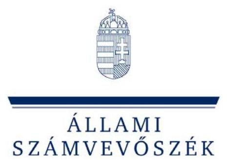

# JELENTÉS 

a hazai és uniós forrásból finanszírozott, munkahelyteremtést és -megőrzést elősegítő támogatások rendszerének ellenőrzéséről

---

# Állami Számvevőszék 

Iktatószám: V-2006-148/2011-2012.
Témaszám: 1022
Vizsgálat-azonosító szám: V0545

## Az ellenőrzést felügyelte:

Dr. Zöldréti Attila
számvevő igazgatóhelyettes
Holman Magdolna
számvevő osztályvezető-főtanácsos
Az ellenőrzést vezette:
Bartolák Márta
számvevő tanácsos
Az összefoglaló jelentést készítették:
Fekete Anikó Gyöngyi
számvevő
Dr. Korbuly Andrea
számvevő tanácsos
Gombás István
számvevő
Salamin Viktor
számvevő

## Az ellenőrzést végezték:

| Béres László   számvevő | Burenzsargal   Narantuja   számvevő tanácsos | Dancsóné Kuron   Ildikó   számvevő tanácsos |
| :-- | :-- | :-- |
| Éva Katalin   számvevő tanácsos | Fekete Anikó Gyöngyi   számvevő | Gombás István   számvevő |
| Holló András   számvevő | Dr. Korbuly Andrea   számvevő tanácsos | Dr. Láng Ágnes   Krisztina   számvevő |
| Molnár Istvánné   számvevő tanácsos | Papp József   számvevő tanácsos | Salamin Viktor   számvevő |
| Sápi Henriett   számvevő | Szöllősiné Hrabóczki   Etelka   számvevő tanácsos | Villányi Antal   számvevő tanácsos |

---

# A témához kapcsolódó eddig készített számvevőszéki jelentések: 

## címe

Jelentés az uniós támogatások hazai monitoring és ellenőrzési ..... 0723
rendszere múködésének ellenőrzéséről
Jelentés a közmunkaprogramok támogatására fordított pénzeszkö- ..... 0732
zök hasznosulásának ellenőrzéséről
Jelentés a gazdaságfejlesztés állami eszközrendszere múködésének ..... 0802
ellenőrzéséről
Jelentés a Nemzeti Fejlesztési Terv végrehajtásának ellenőrzéséről ..... 1110
Jelentés a Magyar Köztársaság 2010. évi költségvetése végrehajtá- ..... 1117
sának ellenőrzéséről

---

# TARTALOMJEGYZÉK 

BEVEZETÉS ..... 17
I. ÖSSZEGZŐ MEGÁLLAPÍTÁSOK, KÖVETKEZTETÉSEK, JAVASLATOK ..... 24
II. RÉSZLETES MEGÁLLAPÍTÁSOK ..... 35

1. A foglalkoztatáspolitika feltételrendszerének kialakítása, átláthatósága és összhangja ..... 35
1.1. A jogszabályi környezet ..... 35
1.2. A foglalkoztatáspolitikáért felelős miniszter koordináló szerepe, a feladat- és hatáskörök kialakítása ..... 38
1.3. A foglalkoztatáspolitikát meghatározó hosszú és középtávú stratégiák kialakítása, a támogatási programok illeszkedése ..... 42
2. A támogatási programok feltételrendszere ..... 45
2.1. A támogatások összhangja ..... 45
2.2. A foglalkoztatási prioritások, valamint a területi és strukturális kiegyenlítődés szempontjainak érvényesülése az értékelési és a döntési folyamat során ..... 46
2.3. A foglalkoztatási kötelezettség érvényesülése ..... 50
2.4. Források rendelkezésre állása, forrásallokáció ..... 52
2.5. Az indikátorrendszer kialakítása ..... 54
2.6. A gazdasági válság foglalkoztatási hatásainak enyhítésére tett intézkedések ..... 57
3. A támogatási programok eredményessége ..... 59
4. A támogatási programok ellenőrzési, nyomonkövetési, beszámolási és értékelési rendszerének eredményessége és összehangoltsága ..... 70
4.1. Az ellenőrzési rendszer kialakítása, működése, a tapasztalatok hasznosulása ..... 70
4.2. Monitoring és beszámolási rend kialakítása és múködése ..... 73
5. A korábbi ÁSZ vizsgálatok javaslatainak hasznosulása ..... 80

---

# MELLÉKLETEK 

1. számú A döntéshozói beavatkozások rendszere és szintjei a munkaerő-piaci feszültségek kezelésében
2. számú Az MPA felhasználásának központi döntési mechanizmusa
3. számú Áttekintés az ellenőrzéssel érintett programok és a forrásokat elosztó intézmények kapcsolatáról
4/a. számú A munkahely-teremtési programok forrás és létszámadatai (2004-2010)
4/b. számú A munkahely-megőrzési programok forrás és létszámadatai (2004-2010)
4/c. számú A hátrányos helyzetűek munkába vonását szolgáló egyéb aktív eszközök és programok forrás és létszámadatai (2004-2010)
4/d. számú A megváltozott munkaképességűek foglalkoztatásának támogatását szolgáló programok forrás és létszámadatai (2004-2010)
4/e. számú A közfoglalkoztatási programok forrás és létszámadatai (2004-2010)
4. számú Az ellenőrzés hatókörét képező munkahelyteremtő és -megőrző, illetve a támogatott munkahelyek bővítésére vonatkozó programok
5. számú A munkahelyteremtést és -megőrzést, illetve a támogatott munkahelyek bővítését megvalósító programok forrásai és célkitűzései támogatási terület szerinti rendezésben
7/a. számú Dr. Biró Marcell közigazgatási államtitkár úr észrevétele
7/b. számú Válaszlevél Dr. Navracsics Tibor közigazgatási és igazságügyi miniszter úr részére
7/c. számú Dr. Matolcsy György nemzetgazdasági miniszter úr észrevétele
7/d. számú Dr. Pintér Sándor belügyminiszter úr észrevétele
7/e. számú Dr. Réthelyi Miklós nemzeti erőforrás miniszter úr észrevétele
7/f. számú Németh Lászlóné nemzeti fejlesztési miniszter asszony észrevétele
7/g. számú Dr. Fazekas Sándor vidékfejlesztési miniszter úr észrevétele
7/h. számú Petykó Zoltán nemzeti fejlesztési ügynökség elnöke észrevétele
7/i. számú Válaszlevél Petykó Zoltán nemzeti fejlesztési ügynökség elnöke részére

---

# RÖVIDÍTÉSEK JEGYZÉKE 

| AVOP | Agrár- és Vidékfejlesztési Operatív Program |
| :--: | :--: |
| ÁFSz | Állami Foglalkoztatási Szolgálat |
| ÁROP | Államreform Operatív Program |
| DDOP | Dél-dunántúli Operatív Program |
| DDRMK | Dél-dunántúli Regionális Munkaügyi Központ |
| EB | Európai Bizottság |
| EK | Európai Közösség |
| EKD | egyedi kormánydöntésen alapuló gazdaságfejlesztési beruházások |
| EMIR | Egységes Monitoring Információs Rendszer |
| EMK | Egységes Múködési Kézikönyv |
| EMVA | Európai Mezőgazdasági Vidékfejlesztési Alap |
| ERFA | Európai Regionális Fejlesztési Alap |
| ESZA | Európai Szociális Alap |
| ESZA Nkft. | ESZA Társadalmi Szolgáltató Nkft. |
| EU | Európai Unió |
| ÉAOP | Észak-alföldi Operatív Program |
| ÉARFÜ | Észak-alföldi Regionális Fejlesztési Ügynökség |
| ÉARMK | Észak-alföldi Regionális Munkaügyi Központ |
| FA | foglalkoztatási alaprész |
| FH | Foglalkoztatási Hivatal |
| Flt. | az 1991. évi IV. törvény a foglalkoztatás elősegítéséről és a munkanélküliek ellátásáról |
| FMM | Foglalkoztatáspolitikai és Munkaügyi Minisztérium |
| FSzH | Foglalkoztatási és Szociális Hivatal |
| GOP | Gazdaságfejlesztési Operatív Program |
| GVOP | Gazdasági Versenyképesség Operatív Program |
| HITA | Hungarian Investment and Trade Agency (Nemzeti Külgazdasági Hivatal) |
| IIER | Integrált Igazgatási és Ellenőrzési Rendszer |
| IH | Irányító Hatóság |
| IMK | Interaktív Múködési Kézikönyv |
| IR | Integrált Rendszer |
| Ket. | a 2004. évi CXL. törvény a közigazgatási hatósági eljárás és szolgáltatás általános szabályairól |
| KIM | Közigazgatási és Igazságügyi Minisztérium |
| kkv | kis- és középvállalkozás |
| KMOP | Közép-magyarországi Operatív Program |
| KSz | Közremúködő Szervezet |
| LHH | Leghátrányosabb helyzetú (kistérségek) |
| MAT | Munkaerőpiaci Alap Irányító Testülete |
| MB | Monitoring Bizottság |

---

| MK | munkaügyi központ |
| :--: | :--: |
| MPA | Munkaerőpiaci Alap |
| MPA decFA | Munkaerőpiaci Alap foglalkoztatási alaprész decentrali-   zált kerete |
| MPA RA | Munkaerőpiaci Alap rehabilitációs alaprész |
| MüM rendelet | a 6/1996. (VII. 16.) MüM rendelet a foglalkoztatást elő-   segítő támogatásokról, valamint a Munkaerőpiaci   Alapból foglalkoztatási válsághelyzetek kezelésére   nyújtható támogatásról |
| MVH | Mezőgazdasági és Vidékfejlesztési Hivatal |
| NAP | Nemzeti Akcióprogram |
| NAV | Nemzeti Adó- és Vámhivatal |
| NEFMI | Nemzeti Erőforrás Minisztérium |
| NFM | Nemzeti Fejlesztési Minisztérium |
| NFSz | Nemzeti Foglalkoztatási Szolgálat |
| NFT | Nemzeti Fejlesztési Terv |
| NFÜ | Nemzeti Fejlesztési Ügynökség |
| NGM | Nemzetgazdasági Minisztérium |
| NRSzH | Nemzeti Rehabilitációs és Szociális Hivatal |
| NUTS | Nomenclature of Territorial Units for Statistics |
| NyDOP | Nyugat-dunántúli Operatív Program |
| NyDRMK | Nyugat-dunántúli Regionális Munkaügyi Központ |
| OECD | Gazdasági Együttmúködési és Fejlesztési Szervezet   (Organisation for Economic Co-operation and   Development) |
| OFA | Országos Foglalkoztatási Közalapítvány |
| OP | Operatív Program |
| ORSZI | Országos Rehabilitációs és Szociális Szakértői Intézet |
| RMK | Regionális Munkaügyi Központ |
| ROP | Regionális Operatív Program |
| SMART | Specific, Measurable, Available, Relevant, Time-based |
| SzMM | Szociális és Munkaügyi Minisztérium |
| SzMSz | Szervezeti és Múködési Szabályzat |
| TÁMOP | Társadalmi Megújulás Operatív Program |
| ÚMFT | Új Magyarország Fejlesztési Terv |
| ÚMVP | Új Magyarország Vidékfejlesztési Program |
| ÚSZT | Új Széchenyi Terv |
| VM | Vidékfejlesztési Minisztérium |

---

# ÉRTELMEZŐ SZÓTÁR 

aktív foglalkoztatáspolitikai eszközök
aktivitási szint (aktivitási ráta, aktivitási arány)
átmeneti támogatás
bejelentett betöltetlen álláshelyek száma
csekély összegű (de minimis) támogatás
csoportmentességi rendelet
érintett létszám

A munkanélküliség megelőzésére és kezelésére, a munkahely megőrzésére és a foglalkoztatottság emelésére szolgáló, a mun-kaerő-piacon hátrányos helyzetűeknek, a munkanélkülieknek és a munkában állóknak nyújtott képzések és átképzések, foglalkoztatás bővítését szolgáló támogatások, az álláskeresők vállalkozóvá válását elősegítő támogatások, munkahelyteremtés és munkahelymegőrzés támogatása, a megváltozott munkaképességű személyek foglalkoztatásának támogatása, munkaerőpiaci programok támogatása, egyes általánostól eltérő foglalkoztatási formák támogatása. (Forrás: 1991. évi IV. törvény)
A gazdaságilag aktívak aránya a 15-64 éves népességen belül. (Forrás: KSH Módszertan)

A 6/1996. (VII. 16.) MüM rendelet 27. § (1) bek. w) pontja szerint: a 85/2004. (IV. 19.) Korm. rendelet 23/A. §-ában, illetve 2011. március 23 -tól a $37 / 2011$. (III. 22.) Korm. rendelet 27. $\S$ ában foglaltakkal összhangban nyújtott támogatás.
Az állami foglalkoztatási szervhez bejelentett, munkaközvetítésre rendelkezésre álló munkalehetőségek száma az időszak végén. (Forrás: KSH Módszertan) A munkaadónak - az Flt. 8. § (5), 2009. január 1-jétől (6) bek. b.) pontjában foglaltak szerint - a munkaerőigényéről és annak megszűnéséről az NFSz felé bejelentési kötelezettsége van.
Az Európai Közösséget létrehozó Szerződés 87. és 88. cikkének a de minimis támogatásokra való alkalmazásáról szóló 1998/2006/EK bizottsági rendelet 2. cikke szerinti támogatás. A rendelet értelmében egy vállalkozásnak bármilyen forrásból, fenti jogcímen odaítélt támogatások támogatástartalma három egymást követő év alatt nem haladhatja meg a 200000 eurónak, közúti szállítás esetén 100000 eurónak megfelelő forint összeget.
A jelenleg hatályos 800/2008/EK bizottsági rendelet I. fejezet 6. cikk (1) bekezdése szerint:
„E rendelet nem alkalmazható azokra az egyedi támogatásokra, akár ad hoc támogatásként, akár program alapján nyújtották, amelyek bruttó támogatástartalma meghaladja a következő határértékeket:
a hátrányos helyzetű munkavállalók elhelyezkedéséhez nyújtott támogatás: évente 5 millió euró vállalkozásonként;
a fogyatékkal élő munkavállalók foglalkozatásához bérköltségségek formájában nyújtott támogatás: évente 10 millió euró vállalkozásonként."
Az aktív foglalkoztatási programokban, eszközökben a tárgyidőszak alatt legalább egy napon részt vettek létszáma. (Forrás: ÁFSz statisztika)

---

EU-27
fenntartási kötelezettség
foglalkoztatási alaprész
foglalkoztatási ráta
foglalkoztatott
gazdaságilag aktív népesség
gazdaságilag nem aktív népesség (inaktívak)

Az Európai Unió tagállamai a 2004. május 1-jén csatlakozott 10 tagállammal, valamint a 2007. január 1-jén csatlakozott Bulgáriával és Romániával együtt. (Forrás: Az Európai Unió portálja)
A 77/2007. (VII. 30.) FVM rendelet az Új Magyarország Vidékfejlesztési Programra meghatározott előirányzatok felhasználásának állami támogatási szempontú szabályairól 10. § (8) bekezdése szerint: „Munkahelyteremtést szolgáló beruházás esetén a támogatás igénybevételének feltétele, hogy az ügyfél azokat az új munkahelyeket, amelyekhez kapcsolódóan az elszámolható bérköltséget a támogatási intenzitás számítása során figyelembe vette, a beruházás befejezésétől számított három éven belül létre kell hozni és minden munkahelyet legalább öt évig, kis- és középvállalkozások esetén három évig, azaz a kötelező fenntartási időszak alatt az érintett régióban fenntartja."
Az Egyedi kormánydöntésen alapuló gazdaságfejlesztési beruházásoknál (EKD) nyújtott támogatások esetén a 8/2007. (I. 24.) GKM rendelet 10. § (2) bekezdése szerint:
„Az újonnan létrehozott munkahelyeket a beruházó öt, a kkv beruházó három éven keresztül köteles fenntartani."
A munkahely-fenntartási kötelezettséget a Gazdaságfejlesztési Operatív Program (GOP) pályázatai esetében az egyes konstrukciókhoz tartozó pályázati útmutatók egyedien tartalmazzák.
Az Flt. 39. § (3) bekezdés c) pontja szerint:
„A Munkaerőpiaci Alap azon kiadási jogcíme, melyből a foglalkoztatást elősegítő támogatások, a nem az állami foglalkoztatási szerv által végzett munkaerő-piaci szolgáltatások, az állami felnőttképzési intézmény egyes képzési feladatai, a MAT múködtetése, a regionális munkaügyi tanácsok és a társadalmi párbeszéd intézményei múködéséhez való hozzájárulás, valamint a keresetpótló juttatással kapcsolatos postaköltségek finanszírozása valósul meg."
A munkaképes korú lakosság (15-64 évesek) körében a foglalkoztatottak aránya. (Forrás: KSH Módszertan)
A KSH megkérdezésen alapuló munkaerő-felmérésében foglalkoztatottnak számít az adott héten legalább egyórányi, jövedelmet biztosító munkát végző, vagy munkával rendelkező, de átmenetileg nem dolgozó (pl.: beteg, szabadságon levő) személy. (Forrás: KSH Módszertan)
Azok, akik megjelennek a munkaerőpiacon, azaz a foglalkoztatottak és a munkanélküliek. (Forrás: KSH Módszertan)
Azon személyek, akik sem a foglalkoztatottak, sem a munkanélküliek közé nem sorolhatók (pl.: tanulók, nem dolgozó nyugdíjasok, háztartásbeliek, gyermekgondozási ellátást igénybe vevők). (Forrás: KSH Módszertan)
Azok, akik a vonatkozási héten nem dolgoztak, illetve nem volt rendszeres jövedelmet biztosító munkájuk, és nem is kerestek munkát, vagy kerestek, de nem tudtak volna munkába állni.

---

hátrányos helyzetú kistérség, település
hátrányos helyzetú munkavállaló

A kedvezményezett térségek besorolásáról szóló 311/2007. (XI. 17.) Korm. rendelet 2. mellékletében meghatározott kistérségek, a társadalmi-gazdasági és infrastrukturális szempontból elmaradott, illetve az országos átlagot jelentősen meghaladó munkanélküliséggel sújtott települések jegyzékéről szóló 240/2006. (XI. 30.) Korm. rendelet mellékletében megjelölt hátrányos helyzetú települések, valamint a munkaerő-piaci szempontból hátrányos helyzetú régiók. A munkaerő-piaci szempontból hátrányos helyzetú régiókat az adott pályázat útmutatója sorolja fel.
6/1996. (VII. 16.) MüM rendelet 11. § (2) bekezdés a) pontja szerint:
„A bértámogatás megállapításakor hátrányos helyzetú személynek kell tekinteni azt a személyt, aki
aa) álláskereső, és

- legfeljebb alapfokú iskolai végzettséggel rendelkezik, vagy
- a foglalkoztatás megkezdésekor az ötvenedik életévét betöltötte, vagy
- 25. életévét be nem töltött pályakezdő álláskereső, vagy
- a nyilvántartásba vételt megelőző hat hónapban nem folytatott rendszeres - az Flt.-ben meghatározott kereső tevékenységet, vagy a munkaügyi központ legalább huszonnégy hónapja álláskeresőként tartja nyilván,
- a saját háztartásában legalább egy 18 évesnél fiatalabb gyermeket egyedül nevel, vagy
- a foglalkoztatás megkezdését megelőző 12 hónapon belül gyermekgondozási segélyben, gyermeknevelési támogatásban, illetőleg terhességi-gyermekágyi segélyben, gyermekgondozási dijban vagy ápolási dijban részesült, vagy
- a foglalkoztatás megkezdését megelőző 12 hónapon belül előzetes letartóztatásban volt, szabadságvesztés, vagy elzárás büntetését töltötte;
ab) olyan munkavállaló, akit munkahelyének elvesztése fenyeget, és
- az ötvenedik életévét betöltötte, vagy
- életkorra tekintet nélkül legfeljebb alapfokú iskolai végzettséggel rendelkezik;
800/2008/EK bizottsági rendelet 2. cikk 18. pontja szerint:
hátrányos helyzetú munkavállaló az a személy, aki:
- az előző 6 hónapban nem állt rendszeresen fizetett alkalmazásban; vagy
- nem szerzett középfokú végzettséget vagy szakképesítést (ISCED 3); vagy
- 50 éven felüli személy; vagy
- egy vagy több eltartottal egyedül élő felnőtt; vagy
- valamely tagállam olyan ágazatában vagy szakmájában dolgozik, amelyben $25 \%$-kal nagyobb a nemi egyensúly-

---

indikátor
irányító hatóság
közcélú munka
közfoglalkoztatás
hiány, mint e tagállam valamennyi gazdasági ágazatára jellemző átlagos egyensúlyhiány, és ezen alulreprezentált nemi csoportba tartozik; vagy

- egy tagállam etnikai kisebbségéhez tartozik, és akinek szakmai, nyelvi képzésének vagy szakmai tapasztalatának megerősítésére van szüksége ahhoz, hogy javuljanak munkába állási esélyei egy biztos munkahelyen."
Olyan jelzőszám, amelynek segítségével szemléltetni lehet egy célkitűzés megvalósításának adott szintjét. Jelenthet egy felhasznált erőforrást, egy elért hatást, egy minőségi szintet, illetve valamilyen egyéb változást.
A Tanács 2006. július 11-i 1083/2006/EK rendelete 59. cikk (1) bekezdésének a) pontja, valamint 60 . cikke szerint:
„az EU-tagállam által az operatív program irányítására kijelölt nemzeti, regionális, vagy helyi hatóság, illetve közjogi, vagy magánszerv, mely felelős az operatív program hatékony és eredményes pénzgazdálkodás elvével összhangban történő irányításáért és végrehajtásáért".
Az 1993. évi III. törvény a szociális igazgatásról és szociális ellátásokról (2011. január 1-jétől hatálytalan) 36. §-ában (2008. december 31-ig 37/H. §-ában) meghatározott feladatok ellátása.
„(2) Közcélú munkavégzés keretében
a) az a települési önkormányzati feladat, amelynek ellátásáról a települési önkormányzat jogszabály vagy önkéntes vállalása alapján költségvetési szerv, önkormányzat többségi tulajdonában álló gazdasági társaság, társadalmi szervezet útján gondoskodik,
b) költségvetési szerv, önkormányzat többségi tulajdonában álló gazdasági társaság, társadalmi szervezet által ellátott, jogszabályon alapuló helyi önkormányzati feladat, amelynek ellátásában a települési önkormányzat megállapodás alapján közremúködik,
c) költségvetési szerv, a Magyar Állam egyszemélyes tulajdonában álló gazdasági társaság, az állam többségi tulajdonában álló gazdálkodó szervezet vagy társadalmi szervezet által jogszabály alapján ellátott állami feladat, amelynek ellátásában a települési önkormányzat megállapodás alapján közremúködik, továbbá
d) a Kormány rendeletében meghatározottak szerint a szük-ség-, veszély- vagy katasztrófahelyzetből eredő kár esetén a helyreállítással kapcsolatos feladat
látható el."
Az aktív korú, munkaképes, azonban a munkaerőpiacról kiszorult munkavállalók foglalkoztatási lehetőségét megteremtő foglalkoztatási forma. A közfoglalkoztatás kereteit a közfoglalkoztatásról és a közfoglalkoztatáshoz kapcsolódó, valamint egyéb törvények módosításáról szóló 2011. évi CVI. törvény rögzíti. A törvény alapján 2011. január 1-jétől a közmunka-

---

közhasznú munka
közmunkaprogramok
közremúködő szervezet
kulcsindikátor
megváltozott munkaképességú személy
programok, illetve a közhasznú és közcélú munka helyett az egységesen szabályozott közfoglalkoztatás támogatásának bevezetésére került sor.
Az Flt. 16/A. § (1) bekezdésében foglalt feltételeknek megfelelő tevékenység.
„Annak a munkaadónak, aki a lakosságot vagy a települést érintő közfeladat ellátása érdekében, a munkaügyi központ által kiközvetített munkanélküli foglalkoztatását munkaviszony keretében vállalja úgy, hogy ezzel a foglalkoztatottainak számát a közhasznú foglalkoztatás ideje alatt - a foglalkoztatás megkezdését megelőző havi átlagos statisztikai állományi létszámához képest - bővíti (közhasznú munka), a foglalkoztatásból eredő közvetlen költség legfeljebb 70\%-ának megfelelő átmeneti - legfeljebb folyamatosan egy évi időtartamra - támogatás nyújtható, ha a közhasznú munka keretében végzett szolgáltatás ellenértékeként más szervtől díjazásban nem részesül." (hatálytalan 2011. január 1-jétől)
A 49/1999. (III. 26.) Korm. rendelet a közmunkaprogramok támogatási rendjéről 1. § (2) bekezdése szerint (hatálytalan 2011. január 1-jétől):
„a) a törvény által előírt állami feladat ellátásának elősegítésére irányuló program,
b) a törvény vagy önkormányzati rendelet által előírt, helyi önkormányzati vagy kisebbségi önkormányzati feladat ellátásának az önkormányzat, illetve azok társulása múködési területén belüli elősegítésére irányuló program, illetve
c) az Országgyúlés vagy a Kormány által meghatározott cél elérésére irányuló program, feltéve, hogy az Flt. 58. §-a (5) bekezdésének d) pontjában meghatározott álláskeresők és a szociális igazgatásról és szociális ellátásokról szóló 1993. évi III. törvényben foglaltak szerint az aktív korúak ellátása keretében rendelkezésre állási támogatásra jogosult számára munkaviszony munkaalkalmat teremt, illetőleg a munkavégzéshez kapcsolódóan foglalkoztatást elősegítő képzést biztosít."
A Tanács 2006. július 11-i 1083/2006/EK rendelete 2. cikk 6. pontja szerint:
„bármely közjogi vagy magánjogi intézmény, amely egy irányító, vagy az igazoló hatóság illetékessége alatt jár el, vagy ilyen hatóság nevében hajt végre feladatokat a múveleteket végrehajtó kedvezményezettek vonatkozásában".
A stratégiai célokhoz kötődő, meghatározó jelentőségű indikátor.
Flt. 58. § (5) bek. m) pontja szerint:
„Megváltozott munkaképességú személy, aki testi vagy szellemi fogyatékos, vagy akinek az orvosi rehabilitációt követően munkavállalási és munkahely-megtartási esélyei testi vagy szellemi károsodása miatt csökkennek."
6/1996. (VII. 16.) MüM rendelet szerint:
„a bértámogatás megállapításakor megváltozott munkaképes-

---

ségű személynek kell tekinteni

- azt a személyt, aki rehabilitációs járadékban részesül, továbbá
- azt az álláskeresőt, aki a megváltozott munkaképességű munkavállalók foglalkoztatásához nyújtható költségvetési támogatásról szóló 177/2005. (IX. 2.) Korm. rendelet 2. § e) pontjában meghatározott feltételeknek megfelel."
A megváltozott munkaképességű munkavállalók foglalkoztatásához nyújtható költségvetési támogatásról szóló 177/2005. (IX. 2.) Korm. rendelet 2. § e) pontja szerint megváltozott munkaképességű munkavállaló az a munkaviszony keretében foglalkoztatott munkavállaló, akinek munkaszerződés szerinti napi munkaideje a napi négy órát eléri, ha:
„ea) a munkaképesség-csökkenés - az Országos Rehabilitációs és Szociális Szakértői Intézet (a továbbiakban: ORSZI), 2007. augusztus 15-ét megelőzően az Országos Egészségbiztosítási Pénztár Országos Orvosszakértői Intézete (a továbbiakban: OOSZI) szakvéleménye, illetőleg 2001. január 1-jét megelőzően, vasutas biztosítottak esetében a Magyar Államvasutak Orvosszakértői Intézetének szakvéleménye szerint - 50-66 százalékos mértékű, illetőleg az egészségkárosodás - az ORSZI szakvéleménye szerint - 40-49 százalékos mértékü, vagy
eb) a munkaképesség-csökkenés - az ORSZI vagy az OOSZI szakvéleménye, illetőleg 2001. január l-jét megelőzően, vasutas biztosítottak esetében a Magyar Államvasutak Orvosszakértői Intézetének szakvéleménye szerint - 67-100 százalékos mértékű, vagy
ec) az egészségkárosodás - az ORSZI szakvéleménye szerint - 79 százalékot meghaladó mértékű, vagy
ed) az egészségkárosodás - az ORSZI szakvéleménye szerint - 5079 százalékos mértékű, és ezzel összefüggésben a jelenlegi, vagy az egészségkárosodását megelőző munkakörében, illetve a képzettségének megfelelő más munkakörben való foglalkoztatásra rehabilitáció nélkül nem alkalmas, azonban az ORSZI szakvéleménye alapján rehabilitációja nem javasolt, vagy
ee) a fogyatékos személyek jogairól és esélyegyenlőségük biztosításáról szóló 1998. évi XXVI. törvény (a továbbiakban: Ftv.) 23. §-a (1) bekezdésének a) pontja alapján látási fogyatékosnak minősül, vagy a vakok személyi járadékában részesül, vagy
ef) az Ftv. 23. §-a (1) bekezdésének d) pontja alapján a személyiség egészét érintő fejlődés átható zavara miatt fogyatékossági támogatásban részesül,
eg) külön jogszabály szerint súlyos értelmi fogyatékosnak minősül és erre tekintettel a magánszemélyek jövedelemadójáról szóló külön törvény szerint adóalapot csökkentő kedvezmény igénybevételére jogosult, vagy
eh) siket vagy súlyosan nagyothalló, halláskárosodása audiológiai szakvélemény szerint a 60 decibel hallásküszöb értékét eléri vagy meghaladja, vagy
ei) a súlyos mozgáskorlátozottak közlekedési kedvezményeiről szó-

---

munkaerő-piaci program
munkahelyteremtés
munkajogi létszám
munkanélküli
ló külön jogszabály szerint súlyos mozgáskorlátozottnak minősül, vagy
ej) az egészségkárosodás - az ORSZI szakvéleménye szerint - 50-79 százalékos mértékü, és ezzel összefüggésben a jelenlegi, vagy az egészségkárosodását megelőző munkakörében, illetve a képzettségének megfelelő más munkakörben való foglalkoztatásra rehabilitáció nélkül nem alkalmas és rehabilitálható, vagy
ek) az ea)-ej) pontokban meghatározott mértékű munkaképességcsökkenés, egészségkárosodás, illetőleg fogyatékosság nem állapítható meg, azonban az OOSZI, vagy az ORSZI szakvéleménye szerint jelenlegi munkakörében vagy tanult foglalkozásában, illetőleg más munkakörben vagy foglalkozás keretében személyre szóló rehabilitáció megvalósításával foglalkoztatható tovább."
Flt. 19/B. § (1) bekezdése szerint:
„A Munkaerőpiaci Alap előre meghatározott, összetett célok érdekében biztosíthatja olyan programok megvalósításának pénzügyi fedezetét, amelyek térségi foglalkoztatási célok megvalósítására, munkaerő-piaci folyamatok befolyásolására, valamint a munkaerőpiacon hátrányos helyzetben lévő rétegek foglalkoztatásának elősegítésére irányulnak."
6/1996. (VII. 16.) MüM rendelet 26/A. § (1) bekezdése szerint:
„Az Flt. 19/B. §-ában meghatározott program magában foglalhatja az Flt. és végrehajtási szabályai által tartalmazott mun-kaerő-piaci szolgáltatásokat, valamint a Munkaerőpiaci Alap foglalkoztatási és rehabilitációs alaprészéből nyújtható foglalkoztatást elősegítő támogatásokat."
6/1996. (VII. 16.) MüM rendelet 26/C. § (1) bekezdése szerint:
„A program lehet:

- központi munkaerő-piaci program,
- regionális munkaerő-piaci program,
- megyei munkaerő-piaci program."

Egy meghatározott létesítményben közvetlenül alkalmazottak számának nettó növekedése egy bázis időszak (pl.: az előző 12 hónap, szerződéskötés napja) átlagával összehasonlítva. (Forrás: Iránymutatás a 2007-2013 közötti időszakra vonatkozó nemzeti regionális támogatásokról (2006/C 54/08), az EU hivatalos lapja)
A statisztikai elszámolásokban „munkajogi létszámként" nevesített csoportba csak a munkaviszonyban állók tartoznak bele. Megfigyelésére csak esetenként kerül sor, általában az év meghatározott napjára (pl. december 31. eszmei időpontra) vonatkoztatva. (Forrás: KSH Útmutató a munkaügyi-statisztikai adatszolgáltatáshoz)
Munkanélkülinek tekintendő az a személy, akire egyidejűleg érvényesek a következő feltételek: az adott héten nem dolgozott (s nincs olyan munkája, amelytől átmenetileg távol volt), aktívan keresett munkát a kikérdezést megelőző négy hét folyamán, rendelkezésre áll, azaz két héten belül munkába tudna

---

munkanélküliségi ráta
nyilvántartott pályakezdő álláskeresők
operatív program
ökonometria
passzív munkanélküli
prioritás
rehabilitációs alaprész

SMART kritériumrendszer
állni, ha találna megfelelő állást vagy talált már munkát, ahol 30 napon belül dolgozni kezd. (Forrás: KSH Módszertan)
A munkanélkülieknek a megfelelő korcsoportba tartozó gazdaságilag aktív népességen belüli aránya. (Forrás: KSH Módszertan)
Az Flt. 58. § (5) k) pontja szerint 2007. január 1-jétől „k) pályakezdő álláskereső: a 25. életévét - felsőfokú végzettségű személy esetén 30. életévét - be nem töltött, a munkaviszony létesítéséhez szükséges feltételekkel rendelkező, az állami foglalkoztatási szerv által nyilvántartott álláskereső, feltéve, ha munkanélküli járadékra a tanulmányainak befejezését követően nem szerzett jogosultságot. Nem tekinthető pályakezdő álláskeresőnek, aki

1. terhességi-gyermekágyi segélyben, gyermekgondozási díjban, illetőleg gyermekgondozási segélyben részesül,
2. előzetes letartóztatásban van, szabadságvesztés, illetve elzárás büntetését tölti,
3. sor- vagy tartalékos katonai szolgálatot, továbbá polgári szolgálatot teljesít."
A Tanács 2006. július 11-i 1083/2006/EK rendelete 2. cikk 1. pontja szerint:
„a tagállam által benyújtott és az Európai Bizottság által elfogadott dokumentum, amely összefüggő prioritások alkalmazásával fejlesztési stratégiát fogalmaz meg, amelynek megvalósításához valamely alapból, illetve a „konvergencia" célkitúzés esetében a Kohéziós Alapból és az Európai Regionális Fejlesztési Alapból (ERFA) támogatást vesznek igénybe."
A közgazdaságtan önálló tudománnyá fejlődött részterülete, amelynek célja a gazdasági jelenségek matematikai jellegű elemzése, továbbá a közgazdasági elméletek és modellek tapasztalati adatok alapján történő igazolása, illetve megcáfolása.
A gazdaságilag nem aktívak közül az, aki szeretne dolgozni és két héten belül munkába tudna állni, ha találna megfelelő állást, de nem keres munkát, mert foglalkoztatását reménytelennek látja. (Forrás: KSH Módszertan)
A prioritás a célok elérését szolgáló programok kiemelt szándékait, a későbbi beavatkozási területeit csoportosítva tartalmazza. A területfejlesztési prioritások komplexek, átfogóan több ágazati intézkedést jelenítenek meg, kifejezetten egyes térségekre vagy térségtípusokra is irányulhatnak.
A Munkaerőpiaci Alap azon kiadási jogcíme, ami a foglalkozási rehabilitációs elősegítő programok, foglalkozási rehabilitációs elősegítő közalapítványok támogatására, valamint az alaprész kezelésével, múködtetésével kapcsolatos költségek fedezetére szolgál. Az alaprész 2011. január 1-jétől megszűnt. (Forrás: Flt. 39. § (2011. január 1-jétől hatálytalan) (3) bek. f) pontja.)
Az indikátorokkal szemben támasztott követelményrendszer. Ennek megfelelően az indikátor:

---

- specifikus, azaz adott dologra jellemző;
- mérhető;
- elérhető, azaz rendelkezésre áll;
- releváns, azaz a jelenség szempontjából lényeges;
- időhöz kötött, azaz az adott időpontra vonatkozó információt tartalmazza.
szinergikus hatás
szolidaritási alaprész
támogatástartalom

A munkahelyteremtő, illetve -megőrző programok összhatása nagyobb, mint az egyes programok egyenkénti hatásainak öszszege.
Az Flt. 39. §. (3) bekezdés a) pontja szerint: „a munkanélkülieket, álláskeresőket (beleértve az álláskeresővé vált vállalkozókat is) - az Flt. alapján - megillető ellátások fedezetét, valamint a válság miatt létszámleépítéssel érintett munkavállalók foglalkoztatásának elősegítését biztosító kiadási jogcím".
A 85/2004. (IV. 19.) Korm. rendelet 1. § 31. pontja, illetve 2011. március 23 -tól a 37/2011. (III. 22.) Korm. rendelet 2. § 19. pontja szerint a kedvezményezett számára, akár több forrásból nyújtott állami támogatásnak a rendelet 2 . számú mellékletben foglalt módszer alapján számított értéke.

---

# UNIÓS JOGI AKTUSOK ÉS HAZAI JOGSZABÁLYOK GYŰJTEMÉNYE 

## Törvények

2010. évi CVI. törvény
2007. évi XCII. törvény
2007. évi XVII. törvény
2004. évi CXL. törvény
2004. évi CXXIII. törvény
1998. évi XXVI. törvény
1993. évi III. törvény
1991. évi IV. törvény
37/2011. (III. 22.) Korm. rendelet

4/2011. (I. 28.) Korm. rendelet

375/2010. (XII. 31.) Korm. rendelet
315/2010. (XII. 27.) Korm. rendelet
73/2009. (IV. 8.) Korm. rendelet
70/2009. (IV. 2.) Korm. rendelet

311/2007. (XI. 17.) Korm. rendelet
291/2006. (XII. 23.) Korm. rendelet
a közfoglalkoztatásról és a közfoglalkoztatáshoz kapcsolódó, valamint egyéb törvények módosításáról
a Fogyatékossággal élő személyek jogairól szóló (ENSZ) egyezményhez kapcsolódó Fakultatív Jegyzőkönyv kihirdetéséről
a mezőgazdasági, agrár-vidékfejlesztési, valamint halászati támogatásokhoz és egyéb intézkedésekhez kapcsolódó eljárás egyes kérdéseiről
a közigazgatási hatósági eljárás és szolgáltatás általános szabályairól
a pályakezdő fiatalok, az ötven év feletti munkanélküliek, valamint a gyermek gondozását, illetve a családtag ápolását követően munkát keresők foglalkoztatásának elősegítéséről, továbbá az ösztöndíjas foglalkoztatásról
a fogyatékos személyek jogairól és esélyegyenlőségük biztosításáról
a szociális igazgatásról és szociális ellátásokról
a foglalkoztatás elősegítéséről és a munkanélküliek ellátásáról

## Rendeletek

az európai uniós versenyjogi értelemben vett állami támogatásokkal kapcsolatos eljárásról és a regionális támogatási térképről
a 2007-2013 programozási időszakban az Európai Regionális Fejlesztési Alapból, az Európai Szociális Alapból és a Kohéziós Alapból származó támogatások felhasználásának rendjéről
a közfoglalkoztatáshoz nyújtható támogatásokról
a Nemzeti Foglalkoztatási Szolgálatról
a Foglalkoztatási és Szociális Adatbázisról
a szakképzettséggel rendelkező, pályakezdő álláskeresők munkatapasztalat-szerzésének és a létszámleépítések megelőzése érdekében a részmunkaidős foglalkoztatás támogatásáról
a kedvezményezett térségek besorolásáról
az Állami Foglalkoztatási Szolgálatról (A 315/2010. (XII. 27.) Korm. rend. 2011. I. 1-től hatályon kívül helyezte)

---

281/2006. (XII. 23.) Korm. rendelet

255/2006. (XII. 8.) Korm. rendelet

240/2006. (XI. 30.) Korm. rendelet

177/2005. (IX. 2.) Korm. rendelet
85/2004. (IV. 19.) Korm. rendelet

143/2002. (VI. 28.) Korm. rendelet
49/1999. (III. 26.) Korm. rendelet
15/2005. (IX. 2.) FMM rendelet

137/2008. (X. 18.) FVM rendelet

136/2008. (X. 18.) FVM rendelet

25/2008. (III. 7.) FVM rendelet

77/2007. (VII. 30.) FVM rendelet

23/2007. (IV. 17.) FVM rendelet

8/2007. (I. 24.) GKM rendelet
16/2006. (XII. 28.)
MeHVM-PM együttes rendelet
a 2007-2013. programozási időszakban az Európai Regionális Fejlesztési Alapból, az Európai Szociális Alapból és a Kohéziós Alapból származó támogatások fogadásához kapcsolódó pénzügyi lebonyolítási és ellenőrzési rendszerek kialakításáról
a 2007-2013 programozási időszakban az Európai Regionális Fejlesztési Alapból, az Európai Szociális Alapból és a Kohéziós Alapból származó támogatások felhasználásának alapvető szabályairól és felelős intézményeiről (A 4/2011. (I. 28.) Korm. rendelet 2011. II. 9-től hatályon kívül helyezte)
a társadalmi-gazdasági és infrastrukturális szempontból elmaradott, illetve az országos átlagot jelentősen meghaladó munkanélküliséggel sújtott települések jegyzékéről

## Rendeletek

a megváltozott munkaképességű munkavállalók foglalkoztatásához nyújtható költségvetési támogatásáról
az Európai Közösséget létrehozó Szerződés 87. cikkének (1) bekezdése szerinti állami támogatásokkal kapcsolatos eljárásról és a regionális támogatási térképről (A 37/2011. (III. 22.) Korm. rendelet 2011. III. 23-tól hatályon kívül helyezte)
a foglalkoztatáspolitikai és munkaügyi miniszter feladat- és hatásköréről
a közmunkaprogramok támogatási rendjéről (A 375/2010. (XII. 31.) Korm. rend. 2011. I. 1-től hatályon kívül helyezte)
a megváltozott munkaképességű személyek foglalkoztatásához nyújtható költségvetési támogatás megállapításának részletes szabályairól
az Európai Mezőgazdasági Vidékfejlesztési Alapból a turisztikai tevékenységek ösztönzéséhez nyújtandó támogatások részletes feltételeiről
az Európai Mezőgazdasági Vidékfejlesztési Alapból a mikrovállalkozások létrehozására és fejlesztésére nyújtandó támogatások részletes feltételeiről
az Európai Mezőgazdasági Vidékfejlesztési Alapból a kertészet korszerűsítéséhez nyújtott támogatás igénybevételének részletes feltételeiről
az Új Magyarország Vidékfejlesztési Programra meghatározott előirányzatok felhasználásának állami támogatási szempontú szabályairól
az Európai Mezőgazdasági Vidékfejlesztési Alap társfinanszírozásában megvalósuló támogatások igénybevételének általános szabályairól
a Kormány egyedi döntésével megítélhető támogatások nyújtásának szabályairól
a 2007-2013 időszakban az Európai Regionális Fejlesztési Alapból, az Európai Szociális Alapból és a Kohéziós Alapból származó támogatások felhasználásának általános eljárási szabályairól

---

6/1996. (VII. 16.) MüM rendelet

800/2008/EK Bizottság rendelete (VIII. 6.)

1998/2006/EK Bizottság rendelete (XII. 15.)
1975/2006/EK Bizottság rendelete (XII. 7.)

1083/2006/EK Tanács rendelete (VII. 11.)
a foglalkoztatást elősegítő támogatásokról, valamint a Munkaerőpiaci Alapból foglalkoztatási válsághelyzetek kezelésére nyújtható támogatásról

## EU Bizottsági rendelet

a támogatások bizonyos fajtáinak a közös piaccal összeegyeztethetőnek nyilvánításáról (általános csoportmentességi rendelet)
az Európai Közösséget létrehozó Szerződés 87. és 88. cikkének a de minimis támogatásokra való alkalmazásáról
a Bizottság 2006. december 7-i 1975/2006/EK Rendelete a vidékfejlesztési támogatási intézkedésekre vonatkozó ellenőrzési eljárások, valamint a kölcsönös megfeleltetés végrehajtása tekintetében az 1698/2005/EK tanácsi rendelet végrehajtására vonatkozó részletes szabályok megállapításáról

## EU Tanácsi rendelet

az Európai Regionális Fejlesztési Alapra, az Európai Szociális Alapra és a Kohéziós Alapra vonatkozó általános rendelkezések megállapításáról és az 1260/1999/EK rendelet hatályon kívül helyezéséről

---

# JELENTÉS 

## a hazai és uniós forrásból finanszírozott, munkahelyteremtést és -megőrzést elősegítő támogatások rendszerének ellenőrzéséről

„Magyarország törekszik megteremteni annak feltételeit, hogy minden munkaképes ember, aki dolgozni akar, dolgozhasson."

Magyarország Alaptörvénye XII. cikk (2) bekezdése

## BEVEZETÉS

A magyar gazdaság versenyképességének [bruttó hazai termékben (GDP) mért], teljesítőképességének javítása, valamint a fejlődés fenntarthatósága szempontjából kulcsindikátor a foglalkoztatás aránya. Az alacsony foglalkoztatás korlátozza a gazdaság növekedését, alkalmazkodóképességét, szűk korlátok között tartja az államháztartás bevételeit, miközben növeli a terheit (mindenekelőtt a társadalombiztosításra és általában a szociális ellátásokra fordított kiadásokat), korlátozza az adóterhek tartós mérséklésének lehetőségét, fokozza a társadalmi kirekesztés kockázatát.

Magyarországon a foglalkoztatási helyzet legfontosabb jellemzője az ala-csony munkaerő-piaci részvétel. Az alacsony foglalkoztatási ráta magas inaktivitással párosul.

A gazdaságilag inaktív népesség összetételében markáns csoportok figyelhetők meg. Az állami beavatkozások célja ezen csoportok munkaerőpiacra történő belépésének elősegítése. A 15-24 éves korosztály aránya az inaktív népességen belül - 2004-2010 között - 35\% körül mozgott. Az 55-64 év közöttiek aránya a 2004. évi 29,8\%-ról 2010-re 32,9\%-ra növekedett (1. táblázat).

## 1. táblázat

| Gazdaságilag inalátív népesség korcsoport szerinti (15-64 évesek) összetétele |  |  |  |  |  |  |  |
| :-- | :--: | :--: | :--: | :--: | :--: | :--: | :--: |
| Megnevezés | $\mathbf{2 0 0 4}$ | $\mathbf{2 0 0 5}$ | $\mathbf{2 0 0 6}$ | $\mathbf{2 0 0 7}$ | $\mathbf{2 0 0 8}$ | $\mathbf{2 0 0 9}$ | $\mathbf{2 0 1 0}$ |
| 15-24 kôzötti fiatalok (\%) | 34,6 | 35,2 | 35,4 | 35,8 | 35,2 | 35,3 | 35,3 |
| 25-54 évesek (\%) | 35,6 | 35,1 | 34,2 | 33,4 | 32,8 | 32,5 | 31,8 |
| 55-64 kôzötti idôsek aránya (\%) | 29,8 | 29,7 | 30,4 | 30,8 | 32 | 32,2 | 32,9 |

Adatforrás: KSH honkap

---

A hazai foglalkoztatatás szempontjából kulcsterület a megváltozott munkaképességü személyeknek a munka világába való visszavezetése. A megváltozott munkaképességűek foglalkoztatása csupán 12-15\%-os, míg az EU élenjáró országaiban ez az arány $40 \%$-os ${ }^{1}$.

A gazdaságilag inaktívak között magas az alacsony iskolai végzettségúek aránya, a 2004. évi 50\%-ot meghaladó arány 2010-re 42,2\%-ra változott. A diplomások körében 2004. évhez képest 2010-re jelentősen ( $2,7 \%$-kal) megnőtt az inaktívak aránya. Egy kutatás ${ }^{2}$ rámutatott továbbá a roma emberek hátrányos munkaerő-piaci helyzetére: „A romák munkaerő-piaci kirekesztődésének hátterében elsősorban a velük szemben érvényesülő diszkrimináció és a roma lakosság alacsony iskolai végzettsége és kedvezőtlen területi eloszlása áll."

A vizsgált terület horizontális jellegéből adódóan hazánkban az utóbbi években készült valamennyi stratégiai szintű dokumentum célkitűzéseiben érinti a foglalkoztatás témakörét. Ezek összefoglalását tartalmazza az 1. ábra.

1. ábra

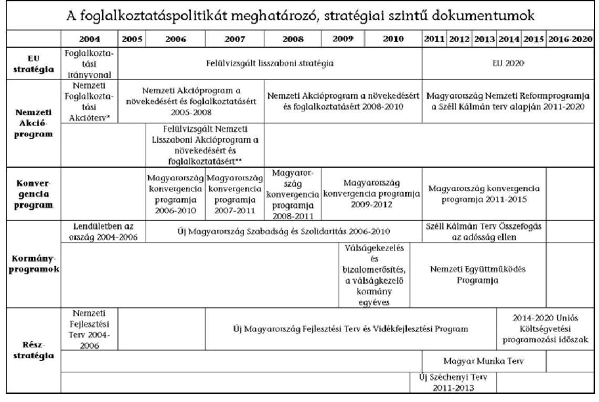

A foglalkoztatás horizontális célkitűzésként szerepel a stratégiai szintű dokumentumokban, ebből adódóan a végrehajtás intézményrendszere összetett és követte a kormányzati koncepcióváltásokat. A foglalkoztatáspolitikáért

[^0]
[^0]:    ${ }^{1}$ Nemzetgazdasági Minisztérium kiadvány, 2011. február 24. (a kiadvány az adatforrásokat nem jelölte meg)
    ${ }^{2}$ Dr. Fazekas Károly: A magyar foglalkoztatási helyzet jelene és jövője (Pénzügyi Szemle Ll. évfolyam 2006/02 szám)

---

2010 júniusa óta a nemzetgazdasági miniszter ${ }^{3}$ volt felelős. A mindenkori foglalkoztatáspolitikáért felelős miniszter kidolgozta a Kormány foglalkoztatáspolitikai koncepcióját és ellátta a foglalkoztatáspolitika koordinációjával kapcsolatos feladatokat.

A döntéshozói beavatkozások rendszerét a munkaerő-piaci feszültségek kezelésében a 1. sz. melléklet mutatja be. Az ellenőrzés időszakában további öt minisztérium látott el foglalkoztatáspolitikával kapcsolatos feladatokat. A kormányzati struktúra 2010. május 29-i változásához kapcsolódóan a megváltozott munkaképességűekkel kapcsolatos foglalkoztatáspolitikai döntések a Nemzeti Erőforrás Minisztérium (továbbiakban: NEFMI), a Kormányhivatalok szakigazgatási szerveiként működő munkaügyi központok (továbbiakban: MK) felügyelete 2011. január 1-jétől a Közigazgatási és Igazságügyi Minisztérium (továbbiakban: KIM) hatáskörébe kerültek. A közfoglalkoztatás irányítása 2011 júniusától a Belügyminisztérium hatáskörébe került. Az uniós strukturális fejlesztési programok irányítását az új kormányzati struktúrában 2010. május 29-től - a Nemzeti Fejlesztési Minisztérium (továbbiakban: NFM) látta el. Az agrártámogatási rendszer irányítását - 2010. május 29-től - a Vidékfejlesztési Minisztérium (továbbiakban: VM) ${ }^{4}$ hatáskörében határozták meg. Az egyedi kormánydöntésen alapuló beruházásokkal kapcsolatos döntésekért 2010. május 29-től - az NFM (előtte gazdasági tárca) a Nemzetgazdasági Minisztériummal (továbbiakban: NGM) együttműködve felelt.

A vizsgált időszakban az egyes támogatási programok végrehajtásáért az irányításért felelős minisztériumok mellett a Nemzeti Foglalkoztatási Szolgálat (továbbiakban: NFSz) szervezetei, a Nemzeti Fejlesztési Ügynökség (továbbiakban: NFÜ), a Mezőgazdasági és Vidékfejlesztési Hivatal (továbbiakban: MVH), a Nemzeti Rehabilitációs és Szociális Hivatal (továbbiakban: NRSzH), a Nemzeti Külgazdasági Hivatal (továbbiakban: HITA), illetve jogelőd szervezeteik feleltek. A programok pénzügyi és szakmai lebonyolításába, az ellenőrzési és monitoring feladatok ellátásába az irányításért felelős intézmények további szervezeteket vontak be.

A foglalkoztatáspolitikáért felelős miniszter Munkaerőpiaci Alap (továbbiakban: MPA) feletti rendelkezési jogát 2011. július 22-ig megosztva gyakorolta a munkaadók, a munkavállalók és a Kormány képviselőiből álló testülettel, a Munkaerőpiaci Alap Irányító Testületével (továbbiakban: MAT). Az érdekegyeztetésben a MAT-ot a Nemzeti Gazdasági és Társadalmi Tanács váltotta fel. Az MPA felhasználásának központi döntési mechanizmusát a 2. sz. mellékletben mutatjuk be.

A foglalkoztatáspolitikai célkitűzéseket, mint horizontális gazdaságpolitikát megvalósító támogatási programok szakmai irányítása a foglalkoztatáspolitikáért felelős miniszter koordinációjával a finanszírozási forráshoz kapcsolódott.

[^0]
[^0]:    ${ }^{3}$ korábban a szociális és munkaügyi, illetve 2006. július 31-ig a foglalkoztatási és munkaügyi miniszter
    ${ }^{4}$ 2010. május 29 előtt a Földművelésügyi és Vidékfejlesztési Minisztérium

---

A feladat- és hatáskörök megosztása az irányításért és végrehajtásért felelős intézményrendszer keretei között történt ( 3 sz. melléklet).

A három fő beavatkozási területen (munkahelyteremtés, munkahelymegőrzés, támogatott munkahelyek) beazonosított támogatási programok közfinanszírozása a Munkaerőpiaci Alapból (MPA), a 4/a. - 4/e. sz. mellékletben bemutatott központi költségvetési fejezeti kezelésú előirányzatokból, az uniós forrásokból az Új Magyarország Fejlesztési Terv (ÚMFT), valamint a Nemzeti Fejlesztési Terv (NFT) operatív programjai, az Új Magyarország Vidékfejlesztési Program (ÚMVP) és a Nemzeti Vidékfejlesztési Terv konstrukcióin keresztül valósult meg.

A 2004-2010 közötti időszakban a munkahelyteremtést megvalósító programokra hazai és uniós strukturális (ÚMFT) és agrártámogatásokból (ÚMVP) 1031,8 Mrd Ft támogatást ítéltek meg, illetve MPA-ból további 11,4 Mrd Ft támogatási összeget fizettek ki (4/a. sz. melléklet). A munkahelyek megőrzésére 2004-2010 közötti időszakban 29,2 Mrd Ft támogatást fordítottak, illetve uniós forrásból 17,6 Mrd Ft támogatást ítéltek meg a kedvezményezettek részére (4/b. sz. melléklet).

A megváltozott munkaképességú személyek foglalkoztatásának támogatására 2007 és 2010 között fejezeti kezelésű előirányzatból 182,4 Mrd Ft került kifizetésre, illetve uniós forrásból további 15,4 Mrd Ft-ot, az MPA Rehabilitációs Alaprészéből 2004-2008 között 9,4 Mrd Ft támogatást ítéltek meg (4/d. sz. melléklet). A közfoglalkoztatási programokra történt kifizetés 361,9 Mrd Ft-ot tett ki (4/e. sz. melléklet). A munkaerőpiacon hátrányos helyzetben lévők munkába vonását szolgáló egyéb támogatási eszközökre és programokra hazai forrásból 86,2 Mrd Ft-ot fizettek ki, illetve uniós forrásból 103,1 Mrd Ft-ot ítéltek meg, a rész- és távmunka programokra uniós forrásból 1,4 Mrd Ft állt rendelkezésre (4/c. sz. melléklet).

A hazai és uniós programok projektjeiben a kedvezményezettek közel 105 ezer munkahely létrehozását vállalták. A hazai finanszírozású munka-hely-megőrzési támogatások eredményeként a 2004-2010 közötti időszakban közel 192 ezer munkahelyet őriztek meg, illetve uniós forrásból közel 16 ezret támogattak.

A megváltozott munkaképességú személyek foglalkoztatása során a 2007-2010 közötti időszakban évente átlagosan 56 ezer munkahelyet támogattak. A közfoglalkoztatás különböző formáiba a 2004-2010 közötti időszakban átlagosan évi 146 ezer embert vontak be. A munkaerőpiacon hátrányos helyzetben lévők munkába vonását szolgáló egyéb aktív eszközök és programok hazai forrásai esetében a támogatással érintett létszám 326 ezer főt tett ki, az uniós forrásokból 156 ezer főt támogattak. A részés távmunka programokban 1000 fő támogatását tervezték. Az NFT programjai által a 2004-2008 közötti időszakban 35 ezer munkahelyet teremtettek és őriztek meg.

---

A támogatások eredményeként közvetlenül teremtett, megőrzött és támogatott munkahelyek alakulását az 4/a. - 4/e. sz. melléklet mutatja be.

Az ellenőrzésre való felkészülés során nem állt rendelkezésre olyan átfogó kimutatás, ami nemzetgazdasági szinten összesítetten mutatta volna be a munkahelyteremtésre és -megőrzésre, valamint a támogatott munkahelyek bővítésére fordított forrásokat és a létrehozott munkahelyek számát. A munkahelyteremtésre fordított hazai és uniós források nyilvántartásának és nyomon követésének hiányosságait tárták fel az ÁSZ korábbi ellenőrzései ${ }^{5}$. Ezek az ellenőrzések érintették a források munkahelyteremtésre gyakorolt hatását, de átfogó vizsgálatot nem végeztek a foglalkoztatásbővítésre fordított források hasznosulása terén.

Az ellenőrzés célja annak értékelése volt, hogy a hazai és uniós forrásokból munkahelyteremtésre és -megőrzésre nyújtott támogatások rendszere, a támogatásokra fordítható keretekre vonatkozó központi és területi döntések, a pályázatok és a támogatások lebonyolítása, nyilvántartása, nyomon követése, ellenőrzése és értékelése biztosította-e a pénzeszközöknek a munkaerőpiac igényeivel összhangban történő felhasználását, a foglalkoztatási szint tartós javítását, a munkaerőpiac területi és strukturális egyenlőtlenségeinek mérséklését.

Ennek során értékeltük, hogy:

- a normatív keretek, a foglalkoztatási stratégiák, a jogszabályi környezet, a feladat- és hatáskörök megosztása biztosították-e a támogatási rendszer eredményes, átlátható és összehangolt múködését, megvalósult-e a foglalkoztatáspolitika nemzeti szintű koordinációja;
- a foglalkoztatás növelése érdekében hozott központi és helyi döntések, a kialakított támogatási programok elősegítették-e a foglalkoztatási célkitűzések, beleértve a területi és strukturális kiegyenlítődés eredményes, átlátható és összehangolt megvalósítását, fenntarthatóságát;
- a támogatási programok ellenőrzési, nyomonkövetési, beszámolási és értékelési rendszere, valamint annak gyakorlati múködése biztosította-e a támogatási programok foglalkoztatási célkitűzéseinek megvalósulását, a támogatások eredményes felhasználását és hozzájárult-e a döntéshozói és a jogalkotói beavatkozások megalapozásához?

Az ellenőrzés kiterjedt a munkaerő-kereslet növelését - a gazdaságfejlesztést célzó, új munkahelyek létrehozását, illetve hosszabb távú (2-5 év) fenntartását eredményező programok útján, a meglévő munkahelyek megőrzésével, illetve a (nyílt munkaerőpiacra történő belépés terén nehézségekkel küzdő rétegek aktivitásának növekedését) támogatott munkahelyek bővítése útján - biztosító támogatási programokra. Ez utóbbi célterület széles spektrumá-

[^0]
[^0]:    ${ }^{5}$ Jelentés a Nemzeti Fejlesztési Terv végrehajtásának ellenőrzéséről (0636), Jelentés az uniós támogatások hazai monitoring és ellenőrzési rendszere működésének ellenőrzéséről (0723), Jelentés a gazdaságfejlesztés állami eszközrendszere múködésének ellenőrzéséről (0802), Jelentés a Nemzeti Fejlesztési Terv végrehajtásáról (1110)

---

ból következően a támogatási programokat a megcélzott hátrányos rétegek (megváltozott munkaképességűek, közfoglalkoztatási programokba bevontak, hátrányos helyzetű kor- és etnikai csoportok) szerint csoportosítottuk (5. sz. melléklet). A foglalkoztatás-bővítést célozza a rész-, illetve távmunka elterjesztése.

A munkaerő kínálati oldalát meghatározó, a foglalkoztathatóság javítását szolgáló intézkedések (a munkaerő alkalmazkodóképességének az egész életen át tartó tanulás keretében való erősítése) értékelésére jelen ellenőrzés nem terjedt ki.

Az ellenőrzést előtanulmánnyal alapoztuk meg. Az ellenőrzés szempontjainak megalapozása érdekében összehívott fókuszcsoport észrevételeit az ellenőrzési program, valamint a Jelentés elkészítése során hasznosítottuk.

Az ellenőrzést a rendszerellenőrzés módszertani útmutatójának alkalmazásával hajtottuk végre, így vizsgálatunk a munkaerő-kereslet, a foglalkoztatás-bővítés, mint a gazdaság egészét átfogó horizontális területeken hozott állami beavatkozások, támogatási programok eredményességére, átláthatóságára és összehangoltságára irányult. Az ellenőrzöttek bevonásával - jelen vizsgálatunk tárgyára értelmezve - meghatároztuk az eredményesség és fenntarthatóság fogalmait, illetve a költségek összehasonlíthatóságát biztosító mutató számítását, valamint kijelöltük a teljesítmény-kritériumokat is.

Az ellenőrzés felhasználta az ÁSZ Kutató Intézete által folytatott kutatáshoz kapcsolódóan az ajánlott, a fenntartható fejlődéssel kapcsolatos - foglalkoztatási és munkanélküliségi - indikátorokat, tapasztalatot szerezve ezzel azok számvevőszéki felhasználhatóságáról.

A munkahelyteremtő és -megőrző támogatások a foglalkoztatás növelésének fontos eszközei, azok közvetlen hatása a foglalkoztatás alakulását mérő mutatókra azonban nem mutatható ki egyértelműen, mivel azt több egyéb tényező (adórendszer változása, világgazdasági környezet alakulása, feketemunka elleni fellépés hatékonysága stb.) egy időben befolyásolja.

A támogatási programokat a stratégiai célkitűzések teljesülése szempontjából eredményesnek tekintettük, ha a foglalkoztatási célkitűzésekhez az indikátorok teljesítésével hozzájárultak, a támogatási programok és azok pályázataiban megfogalmazott foglalkoztatási kötelezettség teljesült, valamint a projektkiválasztás során a foglalkoztatási prioritások és a területi kiegyenlítés szempontjai kellő súllyal szerepeltek. A projekt-megvalósítás eredményeként a munkahelyeket létrehozták, megőrizték, a szerződésben vállalt időtartamig fenntarthatóak.

A fejlesztési támogatások makroszintű foglalkoztatási hatásait az intézményrendszer ökonometriai és makro-ökonómiai modellek segítségével is értékeli.

A monitoring, beszámolási és értékelési rendszer múködése eredményes, ha a programokat nyomon követték, arról időszakosan beszámoltak, valamint megvalósult a tapasztalatok visszacsatolása a különböző döntéshozói szintekre, illetve ha a döntéshozók részére a programok megvalósulásáról szóló informá-

---

ciók időben, megfelelő struktúrában és adattartalommal rendelkezésre álltak, valamint az elszámoltatás megfelelően múködött.

A létrehozott és megőrzött munkahelyek fenntarthatóak, ha a támogatási időszakot követően legalább az ún. fenntartási időszak alatt fennmaradtak, illetve ez irányú kötelezettség hiányában a nyomon követés időszakában megvalósult a foglalkoztatás.

A támogatási rendszer átlátható és összehangolt, ha az egyes beavatkozási célterületekre irányuló programok összehangolása (időbeli, célterület, illetve támogatási feltételek vonatkozásában), a forráskoordináció megvalósul, a támogatási programok megvalósítása során a feladat- és hatáskörök szabályozottak és egyértelmúek, illetve mentesek a párhuzamosságoktól, valamint a normatív környezet (beleértve a pályázati rendszer előírásait is) egyértelmú és stabil.

A programok eredményeként létrejövő (megtartott) munkahelyek fajlagos költségét a támogatás (fejlesztés) összköltségének egy munkahelyre és (a támogatás és fenntartás időszakát tekintetbe véve) egy évre vetített összegével tettük összehasonlíthatóvá.

A foglalkoztatáspolitikai célok megvalósulásának elemzéséhez felhasználtuk a kutatások közzétett eredményeit, így például a Magyar Tudományos Akadémia Közgazdaságtudományi Intézet és a Budapesti Szakpolitikai Elemző Intézet kutatási eredményeit. Az ellenőrzés során elemeztük a munkaerő-piaci folyamatokról, a források allokálásáról, illetve a programok eredményeiről rendelkezésre álló (területi, idősoros, programok és célcsoportok szerinti) statisztikai, valamint a támogatást nyújtó intézmények foglalkoztatási adatait.

Az ellenőrzési időszak a 2004-2010 időszakra terjedt ki, kitekintéssel a 2011. évi változásokra. A 2004-2006 közötti időszakra vonatkozó lezárt programok múködését nem vizsgáltuk, azok eredményeit azonban felhasználtuk. A 20072010 közötti időszakra vonatkozóan az uniós és hazai támogatási rendszer múködését is értékeltük az eredményesség szempontjából.

A helyszíni ellenőrzés az intézményrendszer valamennyi szereplőjére kiterjedt. Így a programok irányítási funkcióját ellátó NGM-re, NEFMI-re, NFM-re, valamint VM-re, a programok végrehajtását irányító NFÜ-re, az NRSzH-ra, a Foglalkoztatási Hivatalra (továbbiakban: FH), az MVH-ra, a HITA-ra, illetve a programok végrehajtását végző MK-okra, az Országos Foglalkoztatási Közalapítványra (továbbiakban: OFA), a Magyar Gazdaságfejlesztési Központ Zrt.-re, a regionális fejlesztési ügynökségekre, az ESZA Társadalmi Szolgáltató Nkft.-re (továbbiakban: ESZA Nkft.), a VÁTI Nkft.-re.

Az ellenőrzés jogalapját az Állami Számvevőszékről szóló 2011. évi LXVI. törvény 5. § (1) és (3) bekezdései, valamint az államháztartásról szóló 1992. évi XXXVIII. törvény 120/A. § (1) bekezdése képezte.

---

# I. ÖSSZEGZŐ MEGÁLLAPÍTÁSOK, KÖVETKEZTETÉSEK, JAVASLATOK 

A 2004-2010-es időszakban hazánkban mintegy 1,85 ezer Mrd Ft hazai és uniós forrás szolgálta a foglalkoztatás-bővítés célkitűzéseinek megvalósítását ${ }^{6}$, az elért eredmények azonban nem javítottak Magyarország kedvezőtlen foglalkoztatási helyzetén. A megítélt és felhasznált hazai és uniós forrásból 359 ezer munkahely létrehozását, illetve megőrzését támogatták, és vállalták a kedvezményezettek. Ezen túl évente átlagosan 146 ezer embert vontak be közfoglalkoztatásba, a megváltozott munkaképességű személyek foglalkoztatása érdekében 56 ezer munkahelyet és egyéb aktív eszközökkel, valamint programokkal 482 ezer főt támogattak. Ennek ellenére sem a foglalkoztatási szint növelésében, sem az inaktivitás csökkentésében, valamint a területi különbségek mérséklésében nem sikerült makrogazdasági szintű javulást elérni ${ }^{7}$. A vizsgált időszakban bekövetkezett gazdasági válság meghatározó volt a foglalkoztatás alakulása szempontjából. A válság a magyar munkaerőpiacon 2010 első negyedévében érte el mélypontját, majd ezt követően lassú kilábalási folyamat indult meg a foglalkoztatásban.

Nem valósult meg a különböző támogatási programok céljainak harmonizációja, illetve a források összehangolása, ezek hiányában nem sikerült a forrásfelhasználás hatékonyságát maximalizálni.

A hazai aktivitási arány a 2004. évi 60,5\%-ról - jellemzően a munkanélküliek számának növekedéséből adódóan - 2010-re 62,4\%-ot ért el (az Európai Unió $73 \%$-os és az OECD 72,4\%-os átlagot mutat), vagyis 2010-ben a 15-64 éves korosztály 37,6\%-a nem jelent meg aktív munkavállalóként vagy munkakeresőként a munkaerőpiacon. A 2010. évi 55,4\%-os foglalkoztatási ráta az EU-27 átlagánál (64,2\%) 8,8 százalékponttal, a vizsgált időszak átlagát tekintve 7,8 százalékponttal alacsonyabb (2. ábra).

[^0]
[^0]:    ${ }^{6}$ az aktív munkaerő-piaci közkiadások GDP arányában kifejezett éves mértéke a 20042008 közötti időszakban 0,3\%, 2009-ben 0,5\% volt. A 2009-es érték megfelel a 20042009 közötti 0,5-0,6\%-os OECD átlagnak
    ${ }^{7}$ az NFÜ által használt makro-ökonómiai modell számításai alapján a 2009. és 2010. években a foglalkoztatási ráta 1-1,5 százalékponttal magasabb annál, mint a kohéziós politika nélkül lenne

---

# 2. ábra 

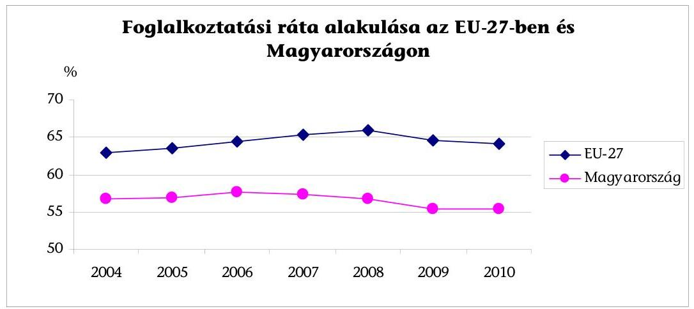

Adatforrás: EUROSTAT honlap ${ }^{8}$
Az 55,4\%-os foglalkoztatási ráta az EU-27 tagállamai viszonylatában 2010-ben a legalacsonyabb érték volt. A tagállamok foglalkoztatási rátái közti különbségeket a 3. ábra szemlélteti.
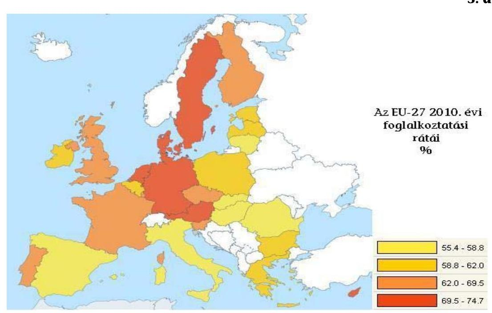

Adatforrás: EUROSTAT honlap

[^0]
[^0]:    ${ }^{8}$ az összehasonlíthatóság érdekében a 2007. év előtti adatok az EUROSTAT számításai alapján tartalmazzák a később csatlakozott országok adatait is

---

Nemzetközi összehasonlításban a magyarországi régiók (különösen ÉszakAlföld és Észak-Magyarország) 2010. évi munkanélküliségi és foglalkoztatási rátái is kedvezőtlen képet mutatnak. A hazai régiók 2010-ben az EU-27 271 db NUTS 2 régiója között a foglalkoztatási ráták tekintetében a rangsor második felébe tartoztak (2. táblázat).
2. táblázat

| A hazai régiók 2010. évi rátái és az EU-27 régióiból álló rangsorban való helyezésük |  |  |  |  |
| :--: | :--: | :--: | :--: | :--: |
| Régió megnevezése | Foglalkoztatási ráta (\%) | Helyezés | Munkanélküliségi ráta (15 év felettiek) (\%) | Helyezés |
| Közép-Magyarország | 60,3 | 195. | 8,9 | 152. |
| Nyugat-Dunántúl | 59 | 212. | 9,2 | 158. |
| Közép-Dunántúl | 57,3 | 227. | 10,3 | 188. |
| Dél-Alföld | 54,4 | 247. | 10,6 | 193. |
| Dél-Dunántúl | 53,1 | 253. | 12,1 | 215. |
| Észak-Alföld | 49,3 | 260. | 14,5 | 241. |
| Észak-Magyarország | 48,7 | 261. | 16 | 249. |

Adatforrás: EUROSTAT honlap
A 2007. évi (57,3\%-ról) csökkenő foglalkoztatást 2009-től kétszámjegyűre (10,1\%) kiugró munkanélküliség kísérte, amely 2010-ben 11,2\%-os arányt ért el (474,5 ezer fő). Ezen belül nem tért el jelentősen a férfi (11,6\%) és a női $(10,7 \%)$ arány, ugyanakkor különösen magas ez az arány a 20-24 év közötti fiatalok körében $(25,1 \%)$.
„A fenntartható fejlődés indikátorai" című KSH kiadvány további két indikátort alkalmaz a foglalkoztatottság, illetve a munkanélküliség problémájának érzékeltetésére. A 2009. évi adatok szerint Magyarországon a gyerekek (0-17 év közöttiek) 15,6\%-a olyan háztartásban él, ahol nincs foglalkoztatott (szemben az EU-27 10\%-os arányával). Tartós (egy éven túl) munkanélküli a 15-74 év közötti gazdaságilag aktív magyar lakosság 4,2\%-a (EU-27: 2,9\%).

A területi különbségek felszámolása érdekében a munkahelyteremtő beruházások összegeinek allokálása a 2007-2010 közötti időszakban az elmaradottabb (Észak-Magyarország, Észak-Alföld, Dél-Dunántúl) régiókba történt, az elmaradott régiók kiemelt támogatásának szempontja azonban a gazdaságilag fejlettebb régiók beruházás-vonzó (infrastrukturális ellátottság, munkaerő-minőségi jellemzők) hatását - a munkaerő-piaci igények ellenére - nem tudta ellensúlyozni.

A gazdasági válság a fejlettebb régiókat fokozottabban érintette, így a válság hatásainak enyhítésére indított, munkahelymegőrzést célzó hazai programok esetén ezen régiók részesültek több támogatásban (4. ábra).

---

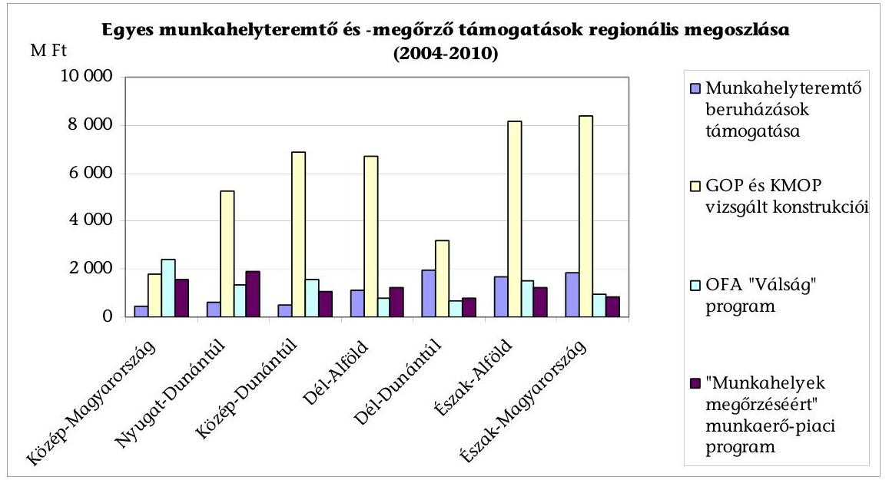

Adatforrás: tanúsítványok
A vizsgált támogatások a területi szempontot prioritásként kezelték, a foglalkoztatási adatok tekintetében a területi különbségek érdemben mégsem csökkentek, az Észak- és Közép-Magyarország munkanélküliségi rátái közötti több mint 7 százalékpontos, illetve a foglalkoztatási rátában közel 12 százalékpontos különbség állt fenn 2007-2010 között (3. táblázat).
3. táblázat

A 15-64 éves népesség gazdasági aktivitása régiónként 2007-2010 között

| Régió megnevezése | Munkanélküliségi ráta (\%) |  |  |  | Foglalkoztatási ráta (\%) |  |  |  |
| :--: | :--: | :--: | :--: | :--: | :--: | :--: | :--: | :--: |
|  | 2007 | 2008 | 2009 | 2010 | 2007 | 2008 | 2009 | 2010 |
| Közép-Magyarország | 4,8 | 4,6 | 6,7 | 9 | 62,7 | 62,7 | 61,6 | 60,3 |
| Nyugat-Dunántúl | 5 | 5 | 8,7 | 9,2 | 63,4 | 62,1 | 59,7 | 59 |
| Közép-Dunántúl | 5 | 5,9 | 9,3 | 10,3 | 61,8 | 60,3 | 57,8 | 57,3 |
| Dél-Alföld | 7,9 | 8,8 | 10,7 | 10,7 | 55,2 | 54,5 | 53,2 | 54,4 |
| Dél-Dunántúl | 10 | 10,3 | 11,1 | 12,2 | 51,2 | 51 | 52,1 | 53,1 |
| Észak-Alföld | 10,9 | 12 | 14,3 | 14,6 | 50,5 | 49,9 | 48,1 | 49,3 |
| Észak-Magyarország | 12,3 | 13,4 | 15,3 | 16,1 | 50,8 | 49,5 | 48,6 | 48,7 |
| Országos | 7,4 | 7,9 | 10,1 | 11,2 | 57,3 | 56,7 | 55,4 | 55,4 |

Adatforrás: KSH honlap
A 2007-2010 közötti időszakban a regionális tendenciák az országos adatokkal összhangban alakultak. A legkedvezőtlenebb foglalkoztatási helyzetű régiók (Észak-Alföld, Észak-Magyarország) foglalkoztatási helyzete tovább romlott. A leghátrányosabb helyzetű régiókban a foglalkoztatási ráta az országos átlag alatt, a munkanélküliségi ráta az országos átlag felett volt az ellenőrzött időszakban.

---

A munkanélküliségi ráta 2010. évi regionális adatait a 5. ábra szemlélteti, mely továbbra is az észak-alföldi és észak-magyarországi régiók hátrányos helyzetét mutatja.

# 5. ábra 

2010. évi regionális különbségek a munkanélküliségi rátában
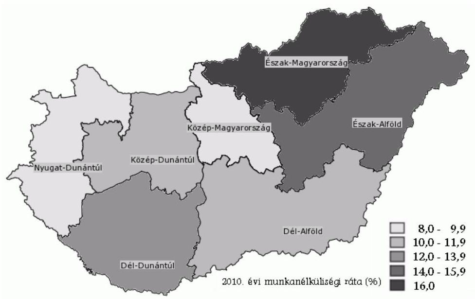

Adatforrás: KSH honlap
A 2010. évi 11,2\%-os országos munkanélküliségi rátához képest Észak-Alföld 14,6\%-os, Észak-Magyarország 16,1\%-os rátával rendelkezett. A foglalkoztatási ráta az országos $55,4 \%$-os arányhoz képest a fenti régiók esetében $49,3 \%$ és $48,7 \%$ volt.

A támogatási programok a munkaerő-piaci beavatkozások szempontjából az ágazati, strukturális sajátosságokat nem kezelik.

Az intézményrendszertől csak közvetetten lehet információt kapni arról, hogy a támogatott munkahelyek a preferált ágazatokban keletkeztek, illetve, hogy ezek a magas hozzáadott értékű iparágakat erősítik vagy sem.

Az eredmények fenntarthatóságát vizsgálva a tapasztalatok eltérőek, a programok munkaerő-piaci igényekkel összhangban lévő hosszú távú közvetlen hatása - a munkahelyteremtő gazdaságfejlesztési programok kivételével - nem mutatható ki. A támogatási programokkal csak rövidtávon javult (általában a támogatás időtartamára) a programokban résztvevők munkaerőpiaci helyzete. Ez különösen a közhasznú és közcélú foglalkoztatási programok esetében szembetűnő.

A foglalkoztatáspolitikát és ezen belül az ellenőrzés célterületét a vizsgált időszakban több, egymást tartalmilag és időben átfedő, különböző időhorizontú, önálló célkitűzéseket és beavatkozási területeket, intézkedéseket és programokat tartalmazó stratégiai szintü dokumentum határozta meg. A dokumentumokban a gazdaságfejlesztési célok nem tükrözték vissza következetesen a foglalkoztatáspolitikai prioritásokat, így nem valósulhatott meg a foglal-

---

koztatáspolitika egységes irányítása. A gazdaságfejlesztés eszközrendszerén keresztül létrehozandó új munkahelyek igényét számításokkal nem alapozták meg.

Az NFSz által nyilvántartott bejelentett álláshelyek száma önmagában nem mutatja a rendelkezésre álló, betölthető álláshelyek számát, mivel az adatgyűjtés a vonatkozó jogszabály alapján bejelentésre kötelezett vállalkozásokra terjed ki, illetve tartalmazza a támogatott munkahelyek számát is. Összességében azonban új piaci munkahelyek nélkül a foglalkoztatási helyzet és a gazdasági aktivitás tartós javulása elképzelhetetlen.

A stratégiai dokumentumokban bemutatott intézkedésekhez rendelt források, programok és indikátorok, valamint a rendszeres értékelések hiánya hozzájárult ahhoz, hogy az elért eredmények elmaradtak a foglalkoztatáspolitikai célkitűzésektől. Nem történt meg a stratégiai dokumentumokban meghatározott döntéshozói és jogalkotói intézkedések (pl. a munkanélküli ellátórendszer átalakítása) megvalósulásának, illetve a hazai támogatási programok - különösen a megváltozott munkaképességűek foglalkoztatásának, a közfoglalkoztatás ${ }^{9}$ és az aktív foglalkoztatáspolitikai eszközök finanszírozásának, valamint a gazdasági válság kezelésére hozott intézkedések hatásainak értékelése.

A foglalkoztatási helyzet javítását szolgáló programok illeszkedtek a stratégiai szintü dokumentumok, kormányprogramok célkitüzéseihez (6. sz. melléklet), azonban - a források széttagoltsága következtében - érdemben nem javult a célcsoportok foglalkoztatási helyzete. A támogatási rendszer többcsatornás, a kedvezményezettek több forrásból (központi költségvetés, MPA, uniós források) is részesülhettek támogatásból. A támogatási rendszer egészét tekintve széttagolt, nehezen átlátható, a támogatási programok céljait, forrásait és intézményrendszerét nem hangolták össze, ami lehetővé teszi a párhuzamosságokat és átfedéseket. Az ÜMFT operatív programjai esetében a tervezés során biztosították az OP-k közötti lehatárolásokat, ezzel azonban nehezebbé vált a szinergikus hatások kiaknázása. A célok jobb megvalósítását komplex programok (több támogatási elem kombinációjával) indításával segítették [munkaerő-piaci programok, leghátrányosabb helyzetű kistérségek (LHH) programjai, egyes Társadalmi Megújulás Operatív Program (TÁMOP) programok]. A foglalkoztatási célú különböző támogatási programok harmonizációjának hiányában a források optimális felhasználása elmaradt.

A teljes gazdaságot átfogó, gazdaságpolitikailag megalapozott, öszszehangolt intézkedések hiányában az egyes támogatási programokat irányító szervezetek különböző intézkedéseket hoztak. A kitűzött program- és projektcélok megvalósítása érdekében a jogszabályokban és a pályázati feltételekben módosításokat (enyhítéseket) hajtottak végre, melyek elősegítették a gazdaságfejlesztési célok megvalósulását.

[^0]
[^0]:    ${ }^{9}$ a közfoglalkoztatás rendszerének átalakítása a 2011. évi CVI. törvény hatályba lépéséhez kapcsolódóan a helyszíni ellenőrzés idején folyamatban volt

---

#### Abstract

Az ÜMVP foglalkoztatásra vonatkozó jogkövetkezményeinek tekintetében az FVM szabályozási gyakorlata nem volt következetes. Ez abban nyilvánult meg, hogy nem mindegyik jogcímrendeletben rögzítették a foglalkoztatásra vonatkozó kötelezettség elmulasztásának jogkövetkezményeit. Szintén nem a következetesség jellemezte a támogatás általános szabályairól szóló miniszteri rendelet 2008 júliusában történt módosítását, amikor is beépítették a foglalkoztatás nem teljesítésre vonatkozó szankciókat, amelyet a válságra való tekintettel tíz hónap elteltével hatályon kívül helyeztek.

Pozitív példaként említhető, hogy egyes gazdaságfejlesztési programok (GOP és regionális OP-k) esetében a forrásokat azon prioritásokra csoportosították át, amelyek - rövid távon - hozzájárultak a gazdaság és így a munkahelyek bővüléséhez, illetve a célcsoport, valamint a fejlesztési célok kiszélesítésével kívánták a válság hatásait enyhíteni. Ezen intézkedések hozzájárultak a források teljes körű és eredményes felhasználásához, valamint a válság eredményes kezeléséhez.

Az egyes programok a céljuk, a támogatotti kör és az eredményesség szempontjából nagy eltérést mutattak. Az értékelést nehezítette, hogy a projektek nagy része a helyszíni ellenőrzés idején a megvalósítás szakaszában tartott, a mun-kahely-teremtési és -megőrzési kötelezettség teljesülésének teljes körű értékelésére csak a projektek lezárását követően kerülhet sor.

Az EKD, a GOP, a Regionális Operatív Programok (továbbiakban: ROP) és az MPA-ból finanszírozott munkahely-teremtési programok esetében a kedvezményezettek jellemzően teljesítették a szerződésben vállalt munkahelyteremtési kötelezettségüket. A hazai forrásból finanszírozott, hátrányos helyzetúek foglalkoztatásának támogatását szolgáló programok eredményessége eltérő képet mutatott, a helyszíni ellenőrzés tapasztalatai alapján a program kezdetekor foglalkoztatott létszám idővel visszaesett, illetve a tervezett létszám nem teljesült. A közhasznú és közcélú foglalkoztatásban résztvevők és a megváltozott munkaképességúek foglalkoztatását elősegítő rehabilitációs foglalkoztatási támogatásban részesültek nyílt munkaerőpiacra visszajutásának esélyei - az ellenőrzés tapasztalatai alapján - nem javultak.

Az uniós, illetve egyes hazai programok (pl.: regionális munkaerő-piaci programok, munkahelyteremtő beruházások támogatása pályázati program) esetében az elérni kívánt célok mérésére alkalmas, konkrét, számszerúsített, célértékkel rendelkező indikátorokat kialakítottak, azok időarányos alakulása azonban - különösen a GOP érintett konstrukciói esetében - elmaradt a tervezettől. A vizsgált támogatások a munkahelyteremtés eszközei, az egyes gazdaságfejlesztési projektek szerződéseinél az új munkahelyek létrehozásának közvetlen, konkrét, számszerúsített - és így számon kérhető - kötelezettsége a GOP esetében csupán három konstrukciónál (GOP-1.3.2, 2.1.2, 2.1.3) jelent meg. Ezen három konstrukció kivételével a munkahelyteremtés csak közvetett hatásként jelent meg, ami - a program végrehajtása során kialakuló gazdasági válság mellett - hozzájárult az eredmények elmaradásához.

A GOP esetében az akciótervekben tervezett és az egyes konstrukciókban kialakított indikátorok összhangja nem valósult meg, eltérés volt tapasztalható az egyes dokumentumokban bemutatott indikátorok célértékei között. A TÁMOP-nál a prioritás és konstrukció szintű indikátorok közötti összhang nem volt teljes körűen biztosított. A vizsgált regionális OP-k végrehajtása során kialakított indikátor-

---

rendszer módszertani problémákat (pl.: széttagoltság, elaprózottság) vetett fel, melynek következtében ún. kulcsindikátor-rendszert alakítottak ki, illetve meghatározták a szankcionálandó indikátorok körét. Ennek ellenére a ROP-ok félidei értékelése szerint az indikátorrendszer korlátozottan alkalmazható régiók közötti összehasonlításra.

Nem fogalmaztak meg konkrét foglalkoztatási célkitűzést, számszerúsített mutatót a megváltozott munkaképességűek központi költségvetési forrásból történő támogatásánál, a közfoglalkoztatás, az EKD támogatások, valamint a hazai, központi munkahelymegőrző támogatások esetében. A programok eredményességének mérését és a szükséges beavatkozások és stratégiai döntések megalapozását elősegítő, a SMART kritériumoknak ${ }^{10}$ megfelelő indikátorrendszer kialakításának hiánya nehezíti a programok értékelését.

A foglalkoztatás szempontjából a 2008-as gazdasági válság hatásainak enyhítésére hozott intézkedéseknek kiemelt jelentőségük van. A válság a magyar munkaerőpiacon 2010 első negyedévében volt mélypontján ( $54,5 \%$-os foglalkoztatási ráta), a munkanélküliek száma és aránya ekkor érte el a legmagasabb, közel félmilliós létszámot, illetve 11,8\%-os arányt.

A foglalkoztatáspolitikai intézkedések egyik kiemelt területe a munkahelymegőrzés volt, melynek rövid távú fő célja annak megakadályozása volt, hogy a válság következtében a munkavállalókat elbocsássák. A hazai forrásból megvalósított válságkezelő intézkedések központosítása, nehézkessége, lassú beindulása rontotta a program eredményességét. Az európai modellt követte az uniós forrásból finanszírozott TÁMOP 2.3.3. „Munkahelymegőrző támogatás képzéssel kombinálva" című program.

A munkahelyteremtés és -megőrzés, illetve a támogatott munkahelyek számának bővítésére irányuló támogatási programok szabályozási hátterét kialakították. A jogszabályi környezet és a jogszabályokon alapuló belső szabályok rendszere finanszírozási forrásonként (MPA, központi és uniós költségvetés) eltérő képet mutatott, ezért a foglalkoztatáspolitikára vonatkozó hazai jogszabályok egységes szabályozása nem valósult meg.

Az uniós és hazai jogszabályok összhangja a megváltozott munkaképességű munkavállalók és a hátrányos helyzetűek fogalma, jogszabályi definíciója esetében nem biztosított. Az állami támogatások definíciója a hazai jogszabályokban nem egységes. A hazai támogatásokat rögzítő jogszabályokban bekövetkezett gyakori változások - különösen az Flt. és végrehajtási rendelete, valamint a foglalkozási rehabilitációs támogatások szabályai - miatt a szabályozási környezet és a támogatási rendszer nem volt kiszámítható. Ebből adódóan a foglalkoztatást megvalósítók gazdálkodására ható bizonytalanság komoly fenyegetést jelentett a támogatott munkavállalók foglalkoztatására. A gyakori jogszabályváltozások követését és egységes értelmezését az intézményrendszer eljárásrendek és működési kézikönyvek kiadásával biztosította. Több hazai támogatás - így a „Munkahelyek megőrzéséért" program, az egyedi kormánydöntéssel nyújtott támogatások és a költségvetési rehabilitá-

[^0]
[^0]:    ${ }^{10}$ konkrét, mérhető, releváns, elérhető, reális és határidőhöz kötött

---

ciós bértámogatás - esetében ugyanakkor az eljárásrendek hiánya, illetve azok késedelmes megalkotása jogértelmezési problémákat eredményezett, ami a támogatási eszközök végrehajtásában résztvevők és a támogatást igénybevevő vállalkozások részére is gondot okozott.

A foglalkoztatáspolitikáért felelős miniszter koordináló szerepe a vizsgált időszakban korlátozottan érvényesült. A foglalkoztatáspolitikáért felelős miniszter irányításával dolgozták ki a Kormány foglalkoztatáspolitikai koncepcióját és ellátta a foglalkoztatáspolitika koordinációjával kapcsolatos feladatokat. A miniszter koordinációs feladatainak részletezését a minisztérium belső szabályzataiban pontosan nem határozták meg. A foglalkoztatáspolitika összehangolt múködésének kialakításához, koordinációjához rendelt eszközrendszer (jogszabályalkotás és véleményezés, valamint érdekegyeztető tevékenység, a munkacsoportokban, szakmai testületekben biztosított részvétel és egyéb irányító tevékenység) nem biztosította a foglalkoztatáspolitikai koncepció, a foglalkoztatási prioritások eredményes érvényesülését. A koordináló szerep hatékony ellátását, illetve a foglalkoztatási prioritások érvényesítését nehezítette továbbá, hogy a helyszíni ellenőrzés időszakában további öt minisztérium látott el foglalkoztatáspolitikával kapcsolatos, valamint foglalkoztatást elősegítő támogatások terén irányító feladatokat.

A vizsgált időszakban az irányítási és a hazai szervezeti rendszer többször módosult, ez azonban a feladatellátást nem veszélyeztette, mivel az intézményrendszer „önjáróvá vált", a végrehajtó intézményrendszer (pl. MK-k) rugalmasan alkalmazkodott a jogszabályi környezet folyamatos változásához, felkészültek az új feladatok ellátására. A hatáskörök és feladatok megosztása egyes támogatási eszközök - így az egyedi kormánydöntéssel nyújtott támogatások és a foglalkozási rehabilitációs támogatások - esetében (különösen szervezeti átalakításokhoz kapcsolódóan) nem volt egyértelmú.

A támogatási rendszer múködtetésébe bevont külső intézmények feladatellátása során teljesült az átláthatóság és elszámolhatóság követelménye. A humánkapacitások - a hazai intézményi ellenőrzési kapacitások kivételével - és kompetenciák összhangban voltak az elvégzendő feladatokkal, a hatékony munkavégzéshez szükséges tárgyi feltételek rendelkezésre álltak.

A vizsgált programok által támogatott munkahelyek fajlagos költsége széles tartományban mozog. Értékét nagyban befolyásolja az adott konstrukció célja, időtartama, eszközrendszere. A mutató emiatt nem szolgálhat támaszul a különböző támogatási területek közötti forrásallokációt érintő foglalkoztatáspolitikai döntések meghozatalában. A mutató elsősorban egy-egy adott konstrukció keretein belüli pályázatok, korlátozott mértékben bizonyos - hasonló konstrukciók összehasonlítására lehet alkalmas.

Az egyedi kormánydöntésen alapuló beruházások fajlagos költsége 5 éves fenntartási időszak mellett 530 E Ft/fő/év, míg a bértámogatásé 135-262 E Ft/fő/év között mozgott. Az Észak-alföldi Regionális Munkaügyi Központ (továbbiakban: ÉARMK) vizsgált programjainak fajlagos költsége 1105-1862 E Ft/fő/év között,

---

míg a hátrányos helyzetűek támogatását szolgáló TÁMOP kiemelt projektek esetében 133-1239 E Ft/fő/év között alakult ${ }^{11}$.

A támogatások ellenőrzési rendszerét a forrásokhoz igazodóan alakították ki. Az uniós támogatási programoknál az Unió által előírt ellenőrzési előírásokat ${ }^{12}$ alkalmazták, ezzel szemben a hazai források ellenőrzési rendszerét az egyes támogatási típusok jellege szerint alakították ki.

Az ellenőrzésekre vonatkozó szabályzatokat a jogszabályoknak megfelelően kidolgozták. Az uniós források ellenőrzési nyomvonalát, a szabálytalanságok és a kockázatok kezelésének rendjét kialakították, a projektek helyszíni vizsgálatra történő kiválasztását kockázatelemzés alapozta meg. A hazai források ellenőrzését nem támogatta kockázatalapú kiválasztási rendszer, illetve egységes ellenőrzési stratégia, valamint módszertan.

A foglalkoztatási kötelezettség teljesítésének ellenőrzése - az agrár- és vidékfejlesztési projektek kivételével - megtörtént. Az ellenőrzési rendszer kialakítása hozzájárult a célok megvalósításához.

Az uniós forrásokból finanszírozott munkahelyteremtő programok esetében a projektek dokumentumalapú ellenőrzése 100\%-ban valósult meg. A helyszíni ellenőrzések száma és gyakorisága kockázatelemzésen alapult. A hazai forrásból támogatott projektek ellenőrzési lefedettsége programonként változó, az EKD esetében a támogatottak 100\%-át érintette helyszíni ellenőrzés, míg a költségvetési rehabilitációs bértámogatás és segítő költségkompenzációs támogatása esetében a helyszíni ellenőrzések elmaradása miatt nem volt biztosított az elszámolási kötelezettség szabályszerű megvalósulása.

A vizsgált támogatási programok nyomon követése - a közcélú foglalkoztatás és a hagyományos munkahely-megőrzési támogatásban részesültek továbbfoglalkoztatásának kivételével - megvalósult. A monitoring rendszer informatikai támogatottsága tekintetében az ellenőrzés hiányosságokat tapasztalt. A hazai forrásból megvalósuló foglalkoztatási programok, illetve az aktív eszközök alkalmazásáról és a támogatási programok végrehajtásáról az intézményrendszer rendszeres (féléves, éves) beszámolókat készített, azonban ennek alapján középtávú, következtetéseket és javaslatokat is megfogalmazó programértékelések nem készültek, így ezek a beszámolók a foglalkoztatáspolitikai stratégia kialakításakor nem hasznosultak.

[^0]
[^0]:    ${ }^{11}$ a fajlagos költségek értelmezésénél figyelembe kell venni, hogy a programok - különösen az uniós támogatások - projektjei több elemből állnak össze, illetve a munkahelyteremtés mellett egyéb eredményeket is megcéloznak, a hazai támogatások kifejezetten a létszám bővítésére vagy megőrzésére koncentrálnak
    ${ }^{12}$ a Tanács 2006. július 11-i 1083/2006/EK Rendelete az ERFA-ra, az ESZA-ra és a Kohéziós Alapra vonatkozó általános rendelkezések megállapításáról és az 1260/1999/EK rendelet hatályon kívül helyezéséről

---

Az ellenőrzés intézkedést igénylő megállapításai és javaslatai

# a nemzetgazdasági miniszternek 

1. Nem valósult meg a különböző támogatási programok céljainak harmonizációja, illetve a források összehangolása, ezek hiányában nem sikerült a forrásfelhasználás hatékonyságát maximalizálni.

Javaslat
Kezdeményezze a Kormánynál a különböző támogatási programok céljai harmonizációjának és forrásai összhangjának megteremtését a forrásfelhasználás hatékonyságának javítása érdekében.
2. A támogatási rendszer egészét tekintve széttagolt, nehezen átlátható, a támogatási programok céljait, forrásait és intézményrendszerét nem hangolták össze, ami lehetővé teszi a párhuzamosságokat és átfedéseket.

Nem fogalmaztak meg konkrét foglalkoztatási célkitűzést, számszerűsített mutatót a megváltozott munkaképességűek központi költségvetési forrásból történő támogatásánál, a közfoglalkoztatás, az EKD támogatások, valamint a hazai, központi munkahelymegőrző támogatások esetében.

Javaslat
Határozza meg a munkahelyteremtéshez és -megőrzéshez felhasználható forrásokat, a forrásfelhasználástól elvárt hatások mérését szolgáló indikátorokat, valamint jelölje ki a végrehajtás felelőseit.
3. A hazai források ellenőrzését nem támogatta kockázatalapú kiválasztási rendszer, illetve egységes ellenőrzési stratégia, valamint módszertan.

Javaslat
Dolgoztassa ki a forrásfelhasználás ellenőrzési stratégiáját és módszertanát, ennek keretében alakítsa ki a hazai források esetében is a kockázatalapú kiválasztás rendszerét, és biztosítsa a kialakított módszertan egységes alkalmazását.

## a nemzeti fejlesztési miniszternek

A gazdaságfejlesztés eszközrendszerén keresztül létrehozandó új munkahelyek igényét számításokkal nem alapozták meg.

Javaslat
Határozza meg a gazdaságfejlesztési stratégiában a foglalkoztatás-bővítésének célkitűzéseit, és nevesítse a megvalósításhoz szükséges eszközöket, programokat, indikátorokat

---

# II. RÉSZLETES MEGÁLLAPÍTÁSOK 

## 1. A FOGLALKOZTATÁSPOLITIKA FELTÉTELRENDSZERÉNEK KIALAKÍTÁSA, ÁTLÁTHATÓSÁGA ÉS ÖSSZHANGJA

### 1.1. A jogszabályi környezet

A munkahelyteremtés és -megőrzés normatív környezetét az egyes aktív eszközök és támogatási programok eltérő szabályrendszere határozza meg. A jogszabályi környezet és a jogszabályokon alapuló belső szabályok rendszere az egyes finanszírozási források (MPA, központi költségvetés, uniós) mentén jelentős eltéréseket mutatott.

Az MPA által nyújtott munkahelyteremtő és -megőrző támogatások intézményrendszerének, múködési feltételének általános szabályait az Flt. tartalmazta. Az Flt.-ben általánosan szabályozott előírásokra vonatkozó végrehajtási szabályokat a foglalkoztatást elősegítő támogatásokról, valamint a MPA-ból foglalkoztatási válsághelyzetek kezelésére nyújtható támogatásról szóló 6/1996. (VII. 16.) MüM rendelet (továbbiakban MüM rendelet) tartalmazta. A végrehajtási rendelet támogatási típusonként kitér a nyújtható támogatások részletszabályaira, ennek keretében szabályozza a pályázati rendszerre (a támogatások időtartamára, a pályázókra vonatkozó feltételekre, a pályázat döntési jogosultságaira) vonatkozó előírásokat stb. Az egyes aktív eszközök és munkaerő-piaci programok tekintetében további jogszabályok adnak iránymutatást.

Az állami költségvetésből finanszírozott, a megváltozott munkaképességűek foglalkoztatását elősegítő támogatások esetében a 177/2005. (IX. 2.) Korm. rendelet és annak végrehajtási rendelete az irányadó. A Kormány egyedi döntésével megítélhető támogatások nyújtásának szabályait a 8/2007. (I. 24.) GKM rendelet rögzítette. A közfoglalkoztatás három formáját - közhasznú munka, közcélú foglalkoztatás és közmunka - különböző jogszabályok alapján különböző forrásokból valósították meg a 2011-es jogszabály-módosításig, jelenleg a közfoglalkoztatáshoz nyújtható támogatásokról szóló 375/2010. (XII. 31.) Korm. rendelet értelmében egyféle támogatás nyújtható.

Az ÜMFT OP-k hazai végrehajtását az uniós rendeletekkel összhangban nemzeti jogszabályok szabályozták. A 2007-2013 programozási időszakban az ERFA-ból, az Európai Szociális Alapból (továbbiakban: ESZA) és a Kohéziós Alapból származó támogatások felhasználásának alapvető szabályait és felelős intézményeit a 255/2006. (XII. 8.) Korm. rendelet, a támogatások fogadásához kapcsolódó pénzügyi lebonyolítási és ellenőrzési rendszerek kialakításának szabályait a 281/2006. (XII. 23.) Korm. rendelet, a támogatások felhasználásának általános szabályait a 16/2006. (XII. 28.) MeHVM-PM együttes rendelet rögzíti. Mindhárom jogszabályt hatályon kívül helyezte és 2011. február 9-től a támogatások felhasználását egységesen szabályozta a 4/2011. (I. 28.) Korm. rendelet.

Az ÜMVP keretében felhasználható Európai Mezőgazdasági Vidékfejlesztési Alap (továbbiakban: EMVA) források belső szabályainak kialakítását uniós normák határozzák meg. Az EMVA-ból támogatott projektek végrehajtásának jogi kereteiről egyidejűleg egymást kiegészítve több kormányrendelet is rendelkezik, a tá-

---

mogatások igénybevételének általános szabályait a 23/2007. (IV. 17.) FVM rendelet határozza meg.

Az egyes támogatásokra vonatkozó jogszabályok az ellenőrzés időszakában nem alkottak egységet, a foglalkoztatáspolitikára vonatkozó hazai jogszabályok gyakori változása miatt a szabályozási környezet és a támogatási rendszer nem volt kiszámítható.

A következetes és átlátható jogszabályalkotás és jogalkalmazás érdekében nem indokolt az aktív foglalkoztatáspolitikai eszközök általános szabályait meghatározó jogszabály (Flt.) és végrehajtási rendelete (MüM rendelet) mellett további jogszabályokban való szabályozás (pl. a hátrányos helyzetű célcsoportok támogatását az Flt. mellett a 2004. évi CXXIII. törvény ${ }^{13}$ szabályozza; a létszámleépítések megelőzése érdekében a korábbinál rövidebb időtartamú foglalkoztatás támogatása a MüM rendeleten kívül kormányrendelet ${ }^{14}$ alapján is nyújtható).

Az EKD szabályozási környezete nehezen átlátható. A minisztériumok, intézmények változását a korábbi jogszabályok módosítása, az új intézmények nevesítése, kijelölése, a feladatok újraosztása nem követte. A helyszíni ellenőrzés idején az EKD támogatások nyújtásának folyamatát, a döntések előkészítőit, a további feladatok felelőseit, a rendszerben közreműködő intézmények körét, feladatait a jogszabályok nem határozták meg egyértelműen.

Az uniós és hazai jogszabályok összhangja a megváltozott munkaképességű munkavállalók és a hátrányos helyzetűek fogalma, jogszabályi definíciója esetében nem biztosított.

Az EK Bizottság 2008. augusztus 6-i 800/2008/EK Rendelete a Szerződés 87. és 88. cikke alkalmazásában a támogatások bizonyos fajtáinak a közös piaccal összeegyeztethetőnek nyilvánításáról (általános csoportmentességi rendelet) 2. cikk 18 és 20. pontja definiálja a „hátrányos helyzetű" és a „fogyatékkal élő munkavállaló" fogalmát.

Nem segíti az egységes jogértelmezést, hogy ugyanazon támogatotti célcsoport, nevezetesen a megváltozott munkaképességű munkavállalók tekintetében három jogszabály háromféle definíciót használ. Az Flt. a megváltozott munkaképességű személy fogalmát általánosan határozza meg, amely azonban nem elég konkrét ahhoz, hogy azok alapján a pénzügyi támogatások feltételeit azonosítani lehetne. A megváltozott munkaképességű munkavállalók foglalkoztatásához nyújtható költségvetési támogatásról szóló 177/2005. (IX. 2.) Korm. rendelet 2. § (1) bek. e) pontja tételesen határozza meg a célcsoportot, mely magában foglalja a fogyatékos, az egészségkárosodott, csökkent munkaképességű, a rokkant munkavállalókat egyaránt. A jogszabály pontosan, százalékos mértékben meghatározza, hogy milyen mértékű munkaképesség-csökkenés, illetve 2008. január 1-jétől egészségkárosodás mellett folyósítható támogatás. Az MPA-ból finanszírozott munkahelyteremtő és -megőrző támogatások tekintetében ugyanakkor megvál-

[^0]
[^0]:    ${ }^{13}$ a pályakezdő fiatalok, az ötven év feletti munkanélküliek, valamint a gyermek gondozását, illetve a családtag ápolását követően munkát keresők foglalkoztatásának elősegítéséről, továbbá az ösztöndíjas foglalkoztatásról
    ${ }^{14}$ a 70/2009. (IV. 2.) Korm. rendelet a szakképzettséggel rendelkező, pályakezdő álláskeresők munkatapasztalat-szerzésének és a létszámleépítések megelőzése érdekében a részmunkaidős foglalkoztatás támogatásáról

---

tozott munkaképességű személynek kell tekinteni a MüM rendelet 11. § (2) bek. b) pontja alapján azt a személyt, aki rehabilitációs járadékban részesül, továbbá azt az álláskeresőt, aki a 177/2005. (IX. 2.) Korm. rendelet 2. § (1) bek. e) pontjában meghatározott feltételeknek megfelel.

A fogyatékos személy fogalmát a fogyatékos személyek jogairól és esélyegyenlőségük biztosításáról szóló 1998. évi XXVI. törvény és a Fogyatékossággal élő személyek jogairól szóló (ENSZ) egyezmény és az ahhoz kapcsolódó Fakultatív Jegyzőkönyv kihirdetéséről szóló 2007. évi XCII. törvény is meghatározza. A két definíció szövege egymástól különbözik.

A hátrányos helyzetű munkavállaló fogalmát törvényi szinten a magyar jogrendben nem definiálták. A MüM rendelet terminológiája - amely csak a bértámogatás szempontjából határozza meg, hogy ki minősül hátrányos helyzetű személynek - nincs teljes körűen összhangban az uniós szabályozásban alkalmazott terminológiával. A magyar jogrend nem tartalmazza továbbá a „súlyosan hátrányos helyzetű munkavállaló" fogalmát sem, a szakmai gyakorlatban ugyanakkor ismert és alkalmazott a „halmozottan hátrányos helyzetü" kategória, szintén jogi definíció nélkül.

Az állami támogatások definíciója a hazai jogszabályokban nem egységes.
Míg az állami támogatásokkal kapcsolatos eljárásról szóló kormányrendeletek alkalmazásában a csekély összegű (de minimis) támogatás nem számít állami támogatásnak, a MüM rendelet alkalmazásában a csekély összegű támogatás is állami támogatásnak minősül, az Európai Unió múködéséről szóló szerződés 107. cikk (1) bekezdése (korábban EK-Szerződés 87. cikkének (1) bekezdése) szerinti támogatás mellett. A MüM rendelet a 85/2004. (IV. 19.) Korm. rendeletre való hivatkozását nem aktualizálták a kormányrendelet hatályon kívül helyezése miatt.

A hazai támogatásokat rögzítő jogszabályoknak - különösen az Flt. és végrehajtási rendelete - , valamint a foglalkozási rehabilitációs támogatások szabályainak gyakori módosításai miatt a támogatási rendszer nem volt kiszámítható. Ennek következtében a támogatási rendszer nem teszi lehetővé, hogy a munkáltatók hosszú távra tervezzenek, ez a támogatott munkavállalók hosszú távú foglalkoztatását veszélyezteti.

Az Flt.-t az ellenőrzött időszakban évente legalább egyszer, jellemzően évente többször is módosították. Az éven belüli módosítások száma 2007-től - a 2008. év kivételével - nőtt, így 2007-ben 4-szer, 2009-2010-ben 6-szor módosult a törvény.

A 177/2005. (IX. 2.) Korm. rendelet az ellenőrzött időszakban évente többször módosult pl. 2009. szeptember 1-jétől a rehabilitációs foglalkoztatást elősegítő bértámogatás iránti új kérelmek befogadása szünetel, csupán a régi kérelmek megújítása lehetséges. Az akkreditációra vonatkozó új kérelmek befogadását is szüneteltette a jogalkotó 2009. szeptember 1-jétől, azt azonban 2010-től ismét lehetővé tette.

Annak érdekében, hogy a támogatások nyújtása azonos elvek és eljárás szerint történjen, a támogatások végrehajtásáért felelős intézményrendszer eljárásrendeket, múködési kézikönyveket [pl. Interaktív Múködési Kézikönyv (IMK), valamint a 24/2011. NFM rendelettel kiadott Egységes Múködési Kézikönyv (EMK)] adott ki, melyek hozzájárultak a támogatási eszközök egységes értelmezéséhez, a gyakori jogszabályváltozások követésének és egységes értel-

---

mezésének biztosításához. Az eljárásrendeket a jogszabályi előírásokkal összhangban, kellő részletezettséggel dolgozták ki.

Az OP-k múködésének kereteit a jogszabályokkal összhangban kidolgozott IMK, illetve 2011-től EMK és egyéb utasítások, iránymutatások adták. Szükség esetén az Irányító Hatóságok (továbbiakban: IH) állásfoglalással segítették az egységes jogértelmezést és a végrehajtást. Az ÜMVP megvalósítása érdekében a vidékfejlesztési miniszter a projektek feltételeit, valamint a támogatások mértékét jogcímrendeletekben rögzítette, amelyeket az MVH közleményekben is közzétette.

Több támogatási eszköz esetében ugyanakkor az eljárásrendek hiánya, illetve azok a jogszabályok módosítását követő késedelmes megalkotása volt jellemző, továbbá túlbonyolított jogszabályok jogértelmezési kérdéseket eredményeztek, ami gondot okozott az ügyintézőknek a támogatási eszközök végrehajtása során és a támogatást igénybevevő vállalkozásoknak egyaránt.

A „Munkahelyek megőrzéséért" program esetében nem készült külön eljárásrend, útmutató, annak ellenére, hogy esetenként eltérő gyakorlatot folytattak (pl. a szerződésben meghatározott megőrzendő munkahely nem név szerinti foglalkoztatottat jelentett; nem elutasító határozatot hoztak, hanem levélben tájékoztatták a nem nyertes munkáltatókat). A támogatások nyújtásának feltételeit, az eljárás lebonyolítását a MAT által jóváhagyott program felhívása tartalmazta.

Az egyedi kormánydöntéssel nyújtott támogatások programkezelői feladatköre szabályainak és folyamatainak meghatározására még az NFGM által 2010 áprilisában jóváhagyott eljárásrend szolgál. A folyamatokat és feladatokat az eljárásrend részletesen ismerteti, azonban a jogszabályi és intézményi változásokat nem követte. Az eljárásrend megújítására a szabályozás módosítása, a hatáskörök tisztázása után kerülhet sor.

A költségvetési rehabilitációs bértámogatás túlbonyolított szabályai esetében az FSzH által kiadott eljárásrend nem minden tekintetben adott iránymutatást a jogszabály egységes értelmezéséhez. A kiemelt támogatáshoz jutás feltételeként előírt nonprofit gazdálkodás, azaz a „Gazdasági tevékenység" hiánya igazolásának módja nem volt egyértelmú. A Segítő személy költségtámogatása esetében a támogatás indokoltságának elfogadása szintén nehézségeket rótt az ügyintézőkre, mivel a támogatás csak a segítésre fordított idő alapján adható, aminek meghatározása a gyakorlatban problematikus.

# 1.2. A foglalkoztatáspolitikáért felelős miniszter koordináló szerepe, a feladat- és hatáskörök kialakítása 

A foglalkoztatáspolitika koordinációjával kapcsolatos feladatokat a miniszterek feladat- és hatásköréről rendelkező kormányrendeletek - kivéve a 143/2002. (VI. 28.) Korm. rendeletet - tartalmazták. A mindenkori foglalkoztatáspolitikáért felelős miniszter koordinációs feladatait egyértelműen és részletesen sem a szaktárca Szervezeti és Múködési Szabályzata (továbbiakban: SzMSz) sem az érintett főosztályok ügyrendjei nem határozták meg.

A foglalkoztatáspolitika összehangolt múködésének kialakításához, koordinációjához a miniszter rendelkezett a megfelelő eszközökkel a jogszabályok megalkotásán és véleményezésén túlmenően érdekegyeztető tevékenysége, a mun-

---

kacsoportokban, szakmai testületekben biztosított részvétele és egyéb irányító tevékenysége révén.

Az ellenőrzés által érintett időszakban nem készült hosszú távú foglalkoztatáspolitikai stratégia. Az 1. ábrában bemutatott stratégiai szintű dokumentumokban a foglalkoztatáspolitikai célkitűzéseket gyakran módosították. Ebből következően a foglalkoztatáspolitikai célkitűzések nem érvényesültek teljes körűen, az érdekegyeztetés nem volt eredményes. A hazai forrásból megvalósuló támogatások és programok átfogó értékelése nem történt meg, így azok eredménye sem jelent meg a stratégiai célkitűzések felülvizsgálatánál és újrafogalmazásánál. Az ÚMFT foglalkoztatáspolitikai célkitűzéseinek a NAP-ban részletesen meg kellett volna jelennie, amit további részstratégiáknak és intézkedési terveknek kellett volna konkretizálniuk.

A TÁMOP 2010. évi végrehajtási jelentése megállapította, hogy a ROP-ok, a GOP, az Államreform Operatív Program (továbbiakban: ÁROP) és a TÁMOP esetében az IH az akciótervek előkészítésében betöltött szerepe során „túlment a szabályozás definiálta koordinációs, minőségbiztosítási funkción, mivel - ennek elöidézőjeként - a szaktárcák nem kellőképpen alapozták meg javaslataikkal az akcióterveket, illetve nem voltak megfelelő ágazati stratégiák, amikre támaszkodni lehetett volna. Ez a tendencia erősödött a 2009-2010-es akciótervek készitésekor".

A Nemzetgazdasági Minisztérium a jelentéstervezetre 2012. február 20-án tett észrevételében javasolta a megállapítás törlését, mert álláspontja szerint nem illeszkedik a fejezetben leírtakhoz, illetve hangsúlyozta, hogy az idézett megállapítással a végrehajtási jelentés készítésekor nem értettek egyet, amit az NFÜ-nek is jeleztek.

Az ÁSZ az észrevételt nem fogadta el, mert a végrehajtási jelentésből idézett megállapítás rámutatott a szakterület irányításáért felelős szervezet feladatellátásának (stratégiaalkotás és az uniós programok szakmai megalapozásához való hozzájárulás) hiányosságaira, így illeszkedik a fejezet tartalmához, a foglalkoztatáspolitikáért felelős miniszter koordináló szerepének értékeléséhez. Az idézett megállapítás az NFÜ által kiadott végrehajtási jelentésben szerepel, az ÁSZ ellenőrzése nem a megállapítás igazolására irányult.

# A támogatást közvetítő intézmények feladat- és hatásköre az ellenőrzés által lefedett időszakban a hazai támogatások esetében többször változott, a feladatellátást ez nem veszélyeztette. 

Az intézményrendszer több szintre tagolódott, amely a 2010-es kormányzati struktúraváltás után irányítási (miniszteriális) szinten és a háttérintézmények szintjén is átszerveződött, de változatlan maradt a „többszintüség". Ez sem korábban, sem napjainkban nem befolyásolta a feladatellátást, mivel a már korábban kialakított folyamatok miatt a rendszer „önjáróvá vált".

A hazai támogatások rendszerében kulcsszerepet betöltő NFSz [(2010-ig Állami Foglalkoztatási Szolgálat (továbbiakban: ÁFSz)] intézményeit, így az FH-t (2006-2010 között FSzH) és a MK-kat szintén több, jelentős szervezeti átalakítás érintette.

---

A MK-k 2004-2006 között megyei keretek között, 2007-2010 között regionális rendszerben működtek, míg 2011-től ismét megyei rendszerben látják el feladataikat. A MK-k szakmai irányítását a vizsgált időszakban az FH (FSzH) látta el.

A 2010. évi kormányváltásig az egységes munkaügyi szervezet irányítása közvetlenül a foglalkoztatáspolitikáért felelős miniszter hatáskörében valósult meg. 2011. január 1-jétől a kormányhivatalok megalakításával a MK-k munkaügyi feladatokat ellátó szakigazgatási szervekként történő integrálása valósult meg. A kormányhivatalok felügyeletét a közigazgatási és igazságügyi miniszter látja el. A MK-k szakmai irányítását továbbra is az FH végezte.

A megyei MK-k a megyei kormányhivatalokba speciális módon integrálódtak, kétféle hatáskörű és illetékességi területű MK jött létre. A MK kizárólag megyei szervezetből vagy megyei (fővárosi) szervezetből és kirendeltségekből áll. A kiemelt hatáskörrel és illetékességgel rendelkező MK-k megyei (fővárosi) szervezettel és kirendeltségekkel rendelkeznek. A kirendeltség a MK önálló feladat- és hatáskörrel rendelkező szervezeti egysége. Ettől eltérően a kizárólag megyei szervezetből álló MK-k irányítása alá nem tartoznak kirendeltségek. Ezért fordulhat elő, hogy Szolnokon a Szabolcs-Szatmár-Bereg Megyei Kormányhivatal Munkaügyi Központjának Szolnoki Kirendeltsége működik.

A hatáskörök és feladatok megosztása egyes támogatási eszközök esetében nem volt egyértelmű, azok tisztázása és pontosítása egyes feladatok tekintetében megoldatlan volt.

Az EKD alapján nyújtott támogatások alapvető szabályait rögzítő rendelet - többek között - nem nevesíti a támogatások felhasználását meghatározó minisztereket, az aktuális közreműködő szervezeteket (továbbiakban: KSz), a két miniszter döntéshozatalban betöltött szerepét, a támogatás forrását, az előkészítés és döntéshozatal feladatainak elvégzésére létrehozott bizottságot.

Az állami költségvetésből finanszírozott foglalkozási rehabilitációs támogatások lebonyolítása, megvalósítása, végrehajtása és ellenőrzése több intézményt érint. Az intézmények közötti feladatok és hatáskörök megosztását jogszabályok, utasítások, illetve együttmúködési megállapodások, azok módosításai rendezik. Jogalapja az Áht. 27. § (3) bek. és az Ámr. 55. és 58. §.-ai. Az együttmúködési megállapodások rendszere nehezen átlátható. A megállapodások megismétlik a jogszabályban meghatározott feladatokat, illetve olyan részletszabályokat fogalmaznak meg, melyeket a belső szabályoknak, eljárásrendeknek kellene tartalmazniuk.

A 15/2005. (IX. 2.) FMM rendelet 6. § (3) bek. értelmében a MK által vezetett nyilvántartás tartalmazza a költségkompenzációs támogatásban, illetőleg a rehabilitációs költségtámogatásban részesülő munkáltatók 5. § (2) bekezdésének a) pontjában megjelölt adatait, valamint a támogatások havi és éves összegét. A MK-k nem teljesítik az előbbi jogszabályi előírásokat, mivel nem látnak el a költségkompenzációs támogatással kapcsolatos havi feladatokat. A költségkompenzációs támogatás nyújtására vonatkozó szerződések esetében a minisztérium és a Regionális Munkaügyi Központok (továbbiakban: RMK), mint szerződő felek kötik az éves szerződést a munkáltatóval. Ezt követően a RMK-nak a havi elszámolásokkal kapcsolatos feladata nincs. A rehabilitációs költségtámogatással kapcsolatban a MK-k véleményt adnak arról, hogy a megváltozott munkaképességű munkavállalók a nyílt munkaerőpiacon foglalkoztathatók-e.

---

A költségkompenzációs támogatásokkal kapcsolatosan szabálytalanul felhasznált összegek visszakövetelése a gyakorlatban nem megoldott. A 2010-es Együttmüködési Megállapodás értelmében a visszakövetelő határozat tervezetét az FSzH készíti el és a miniszter részére küldi meg aláírásra. A 2011-es Együttmüködési Megállapodás a NEFMI és az NRSzH között ugyanígy rendelkezik. 2011-ben a visszakövetelésre vonatkozó határozatot mégis az NRSzH állítja ki és küldi meg a munkáltatónak, amely ellen fellebbezéssel a miniszterhez fordulhatnak. Az együttműködési megállapodások nem rendezik, hogy a 2010 előtti évekre vonatkozó visszakövetelésekkel kapcsolatos feladatok mely intézmény hatáskörébe tartoznak.

Az MPA rehabilitációs alaprész (továbbiakban: MPA RA) decentralizált kerete esetében még folyamatban lévő, nyertes pályázatokkal kapcsolatos feladatköröket csak a 315/2010. (XII. 27.) Korm. rendelet 2011. július 5-től hatályos módosítása tisztázta. A jogszabályváltozást megelőzően 2010. decemberében az NGM felszólította a MK-okat, hogy adják át az MPA RA-ból korábban nyújtott támogatások folyamatban lévő ügyiratainak eredeti példányait. Budapest Főváros Kormányhivatala Munkaügyi Központja 2011. február 24-én átadta a dokumentumokat, hasonlóképpen tette ezt az összes MK. A pályázatok dokumentumai pár hónap után újra visszaadásra kerültek átadás-átvétellel a MK-k részére, miután a három minisztériumot (NGM, NEFMI, KIM) érintő feladattal kapcsolatban a fenti jogszabályban megfogalmazott döntés megszületett.

A megvalósításba bevont intézmények feladatellátását a jogszabályok, szabályzatok, eljárásrendek egyértelműen meghatározták.

A programok megvalósításába bevont intézményekkel (képző intézmények, foglalkoztatók) megkötött támogatási szerződések tartalmazták a támogatással kapcsolatos feltételeket, a támogató és a támogatott jogait és kötelezettségeit, a támogatás elszámolásának szabályait. Megvalósult a beszámoltatás és ellenőrzés, az elszámolásokat a kirendeltségek kezelték, melyről havi rendszerességgel beszámoltak a program koordinátornak, valamint az elszámolások adatainak öszszesítéséből állították össze a program pénzügyi megvalósulásáról készített beszámolót. A bevont intézmények díjazása teljesítményarányos volt.

Az OFA a MAT és a foglalkoztatáspolitikáért felelős minisztérium megbízásából évről évre az MPA FA jelentős hányadát használta fel. A MAT jóváhagyása után a program végrehajtására, a támogatási keret biztosítására az OFA és a mindenkori foglalkoztatáspolitikáért felelős minisztérium megállapodást kötött, mely alapján az OFA Kuratóriuma a programokra vonatkozó, részletekbe menő konstrukciókról döntött.

# A lebonyolítást és az irányítást ellátó intézmények személyi és tárgyi feltételei biztosították a folyamatos és szakszerú feladatellátást. A 

helyszíni ellenőrzés tapasztalatai szerint a humánkapacitások és kompetenciák összhangban voltak az elvégzendő feladatokkal, a hatékony munkavégzéshez szükséges tárgyi feltételek rendelkezésre álltak.

Az MK-k rugalmasan alkalmazkodtak a jogszabályi környezet folyamatos változásához, felkészültek az új feladatok ellátására. A MK-k személyi és tárgyi feltételei a vizsgált időszakban biztosítottak voltak. Az évek során folyamatosan gyarapodó feladatokat többnyire a létszám növekedése kísérte.

---

Az 1/2007. (MüK. 1.) SzMM utasítás rendelkezett a FSzH, valamint az RMK-k egyes többletfeladataihoz kapcsolódó létszám biztosításáról, mely előírta a biztosítandó létszámot az FSzH-nál, a RMK-knál és a kirendeltségeknél egyaránt.

A munkahelymegőrző támogatásoknál a programok hiányos, nem megfelelő előkészítésére utal, hogy a lebonyolítás során kapacitásbeli gondok jelentkeztek.

A „Munkahelyek megőrzéséért" programnál a rendkívül nagy számban érkezett munkáltatói igény feldolgozását és szakmai értékelését a rendelkezésre álló személyi állomány nem tudta elvégezni határidőre. A munka mennyiségére és a feladat típusára tekintettel nem minden esetben tudták biztosítani, hogy megfelelő gyakorlattal (pl. mérlegelemzés) rendelkező munkatársat vonjanak be az értékelésbe. A gazdasági pénzügyi válság kezelésére az MPA-ból finanszírozott munkahelymegtartást célzó támogatások OFA általi lebonyolítása esetében 2009-ben az OFA-n belül kialakított személyi és tárgyi feltételek nem tették lehetővé a támogatási igények időben való kielégítését. A rendelkezésre álló létszám folyamatos emelkedése ellenére a támogatási szerződésekben az OFA által vállalt lebonyolítási, folyósítási határidőket nem tartották be. A szerződésben rögzített 30 napos fizetési határidő gyakran 60-90 napra tolódott.

# 1.3. A foglalkoztatáspolitikát meghatározó hosszú és középtávú stratégiák kialakítása, a támogatási programok illeszkedése 

A foglalkoztatáspolitika hosszú távú céljait meghatározó stratégia nem készült.

A foglalkoztatáspolitikát és ezen belül az ellenőrzés célterületét a vizsgált időszakban több, egymást tartalmilag átfedő, különböző időhorizontú, önálló célkitűzéseket és beavatkozási területeket, intézkedéseket és programokat tartalmazó stratégiai szintü dokumentum határozta meg.

A foglalkoztatáspolitikáról szóló stratégiai célkitűzéseket az uniós csatlakozásunk évében a Nemzeti Foglalkoztatási Akcióterv (2004-2006) határozta meg. 2005ben az EU előírásainak megfelelően született meg az első Nemzeti Akcióprogram (NAP) a növekedésért és a foglalkoztatásért (2005-2008), 2008-ban pedig a második NAP (2008-2010). A NAP-ok az uniós elvárásoknak megfelelően integrált (makro- és mikro-) gazdasági és foglalkoztatási célokat együttesen, egy dokumentumban fogalmazták meg. A munkahelyteremtés és -megőrzés elősegítése a gazdaságpolitika és foglalkoztatáspolitika célkitűzései között egyaránt megtalálható. A gazdaságfejlesztés stratégiai célkitűzéseit megvalósító programoknak a Kormány szerint jelentős munkahelyteremtő hatása lesz, mely közvetett módon hozzájárul a munkahelyek számának növekedéséhez azáltal, hogy a beruházások iránt is keresletet teremtenek.

---

Napjainkban Magyarország Nemzeti Reformprogramja (2011-2015) az irányadó dokumentum, melyben az fogalmazódik meg, hogy a 20-64 éves népességre ${ }^{15}$ vonatkozó foglalkoztatási ráta a 2010-es 60,4\%-ról 2020-ra 75\%-ra emelkedik, teljes összhangban az Európa 2020 stratégiával. Erre a prioritásra épült az Új Széchenyi Terv (2011-2013) (továbbiakban: ÚSZT) által meghatározott Foglalkoztatási Program. A fenti dokumentumokon túlmenően a kormányprogramok (20042006, 2006-2010, 2009-2010, 2010), valamint a konvergencia programok (20062010, 2007-2011, 2008-2011, 2009-2012, 2011-2015) is tartalmazták a kormány foglalkoztatáspolitikájának fő prioritásait és a tervezett intézkedéseket.

A Kormány 2011 március elején mutatta be Magyarország strukturális reformprogramját (Széll Kálmán Terv), amelyben három fő irányvonalat, célkitűzést jelölt meg: fenntartható, magas gazdasági növekedés megvalósítása a foglalkoztatás bővítésével; a költségvetési hiány mérséklése, valamint az államadósság jelentős mértékű és tartós csökkentése. Ennek érdekében olyan, többek között a foglalkoztatottságot, a nyugdíjrendszert, illetve az oktatást érintő reformintézkedéseket hirdetett meg a Kormány, amelyek jelentős pozitív hatással lehetnek a mun-kaerő-piaci folyamatokra.

A Kormány 2011. május 24-i ülésén tárgyalta és fogadta el a nemzetgazdasági miniszter által április 27 -én benyújtott Magyar Munka Tervet. A Magyar Munka Terv a Széll Kálmán Tervben jelzett, a foglalkoztatás területét érintő strukturális változásokat mutatja be, szem előtt tartva a Kormányprogramban vállalt célokat és figyelembe véve az ÚSZT keretében rendelkezésre álló uniós források adta lehetőségeket is.

Az Európai Uniós források felhasználására hazánk elkészítette a nemzeti stratégiai referenciakeret dokumentumát. Az NFT (2004-2006), a 2007-2013-as évekre vonatkozó ÚMFT, illetve az ÚMVP keretében a magasabb szintü foglalkoztatás, a foglalkoztatás bővítése és a munkahelyteremtés kiemelt stratégiai célkitúzés.

A fenti dokumentumok mindegyikében megfogalmazódott a foglalkoztatás bővítése, a munkahelyteremtés és -megőrzés, a munkaerőpiacon hátrányos helyzetű rétegek munkához jutásának szükségessége, a regionális munkaerőpiaci különbségek csökkentése.

A NAP-okat a Kormánynak az uniós elvárásoknak megfelelően évente értékelnie kellett, de ezekre csak a 2006., 2007. és a 2009. években került sor.

A stratégiai szintű dokumentumok egymáshoz való kapcsolódása nem egyértelmű, a dokumentumok időben egymást átfedik, célkitűzéseiket egymással párhuzamosan fogalmazták meg, melyek egymással nehezen hozhatóak összhangba.

A Kormány foglalkoztatás-növelést biztosító intézkedései az uniós foglalkoztatási iránymutatások szerkezetét követik, melyeket a NAP (2005-2008) fő stratégiai célkitüzésekként jelöli meg. A foglalkoztatáspolitikára vonatkozó fenti

[^0]
[^0]:    ${ }^{15}$ A hazai és a nemzetközi foglalkoztatási statisztika a 15-64, illetve 15-74 éves foglalkoztatott lakosságra is egyaránt gyűjt adatokat. Jelen vizsgálatunkban a 15-64 év közötti korosztállyal kapcsolatos adatokat tartottuk kiindulópontnak, ahol ettől eltérő adatot találtunk, azt külön jeleztük.

---

célkitűzéseket iránymutatásokra bontják. Az iránymutatásokkal kapcsolatban intézkedéseket irányoznak elő (intézkedés alatt a foglalkoztatás növelését célzó jogszabály-módosítást is értünk pl. járulékkedvezmény biztosítását a munka-erőpiaci szempontból hátrányos helyzetű csoportok foglalkoztatása esetén), melyeket legtöbbször programok konkretizálnak. A programok megvalósítását biztosító költségvetési forrás, illetve konkrét célértékek hiányában az intézkedések eredményessége nem biztosított.

A programok eredményességét mérő indikátorokat csak a 2004-ben megszületett Nemzeti Foglalkoztatási Akcióterv melléklete, a felülvizsgált NAP 2006-os és 2007-es dokumentumai nevesítettek. A NAP (2005-2008) dokumentum tartalmazza az intézkedések rövid leírását, ami azonban nem helyettesíti az indikátorok pontos meghatározását. A fentiek hiányában az intézkedések hatása és eredményessége nehezen értékelhető; a foglalkoztatáspolitikáért felelős szervezeti egység és személy nem kap elegendő, megfelelő és releváns adatot, mely alkalmas lenne az intézkedések hatásainak megfelelő elemzéséhez, továbbá a foglalkoztatáspolitikáért felelős szakmai irányítás információ hiányában nem tudja az értékelés eredményét figyelembe venni a célkitűzések újrafogalmazásánál. A stratégiai célkitűzések megvalósításának koordinálása nem biztosított.

A 2007. évi felülvizsgált NAP melléklete 36. sorszám alatt nevesíti a Hátrányos helyzetű emberek közmunka programjait (19. iránymutatás), mint intézkedést és annak indokolását („átmeneti foglalkoztatás biztosítása a foglalkoztathatóság fenntartása érdekében"), ám sem költségvetési forrást, sem indikátort nem rendel hozzá.

A célkitűzések és az iránymutatások, továbbá az ezek alapján javasolt intézkedések megfogalmazása a stratégiai dokumentumokban keverednek. Az intézkedéseket konkretizáló programok helyenként más stratégiai célkitúzés alatt jelennek meg. Vannak olyan iránymutatások, melyekhez nem tartoznak intézkedések.

A NAP (2008-2010) nevesíti először a 17. iránymutatást, a foglalkoztatás fokozását, a termelékenység javitását, a társadalmi és területi kohéziót. Az ezt megelőző stratégiai dokumentumok a 17. iránymutatást nem említették. Ez az iránymutatás a foglalkoztatás bővítésére irányuló stratégia elemeit tartalmazza, tulajdonképpen egy önálló stratégiának is tekinthető.

A stratégiai szintű dokumentumokban az EU célkitűzéseihez és iránymutatásaihoz való megfelelési szándék miatt a hazai munkaerő-piaci sajátosságok háttérbe szorultak.

A Magyar Munkaterv tartalmazza a javasolt intézkedések irányát, hiányoznak azonban a Tervben javasolt intézkedések felelősei, az intézkedések végrehajtásához, megvalósításához szükséges programok, források, indikátorok. A stratégia hasznosulását megkérdőjelezi a beszámolási rendszer hiánya.

A támogatási eszközök, programok illeszkedtek a stratégiák, kormányprogramok célkitüzéseihez, valamint a minisztériumi irányelvekkel, célkitűzésekkel is összhangban voltak, jellemzően lefedték a célcsoportokat.

---

A munkaerő-piaci programok indításánál a célok és a célcsoportok meghatározása összhangban volt az Flt.-ben megfogalmazott foglalkoztatáspolitikai célkitűzésekkel, amelyek a térségi foglalkoztatási célok megvalósítására, a munkaerőpiaci folyamatok befolyásolására, valamint a munkaerőpiacon hátrányos helyzetben lévő rétegek foglakoztatásának elősegítésére irányulnak.

A munkaerő-piaci programokban foglalt kritériumok igazodtak a foglalkoztatáspolitikai stratégiákban elvárásként rögzített indikátorokhoz, a programok mindig egy adott hátrányos helyzetű réteg esélyeinek növelését, foglalkoztatásuk elősegítését célozták meg.

A vizsgált TÁMOP konstrukciók céljai alapvetően összhangban voltak a stratégiai célkitűzésekkel, a foglalkoztatás bővítésével és a hátrányos helyzetűek munkába vonásának támogatásával.

# 2. A TÁMOGATÁSI PROGRAMOK FELTÉTELRENDSZERE 

### 2.1. A támogatások összhangja

A támogatási rendszer többcsatornás, a kedvezményezettek több forrásból (központi költségvetés, MPA, uniós források) is részesülhettek támogatásból. A támogatási rendszer széttagolt, nehezen átlátható, lehetővé teszi a párhuzamosságokat és átfedéseket, az összehangoltság nem minden területen (pl. diplomás pályakezdők ösztöndíjas foglalkoztatása) érvényesült. Nem alakították ki a kellő átfogó tájékoztatást sem. A foglalkoztatási célú különböző támogatási programok harmonizációjának hiányában a források optimális felhasználása elmaradt.

A diplomás pályakezdők ösztöndíjas foglalkoztatására a vizsgált időszakban párhuzamosan két országos és egy régiós programot is indítottak. Az MPA-ból finanszírozott támogatási programok és a jogszabályok alapján az állami költségvetésből folyósított foglalkoztatási rehabilitációs támogatások jogszabály szerint egymással párhuzamosan múködtek, összehangolásuk nem volt követelmény. Az Észak-alföldi Regionális Fejlesztési Ügynökségnél (továbbiakban: ÉARFÜ) végzett ellenőrzés megállapította, hogy az EU támogatások és a hazai támogatási rendszerek összehangolása nem valósult meg. A munkaerő-piaci programoknál a hazai és uniós támogatási rendszer elemeinek összhangját elősegítő egyeztetést az ÉARMK az észak-alföldi régiót érintő különféle támogatásokat biztosító más szervezetekkel nem folytatott.

A tervezés során az ágazati és regionális OP-k közötti lehatárolás megvalósult a tartalmi összehangolás és az átfedések elkerülése érdekében. A lehatárolások azonban nehezítették a szinergikus hatások kiaknázását; az eljárásrendi, intézményi szabályok nem támogatták kellőképpen a komplex beavatkozásokat (pl. a kkv-k eszközbeszerzésre a GOP-ból, míg épület, infrastruktúra korszerűsítésre a ROP-ból tudnak pályázni). Ugyanakkor a támogatási rendszerben a célok megvalósítására több komplex programot is indítottak (munkaerő-piaci programok, LHH programok, TÁMOP 1.1.2-07/1; 1.1.3-09/1; 5.3.3-08/1, 2; 5.3.3-10/1, 2).

Az LHH programokban pl. a fejlesztési forrásokhoz történő hozzájutás könnyítésével és kistérségi alapú tervezéssel tudták segíteni a felzárkózást.

---

Egyes célcsoportok kiestek a központi programok hatóköréből (pl. álláskeresőként regisztrált és legfeljebb alapfokú iskolai végzettséggel rendelkezők), számukra regionális vagy rétegprogramok biztosítottak támogatott munkalehetőséget a bértámogatáson kívül. A regionális programok célcsoportjai nem teljes mértékben egyeztek meg a bértámogatás szempontjából hátrányos helyzetűek célcsoportjaival, mert egyrészt a hátrányos helyzet jogszabályi definiálása csak a bértámogatásra vonatkozik, másrészt jogszabályban nincs definiálva, hogy az egyéb aktív eszközök, illetve támogatási programok esetében mely csoportok tekinthetőek hátrányos helyzetűnek. Továbbá e programokat a megyék vagy régiók saját munkaerő-piaci helyzetük adott évi felmérésének eredményei alapján, a korábbi évek tapasztalatait is figyelembe véve dolgozták ki (így pl. a célcsoportba esetenként bekerültek a nők, a 45 . év felettiek).

A hátrányos helyzetűek munkaerőpiacra való bevonását szolgáló aktív eszközök és az országos támogatási programok esetében figyelembe vették a támogatási rendszerben, illetve e rendszert érintő egyéb területeken történt változásokat (pl. a járulékátvállalás támogatási formát a START kártya bevezetése miatt vezették ki a támogatási rendszerből).

# 2.2. A foglalkoztatási prioritások, valamint a területi és strukturális kiegyenlítődés szempontjainak érvényesülése az értékelési és a döntési folyamat során 

A vizsgált támogatások többségénél az értékelési szempontrendszer kidolgozása, illetve a döntési folyamat során a foglalkoztatási prioritásokat figyelembe vették.

A regionális operatív programok egyes kiírásainál az elbírálásnál előnyt jelent, ha az előírtnál több új munkahely teremtésére tesznek vállalást (pl. 1. prioritás: Ipartelepítés, Telephelyfejlesztés). Speciális kizáró ok, ha nem történik minimum 1 fő munkahelyteremtés (pl. 1. prioritás: Telephelyfejlesztés).

Az ÚMVP-nél a pontozási rendszer alkalmas arra, hogy két azonos tartalmú kérelmet benyújtó pályázó esetében azt részesítse támogatásban, aki a projekt megvalósítását követően új munkahely létesítését is vállalja.

A 2009-2010-es akcióterv során a korábbinál hangsúlyosabban, az ÚSZT kiírásai esetében pedig még nagyobb súllyal estek latba a szempontrendszer kialakításánál a munkahelyteremtés értékei (pl. a kkv szektorra fókuszáló pályázatok esetében a megszerezhető pontok 20-25\%-át teszik ki a munkahelyteremtéssel összefüggő szempontok).

A TÁMOP projekt értékelési szempontok kialakítása több konstrukció esetén nem zárta ki olyan pályázatok befogadását, illetve támogatásra történő kiválasztását, amelyek nem illeszkedtek az adott pályázati kiírásban rögzített célkitűzésekhez, illetve a TÁMOP-ban meghatározott stratégiához.

A TÁMOP 1.4.1-07/1, 1.4.3-08/1, 1.4.3-10/1, 2 és 2.4.2.B-09/1 konstrukciók esetében a pályázatok értékelésekor az illeszkedés hiánya nem járt a pályázatok automatikus elutasításával. Az NFÜ 2012. december 13-án megküldött észrevételében kifejtett véleménye szerint "a pályázati kiírás minőségbiztosítása, a pályázat értékelési szempontrendszerének kialakítása és így az értékelések során az illeszkedések

---

vizsgálata megtörténik. A projektek közvetve vagy közvetetten támogatják az OP célok teljesülését. A fenti kiírások kapcsán az Ellenőrzési Hatóság vizsgálatai sem tártak fel ilyen jellegú problémát."

Az MPA munkahely-megőrzési célú támogatásainál a döntések megalapozottsága nem volt megállapítható, ha az írásbeli indoklás elmaradt, illetve az indoklástól eltérő döntés-előkészítő bizottsági javaslatoknál.

Az ellenőrzött fővárosi munkaügyi kirendeltségnél vizsgált, decentralizált keretből folyósított 8 támogatásnál az ügyintéző javaslata, illetve a kirendeltségvezető döntése indoklást nem tartalmazott.

A „Munkahelyek megőrzéséért" programból való támogatásra - az FH előzetes szakértői véleményezését követően - a MAT, a szaktárca, az FH és az OFA képviselőiből álló szakértői csoport tett javaslatot a miniszter részére. A szakértői csoport az FH javaslatától eltérő véleményéről írásban rögzített indoklás nem készült a bizottság 2009. október 8-i üléséig (utolsó ülés október 14-én volt), amikor is a miniszter ez irányú kérésére az eltérő javaslatokhoz indoklást kellett füzniük, amely az eltérő véleményt nem minden esetben alapozta meg, illetve nem volt következetes. Az FH javaslata és a szakértői bizottság között eltérő vélemény 76 esetben volt $(2,5 \%)$, 45 esetben az FH által elutasított igényt támogatásra alkalmasnak bírálták el, 31 esetben pedig elutasították az FH elfogadó véleményét. A döntést a miniszter minden esetben a szakértői csoport véleményének megfelelően hozta meg.

Az OFA a munkahelymegőrzést elősegítő támogatási programok esetében a támogatásról szóló döntéshez a foglalkoztatási prioritások szerint dolgozta ki az értékelés szempontrendszerét.

A megalapozottabb döntéshozatal érdekében kialakított többlépcsős döntéselőkészítés megnövelte a támogatáshoz jutás idejét.

A „Munkahelyek megőrzéséért" programnál javaslatot tett a MK, az FH „szakértő" ügyintézője, az FH főigazgató-helyettese, a szakértői bizottság, majd a miniszter döntött. A kérelem beérkezésétől a szerződés megkötéséig eltelt idő átlagosan 3-4 hónap volt.

Az MPA munkahely-megőrzési célú támogatásainál a döntést hozók többféle lehetőséget alkalmaztak a túlzottnak tűnő (több esetben 100\%-os) leépítési bejelentést alkalmazók támogatására: csökkentették a támogatandó létszámot, a támogatás idejét, illetve ezek kombinációját alkalmazták, értelemszerúen a támogatási összeg csökkentésével. Egységes elvek hiányában az alkalmazott módszerek döntésenként - azok alátámasztása nélkül - eltértek egymástól. Az OFA pályázatok esetében a döntés a támogatott létszámot nem csökkentette, csak a támogatás időtartamát.

A központi programnál a 2010. évben a benyújtott 18 db támogatott kérelemből 6 esetben a leépítésre bejelentett létszám az átlagos statisztikai állományi létszámhoz viszonyítva 70\% feletti volt, 6 esetben pedig 50-70\% közötti. A központi programnál előfordult, hogy új kérelem benyújtását kérte az értékelő bizottság, kevesebb leépítendő létszám megadásával, mert túlzónak találták a munkavállalók 92\%-át (251 főből 231 főt) érintő létszámleépítést.

---

A megváltozott munkaképességűek foglalkoztatását elősegítő költségvetési támogatások esetében nem alakítottak ki értékelési szempontrendszert, a támogathatóság feltételeit és a támogatott célcsoportot a jogszabályok rögzítették. A támogatott célcsoport munkaképesség-csökkenését, az összegészség-károsodás mértékét szakhatósági állásfoglalás igazolja, melyet 2011. január 1-jétől az NRSzH, 2007-2010 között az Országos Rehabilitációs és Szociális Szakértői Intézet (továbbiakban: ORSZI), 2001-2007 között az Országos Orvosszakértői Intézet bocsátott ki. 2008. január 1-jétől változott a munkaképesség-változás minősítésének rendszere. A szakértői bizottságok már nem a munkaképességcsökkenés, hanem az egészségkárosodás mértékét határozzák meg.

2010-ben a Szociális és Munkaügyi Minisztérium (továbbiakban: SzMM) kezdeményezésére lefolytatott, a rehabilitációs foglalkoztatási támogatásokkal kapcsolatos komplex ellenőrzésről készített vezetői összefoglaló szerint a rendszer múködésének kritikus pontja a foglalkoztatottak minősítése, amely megalapozza a támogatások felhasználását. A csatolt orvosi igazolásoknak sem a hitelesítése, sem az ellenőrzése nem megoldott. Az ORSZI 3500 fő dokumentációját átvizsgálva az ellenőrzés részletes megállapításai között kifejtette: „a munkáltatóknál a megváltozott munkavégző képesség, a fogyatékosság igazolására nagyrészt nem hiteles (hitelesített) és egy jelentős részüknél nem valós tartalmú orvosi dokumentáció alapján került sor, mely föleg az utóbbi esetekben további intézkedéseket követel meg. A vizsgált szakvélemények jelentős része alkalmatlan és nem felel meg a rehabilitációs foglalkoztatás jogszabályokban megfogalmazott szakmai követelményeinek."

A támogatások rendszerében a területi és strukturális kiegyenlítődés szempontjai alapvetően megjelentek. Az ellenőrzés tapasztalatai szerint a támogatási programok, konstrukciók kialakítása, a célok és prioritások meghatározása a területi szempontok figyelembevételével történt.

Az MPA FA-ból megvalósuló munkahelyteremtő programoknál kiegészítő támogatást kaptak a vállalkozások, ha a beruházás hátrányos helyzetű kistérségekben, településeken valósult meg. Előnyt jelentett például a magas hozzáadott értékű tevékenységek munkahelyteremtő beruházásai támogatásának pályázati felhívásainál a beruházásban érintett térség, település hátrányos helyzete.

Az OP-k végrehajtása során a területi kohézió érvényesülése érdekében a monitoring rendszer folyamatosan nyomon követi a források területi elosztását. A legtöbb pályázati konstrukció tartalmi vizsgálati kritériumai tartalmaznak területi szempontokat, az elmaradott térségek vállalkozói az értékelésnél többletpontot kapnak, ezért nagyobb eséllyel pályáznak.

Az ÉARMK-nál az önfoglalkoztatás és a vállalkozóvá válás esetében a támogatások odaítélésénél törekedtek arra, hogy a hátrányos helyzetű kistérségben nagyobb mértékű támogatás kerüljön kihelyezésre, azonban a piaci és a gazdasági viszonyok azt mutatják, hogy az induló vállalkozások a gazdaságilag és infrastrukturálisan is kedvezőbb helyzetben lévő kistérségekben tudnak életképesek maradni, így ezeken a területeken több álláskereső élt a támogatási formával. (Az ÉARMK-nál például a programok 52\%-át többszörösen hátrányos helyzetű térségben indították.)

Az ellenőrzött „2008/10 Téli közmunkaprogram" pályázat a vonatkozó jogszabályban deklarált célkitűzésnek megfelelően a hátrányos helyzetű térségeket részesítette előnyben oly módon, hogy a beérkező pályázatokat a kedvezményezett térségek besorolásáról szóló 311/2007. (XI. 17.) Korm. rendelet alapján kialakított 3 kategória egyikébe sorolta. Az egyes kategóriákban pályázók csak kategórián

---

belül kerültek összehasonlításra. Az egyes kategóriák támogatási keretösszege a következők szerint alakult: I. kategória: 1320 M Ft, alakult: II. kategória: 760 M Ft, alakult: III. kategória: 420 M Ft .

A beruházás helye szerinti magasabb támogatásra való jogosultsággal a területi kohézió, illetve a hátrányos helyzetú térségben a foglalkoztatás növelésének célkitúzése nem teljesült egyértelmúen pl. olyan gépek, berendezések beszerzésének támogatása esetén, melyeknél a munkavégzés helye változtatható.

A GOP-2.1.2-08/D. - a hátrányos és leghátrányosabb helyzetű kistérségekben múködő, induló vállalkozások technológiai fejlesztésének és/vagy korszerűsítésének támogatását célzó - konstrukció keretében beszerzett mobil mélyfúrógép támogatási szerződése nem tartalmazott a mobil eszköz sajátosságaihoz igazodó szempontokat, így nem biztosította a hátrányos helyzetú térségben való munkahelyteremtés megvalósulását. A beszerzett gép a projekt helyszíni vizsgálata idején is egy másik megyében volt. A pályázat eredeti, vélelmezhető szándéka szerint a szerződés részét képező munkahelyteremtést a hátrányos helyzetű kistérségben kell megvalósítani, ezzel javítva az adott település foglalkoztatási helyzetét. A mobil gépbeszerzéshez kapcsolódó projekt esetében - miután a munkavégzés helyszíne nem az adott település - a hátrányos térségben való munkahelyteremtés szándéka nem teljesült (az 5 új munkavállaló lakcíme nem az adott településen volt).

Az NFÜ a jelentéstervezetre tett 2012. február 7-én kelt észrevételében javasolta a bekezdés törlését.

Az ÁSZ a megállapítást fenntartja, mivel az a támogatási szerződésnek ezen speciális eszközre vonatkozó kiegészítését hiányolta, és nem vitatta annak szabályosságát és az öt munkahely létrejöttének tényét. Az NFÜ hangsúlyozta továbbá, hogy „a pályázati kiírás nem zárta ki a mobil eszközök beszerzését és a Pénzügyminisztérium által kiadott 18569/1/2009 sz. állásfoglalás és az ez alapján kiadott IH állásfoglalás szerint is támogathatónak minősült a beszerzett mobil mélyfúrógép."

Az ÚMFT a területi kohéziót minden OP-ban általánosan érvényesítendő szempontként, azaz horizontális politikaként határozta meg. A TÁMOP a foglalkoztatás bővítését többek között a munkaerőpiacon hátrányos helyzetűek foglalkoztatását segítő támogatások révén, a területi különbségek csökkentése mellett kívánta elérni.

A területi prioritások, a területi kiegyenlítődés célkitűzése több konstrukció esetében korlátozottan érvényesültek.

A Nyugat-dunántúli Operatív Program (NyDOP) esetében - jogszabályi kötöttségek ${ }^{16}$ miatt - kistérségi szinten nem érvényesült a területi kiegyenlítődés célkitűzése, mivel a megyei jogú városok, illetve egyéb nagyobb lélekszámú városok kistérségei arányaiban nagyobb támogatási összegeket kötöttek le, mint a kevésbé fejlett (hátrányos helyzetű) kistérségek ${ }^{17}$. Ezt támasztja alá az NyDOP félidei értékelés, mely szerint a területi preferencia nem érvényesült az akciótervek és a ki-

[^0]
[^0]:    ${ }^{16}$ 85/2004. (IV. 19.) Korm. rendelet, 37/2011. (III. 22.) Korm. rendelet
    ${ }^{17}$ a nyugat-dunántúli régió az ország fejlettebb régiói közé tartozik, a régióban négy hátrányos helyzetű kistérség található

---

írások szintjén, a területi szempontok érvényesítését szolgáló plusz pontok mérhető módon nem indukálták a hátrányos helyzetű kistérségekben, településeken való iparfejlesztést. Mindazonáltal a lehetséges keretek között a felhívások próbálták érvényesíteni a területi preferenciát.

Egyes támogatások esetében a kkv-k támogatása prioritásként jelent meg.

Az MPA FA-ból megvalósuló munkahelyteremtő programoknál a támogatási intenzitások a kkv-k beruházásai esetében növekedhettek. A munkahelyteremtő beruházások támogatásának keretében 2011-ben külön pályázatot hirdettek a mik-ro-, kis- és középvállalkozások részére a Nemzeti Együttmúködés Programjában meghatározottakkal összhangban. A GOP-ban a kkv pályázókra rendszerint kedvezőbb feltételek vonatkoznak, rövidebb fenntartási kötelezettséggel kell számolniuk. A „Munkahelyek megőrzéséért" programnál a kisebb létszámú munkáltatókat magasabb mértékű támogatásban részesítették (pl. 3-50 fős létszámnál a nyújtható támogatás a munkabér és járulékok 75\%-a, míg 250 fő feletti létszámnál $25 \%$-a volt).

# Munkahelymegőrző támogatásokkal jellemzően kkv-k jutottak támogatáshoz. 

A „Munkahelyek megőrzéséért" programnál a támogatásban részesített kedvezményezettek 23\%-a mikrovállalkozás, 55\%-a kisvállalkozás, 19\%-a közepes vállalkozás volt.

A központi programból összesen támogatásban részesített vállalkozások 78\%-a volt kkv. Az MPA FA decentralizált keretéből (továbbiakban: MPA decFA) nyújtott támogatásoknál országos adat nem állt rendelkezésre, a válaszolók adatai alapján a támogatott vállalkozások $87 \%$-a volt kkv.

Az OFA Válság programjában a támogatásban részesített pályázatok 78,6\%-a 50 főt, vagy annál kevesebb főt foglalkoztató vállalakozás. Ezen belül a pályázatok $64,2 \%$-a 11 és 50 fő közötti létszámot foglalkoztató vállalkozás, ami a teljes pályázati kör 50,5\%-a.

### 2.3. A foglalkoztatási kötelezettség érvényesülése

A foglalkoztatási célú támogatások esetében a foglalkoztatási kötelezettség jellemzően előírásra került, valamint - a támogatás típusától függően - továbbfoglalkoztatási kötelezettséget is meghatároztak.

A vizsgált TÁMOP konstrukciók esetében a foglalkoztatási kötelezettség a projekt szintű, egyedi vállaláson alapuló foglalkoztatási indikátorokban jelent meg. A foglalkoztatási indikátorok a támogató (NFÜ), a KSz és a kedvezményezett(ek) között létrejött támogatási szerződés mellékletét képezték. A foglalkoztatási indikátor módosítása kizárólag szerződésmódosítási kérelemmel valósulhatott meg, melyet kiemelt projekt esetén Szerződésmódosítási Bizottság bírált el, illetve hagyott jóvá. A többi projekt esetén a kérelmet az ESZA Nkft. ügyvezető igazgatója hagyta jóvá a projekt kapcsán illetékes munkatársak javaslata alapján.

---

Az ellenőrzött regionális operatív programoknál a foglalkoztatási kötelezettséget a támogatási szerződések indikátorokat tartalmazó mellékletében írták elő. Az indikátortáblában pontosan rögzítették, hogy a kedvezményezett a foglalkoztatási kötelezettséget már a megvalósítási, vagy csak a fenntartási időszakban vállalta.

Az MPA munkahely-megőrzési célú támogatásainál minden esetben előírták a támogatott és ezzel együtt a nem támogatott - a benyújtást megelőző hónap átlagos statisztikai állományi létszámához tartozó munkahelyek megtartásának kötelezettségét, legalább a támogatott időszakra és ezen felül legalább ezzel megegyező időtartamra, ami a MüM rendelet előírásának megfelelt.

A továbbfoglalkoztatási idő előírásakor egyes támogatások eltértek abban, hogy az átlagos statisztikai állományi létszám (pl. „Munkahelyek megőrzéséért programnál) vagy a munkajogi létszám (OFA munkahelymegőrző programjai) megtartását írták elő. Az átlagos statisztikai állományi létszám számítása több esetben nem volt egyértelmű a támogatottak részéről.

Az ÉARMK 2010. évben helyszínen ellenőrzött 118 db munkahelymegőrző támogatás közül 24 esetben (20\%) a benyújtást megelőző hónap statisztikai állományi létszámát nem megfelelően határozták meg, 18 esetben a ténylegesnél nagyobb, 6 esetben pedig alacsonyabb létszám került meghatározásra.

A szerződésekben vállalt foglalkoztatási kötelezettséget érintő módosításokra - az ellenőrzött tételek alapján - jellemzően adminisztratív hibák esetén, illetve megalapozott és indokolt esetekben került sor.

A 2008-as gazdasági válság többek közt a TÁMOP 1.4.1-07/1 konstrukció foglalkoztatási indikátorának teljesíthetőségét is veszélyeztette. Szinte valamennyi pályázó jelezte az ESZA Nkft. felé, hogy a potenciális foglalkoztatók nem tudják vállalni a kedvezményezettek által munkavégzésre felkészített emberek foglalkoztatását. A probléma kezelésére az ESZA Nkft. többoldalú egyeztetést szervezett a Humánerőforrás Programok Irányító Hatósága, az SzMM, az ESZA Nkft., valamint több civil képviselő részvételével. A foglalkoztatási indikátort - az egyeztetés eredményeként megszületett javaslat pontosítását követően - definíciójának puhítása, valamint a maximális projektidőszak megnövelhetősége ${ }^{18}$ mellett sikerült - konstrukció szinten - teljesíteni.

A vizsgált megyei munkaerő-piaci programok esetében hatósági szerződések módosítására csak a Ket. 77. §-ában - az ügy szempontjából jelentős új tény felmerülése, továbbá a szerződéskötéskor fennálló körülmények lényeges megváltozása esetén - meghatározott esetben került sor, amely nem volt ellentétes a támogatás céljával és jogszabályban rögzített kötelezettségekkel.

A GOP-nál a helyszíni vizsgálat tapasztalatai alapján a szerződés-módosítások legfőbb oka a projektek befejezési időpontjának csúszása volt. A vizsgált projektek esetében a munkahely-teremtési kötelezettséget a módosítások nem érintették.

Az ÜMVP-nél a gazdasági válság mezőgazdaságra, illetve a foglalkoztatásra gyakorolt kedvezőtlen hatásai miatt az IH engedmények megtételére kénysze-

[^0]
[^0]:    ${ }^{18}$ HEP IH állásfoglalás (2009. május 14., iktatószám: 472683/2/2009)

---

rült azzal, hogy a jogi normából a vállalt munkahelyteremtés elmulasztásának szankcióira vonatkozó részt hatályon kívül helyezte. A megtett intézkedések valójában a mezőgazdaság lábon maradását voltak hivatottak biztosítani annak árán is, hogy bizonyos vállalások az intézkedések hatására nem teljesültek.

# 2.4. Források rendelkezésre állása, forrásallokáció 

A 2004-2010 közötti időszakban hazai forrásból a munkahelyteremtést és megőrzést, valamint a támogatott munkahelyek bővítését összesen 838,8 Mrd Ft-tal finanszírozták.

A vizsgált időszakban a hazai támogatások fő forrását fejezeti kezelésű előirányzatokból történt kifizetések jelentették, összesen 621,5 Mrd Ft összegben. A 2004-2010 közötti időszakban az EKD esetében 143,2 Mrd Ft-ot, a megváltozott munkaképességű személyek foglalkoztatásának támogatására 182,4 Mrd Ft-ot, a közmunkaprogramok, a közcélú munka keretei közt 295,9 Mrd Ft-ot fizettek ki.

A 2004-2010 közötti időszakban a támogatások másik fő forrását jelentő MPA FA és RA terhére munkahely-teremtési, illetve -megőrzési célra összesen 216,3 Mrd Ft kifizetés történt. A vizsgált időszakban az alaprészhez nem kapcsolódó jogcím, illetve a szolidaritási alaprész terhére $1,0 \mathrm{Mrd}$ Ft kifizetés történt.

Az ellenőrzött időszakban a források csökkenése az MPA esetében figyelhető meg. Ez különösen 2009-ben, a MK-k által közvetlenül felhasználható FA decentralizált keretét érintette hátrányosan. Az összes MPA FA (központi keret és decFA) és RA kifizetés alakulását a 6. ábra mutatja be.
6. ábra
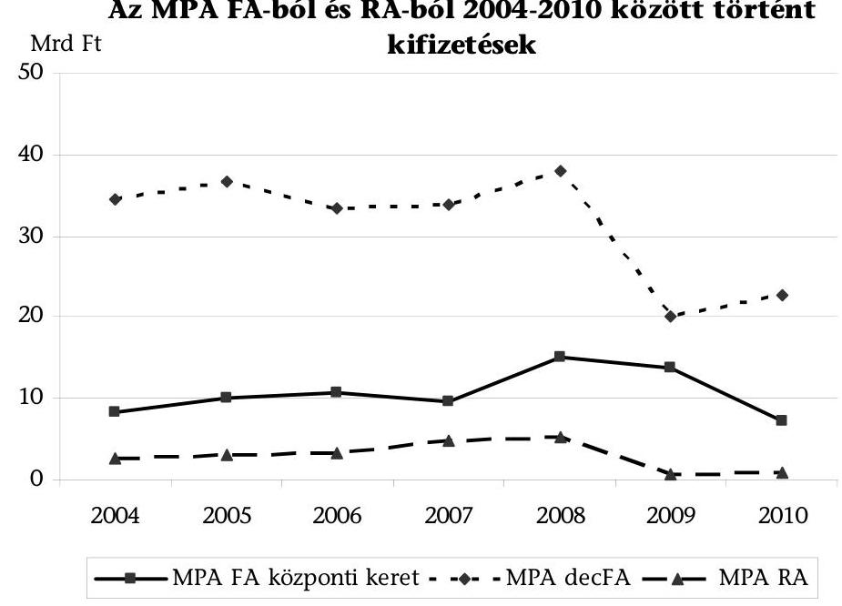

Adatforrás: MPA beszámolók

---

A három ágazati (GOP, TÁMOP, ÁROP) és a hét regionális OP-ban a 2007-2010 közötti időszakban a munkahelyteremtő és -megőrző, valamint munkaerőpiacon hátránnyal küzdők támogatását megvalósító programok keretei közt közel 430 Mrd Ft támogatást ítéltek meg a nyertes projektek kedvezményezettjei részére. A rész- és távmunka programokra uniós forrásból 1,4 Mrd Ft állt rendelkezésre. Az ÚMVP-ből a 2007-2010 közötti időszakban 579,9 Mrd Ft-ot ítéltek meg a munkahelyteremtést támogató programok rendelkezésre álló keretéből a kedvezményezetteknek.

A különböző forrásból finanszírozott programokra fordított forrásokat a 4/a. és 4/e. sz. melléklet tartalmazza.

A források általában változó (sok esetben csökkenő) mértékben, nem kiszámítható módon álltak rendelkezésre, az év közbeni elvonások gyakoriak voltak. A válság enyhítésére létrehozott „Munkahelyek megőrzéséért" program 10 Mrd Ft-os finanszírozási forrását például az MPA decFA-ból történő elvonással teremtették elő. Ennek következtében - mint a 6. ábrán is látható -2009-ben jelentősen - 38 Mrd Ft-ról 20 Mrd Ft-ra - csökkent az MK-k által közvetlenül felhasznált MPA decFA pénzösszeg.

A Nyugat-dunántúli Regionális Munkaügyi Központ (továbbiakban: NyDRMK) összes aktív eszközre felhasznált decentralizált kerete a 2007-2010. években a kétharmadára, 1732,9 M Ft-ra csökkent. A változás oka, hogy a rendelkezésre álló MPA decFA keret 2009-ben drasztikusan - a 2008. évi nyitó keret 57,6\%-ára csökkent a gazdasági válság kezelésére bevezetett központi munkaerő-piaci program miatt. 2009-ben a folyamatban lévő munkaerő-piaci programokra a fedezetet a csökkentett keretből is biztosítani kellett, azonban a 2010. évben már csak egy programot indítottak.

A Dél-dunántúli Regionális Munkaügyi Központnál (továbbiakban: DDRMK) a munkaerő-piaci programok megvalósítására 2007-ben a keret 3,8\%-a ${ }^{19}$, 2008ban 10,2\%-a, 2009-ben 24,9\%-a és 2010-ben 27,3\%-a jutott. A munkaerő-piaci programokra teljesített kiadások mértéke a 4 év alatt nem csak arányaiban, hanem abszolút számokban is folyamatosan emelkedett. A 2010-ben teljesített kiadás (809,6 M Ft) közel 4,6-szorosa volt a 2007-es összegnek (176,4 M Ft), annak ellenére, hogy a 2010. évben az összes aktív eszközre felhasznált decentralizált keret (2969,1 M Ft) a 2007. évi teljesített kiadásnak (4607,2 M Ft) csupán 64\%-át érte el.

A célkitűzések megvalósítására rendelkezésre álló forrásokat összességében átlátható módon, a jogszabályi előirásoknak megfelelően használták fel. A 2004. évtől nyújtott hagyományos munkahelymegőrző támogatás feltételrendszere lehetővé tette, hogy ugyanabból a forrásból, ugyanolyan céllal nyújtott támogatások eltérő feltételekkel kerüljenek megállapításra.

[^0]
[^0]:    ${ }^{19}$ az arányszám tartalmazza a külön soron nevesített saját kezdeményezésű munka-erő-piaci programra teljesített kiadásokat is

---

A munkahelymegőrző támogatás eljárásrendje alapján elutasító miniszteri döntés esetén a MK-ok decentralizált keretükből támogathatták a vállalkozást, így nem volt biztosított az, hogy ugyanabból a forrásból, ugyanolyan céllal nyújtott támogatás egyforma feltételekkel kerüljön megállapításra (pl. központi programnál a továbbfoglalkoztatási kötelezettség hosszabb, a nyújtható támogatás mértéke alacsonyabb). A helyszíni ellenőrzés tapasztalatai szerint egy kft. kedvezőbb feltételekkel nyújtott támogatásban részesült - a rövidebb továbbfoglalkoztatási idő tekintetében - azzal, hogy a minisztériumhoz benyújtott támogatás helyett, a MK saját decentralizált keretéből támogatta.

A foglalkoztatási helyzet javítását szolgáló programok illeszkedtek a stratégiai szintü dokumentumok, kormányprogramok célkitüzéseihez, azonban - a források széttagoltsága következtében - érdemben nem javult a célcsoportok foglalkoztatási helyzete. A vizsgált támogatások a területi szempontot prioritásként kezelték, a foglalkoztatási adatok tekintetében a területi különbségek érdemben mégsem csökkentek.

A források allokálását nem minden esetben támasztották alá elemzések, számítások.

Az MPA decFA keretének MK-k közötti allokációját a szaktárca által kidolgozott előterjesztésen alapuló MAT döntés határozta meg. A forrásallokációs modellben a területi kiegyenlítődés előmozdítására az alkalmazott mutatók, alapadatok alakulását az előterjesztések nem tartalmazták, így azok számszaki megalapozottságát az ellenőrzés nem tudta értékelni.

Az észak-alföldi régióban lebonyolított munkaerő-piaci programok kialakítását elemzésekkel, számításokkal nem alapozták meg, mutatószámot nem generáltak, azonban a végrehajtáshoz szükséges erőforrásokat a munkaerő-piaci programok programterveiben részletesen bemutatták.

# 2.5. Az indikátorrendszer kialakítása 

A célkitűzések megvalósulásának értékelésére szolgáló indikátorok alapvetően konkrétak, mérhetőek voltak, azonban indikátorokat nem minden esetben határoztak meg, illetve elöfordult, hogy a kialakított indikátor nem felelt meg a SMART kritériumoknak.

Az MPA-ból a hátrányos helyzetűek munkába vonását célzó egyes programok esetében nem határoztak meg indikátort (pl.: „A pályakezdő diplomások ösztöndíjas foglalkoztatásának ösztönzése a közigazgatásban 2005", „Non-profit szektorbeli munkavállalás elősegítése" program).

Az ÉARMK-nál és az NyDRMK-nál a munkaerő-piaci programok aktív eszközeinek indikátorai megfeleltek a SMART kritériumoknak. A DDRMK-nál a megyei munkaerő-piaci programokra meghatározott indikátorok általában nem pontosak, pl. a célcsoportba tartozó személyek megfogalmazás nem ad egyértelmú útmutatást arra nézve, hogy a programba belépő valamennyi személyre kell-e vonatkoztatni az eredményeket, vagy csak azokra, akik a támogatás segítségével helyezkedtek el. Arra sem ad választ az indikátorrendszer, hogy az eredményesség megítélésénél miként kell számításba venni, ha a tervezettnél többen vettek részt a programban. Másik jellemző hiba, hogy nem határidőhöz kötöttek (pl. a tartós foglalkoztatás, a továbbfoglalkoztatás esetén nem egyértelmú, hogy mikor-

---

tól kell vizsgálni ezek megvalósulását, illetve mit kell érteni a tartósságon, vagy mit kell érteni a „lezárás időpontján", a program befejezésének, vagy értékelésének az időpontját).

Az ÚMVP egyes jogcímeire vonatkozó indikátorokat kialakították, azonban amint azt a minisztérium mid-term ${ }^{20}$ értékelése is megállapította - a magyar mezőgazdasági vállalkozások gyors megsegítését célzó törekvések hatására az ÚMVP tervezésekor megcélzott egyes indikátorok tekintetében alulteljesítés volt (leginkább a munkahelyteremtésnél és a támogatott ágazatok megoszlásánál), ami az értékelés szerint 2010-2013 időszakban kezelést igényel. Az ÚMVP végrehajtásának előrehaladásáról szóló jelentéseiben ${ }^{21}$ is értékelték az indikátorok alakulásának tapasztalatait. Az indikátorok kisebb korrekciókkal megfeleltek a hazai mezőgazdaság ágazati sajátosságainak, a kitűzött célok összességében reálisak és teljesíthetők voltak, azonban a rendszer múködése szükségessé és indokolttá tette az indikátorok újbóli áttekintését az egyszerűsítés és egyértelműsítés érdekében.

A GOP támogatásoknál az 1. prioritáshoz kapcsolódóan határoztak meg új munkahely mérésére alkalmas indikátort, a 2. prioritáshoz, amely az akciótervek szerint az új munkahelyek túlnyomó többségét (mintegy 95\%-át) eredményezi, nem. Ennek oka, hogy a 2. prioritásban jellemzően csak közvetett hatásként teremtődnek új munkahelyek és ezek mérésére alkalmasabbak a prioritás indikátorokkal szemben az OP indikátorok. Ezek között kerültek meghatározásra a teljes OP tekintetében teremtett munkahelyek mérésére szolgáló indikátorok.

A létrehozott (bruttó) új munkahelyek számára vonatkozó indikátorok célértékeinek megalapozottságát, meghatározásának következetességét megkérdőjelezi, hogy a GOP megvalósításáról szóló éves jelentések tervezett értékei nagyságrendekkel eltérnek az akciótervek ugyanazon időpontra tervezett, összesített értékeitől.

A helyszíni projekt ellenőrzéssel érintett kedvezményezett véleménye szerint a TÁMOP-1.4.1-07/1 Pályázati útmutatójában nem volt egyértelmű a bevonható, inaktív személyek inaktív státusza igazolásának módja. Ennek következtében a KSz olyan hátrányos helyzetű emberek - munkaviszonnyal nem rendelkező rokkantsági nyugdíjas - bevonását is elutasította, akik az Útmutató alapján bevonhatók lettek volna.

# A TÁMOP-nál a prioritás és konstrukció szintű indikátorok közötti 

összhang nem volt teljes körűen biztosított. Az összehangoltság hiányában egyes nevesített indikátorok értékének meghatározásához a pályázók körében külön adatgyűjtésre volt szükség.

Az 1. prioritás „Új kezdet" kombinált indikátora csak prioritás szinten, összevontan jelent meg, az egyes konstrukciók vonatkozásában nem került célérték meghatározásra, tekintettel arra, hogy az indikátor értéke külső adatforrásból (NFSz) származik, annak értékéhez az egyes konstrukciók közvetve járulnak hozzá. A célérték felülvizsgálatára a TÁMOP 2010. évi végrehajtási jelentése is javaslatot tett a prioritás szintű indikátorok felülvizsgálata során.

Az ÁROP 2. prioritás célkitűzésének (az emberi erőforrás minőségének javítása) teljesülésének mérésére output-, eredmény- és hatásindikátorokat dolgoztak ki.

[^0]
[^0]:    ${ }^{20}$ ÚMVP (2007-2013) félidős (mid-term) értékelés (2010. december)
    ${ }^{21}$ Jelentés az ÚMVP végrehajtásának 2010. évi előrehaladásáról (2011. június)

---

Az ÁROP 2. prioritása a célkitűzések mellett alkalmazott indikátorai vonatkozásában sem illeszkedett az ÁROP 2.2.9-10/A, B konstrukciók célkitűzéseihez.

Az NFÜ a jelentéstervezetre 2011. december 13-án tett észrevételében jelezte, hogy „a vizsgált konstrukciók esetében megfogalmazott célok összhangban vannak egy, az ÁROP 2. prioritási tengelyében szereplő célkitüzéssel".

A vizsgált regionális OP-k végrehajtása során kialakított indikátorrendszer módszertani problémákat (pl. széttagoltság, elaprózottság) vetett fel. 2009-ben kialakították a kulcsok rendszerét, melynek fejlesztése, felülvizsgálata folyamatos munkát jelent az uniós támogatások tekintetében.

A munkahelyteremtésre vonatkozó indikátor esetében alapvető probléma volt, hogy a bázislétszámot csak a támogatási szerződésben kellett megadni.

További problémát jelent, hogy a 2008-2009-es ROP-okból finanszírozott ipari parki, iparterületi konstrukciók kapcsán nem egyértelmű a közvetlenül és a (jövőben betelepedni remélt vállalkozások által) közvetett módon teremtett munkahelyek elkülönítése.

A problémák megoldása érdekében a ROP IH 2009-ben ROP kulcsindiká-tor-rendszert dolgozott ki. Témánként meghatározták az alkalmazandó indikátorokat, mértékegységüket és definíciójukat. A kulcsindikátornak valamennyi OP-hoz kapcsolódó akciótervben, pályázati kiírásban és támogatási szerződésben meg kell jelennie, ezáltal biztosítva a konzisztens mérhetőséget. A ROP IH felkérte a KSz-eket a kulcsindikátor-rendszer kidolgozása előtt megkötött támogatási szerződések esetében is az indikátor-értékek adatszolgáltatásként történő bekérésére és rögzítésére az Egységes Monitoring Információs Rendszerben (továbbiakban: EMIR).

A ROP-ok végrehajtása során általános tapasztalat volt, hogy a támogatási szerződésekben nagyszámú indikátort határoztak meg, amelyek gyakran a projektgazdán kívüli ok miatt nem teljesültek. E probléma kezelésére a ROP IH 2010. december 2-án kiadta a ROP-2010-22. számú állásfoglalását, melyben rögzítették a szankcionálandó indikátorok körét, amelyek közé csak eredményindikátorokat soroltak. Az állásfoglalás a 2007-től meghirdetett projektek teljes körére érvényes.

A ROP-ok félidei értékeléseiből összeállított összefoglaló főbb értékelési megállapításai között szerepelt, hogy az indikátorrendszer annak ellenére, hogy 2009-ben kialakították a kulcsindikátorok rendszerét, jelenleg korlátozottan alkalmazható régiók közötti összehasonlításra. A helyszíni vizsgálat befejezéséig nem került sor az indikátor-mérés módszertanának átdolgozására.

Az NFÜ tájékoztatása szerint a módszertani felülvizsgálat folyamatban van és 2011. év végéig a módszertani és definíciós tisztázás megtörténik.

Számos indikátor neve/tartalma többféle módon értelmezhető, az ilyen indikátorokból levont következtetések nem adnak valós képet az előrehaladásokról. Igaz ez a 2007-ben és a 2008-ban megjelent pályázati kiírásokra, amelyekhez nem kapcsolódott indikátorszámítási és módszertani útmutató.

---

A megváltozott munkaképességúek hazai költségvetésből történő támogatásánál - az uniós programokkal ellentétben - az indikátorok kialakítása nem volt előírás, a támogatás hatásának mérését (hatékonyságvizsgálatot) sem írja elő jogszabály. Indikátorokat a közfoglalkoztatás, az EKD támogatások, valamint - az uniós forrásból megvalósuló programok kivételével - a munkahelymegőrző támogatásoknál sem határoztak meg.

# 2.6. A gazdasági válság foglalkoztatási hatásainak enyhítésére tett intézkedések 

A 2008-ban kialakult és a 2009-re kiteljesedett válság jelentős számú munkahely megszűnésével fenyegetett, így a foglalkoztatás területén komoly intézkedéseket sürgetett. A válság a magyar munkaerőpiacon 2010 első negyedévében érte el mélypontját ( $54,5 \%$-kal), majd ezt követően egy lassú kilábalási folyamat indult meg a hazai foglalkoztatásban. A munkanélküliek száma és aránya 2010 első negyedévében érte el a legmagasabb, közel félmilliós létszámot, illetve $11,8 \%$-os arányt.

A 2009-re 10,1\%-ra növekvő munkanélküliség arra is visszavezethető, hogy a nyugdíjkorhatár fokozatos emelése hatott a munkaerő kínálati oldalára, miközben a keresleti oldalon még nem jelentkezett igazi élénkülés, a munkanélküllellátó rendszer átalakítása aktívabb munkaerő-piaci jelenlétet követel meg a korábban inaktívnak számítók egy részétől is, valamint a munkájukat elvesztőket egyre kisebb arányban fogadja be a szociális, illetve a társadalombiztosítási rendszer.

A 2009 áprilisában alakult válságkezelő Kormány „Válságkezelés és bizalomerősítés" című egyéves cselekvési terve a gazdasági válság miatt veszélyeztetett munkahelyek megvédését célként fogalmazta meg, azonban a Kormányprogram megjelenésekor a válság kapcsán hazai forrásból indított munkahelymegőrző programok már működtek.

A foglalkoztatáspolitikai intézkedések egyik kiemelt területe lett a munkahelymegőrzés, amire - az uniós célkitűzésekkel összhangban - jelentős pénzügyi forrást biztosítottak. A válság kezelése során az egyik legfontosabb cél annak megakadályozása volt, hogy az átmeneti időszakban a munkavállalókat elbocsássák. Az átmenetinek tekintett gazdasági válság hatásainak csökkentésére hozott intézkedéseknél kiemelt szerepe van az időtényezőnek, a gyors reagálásnak. A központosított, nehézkes, lassan múködő rendszer rontotta a program hatékonyságát, mivel a nehéz helyzetbe jutott vállalkozások nem tudták kivárni a támogatás megérkezését.

Az FH megbízásából készített értékelő tanulmány ${ }^{22}$ szerint a támogatások előnyösen járultak hozzá a válság okozta feszültségek enyhítéséhez, de a hazai forrásból megvalósított válságkezelő intézkedések hatékonysága vitatható volt (pl. a

[^0]
[^0]:    ${ }^{22}$ „Az aktív munkaerő-piaci politikák komplex értékelése" részeként a TÁMOP 1.3.1. kiemelt program keretében készült Értékelő tanulmány az ÁFSz és az OFA 2004-2009. közötti években indított munkaerő-piaci programjairól, valamint a 2009. évi válságkezelési programokról (készítette: dr. Simkó János, Miskolc, 2010. VII.)

---

fő eszközként használt bértámogatás tömegszerűvé tétele, nagymértékű központosítás).

A hazaihoz hasonló - a bértámogatást előnyben részesítő - konstrukciót az EU fejlettebb országaiban nem alkalmaztak, mert a támogatások járulékos negatív hatásaként a támogatott versenytársaihoz képest relatíve kedvezőbb pozícióba került.

A tanulmány szerint az EU fejlettebb országaiban a „rugalmas biztonság" („flexicurity") alkalmazkodási stratégiai modell vált meghatározóvá, amely már a vállalkozás komoly és előrelátó szervezési intézkedéseit, egyebek között a rövidített munkaidő bevezetését, a kiesett időre a dolgozók bizonyos arányú állami kereset-kiegészítő támogatását, valamint a dolgozók tudását, alkalmazkodóképességét fejlesztő képzések nagyobb arányú alkalmazását is feltételezi. ${ }^{23}$ A rövidített munkaidő támogatására a „Munkahelyek megőrzéséért" programon belül volt lehetőség, 52 vállalkozást érintett, elsősorban a nagyobb létszámméretű vállalkozások köréből. Ennek következtében a megítélt támogatás összege és az érintett létszám jelentős volt ( 3164 M Ft, 15657 fő).

Az európai modellt követte az uniós forrásból finanszírozott TÁMOP 2.3.3. Munkahelymegőrző támogatás képzéssel kombinálva című program.

A programban a munkaidő egy részében a munkavállaló számára lehetőség nyílik arra, hogy továbbfejlessze tudását, szakmai ismereteket szerezzen. A program keretében támogatás nyújtható a képzéshez és a képzés miatt kieső munkaidő idejére jutó bérköltséghez.

A teljes gazdaságot átfogó, gazdaságpolitikailag megalapozott, öszszehangolt intézkedések hiányában az egyes támogatási programokat irányító szervezetek különböző intézkedéseket hoztak.

Összehangolást segítő intézkedés az időpont és a forrás tekintetében a két hazai, válsághoz kapcsolódó munkahelymegőrző program között megtörtént.

Az FH és az OFA válságkezelő munkahelymegőrző támogatásai kapcsán a különböző intézményrendszer keretében, eltérő feltételekkel történő támogatások nyújtásával nem volt biztosított az átláthatóság, a keretek váltásszerű rendelkezésre állása a hozzáférést nehezítette. A párhuzamos támogatások elkerülése érdekében kölcsönös adatszolgáltatás volt az FH és az OFA között.

A kitűzött program és projektcélok megvalósítása érdekében a jogszabályokban és a pályázati feltételekben módosításokat (enyhítéseket) hajtottak végre.

A válság hatásainak csökkentésére szolgáló eszközök egyike a pályázati feltételek enyhítése volt a projektek céljainak teljesülése érdekében.

[^0]
[^0]:    ${ }^{23}$ Dr. Frey Mária: A munkapiac jogszabályi és intézményi környezete című tanulmányán belül - Válságkezelő politika az Európai Unióban (Munkaerő-piaci tükör 2009. évi kiadványa; Bp., 2009. MTA Közgazdaságtudományi Intézet, szerk.: Dr. Fazekas Károly)

---

Az agrártámogatások területén (ÚMVP) a gazdasági válság által okozott nehézségek miatt törölték a munkahelyteremtés elmaradásával kapcsolatos szankciókat. A ROP-ok esetében könnyítés volt, hogy nem kellett új munkahelyeket teremteni, hanem elég volt a korábbiakat megtartani és lehetőség volt az 5 éves fenntartási idő 3 évre csökkentésére is. A munkahely-megtartási lehetőség a 2009 és 2010. évi telephely-fejlesztési kiírásnál került alkalmazásra.

Egyes gazdaságfejlesztési programok (ÚMFT, GOP és ROP-ok) esetében a forrásokat azon prioritásokra csoportosították át, amelyek - viszonylag rövid távon - hozzájárulnak a gazdaság és így a munkahelyek bővüléséhez, illetve a célcsoport, valamint a fejlesztési célok kiszélesítésével kívánták a válság hatásait enyhíteni. Ezen intézkedések hozzájárultak a források teljes körű és eredményes felhasználásához, valamint a válság kezeléséhez.

Az ÉAOP félidei értékelésében kimutatott adatok alapján négyszer annyi munkahely teremtését vállalták a projektek, mint amennyi az OP-ban 2015-ig célértékként szerepel. Ebben nagy szerepe volt a válság hatására meginduló közvetlen kkv-támogatásoknak (telephely és ipartelepítés).

Az NyDOP-ban a felelős hatóság a 2009-2010. évi akciótervben bővítette, kiszélesítette a fejlesztési célokat, a pályázók körét és a támogatott tevékenységeket.

A TÁMOP-1.1.2-07/1 konstrukció eredeti célcsoportja a gazdasági válság miatt állásukat elvesztő álláskeresők körével bővült ki. A 27 Mrd Ft-os keretemelést a Kormány 2009. márciusi döntése alapján a 2009-2010-es időszakra rendelkezésre álló keretből csoportosították át a 2007-2008-as akciótervi keret javára. A konvergencia régiók tartalékai a gazdasági válság által legnagyobb mértékben sújtott NyDRMK javára kerültek átcsoportosításra.

A költségvetési rehabilitációs foglalkoztatási támogatásokra vonatkozó jogszabályok módosításai nem tartalmaztak a válság hatásának enyhítésére rendelkezéseket. A jogszabályokban a támogatás feltételeinek szigorodása a válság éveiben (2008-2009) is megfigyelhető. A válság hatására a támogatott munkáltatók egy része a munkavállalók munkaidejének csökkentésére kényszerült, ezáltal elkerülték a létszámleépítéseket és biztosították rentábilis múködésüket. Volt olyan munkáltató is, akinél a megrendelések hiánya és a kapacitáskihasználtság csökkenése miatt a vállalt foglalkoztatási létszám veszélybe került.

# 3. A TÁMOGATÁSI PROGRAMOK EREDMÉNYESSÉGE 

Az NFT programjai által a 2004-2008 közötti időszakban létrehozott és megtartott munkahelyek megoszlását a 7. ábra mutatja be.

---

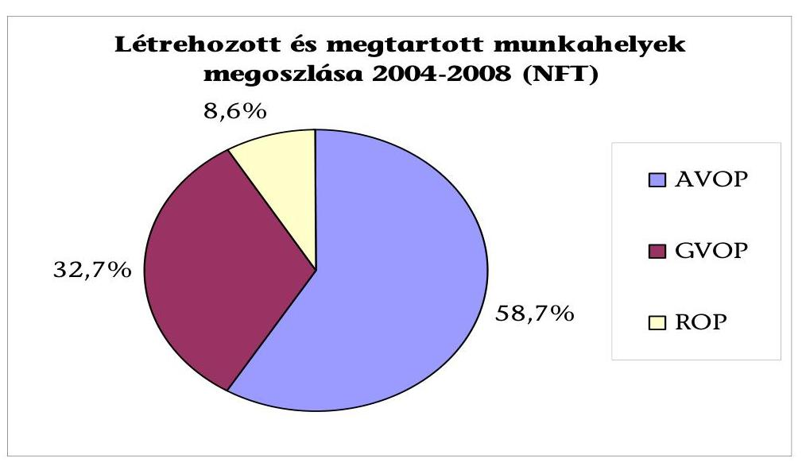

Az NFT programjai során a 2004-2008 közötti időszakban létrehozott és megtartott munkahelyek száma 34472 db volt, mely az OP-k vonatkozásában a következők szerint alakult: AVOP $20237 \mathrm{db}, 11263 \mathrm{db}$, ROP 2972 db .

A hazai és uniós programok projektjeiben a kedvezményezettek közel 105 ezer munkahely létrehozását vállalták. A hazai finanszírozású munkahelymegőrzési támogatások eredményeként a 2004-2010 közötti időszakban közel 192 ezer munkahelyet őriztek meg, illetve uniós forrásból közel 16 ezret támogattak.

A megváltozott munkaképességű személyek foglalkoztatása során a 2007-2010 közötti időszakban évente átlagosan 56 ezer munkahelyet támogattak. A közfoglalkoztatás különböző formáiba a 2004-2010 közötti időszakban átlagosan évi 146 ezer embert vontak be. A munkaerőpiacon hátrányos helyzetben lévők munkába vonását szolgáló egyéb aktív eszközök és programok hazai forrásai esetében a támogatással érintett létszám 326 ezer főt tett ki, az uniós forrásokból 156 ezer főt támogattak. A rész- és távmunka programokban 1000 fő támogatását tervezték.

A támogatások eredményeként közvetlenül teremtett, megőrzött és támogatott munkahelyek alakulását az 4/a. - 4/e. sz. melléklet mutatja be.

# A programok összességükben hozzájárultak a foglalkoztatás bővítése, a munkahelyek megtartása és az inaktivitás csökkentése célkitüzéseinek eléréséhez. A munkahelyteremtést és -megőrzést célzó, különböző forrásból finanszírozott programok azonban nagy eltérést mutattak az eredményesség, a támogatottak köre, a támogatott projektek hosszúsága, a határidők stb. vonatkozásában. 

Az NFÜ a jelentéstervezetre 2011. december 13-án tett észrevételében hangsúlyozta, hogy a támogatások hatása a foglalkoztatást mérő mutatókra nem egyértelmú.

---

# Az eredményességet a vállalt és a teremtett munkahelyek számának alakulásán, az indikátorok kitüzött célértékeinek időarányos teljesülésén, az elért eredmények fenntarthatóságán, a területi különbségek figyelembevételén és csökkenésén keresztül vizsgáltuk. Vizsgáltuk az egyes támogatástípusokra vonatkozóan a munkahelyteremtés és megőrzés fajlagos költségét (Ft/fő/év). Az értékelést nehezítette, egyes esetekben lehetetlenné tette, hogy a projektek a megvalósítási szakaszban tartanak, a munkahely-teremtési és -megőrzési kötelezettség teljesülésének értékelésére azonban csak a projektek lezárása után kerülhet sor. 

2011. augusztus végéig a vizsgált GOP és KMOP konstrukciók projektjeinek mintegy $24 \%$-a zárult le. Az ÚMVP támogatási kérelmeiben vállalt munkahelyek létrehozását a projekt megvalósulási időszakában nem vizsgálták (mivel a vállalást is az üzemeltetési időszakban kell teljesíteni), ebből adódóan a helyszíni vizsgálat idején a létrehozott munkahelyekre vonatkozóan konkrét adatokkal az MVH nem rendelkezik. A DDOP munkahelyteremtéssel érintett, hatályos támogatási szerződéssel rendelkező projektjeinek 16\%-a zárult le a helyszíni ellenőrzés befejezéséig.

Az NFÜ a jelentéstervezetre 2012. február 7-én tett észrevételében jelezte, hogy az indikátorrendszer nem elsősorban az eredményesség mérésére, hanem a programok és projektek előrehaladásának nyomon követésére szolgál. Az eredményesség és a hatások mérésére csak a programozási időszakot követően, a nemzetközileg elfogadott módszertanok alapján (pl. makro-ökonómiai modellek alkalmazásával) van lehetőség.

Az ÁSZ az észrevétellel nem ért egyet, mert az ellenőrzés megközelítése szerint a programok előrehaladását és a munkahely-teremtési célok megvalósulását az indikátorok időarányos alakulásán keresztül értékelte, különös tekintettel arra, hogy az ellenőrzéssel érintett uniós fejlesztési programok a megvalósulás és fenntartás időszakában vannak, így a célok teljesülése érdekében a korrekciós beavatkozások, intézkedések megtételére lehetőség nyílik.

Az eredményesség és a közvetlen hatások, azaz a programcélok időarányos teljesülésének értékeléséhez a programozási dokumentumokban a tagállam által meghatározott (vállalt), az Európai Bizottság által elfogadott számszerúsített mutatók (indikátorok) szolgáltak alapul.

A munkahelyteremtés eredményeként létrejött új, valamint a megőrzött munkahelyek foglalkoztatási szint javulására gyakorolt hatása nem választható külön az egyéb tényezők (adó, gazdasági helyzet, válság stb.) hatásaitól. A vizsgált támogatások a munkahelyteremtés eszközei, az egyes gazdaságfejlesztési projektek szerződéseinél az új munkahelyek létrehozásának közvetlen, konkrét, számszerúsített - és így számonkérhető - kötelezettsége a GOP esetében csupán három konstrukciónál (GOP-1.3.2, 2.1.2, 2.1.3) jelent meg. Ezen három konstrukció kivételével a munkahelyteremtés csak közvetett hatásként jelent meg, ami - a program végrehajtása során kialakuló gazdasági válság mellett - hozzájárult az eredmények elmaradásához.

Az NFÜ 2012. február 7-én kelt észrevételében javasolta a megállapítás kiegészítését azzal, hogy a három konstrukció kivételével a nettó munkahelyteremtés nem kötelező előírás a projektekben, a beruházások és a kapacitásnövekedés közvetett eredményeképpen keletkező létszámnövekmény csak indikátorként ke-

---

rül mérésre a projektek fenntartási időszaka során, így tényleges, számszerűsíthető eredmények csak a későbbiekben lesznek kimutathatóak.

A kiegészítési javaslattal az ÁSZ nem ért egyet, mert a fejlesztési források felhasználásához a támogatási szerződésben előírt, a kedvezményezett által vállalt munkahely-teremtési kötelezettség hozzájárul a munkahelyteremtés célkitúzésének eredményesebb megvalósulásához. Azon konstrukciók esetében, ahol a nettó munkahelyteremtés nem kötelező előírás a projektben (nem jelenik meg a támogatási szerződésben kötelezettségként), azaz a létszámnövekmény a beruházások és a kapacitásnövekedés közvetett eredményeként valósul meg, a munka-hely-teremtési célkitúzés megvalósulása esetleges.

A kitöltött tanúsítványok adatai és a helyszíni ellenőrzés tapasztalatai alapján a pályázók által vállalt munkahely-teremtési és -megőrzési kötelezettség nagyságrendje megfelelt a célértéknek. Az egyes támogatási formáknál eltérően teljesültek a szerződésben vállalt munkahely-teremtési kötelezettségek.

Az EKD alapján nyújtott támogatások foglalkoztatási szempontból eredményesek voltak, a munkahelyeket a kedvezményezettek létrehozták, fenntartották.

Az EKD esetében a támogatottak munkahely-teremtési kötelezettségüknek - a lezárult projektek esetében - eleget tettek. A helyszíni vizsgálat idején 80 db élő, egyedi kormánydöntés alapján kötött támogatási szerződés volt érvényben. A támogatott projektekben 2004 óta összesen közel 36 ezer új munkahely teremtésére vállaltak kötelezettséget, ebből a helyszíni vizsgálat befejezéséig mintegy 23 ezer munkahelyet hoztak létre. A KSz tapasztalatai szerint a ténylegesen (a támogatás hatására közvetve, a vállalt létszámon felül) teremtett munkahelyek száma ennél jelentősen nagyobb.

A GOP alapján nyújtott támogatások közvetve, egyes projektek esetében - a támogatás feltételeként, illetve vállalásként megjelenő munkahely-teremtési kötelezettség révén - közvetlenül hozzájárultak a foglalkoztatás bővítéséhez.

A vizsgált konstrukciók megkötött szerződéseiben a kedvezményezettek 8251 fő többletlétszám foglalkoztatását vállalták, a megkötött szerződések szerint a kedvezményezettek összesen mintegy $38,5 \mathrm{Mrd}$ Ft támogatási összeget nyertek el, használhatnak fel. A munkahelyteremtés konkrét, számszerú kötelezettsége a 1.3.2. és 2.3.1. konstrukciókban jelenik meg. A 2.1.2/D. konstrukció számszerú munkahely-teremtési kötelezettséget nem ír elő, de a pályázatok tartalmi vizsgálati kritériumai között közvetve megjelent a munkahelyteremtés előírása.

Az MPA munkahely-teremtési támogatásai esetében a pályázók által vállalt munkahely-teremtési és -fenntartási kötelezettség megvalósult, amely hozzájárult a foglalkoztatáspolitikai stratégiákban deklarált célok teljesüléséhez.

A Postapartner központi munkaerő-piaci program ideje alatt a 429 vállalkozásba adott postán a korábban foglalkoztatott 1464 fő közül 1157 fő (79\%) számára biztosították a munkanélkülivé válásuk megelőzését.

Az ÚMVP esetében az első projektek munkahelyteremtésre vonatkozó teljesítési kötelezettségének számonkérésére nem került sor.

---

Az MVH a jelentéstervezetre 2011. december 2-án tett észrevételében kifejtette, hogy „a munkahelyek létrehozását az üzemeltetési időszakban ellenőrzi az MVH, megvalósítási időszakban nincs értelme, mivel a vállalást is az üzemeltetési időszakban kell teljesíteni", ez azonban ellentmond az ÁSZ ellenőrzés tapasztalatainak.

A ROP-ok vizsgált prioritásainak pályázati kiírásai révén növekedett mind a teremtett, mind a megtartott munkahelyek száma.

A vizsgált ROP- oknál a foglalkoztatás-bővítésre irányuló célkitúzés konkrétan az ÉAOP 1., 2., valamint 5. prioritásaiban, a DDOP 1., 2. és 4. prioritásaiban, valamint az NyDOP 1-3. prioritásaiban jelent meg. A ROP projektjei még a megvalósítási szakaszban tartanak, ezért nem állapítható meg egyértelmúen, hogy meg-valósultak-e a vállalások. A helyszínen ellenőrzött lezárt projektek vonatkozásában elmondható, hogy a munkahely-teremtési vállalások összességében - a gazdasági válság miatti könnyítéssel - megvalósultak.

A munkahelymegőrző támogatások foglalkoztatáspolitikai célkitűzései részben megvalósultak, mivel a kedvezményezettek többségénél átmenetileg elkerülhetővé váltak a leépítések, de a rövid távú eredmények mellett a munkanélküliség emelkedő trendjét nem sikerült megállítani.

Az NGM és az NFSz által lebonyolított 3 db munkahelymegőrző támogatási program összesített érintett (vállalt) létszáma a vizsgált időszakban 147002 fő volt. A ténylegesen megőrzött munkahelyek számáról összefoglaló, központi szintű elemzés, értékelés nem készült, az ellenőrzés részére erre vonatkozóan nem tudtak adatot szolgáltatni.

Az OFA „Válság" program 3 különálló programból áll. A programok a 2008. december 22. - 2012. június 30. közötti időszakban kerülnek megvalósításra, az öszszes megőrzendő létszám 43592 fő. A további 5 db vizsgált OFA program tekintetében a támogatás eredményeként megőrzött összlétszám 1264 fő volt.

A TÁMOP-2.3.3. konstrukció keretei közt közvetlenül és közvetve megőrzött munkahelyek tervezett száma 25029 , illetve 61257 fő, aktuális értékük 2011. szeptember 12-én 16 245, illetve 45793 fő. A konstrukció projektjeinek megvalósítása a helyszíni ellenőrzés befejezéséig nem zárult le.

A hazai forrásból finanszírozott, hátrányos helyzetúek foglalkoztatásának támogatását szolgáló programok eredményei és azok fenntarthatósága eltérő képet mutattak. Az ellenőrzéssel érintett programok közül három esetben állapította meg a helyszíni ellenőrzés, hogy a program kezdetekor foglalkoztatott létszám idővel jelentősen lecsökkent, illetve a tervezett létszám nem teljesült.
„A diplomás pályakezdők ösztöndíjas foglalkoztatása, 2008." elnevezésű központi programba a tervezett 400 fő helyett 255 főt sikerült bevonni. A programzáró beszámolója nem tért ki a célértéktől való elmaradás okaira.
„A pályakezdő diplomások ösztöndíjas foglalkoztatásának ösztönzése a közigazgatásban" programban a tervezett 172 fő helyett 92 fő foglalkoztatására került

---

sor, ami a párhuzamosan indított, szintén diplomás pályakezdőket megcélzó programok24 miatt következett be. A programról záró beszámoló nem készült.

A „Non-profit szektorbeli munkavállalás" program 226 fő foglalkoztatásával kezdődött meg 2004-ben, de a foglalkoztatók növekvő anyagi terhei miatt 2006. év végére mindössze 89 fő állt alkalmazásban.

Az uniós forrásból finanszírozott, hátrányos helyzetúek foglalkoztatásának támogatását szolgáló programok többségénél a projektek megvalósítás alatt álltak, így eredményességüket és a célkitúzések teljesülését az ellenőrzés nem tudta teljes körűen értékelni.

A TÁMOP-1.4.1-07/1 konstrukció keretei közt legalább 6 hónapos foglalkoztatásban részt vett hátrányos helyzetú emberek száma 870 főre (terv: 802 fő) teljesült.

Az ÁROP-2.2.9-10/A, B konstrukciókban a tervezett 200 fővel szemben mindössze 64 fő foglalkoztatására érkezett elfogadható pályázat a KSz-hez. Ez azt mutatja, hogy a program által kínált bérköltség-támogatási konstrukció a megcélzott szervezeteket nem ösztönözte kellő mértékben pályázat benyújtására.

A vizsgált megyei, hátrányos helyzetűeket segítő munkaerő-piaci programok végrehajtása alapvetően eredményesnek minősíthető, de a DDRMK esetében a programok eredményessége az indikátor hiányosságai miatt nem állapítható meg egyértelmúen.

A DDRMK programjai közül a „Munkát mielőbb! 2007-2009" programzáró beszámolója a programba bevontakból (531 fő) önállóan elhelyezkedett 130 fő továbbfoglalkoztatásáról nem adott információt. A „Diplomás fiatalok a régió fejlődéséért" program esetében a bevontak tartós foglalkoztatására vonatkozó indikátorral kapcsolatban nem volt tisztázott, hogy a tartós foglalkoztatást a program elejétől kell-e számítani, vagy a végétől. A 3 db vizsgált programban három foglalkoztató esetében került sor foglalkoztatási kötelezettség megszegésére, illetve ennek következtében támogatás visszakövetelésére.

Az NyDRMK vizsgált három munkaerő-piaci programja közül a helyszíni ellenőrzés befejezéséig kettő zárult le, a programok az elvárt célkitúzéseket teljesítették ${ }^{25}$. A foglalkoztatás 28 főt érintett, ugyanakkor a továbbfoglalkoztatás egyik esetben sem volt megoldott.

Az ÉARMK vizsgált 6 db programja közül a helyszíni ellenőrzés befejezéséig 5 db zárult le. A programok végrehajtása alapvetően eredményesnek minősíthető, a tervezett 398 főből 381 fő foglalkoztatása valósult meg ${ }^{26}$.

A közhasznú és közcélú foglalkoztatás hosszú távon nem járult hozzá a foglalkoztatás bővüléséhez, de a programban résztvevők számára a közfoglalkoztatásban való részvétel jelentette az egyetlen munkalehetőséget.

[^0]
[^0]:    ${ }^{24}$ „a diplomás pályakezdők ösztöndíjas foglalkoztatása" és „A diplomás pályakezdők ösztöndíjas foglalkoztatása 2008."
    ${ }^{25}$ a folyamatban lévő program indikátorainak időarányos teljesítése megtörtént
    ${ }^{26}$ a folyamatban lévő programban a tervezett 2 fő helyett 1 fő foglalkoztatása történik

---

A közhasznú foglalkoztatás érintett létszáma a 2004-2008. években 64-79 ezer fő között mozgott, de 2009-ben 21 ezer före, 2010-ben 17 ezer före csökkent. A közcélú foglalkoztatás létszáma ezzel szemben 2005-2008 között 29-67 ezer fő közötti értékéről 2009-re 103 ezer főre, 2010-re 138 ezer főre nőtt. Az átrendeződés az „Út a munkához" program közcélú foglalkoztatási program 2009-ben történő elindításából adódott.

A megváltozott munkaképességúek foglalkoztatását elősegítő költségvetési támogatások a jogszabályban megfogalmazott célkitűzések megvalósulásához, fenntarthatóságához részben járultak hozzá.

A 177/2005. (IX. 2.) Korm. rendelet 1. § (2) bekezdése célként - a megváltozott munkaképességű munkavállalók adaptációs készségének fejlesztése - fogalmazta meg a megváltozott munkaképességű munkavállalók nyílt munkaerőpiacra való visszavezetését, de a támogatások eredményessége információ hiányában nem ítélhető meg.

A megváltozott munkaképességűek foglalkoztatását elősegítő uniós támogatási program megvalósítási időszaka a helyszíni ellenőrzés befejezéséig nem zárult le.

A TÁMOP-1.1.1-08/1 kiemelt projekt „a program befejezését követő 180. napon foglalkoztatottak száma" indikátora 2010. év végén a - 2013. II. félévében elérendő - célértékhez képest $8 \%$-on áll, miközben a projektbe bevontak aránya $127 \%$-os teljesülést mutat.

A részmunkaidős foglalkoztatás keretei közt a 2004-2010 közötti időszakban 4091 főnek nyújtottak támogatást ${ }^{27}$.

A 2007-2010. években bértámogatás, illetve bérköltség-támogatás keretei között a 4, 6, illetve 7 órás foglalkoztatás támogatásában - összesen 16762 fő volt érintett. A 2004-2010. években a Távmunka programok keretei közt összesen 4130 távmunkahelyet hoztak létre.

Az uniós, illetve egyes hazai programok esetében indikátorokat alakítottak ki a célok megalapozására és az elért eredmények mérésére. Az indikátorok értékeinek alakulása - az ellenőrzés tapasztalatai szerint - elmaradt a kitűzött célértékek időarányos adataitól. A munkahelyteremtés eredményei jelentős időarányos elmaradást mutatnak. Az eredmények elmaradásához nagyban hozzájárult a gazdaságfejlesztési programoknál a munkahely-teremtési célok konkrét kötelezettségének hiánya, illetve a program végrehajtása során kialakuló gazdasági válság.

Az NFÜ 2011. december 13-án tett észrevételében hangsúlyozta, hogy „a válság hatására az indikátorokban a GOP hatásai nélkül még jelentősebb jelenleg nem mérhető csökkenések következhettek volna be".

A ROP-ok előrehaladása alapján a szerződésekben vállalt teremtett munkahelyek száma már 2011 nyarán többszörösen meghaladta az OP-k 2015-re vonatkozó célértékeit. A munkahelyek létrejöttének tendenciája a vállalások teljesítésének irányába mutat, azonban azok számából megalapozott következtetést nem lehet

[^0]
[^0]:    ${ }^{27}$ 2009-ben nem volt ilyen támogatási forma

---

levonni a 2015. évi tényleges megvalósulásra vonatkozóan. Az ÉAOP Félidei Értékelés 2010. április 15 -én lezárt adatbázisa alapján az eddig lekötött források nyertes projektjei összesen 5588 db munkahely teremtését vállalták, ez közel négyszerese az ÉAOP 2015. évi 1500-as célértékének. Az indikátorértékek realizálása a későbbiekben várható, a projektek a megvalósulás fázisában vannak. Az ÉAOP megvalósításáról szóló 2010. évi jelentésben az EMIR adatai alapján a létrehozott új munkahelyek száma 178 fő.

A DDOP esetében az 1. prioritásban támogatási szerződéssel a keret $48 \%$-át, a 2. prioritásban a keret $41 \%$-át, a 4. prioritásban a keret $65,5 \%$-át kötötték le. Az OP 2015-re 2200 létrehozott új munkahellyel számolt (indikátor célérték). A 2011. június 30-i állapotot tükröző adatok szerint a kitűzött OP szintű célérték a szerződésekben rögzített, munkahelyteremtésre vonatkozó vállalásoknál már 165\%ban ( 3633 fő), a ténylegesen létrehozott munkahelyek száma pedig $80 \%$-ban teljesült, a projektek egy része még a megvalósítási fázisban van. A 2011. június 30ig teremtett új munkahelyek száma 1767 fő.

Az NyDOP esetében a 2010. április 15 -ei adatok szerint összességében az OP 2015. évi célértékének (2000 fő) 43\%-át (860 fő) vállalták szerződéses kötelezettségként, 2011. augusztus 31-én az arány már 118\% (2361 fő) volt. Az NyDOP 2010. évi megvalósításáról készült jelentés szerint az 1-5. prioritásokat tekintve a 2010. december 31-ig ténylegesen megvalósult munkahelyteremtés $222^{28}$ fő volt, ez a 2013. évi célérték $11,1 \%$-a, azonban a projektek nagy része még a megvalósítási fázisban tart. A lezárt 48 projektnél (1-3. prioritás) az ipari parkok közvetett munkahelyteremtései figyelembevétele nélkül a vállalt 192 fővel szemben 196 fő munkahelyteremtés valósult meg.

A GOP támogatási programok munkahelyteremtésre vonatkozó (OP szintű) célindikátorai és tényadatai jelentős eltérést mutatnak, a célindikátorokban megfogalmazott időszakos célok nem teljesültek.

Az NFÜ a 2012. február 7-én kelt észrevételében jelezte, hogy a célindikátorokban megfogalmazott időszakos célok teljesülése a program jelenlegi előrehaladási fázisában nem teljes körűen megállapítható, és az adatok várhatóan a program zárásakor (2015-ben) lesznek megállapíthatóak.

A GOP 2010. évi megvalósításáról szóló jelentés szerint a létrehozott munkahelyek száma 216 fő a 2010. évre célként kitűzött 10 ezer fő (korábban 24 ezer fő) helyett, ez $1 \%$ alatti teljesítést mutat a célértékhez képest. A helyszíni ellenőrzés idején az IH-tól kapott tájékoztatás szerint a létrehozott munkahelyek száma 1975 fő (2011 szeptemberében), ami a célértékhez képest szintén jelentős elmaradást mutat, annak mintegy 20\%-a. A prioritás szintű, munkahelyteremtésre vonatkozó indikátor (kizárólag 1. prioritásra vonatkozóan) teljesülése a 2010. évi végrehajtási jelentés szerint még nem volt mérhető.

Az NFÜ a 2012. február 7-én kelt észrevételében jelezte, hogy a 2010. évi végrehajtási jelentésben szereplő adatok egy 2007-es kiírás kedvezményezettjeitől érkeztek be, így a többi kiírás adatait nem tartalmazták.

Az EKD esetében a támogatási forma kialakításakor konkrét célindikátorokat így a létrehozott munkahelyek számának mérésére alkalmas indikátorokat - a

[^0]
[^0]:    ${ }^{28}$ az éves beszámoló az NyDOP 1-5 prioritásait vizsgálta, amelyek munkahely teremtési adatai nem kerültek prioritásonként részletezésre

---

támogatási forma sajátosságaiból fakadóan nem határoztak meg, az egyes támogatásoknál a kötelezettségvállalások egyediek.

Az ÜMVP indikátorainak teljesülése még nem értékelhető, a helyszíni ellenőrzés során az ÁSZ részére a vállalt munkahelyekre vonatkozó adatokat nem tudtak átadni.

A munkahelymegőrző támogatási programok közül az OFA és a TÁMOP-2.3.3. programoknál határoztak meg indikátort. Az indikátorok jól mérhetőek, értékelésükre a program lezárása után kerül sor.
„A diplomás pályakezdők ösztöndíjas foglalkoztatása, 2008." programzáró beszámolója nem tért ki a célértéktől való elmaradás okaira.

A TÁMOP-1.2.1-07/1 kiemelt projekt egyik indikátorának ${ }^{29}$ kiértékelése nem lehetséges, mivel a jelenlegi normatív környezetben a pályázati rendszer múködésébe bevont Nemzeti Adó- és Vámhivatal (továbbiakban: NAV) adatszolgáltatási kötelezettségének csak összevont adatok szintjén, az egyéni beazonosíthatóság nélkül tehet eleget. Az anonimitás biztosításával külső cég bevonása mellett az indikátor kiértékelésének módszere kidolgozás alatt van.

A TÁMOP-1.4.1-07/1 projekt esetében a vállalt létszámteremtési kötelezettségek jellemzően megvalósultak, a vizsgált 18 projekt közül 5 nem teljesítette a vállalt foglalkoztatási indikátort, ellenük szabálytalansági eljárás indult.

A dél-dunántúli régióban külső megvalósító (projektvezető) által bonyolított „Sorsfordító-Sorsformáló" programban - annak komplexitása miatt - napi szintű folyamatkövetés történik a projektvezető, a koordinátorok és a mentorok között. Havonta írásos beszámolót készítenek a konzorciumvezető, a képző intézmény és a koordinátorok, amelyeket negyedévente összegeznek. A MK felé negyedéves előrehaladási jelentés és éves szintű projektértékelés készül.

Az eredmények fenntarthatóságát vizsgálva a tapasztalatok szintén eltérőek, a programok hosszú távú hatása - a munkahelyteremtő gazdaságfejlesztési programok kivételével - nem mutatható ki. A támogatási programokkal csak rövid távon javult (általában a támogatás időtartamára) a programokban résztvevők munkaerő-piaci helyzete. Ez különösen a közhasznú és közcélú foglalkoztatási programok esetében szembetűnő.

Az EKD támogatások kapcsán létrehozott munkahelyeket a vizsgálat tapasztalatai alapján a kötelező vállalási időn túl, hosszabb távon fenntartották.

A közcélú foglalkoztatás esetén a segélyezettek 1-3\%-a, míg a közhasznú foglalkoztatást befejezők alig 1\%-a tudott elhelyezkedni a nyílt munkaerőpiacon.

A diplomás ösztöndíjasok programjai a résztvevőknek hosszabb távra tudtak a foglalkoztatást biztosítani.

A megváltozott munkaképességű munkavállalók támogatási rendszerének célja a foglalkoztatás, nem fogalmazza meg a hosszú távú hatás kritériumát.

[^0]
[^0]:    ${ }^{29}$ „a munkaerőpiacon tartósan elhelyezkedettek száma a járulékkedvezmény lejártát követő 6. hónap végén" indikátor

---

Az NyDOP 1-2. prioritásaiban meghirdetett támogatási programok a foglalkoztatás növelését célozták, viszont a közfeladatok ellátásával összefüggő fejlesztések támogatására irányuló konstrukciói a foglalkoztatás növelésére nem voltak hatással.

Az ország egyes régiói, területei között fennálló foglalkoztatási különbségek csökkentésének célja, szándéka a legtöbb támogatási program esetében megjelent, a támogatások azonban a meglévő különbségeket - a területi mutatók alakulásának és az egyes támogatástípusok vizsgálatának tapasztalatai alapján - nem csökkentették. Az egyes támogatott célcsoportok munkaerőpiaci helyzetének és a területi különbségek alakulásának teljes körű vizsgálata - az ellenőrzött támogatási formák mindegyikénél - a projektek lezárása után történik.

A támogatási összegek régiók közötti megoszlása a GOP esetében egyenletes, a dél-dunántúli régió $8 \%$-os részesedésén kívül a megoszlás kiugró értéket nem tartalmaz. Az új munkahelyek területi megoszlása nem egyenletes, a legtöbb új munkahely várhatóan a közép-dunántúli régióban jön létre, számszerúen 3286 (40\%), míg a legkevesebb Dél-Dunántúlon, számszerúen 329 (4\%). Az egy kedvezményezettre jutó átlagos támogatási összeg a fejlettebb régiókban (kivéve Kö-zép-Magyarország ${ }^{30}$ ) magasabb. A kkv-k részesedése a GOP pályázataiból - a megfogalmazott célokkal és prioritásokkal összhangban - jelentős.

A területi kiegyenlítődés szempontjai az EKD támogatások odaítélésénél korlátozottan érvényesültek. Az egyedi döntések során szempont a hátrányos helyzetű térségek kiemelt kezelése, azonban értelemszerúen nem hagyható figyelmen kívül a gazdaságilag fejlettebb régiók jelentős beruházásvonzó hatása. A teremtett munkahelyekből a legnagyobb arányban Közép-Magyarország (26\%), a legkisebb arányban Dél-Dunántúl (2,5\%) részesült. Az elmaradott, jellemzően nagyobb munkanélküliségi rátával rendelkező régiók befektetők számára vonzóbbá tétele az alacsonyabb munkahely-teremtési kötelezettség előírásában jelent meg, ezáltal a foglalkoztatottság területi kiegyenlítődéséhez nem járulhatott hozzá.

Az MPA munkahelyteremtő pályázati program a stratégiai célkitűzések eléréséhez elsősorban a hátrányos helyzetű kistérségek kiemelt támogatásán, az ott teremtett munkahelyeken keresztül járult hozzá. A vizsgált időszakban legtöbb elnyert támogatást Borsod-Abaúj-Zemplén, Békés, Szabolcs-Szatmár-Bereg, valamint Somogy megyékben használták fel. A Postapartner program jellemzően a munkaerő-piaci szempontból hátrányos kistelepüléseken biztosította a továbbfoglalkoztatás lehetőségét és a szolgáltatás fennmaradását. A magas hozzáadott értékű tevékenységek munkahelyteremtő beruházásainak támogatása programból jellemzően nem a hátrányos helyzetű településeken múködő vállalkozások részesültek támogatásban. A pályázati felhívásokban megjelentek a területi kiegyenlítődés szempontjai, azonban a támogatásokban elsősorban Budapesten múködő vállalkozások részesültek.

[^0]
[^0]:    ${ }^{30}$ a régióban ugyanakkor a támogatási intenzitás alacsonyabb volt

---

A ROP-ok Félidei Értékelése alapján a vonatkozó indikátorok területi megoszlását vizsgálva megállapítható, hogy a hátrányos helyzetú kistérségekben a legtöbb a teremtett munkahelyek száma. A ROP-ok esetében a területi kohézió kapcsán a "hátrányos helyzet" volt a legmeghatározóbb tényező 2007-2010 között, amit a pályázati kiírások egyszerre értelmeztek kistérségi ${ }^{31}$ és települési ${ }^{32}$ szinten. Általában értékelési szempont formájában területi preferenciaként minden prioritásban megjelent, sőt 2009-2010-ben az LHH programon belül elkülönített keret is elősegítette ezeknek a területeknek felzárkózását.

A vállalt és megvalósult munkahelyteremtések munkaerő-piacra gyakorolt hatásáról (pl. mennyi a tartósan munkanélküliekkel betöltendő munkahely) a Déldunántúli Regionális Fejlesztési Ügynökség nem rendelkezett információval, mivel a kedvezményezetteknek erre vonatkozóan nem volt szükséges adatot szolgáltatniuk (kivétel a nők és hátrányos helyzetűek által betöltendő munkahelyek száma).

A vállalt munkahelyteremtés részleteiről (pl. mennyi a tartósan munkanélküliekkel betöltendő munkahely) a Nyugat-dunántúli Regionális Fejlesztési Ügynökség nem rendelkezett információval, mivel erre vonatkozóan nem volt szükséges adatot szolgáltatni a kedvezményezetteknek (kivétel a nők és hátrányos helyzetűek által betöltendő munkahelyek száma).

A közfoglalkoztatás során a hátrányos helyzetú régiók (Észak-Magyarország és Észak-Alföld) nagyobb arányban ${ }^{33}$ részesültek a kifizetett támogatási összegekből. A közcélú foglakoztatás normatív alapú jogosultsága eleve biztosította a hátrányos helyzetú régiók támogatását, mivel a célcsoport számossága nagyobb volt az egyéb, a régióban található foglalkoztatható személyek számánál.

Az OFA „Válság" programjában a támogatott projektek régiós megoszlása szerint a legfrekventáltabb terület Közép-Magyarország (28\%) volt, a vállalások alapján a támogatással megőrzött összlétszám 59,5\%-a Közép-Magyarországon, illetve Közép- és Nyugat-Dunántúlon jelentkezett. Az OFA programjaival támogatott 894 db vállalkozásból mindössze 4 db múködött hátrányos helyzetú településen.

Az ÉARMK programjai 52\%-át többszörösen tartósan hátrányos helyzetú térségben indították.

A foglalkoztatás bővítését szolgáló bértámogatás esetében a decentralizált keret felosztására szolgáló forrásallokációs modell eredményeként a 2007-2010 közötti időszakban a támogatottak kétharmada az észak-magyarországi, illetve az észak- és dél-alföldi régiókból került ki.

A vizsgált programok által támogatott munkahelyek fajlagos költsége (Ft/fő/év) széles tartományban mozog. Értékét nagyban befolyásolja az adott támogatási terület (gazdaságfejlesztés, munkahelymegőrzés, hátrányos helyzetűek támogatása), illetve konstrukció célja, célcsoportja, tartalma, időtartama, eszközrendszere (bér- vagy járuléktámogatás, képzés, beruházás stb.). Az egyes konstrukciók fajlagos költségének értéke eltérő tartalmú, és emiatt eltérő üzenetet hordoz. A mutató emiatt nem szolgálhat támaszul a különböző támogatási

[^0]
[^0]:    ${ }^{31}$ a 311/2007. (XI. 17.) Korm. rendelet alapján
    ${ }^{32}$ a 240/2006. (XI. 30.) Korm. rendelet alapján
    ${ }^{33}$ közhasznú foglalkoztatás (2008-2010): 46,6\%; közcélú munka (2004-2010): 55,0\%

---

területek közötti forrásallokációt érintő foglalkoztatáspolitikai döntések meghozatalában. A fajlagos költség elsősorban egy-egy adott konstrukció keretein belüli pályázatok, korlátozott mértékben bizonyos - hasonló - konstrukciók összehasonlítására lehet alkalmas.

Az EKD támogatások fajlagos költsége a támogatási összeg és a teremtett munkahely ismeretében, 5 éves fenntartási időszak mellett $530 \mathrm{E} \mathrm{Ft} /$ fő/év.

A vizsgált GOP konstrukciók fajlagos költségének értéke a támogatási összeg és a támogatás eredményeként vállalt többletlétszám ismeretében, az átlagos fenntartási idővel és a szerződések számával súlyozva $3475 \mathrm{E} \mathrm{Ft} /$ fő/év.
„A munkaerő-piaci válsághelyzetek kezelésének, foglalkoztatási szerkezetváltás elősegítésének támogatása" központi munkahelymegőrző program fajlagos költsége a támogatás és fenntartás időszakára 2009-ben 296 E Ft/fő, 2010-ben $267 \mathrm{E} \mathrm{Ft} /$ fő volt.

A bértámogatás fajlagos költsége az éves felhasznált összeg és érintett létszám ismeretében a vizsgált időszakban $135 \mathrm{E} \mathrm{Ft} /$ fő/év és $262 \mathrm{E} \mathrm{Ft} /$ fő/év között mozgott.

A hátrányos helyzetűek támogatását szolgáló TÁMOP kiemelt projektek esetében a rendelkezésre álló keretösszeg, a program hossza és a foglalkoztatási indikátor célértékének figyelembevételével a fajlagos költség értéke (E Ft/fő/év): 948 (TÁMOP-1.1.2-07/1); 1239 (TÁMOP-1.1.3-09/1); 133 (TÁMOP-1.2.1-07/1). A TÁMOP-1.2.1-07/1 konstrukció fajlagos költségének alacsony mértéke a járulékkedvezmény alkalmazásából adódott, míg a másik két konstrukció komplex szolgáltatási csomagokat biztosított a projektben résztvevők számára.

Az ÉARMK vizsgált programjainak teljesülése alapján számított fajlagos költsége 1105 E Ft/fő/év és 1862 E Ft/fő/év között mozgott. A záró beszámolókban részletesen dokumentálták a ténylegesen kifizetett támogatási összeg, illetve a pénzügyi tervtől való eltérés mértékét és indokolását.

A rehabilitációs foglalkoztatást elősegítő bértámogatás 2010. évi fajlagos költsége a foglalkoztatott létszám és a kötelezettségvállalás összegének ismeretében $680,4 \mathrm{E} \mathrm{Ft} / f o ́$.

A fajlagos költségek értelmezésénél figyelembe kell venni, hogy a programok különösen az uniós támogatások - projektjei több elemből állnak össze, illetve a munkahelyteremtés mellett egyéb eredményeket is megcéloznak, a hazai támogatások kifejezetten a létszám bővítésére vagy megőrzésére koncentrálnak.

# 4. A TÁMOGATÁSI PROGRAMOK ELLENŐRZÉSI, NYOMONKÖVETÉSI, BESZÁMOLÁSI ÉS ÉRTÉKELÉSI RENDSZERÉNEK EREDMÉNYESSÉGE ÉS ÖSSZEHANGOLTSÁGA 

### 4.1. Az ellenőrzési rendszer kialakítása, múködése, a tapasztalatok hasznosulása

Az uniós és a hazai források felhasználásának ellenőrzési rendszerét, illetve annak múködtetését eltérően alakították ki.

---

A különböző uniós támogatási programoknál a programok lebonyolításáért felelős intézmények az ellenőrzési rendszert az uniós rendeleteknek megfelelően, míg a hazai források ellenőrzési rendszerét az egyes támogatási típusok jellege szerint alakították ki.

Az Európai Unió a források felhasználásának ellenőrzési rendszerét tanácsi rendeletben ${ }^{34}$ határozza meg, ugyanakkor az EMVA által nyújtott vidékfejlesztési támogatásokkal kapcsolatos ellenőrzési normákat külön bizottsági rendeletben ${ }^{35}$ rögzítették. Az uniós források ellenőrzési nyomvonalát, a szabálytalanságok és a kockázatok kezelését az NFÜ, az IH-k és a KSz-k (beleértve a kifizető ügynökségeket is) a 281/2006. (XII. 23.) Korm. rendeletben rögzítetteknek megfelelően alakították ki. Az agrártámogatások kockázatelemzését az MVH a 2007. évi XVII. törvényben rögzítetteknek megfelelően szabályozta.

Az IH-k a KSz-ekkel kialakították a helyszíni ellenőrzések alábontott eljárásrendjét, illetve a kockázatelemzési módszertanokat.

A foglalkoztatási célú támogatások és egyéb aktív eszközök ellenőrzését a MK-k a Ket. 87-94. §-aiban (Hatósági ellenőrzés) foglaltak alapján hajtották végre. A támogatásokat 2004-től döntően a Ket. szabályai alapján hatósági szerződésekkel nyújtották, a szerződésekben foglaltak betartását az Flt. 50. § (1) bekezdés i) pontja alapján ellenőrizték. Az Flt. 2007. január 1-jétől hatálytalanította a szóban forgó előírást, ugyanakkor e jogkörnek az ÁFSz-ről szóló kormányrendeletbe való beemelése elmaradt.

Az FSzH 2006. január 16-ai hatállyal a hatósági ellenőrzések végrehajtására egységes eljárásrendet adott ki, amit azonban a jogszabályi változások miatt 2008. évtől kezdődően nem aktualizált. A minisztérium felügyeleti ellenőrzés keretében állapította meg, hogy az FSzH az ÁFSz-ről szóló 291/2006. (XII. 23.) Korm. rendelettel ellentétben a regionális MK-k vonatkozásában a hatósági ellenőrzési tevékenységre vonatkozóan irányítási jogosítványokat gyakorol.

A minisztérium és az FSzH között jogszabályi rendezetlenség miatt hatásköri vita alakult ki, ennek ellenére a 291/2006. (XII. 23.) Korm. rendeletet több év elteltével sem módosították. A Korm. rendelet 4. § (1) bekezdés h) pontja előírta, hogy a Hivatal ellátja a RMK-k szakmai koordinálását, amelyet azonban hatósági ellenőrzési feladatok tekintetében nem gyakorolt, mivel a felügyeleti ellenőrzés minden ez irányú korábban gyakorolt tevékenységét irányítási jogkör gyakorlásának minősítette. A problémát csak az NFSz-ről szóló 315/2010. (XII. 27.) Korm. rendelet oldotta fel, amelynek a 4. § (1) bekezdés i) pontja 2011. január 1-jei hatállyal rögzítette, hogy az FH ellátja a MK-k hatósági ellenőrzéseinek szakmai felügyeletét is.

[^0]
[^0]:    ${ }^{34}$ a Tanács 2006. július 11-i 1083/2006/EK rendelete az ERFA-ra, az ESZA-ra és a Kohéziós Alapra vonatkozó általános rendelkezések megállapításáról és az 1260/1999/EK rendelet hatályon kívül helyezéséről
    ${ }^{35}$ a Bizottság 2006. december 7-i 1975/2006/EK rendelete a vidékfejlesztési támogatási intézkedésekre vonatkozó ellenőrzési eljárások, valamint a kölcsönös megfeleltetés végrehajtása tekintetében az 1698/2005/EK tanácsi rendelet végrehajtására vonatkozó részletes szabályok megállapításáról

---

Az ellenőrzésre való kiválasztás rendszere támogatási programonként eltérő képet mutatott. Az uniós programok esetében a kockázatalapú kiválasztási módszert alkalmazták a helyszíni ellenőrzések tekintetében.

Az IH-k és a KSz-k a módszertani útmutatókban és az ellenőrzési kézikönyvekben rögzítettek szerint 100\%-os dokumentumalapú és kockázatalapú helyszíni ellenőrzések egyidejú kombinálásával hajtották végre.

A hazai támogatási programok esetében az ellenőrzéssel való teljes körű lefedettségtől, illetve az ad hoc jellegű ellenőrzésig terjedt. A vizsgálatok száma a támogatási programban meghatározott szabályokhoz, a támogatások számához, illetve az ellenőrzési kapacitáshoz igazodott.

A MK-k a munkahelyteremtő támogatási programok és a munkahely-megőrzési célú támogatások esetében a támogatottakat 100\%-os lefedettséggel, folyamatba épített előzetes, utólagos és vezetői ellenőrzésekkel vizsgálták.

A közmunkaprogramok megvalósulását és a támogatás felhasználását a kormányzati ellenőrzési jogkörrel rendelkező szervezeteken kívül a SzMM és az általa megbízott szervezetek és személyek ellenőrizték. A támogatási szerződésekben foglalt kötelezettségek teljesítésének helyszíni ellenőrzését a Conto '82 Kft. végezte. A Kft. vállalási kötelezettsége szerződésenként és helyszínenként kétszeri ellenőrzést, valamint az éves jelentés készítését foglalta magában.

A KSz-ek az EKD beruházásokat a helyszínen legalább kétszer ellenőrizték.
A DDRMK területén az ellenőrzések alapvetően az MPA-ból folyósított támogatások (27-47\%), valamint a központi költségvetésből származó rehabilitációs bér- és költségtámogatás (18-65\%) vizsgálatára irányultak. Az ellenőrzési arányok helyes meghatározását támasztja alá, hogy a visszakövetelések e két forrásból származó támogatásokat érintették. A rehabilitációs bér- és költségtámogatás teljes körű ellenőrzését a foglalkoztatáspolitikáért felelős miniszter írta elő ${ }^{36}$.

Ez arra is visszavezethető, hogy a munkaerő-piaci hatósági ellenőrzések esetében a felettes szervek (SzMM, FSzH) csak 2006-ban, illetve 2011-ben bocsátottak ki ellenőrzésre vonatkozóan irányelveket.

A költségvetési rehabilitációs bértámogatás és segítő költségkompenzációs támogatás esetében a dokumentumalapú és helyszíni ellenőrzések aránya nem teljes mértékben biztosította az elszámolási kötelezettség szabályszerű megvalósulását. Az ÉMRMK által lefolytatott rehabilitációs foglalkoztatást elősegítő bértámogatás helyszíni ellenőrzései a támogatások alacsony lefedettségét eredményezték.

A 2008. évben 2-3\% arányú lefedettséggel történt meg a támogatások ellenőrzése. A 2009-2010. években a kötelezettségvállaláshoz viszonyítva az összes támogatások mintegy egyötödét, a pénzügyi teljesítéshez viszonyítva egynegyedét ellenőrizték.

Az észak-magyarországi régióban a támogatott munkáltatók ellenőrzésének száma a vizsgált években 170 db körül alakult. Az ellenőrzéssel érintett költségve-

[^0]
[^0]:    ${ }^{36}$ a 7/2006. (MüK 5.) FMM utasítás 1. § (4) bekezdése

---

tési rehabilitációs bértámogatásban részesült munkáltatók száma 2008-ban 15 db, 2009-ben 79 db, 2010-ben 75 db volt. A támogatott munkáltatókra vetítve az ellenőrzések aránya a $40 \%$-ot meghaladta.

Az agrár- és vidékfejlesztési projektek helyszíni ellenőrzései során az MVH nem vizsgálta a foglalkoztatási kötelezettség teljesítésének alakulását, melyet azzal indokolt, hogy ezek teljesülését a jogszabályok az üzemeltetési kötelezettség harmadik évétől kérik számon. A foglalkoztatási kötelezettség 2007. és 2008. évi adatai az ÁSZ helyszíni ellenőrzésének időpontjában számonkérhetők lettek volna, azonban a jogszabály adta lehetőségek ${ }^{37}$ ellenére ellenőrzésükre és esetleges szankcionálásukra nem került sor.

# 4.2. Monitoring és beszámolási rend kialakítása és múködése 

A projektek előrehaladásának, a foglalkoztatási és továbbfoglalkoztatási kötelezettség teljesítésének nyomon követésére a vizsgált időszakban a támogatásokat kezelő intézményrendszerek saját monitoring rendszert működtettek.

Az egyedi projektek előrehaladásának, a vállalt kötelezettségek teljesítésének nyomon követése támogatásigénylési/kifizetési kérelem és előrehaladási jelentések, valamint szakmai beszámolók formájában történt.

Az EMK előírásai alapján az ÚMFT-ből finanszírozott projektekről a kedvezményezettek a támogatási szerződés hatályba lépésétől számított 6 havonta - egy évnél rövidebb megvalósítás esetén csak egyszer - Projekt Előrehaladási Jelentésben, a projekt befejezését követően Projekt Fenntartási Jelentésben évente kötelesek beszámolni a vállalásaik alakulásáról.

A MK-k által kezelt aktív eszközök esetében az FH által kiadott eljárásrendben meghatározottak szerint nyújtotta be a támogatott - a foglalkoztatás finanszírozásához - a kifizetés-igénylési, illetve a továbbfoglalkoztatási kötelezettség teljesítéséről - rendszeres létszámjelentés, illetve záró beszámoló formájában - az adatszolgáltatást.

Az EKD esetében a BTO a projekt befejezését követő öt éven keresztül évente - a támogatási szerződésben meghatározott időpontig - benyújtott monitoring beszámoló alapján vizsgálja a vállalt kötelezettségek teljesítését. A támogatások megvalósítása nyomon követhető a megküldött beszámolók alapján.

A központi munkahelyteremtő beruházások esetében a hatósági szerződésekben szereplő kötelezettségek teljesítését havi létszámjelentésekkel kísérik figyelemmel a MK-k érintett szervezeti egységei.

A vizsgált támogatási programok nyomon követése - a közcélú foglalkoztatás és a hagyományos munkahely-megőrzési támogatásban részesültek továbbfoglalkoztatásának kivételével - megvalósult.

A hagyományos munkahely-megőrzési támogatás esetén az FH által kiadott eljárásrend nem rendelkezett a továbbfoglalkoztatási kötelezettség dokumentálásá-

[^0]
[^0]:    ${ }^{37}$ az EMVA-ból nyújtandó támogatások részletes feltételeiről szóló 136/2008. és 137/2008. FVM rendeletek 9. § (3), ill. 9. § (2) bekezdése

---

ról. Az ÁSZ helyszíni ellenőrzésének tapasztalatai szerint a továbbfoglalkoztatási kötelezettség teljesítésének ellenőrzésére a MK-k eltérő gyakorlatot folytattak, előfordult az is, hogy sem a továbbfoglalkoztatási idő alatt, sem a kötelezettség lejártakor nem került sor a foglalkoztatási kötelezettség megtartásának igazolására. Az ÉARMK-nál elszámoló lapot vagy KSH jelentést alkalmaztak, a Középmagyarországi Regionális Munkaügyi Központnál a továbbfoglalkoztatás igazolása - egy eset kivételével - folyamatában nem történt meg (a záró beszámoló továbbfoglalkoztatásra vonatkozó adatokat is tartalmazott, azonban ennek helyszíni ellenőrzésére egy esetben sem került sor).

Az MPA-ból finanszírozott és az OFA által kezelt programok esetén a támogatások igénylése, illetve a foglalkoztatási kötelezettség teljesítésére benyújtott alátámasztó dokumentumok (munkaszerződések, létszámjelentések, befizetést alátámasztó banki utalás) megfelelő alapul szolgáltak a foglalkoztatási kötelezettség megvalósulásának nyomon követésére, a támogatási összeg dokumentumalapú ellenőrzésére.

Az ÚMFT-ből és ÚMVP-ból finanszírozott projektek esetében az előrehaladási jelentések a foglalkoztatási kötelezettség fenntartásának folyamatos nyomon követésére csak korlátozottan alkalmasak, mivel a vállaltak teljesülése adatszolgáltatásként jelenik meg a jelentésekben és a támogatást kezelő intézményrendszer csak a helyszíni ellenőrzések alkalmával ellenőrzi az előrehaladási (és fenntartási) jelentések és a projekt tényleges fizikai és pénzügyi előrehaladásának összhangját.

Az NFÜ a jelentéstervezetre 2012. február 7-én tett észrevétele szerint az előrehaladási jelentések alkalmasak a projektek szakmai teljesülésének nyomon követésére, kiegészítve a helyszíni ellenőrzésekkel.

Az ÁSZ az észrevétellel nem ért egyet, mivel az előrehaladási jelentésekben a foglalkoztatási kötelezettség adatszolgáltatásként jelenik, melyet a kedvezményezetteknek nem kell dokumentumokkal alátámasztani. Így az előrehaladási jelentések dokumentumalapú, folyamatba épített ellenőrzése sem valósul meg. Az adatok valóságtartalmát, megalapozottságát a helyszíni ellenőrzések (mely nem teljes körű) során vizsgálják. A dokumentumalapú és a helyszíni ellenőrzések hiánya magában hordozza a szabálytalanság lehetőségét, illetve annak kockázatát, hogy az ellenőrzés csak a projekt későbbi szakaszában, illetve a megvalósulást követően tárja fel a szabálytalanságot.

Az ÚMFT-ből megvalósuló támogatások esetében a KSz az IMK-ban foglaltak alapján a fenntartási időszakban a jelentésekhez a foglalkoztatási kötelezettség teljesülésére alátámasztó dokumentumokat nem kér be.

Az ÚMVP megvalósításának nyomon követésére kialakított monitoring adatszolgáltatás adatait az MVH feldolgozta, valóságtartalmát csak a helyszíni ellenőrzés keretében ellenőrizte. Az informatikai rendszer nem biztosítja a monitoring adatszolgáltatás megbízhatóságát. Az ÁSZ helyszíni ellenőrzése során az Integrált Igazgatási és Ellenőrzési Rendszer (továbbiakban: IIER) adattárban elhelyezett adatok és az ügyfelek által az MVH részére elektronikus úton megküldött monitoring adatok nem egyeztek. Az MVH 2011. december 2-ai tájékoztatása szerint az ÁSZ által feltárt hiba javítása a helyszíni vizsgálatot követően megtörtént.

A támogatási programok monitoring funkcióinak ellátását informatikai rendszerekkel támogatták.

---

Az MVH az ÚMVP keretében közétett pályázati felhívásokra benyújtott kérelmeket, illetve azok elbírálásának eredményeit, valamint a nyertes pályázók adatait, illetve a projektek megvalósulásának nyomon követését az IIER rendszerben tartja nyilván.

Az NFÜ az ÚMFT nyilvántartási és monitoring funkcióinak támogatására az EMIR-t működteti, amely nyomon követi a finanszírozott projektek előrehaladását a befogadástól a kifizetésig, illetve a fenntartási időszakban is.

Az egyes aktív eszközök nyilvántartására, illetve monitoring támogatására az FH 2009-ben bevezette az Integrált Rendszert.

A monitoring rendszer informatikai támogatottsága tekintetében az ellenőrzés hiányosságokat tapasztalt. A rendelkezésre álló monitoring adatbázisok adattartalmának, illetve lekérdezhetőségének hiányosságaira utal, hogy az ÁSZ tanúsítványaiban kért, a támogatásokhoz kapcsolódó alapvető adatokat (pl. a szerződésekben vállalt teremtett munkahelyek száma, ténylegesen létrehozott munkahelyek száma) az ellenőrzött szervezetek nem tudták teljes körűen kitölteni.

Az MVH a ténylegesen létrehozott munkahelyek aktuális számaira a helyszíni ellenőrzés időszakában nem tudott adatokat bemutatni. A helyszíni ellenőrzés tapasztalatai szerint - a szakterületek felhasználói által hozzáférési jogosultsággal bíró - IIER adattárban elhelyezett adatok és az ügyfelek által az MVH részére elektronikus úton megküldött monitoring adatok egymástól eltérnek. A belső vizsgálat megállapította, hogy a monitoring adatokat tartalmazó részrendszerek adattartalma eltérést mutatott.

A NFSz által kezelt Integrált Rendszerből (IR) a munkahelymegőrző támogatások eredményeként a vállalt és ehhez képest a ténylegesen megőrzött munkahelyek számáról az informatikai rendszerből erre vonatkozó adatot nem tudtak leválogatni.

Nem rendelkeztek továbbá központi nyilvántartással az ellenőrzések eredményeiről, tapasztalatairól, mert a hatósági ellenőrzés tapasztalatainak, eredményeinek összegzésére nem merült fel igény. Az ellenőrzési feladatok nyilvántartásának rendezetlenségéből fakadóan az F5zH Ellenőrzési Osztálya 2007-ben egy külső szervet bízott meg a nyilvántartási program kidolgozására, mely az ún. kontroll programként került volna bevezetésre, azonban - többszöri módosítás után - sem vált alkalmassá a nyilvántartás vezetésére. Központi előírások hiányában az egyes MK-k az általuk fontosnak ítélt adatok vonatkozásában egyedi nyilvántartásokat vezettek.

Az EMIR rendszer (indikátorfunkció) a KMOP vizsgált pályázatai esetében nem tartalmaz adatokat a pályázatokban vállalt munkahely-teremtési és -megtartási kötelezettségekről (az értékek azonban az EMIR pályázati adatlap funkciójában elérhetők). A probléma informatikai megoldása a helyszíni vizsgálat idején folyamatban volt.

Az NFÜ tájékoztatása szerint 2007-2008-ban még nem volt indikátorfunkció a kitöltő programokban, ezért a konstrukciókhoz tartozó indikátorokhoz nem tudtak értékeket bekérni a pályázóktól.

A költségvetési rehabilitációs bértámogatás és segítő költségtámogatás esetében a támogatásról (kötelezettségvállalásokról, kifizetett összegekről, visszafizetésekről)

---

a számítástechnikai háttér hiányosságaiból fakadóan a 2010 előtti évekre országosan nincs megbízható adat. A támogatás lebonyolítására szolgáló REHAB program célja a szerződések, a kötelezettségvállalások, a kifizetések, a támogatottak nyilvántartása. A program kidolgozására az FSzH megbízást adott a BPC Kftnek, a szerződés két éve lejárt, azt nem hosszabbították meg a vállalkozóval. A jogszabályok azóta történt módosulásai következtében a program elavult, annak IR rendszerbe való integrálása nem történt meg. A hatósági szerződéseket a programban nem lehet előállítani, azokat szövegszerkesztő programban kell az ügyintézőknek elkészíteniük, amit utólagosan tudnak rögzíteni a programban.

Az „Út a munkához program"-hoz kapcsolódóan a 73/2009. (IV. 8.) Korm. rendelettel a Foglalkoztatási és Szociális Adatbázisban az aktív korúak ellátására jogosult személyekről elkülönített elektronikus nyilvántartás vezetését írta elő mun-kaerő-piaci helyzetük javítása, a jegyző, valamint az állami foglalkoztatási szerv ezzel összefüggő feladatai eredményes ellátásának elősegítése, a jogosultsági és folyósítási feltételek fennállásának megállapítása és ellenőrzése céljából. Az önkormányzatok egy része azonban nem használta az adatbázist, így az adatok nem tükrözték a valós állapotot, a statisztikai célú adatkinyerés nem volt megoldott.

Az Flt. 57/B. §-a 2011 júniusától a közfoglalkoztatás megszervezése, a foglalkoztatás feltételeinek biztosítása, valamint a közfoglalkoztatással összefüggő egyéb feladatok eredményes ellátása céljából bevezette a Foglalkoztatási és Közfoglalkoztatási Adatbázist, mely a bérpótló juttatásban, valamint a foglalkoztatást helyettesítő támogatásban részesülő személyek adatainak kezelését biztosítja.

A programok előrehaladásának nyomon követésére szolgáló beszámolási, jelentéstételi rendszert a program végrehajtásért felelős szervezetek kiépítették. Az éves jelentések a kitűzött foglakoztatási célok és az eredmények időarányos összevetését lehetővé tévő (előrehaladási és indikátor) adatokat tartalmazták, azokat a programok irányításáért felelős hatóságok részére megküldték, ami alapul szolgálhatott az eredményességet javító beavatkozások megtételére.

Az OFA a központi programok végrehajtására kötött megállapodásoknak megfelelően a pályázatokról, a keretösszeg felhasználásáról szakmai beszámolókészítési kötelezettségének eleget téve féléves, illetve éves beszámolókat készített.

Az OP-k végrehajtásáról (beleértve az indikátorok teljesüléséről) a 1083/2006/EK rendelet 67. cikke alapján minden év június 30-ig az EB részére az NFÜ éves jelentést készített.

A FH - a MK-k adatszolgáltatása alapján - az adott évi eszközökről és programokról éves szakmai beszámolót készített, melyet mind a MPA irányításáért felelős minisztérium, mind a MAT részére megküldött.

A MK hatáskörében kezelt komplex munkaerő-piaci programokról készített féléves, éves szakmai beszámolók tapasztalatai lehetővé tették a problémák feltárását, és lehetőség szerinti kiküszöbölését, így beépültek a programmegvalósításba.

Az ÚMVP éves előrehaladási jelentései a megvalósított programok munkaerőpiaci hatásaira vonatkozóan nem tartalmaztak utalást.

A közmunkaprogramok támogatási rendjéről szóló 49/1999. (III. 26.) Korm. rendelet 4/A. § (3) bekezdés f) pontja szerint a Közmunka Tanácsnak éves érté-

---

kelést kellett készítenie a közmunkaprogramok eredményeiről. 2007. évtől éves beszámoló nem készült.

A közcélú foglalkoztatás eredményeit bemutató beszámoló - az Út a munkához program 2009. évi végrehajtási tapasztalatainak összegezéséről készített értékelés kivételével - nem készült.

Az elkészült beszámolók tapasztalatai nem jelentek meg a döntéshozatalban és jogalkotásban, melyhez hozzájárult, hogy a beszámolókhoz kapcsolódóan nem valósult meg az adatok mélyebb elemzése, következtetések és javaslatok megfogalmazása, mely a korrekciós intézkedések elmaradásához vezetett.

Az OP-k végrehajtásáról szóló éves jelentések vizsgálták az indikátorok értékeinek alakulását, a célértéktől való elmaradás okait (GOP), illetve a célértékek egyes esetekben jelentős túlteljesülését (ROP), további intézkedések azonban nem születtek.

A NFSz csak a 2010. évi beszámolójában sorolta fel a rehabilitációs bértámogatás megvalósításával kapcsolatos problémákat. A támogatási rendszer átalakítására irányuló kezdeményezések azonban nem valósultak meg.

Az aktív eszközök alkalmazásáról és a támogatási programok végrehajtásáról az intézményrendszer rendszeres (féléves, éves) beszámolókat készített, melyekben bemutatta az egyes eszközök eredményeit, a források felhasználását, azonban a programok eredményesebb végrehajtására vonatkozóan nem fogalmazott meg javaslatokat. A monitoring rendszer, valamint féléves, éves szakmai beszámolók tapasztalatai a helyi (MK) szinten múködtetett komplex munkaügyi programok esetében épültek be a program megvalósításba.

Az ÁFSz egyes évekre vonatkozó foglalkoztatáspolitikai eszközök múködését vizsgáló több jelentése is megállapította, hogy „a közhasznú foglalkoztatás magas súlya az aktív eszközök között nem tekinthető kívánatosnak, elsősorban azért, mert ez az eszköz nem tud a résztvevők számára perspektívikus, tartós megoldást nyújtani. A közhasznú foglalkoztatás befejeződésével ugyanis a résztvevők többsége ismét munkanélkülvé válik, vagy újabb támogatott foglalkoztatásba kerül, jelentős a közhasznú munkából a szociális ellátórendszerbe kerülök aránya is". Tehát a közfoglalkoztatást és azon belül közhasznú foglalkoztatást nem tartotta hatékony eszköznek az érintettek tartós munkanélkülisége megszüntetésének elősegítése érdekében, amit a statisztikai eredmények is alátámasztottak. Ennek ellenére az Út a munkába közcélú program indításáig az aktív eszköz megtartotta magas részarányát.

A programokat érintő korrekciós intézkedésekre jellemzően csak a válsághoz kapcsolódóan került sor.

A programok nyomon követésének (monitoringjának) erősítése érdekében az uniós programok esetében - az uniós előírások szerint - monitoring bizottságokat (MB) múködtettek, melyek a programok éves beszámolóit megtárgyalták.

---

Az OP-k megvalósulását, végrehajtásuk eredményességét és minőségét MB-ok követik nyomon ${ }^{38}$. A MB-ok összetételét és feladatait a 1083/2006/EK rendelet ${ }^{39}$, valamint a 4/2011. (I. 28.) Korm. rendelet (korábban 255/2006. (XII. 8.) Korm. rendelet) rögzíti. Az MB múködésének részletes szabályait ügyrendjében állapítja meg. Az MB - az előírásoknak megfelelően - jóváhagyta az NFT OP-k záró végrehajtási jelentést, valamint az ÜMFT OP-k éves végrehajtási jelentéseit, megszavazta azok módosításait.

A ROP-ok önállóságára tekintettel, a MB Regionális Monitoring Albizottságok felállításáról döntött valamennyi konvergencia régió vonatkozásában.

A MPA-ból finanszírozott programok és aktív eszközök pénzügyi és szakmai végrehajtásáról készült beszámolókról készített előterjesztést a MAT megtárgyalta.

Az aktív foglalkoztatáspolitikai eszközök eredményességének és hatékonyságának mérésére a beszámolási rendszer részeként múködtetett ún. után-követéses vizsgálat ${ }^{40}$ csak részben volt alkalmas. A rendszerben előállított mutatók (befejezett programok létszáma, munkában állók aránya, egy főre jutó támogatás, egy munkában állóra jutó támogatás) alapján a bevont programok eredményessége és költséghatékonysága kimutatható, azonban az adatokat csak néhány (munkaerő-piaci képzés, bértámogatás, vállalkozóvá válás, közhasznú foglalkoztatás) eszközre gyűjtötték. Az értékelési lehetőséget javította, hogy az után-követést - a korábbi kérdőíves megkereséssel ellentétben - adminisztratív adatbázisok (NAV, NFSz) alapján vizsgálják. Az adatok összevetésének lehetőségét korlátozza továbbá, hogy a rendszer - informatikai támogatásának és módszertanának módosításával - 2009-től átalakításra került.

A MK-nál az aktív eszközök céljainak megvalósulását, illetve a működtetésükhöz felhasznált pénzügyi források hasznosulását nyomonkövető vizsgálati rendszer országos bevezetésére 1994-ben került sor.

2009 évtől több módszertani módosítás történt. Az „után követés" időszakát 90 napról 180 napra növelték, a munkában állás tényét vizsgálják, függetlenül attól, hogy az adott egyén a támogatásban részesült vállalkozásnál dolgozik-e, vagy sem. A kérdőívek rögzítése után nyert adatok 2011. szeptemberben is teszt formájában érhetők el. A MK-k számára az új Integrált Rendszerre épülő programmal kapcsolatos feladatokat eljárási rendben nem szabályozták, azokat az FSzH/FH -telefonos, vagy e-mail - utasításai alapján látják el. Az NFSz honlapján 2011 novemberében csak a 2009. évi értékelés olvasható.

A közhasznú foglalkoztatást befejezőknél - a megújult módszertan alapján - elhelyezkedettként tartották nyilván azt a személyt is, akit befejezett közhasznú

[^0]
[^0]:    ${ }^{38}$ a 255/2006. (XII. 8.) Korm. rendelet 14. § (1) bekezdése
    ${ }^{39}$ a Tanács 2006. július 11-i 1083/2006/EK rendelete az ERFA-ra, az ESZA-ra és a Kohéziós Alapra vonatkozó általános rendelkezések megállapításáról és az 1260/1999/EK rendelet hatályon kívül helyezéséről
    ${ }^{40}$ a támogatást követő 90. napon - a 2009. évtől kezdődően a 180. napon - milyen arányú volt a nem támogatott munkahelyen való elhelyezkedés aránya

---

foglalkozatás után a közfoglalkoztatás különböző formáiban foglalkoztattak, így az elhelyezkedési mutató a korábbi $1 \%$ körüli arányról $40,5 \%$ emelkedett.

A programok hosszabb távú hatásának értékelésére, az adatok mélyebb elemzésére, következtetések és javaslatok megfogalmazására a programértékelések keretében van lehetőség.

Az uniós társfinanszírozással megvalósuló programok esetében az egyes alapokról rendelkező általános uniós rendeletek a programok előzetes, közbenső és utólagos értékelését írják elő. A félidős és záró beszámolókban megfogalmazták az indikátorok alakulásának tendenciáit. A végrehajtás tapasztalatainak elemzése révén lehetőség nyílt a következő programozási, illetve a fennmaradó időszak végrehajtásának korrigálására. Az értékelések azonban csak részben hasznosultak.

A helyszíni ellenőrzés során tapasztalt informatikai rendszert érintő hibára már az Igazoló Szerv korábbi jelentései is felhívták a figyelmet „a webes felületről az IIER-be történő adatáttöltés során jelentkező hiányosságokra, valamint az IIER felülvizsgálatára, javitására".

A monitoring keretében szolgáltatott adatok vonatkozásában az Agrár- és Vidékfejlesztési Operatív Program (AVOP) zárójelentése rögzíti, hogy az adatbázis feltöltöttsége igen alacsony és az adatok megbízhatósága is megkérdőjelezhető, ennek ellenére érdemi intézkedésekre nem került sor annak érdekében, hogy nevezett probléma az ÚMVP esetében már ne fordulhasson elő.

Az NFT és ÚMFT félidei értékelés is rámutatott az ágazati koncepciók, stratégiák hiányára, illetve különböző színvonalára és időhorizontjára, mely megnehezíti a programok tervezését. Az értékelések kiemelték egyes pályázatok nem kellő „célzottságát", amit a jelentősen túl, illetve aluligénylés mutat. Az ÚMFT-ben is szükségessé vált a TÁMOP indikátorok felülvizsgálata a HEFOP-hoz hasonlóan.

Az egyes OFA programokhoz kapcsolódóan hatásvizsgálat készült, mely értékeli a programcélok megvalósulása mellett azok célcsoportra gyakorolt hatását, a program keretében megvalósult projektek jellemzőit.

A 2010. év folyamán a foglalkoztatás témakörében két tematikus értékelés készült.
„A kohéziós politika hatása a visegrádi országok foglalkoztatási szintjére és minőségére" című értékelő jelentés 2010 novemberében készült el. A jelentés a támogatások közvetlen foglalkoztatást növelő hatását vizsgálta, és az elemzés eredményei azt mutatták, hogy az uniós forrásoknak köszönhetően körülbelül 20200 új munkahely jött létre, és (2005-ös árfolyamon) kb. 50800 euró támogatás jut egy teremtett munkahelyre.

Az NFÜ megbízásából az IFUA Horváth \& Partners és a Budapest Intézet konzorciuma készítette el „Az ÁFSz fejlesztésének értékelése" című jelentést 2010 júliusában. Az értékelés szerint a fejlesztések szignifikánsan megnövelték a regisztrált munkanélküliek nyílt piacra való kilépésének esélyét.

A hazai forrásból megvalósuló foglalkoztatási programok, illetve az aktív eszközök alkalmazásáról és a támogatási programok végrehajtásáról az intézményrendszer rendszeres (féléves, éves) beszámolókat készített, azonban ezek

---

alapján középtávú, következtetéseket és javaslatokat is megfogalmazó, programértékelések nem készültek, így a beszámolók a foglalkoztatáspolitikai stratégia kialakításakor nem hasznosultak. Problémát jelent továbbá, hogy a rendszerből hiányzik a központi szakmai irányító szervek részéről a kidolgozott módszertan, és nincs központi szintű évenkénti elemzés, értékelés. Az intézményrendszer által finanszírozott kutatások eredményeit nem hasznosították.

# 5. A KORÁBBI ÁSZ VIZSGÁLATOK JAVASLATAINAK HASZNOSULÁSA 

Az ÁSZ a Miniszterelnöki Hivatalt vezető miniszternek az uniós támogatások hazai monitoring és ellenőrzési rendszere múködésének vizsgálatáról készült jelentésében (0723) az ellenőrzéssel és a nyomon követéssel kapcsolatosan a következő javaslatokat fogalmazta meg:

1. gondoskodjon a szakmai feladatellátás erősítése érdekében a monitoring és az ellenőrzési feladatok, valamint a humánerőforrás összetételének öszszehangolásáról,
2. fejlesztesse a monitoring rendszer előrejelző, terv-tényadat és költséghatékonyság elemző funkcióit, az eredményszemlélet erőteljesebb érvényesítése érdekében gondoskodjon a funkciók ellátásának informatikai támogatásáról.

A javaslatok végrehajtásához az NFÜ 2007. augusztus 31-én intézkedési tervet ${ }^{41}$ készített és a tervben foglaltakat végrehajtották.

Az első javaslathoz kapcsolódóan eljárási újítások bevezetésére került sor a kockázatelemzés erősítése érdekében, képzési programot indítottak az eljárási újításokról. A második javaslathoz kapcsolódóan elemzésekhez szükséges lekérdezéseket terveztek, valamint erősítették a vezetői jelentésekben az eredményességi és hatékonysági szempontokat.

1. javaslat:

- Az ellenőrzések fókuszálása érdekében bővítésre került az összesítők köre, elkészült az egységes dokumentumalapú ellenőrzést elősegítő mátrix, illetve ehhez kapcsolódóan az ellenőrzési szempontokat összefoglaló útmutató. Kidolgozták az átalány alkalmazásának módszertanát.
- Az IH-k, KSz-ek képzése megvalósult két „képzők képzése" program formájában. EMIR oktatás keretében folyamatosak a képzések. EMIR adatrögzítői, jóváhagyói jogosultságot csak sikeres eljárásrendi és EMIR gyakorlati vizsga birtokában lehet szerezni.
- Az NFÜ Belső Ellenőrzési Főosztály (NFÜ BEF) ellenőrzéseinél a 2007., 2008. és 2010. években - a vizsgált terület speciális jellege miatt - külső szakértők bevonására is sor került. 2009-ben a külső kapacitás igénybevételével betervezett ellenőrzéseket szerződés hiányában nem tudták elindítani ${ }^{42}$.

[^0]
[^0]:    ${ }^{41}$ forrás: NFÜ intézkedési terv
    ${ }^{42}$ NFÜ BEF Éves ellenőrzési jelentés a 2009. évben végzett tevékenységekről

---

2. javaslat:

- Adattárház (dinamikus lekérdező) projektben valósult meg, az indikátorlekérdezések elérhetőek.
- Negyedéves jelentések készültek az NFÜ vezetése számára, melyekben hangsúlyosan szerepeltek az eredményességi, hatékonysági szempontok.

A közmunkaprogramok támogatására fordított pénzeszközök hasznosulásának ellenőrzése című jelentésében (0732) az ÁSZ a Kormánynak és a szociális és munkaügyi miniszternek javaslatokat fogalmazott meg. A szociális és munkaügyi miniszter 2007. augusztus 27 -én kelt levelében tájékozatta az ÁSZ elnökét, hogy intézkedett a jelentésben megfogalmazott javaslatok végrehajtására. Az egységes közfoglalkoztatás megteremtéséről szóló előterjesztés 2007. október 10-én elkészült, de nem került elfogadásra.

Az ÁSZ a Magyar Köztársaság 2008. és 2009. évi költségvetése végrehajtása ellenőrzéséről készült jelentésében az ellenőrzési rendszerrel és az OFA részére átadott feladatok felülvizsgálatával kapcsolatosan javaslatokat fogalmazott meg.

A nemzetgazdasági miniszternek javasolta, hogy vizsgálja felül az MPA ellenőrzési rendszerét és intézkedjen a jogszabályban meghatározott hatáskörök érvényesülése érdekében, azonban a 2010. év végén készített intézkedési terv az ellenőrzési rendszer felülvizsgálatára feladatot nem írt elő. A Magyar Köztársaság 2010. évi költségvetése végrehajtásának ellenőrzéséről készített jelentés a javaslatot nem ismételte meg, mert az NGM 2011. évi ellenőrzési tervében az MPA ellenőrzése már feladatként szerepelt, valamint az SzMSz 2011. évi módosításában az Ellenőrzési Főosztály feladatai közé beépítették az MPA-ból nyújtott támogatások felhasználására vonatkozó ellenőrzési feladatot.

Az ÁSZ jelentése az OFA Kuratóriuma elnökének javasolta, hogy:

- biztosítsa a támogatási szerződésekben rögzített 30 napos fizetési határidő betartását,
- intézkedjen a Belső Ellenőrzési Kézikönyv hatályos jogszabályoknak megfelelő aktualizálására,
- biztosítsa, hogy az ellenőrzés személyi feltételei külső szakértők igénybevételével, az Ellenőrzési Szabályzatban leírtaknak megfeleljen.

Az OFA a jelentés megállapításaira, illetve javaslataira intézkedési tervet készített, melyet a Kuratórium a 282/2010. (06. 21.) számú határozatával fogadott el. Az intézkedési tervben rögzítették a feladatellátáshoz szükséges személyi és tárgyi feltételek biztosítását, a támogatási szerződésekben rögzített 30 napos fizetési határidők betartását, és a Belső Ellenőrzési Kézikönyv módosítását.

A létszámnövekedéshez szükséges források biztosításáról az OFA Kuratóriuma döntött, ennek eredményeként a létszám 22 fővel növekedett.

---

Az OFA tájékoztatása szerint a többletlétszám igénybevételével a támogatási szerződésekben az OFA által vállalt folyósítási határidőben történt kifizetéseket 2010. év végére biztosították és tartani tudták a 30 napos határidőt. A helyszíni ellenőrzési feladatokat 2010 március közepétől 2 fő programellenőr végezte.

A Belső Ellenőrzési Kézikönyvet az OFA Kuratóriuma módosította, amely 2010. november 1-jétől hatályos.

Budapest, 2012. 07 hó ơ nap

Melléklet: 19 db
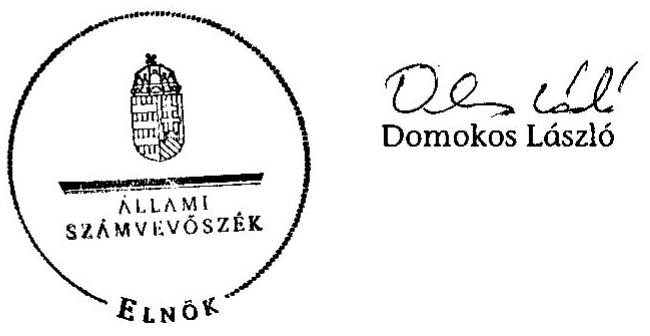

---

# A döntéshozói beavatkozások rendszere és szintjei a munkaerő-piaci feszültségek kezelésében

|  Célok/
jogi és belső szabályok | Pénzügyi feltételek $\longleftrightarrow$ Eszközrendszer $\longleftrightarrow$ Szervezeti, irányítási hatásköri keretek |  |  | Belső kontrollrendszer
Ellenőrzés, beszámoltatás  |
| --- | --- | --- | --- | --- |
|  I. Állami, kormányzati irányítás |  |  |  |   |
|  nemzeti foglalkoztatáspolitikai foglalkoztatási stratégia | bevételi források | foglalkoztatáspolitika aktív eszközei | az Alappal rendelkező, az alapkezelő kijelölése | belső ellenőrzés szabályozása
külső ellenőrzés (ÁSZ, KEHI) szabályozása
támogatások ellenőrzése a kedvezményezettnél  |
|  éves foglalkoztatási irányelvek |  | foglalkoztatáspolitika passzív eszközei | intézményrendszer (pl. ÁFSZ) létrehozása |   |
|  ágazati célok | kiadások típusai, alaprészek meghatározása |  | érdekegyeztetési központi és területi rendszerének meghatározása | intézményi, fejezeti beszámolás rendje
MAT beszámoltatása  |
|  törvények, kormányrendeletek, kormányhatározatok | éves költségvetés | rehabilitációs támogatások | döntési folyamatban közreműködők megbízása | nyilvánosság  |
|  II. Intézményrendszer /végrehajtási szint/ |  |  |  |   |
|  miniszteri irányelvek | elemi költségvetés | foglalkoztatási és rehabilitációs programok, pályázatok, támogatások előterjesztések MAT részére, MAT határozatok végrehajtása | miniszteri döntések központi támogatásokról, alapító okiratokról
SzMSz, szakmai eljárások
MAT működtetése
regionális érdekegyeztetés működtetése igazgatói döntés regionális támogatásokról akkreditációs eljárások | kontrollkörnyezet, kockázatkezelés
szakmai és pénzügyi folyamatok nyomonkövetése, belső információs rendszer
támogatások ellenőrzése  |
|  regionális támogatási irányelvek |  |  |  |   |
|  miniszteri és főigazgatói, igazgatói utasítások, eljárásrendek |  |  |  |   |
|  miniszteri és főigazgatói utasítások, eljárásrendek |  |  |  | belső ellenőrzés (felügyelet) / beszámoló a működésről, az ellenőrzésről az érdekegyeztetés szerveinél (MAT, regionális egyeztető szervek)  |

munkaerőpiaci szolgáltatások, ellátások, támogatások meghatározása és eljuttatása a kedvezményezetthez

---

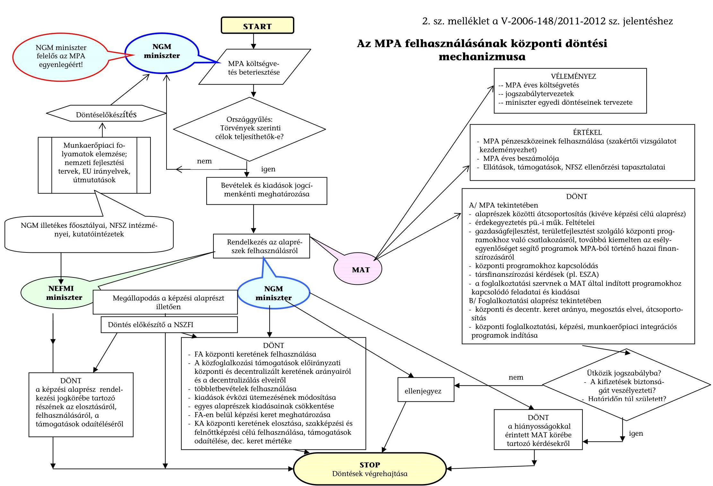

# Az MPA felhasználásának központi döntési mechanizmusa

## VÉLEMÉNYEZ

- MPA éves költségvetés
- Jogszabálytervezetek
- Miniszter egyedi döntéseinek tervezete

## ÉRTÉKEL

- MPA pénzeszközeinek felhasználása (szakértői vizsgálatot kezdeményezhet)
- MPA éves beszámolója
- Ellátások, támogatások, NFSZ ellenőrzési tapasztalatai

## DÖNT

- A/ MPA tekintetében
  - Alaprészek közötti átcsoportosítás (kivéve képzési célú alaprész)
  - Érdekegyeztetés pủ.-i műk. Feltételei
  - Gazdaságfejlesztést, területfejlesztést szolgáló központi programokhoz való csatlakozásról, továbbá kiemelten az esélyegyenlőséget segítő programok MPA-ból történő hazai finanszírozásáról
  - Központi programokhoz kapcsolódás
  - Társfinanszírozási kérdések (pl. ESZA)
  - A foglalkoztatási szervnek a MAT által indított programokhoz kapcsolódó feladatai és kiadásai
- B/ Foglalkoztatási alaprész tekintetében
  - Központi és decentr. keret aránya, megosztás elvei, átcsoportosítás
  - Központi foglalkoztatási, képzési, munkaerőpiaci integrációs programok indítása

## A képzési alaprész rendelkezései ingbőrébe tartozó részének az elosztásáról, felhasználásáról, a támogatások odaitéléséről

- A közfoglalkozási támogatások előirányzati központi és decentralizált keretének arányairól és a decentralizálás elveiről
- Többletbevételek felhasználása
- Kiadások évközi üremezésének módosítása
- Egyes alaprészek kiadásainak csökkentése
- FA-en belül képzési keret meghatározása
- KA központi keretének elosztása, szakképzési és felnőttképzési célú felhasználása, támogatások odaitélése, dec. keret mértéke

## STOP

- Döntések végrehajtása

## DÖNT

- A kiifizetések biztonságát veszélyezteti?
- Határidőn túl született?

## DÖNT

- A hiányosságokkal érintett MAT körébe tartozó kérdésekről

---

# Áttekintés az ellenőrzéssel érintett programok és a forrásokat elosztó intézmények kapcsolatáról

|   | NGM | NEFMI | KIM | BM | NFM | VM | NFSZ | NFÜ | MVH | OFA | MAG | RFÜ | ESZA | HITA | NRSZH | VÁTI | MÁK  |
| --- | --- | --- | --- | --- | --- | --- | --- | --- | --- | --- | --- | --- | --- | --- | --- | --- | --- |
|  munkahelyteremtés |  |  |  |  |  |  |  |  |  |  |  |  |  |  |  |  |   |
|  MPA FA központi kerete ${ }^{1}$ | X |  |  |  |  |  | X |  |  |  |  |  |  |  |  |  |   |
|  MPA DEC FA ${ }^{2}$ | X |  |  |  |  |  | X |  |  |  |  |  |  |  |  |  |   |
|  Egyedi kormánydöntésen alapuló beruházások támogatása | X |  |  |  | X |  |  |  |  |  | X |  |  | X |  |  |   |
|  GOP 1., 2.1.2.-2.1.3. konstrukciók |  |  |  |  | X |  |  | X |  |  | X |  |  |  |  |  |   |
|  $\mathrm{ROP}^{3}$ |  |  |  |  |  |  |  | X |  |  |  | X |  |  |  |  |   |
|  UMVP 1., 3., 4. tengely érintett jogcímei |  |  |  |  |  | X |  |  | X |  |  |  |  |  |  |  |   |
|  munkahelymegőrzés |  |  |  |  |  |  |  |  |  |  |  |  |  |  |  |  |   |
|  MPA FA központi kerete ${ }^{4}$ | X |  |  |  |  |  | X |  |  |  |  |  |  |  |  |  |   |
|  MPA DEC FA ${ }^{5}$ | X |  |  |  |  |  | X |  |  |  |  |  |  |  |  |  |   |
|  OFA ${ }^{6}$ | X |  |  |  |  |  |  |  |  | X |  |  |  |  |  |  |   |
|  TÁMOP 2.3.3. ${ }^{7}$ | X |  |  |  |  |  |  | X |  |  |  |  | X |  |  |  |   |
|  megváltozott munkaképességúek támogatása |  |  |  |  |  |  |  |  |  |  |  |  |  |  |  |  |   |
|  MPA rehabilitációs alaprész ${ }^{8}$ | X | X |  |  |  |  | X |  |  |  |  |  |  |  |  |  |   |
|  Költségvetési forrás ${ }^{9}$ | X | X |  |  |  |  |  |  |  |  |  |  |  |  | X |  | X  |
|  TÁMOP 1.1.1., 2.4.2. | X | X |  |  |  |  | X |  |  |  |  |  | X |  |  |  |   |
|  közfoglalkoztatás formái |  |  |  |  |  |  |  |  |  |  |  |  |  |  |  |  |   |
|  Közcélú munkavégzés kiadásai ${ }^{10}$ | X |  |  | X |  |  |  |  |  |  |  |  |  |  |  |  | X  |
|  MPA DEC FA közhasznú munka | X |  |  | X |  |  | X |  |  |  |  |  |  |  |  |  |   |
|  Közmunkaprogramok | X |  |  | X |  |  |  |  |  |  |  |  |  |  |  |  |   |

---

|   | NGM | NEFMI | KIM | BM | NFM | VM | NFSZ | NFÜ | MVH | OFA | MAG | RFÜ | ESZA | HITA | NRSZH | VÁTI | MÁK  |
| --- | --- | --- | --- | --- | --- | --- | --- | --- | --- | --- | --- | --- | --- | --- | --- | --- | --- |
|  hátrányos helyzetűek munkába vonását szolgáló egyéb aktív eszközök és programok |  |  |  |  |  |  |  |  |  |  |  |  |  |  |  |  |   |
|  MPA DEC FA ${ }^{11}$ | X |  |  |  |  |  | X |  |  |  |  |  |  |  |  |  |   |
|  MPA FA központi kerete ${ }^{12}$ | X |  |  |  |  |  | X |  |  |  |  |  |  |  |  |  |   |
|  Rendelkezésre állási támogatásra jogosult személyek foglalkoztatásának támogatása | X |  |  |  |  |  | X |  |  |  |  |  |  |  |  |  |   |
|  TÁMOP vonatkozó prioritásai | X |  |  |  |  |  |  | X |  |  |  |  | X |  |  |  |   |
|  AROP 229/A-2010, 229/B2010 |  |  | X |  |  |  |  | X |  |  |  |  |  |  |  | X |   |
|  Válság következtében munkahelyüket elvesztő személyek foglalkoztatását elősegítő támogatás ${ }^{13}$ | X |  |  |  |  |  | X |  |  |  |  |  |  |  |  |  |   |
|  Non-profit szektorbeli munkavállalás támogatása ${ }^{14}$ | X |  |  |  |  |  | X |  |  |  |  |  |  |  |  |  |   |
|  munkaerőpiaci programok |  |  |  |  |  |  |  |  |  |  |  |  |  |  |  |  |   |
|  MPA DEC FA | X |  |  |  |  |  | X |  |  |  |  |  |  |  |  |  |   |
|  rész- és távmunka |  |  |  |  |  |  |  |  |  |  |  |  |  |  |  |  |   |
|  MPA FA központi kerete ${ }^{15}$ | X |  |  |  |  |  | X |  |  |  |  |  |  |  |  |  |   |
|  MPA DEC FA ${ }^{16}$ | X |  |  |  |  |  | X |  |  |  |  |  |  |  |  |  |   |
|  TÁMOP 2.4.3. | X |  |  |  |  |  |  | X |  |  |  |  | X |  |  |  |   |

---

${ }^{1}$ Munkahelyteremtő pályázati program, Magas hozzáadott értékű tev. munkahelyteremtő beruházás, Postapartner program
${ }^{2}$ Önfoglalkoztatás támogatása, Vállalkozóvá válás,
${ }^{3}$ regionális gazdaságfejlesztés, regionális turizmusfejlesztés, fenntartható településfejlesztés
${ }^{4}$ Munkaerőpiaci válsághelyzetek kezelése, a foglalkoztatási szerkezetváltás elősegítése keretében munkahelymegőrzés,
A munkahelyek megőrzéséért válságkezelési program
${ }^{5}$ Munkahelymegőrzés támogatása
${ }^{6}$ "Foglalkoztatottság megőrzésének támogatása a gazdasági válság következtében átmenetileg nehéz helyzetbe jutott vállalkozásoknál", program lebonyolítás
${ }^{7}$ Munkahelymegőrző támogatás képzéssel kombinálva
${ }^{8}$ Rehabilitációs célú munkahelyteremtő támogatás
${ }^{9}$ Megváltozott munkaképességű személyek foglalkoztatásának támogatása (bértámogatás, költség- és költségkompenzációs támogatás)
${ }^{10}$ beleértve az "Út a munkához" kormányzati programhoz
${ }^{11}$ foglalkoztatás bővítését szolgáló támogatás, pályakezdők támogatása: munkatapasztalat szerzés és foglalkoztatási támogatás, szakképzettséggel rendelkező, pályakezdő álláskeresők munkatapasztalat-szerzésének támogatása, járulékok átvállalása
${ }^{12}$ pályakezdő fiatalok támogatása céljából több programra
${ }^{13} 356 / 2009$. (XII. 30.) Korm. rendelet alapján
${ }^{14}$ MPA alaprészhez nem kapcsolódó jogcím
${ }^{15}$ Távmunka végzés támogatása
${ }^{16}$ Részmunkaidős foglalkoztatás támogatása, részmunkaidős foglalkoztatás támogatása létszámleépítés megelőzésére

---

# A munkahely-teremtési programok forrás és létszámadatai (2004-2010)

## Hazai finanszírozás

|  Program megnevezése | Érintett időszak | Megítélt támogatás összege (Mrd Ft) | Finanszírozás forrása | Támogatási szerződésben vállalt új munkahelyek száma  |
| --- | --- | --- | --- | --- |
|  Egyedi kormánydöntésen alapuló beruházások támogatása | 2004-2010 | 143,2 | Beruházás-ösztönzési célelőirányzat | 35734  |
|  Munkahelyteremtő beruházások támogatása | 2004-2010 | 14,1 | MPA FA központi kerete | 17403  |
|  Magas hozzáadott értékű tevékenységek támogatása | 2004-2010 | 1,0 |  | 1062  |
|  Program megnevezése | Érintett időszak | Támogatásra kifizetett összeg (Mrd Ft) | Finanszírozás forrása | Támogatással érintett létszám  |
|  Önfoglalkoztatás támogatása | 2004-2010 | 8,4 | MPA decFA | 36400  |
|  Vállalkozóvá válási támogatás | 2004-2006 | 1,3 |  | 9300  |
|  Postapartner Program | 2008-2010 | 1,7 | MPA FA központi kerete | 1157  |

## Uniós finanszírozás

|  Program megnevezése | Érintett időszak | Megítélt támogatás összege (Mrd Ft) | Finanszírozás forrása | Támogatási szerződésben vállalt új munkahelyek száma  |
| --- | --- | --- | --- | --- |
|  GOP |  |  |  |   |
|  GOP 1.3.2. | 2007-2010 | 5,5 | GOP (ÜMFT) | 2074  |
|  GOP 2.1.2/D. | 2007-2010 | 12,0 |  | 1104  |
|  GOP 2.1.3. | 2007-2010 | 21,0 |  | 5073  |
|  Regionális Operatív Programok |  |  |  |   |
|  KMOP | 2007-2010 | 44,2 | KMOP (ÜMFT) | 3526  |
|  EAOP | 2007-2010 | 41,2 | EAOP (ÜMFT) | 1693  |
|  DDOP | 2007-2010 | 30,0 | DDOP (ÜMFT) | 2514  |
|  NYDOP | 2007-2010 | 31,0 | NYDOP (ÜMFT) | 2096  |
|  DAOP | 2007-2010 | 34,6 | DAOP (ÜMFT) | 3021  |
|  EMOP | 2007-2010 | 40,4 | EMOP (ÜMFT) | 2896  |
|  KDOP | 2007-2010 | 33,7 | KDOP (ÜMFT) | 2432  |
|  ÜMVP (I., III., IV. tengely) | 2007-2010 | 579,9 | ÜMVP | 24134  |

---

# A munkahely-megőrzési programok forrás és létszámaadatai (2004-2010)

## Hazai finanszírozás

|  Program megnevezése | Érintett
időszak | Támogatás
összege (Mrd
Ft) | Finanszírozás
forrása | Támogatás
eredményeként
megőrzött (vállalt)
összlétszám  |
| --- | --- | --- | --- | --- |
|  OFA támogatási programok | $2004-2010$ | 0,6 |  | 1264  |
|  OFA "Válság" programok | $2009-2010$ | 9,1 |  | 43592  |
|  A munkaerőpiaci válsághelyzetek kezelésének, a
foglalkoztatási szerkezetváltás elősegítésének támogatása | $2004-2010$ | 4,5 | MPA FA központi
keret | 43529  |
|  „Munkahelyek megőrzéséért" munkaerőpiaci program | $2009-2010$ | 8,6 |  | $54935^{1}$  |
|  Munkahelymegőrzés támogatása | $2004-2010$ | 6,4 | MPA decFA | $48538^{1}$  |

## Uniós finanszírozás

|  Program megnevezése | Érintett
időszak | Megítélt
támogatás
összege (Mrd
Ft) | Finanszírozás
forrása | Támogatottak
létszáma  |
| --- | --- | --- | --- | --- |
|  TÁMOP 2.3.3. | $2009-2010$ | 17,6 | TÁMOP (ÚMFT) | 15850  |

[^0] [^0]: ${ }^{1}$ Támogatással érintett létszám

---

# A hátrányos helyzetűek munkába vonását szolgáló egyéb aktív eszközök és programok forrás és létszámadatai (2004-2010)

## Hazai finanszírozás

|  Program megnevezése | Érintett időszak | Támogatásra kifizetett összeg (Mrd Ft) | Finanszírozás forrása | Támogatással érintett létszám  |
| --- | --- | --- | --- | --- |
|  Pályakezdő fiatalok támogatása céljából több programra | 2004-2009 | 1,7 | MPA FA központi keret | 526  |
|  Foglalkoztatás bővítését szolgáló támogatások (bértámogatás) | 2004-2010 | 44,2 | MPA decFA | 232058  |
|  Pályakezdők támogatása: munkatapasztalat szerzés és foglalkoztatási támogatás | 2004-2006 | 16,6 |  | 53682  |
|  Szakképzettséggel rendelkező, pályakezdő álláskeresők munkatapasztalat-szerzésének támogatása | 2009-2010 | 0,7 |  | 2477  |
|  Járulékok átvállalása | 2004-2007 | 1,8 |  | 27405  |
|  Rendelkezésre állási támogatásra jogosult személyek foglalkoztatásának támogatása | 2010 | 0,2 | MPA alaprészhez nem kapcsolódó jogcím | 1700  |
|  Non-profit szektorbeli munkavállalás támogatása | 2004-2007 | 0,6 |  | 419  |
|  Válság következtében munkahelyüket elvesztő személyek foglalkoztatását elősegítő támogatás | 2010 | 0,2 | MPA Szolidaritási alaprész | n.a.  |

## Rész- és távmunka

|  Program megnevezése | Érintett időszak | Támogatásra kifizetett összeg (Mrd Ft) | Finanszírozás forrása | Támogatással érintett létszám  |
| --- | --- | --- | --- | --- |
|  Távmunka végzés támogatása | 2004-2010 | 3,4 | MPA FA központi keret | 4130  |
|  Részmunkaidős foglalkoztatási támogatás | 2004-2010 | 0,5 | MPA decFA | 4096  |

## Munkaerőpiaci programok

|  Program megnevezése | Érintett időszak | Programok ráfordításai (Mrd Ft) | Finanszírozás forrása | Támogatással érintett létszám  |
| --- | --- | --- | --- | --- |
|  Munkaerőpiaci programok összesen | 2004-2010 | 16,3 | MPA decFA | n.a.  |

---

# Uniós finanszírozás

|  Program megnevezése | Érintett időszak | Megítélt támogatás összege (Mrd Ft) | Finanszírozás forrása | Támogatottak létszáma  |
| --- | --- | --- | --- | --- |
|  TÁMOP 1.1.2-07/1 | 2007-2010 | 53,0 | TÁMOP (ÚMFT) | 58049  |
|  TÁMOP 1.1.3-09/1 | 2007-2010 | 6,4 |  | 7791  |
|  TÁMOP 1.2.1-07/1 | 2007-2010 | 30,8 |  | 86145  |
|  TÁMOP 1.4.1-07/1 | 2007-2010 | 2,6 |  | 1508  |
|  TÁMOP 1.4.3. | 2007-2010 | 1,7 |  | n.o.  |
|  TÁMOP-2.4.2/B-09/1, 2 | 2007-2010 | 0,4 |  | 96  |
|  TÁMOP 5.1.1 | 2007-2010 | 6,4 |  | 1862  |
|  TÁMOP 5.3.3. | 2007-2010 | 1,1 |  | 454  |
|  TÁMOP 5.5.4 | 2007-2010 | 0,4 |  | 77  |
|  TÁMOP 5.6.1. | 2010 | 0,0 |  | 0  |
|  ÁROP-2.2.9-10/A, B | 2009-2010 | 0,3 | ÁROP (ÚMFT) | 64  |

Rész- és távmunka

|  Program megnevezése | Érintett időszak | Rendelkezésre álló keretösszeg (Mrd Ft) | Finanszírozás forrása | Foglalkoztatási indikátor  |
| --- | --- | --- | --- | --- |
|  TÁMOP-2.4.3.A-09/1 | 2009-2010 | 1,4 | TÁMOP (ÚMFT) | $1000^{1}$  |

[^0] [^0]: ${ }^{1}$ Akciótervben meghatározott foglalkoztatási indikátor célértéke

---

# A megváltozott munkaképességűek foglalkoztatásának támogatását szolgáló programok forrás és létszámadatai (2004-2010)

## Hazai finanszírozás

|  Program megnevezése | Érintett
időszak | Megítélt
támogatás
összege
(Mrd Ft) | Finanszírozás forrása | Új munkahelyek száma  |
| --- | --- | --- | --- | --- |
|  Rehabilitációs célú munkahelyteremtő támogatás | 2004-2008 | 9,4 | MPA Rehabilitációs Alaprész | 3701  |
|  Program megnevezése | Érintett
időszak | Támogatás
összege
(Mrd Ft) | Finanszírozás forrása | Évi átlagos támogatott
munkavállalók száma  |
|  Bértámogatás és segítő személy
költségkompenzációs támogatása | 2007-2010 | 53,6 | Megváltozott munkaképességűek
foglalkoztatásával összefüggő
bértámogatás (SZMM/NEFMI) | 26793  |
|  Költségkompenzációs támogatás | 2007-2010 | 12,9 | Megváltozott munkaképességűek
foglalkoztatásával összefüggő
költségkompenzáció
(SZMM/NEFMI) | 9772  |
|  Rehabilitációs költségtámogatás | 2007-2010 | 115,9 |  | 19303  |

## Uniós finanszírozás

|  Program megnevezése | Érintett
időszak | Megítélt
támogatás
összege
(Mrd Ft) | Finanszírozás forrása | Támogatottak
létszáma  |
| --- | --- | --- | --- | --- |
|  TÁMOP-1.1.1-08/1 | 2007-2010 | 15,4 | TÁMOP (ÚMFT) | 12606  |

---

# A közfoglalkoztatási programok forrás és létszámadatai (2004-2010)

## Hazai finanszírozás

|  Program megnevezése | Érintett
időszak | Támogatásra
kifizetett összeg
(Mrd Ft) | Finanszírozás
forrása | Évi átlagos
támogatással
érintett létszám  |
| --- | --- | --- | --- | --- |
|  Közhasznú foglalkoztatás | 2004-2010 | 63,3 | MPA decFA | 53344  |
|  Közmunkaprogramok | 2004-2010 | 74,5 | Költségvetési
előirányzat ${ }^{1}$ | 21765  |
|  Közcélú munka ("Üt a munkához" program) | 2004-2010 | 207,2 | Költségvetési
előirányzat ${ }^{2}$ | 71130  |
|  Közcélú munkavégzés járuléka | 2004-2010 | 14,2 | MPA FA központi
keret | n.a.  |
|  Közfoglalkoztatás-szervezők foglalkoztatásának
támogatása | 2004-2010 | 2,7 |  |   |

[^0] [^0]: ${ }^{1}$ 2009-ig: „A helyi önkormányzatokat megillető normatív hozzájárulások és normatív, kötött felhasználású támogatások" előirányzatai között szereplő „Önkormányzat által szervezett közfoglalkoztatás támogatása" előirányzat; 2009-től: a „Helyi Önkormányzatok támogatásai" között található „Eqyes jövedelempótló ellátások és az önkormányzat által szervezett közcélú ${ }^{2}$ NGM 2010-től: Képzéssel támogatott közmunkaprogramok (korábban SzMM)

---

# Az ellenőrzés hatókörét képező munkahelyteremtő és -megőrző, illetve a támogatott munkahelyek bővítésére vonatkozó programok 

## Munkahelyteremtő beruházások támogatása

Hazai
Egyedi kormánydöntésen alapuló beruházások támogatása (Beruházásösztönzési célelőirányzat)
Munkahelyteremtő beruházások támogatása (MPA FA központi kerete)
Magas hozzáadott értékű tevékenységek munkahelyteremtő beruházásainak támogatása (MPA FA központi
Önfoglalkoztatás támogatása (MPA decFA)
Vállalkozóvá válási támogatás (MPA decFA)
Postapartner program (MPA FA központi kerete)
Uniós
Gazdaságfejlesztési Operatív Program
GOP-1.3.2-08, 09 Vállalati kutatásfejlesztési kapacitás erősítése
GOP-2.1.2-08, D Komplex technológiai beruházás a hátrányos helyzetű kistérségekben induló vállalkozások
GOP-2.1.3 Nemzetközi szolgáltatóközpontok létrehozása
GOP-2.1.3-09 Magas foglalkoztatási hatású projektek komplex támogatása
GOP-2.1.3-11 Komplex technológia fejlesztés és foglalkoztatás támogatása
Regionális Operatív Programok
Közép-magyarországi Operatív Program
KMOP-1.1.5-08 Vállalati kutatás-fejlesztési kapacitás erősítése
KMOP-1.2.2., -08 Komplex technológiai beruházás a hátrányos helyzetű kistérségekben induló vállalkozások
Észak-alföldi Operatív Program
ÉAOP-1.1.1. A régió vállalkozásai üzleti hátterének fejlesztése (A,B,D,E,F)
ÉAOP-2.1.1. Versenyképes turisztikai termék- és attrakciófejlesztés (C,D,E)
ÉAOP-2.1.2. Kereskedelmi szálláshelyek és szolgáltatások minőségi fejlesztése
ÉAOP-5.1.1. Város- és településfejlesztési akciók
ÉAOP-5.1.3. A régiós civil szervezetek infrastrukturális feltételeinek fejlesztése
Dél-dunántúli Operatív Program
DDOP-1.1.1 Üzleti infrastruktúra fejlesztése (A,B,C,D,E,F)
DDOP-2.1.1 Komplex turisztikai termékcsomagok kialakítása (A,B,C,D)
DDOP-2.1.2 Szálláshelyek és turisztikai szolgáltatások fejlesztése
DDOP-2.1.3 A turizmusban érintett szereplők együttműködésének ösztönzése (B,C)
DDOP-4.1.1. Városfejlesztési akciók támogatása
DDOP-4.1.2. Leromlott városi területek közösségi célú integrált rehabilitációja
DDOP-4.1.3. Pécs EKF 2010 program kiemelt projektjeinek megvalósítása
Nyugat-dunántúli Operatív Program
NYDOP-1.1.1. Klaszterek szolgáltatásainak fejlesztése (B)
NYDOP-1.3.1. Befektetési környezet fejlesztése (A,B,C,D,E)
NYDOP-2.1.1. A régió történelmi és kulturális örökségének fenntartható hasznosítása, valamint a természeti
értékeken alapuló aktív turisztikai programok fejlesztése (A,B,C,D,E,F,I)
NYDOP-2.2.1. Kereskedelmi szálláshelyek bővítése és szolgáltatásainak minőségi fejlesztése
NYDOP-2.3.1. Helyi, térségi desztináció menedzsment szervezetek létrehozása, fejlesztése
NYDOP-3.1.1. Városközponti területek és leromlott városrészek fejlesztése (A,B)

---

Új Magyarország Vidékfejlesztési Program
ÜMVP 1. tengely: A minőség és a hozzáadott érték növelése a mező- és erdőgazdaságban, valamint az élelmiszer-feldolgozásban
ÜMVP 3. tengely: Az életminőség javítása a vidéki területeken, a diverzifikáció ösztönzése
ÜMVP 4. tengely: LEADER Program
Munkahelymegőrző támogatások
Hazai
Munkahelymegőrzés támogatása (MPA decFA)
A munkaerőpiaci válsághelyzetek kezelése, a foglalkoztatási szerkezetváltás elősegítése keretében munkahelymegőrzésre (MPA FA központi kerete)
"A munkahelyek megőrzéséért" válságkezelési program (MPA FA központi kerete)
OFA: A mezőgazdasági program támogatása 2004. (MPA FA központi kerete 2003.)
OFA: A 45 év feletti mezőgazdasági munkavállalók munkaerő-piaci esélyteremtése program támogatása 2005. (MPA FA központi kerete)

OFA: Talentum Kulturális Alapítvány munkahelymegőrző programjának támogatása (MPA FA központi
OFA: A RÁDIÓ C Kisebbségi Kht. munkaerő-piaci programjának támogatása 2007. (MPA FA központi kerete)
OFA: Fogyatékos személyek részére szociális intézményi ellátást nyújtó nem állami, nem egyházi fenntartók tevékenységének támogatása (MPA FA központi kerete 2008-2009.)

OFA "Válság" program:
OFA: A foglalkoztatottság megőrzésének támogatására a gazdasági visszaesés következtében átmenetileg nehéz helyzetbe jutott munkáltatóknál (MEGŐRZÉS-9122/2009)
OFA: A foglalkoztatottság megőrzésének támogatása a gazdasági visszaesés következtében átmenetileg nehéz helyzetbe jutott, költségkompenzációs támogatást igénybe vevő munkáltatóknál (MEGŐRZÉS 2.-
OFA: A gazdasági visszaesés következtében állásukat vesztők újra elhelyezkedésének támogatása más munkáltatónál (MUNKÁBA-9124/2009)

Uniós
Társadalmi Megújulás Operatív Program
TÁMOP 2.3.3. Munkahelymegőrző támogatás képzéssel kombinálva
Gazdaságilag inaktívak munkaerőpiacra való belépését és tartós megőrzését
szolgáló aktív eszközök és programok
Megváltozott munkaképességűek támogatása
Hazai
Rehabilitációs célú munkahelyteremtő támogatás (MPA Rehabilitációs Alaprész)
Megváltozott munkaképességű személyek foglalkoztatásának támogatása (bértámogatás, munkahelyi segítő
költségtámogatása, költség és költségkompenzációs támogatás)
Uniós
Társadalmi Megújulás Operatív Program
TÁMOP 1.1.1. Megváltozott munkaképességű emberek rehabilitációjának és foglalkoztatásának segítése
Közfoglalkoztatás formái
Hazai
Közhasznú foglalkoztatás (MPA decFA)
Közmunkaprogramok
Közcélú munkavégzés kiadásai
Közcélú munkavégzés járuléka (Út a munkához program)
Közfoglalkoztatás-szervezők foglalkoztatásának támogatása (MPA FA központi kerete)
Hátrányos helyzetűek munkába vonását szolgáló egyéb aktív eszközök és programok Hazai
Foglalkoztatás bővítését szolgáló támogatások (bértámogatás) (MPA decFA)
Pályakezdő fiatalok támogatása céljából több programra (MPA FA központi kerete)

---

Pályakezdők támogatása: munkatapasztalat szerzés és foglalkoztatási támogatás (MPA decFA) Szakképzettséggel rendelkező, pályakezdő álláskeresők munkatapasztalat-szerzésének támogatása (MPA Rendelkezésre állási támogatásra jogosult személyek foglalkoztatásának támogatása (MPA alaprészhez nem kapcsolódó jogcím) Válság következtében munkahelyüket elvesztő személyek foglalkoztatását elősegítő támogatás (356/2009. (XII.30.) Korm. rendelet alapján) Non-profit szektorbeli munkavállalás támogatása (MPA alaprészhez nem kapcsolódó jogcím) Járulékok átvállalása (MPA decFA)

# Uniós 

Társadalmi Megújulás Operatív Program
TÁMOP-1.1.2-07/1. Decentralizált programok a hátrányos helyzetűek foglalkoztatásáért TÁMOP-1.1.3-09/1. Út a munka világába TÁMOP-1.2.1-07/1. Hátrányos helyzetűek foglalkoztatását ösztönző járulékkedvezmények TÁMOP-1.4.1-07/1. Alternatív munkaerő-piaci programok támogatása TÁMOP-1.4.3-08/1-2F., TÁMOP-1.4.3-10/1-1F, 2-1F Innovatív, kísérleti foglalkoztatási programok TÁMOP-2.4.2/B-09/1, 2 Hátrányos helyzetűeket foglalkoztató szervezetek fejlesztése TÁMOP-5.1.1-09/6, 7 LHH Kistérségek projektjei TÁMOP-5.3.3-08/1, 2 és TÁMOP-5.3.3-10/1, 2 Hajléktalan emberek társadalmi és munkaerő-piaci integrációját segítő programok
TÁMOP-5.5.4/A-09/1 Anti-diszkriminációs programok támogatása a médiában
TÁMOP-5.6.1.A-11/1, 2 A társadalmi kohézió erősítése bűnmegelőzési és helyi kezdeményezésekkel
Államreform Operatív Program
ÁROP-2.2.9-10/A, B Romák foglalkoztatása a közigazgatásban és az igazságszolgáltatásban
Munkaerőpiaci programok
Hazai
Szabolcs-Szatmár-Bereg Megye
Diplomás pályakezdő munkanélküli fiatalok elhelyezkedését elősegítő III.
Munkaerő-piaci menedzser
Segítő pedagógus
Egyedül nem megy
Közösen az egészségért I.
Közösen az egészségért II.
Baranya Megye
Munkát mielőbb 2007-2009
Diplomás fiatalok a régió fejlődéséért
Sorsfordító-Sorsformáló
Vas Megye
Tanulási-, munkakultúra és életpálya építés alakítása hátrányos helyzetű, különösen roma tanulók körében tanoda múködtetésével
Garabonci Roma Kőműves Program
Horizont Tuning
Rész- és távmunka
Hazai
Távmunka végzés támogatása (MPA FA központi kerete)
Részmunkaidős foglalkoztatás támogatása (MPA decFA)
Uniós
Társadalmi Megújulás Operatív Program
TÁMOP-2.4.3.A-09/1 Atipikus foglalkoztatási formák támogatása

---

# A munkahelyteremtést és -megőrzést, illetve a támogatott munkahelyek bővítését megvalósító programok forrásai és célkitűzései támogatási terület szerinti rendezésben

|  Program megnevezése | Forrás | Cél  |
| --- | --- | --- |
|  Munkahelyteremtés |  |   |
|  Egyedi kormánydöntésen alapuló beruházások támogatása | MPA FA
központi
kerete | A nemzetgazdasági szempontból meghatározó beruházások támogatása.  |
|  Munkahelyteremtő beruházások támogatása |  | Új munkahelyek létrehozásának ösztönzése, a munkanélküliség csökkentése.  |
|  Magas hozzáadott értékủ tevékenységek munkahelyteremtő beruházásainak támogatása |  |   |
|  Önfoglalkoztatás támogatása | MPA decFA | Az álláskeresők ösztönzése saját vállalkozás, illetve vállalkozói tevékenység beindítására.  |
|  Vállalkozóvá válási támogatás |  | A vállalkozás kezdeti nehézségein való túljatás megkönnyítése.  |
|  Postapartner Program | Beruházásösztönzési célelőirányzat | A Magyar Posta Zrt.-nél korábban foglalkoztatott, vagy felmondás alatt álló személyek tartós álláskeresővé válásának megelőzése.  |
|  K + F és innováció a versenyképességért (GOP 1.) | GOP | A kutatás-fejlesztési és innovációs kapacitás, aktivitás, illetve együttmüködés növelése.  |
|  A vállalkozások (kiemelten a kkv-k) komplex fejlesztése (GOP 2.) |  | A vállalati kapacitások komplex fejlesztése a magyar vállalkozások, illetve a hazai kkv-szektor versenyképességének javítására.  |
|  A tudásalapú gazdaság innováció és vállalkozásorientált fejlesztése (KMOP 1.) | KMOP (ROP) | A tudásalapú társadalom innováció és vállalkozásorientált fejlesztéséhez való hozzájárulás.  |
|  Regionális gazdaságfejlesztés (ÉAOP 1.) | ÉAOP (ROP) | A beruházások értékének növelése, ami a versenyképesség növelése mellett a foglalkoztatottság növekedését is eredményezze.  |
|  Turizmusfejlesztés (ÉAOP 2.) |  | A jelenlegi nagy látogatottságú területek mellett a kihasználatlan turisztikai potenciállal rendelkező térségek felzárkózásának elősegítése.  |
|  Város- és térségfejlesztés (ÉAOP 5.) |  | Társadalmi és gazdasági vonzerővel és jelentős térszervező erővel egyaránt rendelkező városhálózat kialakítása, a leromlott állapotú városrészek további leszakadásának megállítása.  |
|  A városi térségek fejlesztésére alapozott versenyképes gazdaság megteremtése (DDOP 1.) | DDOP (ROP) | A városi térségek fejlesztésére alapozott versenyképes gazdaság megteremtése.  |
|  Turisztikai potenciál erősítése a régióban (DDOP 2.) |  | A régió turisztikai ágazata versenyképességének javítása.  |
|  Integrált városfejlesztési akciók támogatása (DDOP 4.) |  | A városok üzleti és szolgáltatási funkcióinak erősítése, a leértékelődő városi területek és főképp romák által lakott telepek fenntartható megújulásának elősegítése.  |
|  Regionális gazdaságfejlesztés (NYDOP 1.) | NYDOP (ROP) | Helyi innovatív erőforrásokra és vállalati hálózatokra épülő gazdaság kiépítése.  |
|  Turizmusfejlesztés - Pannon Örökség megújítása (NYDOP 2.) |  | Magas minőségű szolgáltatásokra és örökséghasznosításra alapozott turizmus megvalósítása.  |
|  Városfejlesztés (NYDOP 3.) |  | Térségközponti funkciókat hatékonyan ellátó, élhető városok alkotta városhálózat létrehozása.  |
|  Regionális gazdaságfejlesztés (DAOP 1.) | DAOP (ROP) | Üzleti környezet fejlesztése, ipari parkok, ipari területek, inkubátorházak, telephelyek létrehozása, fejlesztése.  |
|  Turisztikai célú fejlesztések (DAOP 2.) |  | A keresleti igények kielégítése a régió természeti-, kulturális-, épített örökségén alapuló turisztikai szolgáltatások minőségileg magas színvonalú fejlesztésével.  |
|  Térségfejlesztési akciók (DAOP 5.) |  | A régió városainak, valamint népesebb községeinek infrastrukturális fejlesztése, továbbá a környezeti szempontú településfejlesztés.  |

---

| Program megnevezése | Forrás | Cél |
| :--: | :--: | :--: |
| Versenyképes helyi gazdaság megteremtése (ÉMOP 1.) | ÉMOP (ROP) | Üzleti környezet fejlesztése, ipari parkok, ipari területek, inkubátorházak, telephelyek létrehozása, fejlesztése. |
| Turisztikai potenciál erősítése (ÉMOP   2.) |  | A látogatószám és a vendégéjszakák növekedése, a turisztikai szektor jövedelemtermelő képességének javítása, új munkahelyek teremtése, valamint az erőforrások fenntartható hasznosítása. |
| Településfejlesztés (ÉMOP 3.) |  | Integrált település-rehabilitációs akciók végrehajtása, városközpontok és barnamezős területek fizikai megújítása, városi funkciók bővítése, helyi településfejlesztési akciók végrehajtása. |
| Gazdaságfejlesztés (KDOP 1.) | KDOP (ROP) | Üzleti környezet fejlesztése, ipari parkok, ipari területek, inkubátorházak, telephelyek létrehozása, fejlesztése. |
| Turizmusfejlesztés (KDOP 2.) |  | A régió turisztikai kínálati portfoliójának komplex és integrált fejlesztése, valamint a turisztikai és szabadidős szolgáltatások minőségi és mennyiségi fejlesztése. |
| Fenntartható településfejlesztés (KDOP 3.) |  | A régió településeinek hálózatszerű fejlesztése, elsősorban azok gazdasági és közösségi célú, valamint szociális szempontokat is figyelembe vevő fizikai és funkcionális megújítása révén. |
| A minőség és a hozzáadott érték növelése a mező- és erdőgazdaságban, valamint az élelmiszer-feldolgozásban (ÜMVP 1.) | ÜMVP | A mezőgazdasági és erdészeti ágazatok versenyképességének javítása. |
| Az életminőség javítása a vidéki területeken, a diverzifikáció ösztönzése (ÜMVP 3.) |  | A vidéki élet minőségének javítása és a vidéki gazdaság diverzifikálása. |
| LEADER Program (ÜMVP 4.) |  | A térségi belső erőforrások fenntartható és innovatív felhasználása. |
| Munkahelymegőrzés |  |  |
| OFA támogatási programok | MPA FA központi keret | Egy-egy adott célcsoportot érintő munkahelymegőrző támogatások. |
| OFA "Válság" programok |  | Az átmeneti gazdasági visszaesés foglalkoztatási hatásainak mérséklése, az érintett munkavállalók munkahelyének megőrzése, illetve foglalkoztathatóságuk fejlesztése. |
| A munkaerőpiaci válsághelyzetek kezelésének, a foglalkoztatási szerkezetváltás elősegítésének támogatása |  | A jelentősnek tekinthető csoportos létszámleépítések megelőzése, a vállalkozások átmeneti múködési problémáinak kezelése, a munkaadók gazdasági szerkezetváltásának segítése. |
| „Munkahelyek megőrzéséért" munkaerőpiaci program |  | A gazdasági recesszió következtében keletkezett átmeneti foglalkoztatási feszültségek kezelése. |
| Munkahelymegőrzés támogatása | MPA decFA | Célja annak elkerülése, hogy a munkaadó a gazdasági helyzetére tekintettel, rendes felmondással elbocsássa munkavállalóit. |
| Az alkalmazkodóképesség javítása (TÁMOP 2.) | TÁMOP | A munkavállaló képzésben való részvételével a munkahelyek megőrzése, a munkanélkülivé válás megelőzése. |
| Megváltozott munkaképességủ̉ek támogatása |  |  |
| Rehabilitációs célú munkahelyteremtő támogatás | $\begin{aligned} & \text { MPA } \\ & \text { Rehabilitációs } \\ & \text { Alaprész } \end{aligned}$ | A megváltozott munkaképességű munkavállalók foglalkoztatásának elősegítése, képzettségüknek és egészségi állapotuknak megfelelő munkavégzés feltételeinek biztosítása, a nyílt munkaerőpiacra való visszavezetésük érdekében adaptációs készségük fejlesztése. |
| Megváltozott munkaképességủ személyek foglalkoztatásának támogatása | Költségvetési előirányzat |  |
| A foglalkoztathatóság fejlesztése, a munkaerőpiacra való belépés segítése és ösztönzése (TÁMOP 1.) | TÁMOP | A foglalkoztathatóság fejlesztése, a munkaerőpiacra való belépés segítése és ösztönzése. |
| Közfoglalkoztatás formái |  |  |
| Közhasznú foglalkoztatás | MPA DEC FA | A tartós munkanélküliség kezelése, az álláskeresők munkához és munkajóvedelemhez juttatása. |
| Közmunkaprogramok | Költségvetési előirányzat | A munkanélküliség csökkentésére alkalmas fejlesztési, felújítási közfeladatok ellátásának ösztönzése. |

---

|  Program megnevezése | Forrás | Cél  |
| --- | --- | --- |
|  Közcélú munka ("Út a munkához" program) | Költségvetési előirányzat | A segélyezettek munkaerőpiaci pozíciójának javítása, a segélyezés munka ellen ösztönző hatásának mérséklése, a foglalkoztatás növelése.  |
|  Közcélú munkavégzés járuléka |  |   |
|  Közfoglalkoztatás-szervezők foglalkoztatásának támogatása | MPA FA központi keret | A közcélú foglalkoztatás szervezéséhez megfelelő képzettségű szakemberek biztosítása.  |
|  Hátrányos helyzetűek munkába vonását szolgáló egyéb aktív eszközök és programok |  |   |
|  Pályakezdő fiatalok támogatása céljából több programra | MPA FA központi keret | A pályakezdő diplomás fiatalok gyakorlati munkatapasztalat szerzésének megkönnyítése.  |
|  Foglalkoztatás bővítését szolgáló támogatások (bértámogatás) | MPA decFA | Célja, hogy a célcsoport tagjait egy ideig vonzóbbá tegyék a munkaadók számára azáltal, hogy az állam átvállalja a bérköltségek egy részét.  |
|  Pályakezdők támogatása: munkatapasztalat szerzés és foglalkoztatási támogatás |  | A fiatalok elhelyezkedésének támogatása, képzettségének javítása.  |
|  Szakképzettséggel rendelkező, pályakezdő álláskeresők munkatapasztalat-szerzésének támogatása |  | A fiatalok elhelyezkedésének támogatása, képzettségének javítása.  |
|  Járulékok átvállalása |  | A foglalkoztatás bővítéséhez a járulékok átvállalásán keresztül megvalósuló hozzájárulás.  |
|  Rendelkezésre állási támogatásra jogosult személyek foglalkoztatásának támogatása | MPA alaprészhez nem kapcsolódó jogcím | A RÁT-ra jogosultak foglalkoztatásának bővítése a passzív ellátás helyett.  |
|  Non-profit szektorbeli munkavállalás támogatása |  | A non-profit szektor humán erőforrással történő megerősítése, forrás Szerző képességének javítása.  |
|  Válság következtében munkahelyüket elvesztő személyek foglalkoztatását elősegítő támogatás | MPA Szolidaritási alaprész | A válság következtében munkahelyüket elvesztő személyek foglalkoztatásának elősegítése.  |
|  A foglalkoztathatóság fejlesztése, a munkaerőpiacra való belépés segítése és ösztönzése (TÁMOP 1.) | TÁMOP | A foglalkoztathatóság fejlesztése, a munkaerőpiacra való belépés segítése és ösztönzése.  |
|  Az alkalmazkodóképesség javítása (TÁMOP 2.) |  | A munkavállaló képzésben való részvételével a munkahelyek megőrzése, a munkanélkülivé válás megelőzése.  |
|  A társadalmi befogadás, részvétel erősítése (TÁMOP 5.) |  | A társadalmi kohézió erősítése és a közösségek fejlesztése.  |
|  Az emberi erőforrás minőségének javítása (ÁROP 2.) | ÁROP | A közigazgatás rendelkezésére álló emberi erőforrás minőségének javítása.  |
|  Munkaerőpiaci programok |  |   |
|  Munkaerőpiaci programok | MPA decFA | A hagyományos, egy elemű aktív eszközökkel az elsődleges munkaerőpiacra eredményesen vissza nem vezethető, hátrányos helyzetű munkavállalói rétegek munkaerőpiacra való nagyobb esélyű visszavezetése hosszabb idejű, kombinált eszközök alkalmazásával.  |
|  Rész- és távmunka |  |   |
|  Távmunka végzés támogatása | MPA FA központi keret | A közszférában a távmunka elterjesztésének célja a takarékos működtetés biztosítása.  |
|  Részmunkaidős foglalkoztatási támogatás | MPA decFA | Az élethelyzetükből a részmunkaidős foglalkoztatásban is érdekelt munkavállalók foglalkoztatásának elősegítése (munkanélküliek, gyermeket nevelő személyek).  |
|  Az alkalmazkodóképesség javítása (TÁMOP 2.) | TÁMOP | A munkavállaló képzésben való részvételével a munkahelyek megőrzése, a munkanélkülivé válás megelőzése.  |

---

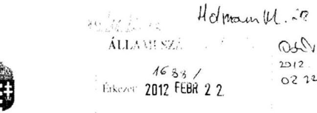

# KÖZIGAZGATÁSI ÉS IGAZSÁGÜGYI MINISZTÉRIUM KÖZIGAZGATÁSI ÁLLAMTITKÁR 

Iktatószám: Iktatószám: XIII-E/10/10/2012.

## Domokos László elnök úr részére   Állami Számvevőszék

Budapest
Apáczai Csere János u. 10.
1052
Tárgy: Állami Számvevőszék jelentéstervezete a hazai és uniós forrásból finanszirozott, munkahelyteremtést és megőrzést elősegitő támogatások rendszerének ellenőrzése tárgyában

## Tisztelt Elnök Úr!

Az Állami Számvevőszék által megküldött V-2006-131/2011-2012 iktatószámon nyilvántartott „Állami Számvevőszék jelentéstervezete a hazai és uniós forrásból finanszirozott, munkahelyteremtést és megőrzést elősegitő támogatások rendszerének ellenőrzéséről" szóló jelentéstervezettel kapcsolatban érdemi észrevételt nem teszek.

A jelentés véglegesítésekor javaslom az alábbi kiegészítés megfontolását.
A jelentéstervezet bevezetőjében a 19. oldalon hivatkozás történik Dr. Fazekas Károly kutatására. Az idézett tanulmány szerzője a munkacrő-piaci hátrányokat meghatározó egyéb jellemzőkre is felhívja a figyelmet: "A romák munkapiaci kirekesztődésénck hátterében elsősorban a velük szemben érvénycsülő diszkrimináció és a roma lakosság alacsony iskolai végzettsége és kedvezőtlen területi eloszlása áll." (Dr. Fazekas Károly: A magyar foglalkoztatási helyzet jelene és jövője (Pénzügyi Szemle LI. évfolyam 2006/02, 198. o.) Ezt nem csupán az idézet tartalmi pontossága miatt ítéljük fontosnak, hanem mert a romák munkacrő-piaci hátrányait befolyásoló tényezőket - a probléma összetettsége miatt - az uniós roma keretstratégia és a Nemzeti Társadalmi Felzárkózási Stratégia is alapvető meghatározóként kezeli.

Budapest, 2012. február 9.
Udvözlettel:

Dr. Bito Marcell

---

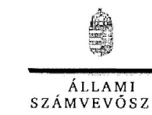

ELNÖK

Ikt.szám: V-2006-136/2012.

Dr. Navracsics Tibor úr
miniszter
Közigazgatási és Igazságügyi Minisztérium

Budapest

# Tisztelt Miniszter Úr! 

Köszönettel vettem Dr. Bíró Marcell közigazgatási államtitkár úrnak a hazai és uniós forrásból finanszírozott, munkahelyteremtést és -megőrzést elősegitő támogatások rendszerének ellenőrzéséről készített jelentéstervezettel kapcsolatos észrevételét.

Az Állami Számvevőszék észrevételekre vonatkozó álláspontjáról a felügyeleti vezető által készített részletes tájékoztatást csatoltan megküldőm.

Tájékoztatom Miniszter urat, hogy a számvevőszéki jelentés szövegezése az elfogadott észrevételek figyelembevételével készül.

Budapest, 2012. OG $\boldsymbol{\mu}$.
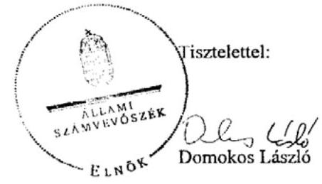

Melléklet: Tájékoztatás az elfogadott és az el nem fogadott észrevételekről

---

# Tájékoztatás 

## az elfogadott és az el nem fogadott észrevételekröl

A hazai és uniós forrásból finanszírozott, munkahelyteremtést és -megőrzést elősegitő támogatások rendszerének ellenőrzéséről készített jelentéstervezetre a Közigazgatási és Igazságügyi Minisztérium XIII-E/10/10/2012 iktatószámú levelében észrevételt fogalmazott meg a jelentéstervezetben hivatkozott, Dr. Fazekas Károly által publikált tanulmányból való idézet kiegészitésére.
Elfogadtuk álláspontját és így a tanulmányból a teljes javasolt rész került beidézésre, miszerint „A romák munkaerő-piaci kirekesztődésének hátterében elsősorban a velük szemben érvényesülő diszkrimináció és a roma lakosság alacsony iskolai végzettsége és kedvezőilen területi eloszlása áll."

El nem fogadott észrevétel nem volt.
Budapest, 2012.

Holman Magdolna
felügyeleti vezető

---

7/c. sz. melléklet
a V-2006-148/2011-2012. sz. jelentéshez
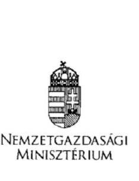

Iktatószám:NGM/2366/ 12 /2012
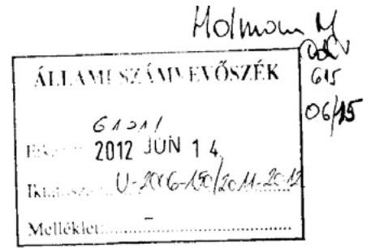

Hiv.:V-2006-136/2012.

# Domokos László úr 

elnök
Állami Számvevőszék.

## Budapest

## Tisztelt Elnök Úr!

Köszönettel megkaptam „a hazai és uniós forrásból finanszírozott, munkahelyteremtést és megőrzést elősegítő támogatások rendszerének értékelése ellenőrzéséről" készített jelentéstervezetet, melyben korábbi pontosítási javaslataink átvezetésre kerültek.

A jelenlegi tervezethez további észrevételt nem kívánunk tenni.

Budapest, 2012. május „ ${ }^{1 / 1}$ "
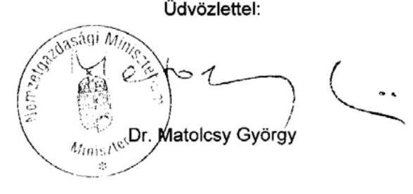

---

7/d. sz. melléklet
a V-2006-148/2011-2012. sz. jelentéshez
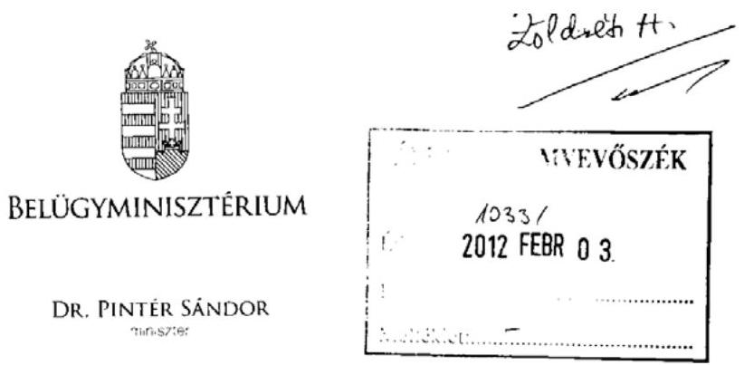

Domokos László Úr
Elnök

Állami Számvevőszék
Budapest

Ügyiratszám: BM/1737-3/2012.
Hiv. szám: V-2006-131/2011-2012

Tisztelt Elnök Úr!

A hazai és európai uniós forrásból finanszírozott, munkahelyteremtést és megőrzést elősegítő támogatások rendszerének ellenőrzéséről szóló jelentés tervezetét köszönettel megkaptam.

Tájékoztatom, hogy a tervezetben foglaltakkal kapcsolatban észrevételt nem teszek.

Budapest, 2012. január ," $2_{2}$ "
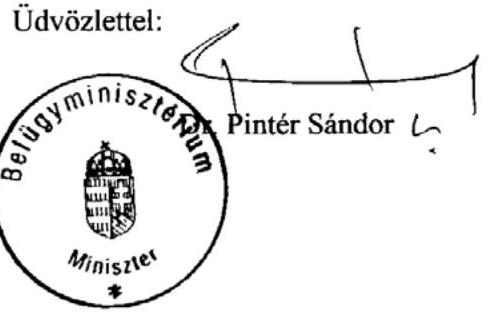

---

7/e. sz. melléklet
a V-2006-148/2011-2012. sz. jelentéshez
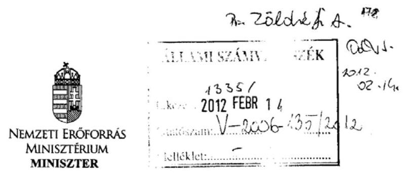

Iktatószám: 4850-2/2012/ELL

Hiv. szám: V-2006-131/2011-2012.
Ügyintéző: Mocsári Enikő (79-51207)

# Domokos László úr 

elnök

Állami Számvevőszék

## Budapest

Apáczai Csere János u. 10.
1052

Tárgy: a hazai és uniós forrásból finanszírozott, munkahelyteremtést és megőrzést elősegitő támogatások rendszcrének ellenőrzéséről készített jelentéstervezet véleményezése

Tisztelt Elnök Úr!
Tájékoztatom Elnök Urat, hogy a hazai és uniós forrásból finanszírozott, munkahelyteremtést és megőrzést elősegitő támogatások rendszerének ellenőrzéséről készített jelentés tervezetére nem teszek észrevételt.

Budapest, 2012. február „ 7 „
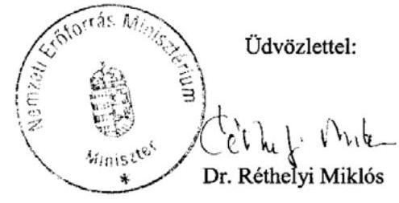

---

2012.FEB. 07 12:41
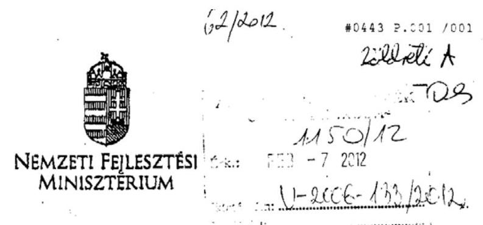

Domokos László
62/2012
*0443 P. $001 / 001$
elnök
Állami Számvevőszék
Budapest

Tisztelt Elnök Úr!
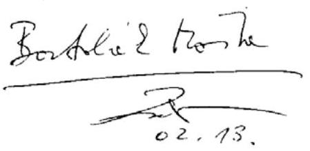

Köszönettel megkaptam „a hazai és uniós forrásból finanszirozott, munkahelyteremtést és megőrzést elősegitő támogatások rendszerének értékelése ellenőrzése" tárgyú jelentését.

A tervezettel kapcsolatban észrevételt nem teszek.

Budapest, 2012. február 6.
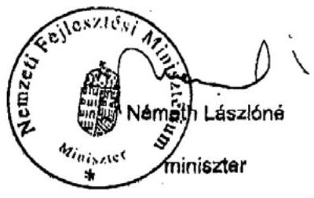

---

7/g. sz. melléklet
a V-2006-148/2011-2012. sz. jelentéshez
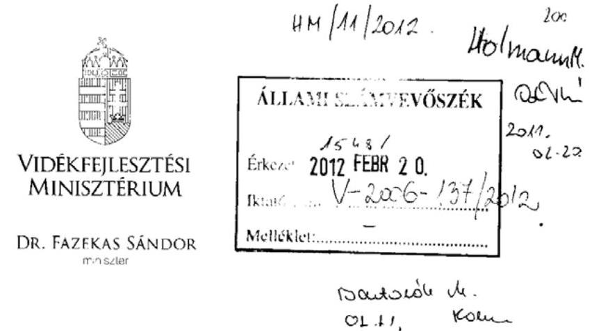

Ügyiratszám: PFAF/154/1/2012

Domokos László úr
elnök részére

Állami Számvevőszék
1364 Budapest 4.
Pf. 54

# Tisztelt Elnök Úr! 

Hivatkozással a V-2006-131/2011-2012-es ügyiratszámú levelére, ezúton tájékoztatom, hogy a hazai és uniós forrásból finanszírozott, munkahelyteremtést és megőrzést elősegitő támogatások rendszerének értékelése ellenőrzésről készült jelentéstervezetre észrevételt nem tészék.

Budapest, 2012. február „() „
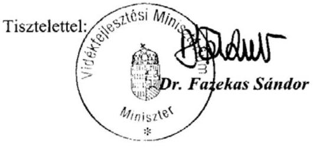

---

# 7/h. sz. melléklet 

a V-2006-148/2011-2012. sz. jelentéshez

## 10) SZÉCHENYITERV

## 7h. sz. melléklet

Iktatószám: $11 / 3,-5 / 2012$

## Domokos László

elnök

## Állami Számvevőszék

## Budapest

Apáczai Csere János u. 10.
1052

Tárgy: Jelentéstervezet észrevételezése

## Tisztelt Elnök Úr!

Az Állami Számvevőszék által „A hazai és uniós forrásból finanszírozott, munkahelyteremtést és megőrzést elősegítő támogatások rendszerének ellenőrzéséről" készített Jelentéstervezetre a Nemzeti Fejlesztési Ügynökség a mellékletben szereplő észrevételeket teszi.

Ellenőrzési munkájukat megköszönve kérem, hogy észrevételeinket szíveskedjenek figyelembe venni a jelentés szövegének véglegesítésekor.

Budapest, 2012. február 7.

## Üdvözlettel,

Petykó Zoltán

Melléklet: - észrevételek

Nemzeti Fejlesztési Ügynökség
Cím: H-1077 Budapest, Wesselényi u. 20-22.
Levelezési cím: H-1393 Budapest, pf. 332.
Tel.: +36 40/638-638
E-mail: nfu@nfu.gov.hu
www.nfu.hu
www.ujszechenyiterv.gov.hu

## HASYKONOZÁS MERÚJÚL

A projektek az Európai Unió
támogatásával valósulnak meg.

---

# KMF részéről: 

Támogatjuk az Állami Számvevőszék azon törekvését, hogy a jelenlegi gazdasági helyzetben, amikor alacsony foglalkoztatási szint mellett a munkanélküliség a 2008 előtti szint közel duplájára nőtt, vegyük sorra a hazai és európai uniós közösségi támogatások munkahely-teremtési hatásait. Szeretnénk ugyanakkor felhívni a figyelmet a következőkre:

Az NSRK keretében kialakított indikátorrendszer alkalmas a programok és a projektek előrehaladásának nyomonkövetésére. Ki kell emelni azonban, hogy az indikátorok (monitoring mutatók) nem elsősorban a támogatások eredményességének mérésére szolgálnak. A monitoring a programok előrehaladását követi nyomon, a program céljai megvalósulásának mérése az uniós módszertanon alapuló értékelések feladata. Az eredmények mérésére pedig általában a programozási időszakot követően van lehetőség. Emellett a kiszorítási vagy tovagyűrűzési hatások beazonosítása, a támogatások hatásainak elkülönítése az egyéb tényezőktől sem lehetséges pusztán az indikátorokon keresztül. A vizsgálat módszertana tehát ebben a tekintetben kifogásolható.

A jelentés (a 26. oldalon) ezt a következtetést vonja le: "Az eredmények fenntarthatóságát vizsgálva a tapasztalatok szintén eltérőek, a programok hosszú távú hatása - a munkahelyteremtő gazdaságfejlesztési programok kivételével - nem mutatható ki." Ezzel az előző részben szereplő módszertani kifogás miatt nem tudunk egyet érteni. A támogatásoknak rövid és hosszútávú, közvetlen és közvetett hatásai vannak. Ezek beazonosítása csak jól definiált, nemzetközileg elfogadott módszertanok (pl. makroökonómiai modellek, kontrollcsoportos hatásvizsgálatok) mentén lehetséges, ilyeneket a vizsgálat nem alkalmazott. Ezen kétségeinknek a vizsgálat indításakor és a vizsgálat során folyamatosan hangot adtunk. Kérjük, hogy a „nem mutatható ki" megfogalmazás helyett a következő szerepeljen: „a vizsgálat módszereivel nem megítélhető".
4.2. Monitoring és beszámolási rend kialakítása és működése c. fejezet, 63. oldal
„Az ÚMFT-ből és ÚMVP-ból finanszírozott projektek esetében az előrehaladási jelentések a foglalkoztatási kötelezettség fenntartásának folyamatos nyomon követésére csak korlátozottan alkalmasak, mivel a vállaltak teljesülése adatszolgáltatásként jelenik meg a jelentésekben és a támogatást kezelő intézményrendszer csak a helyszíni ellenőrzések alkalmával ellenőrzi az előrehaladási (és fenntartási) jelentések és a projekt tényleges fizikai és pénzügyi előrehaladásának összhangját.
Az ÚMFT-ből megvalósuló támogatások esetében a KSz az IMK-ban foglaltak alapján a fenntartási időszakban a jelentésekhez a foglalkoztatási kötelezettség teljesülésére alátámasztó dokumentumokat nem kér be."

Véleményünk szerint az előrehaladási jelentések alkalmasak a projektek szakmai teljesülésének nyomon követésére, adott esetben kiegészítve a helyszíni ellenőrzésekkel. Az uniós támogatások kapcsán az ellenőrzési rendszerek kialakításakor, müködtetésekor egyszerre kell szem előtt tartani a támogatások gyors és pályázóbarát felhasználására irányuló kormányzati szándékot, valamint a szabályosság biztosítását. Ezzel összhangban van az, hogy az előrehaladási / fenntartási jelentésekben a kedvezményezett büntetőjogi felelősségének tudatában nyilatkozik projektjéről, annak tudatában, hogy amennyiben nyilatkozatai nem valós tartalmúak, kizárható a pályázati rendszerből.
A fenntartási időszakban bizonyos esetekben kérhető be információ a foglalkoztatottak számáról (IMK: https://imk.nfu.hu/step.php?StepID=1492, EMK: 351.§ (2)-(3))

## Kérjük a fentiek alapján a következő, pontosított szöveget szerepeltetni:

Az ÚMFT-ből finanszírozott projektek esetében az előrehaladási jelentésekben adatszolgáltatásként jelenik meg a foglalkoztatási kötelezettség teljesítése. A támogatást

---

kezelő intézményrendszer a jogszabályi előírásokkal összhangban a helyszínen ellenőrizheti a projekt tényleges fizikai és pénzügyi előrehaladásának összhangját.
Az ÚMFT-ből megvalósuló támogatások esetében a KSz az IMK-ban foglaltak alapján a fenntartási időszakban a jelentésekhez a foglalkoztatási kötelezettség teljesülésére csak bizonyos esetekben kér be alátámasztó dokumentumokat.

# GOP 1H részéről: 

A jelentéstervezet vezetői összefoglaló részére tett észrevételek:

1. A jelentéstervezet a 22 o. 1. bekezdése az alábbi megállapítást tartalmazza:
„A 2004-2010-es időszakban, hazánkban hazai és uniós forrásokból mintegy 2 ezer Mrd Ft-ot meghaladó összeg állt rendelkezésre a foglalkoztatáspolitikai célkitüzések megvalósitására. Bár a felhasznált hazai forrásokból 1,7 millió munkahelyet támogattak, és az uniós forrásokból közel 150 ezer munkahely létrehozását és megőrzését vállalták a kedvezményezettek, az elért eredmények nem javitottak Magyarország kedvezőtlen foglalkoztatási helyzetén. Sem a foglalkoztatási szint növelésében, sem az inaktivitás csökkentésében, valamint a területi különbségek mérséklésében nem sikerült makrogazdasági szintü javulást elérni. A vizsgált időszakban bekövetkezett gazdasági válság meghatározó volt a foglalkoztatás alakulása szempontjából. A válság a magyar munkaerőpiacon 2010. első negyedévében érte el mély-pontját, majd ezt követően lassú kilábalási folyamat indult meg a foglalkoztatásban"
Véleményünk szerint a bekezdés egy nagyon fontos szempontot nem jelenít meg, mégpedig azt, hogy ha a gazdasági válság során a bekezdésben felsorolt támogatásokra nem került volna sor akkor a válság következtében jelentősen nagyobb lett volna az elvesztett munkahelyek száma.

Az összehasonlítások során érdemes lenne a Spanyol vagy az Ír mutatókhoz viszonyítani az általunk elért eredményeket ahol ugyanezen időszakban hasonló gazdasági körülmények közt jelentősen emelkedett a munkanélküliség mértéke. Nem pedig az EU átlagához ahol a hazainál jelentősen jobb gazdasági helyzetben lévő országok javítják az átlag adatokat.
2. A jelentéstervezet a 28 o. 3. bekezdése az alábbi megállapítást tartalmazza
„A vizsgált támogatások a munkahelyteremtés eszközei, az egyes gazdaságfejlesztési projektek szerződéseinél az új munkahelyek létrehozásának közvetlen, konkrét, számszerúsített - és így számonkérhető - kötelezettsége a GOP esetében csupán három konstrukciónál (GOP-1.3.2, 2.1.2, 2.1.3) jelent meg. Ezen három konstrukció kivételével a munkahelyteremtés csak a projektek közvetett hatásaként jelent meg, ami - a program végrehajtása során kialakuló gazdasági válság mellett - hozzájárult az eredmények elmaradásához."

Kérjük a megállapítást módosítani a következők szerint:
A vizsgált támogatások a munkahelyteremtés eszközei, az egyes gazdaságfejlesztési projektek szerződéseinél az új munkahelyek létrehozásának közvetlen, konkrét, számszerúsített - és így számonkérhető - kötelezettsége a GOP esetében csupán három konstrukciónál (GOP-1.3.2, 2.1.2, 2.1.3) jelent meg. Ezen három konstrukció kivételével a nettó munkahelyteremtés nem kötelező előírás a projektekben, a beruházások és a kapacitásnövekedés közvetett eredményeképpen keletkező létszámnövekmény csak indikátorként kerül mérésre a projektek fenntartási időszaka során, így a tényleges, számszerüsíthető eredmények csak a későbbiekben lesznek kimutathatóak.

---

# Indoklás: 

Az EU Bizottság által elfogadott Gazdasági Operatív Program dokumentumban kimondottan szerepelnek az alábbiak:

A GOP fő célja a magyar gazdaság tartós növekedésének elősegítése, a produktív szektor versenyképességének erősítése révén.
A Gazdaságfejlesztési Operatív Program fő célkitűzésének teljesítése érdekében a növekedési tényezők közül elsősorban a fizikai tőke minőségének javításához kíván hozzájárulni.

Mindezek alapján csak néhány konstrukcióban szerepel direkt munkahely-teremtési elvárás.

Megjegyezzük, hogy a beruházások közvetett eredményeképpen létrejövő munkahelyek értelemszerűen a beruházások lezárultát követően, a kibővített kapacitások eredményeképpen jönnek létre, így csak a fenntartási időszakban mérhetőek érdemben. Mivel a projektek megvalósítási időtartama jellemzően 2 év, jelenleg csak a 2007-ben támogatott projektek esetében rendelkezünk ilyen jellegű adatokkal, és tovább torzítja a képet, hogy a támogatások abszorpciója évről évre növekvő tendenciát mutat, tehát teljes képet csak 2013-2015 körül fogunk látni a GOP vonatkozásában. Az OP indikátorok esetében éppen ezért szerepel 2015. céldátumként.

## A jelentéstervezet részletes megállapításaihoz kapcsolódó észrevételek:

1. A jelentéstervezet a 43 o. az alábbi megállapítást teszi:
„A GOP-2.1.2-08/D. - a hátrányos és leghátrányosabb helyzetű kistérségekben müködő, induló vállalkozások technológiai fejlesztésének és/vagy korszerűsítésének támogatását célzó - konstrukció keretében beszerzett mobil mélyfürógép támogatási szerződése nem tartalmazott a mobil eszköz sajátosságaihoz igazodó szempontokat, így nem biztosította a hátrányos helyzetü térségben való munkahelyteremtés megvalósulását. A beszerzett gép a projekt helyszíni vizsgálata idején is egy másik megyében volt. A pályázat eredeti, vélelmezhető szándéka szerint a szerződés részét képező munkahelyteremtést a hátrányos helyzetü kistérségben kell megvalósítani, ezzel javítva az adott település foglalkoztatási helyzetét. A mobil gépbeszerzéshez kapcsolódó projekt esetében - miután a munkavégzés helyszíne nem az adott település - a hátrányos térségben való munkahely-teremtés szándéka nem teljesül (az 5 új munkavállaló lakcíme nem az adott településen volt)."

A megállapítást kérjük törölni:
Mivel a pályázati kiírás nem zárta ki a mobil eszközök beszerzését és a Pénzügyminisztérium által kiadott 18569/1/2009 sz. állásfoglalás és az ez alapján kiadott IH állásfoglalás szerint is támogathatónak minősült a beszerzett mobil mélyfürógép.
Továbbá a megállapításban is szerepel, hogy az eszköz beszerzése 5 új munkahely teremtését eredményezte.
2. A jelentéstervezet a 48 o. az alábbi megállapítást teszi:
„A GOP támogatásoknál az 1. prioritáshoz kapcsolódóan határoztak meg új munkahely mérésé-re alkalmas indikátort, a 2. prioritáshoz, amely az akciótervek szerint az új munkahelyek túl-nyomó többségét (mintegy 95\%-át) eredményezi, nem."

Kérjük a megállapítást módosítani a következők szerint:

---

A GOP támogatásoknál az 1. prioritáshoz kapcsolódóan határoztak meg új munkahely mérésé-re alkalmas indikátort, a 2. prioritáshoz, amely az akciótervek szerint az új munkahelyek túl-nyomó többségét (mintegy 95\%-át) eredményezi, nem. Mivel a 2. prioritásban jellemzően csak közvetett hatásként teremtődnek új munkahelyek és ezek mérésére alkalmasabbak a prioritás indikátorokkal szemben az OP indikátorok. Amelyek közt került meghatározásra a teljes OP tekintetében teremtett munkahelyek mérésére szolgáló indikátor.
3. A jelentéstervezet a 54 o. az alábbi megállapítást teszi:
„A vizsgált támogatások a munkahelyteremtés eszközei, az egyes gazdaságfejlesztési projektek szerződéseinél az új munkahelyek létrehozásának közvetlen, konkrét, számszerűsített - és így számon kérhető kötelezettsége a GOP esetében csupán három konstrukciónál (GOP-1.3.2, 2.1.2, 2.1.3) jelent meg. Ezen három konstrukció kivételével a munkahelyteremtés csak közvetett hatásként jelent meg."

Kérjük a megállapítást módosítani a következők szerint:
A vizsgált támogatások a munkahelyteremtés eszközei, az egyes gazdaságfejlesztési projektek szerződéseinél az új munkahelyek létrehozásának közvetlen, konkrét, számszerűsített - és így számon kérhető kötelezettsége a GOP esetében csupán három konstrukciónál (GOP-1.3.2, 2.1.2, 2.1.3) jelent meg. Ezen három konstrukció kivételével a nettó munkahelyteremtés nem kötelező előirás a projektekben, a beruházások és a kapacitásnövekedés közvetett eredményeképpen keletkező létszámnövekmény csak indikátorként kerül mérésre a projektek fenntartási időszaka során, így a tényleges, számszerűsíthető eredmények csak a későbbiekben lesznek kimutathatóak.

Indoklás (lásd. az összefoglaló rész 2. észrevételénél)
4. A jelentéstervezet a 57 o. az alábbi megállapítást teszi:
„A GOP támogatási programok munkahelyteremtésre vonatkozó (OP szintü) célindikátorai és tényadatai jelentős eltérést mutatnak, a célindikátorokban megfogalmazott időszakos célok nem teljesültek. A GOP 2010. évi megvalósításáról szóló jelentés szerint a létrehozott munka-helyek száma 216 fő a 2010. évre célként kitüzött 10 ezer fö (korábban 24 ezer fö) helyett, ez 1\% alatti teljesítést mutat a célértékhez képest. A helyszíni ellenőrzés idején az IH-tól kapott tájékoztatás szerint a létrehozott munkahelyek száma 1975 fő (2011 szeptemberében), ami a célértékhez képest szintén jelentős elmaradást mutat, annak mintegy 20\%-a. A prioritás szintü, munkahelyteremtésre vonatkozó indikátor (kizárólag 1. prioritásra vonatkozóan) teljesülése a 2010. évi végrehajtási jelentés szerint még nem volt mérhető."

Kérjük a megállapítást módosítani az alábbiak szerint:
A GOP támogatási programok munkahelyteremtésre vonatkozó (OP szintü) célindikátorai és tényadatai jelentős eltérést mutatnak, a célindikátorokban megfogalmazott időszakos célok teljesülése jelenleg nem teljes körüen megállapítható a program jelenlegi előrehaladási fázisában. Az adatok várhatóan 2015-ben, a program zárása idején lesznek megállíthatóak.
A GOP 2010. évi megvalósításáról szóló jelentés szerint a létrehozott munka-helyek száma 216 fő a 2010. évre célként kitüzött 10 ezer fö (korábban 24 ezer fö) helyett, ez 1\% alatti teljesítést mutat a célértékhez képest. A helyszíni ellenőrzés idején az IH-tól kapott tájékoztatás szerint a létrehozott munkahelyek száma 1975 fő (2011 szeptemberében), ami a célértékhez képest szintén jelentős elmaradást mutat, annak mintegy 20\%-a. A 2010-es éves végrehajtási jelentésben szereplő adatok a 2007-es 2.1.1/A kiírás kedvezményezettjeitől érkeztek be a fentebb közölt számok a többi kiírás adatait nem tartalmazzák.

---

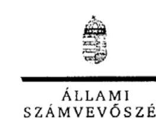

Ikt.szám: V-2006-136/2012.

Petykó Zoltán úr
elnök
Nemzeti Fejlesztési Ügynökség

# Budapest 

## Tisztelt Elnök Úr!

A hazai és uniós forrásból finanszírozott, munkahelyteremtést és -megőrzést elősegittő támogatások rendszerének ellenőrzéséről készített jelentéstervezetünkkel kapcsolatos észrevételeit köszönettel megkaptam.

Az Állami Számvevőszék észrevételekre vonatkozó álláspontjáról a felügyeleti vezető által készített részletes tájékoztatást csatoltan megküldöm.

Tájékoztatom Elnök urat, hogy a számvevőszéki jelentésben az el nem fogadott észrevételeket - az Állami Számvevőszékről szóló 2011. évi LXVI. törvény 29. § (3) bekezdése alapján - a részletes megállapítások között szerepeltetjük az elutasítás indokának feltüntetésével együtt. Az elfogadott észrevételeket a számvevőszéki jelentés szövegezésénél figyelembe vesszük.

Budapest, 2012. 05 1.
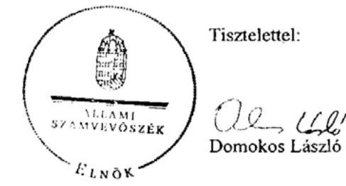

Melléklet: Tájékoztatás az elfogadott és az el nem fogadott észrevétclekről

---

# Tájékoztatás 

## az elfogadott és az el nem fogadott észrevételekröl

A hazai és uniós forrásból finanszírozott, munkahelyteremtést és -megőrzést elősegitő támogatások rendszerének ellenőrzéséről készített jelentéstervezetre a Nemzeti Fejlesztési Ügynökség 11/50-3/2012. iktatószámú levelében észrevételt fogalmazott meg az eredményesség mérésével, a nyomon követéssel kapcsolatban.
Nem fogadtuk el a Központi Monitoring Főosztály álláspontját, miszerint az indikátorrendszer elsősorban a programok és projektek előrehaladásának nyomon követésére szolgál, az eredmények és hatások mérésére a programozási időszakot követően, nemzetközileg elfogadott módszertanok alapján (pl. makro-ökonómiai modellek alkalmazásával) van lehetőség.
Az észrevétel elutasítását az indokolta, hogy az ÁSZ megközelítése szerint kiemelkedően fontos a programok előrehaladásának, a munkahelyteremtési célok időarányos megvalósulásának értékelése. Ezzel lehetőség nyílik a célok teljesülése érdekében a korrekciós beavatkozások, intézkedések megtételére, különös tekintettel arra, hogy az ellenőrzéssel érintett uniós fejlesztési programok a megvalósulás és fenntartás időszakában vannak. Az eredményesség és a közvetlen hatások, azaz a programcélok időarányos teljesülésének értékeléséhez a programozási dokumentumokban a tagállam által meghatározott (vállalt), az Európai Bizottság által elfogadott számszerüsített mutatók (indikátorok) szolgáltak alapul. Az észrevétellel érintett megállapítást az eredményesség és a közvetlen hatás hangsúlyozása érdekében kiegészítettük. Megjegyezem, hogy a jelentéstervezetben az NFÜ korábbi véleménye alapján a lezárt program esetében feltüntettük az NFÜ makro-ökonómiai értékelésének eredményeit is.

Nem fogadtuk el a Központi Monitoring Főosztály azon álláspontját, miszerint az előrehaladási jelentések alkalmasak a projektek szakmai teljesülésének nyomon követésére, kiegészítve a helyszíni ellenőrzésekkel.

Az észrevétel elutasítását az indokolta, hogy az előrehaladási jelentésekben a foglalkoztatási kötelezettség adatszolgáltatásként jelenik meg, melyet a kedvezményezetteknek nem kell dokumentumokkal alátámasztani. Így az előrehaladási jelentések dokumentumalapú, folyamatba épített ellenőrzése nem valósul meg. Az adatok valóságtartalmát, megalapozottságát a helyszíni ellenőrzések (mely nem teljes körü) során vizsgálják. A dokumentumalapú és a helyszíni ellenőrzések hiánya magában hordozza a szabálytalanság lehetőségét, illetve annak kockázatát, hogy az ellenőrzés csak a projekt későbbi szakaszában, illetve a megvalósulást követően tárja fel a szabálytalanságot.

A GOP Irányító Hatóság észrevételt fogalmazott meg az "Összegző megállapítások, következtetések, javaslatokban" összesítetten megjelenő adatokkal kapcsolatban.

---

Elfogadva a jelen és korábbi észrevételüket, illetve a Nemzetgazdasági Minisztérium észrevételét is figyelembe véve a foglalkoztatás bővités célkitüzéseinek megvalósitását szolgáló forrásokat, valamint a vállalt és támogatott munkahelyek számát részletesen kifejtettük.

A jelentéstervezetet a válságra vonatkozó utalással és a kohéziós politika fontosságának hangsúlyozásával több helyen kiegészítettük.

A hazai adatokat nemzetközi összehasonlításként az egész anyagban egységesen az EU, illetve OECD átlaghoz viszonyítottuk. Továbbra sem tartjuk célszerünek az egyes tagállamok (ebben az esetben a spanyol és ír adatok) kiemelését.

Nem fogadtuk el a GOP Irányító Hatóság észrevételét, melyet a közvetlen munkahelyteremtést megvalósító három GOP konstrukciót bemutató megállapítás kiegészítésére tett. A kiegészítési javaslattal az ÁSZ nem ért egyet, mert a fejlesztési források felhasználásához a támogatási szerződésben elöirt, a kedvezményezett által vállalt munkahelyteremtési kötelezettség hozzájárul a munkahelyteremtés célkitüzésének eredményesebb megvalósulásához. Azon konstrukciók esetében, ahol a nettó munkahelyteremtés nem kötelezö elöírás a projektben (nem jelenik meg a támogatási szerződésben kötelezettségként), azaz a létszámnövekmény a beruházások és a kapacitásnövekedés közvetett eredményeként valósul meg, a munkahelyteremtési célkitüzés megvalósulása esetleges.

Nem fogadjuk el a GOP Irányító Hatóságnak a mobil eszköz beszerzéséhez kapcsolódó megállapítás törlésére vonatkozó javaslatát. Az észrevétel elutasítását az indokolta, hogy a jelentéstervezet a támogatási szerződésnek ezen speciális eszközre vonatkozó kiegészítését hiányolta, és nem vitatta annak szabályosságát, valamint az öt létrejött munkahely tényét.

Az NFÜ szabályosságot és a támogathatóságot hangsúlyozó kiegészítő véleményét feltüntettük.

Elfogadtuk a GOP Irányító Hatóságnak az 1. és 2. prioritásban meghatározott indikátorokkal kapcsolatos pontositó észrevételeit és a javasoltak szerint módosítottuk a bekezdést.

Nem fogadtuk el a megvalósult munkahelyek számára vonatkozó szövegjavaslatukat, mivel a 2010. évi végrehajtási jelentésben szereplő szám további magyarázata nem nyújt többletinformációt, az adatok további részletezése azonban csökkenti a közérthetőséget. Az észrevételükben szereplő kiegészítő információkat a jelentéstervezetben feltüntettük.

Megjegyezzük továbbá, hogy a jelentéstervezetben a reális és aktuális kép kialakítása érdekében szerepeltettük a 2011 júniusa után beérkező PFJ-ket is tartalmazó 2011 szeptemberi adatot.

Budapest, 2012.

Holman Magdolna
felügyeleti vezető