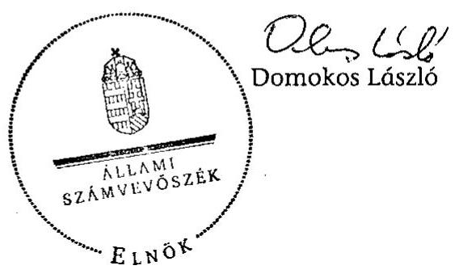

# ÁLLAMI   SZÁMVEVŐSZÉK 

## VÉLEMÉNY

Magyarország 2013. évi központi költségvetéséről szóló törvényjavaslatról

---

Állami Számvevőszék
Iktatószám: V-0024-057/2012.
Témaszám: 17.
Vizsgálat-azonosító szám: V-0574

# Az ellenőrzést felügyelte: 

Dr. Horváth Margit
felügyeleti vezető

Az ellenőrzés végrehajtásáért felelős:
Pongrácz Éva
ellenőrzésvezető
Az ellenőrzést vezette:
Pongrácz Éva
ellenőrzésvezető
Az összefoglaló jelentést készítették:
Balázs Melinda
számvevő tanácsos
Baloghné Sebestyén Éva
számvevő
Deli Gáborné
számvevő tanácsos
Gyarmati István
számvevő tanácsos
Jenei Zoltánné
számvevő
Korsósné Vígh Andrea
számvevő tanácsos
Lucza Anikó
számvevő tanácsos
Dr. Németh Eszter
számvevő tanácsos
Sali Sándorné
számvevő
Varsányiné Dudás Eleonóra
Számvevő
Dr. Vass Gábor
számvevő tanácsos
Vicze Klára
számvevő tanácsos

---

A számvevői jelentések feldolgozásában és a jelentés összeállításában közreműködtek:

Balázs Melinda
számvevő tanácsos
Baloghné Sebestyén Éva
számvevő
Deli Gáborné
számvevő tanácsos
Gyarmati István
számvevő tanácsos
Jenei Zoltánné
számvevő
Korsósné Vígh Andrea
számvevő tanácsos
Lucza Anikó
számvevő tanácsos
Dr. Németh Eszter
számvevő tanácsos
Sali Sándorné
számvevő
Varsányiné Dudás Eleonóra
Számvevő
Dr. Vass Gábor
számvevő tanácsos
Vicze Klára
számvevő tanácsos

Az ellenőrzést végezték:

Balázs Melinda
számvevő tanácsos

Béres László
számvevő
Dinnyés Illés Attila
számvevő
Fekete Anikó Gyöngyi
számvevő
Gergely Tilda
számvevő

Baloghné Sebestyén Éva
számvevő
Csordás Ágnes
számvevő
Dr. Domján Eszter
számvevő tanácsos
Fekete Gábor
számvevő tanácsos
Hadnagyné Papp
Ildikó
számvevő

Beke Andrea
számvevő
Deli Gáborné
számvevő tanácsos
Eigner György Zoltán
számvevő tanácsos
Fekete Győr László
számvevő
Huszár Anna
számvevő

---

| Huszárné Borbás | Jenei Zoltánné | Kányáné Murvai |
| :--: | :--: | :--: |
| Melinda számvevő | számvevő | Tünde   számvevő tanácsos |
| Király László számvevő tanácsos | Koczor László számvevő tanácsos | Korsósné Vígh Andrea számvevő tanácsos |
| Kovács Richárd számvevő | Köllődné Gátai Mária számvevő | Kupcsik Éva számvevő |
| dr. Lacó Bálintné számvevő tanácsos | Lakatos József számvevő | Marozsán Katalin számvevő |
| Moder Beatrix számvevő | Dr. Nagymányai Péter számvevő | Dr. Németh Eszter számvevő tanácsos |
| Salamin Viktor számvevő | Sali Sándorné számvevő | Solymár Ágnes számvevő tanácsos |
| Schmidt János számvevő | Szabóné László Mária számvevő tanácsos | Szilas István számvevő tanácsos |
| Vacsora Erika számvevő tanácsos | Varsányiné Dudás   Eleonóra   számvevő | Dr. Vass Gábor számvevő tanácsos |
| Velkei András számvevő | Vicze Klára számvevő tanácsos | Zachár Péterné számvevő tanácsos |
| Dr. Zsolnay András számvevő |  |  |

# A témához kapcsolódó eddig készített számvevőszéki jelentések: 

címe
sorszáma
Vélemény a Magyar Köztársaság 2010. évi költségvetési 0935
javaslatáról
Vélemény a Magyar Köztársaság 2011. évi költségvetési 1025
javaslatáról
Vélemény Magyarország 2012. évi költségvetési javaslatáról 1121

---

# TARTALOMJEGYZÉK 

BEVEZETÉS ..... 7
I. ÖSSZEGZŐ MEGÁLLAPÍTÁSOK ..... 9
II. RÉSZLETES MEGÁLLAPÍTÁSOK ..... 17

1. A költségvetési törvényjavaslat fő irányai ..... 17
1.1. A bázisév gazdasági folyamataiból adódó kockázatok ..... 17
1.2. A központi alrendszer egyenlege, az adósságcél alakulása ..... 18
2. A központi költségvetés közvetlen bevételi előirányzatai ..... 19
3. A központi költségvetés közvetlen kiadási előirányzatai ..... 24
3.1. Adósságszolgálattal kapcsolatos bevételek és kiadások ..... 26
3.2. A devizában eladósodott háztartások megsegítésére született intézkedések költségvetési hatásai ..... 28
3.3. Az állami vagyonnal kapcsolatos bevételek és kiadások ..... 30
3.4. A központi költségvetés tartalékai ..... 31
4. A fejezeti előirányzatok tervezése ..... 33
5. Az európai uniós tagsággal összefüggő előirányzatok ..... 36
6. Elkülönített állami pénzalapok ..... 39
7. A Társadalombiztosítás pénzügyi alapjai ..... 40
7.1. Nyugdíjbiztosítási Alap ..... 40
7.2. Egészségbiztosítási Alap ..... 42
8. A Helyi önkormányzatok támogatásai ..... 43
MELLÉKLETEK
9. sz. melléklet A 2013. évi adó- és egyéb költségvetési bevételek előirányzatainak minősítése
10. sz. melléklet A 2013. évi egyes közvetlen költségvetési kiadások előirányzatainak minősítése
11. sz. melléklet Az adósságszolgálattal kapcsolatos bevételek és kiadások 2013. évre tervezett fő számainak alakulása

## FÜGGELÉK

1. sz. függelék A 2012. év első öthavi folyamatainak alakulása

---

.

---

# RÖVIDÍTÉSEK JEGYZÉKE 

| Áfa | általános forgalmi adó |
| :--: | :--: |
| Áht. | 2011. évi CXCV. törvény az államháztartásról |
| ÁKK Zrt. | Államadósság Kezelő Központ Zártkörűen Működő Részvénytársaság |
| Alaptörvény | Magyarország Alaptörvénye |
| Ávr. | 368/2011. (XII. 31.) Korm. rendelet az államháztartásról szóló törvény végrehajtásáról |
| ÁSZ | Állami Számvevőszék |
| BGA | Bethlen Gábor Alap |
| BIR | Bíróságok |
| BM | Belügyminisztérium |
| CEB | Európa Tanács Fejlesztési Bankja |
| DK Zrt. | Diákhitel Központ Zártkörűen Működő Részvénytársaság |
| E. Alap | Egészségbiztosítási Alap |
| EB | Európai Bizottság |
| EBRD | Európai Újjáépítési és Fejlesztési Bank |
| ED | elektronikus díjszedési rendszer |
| EDP | Európai Unió Túlzott Hiány Eljárása (Excessive Deficit Procedure) |
| EK | Európai Közösség |
| EMMI | Emberi Erőforrások Minisztériuma |
| ESA | Nemzeti számlák európai rendszere |
| ETE | Európai Területi Együttműködés |
| eva | egyszerűsített vállalkozói adó |
| EU | Európai Unió |
| EUR | euró |
| GDP | Bruttó hazai termék |
| GNI | Bruttó nemzeti jövedelem |
| GYEMSZI | Gyógyszerészeti és Egészségügyi Minőség- és Szervezetfejlesztési Intézet |
| HM | Honvédelmi Minisztérium |
| IH | Irányító Hatóság |
| IMF | Nemzetközi Valutaalap |
| KDB | Közbeszerzési Döntőbizottság |
| KESZ | Kincstári Egységes Számla |
| KFF | Közbeszerzési Felügyeleti Főosztály |
| KIM | Közigazgatási és Igazságügyi Minisztérium |
| KNPA | Központi Nukleáris Pénzügyi Alap |
| KÖZOP | Közlekedés Operatív Program |
| KTIA | Kutatási és Technológiai Innovációs Alap |
| KSZ | Közreműködő Szervezet |
| KüM | Külügyminisztérium |

---

| MALÉV Zrt. | Magyar Légiközlekedési Zártkörűen Működő Részvénytársaság |
| :--: | :--: |
| MÁV Zrt. | Magyar Államvasutak Zártkörűen Működő Részvénytársaság |
| M Ft | millió forint |
| ME | Miniszterelnökség |
| MIK | Megyei Intézményfenntartó Központ |
| Mrd Ft | milliárd forint |
| MTA | Magyar Tudományos Akadémia |
| NFM | Nemzeti Fejlesztési Minisztérium |
| NAV | Nemzeti Adó- és Vámhivatal |
| NFA | Nemzeti Földalap |
| NFÜ | Nemzeti Fejlesztési Ügynökség |
| NIF Zrt. | Nemzeti Infrastruktúra Fejlesztő Zrt. |
| NKA | Nemzeti Kulturális Alap |
| NGM | Nemzetgazdasági Minisztérium |
| NSRK | Nemzeti Stratégiai Referenciakeret |
| Ny. Alap | Nyugdíjbiztosítási Alap |
| OGY | Országgyűlés |
| OEP | Országos Egészségbiztosítási Pénztár |
| ONYF | Országos Nyugdíjbiztosítási Főigazgatóság |
| OP | Operatív Program |
| OSAP | Országos Statisztikai Adatgyűjtési Program |
| Ötv. | 2011. évi CLXXXIX. törvény Magyarország helyi önkormányzatairól |
| ROP | Regionális Operatív Program |
| Stabilitási törvény | 2011. évi CXCIV. törvény Magyarország gazdasági stabilitásáról |
| szja | személyi jövedelemadó |
| TÁMOP | Társadalmi Megújulás Operatív Program |
| TIOP | Társadalmi Infrastruktúra Operatív Program |
| Törvényjavaslat | T/7655 számú törvényjavaslat Magyarország 2013. évi központi költségvetéséről |
| UF | Uniós Fejlesztések |
| ÚMVP | Új Magyarország Vidékfejlesztési Program |
| USD | amerikai dollár |
| VM | Vidékfejlesztési Minisztérium |
| VOP | Végrehajtás Operatív Program |
| WMA | Wesselényi Miklós Ár- és Belvízvédelmi Kártalanítási Alap |

---

# ÉRTELMEZŐ SZÓTÁR 

| Államadósság mutató | Olyan százalékban kifejezett, egy tizedesig kerekített hányados, amely számlálójában az államháztartás központi alrendszerének, az államháztartás önkormányzati alrendszerének, és a kormányzati szektorba sorolt egyéb szervezetek egymással szembeni kötelezettségek kiszürésével számított (konszolidált) adósságának, nevezőjében a nemzeti és regionális számlák európai rendszeréről szóló tanácsi rendeletben meghatározottak szerint számított bruttó hazai terméknek a stabilitási törvény szerinti értéke szerepel. |
| :--: | :--: |
| Államadósság-szabály | Az Alaptörvény 36. cikk (4) és (5) bekezdésében foglaltak alapján az Országgyűlés nem fogadhat el olyan központi költségvetésről szóló törvényt, amelynek eredményeképpen az államadósság meghaladná a teljes hazai össztermék felét. Mindaddig, amíg az államadósság a teljes hazai össztermék felét meghaladja, az Országgyűlés csak olyan központi költségvetésről szóló törvényt fogadhat el, amely az államadósság teljes hazai össztermékhez viszonyított arányának csökkentését tartalmazza. |
| Államháztartás központi alrendszerének adóssága | Az államháztartás központi alrendszerébe tartozó jogi személyek által vállalt adósságot keletkeztető ügyletek konszolidált értéke a számbavétel fordulónapján. |
| Államháztartás önkormányzati alrendszerének adóssága | A helyi önkormányzatok, a nemzetiségi önkormányzatok, a területfejlesztésről és a területrendezésről szóló törvény szerinti térségi fejlesztési tanácsok, a többcélú kistérségi társulások és az egyéb, jogi személyiséggel rendelkező társulások (a továbbiakban együtt: önkormányzat) által vállalt adósságot keletkeztető ügyletek konszolidált értéke a számbavétel fordulónapján. |
| Európai uniós forrás | Az Európai Unió költségvetéséből, az Európai Gazdasági Térség Európai Unión kívüli tagállamának költségvetéséből, valamint a Svájci Hozzájárulás programból származó forrás [Áht. 2. § (1) bekezdés g) pontja]. |
| Felülről nyitott előirányzatok | A központi alrendszer azon - a költségvetési törvény mellékletében felsorolt - előirányzatai, amelyek teljesülése módosítás nélkül eltérhet (felfelé) az előirányzattól. |
| Konvergencia régiók | A 2006/595/EK bizottsági határozat értelmében a „konvergencia" célkitűzés alapján 2007-2013 között támogatásra jogosult hat magyarországi régió (a Közép-Magyarországi Régió nem tartozik bele). |
| Kormányzati szektorba sorolt egyéb szervezetek adóssága | Az ESA szerint a kormányzati szektorba tartozó gazdálkodó szervezetek által, a saját nevükben vállalt adósságot keletkeztető ügyletek konszolidált értéke a számbavétel fordulónapján. |
| Megalapozott előirányzat | Teljesíthető és alátámasztott előirányzat |

---

| Részben megalapozott | Teljesíthető és részben alátámasztott előirányzat |
| :--: | :--: |
| Nem megalapozott | Nem teljesíthető és nem alátámasztott előirányzat |
| Alátámasztott előirányzat | Az előirányzat kialakítását dokumentáló számítások, hatástanulmányok, stratégia rendelkezésre állnak; a szabályozási háttere megvan, illetve biztosított |
| Teljesíthető előirányzat | Az előző évi tendenciákkal és várható értékkel a kialakított előirányzat összhangban van |
| Kockázatos előirányzat | Új előirányzat (nincs előzménye, viszonyítási alap); nincs szabályozási háttere, számítási háttere, stratégia, hatástanulmány, nem teljesíthető |
| Tájékoztató | Az államháztartásért felelős miniszter tájékoztatója a 2013. évi költségvetési törvényjavaslat összeállításához szükséges feltételekről és az érvényesítendő követelményekről.   A tájékoztató mellékletei   Tervezett menetrend a 2013. évi költségvetési törvényjavaslat összeállításához |
| $\mathrm{N}+2, \mathrm{~N}+3$ szabály: | A kötelezettségvállalás automatikus visszavonásának szabálya, az Európai Bizottság automatikusan visszavonja a kötelezettségvállalásoknak azt a részét, amelyre a tagállam nem nyújtott be elfogadható kifizetési kérelmet a kötelezettségvállalás évét követő második, illetve harmadik év végéig. |
| T/7028. számú törvényjavaslat | Az adózást érintő egyes törvények módosításáról szóló törvényjavaslat |
| GDP deflátor | A folyó áras (adott évi árakon) GDP és a változatlan áras reál GDP hányadosa, értéke megmutatja az egész gazdaságra jellemző árszínvonal változást. |

---

# VÉLEMÉNY   Magyarország 2013. évi központi költségvetéséről szóló törvényjavaslatról 

## BEVEZETÉS

Az Állami Számvevőszék (ÁSZ) a jogszabályi előírásoknak megfelelően és a tervezés megváltozott ütemezéséhez igazodva elkészítette Magyarország 2013. évi központi költségvetési törvényjavaslatáról szóló véleményét.

A Kormány az eddig kialakult gyakorlaton változtatva a költségvetési javaslat Országgyűléshez történő benyújtásának határidejét a törvényben ${ }^{1}$ előírt szeptember 30-áról június 15-ére hozta előre. Ennek következtében jelentősen módosultak az ÁSZ ellenőrzési lehetőségei is. A Kormány döntése következtében át kellett alakítani az ÁSZ már elkészült ellenőrzési programját, illetve az ellenőrzési feladatokat, hogy az annak alapján végzett ellenőrzés során továbbra is biztosított legyen az ÁSZ jogszabályban előírt feladatának végrehajtása.

A Nemzetgazdasági Minisztérium (NGM) a költségvetés tervezésével kapcsolatos tájékoztatót és ütemtervet határidőre elkészítette és megküldte az érintetteknek az Áht. 13. § (2) bekezdésében foglalt feladatainak teljesítése érdekében. Az előrehozott benyújtás miatt az ütemtervben foglalt határidők jelentős eltérést mutatnak a tervezéssel kapcsolatos jogszabályokban meghatározott
 határidőkhöz képest. A fejezeteket irányító szervek észrevételeinek beérkezése után a kapcsolódó egyeztetések rövid határidővel történtek meg, ami hiányossá tette a tervezés pontosságát, alátámasztottságát. Ebben az évben is kedvezőtlen az a körülmény, hogy a pontos tervezéshez nem álltak rendelkezésre teljes körűen a költségvetési törvényjavaslatot megalapozó törvények tervezetei, továbbá egyes adótörvények tárgyalása jelenleg is folyik a Parlamentben.

Magyarország számára kedvezőtlen, bizonytalan nemzetközi pénzügyi, gazdasági környezetben készült a 2013. évi költségvetés. Az eurózóna néhány tagállamának pénzügyi nehézségei erősítik a pénzpiacok bizonytalanságát, ami Magyarország számára külső kockázatot jelent. Az államadósság csökkentése továbbra is fegyelmezett pénzügypolitikát és jelentős tartalékképzést követel meg.

A 2013. évi költségvetésről szóló törvényjavaslat tartalmazza a gazdaság stabilitását, megítélését javító intézkedéseket, kockázatot hordoz azonban egyebek mellett a bevételek teljesíthetősége.

[^0]
[^0]:    ${ }^{1}$ Áht. 22. § (2) bekezdés.

---

A törvényjavaslatot a véleményezéshez készített Módszertan² alapján értékeltük, amely tartalmazza a bevételi és kiadási előirányzatok minősítéseinek meghatározását. A minősítési kategóriák a következők:

1. megalapozott (teljesíthető és alátámasztott),
2. részben megalapozott (teljesíthető és részben alátámasztott),
3. nem megalapozott, azaz kockázatos (nem teljesíthető és nem alátámasztott).

A bevételek esetében a megalapozottság mindkét feltétele értelmezhető, viszont a kiadásoknál azok alátámasztottságáról mondunk véleményt. Alátámasztottnak minősül az előirányzat, ha a kialakítását dokumentáló számítások, hatástanulmányok, stratégia rendelkezésre állnak, valamint a szabályozási háttere megvan, illetve biztosított. Teljesíthető az előirányzat, ha az előző évi tendenciákkal és a várható értékkel a kialakított előirányzat összhangban van. Alapesetben kockázatosnak tekintendő az előirányzat, ha nem megalapozott, illetve új előirányzat. A két új adó (távközlési adó és biztosítási adó) esetében azonban a rendelkezésre álló számítási háttérre tekintettel részben megalapozottnak minősítettük az adónemeket.

Értékelésünk során a törvényjavaslatban szereplő gazdasági mutatószámokat, az NGM által rendelkezésünkre bocsátott 2012. évi várható értékeket, illetve a 2012. év első öt hónapjának teljesítési adatait és az az alapján várható összegeket vettük figyelembe.

Az ÁSZ 2012. elejétől monitoring tevékenységet folytat, melynek célja, hogy nyomon kövesse a költségvetési folyamatokat. Az ÁSZ e tevékenysége keretében az NGM-től, a Magyar Államkincstártól és a NAV-tól bekért adatok és munkaanyagok alapján havonta elemzést készít a folyamatok alakulásáról. A 2012. évi monitoring tevékenység keretében értékeltük az első öt hónap költségvetési folyamatait, amelynek következtetéseit véleményünk kialakítása során felhasználtuk. Külön függelékben mutatjuk be a 2012. év első öthavi költségvetési folyamatainak alakulását és kockázatait.

[^0]
[^0]:    ${ }^{2}$ Módszertan Magyarország költségvetéséről szóló törvényjavaslat véleményezését megalapozó ellenőrzéshez, elérhető az ÁSZ honlapján az "Ellenőrzés-szakmai szabályok" menüpont "Módszertani dokumentumok" témafüle alatt a "Módszertanok" dokumentumai között.

---

# I. ÖSSZEGZŐ MEGÁLLAPÍTÁSOK 

A Kormány az eddig kialakult gyakorlaton változtatva a költségvetési javaslat Országgyűléshez történő benyújtásának határidejét a törvényben előírt szeptember 30-áról június 15-ére hozta előre. Ennek következtében jelentősen módosultak az ÁSZ ellenőrzési lehetőségei is. A Kormány döntése következtében át kellett alakítani a már elkészült ellenőrzési programunkat, illetve az ellenőrzési feladatokat. Ezzel együtt a jogszabályi előírásoknak megfelelően elkészítettük Magyarország 2013. évi költségvetési törvényjavaslatáról szóló véleményünket.

Magyarország számára kedvezőtlen, bizonytalan nemzetközi pénzügyi, gazdasági környezetben készült a 2013. évi költségvetés. Az eurozóna néhány tagállamának pénzügyi nehézségei erősítik a pénzpiacok bizonytalanságát, ami Magyarország számára külső kockázatot jelent.

A törvényjavaslat összeállítása, szerkezete megfelel az államháztartás gazdálkodását és működését meghatározó jogszabályi feltételeknek, valamint az Alaptörvényben és a Stabilitási törvényben az államadósság csökkentésére vonatkozó szabályoknak. A javaslat rendelkezik a rendkívüli kormányzati intézkedésekre szolgáló tartalékról és a céltartalékokról, valamint az Országvédelmi Alapról. A megalapozó jogszabályi háttér azonban hiányos, egyes adótörvények, valamint a fogyasztói árkiegészítést kiváltó szociálpolitikai menetdíj támogatást szabályozó kormányrendelet nem készültek el.

Magyarország 2013. évi költségvetési törvényjavaslata 15 477,0 Mrd Ft kiadási, továbbá 14 799,7 Mrd Ft bevételi főösszeggel számol. Ellenőrzésünk a bevételi főösszeg 88%-ára, a kiadási főösszeg 82%-ára terjedt ki. Értékelésünket az új módszertanunkra alapoztuk. Lényege, hogy a releváns bevételi és kiadási előirányzatokat vesszük alapul. A bevételi előirányzatokat akkor tekintjük megalapozottnak, ha azok teljesíthetőek és alátámasztottak. A kiadási előirányzatoknál elegendő az alátámasztottság. A törvényjavaslatban megjelenő előirányzatok kialakítása, az azokat alátámasztó számítások az általános indokolás melléklete szerinti gazdasági mutatószámok alapján történtek. E mutatók alapján értékeltük az egyes előirányzatok megalapozottságát. Ugyanakkor a törvényjavaslatban bemutatott makrogazdasági pálya, illetve az egyes gazdasági mutatószámok várakozásoktól eltérő, kedvezőtlen alakulása kockázatot jelenthet az általunk egyébként megalapozottnak minősített előirányzatok teljesülése esetében is. A világgazdaság növekedési folyamatainak lassulása és az euróövezeti válságjelenségek a 2012. évi adóbevételek mérséklődését, a kiadások növekedését vetítik előre. A tendencia már az államháztartás első öthavi pénzforgalmi folyamataiban is nyomon követhető ${ }^{3}$.

[^0]
[^0]:    ${ }^{3}$ A 2012. évi első öthavi adatok alapján azonosított kockázatokat az 1. számú függelékben mutatjuk be.

---

A 2013. évi makrogazdasági pálya felvázolásában a bázisul szolgáló 2012. évi, vártnál kedvezőtlenebb makrogazdasági feltételek komoly kockázatot jelentenek a 2013. évi költségvetési célok teljesülése szempontjából is. Azok mérséklése érdekében helyes döntés volt a tartalékok egy részének 2012. évi befagyasztása. A 2013. évi előirányzatok tartása érdekében elengedhetetlen a tervezett bevételnövelő és kiadást visszafogó intézkedések következetes végrehajtása.

Az államháztartás központi alrendszerének tervezett hiánya 677,3 Mrd Ft, amely 18%-kal meghaladja a 2012. évre tervezettet. A hiánycél tartása szempontjából a legnagyobb kockázatot 2012-ben az jelenti, hogy sikerül-e a gazdaságot stagnálás közeli állapotban megtartani, az első negyedévi gazdasági visszaesés a második félévtől növekedésbe fordul-e át. A 2013. évi kockázatot elsősorban az export tervezett növekedési ütemének tartása jelenti. A központi költségvetés tervezett hiányával összefüggésben a Kincstári Egységes Számla folyamatos likviditásának biztosítására, valamint a megelőlegezésekre vonatkozó 2013. évi finanszírozási elképzelések számszakilag kimunkáltak, alátámasztottak. A törvényjavaslatban 2013-ra tervezett 1,6%-os GDP növekedés mellett a 2,2%-os hiánycél tartható.

A 2013. évi költségvetési törvényjavaslat a Stabilitási törvény előírásainak megfelelően tartalmazza az államadósság mértékét. Az államháztartás 2013. év végére várható konszolidált összesített adóssága ${ }^{4} 23573,3$ Mrd Ft. Az államadósság mutató értéke a 2013. év végén a kormányzati prognózisban szereplő GDP-vel számolva 76,8%. A törvényekben meghatározott képlet szerint eleget tesz a mutató csökkenése követelményének (a 2012. év végére számított adósságmutató 78,0%). Az államadósság csökkentése továbbra is fegyelmezett pénzügypolitikát és jelentős tartalékképzést követel meg.

A 2013. évi költségvetési törvényjavaslatban az adóbevételek tervezett előirányzatai nincsenek teljes körűen részletes számításokkal alátámasztva, továbbá egyes jogszabályok hiányoztak, illetve a törvényjavaslatok egy részét az OGY még nem fogadta el. A költségvetés adóbevételeinek 58%-a megalapozott, 12%-a részben megalapozott, 30%-a nem megalapozott.

Ellenőrzési tapasztalataink alapján megalapozottnak minősítettük a gazdálkodó szervezetek költségvetési befizetéseinek 30%-át (303 Mrd Ft), ezen belül a pénzügyi szervezetek különadóját, a bányajáradékot, az ökoadót, az energiaellátók jövedelemadóját, a rehabilitációs hozzájárulást és az egyes ágazatokat terhelő különadót. A fogyasztáshoz kapcsolt adók közül a bevételek közel 91%-át (3739,5 Mrd Ft) kitevő áfa és jövedéki adó előirányzatokat értékeltük megalapozottnak.

Részben megalapozott ${ }^{5}$ minősítést kapott a gazdálkodó szervezetek költségvetési befizetéseinek 47%-a, 472,4 Mrd Ft (társasági adó, játékadó, egyéb befizetések), valamint a fogyasztáshoz kapcsolt adók 2%-a, 96,5 Mrd Ft

[^0]
[^0]:    ${ }^{4}$ A központi alrendszer, az önkormányzati alrendszer és a kormányzati szektor összesített adata.
    ${ }^{5}$ Teljesíthető és részben alátámasztott.

---

(távközlési adó, biztosítási adó), és a lakosság befizetéseinek 9%-a, 154,5 Mrd Ft (lakossági illetékek, gépjárműadó), valamint az egyéb költségvetési bevételek (117,4 Mrd Ft). A részben megalapozott értékelés az előirányzatok hiányos alátámasztottságával függött össze, ugyanakkor ezek még teljesíthetőek, az előző évi tendenciák és a várható összegek alapján. Az új adónemeknél elkészültek a számítások és a bevezetésükhöz szükséges jogszabályi háttér ${ }^{6}$.

Az adóbevételek közül nem megalapozott ${ }^{7}$ a gazdálkodó szervezetek befizetéseiből 23% (225,3 Mrd Ft), ezen belül a hitelintézeti járadék, a cégautóadó és az eva. Nem megalapozott továbbá a fogyasztáshoz kapcsolt adókból a regisztrációs adó (15,0 Mrd Ft), a pénzügyi tranzakciós illeték (283,0 Mrd Ft) és a lakosság költségvetési befizetéseiből 91% (1541,4 Mrd Ft) az szja, az egyéb lakossági adók és a magánszemélyek jogviszony megszűnéséhez kapcsolódó különadó. Nem megalapozott minősítésű továbbá az elektronikus útdíj bevétel 75,0 Mrd Ft-os összege. A nem megalapozottnak értékelt előirányzatok esetében hiányoztak az adott bevételtípus bevezetéséhez szükséges jogszabályok, nem volt megfelelő a tervezés bázisa, hiányoztak egyes számítások, egyéb dokumentumok, ezért a bevétel nem teljesíthető.

A központi költségvetés közvetlen kiadásainak (1261,6 Mrd Ft) 56%-a megalapozott, 37%-a részben megalapozott és 7%-a nem megalapozott.

Megalapozott a Diákhitel 2 konstrukció kamattámogatása, az állam által vállalt kezesség és viszontgarancia érvényesítése, továbbá megalapozottak a kormányzati rendkívüli kiadások, a garancia és hozzájárulás a társadalombiztosítási ellátásokhoz és a követeléskezelés költségei.

Részben megalapozottak a vállalkozások folyó támogatásának előirányzatai, a lakástámogatások, az egyéb költségvetési kiadások és a nemzetközi elszámolások. A részbeni megalapozottság összefügg a Kormány és a Bankszövetség megállapodása alapján kialakított támogatási formák bizonytalanságaival, a hiányos háttérszámításokkal, valamint dokumentációk hiányával.

Nem megalapozott a fogyasztói árkiegészítést ez év júliusától kiváltó szociálpolitikai menetdíj támogatás, mivel hiányzik a végrehajtási jogszabály ${ }^{8}$.

Az adósságszolgálattal kapcsolatos bevételek és kiadások fejezetben a 2013. évi kamatkiadási előirányzat 1325,5 Mrd Ft-os összege 14%-kal magasabb a 2012. évi előirányzatnál. A növekedés a piaci finanszírozás korábbinál magasabb tervezett arányával függ össze.

A Kormány által tervezett IMF/EB hitelmegállapodás megkötése közvetetten és közvetlenül is hatással lehet a kamat- és adósságkezelési kiadások mértékére. Közvetett hatás érhető el a kamatfelárak csökkenésén, az árfolyamok erősödé-

[^0]
[^0]:    ${ }^{6}$ A pénzügyi tranzakciós illetékről és a biztosítási adóról szóló törvényjavaslatokat az OGY még nem fogadta el.
    ${ }^{7}$ Nem teljesíthető és nincs alátámasztva.
    ${ }^{8}$ Az NGM tájékoztatása szerint az NFM-nél folyamatban van a vonatkozó kormányrendelet kidolgozása.

---

sén keresztül, illetve közvetlenül csökkenhet a kamatkiadások összege, amennyiben sor kerül a piaci hozamoknál kedvezőbb kamatozású hitel lehívására is.

Az állami vagyonnal kapcsolatos bevételek összege (37,8 Mrd Ft) teljes körűen megalapozott, míg az állami vagyonnal kapcsolatos kiadások (113,0 Mrd Ft) 46%-a nem megalapozott. Ezen belül ezt a minősítést kapta a Nemzeti Eszközkezelő Zrt. által végrehajtott ingatlanvásárlások (33,0 Mrd Ft), az állami tulajdonú társaságok támogatása (7,3 Mrd Ft) és a MÁV csoport dolgozóinak pénzügyi ösztönzésére szolgáló előirányzat (11,6 Mrd Ft).

Az állami vagyon részét képező Nemzeti Földalappal kapcsolatos tervezett bevételek összege (11,8 Mrd Ft) és a tervezett kiadási összeg (18,7 Mrd Ft) megalapozott. Az előirányzat elegendő forrást biztosít a feladatok ellátásához.

A törvényjavaslat központi költségvetési tartalékainak összege 300,0 Mrd Ft, a 2012. évi előirányzat 83%-a és a 2012. évi várható felhasználás 149%-a.

Rendkívüli kormányzati intézkedésekre 100,0 Mrd Ft előirányzatot terveztek, amely a központi költségvetésről szóló törvényjavaslat kiadási főösszegének
 0,6\%-át teszi ki. Ez megfelel a törvényi előírásokban ${ }^{9}$ foglalt mértéknek.

A Költségvetési Tanács a törvényjavaslat tervezetéről készített véleményében javasolta az Országvédelmi Alap 50,0 Mrd Ft összegű előirányzatának megemelését. A törvényjavaslat ennek eleget tesz, az Országvédelmi Alap összege a törvényjavaslatban 100,0 Mrd Ft.

Véleményünk szerint kockázatot jelent, hogy az Országvédelmi Alap 2013. évi előirányzata 70,0 Mrd Ft-tal alacsonyabb a 2012. évi előirányzatnál. További kockázat, hogy a törvényjavaslat külön kamatkockázati tartalékot nem tartalmaz, szemben a 2012. évi költségvetési törvénnyel, amely 98,0 Mrd Ft-ot irányzott elő erre a célra. Várhatóan 2012-ben az Országvédelmi Alap és a kamatkockázati alap előirányzatait szinte teljes egészében a kedvezőtlenebb makrogazdasági helyzet miatti bevételkiesések és kiadásnövekedések kiegyenlítésére kell fordítani. A bázishoz képest tehát 168,0 Mrd Ft-tal csökken a makrogazdasági kockázatok ellensúlyozására alkalmas tartalékok összege, miközben a világgazdaságban a bizonytalanságok továbbra is fennmaradtak.

A helyzet értékelésénél figyelembe kell venni, hogy az államadósság után fizetendő kamatok előirányzatát a törvényjavaslat az átlagos hozamszint 80 bázispontos csökkenésének feltételezésével állapítja meg. Ennél azonban nagyobb javulás is elérhető 2013-ban 2012-höz képest, ha Magyarország és az IMF/EU közötti megállapodás létrejön. Ez egyfajta implicit tartalékot jelent a 2013. évi költségvetésben.

[^0]
[^0]:    ${ }^{9}$ Áht. 21. § (2) bekezdése szerint a rendkívüli kormányzati intézkedésekre szolgáló tartalék előirányzata nem lehet több a központi költségvetésről szóló törvény kiadási főösszegének 2\%-ánál, és nem lehet kevesebb 0,5\%-nál.

---

Az Országvédelmi Alap további növelése ellen szól, hogy a makrogazdasági kockázatok jelentős mértékben a belföldi felhasználás alakulásával kapcsolatosak, az Országvédelmi Alap előirányzatának további emelése viszont éppen szűkítené a hazai fogyasztási, felhalmozási lehetőségeket. Erre tekintettel a kockázat ellenére sem javasoljuk az Országvédelmi Alap további növelését.

Az ellenőrzés 11 fejezetet érintett. Teljes körű részletes háttérszámítást a HM, a BM és az NFM készített. Az ellenőrzött fejezetek többletigényét a törvényjavaslat 120,8 Mrd Ft összegben jóváhagyta. A többlettámogatásokkal a fejezetekhez tartozó feladatok ellátásának biztonságát növelték.

A 2012. és a 2013. évi költségvetési hiánycél biztosítása érdekében a fejezetek végrehajtották a vonatkozó kormányhatározatok intézkedéseit. Minden érintett fejezet figyelembe vette a szerkezeti változásokat és a szintre hozást. A törvényjavaslat tartalmazza a már eldöntött szerkezeti változásokat, az egyes fejezetek között átcsoportosított feladatokat és az azokhoz kapcsolódó előirányzatokat.

Az ellenőrzött fejezetek 2013. évi költségvetésének tervezett bevételi főösszege 1191,1 Mrd Ft és kiadási főösszege 3831,1 Mrd Ft, amelyek 77\%-át ellenőriztük. Az ellenőrzött bevételi előirányzatok 49\%-a, a kiadások 86\%-a megalapozott. Részben megalapozott a bevételek 51\%-a, a kiadások 15\%-a.

A fejezetek közül a kockázataik csökkentése érdekében az ME, a VM, a KIM, az EMMI képzett tartalékot. 2012-ben a fejezetek fejezeti egyensúlybiztosítási tartalékkal rendelkeztek, ennek mértéke a kiadásaik 1-5\%-át tette ki. Véleményünk szerint kockázatot jelent, hogy fejezeti tartalékot mindössze négy fejezet tervezett. Az elmúlt 7 év tényadatai ugyanis azt mutatják, hogy a fejezetek rendszeresen a Rendkívüli kormányzati intézkedésekre (korábban általános tartalék) szolgáló tartalék előirányzatának felhasználásával próbálnak fedezetet teremteni olyan kiadásokra is, amelyek a tervezés időszakában már ismertek voltak, de nem tervezték meg azokat. Továbbá az évközi zárolások, a maradványtartási kötelezettség előírása miatt nem jut rájuk fedezet a fejezeteknél. Ez a gyakorlat azonban nem szabályos. (Az ÁSZ 2005 óta minden évben kifogásolta ezt a zárszámadási ellenőrzések során.) Az Áht. 21. § (1) bekezdésében foglalt előírás szerint ugyanis a rendkívüli kormányzati intézkedésekre szolgáló tartalékot az előre nem valószínűsíthető, nem tervezhető költségvetési kiadásokra és az előirányzott, de elháríthatatlan ok miatt elmaradó költségvetési bevételek pótlására kell tervezni. Véleményünk szerint a központi tartalékok csak a fejezeti tartalékokkal kiegészítve nyújtanak kellő fedezetet a nem tervezett, de szükségképpen teljesítendő kiadásokra.

A törvényjavaslatban megjelenő EU támogatások központi költségvetési forrásrésze 258,4 Mrd Ft, amely a tervek szerint kiegészül 1555,9 Mrd Ft összegű EU forrással. A hozzájárulás az EU költségvetéséhez 2013. évre tervezett összege 283,6 Mrd Ft, amely az előző évi eredeti előirányzatnak a 107\%-át teszi ki. A teljesítés külön szabályozás nélkül is eltérhet az előirányzattól, amely biztosítja a tagállami hozzájárulás befizetésének teljesíthetőségét.

---

Kockázatot jelent, hogy az uniós források felhasználása elmarad a 2012. évi időarányos teljesítéstől. A jóváhagyott keretet legkésőbb a 2013. év végéig kötelezettségvállalással le kell kötni az EU-s források 100\%-os kihasználása érdekében.

Az elkülönített állami pénzalapok 2013. évre tervezett kiadási előirányzata 435,1 Mrd Ft. A Kutatási és Technológiai Innovációs Alap kiadási és bevételi előirányzatai részben megalapozottak. A bevételi előirányzat 93,9\%-át (47 950,0 M Ft) kitevő innovációs járulék becsült érték, hiányoznak a jogszabályváltozásból adódó, a kedvezmények megszüntetése miatti járuléknövekedés háttérszámításai. A Nemzeti Foglalkoztatási Alap kiadási előirányzata a számítások hiánya miatt részben megalapozott.

A Nyugdíjbiztosítási Alap 2013. évi költségvetésének bevételi és kiadási főösszege 2874,5 Mrd Ft. Az Ny. Alap tervezett kiadási és bevételi főösszege megalapozott. A törvényjavaslat 4,2\% inflációkövető nyugdíjemeléssel számol. Kockázatot hordoz, ha az infláció alakulása a számított értéktől bármilyen irányban eltér. A kiadási főösszeg alátámasztott, a kiadási előirányzatok 97\%-át (2777,5 Mrd Ft) kitevő ellátási kiadások fedezete a bevételi főösszegbe épített költségvetési hozzájárulásokkal biztosított. Az alap költségvetése - a tervezéskor figyelembe vett makrogazdasági pálya mutatószámainak változatlansága esetén - teljesíthető. A fő előirányzatok összhangban vannak a Széll Kálmán tervekkel és a Konvergencia programmal.

Az Egészségbiztosítási Alap 2013. évi költségvetésének bevételi főösszege 1649,4 Mrd Ft, kiadási főösszege 1675,0 Mrd Ft, a költségvetés egyenlege 25,7 Mrd Ft hiány.

Az E. Alap bevétele - a tervezéskor figyelembe vett makrogazdasági pálya jövedelem mutatóinak bekövetkezése esetén - teljesíthető. A 2013. évi bevételek közel 45\%-át a jövedelemalapú járulékbevételek jelentik. Az E. Alap bevételének 37,5\%-a a központi költségvetésből átvett pénzeszköz és az Ny. Alaptól rokkantsági ellátások fedezetére átvett forrás, amelyek jellegüknél fogva nem kockázatosak. Az egyéb bevételeken belül a gyógyszergyártók és forgalmazók befizetésére 30,0 Mrd Ft-ot határoztak meg.

A gyógyító-megelőző ellátásokra az E. Alap tervezett kiadásainak 50\%-át biztosítja a törvényjavaslat. A 2013. évi finanszírozásra meghatározott keretösszeg 833,5 Mrd Ft, ez 8,6 Mrd Ft-tal több, mint a 2012. évi eredeti előirányzat összege. A gyógyító megelőző ellátások tervezésénél figyelembe vették a szerkezeti változásokat, a szintre hozásokat, a többletkapacitás befogadások forrás igényét és a fejlesztéseket. A tervezett előirányzat összege a többletkapacitások befogadására 4,6 Mrd Ft-ot és a fejlesztésekre 0,7 Mrd Ft-ot tartalmaz. Az E. Alap kiadási főösszegének egyharmadát (558,3 Mrd Ft) kitevő pénzbeli ellátásokra tervezett összeg teljesíthető.

A legjelentősebb változást a gyógyszertámogatás jogcímcsoportban tervezik. Ennek keretében a jogcímcsoport támogatását 29\%-kal csökkentették, a 2012. évi eredeti előirányzathoz képest. A gyógyszertámogatás csökkentésének végrehajthatósága a konstrukcióváltás miatt bizonytalanságot hordoz. Az előirányzat csökkentése nincs alátámasztva szabályozási koncepcióval és háttérszámí-

---

tással. További bizonytalanságot okoz a gyógyszerfelírási és fogyasztói magatartás változásának kiszámíthatatlansága a lakossági térítés rendszerének változatlansága esetén.

A helyi önkormányzatok gazdálkodásához a 2013. évi központi költségvetés 647,2 Mrd Ft-ot biztosít. Ez a 2012. évi módosított előirányzat (1066,9 Mrd Ft) 60,7\%-a. Az önkormányzati alrendszer támogatása a 2013. évi költségvetés kiadási főösszegének (15 477,0 Mrd Ft) 4,2\%-a, 2,8 százalékponttal alacsonyabb a megelőző évi részaránynál.

Az önkormányzati feladatellátás, ezzel együtt a finanszírozási rendszer 2013-tól alapjaiban megváltozik. Az önkormányzatok által korábban ellátott feladatok egy része az államhoz (az EMMI és a KIM fejezetbe) kerül. A feladatátrendeződés megjelenik mind a közoktatásban, mind a szociális és az igazgatási ágazatban. Az önkormányzatok központi költségvetésből származó forrásainak a 2013. évi költségvetésben tervezett nagyságrendjére a feladatátszervezés alapvető hatást gyakorol.

A változásokkal párhuzamosan a megmaradó feladatok tekintetében a forrásszabályozás is átalakul. A helyi önkormányzatok támogatásai fejezet finanszírozási struktúrája elszakad az eddig jellemzően normatív támogatási rendszertől, felépítésében az ágazati-szakmai törvények logikáját követi, egyes közszolgáltatásoknál bevezeti a feladatalapú finanszírozást.

A helyi önkormányzatok támogatási előirányzatából megalapozott azok 6,6\%-a (43,0 Mrd Ft), részben megalapozott 62,7\%-a (405,9 Mrd Ft), nem megalapozott 30,7\%-a (198,4 Mrd Ft).

Megalapozottnak minősítettük a helyi önkormányzatok által felhasználható központosított előirányzatokat és a Vis maior támogatást.

Részben megalapozottak a települési önkormányzatok ágazati feladatainak támogatása előirányzatok továbbá a címzett és céltámogatások.

Nem megalapozottak a helyi önkormányzatok általános működésének támogatásai, a helyi önkormányzatok kiegészítő támogatásai.

Az önkormányzati alrendszer szerkezetének és finanszírozásának átalakítása és a kapcsolódó források átrendezése a törvényjavaslat benyújtásáig nem zárult le. Az alrendszerből 464,4 Mrd Ft forrást vontak ki. Az ezt alátámasztó háttérszámítások - az új feladatmegosztás figyelembevételével - elkészültek, de azok a változásokat és azok hatását nem veszik teljes körűen figyelembe. Ezért kockázatot hordoz, hogy a kellőképpen meg nem alapozott forráskivonás a települési önkormányzatok egyes csoportjait nem a feladatcsökkentéssel arányosan érinti. Összességében sem átlátható, hogy a feladatellátás és a finanszírozás összhangja biztosított-e. A feladatátrendezés bizonytalansági tényezőinek kezelésére a törvényjavaslat 85,6 Mrd Ft összegű tartalékot irányoz elő, amelyet azonban a pályázati alapon történő felosztásig nem lehet felhasználni. Így szűkülnek az önkormányzatok feladatainak finanszírozási lehetőségei. Ezáltal az önkormányzatok feladatellátásának a feltételei nem biztosítottak teljes körűen és folyamatosan, ami a működőképességet veszélyeztetheti. Ezek kezelésé-

---

re rendelkezésre álló tartalékok azonban csak a kormányzat által meghatározott célokra, legkorábban 2013 májusától használhatók fel.

Az ÁSZ - összhangban az Állami Számvevőszékről szóló törvény 1. § (4) bekezdésében foglaltakkal - a költségvetési törvényjavaslatról kialakított Véleményével arra törekszik, hogy ellenőrzési tapasztalatain alapuló megállapításaival segítse az Országgyűlés munkáját.

Az ÁSZ Véleménye a költségvetési előirányzatok megalapozottságának tételes minősítésével rámutat azokra a kockázatokra, amelyek a költségvetés elfogadási folyamatának jelenlegi szakaszában még fennállnak. Ezzel felhívja a döntéshozók figyelmét, hogy a tervezett intézkedések hatásainak részletesebb felmérésével, további jogszabályok megalkotásával, egyes előirányzatok módosításával, újabb tartalékok beépítésével mérsékeljék ezeket a kockázatokat, hogy ezáltal olyan költségvetési törvényt fogadhassanak el, amely még nagyobb biztonsággal éri el az Alaptörvényben és a Stabilitási törvényben meghatározott adósságcsökkentési célkitűzést.

---

# II. RÉSZLETES MEGÁLLAPÍTÁSOK 

## 1. A KÖLTSÉGVETÉSI TÖRVÉNYJAVASLAT FŐ IRÁNYAI

### 1.1. A bázisév gazdasági folyamataiból adódó kockázatok

A világgazdaság növekedésének 2012. évi lassulása és az euróövezeti válságjelenségek hatására romlanak a magyar gazdaság növekedési kilátásai. Ez az adóbevételek mérséklődését és a kiadások növekedését vetíti előre. A tendencia az államháztartás első öthavi pénzforgalmi folyamataiban már nyomon követhető. Az államháztartás központi alrendszerének hiánya 2012. május végén az éves előirányzat 59,7\%-a volt, ami az időarányos mértéket meghaladja.

A makrogazdasági környezetben bekövetkezett változások, az államháztartás központi alrendszerének 2012. évi első öthavi adatai és a megelőző évek tendenciái alapján a 2013. évet érintően is azonosíthatóak a kockázatos előirányzatok.

A Kormány az új adónemek bevezetésével, illetve a különadók mérséklésével, kivezetésével folytatja az adóbevételek szerkezet-átalakítását. Ennek során a közvetlen, jövedelmet terhelő adók súlya csökken, míg a közvetett, fogyasztást terhelő adókból származó bevételek súlya nő. Az utóbbiak teljesülése mérsékeltebb kockázatú, így jobban tervezhetőek.

A gazdálkodó szervek befizetései esetében 2012-ben szinte minden adónemnél
 elmaradás tapasztalható. A kockázatok szempontjából ezért a bázisévben kiemelendő a társasági adó, az egyszerűsített vállalkozói adó, a játékadó és a pénzügyi szervezetek különadója.

A forgalmi típusú adóknál az áfa bevételek év végére eredményszemléletben némileg elmaradhatnak az előirányzattól, ugyanakkor pénzforgalomban - a költségvetés év végi pozíciójának függvényében, a szabályozás adta lehetőség kihasználásával élve - meghaladhatják azt.

A személyi jövedelemadó bevételek alulteljesülése várható 2012-ben a mérsékeltebb jövedelemkiáramlás miatt.

A központi alrendszer közvetlen kiadásai közül néhány (például lakástámogatások, fogyasztói árkiegészítés) felülről nyitott előirányzat módosítás nélkül túlteljesülhet. A módosítás nélkül túlteljesíthető céltartalék 90,0 Mrd Ft összegű előirányzatából 76,0 Mrd Ft, az előirányzat 84%-a került felhasználásra az év első öt hónapjában.

Az állami vagyonnal kapcsolatos kiadások növekedése valószínűsíthető az év hátralévő részében.

---

Az európai uniós támogatások 2012. első öthavi elmaradása feszítheti a 2013. évi előirányzat teljesítését.

A Nyugdíjbiztosítási Alapnál a törvény egyensúlyi helyzettel számol, a nyugellátásoknál viszont többletkifizetés valószínűsíthető.

A 2012. évi számítottnál kedvezőtlenebb makrogazdasági, monetáris és fiskális folyamatok a hiánycél teljesülését veszélyeztették, ezért került sor a Széll Kálmán Terv 2.0 és a 2012. áprilisi Konvergencia Programban bemutatott kiigazító intézkedések bevezetésére. Kihatásuk a 2012. évben - a dokumentum szerint - 155,0 Mrd Ft-ra tehető. A Széll Kálmán Terv 2.0-ban foglalt hiánycél biztosításához a Kormány 2012-ben zárolásokról, előirányzatcsökkentésekről döntött és befizetési kötelezettségeket rendelt el. Az intézkedések hatása a fejezeti keretszámok determinálása révén a tervek szerint 2013-ban eléri a 45,0 Mrd Ft-ot. Kockázatot hordoz, hogy a jogszabályi háttér még nem került teljes körűen kialakításra.

# 1.2. A központi alrendszer egyenlege, az adósságcél alakulása 

A 2013. évi költségvetési törvényjavaslat az államháztartás központi alrendszerének egyenlegére 677277,0 M Ft hiányt irányoz elő. A törvényjavaslatban rögzített tervezett költségvetési hiány meghaladja a 2012. évre előirányzott hiányadatot (576160,7 M Ft). A hiány 2012-hez képest 101116,3 M Ft-tal, 17,6%-kal magasabb.

A közszféra működési kiadásainál a törvényjavaslat több területen számol a költségvetési takarékosság érvényesítésével, illetve a Széll Kálmán tervekben jelölt területeken megtakarításokkal. A költségvetési törvényjavaslatot megalapozó törvény-tervezetek nem állnak teljes körűen rendelkezésre, a hiány- és az adósságcél elérésének módja, valamint a célok tartását biztosító intézkedések köre tételesen nem állapítható meg.

A Széll Kálmán Terv 2.0 főbb bevételi oldali intézkedései: távközlési adó, a biztosítási adó, illetve a pénzügyi tranzakciós illeték bevezetése, az energiaellátók jövedelemadójának fenntartása, kulcsának emelése és az adóalanyi kör szélesítése, a fordított adózás (áfa) kiterjesztése elsősorban a gabonakereskedelemre, egyes kisadók megszüntetése és e-útdíj bevezetése.

A kiadási oldalon a 2012. évet érintő, jelentős intézkedések: megtakarítás a gyógyszertámogatásoknál, meghatározott intézményi és szakmai fejezeti kezelésű előirányzatok esetén támogatáscsökkenés, állami vagyonnal összefüggő bevételek növelése, kiadások csökkentése, közösségi közlekedés központi költségvetési támogatásának csökkentése, a Kutatási és Technológiai Innovációs Alap állami támogatásának megszüntetése, gyógyszer támogatási kiadások csökkentése, többségi állami tulajdonban lévő gazdasági társaságok racionalizálása, önkormányzatok egyenlegjavulása annak következtében, hogy hitelfelvétel csak a Kormány engedélyével történhet.

Az Alaptörvény 37. cikk (3) bekezdése alapján, amíg az államadósság a teljes hazai össztermék felét meghaladja, a központi költségvetés végrehajtása során nem vehető fel olyan kölcsön, és nem vállalható olyan pénzügyi kötelezettség,

---

amelynek következtében az államadósságnak a teljes hazai össztermékhez viszonyított aránya a megelőző évben fennállóhoz képest növekedne. A 2013. évi tervszámok alapján ez a követelmény teljesül.

A Stabilitási törvény meghatározza a központi költségvetésről szóló törvényben bemutatandó adósságok típusait, illetve az államadósság-mutató kiszámításának módját. A 2013. évi költségvetési törvényjavaslat a Stabilitási törvény előírásainak megfelelően tartalmazza az államadósság mértékét, az államháztartás központi alrendszerének, önkormányzati alrendszerének, illetve a kormányzati szektorba sorolt egyéb szervezetek adósságának a költségvetési év utolsó napjára tervezett mértékét.

A központi alrendszer esetében a 2013. év végére tervezett adósság értéke 22 275,9 Mrd Ft, az önkormányzati alrendszernél 1163,9 Mrd Ft, a kormányzati szektorba sorolt egyéb szervezeteknél 169,4 Mrd Ft. Az államháztartás 2013. év végére várható konszolidált összesített adóssága $^{10}$ 23573,3 Mrd Ft. A törvényjavaslatban szereplő adósságadatok háttérszámításai rendelkezésre állnak. A központi alrendszeren belül a központi költségvetés adóssága tekintetében azonban eltérés áll fenn az NGM által alapul vett adat (21 940,3 Mrd Ft), illetve az ÁKK Zrt. által figyelembe vett adat (21903,0 Mrd Ft) között. Az eltérés következtében a kamatjellegű kiadások a tervezetthez képest 2-3 Mrd Ft-tal emelkedhetnek meg, amelyre az Országvédelmi Alap fedezetet tud nyújtani.

A bruttó hazai termék várható összege 30684,8 Mrd Ft. Ezek alapján az államadósság mutató $^{11}$ várható értéke a 2013. év végén 76,8%, ami a törvényjavaslatban rögzített, a 2012. év végére várt 78,0%-os adósságrátához képest az Alaptörvényben meghatározott államadósság-mutató csökkenése követelményének eleget tesz.

# 2. A KÖZPONTI KÖLTSÉGVEZETÉS KÖZVETLEN BEVÉTELI ELŐIRÁNYZATAI 

A 2013. évi költségvetési törvényjavaslatban az adóbevételek tervezett előirányzatai nincsenek teljes körűen részletes számításokkal alátámasztva. A költségvetés adóbevételeinek közel 58,2%-a megalapozott, 12,1%-a részben megalapozott. Következésképpen az ÁSZ véleménye az, hogy a Kormány makrogazdasági előrejelzéseinek teljesülése esetén az adóbevételek több mint 70 százalékát kitevő adófajták esetében az előirányzott összegek befolynak a költségvetésbe. A kimunkált számítások és elfogadott jogszabályok hiányában 29,7%-uk nem megalapozott, azaz ezen adófajták esetében az ÁSZ komoly kockázatát látja annak, hogy a bevételek több mint 5 százalékkal elmaradnak az előirányzott összegtől. A 2013. évi adóbevételi előirányzatok megalapozottsága a 2012. évinél kedvezőbb képet mutat. (A 2012. évi költségvetés véleményezése során az adóbevételi előirányzatok 63,3%-át minősítettük teljesíthetőnek,

[^0]
[^0]:    $^{10}$ Az államháztartás konszolidált összesített adóssága az egyes alrendszerek adósságai közötti halmozódások kiszűrését (konszolidálását) követően keletkező adósság.
    $^{11}$ A törvényjavaslatban rögzített adósságmutató kidolgozását szabályozó módszertan nem készült.

---

36,7% teljesíthetősége pedig kockázatos volt.) (A 2013. évi adó- és egyéb költségvetési bevételek előirányzatainak minősítését az 1. sz. melléklet tartalmazza.)

A számításokkal, valamint a meglévő, illetve már elfogadott új jogszabályokkal alátámasztott előirányzatokat az ellenőrzés megalapozottnak minősítette, ami összegében 4042,5 Mrd Ft adóbevételt jelent.

A pénzügyi szervezetek különadója 2013. évi előirányzatát az NGM nem a 2012. évi várható bevételből, hanem a 187,0 Mrd Ft összegű eredeti előirányzatból kiindulva tervezte meg. Ehhez képest a 2013. évi előirányzat 115,0 Mrd Ft-tal csökken, amit a rendelkezésre álló számítások alátámasztanak. Az előirányzat csökkenés 36 Mrd Ft összegben azzal függ össze, hogy a biztosító társaságok kikerülnek az adónem hatálya alól. Az adómérték felére csökkenése 75,5 Mrd Ft-ot jelent, 3 Mrd Ft a 2012. évi adó visszatérítések áthúzódó pénzforgalmi hatásából ered és 0,5 Mrd Ft az adó alapjának kismértékű csökkenéséből adódik. Az előirányzatot a számítások mellett a T/7028. számú törvényjavaslat is (Magyar Közlönyben való kihirdetésre még nem került sor) alátámasztja.

A bányajáradékból származó bevételek 2013-ra tervezett bevételi összege 95,0 Mrd Ft, ami a Konvergencia Programhoz képest 15,0 Mrd Ft-tal magasabb. A növekedés a kőolaj világpiaci árának emelkedésével függ össze.

Az ökoadó 2013. évi előirányzata 26,0 Mrd Ft, amely két elemből - az energiaadóból (17,5 Mrd Ft) és a környezetterhelési díjból (8,5 Mrd Ft) - áll. Mindkét adóbevétel számításokkal alátámasztott, teljesíthető.

Az energiaellátók jövedelemadója 2013. évi előirányzata 40,0 Mrd Ft, amely 26,0 Mrd Ft-tal haladja meg a 2012. évi előirányzatot. A többletbevétel hátterében az adónemmel kapcsolatos szabályváltozások állnak. Az egyes ágazatokat terhelő különadóról szóló 2010. évi XCIV. törvény 2013. január 1-jén hatályát veszti. Az energiaszektor résztvevői mentesülnek az ágazati különadó megfizetése alól, ami a jövedelemadó alapjának szélesedését okozza. A T/7028. számú törvényjavaslat alapján az energiaellátók jövedelemadója 2013. január 1-jét követően is megmarad. Az alanyi kör kiegészül a villamos energiáról szóló 2007. évi LXXXVI. és a földgázellátásról szóló 2008. évi XL. törvényben meghatározott egyetemes szolgáltatóval, a közüzemi vízszolgáltatást nyújtó és a települési hulladékkezelési közszolgáltatást biztosítóval. Az adókulcs 8%-ról 11%-ra nő, ami a tervek szerint további többletbevételt eredményez.

A rehabilitációs hozzájárulás 2013. évre tervezett összege 65,0 Mrd Ft, amely megegyezik a 2012. évi előirányzattal. A 2013. évi tervezés során nem számoltak jogszabályváltozással, a rehabilitációs hozzájárulás mértéke is változatlan (964500,0 Ft/fő/év) marad. Az előirányzat számításokkal alátámasztott, teljesíthető.

Az egyes ágazatokat terhelő különadó 2013. január 1-jével megszűnik. A törvényjavaslat indokolása alapján ezen a jogcímen további bevétel nem várható. Az áthúzódó pénzforgalmi hatásokra tekintettel 5,0 Mrd Ft bevételt irányoztak elő.

---

Az áfa 2012. évi előirányzata várhatóan mintegy 100,0 Mrd Ft-tal túlteljesül. Ez a 2012. évi szabályozás változás (pl. 2012. február 1-jétől az áfa visszaigénylés ideje 75 napra nőtt a pénzügyileg nem rendezett ügyletek vonatkozásában) hatása, amely csak a bázisévben eredményez egyszeri pénzforgalmi többletet a tervezetthez képest. Ezzel indokoltan 2013-ra nem kalkuláltak. Ennek megfelelően a 2013. évi pénzforgalmi áfa bevétel alig tér el a bázistól. A korrigált bázisra tervezett áfa bevételeket a makrogazdasági mutatók (ezen belül a lakossági folyóáras fogyasztás 4,5%-os növekedése) és a kiigazító intézkedések figyelembevételével számították. Makrogazdasági szempontból az infláció tervezettnél nagyobb növekedése pozitív, a lakossági fogyasztási kiadások volumenének vártnál kisebb emelkedése negatív irányú kockázatot jelenthet. A törvényjavaslat számol a mezőgazdaságban a fordított adózás bevezetéséből, valamint az eva átterelő hatásából eredő többletbevétellel, ezek azonban nehezen számszerűsíthető hatások, esetleges alulteljesülésüknek megvan a kockázata. Ez azonban az áfa bevételek összegéhez képest csak kisebb kockázatot jelent. Összességében megállapítható, hogy az előirányzat számításokkal, az előző évek tapasztalati adataival alátámasztott, ezek alapján teljesíthető.

A 2012. évre várható jövedéki adó bevétel 906,2 Mrd Ft, ami 7,7 Mrd Ft-tal, 0,8%-kal marad el a 2012. évi előirányzattól. Bár a törvényjavaslat jelzi, hogy a dohánytermékek esetében 2018-ig az adómértékeket fel kell zárkóztatni az EU által meghatározott minimum adószintre, a 2013. évi tervezet nem számol további adóemeléssel egyik jövedéki terméknél sem, csak a 2012. évi adóváltozások áthúzódó hatásával. Ennek eredményeként a 2013. évi előirányzat 0,8 Mrd Ft-tal alacsonyabb a 2012. évi előirányzatnál, ugyanakkor közel 7 Mrd Ft-tal magasabb a bázisévi várhatónál. Az előirányzat számításokkal, az előző évek tapasztalati adataival alátámasztott.

A részben megalapozott 843,3 Mrd Ft összegű adóbevételi előirányzat értékelése az előirányzatok hiányos alátámasztottságával függ össze, ugyanakkor ezek az előirányzatok még teljesíthetőek az előző évi tendenciák és az NGM által számított várható teljesítések alapján. Az új adónemeknél elkészültek a számítások és a bevezetésükhöz szükséges jogszabályi háttér. Azok OGY általi elfogadása azonban a pénzügyi tranzakciós illeték és a biztosítási adó esetében nem történt meg. E két új adóval kapcsolatban nem zárultak le a Kormány és a Bankszövetség, illetve a biztosítók közötti egyeztető tárgyalások sem. A távközlési adónál a törvény elfogadása után módosító indítvány miatti változás következett be, amely a 2012. évi tervezett bevételeket érintette. A jogszabály kiforratlansága bizonytalanságot jelent a 2013. évi bevételekre nézve is.

A társasági adó 2013. évi 380,0
 Mrd Ft összegű előirányzata 36,6 Mrd Ft-tal haladja meg a 2012. évi várható teljesülést. A növekmény tervezésénél az NGM figyelembe vette az adótörvények változásából eredő, a társasági adó vonatkozásában pozitív bevételi hatásokat. Az adóbevétel meghatározásánál figyelembe vett adókedvezmények becslésen alapulnak.

A játékadó 2013. évi előirányzata 58,1 Mrd Ft, ami a 2012. évi előirányzathoz (78,4 Mrd Ft) képest 20,3 Mrd Ft-tal kevesebb az online szerencsejátékok és a pénznyerő automaták utáni befizetések alulteljesülése miatt. Ehhez igazodik az NGM által számított 2012. évi 58,4 Mrd Ft várható teljesítés. A játékadó 2013. évi előirányzata teljesíthető, bár részletes számítások nem támasztják alá.

---

Az egyéb befizetéseknél 2013. évre 33 500,0 M Ft bevételt terveztek. Ezen a mérlegsoron jelennek meg a NAV által kivetett bírság és pótlékbevételek, valamint a korábbi évekről áthúzódó és kivezetésre került adónemek bevételei. Az adónem részletes számításokkal nem alátámasztott.

A távközlési adó esetében a jogszabályi háttér biztosított. A távközlési adóról szóló elfogadott törvény ${ }^{12}$ - az adó havi maximumát meghatározó módosító indítvány alapján - megváltozott. Ebből az adóból a Széll Kálmán Terv 2.0-ban szereplő 30,0 Mrd Ft helyett 2012-ben mintegy 19,0 Mrd Ft bevétel várható. A módosítás a 2012. évi tervezett bevételekre vonatkozott, a jogszabállyal összefüggő bizonytalanság azonban kockázatot jelent a 2013. évi bevételekre is.

A biztosítási adó a Kormány szándékai szerint három adónemet (pénzügyi szervezetek különadója, baleseti adó, tűzvédelmi hozzájárulás) fog kiváltani, így hozzájárulhat az adórendszer egyszerűsítéséhez. Az adóról szóló törvényjavaslatot az Országgyűlés még nem hagyta jóvá. A biztosítási adót 2013. január 1-jétől vezetné be a Kormány, a különböző típusú biztosításokra eltérő mértékű adó kerül kivetésre. A biztosítási adó 2013. évi előirányzata 52,5 Mrd Ft, amely a tervek szerint mintegy 15 Mrd Ft több annál az összegnél, ami a három kiváltandó adónemből befolyt volna.

A lakossági illetékek esetében a 2012. évi előirányzat a 2012. I-V. havi teljesítési adatot figyelembe véve várhatóan 4,0 Mrd Ft-tal alulteljesül. Ennek ellenére a 2012. évi várható teljesítést (98,5 Mrd Ft) a 2013. évi előirányzat 11,9 Mrd Ft-tal meghaladja, amit részletes számítások nem támasztanak alá. Az ÁSZ által adott minősítést alátámasztja az is, hogy a múlt év végi végtörlesztéssel összefüggő ingatlan-eladási boom lezajlott, az ingatlanpiac további élénkülése pedig várat magára. Így az illetékbevételeken belül domináló vagyonátruházási illetékbevétel növekedése a jövőben nem valószínűsíthető.

Az önkormányzatok által beszedett gépjárműadó 60%-a a központi költségvetésbe kerül befizetésre, az önkormányzati feladatok és azok ellátását biztosító források szabályozás változásának eredményeként. Az adónemen 2013. évre tervezett 44,1 Mrd Ft bevétel teljesíthető, de számításokkal nem megalapozott.

A 2064,7 Mrd Ft összegű nem megalapozottnak értékelt előirányzatok esetében hiányoztak az adott bevételtípus bevezetéséhez szükséges jogszabályok, nem volt megfelelő a bázis kialakítása, hiányoztak egyes számítások, vagy egyéb dokumentumok, a bevételt nem teljesíthetőnek minősítettük.

A hitelintézeti járadék 2013. évi 8,1 Mrd Ft-os előirányzata megegyezik a 2012. évi előirányzattal és a 2012. évben várható teljesítéssel. A T/7028. számú törvényjavaslat szerint a hitelintézetek által az „árfolyamgát" rendszerében fizetendő hitelintézeti járadék befizetéseket a 2013. évi költségvetési törvényjavaslat nem veszi számításba. Erre vonatkozó számítási anyag nem áll rendelkezésre.

[^0]
[^0]:    ${ }^{12}$ 2012. évi LVI. törvény.

---

A cégautóadó 2013. évi előirányzata 39,0 Mrd Ft, ami 7,0 Mrd Ft-tal alacsonyabb a 2012. évi előirányzatnál és 2,5 Mrd Ft-tal magasabb a 2012. év végéig várható 36,5 Mrd Ft teljesítésnél. A 2013. évi bevételi előirányzat növekedésére a törvényjavaslat általános indokolása nem ad magyarázatot. Az előirányzathoz háttérszámítások nem álltak rendelkezésre. A cégautóadó számításának alapja a 2012. évtől megváltozott.

Az eva adóbevétel 2013. évi teljesülésének kockázatait a 2012. január 1-jétől hatályos adókulcsemeléshez kapcsolódó bázishatás és a számítások hiányosságai egyaránt okozzák. A jogszabályváltozás miatt az eva alanyainak száma 2012-ben 16,2%-kal - 14,6 ezer adózóval - csökkent. Ennek következtében a 2012. évi időarányos teljesítés 25,6%-kal elmarad a 225,0 Mrd Ft összegű éves előirányzattól.

A 2013. évi előirányzat számításának kockázata, hogy azt a 2012. évi előirányzatból kiindulva vezették le, amelyben a NAV tényadatai alapján számított 27,3 Mrd Ft bevétel kiesés mellett becslésen alapulva további 27,7 Mrd Ft-ot is figyelembe vettek. Az alkalmazott számítási mód következtében a 2013. évi költségvetési törvényjavaslat 178,2 Mrd Ft összegű eva előirányzata a - korábbi szabályozáshoz igazodó - 2011. évi 180,1 Mrd Ft módosított előirányzatot közelíti meg. A 2011. évi teljesítés tényadataiból kiindulva és a NAV tényadatain alapuló számítás szerint az eva 2013. évi 178,2 Mrd Ft összegű előirányzata kockázatot hordoz.

A regisztrációs adó 2013. évre tervezett bevétele (15,0 Mrd Ft) 19%-os növekedést mutat a 2012. évi várható teljesítéshez (12,6 Mrd Ft) képest. A 2013. évi előirányzat teljesítése a 2012. évi várható alulteljesítést tekintve kockázatos, számításokkal nem megalapozott.

A pénzügyi tranzakciós illetékből befolyó bevétel nagysága függ az illeték százalékos mértékétől és az adóteher felső határától. Az adó mértékének maximalizálására készültek számítások, ezek a különböző szinteken maximalizált adómértékekhez tartozó éves adóbevételeket elemzik. A Széll Kálmán Terv 2.0 130,0 és 228,0 Mrd Ft közötti bevétellel kalkulál (a 130,0 Mrd Ft-os bevételhez 0,1%-os adóteher mellett tranzakciónként maximum 30,0 E Ft érték tartozik). Az adó összegének felső határa az OGY-nek benyújtott pénzügyi tranzakciós illetékről szóló törvényjavaslatban nem került rögzítésre. A 2013. évi OGY-nek benyújtott költségvetési törvényjavaslatban 283,0 Mrd Ft szerepel pénzügyi tranzakciós illeték címén. A Konvergencia Programban feltüntetett felső értékhez képest az 55,0 Mrd Ft-os többletre vonatkozóan nincs magyarázat sem az általános, sem a fejezeti indokolásban. A százalékos mérték változására nincs utalás a dokumentumokban. Háttérszámítások sem állnak rendelkezésre.

A személyi jövedelemadó 2012. évi várható teljesítése 1526,9 Mrd Ft, 47,3 Mrd Ft-tal marad el a 2012. évi előirányzattól. Az éves prognózist az első öthavi teljesítési adatok is alátámasztják. Az szja bevétel 2012. évi alakulása a vártnál mérsékeltebb jövedelemkiáramlással függ össze. A várható elmaradásban szerepe lehet a 2012. évi előirányzat túltervezésének is. A 2012. évi előirányzatot nem megítélhetőnek értékeltük.

---

Az NGM által rendelkezésre bocsátott, a 2013. évi előirányzat (1540,3 Mrd Ft) alapjául szolgáló, de csak a számítások összesítését tartalmazó táblázat alapján, részletes számítások hiányában az előirányzat nem megalapozott, annak ellenére, hogy a 2013. évi előirányzat a 2012. évi előirányzatnál 33,9 Mrd Ft-tal alacsonyabb összegű. Az NGM adataiból nem állapítható meg, hogy mi alapozza meg a 2013. évre tervezett szja bevétel csökkenést.

Az egyéb lakossági adók és a magánszemélyek jogviszony megszűnéséhez kapcsolódó egyes jövedelmek különadója számítási anyagok hiányában szintén nem megalapozottak.

Nem megalapozott minősítésű továbbá a XVII. Nemzeti Fejlesztési Minisztérium fejezetbe sorolt elektronikus útdíj bevétel 75,0 Mrd Ft-os összege.

A bevétel kormányzati felügyeletének kialakításával a Kormány a közlekedésért felelős, nemzeti fejlesztési minisztert bízta meg. A 2013. évre 75,0 Mrd Ft, majd 2014-re 150,0 Mrd Ft bevételt terveztek. A díjbeszedéssel érintett országos közutak használatáért fizetendő útdíjak mértékének meghatározásához az elvek (a Kormány által megtárgyalt előterjesztés szerint) elkészültek. A bevezetésről azonban sem törvény, sem kormányrendelet nem intézkedett. Az előirányzatot számítások, hatástanulmányok nem támasztják alá.

# 3. A KÖZPONTI KÖLTSÉGVETÉS KÖZVETLEN KIADÁSI ELŐIRÁNYZATAI 

Az egyes kiadási előirányzatok összegének (1 261 637,3 M Ft) 55,9%-a megalapozott, 36,7%-a részben megalapozott és 7,4%-a nem megalapozott. (A 2013. évi egyes közvetlen költségvetési kiadások előirányzatainak minősítését a 2. sz. melléklet tartalmazza.)

A Magyar Állam a központi költségvetés terhére készfizető kezesként felel a Diákhitel Központ Zrt.-nek a diákhitelezési rendszer finanszírozása érdekében felvett hiteleiből, illetve kötvénykibocsátásaiból eredő kötelezettségeiért. Az ezzel összefüggésben nyújtandó kamattámogatás előirányzatát a Diákhitel 2 konstrukció kamattámogatása tartalmazza. A Diákhitel 2 konstrukció a 2012-2013-as tanévtől történő bevezetésével a DK Zrt. hitel- és forrásállományában 2013. évtől dinamikus növekedés várható. Az előirányzat a rendelkezésre álló dokumentáció alapján megalapozott.

Az Állam által vállalt kezesség és viszontgarancia érvényesítése cím tervezett előirányzata megalapozott, számításokkal, prognózisokkal és indokolással alátámasztott.

A kezességérvényesítés 2012. évi várható teljesítési adata (51 462,8 M Ft) az NGM prognózisa szerint 28%-kal (11 249,5 M Ft-tal) meghaladja a 2012. évi előirányzatot, melynek oka a MALÉV Vagyonkezelő Kft. 76 M EUR összegű, állami készfizető kezességgel biztosított hiteléhez kapcsolódó - előre nem tervezett - várhatóan 21 563,5 M Ft összegű egyedi kezesség érvényesítése. A MALÉV Zrt. felszámolása miatt a kezesség lehívása biztosnak tekinthető, azonban az ellenőrzés befejezéséig a beváltást nem kezdeményezték. Amennyiben a beváltás még a 2012. évben megtörténik, annak - előirányzat módosítás nélküli - teljesítésére a

---

2012. évről szóló költségvetési törvény ${ }^{13}$ 48. § (1) bekezdése ad felhatalmazást. Ez esetben a tárgyévi előirányzat felülről nyitottsága miatti kockázat - melyet az ÁSZ a 2012. évi költségvetés véleményezése során jelzett - beigazolódik. A beváltási igény teljesítésének - tekintettel a beváltások átfutási idejére - 2013. évre való áthúzódása az egyébként megalapozott 2013. évi előirányzatot kockázatossá teszi.

A törvényjavaslat az egyes kezességtípusokhoz tartozó keretösszegeket megalapozottan, számításokkal alátámasztottan a garantőr szervezetek, az NFM, az EMMI és az NGM szakfőosztályainak javaslatai alapján állapította meg. A keretek elegendő mozgásteret biztosítanak a Széll Kálmán Terv 2.0-ban foglalt gazdaságélénkítési célok eléréséhez szükséges intézkedések - banki hitelezési aktivitás helyreállítása, agrárfinanszírozáshoz való hozzáférés javítása, az állami garanciavállalás kiterjesztése - megtételéhez.

A Kormányzati rendkívüli kiadások előirányzata a rendelkezésre álló dokumentációk és háttérszámítások alapján megalapozott.

# A Garancia és hozzájárulás a társadalombiztosítási ellátásokhoz cím előirányzatai a rendelkezésre álló dokumentumok és háttérszámítások alapján megalapozottak. 

A Követeléskezelés költségei cím 2013. évi előirányzata megalapozott, az előirányzat számításokkal megfelelően alátámasztott.

A Vállalkozások folyó támogatása címei 2013. évre tervezett előirányzatainak összege 268 722,2 M Ft. A címek részben megalapozottak, mivel nem álltak rendelkezésre teljes körűen háttérszámítások.

A Vállalkozások folyó támogatása cím szerepel a XVII. NFM fejezet 21., valamint a XLII. fejezet 30. címén. Az NFM fejezetben történik az egyedi támogatások, ellentételezések tervezése, a XLII. fejezetben az egyéb vállalati, illetve a normatív támogatások tervezése.

A Lakástámogatások cím 2013. évre tervezett előirányzata a rendelkezésre álló dokumentációk és háttérszámítások alapján részben megalapozott. A címben szereplő támogatási formák jogszabályok által megalapozottak, ugyanakkor a Kormány és a Bankszövetség közötti megállapodás alapján nyújtott új támogatási formák részletes háttérszámításai nem készültek el, az előirányzatok feltételezésekre épülnek. Ezek az előirányzatok (árfolyamgát, közszférának nyújtott kamattámogatás, devizahitelesek kamattámogatása) a lakástámogatások előirányzatának mintegy ötödét teszik ki.

Az egyéb költségvetési kiadások címben szereplő jogcímcsoportok jogszabályi háttere teljes körűen rendelkezésre áll. Ezen belül a gazdálkodó szervezetek által befizetett termékdíj-visszaigénylés jogcímcsoport előirányzatának megalapozottsága azonban nem biztosított. Az előirányzatot 2012-ben vezették be, az ellenőrzés befejezéséig még nem állt rendelkezésre várható teljesítési

[^0]
[^0]:    ${ }^{13}$ A 2011. évi CLXXXVIII. törvény

---

adat.
 Mindezek alapján az egyéb költségvetési kiadások cím részben megalapozott.

A Nemzetközi elszámolások kiadásai előirányzat részben megalapozott, mert a címben szereplő jogcímcsoportok jogszabályi háttere nem teljes körű, és az árfolyamkockázat miatt a központi költségvetés előirányzatmódosítási kötelezettség nélkül túlteljesíthető kiadásai közé tartozik.

A CEB tagdíj jogcímcsoport előirányzata „felültervezett". A CEB tagdíj 2010. évben 12 948,06 EUR, 2011. évben 12 737,45 EUR, 2012. évben 13 243 EUR. A 2013. évi 17 500 EUR összegű terv túlzott, a korábbi évek tapasztalata nem igazolja - az árfolyam kockázat ellenére - az előirányzott több mint 4000 EUR összegű emelést.

A fogyasztói árkiegészítés 2012. július 1-jétől szociálpolitikai menetdíj támogatássá alakul át ${ }^{14}$. A támogatás szabályait kormányrendeletben kell szabályozni, amely azonban még nem készült el. Az előirányzat nem megalapozott. Az NGM tájékoztatása szerint az NFM már készíti a rendeletet, amely hamarosan kiadásra kerül.

# 3.1. Adósságszolgálattal kapcsolatos bevételek és kiadások 

Az adósságszolgálattal kapcsolatos bevételek és kiadások 2013. évre tervezett fő számainak alakulását a 3. sz. melléklet tartalmazza.

A kamatbevételeket és kiadásokat, valamint az adósságkezelés költségeit a törvényjavaslat teljes körűen tartalmazza.

Mind a kamatbevételek és kamatkiadások, mind az adósságkezelés egyéb kiadásai 2013. évre tervezett összegeinek (pl. piaci kibocsátások, hitelfelvételek, átvállalások elszámolásai, forintelszámolások, adósságkezelés költségei) alátámasztó számításai rendelkezésre állnak.

A devizában és forintban fennálló adósság és követelések kamatelszámolásaihoz kapcsolódó kiadások (1 325 515,4 M Ft) és bevételek (99 244,8 M Ft) összességében megalapozottak.

A kamatkiadások 2013-ra tervezett előirányzata (1 325 515,4 M Ft) jelentősen (13,9%-kal) meghaladja a 2012. évi kamatkockázati tartalékot is tartalmazó előirányzatot (1 162 983,8 M Ft).

A bevételi és a kiadási kamat-előirányzatok esetében a számítás alapját a tervezett állományi adatok, a részletes (havi) hozamgörbék, valamint az NGM által megadott árfolyamérték képezték.

Az ÁKK Zrt. a kiadási és bevételi előirányzatok tervezését adósságelemekre lebontva végzi, amelyek alakulását havi szinten prognosztizálja a 2013. évre vonatkozó finanszírozási tervben. Az ÁKK Zrt. a tervezés során figyelembe veszi a

[^0]
[^0]:    ${ }^{14}$ A változtatást a személyszállítási szolgáltatásokról szóló 2012. évi XLI. törvény tartalmazza.

---

központi alrendszer finanszírozási igényén túl a - hitel- és állampapírból eredő forintban és devizában tervezett törlesztéseket, forrásbevonásokat, a KESZ egyenleg várható alakulását, valamint az európai uniós elszámolásokat.

A 2012. év első öthavi teljesítése alapján a 2012. évre várható összes, adósságkezelést érintő nem kamatjellegű kiadás (adósság és követeléskezelés egyéb kiadásai) összege 16 124,9 M Ft${ }^{15}$, míg a 2013. évre tervezett kiadások összege ennél kisebb, 15 141,5 M Ft.

A központi alrendszer tervezett hiányával (az ÁKK Zrt. részére biztosított tervszámok alapján 707,0 Mrd Ft) összefüggésben a Kincstári Egységes Számla folyamatos likviditásának biztosítására, valamint a megelőlegezésekre vonatkozó 2013. évi finanszírozási terv számszakilag kimunkált, alátámasztott.

A 2013. évi finanszírozási terv a 2011. novemberben elfogadott 2012. évi államadósság-kezelési stratégia elveit követi, mivel a 2013. évre vonatkozó államadósság-kezelési stratégia még nem készült el.

A 2013. évi előirányzatok teljesülésére vonatkozóan kockázatot jelent, ha a 2012. évi finanszírozási terv nagymértékben megváltozik, valamint a jelenlegi tervekhez képest a központi alrendszer 2013. évi hiányából eredő nettó finanszírozási igény magasabb lesz. A makrogazdasági környezet változékonysága következtében a jelenleg tervezetthez képest megváltozó befektetői megtakarítási szerkezet, a külföldiek forint és devizavásárlási hajlandóságának kedvezőtlen alakulása, az állampapír-piaci hozamszint nem a prognózisnak megfelelő alakulása, valamint a forint és euró tervezett árfolyamának kedvezőtlen változása további kockázatot hordoz a 2013. évi finanszírozási terv teljesülésénél.

A központi költségvetés, a társadalombiztosítás pénzügyi alapjai, valamint az elkülönített állami pénzalapok tervezett hiányára a finanszírozási tervben feltüntetett adatok nem azonosak a költségvetési törvényjavaslatban szereplő egyenlegadatokkal (a 2013. évi finanszírozási terv 29,7 Mrd Ft-tal nagyobb hiányadattal számol a törvényjavaslatban szereplő hiányhoz képest). Ennek oka az ÁKK Zrt., valamint az NGM folyamatos egyeztetését igénylő tervezési folyamatára rendelkezésre álló rövid idő, továbbá az eltérő fogalomrendszer használata. (Az NGM által átadott hiányadat alapján számolja az ÁKK Zrt. a kamatokat, amely visszahat a hiányra.)

Az NGM a 2013. év végére a központi költségvetés adósságát 37,3 Mrd Ft-tal magasabbra (21 940,3 Mrd Ft) tervezte, mint az ÁKK Zrt. a rendelkezésére bocsátott - korábbi - adatok alapján (21 903,0 Mrd Ft). A két adósságadat közötti eltérés a 2012. évi adósság várható és tervértéke közötti különbségből, valamint a 2013-ra - korábban tervezetthez képest - kisebb hiány különbségéből ered. Az eltérés következtében a költségvetés kamatkiadásai a tervezetthez képest 2-3 Mrd Ft-tal emelkedhetnek meg, amire az Országvédelmi Alap nyújthat fedezetet.

[^0]
[^0]:    ${ }^{15}$ Az ÁSZ által számított érték.

---

A 2012. évben tervezett IMF/EB megállapodás megkötése közvetlen és közvetett hatással lehet a 2013. évi kamat- és adósságkezelési kiadások mértékére. Az új szerződés megkötéséhez kapcsolódó jutalékot a 2013. évi tervezett előirányzat nem tartalmazza. A szerződés megkötése az állampapírok piaci hozamfelárának csökkenését, a forint euróhoz viszonyított árfolyamának erősödését, ezen keresztül a kamatkiadások csökkenését eredményezheti. Az IMF/EB hitelmegállapodás megkötéséből eredő hatások azonban bizonytalanok, függnek az aktuális piaci környezettől, ezért a hatások mértékére számítások nem készültek.

# 3.2. A devizában eladósodott háztartások megsegítésére született intézkedések költségvetési hatásai 

A Kormány és a Bankszövetség között 2011. december 15-én megállapodás jött létre a lakossági devizaadósok helyzetének megsegítése érdekében. A megállapodásnak négy fontos területe van.

A lakossági deviza jelzáloghitelek kedvezményes árfolyamon történő végtörlesztésével kapcsolatos szabályok módosítása ${ }^{16}$ keretében a különadó fizetésére kötelezett pénzügyi intézmények leírhatják a 2011. évi különadóból a kedvezményes végtörlesztési árfolyam alkalmazásából eredő veszteségeik 30%-át. Ezen rendelkezésnek 2013. évi hatása nincs.

A deviza jelzáloghitelek 90 napnál hosszabb késedelembe esett adósai helyzetének kezelése érdekében hozott intézkedések keretében a pénzügyi szervezetek leírhatják a 2012. évre esedékes különadóból az elengedett követelés 30%-át. A végtörlesztés és a késedelembe esett devizaadósok miatt a pénzügyi szervezetek különadójának 2013. évi bevételi előirányzatának csökkenéséből 3000,0 M Ft a 2012. évről áthúzódó pénzforgalmi hatás következménye.

A deviza jelzáloghitelek késedelembe esett adósai helyzetének kezelése érdekében hozott intézkedések keretében ${ }^{17}$ a devizahitelét forinthitelre átváltó adósok kamattámogatást vehetnek igénybe az adott feltételek teljesülése esetén. A kamattámogatás miatt a lakástámogatások kiadási összege 7000,0 M Ft-tal nőtt. Az előirányzat nem megalapozott annak következtében, hogy összege részletes háttérszámításokkal, hatástanulmánnyal nem alátámasztott.

A megállapodásban foglaltak alapján a Kormány a - hitelszerződésből eredő kötelezettségeinek eleget tenni nem tudó természetes személyek lakhatásának biztosítását ellátó - Nemzeti Eszközkezelő társaság feladataira vonatkozóan törvénymódosítási javaslatot nyújt be az Országgyúlésnek ${ }^{18}$. A társaság feladata a bajbajutott, szociálisan rászoruló deviza- és egyéb hitelesek megsegítése az

[^0]
[^0]:    ${ }^{16}$ Az államháztartás egyensúlyát javító különadóról és járadékról szóló 2006. évi LIX. törvény 2011. december 29-től hatályos módosítása.
    ${ }^{17}$ Az otthonteremtési kamattámogatásról szóló 341/2011. (XII. 29.) Korm. rendeletet alapján.
    ${ }^{18}$ A törvényjavaslatot az OGY még nem fogadta el.

---

érintett ingatlanok megvásárlása útján. A Nemzeti Eszközkezelő a tervek szerint 25 ezer ingatlan átvételére kap felhatalmazást, amelyet a 2014. év végéig teljesít (2012-ben 8 ezer, 2013-ban 7 ezer, 2014-ben 10 ezer ingatlan). A Nemzeti Eszközkezelő rendelkezésére álló források összege 2013. évben 35 000,0 M Ft.

Ez az összeg a XLIII. Állami vagyonnal kapcsolatos bevételek és kiadások fejezeten belül tervezték meg, amelyből 33 000,0 M Ft ingatlanvásárlásokra, 1000,0 M Ft az ingatlanok fenntartására, karbantartására, 1000,0 M Ft az eszközkezelő gazdasági társaság tevékenységével kapcsolatos kiadásokra használható fel.

A Nemzeti Eszközkezelő részére 2012. május végéig kb. 20 db, egyenként 5-8 M Ft forgalmi értékű ingatlant ajánlottak fel, amelyekre a kifizetendő vételár 2,5-4 M Ft (a törvényjavaslatban szereplő 50%-os arány mellett) ingatlanonként. Az ez alapján kalkulált 2013. évi előirányzat (33 000,0 M Ft) így fedezetet nyújthat a tervezett 7 ezer lakás megvásárlásához. Az előirányzat megvalósulását veszélyezteti azonban az, hogy a 2012. évi vásárlások még nem kezdődtek meg a szükséges törvényi felhatalmazás hiányában, így a 2012. évre tervezett adásvételek egy része a 2013. évre húzódik át. További kockázat, hogy a felajánlott ingatlanok mennyisége, illetve azok vételára nem ad megbízható tervezési alapot a pontos vételárhoz. A karbantartási, fenntartási költségek előirányzatára, az eszközkezelő tevékenységének kiadásaira háttérszámítások nem álltak rendelkezésre.

A megállapodás előírja a lakossági, devizában nyilvántartott jelzálog-hitel-adósok árfolyamkockázatának mérséklését és az átlátható árazás bevezetését. Az árfolyamrögzítéssel kapcsolatos kiadásokra ${ }^{19}$ előirányzott összeg 31 000,0 M Ft, amelyet a Lakástámogatások előirányzatán belül terveztek meg.

A devizában eladósodott háztartások megsegítésére született intézkedésekkel kapcsolatos költségvetési előirányzatok alátámasztására nem állnak rendelkezésre pontos háttérszámítások, valamint még folyamatban van a Nemzeti Eszközkezelő működésével kapcsolatos egyes törvények módosításáról szóló törvényjavaslat előzetes parlamenti bizottsági egyeztetése.

A megállapodás tartalmazza a bankok lakossági hitelezési aktivitásának ösztönzését. Ez alapján a banki különadó mértéke és alapja 2013-ban a 2012. évihez képest 50%-kal csökken. A pénzügyi intézmények mikro-, kis- és középvállalati hitelállományát (a 2011. szeptember 30-i állomány 95%-ához képest) érintő 2012. szeptember 30-ig megvalósított növelés értéke, valamint az uniós pályázatok önerő kiegészítéséhez nyújtott hitelek összege a különadó alapjából

[^0]
[^0]:    ${ }^{19}$ A devizakölcsönök törlesztési árfolyamának rögzítését érintő megtérítésről és a közszférában dolgozók támogatásáról szóló 57/2012. (III. 30.) Korm. rendelet az árfolyamrögzítéssel kapcsolatos kiadások körét és a közalkalmazottaknak nyújtott kamattámogatások mértékét szabályozza.
    ${ }^{20}$ A jogszabály még nem lépett hatályba.

---

levonható. (A levonás mértéke nem haladhatja meg a különadó 30%-át.) A megállapodás ezen rendelkezései még nem hatályosak ${ }^{20}$.

# 3.3. Az állami vagyonnal kapcsolatos bevételek és kiadások 

Az állami vagyonnal kapcsolatos bevételek összege (37 794,4 M Ft) 100%-ban megalapozott. Az állami vagyonnal kapcsolatos kiadások (112 990,0 M Ft) 45,9%-a nem megalapozott. Ezen belül a felhalmozási jellegű kiadások közül a Nemzeti Eszközkezelő Zrt. által végrehajtott ingatlanvásárlások kiadási jogcím nem megalapozott (33 000,0 M Ft), ami kockázatos a hiánycél betartása szempontjából.

A hasznosítással kapcsolatos kiadások közül az állami tulajdonú társaságok támogatása jogcímek kiadásai sem megalapozottak (7260,0 M Ft).

Az állami tulajdonú társaságok támogatása a 2013. évben a korábbihoz képest visszaesik. Ennek ellenére még mindig tartalmaz előirányzatot a tulajdonosi ágon történő finanszírozásra. A 2013. évi törvényjavaslat 6. § (7) bekezdése társasági finanszírozásként írja elő a Nemzeti Filmalap Zrt. közfeladatainak a támogatását. Ugyanakkor a 1122/2012. (IV. 25.) Korm. határozat 13. pontja feladatként adja a minisztereknek, hogy „a többségi állami tulajdonú gazdasági társaságok által ellátandó ágazati-szakmai feladatok 2013-tól kizárólag ágazati forrásokból kerülhetnek finanszírozásra, a feladat jellege szerint érintett minisztérium költségvetésének terhére". A kiadás túllépése önmagában kockázatot jelent, továbbá a tervezése nem felel meg a vonatkozó Korm. határozatban foglaltaknak.

A vagyongazdálkodás egyéb kiadásai közül a tulajdonosi joggyakorló szervezetek működésének támogatására előirányzott kiadás és az állami ingatlanvagyon felmérése (Országleltár) és a MÁV csoport dolgozóinak pénzügyi ösztönzése jogcímcsoport előirányzata szintén
 nem megalapozott (11 600,0 M Ft), mert a részletes számítási anyagok, dokumentációk hiányoznak.

Az állami vagyonnal kapcsolatos kiadásokon belül a hiány betartása szempontjából kockázatos, hogy a 2013. évre vonatkozó tervezés és a 2012. évi eredeti és módosított előirányzat sem tartalmazza a MALÉV Zrt. felszámolásával, a tulajdonosi felelősséggel összefüggésben esetlegesen felmerülő kötelezettségek teljesítéséhez szükséges költségvetési kiadásokat.

Az NGM tájékoztatása szerint „Amennyiben bírósági döntés alapján fizetési kötelezettsége keletkezik a volt tulajdonos államnak, annak teljesítésére a költségvetési törvényjavaslat a felülről nyitott kiadások közül lehetőséget ad. Jelenleg ilyen tartalmú peres igény vagy eljárás nem ismert, így annak költségvetési hatása nem is számszerúsíthető."

A hiánycél betartása szempontjából további kockázat az átcserélhető kötvény kamatfizetése előirányzat árfolyamváltozásból adódó esetleges túlteljesülése.

[^0]
[^0]:    ${ }^{20}$ Az adózást érintő egyes törvények módosításáról szóló T/7028. törvényjavaslatot az OGY elfogadta, az a köztársasági elnök aláírására vár.

---

Az államot korábbi értékesítésekhez kapcsolódóan terhelő kiadások előirányzatai a rendelkezésre álló dokumentációk és háttérszámítások alapján megalapozottak. Ugyanakkor a 2013. évben - a környezetvédelmi kárelhárítás finanszírozása kivételével - a központi költségvetés előirányzat-módosítási kötelezettség nélkül túlteljesülő kiadásai közé tartoznak, amelyek esetleges túlteljesülésük esetén a hiány mértékének betartásánál szintén kockázati tényezőként jelentkezhetnek.

A Nemzeti Földalappal kapcsolatos 2013. évi bevétel (11 810,0 M Ft) tervezése óvatos, reális, tényadatokon és számításokon alapul. A törvényjavaslatban szereplő bevétel és kiadási összeg (18 700,0 M Ft) megalapozott.

# 3.4. A központi költségvetés tartalékai 

A 2013. évi központi költségvetési törvényjavaslat két fejezetnél három címen tartalmaz központi tartalék előirányzatot, összesen 299 528,7 M Ft összegben.

A XI. Miniszterelnökség fejezetben a 7. címen Rendkívüli kormányzati intézkedésekre 100 000,0 M Ft központi tartalék előirányzatot terveztek. Ez a központi költségvetésről szóló törvényjavaslat kiadási főösszegének (15 476 978,6 M Ft) 0,6%-a, ami megfelel az Áht. 21. § (2) bekezdésében foglalt tartalékképzési előírásnak, amely szerint e tartaléknak a kiadási főösszeg 0,5-2,0%-a közé kell esnie. Az előirányzat megegyezik a 2012. évre tervezett és várhatóan felhasználásra kerülő összeggel.

A költségvetési törvényjavaslat 5. §-ában foglalt előírás alapján az 1. mellékletben a X. KIM fejezet 24. Céltartalékok cím 2. alcímén ${ }^{21}$ a közszférában foglalkoztatottak bérkompenzációjára 89 528,7 M Ft előirányzatot, 3. alcímén Különféle kifizetésekre 10 000,0 M Ft előirányzatot képeztek. A tervezett céltartalékok kiadási előirányzatának célját és rendeltetését az Áht. 21. § (4) bekezdése alapján meghatározták a költségvetési törvényjavaslat 5. §-ában.

A céltartalékok tervezett előirányzatát alátámasztó háttérszámítások az NGM-nél nem álltak rendelkezésre. Az előirányzatokat döntően az előző évek tendenciáinak figyelembevételével alakították ki. Az előirányzat háttérszámítások hiányában nem megalapozott. Kockázatot jelent, hogy a céltartalékok előirányzata a költségvetési törvényjavaslatban meghatározott célokhoz a szükséges forrásokat biztosítja-e. A 24. Céltartalékok cím teljesülése módosítás nélkül eltérhet az előirányzattól. Amennyiben az egyes alcímeken tervezett előirányzat - a 2012. évihez hasonlóan - túlteljesül, az a tervezett hiánycél elérését kedvezőtlenül befolyásolja.

A 2012. évre tervezett céltartalék előirányzat 90 000,0 M Ft, az 1-5. havi teljesítés 98 205,8 M Ft (109,1%), az éves várható felhasználás 101 086,0 M Ft (112,3%). A közszférában foglalkoztatottak bérkompenzációja, gyermekgondozási díjban és terhességi-gyermekágyi segélyben részesülők kompenzációja alcímen a 64 000,0 M Ft-os előirányzattal szemben az 1-5. havi felhasználás 75 434,0 M Ft

[^0]
[^0]:    ${ }^{21}$ 1. alcímet a cím nem tartalmaz.

---

volt, míg a különféle kifizetések alcímen előirányzott 5000,0 M Ft-ból május végéig 1771,8 M Ft felhasználás történt. A Munkáltatók adórendszer átalakítása miatti támogatása alcímen előirányzott 21 000,0 M Ft április hónapban teljes egészében átcsoportosításra került az Nemzeti Foglalkoztatási Alaphoz a vállalkozási és nem profitorientált szféra foglalkoztatottjainak az esetleges nominális bércsökkenést ellensúlyozó kompenzációjára. A 2012. év végéig további felhasználás várható a különféle kifizetések alcímen a prémium évek program keretében, 2860,2 M Ft összegben, valamint az ösztöndíjasok, diplomás pályakezdők munkatapasztalat-szerzésének támogatására 20,0 M Ft összegben.

A központi költségvetés tartalékaként az Áht. 21. § (5) bekezdése alapján, a XI. Miniszterelnökség fejezetben, a 8. címen Országvédelmi Alap elnevezéssel 100 000,0 M Ft került tervezésre. A költségvetési törvényjavaslat általános indokolásának II. A. fejezete 2.8.3. pontjában foglaltak szerint az Országvédelmi Alap célja, hogy a világgazdaságban zajló folyamatok miatt előálló kockázatok kivédését szolgáló feltételek és eszközök megteremtésére fedezetet biztosítson. A törvényjavaslat 25. § (5) bekezdésében foglalt rendelkezés értelmében az Országvédelmi Alap előirányzatát 2013. szeptember 30-át megelőzően nem lehet felhasználni, utána is csak a (6) bekezdésben rögzített hiánycél teljesülése esetén. A felhasználás konkrét céljáról és ütemezéséről a Kormány dönthet határozatban az államháztartásért felelős miniszter javaslata alapján.

A Költségvetési Tanács a törvényjavaslat tervezetéről készített véleményében javasolta az Országvédelmi Alap - tervezet szerinti - 50 000,0 M Ft előirányzatának megemelését. A törvényjavaslat ennek eleget tesz. Az előterjesztő a törvényjavaslathoz csatolt egy összeállítást "A Költségvetési Tanácsnak Magyarország 2013. évi központi költségvetési törvényjavaslatára ${ }^{22}$ tett véleménye, a javaslatok érvényesítése" címmel. Ebben az előterjesztő kifejti és számítással alátámasztja, hogy az Országvédelmi Alap 100 000,0 M Ft-os előirányzata a 0,9%-ponttal alacsonyabb GDP növekedés miatt kieső bevételekre nyújt fedezetet.

Az ÁSZ véleménye szerint kockázatot jelent, hogy az Országvédelmi Alap 2013. évi előirányzata 70 000,0 M Ft-tal alacsonyabb a 2012. évi előirányzatnál. További kockázat, hogy a 2013. évi költségvetési törvényjavaslat külön kamatkockázati tartalékot nem tartalmaz, szemben a 2012. évi költségvetési törvénynyel, amely 98 000,0 M Ft-ot irányoz elő erre a célra. Várhatóan 2012-ben az Országvédelmi Alap és a kamatkockázati alap előirányzatait szinte teljes egészében a kedvezőtlenebb makrogazdasági helyzet miatti bevételkiesések és kiadásnövekedések kiegyenlítésére kell fordítani. A bázishoz képest tehát 168 000,0 M Ft-tal csökken a makrogazdasági kockázatok ellensúlyozására alkalmas tartalékok összege, miközben a világgazdaságban a bizonytalanságok továbbra is fennmaradtak.

A helyzet értékelésénél figyelembe kell venni, hogy az államadósság után fizetendő kamatok előirányzatát a törvényjavaslat az átlagos hozamszint 80 bázispontos csökkenésének feltételezésével állapítja meg. Ennél azonban nagyobb javulás is elérhető 2013-ban 2012-höz képest, ha Magyarország és az IMF/EU

[^0]
[^0]:    ${ }^{22}$ A Költségvetési Tanács nem a törvényjavaslatot, hanem annak tervezetét véleményezte, összhangban a hatályos törvényi rendelkezésekkel.

---

közötti megállapodás létrejön. Ez egyfajta implicit tartalékot jelent a 2013. évi költségvetésben.

Az Országvédelmi Alap további növelése ellen szól, hogy a makrogazdasági kockázatok jelentős mértékben a belföldi felhasználás alakulásával kapcsolatosak, az Országvédelmi Alap előirányzatának további emelése viszont éppen szűkítené a hazai fogyasztási, felhalmozási lehetőségeket. Erre tekintettel a kockázat ellenére sem javasoljuk az Országvédelmi Alap további növelését.

Az ÁSZ véleménye szerint kockázatot jelent, hogy fejezeti tartalékot mindössze négy fejezet tervezett. Az elmúlt 7 év tényadatai ugyanis azt mutatják, hogy a fejezetek rendszeresen a Rendkívüli kormányzati intézkedésekre szolgáló tartalék (korábban általános tartalék) előirányzatának felhasználásával próbálnak fedezetet teremteni olyan kiadásokra is, amelyek a tervezés időszakában már ismertek voltak, de nem tervezték meg azokat, illetve az évközi zárolások, továbbá a maradványtartási kötelezettség előírása miatt nem jut rájuk fedezet. Ez a gyakorlat azonban nem szabályos. (Az ÁSZ 2005 óta minden évben kifogásolta ezt a zárszámadási ellenőrzések során.) Az Áht. 21. § (1) bekezdésében foglalt előírás szerint ugyanis a rendkívüli kormányzati intézkedésekre szolgáló tartalékot az előre nem valószínűsíthető, nem tervezhető költségvetési kiadásokra és az előirányzott, de elháríthatatlan ok miatt elmaradó költségvetési bevételek pótlására kell tervezni. Az ÁSZ véleménye szerint a központi tartalékok csak a fejezeti tartalékokkal kiegészítve nyújtanak kellő fedezetet a nem tervezett, de szükségképpen teljesítendő kiadásokra.

# 4. A FEJEZETI ELŐIRÁNYZATOK TERVEZÉSE 

Ellenőrzést a BIR, az Ügyészség, a KIM, a VM, a HM, a NAV, a BM, az NGM, az NFM, a KüM és az EMMI fejezeteknél végeztünk.

A HM, a BM és az NFM fejezet teljes körűen, a többi fejezet főként a kiemelt előirányzatokra készített háttérszámításokat. Minden fejezet az NGM által megadott keretszámmal tervezett. Az ellenőrzött fejezeteknél megtörtént az egyeztetés a fejezeti keretszámok tekintetében az államháztartásért felelős miniszterrel.

Az ellenőrzött fejezetek többletigényét a törvényjavaslat 120,8 Mrd Ft összegben jóváhagyta. A többlettámogatásokkal a fejezetekhez tartozó feladatok ellátásának biztonságát növelték.

A 11 ellenőrzött fejezet közül öt fejezet, a BM, a NAV, az NGM, az NFM és az EMMI megkezdte a költségvetésről szóló törvényjavaslatban foglaltak megalapozásához szükséges jogszabály-módosítások elkészítését. A többi ellenőrzött fejezet nem kezdeményezett jogszabály-módosításokat.

Két fejezet egyáltalán nem érintett (a BIR és a NAV) a Széll Kálmán Terv 2.0 intézkedéseivel kapcsolatban. Az Ügyészség, a HM, a BM, az NGM, az NFM, a KüM és az EMMI a tervezés során számításba vette a rájuk vonatkozó strukturális intézkedések hatásait.

A KüM fejezettől az Információs Hivatal cím átkerült a Miniszterelnökség fejezet alá, amely nem tartozik az ellenőrzésünk alá vont fejezetek közé.

---

A strukturális intézkedésekkel kapcsolatos, a IX. Helyi önkormányzatok támogatásai fejezettől átvett előirányzatok megtervezése az NGM által közölt adatok szerint történt. Az EMMI az államilag támogatott hallgatói létszám csökkenésével összefüggésben a felsőoktatási intézményeknél számolt támogatás-csökkenéssel. A támogatáscsökkenés ellensúlyozására háttérszámítások nem álltak rendelkezésre.

A fejezetek tartalmi és számszaki levezetései kivétel nélkül megfelelnek a Tájékoztató előírásainak. Az érintett fejezetek figyelembe vették a szerkezeti változásokat és a szintre hozást. A BIR, az Ügyészség és a VM nem érintett a tervezéssel összefüggő szervezeti és szerkezeti átalakításokban.

A 2012. és a 2013. évi költségvetési hiánycél tartásának biztosítása érdekében az ellenőrzött fejezetek felügyeleti szervei és intézményei végrehajtották a 1334/2011. (X. 13.), a 1365/2011. (XI. 8.), a 1036/2012. (II. 21.), a 1046/2012. (II. 29.) és a 1122/2012. (IV. 25.), valamint az 1152/2012. (V. 16.) Korm. határozatokban foglaltakat. Az Ügyészséget nem érintették a vonatkozó kormányhatározatok előírásai. A VM és a KIM fejezetek figyelembe vették a kiadási megtakarítások hatását az előirányzataik kialakítása során.

A költségvetési törvényjavaslatban megjelenik az önkormányzati feladatok egy részének fejezetekhez való rendelése. Ennek következtében a kapcsolódó források, támogatások a központi költségvetésben az EMMI és a KIM fejezeteknél jelennek meg.

A kormányhatározatokban előírt zárolások bázisba építését az érintett fejezetek végrehajtották.

A fejezetek saját bevételeinek tervezett összegét a korábbi évek tapasztalatai alapján az ellenőrzés teljesíthetőnek minősítette, ugyanakkor az EMMI fejezetnél kockázatot jelent, hogy nem készült felmérés a 2012. évi várható teljesítésekről.

Az Ügyészség, a HM, az NFM, az NGM és az EMMI fejezetek megítélése szerint a költségvetési törvényjavaslatban kialakított előirányzatok fedezetet nyújtanak a determinációk finanszírozására.

A fejezetek áttekintették a korábban megkezdett, áthúzódó feladatok hatásait.
A fejezetek a felülről nyitott előirányzatok összegét - a Tájékoztató előírásával összhangban - nem csökkentették az NGM által meghatározott keretszámokhoz képest.

A 2013. évi költségvetés ellenőrzése során a fejezetek vonatkozásában a bevételi főösszeg (saját bevétel) 1 191 147,0 M Ft összegéből 916 399,3 M Ft előirányzatot (az ellenőrzés alá vont bevételi előirányzatok 76,9%-át) ellenőriztünk.

Az ellenőrzés alá vont fejezetek kiadási főösszegéből (3 831 054,2 M
 Ft) az általunk ellenőrzött előirányzatok összege 2946 587,6 M Ft, melynek aránya 76,9% volt.

---

Az ellenőrzött bevételi előirányzatok 48,8%-a, azaz 446 761,1 M Ft, az ellenőrzött kiadási előirányzatok 85,4%, azaz 2521 725,2 M Ft megalapozott volt.

A bevételi előirányzatok közül részben megalapozott (469 638,2 M Ft) 51,2%, míg a kiadásoknál (430 154,8 M Ft) 14,6%.

Azon előirányzatoknál, ahol a részben megalapozott minősítést adtuk, a fejezetek felügyeleti szervei jellemzően nem határozták meg a 2012. évi várható teljesítési adatokat, azaz a 2013. év bázisát. Ezáltal az előirányzatok háttérszámításokkal való alátámasztottságát nem biztosították.

A NAV fejezetnél a tervezett bevételek a 2011. és 2012. évi tapasztalatok alapján teljesíthetők, ellenben számítások, hatástanulmányok még nem készültek megalapozásukra.

Az NGM a 2013. évi fejezeti kezelésű előirányzatainak tervezésénél a 2012. évi eredeti előirányzatok 90,0%-ra történő csökkentése képezte a bázist. A tervezett új feladatokhoz és a kormányhatározatokban már előírt feladatokra a többletigényt háttérszámításokkal nem támasztották alá.

Az NFM fejezetnél a Beruházás-ösztönzési célelőirányzat esetében, amennyiben a három, 8234,0 M Ft összegű tervezett szerződés megvalósul, abból 1212,9 M Ft összegű forrás nem áll rendelkezésre. Az előirányzat módosítási kötelezettség nélkül túlléphető, ami kockázatot jelent a hiánycél tarthatósága szempontjából.

Az EMMI fejezetnél a más fejezettől, központi előirányzattól, alaptól átvett előirányzatnál figyelembe vett támogatások esetében kockázatot jelent, hogy a költségvetést megalapozó ágazati jogszabályok módosító rendelkezései, egyéb közjogi szabályozó eszközök még nem készültek el. A köznevelésre vonatkozó előirányzatok a 2011. évi adatokon, a szociális ellátásra vonatkozóak a 2012. évi tervadatokon és nem a 2012. évi várható teljesítéseken alapulnak.

A fejezetek kockázataik csökkentése érdekében tartalékot - négy kivételtől (ME, VM, KIM, EMMI) eltekintve - nem képeztek.

Az NGM fejezet 11 123,2 M Ft összegű, új kiadási előirányzatainak összegét nem alapozzák meg számítások. Az NFM fejezet Beruházás-ösztönzési célelőirányzatánál esetlegesen 1212,9 M Ft kiadási túllépéssel kell számolni. (Az előirányzat - a Kormány jóváhagyásával - módosítási kötelezettség nélkül túlléphető).

A NFM fejezetnél a Közlekedésfejlesztési Koordinációs Központ cím esetében az előző évben az utak fenntartására és karbantartására vonatkozó előirányzatból elvonták a teljes állami támogatást. Ezáltal a feladatfinanszírozásra a matrica bevételek állnak rendelkezésre. A tervek szerint 2013. II. félévétől működésbe lép a megtett úttal arányos elektronikus díjszedési rendszer (ED), amelynek tervezett bevétele a Széll Kálmán Terv 2.0-ban foglaltakkal egyezően 150 000,0 M Ft/év, amely nem a közutak fenntartására szolgál, hanem az államháztartás egyenlegjavító tétele${ }^{23}$.

[^0]
[^0]:    ${ }^{23}$ Az NFM tárgyalásokat folytat a probléma megoldására.

---

# 5. Az EURÓPAI UNIÓs TAGSÁGGAL ÖSSZEFÜGGŐ ELŐIRÁNYZATOK 

Az Uniós Fejlesztések (UF) fejezetnél a kiadások főösszege 1582 584,4 M Ft, a bevételeké 1393 454,4 M Ft és a támogatásoké ${ }^{24}$ 189 130,0 M Ft. Az ellenőrzött kiadási és bevételi előirányzatok a bevételeket 99,5%-ban, a kiadásokat 99,0%-ban, a támogatásokat 89,6%-ban lefedték, amely alapján megbízható képet kaptunk a fejezeti tervező munkáról. A más fejezeteknél (a VM, a BM, az NFM a KÜM kivételével) megjelenő, az uniós programokhoz kapcsolódó támogatási előirányzatok tervezett összege - a forrásvesztés elkerülése érdekében - az előirányzatok módosítása nélkül 30%-kal (30% felett már a Kormány engedélyével) túlléphető.

A Kormány egyenlegcél tartására vonatkozó intézkedései alól az uniós előirányzatok mentesülnek a teljes körű kihasználtság érvényesíthetősége érdekében. A takarékossági intézkedések az UF fejezeti kezelésű előirányzatai közül csak a szakmai fejezeti kezelésű előirányzatokat és az intézményt érintették.

A fejezet a 2013. évi forrásvesztés elkerülése érdekében a tervezéskor az N+2, N+3 szabály betartására törekedett. A kifizetési tervszám kialakításakor figyelembe vették az eddig teljesített kifizetéseket, a fennmaradó keretet, amelyen belül a kötelezettségvállalással lekötött részt összehasonlították a még szabad kerettel. Az eltéréséket a projekt előrehaladások alapján értékelték és ezt követően alakították ki a 2013. évi előirányzatokat.

A KÖZOP-nál a tervezés megalapozottságát a rendszeres negyedéves kedvezményezetti kifizetés előrejelzése biztosítja. A szaktárca a szabad keretre benyújtandó projektlistát még nem véglegezte, ezáltal ezeknek a projekteknek az ütemezését, és annak a tervszámokra gyakorolt hatását sem tudták megtervezni. A projektek előrehaladási folyamatában megjelenő kockázati tényezőket a közreműködő szervezetek csak a következő negyedév ismeretében tudják megbízhatóan figyelembe venni, amellyel a 2013-as kiadások tervezése során még nem tudtak kalkulálni.

Az EU-s források maximális kihasználhatósága szempontjából biztonságot jelent, hogy lehetőség van az NGM engedélyével a keretekre vonatkozó többletkötelezettség vállalásra, továbbá az előirányzatok felülről nyitottak és átjárhatóak lesznek.

A 2007-2013 programozási időszakban az Európai Regionális Fejlesztési Alapból, az Európai Szociális Alapból és a Kohéziós Alapból származó támogatások felhasználásának rendjéről szóló 4/2011. (I. 28.) Korm. rendelet által biztosított többlet-kötelezettségvállalás lehetőségével az NFÜ nem élt, de erre a következő évben szükség lehet. Az NGM tájékoztatása szerint 2012-ben 107,4 Mrd Ft többlet kötelezettségvállalás engedélyezésére került sor.

[^0]
[^0]:    ${ }^{24}$ Az uniós előirányzatok jellegzetessége, hogy a támogatások a hazai forrást jelentik, amelyet a költségvetés biztosít, míg a bevétel maga az uniós támogatás.

---

A felülről nyitott előirányzatok túllépésére a 2008. és 2011. évben nem került sor, de a programozási időszak többi évében igénybe kellett venni a források megnövelésének ezt a módját.

Az UF fejezet az EU-s források teljes lehívhatósága érdekében intézkedéseket tett, így valamennyi NSRK OP tekintetében kezdeményezték az Európai Bizottságnál az OP módosítását.

Az NSRK keretében az OP-n rendelkezésre álló keretösszegnek 2011. december 31-ig 66%-át kötötték le szerződéssel, a keretösszeg 23%-át már kifizették. A jelenlegi tervezés szempontjából a kötelezettségvállalással/szerződéssel való lekötés az elsődleges, mert arra már 2013. december 31-e után nem kerülhet sor, a kifizetésre még két évig igen.

A KÖZOP-nál a kifizetések aránya a kedvezményezetti előlegekkel számítva kb. 30%-on állt 2012 májusában. A kifizetések tervtől való elmaradását az elhúzódó engedélyezési, kisajátítási, az eredménytelen beszerzési, KDB eljárások, a közbeszerzési dokumentáció késése, a vállalkozók pénzügyi helyzetéből adódó nehézségek, illetve a projektmenedzselési problémák okozták.

A rendelkezésre álló európai uniós források 2013. év végéig történő teljes körű lekötésére - a kifizetések jelentős elmaradása miatt - több intézkedés született.

Az NSRK fejlesztési forrásai kifizetésének gyorsításához szükséges feladatokról a 1423/2011. (XII. 6.) Korm. határozat döntött, melynek kapcsán például a pályázatos és kiemelt projektek meghirdetési időpontját az NFÜ honlapján nyilvánosságra hozzák.

A 2011. évi zárszámadás ellenőrzése keretében az ÁSZ felmérte a fejezet 2011-ben és 2012. I. negyedévében tett intézkedéseit az NSRK OP-jai megvalósulására.

Az NSRK esetében a várható 2012. évi kiadásokat az UF fejezet havi likviditási program segítségével prognosztizálja, a havi elszámolt teljesítés adataival korrigálva az éves várható adatokat. A prognózis és a tapasztalatok szerint 2012-ben alacsonyabb kiadás várható a tervezettnél, de az ebből következő áthúzódó hatás a 2013. évi terveknél figyelembe vételre került. A 2013. évi terv az NSRK OP-k esetében a 2012. évi várható teljesítési adatokat 15%-kal haladja meg.

A fejezeti kezelésű előirányzatok tekintetében sem a bevételi, sem a kiadási adatok nem érték el az időarányos teljesülést a 2012. év első öt hónapjának adatai alapján, ezen előirányzatok felhasználására azonban alapvetően nem az időarányos teljesülés a jellemző. A többéves kötelezettségvállalások nyomon követését jelentősen megnehezítette, hogy a korábban elfogadott Akciótervek felülvizsgálati folyamata és azok módosítása több esetben még nem fejeződött be.

A TÁMOP, TIOP vonatkozásában jelenleg (2012. május) zajlik a 2011-2013. évi Akcióterv módosítása, amelynek keretében új konstrukciók tervezése, a meglevő projektek kereteinek, megjelentetésének átütemezése, változtatása várható. Ez a körülmény jelentősen érintheti a kötelezettségvállalás és az alapján a várható ki-

---

fizetések nagyságát, ütemezését is, amiről a tervezés jelenlegi fázisában nem rendelkeztek információval.

Az NFÜ-nél a 2013-ra tervezett kiadások 72,4%-a, a bevételek 96,5%-a, a támogatások 55,3% megalapozott. A kiadások 27,6%-a, a bevételek 3,5%-a, a támogatások 44,7%-a részben megalapozott. A megalapozottnak minősített előirányzatok kialakítását alátámasztó számítások rendelkezésre álltak, a kimunkált előirányzatok teljesítése tapasztalati adatokkal alátámasztott volt. A tervezésnél felmerülő bizonytalansági tényezők ellenére is teljesíthetők az előirányzatok.

Az Egyéb uniós előirányzatok és a Területi Együttműködés esetében az NFÜ az NGM ajánlásának megfelelő összegben vette figyelembe a 2013. évi számokat. Az előirányzat részben megalapozott, mert a Területi Együttműködésnél a tervezés alapját képező részletes számítási anyag hiányzik.

Az UF fejezetnél a törvényi sorok kiemelt előirányzatait a korábbi tényadatok alapján állapították meg. A fejezet tájékoztatása szerint két területen többletigény merült fel a költségvetési törvényjavaslatban foglaltakhoz képest.

Az NFÜ-nél az Állami költségvetési kedvezményezettek sajáterő támogatása sorra vonatkozóan az NFÜ 9700 M Ft-os - az intézményátvételek következtében felmerülő - többletigényét jelezte a minisztériumnak a GYEMSZI-k és MIK-ek részére biztosítandó önerő miatt. Az előirányzat részben megalapozott, mivel az intézményátvételekhez kapcsolódó, 2013. évi 9700 M Ft-os többletigényt nem tartalmazza.

A XLII. A költségvetés közvetlen bevételei és kiadásai fejezetben a "Hozzájárulás az EU költségvetéséhez" cím 2013. évre tervezett összege 283 599,8 M Ft. A teljesítés az eredeti előirányzathoz viszonyítva 2009-ben 99,0%, 2010-ben 104,3%, 2011-ben 90,3% volt. A 2012. évi I-V. havi teljesítés 175 060,0 M Ft volt, amely az éves tervezett összeg 66,2%-a, ugyanakkor az NGM adatai alapján a további befizetések havi összege várhatóan csökkenni fog. A 2012. évi várható teljesítés megegyezik az eredeti előirányzattal. A 2013. évre tervezett befizetés az előző évi eredeti előirányzatnak a 107,3%-át teszi ki.

Az NGM az EU Bizottság 2012-ben készített, 2013. évre vonatkozó költségvetési tervezetében foglalt adatokat vette figyelembe a hozzájárulás összegénél. Számolt a 2013. július 1-jei horvát csatlakozás közösségi költségvetésre gyakorolt becsült hatásával, továbbá a GNI alapú hozzájárulás esetében a 2012. évi közösségi költségvetés többletének Magyarországra jutó becsült összegével.

A 2013. évi költségvetés tervezésekor 299,4 Ft/EUR árfolyammal számoltak. A hozzájárulás befizetése az Európai Központi Bank által meghatározott (2012. december 31-i Ft/EUR) árfolyamon történik.

A törvényjavaslat 5. sz. melléklete szerint a teljesítés külön szabályozás nélkül is eltérhet az előirányzattól, amely biztosítja a tagállami hozzájárulás befizetésének teljesíthetőségét.

A XLII. a költségvetés közvetlen bevételei és kiadásai fejezetben megjelenő, az uniós tagság alapján a központi költségvetést megillető bevételek közül a "cu-

---

korágazati hozzájárulás" beszedési költségeinek megtérítése alcímen 193,6 M Ft, a "vámbeszedési költség megtérítése" alcímen 9 594,0 M Ft a 2013. évre tervezett bevétel. A "vámbeszedési költség megtérítése" alcímen a 2012. évre tervezett bevétel 8644,0 M Ft összege az I. negyedévi 2283,7 M Ft teljesítési adatok alapján reális, ezáltal a 2013. évi adat is megalapozott.

A 2013. évi költségvetési törvényjavaslatban foglaltak szerint a költségvetésben megjelenő EU támogatások központi költségvetési forrásrésze 258 398,7 M Ft, amely a tervek szerint kiegészül 1 555 881,6 M Ft EU forrással.

Kockázatot jelent az uniós források felhasználásában, hogy a 2013. év a 2007-2013 tervezési időszak utolsó, kötelezettségvállalásra lehetőséget adó éve. A 2007-2013-as programozási periódusra jóváhagyott keret tekintetében szükséges a keret legkésőbb 2013. december 31-ig kötelezettségvállalással
 (szerződéskötés) történő lefedése és a szerződött összeg 2015. december 31-ig történő kifizetése.

Az uniós támogatásoknál a kiadási előirányzatok az eredeti támogatási előirányzat 30%-ával, e fölött a Kormány döntése alapján túlléphetők. Az előirányzat módosítási kötelezettség nélkül túlteljesíthető kiadások köre a költségvetési törvényjavaslatban rögzített hiánycél betartásánál kockázati tényezőként jelentkezhet.

# 6. ELKÜLÖNÍTETT ÁLLAMI PÉNZALAPOK 

Az ellenőrzés az összes elkülönített állami pénzalapot (Nemzeti Foglalkoztatási Alap, BGA, KNPA, NKA, WMA, KTIA) érintette.

Az elkülönített állami pénzalapok 2013. évre tervezett kiadási előirányzata (452,7 Mrd Ft) 13%-kal haladja meg a 2012. évi összeget (385,5 Mrd Ft).

Az alapok bevételének (426,7 Mrd Ft) 88,7%-a dokumentumokkal, számításokkal megalapozott, a többi részben megalapozott (11,3%).

A KNPA, a WMA, a BGA, az NKA és a Nemzeti Foglalkoztatási Alap bevételi előirányzatainak főösszegei megalapozottak.

A Kutatási és Technológiai Innovációs Alapról szóló 2003. évi XC. törvény 4. § (3) bekezdését 2012. január elsejétől hatályon kívül helyezték, ettől az időponttól az innovációs járulék törvényben meghatározott mértékéből nem lehet semmilyen jogcímen kedvezményt levonni. A KTIA bevételi előirányzatai részben megalapozottak. A bevételi előirányzatnak 93,9%-át (47 950,0 M Ft) kitevő innovációs járulék becsült érték, hiányoznak a jogszabályváltozásból adódó járuléknövekedés háttérszámításai.

Az alapok összes kiadásának csak a 20,4%-a megalapozott, 79,6%-a pedig részben megalapozott.

A kiadási előirányzatok a KNPA, BGA, WMA, NKA esetében megalapozottak, részletes számításokkal alátámasztottak. Részben megalapozottak a KTIA számítással alátámasztott kiadási előirányzatai, mivel azok csak a bevételek erejéig

---

tervezhetőek és a bevételi elmaradások kockázata miatt a kiadások teljesülése is kockázatossá válik.

A Nemzeti Foglalkoztatási Alap kiadási előirányzatai részben megalapozottak, a számítások hiánya miatt. A teljesítés az előirányzat 84-95%-át tette ki 2010-2011-ben. A 2013. évi kiadási főösszege (346 221,3 M Ft) az előző évhez képest (38 589,0 M Ft-tal) 12,5%-kal emelkedett. A Tájékoztató alapján a Nemzeti Foglalkoztatási Alap kiadásai legfeljebb 30,0 Mrd Ft-tal meghaladhatják a bevételeit, a törvényjavaslatban 26,0 Mrd Ft betétállomány változás jelenik meg.

Az elkülönített állami pénzalapok sajátossága, hogy tárgyévi egyenlegük (maradványuk) évről évre halmozódik és pozitív egyenlegük javítja az államháztartás egyensúlyát. Az államháztartás számára kiadási terhet abban az évben és olyan mértékben jelentenek, amelyik évben a kiadás esedékessé válik.

A többéves kötelezettségvállalás nem jellemző az elkülönített állami alapokra, kivételt képez az NKA. Az NKA teljes kiadási előirányzata kötelezettségvállalással lekötött tétel. A szakmai kollégiumoknak - a Nemzeti Kulturális Alapról szóló 1993. évi XXIII. törvény 7/A. §-a alapján - lehetőségük van éven túli kötelezettségvállalásra is a jogszabályban meghatározott mértékig. A 2013. évi kiadási előirányzat tartalmazza az előző évről vállalt teljes kötelezettségvállalás összegét.

A KTIA-nál a költségvetési törvényjavaslat általános indokolásának 13. § (5) bekezdése alapján „Az Elektronikus Információszolgáltatás Nemzeti Program működtetésével kapcsolatos feladatokra a feladatot ellátó MTA Könyvtár részére a LXIX. Kutatási és Technológiai Innovációs Alap fejezet, 1. Hazai innováció támogatása cím terhére 2013. évben 1426,0 M Ft támogatást kell biztosítani". A költségvetést alátámasztó dokumentumok ezt a tételt nem tartalmazzák.

# 7. A TÁRSADALOMBIZTOSÍTÁS PÉNZÜGYI ALAPJAI 

### 7.1. Nyugdíjbiztosítási Alap

A Nyugdíjbiztosítási Alap 2013. évi költségvetésének bevételi és kiadási főösszege 2 874 464,2 M Ft. Az Ny. Alap tervezett kiadási és bevételi főösszege megalapozott.

A kiadási főösszeg alátámasztott, a kiadási előirányzatok 96,6%-át (2 777 464,1 M Ft) kitevő ellátási kiadások fedezete a bevételi főösszegbe épített költségvetési hozzájárulásokkal biztosított. Az alap költségvetése - a tervezéskor figyelembe vett makrogazdasági pálya mutatószámainak változatlansága esetén - teljesíthető.

A tervezés során számoltak a legalább 40 év jogosultsági idővel rendelkező nők teljes összegű nyugdíjra való jogosultságának kiadási vonzatával. A 2013. évre 97 000 fő várható átlagos havi létszámmal terveztek. A létszám a 2012. évi várható 78 000 fős létszám alapján került kialakításra. A bázis meghatározását a 2011. évi 16 501 fő, illetve a 2012. évi I-IV. havi 69 372 fő támasztja alá.

Az öregségi nyugdíjasok átlagos havi létszáma 1 893 000 fő, a rokkantsági, rehabilitációs ellátásokban részesülők átlagos havi létszáma 472 628 fő a 2013. évi

---

tervek szerint. A korhatár előtti ellátások esetében 156 288 fővel kalkuláltak a jövő évi költségvetés során. A létszám az öregségi nyugdíjellátás esetében emelkedett, a másik két ellátási forma esetében csökkent a 2012. évi igénybevevői számhoz képest.

Az Ny. Alap 2013. évi költségvetését - a Tájékoztató alapján - a 2012. évi várható teljesítési adatok alapján kellett tervezni, amelyben megjelennek a jogszabályváltozások hatásai. Az Ny. Alap 2013. évi tervezett egyenlege a törvényi előírásoknak megfelelően 2013-ban is "nullszaldós". Viszont a bevételek módosultak, 2012. január 1-jétől a foglalkoztató és az egyéni vállalkozó nem társadalombiztosítási járulékot, hanem szociális hozzájárulási adót fizet. A nyugellátás fedezetére fizetett egyéni járulék 2012. évtől kizárólag az Ny. Alapot illeti meg. Járulékbevétel-csökkenést okoz a 2012. évben igénybe vehető költségvetési bértámogatás hatása. Ezeknek a változásoknak, továbbá a 2013. évre prognosztizált bruttó keresettömeg növekedésének és az adókedvezmény hatásának figyelembevételével határozták meg a bevételek döntő részét képező szociális hozzájárulási adót és biztosítotti járulék bevételi előirányzatot. A törvényjavaslat 57 186,8 M Ft költségvetési hozzájárulást tartalmazza a bértámogatás járulékbevétel csökkentő hatásának ellentételezésére (Adórendszer átalakításával összefüggő pénzeszköz átvétel jogcímen.) Emellett a működési szektor kiadásainak fedezetére a javaslatban külön költségvetési támogatás szerepel 9039,0 M Ft összegben.

Az Alapkezelő a nyugdíjbiztosítási költségvetési szervek működtetésére szolgáló kiadási előirányzatokat a Tájékoztatóban meghatározott részletességgel, a tervezési keretszám (kiadási főösszegen belül a működési kiadás) megtartásával határidőre megtervezte.

Az ellenőrzés alatt a 2013. évi nyugdíjszámítást érintő törvénymódosító indítványt nyújtottak be a Parlamentbe ${ }^{25}$. Az indítvány szerint 2013-tól is a nettó, nem pedig a bruttó bérek alapján számolják a nyugdíjakat. A nyugellátások emelése 2013. évben az infláció mértékével lesz megegyező (4,2%). Az NGM tájékoztatása alapján a tervezettnél magasabb infláció esetében - a Kormány ez irányú döntése mellett - a korhatár előtti ellátásokban részesülők utólagos ellátásemelésére a 2012. évi előirányzat nyújthat fedezetet.

Az Nyugdíjbiztosítási Alap bevételi és kiadási előirányzatainak kialakítása a Tájékoztatóban megfogalmazott követelményeknek megfelelően történt. Fő előirányzatai összhangban vannak a Széll Kálmán tervekkel, és a Konvergencia programmal. A 2013. évi költségvetési törvényjavaslat a Nyugdíjbiztosítási Alap vonatkozásában megtakarítást nem irányzott elő.

Az előirányzatok teljesülését a kialakított jogszabályi környezet alátámasztja. A kiadási előirányzatokat háttérszámításokkal alátámasztották. A bevételi előirányzatok, ezen belül az Ny. Alap bevételének döntő hányadát képező szociális hozzájárulási adó Ny. Alapot megillető részét és a biztosítotti járulékot - az NGM adatai alapján tervezték.

[^0]
[^0]:    ${ }^{25}$ Zárószavazása 2012. július 2-án várható.

---

# 7.2. Egészségbiztosítási Alap 

Az Egészségbiztosítási Alap 2013. évi költségvetésének bevételi főösszege 1 649 355,4 M Ft, kiadási főösszege 1 675 023,9 M Ft, a költségvetés egyenlege 25 668,5 M Ft hiány.

Az E. Alap bevételei tervezésének alapját a Tájékoztatóban meghatározott makrogazdasági mutatók képezték, az 5,1%-os bruttó bér- és keresettömegnövekedés, valamint 4,2%-os fogyasztói árnövekedés.

A bevételek főösszege 2012. évi 1 700 067,9 M Ft-os előirányzatának teljesülését 1 701 926,8 M Ft-ra prognosztizálják. A törvényjavaslat alapján a 2013. évi előirányzat 1 649 355,4 M Ft, amely a 2012. évi előirányzatnál 3%-kal (50 712,5 M Ft-tal) alacsonyabb. Az E. Alap bevétele részben megalapozott, teljesíthető.

A 2013. évi bevételek közel 45%-át (741 785,8 M Ft) jövedelem alapú járulék és szociális hozzájárulási adóbevételek jelentik, amelyek a 2012. évi várható bevételt 4,6%-kal haladják meg. Ez a Tájékoztató szerinti bruttó bér- és keresettömeg növekedésen alapul. A növekmény a 2012. évi törvényi előirányzathoz képest 32 674,6 M Ft.

Az E. Alap bevételének 37,5%-a (617 922,9 M Ft) a központi költségvetésből átvett pénzeszköz és az Ny. Alaptól rokkantsági ellátások fedezetére és a baleseti adó kiesésére átvett forrás, amelyek jellegüknél fogva nem kockázatosak. Az egyéb bevételeken belül a gyógyszer-gyártók és forgalmazók befizetésére 30 000,0 M Ft-ot határoztak meg. A 2012. évi törvényi előirányzathoz képest a bevételt 22 000,0 M Ft-tal csökkentették. A csökkenés mértéke a gyógyszer támogatások 2012. évi eredeti előirányzatához (277 700,0 M Ft-hoz) viszonyított 29%-os csökkentésének hatását tükrözi, de háttérszámítással nem alátámasztott.

A kiadási főösszeg 1 735 412,1 M Ft-os 2012. évi előirányzatának 2012. évi teljesülését 1 726 238,2 M Ft-ra prognosztizálják, a 2013. évre tervezett kiadás 1 675 023,9 M Ft. Így a 2013. évi tervezett kiadási főösszeg a várható 2012. évi teljesítéshez mérten 51 214,3 M Ft-tal, a 2012. évi eredeti előirányzatnál pedig 60 388,3 M Ft-tal kevesebb.

Az E. Alap kiadási főösszegének 32,7%-át (548 014,3 M Ft) kitevő pénzbeli ellátásokra tervezett összeg teljesíthető. A pénzbeli ellátások (ezen belül a táppénz, a terhességi gyermekágyi segély és a gyermekgondozási díj) esetében a bruttó átlagkereset előző évi növekedését és a naturális mutatók várható változásait vették figyelembe. A rokkantsági rehabilitációs ellátások tekintetében a kiadással (339 600,0 M Ft) egyező összegű fedezet biztosított az E. Alap költségvetésében a bevételi oldalon.

A gyógyító-megelőző ellátásokra az E. Alap tervezett kiadásainak 49,8%-át biztosítja a törvényjavaslat. A 2013. évi finanszírozásra meghatározott keretösszeg 833 506,2 M Ft, ez 8599,8 M Ft-tal több, mint a 2012. évi eredeti előirányzat összege. A gyógyító-megelőző ellátások tervezésénél figyelembe vették a szerkezeti változásokat, a szintre hozásokat, a többletkapacitás befogadások

---

forrás igényét és a fejlesztéseket. A tervezett előirányzat összege tartalmazza a többletkapacitások befogadására 4560,0 M Ft-ot és a fejlesztésekre 740,0 M Ft-ot.

A legjelentősebb változást a gyógyszertámogatás jogcímcsoportban tervezik, amelynek a 2012. évi várható teljesítéshez (267 700,0 M Ft) viszonyított csökkentése 69 719,0 M Ft, így a tervezett kiadás 197 981,0 M Ft (az E. Alap 2013. évi tervezett kiadásának 11,8%-a). A tervezett előirányzatot a Konvergencia Program és a Széll Kálmán Terv 2.0 kiadáscsökkentési elvárásainak megfelelően alakították ki. Az előirányzat teljesíthetősége a jelenlegi feltételrendszer mellett kockázatos, mert a jelentős, 2012. évi törvényi előirányzathoz viszonyított, konstrukcióváltáshoz kapcsolódó 29%-os előirányzat csökkentés nincs alátámasztva sem szabályozási koncepcióval, sem háttérszámítással.

# 8. A HELYI ÖNKORMÁNYZATOK TÁMOGATÁSAI 

A helyi önkormányzatok gazdálkodásához a központi költségvetés a 2013. évben a IX. Helyi önkormányzatok támogatásai fejezetében 647 209,4 M Ft-ot biztosít. Ez a 2012. évi módosított előirányzat (1 066 862,7 M Ft ${ }^{26}$ ) 60,7%-a. Az önkormányzati alrendszer támogatása a 2013. évi költségvetés kiadási főösszeg (15 476 978,6 M Ft) 4,2%-a, 2,8%-ponttal alacsonyabb az előző évi részaránynál ${ }^{27}$.

A 2012. évi módosított előirányzathoz képest a központi forráscsökkenés összege 419 653,3 M Ft. Ennek 92,3%-a a feladatokhoz kapcsolódó költségvetési támogatásként és átengedett szja-ként (387 151,0 M Ft) az EMMI és a KIM fejezetbe kerül átcsoportosításra. További 6,0% (25 000,0 M Ft) a Széll Kálmán Tervhez kapcsolódó zárolások hatása. ${ }^{28}$

Az önkormányzatok bevételei - a IX. fejezetben megtervezett támogatásokon túl - a megosztott bevételeket érintően is csökkennek. A gépjárműadó 60%-a és a beszedett illetékek teljes összege központosításra kerül (összesen 56 428,6
 M Ft). Ebből 44 728,6 M Ft az állam által átvett feladatok finanszírozásához az EMMI és a KIM fejezetek előirányzatát növeli, a fennmaradó 11 700 M Ft-ot a IX. helyi önkormányzatok támogatási előirányzat részeként figyelembe vették.

A 2013. évi költségvetésben az önkormányzati alrendszert érintő forráskivonás összegét, összetevőit szemlélteti a következő tábla:

[^0]
[^0]:    ${ }^{26}$ A módosított előirányzat összege az 1 041 930,8 M Ft eredeti előirányzathoz képest összesen 16 032,4 M Ft, a 2013. évi előirányzatba is beépülő előirányzat zárolást és 40 964,3 M Ft egyszeri előirányzat növekedést tartalmaz.
    ${ }^{27}$ A 2012. évi költségvetési kiadási főösszeg 14 917 107,8 M Ft volt.
    ${ }^{28}$ A fennmaradó $1,7 \%$ (7502,3 M Ft) előirányzat csökkenés a 2013. évi előirányzatból kikerülő 2012. évi egyszeri előirányzat módosítások (-40 964,3 M Ft) és a 2013. évi támogatás növekmények (óvodai pedagógus életpálya, EU Önerő Alap, a megyei jogú városok által a KIM fejezetből átvett könyvtárak, múzeumok többlete, valamint a központosított gépjárműadóból a IX. fejezetben maradó rész, összesen 33 462 M Ft) egyenlege.

---

Adatok M Ft-ban

| Megnevezés | Forráskivonás | Forráskivonás feladatok szerinti   megoszlása |  |  |
| :--: | :--: | :--: | :--: | :--: |
|  |  | Feladat   átadás EMMI és   KIM fejezetekbe | Széll   Kálmán   Terv | Egyéb |
| IX. fejezet   (támogatás és szja) | 419 653,3 | 387 151,0 | 25 000 | 7502,3 |
| Megosztott bevételek   (illeték, gépjárműadó) | 44 728,6 | 44 728,6 |  |  |
| Összesen | 464 381,9 | 431 879,6 | 25 000 | 7502,3 |

# Az önkormányzatoktól az államhoz történő feladatátadás miatt az alrendszerből kikerülő összes támogatás és átcsoportosított forrás együttes összege 431 879,6 M Ft. 

Ebből az EMMI fejezetbe iskolapedagógus bérre, iskolai szakmai munka feltételeinek a javítására, valamint szociális szakellátásra 383 188,7 M Ft, a KIM fejezetbe a járási kormányhivatalok működési céljaira, továbbá a járási szociális feladatok ellátására (ellátottak juttatásaira) 48 690,9 M Ft irányul.

A Széll Kálmán Terv a helyi önkormányzatok szervezetfejlesztését érintő „kötelező önkormányzati feladatok méretgazdaságos átszervezése" címen a helyi önkormányzatok fejezetében 100 000,0 M Ft megtakarítást irányoz elő a 2012-2013. évekre.

Ebből a 2012. évi bázis irányszámba beépült 15 000,0 M Ft, a 2013. évi irányszámok kialakítása során 37 000,0 M Ft megtakarítást ${ }^{29}$ vették figyelembe. A fennmaradó 48 000,0 M Ft megtakarítás realizálásának helye a 2013. évi költségvetési törvényjavaslatba nem épült be, azt az NGM szerint a következő intézkedések alapozzák meg:

- 20 000,0 M Ft megtakarítás a megyei intézmények, valamint a Fővárosi Önkormányzat fenntartásában lévő egészségügyi intézmények állami fenntartásba vétele miatt. (Az intézkedés 2012. január 1-jén megtörtént, azonban az ennek hatásaként prognosztizált megtakarítás központi költségvetésbe történő beépítésére, annak helyére nincs információ.)
- 23 000,0 M Ft megtakarítás a kormányzati hitelengedélyezés, ennek kapcsán az önkormányzati alrendszer hiánya mérséklődésének eredményeként.
- 5000,0 M Ft megtakarítás „a szociális ellátások célzottabbá tétele, valamint egyes közoktatáshoz kapcsolódó szolgáltatások esetében az igénybevevő nagyobb tehervállalásának előírása" révén.

A Széll Kálmán Terv 2.0 az önkormányzati alrendszert érintően 0,2% GDP arányos hiánycélt prognosztizál, mely jogszabályokkal megalapozott, számszaki

[^0]
[^0]:    ${ }^{29}$ Ebből 25 000,0 M Ft 2013. évi megtakarítás (BKV-nak nyújtott támogatás csökkenése 10 000,0 M Ft, a közös önkormányzati hivatalok létrehozása miatt 15 000,0 M Ft), 12 000,0 M Ft pedig 2012. évi (fejezeti egyensúlyi tartalék) zárolás.

---

alátámasztása azonban az önkormányzatok mérlegén keresztül bemutatott becslésen alapul, amely az önkormányzatok feladatkörében és szabályozási rendszerében bekövetkezett változások miatt kockázatot hordoz.

A 2013. évi előirányzatok kialakításánál figyelembe vették az 1122/2012. (IV. 25.) Korm. határozat 1. számú mellékletében az önkormányzati alrendszerre előírt zárolásokat, az EU Önerő Alapban (IX. Helyi önkormányzatok támogatása fejezet 2. Helyi önkormányzatok által felhasználható központosított előirányzatok címen belül) biztosították a helyi önkormányzatok számára megnyíló európai uniós támogatások igénybevételéhez szükséges hazai forrásokat.

Megalapozottnak minősítettük - a 2012. évi összehasonlítható adatokra alapozva és a jogszabályi háttér változatlansága miatt - a helyi önkormányzatok által felhasználható központosított előirányzatokat (34 959,8 M Ft) és a Vis maior támogatás (8000,0 M Ft) összegét.

Részben megalapozottak a települési önkormányzatok ágazati feladatainak támogatása előirányzatok (köznevelési feladatok 156 393,5 M Ft, szociális és gyermekjóléti feladatok 219 965,8 M Ft, kulturális feladatok 29 466,7 M Ft), elsődlegesen az igénybevételi feltételek jelentős változását megalapozó számítások hiánya miatt, továbbá mert a szabályozási háttere - ágazatonként eltérő mértékben - részben biztosított. A címzett és céltámogatások előirányzat (35,0 M Ft) a kialakítását dokumentáló számítások hiánya miatt részben megalapozott.

Nem megalapozottak a helyi önkormányzatok általános működésének támogatása (112 788,6 M Ft) és a helyi önkormányzatok kiegészítő támogatásai (85 600,0 M Ft) előirányzatok, mert azok számításokkal, hatástanulmányokkal nem alátámasztottak, és az igénybevételi feltételek szabályozása lényegi elemeit tekintve hiányos.

Ezek alapján a IX. fejezet támogatási előirányzatából megalapozott 6,6% (42 959,8 M Ft), részben megalapozott 62,7% (405 861,0 M Ft), nem megalapozott 30,7% (198 388,6 M Ft).

A változásokkal párhuzamosan a megmaradó feladatok tekintetében a forrásszabályozás is átalakul. A IX. helyi önkormányzatok támogatásai fejezet finanszírozási struktúrája elszakad az eddig jellemzően normatív támogatási rendszertől, felépítésében az ágazati-szakmai törvények logikáját követi, egyes közszolgáltatásoknál bevezeti a feladatalapú finanszírozást.

Az önkormányzati alrendszernek a 2013. évi költségvetési törvényben biztosított forrásai és azok allokációjára kialakított új szabályozó rendszer tekintetében (elsődlegesen a részben megalapozott és megalapozatlan előirányzatokat érintően) az alábbi fő kockázatokat azonosítottuk:

- A települési önkormányzatok működésének támogatása címen biztosított (107 897,3 M Ft) támogatás új, feladatalapú szabályozás útján juttat forrást az önkormányzatok üzemeltetési feladataihoz, melybe beépült a jelenlegi formájában megszűnő települési önkormányzatok jövedelemkülönbség mér-

---

séklésére fordított előirányzat ${ }^{30}$. Összehasonlító adat és hatástanulmány hiányában nem megítélhető, hogy az előirányzat nagyságrendje elégséges-e az új allokációs mechanizmus alapján, továbbá az sem, hogy az új feladatalapú elosztás hozzásegíti-e az eltérő jövedelemtermelő képességgel rendelkező önkormányzatokat az egyenlő esélyű feladatellátáshoz.

- A 2013. évi költségvetési törvényjavaslatban érvényesített, a helyi önkormányzatokat érintő strukturális intézkedések jogszabályi megalapozása ágazatonként eltérő mértékben hiányos, melyet pótolni szükséges.

Az önkormányzati alrendszer szerkezetének és finanszírozásának átalakításából fakadó bizonytalanság kezelésére a IX. fejezet 3. A helyi önkormányzatok kiegészítő támogatásai címen összesen 85 600,0 M Ft összegű tartalék képzésére került sor. Az alrendszert érintő összesen 464 381,9 M Ft összegű forráskivonás mellett, a megemelt összegű tartalékot az önkormányzatoknál maradó feladatok finanszírozására rendelkezésre álló forrásokból képezték, az nem többletforrásként áll rendelkezésre. E tartalék ugyan a szerkezetátalakításból fakadó, előre nem látható aránytalanságok mérséklését célozza, viszont annak pályázati úton történő felosztásáig tovább szűkíti az önkormányzatok mozgásterét, egyidejűleg a működőképességet is veszélyezteti. Ezek kezelésére rendelkezésre álló tartalékok azonban csak a kormányzat által meghatározott célokra, legkorábban 2013 májusától használhatók fel.

Kockázatcsökkentő intézkedés (a 2013. évi költségvetési törvényjavaslat 25. § (1) bekezdése felhatalmazása alapján), hogy a Kormány az önkormányzati, valamint az állami feladatellátásban 2012. évben bekövetkezett és 2013. évben bekövetkező változásokkal összefüggően valamennyi, a Kormány irányítása alá tartozó, a feladat-, illetve intézmény-átadással érintett fejezet között átcsoportosítást hajthat végre.

Budapest, 2012. június hó 21. nap

Melléklet: $\quad 3 \mathrm{db}$
Függelék: $\quad 1 \mathrm{db}$

[^0]
[^0]:    ${ }^{30}$ A 2012. évi költségvetésben 91 707,6 M Ft

---

# A 2013. évi adó- és egyéb költségvetési bevételek előirányzatainak minősítése 

Adatok M Ft-ban

| BEVÉTELEK | Előirányzat-   tervezet | Megalapozott | Részben   megalapozott | Nem   megalapozott |
| :-- | --: | --: | --: | --: |
| VÁLLALKOZÁSOK KÖLTSÉGVETÉ-   SI BEFIZETÉSEI | $\mathbf{1 000 700,0}$ | $\mathbf{303 000,0}$ | $\mathbf{472 400,0}$ | $\mathbf{225 300,0}$ |
| Megoszlás \%-ban | $\mathbf{100,0 \%}$ | $\mathbf{30,3 \%}$ | $\mathbf{47,2 \%}$ | $\mathbf{22,5 \%}$ |
| Társasági adó | 380 800,0 |  | 380 800,0 |  |
| Hitelintézeti járadék | 8100,0 |  |  | 8100,0 |
| Pénzügyi szervezetek különadója | 72 000,0 | 72 000,0 |  |  |
| Cégautóadó | 39 000,0 |  |  | 39 000,0 |
| Egyszerűsített vállalkozási adó | 178 200,0 |  |  | 178 200,0 |
| Bányajáradék | 95 000,0 | 95 000,0 |  |  |
| Játékadó | 58 100,0 |  | 58 100,0 |  |
| Ökoadó | 26 000,0 | 26 000,0 |  |  |
| Egyéb befizetések | 33 500,0 |  | 33 500,0 |  |
| Energiaellátók jövedelemadója | 40 000,0 | 40 000,0 |  |  |
| Rehabilitációs hozzájárulás | 65 000,0 | 65 000,0 |  |  |
| Egyes ágazatokat terhelő különadó | 5000,0 | 5000,0 |  |  |
| FOGYASZTÁSHOZ KAPCSOLT   ADÓK | $\mathbf{4 134 000,0}$ | $\mathbf{3 739 500,0}$ | $\mathbf{96 500,0}$ | $\mathbf{298 000,0}$ |
| Megoszlás \%-ban | $\mathbf{100,0 \%}$ | $\mathbf{90,5 \%}$ | $\mathbf{2,3 \%}$ | $\mathbf{7,2 \%}$ |
| Általános forgalmi adó | 2 826 400,0 | 2 826 400,0 |  |  |
| Jövedéki adó | 913 100,0 | 913 100,0 |  |  |
| Regisztrációs adó | 15 000,0 |  |  | 15 000,0 |
| Távközlési adó | 44 000,0 |  | 44 000,0 |  |
| Pénzügyi tranzakciós illeték | 283 000,0 |  |  | 283 000,0 |
| Biztosítási adó | 52 500,0 |  | 52 500,0 |  |
| LAKOSSÁG BEFIZETÉSEI | $\mathbf{1 695 860,6}$ |  | $\mathbf{154 500,0}$ | $\mathbf{1 541 360,6}$ |
| Megoszlás \%-ban | $100,0 \%$ |  | $9,1 \%$ | $90,9 \%$ |
| Személyi jövedelemadó | 1 540 310,6 |  |  | 1 540 310,6 |
| Egyéb lakossági adók | 150,0 |  |  | 150,0 |
| Illetékbefizetések | 110 400,0 |  | 110 400,0 |  |
| Gépjármű adó | 44 100,0 |  | 44 100,0 |  |
| M.személyek jogviszony megszünésé-   hez kapcs. egyes jöv. különadója | 900,0 |  |  | 900,0 |
| Egyéb költségvetési bevételek | $\mathbf{117 413,4}$ |  | $\mathbf{11}$
 7 4 1 3 , 4}$ |  |
| Vegyes bevételek | 6432,0 |  | 6432,0 |  |
| Központosított bevételek | 110981,4 |  | 110981,4 |  |
| Adó és egyéb bevételek összesen: | $\mathbf{6 9 4 7 9 7 4 , 0}$ | $\mathbf{4 0 4 2 5 0 0 , 0}$ | $\mathbf{8 4 3 3 0 3 , 2}$ | $\mathbf{2 0 6 4 6 6 0 , 6}$ |
| Megoszlás %-ban | $\mathbf{1 0 0 , 0 \%}$ | $\mathbf{5 8 , 2 \%}$ | $\mathbf{1 2 , 1 \%}$ | $\mathbf{2 9 , 7 \%}$ |

---

# A 2013. évi egyes közvetlen költségvetési kiadások előirányzatainak minősítése 

Adatok M Ft-ban

| KIADÁSOK | Előirányzat   tervezet | Megalapozott | Részben   megalapozott | Nem   megalapozott |
| :-- | --: | --: | --: | --: |
| Vállalkozások folyó támogatása   (XVII. fejezet) | 261492,2 |  | 261492,2 |  |
| Diákhitel 2 konstrukció kamat-   támogatása | 1477,6 | 1477,6 |  |  |
| Lakástámogatások | 173900,0 |  | 173900,0 |  |
| Vállalkozások folyó támogatása   (XLII. fejezet) | 7230,0 |  | 7230,0 |  |
| Szociálpolitikai menetdíj támogatás | 93000,0 |  |  | 93000,0 |
| Egyéb költségvetési kiadások | 17364,5 |  | 17364,5 |  |
| Állam által vállalt kezesség és   viszontgarancia érvényesítése | 30232,4 | 30232,4 |  |  |
| Kormányzati rendkívüli kiadások | 3944,6 | 3944,6 |  |  |
| Garancia és hozzájárulás a társadalombiztosítási ellátásokhoz | 669709,7 | 669709,7 |  |  |
| Nemzetközi elszámolások kiadási | 3284,6 |  | 3284,6 |  |
| Követeléskezelés költségei | 1,7 | 1,7 |  |  |
| Központi költségvetési kiadások összesen: | 1261637,3 | 705366,0 | 463271,3 | 93000,0 |
| Megoszlás %-ban: | $\mathbf{1 00,0 \%}$ | $\mathbf{55,9 \%}$ | $\mathbf{36,7 \%}$ | $\mathbf{7,4 \%}$ |

---

# Az adósságszolgálattal kapcsolatos bevételek és kiadások 2013. évre tervezett fő számainak alakulása

| Megnevezés | 2012. évi eredeti előirányzat | 2012. évi módosított előirányzat | 2012. évi teljesítés | 2012. évi várható teljesítés | 2013. évi terv előirányzat | 2012. évi IV. havi teljesítés/ 2012. évi ered. előirányzat | 2012. évi IV. havi teljesítés/ 2012. évi mód. előirányzat | 2012. évi IV. havi teljesítés/ 2012. évi várható teljesítés | 2013/2012. évi várható teljesítés |
| --- | --- | --- | --- | --- | --- | --- | --- | --- | --- |
|   |  |  | I.-V. hó |  |  |  |  |  |   |
|   |  |  | M Ft-ban |  |  |  | %-ban |  |   |
| Bevételi főösszeg | 59331,0 | 59331,0 | 53994,8 | 96637,4 | 99244,8 | 91,6 | 91,6 | 55,8 | 102,7  |
| ebből kamatbevétel | 59331,0 | 59331,0 | 53994,8 | 96637,4 | 99244,8 | 91,0 | 91,0 | 55,8 | 102,7  |
| Támogatások főösszege | - | - | - | - | - | - | - | - | -  |
| Kiadási főösszeg | 1176662,5 | 1176662,5 | 546047,0 | n.a. | 1340656,9 | 46,4 | 46,4 | n.a. | n.a.  |
| ebből kamatkiadás | 1064983,8 | 1064983,8 | 539428,3 | 1219538,1 | 1325515,4 | 50,7 | 50,7 | 44,2 | 108,7  |
| ebből adósságkezelés költsége | 13678,7 | 13678,7 | 6718,7 | n.a. | 15141,5 | 49,1 | 49,1 | n.a. | n.a.  |
| ebből kamatkockázati tartalék | 98000,0 | 98000,0 | - | n.a. | - | - | - | - | -  |

---

# A 2012. év első öthavi folyamatainak alakulása 

## Az államháztartás központi alrendszere egyenlegének alakulása

Az államháztartás központi alrendszerének hiánya 2012. május végén 344,1 Mrd Ft volt, ami az éves hiányra vonatkozó előirányzat 59,7%-át teszi ki. A legfőbb kockázati tényezőt a központi költségvetés jelenti, mivel hiánya május végén az éves előirányzat 68%-a (403,6 Mrd Ft) volt. A társadalombiztosítás pénzügyi alapjainak összesített hiánya mindössze 2,4 Mrd Ft, jóval az időarányos alatt volt (6,7%), ezen belül a Nyugdíjbiztosítási Alap 12,3 Mrd Ft-os deficittel, az Egészségbiztosítási Alap pedig közel 10 Mrd Ft-os szufficittel zárt. Az elkülönített állami pénzalapok többlete meghaladta az éves szinten tervezettet (116,7%). Az államháztartás központi alrendszerének első öt havi hiánya javulást jelent a március végi 517,6 Mrd Ft összegű deficithez képest, ami az éves előirányzat 90%-a volt. Az áprilisi 228,2 Mrd Ft hiányhoz képest ugyanakkor növekedést mutat.

Az államháztartás központi alrendszerének időarányos pénzforgalmi egyenlege az előző évek teljesítéséhez képest kedvezőbb képet mutat, az előirányzathoz viszonyított időarányos értéket azonban ebben az évben is meghaladja. A korábbi tapasztalatok alapján az államháztartási bevételek és kiadások közötti olló záródása az év második felében várható, amelynek azonban feltétele a Konvergencia Programban jelzett intézkedések végrehajtása, valamint az, hogy a kiadásnövekedés, illetve bevételcsökkenés a fel nem használt tartalékok szintjét ne haladja meg.

A Kormány április végén 40 Mrd Ft zárolásról döntött, azonban a 2012. évi költségvetés teljesítésére vonatkozóan továbbra is kockázatokat hordoznak a következő folyamatok, előirányzatok.

## Az államháztartás központi alrendszere bevételeivel kapcsolatos kockázatok

A gazdálkodó szervek befizetéseinek az éves előirányzattól elmaradó teljesülésére vonatkozó kockázata elsősorban a kormányzati makrogazdasági prognózisban előre jelzettnél alacsonyabb GDP növekedésből adódik. A gazdálkodó szervek befizetései esetében szinte minden adónemnél elmaradás tapasztalható (2012. májusban 25,7% a teljesülés az előirányzathoz képest). A kockázatok szempontjából kiemelendő a társasági adó, az eva, a játékadó és a pénzügyi szervezetek különadója. A 2012. évi adókulcsemelés miatt az eva alá tartozó adózók száma csökkent és árbevételük sem nőtt. A pénzügyi szervezetek különadójánál a Kormány és a Bankszövetség között létrejött megállapodásban foglaltak miatt a kereskedelmi bankok lehetőséget kaptak a devizahitelesek vég-

---

törlesztéséből, valamint a 90 napnál hosszabb késedelemmel rendelkezők hitelkonverziójából (deviza jelzáloghitelek forint alapú hitelre történő átváltásából) adódó veszteségük 30%-ának a különadóból való leírására. Az adónemből származó bevételek egyenlege májusban negatívba fordult át, várhatóan az éves teljesítés az előirányzattól elmarad. A társasági adóbevételek teljesítése a sporttámogatás, a Bankszövetséggel kötött megállapodás adóalap-csökkentő hatása és a veszteség elhatárolás korlátjából (amely a decemberi feltöltésnél válik ismertté) adódó bizonytalanságok miatt kockázatos. A játékadóból származó bevételek időarányostól való elmaradását az on-line szerencsejátékok és a pénznyerő automaták utáni befizetések alulteljesülése okozza.
A forgalmi típusú adóknál - feltéve, ha százalékos mértékben kerülnek megállapításra - az infláció számítottnál gyorsabb növekedése az adóbevételek növekedésének irányába, míg a reálkeresetek jelzettnél nagyobb mértékű csökkenése, a fogyasztás, a kiskereskedelmi forgalom stagnálása, mérséklődése az adóbevételekre mérséklően hat. A forgalmi típusú adóbevételek teljesülése az év folyamán rendkívül ingadozó volt. Az áfa bevételek első öt havi 45,3%-os teljesülése az előirányzathoz képest főként az április havi kiemelkedő összegű bevételnek köszönhető. Ennek oka csak részben a 2012. évi adókulcsemelés, részben viszont az, hogy az áfa visszautalásának határideje - meghatározott esetekben - 30, illetve 45 napról 75 napra nőtt, ami a visszautalások markáns csökkenéséhez vezetett (a visszautalási hányad 5%-os volt áprilisban a havi bevallások idején szokásos 30-40%-kal szemben). Május hónapban az előző év azonos időszakához képest már kisebb a többlet, lényegében a kulcsemelésből adódó többletnek megfelelő. Az első öt havi tényadatok alapján feltételezhető, hogy a kiutalások drasztikus csökkenése átmeneti tényezőnek tekinthető, amelyből ebben az évben egy egyszeri bevételi többlet keletkezik. A fogyasztásnak a tervezettnél kisebb növekedése azonban az áfa bevételeket a tervezetthez képest csökkentheti. A két hatás eredőjeként az áfa bevételek év végére eredményszemléletben némileg elmaradhatnak az előirányzattól, ugyanakkor pénzforgalomban - a költségvetés év végi pozíciójának függvényében, a szabályozás adta lehetőség kihasználásával élve - meghaladják azt. A jövedéki adó év eleji teljesülése az elmúlt évinél kedvezőbb. Feltehetően a forgalom visszaesése ebben a termékkörben nem érte el az adóemelés mértékét. Az év közepétől életbelépő magasabb adótételek az éves teljesítés kockázatait mérséklik.
A lakossági adóbefizetésekre kedvező hatással kellene lennie annak, hogy a bruttó átlagkeresetek az előre jelzettnél gyorsabban emelkednek. Ezzel szemben az szja bevételek jelentősen elmaradtak az időarányostól. Ennek okait az év eleji béralakulás ismeretében lehet majd feltárni.

# Az államháztartás központi alrendszere kiadásai előirányzataival kapcsolatos kockázatok 

A központi alrendszer közvetlen kiadásai közül több előirányzat teljesülése módosítás nélkül túllépheti az előirányzatot. A lakástámogatások esetében a devizahiteleknél bevezetett árfolyamgát miatt teljesítendő támogatásból adódóan az előirányzat túllépése várható. A fogyasztói árkiegészítés esetében a támogatásokat áprilistól szűkítették, a támogatáscsökkenés tényleges hatása tehát még nem jelent meg markánsan a pénzforgalmi teljesítésben.

---

A tartalékokon belül a Rendkívüli kormányzati intézkedések 100 Mrd Ft-os előirányzatából májusig 28,9 Mrd Ft került felhasználásra. A céltartalék 90,0 Mrd Ft összegű előirányzatából 98,2 Mrd Ft (az előirányzat 109,1%-a) került átcsoportosításra az év első öt hónapjában. Mivel a céltartalékok előirányzata módosítási kötelezettség nélkül túlléphető, a tényadatok ismeretében az előirányzat túlteljesülése várható. Az Országvédelmi Alap elnevezésű új tartalék (170 Mrd Ft) felhasználásának konkrét feltételei nem szabályozottak, felhasználása szeptember 30-ig nem lehetséges.

Az állami vagyonnal kapcsolatos kiadások esetében a Kormány az állami vagyonnal való gazdálkodásra vonatkozó érdemi egyenlegjavulást 2013-tól tartja szükségesnek elérni. 2012-ben az állami vagyon kiadásain belül a NIF Zrt. forráshiánya miatt az állami kiadások növekedése valószínűsíthető. Az 1118/2012. (IV. 21.) Korm. határozat alapján, továbbá a folyamatban lévő szabálytalansági ügyek, a már lezárult peres ügyek miatti elmarasztalások következtében a kiadási kockázat mértéke 26 Mrd Ft körül várható.

A kamatkiadásokat növelte a költségvetési tervezés időszakához képest magasabb árfolyam és kamat. A 2012. évi törvényjavaslat még a parlamenti szakaszban korrigálásra, átdolgozásra került az árfolyam hirtelen bekövetkezett drasztikus gyengülése okán. A kamatkiadások az időarányosnál magasabbak (50,7%), amelyeket az árfolyamon kívül a korábbi - akár több évvel korábban a portfolióba került - adósságelemek kamatfizetési jellemzői határozzák meg. A kockázatokat ugyanakkor mérsékelte a kamatbevételek árfolyamgyengülésből eredő jelentős túlteljesülése (az év első öt hónapjában 91%-os a teljesülés).
 az előirányzathoz képest). Ezen túlmenően az árfolyam az utóbbi öt hónap átlagában némileg alatta maradt a 2012. évi költségvetési tervezés során alkalmazott forint árfolyamnak (299,4 Ft/EUR). Az előirányzat éves teljesülését bizonytalanságok övezik. A kockázatok mértéke függ a megkötendő IMF/EB megállapodástól is, amely közvetetten hatást gyakorolhat a kamatfelárakra, az árfolyamok alakulásán keresztül a kamatkiadások szintjére. A kockázatokat mérsékli ugyanakkor a 2012-ben 98 Mrd Ft keretösszeggel létrehozott, 2012. szeptember 30. előtt fel nem használható kamatkockázati tartalék.

Az európai uniós támogatásokon belül a Nemzeti Stratégiai Referenciakeretre teljesített kumulált kifizetések 2007-től 2012. első öt hónapjának végéig jelentősen elmaradnak az időarányostól, a 2007-2013-as európai uniós költségvetési periódusban hazánk számára rendelkezésre álló 8267,4 Mrd Ft összegű keret 30%-át érték el. A fennmaradó 70% kifizetését 2015. év végéig kell teljesíteni. Az EU-támogatások lassú felhasználása a 2012. évi költségvetésben jelentős (50-100 Mrd Ft-os) megtakarítást jelenthet, azonban - a 2007-2013. uniós költségvetési periódusból hátralévő időszakban - a kifizetések várható felgyorsulása feszítettebbé teszi a következő 3 évi költségvetés teljesítését.

Az Új Magyarország Vidékfejlesztési Programból a teljes keret 87%-át kötötték le szerződéssel 2007-től 2012. első negyedévéig, így a kötelezettségvállalások tekintetében a teljesítés megfelel az időarányosnak. A kifizetéseknél elmaradás tapasztalható, a rendelkezésre álló keret 50%-a került kifizetésre.

---

# Korrekciós intézkedések 

A 2012. évi számítottnál kedvezőtlenebb makrogazdasági, monetáris és fiskális folyamatok a hiánycél teljesülését veszélyeztették, ezért kerül sor a Széll Kálmán Terv 2.0 és a 2012. áprilisi konvergencia programban bemutatott bevételnövelő és költségcsökkentő intézkedések bevezetésére, amelyeknek a kihatása 2012. évben - a dokumentum szerint - 155 Mrd Ft-ra tehető. Az intézkedésekről hatástanulmány nem áll rendelkezésre (pl. fordított áfa bevezetése a mezőgazdaságban). Nem állapítható meg továbbá, hogy a kihatások nettó vagy bruttó módon értendők. A költségvetési intézményi zárolások nem csak a kiadásokat mérséklik, hanem adóbevételi elmaradást is eredményeznek. A távközlési szolgáltatási adóról szóló törvényjavaslat a parlamenti szakaszban, majd a jóváhagyását követő újabb módosítással fellazult, így összességében a távközlési adóból - a Konvergencia programban szereplő 30 Mrd Ft-tal szemben - 15 Mrd Ft körüli bevétel várható 2012. évben. A gyógyszertámogatás csökkentése a konstrukcióváltás okán sok bizonytalanságot hordoz magában. A jogszabályi háttér még nem került teljes körűen kialakításra, ami kockázatot hordoz.

## Az államháztartás központi alrendszerének kockázatai a 2013. évi költségvetés bázisa tekintetében

Az államháztartás központi alrendszerének a 2012. I-V. havi tényleges adatai alapján látható kockázatok a 2013. évi költségvetés bázisa tekintetében is megjelennek. Ezért azon előirányzatok esetében, amelyeknél az ÁSZ kockázatot érzékelt, és alsó és felső becslést adtunk a kockázat mértékére, azaz meghatároztuk azt a kockázati sávot, amelybe az előirányzat teljesülése nagy valószínűséggel beleesik. Ezt követően azt vizsgáltuk meg, hogy a Nemzetgazdasági Minisztérium által a 2013. évi költségvetési előirányzat bázisaként használt számok beleesnének-e az ÁSZ által meghatározott kockázati sávba. Azt tapasztaltuk, hogy ez a feltétel a legtöbb előirányzat esetében teljesül, azaz a Nemzetgazdasági Minisztérium a 2013. évi költségvetési előirányzatok meghatározásánál számolt a 2012. évi makrogazdasági kockázatok bekövetkezésével. Ez azt jelenti, hogy a 2012. évi makrogazdasági kockázatok csak szerényebb (20-40 milliárd forint körüli) mértékben érintik a 2013. évi költségvetési célok teljesülését.
