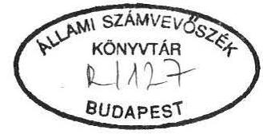
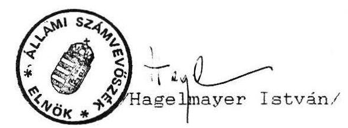

# Állami Számvevőszék

## JELENTÉS

a Kereszténydemokrata Néppárt
1991. évi gazdálkodása törvényességének vizsgálatáról

---

A vizsgálatot vezette:
Dr. Elek János főtanácsos

A vizsgálatot végezték:
Berzétey Attiláné számvevő
Écsy Lajosné szakértő

---

# Jelentés   a Kereszténydemokrata Néppárt   1991. évi gazdálkodása törvényességének vizsgálatáról 

I.

A vizsgálat célja, időszaka, módszere, körülményei

A pártok gazdálkodásának törvényességét kizárólagosan az Állami Számvevőszék (továbbiakban: ASZ) hivatott vizsgálni, az Állami Számvevőszékről szóló 1989. évi XXXVIII. tv, valamint az 1990. évi LXII. törvénnyel és az 1991. évi XLIV. törvénnyel módosított, a pártok működéséről és gazdálkodásáról szóló 1989. évi XXXIII. törvény (továbbiakban: párttörvény) alapján.

A párttörvény 10. paragrafus (3) bek. alapján az ASZ évente legalább egyszer ellenőrzi azoknak a pártoknak a gazdálkodását, amelyek az adott évben állami költségvetési támogatásban részesültek.

A Kereszténydemokrata Néppárt (továbbiakban: KDNP) 1991. évben összesen 59.343.500,- Ft állami költségvetési támogatást kapott.

A törvényességi vizsgálat célja annak ellenőrzése volt, hogy a párt gazdálkodása mennyiben felelt meg a párttörvény előírásainak, továbbá betartották-e a könyvvitel-, a számvitel bizonylati rendjéről szóló és a gazdálkodással összefüggő egyéb hatályos rendelkezések előírásait.

A vizsgálat alapvetően az 1991. évi gazdálkodásra terjedt ki, a Magyar Közlöny 1991. évi 28. számában közzétett ASZ általános ellenőrzési program szempontjainak megfelelően.

---

Az ellenőrzés az 1991. évi gazdálkodásról közzétett pénzügyi zárómérleg teljességét, pontosságát, a könyvvezetés gyakorlatát, bizonylati alátámasztottságát, a számvitel bizonylati rendjének betartását elemezte. A vizsgálat kiterjedt a párt által végzett vállalkozás jellegű gazdálkodási tevékenységre, és elsősorban arra összpontosult, hogy a párt működéséhez szabályszerűen igénybe vehető forrásokat használt-e fel, gazdálkodó tevékenysége megfelelt-e a párttörvényben megengedett tevékenységeknek, betartotta-e a gazdálkodással összefüggő pénzügyi, számviteli és egyéb szabályokat, eleget tett-e a jogszabályban előírt befizetési kötelezettségeinek.

# II. 

A KDNP 1991. évi pénzügyi zárómérlegének ellenőrzése

A párt az 1991. évi gazdálkodásáról készített pénzügyi zárómérlegét (1. sz. melléklet) a Magyar Közlöny 44. számában tette közzé, a párttörvény mellékletében előírt szerkezetben, de a párttörvény 9. paragrafusában meghatározott határidő után (1991. április 30.).

A pénzügyi zárómérleg pontosságának és teljességének vizsgálata során az ellenőrzés az alábbiakat állapította meg:

A párt gazdálkodásáról közzétett pénzügyi zárómérleg a KDNP egészének gazdálkodását tükrözi. A mérleg tartalmazza a párt 670 helyi szervezetének, 19 megyei és 1 fővárosi koordinációs irodájának gazdálkodási adatait is.

A mérleg szerinti állami támogatás összege megegyezik a ténylegesen átutalt összeggel.

A jogi- és magánszemélyektől kapott pénzbeni adományokat a párttörvényben előírtaknak megfelelően tüntették fel.

A mérleg egyes sorainak a könyvelés adataival történt összevetése során az ellenőrzés feltárt néhány - elsősorban eltérő értelmezésből és nem szabálytalanságból eredő - pontatlanságot.

---

A bevételi oldalt érintő észrevételek:

- a parlamenti frakció elkülönített bankszámláján jelentkező kamatot a párt bevételei között mutatták ki;
- különféle, jelentős értékű tárgyi adomány (irodai berendezések) Ft értékét a mérleg bevételi oldala nem tartalmazza. Ugyanakkor a kiadási oldalon szerepeltetik az állóeszköz tartozékait képező fogyóeszközök beszerzési értékét;
- a párt propagandatevékenységéből elért tárgyévi bevétel feltüntetett összege nem pontos, mivel abban szerepel az előző évben elért bevétel is.

# A kiadási oldalt érintő észrevételek: 

- "A párt helyi szervezetei számára" mérlegsoron nem tüntették fel a megyei szervezeteknél és az alapszervezeteknél 1991. december 31-én kint lévő, elszámolatlan előlegek 7.893.765.- Ft összegét, továbbá a kampányelőlegek címén kifizetett, de a konkrét kiadásokkal el nem számolt 227.790.- Ft-ot. A két tétel összegét pénzmaradványként, vagy követelésként vették figyelembe a mérleg C/ részének "halmozott többlet a gazdasági évben" sorában;
- egyes, más társadalmi szervezeteknek juttatott támogatás összegét (pl. Magyar Vöröskereszt, POFOSZ) "a párt által fenntartott vagy támogatott intézmények számára" mérlegsoron, és nem a "más társadalmi szervezetek számára" mérlegsoron tüntették fel;
- a párt ifjúsági szervezete, az IKU a tárgyévben önállóan bejegyzett társadalmi szervezet volt. Az IKU-nak juttatott támogatás összegét a "más társadalmi szervezetek számára juttatott támogatás" soron kellett volna feltüntetni, ehelyett a szervezet költségeit a párt költségei között elszámolták;
- az eszközbeszerzések után felszámított általános forgalmi adó összegét a "különféle egyéb költségek" között mutatták ki az "adók, illetékek" sora helyett.

A párt az 1991. évi pénzügyi zárómérlegében - a bevételek és kiadások különbözeteként - 17.554.029 Ft 1991. évi többletet állapított meg. Ezt az összeget csökkentette az 1990. évi mérleg szerinti hiány, így a tárgyévi halmozott többlet mérleg szerinti összege 14.770.029 Ft. Ez az összeg azonban az egyes mérlegsorokon megállapított - a mérleg főösszegeit is megváltoztató - helytelen adatközlés miatt pontatlan.

---

# III. 

A párt pénzügyi zárómérlegét megalapozottságát szolgáló
könyvvezetés, analitikus nyilvántartási
és bizonylati rend ellenőrzése

1. A párt 1991. évben gazdasági műveleteinek rögzítésére az egyszerűsített kettős könyvvitel szabályait alkalmazta, az ehhez szükséges számlarendet (számlatükröt) megfelelően összeállította. A párt rendelkezett a szervezet alapvető működéséhez, szervezettségéhez szükséges szabályzatokkal - leltározási és selejtezési szabályzat kivételével -, valamint a párt gazdasági ügyeinek viteléhez szükséges gazdasági apparátussal.

A párt gazdasági ügyeinek, vagyonkezelésének irányítása a főkönyvelő feladata, 1991. októbertől megbízott pártigazgató felügyelete mellett. A párt gazdálkodásának rendszeres ellenőrzése a Pénzügyi Ellenőrző Bizottság feladata.

A párt nem önálló jogi személyiségként működő alapszervezetei önálló pénzkezelést folytatnak. Az alapszervezetek részére - a párt pénzkezelési szabályzata szerint - ajánlott pénztárkönyv vagy átírótömb vezetése, havi lezárása, az egyenleg és a tényleges pénzkészlet megállapítása. Az alapszervezetek igényeit, elszámolásait a megyei koordinációs irodák tartják nyilván, és megyénként havonta összesítve juttatják el a párt központjához, a bizonylatok egyidejű átadásával. A bizonylatok alapján a könyvelést a központ végzi, így az alapszervezetek és megyei irodák bevételi és kiadási adatait a központi könyvelés tartalmazza. Az alkalmazott elszámolási módszer következtében a könyvelés a gazdasági eseményeket nem minden esetben a tényleges időpontban rögzíti.

A párt több bankszámlával rendelkezett, a közölt forint és
deviza bankszámlák forgalmát a könyvelésben rögzítették, a pénzforgalmi egyenlegek a könyveléssel megegyeznek.

---

A pénztárkönyveket (forint és deviza) előírás szerint vezetik, az azokban rögzített tételek egyeztethetők a könyveléssel.

A párt külföldi hivatalos utazásainak fedezetére nem vette igénybe a költségvetési támogatása 4%-ának megfelelő keretet. A külföldi utazásokkal kapcsolatos költségek fedezetét saját devizaszámláiról biztosította.
2. A párt a könyvvitel és a számvitel rendjéről szóló hatályos rendelkezéseknek megfelelően kialakította az analitikus nyilvántartások rendjét. A gazdasági műveletek könyvviteli elszámolásának alapját képező bizonylatok kiállítási módjának szabályozását, az előírt kellékek meglétét és alkalmazását a vizsgálat általánosságban kielégítőnek találta (bérnyilvántartó lapok, SZJA, TB-járulék, szigorú számadás alá tartozó bizonylatok, stb.).

Néhány esetben azonban a vizsgálat kisebb-nagyobb tartalmi és alaki hiányosságokat tárt fel a párt által kialakított bizonylatolási és nyilvántartási rendben. Az ellenőrzés során feltárt hiányosságokat a vizsgálatról készült részletes jelentésben az ellenőrzés felsorolta. A leggyakrabban előforduló, illetőleg súlyosabbnak minősített szabálytalanságok az alábbiakban foglalhatók össze:

- A párt a könyvvitel rendjéről szóló pénzügyminiszteri rendeletben előírt, az összes főkönyvi számla forgalmát tartalmazó negyedéves főkönyvi kivonatok közül csak az év végi zárlatról készített kivonatot tudta bemutatni;
- az állóeszköz-nyilvántartó kartonok kitöltése hiányos, általában elmulasztották a kartonokra rávezetni, hogy az eszköz kinek a használatában és hol található;
- a párt által vezetett állóeszköz-nyilvántartás nem teljeskörű, abban nem szerepelnek egyes, az alapszervezeteknél lévő eszközök;
- nem szerepel sem az állóeszköz-nyilvántartásban, sem a könyvelésben 1 db nagyértékű színes fénymásoló, amelyet külföldi személy adományozott a pártnak.

A fénymásoló létezését a vizsgálat tárta fel, azt a párt a tárgyi adományokról, az ellenőrzés számára készült nyilatkozatában sem szerepeltette;

- a helyi szervezetek részére elszámolási előlegként ki-

---

adott támogatás elszámoltatásában és analitikus nyilvántartásában észlelt hiányosságoknak is tudható be az, hogy a párt a tárgyévet 7,9 millió Ft elszámolatlan előleggel zárta. Esetenként elszámolási kötelezettség nélkül is eszközöltek kifizetéseket alapszervezeteik részére;

- a munkavégzésre irányuló egyéb jogviszony alapján foglalkoztatottaknak szabálytalanul, a követelményeknek meg nem felelő "szerződések" alapján fizettek ki díjazást. Így pl. gyakran hiányzik a megbízott aláírása, a munka elvégzésének igazolása, a munkavégzés időtartama, a dátum, stb. A bizonylatok alapján ily módon nem állapítható meg, hogy a kifizetés SZJA, nyugdíj- és TB-járulék fizetési kötelezettség alá tartozna-e;
- esetenként hiányos az ideiglenes külföldi kiküldetést teljesítők költségelszámolásának dokumentációja.

A párt gazdálkodásának ellenőrzése az alapszabályban és a Szervezeti és Működési Szabályzatban előírtak szerint a Pénzügyi Ellenőrzési Bizottság feladata. A Bizottság tevékenységét éves munkaterv alapján végzi. Az 1991. évi gazdálkodás ellenőrzéséről készített jelentésük tanúsága szerint az ASZ ellenőrzés által is feltárt hiányosságok előttük is ismeretesek, azok megszüntetésének szükségességét jelezték a párt Intéző Bizottságának.

Az ellenőrzés megállapította, hogy az előző évi ASZ vizsgálat által észlelt hiányosságok megszüntetésére a párt megtette a szükséges intézkedéseket.

# IV. 

A gazdálkodási tevékenység ellenőrzése

1. A párt önálló jogi személy. Helyi szervezetei (községi, városi, városi kerületi, fővárosi kerületi alapszervezetek) a párt alapszabályának 28. paragrafusa alapján "jogi személyiséggel és önkormányzattal rendelkeznek", azonban, mivel ehhez 1991. évben nem rendelkeztek a szükséges tárgyi és személyi feltételekkel, a helyi szervezetek nem funkcionáltak önálló jogi személyiségként. A központtal való kapcsolattartásuk a megyei (és fővárosi) Koordinációs

---

Irodákon keresztül valósult meg, 19 megyei és 1 fővárosi koordinációs iroda hangolta össze a helyi szervezet tevékenységét. Az alapszervezetek a beszedett tagsági díjakból, adományokból és a központtól kapott támogatásból gazdálkodtak. A központi támogatás igénybevételére kialakított rend szerint havonta a befizetett tagdíjak után, a tagdíj összegével azonos nagyságrendű ellátmányt számol el a Központ az alapszervezetek részére elszámolási előlegként. A megyei Koordinációs Irodák működésükhöz havi 25 E Ft támogatásban részesültek.
2. A vizsgált dokumentumok alapján, valamint a párt nyilatkozata szerint a KDNP a tárgyévben a párttörvényben felsorolt tiltott pénzforrásokat nem fogadott el, meg nem engedett gazdálkodó tevékenységet nem folytatott.

A párttörvény 6. paragrafus (3) bekezdésében megengedett egyszemélyes kft-t működtetett (Hunnia-Pac Kft). A kft alapító okirata szerint a társaság nyeresége az alapító pártot illeti. A vizsgált évben a kft nyereséget nem ért el, a párt számlájára befizetést nem teljesített. A párt propagandatevékenységből (jelvények, zászlók értékesítése) ért el kisebb nagyságrendű bevételt.

# V. 

## Összegzés

Összességében megállapítható, hogy a párt 1991. évi gazdálkodása, a pénzügyi, bizonylati fegyelem alapvetően szervezett. Az elkövetett hibák a bizonylati fegyelem esetenkénti be nem tartása, valamint a párt alapszervezeteinek alapszabály szerinti jogállása és tényleges működése közti összhangbeli hiányosságból erednek.

A pénzügyi zárómérleg pontatlanságainak egy része arra vezethető vissza, hogy a párttörvény 1. sz. mellékletében előírt pénzügyi zárómérleghez nem készült kitöltési útmutató, így a mérleg egyes sorai tartalmának értelmezése még egy párton belül sem következetes.

---

Az ellenőrzés során feltárt pontatlanságok, nyilvántartási és egyéb hiányosságok kiküszöbölése céljából felhívjuk a párt elnökét, hogy:

- intézkedjen a pénzügyi zárómérleg pontatlanságainak kijavítása iránt oly módon, hogy a hibásan kimutatott mérlegsorokon a pontos értékek jelenjenek meg, különös tekintettel a mérleg C/ részében kimutatott "Tényleges pénzügyi helyzet 1991. december 31-én" egyes soraira;
- intézkedjen a bizonylati fegyelem maradéktalan betartása iránt;
- alakítson ki áttekinthetőbb szabályozást a párt központja és helyi (megyei) szervezetei közötti

 gazdasági folyamatok elszámolására, gondoskodjék a még elszámolatlan elszámolási előlegek rendezéséről, továbbá alapszabályában rendezze alapszervezetei jogállását a tényleges helyzetnek megfelelően.

Budapest. 1992. november 23.

Melléklet: 1 db

---

A Kereszténydemokrata Néppárt 1991. évi pénzügyi zárómérlege

Forintban
A) Tényleges bevételek

1. Tagdijak
2. Állami költségvetésből származó támogatás
a) Alap összeg
b) Választási támogatás
3. Összesen:
3. Egyéb hozzájárulások
a) Jogi személyektől

- ebből 500000 Ft feletti hozzájárulás belföldiektől
- ebből 500000 Ft feletti hozzájárulás külföldiektől
- Österreichische Volkspartei 1151907
- CDA 1016281
- CDU 1246942
- ebből 100000 Ft feletti értéknek megfelelő összeg a következő külföldiektől:
- Groupe de Parti Populaire 277533
b) Jogi személynek nem minősülő gazdasági társaságoktól
- ebből 500000 Ft feletti hozzájárulás a következő belföldiektől
- ebből 100000 Ft feletti hozzájárulás a következő külföldiektől
c) Magánszemélyektől
- ebből 500000 Ft feletti hozzájárulás a következő belföldiektől
- ebből 100000 Ft feletti értéknek megfelelő összeg a következő külföldiektől
- Dr. Varga László 2225340
- Frau Hannie

Kerstiens Smeets 191454
3. összesen:
4. A párt propagandatevékenységéből
5. A párt gazdálkodó tevékenységéből
6. A párt által alapított kft. nyereségéből származó bevétel
7. Egyéb bevételek 152. melléklet
— bankkamatok 1040162
— árfolyam differencia 407559
Összes bevétel: $\quad 70875498$
B) Tényleges kiadások
8. Hozzájárulások juttatása
a) A párt helyi szervezetei számára*
b) A párt által fenntartott vagy támogatott intézmények számára
c) Más társadalmi szervezetek számára
d) Külföldi intézmények, szervezetek, személyek számára

100750

1. összesen:
226635
3. Személyzeti költségek
a) Munkabérek 12742818
b) Költségtérítések, napidíjak 8100427
c) Társadalombiztosítási hozzájárulások 4544992
d) Szociális és egyéb támogatások
4. összesen:
525388237
6. Általános költségek
a) Adók, illetékek 61437
b) Épületek fenntartása, karbantartása, közüzemi díj
c) Helyiségek bérlete 6367220
d) Adminisztráció és postaköltségek 5138964
(e) Különféle egyéb költségek 9909611
7. összesen:
8. Sajtó és propagandaköltségek
9. 1099382
10. Választásokkal kapcsolatos költségek 4270344
11. Egyéb tevékenységgel kapcsolatos költségek
$\qquad$
Összes költség:
C) Tényleges pénzügyi helyzet 1991. december 31-én
Összes bevétel:
Összes kiadás:
Összes kiadás:
Többlet a gazdasági évben 17554029
Halmozott hiány az előző gazdasági évben 2784000
Halmozott többlet gazdasági évben 14770029
* A párt helyi szervezetének támogatására fordított összegek a költségek között szerepelnek, könyvelésük központilag történt. 1.

Dr. Surján László s. k., elnök

Krudy Geyza s. k., mb. pártigazgató

Dr. Pintér Péter Pál s. k., FEB elnök
