# ÁLLAMI   SZÁMVEVŐSZÉK 

## JELENTÉS

az állami felsőoktatási intézmények érdekeltségébe tartozó gazdasági társaságok támogatásának és nyereségük hasznosulásának ellenőrzéséről

---

Iktatószám: V-2005-140/2011-2012.
Témaszám: 1021
Vizsgálat-azonosító szám: V0546

# Az ellenőrzést felügyelte: 

Makkai Mária
felügyeleti vezető
Az ellenőrzés végrehajtásáért felelős:
Belovai Sándorné
számvevő főtanácsos
Dobos András
számevő tanácsos
A számvevői jelentések feldolgozásában és a jelentés összeállításában közremüködtek:

Belovai Sándorné
számvevő főtanácsos
Dobos András
számvevő tanácsos
Dr. Fónyad Erzsébet
számvevő tanácsos
Vértényi Gábor
számvevő
Zagyi Judit
számvevő tanácsos

Az ellenőrzést végezték:

| Dr. Baloghné | Belovai Sándorné | Dobos András |
| :-- | :-- | :-- |
| Sebestyén Éva | számvevő főtanácsos | számvevő tanácsos |
| számvevő | Dr. Fátrainé | Dr. Fónyad Erzsébet |
|  | Zsebedics Katalin | számvevő tanácsos |
| Gelencsér Zoltán | Gyarmati István | Hajdu Károlyné |
| számvevő tanácsos | számvevő tanácsos | számvevő tanácsos |
| Iszakné Dóczé Katalin | Mokánszkiné | Tóth Tamás |
| számvevő tanácsos | Mengyi Andrea | számvevő tanácsos |

Jelentéseink az Országgyűlés számítógépes hálózatán és az Interneten a www.asz.hu címen is olvashatóak.

---

Vacsora Erika
számvevő tanácsos

Vérényi Gábor
számvevő

Varsányiné
Dudás Eleonóra
számvevő
Dr. Vincze Ibolya
számvevő

Veres Jánosné
számvevő tanácsos

Zagyi Judit
számvevő tanácsos

# A témához kapcsolódó eddig készített számvevőszéki jelentések: 

címe
sorszáma
A felsőoktatási kollégium beruházási programjának ellenőrzése 0741
A felsőoktatási törvény végrehajtásának ellenőrzése 0915

---

# TARTALOMJEGYZÉK 

BEVEZETÉS ..... 9
I. ÖSSZEGZŐ MEGÁLLAPÍTÁSOK, KÖVETKEZTETÉSEK, JAVASLATOK ..... 12
II. RÉSZLETES MEGÁLLAPÍTÁSOK ..... 21

1. Az állami felsőoktatási intézmények részesedésszerzése gazdasági társaságokban ..... 21
1.1. A részesedésszerzésre vonatkozó szabályozás ..... 21
1.2. A részesedésszerzések céljai, szabályszerűsége, megalapozottsága ..... 24
2. Az intézményi részesedéssel működő társaságok tevékenysége, gazdálkodása, a tulajdonosi kontrollrendszer, az eredményes feladatellátáshoz való hozzájárulás ..... 29
2.1. A társaságok tevékenysége, gazdálkodása ..... 29
2.2. A tulajdonosi kontrollok kialakítása és működése ..... 36
2.3. Az eredményes feladatellátáshoz való hozzájárulás ..... 40
3. A többségi intézményi részesedéssel működő gazdasági társaságoknál a nyereség és a támogatások hasznosulása ..... 44
3.1. A nyereség hasznosulása ..... 44
3.2. A támogatások hasznosulása a többségi intézményi tulajdonban lévő gazdasági társaságoknál ..... 47

---

# MELLÉKLETEK 

1. számú Helyszíni ellenőrzésre kiválasztott állami felsőoktatási intézmények és gazdasági társaságok
2. számú Az állami felsőoktatási intézmények gazdasági társaságai alapításának, részesedésszerzésének döntési folyamata
3. számú Az állami felsőoktatási intézmények gazdasági társaságai beszámoltatási, ellenőrzési és döntési folyamatai
4. számú Az állami felsőoktatási intézmények gazdasági társaságokban lévő részesedései számának változása a 2006. évről a 2010. évre
5/a. számú Az állami felsőoktatási intézmények gazdasági társaságai jegyzett tőkéjének változása a 2006-2010. években
5/b. számú Az állami felsőoktatási intézmények gazdasági társaságai saját tőkéjének változása a 2006-2010. években
5. számú Az állami felsőoktatási intézmények gazdasági társaságai bevételeinek változása a 2006. évről a 2010. évre
6. számú Az állami felsőoktatási intézmények gazdasági társaságai ráfordításainak változása a 2006. évről a 2010. évre
7. számú Az állami felsőoktatási intézmények és gazdasági társaságaik közötti nem visszterhes pénzeszközátadások a 2006-2010. években
8. számú Az állami felsőoktatási intézmények gazdasági társaságai mérleg szerinti eredményének változása a 2006-2010. években
9. számú A gazdasági társaságokban részesedéssel rendelkező állami felsőoktatási intézmények múködésének főbb adatai a 2006-2010. években
10. számú A jelentésre érkezett észrevételek és az azokra adott válaszok

## FÜGGELÉKEK

1. számú A kérdőívek feldolgozásának eredményei a felsőoktatási intézmények érdekeltségébe tartozó gazdasági társaságokról

---

# RÖVIDÍTÉSEK JEGYZÉKE 

| Törvények |  |
| :--: | :--: |
| Áht. 1 | az államháztartásról szóló 1992. évi XXXVIII. törvény |
| Áht. 2 | az államháztartásról szóló 2011. évi CXCV. törvény |
| Ftv. | a felsőoktatásról szóló 2005. évi CXXXIX. törvény |
| Gt. | a gazdasági társaságokról szóló 2006. évi IV. törvény |
| Innovtv. | a kutatás-fejlesztésről és a technológiai innovációról szóló 2004. évi CXXXIV. törvény |
| KTIAtv. | a Kutatási és Technológiai Innovációs Alapról szóló 2003. évi XC. törvény |
| NFtv. | a nemzeti felsőoktatásról szóló 2011. évi CCIV. törvény |
| Ptk. | a Polgári Törvénykönyvről szóló 1959. évi IV. törvény |
| Sztv. | a számvitelről szóló 2000. évi C. törvény |
| Vagyontv. | az állami vagyonról szóló 2007. évi CVI. törvény |
| Rendeletek |  |
| Ámr. 1 | az államháztartás múködési rendjéről szóló 217/1998. (XII. 30.) Korm. rendelet |
| Ámr. 2 | az államháztartás múködési rendjéről szóló 292/2009. (XII. 19.) Korm. rendelet |
| Ávgkr. | az állami vagyonnal való gazdálkodásról szóló 254/2007. (X. 4.) Korm. rendelet |
| Szórövidítések |  |
| áfa | általános forgalmi adó |
| BCE | Budapesti Corvinus Egyetem |
| BGF | Budapesti Gazdasági Főiskola |
| BME | Budapesti Múszaki és Gazdaságtudományi Egyetem |
| DE | Debreceni Egyetem |
| DF | Dunaújvárosi Főiskola |
| EJF | Eötvös József Főiskola |
| EKF | Eszterházy Károly Főiskola |
| ELTE | Eötvös Loránd Tudományegyetem |
| FB | felügyelő bizottság |
| GOP | Gazdaságfejlesztési Operatív Program |
| intézmény | gazdasági társaságban részesedéssel rendelkező állami felsőoktatási intézmény |
| $\mathrm{K}+\mathrm{F}$ | Kutatás-fejlesztés |
| $\mathrm{K}+\mathrm{F}+\mathrm{I}$ | Kutatás-fejlesztés-innováció |
| KE | Kaposvári Egyetem |
| KF | Kecskeméti Főiskola |
| KRF | Károly Róbert Főiskola |
| LFZE | Liszt Ferenc Zeneművészeti Egyetem |
| ME | Miskolci Egyetem |
| MKE | Magyar Képzőmúvészeti Egyetem |

---

| MNV Zrt. | Magyar Nemzeti Vagyonkezelő Zrt. |
| :-- | :-- |
| MOME | Moholy-Nagy Művészeti Egyetem |
| MTF | Magyar Táncmúvészeti Főiskola |
| NFT | Nemzeti Fejlesztési Terv |
| NYF | Nyíregyházi Főiskola |
| NYME | Nyugat-magyarországi Egyetem |
| ÖE | Óbudai Egyetem |
| OEP | Országos Egészségbiztosítási Pénztár |
| PE | Pannon Egyetem |
| PTE | Pécsi Tudományegyetem |
| RTF | Rendőrtiszti Főiskola |
| SE | Semmelweis Egyetem |
| SZE | Széchenyi István Egyetem |
| SZF | Szolnoki Főiskola |
| SZFE | Színház- és Filmmúvészeti Egyetem |
| SZIE | Szent István Egyetem |
| SZMSZ | Szervezeti és Müködési Szabályzat |
| SZTE | Szegedi Tudományegyetem |
| TÁMOP | Társadalmi Megújulás Operatív Program |
| társaság | az állami felsőoktatási intézmény részesedésével múködő |
|  | gazdasági társaság (intézményi társaság) |
| TISZK | Térségi Integrált Szakképző Központ |
| ÚMFT | Új Magyarország Fejlesztési Terv |
| ÚMVP | Új Magyarország Vidékfejlesztési Program |
| ZMNE | Zrínyi Miklós Nemzetvédelmi Egyetem |

---

# ÉRTELMEZŐ SZÓTÁR 

akkreditált klaszter
állami
felsőoktatási intézmény
állami
felsőoktatási intézmény feladatellátása
állami
felsőoktatási intézmény saját tulajdona
állami
felsőoktatási intézmény vagyona
felsőoktatási intézmény autonómiája

Az Akkreditációs testület által a klaszter pályázata alapján megítélt cím.
Olyan költségvetési szervezeti formában múködő felsőoktatási intézmény, amelynek fenntartója a magyar állam (Ftv. 6. § (1) bek., 7. § (1)-(3) bek.).
Az állami felsőoktatási intézmények oktatási, kutatási és művészeti alapfeladatai és az ezek ellátásához kapcsolódó gazdálkodási, szervezési, múködtetési tevékenységek (Ftv. 4. §).
Az állami felsőoktatási intézmény által létrehozott, illetve részvételével múködő gazdálkodó szervezettől (intézményi társaságtól) kapott (osztalék) eredménye, vállalkozási tevékenységének adózott eredménye, a költségtérítéses képzésből származó bevételének a költségek teljes körének levonása után fennmaradt eredménye, a részére nyújtott pénzbeli adományok, az ingó és ingatlan adományok, öröklés révén szerzett tulajdon, az egyéb saját bevételének a költségek teljes körű levonása után fennmaradt része (Ftv. 123. § (1) bek.).
Az állami felsőoktatási intézmény a vagyonkezelője, a használója a feladatai ellátásához a fenntartó által rendelkezésére bocsátott vagyonnak, amit az alapító okiratban meghatározott feladatainak ellátásához használhat. A rendelkezésére bocsátott vagyonnal az államháztartásról és az állami vagyonról szóló törvényekben, valamint az e törvényben meghatározottak szerint rendelkezhet. A felsőoktatási intézmény a rendelkezésére bocsátott vagyont és a saját vagyonát elkülönítetten tartja nyilván (Ftv. 120. § (2) bek.).
A felsőoktatási intézmény - oktatási, kutatási, szervezeti és múködési, gazdálkodási - autonómiája az intézményre és személyekre bízott szellemi és anyagi javakkal való gazdálkodás lehetőségét és felelősségét jelenti, magában foglalja azt a jogot, hogy a felsőoktatási intézmény meghatározza képzési rendszerét, kialakítsa szervezetét, továbbá megalkossa szabályzatait, valamint döntsön a hallgatói ügyekben, a foglalkoztatás kérdéseiben és a feladatai ellátásához kapcsolódó gazdasági kérdésekben. Tartalmazza az intézmény belső szervezeti rendjének és múködésének kialakítását, beleértve a különböző (oktatási, kutatási, szolgáltató, gazdálkodási és más) egységek létrehozásának, átalakításának és megszüntetésének, továbbá a szervezeti és múködési szabályzat megalkotásának jogát.

---

gazdasági tanács
hasznosító vállalkozás
innovációs lánc
intézményi társaság
kisebbségi jogokat biztosító részesedés
klaszter
klinika
közfinanszírozású támogatás

Kiterjed az intézmény vezetőinek pályázati rendszerben történő kiválasztására, demokratikus megválasztására, biztosítja az önálló gazdálkodás lehetőségét a fenntartó által rendelkezésre bocsátott és saját tevékenység révén szerzett forrásokkal, eszközökkel és vagyonnal, garantálja a hallgatói egyéni és közösségi jogok érvényesülését (Ftv. 1. § (3) bek.).
A felsőoktatási intézmény feladatainak végrehajtása megalapozásában, a rendelkezésére bocsátott források, eszközök, a közpénz, a közvagyon hatékony és felelős használatát segítő gazdasági stratégiai döntéseket előkészítő és végrehajtásuk ellenőrzésében résztvevő, a fenntartói döntések előkészítésében közremúködő testület (Ftv. 23. § (1) bek.).
Költségvetési kutatóhelyen, nonprofit kutatóhelyen létrejött szellemi alkotások üzleti hasznosítása céljából az ilyen kutatóhely által alapított, illetve részvételével vagy részesedésével múködő gazdasági társaság (Innovtv. 4. § 6. b. pontja).

Az innováció folyamata az ötlettől a termékig vagy szolgáltatásig, amely általában egymást követő tevékenységek sorozata (pl.: alapkutatás, alkalmazott kutatás, fejlesztés, kísérleti gyártás, beruházás, termelés, értékesítés).
Olyan zártkörűen működő részvénytársaság vagy korlátolt felelősségű társaság, amelyet az állami felsőoktatási intézmény saját bevételének a költségek teljes körű levonása után fennmaradó részéből és a tulajdonában lévő vagyonából alapított vagy ezekben részesedést szerzett (Ftv. 121. § (1) bek.).
A részesedés mértéke több mint 5\% (Gt. 49. §).
Kölcsönösen együttmúködő cégek, szakosodott beszállítók, szolgáltatók, kapcsolódó iparágak cégeinek és velük kapcsolatban álló intézmények (egyetemek, állami szervezetek, ügynökségek, szakmai egyesületek, kereskedelmi szövetségek) földrajzi koncentrációja, melyeket egy adott témában/területen hasonlóságaik és egymást kiegészítő jellemzőik kapcsolnak össze.
Az az egészségügyi szolgáltató, amely közreműködik az orvosképzéssel összefüggő képzési és kutatási feladatok ellátásában (Ftv. 147. § 24. pontja).
Az államháztartás alrendszereiből nyújtott támogatás az Európai Unióból (a továbbiakban: EU) származó forrás, továbbá a megyei (fővárosi) önkormányzat és a térségi fejlesztési tanácsok rendelkezési jogkörébe utalt támogatás és az állami, illetve önkormányzati részvétellel létrejött nemzetközi szerződések alapján kapott külföldi támogatás (Innovtv. 4. § 7. pontja).

---

kutatóhely
meghatározó (többségi)
befolyást biztosító
részesedés
mértékadó befolyást
biztosító részesedés
minősített többséget
biztosító részesedés
projekt
részesedés
saját bevétel
szenátus
technológiai innováció
technológiai transzfer
tudásközpont

Alap-, illetve főtevékenységként vagy ahhoz kapcsolódóan kutatás-fejlesztési tevékenységet folytató szervezet, szervezeti egység vagy egyéni vállalkozó (Innovtv. 4. § 4. pontja).
A részesedés mértéke több mint 50\%, de 75\%-nál kisebb (Ptk. 685/B. §).

A részesedés mértéke több mint 20\%, de 50\%-nál kisebb (Sztv. 3. § (2) bek. 4. pont).
A részesedés mértéke több mint 75\% (Gt. 52. § (2) bek.).
Meghatározott kutatás-fejlesztési feladat, technológiai innovációs folyamat végrehajtására irányuló tevékenység az abban érdekeltek által meghatározott terv alapján (Innovtv. 4. § 8. b) pontja).
Az állami felsőoktatási intézmény tulajdonjogát megtestesítő üzletrész, részvény.
Az államháztartáson kívüli források - beleértve minden olyan, az Európai Uniótól származó támogatást, amelyhez nem az állami költségvetésen keresztül jut a felsőoktatási intézmény, továbbá a szakképzési hozzájárulási fizetési kötelezettség teljesítéseként elszámolt forrásokat is, ide nem értve az állami vagyon értékesítésének ellenértékét valamint a Kutatási és Technológiai Innovációs Alapból származó bevételek (Ftv. 147. § 31. pontja).
A felsőoktatási intézmény múködésével kapcsolatos döntéseket hozó és a döntések végrehajtását ellenőrző testülete (Ftv. 27. §).
A gazdasági tevékenység hatékonyságának, jövedelmezőségének javítása, illetve kedvező társadalmi és környezeti hatások elérése érdekében végzett tudományos, múszaki, szervezési, gazdálkodási, kereskedelmi múveletek összessége, amelyek eredményeként új vagy lényegesen módosított termékek, eljárások, szolgáltatások jönnek létre, új vagy lényegesen módosított eljárások, technológiák alkalmazására, piaci bevezetésére kerül sor, beleértve azokat a változásokat, amelyek csak adott ágazatban vagy adott szervezetnél minősülnek újdonságnak (Innovtv. 4. § 2. pont).
A kutatás-fejlesztés-innováció eredményeinek és ezek hasznosítási tapasztalatainak átadása a kutatóhelyek és a kutatási eredményeket hasznosító vállalkozások között.
Az adott statisztikai és fejlesztési régióban a kutatást és fejlesztést, az innovációt segítő, a tudást, a kutatási eredményeket menedzselő intézmény, amely a kereslet megteremtésével és szolgáltatásaival segíti a tudás, a kutatási eredmények gazdasági életben történő hasznosulását (Ftv. 147. § 43. pontja).

---

.

---

# JELENTÉS 

## az állami felsőoktatási intézmények érdekeltségébe tartozó gazdasági társaságok támogatásának és nyereségük hasznosulásának ellenőrzéséről

## BEVEZETÉS

Az állami felsőoktatási intézmények tevékenysége, szerepe, hatása meghatározó az ország jelenlegi és jövőbeni oktatási, tudományos és gazdasági életében. Kiemelkedő hatást gyakorolnak az intézmények székhelye szerinti térségek gazdaságára, foglalkoztatására, fejlesztésére.

A 29 állami felsőoktatási intézmény ${ }^{1} 2010$-ben 446,5 Mrd Ft múködési bevétellel gazdálkodott, aminek a harmada saját bevételből származott. Ugyanebben az évben múködési kiadásaik 418,8 Mrd Ft-ot tettek ki. Az intézmények által kezelt összes állami vagyon 380,6 Mrd Ft, amelyből a saját vagyonuk 45,1 Mrd Ft volt. A hallgatók létszáma 2010. évben 311617 fő, amelyből az államilag finanszírozott képzésben résztvevők létszáma 188352 fő volt, arányuk $60 \%$-ot tett ki. Az intézményi feladatok ellátásában 2010. évben 50627 fő foglalkoztatott vett részt, ebből az oktatók létszáma 14268 fő volt.

A felsőoktatásról szóló 2005. évi CXXXIX. törvény (Ftv.) szerint az állami felsőoktatási intézmények alaptevékenysége az oktatás, a tudományos kutatás, a művészeti alkotótevékenység, melyekhez a múködést biztosító funkcionális, fenntartási és sokrétű kiegészítő feladatok kapcsolódnak. Az állami felsőoktatási intézmények az oktatáson kívüli tevékenységet vállalkozási tevékenységként, vagy gazdálkodó szervezet útján is végezhetik.

Az Ftv. 121. § (1) bekezdése lehetővé tette számukra, hogy saját bevételeikből és vagyonukból saját hatáskörben ${ }^{2}$ gazdasági társaságban (alapítással, üzletrészvásárlással) részesedést szerezzenek. Az állami felsőoktatási intézmények részesedésszerzésének általános szabályait a gazdasági társaságokról szóló 2006. évi IV. törvény (Gt.) határozza meg. Az intézmények, mint költségvetési szervek részesedésszerzésére az államháztartásról szóló 1992. évi XXXVIII. törvény (Áht.), az Ftv., illetve a kutatás-fejlesztésről és a technológiai innovációról szóló 2004. évi CXXXIV. törvény (Innovtv.) állapított meg sajátos szabályokat.

A nemzeti felsőoktatásról szóló 2011. évi CCIV. törvény (NFtv.) 2011. december 30-án került kihirdetésre és 2012. január 1-én lépett, bizonyos rendelkezései szeptember 1-jén lépnek hatályba. A gazdasági társaságokra vonatkozó szabá-

[^0]
[^0]:    ${ }^{1} 19$ egyetem és 10 főiskola
    ${ }^{2}$ Az Ftv. hatályba lépése előtt a Kormány hozzájárulásával

---

lyokat azonban 2012. augusztus 31-ig az Ftv. szerint kell alkalmazni. Az NFtv. a társaságban való részesedésszerzés és a múködtetés szabályaira vonatkozó korábbi sajátos előírásokat eltörli ${ }^{3}$ és - a hasznosító vállalkozások kivételével az állami részesedésekre vonatkozó szabályokat teszi kötelezővé. Felhatalmazza a Kormányt, hogy az intézmények finanszírozásával és gazdálkodásával kapcsolatos szabályokat 2012. szeptember 1-jéig alakítsa ki.

Az állami felsőoktatási intézmények tulajdonosi részesedésével múködő gazdasági társaságok részesedésszerzési, beszámoltatási, ellenőrzési és döntési folyamatait a 2. és 3. számú mellékletek szemléltetik.

A 29 állami felsőoktatási intézmény közül 2010. december 31-én 23 intézménynek 137 db részesedése ${ }^{4}$ volt (üzletrész vagy részvény) gazdasági társaságban (társaság). A részesedések mértéke szerint az intézmények 5\% alatti tulajdoni részesedéssel 10-ben, kisebbségi jogokat biztosító részesedéssel 31-ben, mértékadó részesedéssel 23-ban, minősített többségi részesedéssel 16-ban, 100\% tulajdonú részesedéssel 57 társaságban rendelkeztek. A részesedések 73\%-át (100 db-ot) az Ftv. hatályba lépése (2006. március 1.) után szerezték az intézmények ${ }^{5}$, a legtöbbet ( 43 db -ot) 2008-ban. Ezt a pályázati forrásokhoz való hozzájutás feltételrendszere és a tulajdonszerzésre vonatkozó liberalizált szabályozás tette lehetővé. Saját társaságok révén közvetett tulajdonjog gyakorlására (társaságok részesedései) 35 esetben került sor, amelyből 25 kisebbségi részesedés volt. Az állami felsőoktatási intézmények gazdasági társaságokban lévő részesedései számának változását a 2006. évről a 2010. évre a 4. számú melléklet tartalmazza.

A társaságok 2010. évben összesen 2263,7 M Ft értékű jegyzett tőkéjéből az intézmények részesedése 1254,7 M Ft volt. Ez az intézmények által kezelt állami vagyon $0,3 \%-a$, a saját vagyonnak $3,0 \%$-a.

Az ellenőrzés arra kereste a választ, hogy az intézmények érdekeltségébe tartozó társaságok támogatása és nyeresége miként hasznosult, múködésükkel hoz-zájárultak-e az intézmények eredményesebb feladatellátásához. Ennek keretében az ÁSZ ellenőrizte az Ftv. részesedésszerzésre vonatkozó változásait, a részesedésszerzés céljait és megalapozottságát, a célkitűzések megvalósítását, a tulajdonosi kontrollok működését, a részesedések hozzájárulását az eredményes intézményi feladatellátáshoz, valamint a többségi intézményi részesedéssel működő társaságoknál a kapott támogatások és a nyereség hasznosulását. Az ellenőrzés a rendszerellenőrzés és a szabályszerűségi ellenőrzés módszertana felhasználásával került végrehajtásra.

Az ellenőrzés a 2006-2010. évekre terjedt ki. A részesedéssel rendelkező intézmények és társaságok teljes köre tanúsítványi adatszolgáltatással került mérésre. A helyszíni ellenőrzés a részesedéssel rendelkező 23 intézményből 11-re ter-

[^0]
[^0]:    ${ }^{3}$ pl. kockázatfedezeti alap, Nemzeti Vagyongazdálkodási Tanács kötelező jóváhagyása
    ${ }^{4}$ közvetlen tulajdonosi joggyakorlást biztosított
    ${ }^{5}$ Részesedésszerzésre az Áht., 95. §-a korábban is lehetőséget adott, azonban annak külön engedélyeztetési kötelezettsége volt.

---

jedt ki. A társaságok további társaságaiban lévő 35 részesedésből 28 tartozott a helyszíni ellenőrzésre kiválasztott intézmények érdekeltségébe.

A támogatás és a nyereség hasznosulásának felmérése tanúsítványi adatszolgáltatás keretében történt meg az intézmények többségi tulajdonában lévő, legalább 1 M Ft támogatásban részesült vagy nyereséget elért 47 társaságnál. Ebből rétegzett mintavétellel kiválasztott 15 ( 5 támogatott, 10 nyereséges) társaságnál (1. számú melléklet) helyszíni ellenőrzés volt.

A megelőző években az ÁSZ ellenőrizte a felsőoktatási törvény végrehajtását, a PPP beruházásokat, a felsőoktatás ingatlangazdálkodását, a felsőoktatás infra-struktúra-fejlesztési programját. Az éves zárszámadás keretében végzett ellenőrzések ${ }^{6}$ a részesedések értékelésénél részben érintették az intézmények gazdasági társaságait is. A gazdasági társaságokban a részesedésszerzést, a tulajdonosi joggyakorlást, a feladatellátáshoz való hozzájárulás eredményességét, a társaságok támogatását és nyereségük hasznosulását korábban az ÁSZ nem ellenőrizte.

Az ellenőrzés jogszabályi alapját az Állami Számvevőszékről szóló 2011. évi LXVI. törvény 5. § (2)-(3) és (4), továbbá az Áht.; 2. § (2), 104. § (3), 120/A. § (1) bekezdéseiben foglaltak tartalmazzák.

Az Állami Számvevőszékről szóló 2011. évi LXVI. törvény 29. § szerint a jelentést megküldtük a fenntartói jogokat gyakorló emberi erőforrások miniszterének, valamint az ellenőrzött állami felsőoktatási intézmények rektorainak. A beérkezett észrevételeket és az erre adott válaszokat a jelentés 11. számú melléklete tartalmazza.

6 A felsőoktatási intézmények közül 7 egyetem és főiskola költségvetési beszámolóját az ÁSZ pénzügyi-szabályszerúségi módszerrel ellenőrizte a 2007. és a 2008. évi zárszámadás keretében.

---

# I. ÖSSZEGZŐ MEGÁLLAPÍTÁSOK, KÖVETKEZTETÉSEK, JAVASLATOK 

Az Ftv. 2006 márciusától lehetőséget biztosított az állami felsőoktatási intézmények (intézmények) számára, hogy a költségvetési szervektől eltérően saját hatáskörben szerezzenek részesedést gazdasági társaságokban (társaság). Ez azt jelentette, hogy a részesedésszerzés az állami vagyon feletti tulajdonosi jogok gyakorlására feljogosított személy vagy szervezet (Vagyongazdálkodási Tanács) jóváhagyása nélkül történt. A jogszabály módosításának hatására a részesedések száma közel két és félszeresére emelkedett 2006. évről 2010. évre.

A Kormány a gazdaságfejlesztő felzárkóztatási célokat a régiók, a vállalkozások és a tudásközpontok együttműködésével kívánta segíteni, ennek érdekében támogatta a régiók gazdasági, oktatási és önkormányzati szervezetei között létrejövő közös szervezetek kialakítását. A megvalósításra európai uniós és hazai forráslehetőségeket biztosított az ÚMFT és az NFT keretében. A pályázati kiírásoknál a támogatási programokra a projekteket megvalósító - erre a célra alakult - társaságok pályázhattak. Ezek a társaságok az innovációs járulék közvetlen felhasználásával is saját erőt biztosító forrásokhoz juthattak ${ }^{7}$.
2010. december 31-én 23 állami felsőoktatási intézmény (intézmény) rendelkezett 137 részesedéssel (üzletrész vagy részvény) gazdasági társaságban (társaság), ez 57 esetben $100 \%$-os, 63 esetben kisebbségi, 17 esetben meghatározó és minősített többségi részesedést jelentett. A részesedések 73\%-át az Ftv. hatályba lépése után szerezték az intézmények ${ }^{8}$. Saját társaságok révén közvetett tulajdonjog gyakorlására 35 esetben került sor, amelyből 25 volt kisebbségi részesedés. A társaságok 2010. évben összesen 2263,7 M Ft értékű jegyzett tőkéjéből az intézmények részesedése 1254,7 M Ft volt. A kisebbségi és közvetett részesedéssel rendelkező intézmények esetében az intézmények tulajdonosi érdekérvényesítése nem volt biztosított.

A gazdasági társaságokban meglévő részesedésekből 2010. december 31-én 1 db bt.-ben, 123 db kft.-ben és 13 db zrt.-ben volt. A részesedések 50,4\%-a (69) profitorientált és $49,6 \%$-a (68) nonprofit társaságban volt. Ez utóbbiak közül $51 \%$ ( 34 db ) közhasznú, $35 \%$ ( 23 db ) kiemelten közhasznú volt, és $14 \%$ ( 11 db ) nem rendelkezett közhasznú jogállással.

Az ellátott feladatok, végzett tevékenységek szerint a társaságok megoszlása változatos volt, egyszerre többféle tevékenységet is elláttak. A kutatás-fejlesztési tevékenység és eredményeinek hasznosítása $45 \%$-ot, az alaptevékenységhez kapcsolódó kiegészítő feladatok, valamint a múködést biztosító funkcionális és fenntartási feladatok $44 \%$-ot tettek ki. A további $11 \%$-ot olyan tevékenységek

[^0]
[^0]:    ${ }^{7}$ A KTIAtv. 4. § (3) bek. hatályon kívül helyezésével az innovációs járulék közvetlen felhasználása 2012. január 1-től megszűnt.
    ${ }^{8}$ Részesedésszerzésre az Áht., 95. §-a korábban is lehetőséget adott, azonban annak külön engedélyeztetési kötelezettsége volt.

---

jelentették, mint a vagyonkezelés, pénzügyi, üzletviteli, vezetési tanácsadás, oktatást kiegészítő tevékenység, fekvőbeteg-ellátás, szélesebb körben értelmezett diákjóléti szolgáltatások ${ }^{9}$, felsőfokú szakképzés, mezőgazdasági termék- és melléktermék hasznosítás, villamosenergia-termelés, valamint egészségügyi tevékenység koordinációja.

A jogszabályi környezet az intézmények részesedésszerzésére vonatkozóan nem volt stabil. Az ellenőrzött időszakban az Ftv. erre vonatkozó fontosabb szabályai hétszer módosultak, amelyből három alkalommal szűkítették, négy esetben pedig bővítették az intézmények részesedésszerzési lehetőségeit (pl. társasági forma, részesedés aránya). Az állami vagyonról szóló 2007. évi CVI. törvény (Vagyontv.) a költségvetési szervek részesedéseit 2007. szeptember 25-étől az állami vagyon körébe rendelte, ettől csak az Innovtv. alapján, a hasznosító vállalkozások esetén lehetett eltérni. A Vagyontv. 22, korábban alapított társaság tulajdonjogának gyakorlását adta át az MNV Zrt.-nek ${ }^{10}$, amelyből öt részesedés vagyonkezelői jogát az intézmények visszakapták.

A gyakran változó, az intézményeknek egyre szélesebb jogkört biztosító jogszabályi környezet csökkentette a közpénzek felhasználásának átláthatóságát és elszámoltathatóságát a megfelelő további szabályozás és a döntések célszerűsége feletti kontroll kialakítása nélkül.

Az NFtv. a korábbi előírásokat 2012. szeptember 1-jétől eltörli, és a hasznosító vállalkozások kivételével az állami részesedésekre vonatkozó szabályokat teszi kötelezővé ${ }^{11}$. A 2012. évi költségvetési hiánycél tartását biztosító további feladatokról szóló 1365/2011. (XI. 8.) Korm. határozat egy feladat- és intézményfelülvizsgálati program elindítását rendelte el a költségvetési szerveknél és a többségi állami tulajdonú gazdálkodó szervezeteknél. Az oktatási ágazatban ennek elvégzésére meghatározott határidő 2012. február 20-a volt. A folyamat még nem zárult le.

A részesedésszerzések során az ellenőrzés szabálytalanságokat és hiányosságokat tapasztalt, amelyeknek következtében megnőtt a közpénzek átlátható felhasználásának a kockázata. Az intézményfejlesztési tervek mindössze 21,7\%ánál (5 intézménynél) szerepeltek részesedésszerzésekkel kapcsolatos elképzelések. A gazdasági társaságok létrehozása az intézményfejlesztési tervben megfogalmazott elvárásokkal való összhang, a szakmai és gazdasági célok, prioritások meghatározása nélkül történt.

A költségvetési szervként működő állami felsőoktatási intézmény 2009. január 1-jétől ${ }^{12}$ intézményi társaságot akkor alapíthatott, ha azok esetleges veszteségeinek fedezésére kötelező tartalék, illetve kockázati alapot hozott létre a saját bevételei terhére. Továbbá ${ }^{13}$ kisebbségi részesedéssel akkor vehettek részt intéz-

[^0]
[^0]:    ${ }^{9}$ rendezvényszervezés, sport, hallgatói tanácsadási tevékenység
    ${ }^{10}$ Vagyontv. 2-3. §-ok
    ${ }^{11}$ NFtv. 88. §
    ${ }^{12}$ az Ftv. 121. § (5) bekezdése szerint
    ${ }^{13}$ az Ftv. 121/A. § (1) és (2) bekezdések előírásainak megfelelően

---

ményi társaságban, illetve intézményi társaságai vehettek részt további gazdasági társaságban, ha az intézmények ${ }^{14}$ közös kockázatfedezeti alapba az intézményi társaság részére biztosított vagyoni hozzájárulásuk tíz százalékának megfelelő befizetést teljesítettek. Az intézmények közös kockázatfedezeti alapot nem hoztak létre, hat kivételével saját tartalék, illetve kockázati alapot sem.

A részesedéssel rendelkező 23 intézményből 13 egyáltalán nem ellenőrizte a tulajdonosi joggyakorlást és a társaságokat, a többiek háromévente egy alkalommal.

Nem tartották be a társaságok vezető tisztségviselőinek összeférhetetlenségére vonatkozó előírást - a név szerinti kimutatások alapján - 23 intézményből 14-nél 29 esetben. Az ellenőrzés hatására az intézmények a cégnyilvántartási adatok szerint 2012. februárig összesen 10 esetben szüntették meg az összeférhetetlenséget.

A részesedésszerzésre irányuló előterjesztések 68\%-át támasztották alá gazdasági számításokkal és megalapozott szakmai érvekkel. Tulajdonosi döntéssel elfogadott üzleti tervvel a többségi tulajdonban lévő társaságoknak 66\%-a rendelkezett, ami a tulajdonosi kontroll és számonkérés alapja. A társaságok 84,2\%-ánál ( 112 db ) nem határoztak meg szakmai, 54,9\%-ánál ( 73 db ) pénzügyi eredmények mérésére, értékelésére alkalmas mutatószámokban kifejezett középtávú és egyes évekre lebontott célokat, ami nem tette lehetővé a gazdasági társaságok tevékenységének számszerúsített módon történő értékelését.

Az intézmények a társaságokban való részesedésszerzéskor az Ftv. előírásait három ponton nem tartották be: kilenc intézmény szerzett kisebbségi részesedést, amikor csak többségi részesedést szerezhetett volna, két intézmény egy-egy társasága szerzett részesedést további társaságokban, amikor ezt az Ftv. tiltotta. (Ezen két esetben a korábbi szabálytalanságokat a későbbi törvénymódosítások legalizálták.) A harmadik esetben az előírás ellenére nem mutatták ki számvitelükben a saját hatáskörben való alapításhoz szükséges saját forrást.

A helyszínen ellenőrzött intézményekből öt rögzítette szabályzatban a részesedésszerzés belső eljárásrendjét. A társaságokra vonatkozó beszámoltatás, értékelés és ellenőrzés rendjét a 11 intézményből kilenc nem, kettő részben szabályozta. A társaságok gazdálkodására vonatkozó eredmények számonkérése és értékelése a múködésükről szóló beszámolók keretében gazdasági számításokon alapuló elemzés, értékelés nélkül történt.

Az intézményekben nem mérték egzakt módon a társaságok szakmai és gazdasági tevékenységének hozzájárulását az intézmények feladatellátásához, nem határozták meg az ehhez szükséges indikátorokat, szakmai mutatókat és elvárt értéküket. Ezek hiányában az ellenőrzés nem számszerúsíthette a társaságok intézményi feladatainak ellátásához való hozzájárulást. Az intézmények a 2009. és 2010. évi zárszámadási beszámolóikban nem értékelték a jogsza-

[^0]
[^0]:    ${ }^{14}$ az Ftv. 135-136. § szerint létrehozott és múködtetett

---

bályban előírt módon ${ }^{15}$ teljes körúen, hogyan befolyásolta a társaságok múködése az alap- és kiegészítő feladatellátást és indokolt volt-e az állami feladat társasággal történő ellátása. Összehasonlító elemzés sem készült a saját szervezeten belüli, vagy társasági formában történő kedvezőbb üzemeltetési módra.

A helyszínen ellenőrzött, további részesedésekkel rendelkező kilenc intézménynél 26 társaság ügyvezetője a gazdasági tanács részére nem számolt be, így nem tett eleget az Ftv. 121/A. § (2) bekezdés előírásának, amit az intézmény mint tulajdonos sem követelt meg.

Az intézmények részesedésével 2010-ben működő társaságok a DE OEC Kazincbarcikai Kórház Kft. kivételével kis- és középvállalkozásnak ${ }^{16}$, ebből 125 db kis- és mikrovállalkozásnak minősültek. Az intézmények társaságainak összes átlagos állományi létszáma a 2006. évi 632,6 fơről 2010-re 1878,4 főre, közel háromszorosára nőtt. Ennek alapvető okai a DE OEC Kazincbarcikai Kórház Kft. átvétele, a részesedések számának növekedése és a tevékenységek bővülése voltak.

2010-ben 14 intézmény 39 db olyan társaságban rendelkezett részesedéssel, ahol a társaságok saját tőkéje a jegyzett tőke alá csökkent, ami a tulajdonos intézmények részéről további intézkedést igényel (tőkepótlás, társasági forma változtatás) ${ }^{17}$.

Az intézmények társaságainak összes bevétele 2006-ról 2010-re három és félszeresére nőtt, és ezen belül több mint kilencszeresére emelkedett a nem intézményi pályázati és normatív támogatások összege.

A társaságok bevételi szerkezetének alakulása a 2006 -2010. években
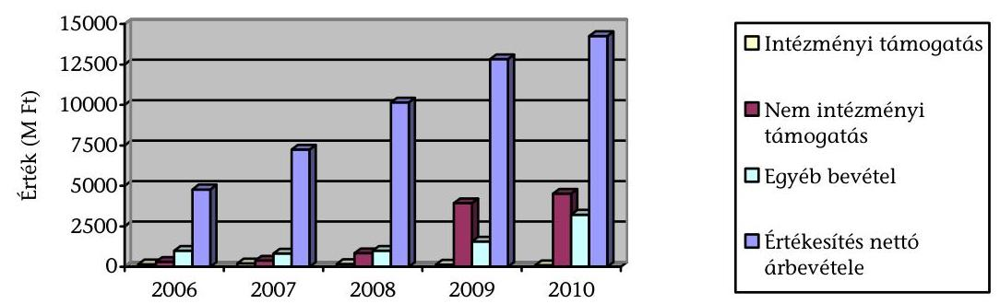

Az intézmények társaságainak összes ráfordítása a bevételekkel azonos arányban, az ellenőrzött időszakban három és félszeresére nőtt. Az átlagos egy főre

[^0]
[^0]:    ${ }^{15}$ Ámr. ${ }_{1}$ 61. § (4) bekezdése és az Ámr. ${ }_{2}$ 222. § (7) bekezdés (hatályos 2009. január 12010. augusztus 14-ig.)
    ${ }^{16}$ a kis- és középvállalkozásokról, fejlődésük támogatásáról szóló 2004. évi XXXIV. törvény 3. § (1)-(3) bekezdései
    ${ }^{17}$ Gt. 51. § (1)-(2), 69. § (5) bekezdés

---

jutó havi személyi jellegű ráfordítás a 2006. évi 200 E Ft-ról 2010-re 264 E Ft-ra növekedett. Ebben szerepet játszott, hogy a magas képzettséggel rendelkező munkatársak foglalkoztatását igénylő $\mathrm{K}+\mathrm{F}$-fel főtevékenységként foglalkozó társaságok száma a háromszorosára, 56-ra nőtt.

Az ellenőrzött időszakban közel felére csökkent a társaságok összes bevételének a tulajdonos intézménytől származó része (árbevétel és támogatás). Ezzel szemben az intézmények társaságoktól származó bevétele hatszorosára nőtt. Az intézmények és társaságaik között az üzemeltetési feladatok ellátására, szállás-hely-hasznosításra, rendezvényszervezésre, $\mathrm{K}+\mathrm{F}$ tevékenységre alakult ki szerződéseken, megállapodásokon alapuló együttmúködés.

A társaságok az ellenőrzött időszakban összevontan 720,6 M Ft mérleg szerinti eredményt értek el, ami 2586,2 M Ft összes nyereségből és 1865,6 M Ft összes veszteségből adódott. Az intézményi részesedésekre jutó rész 412,4 M Ftot tett ki, ami 1427,3 M Ft nyereség és 1014,9 M Ft veszteség következménye volt (9. számú melléklet). A nyereséges társaságok száma a 2006. évi 37-ről 2010. évre 76-ra nőtt, de arányuk 64\%-ról 55\%-ra csökkent. A mérleg szerinti eredményük 229,3 M Ft-ról 447,2 M Ft-ra nőtt. A 2006-2010. években az összes üzleti év $58 \%$-át, összesen 1427,3 M Ft részesedésre jutó mérleg szerinti nyereséggel zárták. Az intézmények - a kapott osztalék kivételével - a nyereséget a társaságoknál hagyták. Az ellenőrzött időszakban három felsőoktatási intézmény vett fel osztalékot összesen 25,6 M Ft összegben.

A 2006-2010. években az intézmények 43,5\%-ánál gazdasági társaságaikat összesen 467,0 M Ft tőkejuttatásban részesítették. Az intézmények a társaságaiknak az ellenőrzött időszakban összesen 749,9 M Ft vissza nem térítendő támogatást nyújtottak. A támogatások az intézmények alaptevékenységéhez kapcsolódó kiegészítő feladatok, valamint a múködést biztosító társaságoknál a kiszervezett tevékenységek ellátását szolgálták.

A részesedések nem hoztak számottevő közvetlen pénzügyi eredményt az intézményeknek, a részesedésszerzések arányaiban csekély mértékben hatottak az intézmények gazdálkodása eredményességének javulására. Az intézmények által a társaságokba befektetett források hozama az ellenőrzött időszakban alig haladta meg a jegybanki alapkamat felét.

Az intézmények többségi tulajdonában álló 21 társaságnál a 2006. évben a főállású munkavállalók összes létszáma 321 fő volt, ami a 2010. évi 47 társaságnál 836 főre gyarapodott. A megbízási szerződéssel foglalkoztatottak száma 365 fơről számottevően, 950 főre nőtt. A társaságokban foglalkoztatottak változó arányban voltak egyben az intézmények alkalmazottjai is (2006-ban 10\%, 2007-ben 7\%, 2008-ban 14\%, 2009-ben 26\% és 2010-ben 24\%). Az egy főre jutó átlagos évi személyi jellegű ráfordítás 1,1 M Ft-ról 1,4 M Ft-ra, 37\%-kal emelkedett az összesített infláció $22 \%$-os növekedése mellett.

A vezető tisztségviselők (ügyvezetők) díjazásának mértéke és annak növekedése nem volt túlzott, az ügyvezetők havi átlagos bruttó díjazása a 2006. évi 280 E Ft-ról 2010. évre 376 E Ft-ra emelkedett, ami - figyelembe véve a társaságok méretének növekedését és az inflációt - arányos növekedés. Az FB tagok a

---

társaságok 62\%-ánál nem részesültek tiszteletdíjban, az éves tiszteletdíj átlagos értéke a 2006. évi 400 E Ft-ról 2010-re 317 E Ft-ra csökkent.

Az intézmények többségi tulajdonában álló nyereséges társaságok üzemi (üzleti) szintű árbevétele az ellenőrzött időszakban 204\%-kal emelkedett. Az összes bevételből az értékesítés nettó árbevétel aránya meghatározó volt, de a 2006. évi $80 \%$-ról 2010-re $77 \%$-ra csökkent. Ennek alapvető oka, hogy az aktivált saját teljesítmények értéke, valamint a rendkívüli bevételek értéke hatszorosára, az egyéb bevételeké valamivel több mint háromszorosára nőtt.

A társaságok összes üzemi ráfordítása létszámuk és tevékenységük növekedése következtében a 2006. évi 3,3 Mrd Ft-ról 2010. évre 197\%-kal, 9,8 Mrd Ft-ra emelkedett. A ráfordításon belül a személyi ráfordítás (231,0\%-kal) meghaladta az anyagjellegú ráfordítás ( $182,0 \%$-os) növekedését. Ezen belül is - a foglalkoztatottak számának emelkedése következtében - a 2010-ben kifizetett összes bérköltség közel két és félszerese volt a 2006. évinek.

A befektetett eszközök értéke az ellenőrzött időszakban 99\%-kal 3928,6 M Ft-ra nőtt, alapvetően az immateriális javak (benne pl. a kísérleti fejlesztések aktivált értéke) ugrásszerű, 9,6 M Ft-ról 1105,0 M Ft-ra növekedése miatt.

A helyszínen ellenőrzött 10 nyereséges társaságból 7 nonprofit szervezet, amelyeknél a tulajdonosok nyereséget nem vehettek ki. A helyszíni ellenőrzés során három társaság egyéb formában - adomány és támogatás, illetve idegen eszközökön végzett beruházás, felújítás - közvetlenül, pénzügyileg segítette az egyetemi alapfeladatok ellátását. Osztalékot egy esetben vettek ki, a többi nyereséget eredménytartalékba helyezték. A társaságoknál maradt nyereség a befektetett eszközök gyarapodását és likviditási helyzetük javulását is szolgálta.

Az intézmények többségi tulajdonában lévő társaságok a 2006-2010. években összesen 8909,2 M Ft támogatás felhasználásának jogát nyerték el, ebből a felhasznált támogatás 5499,9 M Ft volt. A jóváhagyott támogatások többségét, $94 \%$-át pályázati úton nyerték el, másik részük (mezőgazdasági, oktatási célú) normatív és egyedi döntéssel elfogadott támogatás volt. A legnagyobb összegű forrásokra az ÚMFT (61\%) és a Kutatási és Technológiai Innovációs Alap (KTIA) pályázatai útján (14\%) tettek szert. A legnagyobb értékű támogatások célja az intézményi és vállalati együttmúködés előmozdítására kialakított gazdasági társaságok ( $\mathrm{K}+\mathrm{F}$ központok) megerősítése és a $\mathrm{K}+\mathrm{F}+\mathrm{I}$ tevékenység finanszírozása volt. A tulajdonos intézménytől kapott támogatás $4 \%$-ot tett ki, amely döntően ( $80 \%$-ban) két intézmény kiszervezett feladatainak ellátása érdekében történt.

A társaságok a támogatásokat azok céljának megvalósítására fordították. A 8909,2 M Ft támogatás $74 \%$-át ( $4045,2 \mathrm{M}$ Ft) a célok eléréséhez szükséges múködésre használták fel. A működési ráfordítások 18\%-át használták személyi jellegű kifizetésre, $46 \%$-át igénybe vett szolgáltatásra, mert a jobb hatékonyság érdekében az időben változó élőmunka igényű projektek végrehajtásához szükséges humán erőforrásnak csak kisebb részét biztosították saját munkavállalóval. A további $36 \%$-ot a készletek beszerzése és egyéb ráfordítások tették ki. A támogatások $26 \%$-át ( $1454,7 \mathrm{M}$ Ft) a célok megvalósulását segítő fejlesztésre

---

fordították, ami a társaságok vagyonának növelésével megerősítette azokat, és hosszabb távon is hozzájárult a múködés eredményességéhez.

A helyszíni ellenőrzés során részletesen értékelésre került öt társaságnál összesen 1899,6 M Ft támogatás felhasználása, a támogató általi számonkérése és hasznosulása. A támogatásokat a helyszínen ellenőrzött társaságok a szerződésekben foglaltaknak megfelelően használták fel, a szerződésben (határozatban) meghatározott feltételek mellett és célra vették igénybe. A szerződésekben előírt közbeszerzési eljárásokat lefolytatták. A támogatási szerződésekben a projekt megvalósításával összefüggésben bevételnövekedésre, költségcsökkentésre, valamint megtérülésre vonatkozó pénzügyi mutatók előírására, meghatározására külön nem került sor. A támogatottak a folyósított és felhasznált támogatásokkal döntően határidőre elszámoltak, az esetleges kiegészítéseknek eleget tettek.

A helyszíni ellenőrzés tapasztalatai alapján a támogatottak a kitűzött célindikátorokat teljesítették, többségében az előírtat meghaladó mértékben. A projektek megvalósítása során a beszámolókkal összefüggő - támogatási szerződésekben foglalt - szankció alkalmazására, támogatás visszafizetésére egyetlen esetben sem került sor. Az elnyert támogatások a szerződésekben foglaltak szerint hasznosultak, hozzájárultak a vállalkozás gyarapodásához, vagy közvetett módon támogatták a tevékenységet, az eredményesség javulását. Egy esetben szabadalmaztatásra is sor került.

Összességében az ellenőrzés megállapította, hogy a társaságok létrehozása többletforrások bevonását, a vállalkozásokkal való közvetlen kapcsolatok fejlesztését, kutatási-fejlesztési együttműködéseket, speciális oktatási piacszerzéseket vont maga után, azonban ezekhez konkrét célokat, elvárásokat nem fogalmaztak meg. Az intézmények társaságokban való részesedésszerzései - a költségvetési gazdálkodás jogszabályi kötöttségeinek feloldásán és a támogatási forrásokban megnyilvánuló kormányzati szándékon túl - gazdasági számításokkal megalapozottan, kimutathatóan nem segítette eredményesebben a feladatellátást, mintha erre a saját szervezetükön belül került volna sor. Lehetőséget biztosítottak ugyanakkor az oktatók, kutatók, munkavállalók, doktoranduszok, hallgatók jövedelmének kiegészítésére, versenyképesebbé tételére, s egyben a szakmai feladatok ellátásához a hallgatók elhelyezkedési esélyeit növelő, megfelelő minőségű gyakorlati képzésre is.

Az Ftv.-nek a részesedésszerzésre vonatkozó liberalizált és változó szabályozása következtében az ellenőrzött időszakban a társaságok száma számottevően megemelkedett. Ezen belül is - a Kormány támogatáspolitikája és a pályázati feltételek következtében - megnőtt a kisebbségi részesedések száma, ami az intézmények tulajdonosi érdekérvényesítésének csökkenését vonta maga után. Mindezek következtében nőtt a közpénzek felhasználása átláthatóságának és elszámoltathatóságának kockázata. A hiányosan kidolgozott belső szabályozás, az intézményeken belül nem megfelelően múködő kontrollrendszerek szabálytalanságok megjelenéséhez vezettek (pl. az összeférhetetlenségre vonatkozó szabályok megsértése), és csekély mértékben járultak hozzá a kockázatok csökkentéséhez. Pénzügyi eredményt a tulajdonos intézmények számára a részesedések lényegében nem hoztak. Az intézmények nem mérték - az erre vonatkozó célok megfogalmazásának hiányában - az intézményi alap- és kiegészítő feladatokra gyakorolt hatását.

---

Az Állami Számvevőszékről szóló 2011. évi LXVI. törvény 33. § (1) bekezdésében foglaltak értelmében a jelentésben foglalt megállapításokhoz kapcsolódó intézkedési tervet köteles az ellenőrzött szervezet vezetője összeállítani és azt a jelentés kézhezvételétől számított harminc napon belül az ÁSZ részére megküldeni. Amennyiben az intézkedési tervet határidőben nem küldi meg a szervezet, vagy az továbbra sem elfogadható, az ÁSZ elnöke a hivatkozott törvény 33. § (3) bekezdés a)-b) pontjaiban foglaltakat érvényesítheti.

# Az ellenőrzés intézkedést igénylő megállapításai és javaslatai: 

## az emberi erőforrások miniszterének

1. A kisebbségi és közvetett részesedések esetében az intézmények eredményes tulajdonosi joggyakorlása részlegesen biztosított és kockázatos. A 2012. évi költségvetési hiánycél tartását biztosító további feladatokról szóló 1365/2011. (XI. 8.) Korm. határozat egy feladat- és intézmény-felülvizsgálati program elindítását rendelte el a költségvetési szerveknél és a többségi állami tulajdonú gazdálkodó szervezeteknél.

## Javaslat:

Intézkedjen, hogy - az 1365/2011. (XI. 8.) Korm. határozattal összhangban - az állami felsőoktatási intézmények gazdasági számításokra alapozva vizsgálják felül a részesedéseik szükségességét, és indokolt esetben kezdeményezzék a részesedések megszüntetését, különös tekintettel az 50\% alatti részesedésekre.
2. A társaságok 84,2\%-a (112 db) esetében nem határoztak meg szakmai, 54,9\%-ában ( 73 db ) pénzügyi eredmények mérésére, értékelésére alkalmas mutatószámokban kifejezett középtávú és egyes évekre lebontott célrendszert. A helyszínen ellenőrzött 11 intézményben - az ehhez szükséges indikátorok, szakmai mutatók, és elvárt célértékük meghatározásának hiányában - nem mérték egzakt módon a társaságok szakmai és gazdasági tevékenységének hozzájárulását az intézmények feladatellátásához.

## Javaslat:

Dolgoztassa ki az állami felsőoktatási intézményekkel - a felülvizsgálatot követően, de legkésőbb egy éven belül - a megmaradt társaságokra vonatkozóan a szakmai feladatellátás és a gazdasági eredményesség mérését biztosító mutatókat és azok értékelési rendszerét.
3. A részesedésszerzések során az ellenőrzés szabálytalanságokat és hiányosságokat tapasztalt, amelyek következtében megnőtt a közpénzek felhasználása átláthatóságának kockázata. Az intézmények közös kockázatfedezeti alapot nem hoztak létre, hat kivételével saját tartalék, illetve kockázati alapot sem. Nem tartották be a társaságok vezető tisztségviselőinek összeférhetetlenségére vonatkozó előírást - a név szerinti kimutatások alapján - 23 intézményből 14-nél 29 esetben.

Az intézmények a társaságokban való részesedésszerzéskor az Ftv. előírásait három ponton nem tartották be: kilenc intézmény szerzett kisebbségi részesedést, amikor csak többségi részesedést szerezhetett volna, két intézmény egy-egy társasága szerzett részesedést további társaságokban, amikor ezt az Ftv. tiltotta. (Ezen két esetben

---

a korábbi szabálytalanságokat a későbbi törvénymódosítások legalizálták.) A harmadik esetben az előírás ellenére nem mutatták ki számvitelükben a saját hatáskörben való alapításhoz szükséges saját forrást.

A helyszínen ellenőrzött, további részesedésekkel rendelkező kilenc intézménynél 26 társaság ügyvezetője a gazdasági tanács részére nem számolt be, ezzel nem tett eleget az Ftv. 121/A. § (2) bekezdés előírásának, amit az intézmény mint tulajdonos sem követelt meg.

# Javaslat: 

Vizsgáltassa meg felügyeleti, illetve fenntartói ellenőrzés keretében az állami felsőoktatási intézményeknél a részesedésekkel való gazdálkodás szabályszerűségét, és intézkedjen az ellenőrzés által feltárt hiányosságok megszüntetése érdekében.

---

# II. RÉSZLETES MEGÁLLAPÍTÁSOK 

## 1. Az állami felsőoktatási intézmények részesedéSSzerzése GAZDASÁGI TÁRSASÁGOKBAN

### 1.1. A részesedésszerzésre vonatkozó szabályozás

Az Ftv. 2006. március 1-jei hatályba lépésekor 12 intézmény rendelkezett összesen 46 gazdasági társaságban részesedéssel (üzletrész vagy részvény). Az Ftv. a piacgazdasági környezetben a költségvetési intézményként múködő állami felsőoktatás hatékony és eredményes gazdálkodási rendjének kialakítását széles körű gazdasági önállósággal kívánta segíteni. Az intézményi gazdálkodásban a költségvetési szervekre vonatkozó előírásaitól az Ftv. eltérő szabályozást engedett, a saját bevételek külön számlán történő kezelésével, az intézményi vagyon fogalmának bevezetésével, a vállalkozás, a gazdasági társaság, alapítvány létrehozásának jogával, a kockázati alap létesítésével kapcsolatos rendelkezésekben. Lehetőséget biztosított arra, hogy 2006 márciusától az állami felsőoktatási intézmények más költségvetési szervekhez képest kötetlenebb formában - az állami vagyon feletti tulajdonosi jogok gyakorlására feljogosított személy vagy szervezet (Vagyongazdálkodási Tanács) jóváhagyása nélkül szerezzenek részesedést gazdasági társaságokban.

## A jogszabályi környezet az intézmények részesedésszerzésére vonatkozóan nem volt stabil, az ellenőrzött időszakban az Ftv. erre vonatkozó fontosabb szabályai hétszer módosultak.

A felsőoktatási intézmények az Ftv. hatályba lépését követően a saját bevételük terhére kezdetben bármely gazdálkodási formában szerezhettek részesedést a Kormány engedélye nélkül.

A szabályozás szerint 2006. augusztus 24 -étől 2007. szeptember 24-éig csak kft.ben, ezt követően zrt.-ben is szerezhettek részesedést, illetve 2008. december 31éig kft.-ben csak többségi részesedésük lehetett. Szellemi alkotásuk apportálásával azonban az Innovtv. 19. § (1) bekezdése alapján továbbra is bármilyen gazdálkodó szervezetben és bármilyen arányban szerezhettek részesedést (hasznosító vállalkozás). Az Ftv. alapján létrehozott társaságok további részesedést nem szerezhettek.

A 2006. augusztus 24 -étől 2008. december 31-éig hatályos szabályozás nem engedte a kisebbségi részesedésszerzést alapítással, de a vásárlással vagy tőkeemeléssel való szerzést nem zárta ki. A 2006. március 1-jétől 2008. december 31-éig hatályos szabályozás az intézmények társaságainak megtiltotta, hogy további részesedést szerezzenek, azonban ez 2006. augusztus 24 -étől csak a kft.-kre vonatkozott, a zrt.-kre vagy kht.-kra nem.

Az intézmények 2009. január 1-jétől saját bevételük terhére, de a költségek teljes körű levonása után korlátozás nélkül szerezhettek részesedést kft.-ben és zrt.-ben is (intézményi társaság), ezek a társaságok további részesedéssel is rendelkezhettek.

---

A társaságok biztonságos pénzügyi működtetése érdekében kidolgozott szabályok is koncepcionálisan változtak. Az Ftv. hatályba lépésétől a 121. § (5) bekezdése a társaság alapításához olyan hároméves üzleti terv elkészítését írta elő, amely szerint nyereségessé kell, hogy váljon a társaság. Az Ftv. módosítása 2009. január 1jétől ezt a kötelezettséget eltörölte, és tartalék-, illetve kockázati alap létrehozását írta elő az intézményi társaságok esetleges veszteségeinek fedezetére.

Jelentős változás volt, hogy míg 2009. január 1-je előtt kifejezetten tiltotta az Ftv. 121. § (2) bekezdése a társaságok kisebbségi részesedéssel való alapítását, ezt az időpontot követően viszont több állami támogatást biztosító pályázatnak ez alapfeltétele volt.

Az állami vagyonról szóló 2007. évi CVI. törvény (Vagyontv.) a költségvetési szervek részesedéseit 2007. szeptember 25-étől az állami vagyon körébe rendelte, ettől csak az Innovtv. alapján, a hasznosító vállalkozások esetén lehetett eltérni. Így míg az Ftv. könnyítette a részesedésszerzést, a Vagyontv. 22, korábban alapított társaság tulajdonjogának gyakorlását adta át a Magyar Nemzeti Vagyonkezelő Zrt.-nek (MNV Zrt.) ${ }^{18}$. Az átadott 22 részesedésből öt társaság esetében négy intézmény a vagyonkezelői jogot visszakapta.

A vagyonátadással létrejött olyan társaság is (DEBRECENI UNIVERSITAS Nonprofit Közhasznú Kft.), amelyben 51\%-ban a DE, 49\%-ban a Magyar Állam volt a tulajdonos.

Az intézmények, valamint az MNV Zrt. a tulajdonjog átvezetését, a megkötött szerződések alapján nem kezdeményezték, ezért ennek cégbírósági átvezetése időben elhúzódott, 5 részesedés cégbírósági átvezetése 2012. március 29-ig még nem történt meg.

A Céginformációs Szolgálat adatbázisában a KOLOS-AGRO Kft. (KE), a PMMF POLITECHNIKA Kutató, Tervező és Szolgáltató Kft. (PTE), a Hőgyes Endre Patika Bt. (SE), valamint az AgroConsult Gazdasági Tanácsadó Kft. és a proNatur Kft. (SZIE) az MNV Zrt.-vel kötött átadás-átvételi megállapodás ellenére nem az MNV Zrt., hanem továbbra is az intézmények szerepeltek résztulajdonosként. A SZIE többször, legutóbb a helyszíni ellenőrzést követően kezdeményezte a tulajdonjog átvezetését.

Az 1103/2006. (X. 30.) Korm. határozat döntött az Új Magyarország Fejlesztési Terv (ÚMFT) elfogadásáról, amelynek egyik kiemelt célja az innovatív, tudásalapú gazdaság megteremtése, tervezett eszközei: a piacorientált Kutatásfejlesztési ( $\mathrm{K}+\mathrm{F}$ ) tevékenységek támogatása, a vállalkozások és a felsőoktatás innovációs tevékenységének és együttműködéseinek ösztönzése, a technológiaintenzív (hasznosító) kisvállalkozások létrehozásának bátorítása, a technológiatranszfer ösztönzése, a K+F infrastrukturális hátterének fejlesztése volt.

A Kormány a gazdaságfejlesztő felzárkóztatási célokat a régiók, a vállalkozások és a tudásközpontok együttműködésével kívánta segíteni, ennek érdekében támogatta a régiók gazdasági, oktatási és önkormányzati szervezetei között létrejövő közös szervezetek kialakítását. A megvalósításra európai uniós és hazai forráslehetőségeket biztosított az ÚMFT és az NFT keretében. A pályá-

[^0]
[^0]:    ${ }^{18}$ Vagyontv. 2-3. §-ai

---

zati kiírásoknál akkreditált klaszterek meglétét írták elő, és a támogatási programokra kizárólag projekteket megvalósító - erre a célra alakult - társaságok pályázhattak. Ezek a társaságok az innovációs járulék közvetlen felhasználásával juthattak forrásokhoz ${ }^{19}$.

Az intézmények kizárólag gazdasági társaságokon keresztül adhattak be pályázatot: pl. a „Kutatás-fejlesztési központok fejlesztése, megerősítése" - GOP-1.1.2., az „Innovációs és technológiai parkok támogatása" - GOP-1.2.2. és „A szak- és felnőttképzés struktúrájának átalakítása" - TÁMOP 2.2.3 pályázati konstrukcióhoz.

Míg a szakképzési hozzájárulás fizetésére kötelezett gazdasági társaságok 2008. szeptember 1-jétől a szakképzési hozzájárulásként befizetendő összegnek csak a 30\%-át juttathatták közvetlenül az intézményeknek, addig a térségi integrált szakképző központokat (TISZK) fenntartó nonprofit gazdasági társaságokat a maximális $60 \%{ }^{20}$ illette meg.

A társaságokban való részesedésszerzést ösztönözte a támogatásokat kiegészítő, a vállalkozói szférából az innovációs járulék terhére bevonható saját erőt biztosító forrás. További ösztönzést jelentett az intézmények számára, hogy a térségben betöltött pozícióját erősítse, a technológiai transzfer lehetőségét felgyorsítsa, oktatási piacot szerezzen, a rendelkezésre álló humánerőforrás (oktató, kutató, orvosi stb.) Jövedelmét növelje, valamint külső megbízásokat szerezzen. A vállalkozások részvételét a közös társaságokban a megszerezhető külső források, az intézményeknél meglévő magasan képzett szakemberállomány, műszaki háttér és $\mathrm{K}+\mathrm{F}+\mathrm{I}$ tevékenységi tapasztalat, és a befizetendő innovációs járulék közvetlen felhasználási lehetősége ösztönözte.

A Debreceni Agrárcentrum Innovációs Kft. az agrár-ipari park projektre nyert 380,5 M Ft támogatást 50\%-os saját erő biztosításával. A projekt még nem zárult le, de a betelepülő vállalkozások érdeklődésének, illetve a DE saját forrásainak hiányában, a kockázatokra való tekintettel a projekt felfüggesztésre került. Ennek ellenére a terület egy részét megvásároló IT-System Hungary Kft. betelepülésével több, mint 500 volt hallgató számára biztosított munkalehetőséget. További együttműködést jelentett a nyelvismerettel rendelkező, de nem informatikai szakos hallgatók speciális informatikai képzése két specializáció keretében (operációs rendszerek és hálózatok). 2011-től megállapodás jött létre a DE-vel infokommunikációs rendszerek üzemeltetése kihelyezett tanszék létrehozására.

Az SZTE-n az InnoGeo Nonprofit Közhasznú Kft. a társaság létrehozta a Délalföldi Termálenergetikai Klasztert, amelyben a SZTE és a ME is részt vett és közös kutatási projektekben együttmúködtek. A SZTE az ME-vel közösen hévízkészletgazdálkodási szakirányú továbbképzési szak indítását hirdette meg 2011-től.

A PTE-n a Politechnika Kft. megbízásából az intézmény oktatói ipari megbízások alapján, több év óta rendszeresen végeztek K+F- és szakértői tevékenységet az építőipar különböző területein. Az elvégzett műszaki vizsgálatok módszerei és ered-

[^0]
[^0]:    ${ }^{19}$ A KTIAtv. 4. § (3) bek. hatályon kívül helyezésével az innovációs járulék közvetlen felhasználása 2012. január 1-től megszűnt.
    ${ }^{20}$ a szakképzési hozzájárulásról és a képzés fejlesztésének támogatásáról szóló 2003. évi LXXXVI. tv. 4. §

---

ményei folyamatosan beépítésre kerültek a szakmai tantárgyak tananyagába, jegyzeteibe, gyakorlati foglalkozásaiba.

A gyakran változó, az intézményeknek egyre szélesebb jogkört biztosító jogszabályi környezet csökkentette a közpénzek felhasználásának átláthatóságát és elszámoltathatóságát, a további megfelelő szabályozás és a döntések célszerűsége feletti kontrollt.

Az NFtv. 2012. szeptember 1-jétől a társaságban való részesedésszerzés és a múködtetés szabályaira vonatkozó korábbi, nehezen áttekinthető, alkalmazható és részlegesen betartott, illetve betartható sajátos előírásokat (közös kockázati alap, kockázat fedezeti alap létrehozása, saját vagyon, tulajdon szerzése) eltörli, és a hasznosító vállalkozások kivételével az állami részesedésekre vonatkozó szabályokat teszi kötelezővéé ${ }^{21}$. Továbbá felhatalmazta a Kormányt, hogy az intézmények finanszírozásával és gazdálkodásával kapcsolatos szabályokat 2012. szeptember 1-jéig alakítsa ki.

A 2012. évi költségvetési hiánycél tartását biztosító további feladatokról szóló 1365/2011. (XI. 8.) Korm. határozat egy feladat- és intézmény-felülvizsgálati program elindítását rendelte el a költségvetési szerveknél és a többségi állami tulajdonú gazdálkodó szervezeteknél. A felülvizsgálati program alapján kidolgozott részletes javaslatoknak ki kell terjednie többek között a kiszervezések megszüntetésére, a feladat megszüntetésére, a többségi állami tulajdonú gazdálkodó szervezetek költségvetési szervvé történő átalakítására. Az oktatási ágazatban ennek elvégzésére meghatározott határidő 2012. február 20-a volt, azonban a folyamat még nem zárult le.

# 1.2. A részesedésszerzések céljai, szabályszerűsége, megalapozottsága 

A részesedésszerzések céljai voltak, hogy az intézmények így juthattak $\mathrm{K}+\mathrm{F}$ többletforrásokhoz, a gazdasági társasági formában eredményesebben, kedvezőbb áfa szabályok és csökkenő közalkalmazotti létszám mellett végezhették azokat a tevékenységeket, amelyeket az intézményi keretek között is elláthattak volna. A részesedésszerzés céljainak gyakoriságát az alábbi grafikon mutatja:

[^0]
[^0]:    ${ }^{21}$ NFtv. 88. § hatálybalépés 2012. szeptember 1.

---

# Az állami felsőoktatási intézmények céljai a tulajdonosi joggyakorlás alá tartozó szervezetekben 

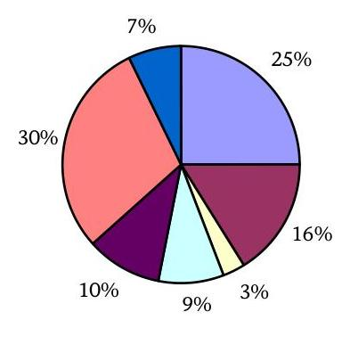
$\square$ eredményesebben végezhető a szakmai tevékenység
■alacsonyabb költséggel végezhető a tevékenység
■a szervezet hozzájárul az intézményi vagyon növeléséhez
$\square$ a szervezet vissza tudja igényelni az áfát
■a szervezet hozzájárul a saját bevétel növeléséhez
■pályázati kiírások, jogszabály által biztosított előnyök kihasználása érdekében
■a rugalmasabb bérezéssel eredményesebben lehet motiválni a munkavállalókat

A 29 intézmény közül 2010. december 31-én összesen 23 rendelkezett 137 részesedéssel (üzletrész vagy részvény) 132 társaságban, míg 4-ben több intézménynek is volt részesedése, amelyek az északi-alföldi régióban a DE, valamint az NYF és az SZF együttmúködésében múködtek. Nem rendelkeztek részesedéssel a művészeti oktatást végző állami felsőoktatási intézmények és a Rendőrtiszti Főiskola.

Az intézmények a fennálló részesedésekből 119-et alapítással, 12-őt adásvétellel, 6-ot tőkeemeléssel szereztek. Az ellenőrzött időszak alatt két társaságot végelszámolással, egyet felszámolással megszüntettek, egy részesedést értékesítettek. A DE két felszámolás alatt álló társaság kivételével - amelyre az MNV Zrt. nem tartott igényt - az összes vagyonkezelt társasági részesedését átadta az MNV Zrt.-nek 2008. decemberben. További egy, a Nemzeti Közszolgálati Egyetem társasága (Zrínyi Nonprofit Közhasznú Zrt.) végelszámolás alatt és egy, az NYF társasága (Hallgatói Centrum Kht.) felszámolás alatt állt.

Az intézmények társaságai 35 társaságban rendelkeztek további részesedéssel. Az intézmények így közvetetten gyakoroltak tulajdonjogot a társaságok további részesedései felett, amelyek közül hétben négy intézmény (DE, KRF, NYF, SZF) közvetlenül is tulajdonos volt. A társaságok részesedésszerzéseinek célja az állami támogatások pályázati kiírási feltételrendszerének való megfelelés, az elért kutatási eredmények továbbvitele, a korábbi pályázati támogatási szerződésekből fakadó projektfenntartási kötelezettség, a pályázatban a tulajdonosi részesedések felső \%-os korlátja, valamint a résztvevők minimális számának biztosítása volt.

A kisebbségi részesedések, valamint a társaságok további részesedésszerzései következtében nehezen átlátható, kevésbé irányítható társaságok halmaza alakult ki. A kisebbségi vagy a közvetett részesedések esetében az intézmények tulajdonosi érdekérvényesítése nem volt biztosított.

A 2010. december 31-ei állapot szerint az intézményi részesedések 54,0\%-a ( 74 db ) többségi, $46,0 \%$-a ( 63 db ) kisebbségi részesedés volt. A társaságok részesedéseinek $71,4 \%$-a volt kisebbségi részesedés. A közvetlen tulajdonban lévő részesedések $84,7 \%$-a ( 116 db ) esetében a rektorok közvetlenül gyakorolták a tulajdonosi jogokat.

---

A helyszínen ellenőrzött 11 intézményből nyolc (BME, DE, ELTE, NYF, PTE, SE, SZIE, SZTE) SZMSZ-e a jogszabályi előírás ${ }^{22}$ ellenére nem tartalmazta az intézmény vagyonkezelésébe vagy tulajdonosi joggyakorlása alá tartozó társaságok felsorolását.

Az ELTE és a SZIE a helyszíni ellenőrzést követően pótolta a hiányosságot és módosította az SZMSZ-ét. Az ellenőrzést követően a DE Szenátusa 2012. március 30án elfogadta és kiadták a „Társasági részesedések tulajdonkezelési szabályzatát".

A részesedésszerzés belső eljárásrendjét - a kérdőíves adatszolgáltatás feldolgozása alapján - a 23 érintett intézmény közül hat rögzítette (BCE, ELTE, KRF, PTE, SE, SZTE) szabályzatban, amit a helyszíni ellenőrzés is megerősített.

A helyszíni ellenőrzést követően a SZIE kialakította a társaságok alapítására vonatkozó eljárásrendjét.

A gazdasági tanács véleményadásához és a szenátus döntéséhez készített előterjesztések jogi hiányosságai miatt az intézmények a társaságokban való részesedésszerzéskor az Ftv. előírásait három ponton ${ }^{23}$ nem tartották be: az előírás ellenére nem mutatták ki számvitelükben az alapításhoz szükséges saját forrást. 9 intézmény szerzett kisebbségi részesedést 13 nem hasznosító vállalkozásban annak ellenére, hogy csak többségi részesedést szerezhetett volna; két intézmény egy-egy társasága szerzett összesen három részesedést további társaságokban, amikor ezt az Ftv. tiltotta, amelyek már a későbbi törvényi módosításoknak megfeleltek.

- az Ftv. 121. § (1) bekezdés előírásával ellentétesen a 2009. január 1-je után alapított társaságok létrehozásához szükséges saját forrást a helyszínen ellenőrzött hat intézmény nem tartotta elkülönítetten nyilván a számviteli nyilvántartásaiban;
- az Ftv. 121. § (2) bekezdésében foglalt tiltás ellenére 2006. augusztus 24-e és 2008. december 31-e között 9 intézmény szerzett kisebbségi részesedést alapítással 13 nem hasznosító vállalkozásként múködő kft.-ben;
- az Ftv. 121. § (2) bekezdésének a közvetett részesedésszerzésére vonatkozó tiltása ellenére a KRF és az SZE egy-egy társasága szerzett összesen 3 részesedést további társaságokban.

A kitöltött tanúsítványok alapján a részesedéssel rendelkező 23 intézményből 17 az Ftv. 121. § (5) bekezdésében előírtak ellenére nem hozott létre tartalék-, illetve kockázati alapot az intézményi társaságok esetleges veszteségeinek fedezésére.

A kisebbségi részesedéssel rendelkező 19 intézmény az Ftv. 121/A. § (1) bekezdésében foglaltak ellenére nem fizette be a vagyoni hozzájárulásának 10\%-át az Ftv. 135-136. § szerinti kockázatfedezeti alapba az összesen 63 kisebbségi részesedése után, azok esetleges veszteségeinek fedezésére. Ennek okai az Ftv. vonatkozó előírásainak bonyolultsága és a részesedések értékének az intézményi va-

[^0]
[^0]:    ${ }^{22}$ Ámr. ${ }_{1}$ 13/A. § (3) bekezdés d) pontja és Ámr. ${ }_{2}$ 20. § (2) bekezdés d) pontja
    ${ }^{23}$ Ftv. 121. § (1), 121. § (2) bekezdés kétszer

---

gyonhoz (2010-ben 0,3\%), saját tulajdonhoz (3,0\%), múködési kiadásokhoz $(0,3 \%)$ viszonyított csekély mértéke voltak.

Két intézménynél (SE, SZTE) további, egyedi szabálytalanságok fordultak elő:

- a részesedésszerzésekre az SZTE-nél négy, az SE-nél egy esetben az Ftv. 27. § (8) bekezdés b) pontjában foglaltak ellenére a gazdasági tanács legalább kétharmados támogatása, az SE-nél egy esetben a szenátus felhatalmazó döntésének hiányában került sor;
- az SE egy társasága végzett az Ftv. 121. § (7) bekezdés előírásaival ${ }^{24}$ ellentétesen az oktatási alaptevékenységgel összefüggő feladatokat is, a társaságot azonban 2010-ben végelszámolással megszüntette;
- az SZTE egy esetben az Innovtv. 19. § (2) bekezdésben foglaltak ellenére szellemi tulajdon-kezelési szabályzat hiányában apportált szellemi terméket hasznosító vállalkozásba;
- az SZTE egy esetben az Innovtv. 19. § (5) bekezdésében előírtak ellenére pénzbeli hozzájárulást teljesített hasznosító vállalkozásba vállalkozási tevékenység eredményén kívüli forrásából.

Az Ftv. 121. § (1) bekezdés alapján 2006. március 1-je után az intézményeknek nem kellett az állami vagyon feletti tulajdonosi jog gyakorlására feljogosított szervezet engedélyét kérniük, mert a részesedéseket minden esetben saját bevételből, illetve saját vagyonból szerezték meg. Az intézmények a részesedések tulajdonjogával rendelkeztek, azok értéke pedig a saját vagyonukat gyarapította, kivéve azt az öt társaságot, amelyeknél - a Vagyontv. alapján vagyonkezelők voltak.

Az Ftv. előírásainak megfelelően ${ }^{25}$ a társaságok létrehozása és működése - az alapító okiratuk és az éves beszámolóik alapján - nem sértette az intézmények érdekeit. Az osztalékból való részesedésük aránya legalább olyan mértékű volt, mint a társaságban szerzett befolyásuk (részesedésük) mértéke ${ }^{26}$. A társaságok múködési formáját minden esetben a jogszabályi rendelkezéseknek megfelelően választották meg. Ez a részesedések 89\%-ában kft., a többi - egy 2006 előtt alapított bt. és egy felszámolás alatt álló kht. kivételével - zrt. volt. Ennek az az oka, hogy az Ftv. az ellenőrzött időszak alatt a kft. vagy a zrt. formájú társaságban engedte, hogy az intézmények saját hatáskörben részesedést szerezhessenek.

A költségvetési szervként működő intézmény 2009. január 1-jétől az Ftv. 121. § (5) bekezdése szerint társaságot akkor alapíthatott, ha a társaságok esetleges veszteségeinek fedezésére kötelező tartalék-, illetve kockázati alapot hozott létre a saját bevételei terhére. Az Ftv. 121/A. § (1) és (2) bekezdések előírásainak megfelelően 2010. január 1-jétől az intézmények kisebbségi részesedéssel akkor vehettek részt társaságban, illetve társaságai vehettek részt további társaságban, ha az intézmények az Ftv. 135-136. § szerint létrehozott és múködtetett közös kockázatfedezeti alapba - az ilyen módon létrehozott társaság részére

[^0]
[^0]:    ${ }^{24}$ 2008. december 31-éig az Ftv. 121. § (6) bekezdése tartalmazta az előírást.
    ${ }^{25}$ az Ftv. 121. § (6) bekezdése, 2009. január 1-jétől Ftv. 121. § (7) bekezdése
    ${ }^{26}$ az Ftv. 121. § (2) bekezdése

---

biztosított vagyoni hozzájárulásuk tíz százalékának megfelelő összegű - befizetést teljesítettek. Az intézmények a közös kockázatfedezeti alapot nem hozták létre és hat intézmény kivételével (ELTE, KE, KRF, ÓE, PE, SE) saját tartalék-, illetve kockázati alapot sem hoztak létre.

Az Ftv. 121. § (5) bekezdésének megfelelő, intézményi saját tartalék-, illetve kockázati alapba teljesített befizetéseik összege az ellenőrzött időszak alatt 354,0 M Ft-ot volt. Az Ftv. 121/A. § (1) bekezdése által előírt, a társaságok által szerzett részesedések után befizetést csak a KRF teljesített. A SZIE a helyszíni ellenőrzés lezárása után, 2011. december 31-én 16,9 M Ft-ot különített el a részvételével múködő gazdasági társaságok esetleges veszteségeinek fedezetére.

A jogi szabályozás gyakori változása bizonytalanná és nehezen tervezhetővé tette az intézményfejlesztési tervekben az intézményeknek társaságokban való részesedésszerzését. Az intézményfejlesztési tervek 21,7\%-ában (5 intézménynél) szerepeltek részesedésszerzésekkel kapcsolatos elképzelések. Ennek okai voltak, hogy a részesedésszerzésre fordított tőke nagysága az intézményi költségvetéshez, vagyonhoz mérten elenyésző volt, valamint az állami pályázati támogatás megszerzésére ( $\mathrm{K}+\mathrm{F}$ és annak eredményei hasznosítása) alakult társaságoknál a pályázati lehetőségeket és feltételeket az intézményfejlesztési terv elkészítésekor még nem ismerték.

A részesedésszerzések és a társaságok múködésének összehangolása az intézmények stratégiájával, az intézményfejlesztési tervben megfogalmazott elvárásokkal alapvetően nem valósult meg. A társaságok számára a szakmai és gazdasági célok, prioritások meghatározása vagy ezek nyomon követése elmaradt.

A DE társaságainak 75\%-a projektek megvalósítására, az intézményfejlesztési tervvel összhangban, az intézményi stratégia mentén jött létre. A társaságoknál azonban a szakmai és gazdasági célok, prioritások meghatározása elmaradt.

Az SZTE társaságaival szemben az intézmény középtávú elvárásokat nem fogalmazott meg. Azok a társaságok rendelkeztek pályázathoz igazított stratégiával (DEAK Zrt., ELI-HU Nonprofit Kft., SZOTE Szolgáltató Kft.), amelyek pályázati támogatást kaptak, és ez a pályázat elnyerésének feltétele volt.

A PTE-n az újonnan alapított társaságok középtávú tervekkel - 3-5 éves - rendelkeztek, de az azokban foglaltak megjelenítése, aktualizálása az éves tervekben elmaradt.

A részesedésszerzésre irányuló előterjesztések 68\%-át támasztották alá gazdasági számításokkal és megalapozott szakmai érvekkel.

A PTE által létrehozott PTE Bölcsőde Nonprofit Kft. esetében közel félévi veszteséges múködést követően döntött a szenátus a végelszámolásról, miután belátta, hogy rosszul számították ki a várható megtakarítás mértékét.

A pályázati támogatás elnyerésére alapított társaságok létrehozásáról szóló előterjesztésekből hiányzott, hogyan fogják finanszírozni a saját erő részt, illetve a támogatás lehívásáig a múködési kiadásokat, ami később a tevékenység során likviditási problémát okozott. Az előterjesztések nem tértek ki arra, hogy mi lesz a társaság sorsa abban az esetben, ha nem nyerik el a

---

támogatást, illetve ha a projektfenntartási időszak letelt. Ugyancsak elmaradt a kötelező projektfenntartási időszak alatti költségek finanszírozásának meghatározása. A kisebbségi részesedések esetén az előterjesztések és a döntések nem tértek ki a társasági szerződésben az intézmény érdekeit rögzítő külön előírásokra, és a projekt lezárását vagy a sikertelen pályázatot követően a részesedés további sorsára sem.

A sikertelen pályázatot vagy a projekt befejezését követően nem végzett érdemi tevékenységet a GIK 2005 Kft. és az EDUDAT Kft. (SZTE), az EPONA-ARRABONA Spanyol Lovasiskola Kft. (NYME) és a BME BIOPROCESS Kft. (BME).

A társaságok 84,2\%-a (112 db) esetében nem határoztak meg szakmai, $54,9 \%$-ában ( 73 db ) pénzügyi eredmények mérésére, értékelésére alkalmas mutatószámokban kifejezett középtávú és egyes évekre lebontott célrendszert. A helyszínen ellenőrzött 11 intézményből 7 sem szakmai, sem pénzügyi célokat nem határozott meg. Csak a konkrét pályázat elnyerése érdekében létrehozott társaságok értékeléséhez alakítottak ki már az alapításkor - a pályázati feltételeknek megfelelő - mutatószámrendszert (pl. SZTE - DEAK Zrt. és ELI-HU Nonprofit Kft.). Ezek a mutatószámok azonban csak részben alkalmasak arra, hogy az intézményi tulajdonosi joggyakorlás szempontjából is értékeljék a társaságok múködését.

Csak a KRF rögzítette minden társasága alapításakor az eredményesség mérését biztosító szakmai mutatókat, azonban pénzügyi mutatókat nem határozott meg. További 14 intézmény egyáltalán nem határozott meg mutatókat. A PTE írásbeli tájékoztatása szerint az ÁSZ ellenőrzését követően kidolgozta a társaságok szakmai, pénzügyi eredményeinek mérésére és értékelésére szolgáló szempontrendszert, amelyet a Gazdasági Tanács is támogatott.

A teljesítménymutatók meghatározását jogszabály nem írja elő, azonban ezek hiányában nem lehet az Ftv. 120. §-ának megfelelően értékelni a társaságok múködésének eredményességét, valamint az intézmény tevékenységére gyakorolt hatását. Az intézmények kétharmadának véleménye szerint a gazdálkodó szervezet értékeléséhez nem biztosítana többletinformációt a célrendszer kialakítása. További okokként jelölték meg, hogy a szakmai teljesítmény számszerúen nem mérhető, illetve intézményi kapacitás hiányában nem alakítottak ki kritériumrendszert.

# 2. AZ INTÉZMÉNYI RÉSZESEDÉSSEL MŰKÖDŐ TÁRSASÁGOK TEVÉKENYSÉGE, GAZDÁLKODÁSA, A TULAJDONOSI KONTROLLRENDSZER, AZ EREDMÉNYES FELADATELLÁTÁSHOZ VALÓ HOZZÁJÁRULÁS 

### 2.1. A társaságok tevékenysége, gazdálkodása

Az ellátott feladatok, végzett tevékenységek szerint a társaságok megoszlása változatos volt. Egyszerre többféle tevékenységet is elláttak, amelyek az ellenőrzött időszak egyes éveiben változó mértékben szerepeltek, így nem tették lehetővé a tevékenységek szerinti egységes homogén csoportosítást. A ténylegesen ellátott főtevékenységek szerinti \%-os megoszlást az alábbi ábra szemlélteti:

---

# A gazdasági társaságok tevékenységek szerinti megoszlása (2006-2010) 

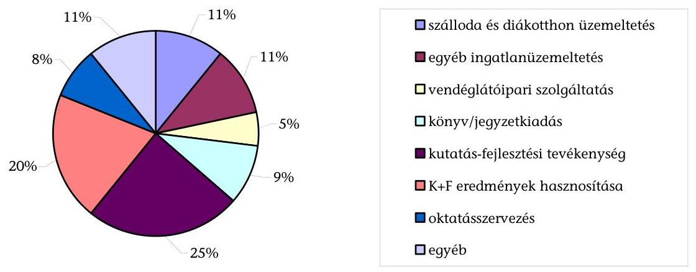

A kutatás-fejlesztési tevékenység és eredményeinek hasznosítása 45\%-ot, az alaptevékenységhez kapcsolódó, kiegészítő feladatok, valamint a múködést biztosító funkcionális és fenntartási feladatok $44 \%$-ot tettek ki. Az egyéb kategóriában (11\%) olyan tevékenységek kerültek megjelölésre, mint a vagyonkezelés (BCE), pénzügyi, üzletviteli, vezetési tanácsadás (SZF, PTE), oktatás kiegészítő tevékenység, fekvőbeteg-ellátás (DE), szélesebb körben értelmezett diákjóléti szolgáltatások $^{27}$ (DE, ELTE, SZTE), felsőfokú szakképzés (ZMNE), mezőgazdasági termék- és melléktermék hasznosítás, villamosenergia-termelés, egészségügyi tevékenység koordinációja (KE).

A helyszíni ellenőrzés tapasztalatai alapján az intézmények részesedésével múködő társaságok ténylegesen ellátott főtevékenységük szerint további csoportosítás alapján két nagy kategóriába sorolhatók:

## - a K+F+I alaptevékenységhez kapcsolódó gazdasági társaságok

A BME Viking Zrt. a BME-n, a Debreceni INFO PARK Kft. és a Pharmapolis Klaszter Kft. a DE-n, az UNI-FLEXYS Közhasznú Nonprofit Kft az ME-en, a PMMF Politechnika Kft. és a Pályázati Menedzsment Kft. a PTE-n, valamint a Mátra Energia Ültetvény Kft. a KRF-en.

- az oktatási alaptevékenységhez kapcsolódó kiegészítő feladatok, valamint a múködést biztosító funkcionális és fenntartási feladatok ellátására létrehozott társaságok (kiszervezett tevékenységek).

A kulturális, szociális, diákjóléti szolgáltatások (Nereus Kft., UNIVERSITASSZEGED Nonprofit Kft.), szabadidő, sport tevékenység (Debreceni Universitas Nonprofit Közhasznú Kft., ELTE Sport Kft.), hallgatói jegyzet- és tankönyvellátás, könyvkiadás, (Semmelweis Kiadó és Multimédia Stúdió Kft., BME Szolgáltató Kft., ELTE Eötvös Kiadó Kft.). A gyakorlati oktatás feltételrendszerének biztosítása (GAK Kft., Georgikon Tanüzem Kiemelten Közhasznú Nonprofit Kft., Károly Róbert Nonprofit Kft.).

[^0]
[^0]:    ${ }^{27}$ rendezvényszervezés, sport, hallgatói tanácsadási tevékenység

---

A részesedések mértéke szerint 2010. december 31-én az intézmények 5\% alattitulajdoni részesedéssel 10-ben, kisebbségi jogokat biztosító részesedéssel 30-ban, mértékadó részesedéssel 23-ban, minősített többségi részesedéssel 17-ben, 100\% tulajdonú részesedéssel 57 társaságban rendelkeztek.

A társaságokban meglévő részesedésekből 2010. december 31-én 1 db bt.-ben, 123 db kft.-ben és 13 db zrt.-ben volt. A részesedések 50,4\%-a (69) forprofit és 49,6\%-a (68) nonprofit társaságban volt. Ez utóbbiak közül 51\% ( 34 db ) közhasznú és $34 \%$ ( 23 db ) kiemelten közhasznú jogállással rendelkezett, illetve $15 \%$ ( 11 db ) nonprofitként múködött, de nem szerzett közhasznú jogállást.

Az intézmények társaságainak összes jegyzett tőkéje a 2006. évi 1992,6 M Ftról 2010-re 2263,7 M Ft-ra (13,6\%-kal) nőtt. Az intézmények által befektetett tőke a 2006 évi 558,1 M Ft-ról 2010. évre 1254,7 M Ft-ra, 124,8\%-kal nőtt (5/a. számú melléklet). A változásokat három tényező befolyásolta: az új részesedésszerzés, az intézmények által nyújtott tőkejuttatás és a meglévő részesedések csökkenése (értékesítés, tulajdonrész-átadás az MNV Zrt.-nek, vagy társaságok megszüntetése).

A legjelentősebb hatást a SZIE Kalocsa Fűszerpaprika Zrt.-ben meglévő 0,2\%-os részesedésének 2008. évi MNV Zrt.-nek történő átadása jelentette (a társaság jegyzett tőkéje 1015,3 M Ft). Az intézmények által biztosított tőkejuttatás az ellenőrzött időszakban összesen 467,0 M Ft volt.

A társaságok saját tőke összege a 2006. évi 3572,0 M Ft-ról 2010-re 4119,3 M Ftra 15,3\%-kal emelkedett. Ebből a részesedések alapján az intézményeket megillető rész 2006-ról (1938,8 M Ft) 2010-re (3007,9 M Ft) 55,1\%-kal emelkedett, ami gyorsabb növekedési ütemet jelentett a társaságok saját tőke növekedéséhez viszonyítva.

Legnagyobb saját tőkével a Károly Róbert Kutató-Oktató Közhasznú Nonprofit Kft. (KRF) rendelkezett 2006-ban 1030,5 M Ft-tal, 2010-ben 970,6 M Fttal.

Az ellenőrzött időszakban az intézményi részesedésekre jutó összes 696,6 M Ft befektetett tőkenövekedéssel szemben, az intézményi tőkejuttatással korrigálva 93,8 M Ft saját tőke csökkenés következett be. Ennek okai a társaságok összetételében bekövetkezett változások és az alacsony nyereségtermelő képesség voltak.

Az intézmények az Ftv. 121. § (6) bekezdésében foglalt előírásoknak megfelelően a társaságok hiányát a befolyásuknál nagyobb mértékben nem finanszírozták. 2010-ben 14 intézmény 39 db olyan társaságban rendelkezett részesedéssel, ahol a társaságok saját tőkéje a jegyzett tőke alá csökkent. Ebből kilenc intézménynél 16 db társaság rendelkezett negatív saját tőkével, amelyből öt intézménynél egy-egy társaság kizárólag az intézmény tulajdonában állt.

Az ellenőrzött időszakban a DE társaságainál volt jelentősebb tőkevesztés, ahol a saját tőke négy esetben negatív lett. A veszteséges múködés miatt - a teljes egészében a DE tulajdont képező - DE OEC Kazincbarcikai Kórház Nonprofit Kft., 2010-ben jegyzett tőkéje 30,0 M Ft, saját tőkéje pedig -390,7 M Ft volt. Az egyetem

---

írásbeli tájékoztatása alapján a Kórház 2011. évi mérleg szerinti eredménye és saját tőkéje is pozitív értéket mutat.

Az SZTE-n az ellenőrzött időszakban négy társaságnak csökkent tartósan (legalább két, egymást követő évben) a saját tőkéje a jegyzett tőke alá. A részesedések értékvesztésének elszámolására az ÁSZ 2008. évi ellenőrzésében már felhívta a figyelmet, azonban intézkedés nem történt.

A 2011. évi beszámolók alapján a Gt. 51. § (1) bekezdése szerint a tulajdonosnak intézkedési kötelezettsége áll fenn (tőkepótlás, átalakítás vagy megszüntetés).

Az ellenőrzött időszakban az állami felsőoktatási intézmények társaságait öszszesen 467,0 M Ft tőkejuttatásban részesítették, amelyre a részesedéssel rendelkező intézmények $43,5 \%$-ánál ( 10 db ) került sor. A legnagyobb tőkejuttatás a DE társaságainál történt, összesen 247,9 M Ft összegben, ami az összes pótlólagos tőkejuttatás $53 \%$-a volt.

A DE-nél a tőkejuttatás nagyobb részben a társaságok pályázataihoz a saját erő biztosítása, kisebb részben üzletrész kivásárlása miatt történt.

Az intézmények társaságokban lévő saját tőke részesedése 2010. december 31én a részesedéssel rendelkező intézmények teljes- és saját vagyonának $0,3 \%$ és $3,0 \%$-a volt.

Az intézmények társaságainak összes bevétele 2006-ról (6273,5 M Ft) 2010-re (22 115,8 M Ft) három és félszeresére nőtt (6. számú melléklet). Dinamikusan közel háromszorosára növekedett az értékesítés nettó árbevétele és több mint kilencszeresére a nem intézményi (pályázati, normatív) támogatások összege. Ugyanebben az időszakban közel felére csökkent a társaságok intézményektől származó árbevételének és támogatásának együttes aránya (2006-ban 16,3\%, 2010-ben 8,6\%). Ezzel szemben az intézmények társaságaiktól származó bevétele hatszorosára nőtt, azonban 2010-ben 287,3 M Ft-tal elmaradt az intézmények társaságaiktól származó bevétele a részükre történt kifizetésektől.

2006-ban a társaságok összes bevételből az értékesítés nettó árbevétele 76,9\% (4781,1 M Ft), a kapott támogatás $7,1 \%(439,9 \mathrm{MFt})$ volt. A kapott támogatás $32,7 \%$-a ( $143,9 \mathrm{MFt}$ ) származott az intézményektől. A társaságok értékesítési nettó árbevételének 18,3\%-a ( $873,5 \mathrm{M}$ Ft) származott az intézményektől, ezzel szemben az intézmények 236,0 M Ft bevételre tettek szert a társaságaiktól.

2010-ben az összes bevételből a társaságok értékesítési nettó árbevétele 64,5\% (14 257,9 M Ft), ebből az intézménytől származó bevétel 12,7\%-a (1807,2 M Ft), ezzel szemben az intézmények 1519,9 M Ft bevételre tettek szert a társaságaiktól. Az összes bevételből a társaságoknál a kapott támogatások 20,9\%-ot (4618,4 M Ft) képviseltek, amelyből mindössze 2,2\% (100,9 M Ft) származott az intézményektől.

Az intézmények és társaságaik között az üzemeltetési feladatok ellátására, szálláshely hasznosítására, rendezvényszervezésre, K+F tevékenységre alakult ki szerződéseken, megállapodásokon alapuló együttmúködés.

---

A SZIE együttműködési megállapodást kötött a társaságaival, amelyek - a helyszíni ellenőrzés tapasztalatai alapján - aktív szerepet vállaltak az egyetem alaptevékenységének támogatása, tárgyi feltételrendszerének biztosítása területén.

Az SZTE a kórházi veszélyes hulladék kezelésére és ártalmatlanítására kötött együttmúködési megállapodást.

A PTE és az Egészségipari Zrt. "Pécs - Az életminőség pólusa" program keretében a technológia-transzfer és a kutatási eredmények hasznosítása területén kötött együttmúködési megállapodást.

Az ELTE minden társasággal együttmúködési megállapodást kötött az alaptevékenységhez történő hozzájárulás módjáról és annak mértékéről.

A helyszínen ellenőrzött intézmények szerződést kötöttek a társaságaikkal a vagyonkezelésükben lévő bérbeadott ingatlanért, tárgyi eszközökért, és legalább a fenntartást biztosító bérleti díjat számítottak fel. Ettől a PTE és az NYF tért el egy-egy társaság esetében.

A PTE a Pályázati Menedzsment Kft.-vel nem kötött bérleti szerződést. Az NYF irodahelyisége lett az ENEREA Kft. tevékenységének székhelye, amely használatáért - beleértve a közüzemi díjakat is - az NYF bérleti díjat nem határozott meg.

Az intézmények társaságaikat az ellenőrzött időszakban összesen 749,9 M Ft vissza nem térítendő támogatásban részesítették. A támogatások szinte kizárólag az intézmények alaptevékenységéhez kapcsolódó kiegészítő feladatainak, valamint a múködést biztosító funkcionális és fenntartási feladatainak ellátására létrehozott társaságoknál (kiszervezett tevékenységek) fordultak elő. Az összes támogatás felét a DE nyújtotta, nem adott támogatást pl. BCE, EJF, NYF, SZE, ZMNE (8. sz. melléklet).

A DE-en Debreceni Universitas Kft.-nek a DE sportlétesítményeinek üzemeltetésére és a versenysport támogatására, a Debreceni Egyetem Atlétikai Club Kft.-nek a sportesemények lebonyolítására, Debreceni Campus Szolgáltató és Tanácsadó Nonprofit Közhasznú Kft.-nek elsősorban hallgatói jóléti szolgáltatásokra (közösségi élet szervezése, kulturális rendezvények) adott támogatást. A PE-en a támogatást döntően a gyakorlati oktatás lebonyolításában meghatározó szerepet játszó Georgikon Tanúzem Nonprofit Kft. kapta.

A DE három társasága részére 706,9 M Ft tagi kölcsönt nyújtott, amelyből 2010. december 31-én a fennálló tartozás 597,8 M Ft volt, a kölcsönöket átütemezték, a végtörlesztési határidők még nem jártak le. A fennálló kölcsön összege az egyetem tájékoztatása szerint 2012. I. negyed év végére 408 M Ft-ra csökkent.

A helyszínen ellenőrzött intézmények társaságainál az összes bevételből két egymást követő évben a jogszabályban meghatározott kétharmadnál magasabb arányt nem ért el az államháztartásból származó forrás ${ }^{28}$, ami ennek a forrásnak a csökkentését, a társaság átalakítását vagy megszüntetését vonta volna maga után.

[^0]
[^0]:    ${ }^{28}$ Áht., 100/L. § (7) bekezdés (hatályos 2009. I. 1-jétől 2010. augusztus 15-ig)

---

Az intézmények társaságainak összes ráfordítása (7. számú melléklet) az ellenőrzött időszakban 6220,6 M Ft-ról 22 298,0 M Ft-ra a bevétellel azonos arányban három és félszeresére nőtt. 2006-ban az összes ráfordítás 24,5\%-a (1520,5 M Ft), 2010-ben 26,7\%-a (5953,9 M Ft) volt átlagosan a személyi jellegü ráfordítások összege. A társaságoknál 2006-ban az ezer forint bevételre jutó átlagos ráfordítás 1000,6 Ft, 2010-ben 992,2 Ft volt, ami romló tendenciát mutatott. Az ezer forint összes bevételre jutó személyi ráfordítások összege 2006-ban 245 Ft, 2010-ben 269 Ft volt, ami 9,8\%-os növekedésnek felelt meg. Ennek fő oka a tevékenységen belül a magasabban kvalifikált $\mathrm{K}+\mathrm{F}$ tevékenységek arányának növekedése. A társaságok átlagos egy főre jutó havi személyi jellegű ráfordításai a 2006. évben 200294 Ft, a 2010. évben 264145 Ft volt. Ennek oka, hogy a társaságok által végzett tevékenységek magas képzettséggel rendelkező munkatársak foglalkoztatását szükségessé tevő feladatok irányába mozdultak el (kiszervezett tevékenységek súlya csökkent és növekedett a K+F tevékenységeké). Ebben szerepet játszott, hogy a magas képzettséggel rendelkező munkatársak foglalkoztatását igénylő K+F-fel főtevékenységként foglalkozó társaságok száma 2006-ról 2010-re a háromszorosára, 56-ra nőtt.

A KSH által mért a versenyszférában foglalkoztatottak bruttó havi átlagkeresete 2010-ben 206863 Ft/fő, a szakmai, tudományos, műszaki tevékenység területén foglalkoztatottak bruttó havi átlagkeresete 297489 Ft/fő volt.

Az intézmények társaságainak összes átlagos állományi létszáma 2006-ról (632,6 fő) 2010-re (1878,4 fő) közel háromszorosára nőtt. Ennek alapvető okai a DE OEC Kazincbarcikai Kórház Kft. átvétele (2010. évben 428 főt foglalkoztatott), a részesedések számának növekedése és a tevékenységek bővülése volt. Az intézmények részesedésével 2010-ben működő társaságok egy kivétellel (DE OEC Kazincbarcikai Kórház Kft.) kis- és középvállalkozás ${ }^{29}$, ebből 11 db középvállalkozás, 125 db kis- és mikrovállalkozás kategóriába sorolható.

Összesen nyolc társaság foglalkoztatott 2010-ben több mint 50 főt, az általuk foglalkoztatottak száma az összes foglalkoztatott 56\%-a, ebből egy társaság (DE OEC Kazincbarcikai Kórház Kft.) foglalkoztatott 250 főnél többet. A gazdasági társaságok 65\%-a ( 86 db ) foglalkoztat 10 főnél kevesebbet.

A közvetített szolgáltatások aránya az összes ráfordításhoz viszonyítva 2006-ban 10,0\% (619,6 M Ft), illetve 2010-ben 11,3\% (2523,8 M Ft) volt. A közvetített szolgáltatások aránya a legnagyobb a 2006. évben a BME társaságainál volt, ahol a ráfordítások 53,6\%-át (330,2 M Ft) érte el.

A társaságok az ellenőrzött időszakban összevontan 720,6 M Ft mérleg szerinti eredményt értek el, ami 2586,2 M Ft összes nyereségből és 1865,6 M Ft összes veszteségből adódott. Az intézményi részesedésekre jutó rész 412,4 M Ftot tett ki, ami összesen 1427,3 M Ft nyereség és 1014,9 M Ft veszteség következménye volt (9. számú melléklet). Az intézményi részesedések közül 2006ban 37 db nyereséges (összes részesedésre jutó nyereség 128,1 M Ft), 13 db veszteséges (összes részesedésre jutó veszteség $67,9 \mathrm{MFt}$ ) és 7 db nullszaldós volt.

[^0]
[^0]:    ${ }^{29}$ a kis- és középvállalkozásokról, fejlődésük támogatásáról szóló 2004. évi XXXIV. törvény 3. § (1)-(3) bekezdések

---

2010-ben az intézményi részesedések közül 76 db nyereséges (összes részesedésarányos nyereség $447,2 \mathrm{M}$ Ft), 44 db veszteséges (összes részesedésarányos veszteség $570,8 \mathrm{M}$ Ft) és 17 db nullszaldós volt.

A helyszínen ellenőrzött intézmények társaságainak az intézményi részesedésekre jutó veszteségeinek és nyereségeinek egyenlege -124,1 M Ft volt. Az ellenőrzött időszakban hét, a helyszínen ellenőrzött intézmény (BME, DE, KRF, NYF, PTE, SE, SZTE) 17 társasága volt tartósan veszteséges. A veszteséges vállalkozások magas számának két fő oka az alapítás előkészítésének nem kellő megalapozottsága (gazdasági környezet, tervezett bevételek és ráfordítások nem megfelelő felmérése), továbbá a gazdasági válság hatása miatt a K+F megrendelések piacának beszűkülése volt.

Kiemelkedő a DE társaságainak a 452,3 M Ft összes vesztesége, amelyből a DE OEC Kazincbarcikai Kórház Nonprofit Kft. vesztesége 2010-ben 350 M Ft volt. Ennek alapvető oka a DE OEC Kazincbarcikai Kórház Nonprofit Kft.-nél elszámolt, de az Országos Egészségbiztosítási Pénztár (OEP) által nem finanszírozott amortizáció. Az egyetem írásbeli tájékoztatása alapján a Kórház 2011. évi mérleg szerinti eredménye és saját tőkéje is pozitív értéket mutat. A DE-n az alaptevékenységhez kapcsolódó kiegészítő feladatokat ellátók eredményessége 2006-hoz viszonyítva fokozatosan javult, 2010-ben 28 M Ft mérleg szerinti eredményt értek el.

Az SE által alapított és részvételével múködő társaságok közül a harmadik üzleti évet nyolcból öt nyereséggel zárta, míg 2010. évben kilencből hét ért el nyereséget. A 2006. évben létrehozott Semmelweis Egészségügyi Kft. a több biztosítós rendszer kiszolgálására alakult, az SE szabad kapacitásának értékesítésére. A társaság az alapítás szerinti célfeladatát nem látta el, ezért módosították az alapításkori feladatát. 2008-2010. év között a járó- és fekvő-betegellátás keretében az OEP által le nem kötött kapacitásokat hasznosította az intézmény számára, de tevékenysége tartósan veszteséges volt, aminek a következményeként tőkeemelésre került sor.

Az ellenőrzött időszakban három felsőoktatási intézmény vett fel osztalékot összesen 25,6 M Ft összegben (a PE 20,0 M Ft, az SE 4 M Ft, a PTE $1,6 \mathrm{MFt)}$.

A 2008. évben az EC Kft. 11,6 M Ft, a Nereus Kft. 3 M Ft, a 2009. évben az EC Kft. 5,4 M Ft osztalékot fizetett a PE-nek. A PTE-n a PMMF Politechnika Kft. és a Tanácsadó Zrt. fizetett 2009. évben 1,6 M Ft osztalékot. A 2010. évben a Kiadó és Multimédia Kft. fizetett osztalékot 4,0 M Ft összegben az SE-nek.

A 2006-2010. években az összes üzleti év 58\%-át, összesen 1427,3 M Ft részesedésre jutó mérleg szerinti nyereséggel zárták. Az intézmények - a kapott osztalék kivételével - a nyereséget a társaságoknál hagyták.

Az NYME-en a társaságok minden múködési évben nyereségesek voltak, amit eredménytartalékba tettek. A SZIE-en a nyereséget eszközvásárlásokra forgatták vissza. Az NYF társaságai közül a két 11\%-os, illetve a 13\%-os részesedésúnél volt nyereség, amit eredménytartalékba helyeztek.

---

# 2.2. A tulajdonosi kontrollok kialakítása és múködése 

A helyszínen ellenőrzött 11 intézményből a DE és a PTE részlegesen, a többi nem szabályozta a gazdasági társaságokra vonatkozó beszámoltatás, értékelés, és ellenőrzés rendszerét.

Az intézmények SZMSZ-ében vagy egyéb szabályzatában nem határozták meg a társaságok ellenőrzésének, beszámoltatásának, értékelésének rendszerét. A PTE-n az alapítási és részesedésszerzési szabályzat 22. § (1)-(2) bekezdéseiben meghatározták azt a személyt ${ }^{30}$, aki felelős a társaságokkal való kapcsolattartásért és a tulajdonosi döntések előkészítéséért. A DE külön szabályzatban nem rögzítette az alapítás és a tulajdonosi joggyakorlás szabályait, azonban 2010-től rektori utasításban rögzítette a társaságok taggyűlésein való képviselet előírásait ${ }^{31}$. A helyszíni ellenőrzést követően a DE a szenátus 23/2012. (IV. 05.) számú határozatával elfogadta a „Társasági részesedések tulajdonkezelési szabályzatát". A kérdőíves adatszolgáltatás szerint az összes intézmény egynegyede szabályozta részesedésszerzésének és múködtetésének eljárását.

A társaságok múködésének és gazdálkodásának felügyeletét a jogszabályoknak ${ }^{32}$ megfelelően a többségi intézményi tulajdon esetén legalább háromtagú felügyelö bizottság (FB) látta el. Ettől eltérő esetet 12 nagyobb számú résztulajdonossal rendelkező társaság esetében tapasztaltunk.

A legnagyobb létszámú, 7 fős FB-je az Innova Kft.-nek (NYF, DE, SZF) 2008, 2009ben volt, míg a Nyírszakképzés Nonprofit Kft.-nek (NYF, DE) minden évben 5 tagú.

Az FB-k tagjainak összes létszáma az ellenőrzött időszakban az intézmények részesedéseinél 2006-ban 34 társaságnál 103 fő (átlag egy társaságnál 3 fő), 2010-ben 112 társaságnál 370 fő (átlag egy társaságnál 3,3 fő) volt. Ennek okai az újonnan szerzett részesedések számának növekedése, valamint a Vagyontv. 2007. évi hatálybalépésével a többségi állami tulajdonú társaságoknál kötelezővé tett FB létrehozása. Az FB-k múködésének ráfordítása a 2006. évi 800,6 M Ft-ról 2010-re 457,4 M Ft-ra csökkent, mert sokan FB tagságukat tiszteletdíjmentesen is vállalták.

Az Ftv. 121. § (8) bekezdése és 121/A. § (2) bekezdése meghatározza a társaságokra vonatkozó személyi összeférhetetlenséget (az intézményvezető tisztségviselője, és a társaság vezető tisztségviselője, felügyelőbizottsági tagja, könyvvizsgálója, illetve e személyek közeli hozzátartozói), ami kiterjed a társaság által létesített, illetve részvételével múködő társaságra is. Nem tartották be a társasá-

[^0]
[^0]:    ${ }^{30}$ Az általános és stratégiai rektor-helyettes évente jelentest készít a GT, valamint a szenátus részére a PTE által alapított vagy részvételével múködő társaságok múködéséről.
    ${ }^{31}$ Az RH/47-12/2010. 04. 29. sz. „Szempontok a DE többségi vagy kisebbségi tulajdonában lévő társaságok taggyűlésein vagy tulajdonosi ülésein résztvevő egyetemi vezető számára az ott képviselendő elvekről és szempontokról" szóló rektori utasításban szabályozta az egyetem tulajdonosi részesedésével múködő társaságok taggyűlésein felvetendő szempontokat és követendő elveket.
    ${ }^{32}$ Vagyontv. 30. § (3) bek., a köztulajdonban álló gazdasági társaságok takarékosabb múködéséről szóló 2009. évi CXXII. törvény 4. §

---

gok vezető tisztségviselőinek összeférhetetlenségére vonatkozó előírást - a név szerinti kimutatások alapján - 23 intézményből 14-nél (ebből a helyszínen ellenőrzött 10 intézménynél). Az ellenőrzés összesen 29 esetben állapított meg összeférhetetlenséget, amelyekben 22 felügyelő bizottsági tag, és 7 vezető tisztségviselő volt érintett.

A DE-n 6 fő érintettségét, az SE-n 4 fő érintettségét, a BME-n, PTE-n 3 fő érintettségét, az ELTE-n, az NYF-en, az SZTE-n 2 fő érintettségét, 7 intézménynél 1-1 fő érintettségét tapasztaltuk.

A helyszíni ellenőrzést követően 2012. február 1-jéig az intézmények összesen 10 esetben szüntették meg az összeférhetetlenséget (ELTE, SZTE 2-2 fő, BME, EKF, KE, KRF, NYF, SZIE 1-1 fő).

Ahol ez kötelező volt, ott - az Ávgkr. 17. § (2) bekezdésében és az Sztv. 155. § (2)-(3) bekezdésben foglaltaknak megfelelően - a társaságok könyvvezetését, egyszerűsített éves beszámolóját, és ennek keretében a mérlegét és eredménykimutatását független könyvvizsgáló ellenőrizte. A társaságok könyvvizsgálatra fordított költségei az ellenőrzött években összesen 3246,3 M Ft-ot tettek ki. A kifizetett díj a 2006. évi 527,9 M Ft-ról 2010-re 727,9 M Ft-ra növekedett, azonban az egy társaságra jutó átlagos díj mértéke ugyanezen időszak alatt 9,1 M Ft-ról 5,3 M Ft-ra csökkent.

A kérdőíves adatszolgáltatás szerint 2010-ben a gazdasági tanácsok 83\%-ban, azaz 132 társaságból 110-nél, míg a szenátus $47 \%$-ban ( 62 társaságnál) értékelte a társaságok éves működéséről szóló beszámolót. A helyszíni ellenőrzés tapasztalatai szerint a BME kivételével a rektor az Ftv. 121. § (4) bekezdése szerint évente jelentést készített ${ }^{33}$ a gazdasági tanácsnak az intézmény részesedésével múködő társaságokról.

Az intézmények tulajdonában lévő társaságok gazdálkodására vonatkozó eredmények számonkérése és értékelése a társaságok működéséről szóló beszámolók keretében gazdasági számításokon alapuló elemzés, értékelés nélkül történt. A helyszínen ellenőrzött 11 intézményben nem mérték egzakt módon a társaságok szakmai és gazdasági tevékenységének hozzájárulását az intézmények feladatellátásához, nem határozták meg az ehhez szükséges indikátorokat, szakmai mutatókat és elvárt értéküket. Ezért nem volt biztosított az eredményes tulajdonosi beavatkozás.

A gazdasági tanácsok és szenátusok részére készített éves beszámolók megvitatására döntően a megelőző évre május 31-ig benyújtott beszámolók alapján került sor az utolsó negyedévben, amikor már a folyó év gazdálkodására vonatkozó beavatkozás lehetősége korlátozott volt. Ez mutatkozott meg a gazdasági tanács által javasolt (2010-ben 17) és a szenátus által előírt (2010-ben 4) a részesedések számához viszonyított intézkedések csekély számában.

Az SZTE-n a rektor minden évben jelentést készített a gazdasági tanácsnak a társaságok múködéséről, azonban az előterjesztések tartalmilag nem voltak olyan

[^0]
[^0]:    ${ }^{33}$ A társaságok éves beszámolóit csak az FB-k írásbeli jelentésének birtokában fogadták el Gt. 35. § (3) bekezdés.

---

mélységűek és részletesek ahhoz, hogy a gazdasági tanács teljes körű és megalapozott véleményt alkothasson a társaságok múködéséről, amire a 2008. és a 2009. évi beszámolók értékelésekor felhívták a figyelmet. Amikor a jelentés bemutatta a problémát, a döntések vagy késtek (Mednet Kht. végelszámolása) vagy elmaradtak (Egészségcentrum Szeged Kft. nem múködik), és nem tettek intézkedéseket a veszteséges társaságok múködésének javítása érdekében.

A helyszínen ellenőrzött azon kilenc intézménynél (ELTE és NYME kivételével) amelyeknél a társaságok további részesedésekkel rendelkeztek - a további 26 társaság ügyvezetője a gazdasági tanács részére nem számolt be, ezzel nem tett eleget az Ftv. 121/A. § (2) bekezdés előírásának.

Az ellenőrzött időszakban az összes intézménynél összesen 15 belső ellenőrzést végeztek a tulajdonosi joggyakorlást érintően, amelyek során összesen 64 javaslatot tettek. A részesedéssel rendelkező 23 intézményből 13 (BGF, BME, ELTE, KE, KF, ME, ÓE, PTE, SE, SZE, SZF, SZIE, ZMNE) egyáltalán nem ellenőrizte a tulajdonosi joggyakorlást és a társaságokat, a többiek háromévente egy alkalommal. A helyszínen ellenőrzött intézmények 54,5\%-a nem végzett ilyen ellenőrzést.

Az NYME belső ellenőrzése 2008-ban egyszer ellenőrizte az intézményi társaságok alapításának hatását. A DE, PE és az SZTE belső ellenőrzése a társaságok gazdálkodásának eredményességét vizsgálta. A KRF belső ellenőrzése a tulajdonosi joggyakorlás eredményességét egyszer, 2006-ban ellenőrizte, a tulajdonosi joggyakorlás javítására öt javaslatot tett, az erre vonatkozó intézkedések megtörténtek. Az ME írásbeli tájékoztatása alapján 2010-ben sor került az UNI-FLEXYS Közhasznú Nonprofit Kft. átvilágítására és az erről készült jelentés alapján intézkedések is születtek.

A rektort vagy az általa megbízott személyt a társaságok tevékenységét érintő jelentős változásokról év közben is tájékoztató monitoring rendszert a helyszínen ellenőrzött 11 intézmény közül négynél (BME, KRF, NYF, PE) kialakították, hétnél nem. A monitoring rendszer hiánya csökkentette a tulajdonosi joggyakorlás eredményességét.

A PE-n 2008. évben a szenátus a tulajdonosi joggyakorlása alá tartozó társaságok első félévi, míg 2010. évben a I-III. negyedévi feladatainak végrehajtásáról, az üzleti tervekben megfogalmazottak teljesüléséről tájékozódott.

A DE nem alakított ki a tulajdonosi joggyakorlásra vonatkozóan a kockázatok időbeni felmérését és a gyors, eredményes reagálást biztosító monitoring rendszert. A társaságok informális csatornákon tartották a kapcsolatot az Orvos- és Egészségtudományi, illetve az Agrártudományi Centrummal. A DE tájékoztatása szerint a helyszíni ellenőrzést követően kialakította a tulajdonosi joggyakorlás alá tartozó társaságok tevékenységének és gazdálkodásának nyomon követését biztosító informatikai nyilvántartó rendszert. A PTE-en és az SZTE-n nem alakítottak ki olyan monitoring rendszert, amely biztosította volna, hogy év közben folyamatosan nyomon követhető legyen a társaságok tevékenysége.

---

A helyszíni ellenőrzés tapasztalatai alapján a BME, az NYF, az SZTE és a PTE nem értékelte az FB vagy legalább a kizárólag intézményi tulajdonban álló társaságok vezető tisztségviselőinek teljesítményét ${ }^{34}$.

A társaságok monitoring és ellenőrzési rendszerének hiányosságai miatt négy társaságnál hat esetben késve tárták fel az ügyvezetés hibáit.

Az NYF társaságai közül a Hallgatói Centrum Kht. ügyvezetője hatáskörét túllépve kötött külső vállalkozásokkal megbízási szerződéseket úgy, hogy a szükséges tulajdonosi jóváhagyásokat nem szerezte be.

A PE társaságai közül a Georgikon Tanüzem Np. Kft. esetében a tulajdonos intézmény számára 2007. évben derült ki, hogy a társaság több alkalommal megsértette a pénzügyi- és a számviteli szabályokat, emiatt rendőrségi vizsgálatot, illetve gazdasági felülvizsgálatot folytattak le (2009-től a helyzet stabilizálódott).

A PTE érdekeltségi körébe tartozó Dél-Dunántúli Kooperációs Kutatási Központ Innovációs Nonprofit Zrt. 2010. évre vonatkozóan nem teljesítette adatszolgáltatási kötelezettségét a tulajdonos felé. A könyvvizsgáló 2011. február 14-én vezetői levél, valamint előzetes mérleg, illetve eredmény-kimutatás formájában tájékoztatta a tulajdonosokat a romló likviditási, pályázat elszámolási és vagyonvesztési helyzetről, amit a pályázatot bonyolító MAG Zrt. értesítése is alátámasztott. A MAG Zrt. 2011. július 22-én kelt levelében értesítette a Dél-Dunántúli Kooperációs Kutatási Központ Innovációs Nonprofit Zrt.-ét, hogy „a rendelkezésünkre álló iratokból megállapítható, hogy a GOP-1.1.2-07/1-2008-0008 azonosító számú Támogatási Szerződéssel támogatott projekt szabálytalannak minősül, tekintettel arra, hogy a Kedvezményezett nem tudta bemutatni a Támogatási Szerződés szerinti vállalások teljesitését. A Kedvezményezett vállalta, hogy 2011. január 31-ig eljuttatja Tásságunkhoz a helyszíni ellenőrzési jegyzőkönyvben szereplő, tételesen felsorolt hiánypótlását. Tekintettel arra, hogy a kért dokumentumok az előirt határidőben 35 nem érkeztek meg, a projekt megvalósitásának mértéke és dokumentáltsága sem állapítható meg. A Támogató a kedvezményezett szerződésszegése miatt saját határkörében támogatást visszavonja, és ezzel egyidejüleg eláll a GOP-1.1.2-07/1-2008-0008 azonosító számú Támogatási Szerzödéstől. Fentiekre figyelemmel kérjük, szíveskedjenek 2011. augusztus 11-i átutalási nappal 691,7 millió Ft tőkét és 106,1 millió Ft ügyleti kamatot, azaz mindösszesen 797,8 millió Ft-ot átutalni a Támogató MÁK-nál vezetett számlájára." A tulajdonosok részéről intézkedés az intézményi társaság (ahol a PTE csak 11,6\%-os biztosító részesedéssel rendelkezik) vagyonvesztésének megállítása céljából a rendelkezésre bocsátott dokumentumok szerint nem történt. A PTE a jelentéstervezetre tett észrevétele szerint kezdeményezte a rendkívüli közgyűlés összehívását. A könyvvizsgáló felülvizsgálatát követően - amelyet a közgyűlés felkérésére végzett - jelentésében megállapította, hogy a kialakult helyzet a romló tendencia ellenére is menedzselhető.

Az SE-n a Hőgyes Endre Patika Bt. esetében a tulajdonos részéről az ellenőrzés teljes mértékben elmaradt. A szindikátusi szerződés alapján a Hőgyes Endre Patika Bt. minden jelentősebb gazdasági tevékenységét egyeztetnie kellett volna a 74\%os tulajdonosi részesedéssel rendelkező SE-vel, ami nem történt meg. A 2010. évben a bt. ráfordításait növelő jövedelmezőségét csökkentő számviteli elszámolásokat és pénzügyi tranzakciókat hajtott végre ( $18,4 \mathrm{M}$ Ft-ot helyezett el bankbe-

[^0]
[^0]:    ${ }^{34}$ Vagyontv. 30. § (6) bekezdés
    ${ }^{35}$ A Kedvezményezett 2011. január 28-án kelt levelében kérelmezte az említett határidő 2011. február 16-ra történő módosítását.

---

tétben, ugyanakkor hasonló nagyságú $18,3 \mathrm{M}$ Ft hitelt vett fel, $75 \%$-kal növelte meg a készlet állományát, ingatlan értékcsökkenési leírását 6\%-ra az 1,2\% helyett, a számítógépeken 50\%-os leírási kulcsot alkalmazott). A Semmelweis Pályázati és Innovációs Központ Kft. a tulajdonában lévő részesedések (hasznosító társaságok tevékenységéről) az SE-nek nem számolt be.

# 2.3. Az eredményes feladatellátáshoz való hozzájárulás 

A helyszínen ellenőrzött 11 intézményben az ehhez szükséges indikátorok, szakmai mutatók, és elvárt célértékük meghatározásának hiányában nem mérték egzakt módon a társaságok szakmai tevékenységének hozzájárulását az intézmények feladatellátásához. Az intézmények ezt a társaságok tevékenységének sokrétűségével, az indikátorok meghatározásának nehézségével, és a társaságok az intézmények szakmai tevékenységéhez mért csekély súlyával indokolták.

A társaságok közvetetten segítették az intézmények feladatellátását és az ehhez szükséges források megszerzését. Ezek a pályázati források elnyerésében, a kiszervezett tevékenységek szolgáltatási színvonalának növelésében, esetenként üzemeltetési költségei csökkenésében, bevételeik növelésében, a K+F tevékenység kockázatainak mérséklésében, a támogatásokhoz szükséges saját erő vállalkozások általi biztosításában nyilvánult meg. Hozzájárultak a $\mathrm{K}+\mathrm{F}+\mathrm{I}$ tevékenységek egymásra épüléséhez, azok egymást erősítő (szinergia) hatásának kiaknázásához a különböző típusú pályázatokon való részvétellel, a régió vállalkozásaival való együttműködéssel.

A társaságok működésében - a helyszíni ellenőrzés tapasztalatai és a kérdőíves adatszolgáltatás feldolgozása alapján - a legfontosabb a $\mathrm{K}+\mathrm{F}+\mathrm{I}$ tevékenység és a regionális fejlesztés volt összhangban a kormányzat fejlesztés- és támogatáspolitikájával. Ez növekvő tendencia mellett az ellenőrzött időszakban 9975,9 M Ft (intézményi támogatás nélküli) külső támogatás bevonását tette lehetővé.

Az ellenőrzött időszakban a DE 13 társasága az ÚMFT keretében 11 519,5 M Ft összegben rendelkezett jóváhagyott támogatással 14 projekt keretében, amelyekben a DE és vállalkozások vesznek részt. A BME egy társaság alapításával 500 M Ft pályázati forrást nyert el. A PTE társaságai a TÁMOP, GOP pályázatokon 1399,4 M Ft összegű támogatáshoz jutottak. Az SZTE-n a DEAK Zrt. GOP projekt keretében 1000 M Ft támogatási keretet kapott, a végrehajtásban az SZTE és az MTA Szegedi Biológiai Központ szakemberei, valamint vállalkozások vesznek részt.

Az intézmények a vállalkozásokkal közös pályázatok során kialakuló napi kapcsolattól a technológiai transzfer közvetlenné válásával és felgyorsulásával, a teljes innovációs lánc - az ötlettől a kutatás-fejlesztésen keresztül a versenyképes termék megvalósulásáig - múködtetésével számolnak.

A KF az AIPA Nonprofit Közhasznú Kft.-ben való részesedésének célja a térség autóipari fejlesztéséhez (Mercedes) kapcsolódó információszerzés és kapcsolatteremtés a betelepülő cégekkel.

Az ÚMVP alapján költségvetési intézmény nem részesülhetett telepítési támogatásban, ezért ahhoz, hogy a KRF 1 MW-os biomassza kazánjához az alapanyag-

---

hoz a forrást biztosítani lehessen, a Mátra Energiaültetvény Kft. alapítása vált szükségessé. A főiskola 1 M Ft készpénzbetéttel és a társaság hitelfelvételével közel 80 ha energiaültetvényt tudott telepíteni.

Az intézmények számára a többletforrások bevonása és a gazdasági társaságokkal való közvetlen kapcsolat kutatási-fejlesztési együttműködéseket jelentenek, segítik az alapkutatásokat, egyben oktatási piacot is teremtenek a jelentős gazdasági potenciállal bíró vállalkozásokhoz a kihelyezett és a speciális képzések területén. Lehetőséget biztosítanak oktatók, kutatók, munkavállalók, doktoranduszok, hallgatók jövedelemének kiegészítésére, versenyképesebbé tételére, az oktatás területén a különböző, a nagyobb vállalkozások által megrendelt speciális igényeket kielégítő képzéseken való oktatással, a vállalkozások által megrendelt, illetve a közös alapítású társaságok pályázatokon elnyert támogatásából biztosított $\mathrm{K}+\mathrm{F}$ tevékenységekben való részvétellel.

A Debreceni INFO PARK Kft. a „Kreatív iparágak inkubációs központja" projekt keretében 379 M Ft támogatással és $50 \%$ saját erő bevonással inkubátorházat alakított ki, amelybe több informatikai vállalkozás települt be vagy hozott létre kihelyezett egységet. A betelepült vállalkozások 3 M Ft törzstőkével létrehozták a Debreceni Informatikai Kutató-fejlesztő Központ Szolgáltató Nonprofit Kft.-t, amely 1000 M Ft pályázati támogatást nyert el. A támogatáshoz szükséges 50\% saját erőt az alapító vállalkozások biztosították. Ennek keretében 10 alprojektet terveznek megvalósítani, amelyek során kifejlesztett termékeket (MEDSOLUTION, JOBLER) a társaság térítésmentesen használhatja saját céljaira. A projekt forrásaiból 200 M Ft-ot a doktorandusz és egyetemi hallgatók, fiatal oktatók alkalmazására kell fordítani.

Az NYME-ERFARET Nonprofit Kft. a GOP-1.1.2-08/1-2008-0004 azonosító számú projekt keretében a projekthez csatlakozó ipari partnerekkel újabb K+F megbízásokat kötött. Több alapítvánnyal is kapcsolatban állt, mentorprogramot szervezett, létrehozott egy faipari online benchmarking adatbázist.

A PTE-n a PMMF Politechnika Kft. megbízásából (közreműködésével) az AGT, valamint a SZTT oktatói, ipari megbízások alapján több év óta rendszeresen végeztek K+F- és szakértői tevékenységet az építőipar, vasúti és közúti hidak diagnosztizálása területein. Az elvégzett műszaki vizsgálatok módszerei és eredményei folyamatosan beépítésre kerültek a szakmai tantárgyak tananyagába, jegyzeteibe, gyakorlati foglalkozásaiba. A PMMF Politechnika Kft. megbízásából (közreműködésével) végzett kutatási tevékenység lehetőséget biztosított az oktatók számára tudományos tevékenység végzésére, aminek eredményeként 2009-ben egy oktató PhD fokozatot szerzett, egy oktató pedig PhD tanulmányokat folytatott.

Az SZTE-n az InnoGeo Nonprofit Közhasznú Kft. célja a geotermikus energia régiós használatát megalapozó kutatási, technológiai és műszaki háttér megteremtése, a geotermikus ipar fejlesztése, valamint a geotermikus és alternatív energiagazdálkodó középfokú és felsőfokú szakképzés beindításának elősegítése. A társaság létrehozta a Dél-alföldi Termálenergetikai Klasztert, és erre vonatkozó kutatási projektekben is együttműködött az SZTE-vel. Az SZTE az ME-vel közösen hévízkészlet-gazdálkodási szakirányú továbbképzési szak indítását hirdette meg 2011-től.

További hozzájárulás a szakmai feladatok ellátásához a hallgatók elhelyezkedési esélyeit növelő, megfelelő minőségű gyakorlati képzések biztosítása volt.

---

A PE-n a szakmai feladathoz való hozzájárulás 70\%-át a gyakorlati oktatást biztosító $100 \%$-os tulajdonban lévő, 100 M Ft jegyzett tőkével alapított Georgikon Tanüzem Nonprofit Kft. biztosította, amelyhez a PE támogatási szerződés alapján minden évben hozzájárult. Emellett a kutatási és szaktanácsadási tevékenységbe is bekapcsolódik az állattenyésztés, a szőlészet-borászat, a növénytermesztés és a kertészet ágazatokban.

A KRF-en a Pro Caroberto Kft. egy középiskolát tart fenn, ami jól kiegészíti a főiskolai alapfeladat ellátását. A közép- és felsőfokú idegenforgalmi, kereskedelmi és közgazdasági képzésben jól összehangolják a gyakorlati képzés feltételeit, és egy életpályamodellt biztosítanak a tanulók és hallgatók részére.

A társaságok oktatással kapcsolatos szervezési tevékenységének hozzájárulását az alaptevékenység eredményesebb ellátásához 14 intézmény a TISZK-ekben való részvételben látta, amely biztosítja a megfelelő felkészültségű hallgatói utánpótlást a regionális szakképzésbe történő integrálódást, az aktívabb részvételt és a célzott állami támogatások megszerzését.

A KRF célja az ÉMOR TISZK Zrt.-ben való részvétellel, hogy erősítse a beiskolázási kapcsolatát a középiskolákkal. Ugyanakkor folyamatban van a tankonyha, tanétterem 350 M Ft értékű felújítása, illetve a gyakorlati tanirodák létrehozása TIOP pályázati támogatással. A KRF KR Nonprofit Kft. Hotel Opál tanszállodája felújítása az Összefogás TISZK Kft. beruházásában valósult meg, 500 M Ft értékű TIOP pályázati finanszírozással.

A Nyírségi Szakképzési-szervezési Kiemelkedően Közhasznú Nonprofit Kft. pályázatain keresztül a DE az OKJ-s képzésekbe való bekapcsolódás lehetőségének javulását, a képzések kifejlesztésében való részvétel és a pályázati esélyek bővülését reméli. A Naszály-Galga TISZK Kft., és a Dél-Pest Megyei TISZK Kft., mint kiemelten közhasznú tevékenységet ellátó társaságok fontos szerepet töltenek be a térségi szakmunkásképzés szervezésében, összehangolásában, amelyben partnerként részt vesz a SZIE két kara.

A felsőoktatási intézmények a régió vállalkozásaival való közös részvétele a társaságokban erősíti az intézmények regionális gazdasági és társadalmi szerepét, javítja ismertségét és elismertségét.

A részesedések által nyújtott számszerúsíthető hasznok az új típusú $\mathbf{K + F}$ szolgáltatások kialakítása, termékek kifejlesztése, az ipari kutatások számának növekedése.

A DE-n 3 szabadalmi bejelentést, 1 szabadalmi bejegyzést, 4 db kidolgozott technológiából kifejlesztett terméket, 10 szolgáltatást valósítottak meg a részesedéssel múködő társaságok. Az SZTE-n a vállalt ipari kutatások száma 190-re emelkedett. A KRF-en 68 hektáron energetikai ültetvény telepítése, 50 hektáron szőlőültetvény rendbetétele, 8 hektáron szaporítóanyag telep kialakítása valósult meg. A BCE-n 8 sikeres egyetemi pályázat elkészítése, a BCE Innovációs Nonprofit Kft. által szerzett kutatási bevételek összege 837 M Ft volt.

Az ellenőrzött időszak végére 2010. évben az intézményi összes részesedés saját tőke jegyzett tőke aránya $239,7 \%$ volt, az összes részesedésre jutó saját tőke 1753,2 M Ft-tal haladta meg a jegyzett tőke szerinti értéket. Ugyanez az arány az időszak elején 2006. év végén 347,3\%, illetve 1380,0 M Ft volt. Az ellenőrzött időszakban az intézményi részesedések saját tőke és a befektetett tőkenövekedés

---

aránya 153,6\%, ami 373,2 M Ft-os növekedésnek felelt meg. Az intézményi részesedések értéknövekedése az intézményi saját vagyon növekedésének (11 221,3 M Ft) mindössze 3,3\%-a volt, így csekély mértékben járult hozzá az intézmények saját vagyonának gyarapodásához.

Az intézmények részesedései számottevő pénzügyi eredményt a tulajdonosoknak közvetlenül nem hoztak, mert a 2006-2010. években a társaságokat 467 M Ft tőkejuttatásban részesítették, és ezzel szemben 25,6 M Ft osztalékbevételük volt. Az intézmények által a társaságokba befektetett források hozama ( $4,5 \%$ ) az ellenőrzött időszakban alig haladta meg a jegybanki alapkamat $(7,5 \%)$ felét.

Az ellenőrzött időszakban öt intézmény mutatott ki saját bevétel növekedést a társaságokhoz köthetően, összesen 1008,7 M Ft összegben, azonban ez arányaiban csekély mértékben hatott a gazdálkodás eredményességének javulására, mert az összes intézményi múködési saját bevételének mindössze 1,4\%-át tette ki.

Az NYME-n összesen 603,6 M Ft bevételnövekedés jelentkezett a KKK Np. Kft. és az NYME-ERFARET Nonprofit Kft. kutatásaihoz kapcsolódó megrendelések következtében.

Az ellenőrzött időszakban nyolc intézmény (36\%) összesen 1130,0 M Ft kiadáscsökkenést ért el a társaságok múködéséből adódóan.

Az NYME-nél a társaságok múködése 634,3 M Ft kiadáscsökkenést eredményezett, az átvállalt feladatok költségeinél keletkezett megtakarítással (az Universitas Kft. és a Pannon Famulus Kft. által végzett kiszervezett üzemeltetési feladatok). A KRF-nél a laboratórium áthelyezése a Nonprofit Kft.-hez, a szőlészeti tanüzem átadása, a mosoda megszüntetése, a kollégium megszüntetése, a konyha üzemeltetés kiszervezése, valamint az akkreditált laboratórium kiszervezése 143,9 M Ft megtakarítást eredményezett. A PE-n a Georgikon Tanüzem Nonprofit Kft.-nek nyújtott támogatás csökkenésének értéke 167,6 M Ft költségmegtakarítást jelentett.

Az intézményeknél a társaságok múködéséből adódó kiadáscsökkentések intézményenként változóan, az ellenőrzött időszakban összesen 0,06\%-ban csekély mértékben járultak hozzá a gazdálkodás eredményességének javulásához.

Az ellenőrzött időszakban a társaságokban meglévő részesedések növekedésével szemben az intézmények költségvetési gazdálkodáson belüli vállalkozási tevékenysége csökkent.

Vállalkozási tevékenységet (kutatás, múszaki vizsgálat, élelmezés, tanácsadás stb.) 2006-ban hat állami felsőoktatási intézmény folytatott 4737,7 M Ft vállalkozási bevétellel. 2010-ben csak a BME végzett ilyen tevékenységet, 2851 M Ft bevétel mellett.

---

A helyszínen ellenőrzött intézmények 2008 és 2009. évekre készített zárszámadási beszámolóikban nem értékelték a jogszabályban előírt módon ${ }^{36}$ teljes körűen azt, hogy hogyan befolyásolta a társaságok múködése az alap- és kiegészítő feladatellátást és indokolt volt-e az állami feladat társasággal történő ellátása. Összehasonlító elemzés a saját szervezeten belüli, vagy társasági formában történő kedvezőbb üzemeltetési módra nem készült. Az intézmények társaságokban való részesedésszerzései - a költségvetési gazdálkodás jogszabályi kötöttségeinek feloldásán és a támogatási forrásokban megnyilvánuló kormányzati szándékon túl - gazdasági számításokkal megalapozottan, kimutathatóan nem segítette eredményesebben a feladatellátást, mintha erre a saját szervezetükön belül került volna sor.

# 3. A TÖBBSÉGI INTÉZMÉNYI RÉSZESEDÉSSEL MŰKÖDŐ GAZDASÁGI TÁRSASÁGOKNÁL A NYERESÉG ÉS A TÁMOGATÁSOK HASZNOSULÁSA 

### 3.1. A nyereség hasznosulása

A tulajdonosi kontroll és számonkérés egyik alapját jelentő tulajdonosi döntéssel elfogadott üzleti tervvel a többségi tulajdonban lévő társaságoknak csak 66\%-a rendelkezett. A helyszíni ellenőrzés alapján az üzleti tervek megvalósítása nagyon változó képet mutatott, a tervtől való eltéréseket előre nem látható események is okozták.

A 2006. évben a többségi tulajdonban levő 21 társaságnál a főállású munkavállalók összes létszáma 321 fơről a 2010-re 836 főre gyarapodott, de már 47 társaságnál. A részmunkaidőben foglalkoztatottak összlétszáma ugyanezen időszak alatt 116 főről 291 főre nőtt, míg a megbízási szerződéssel foglalkoztatottak 365 főről számottevően, 950 főre nőtt. A társaságok és az intézmények közötti szoros kapcsolatot mutatta, hogy minden évben az ügyvezetők több mint $30 \%$-a a felsőoktatási intézménynek is foglalkoztatottja volt, a munkaszerződéssel vagy megbízással foglalkoztatottakon belüli arányuk pedig 10\%ról $24 \%$-ra nőtt. Az 1 főre jutó átlagos személyi jellegű ráfordítás 1,1 M Ft-ról 1,4, M Ft-ra, $37 \%$-kal emelkedett, $22 \%$-os összesített infláció mellett.

A vezető tisztségviselők díjazásának mértéke és annak növekedése sem volt túlzott. Az ügyvezetők 19\%-a díjazás nélkül látta el a feladatát, a többiek havi átlagos díjazása 280 E Ft-ról és 376 E Ft-ra emelkedett, ami - figyelembe véve a társaságok méretének növekedését és az inflációt - arányos növekedés. Az FB tagok a társaságok 62\%-ánál nem részesültek tiszteletdíjban, az éves tiszteletdíj átlagos értéke a 2006. évi 400 E Ft-ról 2010-re 317 E Ft-ra csökkent. Az FB tagok által felvett költségtérítés az összes társaságnál az ellenőrzött időszakban összesen sem érte el az 50 E Ft-ot.

A könyvvizsgálatért kifizetett díj a társaságok méretével arányos értékú volt, az ellenőrzött időszakban 754 E Ft-ról 695 E Ft-ra mérséklődött.

[^0]
[^0]:    ${ }^{36}$ Ámr., 61. § (4) bekezdése és az Ámr. 2 222. § (7) bekezdés (hatályos 2009. január 1jétől 2010. augusztus 14-ig.)

---

A nyereséges társaságok száma az ellenőrzött időszakban 18-ról 37-re, mérleg szerinti eredményük hétszeresére emelkedett. A nyereséges társaságok összes bevétele 207\%-kal, 10,4 Mrd Ft-ra nőtt az ellenőrzött időszakban. Az üzemi (üzleti) szintű árbevétel az ellenőrzött időszakban 204\%-kal, ezen belül az értékesítés nettó árbevétel dinamikája kissé szerényebb mértékben - 193\%-kal - emelkedett. Az összes bevételből az értékesítés nettó árbevételének aránya meghatározó volt, de 80\%-ról 77\%-ra csökkent. Ennek alapvető oka, hogy az aktivált saját teljesítmények értéke és a rendkívüli bevételek értéke hatszorosára nőtt.

Az összes üzemi ráfordítás a létszámuk és tevékenységük növekedése következtében a 2006.évi 3,3 Mrd Ft-ról 2010. évre 197\%-kal, 9,8 Mrd Ft-ra emelkedett. A ráfordításokon belül a személyi ráfordítások ( $231 \%$-kal) meghaladták az anyagjellegú ráfordítások ( $182 \%$-os) növekedését. Ezen belül is - a foglalkoztatottak számának emelkedése következtében - a 2010-ben kifizetett összes bérköltség közel két és félszerese volt a 2006. évinek.

A nyereséges társaságok pénzügyi műveleteinek eredménye néhány kiugró értéktől eltekintve nem volt jelentős hatással a mérleg szerinti eredményre. A negatív eredmények oka a projektekhez felvett finanszírozási hitelek, valamint a beruházási hitelek kamatterhei voltak. A pozitív eredményt nagyobb részt a kamatbevételek okozták, mert évente csak 4-5 társaság rendelkezett 5 M Ft-nál nagyobb értékű értékpapír-állománnyal.

A GAK Nonprofit Közhasznú Kft. esetében a pénzügyi műveletek eredménye 69 M Ft veszteséget mutatott a felvett beruházási hitelek költsége miatt. A forgatási céllal vásárolt értékpapírok állománya a 2010. év végén az UNI-FLEXYS Közhasznú Nonprofit Kft. (189,2 M Ft) és a SZOTE Szolgáltató Kft. (167,6 M Ft) esetében volt kiugróan magas a többi társasághoz képest.

A rendkívüli bevételek értéke hullámzó volt, s nem érte el még az összes bevétel $1 \%$-át sem. A rendkívüli eredmény értéke az ellenőrzött időszakban 50,9 M Ftról 41,9 M Ft-ra csökkent, aminek oka - a helyszíni ellenőrzés tapasztalatai szerint - részben a rendkívüli ráfordítások között elszámolt, az intézménynek átadott támogatás.

Az Universitas Service Közhasznú Nonprofit Kft. a 2008. január 25-én kelt támogatási szerződésre és 2009. január 6-án kelt támogatási megállapodásra hivatkozva a Kht. likviditási helyzetének függvényében több éven keresztül pénzeszközt utalt át a tulajdonos javára. A tervadatok és az átadott támogatás közötti lényeges eltérést a társaság legfőbb szerve írásos dokumentumban nem értékelte, így ezúton a rendkívüli eredmény tulajdonosi elvárásoknak való megfeleltethetősége nem volt megállapítható. A 2008-2011. években átutalt összesen 556,5 M Ft támogatás átadása a rendkívüli ráfordításokban könyvelt tételként jelentkeztek.

A nyereséges társaságok mérleg szerinti eredménye összességében emelkedett. A 2006. évi 40,6 M Ft-ról 2009. évig 301,4 M Ft-ra emelkedett, amely azonban a 2010. évben 290,6 M Ft-ra esett vissza.

A kiugró eredménynövekedést döntően néhány társaság felfutása okozta. Az Universitas Service Kft. nyeresége számottevően, 17,1 M Ft-ról 84,8 M Ft-ra, az UNI-FLEXYS Közhasznú Nonprofit Kft. eredménye 3,2 M Ft-ról 69,3 M Ft-ra nőtt, az Eger Innovations Nonprofit Kft.-jé 0,8 M Ft veszteségből 9 M Ft nyereséggé vál-

---

tozott. Az Universitas Szeged Nonprofit Kft., amely ugyancsak néhány ezer Ft-os veszteségből 12,9 M Ft-os pozitív eredményt realizált.

A társaságok mérlegfőösszege 2006. évről 2010. évre mintegy 138\%-kal 3,3 Mrd Ft-ról 7,8 Mrd Ft-ra gyarapodott. A befektetett eszközök értéke az ellenőrzött időszakban 99\%-kal 3928,6 M Ft-ra gyarapodott. A változást alapvetően az immateriális javak (benne pl. a kísérleti fejlesztések aktivált értéke) ugrásszerü, 9,6 M Ft-ról 1105,0 M Ft-ra történő növekedése okozta.

A megvalósult kísérleti fejlesztések aktivált értéke 2010-ben a Károly Róbert Kuta-tó-Oktató Közhasznú Nonprofit Kft.-nél 66 M Ft-os, a Debreceni INFOPARK Nonprofit Közhasznú társaságnál 222 M Ft-os, az UNI-FLEXYS Kft.-nél pedig 455 M Ft-os növekedést jelentett.

A forgóeszközök értéke több mint két és félszeresére növekedett, amit a követelések ötszörös növekedése mellett a készletek kétszeres emelkedése okozott. A kintlévőségeknek ugrásszerű emelkedéséhez hozzájárult a gazdasági válság, s ezzel a fizetési fegyelem romlása.

A követelések értéke 2009-re például az NYME KKK Nonprofit Kft.-nél 18 M Ft-ról 55 M Ft-ra, a Hőgyes Endre Patika Bt.-nél 39 M Ft-ról 90 M Ft-ra, az Egerfood Kutatási, Fejlesztési Kft.-nél 22-ről 66 M Ft-ra emelkedett.

A társaságok saját tőkéje a 2006. és 2010. év között összességében 1673,0 M Ftról $84 \%$-kal 3081,6 M Ft-ra nőtt. A kötelezettségek 2010-re három és félszeresükre nőttek. A társaságok nem adósodtak el hosszabb távon, mert a kötelezettségek 98,6\%-a rövid lejáratú volt, aminek oka - a követelések értékének emelkedéséhez hasonlóan - a gazdasági válság volt. Hosszú lejáratú kötelezettségei évente csak 6-8 társaságnak voltak, és ezek értéküket tekintve egy kivételével - nem voltak jelentősek.

A helyszíni ellenőrzésünk alapján az üzleti tervek megvalósítása nagyon változó képet mutatott, és a tervtől való eltéréseket előre nem látható események is okozták.

A Dunaújvárosi Főiskola Universitas Service Közhasznú Nonprofit Kft. bár a mérleg szerinti eredmény tervezése során folyamatos csökkenéssel kalkulált, az üzleti évek gazdálkodása nagymértékben növekvő nyereséget produkált. Az elfogadott üzleti tervekben a várható nyereség alakulása a ténylegesen keletkezett eredményhez képest jelentősen alultervezett volt. (pl. a 2008. évi tervezett 3,7 M Ft-tal szemben 17,1 M Ft, a 2008. évi tervezett 2,3 M Ft-tal szemben 84,8 M Ft és a 2010. évi 29,4 M Ft-tal szemben 35,6 M Ft lett).

A NymE-ERFARET Nonprofit Kft. 2010. évi üzleti tervben mérleg szerinti eredményként 67,3 M Ft várható eredményt jeleztek, amellyel szemben 10,2 M Ft eredményt értek el. Az eredmény tervezetthez képest alacsony teljesítése mind a bevételek, mind a tervezett ráfordítások alacsony teljesítéséből adódott. A 2010. évre fő bevételi forrásként a GOP-1.1.2-08/1-2008-0004 projekt keretében a 2010. évre tervezett 266,2 M Ft támogatási összeg szerepelt az üzleti tervben. A 2008. évben benyújtott, 2009. évben elbírált pályázattal kapcsolatos támogatási szerződés megkötésére az NFÜ-vel 2011. július 21-én került sor, így a támogatás lehívására nem volt lehetőség.

---

Ugyanitt a 2011. évi üzleti tervben negatív mérleg szerinti eredménnyel -82 M Fttal számoltak. A GOP-1.1.2. projekt támogatási szerződés aláírásának elhúzódása miatt a reális bevételek összegét 96,3 M Ft-ban, a ráfordítások költségeit 178,3 M Ft-ban tervezték. A ténylegesen elért mérleg szerinti nyereség a társaság 2011. évi beszámolójában várhatóan 150,4 M Ft lesz.

A Debreceni Nyári Egyetem Nonprofit Közhasznú Társaság tényleges eredménye minden évben eltért az üzleti tervben foglalt összegétől. 2006. évben nem tervezett eredményt, ezzel szemben 5,8 M Ft nyeresége lett. A 2007. évben a tervezett mérték 72\%-a, 2009. és 2010. évben eredményt nem terveztek, azonban nyereségük $0,8 \mathrm{MFt}$, valamint 5,1 M Ft lett. A 2008. évben a tervezett 1 M Ft-os pozitív eredménnyel szemben viszont - 26,2 vesztesége lett amiatt, hogy a szervezett tanfolyamok bevételei és a támogatások nem nyújtottak fedezetet a tanfolyamok és a saját működésének kiadásaira. Ennek következtében saját tőkéje 64,6 M Ft-ról 38,3 M Ft-ra csökkent.

A helyszíni ellenőrzés során három társaság egyéb formában - adomány és támogatás, illetve idegen eszközökön végzett beruházás, felújítás - közvetlenül, pénzügyileg segítette az egyetemi alapfeladatok ellátását. Osztalékot egy esetben az NYME vett ki 7 M Ft értékben, a többi nyereséget eredménytartalékba helyezték. A helyszínen ellenőrzött 10 társaságból 7 nonprofit szervezet, amelyeknél a tulajdonosok nyereséget nem vehettek ki.

Az NYME vett fel 7 M Ft osztalékot 2011-ben a PANNON Famulus Kft. 2010. évi nyereségéből.

A 2008. év január 1-jén kötött megállapodás alapján a gazdasági társaság vállalta, hogy eseti jelleggel támogatást nyújt. Az egyetem Apáczai Csere János Kara és a gazdasági társaság által 2009. június 1-én kötött használati megállapodás szerint hozzájárult, hogy a gazdasági társaság a Kar I. számú oktatási épületében a Tankonyha területét bővítse, felújítsa. A kft. 2008-2011 között saját forrásból 63 M Ft értékben bővítette az egyetem karának tulajdonában levő Tankonyha területét. Ezzel helyet biztosított a Kar Idegenforgalmi Intézet Vendéglátási Tanszék hallgatói részére, és a beruházás tárgyát Tankonyhaként, az üzleti célú hasznosítás mellett oktatási-gyakorlati célra rendelkezésre bocsátotta. A tulajdonos egyben a kft. részére hozzájárult az üzleti céllal történő hasznosíthatósághoz is.

A BCE Innovációs Központ Nonprofit Kft. - melyből osztalékot nem vehet ki -2011-ig 97,7 M Ft-ot adott át a Budapesti Corvinus Egyetemnek támogatás és ingyenesen végzett szolgáltatás formájában. Az Universitas Service Közhasznú Nonprofit Kft. 2008-2010 között összesen 351 M Ft-ot adományozott DF-nek, majd 2011-ben további 205,5 M Ft-ot.

# 3.2. A támogatások hasznosulása a többségi intézményi tulajdonban lévő gazdasági társaságoknál 

Az intézmények többségi tulajdonában lévő társaságok a 2006-2010. években összesen 8909,2 M Ft támogatás felhasználásának jogát nyerték el, ebből a felhasznált támogatás 5499,9 M Ft volt.

A jóváhagyott támogatások többségét, 94\%-át pályázati úton nyerték el, a további 6\% (mezőgazdasági, oktatási célú) normatív, és egyedi döntéssel elfogadott támogatás volt. A legnagyobb összegű forrásokra az UMFT (61\%-át) és a Kutatási és Technológiai Innovációs Alap (KTIA) pályázatai útján (14\%)

---

tettek szert. A tulajdonos intézménytől kapott támogatás 4\%-ot tett ki, amelyet döntően ( $80 \%$-ban) a DE és a PE nyújtott különböző kiszervezett feladatok ellátása érdekében.

A legnagyobb (800-1 000 M Ft ) értékú támogatások célja a K+F tevékenységet végző szervezetek (pl. felsőoktatási intézmények) már létező, eredményeket felmutatni képes, intézményi és vállalati együttmúködés előmozdítására kialakított gazdasági társaságok ( $\mathrm{K}+\mathrm{F}$ központok) megerősítése volt, a „Kutatás-fejlesztési központok fejlesztése, megerősítése" című pályázati konstrukció (GOP 1.1.2.) keretében.

A társaságok a támogatások 74\%-át (4045,2 M Ft) a támogatási célok megvalósításával kapcsolatos ráfordításokra használták fel. Ezen ráfordítások 18\%-át használták személyi jellegű kifizetésre, $46 \%$-át igénybe vett szolgáltatásra, mert a jobb hatékonyság érdekében az időben változó élőmunka igényű projektek végrehajtásához szükséges humán erőforrásnak csak kisebb részét biztosították saját munkavállalóval.

A külső munkaerő felhasználást segítette a GOP 1.1.2 kiírása, amely a projekthez kapcsolódó $\mathrm{K}+\mathrm{F}$ szolgáltatások vásárlását a projekt $\mathrm{K}+\mathrm{F}$ projekttámogatás jogcímen elszámolni kívánt összes költségének 60\%-áig engedte elszámolni.

A támogatások 26\%-át (1454,7 M Ft) fejlesztésre (tárgyi eszközökkel és immateriális javakkal kapcsolatos beruházásokra) fordították, ami a társaságok vagyonának növelésével megerősítette azokat, és hosszabb távon is hozzájárult a múködés eredményességéhez. Az immateriális javak a 2006-2010. években 45,9 M Ft-ról 251,9 M Ft-ra, a tárgyi eszközök 931,6 M Ftról 1947,5 M Ft-ra növekedtek. Az intézmények többségi tulajdonában álló, támogatást kapott társaságok saját tőkéje a 2006-ban meglévő 745,2 M Ft-ról 2010-re 101\%-kal, 1499,3 M Ft-ra nőtt.

A helyszíni ellenőrzés öt társaságnál részletesen értékelte összesen 1899,6 M Ft támogatás felhasználását, a támogató általi számonkérését és hasznosulását.

A GAK Nonprofit Közhasznú Kft. (SZIE tulajdona) 653,1 M Ft, a Pro Caroberto Nonprofit Kft. (KRF) 514,1 M Ft, a DEAK Zrt. (SZTE) 343,9 M Ft, a SZOTE Szolgáltató Kft. (SZTE) 291,0 M Ft-ot, az NymE-ERFARET Nonprofit Kft. (NYME) 97,5 M Ft összegű támogatásban részesült.

A GAK Nonprofit Közhasznú Kft., illetve jogelődje 2001 óta üzemelteti a Szent István Egyetem gödöllői campusán múködő, a gyakorlati képzést bonyolító tanüzemi rendszerét, $\mathrm{K}+\mathrm{F}$ és kollégiumüzemeltetési tevékenységet végzett. A kft. mezőgazdasági támogatásokat (területalapú, gázolaj, agrárkörnyezet-gazdálkodási támogatás) munkaügyi (a kis-és középvállalkozások részére biztosított foglalkoztatási támogatás), szociális térségfejlesztési projekt pályázati (a hátrányos helyzetű álláskeresők munkaerő-piaci reintegrációjának segítése komplex program segítségével) és K+F támogatásokat kapott, összesen 72 db-ot.

A Pro Caroberto Nonprofit Kft. a Károly Róbert Kereskedelmi, Vendéglátóipari, Közgazdasági és Idegenforgalmi Szakképző Iskola fenntartójaként állami normatívát kapott, amelyet teljes összegben átadott az iskolának. Egyéb támogatásban nem részesült.

---

A DEAK Zrt. 2006-2011. években négy sikeres pályázat alapján részesült támogatásban. A pályázati projektek közül kettő projekt esetében a DEAK Zrt. partnerként részprojektet valósított meg társfinanszírozási szerződés alapján (a közösségi támogatás főkedvezményezettjei a projektben résztvevő román és szerb partnerek: Cluster2Sucess, MORDIC projektek).

A SZOTE Szolgáltató Kft. az Egészségügyi hulladékok kezelése komplex rendszerének EU követelményekhez igazodó fejlesztése Szeged régiójában pályázatához a támogatást a KIOP program keretében kapta. A projekt kiemelt célkitűzése az egészségügyi hulladékok begyűjtő hálózatának fejlesztése mellett a lakossági gyógyszerhulladék megfelelő szinten történő regionális gyűjtése, valamint a beérkező hulladékok energetikai célú hasznosítását is biztosító, hulladékégető berendezés üzemeltetése volt.

Az NymE-ERFARET Nonprofit Kft. a régió vállalataival a K+F folyamatok támogatására egy 3D laboratórium létrehozásához szükséges eszközök és szoftverek beszerzéséhez, az Universitas Spin-Off Mentorprogramhoz, és az NymE-ERFARET Nyugat-magyarországi Egyetem Erdő- és Fahasznosítási Tudásközpont Nonprofit Kft. megerősítéséhez és továbbfejlesztéséhez kapott támogatást.

Az elnyert pályázatokra a pályázat kezelői, elbírálói minden esetben támogatási szerződést kötöttek, illetve a normatív támogatásoknál határozatokat hoztak a támogatások odaítélésére vonatkozóan. A megkötött szerződésekre jellemző volt, hogy azokat többször (1-15 alkalommal) módosították, amelyek azonban az alapvető szerződési feltételeket - 1 kivételtől eltekintve - nem érintették.

Az NymE-ERFARET Nonprofit Kft. 2009. évben a GOP-1.1.2-08/1-2008-0004 projektre a támogató döntése 2009. április 22-én született meg. A támogatási szerződés aláírása a támogató részéről a 2009. évben nem történt meg, mert a Pázmány Péter Program keretében megvalósult RET-03/2004 jelű projekt pénzügyi lezárása 2008. év október helyett 2010. április 19-én történt meg. A támogatási szerződés támogató részéről az aláírásra 2011. július 21-én került sor. A megítélt és szerződött támogatás összege 800 M Ft , a támogatás aránya $50 \%$. A támogatási szerződést nyolc alkalommal módosították. A támogatást igénylő hozzájárulása nulla Ft-ról 101 M Ft-ra, a partnerek hozzájárulása 640 M Ft-ról 689,9 M Ftra nőtt, és módosították a projekt tervezett kezdő időpontját. Többször változott az elszámolható költségek részletezése, továbbá a projekt fizikai megvalósításának tervezett napja 2012. december 31-re módosult. Az ellenőrzött időszakban a támogatási szerződés utolsó módosítására 2012. január 13-án került sor. A társaság az első elszámolást 2011. év októberében nyújtotta be. A hiánypótlást követően az első elszámolás elfogadásáról a pályázatot kezelő MAG Magyar Gazdaságfejlesztési Központ Zrt.-től 2012. március 30-án kapott értesítést, melyet azonban az Irányító Hatóság felülírt, és csak az eredeti értesítés szerinti támogatási összeg felét hagyta jóvá.

A támogatásokat a helyszínen ellenőrzött társaságok a szerződésekben foglaltaknak megfelelően használták fel, a szerződésben (határozatban) meghatározott feltételek mellett és célra vették igénybe. A szerződésben meghatározottak szerinti közbeszerzési eljárásokat lefolytatták. A SZOTE Szolgáltató Kft. két közbeszerzési eljárása esetében az irányító hatóság szabálytalansági eljárást indított, amelyek szabálytalanság megállapítása nélkül zárultak. A közbeszerzésekkel összefüggésben sem kérelemre, sem hivatalból nem kezdeményeztek jogorvoslati eljárást.

---

A támogatási szerződésekben a projekt megvalósításával összefüggésben bevételnövekedésre, költségcsökkentésre, valamint megtérülésre vonatkozó pénzügyi mutatók előírására, meghatározására külön nem került sor.

A pénzügyi elszámolásokat a támogatottak döntően határidőre benyújtották, amihez érdekük is fűződött, mert a részelszámolások elfogadása nélkül nem hívhatták le a támogatás esedékes részét. A támogatottak a folyósított és felhasznált támogatásokkal döntően határidőre elszámoltak, az esetleges kiegészítő elszámolásoknak, kiegészítéseknek eleget tettek.

A támogatók vagy kezelő szervezetek a szakmai teljesítéseket a dokumentumok ellenörzése alapján fogadták el, a hosszabb átfutást jelentő komplexebb projekttámogatásoknál pedig többszöri helyszíni ellenőrzést végeztek.

A SZOTE Szolgáltató Kft. által megvalósított projektet a minden negyedévben megküldött előrehaladási jelentéseket dokumentárisan ellenőrizte a támogató. Emellett a megvalósítás időszakában 10 esetben került sor helyszíni pénzügyi ellenőrzésre is.

A NymE-ERFARET Nonprofit Kft. által elnyert és ellenőrzött 3 támogatással a társaság elszámolt, a támogatási szerződésekben előírt szakmai jelentéseket elkészítette, azokat a támogatók elfogadták. A támogatási szerződésekben rögzített célok a módosított ütemezésnek megfelelően megvalósultak.

A kezelő szervezet által történt felülvizsgálatok alapján ún. szabálytalansági eljárás lefolytatására egy esetben került sor, amelynek eredménye végül a társaság számára pozitív volt.

A GAK Nonprofit Közhasznú Kft. által elnyert TÁMOP 1.4.1 sz. projekt esetében a támogatást kezelő szabálytalansági eljárást folytatott, amelynek során a hiba kijavítását elrendelte, szankciót nem alkalmazott, támogatás elvonás nem történt.

A helyszínen ellenőrzött társaságoknál támogatás visszafizetésére egyetlen esetben sem került sor. Egy esetben - közoktatási normatíva elszámolásának ellenőrzését követően - a társaság részére kifizetési különbözetet állapított meg.

A Magyar Államkincstár Észak-Magyarországi Regionális Igazgatósága HEV/11626-6/2010. számon 2010. június 4-én összefoglaló jegyzőkönyvet készített. A Pro Caroberto Kft. fenntartónak a fenntartásában lévő közoktatási intézmény által ellátott feladatok alapján 2009. január 1-jétől 2009. december 31-éig terjedő időszakban megillető normatív állami hozzájárulás és támogatás igénylését/elszámolását ellenőrizte. Az ellenőrzés megállapításai alapján a fenntartó Pro Caroberto Kft. javára 2,0 M Ft finanszírozási különbözetet állapított meg, mely összeget a fenntartó kft. számlájára utalták.

A megkötött támogatási szerződéseknél nem minden esetben határoztak meg célértékeket, indikátorokat, ami bizonyos esetekben a támogatás jellegéből adódóan nem is lehetséges (pl. munkaügyi támogatásoknál az elérendő cél maga a foglalkoztatás). A helyszíni ellenőrzés tapasztalatai alapján a támogatottak a kitüzött célindikátorokat teljesítették, többségében az előírtat meghaladó mértékben. Pozitív példaként említhetjük meg, hogy a

---

DEAK Zrt., valamint a SZOTE Szolgáltató Kft. közreműködésével is megvalósuló projektekhez tényleges tartalommal bíró indikátorokat tűztek ki, amelyek megvalósultak, sőt túl is teljesítették azokat.

A DEAK Zrt. közreműködésével 109 konkrét kutatási projektben, közel 170 szegedi kutató és 240 egyetemi és PhD hallgató, valamint posztdoktor közreműködésével, több mint 60 vállalati partner számára végeztek termék, technológia és szolgáltatásfejlesztést, vagy nyújtottak különböző $\mathrm{K}+\mathrm{F}+\mathrm{I}$ szolgáltatásokat. A kutatási eredmények alapján 147 publikáció és tudományos közlemény, 74 szakdolgozat és 13 doktori disszertáció született. A projekt megvalósításának vállalt számszerúsíthető eredményei teljesültek. Az egyetemi hallgatók, PhD hallgatók, posztdoktorok alkalmazásának mutatója a jelentéstételi időszakig számított kumulált értéken a vállalt $18,56 \%$ célértékhez képest $22,5 \%$ volt. Az intézményi (SZTE) tulajdonrész a legalább 10\% célértékhez képest 71,4\%.

A SZOTE Szolgáltató Kft. által megvalósított projekt fő szakmai célja volt, hogy az üzemelő hulladékégető berendezés biztosítsa a kibocsátott szilárd és légszennyező anyagok, valamint a füstgázmosóból kibocsátott szennyvíz csökkentését és a szennyezőanyagok mérését. Ehhez megfelelő műszaki paramétereket és célértékeket is meghatározott a támogató. A projekt fizikai és pénzügyi megvalósítását bemutató projektzáró jelentést a Közreműködő Szervezet 2009. október 5-én fogadta el. A projekt megvalósításának célindikátorai teljesültek. A projektzáró jelentésben rögzítették a projekt megvalósításának eredményeként ténylegesen elért műszaki mutatók értékeit, megegyezően a támogatási szerződésben előírt pályázatban szereplő - célértékekkel. (A létesítmény kapacitásának induló értéke 600 tonna/évben volt meghatározva, a tényleges érték 720 tonna/év volt, a felújított hulladékkezelő egység tényleges mutatója 1 db , az új kapacitás által közvetlenül kiszolgált háztartások száma 1000 db-ról 5000 db-ra, a közvetve érintett háztartások száma 100000 db-ról 400000 db-ra, a hulladéktárolási kapacitása 10 tonnáról 40 tonnára növekedett.)

A társaságok által végrehajtott projektek szerződések szerinti megvalósulásának szakmai beszámolóit az előrehaladási jelentések részeként a támogatási szerződésben foglalt tartalommal és formában többségük határidőben teljesítette, az esetleges hiánypótlásokat végrehajtotta. A szakmai beszámolókat a közreműködő szervezetek és a hitelesítési tevékenységre kijelölt szervezetek az előrehaladási jelentések beadását követően ellenőrizték és elfogadták. A projektek megvalósítása során a szakmai beszámolókkal összefüggő - támogatási szerződésben foglalt - szankció alkalmazására nem került sor.

Az ellenőrzés tapasztalatai alapján az elnyert támogatások a támogatási szerződésben foglaltak szerint hasznosultak. Hozzájárultak a vállalkozás, vagy a tulajdonos vagyonának, pénzben kimutatható növekedéséhez, vagy közvetett módon támogatták a múködést, az eredményesség javulását. A helyszíni ellenőrzés során előfordult támogatások alapvetően három típusba sorolhatók. A közvetlen bevételt illetve az eredményt (értékesítés árbevételét, vagyoni eszközöket) növelők, azok, amelyek a költségek csökkentéséhez (mezőgazdasági, munkaügyi támogatások) járultak hozzá, s amelyek pénzügyileg is kimutathatóak. Végül a harmadik csoportba sorolhatók azok a támogatások, amelyek megteremtik a további fejlesztés alapjait, pl. új kutatásokhoz alapot nyújtanak, megfelelő célértékek elérése esetén megvédik a környezetet, minőségi fejlődést eredményeznek stb. Egy esetben (DEAK Zrt.) szabadalmaztatásra is sor került.

---

A DEAK Zrt. 2006-2011. évek során elszámolt fejlesztési kiadásaival megegyező összegű, a projektek megvalósításának eredményeként elért vagyonnövekménye 17,8 M Ft volt, amelyből $5,4 \mathrm{M}$ Ft az immateriális javak, $8,3 \mathrm{M}$ Ft a műszaki berendezések és $4,1 \mathrm{M}$ Ft az egyéb berendezések felszerelések állományát gyarapította. A projektek keretében aktivált vagyontárgyak felhasználására, müködtetésére a zrt. alaptevékenységéhez kapcsolódóan került sor, a vagyontárgyakat projekteken kívüli területen saját célra vagy szolgáltatás nyújtására nem használták. A projektek keretében új szellemi termék szabadalmaztatására egy esetben került sor. A zrt. bevételi érdekeltsége elsősorban a sikeres pályázatokból realizálható pályázati támogatások és a pályázatokhoz kapcsolódó, - projekt megvalósításában érdekelt vállalati - befizetések realizálásában nyilvánult meg.

A NymE-ERFARET Nonprofit Kft. által elnyert REG-ND pályázattal a kft. új, kuta-tás-fejlesztést támogató szolgáltatást nyújt az egyetem hallgatói, oktatói és kutatói, illetve a régió lakosai és vállalkozásai számára. A laborban háromféle szolgáltatást biztosítanak: tervezést, szkennelést és nyomtatást 3 dimenzióban. A szolgáltatások egy helyre történő koncentrálásával olyan fejlesztést támogató központ alakult ki, amely egyszerre több tudományterületen járul hozzá a kompetenciák fejlesztéséhez. A projekt eredményeként egy új munkahely jött létre. Immateriális javak beszerzésére a támogatásból 3,6 M Ft-ot, gépek, berendezések és felszerelések beszerzésére $34,5 \mathrm{M}$ Ft-ot fordítottak. A saját erő $2,0 \mathrm{M}$ Ft-ról 2,3 M Ft-ra változott, amelyet immateriális javak, valamint gép, berendezés beszerzésére fordítottak. A 3D Tech laboratórium bevételei növekvő tendenciát mutattak, a labor létrehozására megnyert pályázat támogatási összegét leszámítva a 2011. évben a társaságnak 1 M Ft bevétele származott a tevékenységből.

A támogatások utólagos hasznosulása tekintetében az ellenőrzés két esetben tárt fel problémát, amelyek a korábbi támogatást, illetve a jövőbeni működést érintik.

A SZOTE Szolgáltató Kft. által megvalósított kórházi veszélyeshulladék-égető beruházás is a szerződés szerint teljesült és eredményes volt, azonban a projektfenntartási időszak alatti eredményes múködést a 2011. március 3-án bekövetkezett tűzeset meghiúsította. A hulladékégető berendezés helyreállításához a kft. igazgatója 324 M Ft részben visszatérítendő támogatást kért az NFM-től, amelyet nem támogattak. Az Irányító Hatóság szerint az NFÜ szakmailag egyetért és támogatja a tevékenység helyreállítását. A tulajdonos (SZTE) szerint a tűzesettel és annak következményeivel kapcsolatos kérdések tisztázása után egy értékelő, elemző dokumentum ismeretében lenne célszerű ismételten egyeztetni, és az égetőmű további működéséről dönteni. A SZOTE Szolgáltató Kft. 2012. évi üzleti tervében kitért a tűzeset következményeire, a helyreállítás lehetőségeire, és finanszírozási problémáira és a tulajdonos felkérésére vázolta a kft. jövőbeni tevékenységének lehetséges változatait. A SZOTE Szolgáltató Kft. ügyvezető igazgatója a tűzeset következményeként előállt helyzet komplex kezelésére vonatkozó, tulajdonosi döntést tartalmazó dokumentumot az ellenőrzés során nem tudott bemutatni.

A megsemmisült és használhatatlanná vált vagyontárgyak körét teljes mértékben nem mérték fel. A projektet érintően bizonyosan megsemmisült a folyamatos emisszió mérőrendszer, valamint a hidraulikus konténerüritő, az elektromos hálózat teljes egészében károsodott. A tűzeset következményeként ellehetetlenült a hőenergia termelő szolgáltatás, a bevétel kiesése miatt éves szinten mintegy 12,0 M Ft eredménykiesést okozva. A kft. iratállománya legalább 70\%-ban megsemmisült. A tűzkár egyaránt érintette a papíralapú dokumentumokat, az adat-

---

hordozókat és a számítógépeket is. A SZOTE Szolgáltató Kft. a tűzesetet követően tovább folytatta a hulladék-begyújtési tevékenységét, a hulladék kezelését, annak égetését külső szolgáltatóval végeztette el.

A Pro Caroberto Kft., mint a Károly Róbert Kereskedelmi, Vendéglátóipari, Közgazdasági és Idegenforgalmi Szakképző Iskola fenntartója gyakorlati képzőhelyként is múködött. Az Ftv. módosítása következtében 2009. január 1-jétől intézményi társaságnak minősült, így nem volt jogosult a gyakorlati képzés keretében kötött tanulószerződések ösztöndíj támogatásának szakképzési járulékból történő lehívására, ami 46,2 M Ft veszteséget okozott.

A minősítés miatt nem köteles szakképzési hozzájárulás fizetésére, de a szakképzési alapból visszaigénylésre sem jogosult a kft. Az intézményi társasággá való minősités hatályba lépésének időpontjának értelmezését a Pro Caroberto Kft. vitatja, miszerint a törvény a hatályba lépés előtt alakult társaság is érintette viszszamenőleg, a hatályba lépés előtti időszakra is kiterjedően.

A veszteség megszüntetése érdekében a Pro Caroberto Kft. taggyúlése elrendelte a gyakorlati képzés átadását a SZAK-OFFICE Tanácsadó és Szolgáltató Nonprofit Közhasznú Kft.-nek 2010. május 14 -ével. A keletkezett veszteség ellentételezésére a tulajdonosok pótbefizetést teljesítettek.
Budapest, 2012. o 8 hó ๗ nap

Melléklet: $\quad 12 \mathrm{db}$
Függelék: $\quad 1 \mathrm{db}$
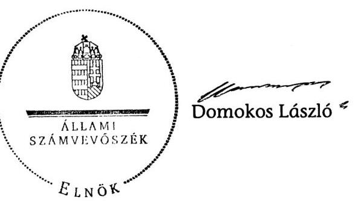

---

MELLEKLETEK

---

# Helyszíni ellenőrzésre kiválasztott állami felsőoktatási intézmények

|  Sorszám | Intézmény neve | Gazdasági társaságokban lévő részesedések száma 2010-ben  |
| --- | --- | --- |
|  1. | Budapesti Műszaki és Gazdaságtudományi Egyetem, Budapest | 4  |
|  2. | Debreceni Egyetem, Debrecen | 34  |
|  3. | Eötvös Lóránd Tudományegyetem, Budapest | 5  |
|  4. | Károly Róbert Főiskola, Gyöngyös | 6  |
|  5. | Nyíregyházi Főiskola, Nyíregyháza | 8  |
|  6. | Nyugat-magyarországi Egyetem, Sopron | 6  |
|  7. | Pannon Egyetem, Veszprém | 10  |
|  8. | Pécsi Tudományegyetem, Pécs | 8  |
|  9. | Semmelweis Egyetem, Budapest | 9  |
|  10. | Szegedi Tudományegyetem, Szeged | 12  |
|  11. | Szent István Egyetem, Gödöllő | 6  |
|   | Összesen | 108  |
|   | Részesedés arányos ellenőrzési lefedettség | 78,8\%  |

---

# Helyszíni ellenőrzésre kiválasztott gazdasági társaságok

|   |  |  |  | M Ft  |
| --- | --- | --- | --- | --- |
|  Város | Intézmény neve | Gazdasági társaság neve | Nyereség összesen | Támogatás összesen  |
|  Budapest | BCE | BCE Innovációs Központ Nonprofit Kft. | 50,3 | -  |
|  Budapest | BME | BME Szolgáltató Kft. | 6,0 | -  |
|  Budapest | ÓE | BMF Szolgáltató Nonprofit Kft. | 24,9 | -  |
|  Debrecen | DE | Debreceni Egyetem Tudományegyetemi Továbbképző Központ Szolgáltató Kft. | 5,0 | -  |
|  Debrecen | DE | Debreceni Nyári Egyetem Nonprofit Közhasznú Kft. | 20,3 | -  |
|  Dunaújváros | DF | Universitas Service Közhasznú Nonprofit Kft. | 162,1 | -  |
|  Eger | EKF | Eger Innovations Kutatási-fejlesztési Nonprofit Kft. | 14,5 | -  |
|  Gödöllő | SZIE | GAK Nonprofit Közhasznú Kft. | - | 653,1  |
|  Gyöngyös | KRF | Pro Caroberto Nonprofit Kft | - | 514,1  |
|  Győr | NYME | PANNON FAMULUS Kereskedelmi Szolgáltató Kft. | 57,7 | -  |
|  Miskolc | ME | UNI-FLEXYS Közhasznú Nonprofit Kft. | 279,8 | -  |
|  Sopron | NYME | NymE-ERFARET Nonprofit Kft. | 17,2 | 97,5  |
|  Szeged | SZTE | DEAK Zrt. | - | 343,9  |
|  Szeged | SZTE | SZOTE Szolgáltató Kft. | - | 291,0  |
|  Mintában összesen |  |  | 637,8 | 1899,6  |
|  Ellenőrizendő összesen |  |  | 1322,8 | 3598,3  |
|  Ellenőrzési lefedettség |  |  | $48 \%$ | $53 \%$  |

---

# Az állami felsőoktatási intézmények gazdasági társaságai alapításának, részesedésszerzésének döntési folyamata 

Az állami felsőoktatási intézmény gazdasági társaság alapítását ilyenben részesedésszerzését az Ftv. 121. § szabályozza. Az erre vonatkozó javaslatot az állami felsőoktatási intézmény készíti el a vagyoni hozzájárulás forrása szerint.

Gazdálkodó szervezet alapítása vagy ilyen részesedésszerzése tulajdonosi jogok gyakorlása a Nemzeti Vagyongazdálkodási Tanács döntése és a Magyar Nemzeti Vagyonkezelö Zrt.-vel kötött szerződés szerint. (Ftv. 121. § (12)

Saját bevételből a költségek levonása után fennmaradó részéből és a saját vagyonából jóváhagyás nélkül részvénytársaságot vagy korlátolt felelősségű társaságot alapíthat vagy ilyenben szerezhet részesedést (intézményi társaság) feltéve, hogy a vagyoni hozzájárulásnak nem része állami vagyon. Müködésére az állami részesedéssel müködő gazdasági társaságokra vonatkozó szabályokat kell alkalmazni (Ftv. 121. § (1)).

Javaslat alapításra, részesedésszerzésre

Gazdasági Tanács
véleményezi
(Ftv. 25. § (1) ag) ah)

Javaslat a Gazdasági Tanács véleményével

Szenátus dönt a javaslatról Ftv. 27. § (8) bek. b) c) pontjai, ha a Gazdasági Tanács 2/3-dal támoaatta

A javaslat elfogadásával határozatban rendelkezik az alapítás, tulajdonszerzés végrehajtásáról, a tulajdonosi jogok gyakorlásáról

Gazdálkodó
szervezet
A Rektor végrehajtja a Szenátus határozatát az alapításra, részesedésszerzésre és a tulajdonosi ioavavakorlás ra vonatkozóan

---

# Az állami felsőoktatási intézmények gazdasági társaságai beszámoltatási, ellenőrzési és döntési folyamatai 

Az állami felsőoktatási intézmények tulajdonosi részesedésével müködő gazdasági társaságok müködésére, a vezető tisztségviselők felelősségére az állami részesedéssel múködő gazdasági társaságokra vonatkozó szabályokat kell alkalmazni (Ftv. 121. § (1))

Ügyvezetés(ő) látja el a gazdasági társaság irányításának Gt. szerinti feladatait az állami részesedéssel múködő társaságokra vonatkozó szabályok figyelembevételével.

## Rektor vagy az

általa kijelölt személy
a tulajdonosi jogok gyakorlója. Évente jelentést készít a társaságok müködéséről (Ftv. 121. § (4)).

## Galalá

## Gazdasági Tanács

lavastlatot készít a társaság müködtetésére a vagyonvesztés elkerülését célzó intézkedésekre (Ftv 25. § (1)).

## Szenátus dönt a Gaz-

dasági Tanács által benyújtott kérdésekről (Ftv. 27. § (9) c)).

## Felügyelő Bizottság ellátja a Gt. szerinti feladatait. A tulajdonosi érdekek megsértése vagy jogszabályba ütköző tevékenység esetén értesíti a Gazdasági Tanácsot és a Szenátust és összehívja a társaság legfőbb szervének rendkívüli ülését.

## Könyvvizs-

gáló
auditálja a
társaság éves
beszámolóját.

## Jelmagyarázat:

beszámolás, javaslat
ellenőrzés
döntés, irányítás

---

Az állami felsőoktatási intézmények gazdasági társaságokban lévő részesedései számának változása a 2006. évről a 2010. évre

|  Év/állami felsőoktatási intézmény | 2006. év |  |  |  |  | 2010. év |  |  |  |   |
| --- | --- | --- | --- | --- | --- | --- | --- | --- | --- | --- |
|   | Közvetlen tulajdonosi joggyakorlás | ebből
100\%-os
tulajdon | kisebbségi
részesedés | Közvetett tulajdonosi joggyakorlás | kisebbségi
részesedés | Közvetlen tulajdonosi joggyakorlás | ebből
100\%-os
tulajdon | kisebbségi
részesedés | Közvetett tulajdonosi joggyakorlás | kisebbségi
részesedés  |
|  BCE | 2 | 1 | 1 | 0 | 0 | 3 | 2 | 1 | 0 | 0  |
|  BGF | 0 | 0 | 0 | 0 | 0 | 1 | 1 | 0 | 0 | 0  |
|  BME | 3 | 2 | 0 | 0 | 0 | 4 | 3 | 0 | 4 | 1  |
|  DE | 18 | 6 | 11 | 5 | 3 | 34 | 8 | 24 | 11 | 10  |
|  DF | 1 | 1 | 0 | 0 | 0 | 2 | 2 | 0 | 1 | 0  |
|  EJF | 0 | 0 | 0 | 0 | 0 | 2 | 1 | 1 | 0 | 0  |
|  EKF | 1 | 0 | 0 | 0 | 0 | 5 | 2 | 1 | 0 | 0  |
|  ELTE | 3 | 0 | 3 | 0 | 0 | 5 | 4 | 1 | 0 | 0  |
|  KE | 1 | 0 | 1 | 0 | 0 | 4 | 1 | 3 | 0 | 0  |
|  KF | 0 | 0 | 0 | 0 | 0 | 2 | 0 | 2 | 0 | 0  |
|  KRF | 1 | 1 | 0 | 0 | 0 | 6 | 3 | 2 | 3 | 2  |
|  LFZE | 0 | 0 | 0 | 0 | 0 | 0 | 0 | 0 | 0 | 0  |
|  ME | 0 | 0 | 0 | 0 | 0 | 2 | 1 | 1 | 0 | 0  |
|  MKE | 0 | 0 | 0 | 0 | 0 | 0 | 0 | 0 | 0 | 0  |
|  MOME | 0 | 0 | 0 | 0 | 0 | 0 | 0 | 0 | 0 | 0  |
|  MTF | 0 | 0 | 0 | 0 | 0 | 0 | 0 | 0 | 0 | 0  |
|  NYF | 1 | 1 | 0 | 0 | 0 | 8 | 2 | 4 | 3 | 3  |
|  NYME | 0 | 0 | 0 | 0 | 0 | 6 | 4 | 1 | 0 | 0  |
|  OE | 1 | 1 | 0 | 0 | 0 | 2 | 1 | 1 | 0 | 0  |
|  PE | 4 | 3 | 1 | 0 | 0 | 10 | 4 | 4 | 1 | 0  |
|  PTE | 6 | 1 | 5 | 2 | 1 | 8 | 4 | 4 | 1 | 0  |
|  RTF | 0 | 0 | 0 | 0 | 0 | 0 | 0 | 0 | 0 | 0  |
|  SE | 3 | 1 | 1 | 0 | 0 | 9 | 7 | 1 | 2 | 2  |
|  SZE | 0 | 0 | 0 | 1 | 0 | 1 | 0 | 1 | 3 | 1  |
|  SZF | 1 | 1 | 0 | 0 | 0 | 4 | 2 | 2 | 3 | 3  |
|  SZFE | 0 | 0 | 0 | 0 | 0 | 0 | 0 | 0 | 0 | 0  |
|  SZIE | 7 | 1 | 4 | 1 | 1 | 6 | 1 | 3 | 1 | 1  |
|  SZTE | 5 | 2 | 3 | 0 | 0 | 12 | 4 | 6 | 2 | 2  |
|  ZMNE | 0 | 0 | 0 | 0 | 0 | 1 | 0 | 0 | 0 | 0  |
|  Összesen: | 58 | 22 | 30 | 9 | 5 | 137 | 57 | 63 | 35 | 25  |

---

Az állami felsőoktatási intézmények gazdasági társaságai jegyzett tőkéjének változása a 2006-2010. években

|  Felsőoktatási intézmények | Adatok M Ft-ban |  |  |  |  |  |  |  |  |   |
| --- | --- | --- | --- | --- | --- | --- | --- | --- | --- | --- |
|   | 2006. év |  | 2007. év |  | 2008. év |  | 2009. év |  | 2010. év |   |
|   | Jegyzett tőke | ebből intézmény által befektetett tőke | Jegyzett tőke | ebből intézmény által befektetett tőke | Jegyzett tőke | ebből intézmény által befektetett tőke | Jegyzett tőke | ebből intézmény által befektetett tőke | Jegyzett tőke | ebből intézmény által befektetett tőke  |
|  BCE | 6,0 | 3,2 | 6,0 | 3,2 | 13,0 | 13,0 | 15,5 | 13,5 | 15,5 | 13,5  |
|  BGF | 0,0 | 0,0 | 3,0 | 3,0 | 3,0 | 3,0 | 4,0 | 4,0 | 4,0 | 4,0  |
|  BME | 105,6 | 73,6 | 105,6 | 73,6 | 110,6 | 78,6 | 110,6 | 78,6 | 110,6 | 78,6  |
|  DE | 178,5 | 94,7 | 190,5 | 101,9 | 204,7 | 139,7 | 425,6 | 351,7 | 453,9 | 357,2  |
|  DF | 3,0 | 3,0 | 3,0 | 3,0 | 3,0 | 3,0 | 12,5 | 12,5 | 12,5 | 12,5  |
|  EJF | 0,0 | 0,0 | 0,0 | 0,0 | 8,0 | 3,0 | 8,1 | 3,0 | 8,1 | 3,0  |
|  EKF | 3,0 | 1,5 | 3,5 | 2,0 | 14,0 | 9,6 | 16,0 | 11,6 | 16,0 | 11,6  |
|  ELTE | 26,0 | 3,6 | 26,0 | 3,6 | 68,0 | 60,7 | 82,0 | 80,5 | 87,0 | 85,5  |
|  KE | 50,0 | 3,0 | 56,2 | 4,8 | 56,0 | 4,5 | 9,0 | 4,5 | 7,5 | 3,4  |
|  KF | 0,0 | 0,0 | 0,0 | 0,0 | 3,8 | 0,1 | 9,8 | 0,1 | 9,8 | 1,6  |
|  KRF | 68,3 | 68,3 | 68,3 | 68,3 | 78,8 | 73,0 | 181,6 | 126,6 | 252,1 | 154,6  |
|  ME | 0,0 | 0,0 | 3,0 | 3,0 | 3,7 | 3,1 | 3,7 | 3,1 | 3,7 | 3,1  |
|  NYF | 3,0 | 3,0 | 3,0 | 3,0 | 11,0 | 3,5 | 22,9 | 7,4 | 30,8 | 12,9  |
|  NYME | 0,0 | 0,0 | 36,0 | 36,0 | 43,3 | 40,1 | 43,3 | 40,1 | 43,3 | 40,1  |
|  ÖE | 3,0 | 3,0 | 3,0 | 3,0 | 3,0 | 3,0 | 5,0 | 3,1 | 5,0 | 3,1  |
|  PE | 195,5 | 132,2 | 195,5 | 132,2 | 257,0 | 146,3 | 252,0 | 146,3 | 252,0 | 146,3  |
|  PTE | 32,5 | 5,2 | 20,0 | 2,5 | 46,2 | 7,2 | 53,4 | 12,3 | 307,5 | 21,5  |
|  SE | 122,6 | 118,7 | 213,9 | 209,5 | 221,9 | 217,5 | 222,9 | 218,5 | 219,9 | 215,9  |
|  SZE | 0,0 | 0,0 | 6,2 | 1,2 | 6,2 | 1,2 | 6,2 | 1,2 | 6,2 | 1,2  |
|  SZF | 5,0 | 5,0 | 5,0 | 5,0 | 12,0 | 10,2 | 13,0 | 10,3 | 13,0 | 10,3  |
|  SZIE | 1099,8 | 32,7 | 1099,8 | 32,7 | 47,8 | 29,5 | 56,6 | 30,2 | 56,6 | 30,2  |
|  SZTE | 99,7 | 7,5 | 109,7 | 12,7 | 248,7 | 38,8 | 354,7 | 39,3 | 358,7 | 40,4  |
|  ZMNE | 0,0 | 0,0 | 0,0 | 0,0 | 5,0 | 1,1 | 5,0 | 4,3 | 5,0 | 4,3  |
|  Összesen | 1992,6 | 558,1 | 2151,2 | 704,1 | 1463,7 | 889,7 | 1898,3 | 1202,6 | 2263,7 | 1254,7  |

Tanúsítványi adatszolgáltatás és cégtári adatok alapján. A jegyzett tőke összesítéséből kiszűrtük azt a halmozódást, amely abból fakadt, hogy öt társaságban 2-4 intézmény is tulajdonos volt.

---

Az állami felsőoktatási intézmények gazdasági társaságai saját tőkéjének változása a 2006-2010. években

|  Felsőoktatási intézmények | 2006. év |  | 2007. év |  | 2008. év |  | 2009. év |  | 2010. év |   |
| --- | --- | --- | --- | --- | --- | --- | --- | --- | --- | --- |
|   | Saját tőke | ebből az intézményt megillető rész | Saját tőke | ebből az intézményt megillető rész | Saját tőke | ebből az intézményt megillető rész | Saját tőke | ebből az intézményt megillető rész | Saját tőke | ebből az intézményt megillető rész  |
|  BCE | 9,1 | 2,4 | 20,4 | 13,3 | 39,7 | 39,7 | 44,3 | 42,1 | 66,9 | 62,5  |
|  BGF | 0,0 | 0,0 | 3,4 | 3,4 | 1,6 | 1,6 | 5,1 | 5,1 | 3,5 | 3,5  |
|  BME | 193,3 | 138,7 | 196,8 | 142,2 | 208,9 | 154,2 | 197,0 | 142,3 | 169,5 | 121,2  |
|  DE | 114,8 | 183,9 | 176,4 | 243,6 | 34,1 | 141,2 | 261,4 | 367,0 | $-153,5$ | $-64,4$  |
|  DF | 4,4 | 4,4 | 27,7 | 27,7 | 44,8 | 44,8 | 139,1 | 139,1 | 177,5 | 177,5  |
|  EJF | 0,0 | 0,0 | 0,0 | 0,0 | $-1,3$ | 1,9 | 33,9 | 0,6 | $-15,5$ | $-0,9$  |
|  EKF | 1,4 | 0,7 | 2,8 | 1,6 | 10,6 | 7,4 | 38,1 | 24,8 | 36,3 | 24,8  |
|  ELTE | 256,7 | 27,1 | 193,8 | 15,3 | 183,7 | 66,3 | 95,4 | 93,6 | 112,2 | 106,0  |
|  KE | 151,9 | 9,1 | 163,3 | 11,0 | 2,4 | 0,8 | 19,1 | 3,5 | 26,4 | 1,0  |
|  KF | 0,0 | 0,0 | 0,0 | 0,0 | 19,3 | 0,5 | 15,0 | 0,3 | 27,7 | 2,2  |
|  KRF | 1030,5 | 1030,5 | 1032,9 | 1032,9 | 1038,2 | 1037,1 | 1063,1 | 1016,3 | 1078,9 | 1021,5  |
|  ME | 0,0 | 0,0 | 3,0 | 3,0 | 6,9 | 6,3 | 76,4 | 75,6 | 284,0 | 282,8  |
|  NYF | $-13,5$ | $-13,5$ | $-42,0$ | $-42,0$ | $-41,9$ | $-49,4$ | $-12,8$ | $-32,0$ | 8,7 | $-26,9$  |
|  NYME | 0,0 | 0,0 | 45,1 | 45,1 | 83,9 | 80,6 | 138,3 | 128,7 | 179,1 | 166,1  |
|  ÖE | 15,7 | 15,7 | 13,7 | 13,7 | 18,3 | 18,3 | 23,8 | 22,8 | 28,8 | 26,0  |
|  PE | 274,7 | 212,5 | 276,8 | 217,3 | 332,0 | 230,5 | 396,1 | 265,2 | $-410,8$ | 283,1  |
|  PTE | 108,8 | 12,9 | 20,7 | 2,6 | 158,4 | 27,1 | 157,6 | 40,5 | 291,1 | 38,4  |
|  SE | 135,9 | 129,5 | 238,0 | 233,3 | 270,9 | 268,7 | 312,3 | 310,3 | 278,3 | 279,1  |
|  SZE | 0,0 | 0,0 | 95,8 | 19,2 | 120,0 | 24,0 | 168,7 | 33,7 | 193,0 | 38,6  |
|  SZF | 3,4 | 3,4 | 4,3 | 4,3 | 11,9 | 10,3 | 24,7 | 11,5 | 43,8 | 14,0  |
|  SZIE | 1057,9 | 58,7 | 1150,7 | 79,3 | 192,9 | 122,6 | 263,2 | 154,3 | 261,9 | 160,7  |
|  SZTE | 248,6 | 122,8 | 335,0 | 157,6 | 485,2 | 208,0 | 660,1 | 261,8 | 675,0 | 283,6  |
|  ZMNE | 0,0 | 0,0 | 0,0 | 0,0 | 1,2 | 0,3 | 7,7 | 6,5 | 8,9 | 7,5  |
|  Összesen | 3572,0 | 1938,8 | 3943,4 | 2224,3 | 3217,3 | 2442,8 | 4093,4 | 3113,7 | 4119,3 | 3007,9  |

Tanúsítványi adatszolgáltatás és cégtári adatok alapján. A saját tőke összesítéséből kiszűrtük azt a halmozódást, amely abból fakadt, hogy öt társaságban 2-4 intézmény is tulajdonos volt.

---

# Az állami felsőoktatási intézmények gazdasági társaságai bevételeinek változása a 2006. évről a 2010. évre

|  Év/állami felsőoktatási intézmény | 2006. év |  |  | 2010. év |  |   |
| --- | --- | --- | --- | --- | --- | --- |
|   | Összes bevétel | Ertékesítés nettó árbevétele | Visszafizetés nélkül kapott támogatás | Összes bevétel | Ertékesítés nettó árbevétele | Visszafizetés nélkül kapott támogatás  |
|  BCE | 66,2 | 14,3 | 0,0 | 384,2 | 345,0 | 36,2  |
|  BGF | 0,0 | 0,0 | 0,0 | 103,9 | 103,9 | 0,0  |
|  BME | 612,2 | 607,4 | 0,0 | 369,6 | 298,9 | 36,9  |
|  DE | 1753,8 | 1411,3 | 115,2 | 4496,0 | 3273,0 | 847,4  |
|  DF | 56,1 | 56,1 | 0,0 | 573,6 | 536,8 | 0,0  |
|  EJF | 0,0 | 0,0 | 0,0 | 4,3 | 4,3 | 0,0  |
|  EKF | 0,0 | 0,0 | 0,0 | 515,8 | 165,0 | 300,1  |
|  ELTE | 66,1 | 14,2 | 0,0 | 709,6 | 461,3 | 144,6  |
|  KE | 231,3 | 82,7 | 0,0 | 463,6 | 48,3 | 405,7  |
|  KF | 0,0 | 0,0 | 0,0 | 301,9 | 18,3 | 48,9  |
|  KRF | 621,9 | 467,5 | 0,0 | 1339,4 | 724,4 | 224,9  |
|  ME | 0,0 | 0,0 | 0,0 | 1394,3 | 316,9 | 107,4  |
|  NYF | 72,5 | 67,3 | 0,7 | 965,3 | 364,9 | 382,2  |
|  NYME | 0,0 | 0,0 | 0,0 | 1984,3 | 1315,2 | 494,0  |
|  OE | 15,6 | 0,5 | 15,0 | 63,8 | 51,0 | 8,0  |
|  PE | 576,7 | 419,1 | 69,2 | 1531,3 | 646,7 | 806,2  |
|  PTE | 603,0 | 243,0 | 0,0 | 523,3 | 244,0 | 0,0  |
|  SE | 839,1 | 748,2 | 0,0 | 1922,4 | 1860,6 | 22,9  |
|  SZE | 0,0 | 0,0 | 0,0 | 1062,7 | 826,9 | 0,0  |
|  SZF | 0,3 | 0,0 | 0,0 | 330,7 | 139,0 | 3,0  |
|  SZIE | 587,1 | 455,0 | 112,4 | 1552,2 | 998,0 | 465,9  |
|  SZTE | 369,9 | 237,0 | 127,4 | 2356,9 | 1571,1 | 666,3  |
|  ZMNE | 0,0 | 0,0 | 0,0 | 23,8 | 23,7 | 0,0  |
|  Összesen | 6273,5 | 4781,1 | 439,9 | 22115,8 | 14257,9 | 4618,4  |

Tanúsítványi adatszolgáltatás alapján. Az összesítéséből kiszűrtük azt a halmozódást, amely abból fakadt, hogy öt társaságban 2-4 intézmény is tulajdonos volt.

---

Az állami felsőoktatási intézmények gazdasági társaságai ráfordításainak változása a 2006. évről a 2010. évre

|  Felsőoktatási intézmények | Adatok M Ft-ban |  |  |  |  |   |
| --- | --- | --- | --- | --- | --- | --- |
|   | 2006. év |  |  | 2010. év |  |   |
|   | Összes ráfordítás | Ebből közvetített szolgáltatások értéke | Személyi jellegű ráfordítások | Összes ráfordítás | Ebből közvetített szolgáltatások értéke | Személyi jellegű ráfordítások  |
|  BCE | 1,2 | 0,0 | 0,9 | 397,9 | 80,3 | 78,6  |
|  BGF | 0,0 | 0,0 | 0,0 | 105,4 | 0,0 | 38,4  |
|  BME | 616,2 | 330,2 | 137,6 | 394,6 | 191,5 | 124,8  |
|  DE | 1774,3 | 170,8 | 413,8 | 4982,3 | 90,4 | 1583,4  |
|  DF | 54,7 | 0,0 | 10,1 | 535,1 | 0,0 | 63,0  |
|  EJF | 0,0 | 0,0 | 0,0 | 4,9 | 2,0 | 1,5  |
|  EKF | 0,1 | 0,0 | 0,0 | 496,5 | 15,5 | 133,2  |
|  ELTE | 0,0 | 0,0 | 0,0 | 713,3 | 290,9 | 240,5  |
|  KE | 180,0 | 0,0 | 35,9 | 457,2 | 16,0 | 64,7  |
|  KF | 0,0 | 0,0 | 0,0 | 314,6 | 7,3 | 96,2  |
|  KRF | 668,9 | 5,1 | 198,6 | 1393,6 | 59,0 | 376,4  |
|  ME | 0,0 | 0,0 | 0,0 | 1079,3 | 0,0 | 109,0  |
|  NYF | 85,6 | 74,3 | 8,7 | 920,4 | 253,3 | 209,5  |
|  NYME | 0,0 | 0,0 | 0,0 | 1949,4 | 58,7 | 691,9  |
|  OE | 2,8 | 0,0 | 2,3 | 58,4 | 0,0 | 14,9  |
|  PE | 548,4 | 5,1 | 268,8 | 1515,9 | 64,9 | 546,1  |
|  PTE | 580,5 | 0,0 | 142,6 | 536,9 | 12,2 | 121,2  |
|  SE | 822,4 | 0,0 | 58,8 | 1901,2 | 137,8 | 345,3  |
|  SZE | 0,0 | 0,0 | 0,0 | 1032,7 | 582,4 | 203,4  |
|  SZF | 1,7 | 0,0 | 1,1 | 299,9 | 0,0 | 117,3  |
|  SZIE | 574,5 | 14,1 | 134,8 | 1554,0 | 240,3 | 420,2  |
|  SZTE | 374,9 | 20,0 | 110,0 | 2428,2 | 423,3 | 603,7  |
|  ZMNE | 0,0 | 0,0 | 0,0 | 22,6 | 0,0 | 7,1  |
|  Összesen | 6220,6 | 619,6 | 1520,5 | 22298,0 | 2523,8 | 5953,9  |

Tanúsítványi adatszolgáltatás alapján. Az összesítéséből kiszűrtük azt a halmozódást, amely abból fakadt, hogy öt társaságban 2-4 intézménv is tulaidonos volt.

---

Az állami felsőoktatási intézmények és gazdasági társaságaik közötti nem visszterhes pénzeszközátadások a 2006-2010. években

|  Felsőoktatási intézmények | 2006. év |  |  | 2007. év |  |  | 2008. év |  |  | 2009. év |  |  | 2010. év |  |   |
| --- | --- | --- | --- | --- | --- | --- | --- | --- | --- | --- | --- | --- | --- | --- | --- |
|   | Intézmény által nyújtott tőkejuttatás | Intézmény által nyújtott vissza nem térítendő támogatás | Intézmény által nyújtott tőkejuttatás | Intézmény által nyújtott tőkejuttatás | Intézmény által nyújtott tőkejuttatás | Intézmény által nyújtott tőkejuttatás | Intézmény által nyújtott tőkejuttatás | Intézmény által nyújtott tőkejuttatás | Intézmény által nyújtott tőkejuttatás | Intézmény által nyújtott tőkejuttatás | Intézmény által nyújtott tőkejuttatás | Intézmény által nyújtott tőkejuttatás | Intézmény által nyújtott tőkejuttatás | Intézmény által nyújtott tőkejuttatás | Intézmény által nyújtott vissza nem térítendő támogatás  |
|  BCE | 0,0 | 0,0 | 0,0 | 0,0 | 0,0 | 0,0 | 0,0 | 0,0 | 0,0 | 0,0 | 0,0 | 0,0 | 0,0 | 0,0 | 0,0  |
|  BGF | 0,0 | 0,0 | 0,0 | 0,0 | 0,0 | 0,0 | 17,0 | 0,0 | 0,0 | 10,0 | 0,0 | 0,0 | 0,0 | 0,0 | 0,0  |
|  BME | 0,0 | 0,0 | 0,0 | 0,0 | 0,0 | 0,0 | 15,0 | 0,0 | 0,0 | 0,0 | 0,0 | 37,0 | 17,0 | 0,0 | 0,0  |
|  DE | 0,0 | 0,0 | 83,9 | 32,0 | 0,0 | 149,7 | 4,0 | 0,0 | 101,5 | 211,9 | 0,0 | 40,9 | 0 | 0,0 | 32,9  |
|  DF | 3,0 | 0,0 | 0,0 | 0,0 | 0,0 | 0,0 | 0,0 | 0,0 | 0,0 | 9,5 | 0,0 | 0,0 | 0,0 | 0,0 | 0  |
|  EJF | 0,0 | 0,0 | 0,0 | 0,0 | 0,0 | 0,0 | 0,0 | 0,0 | 0,0 | 0,0 | 0,0 | 0,0 | 0,0 | 0,0 | 0,0  |
|  EKF | 0,0 | 0,0 | 0,0 | 0,0 | 0,0 | 0,0 | 0,0 | 0,0 | 0,0 | 0,0 | 0,0 | 0,0 | 0,0 | 0,0 | 0,0  |
|  ELTE | 0,0 | 0,0 | 0,0 | 0,0 | 0,0 | 0,0 | 0,0 | 0,0 | 15,0 | 0,0 | 0,0 | 15,0 | 0,0 | 0,0 | 15,0  |
|  KE | 0,0 | 0,0 | 0,0 | 0,0 | 0,0 | 0,0 | 0,0 | 0,0 | 0,0 | 0,0 | 0,0 | 0,0 | 0,0 | 0,0 | 0,0  |
|  KF | 0,0 | 0,0 | 0,0 | 0,0 | 0,0 | 0,0 | 0,1 | 0,0 | 0,0 | 0,0 | 0,0 | 0,0 | 1,5 | 0,0 | 0,0  |
|  KRF | 0,0 | 0,0 | 0,0 | 0,0 | 0,0 | 0,0 | 0,0 | 0,0 | 0,0 | 2,5 | 0,0 | 0,0 | 12,5 | 0,0 | 0,0  |
|  ME | 0,0 | 0,0 | 0,0 | 3,0 | 0,0 | 0,0 | 0,1 | 0,0 | 0,0 | 0,0 | 0,0 | 0,0 | 0,0 | 0,0 | 0,0  |
|  NYF | 0,0 | 0,0 | 0,0 | 0,0 | 0,0 | 0,0 | 0,0 | 0,0 | 0,0 | 0,0 | 0,0 | 0,0 | 0,0 | 0,0 | 0,0  |
|  NYME | 0,0 | 0,0 | 0,0 | 0,0 | 0,0 | 0,0 | 0,0 | 0,0 | 0,0 | 0,0 | 0,0 | 0,0 | 0,0 | 0,0 | 9,4  |
|  OE | 0,0 | 0,0 | 15,0 | 3,0 | 0,0 | 0,0 | 0,0 | 0,0 | 0,0 | 0,1 | 0,0 | 0,0 | 0,0 | 0,0 | 0,0  |
|  PE | 0,0 | 0,0 | 45,0 | 0,0 | 0,0 | 48,3 | 5,7 | 14,6 | 35,0 | 8,3 | 5,4 | 30 | 0,0 | 0,0 | 30  |
|  PTE | 0,0 | 0,0 | 0,0 | 0,0 | 0,0 | 0,0 | 0,0 | 0,0 | 0,0 | 0,0 | 1,6 | 0,0 | 0 | 0,0 | 0,0  |
|  SE | 35,8 | 0,0 | 0,0 | 31,0 | 0,0 | 10,3 | 8,0 | 0,0 | 13,0 | 36,0 | 0,0 | 9,4 | 0,0 | 4,0 | 9,6  |
|  SZE | 0,0 | 0,0 | 0,0 | 0,0 | 0,0 | 0,0 | 0,0 | 0,0 | 0,0 | 0,0 | 0,0 | 0,0 | 0,0 | 0,0 | 0,0  |
|  SZF | 0,0 | 0,0 | 0,0 | 0,0 | 0,0 | 0,0 | 0,0 | 0,0 | 0,0 | 0,0 | 0,0 | 0,0 | 0,0 | 0,0 | 3,0  |
|  SZIE | 0,0 | 0,0 | 0,0 | 0,0 | 0,0 | 0,0 | 0,0 | 0,0 | 0,0 | 0,0 | 0,0 | 0,0 | 0,0 | 0,0 | 0,0  |
|  SZTE | 0,0 | 0,0 | 0,0 | 0,0 | 0,0 | 0,0 | 0,0 | 0,0 | 0,0 | 0,0 | 0,0 | 0,0 | 0,0 | 0,0 | 1,0  |
|  ZMNE | 0,0 | 0,0 | 0,0 | 0,0 | 0,0 | 0,0 | 0,0 | 0,0 | 0,0 | 0,0 | 0,0 | 0,0 | 0,0 | 0,0 | 0,0  |
|  Összesen | 38,8 | 0,0 | 143,9 | 69,0 | 0,0 | 208,3 | 49,9 | 14,6 | 164,5 | 278,3 | 7,0 | 132,3 | 31,0 | 4,0 | 100,9  |

---

Az állami felsőoktatási intézmények gazdasági társaságai mérleg szerinti eredményének változása a 2006-2010. években

|  Felsőoktatási intézmények |  | 2006. év |  | 2007. év |  | 2008. év |  | 2009. év |  | 2010. év |   |
| --- | --- | --- | --- | --- | --- | --- | --- | --- | --- | --- | --- |
|   |  | Társaságok
mérleg
szerinti
eredménye | ebből a
tulajdoni
hányadra jutó
rész | Társaságok
mérleg
szerinti
eredménye | ebből a
tulajdoni
hányadra jutó
rész | Társaságok
mérleg
szerinti
eredménye | ebből a
tulajdoni
hányadra jutó
rész | Társaságok
mérleg
szerinti
eredménye | ebből a
tulajdoni
hányadra jutó
rész | Társaságok
mérleg
szerinti
eredménye | ebből a
tulajdoni
hányadra jutó
rész  |
|  BCE | nyereségesek | 0,4 | 0,0 | 11,3 | 10,9 | 16,9 | 16,9 | 2,4 | 2,2 | 23,0 | 20,8  |
|   | veszteségesek | $-1,1$ | $-1,1$ | 0,0 | 0,0 | 0,0 | 0,0 | $-0,3$ | $-0,3$ | $-0,4$ | $-0,4$  |
|  BGF | nyereségesek | 0,0 | 0,0 | 0,4 | 0,4 | 0,0 | 0,0 | 0,0 | 0,0 | 0,0 | 0,0  |
|   | veszteségesek | 0,0 | 0,0 | 0,0 | 0,0 | $-18,7$ | $-18,7$ | $-6,5$ | $-6,5$ | $-1,6$ | $-1,6$  |
|  BME | nyereségesek | 4,4 | 3,8 | 3,5 | 3,5 | 0,2 | 0,1 | 0,4 | 0,4 | 2,2 | 2,2  |
|   | veszteségesek | 0,0 | 0,0 | 0,0 | 0,0 | $-3,2$ | $-3,2$ | $-12,3$ | $-12,3$ | $-46,7$ | $-40,3$  |
|  DE | nyereségesek | 55,4 | 40,2 | 36,3 | 22,2 | 68,0 | 8,0 | 157,6 | 89,3 | 57,4 | 19,6  |
|   | veszteségesek | $-76,7$ | $-4,0$ | $-18,9$ | $-1,9$ | $-89,6$ | $-50,1$ | $-108,2$ | $-73,1$ | $-518,7$ | $-461,4$  |
|  DF | nyereségesek | 1,4 | 1,4 | 23,3 | 23,3 | 17,1 | 17,1 | 84,7 | 84,7 | 38,4 | 38,4  |
|   | veszteségesek | 0,0 | 0,0 | 0,0 | 0,0 | 0,0 | 0,0 | 0,0 | 0,0 | 0,0 | 0,0  |
|  EJF | nyereségesek | 0,0 | 0,0 | 0,0 | 0,0 | 0,0 | 0,0 | 0,0 | 0,0 | 0,0 | 0,0  |
|   | veszteségesek | 0,0 | 0,0 | 0,0 | 0,0 | $-1,6$ | $-0,8$ | $-3,0$ | $-1,5$ | $-1,2$ | $-0,6$  |
|  EKF | nyereségesek | 0,0 | 0,0 | 0,0 | 0,0 | 0,0 | 0,0 | 24,4 | 14,6 | 8,9 | 5,8  |
|   | veszteségesek | $-0,1$ | $-0,1$ | $-0,4$ | $-0,2$ | $-1,6$ | $-1,1$ | $-0,1$ | $-0,1$ | $-2,9$ | $-0,6$  |
|  ELTE | nyereségesek | 9,1 | 1,1 | 8,8 | 0,1 | 14,2 | 5,8 | 9,0 | 8,3 | 13,6 | 9,3  |
|   | veszteségesek | 0,0 | 0,0 | $-71,7$ | $-11,9$ | $-1,3$ | $-1,1$ | 0,0 | 0,0 | $-1,8$ | $-1,8$  |
|  KE | nyereségesek | 51,3 | 3,1 | 5,2 | 0,3 | 0,0 | 0,0 | 6,0 | 0,2 | 9,3 | 0,3  |
|   | veszteségesek | 0,0 | 0,0 | $-0,3$ | $-0,1$ | $-176,0$ | $-10,6$ | $-1,8$ | $-1,3$ | $-3,2$ | $-2,8$  |
|  KF | nyereségesek | 0,0 | 0,0 | 0,0 | 0,0 | 318,0 | 8,5 | 0,0 | 0,0 | 10,2 | 0,4  |
|   | veszteségesek | 0,0 | 0,0 | 0,0 | 0,0 | 0,0 | 0,0 | $-7,8$ | $-0,2$ | 0,0 | 0,0  |
|  KRF | nyereségesek | 0,0 | 0,0 | 2,4 | 2,4 | 4,7 | 4,6 | 9,2 | 3,2 | 6,0 | 3,4  |
|   | veszteségesek | $-46,9$ | $-46,9$ | 0,0 | 0,0 | $-9,9$ | $-5,1$ | $-88,8$ | $-79,3$ | $-60,8$ | $-26,4$  |
|  ME | nyereségesek | 0,0 | 0,0 | 0,2 | 0,2 | 3,2 | 3,2 | 69,6 | 69,3 | 207,6 | 207,2  |
|   | veszteségesek | 0,0 | 0,0 | 0,0 | 0,0 | 0,0 | 0,0 | 0,0 | 0,0 | 0,0 | 0,0  |
|  NYF | nyereségesek | 0,0 | 0,0 | 0,0 | 0,0 | 0,2 | 0,0 | 11,8 | 1,6 | 21,8 | 3,0  |
|   | veszteségesek | $-11,7$ | $-11,7$ | $-42,0$ | $-42,0$ | 0,0 | 0,0 | $-6,7$ | $-0,5$ | $-4,0$ | $-0,1$  |
|  NYME | nyereségesek | 0,0 | 0,0 | 9,0 | 9,0 | 58,3 | 36,0 | 53,0 | 46,7 | 40,7 | 37,3  |
|   | veszteségesek | 0,0 | 0,0 | 0,0 | 0,0 | 0,0 | 0,0 | 0,0 | 0,0 | 0,0 | 0,0  |
|  ÖE | nyereségesek | 12,8 | 12,8 | 0,0 | 0,0 | 4,6 | 4,6 | 4,4 | 4,4 | 5,4 | 3,2  |
|   | veszteségesek | 0,0 | 0,0 | $-2,1$ | $-2,1$ | 0,0 | 0,0 | $-1,0$ | $-0,1$ | 0,0 | 0,0  |

---

Az állami felsőoktatási intézmények gazdasági társaságai mérleg szerinti eredményének változása a 2006-2010. években

|  Felsőoktatási intézmények |  | 2006. év |  | 2007. év |  | 2008. év |  | 2009. év |  | 2010. év |   |
| --- | --- | --- | --- | --- | --- | --- | --- | --- | --- | --- | --- |
|   |  | Társaságok
mérleg
szerinti
eredménye | ebből a
tulajdoni
hányadra jutó
rész | Társaságok
mérleg
szerinti
eredménye | ebből a
tulajdoni
hányadra jutó
rész | Társaságok
mérleg
szerinti
eredménye | ebből a
tulajdoni
hányadra jutó
rész | Társaságok
mérleg
szerinti
eredménye | ebből a
tulajdoni
hányadra jutó
rész | Társaságok
mérleg
szerinti
eredménye | ebből a
tulajdoni
hányadra jutó
rész  |
|  PE | nyereségesek | 33,5 | 33,5 | 6,3 | 6,2 | 13,5 | 4,7 | 36,1 | 15,4 | 37,6 | 20,9  |
|   | veszteségesek | $-6,8$ | 0,0 | 0,0 | 0,0 | $-14,3$ | $-0,9$ | $-5,2$ | 0,0 | $-26,8$ | $-3,5$  |
|  PTE | nyereségesek | 21,6 | 4,8 | 1,3 | 0,2 | 113,8 | 13,9 | 15,4 | 10,1 | 7,3 | 5,4  |
|   | veszteségesek | 0,0 | 0,0 | 0,0 | 0,0 | $-8,5$ | $-1,1$ | $-20,6$ | $-1,5$ | $-23,8$ | $-2,6$  |
|  SE | nyereségesek | 15,3 | 12,2 | 18,9 | 18,7 | 38,6 | 37,8 | 12,9 | 11,3 | 11,0 | 10,6  |
|   | veszteségesek | $-0,8$ | $-0,2$ | $-7,4$ | $-5,1$ | $-15,6$ | $-12,4$ | $-13,7$ | $-12,0$ | $-12,6$ | $-12,6$  |
|  SZE | nyereségesek | 0,0 | 0,0 | 30,5 | 6,1 | 24,2 | 4,8 | 48,6 | 9,7 | 24,4 | 4,9  |
|   | veszteségesek | 0,0 | 0,0 | 0,0 | 0,0 | 0,0 | 0,0 | 0,0 | 0,0 | 0,0 | 0,0  |
|  SZF | nyereségesek | 0,0 | 0,0 | 0,9 | 0,9 | 1,0 | 1,0 | 11,9 | 1,0 | 19,1 | 2,6  |
|   | veszteségesek | $-1,4$ | $-1,4$ | 0,0 | 0,0 | 0,0 | 0,0 | 0,0 | 0,0 | 0,0 | 0,0  |
|  SZIE | nyereségesek | 13,1 | 9,4 | 93,5 | 21,7 | 83,9 | 48,5 | 51,4 | 30,2 | 18,5 | 15,6  |
|   | veszteségesek | $-176,3$ | $-0,5$ | $-1,1$ | $-1,1$ | 0,0 | 0,0 | 0,0 | 0,0 | $-24,0$ | $-11,7$  |
|  SZTE | nyereségesek | 12,3 | 5,8 | 51,5 | 22,2 | 47,1 | 31,2 | 68,0 | 51,9 | 46,9 | 35,3  |
|   | veszteségesek | $-4,9$ | $-2,1$ | $-10,5$ | $-6,3$ | $-12,9$ | $-10,1$ | $-2,7$ | $-1,5$ | $-27,6$ | $-4,4$  |
|  ZMNE | nyereségesek | 0,0 | 0,0 | 0,0 | 0,0 | 0,0 | 0,0 | 2,7 | 2,3 | 1,2 | 1,0  |
|   | veszteségesek | 0,0 | 0,0 | 0,0 | 0,0 | 0,0 | 0,0 | 0,0 | 0,0 | 0,0 | 0,0  |
|  Összesen | nyereségesek | 229,3 | 128,1 | 302,5 | 148,2 | 827,5 | 246,8 | 656,0 | 457,1 | 571,0 | 447,2  |
|   | veszteségesek | $-326,7$ | $-68,0$ | $-154,4$ | $-70,8$ | $-353,2$ | $-115,1$ | $-275,2$ | $-190,2$ | $-756,1$ | $-570,8$  |

Tanúsítványi adatszolgáltatás és cégtári adatok alapján. A mérleg szerinti eredmény összesítéséből kiszűrtük azt a halmozódást, amely abból fakadt, hogy öt társaságban 2-4 intézmény is tulajdonos volt.

---

# A gazdasági társaságokban részesedéssel rendelkező állami felsőoktatási intézmények működésének főbb adatai a 2006-2010. években 

| Mutató/Év | 2006. év | 2007. év | 2008. év | 2009. év | 2010. év |
| :--: | :--: | :--: | :--: | :--: | :--: |
| Összes múködési bevétel (M Ft) | 347588,1 | 390865,2 | 418611,3 | 404948,8 | 439646,4 |
| ebből múködési támogatás (M Ft) | 181220,6 | 207608,7 | 229356,1 | 213618,7 | 218019,3 |
| ebből múködési saját bevétel (M Ft) | 96206,8 | 117248,7 | 125851,8 | 122231,6 | 146650,7 |
| K+F tevékenység bevételei (M Ft) | 40325,1 | 37634,8 | 35414,9 | 38754,5 | 40361,4 |
| ebből K+F tevékenység bevétele   támogásból (M Ft) | 15687,1 | 17921,1 | 12337,6 | 14647,7 | 14947,9 |
| Vállalkozási tevékenység bevételei (M Ft) | 4737,6 | 4870,7 | 5060,8 | 5094,4 | 2851,0 |
| Összes múködési kiadás (M Ft) | 346393,3 | 384566,4 | 406870,5 | 400639,8 | 413286,9 |
| ebből saját bevétel megszerzése érdekében   felmerült költségek (M Ft) | 68154,2 | 87845,8 | 85135,6 | 88016,9 | 88968,6 |
| Vállalkozási tevékenység kiadásai (M Ft) | 4494,8 | 4731,3 | 4862,0 | 5350,5 | 2657,0 |
| Intézmény teljes vagyona (M Ft) | 279218,1 | 324483,9 | 334842,6 | 347496,9 | 374152,6 |
| ebből Intézmény saját vagyona (M Ft) | 30271,5 | 33879,2 | 35532,2 | 35639,1 | 41492,8 |
| Intézményi saját tartalékalapjába teljesített befizetés (M Ft) | 113,3 | 112,4 | 63,4 | 71,7 | 72,6 |
| Intézmény intézményi társasága által tartalékalapba teljesített befizetés (M Ft) | 0,0 | 0,0 | 0,0 | 0,0 | 0,0 |
| Foglalkoztatottak átlagos létszáma (fő) | 50175 | 49801 | 48809 | 48965 | 49568 |
| Összes hallgatók száma (fő) | 329455 | 328654 | 319012 | 316827 | 307664 |
| ebből államilag finanszírozott hallgatók (fő) | 178917 | 181316 | 183726 | 189388 | 185368 |
| ebből Költségtérítéses hallgatók (fő) | 150538 | 147338 | 135248 | 126539 | 122296 |
| Bejegyzett találmányok száma (db) | 36 | 33 | 77 | 51 | 60 |
| Bejegyzett szabadalmak száma (db) | 21 | 32 | 51 | 54 | 66 |

---

# A jelentésre érkezett észrevételek és az azokra adott válaszok 

A beérkezett észrevételek és az azokra adott válaszok
1a. Emberi Erőforrások Minisztériuma észrevétele
1b. Emberi Erőforrások Minisztériumának észrevételére adott válasz
2a. Budapesti Műszaki és Gazdaságtudományi Egyetem észrevétele
2b. Budapesti Műszaki és Gazdaságtudományi Egyetem észrevételére adott válasz
3a. Debreceni Egyetem észrevétele
3b. Debreceni Egyetem észrevételére adott válasz
4a. Miskolci Egyetem észrevétele
4b. Miskolci Egyetem észrevételére adott válasz
5a. Pannon Egyetem észrevétele
5b. Pannon Egyetem észrevételére adott válasz
6a. Pécsi Tudományegyetem észrevétele
6b. Pécsi Tudományegyetem észrevételére adott válasz
7a. Szent István Egyetem észrevétele
7b. Szent István Egyetem észrevételére adott válasz
Az alábbi felsőoktatási intézmények nem tettek észrevételt
8. Budapesti Corvinus Egyetem
9. Dunaújvárosi Főiskola
10. Eötvös Loránd Tudományegyetem
11. Eszterházy Károly Főiskola
12. Károly Róbert Főiskola
13. Nyíregyházi Főiskola
14. Nyugat-magyarországi Egyetem
15. Óbudai Egyetem
16. Semmelweis Egyetem

---

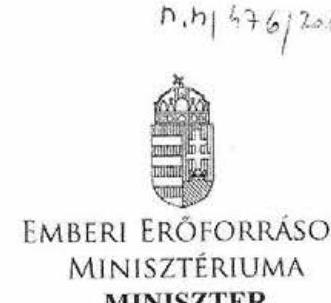

ÁLLAMI SZÁMVEVŐSZÉK
69771
Érkeze: 2012 JUN 29.
Iktatószám: 26389-3/2012/ELL

Ügyintéző: Bánkné Simon Judit (51207)

Domokos László úrnak
elnök

Állami Számvevőszék

Budapest
Apáczai Csere János u. 10.
1052

Tárgy: az állami felsőoktatási intézmények érdekeltségébe tartozó gazdasági társaságok támogatásának és nyereségük hasznosulásának ellenőrzéséről készített ÁSZ jelentéstervezet véleményezése

Tisztelt Elnök Úr!

Az állami felsőoktatási intézmények érdekeltségébe tartozó gazdasági társaságok támogatásának és nyereségük hasznosulásának ellenőrzéséről készített jelentéstervezethez az alábbi észrevételt teszem.

Az Országgyűlés részére benyújtott, a nemzeti vagyonról szóló 2011. évi CXCVI. törvény és a hozzá kapcsolódó egyes törvények módosításáról szóló törvényjavaslat (T/7417) tervezett szabályozása jelentősen szűkíti a felsőoktatási intézmények gazdálkodási autonómiáját, megszünteti az egyetemek vagyonkezelői jogát az intézményi gazdasági társaságok tekintetében. Az előbbiek alapján indokoltnak tartom, hogy az emberi erőforrások miniszterének címzett javaslatokat felülvizsgálni szíveskedjenek.

Kérem Elnök Urat, hogy észrevételemet elfogadni szíveskedjen.

Budapest, 2012. június 22. 2012.

Üdvözlettel:

Bálog Zoltán

---

# 11/1b. sz. melléklet   a V-2005-140/2011-2012. sz. jelentéshez 

## 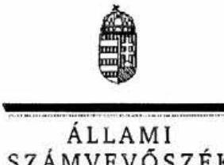

## 

Ikt.szám: V-2005-131/2011-2012.

## Balog Zoltán úr

miniszter
Emberi Eröforrások Minisztériuma

## Budapest

## Tisztelt Miniszter Úr!

Az állami felsőoktatási intézmények érdekeltségébe tartozó gazdasági társaságok támogatásának és nyereségük hasznosulásának ellenőrzéséről szóló jelentéstervezetre tett észrevételeit köszönettel megkaptam.

Az Állami Számvevőszék észrevételekre vonatkozó álláspontjáról a felügyeleti vezető által készített részletes tájékoztatást csatoltan megküldöm.

Budapest, 2012. 4 hó $2^{\prime} 4$ nap
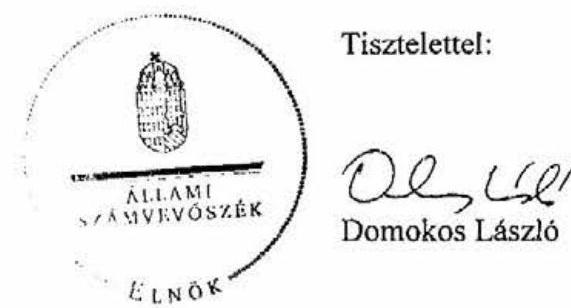

Melléklet: Tájékoztatás az el nem fogadott észrevételekröl

---

# Tájékoztatás 

## az el nem fogadott észrevételekröl

Észrevételükben az emberi erőforrások miniszterének címzett javaslatok felülvizsgálatát inditványozzák az Országgyülés részére benyújtott, a nemzeti vagyonról szóló 2011. évi CXCVI. törvény és a hozzá kapcsolódó egyes törvények módosításáról szóló törvényjavaslatra (T/7417) hivatkozással, amely véleményük szerint jelentősen szükíti a felsőoktatási intézmények autonómiáját, megszünteti az egyetemek vagyonkezelői jogát az intézményi gazdasági társaságok tekintetében.

A nemzeti felsőoktatásról szóló 2011. évi CCIV. törvény 88. §-a szerint az állami felsőoktatási intézmény által alapitott gazdasági társaság alapitására, részesedésszerzésre, müködésére, illetve a vezetői tisztségviselőinek felelősségére az állami részesedéssel müködő gazdasági társaságra vonatkozó szabályokat kell alkalmazni. Ez a rendelkezés azonban csak a 2012. szeptember 1-jétől hatályos.

Ezen jogszabályhely alapján a nemzeti vagyonról szóló 2011. évi CXCVI. törvény rendelkezéseit kell alkalmazni. A nemzeti vagyonról szóló törvényt azonban a T/7417. törvényjavaslat 6. §-a módosítja a következők szerint: „Gazdasági társaságban fennálló állami vagy önkormányzati tulajdonban lévő társasági részesedés nem lehet vagyonkezelés tárgya. A társasági részesdés tulajdonosi joggyakorlója nevében és helyett más személy megbízáson alapuló meghatalmazással járhat el a tulajdonosi jogok egészének, vagy meghatározott részének gyakorlása során." A törvényjavaslat jelenleg kihirdetésre vár.

A jelentésben megfogalmazott javaslatok címzettje a jelenleg hatályos jogszabályi rendelkezések alapján helyesen az emberi erőforrások minisztere, mint az intézmények fenntartója, ezért javaslataink címzettjén nem változtatunk.

Budapest, 2012. július „24, ,

Makkai Mária
felügyeleti vezető

---

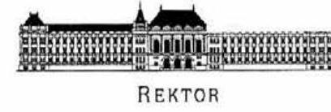

11/2a. sz. melléklet a V-2005-140/2011-2012. sz. jelentéshez

Rektor

Szám: 277/2 /2012

Domokos László úrnak, elnök

Állami Számvevőszék Budapest, Apáczai Csere János u. 10, 1052

Tisztelt Elnök Úr!

Hivatkozással Elnök Úr 2012. június 07-én kézhez vett levelére, melynek mellékletében észrevételezésre megküldte „Az állami felsőoktatási intézmények érdekeltségébe tartozó gazdasági társaságok támogatásának és nyereségük hasznosulásának ellenőrzéséről” szóló jelentéstervezetet, az alábbiakban fejlődik ki álláspontunkat.

A jelentéstervezetről általánosságban kijelenthető, hogy értékelésében logikai ellentmondás van. Alapvetően nem vitatva a számok, arányok tényszerű helyességét, ezen cégek jelentős részénél megkérdőjelezhető számon kérni az alapfeladat ellátáshoz való még nagyobb hozzájárulást, gazdaságossági számításokat, üzleti terveket, stb. miközben a jelentéstervezet maga is rögzíti, hogy ezek (legalábbis nem elhanyagolható részben) elsődleges célja az volt, hogy olyan – zömében pályázati – K+F, fejlesztési, stb. forrásokhoz lehessen hozzájutni általuk, amelyekhez közvetlenül a tulajdonos felsőoktatási intézmények nem tudtak volna. Így, ha projektekre hozták létre őket, és azok megvalósultak, akkor ezek a cégek eleget is tettek a céljuknak. (Erre utal egyébként a bevételeken belül a pályázati és normatív támogatások arányának az egyéb bevételekhez viszonyított arányához képest a feltűnő növekedése – 15., oldal lap alja, 16. oldal 4. bekezdése, 17. oldal 5. bekezdése.) Az, hogy ezen társaságok nem hoztak számottevő pénzügyi eredményt anyaintézményüknek, majahogynem természetes.

Sajnálatos, hogy ezzel együtt felrója a dokumentum (18. oldal), hogy – bár kétségtelenül a támogatási forrásokban megnyilvánuló kormányzati szándék jelentős motiváció volt a létrehozatalukra – „gazdasági számításokkal megalapozottan, kimutathatóan nem segítette, eredményesebben a feladatellátást, mintha erre saját szervezetükön belül került volna sor”. Itt ugyanis pont az tűnik a lényegnek, hogy ezen források jelentős részéhez az intézmények vagy eleve hozzá sem juthattak a támogatott szervezetek jellege miatt, vagy valamilyen oknál fogva az volt a célszerű, hogy ne a költségvetési gazdálkodási renden belül történjen a feladatellátás maga. (Vagyis ha csak nem rosszabb hatékonysággal látták el a feladatot, mintha a felsőoktatási intézmény látta volna el, már teljesítették az alapvető céljukat.) Ez az ellentmondás (olyan felrovása, hiányának negatív értékelése, ami ésszerűen nem volt célkitűzés) sajnos, végig kíséri a jelentéstervezetet.

A fentiek alapvetően teszik megkérdőjelezhetővé a 19. oldalon a 2. számú javaslat „értelmességét” általában a cégekre, differenciálás nélkül. Hiszen e tekintetben is legalább kétféle társaság létezik: amelyiket ezért hozták létre, és amelyiket eleve az egyéb, de ettől még teljesen racionális szempontokra tekintettel.

Ugyancsak hibásnak és minden alapot nélkülözőnek tartjuk a 19. oldal 3. megállapítását. Nem értelmezhető számunkra, hogy önmagában mitől lettek ezek az intézményi társaságok kevésbé hatékonyan és átláthatóan gazdálkodók attól, hogy nem jött létre a felsőoktatásban kockázatfedezeti alap, és hogy egyes esetekben nem volt még intézményi kockázatfedezeti alap sem. A BME esetében, ha fizetési kötelezettsége lenne az anyaszervezetnek, annak fedezete a BME teljes vagyona. A BME belső költségvetésében ugyanakkor van általános kockázatfedezeti alap (likvidítási- és tartalékalap), illetve elsősorban a tulajdonosi jogokat gyakorló karok százmilliós keretei látják el ezt a funkciót.

Budapesti Műszaki és Gazdaságtudományi Egyetem
1111 Budapest, Műegyetem rkp. 3, intézményi azonosító: Ft 23344

Rektori Kabinet • Központi Épület I. emelet 11.
Telefon: 463-2221, Fax: 463-2220
E-mail: rekkiti@rektan.bme.hu

---

Nem látjuk annak indokát, hogy mitől lett volna ehhez képest kevésbé kockázatos, ha akármekkora összegre ebből a vagyontömegből „rámondásra" kerül, hogy ez a kockázattedezeti alapil

Vitatjuk a jelentés azon megállapítását, hogy a BME rektora nem számolt volna be a gazdasági tanácsnak a társaságok müködéséről: a felsőoktatási törvény a beszámolókhoz nem ír elő formal kritériumokat. A gazdasági társaságokról szóló beszámolók minden évben részei voltak a költségvetési beszámolóknak, amit a gazdasági tanács minden esetben megtárgyait. Azt, hogy ezt milyen - egyéb - tartalommal történjen, tudomásunk szerint nem szabályozza jogszabály. Nyilván minden intézmény - így a BME is - a saját információs igényeihez mérten határozta meg a tájékoztatás tartalmát. Kevésbé lényeges, és a megállapításokat, javaslatokat nem befolyásoló észrevételünk, hogy a BME vonatkozásában ellentmondást vélünk felfedezni a 37. oldal azon megállapítása, mely szerint a BME - többek között - egyáltalán nem ellenőrizte a társaságokat, miközben pont a következő oldalon rögzíti, hogy a BME-n év közbeni tájékoztatást lehetővé tevő monitoring rendszer müködött. Az összeférhetetlenségi szabályok megsértését felrovó észrevétellel kapcsolatban jelezzük, hogy ebben a körben, hasznosító vállalkozások esetén a vonatkozó jogszabályok eltérő értelmezést is lehetővé tesznek, illetve differenciáltak az egyes vállalkozástípusok között.

Kétségtelenül kimondja az Ftv., hogy vezető, magasabb vezető nem lehet vezető tisztségviselője, FB tagja olyan vállalkozásnak, amelyben az intézmény is tag. (Ftv. 121.§ (8) bek.) Az Ftv. azonban azt is kimondja (Ftv. 121.§ (11) bek.), hogy „Ha a felsőoktatási intézmény szellemi alkotás jogosultja, azt nem pénzbeli hozzájárulásként intézményt társaság tulajdonába adhatja, a szellemi alkotás üzleti célú hasznosítása céljából hasznosító vállalkozást hozhat létre. A szellemi alkotás hasznosítására létrehozott, illetve müködtetett intézményi társaságra egyebekben a kutatás-fejlesztésről és a technológiai innovációról szóló 2004. évi CXXXIV. törvényt kell alkalmazni." A hivatkozott törvény tehát - a hasznosító vállalkozások tekintetében a saját bevételből létrehozható bármely célú társasággal szemben - lex specialis, különös szabály. Ez pedig kimondja (pl. 18.§), hogy ha közalkalmazott részt vesz szellemi alkotás létrehozásában, akkor a hasznosítás során őt megillető jogokra és kötelezettségekre az intézmény szellemi tulajdon kezelési szabályzata alkalmazandó. Márpedig a magasabb vezető és a vezető is közalkalmazott, akik egyébként az oktatóikutatói alapmunkakörük részeként igenis, részt vehetnek szellemi alkotások létrehozatalában ${ }^{1}$. Nyilván nem lehetett cél az ő közremüködésükkel létrejövő szellemi alkotások hasznosítására létrehozott társaságokban az ő alkotói jogaik, lehetőségeik csorbítása csak azért, mert egyébként ezzel össze nem függő módon egyébként vezetői megbízásból adódó feladatokat is ellátnak még.

A közalkalmazottak jogállásáról szóló 1992. évi XXXIII. törvény ugyancsak alátámasztja a fentieket:
42.§ (5) A (2) bekezdés b) pontjától eltérően a kutatás-fejlesztésről és a technológiai innovációról szóló törvény szerinti költségvetési kutatóhely által foglalkoztatott közalkalmazott a hasznosító vállalkozásnak - a munkáltató előzetes írásbeli hozzájárulásával - tagja vagy vezető tisztségviselője lehet, illetve azzal munkavégzésre irányuló további jogviszonyt létesíthet.

A hivatkozott 42.§ (2) bekezdés b) pontja viszont a vezetői összeférhetetlenség egyik esete. Erre mondja azt az (5) bekezdés, hogy ez nem összeférhetetlen, ha spin off vállalkozásról van szó.

[^0]
[^0]:    1 2004. évi CXXXIV. törvény 18. § (1) A kutatóhelynek minősülő költségvetési szervnek és közalapítványnak, valamint az államháztartás akendszereihez kapcsolódó vagyonból létrehozott, kutatóhelynek minősülő közhasznú társaságoknak szellemitulajdon-kezelési szabályzattal kell rendelkezniük.
    (2) A szabályzatnak - figyelemmel a 19. § elöirásaira - ki kell terjednie különösen
    d) ha a vonatkozó jogszabályok a felek eltérő rendelkezését lehetővé teszik, a kutatóhellyel köztisztviselői, közalkalmazotti, munko- vagy munkavégzésre irányuló egyéb, valamint polgári jogi jogviszonyban álló, a szellemi alkotás létrehozásában közremüködő kutatók jogaira és kötelezettségeire a hasznosítás folyamatában;

---

A fentiek alapján tehát azt gondoljuk, kijelenthető, hogy a vonatkozó jogszabályok több lehetséges értelmezést is lehetővé tesznek, viszont egyértelműen nem lehet azt sem kijelenteni, hogy az összeférhetetlenség - a fenti szabályokra tekintettel - hasznosító vállalkozások esetén fennállna. Nyilván a nem hasznosító intézményi társaságok esetében ez a megállapítás igaz lenne. A BME-nek azonban kizárólag hasznosító vállalkozásai vannak, mégis úgy tüntették föl, mintha a BME-n is lett volna jogszabályi összeférhetetlenség.

Budapest, 2012. június 13.

Üdvözlettel:
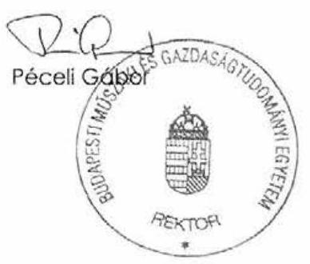

---

# 11/2b. sz. melléklet   a V-2005-140/2011-2012. sz. jelentéshez 

## ÉLKÖK

## ÁLLAMI   SZÁMVEVÓSZÉK

Ikt.szám: V-2005-136/2011-2012.

## Prof. Dr. Péceli Gábor úr

rektor
Budapesti Müszaki és Gazdaságtudományi Egyetem

## Budapest

## Tisztelt Rektor Úr!

Az állami felsőoktatási intézmények érdekeltségébe tartozó gazdasági társaságok támogatásának és nyereségük hasznosulásának ellenőrzéséről szóló jelentéstervezetre tett észrevételeit köszönettel megkaptam.

Az Állami Számvevőszék észrevételekre vonatkozó álláspontjáról a felügyeleti vezető által készített részletes tájékoztatást csatoltan megküldöm.

Budapest, 2012. 07 hó 18 nap
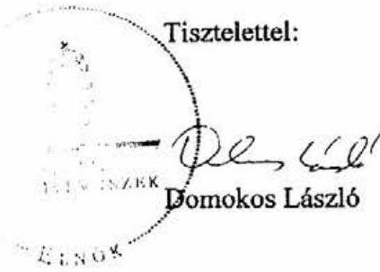

Melléklet: Tájékoztatás az el nem fogadott észrevételekröl

---

# Tájékoztatás   az el nem fogadott észrevételekröl 

Az állami felsőoktatási intézmények érdekeltségébe tartozó gazdasági társaságok támogatásának és nyereségük hasznosulásának ellenőrzéséről szóló jelentéstervezetre tett észrevételeiket köszönettel megkaptuk.
Általánosságban megállapítják, hogy: „Alapvetően nem vitatva a számok, arányok tényszerủ helyességét, ezen cégek jelentős részénél megkérdőjelezhető számon kérni az alapfeladat ellátáshoz való még nagyobb hozzájárulást, gazdasági számításokat, üzleti terveket, stb. miközben a jelentéstervezet maga is rögzíti, hogy ezek (legalább is nem elhanyagolható részben) elsődleges célja az volt, hogy olyan - zömében pályázati - $\mathrm{K}+\mathrm{F}$, fejlesztési, stb. forrásokhoz lehessen hozzájutni általuk, amelyekhez közvetlenül a tulajdonos felsőoktatási intézmények nem tudtak volna." Felvetik, hogy a projektek megvalósulásával a cégek eleget tettek létrehozásuk céljának. Kifogásolják továbbá a jelentéstervezet azon megállapítását is, hogy a társaságok számottevő pénzügyi eredményt az intézményeknek nem hoztak, gazdasági számításokkal kimutathatóan nem segítették eredményesebben a feladatellátást, mintha erre saját szervezeten belül került volna sor. Mindezek alapján megkérdőjclezik a 2. számú javaslat (19. oldal) „értelmességét" általában a cégekre differenciálás nélkül.

Az Állami Számvevőszék megállapításait dokumentumokra, helyszíni tapasztalatokra, az intézmények általi adatszolgáltatásokra és az ellenőrzési időszakra vonatkozó hatályos jogszabályoknak való megfelelésre alapozta. A levelükben foglaltak alapján, álláspontjuk megfogalmazásánál nem vették figyelembe a vonatkozó törvényi előírásokat.

Az állami felsőoktatási intézmény gazdasági társaságokban történő részesedésszerzése nem lehet öncélú, annak az alapfeladat ellátásához kell hozzájárulnia. A felsőoktatásról szóló 2005. évi CXXXIX. törvény 120. § (1) bekezdése rögziti, hogy a felsőoktatási intézmény gazdasági tevékenysége körében minden olyan döntést meghozhat, intézkedést megtehet, amely hozzájárul az alapító okiratában meghatározott feladatainak végrehajtásához. A törvény feltételként írja elő a közpénzek és a közvagyon hatékony, és a rendelkezésre álló források rendeltetésszerü, gazdaságos felhasználását. A felsőoktatásról szóló törvény 121. § (5) bekezdése 2009. január 1-jéig az állami felsőoktatási intézmények részesedésszerzésére vonatkozóan előirta három éven belüli nyereségességet biztosító üzleti terv meglétét. Ezt követően a jogszabály ezt a kötelezettséget törölte - bevezette a közös és saját kockázatfedezeti alapokat - és az állami felsőoktatási intézményekre bízta, a gazdaságosság és hatékonyság érvényesítésének módját. A törvényi előírások alapján megállapításaink helytállóak. Sajnálatos, hogy egy állami tulajdonban lévő intézmény ezeknek az előírásoknak nem tulajdonít jelentőséget, és az ezeknek való megfelelést logikai ellentmondásnak tartja.

---

Nem vitatjuk, hogy ha a projekt és a hozzá kapcsolódó további szerződésben rögzített előírások (fenntartási kötelezettség, egyéb sajátos mutatók, előírások) teljesültek, akkor a támogató szempontjából a társaságok eleget tettek kötelezettségüknek. A támogatott ezekben az esetekben nem maga az intézmény, hanem a gazdasági társaság. Az, hogy egy intézményi részesedéssel müködő társaság állami támogatási forráshoz jusson, önmagában nem lehet cél a tulajdoni részesedéssel rendelkező intézmény számára. Ezért szükséges az alapfeladatokhoz való pénzügyi és szakmai hozzájárulás mérése és értékelése, ami a részesedésszerzést és megtartást indokolja.

A fentiekben kifejtettek alapján megállapításainkat fenntartjuk.
Hibásnak és minden alapot nélkülözőnek tartják a 19. oldal 3. megállapítását, különös tekintettel a kockázatfedezeti alapok létrehozásának elmaradására vonatkozóan.

A hivatkozott szövegrész összevontan tartalmazza azon megállapításokat és hiányosságokat, amelyek a részesedésszerzések, a társaságok müködése és a tulajdonosi joggyakorlás során felmerültek. A kockázati alapok létrehozását a felsőoktatási törvény írta elő, ezért ettől eltekinteni nem tudunk. Megjegyezzük, hogy a BME által létrehozott likviditási- és tartalékalap, illetve a karok százmilliós keretei és a társaságokra vonatkozó kockázati alapok nem ugyanazt a célt szolgálják.
Vitatják a jelentés azon megállapítását, hogy a BME rektora nem számolt be a gazdasági tanácsnak a társaságok müködéséről, mivel „A gazdasági társaságokról szóló beszámolók minden évben részei voltak a költségvetési beszámolóknak, amit a gazdasági tanács minden esetben megtárgyalt." A felsőoktatásról szóló törvény 121. § (4) bekezdése előírja, hogy az állami felsőoktatási intézmény rektora évente jelentést készít a gazdasági tanács részére a felsőoktatási intézmény által alapított vagy részvételével müködő társaságok müködéséről, amely alapján a gazdasági tanács javaslatot készít a társaságok további müködtetésével, illetve a vagyonvesztés elkerülését célzó intézkedésekkel kapcsolatos lépésekről. A felsőoktatásról szóló törvény 25. § (1) bekezdése rögzíti a gazdasági tanács feladatait ahol az ad) pont a számviteli beszámolóra, az ag) pont a gazdasági társaságban való részesedésszerzésre, és a gazdasági társasággal való együttmüködésre vonatkozik hivatkozással a 121. §-ra. A törvény nem tér ki a gazdasági társaságokban meglévő részesedésekről szóló beszámolók tartalmára. A beszámolási kötelezettség önálló megjelenítése azt támasztja alá, hogy külön beszámolók kell készüljenek, más szempontok szerint és tartalommal. Ez szakmailag is indokolt, hiszen az éves számviteli beszámolók tartalma nem teszi lehetővé a társaságok müködésével kapcsolatos olyan részletes beszámolást, ami biztosítani képes a gazdasági tanácsi és szenátusi döntések megalapozott meghozatalát. Az ellenőrzött időszakban az Önök által készített éves költségvetési beszámoló a társaságok felsorolásán és a tulajdoni hányad megjelölésén túl a társaságok müködésével kapcsolatos további érdemi információt nem tartalmazott. Ezért a megállapítást fenntartjuk.

Levelük szerint az összeférhetetlenségre vonatkozó jogszabályok több lehetséges értelmezést is lehetővé tesznek a hasznosító vállalkozások esetében, tekintettel a közalkalmazottak jogállásáról szóló 1992. évi XXXIII. törvény 42. § (5) bekezdésére. Az észrevételük szerint „a kutatásfejlesztésről és a technológiai innovációról szóló törvény szerinti költségvetési kutatóhely által foglalkoztatott közalkalmazott a hasznosító vállalkozásnak - a munkáltató előzetes írásbeli

---

hozzájárulásával - tagja vagy vezető tisztségviselője lehet, illetve azzal munkavégzésre irányuló további jogviszonyt létesíthet." Álláspontjuk alapján nem lehet egyértelműen kijelenteni, hogy az összeférhetetlenség hasznosító vállalkozások esetén fennállna. Levelükben arról tájékoztatnak, hogy a BME-nek kizárólag hasznosító vállalkozásai vannak, jelentésünk ennek ellenére úgy tünteti föl mintha a BME-n is lett volna jogszabályi összeférhetetlenség.

Az Önök által tévesen megjelölt 42. § helyett a közalkalmazottak jogállásáról szóló törvény 41. § (1)-(2) bekezdései meghatározzák a magasabb vezető, vezető, pénzügyi kötelezettségvállalásra jogosult közalkalmazottra vonatkozó összeférhetetlenséget. A (4) bekezdés külön felhívja a figyelmet a felsőoktatásról szóló törvény összeférhetetlenségre vonatkozó előírásaira az intézményi részesedésű társaságok esetében. Az (5) bekezdés általában vonatkozik a hasznosító vállalkozásokra, de nem érinti az állami felsőoktatási intézmények tulajdonában lévőket. A ku-tatás-fejlesztésről és a technológiai innovációról szóló 2004. évi CXXXIV. törvény 4. § 6. b) a költségvetési kutatóhelyen létrejövő hasznosító vállalkozást a létrejött szellemi alkotások üzleti hasznosítása céljából az ilyen kutatóhely által alapított, illetve részvételével vagy részesedésével müködő gazdasági társaságként definiálja. A BME esetében a hivatkozott társaságok főtevékenységük alapján nem tekinthetők hasznosító vállalkozásoknak, így álláspontjukat nem áll módunkban elfogadni.

Megköszönöm az ellenőrzésünkhöz nyújtott együttműködését, a helyszíni ellenőrzés során kollégáitól kapott segítő közremüködést.

Budapest, 2012. OZ. hó 19. nap

Makkai Mária
felügyeleti vezető

---

11/3a. sz. melléklet a V-2005-140/2011-2012. sz. jelentéshez

14/3/2011

MARKET

DEBRECENI EGYETEM LAMI SZÁMVEVÖSZÉK

REKTOR

Érkező: 2012 JON 21.
Iktatószám: V-2005-140/2011.
Melléklet: 4

Domokos László
Állami Számvevőszék
elnöke

Ikt.szám: RH/582-2/2012.
Térelszám: 01.19.
Tárgy:

Debr. L. L. 06. 27.

Tisztelt Elnök Úr!

Az Állami Számvevőszék állami felsőoktatási intézmények érdekeltségébe tartozó gazdasági
társaságainak vonatkozásában végzett számvevőszék jelentéstervezetét köszönettel
megkaptuk, azt áttekintettük.

A vizsgálat 2011 nyarán készült, melyről a Debreceni Egyetem magára nézve a jelentést 2011
öszén megkapta, azt rektori nyilatkozatban 2011.09.19-én elfogadtam. 2011 novemberében
megismertük az országos jelentést is, majd ez év tavaszán közvetlenül a cégeinknél végeztek
vizsgálatot. E folyamat eredménye a mostani jelentéstervezet, amelynek kapcsán egyrészt
pontosítást, másrészt kiegészítést kérő felvetéseink vannak.

Az ÁSZ 2011 év jelentése alapján egyetemünk számos, a vizsgálat által javasolt lépést
megtett, amelyet a Szenátus határozatával jóváhagyott, ezért szeretnénk, ha ezek
megjelentének jelen jelentéstervezetben is.
Részletes észrevételeinket mellékelem.

Debrecen, 2012. június 11.

Tisztelettel:

DE Pábián István
rektor

02 H-4032 Debrecen, Egyetem tér 1.; H-4010 Debrecen, Pf: 37 52; (52) 412-060, Fax: (52) 416-490, E: rector@admin.unideb.hu

---

# 1. Észrevétel 

25. oldalról idézett szövegrész:

Az intézmények a fennálló részesedésekből 119-et alapítással, 12-őt adásvétellel, 6 -ot tőkeemeléssel szereztek. Az ellenőrzött időszak alatt két társaságot végelszámolással, egyet felszámolással megszüntettek, egy részesedést értékesítettek. A DE három társaságbeli részesedésének csak egy részét értékesítette vagy adta át az MNV Zrt.-nek. 2010. december 31-étg. További egy társaság (Zrínyi Nonprofit Közhasznú Zrt.) végelszámolás alatt, egy (Hallgatói Centrum Kht.) felszámolás alatt állt.

## Észrevétel:

A Debreceni Egyetem GF/505/2009. ikt. számú (2009. április 08-ai dátumú) levelével megküldte az MNV Zrt.-nek a gazdasági társaságairól készített adtalapot, melynek 1. számú függelékében fel voltak sorolva a vagyonkezelt gazdasági társaságok.

Az 1. számú függelékben az alábbi felsorolás szerepel:
A Debreceni Egyetem állami felsőoktatási intézménynek kizárólag az alábbi társaságokban volt állami tulajdonú, vagyonkezelt társasági részesedése. A vagyonkezelt társasági részesedések adatai:

| Vagyonkezelt társasági részesedések |  |  |  |
| :-- | :-- | :-- | :-- |
| Társaság neve | cégjegyzékszáma | részesedés   névértéke | tulajdoni   hányad |
| Debreceni Nyári Egyetem Nonprofit Közhasznú Kft. | Cg.09-09-015201 | 34500000 | $100,00 \%$ |
| Debreceni Campus Nonprofit Közhasznú Kft. | Cg. 09-09-13671 | 30000000 | $50,00 \%$ |
| Debreceni Universitas Nonprofit Közhasznú Kft. | Cg.09-09-013673 | 2800000 | $49,12 \%$ |
| Mundus Magyar Egyetemi Kiadó Kft. | Cg.01-09-067138 | 200000 | $6,67 \%$ |
| DTMP Debreceni Tudományos Müszaki Park Nonprofit   Közhasznú Kft. | Cg.09-09-015651 | 110000 | $3,67 \%$ |
| "Egészségért 98" Kht. "fa" | Cg.09-14-000028 | 1500000 | $25,00 \%$ |
| Debreceni Városi-Egyetemi Kosárlabda zRt. "fa" | Cg.09-10-000341 | 1026000 | $5,13 \%$ |

A fenti gazdasági társaságok közül a Debreceni Nyári Egyetem Nonprofit Közhasznú Kft., a Debreceni Campus Nonprofit Közhasznú Kft., a Debreceni Universitas Nonprofit Közhasznú Kft. és a DTMP Debreceni Tudományos Müszaki Park Nonprofit Közhasznú Kft. vonatkozásában 2008. decemberében kötött egymással átadás-átvételi megállapodást a

---

Debreceni Egyetem az MNV Zrt.-vel, míg a Mundus Magyar Egyetemi Kiadó Kft. vonatkozásában külön került megkötésre a megállapodás 2008.12.30-án.
A felszámolás alatt álló "Egészségért 98" Kht. és Debreceni Városi-Egyetemi Kosárlabda Zrt. vonatkozásában azért nem került megkötésre az átadás-átvételre vonatkozó megállapodás, mert tekintettel azok felszámolási eljárás alatt állásukra, az MNV Zrt. nem tartott ezen társaságokra igényt.

Fentiekre tekintettel a 2 felszámolás alatt álló társaság kivételével (melyre az MNV Zrt. nem tartott igényt) az összes vagyonkezelt társasági részesedésünket átadtuk az MNV Zrt -nek 2008. decemberében.

Ugyanezen bekezdésben a fogalmazásból úgy tűnik, mintha a Zrínyi Zrt és a Hallgatói centrum Kft is a DE-hez tartozna, miközben ez nincs így.

# 2. Észrevétel 

25. oldalról idézett szövegrész:

A helyszínen ellenőrzött 11 intézményből nyolc (BME, DE, ELTE, NYF, PTE, SE, SZIE, SZTE) SZMSZ-e a jogszabályi előírás ${ }^{10}$ ellenére nem tartalmazta az intézmény vagyonkezelésébe vagy tulajdonosi joggyakorlása alá tartozó társaságok felsorolását.

Az ELTE és a SZIE a helyszíni ellenőrzést követően pótolta a hiányosságot és módosította az SZMSZ-ét.

## Észrevétel:

A jelentéstervezet többször kitér (25. oldal, 35. oldal 2.2. pont első bekezdés és kapcsolódó magyarázat, 38, oldal 3. bekezdés) a részesedésszerzés és a tulajdonkezelés szabályozatlanságára. A Debreceni Egyetem éppen a korábbi ÁSZ vizsgálat tapasztalatait felhasználva jelentős lépéseket tett a gazdasági társaságok kezelését illetően. A Gazdasági Tanács 2011. november 10. napján tartott ülésén támogatta a „Tájékoztatás az egyetem érdekeltségébe tartozó gazdasági társaságok tulajdonosai joggyakorlása szabályozásának előkészítéséről" című előterjesztését, majd 2012. március 30-án 6/2012. számú határozatával elfogadta és támogatta a „Társasági részesedések tulajdonkezelési szabályzatát", melyet a Szenátus 23/2012. (IV.05.) számú határozatával hagyott jóvá, melyet levelemhez mellékelek. Kérem, hogy megtörtént intézkedésünket a jelentésben jelezni szíveskedjenek.

---

# 3. Észrevétel 

## 31. oldalról idézett szövegrész:

Az intézmények az Ftv. 121. § (6) bekezdésében foglalt előírásoknak megfelelően a társaságok hiányát a befolyásuknál nagyobb mértékben nem finanszírozták. 2010-ben 14 intézmény 39 db olyan társaságban rendelkezett részesedéssel, ahol a társaságok saját tőkéje a jegyzett tőke alá csökkent. Ebből kilenc intézménynél 16 db társaság rendelkezett negatív saját tőkével, amelyből öt intézménynél egy-egy társaság kizárólag az intézmény tulajdonában állt.

Az ellenőrzött időszakban a DE társaságainál volt jelentősebb tőkevesztés, ahol a saját tőke négy esetben negatív lett. A veszteséges müködés miatt - a teljes egészében a DE tulajdont képeső - DE OEC Kazincbarcikai Kórház Nonprofit Kft., 2010-ben jegyzett tőkéje $30,0 \mathrm{M} \mathrm{Ft}$, saját tőkéje pedig - $390,7 \mathrm{M} \mathrm{Ft}$ volt.

A DE társaságait érintő tőkevesztés és negatív eredmény 2010-ben elsősorban a DE OEC Kazincbarcikai Kórház Nonprofit Kft miatt igaz volt, de 2011-ben a helyzet rendeződött, amit a mellékelt, DE cégeit bemutató összesítő táblázatban mutatunk be. Kérjük a jelentésben jelezni a pozitív változást. (31. oldal 6. bekezdés, ehhez kapcsolódóan a 34. oldal 6. bekezdés).

## 4. Észrevétel

## 33. oldalról idézett szövegrész:

A DE három társasága részére $706,9 \mathrm{M}$ Ft tagi kölcsönt nyújtott, amelyböl 2010. december 31-én a fennálló tartozás $597,8 \mathrm{M}$ Ft volt, a kölcsönöket átütemezték, a végtörlesztési határidők még nem jártak le.

A 33. oldal 3. bekezdése szerinti meg nem térített tagi kölcsön jelenlegi állása jóval kedvezőbb, melyet kérünk a jelentésben megemlíteni. (2012. első negyedévének végén a fennálló tartozás összege 408 MFt)

## 5. Észrevétel

## 36. oldalról idézett szövegrész

Az Ftv. 121. § (8) bekezdése és 121/A. § (2) bekezdése meghatározza a társaságokra vonatkozó személyi összeférhetetlenséget (az intézményvezető tisztségviselője, és a társaság vezető tisztségviselője, felügyelőbizottsági tagja, könyvvizsgálója, illetve e személyek közeli hozzátartozót), ami kiterjed a társaság által létesített, illetve részvételével múködő társaságra is. Nem tartották be a társaságok vezető tisztségviselőinek összeférhetetlenségére vonatkozó előírást - a név szerinti kimutatások alapján - 23 intézményből 14-nél (ebből a helyszínen ellenőrzött 10 intézménynél). Az ellenőrzés összesen 29 esetben állapított meg összeférhetetlenséget, amelyekben 22 felügyelő bizottsági tag, és 7 vezető tisztségviselő volt érintett.

A DE-n 6 fő érintettségét, az SE-n 4 fő érintettségét, a BME-n, PTE-n 3 fő érintettségét, az ELTE-n, az NYF-en, az SZTE-n 2 fő érintettségét, 7 intézménynél 1-1 fő érintettségét tapasztaltuk.

---

A 2011. nyarán ugyanebben a témában végzett ÁSZ vizsgálat eredményeként 2011. szeptemberében kiadott V-2005-025/2011.ikt.számú jelentésben az ÁSZ az alábbi megállapítást tette. (Jelentés 10. oldala)
„A DE megvizsgált társaságainál tapasztaltak és a rektor hivatalos nyilatkozata alapján megállapíthatjuk, hogy a DE a hatályos jogszabályok alapján dolgozta ki és müködteti az összeférhetetlenség kizárásának rendszerét. Az intézményben magasabb vezetői és vezetői megbizással rendelkezők és ezek közeli hozzátartozói nem töltenek be saját intézményi társaságban vezetö tisztségviselöi feladatokat, nem tagjai felügyelöbizottságnak, nem látnak el könyvvizsgálói feladatot."

# 6. Észrevétel 

38. oldalról idézett szövegrész:

A DE nem alakított ki a tulajdonosi joggyakorlásra vonatkozóan a kockázatok időbeni felmérését és a gyors, eredményes reagálást biztosító monitoring rendszert. A társaságok informális csatornákon tartották a kapcsolatot az Orvos- és Egészségtudományi, illetve az Agrártudományi Centrummal. A PTE-en és az SZTE-n nem alakítottak ki olyan monitoring rendszert, amely biztosította volna, hogy év közben folyamatosan nyomon követhető legyen a társaságok tevékenysége.

A Debreceni Egyetem a gazdasági társaságok tevékenységének monitorozása érdekében, a Társasági részesedések tulajdonkezelési szabályzatában elöirtaknak megfelelően saját fejlesztésű szoftver hozott létre, melyben rendszeresen nyomon követheti a társaságok adatait rendszerezett formában, valamint gazdasági mutatóit. A Gazdasági Társaságok Nyilvántartó Rendszerét bemutató koncepciótervet mellékelem.

## 7. Észrevétel

43. oldalról idézett szövegrész:

A helyszínen ellenőrzött intézmények 2009 és 2010-ben éves zárszámadási beszámolóikban nem értékelték a jogszabályban elöírt módon ${ }^{30}$ teljes körűen azt, hogyan befolyásolta a társaságok müködése az alap- és kiegészítő feladatellátást és indokolt volt-e az állami feladat társasággal történő ellátása. Összehasonlító elemzés a saját szervezeten belüli, vagy társasági formában történő kedvezőbb üzemeltetési módra nem készült. Az intézmények társaságokban való részesedésszerzései - a költségvetési gazdálkodás jogszabályi kötöttségeinek feloldásán és a támogatási forrásokban megnyilvánuló kormányzati szándékon túl - gazdasági számításokkal megalapozottan, kimutathatóan nem segítette eredményesebben a feladatellátást, mintha erre a saját szervezetükön belül került volna sor.

---

A 2009.évi zárszámadási beszámoló keretében az irányító szerv által megadott szempontok és nyomtatvány szerint történt meg az állami felsőoktatási intézmények részesedéseinek értékelése. A 2010-es évre vonatkozóan ilyen tartalmú értékelésre nem volt jogszabályi előírás, a vonatkozó paragrafus hatályon kívül helyezése következtében.

A zárszámadáskor a Debreceni Egyetem minden évben elvégzi a részesedések értékelését a számviteli szabályoknak megfelelően. A társasági pénzügyi, vagyoni helyzetének elemzését követően állapítjuk meg az adott részesedés vonatkozásában az értékvesztés elszámolását, illetve ennek visszairását.

Debrecen, 2012. június 15.
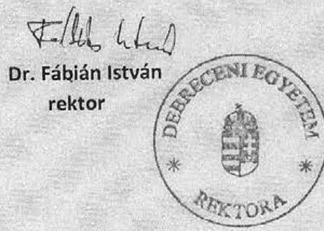

---

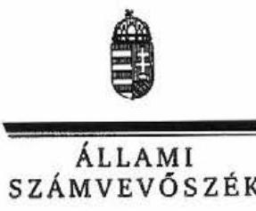

Ikt.szám: V-2005-130/2011-2012.

Dr. Fábián István úr
rektor
Debreceni Egyetem

Debrecen

# Tisztelt Rektor Úr! 

Az állami felsőoktatási intézmények érdekeltségébe tartozó gazdasági társaságok támogatásának és nyereségük hasznosulásának ellenőrzéséről szóló jelentéstervezetre tett észrevételeit köszönettel megkaptam.

Az Állami Számvevőszék észrevételekre vonatkozó álláspontjáról a felügyeleti vezető által készített részletes tájékoztatást csatoltan megküldöm.

Tájékoztatom Rektor urat, hogy a számvevőszéki jelentés szövegezése az elfogadott észrevételek figyelembevételével készül.

Budapest, 2012. 07 hó 18 nap
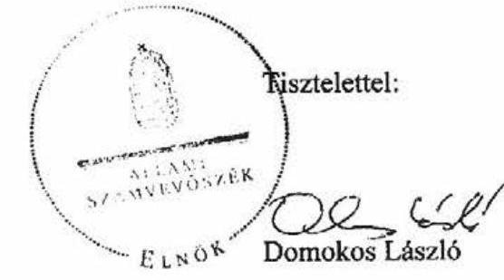

Melléklet: Tájékoztatás az elfogadott és az el nem fogadott észrevételekröl

---

# Tájékoztatás 

## az elfogadott és az el nem fogadott észrevételekröl

Az állami felsőoktatási intézmények érdekeltségébe tartozó gazdasági társaságok támogatásának és nyereségük hasznosulásának ellenőrzéséről szóló jelentéstervezetünkre tett észrevételeit köszönettel megkaptuk. Örömmel vettük, hogy a helyszíni ellenőrzésünket követően a feltárt hiányosságok megszüntetésére már több intézkedést tettek. Az észrevételeiket az alábbiak szerint vesszük figyelembe:

Az 1. sz. észrevételük alapján a 25. oldal vonatkozó részét a következök szerint pontosítjuk.
„A DE két felszámolás alatt álló társaság kivételével - amelyre az MNV Zrt. nem tartott igényt - az összes vagyonkezelt társasági részesedését átadta az MNV Zrt.-nek 2008. decemberben. További egy, a Nemzeti Közszolgálati Egyetem társasága (Zrínyi Nonprofit Közhasznú Zrt.) végelszámolás alatt és egy, az NYF társasága (Hallgatói Centrum Kht.) felszámolás alatt állt."

A 2. sz. észrevételük alapján a jelentéstervezetben a következők szerint jelenítjük meg a helyszíni ellenőrzést követően megtett intézkedéseket:
„Az ellenőrzést követően a DE szenátusa 2012. március 30-án elfogadta és kiadták a „Társasági részesedések tulajdonkezelési szabályzatát"."

A 3. sz. észrevételük szerint 2011. évre rendeződött a DE OEC Kazincbarcikai Kórház Nonprofit Kft. helyzete. A megküldött adatok azt mutatják, hogy a Kórház saját tőkéje pozitív lett, és nyereséget realizált. A jelentéstervezet vonatkozó részét a következő mondattal egészítjük ki:
„Az egyetem írásbeli tájékoztatása alapján a Kórház 2011. évi mérleg szerinti eredménye és saját tőkéje is pozitív értéket mutat.".

A 4. sz. észrevételben foglaltak szerint a 33. oldal 3. bekezdését kiegészítjük a következő mondattal:
„A fennálló kölcsön összege az egyetem tájékoztatása szerint 2012. I. negyed év végére 408 M Ft-ra csökkent."

Az 5. sz. észrevételt nem tudjuk figyelembe venni. Az észrevételében a témához kapcsolódóan idézett rész számvevői munkaanyag része, amely a Rektor nyilatkozatán alapult és csak az ellenőrzési mintában kiválasztott társaságokra vonatkozott. Ezzel szemben az összes társaságra megadott DE vezető tisztségviselők és a hiteles cégnyilvántartásban 2012. február 1-jén a vezető tisztségviselökre vonatkozó adatok tételes összevetése során állapítottuk meg a következö

---

összeférhetetlenségeket. A név és beosztás szerinti, részletes nyilvántartás ellenőrzése alapján az AVE-FON Kutatásfejlesztési és Szolgáltató Kft.-nél 2 fö, a Debreceni Agrárcentrum Innovációs Nonprofit Közhasznú Kft.-nél, a Debreceni Egyetem Tudományegyetemi Továbbképző Központ Szolgáltató Kft.-nél, a DE OEC Kazincbarcikai Kórház Nonprofit Kft.-nél és az INNOVA Észak-Alföld Regionális Fejlesztési és Innovációs Ügynökség Nonprofit Kft.-nél 1-1 fö összeférhetetlenségét állapítottuk meg. A kimutatás szerint a gazdasági társaság vezető tisztségviselője vagy felügyelő bizottságának a tagja egyidejűleg az egyetem magasabb besorolású alkalmazottja is volt, ami az Ftv. előirása szerint összeférhetetlen. Észrevételében nem ad tájékoztatást az összeférhetetlenség megszüntetéséről.

A 6. sz. észrevétel alapján a 38. oldal vonatkozó részét a következő mondattal egészítjük ki:
„A DE tájékoztatása szerint a helyszíni ellenőrzést követően kialakította a tulajdonosi joggyakorlás alá tartozó társaságok tevékenységének és gazdálkodásának nyomon követését biztosító informatikai nyilvántartó rendszert."

A 7. számú észrevételüket nem tudjuk figyelembe venni. A vonatkozó jogszabályban - 2009. január 1-je és 2010. augusztus 14.-e között - előírtak szerinti értékelési feladatokat nem végezték el teljes körűen. Nem értékelték, hogy hogyan befolyásolta a társaságok müködése az alapés kiegészítő feladatellátást és indokolt volt-e az állami feladat társasággal történő ellátása. Összehasonlító elemzés a saját szervezeten belüli vagy társasági formában történő üzemeltetési módra nem készült. Észrevétele alapján a 43. oldal vonatkozó részét a következők szerint pontosítjuk.
„A helyszínen ellenőrzött intézmények 2008 és 2009. évekre készített zárszámadási beszámolóikban nem értékelték a jogszabályban előírt módon ${ }^{1}$ teljes körűen azt, hogy hogyan befolyásolta a társaságok müködése az alap- és kiegészítő feladatellátást és indokolt volt-e az állami feladat társasággal történő ellátása."

Megköszönöm az ellenőrzésünkhöz nyújtott együttműködését, a helyszíni ellenőrzés során kollégáitól kapott segítő közremüködést.

Budapest, 2012. 04 hó 13 nap

Makkai Mária
felügyeleti vezető

[^0]
[^0]:    ${ }^{1}$ Ámr., 61. § (4) bekezdése és az Ámr., 222. § (7) bekezdés (hatályos 2009. január 1-jétől 2010. augusztus 14-ig.)

---

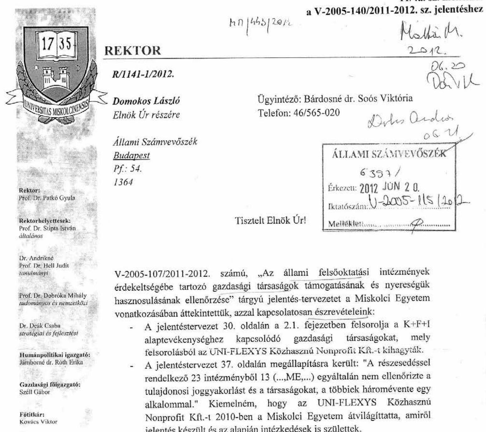

V-2005-107/2011-2012. számú, „Az állami felsőoktatási intézmények érdekeltségébe tartozó gazdasági társaságok támogatásának és nyereségük hasznosulásának ellenőrzése" tárgyú jelentés-tervezetet a Miskolci Egyetem vonatkozásában áttekintettük, azzal kapcsolatosan észrevételeink:

- A jelentéstervezet 30. oldalán a 2.1. fejezetben felsorolja a $\mathrm{K}+\mathrm{F}+\mathrm{I}$ alaptevékenységhez kapcsolódó gazdasági társaságokat, mely felsorolásból az UNI-FLEXYS Közhasznú Nonprofit Kft.-t kihagytalt.
- A jelentéstervezet 37. oldalán megállapításra került: "A részesedéssel rendelkező 23 intézményből 13 (...,ME,...) egyáltalán nem ellenőrizte a tulajdonosi joggyakorlást és a társaságokat, a többiek háromévente egy alkalommal." Kiemelném, hogy az UNI-FLEXYS Közhasznú Nonprofit Kft.-t 2010-ben a Miskolci Egyetem átvilágittatta, amiről jelentés készült és az alapján intézkedések is születtek.

Miskolc - Egyetemváros, 2012. június 12.

Kiváló tisztelettel:
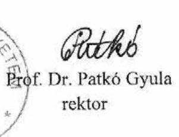

Prof. Dr. Patkó Gyula rektor

# MISKOLCI EGYETEM 

3515 Miskolc - Egyetemváros, Pf.: 1.
Tel.: (46) 565-010 Fax: (46) 565-014
E-mail: patko@uni-miskolc.hu, http://www.uni-miskolc.hu

---

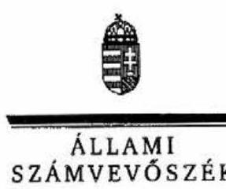

ELKÖK

Ikt.szám: V-2005-132/2011-2012.

Prof. Dr. Patkó Gyula úr
rektor
Miskolci Egyetem

Miskolc

# Tisztelt Rektor Úr! 

Az állami felsőoktatási intézmények érdekeltségébe tartozó gazdasági társaságok támogatásának és nyereségük hasznosulásának ellenőrzéséről szóló jelentéstervezetre tett észrevételeit köszönettel megkaptam.

Az Állami Számvevőszék észrevételekre vonatkozó álláspontjáról a felügyeleti vezető által készített részletes tájékoztatást csatoltan megküldöm.

Tájékoztatom Rektor urat, hogy a számvevőszéki jelentés szövegezése az elfogadott észrevételek figyelembevételével készül.

Budapest, 2012. 07 hó 48 nap
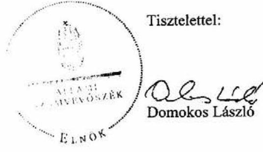

Melléklet: Tájékoztatás az elfogadott észrevételekről

---

# Tájékoztatás 

## az elfogadott észrevételekről

Az állami felsőoktatási intézmények érdekeltségébe tartozó gazdasági társaságok támogatásának és nyereségük hasznosulásának ellenőrzéséről szóló jelentéstervezetünkre tett észrevételeit köszönettel megkaptuk, amelyeket az alábbiak szerint veszünk figyelembe:

1. A $\mathrm{K}+\mathrm{F}+\mathrm{I}$ alaptevékenységhez kapcsolódó gazdasági társaságok felsorolása (30. oldal 2.1 fejezet) példákat jelent, nem terjed ki az összes gazdasági társaságra. Jelzése alapján a felsorolást kiegészítjük az UNI-FLEXYS Közhasznú Nonprofit Kft.-vel.
2. Észrevétele alapján a jelentéstervezet 37. oldal vonatkozó részét a következő mondattal egészítjük ki: „Az ME írásbeli tájékoztatása alapján 2010-ben sor került az UNIFLEXYS Közhasznú Nonprofit Kft. átvilágítására és az erről készült jelentés alapján intézkedések is születtek."

Megköszönöm az ellenőrzésünkhöz nyújtott együttműködését, a helyszíni ellenőrzés során kollégáitól kapott segítő közremüködést.

Budapest, 2012. OZ. hó 4. nap

Makkai Mária
felügyeleti vezető

---

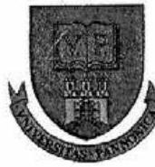

# PANNON EGYETEM

5551

Érkezn: 2012 JÚN 28 0-2005-133660

Állami Számvevőszék

Domokos László elnök

Budapest, Apáczai Csere János utca 10. 1052

Iktató szám: GMF-VKI- 12/2012. Tárgy: Felsőoktatási intézmények érdekeltségébe tartozó gazdasági társaságok ellenőrzéséről szóló ÁSZ jelentés tervezet észrevételezése Hivatkozási szám: V-2005-107/2011-2012. Ügyintéző: Verbó Hedvig Tel: 06-88/624-136

Tisztelt Elnök Úr!

Hivatkozva a V-2005-107/2011-2012. iktatószámú levelére, az állami felsőoktatási intézmények érdekeltségébe tartozó gazdasági társaságok támogatásának és nyereségük hasznosulásának ellenőrzéséről szóló jelentéstervezetet áttanulmányoztuk.

Az átvizsgálás során megállapítottuk, hogy a jelentéstervezet szöveges részében az intézményünkre vonatkozó megállapítások megfelelőek, összhangban vannak az általunk elkészített tanúsítványokkal, kérdőívvel.

A jelentéstervezet 6. 7. és 9. számú mellékleteiben az egyetemünket érintő néhány adat tévesen szerepel.

A helyes adatokat pirossal jelöltük:

|  6. sz. melléklet |  |  |  |  |  |   |
| --- | --- | --- | --- | --- | --- | --- |
|  Év/állami
felsőoktatási
intézmény | 2006. év |  |  | 2010. év |  |   |
|   | Összes bevétel | Értékesítés
nettó
árbevétele | Visszafizetés
nélkül kapott
támogatás | Összes bevétel | Értékesítés
nettó
árbevétele | Visszafizetés
nélkül kapott
támogatás  |
|  PE | 576,7 | 419,1 | 69,2 | 1 531,3 | 646,7 | 806,2  |

1. sz. melléklet

|   | 2006. év |  |  | 2010. év |  |   |
| --- | --- | --- | --- | --- | --- | --- |
|  Év/állami
felsőoktatási
intézmény | Összes
ráfordítás | Ebből
közvetített
szolgáltatások
értéke | személyi
jellegű
ráfordítások | Összes
ráfordítás | Ebből
közvetített
szolgáltatások
értéke | személyi
jellegű
ráfordítások  |
|  PE | 548,4 | 5,1 | 268,8 | 1 515,9 | 64,9 | 546,1  |

---

# 9. sz. melléklet 

| Felsőoktatási intézmények |  | 2008. év |  | 2009. év |  | 2010. év |  |
| :--: | :--: | :--: | :--: | :--: | :--: | :--: | :--: |
|  |  | Társaságok mérleg szerinti eredménye | cbből a   tulajdoni   hányadra   jutó rész | Társaságok   mérleg szerinti   eredménye | cbből a   tulajdoni   hányadra   jutó rész | Társaságok   mérleg szerinti   eredménye | cbből a   tulajdoni   hányadra   jutó rész |
| PE | nyereségesek | 13,5 | 4,7 | 36,1 | 15,4 | 37,6 | 20,9 |
|  | veszteségesek | $-14,3$ | $-0,9$ | $-5,2$ | 0,0 | $-26,8$ | $-3,5$ |

Egyéb észrevételünk a megküldött jelentéstervezettel kapcsolatban nincs.

Veszprém, 2012. június 19.

## Üdvözlettel:

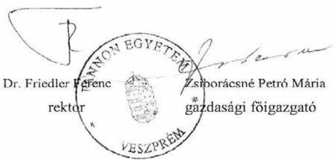

---

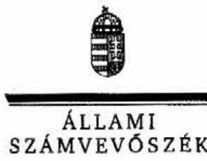

ELNOK

# Dr. Friedler Ferenc úr 

rektor
Pannon Egyetem

## Veszprém

## Tisztelt Rektor Úr!

Az állami felsőoktatási intézmények érdekeltségébe tartozó gazdasági társaságok támogatásának és nyereségük hasznosulásának ellenőrzéséről szóló jelentéstervezetre tett észrevételeit köszönettel megkaptam.

Az Állami Számvevőszék észrevételekre vonatkozó álláspontjáról a felügyeleti vezető által készített részletes tájékoztatást csatoltan megküldöm.

Tájékoztatom Rektor urat, hogy a számvevőszéki jelentés szövegezése az elfogadott észrevételek figyelembevételével készül.

Budapest, 2012. C7 hó 48 nap
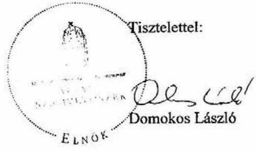

Melléklet: Tájékoztatás az elfogadott észrevételekről

---

# Tájékoztatás 

## az elfogadott észrevételekröl

Az állami felsőoktatási intézmények érdekeltségébe tartozó gazdasági társaságok támogatásának és nyereségük hasznosulásának ellenőrzéséről szóló jelentéstervezet 6,7 . és 9 . számú mellékleteiben a Pannon Egyetemet érintő adatokat - amelyeket korábban az Egyetem bocsátott rendelkezésünkre - az észrevételüknek megfelelően módosítjuk.

Megköszönöm az ellenőrzésünkhöz nyújtott együttmüködését, a helyszíni ellenőrzés során kollégáitól kapott segitő közremüködést.

Budapest, 2012. 07. hó 13. nap

Makkai Mária
felügyeleti vezető

---

11/6a. sz. melléklet a V-2005-140/2011-2012. sz. jelentéshez
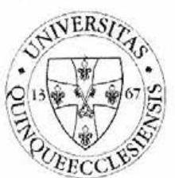

Állami Számvevőszék
Domokos László
clnők

1051 Budapest
Apáczai Csere J. u.10.

Tárgy: Számvevőszéki jelentés tervezete

Tisztelt Elnök Úr!

Hivatkozással 2012. június 04-én kelt, V-2005-107/2011-2012. levelére, az állami felsőoktatási intézmények érdekeltségébe tartozó gazdasági társaságok és nyereségük hasznosulásának ellenőrzéséről készített számvevőszéki jelentés tervezetével kapcsolatban az alábbi észrevételeket kívánjuk tenni.

1./ Az ellenőrzési jelentés tervezete a Dél-Dunántúli Kooperációs Kutatási Központ Innovációs Nonprofit Zrt. helyzetének értékelésével kapcsolatban (39. oldal) a következő megállapítást tartalmazza: „A tulajdonosok részéről intézkedés az intézményi társaság (ahol a PTE csak 11,6%-os részesedéssel rendelkezik) vagyonvesztésének megállítása céljából a rendelkezésre bocsátott dokumentumok alapján nem történt."

A fenti megállapítás kapcsán jelezni kívánjuk, hogy a Pécsi Tudományegyetem, mint kisebbségi tulajdonos a Gt. 49.§-ában biztosított kisebbségi jogok alapján a társaság jogi, pénzügyi, likviditási helyzetének tisztázása és a szükséges intézkedések meghozatal céljából a társaság rendkívüli közgyűlésének összehívását kezdeményezte. A közgyűlés felkérésére a könyvizsgáló megvizsgálta a társaság működését és 2011. február 14-én vezetői levél, valamint előzetes mérleg és eredmény-kimutatás formájában tájékoztatta a tulajdonosokat a romló likviditási, pályázati elszámolási és vagyonvesztési helyzetről. A könyvvizsgáló jelentésében ugyanakkor azt is megállapította, hogy a kialakult helyzetet a romló tendencia ellenére is menedzselhetönék tartja a társaság részéről.

2./ A jelentés azon részével kapcsolatban (36. oldal), amely szerint a társaságok vezető tisztségviselőivel szemben fennálló Ftv. szerinti összeférhetlenségi szabályok betartására a Pécsi Tudományegyetem esetében 3 fő esetében nem került sor, az alábbi észrevételt kívánjuk tenni.

Azon társaságok esetében, amelyekben a PTE kisebbségi, néhány százalékos részesedéssel rendelkezik csupán, a részesedés mértékénél fogva nincs érdemi ráhatása a vezető tisztségviselők (az igazgatóság tagjai, illetve a felügyelő bizottság tagjainak) kiválasztására és ezáltal az Ftv. szerinti összeférhetlenségi szabályok érvényesítésére.

---

3./ A vizsgálat megállapításai szerint a vizsgált intézményi társaságok többsége esetén nem határoztak meg a szakmai, illetve a pénzügyi eredmények mérésére, értékelésére alkalmas mutatószámokban kifejezett középtávú és egyes évekre lebontott célrendszert, melynél fogva a vizsgált intézményeknél - az ehhez szükséges indikátorok, szakmai mutatók, és elvárt célértékük meghatározásának hiányában - nem mérték egzakt módon a társaságok szakmai és gazdasági tevékenységének hozzájárulását az intézmények feladatellátásához.

A fenti megállapítás kapcsán tájékoztatni kivánom, hogy a vizsgálatot követően a Pécsi Tudományegyetem részéről kidolgozásra került egy az intézményi társaságok szakmai, pénzügyi eredményeinek mérésére és értékelésére szolgáló szempontrendszer, melyet az intézmény Gazdasági Tanácsa is megtárgyalt és támogatott.

A jelentés tervezetével kapcsolatban további észerevételt nem kívánunk tenni, a vizsgálat során feltárt hiányosságok mielőbbi megszüntetése érdekében haladéktalanul kezdeményezem a szükséges intézkedések meghozatalát.

Tisztelettel:
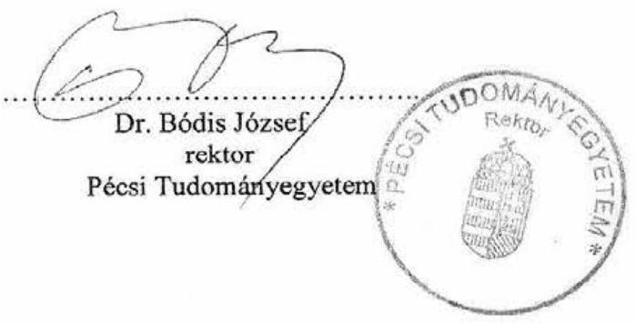

---

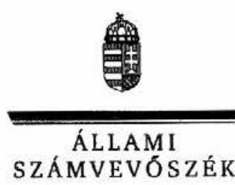

Ikt.szám: V-2005-134/2011-2012.

Dr. Bódis József úr
rektor
Pécsi Tudományegyetem

Pécs

# Tisztelt Rektor Úr! 

Az állami felsőoktatási intézmények érdeckeltségébe tartozó gazdasági társaságok támogatásának és nyereségük hasznosulásának ellenőrzéséről szóló jelentéstervezetre tett észrevételeit köszönettel megkaptam.

Az Állami Számvevőszék észrevételekre vonatkozó álláspontjáról a felügyeleti vezető által készített részletes tájékoztatást csatoltan megküldöm.

Tájékoztatom Rektor urat, hogy a számvevőszéki jelentés szövegezése az elfogadott észrevételek figyelembevételével készül.

Budapest, 2012. 07 hó 12 nap
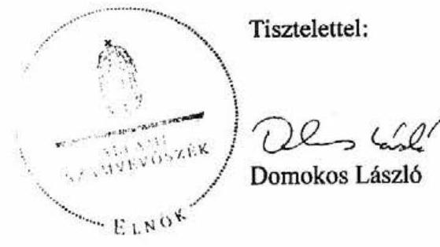

Melléklet: Tájékoztatás az elfogadott és az el nem fogadott észrevételekröl

---

# Tájékoztatás 

## az elfogadott és az el nem fogadott észrevételekröl

Az állami felsőoktatási intézmények érdekeltségébe tartozó gazdasági társaságok támogatásának és nyereségük hasznosulásának ellenőrzéséről szóló jelentéstervezetünkre tett észrevételeit köszönettel megkaptuk, amelyeket az alábbiak szerint veszünk figyelembe:

1. A Dél-Dunántúli Kooperációs Kutatási Központ Innovációs Nonprofit Zrt. helyzetével kapcsolatban az észrevételben jelzik, hogy a PTE, mint kisebbségi tulajdonos a likviditási helyzet tisztázása és a szükséges intézkedések meghozatala céljából a társaság rendkívüli közgyülésének összehívását kezdeményezte. A közgyülés felkérésére könyvvizsgáló megvizsgálta a társaság müködését és jelentésében megállapította, hogy a kialakult helyzetet a romló tendencia ellenére is menedzselhetőnek tarja a társaság részéről.

A tájékoztatása alapján a hivatkozott bekezdést kiegészítjük a következő szöveggel:
„A PTE a jelentéstervezetre tett észrevétele szerint kezdeményezte a rendkívüli közgyülés összehívását. A könyvvizsgáló felülvizsgálatát követően - amelyet a közgyülés felkérésre végzett - jelentésében megállapította, hogy a kialakult helyzet a romló tendencia ellenére is menedzselhető".
2. Az Ftv. 121. § (8) bekezdése meghatározza a társaságokra vonatkozó személyi összeférhetetlenséget, ami kiterjed a társaság által létesített, illetve részvételével müködő gazdasági társaságokra is. Az Ftv. az összeférhetetlenség vonatkozásában nem különbözteti meg a kisebbségi vagy többségi részesedésszerzéseket. Megállapításunkat változatlanul fenntartjuk, mert az Egyetem az összeférhetetlenség megszüntetése érdekében nem intézkedett.
3. Észrevételük alapján a végleges jelentésünket kiegészítjük a következő mondattal:
„A PTE írásbeli tájékoztatása szerint az ÁSZ ellenőrzésünket követően kidolgozta a társaságok szakmai, pénzügyi credményeinek mérésére és értékelésére szolgáló szempontrendszert, amelyet a Gazdasági Tanács is támogatott."

Megköszönöm az ellenőrzésünkhöz nyújtott együttműködését, a helyszíni ellenőrzés során kollégáitól kapott segitő közremüködést.

Budapest, 2012. 04. hó 18. nap

Makkai Mária
felügyeleti vezető

---

# SZENT ISTVÁN 

EGYETEM
D00000000
Cím: 2100 Gödöllő, Páter Károly utca 1.
Tel.: 06-28-410-971 Fax: 06-28-522-008
E-mail: rector@sztr.hu

Domokos László úr
elnök

Állami Számvevőszék

Budapest

## 65411

Erkecet: 2012 JUN 22
Iktatószám: U-2005-119 12.012
Melléklet: $\qquad$
Dobos Oudos
aG. 15 .
Iktatószám: GH-211/3/2012.

## Tisztelt Elnök Úr!

Hivatkozva a V-2005-107/2011-2012. iktatószámú levelére - az állami felsőoktatási intézmények érdekeltségébe tartozó gazdasági társaságok támogatásának és nyereségük hasznosulásának ellenőrzéséről készített számvevőszéki jelentéstervezethez - a Szent István Egyetem (továbbiakban: SZIE) részéről az alábbi észrevételeket teszem:
1.1.pont A jelentéstervezet 1.1. pontjában jelzett - a SZIE által az állami vagyonról szóló 2007. évi CVI. törvény alapján az MNV Zrt. részére átadott - 2 gazdasági társaságnál (AgroConsult Gazdasági Tanácsadó Kft. és proNatur Kft.) intézményünk többször kezdeményezte (utoljára 2011. év folyamán) az MNV Zrt-vel kötött átadás-átvételi megállapodás alapján a tulajdonjog cégjegyzékben történő átvezetését.
1.2.pont A SZIE - tekintettel az Ftv. 121. § (5) bekezdésében előírtakra - 2011. december 30 -án $16,9 \mathrm{M}$ Ft-ot elkülönített a részvételével működő intézményi társaságok esetleges veszteségeinek fedezetére.
2.1.pont A SZIE és a többségi tulajdonában álló Gödöllői Agrárközpont Közhasznú Társaság (GAK Oktató Kutató és Innovációs Nonprofit Közhasznú Kft.) között 2001. július 12 -én határozatlan időtartamú Együttmüködési megállapodás került megkötésre a SZIE Gödöllői Területi Irodájához (Gödöllői Campus) tartozó bemutató gazdaság, kísérleti és tangazdaság, tanüzem és bemutató

---

gazdaság, kísérleti és bemutató központ tevékenységi körébe tartozó feladatok ellátására vonatkozóan.
2.2.pont Intézményünk Belső Ellenőrzési Igazgatósága (továbbiakban: BEI) a vizsgált időszakban ugyan nem végzett a SZIE tulajdonosi részesedésével müködő gazdasági társaságokra, illetve a tulajdonosi joggyakorlásra irányuló ellenőrzést, de a felügyelő bizottságokon keresztül - amelyekben az egyetem, mint tulajdonos képviselteti magát -, folyamatosan kontrollálja a társaságok müködését. Az intézményi társaságok éves működéséről és eredményességéről beszámolók készültek, amelyeket az egyetem Gazdasági Tanácsa véleményezett, a Szenátus pedig jóváhagyólag elfogadott. Amennyiben a kockázatelemzés alapján szükségessé válik a belső ellenőrzés, a BEI 2013. évi munkatervébe beépíti az egyetemi tulajdoni részesedéssel rendelkező társaságok müködésének, valamint a SZIE tulajdonosi joggyakorlásának ellenőrzését.

A jelentéstervezet mellékletében szereplő számszaki adatokra vonatkozóan az alábbi korrekciókat tartom indokoltnak:

1. sz. melléklet: A GAK Nonprofit Közhasznú Kft. nyeresége 2006-2010. években mindösszesen $139,8 \mathrm{M} \mathrm{Ft}$ volt, amely nem szerepel a megküldött anyagban.
2. sz. melléklet: A SZIE 2006. évben $4 \mathrm{db}, 2010$. évben pedig 3 db gazdasági társaságban rendelkezett kisebbségi részesedéssel.
5/a. melléklet: 2006. és 2007. években a SZIE tulajdoni részesedésével müködő gazdasági társaságok jegyzett tőkéje $1.099,8 \mathrm{M} \mathrm{Ft}$ volt.

Gödöllő, 2012. június 15.

Üdvözlettel:
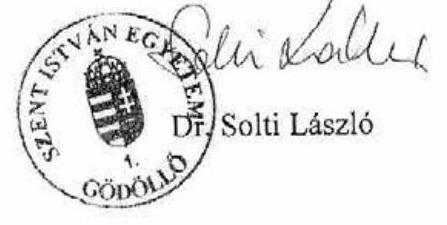

---

# 11/7b. sz. melléklet   a V-2005-140/2011-2012. sz. jelentéshez 

## 11111

## ÉLNOK

ÁLLAMI
SZÁMVEVÓSZÉK

Ikt.szám: V-2005-135/2011-2012.

## Dr. Solti László úr

rektor
Szent István Egyetem

## Gödölló

## Tisztelt Rektor Úr!

Az állami felsőoktatási intézmények érdekeltségébe tartozó gazdasági társaságok támogatásának és nyereségük hasznosulásának ellenőrzéséről szóló jelentéstervezetre tett észrevételeit köszönettel megkaptam.

Az Állami Számvevőszék észrevételekre vonatkozó álláspontjáról a felügyeleti vezető által készített részletes tájékoztatást csatoltan megküldöm.

Tájékoztatom Rektor urat, hogy a számvevőszéki jelentés szövegezése az elfogadott észrevételek figyelembevételével készül.

Budapest, 2012. 07 hó 48 nap
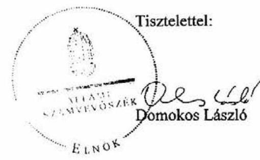

Melléklet: Tájékoztatás az elfogadott és az el nem fogadott észrevételekről

---

# Tájékoztatás 

## az elfogadott és az el nem fogadott észrevételekről

Az állami felsőoktatási intézmények érdekeltségébe tartozó gazdasági társaságok támogatásának és nyereségük hasznosulásának ellenőrzéséről szóló jelentéstervezetünkre tett észrevételeit köszönettel megkaptuk, amelyeket az alábbiak szerint vesszük figyelembe:

### 1.1 pont

Az észrevétel alapján a vonatkozó részt a következők szerint módosítjuk:
„A SZIE többször, legutóbb a helyszíni ellenőrzést követően kezdeményezte a tulajdonjog átvezetését."

### 1.2 pont

Az intézményi társaságok esetleges veszteségeinek fedezetével kapcsolatos részt a következőkkel egészítjük ki:
„A SZIE a helyszíni ellenőrzés lezárása után, 2011. december 31 -én 16,9 M Ft-ot különített el a részvételével müködő gazdasági társaságok esetleges veszteségeinck fedezetére."

### 2.1 pont

Az észrevételük alapján az érintett szövegrészt az alábbiak szerint módosítjuk:
„A SZIE együttműködési megállapodást kötött a társaságaival, amelyek - a helyszíni ellenőrzés tapasztalatai alapján - aktív szerepet vállaltak az egyetem alaptevékenységének támogatása, tárgyi feltételrendszerének biztosítása területén."

### 2.2. pont

A belső ellenőrzésre vonatkozó észrevételüket nem tudjuk figyelembe venni. Az államháztartásról szóló 1992. évi XXXVIII. törvény belső ellenőrzési feladatok ellátására vonatkozó 121/A. paragrafusban rögzített feladatok maradéktalan ellátása akkor teljesülhet, ha az kiterjed az intézmény tulajdonában álló gazdasági társaságokra is.

---

# 1. sz. melléklet 

Az észrevételt nem tudjuk figyelembe venni, mert a melléklet csak azon társaságok esetében tartalmazza a nyereségre vonatkozó adatokat, ahol a nyereség hasznosulását a helyszínen ellenőriztük. A GAK Nonprofit Közhasznú Kft. esetében ilyenre nem került sor.

## 4. sz. melléklet

A társaságok számát módosítjuk, ami a jelentéstervezet megállapításait, következtetéseit nem érinti.

## 5/a sz. melléklet

A gazdasági társaságok jegyzett tőkéjét pontosítjuk, ami a jelentéstervezet megállapításait, következtetéseit nem érinti.

Megköszönöm az ellenőrzésünkhöz nyújtott együttműködését, a helyszíni ellenőrzés során kollégáitól kapott segítő közreműködést.

Budapest, 2012. 02. hó 0. nap

Makkai Mária
felügyeleti vezető

---

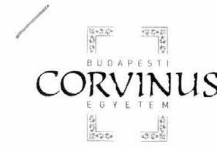
11/8. sz. melléklet a V-2005-140/2011-2012. sz. jelentéshez

# Domokos László 

elnök úr részére

Állami Számvevőszék
1052 Budapest
Apáczai Csere János u. 10.

Tisztelt Domokos László Elnök Úr!

A V-2005-107/2011-2012 ikt. számú levéllel megküldött, az állami felsőoktatási intézmények érdekeltségébe tartozó gazdasági társaságok támogatásának és nyereségük hasznosulásának ellenőrzéséről készített számvevőszéki jelentéstervezetet áttanulmányoztuk és azzal kapcsolatban észrevételt nem kívánunk tenni.

Üdvözlettel:
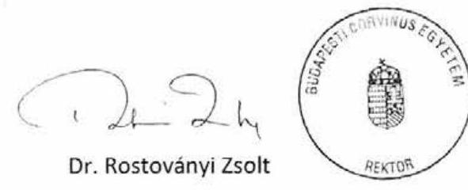

Rektor

## Rektor

H-1093 Budapest, Fővám tér 8.
Tel: (+36-1) 4825124 Fax: (+36-1) 2178883
rektor@uni-corvinus.hu
www.uni-corvinus.hu

---

# 11/9. sz. melléklet a V-2005-140/2011-2012. sz. jelentéshez 

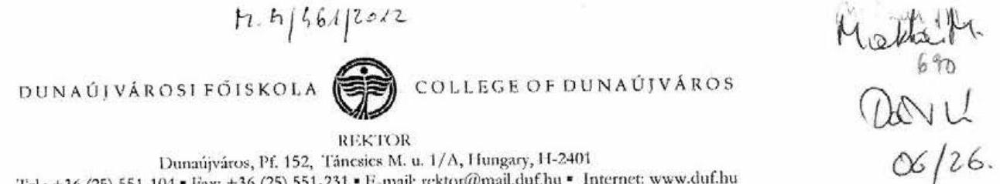

Ikt. sz.: 5763-RH/2012

## DOMOKOS LÁSZLÓ

részére

## ÁLLAMI SZÁMVEVÓSZÉK

BUDAPEST 4
Pf. 54.
1364
Tárgy: Ellenőrzési jelentéstervezettel kapcsolatos észrevétel
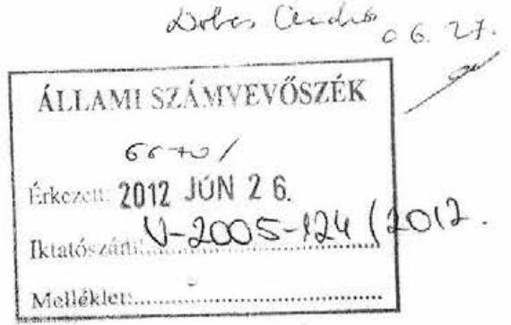

## Tisztelt Domokos László Úr!

Ezúton jelzem, hogy a V-2005-099/2011-2012 iktatószámú, állami felsőoktatási intézmények érdekeltségébe tartozó gazdasági társaságok támogatásának és nyereségük hasznosulásának ellenőrzéséről készített számvevőszéki jelentéstervezettel kapcsolatban észrevétellel nem kívánunk élni.

Dunaújváros, 2012. június 20.

Ödvözlettel:
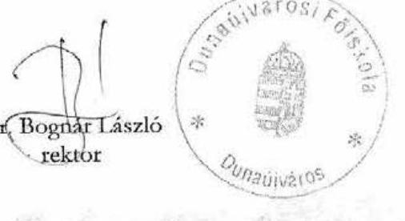

---

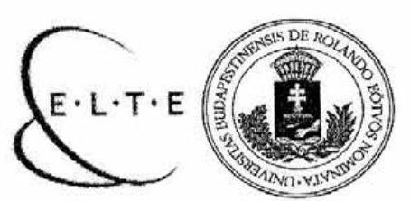

# EÖTVÖS LORÁND TUDOMÁNYEGYETEM REKTOR 

ELTE: 6448/3/12.
Hiv.sz.: V-2005-107/2011-2012. sz

## Domokos László

elnök
Állami Számvevőszék

## Budapest

## Tisztelt Elnök Úr!

Fenti számú levelükhöz kapcsolódó „az állami felsőoktatási intézmények érdekeltségébe tartozó gazdasági társaságok támogatásának és nyereségük hasznosulásának" ellenőrzéséről készült jelentéstervezetükben megfogalmazottakat az ELTE-re vonatkozóan tényszerünek tartjuk. Észrevételt nem kivánunk tenni.

Budapest, 2012. június 18.
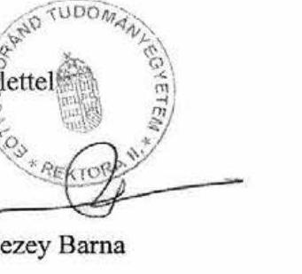

---

# Eszterházy Károly Főiskola REKTORI HIVATALA   23300 Eger, Eszterházy tér 1.   36/520-420-Fax: 36/520-440 

Domokos László Úr
elnök

Állami Számvevőszék
Budapest 4.
Pf.: 54
1364
Tárgy: Észrevétel jelentéstervezethez

## Tisztelt Elnök Úr!

Köszönöm a részemre megküldött jelentéstervezetüket, mely az állami felsőoktatási intézmények érdekeltségébe tartozó gazdasági társaságok támogatásának és nyereségük hasznosulásának ellenőrzéséről készítettek.

A jelentéstervezetben foglaltak hasznos információforrást jelentenek, iránymutatást adnak a vizsgálat tárgyára vonatkozóan a további teendők meghatározásához, fejlesztéséhez.
Az ellenőrzés megállapításaival egyetértek, észrevételt nem kívánok tenni.

Eger, 2012. június 12.

Tisztelettel:
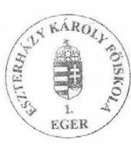

Dr. Hauser Zoltán rektor

---

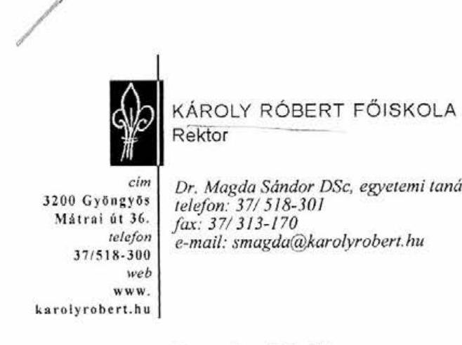

Dr. Magda Sándor DSc, egyetemi tanár
telefon: 37/518-301
fax: 37/313-170
e-mail: smagda@karolyrobert.hu

Domokos László
Elnök Úr
részére

Állami Számvevőszék
1052 Budapest,
Apáczai Cs. J. u. 10.

Tisztelt Domokos László Elnök Úr!

Az Állami Számvevőszék által készített az állami felsőoktatási intézmények érdekeltségébe tartozó gazdasági társaságok támogatásának és nyereségük hasznosulásának ellenőrzéséről szóló jelentéstervezetre a Károly Róbert Főiskola részéről észrevételt nem teszünk.
Gyöngyös, 2012. június 18.

Tisztelettel:
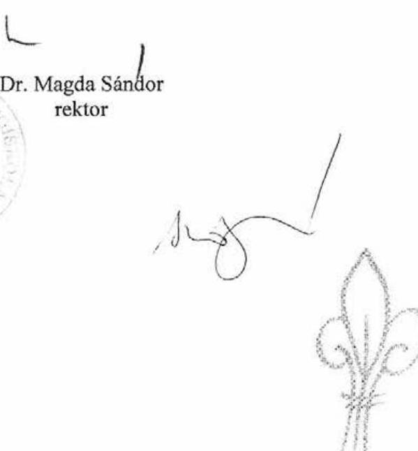

---

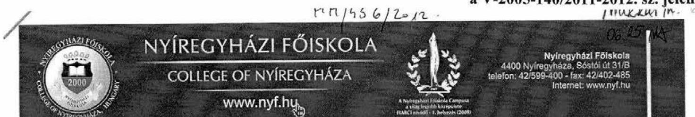

Nyiregyháza, 2012. június 21.
Ikt. szám: RH/455-2/2012.

Domokos László
elnök úrnak
Állami Számvevőszék

Budapest

Tisztelt Elnök Úr!

Az Állami Számvevőszék ,,JELENTÉSTERVEZET a az állami felsőoktatási intézmények érdekeltségébe tartozó gazdasági társaságok támogatásának és nyereségük hasznosulásának ellenörzéséről c. anyagot megismertük, az anyaggal kapcsolatosan észrevételt nem kívánunk tenni.

Üdvözlettel:

Prof. Dr. Jánosi Zoltán rektor
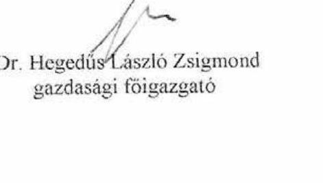

---

# NYUGAT-MAGYARORSZÁGI EGYETEM REKTOR 

cím: 9400 Sopron, Bajony-Zsilinszky utca 4. jentecinc: 9401 Sopron, Pf: 132. Adożon: 0099518 -142 ,fax: 0099 312-240
e-mail: rectorozimyme.hu miztam: www.nymo.hu

## Állami Számvevőszék   Domokos László   clnök úr részére

Budapest 4.
Pf. 54
1364

## Tisztelt Elnök Úr!

A V-2005-107/2011-2012. iktatószámú levelére való hivatkozással, ezúton tájékoztatjuk, hogy az állami felsőoktatási intézmények érdekeltségébe tartozó gazdasági társaságok támogatásának és nyereségük hasznosulásának ellenőrzéséről készített jelentéstervezet kapcsán észrevételt nem kivánunk tenni.

Sopron, 2012. június 19.
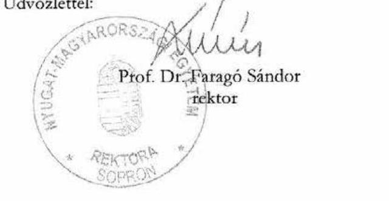

---

# 11/15. sz. melléklet a V-2005-140/2011-2012. sz. jelentéshez 

## Állami Számvevőszék

## Domokos László

## Elnök

Budapest
Apáczai Csere J. u. 10.
1052

Iktatószám: OE-GMF, 917/2, 2012
Tárgy: jelentéstervezetre válasz
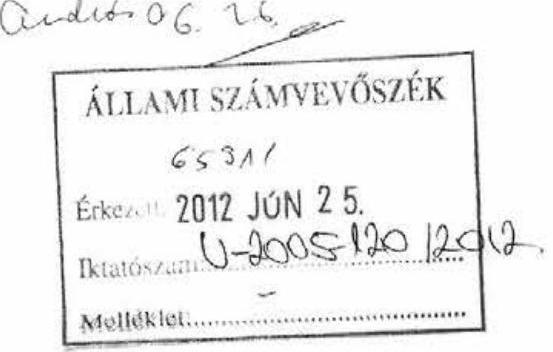

Tisztelt Elnök Úr!

Hivatkozással V-2005-107/2011-2012 iktatószámú levelükre, ezúton közöljük, hogy az állami felsőoktatási intézmények érdekeltségébe tartozó gazdasági társaságok támogatásának és nyereségük hasznosulásának ellenőrzéséről készített jelentéstervezetükhöz, nem kívánunk észrevételt tenni.

Budapest, 2012. június 19.

Üdvözlettel:

Prof. Dr. Rudas Imre
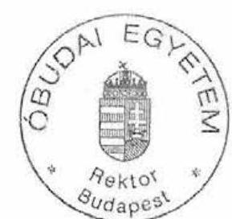

---

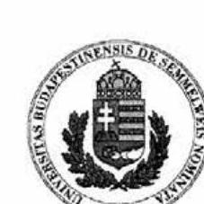

# 11/16. sz. melléklet a V-2005-140/2011-2012. sz. jelentéshez

|  1.11 /sós / 2012. |  |  |  |  |  |  |  |  |  |  |  |  |  |  |  |  |  |  |  |  |  |  |  |  |  |  |  |  |  |  |  |  |  |  |  |  |  |  |  |  |  |  |  |  |  |  |  |  |  |  |  |  |  |  |  |  |  |  |  |  |  |  |  |  |  |  |  |  |  |  |  |  |  |  |  |  |  |  |  |  |  |  |  |  |  |  |  |  |  |  |  |  |  |  |  |  |  |  |  |  |  |