# JELENTÉS 

az állami közutak felújítását, javítását, karbantartását célzó intézkedések eredményességének és az állami közutak állapotára gyakorolt hatásának ellenőrzéséről

---

Iktatószám: V-2003-077/2011-2012.
Témaszám: 1014
Vizsgálat-azonosító szám: V0573

# Az ellenőrzést felügyelte: 

Makkai Mária
felügyeleti vezető

## Az ellenőrzést vezette:

Papp Sándor
számvevő főtanácsos
Az összefoglaló jelentést készítette:
Papp Sándor
számvevő főtanácsos
A jelentés összeállításában közremúködtek
Csóry Györgyné
számvevő tanácsos
Dinnyés Illés Attila
számvevő
Dr. Sinka Zoltán Lajos
számvevő tanácsos
Az ellenőrzést végezték:
Csóry Györgyné
számvevő tanácsos
Kovácsy Tamás
számvevő tanácsos

Pappné dr. Szamosi
Éva
számvevő tanácsos

Dinnyés Illés Attila
számvevő
Dr. Sinka Zoltán
Lajos
számvevő tanácsos
Tótfalusi Zoltán
számvevő tanácsos

## A témához kapcsolódó eddig készített számvevőszéki jelentések:

címe
sorszáma
Az állami közutak fenntartásának ellenőrzéséről 0640

---

# TARTALOMJEGYZÉK 

BEVEZETÉS ..... 7
I. ÖSSZEGZŐ MEGÁLLAPÍTÁSOK, KÖVETKEZTETÉSEK, JAVASLATOK ..... 13
II. RÉSZLETES MEGÁLLAPÍTÁSOK ..... 23

1. A nem gyorsforgalmi állami közutak felújításának, javításának irányítási, végrehajtási eszközrendszere ..... 23
1.1. Az irányító és a végrehajtó szervezetek kialakítása, valamint a feladat- és hatásköreik jogi háttere ..... 23
1.2. Az állami közutak állapotának ellenőrzése, a változásokat nyomon követő monitoring rendszer múködése ..... 28
2. A feladatok szakmai, pénzügyi tervezésének megalapozottsága ..... 30
2.1. A közútfelújítások tervezésének előkészítése, szakmai megalapozása ..... 30
2.2. Az aktuális létesítményjegyzékek összeállítása, szempontjai, egyeztetése ..... 32
2.3. A közútfelújításokat célzó források tervezése és felhasználása ..... 35
2.4. Az úthasználattal arányos elektronikus útdíjszabás bevezetésének előkészítése ..... 40
3. A felújítási feladatok végrehajtása, nyilvántartása, szabályossági, hatékonysági, gazdaságossági szempontok érvényesülése ..... 43
3.1. A kivitelezések versenyeztetése, a célszerűségi, gazdaságossági szempontok érvényesülése ..... 43
3.2. Az újrahasznosítható anyagok használata ..... 45
3.3. A felújítási, karbantartási munkák teljesítésének ellenőrzési rendszere ..... 46
3.4. A teljesítések és a pénzügyi elszámolások rendszere ..... 48
3.5. A garanciális jogok érvényesítése, a minőségi kifogások kezelése ..... 50
3.6. A felújítások, karbantartások nyilvántartása, a késedelmes teljesítések nyomon követhetősége ..... 52
3.7. Az állami közutak, mint állami vagyon és az értéknövelő beavatkozások nyilvántartása ..... 54
4. A felújítási, javítási, karbantartási feladatok ellátásának eredményessége ..... 57
4.1. A kátyúzások hatása a közutak állapotára ..... 57
4.2. A felújítások, burkolat megerősítések hatása az országos közúthálózat helyzetére, állapot mutatóira ..... 58

---

# MELLÉKLETEK 

1. számú Az országos közúthálózat szakmai intézményrendszere
2. számú Regionális operatív programokból finanszírozott projektek főbb adatai (2006. január 1 - 2011. július 31.)
3. számú KÖZOP-ból finanszírozott közút projektek
4. számú A közbeszerzési eljárások típus és érték szerinti megoszlása a vizsgált időszakban
5. számú Az országos közúthálózat állapota
6. számú A jelentéstervezetre érkezett észrevételek és az azokra adott válaszok

## FÜGGELÉKEK

1. számú A Magyar Közút NZrt. vizsgálattal érintett megyei igazgatóságainak karbantartás, felújítás tervezési feladatai
2. számú A helyszíni vizsgálattal érintett regionális fejlesztési tanácsok állami közutak felújításával kapcsolatos tevékenysége
3. számú Helyszínen vizsgált projektek
4. számú A 115 kN tengelyterhelést célzó burkolat megerősítések bemutatása

---

# RÖVIDÍTÉSEK JEGYZÉKE 

AKA Zrt.
ÁAK Zrt.
Áhsz.

Áht.
ÁKMI Kht.
ÁSZ
Ber.
DTA-50
ED
EHR
EUROUT Kft.
Eurovignette irányelv

GIS
GKM
HD
HDM
HIPS
IRI
IRTAD
ISO
ISPA
KBSZ
Kbt.
KHEM
KHVM
KIKSZ
KIOP
KIRA
KKK

Alföld Koncessziós Autópálya Zártkörűen múködő Részvénytársaság
Állami Autópálya Kezelő Zártkörűen múködő Részvénytársaság
Az államháztartás szervezetei beszámolási és könyvvezetési kötelezettségének sajátosságairól szóló 249/2000. (XII. 24.) Korm. rendelet

Az államháztartásról szóló 1992. évi XXXVIII. törvény
Magyar Közút Állami Közútkezelő, Fejlesztő, Műszaki és Információs Közhasznú Társaság
Állami Számvevőszék
A költségvetési szervek belső ellenőrzéséről szóló 193/2003. (XI. 26.) Korm. rendelet
digitális térképészeti adatbázis
elektronikus díjfizetési rendszer
Egységes Híd Rendszer
EUROUT Mérnöki Tanácsadó Szervező és Kereskedelmi Korlátolt felelősségű Társaság
a nehéz tehergépjárművekre egyes infrastruktúrák használatáért kivetett díjakról szóló Európai Parlament és a Tanács1999/62/EK irányelve (1999. június 17.)
Geographical Information System
(földrajzi információs rendszer)
Gazdasági és Közlekedési Minisztérium
használati díjas rendszer
Highway Design and Maintenance
(úttervezési és fenntartási modell)
Highway Investment Programming System
(hálózati szintű útgazdálkodási rendszer)
Nemzetközi Egyenetlenségi Index
közlekedésbiztonsági adatgyűjtéssel, elemzéssel foglalkozó nemzetközi szervezet
Nemzetközi Szabványügyi Szervezet
Instrument for Structural Policies for Pre-accession
(Előcsatlakozási Alap)
Közlekedésbiztonsági Szervezet
A közbeszerzésekről szóló 2003. évi CXXIX. törvény
Közlekedési Hírközlési és Energiaügyi Minisztérium
Közlekedési Hírközlési és Vízügyi Minisztérium
Közlekedésfejlesztési Integrált Közreműködő Szervezet Közlekedésfejlesztési Zrt.
Környezetvédelmi és Infrastrukturális Operatív Program
Közlekedési Információs Rendszer és Adatbázis
Közlekedésfejlesztési Koordinációs Központ

---

| Kkt. | A közúti közlekedésről, egységes szerkezetben a végrehajtásáról szóló 1988. évi I. törvény |
| :--: | :--: |
| KöHÉM | Közlekedési, Hírközlési és Építésügyi Minisztérium |
| KÖZOP | Közlekedés Operatív Program |
| KTI | Közlekedéstudományi Intézet |
| KUAB | dinamikus teherbírásmérési adatok |
| KVI | Kincstári Vagyoni Igazgatóság |
| MFB Zrt. | Magyar Fejlesztési Bank Zártkörűen múködő Részvénytársaság |
| MK NZrt. | Magyar Közút Nonprofit Zártkörűen múködő Részvénytársaság |
| MK Kht. | Magyar Közút Közhasznú Társaság |
| MNV Zrt. | Magyar Nemzeti Vagyonkezelő Zrt. |
| MT | Minisztertanács |
| NFM | Nemzeti Fejlesztési Minisztérium |
| NFÜ | Nemzeti Fejlesztési Ügynökség |
| NIF Zrt. | Nemzeti Infrastruktúra Fejlesztő Zártkörűen múködő Részvénytársaság |
| NKH | Nemzeti Közlekedési Hatóság |
| NÚP | Nemzeti Út-, hídfelújítási Program |
| OBJECT Kft. | Object Építésziroda Korlátolt Felelősségű Társaság |
| OKA2000 | Országos Közúti Adatbank |
| OKKSZ | Országos Közutak Kezelési Szabályzata |
| PMS | Pavement Management System   (útburkolat-gazdálkodási rendszer) |
| PONTIS | Hídgazdálkodási rendszer |
| RFT | Regionális Fejlesztési Tanács |
| RFÜ | Regionális Fejlesztési Ügynökség |
| RoadMaster | Burkolatvizsgáló és értékelő módszer |
| ROP | Regionális Operatív Program |
| RST | felületállapot mérési adatok |
| SCRIM | csúszásellenállás mérési adatok |
| TAKARNET | A földhivatali adatbázisok távoli adathozzáférését biztosító rendszer |
| TRAFFICON Kft. | Trafficon Közlekedési Tanácsadó és Szolgáltató Korlátolt felelősségű Társaság |
| ÚFCE | Útfenntartási és fejlesztési célelőirányzat |
| UKIG | Útgazdálkodási és Koordinációs Igazgatóság |
| ÚMFT | Új Magyarország Fejlesztési Terv |
| UVATERV Zrt. | Út- és Vasúttervező Zártkörűen múködő Részvénytársaság |
| VIA-PONTIS Kft. | Mérnöki Tanácsadó Korlátolt felelősségű Társaság |
| VIR | Vezetői Információs Rendszer |
| Win-Bal | A Magyar Közút Kht. részére készült személyi sérüléses közúti közlekedési balesetek adatait kezelő program |
| Vtv. | Az állami vagyonról szóló 2007. évi CVI. törvény |

---

# ÉRTELMEZŐ SZÓTÁR 

állapotparaméterek
egyenetlenség (hullámosság, egyenetlenség, amorf deformáció a keréknyomokban)
externáliák
felületépség
fenntartás
ideiglenes kátyúzás
kN
kátyú

Az utak burkolatának/pályaszerkezetének a tulajdonságait/teljesítményét állapotismertető jegyekkel (Performance Indicator), állapotparaméterekkel írják le.
Az állapotismertető jegyeket mért, illetve - általában 1-5 közti skálán - osztályközökbe sorolt értékekkel adják meg. (Forrás: segédlet a BME Építőmérnöki Kar hallgatói részére „Az épi-tész- és az építőmérnök képzés szerkezeti és tartalmi fejlesztése"címmel)
A burkolat szintjének egyenetlen változása (süllyedéskiemelkedés) hossz- és/vagy keresztirányban, nem kifejezetten a keréknyomban.
(Forrás: MK NZrt. Úthibák fogalom meghatározása az Útügyi Müszaki Elöirások alapján)
Egy gazdasági szereplő tevékenysége következtében felmerülő káros vagy előnyös, nem szántszándékkal okozott, hatás(ok), amely(ek) piaci ellentételezés nélkül befolyásolják egy másik gazdasági szereplő helyzetét.
(Forrás: Idegen szavak gyüjteménye)
A burkolatépséget meghatározó főbb jellemzők: ezek között a deformációk, kátyúk, kipergéses és izzadásos felületek, hossz- és keresztirányú, valamint mozaikos repedések, továbbá a burkolatszél hibái szerepelnek.
(Forrás: Az Országos Közutak Állapota Mk NZrt. 2011. június 15. (szakmai anyag))
A forgalmi igénybevételtől és az időjárási, valamint egyéb természeti hatásokból származó természetes leromlás ellensúlyozásához szükséges tevékenységek ellátása.
(Forrás: a 6/1998. (III. 11.) KHVM rendelet)
A téli időszakban szórványosan jelentkező kátyúk haladéktalan megszüntetése. Élettartamát tekintve ideiglenes jellegú.
(Forrás: MK NZrt. Úthibák fogalom meghatározása az Útügyi Müszaki Elöirások alapján)
Tengelyterhelés: a jármú egy-egy tengelyén levő kerekek által a vízszintes talajra átvitt súly. (A közúti közlekedés szabályairól szóló 1/1975. (II. 5.) KPM-BM együttes rendelet II. A közúti jármüvekkel kapcsolatos fogalmak.)
A Newton a súly mértékegysége az SI mértékegységrendszerben, jele: N. 1 kN (kilóNewton) $=1000 \mathrm{~N}$
Az utak használata során a forgalmi igénybevétel és a környezeti hatások nyomán létrejött, a szerkezet bomlásával járó károsodás, egy vagy több pályaszerkezeti réteg kisfelületű (legfeljebb $20 \mathrm{~m}^{2}$ ) folytonossági hiánya, ami az út használatát nehezíti, a balesetveszélyt növeli, a közlekedési eszközöket fokozottan igénybe veszi, az utazás kényelmét rontja.
(Forrás: MK NZrt. Úthibák fogalom meghatározása az Útügyi Müszaki Elöirások alapján)

---

kátyúzás
keréknyom (vályúképződés, nyomvályú, kis sugarú keréknyom, nagy sugarú keréknyom)
keresztirányú repedés (reflexiós repedés)
pályaszerkezet süllyedése
szolgáltatási osztály
teherbírás
tartós kátyúzás

Kisfelületű (legfeljebb $20 \mathrm{~m}^{2}$ ) javítás, az elszórtan jelentkező burkolathibák, kátyúk (kopások, bomlások) ideiglenes vagy tartós megszüntetése, a burkolat további bomlásának megelőzése, a balesetveszély elhárítása céljából.
(Forrás: MK NZrt. Úthibák fogalom meghatározása az Útügyi Müszaki Elöírások alapján)
A nehézgépjármúvek ismételt áthaladása következtében keletkező keresztirányú alakváltozás, plasztikus deformáció. Kifejezetten a keréknyomokban észlelhető. Oka lehet a kopás is.
(Forrás: MK NZrt. Úthibák fogalom meghatározása az Útügyi Müszaki Elöírások alapján)
Az úttengelyre közel merőlegesen, egymástól meghatározott távolságban kialakuló, ismétlődő repedések fél-merev pályaszerkezetben.
(Forrás: MK NZrt. Úthibák fogalom meghatározása az Útügyi Müszaki Elöírások alapján)
Körülhatárolhatóan, egy meghatározott helyen a pályafelület süllyedése altalajelázás, közmú-meghibásodás, hát-töltés-süppedés miatt.
(Forrás: MK NZrt. Úthibák fogalom meghatározása az Útügyi Müszaki Elöírások alapján)
A közutaknak közútkezelési szolgáltatási osztályba sorolásakor, a közút kategóriáján és a forgalom nagyságán kívül, figyelembe kell venni a közút kiépítettségét és a forgalom időszakos változását is.
A Függelék meghatározza azokat a feladatokat és feladatcsoportokat, amelyeket valamennyi kategóriában azonos színvonalon, folyamatosan kell ellátni, illetve azokat a feladatokat, amelyeknek ellátása a forgalom biztonságát és az úthálózat múködőképességét közvetlenül nem befolyásolják, de az országos közutak és környezetük esztétikai megjelenését, kulturáltságát, a közlekedők részére biztosított szolgáltatások színvonalát meghatározzák.
Forrás: Az országos közutak kezelésének szabályozásáról szóló 6/1998. (III. 11.) KHVM rendelet függeléke
A tengelyterhelések elviselési képességét fejezi ki.
(Forrás: Útépítés, Tudástár, Elöírások, Szabványok (www. utesz.hu)
A burkolaton jelentkező kátyúk megfelelő időjárási körülmények között történő, hosszabb időtartamra szóló megszüntetése.
(Forrás: MK NZrt. Úthibák fogalom meghatározása az Útügyi Müszaki Elöírások alapján)

---

# JELENTÉS 

## az állami közutak felújítását, javítását, karbantartását célzó intézkedések eredményességének és az állami közutak állapotára gyakorolt hatásának ellenőrzéséről

## BEVEZETÉS

A magyar úthálózat hossza, minősége, állapota a közúti közlekedés szempontjából kiemelt fontosságú. Egyre inkább növekszik a mobilitás iránti igény, ami fokozottabb követelményeket támaszt az üzemeltetési feladatokkal, az utak minőségének szinten tartásával, illetve az ezt biztosító felújítási, javítási, karbantartási tevékenységek időbeni, megfelelő minőségben történő elvégzésével szemben. Az üzemeltetési, fenntartási feladatok tervszerű ütemezése hatással van a közúti járművek energiafelhasználására, a környezetvédelemre, az úthasználók biztonságára és a közlekedési költségekre.

Az ország útállománya közutakra és magánutakra oszlik. A közutak állami tulajdonú országos közutak és önkormányzati tulajdonú helyi közutak. Az országos közutak hossza $31664,2 \mathrm{~km}$. A helyi közutak hossza $166141,4 \mathrm{~km}$. Az országos közúthálózaton bonyolódik le az ország teljes közúti forgalmának mintegy $75 \%$-a. Az országos közutakból - a 2011. június 15 -én érvényes adatok szerint - 8329 km főút, melyből $2254,3 \mathrm{~km}$ "E" jelű út, vagyis az európai úthálózat része. A gyorsforgalmi úthálózat (autópályák, autóutak) hossza 1304,3 km, autópálya csomóponti ágakkal együtt pedig $1829,1 \mathrm{~km}$. Az országos közutak hosszának $27 \%$-a településeken halad keresztül, szerepe jelentős a helyi forgalom lebonyolításában. Az országos közutakon 7396 db híd található.

Az országos közutakon 1979 óta végeznek rendszeres, jogszabályban rögzített módon állapot-vizsgálatokat és minősítéseket. Az 1991-től végzett gépi állapotmérés (felületépség, teherbírás, nyomvályú, egyenetlenség) a teljes országos közúthálózatra terjed ki. Évente hídvizsgálat keretében minősítik az egyes hídelemeket. Az állami beruházások felügyeletét ellátó szervezet folyamatba épített ellenőrzése, valamint az MSZ EN ISO 9001/1996 szabványban foglaltak segítik a közútkezelés szabályosságának megítélését és a megfelelő időben történő beavatkozást.

A 2004-2008. évek között a személygépkocsi forgalom 16\%-kal, a tehergépkocsi forgalom $17,6 \%$-kal, az autóbusz forgalom $3,1 \%$-kal, a motorkerékpár forgalom $14 \%$-kal nőtt. 2009-re a forgalom csökkenése volt jellemző, például az országos közúthálózaton a gépjármú forgalom futásteljesítménye országos átlag-

---

ban mintegy 2,2\%-kal, ezen belül a személygépkocsi forgalom 2\%-kal, az öszszes tehergépkocsi forgalom 3,2\%-kal csökkent. ${ }^{1}$

A közutak állapotjavításának megalapozásához szakmai dokumentumok készültek, de a kidolgozott Egységes Közlekedésfejlesztési Stratégia nem foglalkozott a közutak felújításának problémájával és a 2003-2015. évekre vonatkozó, a magyar közlekedéspolitikáról szóló 19/2004. (III. 26.) OGY határozat sem jelölt ki ezzel kapcsolatos feladatokat. Elkészült az országos közutak fenntartásának szakmai feladatait és a felújítandó létesítményeket felsoroló Nemzeti Út-, hídfelújítási Program tanulmánya ${ }^{2}$, melynek célja a közutak állapotának javításához kapcsolódó nemzetgazdasági jelentőségű döntések előkészítése.

A közúti közlekedés kapcsán hazánk számára az EU csatlakozás is kötelező feladatot jelölt ki. A 96/53/EK irányelv ${ }^{3}$ szerint a jármúvek csak abban az esetben használhatják a közúthálózat nem korszerűsített szakaszait, ha azok megfelelnek a 115 kN tengelyterhelésre vonatkozó határértékeknek. ${ }^{4}$ Az irányelvben foglaltak hazai engedélyezése a nehézgépjármúvek forgalmának megnövekedését okozza, ami az útburkolatok megerősítése nélkül a meglevő főutak számottevő romlásához vezet. A Csatlakozási Szerződés X. számú mellékletének indikatív táblázata feltüntetette az EU által javasolt utakat, és megerősítésük ütemezését. Az így megújított, nemzetközi előirásoknak megfelelő közúthálózatot meg kellett nyitni a nemzetközi forgalom előtt. Hazánk számára a Csatlakozási Szerződés a 2008. december 31-ei határidőt jelölte ki.

A közutak rossz állapotának javítása a térségek elérhetőségének javításához, valamint a biztonságos és balesetmentes közlekedés biztosításához elengedhetetlen. A Közlekedésfejlesztési Operatív Programban (KÖZOP) foglalt célkitúzés szerint a teljes főúthálózaton az átlagos nyomvályú értéknek a 2013-as programidőszak végéig $8,9 \mathrm{~mm}$-ről $7,5 \mathrm{~mm}$-re, a 2020-as időszak végéig $5,0 \mathrm{~mm}$ értékűre kell csökkennie.

A 2006-tól múködő Útpénztár költségvetési fejezeti előirányzat finanszírozza az országos közutak felújítását, üzemeltetését, ${ }^{5}$ fenntartását ${ }^{6}$ (kivéve a koncessziós autópályákat, autóutakat). Az Útpénztár előirányzat összesíti az autópályák, valamint a 10 tonna feletti össztömegú járművek számára jogszabályban meghatározott útszakaszok igénybevételének használati díjából (a matricák

[^0]
[^0]:    ${ }^{1}$ A Magyar Közút Zrt. honlapjának adatai.
    ${ }^{2}$ Készítette a Közlekedésfejlesztési Koordinációs Központ megbízásából a Nemzeti Úthálózat 2020 Konzorcium.
    ${ }^{3}$ A Közösségen belül közlekedő egyes közúti járművek nemzeti és a nemzetközi forgalomban megengedett legnagyobb méreteinek, valamint a nemzetközi forgalomban megengedett legnagyobb össztömegének megállapításáról. (I. melléklet 3.4.1. pontja).
    ${ }^{4}$ Az EU Csatlakozási Szerződés X. mellékletének 6. Közlekedéspolitika rész 4. pontjában foglaltak szerint.
    ${ }^{5}$ A közúti forgalom biztonságos és kulturált lebonyolítását elősegítő szolgáltatások öszszessége.
    ${ }^{6}$ A forgalmi igénybevételből és az időjárási, valamint egyéb természeti hatásokból származó természetes leromlás ellensúlyozásához szükséges tevékenységek ellátása.

---

bevételéből) származó, valamint az útfenntartásra és fejlesztésre elkülönített állami pénzügyi forrásokat. Ez biztosít útüzemeltetési és fenntartási forrást - állami megrendelés keretében - a Magyar Közút Nonprofit Zrt (MK NZrt. ) és az Állami Autópályakezelő (ÁAK) számára.

Az Útpénztár 2006-2011. évi (teljesített, illetve a 2011. évre tervezett) kiadási előirányzata összességében 594 Mrd Ft volt. A 2006-2010. évek között az előirányzat mintegy 11\%-át, (64 Mrd Ft-ot) fordították felújításokra. 2012. évre a felújítási előirányzat a Közlekedésfejlesztési Koordinációs Központ intézményi költségvetés előirányzatai között szerepelt, tervezett összege 5,3 Mrd Ft volt.

A felújítási, javítási feladatokat az Útpénztár előirányzat mellett, az EU forrásokra támaszkodó ÚMFT Regionális Operatív Programjai (ROP) keretében finanszírozták, a 4-5 számjegyű utak 2200 km útszakaszának felújítására 107 Mrd Ft-ot terveztek. A 115 kN tengelyterhelés burkolat-megerősítést kiemelt projektként kezelték, ennek pénzügyi hátterét az ÚMFT (2006-2013) KÖZOP forrása biztosította. A Csatlakozási Szerződés 1900 km útszakasz megerősítését jelölte ki, melynek határideje a 2008. év volt. A KÖZOP kétéves (2007-2008 és 2009-2010) akciótervei a burkolat-megerősítést (és más kisebb fejlesztési elemeket is) tartalmazó projektekre közel 80 Mrd Ft finanszírozási költséget terveztek.

A közúti közlekedésről szóló 1988. évi I. törvény (továbbiakban Kkt.) úgy rendelkezik, hogy a közutat, annak műszaki, minőségi, forgalmi, baleseti adatait a kezelőnek kell nyilvántartania. E nyilvántartás a 2003-tól üzemelő és térképi megjelenítéssel is rendelkező, valamint országos, megyei és üzemmérnökségi szinten is múködő OKA20007.

Az állami közutakhoz kapcsolódó feladatok irányítását és felügyeletét 2008-ig a Gazdasági és Közlekedési Minisztérium (GKM), ezt követően a Közlekedési, Hírközlési és Energiaügyi Minisztérium (KHEM) végezte, 2010-től pedig a Nemzeti Fejlesztési Minisztérium (NFM) látja el.

A fejlesztési, az útfenntartási és üzemeltetési feladatok, az ezekhez kapcsolódó tervezés, koordináció, kivitelezés, az ellenőrzés végrehajtásának szervezeti és feladatrendszere 2006 után alapvetően átalakult ${ }^{8}$. Az útfenntartási (ezen belül a felújítási, javítási és karbantartási), valamint az üzemeltetési feladatokat az Állami Közúti Műszaki és Információs Kht. (ÁKMI Kht.), továbbá a 19 területi igazgatóság beolvasztásával 2005-től létrehozott Magyar Közútkezelő Kht. (2009-től Magyar Közút Nonprofit Zrt. (MK NZrt.)) és 19 területi igazgatósága látja el. A Közlekedésfejlesztési Koordinációs Központ (KKK) fő feladata az Útpénztár kezelése, valamint szerződéskötés az utak üzemeltetésére. Az egyes térségekben végrehajtott 4-5 számjegyű utak felújításáról a regionális fejlesztési

[^0]
[^0]:    ${ }^{7}$ OKA2000 (Országos Közúti Adatbank), az állami kezelésű úthálózat adatainak kezelésére kialakított speciális térinformatikai rendszere, a közutak napi műszaki, minőségi, forgalmi jellemzőinek nyilvántartását tartalmazza.
    ${ }^{8}$ Az ÁSZ 2006. évi 0640. számú jelentése megállapította, hogy a közutak kezelésével kapcsolatos feladatok megosztása, kiszervezése nem megalapozottan történt, a feladatok rögzítettsége esetenként hiányos, nem pontosan meghatározott, illetve átfedésben van.

---

tanácsok tesznek javaslatot. A településeken a belső úthálózat kezelése és üzemeltetése az önkormányzatok feladata. A 115 kN tengelyterhelésnek megfelelő burkolat-megerősítés végrehajtása a Nemzeti Infrastruktúra Zrt. (NIF Zrt.) feladata.
Finanszírozása EU társfinanszírozásból történik, ennek központi, legfelső szintű irányítója - mint Irányító Hatóság - a Nemzeti Fejlesztési Ügynökség (NFÜ). A projektek lebonyolításának ellenőrzését és a kifizetéseket - az önálló gazdasági társaságként múködő - közremúködő szervezet, a Közlekedésfejlesztési Integrált Közreműködő Szervezet Közlekedésfejlesztési Zrt. (KIKSZ) koordinálja, az NFÜ-vel kötött szerződés alapján.

Az országos közutak kezelésének szabályozásáról szóló - többször módosított 6/1998. (III. 11.) KHVM rendelet melléklete tartalmazza az Országos Közutak Kezelési Szabályzatát (OKKSZ). A jogszabály rögzíti az utak, hidak kezelésével összefüggő részletes nyilvántartási, ellenőrzési, tisztítási, üzemeltetési és fenntartási feladatokat, végrehajtásuk határidejét, függeléke pedig a közutakkal kapcsolatos fogalmakat határozza meg.

A 2006. évi ÁSZ jelentés ${ }^{9}$ alapján a közutak általános állapota nem volt megfelelő, több mint egyharmada a legköltségigényesebb beavatkozást - az azonnali megerősítést - követelte meg. A legfontosabb állapotmutatók alapján - egyenetlenség, nyomvályúsodás, teherbírás, felületépség - a főutak és a mellékutak állapota különböző mértékben nem volt megfelelő. Az országos közutak több mint fele hagyományos utántömörödő (makadám) pálya-szerkezetű út, amely érzékeny az időjárásra és a forgalom okozta igénybevételekre.

A közutak állapota hatással van a közlekedésbiztonságra és az utazók komfortérzetére. Az útállapotok javításának sarkalatos pontja a források biztosítottsága. Az ellenőrzés előkészítése során feltártuk, hogy az elmúlt időszakban az útállapotok nem javultak, és a szükséges források nem kellő mértékben álltak rendelkezésre. Ugyanakkor a közutak állapotának javítása nem szűkíthető le a források felhasználásának és eredményességének ellenőrzésére. A közutak felújítása komplex feladat, amely átfogja a döntéshozók célkitűzéseit és beavatkozásainak eredményességét a szakmai és ezzel szorosan összefonódó pénzügyi tervezés során. A tervezésben és végrehajtásban az állami költségvetési szervek mellett állami tulajdonosi körbe tartozó társaságok is részt vesznek, a kivitelezést döntően versenyeztetés alapján külső vállalkozások végzik szerződés alapján. Ez a résztvevők által egyedileg ellátott, ugyanakkor összetett, koordinált tevékenységet követel meg.

Az ellenőrzés célja annak értékelése volt, hogy:

- a feladat ellátásában résztvevő szervezetek előkészítő, tervező tevékenysége megfelelően biztosította-e a nem gyorsforgalmi állami közutak felújításának, javításának, karbantartásának, hosszú távú, illetve éves időszakra lebontott, szakmailag, pénzügyileg megalapozott koordinált tervezését;

[^0]
[^0]:    ${ }^{9}$ 0640. sz. Jelentés az állami közutak fenntartásának ellenőrzéséről (2006. október).

---

- a végrehajtásban résztvevő szervezetek múködése és együttműködése, eljárásrendjük, szabályozottságuk, valamint a kivitelezések versenyeztetése biz-tosították-e az országos közutak felújításának, javításának hatékony végrehajtását;
- a közutak, hidak állapotának fenntartására fordított uniós és hazai források felhasználása gazdaságos, eredményes volt-e;
- a felügyelő, a finanszírozásban résztvevő, illetve a végrehajtó szervezetek kontroll tevékenysége biztosította-e a felújítási, javítási munkák előírásoknak megfelelő műszaki teljesítésének és a pénzügyi elszámolások szabályszerűségének ellenőrzését;
- a korábbi ÁSZ ellenőrzések során tett javaslatok hasznosultak-e.

Az ellenőrzés típusa rendszer-ellenőrzés volt, ennek keretében azt ellenőriztük, hogy az állami közutakkal kapcsolatos irányítási, felügyeleti tevékenység, a felújítási feladatokat ellátó szervezetek múködése, feladatmegosztása, ezek koordináltsága, a rendelkezésre álló források tervezésének szakmai megalapozása, felhasználása hozzájárult-e a közutak általános állapotának javításához, illetve az állapot romlásának megakadályozásához. Továbbá azt, hogy a 2006ban átalakított feladatrendszer a célkitúzéseknek megfelelően hatékonyabbá és gazdaságosabbá tette-e a közutak felújítását, javítását célzó előkészítési feladatok ellátását. Ezen belül ellenőriztük a feladatok, a hatáskörök és a forrásfelhasználás szabályozottságát, a felújítási, javítási tervek megalapozottságát, a nyilvántartási rendszert, valamint az ellenőrzési pontok rendszerbe épülését.

Az ellenőrzés a nem gyorsforgalmi állami közutak és hidak felújítását, javítását célzó előkészítési tevékenységekre, kivitelezésekre terjedt ki, és a teljesítmény ellenőrzés módszerével hajtottuk végre. Gazdaságosnak értékeltük, ha az alkalmazott felújítási, javítási módszereket gazdaságossági számítások, szempontok alapján határozták meg, valamint a fenntartási munkálatok kivitelezőjét versenyeztetés útján választották ki. Hatékonynak minősítettük, ha a felújítások előkészítése során útszakaszok felújítása, javítása a létesítményjegyzékben tervezettnek és az időbeni ütemezésnek megfelelően valósult meg. Eredményesnek ítéltük, ha a fenntartási munkálatok nyomán javultak-e az állami közutak állapotának minőségi mutatói, valamint azt, hogy a környezetvédelmi elvárások, és az egyes projektektől elvárt műszaki paraméterek teljesültek.

Az ellenőrzés az NFM-re, valamint szervezeteire, ezen belül az Útpénztár és a hazai útvagyon kezelésére, a közlekedési szakma koordinációját ellátó KKK, valamint a 100\%-ban a Magyar Állam tulajdonában lévő Magyar Fejlesztési Bank Zrt. (MFB Zrt.) tulajdonosi körébe tartozó MK NZrt. tevékenységére, illetve a KIKSZ útfelújításokat, javításokat érintő tevékenységére irányult. A pénzügyi források körében az Útpénztár előirányzat, valamint az uniós források e feladatra elkülönített tervezését, felhasználását, hasznosulását vizsgáltuk.

Az ellenőrzés a 2006-tól 2011 év végéig terjedő időszakot ölelte fel, és figyelembe vette az ellenőrzés lezárásáig tett intézkedéseket.

---

Az ellenőrzés végrehajtására az Állami Számvevőszékről szóló 2011. évi LXVI. törvény 5. § (2) - (3) bekezdései, a (4) bekezdés a) pontja, valamint az (5) bekezdése adták a jogszabályi alapot.

---

# I. ÖSSZEGZŐ MEGÁLLAPÍTÁSOK, KÖVETKEZTETÉSEK, JAVASLATOK 

Az ellenőrzött időszakban a gyorsforgalmi közúthálózat fejlesztése kapott prioritást, a gyorsforgalmi utak nélküli közúthálózat felújítását még a főbb közlekedési koncepciók (stratégia, közlekedéspolitika) sem kezelték súlyának megfelelően. A felújított utak hossza a szükséges mértéket nem érte el, a közutak állapota a nem megfelelő szinten maradt. Mindezek következtében folytatódott az állami közutak állapotának romlása és ezzel az állami vagyonvesztés.

A közúthálózat általános állapotának mutatói ${ }^{10}$ a 2006-tól kezdődött útépítések ( 350 km ), és a 3794 km útszakaszt érintő burkolatmegerősítések, útfelújítások eredményeként kismértékben javultak. A legkevésbé kedvezően a mellékúthálózat mutatói változtak. Az ellenőrzött időszakban az úthibák miatti sebességkorlátozás alá eső útszakaszok hossza -10 \%-kal - 689 km-ről 757 km-re növekedett. A közutak felújítási ciklusideje kedvezőtlenül - 10 év helyett 35 év körül - alakult.

## Országos közutak burkolatállapota 2002-2010.

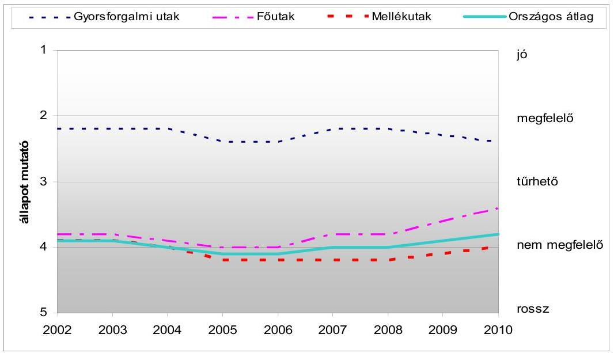

- adatforrás: MK NZrt.

Az utak egyenetlenségi és a felületépség mutatója javult, ezzel együtt a közutak közel 70\%-a nem megfelelő, illetve rossz állapotú. Az utak teherbírási jellemző-

[^0]
[^0]:    ${ }^{10}$ Az utak állapotának egyes mutatóit az Útügyi Műszaki Előírások alapján elvégzett mérések, számítások, értékelések alapján állapítják meg. A legfontosabb burkolat állapot mutatók a felületépség, a teherbírás, a nyomvályú és az egyenetlenség, amelyeket 1 és 5 közötti szélsőértékű osztályzattal (jó, megfelelő, tűrhető, nem megfelelő, rossz) minősítenek.

---

je összességében kedvezőtlenül változott. A tengelyterhelések megengedett határértéke az EU csatlakozáskor kapott felmentés lejárta után, 2008-ban az addig érvényben lévő 10 tonnáról 11,5 tonna értékre növekedett, ami tovább gyorsította az úthálózat állapotának romlását. A nyomvályús utak hossza, a megnövekedett nehézgépjármú forgalom miatt 2006-ig növekedett, majd 20072011 között 10\%-kal csökkent. A különösen veszélyes 17 mm -nél mélyebb nyomvályús szakaszok hossza csökkent, de még mindig közel 2000 km -t tesz ki. A gyorsforgalmi és a nem gyorsforgalmi utakon a vizuális burkolatállapot felvételek évente 166-320 ezer kátyút (úthibát) rögzítettek.

A burkolatok állapotának megfelelő szinten tartása - szakmai előterjesztések szerint - évente 2500 km útszakasz felújítását igényelné. Ezzel szemben éves átlagban 632 km útszakaszt újítottak fel. A 2006-2011. időszakban országosan 3794 km , ezen belül hazai támogatásból (Útpénztár) 2517 km , EU KÖZOP forrásból 187 km és ROP forrásból 1090 km közútfelújítás történt meg.
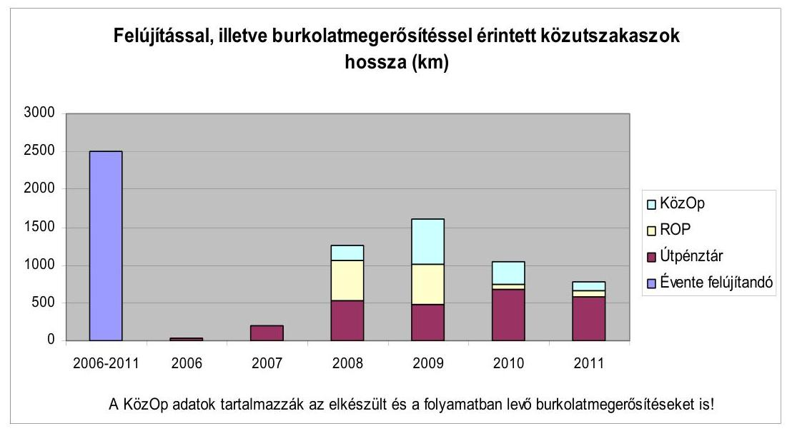

Az utak romlására, a felújítások, karbantartások elmaradásaira, azok forrásigényére az érintett szervezetek - MK NZrt., KKK - előterjesztéseikben, beszámolóikban folyamatosan utaltak. Az utak rossz állapotából fakadó környezetvédelmi, balesetvédelmi és egészségkárosító következményeket ugyanakkor nem hangsúlyozták.

A közutak felújításának, karbantartásának fedezetét az Útpénztár és EU (ROP, KÖZOP) források jelentették. Ezek ténylegesen biztosított együttes öszszege a 2006-2011. évek közötti időszakban 172 Mrd Ft volt, évente átlagosan 28 Mrd Ft-ot tett ki.

- Az Útpénztár fejezeti kezelésű előirányzat 2006-ban történt bevezetésével a gyorsforgalmi utak nélküli országos közúthálózat fenntartás finanszírozását, átlátható, ellenőrizhető múködését célozták meg. A célkitúzés nem teljesült, a feladatok fedezete nem volt biztosított. Az előirányzat, - ezen belül a költségvetési támogatás - összege 2006-tól, de különösen 2009-től folyamatosan

---

csökkent, majd a támogatás 2012-től megszűnt. Továbbá zárolások, elvonások is csökkentették a forrásokat. 2003-ban kormánydöntés ${ }^{11}$ született az országos közutak üzemeltetési és fenntartási színvonalának 2004-től való fokozatos emeléséről. ${ }^{12}$ A csökkenő forrás miatt az országos közúthálózaton biztosítandó szolgáltatási szintek (osztályok) ${ }^{13}$ elérésére vonatkozó elvárás nem teljesült. Az Útpénztárból útfelújításokra maradványelv alapján jutott pénz, mert elosztásakor a főbb múködési és fejlesztési kiadásokat tekintették elsődlegesnek. A közutak felújítására 64 Mrd Ft, évente átlagosan 10,7 Mrd Ft jutott, 2012-re csak 5,3 Mrd Ft-ot terveztek. A 2012-re szóló költségvetési törvényben az Útpénztár bevételei és kiadásai a KKK intézményi költségvetés előirányzatai között jelentek meg. A költségvetési törvényben jóváhagyott kiadási előirányzatok elosztásakor a gyorsforgalmi utak nélküli állami utak felújítására 0,56 Mrd Ft kiadást hagyott jóvá a nemzeti fejlesztési miniszter. A karbantartáson belül a kátyúzások ráfordítása a 2006. évi 7,2 Mrd Ft-ról 2010-re 3,1 Mrd Ft-ra csökkent.

- Az EU forrásokra támaszkodó, a 2007-2013-as időszakra szóló Regionális Operatív Program (ROP) forrásokból regionális útfelújításra, illetve a Közlekedés Operatív program (KÖZOP) forrásaiból burkolat-megerősítésre az ellenőrzött időszakban összesen 254 Mrd Ft felhasználásáról született döntés. 2011-ig 108 Mrd Ft-ot (éves átlagban 17 Mrd Ft-ot) használtak fel.
- A ROP-ból elsősorban a térségi és a települési elérhetőség javítását célozták meg és az alsóbbrendű (4 és 5 számjegyű) közúthálózatra vonatkoztak. A ROP közútfelújítások 2006-2011. évekre tervezett hossza 1309,3 km volt, ennek pénzügyi igénye 182,6 Mrd Ft-ot tett ki. A Regionális Fejlesztési Tanácsok (RFT) a felújítandó útszakaszokra a MK NZrt-től kapott létesítményjegyzék alapján - de a regionális területfejlesztési (pl. térségek elérhetőségi, forgalmi) szempontok figyelembevételével - tettek javaslatot. Kétéves akciótervek keretében 1090 km útszakasz felújításáról született kormánydöntés, ezek hazai és EU forrás igénye 56 Mrd Ft volt, 2011-ig ennek 90\%-át ( 50 Mrd Ft) fizették ki.
- A KÖZOP-ból a nehéz tehergépkocsik okozta károsodás javítását, illetve megelőzését célzó 115 kN tengelyterhelésre alkalmas burkolat megerősítést finanszírozták ${ }^{14}$. Hazánk az EU Csatlakozási Szerződésben 2008-ra 1900 km útszakasz megerősítését vállalta. KÖZOP forrásból 2011-ig 197,9 Mrd Ft öszszegben 1190 km (72\%) útszakaszról született döntés, ez a 8329 km főúthálózat 14\%-a. Az ellenőrzött időszakban 51 Mrd Ft-ból 187 km burkolatmegerősítés valósult meg. Kivitelezés, illetve előkészület alatt áll további

[^0]
[^0]:    ${ }^{11}$ Az országos közúthálózat fejlesztésének, fenntartásának és üzemeltetésének hosszúés középtávú feladatairól, valamint finanszírozásának egyes kérdéseiről szóló 2044/2003. (III. 14.) Korm. határozat, amelyet a 1222/2011. (VI. 29.) Korm. határozat hatályon kívül helyezett.
    ${ }^{12}$ Eszerint 2007-ben a „B" szolgáltatási színvonalat, 2008-tól pedig már az EU gyakorlatához közelítő „A" kategóriájú szolgáltatási színvonalat kellett biztosítani.
    ${ }^{13}$ A szolgáltatási osztályba sorolást a közút kategóriája a forgalom nagysága, a közút kiépítettsége és a forgalom időszakos változása alapján határozzák meg. A szolgáltatási osztályba sorolás határozza meg a közútkezelés módját.
    ${ }^{14}$ Ennek munkálatai már 2001-ben megkezdődtek ISPA, illetve KIOP forrásból.

---

1003 km útszakasz. Ezek hozzájárulnak a közutak állapotának javításához, de a vállalt, még nem korszerűsített ( 810 km ) közutak állapota tovább romlik.

Az úthasználattal arányos elektronikus útdíj bevezetését 2004-óta tervezték. Az úthasználattal arányos útdíj bevezetésével, hazánk megfelelne a tagországokkal szemben támasztott - a megtett úttal arányos elektronikus útdíjfizetési rendszer (ED) bevezetésére vonatkozó - irányelvnek. Az úthasználattal arányos díjfizetés bevezetése több előnnyel járó nemzetgazdasági befektetés, mert a gazdasági hasznon túl a közlekedési szállítási módok átrendeződésével és ezek eredményeként a légszennyezést és a klímavédelmet érintő kedvező hatásokkal járhat. A jelenleg használt időarányos díjrendszernél - a tervek szerint - várhatóan magasabb bevétel jogszabály által előírt, a közútfejlesztésre történő visszaforgatása ${ }^{15}$ hozzájárulhat a közutak állapotának javításához. A közúti közlekedés környezetterhelésének csökkentésére ${ }^{16}$ hatást gyakorol a jobb állapotú utakon való gyorsabb haladás és a főutakon is fizetendő díj következtében a gyorsforgalmi utakra terelés hatása. A magasabb díjak - egyes termékek szállítása esetében - versenyképessé tehetik a környezetkímélő vasúti, illetve vízi áruszállítást.

Az előzetes elemzések szerint az ED megvalósításának költsége mintegy 50 Mrd Ft-ra becsült összeg, az éves múködtetési költség 15-20 Mrd Ft lenne. Az ED bevezetése műszaki ${ }^{17}$, valamint - a díjszintek növekedése miatt ${ }^{18}$ - a gazdaságot és a társadalmat egyaránt érintő problémákat is felvet. Az elektronikus útdíjról a 2007. évi kormány előterjesztés óta eltelt időszakban döntés nem született. Az ED előkészítésébe 2011-ben bekapcsolódott a Széll Kálmán Munkacsoport, amelynek előterjesztése szerint az Eurovignette irányelv alapján kivethető maximális díjakat, díjszintet fokozatosan kell elérni.

A Széll Kálmán terv az ED bevezetésének határidejéül 2013. január 1-jét jelölte ki, azonban a 2012. évi költségvetési törvény tervezetében az ED bevezetésére előirányzatot nem terveztek. Az Útpénztár megszüntetett költségvetési támogatásának ellensúlyozására az érvényben lévő - nem az úthasználattal arányos, hanem időtartamhoz kötött - matricás díjfizetési rendszer bevételeinek növelését megcélozva 2012. január 1-jétől a - legrövidebb időtartamú - 4 napos jogosultsági módot megszüntették. Egy 2012 májusában megjelent Korm. határozat intézkedett az új díjszedési rendszer bevezetésével kapcsolatos, 2012-ben végre-

[^0]
[^0]:    ${ }^{15}$ Az útdíjakból származó bevételek egy részének a közutak fejlesztésére történő visszaforgatását a nehéz tehergépjárművekre egyes infrastruktúrák használatáért kivetett díjakról szóló Európai Parlament és a Tanács1999/62/EK irányelve (1999. június 17.) Eurovignette irányelv - releváns tényezőként rögzíti.
    ${ }^{16}$ A közlekedés légszennyező hatására az ÁSZ 2012-ben megjelent, a légszennyezés ellen és a klímapolitika terén tett intézkedések hatásának ellenőrzéséről szóló jelentése is megállapításokat tett.
    ${ }^{17}$ Az ED rendszer korszerű műszaki megoldásaként a mikrohullám, vagy a műhold alkalmazása kerülhet szóba.
    ${ }^{18}$ A KKK által készített „Fehér Könyv" illetve „Zöld Könyv", valamint 2010-ben „a megtett úttal arányos elektronikus útdíjszedés bevezetésének pénzügyi és nemzetgazdasági hatásvizsgálata" címmel a KKK megbízásából készült külső elemzés.

---

hajtandó feladatokról, valamint a közúti infrastruktúra finanszírozásának átfogó programjára vonatkozó javaslat kidolgozásáról.

A szakmai törekvések, valamint az ÁSZ 2006. évi jelentésének ${ }^{19}$ eredményeként elkészült a műszaki, gazdasági és hatékonysági szempontok szerint kidolgozott szakmai tanulmány, Nemzeti Út-, hídfelújítási Program 2009-2020 (NÚP) címen ${ }^{20}$. A NÚP a felújítások forrásszükségletére több pénzügyi alternatívát jelenített meg és tartalmazta az első négy év (2009-2012) felújításainak tételes jegyzékét, valamint környezetvédelmi hatásokat is megbecsült ${ }^{21}$. A szakmai tervek mellé azonban rövid, illetve középtávú részletes pénzügyi terveket nem készítettek. A tanulmányhoz az OKA2000 adatbankot használták, amelynek adatai - felmérési, rögzítési problémák miatt - nem teljes körűen megbízhatóak. A szakmai, pénzügyi hiányosságok miatt a tanulmány szakmai programként való előterjesztése és ebből adódóan kormány általi elfogadása nem történt meg. A NÚP felújításokra vonatkozó tételes jegyzékét a hazai és az EU forrásokból finanszírozott felújítások sorrendjének tervezésekor felhasználták.

2011-ben a Kormány határozattal elrendelte a meglévő gyorsforgalmi úthálózat és a főúthálózat 2020-ig tartó felújítási programjának előkészítését. Ez azonban az országos közúthálózat mintegy 75\%-át kitevő 23 ezer km hosszú mellékúthálózatra nem vonatkozik.

A felújítások tervezését, végrehajtását nem a hatékonysági szempontok, hanem döntően az Útpénztár éves keretösszegének bizonytalansága, fejezeten belüli lassú elosztása miatti kényszerpálya határozta meg. Az Útpénztár felújításokra szánt keretének meghatározása és az ebből megvalósítható létesítményjegyzék összeállítása rendszerint év közepéig történt meg. Ez pénzügyi, technológiai, minőségi következményekkel járt. Pénzügyi következmény volt, hogy a késedelem miatt a felújítások közbeszereztetése, kivitelezése is eltolódott, ennek következtében az Útpénztár működését jelentős összegű - kötelezettségvállalással terhelt - rendszeres pénzmaradvány jellemezte. Tehát az adott évi kiadást gyakran az előző évi maradvány felhasználása jelentette, az éves keret felhasználása részben vagy egészben a következő évre tolódott, ami korlátozta az Útpénztár forrásaiból történt felújítások tervszerű végrehajtását. A burkolat felújítások, javítások nem a nyári, hanem - kényszerűen - az arra technológiailag kevésbé alkalmas őszi-téli időszakra estek, emiatt nagy volt a minőségvesztés kockázata. A felújításoknál a hatékonysági szempont helyett a legnagyobb eredményt mutató technológia - a nagyfelületű burkolatjavítás - alkalmazása lett a felújítások szinte kizárólagos módja. A pénzügyi ütemezés lassúsága miatt a 2006-2008. években a gyorsított közbeszerzési eljárások száma megnövekedett. A forrásfelhasználás optimális elősegítése és gyorsítása érdeké-

[^0]
[^0]:    ${ }^{19}$ Az ÁSZ 2006 októberében kiadott „az állami közutak fenntartásának ellenőrzéséről" szóló jelentése javasolta a Kormánynak a közutak állapotát javító programok megvitatását és jóváhagyását, ezek végrehajtását és a szükséges források ütemezését. A NÚP bevezetője is hivatkozik az ÁSZ javaslatra.
    ${ }^{20}$ Készítője a közbeszerzési eljárásban nyertes Nemzeti Úthálózat 2020 Konzorcium, a tanulmány megrendelője a KKK volt.
    ${ }^{21}$ A közútfelújítások eredményeként minimális hatásként 184 tonna/év széndioxid kibocsátás csökkentést becsült.

---

ben 2010-ben az MK NZrt. bevezette a két lépcsős versenyeztetési eljárást. Az első szakaszban a vállalkozók előzetes minősítését és bírálatát követően keretmegállapodást kötöttek, a második szakaszban a konkrét ajánlatkérés és a szerződéskötés történt. A közutak rossz állapota miatti állampolgári panaszokat, bejelentéseket az MK NZrt. a napi, illetve heti munkatervek elkészítésekor figyelembe vette.

A gazdaságossági szempontok sem érvényesültek kellően annak ellenére, hogy szűk források ezt indokolttá tették. A kátyúzásoknál a tartós és gazdaságos anyagok valamint technológiák alkalmazása - döntően az időjárási körülmények miatt - háttérbe szorult. Egy adott hőfok alatt az olcsóbb, kevésbé tartós, hideg kátyúzást alkalmazták, ami hosszabb távon drágább megoldás. A telephelyeken felhalmozódott 180000 tonna mart aszfaltot a felújítási munkák bizonytalan tervezhetősége miatt csak részben használták fel, annak ellenére, hogy, újrahasznosítása megtakarítást, értékesítése - az MK NZrt. által elért piaci árak alapján - 270-360 M Ft bevételt eredményezne.

A műszaki, pénzügyi ellenőrzési feladatok ellátása a jogszabályokban és a belső szabályokban foglaltak szerint megoldott volt, az Útpénztárból finanszírozott kivitelezéseknél a kifizetések a benyújtott számlák szakmai, pénzügyi ellenőrzését követően történtek. A műszaki teljesítést a KKK közbeszerzési eljárásban kiválasztott független műszaki ellenőrökkel végezte. Ugyanakkor az építési naplók vezetésében hiányosságok merültek fel. Az ellenőrzés időszakában felelős minisztérium, valamint a végrehajtó szervezetek ellenőrzési egységei az utak felújításával, karbantartásával kapcsolatos tevékenységet témavizsgálatok, utóellenőrzések során vizsgálták, közbenső ellenőrzésekben - kapacitás hiánya miatt - nem vettek részt. Az NFM felügyeleti tevékenység keretében a KKK és az MK NZrt. beszámolóit véleményezte, és jóváhagyta az éves üzemeltetési, karbantartási, felújítási szerződéseket. Szakmai ellenőrzéseket egyedi esetekben végzett.

A közútfelújítások szervezeti és jogi háttere, a feladat- és hatáskörök meghatározása nem biztosította teljes körűen a kapcsolódó állami feladatok hatékony végrehajtását. A szerteágazó, többszintű szabályozás, valamint a szabályozási környezet gyakori módosításai következtében a jogszabályokban foglalt feladatok és a kompetenciák nehezen áttekinthetőek. A Kormány és a miniszter(ek) feladat- és hatáskörét a jogszabályok (törvény, kormányrendeletek) általánosság szintjén - pl. jogszabály előkészítés, a közlekedési infrastruktúra fejlesztés összehangolása - fogalmazták meg. Az érintett ágazatok - terü-let- és településfejlesztés, környezetvédelem - közlekedésért felelős szakterülettel való koordinációja, a közlekedéssel kapcsolatos ágazati feladatok összekapcsolása, a felelősségek nevesítése konkrétan nem jelent meg a jogszabályokban. A Kkt. a közúti közlekedés fejlesztése kapcsán mindössze a terület- és településfejlesztési tervekkel való összhangra utal.

Az országos - gyorsforgalmi úthálózat nélküli - állami közúthálózat üzemeltetési, fenntartási, forgalomszabályozási és hálózatkezelési feladatait ellátó MK NZrt. 2010-től a kormányzati szerkezetváltozást követően az NFM-től a Magyar Fejlesztési Bank Zrt. (MFB Zrt.) tulajdonosi jogköre alá került. Ennek következtében a minisztérium az állami érdekeket, szakmai szempontokat 2010-ig képviselte közvetlenül a felügyelő bizottságban. A minisztéri-

---

um, valamint a KKK koordinátori, ellenőrzési feladatokat látott el, az állami érdekeket a szabályozáson, illetve az MK NZrt.-vel feladatok ellátására kötött szerződéseken keresztül érvényesítették. Az egységes úthálózat-fejlesztés létrehozása céljából 2011-ben a Kormány az MFB Zrt. tulajdonosi körébe tartozó társaságok (NIF Zrt, ÁAK Zrt, MK NZrt.) két lépésben történő összevonásáról döntött ${ }^{22}$, az összevonás eredményéről értékelési, beszámolási kötelezettséget nem írt elő. Az NFM tájékoztatása alapján, a lefolytatott megvalósítási vizsgálat az összevonás tekintetében negatív eredményt hozott.

Az MK NZrt. kétszintű - régiós és megyei - szervezetrendszerét párhuzamosságok, átfedések jellemezték. A feladat- és hatáskörök egyértelmú elhatárolásának hiánya, a vezetői létszám és az adminisztráció megnövekedése miatt a múködés, a feladatellátás lassú volt. Ezért az MK NZrt. előterjesztése alapján a régiós irányítási szint 2010. november 1-jétől megszűnt, és visszaállt a 2007-ig alkalmazott egyszintű megyei végrehajtási rendszer.

Az állami közutak állapotának nyomon követését az MK NZrt. által kezelt speciális ágazati térinformatikai rendszer, a 2003 óta múködő OKA2000 adatbank látta el. A nyilvántartás aktualizáltságát megkérdőjelezte, hogy az adatállomány egy része (5-10\%-a) nem automatikusan került a rendszerbe, azokat különböző időpontokban, pl. negyedévente frissítették. A tervszerű úthálózati mérések száma és a felmérések köre szűkült, a végrehajtott útfelújítási projektek teljesítését követő ellenőrzési mérések kerültek előtérbe. Az ellenőrzött időszakban a személyi sérüléses balesetek száma mintegy 95 ezer volt. Ezen belül - a nyilvántartás alapján - az útburkolat rossz állapota miatt elenyésző számú (16) baleset ( $0,02 \%$ ) következett be, viszont a baleseti jegyzőkönyvekbe és így az adatbázisba az utak állapotára vonatkozó adatok esetenként nem, vagy pontatlanul kerültek be. Mindezek következtében a nyilvántartás nem teljes körűen megbízható. A baleseti adatok jelentéstételi kötelezettségére vonatkozó EU irányelv megfeleltetésére kiadott hazai jogszabályba ${ }^{23}$ - pl. a területtel, az út típusával, valamint az útfelülettel kapcsolatos adatokra vonatkozó - előírások nem teljes körűen épültek be ${ }^{24}$.

A felújítási, karbantartási feladatok nyilvántartása nem egységes. Az Útpénztárból finanszírozott munkák nyilvántartása széttagolt, sokszereplős, öszszességében bonyolult, nehezen áttekinthető volt. Ez a 2006. évi ÁSZ ellenőrzés ${ }^{25}$ óta nem változott, egységes integrált információs rendszert nem alakítottak ki. Az Útpénztárból finanszírozott fenntartási tevékenységeket, szerződéseket a KKK Excel alapú nyilvántartásban, a kivitelezői számlákat az Oracle ala-

[^0]
[^0]:    ${ }^{22}$ A Magyar Fejlesztési Bank tőkehelyzetének rendezéséről szóló 1398/2011. (XI. 18.) Korm. határozat.
    ${ }^{23}$ A közúti infrastruktúra közlekedésbiztonsági kezeléséről szóló 176/2011.(VIII. 31.) Korm. rendelet.
    ${ }^{24}$ Az EP és a Tanács a közúti infrastruktúra közlekedésbiztonsági kezeléséről szóló 2008/96/EK irányelv (2008. november 19.) 4-9. pontja.
    ${ }^{25}$ Az ÁSZ 2006. évi, az állami közutak fenntartásának ellenőrzéséről szóló jelentése megállapította, hogy az egész intézményre kiterjedő szerződés nyilvántartás mellett „a szakmai főosztályok által különböző időpontokban, egyedileg kialakított zárt, „szigetrendszerek"-et üzemeltettek".

---

pú ún. Közúti Kötelezettség Nyilvántartóban rögzítette. Az uniós (ROP) forrásokból finanszírozott - 4, illetve 5 számjegyű mellékutak - felújítások elektronikus nyilvántartását az Egységes Monitoring és Információs Rendszerben (EMIR), a projektek nyilvántartását az MK NZrt. ún. „útvonal tervezó" rendszerben rögzítette.

Az állami országos közutakra vonatkozó vagyon-nyilvántartási kötelezettséggel járó feladatait a vagyonkezelő KKK teljesítette. A vagyonnyilvántartási rendszer alkalmas az évenként felülvizsgálandó - műszaki paraméterek szerinti - értékcsökkenési kulcsok ${ }^{26}$ alapján a közutak avultsági szintjének megállapítására is. Az értéknövelő beruházásokat, illetve az egyes felújításokat 2007-től végző NIF Zrt. a KKK vagyonkezelésébe csak egy alkalommal (2007-2008. évek között) adott át közúti vagyonelemeket. Közel 56 Mrd Ft értékű felújított útvagyon esetében - döntően a földterületek tulajdonjogi rendezésének elhúzódása, valamint a földterületi nyilvántartások rendezetlensége miatt - sem a vagyon átadása, sem az értékcsökkenés elszámolása nem történt meg.

A korábbi ÁSZ ellenőrzés során tett javaslatok hiányosan teljesültek. Javaslatunk ellenére nem voltak biztosítottak a közúthálózat mindenkori jó állapotának fenntartásához szükséges pénzügyi feltételek. A közutak állapotának javítását célzó programok megvitatására és jóváhagyására irányuló javaslatunk szerint a közutak felújítási programjának tanulmánya elkészült, szakmai megvitatása megtörtént, de Kormány általi megtárgyalása és jóváhagyása elmaradt. A közútkezelés feladatait ellátó szervezeti háttér racionalizálására vonatkozó javaslatunk keretében a közútkezelő társaságot a 20 önálló Kht. megszüntetése mellett egy központi irányító szervvé és annak megyei igazgatóságaivá alakították át. A kivitelezés közbeni és a végteljesítést követő minőségellenőrzésre vonatkozó javaslatunk teljesült, az ellenőrzési rendszert az MK NZrt. és a KKK kiépítette, ugyanakkor a tevékenyégért mindenkor felelős minisztérium belső ellenőrzésének megerősítése nem történt meg.

Az Állami Számvevőszékről szóló 2011. évi LXVI. törvény 33. § (1) bekezdésében foglaltak értelmében a jelentésben foglalt megállapításokhoz kapcsolódó intézkedési tervet köteles az ellenőrzött szervezet vezetője összeállítani és azt a jelentés kézhezvételétől számított 30 napon belül az ÁSZ részére megküldeni. Amennyiben az intézkedési tervet határidőben nem küldi meg a szervezet, vagy az nem elfogadható, az ÁSZ elnöke a hivatkozott törvény 33. § (3) bekezdés a)-b) pontjaiban foglaltakat érvényesítheti.

Az ellenőrzés intézkedéseket igénylő megállapításai és javaslatai:

# a nemzeti fejlesztési miniszter részére 

1. A felújítások tervezését, végrehajtását nem a hatékonysági szempontok, hanem döntően az Útpénztár éves keretösszegének bizonytalansága, fejezeten belüli lassú
[^0]
[^0]:    ${ }^{26}$ Az értékcsökkenés elszámolásának módját és az értékcsökkenési kulcsokat a KKK Számviteli Politika 6. számú melléklete határozta meg.

---

elosztása miatti kényszerpálya határozta meg. Az Útpénztár felújításokra szánt keretének meghatározása és az ebből megvalósítható létesítményjegyzék összeállítása rendszerint év közepéig történt meg. Ez pénzügyi, technológiai, minőségi következményekkel járt. Pénzügyi következmény volt, hogy a késedelem miatt a felújítások közbeszereztetése, kivitelezése is eltolódott, ennek következtében az Útpénztár múködését jelentős összegű - kötelezettségvállalással terhelt - rendszeres pénzmaradvány jellemezte. Tehát az adott évi kiadást gyakran az előző évi maradvány felhasználása jelentette, az éves keret felhasználása részben vagy egészben a következő évre tolódott, ami korlátozta az Útpénztár forrásaból történt felújítások tervszerű végrehajtását.

Javaslat:
Intézkedjen az állami közutak fenntartását, üzemeltetését és fejlesztését célzó előirányzat szerint rendelkezésre álló éves összeg fejezeten belüli elosztásának felgyorsításáról, dolgoztassa ki a feladatok végrehajtását hatékonyabbá tevő és a közbeszerzési törvény rendelkezéseinek is megfelelő - a kivitelezők kiválasztását, a pályázati mechanizmust felgyorsító - eljárásrendet.
2. Az állami közutak állapotának nyomon követését az MK NZrt. által kezelt speciális ágazati térinformatikai rendszer, a 2003 óta múködő OKA2000 adatbank látta el. A nyilvántartás aktualizáltságát megkérdőjelezte, hogy az adatállomány egy része (5-10\%-a) nem automatikusan került a rendszerbe, azokat különböző időpontokban, pl. negyedévente frissítették. A tervszerű úthálózati mérések száma és a felmérések köre szűkült, a végrehajtott útfelújítási projektek teljesítését követő ellenőrzési mérések kerültek előtérbe. Az ellenőrzött időszakban a személyi sérüléses balesetek száma mintegy 95 ezer volt. Ezen belül - a nyilvántartás alapján - az útburkolat rossz állapota miatt elenyésző számú (16) baleset ( $0,02 \%$ ) következett be, viszont a baleseti jegyzőkönyvekbe és így az adatbázisba az utak állapotára vonatkozó adatok esetenként nem, vagy pontatlanul kerültek be. Mindezek következtében a nyilvántartás nem teljes körűen megbízható.

Javaslat
Intézkedjen az OKA2000 adatbank megbízhatóságának növelése érdekében a közutak állapotára vonatkozó adatok tervszerű, ütemezett méréséről és rögzítéséről.
3. A felújítási, karbantartási feladatok nyilvántartása nem egységes. Az Útpénztárból finanszírozott munkák nyilvántartása széttagolt, sokszereplős, összességében bonyolult, nehezen áttekinthető volt. Ez a 2006. évi ÁSZ ellenőrzés óta nem változott, egységes integrált információs rendszert nem alakítottak ki.

Javaslat:
Intézkedjen a felújítási, karbantartási feladatokat ellátó szervezetek egységes, integrált nyilvántartási rendszerének kiépítése érdekében.
4. Az egységes úthálózat-fejlesztés létrehozása céljából 2011-ben a Kormány az MFB Zrt. tulajdonosi körébe tartozó társaságok (NIF Zrt, ÁAK Zrt, MK NZrt.) két lépésben történő összevonásáról döntött, az összevonás eredményéről értékelési, beszámolási kötelezettséget nem írt elő.

---

Javaslat:
Biztosítsa a nemzetgazdasági, szakmai érdekek megfelelő képviseletét az újonnan létrehozott szervezetben, továbbá számoljon be a Kormánynak a társaságok összevonásához kapcsolt fő célkitúzés, az egységes úthálózat fejlesztés rendszerének létrehozása eredményéről.
5. A telephelyeken felhalmozódott 180000 tonna mart aszfaltot a felújítási munkák bizonytalan tervezhetősége miatt csak részben használták fel, annak ellenére, hogy, újrahasznosítása megtakarítást, értékesítése - az MK NZrt. által elért piaci árak alapján - 270-360 M Ft bevételt eredményezne.

Javaslat:
Intézkedjen, hogy a közutak fejlesztésének, felújításának koordinálásáért, végrehajtásáért felelős szervezetek dolgozzák ki a bontott anyagok hasznosításának rendjét.

---

# II. RÉSZLETES MEGÁLLAPÍTÁSOK 

## 1. A nem GyORSFORGALMi ÁLlami KÖzUtAK FELÚJíTÁSÁNAK, JAVÍTÁSÁNAK IRÁNYÍTÁSI, VÉGREHAJTÁSI ESZKÖZRENDSZERE

### 1.1. Az irányító és a végrehajtó szervezetek kialakítása, valamint a feladat- és hatásköreik jogi háttere

Az országos közutak fenntartásának, kezelésének intézményrendszere öszszetett, különböző jogállású szervezetek (szakminisztérium, középirányító költségvetési szerv, állami tulajdonú gazdasági társaságok) látták/látják el a közúti infrastruktúrával kapcsolatos feladatokat. Az EU országokban a közútfenntartási feladatokat ellátó intézményrendszerek eltérőek, ezért a hazai szervezeti rendszer kialakításánál a feladatokhoz legmegfelelőbben hasznosítható nemzetközi tapasztalat figyelembevételére nem volt lehetőség. (A szervezeti struktúra az 1. sz. mellékletben.)

A közúti infrastruktúra fenntartásában, fejlesztésében érintett ágazatok - terület- és településfejlesztés, környezetvédelem -, és a közlekedésért felelős ágazat összekapcsolása sem az intézményi struktúra kialakításánál, sem az ágazati feladatoknál nem jelent meg hangsúlyos szempontként, ezekről a jogszabályok konkrétan nem rendelkeztek. Nem szabályozták a közúti infrastruktúra fejlesztésében, fenntartásában érintett minisztériumok közötti együttműködést, kapcsolattartást, a Kkt. ${ }^{27}$ nem nevesítette az egymással szoros kapcsolatban lévő ágazatok felelősségét, mindössze a közúti közlekedés a terület- és településfejlesztési tervekkel összhangban történő fejlesztésére tett utalást.

A 2010. júliusi kormányzati szerkezetváltozás eredményeként a területfejlesztés az NFM miniszter felügyelete alá került, ezzel az egyes ágazatok integrálásának problémája részben megoldódott. Ugyanakkor a hatályos jogszabályokban nem jelenik meg a belügyminiszter szakpolitikai feladat- és hatáskörébe tartozóan a területrendezés, a településfejlesztés-településrendezés és a közlekedés kapcsolata, továbbá a vidékfejlesztési miniszter hatáskörébe tartozó környezetvédelem és a közlekedés ágazati szintű együttműködési kötelezettsége.

A vizsgált időszakban (2006-2011.) a közlekedésért felelős miniszter, illetve minisztérium kormányzati struktúrán belüli helye, megnevezése többször változott.

A közúti közlekedés átfogó szakmai irányításáért 2008. május 15 -éig a gazdasági és közlekedési miniszter (GKM), a 2010. júliusi kormányzati szerkezetváltozásig a közlekedési, hírközlési és energiaügyi miniszter (KHEM), ettől kezdődően a nemzeti fejlesztési miniszter (NFM) felel.

[^0]
[^0]:    ${ }^{27}$ 1988. évi I. törvény a közúti közlekedésről.

---

Az országos közutakkal kapcsolatos koordinációs feladatokat, valamint az Útpénztár fejezeti kezelésű előirányzat kezelését, müködtetését és felhasználását a Közlekedésfejlesztési Koordinációs Központ (KKK) látta el.

A KKK az Útgazdálkodási Koordinációs Igazgatóság (UKIG) jogutódja, az NFM háttérintézménye, 2007. január 1-jétől önállóan működő és gazdálkodó közszolgáltató költségvetési szerv. Tevékenységi körébe tartozik továbbá a hazai útvagyon kezelése, a közlekedési szakma koordinációja, a közreműködő szervezetek orientálása, a közlekedési infrastruktúrafejlesztési projektek eredményességének, törvényességének és hatékonyságának garantálása.

Az országos - gyorsforgalmi úthálózat nélküli - állami közúthálózat üzemeltetési, fenntartási, forgalomszabályozási és hálózatkezelési feladatait a MK NZrt. látta el. Az MK NZrt. 2010-től a kormányzati szerkezetváltozást követően az NFM-től a Magyar Fejlesztési Bank Zrt. (MFB Zrt.) tulajdonosi jogkörébe került. Feladatait a KKK-val évente megkötött szerződések alapján látta el, e szerződések keretében biztosított állami megrendelésként a KKK útüzemeltetési és fenntartási forrást.

A szerződések melléklete tartalmazta a megyei létesítményjegyzéket, valamint az MK NZrt. (a tervezési, a kivitelezési, kivitelezési közbeszerzés, közbeszerzések, a műszaki- és utóellenőrzés) feladatait. A MK NZrt. - a gyorsforgalmi utak kivételével - ellátja az országos közutakkal kapcsolatos közhasznú tevékenységet az út-, híd-, alagút-fejlesztést, fenntartást és üzemeltetést.

A tulajdonosi felügyelet 2010. évi változását megelőző rendszerben a szakmai szempontok a felügyelő bizottságokban való minisztériumi képviselet által közvetlenül érvényesíthetőek voltak. A közlekedésért felelős minisztériumnak, valamint a koordináló szerepet betöltő KKK-nak a szabályozáson kívül nincs befolyása a Magyar Fejlesztési Bank Zrt. (MFB Zrt.) tulajdonosi körébe tartozó MK NZrt. tevékenységére.

A Magyar Közút Nzrt. jogelődjét, a Magyar Közút Kht.-t a KHEM alapította a 19 megyei közútkezelő kht. beolvasztásával az Állami Közúti Műszaki és Információs Kht.-ba (ÁKMI Kht.). Az MK Kht. 2009. március 31-ei fordulónappal átalakult nonprofit zártkörűen működő részvénytársasággá, ebben a formában 2009. április 1-jétől kezdte meg múködését.

A 2006. évi ÁSZ ellenőrzés által a szervezetrendszer racionalizálására tett javaslata az MK NZrt. (ÁKMI Kht. és megyei kht-k) esetében teljesült.

A MK NZrt. az országos közutak kezelői feladatait 2010 novemberéig párhuzamos rendszerben, 7 regionális főmérnökségén és a megyei igazgatóságokon keresztül látta el. Az így kialakított területi közútkezelői szervezeten belül egy főmérnökséghez esetenként 20 üzemmérnökség is tartozott. (Részletesen az 1. sz. függelékben)

A megyei igazgatóságok dolgozták ki és hajtották végre az állami úthálózat üzemeltetését és karbantartását célzó az éves feladatterveket, ezen kívül ellátták a ROP forrásokból finanszírozott közút felújítási munkák műszaki ellenőrzési feladatait. Az útkarbantartási munkákra fordítható forrásokat az MK NZrt. irány-

---

mutatásai alapján tervezték. Az Igazgatóság kezelésében levő utak karbantartása elsősorban saját kapacitással valósult meg.

Korlátozta a hatékony irányítást a regionális főmérnökségek és a megyei igazgatóságok párhuzamos múködtetése és az ebből fakadó lassú feladatmegoldás. A feladat- és hatáskörök nem voltak egyértelmúen elhatárolva, emiatt a felelősségi kompetenciák összemosódtak. A belső ellenőrzések ${ }^{28}$ jelezték az intézkedések gyenge hatásfoka, illetve időigénye, a kapcsolódó eljárások bonyolultsága, a párhuzamos múködésből fakadó vezetői létszám és az adminisztráció megnövekedése problémáit. A területi szervezet átalakítása, racionalizálása érdekében - a MK NZrt. 2010-ben készített előterjesztése alapján a régiós irányítási szint 2010. november 1-jétől megszűnt. Ezzel a közútkezelésben visszaállt a megyerendszerú végrehajtási modell.

Az állami közutak fenntartásáról 2006. évben kiadott ÁSZ jelentés megállapította, hogy az országos közúthálózat intézményrendszerét átfedések, párhuzamosságok jellemezték. Hiányzott a feladatok és a felelősségi körök egyértelmú elhatárolása. Ezért javasoltuk a korábbi középirányító szerv (UKIG, a KKK jogelődje) jogszabályban előírt feladatainak az SZMSZ-ben való teljes körű megjelenítését, valamint a szervezet célszerűségi, gazdaságossági szempontból való egyszerúsítését.

A belső ellenőrzési jelentések szerint az Útpénztár előirányzat felhasználására irányuló együttműködési rend, engedélyezési eljárás bonyolultságánál, időigényességénél fogva - a rendelkezésre álló forrás bizonytalan nagyságával, ütemezésével, valamint a szabályozási környezet sűrű változásával együtt - esetenként a projektek indokolatlan mértékű elhúzódásához vezet.

Újabb átszervezés keretében a Kormány a „gyorsforgalmi úthálózat hatékony fejlesztése és múködtetése, valamint az egységes úthálózat fejlesztés rendszerének létrehozása céljából" a három nagy állami társaság összevonásáról döntött ${ }^{29}$. A nemzeti fejlesztési miniszter felelőssége mellett a végrehajtásra azonnali határidőt jelölt meg. A kormányhatározat értelmében előbb a Nemzeti Infrastruktúra Fejlesztő Zrt (NIF Zrt.) integrálódik az Állami Autópálya Kezelő Zrt-be (ÁAK), majd az így létrejött társaságba olvad be az MK NZrt. Az újonnan létrejövő társaság neve még nem ismert. A kormányhatározat megvalósítási vizsgálata negatív eredményt hozott. ${ }^{30}$

A jogi szabályozás szerteágazó, többszintú volt, az országos közutak felújítási, javítási, karbantartási feladatokat a közúti közlekedésről szóló 1988. évi

[^0]
[^0]:    ${ }^{28}$ A KHEM Ellenőrzési Főosztálya által az Útpénztár fejezeti kezelésű előirányzat felhasználásával kapcsolatban készített jelentés (2009. november), valamint a KKK belső ellenőrzésének az Útpénztár fejezeti kezelésű előirányzat az MK NZrt. közreműködésével megvalósuló útfelújítási feladataival kapcsolatos - konkrét példákon alapuló vizsgálata (2010.)
    ${ }^{29}$ A Magyar Fejlesztési Bank tőkehelyzetének rendezéséről szóló 1398/2011. (XI. 18.) Korm. határozat.
    ${ }^{30}$ A nemzeti fejlesztési miniszter 2012. június 14-én kelt, az ellenőrzési megállapítások ÁSZ tv. 29. §-a alapján lefolytatott, a jelentés egyeztetése során tett észrevétele szerint.

---

I. törvény (Kkt) ezenkívül kormány- és miniszteri rendeletek ${ }^{31}$ rögzítették. A kezelői feladatokat a miniszteri rendelet mellékletét képező Országos Közutak Kezelési Szabályzata (OKKSZ) tartalmazza.

A vizsgált időszakban a jogszabályokat gyakran módosították, ami az áttekinthetőséget, a kompetenciák nyomon követhetőségét nehezítette. A rendeletekben nem jelent meg átfogóan az érintett szereplők (a közlekedésért mindenkor felelős miniszter, illetve minisztérium, a koordinációért felelős háttérintézmény, valamint a közreműködő gazdasági társaságok), továbbá az egyes ágazatok (környezetvédelem, terület- és településfejlesztés) feladatainak koherens egymásra épülése; a kompetenciák számon kérhetőséget biztosító, egyértelmú elhatárolása.

A közlekedési hálózat finanszírozási céljait szolgáló Útpénztár fejezeti kezelésű előirányzat felhasználásának szabályait tartalmazó miniszteri rendeletek részletezik az előirányzatok kezelésében, múködtetésében, felhasználásában érintett szervezetek (KKK, MK NZrt., NIF Zrt.) feladatait, amelyeket a KKK és az érintett szereplők közötti évenkénti szerződések/együttmüködési eljárásrendek, valamint múködtetési szabályzatok bontanak tovább.

Az állami feladatok koordinálását a közlekedésért felelős miniszter végzi. A közút kezelője a miniszter döntése alapján, költségvetési szerv, illetve többségi állami tulajdonú gazdálkodó szervezet (Kkt. 33. § (1) bekezdés) Költségvetési szerv hangolja össze az országos közutak kezelőinek tevékenységét, finanszírozza az útkezelői szolgáltatást és ellenőrzi az üzemeltetésre vonatkozó szerződésben meghatározott szolgáltatási színvonal biztosítását. (Kkt. 33. § (5) bekezdés).

A jogszabályok (törvény, kormányrendeletek) a Kormány és a miniszter(ek) feladat- és hatáskörét érintően csak a fő feladatokat jelölték meg, ezek részleteire nem tértek ki (pl. a közlekedési hálózat infrastruktúra fejlesztésének összehangolása, valamint a végrehajtó szervezetek - a Nemzeti Közlekedési Hatóság (NKH); a Közlekedésfejlesztési Koordinációs Központ (KKK); a Közlekedésbiztonsági Szervezet - (KBSZ) irányítása).

Az ellenőrzés megállapítása szerint az Útpénztár előirányzat felhasználásához kapcsolódó beszámolási feladatokat a jogi előírások ${ }^{32}$ nem tartalmazták teljes körűen, pl. a KKK esetében műszaki-gazdasági értékelési fel-

[^0]
[^0]:    ${ }^{31}$ Az országos közutakat érintő legfontosabb jogszabályok: az országos közutak kezelésének szabályozásáról szóló 6/1998. (III. 11.) KHVM rendelet, valamint a közlekedési hálózat finanszírozási céljait szolgáló „Útpénztár" fejezeti kezelésű előirányzat felhasználásának szabályait tartalmazó, évente kiadott miniszteri rendeletek.
    ${ }^{32}$ Az állami tulajdonba tartozó országos közlekedési hálózattal, valamint az országos közlekedési hálózat fejlesztésével összefüggő egyes feladatok ellátásáról, továbbá a közlekedési hálózat finanszírozási célokat szolgáló egyes fejezeti kezelésű előirányzatok felhasználásának szabályairól szóló 8/2008. (III. 18.) GKM rendelet és az ezt felváltó a közlekedési hálózat finanszírozási célokat szolgáló egyes fejezeti kezelésű előirányzatok felhasználásának szabályozásáról, valamint az országos közúthálózattal összefüggő feladatok ellátásáról szóló 5/2010. (II. 16.) KHEM rendelet, valamint a Közlekedési, Hírközlési és Energiaügyi Minisztérium közlekedési hálózat finanszírozási célokat szolgáló egyes fejezeti kezelésű előirányzatai tervezésének és felhasználásának szabályairól szóló 9/2009. (II. 27.) KHEM utasítás.

---

adatokat nem írtak elő. A KHEM belső ellenőrzésének 2009. évi vizsgálata is kritikai észrevételeket fogalmazott meg a jogi szabályozás és a hatékony felhasználás kapcsán. A felvetett hiányosságok részben teljesültek a KKK 2010. évi múködtetési szabályzatának kiadásával.

A miniszteri rendeletek a KKK feladatainak felsorolásánál az előirányzatok kezeléséhez, múködtetéséhez kapcsolódó ellenőrzési feladatokat nem részletezték. A közúti közlekedésről szóló törvény is a szolgáltatási színvonal biztosításának ellenőrzését írja elő a koordináló szerv számára.

A belső ellenőrzés javasolta többek között az Útpénztár előirányzat felhasználásának rendszeres műszaki-gazdasági értékelését, valamint az ehhez kapcsolódó konkrét feladatok múködtetési szabályzatban való megjelenítését, továbbá az MK NZrt. által külső vállalkozóknak kiadott karbantartási, felújítási, üzemeltetési feladatok elszámolási rendjének felülvizsgálatát.

Az Útpénztár fejezeti kezelésű előirányzat felhasználásáról szóló jelentése (2009. november) szerint a rendeleti előírásoktól eltérően, 2006-2007. évben nem volt jóváhagyott múködtetési szabályzat. Az előírások a jogszabályi rendelkezésekhez hasonlóan a forrásfelhasználás szabályszerűségére irányultak, a hatékonysági követelményekre nem helyeztek súlyt. Az MK NZrt. által a külső vállalkozókkal (alvállalkozók, közremúködők) kötött szerződések elszámolási rendje bonyolult és időigényes.

A 2010. évi szabályzat rögzíti, hogy a KKK köteles a pénzügyi irányítási rendszer kialakításánál és múködtetésénél biztosítani a forrás felhasználásának szabályszerű, megfelelően szabályozott, gazdaságos, hatékony és eredményes múködését. Viszont az előirányzatok - a belső ellenőrzés általi - ellenőrzése továbbra is csak rendeltetésszerú és cél szerinti felhasználására korlátozódott.

A feladatellátásban érintett szervezetek és a feladatok teljesítésének beszámolási rendszere a szervezeti megosztottság következtében több szinten és módon valósult meg. A közutak felújításához kapcsolódó műszaki, vagyoni-, pénzügyi-helyzet bemutatására egy integrált, szakmai szempontok alapján készülő - más ágazatokban (pl. környezetvédelem), területeken már alkalmazott - szakmai beszámolási gyakorlatot nem alakítottak ki. Az éves beszámolók döntően pénzügyi szemléletűek voltak, a szakmai feladatokat a felügyelő minisztérium éves költségvetési beszámolói, valamint a KKK beszámolói értékelték röviden.

A vizsgált időszakban a közlekedésért felelős szakminisztériumok (GKM, KHEM, NFM), az éves költségvetések végrehajtásáról szóló beszámolókban összegezve számoltak be a közútkezelés szakmai tevékenységéről, intézményi szinten, illetve az Útpénztár előirányzat felhasználása keretében.

A szakmai háttérintézmények (MK NZrt., KKK) az Útpénztár előirányzat éves költségvetéseinek végrehajtásáról és a szervezetek belső múködéséről szóló beszámolókat készítettek. Ezek nem tartalmaztak bővebb szakmai információkat, döntően pénzügyi szemléletben készültek.

Az MK NZrt. szakmai szempontok szerinti - Magyarország közúthálózatának állapotát és annak változásait bemutató - beszámolót „Az országos közutak állapota" és az „Az országos közúthálózat információs eredménytáblái" címen készített. Tevékenységéről (üzemeltetés, karbantartás, OKA, Útinform) a

---

Közhasznúsági jelentésben és az Üzleti jelentésben számolt be, ezen kívül a KKK felé beszámolókat készített feladatainak - közhasznú tisztítási, üzemeltetési és karbantartási tevékenység - végrehajtásáról. Az MFB Zrt. részére - annak útmutatása alapján - havi, negyedéves, éves beszámolót és üzleti jelentést készített, döntően a pénzügyi, a számviteli és a szervezeti helyzetről, kiemelve a legfontosabb változásokat, döntéseket, rendkívüli eseményeket, illetve intézkedést igénylő ügyeket.

# 1.2. Az állami közutak állapotának ellenőrzése, a változásokat nyomon követő monitoring rendszer múködése 

Az útellenőrző rendszer múködését, az útellenőri tevékenységeket a közúti közlekedésről szóló 1988. évi I. törvény, a közúti közlekedésről és a végrehajtásáról szóló 30/1988. (IV. 21.) MT rendelet, valamint az országos közutak kezelésének szabályozásáról szóló 6/1998. (III. 11.) KHVM rendelet és annak melléklete, az Országos Közutak Kezelési Szabályzata (OKKSZ) szabályozza.

Az útellenőri szolgálat ellátását az MK NZrt. végezte a KKK-val évente megkötött szerződések alapján. Az útellenőrzés, annak gyakorisága megfelelt a jogszabályokban foglaltaknak. Az útellenőri feladatok ellátását a KKK külső múszaki ellenőrökkel rendszeresen ellenőriztette.

Az útellenőrzés gyakoriságát - naponta, 2 naponta, hetente, 2 hetente, havonta - az OKKSZ 3.2. pontja szerint a szolgáltatási osztály, vagyis a közút kategóriája és a forgalom nagysága határozza meg. Az üzemmérnökségek előzetesen megtervezik az útellenőri programokat (körzetbejárási terv). Ezek végrehajtását, a tapasztalt eseményeket, állapotot (információt, észlelt eseményt a közútban vagy tartozékaiban, a mútárgyakon keletkezett hibát, károsodást stb.) az évente kiadott MK NZrt. vezérigazgatói utasításoknak megfelelően útellenőri naplóban rögzítik. A naplók adatait informatikai nyilvántartásban nem rögzítették.

A nyilvántartási feladatokból a forgalmi rend adatokat az MK NZrt., a forgalombiztonsági adatokat az MK NZrt. Win-Bal nyilvántartása, az útgazdálkodás adatait a KKK biztosítja. Az ingatlan-nyilvántartási adatokat alapvetően a KKK tartja nyilván, de megtalálhatóak az OKA2000-ben is.

Az állami közutak állapotának nyomon követését egy speciális térinformatikai rendszer, az OKA2000 (Országos Közúti Adatbank) biztosítja. Az OKA2000 adatainak kezeléséért, megbízhatóságáért az MK NZrt. és jogelődje felelt, biztosítva a közutak fenntartásáért felelős szervezetek (minisztérium, MK NZrt. központ, MK NZrt. megyei igazgatóságok, üzemmérnökségek, a KKK és az autópályákat kezelő 4 koncessziós társaság) számára a közutak napi múszaki, minőségi, forgalmi jellemzőinek jogszabályban ${ }^{33}$ előírt adatait, ezek alapján statisztika és összegzés is készíthető. Az OKA2000 megyei adatbázisaiba az MK NZrt. 19 megyei igazgatósága rögzíti az adatokat.

Az OKA2000-ben az adatok megjelenítését, ellenőrzését, illetve elemzéseket egy térképi megjelenítés segíti. Az OKA2000-ben közel 500 (vonalas jellegű, vagy

[^0]
[^0]:    ${ }^{33}$ Az országos közutak kezelésének szabályozásáról szóló 6/1998. (III. 11.) KHVM rendelet.

---

pontszerű objektum) adatféleség található, az adatok időbeli változásainak folyamatos rögzítése révén az adatok idősoros tárolását biztosítja. A rendszer képes bemutatni az úthálózat bármely időpontban aktuális műszaki jellemzőit. Az OKA2000 bizonyos adatai (táblák, megyei összesítők) közérdekűek, az állampolgárok számára interneten hozzáférhetőek.

Az OKA2000 alapján készült a KÖZÚT-50 útréteg adatbázis, ami több mint 15000 útszakasz, közel 12200 csomópont adatait tartalmazza, az országos úthálózat mintegy 400000 pontját jeleníti meg. Minden új útrétegről kimutatható, hogy melyik úton és azonosító pontok között, milyen távolságra helyezkedik el.

Az MK NZrt. a közúti és a koncessziós autópálya kezelőktől kapott elektronikus állományok ellenőrzését lezáróan a negyedévet követő hónap közepéig összeállította az aktualizált országos (központi) adatállományt, melyet megyei bontásban is megküldött az érintett kezelőknek. Az adatok minőségének javulását eredményezte 2006-ban az OKA2000 továbbfejlesztése, kezelését az MK NZrt. évenként kiadott vezérigazgatói utasításai segítették.

A döntések megalapozását szolgáló segítő monitoring rendszer megbízhatóságának elengedhetetlen eleme az OKA2000 adatállományának tervezett, meghatározott időszakonként történő frissítése. Az adatok aktualitását, megfelelő frissítését korlátozta, hogy az egyes adatcsoportokat (baleseti, forgalmi stb.) különböző idöpontokban frissítették. Emellett a vizsgált időszakban végig fennálló, az üzemeltetést érintő alulfinanszírozottság, továbbá a KKK-val évente megkötött, a MK NZrt. múködését, adatfelvételeket biztosító szerződések megkötésének elhúzódása miatt a tervszerű hálózati adatfelvételek elmaradtak. Az üzemeltetés alulfinanszírozottsága miatt a tervszerű hálózati adatfelvételek mellett a végrehajtott útfelújítási projektek teljesítést követő mérései kerültek előtérbe. Előfordult, hogy ezek eredményeit az adatbankba nem vezették fel, emiatt az országos adatok nem tekinthetőek teljes körűen megbízhatónak. Éves összegzett aktuális adatnak - az OKA év végi zárását követő - januári adatokat tekintették. Csökkent a 2006-2011 között végzett úthálózati mérések száma és a mért útszakaszok hossza, ennek következtében kevesebb aktualizált adat állt rendelkezésre. A fejlesztések és a belső szabályozás ellenére előfordult, hogy a megyei adatkezelőknél néhány esetben az adott adat automatikusan nem került be a rendszerbe, ezért az állományban az útfenntartási és felújítási beavatkozások 5-10\%-a csak a következő negyedévben frissült.

A baleseti adatok a Win-Bal rendszerből a negyedéves frissítési ciklustól eltérően frissültek, míg a településlista KSH adatainak felvitele év végén egyszer történt meg. Az OKA2000-be a Híd adatok átvétele a KKK Híd adatbázisából (Egységes Híd Rendszer (EHR)), egy csökkentett híd adatbázis átvételével, szintén évente egyszer az OKA évi végi zárásakor történt. Az országos dinamikus teherbírásmérési adatok, a digitális térképi változások negyedévente, a felületállapot mérési adatok évente júniusban és decemberben, a vizuális burkolatállapot mérés adatai júniusban, a forgalomszámlálás adatai a következő év júniusában kerültek a rendszerbe.

A forgalomszámlálást az OKKSZ-ben rögzített útkategóriák figyelembevételével, az országos közúthálózat mintegy 20\%-án végezték el. Ezen belül az autópályák, autóutak, első- és másodrendű főutak, a csomóponti összekötő utak teljes hoszszában felmérésre kerültek. Az alacsonyabb kategóriákba sorolt utak, például az

---

állomáshoz vezető utak $40 \%$-a, az egyéb országos közutak (a parkolóhelyi utak, a gyorsforgalmi utak pihenőhelyei) a felmérésben esetileg szerepeltek.

A GPS technológia alkalmazásával lehetővé vált az útburkolati hibák koordináták alapján történő rögzítése. Az adatállomány műszaki adatainak aktualizálására 2006-ban indult 5 éves „Mérési Program" során az adatokat felülvizsgálták.

Az Egységes Híd Rendszer a hidak adatainak, jellemzőinek nyilvántartója. Alrendszerei: a hidakról állapotáról készült képek kezelését, karbantartását, tárolását rögzítő „híd képtár", a hidak terveinek kezelését, tárolását, karbantartását kezelő „híd tervtár" rész, és a hídvizsgálati eredményeket, a hidak vizsgálati lapjainak kezelését, karbantartását tároló „hídlap".

A közúti adatbázist az OKKSZ-ben, illetve az útügyi szakmai előírásokban foglaltaknak megfelelően tartották karban, ugyanakkor a felsorolt hiányosságok következtében a vizsgált időszakban a felújított útszakaszok alapadatainak mintegy $90 \%$-a került a rendszerbe.

# 2. A feladatok sZakmai, pénzüGyi tervezésének megalapoZOTTSÁGA 

### 2.1. A közútfelújítások tervezésének előkészítése, szakmai megalapozása

A gyorsforgalmi utak nélküli országos közúthálózat felújítása mintegy három évtizeden át háttérbe szorult, ami az érintett közutak műszaki állapotának leromlását okozta. Ennek következményeként a rendszeres felújítás a legsürgetőbb beavatkozásokat megcélzó, a gazdaságossági, hatékonysági szempontokat figyelmen kívül hagyó tevékenységgé vált.

Az útállapotok miatt a szakmai szervezetek részéről már korábban megfogalmazódott az igény egy, az országos közúthálózat állapotának megóvását, javítását célzó nemzetgazdasági jelentőségű döntéseket megalapozó, műszaki, gazdasági és hatékonysági szempontokat figyelembe vevő szakmai tanulmány összeállítására.

Az UKIG megbízásából 2004-ben elkészült a „Mellékutak burkolatállapot javító programjának előkészitő vizsgálata" című dokumentum, mely alapján az UKIG 2006-ban a 2007-2015. évek közötti időszakra előkészítette a gyorsforgalmi úthálózat nélküli teljes országos közúthálózat vonatkozó - később eredménytelen közbeszerzési felhívást.

A Közlekedéstudományi Intézet Kht. 2004-ben készíttette el a 2005-ös évtől kezdődő, 10 éves időszakra vonatkozó Nemzeti Útfelújítási Programot.

Az ÁSZ 2006 októberében adta ki a jelentését „az állami közutak fenntartásának ellenőrzéséről". Ebben a 2002-2006 közötti időszakban, a közutak állapotának javítása érdekében hozott intézkedéseket észrevételezte, valamint javasolta a Kormánynak a közutak állapotát javító programok megvitatását és jóváhagyását, ezek végrehajtásának és a szükséges forrásoknak az ütemezését.

---

A szakmai törekvések, valamint az ÁSZ 2006. évi javaslatai alapján hozott miniszteri intézkedés előírta a közutak felújítási programjának elkészítését. A KKK által meghirdetett közbeszerzési pályázat nyertese a Nemzeti Úthálózat 2020 Konzorcium készítette el 2007. október 31. dátummal a Nemzeti Út-, hídfelújítási Programot 2009-2020 (NÚP). A NÚP kidolgozásának alapadatbázisa az úthálózat műszaki, minőségi adatait tartalmazó OKA2000 volt.

A NÚP 2020-ig ad kitekintést. Az út- és hídfelújítási tevékenységekre a források oldaláról több alternatívát, ezen kívül az első négy év (2009-2012) tételes felújítási munkáinak jegyzékét tartalmazza.

A NÚP kitért az egyes alternatívák esetén elérhető, a közúti közlekedés környezeti hatásainak becslésére, ezen belül az üzemanyag-felhasználás függvényében a helyi levegőszennyeződésre és a klímaváltozásra gyakorolt együttes hatásokra.

A NÚP széles körben használt és elismert nemzetközi modellekre épül. A közutak felújításának elemzéséhez a HDM-4 jelú modellt, a hidak munkálatainak elemzéséhez a PONTIS nevú modellt használták a tanulmány készítői. A HDM-4 modell tervezési korlátját az 1000 gépjármú/nap forgalom jelentette, ez alatt a modell az útgazdálkodási feladatokat és költségeket nem megbízhatóan tervezi. A közutak mintegy harmadát ( 10200 km ) kitevő kisforgalmú utak esetében normatív módszerrel történt a projektelemek kiválasztása és rangsorolása.

A NÚP társadalmi egyeztetésére nem került sor. A tanulmány felülvizsgálata a KKK által kijelölt Irányító Bizottság, valamint a Konzorcium által kialakított Szakértői Bizottság szakmai együttmúködésével történt.

A NÚP-ban foglalt létesítményjegyzéket az aktuális felújítások tervezése során használták. A MK NZrt az Útpénztár, a regionális fejlesztési tanácsok a Regionális Operatív Programok (ROP) keretein belül a 4 és 5 számjegyú utak felújítására tervezett utak kiválasztásánál vették figyelembe a NÚP-ban szereplő projektlistákat. Az Útpénztárból finanszírozott utak esetében 100\%-os, a ROP-ok esetében a NÚP általi alátámasztottság 80\%-os volt országos szinten.

A NÚP a forrásszükséglet számításokon túl a finanszírozásra érdemi javaslatot nem tett, vagyis a - hazai, és az EU - források konkrét összegével, megosztásával nem számolt. Az állami költségvetés egyensúlyi helyzetére tekintettel a benne foglalt feladatokhoz szükséges forrásokat a közlekedésért felelős tárca nem tudta hozzárendelni. A NÚP adatbázis háttere az (OKA2000) nem volt teljesen megbízható. Mindezek következtében a NÚP Kormány elé történő beterjesztésére nem került sor, ezért nem vált hivatalos szakmai programmá.

A gyorsforgalmi - és a főúthálózat hosszú távú fejlesztési programjáról és nagytávú tervéről szóló 1222/2011. (VI. 29.) kormányhatározat 7. pontja szerint „A Fejlesztési Program fejlesztéseit figyelembe véve elő kell készíteni és a Kormány elé kell terjeszteni a meglévő gyorsforgalmi úthálózat és a fóúthálózat 2020-ig tartó (kapacitásbővítéssel nem járó) felújítási programját." Ez a gyorsforgalmi és a főúthálózat felújítási programjára jelölt ki feladatot, az országos közúthálózat mintegy $75 \%$-át kitevő 23 ezer km hosszú mellékúthálózatra nem.

---

# 2.2. Az aktuális létesítményjegyzékek összeállítása, szempontjai, egyeztetése 

Az Útpénztárból finanszírozott felújítások létesítményjegyzékeit a KKK elrendelő levele alapján az MK NZrt. készíti el. A műszaki, illetve finanszírozási átfedések elkerülése érdekében a KKK és az MK NZrt. között létrejött Megbízási Szerződés az MK NZrt. kötelezettségeként előírja az országos és regionális programokból (pl. ROP, KÖZOP) eredő feladatok figyelembevételét. Az MK NZrt. megyei szervezeti egységeinek nyilatkozniuk kell, hogy nincs projekt átfedés az uniós támogatással finanszírozott programokkal.

A létesítményjegyzékek összeállításának szempontjait az NFM szakmai felügyelete mellett a KKK határozza meg. Meghatározzák a projektekre fordítható felújítási keretösszeget, a projektek befejezésének határidejét, az elvégzendő feladatok lehetséges körét, a felújítási beavatkozások célját, a tervezhető technológiákat.

Az elkészült létesítményjegyzéket a KKK ellenőrzi. Ez elsődlegesen a megadott kiválasztási szempontoknak való megfelelés vizsgálatát jelenti, de kiterjed a tervezett technológia alkalmazhatóságának, illetve az út állapota alapján az indokoltságának - az OKA adatbázis alapján szúrópróbaszerűen végrehajtott - elbírálására is. A KKK az esetleges eltérések korrigálását követően a minisztérium részére jóváhagyásra előterjeszti a műszaki előkészítésre javasolt projekteket. A szakmai felügyeletet az NFM látja el.

Az uniós támogatásokból finanszírozott útfelújítások létesítményjegyzékeinek összeállításánál a kiválasztási folyamat során az operatív programokban és az akciótervekben megjelölt térségfejlesztési szempontokat is figyelembe veszik. A ROP-okban rögzítették például:

- a térségi központok, jelentős gazdasági súllyal rendelkező területek, logisztikai központok elérhetőségét;
- a turisztikai célterületek megközelíthetőségét;
- a fő közlekedési útvonalak elérhetőségét;
- a 4-5 számjegyű közutakon történő közlekedés minőségének, biztonságának magasabb szintű környezeti fenntarthatóságát.

A régiók a rangsorolásnál különböző súlyozással vették figyelembe a kiválasztási szempontokat. Kiemelt szerepet a műszaki szempontok mellett a területfejlesztés és a kistérségek megközelíthetősége kapott.

A Közép-Dunántúli régióban például az egyes szempontokat a következő súllyal vették figyelembe: területfejlesztési szempontok: 70\%, az útszakasz műszaki állapota: $15 \%$, forgalmi-baleseti állapot: $15 \%$. A Nyugat-Dunántúli régióban a felújítandó utak kiválasztásánál az út minőségének kritériumai $40 \%$-os súllyal, a területfejlesztésé $60 \%$-os súllyal jelennek meg.

A Dél-Dunántúli régióban az útrangsor modelljében meghatározott hat paramétert a következők szerint vették figyelembe. A hálózati szerepkör értékelésénél mérlegelték, hogy a felújítandó út regionális, megyei, vagy kistérségi szintű hálózati szerepet tölt be, kistelepüléseket köt össze, vagy települési útként funkcionál.

---

A forgalomnagyság és a jelenlegi útállapot paramétereket minőségi jellemzők (jó, megfelelő, tűrhető, nem megfelelő, tűrhetetlen) alapján vették figyelembe.

A karbantartás a forgalombiztonság fenntartását szolgálja. Ezeket a feladatokat az MK NZrt. az országos közutak kezelésének szabályozásáról szóló 6/1998. (III. 11.) KHVM rendelet (OKKSZ) előírásai szerint látja el.

Az OKKSZ alapján a kezelésükben lévő országos közutakat a közút kategóriájától, a forgalom nagyságától, a közút kiépítettségétől és a forgalom időszakos változásától függően közútkezelési szolgáltatási osztályba sorolják. A besorolás határozza meg az adott úton végzendő téli és nyári útüzemeltetési munkák gyakoriságát, illetve a beavatkozások szintidejét.

A karbantartási feladatok tervezése a rendelkezésre álló források megyék közötti elosztásával indul, ami alapvetően a közúthálózat hosszán alapul. Az MK NZrt. megyei igazgatóságai terveiket a meghatározott keretszámok és a kialakított egységárak alapján, az OKA adatbázisát felhasználva készítik el.

A felújítási és karbantartási beavatkozások módjának, technológiájának kiválasztása körében kialakított, a közúti intézményrendszer döntési szabályai, egyeztetési és ellenőrzési eljárásai a szakmailag nem megalapozott, gazdasági szempontból nem alátámasztott döntések kiszűrésére irányulnak.

A szükséges és a rendelkezésre álló források közötti eltérés nagysága ugyanakkor meghatározó tényező a pillanatnyilag olcsóbb, tehát alacsonyabb minőséget biztosító technológiák alkalmazására. A felújításoknak a műszakilag indokolt szinttől való elmaradása miatt a beavatkozások kiválasztásánál az elsődleges szempont a jogszabályban előírt közlekedésbiztonság megvalósítása. A szükséges beavatkozásokat a rendelkezésre álló források nem tették lehetővé. Ezért a hatékonyság kritériuma helyett, az elosztás fő szempontjává a mennyiségi mutatók (úthossz, burkolatfelület) teljesítése vált, vagyis, hogy a rendelkezésre álló forrásokból a legnagyobb eredménnyel járó beavatkozásokat hajtsák végre. Ennek következtében a felújítások szinte kizárólagos módjaként a nagyfelületű, foltszerű burkolatjavítást alkalmazták.

Rontotta a felújítási munkák hatékonyságát, illetve gazdaságosságát, hogy a munkafázisok időzítésének a pénzügyi keret rendelkezésre állásához kellett igazodnia. A burkolat felújítási technológiák erősen időjárás függőek, a kivitelezésre leginkább a tavaszi-nyári időszak alkalmas, ekkor biztosítható a legjobb minőség. Ebből következően a feladatok vállalkozásba adását a tárgyévet megelőző őszi-téli hónapokban kellene lebonyolítani. A hazai költségvetésből biztosított tárgyévi felújítási keretek jóváhagyása az év elején, március-április hónapban történik meg, így az aktuális feladatok műszaki előkészítése, közbeszerzése április-május hónapban indulhat el, és a kivitelezés kényszerűen az őszi-téli időszakra húzódik, amikor már nagy a minőségvesztés kockázata.

A kátyúzás a közúti forgalom balesetmentességét biztosítja, ennek érdekében a megrongálódott útszakaszokon karbantartás keretében - az OKKSZ előírásainak megfelelően - kell időszaktól függetlenül elvégezni. A téli kátyúzás drága technológia, mert alacsony hőmérsékleten a kátyúzó anyag tapadása nem tökéletes, így az csak rövid időre szóló, átmeneti megoldást jelent, és a közútke-

---

zelő részéről folyamatos készenlétet tesz szükségessé. A hosszútávon megfelelő minőségű javítást a nyári időszakban végzett kátyúzások biztosítják.

Az aktuális létesítményjegyzék tervezésénél és a napi karbantartási feladatoknál a baleseti statisztikákat, és az ügyfélszolgálat adatait figyelembe vették.

A baleseti adatokra vonatkozó jelentéstételi kötelezettséget a közúti infrastruktúra közlekedésbiztonsági kezeléséről szóló, az Európai Parlament és a Tanács 2008/96/EK (2008. november 19.) irányelve írta elő.

Az EU irányelv a hazai jogrendbe átültetése a közúti infrastruktúra közlekedésbiztonsági kezeléséről szóló 176/2011. (VIII. 31.) Korm. rendelet elfogadásával történt meg. A baleseti adatgyűjtésért, azok karbantartása és kezelése kidolgozásának rendjéért a 2/2009. (II. 13.) KHEM utasítás, azaz a KHEM SzMSz-e alapján a Közlekedési, Hírközlési és Energiaügyi Minisztérium, Közlekedési Szakállamtitkársága felelt. A feladatellátást a KKK, továbbá a MK NZrt. végezte.

Az EU irányelv és a megfeleltetésére kiadott hazai kormányrendelet között eltérések mutatkoztak. A magyar jogszabály a 4. sz. A baleseti jelentésben szereplő baleseti információk címú melléklete nem teljes körűen vette át az uniós irányelvet. A jogszabály nem írja elő az útra vonatkozó információk közül, például a terület típusa, az út típusa, az út felületére vonatkozó adatok rögzítését.

Az MK NZrt. és a KKK a személysérüléses balesetek nyilvántartására kifejlesztett Win-Bal programot alkalmazta. A program és az OKA2000 között az átjárhatóság biztosított volt. A rendszer adatai alapján a vizsgált időszakban történt balesetek száma 94957 volt, ezen belül az útburkolat rossz állapota miatt elenyésző számú (16) baleset ( $0,02 \%$ ) következett be. Ezek az adatok nem tekinthetőek megalapozottnak, mivel a KKK a baleset ügyében eljáró hatóságoktól esetenként hiányos adatszolgáltatást kapott.

A nyilvánosság jelzéseinek (ügyfélszolgálat, kátyúvonal, bejelentések) kezelésére a közút kezelője volt kötelezett ${ }^{34}$. A panaszkezelési folyamatot az érintett szervezetek eltérő módon valósították meg. Kizárólag a panaszkezeléssel foglalkozó felelős szervezeti egység nem volt. A bejelentések kezelését, a nyilvánosság tájékoztatását az MK NZrt.-nél napi 24 órában múködtetett Útinform végezte. A bejelentések ügyintézése egyetlen szervezetnél sem haladta meg a 30 napos határidőt.

A panaszok, bejelentések között képviselői interpellációk, polgármesterek, valamint magánszemélyek beadványai voltak megtalálhatók. A minisztériumba érkező panaszokat, beadványokat a KKK-hoz és az MK NZrt-hez irányították, részletes vizsgálat és előzetes véleményezés céljából.

A kátyúvonalra történt bejelentések elsősorban az utak állapotával, a baleseti helyszínek azonosításával, a közútkezelő feladatkörébe tartozó útburkolati beavatkozásával foglalkoztak. Ezek száma drasztikusan csökkent, 2006-ban 94 459, 2007-ben 2142, 2008-ban 581, 2009-ben 992, 2010-ben 330 volt. A nem úthibák-

[^0]
[^0]:    ${ }^{34}$ Az országos közutak kezelésének szabályozásáról szóló 6/1998. (III. 11.) KHVM rendelet mellékletét képező Országos Közutak Kezelési Szabályzatának függeléke szerint.

---

kal kapcsolatos bejelentések kiszűrése érdekében a korábban ingyenes kátyúvonalat, helyi tarifán alapuló Út-hiba bejelentő vonallá alakították.

A bejelentések kezelését a kezdeti tömeges hívásszám miatt külső cég, majd a csökkenő számú hívások következtében 2010-től az Útinform kapta meg feladatként.

Az Útinform tájékoztatása szerint a bejelentett észrevételeket - típusától függően - a napi, illetve heti munkatervek készítésekor vették figyelembe.

A KKK tájékoztatása szerint a hívások csökkenésének egyik oka volt, hogy a korábban ingyenesen hívható számot, helyi tarifával tárcsázható számmá alakították. Az Útinform felülvizsgálata szerint az ingyenes telefonszámra érkező bejelentések között nagy számban voltak komolytalan, nem megalapozott hívások.

# 2.3. A közútfelújításokat célzó források tervezése és felhasználása 

Az egyetlen hazai forrás az Útfenntartási és fejlesztési célelőirányzat (ÚFCE) fejezeti kezelésű előirányzat 2005. december 31-én megszűnt, helyébe az Útpénztár lépett.

Az Útpénztár kialakításának előkészítésekor a korábbi Útalaphoz hasonló múködést célozták meg, amelytől a tervezés, működés, felhasználás körében a nagyobb kiszámíthatóságot, hatékonyságot és ellenőrizhetőséget vártak. Ugyanakkor az eredeti tervektől eltérően az Útpénztár fejezeti kezelésű előirányzatként az ÚFCE jogutódja lett azzal a változással, hogy a belső pénzügyi átcsoportosítások, az aktuális feladatok végrehajtása érdekében egyesítették benne az országos közúthálózattal összefüggő bevételeket, támogatásokat és kiadásokat. A bevételek (autópálya matrica, költségvetési támogatás) összpontosítása megtörtént. A kiadási oldalon ugyanakkor az ÁAK Zrt és a MK NZrt működési kiadásainak biztosítása (ezen belül a közutak üzemeltetése, tisztítása) lett elsődleges, az útfelújításokra jutó pénz összegét a maradványelv alapján határozták meg. Az Útpénztár bevezetése a gyorsforgalmi utak nélküli országos közúthálózat fenntartásának szempontjából ily módon a források elosztásának mechanizmusát tekintve előnyökkel nem járt.

Az Útpénztár forrásai folyamatosan csökkentek, ezért a szolgáltatási szintek elérésére vonatkozó elvárás az ellenőrzött időszak egészében nem teljesült. Annak ellenére, hogy a gyorsforgalmi utak nélküli országos közúthálózaton biztosítandó szolgáltatási szintről, annak ütemezett emeléséről 2003-ban kormánydöntés ${ }^{35}$ született, ugyanakkor a megvalósítás pénzügyi hátterét számszerűen csak a 2004. évre határozta meg az Útfenntartási és - fejlesztési Célelóirányzat (ÚFCE) 100 Mrd Ft-os előirányzatával. Az azt követő időszakra csak elvi iránymutatást adott a lehetséges EU források és privatizációs bevételek körében.

[^0]
[^0]:    ${ }^{35}$ Az országos közúthálózat fejlesztésének, fenntartásának és üzemeltetésének hosszú és középtávú feladatairól, valamint finanszírozásának egyes kérdéseiről szóló 2044/2003. (III. 14.) Korm. határozat, amelyet a 1222/2011. (VI. 29.) Korm. határozat hatályon kívül helyezett.

---

A kormányhatározat szakmai feladatként tűzte ki, hogy az országos közutak üzemeltetési és fenntartási színvonala 2004-től fokozatosan emelkedjen. 2007ben a „B" szolgáltatási színvonalat, 2008-tól pedig már az EU gyakorlatához közelítő „A" kategóriájú szolgáltatási színvonalat kellett volna biztosítani.

A 2006. évi ÁSZ ellenőrzés által tett javaslatok ellenére nem voltak biztosítottak a közúthálózat mindenkori jó állapotának fenntartásához szükséges - elsősorban pénzügyi - feltételek. A vizsgált időszakban közút felújítások hazai és EU ráfordításainak éves átlaga 27 Mrd Ft volt, ez pedig lényegesen kevesebb volt a szakma által szükségesnek tartott évi 125 Mrd Ft-nál.

Az állami út- és hídvagyon értéke autópályák nélkül 7286 Mrd Ft, a vagyonérték megtartása 3\% értékcsökkenés mellett 219 Mrd Ft, 2\% értékcsökkenés mellett 146 Mrd Ft éves visszapótlást igényel.

A felújítások terén a pénzszúke miatt felhalmozódott elmaradásokra és az ezek felszámolásához szükséges, a költségvetésben évenként rendelkezésre álló forrásokat jelentősen meghaladó forrásigényre - pl. az Útpénztár előirányzatának tervezése során - és a forrásszükéből adódó várható állapotromlásra az érintett szervezetek felettes szerveik felé a költségvetési források elosztása során folyamatosan felhívták a figyelmet.

Az Útpénztár 2008. évi előirányzat tervezésének szöveges dokumentuma szerint a közlekedési szakállamtitkárság az ÁAK zrt. által javasolt 2008. évi tervezett felújítás költségét figyelembe vette, és indokoltnak tartotta MK Kht (MK NZrt jogelődje) által jelzett forrást. „a korábbi szakmai anyagokban is kimutatott (75-80 Mrd Ft/év), a több évtizedes elmaradt felújításból származó rossz burkolatállapotok, a leromlási folyamatok csökkentésére, illetve tervszerü megszüntetésére javasolt 2008-ban egy jelentős ( 40 Mrd Ft) összegü felújítási csomag indítása." A tervezet szerint „A jövő évi feladatok között tervezett 40 Mrd Ft-os felújítási keret - a melléklet létesítményjegyzék alapján az első előrelépést jelenheti a leromlási folyamatok megállitásában. "A ténylegesen juttatott felújítási forrás $28,7 \mathrm{Mrd}$ Ft lett.

Az Útpénztár 2009. évi költségvetési javaslatának megalapozása során a javaslat megállapítja, hogy „Az Útpénztár a PM-mel külön költségvetési alku tárgya. A PM által adott számoknál az igény 33,2 Mrd forinttal magasabb. A tervezettnél alacsonyabb összegü elfogadás esetén az útfelújítási program veszélybe kerül." Az útfelújításokra jutó összeg 9,9 Mrd Ft lett.

Többek között az alábbi dokumentum is jelzi a gondokat: az MK NZrt. által készített „Az országos közutak állapota" című dokumentum 2011. június 15-i állapota szerint: „Az országos közúthálózatba tartozó utak burkolatán az utolsó beavatkozás óta eltelt idő átlagosan 20-25 év (ebbe a felületi bevonatok készítése nem értendő bele). A beavatkozások évenkénti hossza a hálózat 2-3\%-át teszi ki, amiből 35-45 éves átlagos beavatkozási idő adódik a teljes országos közúthálózatot tekintve. „A közutak általános állapota nem megfelelő, több mint egyharmada a legköltségigényesebb beavatkozást az azonnali megerősitést - követeli meg. A rossz állapot oka - a több évtizedes alulfinanszírozottságból adódó - fenntartási munkák elmaradása."

---

# Az Útpénztár bevételi és a közutak felújításának kiadási adatai 

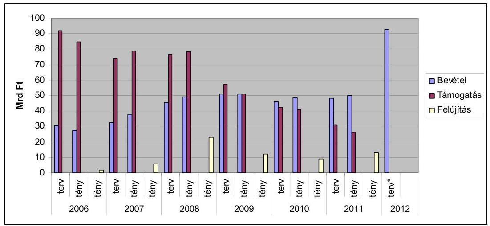

* Forrás: KKK.

Az Útpénztár előirányzat 2012. évi költségvetési kiadásai (2011. év júniusi) dokumentum (NFM Közlekedési Infrastruktúra Főosztály belső anyaga) szerint: „Az OKKSZ minimális szolgáltatási színvonalának („C" szint) becsült forrásigénye 2010. éves árszinten mintegy 55 Mrd Ft, ezzel szemben mintegy 15 Mrd Ft-tal kevesebb áll rendelkezésre. Ebből a nem gyorsforgalmi országos közúthálózat felújítási igényének mintegy 5\%-a (5,3 Mrd Ft) biztosítható a 2012. évi költségvetésből."

A KKK észrevételben közölt véleménye szerint: „A 2012. évre elfogadott költségvetési törvényben az országos közúthálózatra (gyorsforgalmit is beleértve) forditható források közül a költségvetési támogatás teljes körüen elvonásra került. Ennek eredményeként a szakmai feladatokra ténylegesen felhasználható forrás mindössze 60,8 Mrd Ft. A források összege 15,5 Mrd Ft-tal elmarad a 2011. évi felhasznált bevételektől, így a 2012. évi forráscsökkenés mértéke meghaladja a 20\%-ot."

Az Útpénztár előirányzat a Magyar Köztársaság 2012. évi költségvetéséről szóló törvényben nem szerepelt, bevételei és kiadásai a Nemzeti Fejlesztési Minisztérium fejezet KKK intézményi költségvetési előirányzatai között jelentek meg. A költségvetési törvényben jóváhagyott kiadási előirányzatok leosztásakor a gyorsforgalmi utak nélküli állami utak felújítására az előzetesen tervezett összeg mintegy $10 \%$-a, $\mathbf{0 , 5 6}$ Mrd Ft kiadást hagyott jóvá a nemzeti fejlesztési miniszter. ${ }^{36}$

Az Útpénztár, ezen belül a felújításokra szánt keret felhasználhatóságát 2009-től az államháztartási egyensúlyt célzó - kormányhatározatokkal elrendelt - zárolások is befolyásolták. Ennek összege az ellenőrzött időszak utolsó három évében növekvő összeg mellett 9,7 Mrd Ft volt.

Az Útpénztár érintő zárolások közül az út-, hídfelújítások keretéből 2009-ben 0,9 Mrd Ft-ot, 2010-ben 1,92 Mrd Ft-ot, 2011-ben 6,92 Mrd Ft-ot zároltak.

[^0]
[^0]:    ${ }^{36}$ A KKK-tól kapott 2012. évi visszatervezés megnevezésű dokumentum szerint.

---

Az Útpénztár felosztásának késedelme miatt a felújítások közbeszereztetése, kivitelezése eltolódott, ennek következtében évente jelentős összegű kötelezettségvállalással terhelt - maradvány keletkezett. Felhasználása a következő évre tolódott át, késleltetve a felújítások tervszerű végrehajtását.

Útpénztár és az útfelújítás kiadási és maradvány adatai (Mrd Ft)

| Megnevezés | 2006 | 2007 | 2008 | 2009 | 2010 | 2011 |
| :-- | :--: | :--: | :--: | :--: | :--: | :--: |
| Útpénztár kiadás | 97,3 | 122,8 | 122,1 | 92,9 | 82,6 | 95,5 |
| Ebből előző évi   maradvány | 0,1 | 14,9 | 12,4 | 22,0 | 29,8 | 37,8 |
| Magyar Közút útfel-   újítás kiadás | $13,8^{*}$ | $9,3^{*}$ | 23,1 | 11,6 | 8,9 | 13,3 |
| Ebből előző évi fel-   használható ma-   radvány | 0,1 | - | 5,9 | 10,0 | 8,4 | 11,3 |

Forrás: KKK

* út és hídfelújítás együtt

A vizsgált időszakban közút felújításokra az Útpénztárból összesen 64 Mrd Ft-ot fizettek ki, vagyis az éves átlagos hazai ráfordítás 10,67 Mrd Ft volt.

Az Útpénztárból felújításokra ténylegesen kifizetett összeg (Mrd Ft)

| 2006 | 2007 | 2008 | 2009 | 2010 | 2011 |
| :--: | :--: | :--: | :--: | :--: | :--: |
| 1,0 | 6,0 | 23,0 | 12,0 | 9,0 | 13,0 |

Forrás: KKK

Az Útpénztárból történt kifizetésekből összesen 2517 km útszakasz felújítása történt meg, a következő éves megosztásban.
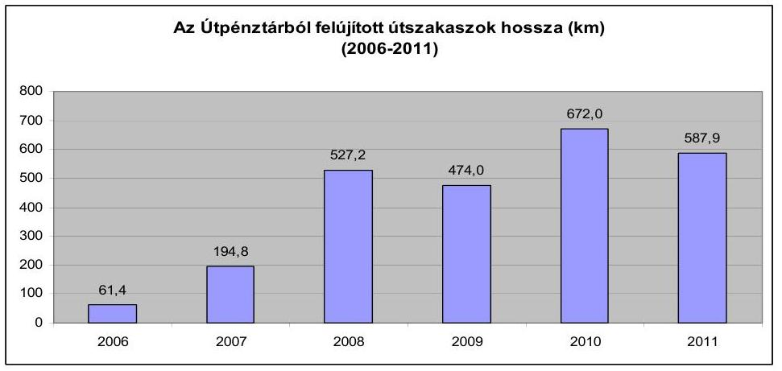

Forrás: MK NZrt

---

Az ellenőrzött időszakban a felújítások és a karbantartások, javítások finanszírozásához uniós támogatások is hozzájárultak. A KÖZOP, ROP - forrásokból összességében 107 Mrd Ft-ot, éves átlagban 17 Mrd Ft-ot fordítottak.

A regionális célú - kiemelten a térségi és a települési elérhetőség javítására figyelemmel -, az ehhez kapcsolódó prioritásokat a 2004-2006 időszakra szóló Nemzeti Fejlesztési Terv (NFT), valamint 2007-2013-as időszakra szóló Új Magyarország Fejlesztési Terv (ÚMFT) Regionális Operatív Programjai tartalmazták.

Az ÚMFT-ben 7 régióhoz tartozóan 7 ROP-ban határozták meg a Strukturális Alapokból finanszírozott projektek az alsóbbrendű (4- és 5-számjegyű) országos közúthálózati elemekre, az önkormányzati utakra, kerékpárutakra vonatkozó fejlesztési vállalásokat.

A Regionális Operatív Programok forrásaiból finanszírozott közút felújításokkal - többek között a 4 és 5 számjegyű közutakat érintő fejlesztési és felújítási programokkal - kapcsolatos feladatokat a regionális tanácsok munkaszervezetei látták el a vizsgált időszakban. A projektlisták összeállításának alapját az MK NZrt. által műszaki szempontok figyelembevételével összeállított útlista képezte. Az útfejlesztésekre és felújításokra vonatkozó projektjavaslatok rangsorolásánál egyaránt figyelembe vették az egyes útszakaszok műszaki állapotára vonatkozó jellemzőket, valamint a szakmai és a területfejlesztési szempontokat. Az akciótervekben nevesített projektekre az illetékes szaktárca, valamint a Regionális Fejlesztési Tanács (RFT) tehetett javaslatot, a döntést a Kormány hozta meg (2. sz. függelék).

Az NFT-ben a prioritás egyik elemeként a térségi és a települési elérhetőség javítása (összekötő és bekötő utak, települési elkerülő utak, rossz minőségű három és négy számjegyű utak felújítása, kiépítése) jelent meg, amelyek megvalósulása a térségek belső kohézióját, valamint a régiók gazdasági kapcsolatainak erősítését irányozta elő.

Az egyes útszakaszok értékelésére az útrangsor modelljében hat kiinduló paramétert határoztak meg: hálózati szerepkör, forgalomnagyság, jelenlegi útállapot, fejlesztési láncba illeszkedés, előkészítettség és gyorsforgalmi úttal való érintettség. A paraméterek között vélelmezett fontosságuk, szerepük eltérő jellege miatt eltérő súlyokat határoztak meg és alkalmaztak.

Az ellenőrzött időszakot érintően a ROP-ok projektjeinek kiválasztása kétféle módon történt. A 2004-2006-os időszakban nyílt pályáztatási formában, a 2007-2010-es években kiemelt eljárási rend alapján, 2011. évtől standard eljárás (nyílt pályáztatási formával egyenértékű eljárási rend) alapján valósult meg. A projekteket a kétéves időszakokra kialakított akciótervek nevesítették.

A nyílt pályáztatási eljárásban az RFT-k, valamint a Regionális Fejlesztési Ügynökségek (RFÜ-k) által a Nemzeti Útfelújítási Program alapján meghatározott projektek kerültek kiválasztásra. A kiválasztott projektek végrehajtási folyamatát a Nemzeti Fejlesztési Ügynökség (NFÜ), mint irányító hatóság (IH) felügyelte.

A kiemelt eljárás során a beadott projektek esetében az NFÜ minden projektnél egy kiválasztási eljárást, vagyis projektcsatornát alkalmazott. Az eljárás során a projektgazdák a tervekkel az illetékes szaktárcát, valamint az RFT-t kereshették

---

meg. Az NFÜ észrevétele szerint: „a Müködési Kézikönyvében meghatározott eljárásrend alapján a kormánydöntést (nevesítést), majd bírálatot követően jóváhagyta a projektjavaslatot, melyet követően kerülhetett sor a támogatási szerződés megkötésére, mely tartalmazta a projekt végrehajtásának feltételeit."

A Regionális Operatív Programokból (2007-2013) finanszírozott közútfelújítások tervezett hossza 1309,3 km volt. Az RFT-k 2011-ig 1090,2 km útszakaszt jelöltek ki felújításra. Ezen belül az egyes régiók között szignifikáns különbségek mutatkoztak. A Közép-Magyarországi OP esetében a tervezett útszakaszokat megvalósíthatták, ez pl. a Dél-Alföldi régió esetében a kijelölt útszakaszok a tervezettnek 43\%-át tették ki. (Adatok a 2. számú mellékletben)

# A Regionális Operatív Programokból finanszírozott projektek föbb adatai (2006. január 1 - 2011. július 31.) 

| Projekt neve | Tervezett útszakaszok hossza összesen (km) | Regionális közútfelújítások tervezett kerete (M Ft) | Döntéssel érintett útszakaszok hossza összesen (km) | Döntéssel érintett beruházások költsége összesen (M Ft) | Finanszírozások forrása | Összes   kifizetett támogatás (M Ft) |
| :--: | :--: | :--: | :--: | :--: | :--: | :--: |
|  |  |  |  |  | EU hazai |  |
| Összesen | 1309,3 | 182657,3 | 1090,2 | 56678,2 | 48 147,7 8283,8 | 50 272,0 |

A kifizetett támogatások a tervezett közútfelújítások keretének mintegy negyedét ( $27,5 \%$-át) tették ki. Az ÚMFT ROP keretében benyújtható pályázatok határideje 2013. A döntéssel érintett beruházások finanszírozási arányát $85 \%$ uniós és $15 \%$ hazai forrás képezte.
(A Regionális operatív programokból finanszírozott projektek főbb adatainak részletes bemutatása az 2. számú mellékletben.)

KÖZOP forrásból burkolatmegerősítésre vagyis $\mathbf{1 1 5} \mathbf{~ k N}$ tengelyterhelésre alkalmassá tételre az ellenőrzött időszakban 51 Mrd Ft-ot (vagyis évente 8,5 Mrd Ft-ot) fordítottak, ebből 187 km valósult meg, kivitelezés, illetve előkészület alatt áll további 1003 km útszakasz. A megerősítésre kijelölt tranzit utak között voltak felújításra, korszerűsítésre váró utak, ezeknek az arányára azonban adat nem állt rendelkezésre.
(KÖZOP adatok a 3. számú mellékletben)

### 2.4. Az úthasználattal arányos elektronikus útdíjszabás bevezetésének előkészítése

A hazai gazdaságpolitikai intézkedések körében már 2003-ban megfogalmazódtak az úthasználattal arányos elektronikus útdíj bevezetésére vonatkozó első tervek és az ehhez kapcsolódó hálózatbővítés lehetőségének kialakítása.

---

Magyarországnak a 2004. május 1-jei uniós csatlakozás után meg kellett felelni a tagországokkal szemben támasztott úthasználattal arányos egységes díjstruktúra bevezetésére vonatkozó előírásnak. Az új díjfizetési rendszer a 3,5 tonnánál nehezebb gépjármúveket érinti, ez alatt az úthasználók választhatnak a matricás vagy az úthasználattal arányos díjmódozatok között. Az új díjrendszer a gyorsforgalmi utak mellett a főbb hálózati utakra is kiterjed. Bevezetésétől a korábbinál magasabb bevételek elérését, a forgalom gyorsforgalmi utakra terelődését, valamint - egyes árutípusok esetében - a környezetkímélő vasúti, illetve vízi szállítás versenyképességé válását várják.

A díjpolitika sarkalatos pontja az útdíjakból származó bevételek egy részének visszaforgatása a közutak fejlesztésére. Ez az Eurovignette irányelv ${ }^{37}$ Preambulum (18), valamint a 9. cikk (2) bekezdésében releváns tényezőként jelenik meg, ugyanakkor a visszaforgatás kötelező arányát az irányelv nem határozza meg.

Az 1999. június 17-én kiadott 1999/62/EK (Eurovignette irányelv) - a 2006/38/EK irányelvvel - módosított uniós jogszabályban alapcélkitúzésként jelent meg az Európai Unió területén lévő díjkivetési rendszerek összehangolása, a torzulások felszámolása, a megfizethetőség, az egységességre való törekvés.

Az EURÓPAI PARLAMENT ÉS A TANÁCS 2004. április 29-i 2004/52/EK irányelve (Interoperabilitási Irányelv) a Közösségen belüli elektronikus útdíjszedési rendszerek átjárhatóságáról iránymutatást tartalmazott az egységes díjfizetési rendszer kialakítására. Problémát jelentett, hogy a tagállamok az irányelv megjelenése előtt már alkalmazták a díjfizetés valamely formáját.

Az EU BIZOTTSÁG 2009. október 6-i 2009/750/EK az európai elektronikus útdíjszedési szolgáltatás és múszaki elemei (European Electronic Toll Service EETS) meghatározásáról szóló határozata az európai elektronikus útdíjszedési szolgáltatás és műszaki elemei meghatározásáról 12. és 13. cikkében foglaltak szerint biztosítani kell az egységes és folyamatos szolgáltatást.

Az uniós irányelvhez alkalmazkodás érdekében 2007-ben a gazdasági miniszter „Az elektronikus útdijfizetési rendszer magyarországi bevezetéséről" szóló határozattervezetet előterjesztette a Kormány felé, azonban külső bizottságok bevonásán kívül intézkedés nem történt. A díjpolitika egységes rendszerú kidolgozását 2009-ben adták ki Zöld Könyv, illetve Fehér Könyv vitaanyag néven, valamint még ebben az évben megkezdődött egy társadalmi, szakmai, önkormányzati egyeztetési folyamat.

Az egységes díjstratégia kialakítását nehezítette, hogy 2008-ban már 4 díjfizetési kategória volt érvényben, amelyek funkcionálisan párhuzamos elemeket tartalmaztak.

Az ED bevezetéséhez készített hatásvizsgálat szerint a megvalósítás becsült költsége mintegy 50 Mrd Ft, a múködtetés éves költsége várhatóan

[^0]
[^0]:    ${ }^{37}$ A nehéz tehergépjárművekre egyes infrastruktúrák használatáért kivetett díjakról szóló Európai Parlament és a Tanács 1999/62/EK irányelve (1999. június 17.)

---

15-20 Mrd Ft. Az előzetes tervezés szerint a díjszedés első évének bevétele 2011. évi áron - 88 Mrd Ft, a díjszedés tízedik évére 358 Mrd Ft várható.

Az ED rendszer műszaki megoldásainak megvalósítására a mikrohullám, vagy a műhold alkalmazása kerülhet szóba. Szervezeti kérdésként merült fel az útdíj szolgáltatói, valamint az útdíj szedési feladatok ellátása. Jelenleg a díjszedési szolgáltatás - jogszabály alapján - az ÁAK kompetenciája.

# Az ED bevezetéséről több kormány-előterjesztés készült, döntés azonban még nem születetett. 

Az NFM 2010-ben - az osztrák díjszabást mintának tekintve - újabb javaslatot terjesztett be, ezt azonban a Kormány nem tárgyalta meg. A kormánytagokból és tudományos szakemberekből álló Széll Kálmán Munkacsoport 2011-ben kapcsolódott be a munkába.

A Kormány a megfelelő alternatíva kidolgozása érdekében 2011 márciusában kétirányú megbízást adott. Szakmai vonalon a KKK szakembereit a szakmai háttéranyagok elkészítésével, közigazgatási vonalon az NFM-et bízta meg az elkészült tervezet közigazgatási egyeztetésével.

A munkacsoport 2011-ben négy alkalommal tartott megbeszélést, amelyeken felvetődött a $85 \%$-os EU támogatás indokoltságának kérdése, továbbá az ÁAK díjszedési pozíciójának kijelölése kapcsán a tiltott állami támogatás kockázata.

A Széll Kálmán Munkacsoport 2011 szeptemberében újabb kormányelőterjesztési javaslatot fogalmazott meg. Az Eurovignette irányelvnek megfelelve a költségszámítások alapján kivethető maximális díjakat, díjszintet fokozatosan kívánják elérni. A Széll Kálmán terv az ED bevezetésének határidejéül 2013. január 1-jét határozta meg. A munkacsoport októberi megbeszélésén az ED bevezetésének megvitatása elmaradt.

A Széll Kálmán terv 4. Adósság és közösségi közlekedés című pontja problémaként veti fel, hogy „Komoly veszteség éri végül Magyarországot azért, amiért a gyorsforgalmi úthálózatokat igénybevevő tranzit teherforgalom, a rendkívül sok külföldi kamion nem a használattal arányosan fizet az utak igénybevételéért."

Ennek megoldásaként azt tekinti, hogy a gyorsforgalmi úthálózati rendszer használatának költségei arányossá válnak a terheléssel.

A KKK tájékoztatása szerint az ED bevezetésének előkészítéséhez az Útpénztárból forrásfelhasználás 2011-ben nem történt, a 2012. évi központi költségvetésben pedig ilyen célú forrás nem szerepel.

Az Útpénztár állami támogatásának megszűnése és az ED bevezetése következtében az útfenntartási bevételek és ezzel az úthasználók kiadása növekszik, amely a költségérzékeny gazdaságot és a társadalmat egyaránt érinti. Ezért bevezetése előtt átgondolt üzleti modell kialakítása szükséges.

Egy 2010 májusában készült nemzetgazdasági hatásvizsgálat során elvégzett ún. érzékenységi vizsgálat kimutatta, hogy az útdíj bevezetése miatt bizonyos elterelődés következhet be a gyorsforgalmi utakról, ami az utazási idő és hossz megnövekedésével, valamint a balesetek számának emelkedésével járhat. Más negatív

---

externáliákkal, mint a természeti károk, árvíz, előre nem tudtak számolni. Az árvízkár az utak állapotában - a minisztérium tájékoztatása szerint - a magyar állam számára az elmúlt évben közel 15 Mrd Ft-os kárt okozott.

A hatásvizsgálat szerint az úthasználattal arányos díj növeli a termelő, logisztikai cégek költségeit, ugyanakkor a közúti díjtételek jelenlegi szintjénél magasabb összege bizonyos (ömlesztett, folyékony) áruféleségek esetében javíthatja a vasúti, illetve a vízi szállítás versenyhelyzetét, ezzel csökken a közúti szállítás és ennek következtében a szennyezőanyag kibocsátás.

Az NFM a jelentés-tervezet egyeztetése során a következő észrevételt tette: „Az NFM a 2011. október 26-i Kormányülésre beterjesztette „Az e-matricás használati díjszedési rendszer átalakításáról" szóló előterjesztést, amely mind a Széll Kálmán Tervben foglaltakkal, mind a 2012. évi költségvetésről szóló törvény tervezetével összhangban lévő bevételek elérését biztositó intézkedések bevezetésére tett javaslatot. A Kormány az előterjesztést a Versenyképességi Tanácshoz irányította. A Versenyképességi Tanács 2011. november 23-i ülésén tárgyalta az előterjesztést. A jelen előterjesztésben lévő miniszteri rendelet módosítását a Versenyképességi Tanács ülésén született szabályozási koncepciónak megfelelően dolgozta ki a tárca."

Átmeneti rendelkezésként az autópályák, autóutak és főutak használatának díjáról szóló 36/2007. (III. 26.) GKM rendelet 2012. január 1-jétől életbe lépett módosítása díjak körében a 4 napos jogosultsági módot eltörölte.

A módosítás előterjesztése a rendelet szükségességének okaként jelölte megtöbbek között - „a bevételek további növelése érdekében pedig a rendelet módosítása szükséges a termékportfólió vonatkozásában is, amely során az Európában példa nélküli 4 napos matrica termék eltörlésre kerül, és így a legrövidebb jogosultság a két hétvégét is magába foglaló 10 napos termék lesz."

A megtett úttal arányos elektronikus díjszedési rendszer bevezetéséről szóló 1138/2012. (V. 3.) Korm. határozat 2012-ben végrehajtandó részhatáridőkkel kijelölte az új díjszedési rendszer bevezetésével, kiépítésével a források biztosításával, valamint a díjbevételek számításával és ezek költségvetésre gyakorolt hatásának elemzéséhez kapcsolódó feladatokat. A határozat 4. pontja folyamatos határidő megjelölése mellett feladatként fogalmazta meg, hogy: „A Kormány felhívja a nemzeti fejlesztési minisztert, hogy a nemzetgazdasági miniszterrel együtt tegyen javaslatot a közúti infrastruktúra finanszírozásának átfogó programjára".

# 3. A FELÚJÍTÁSI FELADATOK VÉGREHAJTÁSA, NYILVÁNTARTÁSA, SZABÁLYOSSÁGI, HATÉKONYSÁGI, GAZDASÁGOSSÁGI SZEMPONTOK ÉRVÉNYESÜLÉSE 

### 3.1. A kivitelezések versenyeztetése, a célszerűségi, gazdaságossági szempontok érvényesülése

A felújítási és felújítás-tervezés jellegű tevékenységek lebonyolítására a forráskezelésért felelős KKK éves megbízási szerződést kötött az útfenntartási, vala-

---

mint üzemeltetési feladatokat ellátó MK NZrt.-vel az Útpénztár fejezeti kezelésű előirányzat terhére.

A vizsgált időszakban a közbeszerzési eljárásokat az MK NZrt. bonyolította le. A nyílt eljárások alkalmazása a széles körű versenyeztetést célozta. (4. számú melléklet)

Az MK NZrt. által összeállított útfelújítási-tervezési létesítményjegyzéket a tételes költségbecslésekkel együtt a KKK felterjesztése alapján az NFM közlekedésért felelős helyettes államtitkára hagyta jóvá. Az engedélyezett feladatok elvégzésére - a KKK elrendelő levelét követően - az MK NZrt. írt ki közbeszerzési pályázatot.

Az eljárásokról készített, a Közbeszerzési Tanácsnak évente megküldött statisztikai összegzés szerint a vizsgált időszakban építési beruházással kapcsolatosan összesen 144 eljárást folytattak le.

A közutak felújítási tevékenységének hatékonyságát, illetve gazdaságosságát a pénzügyi és gazdasági intézkedések nem kellően támogatták. A felújítások tervezhetősége a pénzügyi ütemezés miatt kényszerpályán mozgott. Az Útpénztár előirányzat fejezeten belüli elosztása, a felújításokra szánt keretének meghatározása és az ebből megvalósítható létesítményjegyzék összeállítása rendszerint év közepéig történt meg. A burkolat felújítási technológiák időjárásfüggőek, ugyanakkor a kivitelezések nem a javítások tartósságát biztosító nyári, hanem - a pénzügyi ütemezés miatt kényszerűen - az arra technológiailag kevésbé alkalmas őszi-téli időszakra estek, emiatt nagy volt a minőségvesztés kockázata.

A forrás kezeléséért felelős KKK, valamint a közreműködő MK NZrt. álláspontja szerint a 2006-2008. években a gyorsított eljárások száma közel 20\%-os növekedésének oka a késői forráskihelyezés volt. A jelenlegi finanszírozási rendszerből adódóan várhatóan a néhány éven belül megvalósuló feladatoknak van realitása a tervek elévülése miatt.

A költségvetési pénzügyi évhez való alkalmazkodással, a tavaszi-nyári időszakra elhúzódó előkészítéssel összefüggésben a kivitelezések az arra technológiailag kevésbé alkalmas őszi-téli hónapokra tolódtak.

Az optimális forrásfelhasználás elősegítése érdekében 2010-ben az építési beruházások közbeszerzése jellemzően keret-megállapodások formájában zajlott. A két lépcsős eljárás első szakasza - vállalkozók minősítése és bírálata - forráskihelyezés nélkül bármikor lefolytatható; a második szakaszban - ajánlatkérés és szerződéskötés - lehetővé válik a források gyorsabb felhasználása.

Az MK NZrt. a vizsgált időszakban rendelkezett elfogadott közbeszerzési szabályzattal ${ }^{38}$, valamint - a 2009. év kivételével - jóváhagyott közbeszerzési tervvel.
2009. évben a KHEM a tulajdonosi jogok gyakorlójaként egyedileg engedélyezte a közbeszerzési eljárásokat, az MK NZrt. csak a kár- és veszélyhelyzetek elhárításához szükséges beszerzéseket indíthatta.

[^0]
[^0]:    ${ }^{38}$ Szabályzatok hatályba lépése: 2006. szeptember, 2010. január.

---

Az MK NZrt.-nél a közbeszerzések jóváhagyásához kapcsolódó eljárási rendről a mindenkori közbeszerzési szabályzat, illetve 2011 júniusától külön vezérigazgatói utasítás ${ }^{39}$ határozott. A szabályozás az 500 M Ft-ot meghaladó közbeszerzés esetén a tulajdonos külön jóváhagyását írta elő. Ez a közbeszerzési eljárást akár 40 nappal is meghosszabbította. Az MFB Zrt. a döntési mechanizmusok egyszerúsítése és az egységes elveken nyugvó döntési jogosultságok kialakítása érdekében indítványozta azon ügykörök, illetve összeghatárok felülvizsgálatát, melyeknél lehetőség nyílik alapítói helyett közös vezérigazgatói-ügydöntő felügyelőbizottsági, illetve vezérigazgatói döntési jogkör alkalmazására. Az MK NZrt. által összeállított Alapító Okirat módosítási javaslatot a Felügyelő Bizottság jóváhagyta, de aláírt határozat az ellenőrzésünk lezárásáig nem született.

# 3.2. Az újrahasznosítható anyagok használata 

A bontott anyagok minőségüktől, elhasználódásuk fokától, és az elérhető technológiáktól függően felhasználásra kerülhetnek vagy hulladékká válhatnak. A bontott anyagok egy része felhasználható a fejlesztési (útépítés, útrekonstrukció) és a fenntartási (felújítás, karbantartás) munkák során. Az országos közutakon végzett burkolat felújítási és úthálózat fejlesztési projektek megvalósítása során a legnagyobb mennyiségben keletkező bontott anyag az aszfalt (2011. június 30 -án hozzávetőleg 182000 tonna mart aszfalt készlet volt az MK NZrt üzemmérnökségein). A mart aszfalt felhasználásáról a KKK és az MK NZrt. 2008-ban két megállapodást kötött. A megállapodások szerint a mart aszfalt felhasználható az országos közutak karbantartása, üzemeltetése, felújítása során, valamint értékesíthető a KKK beleegyezésével. A mart aszfalt felhasználásának több alkalmazási területe van. A mart aszfalt felhasználása lehetséges meleg aszfaltkeverékben (kopó, kötő-, illetve alaprétegekben aszfaltkeverék gyártásához 10-20 \%-os mennyiségben visszaadagolható), az alaprétegekben (kötőanyag hozzáadásával vagy kötőanyag nélkül helyszíni újrahasznosítás), a pályaszerkezeti rétegekben (hideg eljárással telepen történő hideg újrahasznosítás).

Az MK NZrt. tájékoztatása szerint: Hazánkban valamennyi technológiával történt már kivitelezés. A felsorolt újrahasznosításnak területei lehetnek többek között a főutak, kisforgalmú utak profiljavítása, illetve pályaszerkezetének kiépítése, a kerékpárutak építése, hideg kátyúzás, a padka, rézsú javítása.

A KKK tájékoztatása szerint: A friss mart aszfalt esetén könnyű és gazdaságos a felhasználás, amennyiben régebbi, összeállt, esetleg szennyezett, akkor az őrlés, tisztítás hosszadalmas és drága.

A mart aszfalt felhasználására azonnal a helyszínen, vagy egy másik munkaterületen kerülhet sor, illetve későbbi felhasználás esetén telephelyen tárolják. A bontott anyagokat az értékesítésig, illetve a felhasználásig az MK NZrt. telephelyein tárolják. A felhasználásukra az egyik megállapodást a 2008. január 1-je előtt az MK NZrt. (MK Kht.) telephelyein elhelyezett mart aszfalt, a másik megál-

[^0]
[^0]:    ${ }^{39}$ 29/2011. sz. vezérigazgatói utasítás a közbeszerzések jóváhagyás céljából történő bejelentési kötelezettségével kapcsolatos eljárási rendről. Hatályba lépésének dátuma: 2011. június 20.

---

lapodást a 2008. január 1-je után keletkezett mart aszfalt felhasználásáról kötötték.

Az MK NZrt. a felhalmozódott mart aszfaltról 2008-ban felhasználási tervet készített, de az ebben rögzített mennyiségek felhasználásáról az összegzést nem készítette el 2008. december 31-ig a KKK részére. A következő éves felhasználási tervet 2009. január 31-ig kellett volna elkészíteni, ez nem történt meg. Helyette az igények és lehetőségek ismeretében eseti jelleggel 2009-et követően több mint 300 felhasználási terv készült el, ezeket a KKK hagyta jóvá. A felhasználásra kötött megállapodások és mellékleteik (felhasználási nyilatkozat, felhasználási terv) kitértek a keletkezett mart aszfalt felhasználására. A telephelyeken lévő mart aszfalt készletek felmérése legutóbb 2011 júniusában történt meg.

A készleten lévő mart aszfalt értékesítése, felhasználása - tekintettel a szűk forrásokra - fontos gazdaságossági szempont. Ugyanakkor a mintegy 180000 tonna készlet újrahasznosítása csak részben történt meg, annak ellenére, hogy ez az MK NZrt.-nek (a már elért piaci árak alapján) 270-360 M Ft, ebből a KKK-nak 90-180 M Ft bevételt, illetve újrafelhasználás esetén megtakarítást jelentene. A bontott anyagok újrahasznosításának kezelését, gazdasági, környezetvédelmi szempontból szorgalmazó, illetve kötelezővé tevő (pl. kivitelezési szerződésben előíró) belső szabályzat nem készült. A felhasználásra alkalmatlan bontott anyagokból hulladék lesz, és a közútkezelőktől átadásra kerülnek engedéllyel rendelkező hulladékkezelők részére további kezelésre.

A megállapodás szerint az eladásra került anyagokból az MK NZrt. tonnánként a homogén gyorsforgalmi mart aszfaltért 1000 Ft -ot, a gyorsforgalmi bontott anyagért 500 Ft -ot kell fizetnie a KKK-nak, értékesítés esetén az eladási ár ennél magasabb. Az eladási árak megyénként, minőségtől függően változnak, átlagosan 1500-2000 Ft között mozognak.

# 3.3. A felújítási, karbantartási munkák teljesítésének ellenőrzési rendszere 

A felújítási, karbantartási munkák kivitelezésének ellenőrzési rendszere több szinten valósul meg.

A GKM, KHEM, NFM Ellenőrzési Főosztálya, a KKK Ellenőrzési Főosztálya, az MK NZrt. Belső Ellenőrzési Önálló Osztálya az utak fejlesztésével, fenntartásával kapcsolatos tevékenységgel témavizsgálatokban, utóellenőrzés során foglalkozott, a közbenső (kivitelezés alatti) ellenőrzésekben nem vett részt. Az NFM felügyeleti tevékenysége keretében véleményezi többek között a KKK és az MK NZrt. éves beszámolóját, jóváhagyja az éves üzemeltetési, karbantartási, felújítási szerződéseket. A szakmai ellenőrzés tekintetében egyedi esetek vannak, de rendszeres ellenőrzés nem volt.

A 2006. évi ÁSZ ellenőrzés javaslatára a kivitelezés közbeni és a végteljesítést követő minőségellenőrzés megerősítése megtörtént, a belső ellenőrzés megerősítése azonban nem (MK NZrt. és a KKK).

---

A különböző típusú munkák ellenőrzéseit a KKK Útfenntartási és Üzemeltetési Főosztálya és az általuk megbízott (közbeszerzési eljárás során kiválasztott) múszaki ellenőrök, továbbá az MK NZrt. végzi. A KKK és MK NZrt. Ellenőrzési Főosztályai is végeztek utóellenőrzéseket a témában, de nem vesznek részt a kivitelezések ellenőrzési folyamatában.

A vizsgált időszakban rendeletek, utasítások és belső kézikönyvek szabályozták az utak kezelésével összefüggő nyilvántartási, beszámolási, ellenőrzési feladatokhoz kapcsolódó tevékenységeket, végrehajtásuk határidejét.

Az országos közutak kezelésének szabályozásáról szóló 6/1998. (III. 11.) KHVM rendelet és melléklete az Országos Közutak Kezelési Szabályzata (OKKSZ), a közlekedési hálózat finanszírozási célokat szolgáló egyes fejezeti kezelésű előirányzatok felhasználásának szabályozásáról, valamint az országos közúthálózattal összefüggő feladatok ellátásáról szóló 40/2011. (VIII. 3.) NFM rendelet, a Műszaki Ellenőrzési és Lebonyolítási Kézikönyv, az Együttmúködési Eljárásend, az Eljárási Útmutató, az MK NZrt. 17/2011 sz. vezérigazgatói utasítása az útellenőri szolgálat, valamint a kapcsolódó információs szolgálatok múködési szabályzatáról.

Az ellenőrzési tevékenység belső szabályzatokban, eljárásrendekben, kézikönyvekben és egyéb előírásokban szabályozott volt. Az ellenőrzési folyamatokat többek között beszámolókkal, jegyzőkönyvekkel dokumentálták.

A KKK a nem gyorsforgalmi utak üzemeltetési és fenntartási tevékenysége körében előkészítette az MK NZrt. közútkezelői alapfeladatainak finanszírozását biztosító - az Útpénztár rendelet előírásainak megfelelő - szerződéseket, ellátta a munkavégzés ellenőrzését, illetve ellenőriztetését, az elvégzett tevékenységről összeállított beszámolók, a számlák ellenőrzését, igazolását és továbbítását.

A KKK feladata volt az MK NZrt. által végzett tevékenység helyszíni, minőségi és mennyiségi ellenőrzését végző független műszaki ellenőrök tevékenységének koordinálása és ellenőrzése. A müszaki ellenőrök szerződéseiben előírtak szerint havi jelentésekben beszámoltak az ellenőrzések végrehajtásáról, tapasztalataikról.

Az üzemeltetési, karbantartási munkák - az MK NZrt. által végzett közhasznú tevékenységnek a KKK által megbízott külső szakértő által történő ellenőrzésének lebonyolítására Eljárási Útmutatót dolgoztak ki. A beszámolás és az ellenőrzés módját, formáját a szerződésben és mellékleteiben részletesen szabályozták. A mellékletekben meghatározták a munkafolyamatokat pl. (munkavégzés havi ütemezése) és rögzítették a hozzá tartozó szükséges műszaki (pl. Útügyi Műszaki Előírások listája), és egyéb (havi számla melléklete és elszámolási minta) dokumentumokat. Az ellenőrzések során előforduló problémákról jegyzőkönyv készül/készült, amelyeket az MK NZrt. és a KKK egyeztetési folyamatban tisztázott, különösen véleményeltérések esetében, ami - az MK NZrt. szerint - a mellékletek eltérő értelmezéséből adódott.

Az Eljárási Útmutató szerint az MK NZrt. tisztítási, üzemeltetési és karbantartási feladatainak műszaki ellenőrzését a műszaki ellenőr - a KKK által előzetesen jóváhagyott havi ellenőrzési ütemterve és a megbízási szerződésében meghatározottak alapján - a közútkezelő üzemmérnökségeinél havonta két alkalommal, a megyei központokban havonta egy alkalommal az MK NZrt. képviselőjének jelenlétében ellenőrizte.

---

# A felújítási feladatok ellenőrzése is több intézményi és szervezeten belüli szinten valósul meg. 

A felújítási munkák lebonyolítói tevékenységének - melyeket az MK NZrt. a KKK-val kötött szerződés alapján látott el - ellenőrzése a KKK feladata volt. (Az MK NZrt. a külső kivitelezőkkel - a közbeszerzési eljárást követően kötötte meg a vállalkozási szerződéseket, vagy a korábbi időszakban saját kapacitása felhasználásával végezte el.) A kivitelezések ellenőrzése során pl. 2009-ben az építési naplók vezetését kifogásolta, ezek nem feltétlenül voltak összefüggésben a munka minőségével.

A KKK ennek keretében többek között figyelte a közbeszerzési eljárásokat, a Bíráló Bizottságokba tagot delegált, az MK NZrt. előrehaladási havi jelentése és helyszíni ellenőrzések alapján nyomon követte a kivitelezési és tervezési munkák megvalósulását. Ellenőrizte az MK NZrt. lebonyolítói számláit, továbbá vállalkozói teljesítési számlákat és bizonylatokat, intézkedett a kifizetésekről.

Az építési naplók esetenként szakszerű és pontos vezetése körében hiányosságokat tárt fel a pontos helymeghatározás, a bontási anyag és a mart aszfalt sorsa, a mérési eredmények, a pótmunkák alátámasztása terén.

A lebonyolítói feladatellátás menetét a Megbízási Szerződés és mellékletei, és ennek Együttmüködési Eljárásrendje szabályozták. Az Együttmüködési Eljárásrend külön fejezetben szabályozza a műszaki ellenőr feladatait, pl. az építési napló vezetése, az átadás-átvétel, a bontott anyagok tekintetében. Az MK NZrt. a műszaki ellenőri, az ellenőrzési feladatok ellátására kidolgozta a Műszaki Ellenőrzési és Lebonyolítási Kézikönyvet.

A minőségvizsgálati feladatokat - a 29/2010. (IV. 7.) KHEM rendelet ${ }^{40}$ alapján - az MK NZrt. Útállapot Vizsgálati Osztály irányításával hét minőségvizsgálati laboratórium végezte el.

Az NFÜ észrevétele szerint: „Az uniós forrásból finanszírozott projektek megvalósulásának folyamatba épített ellenőrzése dokumentumalapú és helyszíni ellenőrzések formájában történik. A dokumentumalapú ellenőrzés 100\%-os, a helyszíni ellenőrzések száma és gyakorisága kockázatelemzés függvényében alakul."

### 3.4. A teljesítések és a pénzügyi elszámolások rendszere

Az országos közúthálózat kezelését, vagyis a jogszabályi előírásoknak megfelelő tisztítási, üzemeltetési és karbantartási feladatok ellátását, az MK NZrt. a KKK-val kötött közhasznú alaptevékenységre vonatkozó vállalkozási szerződés alapján végzi. Az Útpénztárból finanszírozott fenntartási tevékenységek esetében a kivitelezők által benyújtott számlák teljesítése a többszöri szakmai, pénzügyi ellenőrzést, majd jóváhagyást követően történt meg. A szakmai tevékenység ellenőrzését a KKK közbeszerzési eljárásban kiválasztott független műszaki ellenőrökkel látja el. Az ellenőri tevékenység részletes gya-

[^0]
[^0]:    ${ }^{40}$ 29/2010. (IV. 7.) KHEM rendelet az országos közutak építésével kapcsolatos minőségi követelmények megvalósulásának ellenőrzéséről.

---

korlati előírásait a Vállalkozási Szerződés mellékletét képező Eljárási Útmutató ${ }^{41}$ tartalmazza.

A kivitelezések teljesítését elbíráló független mérnök biztosításáról az MK NZrt. és a KKK között létrejött együttmúködési megállapodás értelmében a KKK gondoskodott közbeszerzési eljárás keretében.

Az MK NZrt. különböző szinteken és többféle minőségben múködik közre a projektek előkészítésében, illetve megvalósításában. Lebonyolítói tevékenységével, a kivitelező megbízásával, a folyamat minőségi, műszaki ellenőrzésével kapcsolatos jogi, eljárási előírásokat az évente megújított megbízási szerződés, a kapcsolódó együttmúködési eljárásrend, valamint az MK NZrt. Műszaki Ellenőrzési és Lebonyolítási Kézikönyve ${ }^{42}$ tartalmazta.

Az útfenntartási munkákra garanciális és fenntartási (jólteljesítési) időszakot határoznak meg a szerződések. Az Útpénztár előirányzatból finanszírozott feladatoknál a garanciális-fenntartási időszak - feladattól függően - 3-5 év időtartamú. Ennek során összesen 3 állapotvizsgálat történik.

Az MK NZrt. Műszaki Ellenőrzési és Lebonyolítási Kézikönyve előírja, hogy a műszaki ellenőrnek szükség szerint, de legalább hetente kétszer kell tartania helyszíni ellenőrzést, észrevételeit az építési naplóban dokumentálnia.

A kivitelezés megvalósulásának előrehaladásáról a MK NZrt. havi jelentésben számolt be a KKK részére, a kifizetéseknél heti rendszerességú volt. Az MK NZrt. által 2010-2011. évben végzett nagy felületű javítási munkákról - az eljárásrend szerint - nem kellett havi műszaki ellenőri jelentést készíteni, mivel a kivitelezés határideje igen rövid volt. A foltszerú javításokra heti jelentéseket küldött a KKKnak, ezekből követhető volt a kivitelezések teljesítése, valamint az esetleges múszaki és egyéb problémák.

Az NFÜ észrevétele szerint: „Az NFÜ által kezelt uniós források - így a ROP források - felhasználására vonatkozó előírásokat az Egységes Múködési Kézikönyv tartalmaz$z a .{ }^{\prime \prime}$
„A kézikönyvet az NFÜ a vizsgált időszakban több alkalommal aktualizálta, az életbe lépő új rendelkezések, illetve az uniós és hazai szabályozások változásakor."

Az NFÜ észrevétele szerint: „A ROP forrásokból finanszírozott felújítási munkáknál az eljárásrend, valamint a jogi előírások (ÁFA) változása, illetve a szerződészárás feltételeinek projektgazda általi nem teljesítése miatt múszaki átadás és a pénzügyi zárás között akár egy, másfél év is eltelhet."
${ }^{41}$ Eljárási Rend a Magyar Közút Nonprofit Zrt. által végzett közhasznú tevékenységnek a Közlekedésfejlesztési Koordinációs Központ által megbízott külső szakértő által történő ellenőrzéséhez
${ }^{42}$ Hatályba lépés dátuma: 2008. április 17-én, módosítva 2008. június 17-én. A Műszaki Ellenőrzési és Lebonyolítási Kézikönyv helyszíni vizsgálatunk ideje alatt az időközben változott Útpénztári rendelet miatt volt átdolgozás alatt. A korábbi évek irányadó szabályzatai: Lebonyolítói-mérnöki szabályzat (2006.), Műszaki ellenőrzési és lebonyolítási kiskáté (2007).

---

Az MK NZrt.-vel szerződött kivitelező számláját az MK NZrt. továbbítja az illetékes Regionális Fejlesztési Ügynökség (RFÜ) felé.

A számlák és alátámasztó dokumentumok ellenőrzését követően a kifizetéshez szükséges dokumentáció benyújtásra kerül az NFÜ Irányító Hatósághoz. A jóváhagyást követően a kifizethető támogatást az IH átutalja az RFÜ részére, aki a kifizetést az MK NZrt. vagy a kivitelező részére teljesíti. ${ }^{43}$

Az NFÜ észrevétele szerint: „A 2007-2008. évben indult ROP projektek esetében ÁFA változás miatt (2009. július 1.) a támogatási szerződés nem nyújtott kellő fedezetet az ÁFA-növekményre, ezért szerződésmódosításra volt szükség, mely átmenetileg - a szerződésmódosítás idejére - felfüggesztette a záró kifizetést."

A kivitelezőkkel az MK NZrt. a szerződésekben 3 éves garanciális időt kötött ki, ugyanakkor a projekt lezárásával induló 5 éves fenntartási kötelezettsége van. E közútszakaszok esetében az MK NZrt. számára további kiadásokat jelenthet, hogy az állapot mutatók teljesítése érdekében a harmadik évet követően felmerülő esetleges útjavítási feladatokat - további két évig - állami forrásból kell finanszíroznia.

A közutak fenntartásában érintett szervezetek belső ellenőrzéssel foglalkozó apparátusai éves ellenőrzési terveiben közvetlenül a közutak fenntartására irányuló vizsgálat nem szerepelt. Az Útpénztár fejezeti kezelésű előirányzat felhasználására és a közremúködő szervezetekkel való kapcsolatra, az elszámolás rendjére vonatkozóan összegzéseket és javaslatokat tartalmazó jelentéseket készítettek.

A KHEM az Útpénztár fejezeti kezelésű előirányzat felhasználásának ellenőrzéséről készített (2009) vizsgálata során megállapította, hogy a KKK Belső Ellenőrzési Osztálya az SzMSz-ben kiemelt feladataként megfogalmazott - az országos közúthálózat fenntartása és üzemeltetése körében az állami költségvetési pénzeszközök és előirányzatok felhasználására irányuló - ellenőrzési kötelezettségét a szűk kapacitás ellenére teljesítette.

# 3.5. A garanciális jogok érvényesítése, a minőségi kifogások kezelése 

Az MK NZrt. a ROP Működési Kézikönyvben, az Együttmúködési Eljárásrendben, a KKK-val kötött Lebonyolítói szerződésben (megbízási szerződés) szabályozta a szavatossági, jótállási és biztosítéki kérdéseket. A kivitelezések során előforduló, nem megfelelően teljesített mennyiségi, minőségi elvárások kezelése érdekében a biztosítéki- (teljesítési-, jótállási biztosíték, bankgarancia stb.) és a jótállási feltételeket az MK NZrt. a kivitelezői szerződésekben írta elő.

[^0]
[^0]:    ${ }^{43}$ A jelentés végleges egyeztetése során az NFÜ elnöke által kért pontosítás.

---

Az építési tevékenységekhez kapcsolódó jótállásra, hibás teljesítésre vonatkozó előírásokról a Polgári Törvénykönyv, valamint közúti közlekedésről szóló 1988. évi I. törvény és egyéb jogszabályok ${ }^{44}$ rendelkeznek.

Az MK NZrt. a munkák megfelelő kivitelezésének biztosítására a szerződésekben teljesítési és jótállási biztosítékot kötött ki a vállalkozó kötelezettségeként. A vállalkozó számára előírt jótállási idő - a munka hivatalos befejezésének kezdetétől számított - 3-5 év között alakult. A vállalkozó a biztosítékot befizetéssel, biztosítási konstrukcióval vagy bankgaranciával teljesíthette. Ha a vállalkozó a szavatossági munkákat nem teljesítette, akkor a megrendelő jogosult volt a biztosítékból fedezni a munkák költségeit. Garanciális kötelezettség érvényesítéséhez peres eljárásra nem volt szükség, mivel a garanciális kötelezettség nem teljesítése esetén a bankgaranciát a megrendelő lehívta. Lehívás az Útpénztár és ROP esetében a vizsgált időszakban 11 esetben történt 171,7 M Ft összegben.

A 2008-2009. években a gazdasági válság következtében a vállalkozók a készpénzes fizetési formát részesítették előnyben, míg az utóbbi évek gyakorlatára a banki garancialevél alkalmazása volt jellemző. A vállalkozási díj megállapodás szerinti hányadának megfelelő teljesítési biztosíték esetenként a befejezési igazolás kiadását követően jótállási biztosítékként funkcionál tovább. A jótállási időszak a teljesítési igazolás keltétől kezdődik. A másik lehetőség szerint teljesítéskor a vállalkozó visszakapja a jólteljesítési biztosíték összegét, és külön jótállási bankgaranciát mutat be/utal át az MK NZrt. felé. A bankgaranciák kedvezményezettje az Útpénztári előirányzatból finanszírozott munkáknál a korábbi időszakban a KKK volt, 2011 szeptemberétől a megbízási szerződésben foglaltak szerint az MK NZrt. A ROP forrásból lebonyolított újfelújítási feladatok esetében szintén az MK NZrt. volt a kedvezményezett.

Az MK NZrt évenként, illetve szükség szerinti szavatossági szemlét tartott a vállalkozó bevonásával. A helyszíni bejárásról, a szavatossági javítási munkák elvégzéséről, illetve további szükséges javításokról jegyzőkönyv készült. A jegyzőkönyvben foglaltak teljesítése után a jótállási biztosítékot, vagy annak fennmaradó részét visszafizeti a vállalkozó részére.

A szerződésben vállalt feladat - burkolatjavítás, nagyfelületű javítások - részbeni vagy teljes elmaradás esetére a kárigény érvényesítésének feltételeit, a kötbér-fizetési kötelezettséget a megbízási szerződés, valamint a keretszerződések szabályozták.

A megrendelői feladat- és hatáskörök a vizsgált időszakban változtak. A vállalkozási szerződésekben a 2007. évet megelőző időszakban a KKK, ezt követően az MK NZrt. volt a megrendelő. A munkák szavatossági határidejének lejártát a vizsgált időszakban az MK NZrt. megyei képviseletei követték nyomon díjazás ellenében. A feladat összefogására 2011 májusától külön szervezeti egységet, Garanciakezelési Osztályt hoztak létre. Az egységes

[^0]
[^0]:    ${ }^{44}$ A közúti közlekedésről szóló törvény végrehajtásáról szóló 30/1988. (IV. 21.) MT rendelet, a közlekedési hálózat finanszírozási célokat szolgáló egyes fejezeti kezelésű előirányzatok felhasználásának szabályozásáról, valamint az országos közúthálózattal összefüggő feladatok ellátásáról szóló 40/2011. (VIII. 3.) NFM rendelet.

---

elektronikus alapú nyilvántartás kialakításával kapcsolatos feladatok előkészítése a helyszíni vizsgálat ideje alatt volt folyamatban.

A 2006. évi ÁSZ ellenőrzés a gazdasági és közlekedési miniszternek javasolta, hogy az Útgazdálkodási és Koordinációs Igazgatóság vezetője intézkedjen a hiányzó - kiemelten a karbantartások, garanciák érvényesítésének áttekintését biztosító - nyilvántartások elkészítéséről és folyamatos kezeléséről.

Az UKIG a fenti ÁSZ javaslatra 2006. október 26-án az intézkedési tervét elkészítette, amelyet 2007 szeptemberében aktualizált. Az intézkedési terv szerint a fenntartási munkák eljárási rendjébe a garanciák nyilvántartásának tartalmi és formai követelményeit be kellett építeni. Ezen nyilvántartási és jelentési kötelezettségeknek a KKK-nak az MK Kht.-val a 2008. évre kötendő szerződésben érvényesülni kellett.

A KKK főigazgatói beszámoló levele szerint (4625/1-E-2007 ikt. sz. levél) a fenti feladatok végrehajtására a garanciák nyilvántartása a 2008. évi MK Kht.-val, mint a megrendelői jogkör gyakorlójával kötendő felújítási megbízási szerződés együttmüködési eljárási rendjébe beépítették, ennek folyamatos kezelése a KKK Útfenntartási és Üzemeltetési Főosztály feladatkörébe tartozott.

A konkrét feladatokat a KKK-MK Kht. által 2008-ban megkötött Megbízási szerződés 7.7 pontja, illetve a kapcsolódó Együttmüködési Eljárásrend 7.7, 7.8 pontjai rögzítették. Az MK Kht. a szerződés alapján a KKK-nak havonta megküldött adatszolgáltatásokban számolt be, ezen adatokat az adatszolgáltatási Excel táblázat 2. sz. függelékének AS-AT, illetve BC-BL oszlopainak adatai biztosították.

# 3.6. A felújítások, karbantartások nyilvántartása, a késedelmes teljesítések nyomon követhetősége 

A felújítási, karbantartási feladatok nyilvántartása nehezen áttekinthető a széttagolt, sokszereplős intézményrendszer és a különböző jogállású szakmai szervezeti háttér miatt. Az ÁSZ korábbi 2006. évi, az állami közutak fenntartásának ellenőrzéséről szóló jelentése megállapította, hogy az egész intézményre kiterjedő szerződés nyilvántartás mellett „a szakmai fóosztályok által különböző időpontokban, egyedileg kialakított zárt, „szigetrendszerek"-et üzemeltettek". Ez nem változott, egységes integrált információs rendszert továbbra sem alakítottak ki.

A lokális nyilvántartások - alapvetően excel táblák - adataiból egységes nyilvántartást, összesítéseket csak részlegesen lehet létrehozni, viszont a hibalehetőséget csökkentette, hogy az információátadás a "szigetrendszerek" között elektronikus (email) formában történt. E nyilvántartások a szervezeti egység elemzései, a szakmai beszámolói, kimutatásai készítését biztosítják, viszont a szakterület egészét érintő összetett információk előállítására csak részlegesen alkalmasak, illetve esetenként időigényesek.

---

Az Útpénztár fejezeti kezelésű előirányzat felhasználását az évente kiadott miniszteri rendeletek ${ }^{45}$, illetve azok módosításai szabályozták. A közútkezelők nyilvántartási feladatait az országos közutak kezelésének szabályozásáról szóló 6/1998. (III. 11.) KHVM rendelet mellékletét képező Országos Közutak Kezelési Szabályzata (OKKSZ 2. pontja) szabályozta. Eszerint „A közút kezelője vagy az általa megbízott szervezet a közutakról, azok mütárgyairól és tartozékairól egységes rendszerben, folyamatosan nyilvántartást köteles vezetni."

A nyilvántartási feladatokat, azok részletezését a KKK-nál, az MK NZrt.-nél belső szabályzatok, utasítások nem szabályozták. E feladatokat a KKK, valamint az MK NZrt. között évente megkötött megbízási, illetve vállalkozási szerződésekben rögzítették.

Az Útpénztárból finanszírozott fenntartási tevékenységek nyilvántartását a KKK vezette. A nyilvántartás alapját az MK NZrt. által átadott, az elvégzett tevékenységekről, az esetlegesen előfordult csúszásokról a KKK-val kötött szerződés mellékletét képező eljárásrend függeléke szerinti excel táblázatok, havi jelentések, szükség esetén heti jelentések biztosították. A KKK a szerződéseket részletesebb, általa bővített (pl. kifizetések kapcsolódó pénzügyi, ellenőrzési) adatokkal szintén excel táblázatban vezette. A kivitelezők benyújtott számláit a formai, pénzügyi hibák kiszűrése érdekében többszöri szakmai, pénzügyi ellenőrzést, majd jóváhagyást követően az Oracle alapú ún. Közúti Kötelezettség Nyilvántartóban rögzítette.

A tervezői, kivitelezői szerződéseket az MK NZrt. kötötte meg, ezeket excel táblázatban tartotta nyilván. Ezeket a KKK-nak 2008-ig az MK NZrt. területei igazgatóságai adták át, 2008-tól az adatokat az MK NZrt. adta át, ami az adminisztrációs késéseket csökkentette, illetve megszüntette.

Az Útpénztári felújítások tervezési munkái a nyilvántartásokban tételszámonként szerepelnek, ezért összegyüjthetők. Ugyanakkor a kivitelezési munkák esetében a késedelem közvetlenül nem mutatható ki, az csak a szerződött és a számlázható összeg különbségéből vezethető le, ezért ezek összegyűjtése körülményes. Az MK NZrt. megyei igazgatóságai és üzemmérnökségei a saját üzemeltetési, karbantartási, tisztítási tevékenységeit naponta munkalapon, munka-fajtánként tartotta nyilván, ezek adatait és az alvállalkozói szerződések teljesítéseit is az MK NZrt. Infosys vállalatirányítási rendszerében rögzítették.

Az uniós (ROP) forrásokból finanszírozott - a 4, illetve 5 számjegyű mellékutak - felújításának nyilvántartása az Egységes Monitoring és Információs Rendszerben történik (EMIR), melyet a 102/2006. (IV.28.) Korm. rendelet szabályoz, és amely tartalmazza a projektek teljes életútjának adatait a pályáztatástól kezdődően a fenntartási időszak lezárásáig. Az MK NZrt. minden hónap kö-

[^0]
[^0]:    ${ }^{45}$ Például az Útpénztár fejezeti kezelésű előirányzat felhasználásának szabályozásáról, valamint az országos közúthálózattal összefüggő feladatok ellátásáról szóló 122/2005. (XII. 28.) GKM rendelet, a közlekedési hálózat finanszírozási célokat szolgáló egyes fejezeti kezelésű előirányzatok felhasználásának szabályozásáról, valamint az országos közúthálózattal összefüggő egyes feladatok ellátásáról szóló 40/2011. (VIII. 3.) NFM rendelet.

---

zepéig a projektek állásáról „előre haladási jelentés"-ben számolt be egy excel tábla és egy szöveges összefoglaló formájában a minisztériumnak, a KKK-nak, illetve a Regionális Fejlesztési Ügynökségeknek. A ROP útfelújítási projektek elektronikus nyilvántartását a papír alapú dokumentumok alapján az MK NZrt. külső cég által fejlesztett és 2008-tól működő, évente aktualizált ún. „útvonal tervező" rendszerben rögzítette.

Az adatszolgáltatási teendőket az MK NZrt. iránymutatásban rögzítette. Az útvonal tervező program csak a 2007-2008 időszakra vonatkozóan tudott teljes körű adatszolgáltatást biztosítani. A 2009-2010-es és 2011-2013-as akciótervben lévő projektek esetében, a törvényi (pl. közbeszerzési) változások miatt a lekérdezést csak részlegesen biztosította. Ez az adatszolgáltatás pontosságát és megbízhatóságát nem befolyásolta, ugyanakkor az adatszolgáltatáshoz, lekérdezéshez szükséges időt megnövelte, mert a projektek közbeszerzéséhez, a tervezési folyamathoz külön excel táblákat kellett készíteni. (A változások átvezetésének várható befejezése 2012 I. negyedév.)

Az útvonal tervező rendszer az egyes projektek megtervezését, teljes körű nyilvántartását a projekt előrehaladásában fontos ütemek mentén biztosította az előkészítéstől a végleges lezárásig (ütemterv, költségterv, dokumentáció, projektlezárás stb.). A megvalósítás minden elemét az egyes régiók projektmenedzserei, illetve a projektkoordinátorai vezették fel. A kifizetési kérelmeket, a kivitelező számlákat, illetve a saját teljesítéseket az ún. „Számlák" Excel táblában rögzítették.

Késedelmes teljesítések elsősorban a felújítások tervezésénél fordultak elő, ezeket kötbérezésre kötelezték. A felújítási kivitelezési munkáknál alapvetően késedelmek nem fordultak elő, mert a kivitelezési munka határidő csúszását - ha előre nem látható, vagy műszakilag elfogadható okok miatt történt - az MK NZrt. szerződésmódosítással kezelte.

A helyszínen vizsgált három projekt esetében a dokumentumok alapján a kivitelezés rendben teljesült, az átadás-átvétel hibajegyzékében rögzített hiányosságokat kijavították, pénzügyi szankciókat nem kellett alkalmazni. Egy esetben a szerződésben foglalt tartalékkeret terhére végezték a pótmunkát. (Részletesen az 3. sz. függelékben.)

# 3.7. Az állami közutak, mint állami vagyon és az értéknöveló beavatkozások nyilvántartása 

Az állami közutak vagyon nyilvántartásának vezetését 2005-től a KKK látta el, ekkortól vezették be a korábban hiányzó, értéken való nyilvántartást. A KKK a vagyonnyilvántartást szabályozottan vezette, az ehhez szükséges, a folyamatokat, tevékenységeket rögzítő szabályzatokat a hatályos törvények, kormányrendeletek, miniszteri rendeletek szerint megalkotta, évente aktualizálta.

A KKK a Számviteli Politikáját évente aktualizált főigazgatói szabályzatban adta ki, valamint megalkotta a számvitelről szóló 2000. évi C. törvény (Sztv.) 14. § (4) bekezdése alapján kötelezően előírt Számviteli Politika Eszközök Értékelési szabályzatát is. Az állami közutak vagyonnyilvántartás szabályait, előírásait a Számviteli Politika 6. számú mellékletében rögzítette.

---

Az állami tulajdonban lévő országos közutak vagyon-nyilvántartási kötelezettségét az évente kiadott miniszteri rendeletek ${ }^{46}$ írták elő. A KKK az országos közutak vagyonkezelőjeként az országos közúthálózat vagyonnyilvántartását e rendeletek szerint múködtette.

A KKK vagyonnyilvántartása alapján a 2011. harmadik negyedévi adatok szerint a nem gyorsforgalmi utakat tartalmazó, vagyonkezelésébe tartozó országos közutakat, útszakaszokat mintegy bruttó 4400 Mrd Ft , a hidakat közel 200 Mrd Ft bruttó értéken tartja nyilván. A közutak, útszakaszok nettó értéke közel 3400 Mrd Ft, ez a hidaknál közel 160 Mrd Ft. A KKK az építményekre kumuláltan 2004-től több mint 1000 Mrd Ft értékcsökkenést számolt el. A KKK vagyonkezelésébe tartozó földterületek a gyorsforgalmi szakaszokkal együttvéve több, mint 1044 Mrd Ft nyilvántartási értéken szerepelnek, ennek megbontása nehéz, mert út melletti ingatlanok besorolása (gyorsforgalmi, vagy nem gyorsforgalmi országos közút) pontosan nem lehetséges.

Nem teljesült a KKK vagyonkezelői szerződés törvényi előíráson alapuló és 2008. június 30 -ig történő felülvizsgálatának és módosításának kötelezettsége. Annak ellenére, hogy a KKK a vagyonkezelői szerződésmintát elkészítette és az MNV Zrt.-vel 2008-tól többször egyeztette. A módosítás indoka, hogy a 2007. évi CVI. új vagyontörvény a vagyonkezelők által végezhető tevékenységeket szigorúbban szabályozta, ezen kívül a tulajdonosi jogok gyakorlását a megszűnt KVI helyett az MNV Zrt. látta el.

A KKK vagyonkezelői jogának jogalapját korábban (az állami vagyonról szóló 2007. évi CVI. törvény, valamint a bevezetését szabályozó, az állami vagyonnal való gazdálkodásról szóló 254/2007. (X. 4.) Korm. rendelet életbe lépése előtt) az Áht. 109. §-a alapján kötött Vagyonkezelési Szerződés előírásai szabályozták.

A KKK vagyonkezelői jogát 2007 előtt csak azon helyrajzi számokra lehetett bejegyezni, amelyeket a vagyonátadási szerződések tartalmaztak. A vagyonnyilvántartás pontosításának kiemelt kezelése érdekében a KKK 2007-től közhiteles, vagy hiteles felméréseken alapuló rendszereket vett meg, pl. országos digitális fotó állomány; digitális, közhiteles ingatlan-nyilvántartási térkép az országos közút alatti, melletti területekről. Ezek alapján egy - az országos közúti útszakaszok által érintett földterületek pontos meghatározására képes - térinformatikai rendszert hozott létre. Ez a gyorsforgalmi úthálózattal együtt mintegy 60000 földterületet tartalmazott. Ugyanakkor a KKK megoldandó területrendezési feladata, hogy a nem országos közút alatt lévő földterületek vagyonkezelői jogát az MNV Zrt. vagy a Nemzeti Földalapkezelő Szervezet felé át kell adnia.

A NIF Zrt. észrevétele szerint: „A korábban hatályos 11/1977. MÉM rendelet, illetve a 109/1999. FVM rendelet alapján a kisajátítási munkarészek un. beolvasztásos módszerrel, azaz fekvésenként egy munkarészben készültek el. Ennek értelmében a kisajátítási tervvel érintett összes ingatlan összes jogosultja vonatkozásában rendezni kellett a tu-

[^0]
[^0]:    ${ }^{46}$ Az Útpénztár fejezeti kezelésű előirányzat felhasználásának szabályozásáról, valamint az országos közúthálózattal összefüggő feladatok ellátásáról szóló 122/2005. (XII. 28.) GKM rendelet. A legutóbbi a közlekedési hálózat finanszírozási célokat szolgáló egyes fejezeti kezelésű előirányzatok felhasználásának szabályozásáról, valamint az országos közúthálózattal összefüggő egyes feladatok ellátásáról szóló 40/2011. (VIII. 3.) NFM rendelet.

---

#### Abstract

lajdoni viszonyokat ahhoz, hogy a változással érintett ingatlanok megosztásra és a beruházáshoz szükséges területként egy helyrajzi szám alatt kialakításra kerüljenek. Ez azt jelentette, hogy ha akár egy tulajdonossal szemben is peres eljárás volt folyamatban, az akár hosszú évekig ellehetetlenítette az ingatlan-nyilvántartási rendezést. Továbbá az időközben hatályba lépett a 178/2008. Korm. rendelet ${ }^{47}$ miatt Társaságunk kénytelen a projektek korábbi terület előkészítése során addig nem rendezett vagy időközben lejárt földhivatali záradékú kisajátítási munkarészek vonatkozásában az új jogszabály szerinti kisajátítási terveket készíttetni, és ennek alapján a korábbi megállapodásokat, kisajátítási határozatokat alapul véve új eljárásokat lefolytatni a végleges területrendezés érdekében.

Ez a folyamat hosszú, évekig tartó eljárást jelent, és elöfeltétele a vagyonátadás lebonyolításának, tekintettel arra, hogy a hatályos Vagyontv. értelmében csak rendezett tulajdonú ingatlanokat vehet át az MNV Zrt. Társaságunktól. ${ }^{4}$

A vagyon nyilvántartási rendszer a KKK Vezetői Információs Rendszer (VIR) alrendszereként működik. Alkalmas az éveként felülvizsgálandó - műszaki paraméterek szerinti - értékcsökkenési kulcsok alapján a közutak avultsági szintjének megállapítására. A Számviteli Politika 6. számú melléklete meghatározta a KKK vagyonkezelésében lévő közúti eszközök terv szerinti értékcsökkenés elszámolásának módját és az értékcsökkenési kulcsokat ${ }^{48}$.

A vagyon nyilvántartás tartalmazza a befejezetlen beruházások állományát, a működő építményekre, létesítményekre vonatkozó értéknövelő beruházások, felújítások állományát, a terv szerinti értékcsökkenést, és a terven felüli értékcsökkenés elszámolását. A földterületet településenként, és azon belül helyrajzi számonként, az útszakaszokat útszámonként, azon belül csomóponttól csomópontig, a hidakat egyedenként tartja nyilván.

Az állami közutak vagyonnyilvántartását kiegészítették, pontosították, ennek eredményeként részletesebb, pontosabb, aktuálisabb információkat szolgáltat. Ugyanakkor a földhivatalok közhiteles földnyilvántartásának pontatlansága miatt az utak, útszakaszok alatti - helyrajzi számokhoz tartozó - területek ingatlannyilvántartását nem teljes körűen biztosítja.

Az országos közúti szakaszokat érintő értéknövelő beruházásokat, valamint egyes felújításokat 2007-től a NIF Zrt. végzi. A NIF Zrt. a KKK vagyonkezelésébe adást az ideiglenes forgalomba helyezés után, illetve - az MNV Zrt. értesítése mellett - közvetlenül, vagy az MNV Zrt.-n keresztül adja át. A KKK vagyonkezelésébe egyszeri alkalommal (2007-2008-ban) kerültek át közúti vagyonelemek, azóta a nem gyorsforgalmi országos közutak körében - döntően a földterületi nyilvántartások rendezetlensége miatt - több mint 56 Mrd Ft értékű vagyon átadása, és értékcsökkenésének elszámolása nem történt meg.

A vagyonátadás során csak olyan eszközök kerülhetnek a KKK vagyonkezelésébe, amelyeknek a földviszonyai is rendezettek. Az át nem adott vagyonelemek a beruházó NIF Zrt. könyveiben szerepelnek.

[^0]
[^0]:    ${ }^{47}$ A kisajátítási terv elkészítéséről, felülvizsgálatáról, záradékolásáról, valamint a kisajátítással kapcsolatos értékkülönbözet megfizetésének egyes kérdéseiről.
    ${ }^{48}$ Jogszabályi alapja az államháztartás szervezetei beszámolási és könyvvezetési kötelezettségének sajátosságairól szóló 249/2000. (XII. 24.) Korm. rendelet 30. §-ban meghatározott értékcsökkenési kulcsok.

---

A megépített, illetve felújítással érintett útszakaszok és hidak esetében az állományba vétel ideje az ideiglenes forgalomba helyezés időpontja. Ugyanakkor az engedély ${ }^{49}$ a rendeltetésszerú használatra alkalmasság, illetve a forgalomtechnikai és környezetvédelmi követelmények maradéktalan teljesülése esetében adható ki. Ez viszont az útszakaszok, hidak alatti földterületek teljes körű tulajdonosivagyonkezelői, valamint területi rendezettségét nem tartalmazza.

A földterületi rendezések elhúzódása (pl. adás-vételek, kisajátítási eljárások többéves időigénye) miatt a vagyonelemeket (földterület, út-szakasz, híd) az MNV Zrt. nem tudja átvenni, és a KKK vagyonkezelésébe tovább adni.

A ROP útfelújítások esetében is hasonló a helyzet. A KKK-hoz 2010-ben az addig elkészült idegen földterületet nem érintő vagyonelemek kerültek át, ezek értéke 34,5 Mrd Ft volt. 3,4 Mrd Ft vagyonelem átadása még nem történt meg.

# 4. A felújítÁsi, JavítÁsi, karbantartási feladatok ellátásáNAK EREDMÉNYESSÉGE 

### 4.1. A kátyúzások hatása a közutak állapotára

A karbantartási tevékenység jelentős részét a kátyúzási feladatok teszik ki. Az anyagok és a technológiák kiválasztásánál döntően a költségtakarékosság és az időjárási szempontok érvényesültek. A kátyúzási tevékenységnél a drágább, tartósabb meleg aszfaltozás egy adott hőfok alatt nem alkalmazható, így az olcsóbb (de a kevésbé tartós technológia miatt hosszabb távon drágább) hideg kátyúzást alkalmazták. A tartóssági és gazdaságossági szempontok - döntően az időjárási körülmények miatt - nem érvényesültek.

| Kátyú* a "Roadmaster" vizuális burkolatállapot felvétel alapján (országosan, autópályákkal együtt) |  |
| :--: | :--: |
| Év | db |
| 2003 | 232697 |
| 2004 | 229473 |
| 2005 | 257363 |
| 2006 | 320393 |
| 2007 | 166296 |
| 2008 | 198106 |
| 2009 | 165635 |
| 2010 | 217336 |
| 2011 | 227285 |

*Az MK NZRt. megjegyzése: „A "kátyúk" rögzítése eltér a hétköznapi megfogalmazástól, inkább a javítási technológia szerinti adatfelvételt reprezentálja. Emellett, amennyiben "sok" kátyú van az úton, az különböző szakaszos adatfelvétellel párosulhat, pl. ki-

[^0]
[^0]:    ${ }^{49}$ Az utak építésének, forgalomba helyezésének és megszüntetésének engedélyezéséről szóló 15/2000. (XI.16.) KöViM rendelet 25. §-a szerint.

---

pergés, burkolatsüllyedés, foltozás, ezért valamely csökkenés, vagy növekedés csak más hibatípusokkal együtt értelmezhetők. A "kátyúk", illetve a leromlások száma erősen függ az adott évi téli időjárástól, illetve sok esetben a gyorsforgalmi utak építési útvonalainak kijelölésétől. Átlagosan egy egy-egy évben 200-250 ezer kátyút rögzítünk ezzel a rendszerrel."

A "Roadmaster" típusú vizuális burkolatállapot felvétel alapján készített kimutatás a gyorsforgalmi utak, autópályák adatait is tartalmazza. A nem gyorsforgalmi utak tekintetében nincs adat a kátyúk és azok kijavításának számáról (csak a fent bemutatott összesen adat áll rendelkezésre). A karbantartáson belül a kátyúzásra fordított összegek a 2006. évi 7,2 Mrd Ft-hoz képest 2007-re mintegy 2,3 Mrd Ft-tal (32\%-kal) csökkent, majd a 2011-re ismét megközelítette a 2006-os ráfordítást, a reálértéken számolva azonban jelentös a visszaesés.

A kátyúk megszüntetésére országosan felhasznált aszfalt mennyisége és a ráfordított összegek

| Év | 2006 | 2007 | 2008 | 2009 | 2010 | 2011 |
| :-- | :--: | :--: | :--: | :--: | :--: | :--: |
| Kátyúk meg-   szüntetésre   fordított összeg   (M Ft) | 7176 | 4881 | 5646 | 5818,3 | 6899,2 | 3159,3 |
| Országosan   felhasznált   aszfalt meny-   nyisége   (tonna) | 49000 | 47000 | 108055 | 60024 | 81303 | 37405 |

A GKM, KHEM, NFM és a MK NZrt. (és jogelődje) éves intézményi beszámolói alapján készített táblázat a kátyúk megszüntetése jogcím felhasználásának adatait tartalmazza.

# 4.2. A felújítások, burkolat megerősítések hatása az országos közúthálózat helyzetére, állapot mutatóira 

A vizsgált időszakban az MK NZrt. (és jogelődje) a KKK-val (és jogelődjével) kötött támogatási, vagy vállalkozási szerződés keretén belül felhasználási terv alapján végezte az állami tulajdonban lévő országos közutak üzemeltetésével és karbantartásával kapcsolatos tevékenységet.

Az MK NZrt. - beszámolója szerint - közlekedésbiztonsági szempontból a legfontosabbnak a karbantartási feladatok között a kátyúk megszüntetésére irányuló tevékenységet tartotta. Ezért különösen a balesetveszélyes burkolathibák, kátyúk, nyomvályúk, hideg, meleg keverékkel történő javítására fordított figyelmet.

Az országos közutak forgalmi jellemzőiről az MK NZrt. által készített „Az országos közutak állapota" című dokumentum számol be. A 2011. június 15-i állapota szerint:... „összességében az országos közúthálózat forgalmi teljesítménye 1998 és 2008 között 50\%-kal növekedett." A mellékutak forgalma 20062009. között elhanyagolható mértékben változott. Mindez arra utal, hogy a forgalmi terhelések elsősorban a főúthálózaton jelentkeznek.

---

A forgalom több év átlagában elsősorban az új szakaszok átadásának hatására növekedett. A gyorsforgalmi úthálózat forgalmi teljesítménye a háromszorosára nőtt, a főutak és a mellékutak forgalmi teljesítménye az 1998-2008 közötti években stagnált, ami a forgalom gyorsforgalmi úthálózatra történő átterelődésével magyarázható. Kismértékű visszaesés tapasztalható 2009-re a gyorsforgalmi $(3,6 \%)$ és a fơutaknál (3-5\%).

Az első- és másodrendú főutak átlagos napi forgalma 2008-ban 8175 E/nap (egységjármú/nap), 2009-ben 7870 E/nap volt, a mellékutaké 2008-ban 1714 E/nap, 2009-ben pedig 1722 E/nap. A legnagyobb átlagos napi forgalom a gyorsforgalmi utakat terheli. Autóútjainkon a 2008. évben 27358 E/nap; 2009-ben 29472 E/nap, autópályáinkon 2008-ban 32220 E/nap volt a napi átlagos forgalmi terhelés, 2009-ben pedig 31315 E/nap.

A több mint 31000 km hosszú állami közúthálózat burkolatok állapotának megfelelő szinten tartása évente 2500 km útszakasz felújítását igényelné. Ezzel szemben a 2006-2011. időszakban összességében 3794 km , vagyis éves átlagban 632 km útszakasz felújítása történt meg. Ez összességében kedvezőtlenül befolyásolta a felújítási ciklusidőt, valamint az egyes útállapotmutatókat.

Az útburkolatok tervezett élettartama, a műszakilag szükséges ciklusidő 10-15 év, ezen belül főutak esetén 10 év, mellékutaknál 15 év. A közutak felújítási ciklusideje a szükségesnél kevesebb forrás miatt kedvezőtlenül alakult, az indokolt 10-15 év helyett az időszak az adatai alapján 35 év.

A fö és mellékutak állapota némileg javult, de 2011-re még mindig a nem megfelelő kategóriába tartozott. Az utak állapotának mutatóit az Útügyi Műszaki Előírások alapján elvégzett mérések, számítások, értékelések alapján állapítják meg.

Az Útügyi Műszaki Előírás a nemzeti szabványnál alacsonyabb szintű műszaki specifikáció: szakmai szabvány. A dokumentumot a Magyar Útügyi Társaság bevonásával dolgozzák ki, használatát a közutak kezelői számára az országos közutak kezelésért felelős minisztérium teszi kötelezővé.

Az országos közutak összegzett állapotmutatóinak alakulása 2002-2010

| Megnevezés | 2002 | 2003 | 2004 | 2005 | 2006 | 2007 | 2008 | 2009 | 2010 |
| :-- | :--: | :--: | :--: | :--: | :--: | :--: | :--: | :--: | :--: |
| Gyorsforgalmi utak | 2,2 | 2,2 | 2,2 | 2,4 | 2,4 | 2,2 | 2,2 | 2,3 | 2,4 |
| Főutak | 3,8 | 3,8 | 3,9 | 4 | 4 | 3,8 | 3,8 | 3,6 | 3,4 |
| Mellékutak | 3,9 | 3,9 | 4 | 4,2 | 4,2 | 4,2 | 4,2 | 4,1 | 4 |
| Országos átlag | 3,9 | 3,9 | 4 | 4,1 | 4,1 | 4 | 4 | 3,9 | 3,8 |

Az egyes állapotmutatók értelmezése: rossz (5), nem megfelelő (4), tűrhető (3), megfelelő (2), jó (1)

---

# A közúthálózat fő minőségi jellemzőinek alakulása 

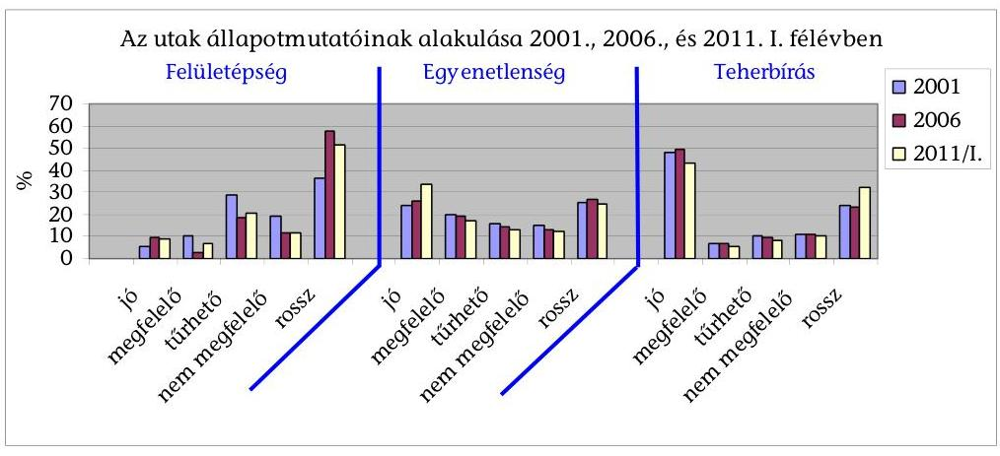
(részletes adatok az 5. számú mellékletben.)
A felületépség mutató összességében a 2006. évet követően 3-5\%-kal javult, viszont 2001-hez képest romlott. A 2006-2011. évek közötti időszakban az országos közutak több mint 50\%-ának felületépsége rossz osztályzatú volt.

A felületépség felmérése minden év tavaszán a téli leromlások után történt. Vizsgálata vizuális felmérés alapján zajlik, a vizuális minősítés figyelembe veszi a burkolatépséget meghatározó főbb jellemzőket, többek között a deformációkat, kátyúkat, az úttest sérüléseit, továbbá a burkolatszél hibáit is.

Az utak egyenetlensége mutatójánál a 2006. évhez képest a „megfelelő" és „jó" érték mutató 5,3\%-kal javult, a „rossz" és „nem megfelelő" mutató 3,8\%kal csökkent. A „jó" burkolatállapotú utak aránya a 2006-os évtől kezdődött útépítési és útfelújítási programok eredményeként nőtt.

Az MK NZrt. által készített „Az országos közutak állapota" című dokumentum 2011. június 15-i állapota szerint figyelembe kell venni, hogy a kedvezőtlen állapotú útszakaszok főként a mellékúthálózatra esnek, és az úthálózat körülbelül $30 \%$-át az utántömörődő burkolatú utak teszik ki, ezek többnyire kisebb forgalmú szakaszok.

Az utak teherbírási jellemzője a 2006. évet követően összességében kedvezőtlenül változott, ezen belül a szélső értékek tekintetében - a megfelelő és a jó érték mutatója 7,5\%-kal javult; a rossz és a nem megfelelő mutató 8,6\%-kal romlott.

Az utak teherbírási jellemzője a 10 tonnára átszámított tengelyterhelések elviselési képességét fejezi ki, ami főutakon és az aszfaltbeton burkolatú utakon kedvezőbb, mint a mellékúthálózaton.

Tengelyterhelés: a jármú egy-egy tengelyén levő kerekek által a vízszintes talajra átvitt súly. (A közúti közlekedés szabályairól szóló 1/1975. (II. 5.) KPM-BM együttes rendelet II. A közúti jármúvekkel kapcsolatos fogalmak.)

Az MK NZrt. dokumentuma szerint a tengelyterhelések megengedett határértéke az Európai Unióhoz való csatlakozáskor kapott felmentés lejárta után, 2008-ban

---

az addig érvényben lévő 10 tonnáról 11,5 tonna értékre növekedett, ami tovább gyorsította az úthálózat állapotának romlását.

A nyomvályú képződés a nagy nehézjármú forgalmú utak jellegzetessége és kedvezőtlen hatást gyakorol a forgalom biztonságára. A nyomvályús utak hossza 2006-ig évente átlagosan 5-10\%-kal növekedve meghaladta a 6300 kmt, 2007-2011 között évente stagnált vagy átlagosan 3-5\%-kal csökkent és elérte a 2004. évi szintet. Hasonló arányban változott a baleseti szempontból kiemelten veszélyes 17 mm -nél mélyebb nyomvályús szakaszok hossza, ez 2011-ben közel 2000 km volt.

# Az MK NZrt. kezelésében lévő országos közúthálózat nyomvályús szakaszainak hossza a nyomvályú mélysége szerinti megoszlásban 

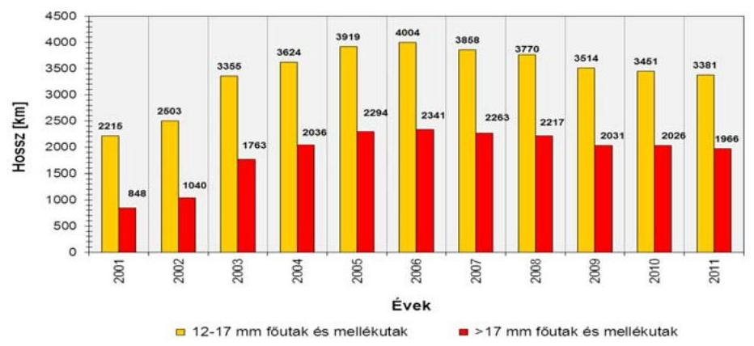

Forrás: MK NZrt.
A nyomvályúk kialakulása az útfelületen megnöveli az aquaplaning („vízen csúszás") kialakulásának lehetőségét, illetve a csúszósurlódás csökkenéséhez vezet.

Az egyenetlenség és a nyomvályúsodási adatok esetében figyelembe kell venni az MK NZrt. megjegyzését: az adatok nem az összes közút mérése alapján lettek összegezve, hanem a mérési terveknek megfelelően lemért szakaszok állapotváltozásait ábrázolják. Országos mérések hiányában a felújított utak adatai alapján a rendszer programjába épített algoritmus számítja az értékeket, ezzel magyarázható az utóbbi évek javulása.

A $115 \mathrm{kN}^{50}$ tengelyterhelést célzó burkolat megerősítés kiemelt feladat, mert amellett, hogy alkalmassá teszi kijelölt közutakat a $\mathbf{1 1 5} \mathbf{~ k N}$ tengelyterhelésre, hozzájárul a közutak - kiemelten a nyomvájúsodás - állapotmutatóinak javulásához. A burkolatmegerősítesek már 2001-ben megkezdődtek ISPA, illetve KIOP forrásból, 2004-től pedig KÖZOP forrásból folytatódtak.

A közúti forgalom egyik lényeges jellemzője a nehéz tehergépkocsik tengelyterhelése, amely az útpályaszerkezetek forgalomból eredő károsodását okozza, és jelentősen hozzájárul az utak és hidak szerkezetének kifáradáshoz, leromlásához.

[^0]
[^0]:    ${ }^{50}$ A Newton a súly mértékegysége az SI mértékegységrendszerben, jele: N, 1 kN (kilóNewton) $=1000 \mathrm{~N}$

---

Az utak múszaki méretezésének szempontjából fontos a nehéz tehergépkocsi forgalom ismerete és a fokozott terhelés figyelembevétele.
(Megjegyzés: a 115 kN és a 11,5 tonna mértékegységet a szakmai anyagok és a jogszabályok váltakozva használják. Az EU dokumentumokban a 115 kN az elfogadott.

Magyarország a Csatlakozási Szerződés mellékletében 1900 km 11,5 tonnás fơút megerősítését, építését tüzte ki célul 2008 végéig. Összességében 2011-re 1190 km (72\%) kezdődött el, illetve valósult meg. (Ebből 2011-ig 187 km készült el.) A burkolat megerősítések a 8329 km főúthálózat 14\%-át tették ki és hozzájárultak a közutak állapotának javulásához és ezáltal a jobb és biztonságosabb közlekedési feltételekhez. A burkolat megerősitési feladatok alulteljesítése a nem korszerúsített főutak - a nagyságrendekkel nagyobb terhelés miatti - fokozottabb ütemú romlását okozza.
(A 115 kN tengelyterhelést célzó burkolat megerősítések a 4. sz. függelékben.)
Az EU Csatlakozási Szerződés X. számú mellékletének közlekedéspolitikai fejezete és a Tanács 96/53/EK Irányelve (1996. június 25.) a Közösségen belül közlekedő egyes közúti járművek nemzeti és a nemzetközi forgalomban megengedett legnagyobb méreteinek, valamint a nemzetközi forgalomban megengedett legnagyobb össztömegének megállapításáról (továbbiakban: 96/53/EK Irányelv) szerint Magyarország vállalta a tranzitútvonalak korszerűsítését és újak építését. A Csatlakozási Szerződés X. számú mellékletének indikatív táblázata tüntetette fel az EU által megerősítésre javasolt utakat és ütemezésüket. Előírta, hogy a közösségi költségvetésből származó támogatást felhasználó infrastrukturális beruházások esetében biztosítani kell, hogy a megépített vagy korszerűsített főútvonalak tengelyenként 11,5 tonna terhelést bírjanak.

Magyarország vállalta, hogy a 30000 km-es (2004) országos közúthálózat egy kiemelt részén lehetővé teszi a 96/53/EK Irányelvben előírt, a 115 kN egyestengely-, a 180 kN kettőstengely terhelésű és a 440 kN összgördülősúlyú tehergépjárművek korlátozás nélküli forgalmát. Az MK NZrt. és a KKK tájékoztatása szerint a 115 kN -os fejlesztések által érintett főutak döntően nem voltak rossz állapotban.

A rossz útállapotú szakaszokon rövidebb-hosszabb ideig sebességkorlátozást rendeltek el, de ezek hosszának éves adatai, illetve annak változásai alapján csak részben lehetet értékelni az utak állapotát és a fenntartás eredményességét.

A nagyobb főutakon általában pár napos időszakra rendelnek el úthibák miatti sebességkorlátozásokat. Az OKA-ban az összes korlátozott hosszt és a burkolathiba miatti, tartósnak mondható, 3 hónapnál hosszabb időtartamra elrendelt korlátozások hosszát tartják nyilván, a 3 hónapnál rövidebb korlátozásokat nem.

Az útburkolati hibák miatt sebességkorlátozás alá eső útszakaszok hossza a 2008-2011. időszakban összességében 10\%-kal nőtt, ezen belül 2009-ben volt ennél jelentősebb emelkedés. Az 2011. évre az $50 \mathrm{~km} / \mathrm{h}$ alatti korlátozások hossza csökkent, de az $50 \mathrm{~km} / \mathrm{h}$ feletti korlátozások hossza növekedett.

---

Az útállapotok miatt sebességkorlátozás alá eső útszakaszok hossza

|  | $20 \mathrm{~km} / \mathrm{h}$ alatti   $(\mathrm{km})$ | $21-30 \mathrm{~km} / \mathrm{h}$   $(\mathrm{km})$ | $31-50 \mathrm{~km} / \mathrm{h}$   $(\mathrm{km})$ | $50 \mathrm{~km} / \mathrm{h}$ felett   $(\mathrm{km})$ |
| :--: | :--: | :--: | :--: | :--: |
| Év | burkolathiba miatti,   tartósnak   mondható,   3 hónapnál hosz-   szabb időtartamra | burkolathiba mi-   atti, tartósnak   mondható, 3 hó-   napnál hosszabb   időtartamra | burkolathiba miat-   ti, tartósnak   mondható,   3 hónapnál hosz-   szabb időtartamra | burkolathiba mi-   atti, tartósnak   mondható,   3 hónapnál hosz-   szabb időtartamra |
| 2006 | - | - | - | - |
| 2007 | - | - | - | - |
| 2008 | 12,39 | 41,34 | 244,84 | 390,61 |
| 2009 | 12,39 | 50,56 | 271,53 | 430,17 |
| 2010 | 12,39 | 47,98 | 255,44 | 437,31 |
| 2011 | 12,39 | 46,11 | 258,79 | 440,06 |

Adatforrás: Magyar Közút NZrt.
MK NZrt megjegyzése.:"Az OKA-ban az állandó jellegű sebességkorlátozásokat tartjuk nyilván, az ideiglenesen - 3 hónapnál rövidebb időre - kihelyezett sebességkorlátozó táblák nincsenek rögzitve"

A közutak fenntartásához kapcsoló környezetvédelmi feladat a közúti környezet, közlekedés okozta terhelésének vizsgálata, részvétel a környezetvédelemmel kapcsolatos jogi és műszaki szabályozás előkészítésében, a közúti környezetvédelmi monitoring rendszerek mérési programjaihoz kapcsolódó mintavételek és mérések elvégzése, valamint a mérési eredmények értékelése. A közúti környezetvédelmi monitoring rendszerek méréseit a minőségvizsgálati laboratóriumok végzik. A környezeti hatások vizsgálatára az MK NZrt. Környezetvédelmi Monitoring Rendszert és Országos Zajmonitoring Rendszert múködtet. A 2006-2010. évekre a vonatkozó környezetvédelmi beszámolók és a zajmérések zárójelentései elkészültek. A méréseket a Közlekedéstudományi Intézet végezte.

A környezetvédelmi hatások kedvező vagy kedvezőtlen változásai a felújítási projektek kivitelezése során konkrétan érzékelhetőek, mivel rendszerint végrehajtanak előzetes és utólagos méréseket, ezen kívül a helyszínen a hatás közvetlenül érzékelhető. A közúthálózat egészén a környezetvédelmi hatások számos más tényezőtől változhatnak (új autópálya átadás, forgalom áthelyeződés, korlátozások, tiltások stb.). Az MK NZrt. szerint:
„A végleges forgalomba helyezési engedélyt általában csak zajvédelmi vizsgálatok elvégzését követően adják ki. A lakossági panaszok, hatósági kötelezések (zajvédelmi felülvizsgálatok) száma nőtt, több esetben peres útra terelődtek. A panaszosok a lakóingatlanaik értékcsökkenése, az út-lakóház közelsége miatti zaj- és légszennyezések valamit a megnövekedett (teher)forgalom miatt keresik meg MK NZrt.-t illetve a hatóságokat. A jogszabályi előirások a közút kezelőjét kötelezik intézkedések megtételére a zaj csökkentése érdekében, azonban MK NZrt.-nek sem anyagi fedezete, sem kapacitása nincs zajvédelmi létesítmények megépitésére, és a zajvédő falak sem minden esetben jelentenek megoldást. A közútkezelő csak burkolatjavitási valamint sebességcsökkentési lépéseket tud foganatosítani, a forgalomnövekedésből származó zajterhelés csökkentésére nincs ráhatása. Az esetek többségében azonban a megengedett sebességtől eltérő, azt

---

jelentősen meghaladó jármú-sebességek tekinthetők kiváltó oknak. A nehézgépjármúvek forgalma is jelentősen közrejátszik a zajterhelés növekedésében. Alternatív útvonal hiányában ezek a jármúvek nem tilthatók ki a problémás útszakaszról. A településeket elkerülő utak megépitésére a közút kezelőjének szintén nincs ráhatása."

A közúthálózat környezeti állapotát jellemző monitoring rendszer keretében 38 mérőponton folyt a talaj, a gyepnövényzet, az útpályáról elfolyó csapadékvíz szennyezettségének ellenőrzése. A zajmérések változó helyeken, időszakokban és számban történtek. 2011-ben forráshiány miatt nem volt megrendelés a zajmonitoring rendszer múködtetésére.

Budapest, 2012. 08 hó 10 nap

Melléklet: 6 db
Függelék: 4 db
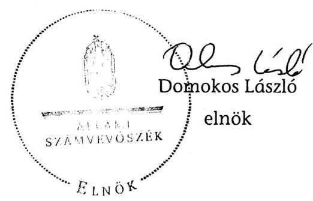

---

# MELLÉKLETEK 

a V-2003-077/2011-2012. sz. Jelentéshez

---

1. számú melléklet
a V-2003-077/2011-2012. sz. jelentéshez

Az országos közúthálózat
szakmai intézményrendszere

Nemzeti Fejlesztési
Minisztérium

szakmai felügyelet és költségvetési finanszírozás

NFM
infrastruktúráért felelős államtitkár
Közlekedésért felelős helyettes államtitkár

Közlekedési
Infrastruktúra Főosztály

Közlekedésfejlesztési
Kültrőinkölés Központ

Nemzeti Közlekedési
Hatóság

A
tulajdonos felügyelet

MFB Zrt.

KIKSZ Zrt.

tulajdonosi jogviszony

Nemzeti Infrastruktúra
Fejlesztő Zrt.

nemzeti infrastruktúra
Fejlesztő Zrt.

Magyar Közút NZrt.

Állami Autópálya
Kezelő Zrt.

szerződéses jogviszony

szakmai felügyeleti ellenőrzési kapcsolat

Alföldi Koncessziós
Autópálya Zrt.

M6 Duna Koncessziós
Autópálya Zrt.

M6 Tolna Autópálya
Koncessziós Zrt.

Mecsek Autópálya
Koncessziós Zrt.

(Készítette a Nemzeti Fejlesztési Minisztérium)

---

# Regionális operatív programokból finanszírozott projektek föbb adatai 

(2006. január 1 - 2011. július 31.)

| Projekt neve | Tervezett útszakaszok hossza összesen (km) | Regionális közútfelújítások tervezett kerete (M Ft) | Döntéssel érintett útszakaszok hossza összesen (km) | Döntéssel érintett beruházások költ-   sége ösz-   szesen   (M Ft) | Finanszírozások forrása |  | Összes   kifizetett támogatás   (M Ft) |
| :--: | :--: | :--: | :--: | :--: | :--: | :--: | :--: |
|  |  |  |  |  | EU | hazai |  |
| Megjegyzés | A | B | C | D |  |  |  |
| Dél-Alföldi | 221,9 | 17848,0 | 95,9 | 4866,9 | 4136,9 | 730,0 | 4664,2 |
| Dél-   Dunántúli | 98,0 | 30142,0 | 77,5 | 7487,6 | 6364,4 | 1123,1 | 4171,5 |
| Észak-   Alföldi | 274,6 | 31926,3 | 268,1 | 9454,2 | 8036,1 | 1418,1 | 9158,8 |
| Észak-   Magyarország | 340,3 | 32940,0 | 310,5 | 11072,6 | 9411,7 | 1660,9 | 10807,3 |
| Közép-   Dunántúli | 102,0 | 21150,0 | 94,6 | 4036,5 | 3431,0 | 605,5 | 3810,0 |
| Közép-   Magyarország | 184,9 | 37106,0 | 184,9 | 16068,1 | 13629,2 | 2192,3 | 13986,9 |
| Nyugat-   Dunántúli | 87,6 | 11545,0 | 58,7 | 3692,2 | 3138,4 | 553,8 | 3673,3 |
| Összesen | 1309,3 | 182657,3 | 1090,2 | 56678,2 | 48147,7 | 8283,8 | 50272,0 |

Az NFT I. ROP esetében nem volt benyújtott és támogatott projekt a vizsgált időszakban.
„A" Aggregált kumulált tervérték v. Projekt/szerződés adatlap tervérték (a visszalépettek nélkül)
„B" Eredeti kiíráskeretek (kivéve: DDOP-5.1.3/A, NYDOP-4.1.3/A - ezekben EMIR 1.1, mivel a kiírásokban nem került feltüntetésre komponens-szintű keret)
„C" Aggregált kumulált tervérték v. Projekt/szerződés adatlap tervérték (visszalépettek nélkül), hatályos szerződéssel rendelkező projektek esetében
„D" Aggregált kumulált tervérték v. Projekt/szerződés adatlap tervérték (visszalépettek nélkül), hatályos szerződéssel rendelkező projektek esetében

---

# KÖZOP-ból finanszírozott közút projektek 

(2006. január 1 - 2011. július 31.)

| Év | Terve-   zett   útsza-   kaszok   hossza   összesen   (km)* | A közútfelájitások tervezett kerete   (M Ft)** | Döntéssel érintett út-szakaszok hossza összesen (km) **** | Döntéssel érintett beruházások költsége összesen   (M Ft) | Finanszírozások forrása |  | Kifizetések öszszege (M Ft) *** |
| :--: | :--: | :--: | :--: | :--: | :--: | :--: | :--: |
|  |  |  |  |  | EU (M Ft) | Hazai   (M Ft) |  |
| 2006. |  |  |  |  |  |  |  |
| 2007. |  |  |  |  |  |  |  |
| 2008. | 1344,8 | 389 490,0 | 201,5 | 49587,3 | 42 149,2 | 7438,1 | 1594,0 |
| 2009. |  |  | 591,3 | 109 395,8 | 92 986,4 | 16 409,4 | 22 983,6 |
| 2010. |  |  | 287,4 | 28 117,4 | 23 899,8 | 4217,6 | 37357,2 |
| 2011. |  | 90,4 | 109,9 | 10775,6 | 9159,3 | 1616,3 | 30965,9 |
| Összesen | 1344,8 | 389 580,4 | 1190,1 | 197 876,1 | 168 194,7 | 29 681,4 | 92900,6 |

* Akciótervben szereplő keret. Ez az adat a 2007-2015. időszakra tervezett.
** Akciótervben szereplő keret
***Előleggel együtt
**** Az adat kizárólag előkészítésre vonatkozó projektjavaslatokat is magában foglal. Az NFÜ véleménye szerint csak olyan kijelentés tehető az adatsor alapján, hogy összesen 1190,1 km út megépítése vagy előkészítése történhet meg a közel 200 Mrd Ft forrásból.

---

# A közbeszerzési eljárások típus és érték szerinti megoszlása a vizsgált időszakban 

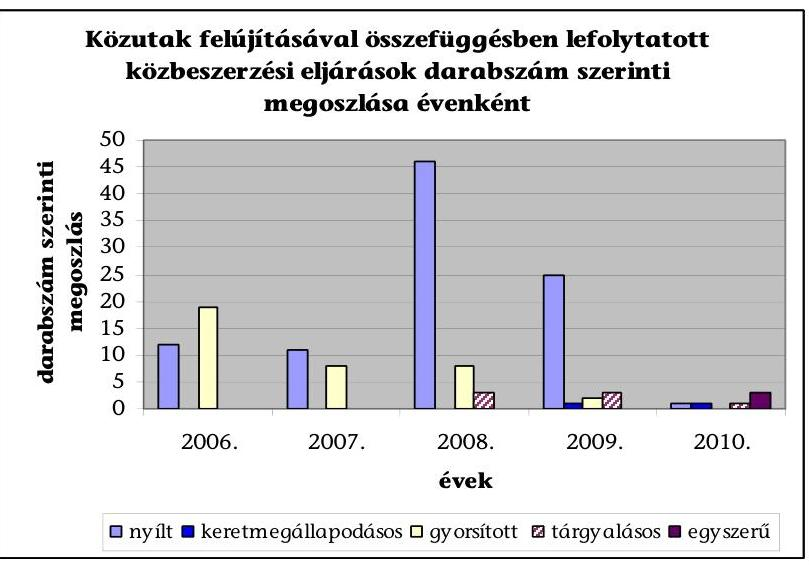

A vizsgált időszakban a közutak felújításával összefüggésben lefolytatott 144 eljáráson belül a különböző eljárástípusok aránya a következőképpen alakult: nyílt 66\%; gyorsított meghívásos $25,7 \%$; tárgyalásos $4,9 \%$, keretmegállapodásos 1,4\%; egyszerú $2 \%$. (A 2011. év I. félévében a helyszíni ellenőrzés befejezéséig 3 egyszerú és 1 tárgyalásos eljárás zárult le.)
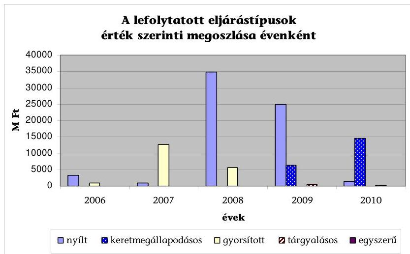

A lefolytatott eljárástípusok érték szerinti megoszlása a 2008-2010. évek között mutatott lényeges változásokat: a nyílt eljárásoknál a 2008. évi kimagasló értéket ( 34849 M Ft ) követően, 2010-re erőteljes visszaesés mutatkozott ( 1404 M Ft); a keretmegállapodások értéke több mint duplájára emelkedett (2009. évi 6400 M Ft-ról 2010. évben 14579 M Ft-ra).

A 2007-2008-ban lefolytatott gyorsított eljárások értéke csökkenő tendenciát mutatott. A 2007. évi 12668 M Ft-ról 2008. évben 5702 M Ft-ra, 45\%-kal mérséklődött.

---

# Az országos közúthálózat állapota

|  Országos közúthálózat állapota (a felmért úthálózat arányában, \%)
Adatforrás: Magyar Közút NZrt. |  |  |  |  |  |  |  |  |  |  |  |   |
| --- | --- | --- | --- | --- | --- | --- | --- | --- | --- | --- | --- | --- |
|   | 2000 | 2001 | 2002 | 2003 | 2004 | 2005 | 2006 | 2007 | 2008 | 2009 | 2010 | 2011/I  |
|  Felületépség* |  |  |  |  |  |  |  |  |  |  |  |   |
|  jó | 4,9 | 5,3 | 6,1 | 6,0 | 4,2 | 5,6 | 9,5 | 8,2 | 8,1 | 12,9 | 11,9 | 8,6  |
|  megfelelő | 10,4 | 10,3 | 11,3 | 8,0 | 5,8 | 4,0 | 2,9 | 4,5 | 3,7 | 5,6 | 5,7 | 7,1  |
|  türhető | 30,4 | 28,9 | 28,3 | 28,0 | 27,0 | 21,8 | 18,4 | 20,1 | 21,4 | 20,6 | 20,3 | 20,5  |
|  nem megfelelő | 18,8 | 19,0 | 17,6 | 14,0 | 13,2 | 13,7 | 11,6 | 11,7 | 12,3 | 11,1 | 11,4 | 11,8  |
|  rossz | 35,5 | 36,5 | 36,7 | 44,0 | 49,8 | 54,9 | 57,6 | 55,5 | 54,5 | 49,8 | 50,7 | 51,8  |
|  Egyenetlenség** |  |  |  |  |  |  |  |  |  |  |  |   |
|  jó | 21,5 | 23,9 | 23,9 | 23,7 | 24,0 | 23,3 | 26,4 | 28,9 | 29,6 | 33,0 | 32,8 | 33,3  |
|  megfelelő | 19,1 | 20,0 | 19,8 | 19,4 | 19,5 | 19,6 | 19,0 | 18,7 | 18,3 | 17,7 | 17,5 | 17,4  |
|  türhető | 16,5 | 15,5 | 15,4 | 14,7 | 14,7 | 14,7 | 14,2 | 13,4 | 13,5 | 12,9 | 12,9 | 12,7  |
|  nem megfelelő | 15,7 | 15,3 | 15,2 | 14,4 | 14,0 | 14,0 | 13,3 | 12,2 | 12,2 | 11,5 | 12,3 | 12,1  |
|  rossz | 27,2 | 25,3 | 25,7 | 27,8 | 27,8 | 28,4 | 27,1 | 26,8 | 26,4 | 24,9 | 24,6 | 24,5  |
|  Teherbírás |  |  |  |  |  |  |  |  |  |  |  |   |
|  jó |  | 48,1 | 49,2 | 49,6 | 49,8 | 49,9 | 49,6 | 49,0 | 47,3 | 47,7 | 45,5 | 43,3  |
|  megfelelő |  | 7,1 | 6,9 | 6,7 | 6,6 | 6,6 | 6,9 | 6,9 | 6,9 | 6,6 | 5,8 | 5,7  |
|  türhető |  | 10,0 | 9,6 | 9,3 | 9,2 | 9,1 | 9,4 | 9,7 | 9,6 | 9,2 | 8,4 | 8,3  |
|  nem megfelelő |  | 11,0 | 10,8 | 10,6 | 10,6 | 10,5 | 10,9 | 11,1 | 11,3 | 10,9 | 10,6 | 10,6  |
|  rossz |  | 23,7 | 23,6 | 23,8 | 23,8 | 23,9 | 23,2 | 23,3 | 24,9 | 25,6 | 29,8 | 32,1  |
|  Országos közúthálózat nyomvályús szakaszainak hossza (km)** |  |  |  |  |  |  |  |  |  |  |  |   |
|  fơutak és mellékutak
(>17 mm) | 380 | 827 | 1015 | 1723 | 1995 | 2319 | 2344 | 2263 | 2174 | 1991 | 2029 | 1983  |
|  fơutak és mellékutak
(12-17 mm) | 1812 | 2067 | 2334 | 3147 | 3410 | 3781 | 4011 | 3758 | 3708 | 3492 | 3468 | 3417  |
|  *A felületépség felmérése minden év tavaszán a téli leromlások után történik. Új burkolat esetén, míg nincs új mérési adat, a rendszer
automatikus algoritmus alapján javítja az adatokat |  |  |  |  |  |  |  |  |  |  |  |   |
|  **Az egyenetlenség, illetve nyomvályú adatok felvétele mérési tervek szerint történik. A csatolt táblázat alapján megtalálhatók az
adott évi mért hosszak. Mérések hiányában a felújított utakon a rendszer algoritmus alapján javít az értékeken, ezzel
indokolható az utóbbi évek javulása. Szerepet játszik továbbá, hogy nincs minden évben minden út megmérve, így az adatok a
mérési terveknek megfelelően lemért szakaszok állapotváltozásait ábrázolják. |  |  |  |  |  |  |  |  |  |  |  |   |

|  2006-2011 között végzett úthálózati mérések |  |  |  |  |  |  |  |  |  |  |   |
| --- | --- | --- | --- | --- | --- | --- | --- | --- | --- | --- | --- |
|  Adatforrás: Magyar Közút NZrt.
(Megjegyzés: a táblázat a 2011. szeptember 09-i adatok alapján készült.) |  |  |  |  |  |  |  |  |  |  |   |
|  Mérés típusa/Év | 2006 | 2007 | 2008 | 2009 | 2010 | 2011 |  |  |  |  |   |
|  Csúszósúrlódás mérés
SCRIM
Mérő berendezéssel | 110 balesetve-
szélyes
szakasz felmé-
rése | 440 km | 800 km | 880 km | - | - |  |  |  |  |   |
|  Csúszósúrlódás mérés
ASFT
Mérő berendezéssel | - | 440 km | 800 km | 535 km | - | - |  |  |  |  |   |
|  Burkolatállapot mérés
RST
Mérő berendezéssel | 9000 km | 9000 km + 190
ROP
szakasz | 13000 km | - | 6500 km | - |  |  |  |  |   |
|  Digitális útvideó ké-
szítése | 3000 sávkm | 4500 sávkm | 4500 sávkm | 4000 sávkm | - | - |  |  |  |  |   |
|  Forgalomszámlálás | Gördülö rend-
szer szerint | Gördülö rend-
szer szerint | Gördülö rend-
szer szerint | Gördülö rend-
szer szerint | Gördülö rend-
szer szerint | Gördülö rend-
szer szerint | - |  |  |  |   |
|  Roadmaster | teljes úthálózat | teljes úthálózat | teljes úthálózat | teljes úthálózat | teljes úthálózat | teljes úthálózat |  |  |  |  |   |
|  Teherbírás mérés | 2083 km | 2456 km | 2913 km | 2541 km | 4357 km | 2253 km |  |  |  |  |   |

---

# A jelentéstervezetre érkezett észrevételek és az azokra adott válaszok 

## A beérkezett észrevételek és az azokra adott válaszok

1a. Nemzeti Fejlesztési Minisztérium észrevétele
1b. Nemzeti Fejlesztési Minisztérium észrevételére adott válasz
2a. Nemzeti Fejlesztési Ügynökség észrevétele
2b. Nemzeti Fejlesztési Ügynökség észrevételére adott válasz

## Az alábbi szervezetek nem tettek észrevételt

3. Közlekedésfejlesztési Koordinációs Központ
4. Nemzeti Infrastruktúra Fejlesztő Zrt.

---

# NEMZETI FEJLESZTESI MINISZTÉRIUM 

NÉMETH LÁSZLÓNE

NFM/11095/ 2 /2012.
Hiv. sz: V-2003-065/2012.
Ügyintézőjük: Papp Sándor
Előadó: Holnapy László
Tel: 79-56808

## Domokos László úr

elnök

## Állami Számvevőszék

1052 Budapest
Apáczai Csere János utca 10.

Tárgy: Jelentéstervezet az állami közutak felújítását, javítását, karbantartását célzó intézkedések eredményességének és az állami közutak állapotára gyakorolt hatásának ellenőrzéséről

## Tisztelt Elnök Úr!

Engedje meg, hogy ezúton is megköszönjem a meglévő közúthálózat állapotának jobbitása érdekében végzett munkájukat, és az erről szóló jelentésük tervezetét, amely - az Állami Számvevőszék korábbi azonos tárgyú ellenőrzéseihez hasonlóan - segítségére lehet a közlekedőknek, a közúti szakterületnek és a tárcánknak.

---

A tervezettel kapcsolatban a következő észrevételeket kívánom tenni:
A jelentéstervezet a 11. oldalának második bekezdésében, az Útpénztár vonatkozásában 2012. évre tervezett elöirányzatot nevesít. Ezzel kapcsolatban megjegyzem, hogy az idei évre a költségvetési törvény Útpénztár elöirányzatot nem tartalmaz, az ugyanezen célt szolgáló előirányzat neve: „KKK intézményi költségvetés". Kérem ezért az „I. Összegző megállapítások, következtetések, javaslatok" részben a nemzeti fejlesztési miniszter részére megfogalmazott javaslatok tekintetében az itt leírtak figyelembevételét.

A jelentéstervezet 11. oldal 4. pontjában a 23. oldalon leírtakkal kapcsolatban megemlítem, hogy a Magyar Fejlesztési Bank tőkehelyzetének rendezéséről szóló 1398/2011. (XI. 18.) Korm. határozat szerinti megvalósítási vizsgálat a NIF Zrt., ÁAK Zrt., MK NZrt. összevonása tekintetében negatív eredményt hozott.

A jelentéstervezet részletes megállapításai alaposan, a lehető legszélesebb körű kitekintéssel mutatják be szakmai és a pénzügyi tervezést, a felújítások végrehajtását, és az utóbbiak eredményességét. Ezzel kapcsolatban hadd hívjam fel a figyelmet az 58. oldal 4.1 pontjában található formai pontatlanságra. A kátyúzások hatása a közutak állapotára fejezet első mondatának információtartalmát helyesbíteni javasolom. A karbantartási tevékenységnek része a kátyúzás, és nem fordítva.

Ismételten megköszönöm Elnök úrnak és munkatársainak az ellenőrzés által tevékenységünket támogató munkáját. A vizsgált időszak, illetve az azon túlmutató megállapításoknak a jelentés aláírása időpontjában fennálló aktualitása érdekében megfontolásra javaslom a fentebb említett Útpénztár ez évi helyzetére és az 1138/2012. (V. 3.) Korm. határozat a megtett úttal arányos elektronikus díjszedési rendszer bevezetéséről a közúti infrastruktúra finanszírozásának átfogó programjára történő utalást.

Budapest, 2012. június " /i) "
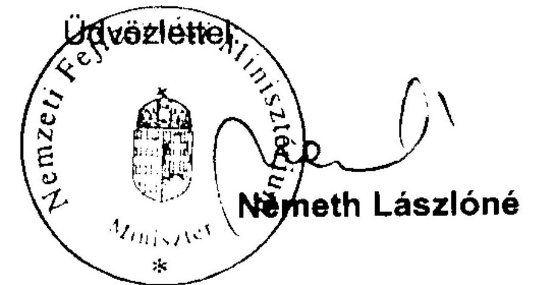

---

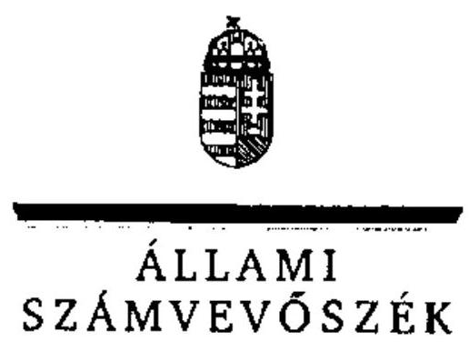

6/1b. sz. melléklet
a V-2003-077/2011-2012. sz. jelentéshez

# ELNÖK 

Ikt.szám: V-2003-071/2011-2012.

## Németh Lászlóné asszony

miniszter
Nemzeti Fejlesztési Minisztérium

## Budapest

## Tisztelt Miniszter Asszony!

Az állami közutak felújítását, javítását, karbantartását célzó intézkedések eredményességének és az állami közutak állapotára gyakorolt hatásának ellenőrzéséről készített számvevőszéki jelentéstervezetre tett észrevételeit köszönettel megkaptam.

Az Állami Számvevőszék észrevételekre vonatkozó álláspontjáról a felügyeleti vezető által készített részletes tájékoztatást csatoltan megküldöm.

Tájékoztatom Miniszter asszonyt, hogy a számvevőszéki jelentés szövegezése az elfogadott észrevételek figyelembevételével készül.

Budapest, 2012. OJ hó 25 nap
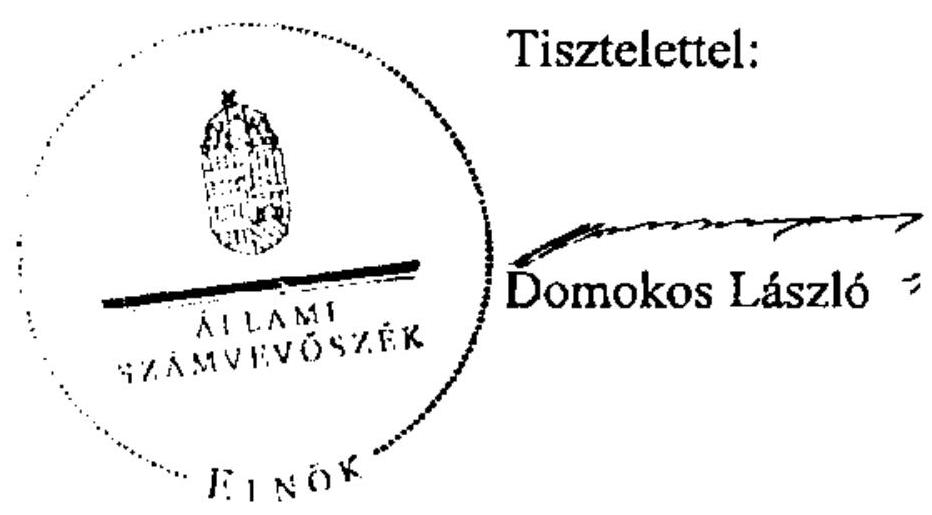

Melléklet: Tájékoztatás az elfogadott észrevételekről

---

# Tájékoztatás   az elfogadott észrevételekről 

Az állami közutak felújítását, javítását, karbantartását célzó intézkedések eredményességének és az állami közutak állapotára gyakorolt hatásának ellenőrzéséről készített számvevőszéki jelentéstervezetre tett észrevételeit köszönettel megkaptuk, amelyeket az alábbiak szerint kezeljük.

Az észrevétel első bekezdésében (11. oldal 2. bekezdéséhez kapcsolódóan) jelzettek alapján:
„Az Útpénztár ... 2012. évre tervezett felújítási elöirányzat összege 5,3 Mrd Ft volt."
szövegrészt a következőképpen módosítjuk:
„2012. évre a felújítási elöirányzat a Közlekedésfejlesztési Koordinációs Központ intézményi költségvetés elöirányzatai között szerepelt, tervezett összege 5,3 Mrd Ft volt."

Ennek megfelelően a jelentés összegzője és a részletes megállapítások vonatkozó részeit pontosítjuk az észrevétel negyedik bekezdéshez kapcsolódóan írtak szerint.

## Továbbá a nemzeti fejlesztési miniszternek szóló 1. számú javaslatot:

„Intézkedjen az Útpénztár elöirányzat fejezeten belüli éves pénzügyi elosztásának felgyorsitásáról, dolgoztassa ki a feladatok végrehajtását hatékonyabbá tevő és a közbeszerzési törvény rendelkezéseinek is megfelelő - a kivitelezők kiválasztását, a pályázati mechanizmust felgyorsitó - eljárásrendet."
a következőképpen változtatjuk:
„Intézkedjen az állami közutak fenntartását, üzemeltetését és fejlesztését célzó elöirányzat szerint rendelkezésre álló éves összeg fejezeten belüli elosztásának felgyorsitásáról, dolgoztassa ki a feladatok végrehajtását hatékonyabbá tevő és a közbeszerzési törvény rendelkezéseinek is megfelelő - a kivitelezők kiválasztását, a pályázati mechanizmust felgyorsitó - eljárásrendet."

Az észrevétel második bekezdésében foglalt, az ÁAK Zrt, NIF Zrt, MK NZrt. összevonása kapcsán a jelentés összegzőjében a következő kiegészítést tesszük:

---

„Az NFM tájékoztatása alapján, a lefolytatott megvalósítási vizsgálat az összevonás tekintetében negatív eredményt hozott."

Ennek megfelelően a jelentés részletes megállapítások 1.1. pontjának vonatkozó részét a következőképpen pontosítjuk.
„A kormányhatározat megvalósítási vizsgálata negatív eredményt hozott. ${ }^{1 "}$
Az észrevétel harmadik bekezdése alapján a részletes megállapítások 4.1. pontjában:
„A kátyúásisi feladatok jelentős részét a karbantartási tevékenység teszi ki."
szövegrészt töröljük, helyette a megállapítást a következőképpen módosítjuk:
„A karbantartási tevékenység jelentős részét a kátyúásisi feladatok teszik ki. ...A kátyúásisi tevékenységnél a drágább, tartósabb..."

# Az észrevétel negyedik bekezdése alapján: 

Az Útpénztárral kapcsolatban tett észrevétel alapján az összegző megállapításokat a következőképpen egészítjük ki:
„A 2012-re szóló költségvetési törvényben az Útpénztár bevételei és kiadásai a KKK intézményi költségvetés elöirányzatai között jelentek meg. A költségvetési törvényben jóváhagyott kiadási elöirányzatok elosztásakor a gyorsforgalmi utak nélküli állami utak felújitására 0,56 Mrd Ft kiadást hagyott jóvá a nemzeti fejlesztési miniszter".

A részletes megállapítások 2.3. pontjában az alábbiakat szerepeltetjük:
„Az Útpénztár elöirányzat a Magyar Köztársaság 2012. évi költségvetéséről szóló törvényben nem szerepelt, bevételei és kiadásai a Nemzeti Fejlesztési Minisztérium fejezet KKK intézményi költségvetési elöirányzatai között jelentek meg. A költségvetési törvényben jóváhagyott kiadási elöirányzatok leosztásakor a gyorsforgalmi utak nélküli állami utak felújitására az elözetesen tervezett összeg mintegy $10 \%-a, 0,56$ Mrd Ft kiadást hagyott jóvá a nemzeti fejlesztési miniszter. "2

[^0]
[^0]:    ${ }^{1}$ A nemzeti fejlesztési miniszter 2012. június 14 -én kelt, az ellenőrzési megállapítások ÁSZ tv. 29. §-a alapján lefolytatott, a jelentés egyeztetése során tett észrevétele szerint.
    ${ }^{2}$ A KKK-tól kapott 2012. évi visszatervezés megnevezésű dokumentum szerint.

---

A megtett úttal arányos elektronikus díjszedési rendszerrel kapcsolatban az összegző megállapításokat a következőkkel egészítjük ki:
„Egy 2012 májusában megjelent Korm. határozat intézkedett az új díjszedési rendszer bevezetésével kapcsolatos, 2012-ben végrehajtandó feladatokról, valamint a közúti infrastruktúra finanszírozásának átfogó programjára vonatkozó javaslat kidolgozásáról."

A részletes megállapítások 2.4. pontjában az alábbiakat szerepeltetjük:
„A megtett úttal arányos elektronikus díjszedési rendszer bevezetéséröl szóló 1138/2012. (V. 3.) Korm. határozat 2012-ben végrehajtandó részhatáridőkkel kijelölte az új díjszedési rendszer bevezetésével, kiépitésével a források biztositásával, valamint a dijbevételek számításával és ezek költségvetésre gyakorolt hatásának elemzéséhez kapcsolódó feladatokat. A határozat 4. pontja folyamatos határidő megjelölése mellett feladatként fogalmazta meg, hogy: „A Kormány felhívja a nemzeti fejlesztési minisztert, hogy a nemzetgazdasági miniszterrel együtt tegyen javaslatot a közúti infrastruktúra finanszírozásának átfogó programjára."

Budapest, 2012. 0x. hó 25. nap

Makkai Mária
felügyeleti vezető

---

# ELNÖK 

Iktatószám: $11 / 2-7 / 2012$

## Domokos László

elnök

## Állami Számvevőszék

## Budapest

Apáczai Csere János u. 10.
1052

Tárgy: Jelentéstervezet észrevételezése

## Tisztelt Elnök Úr!

Az Állami Számvevőszék által „Az állami közutak felújítását, javítását, karbantartását célzó intézkedések eredményességének és az állami közutak állapotára gyakorolt hatásának ellenőrzéséről" készített Jelentéstervezetre a Nemzeti Fejlesztési Ügynökség az alábbi észrevételeket teszi.

### 3.4. A teljesitések és a pénzügyi elszámolások rendszere (51. oldal)

A kifizetések teljesítése tekintetében az Irányító Hatóság szerepének megjelenítése érdekében az alábbi kiegészítést kérjük:
„Az MK NZrt.-vel szerződött kivitelező számláját az MK NZrt. továbbítja az illetékes Regionális Fejlesztési Ügynökség (RFÜ) felé. A számlák és alátámasztó dokumentumok ellenőrzését követően a kifizetéshez szükséges dokumentáció benyújtásra kerül az NFÜ Irányító Hatósághoz. A jóváhagyást követően a kifizethető támogatást az IH átutalja az RFÜ részére, aki a kifizetését az MK NZrt. vagy a kivitelező részére teljesíti."

## A 3. sz. függelék (Helyszinen vizsgált projektek)

A függelék esetében az egyértelmű beazonosíthatóság érdekében kérjük feltüntetni a projektszámokat.

Ellenőrzési munkájukat megköszönve kérem, hogy észrevételeinket szíveskedjenek figyelembe venni a jelentés szövegének véglegesítésekor.

Budapest, 2012. június „ ${ }^{18}$ "

---

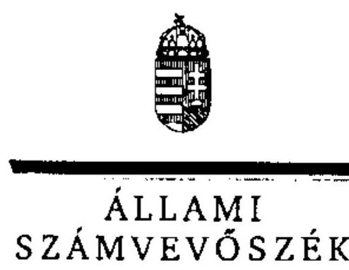

6/2b. sz. melléklet
a V-2003-077/2011-2012. sz. jelentéshez

ELNÖK

Ikt.szám: V-2003-072/2011-2012.

# Petykó Zoltán úr 

elnök
Nemzeti Fejlesztési Ügynökség
Budapest

## Tisztelt Elnök Úr!

Az állami közutak felújítását, javítását, karbantartását célzó intézkedések eredményességének és az állami közutak állapotára gyakorolt hatásának ellenőrzéséről készített számvevőszéki jelentéstervezetre tett észrevételeit köszönettel megkaptam.

Az Állami Számvevőszék észrevételekre vonatkozó álláspontjáról a felügyeleti vezető által készített részletes tájékoztatást csatoltan megküldöm.

Tájékoztatom Elnök urat, hogy a számvevőszéki jelentés szövegezése az elfogadott észrevételek figyelembevételével készül.

Budapest, 2012.
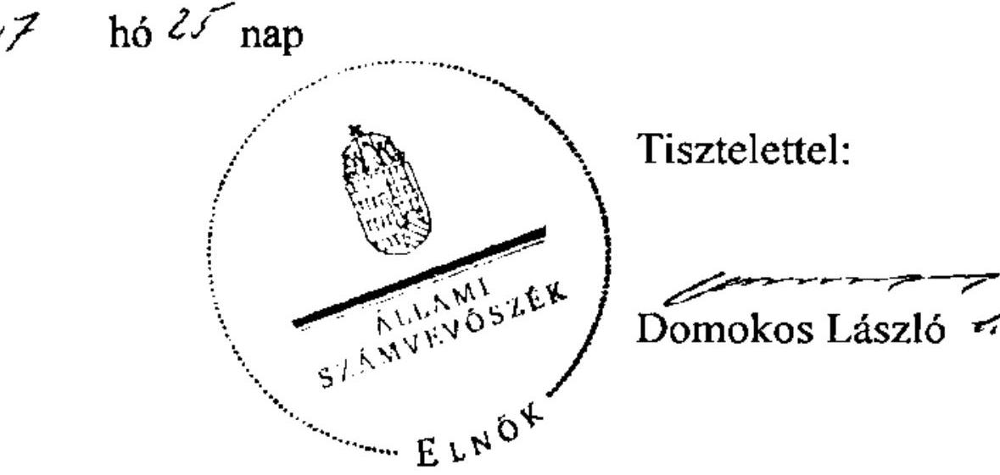

Melléklet: Tájékoztatás az elfogadott észrevételekről

---

# Tájékoztatás   az elfogadott észrevételekről 

Az állami közutak felújítását, javítását, karbantartását célzó intézkedések eredményességének és az állami közutak állapotára gyakorolt hatásának ellenőrzéséről készített számvevőszéki jelentéstervezetre tett észrevételeit köszönettel megkaptuk, amelyeket - az Önök megjelölésére történő utalással - az alábbiak szerint kezeljük.

### 3.4. A teljesitések és a pénzügyi elszámolások rendszere (51. oldal)

„A jóváhagyást követöen a kifizetését az illetékes RFÜ teljesiti."
szövegrészt töröljük és helyette az alábbiakat szerepeltetjük:
„A számlák és alátámasztó dokumentumok ellenőrzését követöen a kifizetéshez szükséges dokumentáció benyújtásra kerül az NFÜ Irányitó Hatósághoz. A jóváhagyást követöen a kifizethető támogatást az IH átutalja az RFÜ részére, aki a kifizetést az MK NZrt. vagy a kivitelező részére teljesiti." ${ }^{1}$

## A 3. sz. függelék (helyszínen vizsgált projektek)

Az egyértelmű beazonosíthatóságot segitő projekt, illetve szerződésszámokat feltüntetjük.

Budapest, 2012. 02. hó 25 . nap

Makkai Mária
felügyeleti vezető

[^0]
[^0]:    ${ }^{1}$ A jelentés végleges egyeztetése során az NFÜ elnöke által kért pontositás.

---

# KÖZLEKEDÉSFEJLESZTÉSI 

KOORDINÁCIÓS
KÖZPONT

1024 Budapest, Lovőház utca 39 - telefon +36 (1) 336-8100 $\cdot$ fax +36 (1) 336-1522 $\cdot$ e-mail: kkk@kkk.gov.hu

Válaszlevelükben szíveskedjenek az alábbi iktatószámra hivatkozni!
IKTATÓSZÁM: V-3/000026-1/2012
HIV.SZÁM.: V-2003-065/2012
TÁRGY: Jelentés észrevételezése
ELŐADÓ: Damásdi Andor
MELLÉKLET:

## Állami Számvevőszék

## Domokos László

elnök

## Budapest

Apáczai Csere János u. 10.
1052

## ÁLLAMI SZÁMVEVÓSZÉK

6043/
Ezkere: 2012 JÚN 14
Iktasinzan: V-2003-066/2012
Mellklet:
Papp Jacek
0618

## Tisztelt Elnök Úr!

Köszönettel vettük fenti számon megküldött, „az állami közutak felújítását, javítását, karbantartását célzó intézkedések eredményességének és az állami közutak állapotára gyakorolt hatásának ellenőrzéséről" készített számvevői jelentéstervezetüket. Az abban foglaltakat áttanulmányoztuk, megismertük és Intézményünk részéről elfogadjuk. Észrevételt nem kívánunk tenni.

Megköszönve munkatársai korrekt, tényszerűségre törő munkáját:

Budapest, 2012. június "8."

Tisztelettel:
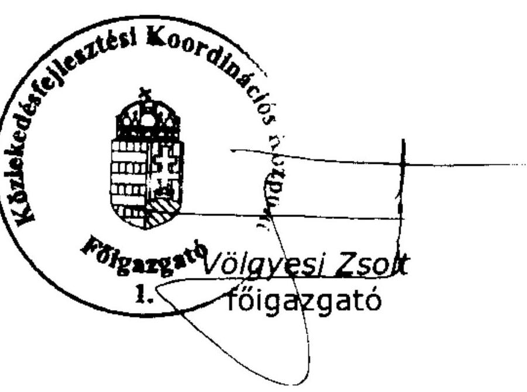

---

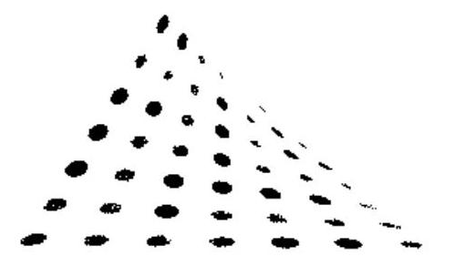

Nemzeti Infrastruktúra Fejlesztő Zrt.

## Állami Számvevőszék

## Domokos László

elnök részére

## Budapest

Apáczai Csere János u. 10.
1052

Tárgy: Számvevőszéki jelentéstervezet észrevételezése

## Tisztelt Elnök Úr!

Kőszönettel június 1-jén kézhez kaptuk az állami közutak felújítását, javítását, karbantartását célzó intézkedések eredményességének és az állami közutak állapotára gyakorolt hatásának ellenőrzéséről készített számvevőszéki jelentéstervezetűket.

Tájékoztatom Elnők úrat, hogy a számvevőszéki jelentéstervezethez a Nemzeti Infrastruktúra Fejlesztő Zrt.-nek nincs észrevétele.

Budapest, 2012.06.18.

Tisztelettel:
Nemzeti Infrastruktúra Fejlesztő Zrt.
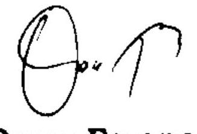

Orosz Ferenc
vezérigazgató
Kapják: 1) ÁSZ
2) Irattár

---

# FÜGGELÉKEK 

a V-2003-077/2011-2012. sz. Jelentéshez

---

# A Magyar Közút NZrt. vizsgálattal érintett megyei igazgatóságainak karbantartás, felújítás tervezési feladatai 

## 1. BARANYA MEGYEI KÖZÚTI IgAZGATÓSÁG

A vizsgált időszakban a megyei igazgatóságok feladata volt az éves feladattervek kidolgozása és végrehajtása, ezen belül a kezelésükben lévő állami úthálózat üzemeltetése és karbantartása az osztályokhoz rendelt részletes feladatok és hatáskörök szerint.

Az OKKSZ alapján az Igazgatóságnál készült éves feladattervek a KKK által biztosított, megyére lebontott forrásokat bontották le jogcímekre. Ezen belül az útkarbantartási munkákra fordítható források felhasználását a Magyar Közút Nonprofit Zrt. (MK NZrt.) iránymutatásai alapján tervezték. Az útkarbantartási munkák teljesítésének alapját a gördülő tervezés jelentette. A karbantartási munkák ütemezett elvégzését befolyásolták az útellenőrzés során nyert információk, bejelentések, a hibaelhárítás sürgőssége balesetveszély elhárítása is.

A tervezési útmutató szerint elsőbbséget jelentett a burkolat fenntartási munkák teljesítése az OKKSZ határidők betartásával, melyet a tervezéskor figyelembe kell venni.

A karbantartási és felújítási feladatok teljesítésénél figyelembe vették az uniós és hazai forrásokból tervezett 115 kN megerősítésű útszakaszokat. Az alkalmazott technológiát, a műszaki, gazdaságossági szempontokat befolyásolta például a balesetveszély azonnali elhárítására való törekvés; a rendelkezésre álló célgép állomány; az adott pályaszerkezet minősége; a közmunkaprogramok alapján támogatott foglalkoztatás. A szempontrendszerre belső szabályozás nem volt.

A feladattervek nem tartalmazták a felújítás feladatát. A felújítást az MK NZrt. a vizsgált időszakban a KKK-val kötött megbízási szerződés alapján teljesítette. A felújítással érintett megyei létesítményjegyzék véglegesítése többlépcsős egyeztetési folyamat eredményeként alakult ki. Az Igazgatóság a részére meghatározott felújítási keretet töltötte fel műszaki tartalommal. A tervezés során figyelembe vette az MK NZrt. központi szervezetének iránymutatásait, az üzemmérnökségek javaslatait, az országos és regionális programokat (pl.: NÚP, ROP, KÖZOP), az Országos Közúti Adatbank információit, valamint a helyszíni tapasztalatokat.

A 2011. évi aktuális létesítményjegyzék összeállításánál első körben előírás volt, hogy a felújítandó felületek a mellékelt listán felül lehetőleg $600 \mathrm{~m}^{2}$ alatti egybefüggő felületek legyenek, melyek helyreállítása megoldható kiviteli terv készítése nélkül. A 2011. február 1-jei levél szerint a megyei keret 60\%-áig olyan projekteket kellett a listán szerepeltetni, ahol a kivitelezési munkák biztosan elvégezhetők 2011. május 15 -ig áprilisi munkakezdést feltételezve.

A Nemzeti Infrastruktúra Zrt. (NIF) által tervezett 115 kN megerősítésű útszakaszokat elsősorban a ROP keretében tervezett felújítási munkák előkészítésénél vették figyelembe, amennyiben az információ rendelkezésre állt.

---

A Budapest és Szekszárd között a 6-os út 115 kN tengelyterhelésnek megfelelő megerősítése megtörtént. Szekszárdtól az országhatárig a tervek elkészültek, de az út megerősítésének folytatásáról az Igazgatóságnak információja nem volt.

Az egyes útszakaszok felújítási módjának kiválasztásában az Igazgatóságnak kiemelten 2008-2009 években volt lehetősége, amikor a felújítás nagyságrendje kiviteli tervezést tett szükségessé. A tervezéskor, ha több megoldási alternatíva volt, figyelembe vették a műszaki szabványok előírásai mellett a gazdaságossági, műszaki szempontokat, a gazdaságossági számításokat az egyes technológiák között. A felújítás módjának kiválasztását befolyásolták az adott technológiai tapasztalatok, az adott útszakaszokon a forgalom nagysága, valamint a mért teherbírási adatok. A 2009. évet követően a technológia kiválasztása a kis volumenű feladatok jellegéhez igazodott.

# 1.1. Felújítási, karbantartási feladatok teljesítésének főbb jellemzői 

Baranya megyében a 2011. június 15 -ei állapot szerint az Igazgatóság kezelésében lévő közúthálózat hossza 1622,3 km volt. A vizsgált időszakban a hazai forrásból felújítottak 2007-ben 14,35 km, 2008-ban 32,064 km, 2009-ben $16,98 \mathrm{~km}$, 2010-ben $34,862 \mathrm{~km}$, valamint 2011 . július 31 -ig $17,587 \mathrm{~km}$ útszakaszt. A felújítások ellenére az Igazgatóság kezelésében lévő közúthálózatnál érdemi állapotjavulás nincs, melynek oka az alulfinanszírozásból adódó fenntartási munkák elmaradása.

A helyreállítási döntéseknél a műszaki előírások, szabályzatok előírása mellett kiemelten figyelembe kellett venni a rendelkezésre álló forrásokat, valamint a balesetveszély azonnali elhárítása követelményét.

A 2010. évi időjárási viszonyok miatt az útállapot romlások fokozottan jelentkeztek. A helyreállítások egyes esetekben csak a forgalombiztonságát tették lehetővé, a teljes helyreállítás nem történt meg. Például az ófalui 56125 . számú bekötő út helyreállítása tervezett szinten 120 M Ft -ot tett ki, de forrás hiányában ideiglenes megoldást kellett alkalmazni. Az ófalui bekötő út helyreállításával szemben elsőbbségi megoldásra váró feladatot jelentett a 66. számú úton történt sziklafalomlás miatti közvetlen balesetveszély elhárítása. Ideiglenes megoldásra nem volt lehetőség, az adott sziklafal védelmi rendszerét le kellett cserélni.

Az Igazgatóság kimutatásai szerint az alulfinanszírozásra jellemző, hogy az árokrendezési teljesítmények gyakoriságát, beavatkozási ciklusidejét tekintve 2008-ban 69 évenként, a 2011. évi tervszámok alapján 130 évenként van lehetőség adott árokszakasz rendezésére. A padkarendezéseknél a gyakoriság, beavatkozási ciklusidő 2008-ban a tényszámok és a 2011. évi tervszámok alapján egyaránt 33 évet tett ki.

---

A Baranya megyei országos közutak burkolatállapot osztályzat szerinti alakulása a vizsgált években a következők szerint alakult (adatok: km-ben):

| Évek | Teljes hálózat |  |  |  |  | Főúthálózat |  |  |  |  | Mellékúthálózat |  |  |  |  |
| :--: | :--: | :--: | :--: | :--: | :--: | :--: | :--: | :--: | :--: | :--: | :--: | :--: | :--: | :--: | :--: |
|  | Jó | Megfelelő | Tűrhető | Nem   megfelelő | Roksz | Jó | Megfelelő | Tưrhető | Nem   megfelelő | Roksz | Jó | Megfelelő | Tưrhető | Nem   megfelelő | Roksz |
|  | 1 | 2 | 3 | 4 | 5 | 1 | 2 | 3 | 4 | 5 | 1 | 2 | 3 | 4 | 5 |
| 2006 | 53,2 | 29,1 | 169,9 | 170,9 | 1140,4 | 6,3 | 10,9 | 27,2 | 40,4 | 173,3 | 46,9 | 28,3 | 172,7 | 155,1 | 367,1 |
| 2007 | 67,3 | 61,7 | 275,5 | 226,6 | 971,7 | 5,4 | 12,8 | 47,3 | 57,6 | 135,0 | 61,5 | 48,9 | 228,2 | 170,8 | 606,7 |
| 2008 | 75,7 | 69,4 | 273,9 | 223,5 | 962,3 | 14,5 | 8,8 | 34,3 | 47,5 | 153,4 | 61,3 | 60,6 | 239,6 | 176,0 | 805,1 |
| 2009 | 112,8 | 63,6 | 184,5 | 227,5 | 1002,3 | 42,3 | 17,7 | 30,2 | 59,6 | 158,7 | 70,5 | 48,0 | 184,2 | 167,4 | 882,6 |
| 2010 | 147,6 | 137,5 | 401,3 | 261,8 | 859,0 | 36,4 | 36,3 | 49,1 | 49,0 | 87,8 | 111,2 | 101,2 | 352,2 | 212,6 | 971,3 |
| 2011 | 100,1 | 134,2 | 330,9 | 190,2 | 866,9 | 22,9 | 38,2 | 45,5 | 31,4 | 120,6 | 77,2 | 98,0 | 285,4 | 158,8 | 746,3 |

A teljes hálózatot tekintve a burkolat állapot 2006-ban a minősítés megoszlása szerint jó $3,3 \%$, megfelelő $2,4 \%$, tűrhető $12,5 \%$, nem megfelelő $10,6 \%$, rossz $71,1 \%$ volt. 2011-ben a jó $6,2 \%$-ot, a megfelelő $8,3 \%$-ot, a tűrhető $20,4 \%$, a nem megfelelő $11,7 \%$-ot, rossz $53,4 \%$-ot tett ki. A 2011. évben nem megfelelő és rossz volt a teljes úthálózat $65,2 \%$-a. A minőség számottevő javítására a 2012. évre várható útpénztári források alapján nem lesz lehetőség.

Az osztályzatok alakulása nem tükrözi teljes egészében az úthálózat minőségének változását. A kialakított gyakorlat szerint az értékelési szakaszok hossza 500 m , így egy-egy $20-30 \mathrm{~m}$-es beavatkozás is 500 m hosszon javítja az osztályzatot, akár 3-4 fokozattal is. A sok kis felületű beavatkozás mindenütt egy-egy értékelési szakasz minősítését változtatja, ezért adódik egy-egy év esetében is lényeges hossz-változás, mely azonban nem arányos a felületváltozással. Ez az értékelési módszer félrevezető következtetésekhez vezethet.

Az Igazgatóság kezelésében történő közúthálózat felújításánál - mivel a személyi és tárgyi feltételek nem adottak a felújítási feladatok belső kivitelezésére közbeszerzési eljárás eredményeként történt a kivitelezők kiválasztása. A vizsgált időszakban a közbeszerzést a KKK-val kötött megbízási szerződés és együttműködési eljárásrend előírásai figyelembevételével minden esetben az MK NZrt. központi szervezete bonyolította le.

Az eredményes közbeszerzési eljárást követően az MK NZrt. kötötte meg a fővállalkozóval a vállalkozói szerződést, de a számlákat a KKK egyenlítette ki. A szerződés tartalmazta a kivitelezők elszámoltatásának, ellenőrzésének rendjét, a garanciális feltételek, a teljesítés műszaki mutatóinak, valamint a szerződésben foglalt vállalások részbeni, illetve teljes elmaradása esetére vonatkozó kártérítési igényeket.

Ugyancsak az adott szerződésben került rögzítésre, hogy az aszfaltmarásnál keletkező anyagot a kivitelező miként használja fel. A fel nem használt anyag mennyiségéről a kivitelező nyilvántartást vezet, melyben rögzíti, hogy hol helyezte el az aszfaltmarásnál keletkező anyagot. (Az újrahasznosítható anyag értékesítése esetén rögzített áron kell az értékesítés bevételét a KKK-nak átutalni.)

Az Igazgatóság feladata a kivitelezés műszaki ellenőrzése, a számlák teljesítésigazolása, valamint a garanciális feladatok intézése volt. A fővállalkozó mellett az alvállalkozói kör az Igazgatóság számára ismert volt. 2011. előtt a műszaki ellenőrzések során váltak ismertté a kivitelezésben részt vett alvállalkozók; ezt követően az alkalmazott eljárásrend már követhetőbbé tette az alvállalkozók által elvégzett munkák számbavételét. Az eljárásrend szerint teljesítésigazolás

---

után először az alvállalkozók számlája kerül a KKK részéről kifizetésre. Ha az alvállalkozó bizonylatolta, hogy a számlájára megérkezett az átutalt összeg, csak akkor nyújthatta be a fővállalkozó a számláját ellentételezésre.

A kivitelezések folyamatát az építési naplóba történő bejegyzések dokumentálták. A műszaki átadás-átvételi jegyzőkönyvek készítése jelentette a felújítások lezárását. A felújítások nyomon követése a garanciális bejárások során történt. Az adott kivitelezés közbülső és végső teljesítésének ellenőrzése az építési naplóban és mellékleteiben követhető nyomon. A felújításokról az Igazgatóság szakmai beszámolókat nem készített.

A sebességkorlátozás alá eső útszakaszok hossza folyamatosan változik, erről nyilvántartást nem vezetnek. A tapasztalatok szerint általában tavasszal a legmagasabb a sebességkorlátozás alá eső útszakaszok hossza.

Az Igazgatóság kezelésében levő utak karbantartása elsősorban saját kapacitással valósult meg. Esetenként előfordult külső kivitelező alkalmazása (pl. hó eltakarítás). A versenyeztetést, közbeszerzést ebben az esetben is az MK NZrt. bonyolítja le.

A kátyúzási tevékenységekről azok végrehajtási módja szerint tonnában vezettek kimutatást. A felhasznált anyagmennyiséget a 2008-2010 években a 2011. évi tervadattal együtt az alábbiak szemléltetik (adatok: tonnában):

| Megnevezés | 2008 | 2009 | 2010 | 2011 terv |
| :--: | :--: | :--: | :--: | :--: |
| jogcím | tény | tény | tény | összevont |
| 2211 Kátyúk ideig. -átmeneti jellegü- jav. | 104 | 260 | 193 | 285 |
| 2212 Javítás hideg aszfaltkeverékkel | 129 | 96 | 58 | 325 |
| 2213 Javítás spaciális /zsákos/ keverékkel | 61 | 38 | 74 | 115 |
| 2214 Javítás AB keverékkel | 2928 | 3174 | 3768 | 3202 |
| 2216 Helyszíni javítás egyéb célgépekkel (ROSCO) | 342 | 253 | 150 | 300 |

| Megnevezés | $\mathbf{2 0 0 8}$ | $\mathbf{2 0 0 9}$ | $\mathbf{2 0 1 0}$ | $\mathbf{2 0 1 1}$ |
| :-- | --: | --: | --: | --: |
| Hideg kátyúzás To (2211, 2212, 2213) | 294 | 394 | 326 | 725 |
| Meleg kátyúzás To (2214, 2216) | 3270 | 3427 | 3918 | 3502 |
| összesen (To) | 3564 | 3821 | 4244 | 4227 |

Az utak karbantartási tevékenységét, az erre fordított forrásokat a KKK munkatársa vizsgálta a felmérési napló ellenőrzésével.

# 2. Szabolcs-SZATMÁr-BEREG MEGYEI KÖZÚTI IgAZGATÓSÁG 

Az Igazgatóság a saját működési területét érintően a karbantartási munkákra vonatkozóan tett javaslatot az MK NZrt. által lebontott éves előirányzat felhasználására. Az érvényes szabályozás szerint az Igazgatóság a területén folyó felújítási munkák vonatkozásában ellátta a műszaki ellenőrzés feladatait.

---

A forráselosztás során az Igazgatóság a lebontott keretet naturális tartalommal tölti meg. Az MK NZrt. - vezérigazgatói utasítás formájában - meghatározza azokat a tevékenységfajtákat - kátyúzás, kaszálás, útburkolati jelek festése stb. - amelyekre az előirányzat felhasználható. Az Igazgatóság felméri, hogy a meghatározott tevékenységek közül mit tud a saját erőforrásai felhasználásával megvalósítani és mely tevékenységek ellátását kell külső kivitelezők bevonásával megoldani. Javaslatait elektronikus úton megküldte az MK NZrt-nek. A keret lebontásakor központilag határozták meg az egységárakat.

Az Igazgatóság hatásköreit a MK NZrt. szervezeti és múködési szabályzata rögzítette. Az egyes területek részletes szabályait a rendszeresen kiadott vezérigazgatói utasításokban, illetve a tevékenység szabályait rögzítő kézikönyvekben határozták meg.

Az Igazgatóság tájékoztatása szerint a NÚP mellékletét képező létesítményjegyzék összeállításánál a műszaki állapot mintegy 40\%-os súlyt képviselt a döntéshozatalban, míg 60\%-ban más tényezőket is számításba vettek. Ebből következően a létesítményjegyzék összeállításakor a felújítások időbeli ütemezésében lehetnek eltérések.

Szabolcs-Szatmár-Bereg megyében a 4. sz. főközlekedési út érintett a 115 kN megerősítésben, amelyet a területi létesítményjegyzék összeállításánál figyelembe vettek. Az Igazgatóságnak az adott útszakaszon csak karbantartási feladatai vannak.

A 115 kN útmegerősítések időbeli ütemezéséről az Igazgatóságnak nincs információja; a konkrét tervezésről szereznek tudomást és véleményükkel kapcsolódnak be a folyamatba.

A területi létesítményjegyzék összeállításánál figyelembe vették a Regionális Fejlesztési Tanácsok döntési jogkörébe tartozó ROP források felhasználásával felújításra kerülő utak, útszakaszok jegyzékét, mivel ezen utakon is - baleset megelőzési célból - a fenntartási, kezelési feladatokat az Igazgatóság látja el. A 2007-2013. évek közötti időszakra vonatkozó ROP projektek lista, továbbá a két éves végrehajtási ciklus konkrét tervei az Igazgatóság előtt ismertek voltak.

Az egyes útszakaszok javítási módjának kiválasztási eljárásában az országos útügyi műszaki előírásokat, illetve a konkrét vezérigazgatói utasításokat és más belső szabályozásokat vettek figyelembe. Az Igazgatóság felújítási munkák kivitelezését nem végzi. Az éves létesítményjegyzék összeállításakor a MK NZrt. határozza meg a figyelembe veendő egységárakat, és azokat a feladatokat, amelyeket az Igazgatóságnak konkrét műszaki tartalommal kell megtöltenie.

A közutak állapotának javulását az elvégzett felújítások eredményezik. A 20072013. közötti időszakban a tervek szerint 281 km állami közút felújítása valósulhat meg, amely az úthálózat 13\%-át érinti. A vizsgálat időpontjáig 135 km útfelújítás fejeződött be és 146 km felújítása a követező két évben várható.

Az Igazgatóság által adott dokumentáció szerint az országos közutak burkolatállapot szerinti megoszlását a következő táblázat mutatja:

---

| Szabolcs-Szatmár Bereg megyei |  |  |  |  |  |  |  |  |
| :-- | :-- | :-- | :-- | :-- | :-- | :-- | :-- | :-- |
| (földutak nélkül) |  |  |  |  |  |  |  |  |
| Időpont | M.e. | 1:   jó | 2:   megfelelő | 3:   türhető | 4:   Nem megfelelő | 5:   rossz | Adat.   hiány | Össze-   sen |
| 2008.10.18. | Km | 206 | 26 | 94 | 69 | 1626 | 78 | 2099 |
| állapot | arány | $10 \%$ | $1 \%$ | $4 \%$ | $3 \%$ | $77 \%$ | $4 \%$ | $100 \%$ |
| 2011.10.18. | Km | 342 | 140 | 447 | 209 | 951 | 10 | 2099 |
| állapot | arány | $16 \%$ | $7 \%$ | $21 \%$ | $10 \%$ | $45 \%$ | $0 \%$ | $100 \%$ |

A táblázat adatai szerint az Igazgatóság területén lévő országos közúthálózatból a 2008. október 18-ai állapot szerint a jó minőségi kategóriába tartozó úthálózat 10\%-ot, a rossz burkolat állapotú kategóriába tartozó úthálózat 77\%-ot tett ki. Az elvégzett felújítások eredményeként a 2011. október 18-ai állapot alapján jelentős mértékben növekedtek az 1-4 osztályba sorolt utak mennyisége, míg a rossz állapotú (5. osztályzat) utak mennyisége ennek következtében jelentősen csökkent. A jó állapotba sorolt úthálózat 16\%-ra növekedett, a rossz burkolatú utak aránya pedig 45\%-ra csökkent.

Az Igazgatóságon a gazdasági szempontok érvényesülésére, a közbeszerzési eljárásmódok alkalmazására vonatkozó információval nem rendelkeztek, mivel a kivitelezők kiválasztása az MK NZrt. hatáskörébe tartozik.

A sebességkorlátozás alá elő útszakaszok hosszáról nem vezettek analitikus nyilvántartást.

A kátyúzási tevékenységről - ezen belül hideg, meleg kátyúzásról - részletes analitikus nyilvántartást vezettek; naponta rögzítik az elvégzett munkafolyamatokat és a felhasznált anyag fajtáját és mennyiségét. A 2010. évben hideg kátyúzásra 3785 tonna, meleg kátyúzásra 1709 tonna mennyiségű anyagot használtak fel. A 2011. I-III. negyedévében felhasznált anyagmennyiség hideg kátyúzásra 3903 tonna, meleg kátyúzásra 2236 tonna volt.

A ROP forrásból finanszírozott közút-felújítási munkáknál az Igazgatóság látta el a műszaki ellenőri feladatokat, így biztosított volt a kivitelezések nyomon követése és lezárása.

Az útfelújítási, javítási feladatokkal kapcsolatban a külső kivitelezők megbízásának okairól, szabályozottságáról, a költségmutatók alakulásáról az Igazgatóságon információval nem rendelkeztek, mivel a kivitelezők kiválasztása az MK NZrt. hatáskörébe tartozik.

A kivitelezők megbízásának, elszámoltatásának, és ellenőrzésének rendjéről, a kártérítési igénynek beépítettségéről; az alvállalkozói lánc kialakulásáról, előfordulásának arányáról, a kivitelezésnél, elszámolásnál, ellenőrzésnél adódó következményekről; a kivitelezések közbülső, illetve végellenőrzési rendszerének szabályozottságáról, nyilvántartásáról az Igazgatóságon nem rendelkeztek információval.

---

Az Igazgatóság műszaki ellenőrzése keretében a műszaki ellenőrzési és lebonyolítási kézikönyv előírásai szerint járt el.

A műszaki ellenőri tevékenység ellátását a 2009. évben befejezett 3632. számú úton a $0+000 \mathrm{~km}$ sz. $-7+191$. km sz. közötti felújítás projekt esetében ellenőriztük. A szerződés szerinti befejezési határidő 2009. április 30-a volt. A műszaki átadás-átvétel keretében jegyzőkönyv készült, amelyben a kivitelező 15 napon belül vállalta a hiányosságok megszűntetését. A kivitelező garanciális kötelezettségének a többszöri felülvizsgálatokon felvett jegyzőkönyvek tanúsága szerint nem tett eleget. A kivitelező képviseletében jelenlévő személy jegyzőkönyvben nyilatkozott, hogy a hiányosságokat nem áll módjában elvégeztetni, mivel a kivitelezést végző cég időközben csődeljárás alá került. A garanciális javítások anyagi vonzatának érvényesítése érdekében az Igazgatóság az üggyel kapcsolatos iratokat a MK NZrt. részére megküldte, ahol a továbbiakban a Garancia Kezelési Központ intézkedett a kivitelező által elhelyezett bankgarancia lehívásáról. Az ügymenet további alakulásáról az Igazgatóságnak nincs információja.

Az Igazgatóság területén keletkezett bontott aszfalt az Igazgatóság üzemmérnökségein kerül elhelyezésre. A bontott aszfalt mennyisége az elvégzett felújítási munkák arányában egyenetlen ütemben keletkezik; mennyiségéről a Közlekedésfejlesztési Koordinációs Központ (KKK) felé az Igazgatóságnak jelentési kötelezettsége van. Értékesítésre a tárolási kapacitások telítettsége esetén engedély alapján a KKK által meghatározott egységáron kerülhet sor.

A 2011. I-III. negyedévében az Igazgatóság kimutatása alapján 9608 tonna bontott aszfalt keletkezett, amelyből saját felhasználásra 1826 tonnát, külső vállalkozási tevékenység során 700 tonnát terveztek felhasználni, míg 7047 tonnát eladásra kínáltak fel; a felhasználásra nem alkalmas hulladék mennyisége 350 tonna volt. Az Igazgatóság által felhasznált bontott aszfalt aránya az összes felhasznált aszfaltmennyiséghez viszonyítva a 2010. évben 1\%-ot, a 2011. I-III. negyedévben 1,3\%-ot tett ki.

A vonatkozó vezérigazgatói utasításnak megfelelően az éves tevékenységről szakmai beszámolót készítettek.

Az intézményrendszer átalakításánál a megyei igazgatóságoknak az átalakításra vonatkozóan érdemi ráhatása nem volt, előzetes véleményt dokumentáltan nem fogalmaztak meg, a döntési folyamatban érdemben nem vettek részt. A kitűzött célok megvalósulására, annak eredményeire vonatkozó információval az Igazgatóságon nem rendelkeztek.

---

# A helyszíni vizsgálattal érintett regionális fejlesztési tanácsok állami közutak felújításával kapcsolatos tevékenysége 

## 1. DÉL-DunÁntÚli RegionÁlis Fejlesztési TanÁcs

### 1.1. Az útfelújítások tervezésének és a programok döntéselőkészítésének szabályozottsága és szervezete

A dél-dunántúli régió fejlesztési programja megvalósításával összefüggő döntés-előkészítésért felelős Dél-Dunántúli Regionális Fejlesztési Tanács (továbbiakban: DDRFT) munkaszervezete, a Dél-Dunántúli Regionális Fejlesztési Ügynökség Közhasznú Nonprofit Korlátolt Felelősségű Társaság (továbbiakban: Munkaszervezet) látta el a vizsgált időszakban többek között a 4 és 5 számjegyú közutakat érintő fejlesztési és felújítási programokkal kapcsolatos feladatokat.

A Dél-dunántúli Operatív Program szakmai anyagait a DDRFT Regionális Tervezési Bizottsága véleményezi.

A DDRFT 2006-ban készíttette el a Dél-dunántúli régió közszolgáltatások stratégia fejlesztési programja (Közlekedés) c. dokumentumot ${ }^{1}$. A fejlesztési program alapvető célja volt a fejlesztések összehangolása a hazai és EU-s források hatékony felhasználása érdekében.

A Dél-dunántúli régióban 2004 végén indult meg a második Nemzeti Fejlesztési Tervhez kapcsolódó tervezési munka; 2005. évben pedig a stratégiai fejlesztési programok kidolgozása. A három közszolgáltatásra vonatkozó program keretében dolgozták ki a közlekedésfejlesztéssel kapcsolatos programot.

A stratégiai fejlesztési programok társadalmi egyeztetésére a DélDunántúli Regionális Tervező Hálózat szolgált. A szakmai érdekeket a térség szereplői (Magyar Közút Kht. Területi Igazgatóságai, MÁV, Gemenc Volán, Pannon Volán, Kapos Volán, Pécsi Közlekedési Rt., Kaposvári Tömegközlekedési Rt.) képviselték.

### 1.2. A projektlisták összeállításának szempontjai és a tervezés folyamata

A Dél-dunántúli régió közszolgáltatások stratégia fejlesztési programja (Közlekedés) c. programdokumentum mellékletét képező módszertan alkalmazásával

[^0]
[^0]:    ${ }^{1}$ A programot a DDRFT a 79/2006. (VIII.02.) számú határozatával fogadta el.

---

rangsorolták a dél-dunántúli régió fejlesztendő, felújítandó (4 és 5 számjegyű) úthálózati elemeit. Az útfejlesztésekre és felújításokra vonatkozó projektjavaslatok rangsorolásánál egyaránt figyelembe vették az egyes útszakaszok múszaki állapotára vonatkozó jellemzöket, valamint a szakmai és a területfejlesztési szempontokat is.

Az egyes útszakaszok értékelésére az útrangsor modelljében hat kiinduló paramétert határoztak meg: hálózati szerepkör, forgalomnagyság, jelenlegi útállapot, fejlesztési láncba illeszkedés, előkészítettség és gyorsforgalmi úttal való érintettség. A paraméterek között vélelmezett fontosságuk, szerepük eltérő jellege miatt eltérő súlyokat határoztak meg és alkalmaztak.

A közútfejlesztési projektjavaslatokra vonatkozó eljárásrendek alapján az akciótervekben nevesített projektekre az illetékes szaktárca, valamint az RFT tehetett javaslatot. A projektek befogadásáról az RFT-nek kellett döntenie. A szaktárca és az RFT véleménye alapján a Nemzeti Fejlesztési Ügynökség (NFÜ) előterjesztésében a Kormány döntött az egyes projektek nevesítéséről. A projektet az NFÜ emelte be a régió akciótervébe.

Az eljárás többkörös egyeztetés lefolytatását indokolta az ágazati és regionális szakmai, döntéshozói szintek között, annak érdekében, hogy az operatív program céljaihoz illeszkedő projektek valósuljanak meg a rendelkezésre álló szűkös forráskeretet jelentősen meghaladó fejlesztési javaslatok közül.

A Közlekedésfejlesztési Stratégiai Fejlesztési Program komplex szempontrendszert határozott meg a fejlesztési igények rangsorolására, továbbá a Magyar Közút Kht./NZrt. megyei igazgatóságai is javaslatot tettek a legfontosabb fejlesztésekre.

A DDRFT és a Magyar Közút Kht./NZrt. megyei területi igazgatóságai közötti egyeztetés során kialakult hosszú lista rangsorolás nélkül tartalmazta a régió legfontosabb útfejlesztési projektjeit. Ezek közül választották ki a 2007-2013 közötti időszakban megvalósításra javasolt projekteket. (A hosszú lista 65,5 Mrd Ft összköltségével szemben a 2007-2013 közötti időszakra javasolt projektek költsége kb. 28,4 Mrd Ft volt.)

A régió 2007-2008. évi akciótervében a hosszú lista leszűkítésével összesen 10 projekt kerülhetett be a rövid listába²: 6 útfelújítás, 4 új út építése. A 20072008. évi akciótervben a gyorsforgalmi utakhoz kapcsolódó, valamint a régió belső vonzáscentrumainak elérését biztosító projekteket preferálták. A közútfejlesztésre és felújításra tervezhető forrás összege 10,8 Mrd Ft volt, amelyből 4,0 Mrd Ft volt a felújítási projektek megvalósítására szolgáló forrás.

A régió 2009-2010. évi akciótervében 9,5 Mrd Ft-ot hagytak jóvá a közútfejlesztési kiemelt projektek megvalósítására, ebből az útfelújításokra tervezett forrás 4,5 Mrd Ft volt. A hosszú lista leszűkítésével összesen 11 projekt kerülhe-

[^0]
[^0]:    ${ }^{2}$ A 2007-2008. évben megvalósításra javasolt kiemelt projektekről a DDRFT a 95/2007.(V. 30.) számú határozatában döntött.

---

tett be a rövid listába, ${ }^{3}: 8$ útfelújítás, 3 új útépítés. A 2009-2010-es akciótervi célok között a régió mikro- és kistérségi központjai, nagyvárosai elérhetőségének-, a nehezen megközelíthető térségek közlekedési kapcsolatainak, elérhetőségének javítását határozták meg. További szempont volt, hogy a leghátrányosabb helyzetű kistérségekben is valósuljon meg útfejlesztés.

A 2011-13. évi akcióterven belül a 4 és 5 számjegyű utak fejlesztését célzó kiemelt konstrukciót egyfordulós pályázati eljárásrend keretében hirdették meg. A 2011-2013. évi források (8,92 Mrd Ft) ismeretében a Nemzeti Fejlesztési Minisztérium Infrastruktúráért Felelős Államtitkársága 2011 januárjában összeállította a támogatni kívánt létesítmények listáját, melyet a DDRFT is áttekintett és véleményezett.

A projektjavaslatok költségelőirányzatát az egyes projektek mennyiségi jellemzői (felújítandó közút hossza) és a korábbi évek felújítási költségei alapján számított fajlagos költségmutató szerint határozták meg; az alkalmazandó technológiákra vonatkozó gazdaságossági számításokat nem végeztettek.

A projektlista összeállításának folyamatában a szaktárca, a Magyar Közút Kht./NZrt., a NIF NZrt. és a KKK a döntés-előkészítés során lefolytatott egyeztetések keretében véglegesítette a projektlista-javaslatot. A szakminisztérium álláspontja szerint az új út építések helyett útfelújítási projektek (burkolatfelújítás és erősítés) preferálása indokolt. Ennek eredményeként jelentős költségmegtakarítások érhetők el, és a felszabaduló források nyomán újabb útszakaszok felújítására nyílik lehetőség.

A többkörös egyeztetések alapján a korábbi listában szereplő útfelújítási projektek többségének költsége - a fenti állásponttal összefüggésben - csökkent. A projektlista az alábbi elemek vonatkozásában változott:

A 6805. sz. út-Somogysámson és a Somogysámson-Sávoly önkormányzati utak rehabilitációja - tekintettel az országos jelentőségú sávolyi Moto GP pálya építésére - kikerül a listából, mert az hazai forrásból, a kiemelt beruházáshoz kapcsolódóan valósul meg, ugyanakkor a Nemzeti Útfelújítási Program kiemelt prioritásaként a DDAT keretében megvalósul a Marcali-Galambok önkormányzati út felújítása.

A paksi bekötőút építése a minisztérium és a közúti szakmai szervezetek egyöntetű véleménye alapján indokolatlan, ugyanis az M6-os autópálya építésével párhuzamosan megoldódik a belváros tehermentesítésének a kérdése a Paks-déli lehajtó megépítésével.
A szakminisztérium további szakmai javaslata volt, hogy a 6532-es számú Dom-bóvár-Hőgyész összekötő út főúti paraméterekkel történő kiépítése ne történjen meg. Mivel azonban az út jelentős forgalmat bonyolít a főutakkal rosszul ellátott térségben, és a felújítás egy szakasza már elkészült főútvonali paraméterekkel, a régió továbbra is ragaszkodott - a forrásoldalról is biztosított - útfelújításhoz.
Királyegyházán jelentős beruházással épülő cementgyár azonnali hatásként jelentős építési forgalmat generál a Szentlőrinc és Királyegyháza között, a beruhá-

[^0]
[^0]:    ${ }^{3}$ A 2009-2010. évben megvalósításra javasolt kiemelt projektekről a DDRFT a 318/2008.(XII. 12.) számú határozatában döntött.

---

zás 2009. évben történő befejezését követően pedig megnő a hivatásforgalom. A helyi kezdeményezést felkarolva a 2009-10. évi DDAT kiemelt projektjei közé új elemként bekerült az 5805. sz. önkormányzati út Sellye-Királyegyháza közötti szakasza. Az út Királyegyháza-Szentlőrinc közötti felújítására várhatóan a 2011-13-as akciótervi időszakban nyílik lehetőség, amikorra a nehézjárművek építéshez kapcsolódó forgalma az építés lezárultával együtt megszűnik és így megkezdődhet az útszakasz felújítása.

# 2. ÉSZAK-ALFÖLDI REGIONÁLIS FEJLESZTÉSI TANÁCS 

Az Észak Alföldi Regionális Fejlesztési Tanács (Tanács) közút felújítással kapcsolatos döntéseit a Tanács munkaszervezete, a Regionális Fejlesztési Ügynökség (Ügynökség) készítette elő. A Tanács az állami közutak felújításával kapcsolatos feladatokat külön szabályzatban, eljárásrendben nem határozta meg, a döntés előkészítése céljából külön bizottságot nem hozott létre, külső szakértőt nem foglalkoztatott. A Tanács döntését megalapozó szempontrendszert az Irányító Hatóság útmutatásait figyelembe véve az Ügynökség dolgozta ki.

A projektlisták összeállításának alapját a Magyar Közút Kht. által műszaki szempontok figyelembevételével összeállított útlista képezte. A műszaki szempontok keretében a burkolatállapotot, a forgalom nagyságot és a közlekedésbiztonságot értékelték, és az adott szempont szerint jellemző pontszámok figyelembe vételével alakított ki a Magyar közút sorrendet a 4 és 5 számjegyű utakra vonatkozóan. Az Ügynökség a Magyar közút által elkészített útlistát területfejlesztési szempontok figyelembevételével szintén értékelte és a műszaki valamint területfejlesztési szempontok szintézisével készítette el a döntésre vonatkozó javaslatot. A területfejlesztési szempontokra vonatkozó kritérium rendszer kidolgozásához az Irányító Hatóság ajánlott szempontrendszert bocsátott az Ügynökség rendelkezésére. A döntésre vonatkozó javaslat elkészítése során a műszaki szempontokat $40 \%$-os, a területfejlesztési szempontokat $60 \%$-os arányban vették figyelembe. A döntés során a Tanács a rendelkezésre álló forrásokat az érintett megyék között az úthossz arányában osztotta el.

A döntés előkészítése során gazdaságossági számítások az alkalmazható technológiákat érintően nem készültek, a fejlesztések-felújítások várható költségét a Magyar Közút prognosztizálta.

A projektlisták összeállításánál az Irányító Hatóság instrukcióinak megfelelően az Ügynökség és a Magyar Közút NZrt. között rendszeres egyeztetés történt. Az MK NZrt. által összeállított javaslatokat az Ügynökség irányadónak tekintette a saját előterjesztéseik elkészítésénél.

Az Ügynökség múködési területét érintően csak a 4. sz. főközlekedési út felújítása során volt előírás a 115 kN szintű burkolat kialakítása, más útszakaszt nem érintette ez az előírás.

---

# A helyszínen vizsgált projektek 

A Közúti Igazgatóság feladata a kivitelezések tekintetében elsősorban a műszaki ellenőrzés, a számlák teljesítésigazolása, valamint a garanciális feladatok intézése volt.

Az MK NZrt. kivitelezőkkel kötött vállalkozási szerződései rögzítették többek között a műszaki ellenőrzés feladatait, a pótmunka igény engedélyeztetését, szerződéses biztosítékokat és a jótállási kötelezettségeket. A folyamatban épített ellenőrzést az Igazgatóság műszaki ellenőre az építési naplóba való bejegyzéseivel dokumentálta. A kivitelezés során és a garanciális időszakban felmerülő szakszerűtlen munkavégzésre, vagy csökkent értékű anyagokra visszavezethető - hiányosságok esetén az MK NZrt. joga a munkát a vállalkozó költségére elvégeztetni a jótállási bankgarancia terhére.

## A vizsgált projekteknél a pénzügyi szankciók érvényesítésére nem volt szükség.

## 1. AutÓbusz Öblöк átÉpítése BARANYa MEGyében II. (58. SZÁMÚ FŐÚT, 5816 J. ÖSSZEKÖTŐ ÚT, 5827 J. ÖSSZEKÖTŐ ÚT)

(Szerződésszám: ESZ-2011/000461/001)
Az MK NZrt. a kivitelezővel 2011. február 8 -án kötött vállalkozási szerződést; a nettó vállalkozási díjat 14,3 M Ft-ban rögzítette. A kivitelezés forrása az Útpénztár előirányzat volt.

A vállalkozónak a szerződés aláírásakor teljes körű szakmai felelősségbiztosítással kellett rendelkeznie a szerződés teljes időtartamára vonatkozóan. Szerződésszegés esetén az MK NZrt. azonnali hatállyal felbonthatta a szerződést.

A műszaki átadás-átvételi eljárás a készre jelentést követően 2011. április 27-én kezdődött és május 9-én zárult le. A jegyzőkönyvben dokumentált hiányosságokat a kivitelező pótolta; az elkészült munkákra 36 hónapos jótállási időt vállalt.

## 2. 65195 J. BEKÖTŐ ÚT 0+000-6+212 KM SZ. KÖZÖTTI SZAKASZÁNAK BURKOLAT FELÚJÍTÁSA

(projektazonosító: DD-03-083)
A 2008. szeptember 30-án aláírt szerződés a nettó vállalkozási díjat 233,4 M Ftban, a nettó tartalékkeretet $11,6 \mathrm{M}$ Ft-ban rögzítette. A kivitelezés forrása a ROP volt. A kivitelező 2008. november 13-án műszaki pótmunka elvégzését kezdeményezte a tartalékkeret terhére. A pótmunka jóváhagyása a vállalkozási szerződésben előírtak figyelembevételével elfogadásra került; költsége 10,2 M Ft+ÁFA volt.

---

A kivitelező az útpályán történt feltárások során megállapította, hogy a tervezett profilmarásokkal már elérte a makadám útalapot is, mely a meglévő útpálya szerkezetet is gyengítheti. Javasolta minimális marással és kiegyenlítő réteggel a szükséges profil kialakítását, mellyel elkerülhető a makadám alap szükségesnél nagyobb mértékű megbontása. A kiegyenlítő réteg építése többletköltséggel járt, ennek összegét kérte jóváhagyni. A kivitelező a kiegyenlítő réteg fennmaradó költségének jóváhagyását kérte.

A kivitelező a 2008. november 25 -ei levelében kérte, hogy a $0+078 \mathrm{~km}$ szelvényen a jobb oldalon hosszabb szakasz kiépítésével célszerűbb a jobb oldali árokba vezetni a szivárgót a bal oldali árok helyett. A módosítás elfogadásra került és többletköltséggel nem járt.

A műszaki átadás-átvételi eljárás a befejezési határidőt betartó készre jelentést követően 2008. december 8 -án kezdődött és december 15-én zárult le. A műszaki átadás-átvételi jegyzőkönyv szerint az eljáráson felvett hiányosságokat a kivitelező kijavította és pótolta. A felújítás teljes bekerülési költsége a tartalékkeretből felhasználásra került összeggel együtt bruttó 292,3 M Ft-ot tett ki.

# 3. NAGYFELÜLETŰ BURKOLATJAVÍTÁSOK AZ ORSZÁGOS KÖZÚTHÁLÓZATON 2010. I. ÜTEM (BARANYA MEGYE) 

(Szerződésszám: ESZ-2010/001158/001)
Az MK NZrt. a vállalkozóval a keretmegállapodást, valamint a vállalkozási szerződést 2010. február 16-án és március 22-én kötötte meg, a vállalkozó díjat nettó 224,6 M Ft-ban rögzítette. A kivitelezés forrása az Útpénztár előirányzat volt.

A műszaki átadás-átvételi eljárás a befejezési határidőt betartó készre jelentést követően 2010. június 2-án kezdődött és június 14-én zárult le. A végellenőrzés dokumentumai szerint a munka megfelelő minőségben elkészült, az észrevételezett hibák és hiányosságok javítása, pótlása megtörtént. Az elkészült munkát a vállalkozó minőségcsökkenés nélkül átadta; a jótállási idő 2015. március 14én jár le.

Ugyanakkor az egy éves garanciális bejárás során a 2011. március 7-8-9-én felvett jegyzőkönyv hibákat rögzített, melyeket a kivitelező 2011. április 30-án megfelelően kijavítva - készre jelentett.

Az általános hibák a következők voltak:
„A teljes beavatkozási szakaszon a kereszt- és hosszirányú aszfaltcsatlakozási hézagok számos helyen nyitottak, repedezettek voltak. A nyitott aszfaltcsatlakozási hézagok zárását bitumen emulziós kiöntéssel és zúzottkö érdesitéssel kell elvégezni.

A teljes beavatkozási szakaszon a fúrt aszfaltminták helyén az aszfalt sérült, vagy hiányos, ezért azon helyszíneken, ahol nem megfelelő a fúrt minták helye, ott javitani szükséges hideg, vagy meleg tömörített aszfalttal.

A kivitelezési munkálatok után az út padkájában, vagy a zöldterületen hagyott épitési törmelék és szemét számos helyen nem került elszállitásra. Az épitési szemét és törmelékek összegyüjtése az összes útszakaszon szükséges, kiemelve a 6. sz. fơutat."

---

# A 115 kN tengelyterhelést célzó burkolat megerősítések bemutatása 

A közúti forgalom egyik lényeges jellemzője a nehéz tehergépkocsik tengelyterhelése, amely az útpályaszerkezetek forgalomból eredő károsodását okozza, és jelentősen hozzájárul az utak és hidak szerkezetének kifáradáshoz, leromlásához. Az utak műszaki méretezésének szempontjából fontos a nehéz tehergépkocsi forgalom ismerete és a fokozott terhelés figyelembe vétele. (Megjegyzés: a 115 kN és a 11,5 tonna mértékegységet a szakmai anyagok és a jogszabályok váltakozva használják.)

Az Európai Unió országaiban a személyszállítás mintegy 90\%-a, az áruszállítás 70\%-a a közúti közlekedést veszi igénybe. A jövőben Magyarországon is az Európai Unió országaiban tapasztalható arányokra, és további növekedésre lehet számítani. Az országos közúthálózat bonyolítja le az ország teljes közúti forgalmának mintegy 75\%-át (a KKK és az MK NZrt. adatai). Az országos közúthálózat alig több mint 20\%-át kitevő autópályákon és főutakon bonyolódik le az összes forgalom több mint 60\%-a. Az ország útállománya közutakra és magánutakra oszlik. A közutak állami tulajdonú országos közutakból és önkormányzati tulajdonú helyi közutakból állnak. Az országos közutak hossza 31628,1 km, a helyi közutak hossza hozzávetőleg 110000 km . Az országos közutakból $8297,7 \mathrm{~km}$ főút, amelyből $2258,3 \mathrm{~km}$ „E" út, vagyis az európai úthálózat része. A gyorsforgalmi úthálózat (autópályák, autóutak) hossza 1272,6 km. Az országos közutak döntően aszfaltbeton burkolatú vagy hagyományos utántömörödő (makadám) pályaszerkezetű utak. Az Európai Unióban megengedett 115 kN tengelyterhelés hazai engedélyezése a nem 115 kN tengelyterhelésű főutakon számottevő romlást eredményez. A 2001-2011. közötti időszakban 1367 km (2008-ig 1014 km ) 115 kN tengelyterhelést bíró - nem gyorsforgalmi út - burkolat megerősítése, vagy új építésű elkerülő út építése valósult meg.

Az útállapotokat a forgalomnagyságon túl jelentős mértékben befolyásolja a forgalom összetétele. A tengelyterhelések korábbi megengedett határértéke 100 kN volt, amely az Európai Unióhoz való csatlakozás után a 115 kN értékre növekedett. Ez a növekedés az utak igénybevételét $50 \%$-kal növeli meg és jelentős kihatással van a hidak teherbírására is (pl. egy 40 tonnás kamion egymilliószor jobban rongálja az utakat, mint egy átlagos személygépkocsi).

Az EU Csatlakozási Szerződés X. számú mellékletének közlekedéspolitikai fejezete és a Tanács 96/53/EK Irányelve (1996. június 25. a Közösségen belül közlekedő egyes közúti jármúvek nemzeti és nemzetközi forgalomban megengedett legnagyobb méreteinek, valamint a nemzetközi forgalomban megengedett legnagyobb össztömegének megállapításáról továbbiakban: 96/53/EK Irányelv) szerint Magyarország vállalta a tranzitútvonalak korszerúsítését és újak építését. A Csatlakozási Szerződés X. számú mellékletének indikatív táblázata (lásd e függelék 3. oldalán) feltüntette az EU által javasolt utakat, és megerősítésük ütemezését.

---

Az EU Csatlakozási Szerződés X. számú mellékletének közlekedéspolitikai része szerint: „Magyarország fő tranzitútvonal-hálózatát az alábbiakban ismertetett indikativ táblázatban foglaltak szerint korszerüsíti. A közösségi költségvetésből származó támogatást felhasználó infrastrukturális beruházások esetében biztosítani kell, hogy a megépített vagy korszerüsített fóútvonalak tengelyenként 11,5 tonna terhelést birjanak. A korszerüsités ütemével párhuzamosan a magyarországi közúthálózatot fokozatosan meg kell nyitni a nemzetközi forgalomban részt vevő és az irányelv határértékeinek megfelelő járművek számára."

A 115 kN-os fejlesztést új autópályák, elkerülő utak, főutak építésével és régi útszakaszok korszerüsitésével tervezték megvalósítani. A Csatlakozási Szerződés mellékletében meghatározták a megerősítésre váró tranzit utakat. Az alábbi MK NZrt.-től és a Csatlakozási Szerződés X. számú mellékletéből származó adatok a főutakra vonatkoznak, és nem tartalmazza az autópálya-hálózatra vonatkozó vállalásokat.

Magyarország vállalta, hogy a 30000 km-es (2004) országos közúthálózat egy kiemelt részén lehetővé teszi - a 96/53/EK Irányelvben előírt - a 115 kN egyestengely-, a 180 kN kettőstengely terhelésű és a 440 kN összgördülősúlyú tehergépjárművek korlátozás nélküli forgalmát. Magyarország 2265 km 11,5 tonnás főút megerősítését, építését tűzte ki célul 2008 végéig.

Az MK NZrt. adatai szerint a 2001-2011 között 1367 km (2008-ig 1014 km) 115 kN tengelyterhelést bíró - nem gyorsforgalmi út - burkolat megerősítése, vagy új építésű elkerülő út építése valósult meg. Az 1367 km korszerűsítés a 8300 km főúthálózat 16,5\%-át érintette, illetve bővítette, ezáltal járult hozzá a jobb közlekedési feltételekhez és a közutak - 115 kN teherbírás szempontú mutatóinak javulásához. A Csatlakozási Szerződésben előirányzott 2265 km 11,5 tonnás fơút korszerüsités, építés $60 \%-\mathrm{a}, 1367 \mathrm{~km}$ valósult meg 2011-ig (2008-ig 1014 km, 45\%-a). Az adatokból megállapítható, hogy a Csatlakozási Szerződésben tervezett célok nem teljes mértékben valósultak meg.

A megvalósulás elmaradásának okai többek között a műszaki feltételek, a finanszírozási rendszer átalakulása (magyar források folyamatos csökkenése, az Eu-s források növekedése, de nehezebb elérhetősége) volt. A 115 kN teherbírású utak építése, felújítása a közutak állapotára alapvetően pozitív hatással voltak, azonban a korszerüsítési, építési feladatok alulteljesülése, elmaradása a nem korszerüsített fơutak - a nagyságrendekkel nagyobb terhelés miatt - fokozottabb ütemú romlását okozza.

Az MK NZrt. és a KKK tájékoztatása szerint a 115 kN -os fejlesztéseknél főutakról volt szó, ezért ezek döntően nem voltak rossz állapotban. A Csatlakozási Szerződés mellékletében eleve meghatározták a megerősítésre váró tranzit utakat. Ezek között voltak olyan főutak, amelyeket még nem volt szükséges felújítani, de voltak olyan főutak, amelyeknek már időszerű volt a korszerűsítése, azonban ezeknek az arányára nem áll rendelkezésre adat.

---

|  Útfejlesztési program az EU Csatlakozási Szerződés X. számú mellékletében szereplő indikatív táblázat alapján (km) |  |  |  |  |  |  |  |  |  |  |   |
| --- | --- | --- | --- | --- | --- | --- | --- | --- | --- | --- | --- |
|  Főúthálózat | 2001 | 2002 | 2003 | 2004 | 2005 | 2006 | Összes |  | 2007 | 2008 | Összes
(2007-
2008)  |
|  A CONF-H 37/00 dokumentum 2. mellékletében szereplő térképen jelzett utak megerősítése ( $2,3,4,6,8,33,35$, $42,44,47,56,61$ utak) |  | 78 | 126 | 270 | 270 | 270 | 1014 |  |  |  |   |
|  Megerősítés (41, 49, 51, 58 utak) |  |  |  | 51 | 65 | 69 | 185 | Megerősítés (74, 87, 86 utak) | 100 | 100 | 200  |
|  Megerősítés (egyéb utak) | 30 | 50 | 70 | 70 | 70 | 70 | 360 | Megerősítés (egyéb utak) | 70 | 70 | 140  |
|  Új építés (elsősorban elkerülő utak) | 29 | 49 | 45 | 27 | 35 | 61 | 246 | Új építés (elsősorban elkerülő utak) | 60 | 60 | 120  |
|  Főutak összesen | 59 | 177 | 241 | 418 | 440 | 470 | 1805 |  | 230 | 230 | 460  |
|  Autóút- és autópályahálózat |  |  |  |  |  |  |  |  |  |  |   |
|  Új építés (M0, M3, M5, M7, M30, M35, M43, M70) |  | 65 | 24 | 20 | 237 | 85 | 431 | Új építés (M656, M7, M8, M0) | 177 | 165 | 342  |
|  Összes | 59 | 242 | 265 | 438 | 677 | 555 | 2236 |  | 407 | 395 | 802  |

AA2003/OKMÁNY/ X. melléklet/hu 3235