# ÁLLAMI   SZÁMVEVŐSZÉK 

## JELENTÉS

a vasúti közlekedés állami támogatási rendszerének ellenőrzéséről

---

# Számvevői Iroda 

Iktatószám: V-2014-111/2011-2012.
Témaszám: 1036
Vizsgálatazonosító szám: V0566

## Az ellenőrzést felügyelte:

## Makkai Mária

igazgató, felügyeleti vezető

## Az ellenőrzést vezette:

Dr. Podonyi László
főtanácsos, ellenőrzésvezető
A számvevői részmunkaanyagok feldolgozásában és a jelentés összeállításában közremúködött:

Dr. Pataki Magdolna
számvevő tanácsos
Trenovszki István
számvevő tanácsos
Vásárhelyi Zoltán
számvevő tanácsos
Az ellenőrzést végezték:

| Dalmayné Szerző Ildikó   számvevő tanácsos | Domonkosné Kurilla Edit   számvevő tanácsos | Dr. Jártas Ágnes   számvevő tanácsos |
| :-- | :-- | :-- |
| Dr. Király László   számvevő tanácsos | Kuzma Ágota   számvevő | Oláh Róbert   számvevő tanácsos |
| Dr. Pataki Magdolna   számvevő tanácsos | Pénzes Gyula   számvevő tanácsos | Dr. Schreiber Judit   számvevő |
| Trenovszki István   számvevő tanácsos | Vásárhelyi Zoltán   számvevő tanácsos | Dr. Zelei Andrásné   számvevő |

---

# A témához kapcsolódó eddig készített számvevőszéki jelentések: 

## címe

Jelentés a MÁV átalakulása hatásának ellenőrzéséről az Rt. fizetési, gazdálkodási rendszerére, a teljesítményekre és a szolgáltatás színvonalára (1995)
Jelentés a belső ellenőrzés múködéséről 1996-1997. években kilenc 9803 állami tulajdonban lévő részvénytársaságnál (1998)
Jelentés a Phare-támogatások felhasználásának vizsgálatáról (2000) 0042
Jelentés a MÁV Rt. 1999-2000. évi múködésének és gazdálkodásának 0224 ellenőrzéséről
Jelentés a Zalalövő-Bajánsenye-Hodos-Murska Sobota vasútvonal 0312 építésének ellenőrzéséről
Jelentés a tartósan veszteségesen múködő állami tulajdonú gazdasági 0611 társaságok gazdálkodásának ellenőrzéséről
Jelentés a vasúti közlekedés korszerűsítésének ellenőrzéséről 0815
Jelentés a TEN-T pályahálózat V. páneurópai korridor (6. sz. kiemelt 1006 európai projekt) vonalán EU támogatással megvalósuló vasútvonal fejlesztések teljesítmény-ellenőrzéséről

---

# TARTALOMJEGYZÉK 

BEVEZETÉS ..... 9
I. ÖSSZEGZŐ MEGÁLLAPÍTÁSOK, KÖVETKEZTETÉSEK, JAVASLATOK ..... 13
II. RÉSZLETES MEGÁLLAPÍTÁSOK ..... 27

1. A vasúti közszolgáltatás finanszírozásának stratégiai és szabályozási háttere ..... 27
1.1. Az EU elveinek tükröződése a hazai koncepciókban ..... 27
1.1.1. Az EU vasúti piacpolitikája és stratégiája ..... 27
1.1.2. Hazai koncepciók és szabályok a vasút támogatásáról ..... 28
1.2. A finanszírozási rendszer múködési keretei ..... 34
2. A szervezeti átalakítások hatása a finanszírozásra ..... 37
2.1. Az átalakítások céljainak teljesülése ..... 37
2.2. A költségtérítések és a hitelek alakulása ..... 40
2.3. A MÁV csoporttagok egymás közötti elszámolása, belső hitelezése ..... 44
3. A tulajdonosi joggyakorlás hatása a finanszírozásra ..... 46
3.1. A tulajdonosi, irányítói joggyakorlás eredményessége ..... 46
3.2. Az állam finanszírozási döntéseinek következetessége ..... 50
3.3. A közszolgáltatás finanszírozásának nyomon követése ..... 52
4. Az állami támogatások megalapozottsága és eredményessége ..... 55
4.1. Az adatszolgáltatások megbízhatósága, szabályszerűsége ..... 55
4.1.1. Az adatszolgáltatás informatikai háttere és a tevékenységek számviteli elkülönítése ..... 55
4.1.2. A költségtérítés megállapítása ..... 57
4.2. Az állami támogatások felhasználásának eredményessége ..... 59
4.2.1. A vasúti szolgáltatás biztonsága és minősége ..... 59
4.2.2. A karbantartás és a fejlesztések finanszírozási korlátai ..... 62
4.3. A múködést javító szolgáltatói intézkedések ..... 63
4.3.1. Hatékonyságot javító intézkedések ..... 63
4.3.2. A kockázatkezelés, mint hatékonyság javító eszköz ..... 66
4.3.3. Múködés hatékonyságával kapcsolatos ellenőrzések ..... 67
4.4. A finanszírozást meghatározó ráfordítások alakulása ..... 68
5. A korábbi ellenőrzések hasznosulása ..... 72

---

# MELLÉKLETEK 

1. sz. melléklet A vasúttársaságok által - múködésre és fejlesztésre -felhasznált költségvetési források 2008-2011. években
2. sz. melléklet Vasúti pályamúködtetés finanszírozási összefüggései 2011. évben
3. sz. melléklet Vasútüzemi szolgáltatások a MÁV és a kiemelt leányvállalatok között (2011. várható, adatok Mrd forintban)
4. sz. melléklet A MÁV-START Zrt. részére elismert költségtérítés és az anyavállalattól és leányvállalatoktól leszámlázott közszolgáltatási költségek - 2008-2011. években
5. sz. melléklet A MÁV-START Zrt. költségtérítési adatai 2008-2011. években

6/a sz. melléklet Lehívott hitelek a MÁV Zrt.-nél, illetve a MÁV csoportnál 2008-2011. években
6/b sz. melléklet Hitelek a GYSEV Zrt.-nél 2008-2010. években
7. sz. melléklet A MÁV pályavasút múködtetése költségtérítésének havi bontás szerinti folyósítása 2008-2011. években
8. sz. melléklet A MÁV csoportszintú bevételei és ráfordításai a 2008-2011. években
9. sz. melléklet A MÁV csoport adófizetési halasztásai 2008-2011. években
10. sz. melléklet Szakmai irányítás, felügyelet, tulajdonosi joggyakorlás 2011-ben
11. sz. melléklet Pályavasúti minőségi mutatók alakulása 2008-2011. években
12. sz. melléklet A MÁV által múködtetett vasúti pályahálózat bevételei és ráfordításai a tevékenységi kimutatás alapján 2008-2011. években
13. sz. melléklet Személyi jellegű ráfordítások 2008-2011. években
14. sz. melléklet A jelentéstervezetre tett észrevételek és az azokra adott válaszok

---

# RÖVIDÍTÉSEK JEGYZÉKE 

| ÁSZ | Állami Számvevőszék |
| :--: | :--: |
| BPR | Business Process Reengineering. Vezetési módszer, melynek segítségével a minőség, költségráfordítás, fejlesztési- vagy gyártási idő radikális javítását érjük el, elsősorban az üzleti folyamatok alapvető újjáalakításával. |
| CAPEX | Capital expenditure: (tőke) beruházás költsége |
| CER | Community Of European Railway And Infrastructure Companies: Európai Vasútvállalatok és Infrastruktúra Kezelők Szövetsége |
| ELÁBÉ | Eladott áruk beszerzési értéke |
| ESA95 | European System of Accounts: 1995. évi Európai Számlarendszer. (Alkalmazását bevezette a Közösségben a nemzeti és regionális számlák európai rendszeréről szóló 2223/96/EK tanácsi rendelete (1996. június 25.) |
| EKFS | Egységes Közlekedésfejlesztési Stratégia |
| EU | Európai Unió |
| EUROFIMA | Európai Vasúti Gördülőállomány-finanszírozási Társaság |
| Fát. | 2003. évi LXXXVII. törvény a fogyasztói árkiegészítésről |
| FB | Felügyelő Bizottság |
| Gépészet | MÁV-GÉPÉSZET Vasútijármú Fenntartó és Javító Zrt. |
| GIR | Gazdálkodásirányítási Információs Rendszer |
| GKM | Gazdasági és Közlekedési Minisztérium |
| GYSEV | Győr-Sopron-Ebenfurti Vasút Zrt. |
| HHD | Hálózat Hozzáférési Díj |
| HÜSZ | Hálózati Üzletszabályzat |
| IC | Inter-City |
| KHEM | Közlekedési, Hírközlési és Energiaügyi Minisztérium |
| KIM | Közigazgatási és Igazságügyi Minisztérium |
| KRR | Közszolgáltatási Riport Rendszer |
| KözOP | Közlekedési Operatív Program |
| KSH | Központi Statisztikai Hivatal |
| KSZF | Központi Szolgáltatási Főigazgatóság |
| KTI | Közlekedési Tudomány Intézet Nonprofit Kft. |
| KVI | Kincstári Vagyoni Igazgatóság |
| MÁV CSOPORT | MÁV, START, TRAKCIÓ, GÉPÉSZET |
| MÁV INFORMA-   TIKA | MÁV INFORMATIKA Kereskedelmi, Szolgáltató és Tanácsadó Zrt. |
| MÁV | Magyar Államvasutak Zrt. |
| MÁV-Cargo | MÁV Cargo Árufuvarozási Zrt. |
| MAVE | Magyar Vasúti Egyesülés - HUNGRAIL |
| MNV ZRT. | Magyar Nemzeti Vagyonkezelő Zrt. |
| MSZSZ | Múködési és Szervezeti Szabályzat |
| MVH | Magyar Vasúti Hivatal |

---

| NAV | Nemzeti Adó- és Vámhivatal |
| :-- | :-- |
| NFA | Nemzeti Földalap |
| NFM | Nemzeti Fejlesztési Minisztérium |
| NGM | Nemzetgazdasági Minisztérium |
| NIF | Nemzeti Infrastruktúra Fejlesztési Zrt. |
| NKH | Nemzeti Közlekedési Hatóság |
| OGY | Országgyülés |
| PASS | Pályahasználat Számlázási és Statisztikai Rendszere |
| PÜ | MÁV Pályavasúti Üzletág |
| RJGY | Részvényesi Jogok Gyakorlója |
| RO-LA | Rolling Land: „Gördülő Országút". Tehergépjármú szállítás |
|  | vasúton. |
| START | MÁV-START Vasúti Személyszállító Zrt. |
| SZITA | Belföldi Személyszállítási Statisztikai Rendszer |
| Sztv. | A számvitelről szóló 2000. évi C. törvény |
| SZVÖR | Személyszállító Vonatok Összeállítási Rendje |
| TRAKCIÓ | MÁV-TRAKCIÓ Vasúti Vontatási Zrt. |
| ÚMFT | Új Magyarország Fejlesztési Terv |
| ÚSZT | Új Széchenyi Terv |
| Vig. | Vezérigazgató |
| VPE | Vasúti Pályakapacitás Elosztó Kft. |
| Vt., Vagyontör- | Az állami vagyonról szóló 2007. évi CVI. törvény |
| vény | A vasúti közlekedésről szóló 2005. évi CLXXXIII. törvény |
| VTV. | Wireless Fidelity, vezeték nélküli kapcsolódás (az internethez) |
| WiFi |  |

---

# ÉRTELMEZŐ SZÓTÁR 

cash flow
cash-pool
fogyasztói árkiegészítés
hatékonysági elvárás
integrált vasúti társaság
keresztfinanszírozás
konszolidált beszámoló
közszolgáltatás
közszolgáltatási menetrend
lassú jel
Készpénzáramlás, ami megmutatja, mennyi pénzt termel a vállalat, kimutatása kizárólag a pénzmozgással foglalkozik, eladásoktól és költségektől függetlenül.
Egy vállalatcsoport bankszámláinak összevont kezelése annak érdekében, hogy optimalizálják a cégek pénzügyi pozícióját, jobb betétesi pozíciót érjenek el, vagy belső finanszírozással csökkentsék a külső hitelállományt.
A személyszállításban az állam által nyújtott utazási kedvezmények miatti bevételkiesés ellentételezése céljából fogyasztói árkiegészítés illeti a szolgáltatót. Mértéke törvényben meghatározott módon, a fizető utazások után km-övezetenként, kedvezménytípusonként, míg a díjmentes utazások után havi fix összegként kerül figyelembe vételre.
A költségfedezet arányának növekedése az előző évhez képest.
Olyan vállalkozó vasúti társaság, amely múködési engedélye alapján belföldön személyszállítás mellett vasúti pályahálózat múködtetését is végzi.
Az egyik feladaton realizált bevételből egy másik fajta feladat végrehajtásához szükséges erőforrásokat finanszíroznak. Közszolgáltatást is végző társaság esetén keresztfinanszírozással az indokolatlan állami többletbevételből finanszírozhatóvá válhat a tisztán piaci tevékenység, ami tisztességtelen versenyelőnyt jelenthet.
A részvénytársaság (anyavállalat) és a tulajdoni köréhez tartozó (szabályzatban meghatározott) gazdasági társaságok (leányvállalatok) összegzett, halmozásmentes adatait tartalmazó számviteli beszámoló.
Minden olyan hatósági engedély vagy hatósági kötelezettség alapján végzett nyilvános szolgáltató tevékenység, amely település vagy településrész közellátását szolgálja, használata nem korlátozott, illetve nem korlátozható. (1998. évi XXVI. törvény a fogyatékos személyek jogairól és esélyegyenlőségük biztosításáról 4. § fe) pont.)
Vasúti személyszállítási közszolgáltatási szerződésben meghatározott járatok útvonala, megállóhelyei, indulási - érkezési időpontjai meghatározásának összessége, azok minőségi követelményeivel együtt.
Egy táblacsoportot jelent, amelyek kitűzésével jelölik a vasúti pálya mentén a lassan bejárandó pályarész elejét, végét és mindenekelőtt a pályarész előtti fékúttávolság kezdetét. A lassú jellel jelölt pályaszakaszokon a biztonság érdekében az eredetileg lehetségeshez képest csökkentett sebességgel szabad haladni.
menetrendszerüség

Pontosnak akkor minősül egy vonat, ha az indulások és az érkezések a menetrendben meghirdetetthez képesti késése kevesebb, mint 5 perc a mért állomás(ok)on, továbbá egyik mért állomásról sem indul el a vonat a menetrendben meghirdetettnél korábban. Indulásnak a fel- és leszállóhelyről való indulást, míg érkezésnek a fel- és leszállóhelyen történő megállást nevezzük. (2010-2012. évi KHEM-MÁV-START közszolgáltatási szerződés. 2010. január 29.)

---

outsourcing
pályahálózat (pályavasút) múködtetésével összefüggő állami támogatások
pályavasút
pályavasút
prudens múködés
szanálás
személyszállitáshoz kapcsolódó közszolgáltatás költségtérítése
utaskilométer
„Kiszervezés".Egy vállalat az addig szokásosan maga által végzett valamelyik tevékenységét átadja, egy, az adott tevékenységre szakosodott más vállalatnak és a jövőben azt - díjazás ellenében - ezen másik vállalat látja el.
A magyarországi vasúti pályahálózat állami tulajdon, vagyonkezelését (létesítés, fejlesztés, felújítás, karbantartás, megszüntetés) a MÁV és a GYSEV Zrt. látja el.
Az országos törzshálózati és regionális vasúti pályát és ezek tartozékait magában foglaló vasúti pályahálózat múködtetésének hálózathozzáférési díj bevétellel és az ilyen vasúti pályahálózatot múködtető pályavasúti társaság egyéb üzleti tevékenységéből, illetve az ilyen vasúti pályahálózatot múködtető integrált vasúti társaság egyéb pályavasúti üzleti tevékenységéből eredő bevétellel nem fedezett - indokoltnak elismert - költségeinek a központi költségvetésből történő megtérítése, a Vtv. 26. § és a 28. § (1) bekezdése szerinti szerződés alapján.
A pályavasút vagy pályavasúti társaság olyan vasúti társaság, amely a vasút infrastruktúrájának, vagyis a vasúti pályák és kapcsolódó pályatartozékok, a vasútállomások és pályaudvarok, a vasúti jármúvek kiszolgálását végző létesítmények üzemeltetésével és fejlesztésével foglalkozik. Pályavasúti feladatok közé tartozik a vasúti jármúvek, illetve a vonatok forgalmának a szervezése is. A pályavasúti szolgáltatások egy adott országban vagy régióban természetes monopóliumot alkotnak.
A prudens (körültekintő) múködés azt jelenti, hogy a nem realizált nyereség nem számolható el bevételként az eredmény-kimutatásban és közvetlenül egy átértékelési számlán kell nyilvántartani. A prudens múködés elve nem engedi meg rejtett tartalékok képzését vagy a tételek szándékosan téves beállítását a mérlegben és az eredménykimutatásban.
Olyan eljárás, amely keretében a tulajdonos átvállalja és rendezi a társasága helyett a társaságban felhalmozódott adósságállományt.
A vállalkozó vasúti társaság vasúti személyszállítási közszolgáltatási kötelezettségéből eredő bevétellel nem fedezett - indokoltnak elismert költségeinek a központi költségvetésből történő megtérítése, a vasúti személyszállítási közszolgáltatási szerződés alapján.
A Vtv. 12. § (1) szerint a közszolgáltatásnak minősülő országos közforgalmú vasúti személyszállítás végzésére a miniszter az országos múködési engedéllyel rendelkező vasúti társasággal vasúti személyszállítási közszolgáltatási szerződést köt. Ezzel összefüggésben: a Megrendelő elrendelhet közszolgáltatási kötelezettséget olyan esetben is, ha a feladat ellátására gazdasági érdeke alapján Szolgáltató nem vállalkozna; a Szolgáltató a közszolgáltatás költségeit elsősorban a közszolgáltatási tevékenységből származó bevételekből fedezi; amennyiben a közszolgáltatás költségeit a közszolgáltatási bevételek nem fedezik, akkor Szolgáltató a bevételekkel nem fedezett indokolt költségek költségtérítés formájában történő megtérítésére jogosult.
Egy utas egy kilométerre történő szállítása, a személyszállítási teljesítmény egyik mutatószáma.

---

vasút
vasút pálya

Kötöttpályás közlekedési rendszer, amelynek az elemei a vasúti pálya és a köré épülő vasúti infrastruktúra, illetve a többnyire vonatban közlekedő vasúti járművek. A vonat vontatását általában mozdony végzi. A vasúti infrastruktúra hálózatba rendeződik, amelynek csomópontjaiként a vasútállomások és pályaudvarok szolgálnak.
A vasúti pálya a vasúti közlekedés alapvető rendszereleme; mindazon létesítmények összessége, melyek lehetővé teszik a vasúti járművek közlekedését két adott földrajzi pont között. A pálya rendeltetése a rajta haladó járművek alátámasztása és vezetése. Két fő részre bontható: alépítményre és felépítményre. Az alépítménybe tartoznak a földművek (töltések, bevágások) és a mútárgyak (például hidak, alagutak), míg a felépítmény részei az ágyazat és a vágány.

---

.

---

# JELENTÉS   a vasúti közlekedés állami támogatási rendszerének ellenőrzéséről 

## BEVEZETÉS

A vasúti személyszállítási közszolgáltatások működtetése társadalmi közérzeti tényező, emellett az európai közösségi térség négy szabadság elvének ${ }^{1}$ egyik érvényesítési eszköze. Az EU a vasúti közlekedés közszolgáltatási támogatási rendszerét széles körben meghatározta, mely a hosszú távú fenntarthatóságot, a minőségi elemek javítását szolgálta. Vonatkozó rendeletei, irányelvei a közszolgáltatásban érintett szervezetekkel kötött kiszámítható finanszírozási szerződéseket, a díjszámítások alapjait és kedvezményeit, a biztonsági és utasjogi, továbbá a környezetvédelmi követelményeket egyaránt érintették. A magyar vasút legjelentősebb vállalatai közel 38 ezer főt foglalkoztatnak, az egyes hazai régiók népességmegtartó képességét és a mobilitást is befolyásolják.

A hazai vasúti személyszállítási tevékenység 95\%-ban közszolgáltatás. A 160 $\mathrm{km} / \mathrm{h}$ európai hálózati szabvány-sebességre csak a hegyeshalmi és a ceglédi vasútvonal egyes szakaszai alkalmasak. A fővonalak többsége $60-80 \mathrm{~km} / \mathrm{h}$ sebességre képes, mivel a 7870 km -es, de csak 7252 km -en múködtetett hálózat közel felén állandó sebességkorlátozás van érvényben.

A menetrendszerüség alakulása 2008-2011 között a MÁV-START-nál
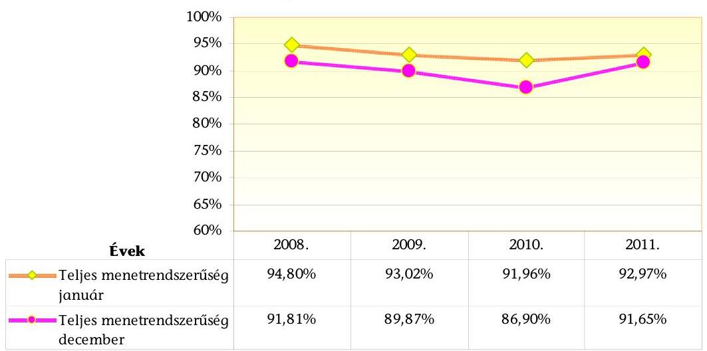

1. ábra
[^0]
[^0]:    ${ }^{1}$ A négy szabadságelv: áruk, tőke, szolgáltatások szabad áramlása és személyek szabad mozgása.

---

A 2008-2011 között a menetrendi időt be nem tartó, késett vonatok száma évente átlagosan 101 ezer, a menetrendszerűen közlekedő személyszállító vonatok aránya 2011-ben 91,6\% volt, melyet az 1. sz. ábra mutat. (Forrás: MÁV, START adatszolgáltatás.)

A hálózatsűrűség 2011-ben $85 \mathrm{~km} / 1000 \mathrm{~km}^{2}$, amely értékkel Magyarország az EU sűrűbb vasúthálózattal rendelkező tagállamai közé tartozik. A két- vagy többvágányú vonalak aránya $18 \%$, a villamosított vonalaké $40 \%$, amely elmarad az EU 52\%-os átlagától. A MÁV járműparkja a 32 éves átlagéletkorával a nemzetközi rangsor végén helyezkedik el. A személyszállításban a vasút részesedése utasfőben mérve $22,0 \%$, utaskilométerben számolva $30,3 \%$.

A MÁV a megalakulása óta 100\%-os állami tulajdonban van. Az átlátható állami finanszírozás megteremtésére és a keresztfinanszírozás elkerülésére 2006ban megkezdődött a vasúttársaságok tevékenységének és számviteli nyilvántartásának önálló cégekben történő szétválasztása. Ennek következtében létrejöttek a MÁV többségi tulajdonában lévő leányvállalatok, többek között 2007. július 1-jétől a START a személyszállítási, 2008. január 1-jétől a TRAKCIÓ a vontatási és a GÉPÉSZET a gépészeti tevékenység végzésére. (A későbbiekben e leányvállalatok és a MÁV együttesét értjük MÁV csoport alatt.) A MÁV-nál maradt a pályamúködtetési tevékenység. Az árufuvarozási üzletágat 2006. január 1-jétől kiszervezték a MÁV Cargo Zrt.-be, melyet 2008-ban értékesítettek.

A vasúti szolgáltatók közé tartozik a személy- és teherszállítást 2011-ig egyaránt végző GYSEV Zrt. (2011-ben önálló cég alakult a teherszállításra, a GYSEV CARGO Zrt.) Tulajdonosainak részesedési aránya többször változott az utóbbi években, 2011-ben a Magyar Állam 65,64\%-os tulajdoni része mellett az Osztrák Állam (28,24\%), és a Strabag SE (6,12\%) tulajdonában volt.

Az ellenőrzés a nyílt hozzáférésű, kötöttpályás vasúti közlekedés számára juttatott költségvetési forrásokat veszi figyelembe, nem foglalkozik a nem nyílt hozzáférésű, egyéb kötött pályás vasúti közlekedéssel (metró, hév, villamos). A támogatás legnagyobb hányada a személyszállításhoz kapcsolódó közszolgáltatási költségtérítés és a fogyasztói árkiegészítés. Az állami támogatás része még a pályavasút múködtetésére, fejlesztésére, valamint egyéb múködési költségekre adott forrás. Állami támogatásnak tekinthető a veszteséges gazdálkodásból eredő tulajdonosi kötelezettségek teljesítése is, mint pl. a tőkeemelések és a központi költségvetést megillető bevételek (pl. a Cargo értékesítési árbevétele) MÁV-nak történő átengedése.

A vasúti szolgáltatás szereplői a működésükhöz és fejlesztésre hiteleket vettek fel, amelyeket - elsősorban a MÁV - a Magyar Államnak a tulajdonosi szerepvállalása, állami kezességvállalása nélkül nem tudtak volna igénybe venni. A hitelek és kamatok jelentős részét időszakonként az állam szanálás keretében átvállalta, ezért ezek is az állami támogatás részének tekinthetők.

A MÁV csoport és a GYSEV - 2008-2011 évek között - múködésre és fejlesztésre összesen 918,2 Mrd Ft költségvetési forrást kapott. Ebből a múködési támogatás (vasúti pályahálózat és személyszállítás költségtérítése) 820,3 Mrd Ft volt (1. sz. melléklet).

---

A MÁV csoport adósságállománya (hitel, kötvény, vállalkozói kölcsön) 2010-re 291 Mrd Ft-ra nőtt (ebből a MÁV 235,2 Mrd Ft), melyből 187 Mrd Ft állami garanciával fedezett. 2011. év végére a MÁV adósságállománya 210,4 Mrd Ft-ra csökkent. A csökkenés oka az esedékes hiteltörlesztéseken túl az 50 Mrd Ft öszszegben megvalósult szanálás, mely csökkenéseket azonban új hitelek felvétele, kötvény kibocsátása ellensúlyozott. Az ellenőrzött időszakban az állami garanciával biztosított hitelállomány mintegy $60 \%$-a volt múködési hitel.

A MÁV csoport az államtól kapott támogatásokon túl a piaci szereplőktől jut bevételhez az utasoktól származó jegyárakon, valamint az árufuvarozóktól származó vontatási és hálózat-hozzáférési díjakon keresztül. A MÁV csoport tevékenységének mintegy 70\%-át állami támogatásból és a csoporttagok egymás közti szolgáltatásainak ellenértékéből (belső bevételekből) finanszírozza, bevételi oldalon szorosabb kapcsolatban áll a költségvetéssel, mint a piaccal.

A Vtv. alapján, 2008-tól a vasút közszolgáltatási személyszállítási szerződést a KHEM (jelenleg NFM) a MÁV-START Zrt.-vel és a GYSEV Zrt.-vel megkötötte. Az államnak szerződést kell kötnie a vasúti társaságokkal a vasúti pályahálózat múködtetésére, melyben az állam kötelezettséget vállal arra, hogy az általa üzemeltetett pályahálózat múködtetésével kapcsolatban felmerült, és a háló-zat-hozzáférési díjból, valamint a vasúti társaság egyéb üzleti tevékenységéből nem fedezett, indokolt költségeit megtéríti. A pályahálózat múködtetésére vonatkozó szerződés megkötése évek óta elmaradt. A közlekedésért felelős NFM a jogszabályi követelményeknek megfelelő, öt évre szóló első pályavasúti szerződéseket 2011-ben - a MÁV-val augusztus 16-án, a GYSEV-vel december 30-án kötötte meg.

A Kormány a költségvetésről szóló törvények felhatalmazása alapján minden évben kormányrendeletben határozta meg az egyes gazdálkodó szervezetek részére nyújtott egyedi támogatásokat, költségtérítéseket, valamint az egyéb vállalati támogatások keretében nyújtott termelési költségvetési támogatásokat. Ezek forrása a „Helyközi személyszállítási közszolgáltatások és a vasúti pályahálózat müködtetésének ellentételezése" jogcím központi kezelésű előirányzata.

A vasúti közlekedés korszerűsítésének ellenőrzését az ÁSZ 2008. évben végezte, melyben a vasút fejlesztésére, korszerűsítésére fordított külső és belső források felhasználását ellenőrizte. Jelen ellenőrzés a vasúti közlekedés múködtetésére nyújtott állami támogatási rendszert értékelte.

Az ellenőrzés a támogatási rendszer múködésének, eredményességének a megítélésére irányult.

Az ellenőrzés célja annak értékelése volt, hogy:

- a támogatási rendszer biztosította-e a vasúti közlekedési közfeladatok ellátását;
- a vasúti közlekedési szolgáltatásban részt vevő kiemelt szervezetek átalakítása javította-e a vasúti közlekedésre biztosított állami támogatások felhasználását, azok hosszabb távon történő finanszírozhatóságát;

---

- tulajdonosként az állam eredményesen tudta-e befolyásolni a társaságok gazdálkodását és a közfeladat ellátását szolgáló forrásokat megfelelően jut-tatta-e el a közlekedési szolgáltatást nyújtó társaságoknak;
- a támogatás összegei megalapozottak voltak-e, a közszolgáltatás bevétellel nem fedezett indokolt költségeinek ellentételezése alátámasztott volt-e, a veszteségek rendezésére fordított központi költségvetési támogatások felhasználása eredményes volt-e;
- hasznosultak-e a vasúti közlekedés támogatásával kapcsolatos korábbi ÁSZ jelentések megállapításai, javaslatai.

Az ellenőrzés típusa rendszerellenőrzés volt, ${ }^{2}$ amely keretében arra kerestük a választ: elkerülhetővé vált-e a vasúti személyszállítás és pályafenntartás állami támogatásában az, hogy a tervekhez képest csak jelentős többletköltséggel eseti, utólagos beavatkozásokkal - lehessen a múködést fenntartani. Ellenőrzésünk - annak érdekében, hogy az állami szanálás a jövőben elkerülhető lehessen - azoknak a jelenségeknek és összefüggéseknek a feltárására törekedett, amelyek e helyzet kialakulásához vezettek.

Az eredményesség kritériuma a támogatási rendszer, illetve a támogatások felhasználása tekintetében azt jelentette, hogy a szervezeti, irányítási, infrastrukturális és finanszírozási változások a kitűzött céloknak és az elvárt eredményeknek megfelelően valósultak-e meg. Az ellenőrzés a 2008-2011. közötti évekre irányult, de a helyszíni tapasztalatok alapján az ellenőrzés befejezéséig terjedő időszakot is vizsgálta. Az ellenőrzést előtanulmány alapozta meg.

Az ellenőrzés jogszabályi alapját az Állami Számvevőszékről szóló 2011. évi LXVI. törvény 5. § (4) bekezdése, valamint az államháztartásról szóló 1992. évi XXXVIII. törvény 104. §-ának (3) bekezdése és 120/A. §-ának (1) bekezdése, valamint az államháztartásról szóló 2011. évi CXCV. törvény 61. § (2) bekezdése képezte.

[^0]
[^0]:    ${ }^{2}$ ÁSZ Rendszerellenőrzési útmutató, ISSAI 3000, 7. melléklet

---

# I. ÖSSZEGZŐ MEGÁLLAPÍTÁSOK, KÖVETKEZTETÉSEK, JAVASLATOK 

Az eddigi ÁSZ ellenőrzések egybehangzó következtetése volt, hogy a vasút átlátható és finanszírozható fenntartása nem oldható meg utólagos hiánykezeléssel, ahhoz a múködési és fejlesztési támogatások átfogó koncepciójához, azon belül konkrét feladatokhoz kapcsolódóan kell tervezni és a szükséges forrásokat kiszámítható módon, folyamatosan rendelkezésre bocsátani.

A Vtv. a Kormány feladataként írta elő a személyszállítási közszolgáltatások, valamint ezek infrastrukturális alapjait biztosító pályavasúti szolgáltatások kü-lön-külön megkötött, legalább középtávra szóló közszolgáltatási szerződések alapján történő finanszírozását. A finanszírozást a központi költségvetésből kell megvalósítani oly módon, hogy az fedezze a közszolgáltatási kötelezettség teljesítéséből eredő, bevétellel nem fedezett - indokoltnak elismert - költségek megtérítését (költségtérítés), valamint egy ésszerű hasznot az érintett társaságoknál. Emellett ösztönöznie kell a szolgáltatások minősége és biztonsága veszélyeztetése nélkül a takarékosságra is.

A vasúti személyszállítási közszolgáltatás és vasúti pályahálózat múködésének finanszírozását a vasúti közlekedési közfeladatok támogatási rendszere a szolgáltatók bevételeivel együtt sem biztosította. A korábbi időszakok gyakorlatához hasonlóan csak a társasági múködési hitelállomány fokozatos növekedése, az eseti, utólagos állami beavatkozás, valamint a szolgáltatási színvonal csökkentése mellett volt biztosítható a vasúti közlekedés.

Az állam és a szolgáltató vasúti társaságok közötti személyszállítási közszolgáltatási megállapodást 2008-ban és 2009-ben egy-egy évre, 2010-től három évre, majd az első pályavasúti szolgáltatási szerződést 2011-ben kötötték meg, ötéves tartamra. A szerződések a polgárjogi követelményeknek megfeleltek, azonban a költségtérítések összegének évente - kormányrendeletben történő megállapítása miatt - a vasúti társaságok hosszú távú finanszírozási ütemezésének tervezésére nem alkalmasak. Az egyes évek finanszírozási mértékét mindkét szerződésfajta esetében évenkénti záradékban rögzítik. A költségtérítés mértékét meghatározó kormányrendeletek a költségvetési törvények jóváhagyása után több hónappal jelentek meg, a költségtérítés folyósítása nem a múködéshez igazodott.

A költségtérítések folyósításának szerződéstől eltérő teljesítése miatt a szolgáltató az év első hónapjaiban nem jutott elegendő forráshoz. Ez többletköltségeket okozott a hitelkamatok, a halasztott beszerzések, késedelmes számlafizetések miatt, amit az állam elismert és 4,2 Mrd Ft késedelmi kamatot térített meg.

A szerződések hiánya miatt 2008 végéig, később a már létrejött megállapodások nem kellően tisztázott elemei (pl. a személyszállításnál a költségtartalmak, a hatékonysági mutatók többértelműsége, a pályavasútnál az állami garanciák mértékének és ütemezésének bizonytalansága) miatt nem voltak biztosítva az időben történő, a következő év üzleti terveit is megalapozó elszámolások.

---

A költségtérítések végleges mértékének meghatározását elhúzódó egyeztetések előzték meg.

A MÁV csoport személyszállítási és pályavasút múködtetési közfeladatainak ellátására 2008-2011 között összesen 817,1 Mrd Ft-ot igényelt. A Kormány rendeletei alapján a négy év alatt 683,5 Mrd Ft-ot biztosított költségvetési forrásból. ${ }^{3}$ A 133,6 Mrd Ft-os jelentős eltérés arra vezethető vissza, hogy a költségtérítés tényezői meghatározottak, ugyanakkor nem tisztázott, hogy azokból a fajlagos, azaz az egységnyi szolgáltatási elemekre (pl. utaskilométer, ülőhely) mennyi fordítható. A fajlagos ráfordítások meghatározásának hiányában nem ítélhető meg sem az igényelt, sem a megadott költségtérítés nagyságának indokoltsága.

A MÁV a 2010. év végi 238,7 Mrd Ft pénzintézeti szerződéses hiteleiből 221,9 Mrd Ft volt a lehívott hitelállomány, melyből a pályavasúti üzletági állomány $41,9 \mathrm{Mrd}$ Ft, a régi - a START megalapítása előtti - személyszállítási üzletágat érintő állomány 175,5 Mrd Ft volt. A MÁV mindezen túl állami kezesség mellett 10 Mrd Ft értékben kötvényt bocsátott ki 2010 decemberében pályavasúti beruházásokra, majd 2011. augusztusban 35 Mrd Ft összegben a pályavasút múködtetéséhez. A múködésre és fejlesztésre felhasznált költségvetési források alakulását a 2. sz. ábra mutatja. (Forrás: MÁV, START adatszolgáltatás.)

A vasúttársaságok által múködésre és fejlesztésre felhasznált költségvetési források 2008-2011. években (Mrd Ft)
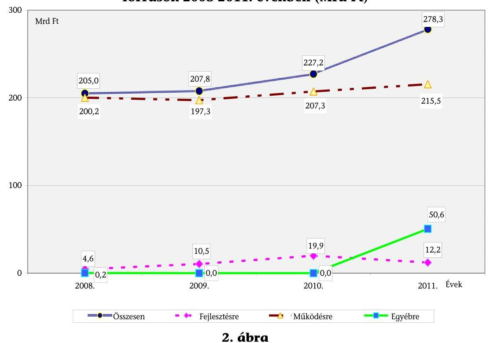

[^0]
[^0]:    ${ }^{3}$ az egyes gazdálkodó szervezetek részére nyújtott egyedi támogatásokról, költségtérítésekről, valamint az egyéb vállalati támogatások keretében nyújtott termelési támogatásokról szóló 55/2008. (III. 26.) Korm. rendelet, 110/2009. (V. 22.) Korm. rendelet, 20/2010. (II. 9.) Korm. rendelet, 32/2011. (III. 17.) Korm. rendelet

---

Az ellenőrzött időszakban az állami garanciával biztosított hitelállomány közel kétharmadát a múködés biztosításához kellett felvenni, ezért reális veszély a jövő fejlesztési forrásainak felélése és a szanálás újbóli bekövetkezte. A 2011. évi költségvetésről szóló törvény módosításával az OGY elfogadta, hogy a Magyar Állam a MÁV hitelviszonyon alapuló tartozásaiból legfeljebb 64 Mrd Ft tőkeösszegű adósságot és annak járulékait legkésőbb 2011. december 30-ig átvállalja. Az átvállalandó adósság részleteit a Kormány határozatban ${ }^{4}$ állapította meg. Az átvállalás 50 Mrd Ft lett, melynek hatására a MÁV 2011. évi mérleg szerint eredménye és saját tőkéje ennyivel nőtt, valamint 2012. évi hiteltörlesztési kötelezettsége 24 Mrd Ft-tal csökkent. A MÁV 2011 végén fennálló hiteleinek törlesztési kötelezettsége 2015-ig várhatóan 148 Mrd Ft-ot tesz ki.

Az ellenőrzött időszakban a MÁV vasúti pályahálózat múködtetésének ráfordításai minden évben meghaladták annak bevételeit, melyet a 3. sz. ábra mutat.

Az üzleti eredmények alakulása a MÁV pályavasútnál 2008-2011. években
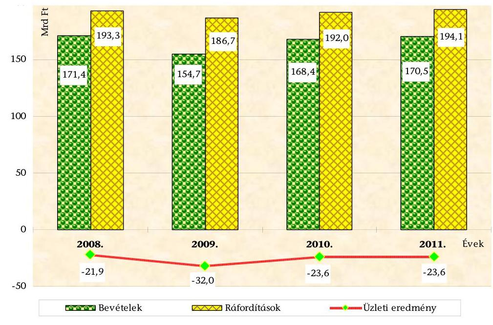

# 3. ábra 

Forrás: MÁV adatszolgáltatás
A személyszállítási közszolgáltatás legjelentősebb költségtényezője a hálózathozzáférési díj (HHD), ${ }^{5}$ amely jelenleg úgy kerül kialakításra, hogy az a költségtérítéssel kiegészülve fedezze a pályahálózat múködtetését. Az infrastruktúra fejlesztéséhez a díjbevételekből nem áll rendelkezésre megfelelő nagyságú erőforrás. A MÁV pályavasúti szolgáltatásaiból származó üzleti bevételeknek csak igen kis részét képezik közvetlenül az állami költségtérítések, melyek nagysága

[^0]
[^0]:    ${ }^{4}$ 1451/2011. (XII. 22.) Korm. hat. a MÁV adósságának részbeni átvállalásáról
    ${ }^{5}$ A vasúti hálózat-hozzáférési díjrendszer kereteiről, valamint a hálózat-hozzáférési díjak képzésének és alkalmazásának alapvető szabályairól szóló 83/2007 (X.6.) GKM-PM együttes rendelet (díjképzési rendelet) előírásai szerint a VPE Kft. feladata a Díjképzési Módszertan, illetve annak alapján a konkrét hálózat-hozzáférési díjakat is tartalmazó Díjszámítási Dokumentum összeállítása.

---

évről évre az értékcsökkenés mértéke alatt maradt, melyet a 4. sz. ábra mutat. A személyszállításon keresztül közvetetten kap támogatást a pályavasút, melynél 2008-2010-ig évente az amortizációt meghaladó veszteség képződött.

# Az üzleti ráfordítások és bevételek évenkénti összetétele 2008-2011 között a MÁV pályavasútnál (Mrd Ft) 

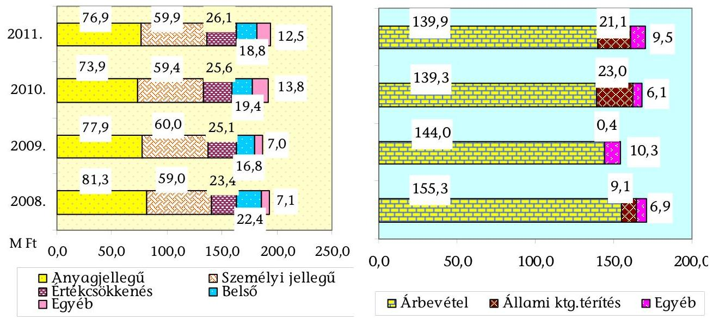

## 4. ábra

Forrás: MÁV adatszolgáltatás
A MÁV a személyszállítási és teherfuvarozási igényeket meghaladó pályakapacitással, eszközvolumennel rendelkezik, annak költségvonzatával együtt. A rendszerváltás óta egyharmadára - 120 M tonnáról 40 M tonnára - csökkent a teherszállítás és kétharmadára - 208 M utasfőről 137 M utasfőre - a személyszállítás volumene, szinte változatlan infrastruktúra mellett. A pályafenntartás állandó költségei akkor is felmerülnek, ha egyes szakaszai nincsenek teljes körűen hasznosítva. Az elöregedett pályahálózat jelenlegi szintje magában hordozza a zavarérzékenységet, a növekvő meghibásodást.

A pályahálózat-múködtető által nyújtható szolgáltatások hálózat-hozzáférési díj meghatározásának elveit az uniós szabályokkal összhangban a Vtv. 55. § (5) bekezdése és a Dijképzési rendelet 4. §-a tartalmazza. A VPE Kft. a hálózathozzáférési díjak meghatározása során ezeket az elveket maradéktalanul figyelembe vette. A VPE Kft. saját hatáskörében lefolytatható vizsgálatai alapján azt állapította meg, hogy a pályavasutat múködtető társaságok díjszámításainak során csak olyan költségeket vettek figyelembe, amelyek a Dijképzési Módszertanban szerepelnek és az egyes szolgáltatásokhoz indokoltan hozzárendelhetőek, tehát a HHD alapját képező költségek a pályavasút céljait szolgálják.

A közszolgáltatási szerződésben a pályavasút számára nincsenek olyan hatékonysági követelmények meghatározva, amelyek a MÁV-nál konkrét érdekeltséget teremtenének a múködtetés költséghatékonyságának növelésében, így a szolgáltatók költségeik csökkentésében emiatt közvetlenül nem érdekeltek. A személyszállítási szerződésben a Megrendelő (az Állam) megköveteli a hatékonyság fokozását, de a hatékonysági mutató meghatározásának időpontja nincs rögzítve.

---

A szolgáltató éves üzleti tervének elkészítési idejéhez képest az elvárt hatékonysági mutató minden évben több hónapos késéssel jutott a társaság tudomására. Emiatt az elvárt hatékonyság elérését szolgáló intézkedéseket a szolgáltató nem tudta időben tervezni. A szerződések eltérő értelmezéseinek következtében a START 2009. évi közszolgáltatási beszámolóját 2011 októberében fogadta el az NFM. A START a nyilvántartása szerint a 2009. évben 2,04 Mrd Ft nyereségigényt mutatott ki, az NFM által elfogadott elszámolás alapján 0,59 Mrd Ft-ot kapott. A szerződés szerint a Megrendelő részéről nem minősül szerződésszegésnek, ha fejlesztéshez, felújításhoz nem nyújt támogatást. 2011-re a MÁV-val megkötött pályavasúti szerződés bruttó $2,51 \mathrm{Mrd}$ Ft fejlesztési támogatást tartalmazott, az üzemeltető szerinti halaszthatatlan beruházási program projektjei 39,5 Mrd Ft-ot tettek ki és nem rendelkezett forrással 42 db szinten tartó projekt 35,3 Mrd Ft összegben. A múködésre felhasznált főbb költségvetési forrásokat az 5. sz. ábra szemlélteti. (Forrás: MÁV, START, GYSEV adatszolgáltatás.)

# A vasúttársaságok által múködésre felhasznált főbb költségvetési források 2008-2011. években 

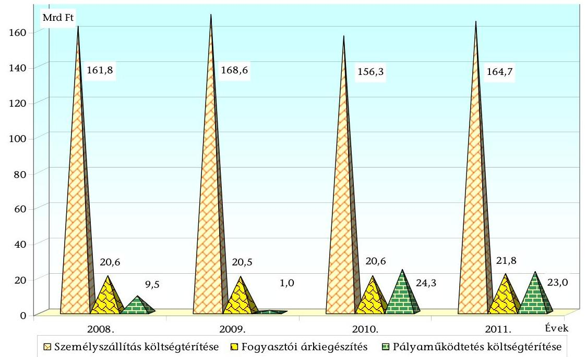

## 5. ábra

A költségtérítések tisztázatlan mértéke miatt a társasági középtávú tervek jóváhagyása hónapokat késett. Ennek következtében szükséges pálya karbantartási és fejlesztési feladatok maradtak el, amelyek a személyszállítási szolgáltatások minőségét hátrányosan befolyásolták. A vasúti pálya múszaki gyengülése miatt állandósultak az ún. lassújelek, melyek a vasúti közlekedés lassulását, az úti célhoz való eljutási idő növekedését eredményezték. A személyszállító vonatok menetrendjébe beépítettek az állandó lassújelek és a menetrend tartalékidővel is rendelkezik, így a késésekre csak az ideiglenes lassítás jelei vannak kimutatható hatással, amelyek száma a pályaállapottól és a karbantartástól függ. Erre tekintettel a menetrendszerüség beépítése a START közszolgáltatási minőségi paraméterei közé csak akkor éri el célját, ha a pályaállapot fenntartására, az ideiglenes lassújelek megszüntetésére a forrás rendelkezésre áll a Pályavasútnál.

---

Az elöregedett pályahálózat műszaki állapota az ellenőrzött években romlott, jelenlegi szintje magában hordozza a balesetek lehetőségét, így a biztonságot gyakorlatilag a sebességcsökkentés tartja fenn.

A vasúti közlekedés finanszírozásának jelenlegi rendszere, amelyben a monopolhelyzetű társaságok - kimutatásaik szerint bevétellel nem fedezett - költségeit valamilyen módon (költségtérítés, tőkeemelés, szanálás) előbb-utóbb megtéríti a költségvetés, nem ösztönöz megfelelően a megtakarításokra. A társaságok nem érdekeltek ebben a rendszerben a költségek csökkentésében. A társaságok törekvéseiben megjelennek megtakarítási célok, de azok teljesüléséhez egyrészt az elérni kívánt eredmény többszörösét fordítják a célhoz vezető beruházásra, másrészt a tényleges megtakarítás a több százmilliárd forintos költségeikhez, hiteleikhez képest nem tekinthető jelentősnek. Például a MÁV 20082010. évi hatékonyságjavító akciótervében fejlesztő beruházásokkal a három év alatt összesen 2,3 Mrd Ft-ot tervezett megtakarítani, amihez 27,8 Mrd Ft beruházási igényt fogalmazott meg. 2008-ban a tervezett 0,85 Mrd Ft megtakarítás helyett 2,20 Mrd Ft, a 2009. évre tervezett 1,78 Mrd Ft helyett 0,93 Mrd Ft megtakarítást mutatott ki

Nincs egyértelműen, hosszútávra meghatározva, hogy milyen volumenű és minőségű pályahálózatot és szolgáltatást kíván, illetve tud az állam fenntartani. Jogszabályban elfogadott közlekedéspolitikai koncepció és stratégia a kormányzati határozatok (szándék) ellenére nem alakult ki. Az államnak - a hazánkra is vonatkozó nemzetközi kötelezettségeket figyelembe véve - nincs olyan pénzügyi forrásterve, amely 5-10-15 éves időszakra rögzítené a hazai közlekedési közszolgáltatás finanszírozási kereteit, azon belül a vasúti, illetve a közúti fejlesztésekre és üzemeltetési célokra szükséges forrásokat. Ez a pályafenntartást és annak fejlesztését, valamint a személyszállítási közszolgáltatás mértékének és minőségének hosszú távú tervezését is akadályozza.

Magyarország az EU előírásoknak megfelelően a vasúti közlekedésben alkalmazza a pályahasználati díjszabást. A közúti közlekedésben az úthasználattal arányos útdíj nem érvényesül, ami a vasúti személyszállítás versenyképességében vet fel kockázatokat. A vasúti és közúti közlekedés környezetvédelmi szempontú arányváltásának eszközei még nem alakultak ki, valamint 2008-2011 között a finanszírozást befolyásoló alapvető tényezők (kedvezményrendszer, fenntartható infrastruktúra) kormányzati felülvizsgálata, kezelése nem történt meg. A Széll Kálmán Terv 2.0 jelenleg az a kormányzati program, amely a közúti és a vasúti közlekedés társadalmi költségeinek különbségei alapján a használattal arányos útdíj bevezetését (2013 júliusára), valamint a tarifa- és kedvezményrendszer teljes felülvizsgálatát tervezi.

A személyszállítás támogatási eleme a kedvezménnyel utazók fogyasztói árkiegészítése, melynek mértéke 2008-2011 között évente a START-nál a 20 Mrd Ftos, a GYSEV-nél a 0,5 Mrd Ft-os nagyságrend körül állandósult. Az ellenőrzött időszakban közel egyharmad volt a teljes árú menetjeggyel utazók aránya, több mint kétharmad pedig valamilyen kedvezménnyel utazott. 2012-ben 43 féle kedvezményt lehetett igénybe venni az életkor, a szociális helyzet, az egészségügyi állapot, a tanulói jogviszony, a foglalkozási csoport stb. alapján.

---

Ezen túl a díjmentesen utazók köre széles, a kedvezményezettek csoportjai és a kedvezmények mértéke - például a vasúti tevékenységhez kapcsolódó szervek (minisztériumok, hatóságok) munkatársainak munkavégzéssel össze nem függő kedvezményei - a költségvetés egyensúlyi helyzetével összhangban nem álló árkiegészítéseket igényeltek. A Széll Kálmán terv alapján folyamatban van a tarifa- és kedvezményrendszer teljes felülvizsgálata, 2011 végéig még nem alakult ki a kérdéskör kezelésére egységes koncepció.

A vasúti közlekedési szolgáltatásban részt vevő kiemelt szervezetek átalakítása nem javította a vasúti közlekedésre biztosított állami támogatások alakulását, a társaságok hosszabb távon történő finanszírozhatóságát, átláthatóságát. Az átalakításhoz nem voltak eredménykritériumok kitűzve, definiálva, a TRAKCIÓ és a GÉPÉSZET elszámolásai - következésképp a MÁV elszámolásai sem különítették el a közszolgáltatáshoz kapcsolódó költségeket a piaci alapúaktól. A több társaságra bontás miatt megnőtt a vezetői beosztások száma, az anyagi jellegű költségekkel szemben emelkedtek a humán költségek. A személyi jellegű költségek részaránya a 2005. évi $41 \%$-ról 2006-ban 35\%-ra, 2007ben $32 \%$-ra csökkent, 2008 -tól ez $40 \%$-ra nőtt, majd 2010-re $45 \%$-ra emelkedett a MÁV csoport tekintetében. A MÁV 2011-ben elindított egy újabb szerkezetátalakítási programot, amelyhez előzetes hatástanulmány nem készült, és eredménykritériumokat sem határoztak meg hozzá. A 2011-ben kitűzött újabb vasúti reform a helyszíni ellenőrzés befejezéséig nem valósult meg.

A szerkezeti átalakítások hatására a költségvetési térítések éves összege nem csökkent. A MÁV, valamint leányvállalatainak likviditási helyzete nem állt helyre, a MÁV csoport összesített üzemi tevékenysége továbbra is veszteséges. Az adatok azt mutatják, hogy a közszolgáltatási üzletág veszteséges volt nem csupán a szolgáltatást végző START esetében, hanem a MÁV esetében is. (Pl. 2010-ben a START -0,1 Mrd Ft a MÁV -26,7 Mrd Ft veszteséggel zárt.)

A költségvetési támogatásokat a MÁV és a START kapta, azonban annak jelentős részét igénybevett szolgáltatások ellenértékeként tovább utalta. Az eszközeikben és tevékenységeikben egymást átfedő leányvállalatok kölcsönös számlázásai szabályosak voltak, azonban az átszámlázott szolgáltatások ellenértékének nagysága összehasonlíthatóság hiányában nem ítélhető meg. A támogatások további, közvetett felhasználása nem volt átlátható. A TRAKCIÓ, a GÉPÉSZET a közszolgáltatási személyszállításhoz végzett szolgáltatásainak értékét - jogszabályi kötelezés hiányában - nem különítette el a nem közszolgáltatási személyszállításhoz végzett szolgáltatásaitól. A MÁV csoport minden tagvállalatának múködése a személyszállítási és a pályavasúti feladatok ellátását szolgálta, költségvetési forrásuk elsősorban a START-on keresztül érkezett. A személyszállításhoz kapcsolódó támogatást a START, a pályavasúthoz tartozót a MÁV kapja a költségvetésből és a csoporton belüli szolgáltatás-igénybevétel ellentételezéseként kerül a többi társasághoz.

A fő tevékenységek (pályavasút, személyszállítás, vontatás, gépészet) alapján szétválasztott szervezeti struktúrához tartozó eszközök és források hovatartozása kellően nem tisztázott. A vasúti kocsik egy része a MÁV tulajdonában maradt a jelzáloggal való terheltség miatt, miközben a személyszállítási közszolgáltatást ezekkel a járművekkel a START végzi és a teljes közszolgáltatási költségtérítést is ő kapja.

---

A MÁV csoport szétválasztott egyes cégei elsősorban a személyszállítási feladatok teljes körű elvégzésében egymásra utaltak. A cégcsoport egymás felé történő számlázásai alapján nem egyértelmű, hogy milyen összeget fordítottak a személyszállítási közszolgáltatásra és mekkora állami támogatás megy közvetetten a MÁV csoport többi cégébe a START-on keresztül. A MÁV csoport készít a számviteli törvénynek megfelelő konszolidált beszámolót, de az nem helyettesíti a közfeladatok ellátásához szükséges elkülönítést.

A START közszolgáltatásaihoz szükséges alapvető szolgáltatások költsége 2008ban meghaladta az állami költségtérítés összegét, melyet a 6. sz. ábra mutat. Az utóbbi években mutat enyhe emelkedést az a költségtérítési maradványöszszeg, amelyből a személyi juttatásokat, az amortizációt, illetve egyéb, a közszolgáltatáshoz kapcsolódó kiadásokat fedezheti. Az ábrából látható, hogy a személyszállítás költségtérítésének mintegy fele a pályavasút költségeit fedezi.

# A START állami költségtérítése és az alapvető szolgáltatásokért fizetett öszszegek az anyavállalatnak és a leányvállalatoknak a 2008-2011. években 

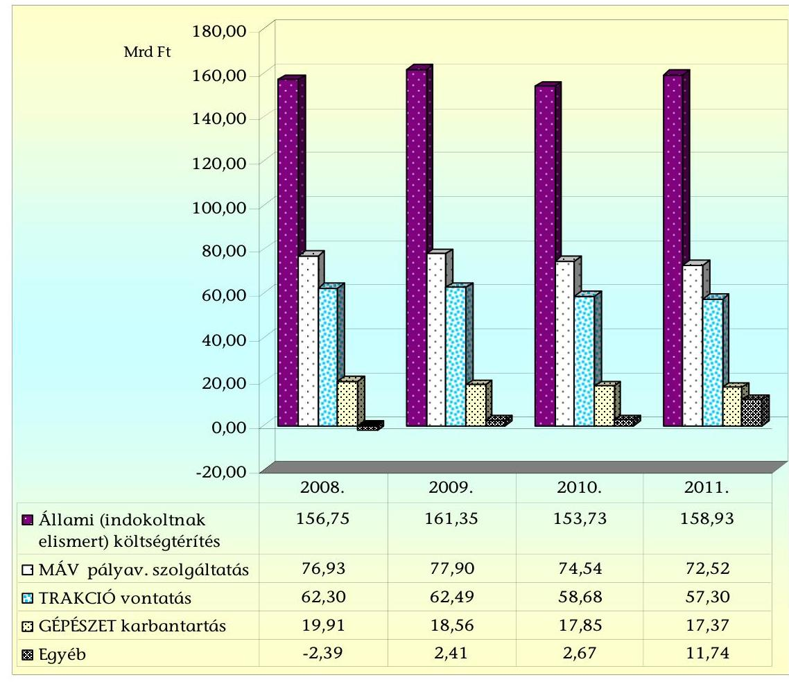

## 6. ábra

Forrás: MÁV, START adatszolgáltatás
Tulajdonosként az állam a társaságok gazdálkodását és a közfeladat ellátását nem befolyásolta eredményesen. A tulajdonosi jogokat gyakorló szervezet (GKM, KHEM, NFM, MNV Zrt.) nem rendelkezett jogszabállyal jóváhagyott va-

---

gyonstratégiával a társaságok (MÁV csoport és GYSEV) szerepével és múködésével kapcsolatban.

A 2007. év folyamán az állami és uniós forrásokból megvalósuló beruházások lebonyolítása a NIF Zrt.-hez került. Az MNV Zrt. nem vette nyilvántartásba állami vagyonként a beruházások eredményét képező eszközöket, ezért a vagyonkezelési szerződéseket sem módosította. A vagyonátadás hiányában a múszakilag átadott, illetve üzembe helyezett vagyonelemek értékei sem a vagyonkezelőknél, sem az MNV Zrt. rábízott vagyona mérlegében és eredménykimutatásában nem szerepelnek. A tevékenység átadásával jelentősen csökkent a MÁV-nál kimutatott fejlesztési támogatások összege és a beruházások üzembe helyezéséig azokat a NIF könyveiben tartják nyilván készletként. Az állami és az uniós forrásokból támogatott vasúti pályahálózatra vonatkozó beruházások átadása, illetve vagyonkezelésbe adása a mérlegkészítésig aktiválás hiányában nem valósult meg. Leltár sem készült, mert tisztázatlan jogi helyzetű ingatlanokon is történtek beruházások, valamint a jogszabályok nem rendezték a vagyonátadás feltételrendszerét és lebonyolítását, továbbá az érintett szervezetek nyilvántartása is eltérő. A MÁV ingatlanai közhiteles nyilvántartásának hiányáért a tulajdonos és a társaság menedzsmentje felelős. Az aktiválás hiánya jelentősen befolyásolta a MÁV vagyoni, jövedelmi helyzetének megítélését. Veszteséget növelő tényezőként az aktiválás elmaradása miatt el nem számolt értékcsökkenés fedezeteként 9,4 Mrd Ft értékű céltartalékot képzett a MÁV. A MÁV éves beszámolóját auditáló könyvvizsgáló cég - korlátozás nélkül - felhívta a figyelmet a társaság könyveiben nem szereplő összegre és a nyilvántartási hiányosságok pótlásának szükségességére.

Az NFM vagyonkezelő szervezete, az MNV Zrt. a MÁV felesleges és elhasználódott eszközeinek - költségekre is ható - selejtezését nem hagyta jóvá, valamint nem kötött új vagyonkezelési szerződést. Kockázatot jelentett a társaságok számára az üzleti tervek elkészítéséhez szükséges tulajdonosi döntések késedelme és az elvárások gyakori változtatása, az üzleti tervek és a menetrendek jóváhagyásának elhúzódása.

A tulajdonos nem igényelte a közszolgáltatások finanszírozásának teljes körű nyomon követését. A START költség- és bevétel adataira vonatkozóan a szakmai minisztériumnak van beszámoltatási joga, a leányvállalatok egymás felé történő számlázását, árkialakítását illetően már nincs. A MÁV és a START kötelezett elkülönítetten nyilvántartani a közfeladatokkal kapcsolatos bevételeit és kiadásait. Ez az előírás a MÁV csoport többi tagjára nem vonatkozik. Ezáltal az állami támogatások, költségtérítések felhasználásának több mint fele a csoporttagok szolgáltatás-igénybevétele ellentételezéseként jelenik meg. Ezen öszszegek felhasználásának indokoltságát és átláthatóságát a számviteli törvénynek megfelelően elkészített konszolidált beszámoló nem helyettesíti.

A társaságok információszolgáltatási kötelezettségüknek eleget tettek. A vasúti szervezeti átalakításokat követően a MÁV, és a szakmai felügyeletet ellátó minisztérium - aki egyúttal tulajdonosi jogok gyakorlója is - nem készített a kiszervezésekkel kapcsolatos értékelést arra vonatkozóan, hogy a cégcsoport hosszú távú finanszírozása megoldhatóvá vált-e, a társasági finanszírozást felügyeleti hatáskörben a közlekedésért felelős tárca saját belső ellenőrzése nem ellenőrizte.

---

A személyszállítási közszolgáltatás teljesítésének év közbeni felügyeleti ellenőrzése nem volt teljes körű, a költségtartalmak, ezzel összefüggésben a bérnövekedés indokolt mértékére nem terjedt ki. A vasúttársaságok a költségtérítés havi összegét a KTI javaslata alapján igényelhették, amely nem rendelkezett a jelentések elfogadásához szükséges szabályzattal, az elfogadás kritériumaihoz írásos útmutatóval, azt kizárólag a dolgozók szakmai tudására alapozták. A KTI értelmezésében a Megrendelői Teljesítésigazolás kiadásának feltétele a közszolgáltatás keretében megrendelt vasúti járatok közlekedtetése volt. Ennek alapján a Teljesítésigazolásokat a felügyeleti minisztérium minden hónapban kiadta. A KTI az ellenőrzött időszakban a két vasúttársaság által leadott - 25-40 oldalas naturális és számszaki adatokkal alátámasztatott - jelentéseit havonta átlagosan 2 nap alatt bírálta el és javasolta a minisztériumnak a Megrendelői Teljesítésigazolás kiadását.

A támogatás összegeinek megalapozottsága, a közszolgáltatás bevétellel nem fedezett indokolt költségeinek ellentételezése nem volt egyértelműen alátámasztott. A személyszállítási költségtérítések megállapítása formailag megtörtént, de teljes körűen nem tekinthető megbízhatónak.

Az állami támogatásokhoz szükséges adatokat összességében megfelelő informatikai rendszer szolgáltatta, ugyanakkor azok megbízhatóságában kockázati tényező volt, hogy a MÁV biztonsági követelményei nem terjedtek ki az egyedi, speciális védelmi igényekre. A MÁV stratégiai fontosságú informatikai rendszereinek kétharmadára vonatkozóan nem rendelkezik Rendszerszintű Biztonsági Szabályzattal annak ellenére, hogy kidolgozásukat az informatikai biztonsági szabályzat előírja. A START-nál a költségfelosztás alapjául szolgáló adatok rögzítése a nagyobb hibalehetőséggel járó manuális módon történt. A tevékenységek számviteli elkülönítésére a MÁV, a START és GYSEV a jogszabályi előírásoknak megfelelően készítette el saját szabályzatait. A formai megfelelőség ellenére az egyes minőségi elvárásokhoz kapcsolódó költségek - bár jogszabály szerint az indokolt költségek között szerepeltek - nem voltak egyértelműen hozzárendelhetők az egyes minőségi elvárások teljesítéséhez. (Például tisztasági követelményekhez kapcsolódó költségek ingatlanüzemeltetési költségekben jelentek meg.) Ez az állami túlfinanszírozás és alulfinanszírozás lehetőségeit egyaránt magában hordozta.

A MÁV-ot terheli a korábbi évek múködési hiteleinek kamatfizetési és törlesztési kötelezettsége, mely évente több milliárd Ft (2011-től 2021-ig összesen 38,1 Mrd Ft) kamatköltséget jelent. Ezekkel összefüggésben a MÁV az állami tulajdonban, de a MÁV kezelésében lévő eszközök állagmegóvását szolgáló ún. visszapótlási kötelezettségét nem teljesítette. (2008-ban a MÁV által kezelt állami vagyon nettó értéke 379,7 Mrd Ft volt, ami 2010 végére 359,4 Mrd Ft-ra csökkent. Az előzetes adatok szerint a vagyonkezelt állami tulajdonban lévő eszközök nettó értéke 2011. év végén 349,7 Mrd Ft volt.) A támogatások mértékét a szolgáltatók bevételeinek alakulása is érinti, növekedésük a költségtérítést csökkentheti. A személyszállítás bevételnövekménye - ahogy a 7. sz. ábra is mutatja - összefüggésben állt az inflációt meghaladó tarifaemelésekkel, a korszerű szolgáltatások bevezetésével és továbbfejlesztésével (ütemes menetrend kiterjesztése, e-ticket, korszerűbb eszközök, üzleti kedvezmények). 2011-re a személyszállítás korábban csökkenő mennyiségi mutatói (utasfő, utaskilométer) növekedtek.

---

# A teljes árú vasúti menetjegy árak és az infláció alakulása 2006-2011 között 

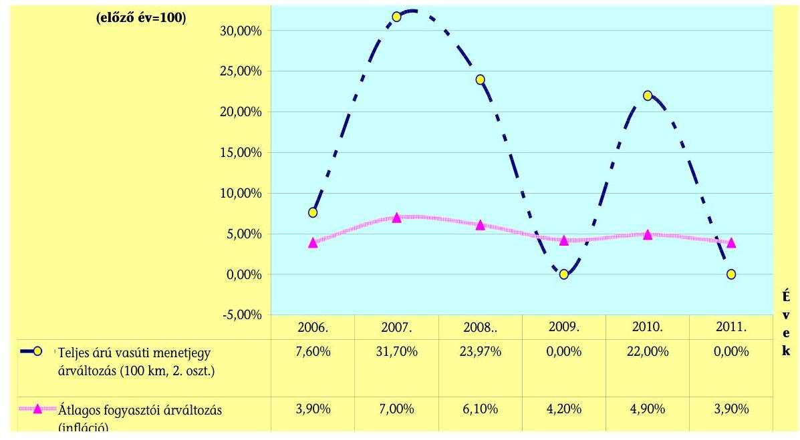

## 7. ábra

Forrás: MÁV, START adatszolgáltatás
A veszteségek rendezésére fordított központi költségvetési támogatások felhasználása összességében nem volt eredményes. 2007 folyamán 111,6 Mrd Ft tőkeemelés történt, ezzel a 2006 végi negatív ( $-31,4 \mathrm{Mrd}$ Ft) saját tőke pozitívvá vált, csökkent a hitelállomány, valamint - a korábbiakhoz képest közel kétszeres összegű - 97,9 Mrd Ft-os személyszállítási és a pályaműködtetési költségtérítéssel a személyszállítás eredménye nullszaldós lett és a pályavasúti veszteség kompenzálása is lehetővé vált. A rendkívüli juttatások 37,9 Mrd Ft esedékes és 61,3 Mrd Ft rendkívüli hiteltörlesztést tettek lehetővé, továbbá saját erőből történő beruházások is megvalósulhattak ( 10,0 Mrd Ft). A források lehetővé tették, hogy a 2008. január 1-jén induló új társaságokat a MÁV a szükséges pénzbeli hozzájárulással is segítse. 2008. január 1-jei dátummal 6 Mrd Ft készpénzt helyezett el a MÁV a TRAKCIÓ saját tőkéjében.

Az anyavállalat 2007. év folyamán megvalósult tőkeemelése és a kapott többlet állami támogatások a csoport gazdasági-pénzügyi helyzetét 2008. év elejéig rendezték. 2008-ban az állam a MÁV-nál hagyta a MÁV CARGO értékesítéséből származó 102,5 Mrd Ft bevételt, ami biztosította, hogy a MÁV csoport 2009. évi múködése és a beruházási szükségletek minimalizálása mellett a finanszírozás újabb hitelek felvétele nélkül, szigorú pénzforgalmi gazdálkodás mellett 2009-ben megoldható legyen. A tőkerendezés a korábbi években felhalmozódott hiányt csak átmenetileg kezelte. Nem oldotta meg a folyamatos múködési veszteség újraképződésének problémáját. A következő évekre nem maradt tartalék, már a 2008. év finanszírozása is bizonytalan volt. A MÁV, illetve a MÁV csoport összességében a 2008. évi tőkerendezés óta sem tudott olyan gazdálkodási rendszert kialakítani, amely elkerülhetővé tette volna az állami támogatások szükségszerű növekedését, valamint a hiteligények csökkenését. A MÁV tevékenysége nem mutat az állami támogatások csökkenése irányába. A költségtérítésben részesülő társaságok költségszerkezete az anyagjellegú ráfordításokban csökkenést, a személyi jellegű kifizetésekben növekedést mutatott. A START

---

esetében az anyagjellegú költségek aránya kiemelkedően magas, míg a MÁVnál, illetve a konszolidált beszámolók szerinti MÁV csoportnál jelentősebb a személyi jellegú ráfordítások aránya, melyet a 8. sz. ábra mutat. (Forrás: MÁV, START, GYSEV adatszolgáltatás.)

# A MÁV csoport, a kiemelt MÁV társaságok és a GYSEV költségstruktúrája a 2008-2011. években (Mrd Ft) 

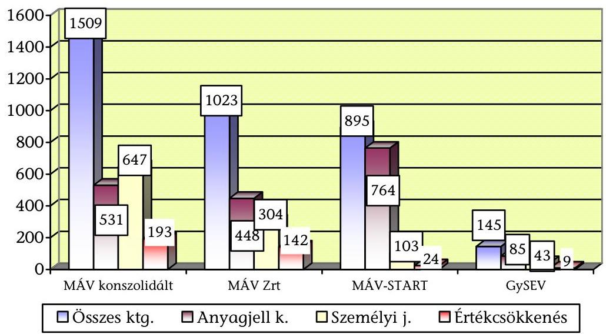

## 8. ábra

A korábbi számvevőszéki ellenőrzésekben megfogalmazott megállapítások, javaslatok az intézkedési tervek ellenére nem, vagy nem teljes körűen hasznosultak. Az ellenőrzött időszakban nem volt elfogadott egységes közlekedéspolitikai stratégia. Nem születtek meg azok a kormányzati döntések, amelyek az egyes közlekedési ágazatokra vonatkozó kormányzati elképzeléseket, azok jövőjét megszabták volna. Nem történt döntés a közösségi közlekedés egészére, ezen belül az állami preferenciák és szerepvállalás meghatározására.

Az Állami Számvevőszékről szóló 2011. évi LXVI. törvény 33. § (1) bekezdésében foglaltak értelmében a jelentésben foglalt megállapításokhoz kapcsolódó intézkedési tervet köteles az ellenőrzött szervezet vezetője összeállítani és azt a jelentés kézhezvételétől számított harminc napon belül az ÁSZ részére megküldeni. Amennyiben az intézkedési tervet határidőben nem küldi meg a szervezet, vagy az továbbra sem elfogadható, az ÁSZ elnöke a hivatkozott törvény 33. § (3) bekezdés a)-b) pontjaiban foglaltakat érvényesítheti.

Az ellenőrzés intézkedést igénylő megállapításai és javaslatai:

## a nemzeti fejlesztési miniszternek:

1. A vasúti személyszállítás és a pályahálózat múködtetés a tervekhez képest jelentős állami többletköltséggel és utólagos költségvetési beavatkozásokkal volt fenntartható. Nincs egyértelmúen és hosszútávra meghatározva az állami finanszírozás szerepe a személyszállítási közszolgáltatásban és a pályahálózat fenntartásában.

---

# Javaslat: 

Dolgozza ki a hosszú távon államilag finanszírozható vasúti személyszállítási közszolgáltatás és pályahálózat múködtetés koncepcióját.
2. A személyszállítási és pályamúködtetési szerződések tartalmi hiányosságai nem biztosították az elszámolások egységes értelmezését, a vasúti társaságok költségtakarékos múködtetése számon kérhetőségének követelményét. A vasúti közszolgáltatások finanszírozása mértékének és ütemezésének bizonytalansága a társaságok üzleti terveinek realitását rontotta, hitelszükségletük növekedését és 4,2 Mrd Ft késedelmi kamatfizetési kötelezettség keletkezését idézte elő.

## Javaslat:

Gondoskodjon - az elszámolások egységes szabályozása érdekében - a közszolgáltatási költségtartalmak, valamint a hatékonysági követelmények és mutatók egyértelmú meghatározásáról, a vasúti társaságok költségtakarékos múködtetése számon kérhetőségéről, továbbá olyan finanszírozás-folyósítási rendszer kialakításáról, amely csökkenő közpénz felhasználást von maga után. Vizsgáltassa ki a késedelmi kamatfizetéshez kapcsolható felelősség körülményeit és tegye meg a szükséges intézkedéseket.
3. Az ellenőrzött időszakban közel egyharmad volt a teljes árú menetjeggyel utazók aránya, több mint kétharmad pedig valamilyen kedvezménnyel utazott. 2012-ben 43 féle kedvezményt lehetett igénybe venni. Ezen túl széles, nem minden esetben alátámasztható a díjmentesen utazók köre. A vasúti utazási kedvezmények körének és mértékének felülvizsgálata nem történt meg a költségvetés teherbíró képességének figyelembevételével, még csak folyamatban van a tarifa- és kedvezményrendszer felülvizsgálata.

## Javaslat:

Folytassa a tarifa- és kedvezményrendszer felülvizsgálatát, ennek keretében állapítsa meg a vasúti személyszállítási kedvezmények körének és mértékének indokoltságát, legyen figyelemmel a kedvezmények és árkiegészítések meghatározásánál a költségvetés teherbíró képességére.
4. A személyszállítási közszolgáltatás teljesítésének év közbeni felügyeleti ellenőrzése nem volt kielégítő. A KTI nem rendelkezett a jelentések elfogadásához szükséges írásos kritériumokkal. A KTI értelmezésében a Megrendelői Teljesítésigazolás kiadásának feltétele a közszolgáltatás keretében megrendelt vasúti járatok közlekedtetése volt. A költségtartalmak felülvizsgálatának mélysége nem volt megfelelő, a végleges elszámolásoknál nem ellenőrizték a vasúti ráfordítások, többek között a bérnövekmény mértékének szükségességét.

## Javaslat:

Vizsgáltassa ki és értékelje a Megrendelői Teljesítésigazolás kiadása előtt a költségtérítések megalapozottságát, azon belül a bérnövekedések indokoltságát is. Határozza meg a megállapításokban kifogásolt területeken a KTI tevékenységével kapcsolatos pontos követelményeket.

---

5. A szerkezeti átalakítások hatására a költségvetési források igénybevételének éves öszszege nem csökkent. A MÁV, valamint leányvállalatainak likviditása nem állt helyre, a MÁV csoport üzemi tevékenysége továbbra is veszteséges volt. Az alapvető vasúti szolgáltatói tevékenységek négy társaságba (MÁV, START, TRAKCIÓ, GÉPÉSZET) való szervezése a vezetők számának és a járulékos költségeknek az emelkedését vonta maga után.

# Javaslat: 

Vizsgáltassa ki, hogy mi okozta, hogy a szerkezeti átalakítások mellett a MÁV csoport üzemi tevékenysége továbbra is veszteséges. A vizsgálat eredményének ismeretében a veszteség csökkentése érdekében a szükséges intézkedéseket (szerkezeti változtatás, vagyoni viszonyok tisztázása, vezetői létszám és járulékos költségeinek racionalizálása) tegye meg.
6. 2007 óta nem rendeződött a nagy vagyonértéket képviselő, NIF által végrehajtott vasúti beruházások aktiválása, így a vagyonátadás hiányában a műszakilag átadott, illetve üzembe helyezett vagyonelemek értékei sem a vagyonkezelőknél, sem az MNV Zrt. rábízott vagyona mérlegében és eredmény-kimutatásában nem szerepelnek. Az MNV Zrt. nem vette nyilvántartásba állami vagyonként a beruházások eredményét képező eszközöket, ezért a vagyonkezelési szerződéseket sem módosította (a beruházások a NIF könyveiben készletként vannak nyilvántartva). A MÁV a használatában lévő, de nyilvántartásában nem szereplő eszközök értékcsökkenésére veszteséget növelő céltartalékot képezett. Leltár sem készült, mert tisztázatlan jogi helyzetű ingatlanokon is történtek beruházások, valamint a jogszabályok nem rendezték a vagyonátadás feltételrendszerét és lebonyolítását, továbbá az érintett szervezetek nyilvántartása eltérő.

## Javaslat:

Teremtse meg a NIF által lebonyolított beruházások révén létrejött, a MÁV kezelésében lévő eszközök számviteli rendezésének feltételeit. Ennek keretében rendelje el a MÁV ingatlan vagyonának leltározását, valamint a számvitelileg helytelen céltartalék képzési gyakorlatot szüntessék meg.

## A MÁV elnök-vezérigazgatójának és a START vezérigazgatójának:

A MÁV Zrt. és a MÁV-START Zrt. kötelezett elkülönítetten nyilvántartani a közfeladatokkal kapcsolatos bevételeit és kiadásait, de a MÁV és a START költségtérítései felhasználásának útja a MÁV csoport tagjainak elszámolási rendszerében nem követhető végig elkülönítetten. Ezáltal az állami támogatások, költségtérítések felhasználásának több mint fele a szolgáltatás-igénybevételek ellentételezése díjaként jelenik meg.

## Javaslat:

Rendeljék el, hogy a MÁV és a START költségtérítései felhasználását a MÁV csoport tagjainak elszámolási rendszerében elkülönítetten és tételesen követhetően tartsák nyilván, amiből egyértelművé válhatnak a közfeladat ellátásának költségei, bevételei, a költségtérítések, valamint a támogatások felhasználásai.

---

# II. RÉSZLETES MEGÁLLAPÍTÁSOK 

## 1. A vasúti KÖZSZOLGÁltATÁs FINANSZírozÁsáNAK STRATÉGIAI ÉS SZABÁLYOZÁSI HÁTTERE

### 1.1. Az EU elveinek tükröződése a hazai koncepciókban

### 1.1.1. Az EU vasúti piacpolitikája és stratégiája

Az EU közlekedéspolitikájának részét képező vasúti piaci politika az egységes európai piacot kiszolgáló, versenysemleges, piaci alapokon múködő vasúti rendszer megteremtését szolgálja, amely kiszámítható feltételeket biztosító szerződéses alapokon nyugszik. A 2001-ben kezdődött átfogó uniós vasúti jogalkotás (I., II., III. Vasúti Csomagok) nyomán 2003-tól a közösségi vasúttársaságok előtt megnyílt az ún. Transz-európai Vasúti Áruszállítási Hálózat. A vasút helyzetének erősítését szolgálja a nagy sebességű ( $250 \mathrm{~km} / \mathrm{h}$ feletti) hálózatok létrehozásának programja, valamint a hálózatok közötti átjárhatóság ösztönzése.

Az első vasúti csomag előírta, hogy a vasútvállalatok múködésének engedélyezését, a pályakapacitások elosztását, a pályahasználati díjak meghatározását és a közszolgáltatási kötelezettségek teljesítésének ellenőrzését független szervezet végezze. A második csomag elvárása, hogy már nem csak a transzeurópai hálózaton, hanem a teljes hálózatra vonatkozóan biztosítani kell a szabad hozzáférést és rendelkezett a vasúti rendszerek közötti átjárhatóság fejlesztéséről, a vasútbiztonsági kérdésekről. A harmadik csomag a vasúti személyszállítási közszolgáltatáshoz kapcsolódó rendelkezéseket tartalmazta: a közszolgáltatási szerződés szükségességét és a túlfinanszírozást elkerülő közszolgáltatási ellentételezést.

Az Európai Bizottság által 2006-ban felülvizsgált közlekedéspolitika egyik legjelentősebb változása a különböző közlekedési módok összehangolásával elérhető pozitív hatások hangsúlyozása volt amellett, hogy minden közlekedési módnak önmagában kell versenyképesnek, környezetbarátnak és biztonságosnak lennie. Ezzel összhangban a vasúti közlekedés, mint a környezetet kevésbé terhelő és a közúti közlekedéshez képest biztonságosabb közlekedési forma előtérbe került. Az Unió polgárainak és családtagjainak a tagállamok területén való szabad mozgáshoz és tartózkodáshoz való jogáról szóló 2004/38/EK irányelv lehetővé tette a személyszállítási kedvezmények nyújtását az arra rászorulók körében.

2007-ben a vasúti és közúti személyszállítási közszolgáltatásról szóló 1370/2007/EK rendelet a szolgáltatókkal szembeni egyenlő bánásmód és az arányosság biztosítása érdekében határozta meg, hogy az illetékes hatóság közszolgáltatási szerződésben állapítja meg a közszolgáltatási tevékenység végzésének feltételeit, körülményeit és ellentételezését. Ugyancsak 2007-ben született meg a vasúti személyszállítást igénybe vevő utasok jogairól és kötelezettségeiről szóló 1371/2007/EK európai parlamenti és tanácsi rendelet (utasjogi rendelet). Az Európai Bizottság 2011. márciusban közzétette hosszú távú (20112020. közötti időszakra szóló) közlekedésfejlesztési stratégiáját (Fehér Könyv),

---

melynek vezérelvei a széndioxid kibocsátás 60\%-os csökkentése, a vasút szerepének növelése a személy- és a teherszállításban, a hagyományos gépjárművek arányának visszaszorítása és a transzeurópai közlekedési hálózat kiépítése, távlatilag az egységes európai vasúti térség létrejötte.

A Bizottság megállapította, hogy a vasúti infrastruktúra-múködtetés és fejlesztés, illetve a vasúti személyszállítási közszolgáltatások megfelelő finanszírozása továbbra is megoldatlan. Kimondta, hogy a liberalizáció, a szabad piaci verseny önmagában képtelen feléleszteni a vasúti személy- és áraszállítást, ehhez elengedhetetlenül szükséges a hosszú-távon kiszámítható közlekedéspolitika.

Az Európai Bizottság módosító javaslatainak középpontjában a vasúti szolgáltatók és a pályaüzemeltető cégek tulajdonosi függetlensége, a pályahasználati díjszabás meghatározására vonatkozó előírások, és a változtatások költségvetési vonzata áll. A függetlenség tekintetében nem a szolgáltató és a hálózatüzemeltető formális/számviteli elválasztása, hanem az egymástól független múködés követelményét hangsúlyozza a Bizottság, elvárás a megrendelői, tulajdonosi és operátori funkciók teljes elválasztása.

Az EU már a 90-es évektől követelményként megfogalmazta az állami felelősség körében maradó pályamúködtetés és fejlesztés leválasztását a piaci alapon végezhető szállítási tevékenységről. Az állam és a szolgáltató szerepének körülhatárolását szolgálják a vasúti pálya és a szállítási szolgáltatások számviteli és intézményi szétválasztásának szabályai. A piaci múködés érdekében az államnak lehetővé kell tennie a konkurens vasúti társaságok részére a hozzáférést a pályahálózathoz és a pályahálózat használatáért a pálya üzemeltetője pályahasználati díjat számol fel a szállítási tevékenységet folytató társaságnak.

# 1.1.2. Hazai koncepciók és szabályok a vasút támogatásáról 

Közlekedéspolitikai koncepció és stratégia nem készült kormányzati szinten olyan tartalommal, amely elfogadásra került volna, annak ellenére, hogy szükségességükről a Kormány határozataiban ${ }^{6}$ korábban már döntött. Ezek hiányában a vasúti társaságok üzleti terveinek igazodási pontjai hiányoztak.

A közlekedéspolitika stratégiai irányait OGY határozat ${ }^{7}$ jelölte meg. Ez a 20032015 közötti időszakra határozta meg a prioritásokból eredő fejlesztéseket. A közlekedéspolitikai célok és prioritások úiradefiniálása nélkül a különböző fejlesztési és kormányzati dokumentumok tartalmaztak terveket, programokat és hivatkozásokat a közlekedéspolitikával, ezen belül a vasúttal kapcsolatban. A 2008-ban elkészült, de kormányzati szinten el nem fogadott Egységes Közlekedésfejlesztési Stratégia (EKFS) 2020-ig kitekintő Zöld Könyve a Kormány stratégiájának koncepcionális

[^0]
[^0]:    ${ }^{6}$ 2185/2005. (IX. 9.) Korm. határozat a vasúti közlekedéspolitika stratégiai kérdéseiről, 2130/2006. (VII. 24.) Korm. határozat a helyközi tömegközlekedési rendszer átalakításával és a MÁV tőkemegfelelése biztosításával összefüggő egyes feladatokról, 2230/2006. (XII. 20.) Korm. határozat a közösségi közlekedés középtávú átalakításáról, 1133/2009. (VIII. 7.) Korm. határozat a helyközi közösségi közlekedés átalakításáról.
    ${ }^{7}$ 19/2004. (III. 26.) OGY határozat a 2003-2015-ig szóló magyar közlekedéspolitikáról

---

elveit foglalta össze, alapokat szolgáltatva az ÚMFT KözOP-hoz. ${ }^{8}$ Az EKFS Fehér Könyve a vasút alágazati stratégiájaként fogalmazta meg társadalmi elvárásként, hogy a vasúti szektor fejlődjön, a környezetbarát közlekedési mód olyan szolgáltatási szintet biztosítson, amely nem jelent aránytalan terhet a társadalom és a gazdaság számára. Az EKFS szerint a személyszállítás öröklött problémája az alulfinanszírozottság, a gazdasági értelemben vett fenntarthatóság hiánya, ezért a közszolgáltatási rendszer és az utazási kedvezményrendszer átalakítását tervezte.

A 2010-es kormányváltást követően a közösségi közlekedés szabályozásának irányait az ÚSZT határozta meg, kitérve a vasúti közlekedésre is. ${ }^{9}$ Célul tűzte ki - többek között - a közösségi közlekedési rendszer átalakítását, felépítésének, finanszírozásának modernizálását. Az ÚSZT 752 Mrd Ft forrást tartalmaz közlekedési - benne közösségi közlekedési - fejlesztésekre.

Az NFM 2011 februárjában bízta meg a Közlekedésfejlesztési Koordinációs Központot az Nemzeti Közlekedési Stratégia (NKS) előkészítésével. A tárca ebbe kívánja beépíteni a szakstratégiákat, így az Országos Vasútfejlesztési Koncepció elemeit is. Az NKS elfogadását 2013-ra tervezik. A 2011 áprilisában elfogadott Konvergencia Program hivatkozik a Széll Kálmán Tervre ${ }^{10}$ és az abban előirányzott adósságátvállalásra.
„A vasút folyamatos eladósodásának a Széll Kálmán Terv véget vet. Az állam ennek keretében rendezi a MÁV 300 milliárdos tartozását, és egyúttal úgy szervezi át a vasúti közlekedést, hogy a nemzeti vasúttársaság önfenntartóvá válik és múködése meg fog felelni egy normális gazdasági társaság múködési elveinek."

Az ÚSZT céljai szerint 2012. január 1-jével megalakul a Nemzeti Közlekedési Társaság (holding), megkezdődik a közösségi közlekedés szervezeti konszolidációja, majd új díj- és kedvezményrendszer lép életbe, 2013. január 1-jétől bevezetésre kerül a használatarányos elektronikus útdíj $\cdot$ rendszer. A holdingtól a Kormány hosszabb távon a közösségi közlekedésre fordítandó kiadásoknak a GDP 0,2\%-át kitevő csökkentését várja, amely már 2013-ban megjelenne. Megjegyzendő, hogy a tervezett időpontban nem történt meg a MÁV és a Volán integrációja. A helyszíni ellenőrzés lezárásáig kormányzati döntés nem született a szervezeti változtatásokról.

Kormányzat által jóváhagyott közlekedési stratégia hiányában a GYSEV társasági, a MÁV pedig csoportszinten vázolta fel középtávú stratégiáját a 20082010. évekre. A MÁV Pályavasúti Üzletága 2008 novemberére egy középtávú üzleti stratégiát készített, melynek további sorsáról a MÁV jelenlegi (2010. augusztus óta múködő) vezetése nem tudott érdemi tájékoztatást adni. A START 2008 szeptemberében lezárt stratégiája helyzetelemzésre támaszkodva határozta meg fő céljait 2010-ig, kiemelt figyelemmel az uniós követelményekre (pl. a minőség, biztonság, liberalizáció), a hatékonyságjavítás eszközeire, az állami

[^0]
[^0]:    ${ }^{8}$ A dokumentum elkészítésének alapja a gazdasági és közlekedési miniszter feladat- és hatásköréről szóló 163/2006. (VII. 28.) Korm. rendelet 3. § (6) bekezdés.
    ${ }^{9}$ Magyarország Kormánya. Új Széchenyi Terv. A talpraállás, megújulás és felemelkedés fejlesztéspolitikai programja. 2011. január. 7. Közlekedésfejlesztési Program
    ${ }^{10}$ Széll Kálmán Terv. Összefogás az adósság ellen. 2011. március 1.

---

finanszírozás jelentőségére. Üzleti tervei tükrözték stratégiai céljait, megvalósulásuk mértékét a költségvetési korlátok határolták be.

A támogatási rendszer szabályozottsága összességében megfelel az uniós elvárásoknak, a vonatkozó rendelkezések egymással összhangban állnak.

A vasúti közlekedés hazai jogszabályi hátterét a vasúti közlekedésről szóló 2005. évi CLXXXIII. törvény (Vtv.) biztosította, mely két EU rendelet ${ }^{11}$ és 13 uniós irányelv elvárásainak felel meg.

A személyszállítás biztonsági és minőségi követelményeinek szabályrendszere a Vtv. és a kapcsolódó jogszabályokban ${ }^{12}$ meghatározott. A Vtv. az EU utasjogi rendelete szerint ${ }^{13}$ írja elő a minőségbiztosítási rendszer, illetve a 2008/110/EK irányelv (vasúti biztonsági irányelv) szerint a biztonsági rendszer múködtetésének követelményeit.

A START elkészítette a jogszabály szerinti szolgáltatásminőségi kritériumok meghatározását, ${ }^{14}$ a Társaság egészére érvényesen 2010 decemberére az ISO követelményeknek megfelelő minőségirányítási rendszert épített ki (MSZ EN ISO 9001:2009 szabvány). Először 2009 májusában, majd 2011 novemberében kiadott Minőségpolitikája - egyéb minőségfejlesztési célok között - a rendszer tudatos fenntartását, működtetését és fejlesztését is kifejezi. A MÁV Pályavasúti Üzletága szintén az ISO szabvány szerinti minőségbiztosítással múködik.

Az Unió szabályaihoz (2008/164/EK bizottsági határozathoz, 2001/16/EK irányelvhez) igazodva miniszteri rendelet határozta meg a mozgáskorlátozott személyekkel kapcsolatos műszaki előírásokat. ${ }^{15}$ A rendelet célja, hogy fokozatosan biztosítsa a vasúti közlekedés és a kapcsolódó infrastruktúra megközelíthetőségét a mozgáskorlátozott személyek számára.

A vasúti pályahálózat finanszírozásáról a vasúti infrastruktúra kapacitás elosztásáról, továbbá a vasúti infrastruktúra használati díjának felszámításáról szó-

[^0]
[^0]:    ${ }^{11}$ Az 1370/2007/EK rendelet a vasúti és közúti személyszállítási közszolgáltatásról, valamint az 1191/69/EGK és az 1107/70/EGK tanácsi rendelet hatályon kívül helyezéséről és az 1371/2007/EK rendelet a vasúti személyszállítást igénybe vevő utasok jogairól és kötelezettségeiről.
    ${ }^{12}$ Pl. a 40/2006. (VI. 26.) GKM rendelet a vasútbiztonsági tanúsítványra, a biztonsági engedélyre, a biztonságirányítási rendszerekre, a biztonsági jelentésre, valamint az egyes hatósági engedélyezési eljárásokra vonatkozó részletes szabályokról.
    ${ }^{13} 1371 / 2007 /$ EK rendelet 28. cikk (1) bek.
    ${ }^{14}$ Az Európai Parlament és Tanács 1371/2007/EK (2007. október 23.) rendelete a vasúti személyszállítást igénybe vevő utasok jogairól és kötelezettségeiről szóló rendelet 28. cikkének előírásai szerinti Szolgáltatásminőségi kritériumok meghatározása a MÁVSTART Vasúti Személyszállító Zrt.-nél
    ${ }^{15}$ 20/2010. (III. 12.) KHEM rendelet a hagyományos és nagysebességű transzeurópai vasúti rendszerben a „mozgáskorlátozott személyekkel" kapcsolatos kölcsönös átjárhatóság műszaki előírásairól

---

ló 2001/14/EK irányelv 6. cikke, ${ }^{16}$ valamint a közösségi vasutak fejlesztéséről szóló 91/440/EK irányelv preambuluma ${ }^{17}$ figyelembevételével a Vtv. 28. §-a kötelezi a Magyar Állam nevében eljáró minisztert és a vasúti pályahálózat müködtetőit arra, hogy a müködtetés feltételeit szerződésben rögzítsék. A Vtv. előírja, hogy szerződésben a vasúti pályahálózatok fejlesztéséhez egyedi támogatást nyújthat, a 28. § pedig a pályamüködtetéshez való hozzájárulást szabályozza. Ezzel a magyar jogi szabályozás a pályavasút müködőképességét, korszerűsítésének pénzügyi feltételeit törvényi szinten előírta.

A vasúti személyszállítási kedvezményekre vonatkozó célkitűzések több stratégiai igényű dokumentumban is megjelentek, ${ }^{18}$ amelyek a kedvezmények, illetve azok nyilvántartásának ésszerűsítési követelményét fogalmazták meg. A kedvezmények alapját adó fő szabályozás a fogyasztói árkiegészítésekről szóló törvény ${ }^{19}$ (Fát.), az EU irányelveinek ${ }^{20}$ megfelel, a végrehajtási rendelet, illetve a kapcsolódó rendelkezések az uniós elvárások figyelembevételével készültek el. ${ }^{21}$

A kedvezmények szabályozását az irányelveken túl részben a korábban kialakult szociális gyakorlatok határozták meg, melyek finanszírozási hatását legutóbb 2011-ben vizsgálták, ugyanakkor 2011 végén még nem volt koncepció, sem megállapodás a kérdéskörben, a Fát. és a kapcsolódó szabályok módosítására még nem került sor.

A vizsgált időszakban az állam által a MÁV START részére nyújtott támogatásokat (árkiegészítés, költségtérítés) a 9. sz. ábra mutatja.

[^0]
[^0]:    ${ }^{16}$ „a tagállamoknak biztosítania kell, hogy belátható időn belül a pályahálózat-müködtető könyveiben az infrastruktúrahasználati díjakból származó bevétel, az egyéb üzleti tevékenységekből származó eredmény és az állami támogatás legalább egyensúlyban legyen az infrastruktúra költségeivel".
    ${ }^{17}$ „a tagállamoknak mindenekelőtt biztosítaniuk kell, hogy a meglévő köztulajdonú vagy irányítású vasúttársaságok szilárd pénzügyi háttérrel rendelkezzenek, s eközben gondoskodniuk kell arról, hogy az esetleg szükségessé váló pénzügyi átszervezéseket a Szerződés vonatkozó rendelkezéseinek megfelelően hajtsák végre."
    ${ }^{18}$ Magyar Közlekedéspolitika 2003-2015. GKM 2004. március; Előterjesztés a Kormány részére. A MÁV Csoport szervezeti átalakításáról, a MÁV és az állam közötti ingatlanrendezés gyorsításáról, valamint a helyközi közösségi közlekedés regionális átalakításáról. Budapest, 2009. július 31.
    ${ }^{19}$ 2003. évi LXXXVII. törvény a fogyasztói árkiegészítésről
    ${ }^{20}$ A Tanács 2003/109/EK irányelve a harmadik országok huzamos tartózkodási engedéllyel rendelkező állampolgárainak jogállásáról, valamint az Unió polgárainak és családtagjainak a tagállamok területén való szabad mozgáshoz és tartózkodáshoz való jogáról szóló 2004/38/EK irányelv
    ${ }^{21}$ 85/2007. (IV. 25.) Korm. rendelet a közforgalmú személyszállítási utazási kedvezményekről; 227/2009. (X. 16.) Korm. rendelet a közforgalmú személyszállítási utazási kedvezményekről szóló 85/2007. (IV. 25.) Korm. rendelet módosításáról

---

# Az állami finanszírozás alakulása 2008-2011 között a MÁV-START-nál 

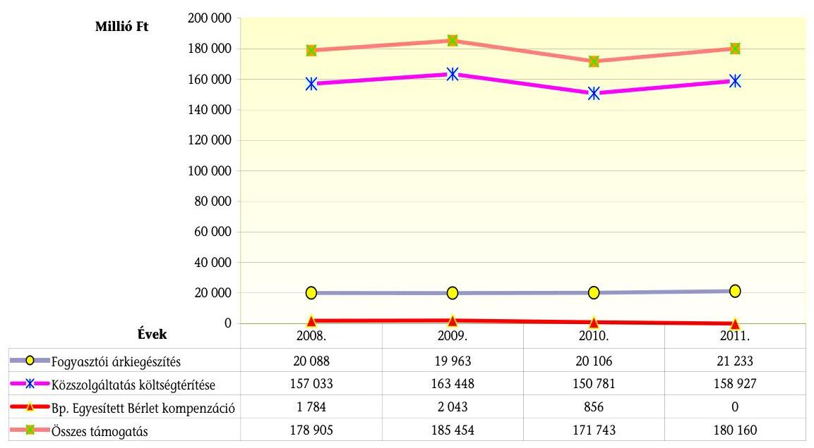

## 9. ábra

Forrás: MÁV, START adatszolgáltatás
A vizsgált időszakban az árkiegészítés nagyságrendje 20 Mrd Ft körül, míg a költségtérítés összege 151-163 Mrd Ft között alakult.

Az államháztartási egyensúly megőrzéséhez szükséges intézkedésekről szóló 1025/2011. (II. 11.) Korm. határozat 12. pontja alapján az NGM és az NFM miniszterének előterjesztést kellett készítenie a kedvezményeket előíró jogszabályok módosításáról a fogyasztói árkiegészítés kiadásának az eredeti előirányzathoz viszonyított 10 Mrd Ft-os csökkentése érdekében 2011. február 23-ig, ami az előírt határidőig nem történt meg. A csökkentési igény természetesen nem csupán a vasúti, hanem az egyéb közlekedési ágakhoz kapcsolódó árkiegészítésekre együttesen vonatkozott.

A vasúton közlekedők összetételének tendenciája a szociálisan kedvezményezettek aránya felé tolódott. 2010-ben 29\% volt a teljes árú menetjeggyel utazók aránya, $71 \%$ pedig valamilyen kedvezménnyel utazott. 2012-ben 43 féle kedvezményt tartalmazott a 85/2007. (IV. 25.) Korm. rendelet.

A kedvezmények a szociális helyzet (pl. állami gondozottak, képzésben részt vevő munkanélküliek, családosok), az egészségügyi állapot (pl. fogyatékkal élők, hadirokkantak), a politikai minőség (pl. menekültek, magyar igazolvánnyal rendelkezők), a tanulói jogviszony (pl. diákigazolvánnyal rendelkezők), a foglalkozási csoport (pl. közalkalmazottak), illetve az életkor alapján vehetőek igénybe.

Az NFM becslése szerint mintegy 7 millióan vehetnek igénybe utazási kedvezményt a közösségi közlekedésben. A Széll Kálmán Tervben rögzített vállalásoknak megfelelően folyamatban van a tarifa- és kedvezményrendszer teljes felülvizsgálata.

---

Az árkiegészítések csökkentése a költségvetési egyensúly javulásához hozzájárulhat. Az erre vonatkozó javaslatok első realizálása a közforgalmú személyszállítási utazási kedvezményekről szóló 85/2007. (IV. 25.) Korm. rendelet módosításáról szóló 44/2012. (III. 20.) Korm. rendelet kiadása volt, amely a nyugdíjrendszer idén hatályba lépett változásaihoz ${ }^{22}$ igazodott. Az egészségügyi szempontból leginkább rászoruló személyek kedvezményei változatlan formában megmaradtak.

Az egyes vasúti utazási kedvezményekről szóló 57/2009. (X. 20.) KHEM rendelet meghatározta a díjmentesen szállítandó személyek körét. Az uniós elvárásokhoz és a hazai célkitűzésekhez való igazodás rendeletben meghatározott (a közlekedési ágazat szervezetéhez tartozó, munkavégzéssel össze nem kötött) feltételek módosításával érhető el.

A Vtv. rendelkezéseinek céljai között a vasút által végzett környezetkímélő közlekedési szolgáltatások iránti igények növekedésének elősegítését is megfogalmazza, ugyanakkor értelemszerűen nincs ráhatása az EU 2011. évi Fehér Könyve szerinti - a közúti közlekedés arányának csökkentését célzó környezetvédelmi követelmények teljesülésére.

A HUNGRAIL ${ }^{23}$ véleménye szerint „kiegyensúlyozatlanság jellemzi a vasúti és a közúti infrastruktúra-használatot, amiatt, hogy a közlekedő vonatok minden egyes megtett kilométeren magas pályahasználati dijat fizetnek - beleértve a szárnyvonalakat, alsóbbrendú vonalakat is. Ezzel szemben a közúti- és gyorsforgalmi úthálózat, valamint az önkormányzati utak használati díja annak ellenére is jelképesnek mondható, hogy a közút jövedéki és súlyadót is fizet. Pedig a nagy tengelyterhelésú tehergépjármúvek és buszok által okozott károk jelentősek (nyomvályú, kátyúk, levegő- és zajszennyezés, épületekben okozott károk, balesetek, torlódások, stb.), azokat azonban nem ők, a használók, hanem a magyar adófizetők fizetik meg. Ellentétben az uniós elvárásokkal a hazai infrastruktú-ra-használatban nem hogy a „szennyező fizet" elv, de még a „használó fizet" elv sem érvényesül, azaz a felmerült költségeket csak töredékében térítik meg az úthasználó nehézgépjármúvek, buszok. Annak eldöntésénél, hogy a vasút vagy a busz az optimális közlekedési eszköz egy adott viszonylatban, nemcsak a közvetlen ráfordításokat kell számításba venni, hanem a környezeti károkat, azaz az externális hatásokat is. A döntéseknél tehát nem torz adatokon alapuló rövidtávú, fiskális megoldásokat, hanem az EU által elvárt fenntartható fejlődés jegyében és a valós költségszám ismeretében a kisebb környezeti terheket jelentő kötöttpályás, azaz a vasúti közlekedést kell előtérbe helyezni, ahogy azt Európa számos országában teszik."24

[^0]
[^0]:    ${ }^{22}$ 2011. évi CLXVII. törvény a korhatár előtti öregségi nyugdíjak megszüntetéséről, a korhatár előtti ellátásról és a szolgálati járandóságról; 2011. évi CXCI. törvény a megváltozott munkaképességű személyek ellátásairól és egyes törvények módosításáról.
    ${ }^{23}$ HUNGRAIL Magyar Vasúti Fuvarozói Egyesülés, 2006. januárban alakult, alapító tagjai: a MÁV, a MÁV Cargo Zrt., GYSEV Zrt., Magyar Magánvasút Zrt.,CER Zrt.
    ${ }^{24}$ A HUNGRAIL állásfoglalása a helyközi közösségi közlekedésért felelős regionális szintű megrendelői szervezet kialakításról, szervezeti és múködési koncepciójának kialakításáról, a helyközi közösségi közlekedés átalakításáért felelős kormánybiztos által a helyközi közösségi közlekedés átalakításáról szóló 1133/2009. (VIII. 7.) Korm. határozat alapján készített előterjesztés kapcsán. Budapest, 2009. szeptember 9.

---

A 2010/2011-es menetrendi évre vonatkozó hálózat-hozzáférési díjak meghatározásához kapcsolódó jelentés ${ }^{25}$ megállapítja, hogy a vasúti pálya legfontosabb versenytársa a közút. Továbbá, hogy a vasúti közlekedés utóbbi évtizedekben folyamatosan csökkenő teljesítménye abból a versenyhátrányából is származik, hogy a közútéhoz képest nagyobb mértékben kell megtérítenie az infrastruktúra használatának költségeit. Részben e versenyhátrány csökkentése céljából, részben más közlekedéspolitikai megfontolásokból van napírenden a használattal arányos útdíj témája. Bevezetésével javulna a vasút közúttal szembeni versenyképessége (nőne a pályavasúti szolgáltatások igénybevétele, kihasználtsága, bevétele, csökkenhetne az állami hozzájárulás), egyidejűleg a használattal arányos útdíjakból jelentős (többmilliárdos nagyságú) állami bevétel keletkezne, amely környezetbarát beruházásokra lenne fordítható.

A Széll Kálmán Terv e témában a következőt tartalmazza: „Az elektronikus útdijrendszer 2013. január 1-jétől történő bevezetésével a gyorsforgalmi úthálózati rendszer használatának költségei arányossá válnak a terheléssel, így az állam a jövőben nem enged ki a kezei közül egy olyan fontos bevételt, amely mögött súlyos közösségi költség - zaj, utak állapotának romlása, légszennyezettség - áll." A jelentés összeállítása időszakában folyamatban voltak az elektronikus útdíj bevezetésével kapcsolatos előkészítő munkák.

# 1.2. A finanszírozási rendszer múködési keretei 

A finanszírozási gyakorlat a szerződéses megállapodások hiánya, majd a már létrejöttek tartalmi hiányosságai miatt (költségtartalmak esetenként nincsenek egyértelműen meghatározva, a pályavasúti költségtérítési keretek évenként kerülnek meghatározásra és folyósításuk nem időarányos, nem minősül szerződésszegésnek amennyiben fejlesztéshez és felújításhoz nem nyújt támogatást a Megrendelő) nem biztosította a hosszú távú zavartalan vasúti múködés kereteit. A rendszeres állami beavatkozási szükséglet kialakulásában meghatározó volt egyrészt a korábbi évek örökségeként felhalmozott vasúti adósságállomány, másrészt az állami költségvetés teherbíró képességének függvényében az elégtelen állami szerepvállalásnak az ellenőrzött időszakban a szolgáltatások minőségében, ill. a múködésben mutatkozó társasági kockázatai.

2007 elejére negatív saját tőkeérték (-31,6 Mrd Ft) mellett a MÁV jegyzett tőkéje a korábbi $44 \%$-ára, 2007 végére majdnem tizedére ( $20,2 \mathrm{Mrd}$ Ft-ra) csökkent, adósságállománya közel ötszörösére emelkedett, gazdasági, finanszírozási és tőkehelyzete kritikussá vált. A kumulált finanszírozási hiány ekkor meghaladta a 330 Mrd Ft-ot. Az állami tulajdonú eszközökön végzendő állapotfenntartó beruházások (visszapótlás) alapvetően az állami költségtérítés elmaradása miatt nem valósultak meg, ami az egyébként is elöregedett eszközállomány múszaki színvonalának további romlásához vezetett. A MÁV a finanszírozási hiányt főként állami garanciavállalás mellett - hitelfelvételekkel hidalta át, melyek törlesztési és kamatköltsége a mérleg szerinti veszteséget tovább növelte.

[^0]
[^0]:    ${ }^{25}$ Jelentés a 2010/2011-es menetrendi évre vonatkozó hálózat-hozzáférési díjak meghatározásához szükséges állami hozzájárulásra vonatkozó döntést támogató vizsgálat tapasztalatairól. SIMENTAT Vagyonkezelő és Tanácsadó Kft. 2009.augusztus.

---

Az állam rendszerint pótolta a MÁV csökkenő saját tőkéjét, jelentős rendező hatása volt a 2007. évi költségvetésben elfogadott finanszírozási lépéseknek. 2007 folyamán összességében 111,6 Mrd Ft tőkeemelés történt, ezzel a 2006 végi negatív ( $-31,6 \mathrm{MrdFt}$ ) saját tőke pozitívvá vált, csökkent a hitelállomány, valamint - a korábbiakhoz képest közel kétszeres összegű - 97,9 Mrd Ft-os személyszállítási és a pályamúködtetési költségtérítéssel a személyszállítás eredménye nullszaldós lett és a pályavasúti veszteség kompenzálása is lehetővé vált.

A rendkívüli juttatások nélkül a MÁV-nál múködési hiány lépett volna fel, mivel 2007. évi múködési cash-flow-ja csupán 3,6 Mrd Ft pénztöbbletet termelt a 40,6 Mrd Ft rendkívüli költségtérítés és a 35,5 Mrd Ft amortizáció mellett. A költségtérítés 37,9 Mrd Ft esedékes és 61,3 Mrd Ft rendkívüli hiteltörlesztést tett lehetővé, továbbá saját erőből történő beruházások is megvalósulhattak $(10,0 \mathrm{MrdFt})$.

A források lehetővé tették, hogy a 2008. január 1-jén induló új társaságokat a MÁV a szükséges pénzbeli hozzájárulással is segítse. 2008. január 1-jei dátummal 6 Mrd Ft készpénzt helyezett el a MÁV a TRAKCIÓ saját tőkéjében.

A tőkerendezés a korábbi években felhalmozódott hiányt csak részben kezelte. Ez önmagában nem volt képes megoldani a folyamatos múködési veszteség újraképződésének problémáját. A következő évekre nem maradt tartalék, már a 2008. év finanszírozása is bizonytalan volt. A jogszabályi előírások ellenére közszolgáltatási szerződés megkötésére nem került sor az állammal a START létrehozásakor és még azt követő év (2008) októberéig sem, azonban hosszabb távon elengedhetetlen lett a közszolgáltatási tevékenység EU konform, a vasútvállalati múködési engedély kiadásához előírt prudens (körültekintő, átlátható) múködést biztosító állami finanszírozás.

A Magyar Állam nevében a közlekedésért felelős miniszter 2008 októberében visszamenőleg és 2009-ben egy-egy évre, 2010-ben három évre kötötte meg a személyszállítási közszolgáltatási szerződést a START-tal és a GYSEV-vel. A korábbi időszakhoz képest előrelépést jelentett a szerződések megkötése, mert ezzel a társaságok tervezni tudták finanszírozásuk nagyságrendjét. Azonban a szerződések nem alkalmasak a személyszállítást végző szervezetek hosszú távú finanszírozási ütemezésének tervezésére a költségtérítések összegének évente történő megállapítása miatt. A személyszállítási tevékenység speciális volta és rendkívüli eszközigényessége hosszú távú tervezést igényel.

A személyszállítási közszolgáltatás speciális annyiban, hogy rendkívül nagy pénzeszközöket igényel (infrastrukturális, gördülőállomány és jármű-beruházás). 2011-ben elkezdődött az előkészítése a 2012-ben aláírandó 15 évre szóló szerződésnek. Ez lehetőséget ad a vasúttársaságoknak arra, hogy a megrendelő személyszállítási hosszú távú naturális elvárásait megismerje és a középtávú, illetve a hosszabb távú üzleti terveibe beépítse, de a finanszírozás összege és üteme továbbra is a közszolgáltatási szerződés záradékában évente kerülne meghatározásra, tehát változatlanul kiszámíthatatlan a költségvetési hozzájárulás.

A szerződések tartalmi hibája, hogy az abban felsorolt közvetlen és közvetett, valamint a társasági általános költségek tartalma nincs egyértelműen szabályozva. A költségtartalmak egyértelműségének hiánya az elszámolások átláthatósága és valódisága vonatkozásában a számviteli alapelveknek (Szvt. 15. §-

---

a előírásainak) való megfelelés tekintetében aggályos. Az elszámolás során értelmezési különbségek miatt elhúzódott a tételek egyeztetése, ami elsősorban a túlkompenzáció kiszűrését szolgálta. Az elhúzódó egyeztetések miatt a közszolgáltatási beszámolók elfogadása késett.

Az eltérő értelmezések miatt 2009-ben a START által egyeztetésre benyújtott éves beszámoló szerint 15 M Ft többlet költségtérítésre tartott igényt a záradék alapján folyósított költségtérítésen túl. A minisztériummal folytatott első egyeztetést követően ez az összeg 1155 M Ft-ra, majd a további egyeztetések alapján a többlet költségtérítési igény 1663 M Ft visszafizetési kötelezettségre változott. A minisztérium szerint a túlkompenzáció az első egyeztetéskor 6031 M Ft-volt, majd 4014 M Ft-ra csökkent, végül a 2011 októberében elfogadott beszámoló 2094 M Ft-ban állapította meg a túlkompenzáció összegét.

Annak ellenére, hogy az éves közszolgáltatási beszámoló minden évben tényadatokon alapuló lezárt üzleti év figyelembevételével készült, a beszámoló elfogadásának hiánya miatt a START nem rendelkezett a 2009. évi költségtérítés pontos összegével, így a rendelkezésére álló, de a megrendelő állam által meg nem erősített információk alapján szerepeltette a költségtérítés összegét a beszámolóiban. Egyes költségtartalmak és a hatékonysági mutató eltérő értelmezése következtében a 2009. évi közszolgáltatási beszámolót 2011 októberében fogadta el az NFM.

További hiányosság, hogy a közszolgáltatási szerződésben szereplő hatékonyság javítását célzó, elvárt hatékonysági mutató meghatározásának időpontja nincs rögzítve. A mutató minden évben több hónapos késéssel jutott a szolgáltató tudomására, mint ahogy a társaság elkészítette az éves üzleti tervét, így annak az elérését szolgáló intézkedéseket a vasúttársaságok nem tervezhették.

Az átláthatóság követelményét nem biztosította az, hogy a költségfedezeti arány számításánál figyelembe vehető tételek meghatározása nagyon részletesen rögzítésre került, azonban a mutató kiszámítása eltérő értelmezésre adott okot, ezáltal a tényszerű elszámolás és annak egyeztetése hosszú időt igényelt.

A START nyilvántartása szerint 2009. évben a Megrendelőtől 2043 M Ft nyereség igénylésére lett volna jogosult, azonban az NFM által elfogadott elszámolás alapján 589 M Ft -ot kapott.

A közlekedésért felelős miniszter (Megrendelő) - az államháztartásért felelős miniszter egyetértésével - az öt évre szóló, első pályavasúti szerződést 2011. augusztusban kötötte meg a MÁV elnök-vezérigazgatójával. Ebben kötelezettséget vállalt az országos törzshálózati pálya és tartozékai, valamint a regionális vasúti pálya és tartozékai múködtetésével kapcsolatban felmerült és bevételekből nem fedezett, indokolt költségei megtérítésére. A vasúti pályamúködtetés finanszírozási összefüggéseit a 2. sz. melléklet mutatja be. A GYSEV pályavasúti szerződés tervezete a helyszíni ellenőrzés idején elkészült, a nemzeti fejlesztési miniszter és a nemzetgazdasági miniszter 2012. február elején aláírta.

---

A vasúti pályahálózat múködtetéséről szóló szerződésnek több tartalmi hiányossága van:

- a Megrendelő a költségtérítésre csak egy-egy évre vonatkozó összegeket határoz meg és egyúttal nem kötelezett a költségtérítés teljes összegének időarányos, részletekben történő, utólagos elszámolás melletti folyósítására;
- a MÁV csoport adósságállománya „túlnyomó részének" átvállalására vonatkozó kötelezettségvállalás konkrét mértékére vonatkozó előírás nincs, de az államot e szerződés keretében fejlesztési kötelezettség elmaradása miatt nem lehet szankcionálni;
- a 2. sz. melléklet II. pontja mindössze 2507 M Ft fejlesztési támogatást tartalmaz 2011-re, ugyanakkor az áthúzódó és a MÁV, valamint az NFM szerint egyaránt halaszthatatlan beruházási program projektjei 2011-ben 39540 M Ft-ot tesznek ki, míg forrással nem rendelkezik 42 db szinten tartó projekt 35334 M Ft összegben. A szerződés szerint ugyanakkor a megrendelő részéről nem minősül szerződésszegésnek, ha fejlesztéshez, felújításhoz nem nyújt támogatást (a MÁV javaslata az volt, hogy e szerződés ne csak a fejlesztés általános elveit, hanem az erre vonatkozó forrásokat is foglalja magában).

Pozitív változás, hogy az állam a szerződésben a Díjképzési Módszertanban foglaltakkal összhangban meghatározta a műszaki- szolgáltatási színvonal mutatóit és mérési szabályait. Az eltérésekhez kapcsolódó szankciókat, az adatszolgáltatási és ellenőrzési rendszert azonban csak legkésőbb 2012 végéig kell kiépíteniük és 2013. január 1-jétől alkalmazniuk.

# 2. A SZERVEZETI ÁTALAKÍTÁSOK HATÁSA A FINANSZÍROZÁSRA 

### 2.1. Az átalakítások céljainak teljesülése

Az állami támogatások felhasználásának átláthatósága a szervezeti átalakítások hatására nem javult. Az európai uniós elvi elvárásoknak megfelelve a MÁV számvitelileg elkülönült pályavasúti és intézményileg elkülönült személyszállítási, árufuvarozási és gépészeti, vontatási tevékenységet alakított ki. A szervezeti átalakítások során eszközeiben és tevékenységeiben keveredő leányvállalatok jöttek létre bonyolult kapcsolatrendszerrel (3. sz. melléklet), amelyek rontották a vállalatcsoport gazdálkodásának átláthatóságát és torzították az anya- és leányvállalatok eredményét. ${ }^{26}$

A START-hoz kerültek működtetésre a személyszállító vasúti kocsik, azonban alaptevékenységét - vontató eszközök és mozdonyvezetők hiányában - csak a TRAKCIÓ közreműködésével képes végezni. A TRAKCIÓ-hoz kerültek a mozdonyok, amelyekkel elsősorban a START-ot szolgálja ki (vontatásból származó árbevételének 70\%-a innen származik), továbbá az árufuvarozó vasúttársaságok részére nyújt vontatási szolgáltatást. Mind a START, mind a TRAKCIÓ mű-

[^0]
[^0]:    ${ }^{26}$ Erre rámutatott a Költségvetési Tanács Titkársága is „A Magyar Államvasutak Zrt. és a költségvetés kapcsolatát meghatározó tényezők" c. műhelytanulmányában. (2010. 11.)

---

ködéséhez elengedhetetlen a GÉPÉSZET munkája a vasúti eszközök folyamatos karbantartási és időszaki nagyjavításai miatt. Mindemellett a leányvállalatok az anyavállalat MÁV központi szolgáltatásait veszik igénybe az egyéb feladatok ellátásához (pl. számviteli, humán tevékenységek), továbbá a MÁV üzletágaként üzemeltetett pályahálózatot használják. A legnagyobb pályahasználó a START, amely vasúti járműveinek nagy részét az anyavállalattól bérli. A MÁV bevételeinek 70-75\%-a START-tól származik.

A START az állami költségvetési hozzájárulást a szállítási tevékenység elvégzéséhez kapja, amihez teljes értékű eszköz, működési és humán erőforrással nem rendelkezik. Ezt részben a TRAKCIÓ-tól, részben a MÁV-tól és részben a GÉPÉ-SZET-től rendeli meg. Az elvégzett szolgáltatásokért olyan árat fizet részükre, amilyet a leányvállalatok a kapcsolt vállalkozásokra érvényes törvényi szabályozás alapján ${ }^{27}$ a piaci árképzésnek megfelelően állapítanak meg. Így a folyósított költségvetési támogatást teljes egészében a START tevékenységének elvégzéséhez szükséges, igénybevett szolgáltatások megfizetésére fordítja, pl. a költségtérítés mintegy felét az anyavállalat részére utalja a vasúti pálya használatáért. (4. sz. melléklet)

A támogatás felhasználás további szintje, a közvetett felhasználás nem átlátható, mivel sem a TRAKCIÓ, sem a GÉPÉSZET a közszolgáltatási személyszállításhoz végzett szolgáltatásainak értékét nem különíti el a nem közszolgáltatási személyszállításhoz végzett szolgáltatásaitól, nyilvántartásaikban sem a bevétel, sem a költségek elkülönítésére nincs jogszabályi előírás. Így az állami költségvetési hozzájárulás további felhasználása nem követhető. A TRAKCIÓ és a GÉPÉSZET bevételének 40-70\%-át a START-nak végzett szolgáltatások adják, a többi a MÁV Zrt.-nek és külső megrendelőinek végzett szolgáltatások ellenértékéből származik.

A megállapítással kapcsolatban a MÁV álláspontja, hogy az elkülönítésre a TRAKCIÓ-t és a GÉPÉSZET-et sem jogszabály, sem szerződés nem kötelezi, ugyanakkor az NFM véleménye szerint mindkét cég önköltség- és árképzése is lehetővé teszi a pontos kimutatást. Az Ász véleménye szerint a MÁV csoporton belül olyan elszámolási rendszert kell kialakítani, amiben végig követhetőek a közfeladat ellátásának költségei, bevételei és az ezzel kapcsolatos költségtérítések, valamint a támogatások felhasználásai.

A kiszervezett tevékenységek következtében az egymás közötti szerződéses kapcsolatok, a nyújtott/igénybevett tevékenységek pénzügyi lekövetése, az ellenérték nem határidőben való kiegyenlítését mutatja a lejárt vevő-szállító lista. A számlák lejárati idejeinek és összegeinek egymás közötti viszonylatai a folyósított költségtérítés ütemezéséhez igazodnak, azaz ha a START nem kapja meg megfelelő időben/összegben az állami költségtérítést, nem tud fizetni az igénybevett szolgáltatásért a GÉPÉSZET-nek, a TRAKCIÓ-nak és a MÁV-nak. A START személyszállítási költségtérítés folyósításának főbb adatait az 5. sz. melléklet tartalmazza. 2009-ben az első 6 hónap finanszírozatlansága miatt a START lejárt szállítói állománya 58 Mrd Ft-ra nőtt, ami a MÁV csoport tagjai-

[^0]
[^0]:    ${ }^{27}$ 1996. évi LXXXI. törvény a társasági adóról és az osztalékadóról 18. § (1)-(2) bekezdése

---

val szemben keletkezett. A szállítói tartozások 2009-ben 3,4 Mrd Ft késedelmi kamatot generáltak. Az állami finanszírozás hiányát nagyrészt a MÁV csoport többi tagja hitelezte. A MÁV csoport igénybevett hitelállománya 2009 júniusára elérte a 15 Mrd Ft-ot.

2011 októberében a MÁV egységes személyszállítási szolgáltatás megvalósítását határozta el az állami támogatás hatékonyabb felhasználása céljából. Ennek érdekében a TRAKCIÓ, a GÉPÉSZET és a MÁV Vagon Kft. társaságok részesedése feletti tulajdonosi joggyakorlást a START-ra ruházta át. Ennek hatása a finanszírozásra az eltelt néhány hónap alapján még nem megítélhető.

A MÁV tájékoztatása szerint „2010-ben belülről indítottak egy szerkezetátalakítási programot, melynek fő célja a költségtakarékosabb müködtetés. (Hasonló profilú cégek összevonása, korábban kiszervezett feladatok visszaintegrálása, mint pl. a felső vezetékek karbantartásának visszaszervezése a MÁV-ba). Az átalakításokat a MÁV még nem tartja befejezettnek."

A MÁV csoport feletti tulajdonosi joggyakorló döntéseinek késedelme, esetenkénti bizonytalansága a vasúti társaságok megalapozott üzleti tervezéséhez nem biztosított megfelelő feltételeket. Bár az üzleti tervek elkészítéséhez figyelembe veendő irányelveket, feltételeket az NFM kellő időben meghatározta - a makrogazdasági mutatószámokon kívül gazdaságossági, hatékonyságjavítási kritériumokat is - egyik évben sem hagyta jóvá megfelelő időben a terveket. A tulajdonosi döntések elhúzódásában egyaránt szerepet játszottak a kormányzaton belüli, valamint a tulajdonos és a MÁV közötti elhúzódó egyeztetések.

Az előzetes sarokszámok kialakítása után a végleges üzleti tervek éves bontásban készültek 1+3 évre, melyek elfogadása a tulajdonosi joggyakorló döntési hatáskörébe tartozott. Mivel az üzleti tervek a tárgyévet megelőző év őszén készültek, decemberre meg kellett volna történni azok jóváhagyásának, ugyanakkor egyik évben sem rendelkezett még a tárgyév I. negyedévében sem a MÁV a tárgyévre vonatkozóan jóváhagyott üzleti tervvel. 2009-ben a MÁV 2009. évi üzleti tervét a KHEM miniszter „annak jelentős vagyonvesztést okozó tartalma miatt" nem kívánta jóváhagyni (6705/2/2009. sz. levél, 2009. december 8.).

A benyújtott üzleti tervjavaslatokat a tulajdonos minden évben többször átdolgoztatta, végül 2008-ban október 27-én, 2010-ben májusban, 2011-ben október 17-én hagyta jóvá.

A pályavasúti üzletágban - hosszabb időszakon átívelő - pályahálózat működtetői szerződés hiányában nem volt lehetőség sem közép-, sem hosszú távra megalapozottan tervezni, a finanszírozás állandó változása és hiányos volta nem tette lehetővé a szolgáltatási szint tervezhető emelését. Ebből következően az operatív tervezés sem vált kellően megalapozottá, illetve a tervek gyakori változtatását indukálta.

Legkésőbb a tárgyév I. negyedévének végéig el kellene készülnie az operatív tervnek, mely az üzleti terv első évének havi és részletes szervezeti bontása. Az operatív terv alapján kerül sor a szervezeti egységek tervkereteinek kiadására, melyek felhasználása folyamatosan nyomon követhető. Az operatív tervezés az üzleti terv célkitűzéseinek időarányos visszamérésének céljából készül, biztosítva az üzleti folyamatokba való beavatkozás lehetőségét.

---

A vonatkozó előírások a vasúti személyszállítási közszolgáltatások megbízható tervezhetőségét részben biztosították. 2009-ben az utasjogi EU rendelet hatályba lépéséhez igazított új hazai szabály az utolsó pillanatban készült el, ami a START tervezését hátráltatta. (Az EU utasjogi rendelete december 3-án lépett életbe, a magyar szabályozás ${ }^{28}$ december 1-jén került kiadásra, amelyhez akkor már nehéz volt igazítani a 2010. évi terveket.)

Hátráltatta a tervezést, hogy a kormányzati álláspontok is változtak (pl. bezárt/újra nyitott vonalak, bezárásra szánt, mégsem bezárt vonalak), a támogatásokhoz kapcsolódó szabályozás (a költségtérítésekre vonatkozó kormányrendelet 2008-ban egyszer, 2010-ben kétszer) is módosult.

A teljes árú, 100 km-es, 2. osztályú vasúti menetjegy árak 3 év alatt, a 2010. évvel bezárólag 51,2\%-kal ( 1210 Ft-ról 1830 Ft-ra) nőttek. A START 2010. évi belföldi menetdíj bevételének az előző évhez viszonyított 2735 M Ft-os többlete annak köszönhetően alakult ki, hogy az utasvesztés és egyéb tarifaveszteségek (pl. kedvezmények vissza nem térülése) miatti 1408 M Ft-os veszteségét a tarifaemelés 3994 M Ft-os összege kompenzálni tudta. ${ }^{29}$

A MÁV csoport finanszírozásának kiszámíthatósága nem javult annak ellenére, hogy 2008-ban az állam a MÁV-nál hagyta a MÁV CARGO értékesítéséből származó 102,5 Mrd Ft bevételt. Ez biztosította, hogy a MÁV csoport 2009. évi múködése - a beruházások minimalizálása mellett - a finanszírozás újabb hitelek felvétele nélkül, szigorú pénzforgalmi gazdálkodással megoldható legyen. 2008. III. negyedévétől a nemzetközi és hazai gazdaságban jelentkező kedvezőtlen irányú folyamatok (jegybanki alapkamat, euro árfolyam emelkedése, dráguló hitelek, bizalmatlanság, piaci változások stb.) az állami források erőteljes szűkülése miatt a pozitív kilátásokat keresztülhúzták. A Kormány a 2008. és a 2009. évre vonatkozóan takarékossági intézkedéseket jelentett be a költségvetési kiadások jelentős csökkentése érdekében. A MÁV finanszírozási problémái ismétlődtek, változó mértékben ugyan, de minden évben fennálltak.

A MÁV csoportnak a személyszállítás és a pályavasút finanszírozására szolgáló 2009. évi állami költségtérítés tervezett előirányzata a tervezés korábbi szakaszában meghatározotthoz képest 2008. október hó folyamán 166,5 Mrd Ft-ra módosult, majd a költségvetési törvényben és a vonatkozó kormányrendeletben is ezen összeg szerepelt.) a MÁV csoport augusztusban benyújtott igényénél 76,5 Mrd Fttal lett kevesebb. A MÁV a pályavasút múködtetésére igényelt 40,7 Mrd Ft költségtérítéssel szemben, a CARGO bevétel visszahagyásán túl, 0,4 Mrd Ft-ot kapott.

# 2.2. A költségtérítések és a hitelek alakulása 

A MÁV a jelenlegi szabályozásnak formailag megfelelően kimutatott állami támogatási igénye és a tényleges támogatási összegek változása, a költségvetés aktuális helyzetétől függő, jellemzően igény alatti állami költségtérítése

[^0]
[^0]:    ${ }^{28}$ 271/2009. (XII. 1.) Korm. rendelet az országos múködési engedély alapján végzett vasúti személyszállítás részletes feltételeiről
    ${ }^{29}$ MÁV-START Zrt. 2010. éves beszámoló jelentés Kiegészítő Melléklete 54/67. o., Üzleti Jelentés 17. o.

---

miatt a vasúttársaság hitelek igénybevételéhez, kötvénykibocsátásokhoz, ${ }^{30}$ adósságállománya újbóli felhalmozódásához vezetett. Ismét állami támogatásra, szanálásra szorult. 2011-ben a MÁV társaságcsoport tőkehelyzetét a törvényi előírásoknak megfelelően a tulajdonosnak ismét rendeznie kellett.

2008-2011 között összesen 709,2 Mrd Ft állami költségtérítésben részesült a vasúti közlekedés (ebből: 683,5 Mrd Ft-ot a MÁV csoport, 25,7 Mrd Ft-ot a GYSEV kapott). A csoport szerződött hitelállománya 2010 végére 324,2 Mrd Ft lett, melyből 176,58 Mrd Ft állami garanciával fedezett volt (6/a, 6/b sz. mellékletek).

A MÁV csoport személyszállítási és pályavasút működtetési állami feladatainak költségtérítési igénye 2008-2011 között összesen 817,1 Mrd Ft volt. A tényleges költségtérítésre a négy év alatt 683,5 Mrd Ft-ot, 133,6 Mrd Ft-tal kevesebbet kapott az állami költségvetésből ${ }^{31}$ a bevétellel nem fedezett közszolgáltatási feladatok indokolt költségeinek finanszírozására.

A MÁV a 2010. év végi 238,7 Mrd Ft pénzintézeti szerződéses hiteleiből 221,9 Mrd Ft volt a lehívott hitelállomány, melyből a pályavasúti üzletági állomány $41,9 \mathrm{MrdFt}$, a régi személyszállítási üzletágat érintő állomány 175,5 Mrd Ft volt, ebből 76,1 Mrd Ft müködési hitel (historikus adósság) és 99,4 Mrd Ft a beruházási hitel volt.

A MÁV a fenti hitelállományon túl állami kezesség melletti kötvényt bocsátott ki 2010 decemberében 10 Mrd Ft-ot a pályavasút múködtetéséhez szükséges beruházásokra, majd 2011. augusztusban 35 Mrd Ft-ot a pályavasút múködtetéséhez.

A MÁV csoport 817,1 Mrd Ft igényéhez képest megkapott költségtérítés és a hiány mértéke 2008-2011 között
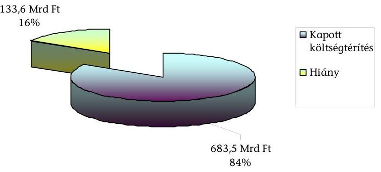

# 10. ábra 

Forrás: MÁV adatszolgáltatás

[^0]
[^0]:    ${ }^{30}$ 1261/2010. (XI. 30.) Korm. határozat a MÁV 10 milliárd forint összegű zártkörű kötvénykibocsátáshoz szükséges készfizető kezességvállalásról, 1290/2011. (VIII. 22.) Korm. határozat a MÁV 35 milliárd forint összegű zártkörű kötvénykibocsátásához szükséges készfizető kezességvállalásról
    ${ }^{31}$ Az egyes gazdálkodó szervezetek részére nyújtott egyedi támogatásokról, költségtérítésekről, valamint az egyéb vállalati támogatások keretében nyújtott termelési támogatásokról szóló 55/2008. (III. 26.), 110/2009. (V. 22.), 20/2010. (II. 9.), 32/2011. (III. 17.) Korm. rendeletek

---

A vasúti társaságok költségtérítésének konkrét összegét meghatározó rendeletek megjelenésének a költségvetési év kezdetéhez képest több hónapos késése a társaságoknak finanszírozási problémát és jelentős többletköltséget is okozott. Az ellenőrzött időszakban az államnak összesen 4,168 Mrd Ft késedelmi kamatot kellett megtérítenie amiatt, hogy a személyszállítási közszolgáltatás költségtérítéshez a szolgáltató az év első hónapjaiban nem jutott hozzá a záradék kiadásának hiánya és a múködéshez nem igazodó ütemezésű folyósítás miatt.

A MÁV csoport tagjai az általuk fizetett hitelkamatot, valamint a szállítói tartozások utáni késedelmi kamatot - a csoporttagok saját finanszírozási hiányából eredő késedelmi kamatok, ráfordítások kivételével - továbbszámlázták a STARTnak, aki szolgáltatóként azt az éves költségtérítés elszámolásakor, mint bevétellel nem fedezett indokolt költséget megigényelte a megrendelőtől (a Magyar Államot képviselő, nemzeti fejlesztési minisztertől). Az elszámolt és elismert költségtérítés - tervezettől eltérő ütemezése miatt felmerülő - késedelmi kamat 2009-ben 3,4 Mrd, 2010-ben 768 M Ft volt. ${ }^{32}$

A pályavasutak bevételei és a részére biztosított összegek a pályavasúti tevékenységek felügyeleti jelentéseiben kimutatott ráfordításokat nem fedezték, azaz az állam a Vtv.-ben meghatározott előírással szemben nem térítette meg a bevételekkel nem fedezett, indokolt költségeket. A GYSEV a pályavasúti tevékenységénél 2008. évben 788 M Ft, 2009. évben 521 M Ft veszteséget mutatott ki. A MÁV pályavasút üzemi tevékenységében 2008-2011. években együttesen 101194 M Ft veszteség volt, 2008-ban 21930 M Ft, 2009-ben 31998 M Ft, 2010-ben 23609 M Ft és 2011-ben 23657 M Ft. A MÁV és a GYSEV pályavasút részére a pályavasút múködtetéséhez nyújtott költségtérítés megállapítása az adott évre vonatkozó költségvetési törvényben meghatározott keretösszegen belül kormányrendeletben került megállapításra.

A pályavasút működtetése költségtérítésének folyósítását, annak időbeli egyenetlen eloszlását a 2008-2011 közötti években a 7. sz. melléklet mutatja. Az Állammal kötött szerződés hiányában utólagos elszámolásra nem volt módja sem a MÁV-nak, sem a GySEV-nek. A költségtérítés törvényi kötelezettsége elmulasztásának, a költségtérítések esetleges, a költségvetési alkufolyamat eredményétől függő összegben történő megállapításának nem volt semmilyen következménye.

A MÁV csoport rendszeres alulfinanszírozása folyamatos hitelfelvételeket tett szükségessé. A 2010. december 31-i állapot alapján a MÁV csoport egészében a szerződéses adósságállomány 341,3 Mrd Ft volt, aminek 85\%-a lehívott állomány volt, amely magában foglalt 10,0 Mrd Ft kötvénykibocsátást. A MÁV csoport 2008-2011 között lehívott hiteleit, illetve a hitelállomány összetételét a 6. a sz. melléklet tartalmazza.

A MÁV-nak teljességgel kihasznált hitelei vannak, a kötvény, illetve a TRAKCIÓ hiteleinek felhasználása jelenleg is folyamatban van. A START gazdálkodása azért érdemel figyelmet, mert jelenleg az ESA-95 körön belüli cégnek számít, így a nála jelentkező veszteség és az igénybe vett hitel beleszámít az államháztartási hiányba. A START a vizsgált időszakban 5-12 Mrd Ft keretössze-

[^0]
[^0]:    ${ }^{32}$ 2009. évi közszolgáltatási beszámoló, 2010. évi közszolgáltatási beszámoló

---

gű hitelszerződéssel rendelkezett. A START-nak a folyószámla hitelszerződésen kívül egyéb hitelei 2008-2011. években nem voltak, mivel 2007-ben a személyszállítási közszolgáltatás MÁV-ból való kiszervezésekor a korábbi években a veszteséges személyszállításhoz kapcsolódó hitelek a MÁV-nál maradtak.

A TRAKCIÓ 2008. január 1-jei létrehozása után a szükséges feltökésítésen, az apportált eszközökön kívül 48,3 Mrd Ft hosszúlejáratú hitellel volt terhelt, amelyből 37,8 Mrd Ft értékben kötelezettségátvállalás melletti értékesítéssel mozdonyokat vett át az anyavállalat MÁV-tól. 2010 végén a 71,6 Mrd Ft szerződéses hitelállományából 56,5 Mrd Ft volt a lehívott állomány. Ezen belül a hosszúlejáratú, eszközhöz kötött hitelei szerződött állománya 66,6 Mrd Ft volt, amelyből 51,6 Mrd Ft került lehívásra. A 4,5 Mrd Ft összegű folyószámla hitelek szerződés terhére a helyszíni ellenőrzés lezárásáig nem történt lehívás. A vállalkozói kölcsönből a szerződött és a lehívott állomány 2,3 Mrd Ft volt. A TRAKCIÓ a 2011. évtől 2024-ig hiteltörlesztés és kamatfizetés jogcímen összesen 65,9 Mrd Ft adósságszolgálatot kell teljesítsen.

A személyszállítási üzletág kiszervezésekor (2007-ben) kétféle hitel maradt a MÁV-nál: a személyszállítás korábbi múködési hitelei 120,8 Mrd Ft, valamint a személyszállítási eszközpark fejlesztésére felvett hitelek 57,1 Mrd Ft összegben. Míg a múködési hitel 91,9 Mrd Ft-ra csökkent, addig a beruházási hitelállomány 82,3 Mrd Ft-ra nőtt 2008 végére. Emellett a társaság által elindított járműfejlesztési program (Pl. 30 db Flirt motorvonat beszerzés) finanszírozásáról - idegen forrás, hitel bevonásával - továbbra is a MÁV gondoskodott.

A MÁV 2011. év elejére kialakult pénzügyi helyzete ismét határozott állami szerepvállalást igényelt, ami a MÁV csoport adósságállományának 300 Mrd Ft értékben való állam általi átvállalásáról szóló - eddig csak kisebb hányadában ( 50 Mrd Ft ) megvalósult - döntésben (szanálás) nyilvánult meg. ${ }^{33} \mathrm{~A}$ tervek szerint a szanálás tartalmazta a MÁV valamennyi hosszú lejáratú hitelállománya adósságszolgálatának teljes mértékű átvállalását ( 244,8 Mrd Ft), valamint a TRAKCIÓ 55,0 Mrd Ft értékű beruházási hiteleit.

Az adósságkonszolidáció végrehajtása késett, ezért a MÁV 2011. december 31én fennálló teljes lehívott hitelállománya 165,4 Mrd Ft-ra nőtt, mivel az adósságkonszolidálási ígéretek módosulása miatt 25 Mrd Ft hitel felvételére kényszerült annak érdekében, hogy a 2011. évben fennálló adósságszolgálati kötelezettségének eleget tudjon tenni. Ez a hitel azonban csak átmeneti megoldást jelentett, mivel az adósságszolgálati kötelezettségnek a 2012. év harmadik negyedévre történő prolongálására volt elég. Ennek hiányában a törlesztések elmulasztása történt volna meg, ami nem csak az állami kezesség beváltásához, hanem a MÁV csoport teljes hitelállományának felmondásához, azonnal esedékessé válásához vezetett volna. A MÁV tőketörlesztéseinek összege a 2008. évi 20,5 Mrd Ft-ról 2012-re 68,9 Mrd Ft-ra, 2013-ra 24,7 Mrd Ft-ra nőtt.

[^0]
[^0]:    ${ }^{33}$ 1269/2011. (VIII. 4.) Korm. határozat az egyes közösségi közlekedési vállalatok adóssága átvállalásának és a PPP-projektek felülvizsgálatának elveiről

---

A 2011. évi költségvetésről szóló törvény módosításával ${ }^{34}$ az OGY elfogadta, hogy a Magyar Állam a MÁV hitelviszonyon alapuló tartozásaiból legfeljebb 64 Mrd Ft tőkeösszegű adósságát és annak járulékait legkésőbb 2011. december 30-ig átvállalja. Az átvállalandó adósság részleteit a Kormány határozatban ${ }^{35}$ állapította meg. Az átvállalás 50 Mrd Ft lett, melynek hatására a MÁV a 2011. évi mérleg szerint eredménye és saját tőkéje 50 Mrd Ft-tal nőtt, így a társaság tőkemegfelelése a törvényi előírásoknak megfelelő szintre javult, valamint 2012. évi hiteltörlesztési kötelezettsége 24 Mrd Ft-tal csökkent.

A MÁV 2011. évi múködési hitelállománya - a decemberi szanálás előtti időszakban a 35 Mrd Ft összegű kötvény nélkül - 98 Mrd Ft volt, amelyet a korábbi évek elégtelen költségtérítése és a hitelek átstrukturálása miatt vettek fel.

# 2.3. A MÁV csoporttagok egymás közötti elszámolása, belső hitelezése 

Az 1370/2007/EK rendelet Melléklet 5. pontja ${ }^{36}$ és a Vtv. 37. § (2) bek. ${ }^{37}$ tiltja a keresztfinanszírozást. A támogatások útját vizsgálva megállapítható, hogy a szervezeti átalakítások következtében a keresztfinanszírozás egy cégen belüli kockázata elhárult ugyan, de áthelyeződött a cégcsoportba.

A 2008-2011. években az anyavállalat MÁV a kapcsolt vállalkozásaival szemben számolta el értékesítési nettó árbevételei 40-67\%-át és ráfordításai 25-47\%át. A START bevételei az állami költségvetésből és az utazóközönségtől származnak, így e tekintetben nem kapcsolódik a társaságokhoz, ráfordításaival azonban 76-79\%-osan. A TRAKCIÓ bevételei 79-81\%-át, míg ráfordításai 49-58\%-át számolja el a kapcsolt vállalkozásokkal szemben. A GÉPÉSZET bevételei 87-94\%-ával kapcsolódik a kiemelt társaságokhoz, ráfordításainak azonban

[^0]
[^0]:    ${ }^{34}$ a megyei önkormányzatok konszolidációjáról, a megyei önkormányzati intézmények és a Fővárosi Önkormányzat egyes egészségügyi intézményeinek átvételéről szóló 2011. évi CLIV. törvény 78. § (9) bek.
    ${ }^{35}$ 1451/2011. (XII. 22.) Korm. hat. a MÁV adósságának részbeni átvállalásáról
    ${ }^{36}$ 5. Amennyiben egy közszolgáltató nem kizárólag közszolgáltatói kötelezettségek hatálya alá tartozó, ellentételezett szolgáltatásokat múködtet, hanem más tevékenységeket is végez, az átláthatóság növelése és a keresztfinanszírozás elkerülése érdekében az említett közszolgáltatók számvitelében legalább az alábbi feltételeknek megfelelő elkülönítéseket kell végezni:

    - az egyes tevékenységeknek megfelelő múködési számlákat egymástól el kell különíteni, és a megfelelő eszközök részét és az állandó költségeket a hatályos számviteli és adóügyi szabályok szerint kell felosztani;
    - a közszolgáltató bármely egyéb tevékenységéhez kapcsolódóan valamennyi változó költséget, az állandó költségekhez való megfelelő hozzájárulást és az ésszerű hasznot semmilyen esetben sem lehet a kérdéses közszolgáltatásra terhelni;
    - a közszolgáltatással összefüggő költségeket az üzemeltetési bevételekkel és a hatóságok kifizetéseivel kell kiegyenlíteni, kizárva a bevételek átvitelének lehetőségét a közszolgáltató más tevékenységi területére.
    ${ }^{37}$ A vasúti pályahálózat múködtetése és az integrált vasúti társaság egyéb tevékenységei között tilos a keresztfinanszírozás.

---

csak 11-19\%-ával (8. sz. melléklet). A számlázás rendszere zárt és szabályozott volt a vizsgált időszakban.

A társaságok belső pénzügyi kapcsolataiban egyrészt a MÁV működőképesen tartja leányvállalatait, másrészt a költségvetési függőségből eredő finanszírozási gondok megoldása, likviditásuk fenntartása érdekében koordinálja a pénzügyi intézkedéseket a MÁV csoport legnagyobb tagjai (START, TRAKCIÓ, GÉPÉSZET) között.

Az anyavállalati kötelezettségek teljesítése miatt nyújtott pénzügyi segítség tagi kölcsön és készfizető kezességvállalás formájában valósult meg. A MÁV a Csoport társaságainak négy esetben, összesen 11 Mrd Ft összegű szerződéssel adott tagi kölcsönt. (2011. november 10-én a fennálló tőketartozás 1,5 Mrd Ft volt.). Két leányvállalat folyószámlahitelei mögé a MÁV 2011. szeptember 30-án egy kereskedelmi banknál készfizető kezességet nyújtott, melynek fennálló összege 2011. november 10-én 1,4 Mrd Ft volt.

A MÁV csoport legnagyobb tagjai (START, TRAKCIÓ, GÉPÉSZET) együttműködtek a likviditásuk fenntartása érdekében, mely során a START kihasználta folyószámla hitelkereteit, majd csoporton belüli tartozása emelkedett. Ha a START-tal szemben követeléssel rendelkező társaságok pénzkészlete elfogyott, saját folyószámlahitel kihasználtságuk emelkedett. A csoport 20-47 Mrd Ft-os folyószámlahitel kerete döntően a START fizetőképességének függvényében volt kihasznált a vizsgált időszakban, elsődlegesnek tekintve a személyi jellegű kifizetések pénzügyi forrásának biztosítását. Az ellenőrzött négy év alatt az anyavállalat és legnagyobb tagjainak folyószámla hitelei utáni együttes kamatteher közel 3 Mrd Ft volt.

2009-ben a személyszállítási költségtérítés folyósításának csúszása miatt a START eladósodottsága a MÁV és a TRAKCIÓ felé folyamatosan nőtt, az év közepén a tartozása a MÁV felé csaknem elérte a 40 Mrd Ft-ot, a TRAKCIÓ felé a 28 Mrd Ftot. Ugyanakkor a TRAKCIÓ kifizetéseit az anyavállalat felé nem tudta teljesíteni, így ugyanebben az időszakban a MÁV felé 11 Mrd Ft-os lejárt tartozása volt.

A vizsgált időszakban - a START kivételével - a MÁV csoport tagjai adó- és járulékfizetési halasztást kezdeményeztek, ezzel csökkentve a tárgyhavi fizetési kötelezettségeket (9. sz. melléklet). A START jelentős áfa követelést halmozott fel a kifizetetlenség miatt vissza nem igényelhető áfa miatt (a maximum 2009. június-július hónapban a 9 Mrd Ft-ot is meghaladta). Az áfa visszaigénylésének problémája 2011 augusztusában az EU döntését követő jogszabályi változás miatt megszűnt.

Az Európai Unió Bíróságának a C-274/10. számú ügyben hozott, 2011. július 28án kihirdetett döntése szerint Magyarországnak a ki nem fizetett beszerzésekhez kapcsolódó áfa visszaigénylését kizáró szabálya (az Áfa-törvény ${ }^{38}$ 186. § (2)-(4) bekezdése) nincs összhangban a közösségi joggal. Magyarország a döntést tudomásul véve a vitatott rendelkezést hatályon kívül helyezte 2011. szeptember 27ével.

[^0]
[^0]:    ${ }^{38}$ 2007. évi CXXVII. törvény az általános forgalmi adóról

---

Az állami finanszírozási függőség kikényszerítette a pénzügyi hatékonyságra való törekvést a MÁV csoportban, ami beszámításokban nyilvánult meg, csökkentve ezzel a banki utalások számát és költségét. A banki „hasznok" csoporton belül tartása a cash-pool rendszer 2011. év eleji bevezetésével kezdődött el.

A cash-pool rendszer a bankszámlák összevezetési és visszanyitási gyakorlata, melynek alapján a cégcsoport tagok bankszámláinak egyenlege éjszakára csoport szintű képet mutat a bank felé, biztosítva ez által a banki kitettség csökkentését a csoporton belüli betét-hitel pozíciókkal. Ebből következően a betéti és hitel pozíciókból a kisebb összeggel belső elszámolás történik és csak a különbözet az, amit a bank felé mint, követelést vagy kötelezettséget a csoport elszámol, és banki kondíciókkal kamatozik. A MÁV csoport 2011 elejétől rendelkezik cash-pool rendszerrel a MÁV Zrt., a MÁV-START Zrt., a MÁV-TRAKCIÓ Zrt., a MÁVGÉPÉSZET Zrt., valamint a KFV Kft. részvételével. A belső kamatot a betéti és a hitelkamatok átlagaként határozták meg, így a betétesek több kamatot kapnak így, mint a banktól kapnának, a hitelfelvevők pedig kevesebbet fizetnek, mint a banknak fizetnének.

# 3. A TULAJDONOSI JOGGYAKORLÁS HATÁSA A FINANSZíROZÁSRA 

### 3.1. A tulajdonosi, irányítói joggyakorlás eredményessége

A vasúti közszolgáltatáshoz kapcsolódó tulajdonosi és irányítói feladatok ellátását befolyásolta, hogy a döntéseket kormányzati szinten hozták meg, illetve bizonyos döntéseket a kormányzat nem hozott meg, a társaságok hosszú távú finanszírozhatóságának feltételeit nem teremtette meg. Nem hozott döntést a közösségi közlekedés egészére, ezen belül az állami preferenciák és szerepvállalás meghatározására. A szervezeti keretek megváltoztatásától, konkrétan a MÁV-csoport átszervezésétől a hatékonyság növekedését és a finanszírozási igény csökkenését várták. A finanszírozást befolyásoló alapvető tényezők, azaz az állam által megrendelt szolgáltatások volumenének, a fenntartott hálózat és a vasúttársaság méretének meghatározása, a vasút versenyképességét csökkentő közúti hálózatok használati költségének tényleges megtérítése (útdíj) és az utazási kedvezmények körének felülvizsgálata teljes körűen még nem történt meg.

Az évek óta tartó döntési bizonytalanság, a koncepcióváltások, a kormányzati átalakítások és az irányító-döntéshozó vezetők személyének gyakori változtatása is közrejátszott abban, hogy a vasúti finanszírozást illetően a 2005-2007-ben érvényesülő, nem teljes körű működésfinanszírozás részben tovább élt 2008-2010-ben is.

2007-2011 közötti öt évben hét közlekedésért felelős miniszter, négy MÁV vezető, két kormánybiztos irányította a számtalan vasúti reformjavaslat kidolgozását és megvalósítását. A GySEV-nél az első számú vezető személyében 2007 januárjában, majd 2010 júliusában volt változás.

2008-ban a hatályos 263/2006. (XII. 20.) Korm. rend. szerint a vasúti közlekedési hatósági feladatokat az NKH, míg a Vtv. 73. § szerinti igazgatási ügyeket a 275/2006. (XII. 23.) Korm. rendelettel létrehozott MVH látta el. Az államigazgatás racionalizálási folyamatában 2008-ban a Kormány 156/2008. (VI. 6.) számú rendeletével megszüntette az MVH-t és feladatait beillesztette az NKH feladatrendszerébe.

---

A 2010. évi kormányváltás előtt a Nemzeti Vagyongazdálkodási Tanács irányítása alatt álló MNV Zrt. adta át az állami tulajdonú társaságok feletti tulajdonosi joggyakorlást a szakmailag illetékes miniszternek (GKM, KHEM, NFM). A vagyontörvény 2010. évi módosításával ${ }^{39}$ az NFM miniszterének hatáskörébe került tulajdonosi jogok gyakorlását a miniszter átadta az MNV Zrt.nek a MÁV vonatkozásában. A GYSEV tulajdonosi jogait megtartotta. A tulajdonosi joggyakorlás és vagyonkezelés a Gt. ${ }^{40}$ a vagyontörvény, a Vtv., valamint a MÁV Alapító Okirata és a GYSEV Alapszabálya szerinti jogok gyakorlását és kötelezettségek teljesítését jelentette. (10. sz. melléklet)

A közlekedési tárcáknál (GKM, KHEM, NFM) az átszervezések és az ahhoz kapcsolódó létszámcsökkentések során a közlekedési szakterület létszáma 20082011 között közel felére ( 126 fơről 67-re) csökkent. A feladatrendszer folytonossága mellett a létszámcsökkentésekből adódó kapacitás csökkenés, a szervezeti stabilitás hiánya, valamint a döntés előkészítési és egyeztetési eljárásokra megszabott, esetenként igen rövid, 1-3 napban (néha órákban) meghatározott végrehajtási határidő kockázatot hordoz magában a feladatok eredményes ellátása tekintetében.

A vasúttársaságokkal kapcsolatos vagyonstratégia jogszabályi szinten nem született. Az állami vagyon fejlesztésével, hasznosításával, elidegenítésével kapcsolatos középtávú vagyongazdálkodási stratégia hiányában a tulajdonosi jogokat gyakorló szervezet nem rendelkezett jóváhagyott vagyonpolitikai koncepcióval a MÁV és a GYSEV szerepével és múködésével kapcsolatban. A KHEM 2008 végén ugyan elkészítette a vagyonkezelése alá tartozó társaságokra vonatkozó vagyongazdálkodási stratégiáját, amely azonban nem emelkedett jogszabályi szintre. Ennek hiányában a társaságok saját vagyongazdálkodási stratégiájukat üzleti tervezésük alapján készítették el, és elsősorban a finanszírozási problémák megoldására koncentráltak.

A MÁV ingatlanjainak jogi helyzete nem tisztázott teljes körűen. A MÁV tulajdonában álló vagyonelemek rendezésének megkezdésére irányult a helyközi közösségi közlekedésről szóló 1133/2009. (VIII. 7.) Korm. határozat, melynek végrehajtása keretében az MNV Zrt. és a MÁV között a tényleges vagyoni helyzet rendezését rövid időn belül elkészített megállapodásba foglalták, mely rögzítette, hogy az nem eredményezhet vagyonvesztést sem az állami vagyonban, sem a MÁV-nál.

Az egyes közlekedési tárgyú törvények módosításáról szóló 2010. évi CLXXII. törvény 106. § (1)-(2) bekezdésének - 2011. január 1-jétől hatályos rendelkezései rögzítik a rendezés jogszabályi feltételeit. Eszerint „Annak érdekében, hogy a jogügylet számviteli elszámolása a gazdasági társaság vagyonában ne eredményezzen vagyonvesztést, az MNV Zrt. jogosult a gazdasági társaság visszapótlási kötelezettségét elengedni, a visszapótlási kötelezettségből származó követelést a gazdasági társaság javára nem pénzbeli hozzájárulásként rendelkezésre bocsátani vagy az elszámolásáról egyéb módon rendelkezni." (A MÁV visszapótlási kötelezettségének helyzetével részletesen a jelentés 4.4. pontja foglalkozik.)

[^0]
[^0]:    ${ }^{39}$ 2010. évi LII. törvény az állami vagyonnal való felelős gazdálkodás érdekében szükséges törvények módosításáról, valamint egyes törvényi rendelkezések megállapításáról ${ }^{40}$ 2006. évi IV. törvény a gazdasági társaságokról

---

2011. április 15-ig elkészült a szerződéstervezet arról, hogy mely ingatlanok kerülnek állami, illetve a MÁV tulajdonába. Az átadást ugyanakkor nehezíti a Nemzeti Földalap (NFA) vagyoni körébe tartozó ingatlanok tekintetében érvényes jogi szabályozás (a területek MÁV vagyonkezelésbe adása csak nyilvános pályázat útján lehetséges). A termőföld ingatlanok esetében a Nemzeti Földalapkezelő Szervezettel kell megkötni a vagyonkezelői megállapodást.

A MÁV 2011 augusztusában beszámolt az érintett ingatlanok rendezésével kapcsolatos eredményekről és akadályozó tényezőkről a tulajdonosi joggyakorlónak. Az ingatlanrendezéssel mintegy 123 Mrd Ft könyv szerinti értékű ingatlan kerülne ki a társaság vagyonából, azonban a MÁV fennálló visszapótlási kötelezettsége - kb. 60 Mrd Ft - a vagyonvesztés kompenzálására csak részben lenne elegendő.

A vasúti működési engedély szempontjából kockázatot jelentett - a használt vasúti pálya jogos birtoklását is igazoló - nyilvántartások rendezésének elmaradása. A vasúti múködési engedélyhez a Vtv. 87. § (8) bek. szerint ${ }^{41}$ 2011. december 31-ig kellett volna igazolni a vagyonkezelői jogot a vasúti igazgatási hatóság felé. A vasúti társaságok múködésének engedélyezéséről szóló 45/2006. (VI. 28.) GKM rendeletet 2012. február közepén módosították. Az 5/2012. (II. 15.) NFM rendelet 2. § (2) bekezdése szerint a Vtv. 25. § (1) bekezdésében meghatározott vasúti pályahálózatokra vonatkozóan a kérelmező igazolási kötelezettségének az ott meghatározott szerződések benyújtásával eleget tehet. Ennek alapján az NKH-nak el kell fogadnia a pályahálózat múködtetésének jogviszonyára való igazolásként az állam és a pályahálózat múködtető között létrejött szerződéseket.

2007 óta nem rendeződött a nagy vagyonértéket képviselő, NIF által végrehajtott vasúti beruházások aktiválása, mivel a beruházások tisztázatlan jogi helyzetű ingatlanokon is megvalósultak, a jogszabályok nem rendezték a vagyonátadás feltételrendszerét és lebonyolítását, továbbá az érintett szervezetek nyilvántartása eltérő. Mindezek miatt leltár sem készült. Vagyonátadás hiányában a műszakilag átadott, illetve üzembe helyezett vagyonelemek értékei sem a vagyonkezelőknél, sem az MNV Zrt. rábízott vagyona mérlegében nem szerepelnek. Az MNV Zrt. nem vette nyilvántartásba állami vagyonként a beruházások során létrehozott eszközöket, ezért a vagyonkezelési szerződéseket sem módosította (a beruházások a NIF könyveiben készletként vannak nyilvántartva). A MÁV éves beszámolóját auditáló könyvvizsgáló cég - korlátozás nélkül - felhívta a figyelmet a társaság könyveiben nem szereplő összegre és a nyilvántartási hiányosságok pótlásának szükségességére. Az adminisztratív átadás hiánya az uniós projekteknél visszafizetést vagy bírságot vonhat maga után. Az aktiválás elmaradása miatt a MÁV beszámolója nem a társaság valós vagyoni helyzetét mutatja, amire a könyvvizsgáló több ízben is felhívta a figyelmet. Emiatt ezen

[^0]
[^0]:    ${ }^{41}$ „A vasúti igazgatási szerv a vasúti pályahálózat müködtetésére vonatkozó müködési engedély kiadásakor kérelemre eltekinthet a vasúti pályahálózathoz tartozó egyes, vasúti pályák és tartozékaik, valamint vasúti üzemi létesítmények (a továbbiakban együtt: hálózati elem) birtoklására, használatára és müködtetésére vonatkozó igazolásától, ha a kérelmező valószínüsiti, hogy az érintett hálózati elemet ténylegesen müködteti és annak vonatkozásában a müködtetési jogosultság igazolása jogi nehézségbe ütközik."

---

(mintegy 138 Mrd Ft értékű) eszközökre a MÁV nem tud értékcsökkenést elszámolni, amelynek fedezetére átmenetileg 9,4 Mrd Ft céltartalékot képeztek annak érdekében, hogy a múködtetett beruházások értékcsökkenésének összege más néven ugyan, de - elszámolásra kerüljön a tárgyévi ráfordítások között.

Az állami vagyont illetően - tulajdonosi engedély hiányában - 2004-2010 között nem kerülhetett sor az elhasználódott, elavult pályavasúti eszközök selejtezésére. A hosszú távú közlekedési koncepció hiánya miatt nem tisztázott, hogy az ideiglenes forgalomszüneteltetés átmeneti állapot-e, vagy a végleges vonalbezárás előkészítése. A forgalomszüneteltetés elrendelését nem követte érdemi döntés az ott található eszközök további sorsát illetően.
2010. április közepén a MÁV a társaság felett szakmai felügyeletet és tulajdonosi jogokat gyakorló miniszternek (KHEM) írt levélben kezdeményezte mintegy 4,5 Mrd Ft értékű nem használt és feleslegessé váló eszközhöz kapcsolódóan 4298 M Ft terven felüli értékcsökkenés elszámolhatóságát. Hosszú egyeztetés, többszöri adat kiegészítés miatt késett a döntés, majd az NFM közel egy év elteltével keltezett levelében forgalombiztonsági és rendkívüli tényezőkre (pl. havaria, nemzetvédelmi feladatok, rendkívüli forgalmi csúcsok stb.) hivatkozva nem támogatta a kezdeményezést, ismételt átgondolást, illetve dokumentumokkal való megfelelő alátámasztást kért.

Az érintett ingatlanok, eszközök és berendezések előírásszerű felügyelete, karbantartása pályafenntartási szempontból megoldott, ugyanakkor az alaptevékenység ellátásához feleslegessé vált - beleértve a forgalomszüneteltetett, megszüntetett vonalak (pl. Pécsvárad-Bátaszék) által érintett - ingatlanok, eszközök őrzési és amortizációs költségei a selejtezhetőség, illetve az MNV Zrt.-nek történő visszaadhatóság hiányában a pályahasználati díjakban költségnövelő tényezőként megjelennek.

Az NFM 2012 márciusáig - következmények nélkül - tudomásul vette, hogy az MNV Zrt. sem a MÁV korábbi felesleges és elhasználódott eszközeinek kiselejtezésével kapcsolatos megkeresésére, sem az új vagyonkezelési szerződésére nem válaszolt.

Az NFM támogatta, hogy a MÁV a gazdaságtalannak vagy feleslegesnek minősített vasútvonalakat, létesítményeket a vagyonkezeléséből kivonhassa, és ezeket az eszközöket az MNV Zrt.-nek további hasznosításra visszaadja. A MÁV 2011 májusában ismételten javaslatot tett az MNV Zrt.-nek a selejtezésre. Az MNV Zrt. 2011 júliusában kiadta a saját és rábízott vagyonában nyilvántartott eszközök selejtezésére vonatkozó szabályzatot, melyet a MÁV vagyonkezelt eszközeinek selejtezésekor is alkalmazni kell. A selejtezés témájában a MÁV és az MNV Zrt. között folyamatos az egyeztetés, azonban három kérdésben nincs megegyezés közöttük: a selejtezések tekintetében mi minősül a vagyonkezelőnek felróható oknak; ezzel kapcsolatban ki köteles viselni a terven felüli értékcsökkenést, valamint kit terhelnek a bontás, tárolás, őrzés költségei.

A helyszíni ellenőrzés lezárását követően kiadásra került az MNV Zrt. Részvényesi Jogok Gyakorlójának - a MÁV vagyonkezelésében lévő, 2004-2010. közötti elhasználódott pályavasúti eszközök terven felüli értékcsökkenésének elszámolásáról rendelkező - 6/2012. (III. 14.) sz. határozata, mely rendelkezéseket tartalmaz a 2004 és 2010 közötti, a MÁV-nak fel nem róható okból bekövetkező selejtezések elszámolásáról, a selejtezési eljárásrend kialakításáról, va-

---

lamint a MÁV vagyonkezelési szerződésének módosításáról. Jelenleg folyamatban van a határozat értelmezése a MÁV és az MNV Zrt. részéről.

Az állami vagyon tulajdonjogi rendezetlensége miatt a Vagyontörvénynek megfelelő vagyonkezelői szerződést az MNV Zrt. 2008. január 1-je óta nem tudja megkötni a MÁV-val. A vagyonrendezési folyamat egyeztetése elindult, de nem fejeződött be 2011 végéig.

A MÁV csoport tagjai közül a MÁV rendelkezik olyan eszközállománnyal, amely a Vtv. szerint állami tulajdonnak minősül és a társaság vagyonkezelésében van. Az állami eszközállományt a MÁV könyveiben elkülönítetten tartják nyilván és a vasúti pályahálózathoz tartozó földterületek, épületek, építmények, gépek, berendezések alkotják. A vasútüzem múködéséhez szükséges vasútüzemi létesítmények meghatározott köre a MÁV tulajdonát képezi ún. vasúti pályahálózatot múködtető vagyonként.

A helyszíni ellenőrzés lezárását követően kiadásra került az MNV Zrt. Részvényesi Jogok Gyakorlójának - a közösségi közlekedési szolgáltató társaságok és a MÁV csoport szervezeti korszerűsítésével kapcsolatos egyes feladatokról rendelkező - 4/2012. (II. 29.) sz. határozata, mely a vagyonrendezés vonatkozásában is tartalmaz rendelkezéseket. Jelenleg ezen RJGY határozat vizsgálata, illetve értelmezése is folyamatban van a MÁV és az MNV részéről. Az MNV Zrt. tájékoztatása szerint jelenleg előkészítés alatt áll az ingatlanvagyon rendezésére vonatkozó koncepciók tervezete az NFM-mel együttműködésben. A 2004 és 2010 között az RJGY határozat szerinti okokból selejtezett, illetve selejtezendő eszközök kimutatását a MÁV Zrt. megküldte, ennek felülvizsgálata és az MNV Zrt. általi véleményezése folyamatban van, hasonlóan a vagyonkezelési szerződés tervezetéhez.

A 360 Mrd Ft értékű kincstári vagyonon kívül nem szerepel a MÁV könyveiben az a mintegy 138 Mrd Ft értékű vagyon, amely a NIF Zrt. által végrehajtott beruházásként jött létre állami tulajdonon. Ebből következően 2010-ben megközelítőleg 500 Mrd Ft értékű kincstári vagyont kezelt a társaság.

# 3.2. Az állam finanszírozási döntéseinek következetessége 

A vasúti közszolgáltatási finanszírozási döntések tekintetében az állami finanszírozás kiszámíthatósága nem volt biztosított a társaságok számára.

A módosítást követően 2010. december 31-től hatályos Vtv. 28/A. § alapján a Magyar Állam kötelezettséget vállal, továbbá készfizető kezesként felel azon vasúti társaság, amellyel az állam közszolgáltatási szerződést kötött, az állam által indokoltnak elismert és az állam által meg nem térített költségei finanszírozására felvett hitele és annak ügyleti kamatai megfizetéséért. 2007-ben a kormányrendelet ${ }^{42} 9,5$ Mrd Ft költségtérítést irányozott elő a MÁV számára a vasúti pályahálózat múködtetéséhez a személyszállítási közszolgáltatások 88,4 Mrd Ft költségtérítése mellett, amelyet a MÁV átszervezései miatt kétszer módosítottak.

[^0]
[^0]:    ${ }^{42}$ 52/2007. (III. 26.) Korm. rendelet a gazdálkodó szervezetek részére nyújtott 2007. évi egyedi termelési támogatásokról, költségtérítésekről

---

Az első módosítás a START létrehozása után a személyszállítási közszolgáltatásaihoz rendelt költségtérítés összegét határozta meg ( 44,1 Mrd Ft összegben), a költségtérítés másik részét ( 44,3 Mrd Ft-ot) a személyszállítás közszolgáltatásaihoz a MÁV-nál hagyta. A második módosítás ${ }^{43}$ viszont együtt kezelte a MÁV személyszállítási közszolgáltatásaihoz és a pályahálózat múködéséhez rendelt költségtérítést és a módosított 44,3 Mrd Ft költségtérítést 94,4 Mrd Ft összegként, míg a START 44,1 Mrd Ft költségtérítését 66,3 Mrd Ft-ra emelte.

2008-ban a személyszállítás közszolgáltatási költségtérítéséből a GYSEV 4,76 Mrd Ft-ot kapott, míg a START az eredeti 113 Mrd Ft-tal szemben a vonatkozó kormányrendelet ${ }^{44}$ november 3-i módosítását követően 160 Mrd Ft támogatásban részesült. A MÁV 2008-ban 8,8 Mrd Ft költségtérítést vehetett igénybe a pályahálózat fenntartásához, a GYSEV pedig 0,64 Mrd Ft-ot.

2009-ben a MÁV pályafenntartásra az előző évi töredékét, 0,4 Mrd Ft-ot kapott, a GYSEV 0,69 Mrd Ft támogatásban részesült. A személyszállítás közszolgáltatási feladatai költségeinek megtérítésére a kormány 2009-ben a START részére 165,18 Mrd Ft-ot, a GYSEV részére 5,13 Mrd Ft-ot irányzott elő. ${ }^{45}$ Ugyanakkor a MÁV Cargo értékesítés 102,5 Mrd Ft összegű MÁV-nál hagyott bevétele biztosította, hogy a MÁV, illetve a MÁV Csoport 2009. évi múködése a beruházási szükségletek minimalizálása mellett, újabb hitelek felvétele nélkül megoldható legyen.

A 2010. évi költségvetési törvényben az IMF ajánlásával összhangban a helyközi közösségi közlekedés állami költségtérítésének 40 Mrd Ft-tal történő csökkentéséről döntöttek a 2009. évi szinthez képest. Az állami költségtérítés feltételeit rögzítő kormányrendelet ${ }^{46}$ eredetileg a GYSEV 1,3 Mrd Ft-os támogatásával szemben a MÁV pályavasúti költségtérítésére előirányzatot nem tervezett. A személyszállítás eredetileg összesen 127,9 Mrd Ft költségtérítésben részesült (START 122,4 Mrd Ft, GYSEV 5,5 Mrd Ft).

A költségtérítések elosztását 2010-ben is kétszer módosították, először 2010. április 16-án, miután a START személyszállítási költségtérítésének 22,4 Mrd Ft nagyságú emeléséről döntött a Kormány, másodszor 2010. október 19-én módosult a rendelet, amely keretében 23 Mrd Ft költségtérítést biztosított a MÁV pályavasút számára, melyet egy összegben az év végén (2010. november) kapott meg.

[^0]
[^0]:    ${ }^{43}$ 244/2007. (IX. 25.) Korm. rendelet a gazdálkodó szervezetek részére nyújtott 2007. évi egyedi termelési támogatásokról, költségtérítésekről szóló 52/2007. (III. 26.) Korm. rendelet módosításáról
    ${ }^{44}$ 55/2008. (III. 26.) Korm. rendelet az egyes gazdálkodó szervezetek részére nyújtott 2008. évi egyedi támogatásokról, ellentételezésekről, valamint az egyéb vállalati támogatások keretében nyújtott termelési támogatásokról
    ${ }^{45}$ 110/2009. (V. 22.) Korm. rendelet az egyes gazdálkodó szervezetek részére nyújtott 2008. évi egyedi támogatásokról, ellentételezésekről, valamint az egyéb vállalati támogatások keretében nyújtott termelési támogatásokról
    ${ }^{46}$ 20/2010. (II. 9.) Korm. rendelet az egyes gazdálkodó szervezetek részére nyújtott 2010. évi egyedi támogatásokról, költségtérítésekről, valamint az egyéb vállalati támogatások keretében nyújtott termelési támogatásokról

---

A 2011. évi kormányrendelet ${ }^{47}$ a MÁV által működtetett vasúti pályahálózathoz 21,0 Mrd Ft, a GYSEV-éhez 2 Mrd Ft költségtérítést biztosított. A személyszállítási közszolgáltatáshoz a START 152,4 Mrd Ft-ot, a GYSEV 5,8 Mrd Ft-ot tervezhetett a kormányrendelet alapján. A MÁV Zrt. 35 Mrd Ft összegű zártkörű kötvénykibocsátáshoz szükséges készfizetői kezességvállalásról szóló 1290/2011. (VIII. 22.) Korm. határozat alapján a vasúti pályahálózat állam által indokoltnak elismert és az állam által nem térített költségei finanszírozására 35 Mrd Ft értékű kötvény kibocsátására került sor.

# 3.3. A közszolgáltatás finanszírozásának nyomon követése 

A tulajdonosi kontrollrendszer nem biztosította teljes körűen a közszolgáltatások finanszírozásának nyomon követését. Annak ellenére, hogy az információszolgáltatásra kötelezett társaságok szabályszerű tájékoztatást nyújtottak, a felügyeleti minisztériumnak (KHEM, NFM) nem volt minden folyamatra rálátása. (Pl. a kiszervezésekkel kapcsolatban a START költség és bevétel adataira vonatkozóan van beszámoltatási joga, a leányvállalatok egymás felé történő számlázására, árkialakítására már nem). A vasúti szervezeti átalakításokat követően sem a MÁV, sem a felügyeleti minisztérium nem készített a kiszervezésekkel kapcsolatos értékelést arra vonatkozóan, hogy az elérte-e kitűzött célját, a cégcsoport hosszú távú finanszírozása megoldhatóvá vált-e.

A vasúti társaságok beszámoltatása a minisztériumnak küldött társasági információszolgáltatással valósult meg (likvidítási helyzet, csoporton belüli kö-vetelés-állomány alakulása, a költségtérítés folyósítása, a hitelek alakulása, a finanszírozás fenntartása). A MÁV a jogszabályi előírásnak ${ }^{48}$ megfelelően negyedévente, valamint a mérlegbeszámoló kiegészítő mellékletében felügyeleti jelentést készített tevékenységenkénti bontásban.

A tulajdonosi joggyakorlással összefüggésben a felelős minisztérium monitoring rendszere elegendő információt biztosított a vasúti társaságok múködésével és finanszírozásával összefüggésben az alapítói határozatok meghozatalához.

A döntési folyamat időnkénti lassúsága, - elhúzódása - a döntés elmaradása, esetenként a hosszú ideig tartó egyeztetés kedvezőtlenül befolyásolta a vasúti társaságok gazdálkodását. Kockázatot jelentett a társaságok számára üzleti tervek elkészítéséhez szükséges döntések és alapinformációk késedelme, illetve azok gyakori változtatása, az üzleti tervek és a menetrendek jóváhagyásának késedelme.

A MÁV 2010. évi üzleti tervének Tulajdonosi Határozattal történő elfogadására 2010. május 14-én került sor. A 2008. évi és a 2011. évi MÁV üzleti terv tulajdonosi elfogadására mindkét évben az év utolsó negyedévében került sor. A MÁV

[^0]
[^0]:    ${ }^{47}$ 32/2011. (III. 17.) Korm. rendelet az egyes gazdálkodó szervezetek részére nyújtott 2010. évi egyedi támogatásokról, költségtérítésekről, valamint az egyéb vállalati támogatások keretében nyújtott termelési támogatásokról
    ${ }^{48}$ 50/2007. (IV. 26.) GKM-PM együttes rendelet a vasúti közlekedési tevékenységek vasúti társaságon belüli számviteli elkülönítéséről

---

2011. évi üzleti tervét Igazgatóságának 175/2011. (VIII. 23.) sz. határozata és előterjesztése alapján a 297/2011.(X. 17.) számú Alapítói Határozatával már az új tulajdonosi joggyakorló, a MNV Zrt. Igazgatósága fogadta el.

A tulajdonosi kontroll hiányosságát jelzi, hogy a minisztérium belső ellenőrzési szervezete a tulajdonosi érdekeltségébe tartozó vasúti társaságok vonatkozásában a vizsgált időszakban nem végzett ellenőrzést a társaságok állami támogatási rendszerét érintően, vagy kiemelten az állami költségtérítések felhasználásának szabályszerűségéről. Az NFM véleménye szerint: „...az a tény, hogy a belső ellenőrzési fókusz az adott években nem terjedt ki a társasági finanszírozás ellenőrzésére nem jelenti a tulajdonosi kontroll hiányosságát."

Az ÁSZ szerint az ellenőrzés a kontroll egyik eleme, ennek megfelelően amenynyiben erre nem kerül sor, akkor ez hiányosságként jelentkezik. A Közlekedési Szolgáltatások Főosztálya csak a helyközi személyszállítások kompenzációs rendszerével foglalkozik és nem teljes körűen a vasúti közlekedés finanszírozási kérdéseivel, valamint önmagában véve a felügyelőbizottságok és a könyvvizsgálók munkája sem jelenti a tulajdonosi kontroll mindenre kiterjedő érvényesítését, hasonlóan a minisztériumi vagyonfelügyeleti szervezetek vasúti társaságokat kiemelt prioritásként történő kezeléséhez. Az, hogy az Ellenőrzési Főosztály a körülmények miatt csak az EU által finanszírozott projektek rendszerellenőrzésére fókuszált - az ellenőrzés számára ismert - indokként ugyan elfogadható, azonban a tényszerű megállapításon nem változtat.

A vasúti közlekedési tevékenységek vasúti társaságon belüli számviteli elkülönítéséről szóló 50/2007. (IV. 26.) GKM-PM rendelet (továbbiakban: 50/2007-es rendelet) alapján a Felügyeleti jelentéseket, Közszolgáltatási jelentéseket a MÁV, a START és a GYSEV az NKH Vasúti Igazgatási Főosztályának és a felügyeleti minisztérium szakmai főosztályai részére rendszeresen megküldte.

A múködési engedélyezési és piacfelügyeleti ellenőrzés a NKH Vasúti Igazgatási Főosztálya feladata. Az eljárások szabályozottsága, a szabályozók összhangja, a döntések szempontrendszere és kritériumai, valamint az ehhez rendelkezésre álló humán erőforrás biztosítja ezek ellátását, azonban a fennálló adminisztratív és pénzügyi korlátok kockázatot jelentenek a piacfelügyeleti feladatrendszer teljes körű végrehajtásában.

A Vtv. alapján a vasúti igazgatási szerv feladat- és hatásköre 2008. július 1., a Magyar Vasúti Hivatal (MVH) megszűnése óta több jelentős feladattal bővült (pl. panaszkezelés, illetve a vasúti személyszállítást igénybe vevő utasok jogaira vonatkozó rendelkezések betartásának ellenőrzése, piacfelügyeleti feladatkör bővülése). A többletfeladatokat ugyanakkor a korábbiakhoz képest csökkent létszámmal látja el, melyet megbízási szerződésen keresztül nem bővíthet az államháztartási gazdálkodási szabályok szerint.

Az 50/2007. (IV. 26.) GKM-PM rendelet 9. §-ában meghatározott, a számviteli elkülönítéshez kapcsolódó ellenőrzési feladatának - bár az MVH 2007 novemberében vette tervbe - csak 2009-ben tett eleget a NKH az átszervezések miatt. Az NKH 2011. évi ellenőrzési terve ismételten tartalmazza az elkülönítés szabályszerűségének vizsgálatát, azonban ez csak a módosított elkülönítési szabályzatok felülvizsgálatában jelentkezett. Az elkülönítéssel kapcsolatban a fel-

---

ügyeletet ellátó minisztérium az ellenőrzött időszakban nem végzett vizsgálatot.

A vasúttársaságok a költségtérítés havi összegét a Megrendelői Teljesítésigazolás kiadását követően igényelhették meg, melynek elfogadása a KTI javaslata alapján került kiadásra. Az ellenőrzött időszakban a KTI nem rendelkezett a jelentések elfogadásához szükséges szabályzattal, az elfogadás kritériumaihoz írásos útmutatóval, azt kizárólag a dolgozók szakmai tudására alapozta. A KTI értelmezésében a Megrendelői Teljesítésigazolás kiadásának feltétele a közszolgáltatás keretében megrendelt vasúti járatok közlekedtetése volt. Ennek alapján a Teljesítésigazolásokat a felügyeleti minisztérium minden hónapban kiadta.

A KTI az ellenőrzött időszakban a két vasúttársaság által leadott - 25-40 oldalas naturális és számszaki adatokkal alátámasztatott - jelentéseit havonta átlagosan 2 nap alatt bírálta el és javasolta a minisztériumnak a Megrendelői Teljesítésigazolás kiadását. A Teljesítésigazolás alapján a START évi átlagos 152 Mrd Ft-ot vett igénybe. (5. sz. melléklet)

A Vtv. 55. § 12. bekezdés alapján ${ }^{49}$ a hálózat-hozzáférési díjak nem a HÜSZ előírásainak megfelelően kerültek elszámolásra, így a HÜSZ-nek való megfelelősége és a szolgáltatások után fizetendő felügyeleti díjak tárgyában az NKH a MÁV-val szemben - a 2010 februárjában lefolytatott hatósági ellenőrzése következményeként - 2010. május 11-én hivatalból piacfelügyeleti eljárást indított.

Az NKH megállapította, hogy egyes vasúti társaságok esetében a MÁV a vontatási villamos energia nyújtása és a vontatási felhasználású üzemanyag vételezése, vásárlása kiegészítő szolgáltatásokért fizetendő hálózat-hozzáférési díjat a vontatási szolgáltatást végző társaságnak és nem a szolgáltatást igénylő, ténylegesen igénybe vevő vasúti társaságnak számlázta ki. Ugyanakkor a vontatási szolgáltatást nyújtó társaság a MÁV-nál hálózat-hozzáférési díjbevételként elszámolt díjat nem hálózat-hozzáférési díjként fizette meg.

Az NKH rögzítette, hogy a MÁV informatikai rendszerei a kifogásolt számlázási gyakorlatot lehetővé teszik, illetve a TRAKCIÓ által a vontatási szolgáltatásról a menetvonal tulajdonosának kiállított számlák nem alkalmasak a végső felhasználóhoz köthető energiamennyiségek tételes beazonosítására, mivel azokat szerződésben rögzített energia normák alapján osztják fel az egyes megrendelésekre, teljesítményekre.

A pályahálózat múködtetőkhöz kirendelt igazságügyi szakértő véleménye alapján a MÁV és a GYSEV számviteli nyilvántartásaiból kimutatható, hogy a számlázási gyakorlat nem ellentétes e díjak elszámolásának átláthatóságára vonatkozó, a Vtv. 55. § (12) bekezdésében meghatározott előírással, nem eredményezi, hogy a díjbevételeket ne a pályahálózat múködtetésére fordítsák. Az NKH, tekintve, hogy a MÁV számlázási gyakorlata a technológiai feltételek hiánya miatt nem felelt meg a Vtv. és a HÜSZ rendelkezéseinek, határozatban

[^0]
[^0]:    ${ }^{49}$ „A nyilt hozzáférésú vasúti pályahálózat müködtetője köteles a költség- és árbevételstruktúra átláthatóságát nyilvántartási és elszámolási rendszerében biztositani, és a vasúti igazgatási szerv számára az ellenörzéshez szükséges adatszolgáltatást teljesiteni."

---

kötelezte a MÁV-ot, hogy a vontatási villamos energia nyújtása szolgáltatásért fizetendő hálózat-hozzáférési díjat a 2011/2012. menetrendi évtől kezdődően a menetvonal tulajdonosának számlázza.

# 4. Az Állami TÁmogatÁsok megALAPozotTSÁGA És eredMÉNYESSÉGE 

### 4.1. Az adatszolgáltatások megbízhatósága, szabályszerűsége

### 4.1.1. Az adatszolgáltatás informatikai háttere és a tevékenységek számviteli elkülönítése

Az állami támogatásokhoz szükséges adatszolgáltatást, a MÁV csoport tervezési és beszámolási folyamatát a beszámolási feladatok által támasztott igényeket kielégítő, korszerű informatikai rendszerek támogatják. Az adatszolgáltatás megbízhatóságában kockázatot jelent ugyanakkor, hogy az általános biztonsági követelmények nem terjednek ki az egyes rendszerek egyedi fenyegetettségeire és speciális védelmi igényeire és a MÁV az egyes rendszerekre vonatkozó biztonsági szabályzatokat nem dolgozta ki teljes körűen. ${ }^{50}$ A START a stratégiai fontosságú informatikai rendszereire vonatkozóan kidolgozta a rendszer-szintű informatikai biztonsági szabályzatokat. Egyes szerződések korlátozott vagyoni jogokat eredményeztek a támogatott vasúti társaság részére.

A SZITA statisztikai programot egyedi fejlesztés keretében külső fejlesztő alakította ki. A START által a 2002-ben kötött karbantartási szerződés kockázatot jelent a rendszer továbbfejlesztése szempontjából, mivel a megrendelő részére csak korlátozott telepítési és használati jogosultságot biztosít. A START nem rendelkezik a rendszer egészére vonatkozó vagyoni jogokkal, ami a későbbi fejlesztési elképzelések megvalósításakor problémákat okozhat.

A GIR-ben történik a gazdasági események könyvelése, valamint a START-nál a költségek Elkülönítési Szabályzatnak megfelelő felosztása. Az adatszolgáltatás folyamatában szerepet játszó rendszerek még a Közszolgáltatási Riport Rendszer, ahol a költségek Közszolgáltatási Szerződésben előírt bontása történik, továbbá a költségfelosztások felosztási alapjait szolgáltató SZVÖRnet és a SZITA rendszerek. Ezek múködtetését és felügyeletét a START látja el, az üzemeltetés feladatait kétoldalú megállapodások alapján a MÁV INFORMATIKA Zrt. végzi.

A pályavasúti támogatások (költségtérítés) megállapítását szolgáló PASS2 a Pályavasút teljes üzleti folyamatát elektronikusan leképezi (megrendelések fogadása, teljesítmények mérése, részletes elszámolás és számlareklamációk kezelése). A MÁV által elfogadott reklamációinak összege ennek révén 2008-2010 között folyamatosan csökkent ( 1146 M Ft-ról 982 M Ft-ra), a teljesítményekhez viszonyított aránya pedig 1,07\%-ról 0,97\%-ra csökkent.

A tevékenységek számviteli elkülönítésére a MÁV, a START és a GYSEV a jogszabályi előírásoknak megfelelően készítette el saját szabályzatait, valamint

[^0]
[^0]:    ${ }^{50}$ A MÁV a 32 stratégiai fontosságú rendszeréből 20 rendszerre vonatkozóan nem dolgozta ki a rendszerszintű biztonsági szabályzatát.

---

felügyeleti jelentéseit. A közszolgálati tevékenységek számviteli elkülönítése a csoport többi tagjánál nem történt meg, ami az állami túlfinanszírozás, illetve az alulfinanszírozás szempontjából kockázatot hordoz magában:

- A közszolgálati és nem közszolgálati tevékenységek elkülönítésére csak az állami költségtérítést közvetlenül jogosult társaság kötelezett, a közszolgáltatási tevékenységet közvetve kiszolgáló társaságok (TRAKCIÓ, GÉPÉSZET) már nem;
- Az állami támogatás mértékének a meghatározásakor beszámítandó költségek között több olyan költség szerepel, ami nem közvetlenül az alaptevékenységet szolgálja ki, hanem pl. az anyavállalat egyéb szolgáltatását veszi igénybe, amit saját maga is elvégezhetne (pl. számviteli, humán tevékenységek);
- A költségek tartalmi meghatározása a közszolgáltatási szerződésben nincs egyértelműen leszabályozva. (A 2009. évi költségtérítési egyeztetések során a felügyeleti minisztérium és a START meghatározták a nem szük értelemben vett közlekedésszakmai okok miatti indokolt tételeket);
- A személyszállítási tevékenység elvégzéséhez szükséges MÁV csoportszolgáltatások „piaci" díjmeghatározása nem szolgálja az állami költségtérítés hatékony felhasználását, mivel sem a vontatás, sem a javítás terén nincs valós piaci verseny.

A pályamúködtetés állami költségtérítése - mind az elismert költségek megtérítésének arányát, mind a költségtérítés ütemezését tekintve - messze elmaradt a személyszállítás finanszírozási gyakorlatától. A pályamúködés állami költségtérítésének alacsony (az indokolt költségeket sem fedező) szintje nem teremti meg a tevékenységek egyenrangú finanszírozási lehetőségét. A személyszállítási tevékenységhez is szükséges pályafenntartás, múködtetés tulajdonosi támogatásának elmaradása veszteséget termelt. A START személyszállítási tevékenységéhez szükséges pályavasúti szolgáltatás díja a személyszállításnak nyújtott állami költségtérítés közel 40-50\%-a.

A nem elkülönítetten könyvelt pénzügyi adatok felosztását a GIR a zárási folyamat keretében, a rendszer által biztosított beépített funkciók, ún. felosztási képletek alkalmazásával valósítja meg. A felosztás alapjául szolgáló naturális adatokat ${ }^{51}$ kézi úton viszik be a GIR-be, melyek megküldése és rögzítése nyomon követhető, azonban a költségfelosztás alapjául szolgáló adatok manuális rögzítése az adatok sértetlensége szempontjából kockázatot jelent. A beszámolási folyamat zártsága tekintetében viszont pozitívumként értékelhető, hogy a GIR nem teszi lehetővé az adatok közvetlen módosítását. A felosztások sztenderd eszközökkel való megvalósítása az informatikai hibák lehetőségét minimalizálja. Az egyes feldolgozási lépések informatikai megvalósítása azonban nem dokumentált, ami a feldolgozási folyamat karbantartása, módosítása és a felosztások előírások szerinti megvalósításának ellenőrzése szempontjából kockázatos, ugyanis a komplex felosztási képletek visszafejtése speciális tudást igényel, amellyel a MÁV-nál 1-2 fő rendelkezik. A MÁV tájékoztatása szerint folyamatban van a GIR módosítások dokumentálásának lehetővé tétele, az ezzel kapcsolatos kockázat megszüntetése.

[^0]
[^0]:    ${ }^{51}$ vonatkilométer, ülőhely kilométer és vonatdarab tény adatok, összesen 12 szám havonta

---

A MÁV nem végezte el a GIR fenyegetettségeinek felmérését és a rendszer védelmi igényeinek - kockázatelemzésen alapuló - meghatározását, továbbá nem dolgozta ki a GIR rendszerszintű biztonsági szabályzatát. Ennek hiányában a GIR kockázatokkal arányos védelme nem biztosított. A GIR adatok bizalmassága és sértetlensége szempontjából kockázatot jelent, hogy a külső fejlesztők a rendszer adatainak és folyamatainak módosítását is lehetővé tevő hozzáféréssel rendelkeznek az éles rendszerhez. További kockázatot hordoz, hogy a GIR a felhasználók adatokhoz való hozzáférését és az adatok módosítását nem naplózza.

Az éves közszolgáltatási jelentés részét képező vonali szintű eredmény kimutatás adatait a KRR rendszer állítja elő. A rendszer a költségek és bevételek vonalakra bontását előre meghatározott szabályok szerint, automatizált feldolgozási folyamat keretében végzi el. A feldolgozás lépéseit a rendszer naplózza. Az adatok sértetlensége szempontjából kockázatot jelent, hogy a SZVÖRnet és SZITA rendszerekből az adatok átvétele nem teljesen automatizált, ami lehetővé teszi a betöltendő adatok módosítását.

# 4.1.2. A költségtérítés megállapítása 

A személyszállítási költségtérítések megállapítása nem állt minden tekintetben megbízható alapokon.

A személyszállítási állami költségtérítés jogos összegének a kiszámításához szükséges a saját bevétel, illetve a közszolgáltatási tevékenység ellátásához kapcsolódóan felmerült közvetlen, közvetett és társasági általános költségek megállapítása, melyek alapján egyéb korrekciós tényezők (költségfedezeti arány, hatékonysági elvárás, ésszerű nyereség) alkalmazásával az indokolt költség kerül meghatározásra. Az indokolt költséget növelve az infrastruktúra költségével (pályavasúti szolgáltatás díja), csökkentve a saját bevétellel került megállapításra a költségtérítés összege. Nem lehet elszámolni indokolt költségként az értékvesztést, a nem realizált árfolyamnyereséget vagy árfolyamveszteséget, a bírságot, a büntetést, a kötbért, a céltartalék képzést, valamint a közszolgáltatással közvetlenül össze nem függő közvetített szolgáltatásokat.

A személyszállítási költségtervek megalapozottságát a felügyeleti minisztérium minden évben ellenőrizte, de kizárólag a személyszállítási közszolgáltatás érdekében történő felmerülés szempontjából. A közszolgáltatás teljesítéshez szükséges szolgáltatások és alvállalkozói szerződések szükségességének és a szolgáltatási árak, alvállalkozói díjak nagyságának vizsgálatára nem terjedt ki teljes körűen a minisztérium ellenőrzése. Ugyanakkor a közszolgáltatási szerződésben rögzített egyes minőségi elvárásokhoz kapcsolódó költségek - bár az indokolt költségek között szerepeltek - nem voltak egyértelműen hozzárendelhetők az egyes minőségi elvárások teljesítéséhez.

A tisztasági követelmények teljesítésre vonatkozó szolgáltatás egy részét a START rendelte meg külső szolgáltatóktól, másik részét pedig a MÁV a MÁV Ingatlankezelő Kft-től, aki alvállalkozók bevonásával végeztette el a tevékenységet. Mivel ez utóbbi feladata volt az ingatlanok üzemeltetése is - és ennek részeként a takarítás -, ennek díját a MÁV által a START részére számlázott ingatlanbérleti és ingatlan üzemeltetési díj tartalmazta. Így a minőségi (tisztasági) elvárás teljesítésével kapcsolatos, más cégeknél felmerült költségek a START-nál nem kerültek tisztítási költségként kimutatásra.

---

Az Állami Számvevőszék a költségvetési törvényjavaslat és a költségvetés végrehajtása ellenőrzése keretében minősíti az éves költségvetés központi kezelésű előirányzatai között a „Helyközi személyszállítási közszolgáltatások és a vasúti pályahálózat müködtetésének költségtérítése" jogcímcsoport előirányzatának megalapozottságát és betarthatóságát.

Az ÁSZ a 2008. évi költségvetési törvényjavaslatról szóló Véleményében az előirányzatokat megalapozottnak értékelte, ugyanakkor jelezte az esetleges túlteljesülés lehetőségét. ${ }^{52}$ Az ÁSZ a 2009. és 2010. évi költségvetés véleményezése során az előirányzatok megalapozottságát és betarthatóságát az azokat alátámasztó dokumentációk hiánya miatt nem tudta minősíteni, ${ }^{53}$ 2011. évre a Vállalkozások folyó támogatása cím - jegyzőkönyv szerinti - tervezett előirányzatát a rendelkezésre álló dokumentumok és háttérszámítások alapján megalapozottnak minősítette. ${ }^{54}$

Támogatási tényező a fogyasztói árkiegészítés. A személyszállítási jegyárak szabályozott árak, a belföldi közforgalmú menetrend szerinti vasúti személyszállítás és helyközi (távolsági) autóbusz-közlekedés, valamint a nevelésioktatási intézmények által rendelt belföldi autóbusz különjáratok legmagasabb díjairól szóló 48/2007. (IV. 26.) GKM rendelet határozza meg a teljes áru és a kedvezményes menetjegyek árát kilométer-kategóriánként. A kötött árak miatt alacsonyabb - a költségeket nem fedező - jegyár bevételen túl a vasúttársaság bevételeit az államtól kapott fogyasztói árkiegészítés kompenzálta. 2008-2011 között a személyszállítási menetdijkedvezményekhez 83,5 Mrd Ft fogyasztói árkiegészítési támogatás kapcsolódott, melyből 81,3 Mrd Ft a START-ot, 2,2 Mrd Ft a GYSEV-et illette. A támogatások felhasználását a társaságok üzleti beszámolóikban minden évben bemutatták.

A hálózat-hozzáférési díj a személyszállítási költségek része, így hatással van az állami támogatás mértékére is. A HHD összegének meghatározását egyéb feladatok mellett - a VPE a jogszabályi kereteknek ${ }^{55}$ megfelelően látta el, a DM-et időben elkészítette, a Díjszámítási Dokumentumban rögzítette.

A VPE a Vtv. alapján jött létre 2004-ben. Vasúti társaságoktól független, országos hatáskörű szerv, melynek kizárólagos tulajdonosa a Magyar Állam. A tulajdonosi jogokat az állam nevében a nemzeti fejlesztési miniszter gyakorolja.

A VPE saját hatáskörében lefolytatható vizsgálatai alapján azt állapította meg, hogy a díjszámítás során csak olyan költségtételek kerültek figyelembevételre, amelyek a DM-ben szerepelnek és az egyes szolgáltatásokhoz indokoltan hoz-

[^0]
[^0]:    ${ }^{52} 0928$ sz. Jelentés a Magyar Köztársaság 2008. évi költségvetése végrehajtásának ellenőrzéséről
    ${ }^{53} 1016$ sz. Jelentés a Magyar Köztársaság 2009. évi költségvetése végrehajtásának ellenőrzéséről, 1117 sz. Jelentés a Magyar Köztársaság 2010. évi költségvetése végrehajtásának ellenőrzéséről
    ${ }^{54} 1025$ sz. Vélemény a Magyar Köztársaság 2011. évi költségvetési javaslatáról
    ${ }^{55}$ A vasúti hálózat-hozzáférési díjrendszer kereteiről, valamint a hálózat-hozzáférési díjak képzésének és alkalmazásának alapvető szabályairól szóló 83/2007. (X. 6.) GKMPM együttes rendelet.

---

zárendelhetőek, tehát a HHD alapját képező költségek a pályavasút céljait szolgálják. Ugyanakkor vannak olyan bizonytalansági tényezők, amelyeket a díjak kialakításakor nem lehet elég pontosan megbecsülni (pl. a gazdasági válság hatása, a teherszállító vasúti társaságok érzékenysége a díjakra, a közúti árufuvarozást terhelő költségek változása, stb.).

A vizsgált időszakban egy alkalommal tett ígéretet a kormányzat az állami szerepvállalás összegére.

A 2010/11-es menetrendi évre vonatkozóan a KHEM 2009-ben az állami szerepvállalás összegét 53 Mrd Ft-ban (MÁV 51,3 Mrd Ft, a GYSEV Zrt. 1,67 Mrd Ft) állapította meg. Ezzel az összeggel a VPE csökkentette a figyelembe vehető költségek alapján meghatározandó hálózat-hozzáférési díjakat. A 2011. évi állami költségvetésben meghatározott keretből a végrehajtására kiadott vonatkozó kormányrendelet ${ }^{56}$ a MÁV által múködtetett vasúti pályahálózathoz 21,05 Mrd Ftot, a GYSEV által működtetett vasúti pályahálózathoz 1,95 Mrd Ft költségtérítést állapított meg.

A pályamúködtetői szerződés szerint a díjszámításba beszámítandó állami költségtérítés mértékét a Megrendelő (a Magyar Állam nevében az NFM) határozza meg, melyet a VPE számára kell megadni, de nem határozták meg, hogy konkrétan mikor. A szerződés melléklete megfogalmazása nem nyújt a VPE számára elegendő garanciát feladata megfelelő ellátásához az egymásra épülő, csak a számára kötelező határidők miatt.

# 4.2. Az állami támogatások felhasználásának eredményessége 

### 4.2.1. A vasúti szolgáltatás biztonsága és minősége

Az NKH rendszeresen, jogszabály szerint végzett biztonsági és minőségi ellenőrzéseket, a kimutatott hiányosságokra intézkedési tervek, illetve intézkedések születtek. Az NKH 2011. évi vizsgálatai szerint nem történtek olyan események, illetve változások a START tevékenységében, amelyek az engedély visszavonásának alapjául szolgálhattak volna. Az NKH a MÁV, illetve a START biztonsági előírásait, biztonságirányítási rendszerét elfogadhatónak tartotta.

2009-ben az NKH felmérte a magyarországi vasúti pályahálózat mellékvonalainak műszaki állapotát. Megállapításai szerint nincs olyan pályaszakasz, amely vasúti közlekedésre alkalmatlan lenne, ugyanakkor a pályák leromlott műszaki állapota csak igen alacsony színvonalú szolgáltatás nyújtását teszi lehetővé. ${ }^{57}$

Az elhalasztott karbantartások és fejlesztések miatt a vasúti pályák biztonsága alacsony, gyakorlatilag a lassújelek tartják fenn a biztonságos közlekedést. ( 7700 km -en kb. 3500, átlagban 2 km -enként egy lassújel van.) Túl sok a vasútközút kereszteződés, ami lassít, biztonságot is ront és drágítja a közlekedést. Ugyanakkor a más adottságokkal rendelkező (pl. pályavasúti költségtérítés faj-

[^0]
[^0]:    ${ }^{56}$ Az egyes gazdálkodó szervezetek részére nyújtott 2011. évi egyedi támogatásokról, költségtérítésekről, valamint az egyéb vállalati támogatások keretében nyújtott termelési támogatásokról szóló 32/2011. (III. 17.) Korm. rendelet (4) d) és e) pontja
    ${ }^{57}$ NKH Központi Hivatal Piaci jelentés 2009. év

---

lagos és beruházási forrás tekintetében), nagyságrendekkel kisebb hálózatot múködtető GYSEV pályabiztonsági jellemzői jobb értékkel bírnak. (11. sz. melléklet).

A minőségi mutatók elsősorban a menetrendszerűséget illetően romlottak, amit elsősorban - megfelelő finanszírozás hiányában - a nem az igényekhez igazítottan fejlesztett infrastruktúra eredményezett, ezért a vonatok menetrendje zavarérzékeny, ${ }^{58}$ nincsenek tartalékok a menetrendszerú közlekedés gyors viszszaállítására.

Szolgáltatás-minőségi tényező a járművek életkora, gazdálkodási szempontból üzemkészsége. A START értékcsökkenési leírási mutatók nőttek a vizsgált időszakban, a nullára leírt eszközök aránya a két évvel azelőtti 11,1\%-ról 2010-re már $12,9 \%$, ami az eszközállomány öregedését, ezzel minőségi jellemzőik romlását, utaskomfortjuk csökkenését jelzi. ${ }^{59}$ (2010-ben közel 52 Mrd Ft értékű eszközállomány amortizálódott.) A járművek üzemkészsége kb. 70\%.

A START által 2008 végén üzemben tartott járművekből átlagosan 2300 db dolgozott, amely az állomány kb. $70 \%-\mathrm{a}^{60}$. A jármúpark átlagos üzemkészsége $75 \%$ (kb. 2450 üzemképes jármú). A hatékony eszközfelhasználás érdekében elsőrangú szempont az üzemkészség javítása.

Az EU előírásait a fogyatékkal élők vasúti közlekedésére vonatkozóan teljes körűen még nem tudják teljesíteni, ${ }^{61}$ bár bizonyos előrehaladás (peron, emelők, akadálymentesítés stb.) már történt.

A START stratégiája kiemelt célként kezelte az ütemes menetrend hálózati kiterjesztését. A nagyobb rugalmasság megteremtésével az ütemes menetrend javíthat a vasúti személyszállítás versenypozícióján. ${ }^{62}$

A korábbi időszak eredményei azt mutatták, hogy az ütemes menetrend utas megtartó hatású, az óránkénti közlekedés bevezetésének pedig utas növelő hatása volt. A megrendelői oldal (KHEM) támogatta az ütemes menetrend hálózati kialakítására vonatkozó elképzeléseket, ugyanakkor 2011-ig a menetrendi tervek változatlan teljesítményekkel számoltak. Ennek hátterében az állt, hogy a START gazdálkodásának alapvető problémájaként ítélték meg, ${ }^{63}$ hogy 2004-2007 között felesleges kapacitásokat hoztak létre a személyszállításban az ütemes menetrend bevezetésével, miközben az évenkénti utas vesztés 3-9\%-os volt, az ülőhelykilométer szerinti kapacitást 2007-ig évről évre növelték, így a férőhely kihasználtság ugyanezen időszak alatt 44,2\%-ról 32,9\%-ra csökkent. Mindeközben a

[^0]
[^0]:    ${ }^{58}$ Gy. 31-1/2010. B. Ell. Főo. Összefoglaló Vizsgálati Jelentés a „Személyszállítási közszolgáltatási szerződés végrehajtása" tárgyú témavizsgálathoz
    ${ }^{59}$ MÁV- START Zrt. 2010. évi Üzleti Jelentés 44. o.
    ${ }^{60}$ A MÁV-START Zrt. járműfejlesztési stratégiája. 2008. december
    ${ }^{61}$ 20/2010. (III. 12.) KHEM rendelet a hagyományos és nagysebességű transzeurópai vasúti rendszerben a „mozgáskorlátozott személyekkel" kapcsolatos kölcsönös átjárhatóság műszaki előírásairól
    ${ }^{62}$ MÁV-START Zrt. vállalati stratégia, V.I.I Stratégiai célok és eszközök, Menetrend (15)
    ${ }^{63}$ Felkészítő a MÁV vezetőjével folytatandó 2008. december 3-i miniszteri találkozóra a Társasági és Intézményfelügyeleti Főosztály részéről

---

MÁV utaskilométerben mérve 2004-2007 között 18\%-os piacvesztést szenvedett el. Minisztériumi elemzések szerint a helyzetre megoldást elsősorban a kapacitások (kínálat) radikális csökkentése, másodsorban az utazói kereslet élénkítése jelentheti.

A MÁV belső ellenőrzési jelentése szerint ${ }^{64}$ a menetrendszerűség vonatkozásában a vonatkésések 44\%-át a pályavasút, a 36\%-át a vasútvállalatok (START, TRAKCIÓ, GÉPÉSZET) közrehatása okozta. 20\% az egyéb körülmények miatt következett be. A bekövetkezett elemi események, lopások, rongálások is jelentős mértékben hozzájárultak a késések kialakulásához. Az okozott késések elsődlegesen infrastrukturális okokra, műszaki meghibásodásra, a kocsik, mozdonyok üzemképtelenségére vezethetőek vissza, néhány esetben személyzetre várás okozta a késéseket.

A 2007-ben, illetve 2009-ben bezárt vonalak nem jártak az elvárt költségcsökkentő megtakarítással, mivel a pályafenntartás költségei, az őrzési, továbbá a károkozási tevékenységek a becsült megtakarításokat negatív irányban módosították. (A 2009 decemberében kezdődő menetrendi évre a KHEM az előző menetrendi évhez képest 24 -gyel kevesebb vasútvonalra rendelt meg vasúti személyszállítási közszolgáltatást.) Összességében a vasútvonalak bezárásán alapuló takarékossági szándék nem hozta meg a várt eredményt, a vasút pénzügyi egyensúlya nem javult.

2007-ben az 500 kilométernyi vasútvonal bezárásából körülbelül 6-7 milliárd Ft megtakarítást remélt a Kormány. A MÁV által kimutatott kimutatható 1 Mrd Ft megtakarítás pedig tartalmazza az őrzési és károkozási költségeket, továbbá a vasútvonal helyett beállított buszok költségét is.

2009-ben a közlekedési tárca a személyszállítást 33 vasúti vonalon függesztette volna fel. Az intézkedés megtakarításként 40 Mrd Ft-tal csökkentette volna a közösségi közlekedésre fordított költségvetési kiadásokat, azonban csak a buszközlekedéssel párhuzamos vonalak megszüntetése következett be, ami tisztázatlan mértékű költségcsökkenést jelentett volna a MÁV-nál. 2010-ben az új kormányzat 2 hullámban összesen 11 vonalon, 375 kilométeren, a 2009-es bezárások által érintett vonalhossz nagyjából felén indította újra a vasúti személyforgalmat.

A személyszállításban a finanszírozás elégtelensége a minőséget rontja. A forráskorlátozottság folyamatosan gyengítette egyrészt a biztonságot (kereszteződések karbantartása, lassújelek szaporodása, peron védelem), melyet az NKH vizsgálati jelentései alátámasztottak. Másrészt rontotta a menetrendszerűséget, a tisztaságot, a fogyatékkal élők - különösen a mozgáskorlátozottak - utazási lehetőségeinek javulását lassította.

Az állami finanszírozás elmaradása, illetve elégtelensége kedvezőtlen hatást gyakorolt a vasút gazdálkodási eredményeire, a szolgáltatásnyújtás minőségére és a MÁV versenyképességére. 2011-ben a pályahálózat múködtetési szerző-

[^0]
[^0]:    ${ }^{64}$ Gy. 31-1/2010. B. Ell. Főo. „Személyszállítási közszolgáltatási szerződés végrehajtása" tárgyú témavizsgálat

---

dés, valamint a személyszállítási közszolgáltatási szerződés aláírása késedelmének finanszírozási kockázataira a MÁV FB határozata is rámutatott. ${ }^{65}$
„Az említett szerződések késedelmes aláírása jelentős finanszírozási többletköltségeket okoznak és veszélyeztetik a Társaság gazdasági tevékenységének fenntartását."

# 4.2.2. A karbantartás és a fejlesztések finanszírozási korlátai 

A MÁV a személyszállítási és teherfuvarozási igényeket jóval meghaladó pályakapacitással, eszközvolumennel rendelkezik, annak többletköltség vonzatával együtt. Ugyanakkor az elöregedett pályahálózat állapota magában hordozza a zavarérzékenységet. A költségvetésben meghatározott állami szerepvállaláson kívül az állam a vizsgált időszakban nem járult hozzá utólagos beavatkozásokkal a pályahálózat múködtetéséhez. Az elégtelen finanszírozás következtében a vasúti pálya műszaki állapota a vizsgált években összességében nem javult (11. sz. mellékelt).

A vasúti közlekedés finanszírozása keretében nyújtott állami költségtérítés, támogatás nem nyújt fedezetet a vasúti szolgáltatások színvonalát javító beruházások végrehajtására, annak ellenére, hogy az állami tulajdonú hálózat értékmegőrző fenntartása a tulajdonos állam kötelezettsége. A vasúti infrastruktúrához kapcsolódó beruházások többsége jelenleg célzott támogatásból valósul meg. A KÖZOP keretében, 15\%-os társfinanszírozás figyelembevételével, a 7 éves időtartamra szóló 7,3 Mrd Eurós programból közel 2 Mrd Euró (26,7\%) felhasználását tervezték a vasúti közlekedés fejlesztésére. Ezeknek a fejlesztéseknek a bonyolítását 2007 közepétől a NIF végzi, továbbra is a MÁV adja meg a fejlesztési projektek alapparamétereit. A vizsgált időszakban a pályavasút saját erős beruházásaira alapvetően az elszámolt értékcsökkenési leírás nyújtott volna fedezetet, de a MÁV nem kapott elegendő költségtérítést a pálya fenntartásához. A beruházásokra műszaki szempontból szükség volt, ezért azokat esetenként hitelből kellett megvalósítani.

Ilyen keretek között került sor többek között a Budapest-Ferencváros-CeglédSzolnok vasútvonal, a Budapest-Székesfehérvár-Pusztaszabolcs vasútvonal felújítására, a GySEV által múködtetett Sopron-Szombathely-Szentgotthárd vasútvonal felújítására és villamosítására is. 2009-ben megkezdődött a záhonyi átrakókörzet komplex infrastrukturális fejlesztése is. A Tápiószecső és Nagykáta közötti vonalszakasz felújítására, ill. a Kecskemét-Kiskunfélegyháza vonalszakasz rehabilitációjára az Európai Beruházási Bank hitelének felhasználásával került sor, míg a budapesti elővárosi forgalomban szerepet játszó Tatabánya-Oroszlány vasútvonal felújítására a MÁV saját keretein belül biztosított forrást.

Fejlesztési tényező az EU által kijelölt árufuvarozási folyosók (korridorok) - 2013. december 31-ig történő - létrehozása. ${ }^{66}$ Az NFM 2011. januári vezetői tájékoztatását követően megtörtént a MÁV és a GYSEV, mint infrastruktúramúködtető, valamint a VPE, mint kapacitás-elosztó szervezet részéről az előkészítő munkában résztvevő koordinátorok kijelölése. Magyarországot két folyo-

[^0]
[^0]:    ${ }^{65}$ A MÁV Felügyelő Bizottság 31/2011. (V. 27.) számú határozata
    ${ }^{66}$ A versenyképes árufuvarozást szolgáló európai vasúti hálózatról szóló 913/2010. sz. EU Rendelet

---

só, a 6-os (Almeria - Budapest - Záhony) és a 7-es (Prága - Budapest - Athén) érinti.

A 7-es folyosóval kapcsolatban az előkészítő munka a MÁV irányítása és koordinálása mellett történt, de a munka további szervezését is a magyar vasúttársaság végzi. A 6-os folyosó kialakításával összefüggő munkát az Olasz Pályavasúti Társaság irányítja. A folyosó létrehozásának előkészülete a MÁV értékelése szerint elmaradásban van, fennáll a kötelezettségszegési eljárás megindításának kockázata, melyben a magyar mellett a spanyol, francia, olasz és szlovén kormány érintett.

# 4.3. A múködést javító szolgáltatói intézkedések 

### 4.3.1. Hatékonyságot javító intézkedések

A vasúttársaságok múködésük, szolgáltatásaik javítása érdekében hatékonyság növelő intézkedéseket határoztak el, ill. valósítottak meg. A hatékonyságjavító fejlesztések és intézkedések hatására (pl.: e-ticket, IT támogatott jármúkövetés) 2010-ben 1026 M Ft többletbevételt ért el a START.

A tényleges költségek pontosítása érdekében, az igények és a használat mérésére - miniszteri rendelet alapján - regisztrációs jegyet vezetett be a START.

A díjmentesen közlekedők valós utazási igényeinek felmérése céljából a 48/2007. (IV. 26.) miniszteri rendelet módosítása alapján ${ }^{67}$ 2010. március 1-jétől került bevezetésre a regisztrációs jegy kötelező megváltása annak érdekében, hogy az állam a fogyasztói árkiegészítés összegét a tényadatok alapján tudja téríteni. 2010-ben 6,4 M db regisztrációs jegyet váltottak az érintett utasok. Ennek fogyasztói árkiegészítés igénye 2010-ben 7286 M Ft lett volna a START számítása alapján. A társaság árkiegészítés címen 3227 M Ft-ot vehetett igénybe, így az ingyenes utazások utáni fogyasztói árkiegészítés kieső bevétele 4059 M Ft-t volt.

A regisztrációs jegy váltásában érintettek voltak a szociálpolitikai kedvezménnyel rendelkező díjmentesen utazók, a 6 éven aluli gyermekek, a 65 éven felüliek, illetve a 6-65 év közötti hadirokkant, hadiózvegy, valamint a menekült státusszal bíró utasok.

A regisztrációs jegyet nem kellett megváltania a közlekedési társaságok munkavállalóinak (és jogosult hozzátartozóiknak), így az utasforgalmi felmérés továbbra is torz maradt, mivel jelentős számú tényleges utazási adat nem került bele a rendszerbe. A regisztrációs jegyek megváltási kötelezettségét 2012. január 1-jétől törölték arra a véleményre (NFM) alapozva, hogy a pontos utasforgalmi adatfelmérést a középtávon bevezetni tervezett, korszerű e-ticketing rendszer minden egyéb megoldásnál hatékonyabban segítheti majd. A jegytípus megszüntetésével a szolgáltatók (START, GYSEV) évi több százmillió forint kiadástól mentesülnek.

[^0]
[^0]:    ${ }^{67} 4 / 2010$. (I. 22.) KHEM rendelet a belföldi közforgalmú menetrend szerinti vasúti személyszállítás és helyközi (távolsági) autóbusz-közlekedés, valamint a nevelési-oktatási intézmények által rendelt belföldi autóbusz különjáratok legmagasabb díjairól szóló 48/2007. (IV. 26.) GKM rendelet módosításáról

---

2008. június 16-án vezette be az interneten történő menetjegyváltás lehetőségét a START (e-ticket). Azóta egymillió feletti netes kapcsolódással több, mint kétmillió jegyet vásároltak a rendszerben. 2009. február 16-án újabb fejlesztésként bevezette az e-Ticket-M rendszert, amivel mobilkommunikációs eszközökön is elérhető lett a szolgáltatás. Folyamatosan nő a lehetőségekkel élők száma, amely 2011 elején több mint kétszázezer fő volt. 2011. november közepétől bárhol ki lehet nyomtatni az interneten vásárolt belföldi menetjegyeket, pót-, hely- és kerékpárjegyeket, emellett továbbra is igénybe vehető az ország negyven állomásán található hatvan jegykiadó automata az online fizetéskor kapott kóddal. Az otthoni jegynyomtatás két hónap alatt tízezres nagyságot ért el.

A START internetes jegyértékesítési rendszerének folyamatos fejlesztésétől megtakarítás várható: a menetjegyvásárlás a pénztárakkal kapcsolatos kiadásokat, a jegyeknek a vásárló otthonában való nyomtatása a jegyek előállítási költségeit csökkenthetik, valamint az új rendszer csökkenti az élő munkaerőt és a készpénzhasználatot.

A kormányzati szinten nyújtott szociálpolitikai kedvezmények mellett a START üzletpolitikai szempontokat követve is évente nyújtott kedvezményeket, ${ }^{68}$ melyektől a bevételek, illetve az utazási kedv növekedését várja. Az üzletpolitikai kedvezmények miatti bevétellel nem fedezett költség 2010-től egyértelműen nem számítható be a közszolgáltatói költségtérítési igénybe.

2011-ben 16 féle üzletpolitikai kedvezményt nyújtott a cég (pl. családi, csoportos, 26 éven aluliak hétvégije, kedvezményes kerékpár, Hungary Card, Start Klubkártya család stb.).

A 2009. évben a START adatai szerint a helyközi vasúti személyszállítási teljesítmények csökkentek ( 139,5 millió utasfő, illetve 8030 millió utaskilométer, mely értékek 2,0\%-kal, ill. 3,2\%-kal kisebbek a 2008. év teljesítményeinél).

2008-ban számos alkalommal került sor több napos sztrájkra, valamint egész évben folyamatos sztrájkfenyegetettség állt fent. A 2008. évi sztrájkok hatására a Társaság kb. 3,2 millió utast vesztett. A gazdasági válság hatására 2008-ban a munkanélküliségi ráta $7,9 \%$-ra emelkedett, így a munkahelyek megszúnésével párhuzamosan az ingázók és ezzel a havibérletet vásárlók száma is csökkent. A 2007. évi 30,08 millió utasfő helyett 2008-ban már csak 28,68 millió utasfő utazott dolgozó havi jeggyel. Az utasfő csökkenés további okai a közlekedési mobilitás és a személygépjármú állomány növekedése, a helyváltoztatási szokások módosulása, a vasúti közlekedés imázsának romlása. 2008-ban a belföldi helyközi közlekedés összteljesítményében a vasút részaránya csökkent, míg az autóbuszos közlekedésé növekedett. ${ }^{69}$

A személyszállításon belül ugyanakkor 2009-ben növekedett a vasút részesedése (utasfőben mérve $21,63 \%$-ot, utaskilométerben mérve $41,61 \%$-ot tett ki, szemben a 2008. évi $20,9 \%$ és $41,11 \%$-kal). A személyszállítási teljesítmények csökkenésének tendenciája 2011-ben tört meg, amikor is a START a korábbiakhoz képest enyhén növekvő utaslétszámot regisztrált. 2011-ben a helyközi vas-

[^0]
[^0]:    ${ }^{68}$ MÁV-START Vasúti Személyszállító Zártkörűen Múködő Részvénytársaság. Díjszabás és a jogszabályokban megállapított utazási kedvezmények. Érv. 2010. június 1-jétől.
    ${ }^{69}$ MÁV-START Zrt. 2008. évi Üzleti Jelentése

---

úti személyszállítási teljesítmények 146259 ezer utas fő́t és 7826 millió utaskilométert tettek ki. A teljesítmények az egy évvel korábbiaknál utasfőben mérve $4,1 \%$-kal, utaskilométerben mérve $1,7 \%$-kal voltak nagyobbak. Belföldön 143755 ezer fő utazott vonattal, ami az egy évvel korábbiakat 3,9\%-kal haladta meg. ${ }^{70}$

2010-ben a vonatkm teljesítmény a bázishoz képest 3,1\%-kal csökkent, elsősorban a mellékvonali vonalbezárások, illetve a menetrendi teljesítményracionalizálás következtében. A tényadatokban a tervezetthez képest $0,5 \%$-os többlet jelentkezett. A túllépést a tervezés időszakában forgalomszüneteltetésre jelzett, de végül be nem zárt, valamint a július 4-től forgalomra újra megnyitott, majd szeptember 2-től növelt járatsűrűségű mellékvonalak üzemeltetése indokolta. ${ }^{71}$

A vasutat elsősorban olyanok veszik igénybe, akiknek más közlekedési eszköz észszerű igénybevételére nincs módjuk (pl. a vasúttal ingázók). Ugyanakkor a MÁVStart korábban említett kényelmi szolgáltatásai, egyéb, a minőséget javító törekvései is szerepet játszhattak az utaslétszám növekedésében, valamint szerepet játszott még az üzemanyagárak jelentős növekedése, ami a közút felől a vasút felé terelte a személyszállítási igényeket.

A GYSEV esetében 2010-ig csökkenő volt a személyszállítási teljesítmény (2010-ben 1,6\%-os), továbbá hasonlóan csökkent a teljes árú menetjeggyel utazók aránya, mint a START-nál. A csökkenést részben kompenzálta az üzletpolitikai kedvezménnyel utazók és a diákbérletet váltók aránya. A személyszállítás hatékonyságának javítására tervezett intézkedéseiből több realizálódott 2011-ben, ami eredményeinek javulását mozdította elő. 2011-ben közel 8\%-kal nőtt az utasok száma, egyre többen jártak vonattal munkába. (Összesen 3,4 millió utast szállított 2011-ben a GYSEV, 245 ezerrel többet az előző évinél.)

A MÁV Pályavasúti Üzletág vezetője elkészítette az üzletág 2008-2010. évi hatékonyságjavító akciótervét. A terv technológia, folyamat- és szervezetracionalizálással 3,9 Mrd Ft megtakarítást kívánt elérni, melynek beruházási igényét 0,5 Mrd Ft-ban állapították meg. Fejlesztő beruházásokkal a három év alatt összesen 2,3 Mrd Ft-ot terveztek megtakarítani, amihez 27,8 Mrd Ft beruházási igényt fogalmazott meg a terv.

A MÁV által adott tájékoztatás ${ }^{72}$ szerint a hatékonyságjavító akcióterv első két éve sikeres volt. A 2008. évre tervezett 852,8 MFt megtakarítás helyett 2195,2 M Ft, a 2009 évre tervezett 1780,2 M Ft helyett 930,9 M Ft realizálódott. A MÁV 2010. évi beszámolójában a hatékonyságjavító akcióterv által elért eredmények nem kerültek elkülönítetten bemutatásra.

A MÁV 2007. év közepén egy nemzetközi tanácsadó cég bevonásával elindította a MÁV csoportra vonatkozó BPR projektet. A projekt a korábbi hatékonyság-

[^0]
[^0]:    ${ }^{70}$ NKH Piaci jelentés. 2011. évi előzetes
    ${ }^{71}$ MÁV-START Zrt. 2010. évi Üzleti Jelentése
    ${ }^{72}$ A 2008. február 11-én kiadott Pályavasúti hatékonyságjavító akcióterv egyszeri hatások nélküli tervszámai és a Gy. 53-08/2/2010 KI. számon előterjesztett és a 77/2010. (IV. 15.) sz. IG határozattal elfogadott 2009. évi menedzsment beszámolóban szerepeltetett tényadatai

---

javító intézkedésekkel párhuzamosan a folyamatok csoportszintú újragondolását és hatékonyságnövelését túzte ki célul. A projekt lezárásának határideje 2012. december 31. A folyamatok elemzése alapján 43 akció kidolgozására került sor, amelyek megvalósításától az eredeti tervek szerint 24,9 Mrd Ft megtakarítást vártak, mely összeg menetközben 16,3 Mrd Ft-ra módosult. Ezzel szemben 2010 végéig 4,3 Mrd Ft eredményjavulás történt a projekt hatására. A MÁV csoport BPR eredményeiről készített legfrissebb beszámolót a 2011. december 15-ei elnök vezérigazgatói értekezlet tárgyalta meg. Az elnök-vezérigazgató a tájékoztatást elfogadta, a megtakarítások áttekintése folyamatban van.

Egyes akciók megvalósítása a projektért felelős igazgatóság értékelése szerint ${ }^{73}$ részben, vagy teljes egészében elmarad a tervektől, egyrészt beruházási források és a szervezeti döntések késlekedése, a megvalósítási szándék hiánya miatt, másrészt a munkatársak elkötelezettségének, felelősségének hiányában.

# 4.3.2. A kockázatkezelés, mint hatékonyság javító eszköz 

A MÁV 2009 júliusában elkezdte egy vállalati szintű kockázatkezelési rendszer (ERM) kiépítését. A START az 1097/2009. (VI. 23.) Korm. határozat 2.) pontja ${ }^{74}$ értelmében 2010 őszére kiépítette és a MÁV ERM rendszerével összhangban kezeli az integrált kockázatkezelési rendszerét.

A projekt keretében a kulcskockázatok kiválasztására belső munkatársak közremúködésével került sor. Ennek keretében meghatározták azokat a markáns kockázatokat, amelyek az adott tagvállalatoknál lehetséges jövőbeni eseményként előfordulhatnak, illetőleg megtörtént a kijelölt kulcskockázatok esemény szintű kockázatbeazonosítása is. A kockázatok kezelésére három, egymástól elkülönített szintet jelöltek ki:

- a kockázatok kezelése a felmerülés helyén,
- a kockázatok kezelése Csoport szinten,
- alapítói közremúködést igénylő kockázatok.

A teljes MÁV-ra vonatkozó kockázatértékelés első körében 30 db kulcskockázat értékelésére, beárazására került sor. Ennek eredményeként a 10 legnagyobb kockázat közül a vasúti infrastruktúra műszaki színvonalának biztosítása, a beruházás menedzsment és a technológiai fejlődés kulcskockázatok érintik a pályavasutat. A többi kulcskockázatot - a csoport szintű együttmúködést leszámítva - alapvetően a MÁV csoport finanszírozási helyzete eredményezi (pl. az állami szerepvállalás, az adósságállomány, finanszírozási kockázatok, a versenykörnyezet változása stb.).

[^0]
[^0]:    ${ }^{73}$ A Stratégiai Igazgatóság előterjesztése: „a „H1" BPR Üzleti folyamatok fejlesztése projekt beszámolója a 2010. december 31-ig elvégzett munka eredményéről."2011. 06. 23.
    ${ }^{74}$ A Kormány felhívja a pénzügyminisztert, hogy intézkedjen a Nemzeti Vagyongazdálkodási Tanács felé annak érdekében, hogy az állami többségi tulajdonban lévő társaságoknál hatékony vállalatirányítási keretek - beleértve a kockázatkezelést és a belső ellenőrzési rendszert - kerüljenek kialakításra az állami vagyonnal való felelős gazdálkodás erősítése érdekében

---

A későbbiekben minden egyes kulcskockázat eseményszintű beazonosításra került. Ennek keretében a pályavasútnál meghatározták az üzletág szintjén kezelhető legkritikusabb kockázati eseményeket. Ezek kezelésére intézkedések történtek, azonban több esetben az analízis azt eredményezte, hogy a kockázati kitettség csökkentéséhez alapítói döntések is szükségesek.

A MÁV elnök-vezérigazgatója 2010 szeptemberében tájékoztatta az alapítót (NFM) az addig elvégzett kockázatkezelési munkákról és a miniszter figyelmébe ajánlotta azokat a kulcskockázatokat, amelyek kezelése a MÁV hatáskörében nem megoldhatóak, s amelyek az alapítói jogokat gyakorló közreműködését, döntését igénylik. Az NFM a helyszíni vizsgálat végéig nem reagált.

Az NFM véleménye szerint: „A tulajdonosi jogok gyakorlója számára a társaságok jobbító, racionalizálási törekvései nem voltak egyértelmüen kimutathatóak. Az „eredeti megtakarítási céljaik" sem voltak mindig ismertek. Nem tartjuk helyesnek azt a megközelítést, ami a cégvezetések részéről csak a jobbító szándékot, az állami oldalról pedig csak a visszahúzó erőt jeleníti meg." Az ÁSZ szerint a MÁV hatékonyságot javító elképzelései a tulajdonosi jogokat gyakorló számára ismeretesek voltak, egyes esetekben az eredményekről tájékoztatók készültek, sőt a kockázat kezelési rendszerrel kapcsolatban döntést igénylő problémákat is felvetett az elnökvezérigazgató.

# 4.3.3. Múködés hatékonyságával kapcsolatos ellenőrzések 

A MÁV és a GYSEV belső ellenőrzései keretében közvetett módon ellenőrizte a támogatások (költségtérítés) felhasználását, mivel a támogatások közvetlenül nem kapcsolhatóak konkrét feladatok végrehajtásához. (A START belső ellenőrzése a közszolgáltatások végrehajtását azonban ellenőrizte.)

A pályavasúti szolgáltatás megfelelő színvonalú teljesítéséhez pályakarbantartás, felújítás szükséges, melyhez vasútépítő Kft-k (MÁV FKG, MÁVGÉP) közreműködését veszi igénybe a MÁV Pályavasúti Üzletág. A pályavasút a nem tervezett munkák közül a kisebb volumenű munkát saját munkaerővel végzi. Az outsourcingon túli esetleges munkákra a szolgáltatást teljesítő kiválasztása a szerződés keretösszegétől függően, pályáztatás vagy nyílt közbeszerzési eljárás keretében történik. A kiválasztás módszerénél elsődleges szempont, ha több jelentkező van a feladat ellátására, a 100\%-os MÁV tulajdonú Kft-ket kell előnyben részesíteni. Ez esetenként gazdaságossági szempontból előnytelen a MÁVnak.

Egy 2008. évi belső ellenőrzés feltárta, hogy 2007-ben a favágás, bozótirtás területén azonos munkára, akár 17-szeres árkülönbség is található volt egyes cégek között. A 2008. évi szerződéseknél a MÁVGÉP és a MÁVFKG Kft. árajánlata mellé ajánlatot kértek a MÁVKERT Kft-től, és ez alapján a beszerzés idején hatályos Közbeszerzési törvény 173. §-ában megfogalmazott mentesség alkalmazásával a MÁVKERT Kft.-vel kötöttek központilag szerződést. A 2007-ben 10-szer olcsóbban dolgozó céget meg sem hívták a pályázatra.

A tervezett karbantartásokhoz, felújításokhoz a Kft-k részére az anyagot döntő többségben a MÁV biztosítja. A tervezett munkák csökkentése, a szerződések elhúzódása miatt a már legyártott, be nem épített anyagok álló készletet eredményezhetnek. Ez jellemzően kitérők, kitérőalkatrészek esetében fordulhat elő,

---

mivel esetenként a kitérő a földrajzi és műszaki adottságok miatt csak az adott helyre építhető be.

A belső ellenőrzés 2008-ban ezzel kapcsolatban példaként említette, hogy 2 db március-április havi gyártású, közel 51 M Ft értékű kitérő beépítése az outsourcingos szerződések megkötésének elhúzódása miatt hónapokat csúszott, miközben azok biztonságos, raktárban történő tárolása sem volt megoldható a kitérők terjedelme miatt.

Esetenként az elkülönülő költségkeretek (beszerzés - karbantartás) okoztak gazdaságtalan megoldásokat. Előfordult, hogy az eszköz az új beszerzési áránál magasabb áron került javíttatásra. A belső ellenőrzés előnytelennek ítélt javítási szerződéseket talált.

Pl. 120 l-es hűtőszekrény házcsere, mélyhűtő ajtó cseréje nettó 94600 Ft , 160 l-es hűtőszekrénynél kompresszor és radiátorcső csere nettó 74000 Ft összegben került kiszámlázásra. Irodabútor javításnál előfordult, hogy 1 db görgős irodai szék teljes javítása 38630 Ft -ba, míg 1 db fémvázas tárgyalószéké 7600 Ft -ba került.

# 4.4. A finanszírozást meghatározó ráfordítások alakulása 

A kiemelt vasúti társaságoknál az állandó-változó költség struktúra nem része a standard beszámolásnak, egységes módszertan sem került meghatározásra (elég specifikusak a kiemelt cégek e tekintetben). A MÁV, a START és a GYSEV a beszámolójukban tevékenységük költségeit költség-nemenként számolják el, az állami költségtérítés közszolgálati beszámolójában pedig az elszámolási mód szerinti közvetlen és közvetett költség csoportosításban.

A 2002 és 2007 évek közötti időszakban a MÁV kiadásaiban a személyi jellegű költségek (32\%), míg a GYSEV-nél az anyagjellegú költségek (68\%) képviselték a legnagyobb hányadot. A MÁV (44\%), a START (85\%) és a GYSEV (59\%) 20082011. évi költségszerkezetében az anyagjellegú költségek képviselik a nagyobb hányadot, ugyanakkor MÁV csoportnál a személyi jellegú költségek 43\%-ot, míg az anyagjellegú költségek $36 \%$-ot képeznek. A személyi jellegú költségek részaránya a 2005. évi 41\%-ról 2006-ban 35\%-ra, 2007-ben 32\%-ra csökkent, 2008-tól ez 40\%-ról 45\%-ra emelkedett a MÁV csoport tekintetében.

## A személyszállítás és pályamúködtetés állami költségtérítésének és a MÁV-

START Zrt. pályahasználati költségének aránya (2008-2011 között)
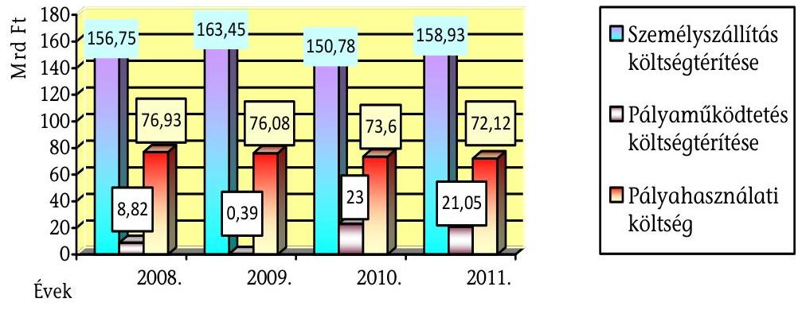

11. ábra

Forrás: MÁV, START adatszolgáltatás

---

A személyszállítás állami költségtérítésének kb. 50\%-a a pályavasúti szolgáltatás díja. A pályamúködtetés állami költségtérítése elmarad a pályafenntartás indokolt költségeinek mértékétől. (12. sz. melléklet)

A MÁV pályamúködési tevékenysége államilag alulfinanszírozott, ami évről évre veszteséget generál. Bevételeinek nagyobb részét a Cégcsoporton belül, mint anyavállalat a csoport tagjaitól belső bevételként szerzi meg. Hatékonysági célkitúzéseiben a veszteségek csökkentése fogalmazódott meg. Költségszintjét 2009-ben 19\%-kal, 2010-ben 3,8\%-kal sikerült lecsökkentenie, ugyanakkor 2011-ben 5,8\%-os növekedés mutatkozott az előző évihez képest. Költségszerkezete is változott, az anyagjellegú ráfordításokban csökkenést, a személyi jellegű kifizetésekben pedig növekedést ért el.

A START 2010-ben anyagjellegú ráfordításaiban 5\% csökkenést, a személyi jellegű kifizetéseknél $2 \%$, az értékcsökkenési leírásnál 5\% emelkedést számolt el, amit mintegy $50 \%$-os egyéb ráfordítás csökkenés ellensúlyoz a késedelmi kamatok jelentős csökkenése következtében.

A személyszállítási üzletág kiszervezésekor a hitellel terhelt vasúti jármúállomány nem került át a START-ba. A vasúti jármúvek zöme (kb. 2500 db ) a MÁV tulajdonában maradt. A személyszállító jármúvek gazdálkodási, finanszírozási, nyilvántartási feladatait továbbra is a MÁV végzi. Ezeket a vasúti jármúveket szolgáltatási szerződéssel - bérleti dí fejében bérbe adja a START-nak.

A GYSEV költségeit 2009. évben az előző évhez viszonyítva 11\%-kal, a következő évben 7\%-kal csökkentette, az árbevétele is hasonló tendenciával 17\%-kal, majd 5\%-kal csökkent. Az állami költségtérítés 8 és 6\%-os növekedése kevésbé kompenzálta ezt, a negatív üzleti eredményt egyik évben sem volt képes nyereséggé átfordítani, csak a veszteség $25 \%$-os csökkenését tudta elérni.

A társaságok hatékonyabb gazdálkodásának költségcsökkentő intézkedései nem mindig érik el céljukat az állami finanszírozás miatt. Ilyen például a pályahálózat korszerú és gazdaságos múködtetése céljából a fejlesztések és karbantartások állami kötelezettségének elmaradása, mely állandó költségnövelő tényezőként múködik. Vannak ugyanakkor olyan költségelemek, amelyeket a társaságok saját hatáskörükben csökkenteni tudnak. A MÁV és START esetében például 3-12\% között mozog azoknak a költségeknek az aránya, amelyekre a cégek menedzsmentjei befolyással bírnak. Ilyen például az irányításhoz kapcsolódó bér és egyéb személyi jellegű kifizetések. A 2010. évi adatok alapján a TRAKCIÓ, de a MÁV központjának a személyi jellegú kifizetései, valamint az egy főre jutó kifizetések - részben az eltérő szakképzettségű és felelősségi körű munkavállalói struktúra miatt - magasan meghaladják a cégcsoportba tartozó többi társaság kifizetéseit (13. sz. melléklet).

A MÁV funkcionális szervezetek egy főre jutó személyi jellegű ráfordításai a 2008. évi 5,2 M Ft/fő/évi összegről 2011. évre 9,5\%-os növekedéssel 5,7 M Ft/fő/év összegre változott. A TRAKCIÓ-nál a növekedés 17,4\%-os volt, 2008-ban 5,5 M Ft/fő/év, míg 2011-ben 6,5 M Ft/fő/év volt a személyi jellegű ráfordítás. A START esetében a növekedés megközelítette a 15\%-ot (14,9\%) és a 2008. évi 3,3 M Ft/fő/év szintről 2011-re 3,8 M Ft/fő/év-re emelkedett. A MÁV pályavasútnál 2008-ban éves szinten az egy főre jutó személyi jellegű ráfordítás 3,3 M Ft volt, szemben a 2011. évi 3,7 M Ft-tal, ami 12,4\%-os növekedést mu-

---

tat. A MÁV csoporton belül a legkisebb növekedés (5\%) a GÉPÉSZET-nél jelentkezett, 2008-ban 3,6 M Ft/fő/év és 2011-ben 3,7 M Ft/fő/év. Az adatokat a 12. sz. ábra mutatja. (Forrás: MÁV adatszolgáltatás)

Egy főre jutó személyi jellegű ráfordítás 2008-2011 között
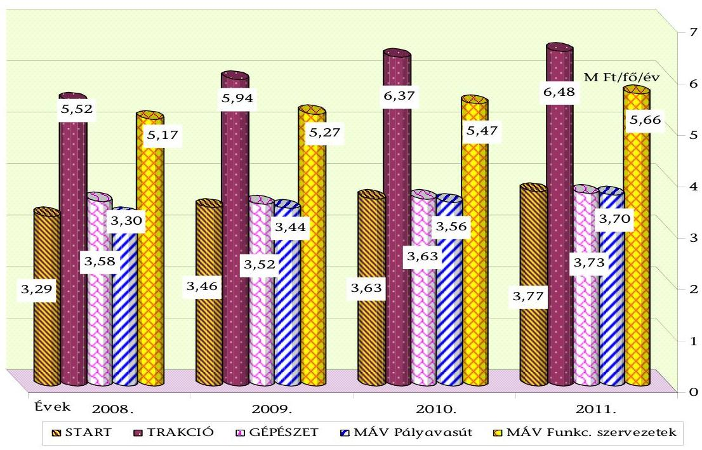

# 12. ábra 

A társaságok ezeket a költségtényezőket tovább gördítik a cégcsoport tagjai felé, beépítve a részükre leszámlázott szolgáltatásaik árába. Az állami költségtérítés mértékének meghatározó tényezője az indokolt költség nagysága. A hatékonyság növelése érdekében végrehajtott költségcsökkentés ugyanakkor befolyásolja az indokolt költséget, ezáltal az állami költségtérítés nagyságát, így ellentétes érdeke van a támogatott társaságoknak.

A MÁV és a GYSEV a vagyonkezelésbe vett eszközök után elszámolt amortizációt elszámolhatja költségként, de azzal egyenlő nagyságú beruházási, eszköz állagmegóvási, ún. visszapótlási kötelezettsége keletkezik az állammal, illetve az MNV Zrt.-vel szemben. A MÁV csoport tagjai és a GYSEV az értékcsökkenési leírást a számviteli törvényben foglaltak és az érvényes értékelési szabályzatuk szerint számolják el.

Az évente képződő értékcsökkenés társaságonként erősen differenciált. Az adott társaság amortizációs költsége, illetve amortizációs politikája hatással van az eredményre, illetve az állami költségtérítés nagyságára, mivel az amortizáció megjelenik az önköltségszámításban.

A vagyonelemek értékcsökkenését meghaladó beruházások a visszapótlási kötelezettség mértékét csökkentik. A visszapótlási kötelezettségek teljesítésének módjáról a Vagyontörvény szerint kizárólag akkor kell megállapodást kötni, ha adott vagyonelemre vonatkozóan a vagyonkezelő vagyonkezelői joga megszűnik.

---

Az MNV Zrt. és a MÁV korábban nem állapodott meg a visszapótlási kötelezettség elszámolásának a módjáról. Az ügyben több egyeztetés történt, az elvekről és eljárásrendről az MNV Zrt. és a MÁV külön megállapodást kíván kötni, terveik szerint még 2012. első félévében. (Szakértői szinten megegyezés született a témában, azonban a megállapodás megkötését nagymértékben akadályozza, hogy a Nemzeti Földalap vagyoni köréhez tartozó vagyonelemekhez kapcsolódó visszapótlási kötelezettség rendezéséről az MNV Zrt. nem jogosult megállapodást kötni.)

A MÁV az állami tulajdonban, és a MÁV kezelésében lévő kincstári eszközök állagmegóvását szolgáló visszapótlási kötelezettségét forrás hiányában nem tudja teljesíteni. 2008. évben a MÁV által kezelt állami vagyon nettó értéke 379658 M Ft volt, ami 2010. év végére 359352 M Ft-ra csökkent.

Az értékcsökkenési leírás tervezett összege 23,8 Mrd Ft-ról 26,1 Mrd Ft-ra nőtt. A 2010. évre tervezett magasabb, 30,2 Mrd Ft-ot a használatba vett, de az MNV Zrt. részéről vagyonkezelésbe nem adott NIF beruházások korábban el nem számolt értékcsökkenési leírása indokolta, ami végül a tényadatokban a céltartalékok között szerepelt. Ugyanakkor a társaság mérlegében nyilvántartott, nem teljesített visszapótlási kötelezettsége a 2008. évi 28486 M Ft-ról 2010. évre 46392 M Ft-ra emelkedett.

A GYSEV által kezelt állami vagyon nettó értéke 2008. évben 7919,7 M Ft, 2010. év végén 5170,6 M Ft volt. A GYSEV az Államtól átvett vagyonelemeket a korábbi években felújította, ezért az elszámolt értékcsökkenés pótlásra fel nem használt összege erejéig az eredménytartalék terhére lekötött tartalékot képzett. Ennek összege a 2008. évi 1851,6 M Ft-ról 2010. évre 2918,3 M Ft-ra nőtt.

Az eszközök bruttó értékét, az elszámolt értékcsökkenést és a támogatási igényt a 13. sz. ábra szemlélteti. (Forrás: MÁV, START, GYSEV adatszolgáltatás.)

A támogatási igény, az eszközök bruttó értéke és az elszámolt értékcsökkenés a MÁV csoportnál és GYSEV-nél 2008-2011 között
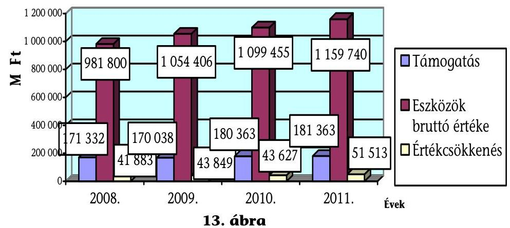

---

# 5. A KORÁBBI ELLENŐRZÉSEK HASZNOSULÁSA 

A vasúti közlekedés korszerűsítésének ellenőrzéséről készült 0815. sz. és a TEN-T pályahálózat V. páneurópai korridor (6. sz. kiemelt európai projekt) vonalán EU támogatással megvalósuló vasútvonal fejlesztések teljesítményellenőrzéséről készült 1006. sz. ÁSZ jelentésben megfogalmazott javaslatok teljesülésének részletes ismertetései az előző fejezetekben találhatóak. A megállapítások, javaslatok az intézkedési tervek ellenére nem, vagy nem teljes körűen hasznosultak:

- A vizsgált időszakban nem jött létre az egységes közlekedéspolitikai stratégia. Nem születtek meg azok a kormányzati döntések, amelyek az egyes közlekedési ágazatokra vonatkozó kormányzati elképzeléseket, azok jövőjét megszabták volna. 2008-2011 között voltak olyan, főleg a fejlesztési tervekben megtestesülő kormányzati elképzelések, amelyek irányt mutattak a vasúttal kapcsolatos tervekhez. Nem történt azonban döntés a közösségi közlekedés egészére, ezen belül az állami preferenciák és szerepvállalás meghatározására;
- A kapacitás-elosztást és pályahasználati díjat - a közlekedésért felelős, illetve a tulajdonosi jogokat gyakorló miniszter évenkénti tervezési irányelvei alapján - a VPE állapítja meg. 2010-től a menetrend-szerkesztésnek a VPE-hez kerülésével az „alapvető funkciók" a hálózati operátoroktól függetlenné váltak. Az EU és a magyar előírások szerinti módon, első ízben a 2010/11. menetrendi évre vonatkozó hálózat-hozzáférési díjak kerültek megállapításra;
- A vasúti személyszállítási kedvezményekre vonatkozó stratégiai célkitűzéseket több stratégiai dokumentum is tartalmazott, amelyek a kedvezmények, illetve azok nyilvántartásának ésszerúsítési követelményét fogalmazták meg. A kérdés megoldása jelenleg is napirenden van;
- A személyszállítási és pályamúködtetési közszolgálati szerződések megkötése lényegében megtörtént, a finanszírozás problémáit azonban a szerződésekben nem oldották meg egyértelmúen;
- A fövárosi és nagyvárosok elővárosi közlekedésének összehangolására, a helyközi közösségi közlekedés regionális átalakításra vonatkozóan előterjesztés készült a Kormány részére, azonban döntés nem született.

Az állami vagyon fejlesztésével, hasznosításával, elidegenítésével kapcsolatos középtávú vagyongazdálkodási stratégia hiányában a tulajdonosi jogokat gyakorló szervezet nem rendelkezett jóváhagyott vagyonpolitikai koncepcióval a MÁV és a GYSEV szerepével és múködésével kapcsolatban.

Budapest, 2012. O 3

Melléklet: 15 db
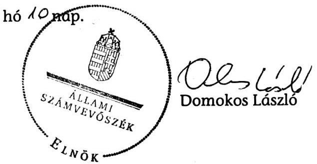

---

# A vasúttársaságok által - múködésre és fejlesztésre felhasznált költségvetési források 2008-2011. években 

|  |  |  |  | adatok: millió Ft-ban |  |
| :--: | :--: | :--: | :--: | :--: | :--: |
| Megnevezés | 2008. | 2009. | 2010. | 2011. | Mindösszesen |
| MÁV Csoport összesen | 197974 | 191408 | 200205 | 259966 | 849553 |
| Fejlesztésre | 3847 | 556 | 360 | 2195 | 6958 |
| Müködésre | 194127 | 190852 | 199845 | 207150 | 791974 |
| ebből:   - fogyasztói árkiegészítés | 20088 | 19963 | 20106 | 21233 | 81290 |
| - személyszállítás költségtérítése | 157033 | 163448 | 150781 | 158927 | 630189 |
| - pályamúködtetés költségtérítése | 8826 | 389 | 23000 | 21050 | 53265 |
| - jövedéki adó visszatérítés | 5322 | 4857 | 5050 | 4933 | 20162 |
| - személyszállítási bevételkiesést pótló támogatás (BEB) | 1784 | 2043 | 856 | 0 | 4683 |
| - egyéb | 1074 | 152 | 52 | 1007 | 2285 |
| Szanálás | 0 | 0 | 0 | 50621 | 50621 |
| GYSEV Zrt. összesen | 7025 | 16346 | 26958 | 18352 | 68681 |
| Fejlesztésre* | 800 | 9908 | 19516 | 9958 | 40182 |
| Müködésre | 6025 | 6438 | 7442 | 8394 | 28299 |
| ebből:   - fogyasztói   árkiegészítés | 546 | 530 | 530 | 580 | 2186 |
| - személyszállítás költségtérítése | 4756 | 5130 | 5500 | 5771 | 21157 |
| - pályamúködtetés költségtérítése | 640 | 690 | 1300 | 1950 | 4580 |
| - jövedéki adó visszatérítés | 83 | 88 | 112 | 93 | 376 |
| Tőkeemelés (tőkejuttatás) | 200 | 0 | 0 | 0 | 200 |
| Mindösszesen | 204999 | 207754 | 227163 | 278318 | 918234 |
| Fejlesztés | 4647 | 10464 | 19876 | 12153 | 47140 |
| Müködésre | 200152 | 197290 | 207287 | 215544 | 820273 |
| Egyéb | 200 | 0 | 0 | 50621 | 50821 |

Forrás: MÁV Zrt., GYSEV Zrt. adatszolgáltatás

* Tartalmazza a Közlekedési Operatív Program keretében felhasznált fejlesztési forrásokat is.

---

2. sz. melléklet
a V-2014-111/2011-2012. sz. jelentéshez

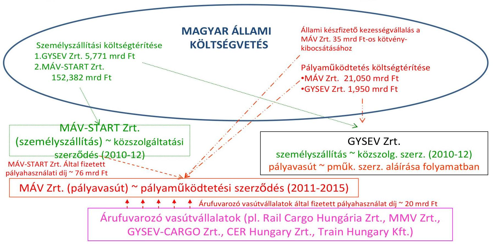

# Vasút pályaműködtetés finanszírozási összefüggései 2011-ben

## MAGYAR ÁLLAMI KÖLTSÉGVETÉS

- **Személyszállítási költségtérítése**: 1. GYSEV Zrt. 5,771 mrd Ft
- **Állami készfizető kezességvállalás**: 2. MÁV Zrt. 35 mrd Ft-os kötvény-kibocsátásához
- **152,382 mrd Ft**
- **Pályaműködtetés költségtérítése**: 1. MÁV Zrt. 21,050 mrd Ft
- **GYSEV Zrt. 1,950 mrd Ft**
- **MÁV-START Zrt. (személyszállítás) ~ közszolgáltatási szerződés (2010-12)**: 1. GYSEV Zrt. személyszállítás ~ közszolgáltatási szerződés (2010-12)
- **MÁV-START Zrt. Által fizetett pályahasználat díj ~ 76 mrd Ft**
- **GYSEV Zrt. (pályavasút) ~ pályaműködtetési szerződés (2011-2015)**
- **Árufuvarozó vasútvállalatok által fizetett pályahasználat díj ~ 20 mrd Ft**
- **Árufuvarozó vasútvállalatok (pl. Rail Cargo Hungária Zrt., MMV Zrt., GYSEV-CARGO Zrt., CER Hungary Zrt., Train Hungary Kft.)**

Forrás: Nemzeti Fejlesztési Minisztérium 2011.

---

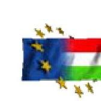

# **Vasútüzemi szolgáltatások a MÁV Zrt. és a kiemelt leányvállalatok között (2011. tény, Mrd Ft-ban)**

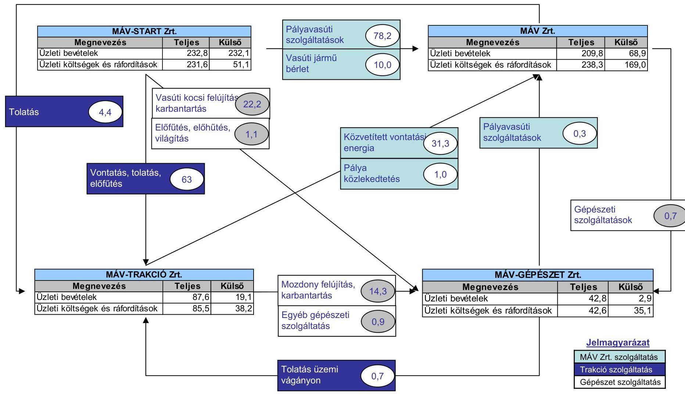

|  MÁV-START Zrt. |  |  |  |  |  |   |
| --- | --- | --- | --- | --- | --- | --- |
|  Megnevezés | Teljes | Külső |  |  |  |   |
|  Üzleti bevételek | 232,8 | 232,1 |  |  |  |   |
|  Üzleti költségek és ráfordítások | 231,6 | 51,1 |  |  |  |   |
|  |   |   |   |   |   |   |
|  Tölatás | 4,4 | Vasúti kocsi felújítás, karbantartás | 22,2 |  |  |   |
|   |  | Előfűtés, előhűtés, világítás | 1,1 |  |  |   |
|   |  |  |  | Közvetített vontatás, energia | 31,3 |   |
|   |  |  |  |  |  | 0,3  |
|   |  |  |  |  |  | 0,7  |
|  |   |   |   |   |   |   |
|  |   |   |   |   |   |   |
|  |   |   |   |   |   |   |
|  |   |   |   |   |   |   |
|  |   |   |   |   |   |   |
|  |   |   |   |   |   |   |
|  |   |   |   |   |   |   |
|  |   |   |   |   |   |   |
|  |   |   |   |   |   |   |
|  |   |   |   |   |   |   |
|  |   |   |   |   |   |   |
|  |   |   |   |   |   |   |
|  |   |   |   |   |   |   |
|  |   |   |   |   |   |   |
|  |   |   |   |   |   |   |
|  |   |   |   |   |   |   |
|  |   |   |   |   |   |   |
|  |   |   |   |   |   |   |
|  |   |   |   |   |   |   |
|  |   |   |   |   |   |   |
|  |   |   |   |   |   |   |
|  |   |   |   |   |   |   |
|  |   |   |   |   |   |   |
|  |   |   |   |   |   |   |
|  |   |   |   |   |   |   |
|  |   |   |   |   |   |   |
|  |   |   |   |   |   |   |
|  |   |   |   |   |   |   |
|  |   |   |   |   |   |   |
|  |   |   |   |   |   |   |
|  |   |   |   |   |   |   |

---

# A MÁV-START Zrt. részére elismert költségtérítés és az anyavállalattól és leányvállalatoktól leszámlázott közszolgáltatási költségek -   2008-2011. években 

|  |  |  |  | Adatok: millió Ft-ban |
| :--: | :--: | :--: | :--: | :--: |
| Megnevezés | 2008. | 2009. | 2010. | 2011. Terv |
| Állami   (indokoltnak   elismert)   költségtérítés | 156753 | 161354 | 153732 | 152382 |
| MÁV Zrt. pályavasüti   szolgáltatása | 76931 | 77900 | 74535 | 72522 |
| MÁV-TRAKCIÓ Zrt.   Vontatási   szolgáltatása | 62303 | 62487 | 58675 | 57300 |
| MÁV Gépészet Zrt.   jármú karbantartási   szolgáltatása | 19905 | 18557 | 17850 | 17373 |
| Alapvetö   szolgáltatások   ráfordításai   összesen: | 159139 | 158944 | 151060 | 147195 |
| Fennmaradó   összeg a 3   alapvetően   szükséges   szolgáltatás   megtérítése után | $-2386$ | 2410 | 2672 | 5187 |

Forrás: - a közszolgálati jelentést elfogadó minisztériumi iratok;

- MÁV Zrt.

---

A MÁV-START Zrt. költségtérítési adatai a 2008-2011. években

|   |  | Adatok: millió Ft-ban |  |   |
| --- | --- | --- | --- | --- |
|  Megnevezés | 2008 | 2009 | 2010 | 2011 várható  |
|  Kormányrendelet száma | 55/2008 | 110/2009 | 20/2010 | 32/2011  |
|  Megjelenés dátuma | 2008.03.26 | 2009.05.22 | 2010.02.09 | 2011.03.17  |
|  Folyósítás alapja: Pénzforgalmi terv, aláírásának dátuma: | 2008.03.28 |  |  |   |
|  Folyósítás alapja: Záradék, aláírásának dátuma: |  | 2009.06.10 | 2010.04.23 | 2011.06.03  |
|  Tárgyévi költségtérítés első folyósításának dátuma | 2008.04.01 | 2009.07.06 | 2010.03.10 | 2011.06.17  |
|  Első folyósítás összege | 21000 | 15000 | 6000 | 9568  |
|  Tárgyévben folyósított összeg (korábbi évi+adott évi) | 160000 | 152057 | 143034 | 153 000*  |
|  Tárgyévet követő évre átcsúszó | 8334 | 19725 | 21447 | 20 829*  |

Forrás: MÁV Zrt., MÁV START Zrt adatszolgáltatás

---

# Lehívott hitelek a MÁV Zrt.-nél, illetve a MÁV csoportnál a 2008-2011. években 

Adatok: millió Ft-ban

|  | 2008. |  | 2009. |  | 2010. |  | 2011. |
| :--: | :--: | :--: | :--: | :--: | :--: | :--: | :--: |
| Megnevezés | MÁV Zrt. | Konszolidált | MÁV Zrt. | Konszolidált | MÁV Zrt. | Konszolidált | MÁV Zrt. |
| Múködési hitelek | 121500 | 122146 | 113500 | 114053 | 102500 | 102860 | 22800 |
| - állami kezesi | 121500 | 121500 | 113500 | 113500 | 102500 | 102500 | 22800 |
| - nem állami kezesi | 0 | 646 | 0 | 553 | 0 | 360 | 0 |
| Beruházási hitelek | 98496 | 140337 | 111990 | 157349 | 115877 | 168884 | 111466 |
| - állami kezesi | 34435 | 73787 | 34826 | 75004 | 35338 | 74046 | 31680 |
| - nem állami kezesi | 64061 | 66550 | 77164 | 82345 | 80539 | 94838 | 79786 |
| Vállalkozói kölcsön | 565 | 0 | 2273 | 3955 | 3379 | 4564 | 5049 |
| Rövid lej.hitel | 146 | 1839 | 91 | 3670 | 3489 | 5019 | 26114 |
| Hitelállomány | 220707 | 264322 | 227854 | 279027 | 225245 | 281327 | 165429 |
| Kötvény (állami kezesi) | 0 | 0 | 0 | 0 | 10000 | 10000 | 45000 |
| Összesen | 220707 | 264322 | 227854 | 279027 | 235245 | 291327 | 210429 |

Forrás: MÁV 2008-2010. évi beszámolói, ill. 2012. április 3-i adatszolgáltatása

---

# Hitelek a GYSEV Zrt.-nél a 2008-2010. években

|  Adatok: millió Ft-ban |  |  |   |
| --- | --- | --- | --- |
|  megnevezés | 2008. | 2009. | 2010.  |
|  Működési hitelek |  | 308 | 1628  |
|  - állami kezesi |  |  |   |
|  - nem állami kezesi |  | 308 | 1628  |
|  Beruházási hitelek | 2696 | 2214 | 2712  |
|  - állami kezesi | 2368 | 2099 | 1827  |
|  - nem állami kezesi | 328 | 115 | 885  |
|  Vállalkozói kölcsön |  |  |   |
|  Rövid lejáratú hitel |  |  |   |
|  Hitelállomány összesen | 2696 | 2522 | 4340  |
|  Kötvény (állami kezesi) |  |  |   |

Forrás: GySEV. 2012. március 30-i adatszolgáltatása

---

# A MÁV Zrt. pályavasút múködtetése költségtérítésének havi bontás szerinti folyósítása a 2008-2011. években 

|  | Adatok: millió Ft-ban |  |  |  |
| :-- | --: | --: | --: | --: |
| Időszak | $2008^{*}$ | 2009 | 2010 | 2011 |
| január | 0 | 0 | 0 | 0 |
| február | 0 | 0 | 0 | 0 |
| március | 0 | 0 | 0 | 0 |
| április | 3035 | 0 | 0 | 0 |
| május | 759 | 0 | 0 | 21050 |
| június | 759 | 0 | 0 | 0 |
| július | 759 | 389 | 0 | 0 |
| augusztus | 759 | 0 | 0 | 0 |
| szeptember | 759 | 0 | 0 | 0 |
| október | 759 | 0 | 0 | 0 |
| november | 759 | 0 | 23000 | 0 |
| december | 759 | 0 | 0 | 0 |
| Összesen | 9107 | 389 | 23000 | 21050 |

* 2008. évben 280 M Ft keskeny nyomközű vasutakra kapott költségtérítési is folyósításra került

Forrás: MÁV Zrt. adatszolgáltatása

---

|   | A MÁV csoportszintű bevételei és ráfordításai a 2008-2011. években |  |  |  |  |  |  |  |  |  |  |  |  |   |
| --- | --- | --- | --- | --- | --- | --- | --- | --- | --- | --- | --- | --- | --- | --- |
|  2008. | Adatok millió Ft-ban |  |  |  |  |  |  |  |  |  |  |  |  |   |
|   | Megnevezés | MÁV Zrt. anyavállalat összesen | Ebből: Konszolidációba teljeskörü- en bevont | Arány
\% | START Zrt. összesen | Ebből: Konszolidációba teljeskörü- en bevont | Arány
\% | TRAKCIÓ Zrt összesen | Ebből: Konszolidációba teljeskörü-en bevont** | Arány
\% | GÉPÉSZET Zrt. összesen | Ebből: Konszolidációba teljeskörü- en bevont | Arány
\% | 4 kiemelt cég összesen  |
|   |  |  |  |  |  |  |  |  |  |  |  |  |  | Ebből: Konszolidációba teljeskörü- en bevont  |
|  2009. | Értékesítés nettó árbevétele* | 199 625 | 157 067 | 79\% | 64 988 | 210 | 0\% | 93014 | 73708 | 79\% | 39296 | 36579 | 93\% | 396923  |
|   | Egyéb bevételek | 73559 | 43888 | 60\% | 159158 | 371 | 0\% | 267 | 263 | 99\% | 586 | 511 | 87\% | 233570  |
|   | Aktívált saját teljesítmények | 3408 | 0 | 0\% | 0 | 0 | - | 0 | 0 | - | -77 | 0 | 0\% | 3331  |
|   | Pénzügyi műveletek bevételei | 72155 | 359 | 0\% | 1056 | 2 | 0\% | 599 | 0 | 0\% | 313 | 0 | 0\% | 74123  |
|   | Rendkívüli bevételek | 54776 | 40041 | 73\% | 2 | 0 | 0\% | 0 | 0 | - | 6 | 0 | 0\% | 54786  |
|   | Bevételek összesen: | 403525 | 241355 | 60\% | 225204 | 583 | 0\% | 93880 | 73971 | 79\% | 40125 | 37090 | 92\% | 762734  |
|   |  |  |  |  |  |  | Ráfordítások |  |  |  |  |  |  |   |
|   | Anyagjellegű ráfordítások | 121276 | 81729 | 67\% | 191884 | 177601 | 93\% | 55795 | 53544 | 96\% | 20309 | 7409 | 36\% | 389264  |
|   | Személyi jellegű ráfordítások | 76333 | 0 | 0\% | 23817 | 41 | 0\% | 28180 | 0 | 0\% | 14640 | 0 | 0\% | 142970  |
|   | Értékcsökkenési leírás | 34511 | 0 | 0\% | 5688 | 0 | 0\% | 4869 | 0 | 0\% | 778 | 0 | 0\% | 45846  |
|   | Egyéb ráfordítások | 66800 | 48042 | 72\% | 3308 | 802 | 24\% | 3417 | 413 | 12\% | 3700 | 182 | 5\% | 77225  |
|   | Pénzügyi műveletek ráfordításai | 20853 | 1455 | 7\% | 433 | 4 | 1\% | 1432 | 107 | 7\% | 91 | 0 | 0\% | 22809  |
|   | Rendkívüli ráfordítások | 40836 | 38352 | 54\% | 17 | 0 | 0\% | 0 | 0 | - | 4 | 0 | 0\% | 40859  |
|   | Ráfordítások összesen: | 360611 | 169578 | 47\% | 225147 | 178448 | 79\% | 93693 | 54064 | 58\% | 39522 | 7591 | 19\% | 718973  |
|   | Éredmény | 42914 | 71777 | 167\% | 57 | $-177865$ | - | 187 | 19907 | - | 603 | 29499 | - | 43761  |
|  2009. | Megnevezés | MÁV Zrt. anyavállalat összesen | Ebből: Konszolidációba teljeskörü- en bevont | Arány
\% | START Zrt. összesen | Ebből: Konszolidációba teljeskörü- en bevont | Arány
\% | TRAKCIÓ Zrt összesen | Ebből: Konszolidációba teljeskörü-en bevont** | Arány
\% | GÉPÉSZET Zrt. összesen | Ebből: Konszolidációba teljeskörü- en bevont | Arány
\% | 4 kiemelt cég összesen  |
|   |  |  |  |  |  |  |  |  |  |  |  |  |  | Ebből: Konszolidációba teljeskörü- en bevont  |
|  2009. | Értékesítés nettó árbevétele* | 180020 | 146577 | 81\% | 64971 | 332 | 1\% | 90206 | 73499 | 81\% | 42956 | 40882 | 95\% | 378153  |
|   | Egyéb bevételek | 37528 | 5302 | 14\% | 167327 | 363 | 0\% | 2275 | 947 | 42\% | 2417 | 279 | 12\% | 209547  |
|   | Aktívált saját teljesítmények | 2932 | 0 | 0\% | 0 | 0 | - | 37 | 0 | 0\% | 1626 | 0 | 0\% | 4594  |
|   | Pénzügyi műveletek bevételei | 5223 | 85 | 2\% | 817 | 2 | 0\% | 244 | 0 | 0\% | 167 | 0 | 0\% | 6451  |
|   | Rendkívüli bevételek | 22 | 0 | 0\% | 0 | 0 | 0\% | 0 | 0 | 0\% | 14 | 0 | 0\% | 36  |
|   | Bevételek összesen: | 225725 | 151964 | 67\% | 233116 | 697 | 0\% | 92761 | 74446 | 80\% | 47180 | 41161 | 87\% | 598783  |
|   |  |  |  |  |  |  | Ráfordítások |  |  |  |  |  |  |   |
|   | Anyagjellegű ráfordítások | 111306 | 72414 | 65\% | 195069 | 180248 | 92\% | 49856 | 47629 | 96\% | 25706 | 6849 | 27\% | 381937  |
|   | Személyi jellegű ráfordítások | 76753 | 0 | 0\% | 25503 | 21 | 0\% | 30072 | 0 | 0\% | 17942 | 0 | 0\% | 150269  |
|   | Értékcsökkenési leírás | 36357 | 0 | 0\% | 5766 | 0 | 0\% | 7225 | 0 | 0\% | 775 | 0 | 0\% | 50123  |
|   | Egyéb ráfordítások | 17922 | 2530 | 14\% | 5685 | 4276 | 75\% | 3442 | 992 | 29\% | 2536 | 445 | 18\% | 29586  |
|   | Pénzügyi műveletek ráfordításai | 17100 | 822 | 5\% | 932 | 0 | 0\% | 2096 | 0 | 0\% | 176 | 0 | 0\% | 20304  |
|   | Rendkívüli ráfordítások | 219 | 20 | 9\% | 3 | 0 | 0\% | 0 | 0 | 0\% | 1 | 0 | 0\% | 223  |
|   | Ráfordítások összesen: | 259657 | 75786 | 29\% | 232958 | 184545 | 79\% | 92691 | 48621 | 52\% | 47136 | 7294 | 15\% | 632442  |
|   | Éredmény | $-33932$ | 76178 | - | 157 | $-183848$ | - | 71 | 25825 | - | 44 | 33867 | - | $-33660$  |
|   | * Leányvállalatok esetében a MÁV Zrt. kapcsolat ELABE és közvetített szolgáltatások nélkül |  |  |  |  |  |  |  |  |  |  |  |  |   |
|   | ** A MÁV-TRAKCIÓ Zrt. konszolidációba teljeskörüen bevont anyagjellegü ráfordítás adatai jövedéki adó visszatérítéssel korrigálva (2008: 5.311 M Ft; 2009: 4.845 M Ft; 2010: 5.037 M Ft; 2011: 4.685 M Ft) |  |  |  |  |  |  |  |  |  |  |  |  |   |

---

8. sz. melléklet

a V-2014-111/2011-2012. sz. jelentéshez

|  2010 | Adatok millió Ft-ban |  |  |  |  |  |  |  |  |  |  |  |  |  |   |
| --- | --- | --- | --- | --- | --- | --- | --- | --- | --- | --- | --- | --- | --- | --- | --- |
|   | Megnevezés | MÁV Zrt. anyavállalat összesen | Ebből: Konszolidációba teljeskörűen bevont | Arány % | START Zrt. összesen | Ebből: Konszolidációba teljeskörűen bevont | Arány % | TRAKCIÓ Zrt összesen | Ebből: Konszolidációba teljeskörűen bevont** | Arány % | GÉPÉSZET Zrt. összesen | Ebből: Konszolidációba teljeskörűen bevont | Arány % | 4 kiemelt cég összesen | Ebből: Konszolidációba teljeskörűen bevont  |
|   |  |  |  |  |  |  |  | Bevételek |  |  |  |  |  |  |   |
|   |  |  |  |  |  |  |  |  |  |  |  |  |  |  |   |
|   | Értékesítés nettó árbevétele* | 170 428 | 134 640 | 79% | 68 058 | 181 | 0% | 84 534 | 68 752 | 81% | 42 760 | 40 535 | 95% | 365 779 | 244 108  |
|   | Egyéb bevételek | 34 639 | 1 639 | 5% | 152 959 | 391 | 0% | 953 | 273 | 29% | 1 164 | 53 | 5% | 189 715 | 2 356  |
|   | Aktívált saját teljesítmények | 2 616 | 0 | 0% | 0 | 0 |  | 84 | 0 | 0% | -434 | 0 | 0% | 2 266 | 0  |
|   | Pénzügyi műveletek bevételei | 2 164 | 759 | 35% | 356 | 0 | 0% | 275 | 1 | 0% | 31 | 0 | 0% | 2 827 | 760  |
|   | Rendkívüli bevételek | 337 | 269 | 80% | 134 | 134 | 100% | 38 | 38 | 101% | 51 | 37 | 72% | 560 | 478  |
|   | Bevételek összesen: | 210 184 | 137 307 | 65% | 221 507 | 706 | 0% | 85 884 | 69 064 | 80% | 43 571 | 40 625 | 93% | 561 146 | 247 702  |
|   |  |  |  |  |  |  |  |  |  |  |  |  |  |  |   |
|   |  |  |  |  |  |  |  |  |  |  |  |  |  |  |   |
|   | Anyagjellegű ráfordítások | 100 898 | 63 913 | 63% | 186 114 | 170 057 | 91% | 43 661 | 41 237 | 94% | 23 908 | 5 426 | 23% | 354 580 | 280 633  |
|   | Személyi jellegű ráfordítások | 75 134 | 0 | 0% | 26 081 | 14 | 0% | 26 504 | 0 | 0% | 16 332 | 0 | 0% | 144 050 | 14  |
|   | Értékcsökkenési leírás | 35 511 | 0 | 0% | 6 141 | 0 | 0% | 8 057 | 0 | 0% | 919 | 0 | 0% | 50 628 | 0  |
|   | Egyéb ráfordítások | 22 843 | 1 755 | 8% | 2 763 | 1 409 | 51% | 5 797 | 449 | 8% | 2 075 | 414 | 20% | 33 478 | 4 027  |
|   | Pénzügyi műveletek ráfordításai | 10 662 | 628 | 6% | 179 | 0 | 0% | 1 399 | 0 | 0% | 122 | 0 | 0% | 12 362 | 628  |
|   | Rendkívüli ráfordítások | 965 | 697 | 72% | 5 | 0 | 0% | 4 | 0 | 0% | 45 | 0 | 0% | 1 019 | 697  |
|   | Ráfordítások összesen: | 246 013 | 66 993 | 27% | 221 282 | 171 480 | 77% | 85 423 | 41 686 | 49% | 43 401 | 5 840 | 13% | 596 118 | 285 999  |
|   | Éredmény | -35 828 | 70 314 | - | 226 | -170 774 | - | 461 | 27 378 | - | 170 | 34 785 | - | -34 972 | -38 297  |
|  2011 | Adatok millió Ft-ban | TERV |  |  |  |  |  |  |  |  |  |  |  |  |   |
|   |  |  |  |  |  |  |  |  |  |  |  |  |  |  |   |
|   |  |  |  |  |  |  |  |  |  |  |  |  |  |  |   |
|   | Megnevezés | MÁV Zrt. anyavállalat összesen | Ebből: Konszolidációba teljes körűen bevont | Arány % | START Zrt. összesen | Ebből: Konszolidációba teljes körűen bevont | Arány % | TRAKCIÓ Zrt összesen | Ebből: Konszolidációba teljes körűen bevont** | Arány % | GÉPÉSZET Zrt. összesen | Ebből: Konszolidációba teljes körűen bevont | Arány % | 4 kiemelt cég összesen | Ebből: Konszolidációba teljes körűen bevont  |
|   |  |  |  |  |  |  |  | Bevételek |  |  |  |  |  |  |   |
|   |  |  |  |  |  |  |  |  |  |  |  |  |  |  |   |
|   | Értékesítés nettó árbevétele* | 167 639 | 137 923 | 82% | 70 569 | 328 | 0% | 83 404 | 67 081 | 80% | 42 483 | 41 188 | 97% | 364 095 | 246 520  |
|   | Egyéb bevételek | 37 052 | 239 | 1% | 156 832 | 440 | 0% | 60 | 0 | 0% | 414 | 0 | 0% | 194 358 | 679  |
|   | Aktívált saját teljesítmények | 3 397 | -240 | -7% | 0 | 0 | - | 0 | 0 | - | 685 | 0 | 0% | 4 082 | -240  |
|   | Pénzügyi műveletek bevételei | 1 984 | 931 | 47% | 107 | 0 | 0% | 150 | 0 | 0% | 12 | 0 | 0% | 2 253 | 931  |
|   | Rendkívüli bevételek | 139 830 | 0 | 0% | 0 | 0 |  | 0 | 0 | - | 0 | 0 |  | 139 830 | 0  |
|   | Bevételek összesen: | 349 902 | 138 853 | 40% | 227 509 | 768 | 0% | 83 614 | 67 081 | 80% | 43 594 | 41188 | 94% | 704 619 | 247 890  |
|   |  |  |  |  |  |  |  |  |  |  |  |  |  |  |   |
|   |  |  |  |  |  |  |  |  |  |  |  |  |  |  |   |
|   | Anyagjellegű ráfordítások | 114 125 | 64 414 | 56% | 190 635 | 173 892 | 91% | 43 419 | 40 333 | 93% | 24 842 | 4 992 | 20% | 373 021 | 283 631  |
|   | Személyi jellegű ráfordítások | 75 468 | 0 | 0% | 27 463 | 0 | 0% | 27 157 | 0 | 0% | 16 349 | 0 | 0% | 146 437 | 0  |
|   | Értékcsökkenési leírás | 35 502 | 0 | 0% | 6 439 | 0 | 0% | 8 662 | 0 | 0% | 966 | 0 | 0% | 51 569 | 0  |
|   | Egyéb ráfordítások | 22 961 | 447 | 2% | 2 593 | 13 | 0% | 2 426 | 219 | 9% | 1 291 | 0 | 0% | 29 272 | 679  |
|   | Pénzügyi műveletek ráfordításai | 15 743 | 0 | 0% | 379 | 0 | 0% | 1 828 | 0 | 0% | 134 | 0 | 0% | 18 084 | 0  |
|   | Rendkívüli ráfordítások | 265 | 0 | 0% | 0 | 0 |  | 0 | 0 | - | 1 | 0 | 0% | 266 | 0  |
|   | Ráfordítások összesen: | 264 064 | 64 861 | 25% | 227 509 | 173 904 | 76% | 83 493 | 40 552 | 49% | 43 582 | 4992 | 11% | 618 648 | 284 310  |
|   | Éredmény | 85 838 | 73 992 | - | 0 | -173 136 | - | 121 | 26 529 | - | 11 | 36 196 | - | 85 971 | -36 419  |
|   | * Leányvállalatok esetében a MÁV Zrt. kapcsolat ELABE és közvetített szolgáltatások nélkül |  |  |  |  |  |  |  |  |  |  |  |  |  |  |   |
|   | ** A MÁV-TRAKCIÓ Zrt. konszolidációba teljes körűen bevont anyagjellegű ráfordítás adatai jövedékı adó visszatérítéssel korrigálva (2008: 5.311 M Ft; 2009: 4.845 M Ft; 2010: 5.037 M Ft; 2011: 4.685 M Ft) |  |  |  |  |  |  |  |  |  |  |  |  |  |  |   |
|   | Forrás: MÁV csoport |  |  |  |  |  |  |  |  |  |  |  |  |  |  |   |

---

# A MÁV csoport adófizetési halasztásai 2008-2011. években

|  Halasztott kötelezettség (eFt) |  |  |  |  |  |  |   |
| --- | --- | --- | --- | --- | --- | --- | --- |
|  Eredeti
esedékesség | Halasztás
lejárata | Adónem | Adóne
m köd | MÁV Zrt. | MÁV-TRAKCIÓ
Zrt. | MÁV-GÉPÉSZET
Zrt. | Összesen  |
|  2008.06.20 | 2008.07.04 | AFA | 104 | 7558367 | 0 | 0 | 7558367  |
|  2009.06.12 | 2009.08.12 | Nyugdíjbiztosítási járulék | 125 | 1054693 | 426601 | 240297 | 1721591  |
|   |  | Egészségibiztosítási járulék | 124 | 219729 | 88875 | 50062 | 358666  |
|   |  | Egészségügyi hozzájárulás %-os | 152 | 39330 | 9586 | 9397 | 58313  |
|   |  | Korkedvezménybiztosítási járulék | 187 | 21832 | 96215 | 29837 | 147884  |
|   |  | Összes TB halasztás |  | 1335584 | 621277 | 329593 | 2286454  |
|  2009.06.20 | 2009.08.24 | AFA |  | 992943 | 399099 | 358436 | 1750478  |
|  2009.12.14 | 2010.02.12 | Nyugdíjbiztosítási járulék | 125 | 1118036 |  |  | 1118036  |
|   |  | Egészségibiztosítási járulék | 124 | 150966 |  |  | 150966  |
|   |  | Munkaadói járulék | 144 | 85010 |  |  | 85010  |
|   |  | Egészségügyi hozzájárulás %-os | 152 | 38218 |  |  | 38218  |
|   |  | Korkedvezménybiztosítási járulék | 187 | 19667 |  |  | 19667  |
|   |  | Összes TB halasztás |  | 1411897 |  |  | 1411897  |
|  2010.01.12 | 2010.02.12 | Nyugdíjbiztosítási járulék | 125 | 1080506 |  |  | 1080506  |
|   |  | Egészségibiztosítási járulék | 124 | 143028 |  |  | 143028  |
|   |  | Munkaadói járulék | 144 | 79303 |  |  | 79303  |
|   |  | Egészségügyi hozzájárulás %-os | 152 | 38061 |  |  | 38061  |
|   |  | Korkedvezménybiztosítási járulék | 187 | 20072 |  |  | 20072  |
|   |  | Összes TB halasztás |  | 1360970 |  |  | 1360970  |
|  2009.12.21 | 2010.02.22 | AFA |  | 1473329 |  |  | 1473329  |
|  2011.04.12 | 2011.05.12 | Személyi jövedelemadó | 103 | 50529 | 11402 |  | 61931  |
|   |  | Nyugdíjbiztosítási járulék | 125 | 1018299 | 344904 | 212589 | 1575792  |
|   |  | Korkedvezmény-biztosítási járulék | 187 | 38231 | 149552 |  | 187783  |
|   |  | Egészségügyi hozzájárulás %-os | 152 | 4271 | 1172 |  | 5443  |
|   |  | Egészségbiztosítási és munkaerőpiaci járulék | 188 | 127289 | 43113 | 26574 | 196976  |
|   |  | Összes TB halasztás |  | 1238619 | 550143 | 239163 | 2027925  |
|  2011.04.20 | 2011.05.20 | AFA | 104 | 1797056 | 467977 | 348687 | 2613720  |
|   |  | Rehabilitációs hozzájárulás | 119 | 219110 | 0 | 49937 | 269047  |
|   |  | Innovációs járulék | 184 | 48470 | 0 |  | 48470  |
|   |  | Összes TB halasztás |  | 2064636 | 467977 | 398624 | 2931237  |
|  2011.06.14 | 2011.07.12 | Személyi jövedelemadó | 103 | 178082 | 33694 | 34736 | 246512  |
|   |  | Nyugdíjbiztosítási járulék | 125 | 1098563 | 344692 | 31934 | 1475189  |
|   |  | Korkedvezmény-biztosítási járulék | 187 | 137322 | 147626 | 0 | 284948  |
|   |  | Egészségügyi hozzájárulás %-os | 152 | 38226 | 1877 | 0 | 40103  |
|   |  | Egészségbiztosítási és munkaerőpiaci járulék | 188 | 4812 | 43087 | 28931 | 76830  |
|   |  | Összes TB halasztás |  | 1457005 | 570976 | 95601 | 2123582  |

Tekintettel arra, hogy a MÁV-START Zrt. a költségvetéssel szemben követelő pozícióban van, ezért adót nem halaszt.

**Forrás: MÁV csoport adatszolgáltatása**

---

10. sz. melléklet a

a V-2014-111/2011-2012. sz. jelentéshez

# Szakmai irányítás, felügyelet, tulajdonosi joggyakorlás 2011-ben 

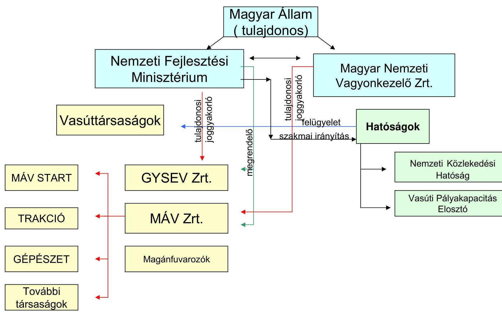

---

# Pályavasúti minőségi mutatók alakulása 2008-2011. években

|   | Vonatközlekedést zavaró kisfeszültségi hibák száma (db) |  | Vonatközlekedést zavaró távközlő hibák száma (db |  | Vonatközlekedést zavaró erősáramú hibák száma (db) |  | Vonatközlekedést zavaró biztosítóberendezési hibák száma (db |  | Állandó sebességkorlátozás (km) |  | Ideiglenes sebességkorlátozás (km) |  | Pályaállapot miatti ideiglenes sebe-ség-korlátozások mutatója (SM tényező |   |
| --- | --- | --- | --- | --- | --- | --- | --- | --- | --- | --- | --- | --- | --- | --- |
|   | MÁV | GYSEV | MÁV | GYSEV | MÁV | GYSEV | MÁV | GYSEV | MÁV | GYSEV | MÁV | GYSEV | MÁV | GYSEV  |
|  2008 | 4388 | 0 | 15124 | 6 | 3599 | 1 | 81944 | 897 | 3306 | 11 | 440 | 9 | 299495 | 6049  |
|  2009 | 3651 | 0 | 13267 | 10 | 3524 | 1 | 79406 | 903 | 3340 | 11 | 476 | 10 | 309371 | 6217  |
|  2010 | 3806 | 0 | 14298 | 8 | 4779 | 2 | 82439 | 919 | 3351 | 10 | 566 | 10 | 391382 | 6878  |
|  2011 | 2564 | 0 | 11592 | 5 | 4567 | 2 | 77374 | 1028 | 3421 | 25 | 579 | 12 | 290888 | 7143  |

Forrás: MÁV, GYSEV adatszolgáltatásai

---

# A MÁV Zrt. által működtetett vasúti pályahálózat bevételei és ráfordításai a tevékenységi kimutatás alapján 2008-2011. években 

Adatok: millió Ft-ban

| Megnevezés | 2008. | 2009. | 2010. | 2011. |
| :--: | :--: | :--: | :--: | :--: |
| Üzleti hozamok | 171347 | 154713 | 168373 | 170465 |
| Árbevétel | 155275 | 143961 | 139339 | 139889 |
| Belső bevételek | 1004 | 1139 | 1048 | 1472 |
| Aktivált saját teljesítmények | 2805 | 2157 | 2362 | 2509 |
| Egyéb bevételek | 12263 | 7456 | 25624 | 26.595 |
| ebből: állami ktg. térítés | 8826 | 389 | 23000 | 21050 |
| Üzemi/Üzleti ráfordítások | 193277 | 186711 | 191982 | 194122 |
| Anyagjellegú ráfordítások | 81309 | 77855 | 73860 | 76863 |
| Belső ráfordítások | 22444 | 16765 | 19403 | 18814 |
| ebből: -belső szolgáltatások | 15177 | 12349 | 14651 | 14668 |
| -közp. irányítás üzlet-   ágra osztott ktg-e | 7267 | 4416 | 4752 | 4146 |
| Személyi jellegű ráfordítások | 59005 | 59991 | 59376 | 59899 |
| Értékcsökkenés | 23409 | 25058 | 25555 | 26070 |
| Egyéb ráfordítások | 7110 | 7042 | 13788 | 12476 |
| Üzleti tevékenység   eredménye | $-21930$ | $-31998$ | $-23609$ | $-23657$ |
| Pénzügyi és rendkívüli   eredmény | $-3582$ | $-3817$ | $-2544$ | 9137 |
| Mérleg szerinti eredmény | $-25512$ | $-35815$ | $-26153$ | $-14520$ |

Forrás: MÁV Zrt. adatszolgáltatása

---

# Személyi jellegű ráfordítások a 2008-2011. években 

| 2008. év | MÁV-   START Zrt. | MÁV-   TRAKCIÓ   Zrt. | MÁV-   GÉPÉSZET   Zrt.* | MÁV Zrt.   Pályavasút üzletág** | MÁV Zrt.   Funkcionális szervezetek |
| :--: | :--: | :--: | :--: | :--: | :--: |
| Személyi jellegű ráfordítások egyszeri nélkül (Mrd Ft) | 23,2 | 28,1 | 17,7 | 57,5 | 16,2 |
| Átlagos állományi létszám (fő) | 7050 | 5081 | 4935 | 17438 | 3128 |
| 1 főre jutó személyi jellegü ráfordítás (Ft/fő/év) | 3290496 | 5520567 | 3582168 | 3295905 | 5165921 |
| 1 före jutó személyi jellegü ráfordítás (Ft/fő/hó) | 274208 | 460047 | 298514 | 274659 | 430493 |
| 2009. év |  |  |  |  |  |
| Személyi jellegű ráfordítások egyszeri nélkül (Mrd Ft) | 25,0 | 28,7 | 16,8 | 58,0 | 15,8 |
| Átlagos állományi létszám (fő) | 7224 | 4841 | 4779 | 16877 | 2991 |
| 1 före jutó személyi jellegü ráfordítás (Ft/fő/év) | 3458743 | 5937326 | 3517891 | 3439245 | 5270313 |
| 1 före jutó személyi jellegü ráfordítás (Ft/fő/hó) | 288229 | 494777 | 293158 | 286604 | 439193 |
| 2010. év |  |  |  |  |  |
| Személyi jellegű ráfordítások egyszeri nélkül (Mrd Ft) | 25,7 | 26,3 | 15,7 | 58,2 | 14,2 |
| Átlagos állományi létszám (fő) | 7085 | 4125 | 4323 | 16338 | 2592 |
| 1 före jutó személyi jellegü ráfordítás (Ft/fő/év) | 3629130 | 6367609 | 3629097 | 3564261 | 5471708 |
| 1 före jutó személyi jellegü ráfordítás (Ft/fő/hó) | 302427 | 530634 | 302425 | 297022 | 455976 |
| 2011. év tény |  |  |  |  |  |
| Személyi jellegű ráfordítások egyszeri nélkül (Mrd Ft) | 26,8 | 26,3 | 15,6 | 59,1 | 13,9 |
| Átlagos állományi létszám (fő) | 7104 | 4063 | 4170 | 15963 | 2458 |
| 1 före jutó személyi jellegü ráfordítás (Ft/fő/év) | 3772597 | 6480150 | 3731998 | 3704402 | 5658305 |
| 1 före jutó személyi jellegü ráfordítás (Ft/fő/hó) | 314383 | 540013 | 311000 | 308700 | 471525 |

* A MÁV Szolnoki Jármújavító Kft. és a MÁV Északi Jármújavító Kft. 2008. június 30 -án beolvadt a MÁV Gépészet Zrt.-be, a 2008-as adatok tartalmazzák a járműjavítók első féléves értékeit
* *személyszállítási keskeny-nyomkőzủ vasúttal együtt

Forrás: MÁV csoport adatszolgáltatásai

---

# A jelentéstervezetre tett észrevételek és az azokra adott válaszok 

1. A nemzeti fejlesztési miniszter észrevétele és az arra adott válaszunk
2. A nemzetgazdasági miniszter észrevétele és az arra adott válaszunk
3. A Magyar Nemzeti Vagyonkezelő Zrt. vezérigazgatójának észrevétele és az arra adott válaszunk
4. A Nemzeti Közlekedési Hatóság elnökének észrevétele
5. A Vasúti Pályakapacitás-elosztó Kft. ügyvezető igazgatójának észrevétele
6. A Magyar Államvasutak Zrt. elnök-vezérigazgatójának észrevétele és az arra adott válaszunk
7. Győr-Sopron-Ebenfurti Vasúti Zrt. vezérigazgatójának észrevétele és az arra adott válaszunk

---

.

---

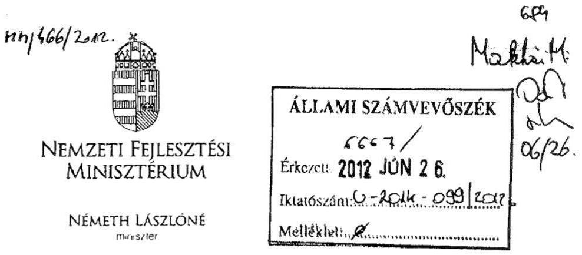

Iktatószám: NFM/11177/4/2012.
Hiv. sz.: V-2014-081/2011-2012.

# Domokos László 

## részére

elnök
Állami Számvevőszék

Budapest
Apáczai Csere János u. 10.
1052

Tárgy: a vasúti közlekedés állami támogatási rendszerének ellenőrzéséről készített jelentéstervezet véleményezése

Tisztelt Elnök Úr!

Köszönettel vettem az ÁSZ " a vasúti közlekedés állami támogatási rendszerének ellenőrzéséről" készített jelentés-tervezetét, mellyel kapcsolatosan az alábbi észrevételeket tesszük:

Elöljáróban meg kívánom jegyezni, hogy a közlekedés finanszírozása, nagyságrendje miatt is (a nemzetgazdaság egyik legnagyobb alrendszeréröl van szó) - nem egy miniszter hatáskörébe tartozik, hanem Kormány szintű kérdés. Az eladósodás - annak nagy összegű kamatköltségeivel együtt - az elégtelen finanszírozás következménye, a költségvetési forrást pedig minden esetben az azért felelős minisztérium határozta meg - függetlenül a valós igényektöl.
Mi magunk is indokoltnak tartanánk, hogy az NFM és NGM közös előterjesztésében a közösségi közlekedési stratégia ügyében és az ennek végrehajtását szolgáló hosszú távú költségvetési prioritások, továbbá az alkalmazandó pénzügyi modell kérdésében a kormány vagy a parlament döntsön, elkerülve ezáltal a felesleges finanszírozási improvizációkat, a társasági, a tárcaszintű és az egyéb gazdasági és társadalmi érdekek ütköztetését. Annál is inkább, mivel a vasúti közlekedés és ezen belül a MÁV müködésének összefüggései a nemzetgazdaság és a társadalom valamennyi alrendszerére jelentős befolyással bínak (foglalkoztatás, oktatás, honvédelem, katasztrófavédelem, stb).

---

Összességében a jelentés tervezettel kapcsolatban a szakterület által az NFM/7021/6/2012. számú levelünkben (2012. 04. 04.) tett szakmai javaslatokat a továbbiakban is fenntartjuk - sajnálatos módon azok alapján a jelentés lényegi módosítására nem került sor. (mellékelten csatolva)

Korábbi javaslataink mellett, az alábbi észrevételeket kívánjuk tenni szíves további felhasználásra:

# I. Észrevételek a személyszállitási közszolgáltatások szakmai oldaláról 

Amint azt legutóbb is leírtuk, nem értünk egyet azzal, hogy a jelenlegi finanszírozási rendszer nem ösztönöz megtakarításra és a társaságok nem érdekeltek a költségek csökkentésében. Az előbbivel kapcsolatban - amely jelentős részben vagyonkezeléssel összefüggő kérdés - álláspontunkat részletesen kifejtettük, az idézett megállapítás ennek ellenére a Jelentés-tervezetben (16. oldal 1. bekezdésében) ismét megjelenik.

A Jelentés lényeges hiányosságának tartjuk az egyoldalú szemléletét, amely abban nyilvánul meg, hogy valamennyi valós vagy vélt problémáért zömében az NFM-et teszi felelőssé, illetve azt sugallja, hogy a nem megfelelő hatékonyság és müködés oka az, hogy az állami költségtérítési rendszer nem ösztönöz megfelelően a megtakarításokra. Teljes mértékben figyelmen kívül hagyva a vasúttársaság irányításáért felelősök szerepét, nem elemzi a menedzsment tevékenységét a hatékonyság fokozásában, az általános költségek csökkentésében, a folyamatba épített ellenőrzésben, a vagyonkezelésben, és más kérdésekben. /Ugyanígy, más szervezetek szerepét sem, vagy csak érintőlegesen vizsgálja; példaként említem, hogy az NGM felelősségi körébe tartozik pl. a fogyasztói árkiegészítés megállapítása, a központi költségvetés előkészítése, amely a költségtérítési kereteket, a takarékossági intézkedéseket is determinálja./

Az egyoldalú szemléletet erősíti, hogy a Jelentés figyelmen kívül hagyja az NFM eredményelt a szabályozás átalakítása, az EU-konform közszolgáltatási szerződések létrehozása terén.

Ellentmondásosnak tartom, hogy miközben a Jelentés egyfelől kritikával illeti a nem elegendő finanszírozást, amely veszteséghez és romló minőséghez vezet, másfelől úgy látja, átláthatatlan a költségek felhasználása, kiemelkedően magasak a bérjellegű költségek, a szervezeti átalakulások ellenére sem csökkentek a költségek, stb.

A Jelentés korábban is utalt rá és kifogásolta, hogy a teljesítésigazolásra 2 nap alatt került sor, ami a szolgáltatás nem megfelelő ellenőrzésére utal. A múltkori véleményünkben kifejtettük, hogy a Közlekedéstudományi Intézet munkatársai a Nemzeti Fejlesztési Minisztériummal kötött támogatási szerződés alapján a teljes teljesítési hónapban folyamatosan nyomon követik a szolgáltatások teljesítését, méréseket és ellenőrzéseket végeznek, amely lehetővé teszi a teljesítésigazolások néhány munkanapon belüli kiadását.

Többször is kifogásolja a Jelentés, hogy a költségtérítés folyósítása nem a szerződés szerint történik, és a vasúttársaság beszámolójának elfogadása jelentősen elhúzódott. Észrevételezi továbbá, hogy a költségtartalmak nincsenek megfelelően meghatározva, és

---

az egyértelmüség hiánya miatt aggályos a számviteli alapelveknek való megfelelés, a költségek értelmezése eltérő (33.-34. oldal).
Ezzel kapcsolatban le kell szögezni, hogy nem a tárca, hanem a MÁV-START értelmezi a szerződéstől eltérően a költségtartalmakat, ami miatt hosszadalmas egyeztetésre volt szükség.
A költségelemeket a Számviteli törvény határozza meg. A számviteli törvény által meghatározott költségelemek költségsorokba gyüjtését egyértelműen határozza meg a közszolgáltatási szerződés. A költségsorokban, költségtáblában csak olyan elemek jelenhetnek meg, amelyek az éves gazdálkodás során felmerültek, és nem a jövőben várhatóan felmerülö költségek /azaz: a megfelelő költségek csak a felmerülés évében számolhatók el./

A tárcának, mint az állami megrendelőnek, szemben a Jelentés megállapításával, kifejezetten az a törekvése, hogy a társaságot érdekeltté tegye a költségcsökkentésben és a hatékony müködésben. Meggyőződésem, hogy a közszolgáltatási szerződések egyértelműen és átláthatóan biztosítják az elszámolásokat. Ezek valódiságért a szolgáltató társaság vezetőjének kell aláírásával vállalni a felelősséget és az éves elszámolásokat a vasúttársaság könyvvizsgálója is minden esetben ellenjegyzı.
Megjegyzem, hogy a közszolgáltatási szerződések európai normákkal való összhangja szintén biztosított és egyeztetésre kerültek a Támogatásokat Vizsgáló Irodával.

A fentiekre való tekintettel ismételten azt javasolom, hogy a Jelentés fordítson nagyobb figyelmet a menedzsment felelősségébe tartozó kérdésekre és vizsgálja felül azon megállapításait, amelyek a költségtérítés megállapításának megalapozatlanságára, az állami ösztönzés és ellenőrzés nem megfelelő voltára vonatkoznak. A hatékonyság folyamatos javításának szükségességével egyetértünk és a költségtérítések tervezése és elszámolása során is ennek érvényesítését tartjuk szem előtt.

Javasolom ezért a Jelentésben foglalt, gyakran egyoldalú nézőpont szerinti kijelentések árnyaltabb, másfajta szempontokat is figyelembe vevő megfogalmazását.

Az ellenőrzés eredményeként javaslatokat fogalmaz meg a Jelentés (22. oldal). Ezek közül 6 javaslat a nemzeti fejlesztési miniszternek szól, mindössze 1 javaslatot fogalmaz meg a jelentés a MÁV vezetésének. A javaslatokból az következtethető ki, mintha a problémák gyökere elsősorban a nem megfelelő szabályozás lenne. Véleményem szerint ez téves következtetés. Megítélésem szerint a problémák sokkal inkább a szabályok nem megfelelő alkalmazásának következményei. Javasolom, hogy a Jelentés a MÁV menedzsmentje részére is fogalmazzon meg további feladatokat a müködés és a hatékonyság javítása irányába.

# II. Vagyonpolitikai terület szakmai észrevételei 

Túlzottan egyszerűsítőnek és általánosítónak találjuk a szervezeti átalakításra (leánytársaságok létrehozása) vonatkozó megállapításokat.

Véleményünk szerint nem valós, hogy tevékenységben és eszközökben összevisszaság lenne a kiemelt társaságok területén. Tudomásul kell venni, hogy a különböző vasúti tevékenységek egy komplex és bonyolult rendszert alkotnak, melyben az egyes elemek sokoldalú kapcsolatban vannak egymással. Így van ez mindenütt a világon és nem lenne

---

másképp akkor sem, ha a szervezeti szétválasztás nem valósult volna meg, hiszen üzletágak közötti kapcsolat akkor is lenne (csak nem ennyire nyomon-követhetően).

Ugyan így megállapítható, hogy a társaságok (Gépészet, Trakció) hatékonysága javult, jelentős költségmegtakarításokat értek el, melyek a Start költségeiben (és így a költségvetési forrás-igényekben) is jelentkeztek. A társaságok erre adatokkal tudnak szolgálni. A Start egyébként maga is folyamatosan ellenőrizte a Trakció és a Gépészet árazását, nem engedve érvényesíteni indokolatlan költségeket. Mi több, rendszeresen jelentkezett kötbérigénnyel is pontatlan teljesítések alkalmával.
(Az,egyben tartott" MÁV nem tudott volna belső hatékonyság-javulást elérni, tekintettel az óriási szervezet és a nem egyértelmű felelősségi viszonyok miatt. A szervezetetek, üzletágak egymás közötti teljesítménye nem volt mérve csak részben és elnagyoltan.)

A közszolgáltatások költségel is (tehát az állami források felhasználásának az útja) nyomon követhetőek volt. Azokat a Start munkatársai folyamatosan figyelemmel is kísérték. Az egységes szervezetben történő felhasználás sem biztosított volna nagyobb átláthatóságot.

A vizsgálat számtalan helyen bemutatja, hogy a támogatások, vagy az államtól kapott juttatások hatékony felhasználása, a vasúti társaságok hosszú távú biztonságos müködése nemcsak üzemgazdasági okoktól, hanem makrogazdasági tényezőktől is függ. A nemzetgazdasági, ezen belül az államháztartási rendszeren és a költségvetésen belüli prioritások hiánya helytelen kiválasztása a vizsgált időszakban egyik fő előidézője volt az utólagos - sokszor improvizált - beavatkozásának, az állami kezességvállalással támogatott eladósodás fokozódásának. A vizsgálat részletesen leírja, hogy az állam - a költségvetési előirányzat hiányában - csak müködési és beruházási célra állami garanciával felvett, egyedi hitelekkel tudta csak a MÁV Zrt. és a MÁV START közfeladatait finanszírozni. Az állam hosszú távú pénzügyi szerepvállalására nem készült eddig koncepció, sem modell, sőt a finanszírozási alapösszefüggéseket sem determinálták (pld. GDP \%-ában meghatározva, vagy fix összegben több évre éves inflatorikus hatást és többletfeladatokat számszerűsítve), hanem évenkénti tervalku és folyamatos évközi egyeztetésekkel - sokszor az év végére tudták csak az indokolt - az elismert - tárgyévi pályavasúti és személyszállítási költségtérítéseket a vasúttársaságok rendelkezésére bocsátani. Ez a folyamat jelenleg is tart, bár 2010. előtt és után is több kormányzati elképzelés átütő eredmény nélkül foglalkozott a közösségi közlekedés átfogó reformjával.

Az ellenőrzés javaslatait illetően az alábbi módosításokat, pontositásokat kérjük:

1. sz. javaslat: Az első mondatot kérjük teljes egészében törölni, mivel nem igazolható, hogy bármilyen többletköltség az állam, vagy a társaság terveihez képest felmerült volna. Inkább az derül ki a leírtakból, hogy az állam a szükséges költségtérítést nem fizette meg a folyó időszakokban, hanem azt több lépcsőben, utólag adta oda a vasúttársaságnak.
Javasoljuk, hogy a müködtetési modell és a finanszírozási modell együtt kerüljön az NGM és az NFM által kidolgozásra és a Kormány által jóváhagyásra.
2. sz. javaslat többsége véleményünk szerint az 1. sz. javaslat része, tehát ebben a pontban csak a közszolgálati szerződések pontositásának specifikus feladatait célszerű szerepeltetni. A késedelmi kamattal kapcsolatos felelősség felvetését nem helyeseljük egy olyan társaságnál, amely a vizsgált időszak $90 \%$-ában

---

alulfinanszírozott volt, vagyis úgy gondoljuk, hogy a szállítók egy részét a társaság, ha akarta volna, akkor sem tudta volna kiegyenlíteni.
4. sz. javaslat: Kérjük figyelembe venni, hogy az erós ágazati szakszervezeti érdekérvényesités (és lobby) következtében a MÁV-nál a bémövekedés többnyire, legfelsőbb szintű kormányzati egyeztetés és jóváhagyás mellett következett be nemcsak az elmúlt, hanem a jelenlegi időszakban is.
5. sz. javaslat: A MÁV TRAKCIÓ és a MÁV GÉPÉSZET 2008. január 1-i megalakulása óta nem volt veszteséges. A START és az anyavállalat üzemi tevékenységének vesztesége elsősorban abból származhat, hogyha nem kapják meg a tárgyévre járó állami költségtérítést. A START-on kívül a MÁV Csoport egyetlen tagja sem volt 2011-ben veszteséges, tehát ennek összefüggésében kérjük a szövegrészt módosítani.

Budapest, 2012. június, 11 .

Melléklet:
Készült: 2 példányban
Kapják: Címzett
Irattár

---

# Kllami   SZÁMVEVÔSZÉK 

Ikt. szám: V-2014-101/2011-2012.

## Németh Lászlóné úrhölgy

miniszter
Nemzeti Fejlesztési Minisztérium

## Budapest

## Tisztelt Miniszter Asszony!

A vasúti közlekedés állami támogatási rendszerének ellenőrzése címủ jelentéstervezetre tett észrevételeit köszönettel megkaptam.

Az Állami Számvevőszék észrevételekre vonatkozó álláspontjáról a felügyeleti vezető által készített részletes tájékoztatást csatoltan megküldöm.

Budapest, 2012. 07 hó 27 nap
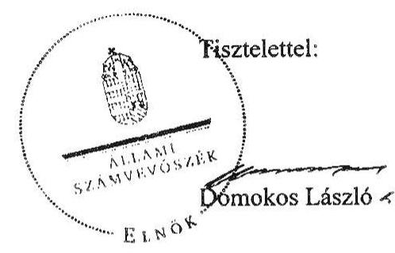

Melléklet: Tájékoztatás az el nem fogadott észrevételekről

---

# Tájékoztatás 

## az el nem fogadott észrevételekröl

A vasúti közlekedés állami támogatási rendszerének ellenőrzése címủ jelentéstervezetünkkel kapcsolatos észrevételeit köszönettel megkaptuk. Álláspontjuk az, hogy a korábban megküldött és általunk el nem fogadott észrevételeket továbbra is fenntartják. Az Önök által 2012. június 18 -án kelt észrevételekkel kapcsolatban a következő tájékoztatást adjuk:

## 1. A személyszállítási közszolgáltatások szakmai oldala

a) Nem értenek egyet azzal, hogy a jelenlegi finanszírozási rendszer nem ösztönöz megtakarításokra és a társaságok nem érdekeltek a költségek csökkentésében.

A jelentéstervezetben leírt tények alátámasztják a megfelelő ösztönzés és társasági érdekeltség hiányát. Ilyenek például a társaságok monopolhelyzete, a személyszállításban a hatékonysági elvárások közlésének késedelme, illetve az ezzel kapcsolatos hosszadalmas értelmezési viták, a pályavasútnál az érdemi érdekeltség hiánya, a társasági forráshiányok utólagos, szerződésektől és tényleges ráfordításoktól független központi költségvetési rendezése stb. (pl.16. o., 37. o., $48-49$. o.).

Mindezekkel szemben ellenérvekkel észrevételüket nem támasztották alá, ezért azt nem tudjuk elfogadni.
b) Véleményük szerint a jelentés lényeges hiányossága, hogy egyoldalú szemlélettel valamennyi vélt vagy valós problémáért zömében az NFM-et teszi felelőssé, illetve azt sugallja, hogy a nem megfelelő hatékonyság és müködés oka az, hogy az állami költségvetési rendszer nem ösztönöz megfelelően a megtakarításokra. A levelükben foglaltak alapján a jelentés teljesen figyelmen kívül hagyja a vasúttársaság irányításáért felelősök szerepét, valamint az NFM eredményeit a szabályozás átalakítása, az EU konform közszolgáltatási szerződések létrehozása terén.

Az egyoldalú szemlélettel való minősités alaptalan. Jelentéstervezetünk épp úgy rámutat a MÁV csoport müködési hiányosságaira, mint a tulajdonosi szereplők ellentmondásos, esetenként hibás tevékenységére.

Az ellenőrzött vasúttársaságokban az állam 100\% tulajdoni hányaddal rendelkezik, így a szakmai, illetve vagyoni felelősséggel tartozó és irányitói hatáskörrel felruházott NFM-nek (és jogelödeinek) meghatározó szerepe van a társaságok eredményes müködésében. Tény, hogy a vasúttársaságok bevételeinek döntő része az államtól, a költségvetés ún. teherbíró

---

képességétől függ, finanszírozásuk nem nevezhető problémamentesnek. Az ellenőrzés nem tett olyan megállapítást, ami a hatékonysággal kapcsolatban a menedzsment által megtehető intézkedések helyett a tulajdonosi jogokat gyakorló mulasztását fogalmazta volna meg.

Az ÁSZ jelentései tényeken alapulnak és azok alapján állapítottuk meg, hogy az állami költségtérités jelenlegi rendszere nem ösztönöz megtakarításokra.

Jelentéstervezetünk tartalmazza a vasúttársaság irányításáért felelősök szerepét is. Ellenőrzésünk többoldalú tapasztalatai alapján állapítottuk meg hogy: „A MÁV, illetve a MÁV csoport összességében a 2008. évi tőkerendezés óta sem tudott olyan gazdálkodási rendszert kialakítani, amely elkerülhetővé tette volna az állami támogatások szükségszerü növekedését, valamint a hiteligények csökkenését."

Az NFM eredményeit illetően - észrevételükkel szemben - megállapítottuk, hogy: „A korábbi időszakhoz képest előrelépést jelentett a szerződések megkötése, mert ezzel a társaságok tervezni tudták finanszírozásuk nagyságrendjét."
c) Ellentmondásosnak tartják, hogy miközben a jelentés egyfelől kritikával illeti a finanszírozást, másfelől úgy látja, átláthatatlan a költségek felhasználása, kiemelkedően magasak a bérjellegủ költségek, a szervezeti átalakulások ellenére sem csökkentek a költségek stb.

Észrevételükkel az ÁSZ többoldalú szemléletét igazolják, amit az előzőekben hiányoltak. A vasúti közlekedés finanszírozási és müködési problémáiban egyaránt szerepe van az állami szerepvállalás elégtelenségének és a MÁV csoport viszonylag alacsony hatékonyságú belső irányító, müködtető döntéseinek. A jelentéstervezet rámutat azokra a kritikus jelenségekre, amelyek az állami finanszírozás lehetőségeinek és a vasúti közlekedéssel szemben támasztott követelményeknek az összhangját akadályozzák.
d) Magyarázatot adnak arra, hogy a KTI miért tudja 2 nap alatt kiadni a teljesítésigazolást.

Tényként rögzítjük, hogy a KTI 2 nap alatt adja ki a teljesítésigazolást. Ugyanakkor megállapítottuk, hogy: „Az ellenőrzött időszakban a KTI nem rendelkezett a jelentések elfogadásához szükséges szabályzattal, az elfogadás kritériumaihoz írásos útmutatóval, azt kizárólag a dolgozók szakmai tudására alapozta."
e) Kifogásolják a költségtérítések nem szerződésszerű folyósításához és költségtartalmak egyértelműségének hiányához kapcsolódó megállapításainkat. Leszögezik, hogy nem a tárca, hanem a MÁV-START értelmezi a szerződéstől eltérően a költségtartalmakat, ami miatt hosszadalmas egyeztetésre volt szükség. Kifejezik meggyőződésüket arról, hogy a közszolgáltatási szerződések egyértelműen és átláthatóan, a számviteli törvény által meghatározott költségelemek szerint biztosítják az elszámolásokat, melyek valódiságáért a szolgáltató társaság vezetőjének kell aláírásával vállalni a felelősséget, továbbá az éves elszámolásokat a

---

vasúttársaság könyvvizsgálója minden esetben ellenjegyzi. Ismételten megállapításaink felülvizsgálatát javasolják.

Nem fogadható el az az állításuk, hogy kizárólag a START értelmezte eltérően a költségtartalmakat, amit a következő tényekkel támasztott alá a jelentés: „A minisztérium szerint a túlkomompenzáció az első egyeztetéskor 6031 M Ft volt, majd 4014 M Ft-ra csökkent, végül a 2011 októberében elfogadott beszámoló 2094 M Ft-ban állapította meg a túlkompenzáció összegét." Ez az egyeztetés 2009 közepe óta folyt.

Nem vitatjuk, hogy az adatok valódiságáért a társaság vezetője felel. Ez azonban nem jelenti azt, hogy az elszámolások megbízható adatokon alapultak. A könyvvizsgáló a MÁV és a START esetében több hiányosságra is felhívta a figyelmet.
f) Észrevételükben kifogásolták, hogy a nemzeti fejlesztési miniszternek 6 javaslatot, míg a MÁV vezetésének mindössze egy javaslatot fogalmaz meg a jelentéstervezet.

Észrevételükkel kapcsolatban felhívjuk szíves figyelmüket az Állami Számvevőszékről szóló 2011. évi LXVI. tv. 29. § (2) bekezdésére, amely azt tartalmazza, hogy az ellenőrzött szervezet vezetője az ellenőrzés megállapításaira tehet írásban észrevételt.

Javaslataink címzettjei általánosságban és jelen esetben is azok, akik hatáskörrel rendelkeznek az intézkedést igénylő megállapítások teljesülése felett.

# 2. A vagyonpolitikai terület szakmai észrevételei 

a) Véleményük szerint nem valós, hogy tevékenységben és eszközökben összevisszaság lenne a kiemelt társaságok területén. Javasolták annak tudomásul vételét, hogy a vasúti tevékenységek bonyolult rendszert alkotnak és így van ez mindenütt a világon, továbbá akkor is így lenne, ha a szervezeti szétválasztás nem valósult volna meg.

A jelentéstervezet részletes megállapításai tartalmazzák, hogy a támogatások felhasználásának átláthatósága tekintetében milyen az eszközök használati célja, birtoklása és tulajdonlása, illetve a müködtetés területén tapasztalt átfedés (keveredés) (35-36. o.). A jelentéstervezet sehol sem tartalmaz utalást a korábbi egységes szervezet visszaállítására. A költségtakarékosabb müködtetés céljával a MÁV 2010-ben belülről indított egy szerkezetátalakítási programot, mely során a hasonló profilú cégek összevonása, korábban kiszervezett feladatok visszaintegrálása (mint pl. a felső vezetékek karbantartásának visszaszervezése a MÁV-hoz) történik.
b) Véleményük szerint a társaságok (GÉPÉSZET, TRAKCIÓ) hatékonysága javult, jelentős költségmegtakarításokat értek el, melyek a Start költségeiben, és így a költségvetési forrás-igényekben is jelentkeztek.

A két kiemelt társaság pozitív eredménye nem kompenzálja a közszolgáltatást végző társaságok negatív üzemi eredményét. Emellett figyelembe kell venni, hogy a TRAKCIÓ hitelek segítségével tudott pozitív eredményt elérni. Jelentéstervezetünk tartalmazza: „A

---

TRAKCIÓ a 2011. évtől 2024-ig hiteltörlesztés és kamatfizetés jogcímen összesen 65,9 Mrd Ft adósságszolgálatot kell teljesítsen." (41. o.)

A MÁV adósságának részbeni átvállalásáról szóló 1451/2011. (XII. 22.) Korm. határozat igazolja, hogy a MÁV csoport egésze tekintetében nem csökkent az állami támogatási szükséglet.
c) Véleményük szerint a közszolgáltatások költségei is (az Önök szavaival: tehát az állami források felhasználásának az útja) nyomon követhetőek voltak, azokat a Start munkatársai folyamatosan figyelemmel is kísérték.

A jelentéstervezetünkben foglaltakat, miszerint a közpénzek (állami források) felhasználásának útja teljes mértékben nem nyomon követhető, változatlanul fenntartjuk. Tény, hogy a költségvetési támogatásokat a MÁV és a START kapta, azonban azok jelentős részét az igénybe vett szolgáltatások ellenértékeként továbbutalták a MÁV csoport egyes cégei felé. Ez abból következett, hogy a MÁV csoport tagjai - elsősorban a személyszállítási feladatok elvégzésében - egymásra utaltak.

Megállapítottuk, hogy a leányvállalatok kölcsönös számlázásai szabályosak voltak, azonban az ellenértékek nagysága nem megítélhető, mivel a TRAKCIÓ és a GÉPÉSZET a közszolgálati személyszállításhoz végzett szolgáltatásainak értékét nem különítette el a nem közszolgálati szolgáltatásaitól. Mindezt részletesen a jelentéstervezet több helyen tartalmazza (Például 3334. o., 2.1., 3.3. pont stb.)

# 3. Az ellenőrzés javaslatait illetően kért módosítások, pontosítások 

a) 1. sz. javaslat: Törölni kérik az első mondatot, mivel nem igazolható, hogy bármilyen többletköltség az állam, vagy a társaság terveihez képest felmerült volna. Javasolják, hogy a müködtetési és a finanszírozási modell együtt kerüljön az NGM és az NFM által kidolgozásra és a Kormány által jóváhagyásra.

A többletköltség igazolását jelentéstervezetünkben sokoldalúan bemutatjuk (pl. a késedelmi kamat keletkezése, a többlettámogatások, a hitel átvállalás bemutatása stb.). Ezért a javaslat intézkedést igénylő megállapításainak első mondatát nem töröljük. Az 1. sz. javaslat megvalósításával kapcsolatban észrevételeikben leírtak összhangban vannak javaslatunk tartalmával. A megvalósításra vonatkozó tájékoztatást köszönjük.
b) 2. sz. javaslat: Véleményük szerint a javaslat többsége az 1. sz. javaslat része, ebben a pontban csak a közszolgálati szerződések pontosításának specifikus feladatainak szerepeltetését tartják célszerünek. A késedelmi kamattal kapcsolatos felelősség felvetését nem helyeslik.

A két javaslat nem azonos tartalmú, az 1. sz. javaslat a finanszírozható vasúti közszolgáltatások müködtetése koncepciójának kidolgozására irányul, a 2. sz. pedig a szabályozás egységes kialakítására. A késedelmi kamattal kapcsolatos felelősség felvetése annak nagyságrendje miatt

---

nem elhanyagolható. Az intézkedést igénylő megállapítások között az szerepel, hogy „A vasúti közszolgáltatások finanszírozása mértékének és ütemezésének bizonytalansága a társaságok üzleti terveinek realitását rontotta, hitelszükségletük növekedését és 4,2 Mrd Ft késedelmi kamatfizetési kötelezettség keletkezését idézte elő." A leírtak alapján a késedelmi kamatfizetés körülményeinek kivizsgálása a finanszírozás mértékére és ütemezésére vonatkozik és nem a társaságra.
c) 4. sz. javaslat: Figyelembe kérik venni, hogy az erős ágazati szakszervezeti érdekérvényesítés következtében a MÁV-nál a bérnövekedés többnyire legfelsőbb szintű kormányzati egyeztetés jóváhagyás mellett következett be nem csak az elmúlt, hanem a jelenlegi időszakban is.

Az erős ágazati szakszervezeti érdekérvényesités és esetenkénti jóváhagyással kapcsolatos legfelsőbb szintű egyeztetés nem változtat azon a tényen, hogy a bérnövekmény mértékének szükségességét nem vizsgálták felül. Az egyes területeken alkalmazott bérek növekedését nem lehet kizárólagosan a jelzett szempontokkal indokolni, pl. a vezetői szinteken.
d) 5. sz. javaslat: Kérik annak figyelembe vételét, hogy 2011-ben a START-on kívül a MÁV csoport egyetlen tagja sem volt veszteséges, valamint, hogy a MÁV TRAKCIÓ és a MÁV GÉPÉSZET megalakulásuk óta nem volt veszteséges.

Véleményünk szerint az észrevételükben közöltek nem befolyásolják - az ellenőrzött időszakra tett - megállapításunkat, miszerint a szerkezeti átalakítások hatására a költségvetési források igénybevételének éves összege nem csökkent. A MÁV csoport likviditása nem állt helyre, és üzemi tevékenysége továbbra is veszteséges. Az egy-egy társaság vagy idöszak ettől eltérő eredménye az alapvető helyzetet nem változtatja meg.

Budapest, 2012. cilium hó 2 f nap

Makkai Mária
felügyeleti vezető

---

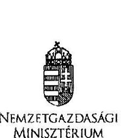

NEMZETGAZDASÁGI MINISZTÉRIUM MINISZTER

Iktatószám: NGM/13837/3/2012.
Hivatkozási szám: V-2014-081/2011-2012.

# Domokos László úr részére 

## Elnök

Állami Számvevőszék
Budapest
Apáczai Csere János u. 10.
1052
Tárgy: A vasúti közlekedés állami támogatási rendszerének ellenôrzéséről készített számvevőszéki jelentéstervezet

## Tisztelt Elnök Úr!

Köszönettel megkaptam a vasúti közlekedés állami támogatási rendszerének ellenôrzéséről készített számvevőszéki jelentés tervezetét, melyhez a következô észrevételeket teszem.

A tervezet 9. és 55. oldalán kérem pontosítani, hogy a Helyközi személyszállítási közszolgáltatások és a vasúti pályahálózat müködtetésének ellentételezése jogcím központi kezelésű előirányzat. Így nem a mindenkori közlekedésért felelős minisztérium éves költségvetésének fejezeti kezelésű előirányzatai között szerepel, hanem ún. vonal alatti tétel.

A tervezet II. Részletes megállapítások, 3.2. Az állam finanszírozási döntéseinek következetessége pontjában (48-49. o.) a teljesség érdekében javaslom szerepeltetni a MÁV Zrt. 2011. évi állami kezességvállalás melletti 35 Mrd Ft összegủ kötvénykibocsátását, mely a vasúti közlekedésről szóló 2005. évi CLXXXIII. törvény 28/A. §-nak megfelelően, a MÁV Zrt. 35 milliárd forint összegủ zártkörű kötvénykibocsátásához szükséges készízető kezességvállalásról szóló 1290/2011. (VIII.22.) Korm. határozat alapján a vasúti pályahálózat állam által indokoltnak elismert és az állam által meg nem térített költségei finanszírozását szolgálta.

Budapest, 2012. június „ $\delta^{\prime \prime}$

Üdvözlettel:
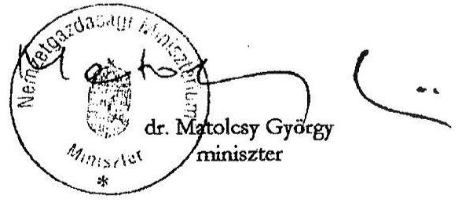

Látta: Dr. Kőrösmezei Csaba, fôosztályvezető Bécsi József, fôosztályvezető-helyettes
Készítette: Csányi Eszter, referens

---

# Dr. Matolesy György úr 

miniszter
Nemzetgazdasági Minisztérium

## Budapest

## Tisztelt Miniszter Úr!

A vasúti közlekedés állami támogatási rendszerének ellenőrzése címủ jelentéstervezetre tett észrevételeit köszönettel megkaptam.

Az Állami Számvevőszék észrevételekre vonatkozó álláspontjáról a felügyeleti vezető által készített részletes tájékoztatást csatoltan megküldöm.

Tájékoztatom Miniszter urat, hogy a számvevőszéki jelentés szövegezése az elfogadott észrevételek figyelembevételével készül.

Budapest, 2012. O7 hó 2/ nap

Tisztelettel:
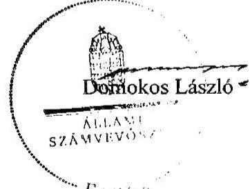

Melléklet: Tájékoztatás az elfogadott észrevételekről

---

# Tájékoztatás 

## az elfogadott észrevételekről

A vasúti közlekedés állami támogatási rendszerének ellenőrzése címủ jelentéstervezetünkkel kapcsolatos észrevételeire a következő tájékoztatást adjuk:

Észrevételükben javasolták pontosítani a jelentéstervezet 9. és 55. oldalán azt, hogy a Helyközi személyszállítási és közszolgáltatások és a vasúti pályahálózat működtetésének ellentételezése jogcím központi kezelésű előirányzat.

Ennek megfelelően, az érintett szövegrészt az összegzésben és a részletes megállapítások között módosítjuk az alábbiak szerint:
„A Kormány a költségvetésről szóló törvények felhatalmazása alapján minden évben kormányrendeletben határozza meg az egyes gazdálkodó szervezetek részére nyújtott egyedi támogatásokat, költségtérítéseket, valamint az egyéb vállalati támogatások keretében nyújtott termelési költségvetési támogatásokat. Ezek forrása a Helyközi személyszállítási közszolgáltatások és a vasúti pályahálózat müködtetésének ellentételezése jogcím központi kezelésű előirányzata."

Javasolták szerepeltetni a II. Részletes megállapítások 3.2. pontjában (48-49. o.) az 1290/2011. (VIII. 22.) Korm. határozat alapján kibocsátott 35 Mrd Ft összegủ kötvénykibocsátást.

A részletes megállapítások érintett bekezdésében a javaslatuk szerinti szöveget az alábbiak szerint megjelenítjük:
„A MÁV Zrt. 35 milliárd forint összegű zártkörü kötvénykibocsátásához szükséges készfizetői kezességvállalásról szóló 1290/2011. (VIII. 22.) Korm. határozat alapján a vasúti pályahálózat állam által indokoltnak elismert és az állam által nem térített költségei finanszírozására 35 Mrd Ft értékủ kötvénykibocsátásra került sor. "

Budapest, 2012. O 7. hó 27 .nap

Makkai Mária
felügyeleti vezető

---

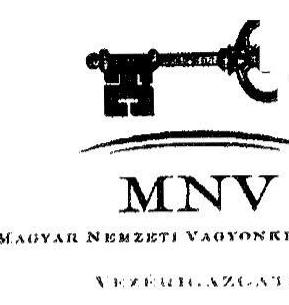

1133 BUDAPEST, PUSKONYI ÖY 56., 1300 BUDAPEST, IP. 70N
TELEFON: (0) 112374400 . FAX: (0) 112374100
HONLAT:WWW.MNVERY.IIU. II.NAII: INPOPNNVERY.IIU

# Domokos László 

az Állami Számvevőszék Elnöke
Állami Számvevőszék
Budapest
Apáczai Csere János u. 10.
1052
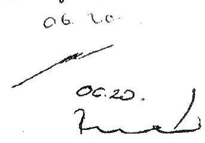

Ikt.sz.: MNV/0:/60/1: /12. /2012.

## Tisztelt Elnök Úr!

Az Állami Számvevőszék V-2014-081-2011-2012. számú Jelentéstervezetét a vasúti közlekedés állami támogatási rendszerének ellenőrzéséről az MNV Zrt. 2012.06.04-én megkapta. A törvényben elölrt határidőn belül megküldjük az MNV Zrt. válaszát az ellenőrzés megállapításaival kapcsolatban.

A Jelentéstervezet 47-48. oldalán kerül ismertetésre, hogy a helyszíni ellenőrzés lezárását követően kiadásra került a 4/2012-es RJGY határozat „a közösségi közlekedési szolgáltató társaságok és a MÁV Csoport szervezeti korszerűsitésével kapcsolatos egyes feladatokról" és a 6/2012-es RJGY határozat „a MÁV Zrt. vagyonkezelésében lévő, 2004-2011 között elhasználódott pályavasüti eszközök terven felült értékcsökkenésének elszámolásáról".

Az RJGY határozatok végrehajtásának aktuális állapotáról az MNV Zrt. az alábbi tájékoztatást adja:

4/2012 RJGY - Az RJGY határozat MÁV vagyonrendezésre vonatkozó pontjainak vizsgálata keretében az MNV Zrt. részéről megállapításra került, hogy a teljes ingatlan vagyonkör (földterület - épület - építmény) nyilvántartási értéken történő állami tulajdonba kerüléséhez mintegy 120 Mrd Ft forrásra lenne szükség, melynek egy része (kb. 40 Mrd Ft) a MÁV Zrt.-vel szemben fennálló ún. visszapótlási kötelezettség terhére kerülhetne beszámításra, azonban ennek államháztartási hatása jelenleg még vizsgálandó az NGM-el együttmüködésben. Az MNV Zrt. részéről jelenleg előkészítés alatt áll az ingatlanvagyon rendezésére vonatkozó koncepciók tervezete az NFM-mel együttmüködésben. A megoldási alternatívák vizsgálata során az egyes variációk forrásigényével arányosan nő, illetve csökken a rendezésre kerülő vagyonelemek száma.

---

A vagyonrendezés MNV Zrt. részéről történő operatív végrehajtása a rendelkezésre álló forrás, illetve kormányzati szándék véglegesítését követően történhet meg.

6/2012 RJGY - Az RJGY határozat végrehajtása folyamatos. Az MNV Zrt. megküldte az NFN-nek a módosító javaslatait azon jogszabályokról, melyek nehezítik, vagy ellehetetlenítik a vagyonkezelési szerződés megkötését. Ezen kívül felhívtuk a MÁV Zrt.-t, küldje meg a 2004 és 2010 között az RJGY határozat szerinti okokból selejtezett eszközök kimutatását, tájékoztasson az MNV selejtezési szabályzatával kapcsolatos álláspontjukról, küldje meg a vagyonkezelési szerződés hatályos jogszabályoknak megfelelően aktualizált tervezetét és az esetleges jogszabály-módosító javaslatait. ${ }^{5} \mathrm{~A}$ 2004 és 2010 között az RJGY határozat szerinti okokból selejtezett, illetve selejtezendő eszközök kimutatását a MÁV Zrt. megküldte, ennek felülvizsgálata és MNV Zrt. általi véleményezése folyamatban van, hasonlóan a vagyonkezelési szerződés tervezetéhez. ${ }^{B}$ (Ez utóbbi vonatkozásában tájékoztatjuk, hogy az MNV álláspontja szerint a szerződés csak a vagyonrendezést követően vagy azzal egyidejüleg köthető meg a már rendezett ingatlanokra.)
Az MNV selejtezési szabályzattal kapcsolatos MÁV javaslat és az MNV által támogathatónak tartott jogszabály-módosító javaslatok megküldése az NFM-be szintén folyamatban van.

Egyéb észrevételt a Jelentéstervezettel kapcsolatban nem teszünk.

Budapest, 2012. június 18.

Tisztelettel:
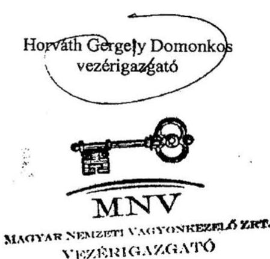

---

# HORváth Gergely Domonkos úr   vezérigazgató 

Magyar Nemzeti Vagyonkezelő Zrt.

## Tisztelt Vezérigazgató Úr!

A vasúti közlekedés állami támogatási rendszerének ellenőrzése címủ jelentéstervezetre tett észrevételeit köszönettel megkaptam.

Az Állami Számvevőszék észrevételekre vonatkozó álláspontjáról a felügyeleti vezető által készített részletes tájékoztatást csatoltan megküldöm.

Tájékoztatom Vezérigazgató urat, hogy a számvevőszéki jelentés szövegezése az elfogadott észrevételek figyelembevételével készül.

Budapest, 2012. C-7 hó 27 nap
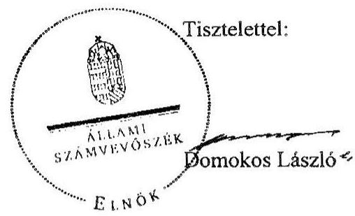

Melléklet: Tájékoztatás az elfogadott észrevételekről

---

# Tájékoztatás 

## az elfogadott észrevételekről

A vasúti közlekedés állami támogatási rendszerének ellenőrzése címủ jelentéstervezetünkkel kapcsolatos észrevételeit, az RJGY határozatok végrehajtásának aktuális állapotáról közölt tájékoztatását köszönettel megkaptuk.

Az újabb információk alapján jelentéstervezetünk részletes megállapításait a következők szerint egészittjük ki:
..Az MNV Zrt. tájékoztatása szerint jelenleg elökészités alatt áll az ingatlanvagyon rendezésére vonatkozó koncepciók tervezete az NFM-mel egviuttmüködésben. A 2004 és 2010 között az RJGY határozat szerinti okokból selejtezett, illetve selejtezendő eszközök kimutatását a MÁV Zrt. megküldte, ennek felülvizsgálata és az MNV Zrt. általi véleményezése folyamatban van, hasonlóan a vagyonkezelési szerzödés tervezetéhez."

Budapest, 2012. O7. hó 27 nap

Makkai Mária
felügyeleti vezető

---

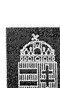

Nemzeti Közlekedési Hatóság

Központ

Domokos László úr
elnök
Állami Számvevőszék
Budapest

Tisztelt Elnök úr!

A vasúti közlekedés állami támogatási rendszerének ellenőrzéséről készített számvevőszéki jelentéstervezethez nem teszek észrevételt.

Budapest, 2012. június 19.
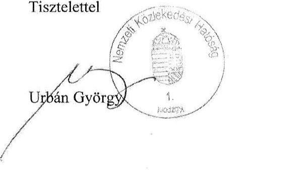

---

# 14/5. sz. melléklet a V-2014-111/2011-2012. sz. jelentéshez 

## VPE Vasúti Pályakapacitás-elosztó Kft.

H-1054 Budapest
Bajcsy Zs. út 48.
Tel: +36 1 301-9900
e-mail: vpe@vpe.hu
web: http://www.vpe.hu

## Domokos László

elnök

## Állami Számvevőszék

Budapest
Apáczai Csere János u. 10.
1052

Másolatban kapja:
Dr. Podonyi László ellenőrzésvezető

Állami Számvevőszék
Budapest
Apáczai Csere János u. 10.
1052
Tárgy: Vasúti közlekedés állami támogatási rendszerének ellenőrzéséről készült számvevőszéki jelentéstervezet véleményezése

## Tisztelt Elnök Úr!

A VPE Vasúti Pályakapacitás-elosztó Kft. köszönettel megkapta a vasúti közlekedés állami támogatási rendszerének ellenőrzéséről készült V-2014081/2011-2012. iktatószámú számvevői jelentést, melyre észrevételt tenni nem kíván.

Budapest, 2012. június 13.
Tisztelettel:

Pákozdi István
ügyvezető igazgató
VPE
Vasúti Pályakapacitás-elosztó Kt
1054 Budapest, Bajcsy-Zs. út 48.
Adószám: 13239990-2-41
Cg.01-09-735271

---

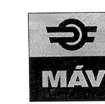

ELNÖK-VEZÉRIGAZGATÓ

Domokos László úr
elnök

Ikt. sz.: 400/T/2012.
Úgyintéző: Dr. Nagy Zoltán
Tel: +36 1 511 3465

Állami Számvevőszék

1052 Budapest
Apáczai Csere János u. 10.

Tárgy: válaszlevél a vasúti közlekedés támogatási rendszerének ellenőrzése tárgyban készült ÁSZ Jelentésre

Tisztelt Elnök Úr!
Köszönettel megkaptuk a Jelentés-tervezetüket a vasúti közlekedés támogatási rendszerének ellenőrzése témájáról.

Mivel a vasúti közlekedés irányításának feladatával mi magunk nap, mint nap találkozunk, több részletkérdést illetően másképp éljük át, és másképp látjuk a külső környezethez való alkalmazkodásunkat, problémáinkat és eredményeinket, üzleti kapcsolataink átalakulását, mint ahogy azt egy külső szakértő megítéli. Emiatt hasznos, ha egy szakértő „szem" mintegy tükröt tartva elénk időről időre szembesít bennünket azzal, hogy hogyan látja a környezetünk az eredményeinket, gyengeségeinket, mit tart müködésünkben korrigálandónak.

A Jelentés-tervezetben szereplő megállapítások és javaslatok hátterét és üzenetét az Állami Számvevőszék ellenőrzést felügyelő és vezető munkatársaival folytatott személyes megbeszélésen tisztáztuk. A Jelentéstervezetben a MÁV Csoport belső elszámolási rendszerének átalakítására vonatkozó javaslat célját értjük.

---

A MÁV Zrt. és a MÁV-START Zrt. számára végzett szolgáltatások bevételeit és költségeit a MÁV Csoport tagjai utókalkulációjukban elkülönítetten, követhetően nyilván fogják tartani, amiből egyértelművé válhatnak a közfeladat ellátásának költségei, bevételei, a költségtérítések, valamint a támogatások felhasználásai. A tervezett lépéseket az intézkedési tervünkben részletesen kidolgozzuk. A javaslat teljesítésének megvalósítását elősegíti, hogy a jelenlegi tervek szerint a MÁV Csoport a következő év elejétől új szervezeti felállásban végzi a feladatát.

Az új szervezeti felépítés alapvető célja, hogy a két jól elkülöníthető fő tevékenységi kör egymástól független szervezeti struktúrában valósuljon meg. Ez azt jelenti, hogy a pályaműködtetés és a személyszállítás két tulajdonosi és szerződéses struktúrát illetően is elkülönülő vállalatcsoport formájában fog működni. Ezt követően céljaink szerint megvalósul a jogi entitások számának csökkentése, ami a megfelelő elszámolási struktúrák kialakításával együtt nagymértékben segíteni fogja az állami források felhasználásának követhetőségét.

A tulajdonosi jogkörgyakorló MNV Zrt. részére véleményezésre beterjesztett tervezet rögzíti, hogy az új szervezeti és tulajdonosi szerkezetben a döntési és felelősségi folyamatok is átalakulnak a jelenlegi helyzethez képest. Mindez garanciát jelent arra, hogy a belső elszámolások - Állami Számvevőszék által is igényelt - átláthatósága megteremtődjön. Az Állami Számvevőszék Jelentésében megfogalmazott számos más anomália is megszűnik a tervezett átalakítással.
Az átalakítás itt leírt célját a Nemzeti Fejlesztési Minisztérium miniszter asszonya világosan kifejtette, a minisztériumi döntéshozók és szakemberek, továbbá a tulajdonosi jogokat gyakorló a Magyar Nemzeti Vagyonkezelő Zrt. vezetői és szakembergárdája is ezen cél érdekében dolgozik.
Fentiekre tekintettel belátható időn belül kormánydöntés várható.
A MÁV Zrt. vezetése a feladat ütemezett elvégzésére vállalkozott a működési hatékonyság növelése érdekében.
Az átalakítás előkészítése során kiemelt figyelmet fordítok a belső nyilvántartások és elszámolások átalakítására, amely teljes mértékben megfelel az Állami Számvevőszék javaslatának is.
II.

Elfogadjuk, hogy a törvényi definíciót alapul véve az Állami Számvevőszék „támogatás"-nak nevezi azt a költségtérítést, amelyet az állammal kötött szolgáltatási szerződések keretében a MÁV Zrt. és a MÁV-START Zrt. a vasúti pályahálózat müködtetéséért, illetve a vasúti személyszállítás végzéséért, a

---

bevétellel nem fedezett indokolt költségek ellentételezésére a magyar államtól kapunk, ahogy ez a Közszolgáltatási Szerződésekben is rögzítésre került.
III.

A Jelentés-tervezetben a MÁV Csoport gazdálkodási hiányosságaként kerül megemlítésre, hogy nem tudott olyan gazdálkodási rendszert kialakítani, amely elkerülhetővé tette volna a hitelek felvételét.

A MÁV Csoportnak a bevételi oldalra alig van ráhatása, azok szinte minden eleméről valamely államigazgatási szervezet dönt, így a feladata lényegében a költségmenedzsmentre szorítkozik.

Az állam megrendelői pozícióban általában a nagyobb kapacitású szolgáltatás fenntartását szeretné biztosítani, míg ugyanezen állam költségtérítést nyújtó oldala a szűk pénzügyi kereteken belül tudja csak a megrendelt szolgáltatást kifizetni, azaz a szolgáltatás egy része rendre kifizetetlen marad. A különbséget a belső folyamatok racionalizálásával nem lehet kigazdálkodni, ennyi tartalék nincs a MÁV Csoport müködésében, s ezen hiány következménye a MÁV Zrt. adósságállományának növekedése.
IV.
2007. év folyamán az állami és uniós forrásokból megvalósult beruházások eredményét képező eszközök vagyonátadása jelenleg még rendezetlen a Jelentés-tervezet szerint. A rendezést kellő körültekintéssel kell elvégezni, tekintettel arra, hogy a „Befektetett eszközök" mellett „Hosszú lejáratú kötelezettség" szerepel forrásként, ebből adódóan a kincstári vagyon és annak kötelezettség oldali szerepeltetése a MÁV Zrt. vagyoni, pénzügyi helyzetére vonatkozó értékeléskor jelentős torzító tényező lehet (pl. eladósodottsági mutató).

Mivel az eszközök átadására ez idáig nem került sor, azok a mérlegben nem szerepelhetnek.

A MÁV Zrt. az eszközöket egyoldalúan nem veheti át, az eszközök átadásátvételéhez szükséges a Vagyonkezelői szerződés módosítása, erre ugyanakkor mindezidáig nem került sor.

A MÁV Zrt. beszámolóiban a valós eredmény kimutatása érdekében eszközátadás hiányában - értékcsökkenés helyett céltartalék képzésre került sor, ezzel az eredmény az átadással azonosan alakul. A MÁV Zrt. számára a kialakult helyzetben ez volt az egyetlen olyan lehetséges megoldás, ami az üzembe helyezett vonalakkal kapcsolatos ráfordításokat elszámolhatóvá teszi,

---

és a számviteli törvény által kínált lehetőségekkel is összhangban van a valós helyzet bemutatása érdekében.
V.

A MÁV Csoport az utóbbi évek során folyamatos átalakulásban van, a szervezeti változások mindig a tulajdonos jóváhagyásával történtek. Az EU-s csatlakozást követően az átalakulások az EU és a vasúti törvényi előírásoknak való megfelelés érdekében történtek, illetőleg a nagyobb transzparencia biztosítása, az egyes területek értékesítésre történő előkészítésének szándéka is fellelhető az okok között. Mindezek eredményeként azonban egy túlaprózódott vállalatcsoport jött létre, eseti párhuzamosságokkal, sok esetben továbbra is nehézkes, lassú müködéssel.
2010-ben belülről elindítottunk egy szerkezetátalakítási programot. Az átalakítás fő célja az értékláncok újrafüzése volt a minél költségtakarékosabb müködtetés mentén. (Hasonló profilú cégek összevonása, korábban kiszervezett feladatok visszaintegrálása - pl. felső vezetékek karbantartásának visszaszervezése a MÁV Zrt.-be)

Az átalakításokat nem tartjuk befejezettnek, a pályavasúti, személyszállítási, gépészeti és vontatási tevékenység, valamint a központi szolgáltatások és a csoportirányitás jelenlegi kapcsolatrendszerének struktúrája további jelentős lépéseket igényel, amelynek részleteit levelünk elején már említettük.

Budapest, 2012. július 12.

Üdvözlettel

Dávid Ilona
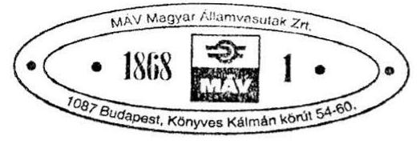

---

# 䒠 

## ÁLLAMI   SZÁMVEVÓSZÉK

Ikt. szám: V-2014-106/2011-2012.

## Dávid Ilona úrhölgy

elnök-vezérigazgató
MÁV Magyar Államvasutak Zrt.

## Budapest

## Tisztelt Elnök-vezérigazgató Asszony!

A vasúti közlekedés állami támogatási rendszerének ellenőrzése címủ jelentéstervezetre tett észrevételeit köszönettel megkaptam.

Az Állami Számvevőszék észrevételekre vonatkozó álláspontjáról a felügyeleti vezető által készített részletes tájékoztatást csatoltan megküldöm.

Tájékoztatom Elnök-vezérigazgató asszonyt, hogy a számvevőszéki jelentés szövegezése az elfogadott észrevételek figyelembevételével készül.

Budapest, 2012. 07 hó 16 nap
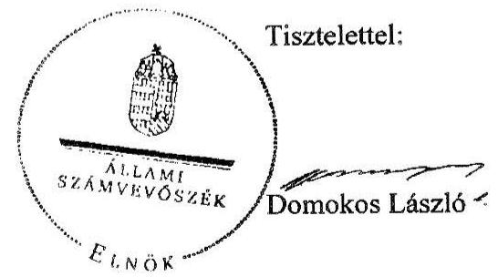

Melléklet: Tájékoztatás az elfogadott és az el nem fogadott észrevételekről

---

# Tájékoztatás 

## az elfogadott és az el nem fogadott észrevételekről

A vasúti közlekedés állami támogatási rendszerének ellenőrzése címủ jelentéstervezetünkkel kapcsolatos észrevételeit köszönettel megkaptuk. Észrevételeikkel kapcsolatban, amelyek tájékoztatásuk szerint a MÁV-START véleményét is tükrözi a következő tájékoztatást adjuk:

## I.

Köszönettel vettük arról szóló válaszukat, amely a MÁV Zrt. és a MÁV-START Zrt. vezetői számára tett javaslatunkat kivitelezhetőnek tartja. Bízunk benne, hogy az intézkedést igénylő megállapítások és azokhoz kapcsolódó javaslat megvalósítása érdekében az Önök által elkészítendő intézkedési terv részleteiben bemutatja azokat a konkrét feladatokat, amelyek végrehajtásával a közfeladat ellátásának költségei nyomon követhetőkké válnak.

## II.

A „támogatás" fogalma tekintetében - a törvényi definíciót alapul véve - egyetértésüket fejezték ki az ÁSZ fogalomhasználatával.

Fogalomhasználatunk összhangban áll a költségvetési törvényekben alkalmazottakkal és a vasúti tevékenység finanszirozásának átfogó értelmezésével. Jelentéstervezetünkben minden esetben a költségtérítés fogalmát használjuk, amennyiben a finanszírozás a közszolgáltatási szerződéshez kapcsolódik.

A költségvetési támogatás kifejezés magyarázatát a 2011. december 30 -án kihirdetett, az államháztartásról szóló 2011. évi CXCV. törvény tartalmazza, az ellenőrzés időszakában hatályos, korábbi Áht. e fogalomra magyarázatot nem adott.

## III.

Véleményük szerint nem indokolt a MÁV Csoport hibájaként felróni, hogy nem tudott olyan gazdálkodási rendszert kialakítani, amely elkerülhetővé tette volna a hitelek felvételét. Ezt azzal indokolják, hogy a MÁV Csoportnak a bevételi oldalra alig van ráhatása, így feladatuk lényegében a költségmenedzsmentre szorítkozik. Felhozzák, hogy az állam megrendelői pozícióban általában a nagyobb kapacitású szolgáltatás fenntartását szeretné biztosítani, ugyanakkor a szolgáltatás egy része rendre kifizetetlen marad. Meglátásuk szerint a finanszírozási hiányt a MÁV Csoport tartalékainak hiányában a belső folyamatok

---

racionalizálásával nem lehet kigazdálkodni és ennek következménye a MÁV Zrt. adósságállományának növekedése.

Az ÁSZ jelentéstervezete többoldalúan mutatja be az állami finanszírozás helyzetét, ennek a szolgáltatók müködésére gyakorolt hatását. Az állami finanszírozás rendszerében több hiányosságra is felhívtuk a figyelmet, azonban az sem vitatható, hogy a finanszírozási igény nagyságára jelentős hatása van a menedzsment költség gazdálkodásának, szervezetalakítási lépéseinek, megtakarítási és ésszerúsítési programjainak. Ezt észrevételeiknek a szervezeti átalakulásokat illető részében (4. o.) Önök is alátámasztják egy más vonatkozásban (,túlaprózódott vállalatcsoport, eseti párhuzamosságok, nehézkes, lassú müködés"). A jelentéstervezet példaként azt is tartalmazza, hogy a MÁV hatékonyságjavító akciótervében az elérni kívánt megtakarítás többszörös beruházási igénnyel volt megvalósítható.

# IV. 

Hivatkoztak a jelentés azon megállapítására, hogy a 2007. év folyamán az állami és uniós forrásokból megvalósult beruházások vagyonátadása rendezetlen. Véleményük szerint a rendezést kellő körültekintéssel kell elvégezni, mivel a MÁV mérlegében a hosszú lejáratú kötelezettség szerepeltetése a MÁV Zrt. vagyoni, pénzügyi helyzetére vonatkozó értékeléskor jelentős torzító tényező lehet. Megítélésük szerint a vagyonátadás hiánya következtében az értékcsökkenés helyett indokoltan és a számviteli törvénnyel összhangban képeztek céltartalékot annak érdekében, hogy az üzembe helyezett vonalakon a ráfordításokat elszámolhatóvá tegyék.

Jelentéstervezetünkben a tényhelyzetet rögzítettük, és egyetértünk azzal, hogy a vagyonátadást körültekintően kell elvégezni. Megjegyezzük, hogy az eszközátadás elhúzódásának több oka van. Az egyik az, hogy tisztázatlan jogi helyzetű ingatlanokon is történtek beruházások. Az aktiválás elmaradása miatt a MÁV az el nem számolt értékcsökkenés fedezeteként veszteséget növelő tényezőként, céltartalékot számolt el. A MÁV éves beszámolóját auditáló könyvvizsgáló cég felhívta a figyelmet a társaság könyveiben nem szereplő összegre és a nyilvántartási hiányosságok pótlásának szükségességére.

## V.

A MÁV csoport átalakulásával kapcsolatos tájékoztatásukat köszönjük. A végleges jelentés érintett szövegrészét a részletes megállapítások között az alábbiak szerint egészítjük ki:
„A MÁV tájékoztatása szerint „2010-ben belülről inditottak egy szerkezetátalakítási programot, melynek fö célja a költségtakarékosabb müködtetés. (Hasonló profilú cégek összevonása, korábban kiszervezett feladatok visszaintegrálása, mint pl. a felső vezetékek karbantartásának visszaszervezése a MÁV-ba)." Az átalakításokat a MÁV még nem tartja befejezettnek."

---

A jelentéstervezetben - a 2011. évi várható adatok helyett - a 2012. június 19-én kelt leveléhez mellékletként csatolt 2011. évi végleges adatokat szerepeltetjük.

Budapest, 2012. 07. hó 26 nap

Makkai Mária
felügyeleti vezető

---

14/7. sz. melléklet
a V-2014-111/2011-2012. sz. jelentéshez
hbybtejtett.
GYSEV GyÖR - SOPRON - EBENFURTI VASÚT ZRT.
Cim: H-9400 Sopron, Mátyás király u. 19. - Lovelacási cim: H-9401 Sopron, Pf. 104.
Rooborbutin.
2012.
06.21.

Állami Számvevőszék

Domokos László
Elnök

Budapest
Apáczai Csere János u. 10.
1052

Professio Lascib: lkt.sz.: AD1052012

CS 1F
513 4151
68001
68001
1. 2012 JUN 2 7.
1052
1052

Tisztelt Elnök Úr!

A V-2014-081/2011-2012 iktatószámú levelére hivatkozva tájékoztatom, hogy a vasúti
közlekedés állami támogatási rendszerének vizsgálatáról szóló jelentéstervezettel
kapcsolatosan a GYSEV Zrt a következő észrevételt teszi.

Kérjük az 1. sz. mellékletben (A vasútársaságok által - működésre és fejlesztésre -
felhasznált költségvetési források 2008-2011. években) a GYSEV Zrt. résznél a
„Fejlesztésre” sort kérjük egy csillaggal (*) megjelölni a követező szöveggel: „tartalmazza a
Közlekedési Operatív Program keretében felhasznált fejlesztési forrásokat is.”

Sopron, 2012. június 15.

Tisztelettel:

Köresdi Szilárd
vezérigazgató

Győr-Sopron-Ebenfurti Vasút Zrt.

Cg.08-10-001787 Adószám: 10008676-2-44 Közösségi adószám: HU 10008676 KSH szám: 10008676-6010-114-08

---

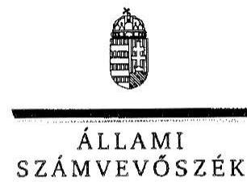

# Kövesdi Szilárd úr 

vezérigazgató
Győr-Sopron-Ebenfurti Vasút Zrt.

## Budapest

## Tisztelt Vezérigazgató Úr!

A vasúti közlekedés állami támogatási rendszerének ellenőrzése címủ jelentéstervezetre tett észrevételeit köszönettel megkaptam.

Az Állami Számvevőszék észrevételekre vonatkozó álláspontjáról a felügyeleti vezető által készített részletes tájékoztatást csatoltan megküldöm.

Tájékoztatom Vezérigazgató urat, hogy a számvevőszéki jelentés szövegezése az elfogadott észrevételek figyelembevételével készül.

Budapest, 2012. OJ hó 2/ nap
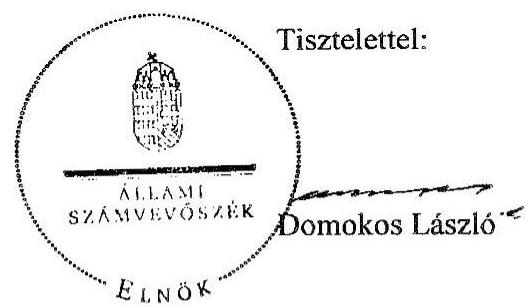

Melléklet: Tájékoztatás az elfogadott észrevételekröl

---

# Tájékoztatás 

## az elfogadott észrevételekröl

Észrevételükben kérték, az 1. sz. mellékletnek (A vasúttársaságok által - müködésre és fejlesztésre - felhasznált költségvetési források 2008-2011. években) a GYSEV Zrt. részre vonatkozó kiegészítését.

Észrevételüket elfogadjuk, az 1. sz. melléklet „Fejlesztésre" sort csillaggal (*) megjelöljük a következő szöveggel:
„tartalmazza a Közlekedési Operativ Program keretében felhasznált fejlesztési forrásokat is."

Budapest, 2012. 0 7. hó 27 nap

Makkai Mária
felügyeleti vezető