# ÁLLAMI   SZÁMVEVŐSZÉK 

## JELENTÉS

a vidékfejlesztési célkitúzések megvalósitására, a helyi közösségek szerepének megerősitésére fordított pénzeszközök felhasználása eredményességének és hatékonyságának, a vidéki életminőség javitásában betöltött szerepének ellenőrzéséről

---

# Állami Számvevőszék   Számvevői Iroda 

Iktatószám: V-2010-138/2011-2012.
Témaszám: 1027
Vizsgálat-azonosító szám: V0563

## Az ellenőrzést felügyelték:

## Makkai Mária

felügyeleti vezető

## Holman Magdolna

felügyeleti vezető
Az ellenőrzést vezette és az ellenőrzés végrehajtásáért felelős:
Bodonyi Miklós
számvevő főtanácsos

## Horthy Eszter

számvevő
Az összefoglaló jelentést készítette:

## Horthy Eszter

számvevő
A jelentés összeállításában közremúködtek:
Horthy Eszter
számvevő
Vida Cecília
számvevő
Az ellenőrzést végezték:

| Győriné Franyó Éva | Horthy Eszter | Kerekes Gábor |
| :-- | :-- | :-- |
| számvevő | számvevő | számvevő |

A témához kapcsolódó eddig készített számvevőszéki jelentés:
címe
sorszáma
Jelentés a térségek felzárkóztatására fordított pénzeszközök fel- 1125 használásának ellenőrzéséről

---

# TARTALOMJEGYZÉK 

BEVEZETÉS ..... 9
ÖSSZEGZŐ MEGÁLLAPÍTÁSOK, KÖVETKEZTETÉSEK, JAVASLATOK ..... 15
II. RÉSZLETES MEGÁLLAPÍTÁSOK ..... 27

1. A vidékfejlesztés központi és helyi stratégiai céljai ..... 27
1.1. Az uniós és a hazai vidékfejlesztési célok és stratégiák közötti összhang ..... 27
1.2. Az Új Magyarország Vidékfejlesztési Program változásai ..... 30
1.3. A helyi vidékfejlesztési stratégiák ..... 32
2. Az Európai Mezőgazdasági Vidékfejlesztési Alapból nyújtott támogatások fogadására kialakított hazai feltételrendszer ..... 34
2.1. A támogatások felhasználásának szabályozási keretei ..... 34
2.1.1. A III. tengely intézkedéseinek végrehajtására kiadott rendeletek ..... 37
2.1.2. A IV. tengely megvalósításának szabályozása ..... 37
2.2. A szervezeti feltételek megteremtése és finanszírozása ..... 38
2.2.1. A szervezeti rendszer kialakítása ..... 39
2.2.2. Az irányító és lebonyolító tevékenységek finanszírozása ..... 46
3. A támogatási rendszer múködése ..... 49
3.1. A vidékfejlesztési támogatások igénylése ..... 50
3.1.1. A III. tengely intézkedéseinek végrehajtása ..... 51
3.1.2. A IV. tengely intézkedéseinek megvalósítása ..... 55
3.2. Az ÚMVP monitoring és értékelési rendszere, ellenőrzése ..... 62
4. Az ÚMVP megvalósításának teljesítményei ..... 66
4.1. A támogatási rendszer múködésének hatékonysága ..... 66
4.1.1. A kérelemkezelési folyamat hatékonysága ..... 67
4.1.2. A múködési célú forrásfelhasználás hatékonysága ..... 70
4.2. Az intézkedések eredményessége és hatékonysága ..... 73
Mellékletek
5. számú Az ÚMVP III-IV. tengely és a technikai segítségnyújtás keret pénzügyi felhasználása 2011. december 31-ig
2/a. számú A III. tengely pénzügyi kerete a 2007. szeptemberben és a 2011. december 31-én hatályos ÚMVP szerint

---

2/b. számú A IV. tengely pénzügyi kerete a 2007. szeptemberben és a 2011. december 31-én hatályos ÚMVP szerint
2/c. számú A technikai segítségnyújtás pénzügyi kerete a 2007. szeptemberben és a 2011. december 31-én hatályos ÚMVP szerint
3. számú Az ÚMVP célindikátorai (output- és eredményindikátorok) és vállalt teljesülésük 2011. december 31-én
4. számú A LEADER Helyi Akciócsoportok tagtelepüléseinek száma és lakosságuk összetétele településtípusonként
5. számú A LEADER Helyi Akciócsoportok tagságának összetétele
6. számú A III. és IV. tengely meghirdetett intézkedései, pályázatai és a beérkezett kérelmek/pályázatok száma
7. számú Az ÚMVP III. és IV. tengely támogatott projektjeinek pontértékei
8. számú A 2011. II. negyedévben rögzített kötelezettségvállalásoknál és kifizetéseknél alkalmazott árfolyamok
9. számú A kifizetési kérelem postára adásától a határozathozatalig eltelt napok száma
10. számú Az ÚMVP III. és IV. tengely összes jóváhagyott támogatása és a 341. és 431. jogcímekre 2011. december 31-ig kifizetett múködési kiadások közötti összefüggés a 96 LEADER HACS esetében
11. számú A LEADER helyi akciócsoportok fejlesztési és múködési kereteinek lekötöttsége és a kifizetések régiónként
12. számú A LEADER támogatási kérelmek régiónkénti és jogcímenkénti megoszlása
13. számú A támogatott projektek minimum pontszámai régiónként támogatási körönként
14. számú A webes felületen keresztül bekért projektadatok bemutatása
15. számú Legalább 2 éve jóváhagyott támogatási kérelmek, amelyek még nem jelentkeztek kifizetési igénnyel
16. számú Nyertes projektek eloszlása pontszámuk alapján fejlesztési jogcímenként, pályázati körönként
17/a. számú Dr. Fazekas Sándor vidékfejlesztési miniszter úr észrevétele
17/b. számú Válaszlevél Dr. Fazekas Sándor vidékfejlesztési miniszter úr részére
17/c. számú Palkovics Péter Mezőgazdasági és Vidékfejlesztési Hivatal elnökének észrevétele
17/d. számú Válaszlevél Palkovics Péter Mezőgazdasági és Vidékfejlesztési Hivatal elnöke részére
17/e. számú Dr. Mezőszentgyörgyi Dávid Nemzeti Agrárszaktanácsadási, Képzési és Vidékfejlesztési Intézet főigazgatójának észrevétele

---

# RÖVIDÍTÉSEK JEGYZÉKE 

## Közösségi jog

1290/2005/EK tanácsi rendelet

1698/2005/EK tanácsi rendelet

1974/2006/EK rendelet

1975/2006/EK rendelet

65/2011/EU rendelet

## Törvények

2004. évi CXL. törvény (Ket.)
2007. évi XVII. törvény

## Rendeletek

240/2006. (XI. 30.)
Korm. rendelet

23/2007. (IV. 17.) FVM rendelet

93/2007. (VIII. 29.) FVM rendelet

147/2007. (XII. 4.) FVM rendelet, forrásrendelet
az Európai Tanács 2005. június 21-i 1290/2005/EK rendelete a közös agrárpolitika finanszírozásáról
az Európai Tanács 2005. szeptember 20-i 1698/2005/EK rendelete az Európai Mezőgazdasági Vidékfejlesztési Alapból (EMVA) nyújtandó vidékfejlesztési támogatásról
az Európai Mezőgazdasági Vidékfejlesztési Alapból (EMVA) nyújtandó vidékfejlesztési támogatásról szóló 1698/2005/EK tanácsi rendelet részletes alkalmazási szabályainak megállapításáról
a vidékfejlesztési támogatási intézkedésekre vonatkozó ellenőrzési eljárások, valamint a kölcsönös megfeleltetés végrehajtása tekintetében az 1698/2005/EK tanácsi rendelet végrehajtására vonatkozó részletes szabályok megállapításáról (hatályon kívül helyezte a Bizottság 65/2011/EU rendelete 34. cikk 1., hatálytalan 2011. I. 29től)
a vidékfejlesztési támogatási intézkedésekre vonatkozó ellenőrzési eljárások, valamint a kölcsönös megfeleltetés végrehajtása tekintetében az 1698/2005/EK tanácsi rendelet végrehajtására vonatkozó részletes szabályok megállapításáról
a közigazgatási hatósági eljárás és szolgáltatás általános szabályairól
a mezőgazdasági, agrár-vidékfejlesztési, valamint halászati támogatásokhoz és egyéb intézkedésekhez kapcsolódó eljárás egyes kérdéseiről
a társadalmi-gazdasági és infrastrukturális szempontból elmaradott, illetve az országos átlagot jelentősen meghaladó munkanélküliséggel sújtott települések jegyzékéről
az Európai Mezőgazdasági Vidékfejlesztési Alap társfinanszírozásában megvalósuló támogatások igénybevételének általános szabályairól
az Európai Mezőgazdasági Vidékfejlesztési Alapból nyújtandó vidékfejlesztési támogatásról szóló 1698/2005/EK tanácsi rendelet 3. és 4. tengelyének keretében megalakuló helyi akciócsoportok elismerési rendjével kapcsolatos egyes kérdésekről (hatályon kívül helyezte az 54/2011. (VI. 10.) VM rendelet 17. § (1) bekezdés, hatálytalan: 2011. VI. 18-tól)
az Európai Mezőgazdasági Vidékfejlesztési Alapból nyújtandó vidékfejlesztési támogatásról szóló 1698/2005/EK tanácsi rendelet 3. és 4. tengelyének keretében megalakuló helyi akciócsoportok elismerési rendjével kapcsolatos

---

136/2008. (X. 18.) FVM rendelet

137/2008. (X. 18.) FVM rendelet

141/2008. (X. 30.) FVM rendelet

122/2009. (IX. 17.) FVM rendelet

34/2010. (IV. 9.) FVM rendelet

22/2011. (III. 25.) VM rendelet

33/2011. (IV. 28.) VM rendelet

44/2011. (V. 26.) VM rendelet

54/2011. (VI. 10.) VM rendelet, kiegészítő forrásrendelet
76/2011. (VII. 29.) VM rendelet

## Szórövidítések

ÁSZ
Bizottság
EMVA
egyes kérdésekről szóló 93/2007. (VIII. 29.) FVM rendelet alapján előzetesen elismert helyi közösségek tervezési folyamatával, és a LEADER csoportok kiválasztásával kapcsolatos egyes kérdésekről (hatályon kívül helyezte az 54/2011. (VI. 10.) VM rendelet 17. § (1) bekezdés, hatálytalan: 2011. VI. 18-tól)
az Európai Mezőgazdasági Vidékfejlesztési Alapból a mikro vállalkozások létrehozására és fejlesztésére nyújtandó támogatások részletes feltételeiről
az Európai Mezőgazdasági Vidékfejlesztési Alapból a turisztikai tevékenységek ösztönzéséhez nyújtandó támogatások részletes feltételeiről
a Helyi Vidékfejlesztési Közösségek és a LEADER helyi akciócsoportok részére az Európai Mezőgazdasági Vidékfejlesztési Alapból nyújtandó vidékfejlesztési támogatásról szóló 1698/2005/EK tanácsi rendelet keretében nyújtott támogatás részletes feltételeiről
az Európai Mezőgazdasági Vidékfejlesztési Alapból a Helyi Vidékfejlesztési Stratégiák LEADER fejezetének végrehajtásához nyújtandó támogatások részletes feltételeiről
az Európai Mezőgazdasági Garancia Alapból, az Európai Mezőgazdasági Vidékfejlesztési Alapból, valamint a központi költségvetésből finanszírozott egyes támogatások 2010. évi igénybevételével kapcsolatos egységes eljárási szabályokról (hatályon kívül helyezte a 22/2011. (III. 25.) VM rendelet 23. §-a, hatálytalan 2011. III. 26-tól)
az Európai Mezőgazdasági Garancia Alapból, az Európai Mezőgazdasági Vidékfejlesztési Alapból, valamint a központi költségvetésből finanszírozott egyes támogatások 2011. évi igénybevételével kapcsolatos egységes eljárási szabályokról
az Európai Mezőgazdasági Vidékfejlesztési Alapból a mikrovállalkozások létrehozására és fejlesztésére 2011-től nyújtandó támogatások részletes feltételeiről
az Európai Mezőgazdasági Vidékfejlesztési Alapból a turisztikai tevékenységek ösztönzéséhez 2011-től nyújtandó támogatások részletes feltételeiről
a LEADER Helyi Akciócsoportok múködéséről
az Európai Mezőgazdasági Vidékfejlesztési Alapból a Helyi Vidékfejlesztési Stratégiák LEADER fejezetének végrehajtásához 2011-től nyújtandó támogatások részletes feltételeiről

Állami Számvevőszék
Európai Bizottság
Európai Mezőgazdasági Vidékfejlesztési Alap

---

| EMGA | Európai Mezőgazdasági Garancia Alap |
| :-- | :-- |
| FVM | Földművelésügyi és Vidékfejlesztési Minisztérium |
| HACS | helyi akciócsoport |
| Hálózat | Magyar Nemzeti Vidéki Hálózat |
| HVS | Helyi Vidékfejlesztési Stratégia |
| IIER | Integrált Igazgatási és Ellenőrzési Rendszer |
| IKSZT | Integrált közösségi és szolgáltató tér |
| KAP | Közös Agrárpolitika |
| MVH | Mezőgazdasági és Vidékfejlesztési Hivatal |
| OFK | Országos Fejlesztéspolitikai Koncepció |
| SFC | System for Fund management in the European |
|  | Community 2007-2013 A tagállamok és a Bizottság közötti adatcserét biztosító informatikai rendszer. (Forrás: |
|  | www.nfu.hu, Működési Kézikönyv) |
| ÚMVP | Új Magyarország Vidékfejlesztési Program |
| ÚMVST | Új Magyarország Vidékfejlesztési Stratégiai Terv |
| VKSZI | VM Vidékfejlesztési, Képzési és Szaktanácsadási Intézet |
| VM | Vidékfejlesztési Minisztérium |

---

.

---

# ÉRTELMEZŐ SZÓTÁR 

diverzifikálás
indikátor
innovatív
intézkedés
Irányító Hatóság

LEADER

LEADER Helyi Akciócsoport (LEADER HACS)

LEADER-megközelítés
többféle, illetve alternatív jövedelemszerzést biztosító tevékenységek fejlesztése (ÜMVP 95. oldal)
a közös monitoring és értékelési keretszabályozásban a programok kiinduló helyzetére, pénzügyi végrehajtására, teljesítményére, eredményeire és hatására vonatkozó közös mutató (1698/2005/EK tanácsi rendelet 2. cikk)
új ötlet, elképzelés megvalósításának, a napi gyakorlatban történő alkalmazásának képessége
a tengelyek végrehajtásához hozzájáruló múveletek sorozata (1698/2005/EK tanácsi rendelet)
Az Európai Mezőgazdasági Vidékfejlesztési Alapból (EMVA) nyújtandó vidékfejlesztési támogatásról szóló 1698/2005/EK tanácsi rendelet (2005. szeptember 20.) 75. cikke alapján az agrárpolitikáért felelős miniszter. A miniszter irányító hatósági feladatait a közösségi ügyekért felelős szakállamtitkárra ruházta, akit az Irányító Hatóság vezetése során a titkársági feladatokat ellátó Agrárvidékfejlesztési Főosztály segített ${ }^{1}$ 2007-2010 között. A miniszter irányító hatósági feladatait 2010. augusztus 1jével a vidékfejlesztésért felelős helyettes államtitkárra ruházta ${ }^{2}$.
Liaison Entre Actions pour le Development de l'Economie Rurale (Közösségi Kezdeményezés a vidék gazdasági fejlesztése érdekében). Az Európai Közösség 1991-ben elindított kezdeményezése a gazdasági, társadalmi és környezeti problémák helyi megoldásával - a helyi közigazgatás, a vállalkozók és civil szervezetek összefogásával - segíti elő a fenntartható fejlődést Európa vidéki területein.
Az 1698/2005/EK tanácsi rendelet 62. cikkének megfelelő és az Irányító Hatóság által elismert jogi személyiséggel rendelkező - 2011. december 31. után kizárólag egyesületi formában múködő - helyi közösség, amely az elismerés iránti kérelemmel egyidejúleg vállalta a LEADER HACS minősítéshez kapcsolódó feltételek teljesítését. (54/2011. (VI.10.) VM rendelet 1. § 10. pont, 2012. március 31-ig hatályos szövege)
A LEADER-megközelítés legalább a következő elemekből áll:
a) jól azonosított szubregionális vidéki területekre irányu-

[^0]
[^0]:    ${ }^{1}$ a Földművelésügyi és Vidékfejlesztési Minisztérium Szervezeti és Múködési Szabályzatának módosításáról szóló 10/2007. (MK 160.) FVM utasítás 36. § (1) bekezdés
    ${ }^{2}$ a Vidékfejlesztési Minisztérium szervezeti és múködési rendjének ideiglenes meghatározásáról szóló 4/2010. (VII. 30.) és a Vidékfejlesztési Minisztérium Szervezeti és Müködési Szabályzatáról szóló 8/2010. (IX. 30.) VM utasítás

---

ló területalapú, helyi fejlesztési stratégiák;
b) helyi köz- és magánszférabeli partnerségek (a továbbiakban: a helyi akciócsoportok);
c) alulról felfelé építkező megközelítés a helyi akciócsoportok helyi fejlesztési stratégiák kidolgozására és megvalósítására vonatkozó döntéshozatali hatáskörével;
d) a stratégia multiszektorális tervezése és végrehajtása, a helyi gazdaság különböző ágazatainak szereplői és projektjei közötti kölcsönhatáson alapulva;
e) innovatív megközelítések végrehajtása;
f) együttmúködési projektek végrehajtása;
g) a helyi partnerségek közötti hálózatépítés. (1698/2005/EK tanácsi rendelet 61. cikk)
mid-term (félidős) értékelő jelentés
nem horizontális intézkedések
tengely
Az 1698/2005/EK tanácsi rendelet 84-86. cikkei alapján a tagállamok által a folyamatos értékelés eredményeként független szakértők bevonásával elkészíttetett különálló jelentés, amely javaslatokat tesz a programok és megvalósításuk minőségének javítására.
A III. tengely azon intézkedései, amelyek szerepelnek a helyi fejlesztési stratégiákban és végrehajtásuk a LEADER helyi akciócsoportok bevonásával történik.
Összefüggő intézkedéscsomag, amely közvetlenül a végrehajtásból származó és az 1698/2005/EK tanácsi rendelet 4. cikkében meghatározott egy vagy több célkitúzéshez hozzájáruló konkrét célokkal bír (1698/2005/EK tanácsi rendelet).

---

# JELENTÉS 

## a vidékfejlesztési célkitúzések megvalósítására, a helyi közösségek szerepének megerősítésére fordított pénzeszközök felhasználása eredményességének és hatékonyságának, a vidéki életminőség javításában betöltött szerepének ellenőrzéséről

## BEVEZETÉS

Az uniós Közös Agrárpolitika (KAP) 2003. júniusi és 2004. áprilisi reformjával előrevetítette a mezőgazdasági termelési szerkezetekben, a termőföld hasznosítási módszerekben, a foglalkoztatásban és a különböző vidéki területek szélesebb értelemben vett társadalmi és gazdasági feltételeiben jelentős elmozdulások bekövetkezését. Az Európai Unió a KAP célkitűzéseinek megvalósítása érdekében a vidékfejlesztési politika keretében megvalósítandó programok finanszírozására létrehozta az Európai Mezőgazdasági Vidékfejlesztési Alapot (EMVA).

Az 1698/2005/EK tanácsi rendelet a vidékfejlesztési politika irányadó alapszabályait, a tagországok és a régiók által meghozható intézkedéseket rögzítette. A vidékfejlesztési intézkedéseket a következő négy tengelyhez kapcsolódóan határozták meg:

- a mezőgazdasági és az erdészeti ágazat versenyképességének javítása (humán és fizikai tőke áramlása a mezőgazdaságba, az élelmiszeripari és erdőgazdálkodási ágazatba, ismeretátadás és innováció előmozdítása, valamint minőségi termelés);
- a környezet és a vidék fejlesztése (a természeti erőforrások védelmét és javítását célzó intézkedések, valamint Európa vidéki területeinek jelentős természeti értékét képviselő gazdálkodási és erdőgazdálkodási rendszerek kultúrájának védelme);
- a vidéki élet minősége és a vidéki gazdaság diverzifikálása (a növekedéshez és a munkahelyteremtéshez szükséges feltételek valamennyi ágazatban történő javítása, valamint a gazdasági tevékenységek diverzifikációja érdekében segítségnyújtás a vidéki területek infrastruktúrájának és humántőkéjének fejlesztéséhez);
- LEADER (közösségi kezdeményezés célja a vidéki szereplők ösztönzése és támogatása a térségük hosszú távú lehetőségeiről történő együttgondolkodásban és a térség fenntartható fejlődésének integrált, innovatív stratégiák mentén történő megvalósításában).

---

A vidékfejlesztési program e négy célkitűzésének megvalósításával összefüggő intézkedések ${ }^{3}$ az EMVA források terhére a technikai segítségnyújtás keretből kerülnek finanszírozásra.

Az EU közös vidékfejlesztési politikája lehetőséget biztosít a tagállamoknak, hogy az előre meghatározott vidékfejlesztési intézkedésekből kiválasszák azokat, amelyek a legnagyobb hozzáadott értéket eredményezik. Az Új Magyarország Vidékfejlesztési Stratégiai Terv (ÜMVST) a 2007. január 1-je és 2013. december 31-e közé eső középtávú időszakra - az 1698/2005/EK tanácsi rendelet alapján - kijelölte az agrár-vidékfejlesztés irányait, célkitűzéseit és meghatározta a célok elérésének módját, eszközeit. Az ÚMVST a hazai agrár-vidékfejlesztés legfontosabb feladataként azt határozta meg, hogy a vidéki térségek lakosságának alacsony gazdasági aktivitásából, az alacsony foglalkoztatottságból és ez által az alacsony jövedelmi szintből fakadó társadalmi feszültséget kezelje. Az ÚMVST által meghatározott fejlesztési célkitűzések végrehajtására készült el az Új Magyarország Vidékfejlesztési Program (ÚMVP), amelyet az EU Vidékfejlesztési Bizottság 2007. szeptember 19-én, az EU Bizottság - a B (2007) 5121 számú határozatában - 2007. október 24-én fogadott el.

Magyarország szempontjából a vidékfejlesztés jelentőségét támasztja alá az a tény, hogy a vidéki térségek ${ }^{4}$ az ország településeinek $95 \%$-át, területének pedig $87 \%$-át fedik le, ahol a lakosság $45 \%$-a él. Az ÚMVP-ben deklarált vidékfejlesztési intézkedésekre jogosult településeket az alábbi ábra mutatja:

A vidékfejlesztési intézkedésekre jogosult és nem jogosult települések
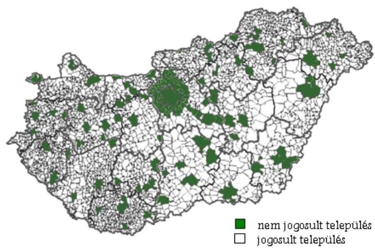

[^0]
[^0]:    ${ }^{3}$ A program megvalósításához kapcsolódó segítségnyújtás előkészítő, irányítási, monitoring, értékelési, tájékoztatási tevékenységei tartoznak ide.
    ${ }^{4}$ A 2007-2013 közötti időszakban vidéki térségnek minősülnek a $120 \mathrm{fo} / \mathrm{km}^{2}$ népsűrűséget meg nem haladó vagy a 10000 főnél kevesebb lakosú települések. A vidéki térségek azt a sajátos térségtípust képviselik, ahol alacsonyabb a népsűrűség, a megélhetést jellemzően a föld biztosítja, valamint általános a nem városi jellegű (falusi, kisvárosi, egyes régiókban pedig a tanyákra jellemző) településszerkezet.

---

Az ÚMVP a vidéki térségek országos átlagtól jelentősen eltérő helyzetét a helyzetértékelésében mutatja be. A vidéki gazdaság és életminőség állapotát ismertetve rögzítette, hogy egyrészt a vidéki területeken a vállalkozási sűrűség lényegesen kisebb ( $55 \mathrm{db} / 1000$ lakos, 2004), mint az országos átlag ( $86 \mathrm{db} / 1000$ lakos, 2004), másrészt a vidéki térségekben meghatározó ágazat a mezőgazdaság. A vidéki vállalkozások innovációs képessége gyenge, melyhez társul a tőkehiány, a szakmai tudás hiánya, illetve az alacsony vállalkozói képesség, ami akadályozza az új vállalkozások beindítását. A vidéki térségek további jellemzője a foglalkoztatás szerkezetét illetően az átlagnál magasabb munkanélküliségi ráta, amely az aktív népesség (15-59 évesek) körében 9,2\% volt 2005-ben, szemben az országos 6,3\%-os aránnyal. Az aktív korú lakosság jellemzően mezőgazdaságból él, amelynek a bérszínvonala, illetve a vidéki térségekben lévő agrárvállalkozások bevétele a nemzetgazdasági átlagnál alacsonyabb, az egyes régiókat tekintve is differenciált. A megélhetőségi lehetőségek hiánya hozzájárul az elvándorláshoz, amely az ÚMVP szerint az utóbbi évtizedben egyre erősödött. 2005-ben a vidéki térségeket elhagyók száma 3846 fővel meghaladta a beköltözőkét.

A vidéki térségekben élők alapszolgáltatásokhoz való hozzájutását, az infrastruktúra helyzetét, az épített és természeti környezetet bemutatva az ÚMVP helyzetértékelése megállapította, hogy a vidéki térségekben élők nem vagy nem kielégítő módon férnek hozzá az alapszolgáltatásokhoz, korlátozottak a rekreációs és kulturális szolgáltatások. Az infrastruktúra elérhetősége és színvonala szempontjából a kisebb falvak és a tanyás térségek különösen rossz helyzetben vannak. Az ÚMVP a vidéki gazdaságról és életminőségről készített helyzetértékelésében a vidéki térségeket jellemző problémákra megteendő lépéseket, az ÚMVP négy tengelye és a technikai segítségnyújtás múveletek közül a III. és a IV. tengelyben meghatározott intézkedések megvalósításával célozza biztosítani.

A vidékfejlesztési célkitűzéseket az ÚMVP 2007-2013 között 8385,2 millió euró (2347,8 milliárd Ft) felhasználásával tervezte megvalósítani. Ebből az uniós forrás 3805,8 millió euró ( 1065,6 milliárd Ft, 45,4\%), a hazai költségvetési forrás 1353,3 millió euró ( 378,9 milliárd Ft, 16,1\%) volt ${ }^{5}$.

Magyarország az ÚMVP megvalósításához 2011. december 31-éig összesen 146 milliárd Ft hazai (költségvetési) támogatást biztosított 454 milliárd Ft-nyi EU hozzájárulás mellett. A 146 milliárd Ft hazai forrás 84,2\%-a (122,9 milliárd Ft) az I-II. tengely intézkedéseit finanszírozta. A III. tengelyre közel 13 milliárd, a IV. tengely intézkedéseire 1,2 milliárd Ft jutott. A technikai segítségnyújtás műveletek végrehajtásához eddig 8,9 milliárd Ft hazai forrással járult hozzá a magyar költségvetés.

[^0]
[^0]:    ${ }^{5}$ A közpénzen felüli keret a támogatottak saját, 3226,1 millió euró (903,3 milliárd Ft, $38,5 \%$ ) összegű forrásait jelenti.

---

Az ÚMVP eredeti változatának euró és forintra átszámított ${ }^{6}$ adatait intézkedésenként a következő táblázat mutatja be:

| Tengely | Összes forrás |  | Összesből   közpénz |  | Közpénzből   EMVA támogatás |  |
| :--: | :--: | :--: | :--: | :--: | :--: | :--: |
|  | millió   euró | milli-   árd   Ft | millió   euró | milli-   árd   Ft | millió   euró | milli-   árd   Ft |
| I. A mezőgazdasági és erdészeti ágazat versenyképességének javítása | 4876,8 | 1365,5 | 2366,4 | 662,6 | 1698,4 | 475,5 |
| II. A környezet és a vidék fejlesztése | 1738,0 | 486,6 | 1626,7 | 455,5 | 1250,2 | 350,1 |
| III. A vidéki élet minősége és a vidéki gazdaság diverzifiká- | 1150,9 | 322,3 | 690,7 | 193,4 | 495,7 | 138,8 |
| IV. A LEADER-megkö-zelítés meg- | 416,5 | 116,6 | 272,3 | 76,2 | 209,3 | 58,6 |
| Technikai segítségnyújtás | 203,0 | 56,8 | 203,0 | 56,8 | 152,2 | 42,6 |
| Összesen | 8385,2 | 2347,8 | 5159,1 | 1444,5 | 3805,8 | 1065,6 |

Forrás: ÚMVP 2007. szeptember
Az ÚMVP 2011 végéig hat alkalommal végrehajtott módosítása során a közpénzből származó források 2,1\%-kal (ebből az EMVA támogatás 1,4\%-kal) növekedtek ${ }^{7}$, illetve az egyes tengelyeken belül az intézkedések között az indikatív forrásmegosztások is változtak. Az ÚMVP-nek 2011. december 31-én a hetedik verziója volt hatályban.

Magyarország Kormánya kiemelt feladatának tekinti a vidékfejlesztést, a vidék népességmegtartó és foglalkoztatási erejének növelését, a vidéki élet minőségének javítását. A vidékfejlesztési célkitűzések elérése érdekében teendő intézkedések stratégiai szintű dokumentumaként - „a magyar vidék alkotmánya"néven is ismert - a Nemzeti Vidékstratégiát a Kormány 1074/2012. (III.28.) határozatával hagyta jóvá, amelynek végrehajtási programjaként elindult a Darányi Ignác Terv. A Nemzeti Vidékstratégia és a Darányi Ignác Terv egyaránt a 20122020 közötti évekre készült, illeszkedve az EU 2014-2020 közötti programfinanszírozási időszakához. A Darányi Ignác Terv a célkitűzések elérése érdekében

[^0]
[^0]:    ${ }^{6}$ Jelentésünkben a pénzügyi keretek és elszámolások forintra történő átszámításánál egységesen 280 forint/euró árfolyamot alkalmazunk, a Mezőgazdasági és Vidékfejlesztési Hivatal 2011. évi tervezési és elszámolási gyakorlatának megfelelően.
    ${ }^{7}$ A Bizottság Magyarország részére a 2009-2013 közötti időszakra további 54,3 millió euró EMVA forrást engedélyezett, mely forrást az 1698/2005/EK tanácsi rendelet módosítására tekintettel az Európai Gazdaságélénkitő Csomag és a kötelező moduláció öszszegeire a tejágazat szerkezetátalakítását kísérő intézkedésekre, mint új kihívásokra használhat fel Magyarország. A többletforrás a II. tengely állatjóléti intézkedéseire lett allokálva.

---

számba veszi a szükséges eszközrendszert (uniós és hazai, nemzeti finanszírozású programokat) és a feltételrendszert (jogi szabályozási és intézményrendszer korszerűsítése, átszervezése). A Darányi Ignác Terv folyamatosan intézkedésekkel fog bővülni.

A tagállamok részére az EMVA-ból nyújtott források hatékony és eredményes felhasználása érdekében az 1698/2005/EK tanácsi rendelet meghatározott követelmények, intézményrendszer kialakítását és működtetését írta elő. A tagállamoknak létre kellett hozniuk a vonatkozó irányítási és ellenőrzési rendszereket, biztosítva az irányító hatóság és az egyéb szervek között a funkciók egyértelmű megosztását és elválasztását. A tagállamok felelősségét állapította meg az 1698/2005/EK tanácsi rendelet arra vonatkozóan, hogy a rendszerek hatékonyan múködjenek a program teljes időtartama alatt, míg a program hatékony, eredményes és szabályszerű módon történő végrehajtásáért a nemzeti irányító hatóság felelős.

Az ellenőrzés célja annak értékelése volt, hogy eredményes és hatékony volte a vidékfejlesztési célkitűzések megvalósítására - a vidék életminőségének javítására és a mezőgazdasági tevékenységek diverzifikálására -, a helyi közösségek szerepének megerősítésére fordított pénzeszközök felhasználása.

Ellenőrzésünk során értékeltük a vidékfejlesztés kialakított célrendszerét, a központi szabályozási és szervezeti kereteket, a források felhasználási szabályait, az irányítási és támogatási rendszert, valamint a központilag és a helyi LEADER közösségeken keresztül a támogatott projektek részére juttatott források felhasználását, a megvalósítás alatt álló támogatási programok hatékonyságát és eredményességét.

Az egyes intézkedések végrehajtását ellenőrzésünk akkor tekintette eredményesnek, ha az ÚMVP-ben meghatározott, a teljesítmények és az eredmények mérésére alkalmazott mutatók várhatóan legalább a terveknek megfelelő mértékben valósultak meg. A támogatásról történő lemondás hiányában várható teljesítésként vettük számításba a határozatban jóváhagyott támogatási kérelmekben vagy pályázatokban vállalt output- és eredménymutatókat, feltételezve a vállalások sikerességét. Hatékonynak azokat az intézkedéseket értékeltük, ahol a pénzügyi források felhasználása (lekötöttsége) arányban állt a mutatók tervezett mértékének teljesítésével (vállalási arányával).

Az ellenőrzés az ÚMVP tengelyei közül a vidékfejlesztési célkitűzések megvalósítását, a vidéki gazdaság diverzifikálását és a helyi közösségek megerősítését célzó intézkedéseket magában foglaló III. és IV. tengelyre, valamint a teljes ÚMVP végrehajtásának hatékonysága és eredményessége érdekében végzett előkészítő, irányítási, monitoring, értékelési, tájékoztatási és ellenőrzési tevékenységek finanszírozására szolgáló technikai segítségnyújtás múveletekre terjedt ki.

A teljesítmény-ellenőrzés módszereivel végrehajtott ellenőrzés a 2007-2011. évekre irányult, de figyelemmel kísérte az ellenőrzés lezárásáig bekövetkezett jelentősebb változásokat. Az ellenőrzést előtanulmánnyal alapoztuk meg.

---

Az ellenőrzést az ÁSZ teljesítmény-ellenőrzési módszertanának alkalmazásával, valamint az INTOSAI teljesítményellenőrzési standardok (ISSAI 3000, ISSAI 3100), és az INTOSAI GOV 9100 irányelvének figyelembevételével végeztük.

A helyszíni ellenőrzés a Vidékfejlesztési Minisztériumra, a Mezőgazdasági és Vidékfejlesztési Hivatalra, a Magyar Nemzeti Vidéki Hálózatra, a VM Vidékfejlesztési, Képzési és Szaktanácsadási Intézetre ${ }^{8}$ terjedt ki. A helyszíni ellenőrzéssel egyidejúleg tanúsítványt kértünk a LEADER helyi akciócsoportoktól, valamint kérdőívvel és tanúsítvánnyal kerestük meg a statisztikai mintavétellel kiválasztott projektgazdákat. A LEADER helyi akciócsoportok és a projektgazdák részére a tanúsítványok és a kérdőívek kitöltését az ÁSZ internetes online felületén biztosítottuk. A jelentésben a tanúsítványok és kérdőívek adatainak elemzése mellett a Mezőgazdasági és Vidékfejlesztési Hivataltól a III. és IV. tengely intézkedéseihez kapcsolódó támogatási kérelmekről és pályázatokról, a helyi akciócsoportok múködési költségeiről, a pénzügyi teljesítésekről kapott elemi adatbázisok adatait, illetve azok elemzésének eredményeit is felhasználtuk.

Az Állami Számvevőszékről szóló 2011. évi LXVI. törvény 29. § szerint a jelentéstervezetet megküldtük egyeztetésre a vidékfejlesztési miniszternek, a Mezőgazdasági és Vidékfejlesztési Hivatal elnökének, valamint a Nemzeti Agrárszaktanácsadási, Képzési és Vidékfejlesztési Intézet főigazgatójának. A beérkezett észrevételeket és az erre adott válaszokat a jelentés 17/a-e. melléklete tartalmazza. Az el nem fogadott észrevételek indokolással együtt a jelentésben feltüntetésre kerültek.

Az ellenőrzés végrehajtásának jogszabályi alapját az Állami Számvevőszékről szóló 2011. évi LXVI. törvény 5. § (3), (5) és a 25. § (3) bekezdésében foglaltak képezték.

[^0]
[^0]:    ${ }^{8}$ A VM Vidékfejlesztési, Képzési és Szaktanácsadási Intézet elnevezése a KGF/582/2012. számú 2012. március 14-én kelt alapító okirata szerint Nemzeti Agrárszaktanácsadási, Képzési és Vidékfejlesztési Intézetre változott.

---

# ÖSSZEGZŐ MEGÁLLAPÍTÁSOK, KÖVETKEZTETÉSEK, JAVASLATOK 

Magyarország a 2007-2013 közötti középtávú programozási időszakra a vidéki térségekre jellemző strukturális feszültségek és a területi különbségek csökkentése érdekében kidolgozta az Új Magyarország Vidékfejlesztési Stratégiai Tervet (ÚMVST). Végrehajtására elkészült az Új Magyarország Vidékfejlesztési Program (ÚMVP), melynek elfogadásáról a Kormány határozatban nem döntött. Az ÚMVP-t az EU Bizottság 2007. október 24-én határozatban jóváhagyta.

Az ÚMVP a vidéki térségekben jellemző alacsony foglalkoztatottsági és jövedelemszintből adódó társadalmi feszültségeket a vidéki térségek gazdaságának megerősítésével az infrastruktúra és a szolgáltatások fejlesztésével, az épített és természeti környezet értékeinek megóvására irányuló intézkedésekkel kívánta kezelni (III. tengely ${ }^{9}$ ). Ezek közé tartozott többek között a mikrovállalkozások létrehozása és fejlesztése, turisztikai tevékenységek (pl. falusi szálláshely) ösztöntézése, integrált közösségi szolgáltató terek kialakítása, tanyabuszok beszerzése, vidéki örökség megőrzése (pl. múemlékek felújítása). A helyi vidékfejlesztési stratégiák megvalósításának módjára LEADER intézkedéseket (IV. tengely) határozott meg.

Az ÚMVST és az ÚMVP céljai összhangban álltak az Országos Fejlesztéspolitikai Koncepció (OFK) ${ }^{10}$ célkitűzéseivel, valamint az 1698/2005/EK tanácsi rendeletben foglaltakkal. A kitűzött célok és hatások mérésére szolgáló output- ered-mény- és hatásindikátorokat (pl. támogatott falvak, mikrovállalkozások és létrejött munkahelyek száma, beruházás teljes összege, fejlesztés révén létrehozott új munkahelyek nettó száma) az ÚMVP-ben meghatározták.
2011. év végéig az ÚMVP-ben a vidéki élet minőségének és a vidéki gazdaság diverzifikálásának, valamint a LEADER-megközelítésű intézkedéseknek a megvalósítására rendelkezésre álló 270,2 milliárd $\mathrm{Ft}^{11} 59,7 \%$-ára történt kötelezettségvállalás, a kifizetések aránya mindössze 20,4\% volt. A III. és IV. tengelyre elkülönített források 2011. december 31-ig lekötött és pénzügyileg teljesített öszszegeit részletesen a következő diagram szemlélteti:

[^0]
[^0]:    ${ }^{9}$ nem mezőgazdasági tevékenységgé történő diverzifikálás, mikrovállalkozások létrehozása és fejlesztése, turisztikai tevékenységek ösztönzése intézkedések; a vidéki gazdaság és a lakosság számára nyújtott alapszolgáltatások (integrált közösségi és szolgáltató tér és tanyabusz alintézkedés), falumegújítás- és fejlesztés, vidéki örökség megőrzése és fenntartható fejlesztése (Natura 2000 és kulturális örökség megőrzése); képzés és tájékoztatás, készségek elsajátítása, ösztönzés és végrehajtás
    ${ }^{10}$ Az OFK hosszú távú területpolitikai céljai a térségi versenyképesség ösztönzése, a területi felzárkózás megteremtése, a fenntartható térségfejlődés és örökségvédelem, a területi integrálódás Európába, valamint a decentralizáció és regionalizmus erősítése.
    ${ }^{11}$ Az ÚMVP 7. verziója szerint a 270,2 milliárd Ft-ból 197,4 milliárd Ft EMVA támogatás, 72,8 milliárd Ft hazai költségvetési forrás.

---

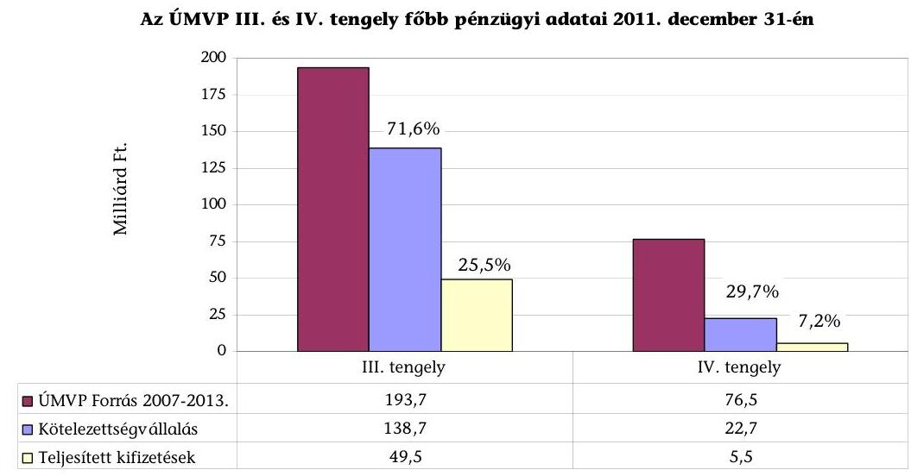

Forrás: MVH
2011. év végéig a III. tengelyben támogatási határozattal lekötött 138,7 milliárd Ft-ból 7,8\% (10,8 milliárd Ft) volt azon projektek részére megítélt támogatás aránya, amelyeknél a határozat meghozatala óta több mint 24 hónap eltelt úgy, hogy kifizetési kérelmet még nem nyújtottak be a kedvezményezettek ${ }^{12}$. Ezekben az esetekben ugyan jogszabály ${ }^{13}$ nyilatkozattételi kötelezettséget ír elő a beruházás megvalósítására, vagy a támogatás lemondására, azonban a programozási időszak végéhez közeledve magas a kockázata annak, hogy lemondás esetén a felszabaduló keretek új projektekre eredményesen nem vonhatók be.

Az ÚMVP-t 2011. év végéig - az EU Bizottság által is elfogadva - hat alkalommal módosították. 2008-ban és 2009-ben az ÚMVP 2. és 7. verziójában került sor azokra a változtatásokra, amelyek a vidéki élet minősége és a vidéki gazdaság diverzifikálása intézkedéseit (III. tengely) érintették ${ }^{14}$. Ennek során a vidékfejlesztés céljainak tartalmát nem változtatták, a módosítások a támogatás intenzitásának a növelésére, és egyes célok (intézkedések, jogcímek) megvalósításához tervezett források közötti átcsoportosításra irányultak.

2008-ban a támogatásra jogosult települések között a hátrányos helyzetű települések nagy számára és a saját erő előteremtésére való képesség korlátozottságára hivatkozással a támogatás intenzitást 40-45\%-ról 60\%-ra, a hátrányos helyzetű területeken 50\%-ról 65\%-ra emelték. Ez a módosítás az ÚMVP célkitű-

[^0]
[^0]:    ${ }^{12}$ A 10,8 milliárd Ft-os támogatási összeget támogatásonként, régiónkénti bontásban részletesen a 15. számú melléklet mutatja be.
    ${ }^{13}$ 23/2007. (IV. 17.) FVM rendelet 25. § (6) bekezdése, hatályos 2010. XII. 23-ától.
    ${ }^{14}$ Az ÚMVP Irányító Hatósága az ÚMVP 2. verzióját, melyről a Monitoring Bizottság 2008 augusztusában döntött, az EU Bizottságnak 2009. szeptember 29-én küldte meg. A források átcsoportosításáról a Monitoring Bizottság 2009. novemberben döntött, az EU Bizottság részére 2011. április 20-án küldte meg az ÚMVP Irányító Hatósága a 7. verziót.

---

zéseivel nem volt ellentétes. A támogatottaknak a projektek megvalósítására kevesebb saját erőt kell biztosítani, amely kedvezőbb feltételeket teremtett a vidéki térségekben jellemző kevésbé tőkeerős vállalkozások számára. Ez kedvezően befolyásolta a projektek saját erejének átlagos megtérülési idejét ${ }^{15}$, amely az ÁSZ-nak küldött tanúsítványok adatai alapján mindössze 8 év. Ugyanakkor a támogatás intenzitás növelésével a rendelkezésre álló forrásokból kevesebb fejlesztés valósítható meg. Ez rontja a támogatások output indikátorai (pl. a beruházások teljes összege, a támogatott mikrovállalkozások száma, támogatott új idegenforgalmi tevékenységek száma) tervezett értékének teljesítését és kedvezőtlen hatást gyakorol az ÚMVP-ben meghatározott hatásindikátorok elérésére.

2009-ben az ÚMVP Irányító Hatósága javaslatot tett a LEADER Helyi Akciócsoportok (LEADER HACS-ok) által a helyi vidékfejlesztési stratégiáikban az egyes intézkedésekre tervezett források alapján az ÚMVP-ben meghatározott pénzügyi keretek átrendezésére. Ez megváltoztatta a források jogcímek közötti megosztásának arányát. A módosítást az EU Bizottság 2011-ben hagyta jóvá. A vidéki életminőség javítása és a vidéki gazdaság diverzifikálása intézkedésein belül az ÚMVP 7. verziójában történt forrásátcsoportosítást az alábbi ábra mutatja:

# A vidéki életminőség javítására irányuló fejlesztési források átcsoportosítása 

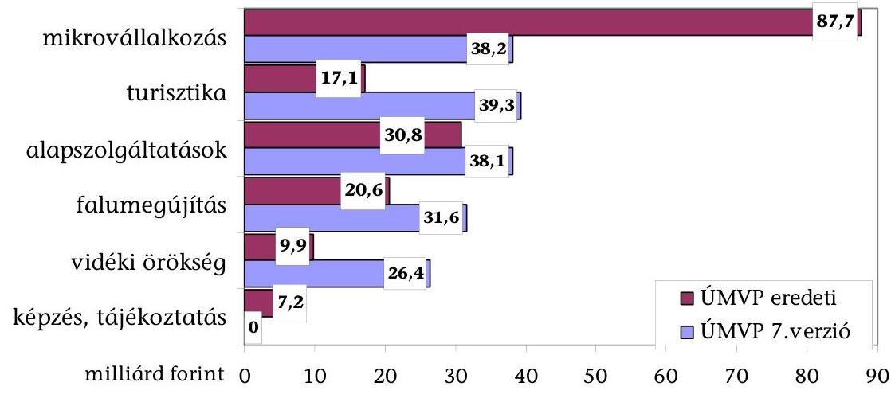

Forrás: ÚMVP 2007. szeptemberi és ÚMVP 7. verzió
A mikrovállalkozások létrehozása és fejlesztése intézkedésre allokált forrás 56,4\%-ának átcsoportosítása az ÚMVP gazdaságfejlesztési programjának a vidéki településeken működő mikrovállalkozások megerősítésére és a helyben történő foglalkoztatás javítására irányuló célkitűzésével ellentétes volt. Ezzel egyidejűleg a vidéki települések vonzerejének, képének javítását, a szolgáltatások színvonalának emelését szolgáló források növelése nem járul hozzá az ÚMVST-ben fő célként megfogalmazott, a vidéki térségek lakosságának ala-

[^0]
[^0]:    ${ }^{15}$ A megtérülési idő számításának képlete: a beruházás önrésze osztva az évi átlagos jövedelemmel, ahol az évi átlagos jövedelem az üzleti (üzemi) tevékenység eredményével egyezik meg.

---

csony gazdasági aktivitásából, az alacsony foglalkoztatottságból és ez által alacsony jövedelmi szintből fakadó társadalmi feszültségek kezeléséhez.

A források átrendezésével egyidejúleg nem került sor a célkitűzések mérésére kidolgozott indikátoroknak (pl. támogatott mikrovállalkozások száma, beruházás teljes összege, többfunkciós szolgáltató központok száma stb.) az intézkedések feltételrendszerében bekövetkező jelentős változása miatt indokolt átfogó felülvizsgálatára. Így a kitűzött célok és a hozzá rendelt források nincsenek összhangban. Az indikátorokat csak részlegesen, megalapozó számítások és hatásvizsgálatok nélkül változtatták meg.

- A mikrovállalkozások létrehozásának és fejlesztésének támogatása intézkedés forrásának 49,5 milliárd Ft-os csökkentésével szemben a támogatott fejlesztések teljes összege mutatót 195 milliárd Ft-ról 104 milliárd Ft-ra csökkentették úgy, hogy az ÚMVP-ben és a jogszabályban meghatározott 60-65\%-os támogatásintenzitást nem vették figyelembe. Így a rendelkezésre álló forrás és hozzá kapcsolódó beruházás teljes összege indikátor aránya 36,7\% lett. Ennek következtében a magasabb támogatásintenzitás jogszabályi előírásainak betartása és a rendelkezésre álló forrás felhasználása mellett a támogatott fejlesztés teljes összege mutató nem valósítható meg.
- A turisztikai tevékenységek ösztönzése intézkedés mutatóit (pl. támogatott új idegenforgalmi tevékenységek száma) annak ellenére nem változtatták meg, hogy forrását az ÚMVP eredeti verziójában meghatározott összeg több mint kétszeresére növelték.
- A falumegújítás- és fejlesztés intézkedés indikátorait (pl. támogatott falvak száma, a beruházás teljes összege) a források növelése ellenére nem változtatták. A vidéki örökség védelme és fenntartható fejlesztése jogcímnél történt módosítások során a források 167,2\%-os növelésével szemben mindössze 27,7\%-kal emelték meg a támogatott intézkedések tervezett számát, ugyanakkor tízszeresére ( 3164 millió Ft-ról 31612 millió Ft-ra) növelték meg a beruházások teljes összegét.

2011. év végéig a lekötött források és a hozzá kapcsolódó - a kitűzött célok mérésére szolgáló - indikátorok teljesítésének aránya eltért egymástól mind a III., mind a IV. tengely intézkedéseinél. Ennek következtében a források felhasználása nem volt hatékony.

- A mikrovállalkozások létrehozása és fejlesztése intézkedés forrásának 82,2\%os lekötésével a támogatott mikrovállalkozások száma, a támogatott fejlesztések teljes összege célként kitűzött értékeinek még felét sem érték el. A kedvezményezettek átlagosan 15,9 millió Ft támogatásban részesültek, a tervezett 8,3 millió Ft-tal szemben.
- A turisztikai tevékenységek ösztönzése forrásainak több mint fele lekötésre került, azonban ettől elmarad a támogatott új idegenforgalmi tevékenységek számának ( $32,8 \%$ ), a beruházás teljes összegének a vállalása. A források alig több mint $50 \%$-os lekötöttsége mellett a kedvezményezettek által vállalt munkahelyek száma ( 1208 db ) azonban kétszerese az ÚMVP-ben tervezetthez képest.

---

- A falumegújítás- és fejlesztés intézkedés forrásai alig háromnegyedére vállaltak kötelezettséget, mégis a támogatott falvak száma a tervezetthez képest két és félszeresére teljesült. Ennek oka, hogy a támogatott projektek átlagos összege 15,3 millió Ft/falu volt, a tervezett forrás és a hozzá kapcsolódó indikátor alapján számított, egy településre jutó 65,3 millió Ft átlagos támogatással szemben. A vidék örökségének védelme és fenntartható fejlesztése jogcím esetében az egy projektre jutó 52,7 millió Ft átlagos támogatással szemben a kedvezményezettek átlagosan 16,6 millió Ft-ból valósították meg a projekteket. A támogatások több településre jutottak el, azonban az egy projektre jutó tényleges beruházási költség tervezettől való nagyarányú eltérése a nem megalapozott tervezésre utal.
- A vidéki gazdaság és lakosság számára nyújtott alapszolgáltatások keretén belül a támogatott tanyabusz szolgáltatások száma öt és félszeresére, a többfunkciós szolgáltató központok száma 33,3\%-ra teljesült a források 93,9\%-os lekötöttsége mellett.
- A IV. tengely céljai a módosítások során nem változtak. A helyi fejlesztési stratégiák megvalósításának mérésére meghatározott mutatók (pl. a támogatott akciócsoportok száma, akciócsoportok által támogatott helyi projektek száma) a stratégiai célok elérésének mérésére nem alkalmasak ${ }^{16}$. A térségek közötti és nemzetközi együttmúködés intézkedés keretében támogatott együttműködési projektek száma a tervezett 200 db-bal szemben 2011 végén már 201\%-ra teljesült, a 7,6 milliárd Ft tervezett támogatás mindössze $14,4 \%$-os lekötése mellett.

Az ÚMVP irányítását és végrehajtását meghatározó jogszabályi háttér kialakítása - figyelemmel az 1698/2005/EK tanácsi rendeletben megfogalmazott azon alapelvre, mely szerint különleges állami támogatási szabályokat kell a tagállamoknak létrehozniuk - megtörtént. Az Országgyúlés törvényi szinten szabályozta - a 2007. évi XVII. törvényben - a végrehajtás alapelveit, az egységes intézményi, információs és eljárási szabályokat, azoknál előírva a Ket. szabályainak alkalmazását. Az általános eljárásrendi szabályokon túl az egyes intézkedések részletes feltételrendszerét törvényi felhatalmazás alapján a miniszter rendeletben állapította meg. A rendeleti szintű szabályok azonban nagy számuk és gyakori módosításuk következtében csökkentették az átláthatóságot, nehézkessé téve az eligazodást a támogatásokat igénybe venni szándékozók számára.

Az ügyfeleknek a kifizető ügynökség közleményeket tett közzé az egyes intézkedésekhez kapcsolódó általános és részletes eljárásrendi szabályok összefoglalásáról. Ennek ellenére a megkérdezett kedvezményezettek közel fele ${ }^{17}$ mégsem

[^0]
[^0]:    ${ }^{16} \mathrm{Az}$ ÚMVP a helyi stratégiák megvalósításának céljaként a belső erőforrások fenntartható és innovatív felhasználásának elősegítését, a vidéki szereplők közötti együttmúködés megalapozását, a helyi innovatív megoldások és az átfogó társulások múködtetését, a vidéki régiók életszínvonalának emelését, a munkahelyek megőrzését és újak létrehozását, valamint az élethosság tartó tanulás elősegítését jelölte meg.
    ${ }^{17}$ A webes felületen tanúsítványokkal és kérdőívekkel megkeresett projektgazdák 46,6\%-a nyilatkozott úgy, hogy egy pályázatíró (19,2\%), illetve döntő részben pályázatíró $(27,4 \%)$ készítette el a pályázati dokumentációját.

---

önállóan készítette el a támogatási kérelmét. Az egyes jogcímekre benyújtott támogatási kérelmek esetében még így is jellemzően magas (átlagosan 21$22 \%$ ) volt az elutasított kérelmek aránya.

Az ÚMVP-ben meghatározott vidékfejlesztési célok megvalósítása érdekében az irányításért és végrehajtásért felelős intézményrendszer kialakítása megtörtént. Az 1698/2005/EK tanácsi rendelet értelmében a program hatékony, eredményes és szabályszerű végrehajtásáért felelős irányító hatóság feladatait a 2007. évi XVII. törvény az agrárpolitikáért felelős miniszter jogkörébe telepítette. A kifizető ügynökség feladatait a Mezőgazdasági és Vidékfejlesztési Hivatal (MVH) látta el. Az ÚMVP Irányító Hatósága az igazoló szervi feladatok ellátására nyílt közbeszerzési eljáráson kiválasztott szolgáltatót bízott meg ${ }^{18}$. Az ÚMVP Irányító Hatóság - az 1698/2005/EK tanácsi rendelettel összhangban - a minisztérium háttérintézményeként múködő Vidékfejlesztési, Képzési és Szaktanácsadási Intézetre (VKSZI) ruházta át feladatainak egy részét (ÚMVP kapcsolódó tájékoztatási és nyilvánossági feladatai, szaktanácsadási és képzési feladatok, Magyar Nemzeti Vidéki Hálózat fenntartása, működtetése, irányítása).

A LEADER-megközelítés megvalósításában részt vevő, a köz- és magánszféra partnerségén alapuló LEADER HACS-ok megalakítására több fázisban került sor. Az ÚMVP Irányító Hatósága - a LEADER HACS-ok alakítására az 1698/2005/EK tanácsi rendeletben biztosított lehetőségek közül ${ }^{19}$ - új közösségek alakítása mellett döntött. Létrehozásukban a helyi vidékfejlesztési irodák közreműködtek, melyek feladatul kapták a LEADER HACS-ok megalakításának és a helyi vidékfejlesztési stratégiák elkészítésének támogatását, valamint a készségek fejlesztésének, a LEADER-folyamat elsajátításának segítését. Ezen túl projektgeneráló, valamint információszolgáltató feladatokat is elláttak. A helyi közösségek LEADER HACS-ként történő 2008. szeptemberi előzetes elismerését, majd a helyi vidékfejlesztési stratégiák 2009. májusi jóváhagyását követően a helyi vidékfejlesztési irodák támogatását csak 2010 nyarán szüntették meg. A feladatellátásuk során felmerült kiadásaik finanszírozását a készségek elsajátítása, ösztönzés és végrehajtás intézkedésből biztosították, melyből 2008-tól a finanszírozásuk megszűnéséig 3,9 milliárd Ft támogatásban részesültek.

A miniszter a LEADER HACS-ok civil partnerségre vonatkozó előírásainál - az 1698/2005/EK tanácsi rendeletben foglalt minimumnál (50\%) - magasabb $60 \%$-os arányt határozott meg. Ennek az előírásnak való megfelelés a gyakorlatban nehézségekbe ütközött. Megalakulásukkor még teljesítették a civil partnerségre vonatkozó, a 93/2007. (VIII. 29.) FVM rendelet szerinti szabályt. A 2011 végére az időközben átalakult, újraválasztott LEADER döntő bizottságokból tizennyolc már nem felelt meg a hazai $60 \%$-os civil arányt előíró rendeletnek, egynél nem teljesült az 50\%-os civil arányt előíró uniós előírás sem.

[^0]
[^0]:    ${ }^{18}$ Az igazoló szervi feladatokat a KPMG Hungária Kft. és a KPMG Tanácsadó Kft., mint közös ajánlattevő látja el 2011. augusztus 9-én kelt szerződés szerint.
    ${ }^{19}$ A LEADER II vagy a LEADER+ kezdeményezésekre vagy a LEADER-megközelítés szerinti követelményeknek egyszer már megfelelt csoport, vagy az érintett terület különféle helyi társadalmi-gazdasági ágazataiból való partnereket képviselő új csoport.

---

Az Irányító Hatóság a LEADER HACS-ok múködésére az ÚMVP-ben működési célokra eredetileg tervezetthez képest összesen 20\%-kal csökkentette a múködési forrásokat (2010-ben, illetve 2011-ben) a III. tengely készségek elsajátítása, ösztönzése, valamint a IV. tengely helyi akciócsoportok múködtetése intézkedés terhére. Ezzel jelentősen csökkentette a LEADER HACS-ok mozgásterét a költségvetés szempontjából, mind annak időtávját, mind keretösszegét tekintve. Az így rendelkezésre álló 23,7 milliárd Ft-ból 2011 végéig 13,1 milliárd $\mathrm{Ft}^{20}$ kifizetése történt meg.

A 96 LEADER HACS az ellenőrzött időszakban eltérő költséghatékonysággal és eredményességgel múködött. Működési kiadásaikon belül - az MVH-hoz benyújtott elszámolásaikban közölt adatok szerint - a személyi jellegű ráfordítások nagyságrendje jelentősen eltérő volt. Aránytalanságok voltak a vezetők és a beosztottak számát, a vezetők tiszteletdíját illetően. Ezen túl 22 LEADER HACS-nál fizettek évente több alkalommal több százezer Ft-os jutalmat. A dologi kiadásokon belül az átlagot jelentősen meghaladó méretű ingatlan bérletek is előfordultak. ${ }^{21}$ Az adminisztratív és helyszíni ellenőrzést az MVH végzett, ugyanakkor a költségek célszerűségét és megalapozottságát nem ellenőrizte. A LEADER HACS-ok közel azonos múködési költség felhasználása mellett eltérő eredményeket értek el.

Az ÚMVP Irányító Hatósága a támogatások igénylésének bonyolult rendszerét alakította ki. A III. tengely intézkedéseinek egy része (IKSZT, tanyabusz) úgynevezett központi meghirdetésű volt. Ezeknél az MVH bírálta el a beérkezett támogatási kérelmeket, melyekről a forrásokat mérlegelve az Irányító Hatóság döntött. Másik részénél (mikrovállalkozások, turisztika, falumegújítás, vidéki örökség), az úgynevezett nem horizontális intézkedéseknél - alkalmazva a LEADER-megközelítést - a LEADER HACS-ok részt vettek a támogatások elbírálásában, pontozásában.

A miniszter az intézkedések végrehajtására kiadott jogszabályok mellékletében meghatározta a támogatási kérelmek pontozásának kritériumait (pl. projekt HVS-hez való illeszkedése, fejlesztéssel létrehozott munkahelyek száma, „Kommunikációs terv" stb.) és az egyes kritériumokra adható maximális pontszámokat, melyek LEADER HACS-onként is eltérőek voltak. Szakmai minimum ponthatárok előzetesen nem kerültek kialakításra. Mértékeit a LEADER HACSok bevonásával megvalósított támogatásoknál a rangsorállítást követően állapították meg. A ponthatárok saját hatáskörű meghatározásával az Irányító Hatóság és a LEADER HACS-ok befolyásolni tudták a támogatási források teljes kimerítését. Ezért fordulhattak elő jelentős eltérések ugyanazon intézkedés nyertes projektjeinek pontszámaiban. A pontozásban az eltérések az első és a második támogatási körben (10-30\%-os sáv), valamint az egyes régiók között is (28-106\%-os sáv) szembetűnőek voltak. A 2011. évi, központi lebonyolítású bírálati folyamatban már alkalmaztak minimum, 50\%-os szakmai ponthatárt.

[^0]
[^0]:    ${ }^{20}$ Ebből a forrásból történt a helyi vidékfejlesztési irodák működési kiadásainak finanszírozása is 2010-ig.
    ${ }^{21}$ Szatmár LEADER Vidékfejlesztési Egyesület $400 \mathrm{~m}^{2}$-es, a Homokhátság Fejlődéséért Nonprofit Kft. $235 \mathrm{~m}^{2}$-es irodát bérelt. Ezzel szemben a Közép-Tisza-Zagyva Vidékfejlesztési Egyesület irodájának alapterülete $35 \mathrm{~m}^{2}$.

---

A LEADER-megközelítés alkalmazása a III. tengely intézkedéseinél nem volt hatékony, miután jellemző volt, hogy nagyon alacsony pontszámot elért projektek is részesülhettek támogatásban ${ }^{22}$. A megítélt támogatások 32,1\%-a a maximálisan elérhető pontszám alsó harmadába esett, valamint a maximális pontszám 20\%-ának elérése esetén is támogatáshoz juthattak az ügyfelek. A LEADER HACS-ok bevonásával elbírált támogatások odaítélésénél a helyi szempontok érvényesítését kizárólag a helyi fejlesztési stratégiához való illeszkedés alapján értékelték. Az arra adható pontok az elérhető maximális pontok számának csak a 12-14\%-át jelentették, így a helyi célokhoz való illeszkedés súlya sem volt jelentős. A jóváhagyott kérelmek 10-15\%-ánál olyan projektek is részesültek támogatásban, amelyek 0 pontot kaptak a helyi fejlesztési stratégiához való illeszkedés szempontjára. Mindez veszélyeztette az ÚMVP-ben a vidéki élet minőség javítására és a vidéki gazdaság diverzifikálására irányuló célok megvalósulását.

Az Irányító Hatóság a pénzügyi források iránti igények benyújtására ritkán és rendszertelenül adott lehetőséget ${ }^{23}$. A kérelemkezelést ellátó MVH és a delegálási szerződés alapján a LEADER HACS munkaszervezetek nem voltak kellően felkészültek a beérkezett kérelmek feldolgozására és értékelésére az egyes intézkedések tervektől eltérő indítása, a kérelembenyújtási időszakokban felhalmozódott feladatokhoz képest elégtelen kapacitások miatt. A ritkán meghirdetett kérelembenyújtási időszakok alkalmával felhalmozódó jelentős mennyiségű feladat hozzájárult ahhoz, hogy a támogatási kérelmek feldolgozásának időtartama rendszeresen és jelentősen (átlagosan 394 nap) meghaladta a 2007. évi XVII. törvényben előírt ${ }^{24}$, az ügyintézés egyes szakaszainak végrehajtására vonatkozó határidőket. A kifizetési kérelmek feldolgozásának és teljesítésének átlagos 63-129 napos időtartama minden jogcímnél meghaladta az MVH rendelkezésére álló határidőt.

A IV. tengely LEADER fejlesztési források második, 2011. évi pályázati körében a fejlesztési pályázatok eredményesebbek voltak a körültekintőbben előkészített pályázati kiírás és a projektjavaslatok előzetes összegyűjtése következtében. A két pályázat-kiírási fordulót összehasonlítva a gazdaság- és vállalkozásfejlesztés szempontjából is kedvező folyamatok tapasztalhatók. A 2011. évben felülvizsgált stratégiák alapján megduplázódtak a vállalkozásfejlesztésre meghirdetett fejlesztési források, arányuk 31\%-ról 53\%-ra nőtt, miközben a közösségi cé-

[^0]
[^0]:    ${ }^{22}$ A támogatott projektek pontszámait, azok szórását intézkedésenként és támogatási körönként a 7. számú melléklet mutatja.
    ${ }^{23}$ Az ÚMVP 2007. évi jóváhagyása óta az integrált közösségi és szolgáltató tér alintézkedésnél egy, a mikrovállalkozások fejlesztése és a turisztikai tevékenységek ösztönzése jogcímeknél három, a falumegújítás- és fejlesztés, valamint a vidéki örökség megőrzése intézkedéseknél és a tanyabusz alintézkedésnél mindössze két alkalommal került sor. A IV. tengely LEADER-megközelítés intézkedései esetében a 2009. novemberdecemberi benyújtási időszakot csak 2011. október-decemberben követte a második.
    ${ }^{24}$ A 2007. évi XVII. törvény 41., 55, és 56. §-ai - 2010. december 23-ától hatályos előírásai szerint - a hiánypótlásra az ügyintézési határidő kezdetét követő 45 munkanap, döntéshozatalra szintén 45 munkanap, rangsor állítása estén 3 hónap állt az MVH rendelkezésére. A kérelem érdemi vizsgálat nélküli elutasításáról 22 munkanapon belül kellett az MVH-nak döntenie.

---

lú fejlesztések aránya és összege alig változott, viszont a rendezvényekre fordítható források az első stratégiában meghatározottakhoz képest harmadával csökkentek. Az ügyfelek közül az egyéni vállalkozók száma az összes pályázó között négyszeresére, a magánszemélyeké hatszorosára nőtt. Ez utóbbiak közül szinte mind vállalkozások létrehozásához, fejlesztéséhez igényelt támogatást.

Az ÚMVP-ben a technikai segítségnyújtás intézkedéseinek megvalósítására - az 1698/2005/EK tanácsi rendelet előírásaival összhangban - az ÚMVP összes közkiadásának 4\%-át elkülönítették. A forrást három tevékenységre allokálták, melyek a Magyar Nemzeti Vidéki Hálózat létrehozása, cselekvési tervének megvalósítása, az ÚMVP előkészítésének, nyomon követésének és ellenőrzésének támogatása, valamint az ÚMVP értékelésének és kommunikálásának támogatása. A technikai segítségnyújtás múveletek 57,6 milliárd Ft összes közkiadásának egyes feladatokra történő felosztása nem volt kellően megalapozott és átgondolt. Erre tekintettel az ÚMVP Irányító Hatósága a keretnek a Magyar Nemzeti Vidéki Hálózat létrehozására és fenntartására elkülönített 33\%-át lecsökkentette az összes forrás $13,15 \%$-ára, ezzel egyidejúleg az ÚMVP nyomon követésére, értékelésére és ellenőrzésére szolgáló részét 57\%-ról 75\%-ra változtatta. A kommunikálás és tájékoztatás 10\%-os arányú eredeti forrását 11,85\%ra növelték.

A technikai segítségnyújtás múveletekre allokált források lekötöttsége 92\%-os, a kifizetéseké 63\%-on állt 2011. végén. A források magas lekötöttségéhez hozzájárult, hogy egyes nagy összegű szerződések a teljes programozási időszakra szólnak (pl. a Hálózat és ÚMVP Irányító Hatósága között a Hálózat múködtetésére és cselekvési tervének megvalósítására).

A technikai segítségnyújtás egyes tevékenységeire a kötelezettségvállalás és a kifizetés 2011. végén az alábbi volt:

A technikai segítségnyújtás föbb pénzügyi adatai 2011. december 31.
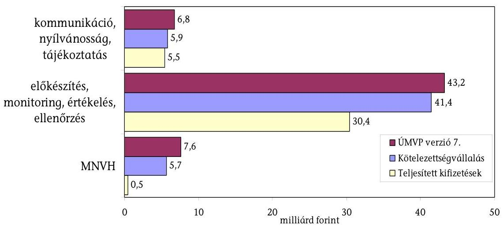

Forrás: MVH

---

A forrásokat az általános eljárásrendi szabályokban meghatározott kedvezményezett szervezetek használták fel az 1698/2005/EK tanácsi rendeletben meghatározott tevékenységekre. Az Irányító Hatóság, a technikai segítségnyújtás forrásainak felhasználásával kapcsolatban az ÚMVP-ben vállalt nyílt és átlátható eljárásokra vonatkozó kötelezettségét nem teljesítette, mert a közbeszerzési értékhatár alatti beszerzéseket megelőzően nem folytatott le pályáztatási eljárást.

Az ÚMVP-ben meghatározták a technikai segítségnyújtás műveletek előrehaladásának nyomon követésére és értékelésére szolgáló mutatókat (pl. általános információkat tartalmazó elkészített, illetve közzétett kiadványok száma, képzésekben részt vevő személyek száma). Az éves előrehaladási jelentésekben beszámoltak az egyes kedvezményezett szervezetek által a technikai segítségnyújtás intézkedései megvalósítására tett lépésekről, a tervezett eredmények megvalósításának állásáról, ugyanakkor nem mutatták be a mutatók teljesülésülését. A technikai segítségnyújtás forrás terhére megvalósított intézkedések ÚMVP végrehajtására gyakorolt hatásának megállapítására, objektív mérésére nem dolgoztak ki eljárásrendet.

A Monitoring Bizottság folyamatosan figyelemmel kísérte és értékelte a végrehajtás eredményeit, különösen a prioritástengelyek esetében a kitűzött célok elérését. A személyes jelenlét helyett az írásbeli eljárások alkalmazását megengedő bizottsági munkarend és a tagok bizottsági ülésekről való rendszeres távolmaradása ugyanakkor az ÚMVP végrehajtásának testületi formában történő folyamatos nyomon követését és értékelését, saját kezdeményezésű beavatkozásokat nem tette lehetővé. Így az ÚMVP végrehajtásának minőségét felügyelni hivatott, a végrehajtó szervezetektől részben függetlenített funkció ellátása alacsony hatékonyságú volt. A Monitoring Bizottság feladatellátását segítette elő ügyrendjének 2011. februári módosítása. Ebben előírták, hogy a tagszervezet törlésre kerül, amennyiben a delegált tag két egymást követő írásbeli eljáráson nem szavaz, illetve amennyiben két egymást követő ülésen nem jelenik meg, vagy megjelenik, de a döntési pontok 50\%-a esetében nem szavaz.

Összességében a falumegújítás- és fejlesztés, valamint a vidéki örökség megőrzésének intézkedései hozzájárultak a vidéki területek életminőségének javításához, a források felhasználása hatékony volt. A vidéki térségek - ÚMVP helyzetértékelésében is bemutatott, az országos átlaghoz képest - jelentős lemaradása azonban nem csökkent. A gazdaság diverzifikálására irányuló intézkedéseknek (mikrovállalkozások és turisztikai tevékenység fejlesztése) foglalkoztatásra gyakorolt hatása csekély, csak részben járult hozzá a gazdasági aktivitás növeléséhez.

A vidéki térségekben az egy főre jutó GDP-ben, munkanélküliségi rátában, az aktivitási rátában, a foglalkoztatási rátában, a belföldi vándorlási különbözetnél 2005. évhez képest pozitív irányú elmozdulás nem tapasztalható. Ebben szerepet játszott az is, hogy a befejezett projektek száma alacsony, a rendelkezésre álló forráskerethez képest a kifizetések aránya mindössze 20,4\%.

Az ÚMVP-ben az eredmények mérésére meghatározott indikátorokat és ezek elérését biztosító forrásokat nem komplexen és nem összehangoltan változtatták, kevésbé összpontosítottak a támogatási rendszertől elvárt eredményekre, telje-

---

sítményekre és hatásokra. Ez veszélyezteti a területfejlesztési, felzárkózási és az ÚMVP kitűzött céljainak elérését.

A kialakított támogatási rendszerben a LEADER-megközelítés alkalmazása nem volt hatékony, mert a célterületek nagy száma volt jellemző, nagyon alacsony pontszámot elért projektek is részesülhettek támogatásban, valamint a projekteket nem egy stratégai cél mentén valósították meg a térségben. Az alkalmazott eljárási rend időigényessége a vállalkozások számára magas kockázatot hordozott.

Az Állami Számvevőszékről szóló 2011. évi LXVI. törvény 33. § (1) bekezdésében foglaltak értelmében a jelentésben foglalt megállapításokhoz kapcsolódó intézkedési tervet köteles az ellenőrzött szervezet vezetője összeállítani és azt a jelentés kézhezvételétől számított harminc napon belül az ÁSZ részére megküldeni. Amennyiben az intézkedési tervet határidőben nem küldi meg a szervezet, vagy az nem elfogadható, az ÁSZ elnöke a hivatkozott törvény 33. § (3) bekezdés a)-b) pontjaiban foglaltakat érvényesítheti.

Az ellenőrzés intézkedést igénylő megállapításai és javaslatai:

# a vidékfejlesztési miniszternek 

1. A források átrendezésével egyidejűleg nem került sor a célkitűzések mérésére kidolgozott, az intézkedések eredményességét és hatékonyságát mérő indikátoroknak (output- és eredményindikátoroknak) az intézkedések feltételrendszerében bekövetkező jelentős változása miatt indokolt átfogó felülvizsgálatára. A mutatókat csak részlegesen, megalapozó számítások és hatásvizsgálatok nélkül változtatták meg. Mindezek következtében a kitűzött célok és a hozzá rendelt források nincsenek összhangban.

Javaslat:
Intézkedjen az ÚMVP-ben meghatározott output- és eredményindikátorok átfogó felülvizsgálatára a rendelkezésre álló pénzforrások és az elérendő célok összhangjának megteremtése érdekében. A felülvizsgálat eredménye alapján az ÚMVP Irányító Hatósága kezdeményezze a Monitoring Bizottság döntését az indokolt módosítások elvégzésére és az Európai Bizottság által történő jóváhagyására.
2. A 2011. év végéig a lekötött források és a hozzá kapcsolódó - a kitűzött célok mérésére szolgáló - indikátorok teljesítésének aránya eltért egymástól mind a III., mind a IV. tengely intézkedéseinél. Ennek következtében a források felhasználása nem volt hatékony, amely veszélyezteti a vidékfejlesztés kitűzött céljainak elérését.

Javaslat:
Intézkedjen az ÚMVP III. és IV. tengelyébe tartozó egyes intézkedések megvalósítására rendelkezésre álló, még le nem kötött és az esetleges lemondások miatt felszabaduló források eredményes és hatékony felhasználására az elérendő célok megvalósítása érdekében.

---

3. A támogatási rendszer megbízható múködését, az ÚMVP-ben meghatározott vidékfejlesztési célok megvalósulását veszélyeztette, hogy az ÚMVP Irányító Hatósága a pénzügyi források iránti igények benyújtására ritkán és rendszertelenül adott lehetőséget. A támogatási és kifizetési kérelmek feldolgozása rendszeresen és jelentősen meghaladta a 2007. évi XVII. törvényben meghatározott ügyintézési határidőket. A III. és IV. tengelyben rendelkezésre álló 270,2 milliárd Ft forrás 59,7\%-ára történt kötelezettségvállalás, a kifizetések aránya mindössze 20,4\% volt.

Javaslat:
Intézkedjen arról, hogy a III. és IV. tengely forrásai eredményes felhasználása érdekében az Irányító Hatóság olyan ütemben és számban hirdessen meg intézkedéseket, amely figyelembe veszi a programozási időszakból még rendelkezésre álló időt, az ügyintézési határidőket, valamint a korábbi támogatások kiírásainak tapasztalatai alapján hatékony konstrukciókat.
4. Az ÚMVP-t az elmúlt 5 évben több alkalommal módosították, azonban ennek során kevésbé összpontosítottak a támogatási rendszertől elvárt eredményekre, teljesítményekre és hatásokra. Ez veszélyezteti a területfejlesztési, felzárkózási és az ÚMVP kitűzött céljainak elérését. A kialakított támogatási rendszerben a LEADER-megközelítés alkalmazása nem volt hatékony, mert a célterületek nagy száma volt jellemző, valamint a projekteket nem egy stratégai cél mentén valósították meg a térségben. A támogatások igénylésének bonyolult rendszerét alakították, amely időigényessége miatt a vállalkozások számára magas kockázatot hordozott

Javaslat:
A 2014-2020. évek közötti programozási időszakra szóló tervezés során helyezzen hangsúlyt a vidékfejlesztési programokkal elérni kívánt eredményekre és teljesítményekre, a kialakított területfejlesztési és felzárkózási célok figyelembevételével a projektek közötti szinergiára, annak érdekében azok egy stratégiai cél mentén kerüljenek megvalósításra.

# a Mezőgazdasági és Vidékfejlesztési Hivatal elnökének 

1. A támogatási kérelmek feldolgozásának időtartama (átlagosan 394 nap) valamint a kifizetési kérelmek feldolgozásának és teljesítésének átlagos időtartamai (63-129 nap) rendszeresen és jelentősen meghaladták a 2007. évi XVII. törvényben előírt, az ügyintézés egyes szakaszainak végrehajtására vonatkozó határidőket.

Javaslat:
Gondoskodjon arról, hogy az ÚMVP III. és IV. tengelyébe tartozó jogcímek megvalósítása során a kedvezményezettek által benyújtott támogatási és kifizetési kérelmek elbírálása, a támogatási határozatok kibocsátása és a támogatások kifizetése a 2007. évi XVII. törvény 41., 55. és 56. §-a szerinti, az ügyintézés egyes szakaszainak végrehajtására előírt határidőben megtörténjen.

---

# II. RÉSZLETES MEGÁLLAPÍTÁSOK 

## 1. A VIDÉKFEJLESZTÉS KÖZPONTI ÉS HELYI STRATÉGIAI CÉLJAI

### 1.1. Az uniós és a hazai vidékfejlesztési célok és stratégiák közötti összhang

Magyarország - eleget téve az 1698/2005/EK tanácsi rendeletben foglaltaknak, mely szerint a tagállamoknak el kell készíteniük a nemzeti stratégiai tervüket és annak végrehajtására vonatkozó programjukat - kidolgozta nemzeti stratégiai tervét (ÚMVST) és annak végrehajtására elkészítette az ÚMVP-t. Az ÚMVP Magyarországnak a 2007-2013 közötti középtávú időszakra szóló, az ÚMVST által meghatározott keretek végrehajtására kidolgozott programja, amely négy tengely és a technikai segítségnyújtás mentén határozza meg a végrehajtandó intézkedéseket.

Az ÚMVST-ben és az ÚMVP-ben meghatározott célkitúzések összhangban állnak az 1698/2005/EK tanácsi rendeletben foglaltakkal. Az ÚMVST és az ÚMVP céljai összhangban álltak az Országos Fejlesztéspolitikai Koncepció (OFK) ${ }^{25}$ célkitűzéseivel is.

Magyarország 2007-2013 közötti vidékfejlesztési célkitűzéseit az ÚMVST tartalmazza, amely négy intézkedéscsoporthoz összesen 15 beavatkozási akciót határozott meg $^{26}$. Az ÚMVST-ben a vidéki élet minőségének javítása érdekében a III. intézkedéscsoport - összhangban „A vidéki térségek életminőségének javítása és a diverzifikáció ösztönzése" Közösségi Stratégiai Iránymutatással - három beavatkozási akción keresztül valósul meg. A beavatkozási akciók a diverzifikáció, a mikrovállalkozások és a turizmus támogatása, az alapszolgáltatásokhoz való hozzáférés javítása és a természeti és kulturális örökség megőrzése (falumegújítás), valamint a készségek elsajátításához támogatás.

Az ÚMVP és az ÚMVST készítése időben összekapcsolódott, párhuzamosan történt a két dokumentum kidolgozása. Az ÚMVST tárcaközi egyeztetése 2006. augusztusban történt meg, majd ezt követően 2007. január 10-én került sor a Kormány elé terjesztésére. Az ÚMVP tervezetét 2007. januárban informálisan benyújtották a Bizottság részére, de hivatalos benyújtása az EU Bizottsághoz 2007. szeptemberben történt. Az EU Vidékfejlesztési Bizottság 2007. szeptember 19-én fogadta el az ÚMVP-t, amelyet 2007. október 24-én B (2007) 5121 számú határozatában az EU Bizottság is jóváhagyott.

[^0]
[^0]:    ${ }^{25}$ Az OFK hosszú távú területpolitikai céljai a térségi versenyképesség ösztönzése, a területi felzárkózás megteremtése, a fenntartható térségfejlődés és örökségvédelem, a területi integrálódás Európába, valamint a decentralizáció és regionalizmus erősítése.
    ${ }^{26}$ Az intézkedéscsoport és beavatkozási akciók az ÚMVST által használt fogalmak, amelyek az ÚMVP-ben a tengely és intézkedés fogalmaknak felelnek meg.

---

Annak ellenére, hogy a magyar törvényi és rendeleti szintű jogalkotás és kormányzati kommunikáció hivatkozási alapnak tekintette az ÚMVST-t és az ÚMVP-t, elfogadásukról a Kormány határozatban nem döntött.

Az ÚMVST és az ÚMVP helyzetelemzése összhangban állt egymással. Az ÚMVP - az ÚMVST-hez hasonlóan - nem volt kellően kidolgozott a LEADERmegközelítés érvényesítésének részletezésében, ugyanakkor megfelelő keretet jelent a megvalósításhoz, hogy az alulról szerveződő kezdeményezések ne sérüljenek.

A III. tengely fő célkitűzése - az ÚMVST-vel összhangban - a vidéki gazdaság diverzifikálása, a vidéki területek életminőségének javítása, képzés és tájékoztatás, valamint a készségek elsajátításának ösztönzése.

A III. tengely célkitűzései között kiemelt jelentőséget kapott az agrárgazdasági jövedelmezőség javításán túlmenően a lakosságnak alternatív, kiegészítő jövedelmet és megélhetést nyújtó gazdasági diverzifikáció. A vidéki térségek gazdaságában a 10 főnél kevesebbet foglalkoztató vállalkozások aránya nagy, az ÚMVP szerint ezek szerepe munkavállalási és szociális szempontból egyaránt jelentős. A vállalkozások növekedése és az új munkahelyek létrehozása fontos eleme a vidéki gazdaság fejlesztésének. A vidéki gazdaság diverzifikálásának ösztönzése három fejlesztési célterület támogatásával valósul meg, melyek a 311 Nem mezőgazdasági tevékenységgé történő diverzifikálás, a 312 Mikrovállalkozások létrehozásának és fejlesztésének támogatása, valamint a 313 Turisztikai tevékenységek ösztönzése.

A vidéki területek életminőségének javítása szintén három fejlesztési célterületre bomlik, melyek a 321 A vidéki gazdaság és a lakosság számára nyújtott alapszolgáltatások, a 322 Falumegújítás és fejlesztés támogatása, valamint a 323 Vidéki örökség megőrzése.

A 331 Képzés és tájékoztatás céljára elkülönített forrásból a vidéki térségekben élők ismereteinek, információinak és készségeinek fejlesztését tervezték támogatni.

A 341 Készségek elsajátítása és ösztönzés intézkedés célja az integrált vidékfejlesztési stratégiák kidolgozása a helyi vidékfejlesztési irodák koordinálása és támogatása mellett, a LEADER akciócsoportok múködésének támogatása.

# A IV. tengely intézkedéseit a LEADER-megközelítés alkalmazásával 

kell megvalósítani. Ebben a megközelítésben a helyi LEADER HACS-ok - a közösségi kezdeményezés szerepének növelésével - ösztönzik a vidéki szereplőket, hogy térségük hosszú távú lehetőségeiről történő együttgondolkodásban és a térség fenntartható fejlődésének megerősítése mellett integrált, innovatív fejlesztéseket valósítsanak meg. A hagyományos, fentről lefelé megvalósuló fejlesztésekkel szemben, az alulról felfelé történő LEADER-megközelítés megvalósítása ${ }^{27}$ a hagyományosnál magasabb költségekkel, kockázatokkal jár, de a dön-

[^0]
[^0]:    ${ }^{27}$ Európai Unió Számvevőszéke 5/2010. számú, A LEADER-megközelítés a vidékfejlesztés gyakorlatában különjelentés, 6. oldal I. pont: „A Leader-megközelítés a finanszírozás hagyományos módszereihez képest magasabb költségekkel és nagyobb kockázatokkal jár, a végrehajtás ugyanis eggyel több szinten történik, az uniós költségvetés irányítását pedig sok helyi partnerség (HACS, helyi akciócsoport) veszi át."

---

tési folyamatban szerephez jutott helyi LEADER közösség elkötelezettsége a saját fejlesztési céljai iránt, azok támogatása többletértéket teremthet. Mind a helyi közösségeken belül, az erősödő helyi kapcsolatok kialakításával, mind a megvalósult fejlesztések hasznosulásával, a fejlesztésben érdekeltek elkötelezettsége erősebbé válik, az egyedi új megoldások és az innováció tere nő.

A technikai segítségnyújtás múveletek a program egészére kiterjedően elvégzendő előkészítő, ellenőrzési, nyomon követési, értékelési tevékenységekre biztosítanak forrásokat. A pénzügyi keret - a célokhoz illeszkedően - három fő támogatási területre oszlik: a Magyar Nemzeti Vidéki Hálózat létrehozására, működtetésére; az ÚMVP megvalósításához, értékeléséhez kapcsolódó költségek finanszírozására; valamint az ismertségét növelő, az elért eredmények bemutatását segítő széleskörű tájékoztatás támogatására.

Az 1. támogatási terület körében finanszírozzák a Magyar Nemzeti Vidéki Hálózat létrehozását és múködtetését, amely a vidékfejlesztéssel foglalkozó szervezetek és közigazgatási szervek információs és együttmúködési tevékenységeit koordinálja. A 2. támogatási terület keretében az ÚMVP előkészítésével, végrehajtásával, értékelésével, auditálásával, ellenőrzésével kapcsolatos feladatokat, a végrehajtáshoz szükséges informatikai rendszerek beszerzését finanszírozzák. A 3. támogatási terület kedvezményezett tevékenységei az ÚMVP által kínált lehetőségekről és annak eredményeiről való tájékoztatás, a széleskörű nyilvánosság megteremtése, a kommunikációs akcióterv végrehajtása érdekében tett intézkedésekkel kapcsolatosan felmerülő költségek finanszírozása: tanulmányok, publikációk készítése, képzési programok, workshopok tartása.

Az ÚMVP a forrásfelosztási irányelveket az 1698/2005/EK tanácsi rendelettel összhangban határozta meg, a vidékfejlesztési források elosztása az érvényes uniós szabályok figyelembevételével történt. Teljesült az 1698/2005/EK tanácsi rendelet 17. cikkében „a célkitüzések közötti egyensúlyra" előírt szabály, a teljes vidékfejlesztési keretből a III. tengelyre előírt minimum $10 \%$-os, a IV. tengelyre előírt minimum $5 \%$-os és a technikai segítségnyújtás keretre előírt maximum $4 \%$-os arány. A III. és IV. tengelyre az ÚMVP a fejlesztési források 13,4 és 5,3\%-át osztotta el, a technikai segítségnyújtás keret forrásainak aránya 3,9\% volt. (A III-IV. tengely és a technikai segítségnyújtás forrásainak allokációját a 2/a-c. számú mellékletek mutatják be.)

A Vidékfejlesztési Minisztérium a jelentéstervezetre 2012. július 25-én kelt észrevételében kifogásolta, hogy a technikai segítségnyújtás százalékos aránya jogszabály szerint $4 \%$.

Az észrevételét nem fogadtuk el, mivel az 1698/2005/EK tanácsi rendelet 66. cikk (2) bekezdése szerint a tagállamok a teljes program megvalósítására jutó forrás legfeljebb $4 \%$-át fordíthatják a technikai segítségnyújtás műveletek megvalósítására. Jelentésünkben azt a tényt rögzítettük, hogy Magyarország a technikai segítségnyújtás műveletek finanszírozására - összhangban a hivatkozott uniós előírással - a teljes programra jutó forrás 3,9\%-át különítette el.

A LEADER HACS-ok forráskeretének meghatározása, a III. és IV. tengely fejlesztési és múködési támogatásainak elosztási elve nem volt transzparens. Az ÚMVP csak az elosztás szempontjait (településszám, lakosok száma, hátrányos helyzet) jelölte meg, ezek súlya, szerepe a források felosztásában nem volt nyilvános. A LEADER-megközelítés III. tengelybeli hangsúlyozása

---

mellett a helyi vidékfejlesztési közösségek döntési folyamatba történő bevonását, annak területeit nem jelölte ki.

Az akciócsoportoknak meghirdetett LEADER források 77\%-át lakosságszám-alapú normatívák szerint osztották meg. A keret 12\%-át a hátrányos helyzet szerint, a 240/2006. (XI. 30.) Korm. rendelet 1. mellékletében felsorolt, a társadalmigazdasági és infrastrukturális szempontból elmaradott, illetve az országos átlagot jelentősen meghaladó munkanélküliséggel sújtott települések kapták úgy, hogy $30 \%$-kal megnövelték a lakosok száma alapján járó normatívájukat. A maradék $11 \%$-ot a LEADER tag települések számával arányosan osztották meg, figyelembe véve, hogy a nagyobb településszám több irodát igényel, magasabb múködési költséget valószínűsít.

# 1.2. Az Új Magyarország Vidékfejlesztési Program változásai 

Az ÚMVP felülvizsgálatára - tekintettel az 1698/2005/EK tanácsi rendelet 19. cikkében foglaltakra - 2011 végéig 6 alkalommal került sor. A hivatkozott rendelkezésnek megfelelően az EU Bizottság döntött a módosítások elfogadásáról. Az ÚMVP verzióit az SFC rendszeren keresztül továbbította az Irányító Hatóság az EU Bizottság részére. Az ÚMVP hetedik verziója volt hatályban 2011. december 31-én és folyamatban volt a nyolcadik verziónak az EU Bizottság általi jóváhagyása.

A III. tengely intézkedéseit az ÚMVP 2. és 7. verziója érintette. A 2. verzió módosítására vonatkozóan elkészített indokolás szerint az Irányító Hatóság a hátrányos helyzetű települések nagy száma és a saját erő előteremtésére való korlátozott képességre tekintettel, a források felhasználásának hatékonyságát kívánta növelni. A módosítás révén a közkiadás, ezen belül az EMVA támogatás összege nem módosult. A III. tengely intézkedéseinél a támogatási intenzitás $40 \%$-ról $60 \%$-ra, a hátrányos helyzetű területeken $45 \%$-ról $65 \%$-ra emelkedett. Az ÚMVP 2. verziójában szereplő, a támogatási intenzitást növelő módosítás az ÚMVST-ben és az ÚMVP-ben megjelölt célkitűzésekkel nem volt ellentétes, ugyanakkor a támogatás intenzitás növelésével a rendelkezésre álló forrásokból kevesebb fejlesztés valósíthatók meg. Ez rontja a támogatások output mutatóinak (pl. a beruházások teljes összege, a támogatott mikrovállalkozások száma, támogatott új idegenforgalmi tevékenységek száma) tervezett teljesítését és kedvezőtlen hatást gyakorol az ÚMVP-ben meghatározott hatásindikátorok elérésére. A támogatás intenzitás növelésével ugyanakkor kedvezőbb helyzetet teremtett az Irányító Hatóság a vidéki térségekben jellemző tőkehiányos vállalkozások számára.

Az Irányító Hatóság a Monitoring Bizottság 2009. novemberi írásbeli eljárásával végrehajtott és a Bizottságnak 2010 májusában benyújtott módosítása révén jelentős ( 56,7 milliárd Ft) forrásátcsoportosítás hajtott végre az ÚMVP 7. verziójában a III. tengelyen belül négy nem horizontális intézkedést érintően. A 312 Mikrovállalkozások létrehozása és fejlesztése intézkedés támogatási keretének 56,4\%-át, és a 331 Képzés és tájékoztatás intézkedés forrásainak egészét. Az átcsoportosítás számszerú hatását a következő táblázat mutatja be.

---

|  |  | Adatok millió Ft-ban |  |  |
| :--: | :--: | :--: | :--: | :--: |
| Kód | Jogcímek | ÚMVP   eredeti ver-   zió | ÚMVP   7. verzió | Változás |
| 312 | Mikrovállalkozások létrehozásának és fejlesztésének támogatása | 87723,3 | 38249,1 | $-49474,2$ |
| 313 | A turisztikai tevékenységek ösztönzése | 17134,7 | 39289,9 | 22155,2 |
| 321 | A vidéki gazdaság és lakosság számára nyújtott alapszolgáltatások (IKSZT, Tanyabusz) | 30846,3 | 38121,3 | 7275,0 |
| 322 | Falumegújítás és -fejlesztés | 20577,1 | 31586,9 | 11009,8 |
| 323 | A vidéki örökség megőrzése és fenntartható fejlesztése | 9882,4 | 26410,0 | 16527,6 |
| 331 | Képzés és tájékoztatás | 7213,6 | 0,0 | $-7213,6$ |

(Az ÚMVP eredeti és 7. verziójának forrásait a 2/a-c. mellékletek mutatják be.)
A mikrovállalkozások létrehozásának és fejlesztésének támogatása intézkedésről történt foglalkoztatás javítására irányuló célkitúzések megvalósítását kedvezőtlenül befolyásolja. Ezzel egyidejűleg a vidéki települések vonzerejének, képének javítását, a szolgáltatások színvonalának emelését szolgáló források növelése nem járul hozzá az ÚMVST-ben fő feladatként megfogalmazott, a vidéki térségek lakosságának alacsony gazdasági aktivitásából, az alacsony foglalkoztatottságból és ez által alacsony jövedelmi szintből fakadó társadalmi feszültségek kezeléséhez.

Az ÚMVP módosításai során nem komplex módon, nem összehangoltan kezelték a források és a teljesítmény-elvárások változtatását. Az eredménymutatók vagy nem kerültek változtatásra, vagy a módosítás átvezetésére nem megfelelően került sor az intézkedésekkel kapcsolatos döntéseket követően. Az egyes intézkedések feltételrendszerének - a források átcsoportosítása miatti - jelentős változása ellenére az output- és eredményindikátorok eredeti programban meghatározott mértékeinek teljes körú felülvizsgálatára nem került sor.

Az egyes módosítások adatainak az ÚMVP - csak angol nyelven aktualizált szöveges dokumentumában és az SFC rendszerben lévő eltérései - az Irányító Hatóság részéről - a verziókezelés és a nyilvántartások súlyos pontatlanságait jelzik.

Az Irányító Hatóság ÚMVP 2. verziójára vonatkozó előterjesztése kitért az outputés eredményindikátorok módosításának szükségességére, javaslatot is tett azok változtatására, ugyanakkor nem tartalmazta az indikátor célértékek összehangolt módosításának sem az elemzését, sem a módosítás gazdasági indoklását, a módosított értékek várható teljesítéséhez szükséges intézkedéseket.

A módosítás, az output- és eredményindikátorok részletezése - az ÚMVP 2. verziójának angol nyelvű szöveges változatán - részben hibásan került átvezetésre. A

---

312 Mikrovállalkozások támogatása jogcímet érintően az outputindikátor, a támogatási intenzitás módosulása miatti összköltség mértéke 194936 millió Ft-ról nem az előterjesztésben szereplő 116956 millió Ft, hanem 140364 millió Ft öszszegben került rögzítésre az ÚMVP módosított verziójában. Az eltérés oka, hogy a magánkiadás összegét az előterjesztés szerinti 72,3\%-os csökkentés helyett a korábbi saját erő mértékének $50 \%$-kal történő módosítása alapján vették figyelembe. Az eredményindikátor - a létrehozni tervezett munkahelyek száma - 4600 főre módosult, de a nemek, korcsoportok és a szakterületek szerinti részletezésben viszont hibásan, 4800 főt tartalmazott.

Az SFC Operatív programból lekérdezett, verziószámmal és keltezéssel ellátott adattáblák tartalma a 4. és az 5. verzió esetében nem egyezett az ÚMVP angol nyelvű, a módosításokat változáskezelő megoldással bemutató programverzió adataival.

Az ÚMVP 7. verziójára vonatkozó előterjesztés az intézkedés output- és célindikátorainak áttekintésére, a források változása következtében a várható hatások bemutatására nem tért ki, kizárólag a 331 Képzés és tájékoztatás intézkedés forrásainak teljes átcsoportosítása kapcsán került törlésre az intézkedés indikátora.

Az elmaradt vagy hibás módosítások következtében az intézkedések egy részénél a beruházási összes költségmutató nagyságrendje nincs összhangban az intézkedésre allokált források mértékével (312 Mikrovállalkozások fejlesztése, 313 A turisztikai tevékenységek ösztönzése). Az outputmutatók módosítása nem történt meg a források jelentős változása ellenére a 322 Falumegújítás és -fejlesztés jogcím esetében sem, a településszám outputindikátort érintően. Nem változott a 313 Turisztikai tevékenységek ösztönzése jogcímnél a támogatott tevékenységek száma, a látogatások száma, a támogatások jelentős - 56,3\%-os mértékű - növekedése ellenére.

A Vidékfejlesztési Minisztérium a jelentéstervezetre 2012. július 25 -én kelt levelében általános észrevételként fogalmazta meg, hogy a legutóbbi programmódosításoknál az Irányító Hatóság kiemelt figyelmet fordított az indikátorok áttekintésére. Ez a jelentésben foglalt megállapításainkat nem módosítja.

Az ellenőrzés időszakában az érdeklődők számára nem volt biztosított az ÚMVP aktuális változatának elérhetősége magyar nyelven. Az umvp.eu honlapon - 2012 márciusában - az ÚMVP eredeti változata magyar nyelven, de a 2011. márciusi verzió csak angol nyelven volt megtalálható.

# 1.3. A helyi vidékfejlesztési stratégiák 

Az ÚMVP IV. tengelyének középpontjában álló, a LEADER-megközelítés alapját jelentő helyi vidékfejlesztési stratégiák kidolgozását az Irányító Hatóság koordinálta. Ennek keretében a helyi közösségek részére 2008. februártól több alkalommal közleményeket adott ki. A helyi vidékfejlesztési stratégiák tervezéséhez szükséges útmutatókkal, tájékoztatásokkal, és egy tervezésre alkalmas elektronikus felület megnyitásával segítette a tervezési folyamatot, a helyi vidékfejlesztési stratégiák fejlesztési prioritásainak illeszkedését az ÚMVP célrendszeréhez.

A 2009 májusában záródó stratégiai tervezésre ugyanakkor nem voltak kellően felkészülve sem az Irányító Hatóság, sem a LEADER HACS-ok:

---

- az Irányító Hatóság nem készítette el a 2007-2013 közötti időszakra az akciócsoportok pénzügyi tervezéséhez szükséges iránymutatásokat, a pályázati keretek megnyitásának III. és IV. tengelyre vonatkozó ütemtervét és a finanszírozási tervet. A központi pályázati lehetőségekről a keret megnyitása előtti napokban értesültek a LEADER HACS-ok;
- a LEADER HACS-ok többségének nem volt megfelelő tapasztalata, szakmai felkészültsége a LEADER-forrás kezelésére, a középtávú tervezésre. Ezt mutatja, hogy a LEADER HACS címet előzetesen elnyert közösségek többsége a helyi fejlesztési stratégiákat az Irányító Hatóság segítségével újratervezte.

Az Irányító Hatóság az előzetesen elismert akciócsoportok helyi vidékfejlesztési stratégiáit több hónapos munka keretében felülvizsgálta, amelyről, és a javasolt módosításokról dokumentáció készült. A végleges helyi vidékfejlesztési stratégiák értékelését - ellentétben a 93/2007. (VIII. 29.) és a 147/2007. (XII. 4.) FVM rendeletekkel - viszont nem végezte el.

Az Irányító Hatóság csak az ÚMVP 2010. évi félidős (mid-term) értékelő jelentésének tapasztalatai alapján rendezte a helyi vidékfejlesztési stratégiák felülvizsgálatára vonatkozó szabályokat, elhagyva az értékelési kötelezettséget. Az 54/2011. (VI. 10.) VM rendelet 5. § (1) bekezdése szerint „a HVS felülvizsgálatát az Irányító Hatóság felhívására el kell végezni, erről az Irányító Hatóság közleményt tesz közzé a honlapján".

A 2009 májusában az Irányító Hatóság által elfogadott helyi vidékfejlesztési stratégiák hosszúak és részletesek voltak, átlagosan meghaladták a 200 oldalt. A stratégiákban felsorolt fejlesztési célok és a HACS-ok döntési kompetenciái nem voltak összhangban, mert a stratégiában megfogalmazott fejlesztési javaslatok közül az ÚMVP I. és II. tengely forrásaira, illetve a Környezet és Energia Operatív Program (KEOP) és a Társadalmi Megújulás Operatív Program (TÁMOP) forrásaira is terveztek projekteket. Ezeknek a forrásoknak a felhasználásában azonban az akciócsoportoknak nem volt döntési jogosultságuk.

A VM-nek a jelentés tervezetére (szakmai anyagra) tett észrevétele szerint az akciócsoportok helyi vidékfejlesztési stratégiájának célja, hogy fejlesztési szempontból komplex képet alkossanak az illetékességi területükről, ezért kellett szerepeltetni azokat a projekt elképzeléseket is, amelyek finanszírozása nem az ÚMVP III. és IV. tengelyéből valósul meg. Ennek ellent mond, hogy a 93/2007. (VIII. 29.) FVM rendelet alapján előzetesen elismert helyi közösségek tervezési folyamatával, és a LEADER csoportok kiválasztásával kapcsolatos egyes kérdésekről szóló 147/2007. (XII. 4.) FVM rendelet 6. és 7. §-a kifejezetten az ÚMVP III. és IV. tengelye intézkedéseinek helyi megvalósítására vonatkozóan határozta meg a helyi vidékfejlesztési stratégiák tartalmát, az 1. számú melléklete pedig a figyelembe vehető ÚMVP forrásokat.

A helyi stratégiákban kiemelt fejlesztési prioritások száma meghaladta a 2009 és 2013 között megvalósítható helyi lehetőségeket, ahol a részletezett fejlesztések száma elérte átlagosan az 51-et. Ebből a III. tengely LEADER fejlesztési forrásaira átlag 22 javaslat, a IV. tengely LEADER fejlesztési területeire átlag 17, más - az akciócsoportok jogosultsági körén kívül eső - lehetőségekre átlag 12 javaslat érkezett.

A helyi vidékfejlesztési stratégiák 2011. évi felülvizsgálatához és módosításához útmutató formájában adott segítséget az Irányító Hatóság. Ez azonban nem

---

volt mindenben időtálló és teljes körű, mert a pénzügyi tervezés keretei a stratégia felülvizsgálata során változtak. A felülvizsgálat első és második szakaszában jelentek meg a LEADER fejlesztésekhez kiegészítő forrásokat biztosító irányító-hatósági közlemények. A helyi fejlesztési stratégiák 2011. évi felülvizsgálatakor 10 fejlesztési célterületben maximálták a stratégiában kiemelhető prioritásokat.

A IV. tengely LEADER kiegészítő fejlesztési forrásait a 24/2011. (III. 18.) Irányító Hatóság közlemény, két hét múlva a III. tengely LEADER kiegészítő fejlesztési forrásait a 46/2011. (IV. 6.) Irányító Hatóság közlemény egészítette ki.

A tervezési folyamat módosításának eredményeként a stratégiák tömörebbek és célirányosabbak lettek, csak a IV. tengely LEADER forrásainak elosztására vonatkozóan határoztak meg fejlesztési prioritásokat (maximum 10-et).

# 2. Az Európai MezŐgazdASÁGi VIdékfejlesztési Alapból NyÚjtOTT TÁMOGATÁSOK FOGADÁSÁRA KIALAKÍTOTT HAZAI FELTÉTELRENDSZER 

Az 1698/2005/EK tanácsi rendelet 74. cikke meghatározta a tagállami hatáskörbe tartozó, a támogatások fogadásához szükséges feltételrendszer kialakítására, működtetésére vonatkozó alapvető feladatokat. Magyarország - a hivatkozott uniós előírásra tekintettel, mely szerint a tagállamok hatáskörükben elfogadják valamennyi törvényi, jogszabályi és közigazgatási rendelkezést a Közösség pénzügyi érdekei hatékony védelmének biztosítása érdekében - megalkotta a vidékfejlesztési támogatások felhasználásához a jogszabályi hátterét. Az intézményrendszer kialakítása megtörtént, kijelölték az irányító hatóságot, az akkreditált kifizető ügynökséget és az igazoló szervet és létrehozták az irányítási és ellenőrző rendszereket. Utóbbi működtetésével saját hatáskörben ellenőrzéseket végeznek a végrehajtási szabályokkal összhangban.

### 2.1. A támogatások felhasználásának szabályozási keretei

Magyarország a jogszabályi háttér megteremtésénél tekintettel volt az 1698/2005/EK tanácsi rendeletre, mely szerint különleges állami támogatási szabályokat kell létrehoznia. A vidékfejlesztés hazai előírásai a jogszabályi hierarchia különböző szintű jogi normáiban jelennek meg.

Hazánkban az EMVA-ból nyújtott támogatásokra vonatkozó alapvető előírásokat a 2007. évi XVII. törvény rögzítette. A törvény alapvető célként határozta meg, hogy az EMVA-ból, az EMGA-ból, valamint az Európai Halászati Alapból, továbbá a tagállami hatáskörben nyújtott mezögazdasági, agrárvidékfejlesztési, valamint halászati támogatások nemzeti végrehajtásával összefüggő alapelveket, továbbá az egységes intézményi, információs és eljárási kereteket egységesen szabályozza.

---

Az 2007. évi XVII. törvényt megalkotása óta 2011. év végéig 14 alkalommal módosították ${ }^{28}$. A módosítások érintették az eljárásrendi szabályokat, a pályázati eljárást, az eljárási költségeket, a jogkövetkezményeket. A törvény gyakori módosítása nagyfokú kockázatot jelentett az átláthatóság biztosítása, a kiszámíthatóság terén.

Az ÚMVP végrehajtása során - a 2007. évi XVII. törvény 12. §-ának előírásai szerint - a 2004. évi CXL. törvény (Ket.) előírásai az irányadók. A Ket. szabályainak alkalmazásával a törvény egyértelmű háttérszabályozást biztosított az ÚMVP megvalósításában közremúködő állami szervek és az ügyfelek számára.

Az ÚMVP végrehajtására vonatkozó részletszabályok megalkotását a 2007. évi XVII. törvény az agrár-politikáért felelős miniszter feladat- és hatáskörébe utalta. A miniszter az ÚMVP végrehajtásához szükséges általános eljárásrendi szabályokat megállapította és kiadta a 23/2007. (IV. 17.) FVM rendeletet, amely a négy tengely és a technikai segítségnyújtás műveletek végrehajtásával kapcsolatos előírásokat együttesen tartalmazza. Egyszerűbbé teszi a szabályozást jogtechnikai oldalról, hogy az általános eljárásrendi szabályokat egy jogszabályban jelenítik meg, ugyanakkor az ügyfelek szempontjából nehezebbé teszi a vonatkozó szabályok áttekintését. A jogszabályt hatályba lépése óta 22 FVM, illetve VM rendelettel módosították. Az általános eljárásrendi szabályokat megállapító miniszteri rendelet alig öt év alatt nagyszámú miniszteri rendelettel történt módosítása rontotta a szabályozás átláthatóságát, a rendszer kiszámíthatóságát.

Az ÚMVP végrehajtásához - az ÚMFT-ben alkalmazott pályázati felhívások helyett - az egyes intézkedések, jogcímek részletes feltételeit a miniszter külön (ún. jogcím) rendeletekben állapította meg.

Az ÚMVP végrehajtása során az irányító és a végrehajtó szervek által is érzékelt tapasztalatok szerint a Ket. a beruházási típusú jogcímeknél - amelyek jellemzően a vidékfejlesztési III. és IV. tengelyes intézkedések körébe tartoznak nem eléggé rugalmasan alkalmazható. A határozatok esetében - ellentétben a támogatási szerződésekkel a hosszabb időt igénylő megvalósítás során megváltozó körülményekhez igazodóan - korlátozottak a lehetőségek a támogatási feltételek módosítására.

A 2007. évi XVII. törvény 57. § (4) bekezdése értelmében a támogatási határozat csak egy alkalommal módosítható a körülmények lényeges változása esetén, feltéve, hogy az ügyfél kérelme az érdemben hozott döntést nem befolyásolja. A törvény 2010. december 30-tól hatályos 57/A § (5) bekezdése szerint: „A fellebbezésben hivatkozott új tényt, új bizonyítékot a döntéshozatal során a másodfokú hatóság csak abban az esetben veheti figyelembe, ha az ügyfél igazolni tudja, valamint az ügy körülményeiből megállapítható, hogy az ügyfél az új tényről, bizonyítékról az intézkedésben való részvételre vonatkozó kérelme benyújtásakor rajta kívül álló okból nem tudott".

[^0]
[^0]:    ${ }^{28}$ figyelembe véve a 2012. január 1-jétől hatályos, a 2011. évi CLXVIII. törvénnyel történt módosítást is

---

Az MVH elnökének 2012. július 20-án kelt észrevétele szerint: „Jogi szabályozással el lehet térni a Ket.-től, és saját eljárási törvényben, illetve végrehajtási rendeletben lehetőség van rugalmas elemek beépitésére a rendszerbe (vis maior, megvalósítási hely módosítása, részleges/teljes lemondás, stb.)."

Az ÁSZ az észrevételt nem fogadta el, mivel az ügyfél kérelme esetében - más törvényi szabályozás hiányában - a támogatási döntés módosítására a 2007. évi XVII. törvényben biztosított egy alkalom korlátozza a kedvezményezettek lehetőségeit.

A pénzügyi, számviteli és ellenőrzési rendszer kialakítására vonatkozó előírásokat kormányrendelet állapítja meg, amely az EMVA mellett az EMGA-ból és az Európai Halászati Alapból támogatott programokra és intézkedésekre egyaránt kiterjed ${ }^{29}$. Nem megoldott viszont az euró-árfolyam változása miatti kockázatok kezelése, amely jobb esetben pénzügyi lehetőségek figyelmen kívül hagyását, rosszabb esetben a pénzügyi keretek túllépését okozhatja.

Jelenleg a hazai pénzügyi elszámolásokban és a nyilvántartásokban négy különböző euró árfolyamot használnak. Az költségvetés tervezési árfolyamot, amellyel az uniós források szabad még fel nem használt részét tervezik, a kötelezettségvállalásokra uniós rendeletben előírt árfolyamot, az ügyfeleknek történő kifizetéseknél az uniós rendeletben előírt elszámoló árfolyamot, valamint az uniós támogatások negyedéves lehívásakor az unió és tagállam közötti elszámolásokban ECB (Európai Központi Bank) által határozott, adott napi árfolyamot.

Az árfolyam-különbözetet a kötelezettségvállalások és a kifizetések közötti gyakran több évet jelentő - időbeli eltérés, és az Unióval történő pénzügyi elszámolások szabályai idézik elő. A jóváhagyott támogatások kötelezettségvállalásának árfolyama elszámoló árfolyamnak tekinthető, mert egész évben egy árfolyamot - az előző év záró árfolyamát - kell alkalmazni. Az adott évben az összes jóváhagyott pályázat ezen az egy eurós árfolyamon kerül forintról euróra átszámításra. A kifizetési kérelmeket havonta egy árfolyamon - az előző hónap utolsó napi árfolyama alapján számítva - teljesítik. A tagállam és az Unió azonban csak negyedévente egyszer, a negyedévet követő 10. napon érvényes árfolyam alapján számol el egymással. A negyedév havonta érvényes árfolyama és a negyedévet követő 10. napi árfolyam alapján elszámolt uniós támogatás közötti árfolyamkülönbség okozhat a költségvetésnek többletbevételt vagy -kiadást.

A III. és a IV. tengely kötelezettségvállalásainak 2007-2011 közötti átlagos árfolyama 269,2 HUF/EUR, a kifizetéseké 276,5 HUF/EUR volt. A közöttük kialakult 2,7\%-os, eurónként 7,30 Ft-os különbséggel számolva a 2011. év végéig mintegy 10,8 millió euró ( 3,4 milliárd Ft) nem kimutatott, potenciális tartalék képződött. A 2012. évi elszámoló árfolyamot 314,58 HUF/EUR szinten rögzítették, így az éves kötelezettségvállalások és a tényleges évközi kifizetések árfolyama között - az MNB 290-285 HUF/EUR prognózisát alapul véve - 7\%-ot, 20 Ft-ot meghaladó eltérés is lehet, ami szúkíti az UMVP felhasználható pénzügyi kereteit. (Az elszámolást egy negyedév árfolyamaival szemléltetve, és a 2007-2012. I. negyedévi árfolyamok alakulását a 8. számú melléklet mutatja be.)

[^0]
[^0]:    ${ }^{29}$ az Európai Mezőgazdasági Vidékfejlesztési Alapból, az Európai Halászati Alapból, valamint az Európai Mezőgazdasági Garancia Alapból támogatott programok és intézkedések pénzügyi, számviteli és ellenőrzési rendszerek kialakításáról és lebonyolításának rendjéről szóló 82/2007. (IV. 25.) Korm. rendelet

---

# 2.1.1. A III. tengely intézkedéseinek végrehajtására kiadott rendeletek 

A III. tengely nyolc jogcíméből 2011 végéig a 331 Képzés és tájékoztatás jogcím, valamint a 311 Nem mezőgazdasági tevékenységgé történő diverzifikálás nem került meghirdetésre. Előbbinél az Irányító Hatóság 2009. november 6-án kezdeményezte az ÜMVP módosítását, az arra a jogcímre allokált forrás átcsoportosítását, melyet a döntéshozó Monitoring Bizottság írásbeli eljárás során, 2009. november 13-án elfogadott. A 311 Nem mezőgazdasági tevékenységgé történő diverzifikálás jogcím a Darányi Ignác Terv szerint 2012-ben kerül meghirdetésre. A többi hat jogcímre összesen hét rendeletet ${ }^{30}$ adott ki a miniszter meghirdetésüket megelőzően. A jogcímrendeletek tartalmazzák a támogatás igénybevételére vonatkozó részletes előírásokat, úgymint a támogatás tárgya, az elszámolható kiadások, a támogatás mértéke és az igénybevétel feltételei.

A III. tengelyes intézkedésekre kiadott jogcímrendeletek évente több alkalommal változtak. A módosítások a támogatási kérelmek benyújtására meghatározott időtartamot, valamint a pontozási feltételeket érintették a leggyakrabban. A pontozási feltételek módosításainál az egységesítés irányába mozdult el a szabályozás. A korábbi, egy-egy akciócsoportra külön meghatározott egyedi pontozás helyett egységes pontozási szempontokat alakítottak ki. A 136/2008. (X. 18.) FVM rendelet a hatályba lépése óta 13 alkalommal módosult (2011 végéig), amelyből négy alkalommal változtak a pontozási előírások. A szabályozási feltételek átláthatóságának biztosítását gátolta, hogy a jogcímet érintő módosításokat más tárgyban kiadott jogszabályokban jelenítették meg: ez a 136/2008. (X. 18.) FVM rendelet módosító rendeleteinek háromnegyedére, a turisztikai tevékenységek ösztönzésének támogatására kiadott 137/2008. (X. 18.) FVM rendelet módosító rendeleteinek felére volt jellemző.

### 2.1.2. A IV. tengely megvalósításának szabályozása

A miniszter a LEADER HACS-ok megalakításával kapcsolatos részletes eljárásrendi szabályokat rendeleteiben írta elő:

- az Európai Mezőgazdasági Vidékfejlesztési Alapból nyújtandó vidékfejlesztési támogatásról szóló 1698/2005/EK tanácsi rendelet 3. és 4. tengelyének keretében megalakuló helyi akciócsoportok elismerési rendjével kapcsolatos egyes kérdésekről szóló 93/2007. (VIII. 29.) FVM rendeletben;
- a LEADER csoportok kiválasztásával kapcsolatos egyes kérdésekről szóló 147/2007. (XII. 4.) FVM rendeletben (forrásrendelet). Ez szabályozta a LEADER HACS-ok megalakulásával kapcsolatos kérdéseket és a tervezést, mellékletében tartalmazta az akciócsoportok részére allokált forrásokat is. Az akciócsoportok múködésével kapcsolatos további, addig hiányzó előírásokat az 54/2011. (VI. 10.) VM rendelet pótolta, amelyben megtörtént az ak-

[^0]
[^0]:    ${ }^{30}$ a gazdaság és a vidéki lakosság számára nyújtott alapszolgáltatások jogcímeire - a Kistérségi közösségi közlekedés fejlesztése és az Integrált közösségi és szolgáltató tér létrehozása - külön rendeletben szabályozták a támogatási feltételeket

---

ciócsoportok címének visszavonására, a múködésképtelenségre vonatkozó előírásoknak a szabályozása.

A forrásrendeletben és a kiegészítő LEADER forrásokat biztosító 54/2011. (VI. 10.) VM rendeletben megjelölt, az akciócsoportok által felhasználható források - a III. tengely forrásaiból a nem horizontális pályázati keretek és a IV. tengely forrásai - meghatározása az 1698/2005/EK tanácsi rendelet előírásainál nagyobb lehetőséget teremtett a helyi kezdeményezések számára. Az uniós szabályok szerint a LEADER HACS-ok csak a IV. tengely forrásai felett rendelkeznek.

Az ÚMVP-ben és a hazai rendeletekben a pozitív társadalmi hatások erősítése miatt az akciócsoportoknak leosztott III. tengelyes nem horizontális források felhasználása során azonban nem biztosították - az Irányító Hatóság által elfogadott fejlesztési stratégia ellenére - a LEADER-megközelítést, a források fölötti önálló döntési kompetenciát. (A III. tengely támogatási kérelmeinél a projekt pontszámok 7-14\%-ának erejéig dönthettek a HACS-ok, hogy támogatják-e a pályázók által tervezett fejlesztéseket, projekteket.)

Az 54/2011. (VI. 10.) VM rendelet (kiegészítő forrásrendelet) nem volt konzisztens a LEADER múködési források meghatározásában a forrásrendelettel, mert a LEADER HACS-oknak csak a 2011-2013 között felhasználható múködési költségkeretét adta meg, a korábbi felhasználáshoz való viszonyról nem rendelkezett. Nem bontotta meg a LEADER múködési forrásokat a III. és a IV. tengely felhasználásaira, ahogy a forrásrendeletben szerepelt, valamint a forrásrendelet euróban, a kiegészítő forrásrendelet viszont forintban határozta meg a LEADER HACS-oknak leosztott kiegészítő fejlesztési és múködési forrásokat. A múködési források megbontásának elmaradása az 1698/2005/EK tanácsi rendelet 17. cikkében előírt, a IV. tengely minimum 5\%-os aránya teljesítésének igazolhatóságát veszélyezteti.

A LEADER helyi fejlesztési stratégiák megvalósítása során meghirdethető LEADER jogcímeket a miniszter a 122/2009. (IX. 17.) FVM rendeletben szabályozta. A LEADER HACS-ok a pályázatok bírálata, pontozása során érvényesíthették értékelési szempontjaikat. A rendelet 9. § előírásából azonban nem volt pontosan megállapítható, hogy - a III. tengely jogcímrendeleteinek kiegészítéseként meghatározott pontozási szempontok szerint - milyen mozgástere lesz az értékelést végző LEADER HACS-oknak.

A miniszter által a IV. tengely végrehajtására kiadott rendeletek - hasonlóan a III. tengely jogcímeinek végrehajtására kiadott rendeletekhez gyakran módosultak. A forrásrendelet négy évig sem volt hatályban és öt FVM/VM rendelettel, az akciócsoportok múködési támogatására vonatkozó 141/2008. (X. 30.) FVM rendelet hét FVM/VM rendelettel módosult. A gyakori módosítások ezekben az esetekben sem járultak hozzá az átláthatóság biztosításához.

# 2.2. A szervezeti feltételek megteremtése és finanszírozása 

Az ÚMVP megvalósításához szükséges szervezeti keretekre, intézményrendszerre vonatkozó szabályozás alapjait is az európai uniós jogszabályok határozták

---

meg. A 2007. évi XVII. törvény az 1698/2005/EK tanácsi rendelettel összhangban állapította meg az egyes alapvető feladatok ellátásáért felelős funkciókat és intézményeket.

A 2007. évi XVII. törvényben az agrárpolitikáért felelős miniszter feladat- és hatáskörébe telepítették az illetékes és az irányító hatósági jogkörből adódó feladatokat. Itt nevesítették a mezőgazdasági és vidékfejlesztési támogatási szerv feladatait, az átruházott feladatokat ellátó, az együttmúködő szerv, a hatáskörrel rendelkező hatóság, a nemzeti vidéki hálózat, valamint a LEADER HACS feladatait.

# 2.2.1. A szervezeti rendszer kialakítása 

A 2007. évi XVII. törvény 5. §-ában előírt, a vidékfejlesztési célok megvalósítása érdekében, a támogatások kifizetéséért és az egyéb intézkedések végrehajtásáért felelős intézményrendszer kialakítása a program Bizottsági jóváhagyása után megtörtént. Az ÚMVP források elosztására, felhasználásának támogatására kialakított intézményrendszer hivatott ellátni az I-IV. tengely és a technikai segítségnyújtás pénzügyi keret felhasználásával kapcsolatos jogszabályalkotási, pályázat-kiírási, döntés- és határozathozatali, pénzügyi teljesítési (kifizetési), valamint nyomon követési, értékelési és ellenőrzési feladatokat. Az intézmények feladatai között részleges párhuzamosságok alakultak ki, és funkciójuk, felelősségük sem teljes körűen átlátható (pl. pontozásban, benyújtott támogatási kérelmek bírálatában a III. tengely nem horizontális intézkedéseinél részt vettek a LEADER HACS-ok és az MVH is).

Az EMVA társfinanszírozásával megvalósuló vidékfejlesztési támogatások felhasználása érdekében, az 1698/2005/EK tanácsi rendelet 75. cikk előírásainak megfelelően jelölték ki az Irányító Hatóságot, és határozták meg feladatait. A földművelésügyi és vidékfejlesztési miniszter feladat- és hatásköréről szóló 162/2006. (VII. 28.) Korm. rendelet 7. §-a írta elő, hogy a miniszter felel az Irányító Hatóság feladatainak ellátásáért. Az FVM Szervezeti és Múködési Szabályzatába viszont csak három évvel később, a 9/2009. (VII. 3.) FVM utasítással történt módosításkor került bele a miniszter irányító hatósági feladata, az ÚMVP végrehajtásának felügyelete.

Az agrárpolitikáért felelős miniszter az illetékes hatósági és irányító hatósági jogkörébe tartozó feladatait államtitkárra ruházhatta. Ezzel a jogával - szabályszerűen - élt is a miniszter. Az irányító hatósági feladatokkal kapcsolatosan a kiadmányozási jogot a közösségi ügyekért felelős szakállamtitkár, majd 2010 júliusától a vidékfejlesztésért felelős helyettes államtitkár önállóan gyakorolta. A szak- és a helyettes államtitkár közvetlen utasítási joggal rendelkezett valamennyi minisztériumi szakfőosztály és az MVH felé az ÚMVP végrehajtásával összefüggő koordinációs, szakmai feladatokban. A feladatok ellátásának megosztása, jog- és felelősségi rendje, eljárási szabályai a minisztériumon belül megfelelően szabályozottak.

Az SZMSZ mellett az ÚMVP IH Múködési Kézikönyv határozta meg az ÚMVP forrásai kezelésének egységes eljárásrendjét és a végrehajtás szervezeti rendszerét, a részt vevő főbb szervezeteket, bizottságokat. Részletezte az irányító hatósági feladatokat ellátó szakmai főosztályok feladatait osztályonkénti bontásban, valamint rögzítette a felelősöket és a belső határidőket. A kézikönyvet évente felül-

---

vizsgálták, a részt vevő szervezeti egységek feladatait pedig ügyrendekben tovább részletezték.

Az ÚMVP végrehajtásának minőségét az Irányító Hatósággal együtt felügyelni hivatott Monitoring Bizottságot - az 1698/2005/EK tanácsi rendelet 77. cikke szerint - az ÚMVP-t jóváhagyó EU bizottsági határozatot követő három hónapon belül létrehozták. Az Irányító Hatóság a jogkörébe tartozó feladatként meghatározta a Monitoring Bizottság összetételét és gondoskodott annak múködtetéséről. Az ÚMVP-ben - összhangban az 1698/2005/EK tanácsi rendelettel - meghatározták a Monitoring Bizottság feladatait.

A Monitoring Bizottság feladatai: konzultációt folytat a finanszírozásra kerülő projektek kiválasztási szempontjairól, megvizsgálja a végrehajtás eredményeit, különösen az egyes prioritástengelyek esetében kitűzött célok elérését és a folyamatos értékeléseket; megfontolja és jóváhagyja az éves időközi jelentést és a zárójelentést, mielőtt azokat az EU Bizottságnak megküldenék. A Monitoring Bizottság további feladata, hogy javaslatot tegyen az Irányító Hatóság számára az ÚMVP minden olyan kiigazítására vagy felülvizsgálatára vonatkozóan, amelynek célja az 1698/2005/EK tanácsi rendeletben az EMVA források felhasználásával kapcsolatban meghatározott célkitúzések teljesítése.

A Monitoring Bizottság feladatait és múködésének rendjét ügyrendbe foglalták, amelyet a Monitoring Bizottság hagyott jóvá és szükség szerint döntött annak módosításáról. Az ügyrend az 1698/2005/EK tanácsi rendeletben és az ÚMVPben meghatározottakra figyelemmel, azokkal összhangban rögzíti a Monitoring Bizottság feladatait.

A jogszabályi előírásokon felül a Monitoring Bizottság további feladataként határozták meg, hogy a 2007-2013-as időszakot követő programozási időszak tekintetében véleményalkotási jogosultsággal részt vesz a szakmai tervezésben, elősegítve ezzel az Irányító Hatóság tervezési munkáját. Az ügyrendben szabályozták az ülések éves számát, amely évente legalább kettő. Meghatározták az ügyrendben az elnök és az elnökhelyettes feladatait. A Monitoring Bizottság mellett állandó titkársági feladatokat ellátó szervezeti egység múködik.

A Monitoring Bizottság Úgyrendjében nem szabályozták a kifizető ügynökségi feladatokat ellátó MVH-val való kapcsolattartást, és - az uniós előírások által részletesen meghatározott éves előrehaladási jelentés kivételével - a Monitoring Bizottság részére szolgáltatandó adatok körét, az adatszolgáltatás gyakoriságát. Figyelemre méltó, hogy az MVH belső szabályzatai a Monitoring Bizottság részére történő adatszolgáltatásról, a szolgáltatott adatok köréről, az adatszolgáltatás formájáról, valamint - kifejezetten a monitoring rendszer múködtetése tekintetében és a jogszabályban meghatározott évenkénti adatszolgáltatás kivételével - az Irányító Hatósággal a kapcsolattartásról szintén nem tartalmaznak részletes előírásokat. Az adatok igénylését, illetőleg szolgáltatását eseti levelezés keretében folytatták.

Az Irányító Hatóság a VKSZI-hez telepítette a már működő, és az újonnan létrejövő helyi vidékfejlesztési közösségek központi munkaszervezeti feladatainak ellátását, együttmúködési projektek kezdeményezését és ezek koordinációját, továbbá a helyi vidékfejlesztési irodákra alapozott rendszer koordinációját a

---

23/2007. (IV. 17.) FVM rendelet 5. § (7) bekezdésével ${ }^{31}$. Az FVM/VM háttérintézményeként múködő VKSZI ezen - átmenetinek bizonyult - feladatkörökben kizárólagos együttmüködője volt az Irányító Hatóságnak. A 2007 tavasza és 2008 nyara közötti időszakban meghatározó és eredményes szerepet játszott a LEADER HACS-ok megszervezésében és a helyi vidékfejlesztési stratégiák öszszeállításában, illetve 2010 nyaráig a helyi vidékfejlesztési irodák tevékenységének koordinálásában.

A VKSZI-nek az ÚMVP végrehajtása keretében ellátott más feladatait (mint pl. az Integrált Közösségi Szolgáltató Tér címbirtokosság odaítélésében történő közreműködést) is jogszabályok állapították meg. Háttérintézményi feladatkörét viszont - az Irányító Hatóság feladataival jelentős átfedésben - az Alapító Okiratában, illetőleg operatív intézkedések formájában határozta meg a minisztérium. Az Irányító Hatóság az ÚMVP programozásának előkészítésével és végrehajtásával, továbbá felülvizsgálatával összefüggő feladatok egy részét - élve az 1698/2005/EK tanácsi rendeletben biztosított lehetőséggel - a VKSZI-re ruházta

A VKSZI közfeladatai a 2010. november 25 -én jóváhagyott XX/1130/17/2010. számú Alapító Okirat 4. pontja szerint: „Az Új Magyarország Vidékfejlesztési Program (ÚMVP) Irányító Hatóság (IH) részeként, annak technikai támogató egységeként előkészíti és végrehajtja az ÚMVP programozását, felülvizsgálatát; ellátja a Helyi Vidékfejlesztési Irodákra (HVI) alapozott rendszer hatékony müködtetését, országos és regionális szintü koordinációját; támogatja és megvalósitja az ÚMVP kapcsolódó tájékoztatási és nyilvánossági feladatait; ellátja az ÚMVP szaktanácsadási és képzési feladatait; szakmai és módszertani hátteret biztosít az ÚMVP intézkedéseivel kapcsolatban; biztosítja a Magyar Nemzeti Vidéki Hálózat (MNVH) fenntartását, müködtetését, irányítását, koordinálja a hálózati szereplők együttmüködését az intézkedések végrehajtásában".

Racionális megfontolások alapján a VKSZI szervezetében helyezték el - az 1698/2005/EK tanácsi rendelet 68. cikke alapján - a 131/2008. (X. 1.) FVM rendelettel létrehozott Magyar Nemzeti Vidéki Hálózat ${ }^{32}$ Állandó Titkárságát. A munkaszervezetként működő Titkárság feladata az érdekegyeztető, javaslattevő funkcióval rendelkező - legfeljebb 200 tagból álló - Tanács, az Elnökség, illetőleg az elnök és a főtitkár munkájának támogatása.

A Magyar Nemzeti Vidéki Hálózat céljaként a 131/2008. (X. 1.) FVM rendelet 1. §-a a vidék társadalmi-gazdasági fejlődése, a felzárkóztatás, valamint a támogatási források hatékony felhasználása érdekében a vidékfejlesztési szereplők információs és együttműködési hálózatba foglalását, a kormányzati és önkormányzati intézmények, a társadalmi és a gazdálkodó szervezetek, szakmai testületek tevékenységének összehangolását - a hivatkozott uniós előírásnak megfelelően - jelölte meg.

[^0]
[^0]:    ${ }^{31}$ hatályon kívül helyezte 2011. XII. 22-től a 124/2011. (XII. 21.) VM rendelet 35. § (1) bekezdés a) pontja
    ${ }^{32}$ Az 1698/2005/ EK tanácsi rendelet 67-68. cikkei előírása szerint 2008. december 31-ig minden tagállamnak létre kellett hoznia a saját nemzeti vidéki hálózatát. A Magyar Nemzeti Vidéki Hálózat feladatait a 36/2010. (XI. 30.) VM rendelet szabályozza (2010. XII. 2-ig a 131/2008. (X. 1.) FVM rendelet volt hatályban).

---

A Magyar Nemzeti Vidéki Hálózat aktuális feladatainak meghatározására és ütemezésére, a prioritások kijelölésére az 1698/2005/EK tanácsi rendelet 68. cikk (2) bekezdés b) pontja, valamint a 131/2008. (X. 1.) FVM rendelet 2. §-a ${ }^{33}$ szerinti - egy évre szóló - cselekvési terv szolgált.

A 2008. évi Cselekvési Tervet - az FVM rendelet 3. § (3) bekezdésnek megfelelően - az Állandó Titkárság, 2009-től kezdődően az Irányító Hatóság által kiválasztott szolgáltató - az Állandó Titkárság közreműködésével - dolgozta ki, melyet az Irányító Hatóság vezetője hagyott jóvá. A 2011. évi Cselekvési Terv szerinti kiemelt cél a vidéki foglalkoztatáshoz kapcsolódó feladatok ellátása (együttmüködés, a legjobb gyakorlatok átadása) volt.

Az érintettek körében végzett egyes felmérések azt mutatják, hogy a megkérdezettek mérsékelten elégedettek a VKSZI és a Hálózat által nyújtott szolgáltatásokkal.

A két szervezet közös koordinációjának keretében 2010. október 1-jén az összes LEADER HACS részére igényfelmérő adatlap került kiküldésre. A válaszok szerint nagy igény van a megfelelő képzésekre, ezen belül is a hatékonyabb oktatás érdekében - az elméleti előadások mellett/helyett - a gyakorlati, interaktív, konzultációs jellegű képzésekre. A felmérés eredményeként az Irányító Hatóság, a VKSZI és a Hálózat közös szervezésű képzéseket és szakmai fórumokat indított. Az első regionális szakmai fórum 2010. október 28-án került megrendezésre „Vidékakadémia" címen. Ezt a sorozatot további 4 rendezvénysorozat követte 2010-ben.

A 2010 januárjában a „Minta értékú agrár-vidékfejlesztési gyakorlat" elismerő cím elnyerésére kiírt pályázat a 61 benyújtott pályázat ellenére gyakorlatilag eredménytelen és hatástalan maradt, miután a pályázatok között mindössze kettő vonatkozott az ÚMVP keretében lezárt projektre (a többi korábbi programokhoz tartozott). Ez a fajta „jó gyakorlat" kezdeményezés helyszíni ellenőrzésünk végéig nem került meghirdetésre, holott 2011-ben már értékelhető mennyiségű lezárult ÚMVP-s projekt volt potenciálisan alkalmas az elismerő cím elnyerésére, és a többi projektgazda előtt követendő példaként szolgálhatott volna.

A kifizető ügynökségi feladatkört ellátó MVH végzi az 1290/2005/EK tanácsi rendelet 6. cikke alapján a támogatások odaítélésére vonatkozó eljárást, valamint a kifizetések megfelelőségi ellenőrzését, a támogatások dokumentálását és nyilvántartását, adatok szolgáltatását. A 81/2003. (VI. 7.) Korm. rendeletet módosító 275/2005. (XII. 20.) Korm. rendeletben ${ }^{34}$ az új kifizető ügynökségi feladatkör előírása mellett az MVH által működtetett Integrált Igazgatási és Ellenőrzési Rendszer (IIER) hatókörét kiterjesztették az EMVA társfinanszírozásával megvalósuló támogatásokra is.

Az MVH az ÚMVP megvalósításáért és az EMVA társfinanszírozásával folyósított támogatások megítéléséért, felhasználásuk ellenőrzéséért, a ráfordítások és az eredmények nyilvántartásáért, valamint az adatszolgáltatásért felelős intézményrendszer kiemelkedő jelentőségű szervezete. A 256/2007. (X. 4.) Korm.

[^0]
[^0]:    ${ }^{33}$ hatályon kívül helyezte 2010. XII. 3-tól a 36/2010. (XI. 30.) VM rendelet 13. § (2) bekezdése
    ${ }^{34}$ hatályon kívül helyezte 2007. X. 12-től a 250/2007. (X. 4.) Korm. rendelet 8. § (2) bekezdés d) pont

---

rendelet alapján a vidékfejlesztési támogatások igénybevételével kapcsolatos hatósági eljárásban első fokon az MVH területi szervei, másodfokon a központi szervei járnak el.

Az 1166/2010. (VIII. 4.) Korm. határozat alapján az MVH engedélyezett létszáma 1152 fő volt. Az intézményi feladatokat Központi Hivatala, valamint az önálló jogi személyiséggel nem rendelkező területi szervei útján végzi. A Központi Hivatal és a területi szervek feladatait, szervezeti felépítését - a miniszter által jóváhagyott - Szervezeti és Múködési Szabályzat határozta meg. A miniszter az agrárpolitikáért való felelőssége körében irányítja az intézményt.

Az Igazoló szerv feladatait az 1290/2005/EK tanácsi rendelet 7. cikkével, valamint a Bizottság 885/2006/EK rendelet 5. cikkével összhangban közbeszerzési eljárás lefolytatását követően a KPMG Hungária és KPMG Tanácsadó Kft., mint közös ajánlattevő látja el. Az igazoló szervnek tanúsítvánnyal kell igazolnia, hogy a kifizető ügynökség beszámolói megbízható és valós adatokat tartalmaznak, a belső ellenőrzési eljárások kielégítően működnek.

A kifizető ügynökségnek múködése során folyamatosan meg kell felelnie a Bizottság 885/2006/EK rendelet 1. cikkében rögzített kritériumoknak. Ellenőrzési feladatai közül kiemelendő a belső környezet (szervezeti felépítés, hatáskörátruházás, kérelmek engedélyezési eljárása, kifizetési, könyvelési eljárások, ellenőrzési nyomvonal); a tájékoztatás és kommunikáció; valamint a monitoring.

Az uniós támogatások fogadására alkalmas intézményrendszer kialakításának koordinációs zavarait mutatja, hogy a Kormány az MVH-ra vonatkozó rendeletének kihirdetését követően két nappal közzétett 2286/2005. (XII. 22.) határozatában intézkedett, hogy „...a földmüvelésügyi és vidékfejlesztési miniszter ... haladéktalanul tegye meg azokat az intézkedéseket, amelyek a Mezőgazdasági és Vidékfejlesztési Hivatal kifizető ügynökségi akkreditációjához feltétlenül és soron kívül szükségesek, ideértve a közbeszerzési eljárás lefolytatását is, annak érdekében, hogy az Európai Mezőgazdasági Garancia Alapból és az Európai Mezőgazdasági Vidékfejlesztési Alapból finanszírozott támogatások igazgatási és ellenőrzési rendszere egységes, integrált rendszerben történjen".

Az ÚMVP IV. tengelyébe tartozó LEADER-megközelítés alkalmazása, az alulról szerveződő vidékfejlesztési célkitűzések megvalósítása a vidékfejlesztésben érdekelt helyi közösségek megszervezését és múködtetését igényelte. Az 1290/2005/EK tanácsi rendelet 61-62. cikkében szabályozott - a köz- és magánszféra partnerségén alapuló - LEADER HACS-ok megalakítására több fázisban került sor. Az 1698/2005/EK tanácsi rendelet által lehetővé tett, a korábbi LEADER programokban már bizonyított helyi szervezetek akciócsoporttá alakítása, vagy más szervezetek bevonása helyett az ÚMVP Irányító Hatósága a kistérségi szinten szerveződő helyi vidékfejlesztési irodák országos hálózatának létrehozása mellett döntött. Az irodák kapták feladatul a LEADER HACS-ok megalakításának és a helyi vidékfejlesztési stratégiák elkészítésének támogatását, valamint a készségek fejlesztésének, a LEADER-folyamat elsajátításának segítését. A helyi közösségek LEADER HACS-ként történt 2008. szeptember végi előzetes elismerésével, illetve a helyi vidékfejlesztési stratégiák 2009. májusi elfogadásával a vidékfejlesztési irodákat további 3,9 milliárd Ft forrással finanszírozták. Központi finanszírozásuk, támogatásuk megszüntetésére csak a következő év (2010) nyarán került sor.

---

A helyi vidékfejlesztési irodák a VKSZI szakmai koordinálásával, a Magyar Nemzeti Vidéki Hálózat részeként látták el alapvető funkciójukat, majd a LEADER HACS-ok megalakítását és stratégiájuk elfogadását követően a vidékfejlesztésben koordinációs és pályázati tanácsadási feladatokat végeztek. Kistérségenként egy, 2010-ben országosan összesen 173 iroda múködött. A Helyi Vidékfejlesztési Iroda címbirtokos szervezetek az irodáik múködtetéséhez 2010. július 1-jétől az ÚMVP 341 Készségek elsajátítása, ösztönzése és végrehajtás intézkedéshez igénybe vehető támogatásra már nem voltak jogosultak ${ }^{35}$, így múködésük forrás nélkül maradt, és ezt követően többségük meg is szűnt.

A köz- és magánszféra partnerségén alapuló együttmúködés és helyi kezdeményezés szerény hazai hagyományai alapján körültekintő megoldásnak tekinthető, hogy az ÚMVP szabályozása a helyi vidékfejlesztési közösségek akciócsoportként történő elismerését a helyi fejlesztési stratégiák elkészítéséhez és elfogadásához kötötte.

Az ÚMVP szerint a potenciális közösségeknek kellett - a helyi vidékfejlesztési irodák támogatásával - kidolgozni a hozzájuk tartozó területre vonatkozó potenciális helyi vidékfejlesztési stratégiát. Azok a potenciális közösségek, amelyeknek a stratégiáját az Irányító Hatóság elfogadta, lehettek a LEADER HACS-ok. A helyi akciócsoportként nem elfogadott potenciális akciócsoportok lehettek a helyi vidékfejlesztési közösségek.

A 2008 októberéig megalakult 96 LEADER HACS-ból 19 a kistérségi keretek alapján történő szerveződést választotta. Ebből 12 egy kistérséget fed le, 6 akciócsoport két kistérség egyesülésével, 1 akciócsoport három kistérség közös együttműködésével jött létre. 12 akciócsoport területi integrációja nemcsak a kistérségi, de a megyei kereteket is átlépte, 2 akciócsoportnál a régiós határokon is átnyúlik az együttmúködés. A Duna két oldalán elhelyezkedő települések, területek döntöttek a régiókat átlépő partneri együttmúködés mellett.

A megalakuláskor a 96 LEADER HACS lefedte az ország vidékfejlesztésben érintett, az ÚMVP forrásaiból támogatott területét. 2011 júliusától a teljes lefedettség átmenetileg megszünt azzal, hogy az Irányító Hatóság két szervezettől (a Bihar-Sárrét és az Észak-Hevesi akciócsoporttól) helytelen gazdálkodás és a múködés során tapasztalt hiányosságok miatt megvonta a LEADER HACS cím használatát ${ }^{36}$.

A LEADER HACS-ok tagsági jellemzői jól tükrözik az ország településszerkezetének különbségeit, így a Nyugat- és Dél-dunántúli területek kisebb lakosságszámú, de sűrűbb településszerkezetét, illetve az alföldi területek jellemzően ritkább, de nagyobb lélekszámú településeit. (A régiónkénti összetételt a 4. számú melléklet tartalmazza.)

[^0]
[^0]:    ${ }^{35}$ A 79/2007. (VII. 30.) FVM rendeletet módosító 1/2010. (VI. 30.) VM rendeletben a helyi vidékfejlesztési irodák számára a kötelező feladatellátásra vonatkozó, a támogatási jogosultságot megalapozó tevékenységeket tartalmazó előírások törlésre kerültek.
    ${ }^{36}$ A VM tájékoztatása szerint a két megszűnt szervezet területén az Irányító Hatóság pályázatot írt ki új helyi akciócsoport megalakítására. Az új akciócsoportok elismerésére 2012. április 1-jei hatállyal került sor.

---

Az 1698/2005/EK tanácsi rendeletnek és a 93/2007. (VIII. 29.) FVM rendelet 9. § (4) bekezdés d) pontja előírásainak megfelelően a LEADER HACS-ok által lefedett terület állandó lakossága 10000 és 100000 fő között van. Az átlagos állandó lakosságszám 47076 fő (a 2008. évi lakosság-statisztikai adatok szerint).

A legnagyobb lakosságszámú - 93130 lakossal - a Bihar-Sárrét akciócsoport, legkisebb - 13812 fővel - a Vásárhelyi Vidék Jövőjéért Egyesület. A LEADER HACS-ok tagtelepüléseinek száma átlagosan 31 település. A Vásárhelyi Vidék Jövőjéért akciócsoportot 4 település alapította, a Dél-Baranya határ menti települések Egyesülete 88 kistelepülés együttműködésével jött létre.

Megalakuláskor a LEADER HACS-ok még teljesítették a civil partnerségre vonatkozó, a 93/2007. (VIII. 29.) FVM rendeletben előírt szabályt, a civil tagság aránya az egyesületben és a döntéshozó testületben is elérte a 60\%-ot. A 2011 végére az időközben átalakult, újraválasztott LEADER döntő bizottságokból tizennyolc ${ }^{37}$ akciócsoport már nem felelt meg a hazai $60 \%$-os civil arányt előíró rendeletnek, egy ${ }^{38}$ akciócsoportnál nem teljesült az uniós előírás sem, ami legalább $50 \%$-os civil arányt vár el.

A Vidékfejlesztési Minisztérium a jelentéstervezetre 2012. július 25-én kelt észrevétele szerint: „A LEADER Helyi Akciócsoportok tagságában a szférák arányát a megalakulásukkor szigorúan meg kellett tartani, de mint önálló jogi személyiségü szervezetek, a későbbiekben önállóan dönthettek a tagság bővítéséről, új tagok felvételéről, ami a tagságon belül irreális elvárássá teszi az arányok betartását, föleg amiatt, mert ez ellent is mond a LEADER-szerú kezdeményezések társadalmasitásának. Az uniós előirás betartásának garanciája az volt, hogy a LEADER HACS-ok elnökségében, döntéshozó testületeiben mindenképpen tartani kellett a szférák elöirt arányát."

Az észrevételét az ÁSZ nem fogadta el, mert az 1698/2005/EK tanácsi rendelet 62. cikk (1) bekezdés b) pontja szerint a civil partnerség aránya a helyi fejlesztési megközelítés végrehajtására is vonatkozik, így az a múködés során is betartandó követelmény.

Egy LEADER HACS 2011 végén átlagosan 98 tagból állt, ebből 5 magánszemély, 11 egyéni vállalkozó, 21 mikro vállalkozás, mellettük a non-profit szervezetek száma 29 volt. Tagsággal rendelkezett továbbá átlagosan 2 egyházi közösség és 30 önkormányzat. Az átlagtól leginkább eltérő két LEADER HACS: a legkevesebb, 10 taggal rendelkező Homokhátság Fejlődéséért Nonprofit Kft., és a legtöbb, 275 tagot számláló Szatmár LEADER Egyesület. (A LEADER HACS-ok összetételét az 5. számú melléklet részletezi.)

[^0]
[^0]:    ${ }^{37}$ A LEADER pályázatokat elbíráló döntéshozatali testületekben a legalább 60\%-os civil arányt nem teljesítő LEADER akciócsoportok Abaúj Leader Egyesület, AlpokaljaIkvamente Leader Egyesület, Dél-Mátra Közhasznú Egyesület, Duna Összeköt Egyesület, Homokhátság Fejlődéséért Kiemelkedően Közhasznú Nonprofit Kft., Innovatív Dél-Zala Vidékfejlesztési Egyesület, Körös-Sárréti Vidékfejlesztési Egyesület, Közép-Nyírségért és Rétközért Vidékfejlesztési Közhasznú Egyesület, Mecsek-Völgység-Hegyhát Egyesület, Mezőföldi Híd Térségfejlesztő Egyesület, Nyírség Fejlődéséért LEADER Egyesület, Szigetköz - Mosoni-sik LEADER Egyesület, Tisza-Tarna-Rima Mente Fejlesztéséért Közhasznú Egyesület, Tiszatér Leader Egyesület, UTIRO Leader Egyesület, Vasi Örtorony Közhasznú Egyesület, Zala Zöld Szíve Vidékfejlesztési Egyesület.
    ${ }^{38}$ UTIRO Leader Egyesületben a kérelmeket és a pályázatokat elbíráló Döntő Bizottságában a civil tagság aránya nem érte el az 50\%-ot.

---

A civil partnerek mérséklődő aktivitását, érdeklődését jól mutatja a helyi közgyűléseken, tájékoztatókon megjelent civil tagok arányának csökkenése. A tapasztalatok szerint a szervezeti struktúrából egyre inkább hiányzik az alulról szerveződő, a LEADER-megközelítésen alapuló, civil önkéntes csoportok, helyi partnerek jelenléte. A LEADER HACS-ok munkaszervezetében - az adminisztratív feladatok miatt - nem volt elegendő kapacitás az alulról felfelé építkező megközelítés megvalósítására, a helyi szervező, projekt-előkészítő, projektmanageri támogató feladatok ellátására. Ezek a feladatok más típusú, nyitottabb, rugalmasabb munkaszervezet kialakítását igényelték volna.

A LEADER HACS-ok irodáinak, alkalmazottainak egyszerre kellett szervezniük, támogatniuk az alulról felfelé építkező helyi partnerség megvalósítását, a helyi fejlesztési ötletek felkarolását, a helyi fórumokon a LEADER-szemlélet terjesztését, a civil társadalom szervezését, illetve a kifizető ügynökség által delegált kérelemkezelési feladatok kapcsán a beérkező pályázatok feldolgozását, bírálatát. Ezt a feladatot az aktív, a stratégiai célok megvalósítását és a partnerséget szem előtt tartó HACS-ok és irodai alkalmazottak érzékelhetően eredményesebben oldották meg, szemben az akciócsoportok egyharmadát alkotó, eltérő környezetben múködő, kevésbé aktív társaiknál. (Az eltérő eredményeket a jelentés 4.1. pontja részletesebben értékeli.)

# 2.2.2. Az irányító és lebonyolító tevékenységek finanszírozása 

A vidékfejlesztési célok végrehajtásának irányítási, megvalósítási, monitorozási, illetve ellenőrzési feladatai ellátásához, a szervezeti keretek létrehozásához és működtetéséhez jelentős részben az ÜMVP technikai segítségnyújtás kerete biztosított forrást.

A technikai segítségnyújtás intézkedéseinek megvalósítására - az 1698/2005/EK tanácsi rendelet 66. cikkében foglaltakkal összhangban - az ÚMVP teljes költségvetésének 4\%-át elkülönítették. Az EMVA forrásból a 2007-2013 közötti évekre rendelkezésre álló 1065,6 milliárd Ft összegből a technikai segítségnyújtásra meghatározott forrás 42,6 milliárd Ft, amelynek összege a 2011. december 31-én hatályos ÜMVP szerint is változatlan.

A technikai segítségnyújtás műveletek megvalósítására fordítható 4\%-os forrást három tevékenységre allokálták. A Hálózatra a forrás 33\%-át, az ÜMVP nyomon követésére, ellenőrzésre a forrás $57 \%$-át, míg a kommunikálásra $10 \%$-át tervezték. A technikai segítségnyújtás műveletekre elkülönített EMVA hozzájárulás - az ÜMVP eredeti változata szerint - a Hálózatra 14,1 milliárd Ft, az ÜMVP nyomon követésére, ellenőrzésre 24,3 milliárd Ft, a kommunikálásra 4,3 milliárd Ft volt.

Az egyes tevékenységekre a források felosztása - a korábbi tapasztalatok hiányában - nem volt kellően megalapozott és átgondolt, ezért a technikai segítségnyújtás műveletek keretében megvalósítandó tevékenységek között jelentős mértékű átcsoportosítást hajtottak végre. A 2011. december 31-én hatályos ÜMVP szerint ${ }^{39}$ a korábbi 33-57-10\%-os forrásmegosztás 13-75-12\%-ra módosult. Legnagyobb mértékben a Hálózat működtetésére meghatározott forrás

[^0]
[^0]:    ${ }^{39}$ a Monitoring Bizottság AVF/9383/2009. ügyiratszámú írásbeli eljárása

---

változott (csökkent), míg a nyomon követés és ellenőrzés forrásainál a legjelentősebb a növekedés.

Az 1. tevékenység körében finanszírozták a Hálózat létrehozását és működtetését, amely a vidékfejlesztéssel foglalkozó szervezetek és közigazgatási szervek információs és együttműködési tevékenységeit koordinálja. A vidékfejlesztés szereplőinek hálózatba tömörítése érdekében - figyelemmel az 1290/2005/EK tanácsi rendelet 5. cikk f) pontjában foglaltakra - létrehozott nemzeti vidéki hálózat megszervezésére, fenntartására és cselekvési tervének megvalósítására a 2011. év végéig - az 5600,0 millió Ft-os aktuális keretből - mindösszesen 336,0 millió Ft EMVA hozzájárulást, valamint 125,0 millió Ft költségvetési támogatást használtak fel.

A nem önálló jogi személy és alapító okirattal nem rendelkező Hálózat részére a technikai segítségnyújtás keretből a forrásokat a VKSZI-n keresztül biztosítják. Az Irányító Hatóság a VKSZI-vel 2009. december 16-án és 2009. december 23-án - a Hálózat létrehozását követően egy év késedelemmel - írt alá megbízási szerződéseket ${ }^{40}$ a Hálózat működtetésének ellátására és cselekvési tervének megvalósítására (szolgáltatói és tanácsadói, kommunikációs feladatokra). A megbízási szerződések összege 1700,0 millió Ft, illetve 4160,5 millió Ft volt.

A megbízási szerződésekben a Hálózat működtetési költségeinek és a cselekvési tervének végrehajtására szolgáló források meghatározásánál 29-71\%-os arányt állapítottak meg, figyelmen kívül hagyva az 1974/2006/EK tanácsi rendelet 41. cikkében - és ezzel megegyezően az ÚMVP-ben - foglalt azon előírást, amely szerint a működtetési kiadások nem haladhatják meg a Hálózat céljára fenntartott összeg 25\%-át. A források átrendezése a 25-75\%-os előírt arányt is figyelembe véve, a két megbízási szerződést illetően a helyszíni ellenőrzés idején volt folyamatban.

A 2. tevékenység keretében finanszírozott, az ÚMVP előkészítésével, végrehajtásával, értékelésével, auditálásával, ellenőrzésével kapcsolatos tevékenységeket (beleértve az ÚMVP megfelelő végrehajtásához szükséges számítógépes rendszerek beszerzését és működtetését) 2011. év végéig 24,1 milliárd Ft EMVA hozzájárulásból és 7,5 milliárd Ft költségvetési támogatásból finanszírozták.

A 2. tevékenység keretében finanszírozzák a VKSZI-nek a 23/2007. (IV. 17.) FVM rendelet 5. § (7) bekezdés a) és b) pontjában rögzített együttműködői tevékenységét ${ }^{41}$. Ennek megvalósítására az Irányító Hatóság a VKSZI-vel további két nagy összegű megbízási szerződést kötött, melyekből az egyik szerződés már megszűnt. A megbízási szerződések megkötését a hivatkozott jogszabályhelyeken nevesített feladatok ${ }^{42}$ végrehajtása alapozta meg, amelyek elvégzésére az Irányító Hatóság kizárólagosan a VKSZI közreműködését vette igénybe.

[^0]
[^0]:    ${ }^{40}$ 5702/2009. és 5773/2009. ügyiratszámú megbízási szerződések
    ${ }^{41}$ A 23/2007. (IV. 17.) FVM rendelet 5. § (7) bekezdés a) pont: „a helyi vidékfejlesztési közösségek központi munkaszervezeti feladatainak ellátása, együttmüködési projektek kezdeményezése, ezek koordinációja; b) pont: a helyi vidékfejlesztési irodákra alapozott rendszer koordinációja."
    ${ }^{42}$ A 23/2007. (IV. 17.) FVM rendelet 5. § (7) bekezdés a) pont: „a helyi vidékfejlesztési közösségek központi munkaszervezeti feladatainak ellátása, együttmüködési projektek kezdeményezése, ezek koordinációja; b) pont: a helyi vidékfejlesztési irodákra alapozott rendszer koordinációja."

---

Az első megbízási szerződést a 2008. december 31-ig terjedő időszakra 2007. október 10-én írta alá az Irányító Hatóság vezetője és a VKSZI főigazgatója. A megbízási szerződés 1. számú elválaszthatatlan mellékletét képező feladattervben meghatározott feladatok ellátását a VKSZI-nek 2008. december 31-ig kellett teljesítenie. Az elvégzett munka ellenértéke 1600 millió Ft keretösszegű megbízási dijban lett maximalizálva, amelyből 2007. december 31-ig 250 millió Ft, 2008. december 31-ig 1350 millió Ft volt lehívható. A megbízási díjat a VKSZI teljes öszszegben igénybe vette.

A második megbízási szerződés 2008. december 15-ével került megkötésre az Irányító Hatóság és a VKSZI között, melynek tárgya a helyi vidékfejlesztési irodákra alapozott rendszer koordinációja, az ÚMVP intézkedéseihez szakmai és módszertani háttér biztosítása, szaktanácsadási és képzési feladatok ellátása. A feladatok ellátásának határideje 2009. január 1-től december 31-ig terjedt, a megbízási dijat 1250 millió Ft-ban állapították meg. A feladatok teljesítésének határidejét első alkalommal 2010. december 31-ig, majd második alkalommal 2013. december 31-ig módosították. Ezzel arányban a megbízási díjat 2500 millió Ft-ra, majd 4000 millió Ft-ra emelték.

A 2. tevékenység forrásai terhére szabályosan fizették ki az igazoló szervi feladatokat ellátó KPMG Hungary Kft. szolgáltatásait, valamint az Irányító Hatóságnál és az MVH-nál határozott időre alkalmazott (450-700 fő) kiegészítő munkaerő juttatásainak megtérítését.

A 3. tevékenység, az ÚMVP által kínált lehetőségekről és annak eredményeiről való tájékoztatás, a széleskörű nyilvánosság megteremtése, a kommunikációs akcióterv végrehajtása érdekében tett intézkedések kapcsán felmerülő költségek (tanulmányok, publikációk készítése, képzési programok, workshopok) finanszírozása 2011. év végéig 4424,0 millió Ft EMVA hozzájárulást és 1256,0 millió Ft költségvetési támogatást igényelt.

Kommunikációs tevékenységeket a technikai segítségnyújtás keret terhére az Irányító Hatóság, az MVH és a VKSZI is rendelt meg. A kommunikációs tevékenységgel, az ÚMVP nyilvánosságával kapcsolatban végzett tevékenység eredményeiről az EU részére készített éves előrehaladási jelentésekben számol be az Irányító Hatóság.

A források kedvezményezettjei a technikai segítségnyújtás múveletek mindhárom tevékenységét tekintve - összhangban a 23/2007. (IV. 17.) FVM rendelet 2. § (5) bekezdésében szabályozottakkal - az Irányító Hatóság, az MVH, a VKSZI, valamint a Hálózat voltak.

A technikai segítségnyújtás keret felhasználásának eljárásrendi szabályait a minisztériumban kidolgozták és a TS-eljárásrend címú szabályzatban rögzítették, melyet hatályba lépése óta két alkalommal módosítottak. A TSeljárásrend alkalmas a technikai segítségnyújtás múveletek forrásai szabályozott felhasználásának keretéül szolgálni, ugyanakkor a szabályozás több ponton nem áll összhangban az ÚMVP-ben és a 23/2007. (IV. 17.) FVM rendeletben meghatározottakkal.

A kedvezményezettek köre a TS-eljárásrendben és annak módosításaiban bővebb, nincs összhangban sem az ÚMVP-ben, sem a 23/2007. (IV. 17.) FVM rendelet vonatkozó 2. § (5) bekezdésében felsoroltakkal. Az első eljárásrendben kedvezmé-

---

nyezett volt a Mezőgazdasági Szakigazgatási Hivatal (MGSZH), a helyi vidékfejlesztési irodák, valamint az ezek múködésében közremúködő szervezetek, továbbá technikai közremúködőkként az ÜMVP-ben nevesített közremúködő szervezetek ${ }^{43}$. Az eljárásrend 1. és 2. számú módosításában a kedvezményezettek között az MGSZH és a technikai közremúködők már nem, de a helyi vidékfejlesztési irodák és az ezek múködésében közremúködő szervezetek továbbra is szerepelnek.

A TS-eljárásrendben - a 23/2007. (IV. 17.) FVM rendelet előírásaival megegyezően - rögzítették, hogy a kedvezményezettek finanszírozási kérelem benyújtásával igényelhetnek forrást, ugyanakkor a rendelet azon előírását ${ }^{44}$, mely szerint a számlák támogatási összegének kifizetése utófinanszírozás keretében vagy közvetlenül, a szállító részére engedményezés útján történik, nem vezették át.

A kedvezményezettek a forrásokat a TS-eljárásrend szerint igényelték. Az egyes projektek esetében a projektkiválasztás kritériumainak történő megfelelés vizsgálatáról - amelyet mind az ÜMVP, mind a TS-eljárásrend előírt nem volt fellelhető dokumentum az Irányító Hatóságnál. A feladat ellátását a TS-referenshez telepítették, akinek olyan információi, amelyek a kiválasztási kritériumok szerinti értékelés elvégzéséhez szükségesek, nem álltak rendelkezésére. A kiválasztás megalapozottságát azzal javították, hogy a finanszírozási kérelmek összeállításában, illetve elbírálásában - függetlenül attól, hogy az Irányító Hatóság, vagy más szervezet a kedvezményezett - a szakmai terület képviselője is részt vett. ${ }^{45}$

# 3. A TÁMOGATÁSI RENDSZER MÚKÖDÉSE 

A tagállamok saját hatáskörben - az 1698/2005/EK tanácsi rendelet értelmében - felelősek annak biztosításáért, hogy a program végrehajtására kialakított irányítási és ellenőrzési rendszerek hatékonyan múködjenek a program teljes időtartama alatt. A vonatkozó uniós előírás szerint az irányító hatóság felelős a program hatékony, eredményes és szabályszerű módon történő irányításáért és végrehajtásáért. Az irányító hatóság felelőssége abban az esetben is fennáll, amennyiben a feladatainak egy részét más testületre ruházza át. Az MVH részére a 2007. évi XVII. törvény 21. § (1) bekezdése lehetőséget biztosított egyes feladatai delegálására, melynek alapján a vidékfejlesztési, kérelemkezelési, dokumentációs feladatok végrehajtására - 2009 októberében - a 96 akciócsoporttal delegálási szerződést kötött. Az ÜMVP végrehajtásában az akkreditált kifizető ügynökségként eljáró MVH feladata az IIER múködtetése és fejlesztése, melyet külső szolgáltatók bevonásával lát el. A kifizető ügynökségnek kell biztosítania, hogy a teljesített kifizetések könyvelése pontosan és teljes körűen megtör-

[^0]
[^0]:    ${ }^{43}$ Technikai közreműködők a TS-eljárásrend kedvezményezettjei között: az Agrárgazdasági Kutató Intézet, a Váti, a Mezőgazdasági Gépesítési Intézet, valamint a Földmérési és Távérzékelési Intézet.
    ${ }^{44}$ A 23/2007. (IV. 17.) FVM rendelet módosítását a 100/2007. (IX. 21.) FVM rendelettel iktatták be 2007. szeptember 24-től. Az előírást a folyamatban lévő ügyekre is alkalmazni kellett.
    ${ }^{45}$ A finanszírozási kérelem „A kérelem/projekt indokoltsága, ismertetése, tevékenységei" című pontját a szakmai terület bevonásával töltötték ki.

---

ténjen, valamint a közösségi jogszabályokban meghatározott ellenőrzéseket végrehajtsák.

# 3.1. A vidékfejlesztési támogatások igénylése 

A III. tengely forrásainak egy része - a 311 Nem mezőgazdasági tevékenységgé történő diverzifikálás és a 321 A vidéki gazdaság és lakosság számára nyújtott alapszolgáltatások (IKSZT, Tanyabusz) - fölött az Irányító Hatóság rendelkezett. Ezeket, az ún. „horizontális" kezelésű jogcímeket központilag hirdették meg, az MVH regionális kirendeltségeibe beérkezett támogatási kérelmeket központilag dolgozták föl, értékelték, az Irányító Hatóság döntött a támogathatóság feltételeiről. A III. tengely forrásainak másik részével a helyi akciócsoportok „rendelkeztek". A III. tengelyből a LEADER HACS-ok által „nem horizontális" módon kezelt pályázati jogcímek a 312 Mikrovállalkozások támogatása, a 313 A turisztikai tevékenységek ösztönzése, a 322 Falumegújítás és fejlesztés, a 323 A vidéki örökség megőrzése voltak. A nem horizontális jogcímeknél - hasonlóan a központi meghirdetésűekhez - a támogatások feltételrendszerét központilag, miniszteri rendeletekben szabályozta a miniszter. Az egyes jogcímekre a kedvezményezettek támogatási kérelmet nyújthattak be. A beérkezett támogatási kérelmekről a LEADER HACS-ok, a számukra leosztott forrásokat mérlegelve, az Irányító Hatóság által jóváhagyott értékelés, pontozás után döntöttek. (A nem horizontális kezelésű jogcímek körének módosítása nélkül 2011 júniusában a 312 Mikrovállalkozások támogatása és a 313 Turisztikai tevékenységek ösztönzése jogcímet központi forráskeretből, központi feldolgozással, értékeléssel hirdették meg.)

Az ÚMVP és a forrásrendeletek szerint a LEADER HACS-ok által, illetve közreműködésével felhasználható fejlesztési források így két részből álltak, a III. tengely helyi vidékfejlesztési közösségeknek szánt forrásaiból és a IV. tengely LEADER forrásaiból. Az Irányító Hatóság a forrásokat a 147/2007. (XII. 4.) FVM és az 54/2011. (VI. 10.) VM rendeletekben osztotta le a LEADER HACS-ok számára. A leosztott források aránya az ÚMVP-ben meghatározott kerethez viszonyítva a III. tengely nem horizontális kezelésű jogcímei esetében 83,5\%, a IV. tengely fejlesztési forrásainál 70,9\%-os mértékű volt.

A HACS-ok bevonásával 2011. december 31-ig
felhasználható fejlesztési források

|  |  | Adatok milliárd Ft-ban |  |  |  |
| :--: | :--: | :--: | :--: | :--: | :--: |
| Intézkedés megnevezése |  | ÚMVP keret (közpénzből hozzájárulás) | $\begin{gathered} 147 / 2007 \\ \text { FVM ren- } \\ \text { deletben } \end{gathered}$ | $\begin{gathered} 54 / 2011 \\ \text { VM ren- } \\ \text { deletben } \end{gathered}$ | Összes |
|  |  |  | leosztott fejlesztési forrás |  |  |
| III. tengely | Nem horizontális kezelésű jogcímek $(312,313,322,323)$ | 135,5 | 109,1 | 4,0 | 113,1 |
| IV. tengely | LEADER fejlesztési források (411-421) | 65,0 | 34,2 | 11,9 | 46,1 |
| LEADER források összesen |  | 200,5 | 143,3 | 15,9 | 159,2 |

---

A LEADER források támogatási, illetve pályázati kérelmeinek bírálati gyakorlata eltérő volt a III. és a IV. tengely esetében. A III. tengely forrásainak felhasználása nem bizonyult eredményesnek, miután a támogatások odaítélésénél korlátozott volt a LEADER HACS-ok döntési joga. A III. tengely forrásainak felhasználásába az Irányító Hatóság előzetes bírálati jogot biztosítva vonta be a LEADER HACS-okat, kontroll alatt tartva a támogatási kérelmek pontozását. A IV. tengely fejlesztési forrásait viszont a LEADER HACS-ok - a helyi vidékfejlesztési stratégiában megfogalmazott LEADER fejlesztési jogcímekre, azon belül a fejlesztési célterületekre - saját hatáskörben osztották fel. Az Irányító Hatóság felhívására az elfogadott stratégiák alapján kellett a fejlesztési célterületeket meghirdetni, a célterület katalógusában közzé tenni a támogatás általános feltételeit, a támogatás intenzitását, a hátrányos és a nem hátrányos területekre meghatározott keretet, a maximális, minimális támogatási összeget, az értékelés szempontjait, a pontozást. A beérkezett pályázatokat a LEADER HACS-ok önállóan értékelték és döntöttek az elfogadásukról.

# 3.1.1. A III. tengely intézkedéseinek végrehajtása 

Az ÚMVP III. tengelyének jogcímeire tervezett támogatási források összege a 2007-2013. években az összes támogatás 13,4\%-át tette ki, az EMVA hozzájárulás összegéből a III. tengely részesedése 13,0\% volt. Az ÚMVP módosításai során a támogatási összegen belül a III. tengely részesedése 13,2\%-ra, az EMVA hozzájárulás aránya $12,8 \%$-ra csökkent.

A III. tengely céljainak megvalósításához az ÚMVP 2007. évben jóváhagyott EMVA forrásai nem változtak, a költségvetési támogatás összege nőtt 2011. évre e tengelyen 313,6 millió Ft-nak, 0,57\%-nak megfelelő összeggel. A III. tengelyen belül az egyes jogcímek közötti forrás-allokáció viszont a kiinduló forrásmegoszláshoz mérten jelentősen átrendeződött. A 312 Mikrovállalkozások fejlesztésére és támogatására az összes támogatás $45,4 \%$-át tervezték az ÚMVP indulásakor, az egyes módosítási javaslatok következtében 2011. évre e jogcím részesedése nem érte el a 20\%-ot. Erőteljesen megnőtt ugyanakkor a 313 Turisztikai ösztönzésre allokált források aránya ( $8,9 \%$-ról 20,3\%-ra), valamint közel háromszorosára - 5,1\%-os részarányról 13,6\%-ra - nőtt a 323 Vidéki örökség megőrzése és fenntartása jogcím forrás-felhasználási lehetősége. (Az adatokat a 2/a. számú melléklet mutatja.)

2011 év végéig a III. tengelyben rendelkezésre álló forrás $71,6 \%$-át ( 138,7 milliárd Ft) kötötték le támogatási határozattal, ugyanakkor ebből 7,78\% (10,8 milliárd Ft) volt azon projektek részére megítélt támogatás aránya, amelyeknél a határozat meghozatala óta több mint 24 hónap eltelt úgy, hogy kifizetési kérelmet még nem nyújtottak be.

Ezekben az esetekben magas a kockázata annak, hogy az érintett fejlesztések nem valósulnak meg, és az így felszabaduló források a hét éves programozási időszak vége felé közeledve új projektek megvalósítására eredményesen ismét nem vonhatóak be. (A 10,8 milliárd Ft részletes adatait a 15. számú melléklet mutatja be.)

A Vidékfejlesztési Minisztérium a jelentéstervezetre 2012. július 25-én kelt észrevételében jelezte, hogy a Bizottság tájékoztatása szerint még 2015-ben is nyitható meg támogatási kérelem benyújtási időszak.

---

Az ÁSZ az észrevételt nem fogadta el, mivel az ÚMVP III. és IV. tengelyében rendelkezésre álló források alacsony felhasználása, a kérelem-feldolgozások időigénye, valamint a támogatási döntés meghozatalától az első kifizetési kérelem benyújtásáig eltelt időszak hossza együttesen olyan magas kockázatot hordoznak, melyeket nem ellensúlyoz a 2015-ben megnyitható támogatási kérelem benyújtási időszak.

A III. tengely keretébe tartozó intézkedéseket a miniszter - a támogatás igénylésének feltételeit meghatározó - jogcímrendeletekben hirdette meg. A jogcímek közül első körben a 312 Mikrovállalkozások fejlesztésére, a 313 Turisztikai tevékenységek ösztönzésére, a 322 Falumegújításra és - fejlesztésre, valamint a 323 Vidéki örökség megőrzésére nyújtott támogatások igénylésére a 2008. október 18 -ával hatályba lépett jogcímrendeletek megjelenését követően egy nap múlva, 2008. október 19-étől lehetett kérelmeket benyújtani. A támogatási kérelmek benyújtására vonatkozó határidőt (2008. november 30-ról) a miniszter - a jogcím-rendelet módosításával - 2009. január 10-éig hosszabbította meg. Az első körben meghirdetett támogatások igénylésére nyitva álló időszak alig biztosított felkészülési lehetőséget az ügyfelek számára. Ezek a tapasztalatok is hozzájárultak a 2007. évi XVII. törvény három évvel későbbi módosításához ${ }^{46}$, amely szerint a támogatásokat a kérelmek benyújtására nyitva álló időtartam kezdő napját legalább két hónappal megelőzően kell meghirdetni.

Hasznos segítséget jelentett, hogy a támogatási kérelmek benyújtásához kiadott útmutatókban a 23/2007. (IV. 17.) FVM rendelet és a vonatkozó jogcímrendeletek előírásait összefoglalták az ügyfelek számára. Ennek ellenére a kérdőíves felmérésünkre adott válaszok szerint a kedvezményezettek közel fele nem önállóan készítette el a támogatási kérelmét. Az egyes jogcímekre benyújtott támogatási kérelmek esetében még így is - a támogatási kérelmek összeállításának bonyolultságára visszavezethetően - jellemzően magas volt az elutasított kérelmek aránya.

A benyújtott támogatási kérelmek átlagosan 38,0\%-át utasította el határozatában az MVH, a kérelmek 17\%-át forráshiány, 4\%-át alapjogosultság (a jogcímrendelet feltételeinek való meg nem felelés) miatt. Minden hatodik (17\%) kérelem tartalmi vagy formai okokból, a benyújtott dokumentumok - nem pótolt - hiánya, illetve hibái és eltérései miatt került elutasításra.

Az eredeti tervekhez képest, amelyek a támogatási lehetőségek évi kétszeri meghirdetésével számoltak, az ÚMVP 2007. évi jóváhagyása óta a kérelmek benyújtására legfeljebb három alkalommal a mikrovállalkozások fejlesztése és a turisztika jogcímeknél, egy alkalommal az Integrált közösségi szolgáltató tér jogcímnél, a többi intézkedésnél mindössze két alkalommal került sor. (Lásd 6. számú melléklet).

A 2009. november-december hónapra meghirdetett második körös támogatási kérelmek száma lényegesen, több mint egyharmadával elmaradt az egy évvel korábban (2008. október - 2009. január) benyújtott kérelmek meny-

[^0]
[^0]:    ${ }^{46}$ a 2007. évi XVII. törvény 5. § g) pontját módosító 2010. évi CLXII. törvény 1. § pontja, hatályos 2010. XII. 30-tól

---

nyiségétől. Ez annak ellenére következett be, hogy a támogatás sikerében már a LEADER HACS-ok is érdekeltek voltak.

A visszaesés az egyes jogcímeknél 17,2 és $45,1 \%$ között változott. Az ügyfelek aktivitásának gyengülésében a - pénzügyi és gazdasági válság miatti - kedvezőtlen kilátások mellett az első körös kérelmek 15 hónapig elhúzódó elbírálása és a támogatási feltételek gyakori változása miatti bizonytalanság, bizalomvesztés is szerepet játszott.

A III. tengely jogcímeire első és második körben benyújtott és támogatott kérelmek adatait, a közöttük levő eltéréseket a következő táblázat mutatja:

| Megnevezés | Első kör |  | Második kör |  | Változás db |  | Változás \% |  |
| :--: | :--: | :--: | :--: | :--: | :--: | :--: | :--: | :--: |
| Jogcímek | Be-   nyúj-   tott | Támogatott | Be-   nyúj-   tott | Támogatott | Be-   nyúj-   tott | Tá-mo-   gatott | Be-   nyúj-   tott | Támogatott |
|  | Kérelmek   száma |  | Kérelmek   száma |  | Kérelmek   száma |  | Kérelmek   száma |  |
| Mikrovállalkozások | 1806 | 929 | 1465 | 756 | $-341$ | $-173$ | $-18,9$ | $-18,6$ |
| Turisztika | 1593 | 700 | 962 | 390 | $-631$ | $-310$ | $-39,6$ | $-44,3$ |
| Tanyabusz | 751 | 699 | 415 | 384 | $-336$ | $-315$ | $-44,7$ | $-45,1$ |
| IKSZT | 810 | 599 |  |  |  |  |  |  |
| Falufejlesztés | 1693 | 1062 | 1011 | 688 | $-682$ | $-374$ | $-40,3$ | $-35,2$ |
| Vidéki örökség | 933 | 476 | 538 | 394 | $-395$ | $-82$ | $-42,3$ | $-17,2$ |
| Összesen*: | 7586 | 4465 | 4391 | 2612 | $-2385$ | $-1254$ | $-35,2$ | $-32,4$ |

*A változás összesen adatok és arányok az Integrált közösségi és szolgáltató tér jogcím első körös adatai nélkül értendők. Forrás: MVH

Az Irányító Hatóság a LEADER-megközelítés alkalmazása nélkül, központilag hirdette meg a mikrovállalkozások fejlesztése és a turisztikai fejlesztések jogcímeket 2011-ben. A harmadik támogatási körben, 2011. július - augusztus hónapokban beérkezett 2410 kérelem mennyiségét tekintve szinte azonos volt a támogatás második körének eredményével. Jelentős javulás viszont, hogy a mikrovállalkozások jogcím esetében 2011 decemberében postázásra kerültek a kérelmeknek helyt adó határozatok. Ez azt jelenti, hogy a benyújtási időszak végétől számított 150 napon belül elbírálásra kerültek a jogcím támogatási kérelmei.

A támogatott kérelmeknél szakmai minimum ponthatárok előzetesen nem kerültek kialakításra. A minimum ponthatárok mértékeit - a nem horizontális intézkedéseknél a LEADER HACS-ok bevonásával - a rangsorállítást követően állapították meg. A ponthatárok saját hatáskörú meghatározásával az

---

Irányító Hatóság és az akciócsoportok befolyásolni tudták a források teljes kimerítését.

A kiválasztás során központilag meghatározott pontozási rendszert kellett alkalmazni, amelyben a helyi szempontok érvényesítésének mozgástere gyakorlatilag leszükült a helyi vidékfejlesztési stratégiához való illeszkedésre. Tekintve, hogy a megfelelő illeszkedésre adható pontok az adható maximális pontok számának csak a 12-14\%-át jelentették, ennek a szempontnak a súlya sem volt jelentős. Sőt az első és második körös támogatott, jóváhagyott kérelmek 10-15\%-ánál fordult elő, hogy olyan pályázat is részesült támogatásban, amely 0 pontot kapott a helyi vidékfejlesztési stratégiához való illeszkedés szempontjára.

A III. tengelyes támogatott pályázatok pontszámai adott intézkedésen belül széles intervallumban szóródtak. Az intézkedésenkénti átlagos pontszámoknak az elérhető maximális pontszámhoz viszonyított aránya a 62-75\%os sávban mozgott, ami közepes eredmény (ez alól kivételt az Integrált közösségi és szolgáltató tér jogcím jelentett, ahol az arány $81 \%$ volt). A támogatásban részesült projekteknél a megállapított minimális pontértékek - az elérhető maximális pontszámokhoz viszonyítva - 20-38\% között mozogtak. A pontbeli eltérések az első és a második támogatási kör, valamint az egyes régiók között is szembetűnőek. A minimum ponthatárok jelentős, 10-30\%-os csökkenése figyelhető meg a falufejlesztésre, a mikrovállalkozások fejlesztésére és a vidéki örökség megőrzésére fordított támogatások esetén, míg a turisztikai tevékenység és a tanyabusz szolgáltatás jogcímeknél jelentősen nem változtak. Az intézkedésenkénti minimum pontszámok mértéke régiónként is jelentős (28-$106 \%$-os) eltéréseket mutat. (A pontozási adatok a 7. és 13. számú mellékletekben szerepelnek.)

Az ellenőrzésben megkeresett LEADER akciócsoportok pontozási adatait megvizsgálva, látható, hogy az akciócsoportok átlagosan 2009-2011 között 86 nyertes projektet bíráltak el, ebből a pontozási harmadok alapján az átlagos eloszlás $41 \%-28 \%-31 \%$, azaz a nyertes projektek $41 \%$-a a pontozási felső harmadba, $28 \%$-a a középső harmadba, $31 \%$-a az alsó pontozási harmadba esett. Az Észak-Kaposi Partnerek Vidékfejlesztési Egyesület az egyetlen, ahol teljesült azaz ellenőrzési programban megfogalmazott pontozási elvárás, hogy a nyertes projektek legalább 75\%-a az értékelési szempontok alapján adható maximális pontszám felső harmadába kerüljön, a Kaposi Partnereknél ez az arány $89 \%$ volt. A másik szélsőségre példa a Bakonyért Vidékfejlesztési Egyesület, ahol a nyertes projektek $69 \%$-a az alsó pontozási harmadba esett, $2 \%-29 \%$ $69 \%$ volt az összes projekt eloszlása. (A nyertes projektek régiónkénti minimum pontszámainak alakulását a 13. számú melléklet, a pontszámok eloszlását a 16. számú melléklet mutatja.)

A harmadik körös intézkedéseknél (a turisztikai tevékenységek ösztönzésére és a mikrovállalkozások fejlesztésére nyújtott támogatásoknál) már meghatároztak kötelező minimum ponthatárt, amely a maximálisan elérhető pontszám 50\%-a volt. ${ }^{47}$

[^0]
[^0]:    ${ }^{47}$ 33/2011 (IV. 28.) VM rendelet 12. § és 44/2011 (V. 26.) VM rendelet 14. §

---

Az ÚMVP III. tengelye meghirdetett intézkedéseinek megvalósítási helyzetét, az egyes jogcímek eltérő mértékű (57,3 és 93,9\% közötti) forrás-lekötöttségének arányai, az intézkedések végrehajtásának jelentősen differenciált helyzetét tükrözik. A kifizetések átlagos szintje alig haladta meg a források lekötöttségi szintjének a harmadát ( $35,7 \%$ ), a források negyedét ( $25,5 \%$ ). Ennek okai között meghatározó szereppel bírt, hogy a jogcímek többsége esetében a támogatási igényeket a kedvezményezettek építési kivitelezéssel járó beruházások megvalósítására igényelték, amelyek - támogatási döntéstől számított - átfutási ideje két, két és fél év. (A források lekötöttségének és a kifizetéseknek az összegeit és arányait az 1. számú melléklet mutatja.)

# 3.1.2. A IV. tengely intézkedéseinek megvalósítása 

Az ÚMVP IV. tengelyének jogcímeire tervezett támogatási források összege a 2007-2013. években az összes támogatás értékének 5,3\%-át tette ki, az EMVA támogatás összegéből a IV. tengely részesedése 5,5\% volt. Az ÚMVP végrehajtása során a kifizetett támogatási összegen belül a IV. tengely részesedése a 2011. év végén $0,9 \%$, a lehívott EMVA támogatásokon belüli arány $0,9 \%$ volt.

A IV. tengely helyi fejlesztési stratégiákban rögzített céljainak megvalósításához az ÚMVP 2007. évben jóváhagyott EMVA forrásai nem változtak, a költségvetési támogatás összege nőtt 2011. évtől e tengelyen 229,6 millió Ft-tal. A IV. tengelyen belül az egyes jogcímek közötti forrás-allokáció a kiinduló forrásmegoszláshoz mérten nem rendeződött át. (Az adatokat a 2/b. számú melléklet mutatja.)

A IV. tengely LEADER fejlesztési forrásaira, a helyi vidékfejlesztési stratégiák megvalósítására kétszer lehetett pályázni. Az első pályázati kör 2009. október 1. és november 16. között, a második pályázati lehetőség 2011. szeptember 30. és november 15., illetve - újra megnyitva - november 29. és december 5. között volt.

A helyi vidékfejlesztési stratégiák megvalósításának első meghirdetésekor a LEADER HACS-ok a stratégiájukból kiválasztották a meghirdetett fejlesztési célterületeket. A meghirdetésre kerülő, az Irányító Hatósághoz előzetesen egyeztetésre beküldött célterületekhez ki kellett dolgozniuk az értékelés szempontjait, a támogatásban érintett területet meg kellett jelölniük.

A HACS-ok a forrásaik 82,7\%-át hirdették meg az első pályázati szakaszban. Támogatási kérelem a meghirdetett források 62,4\%-ára érkezett (a IV. tengely forrásainak ez 51,5\%-a volt). A beérkezett kérelmekből a jóváhagyott pályázatok aránya 71,4\% (a teljes IV. tengely LEADER forrásainak 18,4\%-a). A 2011. december végéig jóváhagyott 1398 kifizetési kérelem a jóváhagyott pályázatok 22,5\%-a (a teljes IV. tengely LEADER forrásainak 8,5\%-a) volt.

A LEADER fejlesztési források 2009. évi, első meghirdetésekor a pályázati kiírások 16,5\%-ban nem voltak eredményesek, mert 167 fejlesztési célterületre, 3,1 milliárd forint meghirdetett forrásra nem érkezett pályázat.

A 2011. évi LEADER pályázati lehetőség alkalmával a fejlesztési pályázatok kiírásának eredményessége javult, az előkészített pályázati kiírás és a pro-

---

jektjavaslatok előzetes összegyújtése következtében. A kiírásban meghirdetett keretet a benyújtott pályázatok összege 5,8\%-kal haladta meg.

A IV. tengely fejlesztési források elosztása során a gazdaság- és vállalkozásfejlesztés szempontjából - a két támogatási fordulót összehasonlítva kedvező folyamatok tapasztalhatók. A vállalkozások fejlesztéseire meghirdetett források aránya $31 \%$-ról $53 \%$-ra nőtt, miközben a közösségi célú fejlesztések aránya és összege alig csökkent, viszont a rendezvényekre fordítható források az első stratégiában meghatározott kerethez képest harmadával csökkentek.

A 2011. évben felülvizsgált stratégiák alapján megduplázódtak a vállalkozásfejlesztésre meghirdetett fejlesztési források, ez a gazdaság- és vállalkozásfejlesztés szempontjából elkötelezett változást mutat.

| LEADER fejlesztési célterületek* | Meghirdetett   célterületek száma   (darab) |  | Meghirdetett   pályázati keretek   (millió Ft) |  |
| :-- | :--: | :--: | :--: | :--: |
|  | 2009 | 2011 | 2009 | 2011 |
| Közösségi célú fejlesztés | 328 | 310 | 9196,3 | 10030,6 |
| Vállalkozási alapú fejlesztés | 202 | 287 | 8361,5 | 16494,0 |
| Rendezvény | 177 | 127 | 4303,1 | 2745,3 |
| Képzés | 88 | 57 | 1313,5 | 837,5 |
| Tervek, tanulmányok | 33 | 11 | 392,2 | 88,2 |
| Térségen belüli együttmúködés | 106 | 36 | 1730,4 | 664,0 |
| Térségek közötti együttmúködés | 76 |  | 1615,7 |  |
| Összesen | 1010 | 828 | 26912,7 | 30859,6 |

*A fejlesztési célterületek a helyi fejlesztési stratégiák megvalósitása mellett a térségek közötti és nemzetközi együttmúködés jogcímekhez is kapcsolódtak.

A pályázati kiírások javuló eredményességét mutatja az is, hogy az eredménytelen keretnyitások - azok a fejlesztési területek, ahová nem érkeztek támogatási igények - száma lecsökkent. (A második körben a fejlesztési célterületek 3,9\%-ára, 33 célterületre nem érkezett támogatási kérelem, pályázat.)

A közösségi célú fejlesztések első pályázati körében meghirdetett 9196,3 millió Ft keretre 1694 darab pályázat érkezett, 7884,7 millió Ft támogatási összegben. A második körben 10030,6 millió Ft meghirdetett forrásra 3282 pályázó 13240,8 millió Ft összegű pályázatot adott be. A LEADER HACS-ok által célterületenként meghirdetett fejlesztési források átlaga az első pályázati körben 27,7 millió Ft, az erre beérkezett átlagos támogatási igény 4,6 millió Ft volt. A második pályázati körben a fejlesztési célterületek akciócsoportok által meghirdetett átlagos forráskerete 32,4 millió Ft, az egy pályázó átlagos támogatási igénye 3,8 millió Ft volt.

A meghirdetett vállalkozási alapú fejlesztések jogcím célterületeinek száma közel másfélszeresére (202-ről 287-re) nőtt, és a stratégiában leosztott fej-

---

lesztési forrás megduplázódott (8361,5 millió Ft-ról 16 494,0 millió Ft-ra nőtt). A pályázók száma a második LEADER pályázati körben 4,5-szeresére ugrott (522-ről 2347 pályázóra). Míg az első pályázati szakaszban meghirdetett 8361,5 millió Ft forrásnak csak az 53\%-ára, 4436,8 millió Ft-ra érkezett támogatási kérelem, addig a második pályázati körben a meghirdetett 16 494,0 millió Ft forrás $88,7 \%$-ára, 14618,0 millió Ft támogatási kérelem érkezett. A vállalkozási alapú fejlesztések kihasználtságában a LEADER HACS-ok közötti jelentős eltérést mutatja, hogy pl. 22 akciócsoportnál 50\%-nál alacsonyabb volt a pályázatok összege, mint a kihirdetett keret.

Magyarázat lehet a 22 akciócsoportnál az alacsony pályázati kedvre, hogy a támogatás szoros együttmúködés megvalósítását igényelte. A Hajdú-Körösvölgy LEADER HACS esetében, például a LEADER források 75\%-át hátrányos helyzetú településekre írták ki, ahol a helyi termékek értékesítésének támogatási feltételéül a komplex összefogást, legalább 3 helyi beszállító partner és legalább 4 beszállítói szerződést kötő település partnerségét várták el a pályázóktól. A Koppány LEADER-nél a biomassza alapú energiahasznosítási rendszerek kialakítására kiírt pályázatban legalább 4 települést érintő hatást vártak el, ami a várakozásoktól elmaradó jelentkezők száma alapján nem bizonyult elég vonzónak és/vagy időszerűnek.

A második LEADER pályázati körben a benyújtott pályázatok száma megduplázódott. A LEADER vállalkozások fejlesztése jogcímre beérkezett pályázatok száma négy és félszeresére nőtt, az első körös 522 pályázat helyett 2360 kérelem érkezett be. A részletesebb adatokat a következő táblázat szemlélteti:

| LEADER   fejlesztési célterületek | Első kör |  | Második   kör | Változás a be-   nyújtott kérel-   mekben |  |
| :--: | :--: | :--: | :--: | :--: | :--: |
|  | Benyúj-   tott | Támo-   gatott | Benyúj-   tott |  |  |
|  | kérelmek száma (db) |  |  | db | \% |
| Közösségi célú fejlesztések | 1694 | 1296 | 3286 | 1592 | 94,0 |
| Vállalkozásfejlesztés | 522 | 349 | 2360 | 1838 | 352,1 |
| Rendezvény | 1362 | 945 | 2200 | 838 | 61,5 |
| Képzés | 164 | 93 | 249 | 85 | 51,8 |
| Tervek | 74 | 49 | 22 | $-52$ | $-70,3$ |
| Térségek közötti együttmú-   ködés | 178 | 101 | 0 | $-178$ |  |
| Térségeken belüli együttmű-   ködés | 195 | 118 | 234 | 39 | 20,0 |
| Összesen: | 4189 | 2951 | 8351 | 4162 | 99,4 |

A benyújtott pályázatok átlagosan 29,6\%-át utasították el határozataikban a LEADER HACS-ok. A pályázatok egyötöde ( $21,7 \%$-a) tartalmi vagy formai okok, az alapjogosultság vagy a szükséges dokumentumok hiánya miatt került

---

elutasításra. A kérelmek 4,4\%-át forráshiány miatt utasították el, a pályázók 3,5\%-a visszavonta pályázatát.

A LEADER HACS-ok a IV. tengely pályázatainak bírálata, pontozása során érvényesíthették értékelési szempontjaikat. A feldolgozott adatok azt mutatják, hogy a LEADER tagság nem jelentett indokolatlan előnyt a pályázati támogatások odaítélésénél. A jóváhagyott projekteken belül a LEADER HACS tagok aránya nem haladta meg a támogatási rendeletekben, pályázati kiírásokban meghatározott feltételek alapján elvárt szintet.
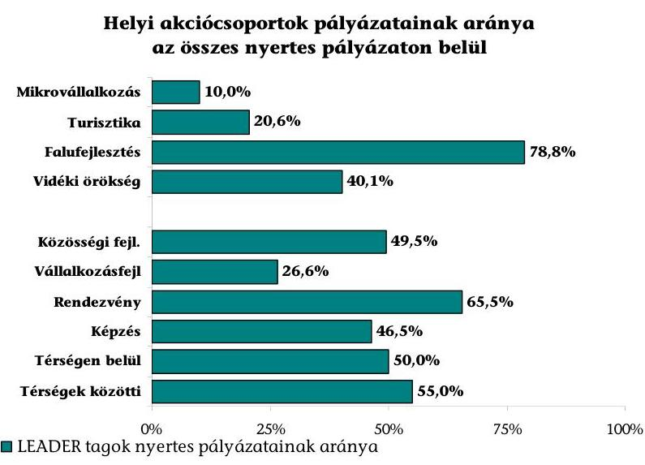

A többségében önkormányzatok, önkormányzati intézmények által igényelt pályázati források (Falufejlesztés, LEADER rendezvények) esetében a jóváhagyott pályázatok között a nyertes LEADER tagok aránya kétharmad felett volt. Ezt a magas arányt magyarázza, hogy az önkormányzatok többsége LEADER alapító tag. A gazdaságfejlesztéshez közvetlenül kapcsolódó 411 Vállalkozásfejlesztés, 312 Mikrovállalkozások fejlesztése és 313 Turisztika támogatása jogcímeknél a támogatott LEADER tagok pályázatainak aránya az összes nyertes projekt negyedét sem éri el.

A második LEADER pályázati körben a pályázó ügyfelek közül az egyéni vállalkozók és a magánszemélyek aránya megnövekedett. Az egyéni vállalkozók száma az összes pályázó között közel négyszeresére (147-ről 569-re), a magánszemélyek beadott támogatási kérelmeinek száma hatszorosára (102-ről 628ra) nőtt. Ez utóbbiak közül szinte mind - 36 pályázat kivételével - vállalkozások létrehozásához, fejlesztéséhez igényelt pályázati támogatást. A második LEADER pályázati körben bevezetett kis értékű fejlesztésekre a magánszemélyek 276 támogatási kérelmet adtak be, összesen 206 millió Ft összegben.

A legtöbb kérelmet az Észak-magyarországi régióból küldték, a legtöbb nyertes pályázat a Dél-dunántúli régióhoz köthető. A hátrányos és a leghátrányosabb helyzetű területek kedvezőbb támogatási feltételeinek hatását mutatja, hogy volumenében a legtöbb támogatást továbbra is az Észak-magyarországi régió, azon belül is Borsod-Abaúj-Zemplén Megye kapta, mintegy 15,2 milliárd Ft-ot. Megállapítható továbbá, hogy a legtöbb támogatás az ország észak-keleti térségébe áramlott, ahogyan ezt a térkép is mutatja.

---

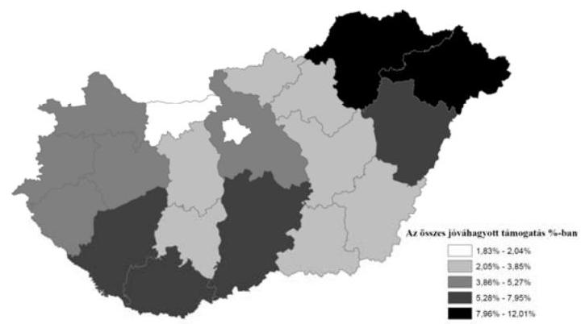

A támogatások területi eloszlása, az egyes régiók aktivitása a III. és IV. tengelyes fejlesztési források igénybevételében eltérő volt. A III. tengely fejlesztési forrásainak kihasználtsága - a jóváhagyott kötelezettségvállalások alapján - 65$80 \%$ között mozgott. A Nyugat-dunántúli Régió 65\%-os lekötöttséget mutat, a 80\%-os kötelezettségvállalási arány az Észak-magyarországi Régiót jellemzi. A megítélt források fejlesztési céljainak eloszlásában is voltak eltérések (a Középmagyarországi Régiót kivéve). A III. tengely fejlesztési keretének legnagyobb részét a 322 Falumegújítás és -fejlesztés támogatására ítélték meg, a második helyen a 312 Mikrovállalkozások fejlesztése, illetve a 313 Turizmus fejlesztése áll. A 323 Vidéki örökség megőrzésére hagyták jóvá a legkisebb összegeket. A III. tengely intézkedéseire jóváhagyott támogatások régiónkénti megoszlását a következő diagram szemlélteti:

A III. tengely nem horizontális fejlesztési forrásainak megoszlása régiónként
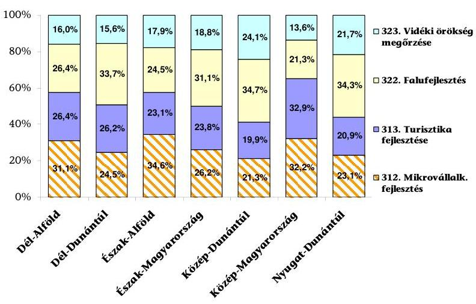

A IV. tengely jóváhagyott fejlesztési támogatásainál a LEADER közösségi célú fejlesztések voltak a meghatározóak. A kötelezettségvállalások 40-78\%-át ezek a pályázatok jelentik. Az első LEADER pályázati körben a négy legnagyobb, fél milliárd Ft-ot is meghaladó fejlesztési célterületet az Energiaudvarok létrehozása, támogatása, a Sportlétesítmények kialakítása és fejlesztése, a LEADER Kultúrparkok és - központok kialakítása, valamint a Civil szervezetek támogatására hirdették meg. Jelentős a LEADER rendezvényekre fordított források aránya, de nem éri el a felhasznált keret negyedét. Forrásaiból erre a jogcímre a

---

Dél-dunántúli Régió szánt a legtöbbet. A LEADER vállalkozások fejlesztése jogcím aránya tért el leginkább a régiók között, legnagyobb összeget a Középmagyarországi Régió fordította erre a jogcímre. A IV. tengely egyes jogcímeinek kötelezettségvállalási arányait a következő diagram szemlélteti:

A IV. tengely fejlesztési forrásainak megoszlása célterületenként és régiónként a jóváhagyott kötelezettségvállalások alapján
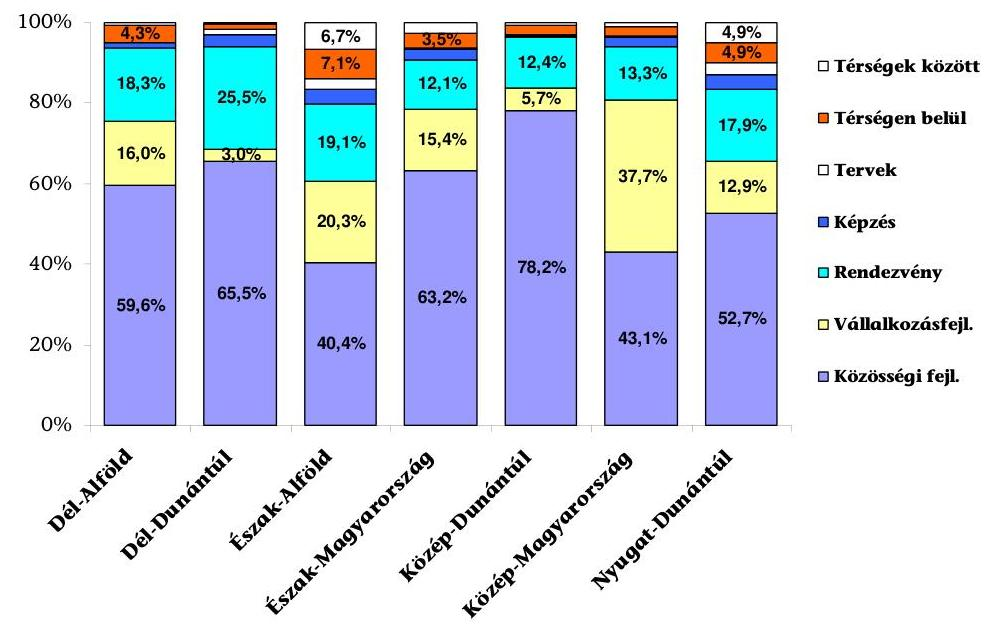

A regionális különbségek mellett minden régión belül megfigyelhetőek az eltérő környezetben és ügyfélkörrel, más lehetőségek között múködő, valamint a kevésbé aktív LEADER HACS-ok, ahol mind a III. tengely, mind a LEADER pályázatok forrásainak hasznosításában az átlagos szinthez képest gyengén teljesítettek.

A Dél-alföldi Régióban a Homokhátság Fejlődéséért (40,2\%), a Vásárhely Vidéke (38,2\%) és a Kunsági Helyi Közösség (20,8\%) HACS-oknál a megítélt támogatások nem érik el a leosztott források felét.

A Dél-dunántúli Régióban a Koppányvölgye (29,7\%), a Sárköz-DunavölgyeSiómente (33,7\%), valamint a Bonyhádi és a Dél-balatoni Helyi Közösség (41,3\%) kötelezettségvállalási arányai maradnak el az átlagtól.

Az Észak-alföldi Régióban a Közép-Tisza-Zagyva (17,2\%), a Tisza-menti (29,1\%), valamint a Jászsági Kistérségi (31,0\%) HACS-ok feldolgozott és jóváhagyott kérelmei nem érik el a régiós átlagot.

Az Észak-magyarországi Régióban a Tisza-Tama-Rima-Menti (31,2\%) és a Zagyvaság Vidékfejlesztési Közhasznú Egyesület (37,9\%) kötelezettségvállalása marad el a régiós szintű $65,2 \%$-os felhasznált kerettől.

A Közép-dunántúli Régióban a Bakonyért Helyi Közösség (33,2\%) és a MEZŐFÖLD LEADER (33,0\%) kötelezettségvállalása alatta van a régió 57,7\%-os keretfelhasználásának.

---

A Közép-magyarországi Régióban a DIPO Duna-Ipoly Határmeni Együttmüködések $(44,3 \%)$ és a Kis-Duna-menti Helyi Közösség (45,6\%) jóváhagyott projektjei a $64,4 \%$-os régiós átlagtól kismértékben elmaradnak.

A Nyugat-dunántúli Régióban az Alpokalja-Ikva mente és a Rábaköz (35,5\%), valamint a ZALA Zöld Szíve (37,8\%), a Zalai Téma utak (38,8\%) LEADER HACS keretfelhasználása marad el a többi helyi közösségtől.

Az ellenőrzés keretében a kiválasztott ellenőrzöttektől online felületen kértünk adatokat, egyrészt kérdőívek, másrészt tanúsítványok formájában. (Vizsgált projektekről tájékoztató adatok a 14. számú mellékletben találhatóak).

A mintában szereplő szervezetek jelentős hányadát a nonprofit szervezetek és a mikrovállalkozások tették ki, a két kategória együttesen a minta 76,7\%-át. Az előzőeken túl a mintában önkormányzatok, LEADER helyi akciócsoportok és kisés középvállalkozások szerepeltek.

A kérdőívben megadott válaszok alapján a pályázók leginkább a LEADER helyi akciócsoportoktól (32,8\%), valamint a pályáztató szervezetektől (FVM, MVH) $(26,9 \%)$ értesültek a pályázati lehetőségekről.

A pályázati dokumentáció elkészítésében az ellenőrzöttek önállósága vegyes képet mutat. A pályázatok több mint felénél az önállóság dominált.

Az önállóság mértéke a pályázati dokumentáció elkészítése során
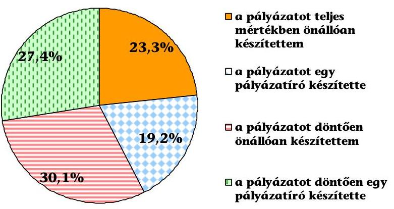

A projektek megvalósítása előtt az ellenőrzöttek leginkább árajánlatkérés útján választották ki azt a beszállítót, amelyik a projekt összköltségében a legnagyobb hányadot tette ki (64,38\%). Ezt követi 19,18\%-kal azon szervezetek száma, akik a közbeszerzést választották. A kapott referencia, a meglévő üzleti kapcsolat, valamint a szállítói részről történő megkeresés mindössze 16,44\% volt. Ezek alapján azt mondhatjuk, hogy a projekt megvalósításának előkészítése, valamint végrehajtása során a pályázók korábbi üzleti kapcsolatai csak közvetett módon (a kért árajánlat/közbeszerzés) játszottak szerepet.

A mintában szereplő szervezetek inkább olyan tevékenység finanszírozására pályáztak, amelyet előtte is végeztek - nem változtattak lényegesen tevékeny-

---

ségükön csak azért, hogy a pályázati forrásokhoz hozzájussanak, erre utalnak a „Hány éve múködik a vállalkozás?" és a „Hány éve folytatja a támogatott tevékenységet?" kérdésekre kapott válaszok. A gazdasági kilátásokat tekintve 2012-ről 2013-ra a szervezetek az árbevételeik növekedését prognosztizálják.

A „A vállalkozás vezetőjének neme" kérdésnél megállapítható, hogy többségében férfiak vezették azokat a szervezeteket, amelyek pályáztak ( $76,39 \%$ férfi és $23,61 \%$ nő). A vezetők nagy többségben a 26-55 éves korosztályból kerültek ki (75\%). A fennmaradó $25 \%$-ból $23,61 \% 55$ évnél idősebb.

Az ellenőrzöttek által kivitelezni kívánt projektek összköltsége 1768 millió forintot tett ki. A projekt értékéből a kalkulált önrész átlagos nagysága az összköltség $27,6 \%$ volt. A mintában szereplő projektek által szolgáltatott adatok alapján a fent említett önrész $45,4 \%$-a származott hitelből, $12,1 \%$-a pedig egyéb támogatásból. Az ellenőrzött projektek végrehajtása során ingatlan építésre és felújításra kicsivel több, mintegy 999 millió forintot költöttek, míg a gépek, technológiai berendezések beszerzésére fordított rész megközelíti 442 millió forintot, az immateriális javakra, szoftverekre, számítástechnikai eszközökre 118,5 millió forintot terveztek kiadni a projektgazdák.

Az egyes projektek fenntarthatóságának, megítélését a megtérülési idő ${ }^{48}$ alapján, valamint az egyes tőkeelemek elvárt hozamának biztosíthatóságán keresztül elemeztük. A projektek átlagos megtérülési ideje 20,9 év, egy projekt esetében éven belüli megtérülésről beszélhetünk, míg egy másik projekt esetében több mint 64 évet kell erre várni. Az átlagos megtérülési idő azonban mindöszsze 8 év, amennyiben a projekt összköltsége helyett csak az önrészre vetítve vizsgáljuk. A megtérülési idő alapján megállapítható, hogy a kedvezményezett vállalkozók számára megítélt támogatás szükséges volt ahhoz, hogy meg tudják valósítani a tervezett beruházásaikat.

# 3.2. Az ÚMVP monitoring és értékelési rendszere, ellenőrzése 

A monitoring és értékelési rendszerre vonatkozó szabályozásokat összhangban az uniós előírásokkal - kidolgozták. Meghatározták a monitoring és értékelési rendszer működtetésével kapcsolatos alapvető előírásokat, alapvető eljárásrendet, a monitoring rendszer szereplőit, ugyanakkor a monitoring rendszer működtetésében részt vevő Irányító Hatóság és az MVH közötti, a monitoring rendszer múködtetésével kapcsolatos részletes - eljárásrendi, kapcsolattartási, visszacsatolási - előírásokat nem rögzítették. A Monitoring Bizottság és az MVH közötti információáramlást, kapcsolattartásra vonatkozó eljárásrendi kérdéseket sem részletezték a belső szabályzatokban.

A monitoring és az értékelési rendszerrel, annak kialakításával kapcsolatos alapvető előírásokat az ÚMVP-ben rögzítették. Az ÚMVP a monitoring rendszer legfontosabb szereplőiként a Monitoring Bizottságot, az Irányító Hatóságot, illetve

[^0]
[^0]:    ${ }^{48}$ A megtérülési idő számításának képlete: a beruházás költsége osztva az évi átlagos jövedelemmel, ahol a beruházás költsége a projekt összköltséggel, az évi átlagos jövedelem az üzleti (üzemi) tevékenység eredményével egyezik meg.

---

annak a minisztériumban múködő operatív szervét, az MVH-t, valamint a kedvezményezetteket nevesíti. Az értékelési tevékenységre vonatkozóan meghatározták az előzetes, a félidős, az éves előrehaladási jelentésre és az utólagos értékeléssel kapcsolatos alapvető előírásokat és meghatározták a monitoring- és értékelő jelentések rendszerét.

A monitoring rendszer múködtetésére vonatkozó jogkört a 2007. évi XVII. törvény - összhangban az 1698/2005/EK tanácsi rendelettel - a miniszter irányító hatósági jogkörébe telepítette. A monitoring rendszer múködtetése során a monitoring adatok gyűjtését - a törvényben kapott felhatalmazás alapján - az MVH végzi.

A monitoringhoz kapcsolódó informatikai rendszer szerepe az MVH ügyviteli folyamatainak támogatása, a különféle jogcímeken kapható támogatások kérelmeinek feldolgozásához, ellenőrzéséhez, elosztásához és kifizetéséhez kapcsolódó funkciók szoftveralkalmazásban történő leképezése és megvalósítása. Az IIER informatikai rendszer nem alkalmas a technikai segítségnyújtás támogatáskezelésére.

Az IIER fejlesztését, a rendszer múködésének támogatását külső szolgáltatóval végzi az MVH. Az IIER-ben az MVH által előkészített specifikációk elkészítése és végleges átadása hosszabb, több hónap átfutási időt jelent. A megkötött szerződések szerint a szolgáltató a fejlesztés mellett, a jogszabálykövetések elvégzését, valamint a karbantartási feladatokat is ellátja.

Az IIER alkalmas a projektek mindenkori aktuális állapotának egyedi nyomon követésére, azonban nem alakítottak ki olyan internetes felületet, ahol az ügyfelek a számukra fontos egyedi információkhoz hozzáférhettek. Ez különösen, a támogatási kérelmek elbírálásának hosszadalmassága miatt lett volna fontos.

Az MVH elnöke 2012. július 20-án kelt észrevételében tájékoztatást adott arról, hogy 2011. decemberben bevezetésre került az Elektronikus Úgyfél-tájékoztatási Rendszer. Az ÁSZ álláspontja szerint pozitívan értékelhető, hogy megtörtént az Elektronikus Úgyfél-tájékoztatási Rendszer kialakítása, ugyanakkor ez a jelentésünkben foglalt, a 2007-2011. évekre vonatkozó megállapításainkat nem módosítja.

Az ÚMVP-ben rögzítették, hogy az Irányító Hatóság - összhangban az 1698/2005/EK tanácsi rendelettel - a monitoring tevékenységet pénzügyi, telje-sítmény- és eredményindikátorok alapján végzi, összhangban a CMEF ${ }^{49}$ által meghatározott indikátormutatókkal.

A monitoring adatszolgáltatási kötelezettség teljesítése az ügyfelek részéről az e-monitoring rendszeren keresztül történik. Az MVH az összegyűjtött és éves szinten összesített monitoring adatokat, valamint az ÚMVP végrehajtásához kapcsolódó pénzügyi végrehajtási adatokat évente átadja az Irányító Hatóságnak és a Bizottságnak. Az éves időközi jelentés monitoring adatainak a Bizott-

[^0]
[^0]:    ${ }^{49}$ Common Monitoring and Evaluation Framework: Közös Monitoring és Értékelési Keretszabályozás.

---

ság felé történő benyújtása ún. standard monitoring táblákon történt. A táblázatok keresztellenőrzéseket követően a Bizottság által fejlesztett és üzemeltetett, úgynevezett SFC rendszerbe kerülnek feltöltésre.

Az MVH hetente és havonta ún. heti és havi operatív jelentés keretében tájékoztatást nyújt az egyes jogcímek előrehaladásáról, az Irányító Hatóság vezetőjének egy 2007. évi írásbeli rendelkezése alapján. Az operatív jelentések az ügy-irat-forgalommal kapcsolatos, valamint az ÚMVP egyes jogcímeinek pénzügyi előrehaladására vonatkozó adatokat tartalmaznak.

A Monitoring Bizottság - eleget téve az 1698/2005/EK tanácsi rendeletben és az ügyrendjében foglalt kötelezettségének - az Irányító Hatóság által benyújtott dokumentumok alapján megtárgyalta az ÚMVP éves előrehaladását. A Monitoring Bizottság az évente előírt két ülésén, illetve az elektronikus formában tartott tájékoztatók során nem tárgyalt a monitoring, vagy az értékelési rendszert érintő szakmai kérdésekről.

A Monitoring Bizottság a 2007. évben egy alkalommal, megalakulásakor, 2007. november 28 -án ülésezett. A 2008. évben két informális és két rendes ülést tartott. A 2009-2011. években évi két alkalommal - az előírt minimális számban - került sor ülés összehívására. A Bizottság ülésein az MVH igazgatója rendszeresen beszámolt az ÚMVP végrehajtásával kapcsolatos tapasztalatokról és a jogcímek előrehaladásáról, amely a számszerú adatok bemutatására, az ügyintézési határidő elhúzódásának okaira vonatkozott, mint például a magas szintű hiánypótlás, a jogszabályi környezet változása.

A Monitoring Bizottság - az ülések emlékeztetői szerint - megvizsgálta a végrehajtás eredményeit, különösen a prioritástengelyek esetében a kitüzött célok elérését és a folyamatos értékelést. Az Irányító Hatóság a folyamatos értékelési tevékenységéről a 2008. évtől kezdődően tájékoztatást adott a Monitoring Bizottság részére. A tájékoztatást az éves előrehaladási jelentések mellékletében is elhelyezték. A kialakított bizottsági munkarend és a tagok bizottsági ülésekről való rendszeres távolmaradása az ÚMVP végrehajtásának testületi formában történő folyamatos nyomon követését és értékelését, saját kezdeményezésű beavatkozásokat nem tett lehetővé. Így az ÚMVP végrehajtásának minőségét felügyelni hivatott, a végrehajtó szervezetektől részben függetlenített funkció ellátása alacsony hatékonyságú volt.

A rendes ülések mellett a döntési eljárások során a Monitoring Bizottság rendszeresen alkalmazta az írásbeli eljárásokat (a bizottsági tagok az üléseken történő személyes szavazás helyett írásban nyilváníthattak véleményt az előterjesztésekről). Az írásbeli eljárások kockázata volt, hogy az alkalmazott gyakorlatban a tagok nagy része nem jelzett vissza a kiküldött javaslatokra. Például egy 2008-as programmódosítás esetében mindössze hat tag jelzett vissza arról, hogy elfogadja a javaslatot. Ez a 2008. január 1-jei állapot szerint 64 szavazati joggal rendelkező tagnak alig több mint 9\%-a. A 2009. évben a HACS-ok múködési előlegére vonatkozó javaslatra mindössze 8 visszajelzés érkezett, mely az akkor 67 fő szavazati joggal rendelkezőknek mindössze 12\%-a. A Monitoring Bizottság ügyrendje értelmében „Amennyiben a tagok az elnök által meghatározott határidőn belül nem reagálnak a javaslatra, azt elfogadottnak kell tekinteni."

Ennek a gyakorlatnak a megszüntetése érdekében a 2011. februári keltezésű ügyrendben megjelent egy olyan előírás, amely szerint a tagszervezet törlésre kerül,

---

amennyiben a delegált tag két egymást követő írásbeli eljáráson nem szavaz. Ugyanez az előírás vonatkozik arra is, ha a tag a két egymást követő ülésen nem jelenik meg, vagy megjelenik, de a döntési pontok 50\%-a esetében nem szavaz.

A Monitoring Bizottság tagjaival megismertették a folyamatos értékelés eredményeként 2010. évben elkészült félidős (mid-term) értékelő jelentést, amely átfogó igényú, reális és előremutató értékelését adta az ÚMVP végrehajtásának félidei állásáról. A 2010. évben készült el az ÚMVST végrehajtásáról a Stratégiai Monitoring Jelentés is, amelyet a Monitoring Bizottsággal szintén ismertettek.

A félidős (mid-term) értékelő jelentésben megfogalmazott javaslatokra - a feltárt és rendezést igénylő anomáliák és problémák ellenére - nem készítettek intézkedési tervet, megjelölve a megteendő intézkedéseket, felelősöket, határidőket. A javaslatok hasznosításáról az Irányító Hatóság ettől függetlenül 2011 júniusában beszámolt a Monitoring Bizottságnak és jelentést küldött az Európai Bizottságnak is.

Egy 2011. novemberben az Irányító Hatóság vezetője részére készített feljegyzésben ugyanakkor a javaslatok hasznosulására, a megtett intézkedések nyomon követésére külső szolgáltatóval szerződés megkötésére tettek javaslatot. Az Irányító Hatóság vezetője a javaslatot jóváhagyta.

A III. és IV. tengely egyes intézkedéseinek támogatásait folyamatba építetten a az MVH-nak és a HACS-oknak, rendszer-szinten az Irányító Hatóságnak kellett ellenőriznie. A benyújtott támogatási kérelmek és pályázatok adminisztratív ellenőrzése ${ }^{50}$ jó hatásfokkal múködött. Az adminisztratív ellenőrzés során a tartalmi és formai hibák miatt elutasított támogatási kérelmek forrása az összes elutasított támogatási kérelem forrásán belül jelentősnek mondható. Ez az arány a III. tengely intézkedéseinél $45,7 \%$, a IV. tengely intézkedéseinél $62 \%$ volt. Az adminisztratív ellenőrzések szintén növelték a támogatási kérelmek és pályázatok - a jelentés következő pontjában értékelt - bírálati folyamatának elhúzódását. A másik - a támogatások utolsó részletének kifizetését megelőző folyamatba épített, 5\%-os mértékú helyszíni ellenőrzési kötelezettségét az MVH magasan túlteljesítette. A mintavétellel kiválasztott projektek a III. tengely egyes jogcímeinél a Bizottságnak naptári évente bejelentett támogatható kiadások 9-22\%-át, a IV. tengely jogcímeinél 17\%-át képviselték.

A technikai segítségnyújtás keretből a Hálózat projektjeinek finanszírozására benyújtott kifizetési kérelmek formai és tartalmi ellenőrzését és 5\%-os arányú helyszíni ellenőrzést az MVH - az Irányító Hatósággal kötött együttmúködési megállapodásnak megfelelően - elvégezte. A megállapodás a Magyar Nemzeti Vidéki Hálózatról szóló 131/2008. (X. 1.) FVM rendelet 13. § (2) bekezdése, illetve a helyébe lépő 36/2010. (XI. 30.) VM rendelet 12. § (2) bekezdése

[^0]
[^0]:    ${ }^{50}$ A támogatás vagy kifizetés iránti kérelmen, illetve a kedvezményezett vagy harmadik fél által benyújtandó összes egyéb nyilatkozaton végrehajtott ellenőrzés, amely az összes, adminisztratív eszközzel megfelelő módon ellenőrizhető elemre kiterjed. Az eljárások biztosítják a végrehajtott ellenőrzések, a vizsgálati eredmények és a meg nem felelés vonatkozásában hozott intézkedések feljegyzését. (1975/2006/EK rendelet 11. cikk (1) bekezdés, 65/2011/EU rendelet 11. cikk (1) bekezdés)

---

szerinti pénzügyi ellenőrzési feladat ellátásáról nem rendelkezett, így arra az ellenőrzött időszakban az MVH részéről nem is került sor.

Az MVH a jelentés tervezetére (szakmai anyagra) tett észrevételében arra hivatkozott, hogy a kifizetési kérelmek formai és tartalmi ellenőrzésével, valamint az 5\%-os arányú helyszíni ellenőrzéssel eleget tett a pénzügyi ellenőrzési kötelezettségnek. Az észrevétel azért nem fogadható el, mert a 36/2010. (XI. 30.) VM rendeletben előírt, az Irányító Hatóság vezetőjének megbízásából végzendő pénzügyi ellenőrzés nem azonos a kifizető ügynökségi feladatkörbe tartozó, egyedi kérelmekre és projektekre irányuló ellenőrzéssel.

Nem kielégítően funkcionált a LEADER HACS-ok múködésére folyósított támogatások felhasználásának ellenőrzése. Részben ennek is tulajdonítható, hogy jelentős számban fordulhattak elő - a jelentésünk 4.1.2. pontjában részletezett - az elért eredményekkel nem igazolható, indokolatlan mértékű és szabályellenes pénzügyi tranzakciók, költségek.

A 2007. évi XVII. törvényben előírt, az ÚMVP források hatékony, gazdaságos és eredményes felhasználását az irányító és végrehajtó szervezeteknél, valamint a kedvezményezetteknél az FVM, illetve a VM belső ellenőrzése nem ellenőrizte. Teljesítmény-ellenőrzések az éves ellenőrzési terveikben nem szerepeltek.

# 4. Az ÚMVP megVALÓsítÁsáNAK TELJESÍTMÉNYEI 

Az ellenőrzés áttekintette, hogy a támogatási rendszer eredményességét milyen módon szolgálta a program végrehajtásának szervezése, a módosítási javaslatok előkészítettsége és a döntési folyamat hatékonysága. Elemeztük továbbá a III. és a IV. tengely egyes intézkedéseinek elért és várható eredményességét, és ahol lehetett - a végrehajtásuk hatékonyságát.

### 4.1. A támogatási rendszer múködésének hatékonysága

Az 1974/2006/EK rendelet II. számú mellékletének 6. pontja - az 1698/2005./EK rendelet 16. cikkének d) pontjában rögzített követelményeknek megfelelően meghatározta a vidékfejlesztési program tartalmi felépítéseként a finanszírozási terv formáját és tartalmát. Az EU az EMVA egészére írt elő éves ütemezésű tervkészítést és adatszolgáltatást. Az összes közkiadás összegének, az EMVA hozzájárulás mértékének, az EMVA tengelyenkénti finanszírozási összegének, valamint az egyes tengelyek intézkedéseinek részletezett bemutatására, éves ütemezésű terv benyújtására viszont nincs jogszabály által meghatározott kötelezettség.

Az Irányító Hatóság nem készített, készíttetett a program megvalósításában közreműködő intézményekkel, szervezetekkel (MVH, VKSZI, HACS-ok) olyan ütemtervet, amely a jogcímrendeletek előkészítésének, a támogatást kezelő informatikai rendszernek (IIER), a kérelemkezelés végrehajtását szabályozó kézikönyvek, segédletek elkészítésének, a támogatási kérelmek kezelését végző humán erőforrás felkészítésének időszükségletét figyelembe vette volna. Az intézkedések végrehajtási kontrolljait az Irányító Hatóság tartósan nem tudta hatékonyan múködtetni, amely egyrészt a kedvezményezettek számára a

---

tervezett beruházásaik időbeni megkezdését akadályozta, másrészt az ÚMVP végrehajtása korábbi szakasza tekintetében okozott jelentős hitelesség vesztést.

Az Irányító Hatóság az EU által meghatározott tervezési követelményeken túl a III-IV. tengely intézkedéseit érintően a források felhasználásának éves ütemezésére tervet nem készített. A támogatási rendszer konstrukciójának összetettsége miatt az irányító hatósági jogkörök hatékony gyakorlásához pedig fontos feltétel lett volna a végrehajtás folyamatában mérföldkövek kitűzése, az intézkedéseknek és a célok megvalósításának nyomon követéséhez mérési pontok meghatározása.

A kialakított támogatási konstrukció egyrészt azzal, hogy a 2007. évi XVII. törvény a Ket. előírásainál hosszabb ügyintézési határidőket rögzített, másrészt azzal, hogy a jogszabályi előírásokhoz képest az ügyintézési határidők jelentősen elhúzódtak együttesen hozzájárul ahhoz, hogy a vállalkozások számára magas kockázatot hordoz.

# 4.1.1. A kérelemkezelési folyamat hatékonysága 

Az egyes intézkedések programozott indításának hiánya, valamint az érintett alkalmazottak képzésének gyengeségei miatt a kérelemkezelést végző szervezetek (MVH, HACS-ok) nem voltak kellően felkészültek a beérkezett kérelmek feldolgozására, értékelésére. Az ÚMVP Irányító Hatósága ritkán és rendszertelenül hirdetett meg kérelembenyújtási időszakokat. A felhalmozódott feladatokhoz képest elégtelen kapacitások következtében, a benyújtott támogatási kérelmek feldolgozásának időtartama rendszeresen, a 2009. évben a III. tengely, a 2010. évben a IV. tengely jogcímeire benyújtottaké jelentősen meghaladta - a 2007. évi XVII. törvény 41., 55. és 56. §-ában előírt az ügyintézés egyes szakaszainak végrehajtására vonatkozó (21-90 napos) határidőket.
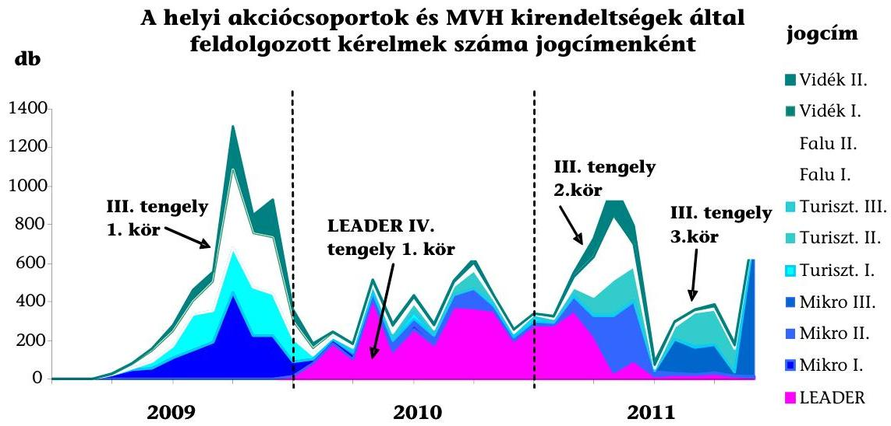

A 2009. január 10-ig benyújtott kérelmek feldolgozása 2009 márciusában kezdődött, mert a kérelmek kezelésére alkalmas IIER elektronikus felület fejlesztése csak ekkor fejeződött be (a kérelmek beérkezése után 3 hónappal). A kérelmeket az MVH kirendeltségei központilag dolgozták föl, a LEADER HACSokkal akkor még nem kötötték meg a feldolgozásra vonatkozó delegálási szer-

---

ződést. A III. tengely első körös, mintegy 6 ezer támogatási kérelmének feldolgozása 2010 februárjáig tartott. A III. tengelyes, második körös nem horizontális intézkedéseknél a támogatási kérelem - 2009. november 16-tól 2009. december 20-ig történő - benyújtásától a támogatási döntés meghozataláig eltelt idő átlagosan - a jogcímenkénti 153 és 485 nap átlag átfutási idő alapján - 394 nap volt.

Az ügyintézés elhúzódásában több tényező mellett szerepe volt annak, hogy az Irányító Hatóság a második ütemben meghirdetett támogatási kérelmek elbírálásával kapcsolatban négy intézkedésnél tapasztalt ügyintézői hibák, hiányosságok miatt egy évvel később, 2011 januárjában a támogatáskezelési feladatok felülvizsgálatát rendelte el. A HACS-ok fele vétett súlyos, további egyharmada közepesen súlyos hibát. Az akciócsoportok 85\%-ánál tapasztalt, beavatkozást igénylő ügyintézési hibák súlyosságától függően eltérő arányban elvégzett felülvizsgálat két hónapot vett igénybe. A IV. tengely első, 2010. évi pályázati fordulójában a kérelmek feldolgozásának és a döntéshozatalnak az elhúzódását hasonló okok idézték elő.

A 321 Integrált közösségi és szolgáltató tér jogcím esetében nem az ügyintézési hibák, hanem elsősorban az Irányító Hatóság döntésének elhúzódása késleltette a kérelmek elbírálási folyamatát. Az MVH belső ellenőrzése által a jogcímre benyújtott kérelmek ellenőrzéséről készített, 2011. április 26-án kelt jelentés a következő megállapításokat tette:
„az IKSZT kérelmek végleges rangsorát az Irányító Hatóság két körben állapította meg. Az MVH az első részrangsort, 2010.04.06-án terjesztette elő, melyből 127 pontot elért vagy azt meghaladó kérelmek kerültek támogatásra. A nem támogatott kérelmek vagy döntésre vár" állapotban maradtak, vagy „felfüggesztett" IIER-es állapotban, amennyiben az ügyintézés technikai okok miatt nem volt befejezhető. Forrás hiány miatti elutasító határozat nem kerülhetett összeállításra, postázásra. A végleges rangsort a második körben, 2011.03.09-én állapította meg az Irányító Hatóság. Ez alapján a ponthatár nem változott, a két rangsor meghatározása között eltelt időben lezárt, minimum 127 pontot elért további kérelmek kerülhettek támogatásra. ... 2011. március 30-ig Irányító Hatóság közlemény hiánya miatt forráshiány miatti elutasító határozatok nem kerültek postázására. Ennek megfelelően az így nem támogatott kérelmek esetében az ügyintézési idő 2009. október 15. óta nem zárható le. Az elhúzódó ügyintézésről az ügyfelek részére a VKSZI sem adott ki közleményt, MVH közlemény, tájékoztatás nem jelent meg."

Az ellenőrzésünk által a projektgazdák körében végzett kérdőíves felmérés azon kérdésére, hogy a fejlesztés megvalósításának folyamatában az elhúzódó döntéshozatal, a támogatási mértékek változása, az előleg hiánya, likviditási gondok vagy a segítségnyújtás hiánya közül mi okozta részükre a legnagyobb problémát, leginkább az elhúzódó döntéshozatal választ jelölték meg. Az 1-legnehezebb, 5legkönnyebb skálán 2,1 átlagérték jelzi, hogy az érintettek számára e tényező jelentős problémaforrásnak volt tekinthető.

Az elbírálási folyamatot minden jogcím vonatkozásában hosszabbította a pontozási rangsor állításának gyakorlata. Az indokoltnál lényegesen hosszabb ideig elnyúló procedúrára csak részben jelent indokot, hogy a 2007. évi XVII. törvény 55. § (8) bekezdésében foglalt előírás szerint: „amennyiben a kérelmek elbírálása rangsor állítása vagy arányosítás alapján történik, úgy a kérelmek hiánypótlásra nyitva álló időszakára valamennyi támogatási kérelemmel összefüggő eljárást fel kellett függeszteni". A törvény értelmében az ügyintézési határidő kezdetét követő két hónapon belül kell hiánypótlásra felszólítani az ügyfelet. A hiánypótlási

---

határidő nem haladhatja meg a harminc napot, ezt követően lehet a rangsorolt kérelmekről döntést hozni.

Az ellenőrzésünk rendelkezésére bocsátott adatállomány elemzése azt mutatta, hogy - a támogatási kérelmek egyes jogcímenként 68,2-95,2\%-át érintő - hiánypótlást a kérelmet benyújtók átlagosan 6-12 nap alatt, döntő többségük 30 napon belül rendezte. Ezzel szemben a kérelem benyújtása és a hiánypótlásra történő felhívás között - az egyes jogcímeknél - átlagosan 53-222 nap telt el.

A támogatási rendszer feltételei alapján a teljes körű, hiánypótlási kötelezettség nélküli kérelmet benyújtók hátrányos helyzetbe kerültek azokkal a - meghatározó többséget alkotó - kérelmezőkkel szemben, akik hiánypótlási eljárás keretében pontosíthatták, egészíthették ki támogatási kérelmüket, ráadásul két hónappal, fél évvel később, az idő közben változó körülményekhez igazodva. A hiánypótlási kötelezettséggel érintett támogatási kérelmek miatt is időben később meghozott döntések a támogatások által várt célkitűzések teljesítésének kockázatát hordozzák, az időben késedelmes megvalósulás miatt elmaradó hasznok merülnek fel (a vállalt foglalkoztatás, a bruttó hozzáadott érték termelése később realizálható).

Kérdőíves felmérésünk szerint az értékelési (1-5) skálán 3,75 átlagértéket mutat a kérelmezők véleménye azon kérdésre, hogy megalapozottak voltak-e a hiánypótlási felhívások a kérelemmel kapcsolatban. A kérelmezők - válaszaik alapján elismerték, hogy a benyújtott támogatási kérelem nem felelt meg teljes körűen a rendelet előírásainak, s hiánypótlási kötelezettségük teljesítése indokoltan merült fel.

A projektgazdák 43,7\%-a nyilatkozott úgy, hogy a projekt összköltsége a projekt ütemezésének változása (hosszú támogatás átfutási idő) miatt eltért a tervezettől. A nyilatkozó projektgazdák összességét nézve ez 27,6 millió Ft-os növekedést jelentett, amelynek közel fele ( $48,7 \%$-a) a támogatási kérelem benyújtásának időpontja és a támogatási határozat kiadásának időpontja közötti időintervallumra tehető. A projekt megvalósításának tervezett és tényleges kezdő időpontja közötti eltérés 8,1 millió Ft-ot, míg a befejezés tervezett és tényleges időpontja közötti eltérés miatt 6,1 millió Ft-ot tett ki. Tekintve, hogy a mintában szereplő projekteknél az összes tervezett beruházás értéke meghaladja az 1768 millió Ft-ot, a projekt összköltségében bekövetkezett változás nem jelentős ( $1,6 \%$ ). Ebből arra lehet következtetni, hogy a projektgazdák a támogatási igények benyújtásakor figyelembe vették az időtényezőt (felültervezték a költségeket). Nem zárható ki az sem, hogy más tényezők is szerepet játszhattak: az időben alig változó projektköltségekbe például, hogy a támogatáshoz csak közvetve kapcsolódó költségeket (ilyen lehet az adminisztratív tevékenységek költsége) nem számították bele az összköltségbe.

A kifizetési kérelmek feldolgozásának és teljesítésének átlagos időtartama minden jogcímnél meghaladta az MVH rendelkezésére álló határidőt. Ellentétben a támogatási kérelmek elbírálásával, a fizetési kérelmeknél a második körös támogatások 63 és 91 nap közötti jogcímenkénti átlaga kedvezőbb volt az első kör 96 és 129 nap közötti átlagánál. Az összegek nagysága és az elbírálás időszükséglete között - hasonlóan a támogatási kérelmekhez - a kifizetési kérelmeknél sem volt kimutatható összefüggés (a jogcímenkénti adatokat a 9. számú melléklet mutatja).

---

Az MVH elnöke 2012. július 20-án kelt észrevételében tájékoztatást adott arról, hogy olyan intézkedéseket vezettek be (ütemterv, LEADER pályázatok elektronikus benyújtása, ügyintézők oktatása), amelynek köszönhetően az ügyintézési határidők betartása jelenleg megvalósul. Az ÁSZ álláspontja szerint pozitívan értékelhetők az ügyintézési határidők betartása érdekében tett lépések, amelyek a jelentés megállapításait nem módosítják.

# 4.1.2. A múködési célú forrásfelhasználás hatékonysága 

A működési források célja egyrészt a program lebonyolításának, fizikai hátterének biztosítása, másrészt a program társadalmi beágyazódásának képzések, programok segítségével történő előmozdítása. A múködési célú forrásokat a III. tengely esetében a 341. Készségek elsajátítása, ösztönzés és végrehajtás jogcím, a IV. tengelynél a 431. A helyi akciócsoport múködtetése, készségek elsajátítása, a térség élénkítése jogcím biztosította a helyi vidékfejlesztési irodák és akciócsoportok számára. A múködési forrásokat a lehetőségek maximumán, az ÜMVP-ben múködési célokra tervezettnél 20\%-kal magasabb összegben osztották el a szervezeteknek. Az Irányító Hatóság a kezdeti - a tervezett forrásokhoz és az elért eredményekhez képest - túlméretezett múködési forrásokat 2010-ben, illetve 2011-ben mérsékelte, jelentősen csökkentve ezzel a HACS- ok mozgásterét a költségvetés szempontjából, mind annak időtávját, mind keretösszegét tekintve.

Az Irányító Hatóság a III. tengelyből származó forrást egységesen 15\%-os, a IV. tengely forrását 16 és $32 \%$ között szóródó, együttesen $21 \%$-os mértékben osztotta meg a szervezetek között. 18,4 és 8,8 milliárd Ft összegű múködési támogatás mértéke a 341. jogcím esetében megegyezett az ÜMVP-ben meghatározott ( $15 \%$ os) maximális aránnyal, a 431. jogcímnél viszont - a 2007. évi eredeti forrásmegosztásnál - 1\%-ponttal meg is haladta azt (20\%). A túllépést a múködési forrásokat megállapító 147/2007. (XII. 4.) FVM rendelet későbbi módosításai során orvosolták. Az 54/2011. (VI. 10.) VM rendelet a 2011-2013 között felhasználható forrásokat - a III. és IV. tengelyre együttesen - 9,5 milliárd Ft összegben állapította meg, ezzel közel 2,4 milliárd forinttal mérsékelte a múködési célú forrásokat.

A 96 HACS 11,2 milliárd Ft múködési forrást használt fel 2011. év végéig. A III. tengely múködési keretét terhelte ezen felül 2010-ig a helyi vidékfejlesztési irodák 4,1 milliárd Ft kiadása. A két tengelyben rendelkezésre álló múködési források felhasználási aránya a 2011. év végén- az ÜMVP 7. verziójához viszonyítva $-55,6 \%$-os mértékú volt.

A HACS-ok meglehetősen eltérő költséghatékonysággal és eredményességgel múködtek az ellenőrzött időszakban. Az ÜMVP III. tengely nem horizontális jogcímeinek támogatási kérelme és a IV. tengely összes jóváhagyott pályázata, valamint a 341. és 431. jogcímekre elszámolt múködési kiadások között közepesen erős ( $66 \%$-os) lineáris kapcsolat állapítható meg, ennek grafikus ábrázolásával és értékelésével kaphatunk képet arról, hogy mennyiben szolgálták a vidékfejlesztési célokat a múködési források (Lásd a 10. és a 11. számú mellékleteket).

Az átlag alatti múködési hatékonyságú, a tolerálhatónál nagyobb múködési költségekkel 12 HACS dolgozott. Az 5 kiemelkedően magas költségszinten múködő akciócsoportot a 10. számú melléklet szerinti grafikonon meg is neveztük. Az átlagnál hatékonyabban múködő akciócsoportok száma is 13-15 között volt.

---

Mindkét tengely intézkedéseinél jellemző, hogy a HACS-ok megközelítően azonos költségszint mellett is jelentősen eltérő eredményeket értek el, amit nem magyaráznak a regionális különbségek, mert a régiókon belül is nagyok voltak a különbségek. Az akciócsoportok egyharmadánál a IV. tengely felhasznált működési forrásai megközelítették, vagy meg is haladták a tengely jogcímeire a területükön jóváhagyott támogatások összegét. Ezek a jelenségek - az eltérő területi adottságok mellett - az akciócsoportok aktivitásának hiányára, vagy gyengeségére hívják fel a figyelmet. (Az adatokat szemléltető diagramokat lásd a 11. számú mellékletben.)

A kérelemkezelés hosszú átfutási idejét az egyenlőtlen munkaterhelés csak részben indokolhatja, miután a HACS-ok felénél három év alatt, pl. a III. tengely jogcímeire beérkezett, ellenőrzött és pontozással értékelt kérelmek száma nem érte el a százat (a legkevesebb 17 volt), és a jóváhagyott kérelmek száma jellemzően ötven alatt maradt. A IV. tengely intézkedéseinél is hasonló arányok mutatkoztak a 2011. év utolsó negyedévéig.

A 96 LEADER HACS az ellenőrzött időszakban eltérő költséghatékonysággal és eredményességgel működött. Múködési kiadásaik - az MVH-hoz benyújtott elszámolásaikban közölt adatok szerint - mind a személyi jellegú ráfordítások nagyságrendjét, mind a dologi kiadásaikat tekintve jelentősen eltérőek volt. Az adminisztratív és helyszíni ellenőrzést az MVH végzett, ugyanakkor a költségek célszerűségét és megalapozottságát nem ellenőrizte. A LEADER HACS-ok a közel azonos múködési költség felhasználása mellett eltérő eredményeket értek el.

Az MVH elnöke 2012. július 20-án kelt észrevételében kifogásolta, hogy a megállapítás „nem rögzíti/állapítja/határozza meg, hogy a célszerüségi és a megalapozottsági vizsgálat nem a helyszíni ellenőrzés, hanem a jogalkotó, esetleg a kérelemkezelő kompetenciája".Észrevétele a megállapítást nem módosítja, mert az a LEADER HACS-ok múködési költségeinek ellenőrzési módjára vonatkozó tényeket rögzíti.

Az egyes régiók között és régiókon belül is nagy differenciák jelentkeztek a vezetők és a beosztottak számában, fizetésében. A Dél-dunántúli régióban, pl. a Koppányvölgyi HACS 639 millió Ft, a Zengő HACS 1349 millió Ft támogatási kérelmet hagyott jóvá. Előbbinek ehhez 3-4 fő, havi 500 ezer Ft fizetésű vezetőre és 72 millió forint múködési költségre volt szüksége, utóbbinak 1 fő 300 ezer Ft/hó munkabérben részesített vezető és 4 évre 43 millió Ft-os forrás is elegendő volt. Az egy irodával rendelkező Szatmár HACS esetében az egy hónapban kifizetett 11 munkabér és 26 tiszteletíj messze felülmúlta a többi irodát.

A 96 HACS-ból 22 fizetett - 2010 júniusától - összesen 41,7 millió Ft jutalmat. (A 22 szervezetből 8 a Dél-alföldi régió 14 akciócsoportjából került ki. Ezek között volt a régió leggyengébben teljesítő 5 akciócsoportja.) A jutalmak maximuma 900 ezer Ft volt ( 3 fő) és személyenkénti gyakorisága legfeljebb 5 alkalom (háromhavi ismétlődéssel).

A költségtérítéseknél a 141/2008. (X. 30.) FVM rendeletben megszabott havi bruttó 120 ezer forintnál 7 esetben fordult elő magasabb elszámolás. A részükre a forrásrendeletben és a kiegészítő forrásrendeletben allokált forrásokat kisebb mértékben kihasználó, kevésbé aktív akciócsoportok sok esetben megelőzték az aktivabb szervezeteket az utazási költségtérítések terén. A munkavégzéshez használt gépjárművek üzemeltetésére 27 akciócsoport számolt el havi 100 ezer Ft-ot meghaladó térítést, 137 alkalommal. Ezek közül a 2009. évi 74 eset a meghatározó, ahol napi átlagban 280 km (maximum 741 km ) megtételére elég üzemanyag

---

vásárlását regisztrálták 4-5 hónapon keresztül. A munkába járáshoz használt gépkocsi költségeinek megtérítésében a Mezőföldi Híd Térségfejlesztő Egyesület jelentett kirívó példát, ahol a 2008. november-2011. október közötti időszakban 10,0 millió Ft-ot fizettek ki öt fő részére, havi 50-95 ezer Ft átalány formájában. Ez tizenötszöröse az összes akciócsoportban elszámolt költségtérítés 685 ezer Ft-os átlagának.

A 3 milliárd Ft összegben felmerült dologi kiadások elszámolhatóságát az Irányító Hatóság jellemzően értékhatárokhoz kötötte. Az egy elszámolási időszakban a 141/2008. (X. 30.) FVM rendeletben meghatározott egyes (pl. jogi, számviteli, könyvvizsgálói, adóügyi, piac- és közvélemény-kutatási) szolgáltatásokra felhasználható múködési források összegét 2008. október 31-től 8, majd egy év múlva 6, újabb háromnegyedév múlva 3 millió Ft-ban korlátozta. A havi átlagban 337 ezer Ft-ot elszámoló HACS-ok számára ez nem okozott különösebb megszorítást, így a 3 millió forintos korlátot 5 kifizetési kérelem lépte túl. Üzletviteli tanácsadásért a nettó 100 ezer forintos óradíj elszámolás ( $2 \times 3$ óra) egy felszámolás alatt álló, 2 éves múltra visszatekintő, 127 millió forintos adótartozást felhalmozó, egyszemélyes kft-vel szemben ugyan nem lépte túl a korlátot, de kimerítette a kockázatos pénzfelhasználás fogalmát. Az akciócsoport további 7 millió forint értékű megbízást is adott ennek a cégnek.

A 141/2008. (X.30.) FVM rendelet szerinti maximálisan elszámolható bérleti díj $2500 \mathrm{Ft} / \mathrm{m} 2 / \mathrm{hó}$. A munkaszervezetek által bérelt iroda nagysága az elszámolásaik szerint eltérő volt. Az átlagos irodaméret $47,6 \mathrm{~m}^{2}$ volt, az átlagos bérleti díj öszszege 95152 Ft. Az átlagtól eltérő $400 \mathrm{~m}^{2}$-es nagyságú irodát bérelt a Szatmár LEADER Közhasznú Egyesület, de más HACS-oknak ennél kisebb a jogszabályban meghatározott $20 \mathrm{~m}^{2}$-t alig meghaladó alapterületű iroda is elegendő volt. Vannak olyan LEADER HACS-ok is, amelyek az önkormányzat által térítésmentesen rendelkezésre bocsátott ingatlant használnak irodának. Az elszámolható épületfelújítási költség 2009-ben még bruttó 3 millió forintos korlátját egy HACS lépte túl az elszámolás szerint, mintegy 2 millió Ft-tal. A 2010. február 1-től már 500 ezer Ft-ra csökkentett értékhatárt 7 akciócsoport lépte túl elszámolás szerint. Négy esetben fordult elő a gépjármúbérlés 180 ezer Ft-os korlátjának figyelmen kívül hagyása.

Tanulmányok készítésére mintegy 60 millió Ft összegben egyes akciócsoportok olyan cégnek is adtak megbízást, amely a kifizetést megelőző hat hónapban alakult; a pénzforgalmi számlát a kifizetést megelőző napon nyitotta; adott évben, vagy még soha nem volt más bevétele; pékség létére nem rendelkezett a szükséges tevékenységi körrel; a következő egy-két évben felszámolás vagy végelszámolás alá került. A megbízottak közül mindössze egy cég volt megismerhető referenciáival együtt az interneten.

A múködési költségek finanszírozására is szolgáló technikai segítségnyújtás keret pénzügyi forrásait az ellenőrzött időszakban rendeltetésüknek megfelelően használták fel. Az Irányító Hatóság azonban nem alakított ki és nem alkalmazott a közbeszerzési értékhatárt el nem érő projektek szerződéseinek megkötését megelőző kiválasztásnál nyílt és átlátható eljárásokat. A projekteknél így nem biztosította kiválasztási kritériumok közül a költség-hatékonyságot és a gazdaságilag legelőnyösebb megvalósítást. A források felhasználását illetően egyéb hatékonysági anomáliák is érzékelhetők voltak.

A technikai segítségnyújtás műveletek 1. tevékenysége körében az ÚMVP 7. verziója szerinti 7580,8 millió Ft-tal szembeni, 2011. év végéig elszámolt 336 millió Ft EMVA hozzájárulás és 125 millió Ft költségvetési támogatás a Háló-

---

zat kiemelkedően takarékos múködésének látszatát kelti. A csekély, 8\%-os felhasználási arány annak következménye, hogy a technikai segítségnyújtás műveletek Hálózatra elkülönített forrásai terhére a szerződések megkötésére csak a Hálózat létrehozását követően egy év késedelemmel került sor. További késedelmet jelentett, hogy az Irányító Hatóság felé a szerződések alapján kiállított számlák pénzügyi rendezése 2010. szeptemberben történt meg, ezzel - a Hálózat vezetésének írásbeli tájékoztatása szerint - jelentősen megnehezítve a Hálózat uniós elősírásokban és a hazai szabályozásban rögzített feladatainak ellátását.

Az ÚMVP kommunikációjára a technikai segítségnyújtás műveletek 3. tevékenysége keretében - az Irányító Hatóság és a VKSZI által az Irányító Hatóság utasítására (felkérő levél, szóbeli utasítás) - megkötött szerződések esetében nem folytattak le pályáztatási eljárást annak érdekében, hogy a gazdaságilag legelőnyösebb megvalósítás és a költség-hatékonysági szempontok figyelembevételével járjanak el. A szerződések megkötését megelőzően a közbeszerzés becsült értékére tekintettel a Kbt. szerinti közbeszerzési eljárást lefolytatták.

# 4.2. Az intézkedések eredményessége és hatékonysága 

Az ÚMVP intézkedéseinek számszerűsített céljait, a célok teljesítésének mérésére és igazolására szolgáló indikátor mutatókat az 1974/2006/EK rendelet VIII. számú mellékletében rögzített mutatók alapján alakították ki. Az uniós rendelet a tagországok részére tengelyenként, az egyes intézkedésekhez részletesen előírja a számba vehető teljesítménymutatókat, a közös eredménymutatókat és a közös hatásmutatókat.

Az 1974/2006/EK rendelet az intézkedésekhez (jogcímekhez) kapcsolódó output teljesítménymutatókat az intézkedés jellege alapján - gazdasági, szolgáltatásfejlesztési, képzési - határozza meg. Jellemző a kedvezményezettek számának, a beruházás összes volumenének, szolgáltatásoknál a támogatott tevékenységek, intézkedések számának meghatározása.

Az uniós rendelet az eredménymutatók körét is a tengelyek intézkedéseinek célkitűzései szerint írja elő, a gazdálkodástámogatási jogcímeknél a bruttó hozzáadott értéket, a megteremtett munkahelyek számát, a szolgáltatásoknál a javított szolgáltatásokból részesülő lakosságszámot, népességet határozza meg.

Az értékelés során a következő szempontok, feltételek szerint értékeltük az egyes intézkedések, jogcímek forrás-felhasználásának és teljesítésének helyzetét, a 2011. év végi eredményeit:

- az output- és eredményindikátor mutatókat az ÚMVP 2011. év végén érvényes 7. változatának indikátor mutatói szerint értékeljük, kitérve az eredeti mértékekre is, amennyiben a jelentős változások, eltérések miatt ez indokolt (a III. és a IV. tengely output- és eredményindikátorainak az ÚMVP eredeti és 7. változata szerinti tervezett mértékeit és a 2011. december 31-ig jóváhagyott projektek által vállalt teljesítések mértékét és arányát a 3. számú melléklet tartalmazza);
- az euróban meghatározott forrásokat az MVH 2011. évi tervezési (280 forint/euró) árfolyamán szerepeltetjük forintban. A kötelezettségvállalások és a kifizetések adatai a nyilvántartott támogatási határozatok és belföldi pénzügyi tranzakciók adataiból származnak (a III. és a IV. tengely egyes in-

---

tézkedéseire a pénzügyi keretek, a kötelezettségvállalások és a kifizetések öszszegét, valamint arányát az 1. számú melléklet mutatja be).

Az ÚMVP-ben a 311 Nem mezőgazdasági tevékenységgé történő diverzifikálás céljára rendelkezésre álló 7883,8 millió Ft közpénzből történő hozzájárulás (ebből; 5649,1 millió Ft EMVA támogatás) felhasználására jogi szabályozás - ellenőrzésünk lezárásáig - még nem született, így a program meghirdetésére is csak később kerül sor.

A jogcím eredeti, elsődleges célja az agrárágazaton kívüli gazdasági tevékenységek feltételeinek kialakítása és javítása, amely a mezőgazdaságból élő vidéki lakosság jövedelemtermelő képességének erősödését szolgálja. A VM tájékoztatása szerint az Irányító Hatóság a 2012. év I. negyedévében elindította - a központi pályáztatás útján tervezett megvalósításhoz kapcsolódóan - a program módosítását, az intézkedés jogi szabályozását. A módosítás értelmében „a támogatható tevékenységek köre bővül, a lehatárolások pontosításra kerülnek, valamint az intézkedés hatóköre is bővül. Az elözetes egyeztetések az Európai Bizottsággal már megtörténtek, hivatalos benyúitása a módosításnak folyamatban van".

A 312 Mikrovállalkozások létrehozásának és fejlesztésének támogatása intézkedés megvalósítására az ÚMVP 7. verziója szerint 38249,1 millió Ft támogatás áll rendelkezésre. A 2011. év végi adatok szerint a jóváhagyott támogatási kérelmekkel lekötött keret 31457,1 millió Ft ( $82,2 \%$,), a jóváhagyott kifizetési kérelem 6550,3 millió Ft az összes forrás $17,1 \%$ volt, ebből befejezett beruházás 4225 millió Ft, amely összesen 439 projektet jelentett.

A mikrovállalkozások létrehozásának és fejlesztésének támogatása ÚMVP eredeti és a 7. verziója szerinti tervezett célkitűzéseit és a projektek vállalásait az alábbi táblázat mutatja be:
312. Mikrovállalkozások létrehozásának és fejlesztésének támogatása

| Mutató | Mérték-   egység | ÚMVP   eredeti | ÚMVP 7.   verzió | Projektek válla-   lásai |
| :-- | :-- | :--: | :--: | :--: |
| Közpénzből történő   hozzájárulás/felhasználás | millió Ft | 87723,3 | 38249,1 | 31457,1 |
| Támogatott   mikrovállalkozások szá-   ma | darab | 7800,0 | 4600,0 | 1981,0 |
| Létrehozott munkahelyek   száma összesen | darab | 3800,0 | 4600,0 | 3678,0 |
| Egy mikro vállalkozásra   jutó támogatás összege | millió Ft | 11,2 | 8,3 | 15,9 |
| Egy támogatottra jutó   fejlesztés teljes összege | millió Ft | 25 | 22,7 | 25,8 |
| Közpénz arány a fejlesztés   teljes összegéhez | százalék | 45 | 36,7 | 61,5 |
| Egy munkahelyre jutó   támogatás összege | millió Ft | 23,1 | 8,3 | 8,6 |

Forrás: MVH

---

A mikrovállalkozások létrehozásának és fejlesztésének támogatása intézkedés forrásának 49,5 milliárd Ft-os csökkentésével szemben a támogatott fejlesztések teljes összege mutatót 195 milliárd Ft-ról 104 milliárd Ft-ra csökkentették úgy, hogy az ÚMVP-ben és a jogszabályban meghatározott 60-65\%-os támogatásintenzitást nem vették figyelembe. Így a rendelkezésre álló forrás és hozzá kapcsolódó beruházási teljes összegének aránya 36,7\% lett. Ennek következtében a magasabb támogatás intenzitás jogszabályi előírásainak betartása és a rendelkezésre álló forrás felhasználása mellett a támogatott fejlesztés teljes összege mutató nem valósítható meg.

Az ÚMVP-ben outputmutatóként a támogatott projektek száma eredetileg 7800 db-ban került meghatározásra, a forrásallokáció 7 . verzió szerinti módosítása eredményeként 4600 db projekt támogatási forrásait tervezi biztosítani a program. A 2011. december 31-éig jóváhagyott támogatási kérelmek száma 1981 db volt. A támogatott projektek száma célkitúzés 43,1\%-os teljesülése elmarad a források $82,2 \%$-os lekötöttségétől.

A mikrovállalkozások létrehozása és fejlesztése intézkedés forrásának 82,2\%-os lekötésével a támogatott mikrovállalkozások száma, a támogatott fejlesztések teljes összege tervezett értékeinek még felét sem érték el. A tervezett 8,3 millió Ft átlagos támogatás helyett a kedvezményezettek átlagosan 15,9 millió Ft támogatásban részesültek.

A mikrovállalkozások létrehozása és támogatása intézkedés eredményeként az ÚMVP-ben meghatározott 3600 fő munkahely-teremtési célkitúzés a 7. verzió módosítás során 4600 főre növekedett, a támogatási források jelentős (56,4\%os) mértékű csökkentésével egyidejűleg. A források $82,2 \%$-os mértékű lekötöttségével összhangban van a létrehozott munkahelyek számát bemutató eredményindikátor, mert a jóváhagyott kérelmekben vállalt létszámfejlesztés 2011 végén 3678 fő volt a célérték 4600 fő, $80 \%$-a.

A turisztikai tevékenységek ösztönzése outputindikátor mutatójaként az ÚMVP-ben egyrészt a támogatott új idegenforgalmi tevékenységek száma, annak szabadidős és vidéki turisztikai szolgáltatások fejlesztése közötti megoszlása, másrészt a beruházás teljes összege és annak szabadidős és vidéki turisztikai szolgáltatások fejlesztése közötti megoszlása került meghatározásra. A cél megvalósításához az ÚMVP 7. verziója 39 289,9 millió Ft támogatást rendelt hozzá. A 2011. év végi adatok szerint a jóváhagyott támogatási kérelmekkel lekötött keret 22515,5 millió Ft (57,3\%), a jóváhagyott kifizetési kérelem 4417,1 millió Ft, az összes forrás $11,2 \%$-a. A befejezett 121 projekt értéke 706 millió Ft-ot tett ki.

A turisztikai tevékenységek ösztönzése intézkedés ÚMVP eredeti és a 7. verziója szerinti tervezett célkitűzéseit és a projektek vállalásait az alábbi táblázat mutatja be:

---

| 313. A turisztikai tevékenységek ösztönzése |  |  |  |  |
| :--: | :--: | :--: | :--: | :--: |
| Mutató | Mértékegység | ÜMVP eredeti | ÜMVP 7. verzió | Projektek vállalásai |
| Közpénzből történő hozzájárulás/felhasználás | millió Ft | 17134,7 | 39289,9 | 22515,5 |
| A támogatott új idegenforgalmi tevékenységek száma | darab | 3197,0 | 3197,0 | 1050,0 |
| Létrehozott munkahelyek száma összesen | darab | 480,0 | 600,0 | 1208,0 |
| Egy támogatottra jutó támogatás összege | millió Ft | 5,4 | 12,3 | 21,4 |
| Egy támogatott idegenforgalmi tevékenységre jutó fejlesztés teljes összege | millió Ft | 26,0 | 26,0 | 31,9 |
| Közpénz arány a fejlesztés teljes összegéhez | százalék | 20,6 | 47,2 | 67,2 |
| Egy munkahelyre jutó támogatás összege | millió Ft | 35,7 | 65,5 | 18,6 |

Forrás: MVH
A turisztikai tevékenységek ösztönzése jogcím időarányos teljesítése eredményességének reális megítélését befolyásolja, hogy az ÜMVP eredeti változatában tervezett források 129,3\%-os időközi növelése ellenére a támogatott tevékenységek száma és a beruházás teljes összege célértékeket változatlanul hagyták.

A turisztikai tevékenységek ösztönzése forrásainak több mint fele lekötésre került, azonban ettől elmarad a támogatott új idegenforgalmi tevékenységek számának ( $32,8 \%$ ), a beruházás teljes összegének a vállalása. A források alig több mint $50 \%$-os lekötöttsége mellett a kedvezményezettek által vállalt munkahelyek száma (1208) azonban kétszerese az ÜMVP-ben tervezetthez képest.

# A vidéki gazdaság és lakosság számára nyújtott alapszolgáltatások 

intézkedéseire az ÜMVP 7. verziója - az eredeti változatnál 23,6\%-kal nagyobb összegű, 38121,3 millió Ft támogatást biztosított. A kistérségi közlekedési szolgáltatások fejlesztésével a hátrányos helyzetű, szolgáltatáshiányos kistelepülések és tanyák esélyegyenlőségének növelésével az ott élők életfeltételeinek javítását, a közszolgáltatásokhoz való hozzáférésük lehetővé tételét, valamint a szociális alapellátások kiépítettségének elősegítését, és a települések szolgáltatási funkcióinak bővítését célzó intézkedések két terület fejlesztésére irányulnak.

Az IKSZT létesítése és a Tanyabusz program megvalósítása során elért teljesítmények mérésére szolgáló indikátorok - a tartalmi különbségek ellenére - jellemzően közösek. A 2011. év végi adatok szerint a jóváhagyott támogatási kérelmekkel lekötött keret 35805,1 millió Ft ( $93,9 \%$ ), a jóváhagyott kifizetési kérelem 13418,5 millió Ft az összes forrás arányában $35,2 \%$. A lezárult tanya-busz-beszerzések értéke 8270 millió Ft, míg a befejezett IKSZT fejlesztés 3092 millió Ft (összesen 11362 millió Ft) volt.

---

A vidéki gazdaság és lakosság számára nyújtott alapszolgáltatások jogcímen a támogatott tevékenységek tervezett ( 3836 db ) számának $43,9 \%$-os, és a beruházások tervezett ( 50540,0 millió Ft) teljes összegének 73,6\%-os 2011. év végi teljesítési aránya a 93,9\%-os forráslekötéshez viszonyítva alacsony. ${ }^{51}$

A lakosság alapszolgáltatásokkal történő ellátásának, a szolgáltatások elérhetővé tételének az eredeti program szerint tervezett teljesítményei ellentétes módon teljesülnek. A tanyabusz szolgáltatások vállalási aránya öt és félszerese, az integrált közösségi és szolgáltató terek létesítéséé viszont csak egyharmada volt 2011. december 31-én a célkitűzésnek.

Az Integrált közösségi és szolgáltató tér jogcím szabályozása a támogatási forrásokkal való takarékos gazdálkodást korlátozta azáltal, hogy megkövetelte támogatásigénylési feltételként a külső-belső felújítási munkák teljesítését, ami nem tette lehetővé, hogy a megfelelően karbantartott, de használaton kívüli ingatlanok a programba gazdaságosan bevonhatók legyenek. A támogatási igények átlagos értéke 48 millió Ft volt, amely tükrözte ennek hatását, és növelte az érintettek (önkormányzatok, nonprofit szervezetek) saját forrás biztosításának terheit is.

A jogcímrendelet 3. § (2) bekezdése előírta, hogy a támogatási igény önállóan kisléptékű infrastruktúra-fejlesztésre, vagy kizárólag az IKSZT múködéséhez szükséges műszaki eszközök, berendezések beszerzésére nem igényelhető, csak az ingatlan külső és belső felújításával, korszerűsítésével együtt nyújtható be támogatási kérelem.

A Falumegújítás és -fejlesztés intézkedés outputindikátor mutatójaként az ÚMVP a támogatott falvak számát, valamint a beruházások teljes összegét határozta meg. A célok teljesítésére a jogcímhez az ÚMVP 7. verziójában 31586,9 millió Ft-ot, az eredeti verzióhoz képest $53,5 \%$-kal több forrást irányoztak elő. A 2011. év végén a jóváhagyott támogatási kérelmekkel lekötött keret 22288,0 millió Ft (70,6\%), a jóváhagyott kifizetési kérelem 9913,8 millió Ft az összes forrás arányában $31,4 \%$ volt, melyből összesen 8242 millió Ft értékben 714 projekt zárult le.

A falumegújítás és -fejlesztés jogcím megvalósítása során - az időközben jelentősen megemelt források biztosítása ellenére - a támogatott falvak száma nem került módosításra. Ennek következtében a támogatott települések száma (outputmutató) két és félszeres ( $257,5 \%$-os) teljesítése nem ad reális képet a teljesítések valós helyzetéről. A beruházás teljes összegeként kitűzött 39200 millió Ft output célérték vállalási aránya $61,1 \%$. A támogatott projektek a tervezett forrás és indikátorok alapján számított átlagos értéke 65,3 millió Ft/támogatott falu volt, amely a 2011. december 31-i vállalási értékek alapján 15,3 millió Ft/falura teljesült. Ezen értékek azt mutatják, hogy a program tervezésekor kalkulált átlagos értéknek mintegy egyötöd részét használják fel fajlagosan a projektek. Ez utal a nem megalapozott tervezésre.

A falumegújítás és -fejlesztés jogcím eredményindikátor mutatójaként az ÚMVP a fejlettebb szolgáltatásokat hasznosító településeken élők számát határozta

[^0]
[^0]:    ${ }^{51}$ Az ÚMVP 8. verziójában (ellenőrzésünk idején az EU által még nem jóváhagyott) az intézkedésre 1008 millió Ft forrásnövelés szerepel.

---

meg. A támogatott projektekben vállalt teljesítés a 2011. december 31-i adatok alapján közel 52\%-kal meghaladta a célkitűzést, a források felhasználása közelíti a háromnegyedét.

A vidéki örökség megőrzése és fenntartható fejlesztése jogcím outputindikátor mutatói a támogatott intézkedések, tevékenységek száma és a beruházások teljes összege mellett az átlagos beruházási összeget is megjelölték célkitűzésként. A projektek megvalósítására az ÜMVP 7. változata - az eredeti változathoz képest 2,7-szer több, 26410 millió Ft közpénzből történő támogatást tervez felhasználni. A 2011. év végén a jóváhagyott támogatási kérelmekkel lekötött keret 15266 millió Ft (57,8\%), a jóváhagyott kifizetési kérelem 4877,6 millió Ft, az összes forrás arányában 18,5 \% volt, ebből a megvalósított fejlesztés 3641 millió Ft, amely 242 projekt között oszlik meg.

A jogcím beruházás teljes összege outputindikátor mutatójának 31612,0 millió Ft értéke az ÚMVP 7. verziójában került meghatározásra, azt megelőzően irreálisan alacsony, 3612 millió Ft érték szerepelt teljesítménykövetelményként. A forrásallokáció módosításai következtében az ÜMVP 7. verziójában a vidéki örökség megőrzése jogcím összes projektköltsége 30632 millió Ft-ban került meghatározásra, a célindikátor értékétől mintegy 980 millió Ft-tal alacsonyabban. A beruházás teljes összege outputindikátor teljesítése 2011. december 31-ig 46,0\%-os vállalási arányt tükröz, közel $60 \%$-os forráslekötöttség mellett. Az outputindikátor teljesítése az ellenőrzött időszak végi adatok alapján elmarad a célkitüzéstől.

A fejlettebb szolgáltatásokat hasznosító vidéki településeken élők 628,8 ezer fős tervezett számának (mint eredményindikátornak) a teljesítése - a 2011. december 31-ig jóváhagyott kérelmek vállalásai (1798,7 ezer fő) alapján - közel háromszoros szintet mutat, a kötelezettségvállalás $60 \%$ közeli aránya mellett.

A IV. tengely keretében tervezett intézkedésekhez az ÚMVP-ben szintén meghatároztak ugyan output- és eredményindikátorokat, kidolgozásukat azonban a LEADER-megközelítéssel kapcsolatos tapasztalatok hiánya nagymértékben bizonytalanná tette.

A 411-412-413 A helyi fejlesztési stratégiák megvalósítása intézkedés outputindikátor mutatójaként az ÚMVP-ben a támogatott akciócsoportok száma, az akciócsoportok által támogatott helyi projektek száma, valamint a projektet benyújtó támogatott pályázók megoszlása állami, magán és HACS-okra mutatók kerültek meghatározásra.

Az Irányító Hatóság a helyi fejlesztési stratégiák 411. LEADER versenyképesség, 412. LEADER környezetvédelem és 413. LEADER életminőség, diverzifikáció jogcímekre együtt határozta meg az output- és eredményindikátor mutatók mértékét.

A helyi fejlesztési stratégiák megvalósítására és LEADER együttmúködésre az ÜMVP 7. verziója 65016,1 millió Ft közpénzből történő támogatást rendelt. A 2011. év végén a jóváhagyott támogatási kérelmekkel lekötött keret 11980,9 millió Ft (18,4\%), a jóváhagyott kifizetési kérelem 2685,2 millió Ft ( $22,4 \%$, az összes forrás arányában $4,1 \%$ ) volt, ebből a befejezett projektek értéke 1981 millió Ft, amely 1059 eredményes pályázatnak köszönhető.

---

A helyi fejlesztési stratégiák megvalósításának elősegítésére az ÚMVP eredeti változata 70 HACS anyagi támogatásával számolt, amelyet a 7. verzió 50-re csökkentett. A mutató megváltoztatását eredményező szándékkal szemben 2011 végéig valamennyi (96) HACS támogatási igényét befogadta az Irányító Hatóság.

Az első támogatási ütem alatt a jogcímre benyújtott támogatási kérelmek száma 4189 darab volt, melyek értékelése alapján a jóváhagyott támogatási arány elérte a $62 \%$-ot. A 2011 . év végéig jóváhagyott pályázatok száma 2588 db , amely alapján a teljesítés $57,5 \%$-os mértékú.

A támogatott pályázók megoszlása állami, magán és HACS-okra jól mutatja az önkormányzati pályázók nagyobb pályázati gyakorlatát. Az összes pályázaton belül a várt 800 darab (20\%) támogatott pályázati arány helyett, az első körben jóváhagyott önkormányzati pályázatok száma már 924 darab (32\%) volt.

A HACS-ok - az eredetileg tervezettekkel szemben - nem szerepelhetnek projektgazdaként a támogatást kérelmezők között, ezért a tervezett output célérték (400 projekt) nem teljesülhet.

A 421. Térségek közötti és nemzetközi együttmúködés intézkedés outputindikátor mutatójaként az ÚMVP az akciócsoportok által támogatott helyi projektek számát határozta meg, az intézkedés eredményindikátora a teremtett új munkahelyek száma. A támogatni tervezett 200 együttmúködési projekthez képest a 2011. december 31-ig jóváhagyott támogatási kérelmek száma 402 darab.

A 431. A helyi akciócsoportok múködtetése, készségek elsajátítása intézkedés outputindikátor mutatójaként a képzési és ösztönző tevékenységek számát és a készségfejlesztő képzést sikeresen elvégzők számát határozták meg. Az ÚMVP megvalósítása során, ebből a keretből finanszírozták az akciócsoportok múködését. A megváltozott célok, forrás-felhasználás miatt az eredeti out-put- és eredményindikátorok nem adnak értelmezhető választ a forrásfelhasználás eredményességéről és hatékonyságáról.

A ÚMVP helyzetértékelésében bemutatott, az országos átlaghoz képest jelentős lemaradás, a vidéki térségeket leginkább sújtó munkanélküliség nem csökkent a hét éves középtávú programozási időszak több, mint felének eltelte és a források közel $60 \%$-ának lekötöttsége ellenére sem.

Budapest, 2012.
$\mathcal{C} 8$ hónap $\mathcal{C} 8$ nap

Melléklet: 23 db
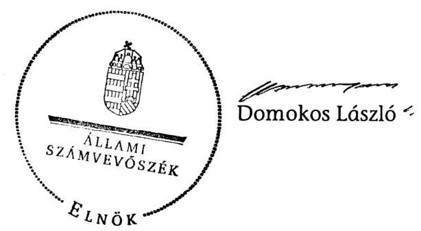

---

# Az ÚMVP III-IV. tengely és technikai segítségnyújtás keret pénzügyi felhasználása 2011. december 31-ig

|  Intézkedés | Intézkedés-
kód | Jogcím | FORRÁS (nemzeti + EMVA) 2007-2013. | Kötelezettségvállalás (Lekötés) | Kifizetés teljesítése 2011.12.31. | Forrás lekötöttség aránya \%
(kötelezettségvállalás/forrás) | Pénzügyi teljesítés aránya \%
(kifizetés/ kötelezettségvállalás) | Forrásfelhasználás aránya \%
(kifizetés/ forrás)  |
| --- | --- | --- | --- | --- | --- | --- | --- | --- |
|  A vidéki gazdaság diverzifikálására irányuló intézkedések | 311 | Nem mezőgazdasági tevékenységgé történő diverzifikálás | 7883,8 | 0,0 | 0,0 | $0,0 \%$ | $0,0 \%$ | $0,0 \%$  |
|   | 312 | Mikrovállalkozások létrehozásának és fejlesztésének támogatása | 38249,1 | 31457,1 | 6550,3 | $82,2 \%$ | $20,8 \%$ | $17,1 \%$  |
|   | 313 | A turisztikai tevékenységek ösztönzése | 39289,9 | 22515,5 | 4417,1 | $57,3 \%$ | $19,6 \%$ | $11,2 \%$  |
|  A vidéki területek életminőségének javítására irányuló intézkedések | 321 | A vidéki gazdaság és lakosság számára nyújtott alapszolgáltatások - Tanyabusz, IKSZT | 38121,3 | 35805,1 | 13418,5 | $93,9 \%$ | $37,5 \%$ | $35,2 \%$  |
|   | 322 | Falumegújítás és -fejlesztés | 31586,9 | 22288,0 | 9913,8 | $70,6 \%$ | $44,5 \%$ | $31,4 \%$  |
|   | 323 | Vidéki örökség megőrzése | 26410,0 | 15266,0 | 4877,6 | $57,8 \%$ | $32,0 \%$ | $18,5 \%$  |
|  Képzés, készségek elsajátítása és ösztönzés | 331 | Képzés és tájékoztatás | 0,0 | 0,0 | 0,0 |  |  |   |
|   | 341 | Készségek elsajátítása, ösztönzése | 12164,7 | 11397,7 | 10304,6 | $93,7 \%$ | $90,4 \%$ | $84,7 \%$  |
|  III. tengely A vidéki élet minősége és a vidéki gazdaság diverzifikálása |  |  | 193705,8 | 138729,5 | 49482,1 | 71,6\% | 35,7\% | 25,5\%  |
|  A helyi fejlesztési stratégiák megvalósítása | 411 | Versenyképesség | 14341,8 | 1319,8 | 240,5 | $9,2 \%$ | $18,2 \%$ | $1,7 \%$  |
|   | 412 | Környezet/földgazdálkodás | 5736,7 | 293,8 | 61,4 | $5,1 \%$ | $20,9 \%$ | $1,1 \%$  |
|   | 413 | Életminőség/diverzifikáció | 37288,7 | 9265,9 | 2128,0 | $24,8 \%$ | $23,0 \%$ | $5,7 \%$  |
|  Térségek közötti és nemzetközi együttmúködés | 421 | Együttmúködési projektek végrehajtása | 7649,0 | 1101,5 | 255,3 | $14,4 \%$ | $23,2 \%$ | $3,3 \%$  |
|  A helyi akciócsoportok múködtetése, készségek elsajátítása, a térség élénkítése | 431 | A helyi akciócsoportok múködtetése, készségek elsajátítása, a térség élénkítése támogatás | 11473,4 | 10765,1 | 2839,1 | $93,8 \%$ | $26,4 \%$ | $24,7 \%$  |
|  IV. tengely A LEADER-megközelítés megvalósítása |  |  | 76489,6 | 22746,0 | 5524,3 | 29,7\% | 24,3\% | 7,2\%  |
|  III-IV. tengely összesen: |  |  | 270195,4 | 161475,5 | 55006,4 | 59,8\% | 34,1\% | 20,4\%  |
|  Technikai segítségnyújtás műveletek | 511 | Technikai segítségnyújtás | 57640,9 | 52963,9 | 36353,6 | 91,9\% | 68,6\% | 63,1\%  |
|  Mindösszesen (III-IV. tengely + TS) |  |  | 327836,3 | 214439,4 | 91360,0 | 65,4\% | 42,6\% | 27,9\%  |

---

# A III. tengely pénzügyi kerete a 2007. szeptemberben és a 2011. december 31-én hatályos ÜMVP szerint

|  Intézkedés | Intézkedés kód | Jogcím | Közpénzből történő hozzájárulás (ÜMVP 2007. szeptember) |  | Közpénzből történő hozzájárulás (ÜMVP 2011. december 31.) |  | Változás \%-ban |   |
| --- | --- | --- | --- | --- | --- | --- | --- | --- |
|   |  |  | Összes támogatás | ebből: EMVA hozzájárulás összege | Összes
támogatás | ebből: EMVA hozzájárulás összege | Összes
támogatás | ebből:
EMVA
hozzá-
járulás  |
|  A vidéki gazdaság diverzifikálására irányuló intézkedések | 311 | Nem mezőgazdasági tevékenységgé történő diverzifikálás | 7871,1 | 5649,1 | 7883,8 | 5649,1 | $0,2 \%$ | $0,0 \%$  |
|   | 312 | Mikrovállalkozások létrehozásának és fejlesztésének támogatása | 87723,3 | 62959,3 | 38249,1 | 27407,3 | $-56,4 \%$ | $-56,5 \%$  |
|   | 313 | A turisztikai tevékenységek ösztönzése | 17134,7 | 12297,6 | 39289,9 | 28153,0 | $129,3 \%$ | $128,9 \%$  |
|   |  | Intézkedések összesen | 112729,0 | 80906,0 | 85422,9 | 61209,4 | $-24,2 \%$ | $-24,3 \%$  |
|  A vidéki területek életminőségének javítására irányuló intézkedések | 321 | A vidéki vidéki gazdaság és lakosság számára nyújtott alapszolgáltatások - Tanyabusz, IKSZT | 30846,3 | 22138,5 | 38121,3 | 27315,7 | $23,6 \%$ | $23,4 \%$  |
|   | 322 | Falumegújítás és -fejlesztés | 20577,1 | 14768,2 | 31586,9 | 22633,4 | $53,5 \%$ | $53,3 \%$  |
|   | 323 | Vidéki örökség megőrzése | 9882,4 | 7092,6 | 26410,0 | 18924,0 | $167,2 \%$ | $166,8 \%$  |
|   |  | Intézkedések összesen | 61305,7 | 43999,3 | 96118,2 | 68873,1 | 56,8\% | 56,5\%  |
|  Képzés, készségek elsajátítása és ösztönzés | 331 | Képzés és tájékoztatás | 7213,6 | 5177,2 | 0,0 | 0,0 | $-100,0 \%$ | $-100,0 \%$  |
|   | 341 | Készségek elsajátítása, ösztönzése | 12145,1 | 8716,6 | 12164,7 | 8716,6 | $0,2 \%$ | $0,0 \%$  |
|   |  | Intézkedések összesen | 19358,7 | 13893,8 | 12164,7 | 8716,6 | $-37,2 \%$ | $-37,3 \%$  |
|  III. tengely összesen: |  |  | 193393,4 | 138799,1 | 193705,8 | 138799,1 | 0,2\% | 0,0\%  |

---

2/b. számú melléklet a V-2010-138/2011-2012. számú jelentéshez

# A IV. tengely pénzügyi kerete a 2007. szeptemberben és a 2011. december 31-én hatályos ÜMVP szerint

|  Intézkedés | Intézkedés huzas | Jogcím | Közpénzből történő hozzájárulás ( ÜMVP 2007. szeptember) |  | Közpénzből történő hozzájárulás (ÜMVP 2011. december 31.) |   |
| --- | --- | --- | --- | --- | --- | --- |
|   |  |  | Összes támogatás | ebből: EMVA hozzájárulás összege | Összes támogatás | ebből: EMVA hozzájárulás összege  |
|  A helyi fejlesztési stratégiák megvalósítása | 411 | Versenyképesség |  |  |  |   |
|   | 412 | Környezet/földgazdálkodás | 57 194,7 | 43 957,5 | 57 367,2 | 43 957,5  |
|   | 413 | Életminőség/diverzifikáció |  |  |  |   |
|  Térségek közötti és nemzetközi együttműködés | 421 | Együttműködési projektek végrehajtása | 7 626,0 | 5 861,0 | 7 649,0 | 5 861,0  |
|  A helyi akciócsoportok működtetése, készségek elsajátítása, a térség élénkítése | 431 | A helyi akciócsoportok működtetése, készségek elsajátítása, a térség élénkítése támogatás | 11 438,9 | 8 791,5 | 11 473,4 | 8 791,5  |
|  IV. tengely összesen: |  |  | 76 259,6 | 58 610,0 | 76 489,6 | 58 610,0  |

---

2/c. számú melléklet a V-2010-138/2011-2012. számú jelentéshez

# A technikai segítségnyújtás pénzügyi kerete a 2007. szeptemberben és a 2011. december 31-én hatályos ÜMVP szerint

|  Intézkedés | Lód | Tevékenység | Jogcím | Közpénzből történő hozzájárulás (ÜMVP 2007. szeptember) |  | Közpénzből történő hozzájárulás (ÜMVP 2011. december 31.) |   |
| --- | --- | --- | --- | --- | --- | --- | --- |
|   |  |  |  | Összes támogatás | ebből: EMVA hozzájárulás összege | Összes
támogatás | ebből: EMVA hozzájárulás összege  |
|  Technikai segítségnyújtás műveletek | 511 | 1. tevékenység | Magyar Nemzeti Vidéki Hálózat | 18755,2 | 14066,4 | 7580,8 | 5606,0  |
|   |  | 2. tevékenység | ÜMVP tevékenységei előkészítésének, nyomon követésének és ellenőrzésének támogatása | 32395,3 | 24296,5 | 43187,3 | 31937,0  |
|   |  | 3. tevékenység | Értékelés, információnyújtás a nyilvánosság folyamatos tájékoztatása a pályázható intézkedésekről és az ÜMVP eredményeiről | 5683,4 | 4262,6 | 6872,8 | 5082,4  |
|  Technikai segítségnyújtás összesen: |  |  |  | 56833,9 | 42625,5 | 57640,9 | 42625,4  |

---

# Az ÜMVP célindikátorai (output- és eredményindikátorok) és vállalt teljesülésük 2011. december 31-én

|  Indikátor
típusa | Indikátor megnevezése | Elővétel |  |  |  |  |  |   |
| --- | --- | --- | --- | --- | --- | --- | --- | --- |
|   |  |  | Célérték az ÜMVP |  |  | ÜMVP
célértékek
változása | A támogatott
projektek
vállalásai | A vállalások aránya
2011. 12. 31-én az  |
|   |  |  | 1.
verzió | 7.
verzió |  |  | 2011. 12. 31-én az
ÜMVP |   |
|   |  |  |  |  |  |  | 1.
verzió | 7.
verzió  |
|  III. tengely A vidéki élet minőségének javítása és a gazdasági tevékenység diverzifikációjának ösztönzése |  |  |  |  |  |  |  |   |
|  312. Mikrovállalkozások létrehozásának és fejlesztésének támogatása |  |  |  |  |  |  |  |   |
|  Output | Támogatott mikrovállalkozások száma | db | 7 800 | 4 600 | -41,0% | 1981 | 25,4% | 43,1%  |
|   | A támogatott fejlesztések teljes összege | millió
forint | 194 940,6 | 104 328,0 | -46,5% | 51 128,0 | 26,2% | 49,0%  |
|  Eredmény | Létrehozott munkahelyek száma összesen | db | 3 800 | 4 600 | 21,1% | 3 678 | 96,8% | 80,0%  |
|   | A nem mezőgazdasági bruttó hozzáadott érték növekedése a támogatott vállalkozásokban | millió
forint | 36 792,0 | 36 792,0 | 0,0% | N.A. |  |   |
|  313. A turisztikai tevékenységek ösztönzése |  |  |  |  |  |  |  |   |
|  Output | A támogatott új idegenforgalmi tevékenységek száma | db | 3197 | 3 197 | 0,0% | 1050 | 32,8% | 32,8%  |
|   | A beruházás teljes összege | millió
forint | 83 272,0 | 83 272,0 | 0,0% | 33 796,0 | 40,6% | 40,6%  |
|  Eredmény | A nem mezőgazdasági bruttó hozzáadott érték növekedése a támogatott vállalkozásokban | millió
forint | 4 032,0 | 4 032,0 | 0,0% | N.A. |  |   |
|   | Létrehozott munkahelyek száma összesen | db | 480 | 600 | 25,0% | 1208 | 251,7% | 201,3%  |
|  321. A vidéki gazdaság és a lakosság számára nyújtott alapszolgáltatások |  |  |  |  |  |  |  |   |
|  Output | A támogatott tevékenységek száma | db | 3 836 | 3 836 | 0,0% | 1682 | 43,8% | 43,8%  |
|   | A beruházás teljes összege | millió
forint | 50 540,0 | 50 540,0 | 0,0% | 37 184,0 | 73,6% | 73,6%  |
|  Eredmény | A fejlettebb szolgáltatásokat hasznosító vidéki településen élők száma | ezer fő | 3 500 | 3 500 | 0,0% | 2698 | 77,1% | 77,1%  |
|  Speciális indikátorok | Többfunkciós szolgáltatóközpontok száma | db | 1800 | 1 800 | 0,0% | 610 | 33,9% | 33,9%  |
|   | A támogatott tanyabusz szolgáltatások száma | db | 200 | 200 | 0,0% | 1083 | 541,5% | 541,5%  |
|  322. Falumogújtás és -fejlesztés |  |  |  |  |  |  |  |   |
|  Output | A támogatott falvuk száma, ahol a tevékenységet végezték | db | 600 | 600 | 0,0% | 1545 | 257,5% | 257,5%  |
|   | A beruházások teljes összege | millió
forint | 39 200,0 | 39 200,0 | 0,0% | 23 662,4 | 60,4% | 61,1%  |
|  Eredmény | A fejlettebb szolgáltatásokat hasznosító vidéki településen élők száma | fő | 1 415 700 | 1 415 700 | 0,0% | 2 137 956 | 151,0% | 151,0%  |
|  323. A vidék örökségének védelme és fenntartható fejlesztése |  |  |  |  |  |  |  |   |
|  Output | A vidéki örökséggel kapcsolatos támogatott intézkedések száma | db | 470 | 600 | 27,7% | 874 | 186,0% | 145,7%  |
|   | A beruházás teljes összege | millió
forint | 3 164,0 | 31 612,0 | 899,1% | 14 532,0 | 459,3% | 46,0%  |
|  Eredmény | A fejlettebb szolgáltatásokat hasznosító vidéki településen élők száma | fő | 628 800 | 628 800 | 0,0% | 1 798 700 | 286,1% | 286,1%  |
|  IV. tengely Leader-megközelítés megvalósítása |  |  |  |  |  |  |  |   |
|  411 - 412 - 413. A helyi fejlesztési stratégiák megvalósítása |  |  |  |  |  |  |  |   |
|  Output | A támogatott helyi akciócsoportok száma | csoport | 70 | 50 | -28,6% | 96 | 137,1% | 192,0%  |
|   | Az akciócsoportok által elfogadott projektek száma | db | 4 500 | 4 500 | 0,0% | 2 588 | 57,5% | 57,5%  |
|   | A támogatott kedvezményezettek száma | db | 4 000 | 4 000 | 0,0% | 2 249 | 56,2% | 56,2%  |
|   | Ebből: Magánszektor | db | 2 800 | 2 800 | 0,0% | 1 557 | 70,1% | 70,1%  |
|   | Állami szektor | db | 800 | 800 | 0,0% | 692 | 115,5% | 115,5%  |
|   | Helyi akciócsoport | db | 400 | 400 | 0,0% | 0 | 0,0% | 0,0%  |
|  Eredmény | A támogatott tevékenységek által létrehozott új munkahelyek bruttó száma (munkahelyek) | db | 400 | 400 | 0,0% | N.A. |  |   |
|   | Képzést sikeresen elvégzők száma | fő | 3 500 | 3 500 | 0,0% | N.A. |  |   |
|  421. Térségek közötti és nemzetközi együttműködések |  |  |  |  |  |  |  |   |
|  Output | A támogatott együttműködési projektek száma | db | 200 | 200 | 0,0% | 402 |  | 201,0%  |
|  Eredmény | Új munkahelyek száma | db | 50 | 50 | 0,0% | 2 |  | 4,0%  |

---

# A LEADER Helyi Akciócsoportok tagtelepüléseinek száma és lakosságuk összetétele településtípusonként 

A LEADER akciócsoportok tag településeinek száma, településtípusonként, régiós átlag 2008
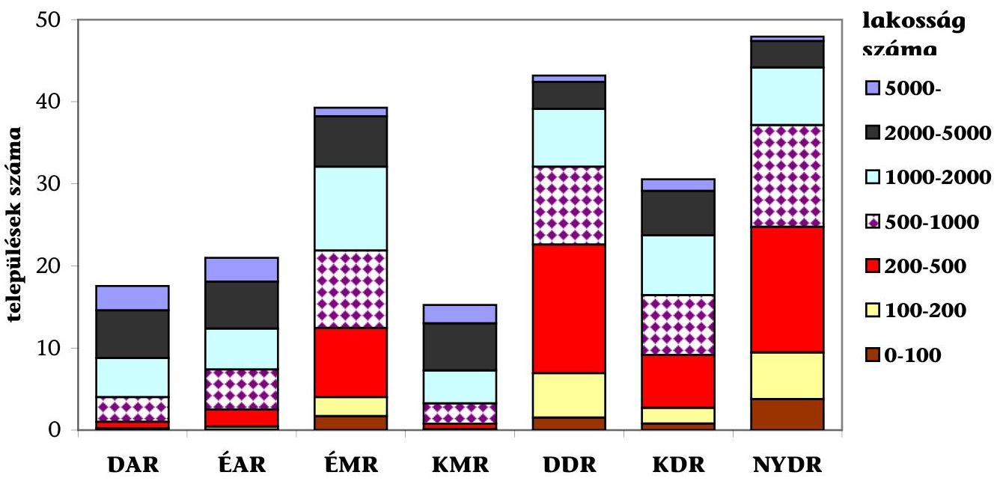

A LEADER Helyi Akciócsoportok lakosságának összetétele településtípusonként, régiós átlag 2008
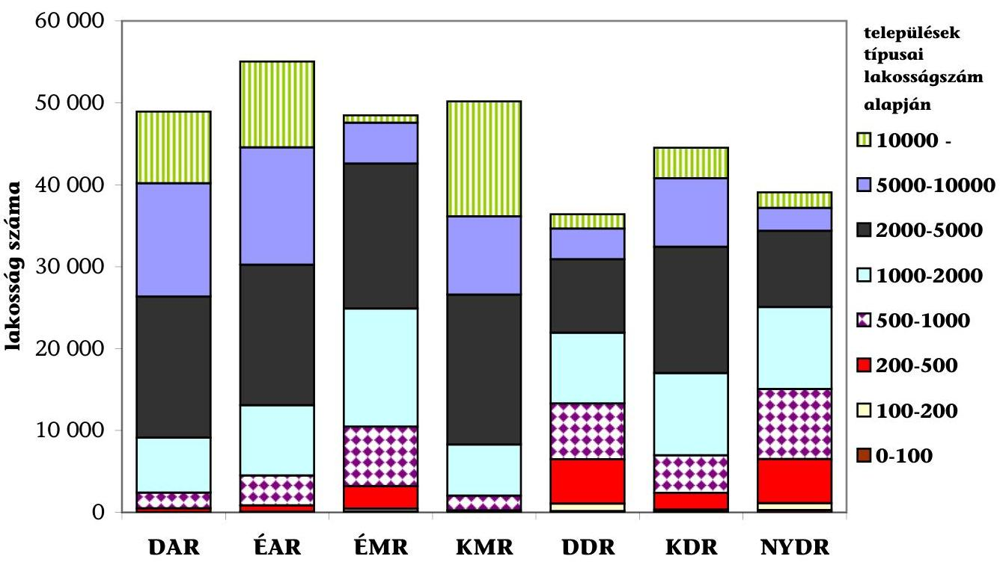

---

5. számú melléklet a V-2010-138/2011-2012. számú jelentéshez

# A LEADER Helyi Akciócsoportok tagságának összetétele

|   | LEADER helyi akciócsoport neve (147/2007. (XII. 4.) FVM rendelet szerinti elnevezések) | LEADER tag- települések száma | LEADER területén lakók száma | LEADER egyesületi tagok száma összesen | az egyesületi tagokból |  |  |  |   |
| --- | --- | --- | --- | --- | --- | --- | --- | --- | --- |
|   |  |  |  |  | magán- személy | egyéni | mély |  |   |
|   |  |  |  |  |  |  |  |  |   |
|  Dél-alföldi régió |  |  |  |  |  |  |  |  |   |
|  1. | Felső-Bácska Vidékfejlesztési Nonprofit Kft. | 34 | 72 082 | 139 | 0 | 13 | 47 | 0 | 41  |
|  2. | Dunamellék LEADER Egyesület | 26 | 72 034 | 117 | 1 | 8 | 33 | 5 | 28  |
|  3. | Körös-Sárréti Vidékfejlesztési Egyesület | 22 | 65 442 | 63 | 0 | 19 | 8 | 0 | 17  |
|  4. | Homokhátság Fejlődésért Nonprofit Kft. | 16 | 68 430 | 10 | 0 | 0 | 3 | 0 | 4  |
|  5. | Kiskunok Vidékéért Egyesület | 24 | 58 942 | 67 | 0 | 13 | 7 | 0 | 24  |
|  6. | Körösök Völgye Akciócsoport Nonprofit Kft. | 18 | 70 192 | 217 | 2 | 46 | 83 | 1 | 23  |
|  7. | Hajdúvölgy - Körösmente Térség Fejlesztéséért Közhasznú Egyesület | 16 | 49 213 | 66 | 0 | 9 | 12 | 0 | 21  |
|  8. | Alsó-Tisza Vidék Fejlesztéséért Egyesület | 12 | 65 278 | 32 | 0 | 3 | 8 | 0 | 12  |
|  9. | A Vásárhelyi Vidék Jövőjéért Egyesület | 4 | 10 577 | 56 | 14 | 6 | 11 | 0 | 4  |
|  10. | Homokhátság Vidékfejlesztési Egyesület | 14 | 41 548 | 33 | 1 | 3 | 6 | 0 | 12  |
|  11. | Kertészek Földje Akciócsoport Egyesület | 19 | 42 614 | 67 | 1 | 12 | 8 | 4 | 19  |
|  12. | ÜDE-KÜNSÁG Vidékfejlesztési Nonprofit Kft. | 12 | 31 317 | 82 | 0 | 20 | 27 | 0 | 14  |
|  13. | Déli Napfény Nonprofit Kft. | 12 | 42 211 | 46 | 0 | 0 | 14 | 0 | 12  |
|  14. | Maros-völgyi LEADER Egyesület | 17 | 46 715 | 42 | 1 | 8 | 8 | 0 | 17  |
|   | Dél-dunántúli régió |  |  |  |  |  |  |  |   |
|  15. | Dél-Baranya határmenti települések Egyesülete | 88 | 40 523 | 214 | 6 | 24 | 38 | 9 | 79  |
|  16. | Koppányvölgyi Vidékfejlesztési Közhasznú Egyesület | 56 | 43 747 | 106 | 0 | 17 | 21 | 3 | 40  |
|  17. | Zengő-Duna Vidékfejlesztési Közhasznú Egyesület | 60 | 42 548 | 159 | 0 | 16 | 21 | 2 | 57  |
|  18. | Szinergia Egyesület | 66 | 30 916 | 173 | 27 | 10 | 28 | 1 | 68  |
|  19. | Rinyu-Dráva Szövetség | 41 | 38 744 | 113 | 1 | 7 | 22 | 8 | 39  |
|  20. | Zselici Lámpások Vidékfejlesztési Egyesület | 49 | 37 037 | 136 | 8 | 14 | 26 | 0 | 47  |
|  21. | Tolnai Hármas Összefogás Nonprofit Kft. | 41 | 34 736 | 120 | 0 | 13 | 20 | 0 | 47  |
|  22. | Mecsek-Völgység-Hegyhát Egyesület | 46 | 28 176 | 142 | 0 | 12 | 29 | 1 | 56  |
|  23. | Vidékünk a jövőnk Szövetség | 42 | 27 984 | 55 | 0 | 5 | 7 | 5 | 26  |
|  24. | A Duna összeköt Egyesület | 21 | 37 124 | 57 | 0 | 8 | 9 | 0 | 21  |
|  25. | 3-as Kézfogás Nonprofit Kft. | 24 | 31 182 | 102 | 0 | 28 | 13 | 0 | 25  |
|  26. | Dél-balatoni LEADER Nonprofit Vidékfejlesztési Zrt. | 33 | 55 817 | 171 | 7 | 25 | 41 | 1 | 36  |
|  27. | Sárköz-Dunavölgye-Siómente Egyesület | 25 | 40 665 | 56 | 0 | 5 | 13 | 0 | 17  |
|  28. | Mecsekvidék Helyi Közösség Egyesület | 38 | 29 120 | 109 | 3 | 2 | 28 | 1 | 39  |
|  29. | Észak-Kaposi Partnerek Vidékfejlesztési Egyesület | 24 | 16 324 | 106 | 5 | 19 | 19 | 5 | 24  |

---

|   | LEADER helyi akciócsoport neve (147/2007. (XII. 4.) FVM rendelet szerinti elnevezések) | LEADER tag- települések száma | LEADER területén lakók száma | LEADER egyesületi tagok száma összesen | az egyesületi tagokból |  |  |  |   |
| --- | --- | --- | --- | --- | --- | --- | --- | --- | --- |
|   |  |  |  |  | magán- személy | egyéni vállalkozó | mértékes- vállalkozás | egyházi szervezet | önkormányzati intézmény  |
|  Közép-dunántúli régió |  |  |  |  |  |  |  |  |   |
|  30. | Vértes-Gerecse Vidékfejlesztési Közösség Közhasznú Egyesület | 38 | 63 856 | 99 | 0 | 3 | 19 | 2 | 38  |
|  31. | SÁRVÍZ Helyi Közösség Egyesület | 30 | 68 448 | 92 | 0 | 5 | 25 | 0 | 30  |
|  32. | Éltető Balaton-felvidékért Egyesület | 60 | 40 908 | 122 | 0 | 18 | 16 | 1 | 51  |
|  33. | Zalai Dombhátaktól a Vulkánok Völgyéig Egyesület | 44 | 31 024 | 85 | 0 | 9 | 15 | 2 | 30  |
|  34. | Mezőföldi Híd Térségfejlesztő Egyesület | 18 | 49 452 | 90 | 3 | 9 | 24 | 1 | 18  |
|  35. | Gerence-Marcal-Rába és Somló Környéke Vidékfejlesztési Egyesület | 35 | 19 639 | 76 | 0 | 11 | 12 | 1 | 35  |
|  36. | Bakonyalja-Kisalföld kapuja Vidékfejlesztési Egyesület | 25 | 41 222 | 65 | 1 | 5 | 19 | 2 | 26  |
|  37. | A Bakonyért Vidékfejlesztési Akciócsoport Egyesület | 29 | 42 369 | 73 | 0 | 6 | 17 | 5 | 26  |
|  38. | Duna-Pilis-Gerecse Vidékfejlesztési Egyesület | 22 | 53 312 | 81 | 7 | 4 | 15 | 1 | 29  |
|  39. | Bakony és Balaton Keleti Kapuja Egyesület | 22 | 50 494 | 77 | 0 | 6 | 16 | 1 | 22  |
|  40. | Somló-Marculmente-Bakonyalja LEADER Akciócsoport Közhasznú Egyesület | 43 | 26 122 | 121 | 0 | 17 | 25 | 5 | 50  |
|  41. | Völgy Vidék Vidékfejlesztési Közösség Közhasznú Egyesület | 17 | 44 328 | 65 | 7 | 3 | 14 | 1 | 18  |
|  42. | MEZŐFÖLD Helyi Közösség Egyesület | 10 | 27 629 | 36 | 0 | 8 | 3 | 0 | 10  |
|  43. | Velencei-tó Térségfejlesztő Egyesület | 9 | 26 910 | 50 | 3 | 6 | 8 | 0 | 9  |
|  Nyugat-dunántúli régió |  |  |  |  |  |  |  |  |   |
|  44. | Pannónia Kincse LEADER Egyesület | 65 | 82 634 | 236 | 16 | 50 | 44 | 8 | 65  |
|  45. | Vasi Örtorony Közhasznú Egyesület | 82 | 48 981 | 163 | 1 | 18 | 32 | 6 | 68  |
|  46. | Gócsej-Hegyhát LEADER Egyesület | 70 | 38 718 | 270 | 0 | 28 | 38 | 3 | 70  |
|  47. | SághegyLEADER Egyesület | 58 | 34 643 | 160 | 1 | 21 | 19 | 7 | 58  |
|  48. | Szigetköz Moszni-sik LEADER Egyesület | 35 | 54 159 | 110 | 0 | 0 | 33 | 0 | 38  |
|  49. | Zala Zöld Szíve Vidékfejlesztési Egyesület | 53 | 34 536 | 86 | 0 | 5 | 17 | 0 | 48  |
|  50. | Alpokalja Ikva mente LEADER Egyesület | 39 | 38 471 | 197 | 7 | 9 | 57 | 1 | 41  |
|  51. | Rábaköz Vidékfejlesztési Egyesület | 44 | 52 331 | 174 | 0 | 24 | 43 | 15 | 44  |
|  52. | Innovatív Dél-Zala Vidékfejlesztési Egyesület | 46 | 28 837 | 126 | 3 | 21 | 18 | 0 | 47  |
|  53. | Zala Termálvölgye Egyesület | 34 | 31 080 | 123 | 12 | 15 | 30 | 1 | 35  |
|  54. | Örség Határok Nélkül Egyesület | 49 | 21 383 | 103 | 3 | 17 | 18 | 2 | 35  |
|  55. | Zalai Témautak Szolgáltató Nonprofit Kft. | 31 | 19 880 | 99 | 3 | 9 | 15 | 1 | 34  |
|  56. | UTIRO LEADER Egyesület | 30 | 34 643 | 75 | 0 | 14 | 15 | 2 | 30  |
|  Közép-magyarországi régió |  |  |  |  |  |  |  |  |   |
|  57. | Felső-Homokhátság Vidékfejlesztési Egyesület | 13 | 53 377 | 45 | 0 | 2 | 11 | 0 | 13  |
|  58. | HAJT-A Csapat Egyesület | 14 | 48 438 | 43 | 0 | 5 | 12 | 0 | 13  |
|  59. | Észak-Kelet Pest Megyei LEADER Egyesület | 24 | 59 802 | 95 | 9 | 13 | 27 | 3 | 20  |
|  60. | Kis-Duna-menti Vidékfejlesztési Egyesület | 10 | 36 387 | 28 | 0 | 1 | 7 | 0 | 10  |
|  61. | GERJE-SZTÖK Helyi Vidékfejlesztési Közösség Egyesület | 13 | 54 210 | 49 | 0 | 11 | 14 | 0 | 10  |
|  62. | DIPO Duna-Ipoly Határmenti Együttműködések Helyi Közössége Közhasznú Egyesület | 19 | 24 180 | 57 | 6 | 3 | 15 | 2 | 19  |
|  63. | Börzsöny-Duna-Ipoly Vidékfejlesztési Egyesület | 17 | 24 622 | 92 | 7 | 20 | 20 | 1 | 17  |
|  64. | Strázsa-Felső Tápló Vidékfejlesztési Nonprofit Kft. | 12 | 38 058 | 33 | 0 | 3 | 11 | 0 | 9  |

---

|   | LEADER helyi akciócsoport neve (147/2007. (XII. 4.) FVM rendelet szerinti elnevezések) | LEADER tag- települések száma | LEADER területén lakók száma | LEADER egyesületi tagok száma összesen | az egyesületi tagokból |  |  |  |   |
| --- | --- | --- | --- | --- | --- | --- | --- | --- | --- |
|   |  |  |  |  | magán személy egyéni vállalkozás adóvalóan |  |  |  |   |
|  Észak-magyarországi régió |  |  |  |  |  |  |  |  |   |
|  65. | Borsod-Torna-Gömör Egyesület | 77 | 55 030 | 111 | 0 | 6 | 30 | 0 | 49  |
|  66. | Abaúj LEADER Egyesület | 81 | 56 136 | 164 | 10 | 8 | 40 | 3 | 63  |
|  67. | Zempléni Tájak Vidékfejlesztési Egyesület | 55 | 53 303 | 56 | 1 | 4 | 16 | 1 | 24  |
|  68. | BÜKK-MAKK LEADER Nonprofit Kft. | 44 | 90 705 | 147 | 0 | 26 | 30 | 2 | 46  |
|  69. | Ipoly-menti Palócok Térségfejlesztő Egyesülete | 50 | 49 628 | 180 | 22 | 14 | 48 | 0 | 48  |
|  70. | Tisza-Turna-Rima-Mente Fejlesztéséért Közhasznú Egyesület | 34 | 66 150 | 95 | 2 | 15 | 17 | 0 | 37  |
|  71. | Dél-Borsodi LEADER Egyesület | 37 | 48 447 | 102 | 1 | 13 | 13 | 3 | 39  |
|  72. | D.Z. Nektár LEADER Nonprofit Kft. | 30 | 46 605 | 82 | 5 | 7 | 18 | 0 | 31  |
|  73. | 36 Jó Palóc Közhasznú Egyesület | 36 | 37 308 | 87 | 2 | 6 | 21 | 0 | 35  |
|  74. | Észak Hevesi Vidék Fejlesztéséért Közhasznú Egyesület | 33 | 33 724 | NA | NA | NA | NA | NA | NA  |
|  75. | Észak-Borsodi LEADER Unió Helyi Közösség Egyesület | 30 | 36 850 | 76 | 1 | 6 | 15 | 0 | 30  |
|  76. | Dél-Mátra Közhasznú Egyesület | 24 | 43 160 | 71 | 4 | 7 | 8 | 2 | 26  |
|  77. | Cserhátalja LEADER Nonprofit Kft. | 26 | 32 595 | 106 | 0 | 9 | 29 | 0 | 26  |
|  78. | Eger vidék kincsei Térségi Vidékfejlesztési Nonprofit Kft. | 14 | 23 792 | 48 | 0 | 6 | 10 | 0 | 14  |
|  79. | Zagyvaság Vidékfejlesztési Közhasznú Egyesület | 12 | 31 256 | 48 | 3 | 1 | 14 | 0 | 13  |
|  Észak-alföldi régió |  |  |  |  |  |  |  |  |   |
|  80. | Bihar Sárrét Összefogás Vidékfejlesztési Nonprofit Kft. | 41 | 90 755 | NA | NA | NA | NA | NA | NA  |
|  81. | Szatmár LEADER Egyesület | 75 | 77 262 | 275 | 2 | 81 | 53 | 13 | 88  |
|  82. | Érmelléki Vidékfejlesztési Nonprofit Kft. | 22 | 85 096 | 83 | 0 | 17 | 22 | 0 | 23  |
|  83. | HA-VER Hajdúsági Versenyképesség Nonprofit Kft. | 7 | 91 490 | 87 | 0 | 10 | 42 | 0 | 5  |
|  84. | Közép-Nyírségért és Rétközért Vidékfejlesztési Közhasznú Egyesület | 33 | 67 753 | 106 | 0 | 17 | 24 | 4 | 32  |
|  85. | Nyírség Vidékfejlesztési Közhasznú Egyesület | 18 | 69 301 | 65 | 0 | 5 | 16 | 1 | 18  |
|  86. | Nagykunságért Térségi Vidékfejlesztési Nonprofit Kft. | 8 | 65 700 | 40 | 0 | 1 | 11 | 0 | 12  |
|  87. | Nyírség Fejlődéséért LEADER Egyesület | 26 | 44 455 | 61 | 0 | 23 | 3 | 5 | 19  |
|  88. | Felső-Szabolcsi Vidékfejlesztési Közhasznú Egyesület | 24 | 45 781 | 81 | 0 | 5 | 15 | 25 | 14  |
|  89. | Tisza-tó Térsége LEADER Egyesület | 15 | 43 825 | 110 | 3 | 16 | 47 | 0 | 17  |
|  90. | Hortobágy LEADER Nonprofit Kft. | 11 | 51 453 | 60 | 1 | 7 | 19 | 0 | 12  |
|  91. | Jászsági Kistérségi Helyi Közösség Egyesülete | 17 | 57 799 | 96 | 8 | 12 | 34 | 1 | 17  |
|  92. | Felső-Tisza Völgye Vidékfejlesztési Egyesület | 31 | 33 338 | 63 | 0 | 6 | 10 | 6 | 27  |
|  93. | Tiszazagi-LEADER Vidékfejlesztési Programiroda Nonprofit Kft. | 11 | 24 775 | 39 | 0 | 5 | 12 | 1 | 11  |
|  94. | Közép-Tisza-Zagyva Vidékfejlesztési Egyesület | 17 | 46 149 | 39 | 0 | 5 | 8 | 0 | 15  |
|  95. | Tiszatér LEADER Egyesület | 16 | 52 762 | 45 | 0 | 2 | 9 | 0 | 16  |
|  96. | Tisza-menti LEADER Közhasznú Egyesület | 8 | 18 278 | 30 | 0 | 4 | 10 | 0 | 7  |

---

A III. és IV. tengely meghirdetett intézkedései, pályázatai és a beérkezett kérelmek/pályázatok száma

|  Pályázati szakaszok | Hivatal központi kérelemkezelés (db) |  |  |  |  |  | Helyi akciócsoportok kérelemkezelése (db) |  |  |  |  | Összesen darab  |
| --- | --- | --- | --- | --- | --- | --- | --- | --- | --- | --- | --- | --- |
|   | 321A | 321B | 312 | 313 | 322 | 323 | 312 | 313 | 322 | 323 | 411-413 |   |
|   | Tanyabusz | IKSZT | Mikro-
vállalkozás | Turisztika | Falu-
megújítás | Vidéki
örökség | Mikro-
vállalkozás | Turisztika | Falu-
megújítás | Vidéki
örökség | LEADER |   |
|   | 1. és 2. | 1. | 1. és 3. | 1. és 3. | 1. | 1. | 2. | 2. | 2. | 2. | 1. és 2. |   |
|  2008. április
2008. június | $\begin{gathered} 751 \ 415 \end{gathered}$ |  |  |  |  |  |  |  |  |  |  | 1166  |
|  2008. november -
2009. január |  |  | 1806 | 1593 | 1693 | 933 |  |  |  |  |  | 6025  |
|  2009. november -
2009. december |  | 813 |  |  |  |  | 1465 | 962 | 1011 | 538 | 4189 | 8978  |
|  2011. július -
2011. augusztus |  |  | 1253 | 1156 |  |  |  |  |  |  |  | 2409  |
|  2011. október -
2011. december |  |  |  |  |  |  |  |  |  |  | 8351 | 8351  |
|  Összesen | 1166 | 813 | 3059 | 2749 | 1693 | 933 | 1465 | 962 | 1011 | 538 | 12540 | 26929  |

---

# Az ÚMVP III. és IV. tengely támogatott projektjeinek pontértékei

|  Intézkedés |  | Támogatott projekt |  |  |  | Elérhető maximális pontérték | Átlag pontérték | Átlag pontérték/ Elérhető pontszám | Szórás ${ }^{[1]}$  |
| --- | --- | --- | --- | --- | --- | --- | --- | --- | --- |
|   |  | minimum |  | maximum |  |  |  |  |   |
|   |  | pont-
érték | elérhető
pontszám
\%-ban | pont-
érték | elérhető
pontszám
\%-ban |  |  |  |   |
|  Mikrovállalkozás I. |  | 48 | 28,2\% | 155 | 91,2\% | 170 | 111 | 65,3\% | 19  |
|  Mikrovállalkozás II. |  | 34 | 20,0\% | 166 | 97,6\% | 170 | 116 | 68,2\% | 25  |
|  Turisztika I. |  | 63 | 37,1\% | 159 | 93,5\% | 170 | 123 | 72,4\% | 16  |
|  Turisztika II. |  | 65 | 38,2\% | 165 | 97,1\% | 170 | 128 | 75,3\% | 19  |
|  IKSZT I. |  | 127 | 68,6\% | 179 | 96,8\% | 185 | 149 | 80,5\% | 12  |
|  Tanyabusz I. |  | 26 | 26,0\% | 91 | 91,0\% | 100 | 64 | 64,0\% | 10  |
|  Tanyabusz II. |  | 33 | 33,0\% | 87 | 87,0\% | 100 | 62 | 62,0\% | 9  |
|  Falufejlesztés I. |  | 51 | 35,2\% | 133 | 91,7\% | 145 | 97 | 66,9\% | 13  |
|  Falufejlesztés II. |  | 47 | 32,4\% | 134 | 92,4\% | 145 | 91 | 62,8\% | 15  |
|  Vidéki örökség I. |  | 57 | 34,5\% | 148 | 89,7\% | 165 | 109 | 66,1\% | 16  |
|  Vidéki örökség II. |  | 49 | 29,7\% | 144 | 87,3\% | 165 | 102 | 61,8\% | 18  |
|  LEADER közösségi célú |  | 46 | 34,6\% | 101 | 75,9\% | 133 | 74 | 55,6\% | 17  |
|  LEADER rendezvény |  | 37 | 38,1\% | 68 | 70,1\% | 97 | 43 | 44,3\% | 12  |
|  LEADER vállalkozás |  | 67 | 48,6\% | 102 | 73,9\% | 138 | 87 | 63,0\% | 14  |
|  LEADER térségek között |  | 46 | 54,8\% | 54 | 64,3\% | 84 | 51 | 60,7\% | 3  |
|  LEADER térségeken belül |  | 44 | 45,4\% | 59 | 60,8\% | 97 | 54 | 55,7\% | 2  |
|  LEADER képzés |  | 43 | 45,7\% | 54 | 57,4\% | 94 | 50 | 53,2\% | 4  |

[1] Statisztikai fogalom, azt mutatja, hogy az értékek az átlagtól milyen mértékben térnek el

---

# A 2011. II. negyedévben rögzített kötelezettségvállalásoknál és kifizetéseknél alkalmazott árfolyamok

|  Támogatások kötelezettségvállalása |  |  |   |
| --- | --- | --- | --- |
|  előző év utolsó árfolyamán |  |  |   |
|  (2010. december 31-i árfolyamon, 2011. teljes évben) |  |  |   |
|  277,98 HUE/EUR |  |  |   |
|  2011. II. negyedéví EMVA elszámolások |  |  |   |
|  2011. április | 2011. május | 2011. június | 2011. július 10-ig  |
|  Támogatások kifizetése | Támogatások kifizetése | Támogatások kifizetése |   |
|  előző hónap utolsó árfolyamán | előző hónap utolsó árfolyamán | előző hónap utolsó árfolyamán |   |
|  2011.03.31 | 2011.04.30 | 2011.08.31 |   |
|  268,72 HUE/EUR | 264,80 HUE/EUR | 266,88 HUE/EUR |   |
|   |  |  | Negyedéves elszámolás a  |
|   |  |  | Bizottsággal, a kifizetésekről  |
|   |  |  | a negyedévet követő 10. napl árfolyamon  |
|   |  |  | 2011.07.10.  |
|   |  |  | 263,08 HUE/EUR  |

ÚMVP kötelezettségvállalások és kifizetések árfolyamának alakulása 2008-2012. I. n.év

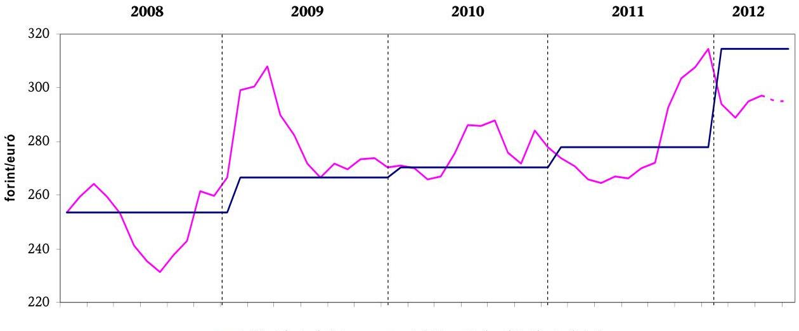

— kifizetések árfolyama — kötelezettségvállalások árfolyama

---

# A kifizetési kérelem   postára adásától a határozathozatalig eltelt napok száma 

|  | Eltelt napok száma |  |  |  |
| :--: | :--: | :--: | :--: | :--: |
| Jogcím | Átlagos   feldolgozási   idő | Szórás | Legrövidebb   feldolgozási   idö | Leghosszabb   feldolgozási   idö |
| Mikrovállalkozások I. | 125 | 83 | 3 | 774 |
| Mikrovállalkozások II. | 76 | 27 | 12 | 153 |
| Turisztika I. | 116 | 92 | 6 | 645 |
| Turisztika II. | 63 | 24 | 17 | 105 |
| IKSZT I. | 96 | 58 | 8 | 443 |
| Tanyabusz I. | 96 | 60 | 15 | 708 |
| Tanyabusz II. | 91 | 60 | 13 | 777 |
| Falufejlesztés I. | 124 | 78 | 4 | 680 |
| Falufejlesztés II. | 77 | 24 | 24 | 126 |
| Vidéki örökség I. | 129 | 90 | 2 | 676 |
| Vidéki örökség II. | 72 | 41 | 5 | 119 |

---

10. számú melléklet

a V-2010-138/2011-2012. számú jelentéshez

## **Az ÚMVP III. és IV. tengely összes jóváhagyott támogatása és a 341. és 431. jogcímekre kifizetett működési költségek közötti összefüggés a 96 Leader HACS esetében**

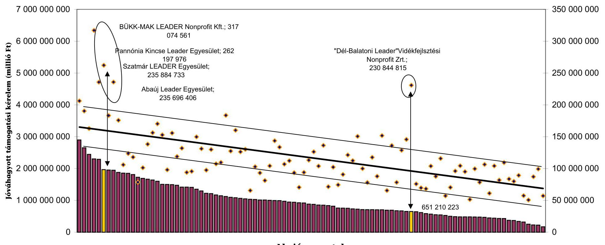

### **Akciócsoportok**

- Összeg / Jóváhagyott támogatás III. + IV.
- Összeg / 341+431 — Lineáris (Összeg / 341+431)

---

A LEADER helyi akciócsoportok
fejlesztési és múködési kereteinek lekötöttsége és a kifizetések régiónként

# DÉL-ALFÖLDI RÉGIÓ 

a helyi akciócsoportok fejlesztési és múködési kereteinek kihasználtsága
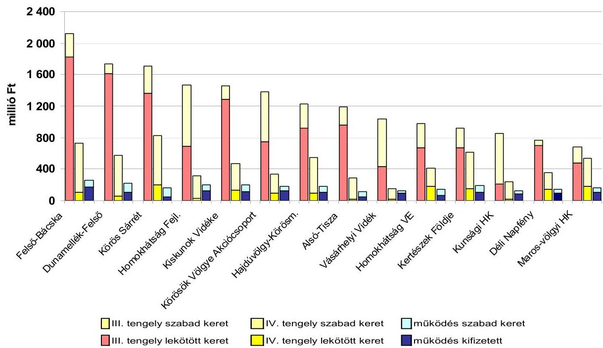

DÉL-DUNÁNTÜLI RÉGIÓ
a helyi akciócsoportok fejlesztési és múködési kereteinek kihasználtsága
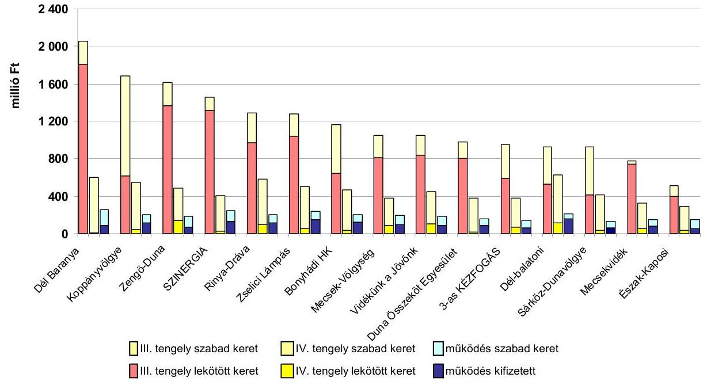

---

# KÖZÉP-DUNÁNTÚLI RÉGIÓ 

a helyi akciócsoportok fejlesztési és müködési kereteinek kihasználtsága
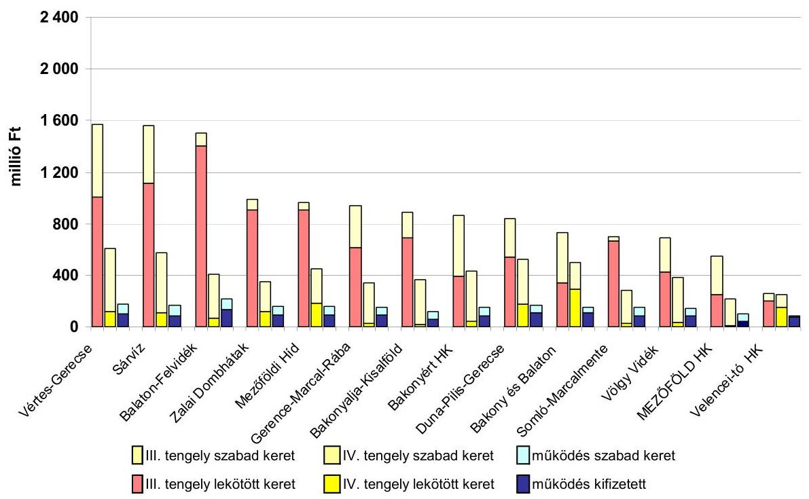

## NYUGAT-DUNÁNTÚLI RÉGIÓ

a helyi akciócsoportok fejlesztési és müködési kereteinek kihasználtsága
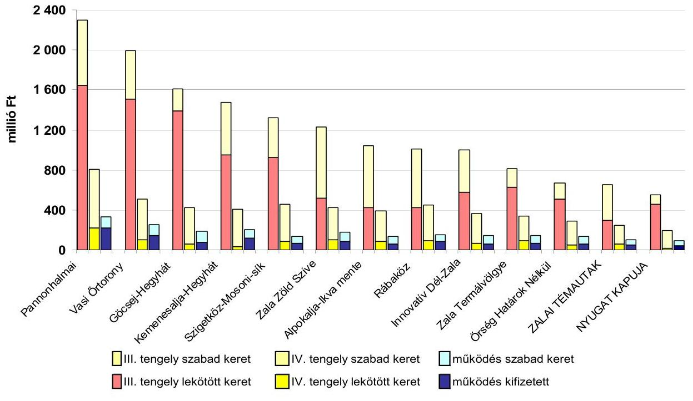

---

# ÉSZAK-MAGYARORSZÁGI RÉGIÓ 

a helyi akciócsoportok fejlesztési és müködési kereteinek kihasználtsága
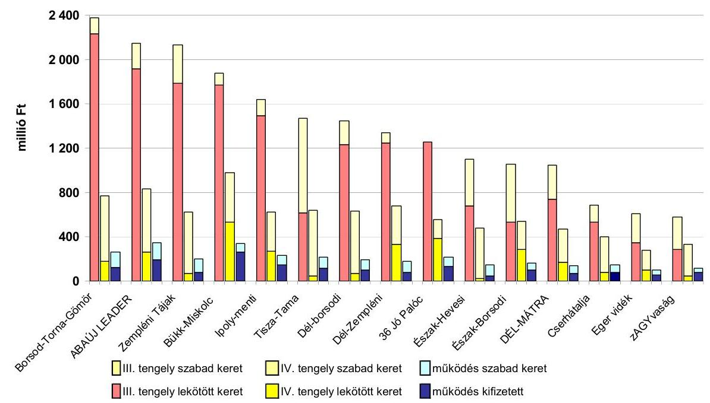

KÖZÉP-MAGYARORSZÁGI RÉGIÓ
a helyi akciócsoportok fejlesztési és müködési kereteinek kihasználtsága
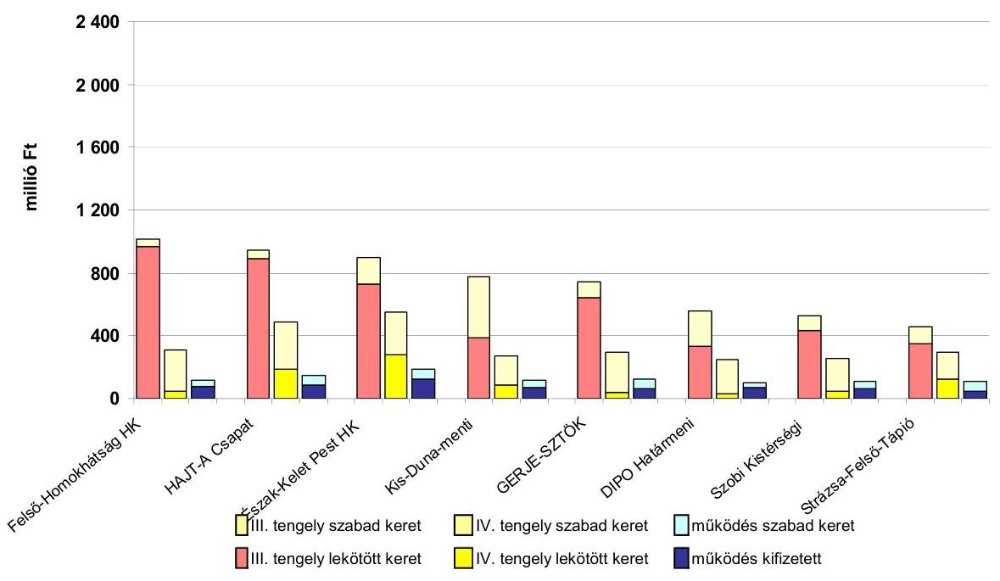

---

# ÉSZAK-ALFÖLDI RÉGIO 

a helyi akciócsoportok fejlesztési és müködési kereteinek kihasználtsága
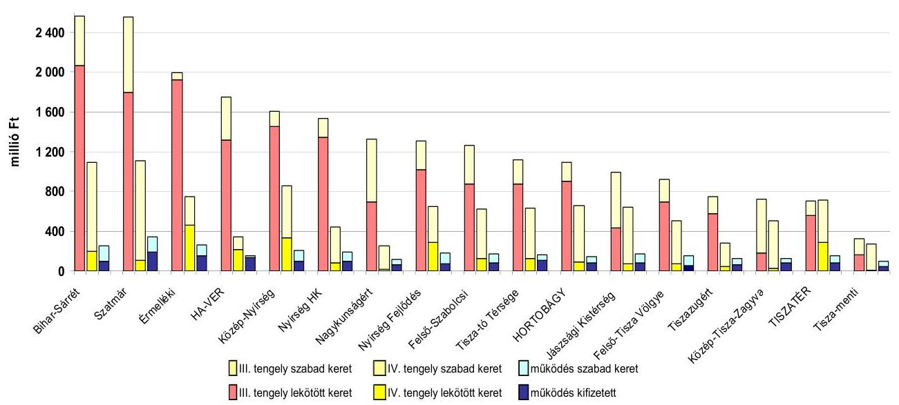

---

1. számú melléklet a V-2010-138/2011-2012. számú jelentéshez

# A LEADER támogatási kérelmek összegének régiónkénti és jogcímenkénti megoszlása

|   |  |  |  |  |  |  |  |  |  |  | Adatok: M Ft-ban |   |
| --- | --- | --- | --- | --- | --- | --- | --- | --- | --- | --- | --- | --- |
|   |  |  |  |  | Vidéki |  |  |  |  |  |  |   |
|   |  |  | Mikro-
vállalkozás | Turizmus | alapszolgáltatások |  | Falu-
fejlesztés | Vidéki
örökség | III.
tengely
összesen | LEADER
helyi
stratégiák
meg-
valósítása | LEADER
együtt-
működés | IV. tengely
összesen  |
|   |  |  |  |  | IKSZT | Tanyabusz |  |  |  |  |  | 23 679,6  |
|  Dél-Alföld | beérkezett | 11 989,6 | 11 708,5 | 3 812,1 | 879,1 | 4 074,9 | 3 297,3 | 35 761,6 | 6 692,9 | 225,2 | 6 918,1 | 42 679,6  |
|   | lekötött | 5 373,0 | 3 652,0 | 2 801,5 | 792,3 | 2 988,3 | 2 116,0 | 17 723,1 | 1 452,3 | 164,3 | 1 616,6 | 19 339,7  |
|   | kifizetett | 1 232,6 | 742,9 | 478,9 | 759,1 | 1 513,7 | 712,5 | 5 439,7 | 372,4 | 46,2 | 418,6 | 5 858,3  |
|  Dél-Dunántúl | beérkezett | 8 746,4 | 13 889,2 | 10 184,4 | 2 003,7 | 5 631,6 | 4 268,0 | 44 723,4 | 5 790,2 | 91,8 | 5 882,1 | 50 605,4  |
|   | lekötött | 4 508,0 | 4 011,7 | 6 589,0 | 1 847,5 | 3 548,4 | 1 885,5 | 22 390,1 | 891,4 | 50,3 | 941,8 | 23 331,9  |
|   | kifizetett | 926,0 | 824,6 | 1 160,4 | 1 849,2 | 1 813,5 | 670,0 | 7 243,6 | 430,9 | 32,0 | 462,9 | 7 706,5  |
|  Közép-Dunántúl | beérkezett | 6 429,2 | 7 577,2 | 4 349,7 | 830,9 | 4 268,8 | 3 801,9 | 27 257,8 | 5 544,4 | 123,2 | 5 667,6 | 32 925,4  |
|   | lekötött | 2 610,8 | 2 038,7 | 3 118,0 | 746,7 | 2 686,1 | 2 123,8 | 13 324,1 | 1 190,9 | 97,3 | 1 288,2 | 14 612,3  |
|   | kifizetett | 457,8 | 321,1 | 798,6 | 738,8 | 1 244,3 | 622,1 | 4 182,7 | 395,4 | 73,9 | 469,3 | 4 652,0  |
|  Nyugat-Dunántúl | beérkezett | 9 236,4 | 10 684,9 | 6 806,5 | 1 759,7 | 6 867,8 | 3 619,5 | 38 974,8 | 6 648,5 | 223,6 | 6 872,1 | 45 846,9  |
|   | lekötött | 3 249,9 | 2 476,5 | 4 820,8 | 1 614,2 | 3 503,8 | 2 250,0 | 17 915,2 | 979,3 | 113,0 | 1 092,3 | 19 007,5  |
|   | kifizetett | 852,6 | 537,5 | 891,9 | 1 588,9 | 1 336,6 | 845,3 | 6 052,9 | 296,2 | 29,1 | 325,3 | 6 378,2  |
|  Észak-Magyarország | beérkezett | 14 002,2 | 18 289,4 | 7 347,6 | 2 028,6 | 7 437,7 | 5 431,8 | 54 537,4 | 9 873,9 | 294,5 | 10 168,4 | 64 705,7  |
|   | lekötött | 6 345,8 | 4 672,1 | 5 335,9 | 1 790,5 | 4 494,1 | 2 947,8 | 25 586,2 | 2 748,3 | 182,5 | 2 930,9 | 28 517,1  |
|   | kifizetett | 942,4 | 791,4 | 901,1 | 1 772,2 | 1 773,0 | 768,5 | 6 948,7 | 321,0 | 12,6 | 333,6 | 7 282,3  |
|  Közép-Magyarország | beérkezett | 5 457,7 | 7 125,5 | 1 608,8 | 169,7 | 2 094,7 | 1 646,5 | 18 102,9 | 3 075,4 | 212,4 | 3 287,8 | 21 390,7  |
|   | lekötött | 1 233,7 | 1 325,5 | 859,0 | 152,1 | 1 232,2 | 907,2 | 5 709,6 | 727,2 | 187,4 | 914,6 | 6 590,1  |
|   | kifizetett | 434,9 | 416,4 | 81,5 | 126,1 | 615,1 | 295,6 | 1 969,6 | 200,7 | 32,2 | 232,9 | 2 202,5  |
|  Észak-Alföld | beérkezett | 18 894,9 | 17 547,5 | 6 462,6 | 1 719,6 | 6 610,9 | 6 876,3 | 58 111,7 | 10 124,3 | 510,9 | 10 635,2 | 68 747,0  |
|   | lekötött | 8 135,9 | 4 338,9 | 3 873,6 | 1 464,1 | 3 835,2 | 3 035,5 | 24 683,3 | 2 890,7 | 306,0 | 3 196,7 | 27 880,0  |
|   | kifizetett | 1 704,1 | 783,2 | 833,1 | 1 438,5 | 1 617,6 | 963,7 | 7 340,2 | 413,2 | 29,3 | 442,5 | 7 782,7  |
|  ÖSSZESEN | beérkezett | 74 756,5 | 86 822,2 | 40 571,7 | 9 391,4 | 36 986,4 | 28 941,3 | 277 469,5 | 47 749,7 | 1 681,7 | 49 431,3 | 326 900,8  |
|   | lekötött | 31 457,2 | 22 515,5 | 27 397,7 | 8 381,4 | 22 288,0 | 15 266,0 | 127 331,7 | 10 879,8 | 1 101,1 | 11 980,9 | 139 278,5  |
|   | kifizetett | 6 550,3 | 4 417,1 | 5 145,6 | 8 272,9 | 9 913,8 | 4 877,6 | 39 177,4 | 2 429,9 | 255,3 | 2 685,2 | 41 862,6  |

---

A támogatott projektek minimum pontszámai régiónként és támogatási körönként

|  Régió | A támogatott projektek minimum pontszámai régiónként és támogatási körönként |  |  |  |  |  |  |  |  |  |   |
| --- | --- | --- | --- | --- | --- | --- | --- | --- | --- | --- | --- |
|   | Mikro-
vállalkozások |  | Turisztika |  | IKSZT | Tanyabusz |  | Falufejlesztés |  | Vidéki örökség |   |
|   | I. | II. | I. | II. | I. | I. | II. | I. | II. | I. | II.  |
|  Elérhető maximális pontszám | 170 | 170 | 170 | 170 | 135 | 100 | 100 | 145 | 145 | 165 | 165  |
|  Legalacsonyabb még nyertes projekt pontszáma | 48 | 34 | 63 | 65 | 127 | 26 | 33 | 51 | 47 | 57 | 49  |
|  Legalacsonyabb még nyertes projekt pontszámának aránya az elérhető maximális pontszámhoz viszonyítva | $28 \%$ | $20 \%$ | $37 \%$ | $38 \%$ | $94 \%$ | $26 \%$ | $33 \%$ | $35 \%$ | $32 \%$ | $35 \%$ | $30 \%$  |
|  Dél-Alföld | 50 | 38 | 76 | 65 | 127 | 40 | 39 | 62 | 59 | 63 | 49  |
|  Dél-Dunántúl | 61 | 35 | 63 | 69 | 127 | 33 | 33 | 51 | 47 | 62 | 62  |
|  Közép-Dunántúl | 77 | 34 | 69 | 85 | 128 | 51 | 51 | 54 | 48 | 57 | 79  |
|  Nyugat-Dunántúl | 59 | 65 | 84 | 70 | 127 | 40 | 36 | 55 | 48 | 64 | 55  |
|  Észak-Magyarország | 51 | 60 | 92 | 83 | 127 | 26 | 38 | 70 | 56 | 73 | 50  |
|  Közép-Magyarország | 54 | 70 | 76 | 78 | 133 | 38 | 40 | 53 | 63 | 94 | 60  |
|  Észak-Alföld | 48 | 45 | 65 | 97 | 127 | 34 | 39 | 66 | 64 | 72 | 76  |

---

# A webes felületen keresztül bekért projektadatok bemutatása

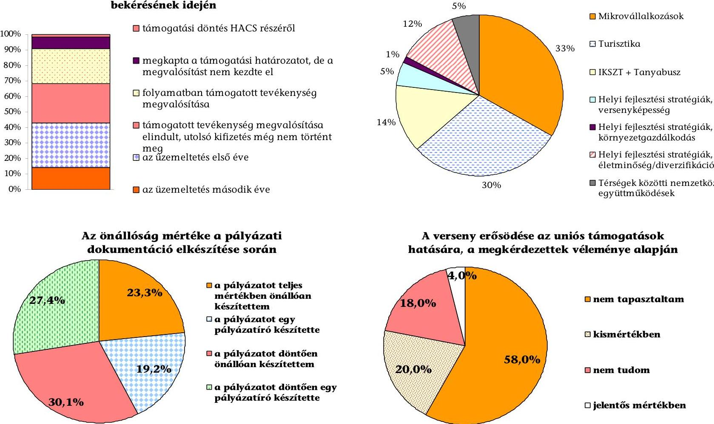

## Az ellenőrzésre kiválasztott projektek megvalósítási szakaszai a tanúsítványok bekérésének idején

- **Mikrovállalkozások**: 12%
- **Turisztika**: 5%
- **IKSZT + Tanyabusz**: 33%
- **Helyi fejlesztési stratégiák, versenyképesség**: 14%
- **Helyi fejlesztési stratégiák, környezetgazdálkodás**: 14%
- **Helyi fejlesztési stratégiák, életminőség/diverzifikáció**: 14%
- **Térségek közötti nemzetközi együttműködések**: 14%

## Az ellenőrzésre kijelölt projektek által igényelt támogatási összeg megoszlása jogcímenként

- **Mikrovállalkozások**: 5%
- **Turisztika**: 33%
- **IKSZT + Tanyabusz**: 33%
- **Helyi fejlesztési stratégiák, versenyképesség**: 14%
- **Helyi fejlesztési stratégiák, környezetgazdálkodás**: 14%
- **Helyi fejlesztési stratégiák, életminőség/diverzifikáció**: 14%
- **Térségek közötti nemzetközi együttműködések**: 14%

## Az önállóság mértéke a pályázati dokumentáció elkészítése során

- **A pályázatot teljes mértékben önállóan készítettem**: 27,4%
- **a pályázatot egy pályázatíró készítette**: 23,3%
- **a pályázatot döntően önállóan készítettem**: 19,2%
- **a pályázatot döntően egy pályázatíró készítette**: 14%

## Az ellenőrzésre kijelölt projektek által igényelt támogatási összeg megoszlása jogcímenként

- **Mikrovállalkozások**: 5%
- **Turisztika**: 33%
- **IKSZT + Tanyabusz**: 33%
- **Helyi fejlesztési stratégiák, versenyképesség**: 14%
- **Helyi fejlesztési stratégiák, környezetgazdálkodás**: 14%
- **Helyi fejlesztési stratégiák, életminőség/diverzifikáció**: 14%
- **Térségek közötti nemzetközi együttműködések**: 14%

## A verseny erősödése az uniós támogatások hatására, a megkérdezettek véleménye alapján

- **Nem tapasztaltam**: 18,0%
- **Kismértékben**: 58,0%
- **Nem tudom**: 14,0%
- **Jelentős mértékben**: 14%

---

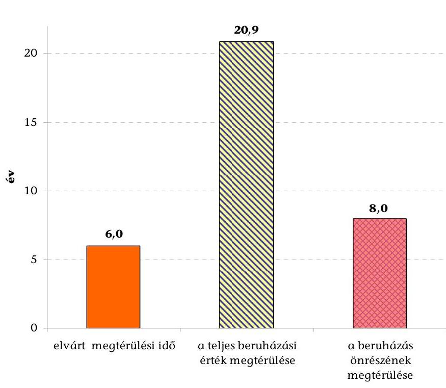

# Támogatott beruházások kalkulált megtérülése

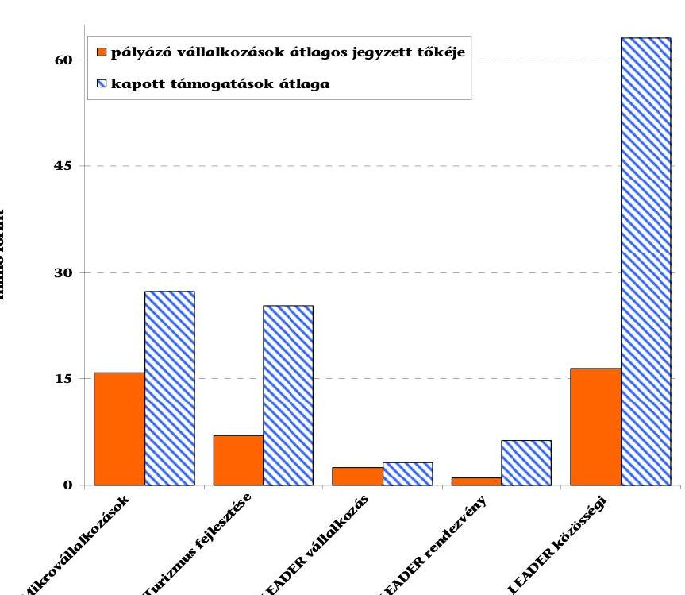

## A megítélt támogatások és a vállalkozások jegyzett tőkéjének aránya

|  Tőkéjének aránya | 2019 | 2018 | 2017 | 2016 | 2015 | 2014 | 2013 | 2012 | 2011 | 2010 | 2009 | 2008 | 2007 | 2006 | 2005 | 2004 | 2003 | 2002 | 2001  |
| --- | --- | --- | --- | --- | --- | --- | --- | --- | --- | --- | --- | --- | --- | --- | --- | --- | --- | --- | --- |
|  B pályázó vállalkozások átlagos jegyzett tőkéje |  |  |  |  |  |  |  |  |  |  |  |  |  |  |  |  |  |  |   |
|  C kapott támogatások átlaga |  |  |  |  |  |  |  |  |  |  |  |  |  |  |  |  |  |  |   |
|  A meglátás |  |  |  |  |  |  |  |  |  |  |  |  |  |  |  |  |  |  |   |

---

# Legalább 2 éve jóváhagyott támogatási kérelmek, 

|  |  |  |  |  |  |  | Adatok: M Ft-ban |
| :--: | :--: | :--: | :--: | :--: | :--: | :--: | :--: |
|  | Támogatási kérelmek | Mikro-   vállalkozás | Turizmus | Tanyabusz | Falu-   fejlesztés | Vidéki örökség | LEADER   "alvó"   projektek   összesen |
| Dél-Alföld | megítélt összeg | 658,2 | 543,7 | 16,7 | 163,8 | 305,4 | 1687,8 |
|  | darab | 39 | 22 | 2 | 7 | 11 | 81 |
| Dél-Dunántúl | megítélt összeg | 627,0 | 692,9 |  | 115,9 | 224,8 | 1660,6 |
|  | darab | 36 | 41 |  | 8 | 9 | 94 |
| Közép-Dunántúl | megítélt összeg | 305,1 | 332,2 |  | 200,7 | 144,7 | 982,8 |
|  | darab | 16 | 13 |  | 11 | 5 | 45 |
| Nyugat-Dunántúl | megítélt összeg | 287,8 | 358,7 | 13,4 | 38,3 | 74,7 | 773,0 |
|  | darab | 13 | 15 | 2 | 5 | 5 | 40 |
| Észak-Magyarország | megítélt összeg | 857,3 | 933,6 |  | 262,6 | 236,1 | 2289,6 |
|  | darab | 37 | 48 |  | 13 | 8 | 106 |
| Közép-Magyarország | megítélt összeg | 387,3 | 444,2 |  | 57,2 | 101,7 | 990,4 |
|  | darab | 25 | 18 |  | 3 | 5 | 51 |
| Észak-Alföld | megítélt összeg | 1236,1 | 612,0 | 37,5 | 284,5 | 297,4 | 2467,5 |
|  | darab | 52 | 26 | 4 | 13 | 9 | 104 |
| ÖSSZESEN | megítélt összeg | 4358,7 | 3917,3 | 67,6 | 1123,0 | 1384,9 | 10851,6 |
|  | darab | 218 | 183 | 8 | 60 | 52 | 521 |

---

Nyertes projektek eloszlása* pontszámuk alapján fejlesztési jogcímenként, pályázati körönként

|  Régió | Nyertes projektek eloszlása pontszámuk alapján, jogcímenként, pályázati körönként |  |  |  |  |  |  |  |  |  |  |  |   |
| --- | --- | --- | --- | --- | --- | --- | --- | --- | --- | --- | --- | --- | --- |
|   | Mikro-
vállalkozások |  | Turisztika |  | Falufejlesztés |  | Vidéki örökség |  | LEADER |  |  |  |   |
|   | I. | II. | I. | II. | I. | II. | I. | II. | közös-
ségi
célú | rendez-
vény | vállal-
kozás | térségek
között | térségen
belül  |
|  Nyertes projektek maximum pontszáma | 155 | 166 | 159 | 165 | 133 | 134 | 148 | 144 | 101 | 68 | 102 | 54 | 59  |
|  Nyertes projektek minimum pontszáma | 48 | 34 | 63 | 65 | 51 | 47 | 57 | 49 | 46 | 37 | 67 | 46 | 44  |
|  felső harmadba eső projektek aránya | $36,4 \%$ | $43,2 \%$ | $38,0 \%$ | $43,5 \%$ | $35,2 \%$ | $33,2 \%$ | $40,4 \%$ | $39,4 \%$ | $29,4 \%$ | $42,2 \%$ | $50,3 \%$ | $53,0 \%$ | $59,3 \%$  |
|  középső harmadba eső projektek aránya | $32,0 \%$ | $27,9 \%$ | $27,2 \%$ | $25,4 \%$ | $35,0 \%$ | $31,1 \%$ | $31,7 \%$ | $24,9 \%$ | $32,5 \%$ | $28,4 \%$ | $19,7 \%$ | $19,7 \%$ | $11,9 \%$  |
|  alsó harmadba eső projektek aránya | $31,6 \%$ | $29,0 \%$ | $34,8 \%$ | $31,2 \%$ | $29,8 \%$ | $35,7 \%$ | $27,9 \%$ | $35,7 \%$ | $38,1 \%$ | $29,4 \%$ | $30,1 \%$ | $27,3 \%$ | $28,8 \%$  |
|  felső harmadba eső projektek száma | 191 | 189 | 131 | 113 | 223 | 160 | 107 | 106 | 228 | 241 | 92 | 35 | 35  |
|  középső harmadba eső projektek száma | 168 | 122 | 94 | 66 | 222 | 150 | 84 | 67 | 252 | 162 | 36 | 13 | 7  |
|  alsó harmadba eső projektek száma | 166 | 127 | 120 | 81 | 189 | 172 | 74 | 96 | 295 | 168 | 55 | 18 | 17  |
|  Összes nyertes projekt** | 525 | 438 | 345 | 260 | 634 | 482 | 265 | 269 | 775 | 571 | 183 | 66 | 59  |
|  - ebből LEADER tagok nyertes projektjeinek száma | 68 | 35 | 86 | 51 | 512 | 363 | 98 | 116 | 410 | 375 | 46 | 38 | 35  |
|  - LEADER nyertes projektek aránya \% | $13,0 \%$ | $8,0 \%$ | $24,9 \%$ | $19,6 \%$ | $80,8 \%$ | $75,3 \%$ | $37,0 \%$ | $43,1 \%$ | $52,9 \%$ | $65,7 \%$ | $25,1 \%$ | $57,6 \%$ | $59,3 \%$  |

- A nyertes projektek maximum és minimum pontértéke közötti különbséget harmadolva, a felső, középső és alsó harmadba eső projektek eloszlását mutatja a táblázat ** A LEADER III. tengely jogcímeire vonatkozó a pontszámok eloszlása 90 darab akciócsoport adatai alapján, a LEADER IV. tengely fejlesztéseire vonatkozó adatokat 85 darab akciócsoport adatai alapján készült.

---

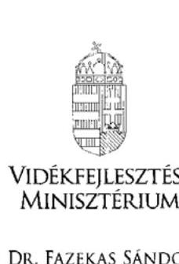

17/a. sz. melléklet a V-2010-138/2011-2012. sz. jelentéshez
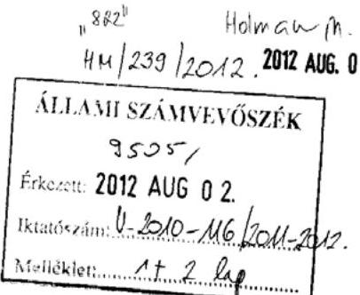

Iktatószám: VIF $/ \mathrm{P} p /-12012$

Ügyintéző: Arnóczi Rozália Jurinka Ágnes
E-mail: rozalia.arnoczi@vm.gov.hu agnes.jurinka@vm.gov.hu
Domokos László úr
elnök
részére
Állami Számvevöszék
Budapest
Apáczai Csere János utca 10.
1052
Tárgy: Észrevételek a „vidékfejlesztési célkitűzések megvalósítására, a helyi közösségek szerepének megerősítésére fordított pénzeszközök felhasználása eredményességének és hatékonyságának, a vidéki életminőség javításában betöltött szerepének ellenőrzéséről" című Jelentéstervezetre

# Tisztelt Elnök Úr! 

Az Állami Számvevőszék 2011. október 10-én vizsgálatot indított a Vidékfejlesztési Minisztérium a vidékfejlesztési célkitűzésck megvalósítására, a helyi közösségek szerepének megerősítésére fordított pénzeszközök felhasználása credményességének és hatékonyságának, a vidéki életminőség javításában betöltött szerepének ellenőrzéséhez kapcsolódóan.
2012. július 5-én a Vidékfejlesztési Minisztériumba megérkezett az Állami Számvevőszék V-2010-099/2011-2012. iktatószámú Jelentéstervezzte. Kérték, hogy juttassuk el a tárca álláspontját az Önök részére.

A tervezetet áttekintettük és észrevételeinket e levél mellékleteként csatoljuk.
Kérem az észrevételek szíves figyelembe vételét, illetve az észrevételek alapján a megállapítások pontosítását, korrigálását.

Budapest, 2012. július „, 1 "
Üdvözlettei:

Melléklet: Észrevételek
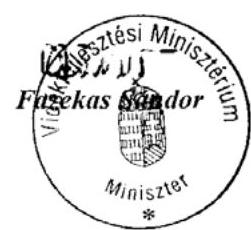

1055 Budapest, Kossuth Lajos tér 11. Telefon: (06 1) 795 3721 Fax: (06 1) 7950072

---

# A Vidékfejlesztési Föosztály észrevételei   a „Jelentés a vidékfejlesztési célkitüzések megvalósitására,a helyi közösségek szerepének megerösitésére fordított pénzeszközök felhasználása eredményességének és hatékonyságának, a vidéki életminőség javitásában betöltött szerepének ellenőrzéséről" című Állami Számvevőszék által elkészített anyaghoz 

I. Összegző megállapítások, következtetések, javaslatok

## 1. észrevétel (21.o.)

Az „uniós szabályozástól eltérő módon" kifejezés pontositását kérjük, mivel a 2007-2013 közötti időszakra tekintettel a korábbi, már létező helyi akciócsoportok átalakítása és új helyi akciócsoportok létrehozásának lehetősége egyenlő súlyú opcióként jelent meg. A két opció közül az Irányító Hatóság az új LEADER HACS-ok létrehozását választotta. Továbbá a bekezdésben pontosítást kíván a helyi vidékfejlesztési irodákra vonatkozó rész: A LEADER HACS-ok megszervezésének módja volt a helyi vidékfejlesztési irodák létrehozása és a hozzájuk rendelt helyi akciócsoportok szervezésének elősegítésére vonatkozó feladat. $A z$ észrevétel vonatkozik a 44. o.-on leirtakra is.

## 2. észrevétel (22.o.)

A civil szféra arányának meghatározása valóban uniós kötelezettségből ered. A LEADER Helyi Akciócsoportok tagságában a szférák arányát a megalakulásukkor szigorúan meg kellett tartani, de mint önálló jogi személyiségủ szervezetek, a későbbiekben önállóan dönthettek a tagság bővítéséről, új tagok felvételéről, ami a tagságon belül irreális elvárássá teszi az arányok betartását, föleg amiatt, mert ez ellent is mond a LEADER-szerủ kezdeményezések társadalmasitásának. Az uniós előírás betartásának garanciája az volt, hogy a LEADER HACS-ok elnökségében, döntéshozó testületeiben mindenképpen tartani kellett a szférák előírt arányát. Az észrevétel vonatkozik a 45-46. o.-on leirtakra is.

## 3. észrevétel (23. o.)

A ponthatárok megállapításáról szóló bekezdés félrevezető, mert összevonja a központi és a HACS-okon keresztül végrehajtott intézkedések értékelését. Minimum ponthatárok előzetesen nem is kerülhettek kialakításra, mert a minimum pontszámok megállapításához a támogatási kérelmek értékelése, elért pontszámai, továbbá a rendelkezésre álló forráskeret együttes ismerete szükséges. A LEADER HACS-ok a ponthatárt a forráskeretük ismeretében önállóan határozhatták meg, ami a LEADER HACS-ok döntési kompetenciáját hivatott erősíteni.
A központi keret terhére 2011-ben meghirdetett két jogcím esetében szakmai minimum pontszám került meghatározásra, amelyet az Irányító Hatóság a támogatási kérelmek minőségének biztosítása érdekében vezetett be.

## 4. észrevétel (34. o.)

A LEADER HACS-ok helyi vidékfejlesztési stratégiájának célja, hogy fejlesztési szempontból komplex képet alkossanak az illetékességi területükről, ezért szerepeltetni kellett azokat a projekt elképzeléseket is, amelyek finanszírozása nem az ÜMVP III. és IV. tengelyéből valósulhat meg. Ezért a szövegkörnyezetből kiragadva ugyan helyes lehet a megállapítás a LEADER HACS-ok döntési kompetenciája és a fejlesztési célok közötti

---

összhang hiányára, azonban a stratégiai tervezés szempontjából a térségi stratégiák kialakításához szükséges volt a lehetőségek, fejlesztési lehetőségek felmérése, áttekintése.

# 5. észrevétel (37. o.) 

A ...Kezdetben az egyes akciócsoportokra differenciáltan határozták meg a pontozási elöirásokat, azonban a legutóbbi szabályozás egységes pontozást tartalmaz. " Mondatból nem derül ki, hogy nem a LEADER HACS-okon keresztül való végrehajtás továbbra is LEADER HACS-okra differenciált pontozással müködik, az egységes pontozás a központi keret terhére meghirdetett intézkedések esetében alkalmazandó. A Mikrovállalkozások fejlesztése és a Turisztikai tevékenységek ösztönzése jogcímek 2011-ig három alkalommal kerültek meghirdetésre. A háromból kétszer LEADER HACS-os megvalósitással, differenciált értékelési rendszerrel, egy alkalommal pedig a központi keret terhére egységes pontozással.

## 6. észrevétel $(45,0$.

A oldalon a 3. bekezdésben foglaltak nem helytállóak. A két címvisszavonással érintett LEADER HACS tagságát nem vette át más LEADER HACS. Az adott területeken új HACS alakulására írt ki pályázatot az irányító Hatóság. Az új HACS-ok elismerésére ezeken a területeken 2012. április 1-jei hatállyal került sor.

## 7. észrevétel $(45-46 .0$.

A LEADER HACS-ok nevei sok helyen nem szerepelnek pontosan, illetve még korábbi nevükkel vannak feltüntetve. Ez nebezíti az egyértelmü beazonosításukat. Javasoljuk az Irányító Hatóság által az Állami Számvevőszék számára átadott LEADER HACS listából pontosítani az elnevezéseket. PL: a 45. o.-on az Ormánságtól a Szársomlyóig LEADER Akciócsoport nevü LEADER HACS nem létezik, a Dél-Baranya Határmenti Települések Egyesület nevet viseli és ezen a néven került elismerésre is.

## 8. észrevétel (52. o.)

A 3.1 fejezet 1. bekezdésének végén lévő megállapítás pontosítását kérjük. A nem horizontális módon végrehajtott intézkedések köre nem módosult, a III. tengelyben 4 intézkedés valósul meg LEADER HACS-okon keresztül. 2011-ben azonban a LEADER HACS-oknak ki nem osztott, központi keretben rendelkezésre álló keret került meghirdetésre, amely központi értékeléssel, horizontálisan, egysége értékeléssel valósult meg.

## 9. észrevétel (53. o.)

Az 53. o. második bekezdésében a „fenntartva magának a jogot a végső döntésre" megállapítás nem helytálló. A LEADER HACS-ok hozták meg a végső döntést a rangsorállítást követöen a támogatáshoz szükséges minimális ponthatár megállapításával. Ezt a megállapítást azért is fontos korrigálni, illetve javítani, mert a Jelentés 23-24-oldalán leírtakkal ellentmondásban vannak.

## 10. észrevétel (56. o.)

A 2011. nyarán központi végrehajtással meghirdetett jogcímek esetében a minimum ponthatár nem a maximális pontszám $50 \%$-a volt. Ez az alsó korlát az úgynevezett szakmai minimum

---

pontszám, amellyel az Irányító Hatóság a projektek minőségét tudja biztosítani. A minimum pontszámot nem lehet előre meghatározni. Kérjük javítani az erre vonatkozó megállapításokat.

# 11. észrevétel (65. o. lap alja) 

A mid-term jelentést követően ugyan Intézkedési Terv nem készült a jelentés által javasolt intézkedések megtételére, de az Irányító Hatóság folyamatosan tájékoztatta/tájékoztatja a mid-term jelentésben foglaltak alapján megtett intézkedéseiröl Monitoring Bizottságot, valamint az Európai Bizottságot is.

---

# 17/b. sz. melléklet   a V-2010-138/2011-2012. sz. jelentéshez 

## Dr. Fazekas Sándor úr

miniszter
Vidékfejlesztési Minisztérium

Budapest

## Tisztelt Miniszter Úr!

A vidékfejlesztési célkitűzések megvalósítására, a helyi közösségek szerepének megerősítésére fordított pénzeszközök felhasználása eredményességének és hatékonyságának, a vidéki életminőség javításában betöltött szerepének ellenőrzése címú jelentéstervezetre tett észrevételeit köszönettel megkaptam.

Az Állami Számvevőszék észrevételekre vonatkozó álláspontjáról a felügyeleti vezető által készített részletes tájékoztatást csatoltan megküldöm.

Tájékoztatom Miniszter urat, hogy a jelentésben az el nem fogadott észrevételeket - az Állami Számvevőszékről szóló 2011. évi LXVI. törvény 29. § (3) bekezdése alapján - a részletes megállapítások között szerepeltetjük az elutasítás indokának feltüntetésével együtt. Az elfogadott észrevételeket a jelentés szövegezésénél figyelembe vesszük.

Budapest, 2012. 08 hó 0 nap
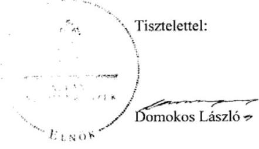

Melléklet: Tájékoztatás az elfogadott és az el nem fogadott észrevételekről

---

# Tájékoztatás   az elfogadott és az el nem fogadott észrevételekről 

A vidékfejlesztési célkitűzések megvalósítására, a helyi közösségek szerepének megerősítésére fordított pénzeszközök felhasználása eredményességének és hatékonyságának, a vidéki életminőség javításában betöltött szerepének ellenőrzése címủ jelentéstervezetre VIF/1759/2012. iktatószámú levelében tett észrevételeit áttekintettük, azok kezeléséről az alábbi tájékoztatást adom.

Elfogadtuk a 2,.6., 8. és 9. számú észrevételeit, melyeket a jelentés készitésénél figyelembe vettünk.

A 4. számú észrevétele alapján a jelentés szövegét pontositottuk. Az egy településre jutó átlagos támogatás az ÚMVP-ben tervezett forrásokból és a hozzá kapcsolódó indikátorokból számított adat, amely a megítélt átlagos támogatással került összehasonlításra a források hatékony felhasználása és a tervezés megalapozottságának az értékelése céljából.

Az 1. számú, a LEADER HACS 2012. április 1-től hatályos fogalmának módosítására vonatkozó észrevételét nem fogadtuk el, mivel az ellenőrzés a 2007-2011. évekre terjedt ki. A hivatkozott jogszabály időbeli hatályát az értelmező szótárban feltüntettük.

Nem fogadtuk el a 3. számú észrevételét. Az ÚMVP III. és IV. tengelyében rendelkezésre álló források alacsony felhasználása, a kérelem-feldolgozások időigénye, valamint a támogatási döntés meghozatalától az első kifizetési kérelem benyújtásáig eltelt időszak hossza együttesen olyan magas kockázatot hordoznak, melyeket nem ellensúlyoz a 2015-ben megnyitható támogatási kérelem benyújtási időszak.

Nem fogadtuk el a LEADER HACS-ok tagságában, a döntéshozó testületeikben a civil szféra arányára vonatkozó 5 . számú észrevételét, mert az 1698/2005/EK tanácsi rendelet 62. cikk (1) bekezdés b) pontja szerint a civil partnerség aránya a helyi fejlesztési megközelítés végrehajtására is vonatkozik, így az a müködés során is betartandó követelmény.

Nem fogadtuk el 7. számú, a technikai segítségnyújtás százalékos arányára vonatkozó észrevételét. Az 1698/2005/EK tanácsi rendelet 66. cikk (2) bekezdése szerint a tagállamok a teljes program megvalósítására jutó forrás legfeljebb $4 \%$-át fordíthatják a technikai segítségnyújtás műveletek megvalósítására. Jelentésünkben azt a tényt rögzítettük, hogy Magyarország a program megvalósítására - összhangban a hivatkozott uniós előírással - a teljes programra jutó forrás $3,9 \%$-át különítette el.

---

A 10. számú általános észrevétele a jelentésben foglalt megállapításainkat nem módosítja. Jelentésünkben tényként rögzítettük, hogy az ellenőrzött időszakban a források és a hozzájuk rendelt indikátorok között nem volt összhang, mely veszélyezteti az ÚMVP-ben foglalt célkitűzések eredményes végrehajtását.

Budapest, 2012. 08. hó 02. nap
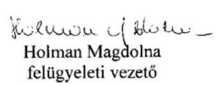

---

# 17/c. sz. melléklet a V-2010-138/2011-2012. sz. jelentéshez 

Hohua in.
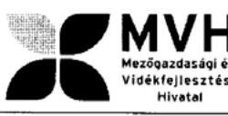

Elnök

Iratazonosító: 1526904339
Rtatószám: 181/394/2/2012

## Domokos László

## Elnök úr részére

Állami Számvevőszék
Budapest
Apúczai Csere János u. 10.
1052

Tárgy: ÁSZ Vidékfejlesztési célkitűzések megvalósítása ellenőrzés számvevői jelentéstervezet véleményezése

Tisztelt Elnök Úr!

Hivatkozva a V-2010-104/2011-2012. iktatószámú levelére, melyben a vidékfejlesztési célkitűzések megvalósítására, a helyi közösségek szerepének megerősítésére fordított pénzeszközök felhasználása eredményességének és hatékonyságának, a vidéki életminőség javításában betöltött szerepének ellenőrzése kapcsán a számvevői jelentéstervezetet megkaptuk, szíves felhasználásra válaszul küldjük Hivatali szintű észrevételeinket.

Budapest, 2012. július 20.
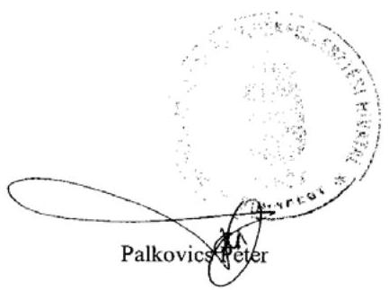

## Melléklet:

Észrevételek a vidékfejlesztési célkitűzések megvalósulására, a helyi közösségek szerepének megerősítésére fordított pénzeszközök felhasználása eredményességének és hatékonyságának, a vidéki élet minőség javításában betöltött szerepének ellenőrzése kapcsán készített jelentéstervezethez

[^0]
[^0]:    Mezōgazdasági és Vidékfejlesztési Hivatal
    1385 Bp. 62. Pf. 867. Tel.: 374-3603; 374-3604 www.mvh.gov.hu

---

# Észrevételek 

A vidékfejlesztési célkitűzések megvalósulására, a helyi közösségek szerepének megerősitésére fordított pénzeszközök felhasználása eredményességének és hatékonyságának, a vidéki élet minőség javításában betöltött szerepének ellenőrzése kapcsán készített jelentéstervezethez

1. Hivatkozott szöveg helye: Összegző megállapítások, következtetések, javaslatok fejezet, a Mezőgazdasági és Vidékfejlesztési Hivatal elnökének 26. oldal
,, A támogatási kérelmek feldolgozásának időtartama (átlagosan 394 nap) valamint a kifizetési kérelmek feldolgozásának és teljesítésének átlagos időtartamai (63-129 nap) rendszeresen és jelentősen meghaladták a 2007. évi XVII. törvényben előirt, az ügyintézés egyes szakaszainak végrehajtására vonatkozó határidőket."

## Észrevétel:

A pályázatok, valamint a kifizetési kérelmek feldolgozására vonatkozó, a jelentésben megállapított hosszú ügyintézési időszakok időnként valóban előfordultak a múltban. Azonban felhívnám a figyelmet, hogy - épp az ilyen helyzetek elkerülése végett bevezetett intézkedéseknek köszönhetően - ez a jelenlegi (utóbbi körök esetében) helyzetben már nem fordul elő.

A határidők betartása érdekében, minden jogcím végrehajtása előtt ütemtervet készít a hivatal, melynek betartását folyamatosan nyomon követjük. Továbbá LEADER tekintetében jelentős időt tudtunk azzal megtakarítani, hogy a pályázatokat elektronikus úton lehetett beadni. Így elmondható, hogy a határidők betartása megvalósul. Az sem elhanyagolható, hogy a korábbi körökben szerzett tapasztalat, valamint a rendszeresített oktatások segítségével a HACS-os kollégák ügyintézési rutinja is jelentősen javult.

Fontos tudni, hogy a határidőbe többek között a hiánypótlás és a forrásallokáció nem tartozik bele, ami az ügyfelekben esetleg kelthet olyan érzetet, hogy a feldolgozás üteme lassú, de ez nem jelenti azt, hogy megsértenénk a törvény által előirt határidőt.

Javaslat: Kérjük szépen a javaslat újbóli megfontolását.
2. Hivatkozott szöveg helye: 35 . oldal 3. bekezdés
„Az ÜMVP végrehajtása során az irányító hatóság és a végrehajtó szervek által érzékelt tapasztalatok szerint a KET alkalmazása a beruházási típusú jogcímek esetében - amelyek jellemzően a vidékfejlesztési III. és IV. tengelyes intézkedések körébe tartoznak - nem eléggé rugalmas. A határozatok esetében - ellentétben a támogatási szerződésekkel a hosszabb időt igénylő megvalósítás során megváltozó körülményekhez igazodóan - korlátozottak a lehetőségek a támogatási feltételek módosítására."

## Észrevétel:

Jogi szabályozással el lehet térni a Ket.-től, és saját eljárási törvényben, illetve végrehajtási rendeletben lehetőség van rugalmas elemek beépítésére a rendszerbe (vis maior, megvalósítási hely módosítása, részleges/teljes lemondás, stb.).

---

Javaslat: Kérjük szépen a szöveg módosítását.
3. Hivatkozott szöveg helye: 62 . oldal 5 . bekezdés

# Megállapitást tartalmazó szövegrész: 

„Az IIER alkalmas a projektek mindenkori aktuális állapotának egyedi nyomon követésére, azonban nem alakítottak ki olyan internetes felületet, ahol az ügyfelek a számukra fontos egyedi információkhoz hozzáférhettek. Ez különösen, a támogatási kérelmek elbírálásának hosszadalmassága miatt lett volna fontos."

## Észrevétel:

Az MVH 2011 végére fejlesztette ki az Elektronikus Ügyfél-tájékoztatási Rendszerét, amelynek célja, hogy az MVH ügyfelei megtekinthessék a Hivatalnál indított ügyeik állását, azok legfontosabb adatait, valamint ellenőrizhessék és módosíthassák nyilvántartásba vett regisztrációs adataikat. 2011 decemberére valamennyi I-III-IV. tengelyes jogcím ügyei megtekinthetővé váltak a rendszerben, majd 2012. I. negyedévében a II. tengely jogcímeinek ügyelt is elérhetővé tettük. A rendszer információkat szolgáltat az MVH-hoz benyújtott kérelmek elbírálásának állásáról, az egyes projektek előrehaladásáról, illetve az MVH által nyilvántartott regisztrációs adatokról. A rendszer használatához - az MVH-nál elektronikusan indítható más ügyekhez hasonlóan - ügyfélkapus beazonosításra van szükség, és lehetőség van arra is, hogy a gazdálkodó helyett meghatalmazottja vagy technikai közremüködője járjon el. Az ügyfélkapus beazonosítást követően a személyre szabott elektronikus felületen megjelenik az ügyfél összes MVH-nál indított ügye (támogatás-igénylés, kifizetés-igénylés, stb.). melyek közül számos szürőfeltétel és rendezési lehetőség használatával bármelyik ügy részleteibe betekinthet. Azokban az ügyekben, amelyek egymáshoz kapcsolódnak, mód nyílik az összefüggések áttekintésére is. A rendszer az MVH által müködtetett egyéb informatikai rendszerekkel integrált módon müködik, így például lehetőséget nyújt arra, hogy a regisztrációs adatok áttekintését és elektronikus módosítását innen is elérje a rendszerbe belépett felhasználó, mégpedig minden további azonosítási eljárás nélkül.

Javaslat: A hivatkozott szöveg törlése.
4. Hivatkozott szöveg helye: 4.1.2. A müködési célú forrásfelhasználás hatékonysága, 70. oldal

## Megállapitást tartalmazó szövegrész:

„A 96 LEADER HACS az ellenőrzött időszakban eltérő költséghatékonysággal és eredményességgel müködött. Müködési kiadásaik - az MVH-hoz benyújtott elszámolásaikban közölt adatok szerint - mind a személyi jellegü ráfordítások nagyságrendjét, mind a dologi kiadásaikat tekintve jelentősen eltérőek voltak. Az adminisztratív és helyszíni ellenőrzést az MVH végzett, ugyanakkor a költségek célszerüségét és megalapozottságát nem ellenőrizte.

## Észrevétel:

Nem rögzíti/állapítja/határozza meg, hogy a célszerüségi és megalapozottsági vizsgálat nem a helyszíni ellenőrzés, hanem a jogalkotó, esetleg a kérelemkezelés kompetenciája.
Az adminisztratív ellenőrzés - kérelemkezelés során az elszámolási időszakra érvényes a LEADER Helyi Akciócsoportok feladat ellátásához az Európai Mezőgazdasági Vidékfejlesztési Alapból nyújtandó vidékfejlesztési támogatás részletes feltételeiről szóló

---

30/2012. (III. 24.) VM rendelet, illetve a Helyi Vidékfejlesztési Közösségek és a LEADER helyi akciócsoportok részére az Európai Mezőgazdasági Vidékfejlesztési Alapból nyújtandó vidékfejlesztési támogatásról szóló 1698/2005/EK tanácsi rendelet keretében nyújtott támogatás részletes feltételeiről szóló 141/2008. (X. 30.) FVM rendeletben foglaltak alapján járunk el az elszámolható költségek, illetve az azokra vonatkozóan a rendeletben megállapított korlátok (elszámolási időszakra illetve évre) figyelembevételével.

Javaslat: Kérjük szépen a szövegrész javítását.
5. Hivatkozott szöveg helye: 2.1.2. A müködési célú forrásfelhasználás hatékonysága, 20-21. oldal

# Megállapitást tartalmazó szövegrész: 

„Az Irányító Hatóság az összesen 96 LEADER HACS müködésére az ÜMVP-ben a müködési célokra eredetileg tervezetthez képest összesen $20 \%$-al csökkentette a müködési forrásokat (2010-ben, illetve 2011-ben) a III. tengely készségek elsajátítása, ösztönzése, valamint a IV. tengely helyi akciócsoportok müködtetése intézkedés terhére. Ezzel jelentősen csökkentette a LEADER HACS-ok mozgásterét a költségvetés szempontjából, mind annak időtávját, mind kcretösszegét tekintve. Az így rendelkezésre álló 23,7 milliárd Ft-ból 2011. végéig 13,1 milliárd Ft kifizetése történt meg."

## Észrevétel:

A 13,1 Mrd Forint nem csak a HACS-nak kifizetett müködési forrás. Ez tartalmazza a Készségek elsajátítása ösztönzése és végrehatása jogcímre a Helyi Vidékfejlesztési Irodáknak kifizetett közel 4,1 Mrd Ft-ot is.

Javaslat: Kérjük szépen a szöveg javítását.

---

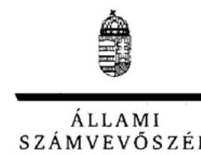

# L L N Ü R 

Ikt.szám: V-2010-112/2011-2012.

## Palkovics Péter úr

elnök
Mezőgazdasági és Vidékfejlesztési Hivatal

## Budapest

## Tisztelt Elnök Úr!

A vidékfejlesztési célkitűzések megvalósítására, a helyi közösségek szerepének megerősítésére fordított pénzeszközök felhasználása eredményességének és hatékonyságának, a vidéki életminőség javításában betöltött szerepének ellenőrzése címủ jelentéstervezetre tett észrevételeit köszönettel megkaptam.

Az Állami Számvevőszék észrevételekre vonatkozó álláspontjáról a felügyeleti vezető által készített részletes tájékoztatást csatoltan megküldöm.

Tájékoztatom Elnök urat, hogy a jelentésben az el nem fogadott észrevételeket - az Állami Számvevőszékről szóló 2011. évi LXVI. törvény 29. § (3) bekezdése alapján - a részletes megállapítások között szerepeltetjük az elutasítás indokának feltüntetésével együtt. Az elfogadott észrevételeket a jelentés szövegezésénél figyelembe vesszük.

Budapest, 2012. 08 hó 6 nap
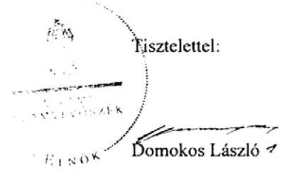

Melléklet: Tájékoztatás az elfogadott és az el nem fogadott észrevételekröl

---

# Tájékoztatás 

## az elfogadott és az el nem fogadott észrevételekröl

A vidékfejlesztési célkitűzések megvalósítására, a helyi közösségek szerepének megerősitésére fordított pénzeszközök felhasználása eredményességének és hatékonyságának, a vidéki életminőség javításában betöltött szerepének ellenőrzése címủ jelentéstervezetre 181/394/2/2012 iktatószámú levelében tett észrevételeit áttekintettük, azok kezeléséről az alábbi tájékoztatást adom.

Elfogadtuk 5. számú észrevételét, amelyet a jelentés készitésénél figyelembe vettünk.
Az 1. és 3. számú észrevétele a jelentés megállapításait nem módosítja, mivel az ellenőrzésünk 2007-2011. évekre terjedt ki. Az ügyintézési határidők betartásához és az Elektronikus Ügyféltájékoztatási Rendszer bevezetéséhez kapcsolódó - a helyszíni ellenőrzésünket követően megtett - intézkedéseiről adott tájékoztatását köszönettel vettem. Azokat az ÁSZ utóvizsgálat keretében tudja értékelni.

A 4. számú észrevétele a jelentés megállapítását nem módosítja. Az 1698/2005/EK tanácsi rendelet 75. cikke szerint az irányító hatóság felelős a program hatékony, eredményes és szabályszerű módon történő irányításáért és végrehajtásáért, amelynek teljesítéséhez az ilyen irányú ellenőrzések is indokoltak. Megállapításunk a LEADER HACS-ok müködési költségeinek ellenőrzési módjára vonatkozó tényeket rögzítette.

Nem fogadtuk el 2. számú, a Ket. beruházási típusú jogcímek végrehajtása során való alkalmazásával kapcsolatban megfogalmazott észrevételét, mivel a beruházási típusú jogcímek végrehajtása során a támogatási döntés módosítása az ügyfél kérelmére a 2007. évi XVII. törvény 57. § (4) bekezdésében biztosított egy alkalomra korlátozza a kedvezményezettek lehetőségeit.

Budapest, 2012. C. 8. hó 02 nap

Holman Magdolna
felügyeleti vezető

---

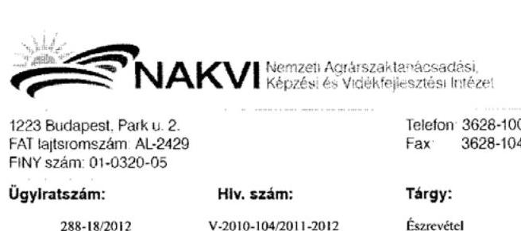
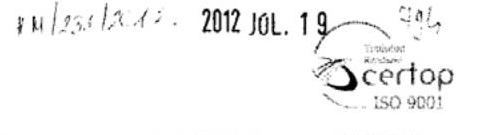

| 288-18/2012 | V-2010-104/2011-2012 | Tárgy: | Melléklet: | Ügyintéző: | Héns M |
| :--: | :--: | :--: | :--: | :--: | :--: |
|  |  |  |  | Málási Balázs   $+36-1-362-8142$   maitedtozzakol.bu | $0_{0} 1_{1} 1$ |
| Domokos László   elnök   Állami számvevőszék   Budapest   Apáczai Csere János u. 10.   1052 |  |  |  |  |  |

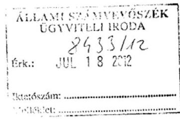

Tisztelt Elnök Úr!

A 2012. június 28 -án kelt levelére hivatkozva tisztelettel tájékoztatom Önt, hogy az Állami Számvevőszék által a vidékfejlesztési célkitűzések megvalósitására, a helyi közösségek szerepének megerősitésére forditott pénzeszközök felhasználása eredményességének és hatékonyságának, a vidéki életminőség javitásában betöltött szerepének ellenőrzéséről készített munkaanyagot áttekintettük, az abban foglaltakkal kapcsolatban a Nemzeti Agrárszaktanácsadási, Képzési és Vidékfejlesztési Intézet nem kíván észrevételt tenni.

Budapest, 2012. július 18.
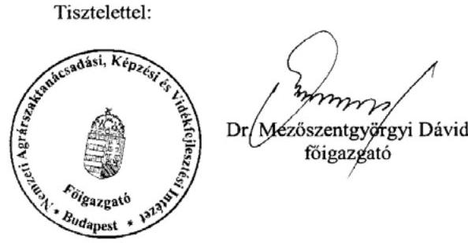