# JELENTÉS 

az államháztartás központi alrendszerének adóssága és éven túli kötelezettségvállalásának ellenőrzéséről

---

# Állami Számvevőszék 

Iktatószám: V-2013-063/2011-2012.
Témaszám: 1031
Vizsgálat-azonosító szám: V0570

## Az ellenőrzést felügyelte:

## Makkai Mária

felügyeleti vezető

## Az ellenőrzést vezette:

Dede Katalin
ellenőrzésvezető

## Az ellenőrzést végezték:

| Burenzsargal | Dr. Dicső Ildikó | Éva Katalin |
| :-- | :-- | :-- |
| számvevő tanácsos | számvevő | számvevő tanácsos |
| Narantuja |  |  |
| számvevő tanácsos |  |  |
| Farkas László | Gaálné Izsó Éva | Gergely Tilda |
| számvevő tanácsos | számvevő tanácsos | számvevő |
| Jenei Zoltán Béláné | Kádár Kriszta | Lucza Anikó |
| számvevő | számvevő | számvevő tanácsos |
| Major Lászlóné | Massányi Tibor | Villányi Antal |
| számvevő tanácsos | számvevő tanácsos | számvevő tanácsos |

A témához kapcsolódó eddig készített számvevőszéki jelentések:
címe
sorszáma
Jelentés az államháztartás adósság kezelésének, alakulásának 0604 ellenőrzéséről

---

# TARTALOMJEGYZÉK 

BEVEZETÉS ..... 9
I. ÖSSZEGZŐ MEGÁLLAPÍTÁSOK, KÖVETKEZTETÉSEK, JAVASLATOK ..... 13
II. RÉSZLETES MEGÁLLAPÍTÁSOK ..... 28

1. A központi alrendszer adósságának alakulása ..... 28
2. A maastrichti adósságmutató alakulása ..... 33
3. Az államadóssággal kapcsolatos döntéshozatali rendszer értékelése ..... 35
4. Az adósságfinanszírozás kockázati tényezői kezelésének értékelése ..... 43
4.1. Az adósságkezelés kereteit meghatározó stratégiák, finanszírozási tervek ..... 45
4.2. Az adósságkezelés eredményessége érdekében tett intézkedések kockázatai ..... 46
4.3. Az államadósság piaci finanszírozása ..... 52
4.4. Az államadósság finanszírozására felvett hitelek ..... 55
4.5. Az államadósság kamatkiadásai és egyéb költségei ..... 57
5. Az éven túli kötelezettségvállalások alakulása és nyilvántartásuk szabályozási kockázatai ..... 58
6. Utóellenőrzés ..... 62
MELLÉKLETEK
7. számú A központi alrendszer adósságának változása (2006-2011. évek)
8. számú A belföldi állampapírhozamok alakulása a 2006-2011. években
9. számú A belföldi állampapírok közvetítése értékesítési csatornák szerint a 2006- 2011. években
10. számú A 2006-2011. években kibocsátott devizakötvények jellemzői
11. számú Az IMF-től és az EB-től lehívott hitelek felhasználása
12. számú A kezesség- és garanciavállalások alakulása a 2006-2011. években
13. számú A hosszú távú kötelezettségvállalások jellemzői
14. számú A nemzetgazdasági miniszter észrevétele
15. számú Észrevételre adott válasz a nemzetgazdasági miniszter részére
16. számú Az ÁKK Zrt. vezérigazgatójának észrevétele
17. számú Észrevételre adott válasz az ÁKK Zrt.-nek
18. számú A Magyar Államkincstár elnökének észrevétele

---

.

---

# RÖVIDÍTÉSEK JEGYZÉKE 

| Áht $_{1}$ | az államháztartásról szóló 1992. évi XXXVIII. törvény |
| :--: | :--: |
| Áht $_{2}$ | az államháztartásról szóló 2011. évi CXCV. törvény |
| ÁKK Zrt. | Államadósság Kezelő Központ Zrt. |
| ÁSZ | Állami Számvevőszék |
| CDS | Credit Default Swaps (nemfizetési kockázatot jelző felár) |
| EB | Európai Bizottság |
| EDP | Excessive Deficit Procedure (Az Európai Unió Túlzott Hiány Eljárása) |
| EDR | Egységes Digitális Rádiótávközlési Rendszer |
| EIB | European Investment Bank (Európai Beruházási Bank) |
| EMU | Economic and Monetary Union of the European Union (Gazdasági és Monetáris Unió) |
| ESA'95 | Nemzeti számlák európai rendszere |
| EU | Európai Unió |
| EUROSTAT | az Európai Unió statisztikai hivatala |
| FB | Felügyelő Bizottság |
| GDP | éves bruttó hazai össztermék |
| Gt. | a gazdasági társaságokról szóló 2006. évi IV. törvény |
| IMF | International Monetary Fund (Nemzetközi Valutaalap) |
| KESZ | Kincstári Egységes Számla |
| KF tv. | a takarékos állami gazdálkodásról és a költségvetési felelősségről szóló 2008. évi LXXV. törvény |
| Kincstár | Magyar Államkincstár |
| KKJ | Kamatozó kincstárjegy |
| köztulajdoni tv. | a köztulajdonban álló gazdasági társaságokról szóló 2009. évi CXXII. törvény |
| KSH | Központi Statisztikai Hivatal |
| KTJ | Kincstári takarékjegy |
| MÁV Zrt. | Magyar Államvasutak Zrt. |
| MFB Zrt. | Magyar Fejlesztési Bank Zrt. |
| MNB | Magyar Nemzeti Bank |
| OGY | Országgyűlés |
| OTP | OTP Bank Nyrt. |
| MÚPA | Múvészetek Palotája |
| NGM | Nemzetgazdasági Minisztérium |
| NYRA | Nyugdíjreform és Adósságcsökkentő Alap |
| PM | Pénzügyminisztérium |
| PMÁK | Prémium Magyar Államkötvény |
| Posta | Magyar Posta Zrt. |
| PPP | Public Private Partnership (köz- és magánszféra együttműködésén alapuló program) |

---

| SDR | Special Drawing Rights (Különleges Lehívási Jogok), a |
| :-- | :-- |
|  | Nemzetközi Valutaalap hiteleszköze |
| stabilitási tv. | Magyarország gazdasági stabilitásáról szóló 2011. évi |
|  | CXCIV. törvény |
| SZMSZ | Szervezeti és Működési Szabályzat |
| TB | Társadalombiztosítás |

---

# ÉRTELMEZŐ SZÓTÁR 

államadósság:
államkötvény:
állampapír:
árfolyamkockázat:
bázispont:
bruttó állampapír-piaci kibocsátás:
denomináció:
determináció:
diszkont kincstárjegy:
duration:
devizakitettség:

EDP jelentés:
elsődleges egyenleg:
elsődleges piac:
2007. január 1-jéig minden olyan hitelviszonyon alapuló fizetési kötelezettség, amely az államháztartás valamelyik alrendszerét terheli. Ezt követően az államháztartás központi alrendszerének konszolidált adóssága. 2012. január 1-től az államháztartás központi alrendszerének, az államháztartás önkormányzati alrendszerének és a kormányzati szektorba sorolt egyéb szervezetek egymással szembeni kötelezettségek kiszűrésével számított (konszolidált) adóssága.
Jelen ellenőrzés során államadósságként definiáltuk az államháztartás központi alrendszerének adósságát.
1 évnél hosszabb futamidejú, fix vagy változó kamatozású állampapír.
Az állam által kibocsátott, tőke- és kamat-visszafizetési garanciával rendelkező értékpapír.
A devizában fennálló adósság abból eredő kockázata, hogy az árfolyam változása miatt az állomány forintban kifejezett értéke megváltozik.
A százalékpont század része, ahol 100 bázispont egyenlő $1 \%$-kal. Célja, hogy a százalékban megadott adatok különbségét (változását) egyértelműen meg tudják határozni. Egy 5\%-os kamatláb 200 bázispontos növekedése eredményeként a kamatláb 7\%-os lesz.
Az évente kibocsátott összes állampapír. Magában foglalja a költségvetés hiányának fedezésére és egyéb célokra kibocsátott állampapírokat, valamint az ugyanezen időszak alatt lejáró korábbi állampapírok visszafizetéséhez szükséges mennyiséget.
a pénzügyi követelések, tartozások devizaneme pénzügyi elkötelezettség
Egy éven belüli lejáratú, névérték alatt kibocsátott állampapír, lejáratkor a névértéket fizeti ki a kibocsátó.
az állampapírok hátralévő átlagos futamideje
a külföldi devizában fennálló tartozások, illetve az ezekhez kapcsolódó (árfolyam- és kamat) kockázatok összessége
Az EU Túlzott Hiány Eljárása keretében történő, évente kétszeri adatszolgáltatás a kormányzati szektor hiányáról és adósságának alakulásáról.
A központi költségvetés kamatterhek nélküli kiadásainak és bevételeinek különbsége, amely megmutatja, hogy mekkora volna a központi költségvetési hiány, ha nem létezne államadósság.
Az állampapírok kibocsátást követő forgalomba hozatalának (első adásvételének) helyszíne.

---

elsődleges forgalmazó: Az ÁKK Zrt.-vel az állampapírok forgalomba hozatalára, illetve forgalmazására vonatkozó megbízási szerződést kötött befektetési szolgáltatók.
ESA híd:
hitelminősítés:

hozam:
hozamfelár:
kamatozó kincstárjegy: kezesség:

Kincstári Egységes Számla:
készenléti (stand-by) hitel:
kockázati felár:
kormányzati szektor:
központi alrendszer:
másodlagos piac:
Mark-to-market:

Az Áht ${ }_{1}$ szerinti, valamint az EU statisztikai módszertana szerinti elszámolási szabályok alapján számított költségvetési egyenleg közti különbség levezetése.
A nemzetközi hitelminősítő intézetek a hosszú lejáratú adósságoknál jelzik a hitelfelvevő kockázati besorolását. A besorolás iránytű annak meghatározásához, hogy a befektető mekkora felárat képezzen az adott befektetésnél. A befektetésen elérhető tényleges nyereség (kamat, árfolyam nyereség) éves szintre számítva.
A fizetett hozam és az irányadó állampapír hozam vagy bankközi kamatláb közötti különbség.
a lakossági megtakarításokat célzó állampapír
Kezességi szerződéssel a kezes arra vállal kötelezettséget, hogy ha a kötelezett nem teljesít maga fog helyette a jogosultnak teljesíteni.
Az MNB által a Kincstár részére vezetett, kamatozó, a likvid pénzeszközök elhelyezésére és a kincstári kör pénzforgalmának lebonyolítására szolgáló számla.
Pénzügyi intézmény által kiállított ígérvény alapján meghatározott feltételek (hitelcélok) megvalósulása esetében folyósított hitel.
Az irányadó ötéves futamidejű magyar állampapírok törlesztési leállására köthető határidős biztosítási csereügyletek (credit default swaps, CDS) díjszabása. A CDS 100 bázispontnyi ( $1 \%$-pont) emelkedése azt jelenti, hogy 10 millió euró névértékű ötéves szuverén kötvénykötelezettségre köthető biztosítás ára 100 ezer euróval ( $1 \%$-kal) nő.
Az európai uniós szabványok által meghatározott szervezeti kör, amely magában foglalja az államháztartás alrendszereit, valamint azokat a szervezeteket, amelyek tevékenységük során közjavakat állítanak elő, a nemzeti jövedelem és a nemzeti vagyon elosztásában vesznek részt, irányításukat kormányzati szervek végzik és tevékenységük ellenértékében 50\%-nál kisebb arányt képviselnek a piaci árbevételek.
Az államháztartás egyik alrendszere, amely magában foglalja a központi költségvetést, a társadalombiztosítás pénzügyi alapjait és az elkülönített állami pénzalapokat.
A már kibocsátott, piacon lévő állampapírok adásvételének színtere.
Az ÁKK Zrt. és partnerei között létrejött swap ügyletek piaci értékének változása alapján a partnerek által az ÁKK Zrt.-nél, valamint az ÁKK Zrt. által a partnereknél elhelyezett betétek. Az ÁKK Zrt.-nél - amennyiben a swap pozíciók értéke (árfolyamváltozás következtében) az ÁKK Zrt. javára változik - a partnerek betétet helyeznek el.

---

nettó finanszírozási igény:
növekedési ütem:
országkockázati felár:
piaci finanszírozás:
repó ügylet:
rulírozó hitel:
swap ügylet:
teljesítménymutató:

Túlzott hiány eljárás (Excessive Deficit Procedure - EDP):

A központi alrendszer adott időszakra (pl. évre) vonatkozó összesített hiányának fedezéséhez az adott időszakban szükséges összeg, melyet módosítanak a privatizációs bevételek, az MNB tartalékfeltöltése, valamint az EU támogatások előfinanszírozása. A nettó finanszírozási igény nem tartalmazza a központ alrendszer által átvállalt adósságokat, valamint a központi alrendszer lejáró adósságai visszafizetéséhez szükséges összeget.
az állomány évenkénti változása %-ban (előző év=100\%)
Az irányadó ötéves államkötvény magyar államkötvények nem teljesítővé válásának kockázatára köthető piaci biztosítási csereügyletek (CDS) középárfolyama.
Jellemzően az állampapír-piaci forrásbevonás, amely során a bevont forrás felhasználási célja nem korlátozott, a felhasználás nincs követelményhez (pl. gazdaságpolitikai intézkedések megtételéhez) kötve. A finanszírozás költségét kizárólag a keresleti-kínálati viszonyok befolyásolják.
Visszavásárlási kötelezettséggel történő állampapír eladás/vétel.
Hitelkeret, amelynek terhére felvett kölcsön csökkenti a hitelkeretet, de a visszafizetett kölcsönt a jogosult a hitelkeret futamidején belül a hitelkeret felső határáig újból igénybe veheti.
Kockázatkezelési eszköz, a jövőbeni pénzáramlások csere ügylete. A deviza swap ügyletek során devizát másik devizára, a kamat swap során fix kamatot változó kamatozásúra, FX swap esetén devizát Ft-ra cserélnek. A swap ügyletek rendszeres időközönkénti értékelése alapján az ÁKK Zrt., valamint partnerei az ügylet értékének megfelelően betétet (Mark-to-market) helyeznek el egymásnál.
Az ÁKK Zrt.-nél az adósságkezelés során célként kitűzött referencia portfólió szerkezetét meghatározó mutatók összefoglaló elnevezése.
Az 1992. évi maastrichti szerződés alapján az Európai Unió által folytatott eljárás, amennyiben a tagország GDP arányos hiánya magasabb, mint 3\%, illetve ha államadósságának GDP-hez viszonyított aránya meghaladja a $60 \%$-ot és nem mutat megfelelő ütemű csökkenő tendenciát.

---

.

---

# JELENTÉS 

## az államháztartás központi alrendszerének adóssága és éven túli kötelezettségvállalásának ellenőrzéséről

## BEVEZETÉS

Az államadóssággal kapcsolatos alapfogalmakat 2011. december 31-ig az államháztartásról szóló 1992. évi XXXVIII. törvény (Áht ${ }_{1}$ ) határozta meg. Az államadósságba az Áht ${ }_{1}$ 110. §-a alapján 2007. január 1-jéig a központi alrendszer adóssága mellett az önkormányzati alrendszer adóssága is beletartozott. Ezt követően a 2011. december 31-ig hatályos Áht ${ }_{1}$ 2/A. § (2) b) pontja értelmében az államadósság az államháztartás központi alrendszerének - azaz a központi költségvetésnek, az elkülönített állami pénzalapoknak és a társadalombiztosítás pénzügyi alapjainak együttes - 2010. január 1-jétől konszolidált adóssága. A 2012. január 1-jétől hatályos Magyarország gazdasági stabilitásáról szóló 2011. évi CXCIV. törvény (stabilitási tv.) 2. §-a alapján az államadósság fogalmába az államháztartás központi alrendszerének és az önkormányzati alrendszerének adósságán túl a kormányzati szektorba sorolt egyéb szervezetek konszolidált adóssága is beletartozik. A kormányzati szektorba sorolt egyéb szervezetek körét a Nemzetgazdasági Minisztérium (NGM) közleménye tartalmazza.

Ellenőrzésünk során az államadósság alatt az államháztartás központi alrendszerének
 (központi alrendszer) adósságát értettük. Az Áht ${ }_{1}$ szerint megállapított államadósság tartalmában és számítási módszerében eltér az ún. maastrichti adósság számításától, amely a kormányzati szektor ${ }^{1}$ konszolidált bruttó adóssága névértéken. Magyarország a 2004. évi EU csatlakozáskor szerződésben vállalta a Gazdasági és Monetáris Unióhoz (EMU) való csatlakozás kritériumainak teljesítését, ennek keretében az uniós statisztikai követelményeknek megfelelő államadósság, a maastrichti adósság bemutatását. Az EMU-hoz való csatlakozás kritériumai közé tartozik a kormányzati szektor adóssága (maastrichti adósságmutató), amely az éves bruttó hazai össztermék (GDP) maximum 60\%-a, illetve a kormányzati szektor hiánya, amely a GDP maximum 3\%-a lehet.

[^0]
[^0]:    ${ }^{1}$ Az európai uniós szabványok által meghatározott szervezeti kör, amely magában foglalja az államháztartás alrendszereit, valamint azokat a szervezeteket, amelyek tevékenységük során közjavakat állítanak elő, a nemzeti jövedelem és a nemzeti vagyon elosztásában vesznek részt, irányításukat kormányzati szervek végzik és tevékenységük ellenértékében 50\%-nál kisebb arányt képviselnek a piaci árbevételek.

---

A 2011. április 25-én elfogadott Magyarország Alaptörvénye a közpénzekről szóló fejezetben ${ }^{2}$ a stabilitási tv. szerinti szervezeti kör (kormányzati szektor) adósságára vonatkozóan korlátozó normákat írt elő. 2012. január 1-jétől amíg az államadósság meghaladja a GDP felét, az Országgyűlés (OGY) csak olyan költségvetést fogadhat el, amely az államadósság GDP-hez viszonyított arányának csökkentését tartalmazza, továbbá a központi költségvetés végrehajtása során nem vehető fel olyan kölcsön és nem vállalható olyan pénzügyi kötelezettség, amely azt eredményezné, hogy az államadósság meghaladja a GDP felét. Ezektől a szabályoktól "csak különleges jogrend idején, az azt kiváltó körülmények okozta következmények enyhitéséhez szükséges mértékben vagy a nemzetgazdaság tartós és jelentős visszaesése esetén, a nemzetgazdasági egyensúly helyreállításához szükséges mértékben lehet eltérni". Ezt megelőzően, 2011. év végéig az államadósság növekedésének nem volt jogszabályi korlátja.

Az államadósságból eredő kötelezettségek kezelése, teljesítése és nyilvántartása az államháztartásért felelős miniszter (2010. május 28-ig a pénzügyminiszter, azt követően a nemzetgazdasági miniszter) feladata. Ennek keretében a miniszter gondoskodik a központi költségvetés fizetőképességének biztosításáról, az állam átmenetileg szabad pénzeszközeinek kezeléséről és az adósságállomány mértékének negyedévenkénti nyilvánosságra hozataláról. Az államadósság kezelés körébe tartozó feladatait az államháztartásért felelős miniszter az Áht ${ }_{1}$ rendelkezése szerint az Államadósság Kezelő Központ Zrt. (ÁKK Zrt.) útján és a Magyar Államkincstár (Kincstár) bevonásával végzi. Az ÁKK Zrt. cégbíróságon bejegyzett egyszemélyes részvénytársaság, kizárólagos tulajdonosa a magyar állam, a tulajdonosi jogokat az államháztartásért felelős miniszter gyakorolja.

Az ÁKK Zrt. tevékenysége során elkészíti a központi költségvetés finanszírozási tervét, kidolgozza az államadósság finanszírozási stratégiát, a költségvetési törvény keretében szervezi a központi költségvetés adósságát képező állampapírkibocsátásokat, hitelfelvételeket és hitelátvállalásokat, gondoskodik az államadósság terheinek kifizetéséről. Tevékenysége 2011-ben kibővült a Nyugdíjreform és Adósságcsökkentő Alapról, és a szabad nyugdíjpénztár-választás lebonyolításával összefüggő egyes törvénymódosításokról rendelkező 2010. évi CLIV. törvénnyel létrehozott Nyugdíjreform és Adósságcsökkentő Alap (NYRA), valamint az Országos Betétbiztosítási Alap kezelési feladataival. A forint állampapírok forgalmazásában az ÁKK Zrt.-vel megbízási szerződést kötött hitelintézetek és befektetési vállalkozások (ún. elsődleges forgalmazók) vettek részt. Az állampapírok lakossági befektetők részére történő értékesítésében a Kincstár és a Magyar Posta Zrt. (Posta) működött közre.

Az államadósság alakulását, mint potenciális költségvetési kiadásokat befolyásolják a több évre szóló éven túli kötelezettségvállalások ${ }^{3}$, vagyis az állami ke-

[^0]
[^0]:    ${ }^{2}$ 36-37. cikk
    ${ }^{3}$ Éven túli kötelezettségvállalásként definiáljuk a költségvetés közép- és hosszú távú mozgásterét szűkítő, több évet érintő az Áht ${ }_{1}$ 12/B. és 33. §-ai szerinti elkötelezettségeket.

---

zesség- és garanciavállalások, illetve a hosszú távú kötelezettségvállalások ${ }^{4}$, melyek a hiányon keresztül közvetett módon gyakorolnak hatást a központi alrendszer adósságára. A Kormány feladata a többéves elkötelezettséggel járó kiadások későbbi évekre vonatkozó hatásainak bemutatása az Áht ${ }_{1}$ előírásai [12/C. § (7), 36. § (1) bekezdés b), c)] szerint.

Az Állami Számvevőszék (ÁSZ) az éves költségvetések végrehajtásának ellenőrzése során rendszeresen ellenőrizte/ellenőrzi az államadósság és a kamatkiadások nagyságának alakulását, valamint a központi költségvetés terhére vállalt kezességeket és viszontgaranciákat, azok beváltásait és az adósságátvállalásokat. Ezek az ellenőrzések a pénzügyi műveletek szabályszerűségének megítélésére irányultak. Az ÁSZ visszatérő megállapítása volt az éven túli kötelezettségvállalásokkal kapcsolatban, hogy sem az éves költségvetési, sem az azok végrehajtásáról szóló törvényjavaslatok nem mutatták be összefoglalóan, illetve fejezetenként a kötelezettségvállalásokból adódó évenként várható kifizetéseket.

Az ÁSZ 2006-ban átfogóan vizsgálta a 2000-2005 közötti időszak adósságkezelését törvényességi, célszerűségi és eredményességi szempontból. A jelentés ${ }^{5}$ az adósságfinanszírozás kockázataira (a külső adósság hitelbesorolásának romlása, az adósság vissza nem fizetésének kockázata, a finanszírozási kiadások növekedése) hívta fel a döntéshozók figyelmét.

Jelen ellenőrzés kitért az államadósság alakulásának, finanszírozási szerkezetének, a kamatkiadások és a hosszú távú kötelezettségvállalások alakulásának elemző bemutatására, az adósságkezelési tevékenységgel kapcsolatos döntéshozatali rendszer és az adósságkezelési tevékenység eredményességének átfogó értékelésére. Ellenőrzésünk során célszerűnek tekintettük, ha a különböző döntési szinteken meghozott intézkedések összhangban voltak a kitűzött célokkal. Az adósságkezelési rendszer kialakítását eredményesnek minősítettük, ha működtetése megfelelő biztosítékot adott a kitűzött célok megvalósításához.

# Az ellenőrzés célja annak értékelése volt, hogy 

- a központi költségvetés adósságállományának nagysága, összetétele, valamint az adósságszolgálat miként alakult;
- a központi költségvetés adósságát kezelését végző szervezetek egymás közötti feladatmegosztása segítette-e a hatékony adósságfinanszírozást;
- eredményesek voltak-e azok az intézkedések, amelyek az adósságfinanszírozás kockázati felárának csökkentését szolgálták, és hogyan változott az ország nemfizetési kockázata;

[^0]
[^0]:    ${ }^{4}$ Az Áht ${ }_{1}$ 12/B. § (1) bekezdése szerint szolgáltatásvásárlásra, lízingre, eszközüzemeltetésre és karbantartásra, illetve bérlésre irányuló, több évre szóló, az állami költségvetés terhére vállalt és fizetési kötelezettséget jelentő szerződések, megállapodások.
    ${ }^{5}$ Az államháztartás adóssága kezelésének, alakulásának ellenőrzéséről szóló 0604 sz. ÁSZ jelentés.

---

- az éven túli kötelezettségvállalások mértéke hogyan viszonyul a tervezetthez, és a költségvetés jövőbeni kiadásait miként determinálja;
- megoldott-e az éven túli kötelezettségvállalások nyilvántartása, átláthatósága, egyértelmű szabályozottsága;
- hasznosultak-e a korábbi számvevőszéki ellenőrzések javaslatai.

Az ellenőrzést az ÁSZ 2011. évi ellenőrzési terve alapján, a számvevőszéki ellenőrzés szakmai szabályai ${ }^{6}$ szerint, a teljesítmény-ellenőrzés módszerével végeztük. A részletes ellenőrzési szempontokat előtanulmánnyal alapoztuk meg. Az ellenőrzés végrehajtása során alkalmaztuk az ellenőrzési kritériumokat és kérdéseket, a tanúsítványi adatszolgáltatást, azok elemzését, valamint a helyszíni interjúk készítését.

A Nemzetgazdasági Minisztériumnál, az ÁKK Zrt.-nél és a Kincstárnál lefolytatott helyszíni ellenőrzés a 2006-2011. évekre terjedt ki, kitekintéssel az ellenőrzés befejezéséig (2012. május) tartó időszak releváns folyamataira.

A jelentés az államadósság növekedés legnagyobb tétele, a költségvetési hiány kialakulásának gazdaságpolitikai döntési hátterét részleteiben nem minősítette. Az államadósság növekedés felelősének feltárását az OGY Számvevőszéki és költségvetési bizottsága által 2011 februárjában létrehozott - a 2002-2010 közötti államadósság növekedés okait vizsgáló - albizottság tűzte ki célul. A bizottsági vizsgálat az államadósság növekedésével kapcsolatban a tendenciák alakulása mellett a döntéshozatali rendszer működését vizsgálta, részjelentését 2011. júliusban tette közzé.

Az államháztartás központi alrendszerének adóssága nem tartalmazza az önkormányzati alrendszer adósságát, így arra jelen ellenőrzésünk nem terjedt ki. Ellenőrzésünk során az uniós módszertan szerinti maastrichti adósságot nem elemeztük, mindössze annak alakulását mutatjuk be.

Az ÁSZ a 2011. évi LXVI. törvény 29. §-a szerint a jelentést megküldte a nemzetgazdasági miniszternek, az ÁKK Zrt. vezérigazgatójának, valamint a Magyar Államkincstár elnökének. A beérkezett észrevételeket és az arra adott válaszokat a jelentés 8-12. számú mellékletei tartalmazzák.

Az ellenőrzés végrehajtásának jogszabályi alapját az Állami Számvevőszékről szóló 2011. évi LXVI. törvény 5. § (3) és a 25. § (3) bekezdéseiben és az Áht ${ }_{1}$ 120/A. § (1) bekezdésében foglaltak képezték.

[^0]
[^0]:    ${ }^{6}$ 11/2008. sz. ÁSZ Elnöki utasítás a teljesítmény-ellenőrzés módszertanáról.

---

# I. ÖSSZEGZŐ MEGÁLLAPÍTÁSOK, KÖVETKEZTETÉSEK, JAVASLATOK 

A 2006-ban tett megállapításunk fő üzenete az volt, hogy: „Az államadósságnak a jelentős külső finanszírozási hányada miatt a szuverén államadósság leminősítése egy kedvezőtlen befektetői reakció kialakulásának lehetőségét hordozza magában. Az adósságállomány további növekedése, különösen ha az párosul az adósság finanszírozásánál a hozamok (kamatok) emelkedésével, a kamatkiadások abszolút összegének emelkedését, és egyben a költségvetés mozgásterének a jelenleginél is nagyobb beszűkülését okozhatja."7. A 2000-2005 közötti időszak államadóssága kezelésének, alakulásának ellenőrzéséről készült ÁSZ jelentésben jelzett kockázatok kezelésére a pénzügyminiszter és az adósságkezelési rendszer nem készült fel, azok az ellenőrzött időszakban bekövetkeztek.

Az ellenőrzött időszakban az államadósság folyamatos és nagymértékű növekedése magas kockázatot jelentett annak finanszírozhatósága szempontjából. A magas adósságszint növelte hazánk pénz- és értékpapír-piaci kiszolgáltatottságát. Az adósságkezelés 2007-2008-ban (a válságot megelőző években) előnyben részesítette az alacsonyabb kamatozású deviza forrásbevonást, erős forint-euró árfolyam mellett növelte a devizakötvények állományát. Az adósság portfolió átlagos hátralévő futamideje a nemzetközi átlaghoz képest alacsony volt, ami kedvezőtlen az államadósság finanszírozásának biztonsága szempontjából.

A kialakított portfolió a piaci sokkhatások kivédésére nem volt alkalmas. A 2008-2009. évi finanszírozási válság során bekövetkeztek az adósságportfolió magas finanszírozási-, kamat-, és árfolyamkockázatai és azok részleges kezelése csak nem piaci eszközökkel (hitelfelvétellel) volt lehetséges.

Az adósságkezelésért felelős szervezetrendszer a 2008-2009. évi likviditási és pénzügyi válság bekövetkeztekor nem alkalmazkodott a szabályozási környezet módosításával (pl. az adósságcsökkentési célokat határozottan és következetesen érvényesítő jogszabályokkal, új alapokra helyezett államadósság-kezelési stratégiával). A kormányzati és adósságkezelési intézkedések az ország nemfizetési kockázatát jelző CDS felár, illetve a hozamfelár trendszerű növekedését nem tudták megfordítani. A 2008. októberre 600 bázispont fölé emelkedő, majd a válság előtti szintnél tartósan magasabb CDS felárat ${ }^{8}$ követte a kötvények hozamfelára, amely mint kockázati felár beépül a fizetett kamatokba, így az államadósság emelkedő kamat- és költségszintek mellett volt finanszírozható.

[^0]
[^0]:    ${ }^{7}$ 0604. sz. jelentés az államháztartás adóssága kezelésének, alakulásának ellenőrzéséről
    ${ }^{8}$ Az 5 éves államkötvényekre megfigyelt CDS felár, illetve a kockázat-mentes hozamhoz képesti hozamfelár változó mértékben épül be a különböző lejáratú állampapírok hozamába: a hosszú lejáratú államkötvényeket jobban, a rövid lejáratú állampapírokat kevésbé drágítja.

---

Az államadósság mértéke - a válság utáni, mérsékelt fejlődési lehetőséget biztosító gazdasági környezetben - egyre nagyobb finanszírozási kiadást, a befektetői környezetnek fokozott kiszolgáltatottságot jelent.

Az adósságkezelésben részt vevő szervezetek, az ÁKK Zrt. és az adósságkezelési tevékenységért felelős államháztartásért felelős miniszter ${ }^{9}$ együttműködése, továbbá a kialakított irányítási és a döntéshozatali rendszer nem segítette teljes mértékben a hatékony adósságfinanszírozást.

Az államadósság kezelésével kapcsolatos szakmai irányítás - a 2010. évi kormányváltásig - egyes döntési jogkörök alacsonyabb szintre delegálásával történt. A stratégiai döntéseket (adósságkezelési stratégia, finanszírozási terv és a teljesítménymutatók jóváhagyása) szakállamtitkár, a finanszírozási terv meghatározott kereteken belüli - évközi módosításának jóváhagyását 2007-től az ÁKK Zrt. igazgatósága, a devizafinanszírozással kapcsolatos döntéseket 2007-től az ÁKK Zrt. vezérigazgatója (és Finanszírozási Bizottsága) gyakorolta${ }^{10}$.

A finanszírozás végrehajtásáért ugyanakkor - az Áht, 113/A. § (1) bekezdés b)
 pontjában foglaltak és a pénzügyminiszter feladat- és hatásköréről szóló statútum ${ }^{11}$ szerint is - a pénzügyminiszter volt a felelős. Ennek értelmében szakmailag is elvárható, hogy e felelősséggel összhangban a stratégiai döntéseket az államháztartásért felelős miniszter gyakorolja.

A stratégiai döntések szakállamtitkárhoz való delegálása a pénzügyminiszter által 2006. július 14-én kiadott felhatalmazással történt. Abban hivatkozási alapként az állam tulajdonában lévő vállalkozói vagyon értékesítéséről szóló 1995. évi XXXIX. törvény mellékletét ${ }^{12}$, a pénzügyminiszter feladat- és hatásköréről szóló 140/2002. (VI. 28.) Korm. rendeletet és a Pénzügyminisztérium (PM) Szervezeti és Működési Szabályzatát (SZMSZ) jelölték meg. A PM SZMSZ-re történő hivatkozás nem volt helytálló, mivel a felhatalmazás létrejöttének idején hatályos PM utasításban ${ }^{13}$ nem szerepelt sem az adósságkezelést, sem az ÁKK Zrt.-t érintő jogkörök delegálása.

A pénzügyminiszter a felelősségi körébe tartozó stratégiai döntéseket utólagos tájékoztatás mellett delegálta, ugyanakkor azt a pénzügyminiszter nem követelte meg, nem állt rendelkezésre a beszámolás megtörténtét igazoló dokumentum. A döntési hatáskörök delegálására vonatkozó rendelkezésekkel nem aktualizálták sem a PM SZMSZ-ét, sem az ÁKK Zrt. igazgatósági ügyrendjét és sem az ÁKK Zrt. SZMSZ-ét. A szakállamtitkár amellett, hogy a pénzügyminiszter nevében gyakorolta a stratégiai döntéseket, tagja volt az igazgatóságnak is,

[^0]
[^0]:    ${ }^{9}$ A 2010. évi kormányváltásig pénzügy-, majd nemzetgazdasági miniszter.
    ${ }^{10}$ A devizakötvény kibocsátásokra egyedi pénzügyminiszteri felhatalmazás alapján került sor, azonban a bevonandó forrás végleges összegéről, devizaneméről, futamidejéről az ÁKK Zrt. döntött.
    ${ }^{11}$ 169/2006. (VII. 28.) Korm. rendelet a pénzügyminiszter feladat- és hatásköréről
    ${ }^{12}$ A tulajdonosi jogokat gyakorló miniszter kijelölését tartalmazza.
    ${ }^{13}$ a PM Szervezeti és Működési Szabályzatáról szóló 6/2006. (MK 94.) PM utasítás

---

azaz egy személyben gyakorolta az irányítói és végrehajtói feladatokat ${ }^{14}$. A tulajdonosi/irányítási kontroll nem érvényesült. A szakmai feladatellátásnak, így a központi alrendszer adósságnövekedése indokoltságának és szükségszerűségének, illetve tényleges felhasználásának - PM, illetve az NGM Ellenőrzési Főosztálya általi - felügyeleti (tulajdonosi) ellenőrzésére 2006-2011 között nem került sor, arra a Felügyelő Bizottság (FB) hatásköre ${ }^{15}$ sem terjedt ki.

A deviza forrásbevonási műveletekkel kapcsolatos döntési hatáskört az ÁKK Zrt. igazgatósági határozata rendelte 2007 januárjától az ÁKK Zrt. vezérigazgatójához. Az ÁKK Zrt. SZMSZ-e ugyanakkor a vezérigazgató szakmai feladat- és hatásköreként mindössze a belföldi állampapír kibocsátások engedélyezését rögzítette, a deviza forrásbevonásra nem tartalmazott rendelkezéseket. A deviza forrásbevonási döntést az ÁKK Zrt. belső szabályozással részben tovább delegálta: a devizakötvény kibocsátások részletfeltételeire vonatkozó döntés az ÁKK Zrt. Finanszírozási bizottsága hatásköre volt. A döntési felelősség nem egyértelmű, mivel a feladatok és hatáskörök nem tisztázottak. Ez kockázatot jelent a döntések átláthatósága és számon kérhetősége tekintetében.

A nemzetgazdasági miniszter 2010 decemberétől módosította az ÁKK Zrt. irányítási rendszerét, amelynek következtében a vezérigazgató az operatív működésért felelős és nem lehet tagja az igazgatóságnak. Ez előremutató változás volt az irányítási és döntéshozatali struktúra, valamint a szakmai irányítás szempontjából. Ugyanakkor a deviza forrásbevonási döntéseket továbbra is az ÁKK Zrt. vezérigazgatója gyakorolja.

Az államháztartás központi alrendszerének adóssága (államadósság), az ÁKK Zrt. nyilvántartása szerint 2006 januárjától a 2011. év végéig 64,2%-kal (12 765,6 Mrd Ft-ról 20 955,5 Mrd Ft-ra) nőtt. Az államadóssághoz kapcsolódó finanszírozási kiadás 2006-2011 között 6582,9 Mrd Ft volt. Az államadósság növekedésének 80,4%-át tették ki a meglévő adósságra fizetett kamatok, jutalékok.

Az államadósság növekedési üteme 2006-ban (15,2%) és 2008-ban (16,2%) kiugró volt, a többi évben 4,6-6,0% között alakult. A nagyobb arányú növekedést 2006-ban a magas központi költségvetési hiány (a végleges hiány 1961,6 Mrd Ft volt, amely 430,5 Mrd Ft-tal lépte túl a tervezettet), 2008-ban a Nemzetközi Valutaalaptól $\left(\mathrm{IMF}^{16}\right)$ lehívott első hitelrészlet (1561,3 Mrd Ft) devizabetétként való elhelyezése okozta.

[^0]
[^0]:    ${ }^{14}$ Az alapítói hatáskörbe tartozó kérdésekben való döntések delegálása megítélésünk szerint nem egyenértékű az ÁKK Zrt. igazgatóságában történő ügyvezetési jellegű feladatok ellátásával.
    ${ }^{15}$ Az Áht; 18/F. § (6) bekezdése alapján az FB hatásköre nem terjedt ki a stratégia, teljesítménymutatók és finanszírozási terv véleményezésére.
    ${ }^{16}$ International Monetary Fund

---

Az államháztartás központi alrendszere adósságának változását több tényező alakította, melynek főbb összetevőit a következő táblázat mutatja be ${ }^{17}$ :

|  |  |  |  |  |  | Mrd Ft |
| :--: | :--: | :--: | :--: | :--: | :--: | :--: |
|  | 2006. év | 2007. év | 2008. év | 2009. év | 2010. év | 2011. év |
| Év eleji adósságállomány | 12765,6 | 14705,7 | 15585,5 | 18 103,9 | 18964,9 | 20041,0 |
| Központi alrendszer adósságátvállalás nélküli hiánya | 1626,6 | 1249,4 | 909,3 | 931,8 | 889,5 | 1495,5 |
| MNB tartalékfeltöltés | 14,8 | 20,6 | 2,8 | 0,0 | 0,0 | 29,1 |
| Privatizációs bevételek | $-268,7$ | $-67,3$ | $-3,1$ | $-1,1$ | $-30,1$ | $-36,7$ |
| EU támogatások megelőlegezései | 35,8 | $-370,7$ | 10,6 | $-34,4$ | 125,1 | $-406,6$ |
| Adósság-átvállalás | 415,9 | 58,2 | 0,0 | 0,0 | 0,0 | 246,0 |
| KESZ és egyéb számla állományának változása | 102,1 | $-95,1$ | $-104,4$ | 305,7 | $-9,6$ | 240,5 |
| IMF/EB hitel betét elhelyezés (+)/ felszabadítás (-) | 0,0 | 0,0 | 1561,3 | $-304,6$ | $-324,4$ | $-496,3$ |
| NYRA műveletek | 0,0 | 0,0 | 0,0 | 0,0 | 0,0 | $-1487,8$ |
| Árfolyamhatás | $-22,4$ | 13,9 | 156,1 | 7,4 | 337,2 | 1164,5 |
| Egyéb műveletek okozta változás | 36,0 | 70,8 | $-14,2$ | $-43,8$ | 88,4 | 166,4 |
| Év végi adósságállomány | 14705,7 | 15585,5 | 18 103,9 | 18964,9 | 20041,0 | 20955,6 |

Az államadósság hat év alatti 8190,0 Mrd Ft növekedéséhez döntően ( $86,7 \%$-ban) a központi alrendszer hiánya ${ }^{18}$ járult hozzá. A hiány államadósság-növelő hatása annak ellenére volt magas, hogy a deficit csökkentésére irányuló intézkedések következtében az éves központi költségvetési hiány a 2006. évi 1961,6 Mrd Ft-ról 2010-re 853,9 Mrd Ft-ra csökkent, illetve az elsődleges egyenleg 2008-tól 2010-ig pozitívvá vált. 2011-ben a központi költségvetési hiány csökkenő trendje egyszeri intézkedések (MOL részvény vásárlása ${ }^{19}$, áfa-visszatérítés) miatt 1481,1 Mrd Ft-ra nőtt.

Az államadósság növekedéséhez az elszámolt adósság-átvállalások is hozzájárultak. A központi alrendszeren kívüli szervezetektől (autópálya-társaságok, Magyar Államvasutak (MÁV) Zrt., megyei önkormányzatok, Fővárosi Önkor-

[^0]
[^0]:    ${ }^{17}$ A negatív érték azt jelzi, ha az adott tétel az adósság csökkenéséhez járult hozzá.
    ${ }^{18}$ Az államadósságra fizetett kamatok a központi alrendszer kiadásai között jelennek meg, így növelik a hiányt.
    ${ }^{19}$ A MOL részesedés szerzés a maastrichti hiánymutatót nem befolyásolta, mivel az Európai Unió statisztikai módszertana szerint a piaci értéken történő részesedésvásárlás nem számít hiánynövelő tényezőnek.

---

mányzat ${ }^{20}$ ) átvállalt adósságok egyedi jelleggel 2006-2011 között 720,0 Mrd Ft-tal növelték az államadósságot.

A magán-nyugdíjpénztárak által az NYRA részére átadott állampapírok bevonása 1407,1 Mrd Ft-tal, az átvett értékpapírok értékesítéséből származó bevétel 80,7 Mrd Ft-tal csökkentette az adósságállományt.

Az ellenőrzött időszakban lényeges kockázati tényezőt jelentett a devizában fennálló adósság növekedése és az árfolyam változása (a Ft gyengülése), amely az államadósságot 1656,7 Mrd Ft-tal növelte. Az árfolyamveszteség összegét növelte, hogy a hat év alatt az államadósság-növekedés 80%-a devizában valósult meg, aminek következtében a devizaadósság aránya a 2006. évi 28,1%-ról 2011-re 48,5%-ra (a 2006. évi 3590,7 Mrd Ft-ról 2011-re 10 170,4 Mrd Ft-ra) nőtt a központi alrendszer adósságán belül.

A devizaadósságot, illetve annak államadósságon belüli részarányát növelte a 2008-2009. években az IMF-től és az EB-től lehívott 3550,8 Mrd Ft hitel, valamint az éves devizakötvény kibocsátások duplájára emelése (a 2006. évi 2870,0 Mrd Ft-ról 2011-re 5712,3 Mrd Ft-ra). A devizakötvény kibocsátások 2006-2007-ben a devizaadósság részarányára vonatkozó teljesítménymutató tartása érdekében történtek. Az adósságkezelési stratégiában meghatározott 25-32%-os deviza részarány és az, hogy a Ft-ban lejáró adósságot is részben devizakötvény kibocsátás finanszírozta hozzájárult a devizakitettség növekedéséhez. 2008-ban a devizafinanszírozás negatív hatásai jelentkeztek: növekedett az árfolyamkockázat, romlott a befektetői megítélés, a hitelminősítés.

Az IMF/EB hitel felvétel következtében a devizaadósság arányára meghatározott teljesítménymutatót az ÁKK Zrt. nem tudta tartani, és ahhoz a későbbiekben már nem tudott visszatérni.
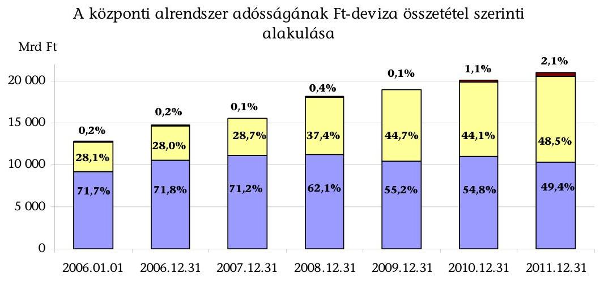
$\square$ Forint adósság $\square$ Devizaadósság $\square$ Egyéb kötelezettségek

[^0]
[^0]:    ${ }^{20}$ Az önkormányzatok adósság-átvállalása nem növelte sem az államháztartás teljes hiányát, sem a maastrichti hiányt. Szerkezeti átalakítást jelentett, az önkormányzati adósság központi szintre került.

---

Az IMF hitellel kapcsolatos szándéknyilatkozat aláírására úgy került sor, hogy annak lehívandó összegére, valamint a felhasználására vonatkozóan konkrét tervek nem, csak kijelölt gazdaságpolitikai célok ${ }^{21}$ voltak. Az ÁKK Zrt. álláspontja szerint „...az államadósság-kezelés igénye nem indokolta az IMF hitel ilyen gyors felvételét". Az IMF hitelrészletek lehívásának időpontja és felhasználása alapján ezt az ellenőrzésünk is alátámasztja.

A 2008 novemberében felvett hitel célok szerinti felhasználása 2009 áprilisától kezdődött. Addig a lehívott első részlet 4,9 Mrd eurós összegét a Magyar Nemzeti Banknál (MNB) helyezték el devizabetétként. Ebből közel 3 Mrd euró az állam finanszírozási/biztonsági tartalékát képezte. Az MNB által a devizabetétre fizetett kamat lényegesen elmaradt a forrásra fizetendő kamattól: a devizabetét 2008-2009. évi kamatbevétele 11,3 Mrd Ft, míg a lehívás 2009. évi kamatkiadása ${ }^{22} 30,0$ Mrd Ft volt.

Az IMF hitel lehívások időpontját, összegeit és a felhasználási jogcímeket az alábbi táblázat tartalmazza:

|  | Felvétel |  | Felhasználás |  |
| :--: | :--: | :--: | :--: | :--: |
| sorszáma | időpontja | Összege   (M euró) | célja | összege   (M euró) |
| 1. lehívás | 2008.11 .12 | 4953,0 | hitelnyújtás a bankoknak | 1752,4 |
|  |  |  | FHB tőkeemelés | 108,6 |
|  |  |  | forintadósság törlesztése | 83,8 |
|  |  |  | deviza swap | 24,5 |
|  |  |  | deviza- és a bankmentő csomagra elkülönített betétállomány | 2983,7 |
| 2. lehívás | 2009.03 .30 | 2389,2 | forintadósság törlesztése | 2389,2 |
| 3. lehívás | 2009.06 .25 | 1404,5 | MNB devizatartalék növelése | 1404,5 |
| 4. lehívás | 2009.09 .29 | 54,2 | forintadósság törlesztése | 54,2 |

A 10537,5 M SDR összegű IMF készenléti hitelkeretből
 6372,5 M SDR-t (7,4 Mrd euró), az Európai Bizottság (EB) által biztosított 6,5 Mrd euró összegű hitelkeretből 5,5 Mrd eurót hívott le a magyar állam. Ebből az IMF hitel 34,2%-át, az EB hitel 100%-át fordították lejáró forint adósságtörlesztésére.

[^0]
[^0]:    ${ }^{21}$ Az IMF a pénzügyminiszter és a jegybank elnöke által aláírt szándéklevélben felvázolt gazdaságpolitikai célok (az állam finanszírozási igényének csökkentése és a költségvetési egyensúly hosszú távú fenntarthatóságának javítása, a hazai bankok megfelelő tőkeellátottságának és a belföldi pénzügyi piacok likviditásának fenntartása, valamint a bizalom megerősítése és a megfelelő külső finanszírozás biztosítása) alapján döntött a hitel folyósításáról.
    ${ }^{22}$ 2008-ban kamatkiadás nem merült fel.

---

Az IMF hitel 3. részletét (1404,5 M euró) a magyar állam helyett az MNB hívta le a pénzügyminiszter 2009. június 23-ai döntése alapján. A döntés indoka „az államadósság növekedésének minimalizálása" volt, mivel a pénzügyminiszter „úgy ítélte meg, hogy a szükséges finanszírozás más eszközök igénybevételével is megoldható" ${ }^{23}$. A lehívás indokoltságát a PM dokumentumokkal nem támasztotta alá. A magyar állam nevében a pénzügyminiszter ugyanakkor 2009 júliusában 500 M euró összegű, 5 éves futamidejű devizakötvény kibocsátásáról döntött. Az ÁKK Zrt. igazgatósága a pénzügyminiszter döntése alapján a 27/2009. (07. 14.) határozatával felhatalmazta az ÁKK Zrt. vezérigazgatóját, hogy döntsön a devizakötvény kibocsátás időzítéséről, paramétereiről, valamint az 500 M euró összegű kibocsátás esetleges emeléséről. Az ÁKK Zrt. a felhatalmazás alapján az MNB javára lemondott hitellehívástól kedvezőtlenebb feltételekkel (3,95%-os hozamfelárral) 1000 M euró értékben bocsátott ki devizakötvényt. Az IMF hitel első lehívásából - a bankmentő program keretében tőkeemelésre, illetve garancianyújtásra elkülönített - fel nem használt betétállomány (2072,4 M euró) mellett nem volt indokolt a devizakötvény kibocsátás.

Az MNB által lehívott hitel nem növelte az államadósságot ${ }^{24}$, az az MNB mérlegében szerepel az IMF-fel szembeni kötelezettségként a devizatartalékok között. Az MNB devizatartalékait a magyar állam által lehívott IMF/EB források is növelték ${ }^{25}$, 2008-ban 6,9 Mrd euróval, 2009-ben 5,9 Mrd euróval.

A hitelek ÁSZ elnök általi ellenjegyzésére nem került sor. A PM-nek - az első lehívást követő utólagos - ÁSZ részére adott tájékoztatása szerint „a hitelek nem a központi költségvetés likviditásának biztosítását, hanem a fizetési mérleg finanszírozását szolgálják és a lehívott összegek az ország devizatartalékait növelik", tehát nem minősülnek államadósságnak. Az ÁSZ a PM utólagos tájékoztatását elfogadta és a korábbi gyakorlatnak megfelelően ${ }^{26}$ az IMF és a magyar állam közötti hitelszerződést nem ellenjegyezte ${ }^{27}$. A tájékoztatás nem felelt meg a valóságnak, mivel a bankmentő programra elkülönített betét növelte az államadósságot ${ }^{28}$.

Az IMF/EB hitel visszafizetésének ütemezését az alábbi tábla mutatja:

| Dátum | IMF hitel |  |  | EB hitel |  | Összesen |  |
| :--: | :--: | :--: | :--: | :--: | :--: | :--: | :--: |
|  | SDR | EUR | HUF | EUR | HUF | EUR | HUF |
| 2011. év |  |  |  | 2000 | 537400 | 2000 | 537400 |
| 2012. év | 2904 | 3346 | 976723 |  |  | 3346 | 976723 |
| 2013. év | 3186 | 3652 | 1071631 |  |  | 3652 | 1071631 |
| 2014. év | 282 | 313 | 94908 | 2000 | 537400 | 2313 | 632308 |
| 2016. év |  |  |  | 1500 | 403050 | 1500 | 403050 |
| Összesen | 6372 | 7311 | 2143262 | 5500 | 1477850 | 12811 | 3621112 |

A hitelek finanszírozása a magas összegű és középtávú lejáratok, valamint a hitelminősítő intézetek leminősítései ${ }^{29}$ miatt 2012-től kockázatot jelent(het). A devizaadósság átlagos hátralévő futamidejénél (6 év) rövidebb futamidejű hitelt lehívásonként nyolc részletben, 2012-2014 között negyedévenként kell törleszteni. Az EB keretből 2008-ban lehívott 2000 M eurót 2011-ben, a 2009-ben lehívott 3500 M eurót 2014-ben és 2016-ban kell törleszteni. 2011-2014 között éves szinten 2,0-4,0 Mrd eurónyi lejárat finanszírozása szükséges.

Az államadósság emelkedése ellenére jogszabályi és egyéb szabályozó eszközök 2012-ig nem kényszerítették ki a folyamatok megfordítását. Az államadósság növekedésének korlátozására született jogszabályi előírásokat [a takarékos állami gazdálkodásról és a költségvetési felelősségről szóló 2008. évi LXXV. törvény (KF tv.) államadósságra vonatkozó rendelkezései, valamint az Alaptörvény] az ellenőrzött időszakban még nem kellett alkalmazni. Az államadósság változásának egyes tényezőit a korábbi gyakorlattól eltérően 2009-et követően a zárszámadáshoz kapcsolódó tájékoztató adatok már nem mutatták be, ezért az államadósság növekedésének okai, az adósságnövekedés kockázati tényezői a döntéshozók és a nyilvánosság számára nem (voltak) átláthatóak. (Pl. árfolyamkülönbözet, az ÁKK Zrt. által végrehajtott pénzügyi műveletek eredménye, KESZ likviditásának változása, IMF hitelből képzett MNB betét állományának változása, az NYRA vagyonának változása.) Az adósságcsökkentési szabályt tartalmazó Alaptörvény végrehajtása érdekében a stabilitási törvény rögzítette az államadósság-mutató számításának kötelezettségét, azonban az államadósság tényleges alakulása okainak bemutatását, az átláthatóság biztosításának kötelezettségét nem írta elő.

[^0]
[^0]:    ${ }^{23}$ A pénzügyminiszter által a 2009. évre jóváhagyott finanszírozási terv a negyedévente lehívható keretek finanszírozásba való bevonásával számolt.
    ${ }^{24}$ Az MNB nem tartozik a központi alrendszerbe és nem része az ESA95 módszertan szerinti kormányzati szektornak. Így az MNB általi lehívás összege nem növelte sem az államadósságot, sem a maastrichti adósságot.
    ${ }^{25}$ Forrás: MNB éves jelentés. Az MNB számára a devizatartalék hozama eredménynövelő tényező, 2008-ban a vesztesége 11,1 Mrd Ft-tal 5,5 Mrd Ft-ra csökkent, míg 2009-ben 65,5 Mrd Ft volt az MNB nyeresége. Az eredménynek/veszteségnek a devizaértékpapírok piaci értékeléséből eredő részét, az ún. kiegyenlítési tartalékot, ha az negatív, az MNB tv. 17. § (4) bekezdése alapján a költségvetés köteles megtéríteni.
    ${ }^{26}$ Az ÁSZ elnöke 2011. december 31-éig az ÁKK Zrt. által a magyar állam részére felvett hiteleket, illetve hitelkeret-szerződéseket ellenjegyezte, míg a projektfinanszírozó hiteleket, illetve a különböző értékpapír kibocsátások (kötvény, diszkont-kincstárjegy) eredményeként keletkezett hitelviszonyok szerződéseit nem.
    ${ }^{27}$ Az ellenjegyzés azt tanúsítja, hogy a hitelfelvétel megfelel a törvényi előírásoknak, a felvételre kerülő hitelek indokoltságát az ÁSZ nem ellenőrizte.

---

ságnak, mivel a bankmentő programra elkülönített betét növelte az államadósságot ${ }^{28}$.

Az IMF/EB hitel visszafizetésének ütemezését az alábbi tábla mutatja:

| Dátum | IMF hitel |  |  | EB hitel |  | Összesen |  |
| :--: | :--: | :--: | :--: | :--: | :--: | :--: | :--: |
|  | SDR | EUR | HUF | EUR | HUF | EUR | HUF |
| 2011. év |  |  |  | 2000 | 537400 | 2000 | 537400 |
| 2012. év | 2904 | 3346 | 976723 |  |  | 3346 | 976723 |
| 2013. év | 3186 | 3652 | 1071631 |  |  | 3652 | 1071631 |
| 2014. év | 282 | 313 | 94908 | 2000 | 537400 | 2313 | 632308 |
| 2016. év |  |  |  | 1500 | 403050 | 1500 | 403050 |
| Összesen | 6372 | 7311 | 2143262 | 5500 | 1477850 | 12811 | 3621112 |

A hitelek finanszírozása a magas összegű és középtávú lejáratok, valamint a hitelminősítő intézetek leminősítései ${ }^{29}$ miatt 2012-től kockázatot jelent(het). A devizaadósság átlagos hátralévő futamidejénél (6 év) rövidebb futamidejű hitelt lehívásonként nyolc részletben, 2012-2014 között negyedévenként kell törleszteni. Az EB keretből 2008-ban lehívott 2000 M eurót 2011-ben, a 2009-ben lehívott 3500 M eurót 2014-ben és 2016-ban kell törleszteni. 2011-2014 között éves szinten 2,0-4,0 Mrd eurónyi lejárat finanszírozása szükséges.

Az államadósság emelkedése ellenére jogszabályi és egyéb szabályozó eszközök 2012-ig nem kényszerítették ki a folyamatok megfordítását. Az államadósság növekedésének korlátozására született jogszabályi előírásokat [a takarékos állami gazdálkodásról és a költségvetési felelősségről szóló 2008. évi LXXV. törvény (KF tv.) államadósságra vonatkozó rendelkezései, valamint az Alaptörvény] az ellenőrzött időszakban még nem kellett alkalmazni. Az államadósság változásának egyes tényezőit a korábbi gyakorlattól eltérően 2009-et követően a zárszámadáshoz kapcsolódó tájékoztató adatok már nem mutatták be, ezért az államadósság növekedésének okai, az adósságnövekedés kockázati tényezői a döntéshozók és a nyilvánosság számára nem (voltak) átláthatóak. (Pl. árfolyamkülönbözet, az ÁKK Zrt. által végrehajtott pénzügyi műveletek eredménye, KESZ likviditásának változása, IMF hitelből képzett MNB betétállományának változása, az NYRA vagyonának változása.) Az adósságcsökkentési szabályt tartalmazó Alaptörvény végrehajtása érdekében a stabilitási törvény rögzítette az államadósság-mutató számításának kötelezettségét, azonban az államadósság tényleges alakulása okainak bemutatását, az átláthatóság biztosításának kötelezettségét nem írta elő.

[^0]
[^0]:    ${ }^{28}$ Ezt a Magyar Állam és az MNB között az IMF hitel felvételében történő közreműködés tárgyában 2008. október 30-án létrejött megállapodás is tartalmazta. A megállapodás bevezető részében az áll, hogy „az IMF-től érkező pénzügyi segítségnyújtás a központi költségvetést terhelő adósságnak, azaz államadósságnak minősül".
    ${ }^{29}$ 2008-tól mindhárom nagy nemzetközi hitelminősítő intézet többször rontott a magyar államadósság minősítésén.

---

A kormányzati szektorba tartozó szervezetek konszolidált, névértéken kifejezett adósságára, annak tervezett GDP-hez viszonyított arányára, az ún. maastrichtii adósságmutatóra az 1992. évi Maastrichtii Egyezmény - az euróövezethez való csatlakozás kritériumaként - maximum 60%-ot írt elő a GDP százalékában. A magyar kormányzati szektor adóssága az ellenőrzött időszakban a 60%-os konvergencia kritérium értékét jelentősen meghaladta. 2008. III. negyedévig az adósságráta kiegyensúlyozottan alakult, értéke akkor 65,9% volt. A gazdasági visszaeséssel járó válságot követően azonban erőteljesen növekedett, 2011. év végén 80,6%${ }^{30}$ volt. Az adósságmutató 2009. I. negyedév végén volt a legmagasabb (83,4%), amit részben a Ft gyengülése, részben az IMF/EB hitel lehívása, illetve annak egy részének az államadósság-törlesztésre való fel nem használása okozott.

Az államadósság 64,2%-os növekedése ellenére a központi alrendszer finanszírozása 2006-2011 között minden évben, ezen belül a 2008. évi pénzügyi, finanszírozási válság alatt is biztosított volt. A központi költségvetési hiányt és az összesen törlesztendő, megújítandó 2811,0 Mrd Ft deviza- és 36 576,5 Mrd Ft forintadósságot az ÁKK Zrt. 7735,8 Mrd Ft deviza és 39 190,8 Mrd Ft forint forrásbevonással finanszírozta alapvetően (88,1%-ban) piaci alapon, kisebb részben (11,9%-ban) hitelfelvételekkel. Az IMF/EB hitelek 2009-től 31,6%-ra növelték a nem piaci finanszírozás arányát.

Az éves forrásbevonások szerkezetét (Ft-deviza arány, fix-változó kamatösszetétel, lejárat) az ÁKK Zrt. alakította ki a pénzügy-, illetve a nemzetgazdasági miniszter által évente jóváhagyott - főbb céljait és eszközeit tekintve nem módosított - államadósság-kezelési stratégia és teljesítménymutatók figyelembevételével. A finanszírozás - stratégiai célok szerinti, hosszú távon minimális költséggel és elfogadható kockázatokkal történő - biztosítása mellett az ÁKK Zrt. elsődleges célja a teljesítménymutatók szerinti adósságszerkezet kialakítása és a KESZ likviditásának biztosítása volt.

Az ÁKK Zrt. által kidolgozott stratégiák struktúrája nem változott, nagyobb részben általános adósságkezelési célokat és követelményeket tartalmaztak. Nem tértek ki ugyanakkor a stratégiák a célok megvalósításához szükséges konkrét lépésekre, felelősökre és nem alakították ki a feladatok végrehajtásának monitoring rendszerét sem. 2011-től a stratégia kiegészült az éves finanszírozási terv megalapozásához kapcsolódó aktuális adósságkezelési információkkal (pl. nyugdíjrendszer átalakításának hatásai az államadósságra, annak kezelésére).

A stratégiákban megjelölt államadósság-kezelési célok 2006 és 2008 első féléve között látszólag teljesültek. A forintban fennálló adósság átlagos hátralévő futamidejére a stratégiában meghatározott cél teljesült, azonban a nemzetközi átlagtól (2,5-5 év)${ }^{31}$ alacsonyabb célérték (2-3 év) a gyakori megújítási kényszer

[^0]
[^0]:    ${ }^{30}$ Adatforrás: Magyarország EDP jelentése, 2012. 04. 18.
    ${ }^{31}$ 2009-ben a nemzetközi adatok 2,6-9,9 év között alakultak. Forrás: ÁKK Zrt., 2011. évi stratégia „az államadósság-portfólió futamidő mutatóinak alakulása" c. melléklete.

---

miatt a finanszírozási- és a kamatkockázatot ${ }^{32}$ megnövelte. Az államadósság szerkezete az alapító által jóváhagyott teljesítménymutatóknak megfelel, ugyanakkor a kialakított portfólió nem biztosította a stratégia szerinti, válsághelyzetekre kevésbé érzékeny (elfogadható kockázatok melletti költséghatékony) adósságszerkezetet. Az IMF/EB hitelfelvételt követően, az adósságállomány összetétele kedvezőtlen irányban változott és 2009-től a devizafinanszírozás negatív hatásai jelentkeztek. A finanszírozási kockázatot növelte a külföldiek felé fennálló kötelezettség növekvő aránya, az államadósság alacsony átlagos hátralévő futamideje, a belföldi állampapírpiac gyenge teljesítménye, a Ft árfolyam alakulása és az államadósság lejárati szerkezete: 2012-ben 4000 Mrd Ft, 2013-2014-ben évente 3000 Mrd Ft körüli a lejáró forint- és devizaadósság ${ }^{33}$.
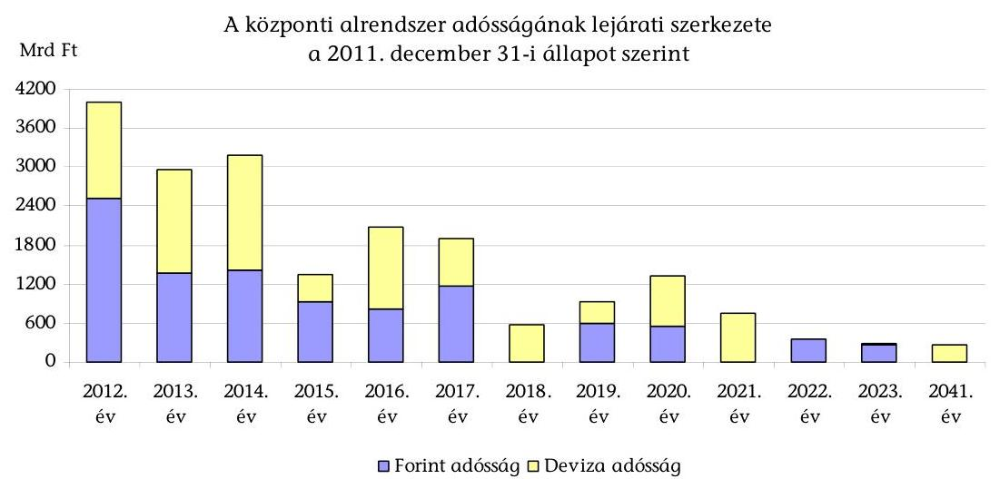

Az államadósság nettó (kamatbevételek figyelembe vételével számított) kamatkiadásainak éves mértéke 2006-2011 között 13,2%-kal nőtt. Az emelkedés a devizában fennálló adósságra jutó költségekhez kapcsolódott. A devizában fennálló államadósság kamatkiadásai az állomány bővülése, a kamatszintek, az állampapír-piaci felárak emelkedése, valamint az árfolyamváltozás következtében több mint duplájára, a 2006. évi 150,1 Mrd Ft-ról 2011-re 304,5 Mrd Ft-ra emelkedtek. Ugyanezen időszakban a forintban fennálló adósság nettó kamatkiadásai évente - a 2008. évi 865,3 Mrd Ft kivételével - 700-750 Mrd Ft körül

 alakultak. A 2008. évi magas értéket az államkötvények hozamemelkedése és az emelkedő hozamszint miatti aukciós árfolyamveszteség okozta. A nettó kamatkiadásoknak az államadósságnál kisebb növekedési ütemét a kedvező kamatkondíciójú, nem piaci finanszírozású hitelek nagyságának és arányának markáns emelkedése okozta. Az adósságkezelés tágan értelmezett költségeibe beletartozik az árfolyamkockázat következtében előálló árfolyamveszteség is.

[^0]
[^0]:    ${ }^{32}$ Rövid hátralévő futamidő mellett a kamatváltozások közvetlenül hatnak a kamatkiadásokra.
    ${ }^{33}$ A IMF/EB hitel törlesztését 2011-től kezdte meg a magyar állam. A törlesztés piaci finanszírozása nagyságrendileg többszöröse a korábbi években végrehajtott deviza kibocsátásoknak.

---

A piaci finanszírozás (állampapír-kibocsátások) kamatkockázatai kezelésére az ÁKK Zrt. eszközei korlátozottak, az állampapírpiacon árelfogadó volt. A hozamértékek 2006-2011 közötti változása és a kockázati felár 2008-tól történt emelkedése megnövelte a finanszírozási kiadásokat. Az állampapírok hozamait, a kockázati- és a hozamfelárakat a GDP alakulása, az infláció nagysága, a jegybanki alapkamat mértéke, a Ft árfolyam ingadozása és a hitelminősítői besorolás határozta meg ${ }^{34}$. A forint államkötvények aukciós átlaghozamai 5,47-11,37% között szóródtak, maximális értékük 2009-ben, a válsággal összefüggésben volt. 2009-től növekedtek a kamatkiadások és az árfolyamkockázatok a devizakötvény kibocsátásoknál, azok kamatai 2,65%-3,95%-kal meghaladták a referenciahozamokat (euro és USD kötvények). A hitelminősítési megítélés 2007-től 2012 januárjáig folyamatosan romlott a legalacsonyabb szintig (Ba1; BB+), amely befektetésre nem ajánlott kategória.

A kamat- és devizakockázatok kezelésére az ÁKK Zrt. által kötött kamat és deviza swap (csere) ügyletek célja a teljesítménymutatók célsávon belüli tartása volt. Azok ügyletenkénti és összesített költséghatását, illetve eredményességét az ÁKK Zrt. nem mérte és nem értékelte. Így az adósságkezelési stratégiában kitűzött költségminimalizálási célok megvalósulását az ÁKK Zrt. számszerű adatokkal nem támasztotta alá ${ }^{35}$. Az ÁKK Zrt. ezen eljárása nem felelt meg az adósságkezelési stratégiában megfogalmazott költség- és kockázatoptimalizálási alapelvnek: „A költségalapú megközelítés lényege, hogy a ... kockázatokat a költséghatásokkal együtt kell mérlegelni." Nem értékelhető az adósságkezelés költség- és kockázat minimalizálásra vonatkozó stratégiai cél megvalósulása.

A PM/NGM és az ÁKK Zrt. kizárólag az adósság portfólió szerkezetét meghatározó teljesítménymutatók teljesítésével mérte az adósságkezelés eredményességét, hatékonyságát. A 2004-ben kialakított költség- és kockázatkezelési modell belső fejlesztés eredménye, auditálására és tartalmi felülvizsgálatára nem került sor. A modell nem kezel számos kockázati tényezőt: a forint és a devizaadósság eltérő növekedési ütemét, hátralévő átlagos futamidejét, a hozamgörbe változás hatását az adósságkezelés költségeire. A modell továbbfejlesztésének - az adósságfinanszírozási környezet, valamint a befektetők prioritásai módosulása miatt - indokolt felülvizsgálatát a PM/NGM nem írta elő. A költség- és kockázatkezelési modell alapján meghatározott, nyolc éve érdemben nem módosított teljesítménymutató sávok objektíven nem biztosítják a stratégiában célként megjelölt költséghatékony adósságszerkezet megvalósítását a folyamatosan változó piaci környezetben. A 2008. évi felfüggesztett államkötvény kibocsátások, az adósságfinanszírozásba bevont IMF és EB hitelek adósságszerkezet összetételére gyakorolt kedvezőtlen hatásának kezelése indokolta volna az adósságkezelés kereteinek átdolgozását, középtávú stratégia kialakítá-

[^0]
[^0]:    ${ }^{34}$ Az objektív tényezők mellett a befektetők értékítélete, kockázatvállalási hajlandóságuk is befolyásolja a felárakat.
    ${ }^{35}$ A nemzetközi gyakorlatban a fedezeti ügyletek értékelésre kerülnek, hogy mérni és mérsékelni tudják a kockázatokat, valamint hogy az ügyletek nyereségességének (veszteségességének) értékelésével végre tudják hajtani a szükséges korrekciókat. Az ÁKK Zrt. stratégiája szerint: „Az adósságkezelés hatékonysága, ez által az adósságkezelő teljesítménye a referenciaportfolió és a valós portfolió eltérése által mérhető és számon kérhető."

---

sát, finanszírozási sokkok kezelésére való felkészülést, a rugalmasabb adósságkezelést.

A likviditási kockázat csökkentése érdekében az ÁKK Zrt. által alkalmazott likviditáskezelési műveletek (likviditási diszkontkincstárjegyek kibocsátása és repó műveletek) a KESZ-re meghatározott teljesítménymutató - a KESZ optimális szintjéhez rendelt +/-50 Mrd Ft-os sáv - elérését biztosították. A likviditáskezelési műveletek utáni (simított) KESZ egyenleg optimális sáv alatti mutatója csökkenő tendenciát mutatott, a 2006-ban mért 16 napról 2011-re nulla napra csökkent. A szabad pénzeszközök rugalmas, - az adósságállományt költséghatékonyabbá és alacsonyabb kockázatot hordozó szerkezetűvé alakító - likviditási műveletekkel (visszavásárlás, előrehozott hiteltörlesztés) való kezelésének nem volt gyakorlata. Pl. 2008 áprilisában a forint euróhoz viszonyított árfolyama 230-240 Ft körüli szintre erősödött, majd a nyár folyamán hosszabb ideig 240-250 Ft érték körül maradt. Ebben az időszakban az ÁKK Zrt. nem kezdeményezte a korábban, magasabb Ft-euró árfolyamon kibocsátott devizaállampapírokból történő, árfolyam-nyereséget biztosító visszavásárlást ${ }^{36}$.

Költségoptimalizáló céllal előrehozott Ft hiteltörlesztést csak 2006-ban és 2007-ben bonyolítottak. A lejárat előtti devizakötvény-törlesztések lebonyolítására egyszer került sor. Az IMF hitelek felhasználásával 2009-ben államkötvényt 647,2 Mrd Ft-os összegben, a devizakötvényekből 22,8 Mrd Ft-ot vásároltak vissza. Az államkötvény visszavásárlások eredményességét, a kamatmegtakarítás, vagy többletkamat összegét azonban az ÁKK Zrt. nem mutatta ki ${ }^{37}$.

A lakossági értékesítés nagyságrendje és aránya a teljes finanszírozáson belül csökkent, annak ellenére, hogy az ÁKK Zrt. stratégiai célkitűzése volt a lakossági értékesítés stabilizálása. A lakossági termékek jegybanki alapkamat alatti, illetve a piaci kamatoktól lényegesen elmaradó hozamai nem segítették az értékesítés növelését. Az ÁKK Zrt. által kalkulált, a lakosság által elérhető hozamok - a 2009-ben bevezetett Prémium Magyar Államkötvény (PMÁK) kivételével - nem voltak versenyképesek. A lakossági részvételnek a finanszírozásba történő bevonására a 2009. évi likviditási problémák kezelésekor, valamint 2011-ben a nyugdíjpénztári kereslet csökkenésekor törekedtek (pl. jutalék bevezetésével). 2012-ben az ÁKK Zrt. a hozamok növelésével és marketingtevékenység fokozásával törekszik a lakossági értékesítés növelésére ${ }^{38}$.

Az államadósság alakulását, mint potenciális költségvetési kiadásokat befolyásoló, több évre szóló - a Kormány által vállalt - kezesség- és garanciavállalások 2006-2011 között összesen 121,5 Mrd Ft összegű érvényesítése (kezességbeváltás) 6,3 Mrd Ft-tal haladta meg a tervezettet. A költségvetést több éven ke-

[^0]
[^0]:    ${ }^{36}$ Az ÁKK Zrt. álláspontja szerint „a visszavásárlásokkal szűkítené a likviditást, amellyel hosszabb távon a stabil befektetőknek kárt okozna, továbbá alapvetően kiszámítható, stratégiai magatartást követnek a piacon, ezért sem kezdeményeznek ad hoc visszavásárlásokat".
    ${ }^{37}$ Az ÁKK Zrt. álláspontja szerint „a visszavásárlási aukciók célja a likviditás biztosítása, az államkötvények refinanszírozási kockázatának csökkentése volt".
    ${ }^{38}$ A Kormány 2012-ben 1957,9 M Ft többlet forrást biztosított a lakosság állampapír állományának növeléséhez szükséges számítástechnikai rendszerek fejlesztésére, marketing tevékenységre, új értékesítési pontok kialakítására.

---

resztül terhelő - jellemzően 2003-2007-ben vállalt - hosszú távú kötelezettségvállalásokra ${ }^{39}$ évenként tervezett költségvetési kifizetések az éves kereteken belül alakultak.

Az éven túli kötelezettségvállalások állományi adatainak a zárszámadás keretében történő bemutatása csak az állami kezesség- és garanciavállalásoknál történt meg. A hosszú távú kötelezettségvállalások adatainak, valamint azok számszerűsített, évekre bontott hatásának előírás szerinti bemutatása az Áht${ }_{1}$ nem egyértelmű szabályozása következtében elmaradt. A Kincstár felé történt fejezeti adatszolgáltatások tágabb kört öleltek fel a jogszabályi előírásokhoz képest. (Pl. a Kormány és az Országgyűlés határozataihoz nem kapcsolódó kötelezettségvállalás adatokat is hosszú távú kötelezettségvállalásként tartotta nyilván a Kincstár, melyek a szokásos működéssel voltak kapcsolatosak.) A Kincstár azonban nem jogosult a fejezetek által nyújtott adatok felülbírálására, így az adatok összességében nem feleltek meg az Áht${ }_{1}$ 12/B. §-ában foglalt feltételeknek.

A hosszú távú kötelezettségvállalások ${ }^{40}$ 2011-ben 152,9 Mrd Ft és a következő öt évben évente 143-153 Mrd Ft, 2038-ig összesen (2012-től) 3073,3 Mrd Ft determinációt jelentenek.
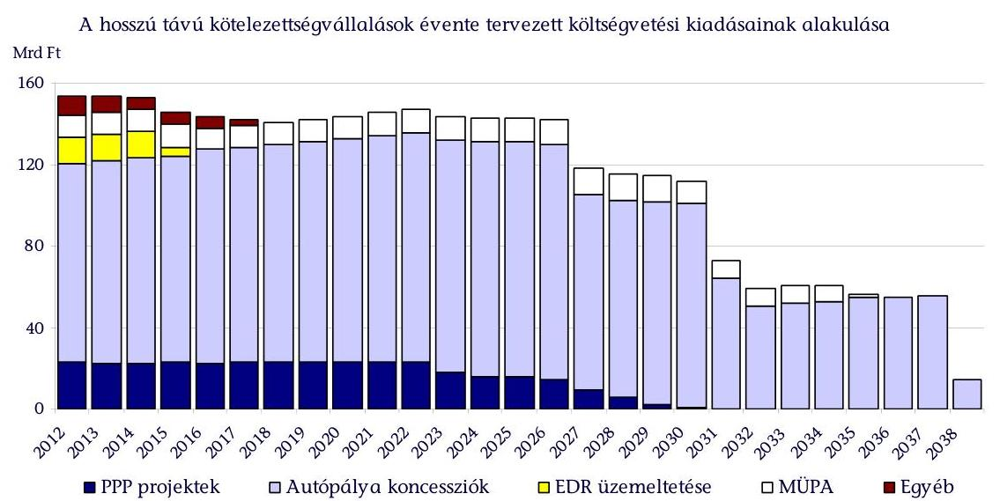

A korábbi ellenőrzéseink során tett javaslatok az ellenőrzött időszakban szabályozási szinten hasznosultak. A javaslataink figyelembevételével került sor az Áht${ }_{1}$, belső szabályzatok módosítására és egyéb intézkedésekre.

Az Állami Számvevőszékről szóló 2011. évi LXVI. törvény 33. § (1) bekezdésében foglaltak értelmében a jelentésben foglalt megállapításokhoz kapcsolódó intézkedési tervet köteles az ellenőrzött szervezet vezetője összeállítani és azt a

[^0]
[^0]:    ${ }^{39}$ A 2011-től hatályos államháztartási törvény (Áht${ }_{2}$ ) a hosszú távú kötelezettségvállalásokkal kapcsolatban nyilvántartási és tájékoztatási feladatot nem határozott meg.
    ${ }^{40}$ Hosszú távú kötelezettségvállalásként a Kincstár nyilvántartásából csak az Áht${ }_{1}$ szerinti összes kellékkel (OGY vagy Korm. határozat, értékhatár) rendelkező adatokat vettük figyelembe.

---

jelentés kézhezvételétől számított harminc napon belül az ÁSZ részére megküldeni. Amennyiben az intézkedési tervet határidőben nem küldi meg a szervezet, vagy az továbbra sem elfogadható, az ÁSZ elnöke a hivatkozott törvény 33. § (3) bekezdés a)-b) pontjaiban foglaltakat érvényesítheti.

Az ellenőrzés intézkedést igénylő megállapításai és javaslatai:

# a nemzetgazdasági miniszternek: 

1. Az Áht szerinti központi alrendszer adósságának növekedését elsősorban a központi alrendszer mindenkori hiánya okozza, azonban további, 5-20%-os hatást jelentő módosító tényezők befolyásolják annak éves alakulását. Az államadósság változásának egyes tényezőit a korábbi gyakorlattól eltérően 2009-et követően a zárszámadáshoz kapcsolódó tájékoztató adatok már nem mutatták be, ezért az államadósság növekedésének okai, az adósságnövekedés kockázati tényezői a döntéshozók és a nyilvánosság számára nem (voltak) átláthatóak. (Pl. árfolyam-különbözet, az ÁKK Zrt. által végrehajtott pénzügyi műveletek eredménye, KESZ likviditásának változása, IMF hitelből képzett MNB betét állományának változása, az NYRA vagyonának változása.) Az Alaptörvény 2012. január 1-jétől adósságcsökkentési szabályt tartalmaz, amelynek végrehajtása érdekében a stabilitási törvény rögzíti az államadósságmutató számításának kötelezettségét, azonban nem írja elő az államadósság tényleges alakulása okainak bemutatását, az átláthatóság biztosításának kötelezettségét.

## Javaslat:

Kezdeményezze a stabilitási törvény szerinti államadósság növekedése összetevői részletes bemutatásának jogszabályban történő előírását annak érdekében, hogy az adósságnövekedés évenkénti alakulásának okai átláthatóak, követhetőek legyenek.
2. Az államadóssággal kapcsolatos döntéshozatali rendszer kockázata, hogy a deviza forrásbevonási műveletekkel kapcsolatos döntési- és felelősségi hatáskörök 2007-től nem voltak egyértelműen tisztázottak. Ez kockázatot jelent a döntések átláthatósága és számon kérhetősége tekintetében. 2007 januárjától az ÁKK Zrt. vezérigazgatójának hatásköre a deviza forrásbevonási döntés. Azt belső szabályozással részben tovább delegálták: az ÁKK Zrt. Finanszírozási bizottsága hatásköre volt a devizakötvény kibocsátások részletfeltételeire vonatkozó döntés. A finanszírozás végrehajtásáért ugyanakkor a pénzügyminiszter volt a felelős. Ennek értelmében szakmailag is elvárható, hogy e felelősséggel összhangban a stratégiai döntéseket az államháztartásért felelős miniszter gyakorolja.

## Javaslat:

Vizsgálja meg, hogy a deviza forrásbevonással kapcsolatos döntéshozatali rendszer során összhangban vannak-e a felelősségi és döntési hatáskörök, szükség esetén intézkedjen az összhang biztosításáról.
3. Az ÁKK Zrt. nem támasztotta alá számszerű adatokkal az államadósság-kezelési célként megjelölt költséghatékony adósságszerkezet kialakítását. Az egyes pénzügyi és finanszírozási műveletek (pl. swapok és kapcsolódó ügyletek) költségeit és eredményességét nem mérte fel és nem értékelte. Nem értékelhető az adósságkezelés költség- és kockázat minimalizálásra vonatkozó stratégiai céljának megvalósulása.

---

# Javaslat: 

Intézkedjen az adósságkezelési tevékenység költséghatékonyságát mérő értékelési rendszer kialakításáról az adósságkezelési költségek nyomon követése, illetve csökkentése érdekében.
4. Az adósságkezelésre 2004-ben kialakított költség- és kockázatkezelési modell az ÁKK Zrt. belső fejlesztése, auditálására és tartalmi felülvizsgálatára nyolc éve nem került sor. A modell nem kezel számos kockázati tényezőt: a forint és a devizaadósság eltérő növekedési ütemét,

 hátralévő átlagos futamidejét, a hozamgörbe változás hatását az adósságkezelés költségeire. A költség- és kockázatkezelési modell alapján meghatározott, nyolc éve érdemben nem módosított teljesítménymutató sávok objektíven nem biztosítják a stratégiában célként megjelölt költséghatékony adósságszerkezet megvalósítását a folyamatosan változó piaci környezetben.

## Javaslat:

Intézkedjen az ÁKK Zrt. által kialakított költség- és kockázatkezelési modell felülvizsgálatáról, annak eredményei alapján a teljesítménymutatók módosításáról (újak kidolgozásáról) az adósságszerkezetből fakadó kockázatok mérséklése érdekében. Ennek során vegyék figyelembe a jelenlegi nemzetközi tapasztalatokat is.

---

# II. RÉSZLETES MEGÁLLAPÍTÁSOK 

## 1. A KÖZPONTI ALRENDSZER ADÓSSÁGÁNAK ALAKULÁSA

A központi alrendszer (amely magában foglalja a központi költségvetést, a társadalombiztosítás pénzügyi alapjait és az elkülönített állami pénzalapokat) adóssága 2006 januárjától 2011. december 31-ig 12 765,6 Mrd Ft-ról, 64,2\%-kal 20 955,5 Mrd Ft-ra nőtt ${ }^{41}$. Az adatokat az ÁKK Zrt. tartja nyilván.

A központi alrendszer adóssága után fizetendő bruttó kamatok, valamint az adósságkezelés költsége összesen 6582,8 Mrd Ft volt a hat év alatt, 2006-ról 2011-re 12,0\%-kal nőtt. A kamatbevételeket is figyelembe vevő nettó kamatkiadások és egyéb költségek a 2006. évi 918,5 Mrd Ft-ról 2011-re 1021,2 Mrd Ft-ra, 11,2\%-kal nőttek.

Az államadósság növekedése 2006-ban (15,2\%) és 2008-ban (16,2\%) kiugró, míg 2007-ben és 2009-2011 között 4,6-6,0\% volt. A 2006. évi adósságnövekedéshez a központi alrendszer magas finanszírozási szükséglete (hiánya) 12,7\%-kal, az adósság-átvállalások 3,2\%-kal, egyéb tényezők 0,4\%-kal járultak hozzá. 2008. évben az IMF/EB hitelfelvételből betétként elhelyezett összeg az adósságot 10,0\%-kal, a központi alrendszer hiányát 5,8\%-kal növelte.

A központi alrendszer adósságának változását több tényező alakította, melynek összetételét a következő grafikon mutatja be.

A központi alrendszer adósságváltozása összetételének alakulása
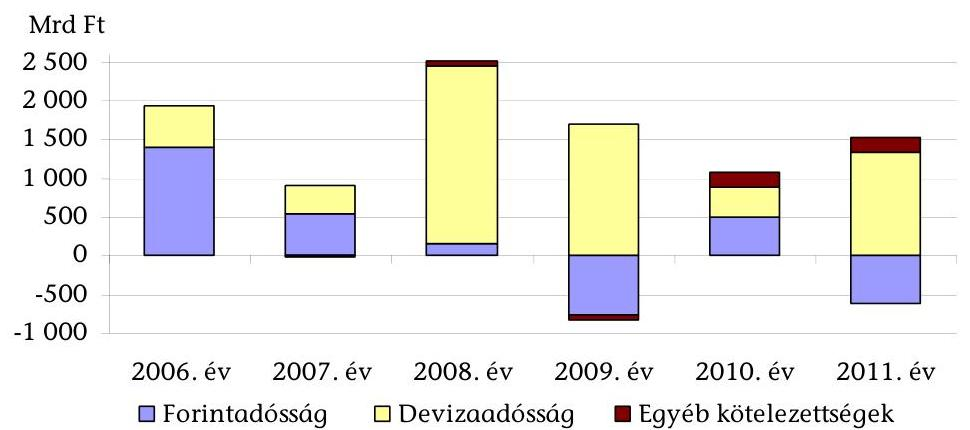

[^0]
[^0]:    ${ }^{41}$ Az Áht ${ }_{1}$ 2007. január 1-jétől 2011. december 31-ig hatályos rendelkezése államadósságként határozza meg a központi alrendszer, azaz a központi költségvetés, a társadalombiztosítási- és az elkülönített állami pénzalapok összevont konszolidált adósságát. Ez az adósság az önkormányzati alrendszer adósságát nem tartalmazza. A 2006. évi adatok konzisztensek a 2007-től nyilvántartott éves adatokkal.

---

Az államadósság növekedésével párhuzamosan változott az államadósság összetétele, a devizában fennálló adósság aránya a 2006. év eleji 28,1\%-ról 2011. év végére 48,5\%-ra nőtt. A forintadósság aránya 71,7\%-ról 49,4\%-ra csökkent eközben. A forintadósság 2006-2011 között összességében 13,2\%-kal (9153,5 Mrd Ft-ról 10362,2 Mrd Ft-ra), míg a devizaadósság 183,2\%-kal (3590,7 Mrd Ft-ról 10 170,4 Mrd Ft-ra) emelkedett.

A devizaadósság növekedését csak részben okozta az IMF és az EB hitelfelvétel, a devizakötvények év végi állománya - folyamatos növekedés mellett - szinte megduplázódott, a 2006. évi 2870,0 Mrd Ft-ról 2011-re 5712,3 Mrd Ft-ra nőtt. A devizában fennálló adósság árfolyam-különbözete a 2006-2011. évek között összesen 1656,7 Mrd Ft-tal növelte az államadósságot.

Az államadósság részét képezik az egyéb kötelezettségek. Az egyéb kötelezettségekbe a swap ügyletek miatt az ÁKK Zrt.-nél a partner felek által elhelyezett ún. mark-to-market betétek állománya ${ }^{42}$, valamint az átvállalt hitelekhez kapcsolódó, a korábbi időszakban felhalmozódott kamat tartozik bele. ${ }^{43}$ Az egyéb kötelezettségek aránya 0,1-2,1\% között változott az államadósságon belül a vizsgált időszakban.

Az évenkénti államadósság változását elsősorban a központi alrendszer finanszírozási igénye határozta meg. Módosítják továbbá az államadósságot az Áht ${ }_{1}$ 8/A. § (3) bekezdése szerinti finanszírozási tételek: az értékpapír-műveletek, a hitelfelvételek és törlesztések, a költségvetés adósság-átvállalásai, az MNB tartalékfeltöltése, az EU elszámolások megelőlegezése, az adósság portfóliókezelési műveletek (repó, piaci, devizapiaci műveletek és az árfolyamváltozás).

Az államadósság alakulására ható egyes tényezőket a 2009-et követően a zárszámadáshoz kapcsolódó tájékoztató adatok már nem mutatták be a korábbi gyakorlattól eltérően, ezért a 2009. költségvetési évtől az államadósság növekedésének okai, az adósságnövekedés kockázati tényezői a döntéshozók és a nyilvánosság számára nem (voltak) átláthatóak. (Pl. árfolyam-különbözet, az ÁKK Zrt. által végrehajtott pénzügyi műveletek eredménye, KESZ likviditásának változása, IMF hitelből képzett MNB betét állományának változása, az NYRA vagyonának változása.)

A 2006-2011. évek közötti adósságállomány-növekedés 8190,0 Mrd Ft volt az állományt növelő és csökkentő tételek eredményeként. A növekedés legnagyobb arányú összetevői a központi alrendszer hiánya (86,7\%), a központi költségvetés által átvállalt hitelek (8,8\%), az euró/forint árfolyamváltozása (20,2\%), valamint az IMF/EB hitelből képzett betét (5,3\%) voltak. Az NYRA által átvett és bevont állampapírok állománya és az NYRA egyéb eszközeinek el-

[^0]
[^0]:    ${ }^{42}$ Az ún. mark-to-market betétek elhelyezésének célja, hogy csökkentsék a swap ügyletekhez kapcsolódóan felmerülő partnerkockázatot. A felek rendszeresen kiértékelik az egymással kötött swap ügyletek piaci értékét (marking-to-market - piaci árazás). Az a fél, akinek oldaláról a swap piaci értéke csökkent, az a csökkenéssel megegyező összegben fedezeti betétet helyez el a másik félnél.
    ${ }^{43}$ Az egyéb kötelezettségeket az ÁKK Zrt. a forint- és devizaadósságtól elkülönítetten tartja nyilván.

---

adása 18,2\%-kal, további műveletek 2,8\%-kal csökkentették az adósság állományát (1. sz. melléklet).

A központi költségvetés hiánya 2006-2011 között 6834,4 Mrd Ft-tal, a társadalombiztosítás pénzügyi alapjai és az elkülönített állami pénzalapok összevont egyenlege 267,8 Mrd Ft-tal növelték az adósságállományt.

A központi költségvetési hiányhoz nagymértékben a kamatkiadások és -bevételek egyenlege járult hozzá (annak 86,4\%-át tette ki), amely a hat év alatt 5904,8 Mrd Ft volt. A kamatkiadásokat és -bevételeket nem tartalmazó elsődleges egyenleg 2008-2010 között pozitív volt, azaz a meglévő adósság, valamint annak finanszírozási költségei, illetve az árfolyamveszteség generálta a további adósságnövekedést.

A központi költségvetés hiánya és az elsődleges egyenleg alakulását a következő táblázat mutatja be:

|  |  |  |  |  |  | Mrd Ft |
| :--: | :--: | :--: | :--: | :--: | :--: | :--: |
|  | 2006. év | 2007. év | 2008.év | 2009. év | 2010. év | 2011. év |
| Eredeti hiányadat | 1531,0 | 1656,5 | 1117,6 | 660,8 | 836,0 | 613,3 |
| Módosított hiányadat | 1921,3 | - | - | 675,8 | 830,0 | 1184,2 |
| Tényleges hiány | 1961,6 | 1398,1 | 870,0 | 743,7 | 853,9 | 1727,1 |
| Kiadás | 8510,8 | 8498,1 | 9029,3 | 9067,9 | 9315,1 | 10069,3 |
| Bevétel | 6549,2 | 7100,0 | 8159,3 | 8324,2 | 8461,2 | 8342,2 |
| Kamategyenleg | 896,1 | 909,7 | 1061,0 | 1035,8 | 1004,6 | 997,6 |
| Elsődleges egyenleg (kamategyenleggel korrigált) | 1065,5 | 488,4 | -191,0 | -292,1 | -150,7 | 729,5 |

Míg a tényleges hiány 2006-ban és 2009-2011 között a költségvetési törvényben módosított összeget meghaladta, 2007-től 2009-ig a hiány nagymértékű csökkenése valósult meg. 2010-től ez a folyamat megfordult, az elsődleges egyenleg 2011-ben újra negatívvá vált, amelynek okai egyedi költségvetési intézkedések (pl. MOL részvényvásárlás, adósság-átvállalás) voltak.

A 2011. évi magasabb hiányt az állami vagyonnal kapcsolatos kiadásokon belül a MOL Nyrt. részvényeinek megvásárlása (498,6 Mrd Ft) és az MFB Zrt. tőkeemelése (120,0 Mrd Ft), az adósság-átvállalások (246,0 Mrd Ft) okozták. Az Európai Bíróság döntése alapján a magyar államnak az áfa visszatérítések miatt további 250,0 Mrd Ft kiadása keletkezett. A fenti tételek nélkül a központi alrendszer hiánya 626,9 Mrd Ft volt. (Ezen belül a központi költségvetés hiánya 606,5 Mrd Ft.)

A privatizációs befizetések (a teljes időszakon belül 407,0 Mrd Ft) és az EU támogatások megelőlegezései (640,2 Mrd Ft) a központi alrendszer hiányát nem tudták érdemben ellensúlyozni. Mindezen túl az MNB tartalékfeltöltései

---

67,3 Mrd Ft-tal ${ }^{44}$, az adósság-átvállalások 720,0 Mrd Ft-tal növelték az államadósságot 2006-2011 között.

Az autópálya-társaságok adósságának átvállalása 2006-ban 415,9 Mrd Ft-tal, 2007-ben 58,1 Mrd Ft-tal növelte az államadósságot. A 2011. évi 246,0 Mrd Ft-os adósság-átvállalás a MÁV Zrt.-hez (50,0 Mrd Ft), valamint a megyei önkormányzatokhoz (196,0 Mrd Ft) kapcsolódott.

Az autópálya-társaságok adósságának átvállalása az EUROSTAT jelzése alapján történt, már a 2005. évben sem lehetett költségvetésen kívül kezelni az autópá-lya-építéssel összefüggő állami kiadásokat. Az autópálya-társaságok átvállalt hitelei 2007-2018. évi lejáratúak.

A MÁV Zrt. adósságának átvállalását a Széll Kálmán Terv „Adósság és közösségi közlekedés" fejezete előirányozta. Az átvállalásra a MÁV Zrt. adósságának részletes átvállalásáról szóló 1451/2011. (XII. 22.) Korm. határozat alapján került sor.

A megyei önkormányzatok 2011. december 30-án fennálló adósságának, azok járulékainak, valamint a Fővárosi Önkormányzat adósságállománya egy részének átvállalása a megyei önkormányzati intézmények és a Fővárosi Önkormányzat egyes egészségügyi intézmények átvételéről szóló 2011. évi CLIV. törvény 5. § (1) bekezdése alapján történt.

Az euró/forint árfolyam változása a központi alrendszer adósságnövekedéséhez 1656,7 Mrd Ft-tal járult hozzá 2006-2011 között. A forint árfolyamának gyengülése 2007. évtől jelentkezett növelő tényezőként, ezen belül 2011-ben kimagaslóan, - a 2011. év végi 311,13 Ft/euró árfolyammal számolva - 1164,5 Mrd Ft-tal emelte meg az államadósságot. Az államadósság-állomány árfolyamkitettsége, árfolyam érzékenysége folyamatosan nőtt, mivel a devizaadósság az államadósság csaknem felét (48,5\%-át) tette ki 2011. év végére.

Az IMF hitelből képzett devizabetét 2008-ban 1561,3 Mrd Ft-tal, 2009-ben 436,0 Mrd Ft-tal növelte az államadósságot (év végi árfolyamon).

2011-ben a NYRA-tól átvett állampapírok bevonása 1407,1 Mrd Ft-tal, az NYRA által átvett értékpapírok értékesítéséből származó bevétel 80,7 Mrd Ft-tal csökkentette az államadósság állományát.

A TB nyugdíjrendszerbe visszalépő magán-nyugdíjpénztári tagok átadott portfóliójának árfolyamértéke 2011. május 31-én 2945,7 Mrd Ft értékű vagyon volt. 2011. novemberig az NYRA állampapírok és készpénz nélkül számított portfoliójából - melynek átvételi értéke 1416,0 Mrd Ft volt - 36,4\%-ot, azaz 515,2 Mrd Ft értékű eszközt értékesített az ÁKK Zrt. Az értékesített eszközök összesített adatai alapján a 2011. május 31-i átvételi árakhoz képest a portfolión az NYRA - az értékesítések során - 15,1 Mrd Ft összegű, 2,9\%-nyi értékvesztést realizált. Az értékesítések közvetlen költsége 53,3 M Ft volt.

[^0]
[^0]:    ${ }^{44}$ A 2011. XII. 31-ig hatályos a Magyar Nemzeti Bankról szóló 2001. évi LVIII. törvény 17. §-ának (4) bekezdése szerint a központi költségvetés köteles az MNB forint árfolyam kiegyenlítési tartalékát és deviza-értékpapírok kiegyenlítési tartalékát feltölteni, amenynyiben az negatív. Ez nem számít bele a költségvetési hiányba, ugyanakkor finanszírozandó tétel.

---

Az egyéb műveletek között elsősorban a KESZ állomány változását, a megelőlegezési számlák változását, a nettó devizabetét műveleteket (MNB számlák), a repó műveleteket, rulírozó hitelek felvételét, törlesztését számolták el.

A 2006-2011 közötti időszakban az uniós megelőlegezések állománya 640,0 Mrd Ft-tal csökkent. A KESZ év végi egyenlegeinek állomány változása 422,0 Mrd Ft-tal növelte, az év végi megelőlegezések egyenlegeinek változása 52,0 Mrd Ft-tal csökkentette az államadósság-állományt.

Az államadósság-állomány dinamikus növekedése ellenére jogszabályok annak csökkentésére és/vagy növekedésének korlátozására 2012-ig nem tartalmaztak alkalmazható előírásokat. A központi költségvetés hiányát konszolidáló intézkedéseket 2006-tól a kormányprogramok, az egyensúly javítását célzó lépéseket 2010-től kormányrendeletek
 és határozatok már tartalmazták.

A kormányprogramok fő célkitűzésként fogalmazták meg 2006 júniusától részleteiben módosuló eszközrendszerrel – a költségvetés egyensúlyi helyzetének javítását, a költségvetési hiány csökkentését.

A 2006 júniusában meghirdetett Új Egyensúly Program az államháztartás hiányának csökkentését a kormányzati szektor működési kiadásainak mérséklésével, az önkormányzati feladatellátás hatékonyabbá tételével, adóemeléssel, adókedvezmények szűkítésével kívánta elérni. A 2007. és 2008. évi költségvetési törvények tartalmazták az egyensúly javítása érdekében tervezett intézkedéseket pl. az egészségügy (biztosítási elv jobb érvényesítése, támogatások szűkítése, vizitdíj bevezetése, gyógyszertámogatások átalakítása), a nyugdíjrendszer (nyugdíjkorrekció, korhatár emelése), az ártámogatások (a pazarló támogatási rendszer megszüntetése, közlekedési támogatások átalakítása, gázár-támogatás szociális alapúvá változtatása), a közszféra (foglalkoztatott létszám csökkentése) területén.

A Kormány 2010-ben a hiánycélok elérése érdekében válságadókat vezetett be, továbbá átmeneti jelleggel a nyugdíjárulékok TB rendszerbe való befizetési kötelezettségét írta elő. 2011-ben folytatódtak a korrekciós intézkedések, a költségvetési szervek támogatásának részbeni zárolása, a Kormány irányítása alá nem tartozó szervezetek tartalékképzésének előírása, valamint a kizárólag saját bevételből gazdálkodó szervezetek befizetési kötelezettségeinek növelése.

A 2011. év márciusában bejelentett Széll Kálmán terv fő célkitűzése az államadósságnak a GDP 50%-ára való csökkentését, a költségvetési hiány további mérséklését, a gazdasági növekedés fokozásának követelményét írta elő.

A Kormány 2010. júniustól rendeleti és határozati szinten fogalmazta meg a központi alrendszer egyensúlyának javítását szolgáló intézkedéseket.

A 2010. évi költségvetéssel összefüggő egyes feladatokról szóló 1132/2010. (VI. 18.) Korm. határozatban a Kormány az irányítása alá tartozó fejezetek egyes fejezeti kezelésű előirányzatainak és az intézmények dologi kiadásai előirányzatainak zárolását írta elő, míg a 2010. évi költségvetési egyenleg teljesítéséhez szükséges intézkedésekről szóló 1268/2010. (XII. 3.) Korm. határozat ugyanezen fejezetek 2010. decemberi kiadásait maximálta a novemberben teljesített szinten.

A 2012. évi költségvetési hiánycél tartása érdekében a 1334/2011. (X. 13.) Korm. határozat a megtervezett előirányzatok teljesítéséhez részletes intézkedési terv készítését írta elő. A hiánycél tartását biztosító további feladatokat (szervezeti és

---

feladatellátási felülvizsgálati programok elindítása) a 2012. évi költségvetési hiánycél tartását biztosító további feladatokról szóló 1365/2011. (XI. 8.) Korm. határozat tartalmazta.

A költségvetési fegyelem megteremtése mellett az államadósság-állomány növekedésének korlátozására irányult a KF tv., melynek alkalmazására azonban nem kerülhetett sor, mert a stabilitási tv. hatályon kívül helyezte. Az államadósság csökkentésének szándéka kiemelt jelentőségű, arra az Alaptörvény fogalmazott meg előírást. A végrehajtás érdekében a stabilitási törvény rögzítette az államadósság-mutató számításának kötelezettségét, azonban nem írta elő az államadósság tényleges alakulása okainak bemutatását, átláthatóságát.

A KF tv.-ben foglalt szabályozások célja az államadósság fenntartható szintjének biztosítása és a kormányzati kiadások féken tartása volt. Az adósságszabály bevezetését írta elő, amely szerint az államadósság nem növekedhet az inflációnál gyorsabban.

Az Alaptörvény 36. cikkének (4) bekezdése szerint az Országgyűlés nem fogadhat el olyan költségvetési törvényt, amelynek eredményeként az államadósság mértéke meghaladhatja a teljes hazai össztermék felét. Az Alaptörvény eltérést tesz lehetővé a nemzetgazdasági egyensúly helyreállításához szükséges mértékben, különleges jogrend idején vagy a nemzetgazdaság tartós és jelentős visszaesése esetén.

A stabilitási tv. 2015. évtől hatályos adósságszabálya szerint a tervezett adósság növekedési üteme nem haladhatja meg a költségvetési évre várt infláció és a bruttó hazai termék reál növekedési üteme felének a különbségét.

A Kormány a tényadatok alapján félévente köteles felülvizsgálni az adósságszabály érvényesülését, illetve az Alaptörvényben foglalt „tartós és jelentős” visszaesés költségvetési év közbeni bekövetkezése esetén a költségvetésben foglalt teljesítési kötelezettségek felfüggesztésre kerülnek.

# 2. A MAASTRICHTI ADÓSSÁGMUTATÓ ALAKULÁSA 

Magyarország euró zónához való csatlakozásának feltétele az ún. maastrichti kritériumok teljesítése. A kritériumok közül kettő az államháztartás teljesítményére vonatkozik. Az euró zónába belépni kívánó államnak az államháztartási hiány/GDP mutatója nem lehet magasabb, mint 3%, az államadósság/GDP mutatójának (adósságráta) pedig alacsonyabbnak kell lennie, mint 60%. Utóbbi esetében elfogadható lehet a 60%-nál magasabb mutató, amennyiben az csökkenő tendenciát mutat.

A maastrichti adósság tartalmában ${ }^{45}$ és számítási módszerében is eltér az Áht ${ }_{1}$ szerinti államadósságtól. A maastrichti adósságot eredményszemléletben, konszolidáltan, illetve névértéken a statisztikai értelemben vett kormányzati szektorra vonatkozóan az MNB mutatja ki. Az uniós statisztika szerint meghatározott kormányzati szektor szélesebb szervezeti kör, mint az államháztartás. A központi és az önkormányzati alrendszer mellett a kormányzati szektor részét képezik az abba sorolt szervezetek, gazdasági események is. A kormányzati szektorba tarto-

[^0]
[^0]:    ${ }^{45}$ 2012-től a stabilitási tv. szerinti államadóssággal megegyező.

---

zó szervezeteket a KSH és az MNB jelöli ki. Az éves KSH felülvizsgálatok alapján 2007-től 10, 2009-től újabb 11 további szervezet kormányzati szektorba történő besorolásáról döntöttek. A szervezetek, illetve gazdasági események (garancia, hitel) kormányzati szektorba való besorolásának alapja azok állami támogatási tartalma.

A maastrichti adósság mértéke Magyarország esetében a 60%-os konvergencia kritérium értékét 2006-2011 között végig meghaladta. A kormányzati szektor bruttó adóssága a 2006. évi 15 592,5 Mrd Ft-ról (a GDP 65,9%-áról) 2011. III. negyedévéig 47,1%-kal 22 930,6 Mrd Ft-ra (a GDP 82,6%-ára) nőtt. Ebben szerepet játszott a GDP adósságtól elmaradó növekedése. A GDP 2006-2011 III. negyedév között összesen 26,1%-kal bővült.
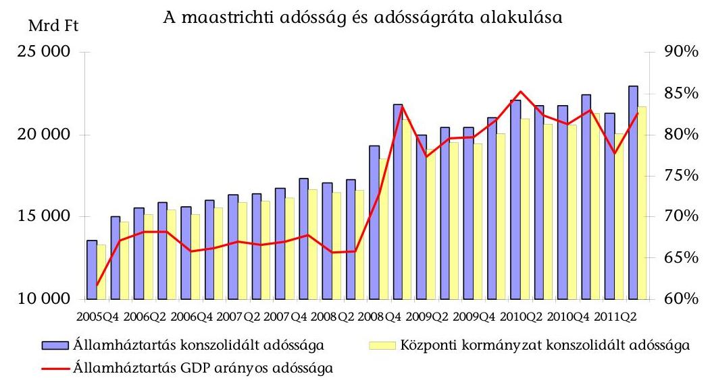

Az EU csatlakozáskor vállalt adósságcél nem teljesítését az EU 2011-ig nem szankcionálta ${ }^{46}$. A konvergencia programok véleményezésekor deficit és adósságcsökkentő ajánlásokat azonban megfogalmaztak.

A Kormány a középtávú adósságcélokról konvergencia programban, a tervszámok teljesüléséről EDP jelentésben számol be az Európai Tanács és az EB számára. A programokban 3-5 éves időtávra kidolgozott prognózisok adósságcsökkenő pályát irányoztak elő. Az adósság tervezett mértéke az EUROSTAT-nak a Gripen vadászgépek beszerzési költségei ( $94,4 \mathrm{Mrd}$ Ft) és a PPP konstrukcióban épült autópályák ( $61,6 \mathrm{Mrd}$ Ft) elszámolásairól hozott döntésének következtében 2005-ről 2006-ra 10-15 százalékponttal nőtt. Az EUROSTAT döntései alapján ezen beruházásokkal kapcsolatos kiadásokat a kormányzati szektoron belül kell elszámolni. 70% alatti adósságcélt a 2007. évi program tartalmazott utoljára.

A pénzügyi válságnak való kitettséget az Európa Tanács 2009. márciusban keltezett véleményében megerősítette, azonban rögzítette, hogy az addig tervezett deficitcsökkentési pálya kockázatnak volt kitéve, mivel a Kormány a ténylegesnél kedvezőbb makroökonómiai feltételezésekkel élt a tervezés során. A Tanács

[^0]
[^0]:    ${ }^{46}$ Az Európa Tanács 2012. március 6-án Magyarország Kohéziós Alapból folyósított támogatásai egy részének feltételes felfüggesztéséről döntött, majd júniusban megszüntette azt.

---

2009. júliusi ajánlásában előírta, hogy a Kormány 2011-re irányozza elő a deficit 3% alá szorítását, illetve elfogadta a 2010. év végére előrejelzett 82%-os adósságrátát.

Az EDP jelentést a maastrichti hiány- és adósságmutatóról az MNB-PM-KSH közötti együttműködési megállapodás alapján a KSH állítja össze. A maastrichti adósság adatait az MNB az általa vezetett pénzügyi számlák adatai alapján szolgáltatja.

A KSH honlapján megtalálható EDP jelentések nyilvánosak, a konvergencia programokban foglalt hiányra és adósságra vonatkozó tervadatok teljesülésének ellenőrzésére alkalmasak, részletes magyarázatot azonban nem tartalmaznak a nem teljesülés okaira.

A MNB-PM-KSH közötti 2004. évi megállapodást nem frissítették, annak ellenére, hogy az EUROSTAT Magyarországon végzett tárgyalásai, vizsgálatai alapján egy részletes formai megállapodás megkötését javasolta.

Az ÁKK Zrt. által kimutatott Áht ${ }_{1}$ szerinti adósság és a maastrichti adósság éves adatai közti eltérést (ún. ESA-híd), azok okait, a maastrichti adósság növekedésének jelentősebb tételeit a zárszámadási törvényjavaslatok indoklása tartalmazta.

Az adósságot jelentősen módosította a Richter részvények privatizálása során alkalmazott kötvény-kibocsátásos technika (a kormányzati szektor adóssága 2006-ban 161,2 Mrd Ft-tal, 2007-ben 161,9 Mrd Ft-tal, 2008-ban 168,8 Mrd Ft-tal, 2009-ben 225,7 Mrd Ft-tal és 2010-ben 232,3 Mrd Ft-tal nőtt). A Nemzeti Autópálya Zrt. adóssága 2006-ban 27,7 Mrd Ft-tal, az Állami Autópálya Kezelő Zrt. adóssága 2006-ban 33,9 Mrd Ft-tal, a Művészetek Palotája (MÜPA) Nonprofit Kft. adóssága 2009-ben 20,0 Mrd Ft-tal, a Gripen repülőgépek beszerzése 2010-ben 94,4 Mrd Ft-tal növelte a kormányzati szektor adósságát.

A 2008. évi KSH felülvizsgálat alapján kormányzati körbe bekerült 10 non-profit szervezethez kapcsolódó adóssághatás 2008-ban 2,5 Mrd Ft, 2009-ben 2,8 Mrd Ft és 2010-ben 75,0 Mrd Ft volt. Ez utóbbi összegből a legnagyobb hányadot a Nemzeti Filharmónia Zrt. (MÚPA projekt) képviselt 40,7 Mrd Ft összegben.

Az IMF hitelből lehívott összegből betétként elhelyezett összeg a kormányzati szektor adósságát is növelte, 2008-ban 1483,6 Mrd Ft-tal, 2009-ben 1124,8 Mrd Ft-tal és 2010-ben 974,1 Mrd Ft-tal (betét elhelyezés napja árfolyamán).

# 3. AZ ÁLLAMADÓSSÁGGAL KAPCSOLATOS DÖNTÉSHOZATALI RENDSZER ÉRTÉKELÉSE 

Az államadósság-kezelési, elszámolási és nyilvántartási feladatok szervezetekhez (ÁKK Zrt., Kincstár) való rendelése a jogszabályokkal összhangban történt. A bővülő adósságkezelési feladatokat az érintett szervezetek alapító okiratain és SZMSZ-ein folyamatosan átvezették.

Az ÁKK Zrt. alapító okirata szerint a társaság gondoskodik a központi költségvetés fizetőképességének fenntartásáról, központi költségvetést terhelő adósság, valamint az állam átmenetileg szabad pénzeszközeinek kezeléséről, nyilvántartja a központi költségvetést terhelő adósságot. Az ÁKK Zrt. feladatait 2006-tól az állami kezesség mellett hitel- és kölcsönfelvétellel, illetve értékpapír kibocsátással, 2007-től az államadósság számítási, tájékoztatási kötelezettségével, a másodlagos piacon folytatott sajátszámlás kereskedéssel, letéti őrzési feladatokkal, tanácsadási és közreműködői tevékenységgel, 2010-ben a Nyugdíjreform és Adósságcsökkentő Alap eszközeinek kezelésével és értékesítésével (a magánnyugdíjpénztári vagyon átvételét követően) kapcsolatos, Áht ${ }_{1}$-ben is meghatározott feladatokkal bővítették.

A Kincstár adósságkezeléssel összefüggő feladata a központi alrendszer általa vezetett egyéb számlák egyenlegének előrejelzése, amelyhez az adósságkezeléssel összefüggő napi adatokat az ÁKK Zrt. bocsátja rendelkezésre. Gondoskodik az állam által vállalt kezességek, garanciák, viszontgaranciák és nyújtott hitelek az állam nemzetközi pénzügyi és számviteli elszámolásainak, többéves kihatással járó pénzügyi kötelezettségvállalásainak, az állam követeléseinek nyilvántartása, a kötelezettségek teljesítése, a követelések kezelése, a visszterhes támogatások visszafizetése jogszabályban meghatározott feladatainak ellátásáról. A Kincstár a Nyugdíjbiztosítási Alapnak, az Egészségbiztosítási Alapnak, a területfejlesztési tanácsoknak és munkaszervezeteiknek, továbbá a Fővárosi Önkormányzatnak a budapesti 4-es metróvonal megépítésével kapcsolatos általános forgalmi adó megfizetésére részére likviditási és megelőlegezési hitelt nyújthat a KESZ terhére, annak forrásaiból. (2011. május 15-től a Kincstár a kincstári egységes számla terhére, annak forrásaiból kamatmentes megelőlegezési kölcsönt nyújthat a Nyugdíjreform és Adósságcsökkentő Alapnak is.)

A Kincstár és az ÁKK Zrt. az adatszolgáltatási, a likviditáskezelési és az egyéb feladataik megosztását többször módosított együttműködési megállapodás alapján végezték.

Az adósságkezelésben részt vevő szervezetek, az ÁKK Zrt. és az adósságkezelési tevékenységért felelős államháztartásért felelős miniszter ${ }^{47}$ együttműködése, az irányítási és a döntéshozatali rendszer a vizsgált időszakban nem segítette teljes mértékben a hatékony adósságfinanszírozást. A tulajdonosi/alapítói jogokat a pénzügy-, illetve a nemzetgazdasági miniszter gyakorolta. A Gt. 19. § (5) bekezdése alapján a közgyűlés hatáskörébe tartozó kérdésekben a tulajdonosi jogokat gyakorló döntött és gyakorolta a társaság legfőbb szervének jogait. Az irányítást az ÁKK Zrt. igazgatósága látja el (felel az alapító határozatainak végrehajtásáért), a működés kontrollját pedig az FB, a belső ellenőr és a könyvvizsgáló végzi.

A stratégiai döntéshozatal alacsonyabb szintre átadása volt jellemző 2010-ig. Az adósságkezelési stratégia, az éves finanszírozási terv és a teljesítménymutatók jóváhagyása miniszteri szintről szakállamtitkári szintre, a finanszírozási terv –
 meghatározott kereteken belüli évközi módosításának jóváhagyása alapítótól igazgatósági hatáskörbe, a deviza forrásbevonási döntés igazgatósági hatáskörből a vezérigazgatói szintre került. Azt belső szabályozással részben tovább delegálták: az ÁKK Zrt. Finanszírozási bizottsága hatásköre volt a devizakötvény kibocsátások részletfeltételeire vonatkozó döntés. Az adósságkezeléssel kapcsolatos stratégiai döntéseket (adósságkezelési stratégia, finanszírozási terv és a teljesítménymutatók jóváhagyása) 2010. februárig - az alapítói hatáskörök egy részének delegálásával - szakállamtitkár, ezt követően a nem-

[^0]
[^0]:    ${ }^{47}$ A 2010. évi kormányváltásig pénzügy-, majd nemzetgazdasági miniszter.

---

zetgazdasági miniszter hozta. A pénzügyminiszter a 2008-2009. évi válság időszakában sem hozott az adósságkezelés feladataihoz kapcsolódóan alapítói határozatot. A finanszírozás végrehajtásáért ugyanakkor - az Áht ${ }_{1}$ és a pénzügyminiszter feladat- és hatásköréről szóló statútum ${ }^{48}$ szerint is - a pénzügyminiszter volt a felelős. Ennek alapján szakmailag is elvárható, hogy a stratégiai döntéseket az államháztartásért felelős miniszter gyakorolja.

A szakállamtitkár az alapítói határozatok meghatározó részét (2006-ban 23-ból 9-et, 2007-ben 16-ból 7-et, 2008-ban 11-ből 6-ot, 2009-ben 11-ből 8-at és 2010-ben 1-et) írta alá 2006. július 14-től 2010. február 5-ig, miközben 2009. április 16-tól az államháztartásért felelős miniszter személye is változott. A pénzügyminiszter alapítóként a vezetők személyi béréről, az igazgatóság és az FB tagjainak, elnökének megválasztásáról, visszahívásáról, az Alapító okirat módosításáról döntött.

A stratégiai döntések szakállamtitkárhoz való delegálása a pénzügyminiszter által 2006. július 14-én kiadott felhatalmazással történt. Abban hivatkozási alapként az állam tulajdonában lévő vállalkozói vagyon értékesítéséről szóló 1995. évi XXXIX. törvény mellékletét ${ }^{49}$, a pénzügyminiszter feladat- és hatásköréről szóló 140/2002. (VI. 28.) Korm. rendeletet és a PM SZMSZ-t jelölték meg. A PM SZMSZ-re történő hivatkozás nem volt helytálló, mivel a felhatalmazás létrejöttének idején hatályos PM utasítás ${ }^{50}$ „Egyes, a pénzügyminisztert illető hatáskörök delegálása, illetve kiadmányozásra jogosultak kijelölése" c. 4. sz. függelékében nem szerepelt sem az adósságkezelést, sem az ÁKK Zrt.-t érintő jogkörök delegálása. Ezen túl a szakállamtitkár az átadott jogköröket a Gt.-ben előírt egy év helyett több évig gyakorolta.

A Gt. 213. §-a alapján az alapító részvényesi jogait képviselő útján is gyakorolhatja, azonban a képviseleti meghatalmazás legfeljebb 12 hónapra szólhat. A szakállamtitkár felhatalmazásában időtartamot nem rögzítettek.

A pénzügyminiszter a felelősségi körébe tartozó stratégiai döntéseket utólagos tájékoztatás mellett adta át, ugyanakkor a felhatalmazásban szereplő beszámolási jogokat nem érvényesítették. A döntési hatáskörök delegálására vonatkozó rendelkezésekkel nem aktualizálták sem a PM SZMSZ-ét, sem az ÁKK Zrt. igazgatósági ügyrendjét és az ÁKK Zrt. SZMSZ-ét sem. A szakállamtitkár amellett, hogy a pénzügyminiszter nevében gyakorolta a stratégiai döntéseket, tagja volt az igazgatóságnak is, azaz egy személyben gyakorolta az irányítói és végrehajtói feladatokat ${ }^{51}$.

Az alapító delegáltja a stratégia, a finanszírozási terv és a teljesítménymutatók jóváhagyásán túl érdemi ellenőrzési tevékenységet nem gyakorolt a felelősségi körébe tartozó adósságkezeléssel kapcsolatban. A tulajdonosi/irányítási kontroll így nem tudott érvényesülni. A szakmai feladatellátásnak, így a központi

[^0]
[^0]:    ${ }^{48}$ 169/2006. (VII. 28.) Korm. rendelet a pénzügyminiszter feladat- és hatásköréről
    ${ }^{49}$ A tulajdonosi jogokat gyakorló miniszter kijelölését tartalmazza.
    ${ }^{50}$ a PM Szervezeti és Működési Szabályzatáról szóló 6/2006. (MK 94.) PM utasítás
    ${ }^{51}$ Az alapítói hatáskörbe tartozó kérdésekben való döntések delegálása megítélésünk szerint nem egyenértékű az ÁKK Zrt. igazgatóságában történő ügyvezetési jellegű feladatok ellátásával.

---

alrendszer adósságnövekedése indokoltságának és szükségszerűségének PM/NGM Ellenőrzési Főosztálya általi felügyeleti (tulajdonosi) ellenőrzésére 2006-2011 között nem került sor és arra az FB hatásköre sem terjedt ki.

Az államadósság-csökkentési célok prioritásával összhangban 2010-től a stratégiai döntéshozatal újra miniszteri szintre került. Az alapító a Gt. szerinti tulajdonosi döntések (az igazgatóság, a vezérigazgató és az FB tagok kinevezése, az ügyrendek, az SZMSZ és az üzleti terv jóváhagyása, éves beszámoló elfogadása) mellett gyakorolta az államadósság-kezeléssel kapcsolatos döntési jogokat is.

Az alapító államadósság-kezeléssel kapcsolatos hatáskörébe tartozó döntések: az államadósság-kezelési stratégia jóváhagyása, a központi költségvetés folyó műveleteinek egyenlegét és az adósságkezelési műveleteket, az éves hiteltörlesztéseket, állampapír visszafizetéseket, hitelfelvételeket, állampapír kibocsátásokat, az adósság átvállalásokat magába foglaló finanszírozási terv jóváhagyása, annak felülvizsgálata és módosítása, az államadósság-kezelés során érvényesítendő teljesítménymutatók jóváhagyása.

A döntési hatáskörök és a felelősségi körök 2006-2011 között nem voltak egyértelműen szabályozottak az ÁKK Zrt. dokumentumaiban (SZMSZ, bizottsági ügyrendek). Az SZMSZ szerint a vezérigazgató szakmai feladat- és hatásköreként a belföldi állampapír kibocsátások engedélyezését rögzítette és nem tartalmazott rendelkezéseket a devizakötvény kibocsátásokra és a hitelfelvételekre. 2007 januárjától igazgatósági határozat alapján bővült az ÁKK Zrt. vezérigazgatójának hatásköre a devizakötvény kibocsátási döntésekkel. Az SZMSZ-t a hatáskör módosítással azonban nem aktualizálták. A nem egyértelműen meghatározott feladat- és hatáskörök kockázatot jelentenek a döntések átláthatósága és számon kérhetősége tekintetében.

Az ÁKK Zrt. igazgatóságának alapvető hatásköre a Gt. 15. §-a szerinti feladatok mellett a stratégiai, szakmai döntésekben történő javaslattétel. Emellett felülvizsgálja az éves finanszírozási tervet, ellenőrzi a teljesítménymutatók alakulását és benyújtás előtt előzetesen jóváhagyja az alapító hatáskörébe tartozó előterjesztéseket. Az ügyrend szerint ülésen kívüli határozathozatallal is hozhatnak döntéseket, azonban a döntések körét a szabályozás nem tartalmazta. Kockázatot jelent, hogy kiemelt jelentőségű (2010. évi finanszírozási terv elfogadása, hitelfelvétel) döntéseknél eltekintettek az arra vonatkozó előterjesztés megtárgyalásáról.

Az igazgatóság a 39/2009. (09. 24.) sz. határozatával levél szavazás útján hagyta jóvá a 2010. évi kamat-előirányzatokat megalapozó módosított finanszírozási tervet. Az igazgatóság 100 M euró hitel felvételéről döntött levél szavazás útján a 18/2008. (04. 14.) sz. határozatával.

Az igazgatóság hatásköre, összetétele és létszáma többször változott. Feladatai 2006. november 30-ától csökkentek a devizakötvények kibocsátásának jellemzőire (időzítés, devizanem, mennyiség, futamidő és ársáv) vonatkozó döntési jogkörrel és 2007. május 30-ától nőttek a finanszírozási terv meghatározott kereteken belüli évközi módosításának jóváhagyásával.

---

Az igazgatóság létszáma 2006. évi 7-ről 2007 májusára 3 főre, ülései száma évi 13-14-ről 5-7-re csökkent. 2010-ben több mint 6 hónapig (március 29-től október 15-ig) az igazgatóság nem ült össze, döntéseket nem hozott.

Az igazgatóságba az ÁKK Zrt. vezérigazgatója és általános vezérigazgató-helyettese mellett a PM 2006. július 28-ig 5, 2007. május 28-ig 3 tagot delegált. Az igazgatósági tagok mandátumának 2007. május 28-ai lejárta után az alapító 3 főt (vezérigazgató és 2 minisztériumi delegált) nevezett ki. Az igazgatóság ülésein meghívottként részt vett az MNB és a Kincstár képviselője.

2010 decemberétől az alapító a 12/2010. (XII. 13.) sz. határozatával módosította az ügyvezetési struktúrát, az igazgatóságot a vezérigazgatói tisztségtől elkülönítette. Az SZMSZ alapján az adósságkezelési stratégia kidolgozásáért, felülvizsgálatáért és végrehajtásáért felelős vezérigazgató nem tagja az igazgatóságnak. A 3 tagú igazgatóság tagjai a NGM államtitkárai voltak.

Az ÁKK Zrt. vezérigazgatója az alapító és az igazgatóság által adott felhatalmazás alapján az operatív döntéseket hozta, feladata az éves finanszírozási tervben foglalt adósságkezelési műveletek végrehajtása volt. Az adósságkezelés keretében a legfontosabb döntéseket (aukciók, jegyzések meghirdetése, eredményének meghatározása, devizaforrás paraméterek, likviditáskezelési műveletek, kamatprognózisok) az ÁKK Zrt. vezetőiből álló bizottságok hozták. A piaci - forint és a deviza - forrásbevonás eljárási rendje 2007-től egységesítésre került, a forrásbevonásokról az ÁKK Zrt. Finanszírozási Bizottsága előterjesztése alapján a vezérigazgató döntött.

Az operatív működés biztosítása érdekében a társaságnál döntéshozatalra jogosult testületként a Finanszírozási, a Piaci és a Kamatprognózis Bizottságok, döntés előkészítő testületként a Javaslattevő és a Marketing Bizottságok működnek. A bizottságok feladatait, összetételét és működésük részletes szabályait a vezérigazgató utasításban szabályozta.

Az ÁKK Zrt. az állandó bizottságok ügyrendjéről szóló szabályzatában rögzítette az állampapírok forgalomba hozatalához kapcsolódó szabályokat, eljárási rendet. Az ÁKK Zrt. Finanszírozási Bizottsága hatáskörébe tartoznak az állampapír kibocsátásokkal, a kötvénycsere aukciókkal kapcsolatos operatív döntések (mennyiségek meghatározása, ajánlattételek elfogadása), a nem kompetitív értékesítésre felajánlott mennyiségek meghatározása. Az ÁKK Zrt. hatáskörébe tartozó adósságkezelési célú hitelek felvételéről a Finanszírozási Bizottság előterjesztése alapján az ÁKK Zrt. igazgatósága döntött.

Az ÁKK Zrt. működését a Felügyelő Bizottság ellenőrzi, hatásköre azonban nem terjedt ki az adósságkezelési stratégia, a teljesítménymutatók és a finanszírozási tervek véleményezésére. Az FB irányítja a belső ellenőrzést. A belső ellenőrzési feladatokat 1 fő látja el. A belső ellenőr éves ellenőrzési terv alapján minden évben ellenőrizte az adósságleltárt és figyelemmel kísérte a külső ellenőrzések megállapításai nyomán tett intézkedéseket.

Az adósságkezelési tevékenység értékelésére az államadósság teljesítménymutatóinak alakulásáról szóló negyedéves jelentések, a(z aktualizált) finanszírozási tervek, az adósságkezelési stratégia, valamint az ÁKK Zrt. vezérigazgatójának és a vezérigazgató-helyettesek prémium- és célfeladatai teljesülésének az igazgatóság, illetve az alapító általi elfogadásával került sor.

---

A vezérigazgató és a vezérigazgató-helyettesek részére az igazgatóság és az FB jóváhagyásával fizettek ki 2006-2011 között az éves alapbérük 75, illetve 65%-ának megfelelő prémiumot, ezen felül 3, illetve 1,5 havi (cél)jutalmat. A 2006. évi célfeladatokra - a vezérigazgatónak és a vezérigazgató-helyetteseknek - történt kifizetések indoklása alapján a jutalom nem volt arányban az elvégzett feladatokkal, illetve felelősséggel. Annak indoka az üzleti tervben meghatározott 2006. évi feladatok, a vezérigazgató prémium feladatainak várható teljesülése, valamint az „üvegzseb törvényből eredően a többségi befolyás alatt álló gazdasági társaság vezető állású munkavállalóira vonatkozó javadalmazási elvekből illetve a 2006. szeptember 1-jétől érvényben lévő adótörvény változásokból eredő hátrányok részbeni kompenzálása" voltak.

Nem jelentett az alapfeladaton túlmutató többletfeladatot a 2006-2009. évi prémiumfeladatok döntő része, mivel azok a vezérigazgató, illetve a vezérigazgató-helyettesek felelősségi körébe tartozó SZMSZ szerinti feladatok voltak. A prémium célkitűzések 55%-át az ÁKK Zrt. az Áht ${ }_{1}$-ben meghatározott alapfeladatai - a finanszírozási tervben megfogalmazott adósságkezelési feladatok folyamatos végrehajtása, felülvizsgálata, a várható kamatkiadások figyelemmel kísérése, optimalizálása és a teljesítménymutatóknak való megfelelés (45%), a következő évi finanszírozási terv előkészítése (10%) - további követelményeket az ÁKK Zrt. éves üzleti eredménytervének teljesítése (35%), valamint egyéb feladatokra (10%) adták. A prémiumfeladatokra történt kifizetések így nem voltak arányban az elvégzett feladatokkal, illetve felelősséggel.

A prémium kifizetésekkel kapcsolatban a vezérigazgató 2008. évi prémiumának kifizetésére vonatkozó egyszemélyes döntés az igazgatósági döntéshozatal szabályainak nem felelt meg ${ }^{52}$.

A 2009. évi prémium és célfeladatok kitűzését, valamint a 2008. évi céljutalom kifizetésének engedélyezését tárgyaló igazgatósági ülésen az elnök 2 tag részvétele mellett határozatképesnek minősítette az ülést. A prémiumról 1 igen szavazattal és 1 tartózkodással döntöttek, ami érvénytelennek minősül. Az igazgatóság ügyrendje szerint „Amennyiben az igazgatóság 3 (három) tagból áll és az ülésen csak 2 (kettő) tag van jelen, akkor határozatot hozni csak egyhangúlag lehet".

Az ÁKK Zrt. 2010-től hatályos - a pénzügyminiszter által jóváhagyott - javadalmazási szabályzata a köztulajdoni törvény ${ }^{53}$ 5. § (2) bekezdésének előírásával való összhangot úgy teremtette meg, hogy az üzleti terv részének tekintette az Áht ${ }_{1}$ 113/A. § (2) bekezdésének a) pontja szerinti alapfeladatok ellátását (az
 adott évre vonatkozó finanszírozási terv teljesítését, illetve annak keretében a központi alrendszer finanszírozásának és a KESZ megfelelő likviditásának biztosítását is).

Az igazgatóság döntése szerint 2011-től átalakították a javadalmazási rendszert, mely szerint csak pontosan körülírt, kiemelkedő jelentőségű feladatok

[^0]
[^0]:    ${ }^{52}$ Az ÁKK Zrt. tájékoztatása szerint „a vezérigazgató 2008. évi prémiumfeladatára vonatkozó egyszemélyes döntést egyfelől az indokolta, hogy ha a döntés nem született volna, annak munkajogi következményei lettek volna, hiszen a vezérigazgatói munkaszerződés kifejezetten rendelkezett a prémium kitűzési és megállapítási kötelezettségről, illetve a határidőkről".
    ${ }^{53}$ a köztulajdonban álló gazdasági társaságokról szóló 2009. évi CXXII. törvény

---

határozhatók meg prémium- és célfeladatként, ennek ellenére a szabályzat továbbra is az üzleti terv részeként kezeli és premizálja önmagában a finanszírozási terv teljesítését, nem határozva meg azon belül a kiemelkedő jelentőségű prémiumfeladatok körét.

A vezérigazgató és vezérigazgató-helyettesek javadalmazására vonatkozó új szabályzat szerint prémiumfeladatokként pontosan körülírt, kiemelkedő jelentőségű feladatok vagy feladatcsoportok kerülhetnek meghatározásra. Célfeladat az adósságkezelési tevékenységgel közvetlenül nem összefüggő, ugyanakkor anyagi és/vagy erkölcsi előnyöket eredményező oktatási, képzési, kutatási stb. projektekkel összefüggésben, eseti jelleggel kerülhet kitűzésre.

A 2008-ban kezdődő válságra a PM késve reagált annak ellenére, hogy az adósság finanszírozást végrehajtó ÁKK Zrt. 2008. év elejétől több alkalommal tájékoztatta a pénzügyminisztert a nemzetközi gazdasági folyamatoknak a magyar állampapírpiacot érintő hatásairól, finanszírozási tendenciájában tapasztalt kockázatokról.

Az ÁKK Zrt. a kereslet visszaesése következtében 2008 márciusában csökkentette az államkötvény-kibocsátásokat és ennek kompenzálásaként növelte a diszkont kincstárjegyek kibocsátásait, valamint előbbre vitte a nemzetközi fejlesztési hitelek lehívásait. 2008. szeptemberben a 15 éves aukciót, októberben az 5 éves kötvényaukciót törölték, majd az év hátralévő részére szüneteltették a kötvénykibocsátásokat.

A Kormány a válságkezelés keretében módosította a magán-nyugdíjpénztári portfoliószabályozást 2008. október 13-i hatállyal, amely kötelezettséget nem jelentett az állampapír vásárlásra. A módosítást követően is mintegy 150 Mrd Fttal mérséklődött az állampapír állomány.

A finanszírozásra és költségvetésre gyakorolt hatását tekintve a legjelentősebb válságkezelési intézkedés a nemzetközi szervezetektől való nagy volumenű forrásbevonás volt. Az IMF/EB hitel megállapodásokban foglalt hitelcél a finanszírozási kockázatok csökkentése érdekében az ország devizatartalékának emelése és a banki mentőcsomag finanszírozásán túlmenően a befektetői bizalom helyreállítása volt.

Az ÁKK Zrt. álláspontja szerint „...az államadósság-kezelés igénye nem indokolta az IMF hitel ilyen gyors felvételét". Az IMF hitelrészletek lehívásának időpontja és felhasználása alapján ezt az ellenőrzésünk is alátámasztja. A 2008 novemberében felvett hitel célok szerinti felhasználása 2009 áprilisától kezdődött, addig a lehívott első részlet 4,9 Mrd eurós összegét az MNB-nél helyezték el devizabetétként.

Az IMF-től lehívott első részlet teljes egészében betétként az MNB-nél került elhelyezésre, amelyből 600 Mrd Ft-nak megfelelő devizaösszeg a bankmentő csomag fedezetére fordítottak. A fennmaradó 3 Mrd euró az állam biztonsági tartalékát képezte.

Az IMF hitel lehívásakor a döntéshozók - a PM-en belül és a PM-ÁKK Zrt. között is - napokon belül egymásnak ellentmondó intézkedéseket hoztak az IMF hitelrészlet lehívására jogosultról és annak mértékéről. Az első IMF hitelrészlet lehívására történt államtitkári intézkedést a pénzügyminiszter felülbírálta, az

---

IMF hitel lehívásának első részletét 2,0 Mrd SDR-ről 4,3 Mrd SDR-re (felvételkor 4,9 Mrd euró, illetve 1300,8 Mrd Ft) emelte. Az IMF hitel harmadik részletét a pénzügyminiszter döntése alapján az ÁKK Zrt. helyett az MNB hívta le az államadósság növekedésének minimalizálása, a devizatartalék emelése céljából. A lehívás indokoltságát a PM dokumentumokkal nem támasztotta alá. A magyar állam - nevében a PM és az ÁKK Zrt. - ugyanakkor 2009 júliusában az MNB javára lemondott hitellehívástól kedvezőtlenebb feltételekkel (3,95%-os hozamfelárral) bocsátott ki 1000 M euró értékben. Az IMF hitel első lehívásából - a bankmentő program keretében tőkeemelésre, illetve garancianyújtásra elkülönített, - fel nem használt betétállomány (2072,4 M euró) mellett nem volt indokolt a devizakötvény kibocsátás.

Az IMF által biztosított hitelkeretből 2008-2009-ben 4 lehívás történt. A hitelfelvétellel kapcsolatos eljárási rendről, a döntési jogkörökről és hitelügylet lebonyolításáról 2008. november 7-én a magyar állam nevében az államháztartásért felelős miniszter és az MNB megállapodást kötött. A lehívásra vonatkozó döntési jogkört a pénzügyminiszter és felhatalmazása alapján a szakállamtitkár is gyakorolta. A hitel harmadik részletének MNB általi lehívásához a megállapodást 2009-ben módosították. Ezt követően a még le nem hívott részletek lehívását megelőzően közösen döntöttek az adott részlet felhasználásáról.

A 2010 márciusáig igénybe vehető készenléti hitelkeretből - amennyiben a lehívás feltételeként meghatározott kritériumok teljesülnek - negyedévenként volt lehetőség lehívásokra.

A hitelkeretek lehívásáról a magyar kormány döntött. A lehívható maximális keret 2008 novemberében 4215,0 M SDR, 2009 februárban 2107,5 M SDR, 2009 III. negyedévében 1264,5 M SDR és 2010 I. negyedévében 421,5 M SDR volt.

Az IMF hitel felhasználására vonatkozóan eltérő volt az ÁKK Zrt. és a PM álláspontja. Az ÁKK Zrt. a hitelt, vagy annak egy részét forint-deviza swapokkal, forint adósságra tervezte konvertálni annak érdekében, hogy a devizaadósság aránya csak kismértékben lépje túl a teljesítménymutatót. A PM az ÁKK Zrt. által javasolt intézkedések irányával egyetértett, az arról való végleges döntését először elnapolta. A pénzügyminiszter képviselője 2009 decemberében úgy módosította az adósságkezelési stratégiát, hogy a devizaadósság aránya már swap kötés nélkül is megfelelt annak.

Az alapító a 2009. március végi IMF forrás forintra swapolását a 2009. április 3-i levelében támogatta, április 9-én azonban (újabb döntésig) visszavonta azt. A deviza swapról sem alapítói, sem igazgatósági döntés nem született. 2009 novemberében a PM döntése alapján az ÁKK Zrt. Ft-ra konvertálta az IMF/EB hitel csomagból lehívott részletek FX swap állományát. Ettől megnövekedett a deviza részarány az államadósság szerkezetében. Az ÁKK Zrt. igazgatósága 49/2009. (XI. 26.) sz. határozatával javasolta módosítani a stratégiát és a Ft-devizaarány teljesítménymutatót.

A hitelek ÁSZ elnök általi ellenjegyzésére nem került sor. A PM - az első lehívást követő utólagos - ÁSZ részére adott tájékoztatása szerint „a hitelek nem a központi költségvetés likviditásának biztosítását, hanem a fizetési mérleg finanszírozását szolgálják és a lehívott összegek az ország devizatartalékait növelik", tehát

---

nem minősülnek államadósságnak. Az ÁSZ a PM utólagos tájékoztatását elfogadta és a korábbi gyakorlatnak megfelelően ${ }^{54}$ az IMF és a magyar állam közötti hitelszerződést nem ellenjegyezte. (Az ellenjegyzés azt tanúsítja, hogy a hitelfelvétel megfelel a törvényi előírásoknak, a felvételre kerülő hitelek indokoltságát az ÁSZ nem ellenőrizte.) A tájékoztatás azonban nem felelt meg a valóságnak, mivel a bankmentő programra elkülönített betét növelte az államadósságot ${ }^{55}$.

# 4. AZ ADÓSSÁGFINANSZÍROZÁS KOCKÁZATI TÉNYEZŐI KEZELÉSÉNEK ÉRTÉKELÉSE 

A központi költségvetési alrendszer finanszírozása 2006-2011 között biztosított volt. A 2008. évi válságot követően az ÁKK Zrt. meghatározó feladata a finanszírozási és megújítási kockázatok kezelése volt. A költségvetési hiány és az adósság törlesztések (lejáró adósság) finanszírozása elsősorban piaci alapon állampapírok kibocsátásával, másodsorban hitelfelvételekkel történt.

Az állampapír értékesítés két fő piaca a belföldi forint állampapírpiac és a nemzetközi tőkepiac volt. A lakosság felé történő értékesítés a kincstári, banki és postai hálózatokon keresztül történt.

A nemzetközi tőkepiaci válság következtében 2008-2009-ben átmenetileg szűkültek a piaci finanszírozás lehetőségei, amit a nem piaci (hitel) finanszírozási források felhasználása ellensúlyozott. Az IMF/EB által biztosított hitelkeret finanszírozásba való bevonásával az ÁKK Zrt. 2009 második felére piaci finanszírozási pályára állt vissza. A finanszírozási igény kielégítése legnagyobb részben forintban történt, de az ellenőrzött időszakban növekedett a devizában történő eladósodás. A lejáró forintadósságot - 2009. év kivételével - a belföldi állampapír kibocsátások finanszírozták. A 2006-2009. években a devizában történt forrásbevonási műveletek összegei számottevően meghaladták a lejáró devizaadósságot, és a költségvetési hiány finanszírozása részben devizaforrás felhasználásával történt. 2011-ben megkezdődött az IMF/EB hitelek törlesztése, ami miatt növekedett a deviza forrásbevonás nagysága devizakötvény kibocsátások révén.

A 2006-2011 közötti költségvetési hiányt és az összesen törlesztendő, megújítandó 2811,0 Mrd Ft deviza- és 36 576,5 Mrd Ft forintadósságot az ÁKK Zrt. 7735,8 Mrd Ft deviza és 39 190,8 Mrd Ft forint forrásbevonással finanszírozta.

[^0]
[^0]:    ${ }^{54}$ Az ÁSZ elnöke 2011. december 31-éig az ÁKK Zrt. által a magyar állam részére felvett hiteleket, illetve hitelkeret-szerződéseket ellenjegyezte, míg a projektfinanszírozó hiteleket, illetve a különböző értékpapír kibocsátások (kötvény, diszkont-kincstárjegy) eredményeként keletkezett hitelviszonyok szerződéseit nem.
    ${ }^{55}$ Ezt a Magyar Állam és az MNB között az IMF hitel felvételében történő közreműködés tárgyában 2008. november 7-én létrejött megállapodás is tartalmazta. A megállapodás bevezető részében az áll, hogy „az IMF-től érkező pénzügyi segítségnyújtás a központi költségvetést terhelő adósságnak, azaz államadósságnak minősül".

---

A forrásbevonási műveletek és az adósság törlesztések éves alakulását az alábbi tábla tartalmazza ${ }^{56}$.

|  | 2006. év | 2007. év | 2008. év | 2009. év | 2010. év | 2011. év |
| :--: | :--: | :--: | :--: | :--: | :--: | :--: |
| Forrásbevonási műveletek |  |  |  |  |  | Mrd Ft |
| 1. Forint | 8100,9 | 6731,8 | 5842,8 | 5670,3 | 6287,9 | 6557,1 |
| Hitel | 415,9 | 203,7 | 74,4 | 218,8 | 102,1 | 94,5 |
| ebből hitelátvállalás | 415,9 | 58,2 | 0,0 | 0,0 | 0,0 | 94,5 |
| Állampapír | 7685,0 | 6528,2 | 5768,4 | 5451,5 | 6185,8 | 6462,6 |
| Kötvény | 2207,2 | 2299,3 | 1302,2 | 1015,4 | 1823,2 | 1750,9 |
| Diszkont kincstárjegy | 4786,0 | 3732,0 | 3878,3 | 4065,8 | 3972,0 | 4369,2 |
| Lakossági állampapír | 691,8 | 496,9 | 587,8 | 370,3 | 390,6 | 342,5 |
| 2. Deviza | 787,1 | 474,0 | 2528,8 | 2110,3 | 406,3 | 1429,3 |
| Hitel | 111,4 | 176,9 | 2102,4 | 1842,4 | 19,0 | 366,3 |
| ebből hitelátvállalás |  |  |  |  |  | 151,5 |
| ebből IMF, EB nemzetközi hitelcsomag | 0,0 | 0,0 | 1824,8 | 1726,0 | 0,3 | 0,0 |
| Devizakötvény | 675,8 | 297,1 | 426,4 | 267,9 | 387,3 | 1063,0 |
| Összesen | 8888,0 | 7205,8 | 8371,6 | 7780,6 | 6694,2 | 7986,4 |
| Egyéb kötelezettség | 12,6 | 3,1 | 80,5 | 70,6 | 475,4 | 828,4 |
| MINDÖSSZESEN | 8900,6 | 7208,9 | 8452,1 | 7851,2 | 7169,6 | 8814,8 |
| Adósságtörlesztések |  |  |  |  |  | Mrd Ft |
| 1. Forint | 6704,4 | 6178,5 | 5695,3 | 6444,7 | 5786,7 | 5766,9 |
| Hitel | 60,3 | 414,4 | 0,2 | 0,0 |

 0,0 | 44,5 |
| Állampapír | 6644,1 | 5764,1 | 5695,1 | 6444,7 | 5786,7 | 5722,4 |
| Kötvény | 1262,1 | 1298,3 | 976,8 | 2034,4 | 1376,8 | 1186,9 |
| Diszkont kincstárjegy | 4563,1 | 3820,6 | 4061,1 | 3900,4 | 4001,7 | 4226,6 |
| Lakossági állampapír | 613,4 | 609,5 | 595,5 | 503,3 | 401,7 | 304,2 |
| Nem piaci értékesítésű | 205,5 | 35,7 | 61,7 | 6,6 | 6,5 | 4,8 |
| 2. Deviza | 231,0 | 139,6 | 382,7 | 424,0 | 369,2 | 1264,5 |
| Hitel | 25,2 | 139,0 | 382,7 | 147,5 | 37,6 | 712,4 |
| ebből nemzetközi hitelcsomag (IMF, EB) |  |  |  | 0,8 |  | 614,7 |
| Devizakötvény | 205,8 | 0,6 | 0,0 | 276,5 | 331,6 | 552,1 |
| Összesen | 6935,4 | 6318,1 | 6078,0 | 6868,7 | 6155,9 | 7031,4 |
| Egyéb kötelezettség | 28,5 | 23,0 | 13,5 | 135,7 | 277,0 | 656,1 |
| MINDÖSSZESEN | 6963,9 | 6341,1 | 6091,5 | 7004,4 | 6432,9 | 7687,5 |
| egyéb változás | 3,4 | 12,0 | 157,8 | 14,2 | 339,5 | $-212,7$ |
| adósságváltozás | 1940,1 | 879,8 | 2518,4 | 861,0 | 1076,2 | 914,6 |

[^0]
[^0]:    ${ }^{56}$ Forrás: ÁKK Zrt. A központi költségvetés adósságának alakulása

---

# 4.1. Az adósságkezelés kereteit meghatározó stratégiák, finanszírozási tervek 

Az ÁKK Zrt. adósságkezelési tevékenysége az alapító által évente jóváhagyott államadósság-kezelési stratégián és finanszírozási terven alapult. A stratégiák és az éves finanszírozási tervek nem teljes körűen az SZMSZ szerinti tartalommal készültek. A stratégiák a finanszírozási instrumentumokra és az értékpapír-kibocsátások módjára vonatkozó információkat, az éves finanszírozási tervek a visszavásárlási műveleteket nem tartalmazták.

Az adósságkezelés stratégiai célja 2008-ig a költségvetés hosszú távon minimális költséggel és elfogadható kockázatok vállalásával (együttes optimalizálás) történő, egységes szemléletű finanszírozása, a válság hatására 2009-től a piaci finanszírozás helyreállítása volt. Az Európai Monetáris Unióhoz (EMU) való csatlakozás időpontjának bizonytalanná válásával az ÁKK Zrt. a 2009-től kialakított éves stratégiákban számolt. A stratégiák az éves finanszírozási terv megalapozásához kapcsolódó részletes aktuális adósságkezelési információkat és összefüggéseket 2011-től tartalmaztak (pl. nyugdíjrendszer-átalakításának hatásai az államadósságra, annak kezelésére).

A stratégiákban 2006-2010 között az adósságkezelési célok, követelmények és teljesítménymutatók részben változatlan tartalommal kerültek elfogadásra. A stratégiák az adósságkezelés kerete, jövőképe és céljai mellett az adósság szerkezetét meghatározó teljesítménymutatók tervértékeit és az állampapírpiac fejlesztését szolgáló egyéb célkitűzéseket tartalmazták. A stratégia 2008-ig az EMU csatlakozásig terjedő időszakra, és az arra történő felkészülésre koncentrált.

A 2011-től kezdődött IMF/EB források visszafizetésének 2016. évi befejezésével az ÁKK Zrt. az államadósságot újra piaci alapon tervezi kezelni (nem számítva a projektfinanszírozó hiteleket).

A stratégiák - 2008 kivételével - mindössze egy évig voltak hatályosak. Mindezek ellentmondanak a középtávú adósságkezelési céloknak, pl. kockázat- és költségoptimalizálásnak, valamint a minimum 3-5 éves stratégiai időtávnak.

Az ÁKK Zrt. 2016-tól - a piaci alapú finanszírozásra való áttéréstől - tervezi az öt éves időtávú stratégia kialakítását.

Az ellenőrzött időszakban hatályos stratégiák hatásköre elsősorban a piaci finanszírozásra terjedt ki és nem kapcsolódott közvetlenül a központi költségvetés éves és középtávú finanszírozási tervéhez.

Csökkent az alapítói kontroll azáltal, hogy az alapító a finanszírozási terv évközi módosítására vonatkozó döntések többségét az ÁKK Zrt. igazgatóságának hatáskörébe utalta (utólagos tájékoztatás mellett). Szabályozási hiányosság, hogy a finanszírozási terv módosítására vonatkozó rendelkezések nem épültek be az igazgatóság ügyrendjébe és az ÁKK Zrt. nem módosította a tervezésről szóló szabályzatot.

Az éves finanszírozási tervek tartalmazták a finanszírozási szükségletet (hiány, törlesztések, megelőlegezések, hitelátvállalások), az azok teljesítését biztosító

---

forrásbevonásokat (állampapír és devizakötvény-kibocsátás, hitelfelvételek), az állampapír-kibocsátási tervet.

A tervezés alapja az államháztartásért felelős minisztérium által megadott, a nettó finanszírozási igényt és annak éven belüli lefutását tartalmazó prognózis, valamint az ÁKK Zrt. által meghatározott kamatpálya. A központi költségvetés havi bontású hiánya determinálja a nettó finanszírozási igényt és a kapcsolódó nettó kibocsátásokat.

Az éves kibocsátás Ft-deviza arányát az éves stratégiában meghatározott teljesítménymutató adja. A forint kibocsátáson belül a lakossági és a diszkont kincstárjegyeket az előző éveknek megfelelő szinten, míg az állampapír-kibocsátás mennyiségét maradékelv szerint tervezték. Piaci sokk esetén az állampapír-kibocsátás meghiúsulását DKJ-kibocsátás megnövelésével tervezték kezelni.

A finanszírozási tervek módosításai az éves finanszírozási folyamatokban jelentkező tervtől való eltéréseket követték. Az aktualizált finanszírozási tervek minden évben teljesültek.

Az éves finanszírozási terv változtatásának okai a költségvetési hiány változó összege, a módosuló hiánylefutás hatására a finanszírozási igény változása, a kormányzati döntések pl. évközi nem tervezett hitelátvállalások, a finanszírozási környezet alakulása, a belföldi állampapír- és a devizakötvény-kibocsátásokra ható piaci tényezők. Ez utóbbiak felmérése és befolyásolása az adósságkezelő feladata. A 2006-2009. években a tervezett (tárgyév január) és a tényleges finanszírozási igény közötti jelentős eltérések nehezítették a folyamatos és tervszerű finanszírozást.

# 4.2. Az adósságkezelés eredményessége érdekében tett intézkedések kockázatai 

Az államadósság szerkezetét (Ft-deviza arány, kamatösszetétel) az ÁKK Zrt. költség- és kockázatkezelési modell eredményei alapján megállapított teljesítménymutatók (benchmarkok) szerint alakította. Az éves finanszírozási tervben foglalt adósságkezelési műveletek (állampapír-aukciók, devizakötvény-kibocsátások) kibocsátási jellemzőire vonatkozó döntés alapja a teljesítménymutatók alapján képzett referenciaportfolióhoz való közelítés volt. Az adósságszerkezet tartása érdekében az ÁKK Zrt. a kibocsátások mellett kockázatkezelési ügyleteket (kamat-, deviza- és FX swap) kötött.

A kitűzött stratégiai célok, illetve a teljesítménymutatók szerinti adósságszerkezet szolgál(hat)ta a hatékony (minimális kamatú és kockázatú) adósságkezelés megvalósítását, azonban annak alátámasztására objektív mérési pontokat nem határoztak meg. Az egyes kockázatkezelési ügyletek költséghatását, illetve eredményességét az ÁKK Zrt. nem mutatta ki. A hatékonyság minősítése mindössze a valós portfoliónak a referenciaportfolióhoz való közelítése alapján történt. A megalapozott döntésekhez azonban szükséges lenne az adott műveletek költséghatásainak mérlegelése ${ }^{57}$.

[^0]
[^0]:    ${ }^{57}$ Azok a nemzetközi gyakorlatban értékelésre kerülnek a kockázatok mérése és mérsékelése céljából.

---

A kockázatkezelési szabályzat szerint csak olyan ügyletek köthetők, amelyek közvetlenül javítják a referenciaportfoliónak való megfelelést. Az adott ügylethez rendelve kalkulálták ki, hogy az ügylet megkötése előtt és után mekkora a valós és a referenciaportfolió közötti eltérés.

A teljesítménymutatók alapító által elfogadott értékei - 2009 kivételével - teljesültek, a megállapított sávokon belül alakultak. 2009-ben a devizaadósság aránya sávon kívüli értékű volt az IMF és EB hitelfelvétel miatt.

A teljesítménymutatók a teljes adósságállomány forint-deviza összetételére, a devizaadósság deviza- és kamatösszetételére, a forintban denominált adósságállomány kamatszerkezetére, hátralévő futamidejére és a KESZ egyenlegére határoztak meg célsávokat.

A teljesítménymutatókat az ÁKK Zrt. piaci, likviditási és finanszírozási kockázatok kezeléséhez igazította. A kockázatokat, a kezelendő hatásukat, a kezelésükre alkalmazott műveleteket és a kapcsolódó teljesítménymutatókat a következő táblázat mutatja be:

| Kockázat | Hatás | Kapcsolódó   művelet | Teljesítménymutató |
| :-- | :-- | :-- | :-- |
| 1. Piaci kockázatok |  |  |  |
| 1.1 Devizaárfolyam-   kockázatok: (kereszt árfolyam-, illetve euró-forint   árfolyam változás) | a devizaadósság és a   fizetett kamatok változása | swap   ügyletek | Ft-deviza összetétel   deviza összetétel |
| 1.2 Kamatlábkockázatok (hozamgörbe módosulás): | kamat becslés,   visszavásárlási   aukciók | Kamatösszetétel   (Ft és deviza:   fix-változó arány) |  |
| Költségvetési kockázat | kamatkiadások változása |  |  |
| Értékkockázat | az adósság piaci értékének változása |  |  |
| 2. Likviditási és finanszírozási kockázatok: |  |  |  |
| 2.1 Likviditási kockázat | rövid távú fizetőképesség biztosítási kockázata | Likviditás-   kezelés | KESZ optimális sáv |
| 2.2 Finanszírozási kockázat | a megújítandó adósság kondíciója romlik | visszavásárlási   aukciók | Forint adósság súlyozott átlagos hátralévő   futamideje |

Az államadósság kezelés kockázataival kapcsolatos feladatokat, a felelősségi és döntési jogköröket, a kockázatok kezelését a vezérigazgató által jóváhagyott folyamatosan aktualizált eljárásrend szabályozta. A szabályzatban a rendelkezéseket érvényesítő ellenőrzési pontokat és jogosultakat nem határozták meg. Nem rendelkeztek a teljesítménymutatók alapját képező költség- és kockázatkezelési modell felülvizsgálatáról, annak gyakoriságáról sem.

A 2004-ben kialakított költség- és kockázatkezelési modell belső fejlesztés eredménye, auditálására és tartalmi felülvizsgálatára nem került sor. Az alkalmazott modell kiépítésekor a megbízhatóság kritériuma szempontjából több feltétel nem teljesült, emiatt az ÁKK Zrt. a modell bővítését tervezte (pl. a számított átlagos hátralévő futamidő, a hozamgörbe). Az ÁKK Zrt. a modell továbbfejlesztését és az adósságfinanszírozás feltételei módosulása miatt is indokolt felülvizsgálatát nem végezte el, ami kockázatot jelent az alkalmazás során.

Az ÁKK Zrt. a modellben a meglévő adósságállományt vizsgálta a Ft-devizaadósságra, a fix-változó adósságállományokra (Ft, deviza). A cél az optimális adósságállomány-szerkezetének meghatározása volt. A középtávon alkalmazott mutatók a 2004-2005. évi adósságállomány értékeire épültek. A devizaadósság számított hátralévő átlagos futamidejéhez nem rendeltek teljesítménymutatót.

Az optimális portfólió modellezése során a különböző forint-deviza kibocsátási politikák hatását vizsgálták különböző kamatkörnyezet és deficitpályák esetében. A modellből levont következtetés az volt, hogy a devizaszerkezet hatása az adósságpálya alakulására elenyésző, azt a hiány vagy a magasabb forint hozamszint befolyásolja.

A modell megfelelőségéről 2004-ben történt szakmai egyeztetés során az MNB javasolta a devizaadósság részarányának csökkentését az árfolyamkockázat mérséklése céljából.

Az ÁKK Zrt. a modell alapján kialakított teljesítménymutatókat - a számított hátralévő átlagos futamidő (duration) kivételével - más országok adósságkezelési teljesítménymutatóival nem hasonlította össze.

A modell alkalmazhatósága, megbízhatósága nem igazolt, mivel pl. a 2008 és 2009. évi futtatások eredményeit az ÁKK Zrt. felülbírálta. A devizaadósság mértékére vonatkozó, 60% körüli eredményt az ÁKK Zrt. a modell által nem kezelt egyéb kockázati tényezők miatt nem vette figyelembe. A modell futtatás alapján az ÁKK Zrt. nem javasolta a devizaarány módosítását: „a 2010. évi stratégiában javasolt bruttó adósságra nézett 50%-os ill. a nettó adósságra nézett 38%-os maximális érték megfelel a modell eredményeinek, és nem igényli a meglévő adósságportfólió jelentős átalakítását ${ }^{58}$”.

A 2008. július végi állapotra és adatokra vonatkozó számítás a deviza részarány jelentős (50% körüli szintre) növelését adta eredményül. A 2009. július végi modell futtatás 60% körüli (és a feletti) deviza részarányt tartott optimálisnak. Azt az ÁKK Zrt. nem tartotta megfelelőnek egyéb kockázatok miatt (pl. hitelminősítések alakulása, rövid idő alatt bekövetkező forintgyengülés miatt jelentkező finanszírozási kockázat, hazai piac romló likviditása stb.).

A teljesítménymutatók célsávjait - a Ft-devizaadósság arányának kivételével - 2006-tól 2009-ig nem módosították. Az államadósság deviza részarány teljesítménymutató értékének 2010. évi módosítása a tényértékekhez való közelítés miatt történt. Az IMF/EB hitelfelvétel
 és a negatív nettó forint kibocsátás miatt a devizaadósság részarányára nettó (nemzetközi hitelcsomag nélkül) és bruttó (nemzetközi hitelekkel, betétek nélkül) mutatót alakítottak ki.

[^0]
[^0]:    ${ }^{58}$ Forrás: ÁKK Zrt.

---

Az Igazgatóság a válság hatására beszűkülő finanszírozási mozgástér és a költségvetési likviditás biztosításának elsőbbsége következtében engedélyezte 2009-ben a teljesítménymutatóktól való eltérést, utólagos beszámolás mellett.

A 2011. évre vonatkozó stratégia tartalmazta, hogy a megváltozott piaci finanszírozási körülményeknek az optimális portfólióra gyakorolt korlátozó hatását a teljesítménymutatók meghatározásakor figyelembe kell venni, ugyanakkor azokon 2011-ben sem módosítottak.

A 2008-2009. évi IMF és EB hitelfelvétel miatt a finanszírozás szerkezetében 2006-2010 között a devizafinanszírozás súlya 61%-kal nőtt, a devizaadósság állománya megduplázódott, ami miatt 2011-ben a bruttó devizaadósság részaránya megközelítette az 50%-ot.

Az ÁKK Zrt. javaslata alapján a stratégiákban a forintadósság számított hátralevő átlagos futamidejére vonatkozó teljesítménymutató értékét a nemzetközi mutatóhoz képest alacsonyabban határozták meg, ezáltal növelve a finanszírozási kockázatot. A magasabb hátralévő átlagos futamidő portfóliónál a kamatkiadások egyenletesebben alakulnak, valamint csökken a finanszírozási kockázat és a megújítási költség, ami az ÁKK Zrt. által kialakított államadósság-portfoliónál nem érvényesült. Az ÁKK Zrt. az adósságkezelési stratégia szerint középtávon várható kamatkonvergencia miatt nem tartotta célszerűnek a futamidő növelését.

A Ft adósság számított hátralévő átlagos futamidejének értéke 2-3 év, míg a külföldi országokban 2,5-4 év volt, az EMU országokban ezt meghaladta. Az ÁKK Zrt. az alacsony futamidőből származó kockázatot nem kezelte és az adósságállomány átstrukturálását nem hajtotta végre. A teljesítménymutató értéke az államkötvény- és kincstárjegy kibocsátások nagyságrendjeivel, arányaival befolyásolható. Az ÁKK Zrt. álláspontja szerint az erőltetett, hosszú futamidőre történő kibocsátások keresleti korlátokba ütközhetnek, a Ft és az euró állampapírhozamgörbe torzulását eredményezhetik.

2011-ben az ÁKK Zrt. a nemzetközi példák (a görög csődhöz hozzájárult 20 Mrd eurónyi lejárat finanszírozásának problémája) figyelembevételével módosított a hátralévő átlagos futamidejének értékelésén: „A futamidő növelése hatékonyan segítheti elő a rövid futamidőből és átárazódásból származó jelenlegi kockázatok csökkentését és a belföldi állampapírpiac fejlődését." Ennek ellenére az ÁKK Zrt. továbbra sem javasolta annak növelését, mivel: „... az elmúlt években tartható volt és hozzájárul a finanszírozás biztonságának növeléséhez ${ }^{59}$".

A rövid futamidejű adósság gyakoribb megújítása növeli a befektetők szemében a finanszírozás megújítási kockázatát.

A devizakockázatok csökkentésére (és a kamatszerkezetre vonatkozó teljesítménymutató teljesülése érdekében) az ÁKK Zrt. 2006-2011 között 49 deviza swap és 14 kamat swap ügyletet kötött. A lejárt kamat swap 2950,3 M Ft nyereséget, a deviza swap 5,0 M Ft veszteséget jelentett a kamatkiadásokban. A devizaadósság részarányának növekedését az ÁKK Zrt. 2009-ben FX swapok

[^0]
[^0]:    ${ }^{59}$ Forrás: 2011. évi államadósság kezelési stratégia.

---

(Ft-euró csere) kötésével mérsékelte, melyek tranzakciós költsége az árfolyam különbözetként jelentkezett.

A finanszírozási kockázatot az ÁKK Zrt. államkötvény visszavásárlásokkal mérsékelte. Az IMF hitelek felhasználásával 2009-ben államkötvényt 647,2 Mrd Ft-os összegben, a devizakötvényekből 22,8 Mrd Ft-ot vásároltak vissza. Az államkötvény visszavásárlások eredményességét, a kamatmegtakarítás, vagy többletkamat összegét azonban az ÁKK Zrt. nem mutatta ki ${ }^{60}$.

Az állampapírpiac stabilizálása érdekében lebonyolított 2009. évi visszavásárlási aukciókon a Ft államkötvény visszavásárlások a 2009-2012 közötti lejáratokat érintették. Az állampapír visszavásárlásokkal az ÁKK Zrt. igazgatóságának 39/2008. (XI. 19.) sz. határozata alapján a finanszírozási helyzet javítását és az állampapír-piaci hozamok csökkentését célozták.

Az államadósság törlesztésének időbeni koncentráltsága továbbra is finanszírozási kockázatot jelent, a 2013. év végével az államadósság mintegy 33,9%-a, a 2014. év végével mintegy 49,4%-a és a 2015. végével több mint 56,0%-a lejár. Az IMF és EB hitelek visszafizetése éves szinten mintegy 2,0 Mrd euró összegű lejárat finanszírozását teszi szükségessé 2012-től. Az IMF hitel 2011. IV. negyedévétől 2016. II. negyedévéig összesen 6373 M SDR-rel (7302 M euró, 1833,1 Mrd Ft), az EB-től kapott hitel ugyanezen időtartam alatt 5500 M euróval (1477,9 Mrd Ft) növeli a finanszírozási szükségletet.

Az ÁKK Zrt. a KESZ-t tekinti alaphelyzetben a finanszírozás biztonságát nyújtó eszközének, az optimális szint nagysága rövid távú piaci krízis esetén a finanszírozás biztonságát szolgálja. A KESZ tartós piaci válság vagy spekulációs támadás esetén mérsékli a finanszírozás kiszolgáltatottságát.

A likviditási kockázat csökkentése érdekében az ÁKK Zrt. által alkalmazott likviditáskezelési múveletek utáni (simított) KESZ egyenleg optimális sáv alatti mutatója csökkenő tendenciát mutatott, a 2006-ban mért 16 napról 2011-re nulla napra csökkent. A KESZ-en lévő átmenetileg magas összegek miatt a KESZ optimális állományára alkalmazott teljesítménymutató 2008. áprilisa óta túlléphető volt.

A KESZ optimális állománya az egyes kockázati tényezőkre számított állományok összege. Az ÁKK Zrt. a jelentős kockázatok közé sorolja azt, hogy állampapír és a lakossági állampapír kibocsátások nem, vagy csak részben valósulnak meg.

A válság tapasztalatai alapján nőtt a piac stabilizálódásának időtartama, ezért a 2010. évre megállapított optimális állománynál az ÁKK Zrt. a négy hetes időtávot hat hétre növelte. A sáv felső határát meghaladó likvid pénzeszköz a finanszírozáshoz szükséges hitelkonstrukciók költségei miatt többletkiadást jelent az államháztartás számára, amit (részben) ellensúlyoz az MNB-től kapott piaci kamat.

[^0]
[^0]:    ${ }^{60}$ Az ÁKK Zrt. álláspontja szerint „a visszavásárlási aukciók célja a likviditás biztosítása, az államkötvények finanszírozási kockázatának csökkentése volt".

---

A szabad pénzeszközök rugalmas, - az adósságállományt költséghatékonyabbá és alacsonyabb kockázatot hordozó szerkezetűvé alakító - likviditási múveletekkel (visszavásárlás, előrehozott hiteltörlesztés) való kezelésének nem volt gyakorlata. Pl. 2008. áprilisában a forint euróhoz viszonyított árfolyama 230-240 Ft körüli szintre erősödött, majd a nyár folyamán hosszabb ideig 240-250 Ft érték körül maradt. Ebben az időszakban az ÁKK Zrt. nem kezdeményezte a korábban, magasabb Ft-euró árfolyamon kibocsátott devizaállampapírokból történő, árfolyam-nyereséget biztosító visszavásárlást.

A likviditáskezelési eszközök közül a repó ügyletek alkalmazhatósága azok piacának szűkülése miatt csökkent. A piaci viszonyok miatt (a repó piac mérete és a piaci szereplők, a partnerkör viselkedése) az aktív és passzív repók aránya megfordult, a pénzkihelyezést jelentő aktív repók értéke csökkent.

A bankok tartalékképzési politikájuk és túltartalékolásuk következtében a repózás helyett az MNB kéthetes kötvényét és egynapos betétjét használták. A likviditáskezelést a költségvetési bevételek és kiadások eltérése igényelte. Az ÁKK Zrt. ezt a feladatot piaci eszközök (készenléti és rulírozó hitel igénybevétele, repó ügylet, likviditási diszkontkincstárjegy stb.) alkalmazásával oldotta meg. Az ellenőrzött időszakban a repó ügyletek alakulását a következő ábra mutatja be.
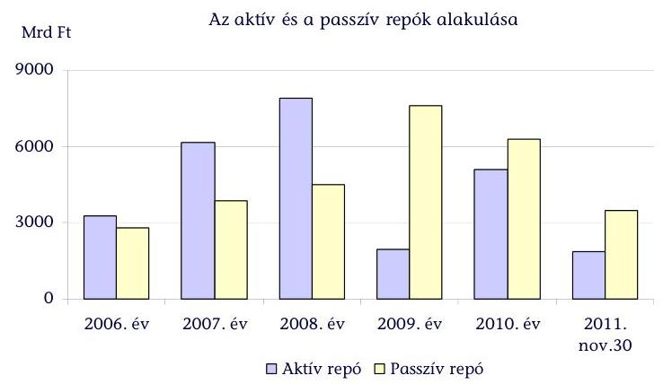

Kamatkockázat kezelésére az ÁKK Zrt.-nek korlátozottak az eszközei. A hozamértékek 2006-2011 közötti változása közép- és hosszú távon megnövelte a finanszírozási kiadásokat. A forint államkötvény kibocsátások fizetendő kamatai 5,47-11,37% között szóródtak, maximális értékük 2009-ben volt. A devizakötvény kibocsátásoknál 2009-től a kamatkiadások és az árfolyamkockázatok növekedtek, a devizakötvények kamatai 2,65%-3,95%-kal meghaladták a referenciahozamokat (2. sz. melléklet).

Az ÁKK Zrt. által történt államkötvény kibocsátások kamatai a négy lejáraton 2006-ban 6,53-8,54%; 2007-ben 6,39-7,81%; 2008-ban 7,12-10,02%; 2009-ben 7,13-11,37%; 2010-ben 5,47-8,08%; 2011-ben 5,83-8,78% között alakultak.

Az ÁKK Zrt. a forint- és a deviza kamatfelár (hozamfelár) alakulását befolyásoló tényezőket vizsgálva megállapította, hogy a Ft árfolyamának 1 Ft-os gyengülése 3-5 bázisponttal növeli a forint felárakat, és 0,2-0,4 bázisponttal növeli a devizafelárakat.

---

# 4.3. Az államadósság piaci finanszírozása 

Az államadósság kezelése során az ÁKK Zrt. a piaci alapú finanszírozást szorgalmazta, a költségvetési hiány és a lejáró forint államadósság törlesztésének forrását elsősorban állampapír kibocsátással biztosították.

A belföldi állampapír kibocsátás 2007-ben 564,4 Mrd Ft-tal, 2008-ban 908,9 Mrd Ft-tal, 2009-ben 479,4 Mrd Ft-tal csökkent az előző évhez képest. 2010-ben az előző évhez viszonyított növekmény elérte a 790,2 Mrd Ft-ot, ami 2011-ben 110,8 Mrd Ft-ra mérséklődött (3. sz. melléklet) ${ }^{61}$. Az államkötvény kibocsátások lejárati összetételének és azok hozamainak változásai középtávon a finanszírozási kockázatot növelik. Az államkötvény kibocsátások futamidő/lejárat szerinti összetételében a közép- és hosszú lejáratúak aránya csökkent, a rövid lejáratúak nőttek.

Az aukción, piaci értékesítés útján forgalmazott 3 éves lejáratú államkötvények aránya ingadozott. Az 5 éves lejáratúak aránya a 2006. évi 26,8%-os arányról 38,1%-ra emelkedett, a 10-15 éves lejáratú bruttó kibocsátások arányai a 10 éves lejáraton 22,1%-ról 16,3%-ra, a 15 éves lejáraton 6,0%-ról 3,0%-ra csökkentek.

A belföldi állampapír értékesítésben 11-15 elsődleges forgalmazó vett részt. Az állampapírok aukciós értékesítésének aránya 84-91%-os volt. Az ÁKK Zrt. folyamatosan ellenőrizte a szerződéses kötelezettségek teljesítését. Az árjegyzési kötelezettség, valamint az aukciós vásárlási kötelezettség megszegése miatt 10 esetben összesen 3,8 M Ft összegű kötbért szabott ki és egy bankot kizárt.

Az elsődleges forgalmazók és az ÁKK Zrt. együttműködéséről szóló megbízási szerződésekben rendelkeztek a minimális mennyiségre és hozamban számítva maximált vételi-eladási különbözetre vonatkozó árjegyzési kötelezettségről.

2009 előtt a forgalmazóknak a másodpiaci eladási-vételi különbözetek biztosítottak jövedelmet, 2009 után értékesítési jutalékra jogosultak. Az elsődleges forgalmazók által vásárolt kötvények után az ÁKK Zrt. 2009. második felétől 1,0 Mrd Ft, 2010-ben közel 2,0 Mrd Ft, 2011. I. félévben 1,0 Mrd Ft jutalékot fizetett ki.

A lakossági értékesítés (kamatozó kincstárjegy, kincstári takarékjegy) nagyságrendje és aránya a teljes finanszírozáson belül csökkent, annak ellenére, hogy az ÁKK Zrt. stratégiai célkitűzése volt a lakossági értékesítés stabilizálása.

A KKJ állomány jegyzése és a KTJ forgalmazása csökkent. A KKJ a 2006. évi 309,0 Mrd Ft-ról 2011-ben 85,2 Mrd Ft-ra esett vissza. A KTJ értékesítése a 2006. évi 382,8 Mrd Ft-ról 2010-re 200,6 Mrd Ft-ra csökkent, 2011-ben 211,8 Mrd Ft-ot ért el. Ez utóbbinál a drasztikus visszaesés 2009-ben következett be, amikor az előző évhez képest a csökkenés 125,6 Mrd Ft volt. 2011-ben a KKJ jegyzés a teljes belföldi állampapír kibocsátáson belül 1,3%-ot, a KTJ forgalmának aránya pedig 3,2%-ot képviselt. A csökkenést részben kompenzálta az PMÁK értékesítés nagysága.

[^0]
[^0]:    ${ }^{61}$ Az adatok az átmeneti likviditási célból 1-2 hónapos időtartamra kibocsátott likviditási kincstárjegyek forgalmi adatait nem tartalmazzák.

---

Az ÁKK Zrt. a stratégiákban a lakossági értékesítés marketing akciókkal való támogatásával számolt, amelyet külső megbízásokkal és saját erőforrás útján lát el. A 2006-2010. években a magyar állampapírok és a lakossági termékek kommunikációjának költségei az éves kommunikációs előirányzat 81-92%-át tették ki.

A 2006-2011. években a KKJ és KTJ termékek jegybanki alapkamat alatti, és annak mértékét meghaladó piaci kamatoktól lényegesen elmaradó hozamai nem segítették az értékesítés növelésének feltételét, a kamatok jellemzően - a 2009-ben bevezetett PMÁK kivételével - nem voltak versenyképesek.

A Kincstár hálózatában történő értékesítés aránya a 2006. évi 4,5%-ról 2010-ben 8,1%-ra emelkedett, 2011-ben 7,1%-ra változott. A Posta részesedése 2008-ra 5,8%-ra emelkedett, az azt követően 3,2%-ra mérséklődött (2010, 2011 évek).

A lakosság körében bevezetett inflációkövető, változó kamatozású PMÁK a kamat mellett kamatfelár/prémium egészítette ki. 2011. november végéig 181,3 Mrd Ft kötvényértékesítés volt.

A magánnyugdíj-pénztári átalakulás miatt 2011-től szűkülő befektetői bázis ellensúlyozására az adósságkezelés fokozottan támaszkodni kíván a lakossági megtakarításokra, ami az
 állampapír vásárlás mennyiségének növelését jelenti.

A lakosság állampapír állományának növeléséhez szükséges intézkedésekről szóló 1101/2012. (IV. 5.) Korm. határozat szerint 2012-ben 1957,9 M Ft többlet pénzügyi forrás áll rendelkezésre a lakosság állampapír állományának növeléséhez szükséges számítástechnikai rendszerek fejlesztésére, marketing tevékenységre, új értékesítési pontok kialakítására. Az intézkedések az értékesítési módok és csatornák fejlesztését (pl. a Posta szerepvállalásának növelése, okmányirodák bevonása), a termékfejlesztést (pl. lakossági állampapír futamidő csökkentés) és az informatikai háttér bővítését célozzák.

A devizakötvény kibocsátások 2006-2008 között minden évben az esedékes törlesztések feletti összegben történtek (4. sz. melléklet). A többlet deviza forrásbevonások 2006-2007-ben költségvetési finanszírozási és teljesítménymutató tartási célokat, 2008-ban az MNB devizatartalékának emelését biztosították.

A 2009-2011. években a devizakötvény kibocsátási mennyiségek a devizafinanszírozási igényeket elégítették ki. 2011-ben a kötvénykibocsátások az IMF/EB hitelek törlesztését, piaci finanszírozását biztosították.

A forrásbevonások (forintban és devizában) összetételének változásai, a deviza portfólió arányának emelkedése és a piaci tendenciák változása az árfolyamkockázatot növelte.

Az ÁKK Zrt. stratégiái szerint a devizafinanszírozás előnye, hogy a kibocsátásnál a forint forrásbevonáshoz képest alacsonyabb a kamat- és felárköltség, a teljes adósság futamideje hosszabb lehet, ami csökkenti a megújítási kockázatot, a nemzetközi tőkepiacokon rugalmasabb kibocsátási politika, így a nagyméretű finanszírozási forrás biztosítása könnyebb rövid időtávon belül. A devizafinanszírozás hátrányaként az árfolyamkockázat és a devizakitettség növekedését, a befektetői megítélés, a hitelminősítés kedvezőtlen változását, azok kamat költségnövelő hatását rögzítették.

---

A devizakötvény kibocsátások értéke 2006-ban 444,8 Mrd Ft-tal, 2007-ben 170,7 Mrd Ft-tal, 2008-ban 260,6 Mrd Ft-tal haladta meg az esedékes törlesztések összegét.

2006-2011 között nyolc devizakötvény-sorozat járt le, 2006-ban két USD kötvénysorozat (850,0 M USD érték), 2009-ben egy 500,0 M euró és egy 50,0 Mrd JPY értékű sorozat, 2010-ben egy 30,0 Mrd JPY értékű és egy 1,0 Mrd euró sorozat, és 2011-ben két 1,0 Mrd euró sorozat.

A devizakötvény-kibocsátások tervezett és tényleges értékének alakulása 2006tól 2011-ig, Mrd Ft-ban:

| Év | Deviza-   törlesztések   tervezett   értéke ${ }^{62}$ | Ténylegesen   törlesztett ${ }^{63}$ | Tervezett   kötvény-   kibocsátások | Tényleges   kibocsátási   érték | Eltérés a   törlesztések   értékétől |
| :--: | :--: | :--: | :--: | :--: | :--: |
| 2006 | 220,0 | 231,0 | 505,0 | 675,8 | $+444,8$ |
| 2007 | 29,5 | 126,3 | 528,0 | 297,0 | $+170,7$ |
| 2008 | 168,6 | 164,2 | 502,0 | 424,7 | $+260,5$ |
| 2009 | 261,8 | 311,8 | -- | 267,9 | $-43,9$ |
| 2010 | 355,3 | 369,0 | 403,0 | 387,3 | $+18,3$ |
| 2011 | 1187,7 | 1264,5 | 1120,0 | 1063,0 | $-201,5$ |

2007 februárjában 258,0 Mrd Ft értékű devizakötvény kibocsátás történt, jelentősebb törlesztés azonban csak decemberben volt (99,0 Mrd Ft), összesen az éves törlesztés értéke 126,0 Mrd Ft-ot tett ki. 2009 júliusában 267,9 Mrd Ft devizakötvényt bocsátottak ki, miközben az év végével mindössze 38,6 Mrd Ft devizatörlesztés történt. 2010-ben az első nagyobb összegű törlesztést (266,2 Mrd Ft, 2010 szeptember) nyolc hónappal megelőzte egy 387,3 Mrd Ft értékű (2010 januári) kibocsátás, ezt megelőzően januártól augusztusig összesen 86,1 Mrd Ft törlesztést teljesített az ÁKK Zrt.

A deviza kötvénykibocsátást az állampapírpiacon koordináló külső ún. főszervező kiválasztásának értékelési szempontrendszere - annak utólagos, rotációs szempontokkal való kiegészítése és a sorrend korrekciója miatt - nem biztosította az átláthatóságot, valamint a kibocsátási és kamatkiadások optimalizálását. Az ellenőrzött négy kibocsátás közül két esetben a főszervezők kiválasztásakor az ÁKK Zrt. a kialakított pontozási rendszeren kívüli szempontokat is figyelembe vett.

2010-től az elsődleges forgalmazók és leánybankjaik szerezhetnek devizakötvény kibocsátási mandátumot. Az ÁKK Zrt. az egyes devizakötvény kibocsátások szerkezetéről (futamidő, devizanem) a forgalmazásban várhatóan részt vevő pénzintézetek ajánlatai, a Finanszírozási Bizottság döntése alapján közvetlenül a lebonyolítást megelőzően dönt.

[^0]
[^0]:    ${ }^{62}$ Az adott év januári tervei alapján, összes törlesztés.
    ${ }^{63}$ Év végi záró-állomány.

---

A 2006-2011. években a másodlagos piac részben átrendeződött, az egyes időszakokban eltérő intenzitású változások jellemezték. Az állampapírok tulajdonosi szerkezetében a biztosítók és nyugdíjpénztárak részesedése csökkent, a bankszektoré növekedett, a külföldiek Ft állampapír állományból való részesedése folyamatosan változott. A befektetők kockázatvállalási hajlandósága 2008 év közepétől jelentősen ingadozott. Az állampapírok másodlagos piacán ${ }^{64}$ a külföldi befektetők részaránya az adósságállomány közel 60\%-ára növekedett, a forint kibocsátásokat döntően külföldi megtakarítás finanszírozta. A finanszírozás stabilitása szempontjából kockázatot jelent a magas külföldi állomány. A külföldi befektetők azonban gyorsabban reagálnak a hitelminősítők értékelésére és válság helyzetekre, ezáltal lényegesen nagyobb ingadozásnak van kitéve az állampapírpiac. A 2008. év végi tőkekivonás (890,0 Mrd Ft-tal csökkent a külföldiek állampapír állománya) miatt a forintpiac összeomlott. A keresletcsökkenés (külföld, nyugdíjpénztár, lakosság) egyidejűleg hatott a hozam- és felárak növekedésére.

A nyugdíjpénztári befektetési portfolióban a részvénybefektetéseket ösztönző új szabályozás ${ }^{65}$ miatt csökkent az állampapírok mennyisége és aránya. A válság alatt tovább csökkent a nyugdíjpénztárak állampapír kereslete, a legnagyobb állampapír befektetők a bankok voltak.

Az állampapírpiac helyreállítását az ÁKK Zrt. az elsődleges forgalmazóknak a forgalom arányában fizetendő jutalék, az ún. nem kompetitív értékesítés ${ }^{66}$ bevezetésével, az államkötvény visszavásárlási és kötvénycsere aukciók elindításával segítette. A másodlagos piac stabilizálását célozta az elsődleges forgalmazóknak a kötvényaukciók lezárását követő pótlólagos értékesítés. A nem kompetitív értékesítés nagysága 2009-ben 164,1 Mrd Ft, 2010-ben 258,2 Mrd Ft volt, 2011 első félévében 152,5 Mrd Ft-ot ért el.

Az ÁKK Zrt. az IMF/EB által nyújtott hitelkeretből a magyar állampapírpiac stabilizálása érdekében 670,0 Mrd Ft összegben államkötvény visszavásárlásokat hajtott végre a 2009-2012-ben lejáró államkötvényeknél.

Az MNB 215,7 Mrd Ft másodlagos piac állampapír vásárlással, a kereskedelmi bankoknak biztosított euro swap és 2 hetes, valamint 6 hónapos aktív repó ügyletkötési lehetőséggel segítette a finanszírozási krízis megoldását.

# 4.4. Az államadósság finanszírozására felvett hitelek 

Az adósságállomány finanszírozása növekvő hitelállomány mellett történt. 2011 novemberére a hitelállomány aránya a teljes adósságállomány 27,1\%-a,

[^0]
[^0]:    ${ }^{64}$ Forrás: MNB. Az ÁKK Zrt.-nek nincs saját adata az állampapírok tulajdonosi szerkezetére, ezért az MNB által publikált adatokat használja.
    ${ }^{65}$ A magánnyugdíjpénztárak befektetési és gazdálkodási tevékenységéről szóló 282/2001. (XII. 26.) Korm. rendelet 2008. október 13-tól hatályos módosítása alapján.
    ${ }^{66}$ Az ún. nem kompetitív értékesítés a kötvényaukciók lezárását követő állampapír értékesítés, amely legfeljebb az adott napi aukción elfogadott ajánlatok 40\%-a lehet. Az értékesítés az elfogadott ajánlattal rendelkező elsődleges forgalmazók részére az aukción elért átlaghozamon történik.

---

azon belül 90,7\%-a a deviza adósság (5283,2 Mrd Ft). A hitelállományt projektfinanszírozási, adósságkezelési célokat szolgáló (készenléti és rulírozó) és finanszírozási célú hitelek alkották.

A likviditáskezelési célokat szolgáló készenléti és a mark-to-market betétek finanszírozását biztosító rulírozó hitelek a piaci finanszírozás, míg a projektfinanszírozó és az IMF/EB hitelek a nem piaci finanszírozás részei.

Az ellenőrzött időszak elején a hitelállomány 742,9 Mrd Ft a teljes adósságállomány mintegy $5,8 \%$-át tette ki. A hitelállomány növekedéséhez IMF/EB hitel 3768,0 Mrd Ft-tal járult hozzá. 2006-2011 között az IMF/EB hitel mellett 540,8 Mrd Ft és 166,7 M euró projektfinanszírozási, 4600 M euró készenléti és 480,5 M euró rulírozó hitel felvételére került sor.

A piaci finanszírozású kötvényeknél kedvezőbb kamatköltségek a projektfinanszírozó hiteleknél 2006-2011 között 3,7\%-ról 6,8\%-ra, a készenléti hiteleknél 2,7\%-ról 4,5\%-ra növekedtek. A rulírozó és készenléti hitelek megújítása - a devizaadósság leminősítései miatt - kisebb hitelkerettel, magasabb felárral és kamattal történt.

A projektfinanszírozási hitelfelvételekből 32 hitelfelvétel összesen 166,7 M euróban, 29 esetben 540,8 Mrd Ft összegben történt. Ezen hitelfelvételek éven belüli lehívása során az ÁKK Zrt. - a hitelek projektfinanszírozó célját nem érintve - likviditási helyzet javítására is felhasználta a hiteleket. Átmeneti likviditáskezelési célokat szolgált az EIB-től 2008. március 10-én 4 tételben lehívott, összesen 276,5 millió euró projektfinanszírozási hitel. A projektfinanszírozó hitelek államadósság kezelésre történő felhasználásának lehetőségét a 2009. évi adósságkezelési stratégiába beépítették.

A projektfinanszírozó hitelek lehívása előfinanszírozás, vagy utófinanszírozás keretében a projekt lebonyolítása és igazolása után történik. A költségvetési beruházások finanszírozását biztosító projektfinanszírozó hitelekre vonatkozó szerződéseket a PM (NGM) intézi, az ÁKK Zrt. már csak a lehívási szakaszban kap szerepet. Az e célra felvett hitelek ugyanakkor növelik az államadósságot. Az ÁKK Zrt. a hitelek egyes részleteit határozhatja meg a hitelnyújtóval történő tárgyalások során, pl. a deviza neme, kamatozás, futamidő, ütemezés. A projektfinanszírozó hitelek devizanemét az adósságkezelés szempontjai mellett az MNB devizatartalék igénye is befolyásolta.

Az ÁKK Zrt. 2006-2011 között az adósságkezeléssel összefüggésben összesen 11 alkalommal vett fel készenléti hitelt 4600,0 M euró és 26 alkalommal vett igénybe rulírozó hitelt 1201,8 M euró összegben.

Készenléti hitel felvételekkel átmeneti, egy és két hét közötti likviditási hiányt, rulírozó hitelekkel egy hónaptól harminc hónapig terjedően, a származékos műveletek különbözeteként elhelyezett fedezeti betétek forrását biztosította. Ezen hitelfelvételek sajátossága, hogy a visszafizetést követően az ÁKK Zrt. lejáratig ismételten igénybe veheti. A felvehető összeg maximuma a készenléti hitelnél 500,0 M euró a rulírozó hitelnél 250,0 M euró volt.

Az IMF-től és az EB-től származó mintegy 19,0 Mrd euró hitelkeretből 12,9 Mrd eurót a magyar állam, 1,4 Mrd eurót az MNB vett fel. Az egyes hitelrészletek lehívására vonatkozóan elemzések, hatástanulmányok, a felhasználásra vonatkozó értékelések a PM-ben nem készültek.

---

A lebonyolítás technikai részleteit tartalmazó Hitel/szerződés magánjogi szerződés formájában került megkötésre, amit a magyar állam nevében a pénzügyminiszter, illetve a Magyar Nemzeti Bank elnöke írta alá 2008. október 30-án.

A magyar állam által felvett IMF hitel 34,2\%-át, az EB hitel 100\%-át fordították lejáró forint adósságtörlesztésére. Emellett az IMF hitelt az MNB devizatartalékának növelésére, a pénzügyi stabilitás megőrzésének és biztosításának finanszírozására.

Az IMF-től kapott hitelcsomagból 2752,2 M eurót lejáró forint- és devizaadósság törlesztésre (ebből 83,8 M eurót állampapír visszavásárlásokra), 1404,5 M eurót az MNB devizatartalék növelésére, $24,5 \mathrm{M}$ eurót fedezeti ügyletekre és 4844,7 M eurót a bankmentő intézkedésekre fordítottak (5. sz. melléklet).

A pénzügyi stabilitás megőrzése és biztosítása érdekében - a pénzügyi közvetítőrendszer stabilitásának erősítéséről szóló 2008. évi CIV. tv. alapján - a magyar állam három hitelintézetnek (OTP Bank Nyrt., FHB Bank Zrt. és a Magyar Fejlesztési Bank Zrt.) hitelt nyújtott, az FHB Bank Zrt.-ben tőkét is emelt az IMFtől származó forrásokból.

Az OTP Bank Nyrt. az 500,8 M euró, 135,9 M GPB, 20 106,0 M JPY, valamint 818,2 M USD összegű hitelét 2009 végén és 2010 elején két részletben, az FHB Bank Zrt. az állami tőkeemelés 30 Mrd Ft-os összegét 2010-ben visszafizette.

Az FHB Bank Zrt.-vel 400 M euró összegre kötött hitelszerződés és az MFB Zrt. számára
 nyújtott tulajdonosi hitel (203,8 M euró, 55,3 M GBP, 8181,0 M JPY és 332,9 M USD) 2012-ben jár le.

Az IMF hitel 2,23-3,36%, az EB 3,23-3,625% kamatozású volt. A kedvező kamatozás mellett, a hitelek után fizetendő rendelkezésre állási jutalék és szervezési költségek jelentős kiadást jelentettek. Az IMF a folyósított hitelfelvételre 11,4 Mrd Ft, az EB 5,1 Mrd Ft költséget (banki jutalék és egyéb költség) számolt fel.

Az IMF hitel változó kamatozású, a kamat mértéke hetente kerül meghatározásra. A 2008. évi lehívások átlagkamatlába 2,23%, a 2009. évi első lehívásé 3,36%, az utolsó lehívásé pedig 3,27% volt. Az IMF 2009. március 24-ei döntése alapján a futamidő 4 évről 5 évre, a türelmi idő 2 év 3 hónapról 3 év 3 hónapra növekedett. A lehívásonként átlagosan öt év futamidejű EB hitel első és második lehívásának kamata 3,25%, a harmadik lehívásé 3,625%.

# 4.5. Az államadósság kamatkiadásai és egyéb költségei 

A kamatkiadások és az egyéb költségek növekedéséhez az adósság-állomány bővülése mellett az adósság-átvállalások felhalmozott, következő éveket terhelő kamatelszámolásai (2006-ban 22,9 Mrd Ft), az IMF/EB hitelfelvételhez kapcsolódó lehívási díjak (16,6 Mrd Ft) is hozzájárultak. Emelkedtek az adósságkezelés egyéb kiadásai között az állampapírok értékesítésével összefüggő kommunikációs kiadások és a forrásbevonásokhoz kapcsolódó jutalékok is.

A bruttó kamatkiadások 2010. év kivételével folyamatosan nőttek a 2006. évi 970,0 Mrd Ft-ról 2011-re 1112,9 Mrd Ft-ra. A költségvetési kiadásokhoz viszonyított 11,4-12,8% arányuk 2010-ben csökkent az IMF/EB hitelhez kapcsolódó alacsonyabb kamatszintek miatt.

A kamatkiadások legnagyobb tétele a forintadóssághoz kapcsolódó 5237,3 Mrd Ft kamat, amelyből az államkötvények kamata 4023,2 Mrd Ft, a kincstárjegyeké 1069,4 Mrd Ft volt összesen. A devizakamatok 1435,8 Mrd Ft-os kiadásán belül a devizahitelek kamatainak 20% körüli aránya 2009-től mintegy megduplázódott.

Az adósságkezelési költségek legnagyobb tételei az IMF/EB hitelekhez kapcsolódó kiadások (2008-ban 9,1 Mrd Ft, 2009-ben 7,4 Mrd Ft) voltak.

Az adósságkezelés költségei a forrásbevonások jutalékait és egyéb kiadásait, kommunikációs költségeit és egyéb kiadásokat tartalmaznak. 2006-ban 13,2, 2007-ben 10,3, 2008-ban 20,6, 2009-ben 18,5, 2010-ben 9,9 Mrd Ft és 2011-ben 11,8 Mrd Ft volt.

Az állampapírok és a devizakötvények kibocsátására és értékesítésére a forgalmazóknak a belföldi állampapírokra 49,9 Mrd Ft, a devizakötvény kibocsátásokra 5,8 Mrd Ft jutalékköltséget fordítottak. Az évente 2,0 Mrd Ft-ot meghaladó elsődleges forgalmazói jutalék bevezetésének hatását az ÁKK Zrt. nem értékelte.

Az elsődleges forgalmazóknak 2009 májusától fizet az ÁKK Zrt. forgalmazói jutalékot, hogy ösztönözze az elsődleges forgalmazók nagyobb mértékű részvételét az állampapírpiacon.

A lakossági állampapír értékesítés marketing akciókkal való támogatására fordítható kiadások 2009-ben a PMÁK kibocsátásával összefüggésben növekedtek. A marketingkommunikációs feladatok ellátását biztosító keretszerződés 2010. évi megszűnésével a lakossági értékesítést 2011 júliusáig nem támogatta reklámtevékenység.

A magyar állampapírok és a lakossági termékek marketingfeladataira 2006-ban 522,8 M Ft-ot, 2007-ben 501,3 M Ft-ot, 2008-ban 509,6 M Ft-ot fordított az ÁKK Zrt. A kiadások 2009-ben 809,2 M Ft-ra növekedtek, amelyből PMÁK-ra 320,2 M Ft-ot fizettek ki. 2010-re a kiadás 201,0 M Ft-ra csökkent.

Az ÁKK Zrt. 2011 júliusában maximum nettó 2250,0 M Ft legkésőbb 2013 július 27-ig történő felhasználására - az állampapírok kibocsátását és értékesítését támogató kommunikációs tevékenység ellátására - kötött keretszerződést. A két év alatt felhasználható forrás megközelíti a 2006-2010. években történt kifizetések együttes összegét, ami számottevő költségnövekedést mutat.

# 5. AZ ÉVEN TÚLI KÖTELEZETTSÉGVÁLLALÁSOK ALAKULÁSA ÉS NYILVÁNTARTÁSUK SZABÁLYOZÁSI KOCKÁZATAI 

Az adósságpályák tervezése az ellenőrzött időszakban nem terjedt ki az Áht ${ }_{1}$ 36. § (1) bekezdése szerinti többéves elkötelezettséggel járó kiadások (hosszú távú kötelezettségvállalások, kezességek, garanciák) determinációira.

A több évre szóló kötelezettségvállalások közvetetten - a költségvetési hiányon keresztül - hatnak az államadósságra. Az éven túli kötelezettségvállalásokat egyrészt a tárgyévet követő évek költségvetési bevételei fedez(het)ik, másrészt egy részük kiadásként való megjelenése bizonytalan (kezesség- és garanciavállalások).

Az NGM az ÁKK Zrt. bevonásával 2011. évben készített elemzést az államadósság kockázati tényezőiről, a lejáró adósságból fakadó rizikófaktorokról. A hosszú távú kötelezettségvállalásokról ilyen jellegű vizsgálatot nem végeztek, azonban egyes szerződéstípusok és kötelezettségek (PPP, közösségi vállalatok adóssága) esetében felülvizsgálatot rendelt el a Kormány célszerűségi és hatékonysági szempontok alapján.

A több éves elkötelezettséggel járó kötelezettségvállalások éves keretei 2006-2011 között nőttek. A hosszú távú kötelezettségvállalások évente vállalt összegei a tervezett kereteken belül teljesültek, a kezesség- és garancia vállalások azokat meghaladóan teljesültek.

A vállalható kezesség- és garanciavállalások költségvetési törvényben meghatározott éves kerete a 2006. évi 2880,0 Mrd Ft-ról 2011-re 28,8%-kal 3710,0 Mrd Ft-ra, azok érvényesítésének keretei a 2006. évi 7,0 Mrd Ft-ról a 2011. évi 35,4 Mrd Ft-ra nőttek. Az ellenőrzött időszakban a legmeghatározóbb az MFB Zrt., a Garantiqa Hitelgarancia Zrt., illetve a MEHIB Zrt. útján nyújtott állami kezességvállalások vállalható mértékének mintegy 900,0 Mrd Ft-os emelkedése volt. Ez összefügg azzal, hogy az állam forrásai, - melyekből közvetlen költségvetési hiteleket nyújthatna a vállalkozások számára - egyre szűkösebbek. A közvetlen költségvetési hitelek helyett az állam kezesként vagy garantőrként áll a pénzintézetektől hitelt felvevő vállalkozások mögé.

A hosszú távú kötelezettségvállalások éves kifizetési kerete (2007-ben a kiadási főösszeg 2%-a, 2008-tól a bevételi főösszeg 3%-a) 2007. évi 166,5 Mrd Ft-ról 2011-re 245,0 Mrd Ft-ra emelkedett.

Az állami kezesség- és garanciavállalások érvényesítéseinek (kezességbeváltás) és azok visszatérüléseinek egyenlege 2006. évi 5,2 Mrd Ft-ról 2011-re 24,4 Mrd Ft-ra nőtt, mindösszesen 100,8 Mrd Ft kiadást jelentett. A kezességbeváltás az ellenőrzött időszakban 3 évben is meghaladta a tervezett előirányzatot: 2006-ban 53,8%-kal, 2009-ben 22,1%-kal és 2010-ben 64,6%-kal. A 2006. évi kezesség visszatérülés ellensúlyozta az előirányzat túllépést, így az ellenőrzött időszakban a kezesség- és garanciavállalások érvényesítése 6,3 Mrd Ft-tal haladta meg a tervezettet (6. sz. melléklet).
A kezességvállalás tényleges állományi adatainak alakulása:

|  | 2006. év | 2007. év | 2008. év | 2009. év | 2010. év | 2011. év |
| :--: | :--: | :--: | :--: | :--: | :--: | :--: |
| Kezességvállalás összesen | 2269,5 | 1970,1 | 2316,9 | 2689,7 | 2544,3 | 2412,0 |
| Ebből: egyedi   kezesség-   vállalások | 351,2 | 264,8 | 249,4 | 254,1 | 243,5 | 192,1 |
| Kezesség érvényesítés | 10,8 | 10,3 | 17,1 | 20,4 | 33,5 | 29,4 |
| Kezesség visszatérülés | 5,6 | 3,0 | 2,9 | 1,8 | 2,4 | 5,0 |
| Kezesség beváltás és a visszatérülés egyenlege | 5,2 | 7,3 | 14,2 | 18,6 | 31,1 | 24,4 |

A kezesség érvényesítések aránya a kezesség- és garanciavállalások 0,5-1,3%-a között alakult. Az állami kezesség- és garanciavállalások évente vállalható kerete állományi limitet jelent, az új és a lejáró kötelezettségek eredőjeként értelmezhető. A hitelkockázat mérséklésére fedezetként szolgáló kezességek, illetve garanciák előirányzata - a kezesség- és garanciák érvényesíthetősége céljából - felülről nyitott, módosítás nélkül is túlléphető, a költségvetési hiányt az állam piaci kockázatok megosztásában vállalt szerepéből adódó, esetlegesen kedvezőtlenül érintő hatása miatt kockázatos.

A zárszámadási ellenőrzés keretében az ÁSZ évente vizsgálta az új kezességvállalások jogszabályi előírásokkal való egyezőségét, a kezességek nyilvántartását, a kezesség és viszontgarancia érvényesítésének szabályszerűségét. Az ÁSZ megállapította, hogy az állami kezesség- és garanciavállalás hatásaként jövőbeni pozitív gazdasági hozadék nem minden kezességvállalási forma esetén mutatható ki közvetlenül. A Kormány mégis szükségesnek és indokoltnak tartja - a gazdasági lehetőségekkel összhangban - az adott hitelezés állami kezességgel történő biztosítását.

Az egyedi állami kezesség- és garanciavállalás keretében jellemzően egy-egy vállalkozás segítése történik a hitelfelvétel megkönnyítése érdekében. Az ilyen jellegű kezességek vállalása minden esetben az Áht ${ }_{1}$ 33. § (1) bekezdésében foglaltaknak megfelelően, kormányhatározatban történt.

A garantőr szervezetek (MFB Zrt., az Eximbank, a MEHIB Zrt., a Garantiqa Hitelgarancia Zrt., illetve az Agrár-Vállalkozási Hitelgarancia Alapítvány) útján biztosított kötelezettségvállalások célja a kis- és közepes vállalkozások gazdasági tevékenységének növelése, a gazdasági mutatók élénkítése.

A kiállítási garanciák nemzetközi, időszaki kiállításokra kérhetőek. Annak érdekében, hogy csak a valóban arra érdemes kiállításokhoz nyújtson az állam garanciát, a beérkező igények szűrését biztosítja az a jogszabályi feltétel, hogy az állam csakis abban az esetben támogathatja a kérelmet, ha a kiállítás megrendezéséhez kiemelkedő kulturális érdek fűződik. A kiállítás szakmai indokoltsága minden esetben külön vizsgálat tárgyát képezi.

A hosszú távú kötelezettségvállalások ${ }^{67}$ 2004-2038-ig tervezett költségvetési kifizetéseinek összege 3669,3 Mrd Ft (2012-től 3073,3 Mrd Ft), amelyből 2004-2010 közötti kifizetés 442,7 Mrd volt. A jellemzően 2003-2007-ben vállalt hosszú távú kötelezettségvállalásokra évenként tervezett költségvetési kifizetés 2011-ben 152,9 Mrd Ft és a következő öt évben évente 143,0-153,0 Mrd Ft (2012-ben 153,4, 2013-ban 153,5, 2014-ben 152,8, 2015-ben 145,3 és 2016-ban 143,6 Mrd Ft) determinációt jelentenek.

Az ellenőrzött időszakban az okmányiroda hálózat üzemeltetésére és a komplex egycsatornás központi okmány-előállításra, az M6 autópálya II. és III. fázisára, valamint az EDR üzemeltetésére vállaltak hosszú távra elkötelezettséget.

[^0]
[^0]:    ${ }^{67}$ Hosszú távú kötelezettségvállalásként a Kincstár nyilvántartásából csak az Áht ${ }_{1}$ szerinti összes kellékkel (OGY vagy Korm. határozat, értékhatár) rendelkező adatokat vettük figyelembe.

A hosszú távú kötelezettségvállalások 90%-a a PPP konstrukcióban megvalósuló beruházások és az autópályák szerződéseiből származó kötelezettségek adták (7. sz. melléklet).

Az autópályákkal kapcsolatos kötelezettségvállalások a 2038. évig terhelik az állami költségvetést, összesen 2808,8 Mrd Ft összegben. A rendelkezésre állási díjakra 2011. évben 98,9 Mrd Ft-ot, azt követően 100,0 Mrd Ft-ot kell fordítani.

A PPP konstrukcióban megvalósuló börtön, diákotthon és sport beruházások 84 projektje 2030-ig terheli a költségvetést. A 2010-ig 63,7 Mrd Ft kiadással járó beruházásokra évente 23,0 Mrd Ft körüli összeget kell fordítani.

Az ugyancsak PPP keretében megvalósult MÜPA kiadásai 2035-ig évente mintegy 11,0 Mrd Ft (2010-ig 41,1 Mrd Ft volt) körül alakulnak.

Az éven túli kötelezettségvállalások állományi adatainak a zárszámadási törvényben való bemutatása - a nyilvántartási feladatok és az adatszolgáltatási rend egyértelmű szabályozására tekintettel - csak az állami kezesség- és garanciavállalásoknál történt meg. Az állami kezességgel összefüggő feladatok felelőseit, azok hatásköreit, illetve adatszolgáltatási kötelezettségeit egyértelműn meghatározzák mind a jogszabályok, mind a PM/NGM és a Kincstár vonatkozó belső szabályzatai.

A hosszú távú kötelezettségvállalások tervezett kifizetései számszerűsített, évekre bontott hatásának előírás szerinti bemutatása az Áht ${ }_{1}$ nem egyértelmű szabályozása következtében elmaradt. Olyan, a Kormány és az Országgyűlés határozataihoz nem kapcsolódó kötelezettségvállalás adatokat is hosszú távú kötelezettségvállalásként tartotta nyilván a Kincstár, melyek a szokásos működéssel voltak kapcsolatosak.

Az Áht ${ }_{1}$ 36. § (1) bekezdés előírása alapján a Kormány a többéves elkötelezettséggel járó kiadási tételek későbbi évekre vonatkozó hatásairól, az Áht ${ }_{1}$ 12/C. § (7) bekezdése szerint a hosszú távú kötelezettségvállalások állományáról fejezetenként és a várható kifizetések arányában köteles tájékoztatni az Országgyűlést a költségvetési illetve a zárszámadási törvényjavaslat benyújtásakor.
 Az ASZ visszatérő megállapítása, hogy sem az éves költségvetési, sem az azok végrehajtásáról szóló törvényjavaslatok nem mutatják be összefoglalóan, rendszerezetten a hosszú távú kötelezettségek állományát.

A PM 2009. februárjában - a teljes fennálló állomány nyilvántartása céljából azzal a megkereséssel fordult a Kincstár felé, hogy a nyilvántartásban szerepeljen minden olyan kötelezettségvállalás, amely megfelel az Áht ${ }_{1}$ 12/B. § (1) bekezdés szerinti meghatározásnak függetlenül attól, hogy azok jóváhagyása az Áht ${ }_{1}$ 12/B. § (1) bekezdés hatályba lépése előtt történt-e. A nyilvántartásban ugyanakkor ne szerepeljenek azon kötelezettségvállalások, amelyek a hatályos szabályozás szerint már nem minősülnek hosszú távú kötelezettségvállalásnak.

A Kincstár válaszában arról tájékoztatta a minisztériumot, hogy azokról a kötelezettségvállalásokról tud kimutatást készíteni, amelyekről a fejezetet irányító szerv az adatszolgáltatást megküldte. Mivel a nyilvántartási kötelezettség a fejezetet irányító szerv feladata, annak eldöntése, hogy az adott kötelezettségvállalás hosszú távú kötelezettségvállalásnak minősül-e vagy nem, ugyancsak a fejezet felelősségébe tartozik.

---

Az Áht ${ }_{1}$ 12/C. § (1)-(2) bekezdése a hosszú távú kötelezettségvállalásokkal kapcsolatban a Kincstár részére kimutatás készítését és a honlapján való nyilvánosságra hozatalt írja elő. Az Áht ${ }_{1}$ 12/C. § (3) bekezdése szerint a kötelezettségvállalások összesítése és nyilvántartása, továbbá a Kincstár felé történő adatszolgáltatás a fejezetet irányító szerv kötelessége.

A PM, a Kincstár és az adatszolgáltatásra kötelezettek is csak a törvény szerinti értékhatárokra és kiadási jogcímekre voltak figyelemmel. Ezért az Áht ${ }_{1}$ 12/B. § (5) bekezdésében foglaltakkal ellentétben a nyilvántartott adatok köre meghaladta a jogszabály szerint előírtakat. A kincstári nyilvántartásban a 2011. évi 112 szerződésből 96 kötelezettségvállalás értékét támasztották alá határozatokkal.

Hosszú távú kötelezettségvállalás csak a Kormány vagy OGY határozata alapján történhetett. A határozatnak tartalmaznia kellett az egyedileg jóváhagyott fejlesztés célját, a megvalósítás időtartamát, határidejét, a kötelezettségvállalás formáját, a kötelezettségvállalást tartalmazó szerződés megkötésére feljogosított személyt, szervezetet.

A nyilvántartási rendszer kialakításának hibája volt, hogy az adatszolgáltatás adatainak felülbírálására a Kincstár nem kapott felhatalmazást, annak eldöntése, hogy az adott kötelezettségvállalás megfelelt-e az Áht ${ }_{1}$ 12/B. §-ának az adatszolgáltatásért felelős fejezet irányító szervezetének felelősségi körébe tartozott.

# 6. Utóellenőrzés 

Az államháztartás adóssága kezelésének, alakulásának ellenőrzéséről szóló 0604. sz. számvevőszéki jelentés (2006. május) a pénzügyminiszter részére javasolt intézkedéseket. Az ÁKK Zrt. alapítói okirata és az FB megváltozott feladatköre összhangjának biztosítására irányuló javaslatunk teljesült, míg a KESZ likviditáskezeléséhez megbízható és naprakész információk rendelkezésre állásával kapcsolatos javaslat csak részben teljesült. A Kincstár prognózisainak megalapozottságát a pénzügyminiszter által előírt adatszolgáltatások teljes körűségének hiánya miatt (kötelezettségvállalás, nagy összegű kifizetések előzetes bejelentése) azok korlátozottan javították.

A 6/2007. (05. 29.) sz. alapítói határozattal az FB feladatköre az Áht ${ }_{1}$ 18/F. § (6) bekezdésével összhangba került. Az FB hatásköre nem terjed ki az államadósságkezelési stratégia, az ezzel kapcsolatos teljesítménymutatók és a finanszírozási tervek véleményezésére.

A likviditáskezelésre vonatkozó ÁSZ javaslat realizálására intézkedési terv nem készült. Ugyanakkor mind az ÁKK Zrt. igazgatósága, mind a Kincstár, az NGM és az ÁKK Zrt. többször tárgyalt a likviditáskezelés továbbfejlesztésének lehetőségeiről. 2008. márciusától elindult az egynapos repózási tevékenység, amellyel a nap végi KESZ-t lehet a sávba igazítani. A repóművelet azonban piaci korlátokba (partnerek ajánlatai, kamatszint) ütközik.

A Magyar Köztársaság 2006. évi költségvetése végrehajtásának ellenőrzéséről szóló 724. sz. számvevőszéki jelentés a pénzügyminiszter részére megfogalmazott - az adósság egyes elemeinek, tételeinek egyértelművé válása érdekében az

---

adósságátvállalás szabályozásának felülvizsgálatára vonatkozó - javaslata teljesült.
2008. január 1-jétől az Áht ${ }_{1}$ vonatkozó paragrafusát megfelelően módosították, ezzel összefüggésben az ÁKK Zrt. számviteli politikája aktualizálta az adósságátvállalásra vonatkozó előírásait.

A kincstári rendszer működésének ellenőrzéséről szóló 918. sz. számvevőszéki jelentésben a Kormánynak tett javaslatok végrehajtásáról csak részben intézkedtek. A KESZ ingadozása, az arra történő befizetési és kifizetési időpontok összehangolása érdekében módosították a vonatkozó kormányrendeletet. A likviditáskezelési eszközök bővítésére tett javaslat végrehajtása érdekében a tervezett kincstári átvilágításra nem került sor.

A Kormány a társadalombiztosítási nyugellátásról szóló 1997. évi LXXXI. törvény végrehajtásáról szóló 168/1997. (X. 6.) Korm. rendelet 2010. július 1-jétől hatályos módosítása az államháztartási kifizetések és a bevételek időpontját közelítette. A KESZ egyenlegének egyenletesebb alakulását, mint elvárt hatást nem támasztja alá, hogy a napi egyenleg optimális sávon belüli értéke a módosítást követően csökkent.

Budapest, 2012. 03.

Melléklet: 12 db
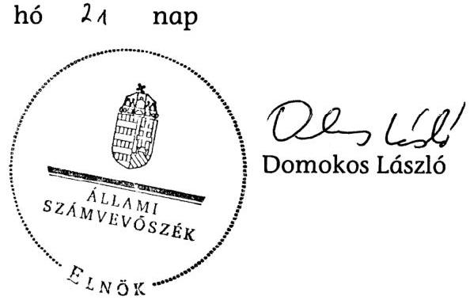

---

# MELLÉKLETEK

---

A központi alrendszer adósságának változása (2006-2011. évek)

|   |  |  |  |  |  | Mrd Ft |  |   |
| --- | --- | --- | --- | --- | --- | --- | --- | --- |
|   | 2006. év | 2007. év | 2008. év | 2009. év | 2010. év | 2011. év | Összes változás | Összes változás %-ban  |
|  Év eleji adósságállomány | 12765,6 | 14705,7 | 15585,5 | 18103,9 | 18964,9 | 20041,0 | - | -  |
|  Központi alrendszer finanszírozási igénye, ebből | 1626,6 | 1249,4 | 909,3 | 931,8 | 889,5 | 1495,5 | 7102,1 | 86,7%  |
|  Központi költségvetés adósság-átvállalás nélküli hiánya* | 1545,7 | 1339,9 | 870,0 | 743,7 | 853,9 | 1481,1 | 6834,4 | 83,4%  |
|  TB alapok hiánya* | 130,8 | -27,6 | 67,5 | 156,7 | 95,4 | 83,6 | 506,4 | 6,2%  |
|  Elkülönített alapok egyenlege* | -49,9 | -62,9 | -28,2 | 31,4 | -59,8 | -69,2 | -238,6 | -2,9 %  |
|  MNB tartalékfeltöltés** | 14,8 | 20,6 | 2,8 | 0,0 | 0,0 | 29,1 | 67,3 | 0,8%  |
|  Privatizációs befizetés (negatív érték bevételt jelent)** | -268,7 | -67,3 | -3,1 | -1,1 | -30,1 | -36,7 | -407,0 | -5,0 %  |
|  Az EU támogatások megelőlegezési számláinak változása** | 35,8 | -370,7 | 10,6 | -34,4 | 125,1 | -406,6 | -640,2 | -7,8 %  |
|  Adósság-átvállalás | 415,9 | 58,2 | 0,0 | 0,0 | 0,0 | 246,0 | 720,1 | 8,8%  |
|  Egyéb tételek, ebből | -18,6 | 35,1 | 11,9 | -4,4 | 25,8 | -15,0 | 34,7 | 0,4%  |
|  Be nem váltott állomány változása | 2,3 | -1,8 | -0,8 | 0,0 | 0,7 | -0,7 | -0,2 | 0,0%  |
|  Repó állományváltozás | -20,9 | -71,1 | 99,2 | -4,7 | 25,0 | -14,3 | 13,1 | 0,2%  |
|  Nettó rulírozó hitel felvétel | 0,0 | 108,0 | -86,5 | 0,2 | 0,0 | 0,0 | 21,7 | 0,3%  |
|  IMF / EB betét felhasználása (pozitív érték betételhelyezést jelent) | 0,0 | 0,0 | 1561,3 | -304,6 | -324,4 | -496,3 | 436,0 | 5,3%  |
|  Nettó Mark-to-market transzfer (pozitív érték nettó betételhelyezést jelent) | 26,4 | 69,5 | -86,0 | 73,8 | -243,9 | -46,4 | -206,6 | -2,5 %  |
|  Nettó devizabetétműveletek | 0,0 | -85,1 | 88,1 | -58,5 | 131,4 | 199,5 | 275,5 | 3,4%  |
|  KESZ állományváltozása*** | 105,1 | -83,5 | -69,4 | 120,2 | 24,7 | 322,4 | 419,5 | 5,1%  |
|  MSIV/APV Zrt. egyenlege miatti korrekció | 132,1 | 9,3 | 0,0 | 0,0 | 0,0 | 0,0 | 141,4 | 1,7%  |
|  Év végi megelőlegzések változása** | -5,0 | -2,4 | 10,9 | 1,6 | -57,3 | 0,4 | -51,8 | -0,6 %  |
|  Egyéb számla állományváltozása | -130,4 | -20,6 | -44,1 | 133,2 | 19,3 | -274,0 | -316,5 | -3,9 %  |
|  NYRA eszközök értékesítése, bevonása, ebből | 0,0 | 0,0 | 0,0 | 0,0 | 0,0 | -1487,8 | -1487,8 | -18,2 %  |
|  NYRA-nál lévő eszközök eladásából származó realizált | 0,0 | 0,0 | 0,0 | 0,0 | 0,0 | -80,7 | -80,7 | -1,0 %  |
|  NYRA-nál lévő állampapírok bevonása | 0,0 | 0,0 | 0,0 | 0,0 | 0,0 | -1407,1 | -1407,1 | -17,2 %  |
|  Repóműveletek | 20,6 | 71,1 | -97,7 | 3,7 | -24,7 | 15,0 | -12,0 | -0,1 %  |
|  Egyéb kötelezettségek állományváltozása | 7,6 | -19,9 | 69,4 | -58,4 | 199,9 | 202,9 | 401,5 | 4,9%  |
|  Devizapiaci műveletek árfolyamkülönbözete (swapokhoz kapcsolódóan) | 0,3 | 2,1 | -1,8 | 50,8 | 3,7 | 2,0 | 57,1 | 0,7%  |
|  Teljes árfolyamhatás, ebből | -22,4 | 13,9 | 156,1 | 7,4 | 337,2 | 1164,5 | 1656,7 | 20,2%  |
|  Devizaadósság árfolyamváltozása (rulírozó hitel nélkül) | -22,4 | 13,4 | 151,6 | 7,4 | 337,2 | 1164,5 | 1651,7 | 20,2%  |
|  Rulírozó hitelek árfolyamváltozása | 0,0 | 0,5 | 4,5 | 0,0 | 0,0 | 0,0 | 5,0 | 0,1%  |
|  Összes változás | 1940,1 | 879,8 | 2518,4 | 861,0 | 1076,2 | 914,5 | 8189,9 | 100,0%  |
|  Év végi adósságállomány | 14705,7 | 15585,5 | 18103,9 | 18964,9 | 20041,0 | 20955,5 | - | -  |

- Forrás: PM / NGM (zárszámadási törvény) ** Forrás: Kincstár *** Forrás: MNB

---

# A belföldi állampapírhozamok alakulása a 2006-2011. években

| Megnevezés/ | 2006 évi hozam |  | 2007 évi hozam |  | 2008 évi hozam |  | 2009 évi hozam* |  | 2010 évi hozam |  | 2011 évi hozam |   |
| --- | --- | --- | --- | --- | --- | --- | --- | --- | --- | --- | --- | --- |
|  futamidő | min. | max. | min. | max. | min. | max. | min. | max. | min. | max. | min. | max.  |
|  államkötvények |  |  |  |  |  |  |  |  |  |  |  |   |
|  3 éves | 6,75% | 8,54% | 6,70% | 7,81% | 7,56% | 10,02% | 6,82% | 11,37% | 5,47% |

 | 7,90\% | 5,83\% | 8,44\%  |
|  5 éves | 6,53\% | 8,40\% | 6,67\% | 7,46\% | 7,27\% | 9,52\% | 6,86\% | 10,78\% | 5,86\% | 7,93\% | 6,46\% | 8,72\%  |
|  10 éves | 6,54\% | 7,97\% | 6,48\% | 7,16\% | 7,12\% | 9,07\% | 7,13\% | 10,46\% | 6,41\% | 8,08\% | 6,98\% | 8,78\%  |
|  15 éves | 6,77\% | 7,45\% | 6,39\% | 6,74\% | 7,25\% | 7,93\% | 8,14\% | 8,14\% | 7,03\% | 7,16\% | 7,55\% | 7,55\%  |
|  diszkontkincstárjegyek |  |  |  |  |  |  |  |  |  |  |  |   |
|  3 hónap | 5,84\% | 8,17\% | 7,26\% | 8,14\% | 7,39\% | 13,11\% | 5,90\% | 10,86\% | 4,80\% | 6,02\% | 5,63\% | 7,32\%  |
|  6 hónap** | 5,95\% | 8,62\% | 7,15\% | 8,17\% | 7,25\% | 9,04\% |  |  |  |  |  |   |
|  1 év | 6,19\% | 8,84\% | 7,02\% | 8,17\% | 7,32\% | 12,72\% | 6,00\% | 12,46\% | 4,91\% | 6,20\% | 5,69\% | 7,91\%  |
|  kamatozó kincstári jegy | 5,75\% | 7,75\% | 7,00\% | 8,00\% | 7,00\% | 11,00\% | 6,00\% | 11,00\% | 4,00\% | 6,00\% | 5,00\% | 7,00\%  |
|  kincstári takarékjegy | 5,00\% | 7,25\% | 6,25\% | 7,25\% | 6,25\% | 10,75\% | 5,25\% | 10,00\% | 4,00\% | 5,50\% | 5,00\% | 7,00\%  |
|  jegybanki alapkamat | 6,0 - 8,0 \% |  | 7,75 - 7,5\% |  | 8,0 - 11,5 - 10,0\% |  | 9,5 - 6,25\% |  | 6,0 - 5,25 - 5,75\% |  | 6,0 - 7,0\% |   |
|  infláció | 3,90\% |  | 8,00\% |  | 6,10\% |  | 4,20\% |  | 4,90\% |  | 3,90\% |   |

*2009-től az államkötvényeknél a piaci értékesítés hozamai szerepelnek.* * a 6 hónapos diszkontkincstárjegy 2009-től megszűnt.

---

A belföldi állampapírok közvetítése értékesítési csatornák szerint a 2006-2011. években

|  Megnevezés | 2006. év | 2007. év | 2008. év | 2009. év | 2010. év | 2011. év  |
| --- | --- | --- | --- | --- | --- | --- |
|  Államkötvények |  |  |  |  |  |   |
|  Aukción történt értékesítés |  |  |  |  |  |   |
|  államkötvény (csereaukcióval) | 2181302 | 2289997 | 1269999 | 796999 | 1530498 | 1505998  |
|  diszkont kincstárjegy (kivéve LDKJ) | 3839994 | 3349994 | 3287997 | 3310997 | 3299997 | 3471403  |
|  likviditási diszkont kincstárjegy | 836020 | 245000 | 396200 | 565000 | 430000 | 650000  |
|  Aukción történt értékesítés összesen | 6857316 | 5884991 | 4954196 | 4672996 | 5260495 | 5627401  |
|  Értékesítés nem kompetitív tenderen |  |  |  |  |  |   |
|  államkötvény | 0 | 0 | 0 | 164082 | 258173 | 246536  |
|  Államkötvény értékesítés összesen | 6857316 | 5884991 | 4954196 | 4837078 | 5518668 | 5873937  |
|  Lakossági állampapírok |  |  |  |  |  |   |
|  államkötvény | 0 | 0 | 0 | 33493 | 103868 | 45471  |
|  kamatozó kincstárjegy | 309005 | 229259 | 247860 | 156081 | 86179 | 85154  |
|  kincstári takarékjegy | 382823 | 267580 | 339800 | 214207 | 200571 | 211841  |
|  Lakossági állampapírok összesen | 691828 | 496839 | 587660 | 403781 | 390618 | 342466  |
|  Piaci állampapírok közvetlen lakossági értékesítése |  |  |  |  |  |   |
|  államkötvény | 21101 | 15654 | 23538 | 24340 | 7569 | 12686  |
|  diszkont kincstárjegy | 246368 | 263665 | 338057 | 327610 | 331120 | 349697  |
|  Piaci állampapírok közvetlen lakossági értékesítése összesen | 267469 | 279319 | 361595 | 351950 | 338689 | 362383  |
|  Állampapír mindösszesen | 7816613 | 6661149 | 5903451 | 5592809 | 6247975 | 6578786  |
|  Állampapír összesen (kivéve LDKJ) | 6980593 | 6416149 | 5507251 | 5027809 | 5817975 | 5928786  |
|  Forgalom az értékesítési csatornák szerint |  |  |  |  |  |   |
|  ÁKK Zrt. értékesítése | 6857316 | 5884991 | 4954196 | 4837078 | 5518668 | 5873937  |
|  Kincstári hálózat | 353910 | 371031 | 482978 | 491955 | 503965 | 467915  |
|  Postai hálózat | 382823 | 267580 | 339800 | 214207 | 200571 | 211841  |
|  Kamatozó kincstárjegy a Kincstáron kívül | 222564 | 137547 | 126477 | 49569 | 24771 | 25093  |
|  Összesen | 7816613 | 6661149 | 5903451 | 5592809 | 6247975 | 6578786  |
|  Másodpiaci forgalom |  |  |  |  |  |   |
|  KELER-en keresztüli | 43061577 | 53444285 | 56132279 | 31561918 | 29507609 | 66074965  |
|  Budapesti Érték Tőzsde | 163182 | 70765 | 384978 | 273308 | 220908 | 284230  |
|  Összesen | 43224759 | 53515050 | 56517257 | 31835226 | 29728517 | 66359195  |

---

A 2006-2011. években kibocsátott devizakötvények jellemzői

| Devizanem, mennyiség | Kibocsátás éve | Futamidő (év) | Referencia hozama (\%) | Kötvény kupon értéke (\%) | Eltérés referencia hozamtól (\%) |
| :--: | :--: | :--: | :--: | :--: | :--: |
| 1 Mrd EUR | 2006 | 10,5 | 3,20\% | 3,50\% | 0,30\% |
| 50 Mrd JPY | 2006 | 7 | 1,57\% | 1,67\% | 0,10\% |
| 500 M GBP | 2006 | 10 | 4,30\% | 5\% | 0,70\% |
| 500 M EUR ${ }^{[1]}$ | 2006 | 6 | 3 havi Euribor* | 3 havi Euribor* | 0,25\% |
| 1 Mrd EUR | 2007 | 10 | 3,94\% | 4,38\% | 0,44\% |
| 25 Mrd JPY | 2007 | 10 | 1,87\% | 2,11\% | 0,27\% |
| 150 M CHF | 2008 | 5 | 3\% | 3,50\% | 0,50\% |
| 200 M CHF | 2008 | 8 | 3,25\% | 4\% | 0,75\% |
| 1,5 Mrd EUR | 2008 | 10 | 4,77\% | 5,75\% | 0,98\% |
| 1 Mrd EUR | 2009 | 5 | 2,80\% | 6,75\% | 3,95\% |
| 2 Mrd USD | 2010 | 10 | 3,60\% | 6,25\% | 2,65\% |
| 3 Mrd USD | 2011 | 10 | 3,28\% | 6,38\% | 3,10\% |
| 750 M USD | 2011 | 30 | 4,33\% | 7,63\% | 3,30\% |
| 500 M USD | 2011 | 30 | 4,93\% | 7,63\% | 2,70\% |
| 1 Mrd EUR | 2011 | 7 | 3,30\% | 6\% | 2,70\% |

${ }^{[1]}$ Változó kamatozású

* Bankközi euró kamat

---

# Az IMF-től és az EB-től lehívott hitelek felhasználása

|  Felvétel |  |  | Felhasználás |   |
| --- | --- | --- | --- | --- |
|  sorszáma | időpontja | összege
(M euró) | célja | összege
(M euró)  |
|  IMF 1. részlet | 2008.11.12 | 4953,0 | hitelnyújtás a bankoknak | 1752,4  |
|   |  |  | FHB tőkeemelés | 108,6  |
|   |  |  | forintadósság törlesztése | 83,8  |
|   |  |  | devizaswap | 24,5  |
|   |  |  | deviza- és a bankmentő csomagra elkülönített betétállomány | 2983,7  |
|  IMF 2. részlet | 2009.03.30 | 2389,2 | forintadósság törlesztése | 2389,2  |
|  IMF 3. részlet* | 2009.06.25 | 1404,5 | MNB devizatartalék növelése | 1404,5  |
|  IMF 4. részlet | 2009.09.29 | 54,2 | forintadósság törlesztése | 54,2  |
|  IMF hitel összesen |  |  |  | 8800,9  |
|  EB 1. részlet | 2008.12.09 | 2000,0 | forintadósság törlesztése | 2000,0  |
|  EB 2. részlet | 2009.03.26 | 2000,0 |  | 2000,0  |
|  EB 3. részlet | 2009.07.06 | 1500,0 |  | 1500,0  |
|  EB hitel összesen |  |  |  | 5500,0  |

Megjegyzés: * az MNB által lehívott hitel nem növelte az államadósságot

---

A kezesség- és garanciavállalások alakulása a 2006-2011. években

|   | 2006. év | 2007. év | 2008. év | 2009. év | 2010. év | 2011. év  |
| --- | --- | --- | --- | --- | --- | --- |
|  Egyedi kezességvállalások, ebből | 351,2 | 264,8 | 249,4 | 254,1 | 243,5 | 192,1  |
|  az új, egyedi kezességvállalás év végi állománya | 57,4 | 0,0 | 8,0 | 0,0 | 15,0 | 0,0  |
|  Garantőr szervezetek kötelezettségei | 619,1 | 681,2 | 811,2 | 953,4 | 941,8 | 826,4  |
|  MFB Zrt. által felvett hitelek | 827,0 | 542,5 | 827,3 | 821,9 | 869,5 | 1007,0  |
|  Kiállítási garanciák | 104,7 | 84,6 | 3,9 | 203,9 | 26,4 | 0,1  |
|  Nemzetközi pénzintézetektől felvett hitelek | 96,5 | 98,0 | 105,5 | 120,1 | 116,6 | 34,5  |
|  Agrárhitelek | 21,6 |

 13,6 | 12,1 | 7,9 | 1,9 | 1,2  |
|  Diákhitel Központ Zrt. | 126,3 | 149,9 | 170,8 | 190,9 | 210,8 | 218,0  |
|  Állami kezességgel biztosított lakáscélú hitelek | 123,1 | 135,5 | 136,7 | 137,6 | 133,9 | 132,7  |
|  Pályamódosító hitelprogram |  |  |  | 0,1 | 0,1 | 0,1  |
|  Összesen | 2269,5 | 1970,1 | 2316,9 | 2689,7 | 2544,3 | 2412,1  |
|  Kezesség érvényesítés előirányzata | 7,0 | 16,4 | 19,3 | 16,7 | 20,4 | 35,4  |
|  Kezesség érvényesítés teljesülése | 10,8 | 10,3 | 17,1 | 20,4 | 33,5 | 29,4  |
|  Kezesség visszatérülés előirányzata | 1,5 | 1,5 | 1,5 | 3,6 | 1,7 | 1,8  |
|  Kezesség visszatérülés teljesülése | 5,6 | 3,0 | 2,9 | 1,8 | 2,4 | 5,0  |
|  Kezesség teljesülés egyenlege | 5,2 | 7,3 | 14,2 | 18,6 | 31,1 | 24,4  |

---

A hosszú távú kötelezettségvállalások jellemzői

|  Fejezet | A szerződés tárgya | OGY/Kormánydöntés száma | Projektek száma | Évenként tervezett közvetlen költségvetési kifizetés (Mrd Ft) |  |  |  |  |  |  | Összesen | $\begin{gathered} \text { A } \ \text { szerződés } \ \text { utolsó éve } \end{gathered}$  |
| --- | --- | --- | --- | --- | --- | --- | --- | --- | --- | --- | --- | --- |
|   |  |  |  | 2004-2010 | 2011 | 2012 | 2013 | 2014 | 2015 | 2016 | 2017-től |   |
|  KIM | Okmányiroda hálózat üzemeltetése (eszköz bérlet) | 2035/2007. (III. 7.) Korm. h. | 1 | 10,9 | 4,1 | 0,6 |  |  |  |  |  | 15,6  |
|  KIM | Komplex egycsatornás központi okmány-előállítás | 2088/2007. (V. 23.) Korm. h. és 1185/2009. (XI. 6.) Korm. h. | 1 | 7,0 | 7,6 | 5,3 | 5,1 | 4,9 | 4,7 | 4,5 | 2,9 | 42,1  |
|  KIM | Országos gerinchálózati szolgáltatások nyújtása | 1053/2004. (VI. 3.) Korm. h. | 1 | 1,2 |  |  |  |  |  |  |  | 1,2  |
|  BM | Börtön PPP | 2126/2004. (V. 28.) Korm.h. | 2 | 11,6 | 3,9 | 4,0 | 4,0 | 4,1 | 4,2 | 4,3 | 29,0 | 65,2  |
|  BM | Monitoring rendszer kiépítése és üzemeltetése | 143/2004. (IV. 29.) Korm.r. | 1 | 5,3 | 0,6 | 0,6 | 0,6 |  |  |  |  | 7,0  |
|  NEFMI | Diákotthon PPP | 2091/2003. (V. 15) Korm.h. | 8 | 9,2 | 2,3 | 2,2 | 2,2 | 2,2 | 2,2 | 2,1 | 22,0 | 44,4  |
|  NEFMI | Diákotthon PPP | 2207/2004. (VIII. 27.) Korm.h. | 40 | 39,6 | 14,6 | 14,7 | 14,5 | 14,4 | 14,3 | 14,2 | 154,0 | 280,4  |
|  NEFMI | Altató-, lélegeztetőgép, monitor bérlésével összefüggő kiadások | 2207/2005. (X. 5.) Korm. h. | 1 | 5,3 | 1,4 | 1,4 | 1,4 |  |  |  |  | 9,4  |
|  NEFMI | Légimentés eszközpark bérlésével összefüggő kiadások | 2147/2005. (VII. 22.) Korm.h. | 1 | 3,5 | 1,1 | 1,1 | 1,1 | 1,1 | 1,1 | 1,1 |  | 9,8  |
|  NFM | Tornaterem és tanuszoda PPP | 2146/2005. (VII. 15.) Korm.h. | 33 | 3,2 | 2,1 | 1,9 | 1,8 | 1,9 | 1,9 | 1,9 | 14,1 | 28,9  |
|  NFM | Kiskunfélegyházi Sportcsarnok Projekt | 2039/2005. (III. 23.) Korm.h. | 1 | 0,1 | 0,1 | 0,1 | 0,1 | 0,1 | 0,1 | 0,1 | 0,4 | 1,0  |
|  NFM | Hozzájárulás a Művészetek Palotája működtetéséhez | 1118/2001. (X. 19.) Korm.h. | 1 | 41,1 | 9,9 | 10,9 | 10,7 | 10,9 | 11,1 | 10,7 | 201,6 | 307,0  |
|  NFM | Egységes Digitális Rádiótávközlési rendszer üzemeltetése | 346/2010. (XI. 28.) Korm.r. | 1 |  | 6,3 | 12,9 | 12,9 | 12,9 | 4,3 |  |  | 49,2  |
|  NFM | M5 autópálya (Budapest-Röszke) koncesszió | 17/2005. (III. 23.) OGY. h., 90/2004. (IX. 23.) OGY. h. | 1 | 212,0 | 37,2 | 38,7 | 39,2 | 39,6 | 40,1 | 41,2 | 639,5 | 1087,5  |
|  NFM | M6 autópálya (I.-II.-III. fázis) koncesszió | 92/2004. (IX. 28.) OGY h., 96/2007. (IX. 28.) OGY h. és 97/2007. (IX. 28.) OGY h. | 3 | 92,8 | 61,8 | 59,0 | 59,9 | 60,7 | 61,4 | 63,3 | 1261,7 | 1720,6  |
|  Összesen |  |  | 96 | 442,7 | 152,9 | 153,4 | 153,5 | 152,8 | 145,3 | 143,6 | 2325,2 | 3669,3  |

---

# - ÁLLAMI SZÁMVEVŐSZÉK 

## Erkezett: 2012.07.18

Iktatószám: 2012.07.18.18.18.18.18.18.18.18.18.18.18.18.18.18.18.18.18.18.18.18.18.18.18.18.18.18.18.18.18.18.18.18.18.18.18.18.18.18.18.18.18.18.18.18.18.18.18.18.18.18.18.18.18.18.18.18.18.18.18.18.18.18.18.18.18.18.18.18.

---

államháztartásért felelős miniszter hozza a stratégia és az éves finanszírozási terv jóváhagyásával, ami az éves összes deviza kibocsátás összegének meghatározását is jelenti ebben az esetben. Az egyedi tranzakciókra vonatkozó döntéseket a finanszírozási tervben foglaltaknak megfelelően az ÁKK Zrt. hozza meg.
2006-ban az a változás történt, hogy az ÁKK Zrt. Igazgatóságának döntése alapján az Igazgatóság helyett az ÁKK Zrt. menedzsmentjéhez került az operatív döntés azzal, hogy az Igazgatóság a tranzakció után részletes tájékoztatást kap (ami meg is történik). Ebben a döntési struktúrában a stratégiai döntést a nemzetgazdasági miniszter hozza, az egyes tranzakciókra vonatkozó taktikai döntések a vezérigazgató felelősségi körébe tartoznak, a Finanszírozási bizottság a tranzakciók technikai paramétereiről dönt.
A vezérigazgató esetében az Igazgatóság határozata, az állandó bizottságok esetében az Igazgatóság döntésének megfelelően 2007. június 18-án módosított ügyrendje egyértelműen rendezte a felelősségeket és döntési jogköröket.
Az Igazgatóság részéről a konkrét kibocsátással kapcsolatos döntés delegálásának célja a rugalmasabb és biztosabb működés volt, amit igazolt az is, hogy 2010-ben hónapokig nem volt Igazgatóság, ami a korábbi rendszerben döntést hozhatott volna. Amennyiben az Igazgatóság nem lett volna elégedett az új döntési rendszerrel, akkor bármikor visszavehette volna a döntést. Az Állami Számvevőszék évente vizsgálta a devizaadóssággal kapcsolatos műveleteket is, és eddig érdemben nem kifogásolta ezt a gyakorlatot.
Álláspontunk szerint a deviza forrásbevonási döntések tisztázottak. A stratégiai döntést a miniszter hozza, a konkrét operatív döntéseket - megfelelő delegálás és dokumentáltság mellett - az ÁKK Zrt. Felülvizsgálatra nincs szükség.
Az ÁSZ javaslatát nem támogatjuk.
3. Véleményünk szerint a forint és a devizaadósság kamatterhe jól tükrözi a költség és kockázat optimalizáció eredményességét.
Ezt jól mutatja, hogy miközben 2006-11 között az államadósság 64%-kal növekedett, addig a kamatterhek csak 13,2%-kal. Az átlagos kamatszint csökkenését nem csak az IMF hitel lehívása magyarázza, mivel az IMF/EU hitel nélkül számolva is 38%-kal nőtt az adósság. A kockázatok helyes kezelését mutatja továbbá, hogy 2008 végéig a devizaadósság aránya a benchmark sáv középértékén, 28-29% között mozgott, ami korlátozta az árfolyamkockázatot.
A devizaadósság növekedése az IMF hitel lehívása miatt, az ÁKK Zrt.-től független döntés alapján történt. A költség-kockázat optimalizáció a nemzetközi gyakorlatban is használt módon benchmark modellel történik, ez alapján határozódnak meg az államadósságra vonatkozó benchmarkok.
Az ÁSZ javaslatát nem támogatjuk.
4. Az adósságkezelés céljából alkalmazott benchmark modelleket az adósságkezelők tartósan, évekig használják, ezen modellekkel szemben elvárás is, hogy évente ne változzon jelentősen az általuk adott eredmény, hiszen az az államadósság-kezelés szempontjából értéktelen és megvalósíthatatlan lenne. A modell céljának a válság bekövetkezéséig, az IMF/EU hitelcsomag lehívásáig eleget is tett, amit az addig évente lebonyolított felülvizsgálatok (újabb futtatások) is igazoltak.

---

A válság hatására és az IMF hitel lehívása miatt lényegileg megváltozott a finanszírozás mozgástere. Emiatt valóban szükséges egy új modell kifejlesztése, ami az ÁKK Zrt. jövőbeni célja. (Megjegyezzük, hogy a 2004-es modell kidolgozása is 3-5 évig tartott, így a következő modell elkészítése is sok időt igényelhet). A fejlesztés során az ÁKK Zrt. figyelembe fogja venni a nemzetközi tapasztalatokat - akárcsak a 2004-es fejlesztés során.
Az ÁKK Zrt. távlatilag tovább fogja fejleszteni a teljesítménymutatókat meghatározó benchmark modellt. Azonban a jelenlegi finanszírozási környezetben és adósságkezelésen kívüli okok miatt korlátozott az adósságkezelési mozgástér, például a devizatartalék igény miatt nem csökkenthető a devizaadósság. A modell fejlesztésének időigénye több év. Az időigényt a kutatás és fejlesztés időigénye mellett egyáltalán a jelenlegi piaci környezet és a stabil összefüggések megismerése is szükségessé teszi.
Az ÁSZ javaslatát ebben a módosított értelemben tartjuk támogathatónak.
5. A jelentés-tervezet kezesség és garanciabeváltások előirányzatával kapcsolatos korábbi véleményünk alapján az előirányzat túlléphetőségének kockázatára vonatkozó megállapítás a jelentéstervezet részletes megállapításai között szerepel, az összefoglaló részből törlésre került.

Nem vitatva az ÁSZ azon megállapítását, amely szerint a költségvetési hiányt esetlegesen kedvezőtlenül érintő hatása miatt a kezesség- és garanciabeváltások (érvényesítések) előirányzata felülről nyitottsága kockázatos, az 59. oldalon szereplő megállapítás módosítására teszünk javaslatot az alábbiak szerint:
„A hitelkockázatok mérséklésére fedezetként szolgáló kezességek, illetve garanciák érvényesíthetősége érdekében - a kezesség- és garanciák érvényesíthetősége céljából felülről nyitott, módosítás nélkül is túlléphető, a költségvetési hiányt az állam piaci kockázatok megosztásában vállalt szerepéből adódó, esetlegesen kedvezőtlenül érintő hatása miatt kockázatos."

Budapest, 2012. június 3.

# Üdvözlettel: 

Dr. Matolcsy György
miniszter

---

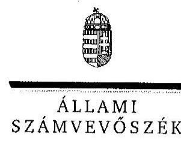

ELNÖK

Ikt. szám: V-2013-058-004/2011-2012.

Dr. Matolcsy György úr
miniszter
Nemzetgazdasági Minisztérium

Budapest

# Tisztelt Miniszter Úr! 

Az államháztartás központi alrendszerének adóssága és éven túli kötelezettségvállalásának ellenőrzése című jelentéstervezetre tett észrevételeit köszönettel megkaptam.

Az Állami Számvevőszék észrevételekre vonatkozó álláspontjáról a felügyeleti vezető által készített részletes tájékoztatást csatoltan megküldöm.

Tájékoztatom Miniszter urat, hogy a számvevőszéki jelentés szövegezése az elfogadott észrevételek figyelembevételével készül.

Budapest, 2012. 08. hónap  nap
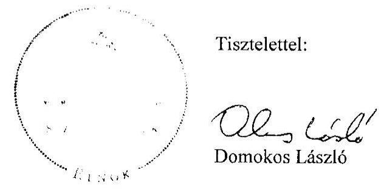

Melléklet: Tájékoztatás az elfogadott és az el nem fogadott észrevételekről

---

# Tájékoztatás   az elfogadott és az el nem fogadott észrevételekről 

Az államháztartás központi alrendszerének adóssága és éven túli kötelezettségvállalásának ellenőrzése című jelentéstervezetre tett észrevételeiket köszönettel megkaptuk.

Az Állami Számvevőszékről szóló
 2011. évi LXVI. törvény 29. § (2) bekezdése szerint: „Az ellenőrzött szervezet vezetője és a felelősként megjelölt személy az ellenőrzés megállapításaira 15 napon belül írásban észrevételt tehet.” Az öt észrevétel közül négy nem a megállapításokat, hanem a javaslatokat érinti. A javaslatokat érintő válaszuk azonos az ÁKK észrevételeivel. Ez a kialakított döntési felelősségi rendszer általunk jelzett kockázatait támasztja alá. Nem jelenik meg a minisztériumnak, mint az adósság finanszírozásáért felelős szervezetnek az álláspontja. Az észrevételekkel kapcsolatos válaszunk - levelük sorrendje szerint - a következő.

1. Az 1. sz. javaslatot megfontolásra érdemesnek tartják. Bízunk benne, hogy a minisztérium által elkészítendő intézkedési terv részletesen be fogja mutatni annak teljesülését.
2. A 2. sz. javaslatot nem támogatják. Ennek alátámasztására felhozott érveikkel szemben ellenőrzésünk során azt tapasztaltuk, hogy

- A devizadöntéssel kapcsolatos hatáskörök csak részben szabályozottak. A deviza forrásbevonásra vonatkozó döntéshozatallal kapcsolatban részleges hatáskört az ÁKK Zrt. állandó bizottságainak részletes működési és eljárási szabályairól szóló 7/2007. sz., a lebonyolításra vonatkozó részleges eljárásrendet az ügyviteli szabályzatról szóló 8/2007. sz. vezérigazgatói utasítások tartalmaznak. Ugyanakkor a forint állampapír kibocsátásokkal kapcsolatban hatáskört az SZMSZ, eljárásrendet egyéb önálló utasítás (21/2001. sz. utasítás a forint adósság eljárási rendről) szabályoz.
- 2007-től az ÁKK Zrt. igazgatóságának döntése alapján az egyes devizakötvény kibocsátási tranzakciókra vonatkozó döntések a vezérigazgató felelősségi körébe tartoznak, azonban az ÁKK Zrt. vezérigazgatója az egyes kibocsátásokhoz megkérte a miniszter engedélyét. A devizakötvény kibocsátási tranzakcióra vonatkozó döntést a miniszter 2009-ben és 2012-ben is magához vonta. A forrásbevonások során a miniszteri felhatalmazások alapján meghirdetett mennyiséghez képest nagyobb mértékű vagy hosszabb futamidejű kibocsátásokról is hozott döntést a vezérigazgató. 2010 és 2011 kivételével a devizakötvény kibocsátás tervezett és tényleges összege jelentősen eltért.
- Az egyes devizakötvény kibocsátási tranzakciók utáni részletes, dokumentált igazgatósági tájékoztatás nem valósult meg minden esetben. A 2009. évet követően az igazgatóság az egyes devizakötvény tranzakciókról nem hozott határozatot.

---

- A gyorsabb, rugalmasabb döntéshozatalt nem támasztja alá, hogy „2010-ben hónapokig nem volt Igazgatóság, ami a korábbi rendszerben döntést hozhatott volna”, ugyanis ebben az időszakban nem volt devizakötvény kibocsátás.
- Az ÁSZ éves zárszámadáshoz kapcsolódó ellenőrzései - jelen ellenőrzéstől eltérő szempontok alapján - a központi költségvetés kamatelszámolásai szabályszerűségének megítélésére irányultak. Ezek során az ÁSZ nem ellenőrizte sem a devizaadósság műveleteket, sem a döntéshozatali rendet. Mindezek következtében az ÁSZ azok megfelelőségét így nem állapíthatta (nem állapította) meg.
Az előzőekben részletezettek miatt továbbra is fenntartjuk, hogy a deviza forrásbevonási műveletekkel kapcsolatos döntési- és felelősségi hatáskörök nem egyértelműen tisztázottak. Az intézkedés előírása ezért indokolt még akkor is, ha az ÁKK Zrt. irányítási rendszerének 2010. évi módosítása óta javult a helyzet. A javaslatot azonban erre tekintettel az alábbiak szerint módosítjuk:
„Vizsgálja meg, hogy a deviza forrásbevonással kapcsolatos döntéshozatali rendszer során összhangban vannak-e a felelősségi és döntési hatáskörök, szükség esetén intézkedjen az összhang biztosításáról.”
3. A 3. sz. ÁSZ javaslatot nem támogatják. Véleményük szerint a forint és a devizaadósság kamatterhe jól tükrözi a költség és kockázat optimalizáció eredményességét, amiatt, hogy miközben 2006-2011 között az államadósság 64%-kal növekedett, addig a kamatterhek csak 13,2%-kal.

A kamatteher alakulása fontos szempont az adósságkezelés eredményességének megítélésében, ugyanakkor az csak egyik eleme az adósságkezelés költségeinek. Emiatt az észrevételükben leírt arányosítás téves következtetésekre vezethet. Az adósságkezelés közvetett (rejtett) költsége a devizában fennálló adósság árfolyamváltozása. Ezen túl a devizában fennálló adósság kezelése során végrehajtott kockázatkezelési műveletekhez (swap ügyletek) kapcsolódó mark-to-market betétek, az azok képzéséhez felvett devizahitelek és azok kamatelszámolásai is költségeket jelentenek. A devizában fennálló adósság költségei a kamatkiadáson kívül nem átláthatóak, azok együttes - az előzőekben leírtak szerinti - pénzügyi hatását az ÁKK nem mutatja ki.

Minderre tekintettel szükségesnek tartjuk az adósságkezelés összes költségére kiterjedő, a költséghatékonyságot is mérni tudó értékelési rendszer kialakítását.
4. A 4. számú javaslatunk végrehajtásának időtartamára vonatkozó jelzésüket az intézkedési terv véleményezése során tudjuk értékelni. Megjegyezzük azonban, hogy a költség- és kockázatkezelési modell jelentéstervezetünkben jelzett kockázatai, valamint az adósságkezelés tartalmának 2012-től bekövetkezett kiterjesztése szükségessé teszik annak mielőbbi felülvizsgálatát és módosítását.
5. A kezesség és garanciabeváltások előirányzatával kapcsolatos, az előirányzat túlléphetőségének kockázatára vonatkozó javaslatukat elfogadtuk. Az észrevételekkel érintett, 59. oldal utolsó bekezdését a számvevőszéki jelentésben a következők szerint pontosítjuk:

---

„A hitelkockázat mérséklésére fedezetként szolgáló kezességek, illetve garanciák érvényesíthetősége érdekében - a kezesség- és garanciák érvényesíthetősége céljából - felülről nyitott, módosítás nélkül is túlléphető, a költségvetési hiányt az állam piaci kockázatok megosztásában vállalt szerepéből adódó, esetlegesen kedvezőtlenül érintő hatása miatt kockázatos.”

Budapest, 2012. 04. hó 10. nap

Makkai Mária
felügyeleti vezető

---

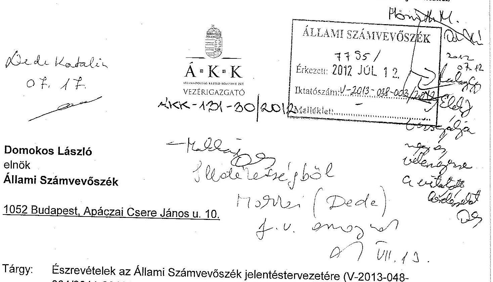

Tárgy: Észrevételek az Állami Számvevőszék jelentéstervezetére (V-2013-048-004/2011-2012.)

# Tisztelt Elnök Úr! 

„Az államháztartás központi alrendszerének adóssága és éven túli kötelezettségvállalásának ellenőrzéséről” címmel készített jelentéstervezetet az ÁKK Zrt. már többször is véleményezte. Sajnálatosnak tartom, hogy a jelentés végsőnek szánt változata megjegyzéseink nagyobbik részét figyelmen kívül hagyta. Erre tekintettel kénytelen vagyok azok többségét megismételni.

## Koncepcionális megjegyzések

Sajnálatos módon már a koncepcionális kérdésekben is alapvető véleménykülönbség alakult a vizsgálatot végző számvevők és az ÁKK Zrt. álláspontja között a következő területeken:

1. Tiszteletre méltó az ÁSZ hivatkozása a 2006-os kijelentésükre a finanszírozási kockázatokról, azonban a bevezető gondolat tökéletesen figyelmen kívül hagyja azt a tényt, hogy a válság valamennyi kelet-európai országot nagyon súlyosan érintette - függetlenül államadósságuk nagyságától. Nemcsak Magyarországnak voltak problémái a kötvények értékesítésével, hanem a jóval kisebb államadóssággal rendelkező Csehországnak és Romániának is. A 2007-8-ban kitört nemzetközi tőkepiaci válság ugyanis olyan súlyosságú és hosszú, ami a legfejlettebb és legprudensebb fiskális politikát folytató országnak is komoly problémákat okozhat (lásd például Írország jelenlegi helyzetét).

---

2. Emellett a magyar államadósság-kezelés - a lehetőségekhez képest kifejezetten felkészült a válságra, így a Jelentés ezen a részen több téves állítást is tartalmaz. Az államadósság-kezelés költség-kockázat optimalizációja - a legjobb nemzetközi gyakorlattal megegyezően - benchmarkok kitűzésével, követésével és a felügyeletet gyakorló minisztérium általi ellenőrzésével történt és történik. Amennyiben a benchmarkok teljesülnek, akkor az optimalizáció teljesül. Ebből is következik, hogy az adósságkezelés nem részesítette előnyben a devizaadósságot (2008 októberéig, az IMF hitel lehívásáig a devizaadósság aránya 28-29% között alakult, ami a vonatkozó benchmark közepe), a forintadósság ugyanúgy nőtt, mint a devizaadósság. A másik benchmark, a duráció pedig azt mutatja, hogy a válság előtt az adósságkezelés csökkentette a kamatkockázatot. A durációs cél (2-3 év között) esetében az ÁKK 2008-ban 2,9 évre növelte a durációt, ami a válságra történő felkészülést szolgálta a kisebb kamat- és megújítási kockázat miatt - ami általában nagyobb költséget okoz.
3. A duráció kapcsán kifejtett, a hagyományos megközelítést tükröző ÁSZ véleményt, miszerint a kincstárjegy a finanszírozás biztonsága szempontjából kockázatos instrumentum, ezért mellőzendő, viszont az államkötvény „biztonságos”, a válság nem igazolta vissza. 2008-ban a válság legnehezebb hónapjai alatt az ÁKK folyamatosan értékesítette az aukciókon a diszkont kincstárjegyeket (és egyéves lakossági kincstárjegyeket), miközben nem tudta a „biztonságos” államkötvényeket értékesíteni, sőt 2009-ben még kötvény visszavásárlási programra is szükség volt a kötvénypiac stabilizálásához.
4. Kifejezetten téves az ÁSZ azon állítása, hogy a CDS kockázati felár emelkedése beépült az államadósságra fizetett kamatokba, „…így az államadósság emelkedő kamat- és költségszintek mellett volt finanszírozható.” Az államadósság átlagos kamata és a forint adósság átlagkamata a vizsgált 2006-11 közötti időszakban 2010 végén érte el a minimumát, ekkor volt az összes, valamint a forint adósság kamata is a legalacsonyabb. Ennek több oka is van, azonban egyértelmű, hogy az államadósság kamatszintje nem nőtt, hanem csökkent a válság éveiben. Ez, az ismert körülmények között, úgy véljük komoly sikernek tekinthető. Kétségtelenül voltak időszakok, amikor a másodpiaci és az aukciós hozamok magasak voltak. Azonban egyértelmű, hogy az ÁKK olyan finanszírozási politikát tudott folytatni, ami az átlagos költség esetében korlátozta ezen hatások begyűrűzését. A Jelentés is megállapítja, hogy miközben az államadósság 5 év alatt 64%-kal emelkedett, a kamatkiadás csak 13%-kal, amiből az Összegzésben szereplőtől eltérő következtetést is levonhattak volna a hatékonyság tekintetében.
5. A Jelentés szerint az adósságkezelésben kialakított döntési rendszer „…nem segítette teljes mértékben a hatékony adósságfinanszírozást.” Ezzel

---

kapcsolatban a döntési jogkörök alacsonyabb szintre delegálását jelölte meg fő problémaként, egyes megfogalmazásai pedig egyenesen arra utalnak, mintha azt tekintené optimálisnak a jelentés, ha legtöbb döntést a lehető legmagasabb szinten hoznák meg, azaz az igazgatóság illetve a miniszter szintjén. Ez a felfogás ellentmond annak jogalkotói akaratnak, amely kimondja, hogy az államháztartásért felelős miniszter az ÁKK Zrt. útján látja el az adósságkezeléssel kapcsolatos feladatait. Az elkülönült adósságkezelő szervezet beiktatására pedig egyfelől egyértelműen azért van szükség, mert az államadósság finanszírozása a bel- és külföldi pénz- és tőkepiacokon valósul meg, ahol a piaccal való érintkezés általában az államigazgatási eljárásban alkalmazottnál lényegesen gyorsabb döntéshozatali rendszert tesz szükségessé. Másfelől a döntéseket hosszú távú szemléletben kell meghozni, hiszen az adósságkezelés, és ezen belül egy-egy kibocsátás időtávja akár 10-30 év is lehet, ami szintén nem szokványos időtáv az államigazgatásban. Ezeket a feladatokat a leghatékonyabban egy elkülönült, megfelelő döntési hatáskörrel felruházott szervezet képes megfelelő szinten ellátni. Az ÁKK Zrt. véleménye szerint az eddigi gyakorlat megállta a helyét, amit, sajátos módon, éppen a kivételek igazolnak, vagyis azok az esetek, amikor a tulajdonosi jogokat gyakorló miniszter, vagy államtitkár valamilyen oknál fogva magához vont bizonyos döntéseket. Ilyen volt például 2008 novemberében az IMF hitelcsomag lehívása, amellyel kapcsolatban egyébként a Jelentés sajnálatos módon nem említi meg azt a tényt, hogy erre a lépésre nem adósságkezelési vagy finanszírozási okból volt szükség. Sőt, éppen egyik adósságkezelési hibaként emeli ki a devizaadósság nagyságának és részarányának növekedését, amely tehát egyrészt a nemzetközi hitelcsomag igénybevétele kapcsán nem is az adósságkezelő, hanem a miniszter, illetve a kormány döntése volt, másrészt a belföldi forint államkötvénypiac 2008-as őszi összeomlása következtében a devizafinanszírozás felfutása később részben szükségszerű lépés volt.
6. A Jelentés sajnálatos módon egységes időszakként kezeli a vizsgált 5 évet, holott a 2006-2007-es, azaz a válság megérkezése előtti időszak egészen másfajta körülmények és stratégia mellett alakult, mint az azt követő. A 2008-ban megváltozott körülmények hatására az ÁKK Zrt. részben kényszerűen módosított az addig alkalmazott stratégián. Így például a nemzetközi hitelcsomag lehívása következtében kénytelen volt módosítani a devizabenchmarkon. Átalakította és újjászervezte az elsődleges államkötvénypiacot, új kibocsátási és aukciós rendszert vezetett be.
7. Az egy külön, a szakirodalomban alaposan megvizsgált kérdéskör, hogy mikor válik az adósság öngerjesztővé, azaz mikor alakul ki adósságspirál. Ebben többféle értelmezés és álláspont létezik, bármelyikük alkalmazása az adósságalakulás értékelésekor lehetséges. Az még nem lenne baj, hogy a Jelentés által
 alkalmazott megközelítés sajnálatos módon nem ezek

---

valamelyikét alkalmazza, de az már igen, hogy téves következtetésekre ad lehetőséget. Így elsősorban rögzíteni kell, hogy a 2006-2007 közötti időszakban a jelentős mértékű elsődleges deficit eredményezte az adósság növekedését, 2008-ban pedig a nem adósságcélú hitellehívás a nemzetközi hitelcsomagból. A nettó kamatkiadások tartósan a GDP 4%- alatt alakultak a vizsgált időszakban, (sőt már azt megelőzően is!), ami már kismértékű elsődleges többlet esetén is biztosította volna az adósságráta csökkenését.

# Vélemény a nemzetgazdasági miniszternek tett intézkedést igénylő megállapításokról 

Közvetlenül az ÁKK Zrt.-t a 2-4 megállapítások érintik, amelyekkel kapcsolatban az alábbiakat kívánom rögzíteni:

1. Az ott megfogalmazott formában az ÁKK-nak nem áll módjában elfogadni a 2. számú ajánlást, mivel az államadóssággal kapcsolatos döntéshozatal a devizaadósság esetén is jól meghatározott, jól dokumentált és tisztázott. A vonatkozó jogszabályok alapján az államháztartásért felelős miniszter a finanszírozás végrehajtásáért, a fizetőképesség fenntartásáról az ÁKK Zrt. útján volt felelős az ÁHT szerint (régi ÁHT 113/A §). Eszerint a miniszter stratégiai kérdésekben saját maga dönt, az operatív jogköröket (így a konkrét tranzakció paramétereiről szóló döntést) pedig az ÁKK Zrt-hez delegálja.

A stratégiai döntéseket az államháztartásért felelős miniszter hozza a stratégia és az éves finanszírozási terv jóváhagyásával, ami ebben az esetben az éves összes devizakibocsátás összegének meghatározását is jelenti. Az egyedi tranzakciókra vonatkozó döntéseket a finanszírozási tervben foglaltaknak megfelelően az ÁKK Zrt. hozza. 2007-ben csupán az a változás történt, hogy az ÁKK Zrt. Igazgatósága helyett az ÁKK Zrt. menedzsmentjéhez került az operatív döntés azzal, hogy az Igazgatóság a tranzakció után részletes tájékoztatást kap (ami meg is történik). A kibocsátásra vonatkozó döntést a vezérigazgató hozza, a Finanszírozási bizottság technikai részletkérdésekben dönt. A konkrét kibocsátással kapcsolatos döntés delegálásának célja az Igazgatóság részéről a rugalmasabb és gyorsabb működés volt, amit igazolt az is, hogy 2010-ben hónapokig nem volt Igazgatóság, ami a korábbi rendszerben döntést hozhatott volna. Amennyiben az Igazgatóság (ide értve a jelenlegi Igazgatóságot is) nem lett volna elégedett az új döntési rendszerrel, akkor bármikor ismét magához vonhatta volna a döntést. Az Állami Számvevőszék is évente vizsgálta a devizaadósság műveleteket is, és eddig érdemben nem kifogásolta ezt a gyakorlatot.

---

A részletes vizsgálati jelentés e kérdéssel kapcsolatban azt a konkrét megállapítást teszi, a döntési jogkört delegáló igazgatósági határozatnak megfelelő feladatkör változás nem került átvezetésre a Szervezeti és működési szabályzatban a vezérigazgató feladatai között. Ez valóban hiba volt, de azért ebből nem következik, hogy tisztázatlanok lettek volna a döntési és felelősségi jogkörök a devizakibocsátások tekintetében, hiszen a vezérigazgató esetében az Igazgatóság határozata, az állandó bizottságok esetében az Igazgatóság döntésének megfelelően 2007. június 18-án módosított ügyrendje egyértelműen rendezte a felelősségeket és döntési jogköröket. Az ellenőri jelentésnek a konkrét megállapítást (t.i. az SzMSz-be nem került átvezetésre) kellene tartalmaznia, és nem a sajtó és a közvélemény által félreérthető általános megfogalmazásokat.
Az ÁKK Zrt. álláspontja szerint a deviza forrásbevonási döntési jogkörök tisztázottak. A stratégiai döntést a miniszter hozza, a konkrét operatív döntéseket - megfelelő delegálás és dokumentáltság mellett - az ÁKK Zrt. Általános felülvizsgálatra nincs szükség, az SzMSz-t pedig megfelelően módosítjuk.
2. Az ÁKK Zrt. úgy véli, hogy a forint és a devizaadósság kamatterhe jól tükrözi a költség és kockázat optimalizáció eredményességét. Ezt jól mutatja, hogy miközben 2006-11 között az államadósság 64%-kal növekedett, addig a nettó kamatterhek csak 13%-kal. A kockázatok helyes kezelését mutatja továbbá, hogy 2008 végéig a devizaadósság aránya a benchmark sáv középértékén, 28-29% között mozgott, ami korlátozta az árfolyamkockázatot. A devizaadósság növekedése az IMF hitel lehívása miatt, az ÁKK Zrt-től független döntés alapján történt. A költség-kockázat optimalizációs a nemzetközi gyakorlatban is használt módon benchmark modellel történik, ami alapján határozódnak meg az államadósságra vonatkozó benchmarkok. A benchmarkok alakulásáról negyedévente beszámoló készül az igazgatóság részére, amely részletesen elemzi az adott időszak folyamatait.

Már ma is van megfelelő értékelési rendszer az adósságkezelési tevékenység költséghatékonyságának vizsgálatára, az ugyanakkor ÁKK Zrt. a benchmark modell továbbfejlesztése során figyelembe kívánja venni az Állami Számvevőszék javaslatait.
3. Az adósságkezelés céljából alkalmazott benchmark modelleket az adósságkezelők tartósan, évekig használják, ezen modellekkel szemben elvárás is, hogy évente ne változzon jelentősen az általuk adott eredmény, hiszen az az államadósság-kezelés szempontjából értéketlen és megvalósíthatatlan lenne. Emiatt a jelenlegi modell nem lenne elavult. A céljának a modell a válság bekövetkezéséig, az IMF/EU hitelcsomag lehívásáig eleget is tett, amit az addig évente lebonyolított felülvizsgálatok (újabb futtatások) is igazoltak. A válság hatására és az IMF hitel lehívása miatt

---

lényegileg megváltozott a finanszírozás mozgástere. Emiatt valóban szükséges egy új modell kifejlesztése, ami az ÁKK Zrt. jövőbeni célja. (Megjegyezzük, hogy a 2004-es modell kidolgozása is 3-5 évig történt, így a következő modell elkészítése is sok időt igényelhet). A fejlesztés során az ÁKK Zrt. figyelembe fogja venni a nemzetközi tapasztalatokat - akárcsak a 2004-es fejlesztés során.

Az ÁKK Zrt. tovább fogja fejleszteni a teljesítménymutatókat meghatározó benchmark modellt, azonban ennek megvalósíthatósága több év. Az időigényt a kutatás és fejlesztés időigénye mellett egyáltalán a jelenlegi piaci környezet és a stabil összefüggések megismerése is szükségessé teszi.

# Egyéb megjegyzések 

Kizárólag a Részletes megállapításokban szerepel az ÁKK Zrt. premizálási rendszerének bírálata, amely megállapításokat az ÁKK Zrt. kénytelen határozottan visszautasítani. A Jelentés megállapításai a hivatkozott jogszabály téves értelmezésén alapulnak. Mind a korábbi szabályozás, mind a jelenlegi (lásd Köztulajdon tv.) igenis lehetővé tette, illetve teszik a ténylegesen meghatározott prémiumfeladatok kiírását, így az ÁKK Zrt. és az NGM álláspontja szerint az ÁKK Zrt. javadalmazási szabályzata összhangban állt és áll a vonatkozó jogszabályokkal. (A 2011-től hatályos szabályzatot az NGM Jogi főosztálya készítette el.) Kérjük Elnök urat, hogy fenti észrevételeinket a Jelentés végső változatában figyelembe venni szíveskedjenek.

Budapest, 2012. július 10.
Tisztelettel:
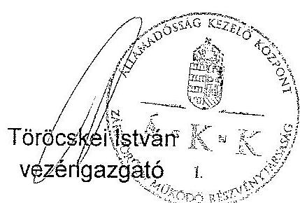

---

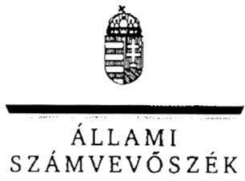

ELNÖK

Ikt.szám: V-2013-048-005/2011-2012.

Töröcskei István úr
vezérigazgató
Államadóság Kezelő Központ Zrt.

Budapest

Tisztelt Vezérigazgató Úr!

Az államháztartás központi alrendszerének adóssága és éven túli kötelezettségvállalásának ellenőrzése című jelentéstervezetre tett észrevételeit köszönettel megkaptam.

Az Állami Számvevőszék észrevételekre vonatkozó álláspontjáról a felügyeleti vezető által készített részletes tájékoztatást csatoltan megküldöm.

Tájékoztatom Vezérigazgató urat, hogy a számvevőszéki jelentés szövegezése az elfogadott észrevételek figyelembevételével készül.

Budapest, 2012. 03. hó 10. nap

Tisztelettel:

Domokos László

Melléklet: Tájékoztatás az elfogadott és az el nem fogadott észrevételekről

LOS2 BUDAPEST, APÁCZAI CSERE JÁNOS UTCA 10. 1364 Budapest 4. Pf. 54 telefon: 484 5101 fax: 484 5201

---

# Tájékoztatás   az elfogadott és az el nem fogadott észrevételekről 

Az államháztartás központi alrendszerének adóssága és éven túli kötelezettségvállalásának ellenőrzése című jelentéstervezetre tett észrevételeiket köszönettel megkaptuk. Sajnálatos, hogy az ÁSZ megállapításaira vonatkozó konkrét észrevételek helyett koncepcionális megjegyzéseket tettek és olyan megállapítást hiányolnak a jelentéstervezetből, ami abban szerepel (pl. az IMF hitel kérdéskörnél).
I. Az Önök által 2012. július 10-én elküldött észrevételekből az elfogadottakat az alábbi módon kezeljük.

1. A durációra vonatkozó 3. sz. észrevételükkel kapcsolatban töröljük a bekezdésből a diszkontkincstárjegyekre való hivatkozást, ugyanakkor azt, hogy az adósság portfólió alacsony átlagos hátralévő futamideje kockázat, továbbra is fenntartjuk. A jelentéstervezet összegzésének vonatkozó részét a következőkre pontosítjuk:
„Az adósság portfólió átlagos hátralévő futamideje a nemzetközi átlaghoz képest alacsony volt, ami kedvezőtlen az államadósság finanszírozásának biztonsága szempontjából."
2. A CDS felár fizetett kamatokba való beépülésével kapcsolatos 4. sz. észrevételüket elfogadtuk. Az összegzés érintett mondatát a számvevőszéki jelentésben a következők szerint pontosítjuk:
„A 2008. októberre 600 bázispont fölé emelkedő, majd a válság előtti szintnél tartósan magasabb CDS felárat követte a kötvények hozamfelára, amely mint kockázati felár beépül a fizetett kamatokba, így az adósság emelkedő kamat- és költségszintek mellett volt finanszírozható."
II. A jelentéstervezet korábbi egyeztetése során egyértelművé vált, hogy véleményeltérés van a deviza forrásbevonási döntés, a költség-kockázat optimalizáló modell értékelése és a premizálási gyakorlat témakörökben az Állami Számvevőszék és az Államadósság Kezelő Központ Zrt. között. Álláspontjuk az, hogy a korábban megküldött és általunk el nem fogadott észrevételeket továbbra is fenntartják. Az ellenőrzés során rendelkezésünkre bocsátott dokumentumok, valamint a válaszlevélben leírtak nem támasztják alá eltérő véleményüket, így megállapításainkat változatlanul fenntartjuk.

---

A fennmaradó véleménykülönbségek az alábbi témaköröket érintik.

1. Az 1. sz. észrevételük szerint a bevezető gondolatban nem vettük figyelembe a válság hatását.
A 2006-ban megjelent 0604. számú, az államháztartás adóssága kezelésének, alakulásának ellenőrzéséről szóló ÁSZ jelentésben adósságkezelési szempontból kedvezőtlen változások bekövetkezése esetére jeleztük az adósságállomány nagyarányú külső finanszírozásának kockázatait. Tény, hogy a hivatkozott jelentés megjelentetését követően az abban jelzett kockázatokra, az adósságállomány külső (külföldiek általi) finanszírozásának csökkentésére vonatkozóan nem készítettek sem elemzést, sem cselekvési tervet. Az általunk leírt kockázatok bekövetkeztek, emiatt a megállapításunkat fenntartjuk.
2. A 2. sz. észrevételük szerint a magyar államadósság-kezelés felkészült a válságra, a költségkockázat optimalizáció a legjobb nemzetközi gyakorlattal megegyezően történik. Véleményük szerint az adósságkezelés nem részesítette előnyben a devizaadósságot, továbbá az ÁKK Zrt. durációs célja csökkentette a kamatkockázatot.
A helyszíni ellenőrzéshez kapcsolódóan írásban kértük a válságra való felkészülés, illetve értékelésére vonatkozó dokumentumok átadását - „1. az államadósság-kezeléssel összefüggő válságkezelő intézkedések, döntések (tételes felsorolás), azok előterjesztései, elemzései és hivatalos levelezés; 2. a válságkezelési intézkedések utólagos értékelésének, elemzésének dokumentációja; 3. a jövőbeni esetleges válságokra (akár 2011. év) való felkészüléssel kapcsolatos intézkedések (tételes felsorolás), azokhoz kapcsolódó előterjesztések és döntések" -, melyekre nemleges választ kaptunk. Ezért a válságra való felkészülés dokumentumokkal nem alátámasztott.

Az adósságkezelés rendszerének kialakítását - benchmarkok kitűzése, követése - nem kifogásoltuk. Ugyanakkor a benchmarkok konkrét értékét megállapító modell nem auditált, továbbá számos kockázati tényezőt nem kezel. Az észrevételük szerint axiómaként állítják, hogy ,,amennyiben a benchmarkok teljesülnek, akkor az optimalizáció teljesül". Ezt mérésekkel, számításokkal nem támasztották alá.

Devizakötvény kibocsátásra 2006-2008-ban a devizatörlesztés 2,3-2,9-szerese mértékben került sor. A kibocsátásokkal a devizaadósság aránya a benchmarkoknak megfelelt. Ugyanakkor a devizában való eladósodás - Önök által feltárt - kockázatait nem vették figyelembe. „A devizaadósság szerepe, hatása az adósságkezelésben" c. 2004. évi dokumentumban összefoglalásként megállapították, hogy ,,A konvergencia folyamat folyamatossága és kismértékű árfolyamváltozás esetén nagyobb devizaadósság kisebb adósságráta és hiányt jelenthet. Ez a „megtakarítás" azonban viszonylag kicsi. Nagyobbak ugyanis a kockázatok, így már amennyiben a nagyobb devizaadósság például a romló rating miatt leértékeli a forintot a 30%-os deviza finanszírozáshoz képest, az már költségesebbé teheti ezt a stratégiát. A nagyobb mértékű leértékelés (szélsőséges esetben valutaválság, ami több ország gyakorlatában előfordult az EMU csatlakozást megelőzően) pedig jelentősen ronthatja a devizafinanszírozás megítélését." Ugyanezen dokumentum szerint nemzetközi összehasonlításban is magas a devizaadósság aránya: „Az uniós országok az EMU csatlakozást megelőzően is alapjában belföldi devizanemben adósodtak el. Tették ezt annak ellenére, hogy az EMU időpontja egyre közelebb került, legalábbis a csatlakozók számára. A devizaadósság

---

aránya legjellemzőbben
 10% alatti szinten állt. A kisebb, nyitott gazdaságok esetében ennél magasabb, 20-33%-os devizaadósság arányt is megfigyelhettünk....

Durációs célt a forint portfolió esetében határoztak meg (2,5+/-0,5 év). Ezen az ellenőrzött időszakban nem módosítottak. A forintadósság-portfólió durációja 2008-ban 2,81 évről 2,56 évre csökkent (Adatforrás: Tájékoztató a magyar államadósság teljesítménymutatóinak alakulásáról). Az észrevételük, miszerint a válságra történő felkészülést szolgálta 2008-ban a duráció 2,9-re növelése nem felel meg a tényeknek.
3. Az 5. sz., a deviza forrásbevonási döntésre vonatkozó észrevételükben álláspontjuk az, hogy a döntés és felelősség összhang hiányára vonatkozó megállapításunk ellentmond annak a jogalkotói akaratnak, miszerint az államháztartásért felelős miniszter az ÁKK Zrt. útján látja el az adósságkezeléssel kapcsolatos feladatait. Gyorsabb döntéshozatali rendszer, illetve a hosszú távra vonatkozó döntésekkel indokolják a döntési hatáskör szükségességét.
A hivatkozott államháztartási törvény 113/A §. 2) bekezdésében a jogalkotó csak szervezési és nem döntési feladatokat írt elő az ÁKK Zrt. számára: „a költségvetési törvény keretében szervezi a központi költségvetés adósságát képező állampapír-kibocsátásokat, hitelfelvételeket és hitel-átvallalásokat".

Megállapításaink szerint a devizadöntéssel kapcsolatos hatáskörök csak részben szabályozottak. A vezérigazgató devizaforrás bevonással kapcsolatos hatáskörét az SZMSZ nem szabályozta, külön eljárásrend sincs, míg a belföldi forintkibocsátásra vonatkozóan igen. A miniszter 2009-ben és 2012-ben is magához vonta a devizakötvény kibocsátási tranzakcióra vonatkozó döntést. A forrásbevonások során a miniszteri felhatalmazások alapján meghirdetett mennyiséghez képest nagyobb mértékű vagy hosszabb futamidejű kibocsátásokról is hozott költségvetési hatással járó döntést a vezérigazgató. 2009-től nem dokumentált a tranzakciót követő tájékoztatás, mivel az egyes devizakötvény tranzakciókról szóló tájékoztatót az igazgatóság határozat formájában nem fogadott el.

A leírtak alapján fenntartjuk, hogy a feladatok és hatáskörök nem tisztázottak, ami kockázatot jelent a döntések átláthatósága és számon kérhetősége tekintetében.
4. A 6. sz. észrevételük szerint a válság ellenére egységes időszakként kezeltük az ellenőrzött 5 évet.
A jelentéstervezet a 2008. évi válság előtti és a válság utáni időszakra, illetve a teljes időszakra vonatkozó megállapításokat egyaránt tartalmaz, azok elkülönítésére a jelentés-tervezet elkészítése során tekintettel voltunk és bemutattuk a külső környezet változását. A jelentéstervezetben mind a két, eltérő gazdasági környezettel jellemezhető időszakban elemeztük az államadósság-kezelésre vonatkozó, alapító által jóváhagyott stratégiai célokat – amelyek a vizsgált időszak egészét tekintve érdemben nem változtak a válság megjelenése ellenére – azok végrehajtását, illetve az államadósság-kezelésre kidolgozott stratégiai hátterű, az ÁKK Zrt. számára szintén az Alapító által jóváhagyott benchmarkok (teljesítménymutatók) alakulását, betartását. Mind a két időszakban az elfogadott irányelvek és mutatók megalapozottságának vizsgálata során nem csak a stratégiai céloknak, a mutatóknak való megfelelést, hanem a kialakított rendszer, valamint az azt megalapozó, ÁKK Zrt. által kidolgozott modell kockázatait elemeztük, a vizsgálat mércéje (kritériuma) az adott környezetben létrejött adósságszerkezet hatékonysága volt.

---

Az észrevételükben hiányolt lépések közül a devizabenchmark módosításáról a 3. fejezetben, az állampapírpiac helyreállítását célzó intézkedésekről a 4.3. fejezetben írtunk. Az új kibocsátási és aukciós rendszer bevezetését (aukciók számának csökkenése, az 5 és 10 éves aukciók különválasztása, a 6 hónapos DKJ megszüntetése) - az ÁKK Zrt. értékelése hiányában - technikai lépésnek tartjuk, ezért azt nem szerepeltetjük a jelentéstervezetben.
5. A 7. sz. észrevételük szerint téves következtetéshez vezet, ha nem mutatjuk be az adósságalakulás okait.
Nem érthető, hogy az ÁKK Zrt. a jelentéstervezet mely részével kapcsolatban él kifogással. A jelentéstervezet összegző megállapításaiban, illetve a részletes megállapítások 1. fejezetében ugyanis az észrevételükkel (,,a 2006-2007 közötti időszakban a jelentős mértékű elsődleges deficit eredményezte az adósság növekedését, 2008-ban pedig a nem adósságcélú hitellehívás a nemzetközi hitelcsomagból.") azonos tartalmú megállapítást tettünk.
„Az államadósság növekedési üteme 2006-ban (15,2%) és 2008-ban (16,2%) kiugró volt, a többi évben 4,6-6,0% között alakult. A nagyobb arányú növekedést 2006-ban a magas központi költségvetési hiány (a végleges hiány 1961,6 Mrd Ft volt, amely 430,5 Mrd Ft-tal lépte túl a tervezettet), 2008-ban a Nemzetközi Valutaalaptól (IMF) lehívott hitel egy részének (1561,3 Mrd Ft) devizabetétként való elhelyezése okozta."
III. A jelentéstervezet javaslataihoz kapcsolódó észrevételek közül az Önök által nem támogatott, a döntéshozatali rendszert érintő javaslatot módosítva, az értékelési rendszer kialakítására vonatkozó javaslatot változtatás nélkül továbbra is fenntartjuk, mivel azok elutasítása nem megalapozott.
a) Az államadóssággal kapcsolatos döntéshozatali és felelősségi rendszer felülvizsgálatára vonatkozó javaslat.

Ellenőrzésünk során azt tapasztaltuk, hogy

- A devizadöntéssel kapcsolatos hatáskörök csak részben szabályozottak. A deviza forrásbevonásra vonatkozó döntéshozatallal kapcsolatban részleges hatáskört az ÁKK Zrt. állandó bizottságainak részletes működési és eljárási szabályairól szóló 7/2007. sz., a lebonyolításra vonatkozó részleges eljárásrendet az ügyviteli szabályzatról szóló 8/2007. sz. vezérigazgatói utasítások tartalmaznak. Ugyanakkor a forint állampapír kibocsátásokkal kapcsolatban hatáskört az SZMSZ, eljárásrendet egyéb önálló utasítás (21/2001. sz. utasítás a forint adósság eljárási rendről) szabályoz.
- 2007-től az ÁKK Zrt. igazgatóságának döntése alapján az egyes devizakötvény kibocsátási tranzakciókra vonatkozó döntések a vezérigazgató felelősségi körébe tartoznak, azonban az ÁKK Zrt. vezérigazgatója a kibocsátásokhoz megkérte a miniszter engedélyét. A devizakötvény kibocsátási tranzakcióra vonatkozó döntést a miniszter 2009-ben és 2012-ben is magához vonta. A forrásbevonások során a miniszteri felhatalmazások alapján meghirdetett mennyiséghez képest nagyobb mértékű vagy hosszabb futamidejű kibocsátásokról is hozott döntést a vezérigazgató. 2010 és 2011 kivételével a devizakötvény kibocsátás tervezett és tényleges összege jelentősen eltért.

---

- Az egyes devizakötvény kibocsátási tranzakciók utáni részletes, dokumentált igazgatósági tájékoztatás nem valósult meg minden esetben. A 2009. évet követően az igazgatóság az egyes devizakötvény tranzakciókról nem hozott határozatot.
- A gyorsabb, rugalmasabb döntéshozatalt nem támasztja alá, hogy ,,2010-ben hónapokig nem volt Igazgatóság, ami a korábbi rendszerben döntést hozhatott volna", ugyanis ebben az időszakban nem volt devizakötvény kibocsátás.
- Az ÁSZ éves zárszámadáshoz kapcsolódó ellenőrzései - jelen ellenőrzéstől eltérő szempontok alapján - a központi költségvetés kamatelszámolásai szabályszerűségének megítélésére irányultak. Ezek során az ÁSZ nem ellenőrizte sem a devizaadósság műveleteket, sem a döntéshozatali rendet. Mindezek következtében az ÁSZ azok megfelelőségét így nem állapíthatta (nem állapította) meg.

Az előzőekben részletezettek miatt továbbra is fenntartjuk, hogy a deviza forrásbevonási műveletekkel kapcsolatos döntési- és felelősségi hatáskörök nem egyértelműen tisztázottak. Az intézkedés előírása ezért indokolt még akkor is, ha az ÁKK Zrt. irányítási rendszerének 2010. évi módosítása óta javult a helyzet. A javaslatot azonban erre tekintettel az alábbiak szerint módosítjuk:
„Vizsgálja meg, hogy a deviza forrásbevonással kapcsolatos döntéshozatali rendszer során összhangban vannak-e a felelősségi és döntési hatáskörök, szükség esetén intézkedjen az összhang biztosításáról."
b) Az adósságkezelési tevékenység költséghatékonyságát mérő értékelési rendszer kialakítására vonatkozó javaslat.

A kamatteher alakulása fontos szempont az adósságkezelés eredményességének megítélésében, ugyanakkor az csak egyik eleme az adósságkezelés költségeinek. Emiatt az észrevételükben leírt arányosítás téves következtetésekre vezethet. Az adósságkezelés közvetett (rejtett) költsége a devizában fennálló adósság árfolyamváltozása. Ezen túl a devizában fennálló adósság kezelése során végrehajtott kockázatkezelési műveletekhez (swap ügyletek) kapcsolódó mark-to-market betétek, az azok képzéséhez felvett devizahitelek és azok kamatelszámolásai is költségeket jelentenek. A devizában fennálló adósság költségei a kamatkiadáson kívül nem átláthatóak, azok együttes - az előzőekben leírtak szerinti - pénzügyi hatását az ÁKK nem mutatja ki.

Minderre tekintettel szükségesnek tartjuk az adósságkezelés összes költségére kiterjedő, a költséghatékonyságot is mérni tudó értékelési rendszer kialakítását.
c) A 4. számú javaslatunk végrehajtásának időtartamára vonatkozó jelzésüket az intézkedési terv véleményezése során tudjuk értékelni. Megjegyezzük azonban, hogy a költség- és kockázatkezelési modell jelentéstervezetünkben jelzett kockázatai, valamint az adósságkezelés tartalmának 2012-től bekövetkezett kiterjesztése szükségessé teszik annak mielőbbi felülvizsgálatát és módosítását.

---

IV. A premizálási rendszer megállapításaival kapcsolatos észrevételük

Változatlanul fenntartjuk megállapításunkat, mivel az államháztartási törvényben előírt alapfeladatok teljesítésére határoztak meg prémiumfeladatokat, ami nem jelentett többletfeladatot.

Budapest, 2012. 04. hó 10. nap

Makkai Mária
felügyeleti vezető

---

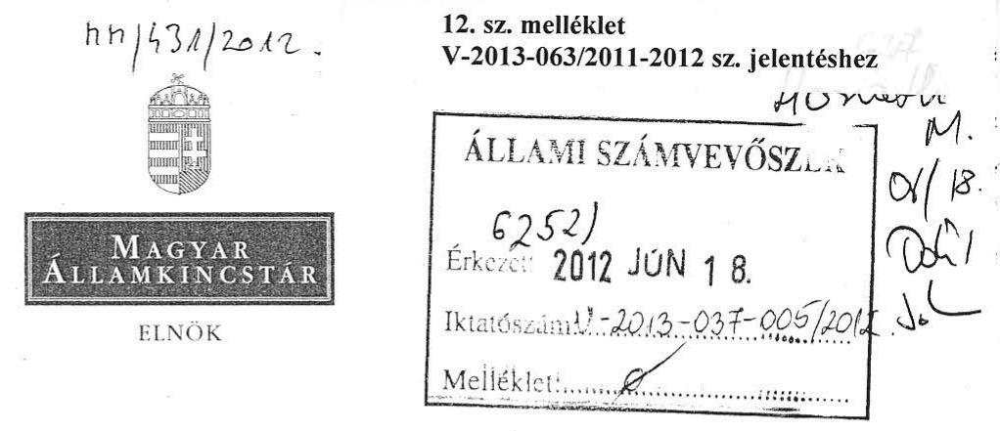

Domokos László
elnök

Állami Számvevőszék
Budapest

Tisztelt Elnök Úr!

Ikt.sz.: ELN-1091/2/2012.
Hiv.sz.: V-2013-049-003/2011-2012.
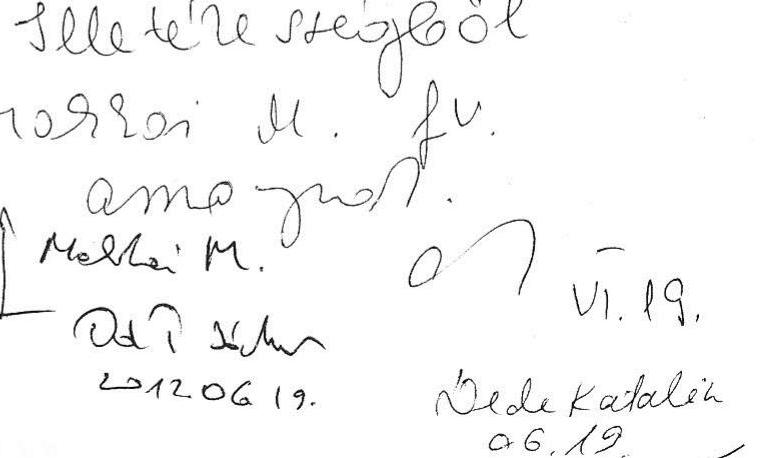

Az államháztartás központi alrendszerének adóssága és éven túli kötelezettségvállalásának ellenőrzéséről szóló V-2013-060/2011-2012. iktatószámú jelentéstervezethez észrevételt nem teszünk.

Budapest, 2012. június 15.

Tisztelettel:
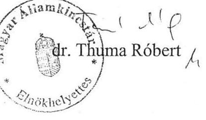
