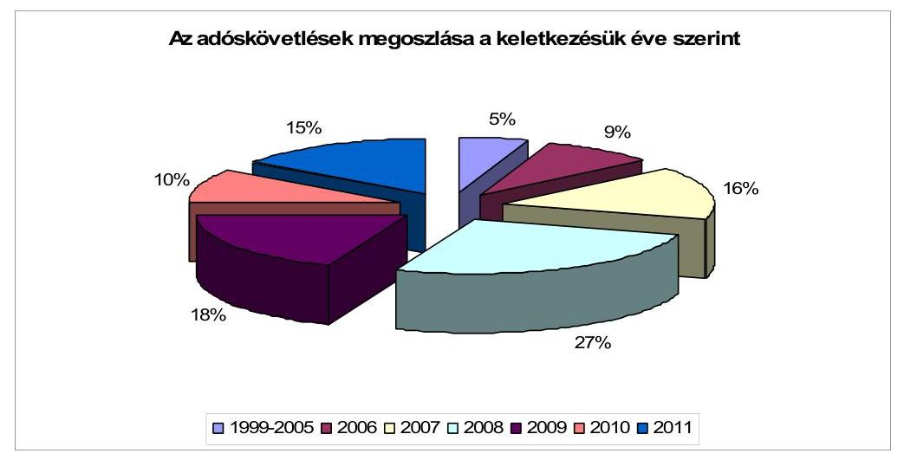
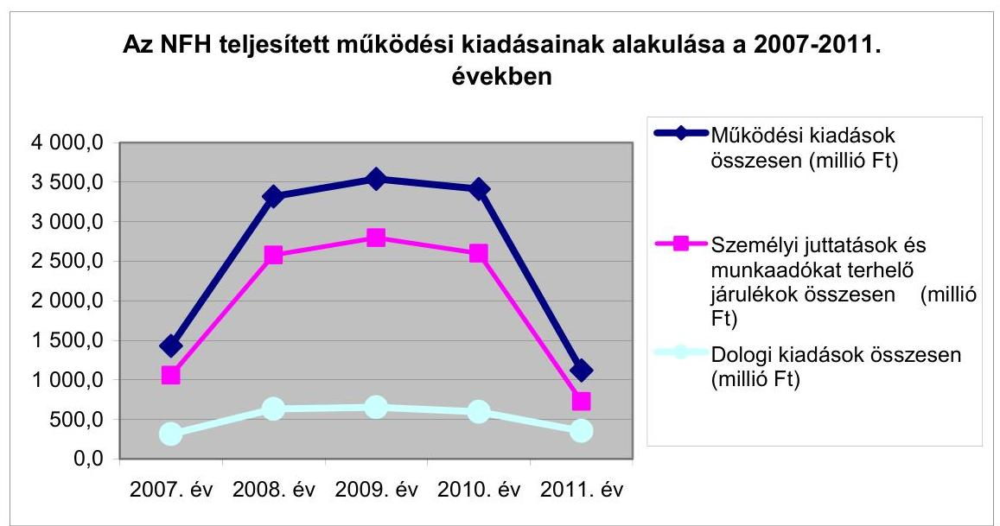
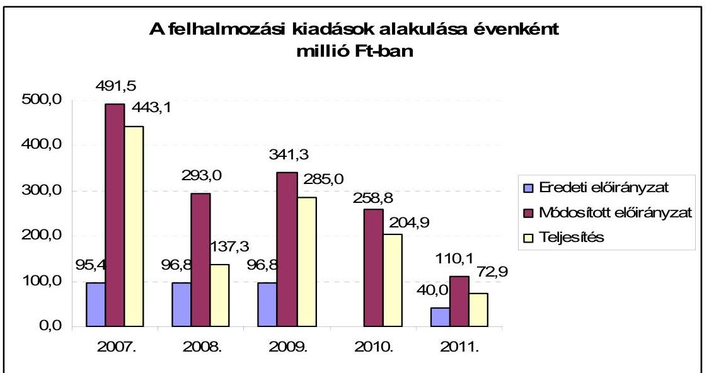
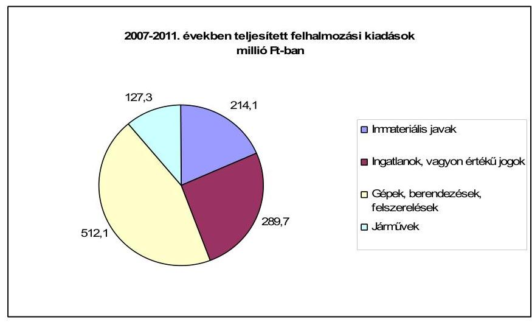
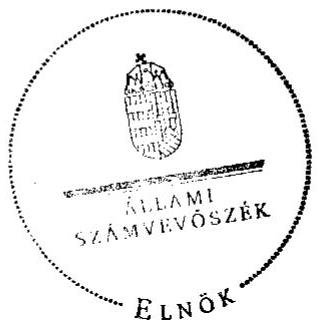
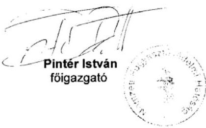

# ÁLLAMI   SZÁMVEVŐSZÉK 

## JELENTÉS

a Nemzeti Fogyasztóvédelmi Hatóság ellenőrzéséről

---

# Állami Számvevőszék 

Iktatószám: V-0019-034/2012.
Témaszám: 1058
Vizsgálat-azonosító szám: V-0588

## Az ellenőrzést felügyelte:

Holman Magdolna
felügyeleti vezető
Az ellenőrzés végrehajtásáért felelős és az ellenőrzést vezette:
Preller Zsuzsanna
ellenőrzésvezető
Az összefoglaló jelentést készítették:
Preller Zsuzsanna
ellenőrzésvezető
Bialkó Zsolt
számvevő tanácsos
Dr. Hegedüs György
számvevő tanácsos
Luhály Matild
számvevő
Dr. Marosi Gyöngyi
számvevő tanácsos
Szilágyi Zsuzsanna
számvevő tanácsos
Turai Erzsébet
számvevő
Vojcsekné Szabó Ágnes
számvevő tanácsos
Az ellenőrzést végezték:

| Dr. Hegedüs György | Luhály Matild | Kalmár István |
| :-- | :-- | :-- |
| számvevő tanácsos | számvevő | számvevő tanácsos |
| Kiss Ferenc Károlyné | Dr. Marosi Gyöngyi | Szepes Béla Bálint |
| számvevő | számvevő tanácsos | számvevő tanácsos |
| Szilágyi Zsuzsanna | Turai Erzsébet | Vojcsekné Szabó Ágnes |
| számvevő tanácsos | számvevő | számvevő tanácsos |

---

# TARTALOMJEGYZÉK 

BEVEZETÉS ..... 7
I. ÖSSZEGZŐ MEGÁLLAPÍTÁSOK, KÖVETKEZTETÉSEK, JAVASLATOK ..... 11
II. RÉSZLETES MEGÁLLAPÍTÁSOK ..... 16

1. A NFH 2011. évi költségvetésének végrehajtásáról készített beszámoló megbízhatósága ..... 16
2. Az NFH szervezete, irányítási, döntéshozatali és ellenőrzési rendszere működésének megítélése ..... 20
2.1. Az NFH szervezete, irányítási és döntéshozatali rendszere működésének szabályozottsága ..... 20
2.2. A belső ellenőrzés tevékenységének szabályszerűsége ..... 23
2.3. A belső kontrollrendszer szabályozottsága, a hatósági feladatellátás korrupciós veszélyeinek, kockázatainak feltérképezése ..... 27
2.4. A szakmai tevékenység ellátásához kapcsolódó szabályzatok, nyilvántartások szabályszerűsége, a megállapítások nyilvánosságra hozatala ..... 27
2.5. Az NFH fogyasztóvédelmi felügyelőségeket érintő szakmai felügyelete ..... 28
3. Az NFH fogyasztóvédelmi tevékenységének ellátása ..... 29
3.1. Az NFH által kezdeményezett jogszabály-módosítások, a fogyasztókat érintő jogszabályokról alkotott véleményezés, illetve a fogyasztóvédelmi politika kialakításában való közreműködés ..... 29
3.2. A hatósági ellenőrzési tevékenység ..... 30
3.3. Az NFH egyéb, alapfeladatot támogató tevékenysége ..... 32
3.4. Az irányító szerv NFH-t érintő szakmai és pénzügyi felügyeleti ellenőrzései ..... 33
4. Az NFH 2007-2011. évekre vonatkozó gazdálkodásának értékelése ..... 34
4.1. A könyvviteli mérlegben kimutatott vagyon alakulása ..... 34
4.2. A működési kiadások tervezésének megalapozottsága és teljesítésének szabályszerűsége, az emberi erőforrás gazdálkodás összhangja a feladatellátással ..... 37
4.3. A felhalmozási kiadások tervezése, a fejlesztési feladatok megvalósítása, az intézményi célkitűzések érvényesülése ..... 40
4.4. A működési bevételek beszedése és a költségvetési támogatások elszámolása ..... 42
5. Az ÁSZ 2007-2008. éveket érintő zárszámadási ellenőrzései javaslatainak hasznosulása ..... 43

---

# MELLÉKLETEK 

1. számú Vélemény az NFH 2011. évi éves intézményi költségvetési beszámolójáról
2. számú A Nemzeti Fogyasztóvédelmi Hatóság összlétszámának alakulása
3. számú A Nemzeti Fogyasztóvédelmi Hatóság ellenőrzési tevékenységét ellátók létszáma és az ellenőrzések száma
4. számú Az NFH válaszlevele a jelentéstervezetre

---

# RÖVIDÍTÉSEK JEGYZÉKE 

## EU-s joganyagok

2006/2004 EK rendelet
2007/76/EK bizottsági határozat

## Törvények

Alaptörvény
Áht.
Eisztv.

Fgytv.
Kbt.
Ket.

Kkv.

Kszjtv.

Sztv.
Ttv.

## Rendeletek

Áhsz.

Ámr $_{1}$.
Ámr $_{2}$.
Ber.

Hkr.
168/2004. (V. 25.) Korm. rendelet
a fogyasztóvédelmi együttműködésről szóló 2006/2004. EK rendelet
a kölcsönös jogsegélyről szóló 2007/76/EK bizottsági határozat

Magyarország Alaptörvénye
az államháztartásról szóló 1992. évi XXXVIII. törvény
az elektronikus információszabadságról szóló 2005. évi XC. törvény 2011. december 31-ig. 2012. január 1-jétől az információs önrendelkezési jogról és az információszabadságról szóló 2011. évi CXII. törvény
a fogyasztóvédelemről szóló 1997. évi CLV. törvény
a közbeszerzésekről szóló 2003. évi CXXIX. törvény
a közigazgatási hatósági eljárás és szolgáltatás általános szabályairól szóló 2004. évi CXL. törvény
a kis- és középvállalkozásokról, fejlődésük támogatásáról szóló 2004. évi XXXIV. törvény
a költségvetési szervek jogállásáról és gazdálkodásáról szóló 2008. évi CV. törvény (hatálytalan: 2010. augusztus 5-től)
a számvitelről szóló 2000. évi C. törvény
a fogyasztókkal szembeni tisztességtelen kereskedelmi gyakorlat tilalmáról szóló 2008. évi XLVII. törvény
az államháztartás szervezetei beszámolási és könyvvezetési kötelezettségének sajátosságairól szóló 249/2000. (XII. 24.) Korm. rendelet
az államháztartás működési rendjéről szóló 217/1998. (XII. 30.) Korm. rendelet
az államháztartás működési rendjéről szóló 292/2009. (XII. 19.) Korm. rendelet
a költségvetési szervek belső ellenőrzéséről szóló 193/2003. (XI. 26.) Korm. rendelet
a Nemzeti Fogyasztóvédelmi Hatóságról szóló 225/2007. (VIII. 31.) Korm. rendelet
a központosított közbeszerzési rendszerről, valamint a központi beszerző szervezet feladat- és hatásköréről szóló 168/2004. (V. 25.) Korm. rendelet

---

## Kormányhatározatok

III. középtávú fogyasztóvédelmi politika
IV. középtávú fogyasztóvédelmi politika

## Szórövidítések

ÁSZ
Belső ellenőrzési kézikönyv $_{1}$

Belső ellenőrzési kézikönyv $_{2}$

Belső ellenőrzési kézikönyv $_{3}$

Belső ellenőrzési kézikönyv $_{4}$

Belső ellenőrzési kézikönyv $_{5}$

EFK
EU
EVP
FEUVE
$\mathrm{FEUVE}_{1}$

$\mathrm{FEUVE}_{2}$

FEUVE $_{3}$

FEUVE $_{4}$

Főigazgató
GVH
a III. középtávú fogyasztóvédelmi politika megvalósítására irányuló, 2007-2010 közötti időszakra szóló cselekvési program végrehajtásához szükséges kormányzati intézkedésekről szóló 1033/2007. (V. 23.) Korm. határozat
Magyarország IV. középtávú fogyasztóvédelmi politikájának megvalósítására irányuló 2014-ig szóló feladatterv végrehajtásához szükséges kormányzati intézkedésekről szóló 1011/2012. (I. 23.) Korm. határozat

Állami Számvevőszék
17/2004. sz. Főigazgatói Utasítás a Fogyasztóvédelmi
Főfel-ügyelőség Belső Ellenőrzési Kézikönyvéről (hatályos 2004. 03. 05-től)

23/2007. sz. Főigazgatói Utasítás a Nemzeti Fogyasztóvédelmi Hatóság Belső Ellenőrzési Kézikönyvéről (hatályos 2007. 10. 31-től)
6/2010. sz. Főigazgatói Utasítás a Nemzeti Fogyasztóvédelmi Hatóság Belső Ellenőrzési Kézikönyvéről (hatályos 2010. 03. 31-től)

79/2010. sz. Főigazgatói Utasítás a Nemzeti Fogyasztóvédelmi Hatóság Belső Ellenőrzési Kézikönyvéről (hatályos 2010. 07. 15-től)
18/2011. sz. Főigazgatói Utasítás a Nemzeti Fogyasztóvédelmi Hatóság Belső Ellenőrzési Kézikönyvéről (hatályos 2011. 05. 18-tól)
Európai Fogyasztói Központ
Európai Unió
Ellenőrzési és Vizsgálati Program
folyamatba épített, előzetes, utólagos és vezetői ellenőrzés
14/2005. számú Főigazgatói Utasítás a Fogyasztóvédelmi Főfelügyelőségnél működtetett FEUVE rendszerről (hatályos 2007. 09. 24-ig)
15/2007. számú Főigazgatói Utasítás a Nemzeti Fogyasztóvédelmi Hatóságnál működtetett FEUVE rendszerről (hatályos 2007. 09. 25-től 2010. 07. 14-ig)
36/2010. számú Főigazgatói Utasítás a Nemzeti Fogyasztóvédelmi Hatóságnál működtetett FEUVE rendszerről (hatályos 2010. 07. 15-től 2010. 10. 14-ig)
85/2010. számú Főigazgatói Utasítás a Nemzeti Fogyasztóvédelmi Hatóságnál működtetett FEUVE rendszerről (hatályos 2010. 10. 15-től)
Az NFH főigazgatója
Gazdasági Versenyhivatal

---

| KIM | Közigazgatási és Igazságügyi Minisztérium |
| :--: | :--: |
| Kincstár | Magyar Államkincstár |
| NFH | Nemzeti Fogyasztóvédelmi Hatóság |
| NGM | Nemzetgazdasági Minisztérium |
| ügyrend | A Nemzeti Fogyasztóvédelmi Hatóság gazdasági szervezetének a következő utasítások által jóváhagyott hatályos ügyrendjei a 2007-2011. években:   - 11/2007. számú Főigazgatói Utasítás (hatályos 2007. 01. 01- 2007. 12. 31.)   - 17/2008. számú Főigazgatói Utasítás (hatályos 2008. 01. 01- 2009. 12. 16.)   - 29/2009. számú Főigazgatói Utasítás (hatályos 2009. 12. 17 - 2010. 05. 09.)   - 12/2010. számú Főigazgatói Utasítás (hatályos 2010. 05. 10 - 2010. 07. 14.)   - 81/2010. számú Főigazgatói Utasítás (hatályos 2010. 07. 15 - 2010. 12. 14.)   - 104/2010. számú Főigazgatói Utasítás (hatályos 2010. 12. 15-től) |
| selejtezési szabályzat | A Nemzeti Fogyasztóvédelmi Hatóság a következő utasítások által jóváhagyott felesleges vagyontárgyai hasznosításának, selejtezésének rendje a 2007-2011. években:   - 2/2005. számú Főigazgatói Utasítás (hatályos 2007. 03. 29-ig)   - 5/2007. számú Főigazgatói Utasítás (hatályos 2007. 03. 30 - 2009. 12. 16.)   - 28/2009. számú Főigazgatói Utasítás (hatályos 2009. 12. 17- 2010. 07. 14.)   - 53/2010. számú Főigazgatói Utasítás (hatályos 2010. 07. 15-től) |
| számlarend | A Nemzeti Fogyasztóvédelmi Hatóság a következő utasítások által jóváhagyott hatályos számlarendjei a 2007-2011. években:   - 19/2006. számú Főigazgatói Utasítás (hatályos 2009. 12. 15-ig)   - 31/2009. számú Főigazgatói Utasítás (hatályos 2009. 12. 16 - 2010. 06. 08.)   - 22/2010. számú Főigazgatói Utasítás (hatályos 2010. 06. 09 - 2010. 07. 14.)   - 61/2010. számú Főigazgatói Utasítás (hatályos 2010. 07. 15 - 2011. 10. 09.)   - 29/2011. számú Főigazgatói Utasítás (hatályos 2011. 10. 10-től) |
| számviteli politika | A Nemzeti Fogyasztóvédelmi Hatóság a következő utasítások által jóváhagyott hatályos számviteli politikái a 2007-2011. években:   - 12/2006. számú Főigazgatói Utasítás (hatályos |

---

2006. 09. 01 - 2007. 08. 31.)

- 12/2007. számú Főigazgatói Utasítás (hatályos 2007. 09. 01 - 2007. 12. 31.)
- 20/2008. számú Főigazgatói Utasítás (hatályos 2008. 01. 01 - 2009. 12. 15.)
- 30/2009. számú Főigazgatói Utasítás (hatályos 2009. 12. 16 - 2010. 05. 24.)
- 20/2010. számú Főigazgatói Utasítás (hatályos 2010. 05. 25 - 2010. 07. 14.)
- 20/2010. számú Főigazgatói Utasítás (hatályos 2010. 07. 15 - 2010. 12. 14.)
- 99/2010. számú Főigazgatói Utasítás (hatályos 2010. 12. 15 - 2011. 10. 09.)
- 28/2011. számú Főigazgatói Utasítás (hatályos 2011. 10. 10-től)

SZMM
SzM
SzMSz $_{1}$

SzMSz $_{2}$
$S z M S z_{3}$
$S z M S z_{4}$
$S z M S z_{5}$

Szociális és Munkaügyi Minisztérium
18/2006. (MüK. 11.) SZMM utasítás a Fogyasztóvédelmi Főfelügyelőség Szervezeti és Működési Szabályzatának kiadásáról (az utasítás 2006. október 1-jén lépett hatályba)
30/2007. (SZK. 12.) SZMM utasítás a Nemzeti Fogyasztóvédelmi Hatóság Szervezeti és Működési Szabályzatának kiadásáról (az utasítás 2007. 12. 13-án lépett hatályba)
10/2009. (IV. 30.) SZMM utasítás a Nemzeti Fogyasztóvédelmi Hatóság Szervezeti és Működési Szabályzatának kiadásáról (az utasítás 2009. 04. 15-én lépett hatályba)
8/2010. (XII. 10.) NGM utasítás a Nemzeti Fogyasztóvédelmi Hatóság Szervezeti és Működési Szabályzatának kiadásáról (az utasítás 2010. 12. 10-én lépett hatályba)
26/2011. (VII. 29.) NGM utasítás a Nemzeti Fogyasztóvédelmi Hatóság Szervezeti és Működési Szabályzatának kiadásáról (az utasítás a közzétételt követő napon lépett hatályba), ezt módosította a 10/2012. (IV. 5.) NGM utasítása a Nemzeti Fogyasztóvédelmi Hatóság Szervezeti és Működési Szabályzatának kiadásáról szóló 26/2011. (VII. 29.) NGM utasítás módosításáról (az utasítás 2011. július 29-én lépett hatályba)

---

# JELENTÉS   a Nemzeti Fogyasztóvédelmi Hatóság ellenőrzéséről 

## BEVEZETÉS

Az ellenőrzés kapcsolódik az ÁSZ 2012. évi ellenőrzési tervében szereplő 16. témasorszámú, a Magyar Köztársaság 2011. évi költségvetése végrehajtásának ellenőrzéséhez, növelve ezzel a zárszámadási ellenőrzésbe bevont költségvetési szervek számát.

A nemzeti fogyasztóvédelmet alapvetően a fogyasztóvédelemről szóló 1997. évi CLV. törvény, a fogyasztókkal szembeni tisztességtelen kereskedelmi gyakorlat tilalmáról szóló 2008. évi XLVII. törvény, a Nemzeti Fogyasztóvédelmi Hatóságról szóló 225/2007. (VIII. 31.) Korm. rendelet (Hkr.), valamint az áruk és szolgáltatások biztonságosságáról és ezzel kapcsolatos piacfelügyeleti eljárásról szóló 79/1998. (IV. 29.) Korm. rendelet szabályozza.

Az Országgyűlés 1997-ben fogadta el az egységes fogyasztóvédelmi törvényt, a fogyasztói érdekek - különösen a biztonságos áruhoz és szolgáltatáshoz, a vagyoni érdekek védelméhez, a megfelelő tájékoztatáshoz és oktatáshoz, a hatékony jogorvoslathoz, továbbá a fogyasztói érdekképviselethez fűződő érdekek védelmének biztosítására, valamint az érvényesítésükhöz szükséges intézményrendszer továbbfejlesztésére. A törvény szabályozta a fogyasztóvédelmi hatóság eljárását, az eljárása során alkalmazható jogkövetkezményeket és a meghozott határozataik nyilvánosságra hozatalát.

A fogyasztóvédelem hatósági feladatait 1991-től 2007. szeptember 1-jéig a Fogyasztóvédelmi Főfelügyelőség, valamint annak szakigazgatási szervei, a megyei és fővárosi fogyasztóvédelmi felügyelőségek látták el, amelyek a megyei (fővárosi) közigazgatási hivatalok szervezetében működtek. A Nemzeti Fogyasztóvédelmi Hatóságot (NFH) a Hkr. hozta létre, a fogyasztóvédelmi felügyelőségek, valamint a Fogyasztóvédelmi Főfelügyelőség általános jogutódjaként.

Az NFH megalakulásával a 20 felügyelőség annak területi szerveivé vált, regionális felügyelőségekként, megyei kirendeltségekkel. A fogyasztóvédelmi felügyelőségek 2011. január 1-jétől a kormányhivatalok szervezetében működő szakigazgatási szervek, a szakmai irányítást a másodfokon eljáró NFH gyakorolja felettük.

A 2010. évi kormányzati átalakításig az NFH-t a szociális és munkaügyi miniszter irányította, azt követően a nemzetgazdasági miniszter irányítása alá tartozott.

---

Az NFH országos hatáskörű, önállóan működő és gazdálkodó, az előirányzatai felett teljes jogkörrel rendelkező költségvetési szerv. A teljesített kiadási főösszege 2007-ben 1873,7 millió Ft, 2008-ban 3453,9 millió Ft, 2009-ben 3826,8 millió Ft, 2010-ben 3619,0 millió Ft, 2011-ben pedig 1191,9 millió Ft volt. Az NFH a jogszabályi változások ${ }^{1}$
 következtében – a 2008. évtől – a bírságbevételeket a központi költségvetésbe fizette be, amiből adódóan döntő mértékben költségvetési támogatásból gazdálkodott. A 2007. évben 681,1 millió Ft, 2008-ban 3909,5 millió Ft, 2009-ben 3712,1 millió Ft, 2010-ben 3227,3 millió Ft és 2011-ben 856,8 millió Ft központi támogatást kapott.

Az NFH az általa szakmailag irányított megyei felügyelőségekkel együtt ellátja a fogyasztóvédelmi szakhatósági feladatokat és közreműködik a Kormány fogyasztóvédelmi politikájának megvalósításában. A fogyasztók védelmét pénzügyi kérdésekben a Pénzügyi Szervezetek Állami Felügyelete, a jogsértő, a gazdasági verseny érdemi befolyásolására alkalmas kereskedelmi gyakorlat esetében a Gazdasági Versenyhivatal látja el.

Az EU polgárai részére a 2006/2004 EK rendelet alapján biztosítani kell, hogy fogyasztói minőségükben eljárva az egységes európai piacon bármely tagállamban hozzájussanak a legbiztonságosabb árukhoz és szolgáltatásokhoz, valamint a legtisztességesebb tájékoztatáshoz. Ennek érdekében mind az EU, mind a hazai jogalkotás kidolgozta fogyasztóvédelmi stratégiáját.

Az EU fogyasztóvédelmi stratégiája arra irányul, hogy valamennyi polgárának életminőségét javítsa. A 2007. márciusában elfogadott Közösségi fogyasztóügyi politikai stratégia ${ }^{2}$ a 2007 és 2013 közötti időszakban a belső piacon belüli kiskereskedelem megerősítésére irányul.

Hazánkban a III. középtávú fogyasztóvédelmi politika megvalósítására irányuló 2007–2010 közötti időszakra szóló cselekvési programot az 1033/2007. (V. 23.) Korm. határozattal hirdették ki.

A III. középtávú fogyasztóvédelmi politika elsődleges céljaként tűzte ki a fogyasztók, ezáltal a polgárok biztonságérzetének erősítését és ezzel párhuzamosan az érdekeit megvédeni képes tájékozott, tudatos fogyasztóvá formálását. A cselekvési program fontos eleme a fogyasztóvédelmi hatóság számára általános fogyasztóvédelmi hatáskör, valamint a hatósági döntések nyilvánosságának biztosítása, a fogyasztóvédelmi ismeretek oktatásban történő hangsúlyosabb megjelenése, illetve a szankcionálási rendszer megújítása.

A Kormány a IV. középtávú fogyasztóvédelmi politika végrehajtására irányuló feladatterv végrehajtásához szükséges 2014-ig szóló intézkedéseket az 1011/2012. (I. 23.) Korm. határozatban jelölte meg.

[^0]
[^0]:    ${ }^{1}$ A Magyar Köztársaság 2008. évi költségvetését megalapozó egyes törvények módosításáról szóló 2007. évi CXLVI. törvény 16. § (1) bekezdése
    ${ }^{2}$ A Bizottság közleménye a Tanácsnak, az Európai Parlamentnek és az Európai Gazdasági és Szociális Bizottságnak (2007. március 13.) – Közösségi fogyasztóügyi politikai stratégia 2007–2013.

---

Az Fgytv. módosítását 2012. május 14-én elfogadta az Országgyűlés. A módosítás kiigazította a békéltető testületekhez kapcsolódó normákat, ezen kívül a fogyasztók érdekeit jobban szolgáló közérdekű igényérvényesítés és kereset intézménye került bevezetésre, végül, de nem utolsósorban pedig a fogyasztóvédelmi hatóság kapcsán is fontos változásokat vezetett be a jogszabály.

Az NFH meghatározóan ellenőrzések lefolytatásával látja el a fogyasztóvédelmi tevékenységét. Ellenőrzési tevékenységét a fogyasztóvédelemért felelős miniszter által jóváhagyott éves Ellenőrzési és Vizsgálati Program (EVP) alapján végzi. Az NFH az ellenőrzések végrehajtásáról, az éves tevékenységéről készített beszámolók keretében tájékoztatja a fogyasztóvédelemért felelős minisztert. Az EVP-n kívül eseti elrendelések, panaszok, közérdekű bejelentések, hazai- és külföldi szervezetek megkeresései alapján történnek ellenőrzések.

Közigazgatási hatósági ügyekben – a közigazgatási hatósági eljárás és szolgáltatás általános szabályairól szóló 2004. évi CXL. törvény szerint – első fokon a megyei/fővárosi fogyasztóvédelmi felügyelőségek, másodfokon az NFH jár el. A másodfokú közigazgatási határozatok ellen bírósági úton van helye jogorvoslatnak.

Az ÁSZ korábban az NFH működését és feladatellátását nem ellenőrizte, kizárólag a 2007. és 2008. évi zárszámadás keretében az NFH gazdálkodásának ellenőrzését végezte el.

A helyszíni ellenőrzés az NFH-ra terjedt ki, melyet szabályszerűségi szemléletben összeállított kritériumtábla alapján, a tanúsítványok, nyilvántartások adataira és kapott dokumentumokra, továbbá az ellenőrzött szervezet munkatársaival folytatott interjúkra támaszkodva, a hatályos módszertanok ${ }^{3}$ alkalmazásával végeztünk el.

Az NFH 2011. évi költségvetési beszámolóját az ÁSZ által a Magyar Köztársaság 2011. évi költségvetése végrehajtása ellenőrzésének előkészítése során, a BM költségvetési szervek elemi beszámolóinak pénzügyi (szabályszerűségi) ellenőrzéséhez készített Egyszerűsített Útmutató alapján ellenőriztük.

# Az ellenőrzés célja volt:

- a zárszámadás ellenőrzésének szolgálata mellett,
- önálló szabályszerűségi ellenőrzés végrehajtása az NFH feladatellátására és forrásfelhasználására irányulóan.

Ennek keretében értékeltük, hogy:

- az NFH 2011. évi költségvetése végrehajtásáról szóló beszámolója megbízható és valós képet ad-e a vagyoni és a pénzügyi helyzetről;

[^0]
[^0]:    ${ }^{3}$ Módszertan a központi költségvetési szervek elemi beszámolóinak pénzügyi (szabályszerűségi) ellenőrzéséhez

---

- az NFH szervezeti felépítése, működése, belső szabályozási rendszere összhangban volt-e a feladataival és az azokat meghatározó hatályos jogszabályokkal, a 2007. és a 2011. évi szervezeti struktúra átalakításával összefüggő feladatokat szabályszerűen hajtották-e végre;
- az NFH irányítási, döntéshozatali és ellenőrzési rendszere szabályozottan és szabályszerűen működött-e, megfelelően biztosította-e a kitűzött célok megvalósítását, segítette-e a szervezet vezetését a döntések meghozatalában;
- az NFH törvényesen gazdálkodott-e a rendelkezésére bocsátott, a közszolgálati feladatai ellátásához kapott működési célú és egyéb támogatásokkal;
- hasznosította-e az előző években folytatott ÁSZ ellenőrzések megállapításait és tett-e intézkedéseket a javaslatok megvalósítására.

Az ellenőrzési időszak: a zárszámadás tekintetében a 2011. év, az önálló szabályszerűségi ellenőrzés tekintetében a 2007–2011. évek voltak.

Az ellenőrzés típusa: szabályszerűségi ellenőrzés.
Az Állami Számvevőszékről szóló 2011. évi LXVI. törvény 29. § szerint a jelentéstervezetet megküldtük egyeztetésre a Nemzeti Fogyasztóvédelmi Hatóság főigazgatójának, aki a jelentéstervezet megállapításaira észrevételt nem tett, válaszlevelét a jelentés 4. számú melléklete tartalmazza.

Az ellenőrzés jogalapját Magyarország Alaptörvénye 43. cikk (1) bekezdése, valamint az Állami Számvevőszékről szóló 2011. évi LXVI. törvény 5. § (3), (5)–(7) és (9) bekezdései képezték.

---

# I. ÖSSZEGZŐ MEGÁLLAPÍTÁSOK, KÖVETKEZTETÉSEK, JAVASLATOK

Az NFH 2007. szeptember 1-jén a Hkr. előírása alapján – a korábban széttagolt szervezet helyett – jött létre a közigazgatási hivatalok szakigazgatási szerveiként működő fogyasztóvédelmi felügyelőségek, valamint a Fogyasztóvédelmi Főfelügyelőség általános jogutódjaként. Ezzel a III. középtávú fogyasztóvédelmi politikának az egységes fogyasztóvédelmi szervezetrendszer kialakítására vonatkozó elvárása teljesült. A 2010. évi kormányváltást követően a közigazgatási rendszer átalakítása miatt a felügyelőségek 2011. január 1-jétől a fővárosi és a megyei kormányhivatalok szakigazgatási szerveiként működtek tovább az NFH szakmai felügyelete és irányítása alatt. A 2007. és a 2011. évi szervezeti struktúra átalakításával összefüggő feladatokat szabályszerűen, az Áht-ban és a Hkr-ben foglaltak szerint hajtották végre.

A szervezeti struktúrát az alapító okiratok, valamint a szervezeti és működési szabályzatok rögzítették. Az NFH jogállását, jogutódlási szerepét – a 2009. július 1-jétől, majd a 2010. december 27-től hatályos – az alapító okirat a Hkr. rendelkezésével ellentétesen rögzítette úgy, hogy az NFH-nak közvetlen jogelődje nincs.

Feladatait a fogyasztóvédelmi politikát közvetítő kormányzati felügyeleti intézkedések határozták meg a hatályos központi jogi szabályozás, valamint a belső szabályzatok követelményeinek megfelelően. Az NFH szervezeti felépítése, működése, belső szabályozási rendszere a 2007–2011 közötti időszakban összhangban volt az Fgytv-ben és a Hkr-ben meghatározott feladataival.

Az NFH a szakmai tevékenységének ellátásához az Áht-ban, az Ámr${ }_{1,2}$-ben és az Áhsz-ben előírt szabályzatokkal, nyilvántartásokkal rendelkezett. A főigazgatói utasításokban foglalt belső szabályozások a működés minden területét érintették. A 2011. év gazdálkodási-, pénzügyi-, számviteli elszámolási szabályzatai közül azonban a számviteli politika, a számlarend, a leltározási szabályzat, az önköltségszámítási szabályzat nem tükrözte az intézményi sajátosságokat, a szabályzatok rendelkezései között esetenként ${ }^{4}$ nem volt biztosított az összhang. Az Eisztv-ben és az Fgytv-ben előírt közérdekű adatok, megállapítások nyilvánosságra hozatalára, közzétételére vonatkozó kötelezettségeknek eleget tettek. A Főigazgató a felügyelőségek vonatkozásában gyakorolta a Hkr-ben biztosított törvényességi és szakmai felügyeletet, összehangolta a felügyelőségek területi és országos ellenőrzéseit.

Az NFH a Hkr. előírásának megfelelően részt vett a fogyasztókat érintő jogszabályok véleményezésében. A jogszabály-módosítások észrevételeit a felügyeletét ellátó minisztériumhoz konkrét, szövegszerű javaslattal terjesztette elő. Közreműködött a középtávú fogyasztóvédelmi politikák kialakításában.

[^0]
[^0]:    ${ }^{4}$ A számviteli politika, az alapító okirat, az SzMSz a kiegészítő-, vállalkozási tevékenység folyatására vonatkozó előírást eltérően szabályozták.

---

A szakmai tevékenységet az EVP-k alapján végezték, melyeket a Hkr-ben rögzítettek szerint készítettek elő és terjesztettek a felügyeletet gyakorló miniszter elé jóváhagyásra. Az EVP-kben meghatározott és az eseti ellenőrzések által feltárt, bírsággal szankcionált szabálytalanságok, kifogások száma és aránya – a Kkv. 2010. évi módosítását követő szemléletváltozás miatt – csökkenő tendenciát mutatott. Amíg az ellenőrzött időszak elején az ellenőrzéseknek közel felénél tártak fel szabálytalanságot, 2011-re ennek aránya nem haladta meg az egyharmadot. A felügyelőségeknél hozott I. fokú érdemi határozatok szankcióinak összetételében első helyet a bírságolás foglalta el, azonban a bírságolások száma jelentősen, 77,5%-kal csökkent 2007-ről 2011-re. Ennek oka, hogy a Kkv. 2010. évi módosítása a bírságolással szemben előnybe helyezte a figyelmeztetést.

A belső ellenőrzés feladatellátására a Ber-nek megfelelően a 2007–2010. években belső ellenőrt foglalkoztattak. A belső ellenőrzési feladatokat a szervezeti és működési szabályzatok, valamint a belső ellenőrzési kézikönyv meghatározták, azonban a Ber. előírása ellenére nem készítettek belső ellenőrzési stratégiai tervet, az éves ellenőrzési terveket nem támasztották alá kockázatelemzéssel. Elmaradt a belső ellenőrzés létszámigényének kapacitás-felméréssel való meghatározása is. A 2011. évtől a belső ellenőrzési tevékenységet külső szolgáltató igénybevételével látták el. Ebben az évben már a Ber. előírásának eleget téve belső ellenőrzési stratégiai tervet fogadtak el, ezzel összhangban készítették el az éves ellenőrzési tervet is. A stratégiai tervben – a korábbi évek nem megfelelő gyakorlatával ellentétben – kiemelt szerepet kapott az intézményi belső kontrollrendszer elemeinek ellenőrzése. A korrupciós veszélyek megelőzésében az etikai szabályok rögzítették a munkavállalókkal szembeni elvárásokat. A hatósági feladatellátás során korrupcióra utaló eseményt nem tártak fel.

Az NFH irányítási, döntéshozatali és a hatósági ellenőrzési rendszere szabályozottan és szabályszerűen működött az ellenőrzött időszakban, a kitűzött célok megvalósítását megfelelően biztosította, segítette a szervezet vezetését a döntések meghozatalában.

A felügyeleti, illetve irányító szerv a 2007–2011 közötti időszakban két alkalommal végzett felügyeleti ellenőrzést. Az SZMM által 2007-ben lefolytatott felügyeleti ellenőrzés a pénzkezelés, a szerződéskötés gyakorlatának, a belső szabályzatok aktualitásának vizsgálatára terjedt ki. Az NFH a felügyeleti szerv által tett javaslatok hasznosítása érdekében intézkedési tervet készített és annak végrehajtásáról beszámolt. Az NGM 2011-ben felügyeleti ellenőrzés keretében megállapította, hogy a külső megbízással alkalmazott belső ellenőr nem vesz részt a felső vezetői értekezleteken és megfontolásra ajánlotta a belső ellenőrzések számának növelését. Az NFH a belső ellenőrzési feladat ellátására irányuló megbízási szerződést 2011. augusztusában módosította a felügyeleti ellenőrzés javaslatának hasznosítása érdekében.

Az NFH könyvviteli mérleg szerinti vagyona – amely a könyvviteli mérlegben nyilvántartott eszközök értéke – a 2007. évi 2223,1 millió Ft-ról a 2011. év végére 15,5%-kal (335,9 millió Ft-tal), 1887,2 millió Ft-ra csökkent. A 2007. évhez viszonyítva az immateriális javak és a tárgyi eszközök állományi értékének csökkenését az okozta, hogy a 2008–2011. években végrehajtott fejlesztő beruházások, eszközpótló beszerzések értékét meghaladta az értékcsökkenés. Selej-

---
 selejtezésének, értékesítésének, térítésmentes átadásának, valamint az értékcsökkenésnek a szabályszerű elszámolását.

Az eszközök állományának nyilvántartására használt törzslapokon a 2007-2009. években a számlarendben foglaltak ellenére nem tüntették fel az immateriális javak és a tárgyi eszközök bekerülési értékét. Az eszközök törzslapján nem rögzítették az értékcsökkenési leírás összegét évenként, negyedéves részletezettségben. A 2010. évtől biztosították az értékcsökkenés kimutatását negyedéves bontásban.

Az NFH a rendelkezésére bocsátott, a közszolgálati feladatai ellátásához kapott működési célú és egyéb támogatásokkal törvényesen gazdálkodott. A 2007-2011. években az NFH működési kiadásainak tervezésénél és felhasználásánál szabályszerűen, az Áht-ban és az Ámr ${ }_{1,2}$-ben foglaltakat betartva járt el. A jóváhagyott előirányzatok - a jogszabályok által elrendelt szervezeti változásokhoz igazodva - biztosították az NFH működését.

Az ellenőrzött időszakban az NFH-nál, illetve jogelődjénél kétszer hajtottak végre jelentős létszámváltozással járó szervezeti átalakítást. Az álláshelyek biztosítása az ellátandó feladatokhoz igazodott. Az NFH 2007. szeptember 1-jei létrehozása 387 fős engedélyezett álláshely emelkedéssel járt a jogelődéhez képest, a fogyasztóvédelmi felügyelőségek 2011. január 1-jei kiválása pedig 357 fős engedélyezett álláshely csökkenést vont maga után.

A tervezéskor a rendelkezésre álló létszám figyelembevételével állították össze az ellenőrzési programokat és határozták meg a hozzárendelhető humán erőforrást. Tervezett ellenőrzés nem maradt el létszámhiány miatt és a közérdekű kérelmek, panaszok és bejelentések kezelését is biztosították.

A dologi kiadásokhoz tartozó beszerzéseknél az NFH a központosított közbeszerzés hatálya alá tartozott. A beszerzések során a 168/2004. (V. 25.) Korm. rendelet rendelkezéseit betartották.

Az NFH 2010. év kivételével minden évben rendelkezett intézményi beruházási kiadásokra jóváhagyott eredeti előirányzattal. A 2010. évi költségvetés tervezésénél az egyensúlyi tartalékképzés miatt intézményi beruházási előirányzatot nem terveztek. A 2007-2011. években összesen 1143,2 millió Ft-ot fordítottak intézményi beruházásokra és felújításra.

A felhalmozási kiadások teljesítése minden esetben az Áht-ban, illetve az Ámr ${ }_{1,2}$-ben meghatározott belső kontrollokra vonatkozó előírások betartásával történt. A közbeszerzési eljárás-köteles beruházások, eszközbeszerzések a Kbt-ben foglaltaknak megfelelően történtek.

---

Az ellenőrzött időszakban a bevételi előirányzatokat az Áht-ban foglaltak alapján tervezték meg. A bevételek beszedése és felhasználása megfelelt az Áht. előírásainak.

A kiadási- és bevételi előirányzat teljesítések ellenőrzött mintáinál a költségvetési előirányzatokat a törvényi és egyéb jogszabályi előírások betartásával használták fel. Az NFH-nál nem okozott likviditási problémát a Kormány által 2011-ben előírt maradványtartási kötelezettség.

Az ÁSZ a Magyar Köztársaság 2007. évi és 2008. évi költségvetése végrehajtásának ellenőrzése keretében véleményezte az NFH költségvetési beszámolóinak megalapozottságát, melyek alapján három, illetve hat javaslatot tett.

Az első ellenőrzés során tett, a szabályzatok kiegészítésére és pontosítására vonatkozó javaslatot nem hajtották végre - a következő évi ÁSZ ellenőrzés a hiányosságokat megállapította -, a további javaslatok hasznosultak.

Az NFH 2011. évi költségvetési beszámolóját a költségvetéssel azonos formában és szerkezetben készítette el. A 2011. évi előirányzat-változás összesen 443,1 millió Ft volt. Az előirányzat módosítások megfeleltek az Ámr2-ben foglaltaknak.

Az NFH 2011. évi éves beszámolóját ellenőriztük, az korlátozott véleményt kapott. A jogszabályi előírásokhoz viszonyított eltérés a könyvviteli mérlegnél és a pénzforgalmi jelentésnél volt. A könyvviteli mérleg és a pénzforgalmi jelentés összeállításánál az Sztv., valamint az Áhsz. szerinti számviteli alapelvek közül a valódiság és a bruttó elszámolás elve sérült. A 2011. évi előirányzat-maradvány megállapítása nem volt szabályos, mivel a könyvviteli mérlegben a költségvetési aktív pénzügyi elszámolások és az előirányzat-maradvány összegében szabálytalan könyvelés miatt - a 2012. évi tömegközlekedési bérlet vásárlásához kapcsolódón - 14,3 millió Ft-ot nem vettek figyelembe. A 2011. évi mérlegben szabálytalanul mutattak ki kettő szállítói kötelezettséget, amelyeknél a kötelezettségvállalás 2011 decemberében megtörtént, azonban a szolgáltatások teljesítésére és annak igazolására csak 2012 januárjában került sor, illetve kettő tétel a számviteli politikájukban rögzített előírásokat figyelmen kívül hagyva a zárlatkészítésre előírt határidő után került befogadásra. Ezen kötelezettségek együttes összege 11,4 millió Ft volt. Az intézményi és a kincstári beszámoló egyezőségének megteremtése során az eltéréseket szabálytalanul, összevontan rendezték.

Az Állami Számvevőszékről szóló 2011. évi LXVI. törvény 33. § (1) bekezdésében foglaltak értelmében a jelentésben foglalt megállapításokhoz kapcsolódó intézkedési tervet köteles az ellenőrzött szervezet vezetője összeállítani és azt a jelentés kézhezvételétől számított harminc napon belül az ÁSZ részére megküldeni. Amennyiben az intézkedési tervet határidőben nem küldi meg a szervezet, vagy az továbbra sem elfogadható, az ÁSZ elnöke a hivatkozott törvény 33. § (3) bekezdés a)-b) pontjaiban foglaltakat érvényesítheti.

---

Az ellenőrzés intézkedést igénylő megállapításai és javaslatai:

# a Nemzeti Fogyasztóvédelmi Hatóság főigazgatójának 

1. Az intézmény 2011. évi gazdálkodási-, pénzügyi-, számviteli elszámolási szabályzatai közül a számviteli politika, a számlarend, a leltározási szabályzat, az önköltségszámítási szabályzat több rendelkezését nem az intézményi sajátosságok figyelembevételével alakították ki, a rendelkezések összhangja nem volt biztosított. Az év elejei aktualizálás helyett, 2011 októberében adták ki a számviteli politikát és számlarendet is, így a bennük foglalt előírások nem érvényesülhettek egész évben.

Javaslat:
Intézkedjen a gazdálkodással összefüggő szabályzatok módosításáról annak érdekében, hogy azok tartalmazzák az intézményi sajátosságokat, biztosítsa a szabályzatok egymás közötti összhangját és a jogszabályi változásoknak megfelelő aktualizálását.
2. A könyvviteli mérleg és pénzforgalmi jelentés összeállításánál az Sztv. 15. § szerinti számviteli alapelvek közül - a beszámolóra adott korlátozott vélemény alapján - a valódiság és a bruttó elszámolás elve sérült. A pénzforgalomban lekönyveltek olyan kiadást, mely nem az adott költségvetési évet érintette, továbbá a szállítók számviteli nyilvántartásában olyan gazdasági eseményeket mutattak ki, amelyek teljesítése 2012-ben történt meg, illetve az intézményi és a kincstári beszámoló egyezőségének megteremtése során az eltéréseket szabálytalanul, összevontan rendezték.

Javaslat:
Gondoskodjon - az ellenőrzött időszakot követően - a költségvetési beszámolók készítése során a valódiság és a bruttó elszámolás számviteli alapelve érvényesüléséről.

---

# II. RÉSZLETES MEGÁLLAPÍTÁSOK 

## 1. A NFH 2011. ÉVI KÖLTSÉGVETÉSÉNEK VÉGREHAJTÁSÁRÓL KÉSZÍTETT BESZÁMOLÓ MEGBÍZHATÓSÁGA

Az NFH 2011. évi költségvetési beszámolójának részét képező pénzforgalmi jelentés a költségvetéssel azonos formában és szerkezetben készült, az Áht. 18. §-nak és az Áhsz. 38. § (5) bekezdésének megfelelően tartalmazta a módosított bevételi és kiadási előirányzatokat, a befolyt és a pénzforgalom nélküli bevételeket, a teljesített kiadásokat.

Az NFH 2011. évi eredeti kiadási előirányzata 836,4 millió Ft volt, amely a módosítások következtében 1279,5 millió Ft-ra, 153%-ra nőtt és 1191,9 millió Ft (93,2%-ban) összegben teljesült.

A 2011. évi ténylegesen teljesített összkiadás 61,0%-a volt személyi juttatás és a munkaadókat terhelő járulék. A teljesített dologi és folyó kiadások 32,4%-ot, a támogatásértékű működési kiadások 0,5%-ot, a felhalmozási kiadások 6,1%-ot képviseltek a kiadásokon belül.

Az ellenőrzött mintáknál összességében a költségvetési előirányzatokat az Áht. 22. §, a 24/B. §, a 97-99. §-aiban, valamint az Ámr 2. 84-91. §-aiban foglaltak betartásával használták fel.

Az NFH 2011. december 31-ei fordulónappal összeállított könyvviteli mérlegfőösszege 1887,2 millió Ft, az előző év végi főösszegnél (2384,7 millió Ft) 497,5 millió Ft-tal (20,9%-kal) alacsonyabb volt. Az eszközökön belül a befektetett eszközök mérlegértéke 211,9 millió Ft-tal, a forgóeszközök értéke 285,6 millió Ft-tal csökkent az év eleji nyitóértékhez viszonyítva. Az állománycsökkenés alapvetően a 2011. január 1-jén bekövetkezett szervezeti változással - a fogyasztóvédelmi felügyelőségek kormányhivatalokba történő integrálásával - függött össze.

A XV. Nemzetgazdasági Minisztérium fejezet 14. cím Nemzeti Fogyasztóvédelmi Hatóság 2011. évi beszámolóját ellenőriztük, és korlátozott véleménnyel láttuk el. Az ellenőrzésünk során elegendő és megfelelő bizonyosságot szereztünk arról, hogy a cím zárszámadási törvényjavaslatban szereplő kiadási és bevételi pénzforgalmi adatainak kimutatása a költségvetési gazdálkodásra vonatkozó jogszabályok előírásainak csak részben felelt meg. Az 1. melléklet tartalmazza a beszámoló minősítését és annak részletes indoklását is.

A cím 2011. évi zárszámadási törvényjavaslatban szereplő pénzforgalmi adatai megbízhatóságát befolyásolja, hogy a jogszabályi előírásokhoz viszonyított számszerűsíthető eltérés a könyvviteli mérleg több mérlegsoránál (költségvetési aktív pénzügyi elszámolások, a kötelezettségek áruszállításból és szolgáltatásból) a mérlegfőösszegnél, a pénzforgalmi jelentésnél, az előirányzatmaradványnál volt. A könyvviteli mérleg és a pénzforgalmi jelentés összeállításánál az Sztv. 15. § (3) bekezdése szerinti valódiság számviteli alapelve sérült,

---

mivel a pénzforgalomban lekönyveltek olyan kiadást, mely nem az adott költségvetési évet érintette, továbbá a szállítók számviteli nyilvántartásában olyan gazdasági eseményeket mutattak ki, amelyek teljesítése 2012-ben történt meg.

Az intézmény 2011. évi gazdálkodási-, pénzügyi-, számviteli elszámolási szabályzatai közül a számviteli politika, a számlarend, a leltározási szabályzat, az önköltségszámítási szabályzat több rendelkezését nem az intézményi sajátosságok figyelembevételével alakították ki, a rendelkezések összhangja nem volt biztosított. Az év elejei aktualizálás helyett, 2011 októberében adták ki a számviteli politikát és számlarendet is, ezért azok előírásai nem érvényesülhettek egész évben. A leltározási utasítást - a leltározási szabályzatban meghatározott 30 nappal ellentétben - két nappal a leltározás megkezdését megelőzően adták ki. Az Áhsz. 8. § (15)-(16) bekezdéseiben foglaltakkal ellentétben az önköltségszámítás módjának, a részletes eljárási szabályoknak a rögzítése helyett, konkrét szolgáltatási díjtételeket tartalmazott az önköltségszámítási szabályzat.

A számviteli politika kiegészítő-, vállalkozási tevékenység folyatására vonatkozó előírást tartalmazott, miközben az alapító okirat és $\mathrm{SzMSz}_{4,3}$ sem tartalmazott ilyen jogosultságot. Fejezeti kezelésű előirányzatokról rendelkeztek, miközben ilyen előirányzata az NFH-nak nem volt. A számlarendhez tartozó számlatükör több száz olyan számla adatot tartalmaz, amelyet az NFH 2011-ben nem használt, ugyanakkor ennek a fordítottja is több mint 50-szer fordult elő (használt számlák adatai nem voltak a számlatükörben). Nem tartalmazta a Leltározási szabályzat és az utasítás sem a leltározás időszaki eszközmozgás rendjét, a leltározás jegyzőkönyvi lezárásának határidejét.

A mérleghez a főkönyvi kivonatok rendelkezésre álltak, azok záró adatait - a helyszíni ellenőrzéssel feltárt egy eset kivételével (tárgyi eszközök, eltérés 0,03 millió Ft) - az analitikus nyilvántartások is alátámasztották.

Az intézményi és a kincstári beszámoló egyezőségének megteremtésére a havi egyeztetések során, valamint 2012. január 31-ig volt lehetőség. A két beszámoló adatai között még év végén is voltak eltérések, amelyeket az NFH a tényleges indokok rögzítése nélkül, összevontan rendezett. Az így végrehajtott rendezések miatt az Sztv. 15. § (9) bekezdésében rögzített bruttó elszámolás elve sérült.

A tényleges indokok ismerete nélkül az összevont eltérésrendezés az egyenlegek „rendberakását” jelentette. A kiadások és bevételek egyenlegét nem teljes összegükben a bruttó elszámolás elve betartásával, hanem csak azok különbségét - az egyenleg jellegének megfelelően - számolták el.

A követelések év végi záró állományából (848,6 millió Ft) 14,9 millió Ft a vevőkkel, 829,6 millió Ft az adósokkal szemben állt fent, 4,1 millió Ft az egyéb követelés volt. Az adósok állományából 729,6 millió Ft az előző években, 99,9 millió Ft a tárgyévben keletkezett.

Az NFH által kiszabott és az adósok által meg nem fizetett bírságok és költségek jogcímen keletkezett - az éves beszámoló könyvviteli mérlegében kimutatott követelések keletkezésének időbeli alakulását a következő grafikon szemlélteti:

---

A grafikon az NFH által nyilvántartott követelések szerkezeti arányát érzékelteti. A bírságmodul informatikai kialakítását tekintve nem képes az adott időpontra vonatkozó adatok megőrzésére, azok folyamatosan felülíródnak.
 A 2011. december 31-ei bírságkövetelések összege tehát a 2012-es változásokkal (befizetések, törlések stb.) módosultak. A bírságmodulból kinyerhető adatok mindenkor a lekérdezés időpontjára vonatkozó állapotnak felelnek meg. A lekérdezés 2012. június 14-én történt.

A költségvetési aktív pénzügyi elszámolások (függő, átfutó, kiegyenlítő) év végi záró állománya 37,0 millió Ft volt. A mérlegsor 14,7 millió Ft-os nyitó állományához viszonyítva 151,7%-os volt a növekedés. A növekedést elsősorban az utólagos finanszírozású nemzetközi programok átfutó kiadásként kimutatandó tételei eredményezték (főkönyvi szám: 39262201, összege 12,8 millió Ft).

A tárgyévi költségvetés terhére számolták el ugyanakkor a 2011. decemberében 14,3 millió Ft-ért megvásárolt, 2012-re érvényes 134 db éves tömegközlekedési bérletet. Ezeket a dolgozóknak - az érvényességhez igazodva - csak 2012-ben osztották ki, az Áhsz. 22. § (8) bekezdésében foglaltak szerint akkor számolhatták volna el kiadásként is. A 14,3 millió Ft valójában egy 2012-ről „előrehozott" kiadás, amit a mérlegben függő tételként kellett volna szerepeltetni. Ehelyett az a 2011-es költségvetési előirányzatokat terhelte. A szabálytalan elszámolás a könyvviteli mérlegben és a pénzforgalmi jelentés valamennyi űrlapjánál eltérést okozott, ahol a személyhez kapcsolódó költségtérítések és hozzájárulások összege megjelent. Az előírásoknak nem megfelelő elszámolás következménye, hogy a 2011-es előirányzat maradványt - annak is a kötelezettségvállalással nem terhelt részét - alacsonyabb összegben állapították meg.

A kötelezettségek áruszállításból és szolgáltatásból (szállítók) mérlegsor tartalmában nem felelt meg az Sztv. 42. § (1) bekezdésében, illetve az Áhsz. 26. § (1) bekezdésében foglaltaknak, melyek szerint a költségvetési beszámolóban csak a teljesített és az államháztartás szervezete által elismert kötelezettséget lehet kimutatni. A 2011. évi mérlegben szabálytalanul mutattak ki kettő szállítói kötelezettséget, amelyeknél a kötelezettségvállalás 2011. decemberében megtörtént, azonban a szolgáltatások teljesítésére és annak igazolására csak 2012. januárjában került sor. Ezen kötelezettségek együttes összege 11,3 millió Ft volt. A mérlegsor tartalmazott még kettő tételt, melyek nem feleltek meg a

---

számviteli politikájukban rögzített - a könyvviteli zárlatok rendjéről szóló - előírásoknak. Az összesen 0,1 millió Ft összegű kötelezettséget tartalmazó bizonylatok a zárlatkészítésre előírt határidőt követően kerültek befogadásra.

A 2011. évi előirányzat növekedés összesen 443,1 millió Ft volt, melyből Kormány hatáskörben +20,1 millió Ft módosítás, irányító szervi hatáskörben +145,3 millió Ft átcsoportosítás, intézményi hatáskörben +277,7 millió Ft előirányzat módosítás történt. Az előirányzat módosítások megfeleltek az Áht. 100-100/B. § és az Ámr. 2. 54. §, 58-59. §, 60. §-ban foglaltaknak.

A Kormány 2011. évben végrehajtott kiadáscsökkentő intézkedései, ${ }^{5}$ az év eleji 40,1 milliós Ft zárolás, valamint a 69,0 millió Ft maradványtartási kötelezettség, beszerzési tilalmak az NFH-nál átmenetileg nehezítették a feladatellátást. Az intézmény maradványtartási kötelezettségének eleget tett. Ennek érdekében a működés területén takarékossági intézkedéseket vezetett be, a beruházási feladatokat pedig átütemezték.

Az államháztartási egyensúly megőrzéséhez szükséges intézkedésekről szóló 1025/2011. (II. 11.) Korm. határozat alapján az NFH 2011. évi költségvetési támogatási előirányzatából 81,8 millió Ft zárolását írta elő az NGM. Az NFH kérelmet nyújtott be a zárolás mértékének 50,0%-kal történő mérsékléséhez. Az NGM az NFH indokait figyelembe vette, a zárolást 40,1 millió Ft-ban határozta meg (a csökkentés több mint 50,0%-os volt).

A megszorítások ellenére az NFH-nak a 2011. év folyamán likviditási problémája nem volt. Hozzájárult ehhez - a takarékossági intézkedések mellett -, hogy a 40,1 millió Ft-os zárolást a Kormány augusztusban feloldotta.

A bevételek realizálása megfelelt az Áht. 21. §, 100/L. § (4) bekezdésében rögzítetteknek. A bírság- és költségtérítések azonos pénzforgalmi számlára érkeztek. A bírságbefizetések a központi költségvetés, a költségtérítések az NFH bevételét képezték. A kincstári pénzforgalomban a nem azonosított bevételként jóváírt befizetéseket utólag - a számviteli nyilvántartások alapján - kellett megbontani a tényleges befizetési jogcímekre. Ez többletfeladatot jelentett, amit 2011-ben az NFH - a befizetési tételek nagy mennyisége, valamint a hiányos személyi feltételek miatt - a zárási határidőkhöz képest, csak késedelmesen oldott meg.

A működési bevételek 2011. évi eredeti előirányzata 18,8 millió Ft volt, mely az évközi előirányzat-módosítások eredményeként 147,7 millió Ft-ra (685,5%-kal) nőtt és 135,1 millió Ft összegben realizálódott. A teljesítés 12,6 millió Ft-tal volt alacsonyabb a módosított előirányzatnál, azonban az eredeti előirányzathoz viszonyított túlteljesítés így is +618,4% volt. A tényleges szakmai feladatellátás szerkezetében olyan változás, amely a bevétel nagyságát tartósan befolyásolta volna nem volt. A bevétel növekedések abból eredtek, hogy a megyei felügyelőségek működési kiadásainak egy része az NFH-nál jelent meg, amit a kormányhivatalok részére továbbszámláztak (EKG elektronikus kormányzati gerinchálózat igénybevétele, vezetékes és mobil telefonszolgáltatás, irodahelyi-

[^0]
[^0]:    ${ }^{5}$ A Kormány 2011-ben végrehajtott egyensúlyt javító kiadáscsökkentő intézkedései: zárolás, maradványtartási kötelezettség, beszerzési és szerződéskötési tilalom.

---

ség bérleti díjak, gépkocsi biztosítási díjak stb.). A bevételek felhasználása a szakmai feladatellátást szolgálta.

Eredeti felhalmozási bevételi előirányzatot nem terveztek. Tényleges teljesülése a módosított előirányzattal megegyezett (14,3 millió Ft).

A 2011. évi beszámolóban szereplő valamennyi bevételi jogcímből vett mintatételek ellenőrzése a kincstári adatokhoz képest eltérést nem állapított meg.

Az NFH tárgyévi előirányzat-maradványának összege 100,2 millió Ft volt, ami 87,5 millió Ft kiadási megtakarításból, valamint 12,7 millió Ft bevételi túlteljesülésből képződött. Az előirányzat-maradványból 62,3 millió Ft volt kötelezettségvállalással terhelt, 37,9 millió Ft kötelezettségvállalással nem terhelt. A 2011. évi előirányzat-maradvány megállapítása nem volt szabályos, mivel a könyvviteli mérlegben a költségvetési aktív pénzügyi elszámolások és az előirányzat-maradvány összegében szabálytalan könyvelés miatt - a 2012. évi tömegközlekedési bérlet vásárlásához kapcsolódón - 14,3 millió Ft-ot nem vettek figyelembe.

# 2. Az NFH SZERVEZETE, IRÁNYÍTÁSI, DÖNTÉSHOZATALI ÉS ELLENŐRZÉSI RENDSZERE MŰKÖDÉSÉNEK MEGÍTÉLÉSE 

### 2.1. Az NFH szervezete, irányítási és döntéshozatali rendszere működésének szabályozottsága

A fogyasztóvédelem hatósági feladatait az ellenőrzött időszak elején a Fogyasztóvédelmi Főfelügyelőség, valamint a megyei (fővárosi) közigazgatási hivatalok szervezetében szakigazgatási szervként működő megyei (fővárosi) fogyasztóvédelmi felügyelőségek látták el. A fogyasztóvédelemért a szociális és munkaügyi miniszter volt felelős. A közigazgatási hivatalokat az önkormányzati és területfejlesztési miniszter felügyelte.

A III. középtávú fogyasztóvédelmi politika a kettős irányítás megszüntetését és a területi felügyelőségeknek a Fogyasztóvédelmi Főfelügyelőségbe való integrálását írta elő az egységes fogyasztóvédelmi szervezetrendszer megteremtése céljából. A Hkr. alapján 2007. szeptember 1-jén létrejött az NFH a fogyasztóvédelmi felügyelőségek, valamint a Fogyasztóvédelmi Főfelügyelőség általános jogutódjaként. Azokban a megyékben, melyek nem voltak régióközpontok a fogyasztóvédelmi felügyelőség szervezeti egységeként kirendeltségek működtek 2010. december 31-ig. Az NFH létrehozása biztosította a III. középtávú fogyasztóvédelmi politika által kitűzött cél megvalósulását, a kettős irányítás megszüntetését. Lehetővé vált a szervezeti széttagoltságból adódó korábbi problémák kiküszöbölése, az egységes szemléletű fogyasztóvédelmi, szankció- és bírságpolitika érvényesítése. A szervezeti változással egyidőben, a fogyasztóvédelem jogi szabályozása is jelentősen változott. Az Fgytv. tartalmában módosult, hatályba lépett a Ttv. és a gazdasági reklámtevékenység alapvető feltételeiről és egyes korlátairól szóló 2008. évi XLVII. törvény is.

A 2010. évben a kormányváltást követően az NFH az NGM irányítása alá került. A 2010. év II. félévében megkezdődött az NFH szervezeti és működési

---

megújulása, átalakítása, amely az irányítási és döntéshozatali rendszert is érintette.

Az SzMSz${ }_{3}$ alapján megerősítették és főosztályi rangra emelték a piacfelügyeletet és a szolgáltatás-ellenőrzési egységet, valamint nemzetközi és civil kapcsolati főosztályt hoztak létre. A stratégiai kabinet a főigazgató közvetlen irányítása alá tartozó tanácsadó és döntés előkészítő szervezeti egység lett.

Az SzMSz${ }_{3}$ I. fejezetének 8-12. §-ai tartalmazták az NFH szervezetére és irányítási rendszerére vonatkozó szabályokat. Hivatkozik a függelékekre (a 2., 3., 4. számú), amelyek részletezték a szervezeti felépítést. Rögzítette továbbá a szervezeti egységek feladatkörét az irányítási és ellenőrzési pontokkal és a munkáltatói jogköröket. Az SzMSz${ }_{3}$ III. fejezetének 35-36. §-ai az irányítás egyéb eszközeit sorolták fel.

A felügyeleti szerv irányítási és döntéshozatali jogosítványait az NGM szervezeti és működési szabályzata határozta meg. Ennek alapján évente beszámoltatják a Főigazgatót az NFH szakmai tevékenységéről. Az EVP összeállításakor konkrét észrevételeket tesznek, az EVP-n kívül eseti, évközi ellenőrzéseket rendelnek el. A Főigazgatót közvetlenül is utasíthatják.

A megyei felügyelőségek 2011. január 1-jétől a fővárosi és megyei kormányhivatalok szervezetében szakigazgatási szervként működtek tovább. Szakmai irányításukat a másodfokú hatóságként eljáró NFH gyakorolta. Az NFH határozta meg a szakmai feladatokat az NGM által jóváhagyott EVP szerint. Az ellenőrzéseket a felügyelőségek végezték. Az NFH szervezetén belül működött 2011. január 1-jétől az EFK, amely az uniós államokban vásárolt árukkal kapcsolatos problémák megoldásában nyújtott segítséget.

Új kommunikációs csatornákat indítottak: megújították az NFH honlapját, fórumoldalt nyitottak. Hatósági tanácsadó irodákat hoztak létre, felállították a központi ügyfélszolgálati pontot. Bevezették és működtették a vállalkozásokat érintő pozitív lista rendszerét. Elindították a kérdőíves fogyasztóvédelmi konzultációt. Meghirdették a Nemzeti Fogyasztóvédelmi Termékkosár elnevezésű programot.

Az NFH szervezetének kialakítása a hivatalt létrehozó Hkr., illetve a hivatal működését, feladatellátását előíró Egytv. előírásainak megfelelően valósult meg az ellenőrzött időszakban.

Az NFH szervezeti struktúráját a mindenkori fogyasztóvédelmi politika, valamint a fogyasztóvédelmi politikát közvetítő kormányzati intézkedések határozták meg. Ezek egyúttal megszabták az alapító okiratok és a szervezeti és működési szabályzatok tartalmi változásait.

A III. középtávú fogyasztóvédelmi politika a fogyasztóvédelmi tevékenység erősítését, fejlesztését határozta meg, ehhez a kormányzat jelentős létszámfejlesztést rendelt a 2007-2009. évekre. A költségvetési lehetőségek függvényében az NFH szervezeti változása 2007. és 2008. években létszámnövekedéssel járt együtt.

---

A fogyasztóvédelmi struktúrában 2011. január 1-jén bekövetkezett változások az NFH felépítését is érintették. Ezeket a változásokat az alapító okirat és a szervezeti és működési szabályzat módosításai tartalmazták.

A Fogyasztóvédelmi Főfelügyelőségnek 2000. június 08-án kiadott alapító okirata volt hatályban 2007. január 1-jén. Az alapító okirat az Áht. és Ámr${ }_{1,2}$. akkori követelményei szerint tartalmazta a jogszabályokban meghatározott tartalmi elemeket.

Az NFH létrejöttével egyidőben 2007. szeptember 1-jével a fogyasztóvédelemért felelős miniszter egységes szerkezetbe foglalta az intézmény alapító okiratát, amely szerint az NFH központi szervből, területi szervekből, valamint azok kirendeltségeiből állt. Az akkor hatályos alapító okirat megfelelt az Áht., az Ámr${ }_{1,2}$, valamint az Fgytv. és a Hkr. alapító okirat készítésére vonatkozó előírásainak.

Az NFH létrejötte óta az alapító szerv, majd az irányító szerv négy alkalommal módosította az alapító okiratot az időközben végrehajtott felügyeleti intézkedések és a jogszabályi változások következtében. Az alapító okirat módosításai során figyelembe vették az akkor hatályos Áht. 88. § (3) bekezdésében és a Kszjtv. 2. § (2) és a 4. § (1) bekezdésében foglaltakat.

A 2009. július 1-jei módosítás során, majd a 2010. december 27-én jóváhagyott alapító okiratban is a Hkr. 3. §. (5) bekezdésének ${ }^{6}$ rendelkezésével ellentétesen azt rögzítették, hogy az NFH-nak nincs közvetlen jogelődje. Ez a miniszteri utasításban rögzített minősítés a Hkr-rel ellentétesen felülírta, megváltoztatta az előző, a 2008. január 1-jei alapító okirat rendelkezését, amely szerint az NFH jogelődje a Fogyasztóvédelmi Főfelügyelőség.

Az NFH-t létrehozó Hkr-ben rögzítettek szerint: „Az
 NFH a közigazgatási hivatalok szakigazgatási szerveiként működő fogyasztóvédelmi felügyelőségek (ideértve azok területi osztályait is), valamint a Fogyasztóvédelmi Főfelügyelőség általános jogutódja."

Az NFH jogelődjének 2007. január 1-jén hatályos SzMSz${ }_{1}$-e megfelelt az Ámr${ }_{1}$, akkor hatályos jogszabályi követelményeinek. Az SzMSz${ }_{1}$ hatályban maradt az NFH létrejöttét követő időszakban egészen 2007. december 13-ig. A felügyeletet ellátó miniszter ekkor helyezte hatályon kívül az SzMSz${ }_{1}$-et és léptette hatályba az SzMSz${ }_{2}$-t.

Az SzMSz 2007. december 13-tól az NFH jogállását szabályozta, a Hkr-re hivatkozva kinyilvánította, hogy az NFH-t, mint a Fogyasztóvédelmi Főfelügyelőség és a közigazgatási hivatalok szakigazgatási szerveiként működő fogyasztóvédelmi felügyelőségek jogutódját hozta létre a Kormány. Az SzMSz${ }_{2,3,4}$ a Hkr. és az akkor hatályos Ámr${ }_{1}$. előírásainak megfelelően rögzítette az NFH jogállását, feladatait, a hatásköröket, a munkavégzés általános szabályait, szervezeti

[^0]
[^0]:    ${ }^{6}$ Ezt a bekezdést a Hkr. módosításáról szóló 316/2010. (XII. 27) számú Kormányrendelet 2011. január 1-jével hatályon kívül helyezte, így a Hkr. már csak az NFH területi szerveiként működő fogyasztóvédelmi felügyelőségek jogutódlását szabályozza, a Fogyasztóvédelmi Főfelügyelőség jogutódlásáról nem rendelkezik.

---

tagozódását, az egységek együttműködését, a kiadmányozás rendjét, a sajtótájékoztatás szabályait, az irányítás egyéb eszközeit, az ügykörök átadásának rendjét.

A 2011. július 30-tól hatályos SzMSz${ }_{5}$ 1. § (1)-(3) bekezdéseiben megerősítette, hogy az NFH a Fogyasztóvédelmi Főfelügyelőség jogutódja. Az SzMSz${ }_{5}$ a Hkr. és az Ámr${ }_{1}$. előírásainak megfelelően szabályozta a központi jogszabályokban meghatározott szervezeti és működési feladatokat. Az SzMSz${ }_{5}$-ben a főigazgató feladatait meghatározták.

Az SzMSz${ }_{5}$ 6. §-a 22 pontban rögzíti az NFH feladatait. A 35. §. az irányítás egyéb eszközei körében a munkaértekezlet típusait, a 36. §. az irányítás egyéb formáit nevesíti. Ezek a szervezeti irányítás belső jogi normatív formában megjelenő igazgatási aktusai a szervezeti és működési irányítás teljes keresztmetszetét átfogják, jellemzik. Különösen a főigazgatói utasítás, az EVP, az iránymutatás és a körlevél intézkedési formák jelentősek az NFH működésében.

Az NFH az ellenőrzött időszakban a Kszjtv. 4. § (1) bekezdésének megfelelő alapító okirattal, az Ámr${ }_{1}$. 13/A. §, illetve az Ámr${ }_{2}$. 20. § (2) bekezdésében előírt szervezeti és működési szabályzattal rendelkezett, a gazdasági szervezet működésére vonatkozó ügyrendet az Ámr${ }_{1}$. 17. §-a, illetve az Ámr${ }_{2}$. 15. § (6) bekezdése alapján elkészítette. Elkészítették továbbá az Ámr${ }_{1,2}$-ben, az Sztv-ben és az Áhsz-ben előírt szabályzatokat, eljárásrendeket, valamint az informatikai biztonsági szabályzatot.

A munkaköri leírások átvételét a dolgozók aláírásukkal igazolták. A belső szabályzatok az információ átadás módját meghatározták, az alkalmazottak a munkavégzéshez szükséges információhoz időben hozzájutottak, a vezetői döntéshez szükséges információk időben rendelkezésre álltak. A dolgozók a szabályzatokat a belső hálózaton közvetlenül elérték.

Az NFH szervezeti felépítése, működése, belső szabályozási rendszere a 2007-2011 közötti időszakban összhangban volt az Fgytv-ben és a Hkr-ben meghatározott feladataival.

# 2.2. A belső ellenőrzés tevékenységének szabályszerűsége 

A belső ellenőrzés feladatellátását a Ber. előírásainak megfelelően szabályozták. A belső ellenőri létszám a 2007-2010. években nem változott, az NFH egy fő teljes munkaidős belső ellenőrt foglalkoztatott. A szükséges belső ellenőri létszám meghatározására nem végezték el a Ber. 4. § (6) bekezdésében előírt kapacitás felmérést. A belső ellenőr képzettsége és gyakorlati ideje megfelelt a Ber. 11. §-ában előírtaknak, valamint a belső ellenőr rendelkezett az Áht. 121/D. § előírásainak megfelelően az államháztartásért felelős miniszter engedélyével.

Az NFH 2011. évtől hatályos SzMSz${ }_{5}$-e alapján a belső ellenőrzési tevékenységet a Ber. 4. § (5) bekezdése és a Főigazgató által jóváhagyott ellenőrzési kézikönyv szerint külső szolgáltató végezte külön szerződés alapján. A megbízási szerződést 2011. február 28-án kötötték meg a szolgáltatóval, 2011. március 1-i tevékenység kezdéssel. A megbízási szerződés tárgya és tartalma szerint a megbízott a Ber-ben, valamint a belső ellenőrzési kézikönyvben foglaltak és az

---

éves belső ellenőrzési munkatervben meghatározottak alapján ellátja mind a belső ellenőrzési vezető, mind a belső ellenőr feladatait. A megállapodást 2011. augusztus 20-án módosították azzal, hogy a szolgáltató megbízott kapcsolattartójának feladata az NFH vezetői értekezletein való részvétel.

A vizsgált időszakban a belső ellenőrzés függetlenségét az Áht. 121/A. § (4) bekezdésének és a Ber. 6. §-nak megfelelően biztosították, a belső ellenőrzés az SzMSz${ }_{1-4}$ alapján közvetlenül a Főigazgató irányítása alá tartozott. A belső ellenőr csak belső ellenőrzési tevékenységet látott el, érvényesültek az összeférhetetlenségi előírások, ellenőrzéseit a Főigazgató által jóváhagyott éves terv alapján végezte. A belső ellenőrzés feladatait a Ber. 4. §-ban előírtaknak megfelelően az SzMSz${ }_{1-5}$-ben és a belső ellenőrzési kézikönyvben meghatározták. A belső ellenőrt megillető betekintési és hozzáférési jogosultságokat biztosították.

A 2007-2010. években nem tartották be a belső ellenőrzés tervezésére vonatkozóan a Ber. 18. §-ban előírtakat, mert nem készítettek belső ellenőrzési stratégiai tervet, az éves ellenőrzési tervek kockázatelemzés hiányában nem voltak megalapozottak.

A 2011. évi belső ellenőrzés tervezés folyamatát módosították, a tervezés objektív kockázat felmérési (elemzési) módszertanok, útmutatások felhasználásával valósult meg. Az éves ellenőrzési tervet a stratégiai tervvel összhangban készítették el.

A 2011-ben elkészített, több évre ütemezett, kockázatelemzéssel alátámasztott stratégiai terv tartalmazta az intézményi kiadások és bevételek ellenőrzésének feladatát. A belső ellenőrzés feladatai között ettől az évtől kiemelt szerepet kaptak az intézményi belső kontrollrendszer elemeinek - kontrollkörnyezet, kockázatkezelés, kontrolltevékenység, információ és kommunikáció, monitoring - megfelelő intézményi kialakítása és hatékony működtetése - ellenőrzése.

A belső ellenőr 2007-2011 között az ellenőrzéseket a Ber. 23. §-ának megfelelő ellenőrzési program alapján, a Ber. 24. §-ban előírt megbízólevél birtokában látta el, megállapításairól és javaslatairól a Ber. 27. §-ban előírtakat betartva jelentést készített. A megállapításokkal összefüggésben az ellenőrzöttek észrevételt nem tettek.

A 2007. évben a belső ellenőrzés az éves, összefoglaló ellenőrzési jelentés szerint hat szabályszerűségi ellenőrzést végzett el a tervben elfogadott hétből. Egy tervezett ellenőrzés kapacitáshiány miatt elmaradt. Az egyedi jelentések összesen három javaslatot fogalmaztak meg. Az intézkedési terv készítésének kötelezettségét a 2007. évi ellenőrzési jelentések megalapozták, ennek ellenére a végrehajtott ellenőrzéseket követően a Ber. 29. § (1) bekezdésében előírtak ellenére intézkedési terv készítésére nem került sor.

A szabályzatok ellenőrzésének 2007. évi utóvizsgálata nem tett javaslatokat annak ellenére, hogy a szabályzatok módosítása nem történt meg. A 2006. évi leltározás ellenőrzéséről készült jelentés javasolta a szervezeti egységek vezetőinek, hogy a leltározást végzők feladatait egyértelműen rögzítsék. A közbeszerzési eljárások ellenőrzése a közbeszerzési terv elkészítésére és kiadására, valamint a köz-

---

beszerzési eljárások lebonyolításánál megfelelő végzettségű munkavállaló alkalmazására vonatkozó javaslatot fogalmazott meg.

A 2008. évben a belső ellenőrzés az éves, összefoglaló ellenőrzési jelentés szerint a tervben elfogadottaknak megfelelően négy szabályszerűségi, továbbá kettő pénzügyi-szabályszerűségi ellenőrzést végzett, melyek közül a belső ellenőr két esetben tett javaslatot.

A 2007. június 31-ig kitöltött gépkocsi menetlevelek vezetésének, illetve a gépkocsik kihasználtságának ellenőrzése alapján a belső ellenőrzés javaslatként fogalmazta meg, hogy az engedélyezők az igénylés jogosságának elbírálásakor a gazdasági szempontokat is vegyék figyelembe. A leadást megelőzően ellenőrizzék a rajta szereplő adatok helyességét, valódiságát. A nagy értékű tárgyi eszközök ellenőrzése során a belső ellenőrzés javasolta, hogy kiadásra, használatba vételre csak a leltári számmal ellátott gépek, berendezések kerüljenek, valamint, hogy a vagyon megőrzésének érdekében csak a főosztályvezető engedélyével lehessen eszközöket mozgatni.

Intézkedési tervet két vizsgálat esetében készítettek. Az éves, összefoglaló ellenőrzési jelentés szerint, az azokban szereplő intézkedéseket végrehajtották.

A 2009. évben a belső ellenőrzés a tervben elfogadottaknak megfelelően öt szabályszerűségi, továbbá kettő pénzügyi-szabályszerűségi ellenőrzést végzett, melyek közül három esetében fogalmazott meg javaslatot.

A 2008. évben megvalósult közbeszerzési eljárás ellenőrzése javasolta, hogy a „Központi szervezet épületének átalakítási, felújítási munkái" befejezését követően, három hónapon belül utóellenőrzésre kerüljön sor.
„A 2008. évben kiadott bírsághatározatok egész folyamatának ellenőrzése, a kiadástól a bírság behajtásáig" tárgyú ellenőrzés során 10 javaslatot rögzítettek az ellenőrzési jelentésben. A javaslatok mindegyike az eljáráshoz alkalmazott szoftver változtatására irányult, többségük (nyolc db) felhasználó-barátságot növelő javaslat. Az informatikai kontrollok biztosítására irányult javaslatok: a rendszer ne engedje, hogy a tértivevény dátumához az ügy kelténél korábbi dátum kerüljön; a bírságmodulban már rögzített adatokat, a helyi nyilvántartásokba ne kelljen újra felvezetni.
„A 2008-ban bevezetésre került iktatási, iratkezelési rendszer szabályai betartásának ellenőrzése a Regionális felügyelőségeken" címú vizsgálat 13 javaslatot fogalmazott meg.

A 2009. évben egy intézkedési terv készült az iktatási, iratkezelési rendszer ellenőrzésének javaslataira vonatkozóan, amely az ellenőrzés tartama alatt a felelősök és a végrehajtási időpont megjelölésével életbe lépett és végrehajtották. A másik kettő ellenőrzés javaslatainak hasznosítására intézkedési tervet a Ber. 29. § (1) bekezdésében előírtak ellenére nem készítettek.

A 2010. évben az ellenőrzési tervben hét vizsgálatot terveztek. A terv végrehajtásáról, a javaslatok hasznosulásáról a feladatellátásban bekövetkezett változások miatt a külső szolgáltató számolt be, elkészítve az ellenőrzések összefoglaló jelentését. A tervben meghatározott feladatok teljesültek, hat szabályszerűségi, valamint egy pénzügyi ellenőrzést folytattak le. Az elvégzett ellenőrzések három esetben tartalmaztak javaslatot, melyek végrehajtásáról intézkedtek.

---

A minőségvizsgálatok "Eljárási költségeinek" kiszámlázási gyakorlatának ellenőrzése során az ellenőrzés a Közép-magyarországi Regionális Felügyelőség eljárási költség nyilvántartásával kapcsolatosan tett intézkedést igénylő megállapítást, arra vonatkozóan, hogy a havi hátralékos összesítőkből folyamatosan kerüljenek kivezetésre a törlésre feladott tételek.
„A nagy értékű tárgyi eszközök meglétének vizsgálatai a központi szervezetnél és a regionális felügyelőségeken" című vizsgálat a leltározási megbízott megbízólevelének hiányosságával kapcsolatban tett megállapítást, valamint javasolta, hogy a leltárfelelősök ilyen irányú feladata a munkaköri leírásokban is szerepeljen.

A vezetői készségfejlesztő tréningsorozat megtartására kötött szerződés ellenőrzésekor megállapították, hogy annak eredményessége és a képzés hatékonysága megkérdőjelezhető. Javaslat arra vonatkozóan született, hogy a közbeszerzési értéket el nem érő szerződéseknél három árajánlatot kérjenek.

A 2011. évre vonatkozó eredeti belső ellenőrzési terv 2010 novemberében készült el. A fogyasztóvédelmi felügyelőségek kormányhivatalokhoz kerülése miatt - hatáskör hiányában - az ott tervezett ellenőrzések végrehajtása már nem volt lehetséges, ezért a terv módosítása szükségessé vált. Az eredeti éves ellenőrzési terv három belső ellenőrzési vezetői feladatot és hét belső ellenőrzést tartalmazott. A módosított éves ellenőrzési terv négy belső ellenőrzési vezetői feladatot és négy belső ellenőrzést tartalmazott, amiket végrehajtottak.

A 2011. évi belső ellenőrzés javaslatokat tett a belső kontrollrendszer szabályszerűségének, gazdaságosságának, hatékonyságának és eredményességének növelésére, javítására.

Javasolta a Gazdasági Főosztály ügyrendjének aktualizálását, az ellenőrzési nyomvonal felülvizsgálatát, törvényi rendelkezéseknek megfelelő kialakítását (tartalmi elemek vonatkozásában, intézményi folyamatok vonatkozásában, ellenőrzési pontok vonatkozásában), valamint a munkaköri leírások és az ellenőrzési nyomvonalakban meghatározott feladatok, ellenőrzési pontok összhangjának biztosítását. Felhívta a figyelmet továbbá az SzMSz${ }_{4,5}$ kiegészítésének szükségességére az alapvető belső kontroll folyamatok feladatai és a felelősségi kör tekintetében, valamint az operatív pénzügyi jogkörök (érvényesítés, utalványozás, ellenjegyzés, szakmai teljesítésigazolás) gyakorlásánál a folyamatba épített, valamint a vezetői ellenőrzés fokozására, a folyamatba épített, előzetes, utólagos és vezetői
 ellenőrzés teljes körű dokumentálásának igényére.

A belső ellenőrzés 2011. évben készített jelentéseire az intézkedési terveket az ellenőrzött szervezet vezetője határidőben elkészítette, azokat az intézmény vezetője jóváhagyta. Az intézkedési tervben foglaltakat végrehajtották, a javaslatok hasznosultak.

A vizsgált időszakban a belső ellenőrzés 2011-ben ellenőrizte először a belső kontrollok működését (kötelezettségvállalások, utalványozások, érvényesítések, ellenjegyzések jogszerűségének vizsgálata). A megállapításokat törvényi hivatkozásokkal alátámasztották, a javaslatok a szabályosság, gazdaságosság, hatékonyság növelése, valamint a takarékossági szempontok érvényesítése érdekében fogalmazódtak meg.

---

# 2.3. A belső kontrollrendszer szabályozottsága, a hatósági feladatellátás korrupciós veszélyeinek, kockázatainak feltérképezése 

Az NFH szervezeti struktúrája áttekinthető volt, a felelősségi, hatásköri viszonyok és feladatok meghatározása megtörtént. A vizsgált időszakban az Ámr 1. 145/B. §-ában, illetve az Ámr ${ }_{2}$. 156. § (2) bekezdésében előírt ellenőrzési nyomvonalat, kockázatkezelési szabályzatot, szabálytalanságok kezelésének eljárásrendjét hatályba léptették, a belső ellenőrzési és a gazdálkodási kontrollrendszert kiépítették. A belső kontrollrendszer szabályszerűségének, gazdaságosságának, hatékonyságának és eredményességének növelésére, javítására a 2011. évi belső ellenőrzés javaslatokat tett, a javaslatait hasznosították.

A kiépített és működtetett belső kontrollok rendszerének megfelelősége érdekében 2011. november 10-én hatályba lépett „a Nemzeti Fogyasztóvédelmi Hatóság belső ellenőrzési ügyrendje" (35/2011. számú Főigazgatói Utasítás), mint új szabályzat.

Az NFH a korrupcióval kapcsolatban az Etikai Szabályzatában rögzítette elvárásait a köztisztviselőkkel, illetve kormánytisztviselőkkel szemben. A vizsgált időszakban hatályos szabályzatokban előírták, hogy „A kormánytisztviselő tartózkodjon minden olyan magatartástól, amely a korrupció látszatát keltheti, ezért köteles minden olyan helyzetet, kapcsolatot elkerülni, amely kétségbe vonhatja befolyástól mentes, elfogulatlan és pártatlan szolgálatát."

A belső kontrollrendszer működését figyelő és értékelő monitoring tevékenységet a vizsgált időszakban a belső ellenőrzés keretében végeztek. A korrupciós kockázatok veszélyeinek feltérképezésére a Belső ellenőrzési kézikönyv ${ }_{1-3}$-ek és a FEUVE $_{1-4}$ szabályzatok tartalmaztak előírásokat, azonban a korrupciós kockázat felmérését nem írták elő, mint kockázati tényezőt nem értékelték és nem állapítottak meg rá elfogadható kockázati szintet.

A vizsgált időszakban a hatósági feladatellátás során korrupcióra utaló eseményt nem tártak fel.

### 2.4. A szakmai tevékenység ellátásához kapcsolódó szabályzatok, nyilvántartások szabályszerűsége, a megállapítások nyilvánosságra hozatala

Az NFH szakmai tevékenységének ellátásához szükséges szabályzatokat, nyilvántartásokat - a gazdálkodáshoz kapcsolódóakon (pl. a számviteli szabályzatok, az ügyrend) kívül - elkészítették, a nyilvántartásokat szabályszerűen vezették. Az SzMSz ${ }_{1-5}$ 1-6. számú függelékei tartalmazták a szervezeti egységek feladatkörébe tartozó nyilvántartások vezetésének kötelezettségét. Ennek megfelelően a Gazdasági Főosztályon vezették a kiszabott bírságok és a befolyt bírságbevételek nyilvántartását. Az Igazgatási és Szervezési Főosztály gondoskodott a főigazgatói értekezletekről készült emlékeztetők, főigazgatói utasítások, szabályzatok nyilvántartásáról. A Hatósági Osztály nyil-

---

vántartást vezetett a folyamatban lévő és jogerősen lezárult közigazgatási perekről. Nyilvántartották továbbá a jogszabály módosításra tett javaslataikat, a jogszabálytervezetekről alkotott véleményezéseiket, az ellenőrzések során feltárt szabálytalanságokat, valamint az ezekről hozott határozatokat, illetve jogorvoslatokhoz kapcsolódó dokumentációt.

A működés szempontjából szükséges szabályozások a főigazgatói utasításokban jelentek meg. A főigazgató az általános működési renddel, szakmai és más szabályok végrehajtásával kapcsolatos vezetői rendelkezéseket minden dolgozóra kötelezően, az irányítás egyéb formái közé tartozó főigazgatói utasításban előírta.

Az NFH eleget tett a közérdekű adatok elektronikus közzétételére vonatkozó Eisztv. 3-6. §-ai előírásainak. Az NFH honlapján nyomon követhetők az Eisztv. mellékletében meghatározott közzétételi lista szerinti adatok. Az NFH a honlapján közzéteszi azokat a hatósági határozatokat, amelyeket az Fgytv. 51. §-a szerint nyilvánosságra kell hozni. A jogerőre emelkedett határozatok a honlapon visszamenőlegesen is megtekinthetők.

A közérdekű adatok menüpontban a szervezeti, személyzeti adatok, a tevékenységre, működésre vonatkozó adatok, a gazdálkodási adatok, valamint a nyílt forráskódú szoftverekkel készített dokumentumok bontásban jelennek meg az adatok.

Az üvegzseb menüpontban a következő szakterületek adatai ismerhetők meg: közbeszerzések, külföldi kiküldetések, öt millió forint feletti szerződések, mobiltelefon költségek, személygépkocsi beszerzések, személygépkocsi üzemeltetés, dokumentumok, támogatások és vezetők bérezése.

# 2.5. Az NFH fogyasztóvédelmi felügyelőségeket érintő szakmai felügyelete 

Az NFH és a fogyasztóvédelmi felügyelőségek kapcsolata a 2007. szeptember 1-jei szervezeti megújuláskor, illetve a 2011. január 1-jei átszervezéskor az akkor hatályos jogi szabályozás szerint alakult. Az ellenőrzött időszakban az NFH fogyasztóvédelmi felügyelőségeket érintő szakmai felügyelete megfelelt az Fgytv-ben megkövetelteknek.

A központi jogi szabályozás előírásait, követelményeit az NFH szervezeti és működési szabályzataiban is részletezték.

Az NFH Főigazgatója a Hkr. 5. § a) és d) pontjainak megfelelően - a szervezeti és működési szabályzatok meghatározása szerint - beszámoltatja a felügyelőségek vezetőit, ellátja a felügyelőségek szakmai tevékenységének törvényességi, szakszerűségi ellenőrzését. A főigazgatói intézkedésekkel - a felügyelőségek közigazgatási hatósági eljárása kivételével - konkrét feladat elvégzésére, mulasztás pótlására utasíthatja a felügyelőségeket. Közigazgatási hatósági ügyekben az első fokon megyei illetékességgel eljáró felügyelőségek felett az NFH másodfokú hatóságként jár el.

Az NFH Főigazgatója a felügyelőségek szakmai irányítása keretében ellenőrzi az ágazati szakmai követelmények érvényesülését, utasíthatja a felügyelőség vezetőjét annak hatáskörébe tartozó ügyekben. Összehangolja a felügyelőségek

---

ellenőrzéseit, felügyeli az EVP-ben meghatározott megyei és országos vizsgálatokat, ellenőrzéseket.

# 3. Az NFH FOGYASZTÓVÉDELMI TEVÉKENYSÉGÉNEK ELLÁTÁSA 

### 3.1. Az NFH által kezdeményezett jogszabály-módosítások, a fogyasztókat érintő jogszabályokról alkotott véleményezés, illetve a fogyasztóvédelmi politika kialakításában való közreműködés

Az NFH a fogyasztóvédelemért felelős miniszter kezdeményezésére, a tevékenységét érintő jogszabály-tervezetek közigazgatási egyeztetésében a Hkr. 6. § (1) bekezdése előírásának megfelelően részt vett, továbbá a fogyasztóvédelmi szempontból kiemelkedő jelentőségű jogszabályok megalkotását, illetve módosítását kezdeményezte. A tervezetekkel kapcsolatos egyeztetésekről az NFH nyilvántartást vezetett. Az egyeztetések dokumentumai azonosíthatóak voltak.

Az NFH 2007-ben 64, 2008-ban 25, 2009-ben 36, 2010-ben 62, míg 2011-ben 89 jogszabály-tervezetet véleményezett. A fogyasztókat érintő jogszabály tervezetek véleményezése a Hkr-ben előírtaknak megfelelt.

Az NFH a felette felügyeletet gyakorló minisztérium útján, vagy közvetlenül értesült a jogszabály előterjesztőjétől a hatáskörét érintő jogszabályok tervezeteiről. A jogszabály előterjesztője a tervezetet megküldte, megjelölve az időpontot ameddig az észrevételeit az NFH megtehette. Amennyiben a tervezet kidolgozás alatt állt, szükség szerint meghívást kapott az NFH, hogy a végleges szövegtervezet kialakításában is vegyen részt. Ez javaslatok megtételével vagy szakmai egyeztetéseken való részvétel útján valósult meg.

Az NFH minden esetben egyeztette a jogszabály-tervezettel kapcsolatos álláspontját a felügyeletét ellátó minisztériummal annak megkeresését követően, és a minisztérium részére megküldte észrevételeit.

Az NFH, élve a Hkr. 6. § (1) bekezdés b) pontjában biztosított jogával 2007-ben 49, 2008-ban 11, 2009-ben 6, 2010-ben 14, 2011-ben pedig 15 esetben kezdeményezett jogszabály-módosítást.

Az NFH a jogszabály-módosítások kezdeményezéseire szövegszerű javaslatot terjesztett elő, amennyiben fogyasztóvédelmi szempontból indokolt volt valamely új jogszabály megalkotása, vagy már meglévő módosítása. A javaslatok tartalmazták azok indoklását is.

Az NFH eleget téve a Hkr. 6. § (1) bekezdés c) pontjában előírtaknak - a felügyeleti szerv kezdeményezésére - részt vett Magyarország Középtávú Fogyasztóvédelmi Politikája kidolgozásában mind a III. (2007-2010), mind a IV. (2011-2014) időszakra vonatkozóan, a vitaanyag elkészítésében közreműködött.

---

# 3.2. A hatósági ellenőrzési tevékenység 

Az NFH az EVP-k összeállítása során figyelembe vette javaslataiban a III., majd a IV. középtávú fogyasztóvédelmi politikában foglaltakat, illetve annak végrehajtását tartalmazó kormányhatározatokat. Az EVP-ket a fogyasztóvédelemért felelős miniszter a Hkr. 2. § b) pontjában foglaltakat betartva jóváhagyta. Az EVP-k tartalmilag megfeleltek az Fgytv. 45/A. § (1)-(3) bekezdéseiben előírtaknak.

Az EVP-kben meghatározott és az eseti ellenőrzések végrehajtása, a szabálytalanságok megállapítása és kezelése szabályszerű volt. Megfelelt a 2007-2011 között hatályos jogszabályoknak és belső szabályozásnak.

Az NFH 2007-2011. években végzett ellenőrzéseinek és a feltárt szabálytalanságoknak, a „kifogásoknak" az alakulását a következő táblázat foglalja össze:

| Évek | Ellenőrzések   száma   (a) | Ellenőrzések   megoszlása | Kifogások   száma   (b) | Kifogások   aránya (%)   (b/a) |
| :--: | :--: | :--: | :--: | :--: |
| 2007. | 43727 | EVP alapján | 33972 | 77,7 |
|  |  | Soron kivüli | 6868 |  |  |
|  |  | Helyi | 2887 |  |  |
| 2008. | 51537 | EVP alapján | 40392 | 78,3 |
|  |  | Soron kivüli | 7513 |  |  |
|  |  | Helyi | 3632 |  |  |
| 2009. | 60439 | EVP alapján | 52058 | 86,1 |
|  |  | Soron kivüli | 4317 |  |  |
|  |  | Helyi | 4064 |  |  |
| 2010. | 52765 | EVP alapján | 48133 | 91,2 |
|  |  | Soron kivüli | 2016 |  |  |
|  |  | Helyi | 2616 |  |  |
| 2011. | 27548 | EVP alapján | 21456 | 77,9 |
|  |  | Soron kivüli | 3072 |  |  |
|  |  | Helyi | 3020 |  |  |

Az ellenőrzött időszakban a tervezett, az EVP-k alapján végzett ellenőrzések száma domináns volt. Ezek aránya a soron kívüli és helyi (felügyelőségi) kezdeményezésű ellenőrzésekhez képest 4-12-szeres volt.

Az ellenőrzött években a „kifogások" aránya csökkenő tendenciát mutatott. Amíg az időszak elején megközelítőleg az ellenőrzések felénél tártak fel szabálytalanságot, 2011-re ennek aránya nem érte el az egyharmadot.

Az ellenőrzött időszakban a fogyasztóvédelmi felügyelőségek 91431 határozatot hoztak. A határozatok száma 2007-2011 között minden évben csökkent, amíg 2007-ben 25 145, addig 2011-ben csak 11068 határozatot hoztak. Az első fokú határozatok szabályszerűek voltak. Az ellenőrzött időszakban összességében az első fokon hozott határozatok mintegy 7,2\%-ával szemben nyújtottak be fellebbezést. A másodfokra került határozatokat az NFH megközelítőleg az esetek háromnegyed részében, 4090 esetben jóváhagyta.

A fogyasztói panaszok és közérdekű bejelentések 2007-2011 között a következők szerint alakultak:

---

| Évek | Bejelentések száma db |  | Elfogadott   panasz db | Elutasított   panasz db |
| :--: | :--: | :--: | :--: | :--: |
|  | Egyéni panasz | Közérdekű   bejelentés |  |  |
| $\mathbf{2 007}$ | 10804 | 936 | 8393 | 1340 |
| $\mathbf{2 008}$ | 13773 | 1663 | 13928 | 2564 |
| $\mathbf{2 009}$ | 14420 | 2412 | 14055 | 3014 |
| $\mathbf{2 010}$ | 13671 | 6952 | 16583 | 2934 |
| $\mathbf{2 011}$ | 16490 | 7189 | 18832 | 3504 |

A belső szabályozás ${ }^{7}$ által előírt rendnek megfelelt az NFH gyakorlata, miszerint postai úton, elektronikus levélben, ügyfélkapun keresztül, személyesen írásban benyújtva fogadott el beadványt, de nem tartotta be maradéktalanul a Ket. előírásait, mivel a Ket. 34. § (1) bekezdése alapján a kérelmet szóban is be lehet adni, erre pedig nem biztosított lehetőséget az NFH.

A beadványokat a
 belső szabályzataikban rögzítetteknek megfelelő iktatási rendben tartották nyilván.

A felügyelőségeknél hozott I. fokú érdemi határozatokban alkalmazott szankciók összetétele az ellenőrzött időszakban a következő volt:

| Fgytv. szerinti szankció | 2007. | 2008. | 2009. | 2010. | 2011. |
| :--: | :--: | :--: | :--: | :--: | :--: |
| bírság (48. § (1)-(2) bek.*) | 12967 | 14597 | 10978 | 6519 | 2927 |
| jogsértő állapot megszüntetésének elrendelése (47. § (1) bek. a) pont*) | 2012 | 2400 | 2703 | 2047 | 2110 |
| jogsértő magatartás folytatásának megtiltása (47. § (1) bek. b) pont*) | 2279 | 957 | 1446 | 1636 | 2163 |
| hiányosságok megszüntetésére kötelezés (47. § (1) bek. c) pont*) | 4639 | 7038 | 7417 | 4401 | 2667 |
| forgalmazás, értékesítés megtiltása (47. § (1) bek. d) pont*) | 642 | 314 | 192 | 292 | 412 |
| forgalomból való kivenés elrendelése (47. § (1) bek. c) pont*) | 169 | 275 | 274 | 285 | 349 |
| termék megsemmisítésének elrendelése (47. § (1) bek. d) pont*) | 2 | 2 | 0 | 0 | 3 |
| üzlet ideiglenes bezárásának elrendelése (47. § (1) bek. e) pont*) | 0 | 3 | 0 | 0 | 1 |
| termék-forgalmazás megtilt., üzlet ideigl. bezárása (47. § (1) bek. h) pont*) | 0 | 112 | 0 | 0 | 2 |
| külön jogszabályok szankciói** | 3313 | 1559 | 1020 | 557 | 766 |
| összes szankció db | 26023 | 27257 | 24030 | 15737 | 11400 |

* az Fgytv. szerint
** A fogyasztóvédelem szakmai jogszabályai egyéb szankciók alkalmazását is lehetővé tették.

Az Fgytv-nek megfelelő kategóriák szerinti elsőfokú érdemi határozatokban alkalmazott szankciók száma 2010 előtt $25000 \mathrm{db} /$ év körül alakult, és ezeknek megközelítőleg a fele bírságolással zárult. A 2010. és 2011. években a szankciók darabszámának jelentős csökkenése összefügg azzal, hogy 2010 szeptemberétől a Kkv. módosításáról szóló 2010. évi LXXXIV. törvény előírásainak megfe-

[^0]
[^0]:    ${ }^{7}$ 82/2010. sz. Főigazgatói Utasítás (ÉmF Ügyrend), 31/2010. sz. Főigazgatói Utasítás (Iratkezelési Szabályzat)

---

lelt az NFH gyakorlata, miszerint a hatósági ellenőrzést végző szervek - esetünkben az NFH és a felügyelőségek - a kis- és középvállalkozásokkal szemben az első esetben előforduló jogsértés esetén bírság kiszabása helyett figyelmeztetést alkalmaztak.

Az NFH követte a Ket. 94. § (1) a) pontjában foglalt szabályt. Eszerint ha az ellenőrzött a jogszabályban, illetve hatósági határozatban foglalt előírásokat megsértette, és a jogszabály vagy hatósági határozat megsértése a jogellenes magatartás megszüntetésével vagy a jogszerű állapot helyreállításával újabb hatósági eljárás lefolytatása nélkül orvosolható volt, felhívták az ellenőrzött figyelmét a jogszabálysértésre, és legalább húsz napos határidő megállapításával, valamint a jogkövetkezményekre történő figyelmeztetéssel végzésben kötelezték annak megszüntetésére.

A bírság összegének és az elsőfokú érdemi határozatok számának összefüggéseit mutatja be a következő táblázat:

| Időszak | Bírság   (millió Ft) | Határozatok   száma (db) | Bírságok átlagos   összege (Ft/db) |
| :--: | :--: | :--: | --: |
| $\mathbf{2 0 0 7}$ | 1040,7 | 12967 | 80256 |
| $\mathbf{2 0 0 8}$ | 1655,0 | 14597 | 113382 |
| $\mathbf{2 0 0 9}$ | 1372,5 | 10978 | 125026 |
| $\mathbf{2 0 1 0}$ | 555,8 | 6519 | 85258 |
| $\mathbf{2 0 1 1}$ | 1258,2 | 2927 | 429853 |
| $\mathbf{2 0 0 7 - 2 0 1 1}$ | 5882,2 | 47988 | 122577 |

A Kkv. 2010. évi módosítását követő szemléletváltozás miatt szembeötlő, hogy a bírságolások száma jelentősen, 77,5%-kal csökkent 2007-ről 2011-re, ennek ellenére a bírság összege a 2007-2009. évek szintjére emelkedett. Az egy bírságolási esetre jutó bírság összege 2011-ben a 2007-2010. évek átlagos bírságának mintegy négyszeresére növekedett. Ennek oka egyrészt, hogy nőtt a bírságok összege, másrészt, hogy megváltozott a bírságolás funkciója, szerepe.

# 3.3. Az NFH egyéb, alapfeladatot támogató tevékenysége 

A NFH a Hkr. 6. § (1) bekezdés f) pontjában rögzített feladata ellátása érdekében Élelmiszer- és Vegyipari Laboratóriumot működtetett az ellenőrzött időszakban. A laboratórium az $\mathrm{SzMSz}_{1.5}$-ben és a Minőségirányítási kézikönyvben részletesen meghatározott, akkreditált vizsgálati módszerekkel végezte az alapfeladatot támogató tevékenységét és külső megrendeléseknek is eleget tett.

A 2010-ben hatályba lépett $\mathrm{SzMSz}_{4}$ kibővítette az NFH Hatósági és Jogi Főosztálya feladatkörét az Fgytv. 39. § (1) bekezdésében kapott közérdekű keresetek indításával kapcsolatos felhatalmazás alapján kezdeményezett eljárások perképviseletének ellátásával. Ennek és a hatályos jogszabályoknak megfelelően nyújtottak be keresetlevelet 2011-ben négy ízben. A bíróságok kettő esetben helyt adtak az NFH keresetének, kettő esetben pedig részben fogadták azt el. 2012-ben az NFH a GVH korábban indított keresetlevele pernyer-

---

tességének előmozdítása érdekében beavatkozóként részt vett a perben. A Fővárosi Törvényszék ítélete alapján a GVH és az NFH pernyertes lett, de a helyszíni ellenőrzés lezárásáig az ítélet még nem vált jogerőssé.

Az NFH a tájékoztatási kötelezettségének a VITRIN Minőségbiztosítási és Fogyasztóvédelmi Folyóirat megjelentetésével eleget tett.

Az NFH a IV. fogyasztóvédelmi cselekvési programban meghatározott - az egyéb alapfeladatot támogató tevékenységek körébe tartozó - feladatokat teljesítette. Ezek közül a legjelentősebbek a következők voltak:

- az NFH egyéb, alapfeladatot támogató tevékenységévé vált a pozitív lista létrehozása és folyamatos aktualizálása. A pozitív lista a jogalkalmazási politika változásának része volt 2011 áprilisától. A vállalkozásokra vonatkozóan, amennyiben az NFH megállapította a vállalkozásról, hogy az a vonatkozó jogszabályi rendelkezéseknek maradéktalanul eleget tett, az erről szóló dokumentumot megküldte az NFH központjának, a központ pedig igazolást adott ki, mely a vállalkozás telephelyén kifüggeszthető. Emellett ez az információ megjelent az NFH honlapján is. Az ÁSZ helyszíni ellenőrzése időszakában a pozitív listán mintegy 1300 vállalkozás neve szerepelt;
- az NFH hivatalos lapja 2010 decemberétől jelent meg negyedévente Fogyasztóvédelmi Tükör címmel;
- 2011-től elektronikusan terjesztették az időszakosan megjelenő és online is hozzáférhető Hatósági Hírlevelet, amely összefoglalta a tárgyidőszak legfrissebb történéseit;
- 2011. január elsejétől elindították az EFK-nak az NFH szervezetén belüli működését. Feladata a határon átnyúló panaszok intézésében való közreműködés.

# 3.4. Az irányító szerv NFH-t érintő szakmai és pénzügyi felügyeleti ellenőrzései 

A 2007-2011 közötti időszakban az SZMM által végzett felügyeleti ellenőrzésre 2007 márciusában került sor, melynek keretében a pénzkezelés, a szerződések és a szerződéskötés gyakorlatának, a belső szabályzatok aktualitásának ellenőrzésére, a munkaköri leírások, SZMSZ ${ }_{1}$ és ügyrend hármas összhangjának felülvizsgálatára került sor.

Az NFH 2007. június 25-én az SZMM részére a javaslatok hasznosítása érdekében intézkedési tervet küldött. Az intézkedési tervben megjelölt feladatok megvalósulásáról az NFH 2007. szeptember 29-én beszámolt a felügyeleti szervnek. Az észrevételezett szerződéskötési folyamat szabályozása az ügyrend módosításával megtörtént, a hatályos szerződéseket ennek megfelelően módosították. A belső szabályzatokat, a számla feletti rendelkezést, az aláírási címpéldányt a szervezeti változásoknak megfelelően aktualizálták.

Az irányító szerv külön kérésének megfelelően - 2011. december 14-én kelt levelében - az NFH tájékoztatta az NGM helyettes államtitkárát az NFH saját vállalásaként benyújtott módosító javaslatokról. Az SZMSZ ${ }_{5}$ szerint az NFH le-

---

hetőséget kapott közérdekű keresetek indítására és az ezzel kapcsolatos perképviseletek ellátására.

Az NGM a 2011. évben felügyeleti ellenőrzés keretében megállapította, hogy a belső ellenőrzés feladatellátásával megbízott szervezet képviselője nem vesz részt a felső vezetői értekezleteken és megfontolásra ajánlotta a belső ellenőrzések számának növelését. Az NFH a belső ellenőrzési feladatellátásra irányuló megbízási szerződést 2011 augusztusában módosította a felügyeleti ellenőrzés javaslatának hasznosítása érdekében.

# 4. Az NFH 2007-2011. ÉVEKRE VONATKOZÓ GAZDÁLKODÁSÁNAK ÉRTÉKELÉSE 

### 4.1. A könyvviteli mérlegben kimutatott vagyon alakulása

Az NFH könyvviteli mérleg szerinti vagyona - amely a könyvviteli mérlegben nyilvántartott eszközök értéke - a 2007. év végi 2223,1 millió Ft-ról a 2011. év végére 15,5%-kal (335,9 millió Ft-tal) 1887,2 millió Ft-ra csökkent.

Az NFH vagyonának alakulását az ellenőrzött időszakban a következő táblázat mutatja be:

|  |  |  |  | adatok: millió Ft-ban |  |
| :--: | :--: | :--: | :--: | :--: | :--: |
| Eszközök | 2007. | 2008. | 2009. | 2010. | 2011. |
| Immateriális javak | 130,1 | 154,9 | 131,3 | 96,4 | 49,1 |
| Tárgyi eszközök | 1169,5 | 1008,0 | 1011,8 | 985,0 | 820,7 |
| Befektetett pénzügyi eszközök | 0,6 | 3,5 | 3,5 | 4,5 | 4,1 |
| Befektetett eszközök összesen | 1300,2 | 1166,4 | 1146,6 | 1085,9 | 873,9 |
| Forgóeszközök összesen | 922,9 | 1770,8 | 1830,9 | 1298,9 | 1013,3 |
| ebből: követelések | 755,7 | 980,5 | 985,9 | 969,3 | 848,6 |
| pénzeszközök | 137,1 | 697,4 | 833,4 | 309,4 | 122,8 |
| egyéb aktív pénzügyi elszámolások | 13,3 | 86,0 | 7,4 | 14,7 | 37,0 |
| Eszközök összesen | 2223,1 | 2937,2 | 2977,5 | 2384,8 | 1887,2 |

Az ellenőrzött időszakban a befektetett eszközök értéke folyamatosan csökkent, a forgóeszközök értéke változóan alakult, 2009-ig növekedett, azt követően csökkent.

A forgóeszközök állományának 2008-2009. évi növekedését a kötelezettséggel terhelt előirányzat maradvány következtében megnövekedett pénzeszközök állománya okozta. A pénzeszközök év végi záró értéke a 2007. évhez viszonyítva a 2008. évben több mint ötszörösére, a 2009. évben pedig több mint hatszorosára emelkedett. Az NFH-nak a 2009. évben 300,0 millió Ft maradványtartási kötelezettsége volt.

A befektetett eszközök értéke a 2007. év végéről a 2011. év végére közel harmadával, 873,9 millió Ft-ra, az eszközértéken belüli részaránya pedig

---

több mint 10 százalékponttal esett vissza az immateriális javak és a tárgyi eszközök értékének csökkenése miatt. Az immateriális javak állományi értékének 49,1 millió Ft-ra történt csökkenését az okozta, hogy a 2008-2011. években az immateriális javak elszámolt értékcsökkenése meghaladta a beszerzett immateriális javak értékét, valamint az NFH bruttó értéken számolva 68,8 millió Ft nagyságrendben hajtott végre selejtezést, elsősorban használaton kívüli szellemi termékekét.

# Az NFH tárgyi eszközei állományának alakulása 

|  |  |  |  | adatok: millió Ft-ban |  |
| :-- | --: | --: | --: | --: | --: |
| Tárgyi eszközök | $\mathbf{2 007}$ | $\mathbf{2 008}$ | $\mathbf{2 009}$ | $\mathbf{2 010}$ | $\mathbf{2 011.}$ |
| Ingatlanok | 419,4 | 415,9 | 483,5 | 601,1 | 608,7 |
| Gépek,   berendezések | 585,2 | 518,4 | 436,8 | 321,2 | 198,1 |
| Járművek | 111,2 | 72,9 | 91,5 | 62,7 | 13,9 |
|

 Beruházások | 53,7 | 0,8 | 0,0 | 0,0 | 0,0 |
| Tárgyi eszközök   összesen | $\mathbf{1 1 69 , 5}$ | $\mathbf{1 0 08 , 0}$ | $\mathbf{1 0 11 , 8}$ | $\mathbf{9 85 , 0}$ | $\mathbf{8 20 , 7}$ |

A tárgyi eszközök állományi értéke a 2011. évre megközelítőleg 30%-kal, 820,7 millió Ft-ra esett vissza, a gépek és berendezések, a járművek és a beruházások állományi értékének csökkenése miatt. A gépek és berendezések 2011. évi záró állományi értéke a 2007. évinek az egyharmadára csökkent, amelynek döntő oka volt, hogy a 2008-2011. években 282,0 millió Ft értékben végrehajtott fejlesztő beruházások, eszközpótló beszerzések értékét meghaladta az értékcsökkenési leírás, valamint 177,6 millió Ft bruttó értékű eszközt selejteztek. A 2011. évben a gépek és berendezések bruttó értékét 287,7 millió Ft-tal csökkentette a szervezet átalakulásával összefüggésben történt térítésmentes átadás.

A járművek állományi értéke a 2007. évhez viszonyítva a 2011. évre közel az egytizedére, 13,9 millió Ft-ra esett vissza, mivel a 2008-2010. években az elszámolt értékcsökkenés összege magasabb volt, mint a vásárolt járművek bruttó bekerülési értéke (69,0 millió Ft). Az NFH a 2008-2011. években 85,8 millió Ft bekerülési értékű járművet értékesített, valamint a 2011. évben a járművek záró állományi értékének további csökkenését okozta a szervezet átalakításával összefüggésben a kormányhivatalok részére történt térítésmentes átadás.

A mérlegben kimutatott ingatlanok és a kapcsolódó vagyoni értékű jogok állományi értéke a 2007. évről a 2011. évre közel másfélszeresére nőtt, elsődlegesen a 2008-2011. években a 275,5 millió Ft értékben végrehajtott beruházások hatására, amely az NFH vagyonának összetételében változást okozott. A 2011. év végére a befektetett eszközök állományi értékének mintegy 69,7%-át az ingatlanok tették ki, ez az arány a 2007. évben csak a 32,2% volt. A 2011. évben a szervezet átalakításához kapcsolódóan térítésmentesen átadott vagyon (bruttó értéken 98,0 millió Ft) nagyságrendje érdemben nem befolyásolta az ingatlanok és vagyonértékű jogok állományi értékének növekedését.

Az NFH teljesen leírt eszközeinek bruttó értéke a 2007. évi 893,5 millió Ft-ról a 2011. év végére 7,1%-kal, 957,3 millió Ft-ra nőtt annak ellenére, hogy a 2008-2011. években 246,6 millió Ft bruttó értékű elavult, rendeltetés szerinti használatra nem alkalmas eszközt selejteztek le. Az immateriális javak

---

és a tárgyi eszközök elhasználódását jelző mutató értéke ${ }^{8}$ a 2007. évhez viszonyítva a 2011. évre 44,0%-ról 36,4%-ra csökkent.

A 2007-2010. években a feleslegessé vált immateriális javak és tárgyi eszközök selejtezéséről selejtezési jegyzőkönyvek készültek, amelyek az elszámolás alapbizonylatait képezték. A selejtezési jegyzőkönyvek tartalma megfelelt a selejtezési szabályzatban előírt tartalmi követelményeknek, a selejtezéseket a főigazgató engedélyezte. A selejtezések főkönyvi könyvelése megfelelt a számviteli előírásoknak és az NFH számlarendjében foglaltaknak, biztosították a selejtezett immateriális javak és tárgyi eszközök bruttó állományi értékének és az értékcsökkenési leírásnak a kivezetését. Az analitikus nyilvántartásban feltüntették a selejtezés dátumát.

Az állóeszközök egyedi adatait nyilvántartó törzslapok tartalma azonban nem felelt meg az NFH számlarendjének ${ }^{9}$ III. fejezete az analitikus nyilvántartás és a főkönyvi könyvelés kapcsolatrendszere 1. pontjában, valamint a számviteli politikájában ${ }^{10}$ foglalt előírásnak. ${ }^{11}$ Az „eszközök törzslapján” a 2007-2011. években nem tüntették fel a bekerülési (bruttó) értéket, ezért a törzslapokról nem volt megállapítható a bruttó érték és annak változása. A bruttó érték és annak változása csak a számítógépes állóeszköz nyilvántartó program törzsadattárából külön lekérdezéssel volt elérhető. Az „eszközök törzslapján” nem rögzítették az értékcsökkenési leírás összegét évenként, negyedéves részletezettségben. Az értékcsökkenést az „eszközök törzslapján” csak összesített értéken mutatták be. Az NFH a számítógépes állóeszköz nyilvántartó program törzsadattárából külön lekérdezéssel bemutatta az ellenőrzés részére az elszámolt értékcsökkenést évenként, negyedéves bontásban.

Az NFH az immateriális javak és a tárgyi eszközök értékcsökkenési leírásának elszámolásánál a 2007-2011. évben az Áhsz. 30. §-ában és az NFH számlarendjében előírt leírási kulcsot alkalmazta. Biztosították az értékcsökkenési leírás negyedévenkénti szabályszerű főkönyvi könyvelését, továbbá a 2009-2010. évben a gépkocsik értékesítésének szabályszerű elszámolását.

Az ellenőrzött időszakban biztosították az immateriális javak és a tárgyi eszközök selejtezésének, értékesítésének, térítésmentes átadásának, valamint az értékcsökkenésnek a szabályszerű elszámolását.

[^0]
[^0]:    ${ }^{8}$ Elhasználódási mutató: az immateriális javak és a tárgyi eszközök nettó értéke/az immateriális javak és a tárgyi eszközök bruttó értéke.
    ${ }^{9}$ Az 31/2009. és a 29/2011. számú Főigazgatói Utasítások az NFH számlarendjéről.
    ${ }^{10}$ A 12/2007. számú, a 20/2008. számú, a 30/2009. számú Főigazgatói Utasítások az NFH számviteli politikájáról.
    ${ }^{11}$ Az NFH számlarendjében és számviteli politikájában előírták az eszközök analitikus nyilvántartása vezetésének kötelezettségét. A számlarendben rögzítették, hogy az analitikus nyilvántartásnak tartalmaznia kell többek között a bruttó értéket, az elszámolt értékcsökkenést és ezek változását.

---

# 4.2. A működési kiadások tervezésének megalapozottsága és teljesítésének szabályszerűsége, az emberi erőforrás gazdálkodás összhangja a feladatellátással 

Az NFH 2008-2011. években az Áht. 52. § (4) bekezdésében előírtak alapján készítette el az elemi költségvetéseit. A 2007. évi elemi költségvetést a Fogyasztóvédelmi Főfelügyelőség készítette, mivel az NFH 2007. szeptember 1-jén jött létre.

A működési kiadások tervezésénél a személyi juttatásokat és járulékaikat részletesen, személyre lebontva tervezték meg, majd a folyamatba épített ellenőrzések után összesítették. A dologi kiadások a bázis év adatait és az adott év költségvetési irányelveit figyelembe véve kerültek az elemi költségvetésbe.

A szervezet kialakítása 2007. évben jelentős létszámnövekedéssel járt a jogelődjéhez képest, a 2011. évben pedig jelentős létszámcsökkentést hajtottak végre.

Az NFH jogelődjének engedélyezett létszámkerete 2007. január 1-jén 125 fő volt, majd az NFH létrejöttét követően a létszámkeret 2008. január 1-jére 512 főre növekedett. A 2008-2010. években az engedélyezett létszámkeret és a feladatellátás szerkezete nem változott. Az újabb szervezet átalakítás következtében 2011. január 1-jére 155 főre csökkent az álláshelyek száma. A létszám-változások részletes adatait a 2. számú melléklet tartalmazza.

Az NFH eredeti működési kiadási előirányzatainak alakulása a 2007-2011. években adatok: millió Ft-ban

| Megnevezés | Eredeti előirányzat |  |  |  |  |
| :-- | --: | --: | --: | --: | --: |
|  | $\mathbf{2007.}$ év | $\mathbf{2008.}$ év | $\mathbf{2009.}$ év | $\mathbf{2010.}$ év | $\mathbf{2011.}$ év |
| Személyi juttatások összesen | 518,8 | 1748,1 | 1801,6 | 1797,6 | 543,0 |
| Munkaadókat terhelő járulékok összesen | 162,3 | 555,8 | 572,5 | 485,3 | 159,1 |
| Dologi kiadások összesen | 355,0 | 900,2 | 823,0 | 730,7 | 81,5 |
| Egyéb folyó kiadások összesen | 25,0 | 33,4 | 55,5 | 103,7 | 12,8 |
| Támogatásértékű múk. kiadás összesen | 0,0 | 0,0 | 0,0 | 0,0 | 0,0 |
| Múk. célú pénzeszköz átadások összesen | 0,0 | 0,0 | 0,0 | 0,0 | 0,0 |
| Működési kiadások összesen | $\mathbf{1 061,1}$ | $\mathbf{3 237,5}$ | $\mathbf{3 252,6}$ | $\mathbf{3 117,3}$ | $\mathbf{7 96,4}$ |

Az engedélyezett létszámkeret növekedése, illetve csökkenése - a működési kiadásokon belül - nemcsak a személyi juttatások előirányzatának változását okozta, hanem a dologi kiadások előirányzatára is hatással volt.

A takarékossági elvárások következtében a dologi kiadások eredeti előirányzata 2008-tól 2010-ig folyamatosan csökkent. A szervezet átalakítás miatt nagyobb arányú volt a csökkenés a 2011. évben, a dologi kiadások tervezett összege 88,8%-kal (649,2 millió Ft-tal) lett kevesebb a 2010. évinél.

A működési kiadások előirányzatának a 2011. évi nagymértékű csökkenését a szervezetátalakulásból eredő - az NFH és a kormányhivatalok közötti elszámolással kapcsolatos - problémák is okozták. A költségvetési szervek felügyeletét ellátó minisztériumok - NGM és KIM - előzetesen egyeztetett a költségek megosztását illetően, azonban csak a teljes körű elszámolás után - a fejezetek közötti átcsoportosítással - kerültek rendezésre az előirányzatok. Ez alapján 128,6 millió Ft-tal lett több a működési kiadások előirányzata, amiből 90,9 millió Ft a dologi kiadásokat érintette.

Az NFH működési kiadásainak alakulása a 2007-2011. években
adatok: millió Ft-ban

| Megnevezés | Teljesítés |  |  |  |  |
| :-- | --: | --: | --: | --: | --: |
|  | $\mathbf{2007.}$ év | $\mathbf{2008.}$ év | $\mathbf{2009.}$ év | $\mathbf{2010.}$ év | $\mathbf{2011.}$ év |
| Személyi juttatások összesen | 803,7 | 2023,4 | 2121,8 | 2061,4 | 576,7 |
| Munkaadókat terhelő járulékok összesen | 253,1 | 553,4 | 674,4 | 539,6 | 150,5 |
| Dologi kiadások összesen | 313,3 | 630,3 | 651,7 | 595,0 | 353,8 |
| Egyéb folyó kiadások összesen | 18,7 | 49,5 | 91,7 | 218,1 | 32,3 |
| Támogatásértékű múk. kiadás összesen | 0,0 | 0,0 | 0,6 | 0,0 | 0,0 |
| Múk. célú pénzeszköz átadások összesen | 41,8 | 60,1 | 1,2 | 0,0 | 5,8 |
| Működési kiadások összesen | $\mathbf{1 430,6}$ | $\mathbf{3 116,7}$ | $\mathbf{3 541,4}$ | $\mathbf{3 414,1}$ | $\mathbf{1 119,1}$ |

A kiadások teljesítésére is hatással voltak az előirányzatok tervezését befolyásoló szervezeti, feladat-ellátási változások. A 2007-2011. években a költségvetés végrehajtása során a működési kiadások teljesítése - összességében - meghaladta az eredeti előirányzatot. Ezzel szemben a dologi kiadások teljesítése - a 2011. év kivételével - nem érte el az eredeti előirányzatot.

A 2011. évben a dologi kiadások teljesítését jelentősen megnövelte az előző évi maradvány felhasználása. A felügyeleti irányítást ellátó minisztérium 2011-ben 278,1 millió Ft kötelezettséggel terhelt előirányzat maradványt meghagyott az intézménynél, ezzel az összeggel az NFH 2011. évi kiadási és bevételi előirányzatait megemelte.

A 2007-2011. években a működési költségvetések tervezésénél és végrehajtásánál betartották a költségvetési támogatások és működési bevételek felhasználására vonatkozóan, az Ámr 1. 57. §-ában, illetve az Ámr 2. 46. §-ában rögzítetteket és az ügyrendben foglaltakat. Az előirányzatok módosítása az önállóan gazdálkodó költségvetési szervekre vonatkozó, az Ámr ${ }_{1}$. 51. §-ában, illetve az Ámr 2. 55. §-ában foglalt előírások szerint történt.

Az NFH gazdálkodásánál - működési kiadásainak felhasználásánál - érvényesültek a 2007-2008. években az Áht. 92-93. §-aiban, valamint a 2009-2011. években az Áht. 90-91. §-aiban foglalt, a költségvetési
 szervek működésére, gazdálkodásának alapelveire és tevékenységeire vonatkozó előírások.

Az ellenőrzött időszakban hatályos ügyrendek szabályozták a költségvetés tervezésével összefüggő, az előirányzat felhasználásával, módosításával kapcsolatos és az NFH működési feltételeinek biztosításához az üzemeltetéssel, fenntartással kapcsolatos feladatokat.

A jóváhagyott működési előirányzatok - a jogszabályok által elrendelt szervezeti változásokhoz igazodva - biztosították az NFH működését, feladatai ellátását.

---

Az ellenőrzött időszakban az NFH teljesített működési kiadásainak legnagyobb hányadát, a személyi jellegű kiadások adták, ezek összege tükrözte a foglalkoztatottak létszámának változását.

Az álláshelyek biztosítása az ellátandó feladatokhoz igazodott. A 2007-2011. években az NFH létszámgazdálkodása során az Ámr ${ }_{1}$. 58-60. §-ában, illetve az Ámr ${ }_{2}$. 46. §-ában foglalt személyi juttatási előirányzat és a létszám tervezésére, felhasználására vonatkozó előírások érvényesültek.

A 2008. évben az átlagos statisztikai állományi létszám 420 fő volt, mivel az engedélyezett álláshelyek nem voltak folyamatosan betöltve. A 2009. évben 487 főre nőtt az átlagos statisztikai állományi létszám, majd 2010-re hét fővel kevesebb lett. A 2011. évben tartósan betöltetlen volt 15 álláshely, ezért 2012. január 1-jével 15-tel csökkentették az engedélyezett álláshelyek számát.

Az NFH éves célkitűzéseit az elfogadott cselekvési programok, éves szinten az alapfeladat ellátását az EVP-k határozták meg. A tervezéskor a rendelkezésre álló létszám figyelembevételével állították össze a vizsgálati programokat és határozták meg a hozzárendelhető létszámot. Tervezett ellenőrzés nem maradt el létszámhiány miatt és a közérdekű kérelmek, panaszok és bejelentések kezelését is biztosította a személyi kapacitás.

Az ellenőrzött időszakban a termékbiztonsági vizsgálatoknak (labor) 2011-ben volt a legnagyobb a humánerőforrás kapacitás igénye, a 3364 vizsgálathoz átlagosan 35 főre volt szükség. Az ellenőrzési tevékenység létszámigénye a 2008. évben volt a legnagyobb, a 31906 ellenőrzésben átlagosan 228 fő vett részt. A vizsgálatok és a hozzájuk rendelt humán erőforrás adatait a 3. számú melléklet részletezi.

A 2007-2011. években a dologi kiadásoknak több mint a felét a szolgáltatási kiadások és a készletbeszerzések jelentették.

A szolgáltatási kiadások és a készletbeszerzések együttes összege a 2007. évben 165,5 millió Ft (52,8%), 2008-ban 375,3 millió Ft (59,5%), 2009-ben 404,3 millió Ft (62,0%), 2010-ben 356,3 millió Ft (59,9%) és 2011-ben 187,2 millió Ft (52,9%) volt.

---

A dologi kiadásokhoz tartozó beszerzéseknél az NFH a központosított közbeszerzés hatálya alá tartozott, ennek során betartották a 168/2004. (V. 25.) Korm. rendelet rendelkezéseit.

Központosított közbeszerzéssel történt a papír, az irodaszer, a nyomtatvány, az informatikai anyagok és az üzemanyagok beszerzése is.

A 2007-2011. években az NFH működési kiadásainak tervezésénél és felhasználásánál, valamint a beszerzéseknél szabályszerűen járt el. Az ellenőrzésbe vont tranzakciók vizsgálata alapján az NFH a működési célú költségvetési előirányzatokat a törvényi és egyéb jogszabályi felhatalmazások betartásával használta fel.

# 4.3. A felhalmozási kiadások tervezése, a fejlesztési feladatok megvalósítása, az intézményi célkitűzések érvényesülése 

Az NFH - a 2010. év kivételével - minden évben rendelkezett intézményi beruházási kiadásokra jóváhagyott eredeti előirányzattal. A tervezett feladatokat 2007-2009. évekre a költségvetéshez kapcsolódó szöveges indoklásban felsorolták.

A 2010. évi költségvetés tervezése során az egyensúlyi tartalékképzés miatt intézményi beruházási előirányzatot nem terveztek. Felújítási feladatokra egyik évben sem terveztek eredeti előirányzatot. A 2011. évben a Főigazgató önálló dokumentumban hagyta jóvá a beruházási feladatokat és azok várható kiadását is.

A felhalmozási célú feladatok kiadásainak előirányzatait és teljesítését a következő táblázat tartalmazza:

A 2007-2011. években összesen 1143,2 millió Ft-ot fordítottak intézményi beruházásokra és felújításra. A felhasználás megoszlását a következő ábra mutatja:

---

A kiadások közel felét gépek-, berendezések-, felszerelések vásárlására, korszerűsítésére, negyedét a központi ingatlan átalakítására, rekonstrukciójára, közel ötödét a szoftverek és licensz jogok vásárlására fordították, több mint tizedét a járművek beszerzése tette ki. A felhalmozási feladatok az intézményi feladatellátáshoz kapcsolódtak.

Az intézményi feladatellátáshoz közvetlenül kapcsolódóan minden évben fejlesztették, korszerűsítették az Élelmiszer és Vegyi Laboratóriumot, illetve a Mechanikai és Villamos Labort, kialakították a dohánylaboratóriumot; a központi épületben oktatási kabinetet és konferencia termet alakítottak ki; uniós támogatással elkészült az „Ügyfélközpontú elektronikus szolgáltatás a fogyasztóvédelemben" tárgyú projekt eredményeként az Ügyfélkapu program. Az üzemeltetési kiadások csökkentése érdekében az Elektronikus Kormányzati Gerinchálózathoz való kapcsolódást építették ki. Az intézmény működését biztosította az egyéb ügyviteltechnikai gépek beszerzése, járművek vásárlása, cseréje. A központi (műemlék) épület állagának megőrzését segítették elő az épület különböző részeit érintő rekonstrukciók.

Az ellenőrzött pénzforgalmi tételek és a hozzájuk tartozó dokumentumok alapján a kötelezettségvállalás minden esetben ellenjegyzés mellett történt. A kifizetések elrendelése szabályszerűen kiállított és aláírt utalványon, a szakmai teljesítések igazolása után történt. A kifizetésekre érvényesítés, ellenjegyzés és utalványozást követően került sor. A közbeszerzési eljárás köteles beruházások, eszközbeszerzések a Kbt. előírásainak megfelelően történtek.

Az ellenőrzésbe vont tranzakciók vizsgálata alapján az NFH a felhalmozási célú költségvetési előirányzatokat a 2007-2008. években az Áht. 92-93. §-aiban, a 2009-2011. években az Áht. 90-91. §-aiban foglalt, a költségvetési szervek működésére, gazdálkodásának alapelveire és tevékenységeire vonatkozó előírások betartásával használta fel.

---

# 4.4. A működési bevételek beszedése és a költségvetési támogatások elszámolása 

Az NFH az ellenőrzött időszakban a bevételi előirányzatait az Áht. 52. § (4) bekezdésében előírtak ${ }^{12}$ alapján tervezte. A költségvetési támogatásból származó bevételek esetében a tervezést szöveges indoklással látták el.

A 2007. évi költségvetésben a teljes működési bevétel eredeti tervezett összege 1156,5 millió Ft volt, amit 1936,3 millió Ft-ra teljesítettek.

A költségvetési támogatások eredeti előirányzata 681,1 millió Ft volt, melynek teljesített összege az év közben bekövetkezett szervezeti átalakítás miatt 1180,8 millió Ft-ra növekedett.

Az új finanszírozási struktúra 2008-tól lépett hatályba, amely szerint az NFH által kiszabott és befolyt bírságok a központi költségvetés bevételét képezték. Ennek következtében 2008-2010 között az NFH megközelítőleg 98%-ban költségvetési támogatásból gazdálkodott. Ez az arány 2011-ben 90,9%-ra csökkent, mivel az NFH 44,0 millió Ft bevételt ért el a fogyasztóvédelmi felügyelőségek kormányhivatalokba integrálódása miatt az év elején kifizetett szolgáltatási díjak továbbszámlázásából.

A 2011. évi szervezet átalakítás következtében a költségvetési támogatás összege az előző évhez képest jelentős mértékben, 3227,3 millió Ft-ról 861,5 millió Ft-ra csökkent.

A működési bevételek teljesülése a 2007-2011. években
adatok: millió Ft-ban

| Megnevezés | 2007. év | 2008. év | 2009. év | 2010. év | 2011. év |
| :-- | --: | --: | --: | --: | --: |
| Közhatalmi bevételek | 697,8 | 0,5 | 0,0 | 0,0 | 2,6 |
| Intézményi működési bevételek | 750,8 | 67,7 | 83,4 | 35,7 | 69,4 |
| ebből: |  |  |  |  |  |
| szolgáltatások ellenértéke | 16,2 | 14,9 | 15,0 | 19,6 | 13,6 |
| bérleti/lízingdíj bevételek | 23,5 | 32,5 | 48,3 | 3,1 | 0,3 |
| továbbszámlázott szolgáltatások |  |  |  |  | 44,0 |
| Működési költségvetés támogatása | 1180,8 | 3812,7 | 3616,8 | 3227,3 | 861,5 |
| Működési célú pénzeszköz átvétel | 4,7 | 1,7 | 0,0 | 0,0 | 17,0 |
| Összes működési bevétel | 1936,3 | 3882,1 | 3700,2 | 3263,0 | 947,9 |

A központi költségvetési támogatást a Kincstár előirányzat felhasználási terv alapján havi rendszerességgel, a módosítások figyelembe vételével, a kifizetés szabályszerűségének ellenőrzését követően utalta. Vállalkozási tevékenységet egyik évben sem végeztek. A költségvetési támogatásokkal az NFH az ellenőrzött időszakban szabályszerűen elszámolt.

[^0]
[^0]:    ${ }^{12}$ A jogszabály előírása alapján: „A miniszter a költségvetési törvény kihirdetését követő 20 napon belül megállapítja a felügyelete alá tartozó fejezetbe sorolt azon költségvetési szervek költségvetését és a központi költségvetés azon kiadásait és bevételi előirányzatait, amelyek megállapítása nem tartozik az Országgyűlés és a Kormány hatáskörébe."

---

Az előirányzatok módosítása az Ámr ${ }_{1}$. 51. §-ában, illetve az Ámr ${ }_{2}$. 54. §-ában foglalt előírások szerint történt. A saját működési bevételek előirányzatai módosítását a tárgyévben keletkezett többletbevételek indokolták. A bevételek beszedése és felhasználása megfelelt a 2007-2008. években az Áht. 92-93. §-aiban, a 2009-2011. években az Áht. 90-91. §-aiban foglalt, a költségvetési szervek működésére, gazdálkodásának alapelveire és tevékenységeire vonatkozó előírásoknak.

# 5. Az ÁSZ 2007-2008. ÉVEKET ÉRINTŐ ZÁRSZÁMADÁSI ELLENŐRZÉSEI JAVASLATAINAK HASZNOSULÁSA 

Az ÁSZ törvényi kötelezettségének megfelelően elvégezte a Magyar Köztársaság 2007. évi költségvetése végrehajtásának ellenőrzésekor az NFH (XXVI. SZMM fejezet 11. cím) ellenőrzését. Az ellenőrzés megállapításai és a levont következtetések alapján három szabályszerűségi javaslatot tett.

Az NFH az ellenőrzést követően intézkedési tervet ${ }^{13}$ nem készített. Két - a beszámoló kiegészítő mellékletének szöveges indokolására és a szervezeti változással összefüggésben az egyedi megállapodások megkötésére vonatkozó - javaslat hasznosításáról intézkedtek. A számviteli szabályzatok kiegészítésére és pontosítására vonatkozó javaslat nem hasznosult, a következő évi ÁSZ ellenőrzés a hiányosságokat ismét megállapította.

Az ÁSZ a 2008-as zárszámadás ellenőrzése keretében az NFH vizsgálatakor hat javaslatot tett a feltárt - a beszámoló megbízhatóságát nem befolyásoló - hiányosságok miatt. Felhívta a figyelmet a belső szabályzatok kiegészítésének indokoltságára. A szabályzatokat a javaslatnak megfelelően módosították.

- a számviteli politikát kiegészítették a vagyonkezelésbe átvett eszközök nyilvántartásának szabályozásával, a kapcsolódó adatszolgáltatás rendjével;
- a pénzkezelési szabályzatban előírták a kerekítések rendjére vonatkozó szabályozást;
- a közbeszerzési szabályzat, a bizonylati szabályzat és a számlarend aktualizálása és kiegészítése megtörtént.

Javasolta az ellenőrzés az állami tulajdonban lévő ingatlanokra vonatkozóan az MNV Zrt-vel a vagyonkezelői szerződés elkészítését. A szerződés-tervezetet előkészítették, azonban az MNV Zrt. részéről annak aláírására a helyszíni ellenőrzés végéig nem került sor.

Az ellenőrzés felhívta a figyelmet továbbá négy könyvviteli elszámolási szabálytalanságra. A javasoltakat hasznosították, a kifogásolt területek szabályszerű elszámolását a következő évben biztosították.

[^0]
[^0]:    ${ }^{13}$ Az intézkedési terv készítésének kötelezettségét az Állami Számvevőszékről szóló 2011. évi LXVI. törvény 33. § (1) bekezdése írja elő. Ezt megelőzően erre vonatkozó kötelező érvényű előírás nem volt.

---

A 2008. december 31-i fordulónappal összeállított mérlegben - a szállítói állomány meghatározásánál - feltárt hiányosságok rendezése megtörtént, azonban hasonló hiányosságok a 2011. éves beszámolónál is előfordultak.

Budapest, 2012.  13. hó 6. nap

Melléklet: 4 db

Domokos László

---

# Vélemény 

az NFH 2011. évi éves intézményi költségvetési beszámolójáról

Korlátozott vélemény

A XV. Nemzetgazdasági Minisztérium fejezet 14. cím Nemzeti Fogyasztóvédelmi Hatóság (NFH) 2011. évi beszámolóját a BM Költségvetési szervek elemi beszámolója pénzügyi (szabályszerűségi) ellenőrzéséhez - az Állami Számvevőszék által a Magyar Köztársaság 2011. évi költségvetése végrehajtásának ellenőrzéséhez - kidolgozott Egyszerűsített Útmutató alapján ellenőriztük.

Ennek keretében elegendő és megfelelő bizonyosságot szereztünk arról, hogy az NFH zárszámadási törvényjavaslatban szereplő kiadási és bevételi pénzforgalmi adatai költségvetési gazdálkodásra vonatkozó jogszabályok előírásainak csak részben feleltek meg.

Az intézmény 2011. évi zárszámadási törvényjavaslatban szereplő pénzforgalmi adatai megbízhatóságát a következők befolyásolják:

- Az NFH munkavállalói részére 2011 decemberében megvásárolt 2012. évi éves tömegközlekedési (BKV) bérletek 14,3 millió Ft-os összegét 2011. évi költségvetési kiadásként számolták el, annak ellenére, hogy azt a költségvetési aktív
 függő kiadások mérlegsor záró értékében kellett volna szerepeltetni. A tétel helyes elszámolása a mérleg főösszeg ugyanilyen összegű növekedését vonja maga után. Az eltérés összege 14,3 millió Ft (a mérlegfőösszeg 0,8 %-a).

A bérletbeszerzés téves elszámolása a pénzforgalmi jelentés azon űrlapjainál is eltérést okoz, amelyekben a Személyhez kapcsolódó költségtérítések és hozzájárulások kiadási jogcím szerepel. Az eltérés összege: 14,3 millió Ft (a kiadási főösszeg 1,2 %-a).

A mérleg Eszközök oldalánál a költségvetési aktív függő elszámolások mérlegsornál feltárt eltérés következtében a költségvetési kiadási megtakarítások összege és a szabad előirányzat-maradvány összege 14,3 millió Ft-tal alacsonyabb az indokoltnál. Az eltérés 14,3 millió Ft (mérlegfőösszeg 0,8 %-a).

- A kötelezettségek áruszállításból és szolgáltatásból (szállítók) mérlegsor 2011. december 31-ei állományát 11,4 millió Ft-tal magasabb összegben határozták meg az indokoltnál. Ennek oka, hogy a 2011. évi leltárban és a mérlegben szabálytalanul mutattak ki kettő szállítói kötelezettséget, amelyeknél a kötelezettségvállalás 2011 decemberében megtörtént, azonban a szolgáltatások teljesítésére és annak igazolására csak 2012 januárjában került sor, illetve a szállítói leltár és a mérleg tartalma-

---

zott még kettő tételt, melyek nem feleltek meg az a könyvviteli zárlatok rendjéről szóló előírásoknak. (Az eltérés a mérlegfőösszeg 0,6 %-a)

Az előbbiekben számszerűsíthető eltéréseken kívül feltárt további hiányosságok járultak hozzá a minősített vélemény kialakításához:

- A 2011-ben és az év végén sem volt biztosított az NFH-nál a 46/2009. (XII. 30.) PM rendelet 18. § (4) bekezdésének előírásából eredő - a kincstári egyezőséget biztosító - kötelezettség megvalósítása.

Az intézményi és a kincstári beszámoló egyezőségének megteremtésére a havi egyeztetések során, valamint 2012. január 31-ig volt lehetőség. A két beszámoló adatai között még év végén is voltak eltérések, amelyeket az NFH a tényleges indokok tisztázása és rögzítése nélkül, összevontan rendezett. Az így végrehajtott rendezések miatt az Sztv. 15. § (9) bekezdésében rögzített bruttó elszámolás elve sérült.

- Az NFH 2011. évben hatályos számviteli politikája, számlarendje, Leltározási szabályzata, az értékelési szabályzata, és az önköltségszámítási szabályzata több rendelkezését nem az intézményi sajátosságok figyelembevételével alakították ki, a rendelkezések összhangját nem biztosították. A Gazdasági Főosztály Ügyrendjét nem módosították a 2011. január 1-jétől bekövetkezett szervezeti változásoknak megfelelően, az ügyrend nem a gazdasági szervezet tagjainak feladat és hatáskörét, hanem az ellátandó feladatok egyes tevékenységének a leírását tartalmazta.

---

# A Nemzeti Fogyasztóvédelmi Hatóság összlétszámának alakulása

|   |  |  |  |  | adatok: főben  |
| --- | --- | --- | --- | --- | --- |
|  Megnevezés | 2007. év | 2008. év | 2009. év | 2010. év | 2011. év  |
|  Költségvetési engedélyezett létszámkeret (álláshely január 1-jén) | 125 | 512 | 512 | 512 | 155  |
|  Nyitólétszám | 116 | 351 | 498 | 495 | 135  |
|  Munkajogi nyitólétszám | 153 | 377 | 505 | 535 | 149  |
|  Kilépők létszáma | 38 | 33 | 30 | 41 | 41  |
|  Belépők létszáma | 277 | 216 | 62 | 58 | 36  |
|  Zárólétszám | 351 | 498 | 495 | 512 | 135  |
|  Munkajogi zárólétszám | 377 | 505 | 535 | 538 | 146  |
|  Átlagos statisztikai állományi létszám | 196,0 | 420,0 | 487,0 | 480,0 | 134,0  |
|  ebből vezetői | 32,0 | 39,0 | 39,0 | 39,0 | 26,0  |
|  Üres álláshelyek száma január 1-jén | 0 | 7 | 3 | 0 | 15  |

[^0] [^0]:  2007. dec. 31-én az engedélyezett létszám 362 volt.

---

# A Nemzeti Fogyasztóvédelmi Hatóság ellenőrzési tevékenységét ellátók létszáma és az ellenőrzések száma

|  Megnevezés | 2007. év |  | 2008. év |  | 2009. év |  | 2010. év |  | 2011. év |   |
| --- | --- | --- | --- | --- | --- | --- | --- | --- | --- | --- |
|   | fő | db | fő | db | fő | db | fő | db | fő | db  |
|  Vámáruk piacfelügyelete | 19 | 115 | 27 | 177 | 27 | 169 | 23 | 129 | 29 | 122  |
|  Termékbiztonsági vizsgálatok | 14 | 1443 | 16 | 2072 | 27 | 1914 | 25 | 2600 | 35 | 3364  |
|  Minőségvizsgálatok | 10 | 789 | 12 | 916 | 14 | 1334 | 14 | 1362 | 17 | 1233  |
|  Ellenőrzési tevékenység | 91 | 21195 | 228 | 31906 | 147 | 33380 | 125 | 27259 | 119 | 23131  |
|  Információcsere a veszélyes termékek kiszürése érdekében | 12 | 995 | 14 | 863 | 22 | 962 | 16 | 905 | 21 | 1414  |
|  Szolgáltatások ellenőrzése | 71 | 2736 | 109 | 3082 | 111 | 3029 | 96 | 3432 | 87 | 3005  |

---

# 4. számú melléklet a V-0019-034/2012. számú jelentéshez 

## GAZDASÁGI FŐOSZTÁLY

Iktatószám: GFO- 1421-3/2012.
Úgyintéző: Fodor Istvánné
Telefonszám: 459-4916
Tárgy: Válaszlevél jelentéstervezetre

## Állami Számvevőszék

## Domokos László

elnök

## Tisztelt Elnök Úr!

Kézhez kaptam a V-0019-022/2012. iktatószámú, a Nemzeti Fogyasztóvédelmi Hatóság ellenőrzéséről készített számvevőszéki jelentéstervezetet.

Az Állami Számvevőszékről szóló 2011. évi LXVI. Tv. 29. § (2) bekezdése szerint az ellenőrzés megállapításaira 15 napon belül észrevételt lehet tenni. A jelentéstervezetben szereplő megállapításokat nem vitatjuk, észrevételt nem kívánunk tenni.

A jelentéstervezetben tett javaslat végrehajtása érdekében Intézkedési Tervet készítettünk, melyet mellékletként megküldünk.

Budapest, 2012. augusztus 13.

