# ÁLLAMI   SZÁMVEVŐSZÉK 

## JELENTÉS

a Magyar Állami Földtani Intézet és az
Eötvös Loránd Geofizikai Intézet ellenőrzéséről

---

# Állami Számvevőszék 

Iktatószám: V-0015-034/2012.
Témaszám: 1054
Vizsgálat-azonosító szám: V-0589

## Az ellenőrzést felügyelte:

Holman Magdolna
felügyeleti vezető
Az ellenőrzés végrehajtásáért felelős és az ellenőrzést vezette:
Preller Zsuzsanna
ellenőrzésvezető
Az összefoglaló jelentést készítették:
Preller Zsuzsanna
ellenőrzésvezető
Domonkosné Kurilla Edit
számvevő tanácsos
Fejszák Tamás
számvevő tanácsos
Fodor Edit
számvevő
Hámoriné Maróti Györgyi
számvevő vezető főtanácsos
Komlósiné Bogár Éva
számvevő tanácsos
Szilágyi Nándorné
számvevő

Az ellenőrzést végezték:

| Domonkosné Kurilla | Fejszák Tamás | Fodor Edit |
| :-- | :-- | :-- |
| Edit | számvevő tanácsos | számvevő |
| számvevő tanácsos |  |  |
| Gombás István | Hámoriné Maróti | Komlósiné Bogár Éva |
| számvevő | Györgyi | számvevő tanácsos |
|  | számvevő vezető főtanácsos |  |
| Polyák Ferenc | Szilágyi Nándorné |  |
| számvevő tanácsos | számvevő |  |

Jelentéseink az Országgyűlés számítógépes hálózatán és az Interneten a www.asz.hu címen is olvashatóak.

---

# TARTALOMJEGYZÉK 

BEVEZETÉS ..... 5
I. ÖSSZEGZŐ MEGÁLLAPÍTÁSOK, KÖVETKEZTETÉSEK, JAVASLATOK ..... 8
II. RÉSZLETES MEGÁLLAPÍTÁSOK ..... 18

1. A MÁFI és az ELGI 2011. évi költségvetésének végrehajtásáról készített beszámoló megbízhatóságának megállapítása ..... 18
1.1. A MÁFI 2011. évi költségvetésének végrehajtásáról készített beszámolója megbízhatóságának megállapítása ..... 18
1.2. Az ELGI 2011. évi költségvetésének végrehajtásáról készített beszámolója megbízhatóságának megállapítása ..... 21
2. A költségvetési szervek feladatellátásának szabályozottsága ..... 24
2.1. Az intézmények jogszabályi feladat meghatározása ..... 24
2.2. Az intézmények köz- és egyéb feladatait meghatározó dokumentumok ..... 26
3. A költségvetési szervek gazdálkodásának szabályozottsága ..... 28
3.1. A gazdasági szervezet működésének szabályozottsága ..... 28
3.2. A pénzgazdálkodási jogkörök szabályozottsága ..... 30
3.3. A számviteli politika és a belső szabályzatok ..... 31
4. A költségvetés pénzügyi egyensúlyi helyzete, a vagyonnal való gazdálkodás szabályszerűsége ..... 33
4.1. A MÁFI pénzügyi egyensúlyi helyzete, a vagyonnal való gazdálkodás szabályszerűsége ..... 33
4.1.1. A költségvetési bevételek, kiadások alakulása, a likviditási helyzet ..... 33
4.1.2. A vagyongazdálkodás, fejlesztések és vagyonhasznosítások ..... 38
4.2. Az ELGI pénzügyi egyensúlyi helyzete, a vagyonnal való gazdálkodás szabályszerűsége ..... 42
4.2.1. A költségvetési bevételek, kiadások alakulása, a likviditási helyzet ..... 42
4.2.2. A vagyongazdálkodás, fejlesztések és vagyonhasznosítások ..... 46
5. Az intézményeknél kialakított és működtetett belső kontrollrendszer ..... 49
5.1. A MÁFI kontrollrendszere ..... 49
5.2. Az ELGI kontrollrendszere ..... 50
5.3. A belső ellenőrzés ellátásának szervezeti keretei és működése ..... 53
6. A felügyeleti és külső ellenőrzések ..... 54

---

# MELLÉKLETEK 

1. számú A MÁFI és az ELGI 2011. évi költségvetési beszámolóinak minősítése
2. számú A MÁFI állami földtani és az ELGI állami geofizikai feladatai

3/a. számú A MÁFI kiadásainak alakulásáról
3/b. számú Az ELGI kiadásainak alakulásáról
4/a. számú A MÁFI bevételeinek alakulásáról
4/b. számú AZ ELGI bevételeinek alakulásáról
5/a. számú A MÁFI európai uniós és hazai támogatásairól
5/b. számú Az ELGI európai uniós és hazai támogatásairól
6. számú Az MBFH válaszlevele a jelentéstervezetre
7. számú Az MFGI válaszlevele a jelentéstervezetre

---

# RÖVIDÍTÉSEK JEGYZÉKE 

| Törvények |  |
| :--: | :--: |
| Áht. 1 | az államháztartásról szóló 1992. évi XXXVIII. törvény (hatálytalan 2012. január 1-jétől) |
| Áht. 2 | az államháztartásról szóló 2011. évi CXCV. törvény |
| Áfa tv. | az általános forgalmi adóról szóló 2007. évi CXXVII. törvény |
| 2008. évi CV. törvény | a költségvetési szervek jogállásáról és gazdálkodásáról (hatálytalan 2010. augusztus 15-től) |
| Kbt. | a közbeszerzésekről szóló 2003. évi CXXIX. törvény (hatálytalan 2012. január 1-jétől) |
| új Kbt. | A közbeszerzésekről szóló 2011. évi CVIII. törvény |
| Ptk. | A Polgári Törvénykönyvről szóló 1959. évi IV. törvény |
| Szt. | A számvitelről szóló 2000. évi C. törvény |
| Rendeletek |  |
| Áhsz. | az államháztartás szervezetei beszámolási és könyvvezetési kötelezettségének sajátosságairól szóló 249/2000. (XII. 24.) Korm. rendelet |
| Ámr. 1 | az államháztartás működési rendjéről szóló 217/1998. (XII. 30.) Korm. rendelet (hatálytalan 2010. január 1-jétől) |
| Ámr. 2 | az államháztartás működési rendjéről szóló 292/2009. (XII. 19.) Korm. rendelet (hatálytalan 2012. január 1-jétől) |
| Ávr. | az államháztartásról szóló törvény végrehajtásáról szóló 368/2011. (XII. 31.) Korm. rendelet |
| Ber. | a költségvetési szervek belső ellenőrzéséről szóló 193/2003.(XI.26.) Korm. rendelet (hatálytalan 2012. január 1-jétől) |
| Statútum rendelet | a Magyar Bányászati és Földtani Hivatalról szóló 267/2006. (XII.20.) Korm. rendelet |
| 168/2004. (V. 25.)   Korm. rendelet | a központosított közbeszerzési rendszerről, valamint a központi beszerző szervezet feladat-és hatásköréről |
| 347/2006. (XII. 23.)   Korm. rendelet | a környezetvédelmi, természetvédelmi, vízügyi hatósági és igazgatási feladatokat ellátó szervek kijelöléséről |
| 254/2007. (X. 4.)   Korm. rendelet | az állami vagyonnal való gazdálkodásról |
| 8/2005. (II. 8.) PM rendelet | a prémiumévek programmal, valamint a különleges foglalkoztatási állománnyal kapcsolatos egyes munkáltatói költségek költségvetési megtérítésének eljárási szabályairól |
| 1185/2011. (VI. 6.)   Korm. határozat | a központi költségvetési szerveknél foglalkoztatottak 2011. évi kompenzációjának finanszírozásáról |
| 1316/2011. (IX. 19.)   Korm. határozat | a 2011. évi költségvetési egyensúlyt megtartó intézkedésekről |
| 1445/2011. (XII.   20.) Korm. határozat | a központi költségvetési szerveknél foglalkoztatottak 2011. évi kompenzációjának elszámolásáról |

---

| 1008/2012. (I. 20.) | a 2011. évi kötelezettségvállalásokkal kapcsolatos előzetes adatszolgáltatásról |
| :--: | :--: |
| Korm. határozat Szórövidítések | szolgáltatásról |
| áfa | általános forgalmi adó |
| BM | Belügyminisztérium |
| ELGI | Magyar Állami Eötvös Loránd Geofizikai Intézet |
| EU | Európai Unió |
| FEUVE | Folyamatba épített előzetes és utólagos vezetői ellenőrzés |
| GKM | Gazdasági és Közlekedési Minisztérium |
| KEOP | Környezet és Energia Operatív Program |
| Kincstár | Magyar Államkincstár |
| KHEM | Közlekedési, Hírközlési és Energiaügyi Minisztérium |
| KTK | kincstári tranzakciós kód |
| KVI | Kincstári Vagyoni Igazgatóság |
| KvVM | Környezetvédelmi és Vízügyi Minisztérium |
| MAG Zrt. | Magyar Gazdaságfejlesztési Központ Zrt. |
| MÁFI | Magyar Állami Földtani Intézet |
| MBFH | Magyar Bányászati és Földtani Hivatal |
| MGSZ | Magyar Geológiai Szolgálat |
| MFGI | Magyar Földtani és Geofizikai Intézet |
| Módszertani útmutató | A kincstári számlavezetés és finanszírozás, a feladatfinanszírozási körbe tartozó előirányzatok felhasználása, valamint egyes államháztartási adatszolgáltatások rendjéről szóló 46/2009. (XII. 30.) PM rendelet 59. §-a alapján az elemi költségvetés elkészítéséhez kiadott Módszertani útmutató |
| NAV | Nemzeti Adó- és Vámhivatal |
| NFM | Nemzeti Fejlesztési Minisztérium |
| OTKA | Országos Tudományos Kutatási Alapprogramok |
| SZJ | Szolgáltatási tevékenységek jegyzéke |
| SzMSz | Szervezeti és Működési Szabályzat |
| TÉT | Kétoldalú tudományos és technológiai együttműködések |

---

# JELENTÉS 

## a Magyar Állami Földtani Intézet és az Eötvös Loránd Geofizikai Intézet ellenőrzéséről

## BEVEZETÉS

Az ellenőrzés kapcsolódik az ÁSZ 2012. évi ellenőrzési tervében 16. témasorszámú, a Magyar Köztársaság 2011. évi költségvetése végrehajtásának ellenőrzéséhez, növelve ezzel a zárszámadási ellenőrzésbe bevont költségvetési szervek számát.

A Magyar Állami Földtani Intézet (MÁFI) feladata az állam földtani feladatainak ellátása, az ország stratégiai céljait kielégítő, megalapozó, naprakész földtudományi információ szolgáltatása az ország egész területére vonatkozóan, amit egyre növekvő mértékben határoznak meg az élő- és élettelen környezet elemeinek fenntartható hasznosításával és védelmével kapcsolatos uniós kötelezettségek. Az alapító okirata szerint tudományos és gyakorlati célokat, a társadalom és a gazdaság igényeit szem előtt tartva működik, az Európai Unió tagállamaiban működő „geological survey" ${ }^{1 "}$ típusú intézményekhez hasonlóan.

A Magyar Állami Eötvös Loránd Geofizikai Intézet (ELGI) 1907. évi alapításakor kitűzött feladatai: rendszeres terepi mérések a nyersanyagkutatás szolgálatában; külföldi tudományos kapcsolatok kiépítése, fenntartása és fejlesztése; újabb geofizikai kutatómódszerek (szeizmikus, különböző elektromos, akusztikus, radioaktív, stb.) kipróbálása; a tudományos eredmények publikálása magyar és angol nyelven lényegüket tekintve a mai napig megmaradtak, és a tudományos fejlődéssel folyamatosan bővültek. Az ELGI a Magyar Bányászati és Földtani Hivatalról szóló 267/2006. (XII. 20.) Korm. rendelet (Statútum rendelet) értelmében közreműködik a magyar állam földtani feladatainak végrehajtásában. A földkéreg vizsgálatán túl a litoszféra-, a gravitációs és a földmágneses kutatások területén tevékenysége országosan kiemelkedő, és a nemzetközi együttműködésének köszönhetően feladata többek között kiterjed a földrengések előrejelzésére, a radioaktív szennyeződések kimutatására.

A MÁFI és az ELGI feladatellátásában sok volt a párhuzamosság, mindkét intézmény szakkönyvtárat, szakmúzeumot, laboratóriumot, mérőhálózatot, az ELGI obszervatóriumot működtetett, a MÁFI magminta gyűjteménnyel rendelkezett. Biztosították az országban a földtani információszolgáltatást, a nemzetközi együttműködésből következő földtani kutatásokban való közreműködést.

[^0]
[^0]:    ${ }^{1}$ földtani kutatás

---

A Magyar Bányászati és Földtani Hivatal (továbbiakban: MBFH) háttérintézményeként működő két kutatóintézet, a MÁFI és az ELGI közreműködnek az állam földtani feladatainak ellátásában, azonban 2010. december 31-ig az állam földtani feladatait jogszabály nem határozta meg tételesen, nem definiálta, hogy mely feladatokban és milyen módon működjenek közre az intézmények. Ezt követően a három szervezetre vonatkozó alaprendelet, a Statútum rendelet rögzítette a részletes feladatokat. A három szervezet (MBFH, MÁFI, ELGI) közötti kapcsolattartás, munkamegosztás és felelősségvállalás rendjét közreműködési megállapodás rögzítette.

A MÁFI és az ELGI a 2007-2011. évek között teljesített, összesített bevételeinek alakulását és összetételét a következő ábra szemlélteti:
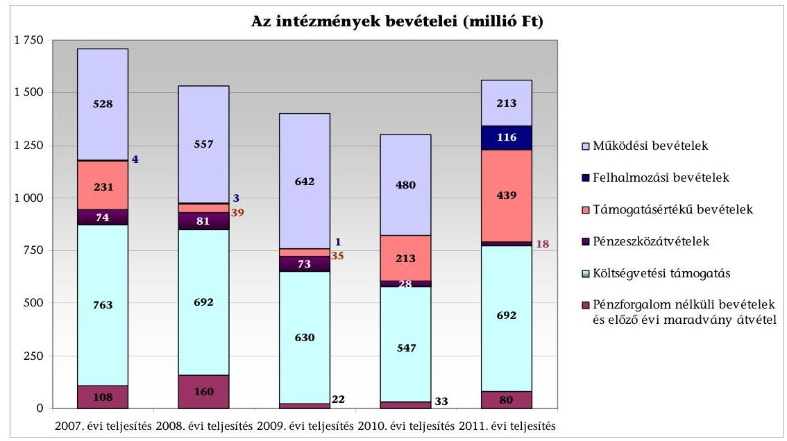

A Kormány 2011 decemberében módosította az MBFH-ról szóló Statútum rendeletet, amelynek alapján a MÁFI 2012. április 1-jétől beolvadt az ELGI-be. A megszünés oka: „A földtani és bányászati szakigazgatásban működő háttérintézményi rendszer feladatellátásában mutatkozó párhuzamosságok megszüntetése, a koncessziós és egyéb állami feladatok megfelelő hatékonyságú és színvonalú ellátása, a működési költségek csökkentése a működés biztonságának stabilizálása mellett, továbbá a szakmai feladatszerkezet és tartalom korszerűsítése és aktualizálása. "2 A továbbiakban a két korábbi háttérintézmény egységes szervezetben, Magyar Földtani és Geofizikai Intézet (MFGI) néven látja el a földi erőforrásokhoz, veszélyekhez és a bányászathoz kapcsolódó állami feladatokat.

A Magyarország Alaptörvénye 43. cikk (1) bekezdése, valamint az Állami Számvevőszékről szóló 2011. évi LXVI. törvény 5. § (3), (5)-(7) és (9) bekezdései nyújtotta felhatalmazás alapján ellenőriztük az intézmények 2011. évi költségvetésének végrehajtásáról szóló beszámolók megbízhatóságát, illetve a 2007-2011. évek közötti feladatellátás és forrásfelhasználás szabályszerűségét.

[^0]
[^0]:    ${ }^{2}$ A Magyar Állami Földtani Intézet megszüntető okirata, Hivatalos Értesítő 2012. évi 14. szám

---

Az ellenőrzést az INTOSAI vonatkozó általános standardjainak (ISSAI 100, 200, 300 és 400), és az ÁSZ Ellenőrzési Kézikönyvének a szabályszerűségi ellenőrzésekre vonatkozó rendelkezéseinek figyelembevételével végeztük.

A MÁFI és az ELGI 2011. évi költségvetési beszámolóját az ÁSZ által a 2011. évi zárszámadás előkészítése során a BM költségvetési szervek elemi beszámolóinak pénzügyi (szabályszerűségi) ellenőrzéséhez készített Egyszerűsített Útmutató alapján vizsgáltuk felül.

# Az ellenőrzés célja volt: 

- annak minősítése, hogy az intézmények 2011. évi költségvetésének végrehajtásáról szóló beszámolók ${ }^{3}$ megbízható és valós képet adnak-e a vagyoni és a pénzügyi helyzetről;
- az intézmények 2007-2011. évek közötti feladatellátása és forrásfelhasználása szabályszerű volt-e.

Ennek keretében értékeltük, hogy:

- az intézmények a tevékenységük szabályozásakor figyelembe
 vették-e a jogszabályban előírtakat, a külső tényezők hatására miként változtak a gazdálkodás feltételei és megfelelően alakították-e ki a feladatok ellátásához szükséges belső szabályzatokat;
- az intézmények megfelelően alakították-e ki és működtették-e a belső kontrollokat a gazdálkodás folyamatában, azok biztosították-e a feladatok szabályszerű ellátását, működtették-e a belső ellenőrzési rendszert és megfelelően hasznosították-e annak megállapításait;
- az intézmények biztosították-e és milyen módon a működésük során a gazdálkodás stabilitását, fennállt-e a költségvetésükben és annak teljesítésekor a pénzügyi egyensúly, melyek voltak az eltérések okai;
- a vagyongazdálkodás biztosította-e a szabályszerű feladatellátás feltételeit.

Ellenőrzött szervezetek: a MÁFI, az ELGI, és az intézmények gazdálkodásának tekintetében az MBFH, amelynek Gazdasági Főosztálya látta el az intézmények gazdálkodási feladatait.

Az ellenőrzés típusa: szabályszerűségi ellenőrzés.
Az ellenőrzött időszak: a költségvetési beszámolók megbízhatóságának ellenőrzése tekintetében a 2011. év, a MÁFI és az ELGI feladatellátásának és gazdálkodásának szabályszerűségi ellenőrzése tekintetében a 2007-2011. évek.

Az Állami Számvevőszékről szóló 2011. évi LXVI. törvény 29. § szerint a jelentéstervezetet megküldtük egyeztetésre a Magyar Bányászati és Földtani Hivatal elnökének és a Magyar Földtani és Geofizikai Intézet igazgatójának, akik a jelentéstervezet megállapításaira észrevételt nem tettek, válaszleveleiket a jelentés 6. és 7. számú mellékletei tartalmazzák.

[^0]
[^0]:    ${ }^{3}$ a központi költségvetési szervek elemi beszámolói

---

# I. ÖSSZEGZŐ MEGÁLLAPÍTÁSOK, KÖVETKEZTETÉSEK, JAVASLATOK 

A feladatellátás szabályozása 2007. január 1-jétől az ELGI-nél 2010. március 22-ig, a MÁFI-nál 2010. december 31-ig hiányos volt. A 2007. január 1-jétől hatályos Statútum rendelet előírta az intézmények közreműködését az MBFH állami földtani feladatainak elvégzésében, azonban ennek módját, mértékét és konkrét feladatait nem határozta meg. A Statútum rendelet intézményi feladatellátásra vonatkozó részét 2010. március 23-tól módosították, amelynek során az ELGI állami geofizikai kutatással összefüggő feladatait konkretizálták. A MÁFI állami földtani kutatáshoz kapcsolódó főbb feladatait csak 2011. január 1-jétől tartalmazta a jogszabály és ezen időpontoktól kapott jogosultságot az MBFH az intézmények vonatkozásában a középirányító feladatok ellátására. A MÁFI és az ELGI az MBFH háttérintézményeként az ellenőrzött években önállóan működtek, miközben a Statútum rendeletben azonos vagy nagyon hasonló feladatokat határoztak meg számukra ${ }^{4}$. A rendelet módosításai tették lehetővé az intézmények és az MBFH szorosabb együttműködését az állami földtani feladatok ellátásában. A geológiai és a geofizikai földtani kutatással összefüggő konkrét állami feladatok elvégzését az MBFH a 2010. évtől intézményenként kötött, külön megállapodásban rögzítette.

Az intézmények felügyelete az ellenőrzött időszakban többször változott, amely közvetlenül nem volt hatással a feladatellátásra és a gazdálkodásra. A felügyeleti szerv a 2007. január 1-jével történt átszervezésekkel egyidejűleg nem kezdeményezett jogszabály módosítást a MÁFI és az ELGI feladatainak konkrét meghatározására. Az intézmények feladatait 2007. január 1-jétől kezdődően az ELGI esetében 2010. márciusig, a MÁFI esetében 2011. januárig nem tartalmazta jogszabály. Az intézmények alapító okirata a 2007-2011. évek között döntően a felügyeletet ellátó szervekben történt változások miatt módosult. Az ellenőrzött években a felügyeleti szervek tevékenysége az intézményeknél döntően az éves költségvetési beszámolók megbízhatósági ellenőrzéseinek elvégzésére irányult.

A 2007-2011. években az intézmények rendelkeztek a köz- és egyéb feladatokat meghatározó dokumentumokkal, azonban az SzMSz-ek aktualizálása elmaradt, amelynek oka volt részben a feladatellátás hiányos szabályozása is. Az intézmények rendelkeztek alapító okiratokkal, azokat a változásoknak megfelelően módosították. Az alapító okiratban rögzített feladatokat a felügyeleti szerv által jóváhagyott SzMSz-ben nem részletezték, ellentétesen az Ámr. ${ }_{1-2}$ előírásával. A MÁFI 2010. május 13-tól, az ELGI 2011. április 29-től rendelkezett a jogszabályi előírásoknak megfelelő, a felügyeleti szerv által jóváhagyott SzMSz-szel. A jóváhagyott intézményi SzMSz-ek tartalmazták az állami fel-

[^0]
[^0]:    ${ }^{4}$ A két intézmény földtani és geofizikai kutatással összefüggő feladatait a 2. számú melléklet tartalmazza.

---

adatként ellátandó alaptevékenységeken túl mindazokat az információkat, amelyek szükségesek voltak az intézmények szabályszerű működtetéséhez.

A MÁFI 2007-2009 között és 2011-ben, az ELGI 2007-2011 között, mint önállóan működő ${ }^{5}$ költségvetési szerv saját gazdasági szervezettel nem rendelkezett. A gazdasági szervezet feladatait az MBFH Gazdasági Főosztálya látta el. Ennek megfelelően a gazdasági szervezet felépítését és tevékenységét az MBFH hatályos SzMSz-ében, a gazdasági szervezete ügyrendjében és a gazdálkodás területén a munkamegosztás és felelősségvállalás rendjét a jogszabályi előírásnak ${ }^{6}$ megfelelően munkamegosztási megállapodásban (továbbiakban: megállapodásban) szabályozták.

A megállapodások kezdetben (2007-2009. években) nem igazodtak teljes körűen az Ámr. ${ }_{1}$ előírásaihoz, nem voltak alkalmasak a feladatok szabályszerű végrehajtására, mert az egyes feladatok tartalmára és határidejére vonatkozó szabályokat nem rögzítették, nem határozták meg továbbá, hogy az MBFH mely pénzügyi-gazdálkodási szabályzatait terjeszti ki a részben önállóan gazdálkodó intézeteire és mely belső szabályzatokat készítik el külön-külön. A közös feladatellátással kapcsolatban sem az intézmények, sem az MBFH nem rendelkezett a FEUVE rendszer kialakításáról. A módosított megállapodások az ELGI vonatkozásában a 2010-2011. évre, a MÁFI tekintetében a 2011. évre már az Ámr. ${ }_{2}$-nek megfelelő tartalommal, formában és részletezettséggel szabályozták az MBFH gazdasági szervezetének tevékenységét.

Az MBFH gazdasági szervezete a 2007-2011. évekre vonatkozóan rendelkezett ügyrenddel, mely minden évben az aktualizált SzMSz függeléke volt. Az ügyrend tartalmában megfelelt a hatályos jogszabályi előírásoknak, azonban 2011. évben nem aktualizálták.

Az MBFH és szervezeti egységeinek kötelezettségvállalási, utalványozási, ellenjegyzési és érvényesítési rendjét az Áht. ${ }_{1-2}$-ben, az Ámr. ${ }_{1}$-ben, a 2010. évtől az Ámr. ${ }_{2}$-ben valamint az Áhsz-ben foglaltaknak megfelelően szabályozták. A szabályzat hatálya a 2007-2009. években kiterjedt az MBFH valamennyi szervezeti egységére és munkavállalójára, valamint a hivatalhoz kapcsolódó, részben önállóan gazdálkodó - önállóan működő - MÁFI, valamint a 2007-2011. években az ELGI teljes körű kötelezettségvállalási, utalványozási, ellenjegyzési és érvényesítési rendjére. A 2011. évben a pénzgazdálkodási jogkörök szabályozását nem aktualizálták.

Az MBFH-nál a hatályos SzMSz-ben meghatározott szervezeti struktúrához kapcsolódóan minden munkatárs rendelkezett munkaköri leírással. A feladatkörök módosulása, megváltozása miatt az aktualizált munkaköri leírásoknál voltak elmaradások, de ezeket folyamatosan pótolták. A hatályos munkaköri leírások megfelelően rögzítették a gazdasági szervezet vezetőinek és munkatársainak feladatait, kötelezettségeit, hatásköreit és felelősségüket. A munkaköri leírások a gazdálkodási feladatokkal kapcsolatosan pontosan meg-

[^0]
[^0]:    ${ }^{5}$ 2008. december 31-ig részben önállóan gazdálkodó költségvetési szerv
    ${ }^{6} 2007$-2008. évben a korábbi Ámr. ${ }_{1} 14 . \S$ (5) bekezdés b) pont, 2009. évben a korábbi Ámr. ${ }_{1} 14 . \S$ (6) bekezdés b) pont, 2010-2011. évben az Ámr. ${ }_{2} 16 . \S$ (4) bekezdés.

---

határozták és elhatárolták az engedélyezés, a végrehajtás és a nyilvántartás feladatait.

Az Szt-ben foglalt előírások alapján az MBFH elkészítette az Áhsz. előírásainak megfelelően a számviteli politikáját és a hozzá kapcsolódó kötelező és a gazdálkodás rendjét meghatározó egyéb belső szabályzatokat (gazdálkodási jogkörök szabályozását, számlarendet, pénzkezelési, önköltség számítási, leltározási, selejtezési szabályzatokat), a szabályzatokban azonban a 2011. évre vonatkozó jogszabályi változások átvezetése nem történt meg. Abban az időszakban, amikor az intézmények könyvelését az MBFH végezte, ${ }^{7}$ a gazdálkodásuk szabályozottsága megfelelő volt.

A 2010. évben a MÁFI, mint önállóan működő és gazdálkodó költségvetési szerv, önálló gazdasági szervezettel rendelkezett. A MÁFI a 2010. évi SzMSzében nem szabályozta teljes körűen az Ámr. ${ }_{2}$ szabályainak megfelelően a szervezeti egységek, ezen belül főként a gazdasági szervezet engedélyezett létszámát, szervezeti felépítését és feladatait, valamint a szervezeti egységek közötti kapcsolattartás rendjét, a munkakörökhöz tartozó feladat- és hatásköröket, a hatáskörök gyakorlásának módját, a helyettesítés rendjét, valamint az ezekhez kapcsolódó felelősségi szabályokat. A MÁFI a 2010. évben nem tartotta be az Ámr. ${ }_{2}$ előírásait, mivel a gazdasági szervezetének ügyrendjét nem készítette el és ezekről a kérdésekről sem a MÁFI SzMSz-e, sem más belső szabályzata nem rendelkezett.

A MÁFI 2010. évben számviteli politikával és valamennyi kötelezően előírt és javasolt kapcsolódó szabályzattal rendelkezett, ezek azonban tartalmukban nem feleltek meg teljes körűen az Ámr. ${ }_{2}$-ben foglalt jogszabályi előírásoknak. A gazdasági szervezet munkatársai rendelkeztek munkaköri leírással, de azok hiányosak voltak, mivel a pénzgazdálkodási jogkörök gyakorlásával kapcsolatos feladatokat nem tartalmazták. A MÁFI 2010. évi gazdálkodásának szabályozása nem volt alkalmas teljes körűen a szabályszerű gazdálkodás biztosítására.

Az ellenőrzött időszakban mindkét intézménynél a költségvetési egyensúlyt biztosították. A teljesített kiadások több mint felét a személyi juttatások és járulékai, harmadát a dologi kiadások tették ki, melyet a következő diagramokban szereplő adatok mutatnak:

[^0]
[^0]:    ${ }^{7}$ Az ELGI esetében 2007-2011-ig, a MÁFI-nál 2007-2009-ig és a 2011. évben.

---

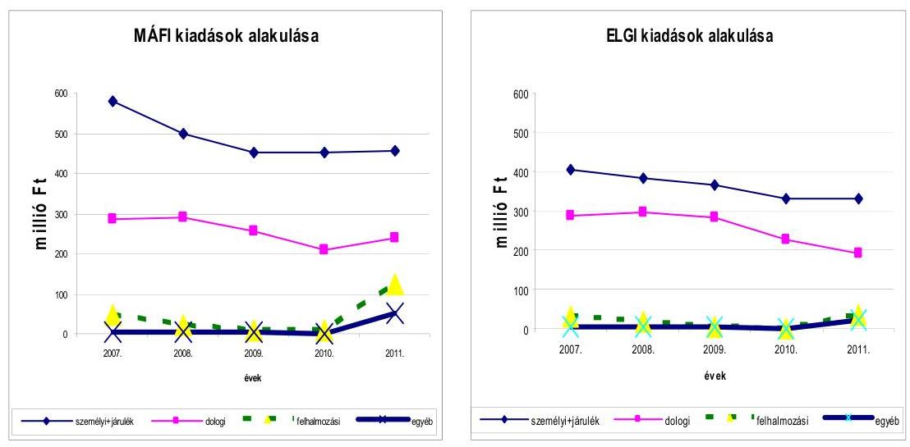

A feladatot az évek során jelentősen nem változó létszámmal látták el, a MÁFI létszáma 119 és 103 fő között, az ELGI-é 77 és 68 fő között változott, amelyet a következő grafikon szemléltet:
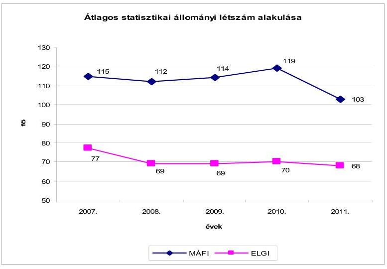

A költségvetésekben a kiadások fedezetét a 2007-2010. években mindkét intézmény több mint 50%-ban saját bevétellel teremtette meg.

A saját bevétel elérése érdekében az ELGI geofizikai mérési szolgáltatásokat nyújtott, a MÁFI - az alapító okiratában előírtak szerint - részt vett a nagy kockázattal járó országos beruházások (pl.: a Bátaapátiban létesült kis és közepes aktivitású radioaktív hulladéktároló projekt) tervezésének/kivitelezésének földtani megalapozásában, az érintett területek geológiai feltárásában.

A MÁFI saját bevételeinek minimális hányadát adta a fúrási magminták adatainak kölcsönzése, ahol az ellenőrzött időszakban az intézmény „kezelési költségtérítéssel" számolt, így a földtani kutatási feladatok kiadásai részben sem térültek meg.

A realizált saját bevételi forrás csökkenésével párhuzamosan a költségvetésekben nem terveztek azonos arányban kiadáscsökkenést. A 2010. évtől mindkét

---

intézménynél likviditási problémák jelentkeztek, amelyet 2010-ben előrehozott költségvetési finanszírozással oldottak fel.

A MÁFI 2010. évi likviditási hiányát az is okozta, hogy közel fél évig a devizaszámláról nem vezették át az EU forrást. Ugyanakkor ezen pályázati cél érdekében 50 millió Ft-ot más forrás terhére fizettek ki.

A MÁFI ellenőrzött időszaki likviditására negatív hatással volt, hogy a bevételi elmaradások esetén nem vizsgáltak felül olyan szerződéseket, amelyek lehetővé tették, hogy a számla kiegyenlítése a számla kiállítástól számított 180 munkanapon belül történjen. Ennek következtében a havi áfa fizetési kötelezettség fedezete nem állt rendelkezésre. A 2011. évben a szerződésekben már nem biztosítottak ilyen hosszú fizetési határidőt.

A MÁFI által végzett szolgáltatási tevékenységek egységárait úgy határozták meg, hogy azt nem támasztották alá önköltségszámítással. A közvetlen kiadásokat közvetett (általános) kiadásnak tekintették, azt is vetítési alapok szerint osztották fel. Így az egyes szakfeladatokon elszámolt bevételek és kiadások nem nyújtottak megbízható információt arról, hogy a tevékenységekre elszámolt kiadásokból mennyit finanszíroz a tevékenység saját bevétele.

A MÁFI és az ELGI a 2007-2011. években eredményesen pályázott és az alábbi összegekkel növelte előirányzatát:

| Megnevezés | MÁFI | millió Ft |
| :--: | :--: | :--: |
| Európai uniós pályázatokon nyert források | 273,0 | 41,9 |
| Hazai pályázatokon nyert támogatások | 128,6 | 148,1 |
|  | Összesen: | 190,0 |

 |

A MÁFI pályázaton nyert pénzeszközből végezte az Országos Vízföldtani Monitoring Hálózat korszerűsítését a 2007-2011. években, 177 millió Ft összegben. A vízszintmegfigyelő kutakat automata távadó regisztráló műszerekkel szerelték fel, mely a MÁFI-nak a korábbi évek költségvetési kiadási előirányzataihoz képest a 2012. évtől kiadási megtakarítást is jelent, mert a 138 kútnál kiváltja az eddigi havi helyszíni vízmintavétel útiköltségét, munkadíját.

A vagyonnal való felelős gazdálkodás értékelésekor a 2007-2011. években több hiányosságot, az Szt. megsértését állapítottuk meg. Emiatt a 2007-2011. évi beszámolókban szereplő nettó vagyonérték nem valós adatokat tartalmazott. A MÁFI-nál a selejtezés, a behajthatatlan követelések leírása, leltárhiány, mindkét intézménynél a beruházások, felújítások, karbantartások nem megfelelő elkülönítése, ezzel is összefüggésben az értékcsökkenés számítás hibái alapozták meg ezt a véleményünket.

A MÁFI az Szt-t megsértve számviteli nyilvántartásában nem rögzítette a földtani adattár rendszer informatikai szoftverfejlesztéseit az immateriális javak között, valamint a földtani megfigyelő műszerei által igénybe vett földterületek érték nélküli kezelői/szolgalmi jogát az analitikus nyilvántartásában nem szerepeltette vagyoni értékű jogként.

---

Az ELGI a KVI-vel 1997-ben kötött vagyonkezelési szerződését a vagyonkezelésbe vett eszközök módosulása miatt az ellenőrzött időszakban csak 2010. május 28-án módosították.

A MÁFI-nál 2004-ben módosították utoljára a vagyonkezelői szerződést. A szerződés módosítása az állami vagyonról szóló 2007. évi CVI. törvény és a nemzeti vagyonról szóló 2011. évi CXCVI. törvény hatályba lépése ellenére elmaradt.

A 2007-2010. évek között a MÁFI-nál a kockázatkezelési rendszer kialakítása és működtetése nem volt megfelelő. Az intézményben 2010-ig a 2005. évben kialakított FEUVE volt hatályban, azonban annak aktualizálása nem történt meg a jogszabályi változásoknak megfelelően. A FEUVÉ-t nem egészítették ki a kontrolltevékenység, az információ és a kommunikáció szabályaival. Az intézményben a jogszabályi változáshoz igazodóan, a belső kontrollrendszer folyamatos figyelemmel kísérését és értékelését végző monitoring szabályzatot csak a 2011. évben készítették el. Az ELGI-nél a 2007-2009. években működött a kockázatkezelési rendszer. Az intézményben a jogszabályban előírtak alapján kialakították és működtették a FEUVE rendszert. A jogszabályi változásoknak megfelelően a monitoring rendszerrel kapcsolatos feladatok meghatározásáról később, a 2011. évtől rendelkezett az intézmény.

Az intézményeknél a 2007-2011. években a kötelezettségvállalás, a kötelezettségvállalás ellenjegyzése, a szakmai teljesítés igazolása, az érvényesítés, az utalványozás, az utalvány ellenjegyzésének szabályozása megtörtént. A szabályzatokat az Ámr. ${ }_{1-2}$ változásainak figyelembevételével évenként aktualizálták. Az intézményeknél a 2007-2011. években a pénzgazdálkodási tevékenység belső kontrolljai működésének ellenőrzése a WINIDEA programon keresztül véletlenszerű mintavétellel történt. A nem rendszeres személyi juttatásokból, a külső személyi juttatásokból, az egyéb üzemeltetési és fenntartási szolgáltatási kiadásokból, az egyéb dologi kiadásokból és a felhalmozási kiadásokból a mintavétel leválogatását a Kincstári adatbázisból, a KTK alapján végeztük.

A MÁFI-nál a 2007-2011. években a belső kontrollok nem működtek megfelelően, mert az ellenőrzött bizonylatok 15,7%-ánál állapított meg az ellenőrzés a szabályozással ellentétes gyakorlatot. A kockázatosnak minősített területek közül az egyéb dologi kiadásoknál 11 bizonylat esetében tárt fel az ellenőrzés hiányosságot a kötelezettségvállaló, az érvényesítő, az utalványozó és az utalvány ellenjegyző feladatánál. A gazdálkodási jogkört gyakorlók nem tettek eleget az Ámr. ${ }_{1-2}$ előírásainak, mert a kiadások teljesítése során nem tartották be a gazdálkodásra vonatkozó szabályokat.

Az ELGI-nél az ellenőrzött bizonylatok 14,3%-ánál állapította meg az ellenőrzés a kontrollok nem megfelelő működését. A kockázatosnak minősített öt terület közül a 2007-2009. években négynél és 10 bizonylat esetében tapasztalt az ellenőrzés hiányosságot. Az egyéb dologi kiadások, a felhalmozási kiadások, a nem rendszeres személyi juttatások és az egyéb üzemeltetési, fenntartási szolgáltatási kiadások teljesítésénél a pénzgazdálkodási jogkört gyakorlók nem tartották be az Ámr. ${ }_{1}$-ben előírtakat. A 2007-2009. években három gazdasági esemény könyvviteli elszámolása az Áhsz. előírásaival ellentétesen történt, mert azokat karbantartás helyett felújításként vették nyilvántartásba. A 2010. és a 2011. évben a mintavétellel kiválasztott bizonylatok vizsgálata során a pénz-

---

gazdálkodási jogkörök gyakorlásánál, valamint a gazdasági események könyvvitelben történő elszámolásánál az ellenőrzés nem állapított meg eltérést.

A MÁFI és az ELGI kiadásainak teljesítése során az MBFH nem tett eleget az intézményekkel kötött megállapodásban és a szabályzataiban előírtaknak, mert nem gondoskodott a kontrollok megfelelő működtetéséről.

A 2007. évben az intézményvezetők nem tartották be a Ber-ben előírtakat, mert nem gondoskodtak a belső ellenőrzés megszervezéséről és működtetéséről. A 2008-2011. években mind a MÁFI-nál, mind az ELGI-nél a belső ellenőrzést, valamint a belső ellenőrzés vezetői teendőket külső szolgáltató látta el. A MÁFI-nál 2010 szeptemberéig a gazdálkodás szabályszerűségéhez, átláthatóságához, a belső kontrollrendszer javításához, a kockázatok csökkentéséhez a belső ellenőrzés működése nem járult hozzá, mert kevés ellenőrzést végeztek, és a megállapítások nem eredményezték az intézmény gazdálkodásának javítását. Az ELGI-nél a külső szolgáltató a 2008. és 2009. évben készített ellenőrzési jelentésében a belső kontrollra vonatkozó rendszerbeli hiányosságokat nem tárt fel.

A belső ellenőrzés színvonala a MÁFI-nál 2010. év októberétől, az ELGI-nél a 2010. évtől javult, az ellenőrzésekről készített jelentések megállapításai segítették a gazdálkodás szabályszerűségét, a belső kockázatok csökkentését, a kontrollrendszer működését.

Az ellenőrzött években a felügyeleti szervek ellenőrzési tevékenysége az intézmények éves költségvetési beszámolójának megbízhatósági ellenőrzésére ${ }^{8}$ irányult. Az ellenőrzések megállapításai alapján tett javaslatok hasznosulását, az intézkedési tervekben foglaltak végrehajtását a felügyeleti szerv a következő évben végzett ellenőrzés során kontrollálta.

Ezen felül a 2010. évi irányító szervi változás követően az NFM év közben ellenőrzést végzett a MÁFI-nál, amely az intézmény 2010. I. félévi gazdálkodásának vizsgálatára irányult. Az ellenőrzés javaslatai között szerepelt az intézményi SzMSz aktualizálása, a hatályos számviteli előírások betartása, valamint felhívta az intézmény vezetőjének figyelmét a kiadási előirányzatok terhére vállalt kötelezettségek felülvizsgálatára, mivel a tervezett bevételek teljesülése nem várható. Az ellenőrzés a minisztériumnak azonnali intézkedések megtételét javasolta az intézmény pénzügyi helyzetének rendezése érdekében, aki a jelzett problémák kezelésére, okainak feltárására az intézmények munkatársainak bevonásával munkacsoportot bízott meg, hogy tegyen javaslatot milyen formában biztosítható szakmai és költséghatékonyság szempontjából legeredményesebben a földtani feladatok ellátása. A felügyeletet ellátó minisztérium a munkacsoport véleményének figyelembevételével tett javaslatot az intézmények összevonására.

Az intézményeknél az európai uniós forrásokból származó támogatások cél szerinti felhasználását a közreműködő szervezetek ellenőrizték. Ellenőr-

[^0]
[^0]:    ${ }^{8}$ A megbízhatósági ellenőrzést az ÁSZ által a zárszámadás ellenőrzéséhez kiadott módszertan alapján végezték.

---

zéseikben kifogásolták, hogy a 2007-2011. években az európai uniós és a hazai forrásból megvalósított projektekről és ezek költségeiről az intézmények nem vezettek projektenként elkülönített nyilvántartást, ${ }^{9}$ valamint további hiányosságként állapították meg, hogy a nem magyar nyelven készült számlák fordítása nem mindig történt meg. ${ }^{10}$ Az európai uniós projektek ellenőrzését tartalmazó jegyzőkönyvek jelentős része szintén idegen nyelvű volt, magyarra történő fordításuk elmaradt.

A MÁFI-nál a 2007-2011. évek között hazai forrással megvalósított projektek közül kettő esetében állapított meg a pályázatokat ellenőrző szerv visszafizetési kötelezettséget, amelyek az intézmény pénzügyi helyzetére (a kis összegük miatt) nem voltak hatással.

A MÁFI és az ELGI 2011. évi költségvetési beszámolóinak megbízhatóságáról szóló minősítést - elfogadó véleményt figyelemfelhívó megjegyzéssel az 1. számú melléklet tartalmazza.

A MÁFI és az ELGI 2011. évi mérlegei eszköz és forrás oldala azonos összegű volt, a mérlegtételek tárgyévi nyitó adatai megegyeztek az előző évi záró adatokkal. A mérlegsorokat főkönyvi számlákkal, analitikus nyilvántartással alátámasztották.

A MÁFI 2011. évi könyvviteli mérlegében a tárgyi eszközök záró nettó értéke az értékcsökkenés elszámolásának hiánya miatt 5,7 millió Ft-tal magasabb volt a számviteli előírások alapján történő szabályos elszámolás szerinti tényleges adatnál.

Az ellenőrzött eszközök és források értékelése - az ELGI követeléseinél elszámolt 0,05 millió Ft értékvesztés kivételével - az Szt., az Áhsz., valamint a MÁFI és az ELGI számviteli politikáinak előírásai alapján történt.

A központi költségvetés egyensúlyának megteremtése érdekében előírt maradványtartási és kiadáscsökkentő intézkedések a MÁFI-t 2011-ben nem érintették. Az 1316/2011. (IX. 19.) Korm. határozatban foglaltak szerint az ELGI-nél 30,7 millió Ft kiadási előirányzat zárolás történt.

Mindkét intézmény az előirányzat-módosításokat az Ámr. ${ }_{2}$-ben előírtak betartásával hajtotta végre.

[^0]
[^0]:    ${ }^{9}$ A MÁFI-nál a T-JAM (Szlovénia-Magyarország Határon Átnyúló Együttműködési program keretében) a „Geotermikus hasznosítások számbavétele a hévízadók értékelése és a közös hévízgazdálkodási terv előkészítése a Mura-Zala medencében" című, a Transenergy „Szlovénia, Ausztria, Magyarország és Szlovákia határokkal osztott geotermikus erőforrásai" című projektek esetében a költségek elkülönítése nem történt meg.
    ${ }^{10}$ Pl: a MÁFI-nál az OTKA K 62478 számú, „A szél hatása a késő-neogén-negyedidőszaki üledékképződésre és a domborzat alakulására a Magyarközéphegységben és előterében" című projektnél nem minden idegen nyelvű számlát fordítottak le.

---

A 2011. évi előirányzat-maradványok az intézményeknél teljes egészében kötelezettségvállalással terheltek, bizonylatokkal alátámasztottak, a főkönyvi kivonatokban szereplő adatokkal egyezőek voltak, azok megállapítása szabályszerűen történt.

Az Állami Számvevőszékről szóló 2011. évi LXVI. törvény 33. § (1) bekezdésében foglaltak értelmében a jelentésben foglalt megállapításokhoz kapcsolódó intézkedési tervet köteles az ellenőrzött szervezet vezetője összeállítani és azt a jelentés kézhezvételétől számított harminc napon belül az ÁSZ részére megküldeni. Amennyiben az intézkedési tervet határidőben nem küldi meg a szervezet, vagy az továbbra sem elfogadható, az ÁSZ elnöke a hivatkozott törvény 33. § (3) bekezdés a)-b) pontjaiban foglaltakat érvényesítheti.

Az ellenőrzés intézkedést igénylő megállapításai és javaslatai:

# A Magyar Bányászati és Földtani Hivatal elnökének 

Az önállóan működő MÁFI és az ELGI gazdálkodási feladatait (a MÁFI esetében a 2010. év kivételével) az MBFH látta el. Az MBFH elkészítette az Ámr. 2 előírásainak megfelelően a számviteli politikáját és a hozzá kapcsolódó kötelező és a gazdálkodás rendjét meghatározó egyéb belső szabályzatokat (gazdálkodási jogkörök szabályzatát, számlarendet, pénzkezelési, önköltség számítási, leltározási, selejtezési szabályzatokat). A szabályzatokban a 2011. évre vonatkozó jogszabályi változások átvezetése nem történt meg.

Javaslat:
Intézkedjen, hogy az MBFH és ezzel együtt a gazdálkodási feladatok ellátásával összefüggésben hozzá tartozó önállóan működő intézmények gazdálkodásra vonatkozó szabályzatai a jogszabályi változásoknak megfelelően évente aktualizálásra kerüljenek.

## A Magyar Bányászati és Földtani Hivatal elnökének és a Magyar Földtani és Geofizikai Intézet igazgatójának

1. A kiadások teljesítése során az MBFH, a MÁFI és - a 2007-2009. években - az ELGI sem tartotta be a gazdálkodásra vonatkozó szabályokat. Az Ámr. 1,2 előírásaival ellentétesen a kiadások teljesítését megelőzően a MÁFI-nál a bizonylatok 15,7%-ánál nem történt meg a kötelezettségvállalás ellenjegyzése, az érvényesítés, utalványozás és az utalvány ellenjegyzése, az ELGI-nél a bizonylatok 14,3%-ánál nem történt meg a kötelezettségvállalás ellenjegyzése, a szakmai teljesítés igazolása és az érvényesítés.

Javaslat:
Intézkedjenek, hogy a gazdálkodási jogköröket ellátók tegyenek eleget az Ávr. 5360. § előírásainak.
2. A MÁFI számviteli nyilvántartásában az Szt. 25. § (7) és 26. § (3) bekezdését megsértve nem rögzítették az immateriális javak között a szoftverfejlesztéseket, valamint a vagyoni értékű jogok analitikus nyilvántartásában a MÁFI földtani megfigyelő mű-

---

szerei által igénybevett földterületek érték nélküli
 kezelői/szolgálati jogát. Javaslat:

Intézkedjenek, hogy az MFGI-nél a számviteli nyilvántartásokban rögzítsék az immateriális javak között a szoftverfejlesztéseket, valamint az analitikus nyilvántartásokban mutassák ki - a földhivatalokkal történő egyeztetést követően - az ingatlanokhoz kapcsolódó vagyoni értékű jogokat.
3. A MÁFI által végzett szolgáltatási tevékenységek egységárait úgy határozták meg, hogy azt nem támasztották alá önköltségszámítással. A közvetlen kiadásokat közvetett (általános) kiadásnak tekintették, azt is vetítési alapok szerint osztották fel. Az egyes szakfeladatokon elszámolt bevételek és kiadások így nem nyújtottak megbízható információt arról, hogy a tevékenységekre elszámolt kiadásokból mennyit finanszíroz a tevékenység saját bevétele.

Javaslat:
Vizsgálják felül az önköltségszámítás szabályait, és az egyes szolgáltatások egységárait a tényleges önköltség figyelembevételével határozzák meg. Biztosítsák, hogy a bevételek és a kiadások szakfeladatokra történő elszámolása megfeleljen az Áhsz. 9. számú mellékletében előírtaknak.

---

# II. RÉSZLETES MEGÁLLAPÍTÁSOK 

## 1. A MÁFI És az ELGI 2011. ÉVI KÖLTSÉGVETÉSÉNEK VÉGREHAJTÁSÁRÓL KÉSZÍTETT BESZÁMOLÓ MEGBÍZHATÓSÁGÁNAK MEGÁLLAPÍTÁSA

### 1.1. A MÁFI 2011. évi költségvetésének végrehajtásáról készített beszámolója megbízhatóságának megállapítása

A MÁFI 2011. évi eredeti és módosított költségvetési kiadási, bevételi és támogatási előirányzata és azok teljesítésének alakulása:
millió Ft

| Eredeti előirányzat |  |  | Módosított előirányzat |  |  | Teljesítés |  |  |
| :-- | :--: | :--: | :--: | :--: | :--: | :--: | :--: | :--: |
| kiadás | bevétel | támo-   gatás | kiadás | bevétel | támo-   gatás | kiadás | bevétel | támo-   gatás |
| 761,0 | 357,0 | 404,0 | 1189,9 | 767,0 | 422,9 | 871,2 | 499,5 | 422,9 |

A MÁFI 2011. évi költségvetési beszámolójának megbízhatóságáról szóló minősítést - elfogadó vélemény figyelemfelhívó megjegyzéssel - az 1. számú melléklet tartalmazza.

A 2011. évi mérleg eszköz és forrás főösszege 665,5 millió Ft volt. A mérleg eszköz és forrás oldala megegyezett, a mérlegtételek tárgyévi nyitó adatai azonosak voltak az előző évi záró adatokkal. A mérlegsorokat főkönyvi számlákkal, analitikus nyilvántartással és leltárral alátámasztották. A kiemelt mérlegtételeket (követelések, kötelezettségek, aktív és passzív pénzügyi elszámolások) az Szt., az Áhsz. és a belső szabályzatok előírásai szerint vették számításba.

A követelés mérlegsor 2011. évi záró állománya 5,8 millió Ft volt, melyből a vevőkkel szemben fennálló tárgyévi követelés 5,2 millió Ft, az egyéb követelés - a tartósan adott kölcsönből a mérleg fordulónapot követő egy éven belül esedékes részleteket tartalmazta - 0,6 millió Ft volt, amely megfelelt az Áhsz. 22. § (1) bekezdésben foglaltaknak. Az ellenőrzött tételek esetében a vevőkövetelések besorolása, tartalma megfelelt az előírásoknak.

A követelések leltározása megtörtént, azonban a részletes leltárban a tárgyévi és előző évi követeléseket nem különítették el. Ennek oka, hogy az Áhsz. 8. §-ában előírtak szerint a számviteli politika keretében, ezen belül a leltározási szabályzatban nem szabályozták teljes körűen az Áhsz. 9. számú melléklet 2. pontjában meghatározott követelésekkel kapcsolatos feladatokat, azok dokumentálási követelményeit.

A 2011. évi mérlegben a rövid lejáratú kötelezettségek tárgyévi állománya 4,0 millió Ft az áruszállításból és szolgáltatás teljesítéséből származó - általá-

---

nos forgalmi adót is tartalmazó - szállítói kötelezettség volt, amelynek kimutatása megfelelt az Áhsz. 26. § (1) bekezdésben foglaltaknak.

# A 2011. évi mérlegben az egyéb aktív pénzügyi elszámolások záró mérlegértéke 1,7 millió Ft. 

Az egyéb aktív és passzív pénzügyi elszámolások mérlegtétel tartalma, besorolása - a több hónapja indokolatlanul nem rendezett tételek kivételével - megfelelt az Áhsz. 22. § (7)-(11) bekezdéseiben, a 26. § (8)-(12) bekezdéseiben, valamint a 9. számú melléklet 3. g), és a 4. h) pontjaiban, a számlaosztályok tartalmára vonatkozó előírásoknak.

A MÁFI egyéb aktív és passzív pénzügyi elszámolások mérlegsorai tartalmaztak több hónapja indokolatlanul rendezetlen tételeket (pl.: befizetett szállásdíjak, téves utalások) is, amelyek értéke mintegy 0,2 millió Ft volt. A rendezésre intézkedések nem történtek, vagy nem dokumentálták azokat.

A MÁFI 761,0 millió Ft eredeti kiadási és bevételi előirányzata az év folyamán 428,9 millió Ft-tal, 1189,9 millió Ft-ra módosult. Az előirányzat-módosítás hatáskörönkénti megoszlása a következők szerinti volt:

| Kormány hatáskörben | $+6,1$ millió Ft |
| :-- | :--: |
| Irányító szervi hatáskörben | $+12,8$ millió Ft |
| Intézményi hatáskörben | $+410,0$ millió Ft |

- A kormányzati hatáskörű előirányzat-módosítások kizárólag a személyi juttatások és járulékai előirányzatokat érintették a 8/2005. (II. 8.) PM rendelet alapján a prémium éves programban foglalkoztatottak utáni munkáltatói költségek megtérítése (2,2 millió Ft), valamint az 1185/2011. (VI. 6.) Korm. határozat alapján a foglalkoztatottak 2011. évi bérkompenzációja (3,9 millió Ft) címen.
- Az irányító szervi hatáskörű módosítások két OTKA támogatást tartalmaztak 12,8 millió Ft értékben, melyből 3,6 millió Ft a személyi juttatások és járulékaik, 8,7 millió Ft a dologi kiadások, 0,5 millió Ft pedig az intézményi beruházások előirányzatát növelte. Kiemelt előirányzatok közötti átcsoportosítások is történtek irányító szervi hatáskörben, amelyek a költségvetési főösszegre nem gyakoroltak hatást. A dologi kiadások előirányzatát 44,0 millió Ft-tal csökkentették, melyből 40,0 millió Ft a kölcsönök, 4,0 millió Ft pedig az intézményi beruházások előirányzatát növelte.
- Az intézményi hatáskörű módosításokból 64,0 millió Ft előző évi maradvány felhasználás, 224,8 millió Ft támogatás értékű többletbevétel (ebből az MBFH-val történt megállapodás alapján 91,4 millió Ft és 133,4 millió Ft pályázati bevétel) és 121,2 millió Ft egyéb működési bevétel (EU költségvetéséből történő pénzeszköz átvétel, pályázati bevétel, kiadvány támogatás) növelte a költségvetés bevételi főösszegét.

A módosításokból 140,4 millió Ft a személyi juttatást és járulékait, 130,6 millió Ft a dologi kiadásokat, 13,5 millió Ft az egyéb kiadásokat, és 125,5 millió Ft az intézményi beruházási kiadások előirányzatát növelte.

---

A kiadási főösszeget érintő módosításokon kívül kiemelt előirányzatok közötti átcsoportosítás történt 5,6 millió Ft értékben.

# Az előirányzat-módosításokat az Ámr. 2. 55. §-ában előírtak betartásával hajtották végre. 

A központi költségvetés egyensúlyának megteremtése érdekében előírt maradványtartási és kiadáscsökkentő intézkedések a MÁFI-t nem érintették. Az NFM minisztere (NFM/21580/2/2011. számú levelében) felmentette a MÁFI-t a 1316/2011. (IX. 19). Korm. határozatban elrendelt kötelezettségvállalási tilalom alól és a miniszterelnökséget vezető államtitkár engedélyezte számukra közbeszerzési eljárás során szoftverek és hardverek beszerzését.

A 2011. évi költségvetési saját bevételeinek 357,0 millió Ft eredeti előirányzatát az év folyamán 346,0 millió Ft-tal növelték, amely 435,5 millió Ft-ban realizálódott. További intézményi hatáskörben végrehajtott bevételi előirányzatmódosítást és teljesítést jelentett a pénzforgalom nélküli bevételek (előző évi előirányzat-maradvány) 64,0 millió Ft összege.

A jelentős bevétel elmaradás több okra vezethető vissza:

- a 2011. évre tervezett eredeti bevétel - tekintettel a piaci megrendelések csökkenésére, a piaci kockázatok jelentős növekedésére - irreálisan magas volt;
- a 2010. év végi jogszabályi változás (az egyes kormányrendeleteknek a fővárosi és megyei kormányhivatalok kialakításával összefüggő módosításáról szóló 351/2010. (XII. 30.) Korm. rendelet) következtében a MÁFI - az MBFH-val kötött együttműködési megállapodás alapján - közreműködött az MBFH állami feladatainak teljesítésében, ezért a rendelkezésére álló szabad kapacitása és ezzel a szolgáltatási bevételek realizálásának lehetősége csökkent.

A bevételi elmaradás 2011. évben nem okozott jelentős problémát a feladatellátásban, mivel:

- az előbbiekben jelzett jogszabályi változás hatására az állami feladatok teljesítésében való közreműködés kiadásainak fedezetét megtervezték, és azt támogatás formájában bocsátották a MÁFI rendelkezésére;
- jelentős összegű támogatás értékű bevételeket pályázati, illetve EU költségvetésből származó pénzeszköz-átvételeket is realizált a szervezet, amelyet a szakmai feladatai ellátásának fedezetére szabályszerűen használt fel.

A MÁFI 2011. évi beszámolójában az előirányzat-maradvány alakulásának levezetése szerint a tárgyévi előirányzat-maradvány összege 51,2 millió Ft (az előző évi maradványnál 12,8 millió Ft-tal kevesebb) volt. Az előirányzat maradvány 318,7 millió Ft kiadási megtakarításból és 267,5 millió Ft bevételi lemaradásból keletkezett. Az előirányzat-maradvány teljes egészében kötelezettségvállalással terhelt, bizonylatokkal alátámasztott, a főkönyvi kivonatban szereplő adatokkal egyező volt, annak megállapítása szabályszerűen történt.

---

# 1.2. Az ELGI 2011. évi költségvetésének végrehajtásáról készített beszámolója megbízhatóságának megállapítása 

A 2011. évi eredeti és módosított költségvetési kiadási, bevételi és támogatási előirányzata és azok teljesítésének alakulása:
millió Ft

| Eredeti előirányzat |  |  | Módosított előirányzat |  |  | Teljesítés |  |  |
| :-- | :--: | :--: | :--: | :--: | :--: | :--: | :--: | :--: |
| kiadás | bevétel | táno-   gatás | kiadás | bevétel | táno-   gatás | kiadás | bevétel | táno-   gatás |
| 550,8 | 263,9 | 286,9 | 641,0 | 371,9 | 269,1 | 576,5 | 366,0 | 269,1 |

Az ELGI 2011. évi költségvetési beszámolójának megbízhatóságáról szóló minősítést - elfogadó vélemény figyelemfelhívó megjegyzéssel - az 1. számú melléklet tartalmazza.

A 2011. évi mérleg eszköz-forrás főösszege 371,2 millió Ft volt. A 2011. évi mérleg eszköz és forrás oldala megegyezett, a mérlegtételek tárgyévi nyitó adatai megegyeztek az előző évi záró adatokkal. A mérlegsorokat főkönyvi számlákkal, analitikus nyilvántartással alátámasztották.

A követelések, kötelezettségek, aktív és passzív pénzügyi elszámolások mérlegsorok értékét leltárral alátámasztották, a Szt. általános alapelveinek és tételes szabályainak, valamint az Áhsz. előírásainak megfelelően határozták meg. Az ellenőrzött eszközök és források értékelése - a követeléseknél elszámolt 0,05 millió Ft értékvesztés kivételével - az Szt., az Áhsz., valamint a számviteli politika előírásai alapján történt.

A követelések 2011. év végi záró állománya 80,2 millió Ft, amelyből 79,2 millió Ft a vevőkkel szemben fennálló tárgyévi követelés és 1,0 millió Ft az egyéb követelés volt. A vevőkövetelések mérlegsor tárgyévi állományi értéke értékvesztéssel csökkentett, míg az egyéb követelések teljes összegben bekerülési értéken szerepeltek. Az egyéb követelések mérlegsoron a tartósan adott kölcsönökből a mérleg-fordulónapot követő egy éven belül esedékes részleteket mutatták ki, amely megfelelt az Áhsz. 22. § (1) bekezdés dg) pontjában foglaltaknak.

A követelések leltározása megtörtént, azonban a részletes leltárban a tárgyévi és előző évi kötelezettségeket nem különítették el. Ennek oka, hogy az Áhsz. 8. §-ában előírtak szerint a számviteli politika keretében, ezen belül a leltározási szabályzatban nem szabályozták teljes körűen az Áhsz. 9. számú melléklet 2. c) pontjában meghatározott követelésekkel kapcsolatos feladatokat, azok dokumentálási követelményeit. Az ellenőrzött tételek esetében a vevőkövetelések besorolása, tartalma megfelelt az előírásoknak.

Az ELGI 2011. évi mérlegében a rövid lejáratú kötelezettségek tárgyévi állománya 2,7 millió Ft volt. Az áruszállításból és szolgáltatás teljesítéséből származó - általános forgalmi adót is tartalmazó - szállítói kötelezettség 2,6 millió Ft volt, amelynek kimutatása megfelelt az Áhsz. 26. § (1) bekezdésben foglaltaknak. A mérlegben költségvetéssel szembeni tartozásként mutattak ki

---

0,1 millió Ft-ot, amely tartalmát tekintve munkavállalókkal szembeni különféle kötelezettség volt. Az előleg elszámolások miatti kötelezettségeket nem az Áhsz. 9. számú, a számlaosztályok tartalmára vonatkozó mellékletének 2. c) pontja szerint szerepeltették a mérlegben, mivel a munkavállalókkal szembeni kötelezettségek helyett a költségvetéssel szembeni kötelezettségként számolták el.
 el.

Az „egyéb aktív pénzügyi elszámolások összesen" mérlegsor záró értéke 4,1 millió Ft volt, amelyből a függő elszámolások 2,2 millió Ft, az átfutó elszámolások 1,9 millió Ft. Az egyéb aktív és passzív pénzügyi elszámolások mérlegtétel tartalma, besorolása megfelelt az Áhsz. 9. számú melléklete 3. g és 4. h pontjainak, a számlaosztályok tartalmára vonatkozó előírásoiban foglaltaknak.

Az 550,8 millió Ft eredeti kiadási előirányzat az év folyamán +90,2 millió Ft-tal módosult, 641,0 millió Ft-ra. A beszámoló 23. számú költségvetési előirányzatok egyeztetése űrlapjának adatai szerint az előirányzat-módosítás hatáskörönkénti megoszlása a következők szerint történt:

| Kormány hatáskörben | $-27,8$ millió Ft |
| :-- | :-- |
| Irányító szervi hatáskörben | $+80,6$ millió Ft |
| Intézményi hatáskörben | $+37,4$ millió Ft |

- Az előirányzat-módosítás kormány hatáskörben 27,8 millió Ft költségvetési támogatás elvonást jelentett. A 1316/2011. (IX. 19.) Korm. határozatban elrendelt 30,7 millió Ft előirányzat-zárolás elvonásra került. Az ELGI a 1185/2011. (VI. 6.) Korm. határozat alapján a költségvetési szervnél foglalkoztatottak 2011. évi kompenzációja finanszírozásához 2,8 millió Ft, a 1445/2011. (XII. 20.) Korm. határozat alapján pedig erre a célra további 0,1 millió Ft többlettámogatásban részesült, amelyet a közalkalmazottak kereset-kiegészítésére és járulékaira használtak fel.
- A szakmai feladatok végrehajtásának fedezetére irányító szervi hatáskörben 80,6 millió Ft-tal nőtt az intézmény kiadási előirányzata, amely a személyi juttatásoknál 7,0 millió Ft, a munkaadókat terhelő járulékoknál 4,9 millió Ft, a dologi kiadásoknál 48,4 millió Ft, a felhalmozási kiadásoknál pedig 20,3 millió Ft növekedést jelentett. Ennek fedezetét 70,6 millió Ft működési többletbevétel és 10,0 millió Ft költségvetési támogatás biztosította. A többletbevétel felhasználásának engedélyezését a bevételi előirányzatok módosítását szabályszerűen hajtották végre.
- Az eredeti előirányzatokhoz viszonyított saját hatáskörű előirányzatváltozások 37,4 millió Ft összegben növelték az előirányzatokat. A 2010. évi előirányzat-maradvány miatti módosítás 12,7 millió Ft-tal, a támogatásértékű bevételi többletek 8,2 millió Ft-tal, az egyéb (pályázathoz kapcsolódó) működési bevételek 16,5 millió Ft-tal növelték a bevételi és kiadási előirányzatokat. A 2011. évben saját hatáskörben kiemelt előirányzatok közötti átcsoportosítást is kezdeményeztek 50,0 millió Ft összegben.

---

# Az előirányzat-módosításokat az Ámr. 55. §-ában előírtak betartásával hajtották végre. 

A 2011. évi költségvetési egyensúlyt megtartó intézkedések végrehajtásaként 2011 szeptemberében az NFM fejezetre előírt zárolás miatt az ELGI-nél 30,7 millió Ft kiadási előirányzatot zároltak. 2011. év végén az irányító szerv döntése alapján a személyi juttatások 5,0 millió Ft-tal, a munkaadókat terhelő járulékok 1,3 millió Ft-tal, a dologi kiadások 10,0 millió Ft-tal, valamint a beruházási kiadások 14,4 millió Ft-tal kerültek csökkentésre a 1471/2011. (XII. 23.) Korm. határozatban foglaltaknak megfelelően. Az előirányzat-csökkentésnek a gazdálkodásra gyakorolt hatását az ELGI kezelni tudta, bevételi többletből a kiadásai finanszírozását megoldotta. Az NFM a 1316/2011. (IX. 19.) Korm. határozat szerinti kötelezettségvállalási tilalom alól felmentést adott, közbeszerzési eljárással engedélyezték szoftverek és hardverek beszerzését 9,2 millió Ft összegben.

A 2011. évi költségvetési bevétel 263,9 millió Ft eredeti előirányzatát évközben 108,0 millió Ft-tal ( $37,4 \%$ ) növelték - irányító szervi hatáskörben 70,6 millió Ft-tal, intézményi hatáskörben 37,4 millió Ft-tal -, amely 362,7 millió $\mathbf{F t}^{11}$-ra ( $97,5 \%$ ) realizálódott. A teljesítést a tervezettet meghaladó intézményi működési többletbevétel 75,6%-ban ( 74,7 millió Ft) befolyásolta. A költségvetési bevételeken belül az eredeti előirányzathoz képest a saját bevételek teljesülése - az eredeti előirányzat 1,4-szerese - jelentős mértékű volt, amelynek egyik oka a bevételek alultervezése. Az érvényes, bérleti díjra vonatkozó szerződések ellenére a bevételeket nem tervezték. Tovább növekedtek a bevételek az év közben kötött szeizmotechtonikai mérőhálózat üzemeltetéséhez kapcsolódó szerződés miatt.

Az intézmény szakmai feladatainak ellátását segítette az évközben realizált pályázati pénzeszközből származó bevétel ( 10,4 millió Ft), amely elsősorban az OTKA és TÉT projektekhez kapcsolódott, továbbá az MBFH-val kötött szakmai együttműködési megállapodás alapján kapott támogatásértékű bevétel. A keletkezett többletbevételek felhasználása összhangban volt a számszerűen kimunkált szakmai tervekkel, a jogszabályokban és az alapító okiratban meghatározott alapfeladatokkal.

A 2011. évi beszámoló előirányzat-maradvány alakulását bemutató 42. űrlap adatai szerint a tárgyévi előirányzat-maradvány összege 58,6 millió Ft (az előző évi maradványnál 47,7 millió Ft-tal több) volt. Az előirányzat-maradvány 64,5 millió Ft kiadási megtakarításból és 5,9 millió Ft bevételi lemaradásból keletkezett. Az előirányzat-maradványok teljes egészében kötelezettségvállalással terheltek, bizonylatokkal alátámasztottak, a főkönyvi kivonatokban szereplő adatokkal egyezőek voltak, azok megállapítása szabályszerűen történt. A 1008/2012. (I. 20.) Korm. határozat melléklete alapján tételesen be-

[^0]
[^0]:    ${ }^{11}$ A 2011. évi intézményi bevételek teljesítése a 98-as Központi kincstári költségvetés űrlapja alapján 362,7 millió Ft, amely 3,3 millió Ft finanszírozási bevétel összegével kevesebb, mint a 42. előirányzat-maradvány alakulásánál kimutatott bevételi előirányzat teljesítése.

---

számoltak az előirányzat-maradvány kötelezettségvállalásairól, annak az Ámr. ${ }_{2}$ 210. § (1) bekezdésében előírtak szerinti lekötöttségéről.

# 2. A KÖLTSÉGVETÉSI SZERVEK FELADATELLÁTÁSÁNAK SZABÁLYOZOTTSÁGA 

### 2.1. Az intézmények jogszabályi feladat-meghatározása

Az intézmények feladatellátásának jogszabályban történő meghatározása a Magyar Bányászati és Földtani Hivatalról szóló 267/2006. (XII. 20.) Korm. rendeletben (Statútum rendelet) az ellenőrzött időszakban hiányos volt. Az intézményi feladatköröket jogszabály nem rögzítette, működésükre a 2007. január 1-jétől hatályos Statútum rendelet 6. §-a utalt, kimondva, hogy az MBFH állami földtani feladatai ellátásában a MÁFI és az ELGI közreműködik, a közreműködés módját, rendjét és mértékét azonban nem határozta meg.

A Statútum rendelet 6. §-ának az ELGI feladatellátására vonatkozó részét 2010. március 23-tól módosították, amelynek során az állami geofizikai kutatással összefüggő feladatait konkretizálták ${ }^{12}$. A MÁFI állami földtani kutatással kapcsolatos főbb feladatait 2011. január 1-jétől tartalmazta a jogszabály ${ }^{13}$ és ezen időpontoktól kapott jogosultságot az MBFH az intézmények vonatkozásában a középirányítói feladatok ellátására. ${ }^{14}$

Az ellenőrzött években az alapító okiratok szerint a MÁFI alaptevékenysége körében az ország területén állami földtani kutatással összefüggő feladatokat látott el. Az ELGI az ország geofizikai ismertségének növelésére irányuló, a földtani erőforrás-gazdálkodást megalapozó geofizikai kutatással foglalkozott. Mindkét intézmény részt vett az ország (földtani és geofizikai) tér-adat infrastruktúrájának fejlesztésében, közszolgálati információszolgáltatást biztosítottak, továbbá közreműködtek az MBFH jogszabályokban megállapított földtani feladatainak ellátásában.

Az ELGI és a MÁFI az MBFH háttérintézményeként az ellenőrzött években önállóan működtek. Az intézmények számára a Statútum rendelet azonos, vagy nagyon hasonló feladatokat határozott meg. Az alapító okiratok szerint közös intézményi feladatok többek között a következők voltak:

- A 2007-2011. években az ország területén a földkéreg anyagi, szerkezeti és fejlődéstörténeti sajátosságainak megismerésére irányuló tudományos kutatás végzése és koordinálása, az ország területének rendszeres és átfogó geológiai és geofizikai, geokémiai, mérnökgeológiai, vízföldtani, agrogeológiai feltérképezése, a térképek és azok szöveges magyarázatának készítése.

[^0]
[^0]:    ${ }^{12}$ A Statútum rendelet 6. § (4) bekezdésében.
    ${ }^{13}$ A Statútum rendelet 6/A. § (5) bekezdésében.
    ${ }^{14}$ A módosított Statútum rendeletben meghatározott intézményi (MÁFI és az ELGI) feladatokat az 2. számú melléklet tartalmazza.

---

- A 2007-2011. években az intézmények folyamatosan biztosították a komplex, korszerű, internetes adatszolgáltatói web felület segítségével az országos fúrási és meta adatbázis felhasználók felé történő adatszolgáltatást. Biztosították az adatrendszer karbantartását, fejlesztését. A közszolgálati feladatok részeként az intézmények könyvtári szolgáltatást nyújtottak, és állandó kiállítást működtettek.
- A 2011. évben részt vettek a bányászati koncesszió jogszabályi előkészítésében, továbbá a koncessziós területek érzékenységi és terhelhetőségi vizsgálatában, amelynek keretében az intézmények közösen öt terület elemzését végezték el. A közigazgatási munkát támogató feladata volt mindkét intézménynek a bányászati hulladékok kataszterének kialakítása, a bányászati szabadterületek aktuális szakaszának felmérése. A földtani közeg hasznosításához kapcsolódóan mindkét intézménynél folytatódott a széndioxid földalatti elhelyezése érdekében a kutatás és a szakértői munka. Elkezdődött a földtani veszélyforrások kutatása keretében az alábányászott területek felmérése, kataszterezése. A földtani veszélyforrások kutatásának keretében kiépítésre került egy egységes pince és partfal veszélyeztetettségi adatbázis.

A Statútum rendelet módosításai tették lehetővé az intézmények és az MBFH szorosabb együttműködését az állami földtani feladatok ellátásában. Az MBFH egyes földtani feladatok (pl.: mágnesszalagokon tárolt szeizmikus mérési adatok adathordozóinak korszerűsítése, bányászati szabad területek meghatározása és nyilvántartásba vétele, stb.) intézményekkel történő végrehajtására a 2010. évtől kötött írásban közreműködési megállapodást. Ezt megelőzően az MBFH egy alkalommal, a 2008. évben kötött megállapodást az intézményekkel a 2007-2010. időszakra szóló stratégiai tervében szereplő feladatok elvégzésére. Az intézményenként külön kötött megállapodások tartalmazták az ellátandó feladatokat, azok költségeit és határidejét. A feladatok teljesítéséről az intézmények beszámoltatása a megállapodásban előírt módon történt.

Az intézmények felügyeletét és irányítását az ellenőrzött években - 2010-ben a MÁFI felügyeletét és irányítását kivéve ${ }^{15}$ - a bányászati ügyekért felelős miniszter látta el. Az intézmények felügyeleti szerveinek változását a következő táblázat mutatja:

# A MÁFI felügyeletét és irányítását 

Az ELGI felügyeletét és irányítását ellátó szervek
2007. január 1. és 2011. december 31. között a következők
2007. január 1-jétől 2008. május 14-ig a GKM
2008. május 15-től 2009. december 31-
ig a KHEM a KvVM egyetértésével
2010. január 1-jétől 2010. május 28-ig
a KvVM
2008. május 15-től 2010. május 28-ig a KHEM a KvVM egyetértésével

2010. május 29-től 2011. december 31-ig az NFM

[^0]
[^0]:    ${ }^{15}$ Ezt a feladatot 2010-ben a környezetvédelmi és vízügyi miniszter látta el

---

Az ELGI-nél 2010. március 23-tól ${ }^{16}$, a MÁFI vonatkozásában 2011. január 1-jétől ${ }^{17}$ a költségvetési szerv vezetőjével és a gazdasági vezetővel kapcsolatos munkáltatói jogok gyakorlásának, valamint az intézmények éves kutatási munkaprogramjáról, illetve azok teljesítéséről készített jelentések elfogadásáról szóló döntések jogát az MBFH elnöke kapta meg.

A felügyeletet ellátó szervben történt változások közvetlenül nem voltak hatással az intézmények feladatellátására és gazdálkodására. A felügyeleti szerv a 2007. január 1-jével történt átszervezésekkel egyidejűleg nem intézkedett a MÁFI és az ELGI feladatainak jogszabályban történő konkrét meghatározásáról. A 2007-től hatályos alapító okiratokban meghatározott intézményi feladatok 2011. év végéig nem változtak, az intézmények feladatainak későbbi jogszabályban történő meghatározásánál ${ }^{18}$ az alapító okiratokban foglaltakat vették figyelembe. Az ellenőrzött időszakban az alapító okiratok nem az intézményi feladatokkal, hanem a felügyeletet ellátó szervekben történt változások miatt módosultak.

Az ELGI jogállása és tevékenysége a 2007-2011. évek között nem módosult, azonban a MÁFI feladatellátásában és jogállásában változás következett be, 2010. január 1-jétől önálló gazdálkodási jogkörrel rendelkező költségvetési szerv lett. A felügyeleti szerv a nem kellő szakértelemmel végzett gazdálkodás, és a kialakult likviditási és pénzügyi egyensúlyi problémák miatt 2011. január 1-jétől megvonta az intézménytől az önálló gazdálkodói státuszt.

A MÁFI költségvetési gazdálkodására kihatott a külső munkákból származó bevétel visszaesése. Az ebből származó működési bevétele a tervezetthez képest a 2010. évben jelentősen csökkent, míg az intézmény működési kiadásai csak kisebb mértékben követték ezt. A működési bevétel (244,7 millió Ft)
 a tervezetthez (496,7 millió Ft) képest 49,3%-ban, az összes működési kiadás (659,3 millió Ft) a tervezetthez (967,3 millió Ft) képest 68,1%-ban teljesült.

Az ellenőrzött időszakot követően az alapító szerv döntése ${ }^{19}$ alapján a két intézmény 2012. április 1-jétől egységes szervezetben MFGI néven látja el a földtani erőforrásokhoz kapcsolódó állami feladatokat.

# 2.2. Az intézmények köz- és egyéb feladatait meghatározó dokumentumok 

A 2007-2011. években az intézmények rendelkeztek a köz- és egyéb feladatokat meghatározó (SzMSz, alapító okirat) dokumentumokkal, azonban az SzMSz-ek aktualizálása, illetve a felügyeleti szerv részéről történő

[^0]
[^0]:    ${ }^{16}$ A Statútum rendelet 6. § (3) bekezdése alapján.
    ${ }^{17}$ A Statútum rendelet 6/A. § (3) bekezdése alapján.
    ${ }^{18}$ A Statútum rendelet az ELGI feladatait 2010. március 23-tól, a MÁFI-ét 2011. január 1-jétől tartalmazta.
    ${ }^{19}$ A Statútum rendeletet 2012. április 1-jétől módosították, amelyben foglaltak szerint a MÁFI beolvadt az ELGI-be.

---

jóváhagyása a MÁFI-nál 2010. május 12-ig, az ELGI-nél 2011. április 28-ig elmaradt. Ennek oka volt részben a feladatellátás hiányos szabályozása is.

Alapító okiratokkal rendelkeztek, azokat a változásoknak megfelelően aktualizálták. A 2007. évtől hatályos és aktualizált alapító okiratok tartalmazták az intézmények jogállását, gazdálkodási jogkörét és alaptevékenységét, valamint az alaptevékenység szakfeladati besorolását. ${ }^{20}$ Az intézmények alapító okiratai szerint a 2007-2011. közötti években vállalkozási tevékenységet nem folytathattak. Az alapító okiratokban feltüntették az irányító szerv nevét és székhelyét, az intézmények illetékességét és működési körét, az intézményvezető kinevezési, megbízási rendjét. Az intézmények működési köre az egész országra kiterjedt. Az intézményekben foglalkoztatottak közalkalmazottak, akikre a közalkalmazottak jogállásáról szóló 1992. évi XXXIII. tv. előírásai az irányadók.

A hatályos jogszabályi előírások ${ }^{21}$ alapján az alapító okiratban foglaltakat a felügyeleti szerv által jóváhagyott SzMSz-ben kell részletezni. Ezt az előírást az intézmények nem tartották be, mivel az intézmények részletes feladatait tartalmazó SzMSz-ek módosítása mindkét intézmény vonatkozásában elmaradt, illetve jelentős késedelemmel történt.

A MÁFI-nál az ellenőrzött évek közül a 2007-2009. években, az ELGI-nél a 2007-2010. években még a megelőző évek felügyeleti szervének (az MBFH jogelődje az MGSZ) vezetője által jóváhagyott SzMSz ${ }^{22}$ volt hatályban. Az SzMSz-ek módosítása a jogszabályi előírások ellenére nem történt meg, holott a 2007-2010. években változott az intézmények felügyeleti szerve.

A MÁFI 2010. május 13-tól, az ELGI 2011. április 29-től rendelkezett az előírásoknak megfelelő, a felügyeleti szerv által jóváhagyott SzMSz-szel. Az intézményi SzMSz-ek megfeleltek a hatályos jogszabályi előírásoknak, tartalmazták az állami feladatként ellátandó alaptevékenységeket (szakfeladat számmal és megnevezéssel), az alaptevékenységet szabályozó jogszabályok megjelölését, valamint az intézmények törzskönyvi számát, az alapító okiratok azonosító adatait, az alapításuk időpontját, a kialakított szervezet felépítését, a működés rendjét, a szervezeti egységek (a MÁFI-nál osztályok, az ELGI-nél főosztályok) megnevezését, feladatait, az ELGI-nél az engedélyezett létszámot.

A MÁFI és az ELGI (kivéve a MÁFI-nál a 2010. évet, amelyben önálló gazdálkodási jogköre volt) pénzügyi-gazdasági feladataival kapcsolatos tevékenységét a felügyeleti szerv kijelölése alapján az MBFH Gazdasági Főosztálya látta el. Az

[^0]
[^0]:    ${ }^{20}$ Az alapító okirattal kapcsolatos előírásokat a 2007. és a 2008. évben az államháztartásról szóló 1992. évi XXXVIII. tv. 87-88. §-ai, a 2009-2010. években a költségvetési szervek jogállásáról és gazdálkodásáról szóló 2008. évi CV. tv. 1-2 §-ai, a 2011. évben az államháztartásról szóló 1992. évi XXXVIII. tv. 87-90. §-ai tartalmazták.
    ${ }^{21}$ Az SzMSz készítésének kötelezettségét a 2007-2008. években az Ámr. ${ }_{1}$ 217/1998. (XII. 30.) Korm. rendelet 10.§ (4), illetve (5) bekezdése, a 2009. évben 13/A. §-a, a 2010-2011. években az Ámr. ${ }_{2}$ 20. §-a szabályozta.
    ${ }^{22}$ A MÁFI esetében 1994. augusztus 22-én, az ELGI-nél 1997. december 15-én hagyta jóvá a jogelőd felügyeleti szerv (MGSZ) az SzMSz-t.

---

intézmények és az MBFH közötti kapcsolattartás, munkamegosztás és felelősségvállalás rendjét megállapodásban ${ }^{23}$ rögzítették.

Az intézményeknél a munkaköri leírások rendelkezésre álltak. Azok tartalmazták a dolgozók feladatait, jogait, kötelezettségeit, felelősségét.

# 3. A KÖLTSÉGVETÉSI SZERVEK GAZDÁLKODÁSÁNAK SZABÁLYOZOTTSÁGA 

### 3.1. A gazdasági szervezet működésének szabályozottsága

A MÁFI (kivéve a 2010. évet) és az ELGI 2007-2011 között, mint önállóan működő ${ }^{24}$ költségvetési szerv saját gazdasági szervezettel nem rendelkezett. A gazdasági szervezet feladatait - az MBFH a saját és a hozzárendelt intézmények működtetéséért, a gazdálkodás megszervezéséért és irányításáért, a vagyon használatával, védelmével összefüggő feladatok teljesítéséért, a pénzügyi, számviteli rend betartásáért való felelőssége körében - az MBFH Gazdasági Főosztálya látta el. A munkamegosztás és a felelősségvállalás rendjét megállapodásban rögzítették.

A MÁFI gazdálkodási jogköre az ellenőrzött időszakban többször változott. A 2007-2009 közötti években részben önállóan gazdálkodó, illetve 2009. évben önállóan működő, előirányzatai felett teljes jogkörrel rendelkező központi költségvetési szerv, önálló jogi személy volt, pénzügyi-gazdasági feladatait - a felügyeletet ellátó (gazdasági és közlekedésügyi, illetve a környezetvédelmi és vízügyi) miniszter által jóváhagyott megállapodás alapján - az MBFH látta el. Jogállása 2010. január 1-jétől országos hatáskörű, önállóan működő és gazdálkodó közintézeti altípusú közszolgáltató központi költségvetési szervre változott. A 347/2006. (XII. 23.) Korm. rendelet MÁFI-ra vonatkozó rendelkezéseit 2011. január 1-jétől hatályon kívül helyezték, ezt követően ismét önállóan működő költségvetési szerv volt, önálló gazdálkodói státuszát megvonták.

A gazdasági szervezet felépítését és tevékenységét az MBFH mindenkor hatályos SzMSz-ében, ${ }^{25}$ a gazdasági szervezete ügyrendjében és a gazdálkodás területén a munkamegosztás és felelősségvállalás rendjéről a MÁFI-val és az ELGI-vel létrejött megállapodásokban szabályozták.

A MÁFI és az ELGI, mint részben önállóan gazdálkodó költségvetési szerv és az MBFH, mint önállóan gazdálkodó költségvetési szerv között 2007. június 6-án (visszamenőleges hatállyal 2007. január 1-jétől) került rögzítésre megállapo-

[^0]
[^0]:    ${ }^{23}$ A MÁFI-MBFH megállapodás száma: 230/2010.XII.15., ELGI-MBFH megállapodás száma: 33/2010.II.17.
    ${ }^{24}$ 2008. december 31-ig részben önállóan gazdálkodó költségvetési szerv
    ${ }^{25}$ 2007. január 18-tól 2008. április 30-ig hatályos 2/2007. (I. 17.) GKM utasítása az MBFH Szervezeti és Működési Szabályzatáról, 2008. május 1-jétől 2010. március 2-ig hatályos 22/2008. (IV. 18.) GKM utasítás az MBFH Szervezeti és Működési Szabályzatáról, valamint a 2010. március 3-tól hatályos 10/2010. (III. 3.) KHEM utasítás az MBFH Szervezeti és Működési Szabályzatáról

---

dásban ${ }^{26}$ a pénzügyi-gazdálkodási feladatok és felelősségi körök megosztása. A megállapodások kezdetben (2007-2009. években) nem igazodtak teljes körűen az Ámr., 14. § (7) bekezdésének előírásaihoz, mert az egyes feladatok tartalmára és határidejére vonatkozó előírásokat nem rögzítették, nem határozták meg továbbá, hogy az MBFH mely pénzügyi-gazdálkodási szabályzatait terjeszti ki a részben önállóan gazdálkodó intézeteire és mely belső szabályzatokat készítik el az intézmények külön-külön. A közös feladatellátással kapcsolatban sem az intézmények, sem az MBFH nem rendelkezett a FEUVE rendszer kialakításáról. A módosított munkamegosztási megállapodások ${ }^{27}$ az ELGI vonatkozásában a 2010-2011. évekre, a MÁFI tekintetében ${ }^{28}$ a 2011. évre már az Ámr. ${ }_{2}$ 16. § (6) bekezdésének megfelelő tartalommal, formában és részletezettséggel szabályozták az MBFH gazdasági szervezetének tevékenységét.

A gazdasági szervezet tevékenységének szabályozási követelményei a szervezeti változások miatt az ellenőrzött időszak alatt változtak, melyet az intézmények és az MBFH a jogszabályi előírásoknak megfelelően követett a gazdasági szervezet felépítésének és feladatainak meghatározása során.

Az MBFH gazdasági szervezete a 2007-2011. évekre vonatkozóan rendelkezett ügyrenddel. A gazdasági szervezet (MBFH Gazdasági Főosztály) működési szabályait minden évben az aktualizált SzMSz függelékeként határozták meg. Az ügyrend tartalmában megfelelt a hatályos jogszabályi előírásoknak, azonban a 2011. évben nem aktualizálták.

A 2010. évben a MÁFI, mint önállóan működő és gazdálkodó költségvetési szervezet, önálló gazdasági szervezettel rendelkezett. A MÁFI a 2010. évi SzMSz-ében nem szabályozta az Ámr. ${ }_{2}$ 20. § (2) bekezdésének megfelelően a szervezeti egységek, ezen belül főként a gazdasági szervezet engedélyezett létszámát, szervezeti felépítését és feladatait, valamint a szervezeti egységek közötti kapcsolattartás rendjét. Az SzMSz-ben nem határozta meg megfelelően a munkakörökhöz tartozó feladat- és hatásköröket, a hatáskörök gyakorlásának módját, a helyettesítés rendjét, valamint az ezekhez kapcsolódó felelősségi szabályokat.

A MÁFI a 2010. évben nem tartotta be az Ámr. ${ }_{2}$ 20. § (7) bekezdésében előírtakat, mivel a gazdasági szervezetének ügyrendjét nem készítette el és

[^0]
[^0]:    ${ }^{26}$ A MÁFI és az ELGI G/423/1 iktatószámú megállapodása az MBFH-val 2007. január 1-jétől 2008. február 28-ig volt hatályos a munkamegosztás és felelősségvállalás rendjéről a gazdálkodás területén
    A MÁFI és az ELGI 2008.február 29-én kelt megállapodása (iktatószám nélküli) az MBFH-val 2008. január 1-jétől 2009. december 31-ig (MÁFI-val), illetve 2010. február 16-ig volt hatályos (ELGI-vel) a munkamegosztás és felelősségvállalás rendjéről a gazdálkodás területén
    ${ }^{27}$ Az ELGI (33/2010. sz.) és az MBFH (337/1/2010. sz.) 2010. február 17-én kelt megállapodása a munka és feladatmegosztás rendjéről 2010. február 17-től volt hatályban, melyet a felek 2011. december 5-én kiegészítettek
    ${ }^{28}$ A MÁFI (230/2010. sz.) és az MBFH (1797/1/2010. sz.) 2010. december 15-én kelt megállapodása a munka és feladatmegosztás rendjéről 2011. január 1-jétől lépett hatályba

---

ezekről a kérdésekről sem a MÁFI SzMSz-e, sem más belső szabályzata nem rendelkezett.

# 3.2. A pénzgazdálkodási jogkörök szabályozottsága 

A MBFH és szervezeti egységeinek kötelezettségvállalási, utalványozási, ellenjegyzési és érvényesítési rendjét az Áht. ${ }_{1-2}$-ben, az Ámr. ${ }_{1}$-ben, a 2010. évtől az Ámr. ${ }_{2}$-ben valamint az Áhsz-ben foglaltaknak megfelelően szabályozták.

A szabályzat ${ }^{29}$ hatálya a 2007-2009. években kiterjedt az MBFH valamennyi szervezeti egységére és munkavállalójára, valamint a hozzá kapcsolódó, részben önállóan gazdálkodó - önállóan működő - MÁFI, valamint a 2007-2011. években az ELGI teljes körű kötelezettségvállalási, utalványozási, ellenjegyzési és érvényesítési rendjére. A 2011. évben a szabályzatot nem aktualizálták. A MÁFI a 2007-2009. és a 2011. években az MBFH-hoz rendelten, gazdasági szervezettel nem rendelkező szervként - az MBFH szabályzatával összhangban külön is szabályozta a kötelezettségvállalás, az utalványozás, az ellenjegyzés, a teljesítésigazolás és az érvényesítés rendjét. ${ }^{30}$

A MÁFI-nál és az ELGI-nél a kötelezettségvállalásra, szakmai teljesítésigazolásra, utalványozásra a MÁFI, illetve az ELGI vezetője, vagy az általa írásban kijelölt személy volt jogosult. A kötelezettségvállalás ellenjegyzésére, érvényesítésre, az utalvány ellenjegyzésére az MBFH gazdasági vezetője, illetve az általa kijelölt személy volt jogosult ${ }^{31}$. A MÁFI és az ELGI előzőekben nem említett pénzügyi-gazdasági feladatait (pénzügyi, számviteli nyilvántartások vezetése, banki ügyintézés, stb.) az MBFH gazdasági szervezete (MBFH Gazdasági Főosztálya) látta el, és a hivatal vezetője ezen pénzügyi-gazdasági feladatok ellátásáért felelős alkalmazottat külön jelölte ki ${ }^{32}$.

Az MBFH-nál a hatályos SzMSz-ben meghatározott szervezeti struktúrához kapcsolódóan a gazdálkodás folyamatában résztvevő
 minden munkatárs rendelkezett munkaköri leírással. A feladatkörök módosulása, megváltozása miatt a munkaköri leírások aktualizálásában voltak elmaradások, de ezeket folyamatosan pótolták. A hatályos munkaköri leírások megfelelően rögzítették

[^0]
[^0]:    ${ }^{29}$ Az MBFH elnökének 1/2/2007., 1/6/2008., 1/13/2009. és az 1/14/2010. számú utasítása a kötelezettségvállalás, az utalványozás, az ellenjegyzés és az érvényesítés rendjének szabályozásáról
    ${ }^{30}$ A MÁFI igazgatójának 7/2007. és 13/2008. számú Igazgatói utasítása a kötelezettségvállalás, az utalványozás, az ellenjegyzés és az érvényesítés rendjéről, valamint az 5/2011. számú utasítása a gazdálkodási szabályzatról (a kötelezettségvállalás, az érvényesítés, az utalványozás, az ellenjegyzés és a szakmai teljesítés igazolás rendjének szabályzata)
    2010. évben a MÁFI önállóan működő és gazdálkodó szervként az 1/2/2010. számú Igazgatói utasításban szabályozta a kötelezettségvállalás, az utalványozás, az ellenjegyzés és az érvényesítés rendjét
    ${ }^{31}$ Figyelemmel az Ámr. ${ }_{1}$ 18. § (3) bekezdésében, és az Ámr. ${ }_{2}$ 16. § (8) bekezdésében meghatározottakra
    ${ }^{32}$ Az Ámr. ${ }_{1}$ 18. § (3) bekezdés, az Ámr. ${ }_{2}$ 16. § (8) bekezdés alapján

---

a gazdasági szervezet vezetőinek és munkatársainak feladatait, kötelezettségeit, hatásköreit és felelősségüket. A munkaköri leírások pontosan meghatározták és elhatárolták az engedélyezés, a végrehajtás és a nyilvántartás feladatait. A pénzügyi-gazdasági, számviteli területen a feladatellátók munkaköri leírása tartalmazta a pénzgazdálkodási jogkörök gyakorlásával kapcsolatos (kötelezettségvállalás, pénzügyi ellenjegyzés, szakmai teljesítésigazolás, érvényesítés, utalványozás) feladatokat.

A 2010. évben a MÁFI önállóan működő és gazdálkodó jogkörében önálló gazdasági szervezettel rendelkezett, a gazdálkodási jogkörök gyakorlására vonatkozó szabályzatait saját hatáskörben készítette el. A szabályzat csak részben felelt meg az Ámr. 20. § (3) bekezdésben foglalt jogszabályi előírásoknak, mert nem tartalmazta a kötelezettségvállalások nyilvántartásának egyeztetési időpontját és felelősét, a kötelezettségvállalások nullás számlaosztályban történő nyilvántartásának eljárási szabályait, a kis értékű kötelezettségvállalások nyilvántartási rendjét. Nem szabályozták a pályázatokkal kapcsolatos kötelezettségvállalások nyilvántartási rendjét, a telephelyekre vonatkozó kötelezettségvállalás, utalványozás, érvényesítés, szakmai teljesítés igazolás és ellenjegyzés hatásköri és eljárásrendjét, valamint az egyes kötelezettségvállaláshoz kapcsolódó jogkörök tekintetében nem került meghatározásra a helyettesítés rendje és feltételrendszere. A szabályzat függelékében található a jogosultak jegyzéke, amely tartalmazta a jogosultak nevét, a hatáskör gyakorlására feljogosító megbízás keltét, azonban a jogosultak aláírás mintáját nem rögzítette.

A 2010. évben a MÁFI-nál a gazdasági szervezet munkatársai rendelkeztek munkaköri leírással, azonban azok hiányosak voltak, mivel a pénzgazdálkodási jogkörök gyakorlásával kapcsolatos feladatokat nem tartalmazták.

# 3.3. A számviteli politika és a belső szabályzatok 

Az Szt-ben foglalt előírások alapján az MBFH elkészítette a számviteli politikáját és a hozzá kapcsolódó kötelező és a gazdálkodás rendjét meghatározó egyéb belső szabályzatokat (gazdálkodási jogkörök szabályozását, számlarendet, pénzkezelési, önköltség számítási, leltározási, selejtezési szabályzatokat), melyek a 2011. évi kivételével aktualizáltak voltak. 2007-2010. évben kiadott belső szabályzataiban rendezte a működéséhez, gazdálkodásához kapcsolódó és pénzügyi kihatással bíró, de jogszabályban nem szabályozott kérdéseket az Ámr. 20. § (3) bekezdés előírásainak megfelelően.

Az MBFH-hoz rendelt időszakban ${ }^{33}$ a MÁFI és az ELGI gazdálkodásának szabályozottsága megfelelő volt. A gazdasági szervezet, a pénzügyi-számviteli folyamatok zavartalan működéséhez szükséges szabályzatok aktualizálását - a 2011. év kivételével - elvégezte. A számviteli politika és a kapcsolódó kötelezően előírt szabályzatok megfeleltek a hatályos jogszabályi előírásoknak.

[^0]
[^0]:    ${ }^{33}$ A MÁFI 2007-2009. között és 2011. évben, az ELGI 2007-2011. között

---

A MÁFI vonatkozásában a 2010. évi szabályzatok részben voltak alkalmasak a szabályszerű gazdálkodás biztosítására, a számviteli rend és fegyelem betartására.

A MÁFI a 2010. évben számviteli politikával és valamennyi kapcsolódó szabályzattal rendelkezett, azonban tartalmukban nem feleltek meg teljes körűen az Áhsz. 8. § (5) bekezdés a-h) pontjaiban, valamint az Áhsz. 8. § (6)-(8) bekezdésében rögzített követelményeknek. A számviteli politikában meghatározták, hogy a számviteli elszámolás és az értékelés szempontjából mit tekintenek lényegesnek, nem lényegesnek, továbbá jelentős összegnek, nem jelentős összegnek, de nem határozták meg, hogy a jelentős pályázati elszámolással kapcsolatban a számviteli elszámolás szerint hogyan különítik el a pályázati elszámolásokat és azokat milyen elkülönült bizonylatokkal, előirányzat nyilvántartással mutatják be. Nem határozták meg a terven felüli értékcsökkenés elszámolása tekintetében az elszámolás szabályszerűségét és dokumentálási rendjét. Nem rögzítették a beszerzett, illetve előállított immateriális javak, tárgyi eszközök üzembe helyezése dokumentálásának szabályait, valamint részletesen nem rögzítették, hogy az immateriális javakat és tárgyi eszközöket érintő mennyiségi növekedés esetén az üzembe helyezés alapbizonylataként állományba vételi bizonylatot kell kiállítani. Nem rögzítették az Áhsz. 8. § (8) bekezdésének megfelelően azt az időpontot, amely időpontig el kell készíteni a tárgyév mérlegét, ameddig az értékelési feladatokat el kell végezni, illetve ameddig a költségvetési évre vonatkozóan a könyvekben helyesbítések végezhetők.

A MÁFI 2010. évi számlarendjében az analitikus nyilvántartások formáját, tartalmát, azok vezetésének módját, a kapcsolódó főkönyvi nyilvántartásokkal való egyeztetést és annak dokumentálását nem rögzítették az Áhsz. 51. § (1) bekezdés b) pontjában előírtak ellenére. Nem határozták meg az Áhsz. 49. § (4) bekezdése alapján a főkönyvi számla és az analitikus nyilvántartás kapcsolatának szabályozása keretében az analitikus nyilvántartások adataiból készülő összesítő bizonylatok (feladások) elkészítésének határidejét. A számlarend nem tartalmazta az Szt. 161. § (2) bekezdésében foglaltak szerint az alkalmazásra kijelölt számla számjelét és megnevezését, a főkönyvi számla és az analitikus nyilvántartás kapcsolatát, a könyvviteli számla növekedésének, csökkenésének jogcímeit. A számlarendben foglaltakat alátámasztó bizonylati elvet-, fegyelmet, illetve bizonylati rendet az Áhsz. 51. § (1) bekezdése alapján nem rögzítették.

A MÁFI 2010. évi pénzkezelési szabályzata nem tartalmazta a készpénzben teljesíthető kiadások jogcímeit, annak értékhatárait, a térítési díj beszedésének, feladásának módját, a számlaadási kötelezettséget. Az Áhsz. 51. §-ával ellentétesen nem határozták meg az alkalmazott szigorú számadás alá vont bizonylatok és nyomtatványok körét, a nyilvántartások kezelésével, elszámolásával kapcsolatos feladatokat, a beszerzés, nyilvántartás, felhasználás rendjét. A szigorú számadás alá vont bizonylatok kezelésére vonatkozó feladat, hatás- és felelősségi köröket az érintett munkatárs munkaköri leírása nem tartalmazta.

A számviteli politika részeként elkészített leltározási és leltárkészítési szabályzatban nem határozták meg, hogy a leltározás előkészítése során kinek kell elvégezni a leltározásban résztvevő személyek kijelölését, kinek kell elkészíteni a kapcsolódó dokumentumokat (leltározási utasítás, leltározási ütemterv) és kinek kell gondoskodni a mennyiségi felvétellel leltározandó eszközök megfelelő elhatárolásáról, szétválogatásáról a leltározás megkönnyítése érdekében.

A 2011. évben sem az MBFH SzMSz-ét (ezzel együtt függelékként a gazdasági szervezet ügyrendjét), sem a gazdálkodással kapcsolatos belső szabályzatokat

---

nem adták ki, az MBFH és az ELGI költségvetési gazdálkodására vonatkozóan a 2010. évre kiadott szabályzatok maradtak hatályban. A MÁFI gazdálkodási jogkörének 2011. évi változása - MBFH-hoz való visszakerülése - miatt a MÁFIra vonatkozó pénzügyi-számviteli és gazdálkodási szabályzatokat a MÁFI igazgatói utasításaival adták ki.

Az ellenőrzött időszakban - a 2010. év kivételével a MÁFI-nál - a szabályzatok alkalmasak voltak az MBFH, valamint a MÁFI és az ELGI szabályszerű gazdálkodásának biztosítására, a számviteli rend és fegyelem betartására, a feladat-, felelősség- és hatáskörök megállapítására. Kellő alapot biztosított a hivatal működésének és feladatainak megvalósításához, a szabályszerű gazdálkodáshoz.

# 4. A KÖLTSÉGVETÉS PÉNZÜGYI EGYENSÚLYI HELYZETE, A VAGYONNAL VALÓ GAZDÁLKODÁS SZABÁLYSZERŰSÉGE 

### 4.1. A MÁFI pénzügyi egyensúlyi helyzete, a vagyonnal való gazdálkodás szabályszerűsége

### 4.1.1. A költségvetési bevételek, kiadások alakulása, a likviditási helyzet

A MÁFI 2007-2011. évek költségvetési eredeti kiadási előirányzatai 841,9 millió Ft-ról 761,0 millió Ft-ra - fokozatosan csökkentek - a következő grafikon szerint (a kiadások alakulását részletesen a 3/a. számú melléklet tartalmazza):
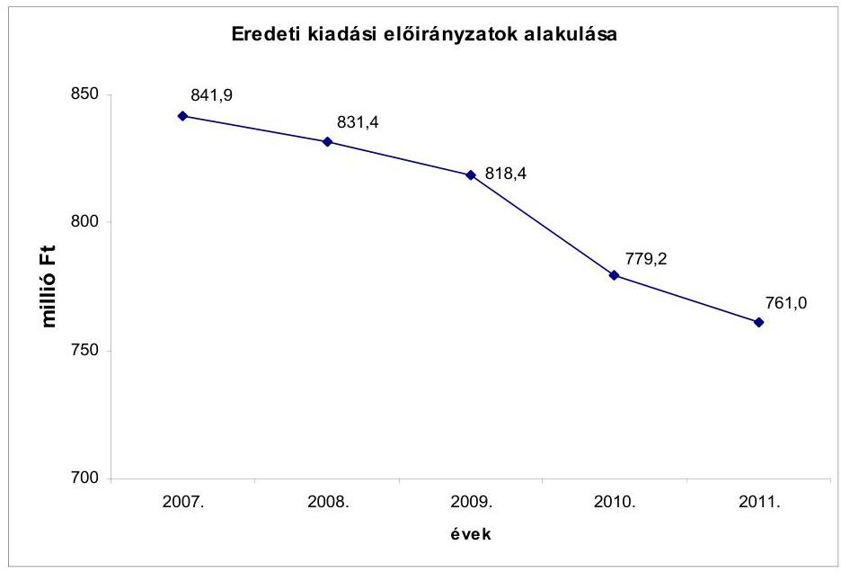

---

A kiadások fedezetét jelentős mértékben ${ }^{34}$ saját bevétel teremtette meg a költségvetésekben tervezett eredeti előirányzatok szerint. Ennek mértékét a következő grafikon adatai szemléltetik. Az intézmény bevételeinek alakulását a 4/a. számú melléklet mutatja.
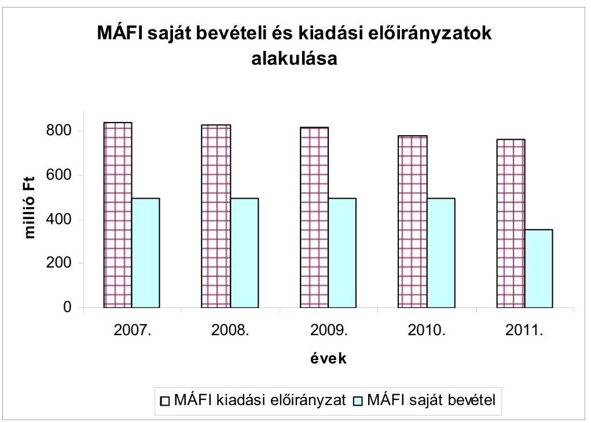

A MÁFI saját bevételi forrását a Bátaapátiban létesült kis és közepes aktivitású radioaktív hulladéktároló projektjéhez kapcsolódó munkák ellenértéke jelentette, melynek mértéke folyamatosan csökkent.

A MÁFI a költségvetési bevételek növelése érdekében „Vállalkozási szerződés"-eket kötött, melyek tartalmilag többségében az SzJ 74.20.72 számú mérnöki szolgáltatásról és földtani szakértésről szóltak, összhangban a MÁFI alaptevékenységével. ${ }^{35}$ Ezen tevékenységek azonban nem a Ptk. 389. § szerinti „vállalkozási szerződés"-ek, hanem a Ptk. 412. §-a szerinti „kutatási szerződés"-ek, ahol a munka eredménytelen befejezése esetén is járhat díj. A vállalkozási szerződések elnevezésükben ellentétesek az alapító okirattal, mely szerint „III. A MÁFI vállalkozási tevékenységi köre és mértéke" cím alatt a „A MÁFI vállalkozási tevékenységet nem folytat" szerepel.

Az éves költségvetéseinek végrehajtásáról készített beszámolókban az alaptevékenység elszámolt bevételeként jelent meg valamennyi saját bevétele, esetenként azonban olyan szerződéseket is kötöttek, melyek tevékenységükben nem voltak összhangban az alapító okirattal:

[^0]
[^0]:    ${ }^{34}$ 2007-ben: 59,0\%, 2008-ban: 59,8\%, 2009-ben: 60,7\%, 2010-ben: 63,8\%, 2011-ben 46,9\%
    ${ }^{35}$ Alapfeladata: „részvétel a nagy kockázattal járó országos beruházások tervezésének/kivitelezésének földtani megalapozásában".

---

2008. nov. 26-án egy Zrt.-vel 0,8 millió Ft +áfa összegben, 2009. febr. 26-án 0,25 millió Ft +áfa összegben „Reklámszerződés".
2010. ápr. 26-án egy Nyrt. és a MÁFI között 3 millió Ft +áfa összegben „Szponzorálási szerződés". A szerződés 5.1 pontjában a fizetési feltételek között „SZJ 74.40.20.0 reklámszolgáltatásról jogosult számlát kiállítani", ami az alapító okirat szerinti tevékenységébe nem tartozik.

A teljesített kiadások az eredeti előirányzatoknál a 2008-2011. években kisebb mértékben teljesültek a rendelkezésre álló források csökkenése miatt. 2007-ben még a tervezett eredeti kiadási előirányzatnál többet költöttek, 2010-ben azonban nem állt rendelkezésre a tervezett saját bevétel a csökkenő külső megrendelésre végzett szolgáltatások miatt.
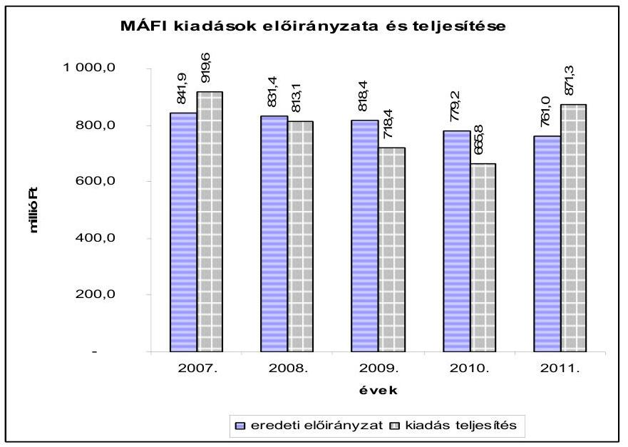

A kiadások teljesítésére hatással voltak a központi hatáskörben elrendelt kiadáscsökkentő intézkedések is: az Igazgatási és igazgatási jellegű szervek létszámát meghatározó 2057/2008. (V. 14.) Korm. határozat és a 2011. évi költségvetési egyensúlyt megtartó intézkedésekről szóló 1316/2011. (IX. 19.) Korm. határozat, mely szerint a beszerzési tilalom előírása a MÁFI-ra is vonatkozott.

# A MÁFI-nál a kötelezettségek és követelések főkönyvi nyilvántartása 

nem volt teljes körű, ezáltal a mérlegben kimutatott adatok nem voltak pontosak. Ennek következtében a likviditási mutatók elemzése nem ad megbízható információt.

A MÁFI-nál a rendelkezésünkre bocsátott követelés leírási dokumentumok azt támasztották alá, hogy a 2010. évben behajthatatlannak minősített követelések (1,2 millió Ft) behajtása érdekében a korábbi években nem tették meg az elvárható intézkedéseket. Például:

- Az „Akadémia Tudásmédia Zrt." 2008-ban keletkezett 0,24 millió Ft-os tartozását úgy írták le, hogy a 2008. augusztus 22-i felszólító levelet követően a behajtást jogi úton nem kezdeményezték.

---

- A legnagyobb leírt tétel 0,4 millió Ft (1890 USD) tartozáshoz („Mahmoud T. Elbakai Exploration") a keletkezéssel kapcsolatos dokumentum sem állt rendelkezésre, mellyel megsértették az Szt. 169. § (1) bekezdését.

A MÁFI NAV adófolyószámlája az ellenőrzött időszakban jelentős többletet mutatott (pl.: a 2007. évben 52,3 millió Ft), ami a leltárban, a beszámoló mérlegében a követelések között nem
 szerepelt.

A MÁFI 2011. évi rövid lejáratú kötelezettség állománya a pályázatokhoz kapcsolódott. A 2010-2011. évek végén az idegen pénzeszközök között a devizaszámlán lévő pályázati előlegek, továbbá a munkáltatói lakáskölcsönre elkülönített összegek szerepeltek. A 2011. évben a dolgozói devizahitelek végtörlesztésének fedezetére különítettek el 40 millió Ft-ot, melynek következtében a mérlegben szereplő pénzeszközök 65,8%-a ezen a két elkülönített számlán volt.

Likviditási problémák a 2010. évben jelentkeztek, amikor előrehozott költségvetési finanszírozással oldották fel a fizetési nehézségeket. A MÁFI 2010. évi likviditási hiányát az is okozta, hogy közel fél évig a devizaszámláról nem vezették át az EU forrást, miközben 50 millió Ft pályázati célhoz kapcsolódó kifizetés más forrás terhére történt.

A MÁFI ellenőrzött időszaki likviditására negatív hatással volt, hogy a bevételi elmaradások esetén nem vizsgáltak felül olyan szerződéseket, amelyek lehetővé tették, hogy a számla kiegyenlítése a számla kiállításától számított 180 munkanapon belül történjen. Ennek következtében a havi áfa fizetési kötelezettség fedezete nem állt rendelkezésre. Továbbá nem intézkedtek a követelések behajtása érdekében:

- a külső megrendelők részére végzett szolgáltatási szerződésben fizetési határidőként a számla kiállításától számított 180 munkanap szerepelt, melynek következtében a kiadásokat követően közel egy év múlva kapta meg a MÁFI ezen munkáinak ellenértékét. A szerződés módosítását a MÁFI a likviditási nehézségek idején sem kezdeményezte. A 2011. évben a szerződésekben már nem biztosítottak ilyen hosszú fizetési határidőt;
- a szerződésekhez kapcsolódóan a vevő késedelmes fizetése esetén nem éltek késedelmi kamat felszámítási lehetőséggel (Ptk. 301/A. §), például: a 2007. évben 1,0 millió Ft összegű számla ellenértékét 2007. okt. 15. helyett 2008. jan. 23-án realizálták bevételként.

A szolgáltatási tevékenységeihez kapcsolódóan a MÁFI-nak havonta - a teljesítést követő hónap 20-áig - áfa fizetési kötelezettsége keletkezett, mely az ellenőrzött időszakban összesen 135,2 millió Ft kiadást jelentett. A jelentős összegű szerződések kedvezőtlen fizetési feltételei miatt az ehhez kapcsolódó fizetendő áfát egyéb forrásból kellett megelőlegezni.

A jogszabályváltozások követésének és a belső kontrollok működésének hiányát mutatja - mely a MÁFI pénzügyi helyzetét is rontotta - hogy a MÁFI több esetben megsértette a 2008. évtől hatályos Áfa tv. 163. §-át, mely szerint a számlát a teljesítést követő 15 napon belül kell kiállítani.

---

- „Hidrogeológiai tanulmány elkészítése ..." Vállalkozási keretszerződés: M 25/2008. számú. A számla szerinti teljesítés: 2008. máj. 16., a számla kelte: 2008. jún. 9., pénzügyi teljesítés: 2008. júl. 14., összege: 3,5 millió Ft, VBM800074. sz. számla.
- VBM8-00082 számlán a teljesítés: 2008. ápr. 17., számla kelte: 2008. jún. 19., pénzügyi teljesítés: 2009. febr. 25., összeg: 19,3 millió Ft.

A MÁFI-nál a saját bevételek meghatározó nagyságrendje mellett sem vizsgálták, hogy a szerződésekben szereplő egységárak fedezik-e a ráfordított kiadást, mely így negatív hatással volt az intézmény likviditására. A MÁFI által végzett szolgáltatási tevékenységek egységárait úgy határozták meg, hogy azt nem támasztották alá önköltségszámítással.

Például: a laborvizsgálatok árát évente igazgatói utasításban határozták meg, de önköltségszámítás ezt nem támasztotta alá.

A MÁFI saját bevételeinek minimális hányadát adta a fúrási magminták adatainak kölcsönzése, ahol az ellenőrzött időszakban az intézmény „kezelési költségtérítéssel" számolt, így a földtani kutatási feladatok kiadásai részben sem térültek meg.

A MÁFI önköltség-számítási szabályzata az ellenőrzött időszakban csak általános fogalmakat rögzített, intézményi sajátosságokat nem, így az egyes tevékenységek kiadásainak és bevételeinek mérésére/értékelésére nem volt alkalmas. A közvetlen kiadásokat közvetett (általános) kiadásnak tekintették, így azt is vetítési alapok szerint osztották fel. Az egyes szakfeladatokon elszámolt bevételek és kiadások így nem nyújtottak megbízható információt arról, hogy az egyes tevékenységekre elszámolt kiadásokból mennyit finanszíroz a tevékenység saját bevétele.

Az európai uniós és hazai támogatással megvalósult feladatok bevételei, kiadásai a 2007-2011. évi költségvetésekben az elszámolásokhoz kapcsolódóan módosított előirányzatként szerepeltek. Az ellenőrzött időszakban a MÁFI az elnyert pályázatok eredményeképpen 401,6 millió Ft-tal növelte előirányzatát.

Az elnyert támogatások előirányzatosított/felhasznált összegeit (millió Ft-ban) évenkénti bontásban a következő ábra szemlélteti:
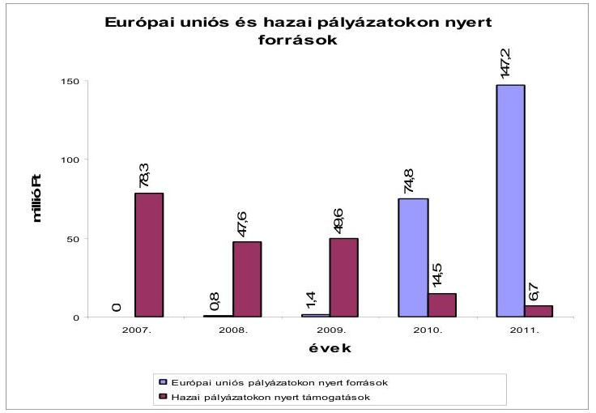

---

A költségvetési támogatási előirányzathoz viszonyítva a pályázatok eredményeként 2007-ben 22,7%, 2008-ban 14,5%, 2009-ben 15,9%, 2010-ben 31,7%, 2011-ben 38,1% többletforrást használtak fel.

A pályázatokon elnyert és felhasznált források részletezését az 5/a. számú mellékletben mutatjuk be.

A pályázati források összértéke az ellenőrzött időszakban 839,4 millió Ft volt. A támogatások kifizetése előlegfizetéssel vagy szállítói finanszírozással történt, saját forrás igénybevételére csak esetenként, ill. a pénzforgalom késedelme miatt volt szükség.

A MÁFI az ellenőrzött időszakban nyolc európai uniós és 27 hazai pályázaton vett részt eredményesen, amelyek földtani kutatási tevékenységeket finanszíroztak. Egy olyan pályázaton nyertek (KEOP-2.2.2.2/09-2009-0004), amellyel az alaptevékenységhez kapcsolódóan hosszútávon kiadási megtakarítást érnek el.

Ez az Országos Vízföldtani Monitoringhálózat korszerűsítése a KEOP-2.2.2.2/09-2009-0004 pályázat a 2007-2011. években, 177,0 millió Ft összegben. Ennek keretében a MÁFI az országos felszín alatti vízszintmegfigyelő hálózatát képező kutak felújítását, biztonságossá tételét végezte, az elavult észlelőtornyok átépítésével, új generációs műszerek elhelyezésével.

A vízszintmegfigyelő kutakat automata távadó regisztráló műszerekkel szerelték fel, mely a MÁFI-nak azzal jelent a korábbi évek költségvetéseiben rendelkezésre álló forráshoz képest a 2012. évtől kiadási megtakarítást, hogy a beruházás eredményeként a 138 kútnál kiváltja az eddigi havi helyszíni vízmintavétel útiköltségét, munkadíját.

A pályázati projektek kiadásaihoz a MÁFI-nál egy esetben történt 5% (6,2 millió Ft) saját forrás felhasználás a 2007. évben, aminek fedezete az intézmény költségvetésében rendelkezésre állt, a projektek által létrehozott létesítmények, eredmények fenntartása, működtetése biztosított volt.

Az 5% önrész biztosítási kötelezettség az INTERREG III.A keretében a „HU-SKUA/05/02/166 Magyar-Szlovák határmenti közös felszínalatti víztestek környezetállapota és fenntartható használata (ENWAT)" projektnél történt, mely 2006. jún. 1.-2008. ápr. 15. között valósult meg.

# 4.1.2. A vagyongazdálkodás, fejlesztések és vagyonhasznosítások 

A MÁFI vagyonát és annak összetételét az ellenőrzött időszakban a következő grafikon mutatja:

---

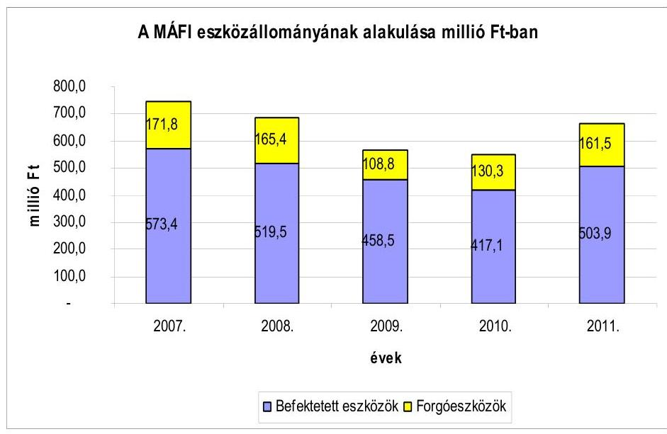

Az eszközállomány alakulása a rendelkezésre álló források függvénye volt. A MÁFI 2011. évi befektetett eszközállományának növekedését a KEOP forrásból elvégzett vízszintmegfigyelő kutak felújítása okozta.

MÁFI az ellenőrzött időszakban két évben végzett selejtezést. A selejtezési jegyzőkönyvek elkészültek, amelyekben a bruttó eszközérték mindkét esetben eltért a nyilvántartásból kivezetett értéktől.

A MÁFI 1/2008. számú selejtezési jegyzőkönyvének tanúsága szerint „a hasznosítási kísérletek eredménytelenek", így a selejtezéshez bevétel nem kapcsolódott. Ugyanakkor a selejtezett tételek között szerepel a Rákóczibánya felső magminta telep kazánja, 200 l-es bojler és egyéb olyan anyagok, melyek hulladék vas értékének hasznosítási bevételként kellett volna megjelenni.

A 2007-2011. évi mérlegben szereplő nettó vagyon összege a tárgyi eszközök és az immateriális javak szabálytalan értékelése, a vagyonváltozással kapcsolatos gazdasági műveletek szabálytalan számviteli elszámolása miatt nem valós adatokat tartalmazott.

- A MÁFI az országos felszín alatti vízmegfigyelő hálózathoz kapcsolódó feladatainak ellátása során szerződéseiben hivatkozik arra, hogy az objektumokra „kizárólagos vagyonkezelői joga (szerződése) van." ${ }^{36}$ Ugyanakkor ezen érték nélküli kezelői/szolgalmi jogokat a számviteli nyilvántartásban vagyoni értékű jogként nem rögzítették.
- A MÁFI feladatkörében vezet egy földtani adattár rendszert, ${ }^{37}$ ahol a kutatások magminta adatait rögzítik. Ennek informatikai szoftvere a számviteli nyilvántartásban nem szerepelt.
- Egyes karbantartási tételeket felújításként számoltak el ellentétesen az Szt. 3. §-ban rögzített fogalmakkal, így a pénzforgalmi beszámolóban a felhal-

[^0]
[^0]:    ${ }^{36}$ Forrás: MÁFI 204-204-2-403 témaszámú megbízási szerződés
    ${ }^{37}$ Magyar Állami Földtani, Geofizikai és Bányászati Adattár, 2012-től az MBFH-nál

---

mozási és a dologi előirányzat teljesülése, a mérlegben a befektetett eszköz állomány, a saját tőke változása és az elszámolt értékcsökkenés nem valós adatokat tartalmazott.

A MÁFI 2008. dec. 19-én kötött szerződést a Budapest, Stefánia u. 14. szám alatti ingatlan felújítására 1,8 millió Ft összegben. A szerződéshez mellékelt árajánlat szerinti munkák azonban nem felújítás, hanem karbantartás jellegűek voltak, melyeket a dologi kiadások között kellett volna elszámolni, de 2009-ben a pénzügyi teljesítéskor a tétel felújításként aktiválásra került. Ugyanezen szerződéshez kapcsolódó pótmunkaként 2009. május 4-én 0,13 millió Ft +áfa értékben szintén karbantartási munkák történtek, melyet felújításként számoltak el.
2008. febr. 22-én 1,2 millió Ft-ot és 2008. júl. 10-én 7,7 millió Ft-ot fizetett ki a MÁFI egy Kft. részére a Budapest Stefánia u. 14. ${ }^{38}$ műemlék épület (főbejárati ajtó és $452 \mathrm{~m}^{2}$ iroda) felújítására, ami szintén dologi kiadás lett volna.
2008. júl. 10-én 0,9 millió Ft-ot utaltak át a Stefánia u. 14. épület bejárati homlokzat felújítása címen, melyet a rendszeres karbantartási tevékenység részeként dologi kiadásként kellett volna teljesíteni.

A MÁFI-nál az értékcsökkenés számítása a 2007-2009. években a számviteli beszámoló kiegészítő mellékletének szöveges indoklása szerint „az üzembe helyezést, használatba vételt követő negyedév első napjától történik", mely nem volt összhangban az akkor hatályos Áhsz. 30. § előírásával, mely szerint az üzembe helyezést követő naptól kell számolni az értékcsökkenést.

A helyszíni ellenőrzés során az értékcsökkenés elszámolásával kapcsolatban több téves elszámolást is találtunk, mely a belső kontrollok nem megfelelő működését támasztja alá.

2007-ben a Rákóczibánya felső magminta telep központi fűtés kazán 0,2 millió Ft-os számla ellenértékét az analitikus nyilvántartásban tévesen a Kisterenye Rákóczi telep hrsz. 2689/2 földterületre aktiváltak, ahol értékcsökkenést nem számoltak el. A tétel helyesbítése az analitikában - 2%-os leírási kulccsal - a helyszíni ellenőrzés idején megtörtént.
2008. dec. 9-én 1,2 millió Ft-ot szoftverfejlesztés címen aktiváltak, de az alap szoftver már nullára leírt értéken szerepelt, a ráaktiválással egyidejűleg az értékcsökkenés leírási kulcsát is meg kellett volna határozni. A tétel 0%-os kulccsal szerepelt a nyilvántartásban és 2008-tól értékcsökkenést nem számoltak el utána.
2008. júl. 10-én a „Wacom Intuos3 A+ Wide Pen Tablet DTP digitalizáló tábla" ellenértékeként 0,25 millió Ft-ot aktiváltak, az analitikus nyilvántartásban 14,5%-os leírási kulccsal számolták el az értékcsökkenését, ami a számviteli politika szerint 33% lett volna.

Licenc beszerzés történt 3,1 millió Ft értékben, amit az analitikus nyilvántartásban nem vagyoni értékű jogként, hanem szoftverként tartottak nyilván. Az értékcsökkenését a 16% helyett, 33%-os leírási kulccsal és nem a licencszerződés sze-

[^0]
[^0]:    ${ }^{38}$ A „Földtani Intézet" kiemelt jelentőségű nemzeti vagyon a nemzeti vagyonról szóló 2011. évi CXCVI. Törvény szerint

---

rinti lejárathoz igazodóan állapították meg. Ezzel sérült az Áhsz. 30. § (6) ${ }^{39}$ bekezdése.

Az alkalmazott értékcsökkenési leírási kulcsok a 2007-2011. évi beszámolók kiegészítő melléklete alapján nincsenek összhangban az eszközök használati idejével, mivel - a következő grafikonokon bemutatott - jelentős összegű nullára leírt eszközt és szoftvert használtak.
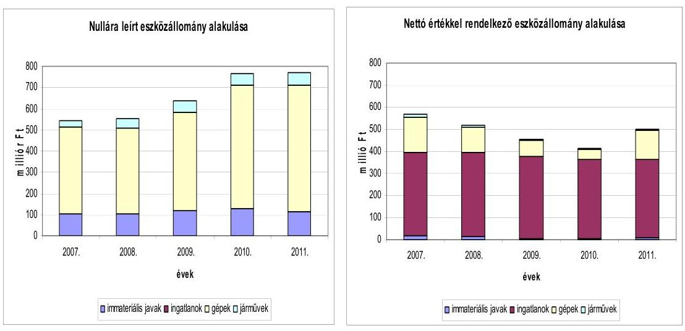

Az Áhsz. 30. § alapján „az államháztartás szervezete a tervezett használati idő figyelembevételével kisebb mértékben is megállapíthatja az általa alkalmazott lineáris leírási kulcsot", melyet a saját számviteli politikája részeként kell rögzíteni.

A MÁFI-nál az ellenőrzött időszakban a költségvetésekben a források elégtelensége miatt felhalmozási kiadást nem terveztek. A költségvetések végrehajtásáról készült beszámolók alapján a következő diagram a megvalósult beruházási, felújítási adatokat mutatja:
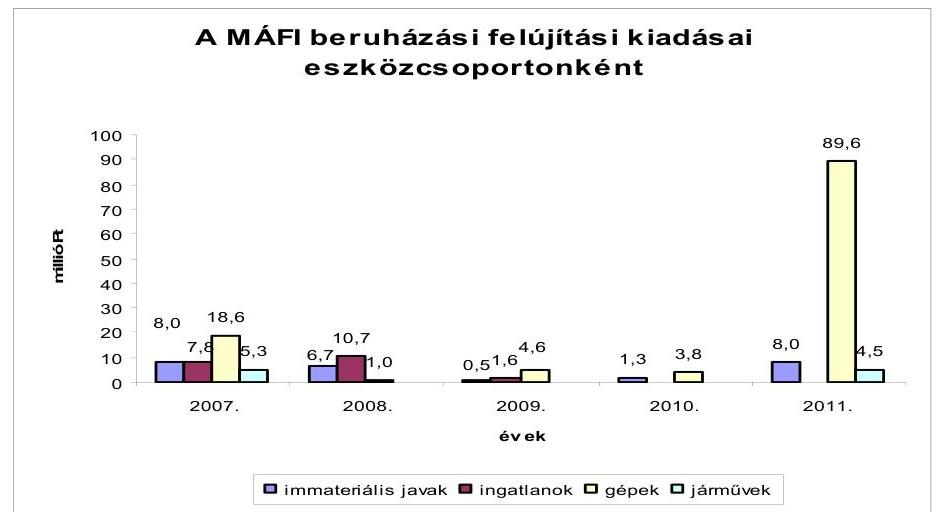

[^0]
[^0]:    ${ }^{39}$ Azon immateriális javaknál, ahol a szerződés eltérő időtartamot jelöl meg, mint a

 (2) bekezdés a)-c) pontjában előírt leírási kulcsok alapján számított használati idő, ott a várható használati idő tekintetében a szerződés szerinti időtartamot és az ennek megfelelő leírási kulcsot kell alapul venni

---

A MÁFI megvalósult beruházásaira a pályázatok teremtettek fedezetet. A diagramban a 2011. évi kiugró értéket a KEOP forrásból elvégzett vízszintmegfigyelő kutak felújítása okozta.

A MÁFI-nál 2004-ben módosították utoljára a vagyonkezelői szerződést. A szerződés módosítása az állami vagyonról szóló 2007. évi CVI. törvény és a nemzeti vagyonról szóló 2011. évi CXCVI. törvény hatályba lépése ellenére elmaradt.

# 4.2. Az ELGI pénzügyi egyensúlyi helyzete, a vagyonnal való gazdálkodás szabályszerűsége 

### 4.2.1. A költségvetési bevételek, kiadások alakulása, a likviditási helyzet

Az ELGI 2007-2011. évi elemi költségvetéseit az adott évi költségvetési törvények alapján állították össze és hagyták jóvá. Ezek alapján a 2007-2011. évi költségvetésekben az eredeti előirányzatok alapján biztosított volt a költségvetési egyensúly, a saját bevételek a költségvetési támogatásokkal együtt fedezték a költségvetési kiadásokat. Az intézmény kiadásainak és bevételeinek alakulását a 3/b. és a 4/b. számú mellékletek tartalmazzák.

Az ELGI ellenőrzött időszaki eredeti kiadási előirányzatai a következők szerint alakultak:
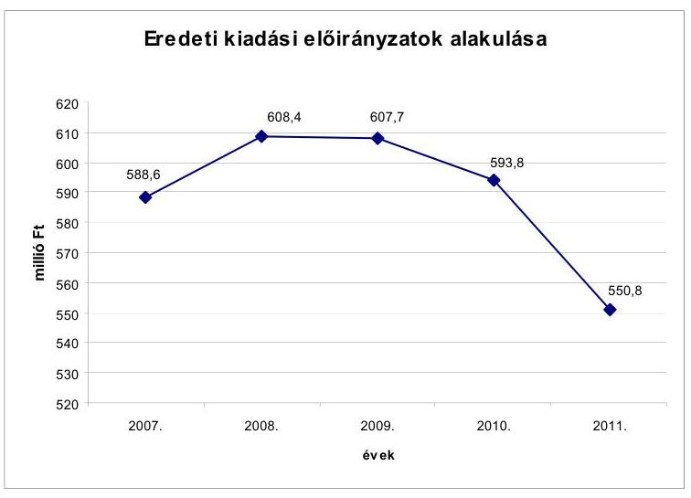

Az ELGI-nél a 2011. évi költségvetési kiadások előző évhez viszonyított 7,2%-os (43,0 millió Ft-os) csökkenését az okozta, hogy a 2011. évtől az MBFH költségvetésében szerepeltek az ELGI épületének üzemeltetési kiadásai.

A költségvetésben a kiadások fedezetét jelentős mértékben saját bevétel teremtette meg. Ennek mértékét a következő grafikon szemlélteti:

---

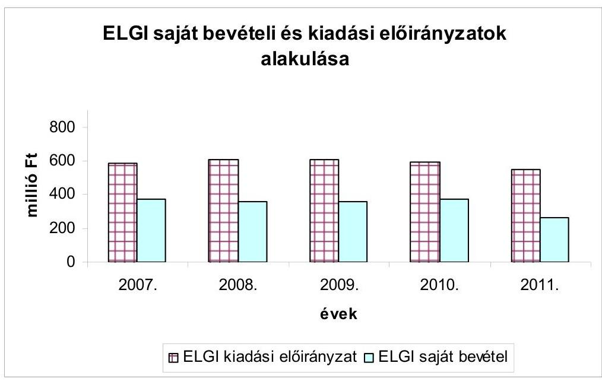

Az ELGI saját bevétele növelése érdekében geofizikai mérési szolgáltatásokat nyújtott piaci szereplőknek, továbbá sikeres pályázatokon vett részt. A 2007-2010. években forrásainak több mint 50%-a saját bevételekből származott, de a 2011. évi eredeti előirányzatok alapján már a költségvetési támogatások jelentették a fő finanszírozási forrást. Ennek oka a megnövekedett állami feladatokra kapott többlet költségvetési támogatás volt. Másrészt a saját bevételek csökkenéséhez hozzájárultak a csökkenő szolgáltatási megrendelések. A költségvetésben megnövelt támogatások csökkentették a piaci kockázatoknak kitett saját bevételek arányát.

A 2007-2011. évi költségvetések végrehajtása során kedvezően alakult az egyensúlyi helyzet: a teljesített költségvetési bevételek minden évben meghaladták a teljesített költségvetési kiadásokat.

A 2007-2011. évi teljesített költségvetési bevételek és kiadások alakulását a következő grafikon szemlélteti:
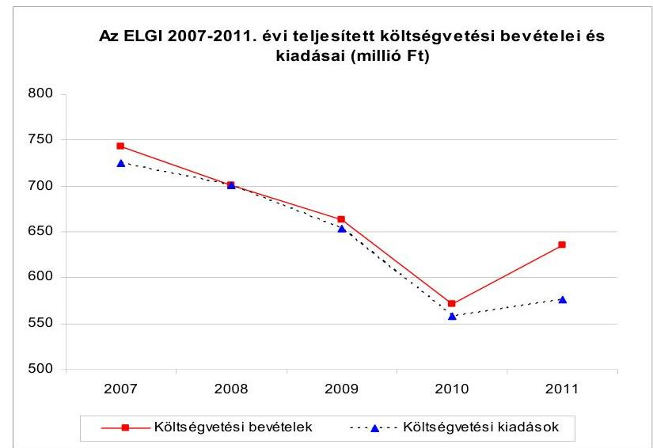

---

A 2007-2009. és 2011. években a teljesített költségvetési bevételek az eredeti előirányzathoz képest nagyobb mértékben nőttek, mint a kiadások, a 2010. évben pedig a bevételek kisebb mértékben csökkentek, mint a kiadások. A teljesített költségvetési bevételek 3,9%-kal (23,0 millió Ft-tal), a költségvetési kiadások 6%-kal (35,6 millió Ft-tal) csökkentek a 2010. évi eredeti előirányzathoz képest.

A 2007-2009. és 2011. évi teljesített költségvetési bevételek eredeti előirányzathoz viszonyított növekedéséhez a költségvetési támogatások, az intézményi saját bevételek, valamint az igénybevett előző évi előirányzat-maradvány is hozzájárultak.

Költségvetési többlettámogatást jelentettek a létszámleépítés fedezetére kapott támogatások és az OTKA támogatásai. A saját bevételek növekedését a pályázati források, a más szervek által átadott előző évi maradványok, valamint a tervezettet meghaladó szolgáltatási bevételek $^{40}$ eredményezték.

A 2010. évi intézményi működési bevételek 133,0 millió Ft-tal elmaradtak az eredeti előirányzattól, amit a megrendelések és a szolgáltatási kapacitás csökkenése okozott. A 2010. évi gazdálkodást a kiadások fokozott visszafogása, takarékosság jellemezte. A dologi és egyéb folyó kiadások az eredeti előirányzat 72,9%-ára (42,7 millió Ft-tal az eredeti előirányzattól elmaradva) teljesültek. A tervezett 9,8 millió Ft beruházási kiadás helyett - a beruházások elmaradása miatt - csak 0,3 millió Ft teljesült.

# A kiadások alakulására hatással voltak a központi hatáskörben elrendelt kiadáscsökkentő intézkedések is: 

- az ELGI-nél a 2007. évben a felügyeleti szerv 15%-os létszámcsökkentést rendelt el. Ennek hatására létszáma 83 főről 71 főre csökkent. A létszámcsökkentéssel járó plusz kiadások fedezetére költségvetési többlettámogatást kaptak;
- a Kormány az 1316/2011. (IX. 19.) határozata alapján az ELGI-t 30,7 millió Ft összegű zárolás érintette. A személyi juttatások előirányzatát 5,0 millió Ft, a munkaadókat terhelő járulékokét 1,3 millió Ft, a dologi kiadásokét 10,0 millió Ft, az intézményi beruházási kiadásokét 14,4 millió Ft összegben zárolták.

Az ELGI a 2007-2011. évi költségvetési beszámolók szöveges indoklásában a következő takarékossági intézkedésekről számolt be:

- irodaszer-, nyomtatvány-, papírfelhasználás csökkentése;
- szakmai anyag-beszerzés minimalizálása;
- konferencia részvétel, külföldi tanulmányutak korlátozása, lehetőség szerint ingyenes vagy szponzorált konferenciákon való részvétel.

A felsorolt takarékossági intézkedések pénzügyi hatásait nem számszerúsítették. Az ELGI igazgatója felhívta a figyelmet, hogy a takarékossági követelmé-

[^0]
[^0]:    $^{40}$ A szolgáltatásokból származó bevételek csak nagy bizonytalansággal tervezhetők

---

nyeket a belső kontrollrendszer keretén belül köteles minden szervezeti egység vezetője érvényesíteni, mérni az egyes feladatok ellátására fordított élő és holtmunka arányát, keresni a költségcsökkentési lehetőségeket. Az ELGI igazgatója emellett intézkedett a vevőállomány csökkentésére, folyamatosan fizetési felszólításokat küldött a késedelmesen fizetők részére.

Hosszú lejáratú kötelezettséget az ellenőrzött időszak mérlegeiben nem mutattak ki. Az ELGI rövid lejáratú kötelezettségei szállítói tartozásokhoz kapcsolódtak.

A 2007-2011. évek végén a pénzeszközök - a követelések nélkül is - fedezték a rövid lejáratú kötelezettségeket.

Likviditási problémák 2010-ben jelentkeztek, amikor előrehozott költségvetési finanszírozást is igénybe vettek a fizetési nehézségek feloldására. 2010. március 16-án utalták az ELGI számlájára a 26,1 millió Ft összegű előrehozott költségvetési támogatást. Az előrehozott támogatást a 2010. év utolsó három hónapjának költségvetési támogatásaiból vonták vissza. Az előrehozott finanszírozás iránti igényt azzal indokolták, hogy február hónapban és március elején nem tudják teljesíteni fizetési kötelezettségeiket. A likviditási problémák okai között említették, hogy a bevételek nagyobb hányada a szakmai feladatellátáshoz kapcsolódó szolgáltatásokból folyik be, amelyek viszont többnyire nem ütemezhetők viszonylagos állandósággal és havi rendszerességgel. Továbbá a behajtásra tett intézkedések ellenére a megrendelők késedelmesen fizetnek.

A 2010. évben márciustól novemberig jelentkezett az egyes hónapok végén $^{41}$ egy-kilenc millió Ft közötti 30 nap alatti, illetve 60 napon túli lejárt szállítói tartozásállomány $^{42}$. A főkönyvi könyvelés adatai alapján az egyes hónapok végén az elszámolási számlákon rendelkezésre álló pénzeszközök biztosították volna a lejárt tartozások kifizetését, a lejárt tartozások egy részének kifizetésére azonban igazgatói döntés alapján nem került sor.

Az ELGI igazgatója az ÁSZ részére adott nyilatkozatában ezt azzal indokolta, hogy az egyes intézeti szolgáltatásokhoz igénybe vett szállítók kifizetésére az adott szolgáltatási szerződéshez kapcsolódóan az intézet számlájára befolyt bevételt követően került sor a pénzügyi kockázat csökkentése érdekében.

A nyilatkozat szerint erre azért volt szükség, mert a havi átlagos pénzeszközállomány a bérek és egyéb állandó kiadások szintjén mozgott. Ebből adódóan az összes lejárt tartozás kifizetése veszélyeztette volna az intézet első számú prioritásaként kezelt kiadások (bérek, járulékok, adók, közüzemi számlák) teljesítését.

A kötelezettségállomány alakulása összhangban volt a felelős gazdálkodás követelményével, mert a szállítói tartozások állománya nem volt jelentős az összes forráshoz viszonyítva. A 60 napon túli lejáratú tartozások a

[^0]
[^0]:    $^{41}$ A Kincstár részére adott adatszolgáltatás alapján
    $^{42}$ Ezt követően a kincstári adatszolgáltatás szerint nem volt lejárt szállítói tartozásuk.

---

2010. évben csak időszakosak voltak. Másrészt a tartozások egy részének lejárat utáni fizetéséről való döntések az intézményen belüli likviditási gondok kialakulásának megelőzését célozták.

Az európai uniós és hazai támogatással megvalósuló feladatok bevételei, kiadásai a 2007-2011. évi költségvetésekben az elszámolásokhoz kapcsolódóan módosított előirányzatként szerepeltek.

Az ellenőrzött időszakban az ELGI az elnyert pályázatok miatt a következő összegekkel növelte előirányzatát:

|  | millió Ft |
| :--: | :--: |
| Megnevezés | ELGI |
| Európai uniós pályázatokon nyert források | 41,9 |
| Hazai pályázatokon nyert támogatások | 148,1 |
| Összesen: | 190,0 |

A pályázatokon elnyert és felhasznált forrásainak részletezését az 5/b. számú mellékletben mutatjuk be.

Az elnyert támogatások előirányzatosított/felhasznált összegeit évente a következő diagram szemlélteti:
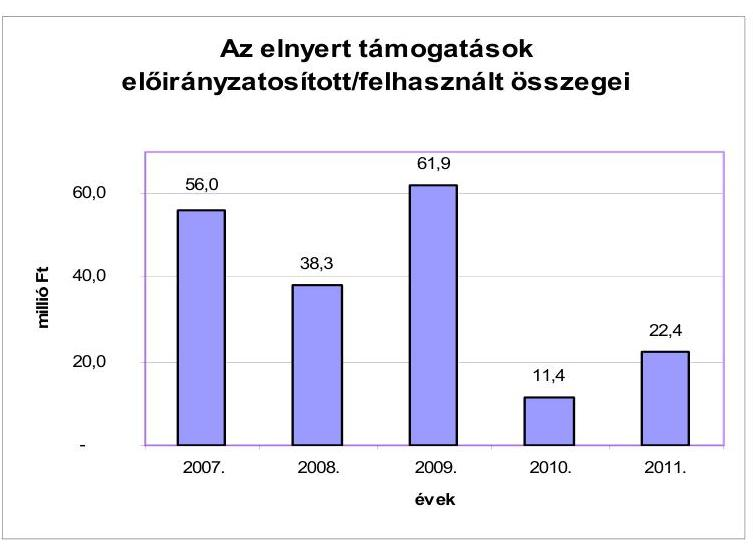

A pályázati projektek kiadásai az ELGI részéről nem igényeltek saját forrást, a projekteket a pályázatkezelő szervek finanszírozták. A pályázati projekteknek azok lezárását követően nem volt fenntartási, működtetési kötelezettsége.

# 4.2.2. A vagyongazdálkodás, fejlesztések és vagyonhasznosítások 

Az ELGI vagyongazdálkodásával kapcsolatban a feladatok meghatározása több külön szabályzatban szerepelt, a vagyongazdálkodás egészét egységes keretbe foglaló szabályzat nem készült.

---

A vagyontárgyak nyilvántartásával, számviteli értékelésével, leltározásával kapcsolatos előírásokat a számviteli politika és a kapcsolódó szabályzatok tartalmazták. A vagyongazdálkodási döntésekre a pénzgazdálkodási jogkörök szabályzataiban foglalt kötelezettségvállalási rendelkezések vonatkoztak. A vagyongazdálkodás speciális területeire a beszerzési és közbeszerzési szabályzat, informatikai biztonsági szabályzat, helyiségek és berendezések használatának rendjéről szóló szabályzatok tartalmaztak előírásokat.

Az 6/2005., 1/11/2009. és 7/2011. számú közbeszerzési és a beszerzési szabályzat előírásai megfeleltek a 2003. évi CXXIX. törvény előírásainak. A 7/2011. számú közbeszerzési szabályzat előírásait ugyanakkor nem aktualizálták a 2011. évi CVIII. törvény előírásainak figyelembevételével. Az MBFH gazdasági szervezetének ügyrendje az Ámr. 17. § (5) bekezdés és Ámr. 20. § (7) bekezdés előírása ellenére nem tartalmazta az ELGI vagyongazdálkodására vonatkozóan az alkalmazottak feladat- és hatáskörét.

Az ELGI mérleg szerinti vagyonértéke a következő grafikon szerint változott az ellenőrzött időszakban:
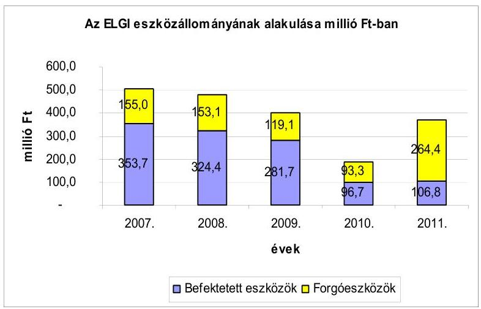

Az intézmények eszközállományának alakulása a fejlesztésre rendelkezésre álló források függvénye volt, mely a 2007-2010. évek között folyamatosan csökkent, majd a 2011. évben a magasabb összegű költségvetési támogatás az ELGI-nél az eszközök állományának növekedésében is érzékelhető volt.

A beszámoló kiegészítő mellékletének 38. űrlapján a 2010. évi egyéb vagyon csökkenés jelentős részét a Budapest, Columbus u. 17-23. szám alatti irodaház ingatlan 224,6 millió Ft bruttó nyilvántartási értékének kivezetése okozta. A kivezetést az MNV Zrt. jogelődjével kötött „Vagyonkezelési szerződés" módosítása alapozta meg, miszerint az említett ingatlan vagyonkezelői joga az MBFH-hoz került át.

A 2007-2011. évi vagyongazdálkodási döntések és az ezzel kapcsolatos szerződéskötések nem minden esetben voltak szabályszerűek:

---

- a 2008-2010. évi gépkocsi értékesítéseket a 254/2007. (X. 4.) Korm. rendelet 48. §-ával ellentétesen $^{43}$ nem előzte meg független értékbecslés $^{44}$. A járműeladási szerződések nem tartalmazták a fizetési feltételeket - köztük a fizetés határidejét -, ezáltal nem rögzítették az intézmény érdekeit védő garanciális elemeket. A 2010. évi gépjármű értékesítésnél az Ámr. 82. § (1) bekezdés b) és c) pontjai ellenére nem rögzítették a pénzügyi teljesítés módját és feltételeit, a fizetés határidejét;
- az ELGI-nél a beszerzések megrendeléseit az arra jogosult kötelezettségvállaló, az ellenjegyzést követően írta alá. A beszerzések közül azonban a 2011. január 26-i telefon, a 2011. április 20-i nyomtató, a 2011. július 4-i monitor és szünetmentes tápegység megrendeléseknél a beszerzési szabályzat előírása ellenére a beszerzési kérelmet nem készítették el. Nem állítottak ki továbbá a pénzgazdálkodási jogkörök szabályzatai előírásai ellenére a kötelezettségvállalás célszerűségét megalapozó okmányt a 2007-2009. és 2011. évi ellenőrzött beszerzéseknél. A pályázati forrásokból finanszírozott termékbeszerzéseknél a pályázati szabályozás követelményeinek megfelelően a témafelelős igazolta a beszerzendő termékek szükségességét. A 2007-2009. és 2011. évi ellenőrzött megrendelések nem tartalmazták a fizetés határidejét a pénzgazdálkodási jogkörök szabályzatai és 2011. évben az Ámr. 82. § (1) bekezdés c) pontja ellenére.

A 2007-2011. évi beszerzések
 a nem központosított közbeszerzési körbe tartozó termékek esetében nem érték el a 2003. évi CXXIX. tv. és a 2011. évi CVIII. tv. szerinti értékhatárt, ezért nem volt szükség közbeszerzési eljárás lefolytatására.

Az ELGI megrendeléseiben elfogadott szállítói ajánlatok tartalmazták a garanciális feltételeket, főbb minőségi követelményeket. A 2007-2011. években kötött, ingatlanok hasznosítását célzó bérleti szerződések szabályszerűek voltak. A bérleti szerződésekben rögzítették a fizetési feltételeket, a késedelmes fizetés esetére késedelmi kamat felszámításának jogát. A szerződések tartalmazták a bérbe adott ingatlanok megfelelő kezelésére vonatkozó bérbevevői kötelezettségeket.

A 2007-2011. évi költségvetések végrehajtásáról készült beszámolók adatai a következő megvalósult beruházási, felújítási adatokat tartalmazták:

[^0]
[^0]:    ${ }^{43}$ A gépkocsi értékesítések az aktuális költségvetési törvény alapján kis értékűek voltak, így az állami vagyonról szóló 2007. évi CVI. törvény 35. § (2) bekezdés (i) pontja alapján nem volt szükség versenyeztetésre. Az értékbecslési kötelezettséget azonban előírja a jogszabály erre az esetre.
    ${ }^{44}$ Az értékesített járművek egy kivétellel - az adásvételi szerződésben foglaltak alapján - hiányosan, üzemképtelen állapotban, a forgalomból kivonva kerültek eladásra 15, illetve 30 ezer Ft egyedi értékesítési árakon.

---

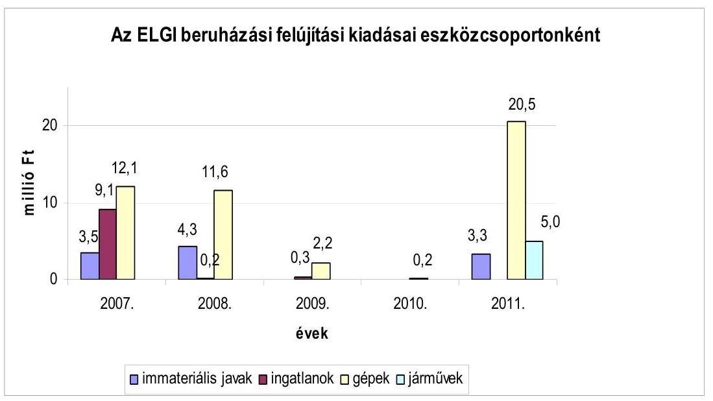

Az ellenőrzött fejlesztések az ELGI-nél 54,5%-ban saját forrásból, 45,5%-ban pályázati támogatásokból valósultak meg.

Az ELGI-nek a KVI-vel 1997-ben kötött vagyonkezelési szerződését a vagyonkezelésbe vett eszközök módosulása miatt az ellenőrzött időszakban 2010. május 28-án módosították.

# 5. AZ INTÉZMÉNYEKNÉL KIALAKÍTOTT ÉS MŰKÖDTETETT BELSŐ KONTROLLRENDSZER 

### 5.1. A MÁFI kontrollrendszere

A 2007-2010. évek között a MÁFI-nál a kockázatkezelési rendszer kialakítása és működtetése nem volt megfelelő. Az intézményben 2010-ig a 2005. évben kialakított FEUVE volt hatályban, azonban annak aktualizálása nem történt meg a jogszabályi változásoknak megfelelően. A FEUVE-t nem egészítették ki a kontrolltevékenység, az információ és a kommunikáció szabályaival. Az intézményben a jogszabályi változáshoz igazodóan, a belső kontrollrendszer folyamatos figyelemmel kísérését és értékelését végző monitoring szabályzatot csak a 2011. évben készítették el.

A 2007-2011. évek kötelezettségvállalásának, a kötelezettségvállalás ellenjegyzésének, a szakmai teljesítés igazolásának, az érvényesítésének, az utalványozásának, az utalvány ellenjegyzésének szabályszerűségi vizsgálata a WINIDEA programon keresztül, véletlenszerű mintavétellel történt.

A MÁFI-nál és az MBFH-nál a 2007-2011. években a belső kontrollok nem működtek megfelelően, mert az ellenőrzött bizonylatok 15,7%-ánál állapított meg az ellenőrzés a szabályozással ellentétes gyakorlatot az alábbiak szerint:

## Az egyéb dologi kiadásokkal kapcsolatos kiadások teljesítése során:

---

- A 2007. évben a kötelezettségvállalás működése egy tételnél nem volt megfelelő, mert a kötelezettségvállaló a kötelezettségvállalást megelőzően nem észrevételezte a kötelezettségvállalás ellenjegyzésének hiányát, továbbá az utalvány ellenjegyzője szintén nem jelezte ennek elmaradását.
- A 2008. évben a kötelezettségvállalás működése egy tételnél nem volt megfelelő, mert a kötelezettségvállaló - az Ámr. ${ }_{1}$ 134. § (8) bekezdésében foglaltak ellenére - a kötelezettségvállalást megelőzően nem észrevételezte a kötelezettségvállalás ellenjegyzésének hiányát. Kettő tételnél elmaradt a kiadások utalványozása és ellenjegyzése, az utalványozó - az Ámr. ${ }_{1}$ 136. § (1) és (3) bekezdésében előírtak ellenére - és az utalvány ellenjegyzője - az Ámr. ${ }_{1}$ 137. § (1) bekezdésében előírtak ellenére - a kifizetések jogosságát aláírásukkal nem igazolták.
- A 2009. évben a gazdálkodási jogkörök gyakorlása formális volt és az utalványrendeletek kiállításának dátuma szerint utólagosan történt, ezért a mintavétel keretében kiválasztott kettő tételnél hiányzott az érvényesítés, az utalványozás és az utalvány ellenjegyzése, a kontrollok nem működtek.
- A 2010. évben - az Ámr. ${ }_{2}$ 77-79. §-aiban előírtak ellenére - az érvényesítés, az utalványozás és az ellenjegyzés működése a mintavétel keretében kiválasztott tételeknél nem volt megfelelő, mert a kiválasztott öt tételnél az érvényesítés, az utalványozás és az utalvány ellenjegyzése nem történt meg.
- A 2011. évi kiadások teljesítése során az érvényesítés, az utalványozás és az ellenjegyzés működése a mintavétel keretében kiválasztott egy tételnél nem volt megfelelő, mert hiányzott az érvényesítés, az utalványozás és az utalvány ellenjegyzése.

# 5.2. Az ELGI kontrollrendszere 

Az ELGI-nél a kisebb szabályozási hiányosságok ellenére a 2007-2009. években a kockázatkezelési rendszer működött. Az intézményben az Áht. ${ }_{1}$ 121. § (3) bekezdésében foglaltak szerint kialakították a FEUVE rendszert, illetve a belső kontrollrendszert. A FEUVE szabályozáson belül a szabálytalanságok kezelésének eljárásrendjéről szóló szabályzatot - a 2007. év kivételével -, a kockázatkezelési szabályzatot és az ellenőrzési nyomvonalat a 2007-2011. évekre kidolgozta az intézmény. A kockázatkezelési rendszerről a 2010-2011. években külön szabályzatok készültek, amely tartalmazta a kockázati tényezők meghatározását, azok bekövetkezéséből eredő hatások becslésére, értékelésére, a kockázatokra adható válaszokra, a kockázatok felülvizsgálatára vonatkozó előírásokat. A szabályozások felülvizsgálata megtörtént. A monitoring rendszerről készített 2010. évi szabályzatot nem hagyták jóvá. A 2011. évi monitoring szabályzatot az NGM útmutatója szerint készítették el. A kommunikációs és monitoring rendszerrel kapcsolatos feladatok kidolgozása megtörtént. A monitoring rendszer a belső kontrollrendszer folyamatos figyelemmel kísérését és értékelését végezte.

A 2007-2011. években a kötelezettségvállalás, a kötelezettségvállalás ellenjegyzése, a szakmai teljesítésigazolás, az érvényesítés, az utalványozás, az utalvány ellenjegyzésének szabályozása megtörtént. A szabályzatokat az Ámr. ${ }_{1-2}$ változásainak figyelembevételével évenként aktualizálták.

---

A 2007-2011. évek kötelezettségvállalásának, a kötelezettségvállalás ellenjegyzésének, a szakmai teljesítés igazolásának, az érvényesítésének, az utalványozásának, az utalvány ellenjegyzésének a szabályszerűségi vizsgálata a WINIDEA programon keresztül véletlenszerű mintavétellel történt.

A 2007-2011. években a kontrollok nem működtek megfelelően, mert az ellenőrzött bizonylatok 14,3%-ánál állapított meg az ellenőrzés hiányosságot az alábbiak szerint:

# A nem rendszeres személyi juttatások teljesítése során: 

A 2008. évben a kötelezettségvállalás, az érvényesítés, az utalványozás és az ellenjegyzés folyamatában a mintavétel keretében kiválasztott tételek közül egy nem volt megfelelő, mert

- a kötelezettségvállaló - az Ámr. ${ }_{1}$ 134. § (8) bekezdésében foglaltak ellenére a kötelezettségvállalást megelőzően nem észrevételezte a kötelezettségvállalás ellenjegyzésének hiányát;
- az utalványozó - az Ámr. ${ }_{1}$ 136. § (3) bekezdésében foglaltak ellenére - és az utalvány ellenjegyzője - az Ámr. ${ }_{1}$ 137. § (3) bekezdésével ellentétesen- a kifizetést megelőzően nem észrevételezték az érvényesítés elmaradását.

## Az egyéb üzemeltetési, fenntartási, szolgáltatási kiadások teljesítése során:

A 2008. évben a szakmai teljesítésigazolás, az érvényesítés, az utalványozás és az ellenjegyzés egy tételnél nem volt megfelelő, mert

- a szakmai teljesítés igazolására kijelölt személy az ellenőrzési feladatát - az Ámr. ${ }_{1}$ 135. § (1) bekezdésében foglaltak ellenére - a támogatás kifizetését megelőzően nem végezte el, nem ellenőrizte, szakmailag nem igazolta a kiadás jogosultságát, összegszerűségét;
- az utalványozó - az Ámr. ${ }_{1}$ 136. § (3) bekezdésében foglaltak ellenére - és az utalvány ellenjegyzője - az Ámr. ${ }_{1}$ 137. § (3) bekezdésében foglaltak ellenére - a támogatás kifizetését megelőzően nem észrevételezték az érvényesítés és a szakmai teljesítés igazolásának elmaradását.

## Az egyéb dologi kiadások teljesítése során:

A 2007. évben a szakmai teljesítésigazolás, az érvényesítés, az utalványozás és az ellenjegyzés működése a mintavétel keretében kiválasztott kettő tételnél nem volt megfelelő, mert

- a szakmai teljesítés igazolására kijelölt személy az ellenőrzési feladatát a geotechnikai konferenciával kapcsolatos számla kifizetését megelőzően - az Ámr. ${ }_{1}$ 135. § (1) bekezdésében előírtak ellenére - nem végezte el, nem ellenőrizte, szakmailag nem igazolta a kiadás jogosultságát, összegszerűségét;
- nem tartotta be az érvényesítő az Ámr. ${ }_{1}$ 135. § (3) bekezdésében, az utalványozó az Ámr. ${ }_{1}$ 136. § (3) bekezdésében, és az utalvány ellenjegyzője az

---

Ámr. 137. § (3) bekezdésben előírtakat, mert a kifizetést megelőzően nem észrevételezték a szakmai teljesítés igazolásának elmaradását.

A 2009. évben az érvényesítés, az utalványozás és az ellenjegyzés működése a mintavétel keretében kiválasztott tételek közül egynél (egy újságrendelés esetében) nem volt megfelelő, mert

- az utalványozó - az Ámr. ${ }_{1}$ 136. § (3) bekezdésében foglaltak ellenére - és az utalvány ellenjegyzője - az Ámr. ${ }_{1}$ 137. § (3) bekezdésében foglaltak ellenére - a kifizetést megelőzően nem észrevételezték a hirdetéssel kapcsolatos kifizetésnél az érvényesítés elmaradását.

# A felhalmozási kiadások teljesítésekor: 

A 2007. évben gazdálkodási jogköröket a szabályozás szerint gyakorolták, azonban a bizonylatok könyvelése során nem győződtek meg teljes körűen a gazdálkodásra vonatkozó szabályok érvényesüléséről, mert

- 2007. február 23-án egy 486-os kompatibilis komplett számítógép felújítása során a felmerült kiadást a régi számítógépre aktiválták, azonban nem tartották be az Áhsz. 30. § (1)-(2) bekezdésében az értékcsökkenésre vonatkozó előírásokat, mivel az új bruttó érték után az értékcsökkenést nem számolták el. Az intézmény nem tartotta be az Áhsz. 34. § (2) bekezdésében előírtakat, mert a 2007-2009. évi könyvviteli mérlegekben szereplő tárgyi eszközök értéke nem a valós értéket mutatta. A számítógép értékcsökkenésének helyesbítését 2010. március 31-én végezték el.

A 2008. évben az érvényesítés az utalványozás és az ellenjegyzés működése a mintavétel keretében kiválasztott tételek közül egynél, a Xerox Work Centre 6115 MFP multifunkcionális eszköz esetében nem volt megfelelő, továbbá egy felújításnál a könyvvitelben történő elszámolás során nem tartották be a jogszabályi előírást, mert

- az utalványozó - az Ámr. ${ }_{1}$ 136. § (3) bekezdésében foglaltak ellenére - és az utalvány ellenjegyzője - az Ámr. ${ }_{1}$ 137. § (3) bekezdésével ellentétesen - a kifizetést megelőzően nem észrevételezték az érvényesítés elmaradását;
- felújításként számolták el az ELGI Homonna utcai telephelyén végzett karbantartási munkákat. Az intézmény telephelyén 2008. május 30-án festésre és a falburkolat cseréjére került sor, és ezt a gazdasági eseményt - az Szt. 3. § (4) bekezdés 8-9. pontjában és az Áhsz. számlaosztályok tartalmára vonatkozó 9. számú melléklet 9. c) pontjában foglaltak ellenére - dologi kiadás helyett felhalmozási kiadásként számolták el. Ennek következtében a 2008. évtől kezdődően az Áhsz. 34. § (2) bekezdésével ellentétesen a könyvviteli mérlegben szereplő tárgyi eszközök értéke nem a valós értéket mutatta.

A 2009. évben az érvényesítés az utalványozás és az ellenjegyzés működése kettő tétel (notebookok vásárlása) esetében nem volt megfelelő, továbbá egy esetben a könyvvitelben történő elszámolás nem a jogszabályi előírásoknak megfelelően történt, mert

- az utalványozó - az Ámr. ${ }_{1}$ 136. § (3) bekezdésében foglaltak ellenére - és az utalvány ellenjegyzője - az Ámr. ${ }_{1}$ 137. § (3) bekezdésében foglaltak ellenére

---

- a kifizetést megelőzően nem észrevételezték a notebook eszközök beszerzésénél az érvényesítés elmaradását;
- a 2009. évben az ELGI Kolumbusz utcai telephelyén (február 20-án) elektromos vezetékek cseréjét hajtották végre, amit - az Szt. 3. § (4) bekezdés 8-9. pontjában és az Áhsz. számlaosztályok tartalmára vonatkozó 9. számú melléklet 9. c) pontjában foglaltak ellenére - nem karbantartásként, hanem felújításként számoltak el. Ennek következtében a 2009. évtől kezdődően a könyvviteli mérlegben szereplő tárgyi eszközök értéke nem a valós értéket mutatta.

A 2010. és a 2011. évben a mintavétellel kiválasztott bizonylatok vizsgálata során a pénzgazdálkodási jogköröknél,
 valamint a gazdasági események könyvvitelben történő elszámolásánál az ellenőrzés nem állapított meg eltérést a szabályozásokhoz képest.

A MÁFI és az ELGI kiadásainak teljesítése során az MBFH nem tett eleget az intézményekkel kötött megállapodásban és a szabályzataiban előírtaknak, mert nem gondoskodott a kontrollok megfelelő működtetéséről.

# 5.3. A belső ellenőrzés ellátásának szervezeti keretei és működése 

Az intézményekben a 2007. évben belső ellenőrzési tevékenységet saját szervezeti egység, belső ellenőr vagy külső szolgáltató nem végzett. Az intézmények vezetői a 2007. évben nem tartották be a Ber. 4. § (1) bekezdésében előírtakat, mert nem intézkedtek a belső ellenőrzés kialakításáról és működtetéséről. A folyamatba épített, előzetes és utólagos vezetői ellenőrzés, a jelentés 5.2. pontjában szereplő megállapítások alapján nem működött megfelelően.

A 2008-2011. években mind a MÁFI-nál, mind az ELGI-nél a belső ellenőrzési feladatok ellátásával külső szolgáltatót bíztak meg, a Ber. 8. §-ában foglalt feladatok mellett a 12. § szerinti belső ellenőrzési vezetői feladatokat is a külső szolgáltató látta el.

Az ELGI a 2008-2009. években nem tartotta be a Ber. 23. §, 29. §, 29/A. § (3) bekezdését és a 32. §-ában foglalt előírásokat, mivel a belső ellenőrzésekről nyilvántartással, a belső ellenőrzés által végrehajtott ellenőrzések javaslatainak hasznosítására irányuló intézkedési tervvel, ezekről vezetett nyilvántartással, ellenőrzési programmal és az ellenőrzés megállapításait alátámasztó dokumentummal nem rendelkezett. Nem tartották be a Ber. 5. § (3) bekezdésében előírtakat, mert a belső ellenőrzési kézikönyvet évenként nem vizsgálták felül és nem módosították. Az intézménynél 2007. január 1-jétől 2009. december 31-ig a 2004. június 30-án aláírt Belső ellenőrzési kézikönyv volt hatályban, amit 2008. június 9-én aktualizáltak. A 2010-2011. években a belső ellenőrzési tevékenységgel megbízott új külső szolgáltató szervezet már elkészítette és kialakította a Ber-ben előírt szabályzatokat, illetve nyilvántartásokat.

---

A MÁFI a 2008-2009. években nem tartotta be a Ber. 29. § (1) bekezdésében, valamint a Ber. 8. § f) pontjában foglaltakat, mert a belső ellenőrzés által tett javaslatok végrehajtására az intézmény nem készített intézkedési tervet, a belső ellenőrzést végző pedig nem győződött meg az általa feltárt hiányosságok megszüntetéséről. A 2008-2009. években a belső ellenőrzés nem segítette a gazdálkodás szabályszerűségét, átláthatóságát, a belső kontrollrendszerek javítását, a kockázatok csökkentését, mert kevés ellenőrzést végeztek, és a megállapítások nem eredményezték az intézmény gazdálkodásának javítását. A 2010-2011. években a belső ellenőrzés működése megfelelő volt.

Az ELGI-nél a külső szolgáltató a 2008. és 2009. évben készített ellenőrzési jelentésében belső kontrollra vonatkozó rendszerbeli hiányosságokat nem tárt fel. A 2009-2011. évekre a monitoring rendszer vizsgálatáról készültek feljegyzések. A feljegyzésekből megállapítható, hogy a fő folyamatok rendszeres monitorozása, a célok teljesülésének ellenőrzése megvalósult a rendszeres ellenőrzések kapcsán. Az intézményben a 2010-2011. években a belső ellenőrzés a gazdálkodás szabályszerűségéhez, átláthatóságához, a belső kontroll rendszer javításához, a kockázatok csökkentéséhez hozzájárult.

# 6. A FELÜGYELETI ÉS KÜLSŐ ELLENŐRZÉSEK 

Az ellenőrzött években a felügyeleti szervek ellenőrzési tevékenysége az intézmények éves költségvetési beszámolójának megbízhatósági ellenőrzésére irányult. Az ellenőrzés által tett javaslatok alapján az intézmények minden évben elkészítették az intézkedési tervet a határidő és felelős megjelölésével, amelyet jóváhagyás céljából megküldtek a felügyeleti szervnek. Az ellenőrzés megállapításai alapján tett javaslatok hasznosulását, az intézkedési tervekben foglaltak végrehajtását a felügyeleti szerv a következő évben végzett ellenőrzés során kontrollálta.

Ezen felül a 2010. évi irányító szervi változás követően az NFM év közben ellenőrzést végzett a MÁFI-nál, amely az intézmény 2010. I. félévi gazdálkodásának vizsgálatára irányult. Az ellenőrzés megállapítása szerint az intézmény gazdálkodása szabályozott volt, a számviteli politikával és a pénzgazdálkodási szabályzattal kapcsolatban jelzett kisebb hiányosságokat. Az irányítást ellátó szervben történt változás miatt javasolta az intézményi SzMSz aktualizálását, valamint a hatályos számviteli előírásokkal ellentétesen rögzített tételek rendezését. Az ellenőrzés a 2010. év első félévi adatok figyelembevételével vizsgálta az intézményi bevételek teljesülését, amelynek alapján felhívta az intézmény vezetésének figyelmét a kiadási előirányzatok terhére vállalt kötelezettségek felülvizsgálatára, mivel a tervezett bevételek teljesülése nem várható. Az ellenőrzés a minisztériumnak azonnali intézkedések megtételét javasolta az intézmény pénzügyi helyzetének rendezése érdekében.

[^0]
[^0]:    ${ }^{45}$ A megbízhatósági ellenőrzést az ÁSZ által a zárszámadás ellenőrzéséhez kiadott módszertan alapján végezték.

---

Az intézmény az ellenőri jelentésben foglalt javaslatok alapján elkészítette az intézkedési tervet, amelyet jóváhagyásra megküldött a felügyeleti szervnek ${ }^{46}$. A felügyeleti szerv válaszlevelében ${ }^{47}$ jóváhagyta az intézkedési tervben foglaltakat, és a MÁFI gazdálkodásával, likviditásával kapcsolatos problémák kezelésére, okainak feltárására az intézmények munkatársainak bevonásával munkacsoportot bízott meg, hogy tegyen javaslatot milyen formában biztosítható szakmai és költséghatékonyság szempontjából legeredményesebben a földtani feladatok ellátása. A felügyeletet ellátó minisztérium a munkacsoport véleményének figyelembevételével tett javaslatot az intézmények összevonására. Az intézmények összevonása oly módon történt, hogy a MÁFI 2012. április 1-jétől beolvadt az ELGI-be ${ }^{48}$. Az összevonást azzal is indokolták, hogy megszűnnek az intézmények feladatellátásában mutatkozó párhuzamosságok, a koncessziós és egyéb állami feladatok - a működési költségek csökkentése mellett hatékonyabban láthatók el egy szervezet keretében.

Az intézmények együttesen az európai uniós forrásokból - a 2007-2011. évek között - összesen 10 pályázatban szereplő cél megvalósításához 315 millió Ft támogatást használtak fel. Az uniós támogatások cél szerinti felhasználását a közreműködő szervezetek ellenőrizték. Ellenőrzéseikben kifogásolták, hogy a 2007-2011. években az európai uniós és a hazai forrásból megvalósított projektekről és ezek költségeiről az intézmények nem vezettek elkülönített nyilvántartást. ${ }^{49}$ Ezt a hiányosságot nem pótolták az intézmények, mivel ilyen kimutatással az ÁSZ ellenőrzés időszakában sem rendelkeztek, és a helyszíni ellenőrzés ideje alatt gyűjtötték ki az adatokat az ellenőrzés részére. További hiányosságként állapították meg, hogy a nem magyar nyelven kiadott számlák fordítása nem mindig történt meg. ${ }^{50}$ Az európai uniós projektek ellenőrzését tartalmazó jegyzőkönyvek jelentős része szintén idegen nyelvű volt, magyarra történő fordításuk elmaradt.

A MÁFI-nál a 2007-2011. évek között hazai forrással megvalósított projektek közül kettő esetében állapított meg a pályázatokat ellenőrző szerv visszafizetési kötelezettséget, amelyek az intézmény pénzügyi helyzetére (kis összegük miatt) nem voltak hatással:

[^0]
[^0]:    ${ }^{46}$ 2010. november 19-én
    ${ }^{47}$ 2010. december 6-án kelt
    ${ }^{48}$ A 320/2011. (XII. 27.) Korm. rendelet 1. § (1) bekezdése alapján
    ${ }^{49}$ A MÁFI-nál a T-JAM (Szlovénia-Magyarország Határon Átnyúló Együttműködési program keretében) a „Geotermikus hasznosítások számbavétele, a hévízadók értékelése és a közös hévízgazdálkodási terv előkészítése a Mura-Zala medencében" című, a Transenergy „Szlovénia, Ausztria, Magyarország és Szlovákia határokkal osztott geotermikus erőforrásai" című projektek esetében a költségek elkülönítése nem történt meg.
    ${ }^{50}$ Pl.: a MÁFI-nál az OTKA K 62478 számú, „A szél hatása a késő-neogén-negyedidőszaki üledékképződésre és a domborzat alakulására a Magyarközéphegységben és előterében" című projektnél nem minden idegen nyelvű számlát fordítottak le.

---

- Az OTKA K 62478 számú pályázat megvalósítását követően történt záró ellenőrzés az elszámolás keretében benyújtott számlák közül (gépi autómosatás 6 ezer Ft, szállás költség 14,6 ezer Ft, összesen 20,6 ezer Ft összegben) kettőt nem tartott támogathatónak, mivel azok nem tartoztak a Támogatási Szerződésben rögzített támogatott kutatáshoz. Az intézmény 2011. október 26-án a 20,6 ezer Ft visszautalásáról intézkedett.
- Az OTKA K 61872 számú pályázatban foglaltak megvalósítása során több számla (spektrométer javítása 300 ezer Ft összegben, tanulmányok és rajzi anyagok szerkesztése, nyomdai előkészítése 825 ezer Ft összegben, és „Az elszámolás" című dokumentum fordítása 48,7 ezer Ft összegben) jogosságát vitatta az ellenőrzés, de közülük végül a dokumentumok fordítására teljesített kifizetést minősítette jogosulatlannak. A 48,7 ezer Ft visszautalásáról 2011. november 29-én intézkedtek.

Az intézmények együttesen a hazai költségvetési forrásokból - a 2007-2011. évek között - összesen 46 pályázatban szereplő cél megvalósításához 273,9 millió Ft támogatást használtak fel. A hazai forrásból nyújtott támogatások közül az ELGI-nél a GVOP-4.2.2-05/1.-2006-08-0007/4.0 jelű pályázat esetében tartott ellenőrzést ${ }^{51}$ a támogatást nyújtó nevében a MAG Zrt., mivel az intézmény a projekt megvalósításához szerződésmódosítási kérelmet nyújtott be csökkentett támogatásra. Az ellenőrzés nem állapított meg hiányosságot, és javasolta az irányító hatóságnak a szerződés módosítását, mivel az intézmény vállalta a támogatott műszaki tartalom 75%-ának megvalósítását.

Budapest, 2012. 05 hó 10 nap

Melléklet: $\quad 10 \mathrm{db}$
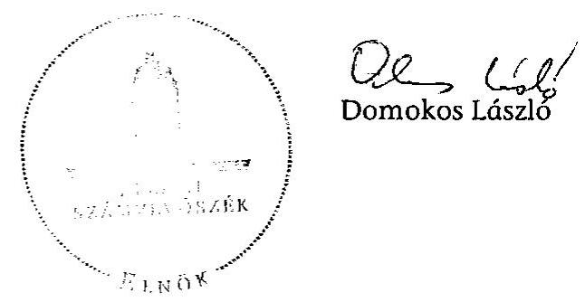

[^0]
[^0]:    ${ }^{51}$ 2008. július 24-én

---

# A MÁFI és az ELGI 2011. évi költségvetési beszámolóinak minősítése 

Figyelemfelhívó megjegyzéssel ellátott elfogadó vélemény a Magyar Állami Földtani Intézet 2011. évi intézményi költségvetési beszámolójáról

A XVII. Nemzeti Fejlesztési Minisztérium fejezetet, 14. cím Állami Földtani és Geofizikai Kutató Intézetének, 1. alcím Magyar Állami Földtani Intézet (MÁFI) 2011. évi beszámolóját a BM Költségvetési szervek elemi beszámolója pénzügyi (szabályszerűségi) ellenőrzéséhez - az Állami Számvevőszék által a zárszámadás ellenőrzéséhez - kidolgozott Egyszerűsített Útmutató alapján felülvizsgáltuk.

Ennek keretében elegendő és megfelelő bizonyosságot szereztünk arról, hogy a MÁFI zárszámadási törvényjavaslatban szereplő kiadási és bevételi pénzforgalmi adatai költségvetési gazdálkodásra vonatkozó jogszabályok előírásainak megfelelően kerültek kimutatásra.

A MÁFI 2011. évi zárszámadási törvényjavaslatban szereplő pénzforgalmi adatai megbízhatóak.

Az ellenőrzés során feltárt - a beszámoló pénzforgalmi adatainak megbízhatóságát nem befolyásoló - hiányosság miatt azonban indokolt felhívni a figyelmet az alábbiakra:

- Az előirányzatok nyilvántartása, a gazdálkodási jogkörök dokumentálása, valamint az analitikus nyilvántartások vezetése nem teljes körűen felelt meg az Áhsz. 49. § (3) bekezdésében foglaltaknak.
- A MÁFI 2011. évi költségvetési beszámolójának - a 2010. évi záró mérleget érintő leltári alátámasztási hiányok, és a pályázati források elkülönítésének hiánya miatt - nyitó adatai nem megbízhatóak.
- A MÁFI 2011. évi könyvviteli mérlegében a tárgyi eszközök záró nettó értéke 5,7 millió Ft-tal magasabb volt a számviteli előírások alapján történő szabályos elszámolás szerinti adatnál. A 2011. évben a nullára leírt tételekhez beszerzett számítástechnikai eszközök, gépek, berendezések és felszerelések bevételezése során a 0-ra leírt állományt növelték. Ennek következtében az értékcsökkenési leírás előírása és elszámolása 5,7 millió Ft értékben nem történt meg. A helyesbítést a helyszíni ellenőrzés befejezése előtt 2012. évre vonatkozóan elvégezték.

---

# Figyelemfelhívó megjegyzéssel ellátott elfogadó vélemény 

a Magyar Állami Eötvös Loránd Geofizikai Intézet 2011. évi intézményi költségvetési beszámolójáról

A XVII. Nemzeti Fejlesztési Minisztérium fejezetet, 14. cím Állami Földtani és Geofizikai Kutató Intézetének, 2. alcím Magyar Állami Eötvös Loránd Geofizikai Intézet (ELGI) 2011. évi beszámolóját a BM Költségvetési szervek elemi beszámolója pénzügyi (szabályszerűségi) ellenőrzéséhez - az Állami Számvevőszék által a zárszámadás ellenőrzéséhez - kidolgozott Egyszerűsített Útmutató alapján felülvizsgáltuk.

Ennek keretében elegendő és megfelelő bizonyosságot szereztünk arról, hogy a ELGI zárszámadási törvényjavaslatban szereplő kiadási és bevételi pénzforgalmi adatai költségvetési gazdálkodásra vonatkozó jogszabályok előírásainak megfelelően kerültek kimutatásra.

Az ELGI 2011. évi zárszámadási törvényjavaslatban szereplő pénzforgalmi adatai megbízhatóak.

Az
 ellenőrzés során feltárt - a beszámoló pénzforgalmi adatainak megbízhatóságát nem befolyásoló - hiányosság miatt azonban indokolt felhívni a figyelmet az alábbiakra:

- A befolyt bevételek főkönyvi könyvelésben történő rögzítésekor a szállásdíjak esetében nem alkalmazták a kincstári számlavezetés és finanszírozás, a feladatfinanszírozási körbe tartozó előirányzatok felhasználása, valamint egyes államháztartási adatszolgáltatások rendjéről szóló 46/2009. (XII. 30.) PM rendelet 59. §-a alapján az elemi költségvetés elkészítéséhez kiadott Módszertani útmutatóban foglaltakat.
- A főkönyvi könyvelési rendszert - az Áhsz. 49. §-ában előírtak ellenére - nem alakították ki úgy, hogy a főkönyvi számokkal azonos - előző évi, tárgyévi - követelés kimutatásokat lehessen lekérdezni, és azok segítséget nyújtsanak a beszámoló leltárai készítéséhez. A főkönyvi könyvelésből kinyomtatott vevőnyilvántartás együttesen tartalmazta az előző és tárgyévi vevőköveteléseket, amelyeket egyedi azonosítókkal különítettek el.
- Az előirányzat-változások bevétel és kiadás nemenkénti rögzítésekor a főkönyvi könyvelésben a belső kontroll nem működött, a módosítások főkönyvi számonkénti engedélyezése - az Szt. 166. §-ában előírt számviteli bizonylat hiánya miatt - dokumentáltan nem történt meg.
- A követeléseknél az értékvesztés elszámolása során nem tartották be teljes körűen a jogszabályi és a helyi szabályokat.
- Az előleg-elszámolások miatti kötelezettségeket nem az Áhsz. 9. számú mellékletének 2. c pontja szerint szerepeltették a mérlegben, nem az Áhsz. előírásainak megfelelő főkönyvi számlaszámot használták.

---

# A MÁFI állami földtani és az ELGI állami geofizikai feladatai 

| A MÁFI állami földtani kutatással összefüggő feladatai | Az ELGI állami geofizikai kutatási feladatai a következők |
| :--: | :--: |
| a) az ország földtani felépítésének megismerésére és az ismeretesség növelésére irányuló földtani, valamint az ország földtani erőforrás-gazdálkodását megalapozó kutatások végzése; | a) az ország földtani felépítésének megismerésére és az ismeretesség növelésére irányuló geofizikai kutatások végzése; |
| b) az ország földtani tér-adat infrastruktúrájának építése és fejlesztése; | b) az ország földtani erőforrás-gazdálkodását megalapozó kutatások végzése; |
| c) az ország rendszeres földtani és alkalmazott földtani térképezése, a térképek és azok szöveges magyarázatának készítése, közreadása; | c) az ország földi erőtereinek folyamatos mérése; |
| d) környezetföldtani, vízföldtani, mérnökgeológiai vizsgálatok végzése; | d) geofizikai adatok és információk gyűjtése, közreműködés a Magyar Állami Földtani, Geofizikai és Bányászati Adattár, valamint a Földtani és Bányászati Információs Rendszer kiépítésében, fejlesztésében és működtetésében; |
| e) az Európai Uniónak a földtani közegre, valamint a felszín alatti vizekre vonatkozó jogszabályai átvételéhez, végrehajtásához kapcsolódó kutatási feladatok ellátása, azokban történő közreműködés; | e) közreműködés az állami földtani kutatási feladatok ellátásában; |
| f) földtani adatok és információk gyűjtése, közreműködés a Magyar Állami Földtani, Geofizikai és Bányászati Adattár, valamint a Földtani és Bányászati Információs Rendszer kiépítésében, fejlesztésében és működtetésében; | f) az ország geofizikai tér-adat infrastruktúrájának építése és fejlesztése; |
| g) közhasznú információszolgáltatás; | g) közhasznú információszolgáltatás; |
| h) országos szakmúzeum vagy tematikus múzeum, szakkönyvtár, mélyfúrási magminta gyűjtemény, mérőhálózat, laboratóriumok fenntartása, üzemeltetése; | h) az Európai Unió közösségi jogából és más nemzetközi együttműködésből következő, a földi erőterekkel, a földtani közeggel kapcsolatos jogszabályok átvételéhez, ezek végrehajtásához kapcsolódó kutatási feladatok végzése, azokban történő közreműködés; |
| i) részvétel nemzetközi kutatási programokban, kapcsolattartás a hazai és nemzetközi szakmai szervezetekkel. | i) muzeális intézmény, szakkönyvtár, obszervatóriumok, mérőhálózatok, laboratóriumok fenntartása; |
|  | j) kapcsolattartás a hazai és nemzetközi szervezetekkel. |

---

A MÁFI kiadásainak alakulásáról adatok E Ft-ban

|  Megnevezés | 2007. év |  |  | 2008. év |  |  | 2009. év |  |  | 2010. év |  |  | 2011. év |  |   |
| --- | --- | --- | --- | --- | --- | --- | --- | --- | --- | --- | --- | --- | --- | --- | --- |
|   | Eredeti előirányzat | Módosított előirányzat | Teljesítés | Eredeti előirányzat | Módosított előirányzat | Teljesítés | Eredeti előirányzat | Módosított előirányzat | Teljesítés | Eredeti előirányzat | Módosított előirányzat | Teljesítés | Eredeti előirányzat | Módosított előirányzat | Teljesítés  |
|  Személyi juttatások | 404900 | 517159 | 440188 | 399800 | 447727 | 376971 | 388500 | 410756 | 344770 | 388500 | 427501 | 353018 | 378400 | 500392 | 362283  |
|  ebből: rendszeres személyi juttatások | 372845 | 394674 | 331164 | 334113 | 361221 | 333279 | 315739 | 315739 | 300140 | 315739 | 341147 | 320454 | 337503 | 418887 | 282331  |
|  nem rendszeres személyi juttatások | 28690 | 79660 | 72348 | 51193 | 56672 | 30615 | 58799 | 69128 | 33902 | 58797 | 68809 | 23089 | 36447 | 49020 | 47468  |
|  külső személyi juttatások | 3365 | 42825 | 36676 | 14494 | 29834 | 13077 | 13964 | 25889 | 10728 | 13964 | 17545 | 9475 | 4450 | 32485 | 32484  |
|  Munkaadókat terhelő járulékok | 131300 | 167295 | 139957 | 129700 | 144754 | 121414 | 126100 | 132771 | 105586 | 105700 | 116097 | 97628 | 102800 | 130860 | 94145  |
|  Dologi és egyéb folyó kiadások | 305300 | 396869 | 286699 | 301500 | 402803 | 287717 | 303400 | 332098 | 254307 | 284600 | 422491 | 207480 | 279400 | 374687 | 240336  |
|  ebből: egyéb üzemeltetési és fenntartási kiadások | 45000 | 51111 | 34537 | 45000 | 73991 | 48151 | 45000 | 68001 | 68001 | 36500 | 90937 | 61695 | 52000 | 146956 | 68720  |
|  egyéb dologi kiadások | 4380 | 16837 | 10795 | 4380 | 11077 | 11077 | 4400 | 8955 | 7451 | 278500 | 410391 | 196103 | 3800 | 7579 | 6488  |
|  Felhalmozási kiadások |  | 76349 | 47193 |  | 27212 | 22070 |  | 21540 | 8164 |  | 13505 | 6431 |  | 130080 | 124509  |
|  Egyéb támogatási célú kiadás |  | 4898 | 4898 |  | 2370 | 2369 |  | 4840 | 4840 |  |  |  |  | 13565 | 9998  |
|  ebből : működési célú |  | 4898 | 4898 |  | 2370 | 2369 |  | 4840 | 4840 |  |  |  |  | 13565 | 9998  |
|  felhalmozási célú |  |  |  |  |  |  |  |  |  |  |  |  |  |  |   |
|  Támogatási kölcsönök nyújtása | 400 | 700 | 700 | 400 | 700 | 700 | 400 | 700 | 700 | 400 | 1200 | 1200 | 400 | 40400 | 40000  |
|  Előző évi előirányzat-maradvány átadás |  |  |  |  | 1833 | 1833 |  |  |  |  |  |  |  |  |   |
|  Kiadások összesen | 841900 | 1163270 | 919635 | 831400 | 1027399 | 813074 | 818400 | 902705 | 718367 | 779200 | 980794 | 665757 | 761000 | 1189984 | 871271  |

---

3/b. számú melléklet a V-0015-034/2012. számú jelentéshez

Az ELGI kiadásainak alakulásáról adatok E Ft-ban

|  Megnevezés | 2007. év |  |  | 2008. év |  |  | 2009. év |  |  | 2010. év |  |  | 2011. év |  |   |
| --- | --- | --- | --- | --- | --- | --- | --- | --- | --- | --- | --- | --- | --- | --- | --- |
|   | Eredeti előirányzat | Módosított előirányzat | Teljesítés | Eredeti előirányzat | Módosított előirányzat | Teljesítés | Eredeti előirányzat | Módosított előirányzat | Teljesítés | Eredeti előirányzat | Módosított előirányzat | Teljesítés | Eredeti előirányzat | Módosított előirányzat | Teljesítés  |
|  Személyi juttatások | 274400 | 361014 | 315858 | 254400 | 319218 | 293385 | 248200 | 284686 | 284298 | 248200 | 303413 | 260409 | 254200 | 265089 | 265088  |
|  *ebből: rendszeres személyi juttatások* | 211099 | 209648 | 207184 | 208519 | 217285 | 202743 | 202319 | 186676 | 186306 | 202300 | 229906 | 186901 | 202800 | 186306 | 186305  |
|  *nem rendszeres személyi juttatások* | 51001 | 93490 | 76418 | 45881 | 58922 | 47631 | 45881 | 51992 | 51974 | 45900 | 65537 | 65538 | 45900 | 62143 | 62143  |
|  *külső személyi juttatások* | 12300 | 57876 | 32256 |  | 43011 | 43011 |  | 46018 | 46018 |  | 7970 | 7970 | 5500 | 16640 | 16640  |
|  Munkaadókat terhelő járulékok | 87700 | 115187 | 89132 | 81300 | 105523 | 90800 | 79400 | 90583 | 80736 | 65500 | 80687 | 68445 | 61500 | 71088 | 66009  |
|  Dologi és egyéb folyó kiadások | 224700 | 342014 | 286334 | 271000 | 341419 | 295801 | 280100 | 325228 | 281293 | 270300 | 312199 | 227608 | 185100 | 233912 | 189813  |

  *ebből: egyéb üzemeltetési és fenntartási kiadások* | 45 000 | 48 756 | 41 501 | 94 300 | 76 946 | 64 653 | 94 300 | 95 603 | 83 201 | 55 411 | 50 194 | 46 402 | 76 545 | 65 836 | 40 056  |
|  *egyéb dologi kiadások* | 2 500 | 45 602 | 34 914 | 2 500 | 25 830 | 19 265 | 2 500 | 15 018 | 14 818 | 2 500 | 10 878 | 2 261 | 2 600 | 9 915 | 7 755  |
|  Felhalmozási kiadások |  | 54 115 | 28 488 |  | 28 634 | 18 656 |  | 12 542 | 3 060 | 9 800 | 11 630 | 260 | 50 000 | 45 257 | 34 903  |
|  Egyéb támogatási célú kiadás |  | 5 681 | 5 681 |  | 1 465 | 1 465 |  | 3 488 | 3 488 |  | 490 | 490 |  | 5 665 | 665  |
|  *ebből: működési célú* |  | 5 681 | 5 681 |  | 1 465 | 1 465 |  | 3 488 | 3 488 |  | 490 | 490 |  | 5 665 | 665  |
|  *felhalmozási célú* |  |  |  |  |  |  |  |  |  |  |  |  |  |  |   |
|  Támogatási kölcsönök nyújtása | 1 800 | 1 800 |  | 1 700 | 1 700 | 919 |  | 950 | 950 |  | 970 | 970 |  | 20 000 | 20 000  |
|  Előző évi előirányzat-maradvány átadás |  |  |  |  |  |  |  |  |  |  |  |  |  |  |   |
|  Kiadások összesen | 588 600 | 879 811 | 725 493 | 608 400 | 797 959 | 701 026 | 607 700 | 717 477 | 653 825 | 593 800 | 709 389 | 558 182 | 550 800 | 641 011 | 576 478  |

---

4/a. számú melléklet a V-0015-034/2012. számú jelentéshez

A MÁFI bevételeinek alakulásáról adatok E Ft-ban

|  Megnevezés | 2007. év |  |  | 2008. év |  |  | 2009. év |  |  | 2010. év |  |  | 2011. év |  |   |
| --- | --- | --- | --- | --- | --- | --- | --- | --- | --- | --- | --- | --- | --- | --- | --- |
|   | Eredeti előirányzat | Módosított előirányzat | Teljesítés | Eredeti előirányzat | Módosított előirányzat | Teljesítés | Eredeti előirányzat | Módosított előirányzat | Teljesítés | Eredeti előirányzat | Módosított előirányzat | Teljesítés | Eredeti előirányzat | Módosított előirányzat | Teljesítés  |
|  Működési bevételek | 496 700 | 496 700 | 294 280 | 496 700 | 516 179 | 299 450 | 496 700 | 496 700 | 334 009 | 496 700 | 496 700 | 244 708 | 356 600 | 356 600 | 86 763  |
|  ebből: szolgáltatások ellenértéke | 417 880 | 417 880 | 225 356 | 417 880 | 417 880 | 234 527 | 417 880 | 417 880 | 275 431 | 391 200 | 391 200 | 189 144 | 285 280 | 285 280 | 65 849  |
|  bérleti és lízingdíj bevételek |  |  | 481 |  |  | 457 |  |  | 1 724 | 6 000 | 6 000 | 5 142 |  |  | 2 970  |
|  Felhalmozási bevételek |  | 3 725 | 3 725 |  | 727 | 727 |  |  |  |  |  | 40 |  | 108 326 | 108 326  |
|  Támogatás értékű bevételek |  | 81 061 | 84 787 |  | 12 270 | 12 270 |  | 24 921 | 25 521 |  | 132 012 | 132 012 |  | 224 796 | 227 523  |
|  ebből: működési célú |  | 80 406 | 84 132 |  | 11 231 | 11 231 |  | 24 921 | 25 521 |  | 128 963 | 128 963 |  | 219 471 | 222 198  |
|  felhalmozási célú |  | 655 | 655 |  | 1 039 | 1 039 |  |  |  |  | 3 049 | 3 049 |  | 5 325 | 5 325  |
|  Pénzeszközátvételek |  | 26 283 | 26 283 |  |  | 19 479 |  | 1 743 | 1 743 |  | 21 137 | 22 102 |  | 11 599 | 11 599  |
|  ebből: működési célú |  | 26 283 | 26 283 |  |  | 19 479 |  | 1 743 | 1 743 |  | 21 137 | 21 137 |  | 11 599 | 11 599  |
|  felhalmozási célú |  |  |  |  |  |  |  |  |  |  |  |  |  |  |   |
|  Támogatási kölcsönök visszatérülése | 400 | 700 | 700 | 400 | 700 | 700 | 400 | 700 | 700 | 400 | 1 200 | 1 200 | 400 | 400 | 7  |
|  Előző évi maradvány átvétele |  | 31 764 | 31 764 |  | 49 772 | 49 772 |  | 4 914 | 4 914 |  | 675 | 675 |  | 1 300 | 1 300  |
|  Költségvetési támogatás | 344 800 | 472 700 | 472 700 | 334 300 | 402 810 | 402 810 | 321 300 | 356 652 | 356 652 | 282 100 | 306 823 | 306 823 | 404 000 | 422 913 | 422 913  |
|  Pénzforgalom nélküli bevételek |  | 50 337 | 50 337 |  | 44 941 | 44 941 |  | 17 075 | 17 075 |  | 22 247 | 22 247 |  | 64 050 | 64 050  |
|  Bevételek összesen | 841 900 | 1 163 270 | 964 576 | 831 400 | 1 027 399 | 830 149 | 818 400 | 902 705 | 740 614 | 779 200 | 980 794 | 729 807 | 761 000 | 1 189 984 | 922 481  |

---

Az ELGI bevételeinek alakulásáról adatok E Ft-ban

|  Megnevezés | 2007. év |  |  | 2008. év |  |  | 2009. év |  |  | 2010. év |  |  | 2011. év |  |   |
| --- | --- | --- | --- | --- | --- | --- | --- | --- | --- | --- | --- | --- | --- | --- | --- |
|   | Eredeti előirányzat | Módosított előirányzat | Teljesítés | Eredeti előirányzat | Módosított előirányzat | Teljesítés | Eredeti előirányzat | Módosított előirányzat | Teljesítés | Eredeti előirányzat | Módosított előirányzat | Teljesítés | Eredeti előirányzat | Módosított előirányzat | Teljesítés  |
|  Működési bevételek | 374 100 | 374 107 | 233 593 | 353 700 | 353 700 | 256 008 | 355 500 | 355 500 | 303 555 | 371 700 | 371 700 | 233 150 | 51 900 | 122 540 | 126 604  |
|  ebből: szolgáltatások ellenértéke | 307 200 | 307 200 | 135 360 | 286 800 | 286 800 | 152 584 | 288 600 | 288 600 | 204 177 | 283 200 | 283 200 | 124 745 |  |  |   |
|  bérleti és lízingdíj bevételek |  |  | 37 045 |  |  | 28 547 |  |  | 24 689 | 8 250 | 8 250 | 30 473 |  |  |   |
|  Felhalmozási bevételek |  |  |  |  | 1 850 | 1 850 |  | 959 | 959 |  | 324 | 324 | 50 000 | 7 257 | 7 266  |
|  Támogatás értékű bevételek |  | 145 894 | 145 893 |  | 26 824 | 26 824 |  | 8 453 | 9 583 |  | 80 799 | 80 799 | 162 000 | 221 062 | 211 062  |
|  ebből: működési célú |  | 140 394 | 140 394 |  | 20 824 | 20 824 |  | 8 453 | 9 583 |  | 80 539 | 80 539 | 162 000 | 171 062 | 171 062  |
|  felhalmozási célú |  | 5 500 | 5 499 |  | 6 000 | 6 000 |  |  |  |  | 260 | 260 |  | 50 000 | 50 000  |
|  Pénzeszközöttvételek |  | 42 133 | 47 720 |  | 59 603 | 61 654 |  | 75 069 | 71 123 |  | 5 532 | 5 533 |  | 6 273 |

 | 6273  |
|  ebből: működési célú |  | 42133 | 47720 |  | 59603 | 61654 |  | 75069 | 71123 |  | 5532 | 5533 |  | 6273 | 6273  |
|  felhalmozási célú |  |  |  |  |  |  |  |  |  |  |  |  |  |  |   |
|  Támogatási kölcsönök visszatérülése | 1800 | 1800 |  | 1800 | 1800 | 919 |  | 3950 | 3950 |  | 970 | 970 |  |  |   |
|  Előző évi maradvány átvétele |  | 7081 | 7081 |  | 47000 | 47000 |  |  |  |  | 837 | 837 |  | 2128 | 2128  |
|  Költségvetési támogatás | 212700 | 290340 | 290340 | 252900 | 289588 | 289588 | 252200 | 273135 | 273135 | 222100 | 240336 | 240336 | 286900 | 269093 | 269093  |
|  Pénzforgalom nélküli bevételek |  | 18456 | 18456 |  | 17594 | 17594 |  | 411 | 411 |  | 8891 | 8891 |  | 12658 | 12658  |
|  Bevételek összesen | 588600 | 879811 | 743083 | 608400 | 797959 | 701437 | 607700 | 717477 | 662716 | 593800 | 709389 | 570840 | 550800 | 641011 | 635084  |

---

5/a. számú melléklet a V-0015-034/2012. számú jelentéshez adatok E Ft-ban

|  Sorszám | Megnevezés | 2007. év | 2008. év | 2009. év | 2010. év | 2011. év  |
| --- | --- | --- | --- | --- | --- | --- |
|   | Az intézmény EU-s és hazai támogatásai | 37 830 | 52 135 | 41 893 | 92 689 | 177 056  |
|   | Európai uniós pályázatokon nyert források | 0 | 26 788 | 6 365 | 74 758 | 165 100  |
|  1. | ECP2007-GEO-317001 | OneGeology | 821 | 1 443 | 1 879 |   |
|  2. | TF/SIHU/01/SI-HU-1-2-013/1 | T-JAM |  |  | 52 806 | 41 154  |
|  3. | 2CE124P3 | Transenergy |  |  |  | 121 979  |
|  4. | CIP 2009 250532 | Eurogeosource |  |  | 7 006 | 1 967  |
|  5. | ICT PSP 250446 | ThermoMap |  |  | 13 067 |   |
|  6. | 262371 | Pangeo |  |  |  |   |
|  7. | HUSKA/05/02/166 | Magyar-Szlovák határmenti közös felszín alatti víztestek környezetállapota és fenntartható használata; INTERREG | 18 658 |  |  |   |
|  8. | ECP-2005-GEO-038214 | E-water adatbázis; EU - European Commision | 7 309 | 4 922 |  |   |
|   | Hazai pályázatokon nyert támogatások | 37 830 | 25 347 | 35 528 | 17 931 | 11 956  |
|  9. | OTKA 48824 | Rudabányai- és Aggteleki-hegység | 2 600 |  |  |   |
|  10. | OTKA62478 | A szél hatása a késő-neogén-negyedidőszaki | 3 193 | 2 745 | 1 274 |   |
|  11. | OTKA 62468 | A Mecseki- és a Villány-Bihari-zóna ősföldrajzi | 5 031 | 5 202 | 4 497 |   |
|  12. | OTKA 60861 | A Pannon-tó jelentősebb relatív | 2 300 | 1 900 | 1 600 |   |
|  13. | OTKA 61872 | Triász és jura lejtőfáciensek jelent....a | 700 | 700 | 700 |   |
|  14. | OTKA 68224 | Triász platform- és medencefáciesek kapcsolata a | 825 | 2 000 | 1 500 | 675  |
|  15. | OTKA 67967 | A talajvíz nagy arzén tartalmának eredete fiatal ... | 1 000 | 3 000 |  | 6 000  |
|  16. | MEX-3/2 | Magyar-Mexikói együttműködés TÉT | 2 384 |  |  |   |
|  17. | OMFB 00621/2005 | Magyar-Argentín együttműködés /TÉT | 222 |  |  |   |
|  18. | GVOP-3.1.1-2004-05-0190/3.0 | Erdészeti beavatkozások fejl. az éghajlatvált. káros hatásainak csökkentése érdekében, a term. értékek megtart. mellett; NKTH | 5 915 | 3 584 | 1 907 |   |
|  19. | OMFB 00771/2005 | Magyar-Cseh együttműködés /TÉT |  |  |  |   |
|  20. | JEDLIK_OM-00101/2005 | Vizek nitrát szennyezés elleni védelme; NKTH | 9 152 |  |  |   |
|  21. | OMFB 00490/2006 | Magyar-indiai együttműködés (TÉT) | 2 093 |  |  |   |
|  22. | TÉT(OMFB-00450/2006; RO-39/05) | Magyar-román határmenti földtani térké- | 1 632 |  |  |   |
|  23. | OTKA 46178 | A várpalotai neogén medence középső-miocén | 165 |  |  |   |
|  24. | OTKA 46878 | Magyarországi kvartermalakológiai adatbázis | 618 |  |  |   |
|  25. | TÉT(OMFB-01326/2007;CRO-25/2006) | A drávai térség negyedidőszaki térk. | 1 435 |  |  |   |
|  26. | TÉT (OMFB-01288;CRO-24/2006) | DK-Dunántúli és szlavóniai löszök korrel | 1 531 |  |  |   |
|  27. | TÉT(OMFB-00282/2008;FR-32/07) | Magyar-Francia TÉT | 810 | 770 |  |   |
|  28. | TÉT(OMFB-00147/2008;VN-1/2006) | Magyar-Vietnam TÉT | 1 710 | 1 900 |  |   |
|  29. | OTKA 75801 | Az Átföld nyugati peremének plio-pleisztocén |  | 4 914 | 5 314 | 5 212  |
|  30. | OTKA 78876 | Geokémiai transzport modellezés |  | 10 326 | 2 533 | 6 233  |
|  31. | TÉT_07-MX-2008-0001 | Magyar-Mexikói TÉT | 730 | 730 | 1 460 |   |
|  32. | TÉT(OMFB-01449/2009; HR-16/2008) | Adria parti lösz |  | 2 870 |  |   |
|  33. | TÉT(OMFB-01459/2009;HR-15/2008) | Baranyai régió földtani térkép |  | 1 940 |  |   |
|  34. | NKAI_2521/2009 | Kadic Ottokár barlangkutatás; NKA |  | 600 |  |   |
|  35. | KEOP-2.2.2.2/09-2009-0004 | Észlelőkút hálózat; NFU |  |  | 1 949 | 511  |

---

5/b. számú melléklet a V-0015-034/2012. számú jelentéshez

Az ELGI európai uniós és hazai támogatásairól adatok E Ft-ban

|  Sor-
szám | Megnevezés | 2007. év | 2008. év | 2009. év | 2010. év | 2011. év  |
| --- | --- | --- | --- | --- | --- | --- |
|   | Az intézmény EU-s és hazai támogatásai | 56 020 | 38 277 | 61 968 | 11 380 | 22 378  |
|   | Európai uniós pályázatokon nyert források | 4 072 | 588 | 37 289 | 0 | 0  |
|  1. | EU-FP6, Marie Curie Tudóstranszfer | Marie Curie C.MTKD-CT2006-042537 ASAP sz | 0 | 24 374 |  |   |
|  2. | CO2Net | CO2 NET East (Cseh Geo. Szolg.:038946) | 4 072 | 349 | 12 915 |   |
|  3. | CO2 Capacity | CO2 kibocsátás vizsgálata |  | 239 |  |   |
|   | Hazai pályázatokon nyert támogatások | 51 948 | 37 689 | 24 679 | 11 380 | 22 378  |
|  4. | OTKA_61182 | Fluidumok a Bakony-Balatonfelv.litoszf. | 1 479 | 1 461 | 1 517 |   |
|  5. | OTKA_67917 | Szubdukció nyomában a Pannon-medence területén OTKA F 67917 nyt | 1 023 | 1 904 | 1 760 |   |
|  6. | Úrkutatás_K-36-07-00040K | WLF-VLF jelenségek és földmágneses pulzációk vizsgálata | 2 800 | 1 000 | 1 000 |   |
|  7. | I-12/03 | Hidrotermális mezők és blokk mozgások | 1 292 |  |  |   |
|  8. | OTKA_60657 | A nehézségi erőtér finom-szerkezetének vizsgálata | 5 077 | 3 656 | 3 486 |   |
|  9. | GVOP-3.1.1.-2004-05-0187/3.0 | Roncsolásmentes technológia fejlesztése felszín alatti szennyeződések környezeti | 27 036 | 4 568 |  |   |
|  10. | GVOP-2005-4.2.2.-05/1-2006-08-0007/4.0 | Közcélú Internetes Geofizikai Adatszolgáltatás | 8 910 | 14 703 |  |   |
|  11. | OTKA_49616 | A Dunántúli-középhegység és környezetének mozg. tört.OTKA áfa . | 3 600 | 3 600 |  |   |
|  12. | OTKA Nemlineáris- K 75640 | Nemlineáris és pulzációs magnetohidrodinamikai... |  | 679 | 3 105 | 6 976  |
|  13. | Úrfizika K36-08-00025K | ELF-VLFjelenségek és földmágneses pulzációk vizsgálata |  | 2 000 |  |   |
|  14. | Olasz-Tét, IT-67/2007 | Geomágneses mérések fejlesztése |  | 760 | 1 485 |   |
|  15. | Dél-Afrikai TÉT, ZA-5/2007 | Geomágneses pulzációk konjugált vizsgálata |  | 1 560 | 2 000 |   |
|  16. | TÉT-FR-25/2007 | PanCarDin Magyar-francia TÉT |  | 580 | 740 |   |
|  17. | USGS-ELGI -Tét, USA-1/2008 | USGS-ELGI együttműködés magnetométerek fejlesztésében OMFB-00890/2008 |  |  |  |   |

 |  | 510 | 1 130 | 652  |
|  18. | OTKA POR - K 75395 | Levegőben szálló por vizsgálat. |  |  | 3 000 | 3 000  |
|  19. | TÉT-CRO-31/06 | Horvát-magyar TÉT ALPASS-DIPR OMFB-0096/2008 CRO-31 | 731 | 708 | 2 728 |   |
|  20. | OTKA_GRÁNAT NN79943 | Gránát szétesési reakciójában kialakult..(bevétel) |  |  |  | 7 500  |
|  21. | Horvát-TÉT, HR-9/2008 | Horvát-TÉT, Közös horvát-magyar földmágneses mérés.. |  |  |  |   |
|  22. | Dél-Afrikai TÉT, ZA-13/2009 | ULF hullámok konjugált vizsgálata |  |  |  |   |
|  23. | Szerb TÉT-RS-1-09 | Szerb-TÉT |  |  |  | 880  |
|  24. | ALPASS-DIPR OMFB-0096/2008 CRO-31 |  |  |  | 2 728 |   |

---

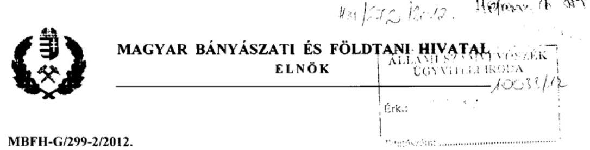

# Domokos László úr, 

elnök

## Állami Számvevőszék

## Budapest

## Tisztelt Elnök Úr!

Az Állami Számvevőszék által készített, a Magyar Állami Földtani Intézet és az Eötvös Loránd Geofizikai Intézet ellenőrzéséről készített számvevőszéki jelentéstervezet tartalmát megismertem, a Magyar Bányászati és Földtani Hivatal részéről észrevételt nem kívánok tenni.

Budapest, 2012. augusztus 10.

Tisztelettel:
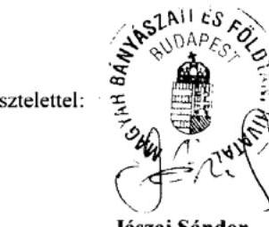

Jászai Sándor

---

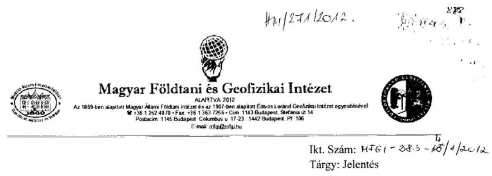

Domokos László úr
elnök
Állami Számvevőszék
Budapest

Tisztelt Elnök Úr!

Az Állami Számvevőszék által készített, a Magyar Állami Földtani Intézet és az Eötvös Loránd Geofizikai Intézet ellenőrzéséről készített számvevőszéki jelentéstervezet tartalmát megismertem, és a Magyar Földtani és Geofizikai Intézet részéről észrevételt nem kívánok tenni.

Budapest, 2012. augusztus 13.
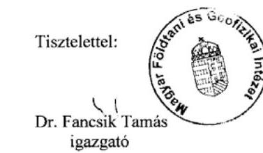

