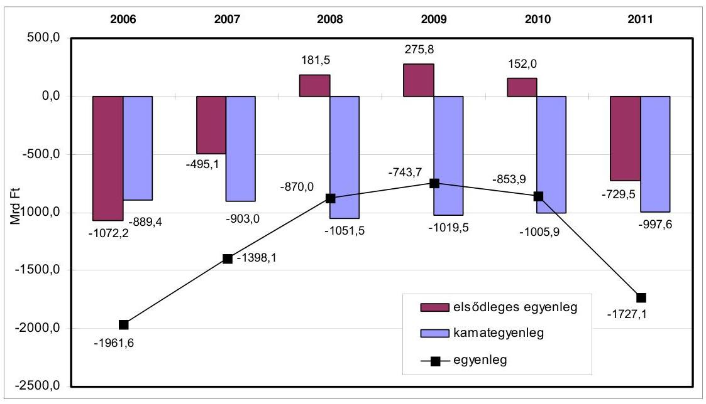
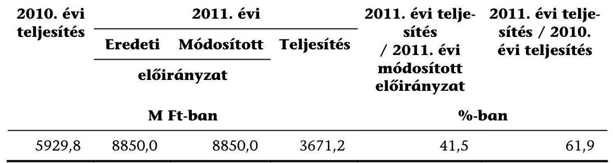
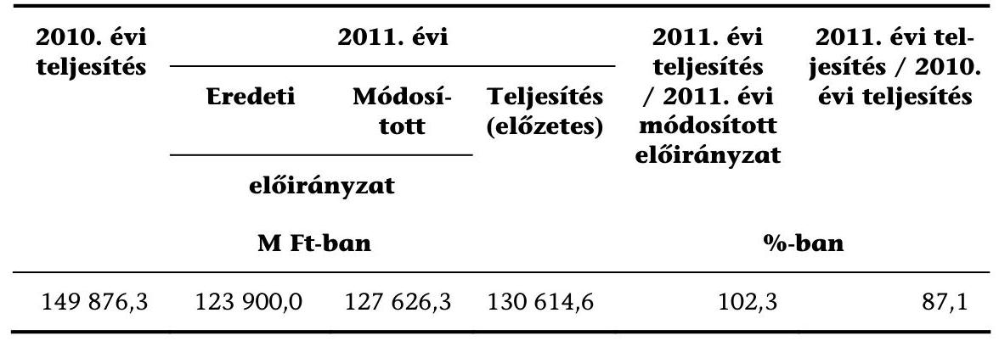
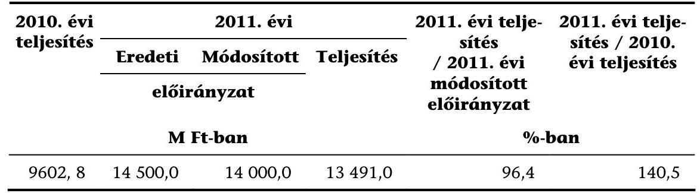
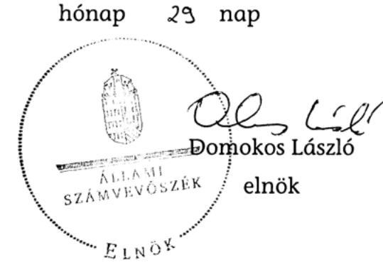
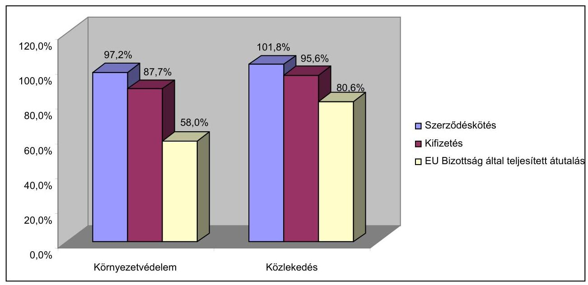

# ÁLLAMI   SZÁMVEVŐSZÉK 

## JELENTÉS

a Magyar Köztársaság 2011. évi költségvetése végrehajtásának ellenőrzéséről

1297
T/8196/1
2012. augusztus

---

# Állami Számvevőszék 

Iktatószám: V-0003-424/2012
Témaszám: 1042
Vizsgálat-azonosító szám: V0559-01

## Az ellenőrzést felügyelte:

Dr. Horváth Margit
felügyeleti vezető

## Az ellenőrzés végrehajtásáért felelős:

Keresztes Tamás
ellenőrzésvezető

A számvevői jelentések feldolgozásában és a jelentés összeállításában közremúködtek:

| Barta József számvevő tanácsos | Bene István számvevő | Bertalan Rudolf Gyula számvevő |
| :--: | :--: | :--: |
| Dancsóné Kuron Ildikó számvevő tanácsos | Erdélyi Zoltán számvevő asszisztens | Ferencz Katalin Zsuzsanna számvevő tanácsos |
| Gáspár Eszter számvevő gyakornok | Gere Orsolya Éva számvevő asszisztens | Hegedús Anita számvevő asszisztens |
| Igar Tamás számvevő | Jagicza Istvánné számvevő tanácsos | Kádár Kriszta számvevő |
| Karsai Lászlóné számvevő tanácsos | Kováts Tibor Balázs számvevő | Kresztyankó   Zsuzsanna   számvevő asszisztens |
| Dr. Lengyel Attila számvevő tanácsos | Dr. Mészáros Leila számvevő | Molnár Bálint számvevő |
| Niklai Heléna számvevő tanácsos | Sápi Henriett számvevő | Séra Andrásné számvevő tanácsos |
| Szenthelyi Dávid számvevő gyakornok | Szöllősiné Hrabóczki   Etelka   számvevő tanácsos | Teski Norbert számvevő asszisztens |
| Vasváriné Molnár Judit számvevő | Dr. Vincze Ibolya számvevő | Vlasits Ágnes számvevő |
| Zakar László számvevő tanácsos | Zaroba Szilvia számvevő tanácsos |  |

---

Az ellenőrzést végezték:

| Balázs Melinda számvevő tanácsos | Barta József számvevő tanácsos | Batkiné Vas Anna számvevő tanácsos |
| :--: | :--: | :--: |
| Beke Andrea számvevő | Bene István számvevő | Béres László számvevő |
| Bertalan Rudolf Gyula számvevő | Burenzsargal   Narantuja   számvevő tanácsos | Buús Zoltánné Hütter Erzsébet számvevő tanácsos |
| Czmarkó Frigyes György számvevő | Csényi István számvevő tanácsos | Csordás Ágnes számvevő |
| Dancsóné Kuron Ildikó számvevő tanácsos | Dinnyés Illés Attila számvevő | Dombóvári Nóra számvevő tanácsos |
| Dormán István Zoltán számvevő | Erdélyi Zoltán számvevő asszisztens | Fekete Gábor számvevő tanácsos |
| Fekete Győr László számvevő | Ferencz Katalin   Zsuzsanna   számvevő tanácsos | Dr. Gaálné Berente Mónika számvevő |
| Gáspár Eszter számvevő gyakornok | Groholy Andrásné Hanggál Márta számvevő tanácsos | Győriné Franyó Éva számvevő |
| Hadházy Sándor György számvevő tanácsos | Hadnagyné Papp Ildi-   kó   számvevő | Halkóné dr. Berkó Katalin számvevő |
| Humli Tamásné számvevő tanácsos | Huszár Anna számvevő | Igar Tamás számvevő |
| Jagicza Istvánné számvevő tanácsos | Jeszenkovits Tamás számvevő tanácsos | Kádár Kriszta számvevő |
| Karsai Lászlóné számvevő tanácsos | Kékesiné Győrffy Zita számvevő | Kincses Erzsébet Eszter számvevő |
| Kiss Rita Teréz számvevő tanácsos | Knoppné Szabó Ildikó számvevő tanácsos | Koczor László számvevő tanácsos |
| Komonszky Krisztina számvevő | Kovács Richárd számvevő | Kováts Tibor Balázs számvevő |
| Kökény László számvevő tanácsos | Köllődné Gátai Mária számvevő | Kulcsár Lászlóné számvevő |
| Kresztyankó   Zsuzsanna   számvevő asszisztens | Kupcsik Éva számvevő | Kuzma Ágota számvevő |
| Dr. Lacó Bálintné számvevő tanácsos | Laczkovich Rita számvevő tanácsos | Lakatos József számvevő |

---

| Dr. Lengyel Attila | Marozsán Katalin | Dr. Mészáros Leila |
| :-- | :-- | :-- |
| számvevő tanácsos | számvevő | számvevő |
| Moder Beatrix | Molnár Antal Lászlóné | Molnár Bálint |
| számvevő | számvevő | számvevő |
| Molnár Istvánné | Nagy Attila | Némethné Nagy Mária |
| számvevő tanácsos | számvevő tanácsos | számvevő |
| Niklai Heléna | Pálfiné Pusztai | Pats Regina |
| számvevő tanácsos | Magdolna | számvevő |
|  | számvevő tanácsos |  |
| Péntek László | Pénzes Gyula | Puskás Balázs |
| számvevő tanácsos | számvevő tanácsos | számvevő |
| Rábai György | Ráczné Orosz Diána | Reichert Margit |
| számvevő | számvevő | számvevő |
| Renner Andrea | Ritecz Tibor | Robák Ferencné |
| számvevő | számvevő tanácsos | számvevő tanácsos |
| Salamin Viktor | Sápi Henriett | Schmidt János |
| számvevő | számvevő | számvevő |
| Séra Andrásné | Solymár Ágnes | Szabó Leonóra Ildikó |
| számvevő tanácsos | számvevő főtanácsos | számvevő |
| Szabóné László Mária | Szeibel Gáborné | Szenthelyi Dávid |
| számvevő | számvevő | számvevő gyakornok |
| Szilhalminé Kovács | Szilágyi Nándorné | Szilas István |
| Zsuzsanna | számvevő | számvevő tanácsos |
| számvevő tanácsos |  |  |
| Dr. Szima Mária | Szöllősiné Hrabóczki | Dr. Szöllősi Zsolt |
| számvevő tanácsos | Etelka | számvevő |
|  | számvevő tanácsos |  |
| Szudi Ferencné | Teski Norbert | Tótfalusi Zoltán |
| számvevő | számvevő asszisztens | számvevő tanácsos |
| Tóth Marianna | Tóth Tamás | Vacsora Erika |
| számvevő | számvevő tanácsos | számvevő tanácsos |
| Varga Ágnes Klára | Vas Lajos | Vasváriné Molnár Judit |
| számvevő | számvevő tanácsos | számvevő |
| Velkei András | Vida László | Villányi Antal |
| számvevő | számvevő tanácsos | számvevő tanácsos |
| Vincze Béla Róbert | Dr. Vincze Ibolya | Vlasits Ágnes |
| számvevő | számvevő | számvevő |
| Vörösné Lakatos | Zakar László | Zaroba Szilvia |
| Zsuzsanna | számvevő tanácsos | számvevő tanácsos |
| számvevő |  |  |

---

# A témához kapcsolódó eddig készített számvevőszéki jelentések: 

## címe

Jelentés a Magyar Köztársaság 2010. évi költségvetése 1117
végrehajtásáról
Vélemény a Magyar Köztársaság 2011. évi költségvetési 1025
javaslatáról

---

# TARTALOMJEGYZÉK 

BEVEZETÉS ..... 13
I. ÖSSZEGZŐ MEGÁLLAPÍTÁSOK, KÖVETKEZTETÉSEK, JAVASLATOK ..... 16
II. RÉSZLETES MEGÁLLAPÍTÁSOK ..... 28
A) A ZÁRSZÁMADÁSI TÖRVÉNYJAVASLAT TÖRVÉNYESSÉGI ELLENŐRZÉSE ..... 28
B) A KÖZPONTI ALRENDSZER ELLENŐRZÉSÉNEK MEGÁLLAPÍTÁSA ..... 30
B.1. A KÖZPONTI ALRENDSZER ..... 30

1. A központi költségvetés és alrendszer 2011. évi törvényi előirányzatainak teljesítése, a hiány alakulása ..... 30
2. A központi alrendszer finanszírozása és a kincstári egységes számla likviditása ..... 33
2.1. A központi alrendszer finanszírozása és a Kincstári Egységes Számla likviditása ..... 33
2.2. A központi alrendszer bruttó adóssága ..... 34
3. A kormányprogramok (Széll Kálmán Terv, Konvergencia Program) 2011. évi költségvetést érintő feladatai végrehajtása ..... 35
4. A központi költségvetés közvetlen bevételei és kiadásai ..... 38
4.1. Központi költségvetés közvetlen bevételei ..... 38
4.1.1. Adó és adó jellegű bevételek ..... 39
4.1.2. A központi költségvetés kamatelszámolásai, tőke- visszatérülései, az adósság- és követeléskezelés költségeinek bevételi előirányzata ..... 43
4.1.3. Az állami vagyonnal, valamint a Nemzeti Földalappal kapcsolatos bevételek ..... 44
4.2. Központi költségvetés közvetlen bevételei elszámolásának megbízhatósága és a belső kontrollok múködése ..... 45
4.3. Központi költségvetés közvetlen kiadásai ..... 52
4.3.1. Előirányzatok felhasználása ..... 52
4.3.2. A központi költségvetés kamatelszámolásai, tőkevissza- térülései, az adósság- és követelés-kezelés költségei ..... 59
4.3.3. A központi költségvetés központi tartalékainak felhasználása ..... 61
4.3.4. Az állami vagyonnal, valamint a Nemzeti Földalappal kapcsolatos kiadások ..... 64

---

4.4. Központi költségvetés közvetlen kiadásai elszámolásának megbízhatósága és a belső kontrollok múködése ..... 65
5. A közvetlen bevételek és kiadások elszámolásában érintett szervezetek informatikai rendszereinek értékelése ..... 70
6. A fejezetek költségvetésének alakulása és az irányító szervi feladatok ellátása ..... 73
7. A költségvetési szervek és a fejezeti kezelésű előirányzatok bevételei és kiadásai ..... 76
7.1. A fejezetek költségvetési beszámolóinak minősítése ..... 76
7.2. A kiadási és bevételi előirányzatok alakulása ..... 76
7.3. A pénzforgalmi folyamatok szabályszerűsége és átláthatósága ..... 83
7.4. A tárgyévi maradványok ..... 86
7.5. BM intézmények ellenőrzési tapasztalatai a BM igazgatás kivételével ..... 87
7.5.1. A BM intézményei költségvetési beszámolóinak minősítése ..... 87
7.5.2. A kiadási és bevételi előirányzatok alakulása ..... 88
7.5.3. A pénzforgalmi folyamatok szabályszerűsége és átláthatósága ..... 90
7.5.4. A tárgyévi maradványok ..... 90
8. Az európai uniós támogatások felhasználása és az Európai Unióval történő elszámolások ..... 91
B.2. AZ ELKÜLÖNÍTETT ÁLLAMI PÉNZALAPOK ..... 103

1. Az előirányzatok teljesítése, az államháztartási egyensúly megőrzése érdekében hozott intézkedések hatása ..... 104
2. Az alapok legfőbb cél szerinti feladatainak teljesítése ..... 107
B.3. A TÁRSADALOMBIZTOSÍTÁS PÉNZÜGYI ALAPJAI ..... 110
3. Nyugdíjbiztosítási Alap ..... 110
1.1. Az éves költségvetési beszámoló minősítése ..... 110
1.2. Pénzügyi egyensúly, likviditás, az előirányzatok alakulása ..... 111
1.3. Előirányzat-átcsoportosítások ..... 114
1.4. Az államháztartási egyensúly érdekében előírt zárolások ..... 115
1.5. Tárgyévi maradványok, kötelezettségvállalással való lekötöttsége ..... 115
4. Egészségbiztosítási Alap ..... 115
2.1. Az éves költségvetési beszámoló minősítése, a könyvvizsgáló jelentős megállapításai ..... 115
2.2. Pénzügyi egyensúly, likviditás, az előirányzatok alakulása ..... 116
2.3. Az államháztartási egyensúly érdekében előírt zárolások, módosítások ..... 117
2.4. Az év végi egyszeri kormányzati intézkedések ..... 118

---

# MELLÉKLETEK 

1. számú A 2011. évi adóbevételek teljesítési kockázatainak beigazolódása
2. számú Széll Kálmán Terv végrehajtása érdekében 2011. évben történt intézkedések értékelése
3. számú Az uniós és kapcsolódó költségvetési források felhasználása 2011-ben, a 2010. évi teljesítés tükrében
4. számú A Kohéziós Alap projektek előrehaladása 2011. december 31-ig
5. számú Az NSRK 2007-2011 között megítélt, szerződéssel lekötött és kifizetett összegek alakulása a 2007-2013-as keret \%-ában
6. számú Az ÜMVP 2007-2011 között szerződéssel lekötött és kifizetett összegek alakulása a 2007-2013-as keret \%-ában
7. számú Az önálló intézményi ellenőrzések zárszámadáshoz kapcsolódó auditja
8. számú Utóellenőrzés
9. számú A 2009., a 2010. és a 2011. évi zárszámadás ellenőrzése során a beszámolókra/ címekre adott minősítések
10. számú A 2011. évi költségvetés végrehajtásának helyszíni ellenőrzésébe bevont szervezetek listája
11. számú Az ellenőrzött szervezetek ÁSZ által el nem fogadott észrevételei

---

.

---

# RÖVIDÍTÉSEK JEGYZÉKE 

| AB | Alkotmánybíróság |
| :--: | :--: |
| áfa | általános forgalmi adó |
| Åhsz. | az államháztartás szervezeti beszámolási és könyvvezetési kötelezettségének sajátosságairól szóló 249/2000. (XII. 24.) Korm. rendelet |
| Åht $_{1}$ | az államháztartásról szóló 1992. évi XXXVIII. törvény |
| Åht $_{2}$ | az államháztartásról szóló 2011. évi CXCV. törvény |
| ÅKK Zrt. | Államadósság Kezelő Központ Zártkörűen múködő részvénytársaság |
| Åmr. | az államháztartásról múködési rendjéről szóló 292/2009. (XII. 19.) Korm. rendelet |
| APEH | Adó- és Pénzügyi Ellenőrzési Hivatal |
| ÅROP | Államreform Operatív Program |
| Art. | az adózás rendjéről szóló 2003. évi XCII. törvény |
| ÅSZ | Állami Számvevőszék |
| AVOP | Agrár- és Vidékfejlesztési Operatív Program |
| Åvr. | az államháztartásról szóló törvény végrehajtásáról szóló 368/2011. (XII. 31.) Korm. rendelet |
| BÁH | Bevándorlási és Állampolgársági Hivatal |
| BC | Beruházásösztönzési célelőirányzat |
| BEF | Belső Ellenőrzési Főosztály |
| BGA | Bethlen Gábor Alap |
| BIR | Bíróságok |
| BKV Zrt. | Budapesti Közlekedési Vállalat Zártkörűen múködő részvénytársaság |
| BM | Belügyminisztérium |
| BV | Büntetés-végrehajtás |
| BVOP | Büntetés-végrehajtás Országos Parancsnoksága |
| CEB | Európai Tanács Fejlesztési Bankja |
| Ctv. | a cégnyilvánosságról, a bírósági cégeljárásról és a végelszámolásról szóló 2006. évi V. törvény |
| DAOP | Dél-Alföldi Operatív Program |
| db | darab |
| DDOP | Dél-Dunántúli Operatív Program |
| E Ft | Ezer forint |
| E. Alap | Egészségbiztosítási Alap |
| ÉAOP | Észak-Alföldi Operatív Program |
| EBB | Európai Beruházási Bank |
| EBRD | Európai Újjáépítési és Fejlesztési Bank |
| ECOSTAT | Kormányzati Gazdaság- és Társadalom-stratégiai Kutató Intézet |
| EDP | Európai Unió Túlzott Hiány Eljárása (Excessive Deficit Procedure) |

---

| EFK | Előirányzat-Felhasználási Keretszámla |
| :--: | :--: |
| EFK-beszámoló | Összevont EFK beszámoló, amely 12 ÁHT sort tartalmaz |
| EGT | Európai Gazdasági Térség |
| EKHO | Egységes Közteherviselési Hozzájárulás |
| EKN Kft. | Energia Központ Nonprofit Kft. |
| EKOP | Elektronikus Közigazgatás Operatív Program |
| ELKA | Elkülönített állami pénzalapok |
| EMIR | Egységes Monitoring Információs Rendszer |
| EMK | Egységes Múködési Kézikönyv |
| ÉMOP | Észak-Magyarországi Operatív Program |
| EQUAL | a 2004-2006-os programozási periódus EQUAL Közösségi Kezdeményezése |
| ESZA NKft. | ESZA Társadalmi Szolgáltató Nonprofit Kft. |
| ET | Európa Tanács |
| ETE | Európai Területi Együttmúködés |
| EU | Európai Unió |
| EU Bírósága | Európai Bíróság |
| EU Bizottság | Európai Bizottság |
| EUR | Európa |
| EUTAF | Európai Támogatásokat Auditáló Főigazgatóság (NGM) |
| EXIMBANK Zrt. | Magyar Export-Import Bank Zártkörúen múködő rész-vény-társaság |
| FEFK-beszámoló | 2007-től induló EU nagyberuházások és komplex programok előkészítése előirányzatról készített beszámoló |
| FEUVE | Folyamatba épített, előzetes, utólagos és vezetői ellenőrzés |
| Flt. | a foglalkoztatás elősegítéséről és a munkanélküliek ellátásáról szóló 1991. évi IV. törvény |
| GDP | Gross Domestic Product - Bruttó hazai termék |
| GEH | NFÜ Gazdasági Elnökhelyettesség |
| GNI | „Gross National Income" - Bruttó Nemzeti Jövedelem |
| GOP | Gazdaságfejlesztési Operatív Program |
| GYSEV Zrt. | Győr-Sopron-Ebenfurti Vasút Zártkörűen múködő részvénytársaság |
| GVH | Gazdasági Versenyhivatal |
| GVOP | Gazdasági Versenyképesség Operatív Program |
| HEFOP | Humánerőforrás-Fejlesztési Operatív Program |
| HEP IH | Humán Erőforrás Programok Irányító Hatósága |
| HM | Honvédelmi Minisztérium |
| HOP | Halászati Operatív Program |
| FMRFK | Fejér Megyei Rendőr-főkapitányság |
| Ft | forint |
| IBSZ | Informatikai Biztonsági Szabályzat |
| IDA | Nemzetközi Fejlesztési Társulás |
| IgH | Igazoló Hatóság (EU részekben) |
| IH | Irányító Hatóság (EU részekben) |

---

| IMF | Nemzetközi Valutaalap |
| :--: | :--: |
| Interact 2007-2013 | az ETE Interact programja a 2007-2013-as időszakban |
| INTERREG | Az EU belső határrégióinak fejlesztését célzó program (Interregionális Együttmúködés) |
| Itv. | az illetékekről szóló 1990. évi XCIII. törvény |
| JEREMIE | „Joint European Resources for Micro to Medium Enterprises" (mikro, kis- és középvállalkozásokat támogató közös európai források, EU forrásból finanszírozott támogatás, pénzügyi eszköz) |
| K11 | a költségvetés tervezésének és a beszámoló összeállításának támogatását biztosító rendszer |
| KA | Kohéziós Alap |
| Kbt. | a közbeszerzésekről szóló 2003. évi CXXIX. törvény |
| KDOP | Közép-Dunántúli Operatív Program |
| KEHI | Kormányzati Ellenőrzési Hivatal |
| KEKKH | Közigazgatási és Elektronikus Közszolgáltatások Központi Hivatala |
| KEOP | Környezet és Energia Operatív Program |
| KEOP IH | Környezetvédelmi Programok Irányító Hatósága |
| KESZ | Kincstári Egységes Számla |
| Ket. | a közigazgatási hatósági eljárás és szolgáltatás általános szabályairól szóló 2004. évi CXL. törvény |
| Kft. | Korlátolt felelősségú társaság |
| KGR | Költségvetési Gazdálkodási Rendszer |
| KIB | Közigazgatási Informatikai Bizottság |
| KIKSZ Zrt. | KIKSZ Közlekedésfejlesztési Zártkörűen múködő részvénytársaság |
| KIM | Közigazgatási és Igazságügyi Minisztérium |
| Kincstár | Magyar Államkincstár |
| kincstári igazgatóságok | Magyar Államkincstár Regionális Igazgatóságai |
| KIOP | Környezetvédelmi és Infrastruktúra Operatív Program |
| KKC | Kis- és középvállalkozási célelóirányzat |
| KMOP | Közép-Magyarországi Operatív Program |
| KNPA | Központi Nukleáris Pénzügyi Alap |
| Korm. | Kormány |
| KöFI | Környezetvédelmi Fejlesztési Intézet |
| KÖZOP | Közlekedés Operatív Program |
| KSH | Központi Statisztikai Hivatal |
| KSz | Közremúködő Szervezet |
| KT | Közbeszerzések Tanácsa |
| KTIA | Kutatási és Technológiai Innovációs Alap |
| Ktiatv. | a Kutatási és Technológiai Innovációs Alapról szóló 2003. évi XC. törvény |
| KTK | Kincstári Tranzakciós Kód |
| KTK TS | Közösségi Támogatási Keret Technikai Segítségnyújtás |

---

| Ktv. | a köztisztviselők jogállásáról szóló 1992. évi XXIII. törvény |
| :--: | :--: |
| KüM | Külügyminisztérium |
| KVI | Kincstári Vagyoni Igazgatóság |
| Kvtv. | a Magyar Köztársaság 2011. évi költségvetéséről szóló 2010. évi CLXIX. törvény |
| LEADER | „Liaison Entre Actions pour le Developpement de l'Economie Rurale", Közösségi kezdeményezés a vidéki gazdaság fejlesztéséért |
| Levéltár | Állambiztonsági Szolgálatok Történeti Levéltára |
| M | millió |
| M Ft | millió forint |
| M2M | mark-to-market |
| MALÉV | Magyar Légiközlekedési Részvénytársaság |
| MALÉV Zrt. | Magyar Légiközlekedési Zártkörűen múködő részvénytársaság |
| MAT | Munkaerőpiaci Alap Irányító Testülete |
| MÁV, MÁV Zrt. | Magyar Államvasutak Zártkörűen múködő részvénytársaság |
| MBFH | Magyar Bányászati és Földtani Hivatal |
| ME | Miniszterelnökség |
| MEH | Magyar Energia Hivatal |
| MEHIB Zrt. | Magyar Exporthitel Biztosító Zártkörűen múködő részvénytársaság |
| metrótörvény | a budapesti 4-es - Budapest Kelenföldi pályaudvarBosnyák tér közötti - metróvonal megépítésének állami támogatásáról szóló 2005. évi LXVII. törvény |
| MFB, MFB Zrt. | Magyar Fejlesztési Bank Zártkörűen múködő részvénytársaság |
| MKÜ | Magyar Köztársaság Ügyészsége |
| MNB | Magyar Nemzeti Bank |
| MNV Zrt. | Magyar Nemzeti Vagyonkezelő Zártkörűen múködő részvénytársaság |
| MOL, MOL Nyrt. | Magyar Olaj- és Gázipari Nyilvánosan múködő részvénytársaság |
| MPA | Munkaerőpiaci Alap |
| Mrd | milliárd |
| Mrd Ft | milliárd forint |
| MTA | Magyar Tudományos Akadémia |
| MV Zrt. | Magyar Vállalkozásfinanszírozási Zártkörűen múködő részvénytársaság |
| NAV | Nemzeti Adó- és Vámhivatal |
| NBSZ | Nemzetbiztonsági Szakszolgálat |
| NEFMI | Nemzeti Erőforrás Minisztérium |
| NFA | Nemzeti Földalap |
| Nfatv. | a Nemzeti Földalapról szóló 2010. évi LXXXVII. törvény |

---

| NFGM | Nemzeti Fejlesztési és Gazdasági Minisztérium |
| :--: | :--: |
| NFM | Nemzeti Fejlesztési Minisztérium |
| NFT I. | Nemzeti Fejlesztési Terv |
| NFÜ | Nemzeti Fejlesztési Ügynökség |
| NFÜ SE | Nemzeti Fejlesztési Ügynökség Sport Egyesület |
| NIBEK | Nemzeti Információs és Bűnügyi Elemző Központ |
| NGM | Nemzetgazdasági Minisztérium |
| NKA | Nemzeti Kulturális Alap |
| NKTH | Nemzeti Kutatási és Technológiai Hivatal |
| NOPVK | Nemzetközi Oktatási és Polgári Válságkezelési Központ |
| NRHT | Nemzeti Radioaktívhulladék-tároló |
| NRSZH | Nemzeti Rehabilitációs és Szociális Hivatal |
| NSRK | Magyarország 2006. július 11-i 1083/2006/EK Tanácsi Rendelet 27. cikke szerinti, a 2007-2013-as programozási időszakra vonatkozó Nemzeti Stratégiai Referencia Kerete |
| Ny. Alap | Nyugdíjbiztosítási Alap |
| NYDOP | Nyugat-Dunántúli Operatív Program |
| NYRACSA | Nyugdíjreform és Adósságcsökkentő Alap |
| NYUFIG | Nyugdíjfolyósító Igazgatóság |
| NVT | Nemzeti Vidékfejlesztési Terv |
| OAH | Országos Atomenergia Hivatal |
| OBH | Országgyúlési Biztosok Hivatala |
| OECF | Japan's Overseas Economic Cooperation Fund |
| OEP | Országos Egészségbiztosítási Pénztár |
| OGY | Országgyúlés |
| OGY Hivatal | Országgyúlés Hivatala |
| OIT | Országos Igazságszolgáltatási Tanács |
| OKF | Országos Katasztrófavédelmi Főigazgatóság |
| ONYF | Országos Nyugdíjbiztosítási Főigazgatóság |
| OOSZI | Országos Orvosszakértői Intézet |
| OP | Operatív Program |
| ORFK | Országos Rendőr-főkapitányság |
| ORSZI | Országos Rehabilitációs és Szociális Szakért_i Intézet |
| OTP Bank Nyrt. | Országos Takarékpénztár és Kereskedelmi Bank Nyilvánosan múködő részvénytársaság |
| pl. | például |
| PM | Pénzügyminisztérium |
| PPP | Public Private Partnership, (Közfeladatok megoldása a köz-szféra és a magántőke együttmúködésével) |
| PSZÁF | Pénzügyi Szervezetek Állami Felügyelete |
| RJGY | Részvényesi jogok gyakorlója |
| ROP | Regionális Operatív Program |
| RTF | Rendőrtiszti Főiskola |

---

| SAPARD | "Support for Pre-Accession measures for Agriculture and Rural Development" (Mezőgazdasági és Vidékfejlesztési Előcsatlakozási Intézkedések Támogatása) |
| :--: | :--: |
| SE | Sport Egyesület |
| SLA szerződés | Service-Level Agreement (a KSz-ekkel kötött feladatellátási szerződés) |
| sz. | számú |
| SZBEKK | Szervezett Bűnözés Elleni Koordinációs Központ |
| Szht. | a szakképzési hozzájárulásról és a képzésfejlesztésének támogatásáról szóló 2003. évi LXXXVI. törvény |
| SZJA | személyi jövedelemadó |
| SzMSz | Szervezeti és Müködési Szabályzat |
| Szt. | a számvitelről szóló 2000. évi C. törvény |
| SZTA | Széchenyi Tőkealap |
| SZTNH | Szellemi Tulajdon Nemzeti Hivatala |
| TÁMOP | Társadalmi Megújulás Operatív Program |
| TB | Társadalombiztosítás |
| TB. Alapok | Társadalombiztosítás pénzügyi alapjai |
| Tbj. | a társadalombiztosítás ellátásaira és a magánnyugdíjra jogosultakról, valamint e szolgáltatások fedezetéről szóló 1997. évi LXXX. törvény |
| TEK | Terrorelhárítási Központ |
| TEN-T | "Trans-European Transport Network", transzeurópai közlekedési hálózat |
| TIOP | Társadalmi Infrastruktúra Operatív Program |
| Tny. | a társadalombiztosítási nyugellátásról szóló 1997. évi LXXXI. törvény |
| Tpvt. | a tisztességtelen piaci magatartás és a versenykorlátozás tilalmáról szóló 1996. évi LVII. törvény |
| TS | Technikai Segítségnyújtás |
| tv. | törvény |
| UF | Uniós fejlesztések |
| ÚMFT | Új Magyarország Fejlesztési Terv |
| ÚMVP | Új Magyarország Vidékfejlesztési Program |
| USD | amerikai dollár |
| ÚSzT | Új Széchenyi Terv |
| Vht. | a bírósági végrehajtásról szóló 1994. évi LIII. törvény |
| VM | Vidékfejlesztési Minisztérium |
| VOP | Végrehajtás Operatív Program |
| VP | Vám- és Pénzügyőrség |
| Vtv. | az állami vagyonról szóló 2007. évi CVI. törvény |
| WMA | Wesselényi Miklós Ár- és Belvízvédelmi Kártalanítási Alap |
| zárszámadási törvény | a Magyar Köztársaság 2009. évi költségvetésének végrehajtásáról szóló 2010. évi XCVIII. törvény |

---

ZBR
Zrt.
1025/2011. (II. 11.)
Korm. határozat
1166/2010. (VIII. 4.)
Korm. határozat

1247/2010. (XI. 18.)
Korm. határozat
1251/2010. (XI. 19.)
Korm. határozat

1316/2011. (IX. 19)
Korm. határozat
1440/2011. (XII. 20.)
Korm. határozat

1459/2011. (XII. 22.)
Korm. határozat

1471/2011. (XII. 23.)
Korm. határozat

1505/2011. (XII. 29.)
határozat

1517/2011. (XII. 30.)
Korm. határozat
16/2006. (XII. 28.)
MeHVM-PM együttes rendelet

4/2011. (I. 28.) Korm. rendelet

86/2011. (V. 31.) Korm. rendelet

Zöld Beruházási Rendszer
Zártkörűen múködő részvénytársaság
az államháztartási egyensúly megőrzéséhez szükséges intézkedésekről
a Miniszterelnökségen, a minisztériumokban, az igazgatási és az igazgatás jellegű tevékenységet ellátó központi költségvetési szerveknél foglalkoztatottak létszámáról
az egyes miniszterek feladat- és hatáskörének megváltozásával kapcsolatos intézkedésekről
az ÚMFT egyes 2007-2008. és 2009-2010. évi akcióterveinek módosításáról és az akciótervekben nevesített egyes kiemelt projektek nevesítésének visszavonásáról
a 2011. évi költségvetési egyensúlyt megtartó intézkedésekről
az Európai Menekültügyi Alap, a harmadik országbeli állampolgárok beilleszkedését segítő európai alap, az Európai Visszatérési Alap és a Külső Határok Alap felelős hatóságainak és hitelesítő hatóságainak kijelöléséről, valamint a Külső Határok Alap intézményi rendszeréről
a 2010. május közepétől előforduló rendkívüli időjárási körülmények következtében kialakult ár- és belvízi helyzet okozta károk enyhítésére az Európai Unió Szolidaritási Alapjából Magyarország részére biztosított támogatás felhasználásáról és az 1174/2011. (V. 26.) Korm. határozat visszavonásáról
a 2011. évi költségvetési egyensúlyt megtartó intézkedésekről szóló 1316/2011. (IX. 19.) Korm. határozatban elrendelt zárolás csökkentésre változtatásáról és a rendkívüli kormányzati intézkedések előirányzat megemeléséről
a központi költségvetési szervek és az egészségügyi intézmények tartozásállományának csökkentéséről, valamint a gyógyszertámogatás és a gyógyászati segédeszköz támogatás kiadásaival kapcsolatos lépésekről
a 2011. évi költségvetéssel összefüggő egyes feladatokról
a 2007-2013 időszakban az Európai Regionális Fejlesztési Alapból, az Európai Szociális Alapból és a Kohéziós Alapból származó támogatások felhasználásának általános eljárási szabályairól
a 2007-2013 programozási időszakban az Európai Regionális Fejlesztési Alapból, az Európai Szociális Alapból és a Kohéziós Alapból származó támogatások felhasználásának rendjéről
az „Energia Központ" Energiahatékonysági, Környezetvédelmi és Energia Információs Ügynökség Nonprofit Korlátolt Felelősségű Társaság egyes közreműködő szervezeti, projektirányítási és kezelési feladatainak meghatározásáról és egyes fejlesztéspolitikai jogszabályok módosításáról

---

220/2011. (XI. 01.) Korm. rendelet 281/2006. (XII. 23.) Korm. rendelet

255/2006. (XII. 8.) Korm. rendelet

41/2010. (XII. 31.) NFM rendelet
a Nemzeti Földalapról szóló törvény szerinti közös tulajdonosi joggyakorlás alatt álló ingatlanokról
a 2007-2013. programozási időszakban az Európai Regionális Fejlesztési Alapból, az Európai Szociális Alapból és a Kohéziós Alapból származó támogatások fogadásához kapcsolódó pénzügyi lebonyolítási és ellenőrzési rendszerek kialakításáról
a 2007-2013 programozási időszakban az Európai Regionális Fejlesztési Alapból, az Európai Szociális Alapból és a Kohéziós Alapból származó támogatások felhasználásának alapvető szabályairól és felelős intézményeiről
a Humánerőforrás-fejlesztési Operatív Program, a Társadalmi Megújulás Operatív Program, a Társadalmi Infrastruktúra Operatív Program, a Közép-Magyarországi Operatív Program egyes prioritásainak végrehajtásában közreműködő szervezet kijelöléséről

---

# JELENTÉS 

## a Magyar Köztársaság 2011. évi költségvetése végrehajtásának ellenőrzéséröl

## BEVEZETÉS

A Magyar Köztársaság 2011. évi költségvetését az Országgyűlés a 2010. évi CLXIX. törvényben (Kvtv.) hagyta jóvá. Az ellenőrzés keretében értékeltük, hogy a Magyar Köztársaság 2011. évi költségvetésének teljesítéséről szóló zárszámadási törvényjavaslat tartalma, szerkezete megfelel-e az Áht ${ }_{1}$ elöírásainak, valósághűen mutatja-e be a költségvetés végrehajtásával összefüggő pénzügyi folyamatok alakulását, hozzájárul-e ezzel a közpénzek felhasználásának átláthatóságához és az azokkal való gazdálkodás elszámoltatásához. Mindezeken keresztül az ellenőrzés célja annak elősegítése, hogy az OGY a zárszámadási törvény elfogadásával kapcsolatban megalapozott döntést hozhasson. Ellenőrzésünkben a Kormány által 2012. július 4-5-én megtárgyalt törvényjavaslatot és az ellenőrzés során bekért tanúsítványok adatait vettük alapul.

Az Áht ${ }_{1}$ 38/A. §-a széleskörú felhatalmazást adott a Kormánynak a gazdaságpolitikai célok elérésének teljesítésére. Ennek keretében a Kormány az államháztartási egyensúly megteremtésének érdekében a költségvetési szervek támogatásának egy részét zárolta, továbbá az irányítása alá tartozó fejezeteknél ${ }^{1}$ befizetési és maradványtartási kötelezettséget írt elő. A 2011. évben a Kvtv. előirányzatait többször módosították.

A fejezeti és intézményi költségvetések végrehajtásának szabályszerűségét, az éves beszámolók, illetve elszámolások megbízhatóságát a pénzügyi (szabályszerűségi) ellenőrzés (financial audit) módszerével értékeltük. Teljes körűen elvégeztük az ellenőrzést a központi költségvetés fejezetei közül az ún. alkotmányos és egyintézményes fejezeteknél, a fejezeti jogosítvánnyal rendelkező költségvetési címeknél, továbbá a központi költségvetés közvetlen bevételei és kiadásai vonatkozásában. A központi költségvetés többi fejezeténél - a BM fejezet kivételével - az ÁSZ az igazgatási cím/alcím és a fejezeti kezelésű előirányzatok ellenőrzését végezte el. Így az ellenőrzés a fejezetek irányítása alá tartozó intézményi körre nem terjedt ki. A BM fejezet esetében a fejezet egészét ellenőriztük. Ennek keretében az ellenőrzés kiterjedt a fejezet igazgatási és fejezeti kezelésű előirányzatai címeken túlmenően a BM költségvetési szerveire. A helyszíni ellenőrzés lefedte a központi alrendszer törvény szerinti bevételi főösszegének

[^0]
[^0]:    ${ }^{1}$ A Kvtv. fejezetei a következő kivételekkel: OGY, KE, AB, OBH, ÁSZ, BIR, MKÜ, GVH, MTA.

---

96\%-át, illetve kiadási főösszegének 91\%-át. A helyszíni ellenőrzésbe bevont 81 szervezetet a 10. számú mellékletben soroljuk fel.

A zárszámadás vizsgálatához kapcsolódott, de hét külön ellenőrzés keretében történt 13 költségvetési szerv beszámolójának minősítése. A minősítések eredményét a 7. számú melléklet tartalmazza.

A pénzügyi (szabályszerúségi) ellenőrzés (financial audit) lényege, hogy az ellenőrzés terjedelme a belső kontrollrendszerek kockázatbecslésén alapul, amely meghatározza a mintavételi darabszámot. A BM fejezet intézményeinél a költségvetési címekről mondtunk véleményt az azokhoz tartozó, 35 intézmény beszámolóinak minősítése alapján. Az ellenőrzés ebben az esetben elsősorban a pénzforgalmi bevételek és kiadások elszámolhatóságának megbízhatóságára irányult.

Az ellenőrzés célja annak értékelése volt, hogy az Áht ${ }_{1}$ 18. §-ában foglalt rendelkezés értelmében a költségvetés végrehajtásáról a besorolási rendnek megfelelően készített zárszámadás valamennyi bevételről és kiadásról elszámolt-e. Ennek keretében az ÁSZ ellenőrizte egyes központi költségvetési szervek és a fejezeti kezelésű előirányzatok elemi beszámolóinak, valamint a központi költségvetés közvetlen bevételeinek és kiadásainak megbízhatóságát, az elszámolások szabályszerűségét.

A zárszámadási ellenőrzés általános céljaival összhangban, figyelemmel a terület sajátosságaira, ellenőriztük a Kvtv.-ben megtervezett uniós és kapcsolódó költségvetési támogatások felhasználását a VM, BM, NFM, KüM és UF fejezeteknél. Az ellenőrzés keretében értékeltük a 2007-2013-as programozási periódus Nemzeti Stratégiai Referencia Keret és az Új Magyarország Vidékfejlesztési Program időarányos teljesülését és az uniós támogatások lehívását. Értékeltük az Európai Unióval való 2011. évi elszámolásokat az NGM-nél, ellenőriztük az uniós támogatások igénylését a Kincstár Igazoló/Kifizető Hatóságnál és a VMnél, annak megállapítására, hogy az elszámolások valósághűen tükrözik-e az európai uniós támogatások felhasználásának pénzügyi folyamatait. Ellenőrzésünk nem terjedt ki az uniós támogatások felhasználását ellenőrző hazai szervezetek (KEHI, Kincstár, EUTAF (ellenőrzési hatóság), igazoló szerv) ellenőrzési tevékenységének vizsgálatára.

Az elkülönített állami pénzalapok és az Egészségbiztosítási Alap beszámolói megbízhatóságának ellenőrzése az ÁSZ által kidolgozott ellenőrzési módszertan alapján könyvvizsgálat keretében valósult meg. Ellenőrzésünk ezen a területen arra irányult, hogy a könyvvizsgálók a feladatot az ÁSZ módszertant betartva végezték-e el. A könyvvizsgálók véleményét a zárszámadás ellenőrzése során hasznosítottuk.

A Ny. Alap tekintetében az intézményi éves elemi költségvetési beszámolót, az ellátási éves elemi költségvetési beszámolót, az alap konszolidált éves költségvetési beszámolóját, valamint a Ny. Alap és az E. Alap összevont konszolidált éves költségvetési beszámolóját ellenőriztük és minősítettük.

---

Az ellenőrzés során áttekintettük a Magyar Köztársaság 2010. évi költségvetése végrehajtásának ellenőrzéséről készített számvevőszéki jelentésekben rögzített hiányosságok felszámolására tett intézkedéseket, az intézkedések végrehajtását.

A zárszámadás ellenőrzéséhez holisztikusan kapcsolódtak az ÁSZ 2012. I. félévi ellenőrzési tervében szereplő 25. témasorszámú, „A belső kontroll és belső ellenőrzés szabályszerűségének ellenőrzése a zárszámadási ellenőrzésbe bevont központi költségvetési intézményeknél" és a 26. témasorszámú, „A 2011. évi költségvetés fejezeti kezelésű előirányzatai tervezésének és évközi módosításainak ellenőrzése a szabályszerűség és a pénzügyi-szakmai megalapozottság szempontjából" című ellenőrzések, amelyekről külön jelentés készült.

Az ÁSZ az Állami Számvevőszékről szóló 2011. évi LXVI. törvény 29. §-a szerint a jelentést megküldte az ellenőrzött szervezetek vezetőinek. A határidőben beérkezett és figyelembe nem vett észrevételeket, valamint az el nem fogadás indokolását a jelentés 11. számú melléklete tartalmazza.

Az ellenőrzés lefolytatásának jogi alapját az Állami Számvevőszékről szóló 2011. évi LXVI. törvény 5. § (7) bekezdése, továbbá az államháztartásról szóló 2011. évi CXCV. törvény 90. § (1) bekezdése együttesen képezték.

---

# I. ÖSSZEGZŐ MEGÁLLAPÍTÁSOK, KÖVETKEZTETÉSEK, JAVASLATOK 

A 2011. évi költségvetés végrehajtása - megállapításaink és tapasztalataink szerint - a jogszabályi előírásoknak megfelelt. A feltárt hibák a zárszámadás megbízhatóságát nem befolyásolták.

Az államháztartás központi és önkormányzati alrendszerének 2011. évi eredeti bevételi előirányzata 16 284,2 Mrd Ft, kiadási előirányzata 17 081,6 Mrd Ft, tervezett hiánya 797,4 Mrd Ft volt. A 2011. évre tervezett hiány a GDP 2,8\%ának felelt meg, ugyanakkor 1598,1 Mrd Ft-ra, a 2011. évi GDP 5,7\%-ára teljesült. A hiány növekedéséhez az államháztartás egyes elemei eltérő mértékben járultak hozzá, meghatározó volt a központi költségvetés hiánya.

Az államháztartás alrendszereinek 2011. évi hiánya, pénzforgalmi szemléletben (Mrd Ft)

| Megnevezés | Eredeti   elöirányzat | Tényleges   teljesités | Eltérés |
| :-- | --: | --: | --: |
| Központi költségvetés | $-613,3$ | $-1727,1$ | $-1113,8$ |
| Elkülönített állami   pénzalapok | 14,6 | 69,2 | 54,6 |
| Nyugdíjbiztosítási Alap | 0,0 | $-0,2$ | $-0,2$ |
| Egészségbiztosítási Alap | $-88,7$ | $-83,4$ | 5,3 |
| Központi alrendszer | $\mathbf{- 6 8 7 , 4}$ | $\mathbf{- 1 7 4 1 , 6 ^ { 2 }}$ | $\mathbf{- 1 0 5 4 , 2}$ |
| Önkormányzati   alrendszer |  |  |  |
| Államháztartás   összesen | $\mathbf{- 7 9 7 , 4}$ | $\mathbf{- 1 5 9 8 , 1}$ | $\mathbf{- 8 0 0 , 7}$ |

Az államháztartás központi alrendszerének költségvetése integrálja a központi költségvetés, az elkülönített állami pénzalapok és a társadalombiztosítás pénzügyi alapjai előirányzatait. A Kvtv.-ben az OGY az államháztartás központi alrendszerének bevételi főösszegét 13 151,2 Mrd Ft-ban, kiadási főöszszegét 13 838,6 Mrd Ft-ban, a hiányát 687,4 Mrd Ft-ban állapította meg. A Kvtv. módosításáról szóló törvényekben 2011. december 30-ára a központi a

[^0]
[^0]:    ${ }^{2}$ A részösszegek összesítésétől a 0,1 Mrd Ft eltérés kerekítésből adódik.
    ${ }^{3}$ Hitel- és értékpapír múveletek nélkül.

---

rendszer kiadási főösszege 14551,4 Mrd Ft-ra, a bevételi főösszege 12 974,2 Mrd Ft-ra, a hiány összege 1577,2 Mrd Ft-ra módosult ${ }^{4}$.

A központi költségvetés hiánya a módosított összeget is meghaladóan, az eredeti előirányzat 2,8 -szerese lett. A hiány GDP-arányos mutatóját $2,2 \%$-ra tervezték a benyújtott törvényben, amely $6,2 \%$-ra teljesült. A mutató kedvezőtlen változása mögött egyrészt a GDP (28 080,3 Mrd Ft) vártnál ${ }^{5}$ kisebb növekedése, másrészt a központi költségvetés egyszeri kiadási tételei állnak. A magasabb hiányt $89,3 \%$-ban a MOL részvényvásárlás ( 498,3 Mrd Ft), az EU Bíróságának döntése értelmében szükséges áfa-visszatérítés ( 250,0 Mrd Ft), valamint a megyei önkormányzatoktól és a Fővárosi Önkormányzattól, továbbá a MÁV Zrt.-től átvállalt hitelek ( 246,0 Mrd Ft) okozták. Az egyszeri kiadási tételek nélkül a központi költségvetés hiányának ( 732,8 Mrd Ft) GDP-arányos mutatója $2,6 \%$, ami az eredetileg tervezett hiánynál kedvezőbb érték.

Az államháztartás összesített hiányán belül a központi költségvetés hiányát részben kompenzálta az elkülönített állami pénzalapok, az Egészségbiztosítási Alap és az önkormányzati alrendszer egyenlegének a tervezettnél kedvezőbb alakulása. Az elkülönített állami pénzalapok többlete a tervezett 4,7-szeresére teljesült. Az önkormányzati alrendszernél a tervezett hiány helyett a teljesült többletet a központi költségvetés adósság-átvállalása eredményezte.

A költségvetés fenntarthatóságának megítélésében fontos mutató a folyó gazdálkodás eredményét kifejező ún. elsődleges egyenleg, amely a múltban felhalmozódott adósság kamatterhe nélkül veszi figyelembe a kiadásokat. Negatív előjelű egyenleg esetén a központi költségvetés adósságszolgálat nélküli kiadásai meghaladják a bevételeit. A központi költségvetés elsődleges egyenlege 2011-ben kedvezőtlenül alakult, negatív egyenlegű volt (-729,5 Mrd Ft). Az egyszeri kiadási tételek (MOL részvényvásárlás, EU Bíróság döntése, adósságátvállalás) figyelembe vétele nélkül az elsődleges egyenleg $+264,8 \mathrm{Mrd} \mathrm{Ft}$.

[^0]
[^0]:    ${ }^{4}$ Ezek az adatok az NGM zárszámadási törvényjavaslatában szerepelnek, és eltérnek a Kvtv. 2011. december 30-án hatályos 1. §-ában szereplő bevételi és kiadási előirányzatoktól. Az eltérés okait a jelentés B1. fejezetének 1. pontja részletezi.
    ${ }^{5}$ A 2011. évi költségvetés benyújtásánál a folyóáras GDP-t 28440 Mrd Ft-ban tervezték.

---

# A központi költségvetés egyenlegének alakulása 

A központi költségvetés 2011. év végi bruttó adósságállománya a tervezetthez képest 0,5\%-kal (101,2 Mrd Ft-tal) magasabb, 20 955,5 Mrd Ft lett. A központi költségvetés bruttó adósságának összege a 2010. év végi adathoz hasonlítva 914,5 Mrd Ft-tal nőtt.

A bruttó adósságállományt elsősorban a devizaárfolyam-veszteség növelte (1193,4 Mrd Ft összegben). 2011-ben a magán-nyugdíjpénztári rendszerből a társadalombiztosítási rendszerbe visszalépők vagyonának a Nyugdíjreform és Adósságcsökkentő Alapnak történő átadása keretében 1407,1 Mrd Ft értékű állampapír került át a Nyugdíjreform és Adósságcsökkentő Alaphoz, amellyel a központi költségvetés adósságát csökkentették.

A zárszámadási ellenőrzésünk keretében minősítjük a tárgyévre vonatkozó tervezö munkát is azzal, hogy számot adunk a végrehajtásról. A központi költségvetés 2011. évi bevételi és kiadási előirányzatai tervezésénél különböző kockázatokat azonosítottunk. Magas kockázatúnak ítélte az ellenőrzés az adóbevételi előirányzatok 6,2\%-át (társasági adó, hitelintézeti járadék), közepes kockázatúnak a 14,5\%-át (jövedéki adó) és teljesíthetőnek a 46,2\%-át (pl.: általános forgalmi adó). Az adóbevételi előirányzatok 33,1\%-ának (egyszerűsített vállalkozói adó, válságadók, személyi jövedelemadó, illeték befizetések) teljesíthetőségét információk hiánya miatt nem tudtuk megítélni. Az ÁSZ véleménye 98,7\%-ban beigazolódott (1. sz. melléklet), döntően a makrogazdasági folyamatok tervezettnél kedvezőtlenebb alakulása miatt.

A központi költségvetés legjelentősebb bevételei az adó és adójellegű bevételekből származtak. A zárszámadási ellenőrzésünk keretében megállapítottuk, hogy az adó és adójellegú bevételek az eredeti előirányzathoz képest összességében alulteljesültek (így pl. társasági adó, hitelintézeti járadék, általános for-

---

galmi adó, jövedéki adó, illeték bevétel). Az elmaradást elsősorban az EU Bíróságának ítélete miatti általános forgalmi adókiutalás (250,0 Mrd Ft) okozta.

| Megnevezés | Eredeti előirányzat (Mrd Ft) | Módosított előirányzat (Mrd Ft) | Teljesítés (Mrd Ft) | Teljesítés -eredeti (Mrd Ft) | Teljesítés -módosított (Mrd Ft) |
| :--: | :--: | :--: | :--: | :--: | :--: |
| Gazdálkodó szervezetek befizetései | 1282,6 | 1182,6 | 1210,2 | $-72,4$ | $+27,6$ |
| Fogyasztáshoz kapcsolt adók | 3471,4 | 3402,4 | 3132,3 | $-339,1$ | $-270,1$ |
| Lakosság befizetései | 1452,8 | 1446,2 | 1462,0 | $+9,2$ | $+15,8$ |
| Adó és adójellegú bevételek összesen | 6206,8 | 6031,2 | 5804,5 | $-402,3$ | $-226,7$ |

Az adóbevételek teljesülésére hatással van a hátralékok alakulása is. A NAV által kezelt hátralék állomány (adó-, járulék és egyéb hátralékok) 2011. év végére (2268,2 Mrd Ft-ra) 3,9\%-kal csökkent a 2010. évi záró állományhoz képest. Az adószakmai terület feladatkörébe tartozó adóhátralékok állománya a 2010. évhez képest $14,9 \%$-al csökkent.

A központi alrendszer kiadásaiban a központi költségvetési szervek (fejezetek) és az általuk kezelt előirányzatok, valamint a TB Alapok és az elkülönített állami pénzalapok kiadásai, illetve egyéb, többek között az adósságszolgálattal, a vagyonnal, az EU elszámolásokkal kapcsolatos tételek jelennek meg.

A kiadásokon belül kockázatot hordozhatnak az ún. felülről nyitott kiadási előirányzatok ${ }^{6}$, mivel teljesülésük módosítás nélkül eltérhet az előirányzattól. Ugyanakkor 2011-ben ezen előirányzatoknál a kockázat nem realizálódott, mivel a kiadások a módosított előirányzatokhoz képest összességében 7,6\%-kal (624,8 Mrd Ft-tal) alulteljesültek.

A 2011. évi hazai költségvetésben megjelenő EU források 913,0 Mrd Ft öszszegben ${ }^{7}$, a tervezetthez képest $21,7 \%$-kal (253,7 Mrd Ft-tal) alacsonyabban teljesültek. Az EU költségvetéséhez történő hozzájárulás 233,0 Mrd Ft-ot tett ki.

A 2007-2013-as programozási periódus Nemzeti Stratégiai Referencia Keret Operatív Programjaira 2007-től 2011. év végéig teljesített összes kötelezettségvállalás elmaradt az időarányostól, 2011. év végéig a Magyarország számá-

[^0]
[^0]:    ${ }^{6}$ A központi alrendszer Kvtv. 9. számú mellékletében felsorolt előirányzatai.
    ${ }^{7}$ Az Uniós támogatások (22,9 Mrd Ft összegű) utólagos megtérülésével együtt, a zárszámadási törvényjavaslat Általános indokolás „A 2011. évi európai uniós költségvetési kapcsolatok" c. mellékletének adatai alapján.

---

ra rendelkezésre álló $8209,3 \mathrm{Mrd} \mathrm{Ft}^{8}$ (29,3 Mrd EUR) összegű keret $66 \%$-át érte el 5415,9 Mrd Ft összegben. A lekötöttség arányát rontották a szabálytalansággal érintett, uniós finanszírozásból kikerülő, illetve az akciótervekből törölt projektek következtében szabaddá váló kötelezettségvállalási keretek. Az Operatív Programokra teljesített kumulált kifizetések még jelentősebben elmaradtak az időarányos teljesítéstől, a teljes keret 28,3\%-át érték el, 2322,9 Mrd Ft összegben ${ }^{9}$. A fennmaradó $71,7 \%$-ot 2015 . év végéig kell kifizetni. ${ }^{10}$ A kötelezettségvállalások és a kifizetések eddigi teljesítése alapján több Operatív Program esetében magas a forrásvesztés kockázata. Az Operatív Programok 20072011 között megítélt, szerződéssel lekötött és kifizetett összegeinek alakulását az 5. sz. melléklet mutatja be. ${ }^{11}$

Az Új Magyarország Vidékfejlesztési Program ${ }^{12}$ esetében a kötelezettségvállalások teljesítése ( $76,6 \%$ ) közelít az időarányoshoz. A kifizetések teljesítése azonban elmarad az időarányostól, 2007-től a 2011. év végéig a teljes keret 44,6\%-át érte el, 656,3 Mrd Ft összegben. Az ÚMVP IV. LEADER tengelynél magas a forrásvesztés kockázata, tekintettel arra, hogy a kötelezettségvállalások a rendelkezésre álló 76,4 Mrd Ft-os (273,2 M EUR) keret 29,7\%-át, 22,7 Mrd Ft-ot, míg a kifizetések a teljes keret 9,9\%-át, 7,6 Mrd Ft-ot érték el ${ }^{13}$. Az ÚMVP 2007-2011 között szerződéssel lekötött és kifizetett összegeinek alakulását a 6. sz. melléklet mutatja be. ${ }^{14}$

A Társadalombiztosítási Alapok teljesített bevételi főösszege 4451,7 Mrd Ft kiadási főösszege 4535,3 Mrd Ft volt. A TB Alapok (Nyugdíjbiztosítási és Egészségbiztosítási Alap) 2011. évi hiánya 83,6 Mrd Ft volt, amelyből 83,4 Mrd Ft (99,8\%) az E. Alap hiánya. Az E. Alap hiánya 5,3 Mrd Ft-tal kisebb összegű lett az eredetileg tervezettnél. A kedvezőbb deficit amellett teljesült, hogy év végén a költségvetésben nem tervezett, 33,1 Mrd Ft kiadással járó kormányzati intézkedéseket (eseti kereset-kiegészítés, adósságkonszolidációs támogatás, átmeneti gyógyszerellátási zavar kezelése) is végrehajtottak.

Az Alapok kiadásaiból finanszírozzák az egészségbiztosítási és a nyugdíjbiztosítási ellátásokat. Az Ny. Alap kiadásainak 99,3\%-át nyugdíjellátásra fordítot-

[^0]
[^0]:    ${ }^{8}$ Uniós kötelezettségvállalási keret és kapcsolódó hazai társfinanszírozás.
    ${ }^{9}$ Forrás: NFÜ tanúsítvány.
    ${ }^{10}$ A kormány 1423/2011 (XII.6.) határozatában intézkedett a kifizetések felgyorsítása érdekében. A kormányhatározat 2011. december - 2013. január 15. közötti határidőket határozott meg, a feladatok végrehajtása folyamatban van.
    ${ }^{11}$ Az adatok nem egyeznek meg a zárszámadási törvényjavaslat Általános indokolás mellékletében szereplő adatokkal, az eltéréseket a Jelentés B.1. fejezet 8. pontja tartalmazza.
    ${ }^{12}$ 2012-től Darányi Ignác Terv.
    ${ }^{13}$ Forrás: Keretösszeg az ÚMVP 2011. márciusi, 7. verziójának Pénzügyi Terve alapján, az Uniós kötelezettségvállalási keret és kapcsolódó hazai társfinanszírozás, a teljesítési adatok forrásai a VM által az ÁSZ részére kiadott tanúsítványok.
    ${ }^{14}$ Az adatok nem egyeznek meg a zárszámadási törvényjavaslat Általános indokolás mellékletében szereplő adatokkal, az eltéréseket a Jelentés B.1. fejezet 8. pontja tartalmazza.

---

ták, amely $0,9 \%$-kal a törvényi előirányzat alatt teljesült (3028,1 Mrd Ft). Az előirányzat fedezetet nyújtott az előirányzaton nem tervezett, novemberi ( $0,5 \%$ os) kiegészítő nyugdíjemelésre ( $14,5 \mathrm{Mrd}$ Ft) is.

A 2011 márciusában meghirdetett Széll Kálmán Terv intézkedései döntő többségének költségvetési hatása a 2012. évben várható. A 2011. évi gazdálkodást két intézkedés érintette. A táppénzkiadások csökkentése címén tervezett 3,0 Mrd Ft megtakarítás helyett lényegesen több, 14,0 Mrd Ft realizálódott. A rokkantsághoz és az egészségkárosodáshoz kapcsolódó ellátások átalakítása miatt várt 12,0 Mrd Ft megtakarításból a tényleges megtakarítás az előirányzotthoz képest 2,2 Mrd Ft volt, amelyet nem jogszabályokkal megalapozott intézkedés eredményezett, hanem egyéb okból következett be. A 2012. január 1jéig határidős húsz programpontból tizennégyet teljes körűen, hármat részben végrehajtottak. A határidőcsúszásokkal érintett súlyponti területek közé tartozott a rokkantsági nyugdíjak rendszerének felülvizsgálata ${ }^{15}$, az új fenntartható nyugdíjrendszer kialakítása, a közösségi közlekedés átalakítására vonatkozó intézkedések megtétele.

A rendkívüli kormányzati intézkedésekre szolgáló tartalék előirányzatának átcsoportosítása - az elmúlt évek zárszámadásainak ellenőrzési tapasztalataival egyezően - több esetben (az éves szinten átcsoportosított előirányzat $20,8 \%$-át kitevő 19,5 Mrd Ft összegben) a jogszabályi feltételektől eltérően történt. A fejezetek többletforrás igénye ${ }^{16}$ ugyanis előre valószínűsíthető, tervezhető volt. Körültekintőbb tervezéssel, a zárolások előrelátóbb meghatározásával a tartalékok jogszabálytól eltérő felhasználása elkerülhető lett volna.

A Kormány az államháztartási egyensúly megteremtésének érdekében zárolást, befizetési, tartalékképzési és maradványtartási kötelezettséget írt elő, valamint beszerzési és szerződéskötési tilalmat rendelt el. A zárolt összegeket (214,2 Mrd Ft) véglegesen elvonták, a képzett tartalékok felhasználását az Országgyűlés nem engedélyezte. A zárolások 8,1\%-a (17,4 Mrd Ft) az igazgatások kiadási előirányzatait, $40,2 \%$-a ( $86,1 \mathrm{Mrd}$ Ft) a fejezeti kezelésű előirányzatokat, $51,7 \%$-a ( $110,7 \mathrm{Mrd}$ Ft) az intézményeket érintette. Az adatokból jól látszik, hogy a zárolások elsősorban az intézményi kört érintették. A zárolások hatása tovább súlyosbította a magas tartozásállománnyal rendelkező egyes intézmények gazdálkodási nehézségeit. Az intézményrendszer ezzel együtt megőrizte működőképességét. A beszerzési és szerződéskötési tilalom kiadási megtakarítást jelentett, a felhalmozási kiadások visszafogása következtében, azonban az eszközök pótlása elmaradt. Évek óta megfigyelhető tendencia, hogy - a

[^0]
[^0]:    ${ }^{15}$ Az új rokkanttá nyilvánítási rendszer jogszabályainak és intézményeinek létrehozása 2011. július 1-jéig nem valósult meg. A megváltozott munkaképességű személyek ellátásairól és egyes törvények módosításáról szóló 2011. évi CXCI. törvényt év végén fogadták el.
    ${ }^{16}$ Az elmúlt 7 év tényadatai ugyanis azt mutatják, hogy a fejezetek rendszeresen a Rendkívüli kormányzati intézkedésekre (korábban általános tartalék) szolgáló tartalék előirányzatának felhasználásával próbálnak fedezetet teremteni olyan kiadásokra is, amelyek a tervezés időszakában már ismertek voltak, de nem tervezték meg azokat. Továbbá az évközi zárolások, a maradványtartási kötelezettség előírása miatt nem jut rájuk fedezet a fejezeteknél.

---

központi költségvetés hiányának kedvezőbb irányba történő elmozdítása érdekében - a mindenkori kormányzat intézkedései egyre nagyobb összegű maradvány képződését idézik elő a fejezeteknél. 2009-ben 481,4 Mrd Ft, 2010-ben 528,7 Mrd Ft, a 2011. évi maradvány pedig már 556,4 Mrd Ft nagyságrendet képviselt.

Az ellenőrzött költségvetési szervek és fejezeti kezelésű előirányzatok beszámolóit - a Nemzeti Fejlesztési Ügynökség intézmény és az Uniós fejlesztések fejezet fejezeti kezelésű előirányzatai kivételével - elfogadó véleménnyel láttuk el, melyet figyelemfelhívó megjegyzéssel egészítettünk ki 7 fejezet, illetve 2 költségvetési szerv esetében (a BM, az NGM és a NEFMI fejezetek igazgatási címe és fejezeti kezelésű előirányzatai, a VM és az NFM fejezetek igazgatási címe, a KIM és a KüM fejezetek fejezeti kezelésű előirányzatai, továbbá az SZTNH és a MEH intézmények beszámolói esetében). A vizsgált időszakban a beszámolók megbízhatósága jelentősen javult. A minősített véleménnyel ellátott beszámolók száma a 2009. és a 2010. évekéhez képest érzékelhetően csökkent. ${ }^{17}$ A fejezeti kezelésű elő-irányzatokat az előírt célokra használták fel. A költségvetési szervek ellenőrzésénél a megállapítások jellemzően a mérlegellenőrzés során feltárt besorolási hibákhoz, a személyi juttatások körében elszámolt kifizetésekhez kapcsolódó szabálytalanságokhoz, megbízásos jogviszony keretében történő foglalkoztatáshoz, a kötelezettségvállalás ellenjegyzéséhez, valamint a maradványok szabálytalan lekötöttségéhez kapcsolódtak.

A 2011. évi zárszámadás ellenőrzési lefedettségének növelése céljából a BM fejezet intézményi címeit - egy kivétellel ${ }^{18}$ - teljes körűen bevontuk az ellenőrzésbe, és költségvetési címenként minősítettük a gazdálkodás szabályszerűségét. ${ }^{19}$

Az ÁSZ a pénzügyi (szabályszerűségi) ellenőrzés során az NFÜ intézmény 2011. évi beszámolóját a feltárt hibák alapján korlátozott záradékkal látta el. Az UF fejezet fejezeti kezelésú előirányzatainak felhasználásáról az NFÜ összesített beszámolót készít, amelyet 32 rész-főkönyvi kivonat támaszt alá, mivel a főkönyvi kivonatok aggregálása a könyvelési rendszerben nem megoldott. A gyakorlat nem felel meg az Áhsz. 7. § (5), illetve 50. § (1) bekezdésében foglalt előírásoknak. Az Uniós fejlesztések fejezet fejezeti kezelésű előirányzatainak 2011. évi felhasználásáról készült összesített beszámolóról az ÁSZ elutasító véleményt adott. A megállapított hibák a számvitel területén, valamint a számvitelt támogató informatikai rendszerekkel kapcsolatos belső kontrollok nem megfelelő működésére vezethetőek vissza, amelyek következtében a fő-

[^0]
[^0]:    ${ }^{17}$ A 2009. évben 10 beszámolót korlátozott, 3 beszámolót elutasító minősítéssel láttunk el. A 2010. évben 10 beszámolót korlátozott, 2 beszámolót elutasító záradékkal láttunk el. A 2009., a 2010. és a 2011. évi zárszámadás ellenőrzése során a beszámolókra/címekre adott minősítéseket részletesen a 9. számú melléklet mutatja be.
    ${ }^{18}$ A 6. BM Rendészeti Vezetőképző és Kutatóintézet alacsony kiadási főösszegű, egyintézményes költségvetési címet nem vontuk be az ellenőrzésbe költséghatékonysági okok miatt.
    ${ }^{19}$ Elfogadó véleményt kapott a 2. cím NVSZ, a 8. cím AH, a 9. cím NBSZ, a 12. cím OKF, a 13. cím BÁH és a 15. cím NOPVK. Elfogadó véleményünket figyelemfelhívó megjegyzéssel láttuk el a 4. cím TEK, az 5. cím BV, a 7. cím Rendőrség, a 10. cím SZBEKK és a 11. cím RTF esetében.

---

könyvi könyvelés és az analitikus nyilvántartás kapcsolata, egyezősége nem volt biztosított. A pénzforgalmi ellenőrzés során megállapított hibákat az Ámr., az Áhsz. előírásainak be nem tartása okozta.

Megbízhatóak a nemzetgazdasági elszámolások kiadási és bevételi előirányzatainak teljesítési adatai, kivéve a Nemzeti Földalappal kapcsolatos bevételek és kiadások, valamint a lakástámogatások előirányzatait, amelyeket korlátozott minősítéssel láttunk el. ${ }^{20}$

Évek óta visszatérő hiányosságként állapítjuk meg, hogy egyes hitelintézeteknek a jogszabály által előírt új szerződés hiányában folyósították a lakástámogatásokat. A keretszerződéssel ugyan rendelkező, de az új szerződést alá nem író hitelintézeteknek 2011-ben 6,1 Mrd Ft összegben folyósítottak támogatást ezen a címen. A hitelintézetekkel az NGM és a Kincstár 2011 novemberében megkötötte a szerződést.

A Nemzeti Földalap 2011. évi zárszámadási beszámolójának korlátozott minősítését az egyes belső kontrollok hiányosságai, a bevételekhez és kiadásokhoz kapcsolódó nyilvántartások nem elégséges megbízhatósága, a belső szervezeti és múködési hiányosságai indokolták. Az NFA 2011. évben nem rendelkezett önálló, elkülönült szerződésnyilvántartási rendszerrel, ami akadályozta a szerződések átlátható kezelését. Megállapítottuk, hogy az Nfatv. 34. § (3) bekezdés b) pont hatálya alá tartozó, az MNV Zrt. közvetlenül kezelt eszközei közé nem tartozó, 324,8 Mrd Ft értékű ingatlanok átadás-átvétele 2010. december 31-ei fordulónappal az előírt 2011. augusztus 31-ei határidőre nem történt meg.

A Kvtv. a helyi önkormányzatok támogatásaival kapcsolatban 15 rendelet megalkotását írta elő. A rendeletalkotásra vonatkozó határidőt 11 esetben nem tartották be ${ }^{21}$ az ágazati miniszterek (BM, NFM, NEFMI és VM), emiatt az önkormányzatoknál a pályázatok elkészítésére rendelkezésre álló idő jelentősen lerövidült.

Az adóbevételek ellenőrzése során a megbízhatóságot nem befolyásoló hibákat tártunk fel a NAV-nál a behajthatatlanná nyilvánítás, a fizetési kedvezmények és az adótúlfizetések belső kontrolljaiban. A behajthatatlanná nyilvánítás ellenőrzött tételeinek $56 \%$-a, míg a fizetési kedvezmények vizsgált tételeinek $42 \%$-a esetében a NAV belső kontrolljai nem működtek teljes körűen. A fizetési kedvezmények mintegy harmadánál a NAV az eljárási illetékfizetési kötelezettséget késedelmesen vagy egyáltalán nem írta elő a folyószámlán. Az ÁSZ az eljárási illeték előírásával kapcsolatos hiányosságot évek óta megállapítja. A NAV által átadott adatok alapján a számvevőszéki ellenőrzés megítélése szerint az eljárási illeték esetében aránytalanul magasak a beszedési költségek, amely hozzájárulhat az eljárási illetékek előírásának elmaradásához.

[^0]
[^0]:    ${ }^{20}$ A 2009. és a 2010. években a Lakástámogatások cím, illetve az Állami vagyonnal kapcsolatos bevételek és kiadások címeket láttuk el korlátozott minősítéssel. A 2009. és a 2010. évi zárszámadás ellenőrzése során a beszámolókra/címekre adott minősítéseket részletesen a 9. számú melléklet mutatja be.
    ${ }^{21}$ A 2010. évben 17-ből 14 esetben nem tartották be a rendeletalkotásra vonatkozó határidőt.

---

Megállapítottuk, hogy az APEH és a VP 2011. január 1-jével megvalósult szervezeti összevonása ellenére nem történt meg a két szervezet folyószámláinak integrációja, ami mérsékelte a vámszakmai hátralékbehajtás hatékonyságának növekedését.

A NAV stratégiai fontosságú információs vagyon gazdája. A NAV információs vagyonának biztonsági osztályozása és ellenőrzésére vonatkozó szabályozás kialakítása nem történt meg. Ezen túlmenően nem rendelkezik az alkalmazások biztonsági szintjének definiálásáról, az alkalmazások kockázatelemzésen alapuló biztonsági besorolásáról. Ezen dokumentumok elkészítésének alapfeltétele a szakmai területek igényeinek megfogalmazása, illetve a kapcsolódó szabályozások (pl. Üzletmenet folytonossági terv) elkészítése is.

Az elkülönített állami pénzalapok és az Egészségbiztosítási Alap beszámolóit a könyvvizsgálók, a Nyugdíjbiztosítási Alap konszolidált beszámolóját az ÁSZ elfogadó véleménnyel látta el. Figyelemfelhívó megjegyzést fúztünk a Nyugdíjbiztosítási Alap konszolidált beszámolójához, a múködési és az ellátási beszámolók ellenőrzése során feltárt hibák és hiányosságok miatt. A Nyugdíjbiztosítási Alap működési beszámolójára 0,4 Mrd Ft értékű utalvány szabálytalan elszámolása miatt adtunk korlátozott véleményt, mert a tárgyévben ki nem osztott utalványokat a függő, átfutó, kiegyenlítő kiadások helyett a nem rendszeres személyi juttatások között mutatták ki. ${ }^{22}$ A Munkaerőpiaci Alap és a Kutatási és Technológiai Innovációs Alap esetében a belső ellenőrzés nem múködött megfelelően. A KTIA esetében belső ellenőrzés „KTIA átadás-átvételének rendszerellenőrzése" címen indult 2011. évben, amelynek lezárása a 2012. évre áthúzódott.

Ellenőrzésünk során kiemelt figyelmet fordítottunk a 2010. évi költségvetés végrehajtása ellenőrzése során tett javaslataink hasznosulására. Megállapítottuk, hogy a 42 javaslatunkból 22 teljes körűen, 9 pedig részben hasznosult. Ennek keretében a zárszámadási törvényjavaslat tartalmi és formai követelményeinek törvényi szinten történő rendezése az Áht ${ }_{2}$ 89-91. §-ai hatálybalépésével megtörtént. Az 2011 decemberétől hatályos Ávr. 23. §-a tartalmazza a rendkívüli kormányzati intézkedésekre szolgáló tartalék védelmében az abból nyújtott támogatások átcsoportosítási, elszámolási és a visszatérítési kötelezettségét. Az NGM és a Kincstár megkötötte az érintett hitelintézetekkel a lakástámogatásokkal kapcsolatos szerződéseket. Továbbá a NAV által kezelt hátralékállomány az ÁSZ javaslat hatására meghozott intézkedések hatására csökkent.

Nem hasznosult ugyanakkor az Uniós elszámolásokkal kapcsolatos javaslataink egy része. A szabálytalansági eljárások kivizsgálási ideje alatt a kifizetés felfüggesztése nem vált kötelezővé. Az NFÜ által négy egyetem részére az operatív programok terhére finanszírozott önerő támogatást az egyetemek nem pótolták vissza. További javaslatok nem hasznosultak a K-600 hírrendszerrel kapcsolatos vagyonátadásra, a helyi önkormányzatok támogatásával kapcsolatos rendeletalkotási határidők betartására, valamint a központi illetményfejlesztési rendszerben a beszámolók javítására. Azokban a témakörökben, ahol a javas-

[^0]
[^0]:    ${ }^{22}$ A 2010. évben a Kutatási és Technológiai Innovációs Alap beszámolója elutasító minősítést kapott.

---

lataink nem hasznosultak, figyelemfelhívó levéllel él az ÁSZ az érintett intézmények vezetőinél ${ }^{23}$.

Az Állami Számvevőszékről szóló 2011. évi LXVI. törvény 33. § (1) bekezdésében foglaltak értelmében a Jelentésben foglalt megállapításokhoz kapcsolódó intézkedési tervet köteles az ellenőrzött szervezet vezetője összeállítani és azt a jelentés kézhezvételétől számított harminc napon belül az ÁSZ részére megküldeni. Amennyiben az intézkedési tervet határidőben nem küldi meg a szervezet, vagy az továbbra sem elfogadható, az ÁSZ elnöke a hivatkozott törvény 33. § (3) bekezdés a)- b) pontjaiban foglaltakat érvényesítheti.

A helyszíni ellenőrzés intézkedést igénylő megállapításai és javaslatai

Az államháztartás múködési rendjét érintő átfogó javaslat:

# a nemzetgazdasági miniszter részére 

A rendkívüli kormányzati intézkedésekre szolgáló tartalék előirányzatának átcsoportosításakor - az elmúlt évek zárszámadásainak ellenőrzési tapasztalataival egyezően több esetben (az éves szinten átcsoportosított előirányzat 20,8\%-át kitevő 19,5 Mrd Ft összegben) az igénylés nem felelt meg az Áht, 25. § (1) bekezdésében előírtaknak, mivel a fejezetek többletforrás igénye előre valószínűsíthető és tervezhető volt.

Javaslat:
Teremtsen összhangot a fejezetek részéről év közben felmerült többletigények teljesítése és a költségvetésben biztosított tartalékok felhasználása között. Ezzel összefüggésben mérlegelje az általános célú (pl. fejezeti) tartalék kötelező képzésének előírását.

Az állami vagyonnal kapcsolatos javaslat:

## a vidékfejlesztési miniszternek

Az NFA 2011. évben nem rendelkezett önálló, elkülönült szerződésnyilvántartási rendszerrel, ami megnehezítette a szerződések átlátható kezelését.

Javaslat:
Gondoskodjon a Nemzeti Földalapnál a megbízható és zárt szerződésnyilvántartási rendszer kialakításáról.

[^0]
[^0]:    ${ }^{23}$ KIM, NFM, EMMI, NFÜ, ONYF, Kincstár.

---

Az európai uniós források felhasználásával összefüggő javaslatok:

# az NFÜ elnöke részére 

Az UF fejezet fejezeti kezelésű előirányzatainak felhasználásáról az NFÜ összesített beszámolót készít, amelyet 32 rész-főkönyvi kivonat támaszt alá, mivel a főkönyvi kivonatok aggregálása a könyvelési rendszerben nem megoldott. Az Áhsz. 7. § (5), illetve 50. § (1) bekezdésében foglalt előírásoknak nem megfelelő gyakorlatot az NGM és a Kincstár a 2011. évi beszámolóknál, illetve a korábbi években sem kifogásolta.

Javaslat:
Tegye meg a szükséges intézkedéseket annak biztosítására, hogy az Áhsz. 7. § (5) bekezdésének és az 50. § (1) bekezdésének megfelelően az UF fejezet kezelésében lévő valamennyi fejezeti kezelésű előirányzatról egyetlen, főkönyvi kivonattal és leltárral szabályszerűen alátámasztott beszámoló készüljön.

Az adóbeszedéssel kapcsolatos javaslatok:

## a NAV elnöke részére

1. A NAV stratégiai fontosságú információs vagyon gazdája. A NAV információs vagyonának biztonsági osztályozása és ellenőrzésére vonatkozó szabályozás kialakítása nem történt meg. Ezen túlmenően nem rendelkezik az alkalmazások biztonsági szintjének definiálásáról, az alkalmazások kockázatelemzésen alapuló biztonsági besorolásáról. Ezen dokumentumok elkészítésének alapfeltétele a szakmai területek felől érkező igények megfogalmazása, illetve kapcsolódó szabályozások (pl. Üzletmenet folytonossági terv) elkészítése is.

Javaslat:
Alakítsa ki a NAV információs vagyonának biztonsági osztályozását és az ellenőrzésére vonatkozó szabályozást, továbbá kockázatelemzés alapján definiálja az alkalmazások biztonsági szintjeit, illetve biztonsági besorolásait.
2. Az adóhátralék behajthatatlanná nyilvánítása során az ÁSZ által ellenőrzött mintatételek jelentős részénél (56\%) a NAV belső kontrolljai - a 2010. évhez hasonlóan nem működtek teljes körűen.

Javaslat:
Vizsgáltassa felül a behajthatatlanná nyilvánításhoz kapcsolódóan a belső szabályozások megfelelőségét és a NAV igazgatóságok gyakorlatát annak érdekében, hogy a belső kontrollok megfelelő működése biztosított legyen.

---

# a nemzetgazdasági miniszter részére 

Évente az adóalanyok százezres nagyságrendben nyújtanak be a NAV-hoz fizetési kedvezmény (részletfizetés, halasztás, adómérséklés) iránti kérelmet. Az esetek mintegy harmadánál a NAV az eljárási illetékfizetési kötelezettséget késedelmesen vagy egyáltalán nem írta elő a folyószámlán. Az ÁSZ az eljárási illeték előírásával kapcsolatos hiányosságot évek óta megállapítja. A NAV által átadott adatok alapján a számvevőszéki ellenőrzés megítélése szerint az eljárási illeték esetében aránytalanul magasak a beszedési költségek, amely hozzájárulhat az eljárási illetékek előírásának elmaradásához.

Javaslat:
Vizsgálja felül a NAV hatáskörébe tartozó eljárási illetékek szabályozási rendszerét (mérték, mentességek) annak érdekében, hogy a beszedési költségek arányosak legyenek a bevételekhez képest.

---

# II. RÉSZLETES MEGÁLLAPÍTÁSOK 

## A) A ZÁRSZÁMADÁSI TÖRVÉNYJAVASLAT TÖRVÉNYESSÉGI ELLENŐRZÉSE

A zárszámadási dokumentum prezentációjára az Áht ${ }_{1}$ fogalmaz meg előírásokat. A törvényjavaslat az Áht ${ }_{1}$ előírásait - két kivétellel - teljesíti.

Az Áht ${ }_{1}$ 12/C. § (7) bekezdése előírja, hogy a zárszámadási törvényjavaslat benyújtásakor a Kormány tájékoztatni köteles az Országgyűlést a hosszú távú kötelezettségvállalások állományáról a fejezetek és a várható kifizetések éve szerinti bontásban. A korábbi évekhez hasonlóan a zárszámadási dokumentum továbbra sem mutatja be összefoglalóan, rendszerezetten a hosszú távú kötelezettségvállalások állományát.

Az Áht ${ }_{1}$ 20. § (6) bekezdése előírja, hogy a Kormány a címrend változásokról a költségvetés végrehajtásáról szóló törvényjavaslat indokolásában részletesen beszámol. Az előző évekhez hasonlóan az előterjesztés a fejezeti kötetekben jeleníti meg az évközi címrend változásokat.

A jogszabályok nem tartalmaznak előírást a zárszámadási törvényjavaslat indokolásának részletezettségéről. Az adóbevételek előirányzattól eltérő teljesülésének okait az indokolás több esetben nem tartalmazza (környezetterhelési díj, magánszemélyek jogviszony megszűnéséhez kapcsolódó egyes jövedelmeinek különadója), illetve az indokolás nem megfelelő (hitelintézeti járadék).

Az NGM részéről átadott zárszámadási dokumentumban az adatok néhány esetben eltérnek a helyszíni ellenőrzés során az ÁSZ részére átadott adatoktól.

Az NSRK esetében a zárszámadási törvényjavaslatban szereplő adatok a kiadás-teljesítésnél 109 091,3 M Ft-tal, az uniós támogatásokhoz kapcsolódó költségvetési forrásoknál 155 582,0 M Ft-tal meghaladják az UF fejezet NSRK fejezeti kezelésű előirányzatairól készített rész-beszámolókban szereplő, összesített adatokot. Az eltérést a törvényjavaslat Általános indokolásában foglaltak szerint az okozza, hogy a törvényjavaslatban az előző évek maradványösszegeinek technikai jellegű átcsoportosítását beszámították a kiadás-teljesítés és a központi költségvetési forrásfelhasználás összegébe. A törvényjavaslatban foglalt, valamint az NFÜ és az NGM által az ÁSZ részére adott indoklások nem támasztják alá megfelelően a zárszámadási törvényjavaslatban szereplő összegek és az UF fejezet NSRK fejezeti kezelésű előirányzatairól készített rész-beszámolóinak összesített adatai közötti eltérést.

Az NFÜ tanúsítványában szereplő adatok nem egyeznek meg a zárszámadási törvényjavaslat Általános indokolás „Az Új Magyarország Fejlesztési Terv operativ programjainak prioritásai szerinti kötelezettségvállalások és a pénzügyi teljesülés alakulása" c. mellékletében szereplő adatokkal. Az NFÜ tanúsítványában szereplő kumulált kötelezettségvállalás teljesítési adatok 176 711,5 M Ft-tal, a kumulált kifi-

---

zetés-teljesítési adatok 189 487,1 M Ft-tal meghaladják a zárszámadási törvényjavaslatban szereplő adatokat.

A VM tanúsítványában szereplő adatok nem egyeznek meg a zárszámadási törvényjavaslat Általános indokolás „Az Új Magyarország Vidékfejlesztési Program intézkedései szerinti kötelezettségvállalási keret-előirányzatok, és a pénzügyi teljesülés alakulása" c. mellékleteiben szereplő adatokkal. A VM-től kapott tanúsítvány a kumulált kötelezettségvállalás teljesítési adatokat a zárszámadási törvényjavaslatban szereplő összegeknél 149 103,1 M Ft-tal alacsonyabb, a kumulált kifizetési teljesítési adatokat 1003,2 M Ft-tal magasabb összegben mutatja. Az NGM észrevételében foglaltak szerint a kumulált kötelezettségvállalási adatok eltéréseként bemutatott összeg a korábbi NVT terhére vállalt, EMVA-ból kifizetésre kerülő kötelezettségvállalások összegével egyezik meg, a kumulált kifizetés esetében a különbözet a LEADER tengelynél a 2010-ben benyújtott kifizetési igényből az EU Bizottság által el nem ismert előleg miatt alkalmazott pénzügyi korrekció összege.

Az NGM által átadott zárszámadási törvényjavaslat szöveges indokolásában az adatok kerekítve jelennek meg.

---

# B) A KÖZPONTI ALRENDSZER ELLENŐRZÉSÉNEK MEGÁLLAPÍTÁSA 

## B.1. A KÖZPONTI ALRENDSZER

## 1. A KÖZPONTI KÖLTSÉGVETÉS ÉS ALRENDSZER 2011. ÉVI TÖRVÉNYI ELŐIRÁNYZATAINAK TELJESÍTÉSE, A HIÁNY ALAKULÁSA

A Magyar Köztársaság 2011. évi költségvetése végrehajtásának alrendszerenkénti összesített adatait - valamint az előző évi teljesítés adatait - a következő táblázat tartalmazza.

| Megnevezés |  | 2010. évi teljesítés | 2011. évi |  |  |
| :--: | :--: | :--: | :--: | :--: | :--: |
|  |  |  | Eredeti | Módosított | Teljesítés |
|  |  |  | Elöirányzat   M Ft-ban |  |  |
| Központi költségvetés | Bevételi föösszeg | 8461 161,1 | 8280 916,7 | 8113 948,2 | 8342 181,5 |
|  | Kiadási föösszeg | 9315 081,3 | 8894 211,2 | 9644 987,3 | 10069 284,9 |
|  | Egyenleg | $-853920,2$ | $-613294,5$ | $-1531039,1$ | $-1727103,4$ |
| Elkülönített állami pénzalapok | Bevételi föösszeg | 407728,3 | 424748,5 | 415748,5 | 428797,7 |
|  | Kiadási föösszeg | 347896,4 | 410 147,1 | 374282,7 | 359630,5 |
|  | Egyenleg | 59831,9 | 14601,4 | 41465,8 | 69 167,2 |
| TB alapok | Bevételi föösszeg | 4299558,7 | 4445 582,8 | 4444 494,9 | 4451663,4 |
|  | Kiadási föösszeg | 4394 944,9 | 4534 260,0 | 4532 118,1 | 4535 317,0 |
|  | Egyenleg | $-95386,2$ | $-88677,2$ | $-87623,2$ | $-83653,6$ |
| Központi alrendszer | Bevételi föösszeg | 13168 448,1 | 13151 248,0 | 12974 191,6 | 13222 642,6 |
|  | Kiadási föösszeg | 14057 922,6 | 13838 618,3 | 14551 388,1 | 14964 232,4 |
|  | Egyenleg | $-889474,5$ | $-687370,3$ | $-1577196,5$ | $-1741589,8$ |

A központi alrendszer kiadási főösszegének és egyenlegének 2011. december 30-i módosított előirányzata nem egyezik meg a zárszámadási törvényjavaslatban, a Kvtv. 1. §-ában és az 1. sz. mellékletben. Ennek oka, hogy a Kvtv. 1. §ban - helytelenül - a bevételi főösszeget is megemelték 60,0 Mrd Ft-tal az MFB

---

tőkeemelési igényével összefüggésben, és mivel a kiadási oldalon is szerepelt az összeg, az egyenleg változatlan maradt. A törvény 1. sz. mellékletének XVII. fejezete (Nemzeti Fejlesztési Minisztérium fejezet, 16. cím, 18. alcím) helyesen tartalmazza a kiadást, bevétellel pedig nem számol, ugyanakkor a Kvtv. 1. sz. melléklet végén található kiadási főösszeget elmulasztották megemelni 60,0 Mrd Ft-tal. A zárszámadási törvényjavaslatban szereplő kiadási főösszegnek és a hiánynak az összege tévesen tartalmaz 96,9 M Ft-ot, mivel a Kvtv.-t a 2010. évi költségvetés végrehajtásáról szóló 2011. évi CXXXIII. törvény 23. § (3) bekezdésének előírása szerint nem módosították. A jogszabályi hely kimondta, hogy egyes egyházak a Kvtv. 1. sz. melléklet X. KIM fejezet, 15. cím, 5. alcím, 4. Átadásra nem került ingatlanok utáni járadék jogcím-csoport előirányzatának emelésével 2011. évben 96,9 M Ft pótlólagos támogatásra jogosultak (a kiadást, amely ún. felülről nyitott volt, a fejezet teljesítette, így az növelte a tényleges hiányt).

A 2011. évben a központi alrendszer törvényben foglalt előirányzatait többször módosították.

|  | 2011. évi költségvetés |  |  |  |
| :--: | :--: | :--: | :--: | :--: |
|  | Bevételi   főösszeg   (M Ft) | Kiadási   főösszeg   (M Ft) | Hiány   (M Ft) | Hiány változás (eredeti előirányzathoz képest) (M Ft) |
| Eredeti tv.-i előírás | 13151248,0 | 13838618,3 | $-687370,3$ | - |
| Zárolás, befizetési és maradványtartási kötelezettség | 13152 945,1 | 13838618,3 | $-685673,2$ | 1697,1 |
| MOL „A" részvényvásárlás | 13152 945,1 | 14337 194,3 | $-1184249,2$ | $-496878,9$ |
| PSZÁF befizetés, zárolt előirányzat csökkentés, adóbevételi előirányzatok csökkentése | 12970 820,9 | 14155 070,1 | $-1184249,2$ | $-496878,9$ |
| MÁV, megyei önkormányzatok adósságátvállalása, MFB tőkeemelés | 12974 191,6 | 14491 291,2 | $-1517099,6$ | $-829729,3$ |
| MFB tőkeemelés, egyházi ingatlanok utáni járadék (2010.) | 12974 191,6 | 14551388,1 | $-1577196,5$ | $-889826,2$ |

Az államháztartás központi alrendszerének 2011. évi végrehajtását tartalmazó mérleg teljesítési főösszegei eltérnek a Kvtv.-ben rögzített eredeti előirányzatoktól. A központi alrendszer teljesített bevételi főösszege (13 222,6 Mrd Ft) 71,4 Mrd Ft-tal, a kiadási főösszege (14 964,2 Mrd Ft)

---

1125,6 Mrd Ft-tal, míg a hiány (1741,6 Mrd Ft) 1054,2 Mrd Ft-tal magasabb a Kvtv.-ben eredetileg előirányzott összegeknél, amely különböző okokra vezethető vissza (pl. MOL részvényvásárlás, EU Bírósága döntése miatti áfa kiutalás stb.).

Az előirányzottnál 1054,2 Mrd Ft-tal magasabb hiányt a kiadások jelentős túlteljesülése okozta, melynek egyenlegrontó hatását a mérsékelt bevételi többlet csak tompítani tudta.

A Kormány az államháztartási egyensúly megteremtésének érdekében a költségvetési szervek támogatásának egy részét zárolta a Kormány alá tartozó fejezeteket érintően, valamint a teljes mértékben saját bevételből gazdálkodó költségvetési szervek, illetve kormányhivatalok részére befizetési és maradványtartási kötelezettséget írt elő.

A központi költségvetés teljesített hiánya a tervezetthez képest 1113,8 Mrd Ft-tal volt magasabb. A növekedést 89,3\%-ban három év közbeni egyszeri kiadási tétel - MOL részvényvásárlás (498,3 Mrd Ft), Európai Bíróság döntése értelmében szükséges áfa-visszatérítés ( 250,0 Mrd Ft), valamint a megyei és fővárosi önkormányzatoktól és a MÁV Zrt-től átvállalt adósság (246,0 Mrd Ft) - okozták. A hiány alakulását befolyásolta, hogy a költségvetés egyensúlya szempontjából meghatározó jelentőségű egyes előirányzatok teljesítése eltér a tervezettöl.

A NAV által beszedett bevételek 402,3 Mrd Ft-tal maradtak el a tervezettől. A bevételi többletek a személyi jövedelemadóból, az egyes ágazatokat terhelő különadóból és a bányajáradékból származtak.

Az egyéb bevételekből 15,4 Mrd Ft-tal és az adósságszolgálattal kapcsolatos bevételekből 48,1 Mrd Ft-tal több bevétele származott a költségvetésnek a törvényi eredeti előirányzatnál. A bevételek növekedéséhez jelentősen hozzájárult, hogy a költségvetési szervek és a fejezeti kezelésű előirányzatok bevételei 374,9 Mrd Fttal, az államháztartás alrendszereinek befizetései 24,1 Mrd Ft-tal, illetve az egyéb uniós bevételek 3,4 Mrd Ft-tal meghaladták a törvényi eredeti előirányzatot.

Az egyes kiadási tételeknél az adósság-átvállalások 249,6 Mrd Ft-tal, a költségvetési szervek és fejezeti kezelésű előirányzatok 484,5 Mrd Ft-tal, az államháztartás alrendszereinek támogatása 40,7 Mrd Ft-tal, a kamatkiadások 48,9 Mrd Ft-tal, és az állami vagyonnal kapcsolatos kiadások 527,0 Mrd Ft-tal haladták meg az eredeti előirányzatot. A hozzájárulás az EU költségvetéséhez 25,1 Mrd Ft-tal és a családi támogatások, szociális juttatások 9,4 Mrd Ft-tal maradtak el a törvényi eredeti előirányzattól.

---

# 2. A KÖZPONTI ALRENDSZER FINANSZÍROZÁSA ÉS A KINCSTÁRI EGYSÉGES SZÁMLA LIKVIDITÁSA 

### 2.1. A központi alrendszer finanszírozása és a Kincstári Egységes Számla likviditása

A Nemzetgazdasági Miniszter a 2010 decemberében elfogadott ${ }^{24}$, a 2011. évi eredeti kamat-előirányzatot megalapozó finanszírozási tervet három alkalommal (januárban, júniusban és decemberben) módosította a 2011. évi költségvetés teljesülésére vonatkozó prognózisok alapján. A 2011. januári módosításra az EU-s elszámolások vártnál rosszabb alakulása, a 2011. évre prognosztizált, a tervezettnél kedvezőtlenebb hiánylefutás, a magasabb hozamok és a KESZ év eleji alacsony szintje miatt került sor. A 2011. júniusi módosítás hátterében a MOL részvény-visszavásárlás, a MÁV Zrt. és BKV Zrt. hitelelemeinek az átvállalása és a PPP kivásárlás volt. A 2011. decemberi módosítást az indokolta, hogy 2011. júniusban tervezetthez képest csökkent a MÁV Zrt. adósságátvállalásának nagysága ${ }^{25}$, ugyanakkor a hiányt növelte az EU Bíróságának döntése miatti áfa visszafizetés és az MFB tőkeemelése.

2011-ben a központi alrendszer ${ }^{26}$ tényleges hiánya hitelátvállalás nélkül 1494,6 Mrd Ft volt (hitelátvállalásokkal együtt 2011-ben 1740,6 Mrd Ft ${ }^{27}$ ), amely 1068,6 Mrd Ft-tal magasabb a költségvetést megalapozó ${ }^{28}$ finanszírozási tervben szereplő összegnél. A nettó finanszírozási igény - amely nem tartalmazza az uniós elszámolások egyenlegét - 2011-ben 1734,0 Mrd Ft volt, amely tartalmazza a kincstári körön kívüli finanszírozási tételeket is. Az adósságátvállalást nem, de az uniós elszámolások egyenlegét tartalmazó teljes nettó finanszírozási igény ${ }^{29} 1081,4$ Mrd Ft volt ${ }^{30}$. A teljes nettó piaci kibocsátás ${ }^{31}$ (amely 68,7 Mrd Ft hitel-előtörlesztés forrását is tartalmazza) 792,0 Mrd Ft volt, emellett összesen 498,3 Mrd Ft összegű, IMF/EU Bizottság hitelből képzett devizabetét felhasználása biztosította a hiányban elszámolt MOL részvényvásárlást ${ }^{32}$. Az összes finanszírozás így 1290,3 Mrd Ft volt, amely 208,9 Mrd Ft-tal magasabb a tényleges finanszírozási igénynél. A többletfinan-

[^0]
[^0]:    ${ }^{24}$ 2011. novemberében készített terv.
    ${ }^{25}$ Részletesen lásd a 4.3.1. pont alatt.
    ${ }^{26}$ A központi költségvetés, a társadalombiztosítás pénzügyi alapjai és az elkülönített állami pénzalapok egyenlegei együttesen.
    ${ }^{27}$ A törvényjavaslat normaszövegében, valamint a kincstári elszámolási rendszerben megjelenített hiány nem egyezik rendszerbeli különbségek okán (az eltérés 2011-ben 1,0 Mrd Ft.)
    ${ }^{28}$ 2010. októberi terv, ebben a prognosztizált hiány 672,0 Mrd Ft volt.
    ${ }^{29}$ A központi alrendszer hiánya az egyéb finanszírozó és finanszírozandó tételekkel együtt.
    ${ }^{30}$ A központi alrendszer átvállalások nélküli hiányát növelte az MNB kiegyenlítési tartalékának feltöltése ( $+29,1 \mathrm{Mrd}$ Ft), csökkentették a privatizációs bevételek (-$36,7 \mathrm{Mrd} \mathrm{Ft})$ és az uniós kifizetések egyenlege ( $-406,6 \mathrm{Mrd} \mathrm{Ft}$.)
    ${ }^{31}$ A törlesztések és a kibocsátások különbözete a vizsgált évben, előtörlesztéssel együtt.
    ${ }^{32}$ Részletesen lásd a 4.3.4. pontban.

---

szírozás a KESZ egyenlegét növelte. A teljes nettó finanszírozási igény 238,4 Mrd Ft-tal lett magasabb a költségvetési törvényt megalapozó finanszírozási tervben szereplő összegnél ${ }^{33}$.A teljes nettó kibocsátás ${ }^{34}$ (előtörlesztés nélkül) 2011-ben 723,3 Mrd Ft volt. A nettó Ft-kibocsátás 709,9 Mrd Ft lett, ami 124,6 Mrd Ft-tal magasabb a decemberi tervben szereplő 585,3 Mrd Ft-os öszszegnél. A nettó deviza-kibocsátás 13,4 Mrd Ft-ot tett ki, amely a decemberi terv $8,6 \%-a$.

A KESZ állománya - év végi megelőlegezés nélkül - 596,3 Mrd Ft volt 2011. december végén, az 55,7 Mrd Ft megelőlegezéssel együtt pedig az év végi KESZ állománya 652,0 Mrd Ft-ot tett ki. A KESZ átlagos hónap végi állománya 2011ben 629,6 Mrd Ft volt, 31,5\%-kal haladta meg a 2010. decemberi finanszírozási tervben szereplő 478,8 Mrd Ft-os átlagállományt.

A magasabb állomány az év során megemelkedő forintkötvény kibocsátásnak, a NYRACSA eszközei értékesítésének, valamint a rövid futamidőn jelentkező EU-ból származó források hatásának következménye, amelyet a likviditáskezelés a várható forrásbevonási nehézségekre vonatkozó prognózisok miatt csak részben korrigált.

Az év végi megelőlegezés 55,7 Mrd Ft összeget tett ki, amely 64,3 Mrd Ft-tal alacsonyabb, mint a 2011. évre előirányzott (120,0 Mrd Ft) összeg. A megelőlegezések összege TB ellátásra 14,5 Mrd Ft-ot, munkaerőpiaci ellátásra 41,2 Mrd Ft-ot tett ki.

A központi költségvetés 2011-ben két központi letéti számlával rendelkezett, melyek kezelése a Kincstár feladatkörébe tartozik. A számlák kezelése és analitikájának vezetése a vonatkozó jogszabályoknak, valamint a Kincstár vonatkozó belső szabályzatának megfelelően, szabályszerűen történt.

# 2.2. A központi alrendszer bruttó adóssága ${ }^{35}$ 

A központi alrendszer 2011. év végi bruttó adósságállománya a tervezetthez képest (20 854,3 Mrd Ft) 0,5\%-kal magasabb lett (20 955,5 Mrd Ft). A bruttó adósságállomány 2010. év végéhez hasonlítva 914,5 Mrd Ft-tal nőtt. Ebből a teljes nettó piaci kibocsátás 792,0 Mrd Ft-tal, a M2M betétek állománynövekedése 202,9 Mrd Ft-tal a nettó hitelátvállalások 177,3 Mrd Ft-tal, a devizaárfo-lyam-veszteség 1193,4 Mrd Ft-tal növelte az adósságot, az egyéb deviza és likviditáskezelési ügyletek egyenlege pedig 15,1 Mrd Ft-tal csökkentette azt. Továbbá 2011-ben került sor a magán-nyugdíjpénztári rendszerből a társadalombiztosítási rendszerbe visszalépők vagyonának a NYRACSA-nak történő átadására, aminek keretén belül 1407,1 Mrd Ft értékű állampapír került át a NYRACSA-hoz, amit ezt követően bevontak, ezzel is csökkentve az államadósságot.

[^0]
[^0]:    ${ }^{33}$ A tervben 843,0 Mrd Ft szerepel.
    ${ }^{34}$ Az állampapírok kibocsátását és a hitelek felvételét tartalmazza.
    ${ }^{35}$ Tartalmazza a devizában és forintban fennálló adósságot, valamint az ÁKK-nál elhelyezett M2M betétek állományát.

---

A központi alrendszer Ft-ban fennálló adósság állománya 2011. december 31-én 10 362,2 Mrd Ft volt, amely 616,0 Mrd Ft-tal (5,6\%-kal) alacsonyabb a 2010. év végi állománynál (10 978,2 Mrd Ft). 2011-ben a nettó kibocsátás a kötvényeknél 574,8 Mrd Ft-ot, a diszkont kincstárjegyeknél 141,3 Mrd Ft-ot, a lakossági állampapíroknál 38,3 Mrd Ft-ot tett ki. Forint hitelt 2011-ben nem vett fel a magyar állam.

A központi alrendszer devizában fennálló adósság állománya az egyéb deviza kötelezettséggel együtt 10593,3 Mrd Ft-ot tett ki, amely 1530,5 Mrd Ft összegű ( $16,9 \%$-os) emelkedést jelent a 2010. évihez képest ( $9062,8 \mathrm{Mrd} \mathrm{Ft}$ ). A nettó devi-zakötvény-kibocsátás 13,4 Mrd Ft volt 2011-ben, az átvállalt devizahitelekből pedig 27,7 Mrd Ft előtörlesztése történt meg. A devizaadósság növekedését legnagyobb mértékben a forint euróhoz viszonyított árfolyamának gyengülése okozta.

A központi alrendszer 2011. évi bruttó adósságállománya a növekvő GDP arányában $74,6 \%$-ot tett ki, amely $0,3 \%$-ponttal alacsonyabb az előző évinél.

# 3. A KORMÁNYPROGRAMOK (Széll KÁlmÁn Terv, KonVERGENCIA Program) 2011. ÉVI KÖLTSÉGVEtéSt ÉRINTŐ FeladATAI VÉGREHAJTÁSA 

2011-ben a Konvergencia Program szerint a kormányzat a kormányzati szektor adósságrátáját a 2010. év végére tervezett $80,2 \%$-os értékről ${ }^{36} 2011$ végére $4,7 \%$-kal, a GDP 75,5\%-ára kívánta csökkenteni.

A 2012 márciusában publikált EDP-jelentés ${ }^{37}$ szerint a kormányzati szektor ${ }^{38}$ adóssága 22691 955,0 M Ft-ot tett ki 2011. év végén, amely a 2011. októberi tervszámhoz képest $9,8 \%$-os növekedést mutat ${ }^{39}$. GDP-arányosan a kormányzati szektor adóssága $81,3 \%$-ról $80,6 \%$-ra, azaz $0,7 \%$-ponttal csökkent. A Konvergencia Programban kitűzött GDP-arányos célt tehát részben tudta a Kormány teljesíteni. Jóllehet, a kormányzati szektor GDParányos adóssága 2010 és 2011 között 0,7\%-ponttal 80,6\%-ra csökkent, azonban nem olyan mértékben, ahogy a Kormány azt a programban előirányozta ( $75,5 \%$ ).

[^0]
[^0]:    ${ }^{36}$ A végleges (2011. októberi) adatok szerint 2010 végén 81,3\%-os volt GDP-arányosan az államadósság aránya.
    ${ }^{37}$ A csatlakozási szerződés aláirásával Magyarország vállalta, hogy teljesíti a Maastrichti szerződésben lefektetett konvergencia kritériumokat, bevezeti az eurót. Hazánk a Konvergencia Program mellett félévente küldi meg a fiskális feltételek megvalósulásáról szóló ún. EDP (túlzott deficit eljárás) jelentést.
    ${ }^{38}$ A kormányzati szektor nagyobb szervezeti kört foglal magába, mint az államháztartás: minden olyan szervezet beletartozik, amely tevékenysége során közjavakat állít elő, a nemzeti jövedelem és a nemzeti vagyon elosztásában vesz részt, irányítását kormányzati szervek végzik és tevékenységük ellenértékében 50\%-nál kisebb arányt képvisel az árbevétel.
    ${ }^{39}$ A kormányzati szektor adóssága (más néven maastrichti adósságmutató) a statisztikai értelemben vett kormányzati szektor konszolidált bruttó adósságát fejezi ki névértéken, amely az ÁKK Zrt. által kimutatott adósság korrigálva a kormányzati szektorba tartozó többi alrendszer illetve szervezet adósságával.

---

A kormányzati szektor adósságát a legnagyobb mértékben az növelte, hogy a központi alrendszer ${ }^{40}$ adóssága magasabb lett a tervnél (598,0 Mrd Ft-tal), valamint az, hogy a Ft tervezettnél lényegesen gyengébb árfolyama nagyságrendileg 1350,0 Mrd Ft-os adósságnövekedést vont maga után. Az egyéb tényezők 170,0 Mrd Ft-os adósságnövekedést eredményeztek.

A kormányzat a Konvergencia Programban azzal számolt, hogy a nyugdíjreform 2011-es bevételeinek és egyéb tényezőknek, kiadásoknak figyelembe vételével végeredményben 2011-ben akár 2\%-os többlet is elérhető az ESA'95módszertan szerinti kormányzati-szektor egyenlegben.

Az ESA'95-módszertan szerinti egyenleg a 2012. áprilisi kormányzati jelentés szerint 2011-ben 957 318,0 M Ft-ot tett ki, a többlet értéke összességében a GDP 4,3\%-át érte el 2011-ben. A Konvergencia Programban kitűzött 2\%-os többlet-célt 2011-ben tehát $2,3 \%$-kal teljesítette túl a kormányzat.

A központi költségvetés pénzforgalmi egyenlegének és az ESA'95 szerint számított egyenlegnek eltérő a számítási módja. A központi költségvetés pénzforgalmi hiányát csökkentő tételek értéke összesen 2962,9 Mrd Ft, míg a hiányt növelő tételek értéke 2005,6 Mrd Ft volt a vizsgált évben. A legnagyobb egyenlegjavító tétel a NYRACSA hozzájárulása volt 2262,8 Mrd Ft értékben.

A 2011. évi kormányzati tevékenység legfontosabb irányvonalait a 2011 márciusában meghirdetett Széll Kálmán Terv rögzítette, mely az államadósság csökkentését tüzte ki céljául a gazdasági növekedésen és a foglalkoztatási szint emelésén keresztül. A Széll Kálmán Terv 26 pontban nevesítette - határidők megjelölésével - a kitűzött cél eléréséhez szükséges intézkedéseket, melyek jellemzően az elérni kívánt cél irányába mutató jogszabályi környezet megteremtésére vonatkoztak.

A Széll Kálmán Terv szorosan kapcsolatban áll, egyes esetekben kiinduló alapját képezi más kormányprogramoknak is, melyekben a Széll Kálmán Terv által megjelölt kormányzati irányvonalak részletesebb szakmai tervezése, vagy a várható hatások számszerúsítése történt.

A Széll Kálmán Terv intézkedéseinek figyelembevételével 2011 áprilisában aktualizált 2011-2015. évi Konvergencia Program évek szerinti bontásban nevesíti a Széll Kálmán Terv várható kiadási megtakarításait és bevételi többleteit. Az intézkedések döntő többségének költségvetési hatása a 2012. évben mutatkozik meg, míg a 2011. évet csak két intézkedés érintette.

A Konvergencia Programban (a Széll Kálmán Terv Intézkedései kapcsán) a Kormány a 2011. évre 12,0 Mrd Ft megtakarítást tervezett elérni a rokkantsághoz és egészségkárosodáshoz kapcsolódó ellátások megállapítási szabályainak módosításával és az ellátások átalakításával. A tényleges megtakarítás az elöirányzotthoz képest 2,2 Mrd Ft volt, amelyet nem

[^0]
[^0]:    ${ }^{40}$ Tartalmazza a központi költségvetést, a TB alapokat és az elkülönített állami pénzalapokat.

---

jogszabályokkal megalapozott intézkedés eredményezett, hanem egyéb okból következett be.

Az új rokkanttá nyilvánítási rendszer jogszabályainak és intézményeinek létrehozása ${ }^{41}$ 2011. július 1-jéig nem valósult meg. A megváltozott munkaképességű személyek ellátásairól és egyes törvények módosításáról szóló 2011. évi CXCI. törvényt év végén fogadták el. Az egységes öregségi nyugdíjkorhatár megvalósítása érdekében ${ }^{42}$ a korhatár előtti nyugdíjazási lehetőségek rendszerének felülvizsgálata, javaslat kialakítása határidőre, 2011. július 1-jéig megvalósult. A korhatár előtti nyugdíjazási lehetőségek rendszerének felülvizsgálatával összhangban, új közszolgálati, rendvédelmi, honvédelmi életpályamodellek kidolgozása 2011. július 1-jéig nem valósult meg.

A Széll Kálmán Terv az E. Alap kiadásai közül a 2011. évre csak a táppénzkiadások csökkentését irányozta elő, ami az elvárt mértéken felül teljesült. A 2010. évi táppénzkiadás teljesítéséhez képest - két év alatt összesen 10000,0 M Ft (ebből a 2011. évre 3000,0 M Ft) megtakarítást terveztek ${ }^{43}$. A megtakarítás már az első évben, 2011-ben ennél lényegesen nagyobb összegű, 13 963,5 M Ft volt.

A Széll Kálmán Terv táppénzkiadásra vonatkozó célkitűzése egy évvel korábban, 2011 végére teljesült, a 2012. év végére - az időarányos teljesítési adatokra alapozva - várhatóan a célkitúzés duplája valósul meg. Ezt az eredményt különösen szigorú táppénzszabályok bevezetése okozta (napi táppénz felső határa 2011-ben 5200,0 Ft, 2012-ben 6200,0 Ft, passzív táppénz eltörlése).

A Széll Kálmán Terv a 2011. évi gyógyszerkiadásokra vonatkozóan nem írt elő kiadáscsökkentést. A szaktárca feladata a 2012. évi 83 000,0 M Ft megtakarítást biztosító intézkedések kidolgozása volt. A tervezett megtakarítás valójában egyenlegjavítást jelent, mert kétoldali, bevételnövelő és kiadáscsökkentő intézkedésekkel egyaránt számoltak. A bevételnövelés irányába ható jogszabályváltozás már 2011. július 1-jétől hatályba lépett ${ }^{44}$, ezért a gyógyszergyártók és forgalmazók befizetései októberstől a meg-

[^0]
[^0]:    ${ }^{41}$ A megváltozott munkaképességű személyek ellátásaival kapcsolatos eljárási szabályokról szóló 327/2011. (XII. 29.) Korm. rendelet 1. §. szerint, 2012. június 30 -áig e feladatokat még a nyugdíjbiztosítási igazgatási szervek látják el, azután a feladatot a kormányhivatalok önálló szakigazgatási szerveként múködő rehabilitációs hatóságok fogják ellátni.
    ${ }^{42}$ A Széll Kálmán Terv 3. Adósság és nyugdíj pontja szerint a Nyugdíjbiztosítási Alapból nyugellátást csak a nyugdíj korhatár betöltésétől lehet megállapítani és folyósítani a 2012. évtől.
    ${ }^{43}$ A Széll Kálmán Tervet tárgyaló Konvergencia Program 48. oldalán szereplő lábjegyzetben rögzítették, hogy „a Széll Kálmán Terv intézkedéseinek számszerúsítése a 2010. december végi szabályozás fennmaradása mellett adódó kiadási szintekhez képest történt."
    ${ }^{44}$ A biztonságos és gazdaságos gyógyszer- és gyógyászati segédeszköz ellátás, valamint a gyógyszerforgalmazás általános szabályairól szóló 2006. évi XCVIII. törvény 36. § (1) bekezdése 12\%-ról 20\%-ra emelte a befizetési kötelezettség mértékét, (4) bekezdése a gyógyszerismertetők után megduplázta a befizetés összegét ( $832 \mathrm{E} \mathrm{Ft} /$ év lett).

---

emelt összegnek megfelelően teljesültek. A változtatás hatására az év utolsó negyedévében 6000,0-6500,0 M Ft-tal magasabb volt a bevétel az első három negyedév adataihoz viszonyítva.

A 2012. január 1-jéig határidős húsz programpontból tizennégyet teljes körüen, hármat részben végrehajtottak. A 2011. december 31-ei vagy azt követő határidőkhöz kapcsolódó végre nem hajtott programok előkészítő munkálatait megtették. A határidőcsúszásokkal érintett súlyponti területek közé tartozott a rokkantsági nyugdíjak rendszerének felülvizsgálata, az új fenntartható nyugdíjrendszer kialakítása, a közösségi közlekedés átalakítására vonatkozó intézkedések megtétele. (Részletesen az 2. sz. mellékletben.)

Összességében a vizsgált kormányprogramok végrehajtása a 2011. év során ütemesen zajlott, de az egyes területeken érzékelhető határidő csúszások kockázati faktort jelentenek az intézkedésektől várt kiadási megtakarítások realizálhatósága tekintetében.

# 4. A KÖZPONTI KÖLTSÉGVETÉS KÖZVETLEN BEVÉTELEI ÉS KIADÁSAI 

### 4.1. Központi költségvetés közvetlen bevételei

Az adó- és adójellegű bevételek teljesítése 5804 546,4 M Ft volt, amely 226 617,8 M Ft-tal alacsonyabb, mint a módosított előirányzat.

A kiemeltnek tekinthető adóbevételek közül a társasági adó $28599,4 \mathrm{M}$ Ft-tal ( $9,9 \%$-kal), a személyi jövedelemadó $19808,8 \mathrm{M}$ Ft-tal ( $1,5 \%$-kal) meghaladta a módosított előirányzatot, míg az általános forgalmi adó $269513,2 \mathrm{M}$ Ft-tal ( $10,8 \%$-kal), a jövedéki adó $6018,8 \mathrm{M}$ Ft-tal ( $0,7 \%$-kal) elmaradt a módosított törvényi előirányzattól.

---

# 4.1.1. Adó és adó jellegű bevételek 

Az adó és adójellegű bevételek 2011. évi előirányzatait és azok teljesítését a következő táblázat szemlélteti:

| Törvényi elöirányzat megnevezése | 2010. évi teljesítés | 2011. évi |  |  | 2011. évi teljesítés / 2011. évi módosított elöirányzat teljesítés | 2011. évi   teljesítés   2010.   évi   teljesítés |
| :--: | :--: | :--: | :--: | :--: | :--: | :--: |
|  |  | Eredeti | Módosi-   tott | Teljesítés |  |  |
|  |  | elöirányzat |  |  |  |  |
|  |  | M Ft-ban |  |  | \%-ban |  |
| Gazdálkodó szervezetek befizetései | 1125797,7 | 1282594,1 | 1182594,1 | 1210211,7 | 102,3 | 107,5 |
| Társasági adó | 323369,9 | 372020,9 | 288020,9 | 316620,3 | 109,9 | 97,9 |
| Hitelintézeti járadék | 10034,3 | 10800,0 | 10800,0 | 9388,6 | 86,9 | 93,6 |
| Cégautóadó | 25872,4 | 28100,0 | 28100,0 | 25256,0 | 89,9 | 97,6 |
| Energiaellátók jövedelemadója | 16987,0 | 20000,0 | 20000,0 | 16885,8 | 84,4 | 99,4 |
| Egyszerüsített vállalkozói adó | 181879,5 | 196100,0 | 180100,0 | 172272,6 | 95,7 | 94,7 |
| Energia adó | 16887,2 | 17000,0 | 17000,0 | 17253,1 | 101,5 | 102,2 |
| Környezetterhelési díj | 6573,7 | 9500,0 | 9500,0 | 6261,1 | 65,9 | 95,2 |
| Bányajáradék | 108878,1 | 88000,0 | 88000,0 | 111522,1 | 126,7 | 102,4 |
| Játékadó-bevétel | 53398,2 | 51294,2 | 51294,2 | 51639,2 | 100,7 | 96,7 |
| Egyéb befizetések | 36250,1 | 32000,0 | 32000,0 | 16123,0 | 50,4 | 44,5 |
| Egyéb központosított bevételek | 44056,4 | 109779,0 | 109779,0 | 108563,6 | 98,9 | 246,4 |
| Pénzügyi szervezetek különadója | 182307,7 | 187000,0 | 187000,0 | 186482,9 | 99,7 | 102,3 |
| Egyes ágazatokat terhelő különadó | 151693,4 | 161000,0 | 161000,0 | 171943,4 | 106,8 | 113,3 |
| Fogyasztáshoz kapcsolt adók | 3200 144,5 | 3471 421,2 | 3402 397,0 | 3132 318,3 | 92,1 | 97,9 |
| Általános forgalmi adó | 2313582,1 | 2557988,3 | 2488964,1 | 2219450,9 | 89,2 | 95,9 |
| Jövedéki adó | 856524,0 | 881132,9 | 881132,9 | 875114,1 | 99,3 | 102,2 |
| Regisztrációs adó | 30038,5 | 32300,0 | 32300,0 | 34479,0 | 106,7 | 114,8 |
| Népegészségügyi termékadó | - | - | - | 3274,3 | - | - |
| Lakosság befizetései | 1860 475,8 | 1452773,1 | 1446 173,1 | 1462016,4 | 101,1 | 78,6 |
| Személyi jövedelemadó | 1767865,0 | 1362977,0 | 1362977,0 | 1382785,8 | 101,5 | 78,2 |
| Egyéb lakossági adók | 3020,7 | 300,0 | 300,0 | 179,7 | 59,9 | 5,9 |
| Illeték befizetések | 83517,9 | 88496,1 | 81896,1 | 75345,5 | 92 | 90,2 |
| Magánszemélyek jogviszony megszünéséhez kapcsolódó különadója | 11,3 | 1000,0 | 1000,0 | 3700,1 | 370 | 32744,2 |
| Háztartási alkalmazottak utáni regisztrációs díj | 0,8 | - | - | 5,3 | - | 662,5 |
| Adó- és adó jellegü bevételek összesen | 6186 418,0 | 6206 788,4 | 6031 164,2 | 5804546,4 | 96,2 | 93,8 |
| Egyéb bevételek | 25133,7 | 8063,8 | 8063,8 | 25097,5 | 311,2 | 99,9 |
| Uniós elszámolások |  |  |  |  |  |  |
| Vámbeszedési költség megtérítése | 8442,3 | 8857,0 | 8857,0 | 9379,9 | 105,9 | 111,1 |
| Összesen | 6219994,0 | 6223709,2 | 6048 085,0 | 5839023,8 | 96,5 | 93,9 |

---

# Gazdálkodó szervezetek befizetései 

A 2011. évi költségvetési törvényjavaslat véleményezése során a gazdálkodó szervezetek befizetései közül az energiaadó, a játékadó és az egyéb befizetések előirányzatát minősítette az ÁSZ ellenőrzés megalapozottnak, a többi adónem esetében ezt számítási anyagok hiányában nem tudta megítélni. Az energiaellátók jövedelemadója, az egyszerúsített vállalkozói adó, a pénzügyi szervezetek különadója és az egyes ágazatokat terhelő különadó előirányzatának teljesíthetőségét az ellenőrzés nem tudta megítélni. A társasági adó és a hitelintézeti járadék előirányzatának teljesíthetőségét magas kockázatúnak, a többi adónem előirányzatát teljesíthetőnek minősítette az ÁSZ.

A társasági adó eredeti előirányzata év közben 84 000,0 M Ft-tal csökkent, a teljesítés 55 400,6 M Ft-tal elmaradt az eredeti és 28 599,4 M Ft-tal meghaladta a módosított előirányzatot. Az általános indokolás szerint a módosított előirányzathoz viszonyított túlteljesülés hátterében részben a vállalkozások vártnál nagyobb profitja, részben pedig a látvány-csapatsportok támogatása utáni adókedvezmény hatásának 2012-re való áthúzódása áll. Az indokoláshoz nincs mellékelve olyan számítás vagy adat, ami alátámasztaná akár a profitra, akár a sportkedvezmény áthúzódására vonatkozó állítást, mivel a 2011. évre vonatkozó bevallások benyújtási határideje 2012. május 31., amely bevallások adatainak feldolgozása 2012. júliusáig fejeződik be.

A hitelintézeti járadék esetében - az ellenőrzés véleménye szerint - az elmaradás a lakásvásárlási és lakásépítési támogatások csökkenésére vezethető viszsza, melyet a tervezés során nem megfelelően vettek figyelembe. Az általános indoklás értelmében a bevétel elmaradást elsősorban a 2011. évi adóalap tervezettnél alacsonyabb összege okozza, azonban - az ellenőrzés véleménye szerint - az indokolás nem tér ki az adóalap tervezettnél alacsonyabb összegének valós okaira.

A cégautóadó eredeti előirányzattól elmaradó teljesülését az általános indokolás szerint az okozta, hogy a válság hatásaként a vállalkozások változtattak eszközeik összetételén, amely állítás nem alátámasztott és az ellenőrzés véleménye szerint nem megalapozott.

Az energiaellátók jövedelemadója bevétel 3114,2 M Ft elmaradást mutat a költségvetési előirányzathoz képest, amit az indokolás szerint - az ellenőrzés véleményével megegyezően - elsősorban az ágazati különadó hatásaként jelentkező eredménycsökkenés okozott.

Az egyszerúsített vállalkozói adó előirányzatát év közben 16 000,0 M Ft-tal csökkentették, a teljesítés 23 827,4 M Ft-tal elmaradt az eredeti és 7827,4 M Fttal a módosított előirányzattól. Az indokolás szerint az elmaradás elsődleges oka, hogy a tervezés során nem számoltak megfelelően a 2010. évközi adóemelés következtében 2011-ben kilépő adózókkal, amely indokolás az ellenőrzés véleménye szerint is helytálló. A NAV adatszolgáltatása alapján az egyszerúsített vállalkozói adó alanyainak száma 2011-ben 7\%-kal csökkent a 2010. év végi adathoz képest.

---

A környezetterhelési díj 2011. évi teljesítése 3238,9 M Ft-tal maradt el a módosított előirányzattól. Az indokolás nem tartalmazza a bevétel elmaradásának okait.

A bányajáradék teljesítése 23 522,1 M Ft-tal haladta meg az előirányzatot. A MBFH tájékoztatása szerint a bevétel túlteljesülés a kőolaj és a földgáz 2011. évi világpiaci árának, a kőolajra vonatkozó átlagos bányajáradék mértékének növekedésére, továbbá a magas világpiaci ár miatti tőzsdei felárra (6\%) vezethető vissza.

Az egyéb befizetések teljesítése technikai elszámolás miatt 15 877,0 M Ft-tal maradt el az előirányzattól. A NAV tájékoztatása és az indokolás szerint a teljesítés elmaradását az év végén megszüntetésre került adószámlák (magánszemélyek különadója, társas vállalkozások különadója, hitelintézetek és pénzügyi vállalkozások különadója) e címhez történő átsorolásának technikai elszámolása okozta, amely összességében 14 873,9 M Ft egyenlegromlást okozott.

Az egyéb központosított bevételek teljesítése kis mértékben, 1215,4 M Fttal maradt el a módosított előirányzattól. Az egyéb központosított bevételek mérlegsor magában foglalja a rehabilitációs hozzájárulásból és fejezetek (VM, NGM, KIM, NFM, NAV) által központosított bevételek jogcímen beszedett összegeket. A rehabilitációs hozzájárulás a 2011. évtől képezi a központi költségvetés bevételét, a megelőző években az MPA bevételei közé tartozott. A rehabilitációs hozzájárulásból származó 2011. évi bevétel 1413,0 M Ft M Ft-tal meghaladta az előirányzatot. A fejezetek által beszedett bevételek tervezettől való eltérésének okai fejezetenként eltérőek.

A pénzügyi szervezetek különadójának teljesítése kismértékben, 517,1 M Ft-tal maradt el az éves módosított előirányzat összegétől. Az egyes ágazatokat terhelő̉ különadó teljesítése 10 943,4 M Ft-tal (6,8\%-kal) meghaladta az éves előirányzat összegét. Az indokolás szerint a túlteljesülés hátterében az áll, hogy több adózó határidőre nem fizette meg az adót 2010-ben, illetve részletfizetést kért, továbbá a fogyasztói árak 2010. évi változása növelte az adó alapját.

# Fogyasztáshoz kapcsolt adók 

A 2011. évi költségvetési törvényjavaslat véleményezése során a jövedéki adó teljesíthetőségét közepes kockázatúnak, a regisztrációs adó és általános forgalmi adó előirányzatát teljesíthetőnek ítéltük (a tervezés során nem lehetett számolni az EU Bírósága ítéletével, amely az általános forgalmi adóbevétel elmaradását elsősorban okozta). Az év közben bevezetett népegészségügyi termékdíj előirányzatát az ÁSZ nem véleményezte.

Az általános forgalmi adó előirányzata év közben 69 024,2 M Ft-tal csökkent és a teljesítés 269 513,2 M Ft-tal (10,8\%-kal) elmaradt a módosított előirányzattól. Az ellenőrzés véleménye szerint a módosított előirányzathoz viszonyított elmaradás hátterében nagyrészt az EU Bírósága döntése következtében kiutalásra került összeg állt (250,0 Mrd Ft), melyet alátámaszt az általános indokolás is. A NAV által realizált belföldi áfa bevétel 1923 477,7 M Ft, az importtermékek utáni áfa bevétel 199 441,8 M Ft, a dohánygyártmányok utáni

---

áfa bevétel 96 531,4 M Ft volt. A teljesítés a 2010. évhez képest 94 131,2 M Fttal $(4,1 \%-k a l)$ esett vissza.

A jövedéki adó teljesítés 6018,8 M Ft-tal maradt el az előirányzattól. Az üzemanyagok jövedéki adóbevétele 501 010,5 M Ft, a dohánytermékek jövedéki adóbevétele 287 171,9 M Ft, az egyéb termékek jövedéki adóbevétele 86 908,0 M Ft volt. A szőlőbor jövedéki adóbevétele mindössze 23,7 M Ft-ot tett ki.

A regisztrációs adó teljesítése 2179,0 M Ft-tal (6,7\%-kal) haladta meg az eredeti előirányzatot. Jelentősen csökkent év közben a használt autók regisztrációs adója, melynek hatására - a NAV tájékoztatása szerint - megnőtt a használt autók behozatala és az ebből származó adóbevétel. Az indokolás szerint az ÁSZ véleményével egyezően a bevételnövekedés a használt autók regisztrációs adó csökkentése miatti gépjármú behozatal növekedésre vezethető vissza. A népegészségügyi termékadóról szóló törvény 2011. szeptember 1-jén lépett hatályba, ezért a költségvetési törvény az adónemre vonatkozóan előirányzatot nem tartalmazott.

# Lakosság befizetései 

A lakosság befizetéseiből csak az egyéb lakossági adók előirányzatát ítélte megalapozottnak és teljesíthetőnek az ÁSZ a 2011. évi költségvetés véleményezése során, a többi adónem esetében ez nem volt megítélhető.

A személyi jövedelemadó teljesítése 19 808,8 M Ft-tal (1,5\%-kal) meghaladta a törvényi eredeti előirányzatot. A 2011-től életbe léptetett jogszabályi változásokból adódóan 385 079,2 M Ft-tal (21,8\%-kal) kevesebb bevétel folyt be, mint a 2010. évben. Az ellenőrzés véleménye szerint az adónem nagyságrendjéhez viszonyítottan nem jelentős bevételi többletet több - a bevallások feldolgozásáig csak becsülhető - tényező okozhatta. Ilyenek lehetnek a túlbecsült családi adóalap kedvezmény, a fizetendő adót csökkentő adójóváírás, illetőleg az alulbecsült bértömeg növekedés és az elkülönülten adózó jövedelmekből származó adó összege is. Az indokolásban is hasonló okokra vezetik vissza az előirányzat kismértékű túlteljesülését, amely az ellenőrzés véleménye szerint helytálló.

Az egyéb lakossági adóbevétel teljesítése 120,3 M Ft-tal maradt el az előirányzattól. Az általános indokolás szerint az elmaradás egyrészt az egyéb lakossági vámbefizetések csökkenéséből, másodsorban az adómentes határ feletti gyümölcspárlat főzés alulteljesüléséből adódott. Az indokolás az ellenőrzés véleménye szerint megalapozott és helytálló.

A lakossági illetékek törvényi előirányzatát év közben 6600,0 M Ft-tal csökkentették, a teljesítés 6550,6 M Ft-tal (8\%-kal) maradt el a módosított előirányzattól. A NAV tájékoztatása és az általános indokolás szerint a 2011. évi bevétel elmaradásának hátterében - az ellenőrzés véleményével megegyezően - elsősorban a gazdasági visszaesés okozta visszterhes ingatlan-átruházási illetékbevétel csökkenése állhat.

---

A magánszemélyek jogviszony megszünéséhez kapcsolódó egyes jövedelmeinek különadójának teljesítése 2700,1 M Ft-tal (270\%-kal) meghaladta a törvényi eredeti előirányzatot. Az általános indokolás nem tartalmaz magyarázatot a túlteljesülésre.

# Egyéb költségvetési bevételek jogcímcsoport 

Az egyéb költségvetési bevételek jogcímcsoport törvényi előirányzatát az ellenőrzés a költségvetési törvényjavaslat véleményezésekor teljesíthetőnek és alultervezettnek minősítette. A teljesítés 17033,7 M Ft-tal (több mint 3-szorosan) meghaladta a törvényi előirányzatot.

Az egyéb vegyes bevételek jogcímcsoport esetében az elmúlt két évhez hasonlóan 2011. évben is alultervezés történt. Míg 2009-2010-ben 2,4, illetve 4,5-szeres mértékű túlteljesítés történt, ez 2011-ben 3,2-szeres. A 2011. évi túlteljesítés elsődleges oka az előző évi kiadásokból származó visszatérülések (nem lakás céljára igénybevett állami támogatás és lakáskedvezmények visszafizetése, maradványátcsoportosítások, visszatérítési kötelezettség mellett nyújtott támogatások visszafizetés) soron tervezett 1000,0 M Ft mértékű előirányzattal szemben keletkezett 17 685,6 M Ft bevétel volt.

## Uniós elszámolások

A vámbeszedési költség megtérítésének 2011. évi előirányzata az ellenőrzés véleménye szerint a költségvetési törvényjavaslat véleményezésekor megalapozott és teljesíthető volt. A teljesítés 522,9 M Ft-tal (5,9\%-kal) meghaladta az előirányzatot és 937,6 M Ft-tal (11,1\%-kal) a 2010. évet, az uniós költségvetés részére 27 462,4 M Ft-ot utaltak át.

### 4.1.2. A központi költségvetés kamatelszámolásai, tőkevisszatérülései, az adósság- és követeléskezelés költségeinek bevételi előirányzata

A XLI. A központi költségvetés kamatelszámolásai, tőkevisszatérülései, az adósság- és követeléskezelés költségei fejezet bevételi előirányzatának és teljesítésének alakulása

| 2010. évi teljesítés | 2011. évi |  |  | 2011. évi teljesítés / 2011. évi   módosított   elöirányzat | 2011. évi teljesítés |
| :--: | :--: | :--: | :--: | :--: | :--: |
|  | Eredeti | Módosított | Teljesítés |  |  |
|  | elöirányzat |  |  |  |  |
|  | M Ft-ban |  |  |  | \%-ban |
| 131 793,8 | 59 535,3 | 62906 | 107661,1 | 171,1 | 81,7 |

Az IMF/EU ${ }^{45}$ hitelből származó betét kamatából, a bankoknak nyújtott devizahitelek kamatából, a hiányt finanszírozó és adósságmegújító államkötvények kamatából, a KESZ forintbetét kamatából, a devizakötvények kamatelszámolá-

[^0]
[^0]:    ${ }^{45}$ Az IMF és EU Bizottság által nyújtott hitel.

---

saiból (és más devizaszámla bevételekből), az IMF/EU hitelből származó bevétel kamataiból, a nem piaci értékesítésű államkötvények kamatelszámolásaiból és a kincstárjegyek kamatából összesen 103 505,1 M Ft bevétel keletkezett.

A jelentős túlteljesítést főként az okozta, hogy a KESZ forintbetét kamatelszámolásainak előirányzata több mint kétszeresére teljesült (18 733,3 Mrd Ft-tal növelve a bevételeket) a KESZ állományának tervezetthez képest közel kétszeresére történő növekedése miatt. A devizakötvények kamatelszámolásaira (és más devizaszámla bevételekre), az EU hitelből származó bevétel kamataira, valamint a diszkont kincstárjegyek kamatára nem terveztek előirányzatot, azonban ezeken a sorokon 13 401,6 M Ft bevételt realizált a magyar állam. Emellett a piaci értékesítésű államkötvények kamatelszámolásai 27,4\%-kal (9495,5 Mrd Ft-tal) haladták meg az eredeti előirányzatot.

A kormányhitelek visszatérülése, valamint a nemzetközi pénzügyi szervezetek és külföldi pénzintézetek belföldre kihelyezett (ún. OECF) hiteleinek tőkevisszatérülése sorokból összesen 4156,0 M Ft bevétel származott, amely a módosított előirányzatot $3,3 \%$-kal haladta meg.

Az OECF hitelek tőke-visszatérülésének eredeti előirányzatát év közben többször módosították, amely eredményeként az több mint 11-szeresére (316,6 M Ft-ról 3687,3 M Ft-ra) emelkedett. Az előirányzat megemelésének hátterében az áll, hogy az Országgyúlés a Várpalota és Régiója Környezetvédelmi Rehabilitációs Programra létrehozott céltársulás (Várpalota, Berhida, Pétfürdő, Öskü, Ősi, Tés, Balatonalmádi) kölcsöntartozásának teljes tőke- és kamatösszegét elengedte. A tartozás elengedéssel járó kiadások a költségvetés XLII. fejezetében, míg a bevételek a XLI. fejezetben jelennek meg.

# 4.1.3. Az állami vagyonnal, valamint a Nemzeti Földalappal kapcsolatos bevételek 

Az állami vagyonnal kapcsolatos bevételek előirányzatának és teljesítésének alakulása

| 2010. évi teljesítés | 2011. évi |  |  | 2011. évi teljesítés / 2011. évi módosított előirányzat | 2011. évi teljesítés |
| :--: | :--: | :--: | :--: | :--: | :--: |
|  | Eredeti | Módosított | Teljesítés |  |  |
|  | elöirányzat |  |  |  |  |
|  | M Ft-ban |  |  | \%-ban |  |
| $65096,5^{46}$ | 34649,4 | 34649,4 | 36335,5 | 104,9 | 55,8 |

Az állami vagyonnal kapcsolatos bevételek előirányzat teljesítése 104,9\%-os, az alcímek teljesülései a tervezettől jelentős eltéréseket mutatnak. Az értékesítési bevételek teljesülése $17,7 \%$, a hasznosítási bevételeké $111,6 \%$, míg az egyéb bevételeké $191,7 \%$ volt.

[^0]
[^0]:    ${ }^{46}$ A 2010. évben az állami vagyonnal kapcsolatos bevételeket egy fejezet tartalmazta, míg 2011. évben két fejezetben jelennek meg.

---

Az állami vagyonnal kapcsolatos bevételeken belül az ingatlan értékesítés tervezettől való elmaradásának ( $3428,6 \mathrm{M} F \mathrm{ft}$ ) mintegy kétharmadát egy (Szabolcs utcai kórházingatlan) meghiúsult értékesítés okozta. A hasznosítási bevételek között a vagyonkezelői díjak túlteljesítése ( $1212,7 \mathrm{MFt}$ ) ugyancsak egyetlen jelentős tényezőre (a HungaroControl Magyar Légiforgalmi Szolgálat Zrt. 2011. évi légi forgalom növekedésével összefüggően emelkedett befizetése) vezethető vissza. A bérleti díjaknál keletkezett bevételi többlet oka, hogy a NAV-val egy másfél éves jogvita lezárásával a korábbi díjakat visszamenőleges kiegyenlítése (1089,0 M Ft).

A fejezet bevételeinek közel kétharmadát adó osztalékbevételeknél (23 957,3 M Ft) az MNV Zrt. saját vagyon eredménytervének tíz és félszeres túlteljesítése ( $98,1 \mathrm{MFt}$ helyett 1028,1 M Ft ) nagyrészt kompenzálta a HungaroControl Zrt. osztalékfizetési tervének (2000,0 M Ft) 50\%-os teljesülését. Az egyéb bevételek tervezettet meghaladó teljesítését a Közlekedési, Hírközlési és Vízügyi Tartalékgazdálkodási Kiemelkedően Közhasznú Nonprofit Kft.-ből történő tőkekivonás ( $1,3 \mathrm{Mrd} \mathrm{Ft}$ ) eredményezte.

# A Nemzeti Földalappal kapcsolatos bevételek előirányzatának és teljesítésének alakulása 

A fejezetben az értékesítési-, illetve a hasznosítási bevételek teljesülésének aránya $0,7 \%$ és $65,4 \%$ volt. Az ingatlan értékesítést jelentősen felültervezte a VM, figyelmen kívül hagyva, hogy az új szervezet (NFA) nem lehet képes egyetlen év alatt a termőföld értékesítés bevételeit három és félszeresére növelni (a 2010es 0,9 Mrd Ft-ról 3,3 Mrd Ft-ra). Szintén nem volt megalapozott a hasznosítási bevétel tervezése, az előző évi közel 5,0 Mrd Ft-os bevétel 10\%-os növelése.

### 4.2. Központi költségvetés közvetlen bevételei elszámolásának megbízhatósága és a belső kontrollok múködése

A NAV a 2011. évben az adóbevételek elszámolása során valamennyi lényeges adóztatási területre vonatkozóan jogszerűen és saját belső utasításai, irányelvei szerint járt el. A NAV belső kontrolljai - a behajthatatlanná nyilvánítások, a fizetési kedvezmények és a túlfizetések egy részét kivéve - megfelelően múködtek.

A visszautalásokat és átvezetéseket szabályszerűen, az adóügyi felülvizsgálatok után engedélyezték.

A visszautalásokra és átvezetésekre - két kivételtől eltekintve - az adózói folyószámlán rendelkezésre álló megfelelő fedezetek fennállása esetén került

---

sor. Amennyiben a folyószámlán a megfelelő fedezet nem állt a kiutaláshoz rendelkezésre, a NAV a visszaigényelt összeget visszatartotta.

Az általános forgalmi adó mintatételek 3,3\%-ánál (két esetben) az adóhatóság jogerős adóhatósági határozat hiányában, jegyzőkönyv alapján adott ki köztartozásra visszatartásról szóló végzést, a letéti számlákra történő átvezetésekre öt, illetve kilenc hónap elteltével került sor. Az átvezetések időpontjában az érintett adózói folyószámlákon az összegek nem álltak rendelkezésre, tehát a folyószámlák az átvezetések eredményeként hátralékossá váltak.

Az adóhatóság a bevallások feldolgozását és azok helyességének az Art. 34 § (1) bekezdése szerinti vizsgálatát a bevallás feldolgozó rendszerben végezte el. A bevallás feldolgozó rendszer - az Art. 90. § (6) bekezdésével összhangban - a szűrő feltételek megfelelő beállításával biztosítja a bevallások kiutalás előtti ellenőrzésére, illetve köztartozás miatti felülvizsgálatra történő kiválasztását.

A számvevőszéki ellenőrzés megítélése szerint kockázattal jár, hogy az adóhatóság az ellenőrzésre kijelölt tételek bevallásainak jelentős részénél különféle jogcímeken eltekint a revíziótól.

Az általános forgalmi adó mintatételek 28,3\%-ánál ( 17 db ) a kiutalás előtti ellenőrzést követően, $71,7 \%$-ánál ( 43 db ) pedig a revizori elengedés után ellenőrzés nélkül történt meg az összeg kiutalása, illetve átvezetése. Az „egyéb" elengedési ok-kód alkalmazására egy esetben került sor.

A személyi jövedelemadó mintatételek közül a revíziónak átadott bevallások 37,5\%-ánál ( 21 db ) történt meg a kiutalás előtti ellenőrzés és a tételek 62,5\%-a ( 39 db ) elengedésre került revizori ok-kóddal. Az elengedett mintatételek közül összesen három esetben ( $7,8 \%$ ) a „rendelkezésre álló információk hiánya", illetve a „szük revizori kapacitás" miatt nem történik meg a kiutalás előtti ellenőrzés.

A bevallás feldolgozás során köztartozás miatt kiválasztott visszaigénylések alapján az adóhatóság felülvizsgálta az adózók folyószámláján nyilvántartott, illetve illetékes szerv megkeresése alapján fennálló tartozásokat. A köztartozás felülvizsgálata során a bizonylat feldolgozásnál a belső kontrollok megfelelően múködtek. Az adóhatóság a köztartozással érintett ügyekben élt visszatartási jogával.

Az adóhatóság a kiutalásra rendelkezésre álló, az Art. 37. § (4) bekezdésében meghatározott határidőt betartotta.

A kiválasztott mintatételek vonatkozásában a bevallásadatok folyószámlára történő könyvelése az előírásoknak megfelelően történt.

A vizsgált mintatételeknél az illeték megállapítása az Itv. vonatkozó előírásainak megfelelően történt. A költségvetési bevétel alakulását a kiszabat-

---

lan ${ }^{47}$ /elintézetlen illeték ügyek, valamint a fel nem osztható illetékbevétel kedvezőtlenül befolyásolták.

A kiszabatlan úgyszám a 2010. december havi kimutatás szerint 154294 db , a 2011. december havi kimutatás alapján 115357 db volt. A 2011. december 31-én fennálló 90 napon túli kiszabatlan/elintézetlen illeték ügyek száma 27901 db-ot tett ki.

Az adóhatóság az illeték kiszabására rendelkezésre álló ügyintézési határidőt a vizsgált esetek 21,6\%-ában (11 eset) túllépte. A vizsgált ügyek 19,6\%ánál (10 eset) több hónapos késéssel került könyvelésre az eljárási illeték elóírása.

A mintavételre kiválasztott ingatlanhoz kapcsolódó vagyonszerzési illeték ügyek 13,3\%-ában (4 ügyben) helyszíni szemle lefolytatása lett volna kötelező az adóhatóság belső utasításai alapján, azonban a szemle lefolytatására nem került sor. Emiatt az adózó által bejelentett érték alapján szabták ki az illetéket.

A Nemzeti Adó- és Vámhivatalról szóló 2010. évi CXXII. törvény (NAV törvény) hatálybalépésével 2011. január 1-jével megvalósult az APEH és a VP szervezeti összevonása. A NAV ÁSZ részére megküldött tájékoztatása alapján megállapítható, hogy megvalósult a két elődszervezet jogi értelemben vett integrációja, továbbá a szervezeti-, valamint létszámkeretek kialakítása. 2011-ben folyamatosan zajlott a belső szabályozási környezet kialakítása, a szervezeti és szabályozási korrekciókkal kapcsolatos munka. Az integráció során a vámszakmai feladatokat ellátó szervezeti egységek átrendeződtek, átalakultak, részben megszűntek, a feladatok ellátása új keretekben zajlik. Az integráció feladata az informatikai rendszerek összehangolása is.

A NAV-nál 2012. január 1-jével megtörtént az ügyfél nyilvántartási rendszerek teljes körű egységesítése. A folyamat eredményeként megvalósult a jogelőd szervek által múködtetett ügyfélnyilvántartások összevonása, az ügyfelek adatainak egy nyilvántartásban történő kezelése.

Az integráció miatt a végrehajtási területen a korábbi eljárási „külső megkeresésen alapuló rend" annyiban változott, hogy a hátralékos kötelezettségeket nyilvántartó vámszakmai terület a végrehajtható hátralék megállapítását követően, az érintett adózó ügyében illetékességgel rendelkező adóigazgatóságnak adja át a hátralékot végrehajtásra.

Az adó- és vámszakmai terület adózói folyószámláinak összevonása a helyszíni ellenőrzés lezárásáig (2012. május 4.) nem történt meg, ami mérsékelte a vámszakmai hátralékbehajtás hatékonyságának növekedését. A NAV a folyószámla rendszerek összevonásának tervezett időpontjáról a megküldött tájékoztatásában nem adott információt az ellenőrzés számára.

[^0]
[^0]:    ${ }^{47}$ Azok az illeték ügyek, ahol az illeték fizetési meghagyásban történő megállapítása még nem történt meg.

---

A NAV adóellenőrzési tevékenységének vizsgálata kapcsán az ÁSZ megállapította, hogy az adóhatóság a törvényi előírásoknak megfelelően végezte adóellenőrzéseit. Az ellenőrzési lefedettség vonatkozásában kedvező és kedvezőtlen tendenciák egyaránt érvényesültek.

Az ellenőrzött adózók száma a 2011. évben az előző évhez viszonyítva 10\%-kal emelkedett, amelyet az adatgyűjtésre irányuló és az egyes adókötelezettségek teljesítésének ellenőrzése számának növekedése eredményezett.

Kedvezőtlen változás, hogy az ellenőrzéseken belül csökkent a bevallások utólagos ellenőrzésének száma. A 2011. évben 74719 db utólagos adóellenőrzés lefolytatására került sor, amely $4,2 \%$-kal marad el a 2010. évi (78 023 db) adattól. Ennek elsődleges oka a NAV tájékoztatása szerint, hogy 3,4\%-kal csökkent a revizori létszám. Az adóellenőrzések eredményeként az adóhatóság a 2011. évben 406703,0 M Ft nettó adókülönbözetet állapított meg, ami $14,6 \%$-os csökkenést jelent az előző évi adatokhoz képest.

Az adóhatóság kiválasztó rendszere 2011-ben a főbb adónemeknél (társasági adó, személyi jövedelemadó, áfa, fogyasztói árkiegészítés) 2285969 db bevallást választott ki kiutalás előtti ellenőrzésre, illetve köztartozás felülvizsgálatra. A kiválasztással érintett bevallások 2262414,0 M Ft visszaigénylést tartalmaztak (2010. évben 1860 100,0 M Ft volt a visszaigénylés). A kiválasztott bevallások 86,1\%-a (1 970142 db ) a szűrésből kiesett, 10,9\%-át (249 352 db) a revizor vizsgálat nélkül elengedte. A kiválasztott bevallások 3\%-át (68 077 db) vonta az adóhatóság ellenőrzés alá, amely jelentős ( $42 \%$-os) emelkedést jelent a 2010. évhez képest. Az ellenőrzött bevallásokban szereplő visszaigénylés az összes kiválasztott bevallásban bevallott, visszaigényelt összeg 30,3\%-át tette ki 2011-ben (ez az arány 2010. évben 26,9\% volt). Ez azt jelenti, hogy 1576 096,0 M Ft kiutalása történt meg ellenőrzés nélkül. A visszaigénylések jelentős növekedése miatt ellenőrzés nélkül kiutalt összeg 15,9\%-kal emelkedett a 2010. évhez képest. Az ellenőrzés alá vont bevallások 19,1\%-ánál (12 981 db) tett megállapítást az adóhatóság. A megállapított adó-, illetve támogatáskülönbözet 24523,0 M Ft volt. A 2010. évben az ellenőrzés alá vont bevallások 17\%-a ( 8189 db ) zárult megállapítással, amely során 16414,0 M Ft adókülönbözetet állapítottak meg.

A NAV belső kontrolljai a fizetési kedvezményi kérelmek elbírálása során az ellenőrzött mintatételek 42\%-ánal nem teljes körűen működtek.

A 2011. évben a fizetési kedvezményekre (adómérséklés, fizetési könnyítés) irányuló kérelmek száma (173 588 db) 23,6\%-kal, a kérelmekkel érintett összeg (237 593,0 M Ft) 18,4\%-kal csökkent a 2010. évi értékekhez képest. A fizetési kedvezmények I. fokon hozott határozatait a 2010. évhez hasonló elbírálási szigor jellemezte. Az ellenőrzött mintatételeknél fennálltak a NAV döntését alátámasztó fizetési kedvezményekre vonatkozó jogszabályi feltételek.

A 2011. évben a fizetési kedvezményeket érintő I. fokú jogerős határozatok elbírálásának megoszlását figyelembe véve, a döntések 33,2\%-a helyt adó, 27\%-a részben helyt adó, $21,9 \%$-a elutasító volt. Az esetek $17 \%$-ánál az eljárást megszüntették és az ügyek nem egészen 0,9\%-a saját hatáskörű ügylezárás volt.

---

A NAV az ellenőrzött fizetési kedvezmények mintatételei 22\%-ánál (11 eset) túllépte az Art. 5/A. § (1) bekezdésében előírt ügyintézési határidőt.

A NAV a fizetési kedvezményi kérelem benyújtásával kapcsolatos - Itv. 29. § (1), 33. § (2) bekezdés szerinti - eljárási illeték fizetési kötelezettséget a megvizsgált tételek 30\%-ánál ( 15 eset) a kérelem benyújtásakor nem írta elő a folyószámlán. Ezen esetek közül kilenc mintatételnél az adóhatóság az ÁSZ helyszíni ellenőrzése kezdetét követően, késedelmesen írta elő az eljárási illetéket. A vizsgált méltányosságból törölt illetékkel kapcsolatos ügyek 13,7\%-ánál (7 eset) az eljárási illeték előírására nem került sor. Az ÁSZ az eljárási illeték előírásával kapcsolatos problémát évek óta megállapítja. Az adóhatóság a fizetési kedvezmények vonatkozásában felmérte, hogy az eljárási illeték előírása és beszedése milyen ráfordítást és bevételt jelent. A felmérés alapján megállapították, hogy az adóhatóság első fokú szervei 2010. évben 298,3 M Ft eljárási illetéket írtak elő, amelynek munkabér, járulék és postaköltsége 82,0 M Ft volt (ugyanezek az adatok a 2009. évben 431,8 M Ft és 175,1 M Ft volt). Ez azt jelenti, hogy az eljárási illeték beszedése az előírt illeték 40,6\%-ába (2009. évi adatok), illetve 27,5\%-ába (2010. évi adatok) kerül. Összehasonlításképpen a teljes adóbevételre vetített NAV fejezeti kiadás 2,4\%. Magyarország gazdasági stabilitásáról szóló 2011. évi CXCIV. törvény 33. §-a deklarálja, hogy a fizetési kötelezettség megállapítása során figyelemmel kell lenni arra, hogy annak kivetésével, beszedésével, nyilvántartásával, ellenőrzésével összefüggő adminisztrációs költségek ne legyenek aránytalanul magasak a fizetési kötelezettségből származó bevétel összegéhez képest. Az ellenőrzés megítélése szerint az eljárási illeték esetében aránytalanul magasak a beszedési költségek.

A vizsgált mintatételek alapján megállapítható, hogy az adóhatóság a hátralék beszedésével kapcsolatban a vonatkozó jogszabályok (Art., Vht.) szerint járt el, valamennyi végrehajtási cselekmény foganatosítására kísérletet tett.

A NAV adatszolgáltatása szerint az adóhátralékok állománya a 2011. év végén 1673 373,3 M Ft volt, ami a 2010. évhez képest 14,9\%-os csökkenést jelentett. A hátralék állomány $25,9 \%$-a köthető a működő adóalanyi körhöz. A hátralék állományon belül $51,7 \%$ volt a felszámolás alatt álló, 10,7\% a megszűnt, $5,3 \%$ a felszámolás kezdeményezéssel érintett, $4,3 \%$ a végelszámolás alatt álló társaságok aránya. A vámszakmai terület tartozásállomány összege 52870,3 M Ft-ot tett ki. A tartozásállomány a 2010. év végi 51 867,9 M Ft-hoz képest 1,9\%-kal nőtt.

A hátralékkezelésbe nem vont működő adózói hátralék aránya az összes működő adózói hátralékhoz viszonyítottan a 2011. évben 33\%, míg az előző évben 37,3\% volt. A működő adózói hátralék 25,1\%-a 60 napon belül fennálló, míg 46,1\%-a 360 napon túl fennálló hátralék volt.

A törölt hátralékok összege a 2011. évben 150 312,0 M Ft volt, ami az előző évhez képest 3,7\%-os növekedésnek felelt meg. A 2011. évben törölt hátralékok 10,6\%-a a személyi jövedelemadóhoz, 34,7\%-a az általános forgalmi adóhoz, 49,1\%-a az adóztatási tevékenységgel összefüggő késedelmi pótlékhoz és a bírságokhoz, illetve 5,6\%-a az egyéb adónemekhez volt köthető.

---

A NAV által foganatosított végrehajtási cselekmények összege a 2011. évben 2439 143,0 M Ft volt, amely az előző évhez képest 15,8\%-os növekedésnek felelt meg. A beszedett adóhátralékok összege a 2011. évben 331 299,0 M Ft volt, $9 \%$-kal meghaladva az előző évi összeget. A beszedési arány csökkenése a hátralék összetételének változásával magyarázható.

Az ellenőrzött mintatételek alapján megállapítható, hogy a túlfizetések két esetben nem voltak valósak. Egy magánszemélynél fordult elő, hogy a túlfizetés előírás hiányára volt visszavezethető. Egy másik magánszemély folyószámlája már évek óta nagy összegű túlfizetést mutat.

A NAV 2012. augusztus 14-én kelt észrevételében jelezte, hogy „mindkét említett esetben megtörtént a túlfizetés felülvizsgálata. Azon magánszemély esetében, akinél a túlfizetést az elöírás hiánya okozta, az adózó pótolta a 2011. és 2012. évre vonatkozó 08INT bevallások benyújtását, továbbá az adóalany 1153-as bevallásának könyvelése is megtörtént. Azon magánszemély esetében, akinél a nagy összegü túlfizetés már évek óta fennáll, a megyei adóigazgatóság a folyószámla felülvizsgálatot elvégezte és a következőket állapította meg. Az adózónál a 2007., 2009., 2010. és 2011. évekre vonatkozóan vagyonosodási vizsgálatot, a 2008. évre célvizsgálatot végez az adóigazgatóság, melynek keretében adózó nem akart nyilatkozni. Az adózó képviselője szóban tájékoztatta a revíziót, hogy valószínüleg a külföldről kapott osztalék adójának bevallása maradt el, amelyröl az adózó írásban kiván nyilatkozni."

Egy innovációs járulékkal kapcsolatos további esetben - melyhez hasonló hiba a társasági adónemnél is előfordult a 2010. évi zárszámadás ellenőrzésénél - az adózó hibásan benyújtott, túlfizetést eredményező önellenőrzését az adóhatóság lekönyvelte. Az önellenőrzés esetében az informatikai program folyamatába épített ellenőrzések nem múködtek megfelelően, mert nem történt meg az önellenőrzésben szereplő összeg összevetése az előzménybevallásban bevallott kötelezettséggel.

Egy adózó adóhatóságnál vezetett innovációs járulék folyószámlája - az önellenőrzéssel kapcsolatos technikai rendezés miatt - 2011. december 31-én 45 069,0 M Ft túlfizetést mutatott, amely egy 2012 januárjában hibásan benyújtott önellenőrzésből adódott (az adózó a 2011. évben bevallott 180,6 M Ft kötelezettséget az önellenőrzésében 45 069,0 M Ft-tal csökkentette). Az adózó a hibásan benyújtott, túlfizetést eredményező önellenőrzését 2012 februárjában újabb, ismételt önellenőrzés benyújtásával megfelelően helyesbítette.

Az illetékhátralék és -túlfizetés állomány - a korábbi évek ÁSZ vizsgálatainak tapasztalataival megegyezően - nem pontos (pl. a vizsgált ügyek 19,6\%-ánál több hónapos késéssel került könyvelésre az eljárási illeték előírása).

A 2011. december 31-ei illetékhátralék 73 387,3 M Ft volt, ami a 2010. december 31-ei 75 111,9 M Ft összegű állomány 97,7\%-a. Az illeték túlfizetés a 2011. december 31-ei időpontban 10538,2 M Ft volt, ami a 2010. december 31-ei 11 883,8 M Ft-os állománynál 11,32\%-kal alacsonyabb.

A 2010. évi illetéktartozásokkal kapcsolatos problémák (hiányos könyvelések, kézbesítést igazoló tértivevények hiánya) változatlanul fennálltak. A túlfizetés eltérésének okai között az adózók részletfizetési kötelezettségeinek határidő előtti megfizetései, illetve részletfizetési kötelezettségek folyószámlán történő könyvelésének elmaradása említendők.

---

Az elévülések miatti törlések esetében az adóhatóság belső kontrolljai megfelelően múködtek, az elévült tételeket adónemenként külön-külön a kötelezettségek, illetve a túlfizetések eredeti esedékességének vizsgálata alapján, az előírásoknak megfelelően törölték. Azonban az ellenőrzés által vizsgált mintatételek mintegy 70\%-ában (42 eset) az elévülés miatti törlésekre tett intézkedésekben korábbi években elévült tételek is szerepelnek. Ez azt mutatja, hogy az elévülés folyamatos vizsgálata egy-egy évben nem jelenti az elévült tételek teljes körű feltárását. Ezért - a korábbi évekhez hasonlóan - az adózói folyószámlák 2011. évben sem kizárólag az érvényesíthető kötelezettségeket, illetve jogosultságokat mutatják. A nem törölt elévült tartozások és túlfizetések a folyószámla év végi állományát továbbra is torzítják.

A tartozások behajthatatlanná nyilvánítás során az ÁSZ által ellenőrzött mintatételek 56\%-ánál a NAV belső kontrolljai - a tavalyi évhez hasonlóan - nem teljes körúen múködtek.

Az ellenőrzött mintatételek 14\%-ánál a végrehajtási eljárás megindítása és a helyszíni végrehajtás között több mint egy év telt el. A számvevőszéki ellenőrzés megítélése szerint a NAV által késedelmesen lefolytatott helyszíni eljárás veszélyezteti a végrehajtás eredményességét.

A vizsgált mintatételek közül a behajthatatlanná minősített hátralékkal rendelkező adózók 20\%-ánál nem történt meg teljes körűen a pénzforgalmi és az adminisztratív végrehajtás.

Az adóhátralék behajthatatlanság miatti törlésére tíz (mintatételek 20\%-a) esetben nem az Art.-ben, illetve a 1051/B/2009. APEH utasításban leírtaknak megfelelően került sor (már elévült tételeket töröltek behajthatatlanság címén, a végrehajtás teljes körűségét és eredménytelenségét megállapító adatok nem 6 hónapon belüliek voltak), hét esetben pedig az adózó cégbírósági törlése ellenére csak 2-3 év elteltével történt meg a tartozások törlése.

Az adóhatóság öt esetben nem kezdeményezte az adószám felfüggesztését, annak ellenére, hogy a felfüggesztés Art. 24/A. §-ában előírt feltételei fennálltak.

A Ctv. 26. § (1) bekezdésében leírtak szerint a cégjegyzékben valamennyi cég esetében fel kell tüntetni a közhiteles nyilvántartás, illetve a hitelezők védelme szempontjából jelentős adatokat is. Ezek közé tartozik a cég elleni végrehajtás elrendelése és megszüntetése. A cégbíróság a végrehajtást elrendelő hatóság elektronikus értesítése alapján hivatalból bejegyzi a végrehajtás megindításának tényét. Az ellenőrzés tapasztalata szerint a NAV végrehajtással kapcsolatos cégbírósági adatszolgáltatása nem minden esetben történt megfelelően, amely a NAV belső szabályozási hiányosságára vezethető vissza.

Az adóhatóság eljárási rendje nem tartalmazza a cégbíróság végrehajtással kapcsolatos értesítésének szabályait, nem rögzíti az eljárás során betartandó határidőket. A helyszíni ellenőrzés által megvizsgált mintatételek 14\%-ánál (hét esetben) a végrehajtás megkezdésétől 1-3 év elteltével értesítették a cégbíróságot.

Az MNV Zrt. és az NFA vagyonkezelési tevékenységét, az arra vonatkozó nyilvántartások, elszámolások megbízhatóságát - szervezetenként eltérő mértékben - negatívan befolyásolta a két szervezet közötti vagyonátadás elhúzódása, amely még a helyszíni ellenőrzés lezárásig sem történt meg teljes körű-

---

en. Az MNV Zrt. által a vagyon átadásának elhúzódását alapvetően a valós állami vagyont tételes leltárral alátámasztó, az állami ingatlanokat aktualizált értéken tartalmazó szabályos, pontos és teljes körű nyilvántartás hiánya okozta.

Az NFA 2011. évi zárszámadási beszámolóját az egyes belső kontrollok hiányosságai, a bevételekhez kapcsolódó nyilvántartások nem elégséges megbízhatósága (az MNV Zrt.-től átvett közel 42 ezer szerződés nem teljes körű felülvizsgálata és informatikai rögzítése, az informatikai rendszer zártságának hiánya, a számlák szerződésben rögzítettektől eltérő kibocsátása), olyan mértékben befolyásolják, amelyek megalapozzák a „korlátozott" minősítést.

Az MNV Zrt. az állami vagyonnal kapcsolatos bevételek fejezet esetében a bevételek elszámolását a vonatkozó szabályozás (Vtv., Áht ${ }_{1}$, Ámr.) alapján végezte.

# 4.3. Központi költségvetés közvetlen kiadásai 

### 4.3.1. Elöirányzatok felhasználása

A Kvtv. 3. §-ában foglaltak szerint a 9. sz. melléklet tartalmazza azon előirányzatok körét (ún. felülről nyitott előirányzatok), ahol a teljesülés külön szabályozott módosítás nélkül is eltérhet az előirányzattól. Ezen kiadási előirányzatok esetében a túllépés jogszerűen történt.

A Kvtv. 9. sz. mellékletében szereplő, a költségvetés közvetlen kiadásai előirányzatai teljesülései összesen 7298,1 M Ft-tal ( $0,3 \%$-kal) maradtak el az előirányzattól.

A Budapest 4-es - Budapest Kelenföldi pályaudvar-Bosnyák tér közötti - metróvonal építésének támogatása, a Peres ügyek, a Családi támogatások, az Egyéb szociális ellátások és kártérítések, a Vállalkozások folyó támogatása (XLII. fejezet), a Fogyasztói árkiegészítés, az Egyéb költségvetési kiadások (kivéve a Védelmi felkészítés előirányzatai), az Állam által vállalt kezesség és viszontgarancia érvényesítése, a Kormányzati rendkívüli kiadások (kivéve a Pénzbeli kárpótlás folyósítási költségei), a Nemzetközi elszámolások kiadásai, az Adósság-átvállalás és tartozás-elengedés (kivéve a Várgondnokság Nonprofit Kft. tartozás-elengedése), a Jótállással, szavatossággal kapcsolatos kifizetések, a Kezesi felelősségből eredő kifizetések, a Konszernfelelősség alapján történő kifizetések, a Belterületi föld értéke alapján, alapítói jogon kifizetendő járandóság, az Egyéb bírósági döntésből eredő kiadások, valamint az Egyéb jogszabályból eredő kiadások, a MOL Nyrt. által kibocsátott részvények megvásárlása előirányzatok teljesülései összesen 46 116,2 M Ft-tal ( $2,9 \%$-kal) maradtak el a módosított előirányzattól.

A Központi költségvetés kamatelszámolásai, tőke-visszatérülései, az adósság- és követeléskezelés költségeinek kiadásai, a Lakástámogatások, a Garancia és hozzájárulás a társadalombiztosítási alapokhoz címen belül a Korkedvezménybiztosítási járulék címén átadott pénzeszköz, az Egyéb szerződéses kötelezettségek, az Átcserélhető kötvény kamatfizetése és az áfa elszámolás elöirányzatok teljesülései összesen 38 818,1 M Ft-tal (3,2\%-kal) haladták meg a módosított elöirányzatokat.

---

A helyszíni ellenőrzés lezárásakor nem állt rendelkezésre a zárszámadási tv. általános és fejezeti indokolása.

A központi költségvetés egyes közvetlen kiadásainak 2011. évi előirányzatait és teljesítéseit a következő táblázat tartalmazza:

| Törvényi előirányzat megnevezése | 2010. évi teljesítés | 2011. évi |  |  | 2011. évi teljesítés / 2011. évi módosított előirányzat | 2011. évi teljesítés / 2010. évi teljesítés |
| :--: | :--: | :--: | :--: | :--: | :--: | :--: |
|  |  | Eredeti | Módosított | Teljesítés |  |  |
|  |  | előirányzat |  |  |  |  |
|  |  | M Ft-ban |  |  | \%-ban |  |
| Helyi önkormányzatok támogatásai és átengedett személyi jövedelemadója | 1259386,6 | 1148657,1 | 1173257,1 | 1195626,5 | 101,9 | 94,9 |
| Volt egyházi ingatlanok tulajdoni helyzetének rendezése | 4080,1 | 11600,0 | 11600,0 | 11600,0 | 100 | 284,3 |
| Települési és területi kisebbségi önkormányzatok támogatása | 1561,00 | 1520,00 | 1520,00 | 1510,20 | 99,4 | 96,7 |
| Vállalkozások folyó támogatása (XVII. fejezet) | 198782,5 | 209153,0 | 209153,0 | 208836,2 | 99,8 | 105,1 |
| K-600 hírrendszer müködtetésére | - | 55,0 | 55,0 | 260,0 | 472,7 | - |
| Peres ügyek | - | 800,0 | 800,0 | 440,2 | 55 | - |
| Családi támogatások | 461465,5 | 456215,0 | 456215,0 | 451524,0 | 99 | 97,8 |
| Egyéb szociális ellátások és költségtérítések | 170476,9 | 172074,0 | 172074,0 | 167393,6 | 97,3 | 98,2 |
| Lakástámogatások | 147402,8 | 126000,0 | 126000,0 | 129079,3 | 102,4 | 87,6 |
| Vállalkozások folyó támogatása (XLII. fejezet) | 3089,8 | 5730,0 | 5730,0 | 3156,2 | 55,1 | 102,1 |
| Fogyasztói árkiegészítés | 107519,2 | 109000,0 | 109000,0 | 108263,0 | 99,3 | 100,9 |
| Egyéb költségvetési kiadások | 27878,1 | 16905,5 | 16405,5 | 12442,4 | 73,8 | 44,6 |
| Az állam által vállalt kezesség és viszontgarancia érvényesítése | 33539,7 | 35355,0 | 35355,0 | 29447,9 | 83,3 | 87,8 |
| Kormányzati rendkívüli kiadások | 5006,1 | 4779,4 | 4779,4 | 4457,4 | 93,3 | 89 |
| Garancia és hozzájárulás a társadalombiztosítási ellátásokhoz | 1147468,9 | 637382,6 | 637382,6 | 637783,8 | 100,1 | 55,6 |
| Nemzetközi elszámolások kiadásai | 2575,6 | 1288,3 | 1288,3 | 944,9 | 73,3 | 36,7 |
| Adósság-átvállalás és tartozáselengedés | 73,1 | 374,5 | 267816,2 | 249929,8 | 93,3 | 341901,2 |
| Összesen | 3570 105,9 | 2936 889,4 | 3228 431,1 | 3212695,4 | 99,5 | 90 |

Az ÁSZ a 2011. évi költségvetés véleményezése során IX. Helyi önkormányzatok támogatásai és átengedett személyi jövedelemadója fejezet elő-irányzat-tervezetéről megállapította, hogy pontosan tükrözi a korábbi kötelezettségek vagy azok megszűnésének hatását, ugyanakkor a szakmai (ágazati) törvények módosításai a Vélemény lezárásakor még folyamatban voltak, ezért ezek és az előirányzatok összhangjának megítélésére nem volt lehetőség e körben sem.

A IX. fejezet eredeti előirányzatának 24 600,0 M Ft összegű növekedését az OGY hatáskörében történt módosítások tették lehetővé.

Az OGY hatáskörében történt módosítások a 8. cím 1. alcíméhez, a Kormány hatáskörében történt módosítások az 5. címen belül 3 alcímhez, a 6. és 8. címen be-

---

lül pedig 1-1 alcímhez és a 12-35. új címekhez, a fejezeti hatáskörú módosítások a 2-6., a 8. és a 10. címekhez kapcsolódtak.

A IX. fejezet eredeti előirányzatát továbbá a törvényi módosításokon túl Kormány hatáskörében 28 287,2 M Ft összegben, valamint a fejezeti hatáskörben 4688,6 M Ft összegben módosították.

A fejezeti hatáskörben történő előirányzat módosítások egységesítése, könynyebb kezelhetősége, a fejezeten belüli átcsoportosítások ésszerúsítése, valamint annak érdekében, hogy az önkormányzatok támogatásához egyéb intézményektől, fejezetektől csak kivételesen indokolt esetben kelljen előirányzatokat átcsoportosítani, a IX. fejezeten belül létrehozták a 6.1. Önkormányzati fejezeti tartalék alcímet.

A Kormány a 2011. évben 11 kormányhatározattal a IX. fejezetben 12-32. és 34-35. sorszámig 23 új címet hozott létre.

Az előirányzatok 2011. évi átcsoportosításai és módosításai megfeleltek a jogszabályi előírásoknak ${ }^{48}$.

Az ÁSZ a 2011. évi költségvetés véleményezése során a rendelkezésre álló dokumentumok és háttérszámítások alapján a X. KIM fejezet 20. Volt egyházi ingatlanok tulajdoni helyzetének rendezése cím előirányzat-tervezetét megalapozottnak minősítette, amelyet a teljesítési adat alátámaszt. Az előirányzat a tervezés szintjén teljesült a 2011. évben.

Az államosított egyházi ingatlanok kártalanítási folyamata során az OTP Bank Nyrt. részére engedményezett összeg jelentős része nem került kifizetésre 2010. évben, mert a költségvetés nem tartalmazott elegendő fedezetet erre a célra. A kifizetések fedezete a 2011. évi költségvetésben már megtervezésre került. A 2011. évben $11600,0 \mathrm{M}$ Ft került kiutalásra - az aktuális kormányhatározatok és közigazgatási határozatok alapján - közvetlenül a jogosult önkormányzatok és egyházközségek részére. Az utalások kedvezményezettje jelentős részben az eredeti jogosultak követelését megvásárló, ezért azok helyébe lépő OTP Bank Nyrt. volt. Ennek megfelelően a teljes előirányzat felhasználásra került.

A X. KIM fejezet 21. Települési és területi kisebbségi önkormányzatok támogatása címböl általános múködési támogatásra 507,3 M Ft-ot, feladatalapú támogatásra 1012,7 M Ft-ot folyósítottak a 2011. évben a települési és területi kisebbségi önkormányzatoknak. A bevétel a visszafizetett támogatásokból 9,8 M Ft-ot tett ki.

A XVII. NFM fejezet címrendjében a 17. Vállalkozások folyó támogatása cím Egyedi támogatások, ellentételezések alcíme a Bányabezárás és A helyközi személyszállítási közszolgáltatások és a vasúti pályahálózat múködtetésének költségtérítése jogcím-csoportokat tartalmazza. Az ÁSZ a 2011. évi költségvetés véleményezése során a rendelkezésre álló dokumentumok és háttérszámítások alapján az előirányzat-tervezetet megalapozottnak minősítette, amelyet a teljesítési adat alátámaszt.

[^0]
[^0]:    ${ }^{48}$ Áht, 27. §, Ámr. IV. fejezet.

---

A Bányabezárás jogcím-csoportról a 2011. évben 1000,0 M Ft-ot fizettek ki, ami az előirányzattal megegyezik. A helyközi személyszállítási közszolgáltatások és a vasúti pályahálózat múködtetésének költségtérítése (amelyek a MÁV-START Zrt., a GYSEV Zrt. és az autóbusszal szolgáltatást nyújtó társaságok személyszállítási közszolgáltatásaihoz, valamint a MÁV Zrt., illetve a GYSEV Zrt. által működtetett vasúti pályahálózatokhoz kapcsolódó költségtérítések) előirányzat teljesítése 207 836,2 M Ft volt.

A Magyar Köztársaság 2011. évi költségvetéséről készített ÁSZ véleményben a XVII. NFM fejezet 20. K-600 hírrendszer múködtetésére cím előirány-zat-tervezetét nem minősítettük.

A védelmi felkészítés egyes kérdéseiről szóló 1105/2011. (IV. 22.) Korm. határozat 2. melléklete alapján a védelmi igazgatás informatikai rendszerének múködtetésére, fenntartására 175,0 M Ft dologi kiadást, a védelmi igazgatás informatikai rendszerének fejlesztésére $30,0 \mathrm{M}$ Ft dologi kiadást csoportosítottak át a XLII. fejezet 32. Egyéb költségvetési kiadások cím, 1. Vegyes kiadások alcím, 7. Védelmi felkészítés előirányzatai jogcímcsoport, 2. Honvédelmi Tanács és a Kormány speciális múködési feltételeinek biztosítása jogcím előirányzatából. Az átcsoportosítások és a kifizetések szabályszerűen történtek.

A XVII. NFM fejezet 21. Peres ügyek cím előirányzata a korábbi években a Magán- és egyéb jogi személyek kártérítése jogcímcsoport (XLII. A költségvetés közvetlen bevételei és kiadásai fejezet, 32. Egyéb költségvetési kiadások cím, 1. Vegyes kiadások alcím) részét képezte. Az előirányzat a Vélemény a Magyar Köztársaság 2011. évi költségvetési javaslat véleményezését megalapozó helyszíni ellenőrzés lezárása után került kialakításra, ezért megalapozottságáról nem mondtunk véleményt. Az előirányzat-tervezethez képest jelentkező jelentős alulteljesítés oka a peres ügyek számának és azok lezárási időpontjainak nehéz prognosztizálhatósága.

Az előirányzatból történt kifizetések 67,7\%-át (298,1 M Ft) a hepatitis C vírussal fertőzöttek kártalanítása, 17,9\%-át ( $78,8 \mathrm{M} \mathrm{Ft}$ ) a Beruházási Viták Rendezésének Nemzetközi Központja (International Center for the Settlement of Investment Disputes - ICSID) előtti peres ügyek költségei, illetve 14,4\%-át (63,3 M Ft) a vegyes kifizetések (ügyvédi megbízási díjak, díjelőlegek, postaköltség) tették ki.

A XX. NEFMI fejezet 21. Családi támogatások cím 2011. évi előirányzattervezeteinek kialakítását a számvevőszéki ellenőrzés a rendelkezésre álló dokumentáció és a háttérszámítások alapján megalapozottnak minősítette, amelyet a teljesítési adat alátámaszt. A Családi támogatások cím előirányzata a tervezett szinten teljesült.

A Családi támogatások cím 2011. évben hét alcímet foglalt magában, melyek közül a családi pótlék ( $353566,7 \mathrm{M}$ Ft összegben, $98,8 \%$-ra teljesült), az anyasági támogatás ( $5608,0 \mathrm{M}$ Ft összegben, $94,4 \%$-ra teljesült), a gyermekgondozási segély ( $64767,5 \mathrm{M}$ Ft összegben, $99,5 \%$-ra teljesült), a gyermeknevelési támogatás ( $13455,4 \mathrm{M}$ Ft összegben, $97,6 \%$-ra teljesült), felhasználása elmaradt az előirányzattól, az apákat megillető munkaidő-kedvezmény távolléti díjának megtérítése (1990,2 M Ft összegben, 104,5\%-ra teljesült), a pénzbeli gyermek-

---

védelmi támogatások (6995,0 M Ft összegben, 102,4\%-ra teljesült) és az életkezdési támogatás ( 5141,2 M Ft összegben, 103,8\%-ra teljesült) előirányzatai túlteljesültek.

# A XX. NEFMI fejezet 22. Egyéb szociális ellátások és költségtérítések 

cím 2011. évi előirányzat-tervezeteinek kialakítását a számvevőszéki ellenőrzés a rendelkezésre álló dokumentáció és a háttérszámítások alapján megalapozottnak minősítette.

Az Egyéb szociális ellátások és költségtérítések cím három alcímet foglal magába: 22/2. Jövedelempótló és jövedelemkiegészítő szociális támogatások, 22/3. Különféle jogcímen adott térítések, 22/4. Folyósított ellátások utáni térítés. A cím előirányzata a jövedelempótló és jövedelemkiegészítő szociális támogatások, valamint a különféle jogcímeken adott térítések finanszírozását szolgálja.

A Magyar Köztársaság 2011. évi költségvetéséről készített ÁSZ véleményben a XLII. A költségvetés közvetlen bevételei és kiadásai fejezet 29. Lakástámogatások cím előirányzatát a rendelkezésre álló dokumentációk és háttérszámítások alapján megalapozottnak minősítettük.

A Lakástámogatások cím 2011. évi teljesítésének előző évihez viszonyított 12,4\%-os mérséklődése alapvetően a lakásépítési kedvezményre fordított kiadások $49,4 \%$-os, a megelőlegezett lakásépítési kedvezményre fordított kiadások 26,1\%-os, a kiegészítő kamattámogatás 29,5\%-os, a jelzáloglevelek kamattámogatásának 7,2\%-os, a víziközmű kamattámogatás 39\%-os csökkenéséből, illetve a lakástakarékpénztári megtakarítások támogatásának $11 \%$-os emelkedéséből adódott.

Az ÁSZ a 2011. évi költségvetés véleményezése során a rendelkezésre álló dokumentumok és háttérszámítások alapján a XLII. A költségvetés közvetlen bevételei és kiadásai fejezet 30. Vállalkozások folyó támogatása cím előirányzat-tervezetét megalapozottnak minősítette.

A Vállalkozások folyó támogatása cím Egyéb vállalati támogatások alcíme a Termelési támogatás jogcím-csoport előirányzatát, a Normatív támogatások alcíme az Eximbank Zrt. kamatkiegyenlítése jogcím-csoport előirányzatát tartalmazza. Az előirányzat alulteljesülésének az oka, hogy az Eximbank Zrt. kamatkiegyenlítése a várható hitelkihelyezések, valamint az árfolyamok és kamatszintek bizonytalansága miatt nehezen prognosztizálható. Az Eximbank Zrt. kamatkiegyenlítése keretében kerül sor a szakosított hitelintézet által nyújtott hitelek kamatának, valamint az e célt szolgáló finanszírozási költségek különbözetének központi költségvetés terhére történő kiegyenlítésére. A jogcímcsoport a 2775,9 M Ft összegű éves folyósítása a törvényi előirányzatnál 2724,1 M Ft-tal (49,5\%-kal) lett kevesebb.

A Termelési támogatás jogcím-csoport Mecseki uránbányászok baleseti járadékainak és egyéb kártérítési kötelezettségeinek átvállalása jogcímén 215,6 M Ftot használtak fel, $4,2 \%$-kal kevesebbet, mint az előirányzat ( $225,0 \mathrm{MFt}$ ).

A Termelési támogatás jogcím-csoport Egyéb megszűnt jogcímek miatt járó támogatások jogcímről a 2011. évben 164,7 M Ft-ot fizettek ki, ami az előirányzatnál (5,0 M Ft) 159,7 M Ft-tal több.

---

Az alultervezés oka, hogy a Kincstár nyilvántartása alapján az autóbusszal szolgáltatást végző társaságokat megillető költségtérítésből 180,0 M Ft a megszűnt Kamattámogatás jogcímen szerepel, ezért az összeget az Egyéb megszűnt jogcímek miatt járó támogatások jogcímen mutatták ki.

Az ÁSZ a 2011. évi költségvetés véleményezése során megalapozottnak minősítette a XLII. A költségvetés közvetlen bevételei és kiadásai fejezet 31. Fogyasztói árkiegészítés előirányzat-tervezetét a rendelkezésre álló dokumentumok és háttérszámítások alapján, amelyet a teljesítési adat alátámaszt. Az előirányzat a tervezett szinten teljesült.

A Magyar Köztársaság 2011. évi költségvetéséről készített ÁSZ véleményben XLII. A költségvetés közvetlen bevételei és kiadásai fejezet 32. Egyéb költségvetési kiadások cím jogcím-csoportjainak előirányzat-tervezeteit megalapozottnak minősítettük.

Az Egyéb költségvetési kiadások cím (Felszámolásokkal kapcsolatos kiadások, Szanálással kapcsolatos kiadások, Magán- és egyéb jogi személyek kártérítése, Védelmi felkészítés előirányzatai, Hitelszövetkezeti betétesek kártalanítása, Egyéb vegyes kiadások, SZJA 1\% közcélú felhasználása, Mehib és Eximbank behajtási jutaléka, Ügyfélnek visszajáró vámbiztosíték, egyéb vámvisszatérítések, Államadósság Kezelő Központ Zrt. közreműködési díja) teljesítésének az előirányzathoz viszonyított 10,2\%-os elmaradása döntően az SZJA 1\% közcélú felhasználása, az Egyéb vegyes kiadások, a Magán- és egyéb jogi személyek kártérítése jogcímcsoportok teljesítésének elmaradásából, valamint a Felszámolásokkal kapcsolatos kiadások jogcímcsoport túlteljesülésének együttes hatásából adódott.

Az Egyéb költségvetési kiadások 2011. évi teljesítésének előző évihez viszonyított jelentős csökkenését a Helyi önkormányzatok állami támogatásának elszámolásából eredő fizetési kötelezettség jogcímcsoportnak a címből való kikerülése okozta.

Az ellenőrzés megítélése szerint az NGM Költségvetési Összefoglaló Főosztály által a zárszámadási törvényjavaslat szöveges indokolásához készített tervezet az Egyéb költségvetési kiadások cím előirányzatának megvalósulásáról pontos képet ad.

A 2011. évi költségvetés megalapozottságának véleményezése során az ÁSZ a XLII. A költségvetés közvetlen bevételei és kiadásai fejezet 33. Az állam által vállalt kezesség és viszontgarancia érvényesítése cím előirányzatát megalapozottnak minősítette, ugyanakkor a felülről nyitott előirányzatot kockázatosnak ítélte meg. A tervezés során még nem lehetett számolni a válság hatásainak mérséklődésével, illetve a devizahitelesek megmentését szolgáló intézkedések hatásaival.

A kezesség- és viszontgarancia beváltások előirányzattól történő elmaradását elsősorban a Garantiqa Hitelgarancia Zrt. viszontgarancia beváltásainak 34,5\%-os (7209,1 M Ft összegű), és a fészekrakó hitelekhez kapcsolódó kezességbeváltások 55,9\%-os (3355,3 M Ft összegű) alulteljesítése okozta. A költségvetés kiadásait mérsékelte, hogy az Eximbank 1500,0 M Ft összegű előirány-

---

zatai terhére kifizetés nem történt. A központi költségvetés pozícióját rontotta, hogy egy nem tervezett, 7131,5 M Ft összegű egyedi kezességbeváltás történt.

A XLII. A költségvetés közvetlen bevételei és kiadásai fejezet 34. Kormányzati rendkívüli kiadások cím 2011. évi előirányzat-tervezeteinek kialakítását a számvevőszéki ellenőrzés a rendelkezésre álló dokumentáció és a háttérszámítások alapján megalapozottnak minősítette.

A Kormányzati rendkívüli kiadások cím előirányzata alulteljesült, a pénzbeli kárpótlás és az 1947-es Párizsi Békeszerződésből eredő kárpótlás előirányzatainak alulteljesítése miatt.

A Pénzbeli kárpótlás (91,1\%), az 1947-es Párizsi Békeszerződésből eredő kárpótlás ( $96,3 \%$ ), felhasználása elmaradt az előirányzattól, a Pénzbeli kárpótlás folyósítási költségei ( $100 \%$ ) a tervezettnek megfelelően alakult.

Az ÁSZ a 2011. évi költségvetés véleményezése során a rendelkezésre álló dokumentumok és háttérszámítások alapján a XLII. A költségvetés közvetlen bevételei és kiadásai fejezet 35. Garancia és hozzájárulás a társadalombiztosítási ellátásokhoz cím előirányzat-tervezetét megalapozottnak minősítette, amelyet a teljesítési adat alátámaszt. Az előirányzat a tervezett összegben teljesült a 2011. évben.

A Magyar Köztársaság 2011. évi költségvetéséről készített ÁSZ véleményben XLII. A költségvetés közvetlen bevételei és kiadásai fejezet 36. Nemzetközi elszámolások kiadásai cím jogcímcsoportjainak előirányzattervezeteit megalapozottnak minősítettük.

A Nemzetközi elszámolások kiadásai cím teljesítésének az előirányzathoz viszonyított 343,4 M Ft (26,7\%-os) elmaradását döntően az EU Szomszédsági Beruházási Eszköz, illetve az IDA alaptőke-hozzájárulás 16. alapjának tervezéskor figyelembe vett kifizetéseinek elmaradása okozta.

Az XLII. A költségvetés közvetlen bevételei és kiadásai fejezet 38. Adósság-átvállalás és tartozás-elengedés cím előirányzatainak teljesülése az alábbi összegekből valósult meg: az Országgyúlés lemondott a magyar államnak a Várgondnokság Nonprofit Kft.-vel szemben fennálló 281,2 M Ft öszszegű tulajdonosi kölcsönköveteléséről, valamint az ehhez kapcsolódó kamat összegéről, a Várpalota és Régiója Környezetvédelmi Rehabilitációs Programra létrehozott céltársulásban részt vevő települések önkormányzataival szemben fennálló kölcsön követelés tőke- és kamatösszegéről (3683,5 M Ft). Ezen túlmenően a központi költségvetés átvállalta a megyei önkormányzatok 2011. december 30-án fennálló adósságát és annak járulékait és a Fővárosi Önkormányzat adósságállományából egyes adósságelemeket ( $195965,1 \mathrm{M}$ Ft), valamint az Országgyúlés hozzájárult, hogy a magyar állam ellenérték nélkül átvállaljon a MÁV Zrt. hitelviszonyon alapuló tartozásaiból $50000,0 \mathrm{M}$ Ft tőkeösszegű adósságot és annak járulékait.

---

# 4.3.2. A központi költségvetés kamatelszámolásai, tőkevisszatérülései, az adósság- és követelés-kezelés költségei 

A XLI. A központi költségvetés kamatelszámolásai, tőkevisszatérülései, az adósság- és követelés-kezelés költségei fejezet kiadási előirányzatának és teljesítésének alakulása

| 2010. évi teljesítés | 2011. évi |  |  | 2011. évi teljesítés / 2011. évi módosított elöirányzat | 2011. évi teljesítés / 2010. évi teljesítés |
| :--: | :--: | :--: | :--: | :--: | :--: |
|  | Eredeti | Módosított | Teljesítés |  |  |
|  | elöirányzat |  |  |  |  |
|  | M Ft-ban |  |  | \%-ban |  |
| 1146 301,1 | 1064 416,7 | 1079 416,7 | 1112 887,6 | 103,1 | 97,1 |

Az államadóssággal és a magyar állam követeléseivel kapcsolatos kiadások összege az előirányzottnál némileg (3,1\%-kal) kedvezőtlenebbül alakult.

A központi költségvetés kamatelszámolásai, tőke-visszatérülései, az adósság- és követelés-kezelés költségei (M Ft-ban)

| Cím | Módosított elő-   irányzat | Teljesítés | Teljesítés   \%-ban |
| :-- | :--: | :--: | :--: |
| A devizában fennálló adósság   kamatkiadásai | 313640,0 | 330529,5 | 105,4 |
| A forintban fennálló adósság   kamatkiadásai | 753605,7 | 770600,9 | 102,3 |
| Az adósságkezelés egyéb kiadásai | 12169,3 | 11757,2 | 96,6 |
| A követeléskezelés költségei | 1,7 | 0,04 | 2,4 |
| Összesen | $\mathbf{1 0 7 9 4 1 6 , 7}$ | $\mathbf{1 1 1 2 8 8 7 , 6}$ | $\mathbf{1 0 3 , 1}$ |

## A devizában fennálló adósság kamatkiadásai

Az előirányzatnál kedvezőbben alakult az EBB hitelek kamatelszámolása (10,1 Mrd Ft), valamint az amerikai (népszövetségi) kötvények után kifizetett kamatok összege ( $1,4 \mathrm{M} \mathrm{Ft}$ ), a teljesítés ezeknél 75-83\% közé esett.

Jelentős eltérés az ET/CEB hitelek kamatelszámolásainál (2,1 Mrd Ft, 158\%) illetve az 1999 után felvett devizahitelek elszámolásainál ( $0,6 \mathrm{Mrd} \mathrm{Ft}$, 196\%) tapasztalható. Az előzőek esetében a hitelek lehívási ütemterve hozzávetőleges, a konkrét lehívás időpontját az NGM határozza meg. A kamatok öszszegének emelkedését az okozta, hogy az eredeti ütemezéshez képest korábban, illetve nagyobb összegben hívta le a kormányzat a hiteleket.

---

# A forintban fennálló adósság kamatkiadásai 

6-7\%-os előirányzat-túllépés következett be az ET forinthitelek (3,8 Mrd Ft), a lakással kapcsolatos államkötvények ( $1,0 \mathrm{MrdFt}$ ) és a diszkontkincstárjegyek ( $91,4 \mathrm{MrdFt}$ ) kamatelszámolásainál. A lakással kapcsolatos államkötvények változó kamatozásúak, amelyek esetében a kamat mértéke a kamatozó kincstárjegyekhez kötött, így az év közben változhat. A diszkont kincstárjegyekből év közben magasabb mennyiséget bocsátottak ki, amely 8,0 Mrd Ft-tal növelte a kamatkiadásokat, a hozamok emelkedése 2,6 Mrd Ft-os növekedéssel járt, miközben a magán-nyugdíjpénztári állampapír bevonások 4,6 Mrd Ft-tal csökkentették az éves kiadások mértékét.

## Az adósságkezelés egyéb kiadásai

Az előirányzatok kedvező alakulása főként az állampapírok értékesítését támogató kiadások jelentős csökkenésének köszönhető (az eredetileg tervezett előirányzat 1300 M Ft volt, amely végül 34,8 M Ft értékben valósult meg, az előirányzat 2,7\%-ában.) Mintegy 40\%-kal teljesítették túl a piaci kibocsátások, hitelfelvételek, átvállalások elszámolásait (jutalékok, konverziós díjak, marketing költségek, számlavezetés díjai): 2481,4 M Ft helyett 3468,7 M Ft-ra teljesült az előirányzat. Az eltérés oka, hogy az USD kötvényeknél a tényleges devizakötvény kibocsátások jutalékának mértéke, illetve az MNB-nél vezetett devizaszámla-forgalomhoz kapcsolódó nostro ${ }^{49}$ - és konverziós költségek összege meghaladta a tervezettet.

## A követeléskezelés költségei

2011-ben az 1,7 M Ft-os előirányzat 2,4\%-ban teljesült, 0,04 M Ft-ban. Az alulteljesülés oka, hogy betervezett külföldi tárgyalások maradtak el, melyek fedezete a tervezett előirányzat lett volna.

## A NYRACSA vagyongazdálkodása

Az ÁKK Zrt. (a NYRACSA kezelője) által rendelkezésre bocsátott adatok szerint 2011. december 31-ig a NYRACSA 2957,1 Mrd Ft ${ }^{50}$ értékű magán-nyugdíj pénztári vagyont vett át (május 31-ig 2945,3 Mrd Ft-ot, júniusban és novemberben még 11,8 Mrd Ft-ot), amely év végére 684,1 Mrd Ft-ra csökkent. Év közben a NYRACSA összesen 642,9 Mrd Ft értékesítési bevételt realizált az eszközök eladásából, cseréjéből.

A Kvtv. XLII. fejezete (költségvetés közvetlen bevételei és kiadásai) 94 540,4 M Ft bevételi előirányzatot tartalmazott a NYRACSA-ból, amelyet a Kvtv. módosítása során 95 628,3 M Ft-ra növeltek. Az Ny. Alapba (LXXI. fejezet) történő befizetések előirányzata 434 281,5 M Ft volt, amelyet 433 193,6 M Ft-ra módosítottak. A központi költségvetésbe és az Ny. Alapba is 100\%-ban megvalósultak a befizetések. 2011. december végén az Ny. Alap a korábban átutalt összegekből visszautalt a NYRACSA-hoz 69 780,8 M Ft-ot, az Ny. Alap tervezettnél jobb pozíciója

[^0]
[^0]:    ${ }^{49}$ A nostro a pénzintézetek által a saját tulajdonukat képező értékpapírokról vezetett számla.
    ${ }^{50}$ Az adatok előzetesek.

---

miatt. A Kvtv. rendelkezései szerint (17. § (1) bek.) az Ny. Alap 2011. évi költségvetésében a bevételeknek és a kiadásoknak egyezniük kell. A visszautalt összeg a 0 Ft egyenleg feletti rész, amellyel az Ny. Alap egyenlege pozitívvá vált volna.

Államadósság-csökkentésre összesen (névértéken számolva) 1407,1 Mrd Ft-ot fordított a NYRACSA a különböző állampapírok bevonása útján december 31ig.

A NYRACSA 57,4 Mrd Ft-os értékvesztést realizált az eszközök értékesítése során, az eszközök „nem realizált értékvesztesége" (értékelési különbözete) pedig 100,2 Mrd Ft-ot tett ki (az érték a május 31-i és a december 31-i vagyonelemek értékének a különbözete). Az Ny. Alapba a pozitív egyenleg miatt szükségtelenül átutalt, majd onnan visszautalt összeg ( $69,8 \mathrm{Mrd} \mathrm{Ft}$ ) biztosításához történő pénzügyi eszköz-értékesítés 2,1 Mrd Ft-os értékesítési veszteség realizálását okozta ${ }^{51}$. A veszteséggel járó értékesítések nem szolgálták az eszközök értékének védelmét, valamint nem feleltek meg az Áht ${ }_{1}$ 91. § (1) bekezdése a) pontjának, amely a gazdaságosságról szól.

# 4.3.3. A központi költségvetés központi tartalékainak felhasználása 

A központi költségvetés tartalék előirányzatainak és teljesítéseinek alakulása

A Kvtv. két fejezeten belül egy-egy címen tartalmaz központi tartalék előirányzatot, a következők szerint: KIM fejezet 19 Tartalékok cím, 2. Céltartalékok alcím, 1. Különféle kifizetések jogcímcsoport és a ME fejezet 3 Rendkívüli kormányzati intézkedések cím. A központi költségvetés tartalékainak (rendkívüli kormányzati intézkedésekre szolgáló tartalék, céltartalék) 2011. évi eredeti törvényi előirányzata összesen 123 900,0 M Ft volt, amely a rendkívüli kormányzati intézkedésekre szolgáló tartalék évközi két kormányhatározat alapján történő változtatását követően, összesen 127 626,3 M Ft-ra módosult. Az év során 130 932,9 M Ft-ot csoportosítottak át a fejezetekhez, amelyből 318,3 M Ft viszszarendezésre került 2011-ben. Ezt figyelembe véve a tartalékok felhasználása összesen 130 614,6 M Ft-ot (102,3\%), az év végi tartalék felhasználás túllépés összege 2988,3 M Ft-ot tett ki. A túlteljesülés a céltartalékoknál jelentkezett, amely a Kvtv. 9. sz. melléklete alapján felülről nyitott előirányzat.

[^0]
[^0]:    ${ }^{51}$ Az értékesített eszközök bekerülési értékhez viszonyított 3,02\%-os átlagos értékveszteséggel számolva.

---

A rendkívüli kormányzati intézkedésekre szolgáló tartalék előirányzatának fejezetekhez történő átcsoportosítására 2011-ben összesen 54 kormányhatározat került kiadásra. A kormányhatározatok és az azok alapját képező kormányelőterjesztések minden esetben az Áht ${ }_{1}$ 27. §-ának és az Ámr. 57. §-ának előírásai szerint készültek, és kerültek kiadásra. A Kormány valamennyi előirányzatátcsoportosításról nyilvános határozatban döntött.

A támogatási igények és az azok alapján történt előirányzat-átcsoportosítások dokumentumainak helyszíni vizsgálata során az ÁSZ ellenőrzés megállapította, hogy a kormány-előterjesztések, illetve a kormányhatározatok nem minden esetben feleltek meg a jogszabályi előírásoknak a következők miatt. Az elmúlt évek ellenőrzési tapasztalataival egyezően a rendkívüli kormányzati intézkedésekre szolgáló tartalék előirányzatának átcsoportosításakor több esetben (az éves szinten átcsoportosított előirányzat 20,8\%-át kitevő $19476,8 \mathrm{M}$ Ft összegben) az igénylés nem felelt meg az Áht ${ }_{1} 25$. § (1) bekezdésében előírtaknak, mivel a fejezetek többletforrás igénye nem minősült előre nem valószínűsíthetőnek, nem tervezhetőnek, illetve előirányzott, de elháríthatatlan ok miatt elmaradó bevétel miatt pótolandónak.

A szükséges előirányzat az egyes fejezeteknél - azon esetekben, amikor a feladat, illetve tevékenység a tervezéskor már ismert, egyes esetekben folyamatban lévő volt - átgondoltabb költségvetés készítésével, illetve forrás biztosításával tervezhető lett volna.

Az 1031/2011. (II. 22.) Korm. határozattal 2230,0 M Ft került átcsoportosításra Az állami vagyonnal kapcsolatos bevételek és kiadások fejezethez a Pesti Vigadó épületének rekonstrukciójára, amely már több éve folyamatban van. Az 1055/2011. (III. 22.) Korm. határozattal 450,0 M Ft került átcsoportosításra a NEFMI fejezethez, a 2011. évi Kajak-Kenu és Evezős Olimpiai Központ átalakítására. A 2011. évi világverseny megrendezésének dátuma és helyszíne egy korábban meghozott döntés alapján került kiválasztásra, a sportlétesítmények fejlesztésének szükségessége az előterjesztés szerint már korábban nyilvánvaló volt. Az 1393/2011. (XI. 18.) Korm. határozattal 100,0 M Ft került átcsoportosításra a NEFMI fejezethez az Erkel Színház rekonstrukciójának előkészítéséhez. A felújítás szükségességét már 2010-ben szakvélemény megállapította, így az épület felújítására szükséges forrás előre betervezhető lett volna.

Az előirányzat-átcsoportosítási kérelmek egy részére ( $14000,0 \mathrm{MFt}$ ) az egyes előirányzatok alultervezettsége, több esetben zárolás, valamint maradványtartási kötelezettség miatt került sor. Ezzel a Kormány - a tartalék Áht ${ }_{1}$ 25. § (1) bekezdésében meghatározott céljától eltérően - a fejezetek múködési és felhalmozási költségeit finanszírozta, amit az ÁSZ a korábbi években is kifogásolt a zárszámadásokról szóló jelentéseiben. A zárolások, maradványtartási kötelezettségek miatti, a rendkívüli kormányzati intézkedésekre szolgáló tartalék terhére történő előirányzat átcsoportosítással nyújtott támogatások a zárolás céljával ellentétes hatásúak.

Az 1383/2011. (XI. 10.) Korm. határozattal 13 000,0 M Ft került átcsoportosításra a BM fejezethez a rendvédelmi szervek pénzügyi, költségvetési helyzetének stabilizálása, adósságállománya rendezése érdekében. Az 1396/2011. (XI. 18.) Korm. határozattal 400,0 M Ft került átcsoportosításra a KIM fejezethez a vagyonkezelésében lévő központi közigazgatás integrált üdültetési rendszerébe tartozó üdülőingatlanok üzemeltetésére, fejlesztésére. Az 1425/2011. (XII. 6.) Korm. határozat-

---

tal 600,0 M Ft került átcsoportosításra a NEFMI fejezethez a Magyar Állami Operaház működésének támogatására, az intézmény likviditásának megőrzésére.

Az év utolsó hónapjában a Kormány 16 határozatával 7940,9 M Ft átcsoportosítását rendelte el a rendkívüli kormányzati intézkedésekre szolgáló tartalék előirányzata terhére. Ebből 718,0 M Ft összegben nem volt indokolt és kellően megalapozott az előirányzat átcsoportosítása. Az előirányzat-átcsoportosítások - mint ahogyan az előterjesztésekből és az azt alátámasztó dokumentumokból kiderül - a fejezetek forráshiányának kompenzálása céljából a 2011. évi múködési költségekre, likviditás megőrzésére történtek.

Az 1438/2011. (XII. 13.) Korm. határozattal 60,0 M Ft került átcsoportosításra a NEFMI fejezethez a Lakitelek Népfőiskola működési költségéhez és programjainak támogatására. Az 1475/2011. (XII. 23.) Korm. határozattal 8,0 M Ft került átcsoportosításra a NEFMI fejezethez a Lévay József Közművelődési Egyesület által szervezett augusztusi programhoz. Az 1476/2011. (XII. 23.) Korm. határozattal 250,0 M Ft került átcsoportosításra a NEFMI fejezethez az Iparművészeti Múzeum főépületének rekonstrukciójára, amely annak ellenére nem volt a 2011. évi költségvetésbe betervezve, hogy az épület életveszélyességéről már 2010. évben is tudtak. Az 1513/2011. (XII. 29.) Korm. határozattal 400,0 M Ft került átcsoportosításra a KIM fejezethez a fejezet által megvalósítandó uniós projektekhez szükséges önerő biztosítására (300,0 M Ft), továbbá korábbi 2009-2010. években előfinanszírozott közlönyszerkesztési feladatokhoz (100,0 M Ft).

A Kormány a rendkívüli kormányzati intézkedésekre szolgáló tartalék terhére átcsoportosított előirányzatokról szóló kormányhatározatainak csak 29,6\%ánál írt elő a fel nem használt rész tekintetében elszámolási és visszafizetési kötelezettséget. Emiatt az NGM nem rendelkezik a rendkívüli kormányzati intézkedésekre szolgáló tartalék tényleges felhasználásáról, esetleges maradványáról információval, amely a felhasználás átláthatóságát és ellenőrizhetőségét negatívan befolyásolja.

A céltartalékok felhasználása jogszerűen történt. 2011-ben a Kvtv. 5. §-a hét címen biztosított lehetőséget a központi költségvetés céltartalékának felhasználására a vonatkozó jogszabályokban előírt feltételek teljesülése esetén. A hét címből hatnál történt felhasználás.

Nem került sor előirányzat-átcsoportosításra a Kvtv. 5. § (4) bekezdése szerinti, a Költségvetési Tanács Titkárságának megszüntetésével elért valós létszámcsökkenésekkel kapcsolatos személyi kifizetésekre.

---

# 4.3.4. Az állami vagyonnal, valamint a Nemzeti Földalappal kapcsolatos kiadások 

Az állami vagyonnal kapcsolatos kiadások előirányzatának és teljesítésének alakulása

| 2010. évi teljesítés | 2011. évi |  |  | 2011. évi teljesítés / 2011. évi tenevi teljesítés / 2010.   2011. évi teljesítés |  |
| :--: | :--: | :--: | :--: | :--: | :--: |
|  | Eredeti | Módosított | Teljesítés |  |  |
|  | elöirányzat |  |  |  |  |
|  | M Ft-ban |  |  | \%-ban |  |
| $85752,6^{52}$ | 91854,5 | 614 394,3 | 619 836,0 | 100,9 | 722,8 |

Az év során 22 alkalommal történt az állami vagyonnal kapcsolatos kiadások előirányzatát érintően a költségvetési előirányzat módosítása. Ennek során a Kvtv. előirányzata a törvényben két alkalommal módosult (498 576,0 M Ft emelés és $10000,0 \mathrm{M}$ Ft zárolás) és összesen $488576,0 \mathrm{M}$ Ft értékben növekedett 580 430,5 M Ft-ra. A többi alkalommal a Kormány - az Áht. által biztosított jogköre alapján - határozatokkal más fejezetektől való átcsoportosításokról döntött, így a 2011. évi előirányzat 614 394,3 M Ft-ra emelkedett. Ugyanakkor az MNV Zrt. Vagyonkezelési Terve az év során nem került módosításra. A vizsgált vagyonkezelők a költségvetési kiadási előirányzatokat a felülről korlátos előirányzatok tekintetében betartották, az évi költségvetési kiadások összesített szintje azonban 100\% felett teljesült (100,9\%).

Az állami vagyonnal kapcsolatos kiadásokon belül az állami tulajdonú részesedések növekedését eredményező kiadások előirányzatot a Kvtv. két alkalommal történt törvényi módosításával, összesen 494 576,0 M Ft-tal megemelték (498 576,0 M Ft emelés MNV Zrt. általi részvényvásárlásra és 4000,0 M Ft csökkentés zárolás miatt). Az előirányzat módosítását elsősorban a MOL Nyrt. 498 312,8 M Ft értékű törzsrészvényeinek vásárlása indokolta. A MOL részvényvásárlást nem előzte meg gazdasági, tőkepiaci elemzés, és nem történt versenyeztetési eljárás a lebonyolító és közreműködő szervezetek kiválasztása céljából. Ugyanakkor a MOL részvényvásárlással kapcsolatos banki költségként 1100 Ft összeget számoltak el (számlanyítási díj és tranzakciós díj) az MNV Zrt.nél. Az értékpapír vásárlással összefüggésben egyéb költség, jutalék stb. nem merült fel, mivel a tranzakció lebonyolítója a Kormány döntése alapján az MNV Zrt.-t volt, mint a szerződésben megnevezett Kijelölt Vevő.

A MOL Nyrt. törzsrészvényeinek adásvételi szerződése 2011. május 24-én jött létre. Ezen a napon a MOL Nyrt. részvényeinek napi átlagára a Budapesti Értéktőzsdén $23060 \mathrm{Ft} / \mathrm{db}$ volt, ami $2,6 \%$-kal volt magasabb, mint a részvényekre a magyar állam által kifizetett vételi egységár. A MOL részvények napi átlagárfolyama a helyszíni ellenőrzés időszakában a Budapesti Értéktőzsdén 2012. április 20-án 17343 Ft/db volt, ez alapján a 22179488 db MOL részvény összértéke az

[^0]
[^0]:    ${ }^{52}$ A 2010. évben az állami vagyonnal kapcsolatos kiadásokat egy fejezet tartalmazta, míg 2011. évben két fejezetben jelennek meg.

---

adott napon 384,7 Mrd Ft, ami 113,6 Mrd Ft-tal, 22,8\%-kal alacsonyabb, mint a vételi ár volt. A részvényvásárlás kapcsán a magyar államot realizált árfolyamveszteség/nyereség nem érte, mivel a tranzakció eredménye csak a részvénycsomag értékesítése esetén mutatható ki az elért értékesítési ár alapján.

Az MNV Zrt. 2011. évben a MALÉV Zrt. pénzügyi helyzetének rendezése érdekében 13,5 Mrd Ft előirányzat emelést kapott, így a magyar állam a MALÉV Zrt. forrásjuttatására 2011-ben összesen 20,5 Mrd Ft-ot fordított költségvetési kiadásként, 4,2 Mrd Ft-ot finanszírozási kiadásként, valamint 10,0 Mrd Ft-ot nem pénzforgalmi kiadásként (korábban nyújtott tulajdonosi kölcsönök tőkésítése). Az MNV Zrt. Felügyelő Bizottsága a 2011. szeptember 28-i ülésén elfogadott jelentésében megállapította, hogy az MNV Zrt. tulajdonosi joggyakorlásába tartozó Malév Zrt. nem rendelkezett az EU Bizottság által elfogadott megmentési célú és szerkezetátalakítási tervvel. Az EU Bizottság előzetes következtetése már 2011. év során ismert volt, mely szerint a magyar állam által tett finanszírozási intézkedések állami támogatásnak minősülnek. Erre való tekintettel a számvevőszéki ellenőrzés megállapítása szerint a MALÉV részére az MNV Zrt. Felügyelő Bizottságának 2011. szeptember 28-i jelentését követően az MNV Zrt. által - a 33/2011. (XI. 21.) sz. RJGY határozat és a 3/2011. sz. NFM engedély alapján - folyósított 4,2 Mrd Ft tulajdonosi kölcsön, valamint a 2011 decemberében költségvetési tételként nyújtott 5,0 Mrd Ft összegű tulajdonosi kölcsön nem volt kellőképpen alátámasztott és indokolt.

# A Nemzeti Földalappal kapcsolatos kiadások előirányzatának és teljesítésének alakulása 

Az NFA az előírt költségvetési kiadási előirányzatokat nem lépte túl, a 2011. év végéig megvalósult költségvetési kiadások szintje jogcímenként és összességében is a jóváhagyott mértéken belül maradt.

### 4.4. Központi költségvetés közvetlen kiadásai elszámolásának megbízhatósága és a belső kontrollok múködése

Az állam által vállalt kezesség és viszontgarancia előirányzatához kapcsolódóan az NGM-nél, a Kincstárnál, a NAV-nál és a garantőr szervezeteknél a belső kontrollok megfelelően múködtek.

Az állami kezesség-, garanciavállalással biztosított, a Kvtv. hetedik fejezetében meghatározott kereteket a garantőr szervezetek (Garantiqa Hitelgarancia Zrt., EXIMBANK Zrt., MEHIB Zrt. és Agrár-Vállalkozási Hitelgarancia Alapítvány) egyike sem lépte túl. Az állami kezesség, garancia és viszontgarancia érvényesítése során az érintett szervezetek a jogszabályokban és a belső szabályzataik-

---

ban foglaltaknak megfelelően, jogszerűen és szabályszerűen jártak el. A NAV adóigazgatási szerveinél az állami kezesség érvényesítése és az eredeti adós(ok) kötelezése során az egységes, jogszerű és szabályszerű eljárás biztosított volt. A jogszabályokban előírt - Kincstár illetve NGM felé fennálló - adatszolgáltatási kötelezettségeiknek az érintett garantőr szervezetek a 2011. évben maradéktalanul eleget tettek. Az állam által vállalt kezességek és nyújtott hitelek állományáról a Kincstár teljes körű és az érintett szervezetekkel egyező nyilvántartással rendelkezik.

# A Helyi önkormányzatok támogatásai és átengedett személyi jövedelemadója fejezettel kapcsolatos 2011. évi előirányzat módosítások és felhasználások vonatkozásában a szakmailag illetékes minisztériumok (BM, NGM, KIM, NFM, NEFMI és VM) és a kincstári igazgatóságok, valamint a Kincstár a vonatkozó jogszabályi rendelkezéseknek megfelelően jártak el. 

A támogatási összegek igénybevételéhez az önkormányzatok igényléseiket és pályázataikat, valamint szükség esetén az elszámolásokat az előírásoknak megfelelően készítették el. A támogatás folyósítását megelőzően végzendő értesítési, ellenőrzési, bírálati, döntési és egyéb eljárási, valamint ellenőrzési tevékenységeket a minisztériumok - néhány kivételtől eltekintve - szabályszerűen végezték.

Ez alól kivétel a Kvtv. rendeletalkotási kötelezettsége határidejének betartása, amely 11 rendelet esetében nem valósult meg és négy minisztériumot érintett (BM, NFM, NEFMI és VM).

A BM esetében 11, 18 és 54 napos, a NEFMI esetében 46, 74, 81, 93 és 168 napos, a NFM esetében 49 és 119 napos, míg a VM esetében 87 napos késedelmes rendeletalkotás történt.

További hiányosság volt a NEFMI-ben, hogy a zenekarok támogatásához kapcsolódó döntésről és/vagy utalványozásról kapcsolódóan a 13/2011. (IV. 7.) NEFMI rendelet 4. § (1) bekezdésében foglaltaktól eltérően nem a miniszter, hanem a Kultúráért felelős államtitkár rendelkezett.

A budapesti 4-es - Budapest Kelenföldi pályaudvar-Bosnyák tér közötti - metróvonal építésének támogatásával kapcsolatban a BM a 2011. évben sem érvényesíthette utalványozási felelősségét, így nem tett eleget a Kvtv. 54. § (5) bekezdésében meghatározott ellenőrzési kötelezettségének. A metrótörvény 2011. évi módosításával azonban az ÁSZ által korábbi években is jelzett - BM utalványozási felelőssége érvényesítésével kapcsolatos - probléma 2012. január 1jétől megoldódott.

Magyarország 2012. évi költségvetését megalapozó egyes törvények módosításáról szóló 2011. évi CLXVI. törvény 61. §-a értelmében a metrótörvényt módosították. Az általános indoklás szerint: „Az Állami Számvevőszék számos problémát észlelt a 4-es metró beruházásával összefüggésben; legutóbb az október elején közzétett jelentésében jelezve aggályait. E problémák veszélybe sodorhatják a beruházás befejezését, annak uniós támogatásból való finanszírozhatóságát. Erre tekintettel szükséges, hogy a beruházás finanszírozhatóságának fenntarthatósága és takarékossága, a beruházás belátható időn belüli megvalósítása, illetve az Állami Számvevőszék által jelzett problémák megoldása érdekében a törvény módosuljon."

---

A KIM Nemzetiségi Főosztály Ügyrendje tartalmazta a települési és területi önkormányzatok támogatásaival, nyilvántartásával kapcsolatos feladatokat, azonban az ellátott feladattal kapcsolatban a 2011. évben ellenőrzési nyomvonallal nem rendelkezett. A feladatot ellátó munkatársak munkaköri leírásai tartalmazták az elvégzendő feladatot, azonban nem tartalmaztak e tevékenységgel kapcsolatos ellenőrzési feladatot. A KIM Ellenőrzési Főosztályának 2011. évi ellenőrzési tervében nem szerepelt a települési és területi kisebbségi önkormányzatok általános és feladatalapú támogatásaival kapcsolatban ellenőrzési feladat.

A 342/2010. (XII. 28.) Korm. rendelet alapján határozták meg az egy települési és az egy területi kisebbségi önkormányzatra jutó általános múködési támogatás összegét.

A támogatások utalásához a rendelkező levelet a vonatkozó jogszabályok alapján a kötelezettségvállalásra jogosult miniszter (Közigazgatási és igazságügyi miniszter) és a pénzügyi ellenjegyzést végző KIM Költségvetési Főosztály vezetője írta alá, amelyet a Kincstár részéről ellenjegyeztek.

A KIM települési és területi kisebbségi önkormányzatokról vezetett nyilvántartás pontatlanságai miatt a 2011. évben öt esetben tévesen utaltak 1,1 M Ft általános múködési támogatást, illetve egy esetben 299,0 E Ft feladatalapú támogatást. A jogtalanul kiutalt támogatások visszafizetését nem minden esetben követték nyomon, amely miatt két esetben nem intézkedtek összesen 454,0 E Ft jogtalanul kiutalt általános múködési támogatás visszaköveteléséről.

A K-600 hírrendszer beruházásához kapcsolódó, 2009. március 20-án megkötött XIX-481/1/2009. sz. Megállapodás 15. pontja szerint a 2009. évben az átadásra kerülő feladatokhoz tartozó eszközök átadás-átvételét az NFGM-nek és a KEKKH-nak végre kellett volna hajtaniuk a Központi Szolgáltatási Főigazgatóság (KSZF) bevonásával. Az NFGM jogutódja az NGM, a KEKKH és az NFM közötti vagyoneszköz átadás-átvétel 2011-ben sem történt meg. Az átadásátvételre a korábbi években illetékes minisztériumok, illetve szervezetek között sem került sor. Az átadás-átvétel elmaradását az ÁSZ már a korábbi évek zárszámadási jelentéseiben is jelezte.

# A Lakástámogatások cím előirányzatának és teljesítésének alakulása vonatkozásában a helyszíni ellenőrzés során az ellenőrzésre került tranzakcióknál a pénzforgalmi kifizetések szabályszerűen történtek. 

A belső kontrollok a Lakástámogatások cím előirányzatának felhasználása esetében - három hitelintézetnek kiutalt támogatások kivételével - megfelelően múködtek.

A 2005., a 2006., a 2007. és a 2008. évi zárszámadás számvevőszéki ellenőrzése megállapította, hogy az előirányzat terhére - hat hitelintézet esetében - aláírt új szerződés hiányában történt kifizetés. Ez a szabálytalanság 2009-ben, 2010ben és 2011. év novemberéig három hitelintézet esetében állt fent. 2011. év végén a három hitelintézettel az NGM és a Kincstár megkötötte a szerződést. A szerződés megkötésének időpontjáig a 2011. évben a 3 hitelintézetnél aláírt új

---

szerződés hiányában 6125,8 M Ft-ot fizettek ki szabálytalanul, ami miatt korlátozott véleményt adott a számvevőszéki ellenőrzés.

A Volt egyházi ingatlanok tulajdoni helyzetének rendezése, a Peres ügyek, a Családi támogatások, az Egyéb szociális ellátások és költségtérítések, a Vállalkozások folyó támogatása, a Fogyasztói árkiegészítés, az Egyéb költségvetési kiadások, a Kormányzati rendkívüli kiadások, a Garancia és hozzájárulás a társadalombiztosítási ellátásokhoz és a Nemzetközi elszámolások kiadásai címek előirányzatainak teljesülése, az azok terhére történt kifizetések, könyvelési és bizonylati alátámasztásuk, illetve az adott címek mérlegadatai a vonatkozó jogszabályoknak, valamint a belső utasítások előírásainak megfelelőek voltak.

A helyszíni ellenőrzés során vizsgált kamatkiadások, valamint az adósságátvállaláshoz és tartozás-elengedéshez kapcsolódó kiadások elszámolásai, a Kincstár által kezelt alárendelt kölcsöntőke-kötvények kamatelszámolásai és a Kincstár követeléskezelésének költségei elszámolásai szabályszerűek voltak. Az adósságszolgálattal, követelés-kezeléssel, adósság-átvállalással és tartozás-elengedéssel kapcsolatos elszámolások megbízhatóak, szabályosak és bizonylati alátámasztottságuk megfelelő.

A központi költségvetés kamatelszámolásai, tőke-visszatérülései, az adósság- és követeléskezelés költségeinek kiadási előirányzatai vonatkozásában a tevékenységek és a múködés szabályozottsága, a pénzügyi és számviteli rendszer szabályozottsága, a gazdálkodási tevékenység informatikai szabályozottsága, valamint a FEUVE terén az ÁKK Zrt.-nél a belső kontrollok megfelelően múködtek.

A NYRACSA 2011-ben kezdte múködését az ÁKK Zrt. kezelése alatt. Az ÁKK Zrt. belső ellenőre 2011-ben vizsgálta a vagyonátvétel jogszabályoknak való megfelelését, az új feladatoknak megfelelően a belső szabályozási rendszer módosítását, valamint a vagyonkezelésre fejlesztett szoftver múködését. A jelentés megállapítja, hogy a PENY rendszert (követelés és kötelezettség nyilvántartó rendszer) - az idő szűkössége miatt - úgy vette át az ÁKK Zrt., hogy a tesztelést nem tudta teljes körűen végrehajtani. (A vagyonátvétel lebonyolítása érdekében az ÁKK Zrt. a rendszert éles üzemben vette használatba, miközben a tesztelés még folyamatban volt). Tekintve, hogy az üzembe helyezéskor a rendszer egyes elemei még fejlesztés alatt álltak, a belső ellenőr, az éles múködtetés alatt az ellenőrzés során legalább 100 féle hibát észlelt, amelyeknek a javítása érdekében folyamatosan konzultált a fejlesztővel és az ÁKK Zrt. vezetőségével.

Az NGM belső kontrolljai a központi költségvetés tartalékai előirányzatának átcsoportosítására hozott döntések előkészítése során megfelelően múködtek, azonban az NGM FEUVE rendszere, az előírt új FEUVE szabályzatok (ellenőrzési nyomvonal, kockázatkezelési és szabálytalanság kezelési) csak az NGM Igazgatásra készültek, az egyes kiemelt szakmai területekre - köztük a központi költségvetés tartalékaira - nem.

Az MNV Zrt. közvetlenül kezelt eszközei közé nem tartozó ingatlanok nyilvántartása 2011. december 31. napján az MNV Zrt. feladata volt, azonban az érintett ingatlanok vonatkozásában nem rendelkeztek megfelelő vagyonleltárral, tekintettel arra, hogy a vagyonkezelők mindegyike nem tudta az MNV Zrt.

---

rendelkezésére bocsátani a vagyonkezelésükben lévő vagyon teljes körű leltárát, annak ellenére, hogy a 347/2010. (XII. 28.) Korm. rendelet 4. § (5) bekezdése szerint az MNV Zrt. mérlegében szereplő vagyonadatokat alátámasztó leltárt a vagyonkezelőnek kell elkészítenie és megőriznie.

A 2010. augusztus 31-re vonatkozó vagyonmérleg szerint az MNV Zrt. rábízott vagyonából kivezetésre került az NFA vagyoni körébe tartozó, addig az MNV Zrt. tulajdonosi joggyakorlása alá tartozó vagyonelemek közül az a kör, amelyet addig az MNV Zrt. közvetlenül kezelt. Az MNV Zrt. és az NFA által aláírt 2012. március 20-i átadás-átvételi jegyzőkönyv szerint az NFA képviselője részére - a vagyonkezelőknél lévő vagyonhoz tatozó leltárak hiányában, az NFM engedélye alapján - leltári alátámasztottság nélküli átadásra került a közvetlen kezelésű eszközök közé nem tartozó ingatlanokról készült kimutatás. Az át-adás-átvételi dokumentumokhoz csatolták a vagyonkezelők által készített beszámolókat, nyilvántartásokat.

Az MNV Zrt. 2011. évi éves beszámolójának összeállításáig az előzetesen 16 vagyoncsoportba sorolt vagyonkezelésben lévő ingatlanok közül 15 vagyoncsoportba tartozó ingatlanok átadás-átvételi jegyzőkönyvei az MNV Zrt. és az NFA által 2012 júliusában kerültek aláírásra. A jegyzőkönyvek alapján az ingatlanok az MNV Zrt. nyilvántartásából 2011. január 1-jével kerültek kivezetésre, tekintettel arra, hogy az Nfatv. alapján az NFA tulajdonosi joggyakorlásába tartozó, vagyonkezelésben lévő vagyon nyilvántartása 2011. január 1-jétől az NFA feladata.

Az NFA 2011. évben nem rendelkezett önálló kontrolling szervezettel, így az NFA gazdálkodását érintően rendszeres elemző, értékelő és kontrolling tevékenységet nem végzett. Az NFA 2011. évben nem rendelkezett önálló, elkülönült szerződés nyilvántartási rendszerrel, ami megnehezítette a szerződések átlátható kezelését. Az NFA belső szervezeti és múködési hiányosságai részben összefüggnek azzal a ténnyel, hogy az NFA nem rendelkezett a vizsgált 2011. évben elegendő humán és infrastrukturális erőforrással.

Az NFA belső szervezeti és nyilvántartási hiányosságaiból az NFA-nál elszámolási, múködési hiányosságok következtek. Az NFA könyvvizsgálója az NFA-ra bízott földvagyonról összeállított 2010. évi beszámolójához kiadott 2011. december 27-ei jelentésében korlátozott véleménnyel (könyvvizsgálói záradékkal) látta el a beszámolót. A rövid lejáratú kötelezettségként kimutatott $308,0 \mathrm{MFt}$ függő kötelezettséget alátámasztó dokumentumokat - melyeket a korábbi elszámolások során az MNV Zrt. sem tudott átadni az NFA-nak - a helyszíni ellenőrzés lezárásáig a könyvvizsgálónak nem adták át.

A VM az NFA 2011. évi költségvetési beszámolóját az országleltárra vonatkozóan a helyszíni ellenőrzés lezárásáig nem fogadta el, az NFA elszámolásának elbírálása folyamatban volt. Az elszámolás nem érinti a XLIV. a Nemzeti Földalappal kapcsolatos kiadások előirányzatával való gazdálkodást, illetve annak szabályszerűségét.

Az NFA-nál a Hajdú és a Dr. Hartai Ügyvédi Irodákkal földrészletek hasznosítására vonatkozó pályázati eljárások jogi támogató tevékenységére kiállított és kifizetett, összesen 87,0 M Ft összegű előleg számlával kapcsolatban az Ügyvédi Irodák - az NFA által az Irodáktól kért - tételes elszámolást határidőben nem teljesítették.

---

A XLIII. Az állami vagyonnal kapcsolatos bevételek és kiadások fejezet, kiadások címéhez, illetve a XLIV. A Nemzeti Földalappal kapcsolatos bevételek és kiadások fejezet kiadások címéhez tartozó előirányzatokkal való gazdálkodásról kialakított vélemény a XLIII. fejezet esetében elfogadó, a XLIV. fejezet esetében az NFA belső szervezeti és múködési hiányosságai miatt korlátozott.

# 5. A KÖZVETLEN BEVÉTELEK ÉS KIADÁSOK ELSZÁMOLÁSÁBAN ÉRINTETT SZERVEZETEK INFORMATIKAI RENDSZEREINEK ÉRTÉKELÉSE 

A NAV a KIB 25. sz. ajánlásában megfogalmazott követelményekkel összhangban kialakította az informatikai szervezeti kereteket, továbbá folyamatosan alakította ki az új szervezet munkavégzésének szabályozási feltételeit. A szervezeti integrációt követően a két jogelőd szerv informatikai stratégiája aktualitását vesztette. A NAV tájékoztatása alapján a vizsgált időszakban a középtávú informatikai stratégia kialakítása az integrációs feladatok keretében folyamatban volt, a kialakítása a helyszíni ellenőrzés végéig nem valósult meg.

Az informatikai biztonság szintjét meghatározó, a biztonság kérdéskörét szabályzó alapvető dokumentumok nem álltak teljes körűen, illetve naprakészen rendelkezésre (Informatikai Biztonsági Politika, elektronikus közszolgáltatás biztonsági szabályzása, Rendszerhasználati és Üzemeltetési eljárási rendek, stb.) A NAV rendelkezik IBSZ-szel, azonban nem rendelkezik olyan dokumentummal, amely tartalmazza a NAV információs vagyonának biztonsági osztályozására és ellenőrzésére vonatkozó szabályozását. Ezen túlmenően nem rendelkezik az alkalmazások biztonsági szintjének definiálásáról, az alkalmazások biztonsági besorolásáról és a kockázatelemzéséről. Ezen dokumentumok elkészítésének alapfeltétele a szakmai területek felől érkező igények megfogalmazása, illetve kapcsolódó szabályozások (pl. Üzletmenet folytonossági terv) elkészítése is.

A NAV SzMSz-e és IBSZ-e meghatározta az informatikai biztonsági és adatvédelmi előírások felügyeletének szervezeti kereteit, a kapcsolódó feladatokat és felelősségeket, azonban biztonsági ellenőrzéssel kapcsolatos munkaköröket nem teljes körűen töltötték be (informatikai referens, informatikai biztonsági felelős). A NAV a vizsgált időszakra vonatkozóan sem külső, sem belső informatikai biztonsági ellenőrzést nem végzett. A korábbi években elvégzett külső auditokban foglalt javaslatokra csak részben történtek intézkedések a vizsgált időszakban. A NAV tájékoztatása szerint további intézkedések az integráció során valósulnak meg.

A NAV biztosította az informatikai rendszerek üzemeltetésének hardver feltételeit, az eszközök kapacitása megfelel a feladatok által támasztott követelményeknek. A NAV géptermei esetében a kritikus informatikai eszközök befogadására szolgáló helyiségek védelme, az eszközök tartalékolása megoldott, de a 3. sz. gépteremének védelmi megoldásai hiányosak. A NAV hozzáférési jogosultságainak kialakítása mind fizikai, mind logikai szinten szabályozott.

A NAV Központi Hivatalának SzMSz-e az informatikai infrastruktúra üzemeltetéséhez kapcsolódó feladatokat a NAV Informatikai Intézete feladatkörébe utal-

---

ta. Mind az üzemeltetési feladatok ellátása, mind az adatvédelem szempontjából kockázatot jelent, hogy a szakmai területek nem határozták meg a feladatellátás szempontjából a kritikus folyamatokat, továbbá azokat a rendelkezésre állási és teljesítmény elvárásokat, amelyeket a szakmai folyamatokat támogató rendszereknek teljesíteniük kell. A NAV nem rendelkezett a szervezet egészére vonatkozó, egységes üzletmenet-folytonossági és katasztrófa-elhárítási tervvel.

A jogelődök rendelkeztek Informatikai Katasztrófa-elhárítási Szabályzattal, illetve a VP rendelkezett üzletmenet-folytonossági és katasztrófa-elhárítási tervvel is. Az integrációt követően a szabályzatok hatályban maradtak, viszont aktualizálásuk nem történt meg, így nem alkalmasak a katasztrófahelyzetek kezelésére. A NAV 2011. év elején elkezdte az egységes Múködésfolytonossági és informatikai ka-tasztrófa-elhárítási Szabályzat kidolgozását (MIKET projekt), viszont a szabályzat nem került kidolgozásra a helyszíni ellenőrzés lezárásáig.

Az informatikai rendszerek dokumentációja nem volt egységes, az üzemeltetéshez és továbbfejlesztéshez szükséges dokumentumok nem teljes körűen álltak rendelkezésre vagy kerültek aktualizálásra.

A NAV az Elektronikus Adóbevallási Rendszere, illetve az azzal kapcsolatban álló rendszerek esetében nem teljes körűen tett eleget az elektronikus közszolgáltatás biztonságáról szóló 223/2009. (X. 14.) Korm. rendeletben meghatározott követelményeknek az ellenőrzött időszakban.

A bevallások, adatszolgáltatások feldolgozása megfelelően szabályozott. A kialakított rendszer biztosítja, hogy valamennyi bevallás iktatásra kerüljön és az adatok zárt rendszerben jussanak el a bevallás adatokat felhasználó rendszerekhez. A bevallások feldolgozásában résztvevő informatikai rendszerek támogatják a hibák kiszűrését, a bevallás adatok elemi szintű, teljes történetiségű nyilvántartását.

A pénzforgalmi rendszer múködése megbízható, a beépített kontrollok biztosítják a rendszerben tárolt és felhasznált adatok hitelességét, sértetlenségét, rendelkezésre állását, valamint bizalmas kezelését. Az adatfeldolgozás szabályozottsága, valamint a tisztázandó pénzforgalmi tételek rendezésének gyakorlata megfelelő és biztosítja a teljes körűséget. A pénzforgalmi rendszer (FOK2P) külső auditja biztonsági kockázatokra hívta fel a figyelmet, miszerint a rendszer nem kellően védett az esetleges, a NAV-on belülről eredő, rossz szándékú támadásokkal szemben. Az üzemeltetés feladatkörébe tartozó biztonsági hiányosságokra tett javaslatokra intézkedési terv nem készült. Az üzemeltetés feladatkörébe tartozó biztonsági hiányosságokra dokumentált intézkedés nem történt.

A NAV tájékoztatása szerint az üzemeltetés feladatkörébe tartozó biztonsági hiányosságok megszüntetése érdekében intézkedtek, de azok dokumentálása nem történt meg.

A Kincstár munkavégzésének alapvető szabályozási feltételei biztosítottak. Az ellenőrzött időszakban érvényes szervezeti és ügyviteli szabályzatok alapján az informatikai feladatellátásban egyértelműen elhatárolhatóak a feladat- és felelősségi körök.

---

A Kincstár rendelkezik Informatikai Biztonsági Szabályzattal, azonban az informatikai biztonság részletes eljárásait szabályozó előírásai elavultak és hiányosak. A Kincstár a vizsgált időszakban nem rendelkezett informatikai biztonsági politikával, átfogó működésfolytonossági és katasztrófa-elhárítási tervvel, informatikai stratégiával, változáskezelési szabályzattal, valamint minőségbiztosítási eljárásrenddel. Az adatvédelmi és adatbiztonsági szabályzathoz, valamint a múködésfolytonossági tervekhez is szervesen kapcsolódó adatvagyon felmérése a 2009. évben megtörtént, azonban a számvevőszéki ellenőrzés megítélése szerint szerkezete hiányos, a nyilvántartás nem egységes. Ennek kiegészítése a 2011. évben sem történt meg.

A jogosultságok kezelését szabályozták, azt az üzemeltetés végzi, de nincs elkülönített szervezeti egység kijelölve a fizikai megvalósításra, ami az esetleges visszaélések kockázatát csökkentené. A Kincstárban csak részben naplózzák az érzékeny vagy kritikus fontosságú központi rendszerekhez, alkalmazói szoftverekhez, adatbázisokhoz való hozzáféréssel, vagy módosítással járó tevékenységeket. Az alkalmazások közül csak a Clavis értékpapír kereskedelmi rendszer és a költségvetés tervezésének és a beszámoló összeállításának támogatását biztosító rendszer (K11) naplózása elégíti ki az általános biztonsági elvárásokat. A Kincstár személyi számítógépeinek, valamint adathordozóinak a vírusvédelme megoldott. Az adatok mentése és a mentéseket tartalmazó adathordozók biztonságos tárolása szabályozott, a mentések végrehajtása megfelelő.

A Kincstár számlavezető rendszere (T200X) elavult informatikai alkalmazás, több mint 10 éve került bevezetésre. A számlavezető rendszer nem alkalmas arra, hogy naplózzák az adatbázisokhoz való hozzáféréseket, csak a be- és kilépések kerülnek naplózásra. A rendszer nem kényszeríti ki a jelszavakra vonatkozó előírt szabályok teljes körű betartását. Nem szabályozottak és dokumentáltak az informatikai rendszer hardver és szoftver elemeire vonatkozó változáskezelési eljárások.

A Kincstár tájékoztatása alapján 2011. év szeptemberétől megkezdte a számlavezető rendszer leváltása érdekében a lehetséges termékek, illetve fejlesztők felmérését. Az új, korszerű számlavezető rendszer bevezetése a 2012. évtől, az Elnöki Titkárság keretein belül létrehozott Projekt Iroda feladata.

A KGR projekt keretében 2010. év szeptemberétől bevezetésre került az új K11 elektronikus adatgyűjtő és adatszolgáltató rendszer, melynek feladata a költségvetési beszámoló összeállításának támogatása. A K11 rendszer fizikai és logikai védelme, változáskezelése megfelelően szabályozott, szabályozása betartott. A rendszer éles- és teszt adatbázisát szétválasztották, azonban kockázatot jelent, hogy a fejlesztők hozzáférhetnek az éles rendszerhez, mivel a teszt adatbázisba való feltöltést és az abból való visszatöltést is a fejlesztő cég végzi.

Az informatikai biztonsági intézkedések és azok betartásának rendszeres ellenőrzése csak részlegesen valósult meg, mivel az informatikai terület végez folyamatba épített ellenőrzést, de az informatikai terület függetlenített belső ellenőrzése megfelelő szakképzettségű munkatárs hiányában - az előző évek gyakorlatához hasonlóan - nem megoldott, ami magas kockázatot jelent a Kincstár működésében.

---

A Kincstár elnöke 2011. évben 1 fő létszámot engedélyezett a főosztályon belül a Biztonsági Osztály (2012. évtől Biztonsági Főosztály) szervezetében független informatikai biztonsági felügyelő álláshely létesítésére, amely 2011 decemberében betöltésre került. Az informatikai biztonsági felügyelő feladatai meghatározása azonban csak az informatikai átszervezést követően kerül kialakításra a Kincstár szervezetében.

# 6. A FEJEZETEK KÖLTSÉGVETÉSÉNEK ALAKULÁSA ÉS AZ IRÁNYÍTÓ SZERVI FELADATOK ELLÁTÁSA 

A központi költségvetési fejezetek és a fejezethez tartozó intézmények, valamint a fejezeti kezelésű előirányzatok kiadásainak teljesülését az év folyamán számos intézkedés befolyásolta. A 2011. évi eredeti kiadási előirányzat 4246,2 Mrd Ft, a módosított előirányzat 5665,5 Mrd Ft, a teljesítés 4730,7 Mrd Ft volt.

A Kormány a költségvetési hiánycél betartása és a szigorú, költséghatékony állami gazdálkodás érdekében - az Áht, 38/A. § (1) bekezdésében kapott felhatalmazás alapján - 2011 februárjában az irányítása alá tartozó fejezetek esetében stabilitási tartalék felállításáról döntött. Az ennek jegyében kiadott államháztartási egyensúly megőrzéséhez szükséges intézkedésekről szóló 1025/2011. (II. 11.) Korm. határozatban az irányítása alá tartozó költségvetési fejezeteknél - az UF fejezet kivételével - (KIM, ME, VM, HM, BM, NGM, NAV, NFM, KüM, NEFMI, KSH) és a KEHI fejezeti jogosítványú költségvetési szervnél 184 340,3 M Ft zárolást, továbbá a teljes mértékben saját bevételből gazdálkodó kormányhivatalok részére (SZTNH, MEH) megtakarítást javasolt, illetve befizetési kötelezettséget (NKH, MBFH, Fővárosi és megyei kormányhivatalok) írt elő.

A zárolás végrehajtása a költségvetési fejezetgazda, illetve az irányító szerv vezetőjének a hatáskörébe tartozott. A zárolt előirányzatokat a Kormány - az eredeti előirányzatokhoz képest - eltérő mértékben állapította meg a fejezetek részére. A zárolt összegeket a költségvetési törvényt módosító 2011. évi CXIV. törvény alapján július 30 -án elvonták.

Az ún. alkotmányos (OGY, KE, AB, OBH, BIR, MKÜ) fejezetekre, valamint a GVH és az MTA fejezetekre, illetve a KT központi költségvetési szerv részére a Kvtv. módosításáról szóló 2011. évi XXXII. törvény 7308,8 M Ft összegben tartalékképzési kötelezettséget írt elő. A 93/2011. (XII. 14.) OGY határozatban az Országgyúlés a fejezeti tartalékok felhasználását nem engedélyezte.

A Kvtv. 11. § (2)-(3), (6) bekezdésének módosításával a teljes mértékben saját bevételből gazdálkodó intézmények (PSZÁF, SZTNH, MEH) számára többletbefizetést írtak elő.

Az 1025/2011. (II. 11.) Korm. határozat 13. pontja maradványtartási kötelezettséget rendelt el, és felhívta a nemzetgazdasági minisztert, hogy határozza meg a fejezetenkénti kötelezettség összegét. A fejezetekre vonatkozó maradványtartás összegét az 1316/2011. (IX. 19.) Korm. határozat állapította meg - az UF fejezet nélkül - összesen 434 274,8 M Ft összegben, valamint további

---

zárolási kötelezettséget (29 828,7 M Ft) írt elő a minisztériumok (KIM, ME, VM, HM, BM, NGM, NFM, KÜM, NEFMI) számára. Az 1471/2011. (XII. 23.) Korm. határozat a szeptember 19-én elrendelt zárolást előirány-zat-csökkentésre változtatta.

A zárolások 8,1\%-a (17 354,2 M Ft) az igazgatások kiadási előirányzatait, 40,2\%-a ( $86079,4 \mathrm{MFt}$ ) a fejezeti kezelésű előirányzatokat, 51,7\%-a (110 735,4 M Ft) az intézményeket érintette. Az adatokból jól látszik, hogy a zárolások elsősorban az intézményi kört érintették, amely a magas tartozásállománnyal rendelkező egyes intézmények gazdálkodási nehézségeit súlyosbította (pl. BM intézmények).

A Kormány a költségvetési szervek tartozásállomány-csökkentése céljából az 1505/2011. (XII. 29.) határozatával feloldotta a maradványtartási kötelezettséget. A megnyitott előirányzatok felhasználására a kormányhatározat kiadása után - a rövid határidőre tekintettel - már nem kerülhetett sor. Ennek következtében a kötelezettségek számottevően nem csökkentek, így az addig megtakarított összegek maradványként jelentkeztek.

Évek óta megfigyelhető tendencia, hogy - a központi költségvetés hiányának kedvezőbb irányban történő mozdítása érdekében - a mindenkori kormányzat intézkedései egyre nagyobb összegű maradvány képződését idézik elő a fejezeteknél. A költségvetési szervek és a fejezeti kezelésű előirányzatok 2009. évi maradványa 481,4 Mrd Ft, a 2010. évi maradványa 528,7 Mrd Ft, a 2011. évi maradványa pedig már 556,4 Mrd Ft nagyságrendet képviselt. Jelentősebb összegű maradvány a kiterjedt intézményhálózattal, illetve szakmai programok finanszírozásával megbízott fejezeteknél képződik (VM, HM, BM, NFM, NEFMI), melynek 85-95\%-a kötelezettségvállalással terhelt. A maradványtartási kötelezettség hatása csak átmeneti jellegű, mivel a fizetési kötelezettséget nem befolyásolja, csak a pénzügyi teljesítés tolódik át a következő évekre.

A központi költségvetési fejezetek éves átlagos lejárt kötelezettségállomá$\mathbf{n y a}^{53}(39270,0 \mathrm{MFt})$ a 2010. évhez képest $38,6 \%$-kal (10 930,0 M Ft) növekedett, 2009-hez viszonyítva pedig több mint a kétszeresére emelkedett. Az átlagos éves lejárt kötelezettségállomány összes eredeti költségvetési előirányzathoz viszonyított aránya $1,9 \%$, melynek mértéke nem tekinthető jelentősnek. A 2010. évi 2,2\%-os arányhoz képest javulást jelez, azonban még mindig kedvezőtlenebb a 2009. évi $1 \%$-os mértéknél.

A kötelezettség lejárat szerinti összetételében továbbra is a 30 nap alatti tartozás a legjelentősebb, az összes tartozásállomány 40,5\%-át (14 388,0 M Ft) tette ki. A 30-60 nap közötti állomány 4072,0 M Ft (11,5\%), a 60 napon túli 13 282,0 M Ft (37,4\%), az átütemezett kötelezettség 3766,0 M Ft (10,6\%) volt. (Ugyanezek az adatok 2010-ben rendre a következők voltak: 50,2\%, 21,9\%, $26,1 \%$, és $1,8 \%$.) Az elmúlt években a kötelezettség szerkezetének kedvezőtlen irányú átrendeződése miatt az átlagos tartozásállományon belül egyre nagyobb arányt képvisel a 60 napon túli lejáratú kötele-

[^0]
[^0]:    ${ }^{53}$ Forrás: Magyar Államkincstár Kimutatás az adósság tárcák közötti megoszlásáról.

---

zettségállomány. A tartozásállományt jellege szerint 89,9\%-ban a szállítói tartozás tette ki, az állammal szembeni kötelezettség 10,1\% volt. A tartozás nagy része ( $81,8 \%$ ) három fejezetnél - HM ( $8810,4 \mathrm{M} \mathrm{Ft}$ ), KIM ( $6457,0 \mathrm{M} \mathrm{Ft}$ ) és NEFMI (13 785,0 M Ft) - koncentrálódott.

A legjelentősebb tartozás a HM-hez tartozó Honvéd Kórháznál (2,9 Mrd Ft), a KIM-hez tartozó Közigazgatási és Elektronikus Közszolgáltatások Központi Hivatalánál ( $1,4 \mathrm{Mrd}$ Ft) és a NEFMI-hez tartozó Pécsi Tudományegyetemnél $(2,9 \mathrm{Mrd} \mathrm{Ft})$ jelentkezett.

A fejezetek likviditási gondjait mérsékelte, hogy a Kormány a fejezetek által kimutatott 2010. évi kötelezettségvállalással terhelt, valamint a kötelezettségvállalással nem terhelt és meghiúsult kötelezettségvállaláshoz kapcsolódó maradványok felhasználását más célra, több ütemben jóváhagyta ${ }^{54}$.

A Kormány a ME fejezet Rendkívüli kormányzati intézkedések előirányzatból a 2011. évben 56 502,1 M Ft-ot csoportosított át a fejezetek részére, melynek 72,4\%-a három fejezethez került (BM 36,0\%, NFM 22,2\%, a NEFMI 14,2\%). Az átcsoportosított összegből részesült továbbá a KE, az AB, az MKÜ, a KIM, a VM, a HM, az NGM, a NAV és a KüM fejezet és a KEHI is. Az átcsoportosított előirányzat 2,7\%-át az igazgatási címeken, 53,8\%-át az intézményeken, $43,5 \%$-át a fejezeti kezelésú előirányzatokon mutatták ki a fejezetek.

A KIM fejezet 19. cím 2. alcím céltartalék terhére a Kormány egyenlegében 17 484,6 M Ft előirányzatot biztosított a fejezetek részére. A központi céltartalékból minden fejezet részesült. Az előirányzat összegének 18\%-át az igazgatási címekre, $81,9 \%$-át az intézményekre, $0,1 \%$-át a fejezeti kezelésű előirányzatokra csoportosították át és használták fel.

A céltartalékból jellemzően a 2011. évi bérintézkedések központi támogatását és a foglalkoztatási jogviszonyt támogató intézkedéseket (prémiumévek program) finanszírozták.

A fejezetek tanúsítvány formájában nyilatkoztak arról, hogy a rendkívüli kormányzati intézkedésre szolgáló tartalékból, valamint a céltartalékokból átcsoportosított előirányzatok igénylése és felhasználása a jogszabályi előírásokkal összhangban volt.

A fejezetet irányító szervek eleget tettek az irányításuk alá tartozó költségvetési szervek és a fejezeti kezelésű előirányzatok beszámolóival kapcsolatos felülvizsgálati és jóváhagyási kötelezettségeiknek. Az irányításuk alá tartozó költségvetési szervektől a 370/2011. (XII. 31.) Korm. rendelet 11. § (1) számú melléklete szerinti nyilatkozatokat bekérték.

[^0]
[^0]:    ${ }^{54}$ 1216/2011. (VI. 28.) Korm. határozat a központi költségvetési szervek és a társadalombiztosítási költségvetési szervek 2010. évi kötelezettségvállalással nem terhelt maradványok felhasználásáról; 1283/2011. (VIII. 10.) Korm. határozat a 2010. évi kötelezettségvállalással nem terhelt maradványok felhasználásáról; 1385/2011. (XI. 15.) Korm. határozat a 2010. évi kötelezettségvállalással terhelt maradványok felhasználásáról; 1484/2011. (XII. 23.) Korm. határozat a 2010. évi kötelezettségvállalással terhelt, de meghiúsult, valamint a kötelezettségvállalással nem terhelt maradványok felhasználásáról.

---

# 7. A KÖLTSÉGVETÉSI SZERVEK ÉS A FEJEZETI KEZELÉSŰ ELŐIRÁNYZATOK BEVÉTELEI ÉS KIADÁSAI ${ }^{55}$ 

Az ellenőrzés az ún. alkotmányos fejezetekre, a KIM, az ME a VM, a HM, a BM, az NGM, a NAV, az NFM, a KüM, a NEFMI a GVH, a KSH, és az MTA fejezetek igazgatási címeire és fejezeti kezelésű előirányzataira, a PSZÁF, és a KEHI fejezeti jogosítványokkal felruházott költségvetési szervekre, a KT, az SZTNH, a MEH és az OAH országos hatáskörú központi költségvetési szervek, valamint a BM intézmények beszámolóinak ellenőrzésére terjedt ki.

### 7.1. A fejezetek költségvetési beszámolóinak minősítése

Elfogadó véleménnyel láttuk el az OGY 1-4. cím, a KE, az AB, az OBH, a BIR, az MKÜ és a GVH fejezetek, az ME, a HM, a KSH és az MTA fejezetek igazgatási címe és fejezeti kezelésű előirányzatai, a KIM, a NAV, a KüM fejezetek igazgatási címe, a VM, az NFM fejezeti kezelésű előirányzatai, továbbá a KT, a PSZÁF, a KEHI, és az OAH intézmények 2011. évi költségvetési beszámolóját, amelyek a vagyoni, pénzügyi helyzetről megbízható, valós képet adtak.

Az elfogadó véleményünket - a beszámoló megbízhatóságát nem befolyásoló hiányosságok miatt - figyelemfelhívó megjegyzéssel egészítettük ki a BM, az NGM és a NEFMI fejezetek igazgatási címe és fejezeti kezelésű előirányzatai, a VM és az NFM fejezetek igazgatási címe, a KIM és a KüM fejezetek fejezeti kezelésű előirányzatai, továbbá az SZTNH és a MEH intézmények beszámolóinál.

A megállapítások jellemzően a szabályozottsághoz, a mérleg ellenőrzés során feltárt szabálytalanságokhoz, a megbízásos jogviszony keretében történő foglalkoztatáshoz, személyi juttatások körében elszámolt kifizetésekhez, a kötelezettségvállalás ellenjegyzéséhez, a vizsgált pénzügyi elszámolások hiányosságaihoz, ellenőrzési kötelezettség elmulasztásához kapcsolódtak.

### 7.2. A kiadási és bevételi előirányzatok alakulása

Az ellenőrzött költségvetési szervek részére a Kvtv. 353 504,8 M Ft kiadási ${ }^{56}$, 32 115,9 M Ft bevételi előirányzatot és 321 388,9 M Ft költségvetési támogatást hagyott jóvá. A teljesítés a kiadásoknál 547 779,0 M Ft volt, a saját bevételek 84 457,3 M Ft-ra, a pénzforgalom nélküli bevételek 32 519,4 M Ft-ra teljesültek.

A költségvetési egyensúlyt biztosító kiadáscsökkentő intézkedések közül a zárolások, a beszerzési és szerződéskötési tilalmakra vonatkozó kormányhatározatok nem érintették az alkotmányos fejezeteket az Áht ${ }_{1}$ 2/A. § (3) bekezdés i) és j) pontja értelmében.

[^0]
[^0]:    ${ }^{55}$ Az UF fejezet (NFÜ és fejezeti kezelésű előirányzatok) költségvetési beszámolóinak minősítését és az ellenőrzés megállapításait a jelentés 8. pontja tartalmazza.
    ${ }^{56}$ Tartalmazza az alkotmányos fejezetek fejezeti kezelésű előirányzatait is.

---

Az alkotmányos fejezetek tartalékképzési kötelezettsége 5846,4 M Ft-ot tett ki, amely az eredeti előirányzat 4,5\%-a volt. A tartalékképzési kötelezettség közfeladat ellátásra gyakorolt közvetlen hatása csak a BIR fejezetnél volt kimutatható.

A BIR fejezetnél feladatelmaradást eredményezett, hogy az irányító szerv az előírt tartalékképzési kötelezettség $82 \%$-át a Bírósági eljárások gyorsítása fejezeti kezelésű előirányzat teljes megszüntetésével valósította meg.

Az alkotmányos fejezetek a fejezeti tartalékot 33\%-ban a személyi juttatások, $8 \%$-ban a járulékok, $38 \%$-ban a felhalmozási és $21 \%$-ban a dologi kiadási előirányzat terhére teljesítették.

A KT költségvetési szerv, a GVH és az MTA fejezetek tartalékképzési kötelezettségeiknek eleget tettek.

Az 1316/2011. (IX. 19.) Korm. határozattal elrendelt maradványtartási kötelezettségből az alkotmányos fejezetekre előírt összeg 7881,8 M Ft volt.

A legnagyobb összegű ( $4417,0 \mathrm{MFt}$ ) maradványtartás az OGY fejezet 1-4. címeit érintette. A fejezetnél a maradványtartási kötelezettséget döntő részben a Kossuth tér rendezésére és az Országház homlokzat felújítására rendelkezésre álló forrásból teljesítették.

Az alkotmányos fejezetek közül a likviditási probléma miatt támogatási keret előrehozás a BIR fejezetnél fordult elő, az OGY a kifizetéseit átütemezte, a dologi és felhalmozási kiadásait visszafogta.

A BIR fejezetnél 10 alkalommal történt keret előrehozás 2408,4 M Ft értékben személyi juttatások finanszírozása és lejárt szállítói tartozások kiegyenlítése miatt. Év végéig az előirányzat visszarendezése megtörtént.

A PSZÁF, a KEHI, az SZTNH, a MEH és az OAH a Kvtv.-ben, valamint az irányítószervi döntés alapján előírt befizetési kötelezettségüket határidőben teljesítették.

Az 1025/2011. (II. 11.) és az 1316/2011. (IX. 19.) Korm. határozat alapján elrendelt zárolás az igazgatási címeket és kormányhivatalokat - irányítószervi döntés alapján - összesen 17354,2 M Ft értékben érintették. A zárolásokat 95,4\%-ban a dologi kiadások előirányzatából teljesítették. A zárolás saját bevétellel való részbeni kiváltásával a KIM, a VM, az NFM és a NEFMI fejezet éltek.

A költségvetési szerveknél a zárolások közfeladat ellátására gyakorolt hatása általában nem volt kimutatható, azonban a kiadáscsökkentő intézkedések a múködést nehezítették.

A NAV igazgatása az előirányzat zárolását a dologi kiadásainak terhére valósította meg, azonban a zárolt összeg a múködésre fordítható költségeket 37,8\%-kal csökkentette. Az elrendelt zárolás a feladatok végrehajthatóságát jelentősen megnehezítette, de a bevételi tervek teljesülésének, a támogatási keretek előrehozásának, és főként a 8000,0 M Ft-os előző évi előirányzat maradvány átvételének köszönhetően a NAV a 2011. évben az alapfeladatai ellátását biztosítani tudta.

---

A HM igazgatás takarékossági intézkedéseket határozott meg. Ennek során korlátozták a létszámfelvételt, a túlóra kifizetéseket. A múködési kiadások 15\%-kal, a kiemelt feladatok kerete pedig $40 \%$-kal csökkent.

A KSH kormányhivatalnál az előirányzat-csökkenés miatt a tervezett fejlesztések, beszerzések egy részét átütemezték a következő évre, és nem került sor a turisztikai adatgyűjtéseknél a minta elemszám emelését célzó fejlesztésekre.

Az irányító szervek az igazgatási címekre maradványtartási kötelezettségként összesen 22 493,8 M Ft-ot (5\%) határoztak meg.

A likviditási gondok következtében támogatási keret előrehozást az igazgatási címek közül a VM, a BM, a NAV és a NEFMI vett igénybe.

Az egyensúlyjavító intézkedések körébe tartozik a zároláson és a maradványtartási kötelezettségen kívül a Kormány irányítása alá tartozó fejezetekre vonatkozó beszerzési és szerződéskötési tilalom bevezetése az 1316/2011. (IX. 19.) Korm. határozat 3-4. pontjának előírása alapján. A Korm. határozat 5. pontja lehetőséget biztosított a tilalmak részbeni feloldására. Az előírt tilalmakat a fejezetek betartották, a VM Igazgatás az előírásoknak egy esetben nem tett eleget.

A VM Igazgatás az előirányzat-maradvány terhére mentességi engedély nélkül 27,2 M Ft összegű kötelezettséget vállalt informatikai eszközök beszerzésére.

A $2010^{57}$-ben és a 2011-ben elrendelt beszerzési tilalom megtakarítást jelentett, azonban a felhalmozási kiadások visszafogása következtében az eszközök pótlása elmaradt, ezáltal több költségvetési szervnél az eszközök beszámolóban kimutatott nettó értéke jelentősen csökkent.

A tárgyi eszközök beszámolóban kimutatott nettó értéke a NEFMI igazgatásnál 37,3\%-kal, az OAH-nál 48,4\%-kal csökkent.

A költségvetési szervek bevételi előirányzatainak teljesítése 116 976,7 M Ft, 264,2\%-kal növekedett a Kvtv.-ben meghatározott eredeti ( $32115,9 \mathrm{M} \mathrm{Ft}$ ) előirányzathoz képest

Saját bevételi elmaradást több intézmény mutatott ki a beszámolójában (BIR, KT, PSZÁF, SZTNH, KÜM, NEFMI, és a KSH), amely a KT esetében volt jelentős mértékű.

A KT intézményi múködési bevétele a tervezett eredeti előirányzathoz képest 23\%-kal (378,9 M Ft-tal) alacsonyabb összegben teljesült a Kbt. 2010. szeptember 15-ei módosításával összefüggésben, amely törölte a hirdetmények kötelező ellenőrzéséért fizetendő eljárási díjat.

Az ellenőrzött fejezetek beszámolóinak ellenőrzése során a mérleg valódiságát befolyásoló lényeges hibát nem állapítottunk meg. Az ellenőrzött

[^0]
[^0]:    ${ }^{57}$ 1132/2010. (VI. 18.) Korm. határozat a 2010. évi költségvetéssel összefüggő egyes feladatokról

---

költségvetési szervek mérleg adatait főkönyvi kivonatok, analitikus nyilvántartások és leltár kimutatások támasztották alá.

Az ellenőrzött központi költségvetési szervek rövid lejáratú kötelezettségének állománya az előző évihez ( $8449,3 \mathrm{MFt}$ ) képest $31,8 \%$-kal emelkedett, részben a zárolás és maradványtartás következtében, illetve egyes fejezeteknél egyedi okokra visszavezethetően.

A legnagyobb mértékű rövid lejáratú kötelezettség növekedés a VM igazgatási címénél ( $3168,8 \mathrm{MFt}$ ) volt kimutatható, és számottevően emelkedett a PSZÁF intézmény ( $766,7 \mathrm{M}$ Ft-tal), valamint a BIR ( $305,1 \mathrm{M}$ Ft-tal) tartozásállománya is. A legmagasabb kötelezettséget a VM és a NAV igazgatása mutatta ki a mérlegében.

A VM igazgatásnál a tartozásállomány rendkívüli - előző évhez képest közel 19szeres - emelkedése a vörös iszap katasztrófa során keletkezett szállítói kötelezettség miatt következett be.

Az 1505/2011. (XII. 29.) Korm. határozattal elrendelt tartozásállomány csökkentése érdekében az OGY, HM, a BM, az NGM és a NAV igazgatása intézkedett.

A kötelezettségek mérlegsor tartalma, besorolása, értékelése az ellenőrzött intézményeknél - két fejezettől eltekintve - megfelelt a jogszabályi előírásoknak.

A BM igazgatásánál a mérlegben kimutatott kötelezettségek besorolása nem felelt meg a jogszabályi előírásoknak (Áhsz. 26. §), mivel olyan tételek szerepeltek a szállítói tartozások között ( $3,3 \mathrm{MFt}$ ), melyek teljesítése nem 2011-ben történt meg.

A NEFMI igazgatása mérlegében hibásan került kimutatásra a költségvetéssel szembeni következő évben esedékes fizetési kötelezettségként a 2011. IV. negyedévi cégautó adó, valamint a rehabilitációs járulék ( $9,0 \mathrm{MFt}$ ) összege, amely nem felel meg a számlaosztályok tartalmára vonatkozó Áhsz. 9. számú melléklet 4. pontjában foglalt előírásoknak.

A költségvetési szervek követelés állománya ( $8513,4 \mathrm{M}$ Ft) az előző évhez képest $9,0 \%$-kal növekedett. A követelések (adósok) $76,8 \%$-a BIR-nél és $11,7 \%$-a a NAV Igazgatásnál képződött.

A követelések év végi értékelését, az értékvesztés elszámolását, a behajthatatlan követelések leírását, elengedését - a MEH kivételével - az intézmények a jogszabályi előírások szerint hajtották végre. Az áruszállításból és szolgáltatásból származó követeléseket elfogadott, elismert nyilvántartási értéken szerepeltették a mérlegekben. El nem ismert követelést az ellenőrzött szervezetek nem mutattak ki.

A MEH igazgatás egyéb követelésként és jogszerűen átfutó kiadásként is kimutatta az államháztartás által folyósított, megelőlegezett társadalombiztosítási és családtámogatási ellátásokat, valamint behajthatatlan vevőkövetelésnek minősített olyan tételeket, amelyek nem felelnek meg az Áhsz. 5. § (3) bekezdés előírásainak $(6,0 \mathrm{M} \mathrm{Ft})$.

---

A kimutatott egyéb aktív pénzügyi elszámolások értéke 1385,4 M Ft volt, amely az előző évhez képest 2,9\%-kal emelkedett. Az egyéb passzív pénzügyi elszámolások ( $20003,6 \mathrm{M}$ Ft) az előző évhez képest 6,5\%-kal csökkentek. Az állomány 91,6\%-a a BIR fejezet letéti elszámolásához kapcsolódott. A függő-, átfutó-, kiegyenlítő valamint a költségvetésen kívüli elszámolásokat tételes leltárral támasztották alá, szabálytalan elszámolást - az SZTNH és a VM Igazgatása kivételével - nem tapasztaltunk. Az intézmények a korábbi évek rendezetlen tételeit 2011 végére jellemzően rendezték.

Az SZTNH-nál a vezető beosztásban lévő dolgozók részére rendkívüli munkavégzés címen fizettek ki bruttó $7,1 \mathrm{M}$ Ft személyi juttatást, valamint $1,9 \mathrm{M}$ Ft munkaadót terhelő járulékot. A Ktv. 40. § (7) bekezdés szerint a vezetői kinevezéssel, megbízással rendelkező köztisztviselő a rendkívüli munkavégzésért járó szabadidőre, illetve szabadidő-átalányra nem jogosult.

A VM igazgatás mérlegében aktív átfutó kiadásként tévesen mutatott ki 2,4 M Ft meg nem térülő követelést.

A mérleg ellenőrzése során további, a beszámolók megbízhatóságát nem befolyásoló hiányosságokat tártunk fel, amelyek jellemzően a befektetett eszközök nem megfelelő besorolásával átsorolásával és értékelésével kapcsolatban merültek fel.

Az NGM és az ME között évek óta nem történt meg teljes körűen az immateriális javak, a befejezetlen beruházások és a tárgyi eszközök átadás-átvétele, továbbá a „0" számlaosztályban kimutatott PM-től átvett, bruttó 140,0 M Ft értékű eszköz állományt négy éven keresztül nem leltározták, ezen eszközök tekintetében a vagyonvédelem sérült. A Levéltár 0,5 M Ft értékben Windows 7 szoftver használati jogát vagyoni értékű jog helyett tárgyi eszközként vételezte be.

A Kormány zárolási intézkedései - az MTA kivételével - a tárcák fejezeti kezelésú előirányzatait is érintették. A tárcák a zároláshoz kapcsolódóan intézkedési terveket készítettek.

Jellemzően a forráshiány miatt a folyamatban levő beruházások folytatását, illetve az újonnan induló beruházások megkezdését elhalasztották, ütemüket lassították, a feladatokat, illetve a pénzügyi kifizetéseket átütemezték. A pályázatok kiírását elhalasztották, vagy csökkentett összeggel írták ki, a megállapodásokat a zárolással csökkentett összegben kötötték meg. Több esetben a szakmai feladatellátásra gyakorolt kedvezőtlen hatásait belső átcsoportosításokkal csökkentették, illetve több törvényi sornál javaslatot tettek a kötelezettségvállalással nem terhelt maradványból való visszahagyásra.

Az alap- és közfeladat-ellátásban a források csökkentése összességében nem okozott zavart, egy-egy részfeladat elégtelen színvonalon teljesült. Az intézkedések ellenére a fejezeti kezelésű előirányzatokat érintő zárolás a KIM fejezetnél a feladatok körének szűkítését okozta, a HM, a BM, az NGM, az NFM és a NEFMI fejezetnél a feladatok egy részét el kellett hagyni.

Az NGM az Állami Bérlakás Program keretében a 2011. évben pályázatokat nem írt ki, a szakmai programok számát csökkentették.

---

Az NFM az Útpénztár költségvetésén belül - az úthálózat-védelmi beruházásokra - érvényesített zárolás miatt nem tudta biztosítani valamennyi projekt megvalósítását. A hídfelújításokra a zárolás után rendelkezésre álló forrás elégtelen volt a hídállomány műszaki romlásának megállításához.

A NEFMI az intézkedési tervben 39 törvényi soron jelölt meg feladatelmaradást, és a múködési költségek megtakarítását írta elő alapítványok, közhasznú és gazdasági társaságok, társadalmi és civil szervezetek esetén. Az intézkedési tervben bemutatták azokat a szakmai területeket, melyeknél a csökkentett előirányzatok nem fedezik a tárca által szerződött feladatokat.

A tárcák a 1316/2011. (IX. 19.) Korm. határozattal elrendelt beszerzési tilalmat betartották, de ez a fejezeti kezelésű előirányzatokat jellemzően nem érintette.

A fejezeti kezelésű előirányzatok kiadási ${ }^{58}$ előirányzatainak teljesítése (1 125375,2 M Ft) meghaladta az eredeti (1 063 305,3 M Ft) kiadási előirányzatot és alatta maradt a módosított (1 335 473,9 M Ft) előirányzatnak. A BM, az NGM fejezeti kezelésű előirányzatainak kiadási teljesítése kétszeresen, a VM 24,9\%-kal haladta meg az eredeti kiadási előirányzatot. Az NFM-nél az előirányzat teljesítése az eredeti kiadási előirányzat nagyságában történt. A KIM, az ME, a HM, a KüM, a NEFMI és az MTA tárcák kiadási előirányzatainak teljesítése alatta maradt az eredeti kiadási előirányzatnak, ezen belül az ME és az MTA fejezeti kezelésű előirányzatai az eredeti kiadási előirányzat 12,7\%-ára, illetve 13,8\%-ára teljesültek.

A BM-nél a Katasztrófa elhárítási célelőirányzatok kiadása alultervezett volt, a kormányhatározatokban megjelent feladatok ellátására biztosított előirányzatok a kiadások túlteljesítését okozták. Az ME-nél és az MTA-nál a nagyarányú csökkenés okai a központi előirányzat csökkentések, a fejezetek közötti, illetve a fejezeten belüli átcsoportosítások voltak. A VM-nél a kiadás növekedését a Víz-, kör-nyezeti- és természeti katasztrófa kárelhárítás fejezeti kezelésű előirányzat támogatási tételének módosított előirányzaton felüli teljesítése okozta. Az NGM-nél a teljesítés forrásának 79,4\%-át (41 239,5 M Ft) az előző év(ek) maradványa biztosította.

A tárcák fejezeti kezelésű kiadási előirányzatainak teljesítése alatta maradt a módosított előirányzatnak, kivéve a BM fejezet Katasztrófa elhárítási célelőirányzatok - a felülről nyitott előirányzat elszámolásának sajátosságából adódóan ahol közel tizenkétszeres ( $36504,6 \mathrm{M} \mathrm{Ft}$ ) a teljesítés.

A fejezeti kezelésű előirányzatok beszámolóiban a rövid lejáratú kötelezettségek záró állománya 6,9\%-kal (43 037,9 M Ft-ra) csökkent az előző évhez képest. A KIM, a VM és a BM fejezeti kezelésű előirányzatai esetében a kötelezettségek állománya növekedett, az NGM az NFM és a KüM esetében csökkent. Az ME és a HM tárcáknál nem volt kötelezettség, a NEFMI és az MTA kötelezettség állománya az előző évhez hasonló nagyságrendű. Az NGM és az NFM tárcák az 1505/2011. (XII. 29.) Korm. határozatban jóváhagyott előirányzat felhasználásával a fejezeti kezelésű előirányzatok tartozásállományait csökkentették, a többi tárca nem élt ezzel a lehetőséggel.

[^0]
[^0]:    ${ }^{58}$ A kormány irányítása alá tartozó fejezetek által kezelt fejezeti kezelésű előirányzatok.

---

Az NFM a fejezeti kezelésű előirányzatok 30 napon belüli, illetve 90 napon túli tartozásállományának csökkentésére fordította a rendelkezésre álló forrásokat (Útpénztár, TEN-T pályázatok, Autópálya rendelkezésre állási díj).

A mérlegek aktív és passzív tételeinek bemutatása (tartalom, besorolás) megfelelt a jogszabályi előírásoknak, nagyságuk a mérleg főösszegéhez viszonyítva nem jelentős. Az egyéb aktív és passzív pénzügy elszámolások nem tartalmaztak egy évnél régebben könyvelt tételeket, kivéve a BM és a NEFMI fejezetet.

A BM fejezeti kezelésű előirányzat beszámolójában a függő bevételek előző években keletkezett ( $428,5 \mathrm{M} \mathrm{Ft}$ ) összege négyszer nagyobb volt, mint a tárgyévi állomány ( $108,5 \mathrm{M} \mathrm{Ft}$ ). A fejezetnek a függő tételek tisztázása érdekében tett intézkedései eredményeképpen az előző évhez mérten negyedére csökkent az azonosítatlan befizetések száma és összege.

A NEFMI-nél az egyéb passzív pénzügyi elszámolások előző évi állománya (29,7 M Ft) 37,3 M Ft-ra növekedett, melynek meghatározó része a Kincstár tevékenysége során előző év(ek)ben keletkezett gázártámogatások függő állománya. Az év során a passzív pénzügyi elszámolások mérlegsor nyitó állományi értékének $92,1 \%$-a rendezésre került.

A fejezeti kezelésű előirányzatok bevételi előirányzatainak teljesítése (561 550,3 M Ft) meghaladta az eredeti (217 462,6 M Ft) előirányzatot és alatta maradt a módosított bevételi ( $648375,5 \mathrm{M}$ Ft) előirányzatnak. A fejezeti kezelésű előirányzatok esetében a teljesített bevételek legnagyobb részét az előirányzat maradványok felhasználása jelentette, a bevételi elmaradás jellemző oka a fel nem használt előző évi maradvány. Nem tervezett bevételt jelentettek a támogatási szerződések elszámolásából adódó visszafizetési kötelezettségek teljesülései. A bevételeket a megfelelő előirányzatokhoz rendelték, felhasználásuk szabályszerű volt.

A fejezeti kezelésű előirányzatok tervezett, eredeti saját bevételének aránya (12,2\%) nem jelentős kivéve a VM (148 461,6 M Ft), a BM (9279,3 M Ft) és az NFM (50 102,0 M Ft) fejezeteket.

A VM fejezeti kezelésű előirányzatok saját bevételeinek döntő részét (97,6\%-át) az uniós előirányzatok adták ki.

A BM fejezeti kezelésű előirányzatok bevételeinek növekedését többek között a közfoglalkoztatás támogatása megnevezésű új fejezeti kezelésű előirányzat céljára meghatározott támogatásértékű bevétel ( $8500,0 \mathrm{M} \mathrm{Ft}$ ), illetve a devizahitelesek megsegítése érdekében Szociális Családiház-építési Program megvalósítására biztosított előző évi felhalmozási célú előirányzat-maradvány bevétel (775,0 M Ft) befolyásolta.

Az NFM fejezetnél az öt legnagyobb bevételi teljesítésű fejezeti kezelésű előirányzat - az Útpénztár, a ZBR, a BC, a KKC, valamint a Lakóépületek és környezetük felújításának támogatása - az összes bevételi teljesítés $80 \%$-át tette ki. A 2011. évi költségvetési bevételi elmaradás jelentős mértékben a BC előirányzathoz kapcsolódott. A módosított bevételi előirányzathoz képest az elmaradás oka, hogy a kedvezményezettek az előző években fel nem használt maradványt nem hívták le.

---

A KIM, a VM, a BM, az NGM, az NFM, a KüM és a NEFMI fejezeti kezelésű előirányzatai esetében a követelések értéke növekedett, az MTA-nál pedig csökkent, jellemzően az előfinanszírozás miatti követelések és a támogatási program előlegek miatt. Az ME követeléssel nem rendelkezett. A tárcák év végén a követeléseket értékelték, az értékvesztést elszámolták. Az ellenőrzés értékelési hibákat és intézkedési hiányosságokat állapított meg a KIM és a NEFMI tárcánál, melyek nem voltak jelentősek, nem befolyásolták a beszámoló megbízhatóságát.

A KIM nem végezte el a követelések év végi értékelését, nem tették meg az elismert követelés behajtására a jogi lépéseket. A NEFMI-nél az adósok állománya a kamatok értékvesztéssel helyesbített összegét is tartalmazza, mely nem felel meg az Áhsz. 9. számú melléklet 1. pont m) bekezdés előírásainak.

A Kvtv. 9. számú melléklete alapján ún. felülről nyitott előirányzattal az MKÜ ( 1 db ) a KIM ( 3 db ), VM ( 18 db ), HM ( 2 db ), BM ( 2 db ), NGM ( 5 db ), NEFMI ( 4 db ), NFM ( 3 db ) fejezet rendelkezett. Az érintett fejezetek felülről nyitott, eredeti kiadási előirányzata 367338,9 M Ft, módosított kiadási előirányzata 488656,3 M Ft, teljesítése 424744,8 M Ft volt. Az előirányzatok összesen 63 911,5 M Ft-tal, 13,1\%-kal teljesültek alul a módosított kiadási előirányzatokhoz képest.

A tárcák által tett intézkedések végrehajtásának eredményeként a fejezeti kezelésű előirányzatok forrásának csökkentése nem okozott likviditási problémát, illetve zavart az alapfeladatok ellátásában. Egy esetben, az NFM tárcánál a BC előirányzatnál év közben likviditási probléma jelentkezett, amit az előirányzat-módosítást követően, a rendelkezésre álló előirányzatok felhasználásával oldottak meg.

# 7.3. A pénzforgalmi folyamatok szabályszerűsége és átláthatósága 

Az ellenőrzött költségvetési szerveknél és fejezeti kezelésű előirányzatoknál a költségvetési előirányzatokat összességében a törvényi és egyéb jogszabályi előírások betartásával a célnak megfelelően használták fel, érvényesültek a törvényesség, az átláthatóság követelményei. A pénzforgalmi adatok megbízható és valós képet mutattak a gazdálkodás folyamatairól.

A kiadási előirányzatok mintavételes ellenőrzése során beszámoló megbízhatóságát befolyásoló szabálytalan kifizetést nem tártunk fel. Az engedélyezési és jóváhagyási eljárásokat, a pénzügyi jogköröket - a VM Igazgatásnál tapasztaltakat kivéve - a gazdálkodási szabályzatban kijelölt személyek végezték, akik az Ámr.-ben támasztott képesítési és összeférhetetlenségi követelményeknek megfeleltek.

A VM Igazgatásnál egy esetben nem csatolták a kifizetéshez az Ámr. 76. § (1)-(3) bekezdésében előírt teljesítésigazolást, valamint egy felhalmozási kiadás esetében hiányzott a teljesítésigazolás és csak utólag, a számla kifizetésével együtt valósult meg a kötelezettségvállalás nyilvántartásba vétele. Két esetben történt megrendelés pénzügyi ellenjegyzés nélkül, ezzel megsértették az Ámr. 74. § (1)-(2) bekezdés a) pontjának előírását.

---

A személyi juttatások elszámolása során az illetmények és egyéb járandóságok megállapítása és kifizetése a törvényi előírásoknak megfelelően történt, kivéve a KE, a VM és az NFM igazgatásnál.

A KE-nél egy személy besorolása nem felelt meg a Ktv. előírásainak, a VM Igazgatásnál egy fő kormánytisztviselőnél a számfejtett alapilletmény és illetménykiegészítés összege magasabb volt a kinevezési okiraton szereplő összegnél, az NFM Igazgatásnál jogosulatlan, a Ktv. 48. § (8) bekezdésével ellentétes idegennyelv-tudási pótlék megállapítás és nem a cafetéria nyilatkozatoknak megfelelő számfejtés fordult elő.

A kifizetett jutalmak nem haladták meg az előírt mértéket, az 1517/2011. (XII. 30.) Korm. határozatban elrendelt jutalomfizetési tilalmat betartották.

Az állományba nem tartozókkal kötött megbízási szerződések - a HM, a BM, és az NFM Igazgatásnál tapasztalt szabályszerűségi hibákat kivéve - megfeleltek a Ktv. 1. § (9) bekezdésében és az Ámr. 90. § (6) bekezdésében foglalt előírásoknak.

Az NFM igazgatásnál egy magánszeméllyel olyan tevékenység ellátására kötöttek megbízási szerződést (asszisztensi feladatok ellátása), amely csak közszolgálati jogviszonyban látható el. A megbízási szerződés olyan tartalmi elemekkel rendelkezik, amelyek a munkaviszony jellegű jogviszonyok jellemző sajátosságai. A megbízási szerződést a munka megkezdését követően írták alá.

A BM igazgatásnál megbízási szerződéseket kötöttek összesen 2,9 M Ft értékben személyi anyagok rendszerezésére, iratfelülvizsgálat-előkészítési feladatok ellátására, valamint támogatásban részesülők elszámolásainak szakmai és pénzügyi ellenőrzésére.

A HM Igazgatásnál 3 esetben a munka elvégzése és a teljesítésigazolás kiállítása után kötötték meg a szerződést.

A dologi és felhalmozási kiadások elszámolása jogszerú volt. A megrendeléseket, szerződéseket csatolták, az ellenjegyzés, az utalványozás, az érvényesítés a VM igazgatását kivéve - szabályszerű volt.

A VM igazgatásnál a dologi kiadásokon belül nem megfelelő főkönyvi elszámolás történt. Egyéb üzemeltetési, fenntartási szolgáltatási kiadások között számoltak el tanulmány-készítést, kommunikációs kiadást és számlavezetési díjat. Egy számlás megbízási szerződés kifizetése ( $2,4 \mathrm{MFt}$ ) nem felelt meg a Ktv. 1. § (9) bekezdésében foglalt előírásoknak, mivel a feladat rendszeres jellege, a megbízó és a megbízott alá-fölérendeltségi viszonya, a munkavégzéshez szükséges irodahelyiség és számítógép biztosítása foglalkoztatási jogviszonyt mutat.

A bevételi előirányzatok pénzforgalmi tranzakcióinak ellenőrzése során - a VM és a NEFMI Igazgatást kivéve - szabálytalanságot, hiányosságot nem tártunk fel. A fejezetek a múködési és felhalmozási bevételek elszámolását szabályszerűen végezték, a központi költségvetést megillető bevételeket jogszabályi előírások alapján számolták el.

A VM fejezetnél a többletbevételek felhasználása két esetben nem az NGM által engedélyezett kiemelt előirányzatokon és jogcímeken teljesült.

---

A NEFMI Igazgatásnál a múködési célra átvett pénzeszközök között szerepeltették az EU elnökséggel kapcsolatosan az Európai Uniótól átvett pénzeszközök fel nem használt maradványát $60,4 \mathrm{M}$ Ft összegben, melyet az Ámr. 81. § (10) bekezdése szerint idegen pénzeszközként kell nyilvántartani a felhasználás időpontjáig.

A fejezeti kezelésú előirányzatok kiadásainál kisebb hibákat, szabálytalan tranzakciókat több fejezetnél is megállapítottunk (MKÜ, KIM, KüM, ME, NEFMI, NGM), amelyek szabályszerűségi hibának minősültek, a beszámoló valódiságát nem érintették.

Jellemző, esetenként ismétlődő hibák voltak: szabálytalanul kötöttek szerződéseket; a felhasználásról esetenként a kedvezményezett nem készített szakmai és pénzügyi beszámolót, vagy az elkészített pénzügyi beszámoló tartalmi, formai hiányossága ellenére a támogatást nyújtó a beszámolót elfogadta, illetve az elfogadása indokolatlan mértékben elhúzódott, vagy nem történt meg; a felhasználás szabályszerűségének előírt ellenőrzése elmaradt. A feltárt hibák jelzik, hogy a belső kontroll rendszer, ezen belül kiemelten a vezetői ellenőrzés nem múködött minden fejezetnél megfelelően.

A bevételi tranzakcióknál eseti hibát csak a KIM fejezetnél állapítottunk meg.

Az NFM-től megállapodás alapján kapott forrással a KIM 2012. február 28-ig köteles lett volna elszámolni, azonban a helyszíni ellenőrzés lezárásának időpontjáig az elszámolás és a szöveges beszámoló nem állt rendelkezésre.

A fejezeti kezelésú előirányzatok ellenőrzése során céltól eltérő felhasználást nem állapítottunk meg. A KIM és a KüM fejezetek esetében az előirányzat cél szerinti felhasználásának értékelésére teljes körűen nem volt az ellenőrzésnek lehetősége, mivel az előirányzatot kezelő szervek egyes esetekben a támogatott által benyújtott szakmai és pénzügyi elszámolást nem értékelték és nem nyilatkoztak sem annak elfogadásáról, sem a beszámoló elutasításáról, illetve nem írták elő és így nem készült szakmai valamint pénzügyi elszámolás.

A KIM fejezetnél a szakmai kezelők beszámoló felülvizsgálata nem működött megfelelően, mivel a támogatási szerződésekben nem rögzítették a felülvizsgálatra és az elfogadására vonatkozó határidőket. Ezekben az esetekben a felhasználás átláthatósága, ellenőrizhetősége nem volt biztosított.

A KüM a Nemzetközi Fejlesztési Együttmúködés előirányzat terhére biztosított kifizetéseknél a „záradékolási" engedélyeken ellenjegyzést nem szerepeltet, az engedélyek tartalmi hiányossága, hogy nem ír elő elszámolási és elkülönített nyilvántartási kötelezettséget. Ezzel nem tartották be az Ámr. 112. §-ának előirásait.

A fejezeti kezelésú előirányzatok felhasználásának elszámolási, értékelési és ellenőrzési rendszere - a NEFMI és a KIM fejezetek kivételével - megfelelően múködött, biztosítva ezzel a felhasználások nyomon követését és átláthatóságát. A felhasználásokkal való elszámolás feltételeit (pl.: pénzügyi dokumentáció elkészítése, határidő előirása) a támogatási szerződésekben rögzítették, azok azonban nem minden esetben voltak összhangban a belső

---

szabályozással, illetve esetenként az adott előirányzatot kezelő a szabályozásban foglaltakat nem tartotta be maradéktalanul.

A NEFMI-nél a belső szabályzatnak nem megfelelő szerződést kötöttek, és tartalmilag nem megfelelő pénzügyi elszámolást fogadtak el, a KIM-nél a szakmai és pénzügyi beszámolót a támogatási szerződésben rögzített határidőt követően fogadták el.

Az intézmények és fejezeti kezelésú előirányzatok évközi módosításai, átcsoportosításai a hatásköri előírásoknak megfeleltek, előkészítettek, szakmailag indokoltak, dokumentáltak és ellenőrizhetőek voltak, azokat szabályszerűen jelentették be a Kincstárnak. Az előirányzat-módosítások elsősorban a zárolásokhoz, a maradványtartási kötelezettség végrehajtásával összefüggő előirányzat átrendezésekhez, az előző évi maradvány és a keletkezett többletbevételek előirányzatosításához kapcsolódtak. A többletbevételek felhasználását a fejezetet irányító szervek - a benyújtott tételes igénylések alapján - az Ámr. 59/A. § (5) bekezdése szerint engedélyezték.

A fejezeten belüli, fejezeti kezelésű előirányzatok közötti átcsoportosításokat sok esetben az évközi forrásváltozások (elvonások) miatt kellett végrehajtani, a lehetőségek keretein belül utólagosan összhangba hozva a feladatot a rendelkezésre álló forrással.

Az ellenőrzött költségvetési szervek eredeti kiadási előirányzatai (353 504,8 M Ft) az év közbeni módosítások eredményeképpen 69,0\%-kal (irányítószervi hatáskörben 152578,6 M Ft-tal, intézményi hatáskörben 80 131,3 M Ft-tal, kormányzati hatáskörben 27835,6 M Ft-tal) növekedtek. A Kvtv. módosításai a kiadási és támogatási előirányzatokat országgyűlési hatáskörben 16 570,2 M Ft-tal csökkentették, ennek 75,7\%-a a NAV-ot érintette.

# 7.4. A tárgyévi maradványok 

Az államháztartásról szóló törvény végrehajtásáról szóló 368/2011. (XII. 31.) Korm. rendelet 174. § (1) bekezdésének megfelelően a kötelezettségvállalással terhelt előirányzat-maradvány összegét a 2011. december 31-éig hatályos szabályok szerint állapították meg. A maradvány nagyságrendjét befolyásolta a Kormány által elrendelt maradványtartási kötelezettség. A fejezeti kezelésű előirányzatok maradványaira hatással volt ezen kívül a forrásfelhasználásra vonatkozó döntések elhúzódása és a pályázatok késői kiírása.

A központi költségvetési fejezetek (az UF fejezet kivételével) 2011. évi jóváhagyandó maradványának összege $451355,4 \mathrm{M} \mathrm{Ft}^{59}$, amelyből a költségvetési szervek 234244,8 M Ft-ot, a fejezeti kezelésű előirányzatok 217 110,6 M Ft-ot tettek ki. A maradvány 93\%-a (419 342,6 M Ft) kötelezettségvállalással terhelt.

Az ellenőrzött fejezeteknél az irányító szervek az intézmények és fejezeti kezelésű előirányzatok tárgyévi maradványainak felülvizsgálatát elvégezték, a maradvány elszámolás dokumentumait határidőben benyújtották az NGM felé.

[^0]
[^0]:    ${ }^{59}$ Forrás: NGM tanúsítvány a 2011. évi költségvetési előirányzat-maradványokról.

---

A maradvány elszámolás minden fejezetnél megfelelt a jogszabályi előírásoknak, a lekötöttség vizsgálata során - az NFM és a NEFMI fejezetek kivételével - szabálytalanságot nem tártunk fel.

Az NFM fejezeti kezelésű előirányzatoknál egy esetben a kötelezettségvállalás tényét dokumentum nem támasztotta alá $96,2 \mathrm{M}$ Ft értékben.

A NEFMI igazgatás a fejezeti kezelésű előirányzatokból átcsoportosított 88,6 M Ft előirányzat összegét kötelezettségvállalással terhelt maradványként mutatta ki a fejezeti rendről szóló szabályzat, valamint a beszámoló elkészítésével kapcsolatosan kiadott belső utasítás szerint, azonban kötelezettségvállalási dokumentumok nem álltak rendelkezésre.

# 7.5. BM intézmények ellenőrzési tapasztalatai a BM igazgatás kivételével 

### 7.5.1. A BM intézményei költségvetési beszámolóinak minősítése

A 2011. évi zárszámadás ellenőrzési lefedettségének növelése céljából a BM fejezet intézményi címeit - egy kivétellel ${ }^{60}$ - teljes körűen bevontuk az ellenőrzésbe, és költségvetési címenként minősítettük a gazdálkodás szabályszerűségét.

Elfogadó véleményt kapott a 2. cím NVSZ, a 8. cím AH, a 9. cím NBSZ, a 12. cím OKF, a 13. cím BÁH és a 15. cím NOPVK.

Elfogadó véleményünket figyelemfelhívó megjegyzéssel láttuk el a 4. cím TEK, az 5. cím BV, a 7. cím Rendőrség, a 10. cím SZBEKK és a 11. cím RTF esetében.

A BM többintézményes költségvetési címei esetében az egyedi költségvetési beszámolók szintjén vizsgált intézmények ellenőrzési tapasztalatait a költségvetési cím egészére vetítettük ki.

A BV cím 33 intézményéből 13-nál folytattunk helyszíni ellenőrzést, amelynek eredményeként 9 esetben figyelemelhívó megjegyzéssel, 4 esetben elfogadó véleménnyel ellátott véleményadás történt. A kiadások teljesítési adatai alapján a figyelemfelhívó megjegyzéssel ellátott intézmények aránya $69 \%$, ezért a címre vonatkozó minősítés elfogadó, figyelemfelhívó megjegyzéssel.

A Rendőrség 29 intézményéből 12-nél folytattunk helyszíni ellenőrzést, melyeknél csak egy esetben adtunk elfogadó véleményt, ezért a címre vonatkozóan a minősítés elfogadó, figyelemfelhívó megjegyzéssel.

Az OKF esetében a 22 intézményből a Főigazgatóság és a Pest megyei KVI helyszíni ellenőrzését végeztük el, amelyek a cím kiadási főösszegéből 94,3\%-ot képviseltek. A két elfogadó vélemény kivetítésével a véleményünk a cím egészére elfogadó.

[^0]
[^0]:    ${ }^{60}$ A 6. BM Rendészeti Vezetőképző és Kutatóintézet alacsony kiadási főösszegű, egyintézményes költségvetési címet nem vontuk be az ellenőrzésbe költséghatékonysági okok miatt.

---

A BÁH-nál a 4 intézményből az egy ellenőrzött intézmény kiadási főösszeghez viszonyított aránya $86,5 \%$-os. A vélemény elfogadó volt, amely a cím egészére kivetítve is elfogadó.

# 7.5.2. A kiadási és bevételi előirányzatok alakulása 

Az 1025/2011. (II. 11.) Korm. határozat a BM fejezet részére 34 963,1 M Ft zárolási kötelezettséget írt elő, melyből az intézményi szektort 26 386,4 M Ft érintette. A zárolás teljes összegét az OGY 2011. július 30 -ai hatállyal elvonta. Az irányító szerv a zárolást $68 \%$-ban a dologi kiadások előirányzatán hajtotta végre.

Az irányító szerv a maradványtartási kötelezettséget október 20-ai hatállyal rendelte el, melyet differenciáltan osztott szét az intézmények között. Az 1316/2011. (IX. 19.) Korm. határozat a BM fejezetet 30 902,4 M Ft összegben, az intézményeket $17520,0 \mathrm{M}$ Ft összegben terhelte.

A zárolásból $75,8 \%$-ot a Rendőrség címre, $9,5 \%$-ot BV címre, $9,2 \%$-ot a TEK-re terhelt, míg a többi intézményre mindössze 5,5\%-ot. A maradványtartási kötelezettség legnagyobb mértékben a BV-t, a Rendőrséget, a TEK-et, az NBSZ-t és az OKFet terhelte a tárgyév utolsó negyedévében.

A rendkívüli kormányzati tartalékból (20 348,2 M Ft), valamint a céltartalékból kiutalt (2200,6 M Ft) támogatás-kiegészítés az 1025/2011. (II. 11.) Korm. határozat alapján előírt, majd július 30 -án elvont intézményi támogatás $85 \%$-át pótolta ugyan vissza, de a novemberben teljesített 13 000,0 M Ft-os forrásnövelés nagy részét az intézmények már csak lekötni tudták.

A BV és a Rendőrség címeknél a többlettámogatást jellemzően a lejárt szállítói állomány felszámolása céljára biztosították, az OKF intézményeinél a tűzoltók elmaradt túlszolgálatáért járó távolléti díjat, a BÁH-nál az egyszerűsített honosítási eljárásnál jelentkező többletfeladatokat finanszírozták. Az SZBEKK részére biztosított többletforrás informatikai, biztonságtechnikai és egyéb feladatbővüléssel volt kapcsolatos.

A központi költségvetés céltartalékából a prémiumévek programban foglalkoztatottak támogatását, valamint a 2011. évi bérkompenzációt finanszírozták.

A zárolások következtében a legrosszabb költségvetési helyzetben a BV és a Rendörség volt, mivel már az év kezdetén nagy volt az előző évről áthozott tartozásállományuk ( 445,8 M Ft, és 3560,2 M Ft). Nehezítette a helyzetüket az is, hogy a 2011. évi Kvtv.-ben a címre jutó múködési és felhalmozási kiadásokat az előző évi teljesítéshez képest jóval kisebb összegben hagyta jóvá az OGY, miközben a szakmai feladatok nem csökkentek.

A BV 2011. évi eredeti kiadási előirányzata 43 728,1 M Ft volt, a 2010. évi teljesítésnek ( 47607,4 M Ft) csak 91,9\%-a; a Rendőrség 2011. évi eredeti kiadási előirányzata 228021,2 M Ft volt, a 2010. évi teljesítésnek (254 947,1 M Ft) csak $89,4 \%$-a.

A zárolás mellett a maradványtartási kötelezettség is komoly likviditási problémákat okozott év közben a legtöbb intézménnyel rendelkező két címnél (BV, Rendőrség). A középirányítók a központilag kezelt előirány-

---

zatok terhére év közben a személyi juttatások folyamatos kifizetését biztosították, de a dologi és a felhalmozási kiadások visszafogása miatt a kötelezettség állomány nagymértékben megnőtt, főleg augusztus-november között. A szállítói tartozásállomány év végére az előző évhez képest jelentősen lecsökkent.

A BV 2011. november végi tartozásállománya 1764,0 M Ft volt, mely a maradványtartási kötelezettség december végi feloldása és a rendkívüli kormányzati tartalékból kapott póttámogatás hatására csökkent 521,0 M Ft-ra.

A Rendőrség már az évet is 3560,2 M Ft-os tartozásállománnyal kezdte, ezt növelték a kormányzati intézkedések, amelyek hatására 2011. augusztusban 7744,7 M Ft, novemberben 7756,6 M Ft volt a tartozásállománya, és csak december végére csökkent 1685,5 M Ft-ra a póttámogatás és maradványtartási kötelezettség feloldása eredményeként.

A költségvetési támogatási keretek előrehozását a BV és a Rendőrség címeknél a zárolás mellett az eredeti támogatási előirányzat szűkössége indokolta. Az előrehozások elsősorban a személyi állomány nem rendszeres juttatásainak egyösszegű kifizetéséhez kapcsolódtak.

Az intézmények a beszerzési és szerződéskötési tilalmat betartották, néhány esetben azonban felmentést kaptak a folyamatos feladatellátás biztosítása céljából.

A vizsgált intézmények követelései az év eleji 11 763,4 M Ft-ról év végére 9055,9 M Ft-ra csökkentek, melyből a Rendőrség cím záró követelésállománya $86 \%$ volt. A Rendőrség intézményeinél a kintlévőségek behajtására nem tettek meg mindent, mivel a 2011. év végi vagyonkimutatásokban számos - még a Határőrség, Rendőrség integrációja során (2008. január 1.) - átvett, részben már behajthatatlan követelés szerepelt.

Az intézményeknél az egyéb aktív és passzív elszámolások között a tárgyévet megelőző időszakból származó tételek is voltak, amelyeket nem rendeztek 2011. év végéig.

Az intézmények tervezett bevételei ( 9476,6 M Ft) az év végére 613\%-ban (58 132,8 M Ft) realizálódtak, de a BV és a Rendőrség forráshiányát csak enyhíteni tudták. Bevételi elmaradás a címek egyikénél sem volt, a NOPVK kivételével valamennyi címnél többszörös volt a teljesítés, melynek oka részben tervezési hiányosság (a bírságoknál a tervezési nehézségek), részben jogszabályi változások.

A Rendőrség címnél az eredeti bevételi előirányzat (5298,1 M Ft) nagyságrenddel volt alacsonyabb az előző évben realizáltnál ( $46553,8 \mathrm{MFt}$ ), mivel a jogszabályi változások következtében a hatósági bevételek központosított bevételekké váltak. A vizsgált évben mégis jelentős bevételi forrást ( 4040,0 M Ft) jelentett az objektív felelősségen alapuló közigazgatási bírságbevétel, mivel a 2010. december 31-éig kiszabott bírságok befizetését - a 410/2007. (XII. 29.) Korm. rendelet 2011. március 1-jétől hatályos módosítása alapján - az ORFK a Rendőrség közlekedésrendészeti feladatainak ellátására, e feladatok ellátásához szükséges eszközállomány fejlesztésére, továbbá a rendőrségnek a közigaz-

---

gatási bírsággal sújtandó közlekedési szabályszegésekkel kapcsolatos eljárása során ténylegesen felmerült, igazolt költségeinek fedezetére fordíthatta.

A mérleggel, illetve a leltározással összefüggésben az intézmények 60\%-ánál találtunk szabálytalanságot, de a beszámoló megbízhatóságára nem voltak hatással, ezért csak a figyelmet hívtuk fel a hibák, hiányosságok megszüntetésére.

# 7.5.3. A pénzforgalmi folyamatok szabályszerűsége és átláthatósága 

A fejezet intézményeinél a beszámolók pénzforgalmi adatai megbízható, valós képet mutattak a gazdálkodásról. A költségvetési előirányzatokat - egyegy eset kivételével - a jogszabályi előírások betartásával használták fel, öszszességében a törvényesség, az átláthatóság és az elszámoltathatóság követelményei érvényesültek. A kiadási tranzakciók mintatételeinek ellenőrzése alapján megállapítható volt, hogy a kötelezettségek teljesítése során a szakmai teljesítésigazolás, az érvényesítés, az utalványozás és annak ellenjegyzése rendjét betartották, a kiadások és bevételek tartalmi besorolása, a gazdasági események főkönyvi könyvelése és analitikus nyilvántartása megfelelő volt.

Az ellenőrzésünk több intézménynél (BVOP, ORFK, BÁH) a megbízási szerződésekkel kapcsolatos szabályszerűségi hibát tárt fel, amely nagyságrendjét tekintve a beszámolók megbízhatóságát nem befolyásolta.

A BVOP-nél szerződéskötés a megbízási szerződésben meghatározott munka kezdete, illetve időtartama után történt, egy szerződésnél az abban meghatározott egyszeri 0,2 M Ft díjazás helyett havi 0,2 M Ft kifizetések történtek, így a túlfizetés 2,0 M Ft volt. Az ORFK-nál az ellenjegyzés és kötelezettségvállalás hiányzott, csak a megbízott írta alá a szerződést. A BÁH-nál négy megbízási szerződést a Ktv. 1. § (9) bekezdésével ellentétesen ügyviteli feladatokra kötöttek.

Az intézmények az előirányzat-módosításokat, átcsoportosításokat összességében szabályszerűen, az Ámr. 4. fejezet rendelkezéseinek megfelelően hajtották végre, a feltárt hibák (a BV-nél, az FMRFK-nál és az RTF-nél) a beszámolók megbízhatóságát nem befolyásolták.

### 7.5.4. A tárgyévi maradványok

Az intézményeknél a beszámolóban kimutatott tárgyévi maradvány képződésének nagyságát befolyásolta a maradványtartási kötelezettség késői, december 29-ei törlése, emiatt a felszabaduló forrásokat csak lekötni lehetett.

Az ellenőrzés alá vont intézményeknél a 2011. évi maradvány megállapítása, elszámolása, valamint azok lekötöttségének dokumentálása - az SZBEKK kivételével - összességében a jogszabályi előírásoknak megfelelően történt.

Az SZBEKK 178,5 M Ft összegben kimutatott maradványa nem felel meg a valódiság elvének, mert az egy nem létező intézmény (NIBEK) eszközeinek fejlesztését biztosítaná. Az SZBEKK 2011. december 30-án megállapodást kötött az NBSZ-szel, amelyet a BM gazdasági és informatikai helyettes államtitkára is jóváhagyott, hogy a NIBEK tárgyi, múködési, valamint biztonságtechnikai feltételeinek kialakításához szükséges eszközök, speciális eszközök beszerzését biztosítsa.

---

# 8. Az EURÓPAI UNIÓs TÁMOGATÁSOK FELHASZNÁLÁSA ÉS AZ EURÓPAI UNIÓVAL TÖRTÉNŐ ELSZÁMOLÁSOK 

Az UF fejezetnél az NFÜ 2011. évi múködését és gazdálkodását a költségvetési egyensúlyt biztosító kiadáscsökkentő intézkedések közül a központi zárolás és az 1316/2011. (IX. 19.) Korm. határozat alapján elrendelt beszerzési tilalom érintette. A Kvtv. módosításáról szóló 2011. évi CXIV. törvény alapján az NFÜ intézményi költségvetéséből 204,7 M Ft dologi előirányzatot zároltak, amely a közfeladat ellátásban nem okozott zavart. A fejezet szakmai (hazai) fejezeti kezelésű előirányzataitól 2011-ben összesen 569,2 M Ft költségvetési támogatást vontak el.

A zárszámadási törvényjavaslat alapján az NFÜ 2011. évi intézményi kiadási előirányzata 9284,9 M Ft összegben, az eredeti kiadási előirányzat 188,5\%-ára, a módosított előirányzat 83,9\%-ára teljesült. A 2011. évi intézményi bevételi előirányzat 6854,9 M Ft összegben teljesült.

Az UF fejezet fejezeti kezelésű előirányzatainak 2011. évi kiadási előirányzata az eredeti előirányzat 90,8\%-ára és a módosított előirányzat 69,5\%-ában, 1081 147,0 M Ft összegben teljesült. A bevételek az eredeti előirányzat 90\%-án, illetve a módosított előirányzat 73,7\%-án 909 196,6 M Ft-ra teljesültek. A költségvetési támogatás a módosított 180 508,0 M Ft-os előirányzat 100\%-ára teljesült.

A kiadások és támogatások előirányzatainál a törvényjavaslat Fejezeti indokolásban feltüntetett összegek nem egyeznek meg a Kvtv.-ben jóváhagyott eredeti előirányzatok összegeivel.

Az ÁSZ az NFÜ intézmény 2011. évi beszámolóját a tárgyi eszközök mérlegsoron feltárt 21,2 M Ft összegű hiba alapján korlátozott záradékkal látta el. Az NFÜ által 2011 decemberében vásárolt 3 jármű tárgyévi állományba vételének elmaradása miatt a tárgyi eszközök nettó állományi értéke nem a valós értéken került meghatározásra. A megállapított hibát az eszköznyilvántartó program nem megfelelő múködése, valamint a folyamatba épített és a vezetői ellenőrzés hiányosságai okozták. Az ÁSZ az intézményi beszámoló megbízhatóságát nem befolyásoló további hiányosságokat is megállapított.

Az Szt. 53. § (2) bekezdésében, valamint az Áhsz. 37. § (5) bekezdése alapján a 18/2010.sz. NFÜ elnöki utasítással kiadott Selejtezési szabályzatban foglalt előírásoktól eltérően, selejtezési eljárás lefolytatása nélkül került sor 12,2 M Ft bruttó értékű immateriális jószág eszközállományból történő kivezetésére. Az NFÜ az NFÜ SE részére támogatási szerződés alapján végleges pénzeszköz-átadásként 2010-ben 8,0 M Ft-ot folyósított, amellyel az SE a szerződés szerinti 2011. június 30-i határidőre, illetve 2011. év végéig nem számolt el. Az NFÜ az SE részére 2011. októberben újabb 12,0 M Ft támogatás folyósításával megsértette az Ámr. 114. § (3) bekezdésében foglalt előírásokat, melyek szerint nem biztosítható költségvetési támogatás annak, aki az előző években a támogató által azonos célra biztosított költségvetési támogatás felhasználásával jogszabályban vagy a támogatói okiratban, támogatási szerződésben foglalt kötelezettségét megszegve még nem számolt el. Az intézményi mérlegben az egyéb aktív és passzív pénzügyi elszámolások vizsgálata során az ÁSZ megállapította, hogy a 2011. évet megelőző időszakból származó aktív függő, passzív függő és átfutó tételek rendezését az NFÜ teljes körűen nem hajtotta végre.

---

Az ÁSZ az UF fejezet fejezeti kezelésű előirányzatainak 2011. évi felhasználásáról az NFÜ által készített 32 rész-beszámolóból 9-ről ${ }^{61}$ elfogadó véleményt adott, 4-et ${ }^{62}$ figyelemfelhívó megjegyzéssel, további 4 -et ${ }^{63}$ korlátozott és 15 -öt ${ }^{64}$ elutasító véleménnyel látott el. A korlátozott véleményt, illetve az elutasító véleményt eredményező hibák értéke összesen $30974,34 \mathrm{M}$ Ft, a hibahatások figyelembevétele nélkül. A feltárt hibák aránya meghaladta a kiadási főösszeg 2\%-át, a lényegességi küszöböt, amely alapján az ÁSZ az UF fejezet fejezeti kezelésű előirányzatainak 2011. évi felhasználásáról készített összesített beszámolót elutasító véleménnyel látta el.

Az UF fejezet fejezeti kezelésű előirányzatainak felhasználásáról az NFÜ összesített beszámolót készít, amelyet 32 rész-főkényvi kivonat támaszt alá, mivel a fôkönyvi kivonatok aggregálása a könyvelési rendszerben nem megoldott. Az Áhsz. 7. § (5), illetve 50. § (1) bekezdésében foglalt előírásoknak nem megfelelő gyakorlatot az NGM és a Kincstár a 2011. évi beszámolóknál, illetve a korábbi években sem kifogásolta. Az ÁSZ rész-beszámolókról adott véleményei összegzésének eredménye az UF fejezet fejezeti kezelésű előirányzatai 2011. évi összesített beszámolójáról adott véleménye.

Az UF fejezet fejezeti kezelésű előirányzatainál megállapított hibák 58,8\%-át 18 205,5 M Ft összegben - az ÁSZ a mérlegek ellenőrzése során tárta fel. A megállapított hibák a számvitel területén a belső kontrollok, valamint a számvitelt támogató informatikai rendszerekkel kapcsolatos belső kontrollok nem megfelelő működésére vezethetőek vissza, amelyek következtében a főkönyvi könyvelés és az analitikus nyilvántartás kapcsolata, egyezősége nem volt biztosított, továbbá elmaradt a követelések teljes körű egyeztetése.

Az ÁSZ az Áhsz. 37. § (1) bekezdésében, a 9. sz. melléklet „A számlaosztályok tartalmára vonatkozó elöírások cím" 2. pont ci) alpontjában, a Szt. 69. § (1) bekezdésében, az NGM Útmutatóban, valamint az NFÜ számviteli politikájában rögzített előírások megsértését állapította meg a KEOP, TÁMOP, TIOP, INTERREG beszámolók esetében, mivel az NFÜ a beszámoló készítéséig teljes körűen nem végezte el a követelések év végi egyeztetését, nem küldte ki minden esetben az egyenlegközlő leveleket, és az eltérések okait nem vizsgálta ki. A feltárt hiba összege 1248,4 M Ft, amely az UF fejezet fejezeti kezelésű előirányzatainak 2011. évi felhasználásáról készített összesített beszámoló mérlegfőösszegének 0,2\%-a. A 7 ROP esetében a követelések leírásáról írásos dokumentum nem készült.

A számvitelt támogató informatikai rendszerekből nyert analitikus nyilvántartások, a főkönyvi kivonat és a beszámolók adatainak egyezősége rendszerszerűen nem biztosított, amelyre az ÁSZ a 2010. évi zárszámadás-ellenőrzés során is felhívta a figyelmet. Az IH-k által a beszámolóhoz szolgáltatott teljességi nyilatkozat nem helyettesíti olyan analitikus nyilvántartások rendelkezésre állását a kö-vetelés-állományokról, amelyek teljes körűen tartalmazzák a 2011. december 31-

[^0]
[^0]:    ${ }^{61}$ KA Környezetvédelem, KÖZOP, TÁMOP-MPA, Interact 2007-2013, FEFK, KTK TS, HEFOP, ROP, EQUAL Közösségi Kezdeményezés.
    ${ }^{62}$ KA közlekedés, VOP, EFK, EGT/Norvég Alap.
    ${ }^{63}$ GOP, KMOP, Svájci Alap, KIOP.
    ${ }^{64}$ INTERREG, TÁMOP, TIOP, KEOP, ÁROP, EKOP, NYDOP, KDOP, DDOP, DAOP, ÉAOP, ÉMOP, ETE, AVOP, GVOP.

---

ig megtörtént gazdasági eseményeket, és amelyek hatással vannak az év végi záró állományra.

A VOP, EGT/Norvég Alap, EFK, ETE fejezeti kezelésű előirányzatokról készített rész-beszámolókban szerepeltek immateriális javak (összesen 107,0 M Ft összegben, amely az összesített beszámoló mérlegfőösszegének 0,02\%-a). Az eljárás nem felel meg az Ámr. 4. § (3) bekezdésében és az NFÜ számviteli politikájában foglalt előírásoknak, mely szerint a beruházásra adott előlegek között kell nyilvántartani az aktiválásra nem került immateriális javakat. Továbbá a fejezeti kezelésű előirányzatok terhére vásárolt tárgyi eszközöket folyamatosan, de legkésőbb minden év I-III. negyedévét követő hó 15. napjáig, valamint a IV. negyedévet követő év február hó 15. napjáig át kell adni az intézmény részére.

Az NFÜ az NFT I. OP-ok lezárását követően is évente beszámolót készít a jellemzően szabálytalanságból eredő, EU Bizottság részére teljesített visszafizetésekről. Az NFÜ az NFT I. három OP-jánál (AVOP 19,0 M Ft, GVOP 132,7 M Ft, KIOP 63,4 M Ft) a Kincstár Kifizető Hatóság felé fennálló rövid lejáratú kötelezettségeket kötelezettségvállalásként könyvelte le, és ezzel a saját tőkét a kifogásolt összegekkel magasabb értéken mutatta ki, a kötelezettségvállalást dokumentummal nem tudta alátámasztani. Az NFT I. Operatív Programokból azok 2009. évi zárását követően nem lehet kötelezettséget vállalni. Az összegeket az NFÜ az NGM felé, mint kötelezettségvállalással terhelt maradványokat mutatta ki, annak ellenére, hogy kötelezettségvállalással nem rendelkezett.

Az UF fejezet fejezeti kezelésű előirányzatainál a feltárt hibák 41,2\%-át - összesen 12 768,84 M Ft összegben - az ÁSZ a pénzforgalmi ellenőrzés során állapította meg, amelyek az Ámr., az Áhsz. előírásainak be nem tartására, valamint az előirányzatok nem cél szerinti felhasználására vezethetőek vissza.

A TÁMOP, TIOP, DAOP, KEOP előirányzatoknál önkormányzati kedvezményezettek részére összesen 168,8 M Ft összegű támogatás folyósítására a KSz vezető által aláírt, a fedezet rendelkezésre állásáról szóló pénzügyi ellenjegyzést nem tartalmazó támogatói okirat alapján került sor, amely nem felel meg az Áht; 23/A. § (4) bekezdésében és az Ámr. 74. § (1) bekezdésében foglalt előírásoknak. A jogszabályi követelményekbe ütköző eljárásra az ÁSZ a 2010. évi zár-számadás-ellenőrzés során is felhívta a figyelmet.

A 4/2011. (I. 28.) Korm. rendelettel bevezetett ÚMFT/ÚSzT könnyített elbírálású támogatások esetében kiadott támogatói okiratoknál nem volt biztosított a kötelezettségvállalás pénzügyi ellenjegyzése, amely ellentétes az Ámr. 74. § (1) bekezdésében foglaltakkal.

Az uniós támogatások felhasználásához az európai uniós és hazai jogszabályok együttesen teremtik meg a jogi hátteret. A VM, az NFM és a KüM fejezetek fejezeti kezelésű előirányzatai pénzügyi, szakmai kezelését végző szervezetek tevékenysége, és a kialakított szervezeti és szabályozási keretek 2011-ben megfelelően biztosították az uniós források szabályszerű felhasználását. 2011-ben az EU Bizottság hiányosságokat állapított meg a BM fejezet Szolidaritási programok hitelesítő hatóságai kijelölése tekintetében, amelyeket a 1440/2011. (XII. 20.) Korm. határozat kiadásával 2011. év végére kijavítottak. Az UF fejezet fejezeti kezelésű előirányzatainál az ÁSZ az alább felsorolt hibákat, hiányosságokat állapította meg a kialakított szervezeti és szabályozási keretek tekintetében.

---

Az UF fejezet fejezeti kezelésű előirányzatait kezelő NFÜ-nél a GEH-en 2011. áprilistól egy új főosztály ${ }^{65}$ múködött, amelynek feladatait és múködését SzMSz nem szabályozta.

Az UF fejezet fejezeti kezelésű előirányzatainak 2011. évi felhasználási rendjét 2011. július 23 -tól a 38/2011. (VII. 20.) NFM rendelet és a 40/2011. (VII. 21.) NFM utasítás szabályozta. Az ÁSZ a korábbi zárszámadás-ellenőrzések során felhívta a figyelmet arra, hogy az éves költségvetési elöirányzatok felhasználását szabályozó rendeleteket az NFÜ felügyeletét ellátó minisztériumok az Áht ${ }_{1}$ 49. § (5) bekezdés p) pontja előírásaival ellentétben, késedelemmel adják ki. A rendelet 2011-ben is késedelmesen került kiadásra, 2011. január 1. - július 22. között a vizsgált előirányzatok 2011. évi felhasználására vonatkozóan nem volt érvényben végrehajtási szintű rendelet, a fejezet 2011. I. félévben 391 925,3 M Ft összegű támogatást megfelelő jogi háttér nélkül fizetett ki.

Az NSRK OP-ok tekintetében 2011. évben jelentős változás volt, hogy a korábban hatályos rendeletek helyett 2011. február 9-től a 4/2011. (I. 28.) Korm. rendelet szabályozza a 2007-2013 programozási időszakban az ERFA-ból, az ESzA-ból és a KA-ból származó támogatások felhasználásának rendjét. A jogfolytonosság szempontjából problémát okoz, hogy a 4/2011. (I. 28.) Korm. rendelet 126. §-a a 281/2006. (XII. 23.) Korm. rendeletet, a 255/2006. (XII. 8.) Korm. rendeletet és 16/2006. (XII. 28.) MeHVM-PM együttes rendeletet 2011. február 9-től hatályon kívül helyezte, ugyanakkor 127. §-a alkalmazásuk hatályát a jövőre is kiterjeszti.

A pénzforgalmi ellenőrzés során megállapítottuk, hogy a 4/2011. (I. 28.) Korm. rendelet 46. § (2) bekezdése a rendelet 40-45. §-aiban foglalt határidők elmulasztása esetén lehetőséget biztosított az NFÜ részére, hogy az ellenőrzés elvégzése nélkül kiadja a közbeszerzési eljárás megfelelőségéről szóló tanúsítványt, így nem biztosított a közösségi értékhatár feletti közbeszerzési eljárások teljes körű ellenőrzése. A kormány a 176/2012. (VII. 26.) rendelettel 2012. július 29-i hatállyal módosította a 4/2011. (I. 28.) Korm. rendelet 46. § (2) bekezdését, amellyel a kifogásolt eljárás alkalmazási lehetősége megszűnt.

Az NFÜ UF fejezeti kezelésű előirányzatoknál 2011-ben alkalmazott számviteli politikája részben felelt meg az Áhsz. 22. § (1) bekezdés di) pontja, 22. § (9) bekezdése és az Szt. 29. § (1) bekezdése előírásainak, mivel lehetővé tette a KSzeknek, illetve az MV Zrt.-nek teljesített támogatási program előleg-kifizetések „szállitói előleg"-ként történő nyilvántartását.

A Kohéziós Alap és az NSRK OP-ok végrehajtásával kapcsolatos adminisztratív, pénzügyi és technikai feladatok ellátásában jogszabályi kijelölés alapján KSz-ek vesznek részt. A KSz-ekre delegált feladatok ellátásáért a felelősség az IH-kat terheli. Az IH-k és KSz-ek közötti feladatmegosztást, valamint a KSz-ek feladatellátása finanszírozásának módját az ún. SLA szerződések szabályozzák. Az SLA szerződések pénzügyi forrása az adott KSz által kezelt OP TS kerete. A TS-re rendelkezésre álló összeg az OP kötelezettségvállalási keretének maximum $4 \%$-a, amely a támogatások kezeléséért felelős intézményrendszer müködtetésére nyújt fedezetet.

[^0]
[^0]:    ${ }^{65}$ KSz Kontrolling Főosztály

---

A forráskezelő MV Zrt. esetében a GOP-ból kiutalt támogatás maximum 2\%-át fordítják a forráskezelő szervezet feladatai ellátásának finanszírozására.

Az NFÜ 2011. évben összesen 9086,1 M Ft összegben (összesített beszámoló mérlegfőösszegének 1,6\%-a) fizetett ki támogatási előleget ${ }^{66}$ a KSz-ek, illetve az MV Zrt. feladatellátásának finanszírozására, amelyeket a támogatási program előlegek helyett a költségvetési aktív átfutó elszámolások között, „szállitói elöleg"ként tart nyilván. A támogatások kezeléséért felelős intézményrendszer részére folyósított előlegek „szállitói előleg"-ként történő nyilvántartásával kapcsolatos hibákat az ÁSZ már a 2009. és a 2010. évi zárszámadás-ellenőrzések során is megállapította, azonban az NFÜ nem módosította a korábbi években alkalmazott eljárását. Az eljárás nem felel meg az Áhsz. 22. § (9) bekezdésében foglalt előírásoknak. A hiba a korábbi évekhez hasonlóan a 2011. évi rész-beszámolóknál is hozzájárult a minősített vélemények kiadásához, mivel a mérlegekben a támogatási program előlegek összegei, a kiadások összegei, valamint a tartalékok öszszegei nem a valós összegeket mutatják. Különösen kifogásolható 2011. évben az előző évről áthúzódó (VOP, TÁMOP, TIOP, 7 ROP, GOP) „szállitói előleg"-ek aktív átfutó elszámolásként történő nyilvántartása, amely nem felel meg az Ámr. 114. §. (3) bekezdésében foglalt előírásoknak.

Az EU Bizottság 2010-ben a KIKSZ Zrt. KÖZOP KSz tevékenységével összefüggésben kifogásolta a közbeszerzési eljárás nélkül kiválasztott, állami többségi befolyás alatt álló gazdasági társaságokként működő KSz-ek NFÜ-nek nyújtott „szolgáltatásai" ellenértékéből eredmény képződését. Az EU Bizottság kifogása alapján az NFÜ egyedül a KIKSZ Zrt.-nél döntött arról, hogy a KSz 2011. évi KÖZOP és KIOP feladatellátásával kapcsolatos díjait a korábban keletkezett adózás előtti eredmény összege terhére számolja el, annak kimerüléséig. A KIKSZ Zrt. Kohéziós Alap feladatellátásához kapcsolódó tevékenységei elszámolásra kerültek 2011-ben. A KSz-tevékenységen jogosulatlan eredmény képződését, felhalmozását az ÁSZ korábbi zárszámadás-ellenőrzéseiben valamennyi KSz vonatkozásában kifogásolta.

Az NFÜ 2011-re vonatkozóan új elszámolási módszertan alapján a KöFI kivételével valamennyi KSz-szel egységes SLA szerződést kötött. A szerződéseket 2011. március és 2012. február között írták alá, visszamenőleges hatállyal, 2011. január 1-jétől kezdődő időszakra, így azok előírásait a gyakorlatban csak késedelmesen lehetett érvényesíteni.

A 4/2011. (I. 28.) Korm. rendelet értelmében az IH-k feladataikat a korábbi 16 KSz helyett 2011. július 1-jétől 12 KSz közremúködésével látták el. A KSz-ek összevonása az NSRK TÁMOP, TIOP és a KEOP és a ROP-ok lebonyolítását érintette. A jogelőd KSz-ek feladatai a megszüntető okiratok és a KSz feladatok ellátására vonatkozó rendeletek ${ }^{67}$ értelmében átkerültek a rendeletekben kijelölt jogutód KSzekhez. A jogutód KSz-ek az érintett projektek, programok végrehajtásával kapcsolatban kötött SLA szerződésekkel összefüggően fennálló vagyoni jogok és kötelezettségek tekintetében jogutódai a 2011-ben megszűnt KSz-eknek.

[^0]
[^0]:    ${ }^{66}$ Svájci Alap, ÁROP, EKOP, GOP, KEOP, TÁMOP, TIOP, ÉMOP, ÉAOP, DAOP, DDOP, NYDOP, KDOP, KMOP. Tekintettel arra, hogy a feladatellátás finanszírozása támogatásból, az OP-ok TS forrásai terhére történik, a szervezetek nem szállítóként kezelendőek, és a részükre átutalt előlegek nem „szállitói előleg"-ként, hanem támogatási program előlegként kezelendőek.
    ${ }^{67}$ 41/2010. (XII. 31.) NFM rendelet. 86/2011. (V. 31.) Korm. rendelet.

---

A TÁMOP, TIOP, KEOP beszámolókhoz átadott analitikus nyilvántartások szerint a TS prioritásokból az SLA szerződésekkel összefüggésben az NFÜ az év közben megszûnt KSz-ekkel szemben 2011. december 31-én követeléseket mutatott ki, amelyeket az ÁSZ nem valós követeléseknek minősített. Az NFÜ a KSz-ek megszűnését megelőzően elmulasztotta az SLA-előlegekkel történő elszámoltatást, megsértette a vonatkozó SLA szerződések, valamint az Ámr. 114. § (2) bekezdésének előírásait.

A KEOP beszámoló ellenőrzése során az ÁSZ megállapította, hogy a 2011. évi KEOP SLA-elszámoláshoz kapcsolódó, 2012-ben, a KöFI KEOP KSz megszűnését követően az NFM igazgatás részére teljesített 36,9 M Ft összegü támogatás-kifizetés nem a KEOP TS elöirányzat célja szerinti felhasználásra irányult.

Az EKN Kft. KEOP, illetve az ESZA Nkft. TÁMOP-TIOP SLA szerződések elszámolásra vonatkozó előírásai nem teljesültek, a KSz-ek részére folyósított rendkívüli előleg elszámolása az SLA szerződésben foglalt határidőkre nem történt meg, illetve a rendkívüli előlegek összegét a következő elszámolásokból nem rendezték.

Az új SLA szerződések alapján a KSz-ek részére az NFÜ az elfogadott tervezett éves költségeik maximum 50\%-áig biztosítható finanszírozási előleg mellett a KSz-ek írásos, indoklást is tartalmazó kérése alapján átmeneti, két negyedéves időszakra rendkívüli előleget is folyósíthat, abban az esetben is, ha a korábban kapott előleggel a KSz még nem számolt el. A rendkívüli előleg rendezése az SLA szerződések alapján a két negyedévet követő első elszámolási időszakról szóló teljesítésigazolás alapján kifizetendő ellenértékből kerül levonásra. Az új SLA szerződések alapján az NFÜ az EKN Kft. KEOP KSz részére 2011. márciusban 51,1 M Ft „szállitói elöleg"-et, 2011. júliusban 1000,0 M Ft rendkívüli előleget, illetve 2011. novemberben további 466,8 M Ft „szállitói elöleg"-et, az ESZA Nkft. TÁMOP-TIOP KSz részére 2011. augusztusban összesen 1000,0 M Ft rendkívüli előleget és 2011. októberben 1031,9 M Ft finanszírozási előleget biztosított.

A KSz-ek megszünésével, záró elszámolásával és a feladatok átadásátvételével kapcsolatban az NFÜ - beleértve a KSz Kontrolling Főosztályt, az IH-kat, és a BEF-et - a helyszíni ellenőrzés lezárásáig nem végzett ellenőrzést. További hiányosság, hogy az IH-k - részben létszámproblémák miatt - 2011-ben nem ellenőrizték a KSz-ekre átruházott feladatok végrehajtását.

2011-ben a kifizetés előtti ellenőrzéseknél, a KSz-ek tevékenységének IH általi ellenőrzése során, valamint a számvitel területén a belső kontrollok nem megfelelően múködtek. Az ellenőrzött GOP pénzforgalmi tételek esetében a kifizetés előtti ellenőrzések rendszere nem teljesen zárt, az EMIR-ben a specifikáció következtében a másodlagos ellenőrzéseket az elsődleges ellenőrzések lezárását megelőzően is el lehet végezni, illetve az elsődleges ellenőrzés adatait utólagosan módosítani lehet.

A VM, BM, NFM, KüM uniós és társfinanszírozású kiadási előirányzatai rendeltetési célnak megfelelő felhasználása 2011-ben biztosított volt. Az UF fejezet fejezeti kezelésú előirányzatainál az ÁSZ a pénzforgalmi ellenőrzés során hét esetben, összesen 12600,0 M Ft összegben állapított meg

---

nem cél szerinti felhasználást. Az NFÜ 2011-ben a 7 NSRK ROP-ból a Széchenyi Tőkealap-kezelő Zrt.-nek 12 600,0 M Ft összegű kifizetést teljesített, azzal a céllal, hogy az SZTA-n keresztül versenyképes vállalkozások tőke formájában visszatérítendő támogatáshoz juthassanak. A kifizetést az ÁSZ céltól eltérő felhasználásnak minősítette, tekintettel arra, hogy a 2007-2013-ra jóváhagyott 7 ROP-ban a KMOP 1. prioritásán kívül alapkezelő támogatása, a tőkepiac fejlesztése, vagy támogatása, vagy visszatérítendő támogatás nyújtása nem szerepel az EU Bizottság által jóváhagyott támogatandó célok között. Az NFÜ 2010. óta tárgyalásokat folytat az EU Bizottsággal az új támogatási konstrukció elfogadásáról, azonban a Bizottság jóváhagyó döntése a kifizetés időpontjában, illetve a helyszíni ellenőrzés lezárásáig nem állt rendelkezésre. A kifizetéseket az NFÜ támogatási kölcsönként könyvelte le.

A zárszámadási törvényjavaslat Általános indokolás „A 2011. évi európai uniós költségvetési kapcsolatok" c. mellékletének adatai alapján a 2011. évi hazai költségvetésben megjelenő EU források összesen 913 026,3 M Ft-ot ${ }^{68}$ tettek ki.

Magyarország 2011. évi fizetési kötelezettségét az EU felé a közösségi jogszabályoknak megfelelően, 233 047,6 M Ft összegben teljesítette. Az EU költségvetéséhez történő 2011. évi hozzájárulás a Kvtv.-ben jóváhagyott 258 143,2 M Ft-os előirányzat 90,3\%-át tette ki, amelynek oka, hogy a GNI alapú hozzájárulás és az áfa alapú hozzájárulás a tervezettnél alacsonyabb összegben teljesült.

Az uniós tagság alapján ${ }^{69}$ a hazai költségvetést 2011-ben 9379,9 M Ft vámbeszedési költségmegtérítés ${ }^{70}$ (nemzeti vámbevétel) illette meg. A teljesítés 522,9 M Ft-tal, 5,9\%-kal haladta meg a Kvtv.-ben jóváhagyott előirányzatot, a többlet hátterében a tervezettnél nagyobb importforgalom állt. Cukorágazati hozzájárulás beszedési költségeinek megtérítése alcímen a költségvetésbe 261,1 M Ft folyt be, amely $46,4 \%$-kal meghaladta a 2011-re tervezett előirányzatot. A túlteljesítés oka, hogy a gyártók 2011-ben a termelési díjon kívül összesen 331,3 M Ft összegű többletilletéket fizettek meg a 2011-2012-es gazdasági évben a kvótán felüli cukor és izoglükóz uniós piacra történő bocsátásáról szóló uniós rendelkezés szerint, melynek 25\%-a a hazai költségvetést illeti meg. Az Uniós támogatások utólagos megtérüléséből a költségvetésnek 2011. évben 22 916,9 M Ft bevétele keletkezett. A Kvtv.-ben (a Kohéziós Alap jogcímcsoportra) jóváhagyott 20 161,2 M Ft-os előirányzathoz képest a 13,7\%-os túlteljesítést a Strukturális Alapoknál az NFT I. OP-ok közösségi forrás-részének utolsó, 5\%-os részletével összefüggő 2011-ben beérkezett 12 492,4 M Ft-os bevétel, illetve az NFT I. 486,7 M Ft-os likviditási megtérülése okozta. A Kohéziós Alap jogcímcsoporton a tényleges 2008,8 M Ft összegű bevétel a tervezett összeg $8,8 \%$-át érte el, mivel a Kohéziós Alap projektek zárási folyamata jelentősen

[^0]
[^0]:    ${ }^{68}$ Az Uniós támogatások 22 916,9 M Ft összegű utólagos megtérülésével együtt.
    ${ }^{69}$ XLII. A költségvetés közvetlen bevételei és kiadásai fejezet 7. cím Egyéb uniós bevételek.
    ${ }^{70}$ Az Unió költségvetési bevételeit képező, Magyarországon beszedett vámok 25\%-a, amely a beszedési költségek fedezeteként a hazai költségvetést illeti.

---

elmaradt a tervezettől. Az Egyéb uniós támogatások utólagos megtérülése 7929,1 M Ft bevételt eredményezett.

Az Uniós támogatások utólagos megtérülése alcímen a törvényjavaslat 1. számú mellékletében szereplő főösszeg megegyezik az NGM által az ellenőrzés rendelkezésére bocsátott adatokkal, azonban az alcím alábontásában a Kohéziós Alap jogcímcsoporton kimutatott 13,8 M Ft bevétel hibásan szerepel.

2011-ben a költségvetésben megjelenő uniós és kapcsolódó költségvetési támogatások összege a zárszámadási törvényjavaslat Általános indokolás „A 2011. évi európai uniós költségvetési kapcsolatok" c. mellékletének adatai alapján 1291057,9 M Ft, a tervezett 1398 338,5 M Ft-os előirányzat 92,3\%-a. Ezen belül a 2011-ben lehívott uniós támogatások összege 890 109,4 M Ft (a 2011-re tervezett 1146 563,4 M Ft-os összeg 77,6\%-a), a kapcsolódó központi költségvetési támogatásokból 400 948,5 M Ft kifizetést teljesítettek (a tervezett 251 775,1 M Ft-os összeg 159,2\%-a). A zárszámadási törvényjavaslat hivatkozott melléklete a költségvetésben megjelenő uniós és kapcsolódó költségvetési támogatások 2011. évre tervezett összegét 133,1 M Ft-tal magasabb összegben tartalmazza a költségvetési törvényjavaslatban szereplő 1398 205,4 M Ft-os összegnél.

A 2011. évi költségvetési törvényjavaslat Általános indokolás „A 2011. évi költségvetési törvényjavaslatban megjelenő és az azon kívüli EU transzferek", valamint a zárszámadási törvényjavaslat Általános indokolás „A 2011. évi európai uniós költségvetési kapcsolatok" c. mellékletei nem felelnek meg az összehasonlíthatóság kritériumának. Ennek oka, hogy a zárszámadási törvényjavaslat mellékletében olyan előirányzatok is megjelennek, amelyek a költségvetési törvényjavaslatban nem az Egyéb európai uniós támogatások között kerültek megtervezésre (KIM Uniós projektek támogatása, Az önkéntesség európai évéhez és a civil szervezetekhez kapcsolódó programok támogatása előirányzatok). Az uniós bevételek és a központi költségvetési források 2011. évi teljesítési adatait növelték a 2011-ben eredeti előirányzattal nem rendelkező NFT I. (UF), NVT, SAPARD (VM), és Egyéb európai uniós támogatásokra (BM Árvízi védekezés feladatok és AENEAS program, NAV EU Fiskális, illetve EU Customs 2013 programokban való részvétel, UF Uniós programokkal kapcsolatos visszafizetések) befolyt uniós bevételek és felhasznált költségvetési források. A kiadásteljesítés adataiban 328,3 M Ft-os összegben jelentek meg továbbá az Átmeneti támogatás programjainál (VM, BM, NGM, NFM, NEFMI) az előző évi maradványok 1283/2011. (VIII. 10.) és a 1431/2011. (XII. 13.) Korm. határozatok alapján végrehajtott elvonásai.

A költségvetésben megjelenő uniós támogatások 2011. évi összege 24,1\%-kal haladta meg a 2010. évi 1040 737,4 M Ft-os összeget. A 2010. évi teljesítéshez képest 2011-ben a 2000-2006-os programozási periódus kifutó Kohéziós Alap támogatásai kivételével gyorsult az uniós támogatások felhasználása, ennek ellenére a 2011. évi kiadási előirányzatok a Kvtv.-ben jóváhagyott 1398 338,5 M Ft-os összeghez képest összességében 7,7\%-kal (107 280,6 M Ft-tal) alulteljesültek. Az uniós és kapcsolódó költségvetési források 2011. évi felhasználását a 2010. évi teljesítés tükrében a 3. sz. melléklet mutatja be.

---

Az NSRK esetében a zárszámadási törvényjavaslatban szereplő adatok a kiadás-teljesítésnél 109 091,3 M Ft-tal, az uniós támogatásokhoz kapcsolódó költségvetési forrásoknál 155 582,0 M Ft-tal meghaladják az UF fejezet NSRK fejezeti kezelésű előirányzatairól készített rész-beszámolókban szereplő, öszszesített adatokat. Az eltérést a törvényjavaslat Általános indokolásában foglaltak szerint az okozza, hogy a törvényjavaslatban az előző évek maradványösszegeinek technikai jellegű átcsoportosítását beszámították a kiadás-teljesítés és a központi költségvetési forrásfelhasználás összegébe. A törvényjavaslatban foglalt, valamint az NFÜ és az NGM által az ÁSZ részére adott indoklások nem támasztják alá megfelelően a zárszámadási törvényjavaslatban szereplő összegek és az UF fejezet NSRK fejezeti kezelésű előirányzatairól készített részbeszámolóinak összesített adatai közötti eltérést.

# A Kvtv. szerinti, európai uniós tagsághoz kapcsolódó „felülröl nyitott"71 előirányzatok 1291 971,3 M Ft-os kiadás-teljesítése összességében 566 460,6 M Ft-tal - 30,5\%-kal - elmaradt a módosított előirányzattól. 

A Kohéziós Alap környezetvédelmi projekteknél 2011. december 31-ig a rendelkezésre álló 186,1 Mrd Ft (722,5 M EUR) keret 97,2\%-át 180740,0 M Ft öszszegben, a közlekedési projekteknél a 184,1 Mrd Ft (749,7 M EUR) összegű keret 101,8\%-át 187 410,0 M Ft összegben kötötték le szerződéssel. A kumulált kifizetések a környezetvédelmi szektorban a teljes keret 87,7\%-át 163 030,0 M Ft öszszegben, a közlekedési szektorban 95,6\%-át érték el 176 110,0 M Ft összegben. A Kohéziós Alap projektek előrehaladását 2011. december 31-ig a 4. sz. mellékletben szereplő grafikon mutatja.

A zárszámadás ellenőrzés keretében értékeltük a 2007-2013-as programozási periódus NSRK és az ÜMVP időarányos teljesülését és az uniós támogatások lehívását.

2007-től 2011. év végéig az NSRK-ra teljesített összes kötelezettségvállalás elmaradt az időarányostól, 2011. év végéig a 2007-2013-as európai uniós költségvetési periódusban Magyarország számára rendelkezésre álló $8209319,5 \mathrm{M} \mathrm{Ft}^{72}$ összegű keret $66 \%$-át kötötték le támogatási szerződéssel (5 415 924,0 M Ft összegben). Az OP-ok 2007-2011. közötti teljesülésére negatív hatással voltak a szabálytalansággal érintett, uniós finanszírozásból kikerülő projektek és a 2010-2011-ben akciótervekből törölt projektek következtében szabaddá váló kötelezettségvállalási keretek. Összehasonlítva a 2007-2010-es, illetve a 2007-2011-es időszakot, az NSRK-ra teljesített kifizetések aránya 17,1\%-ról (1 407 789,3 M Ft) 28,3\%-ra (2 322 861,3 M Ft), 11,2\%-ponttal emelkedett, azonban az NSRK-ra teljesített összes kumulált kifizetés továbbra is je-

[^0]
[^0]:    ${ }^{71}$ A Kvtv. 9. melléklet 3. pontja szerinti európai uniós tagsághoz kapcsolódó „felülröl nyitott" előirányzatok köre nem azonos a zárszámadási törvényjavaslat Általános indokolás „A 2011. évi európai uniós költségvetési kapcsolatok" c. mellékletében szereplő európai uniós tagsághoz kapcsolódó előirányzatok körével. A „felülről nyitott" előirányzatok tartalmazzák az Állami kedvezményezettek saját erő támogatása (hazai) előirányzatot.
    ${ }^{72}$ Uniós kötelezettségvállalási keret és kapcsolódó hazai társfinanszírozás.

---

lentősen elmarad az időarányostól ${ }^{73}$. Az NSRK 2007-2011 között megítélt, szerződéssel lekötött és kifizetett összegek alakulását az NFÜ tanúsítványának adatai alapján az 5. sz. melléklet mutatja be. Az NFÜ tanúsítványában szereplő adatok nem egyeznek meg a zárszámadási törvényjavaslat Általános indokolás „Az Új Magyarország Fejlesztési Terv operativ programjainak prioritásai szerinti kötelezettségvállalások és a pénzügyi teljesülés alakulása" c. mellékletében szereplő adatokkal, az NFÜ tanúsítványában szereplő kumulált kötelezettségvállalás teljesítési adatok 176711,5 M Ft-tal, a kumulált kifizetés-teljesítési adatok 189 487,1 M Ft-tal meghaladják a zárszámadási törvényjavaslatban szereplő adatokat.

A Kormány 1423/2011. (XII. 6.) sz. határozatában intézkedett a kifizetések felgyorsítása érdekében.

A kormányhatározat a pályáztatás, a döntéshozatal, és a szerződéskötés felgyorsítására, a támogatott projekteket érintő engedélyezési eljárások szabályainak felülvizsgálatára hívta fel az NFM minisztert és a konstrukciók felügyeletéért felelős minisztereket. A kormány továbbá döntést hozott tárcaközi munkacsoport, illetve kormánybizottság felállításáról a feladatok összehangolása céljából a 2007-2013as, illetve a 2014-2020-as programozási periódus során alkalmazandó eljárásrend és szervezeti környezet kialakításához.

A kormányhatározat 2011. december és 2013. január 15. közötti határidőket határozott meg, a feladatok végrehajtása folyamatban van. A zárszámadás ellenőrzéshez kapcsolódóan a NEFMI, a KIM és az NGM számolt be az általa megtett intézkedésekről. A NEFMI elkészítette a szükséges pályázati útmutatókat. A KIM a kormányzati irányítás feltételrendszerét áttekintve kiadta a kormányzati stratégiai irányításról szóló 38/2012. (III. 12.) Korm. rendeletet, illetve intézkedett az önkormányzati fejlesztési projektek egységes nyilvántartásáról. Az NGM felülvizsgálta a szakmai felügyelet szempontjából hozzátartozó TÁMOP, TIOP akcióterveket, kidolgozta a még meg nem hirdetett foglalkoztatáspolitikai TÁMOP konstrukciók koncepcióit. Az NGM kialakította a többletkötelezettség-vállalásról szóló eljárásrendet, melyet beépített a 4/2011. (I. 28.) Korm. rendeletbe. Előterjesztése alapján a kormány 2002/2012-es határozatában többletkötelezettségvállalást tett lehetővé az NSRK OP-okra vonatkozóan. Az NGM továbbá intézkedéseket tett az uniós támogatásokkal kapcsolatos ellenőrzési tevékenység és a módszertanok összehangolására.

A kormányzati intézkedések végrehajtásának hatása csak a későbbiekben mutatkozik meg. A fennmaradó, az időközben felszabaduló kötelezettségvállalási keretek, valamint az alacsony kumulált kifizetési arány alapján a 2007-2013. időszak végére több NSRK Operatív Program esetében magas a forrásvesztés kockázata.

A hazai kifizetések 2011. évi növekedésének hatására felgyorsultak az EU Bizottsághoz benyújtott kifizetési igénylések és a Bizottság által teljesített átutalások is. Az NSRK OP-okra 2007 és 2011 között Magyarország összesen 6103,1 M EUR öszszeget (a 2007-2013-ra rendelkezésre álló keret 20,8\%-a) igényelt az EU Bizottságtól, amelyből a Bizottság 2011. év végéig 1687 436,0 M Ft (6093,7 M EUR) összeget (a benyújtott kifizetési igény 99,8\%-a) átutalt Magyarország részére. A külön-

[^0]
[^0]:    ${ }^{73}$ Forrás: NFÜ tanúsítvány

---

bözet az EKOP-ra 2011. decemberben benyújtott 8,5 M EUR összegű kifizetési igény, amelyet az EU Bizottság 2012-ben utalt át.

Figyelembe véve az OP-ok indulásakor az EU Bizottság által Magyarország részére folyósított előlegeket, illetve azt, hogy a támogatásokat a Bizottság utófinanszírozásban, az uniós finanszírozás utolsó 5\%-át az OP-ok lezárása után bocsátja rendelkezésre, az uniós és a hazai finanszírozási arányok időben eltérően alakulnak. A 2007-2013-as programozási periódusból eddig eltelt időszakban az EU Bizottság $85 \%$-os ${ }^{74}$ aránynál magasabb arányban, az IgH által rendelkezésre bocsátott adatok alapján 95,4\%-ban finanszírozta az elszámolható költségeket. Az uniós finanszírozási arány a hátralévő években fokozatosan csökkenni fog, ami azt jelenti, hogy 2012-2015. között a tényleges hazai finanszírozási arány meg fogja haladni az elöírt 15\%-ot. A 85-15\%-os finanszírozási arányt 2015. év végére, illetve az OP-ok EU Bizottság általi lezárását követően kell helyreállítani.

Az ÚMVP intézkedésein keresztül a 2007-2013-as időszakban 1 471 820,0 M Ftnak $^{75}$ (5256,5 M EUR) megfelelő összegű támogatás hívható le. 2007-től 2011. év végéig az ÚMVP-re rendelkezésre álló keret 76,6\%-át kötötték le szerződéssel 1 127 476,0 M Ft összegben, így a kötelezettségvállalások tekintetében a teljesítés közelít az időarányoshoz. A kifizetések teljesítése azonban elmarad az időarányostól 2007-től a 2011. év végéig a teljes keret $44,6 \%$-át érte el, 656 276,0 M Ft összegben. Az ÚMVP IV. LEADER tengelynél magas a forrásvesztés kockázata, tekintettel arra, hogy a kötelezettségvállalások a rendelkezésre álló 76 468,0 M Ft-os (273,2 M EUR) keret 29,7\%-át, 22 746,0 M Ft-ot, míg a kifizetések a teljes keret 9,9\%-át, 7564,0 M Ft-ot érték el. Az ÚMVP 20072011 között szerződéssel lekötött és kifizetett összegek alakulását a VM-től kapott tanúsítvány adatai alapján a 6. sz. melléklet mutatja be. A VM tanúsítványában szereplő adatok nem egyeznek meg a zárszámadási törvényjavaslat Általános indokolás „Az Új Magyarország Vidékfejlesztési Program intézkedései szerinti kötelezettségvállalási keret-előirányzatok, és a pénzügyi teljesülés alakulása" c. mellékleteiben szereplő adatokkal, a tanúsítvány a kumulált kötelezettségvállalás teljesítési adatokat a zárszámadási törvény-javaslatban szereplő összegeknél 149 103,1 M Ft-tal alacsonyabb, a kumulált kifizetési teljesítési adatokat 1003,2 M Ft-tal magasabb összegben mutatja. Az NGM észrevételében foglaltak szerint a kumulált kötelezettségvállalási adatok eltéréseként bemutatott összeg a korábbi NVT terhére vállalt, EMVA-ból kifizetésre kerülő kötelezettségvállalások összegével egyezik meg, a kumulált kifizetés esetében a különbözet a LEADER tengelynél a 2010-ben benyújtott kifizetési igényből az EU Bizottság által el nem ismert előleg miatt alkalmazott pénzügyi korrekció összege.

Az ÚMVP I-II. tengelyeken 2011. év végén a kötelezettségvállalások 83,3\%-on; illetve $74,8 \%$-on, a kifizetések $50,9 \%$-on; illetve $46,2 \%$-on állnak. Az ÚMVP III. ten-

[^0]
[^0]:    ${ }^{74}$ Az OP-okból felhasznált források EU költségvetést terhelő része a 1083/2006/EK tanácsi rendelet 53. cikk (3) bekezdésében foglaltak alapján az elszámolható költségek 85\%a.
    ${ }^{75}$ Forrás: Keretösszeg az ÚMVP 2011. márciusi, 7. verziójának Pénzügyi Terve alapján az Uniós kötelezettségvállalási keret és kapcsolódó hazai társfinanszírozás, a teljesítési adatok forrásai a VM által az ÁSZ részére kiadott tanúsítványok.

---

gelyen az érintett időszakban a teljesített kötelezettségvállalások kis mértékben (71,6\%), a kifizetések azonban jelentősen elmaradtak az átlagtól, és a teljes keret $27,1 \%$-át érték el. A TS keretnél a kötelezettségvállalások 92,6\%-on, a kifizetések kis mértékben elmaradva az időarányos-teljesítéstől 63,3\%-ra teljesültek.

Az ÚMVP támogatások EU Bizottság felé történő elszámolásával összefüggésben az ÁSZ megállapította, hogy 2007-2011-ben mindösszesen 418 471,5 M Ft, a rendelkezésre álló keretösszeg 32,4\%-a (1539,3 M EUR) kifizetési igény került benyújtásra az EU Bizottság felé, amelyből 2011. év végéig az EU Bizottság 417 467,2 M Ft (1535,6 M EUR) - a benyújtott kifizetési igény 99,8\%-a - átutalását teljesítette. A különbözet a LEADER tengelynél a 2010-ben benyújtott kifizetési igényből az EU Bizottság által el nem ismert előleg miatt alkalmazott 1004,3 M Ft (3,7 M EUR) összegű pénzügyi korrekció volt.

---

# B.2. AZ ELKÜLÖNÍTETT ÁLLAMI PÉNZALAPOK 

Az ELKA éves beszámolóit könyvvizsgálók ellenőrizték, akiket az ÁSZ elnökének javaslata ismeretében az alap felett rendelkező miniszterek bíztak meg. Az elkülönített állami pénzalapok éves beszámolóinak ellenőrzési feladataira vonatkozó megbízási szerződéseket - az NKA és a KTIA kivételével indokolatlanul késve kötötték meg.

A BGA könyvvizsgálatára vonatkozó szerződés megkötése 2012 márciusában, MPA esetében április közepén, a KNPA-nál május elején történt, míg a WMA-nál május végén szerződtek.

Az elkülönített állami pénzalapok könyvvizsgáló általi ellenőrzésre vonatkozó előírás a 2011. évi zárszámadásról szóló törvényjavaslat elfogadását követően (az Áht ${ }_{2}$ 114. § (5) bekezdés értelmében ${ }^{76}$ ) megszűnik.

Az alapkezelők közül az MPA, a WMA és a KTIA alapkezelője a 2012. évre vonatkozóan is könyvvizsgálókkal kívánja a beszámolóját ellenőriztetni (a megkötött 2011. évi szerződés a 2012. évi beszámoló ellenőrzését is tartalmazta).

Az ÁSZ a NAV-nál folytatott ellenőrzése ${ }^{77}$ során meggyőződött arról, hogy az MPA, az NKA és a KTIA NAV által beszedett bevételi adatai megbízható és valós képet adnak. Mind a három alap esetében az előzetes beszámolóról elfogadó véleményt adtunk ki, amit a könyvvizsgálók a véleményük kialakításához hasznosítottak.

Az innovációs járulék esetében az egyik adózó adóhatóságnál vezetett folyószámlája 2011. december 31-én 45069,0 M Ft túlfizetést mutatott, amely egy 2012 januárjában hibásan benyújtott önellenőrzésből adódott. A nem valós túlfizetés állományról a NAV feljegyzésben tájékoztatta a KTIA alapkezelőjét, így az alapkezelő a KTIA auditálás előtti főkönyvi kivonatát a hibás összeggel korrigálta.

A NAV által beszedett MPA bevétel 231 801,9 M Ft, a KTIA innovációs járulékból származó bevétel $25174,6 \mathrm{M}$ Ft, az NKA játékadóból származó bevétel $10825,5 \mathrm{M}$ Ft volt.

A könyvvizsgálói vélemények alapján az alapok 2011. évi beszámolói, az alapok 2011. december 31-én fennálló vagyoni, pénzügyi és jövedelmi helyzetéről megbízható és valós képet adnak.

A könyvvizsgálók által megfogalmazott főbb javaslatok az egyes alapok tekintetében az alábbiak. Az MPA esetében könyvvizsgáló javasolta a szer-

[^0]
[^0]:    ${ }^{76}$ A 2011. évi zárszámadásról szóló törvény elfogadásával hatálytalanok a 88. § (2)-(4) bekezdések.
    ${ }^{77}$ A Módszertanban foglaltaknak megfelelően a NAV-nál az ÁSZ ellenőrizte az alapok bevételeit.

---

vezeti és múködési szabályzatok aktualizálását, az MPA nyilvántartási rendszere egységesítésének számítógépes támogatottsággal való mielőbbi megvalósítását, az MPA funkcionálisan független belső ellenőrzésének soron kívüli megoldását, valamint a Nemzeti Munkaügyi Hivatalban a képzési alaprész kezelésére önálló pénzügyi számviteli egység kialakítását. A legfontosabb javaslat a BGA esetében, hogy a belső ellenőrzést hatékonyabbá kell tenni. A feladatait ki kell terjeszteni nyílt kiírású pályázatokra, valamint a régiós területeken végzett pályázatkiírásokra, illetve a belső ellenőrzési eredményekről indokolt lenne beszámolni a BGA bizottság felé is. A költségek nyomon követése érdekében javaslatot fogalmaztak meg a külhoni közremúködő szervezetek múködtetési költségeinek a normalizálására. A KNPA esetében javasolta a befejezett beruházások aktiválását és ezen eszközök a magyar állam tulajdonába történő átadását. Az NKA esetében a javaslat a mérlegkészítés időpontjának május 31-e előtti időpontra történő megállapítására irányult annak érdekében, hogy a számviteli politikában megjelölt letétbe helyezési időpont betartható legyen. Javasolta továbbá, hogy az alap gazdálkodásáról szóló szöveges beszámolóban jelenjenek meg az alap gazdálkodásának legfontosabb szakmai információi is. A KTIA-nál a könyvvizsgáló javasolta a pályázatkezelő rendszer és az MS Excel analitikák évközi (havonkénti) egyeztetését, a felmerülő eltérések elemzését, az esetlegesen szükséges rendszerbeli fejlesztések elvégzését. Javaslat még tartalmazta a KTIA-ra vonatkozó Stratégia és Felhasználási terv tervezetének elkészítését, az ezzel kapcsolatos egyeztetések kezdeményezését, továbbá az Alap múködtetésére vonatkozó számviteli szabályzatok aktualizálását, hatályba léptetését.

# 1. AZ ELŐIRÁNYZATOK TELJESÍTÉSE, AZ ÁLLAMHÁZTARTÁSI EGYENSÚLY MEGŐRZÉSE ÉRDEKÉBEN HOZOTT INTÉZKEDÉSEK HATÁSA 

A Kvtv. - a KNPA kivételével - az alapok költségvetését egyező bevételi-kiadási főösszeggel, az egyensúlyt biztosítva alakította ki. Az ELKA 2011. évi összesített tárgyévi egyenlege a tervezettnél lényegesen kedvezőbben, 69 167,2 M Ft többlettel zárt. Az egyes alapok 2011-re vonatkozó fő költségvetési adatai a következő táblázatban szerepelnek.

---

| Alap neve | eredeti elöirányzat | törvényileg módosított előirányzat | összes módosított előirányzat | 2011. évi teljesítés |
| :--: | :--: | :--: | :--: | :--: |
| Munkaerőpiaci Alap |  |  |  |  |
| bevétel | 337238,1 | 337238,1 | 337384,3 | 330373,0 |
| kiadás | 337238,1 | 311975,2 | 312 121,4 | 283661,3 |
| egyenleg | 0,0 | 25262,9 | 25262,9 | 46711,7 |
| Szülőföld Alap* |  |  |  |  |
| bevétel | 0,0 | 0,0 | 0,0 | 0,0 |
| kiadás | 0,0 | 0,0 | 1 161,2 | 1 161,2 |
| egyenleg | 0,0 | 0,0 | $-1161,2$ | $-1161,2$ |
| Bethlen Gábor Alap |  |  |  |  |
| bevétel | 1375,4 | 1375,4 | 12218,8 | 12 220,1 |
| kiadás | 1375,4 | 1375,4 | 12218,8 | 11503,5 |
| egyenleg | 0,0 | 0,0 | 0,0 | 716,6 |
| Központi Nukleáris Pénzügyi Alap |  |  |  |  |
| bevétel | 31329,9 | 31329,9 | 31329,9 | 32212,6 |
| kiadás | 16728,5 | 16728,5 | 16728,5 | 16528,7 |
| egyenleg | 14601,4 | 14601,4 | 14601,4 | 15683,9 |
| Nemzeti Kulturális Alap |  |  |  |  |
| bevétel | 8807,8 | 8807,8 | 9926,2 | 11145,2 |
| kiadás | 8807,8 | 7206,3 | 9697,7 | 8974,5 |
| egyenleg | 0,0 | 1601,5 | 228,5 | 2 170,7 |
| Wesselényi Miklós Ár- és Belvízvédelmi Kártalanítási Alap |  |  |  |  |
| bevétel | 19,4 | 19,4 | 19,4 | 18,3 |
| kiadás | 19,4 | 19,4 | 19,4 | 11,2 |
| egyenleg | 0,0 | 0,0 | 0,0 | 7,1 |
| Kutatási és Technológiai Innovációs Alap |  |  |  |  |
| bevétel | 45977,9 | 36977,9 | 39 849,9 | 42828,5 |
| kiadás | 45977,9 | 36977,9 | 37 849,9 | 37 790,1 |
| egyenleg | 0,0 | 0,0 | 2000,0 | 5038,4 |
| ELKA összesen |  |  |  |  |
| bevétel | 424748,5 | 415748,5 | 430728,5 | 428797,7 |
| kiadás | 410 147,1 | 374 282,7 | 389 796,9 | 359630,5 |
| egyenleg | 14601,4 | 41465,8 | 40931,6 | 69 167,2 |

*Megszűnt 2011. január 1-jén. A kiadása a 2010. évi maradványának a jogutód, Bethlen Gábor Alap részére történt átutalása volt.

---

Az MPA esetében az államháztartási egyensúly megőrzése érdekében hozott intézkedések a kiadási oldal csökkentésével jártak, így az elvárt egyenleg „nullszaldó" helyett 25 262,9 M Ft többletre változott. A teljesített kiadás a módosított előirányzatnál is $9,1 \%$-kal alacsonyabb volt. Ennek eredményeként az MPA 2011. évben az tervezettnél kedvezőbben, 46 711,7 M Ft többlettel zárt.

Az alapok közül a BGA költségvetése változott a legjelentősebben, 8,9-szeresére nőtt. A BGA költségvetése a Szülőföld Alap megszűnéskori pénzeszköz átvétele miatt 1161,2 M Ft-tal, eseti költségvetési támogatás miatt 1487,9 M Ft-tal ${ }^{78}$, a KIM határon túli magyarok támogatására szolgáló fejezeti kezelésű előirányzatok átvétele miatt 8194,3 M Ft-tal nőtt. Ennek ellenére továbbra is megállapítható volt, hogy a határon túli magyarok támogatására szolgáló előirányzatok BGA-ba történő átcsoportosítása teljes körűen 2011. évben sem valósult meg ${ }^{79}$. A fenti célra továbbra is a költségvetés több fejezete tartalmazott (pl. NEFMI, VM, MTA, NKA előirányzatai összesen 1430,4 M Ft) forrást.

Az NKA bevétele az eredeti bevételi főösszeghez (8807,8 M Ft-os) képest jelentősen ( $26,5 \%$-kal) túlteljesült, 11 145,2 M Ft-ra. A bevétel jelentős részét (10 825,5 M Ft-ot) a játékadóból származó bevétel 124,5\%-os teljesítése eredményezte.

A KTIA költségvetését 45 977,9 M Ft bevételi és kiadási előirányzat mellett, „0" egyenleggel tervezték, a főösszegek év közben módosultak. A bevételi oldalon a legnagyobb összegű csökkenés ( 9000,0 M Ft) a Kvtv. módosítása alapján a költségvetési támogatás soron mutatkozott. A módosítás következtében a Ktiatv. központi költségvetési támogatás éves mértékére vonatkozó rendelkezése (7. §) nem teljesült, mert az éves költségvetési hozzájárulás elmaradt a tárgyévet két évvel megelőző évre elszámolt befizetések összegétől. Az intézkedésre az Áht ${ }_{1}$ 38/A. § (1) bekezdésben kapott felhatalmazás alapján kerülhetett sor az államháztartási hiánycél tartása érdekében.

Az MPA esetében a zárolás két előirányzatot érintett elsősorban. Egyrészt az „Egyenlegtartási és kockázatkezelési keret" teljes összegét (10 000,0 M Ft) zárolták, másrészt a foglalkoztatási és képzési támogatások kiadási jogcímén rendelkezésre álló forrást (eredeti előirányzat 40519,8 M Ft) csökkentették 12 262,9 M Ft-tal. A foglalkoztatási és képzési támogatásokon belül az egyes keretösszegeket MAT határozatok és miniszteri döntések alapján folyamatosan módosították. Az NGM 2011. év májusában a képzési támogatások felfüggesztését elrendelő intézkedést adott ki. A képzési támogatás újraindításakor (júliusban) rövid időn belül egymásnak ellentmondó utasítások kiadására került sor a decentralizált keretre vonatkozóan. A módosítások a megyei munka-

[^0]
[^0]:    ${ }^{78}$ A „2011. évi magyar EU elnökségi feladatok" fejezeti kezelésű előirányzat fel nem használt részének más jogcímekre történő átcsoportosításáról szóló 1461/2011. (XII. 22.) Korm. határozat alapján.
    ${ }^{79}$ Az 1127/2004. (XI. 24.) Korm. határozatban a „Szülőföld Alap" létrehozásának kezdeményezéséről szóló 2.2. pont írta elő, hogy a Miniszterelnöki Hivatalt vezető miniszter vizsgálja meg a határon túli magyarok támogatására szolgáló előirányzatok egy Alapba történő átcsoportosításának lehetőségét és módját.

---

ügyi központok szintjén nehezítették meg a támogatások folyamatos, tervszerű, ütemezett megvalósítását. A foglalkoztatási és képzési támogatások jogcímen a tényleges kiadás $25774,8 \mathrm{M}$ Ft-ot tett ki, amely az eredeti előirányzat $63,6 \%$-a volt.

Az NKA 2011. évi kiadási előirányzata 1601,5 M Ft-tal csökkent. Az NKA kiadási előirányzataiból 2011. február 11-ei hatállyal 1000,0 M Ft-ot zárolt a Kormány, valamint a NEFMI-re kirótt zárolási kötelezettségből 601,5 M Ft-ot az NKA kiadási előirányzatainak csökkentésével valósítottak meg. A zárolás következtében a kötelezettségvállalással nem terhelt kereteket arányosan csökkentették.

A KTIA esetében a 2010. évi 16000,0 M Ft és a 2011. évi 11000,0 M Ft zárolása/elvonása a pályázati rendszer múködtetésében jelentős forráshiányt okozott. A KTIA eredeti kiadási előirányzatához képest összesen 17,8\%-os a csökkenés (a hazai innováció támogatása jogcímen ez 26,7\%-os csökkenést jelent). A zárolások meghosszabbították a projektek megvalósulási idejét, egyes esetekben ellehetetlenítették a projektek folytatását.

# 2. AZ ALAPOK LEGFÖBB CÉl SZERINTI FELAdATAINAK TELJESÍTÉSE 

A kormányhivatalokban az MPA vonatkozásában nem rendelkeztek függetlenített belső ellenőrök megbízásáról. A Nemzetgazdasági Minisztérium belső ellenőrzési terve ellenére tényleges ellenőrzés az MPA-nál a 2011. évben sem történt. A belső ellenőrzés hiányára az ÁSZ évek óta felhívja az MPA felett rendelkező miniszter figyelmét. A közfoglalkoztatás támogatására 2011. évben az MPA költségvetésében 64000,0 M Ft állt rendelkezésre, a tényleges felhasználás $93,4 \%$-os ( $59799,8 \mathrm{MFt}$ ) volt. Az NGM által megvalósított közfoglalkoztatási programokban érintett létszám meghaladta a 268 ezer főt. A közfoglalkoztatás korábbi formáit (közmunkaprogramok, a közcélú, illetve a közhasznú munkavégzés támogatását) 2011. január 1-jétől az egységes - munkaügyi kirendeltségeken keresztül megvalósuló közfoglalkoztatás váltotta fel.

A közfoglalkoztatás új rendszerének kialakításával összefüggésben 2011. július 1jétől a belügyminiszter felelősségébe tartozik a közfoglalkoztatás új rendszerének ellátása. Ennek kapcsán az MPA forrásaiból 8500,0 M Ft átadására került sor a Belügyminisztérium fejezetében létrehozott (közfoglalkoztatás támogatását elősegitő) fejezeti kezelésű előirányzat javára. Az átadott forrás felhasználásával kapcsolatos beszámolási és elszámolási kötelezettség határideje 2012. június 30.

A strukturális reformprogram foglalkoztatást és a munkaerőpiacot érintő intézkedései kapcsán a Konvergencia Programban az MPA-t érintően nem terveztek 2011. évre vonatkozóan kiadási megtakarítással. Ettől függetlenül jogszabályi változások hatására az MPA kiadásaiban megtakarítás következett be. Az álláskeresési ellátások (álláskeresési járadék és segély) kiadása az előirányzottnál 7,6\%-kal alacsonyabban (124 543,2 M Ft-ra) teljesült, ami az előző évhez képest közel 10\%-os csökkenést jelentett. Az alulteljesítés a hatékonyabb és intenzívebb álláskeresést célzó, a passzív munkaerőpiaci ellátások (álláskeresési járadék és segély) feltétel-

---

rendszerének Flt.-ben rögzített, 2011. szeptember 1-től hatályos módosításának hatására következett be.

A passzív munkaerőpiaci ellátások rendszerének 2011. év szeptemberétől hatályos módosítása következtében az álláskeresési járadék maximális idejét a harmadára ( 270 napról 90 napra) csökkentették, valamint megszüntetették az álláskeresési segélyt.

A BGA-ról szóló 2010. évi CLXXXII. törvény 2011. január 1-jén lépett életbe és hatályon kívül helyezte a Szülőföld Alapról szóló 2005. évi II. törvényt. A magyar állam a közigazgatási és igazságügyi miniszter útján, aki egyben a tulajdonosi jogokat is gyakorolja, 2011. március 4-én megalapította a Bethlen Gábor Alapkezelő Zrt.-t. A BGA irányítása és múködtetése egy új, négyszintú rendszerben (elvi irányítás - döntés előkészítés - döntés - végrehajtás) folyik, ennek eredményeképpen az eljárás tisztasága és az áttekinthetősége javult. A döntési folyamat gyorsabbá és a felelősség világosabbá tétele érdekében az alapkezelő szervezetében 2011. szeptember 1-től a testületi döntéshozatalt megszüntetve ${ }^{80}$ az alapító vezérigazgatót választott. Az új és átalakított pályázati módszerek (nyílt új pályázati rendszer, egységes elvek alapján hozott döntések, egyedi támogatások) alapján kifizetett támogatások sokrétüsége és nagyságrendje meghaladja a korábbi években teljesítetteket. A kifizetett támogatások összege közel ötszörösére emelkedett. A Szülőföld Alap jogutódjánál, a BGA-nál is megállapítható volt, hogy a belső ellenőrzés és a támogatások monitoring rendszere nem múködik megfelelően. Az előző évinél nagyságrenddel nagyobb támogatási források kezelése megkövetelte volna a szigorú belső kontrollok alkalmazását.

A KNPA feladatait közép- és hosszú távú (szakmai) terv rögzítette. Az atomenergiáról szóló 1996. évi CXVI. törvény szerinti távlati célok és jövőbeni kötelezettségek teljesítését a 2011. évben a költségvetés biztosította, a költségvetési támogatás az eredeti előirányzathoz képest 109,8\%-ra teljesült, az alapot zárolás nem érintette.

A Bátaapátiban létesülő Nemzeti Radioaktívhulladék-tároló (NRHT) felszín alatti tároló kamrák és technológiai rendszerek kialakítása 2010-ben jelentős késésben volt. A projekt felgyorsítása érdekében a KNPA felett rendelkező miniszter a 2011. évben átcsoportosítást végzett, 1209,1 M Ft-tal megemelte a „kis és közepes aktivitású radioaktív hulladék-tárolók beruházása, fejlesztése" kiadási előirányzatát a kiadási főösszeg változatlanul hagyása mellett.

Az NKA összességében 6,9\%-kal kevesebb támogatást (7242,0 M Ft-ot) fizetett ki tárgyévben a 2010. évhez képest, azonban ebből az összegből 19,1\%-kal több pályázatot támogattak.

Csökkentek a hazai (21,7\%) és nemzetközi fesztiválokra (35,5\%) fordított források, emelkedtek az előző évhez képest a nemzeti és egyetemes értékek létrehozására, megőrzésére, terjesztésére ( $14,7 \%$-kal) és a múvészeti alkotások új irányzataira, új kezdeményezésekre ( $81,6 \%$-kal) szánt források.

[^0]
[^0]:    ${ }^{80}$ A köztulajdonban álló gazdasági társaságok takarékosabb múködéséről szóló 2009. évi CXXII. törvény 3. §-a alapján.

---

Az NKA ellenőrzési rendszere részletesen szabályozott volt, megfelelt az NKA-ra és a belső ellenőrzésre vonatkozó jogszabályoknak.

A WMA-nál tovább csökkent a szerződéses állomány darabszáma. A WMA 2011. év végén 775 db „élő" szerződéssel rendelkezett, mely 34 darabbal volt kevesebb, mint az előző évben. Megkezdődött az alap kártalanítási rendszerének átalakítása (a BM és NGM közös kidolgozásában előterjesztés készült) azon kormányzati cél mentén, mely szerint a katasztrófavédelem terén általánosan olyan kártalanítási rendszert kell kialakítani, amely az öngondoskodás irányába hat ${ }^{81}$. A WMA létrehozásakor ugyanezt az elvet tartották szem előtt, de a szerződésszámot tekintve a célja nem teljesült.

A KTIA-nál az alapkezeléssel kapcsolatos feladatok 2011. január 1-jével kerültek át az NFÜ-höz. A KTIA vonatkozásában a 2011. évi költségvetés a hazai innováció támogatása címen nem engedélyezte az új pályázati kiírásokat, az alap felhasználását jellemzően a korábbi évek pályázataiból származó kötele-zettség-vállalások határozták meg. Az év elején a KTIA kezelésével kapcsolatos feladatok ellátását és a pályázati rendszer folyamatos múködtetését a külső szabályozás rendezetlensége, illetve a belső szabályozás hiánya hátráltatta. A pályázati dokumentáció teljes körű átadás-átvételének, illetve a belső szabályozási környezet kialakításának elhúzódása miatt a kifizetések döntően a második félévtől indultak meg (a második félévben a 2011. évi összes kifizetés közel 80\%-át teljesítette a KTIA). A pályázati rendszer teljes körű átadás-átvétele - amely egyben a szerződések, programok pénzügyi és jogi átvilágításával párhuzamosan zajlott - 2011 júniusában zárult le. Az év végére a kiadás a módosított előirányzat 99,8\%-ra teljesült. A KTIA múködésének, gazdálkodásának és ellenőrzési rendszerének szabályozottsága és múködtetése nem felelt meg teljes körúen az érvényes jogszabályi előírásoknak. A KTIA nem rendelkezett 2011. évre vonatkozóan stratégiával, felhasználási tervvel.

A K+F+I irányítási és intézményrendszerének 2011. évi változása alapján az innovációs stratégia kidolgozása az NGM-hez került (a 303/2010. (XII.23.) Korm. rendelet értelmében az NGM irányítása alatt álló NIH feladata). Jóváhagyott stratégia hiányában nem készült felhasználási terv sem. Új pályázati kiírási lehetőségek híján a 2011. évi programportfólió a 2009-2010. évi struktúrát követte.

Az NFÜ a belső szabályozási környezetét - a 14/2011. (III. 4.) NFM utasítás 17. § (1), (2) bekezdéseiben előírt szabályzatok - az év második felében alakította ki. A múködés és gazdálkodás folyamatait a 2011. évre vonatkozóan a belső ellenőrzés nem ellenőrizte.

[^0]
[^0]:    ${ }^{81}$ A katasztrófavédelemről és a hozzá kapcsolódó egyes törvények módosításáról szóló törvényhez kapcsolódó egyes feladatokról szóló 1212/2011. (VI. 28.) Korm. határozat 1. pontja az öngondoskodás irányába ható és a károkozó fokozott felelősségét biztosító szabályozási koncepció kialakításának feladatát rögzíti.

---

# B.3. A TÁRSADALOMBIZTOSÍTÁS PÉNZÜGYI ALAPJAI 

## 1. NyUGDíJbiztosítÁsi Alap

### 1.1. Az éves költségvetési beszámoló minősítése

Törvényi kötelezettségünknek megfelelően ellenőriztük az Ny. Alap 2011. évi költségvetésének végrehajtásáról készített zárszámadást és az éves pénzügyi beszámolókat. Az Ny. Alap múködési és ellátási, illetve konszolidált beszámolóinak a megbízhatóságát az ÁSZ által kidolgozott módszertanok alapján értékeltük.

A múködési szektor (ONYF és az igazgatási szervei) tekintetében megállapítottuk, hogy az intézmény gazdálkodása és előirányzatainak felhasználása összhangban volt a költségvetési gazdálkodásra vonatkozó szabályokkal. Az intézményi beszámoló a költségvetési szerv vagyoni, pénzügyi helyzetéről megbízható és valós képet ad, kivéve a pénzforgalmi kimutatásban szereplő nem rendszeres személyi juttatások és ezzel összefüggésben a függő, átfutó, kiegyenlítő kiadások, valamint a mérlegben kimutatott forgóeszközök és ezzel összefüggésben a tartalékok mérlegsorok, ezért korlátozott vélemény kiadására került sor.

Az ellenőrzés során feltárt hiányosság a 2011 decemberében megvásárolt 407,0 M Ft összegű, de a dolgozók részére 2011. évben ki nem osztott utalványok elszámolásával függött össze. A kiadást az Áhsz. 22. §-ának (9) bekezdésében foglaltak ellenére a függő, átfutó, kiegyenlítő kiadások helyett a nem rendszeres személyi juttatások között, az egyéb költségtérítés és hozzájárulás soron szerepeltették.

A múködési szektor 2010. évi mérlegének záró adatai és a 2011. év nyitó adatai 371,4 M Ft-tal eltértek. Ennek oka, hogy a regionális nyugdíjbiztosítási igazgatóságok előbb szűntek meg ${ }^{82}$ (2010. december 31.), mint ahogyan a kormányhivatalokat megalakították (2011. január 1.). A 2010. évi záró mérleg tartalmazta a regionális nyugdíjbiztosítási igazgatóságok eszközeit és forrásait, míg a 2011. évi nyitó mérleg már nem. Az átalakulás elfogadható módja az lett volna, ha ugyanazon a napon szűnnek meg a költségvetési szervek, mint amely napon létrejönnek a kormányhivatalok. Az átalakulás kormányrendeletben elöírt módja és időpontja a Szt. 15. § (6) bekezdésében meghatározott folytonosság elvét megsértette azzal, hogy az átalakulásban résztvevő (nem beolvadó) költségvetési szerv mérlegének 2010. december 31-i összesített záró adatai a fent leírtak miatt eltérnek a 2011. január 1-jei nyitó adataitól.

[^0]
[^0]:    ${ }^{82}$ A fővárosi és megyei kormányhivatalokról szóló 288/2010. (XII. 21.) Korm. rendelet alapján.

---

Az Ny. Alap ellátási szektorának („D" jelű) éves költségvetési beszámolója a vagyoni, pénzügyi helyzetről megbízható és valós képet ad. Az ellenőrzés során feltárt - a beszámoló megbízhatóságát nem befolyásoló - hiányosságok miatt figyelemfelhívó megjegyzéssel éltünk.

A vevők december 31.-ei 1,1 M Ft könyv szerinti értéke után és a járuléktartozás fejében átvett követelések 106,4 M Ft könyv szerinti értéke után a Szt. 15. § (8) bekezdésében megfogalmazott óvatosság elve alapján értékvesztést kellett volna elszámolni. Az értékvesztés elszámolására az MNV Zrt. adatszolgáltatásának elmaradása miatt nem került sor.

A mulasztási és eljárási bírságon, a perköltségen és költségmegtérítésen alapuló követelések, valamint a megtérítéses, jogalap nélkül felvett ellátások után az Áhsz. 31/A. §-ában meghatározott egyszerúsített csoportos értékvesztést számoltak el. Az értékelési szabályzatban nem határozták meg az Áhsz. 8. § (18) bekezdése és 9. sz. melléklet 2. pont ce) alpontjában rögzítettek szerint az egyes minősítési kategóriákhoz tételesen hozzárendelt százalékos mutató meghatározásának módszerét. Az egyes kategóriákhoz rendelt várható megtérülési mutatók - az értékelési szabályzatban meghatározott - november 30 -ai felülvizsgálata elmaradt.

Az egyéb passzív pénzügyi elszámolások között nyilvántartott, elévült $0,3 \mathrm{M}$ Ft függő, be nem azonosított bevételek kivezetése az egyéb bevétellel szemben nem történt meg. A rövid lejáratú kötelezettségek közül a túlfizetésekből adódó, de már elévült kötelezettségeket ( $2,6 \mathrm{M}$ Ft-ot) az Szt. 15. § (3) bekezdésében megfogalmazott valódiság elvének érvényesülése érdekében ki kellett volna vezetni.

Az Ny. Alap ellátási szektorának integrált könyvvitelére szolgáló informatikai rendszer biztosítja a főkönyvi könyvelés zártságát és az adatfeldolgozás teljes körűségét, a jogkövetés a 2011. évben biztosított volt. Hiányosságként megállapítottuk, hogy a rendszer nem kényszeríti ki a jelszavak megváltoztatását, bár ezt az ONYF informatikai biztonsági szabályzata előírja.

# 1.2. Pénzügyi egyensúly, likviditás, az előirányzatok alakulása 

A Kvtv. az Ny. Alap bevételi és kiadási előirányzatának főösszegét 3074 646,1 M Ft-ban, „0" egyenleggel határozta meg, amely év közben 1087,9 M Ft-tal csökkent, 3073 558,2 M Ft-ra módosult. A csökkenés a bevételeknél a NYRACSA-ból származó bevételt, a kiadásoknál pedig a működési célú kiadásokat érintette.

Az Ny. Alap 2011. évben teljesített bevétele 3048 558,6 M Ft, a kiadása 3048 782,3 M Ft volt. A 2011. évben a kiadásokkal közel egyező bevétel teljesítését - ezáltal az Ny. Alap egyensúlyi helyzetét - az biztosította, hogy a NYRACSA finanszírozta az Ny. Alap járulékbevétellel nem fedezett kiadásait. Az Ny. Alap nullszaldó helyett 223,7 M Ft hiánnyal zárta a 2011. évet, mert a Kincstár az év végén állapította meg az egyensúlyi helyzetet, és egyes függő, átfutó tételek megfelelő kincstári tranzakciós kódra rendezése 2012. januárban történt meg.

Az év folyamán a napi átlagos hitelállomány jelentős összegű, 150 686,5 M Ft volt. Ezzel szemben 2011. december utolsó munkanapján az Ny. Alap-

---

nak nem volt hitelállománya. A likviditás 2011. évi alakulását, és ezzel együtt a hitelállomány nagyságát elsősorban a járulékbevételek és a nyugdíj kifizetések közötti időbeli eltérés, valamint a NYRACSA-ból átutalt összegek ütemezése határozta meg.

Az Ny. Alap 2011. évben teljesített bevétele 3048 558,6 M Ft volt, amely 0,8\%kal, 24 999,6 M Ft-tal alacsonyabb a módosított törvényi előirányzatnál.

Az előző évhez képest - a központi költségvetési hozzájárulás részarányának csökkenése mellett az egyéni járulékmérték 0,5\%-os emelés következményeként $-4,6 \%$-kal, 133 992,1 M Ft-tal emelkedtek a bevételek.

Az Ny. Alap járulékokból és hozzájárulásokból származó bevételeinek nyilvántartását és beszedését végző NAV tevékenysége alapvetően meghatározta az Ny. Alap beszámolójában megjelenő bevételi adatok valódiságát, teljességét. A NAV által beszedett bevételek összege 2627 465,7 M Ft, amely az Alap bevételének 86,2\%-a volt.

Az Ny. Alap ellátási számlájára utalt és beterhelt összesített forgalom egyenlege egyezőséget mutatott kincstári adatbázis és az Ny. Alap beszámolójának pénzforgalmi adataival.

Az Ny. Alapot érintően a NAV által beszedett bevételi adatokról megállapítottuk, hogy azok a pénzügyi helyzetről megbízható és valós képet adnak. Az ellenőrzés során feltárt - a beszámoló megbízhatóságát nem befolyásoló - alábbi hiányosságok miatt azonban indokolt felhívni a figyelmet. A NAV a késedelmi pótlék, bírság bevételekből a Ny. Alapot megillető részt nem a törvényi előirásnak ${ }^{83}$ megfelelően számította ki. Ennek oka a NAV eljárásán túl, hogy a törvényben meghatározott képlet sem volt egyértelmú. A késedelmi pótlékból, bírságból decemberben befolyt bevételek után a NAV az átutalási kötelezettségét a jogszabályi előirás ellenére az év végéig nem teljesítette. Ezen hiányosságot a 2010. év zárszámadásának az ellenőrzése során is feltártuk. A javaslatunk hatására az átutalás módja és az arányok meghatározása 2012. január 1-jei hatállyal módosult.

A NAV havi adatszolgáltatása 2011. évben még nem terjedt ki az osztott bevételek adataira ${ }^{84}$, ezért az alapkezelő év közben az Ny. Alap számviteli rendszerében nem tudta rögzíteni. Az adóhatóság éves adatszolgáltatásában - 2012. május hónapban - az osztott és nem osztott adónemekről teljes körűen, az előírt határidőben teljesítette adatszolgáltatási kötelezettségét. A 2011. évről készített pénzügyi beszámolóban már teljes körűen szerepelnek ezen bevételek mérleg adatai.

[^0]
[^0]:    ${ }^{83}$ A társadalombiztosítás pénzügyi alapjairól és azok 1993. évi költségvetéséről szóló 1992. évi LXXXIV. törvény 13. számú melléklete.
    ${ }^{84}$ Az osztott bevételekből a TB Alapok és a Munkaerőpiaci Alap részesülnek törvényben rögzített arányokban.

---

A „START kártyával" rendelkezők utáni járulék és EKHO bevételekről a Kincstár teljesítette az adatszolgáltatást. Az egyszerűsített foglalkoztatás utáni közteherre vonatkozó adatszolgáltatást a jogszabály ${ }^{85}$ nem írja elő, így ezen bevételek egyeztetése, nyomon követhetősége nem kellően biztosított.

A magán-nyugdíjpénztárak átutalásai jogcímcsoporton befolyt bevételek (4171,2 M Ft) - 2011. évben az egyéb járulékok és hozzájárulások részét képezte - a megyei és fővárosi kormányhivatalok ellátási számláira folytak be. A teljesítés mind az eredeti elöirányzattól (2404,9 M Ft-tal, 36,6\%$\mathbf{k a l}$ ), mind a 2010. évi teljesítéstől (10 731,6 M Ft-tal, 72\%-kal) elmaradt. A csökkenés a nyugdíjreformhoz kapcsolódó intézkedéssel függött össze, amelynek következtében jelentősen csökkent a magán-nyugdíjpénztári tagok létszáma ${ }^{86}$. A magán-nyugdíjpénztárak vagyona a NYRACSA-nak került átadásra.

Az Ny. Alapnak 2011. évben egyszeri és új bevételi eleme volt a NYRACSA-ból származó bevétel. A korábbi évekkel szemben a tárgyévben a központi költségvetést terhelő nyugdíjárulékot ${ }^{87}$ és az alap egyensúlyi helyzetét a központi költségvetés helyett a NYRACSA biztosította. A korábbi évekkel való összehasonlíthatóság és az átláthatóság nem érvényesült, mivel 2011. évben összevontan egy előirányzaton szerepelt a központi költségvetés járulékfizetési kötelezettségéhez köthető és az Ny. Alap egyensúlyi helyzetének megteremtéséhez szükséges bevétel. A teljesített bevétel a módosított előirányzattól (433 193,6 M Ft) 16,1\%-kal elmaradt, 363412,8 M Ft volt.

Az alap részére történt utalások a NYRACSA-ból 2011-ben három hónapban, október, november, december hónapokban történtek. A NYRACSA december 23-án utalta át az utolsó részletet, 89 890,0 M Ft-ot, amellyel a módosított előirányzatot 440,4 M Ft-tal meghaladta. Az utolsó részlet kifizetését megelőzően sem az NGM, sem a NYRACSA irányító testülete nem vizsgálta az Ny. Alap egyensúlyi helyzetét. A NYRACSA irányító testületének feladata, hogy a NYRACSA a részére átadott vagyont megfelelően kezelje és gazdaságossági szempontokat is figyelembe véve értékesítse. Az utolsó részlet jelentős részére - az alap bevételének túlteljesülése és a kiadásainak elmaradása miatt - nem volt szükség. Az év utolsó kincstári napján - az NGM kezdeményezésére - az alapkezelő visszautalta annak 77,6\%-át (69 780,8 M Ftot).

[^0]
[^0]:    ${ }^{85}$ A kincstári számlavezetés és finanszírozás, a feladatfinanszírozási körbe tartozó előirányzatok felhasználása, valamint egyes államháztartási adatszolgáltatások rendjéről szóló 46/2009. (XII. 30.) PM rendelet 44.§ (9) bekezdés.
    ${ }^{86}$ Az 1997. évi LXXXII. törvény 123. § (6) bekezdése alapján a tagsági viszony fenntartási szándékról 2011. január 31-éig kellett nyilatkozni, a pénztártagok megközelítőleg 97\%-a visszalépett az állami nyugdíjrendszerbe.
    ${ }^{87}$ A Tbj 26. § (11) bekezdés alapján gyermekgondozási segély, gyermeknevelési támogatás, munka-rehabilitáció keretében folyósított munka-rehabilitációs díj és rehabilitációs járadékban részesülők utáni foglalkoztatót terhelő nyugdíjbiztosítási járulék.

---

Az Ny. Alap 2011. évben 3048782,3 M Ft kiadást teljesített, amely $0,8 \%$-kal, $24775,9 \mathrm{M}$ Ft-tal alacsonyabb a módosított törvényi előirányzatnál (az előző évhez képest 4,5\%-tal, 130 528,6 M Ft-tal nőttek a kiadások).

A kiadások 99,3\%-át (3 028 109,2 M Ft-ot) a nyugellátásokra fordították. A teljesítés, $0,9 \%$-kal elmaradt az előirányzattól, amely nagyrészt az ellátotti létszám tervezettnél gyorsabb ütemű csökkenésével függött össze.

A létszámalakulás kiadáscsökkentő hatása mellett 105 900,0 M Ft-tal növelte a kiadásokat, hogy 2011. január elsejétől 3,8\%-kal megemelték a nyugellátásokat. A nyugdíjak 2011. novemberi kiegészítő emelése 14 500,0 M Ft, a 2011. január 1jétől bevezetett, a nők számára legalább 40 év jogosultsági idő alapján járó teljes összegű - öregségi nyugdíjazás lehetősége 26 267,2 M Ft-os többletkiadást jelentett.

Az emelések végrehajtásának a rendszerét a NYUFIG-nál az átadott dokumentumok alapján, illetve az ellenőrzésre kiválasztott mintákon keresztül ellenőriztük, a kontrollok múködését megfelelőnek találtuk.

Az adatok megbízhatóságát rendszeralapú ellenőrzéssel értékeltük. Ezekre az ellátási kiadásokra jellemző volt, hogy rutinszerűen, magas tranzakciószám mellett, magas szintű automatizáltsággal teljesültek.

A folyamatokban a fő kontrollok jól kijelölhetőek voltak. A kiválasztott mintákon a kontrollok múködését ellenőriztük a Budapest Főváros Kormányhivatala Nyugdíjbiztosítási Igazgatóságához való igény beérkezésétől, az elbírálás folyamatán át a NYUFIG-hoz - a határozatok átadására szolgáló kísérő jegyzékkel való átadásig, a számfejtésen keresztül egészen az ellátottak részére történő átutalásig, illetve a NYUFIG ellátási beszámolójába történő bekerülésig.

# Az ellenőrzés során megfelelő és elegendő bizonyosságot szereztünk, hogy a kontrollok megléte és megfelelő múködése biztosította a nyugellátási kiadások beszámoló adatainak megbízhatóságát. 

Az egyéb ellátáshoz kapcsolódó kiadásokból (6994,2 M Ft) 76,0 M Ft-ot tett ki a Tny. 80. § (1) és (2) bekezdései alapján az orvosi felülvizsgálatot végző szervezet által megtérítendő kamatkiadás. Az Ny. Alapnak 2007. évtől az OOSZI OEP-től való kiválás óta - a jogutódok az ORSZI, illetve 2011. január 1-jétől az NRSZH - a szakértő szerv nem térítette meg ezeket a kiadásokat, így az Ny. Alap kiadásait (öt év alatt összesen 320,2 M Ft) terhelte. A Tny. 80. § (4a) bekezdése a kamatkiadás megtérítésére felek közötti megállapodás megkötését írta elő. A megállapodás megkötésére az ellenőrzés lezárásáig nem került sor.

### 1.3. Elöirányzat-átcsoportosítások

Az előirányzat-átcsoportosítások (a múködési szektort érintették) indokoltak voltak, a döntésre jogosultak engedélyezték az előirányzat-módosításokat, a dokumentálás szabályszerű volt. Az előirányzatok módosítása során betartották a kiemelt előirányzatokra vonatkozó szabályozások előírásait. Az előirány-zat-módosításokról vezetett analitikus nyilvántartás adatai egyezőséget mutattak a főkönyvi kivonat előirányzati számláival, a Kiegészítő melléklet költség-

---

vetési előirányzatok egyeztetése űrlappal. A módosításokkal kapcsolatos dokumentumok - számszaki részletes levezetések, szakmai indokolások időrendi sorrendben - rendelkezésre álltak. Az előirányzat-módosítások Kincstárnak történő bejelentése a 46/2009. (XII. 30.) PM rendelet 33. § (5) bekezdésében foglaltaknak megfelelően történt.

# 1.4. Az államháztartási egyensúly érdekében előírt zárolások 

A Kormány az 1025/2011. (II. 11.) határozatában az államháztartási egyensúly megőrzése érdekében a nyugdíjbiztosítási költségvetési szervek esetében 1087,9 M Ft-ot zárolt, amely a múködési kiadás 8,5\%-át tette ki. A zárolás a nyugdíjrendszer korszerűsítését megalapozó munkálatokat és a Fiumei úti épület tervezett átalakítását - ennek következtében az ONYF Fiumei úti épületbe költözéssel elérni kívánt költség megtakarítást - késleltette. Az összeget a Kvtv. módosítása alapján 2011. augusztus 15 -én elvonták.

A Kormány az 1316/2011. (IX. 19.) határozatában a nyugdíjbiztosítási költségvetési szervek vonatkozásában 2721,0 M Ft maradványtartási kötelezettséget is elrendelt. Az előirányzat-elvonás és a maradványtartási kötelezettség jelentősen beszűkítette év közben az igazgatóságok gazdálkodási lehetőségét.

### 1.5. Tárgyévi maradványok, kötelezettségvállalással való lekötöttsége

A Kormány a 2011. évi költségvetési egyensúlyt megtartó intézkedésekről szóló 1316/2011. (IX. 19.) Korm. határozatban előírt maradványtartási kötelezettséget (2721,0 M Ft) az 1505/2011. (XII. 29.) Korm. határozatával törölte és előírta a költségvetési szerveknek a tartozásállományuk csökkentését. Az intézkedés hatására a tartozásállomány az ágazatban 848,8 M Ft-tal csökkent.

A 2011. évben 1886,1 M Ft előirányzat-maradvány keletkezett, ebből 1495,7 M Ft múködési, 390,4 M Ft felhalmozási célú előirányzat-maradvány volt. A kötelezettségvállalásokkal terhelt 2011. évi maradványhoz (1886,1 M Ft) tételes - szerződésekkel, megrendelésekkel dokumentált - nyilvántartás állt rendelkezésre, mely felhasználási jogcímenkénti bontásban tartalmazta a kötelezettségeket.

## 2. EgészsÉgBizTOSÍTÁsi Alap

### 2.1. Az éves költségvetési beszámoló minősítése, a könyvvizsgáló jelentős megállapításai

Az E. Alap 2011. évre vonatkozó költségvetési beszámolójának minősítését könyvvizsgáló végezte. A feladatterve alapján az ÁSZ módszertannak megfelelő vizsgálat lefolytatása biztosított volt.

A könyvvizsgáló véleménye kiadásakor hasznosította az ÁSZ NAV által beszedett bevételek E. Alapot érintő, elsődlegesen a NAV-nál lefolytatott ellenőrzésének eredményét.

---

A könyvvizsgáló a működési, az ellátási, és a konszolidált beszámolót is elfogadó véleménnyel látta el. Megjegyezte, hogy a könyvviteli mérleg 2011. január 1-jei nyitó adatai eltérnek a 2010. december 31-ei záró adatoktól. Az eltérés oka a kormányhivatali integrációhoz kapcsolódó feladatmegosztás következtében történt vagyonátadás volt. Legfontosabb megállapításai között szerepelt, hogy az eszközbeszerzések és felújítások értéke elmarad az elszámolt éves amortizációtól. A követelések fejében átvett eszközök, készletek mérlegtétele csekély mértékben csökkent (ezeket az MNV Zrt. kezeli), a könyvvizsgáló ezen állományok csökkentését szorgalmazza. Kifogásolta, hogy az ellátási szektor tekintetében a leltározási szabályzat előírásai nem teljes körűen érvényesültek. Javasolta az alap gazdálkodási feltételeinek kialakításakor figyelembe venni, hogy az alap nehéz agyagi helyzete miatt a tőkeváltozás mérlegsor negatív előjelű.

# 2.2. Pénzügyi egyensúly, likviditás, az előirányzatok alakulása 

Az E. Alap és az abból finanszírozott ellátások tekintetében a 2011. évben a jelentős szerkezeti átalakítások még nem kezdődtek el. A kiadások és a bevételek a 2010. évi szerkezetben és nagyságrendben teljesültek.

Az E. Alap költségvetésében változást a százalékos egészségügyi hozzájárulás fizetési kötelezettség kiterjesztése, a Széll Kálmán Terv keretében hozott intézkedések (táppénz- és gyógyszertámogatási megtakarítás) és a gyógyító-megelőző ellátáshoz kapcsolódó egyszeri intézkedések jelentettek.

Az E. Alap pénzügyi helyzete a tervezettnek megfelelően alakult. A hiány a 2011. évben - 1403 104,8 M Ft bevételi és 1486 534,7 M Ft kiadási főösszeg mellett - $\mathbf{8 3} \mathbf{4 2 9 , 9} \mathbf{M}$ Ft volt, ami a tervezett hiányt ( $88677,2 \mathrm{MFt}$ ) nem érte el. Az előirányzatok többsége a tervezett szinten teljesült, de néhány esetben jelentősen eltért az eredeti előirányzat és a teljesítés. Az eltérések hatásai nem veszélyeztették az egyenlegcélt.

A bevételi oldalon az egészségügyi hozzájárulás 18 367,8 M Ft-tal (51,1\%), a gyógyszergyártók és forgalmazók befizetése 16 231,6 M Ft-tal (37,3\%) magasabban teljesült az eredeti előirányzatnál. Kiadási oldalon a gyógyító-megelőző ellátások kiadása 36 797,1 M Ft-tal (4,8\%), a gyógyszertámogatás jogcímcsoport kiadásai teljesítése $33308,0 \mathrm{M}$ Ft-tal ( $10,0 \%$ ) haladta meg az eredeti előirányzatokat. A pénzbeli ellátások az eredeti előirányzatnál 31 076,2 M Ft-tal (13,4\%) alacsonyabb összegben teljesültek.

A Kvtv. 9. mellékletében meghatározott, módosítási kötelezettség nélkül túlteljesíthető előirányzatok a 2011. évi tervezett hiány tartására nem jelentettek kockázatot.

Előirányzat-túllépés az utazási költségtérítésnél történt 39,4 M Ft összegben, ugyanakkor az összes többi kiadás (pénzbeli előirányzatok jogcímei, gyógyfürdő, anyatej ellátás, stb.) elmaradt a módosított előirányzattól (összesen 22 075,2 M Ft-tal).

A NAV által beszedett az E. Alapot megillető́ bevételi adatok megbízható és valós képet adnak. A beszámoló megbízhatóságát nem befolyá-

---

soló hiányosságok, hogy az Ny. Alappal egyezően a késedelmi pótlék, bírság bevételek meghatározása és felosztása nem volt megfelelő, valamint a decemberi bevételéből az alapot megillető rész átutalása év végéig nem történt meg.

Az E. Alap NAV által beszedett bevétele 725 413,3 M Ft, az összes bevétel $51,7 \%$-a volt. Az előzetes beszámolóról ${ }^{88}$ elfogadó véleményt adtunk ki.

Az E. Alap előzetes költségvetési beszámolójának pénzforgalmi adatai - az indokolt eltérésekkel együtt - egyezőséget mutattak a kincstári adatbázisból leválogatott E. Alaphoz átutalt, illetve az E. Alap számlájáról leemelt tételek egyenlegével. A bevételek jogcímenkénti és gazdálkodási formánkénti felosztását a NAV éves adatszolgáltatása szerint az Alap elkészítette és könyveiben rögzítette.

Az E. Alap KESZ-hitel egyenlegét a teljes éven keresztül növelte az alap 2010. évi hiánya ( 91 699,0 M Ft), amit a Magyar Köztársaság 2010. évi költségvetésének végrehajtásáról szóló törvény 11. § (2) bekezdése 2011. december 30-ai hatállyal elengedett. A legmagasabb napi hitelegyenleg december 8-án 181 499,8 M Ft volt. Év végén 82 741,4 M Ft hitelállománnyal zárt az E. Alap.

Az Alapkezelő az átcsoportosításokat és előirányzat-emeléseket a Kvtv. előirásainak megfelelően hajtotta végre.

Betartották a Kvtv. 21. § (3) bekezdését, így a jogcímcsoportok közötti átcsoportosítások, az előirányzatok megemelése, továbbá a fogászati, valamint otthoni szakápolási előirányzaton a Kvtv. 27. § szerinti kifizetések (1511,5 M Ft) nem növelték az E. Alap költségvetési törvényben meghatározott 88 677,2 M Ft-os hiányát.

# 2.3. Az államháztartási egyensúly érdekében előírt zárolások, módosítások 

Az államháztartási egyensúly megőrzéséhez szükséges intézkedések közül az E. Alap az 1025/2011. (II. 11.) Korm. határozatban foglaltaknak megfelelő öszszegű, 1054,0 M Ft-os zárolási kötelezettségét végrehajtotta. Az 1316/2011. (IX. 19.) Korm. határozattal előírt 3331,6 M Ft maradványtartási kötelezettség végrehajtása alól felmentést kért, ugyanis az előírt maradványtartás esetén sem az OEP személyi juttatásait, sem egyéb számlákat nem tudta volna kifizetni. A maradványtartás aránya indokolatlanul magas volt, az eredeti előirányzatnak (10 964,1 M Ft) a 30,4\%-a. Összegének meghatározásakor nem került figyelembevételre, hogy a területi államigazgatási szervezetrendszer átalakítása miatt az OEP működési költségvetése kb. a felére csökkent. Ez azt eredményezte, hogy a kormányhatározat már a megjelenésekor sem volt betartható. A maradványtartást év végén az 1471/2011. (XII. 23.) Korm. határozat hatályon kívül helyezte.

[^0]
[^0]:    ${ }^{88}$ Az Alap előzetes beszámolóját május 17.-én minősítettük, amelyet a könyvvizsgáló a véleménye kiadásához felhasznált. A végleges beszámoló május 31-én készült el.

---

# 2.4. Az év végi egyszeri kormányzati intézkedések 

Az év végi egyszeri kormányzati intézkedések közül az egyszeri keresetkiegészítés kiutalásának végrehajtására a 336/2011. (XII. 29.) Korm. rendelet nem biztosított felkészülési időt, egy nap alatt kellett végrehajtani.

A 336/2011. (XII. 29.) Korm. rendelet nem felelt meg a jogszabályokkal szemben támasztott követelményeknek, mert december 29-én hirdették ki, de a 2. § aa) alpontjában foglaltakat december 28 -áig kellett volna végrehajtani. A végrehajtó, az OEP az utalványozást, illetve a folyósítást december 29-én tudta teljesíteni.

Az eseti kereset-kiegészítés célja az volt, hogy a fokozottabb kockázattal járó, egészségügyi területen dolgozó munkavállalók háromhavi illetménypótléknak megfelelő összegű kereset-kiegészítésben részesüljenek. Az erre a célra biztosított 5600,0 M Ft mellett teljesült az eredeti célkitúzés. Már az előző évi zárszámadási jelentésünkben is felhívuk a figyelmet rá, hogy sem az OEP-nél, sem más szervnél nincs megfelelő adatbázis az egészségügyi dolgozói állományról, amelynek alapján a hasonló bérintézkedések pontosan és gyorsan végrehajtásra kerülhetnének. A 2011. évi bérintézkedés kifizetése önbevalláson alapult. Az egynapos határidő nem tette lehetővé kontrollpontok beiktatását, adatok összefuttatását a rendszerben.

A Kormány az adósságrendezésre fordítható konszolidációs támogatásra az 1505/2011. (XII. 29.) Korm. határozattal 27 000,0 M Ft-ot biztosított. A jogosultság feltételeit és a kiutalás rendjét a 337/2011. (XII. 29.) Korm. rendelet határozta meg, amely rendelkezett arról is, hogy a célelőirányzatok jogcím sorai két további sorral egészülnek ki: az adósságkonszolidáció támogatása $23000,0 \mathrm{M}$ Ft, és az egyéb adósságkonszolidációs támogatás 4000,0 M Ft. A $23000,0 \mathrm{M}$ Ft-ból az egyes egészségügyi szolgáltatók a rendelet 2. § (2) bekezdés alapján az egyéves teljesítményük arányában visszaosztással részesültek. Az egyes intézmények támogatásáról nyilvános közlemény jelent meg. A 4000,0 M Ft-ot a kormányrendelet 7. § (1) bekezdése alapján a Pécsi Tudományegyetem adósságkonszolidációjára lehetett felhasználni. Az OEP az utalásokat a vonatkozó kormányrendeletben elöirtak szerint és határidőben szabályszerüen teljesítette.

Az egészségügyi szolgáltató a támogatást kizárólag a már lejárt szállítói tartozása csökkentésére fordíthatta (a felhasználást a KEHI 2012. június 30-ig ellenőrzi).

Átmeneti gyógyszerellátási zavar kezelése címén 500,0 M Ft kifizetése történt meg, amely kilenc, kemoterápiában használt onkológiai hatóanyag tekintetében jelentkező ellátási zavart volt hivatott megelőzni. Az egyes szolgáltatók a keretösszegből visszaosztással a 2011. évben elszámolt, vonatkozó hatóanyagokhoz kapcsolódó teljesítményeik arányában részesültek. Az OEP a kifizetést hóközi utalással 2011. december 19-én, szabályszerüen teljesítette.

---

# B.4. UTÓELLENŐRZÉS 

A Magyar Köztársaság 2010. évi költségvetése végrehajtásának ellenőrzéséről szóló T/3927/1. számú ÁSZ jelentés 34 pontban - esetenként alpontok alkalmazásával - fogalmazott meg intézkedést igénylő javaslatokat az ellenőrzött szervezetek vezetői részére. A javaslatok érintették a nemzetgazdasági minisztert, a közigazgatási és igazságügyi minisztert, a vidékfejlesztési minisztert, a nemzeti fejlesztési minisztert, a nemzeti erőforrás minisztert, a Kincstár elnökét, a NAV elnökét és az NFÜ elnökét. Az Ász tv. 33. § (1) bekezdése alapján az ellenőrzött szervezet vezetője köteles a jelentésben foglalt megállapításokhoz kapcsolódó intézkedési tervet összeállítani, és azt a jelentés kézhezvételétől számított harminc napon belül az ÁSZ részére megküldeni.

Az intézkedési terv készítési és megküldési kötelezettségének a címzettek közül a vidékfejlesztési miniszter és a nemzeti fejlesztési miniszter az NFÜ elnöke és a Kincstár elnöke tettek eleget.

A nemzetgazdasági miniszter a részére nevesített javaslatokról intézkedési tervet nem küldött az ÁSZ elnökének. A javaslatok ügyében tett intézkedések végrehajtásának állapotáról utólag a 2012. január 27-én kelt, NGM/1673/16/2012. iktatószámú feljegyzés megküldésével tájékoztatták az ÁSZ-t.

A Közigazgatási és igazságügyi miniszter és a Nemzeti erőforrás miniszter a számukra megfogalmazott javaslatokról nem küldött intézkedési tervet az ÁSZ elnökének, de belső használatra készült feljegyzés, illetve intézkedési terv a szükséges intézkedésekről, amely a számvevőszéki utóellenőrzés folyamán rendelkezésre állt.

A Magyar Köztársaság 2010. évi költségvetése végrehajtásának ellenőrzéséről szóló 1117. számú ÁSZ jelentésben foglalt javaslatok hasznosulásáról

| Javaslat címzettje | Jelentésben tett javaslatok közül |  |  |
| :--: | :--: | :--: | :--: |
|  | megvalósul-   tak (db) | nem valósul-   tak meg (db) | részben   megvalósultak (db) |
| nemzetgazdasági miniszter | 12 | 4 | 4 |
| közigazgatási és igazságügyi miniszter | - | 1 | 1 |
| vidékfejlesztési miniszter | 2 | - | - |
| nemzeti fejlesztési miniszter | 3 | 2 | 2 |
| nemzeti erőforrás miniszter | 1 | 1 | - |
| Kincstár elnöke | 1 | - | 1 |
| NAV elnöke | 1 | - | - |
| NFÜ elnöke | 2 | 3 | 1 |

---

A 2010. évi zárszámadás ellenőrzéséről szóló ÁSZ jelentésben megfogalmazott 42 javaslat ( 34 javaslat és 3 javaslathoz tartozó alpontokkal együtt) közül 22 hasznosult, 9 javaslat részben valósult meg, illetve megvalósulásuk a helyszíni ellenőrzés lezárásakor folyamatban volt, valamint 11 javaslat realizálása nem történt meg.

A nem realizált javaslatok közül öt az Uniós elszámolások szabályozási kereteire vonatkozott. További javaslatok nem hasznosultak a költségvetési beszámoló űrlapjainak adattartalmának változtatására, a központosított bevételekre, a kis összegű nyugdíjak külföldre utalására, az igazságügyi követelések esetében a kis összegű követelések törlésére, a K-600 hírrendszerrel kapcsolatos vagyonátadásra, a helyi önkormányzatok támogatásával kapcsolatos rendeletalkotási határidők betartására, valamint a központi illetményfejlesztési rendszerben a beszámolók javítására.

A Magyar Köztársaság 2010. évi költségvetése végrehajtásának ellenőrzéséről szóló ÁSZ ellenőrzés tapasztalatainak további hasznosítása érdekében az ÁSZ elnöke indokolt esetben figyelemfelhívó levéllel fordult az ellenőrzött szervek vezetőihez. Az Ász tv. 33. § (6) bekezdése alapján a szerv vezetője a figyelemfelhívó levélben foglaltakat tizenöt napon belül volt köteles elbírálni, a megfelelő intézkedést megtenni és erről az ÁSZ elnökét értesíteni. Elnöki figyelemfelhívás került megfogalmazásra a belügyminiszter, a közigazgatási és igazságügyi miniszter, a vidékfejlesztési miniszter, a NAV elnöke, a Kincstár elnöke, a nemzeti erőforrás miniszter, a nemzeti fejlesztési miniszter, a nemzetgazdasági miniszter, az NFÜ elnöke és az OIT elnöke részére.

A figyelemfelhívó levélben foglaltakhoz kapcsolódó elbírálási és tájékoztatási kötelezettségnek a címzettek közül a belügyminiszter és a nemzeti fejlesztési miniszter tettek eleget.

A figyelemfelhívó levelekben megfogalmazott javaslatok közül a nemzeti fejlesztési miniszternek és az NFÜ elnökének címzettek nem valósultak meg, míg a belügyminiszternek, a közigazgatási és igazságügyi miniszternek, a vidékfejlesztési miniszternek, a NAV és a Kincstár elnökének címzett javaslatok részben teljesültek. Az OIT elnökének címzett figyelemfelhívó levélben megfogalmazott javaslat jogszabályváltozások miatt okafogyottá vált.

Utóellenőrzés keretein belül vizsgáltuk a javaslatok és figyelemfelhívó megjegyzések teljesülését, melyek megállapításait a 8. számú melléklet tartalmazza.

Budapest, 2012.

Melléklet: 11 db

---

Mellékletek

---

# A 2011. évi adóbevételek teljesítési kockázatainak beigazolódása (adatok M Ft-ban) 

| Adónemek | Költségvetés véleményezése során adott kockázati besorolás | Eredeti előirányzat | Teljesülés | Teljesülés/Eredeti előirányzat | Kockázati besorolás beigazolódása |
| :--: | :--: | :--: | :--: | :--: | :--: |
| Társasági adó | Magas | 372020,9 | 316620,3 | 85,1\% | Igen |
| Hitelintézeti járadék | Magas | 10800,0 | 9388,6 | 86,9\% | Igen |
| Pénzügyi szervezetek különadója | Nem megítélhető | 187000,0 | 186 482,9 | 99,7\% | - |
| Cégautóadó | Alacsony | 28 100,0 | 25256,0 | 89,9\% | Nem |
| Egyszerúsített vállalkozói adó | Nem megítélhető | 196 100,0 | 172272,6 | 87,8\% | - |
| Bányajáradék | Alacsony | 88000,0 | 111522,1 | 126,7\% | Igen |
| Játékadó | Alacsony | 51294,2 | 51639,2 | 100,7\% | Igen |
| Energiaadó | Alacsony | 17000,0 | 17253,1 | 101,5\% | Igen |
| Környezetterh. díj | Alacsony | 9500,0 | 6261,1 | 65,9\% | Nem |
| Egyéb befizetések | Alacsony | 32000,0 | 16123,0 | 50,4\% | Nem |
| Energiaellátók jövedelemadója | Nem megítélhető | 20000,0 | 16885,8 | 84,4\% | - |
| Rehabilitációs hozzájárulás | Nem megítélhető | 65000,0 | 66413,0 | 102,2\% | - |
| Egyes ágazatokat terh. különadó | Nem megítélhető | 161000,0 | 171943,4 | 106,8\% | - |
| Általános forgalmi adó | Alacsony | 2557 988,3 | 2219 450,9 | 86,8\% | Igen* |
| Jövedéki adó | Közepes | 881 132,9 | 875 114,1 | 99,3\% | Igen** |
| Regisztrációs adó | Alacsony | 32300,0 | 34479,0 | 106,7\% | Igen |
| Személyi jövedelemadó | Nem megítélhető | 1362 977,0 | 1382 785,8 | 101,5\% | - |
| Egyéb lakossági adók | Alacsony | 300,0 | 179,7 | 59,9\% | Nem |
| Lakossági illetékek | Nem megítélhető | 88 496,1 | 75345,5 | 85,1\% | - |
| Magánsz. jogv. megsz. kapcs. egyes jöv. különadója | Nem megítélhető | 1000,0 | 3700,1 | 370,0\% | - |

*A kockázati besorolás beigazolódásánál a teljesítést korrigáltuk az egyszeri, előre nem tervezhető hatással. Az EU Bíróság ítélete alapján 250,0 Mrd Ft kiutalása történt meg, amely a teljesítés elmaradásából közel $10 \%$-pontot indokol.
** A kockázati besorolás beigazolódásánál az előre nem tervezett évközi jövedéki adóemelés figyelembevétele nélkül a teljesülés becslésünk szerint $4 \%$-kal elmaradt volna az eredeti előirányzattól.

---

# A Széll Kálmán Terv végrehajtása érdekében 2011. évben történt intézkedések értékelése

|  Feladat | Határidő | Végrehajtás állapota | Időbeli csúszás | Megjegyzés  |
| --- | --- | --- | --- | --- |
|  Miniszterek szabadsága 20 napra csökken |  | Végrehajtva |  | 2010. évi XLIII. törvény módosítása  |
|  Új hatékony gyógyszer finanszírozási rendszer kiépítéséről tárgyalások | 2011. április 01.-től | Végrehajtva |  |   |
|  Rezsiköltség befagyasztást lehetővé tévő intézkedések kidolgozása | 2011. július 01. | Végrehajtva | Volt | 2011. évi XXIX. törvény; 2011. évi CCIX. törvény  |
|  Új közbeszerzési törvény elfogadása | 2011. július 01. | Végrehajtva |  | 2011. évi CVIII. törvény  |
|  Közmunkarendszer keretéül szolgáló új jogszabályok előkészítése | 2011. július 01. | Végrehajtva |  | 2011. évi CVI. törvény  |
|  Új rokkanttá nyilvánítási rendszerhez szükséges jogszabályok és intézmények létrehozása | 2011. július 01. | Végrehajtva | Volt | 2011. évi CXCI. törvény  |
|  Felülvizsgálni korengedményes nyugdíjak rendszerét | 2011. július 01. | Végrehajtva |  | 2011. évi CLXVII. törvény  |
|  Új közszolgálati életpálya modell kidolgozása | 2011. július 01. | Végrehajtva |  | 2011. évi CXCIX. törvény; 79/2011. (VII. 29.) HM utasítás  |
|  Táppénz folyósítás szabályainak felülvizsgálata, javaslat az átalakítására | 2011. július 01. | Végrehajtva |  | 2011. évi XXXI. törvény  |
|  Új gyógyszertámogatási rendszerhez szükséges jogszabályok megalkotása | 2011. július 01. | Végrehajtva |  | 2011. évi CLXXVI. törvény; 2011. évi LXXXI. törvény  |

---

|  Feladat | Határidő | Végrehajtás állapota | Időbeli csúszás | Megjegyzés  |
| --- | --- | --- | --- | --- |
|  Táppénzcsalások büntetőjogi következményének felülvizsgálata | 2011. július 01. | Végrehajtva |  | Btk. kibővült  |
|  Közoktatási és felsőoktatási rendszer új jogszabályainak elfogadása | 2011. szeptember | Végrehajtva | Volt | 2011. évi CXC. törvény;
2011. évi CCIV. törvény  |
|  Új nyugdíjrendszer működéséhez szükséges jogszabályok megalkotása | 2011. december 31. | Részben végrehajtva | Csúszásban | Csak előkészítés zajlott.  |
|  Vállalkozások adósságterhének csökkentéséhez szükséges további lépések megtétele | 2011. december 31. | Nincs végrehajtva | Csúszásban |   |
|  MÁV Zrt. adósságrendezésének és átszervezésének tervét kidolgozni | 2011. december 31. | Részben végrehajtva | Csúszásban | Előkészítés és adósság átvállalás  |
|  Végrehajtási és felszámolási eljárások gyorsítása átláthatóvá tétele érdekében jogszabályok megalkotása | 2011. december 31. | Végrehajtva |  | 2011. évi CXCVII. törvény  |
|  Korábbi rokkanti minősítések felülvizsgálata | 2012. január 01. | Részben végrehajtva | Csúszásban |   |
|  Nemzeti Közlekedési Holding megalakítása, közösségi közlekedés szervezeti konszolidációja | 2012. január 01. | Nincs végrehajtva | Csúszásban | Csak előkészítés zajlott.  |
|  Új fenntartható nyugdíjrendszer hatályba lépése | 2012. január 01. | Nem lépett életbe | Csúszásban |   |
|  Új alkotmány hatályba lépésével bevezetjük az adósságfékek intézményét |  | Végrehajtva |  | Alaptörvény 37. cikke  |

---

Az uniós és kapcsolódó költségvetési források felhasználása 2011-ben, a 2010. évi teljesítés tükrében ${ }^{1}$

| A 2011. évi költségvetésben megjelenő uniós támogatások | 2011. évi teljesítés (M Ft) |  | 2011. évi teljesítés / 2010. évi teljesítés (\%) |  |
| :--: | :--: | :--: | :--: | :--: |
|  | EU forrás | Központi költségvetési forrás | EU forrás | Központi költségvetési forrás |
| Strukturális támogatások | 744222,8 | 312698,4 | 107,8 | 194,0 |
| NFT I. | 0 | 2480,8 | 0 | 10,9 |
| Kohéziós Alap | 11 147,0 | 3988,3 | 58,6 | 5,6 |
| NSRK | 722523,9 | 299 854,2 ${ }^{2}$ | 107,9 | 502,2 |
| Közösségi kezdeményezések és területi együttműködést elősegítő strukturális támogatások ${ }^{3}$ | 10551,9 | 6375,1 | 596,3 | 81,8 |
| Vidékfejlesztési és halászati támogatások | 128716,5 | 74328,1 | 113,1 | 134,7 |
| ÜMVP | 127642,0 | 73612,8 | 113,3 | 135,5 |
| HOP | 1074,5 | 416,1 | 97,8 | 112,9 |
| NVT | 0 | 299,2 | 0 | 61,9 |
| SAPARD | 0 | 769,8 | 0 | 1769,7 |
| Átmeneti támogatás programjai | 0 | 328,3 | 0 | 80,0 |
| Egyéb európai uniós támogatások ${ }^{4}$ | 17170,1 | 12823,9 | 175,1 | 128,8 |
| Összesen | 890 109,4 | 400948,5 | 109,4 | 176,8 |

[^0]
[^0]:    ${ }^{1}$ A zárszámadási törvényjavaslat Általános indokolás „A 2011. évi európai uniós költségvetési kapcsolatok" c. mellékletének adatai alapján, az uniós támogatások utólagos megtérülése nélkül.
    ${ }^{2} 155$ 582,0 M Ft-tal meghaladja az UF fejezet NSRK fejezeti kezelésű előirányzatairól készített rész-beszámolókban szereplő, összesített adatot.
    ${ }^{3}$ INTERREG, EQUAL Közösségi kezdeményezések, Európai Területi Együttmúködés programjai és Interact 2007-2013 előirányzatok.
    ${ }^{4}$ A 2010. évi, illetve a 2011. évi zárszámadási törvényjavaslatokban az Egyéb európai uniós támogatások közé sorolt előirányzatok eltérnek.

---

# A Kohéziós Alap projektek előrehaladása 2011. december 31-ig 

Adatok forrása: NFÜ
Megjegyzés: A szerződéskötés esetében többlet-kötelezettség vállalható az időközben lemorzsolódó projekteknél felszabaduló források lekötése érdekében.

---

Az NSRK 2007-2011 között megítélt, szerződéssel lekötött és kifizetett összegek alakulása a 2007-2013-as keret \%-ában

|  NSRK Operatív Programok | 2007-2013-as keret összeg | Támogatási döntéssel lekötött összeg |  | Szerződéssel lekötött összeg |  | Kifizetett támogatási összeg |   |
| --- | --- | --- | --- | --- | --- | --- | --- |
|   | M Ft | M Ft | arány | M Ft | arány | M Ft | arány  |
|  ÁROP | 48282,1 | 18522,4 | $38,4 \%$ | 18332,1 | $38,0 \%$ | 13591,5 | $28,2 \%$  |
|  DAOP | 246635,4 | 162888,0 | $66,0 \%$ | 147545,5 | $59,8 \%$ | 96535,3 | $39,1 \%$  |
|  DDOP | 232280,4 | 153693,2 | $66,2 \%$ | 140950,5 | $60,7 \%$ | 99061,4 | $42,6 \%$  |
|  ÉAOP | 321199,6 | 179374,0 | $55,8 \%$ | 158514,3 | $49,4 \%$ | 104332,0 | $32,5 \%$  |
|  EKOP | 118076,0 | 55160,3 | $46,7 \%$ | 54362,1 | $46,0 \%$ | 32650,1 | $27,7 \%$  |
|  ÉMOP | 297697,2 | 184097,2 | $61,8 \%$ | 162605,5 | $54,6 \%$ | 106091,0 | $35,6 \%$  |
|  GOP | 941730,2 | 676461,6 | $71,8 \%$ | 651015,4 | $69,1 \%$ | 302550,7 | $32,1 \%$  |
|  KDOP | 167314,8 | 107484,9 | $64,2 \%$ | 96112,8 | $57,4 \%$ | 58965,8 | $35,2 \%$  |
|  KEOP | 1376561,1 | 918973,4 | $66,8 \%$ | 781703,3 | $56,8 \%$ | 148464,0 | $10,8 \%$  |
|  KMOP | 483311,7 | 364861,9 | $75,5 \%$ | 360212,2 | $74,5 \%$ | 230533,5 | $47,7 \%$  |
|  KÖZOP | 1985455,4 | 1680933,2 | $84,7 \%$ | 1833449,6 | $92,3 \%$ | 538183,8 | $27,1 \%$  |
|  NYDOP | 152765,7 | 105455,9 | $69,0 \%$ | 93667,9 | $61,3 \%$ | 62909,5 | $41,2 \%$  |
|  TÁMOP | 1147182,4 | 453233,8 | $39,5 \%$ | 448570,6 | $39,1 \%$ | 320233,6 | $27,9 \%$  |
|  TIOP | 587019,1 | 402475,3 | $68,6 \%$ | 392922,5 | $66,9 \%$ | 157256,1 | $26,8 \%$  |
|  VOP | 103808,5 | 69780,0 | $67,2 \%$ | 75959,5 | $73,2 \%$ | 51503,0 | $49,6 \%$  |
|  Összesen | 8209319,5 | 5533415,0 | $67,4 \%$ | 5415924,0 | $66,0 \%$ | 2322861,3 | $28,3 \%$  |

Forrás: NFÜ, árfolyam: $280 \mathrm{Ft} /$ EUR

---

Az ÚMVP 2007-2011 között szerződéssel lekötött és kifizetett összegek alakulása a 2007-2013-as keret \%-ában

|  ÚMVP intézkedési tengelyek | 2007-2013-as keret összeg | 2007-2011 szerződéssel lekötött összeg |  | 2007-2011 kifizetett támogatási összeg |   |
| --- | --- | --- | --- | --- | --- |
|   | M Ft | M Ft | arány | M Ft | arány  |
|  I. tengely | 668696,0 | 556937,1 | 83,3\% | 340380,0 | 50,9\%  |
|  II. tengely | 475328,0 | 355734,9 | 74,8\% | 219453,0 | 46,2\%  |
|  III. tengely | 193704,0 | 138697,0 | 71,6\% | 52407,0 | 27,1\%  |
|  IV. tengely | 76468,0 | 22746,0 | 29,7\% | 7564,0 | 9,9\%  |
|  TS keret | 57624,0 | 53361,0 | 92,6\% | 36472,0 | 63,3\%  |
|  Összesen | 1471820,0 | 1127476,0 | 76,6\% | 656276,0 | 44,6\%  |

Forrás: keretösszeg: ÚMVP 2011. márciusi, 7. verziójának Pénzügyi Terve, teljesítési adatok: VM, árfolyam: 280 Ft/EUR

---

7. SZ. MELLÉKLET A V-0003-424/2012. SZ. JELENTÉSHEZ Az önálló intézményi ellenőrzések zárszámadáshoz kapcsolódó auditja adatok M Ft-ban

|  Fejezet | X. | XII. | XIII. | XV. | XVII. | Összesen:  |
| --- | --- | --- | --- | --- | --- | --- |
|  Cím | 12 | 6 | 14 | 4 | 14 | 14  |
|  Intézmény neve | Törr
István
Képző
és
Kutató
Intézet | VM Közép
magyarországi
Agrárszakképző
Központ, Berezényi
Miklós Élelmiszer
ípari Szakképző
Iskola, Kollégium és
VM Gyakorlólskola,
Budapest (KASZK) | VM Kelet
magyarországi
Agrár-szakképző
Központ, Mező
gazdasági Szak
képző Iskola és
Kollégium,
Jánoshalma
(ASZK) | VM Dunántúli
Agrár
szakképző
Központ,
Csapó Dániel
Középiskola,
Mezőgazdasági Szakképző
Iskola és
Kollégium,
Szekszárd
(DASZK) | Nemzeti
Agrárszaktaná
csadási, Képzési és Vidékfej
lesztési Intézet
(NAKVI) | Hortobágyi
Nemzeti
Park Igazga
tóság | Duna-Ipoly
Nemzeti
Park Igazga
tóság  |
|  Elfogadó vélemény |  |  |  |  | X | X  |
|  Figyelemfelhívó megjegyz. | X |  |  |  |  |   |
|  Korlátozott vélemény |  |  |  | X |  |   |
|  Elutasító vélemény |  | X | X | X |  |   |
|  eredeti
előirányzat | kindás | 348,3 | 1 325,7 | 1 834,4 | 2 155,0 | 430,0  |
|   | bevétel | 136,6 | 270,0 | 500,2 | 653,0 | 281,2  |
|   | támogatás | 211,7 | 1 055,7 | 1 334,2 | 1 502,0 | 148,8  |
|  módosított
előirányzat^{1)} | kindás | 3 261,6 | 1 675,5 | 2 356,5 | 2 484,0 | 1 109,4  |
|   | bevétel^{2)} | 2 192,6 | 642,5 | 1 057,0 | 959,0 | 879,7  |
|   | támogatás | 1 069,0 | 1 033,0 | 1 299,3 | 1 525,0 | 229,7  |
|  teljesítés | kindás | 1 843,4 | 1 604,1 | 2 295,7 | 2 460,0 | 920,2  |
|   | bevétel^{3)} | 2 506,8 | 640,0 | 1 056,4 | 1 025,0 | 1 035,0  |
|   | támogatás | 1 069,0 | 1 033,0 | 1 299,3 | 1 525,0 | 229,7  |
|  Mérlegfőösszeg |  | 4 621,5 | 2 574,4 | 3 278,6 | 3 352,6 | 905,8  |
|  HIBA | Pénzfor
galmi
adatok
ban |  | 896,6 | 1 870,9 | 1 992,8 | 10,0  |
|   | mérlegfő
összegben |  | 0,0 | 19,3 | 0,0 | 0,0  |

Jelmegyezőzzet:

NSZ 1) A módosított előirányzat összege tartalmazza a törvényi-, kormány hatáskörű-, fejezeti hatáskörű és intézményi hatáskörű előirányzat-módosításokat is. 2) A bevétellek tartalmazzák mind a pénzforgalmi, mind a pénzforgalom nélküli tételeket.

1) Nem számszerűsíthető 1) A módosított előirányzat összege tartalmazza a törvényi-, kormány hatáskörű-, fejezeti hatáskörű és intézményi hatáskörű előirányzat-módosításokat is. 2) A bevétellek tartalmazzák mind a pénzforgalmi, mind a pénzforgalom nélküli tételeket.

---

A 2011. évi zárszámadási ellenőrzés intézményi lefedettségét növelik a külön ellenőrzési programok alapján lefolytatott ellenőrzések. Ezek keretében további 13 intézmény beszámolójának megbízhatóságát minősítettük a BM költségvetési szervek elemi beszámolója pénzügyi (szabályszerúségi) ellenőrzéséhez kiadott egyszerűsített útmutató szerint. Az auditált intézmények teljesített kiadási előirányzata összesen 21 166,7 M Ft volt.
A) Az ellenőrzött intézmények közül 4 intézmény beszámolója elfogadó véleményt kapott:
XII. Vidékfejlesztési Minisztérium fejezet 14. cím:

- Hortobágyi Nemzeti Park Igazgatóság
- Duna-Ipoly Nemzeti Park Igazgatóság
- Körös-Maros Nemzeti Park Igazgatóság
- Őrségi Nemzeti Park Igazgatóság
B) Az elfogadó véleményt figyelemfelhívó megjegyzéssel ${ }^{1}$ láttuk el 3 intézmény esetében:
X. Közigazgatási és Igazságügyi Minisztérium fejezet 12. cím:
- Türr István Képző és Kutató Intézet
XVII. Nemzeti Fejlesztési Minisztérium fejezet 14. cím:
- Magyar Állami Földtani Intézet
- Magyar Állami Eötvös Loránd Geofizikai Intézet
C) A feltárt hibák alapján korlátozott záradékkal láttuk el 3 intézmény beszámolóját:

A XII. Vidékfejlesztési Minisztérium fejezet 6. cím:

- Nemzeti Agrárszaktanácsadási, Képzési és Vidékfejlesztési Intézet (NAKVI)

A beszámolóban 2011. évi kötelezettségvállalással terhelt maradványként mutattak ki 10 millió Ft összértékű megbízási díjat, amelyre vonatkozó kötelezettségvállalás 2012. évben történt, megsértve az Áhsz. 3. sz. mellékletében foglaltakat. A hiba a beszámoló kiadási főösszegének 1,1 \%-a volt.

A gazdálkodás során nem tartották be az Áht. 12/A. §-ában foglaltakat, és a személyi juttatások, az egyéb múködési célú kiadások és a felhalmozási kiadások kiemelt előirányzatát túllépték.

[^0]
[^0]:    ${ }^{1}$ A figyelemfelhívások a beszámoló megbízhatóságát nem befolyásoló hiányosságokra vonatkoztak.

---

A mintában szereplő megbízási szerződések 87\%-ánál a munka megkezdése után történt szerződéskötés. Az Ámr. 17. § (9) bekezdése szerint azonban Kötelezettségvállalásra nem kerülhet sor a gazdasági vezető vagy az általa írásban kijelölt személy ellenjegyzése nélkül, továbbá a 72. § (3) bekezdés szerint kötelezettségvállalásra - jogszabályban meghatározott kivétellel - a kötelezettségvállaló írásban jogosult.
XIII. Honvédelmi Minisztérium fejezet 4. cím:

- Zrínyi Miklós Nemzetvédelmi Egyetem

A beszámoló összességében megbízható, valós képet ad a költségvetési szerv vagyoni, pénzügyi helyzetéről, a mérleget azonban nem támasztották alá leltárral teljes körűen.

A mérlegben szereplő tételek közül az egyedi értékelés elvének nem felelt meg:

- az immateriális javak, tárgyi eszközök nyitó és záró értéke, mivel az eszközök aktiválása nem az üzembe helyezéskor, hanem az eszköz nyilvántartásba vételével egy időben történt, így az értékcsökkenés elszámolása is a bevételezés időpontjától kezdődött.
- a vevők nyitó értéke, mivel behajthatatlan követelések is szerepeltek a nyilvántartásban (helyesen $146,7 \mathrm{M}$ Ft a mérlegben szereplő $149,9 \mathrm{M}$ Ft helyett).

Az EU-s források tekintetében az intézményi forrásokból finanszírozott kiadásokat nem függő kiadásként számolták el, így a pénzforgalmi jelentés adatai csak korlátozott mértékben adnak tájékoztatást a valós pénzügyi folyamatokról, amely hatással volt a mérlegben szereplő egyéb aktív pénzügyi elszámolások mérleg csoportjára, valamint az előirányzat-maradvány elszámolására, mivel a teljesített bevételek és kiadások összegében a megelőlegezett kifizetések is szerepeltek ${ }^{2}$.

A kötelezettséggel terhelt maradvány meghatározásakor egy tételt tévesen, kétszer vettek számításba (helyesen 148,1 M Ft a kimutatott 151,1 M Ft helyett).
XV. Nemzetgazdasági Minisztérium fejezet 14. cím:

- Nemzeti Fogyasztóvédelmi Hatóság

A könyvviteli mérleg több soránál eltérést állapítottunk meg (Költségvetési aktív függő kiadások, Költségvetési kiadási megtakarítások, Kötelezettségek áruszállításból és szolgáltatásból (szállítók), Tartósan adott kölcsönök). Voltak olyan eltérések, amelyek több mérlegsorra, a mérlegfőösszegre és a pénzforgalmi jelentésre is hatottak. A feltárt hibák között előfordult, hogy készpénzzel kiegyenlített kiadást év végi szállítói kötelezettségként vettek leltárba.

[^0]
[^0]:    ${ }^{2}$ A helytelen elszámolás beszámoló területekre gyakorolt hatását számszerúsíteni nem lehet, mivel az analitikus nyilvántartásból nem derült ki, mely pályázatok elszámolása történt már meg.

---

Az NFH 2011 decemberében megvásárolta a munkavállalók részére a 2012. évi éves BKV bérleteket. A bérletek ára 14,3 M Ft volt, amit tárgyévi kiadásként számoltak el ahelyett, hogy a mérlegben szerepeltették volna. A téves elszámolás hatással volt a mérlegre, a Pénzforgalmi jelentésre és az előirányzatmaradványra. Az eltérés iránya változó ( $\pm$ ), összege azonban mindenhol 14,3 M Ft volt (mérlegfőösszeg 0,8\%-a, kiadási főösszeg 1,2\%-a).

A Kötelezettségek áruszállításból és szolgáltatásból (Szállítók) mérlegsor 2011. december 31-ei záró állományánál a Szállítók 2011. december 31-ei leltárában $15,5 \mathrm{M}$ Ft összegben szerepeltek akkor még nem létező számlák, azokat csak 2012-ben állították ki. Ezek között voltak az év végéig nem számlázott közüzemi számlák is, amelyek teljesítése 2011-ben megtörtént ( $4,2 \mathrm{M}$ Ft). Volt olyan számla, amelynél a kötelezettségvállalásra 2012-ben került sor (1,9 M Ft). A Szállítók 40,0 M Ft-os 2011. december 31-ei leltárát tehát, 11,4 M Ft-tal magasabb összegben határozták meg az indokoltnál (28,6 M Ft).

A 2011-ben nem biztosították az NFH éves beszámolójának és a kincstári beszámoló adatainak a 46/2009. (XII. 30.) PM rendelet 18. § (4) bekezdés szerinti egyezőségét. Az eltéréseket a tényleges okok tisztázása nélkül, összevontan rendezték. Ezzel a világosság (áttekinthetőség) számviteli alapelve sérült. Esetenként az elszámoltathatóság megvalósítása is nehézségekbe ütközött.
D) Elutasító véleményt 3 intézmény esetében adtunk, melynek oka, hogy a felsorolt agrár-szakképző központok tagintézményeinél 2011. évben az Ámr. 72. §-ában foglaltakat megsértve felhatalmazás nélküli kötelezettségvállalások, kifizetések történtek, amelyek a zárszámadásban szereplő adatok valódiságát, megbízhatóságát - a beszámoló kiadási főösszegének 55,9\%-ában (KASZK), 81,5\%-ában (ASZK), $81 \%$-ában (DASZK) - befolyásolták.
XII. Vidékfejlesztési Minisztérium fejezet 6. cím:

- Közép-magyarországi Agrár-szakképző Központ, Bercsényi Miklós Élelmiszeripari Szakképző Iskola, Kollégium és VM Gyakorlóiskola, Budapest (KASZK)
- Kelet-magyarországi Agrár-szakképző Központ, Mezőgazdasági Szakképző Iskola és Kollégium, Jánoshalma (ASZK)
- Dunántúli Agrár-szakképző Központ, Csapó Dániel Középiskola, Mezőgazdasági Szakképző Iskola és Kollégium, Szekszárd (DASZK).

---

# Utóellenőrzés 

Utóellenőrzés keretein belül vizsgáltuk a javaslatok és figyelemfelhívó megjegyzések teljesülését, mely szerint a következő megállapítások tehetők.

Az 1. számú javaslat a zárszámadási törvényjavaslat tartalmi és formai követelményeinek előírását javasolta, mely az Áht 2 89-91. §-ai hatálybalépésével hasznosult.

A 2. számú javaslat kezdeményezte az Áht. módosítását a rendkívüli kormányzati intézkedésekre szolgáló tartalékból nyújtott támogatás átcsoportosításával, elszámolási és a visszatérítési kötelezettséggel kapcsolatban. A javaslat hasznosult, a 2011 decemberétől hatályos Ávr. 23. §-a meghatározza a javaslat szerinti kötelezettségeket.

A 3. számú javaslat a lakástámogatásokkal kapcsolatban az egyéb lakástámogatások folyósításában érintett hitelintézetekkel történő új szerződések megkötésére, valamint a fiatalok, valamint a többgyermekes családok lakáscélú kölcsöneinek állami támogatásáról szóló 134/2009. (VI. 23.) Korm. rendelet alapján a hitelintézetekkel történő megbízási szerződések megkötésére vonatkozott. A javaslat teljesült, három hitelintézettel az NGM és a Kincstár megkötötte az új szerződést, illetve hét hitelintézettel is megkötötték a megbízási szerződéseket.

A 4-es számú javaslat alapján az NGM-ben felülvizsgálták az illetékmentességek során felmerülő kiszabási eljárás egyszerűsítésének lehetőségét, melynek során több - az eljárások egyszerűsítésével kapcsolatos - szabályváltoztatásra is sor került. A jelenlegi szabályozás mellett további egyszerűsítésre véleményük szerint nincs lehetőség.

Az 5. számú javaslatban megfogalmazott, a közösségi tagállamok részére küldött - a magyar áfa adóalanyok által kitöltött - összesítő nyilatkozatok áfa bevallásban való megjeleníthetőségét a NAV bevonásával felülvizsgálták, azonban azt, illetve annak törvényi szabályozását az adminisztrációs terhek jelentős növekedése miatt nem tartják időszerúnek.

A 6. és 18. számú nemzetgazdasági miniszternek és közigazgatási és igazságügyi miniszternek címzett javaslatok a központosított bevételeket érintő elszámolási, nyilvántartási és beszámolási előírások felülvizsgálatát kezdeményezik. A javaslatok hasznosítására történtek lépések, de végleges megoldás a jelen ellenőrzés lezárásáig nem született. A két minisztérium képviselői közötti tárgyalások folytatódása várható.

A javaslatok végrehajtását a KIM fejezetben található központosított bevételek esetére koncentrálva kezdték meg. A cégnyilvántartás bevételeit a KIM bevételi jogcímenként elkülönítve, az átfutó bevételek között tartja nyilván. A céginformáció és a beszámoló közzétételi díja általános forgalmi adó tartalmára tekintettel a kintlévőséget a követelések között mutatja ki. A Nemzetgazdasági Minisztérium Kincstárért felelős helyettes államtitkársága álláspontja szerint a KIM által a cégnyilvántartással kapcsolatos központosított bevételek kapcsán folytatott

---

gyakorlat nem felel meg teljes mértékben a jogszabályi előirásoknak, mivel a KIM több számla - pl. a fejezeti bevételi számla - közbeiktatásával végzi el a központosított bevételek nemzetgazdasági számlára történő utalását. A KIM szakértői egyeztetést javasolt a kérdés ügyében, amelyre még nem került sor, így a KIM a cégnyilvántartással kapcsolatos központosított bevételek analitikus feldolgozását 2011. évben a korábban kialakult gyakorlat szerint folytatta.

A 7. és 8. számú javaslatok intézkedést javasoltak a MEHIB Zrt. és az EXIMBANK Zrt. vonatkozásában, hogy a devizában kifizetett kezességbeváltásokat és a devizában befolyt kezesség megtérüléseket azonos árfolyamon mutassák ki a Kincstár és a garantőr szervezeteknél. Javasoltuk továbbá, hogy kezességbeváltás esetén is történjen tartalmi ellenőrzés az erre szakosodott intézmény bevonásával. A javaslatok hasznosulása a helyszíni ellenőrzés lezárásakor folyamatban volt, a vonatkozó jogszabály módosításának tervezetét az NGM 2012. április 20-án küldte meg az ÁSZ-nak véleményezésre.

A 9. számú javaslatunk a jellemzően kis összegű, de költségesen utalható nyugdíjak külföldre utalásával kapcsolatban nem történt intézkedés, a javaslat nem hasznosult.

A 10. és 11. számú, az Alapok NAV által beszedett bevételeihez kapcsolódó javaslataink hasznosultak. A késedelmi pótlék és bírság bevételekre vonatkozó szabályozási környezet ${ }^{1}$ 2012. január 1-jétől módosult. Az Alapok felé teljesített 2011. évről szóló 2012. májusi NAV adatszolgáltatás teljes körű volt (az osztott bevételekre is kiterjedt). Ennek eredményeképpen az Alapok a 2011. évi beszámolói teljes körűen tartalmazták a túlfizetés, hátralék és értékvesztés állományokat.

A 12. számú javaslat a Nemzeti Szakképzési és Felnőttképzési Intézet ellenőrzési jogainak felülvizsgálatát kérte, többek között annak érdekében, hogy a támogatási összegek visszakövetelhetők legyenek. A javaslat hasznosult, az Áht ${ }_{2}$ és az Ávr. költségvetési támogatásokról szóló előírásai biztosítják a támogatást nyújtó szerv számára a feladatai végrehajtásához szükséges eszközöket és a jogosulatlanul igénybe vett támogatások visszakövetelhetőségét.

A 13. számú javaslat az éves költségvetési beszámoló a 34-36. űrlapjai létszám és személyi juttatás előirányzat felhasználással kapcsolatos adattartalmának bővítését indítványozza. A NGM illetékes főosztálya a javaslatot megfontolta, de az adatszolgáltatás bővítését nem látta indokoltnak. Az indoklást az ÁSZ elfogadta.

A NGM indoklása szerint „a hatályos szabályozás alapján az éves költségvetési beszámoló űrlapjai teljes körűen be tudják mutatni az intézménynél foglalkoztatottak létszámadatait és az azokhoz tartozó személyi juttatásokat, beleértve a költségvetési támogatáson kivüli forrásból foglalkoztatottakat is."

[^0]
[^0]:    ${ }^{1}$ A társadalombiztosítás pénzügyi alapjairól és azok 1993. évi költségvetéséről szóló 1992. évi LXXXIV. törvény 13. számú melléklet.

---

A 14. számú WMA-hoz kapcsolódó, az öngondoskodást pozitívan megkülönböztető és a kártalanítási források összehangolását célzó nemzetgazdasági miniszternek címzett javaslat hasznosult. A kártalanítási rendszerre vonatkozó az öngondoskodást, a károkozó fokozott felelősségét, az állami költségvetés kárenyhítéssel kapcsolatos terheinek csökkentését szem előtt tartó - szabályozás koncepciójáról a BM-NGM által kidolgozott előterjesztés készült, amit a kormány elé terjesztettek.

A nemzetgazdasági és a nemzeti fejlesztési miniszternek címzett 15. és 27. számú javaslatok az 1247/2010. (XI. 18.) Korm. határozat 1. b) pontjának végrehajtása érdekében fogalmaztak meg intézkedéseket. A KTIA kezelésével kapcsolatos feladatok ellátására 50 fő kormánytisztviselő átadás-átvételét az NFM részben hajtotta végre.

Az 50 fős létszámkeret átadására az egyes miniszterek feladat- és hatáskörének megváltozásával kapcsolatos intézkedésekről szóló 1247/2010. (XI. 18.) Korm. határozat 1/b pontja alapján került sor, amelynek 2010. november 19-i hatályba lépésével egyidejúleg az 1166/2010 (VIII. 4.) Korm. határozatban az NFM Igazgatásának engedélyezett létszámkeretét is módosították. Az NKTH állományából munkatársak tényleges átvételére viszont nem került sor az NFM Igazgatása által, ehelyett 20 minisztériumi munkatárs teljes munkaidőben, 30 további munkatárs munkaideje 30\%-ában foglalkozik a KTIA múködtetésével kapcsolatos feladatokkal. A KTIA kezelését végző NFÜ az NKTH kérdéses 50 fős munkatársi állományából 9 főt vett át áthelyezés keretében a 2011. év folyamán, további 4 főt a NIH alkalmazott más munkakörben.

A 16. számú európai uniós forrásokból nyújtott támogatások, illetve az UF fejezet tekintetében az NGM miniszternek címzett - a lebonyolítási számláról teljesített kifizetések utalványozására; az UF fejezet fejezeti kezelésű előirányzatairól késztett beszámolók 77-78. „Európai Uniós támogatással megvalósuló programokhoz kapcsolódó kötelezettségvállalások állományának alakulása" űrlapjai kitöltési útmutatójának felülvizsgálatára; és az uniós támogatásokból megvalósuló projektek esetében támogatási szerződés-kötési kötelezettség előírására vonatkozó javaslatok nem valósultak meg. A javaslatokkal az NGM nem értett egyet, intézkedési tervet nem készített.

Az NGM a 17-es számú javaslattal kapcsolatban felhívta az ÁSZ figyelmét, hogy a nemzetgazdasági miniszter felügyeleti jogkörében csak az adóhatóság törvényességi felügyeletét látja el, a NAV felett irányítási jogot nem gyakorol, ezért csak jelzéssel élhet a NAV elnöke felé a nyilvántartott hátralékállomány növekedésének megállítása érdekében. A NAV tájékoztatása szerint az NGM a hátralékállomány növekedésének megállításával kapcsolatban hivatalos megkereséssel nem élt.

A NAV elnöke által megtett intézkedések következtében azonban az adóhátralékok állománya a 2010. évhez képest 14,9\%-kal csökkent.

A Közigazgatási és igazságügyi miniszter és a Nemzeti erőforrás miniszter a számukra megfogalmazott javaslatokról nem küldött intézkedési tervet az ÁSZ elnökének, de belső használatra készült feljegyzés, illetve

---

intézkedési terv a szükséges intézkedésekről, amely a számvevőszéki utóellenőrzés folyamán rendelkezésre állt.

A 19. számú javaslat az igazságügyi követelések esetében a kis összegű követelések törlésére vonatkozó jogszabályi előírások összhangjának megteremtését indítványozta. A javaslat végrehajtása nem történt meg.

A 20. és 21. számú javaslat alapján a vidékfejlesztési miniszter a törvényes határidőre megküldte az EF/000105-24/2011. számú intézkedési tervét, amely az MgSzH-ra, illetve az NFA-ra vonatkozóan határozott meg feladatokat. A VM az intézkedési tervben foglaltakat végrehajtotta.

A 22. számú javaslat alapján az MNV Zrt. által készített nyolc pontos intézkedési terv végrehajtása megtörtént.

A 23. számú javaslat a K-600 hírrendszerrel kapcsolatos beruházás keretében a korábbi években beszerzett eszközök átadására vonatkozott. Az NFGM jogutódja az NGM, a KEKKH és az NFM közötti vagyoneszköz átadás-átvétel 2011ben sem történt meg. Az átadás-átvételre a korábbi években illetékes minisztériumok, illetve szervezetek között sem került sor. Az átadás-átvétel elmaradását az ÁSZ már a korábbi évek zárszámadási jelentéseiben is, 2007-től folyamatosan jelezte.

A 24. számú javaslat az állami vagyonnal való gazdálkodásban az egyértelmú jogalkalmazást és az vonatkozó információk megalapozottságát biztosító jogszabályok felülvizsgálatát kezdeményezte. A vegyes kezelésben álló ingatlanok hasznosítására vonatkozó megállapítás a 220/2011. (XI. 01.) kormányrendelet kiadásával megoldódott, rendezték az NFA-MNV Zrt. tulajdonosi jogai közös gyakorlásával kapcsolatos kérdéseket. Ennek során azonban a felek közötti feladatmegosztás aszimmetriája (az MNV Zrt-t terheli a tájékoztatási kötelezettség, a bevétel beszedésének felelőssége) nem biztosítja a költséghatékony és megbízható megvalósítást.

Az ÁSZ által kifogásolt, az NFA 2010. évi vagyonfejezeti beszámolási kötelezettségének a 395/2012 számú aktájával megküldött beszámolójában eleget tett.

A 25. számú javaslat a nemzeti fejlesztési miniszter részére is megfogalmazta, hogy intézkedjen, illetve kezdeményezze az NFA-val kapcsolatban a teljes körű, határidőhöz kötött vagyon átadás-átvételt és annak ellenőrzését.

Az intézkedés során törvénymódosítás történt, azonban az Nfatv. 34. § (3) bekezdés b) pont hatálya alá tartozó, az MNV Zrt. közvetlenül kezelt eszközei közé nem tartozó ingatlanok átadás-átvétele 2010. december 31-ei fordulónappal az előírt 2011. augusztus 31-ei határidőre nem történt meg. Az illetékes minisztereknek a vagyonátadásra tett javaslatok alapján az átadás a helyszíni ellenőrzés idején rendelkezésre álló információk alapján ütemezetten, a két szervezet által egyeztetetten folyik.

Az MNV Zrt. 2011. évi éves beszámolójának összeállításáig az előzetesen 16 vagyoncsoportba sorolt vagyonkezelésben lévő ingatlanok közül 15 vagyoncsoportba tartozó ingatlanok átadás-átvételi jegyzőkönyvei az MNV Zrt. és az NFA által

---

2012 júliusában kerültek aláírásra. A jegyzőkönyvek alapján az ingatlanok az MNV Zrt. nyilvántartásából 2011. január 1-jével kerültek kivezetésre, tekintettel arra, hogy az NFA tv. alapján az NFA tulajdonosi joggyakorlásába tartozó, vagyonkezelésben lévő vagyon nyilvántartása 2011. január 1-jétől az NFA feladata.

A 26. és 30. számú javaslat az NFM és NEFMI között a kormányzati struktúraváltozás keretében kötött megállapodás vonatkozó pontja szerint átadandó vagyonelemek sorsának rendezését kezdeményezik. A javaslatok teljesítettnek tekinthetők.

Az NFM és a NEFMI között a 13,2 M Ft-os, korábban vitatott vagyonelemek át-adás-átvétele végül nem történt meg, mivel az átadás alapjául szolgáló NFM/383/1/2010. számú, 2010. szeptember 10-ei megállapodás vonatkozó részét (4. pont) módosítva hatályon kívül helyezték a vagyonelemek átadására vonatkozó rendelkezést.

A 28. számú Uniós fejlesztések fejezetet érintő - szabálytalansági eljárások kivizsgálásának ideje alatt a kifizetések felfüggesztésére vonatkozó - javaslat nem valósult meg. A 4/2011. (I. 28.) Korm. rendelet továbbra is csak a felfüggesztés lehetőségét tartalmazza, ezért az alkalmazott gyakorlat nem biztosítja a költségvetés pénzügyi érdekeinek megfelelő védelmét.

A nemzeti erőforrás miniszternek címzett 29. számú javaslat - a rendeletalkotási kötelezettség határidőben történő teljesítése - nem hasznosult, a miniszter 2011-ben öt rendeletet a Kvtv.-ben előírt határidőt követően hirdetett ki.

A Kincstár elnöke részére címzett 31. számú, a központi illetményszámfejtési tevékenysége keretében az adó- és járulékbevallások és a kapcsolódó pénzügyi teljesítések összhangjának megteremtése, valamint a hibás bevallások 2011. évben befejeződő, Kincstár általi kijavítása és rendezése érdekében tett javaslat nem valósult meg. A Kincstár által 2012. április 24-én készített intézkedési terv 2012. december 31-ei határidővel fogalmaz meg feladatokat a jelzett hiányosságok kiküszöbölése érdekében.

A 32. számú javaslat a (KGR) K-11-es programmal kapcsolatosan a kontrollok kiépítésének szükségességére vonatkozóan megvalósult.

A NAV elnöke a részére nevesített javaslatról intézkedési tervet nem küldött az ÁSZ elnökének. A megtett intézkedés végrehajtásának állapotáról 2011. október 27-én kelt (5228931453. iktatószámú) levélben tájékoztatták az ÁSZ-t. A NAV elnöke részére megfogalmazott 33-as számú javaslat alapján az adóhatóság elvégezte a 2007. évi illetékek nyitóegyenlegének rendezését, a folyószámlára történő könyvelési feladatok megvalósultak.

Az NFÜ elnökének címzett 34. a) számú javaslatban és az EUTAF KIOP záró végrehajtási jelentésében szereplő ajánlásoknak megfelelően az NFÜ megtette a szükséges intézkedéseket a szabálytalanul felhasznált összegek kedvezményezettektől történő behajtása érdekében.

A 34. b) számú uniós támogatással megvalósuló projektekkel kapcsolatos, 2010. december 8-át megelőzően megkezdett közbeszerzések időbeni felülvizs-

---

gálatának biztosítására vonatkozó javaslat végrehajtása az NFÜ-től kapott tájékoztatás szerint a Jelentés lezárásakor folyamatban van az NFÜ elnökének „A Magyar Köztársaság 2010. évi költségvetése végrehajtásának ellenőrzéséről" szóló jelentésében foglaltak teljesítéséről szóló 7/2012. (II.6) utasítása alapján. A javaslat végrehajtását az ÁSZ a 2012. évi zárszámadás-ellenőrzés keretében ellenőrzi.

Az 1251/2010. (XI. 19.) Korm. határozat alapján az akciótervekből törölt projektekkel kapcsolatos kötelezettségvállalásokról ÚMFT szintű külön nyilvántartás vezetésére és folyamatos aktualizálására vonatkozó 34. c) számú javaslat részben valósult meg. Az NFÜ 2011. decemberben elkészítette a 2010. évi akciótervekből törölt projektekre vonatkozó nyilvántartást. Az NFÜ által aktualizált nyilvántartás adattartalmát a nyilvántartás késedelmes átadása miatt az ÁSZ a 2012. évi zárszámadás-ellenőrzés keretében tudja ellenőrizni.

A 2010. évben az ÚMFT Operatív Programok terhére finanszírozott önerőtámogatás kifizetések felülvizsgálatára és a jogszabályi előírások betartására vonatkozó 34. d) számú javaslat nem valósult meg. A kifogásolt gyakorlatot az NFÜ 2011-ben is alkalmazta, és a 2010. évi zárszámadás-ellenőrzés során kifogásolt tételek esetében sem intézkedett a jogosulatlanul igénybe vett támogatások teljes összegének visszaköveteléséről.

A 2010. évi zárszámadás-ellenőrzés során kifogásolt, a KEOP-5.1.0-2009-0035NFÜ sz. projekt kedvezményezettje részére 2010. évben teljesített önerő-támogatás kifizetés tekintetében szabálytalansági eljárás lefolytatásáról és a jogosulatlanul igénybe vett támogatás teljes összegének visszaköveteléséről az NFÜ 2011-ben nem intézkedett.

A 2010. évi zárszámadás-ellenőrzés során az ÁSZ megállapította, hogy a TÁMOP-4. 2.1/B-09/1/KMR-2010-0002 sz. projektnél az NFÜ négy egyetem esetében a megítélt támogatási összeg mellett a TÁMOP 4. prioritásából biztosította az egyetemek hiányzó önerejét is. A támogatási szerződés megkötésének időpontjában az Ámr. 114. § (2) bekezdésének előírása nem teljesült. A megállapodás szerint az OP-ból az NFÜ által „megelőlegezett" önerőt az NKTH-nak 2011-ben kellett volna pótolnia. Az NKTH-val kapcsolatos kormányzati elképzelések következtében azonban 2011-ben az NFÜ és az NKTH közti szerződést felbontották, így az önerőt az NFÜ továbbra is az OP terhére finanszírozza. Kedvezményezetti önerő a 1083/2006/EK tanácsi rendelet alapján - a rendelet 55. cikke hatálya alá tartozó, ún. jövedelemtermelő projektek kivételével - az OP (uniós forrás) terhére nem finanszírozható, amelyet az ÁSZ már a 2010. évi zárszámadás-ellenőrzés során is megállapított.

A 34. e) számú javaslat alapján az NFÜ elnöke intézkedéseket tett a számlaöszszesítő alapján teljesített kifizetések esetében a megfelelő ellenőrzések elvégzésére, a javaslat megvalósult.

A 34. f) számú javaslatban foglaltak ellenére a 1251/2010. (XI. 19.) TÁMOP 2.1.2-09/1-2009-001 sz., 2010-ben akciótervből törölt projektnél az NFÜ nem tette meg a szükséges lépéseket az előleg teljes összegének behajtása érdekében, így $227,9 \mathrm{MFt}$ felhasználása szabálytalanul, nem a támogatási cél szerint történt, mivel a projekt nem valósult meg, és az uniós költségvetés (TÁMOP) terhére történő el nem számolhatóság miatt az összeg a hazai költ-

---

ségvetést terheli. Az NFÜ HEP IH az ESZA Nkft., valamint az NFM, mint az ESZA Nkft. tulajdonosi jogait gyakorló szervezet 2012-ben megállapodást kötöttek a projekt támogatási szerződésének megszüntetéséről. A benyújtott, jogosulatlannak minősített tételekkel, 8,9 M Ft összegben az NFÜ a kifizetési kérelem öszszegét csökkentette, azonban az ESZA Nkft. 227,9 M Ft összegű elszámolását elfogadta. Az összeg forrását az NFÜ döntése alapján az UF fejezet Európai uniós programokhoz kapcsolódó tartaléka biztosítja, amely az előre nem látható kiadások fedezetére szolgál. Az elszámolások között mobiltelefonok, számítógépek, számítógép tartozékok, bútorok beszerzése szerepelt, amelyekkel az ESZA Nkft. vagyona gyarapodott a hazai költségvetés terhére. Az NFÜ döntésével a központi költségvetés finanszírozza az összeget, miközben a költségvetés egyensúlya érdekében sokrétű takarékossági és zárolási intézkedéseket kellett tenni.

A belügyminiszter számára két téma vonatkozásában fogalmaztunk meg elnöki figyelemfelhívást. A fejezet 2011. szeptember 9-én helyzetértékelést adott a hiányosságok megszüntetése, a szabályszerű felelős gazdálkodás biztosítása érdekében megtett szakmai és pénzügyi intézkedésekről.

Az első figyelemfelhívás a 2010. évi beszámolóban szereplő 1052,1 M Ft összegű be nem azonosított függő bevételt beazonosítását indítványozta. 2011 szeptemberéig a fejezet a függő bevételeiből 543,3 M Ft-ot beazonosított.

A második figyelemfelhívás Dorog Város Rendőrkapitányság épületének átalakítása és felújítása során megkötött kiegészítő szerződéshez kapcsolódott. A pótberuházás szükségességét - az államtitkári levélben foglaltak szerint - az előre nem látható tartószerkezeti aggályok indokolták. A beruházás elkészült, az átadás megtörtént.

A nemzeti fejlesztési miniszterhez címzett figyelemfelhívó levél a rendeletalkotási kötelezettség határidőben történő teljesítésére vonatkozott, mely nem hasznosult. A nemzeti fejlesztési miniszter 2011-ben két rendeletet a Kvtv.-ben előírt határidőt követően hirdetett ki.

A közigazgatási és igazságügyi miniszternek szóló elnöki figyelemfelhívó levél a belső kontrollrendszer gyengeségeit megszüntető javaslatok érvényesítésére szólított fel. A 2011. évi zárszámadás ellenőrzése során szerzett tapasztalatok alapján megállapítható, hogy a belső kontrollrendszer gyengeségeit nem minden tekintetben sikerült orvosolni.

A szakmai kezelő szervezetek nem fordítottak kiemelt figyelmet a szakmai beszámolók és pénzügyi elszámolások határidejének betartatására, és azok határidőben történő elfogadására.

Az ÁSZ elnöke figyelemfelhívó levéllel fordult a NAV elnökéhez, melyben több - az ellenőrzés során tapasztalt - szabálytalanságra és hibára is felhívta a figyelmet. Az ÁSZ tv. által előírt határidővel ellentétben a NAV elnöke 2011. október 27-én kelt levélben tájékoztatta az ÁSZ elnökét a figyelemfelhívás alapján megtett intézkedésekről. Az ellenőrzés során szerzett tapasztalatok alapján megállapítható, hogy a leírt hiányosságokat nem minden esetben sikerült megszüntetni.

---

A magánszemélyek személyi jövedelemadó túlfizetéseihez kapcsolódóan tett számvevőszéki megállapítással kapcsolatban a NAV azt a tájékoztatást adta, hogy a magyar adórendszer az önadózás elvén alapul és az adóhatóság hivatalból nem intézkedhet az adózó túlfizetéseinek kiutalásáról. A 2010. évi zárszámadás ellenőrzése során azonban azt állapítottuk meg, hogy a túlfizetések több esetben a bevallások hiányából eredtek, tehát az adóhatóságnál még a legnagyobb túlfizetéssel rendelkező adózók folyószámlájának felülvizsgálata sem volt megfelelően biztosított. Mindezt alátámasztja az is, hogy még a 2011. év végén legnagyobb túlfizetéssel rendelkező magánszemélyek között is akadt olyan, akinek a túlfizetése bevallás vagy előirás hiányára volt visszavezethető, míg egy másik magánszemély folyószámlája már évek óta nagy összegű túlfizetést mutat, amelynek rendezése, felülvizsgálata nem történt meg.

A számvevőszéki ellenőrzés megállapította, hogy változatlanul magas a kiszabatlan/elintézetlen illeték ügyek száma és nem minden esetben történt meg kellő időben az illetékkel kapcsolatos döntések jogerősítése. A kiszabatlan ügyek nyomon követésének javítása érdekében új informatikai alkalmazás kialakítását kezdeményezte az adóhatóság. A NAV tájékoztatása szerint a kiszabatlan/elintézetlen ügyek 72\%-a már határidőn belüli. A tájékoztatás azonban nem tért ki a figyelemfelhívó levélben jelzett illetékkel kapcsolatos döntések jogerősítési késedelmeinek megszüntetésére irányuló adóhatósági intézkedésekre.

A Kincstár elnökéhez címzett figyelemfelhívó levél az informatikai terület függetleníttt belső ellenőrzésének hiányára, illetve az elavult és hiányos informatikai szabály-rendszerére hívta fel a figyelmet, illetve kérte a jelzett megállapítások elbírálását, valamint az ezekre megtett intézkedésekről való tájékoztatást. A hiányosságok kiküszöbölésére határidőn túl intézkedési terv készült (2012. április 24-én), melyet az ÁSZ elnökének megküldtek.

Az intézkedési terv szerint 2012. augusztus 1-ig kiadásra kerül (a már előkészített, 2011. márciusában NGM által jóváhagyott) az Informatikai Biztonsági Dokumentum (IBDR), mely jelenleg az informatikai szervezet tervezett átalakítása miatt további egyeztetési szakaszban van.

Továbbá a Kincstár elnöke 2011. évben 1 fő létszámot engedélyezett a főosztályon belül a Biztonsági Osztály (2012. évtől Biztonsági Főosztály) szervezetében független informatikai biztonsági felügyelő álláshely létesítésére, amely 2011 decemberében betöltésre került, azonban feladatai meghatározása csak az informatikai átszervezést követően kerül kialakításra a Kincstár szervezetében.

Az NFÜ elnökének szóló elnöki figyelemfelhívó levélben megfogalmazott javaslatok közül a HEFOP projektek szabálytalan kifizetéseinek felülvizsgálatára (1. sz.), és az EKOP KGR projektnél feltárt hibák, hiányosságok megszüntetésére vonatkozó (2. sz.) javaslatok nem valósultak meg.

Az ÁSZ a 2010. évi zárszámadás-ellenőrzéshez kapcsolódóan ismételten felhívja a figyelmet arra, hogy a 100\%-os uniós finanszírozásból tervezett és nem teljesült EKOP KGR projekt fizikai megvalósításával és a projekt végső pénzügyi rendezésével kapcsolatos döntés meghozatala, illetve a felszabaduló 11,8 Mrd Ft összegű uniós kötelezettségvállalási keret ismételt lekötése haladéktalanul szükséges a forrásvesztés elkerülése érdekében, a projektre eddig teljesített 5,3 Mrd Ft kifizetés EKOP-ba történő visszapótlása mellett.

---

Nem valósult meg a fejezeti kezelésű előirányzatok számviteli politikának módosítására vonatkozó 3. sz. javaslat, mely szerint a TS előirányzatokból valamint a JEREMIE-típusú pénzügyi eszközök előirányzatból teljesített valamenynyi kifizetést támogatás-kifizetésként kezeljék. A hiba az UF fejezet fejezeti kezelésű előirányzatainál 2011-ben is hozzájárult a minősített vélemény kiadásához.

Az EMIR követeléskezelési moduljának üzembe helyezésére vonatkozó 4. sz. javaslat megvalósult, a modult 2011. negyedik negyedévben elindították, az NFÜ elnöke az EU Bizottság 2011. évi ellenőrzése megállapításai alapján az ellenőrzésből fakadó esetleges szankciók elkerülése érdekében december 15-i határidőre elrendelte a visszamenőleges adatfeltöltést. A rendszer gyakorlati múködéséről, megbízhatóságáról az ÁSZ a következő évi zárszámadás-ellenőrzés keretében tud meggyőződni.

Az 5-6. sz. javaslatokban érintett, az év végi zárással kapcsolatban feltárt hiányosságok a 2011. évi beszámolóknál nem álltak fenn.

Az Országos Igazságszolgáltatási Tanács elnökének címzett figyelemfelhívó levél a Magyar Bíróképző Akadémia gazdálkodásával kapcsolatos megállapításokra hívta fel a figyelmet. Az intézkedések megtételét jogszabályi változás tette okafogyottá.

A 2012. január 1-jén hatályba lépett a bíróságok szervezetéről és igazgatásáról szóló 2011. évi CLXI. törvény 188. § (3) bekezdése alapján a bírák és az igazságszolgáltatásban közremúködő más személyek képzését ellátó intézményt az igazságügyért felelős miniszter a Magyar Bíróképző Akadémia szervezeti keretein alapítja meg.

A vidékfejlesztési minisztert figyelemfelhívó levél szólította fel az elutasító záradékkal ellátott VM Központi Igazgatás és fejezeti kezelésű előirányzatok 2010. évi beszámolóinál megállapított hiányosságok megszüntetésére. A miniszter nem tett eleget az ÁSZ törvény 33. § (6) bekezdésében foglalt válaszadási kötelezettségének. A VM Központi Igazgatásáról szóló számvevői jelentésben foglalt javaslatokra 2011. december 20-án intézkedési tervet készített, amelyet a 2011. évi zárszámadás-ellenőrzés során mutatott be az ÁSZ részére. A megállapításokra tekintettel a VM kiigazító intézkedéseket tett, amelyek azonban nem biztosítják teljes körú̉en a korábban feltárt hibák kijavítását.

A szakmai teljesítésigazolásra jogosultak továbbra sem minden esetben igazolták a kiadások teljesítésének jogosságát. A kötelezettségvállalási szabályzat összevontan tartalmazza a kötelezettségvállalási jogosultságokat, amelyet jogszabályi rendelkezés nem tilt. A „Duna szennyezettségének csökkentése" világbanki projekt magyar nyelvű fordítása megtörtént, azonban a fejezet nem gondoskodott valamennyi nemzetközi projekt magyar nyelvű fordításáról.

A VM a fejezeti kezelésű előirányzatok tekintetében a feltárt számszaki hibákat kijavította, és azok jövőbeli bekövetkezésének elkerülése érdekében a szükséges intézkedéseket megtette.

---

# A 2009., a 2010. és a 2011. évi zárszámadás ellenőrzése során a beszámolókra/címekre adott minősítések 

2009. évi zárszámadás ellenőrzése során a beszámolókra/címekre adott minősítések

Nemzetgazdasági elszámolások

|  | Darabszám | Arány |
| :-- | --: | --: |
| Elfogadó | 17 | $85,0 \%$ |
| Korlátozott | 3 | $15,0 \%$ |
| Elutasító | 0 | $0,0 \%$ |
| Összesen | 20 | $100,0 \%$ |

| FEJEZET/CÍM |  | MEGNEVEZÉS | MINŐSÍTÉS |
| :--: | :--: | :--: | :--: |
| XI. |  | Önkormányzati Minisztérium (ÖM) |  |
|  | 14. | Lakástámogatások | Korlátozott |
| XLIII. |  | Az állami vagyonnal kapcsolatos bevételek és kiadások |  |
|  | 1. | Az állami vagyonnal kapcsolatos bevételek | Korlátozott |
|  | 2. | Az állami vagyonnal kapcsolatos kiadások | Korlátozott |

---

Költségvetési fejezetek, igazgatási címek és fejezeti kezelésű előirányzatok beszámolói

|  | Darabszám | Arány |
| :-- | --: | --: |
| Elfogadó | 39 | $75,0 \%$ |
| Korlátozott | 10 | $19,2 \%$ |
| Elutasító | 3 | $5,8 \%$ |
| Összesen | 52 | $100,0 \%$ |

| FEJEZET/FEJEZETI JOGOSÍTVÁNYÚ KÖLTSÉGVETÉSI SZERV | Minősítés |
| :--: | :--: |
|  | Közbeszerzések Tanácsa (KT) | Elutasító |
| X. | Miniszterelnökség (ME) (1-9. cím) |  |
|  | Központi Szolgáltatási Főigazgatóság (KSzF) | Korlátozott |
|  | ME fejezeti kezelésű előirányzatok | Korlátozott |
|  | Polgári Nemzetbiztonsági Szolgálatok SZBEKK | Elutasító |
| XII. | Földmüvelésügyi és Vidékfejlesztési Minisztérium (FVM) |  |
|  | FVM Központi Igazgatás | Korlátozott |
|  | FVM fejezeti kezelésű előirányzatok | Elutasító |
| XIV. | Igazságügyi és Rendészeti Minisztérium (IRM) |  |
|  | IRM fejezeti kezelésű előirányzatok | Korlátozott |
| XV. | Nemzeti Fejlesztési és Gazdasági Minisztérium (NFGM) |  |
|  | NFGM fejezeti kezelésű előirányzatok | Korlátozott |
| XVII. | Közlekedési, Hírközlési és Energiaügyi Minisztérium (KHEM) |  |
|  | KHEM Igazgatás | Korlátozott |
| XVIII. | Külügyminisztérium (KüM) |  |
| XIX. | Uniós Fejlesztések (UF) |  |
|  | Uniós fejlesztések fejezeti kezelésű előirányzatok | Korlátozott |
| XX. | Oktatási és Kulturális Minisztérium (OKM) |  |
|  | OKM fejezeti kezelésű előirányzatok | Korlátozott |
| XXI. | Egészségügyi Minisztérium (EüM) |  |
|  | EüM Központi Igazgatás | Korlátozott |
| XXVI. | Szociális és Munkaügyi Minisztérium (SZMM) |  |
|  | SZMM fejezeti kezelésű előirányzatok | Korlátozott |

Elkülönített állami pénzalapok és TB alapok

|  | Darabszám | Arány |
| :-- | --: | --: |
| Elfogadó | 9 | $100,0 \%$ |
| Korlátozott | 0 | $0,0 \%$ |
| Elutasító | 0 | $0,0 \%$ |
| Összesen | 9 | $100,0 \%$ |

---

# 2010. évi zárszámadás ellenőrzése során a beszámolókra/címekre adott minősítések 

Nemzetgazdasági elszámolások

|  | Darabszám | Arány |
| :-- | --: | --: |
| Elfogadó | 21 | $87,5 \%$ |
| Korlátozott | 3 | $12,5 \%$ |
| Elutasító | 0 | $0,0 \%$ |
| Összesen | 24 | $100,0 \%$ |

| FEJEZET/CÍM |  | MEGNEVEZÉS | MINŐSÍTÉS |
| :--: | :--: | :--: | :--: |
| XV. |  | Nemzetgazdasági Minisztérium (NGM) |  |
|  | 29. | Egyéb lakástámogatások | Korlátozott |
| XLIII. |  | Az állami vagyonnal kapcsolatos bevételek és kiadások |  |
|  | 1. | Az állami vagyonnal kapcsolatos bevételek | Korlátozott |
|  | 2. | Az állami vagyonnal kapcsolatos kiadások | Korlátozott |

---

Költségvetési fejezetek, igazgatási címek és fejezeti kezelésű előirányzatok beszámolói

|  | Darabszám | Arány |
| :--: | :--: | :--: |
| Elfogadó | 27 | $69,2 \%$ |
| Korlátozott | 10 | $25,6 \%$ |
| Elutasító | 2 | $5,1 \%$ |
| Összesen | 39 | $100,0 \%$ |

| FEJEZET/FEJEZETI JOGOSÍTVÁNYÚ KÖLTSÉGVETÉSI SZERV | Minősités |
| :--: | :--: |
| VI. | Bíróságok fejezet 1. címe $\quad$ Korlátozott |
| X. | Közigazgatási és Igazságügyi Minisztérium (KIM) |
| XII. | Vidékfejlesztési Minisztérium (VM) |
|  | VM Igazgatás $\quad$ Elutasító |
|  | VM fejezeti kezelésú előirányzatok $\quad$ Elutasító |
| XIII. | Honvédelmi Minisztérium (HM) |
|  | HM Igazgatás $\quad$ Korlátozott |
|  | HM fejezeti kezelésú előirányzatok $\quad$ Korlátozott |
| XVII. | Nemzeti Fejlesztési Minisztérium (NFM) |
|  | NFM fejezeti kezelésú előirányzatok $\quad$ Korlátozott |
| XVIII. | Külügyminisztérium (KüM) |
|  | KüM Központi Igazgatása $\quad$ Korlátozott |
| XIX. | Uniós fejlesztések (UF) |
|  | Nemzeti Fejlesztési Ügynökség (NFÜ) $\quad$ Korlátozott |
|  | Uniós fejlesztések fejezeti kezelésű előirányzatok $\quad$ Korlátozott |
| XX. | Nemzeti Eröforrás Minisztérium (NEFMI) |
|  | NEFMI Igazgatása $\quad$ Korlátozott |
|  | NEFMI fejezeti kezelésú előirányzatok $\quad$ Korlátozott |
| XXX. | Gazdasági Versenyhivatal $\quad$ Korlátozott |

Az elkülönített állami pénzalapok és a TB alapok

|  | Darabszám | Arány |
| :--: | :--: | :--: |
| Elfogadó | 10 | $90,9 \%$ |
| Korlátozott | 0 | $0,0 \%$ |
| Elutasító | 1 | $9,1 \%$ |
| Összesen | 11 | $100,0 \%$ |

|  | Kutatási és Technológiai Innovációs |  |
| :-- | :-- | --: |
| LXIX. | Alap | Elutasító |

---

# 2011. évi zárszámadás ellenőrzése során a beszámolókra/címekre adott minősítések 

Nemzetgazdasági elszámolások

|  | Darabszám | Arány |
| :-- | --: | --: |
| Elfogadó | 21 | $87,5 \%$ |
| Korlátozott | 3 | $12,5 \%$ |
| Elutasító | 0 | $0,0 \%$ |
| Összesen | 24 | $100,0 \%$ |

| FEJEZET/CÍM |  | MEGNEVEZÉS | MINŐSÍTÉS |
| :--: | :--: | :--: | :--: |
| XLII. |  | A költségvetés közvetlen bevételei és kiadásai |  |
|  | 29. | Lakástámogatások | Korlátozott |
| XLIV. |  | Nemzeti Földalappal kapcsolatos bevételek és kiadások |  |
|  | 1. | Nemzeti Földalappal kapcsolatos bevételek | Korlátozott |
|  | 2. | Nemzeti Földalappal kapcsolatos kiadások | Korlátozott |

---

Költségvetési fejezetek, igazgatási címek és fejezeti kezelésű előirányzatok beszámolói

|  | Darabszám | Arány |
| :--: | :--: | :--: |
| Elfogadó | 68 | $97,2 \%$ |
| Korlátozott | 1 | $1,4 \%$ |
| Elutasító | 1 | $1,4 \%$ |
| Összesen | 70 | $100,0 \%$ |

| FEJEZET/FEJEZETI JOGOSÍTVÁNYÚ KÖLTSÉGVETÉSI   SZERV | Minősítés |
| :-- | :-- |
| XIX. | Uniós Fejlesztések |
|  | Nemzeti Fejlesztési Úgynökség (NFÜ) intézmény |
|  | Uniós fejlesztések fejezeti kezelésű előirányzatok |

Elkülönített állami pénzalapok és TB alapok

|  | Darabszám | Arány |
| :--: | :--: | :--: |
| Elfogadó | 10 | $91,0 \%$ |
| Korlátozott | 1 | $9,0 \%$ |
| Elutasító | 0 | $0,0 \%$ |
| Összesen | 11 | $100,0 \%$ |

|  | Nyugdíjbiztosítási Alap múködési |  |
| :-- | :-- | --: |
| LXXI. | beszámolója | Korlátozott |

---

# A 2011. évi költségvetés végrehajtásának helyszíni ellenőrzésébe bevont szervezetek listája 

## Alkotmányos fejezetek

1. Országgyúlés
2. Köztársasági Elnökség
3. Alkotmánybíróság
4. Alapvető Jogok Biztosának Hivatala
5. Bíróságok
6. Magyar Köztársaság Ügyészsége

## Minisztériumok

7. Miniszterelnökség
8. Közigazgatási és Igazságügyi Minisztérium
9. Vidékfejlesztési Minisztérium
10. Honvédelmi Minisztérium
11. Belügyminisztérium
12. Nemzetgazdasági Minisztérium
13. Nemzeti Fejlesztési Minisztérium
14. Külügyminisztérium
15. Nemzeti Erőforrás Minisztérium

## Egyéb fejezetek

16. Nemzeti Adó- és Vámhivatal
17. Gazdasági Versenyhivatal
18. Központi Statisztikai Hivatal
19. Magyar Tudományos Akadémia

## Egyéb szervezetek

20. Közbeszerzési Hatóság
21. Pénzügyi Szervezetek Állami Felügyelete
22. Magyar Államkincstár

---

23. Magyar Bányászati és Földtani Hivatal
24. Szellemi Tulajdon Nemzeti Hivatala
25. Kormányzati Ellenőrzési Hivatal
26. Magyar Energia Hivatal
27. Országos Atomenergia Hivatal
28. Nemzeti Média- és Hírközlési Hatóság
29. MEHIB Zrt.
30. MFB Zrt.
31. EXIMBANK Zrt.
32. Garantiqa Hitelgarancia Zrt.
33. Agrár-Vállalkozási és Hitelgarancia Alapítvány
34. Államadósság Kezelő Központ Zrt.
35. Nemzeti Földalapkezelő Szervezet
36. Magyar Nemzeti Vagyonkezelő Zrt.
37. Nemzeti Fejlesztési Ügynökség
38. Állambiztonsági Szolgálatok Történeti Levéltára

# Alapok 

39. Munkaerőpiaci Alap
40. Bethlen Gábor Alap
41. Központi Nukleáris Pénzügyi Alap
42. Nemzeti Kulturális Alap
43. Wesselényi Miklós Ár- és Belvízvédelmi Kártalanítási Alap
44. Kutatási és Technológiai Innovációs Alap
45. Nyugdíjbiztosítási Alap
46. Egészségbiztosítási Alap

## BM intézmények

47. Nemzeti Védelmi Szolgálat
48. Terrorelhárítási Központ
49. Büntetés-végrehajtás Országos Parancsnoksága
50. Fővárosi Büntetés-végrehajtási Intézet
51. Budapesti Fegyház és Börtön

---

52. Szegedi Fegyház és Börtön
53. Pálhalmai Országos Büntetés-végrehajtási Intézet
54. Állampusztai Országos Büntetés-végrehajtási Intézet
55. Sopronkőhidai Fegyház és Börtön
56. Borsod-Abaúj-Zemplén megyei Büntetés-végrehajtási Intézet
57. Szombathelyi Országos Büntetés-végrehajtási Intézet
58. Tiszalöki Országos Büntetés-végrehajtási Intézet
59. Balassagyarmati Fegyház és Börtön
60. Hajdú-Bihar megyei Büntetés-végrehajtási Intézet
61. Heves megyei Büntetés-végrehajtási Intézet
62. Országos Rendőr-főkapitányság
63. Budapesti Rendőr-főkapitányság
64. Szabolcs-Szatmár-Bereg Megyei Rendőr-főkapitányság
65. Borsod-Abaúj-Zemplén Megyei Rendőr-főkapitányság
66. Bács-Kiskun Megyei Rendőr-főkapitányság
67. Hajdú-Bihar Megyei Rendőr-főkapitányság
68. Csongrád Megyei Rendőr-főkapitányság
69. Győr-Moson-Sopron Megyei Rendőr-főkapitányság
70. Vas Megyei Rendőr-főkapitányság
71. Fejér Megyei Rendőr-főkapitányság
72. Nógrád Megyei Rendőr-főkapitányság
73. Heves Megyei Rendőr-főkapitányság
74. Alkotmányvédelmi Hivatal
75. Nemzetbiztonsági Szakszolgálat
76. Szervezett Bűnözés Elleni Koordinációs Központ
77. Rendőrtiszti Főiskola
78. Országos Katasztrófavédelmi Főigazgatóság
79. Pest Megyei Katasztrófavédelmi Igazgatóság
80. Bevándorlási és Állampolgársági Hivatal
81. Nemzetközi Oktatási és Polgári Válságkezelési Központ

---

# Az ellenőrzött szervezetek ÁSZ által el nem fogadott észrevételei 

## 1. BELÜGYMINISZTÉRIUM

## Megállapítás

A rendkívüli kormányzati tartalékból (20 348,2 M Ft), valamint a céltartalékból kiutalt (2200,6 M Ft) támogatás-kiegészítés az 1025/2011. (II. 11.) Korm. határozat alapján előírt, majd július 30 -án elvont intézményi támogatás $85 \%$-át pótolta ugyan vissza, de a novemberben teljesített 13000,0 M Ft-os forrásnövelés nagy részét az intézmények már csak lekötni tudták.

## Észrevétel

A Jelentéstervezet 87. oldal negyedik bekezdésében a céltartalékból kiutalt támogatás-kiegészítés pontos összege 2276,1 millió forint.

## El nem fogadott észrevétel indokolása

A Jelentés tervezet 7.5. pontja (87. oldal negyedik bekezdés) a BM intézmények ellenőrzési tapasztalatait foglalja magába a BM igazgatás kivételével. A BM fejezet részére céltartalékból kiutalt támogatás-kiegészítésből az intézmények 2200,6 M Ft összegben részesültek.

---

# 2. NEMZETGAZDASÁGI MINISZTÉRIUM 

## Megállapítás

A 2007-2013-as programozási periódus Nemzeti Stratégiai Referencia Keret Operatív Programjaira 2007-től 2011. év végéig teljesített összes kötelezettségvállalás elmaradt az időarányostól, 2011. év végéig a Magyarország számára rendelkezésre álló $8209,3 \mathrm{Mrd} \mathrm{Ft}^{8}$ (29,3 Mrd EUR) összegű keret $66 \%$-át érte el 5415,9 Mrd Ft összegben. A lekötöttség arányát rontották a szabálytalansággal érintett, uniós finanszírozásból kikerülő, illetve az akciótervekből törölt projektek következtében szabaddá váló kötelezettségvállalási keretek. Az Operatív Programokra teljesített kumulált kifizetések még jelentősebben elmaradtak az időarányos teljesítéstől, a teljes keret $28,3 \%$-át érték el, 2322,9 Mrd Ft összegben ${ }^{9}$.

## Észrevétel

Javasoljuk az adott oldal utolsó bekezdésének, következőek szerinti módosítását: A 2007-2013-as programozási periódus Nemzeti Stratégiai Referencia Keret Operatív Programjaira 2007-től 2011. év végéig teljesített öszszes kötelezettségvállalás elmaradt az időarányostól, 2013. év végéig a Magyarország számára rendelkezésre álló $8209,3 \mathrm{Mrd} \mathrm{Ft}^{8}$ (29,3 Mrd EUR) összegű keret $66 \%$-át érte el 5239,2 Mrd Ft összegben. A lekötöttség arányát rontották a szabálytalansággal érintett, uniós finanszírozásból kikerülő, illetve az akciótervekből törölt projektek következtében szabaddá váló kötelezettségvállalási keretek. Az Operatív Programokra teljesített kumulált kifizetések még jelentősebben elmaradtak az időarányos teljesítéstől, a teljes keret $28,3 \%$-át érték el, 2133,4 Mrd Ft összegben ${ }^{9}$.

## El nem fogadott észrevétel indokolása

Az NSRK 2007-2011 között megítélt, szerződéssel lekötött és kifizetett öszszegek esetében az NFÜ által az ÁSZ ellenőrzés részére tanúsítvány formában, illetve az NGM részére a zárszámadási törvényjavaslathoz szolgáltatott adatok eltérnek, a számvevőszéki jelentéstervezet az eltéréseket tartalmazza. Tekintettel arra, hogy az eltéréseket az NFÜ, illetve az NGM nem tudta megindokolni, az észrevételt nem tudjuk elfogadni. Az NFÜ tanúsítványában szereplő adatok a kumulált kötelezettségvállalás teljesítés tekintetében 176711,5 M Ft-tal, a kumulált kifizetés-teljesítési adatok 189 487,1 M Ft-tal meghaladják a zárszámadási törvényjavaslat Általános indokolás „Az Új Magyarország Fejlesztési Terv operatív programjainak prioritásai szerinti kötelezettségvállalások és a pénzügyi teljesülés alakulása" c. mellékletében szereplő adatokat, ezt az ÁSZ a jelentéstervezetben is megállapította, ezért megállapításunkat továbbra is fenntartjuk.

## Megállapítás

Az Új Magyarország Vidékfejlesztési Program esetében a kötelezettségvállalások teljesítése ( $76,6 \%$ ) közelít az időarányoshoz. A kifizetések teljesítése azonban elmarad az időarányostól, 2007-től a 2011. év végéig a teljes keret $44,6 \%$-át érte el, 656,3 Mrd Ft összegben. Az ÚMVP IV. LEADER ten-

---

gelynél magas a forrásvesztés kockázata, tekintettel arra, hogy a kötelezettségvállalások a rendelkezésre álló 76,4 Mrd Ft-os (273,2 M EUR) keret 29,7\%-át, 22,7 Mrd Ft-ot, míg a kifizetések a teljes keret 9,9\%-át, 7,6 Mrd Ft-ot érték el.

# Észrevétel 

Javasoljuk az adott oldal első bekezdésének, következőek szerinti módosítását: Az Új Magyarország Vidékfejlesztési Program esetében a kötelezettségvállalások teljesítése (76,6\%) közelít az időarányoshoz. A kifizetések teljesítése azonban elmarad az időarányostól, 2007-től a 2011. év végéig a teljes keret 44,6\%-át érte el, 655,3 Mrd Ft összegben. Az ÚMVP IV. LEADER tengelynél magas a forrásvesztés kockázata tekintettel arra, hogy a kötelezettségvállalások a rendelkezésre álló 76,4 Mrd Ft-os (273,2 M EUR) keret 29,7\%-át, 22,7 Mrd Ft-ot, míg a kifizetések a teljes keret 9,9\%-át, 6,6 Mrd Ft-ot érték el.

## El nem fogadott észrevétel indokolása

Az ÚMVP 2007-2011 között szerződéssel lekötött és kifizetett összegek esetében a VM által az ÁSZ-ellenőrzés részére tanúsítvány formában, illetve az NGM részére a zárszámadási törvényjavaslathoz szolgáltatott adatok eltérnek, a számvevőszéki jelentés-tervezet az eltéréseket tartalmazza. Az eltérések indoklásával a jelentéstervezet 86. oldalának érintett bekezdését az NGM kapcsolódó észrevétele alapján kiegészítettük. A VM tanúsítványa a kumulált kötelezettségvállalás teljesítési adatokat a zárszámadási törvényjavaslat „Az Új Magyarország Vidékfejlesztési Program intézkedései szerinti kötelezettségvállalási keret-előirányzatok, és a pénzügyi teljesülés alakulása" c. mellékletében szereplő adatoknál 149 103,1 M Ft-tal alacsonyabb, a kumulált kifizetési teljesítési adatokat 1003,2 M Ft-tal magasabb összegben mutatja, ezt az ÁSZ a jelentés-tervezetben is megállapította, ezért megállapításunkat továbbra is fenntartjuk.

## Megállapítás

A 2011 márciusában meghirdetett Széll Kálmán Terv intézkedései döntő többségének költségvetési hatása a 2012. évben várható. A 2011. évi gazdálkodást két intézkedés érintette. A táppénzkiadások csökkentése címén tervezett 3,0 Mrd Ft megtakarítás helyett lényegesen több, 14,0 Mrd Ft realizálódott. A rokkantsághoz és az egészségkárosodáshoz kapcsolódó ellátások átalakítása miatt várt 12,0 Mrd Ft megtakarításból a tényleges megtakarítás az előirányzotthoz képest 2,2 Mrd Ft volt. A 2012. január 1-jéig határidős húsz programpontból tizennégyet teljes körűen, hármat részben végrehajtottak. A határidőcsúszásokkal érintett súlyponti területek közé tartozott a rokkantsági nyugdíjak rendszerének felülvizsgálata, az új fenntartható nyugdíjrendszer kialakítása, a közösségi közlekedés átalakítására vonatkozó intézkedések megtétele. A határidőcsúszások kockázatot jelentenek az intézkedésektől a 2012. évben és az azt követő években várt kiadási megtakarítások realizálhatósága tekintetében.

---

# Észrevétel 

Az új fenntartható nyugdíjrendszer kialakítása érdekében 2011-ben számos intézkedés történt, ezek hatása 2012-től érvényesül. Ebből a szempontból a legfontosabb a „profiltisztítás" megalapozása, melynek lényege az volt, hogy a Nyugdíjbiztosítási Alap (továbbiakban: Ny. Alap) költségvetéséből 2012. január 1-jétől csak a korhatár feletti ellátások finanszírozása történik, az ezen a körön kívüli ellátások átalakultak és finanszírozásuk az Egészségbiztosítási Alapból illetve a Nemzeti Család- és Szociálpolitikai Alapból történik. Javasoljuk ennek az elemnek a szövegben történő megjelentetését. A rokkantsági nyugdíjkiadások körében elérhető megtakarításokra vonatkozó résznél az adatforrás megnevezését javasoljuk. Megjegyezzük, hogy a rokkantsági rendszer átalakítását szabályozó törvényt 2011. év végén fogadta el az Országgyűlés, ennek megemlítését szintén javasoljuk.

Az ÁSZ 31. oldalán történő megismételt észrevételére ugyanezt a választ tartjuk indokoltnak.

A bekezdés második része semmilyen módon nem kapcsolódik a 2011. év költségvetéséhez, annak végrehajtásához, így nem értünk egyet annak szerepeltetésével a jelentésben. Megjegyezzük, hogy a közben eltelt időben a Kormány több fázisban is hozott olyan intézkedéseket, amelyek a 2012. évek további évek költségvetését befolyásolják, így csupán a Széll Kálmánt Tervről írni e vonatkozásban féloldalas, félrevezető. Kérjük ezért a „A határidőcsúszásokkal ... tekintetében." szövegrész törlését.

## El nem fogadott észrevétel indokolása

Az észrevétel alapján a Jelentés-tervezet érintett bekezdésében az utolsó mondatot töröltük, illetve a bekezdést pontosítottuk. Megjegyezzük azonban, hogy az NGM által kifogásolt utolsó előtti mondat („A határidő csúszással érintett .....") tények leírását tartalmazza és a 2011. évben elvégzendő feladatokra vonatkozik, ezért nem tartjuk indokoltnak törölni. Az új fenntartható nyugdíjrendszer kapcsolatos észrevétellel szintén nem értünk egyet, tekintettel arra, hogy a Nyugdíjbiztosítási Alap 2012. évi költségvetése továbbra is tartalmazza a korhatár alatti ellátásokhoz szükséges bevételt, amely a kiadási oldalon átadott pénzeszközként meg is jelenik. Emellett az Önök által kért kiegészítés nem kapcsolódik a 2011. évi költségvetéshez.

## Megállapítás

A rendkívüli kormányzati intézkedésekre szolgáló tartalék előirányzatának átcsoportosítása - az elmúlt évek zárszámadásainak ellenőrzési tapasztalataival egyezően - több esetben (az éves szinten átcsoportosított elő-irányzat 20,8\%-át kitevő 19,5 Mrd Ft összegben) a jogszabályi feltételektől eltérően történt. A fejezetek többletforrás igénye ugyanis előre valószínűsíthető, tervezhető volt. Körültekintőbb tervezéssel, a zárolások előrelátóbb meghatározásával a tartalékok jogszabálytól eltérő felhasználása elkerülhető lett volna.

---

# Észrevétel 

Az adott oldal utolsó bekezdésével kapcsolatban megjegyezzük, hogy véleményünk szerint pl. amennyiben év közben zárolások, maradványtartási kötelezettség következtében merültek fel problémák, úgy azok előre nem látható, évközbeni váratlan eseményeknek minősülnek.

## El nem fogadott észrevétel indokolása

Az észrevétellel nem értünk egyet. Véleményünk szerint a zárolások, maradványtartási kötelezettségek elrendelése esetén úgy kell eljárni, hogy ezek miatt ne kelljen a fejezeteknek a tartalékból többletforrást igényelnie. A tartalékok igénybevétele a zárolással és a maradványtartási kötelezettség elrendelésével ellentétes hatású. Továbbra is fenntartjuk azt a véleményünket, hogy körültekintőbb tervezéssel, a zárolások előrelátóbb meghatározásával a tartalékokból történő felhasználás elkerülhető.

## Megállapítás

A rendkívüli kormányzati intézkedésekre szolgáló tartalék előirányzatának átcsoportosításakor - az elmúlt évek zárszámadásainak ellenőrzési tapasztalataival egyezően - több esetben (az éves szinten átcsoportosított előirányzat 20,8\%-át kitevő 19,5 Mrd Ft összegben) az igénylés nem felelt meg az Áht ${ }_{1} 25$. § (1) bekezdésében előírtaknak, mivel a fejezetek többletforrás igénye előre valószínűsíthető és tervezhető volt.

Javaslat: Teremtsen összhangot a fejezetek részéről év közben felmerült többletigények teljesítése és a költségvetésben biztosított tartalékok felhasználása között. Ezzel összefüggésben mérlegelje az általános célú (pl. fejezeti) tartalék kötelező képzésének előírását.

## Észrevétel

A nemzetgazdasági miniszter részére tett javaslattal összefüggésben, fenntartjuk a 17. oldal utolsó bekezdéséhez tett észrevételünket. A javaslattal kapcsolatban megjegyezzük, hogy tekintettel a költségvetés tervezésének irányelveire, az általános célú (pl. fejezeti) tartalék kötelező képzését, és így a nem cél szerinti támogatás lehetőségének megteremtését nem támogatjuk.

## El nem fogadott észrevétel indokolása

Az észrevétellel nem értünk egyet. Véleményünk szerint a zárolások, maradványtartási kötelezettségek elrendelése esetén úgy kell eljárni, hogy ezek miatt ne kelljen a fejezeteknek a tartalékból többletforrást igényelnie. A tartalékok igénybevétele a zárolással és a maradványtartási kötelezettség elrendelésével ellentétes hatású. Továbbra is fenntartjuk azt a véleményünket, hogy körültekintőbb tervezéssel, a zárolások előrelátóbb meghatározásával a tartalékokból történő felhasználás elkerülhető. Az ÁSZ továbbra is fenntartja a javaslatát, mert a rendkívüli kormányzati intézke-

---

désekre szolgáló tartalék céltól eltérő felhasználása veszélyeztetheti a tervezett költségvetési hiány teljesülését.

# Megállapítás 

Az NSRK esetében a zárszámadási törvényjavaslatban szereplő adatok a kiadásteljesítésnél 109 091,3 M Ft-tal, az uniós támogatásokhoz kapcsolódó költségvetési forrásoknál 155 582,0 M Ft-tal meghaladják az UF fejezet NSRK fejezeti kezelésű előirányzatairól készített rész-beszámolókban szereplő, összesített adatokat. Az eltérést a törvényjavaslat Általános indokolásában foglaltak szerint az okozza, hogy a törvényjavaslatban az előző évek maradványösszegeinek technikai jellegű átcsoportosítását beszámították a kiadás-teljesítés és a központi költségvetési forrásfelhasználás öszszegébe. A törvényjavaslatban foglalt, valamint az NFÜ és az NGM által az ÁSZ részére adott indoklások nem támasztják alá megfelelően a zárszámadási törvényjavaslatban szereplő összegek és az UF fejezet NSRK fejezeti kezelésű előirányzatairól készített rész-beszámolóinak összesített adatai közötti eltérést.

## Észrevétel

Az adott oldal NSRK-val foglalkozó bekezdésében az ÁSZ ellentmondást lát a zárszámadás és az NFÜ adatai között. Ezzel kapcsolatban egyeztettünk az NFÜ-vel, és a számszaki adatok közötti egyezőség fennáll az általános indokolás és a XIX. Uniós fejlesztések fejezet részletes indokolása között. Az általános indokolást az alábbiak szerint módosítjuk:
„Az Új Magyarország Fejlesztési Terv (Új Széchenyi Terv, ÚSZT) keretében éves szinten a kifizetések némiképp lassultak, és az eredeti 1124,7 milliárd forintos előirányzathoz képest 1022,3 milliárd forint összegű bruttó kifizetés teljesült, mely magába foglalja a 118,1 milliárd forint összegű maradvány felhasználást is. A maradvány két tételből tevődik össze. Egyrészt a XIX. Uniós fejlesztések fejezeten belüli 116 milliárd forint összegű, technikai jellegű maradvány-átcsoportosításra került sor 2011 első két hónapjában, másrészt 2,1 milliárd forintnyi 2012. évi maradvány-átadás sem történt meg a Kincstár felé 2012. január 31-ig, ami szintén a 2011. évi maradvány előirányzatot növelte. A maradvány összegeket figyelmen kívül hagyva az ÚSZT fejezeti kezelésű előirányzatáról a kedvezményezetek felé 2011-ben összesen 904,2 milliárd forint kifizetés teljesült, ami a törvényi előirányzathoz képest $80,4 \%$.,

Ennek megfelelően kérjük az alábbi mondat törlését:
„A törvényjavaslatban foglalt, valamint az NFÜ és az NGM által az ÁSZ részére adott indoklások nem támasztják alá megfelelően a zárszámadási törvényjavaslatban szereplő összegek és az UF fejezet NSRK fejezeti kezelésű előirányzatairól készített rész-beszámolóinak összesített adatai közötti eltérést."

---

# El nem fogadott észrevétel indokolása 

A törvényjavaslat általános indokolás érintett szövegrészének észrevételben hivatkozott módosítása nem indokolja megállapításunk módosítását, a megállapításokat továbbra is fenntartjuk. Az eltérést az észrevételben foglaltak szerint az okozza, hogy a törvényjavaslatban a 118,1 Mrd Ft összegű maradvány-felhasználást beszámították a kiadás-teljesítés összegébe. A maradvány év elején átvezetésre került az NSRK OP számlákra, amelyek teljesítési adatai már tartalmazzák ezeket az összegeket is. Ezért a törvényjavaslatban foglalt, valamint az NFÜ és az NGM által az ÁSZ részére adott indoklások továbbra sem támasztják alá megfelelően a zárszámadási törvényjavaslatban szereplő összegek és az UF fejezet NSRK fejezeti kezelésű előirányzatairól készített rész-beszámolók összesített adatai közötti eltérést. Az észrevételben hivatkozott 904,2 Mrd Ft összegű, a kedvezményezettek részére 2011-ben teljesített kifizetési adat szintén nem egyezik meg az NFÜ által az ÁSZ ellenőrzés részére rendelkezésre bocsátott adattal.

## Megállapítás

A zárszámadási törvényjavaslatban szereplő kiadási főösszegnek és a hiánynak az összege tévesen tartalmaz 96,9 M Ft-ot, mivel a Kvtv.-t a 2010. évi költségvetés végrehajtásáról szóló 2011. évi CXXXIII. törvény 23. § (3) bekezdésének előírása szerint nem módosították. A jogszabályi hely kimondta, hogy egyes egyházak a Kvtv. 1. sz. melléklet X. KIM fejezet, 15. cím, 5. alcím, 4. Átadásra nem került ingatlanok utáni járadék jogcímcsoport előirányzatának emelésével 2011. évben 96,9 M Ft pótlólagos támogatásra jogosultak (a kiadást, amely ún. felülről nyitott volt, a fejezet teljesítette, így az növelte a tényleges hiányt).

## Észrevétel

Javasoljuk törölni a Kvtv. 1. sz. melléklet X. KIM 15/5/4 Átadásra nem került ingatlanok utáni járadék jogcím-csoport előirányzat felhasználásával (megemelésével) összefüggésben tett kifogást.

A 2010. évi költségvetés végrehajtásáról szóló 2011. évi CXXXIII. tv. 23. § (3) bekezdése elrendelte a X. KIM 15/5/4 jogcím-csoport előirányzatának megemelését 96.931,8 ezer Ft-tal, de nem intézkedett a 2011. évi költségvetési törvény kiadási főösszegének és a hiánynak a módosításáról, mint ahogyan a korábbi években és más, kormány hatáskörébe utalt intézkedés esetében sem tette.

Az előirányzat-módosításhoz az NGM megküldte a Kincstár részére a szükséges intézkedést (NGM/26131/2011, 2011. december 9. - mellékelve) és az végrehajtásra is került (tájékoztatásul az ÁSZ is megkapta). A zárszámadási törvényjavaslat törvényi módosított előirányzatának kiadási főösszege - helyesen - már tartalmazza a megemelt összeget.

---

# El nem fogadott észrevétel indokolása 

Az észrevétellel nem értünk egyet. A törvényi módosított előirányzat minden esetben a hatályos költségvetési törvény módosított előirányzatával kell, hogy megegyezzen. Fenntartjuk azt a megállapításunkat, hogy a költségvetési törvény kiadási főösszegét és az egyenlegét módosítani kellett volna a 96,9 M Ft összeggel. A Kormány hatáskörében végrehajtott módosítások nem törvényi módosítások, ezért a törvényi módosított előirányzatok az ilyen módosításokat nem is tartalmazzák.

## Megállapítás

A társasági adó eredeti előirányzata év közben 84 000,0 M Ft-tal csökkent, a teljesítés 55 400,6 M Ft-tal elmaradt az eredeti és 28 599,4 M Ft-tal meghaladta a módosított előirányzatot. Az általános indokolás szerint a módosított előirányzathoz viszonyított túlteljesülés hátterében részben a vállalkozások vártnál nagyobb profitja, részben pedig a látvány csapatsportok támogatása utáni adókedvezmény hatásának 2012-re való áthúzódása áll. Az indokoláshoz nincs mellékelve olyan számítás vagy adat, ami alátámasztaná akár a profitra, akár a sportkedvezmény áthúzódására vonatkozó állítást, mivel a 2011. évre vonatkozó bevallások benyújtási határideje 2012. május 31., amely bevallások adatainak feldolgozása 2012. júliusáig fejeződik be.

## Észrevétel

Az ÁSZ azon véleményével, hogy a társasági adó indoklásához nincsen mellékelve olyan számítás vagy adat, ami alátámasztaná akár a profitra, akár a sportkedvezmény áthúzódására vonatkozó állítást, nem értünk egyet. Az indokláshoz objektív okokból nem lehetett mellékelni olyan számítást vagy adatot, ami alátámasztaná akár a profitra, akár a sportkedvezmény áthúzódására vonatkozó állítást, mivel a 2011. évre vonatkozó bevallások benyújtási határideje 2012. május 31., amely bevallások adatainak feldolgozása 2012. júliusáig fejeződik be. A feldolgozott adatok jelenleg még nem állnak rendelkezésünkre.

## El nem fogadott észrevétel indokolása

Az észrevétellel nem értünk egyet. Az NGM az észrevételében is jelzi, hogy a 2011. évre vonatkozó bevallások adatai jelenleg sem állnak rendelkezésre. Az ÁSZ megállapítása is arra utal, hogy számadatok hiányában nem lehet megítélni, hogy mi okozta az adóbevétel túlteljesülését.

## Megállapítás

A szükséges előirányzat az egyes fejezeteknél - azon esetekben, amikor a feladat, illetve tevékenység a tervezéskor már ismert, egyes esetekben folyamatban lévő volt - átgondoltabb költségvetés készítésével, illetve forrás biztosításával tervezhető lett volna.

---

# Észrevétel 

Az adott oldal utolsó bekezdésével kapcsolatban véleményünk szerint azt, hogy a költségvetés összeállításakor bizonyos feladatra nem jutott forrás és évközben ezt kezelni lehetett a tartalék terhére, elfogadható indoknak tartjuk.

## El nem fogadott észrevétel indokolása

Az észrevétellel nem értünk egyet. A költségvetés összeállításakor előre látható kiadásokat a költségvetésben az adott fejezetnél kell betervezni. A rendkívüli kormányzati intézkedésekre szolgáló tartalékot az előre nem valószínűsíthető és nem tervezhető kiadásokra lehet az Áht ${ }_{1}$ alapján felhasználni.

## Megállapítás

Az 1031/2011. (II. 22.) Korm. határozattal 2230,0 M Ft került átcsoportosításra Az állami vagyonnal kapcsolatos bevételek és kiadások fejezethez a Pesti Vigadó épületének rekonstrukciójára, amely már több éve folyamatban van. Az 1055/2011. (III. 22.) Korm. határozattal 450,0 M Ft került átcsoportosításra a NEFMI fejezethez, a 2011. évi Kajak-Kenu és Evezős Olimpiai Központ átalakítására. A 2011. évi világverseny megrendezésének dátuma és helyszíne egy korábban meghozott döntés alapján került kiválasztásra, a sportlétesítmények fejlesztésének szükségessége az előterjesztés szerint már korábban nyilvánvaló volt. Az 1393/2011. (XI. 18.) Korm. határozattal 100,0 M Ft került átcsoportosításra a NEFMI fejezethez az Erkel Színház rekonstrukciójának előkészítéséhez. A felújítás szükségességét már 2010-ben szakvélemény megállapította, így az épület felújítására szükséges forrás előre betervezhető lett volna.

## Észrevétel

Az adott oldal első bekezdésével kapcsolatban megjegyezzük, hogy véleményünk szerint pl. amennyiben év közben zárolások, maradványtartási kötelezettség következtében merültek fel problémák, úgy azok előre nem látható, évközbeni váratlan eseményeknek minősülnek.

## El nem fogadott észrevétel indokolása

Az észrevétellel nem értünk egyet. Véleményünk szerint a zárolások, maradványtartási kötelezettségek elrendelése esetén úgy kell eljárni, hogy ezek miatt ne kelljen a fejezeteknek a tartalékból többletforrást igényelnie. A tartalékok igénybevétele a zárolással és a maradványtartási kötelezettség elrendelésével ellentétes hatású. Továbbra is fenntartjuk azt a véleményünket, hogy körültekintőbb tervezéssel, a zárolások előrelátóbb meghatározásával a tartalékokból történő felhasználás elkerülhető.

## Megállapítás

Az előirányzat-átcsoportosítási kérelmek egy részére (14000,0 M Ft) az egyes előirányzatok alultervezettsége, több esetben zárolás, valamint ma-

---

radványtartási kötelezettség miatt került sor. Ezzel a Kormány - a tartalék Áht; 25. § (1) bekezdésében meghatározott céljától eltérően - a fejezetek múködési és felhalmozási költségeit finanszírozta, amit az ÁSZ a korábbi években is kifogásolt a zárszámadásokról szóló jelentéseiben. A zárolások, maradványtartási kötelezettségek miatti, a rendkívüli kormányzati intézkedésekre szolgáló tartalék terhére történő előirányzat átcsoportosítással nyújtott támogatások a zárolás céljával ellentétes hatásúak.

# Észrevétel 

Az adott oldal második bekezdésével kapcsolatban is megjegyezzük, hogy véleményünk szerint pl. amennyiben év közben zárolások, maradványtartási kötelezettség következtében merültek fel problémák, úgy azok előre nem látható, évközbeni váratlan eseményeknek minősülnek.

## El nem fogadott észrevétel indokolása

Az észrevétellel nem értünk egyet. Véleményünk szerint a zárolások, maradványtartási kötelezettségek elrendelése esetén úgy kell eljárni, hogy ezek miatt ne kelljen a fejezeteknek a tartalékból többletforrást igényelnie. A tartalékok igénybevétele a zárolással és a maradványtartási kötelezettség elrendelésével ellentétes hatású. Továbbra is fenntartjuk azt a véleményünket, hogy körültekintőbb tervezéssel, a zárolások előrelátóbb meghatározásával a tartalékokból történő felhasználás elkerülhető.

## Megállapítás

A rendkívüli kormányzati tartalékból (20 348,2 M Ft), valamint a céltartalékból kiutalt (2200,6 M Ft) támogatás-kiegészítés az 1025/2011. (II. 11.) Korm. határozat alapján előírt, majd július 30 -án elvont intézményi támogatás $85 \%$-át pótolta ugyan vissza, de a novemberben teljesített 13000,0 M Ft-os forrásnövelés nagy részét az intézmények már csak lekötni tudták.

## Észrevétel

A Jelentéstervezet 75. oldal negyedik bekezdésében a céltartalékból kiutalt támogatás-kiegészítés pontos összege 2276,1 millió forint.

## El nem fogadott észrevétel indokolása

A megállapítás a BM intézmények ellenőrzési tapasztalatait foglalja magába a BM igazgatás kivételével. A BM fejezet részére céltartalékból kiutalt támogatás-kiegészítésből az intézmények 2200,6 M Ft összegben részesültek.

## Megállapítás

A 2011. évi költségvetési törvényjavaslat Általános indokolás „A 2011. évi költségvetési törvényjavaslatban megjelenő és az azon kívüli EU transzferek", valamint a zárszámadási törvényjavaslat Általános indokolás „A 2011. évi európai uniós költségvetési kapcsolatok" c. mellékletei nem felelnek meg az összehasonlíthatóság kritériumának. Ennek oka, hogy a zárszámadási

---

törvényjavaslat mellékletében olyan előirányzatok is megjelennek, amelyek a költségvetési törvényjavaslatban nem az Egyéb európai uniós támogatások között kerültek megtervezésre (KIM Uniós projektek támogatása, Az önkéntesség európai évéhez és a civil szervezetekhez kapcsolódó programok támogatása előirányzatok). Az uniós bevételek és a központi költségvetési források 2011. évi teljesítési adatait növelték a 2011-ben eredeti előirányzattal nem rendelkező NFT I. (UF), NVT, SAPARD (VM), és Egyéb európai uniós támogatásokra (BM Árvízi védekezés feladatok és AENEAS program, NAV, UF Uniós programokkal kapcsolatos visszafizetések) befolyt uniós bevételek és felhasznált költségvetési források. A ki-adás-teljesítés adataiban $328,4 \mathrm{M}$ Ft-os összegben jelentek meg továbbá az Átmeneti támogatás programjainál (VM, BM, NGM, NFM, NEFMI) az előző évi maradványok 1283/2011. (VIII. 10.) és a 1431/2011. (XII. 13.) Korm. határozatok alapján végrehajtott elvonásai.

# Észrevétel 

Az adott oldal második bekezdésében félrevezetően negatív az a megállapítás, mely szerint nem felel meg az általános indokolás két táblája az összehasonlítás kritériumának, hiszen egyrészt az indokok ismertek, ezt az ÁSZ is leírja, másrészt a sorok többsége létezett, vagyis összehasonlíthatóak, csak az eredeti előirányzat nulla volt.

## El nem fogadott észrevétel indokolása

Az észrevételben foglaltak nem indokolják megállapításunk módosítását, a megállapításokat továbbra is fenntartjuk. A költségvetés tervezésekor szükséges meghatározni, hogy mely előirányzatok tartoznak a költségvetésben megjelenő EU támogatások közé, illetve ezen belül az Egyéb európai uniós támogatások kategóriába, és ez alapján az NGM melyeket szerepelteti a törvényjavaslat Általános indokolás hivatkozott tárgyévi európai uniós költségvetési kapcsolatokról szóló mellékletében. Az Áht ${ }_{1} 18 . \S$ előírásai alapján a költségvetés végrehajtásáról szóló zárszámadást az elfogadott költségvetéssel összehasonlítható módon kell elkészíteni. A költségvetés végrehajtásáról szóló törvényjavaslatnak a költségvetési törvényjavaslat hivatkozott mellékletével összhangban kell bemutatnia költségvetésben megjelenő EU támogatások felhasználását.

## Megállapítás

2007-től 2011. év végéig az NSRK-ra teljesített összes kötelezettségvállalás elmaradt az időarányostól, 2011. év végéig a 2007-2013-as európai uniós költségvetési periódusban Magyarország számára rendelkezésre álló $8209319,5 \mathrm{M} \mathrm{Ft}^{\text {t8 }}$ összegű keret $66 \%$-át kötötték le támogatási szerződéssel (5 415 924,0 M Ft összegben). Az OP-ok 2007-2011. közötti teljesülésére negatív hatással voltak a szabálytalansággal érintett, uniós finanszírozásból kikerülő projektek és a 2010-2011-ben akciótervekből törölt projektek következtében szabaddá váló kötelezettségvállalási keretek. Összehasonlítva a 2007-2010-es, illetve a 2007-2011-es időszakot, az NSRK-ra teljesített kifizetések aránya 17,1\%-ról (1 407 789,3 M Ft) 28,3\%ra(2 322 861,3 M Ft), 11,2\%-ponttal emelkedett, azonban az NSRK-ra tel-

---

jesített összes kumulált kifizetés továbbra is jelentősen elmarad az időarányostól. A Kormány 1423/2011. (XII. 6.) sz. határozatában intézkedett a kifizetések felgyorsítása érdekében.

# Észrevétel 

Javasoljuk az adott oldal utolsó bekezdésének, következőek szerinti módosítását: A 2007-2013-as programozási periódus Nemzeti Stratégiai Referencia Keret Operatív Programjaira 2007-től 2011. év végéig teljesített összes kötelezettségvállalás elmaradt az időarányostól, 2013. év végéig a Magyarország számára rendelkezésre álló $8209,3 \mathrm{Mrd} \mathrm{Ft}^{8}$ (29,3 Mrd EUR) összegű keret $66 \%$-át érte el 5239,2 Mrd Ft összegben. A lekötöttség arányát rontották a szabálytalansággal érintett, uniós finanszírozásból kikerülő, illetve az akciótervekből törölt projektek következtében szabaddá váló kötelezettségvállalási keretek. Az Operatív Programokra teljesített kumulált kifizetések még jelentősebben elmaradtak az időarányos teljesítéstől, a teljes keret $28,3 \%$-át érték el, 2133,4 Mrd Ft összegben ${ }^{9}$.

## El nem fogadott észrevétel indokolása

A jelentésben szereplő adatok az NFÜ által az ÁSZ ellenőrzés részére átadott tanúsítványok adatait tartalmazzák. Ezek az adatok eltérnek a zárszámadási törvényjavaslatban szereplő adatoktól, a számvevőszéki jelentéstervezet az eltéréseket tartalmazza. Az eltéréseket az NFÜ, illetve az NGM nem tudta megindokolni, ezért az észrevételt nem tudjuk elfogadni.

## Megállapítás

Az Ny. Alapnak 2011. évben egyszeri és új bevételi eleme volt a NYRACSA-ból származó bevétel. A korábbi évekkel szemben a tárgyévben a központi költségvetést terhelő nyugdíjárulékot és az alap egyensúlyi helyzetét a központi költségvetés helyett a NYRACSA biztosította. A korábbi évekkel való összehasonlíthatóság és az átláthatóság nem érvényesült, mivel 2011. évben összevontan egy előirányzaton szerepelt a központi költségvetés járulékfizetési kötelezettségéhez köthető és az Ny. Alap egyensúlyi helyzetének megteremtéséhez szükséges bevétel. A teljesített bevétel a módosított előirányzattól (433 193,6 M Ft) 16,1\%-kal elmaradt, $363412,8 \mathrm{M}$ Ft volt.

## Észrevétel

Jelezzük, hogy a Kormánynak a magánnyugdíjpénztári rendszerrel összefüggő intézkedései új helyzetet teremtettek az Ny. Alapnak korábban különböző jogcímeken folyósított központi költségvetési támogatások tekintetében. Az Ny. Alap költségvetésének kiegyensúlyozásához, valamint az egyéb jogcímeken szükséges forrás átadása az új helyzet következményeként egyetlen jogcímen történt, ami felülírta a korábbi évekkel való öszszehasonlíthatóság és átláthatóság - jelen kontextusban nem értelmezhető - követelményét.

---

# El nem fogadott észrevétel indokolása 

A NYRACSA-ból átadott pénzeszköz célja megegyezett a korábbi években több jogcímen átadott központi költségvetési hozzájárulásokkal. Az átadott pénzeszközt -a nyugdíjrendszer profiltisztításának a megalapozása érdekében - a célok alapján nevesíteni kellett volna.

## Megállapítás

A bevétel átutalása 2011. november, december hónapokban történt. A NYRACSA december 23-án utalta át az utolsó részletet, 89 890,0 M Ft-ot, amellyel a módosított előirányzatot 440,4 M Ft-tal meghaladta. Az utolsó részlet kifizetését megelőzően sem az NGM, sem a NYRACSA irányító testülete nem vizsgálta az Ny. Alap egyensúlyi helyzetét. Az utolsó részlet jelentős részére az alap bevételének túlteljesülése és a kiadásainak elmaradása miatt nem volt szükség. Az év utolsó kincstári napján - az NGM kezdeményezésére - az alapkezelő visszautalta annak 77,6\%-át (69 780,8 M Ft-ot).

## Észrevétel

Megjegyezzük, hogy az NGM egész évben folyamatosan nyomon követi, vizsgálja és elemzi a költségvetés végrehajtásának alakulását, így ezen belül az Ny. Alap költségvetésének helyzetét (egyensúlyi pozícióját) is. A NYRACSA irányító testületének pedig nem feladata az Ny. Alap költségvetési helyzetének vizsgálata. Erre tekintettel javasoljuk a bekezdés korrekcióját.

## El nem fogadott észrevétel indokolása

Az észrevétel kapcsán módosítást nem végeztünk, mert a megállapításunk a kifizetést megelőző közvetlen vizsgálatot hiányolta. A NYRACSA irányító testületének feladata, hogy a NYRACSA a részére átadott vagyont megfelelően kezelje és gazdaságossági szempontokat is figyelembe véve értékesítse. Álláspontunk szerint az Ny. Alapba feleslegesen átutalt összeg kapcsán a NYRACSA-nál felmerült értékesítési veszteség elkerülhető lett volna.

---

# 3. Nemzeti Adó- És VÁmHivatal 

## Megállapítás

A NAV stratégiai fontosságú információs vagyon gazdája. Az információs vagyon védelme terén hiányosságok mutatkoznak. A NAV információs vagyonának biztonsági osztályozása és ellenőrzésére vonatkozó szabályozás kialakítása nem történt meg. Ezen túlmenően nem rendelkezik az alkalmazások biztonsági szintjének definiálásáról, az alkalmazások kockázatelemzésen alapuló biztonsági besorolásáról. Ezen dokumentumok elkészítésének alapfeltétele a szakmai területek felől érkező igények megfogalmazása, illetve kapcsolódó szabályozások (pl. Üzletmenet folytonossági terv) elkészítése is.

Javaslat:
Alakítsa ki a NAV információs vagyonának biztonsági osztályozását és az ellenőrzésére vonatkozó szabályozást, továbbá kockázatelemzés alapján definiálja az alkalmazások biztonsági szintjeit, illetve biztonsági besorolásait.

## Észrevétel

23. oldal második bekezdés és NAV elnöke részére tett 5. számú javaslat. Az ÁSZ számvevői munkaanyagával kapcsolatosan 2012. május 21-én, valamint az összefoglaló munkaanyaggal kapcsolatosan 2012. június 20 -án megküldött észrevételeinket a jelenleg véleményezésre megküldött munkaanyagban már átvezetett javaslatok kivételével továbbra is fenntartom.

Álláspontom szerint a jelentéstervezet nem vette teljes körűen figyelembe azt a körülményt, hogy a szervezeti integrációt milyen mértékű integrációval lehetett megvalósítani az informatikai alkalmazások területén. Ezért fordulhat elő az, hogy a jelentés tervezet olyan egységes NAV szintű dokumentumokat hiányol, amelyek elkészítésére majd csak a teljes informatikai integráció megvalósításaként lesz lehetőség, valamint nem veszi figyelembe azt a körülményt, hogy a NAV szintjén két, korábban önállóan és általuk a korábbi ellenőrzéseik során elfogadott informatikai biztonsági szinten múködött informatikai rendszer összekapcsolása történt meg.

Az így létrejött informatikai rendszer nem tekinthető egy minőségileg új, önálló NAV szintű informatikai rendszernek, biztonsági szempontú értékelése során nem lehet úgy eljárni, mintha egy új szervezet újonnan létrehozott, egységes informatikai rendszerének az értékelését kellene elvégezni. A meglévő helyzet szabványok szerinti értékeléséből tett megállapítások tévesen arra engednek következtetni, hogy az integrált szervezetben létező informatikai biztonsági szint nem éri el egyik elődszervezete által korábban teljesített informatikai biztonsági színvonalat sem.

---

A 2011. évben lezajlott szervezeti integrációs folyamatok során a szakmai elvárásoknak megfelelő lépéseket sikeresen tudta a szervezet teljesíteni oly módon, hogy a megtett integrációs lépések a múködőképességet nem veszélyeztették és a szakmai munka informatikai támogatottsága a két elődszervezetben megszokott színvonalon folyamatosan biztosított volt. Ezt alátámasztja az a tény is, hogy az integráció kezdete óta NAV szintű informatikai biztonsági incidens nem történt.

A fentieket figyelembe véve a NAV elnöke részére tett 5. számú javaslat alábbi módosítását javaslom:
„A NAV stratégiai fontosságú információs vagyon gazdája. A NAV információs vagyonának biztonsági osztályozása és ellenőrzésére vonatkozó szabályozás kialakítása a szervezeti integráció jelenlegi szintjéból kifolyólag nem történt meg. Ezen túlmenően nem rendelkezik az alkalmazások biztonsági szintjének definiálásáról, az alkalmazások kockázatelemzésen alapuló biztonsági besorolásáról. Ezen dokumentumok elkészitésének alapfeltétele a szakmai területek felől érkező igények megfogalmazása, illetve kapcsolódó szabályozások (pl. Üzletmenet folytonossági terv) elkészitése is.
Javaslat:
Alakítsa ki a szervezeti integrációs folyamatnak megfelelően a NAV információs vagyonának biztonsági osztályozását és az ellenőrzésére vonatkozó szabályozást, továbbá kockázatelemzés alapján definiálja az alkalmazások biztonsági szintjeit, illetve biztonsági besorolását."

# El nem fogadott észrevétel indokolása 

A NAV információs vagyonának biztonsági osztályozásának és az ellenőrzésére vonatkozó szabályozásának kialakítását, továbbá az alkalmazások biztonsági szintjeinek, illetve biztonsági besorolásainak meghatározását a szervezeti integráció szintjétől függetlenül elvégezhetőnek és kiemelten fontos feladatnak tartjuk.

## Megállapítás

A számvevőszéki ellenőrzés megítélése szerint kockázattal jár, hogy az adóhatóság az ellenőrzésre kijelölt tételek bevallásainak jelentős részénél különféle jogcímeken eltekint a revíziótól.

Az általános forgalmi adó mintatételek 28,3\%-ánál ( 17 db ) a kiutalás előtti ellenőrzést követően, $71,7 \%$-ánál ( 43 db ) pedig a revizori elengedés után ellenőrzés nélkül történt meg az összeg kiutalása, illetve átvezetése. Az „egyéb" elengedési ok-kód alkalmazására egy esetben került sor.
A személyi jövedelemadó mintatételek közül a revíziónak átadott bevallások $37,5 \%$-ánál ( 21 db ) történt meg a kiutalás előtti ellenőrzés és a tételek $62,5 \%$-a ( 39 db ) elengedésre került revizori ok-kóddal. Az elengedett mintatételek közül összesen három esetben ( $7,8 \%$ ) a „rendelkezésre álló információk hiánya", illetve a „szűk revizori kapacitás" miatt nem történik meg a kiutalás előtti ellenőrzés.

---

# Észrevétel 

A 45. oldal második nagybetűs bekezdése szerint „kockázattal jár, hogy az adóhatóság az ellenőrzésre kijelölt tételek bevallásainak jelentős részeinél különféle jogcímeken eltekint a reviziótól."

Az ellenőrzési tapasztalatok nem indokolják, hogy minden visszaigénylést tartalmazó bevallás kizárólag ellenőrzést követően kerüljön kiutalásra.

A visszaigénylést tartalmazó bevallásoknak mindösszesen 73\%-a 100 ezer Ft alatti visszaigényelt összegre vonatkozott. Az összes visszaigénylést tartalmazó bevallásnak mindösszesen 0,4\%-a tartalmazott 1 millió Ft feletti visszaigényelt összeget.

Annak érdekében, hogy a költségvetés szempontjából kockázatos visszaigényléseket vonja ellenőrzés alá az adóhatóság kialakításra került a kiutalás előtti kiválasztó rendszer, ahol lehetőség van különböző kiválasztási paramétereket beállítani, és ennek segítségével a revizori kapacitás legnagyobb hatékonysággal való kihasználása érdekében a jelentős kockázatú bevallásokat kiválasztani. A szűrési paramétereken fennakadt bevallások egyedi kockázatelemzés alapján tovább szűkítésre kerülnek. Az egyedi kockázatelemzés alapján elengedett bevallások mindegyikénél rögzítésre kerül az elengedés oka a bevallási rendszerben. Azon bevallások ellenőrzésére kerül sor, amely egyedi kockázatelemzés alapján indokolt, vagyis álláspontom szerint megfelelő kontroll rendszer múködése mellett kerül sor a visszaigénylések teljesítésére.

Ahogyan az a jelentés tervezet 47. oldalának 3. bekezdésében is szerepel 2011. évben az ellenőrzött bevallásokban szereplő visszaigénylés az összes kiválasztott bevallásban bevallott, visszaigényelt összeg 30,3\%-át tette ki. Ez az arány 2010. évben 26,9\% volt, így a nagyobb összegű visszaigényléseket ellenőrzés alá vonta az adóhatóság.

Az ellenőrzési szakterület 2011. évben a visszaigénylést tartalmazó bevallásokhoz kapcsolódóan 13.430 kiutalás előtti adóellenőrzést végzett, amely során 25,4 milliárd forint megállapítás született. Az elvégzett vizsgálatok száma 2010. évhez képest 28\%-kal növekedett, ennek ellenére a nettó adókülönbözet összegében $23 \%$-os csökkenés tapasztalható (2010.év: 33 milliárd, 211. év: 25,4 milliárd Ft). A nettó adókülönbözet csökkenés oka, hogy a kiutalás előtti ÁFA ellenőrzésekben egyre kevesebb jogszabálysértés állapítható meg.

A bevallásaiban sorozatosan nagy forgalmat és a bevételhez igazodó nagyságú kiadásokat szerepeltető (adóminimalizáló) adózók ellenőrzésének eredményei alapján az adózók felismerték, hogy a visszaigénylést tartalmazó bevallásokat fokozotton ellenőrzi az adóhatóság, ezért visszaigénylés nélkül minimalizálják adófizetési kötelezettségüket, magkárosítva ezzel a költségvetést. Fentiek alapján kérem a hivatkozott bekezdést a jelentés tervezetből törölni.

---

# El nem fogadott észrevétel indokolása 

Az ÁSZ megállapítása nem arra vonatkozik, hogy valamennyi visszaigénylést ellenőrzés alá kell vonni. A jelentésben a NAV informatikai rendszere által ellenőrzésre kijelölt tételek ellenőrzés nélküli elengedését tartja az ÁSZ kockázatosnak. Véleményünk szerint a kiválasztó rendszert - a revizori kapacitást is figyelembe véve - úgy kell múködtetni, hogy a kiválasztott bevallások nagy részénél megtörténjen a kiutalás előtti ellenőrzés. A helyszíni ellenőrzés során tapasztaltak is alátámasztják, hogy az ellenőrzésre kijelölt áfa bevallások 71,7\%-a, az szja bevallások 62,5\%-a különböző indokokkal elengedésre került.

## Megállapítás

Az ellenőrzött adózók száma a 2011. évben az előző évhez viszonyítva 10\%-kal emelkedett, amelyet az adatgyűjtésre irányuló és az egyes adókötelezettségek teljesítésének ellenőrzése számának növekedése eredményezett.

Kedvezőtlen változás, hogy az ellenőrzéseken belül csökkent a bevallások utólagos ellenőrzésének száma. A 2011. évben 74719 db utólagos adóellenőrzés lefolytatására került sor, amely 4,2\%-kal marad el a 2010. évi ( 78023 db ) adattól. Ennek elsődleges oka a NAV tájékoztatása szerint, hogy 3,4\%-kal csökkent a revizori létszám. Az adóellenőrzések eredményeként az adóhatóság a 2011. évben 406 703,0 M Ft nettó adókülönbözetet állapított meg, ami 14,6\%-os csökkenést jelent az előző évi adatokhoz képest.

## Észrevétel

A 47. oldal 2. bekezdése szerint „Kedvezőtlen változás, hogy az ellenőrzéseken belül csökkent a bevallások utólagos ellenőrzések száma. A 2011. évben 74719 db utólagos adóellenőrzés lefolytatására került sor, amely 4,2 \%-kal marad el a 2010. évi (78 023 db) adattól. Ennek elsődleges oka a NAV tájékoztatása szerint, hogy 3,4 \%-kal csökkent a revizori létszám."

A 2011. évi ellenőrzési irányokban célként került meghatározásra az adóhatósági jelenlét, az ellenőrzött adózók számának növelése, figyelembe véve, hogy 3,4 \%-kal csökkent (felülellenőrzés nélkül 2010. év 3169 fő, 2011. év 3063 fő) az előző évhez képest a revizori létszám.

Az ellenőrzött adózók számának növelésének célja (2011. évben 206466 ellenőrzött adózó, 2010. évben 187703 ellenőrzött adózó) az adózók jogkövető magatartásra való ösztönzése. Az adóhatóság az adóellenőri jelenlét növelésével kívánta elérni, hogy az adózó önellenőrzéssel saját maga korrigálja adóját még az adóellenőrzés megindítása előtt, amelynek eredménye nem adókülönbözetként, hanem önadózásból származó bevételként realizálódik. Az adóhatósági jelenlét növelése - a revizori létszám csökkenése miatt - elsősorban a rövidebb ideig tartó célellenőrzésekkel (egyes adókötelezettség teljesítésére és adatgyűjtésre irányuló) volt teljesíthető.

---

Fentiek alapján kérem a bekezdést az alábbiak szerint módosítani és kiegészíteni:
„Az ellenőrzéseken belül csökkent a bevallások utólagos ellenőrzések száma. A 2011. évben 74719 db utólagos adóellenőrzés lefolytatására került sor, amely 4,2 \%-kal marad el a 2010. évi (78 023 db) adattól. Ennek elsődleges oka a NAV tájékoztatása szerint, hogy 3,4 \%-kal csökkent a revizori létszám. A NAV az ellenőrzött adózók számának növelésével, az adózók jogkövetö magatartásra való ösztönzésével kívánta ellensúlyozni a revizori létszámcsökkenést, ezzel növelve az önadózásból származó bevételt."

# El nem fogadott észrevétel indokolása 

Az észrevételt nem fogadjuk el. A bevallások utólagos ellenőrzésénél a NAV által vizsgált adózók száma nem növekedett, hanem csökkent. A jelentés az észrevétellel érintett bekezdést megelőzően tartalmazza, hogy az ellenőrzött adózók száma a 2010. évhez képest 10\%-kal emelkedett, amelyet az adatgyűjtésre irányuló és az egyes adókötelezettségek teljesítésének ellenőrzése számának növekedése eredményezett. Arra vonatkozóan nem áll az ÁSZ rendelkezésre adat és az észrevétel sem tartalmazza, hogy a NAV mire alapozza, hogy az önadózásból származó bevétel az ellenőrzések hatására növekedett.

## Megállapítás

Egy innovációs járulékkal kapcsolatos további esetben - melyhez hasonló hiba a társasági adónemnél is előfordult a 2010. évi zárszámadás ellenőrzésénél - az adózó hibásan benyújtott, túlfizetést eredményező önellenőrzését az adóhatóság lekönyvelte. Az önellenőrzés esetében az informatikai program folyamatába épített ellenőrzések nem múködtek megfelelően, mert nem történt meg az önellenőrzésben szereplő összeg összevetése az előzménybevallásban bevallott kötelezettséggel.

Az innovációs járulék esetében az egyik adózó adóhatóságnál vezetett folyószámlája 2011. december 31-én 45 069,0 M Ft túlfizetést mutatott, amely egy 2012 januárjában hibásan benyújtott önellenőrzésből adódott. A nem valós túlfizetés állományról a NAV feljegyzésben tájékoztatta a KTIA alapkezelőjét, így az alapkezelő a KTIA auditálás előtti főkönyvi kivonatát a hibás összeggel korrigálta.

## Észrevétel

A 49. oldal második nagybetűs és a 102. oldal negyedik nagybetűs bekezdéséhez megjegyzem, hogy a NAV Bevallási Főosztálya gondoskodik az innovációs járulékhoz kapcsolódó nyomtatványok összefüggés-vizsgálatairól. Ennek részét képezi minden önellenőrizhető innovációs járulék bevallás tekintetében egy ún. nagyságrendi vizsgálat, amely az önellenőrző bevallásban feltüntetett negatív járulékalap vagy járuléköszszeg feltüntetése esetén figyelmezteti az érintett nyomtatvány javítását végző ügyintézőt, hogy a feltüntetett adatok felülvizsgálatát követően hagyja jóvá, illetőleg szükség esetén bírálja felül az adózó által közölt

---

adatokat. A negatív összegek feltüntetésének teljes körű letiltására nincs lehetőség, hiszen ezzel megakadályoznánk a jogosan jelentkező járulék többlet(ek) visszaigénylését is.

# El nem fogadott észrevétel indokolása 

A megjegyzéssel kapcsolatban a jelentés módosítását nem tartjuk szükségesnek. Az ÁSZ megállapítása arra vonatkozott, hogy az innovációs járulék bevallás informatikai programjában nem megfelelően történik az önellenőrzés esetében az előzménybevallással történő összevetés. Az ÁSZ nem azt kifogásolta, hogy az önellenőrzések esetében negatív összeg feltüntetését megengedi a program. Az önellenőrzések esetében azonban az ÁSZ véleménye szerint az eredetileg bevallott kötelezettség legfeljebb annak mértékéig csökkenhető, mivel az innovációs járulék esetében negatív kötelezettség nem értelmezhető. Ezt az ellenőrzést azonban a NAV informatikai rendszere nem biztosítja, amelyet a helyszíni ellenőrzés során tapasztalt eset is alátámaszt.

## Megállapítás

A NAV a KIB 25. sz. ajánlásában megfogalmazott követelményekkel összhangban kialakította az informatikai szervezeti kereteket, továbbá folyamatosan alakította ki az új szervezet munkavégzésének szabályozási feltételeit. A szervezeti integrációt követően a két jogelőd szerv informatikai stratégiája aktualitását vesztette. A NAV tájékoztatása alapján a vizsgált időszakban a középtávú informatikai stratégia kialakítása az integrációs feladatok keretében folyamatban volt, a kialakítása a helyszíni ellenőrzés végéig nem valósult meg.

## Észrevétel

## A 69. oldal első. bekezdése helyett szövegjavaslatom a következő:

„A NAV a Közigazgatási Informatikai Bizottság (a továbbiakban: KIB) 25. számú - kötelező jogi erővel nem bíró - Ajánlásával megfogalmazott követelményekkel összhangban alakította ki munkavégzése szabályozási feltételeit. A NAV két jogelődje rendelkezett informatikai stratégiával, melyek az ellenőrzött időszakban érvényesek voltak. A NAV létrejöttét követően a vizsgált időszakban a NAV középtávú informatikai stratégiájának kialakítása még nem zárult le, annak elkészítése az integrációs feladatok keretében folyamatban van."

Indokolás: A munkaanyagban hivatkozott Közigazgatási Informatikai Bizottság 25. számú ajánlásával kapcsolatban megjegyzem, hogy a KIB ajánlása figyelembevételre került, azonban annak nem volt kötelező jogi ereje, és az alapjául szolgáló 195/2005. (IX. 22.) Korm. rendelet és a 84/2007. (IV. 25.) Korm. rendelet az ellenőrzés alá vont időszakban már nem volt hatályos, ezért nem alkalmazható teljes mértékben. Az informatikával kapcsolatos elvárások, célok alapján kerülnek a fejlesztési irányok meghatározásra, majd ezek alapján kerül kialakításra az informatikai stratégia. A szervezeti integráció nem jelenti a szakmai területeket támogató informatikai megoldások, szolgáltatások teljes körű integrációját, ezáltal az informatikai stratégiáét sem.

---

# El nem fogadott észrevétel indokolása 

A Közigazgatási Informatikai Bizottság (KIB) 25. sz. ajánlásának nem kötelező jogi jellegét kiemelni nem tartjuk szükségesnek, mivel annak elnevezése kifejezi azt. Továbbá a NAV két jogelődje rendelkezett ugyan informatikai stratégiával, azonban azok nem alkalmasak az integrált szervezet stratégiai irányainak kijelölésére, így azok aktualitásukat vesztették.

Megjegyezni kívánjuk, hogy ugyan a KIB 25. sz. ajánlás alapjául szolgáló 195/2005. (IX. 22.) Korm. rendelet és a 84/2007. (IV. 25.) Korm. rendelet az ellenőrzés alá vont időszakban már nem volt hatályos, de ezen ajánlás alapját képezik még további törvények, rendeletek és számos nemzetközi szabvány, valamint ajánlás.

## Megállapítás

Az informatikai biztonság szintjét meghatározó, a biztonság kérdéskörét szabályzó alapvető dokumentumok nem álltak teljes körűen, illetve naprakészen rendelkezésre (Informatikai Biztonsági Politika, elektronikus közszolgáltatás biztonsági szabályzása, Rendszerhasználati és Üzemeltetési eljárási rendek stb.) A NAV rendelkezik IBSZ-szel, azonban nem rendelkezik olyan dokumentummal, amely tartalmazza a NAV információs vagyonának biztonsági osztályozására és ellenőrzésére vonatkozó szabályozását. Ezen túlmenően nem rendelkezik az alkalmazások biztonsági szintjének definiálásáról, az alkalmazások biztonsági besorolásáról és a kockázatelemzéséről. Ezen dokumentumok elkészítésének alapfeltétele a szakmai területek felől érkező igények megfogalmazása, illetve kapcsolódó szabályozások (pl. Üzletmenet folytonossági terv) elkészítése is.

## Észrevétel

## A 69. oldal második és harmadik bekezdéséhez szövegjavaslatom a következő:

„Az informatikai biztonság szintjét meghatározó, a biztonság kérdéskörét szabályzó dokumentumok az integráció miatt nem álltak teljes körüen, illetve naprakészen rendelkezésre (Informatikai Biztonsági Politika, elektronikus közszolgáltatás biztonsági szabályzása, Rendszerhasználati és Üzemeltetési eljárási rendek, stb.). A NAV elnöke által az integráció kezdetén kiadott Informatikai Biztonsági Szabályzat (a továbbiakban: IBSZ), mint alapvető és integrációs szintű informatikai biztonsági szabályozás az informatikai biztonsággal kapcsolatban minden lényeges elemet szabályoz, mely jelzi a NAV vezetésének elkötelezettségét az informatikai biztonság tekintetében.

Az IBSZ szabályainak kialakításánál - figyelemmel a NAV szintű egységes szabályozás kialakításának elvárására - a jogalkotás egészében elfogadott jogtechnikai megoldást alkalmazta a NAV, azaz a szabályozásban csak a fogalmak, az elvek, a szabályozási keretrendszer került rögzítésre.

A NAV Szervezeti és Müködési Szabályzata (SZMSZ) és IBSZ-e meghatározta az

---

informatikai biztonsági és adatvédelmi előírások felügyeletének szervezeti kereteit, a kapcsolódó feladatokat és felelősségeket, azonban biztonsági ellenőrzéssel kapcsolatos munkaköröket nem teljes körúen töltötték be (informatikai referens, informatikai biztonsági felelős). A NAV a vizsgált időszakra vonatkozóan sem külső, sem belső informatikai biztonsági ellenőrzést nem végzett. A korábbi években elvégzett külső auditokban foglalt javaslatokra csak részben történtek intézkedések a vizsgálat időszakig, a további intézkedések az integráció során valósulnak meg."

Indokolás: A jelentéstervezet nem tesz említést a NAV két jogelőd szervének eltérő informatikai biztonsági előéletéről, filozófiájáról és biztonsági védelméről. Álláspontom szerint indokolt lenne megjeleníteni, hogy az integráció első évében az informatikai biztonság területén egyetlen komoly biztonsági kockázatot jelentő körülmény sem történt. A biztonsági politika kialakítására nincs jogszabályi kötelezettség, az pusztán ajánlás, ezért ennek hiánya nem jelent biztonsági kockázatot. Az IBSZ esetében nincs arra vonatkozó jogszabályi kötelezettség, hogy annak milyen kötelező tartalmi elemekkel kell rendelkeznie. Több körös egyeztetést követően került sor egy általános, keret jellegű informatikai biztonsági szabályozás kidolgozására. A szabályozás célja a vonatkozó jogszabályok, szabványok és kormányzati ajánlások alapján a jogelőd szervek legjobb gyakorlatainak figyelembevételével egy általános, keretszabályzat kiadása volt, amely iránymutató lehet a szervezetben végrehajtandó, integrációval összefüggő szervezési és szabályozási konszolidációhoz.

Ismételten javasoljuk az információs vagyon megfogalmazás terminológiai szempontú felülvizsgálatát, tekintettel arra, hogy sem a Rendelet, sem az IBSZ nem alkalmazza ezt a meghatározást.

# El nem fogadott észrevétel indokolása 

A második bekezdésben leírtakat továbbra is fenntartjuk, mivel a bekezdésben - a szövegjavaslattal ellentétben - nem az Informatikai Biztonsági Szabályzat (IBSZ) tartalmi kellékeire vonatkozóan teszünk megállapításokat, hanem további szabályozások és biztonsági besorolások hiányára hívjuk fel a figyelmet.

Nem tartjuk indokoltnak megjeleníteni, hogy az integráció első évében nem merültek fel informatikai biztonsági kockázatot jelentő körülmények, mivel a biztonsági követelmények kialakítása és érvényesítése nem a bekövetkezett incidensek, hanem azok lehetősége miatt szükségesek.

Az Informatikai Biztonsági Politika hiányának kockázatára vonatkozóan nem tettünk megállapítását, annak hiányát felsorolás szinten szerepeltettük a Jelentés-tervezetben. Ezen politika megléte véleményünk szerint a NAV vezetésének informatikai biztonság iránti elkötelezettségét, illetve annak irányait hivatott reprezentálni.

---

# Megállapítás 

A NAV az Elektronikus Adóbevallási Rendszere, illetve az azzal kapcsolatban álló rendszerek esetében nem teljes körűen tett eleget az elektronikus közszolgáltatás biztonságáról szóló 223/2009. (X. 14.) Korm. rendeletben meghatározott követelményeknek az ellenőrzött időszakban.

## Észrevétel

A 70. oldal második nagybetűs bekezdését kérem a következők szerint módosítani:
„A NAV az Elektronikus Adóbevallási Rendszere, illetve az azzal kapcsolatban álló rendszerek esetében nem teljes körüen tett eleget az elektronikus közszolgáltatás biztonságáról szóló - nem volt teljes mértékben értelmezhető és a vizsgálat helyszíni időszakában már hatályon kívül helyezett - 223/2009. (X. 14.) Korm. rendeletben meghatározott követelményeknek."

Indokolás: Az elektronikus közszolgáltatás biztonsági szabályozása tekintetében nincs különös biztonsági szabályozási kötelezettség, azt az IBSZ-ben foglalt rendelkezések megfelelő módon rendezik.

## El nem fogadott észrevétel indokolása

Mivel ellenőrzésünk a 2011. évet érintette, ezért a 2012. évben hatályon kívül helyezett 223/2009. (X. 14.) Korm. rendelet előírásai az ellenőrzött időszakra vonatkozóan teljes körűen értelmezhetőek.

---

# 4. OrszÁGOS NyUGDíibiztosítÁsi FőigazgatósÁG 

## Megállapítás

Az Ny. Alap ellátási szektorának integrált könyvvitelére szolgáló informatikai rendszer biztosítja a főkönyvi könyvelés zártságát és az adatfeldolgozás teljes körűségét, a jogkövetés a 2011. évben biztosított volt. Hiányosságként megállapítottuk, hogy a rendszer nem kényszeríti ki a jelszavak megváltoztatását, bár ezt az ONYF informatikai biztonsági szabályzata előírja.

## Észrevétel

A 110. oldal harmadik bekezdéséhez a következő kiegészítést kérjük szerepeltetni. Hiányosságként megállapítottuk, hogy a rendszer nem kényszeríti ki a jelszavak megváltoztatását, bár ezt az ONYF informatikai biztonsági szabályzata előírja. „Ez a hiányosság az ellenőrzés végleges lezárása előtt megszüntetésre került."

## El nem fogadott észrevétel indokolása

A feltárt informatikai hiányosságot a helyszíni ellenőrzés lezárását követően javították ki, így erről az ellenőrzésünk meggyőződni már nem tudott.

## Megállapítás

A működési szektor (ONYF és az igazgatási szervei) tekintetében megállapítottuk, hogy az intézmény gazdálkodása és előirányzatainak felhasználása összhangban volt a költségvetési gazdálkodásra vonatkozó szabályokkal. Az intézményi beszámoló a költségvetési szerv vagyoni, pénzügyi helyzetéről megbízható és valós képet ad, kivéve a pénzforgalmi kimutatásban szereplő nem rendszeres személyi juttatások és ezzel összefüggésben a függő, átfutó, kiegyenlítő kiadások, valamint a mérlegben kimutatott forgóeszközök és ezzel összefüggésben a tartalékok mérlegsorok, ezért korlátozott vélemény kiadására került sor.
Az ellenőrzés során feltárt hiányosság a 2011 decemberében megvásárolt 407,0 M Ft összegű, de a dolgozók részére 2011. évben ki nem osztott utalványok elszámolásával függött össze. A kiadást az Áhsz. 22. §-ának (9) bekezdésében foglaltak ellenére a függő, átfutó, kiegyenlítő kiadások helyett a nem rendszeres személyi juttatások között, az egyéb költségtérítés és hozzájárulás soron szerepeltették.

## Észrevétel

Végül csak megemlítem, hogy a beszámoló minősítését tartalmazó részben a működési költségvetést érintő megállapítással (109. oldalon) kapcsolatban fenntartjuk a számvevői és a számvevőszéki munkaanyaghoz írott észrevételünket. A megállapítás szerinti szabálytalanság súlyosságának megítélését - egyszeri előfordulását és összegét figyelembe vévekissé túlzónak tartjuk.

---

# El nem fogadott észrevétel indokolása 

A hiba nagysága meghaladja az ÁSZ Ellenőrzési Kézikönyv Negyedik könyv 9.3.7 pontjában meghatározott lényegességi küszöb mértékét, amely miatt elfogadó záradék nem adható.

---

# 5. MaGyar Államkincstár 

## Megállapítás

A központi alrendszer kiadási főösszegének és egyenlegének 2011. december 30-i módosított előirányzata nem egyezik meg a zárszámadási törvényjavaslatban, a Kvtv. 1. §-ában és az 1. sz. mellékletben. Ennek oka, hogy a Kvtv. 1. §-ban - helytelenül - a bevételi főösszeget is megemelték 60,0 Mrd Ft-tal az MFB tőkeemelési igényével összefüggésben, és mivel a kiadási oldalon is szerepelt az összeg, az egyenleg változatlan maradt. A törvény 1. sz. mellékletének XVII. fejezete (Nemzeti Fejlesztési Minisztérium fejezet, 16. cím, 18. alcím) helyesen tartalmazza a kiadást, bevétellel pedig nem számol, ugyanakkor a Kvtv. 1. sz. melléklet végén található kiadási főösszeget elmulasztották megemelni 60,0 Mrd Ft-tal. A zárszámadási törvényjavaslatban szereplő kiadási főösszegnek és a hiánynak az összege tévesen tartalmaz 96,9 M Ft-ot, mivel a Kvtv.-t a 2010. évi költségvetés végrehajtásáról szóló 2011. évi CXXXIII. törvény 23. § (3) bekezdésének előírása szerint nem módosították. A jogszabályi hely kimondta, hogy egyes egyházak a Kvtv. 1. sz. melléklet X. KIM fejezet, 15. cím, 5. alcím, 4. Átadásra nem került ingatlanok utáni járadék jogcím-csoport előirányzatának emelésével 2011. évben 96,9 M Ft pótlólagos támogatásra jogosultak (a kiadást, amely ún. felülről nyitott volt, a fejezet teljesítette, így az növelte a tényleges hiányt).

## Észrevétel

30. oldal első bekezdésben:
„A zárszámadási törvényjavaslatban szereplő kiadási főösszegnek és a hiánynak az összege tévesen tartalmaz 96,9 M Ft-ot, mivel a Kvtv.-t a 2010. évi költségvetés végrehajtásáról szóló 2011. évi CXXXIII. törvény 23. § (3) bekezdésének előírása szerint nem módosították."

Tekintettel arra, hogy az előirányzat-módosítást törvény rendelte el és az végrehajtásra is került, véleményünk szerint a zárszámadási törvényjavaslat törvényi módosított előirányzatának kiadási főösszege helyesen tartalmazza a jelzett összeget.

## El nem fogadott észrevétel indokolása

A törvényi módosított előirányzat minden esetben a hatályos költségvetési törvény módosított előirányzatával kell, hogy megegyezzen. Fenntartjuk azt a megállapításunkat, hogy a költségvetési törvény kiadási főösszegét és az egyenlegét módosítani kellett volna a 96,9 M Ft összeggel. A Kormány hatáskörében végrehajtott módosítások nem törvényi módosítások, ezért a törvényi módosított előirányzatok az ilyen módosításokat nem is tartalmazzák.

---

# Megállapítás 

A kormányhitelek visszatérülése, valamint a nemzetközi pénzügyi szervezetek és külföldi pénzintézetek belföldre kihelyezett (ún. OECF) hiteleinek tőke-visszatérülése sorokból összesen 4156,0 M Ft bevétel származott, amely a módosított előirányzatot 3,3\%-kal haladta meg.

## Észrevétel

42-43. oldal: A XLI. A központi költségvetés kamatelszámolásai, tőkevisszatérülései, az adósság- és követeléskezelés költségei fejezet bevételi előirányzatának és teljesítésének alakulása

Kérjük (az OECF) hitel tőkevisszatérülése alcímhez képest külön) feltüntetni a kormányhitelek visszatérülése alcím előirányzatát ( $336,1 \mathrm{M} \mathrm{Ft}$ ) és teljesítését ( $327,9 \mathrm{M} \mathrm{Ft}$ ), hasonlóan ahhoz, ahogy az 59. oldalon érintett követeléskezelés költségei alcímet külön bemutatták.

## El nem fogadott észrevétel indokolása

A kormányhitelek visszatérülése előirányzatának mértékét a megállapításban szereplő összesen összeghez képest nem tartjuk jelentősnek, ennek szerepeltetése nem indokolt.

## Megállapítás

Az állami vagyonnal kapcsolatos kiadások előirányzatának és teljesítésének alakulása

| 2010. évi teljesítés | 2011. évi |  |  | 2011. évi teljesítés / 2011. évi módosított előirányzat | 2011. évi teljesítés / 2010. évi teljesítés |
| :--: | :--: | :--: | :--: | :--: | :--: |
|  | Eredeti | Módosított | Teljesítés |  |  |
|  | elöirányzat |  |  |  |  |
|  | M Ft-ban |  |  | \%-ban |  |
| 85752,6 | 91854,5 | 614 394,3 | 619 836,0 | 100,9 | 722,8 |

Az év során 22 alkalommal történt az állami vagyonnal kapcsolatos kiadások előirányzatát érintően a költségvetési előirányzat módosítása. Ennek során a Kvtv. előirányzata a törvényben két alkalommal módosult (498 576,0 M Ft emelés és 10000,0 M Ft zárolás) és összesen 488 576,0 M Ft értékben növekedett 580 430,5 M Ft-ra. A többi alkalommal a Kormány - az Áht. által biztosított jogköre alapján - határozatokkal más fejezetektől való átcsoportosításokról döntött, így a 2011. évi előirányzat 614 394,3 M Ft-ra emelkedett. Ugyanakkor az MNV Zrt. Vagyonkezelési Terve az év során nem került módosításra. A vizsgált vagyonkezelők a költségvetési kiadási előirányzatokat a felülről korlátos előirányzatok tekintetében betartották, az évi költségvetési kiadások összesített szintje azonban 100\% felett teljesült ( $100,9 \%$ ).

---

# Észrevétel 

63. oldalon a táblázatban és az alatta lévő szövegben:

Az Állami vagyonnal kapcsolatos kiadások fejezetnél a táblázatban a „Módosított előirányzat" oszlopban nem a törvénnyel módosított előirányzat szerepel, hanem az aktuális előirányzat (de ez sem pontos). A törvénnyel módosított előirányzat - amint az a táblázat alatt lévő szövegben is leírásra került és a zárszámadási törvény is így tartalmazza - helyesen 580.430,5 M Ft. A kormányhatározatokban előírt törvény-módosításokat is tartalmazó aktuális előirányzat nyilvántartásunk szerint 614.325,0 M Ft. A jelentéstervezetben szereplő $614.394,3 \mathrm{M}$ Ft véleményünk szerint nem veszi figyelembe a 1441/2011. (XII. 20.) Korm. határozat 2. mellékletében előírt 69,3 M Ft-os átcsoportosítást.

## El nem fogadott észrevétel indokolása

Az NGM által rendelkezésünkre bocsátott zárszámadási törvényjavaslatban szereplő módosított előirányzat összege megegyezik a Jelentéstervezetben feltüntetett összeggel, így annak módosítását nem tartjuk indokoltnak.

## Megállapítás

Az 1025/2011. (II.11.) Korm. határozat a BM fejezet részére 34 963,1 M Ft zárolási kötelezettséget írt elő, melyből az intézményi szektort 26 386,4 M Ft érintette.

## Észrevétel

A BM fejezet a Kincstárhoz az intézményeket érintően 26 560,0 M Ft zárolást jelentett be.

## El nem fogadott észrevétel indokolása

A Jelentés tervezet 7.5. pontja a BM intézmények ellenőrzési tapasztalatait foglalja magába a BM igazgatás kivételével. A BM fejezet - igazgatási címen kívüli - zárolási kötelezettsége 26 386,4 M Ft volt.

## Megállapítás

A rendkívüli kormányzati tartalékból (20 348,2 M Ft), valamint a céltartalékból kiutalt (2200,6 M Ft) támogatás-kiegészítés az 1025/2011. (II. 11.) Korm. határozat alapján előírt, majd július 30 -án elvont intézményi támogatás $85 \%$-át pótolta ugyan vissza, de a novemberben teljesített 13 000,0 M Ft-os forrásnövelés nagy részét az intézmények már csak lekötni tudták.

---

# Észrevétel 

A különféle kifizetések céltartalékból a BM fejezet intézményei részére egyenlegében 2276,1 M Ft előirányzat-átcsoportosítás (2291,2 M Ft elői-rányzat-átadás és $15,1 \mathrm{M}$ Ft visszarendezés) történt.

## El nem fogadott észrevétel indokolása

A Jelentés tervezet 7.5. pontja a BM intézmények ellenőrzési tapasztalatait foglalja magába a BM igazgatás kivételével. A BM fejezet részére céltartalékból átcsoportosított támogatás-kiegészítés összege 2276,1 M Ft, amelyből az intézmények 2200,6 M Ft összegben részesültek.

## Megállapítás

Az Ny. Alap 2011. évben teljesített bevétele 3048 558,6 M Ft volt, amely $0,8 \%$-kal, 24 999,6 M Ft-tal alacsonyabb a módosított törvényi előirányzatnál.

## Észrevétel

Kérjük a bekezdés módosítását a következők szerint:
„Az Ny. Alap 2011. évben teljesített bevétele 3058 558,6 M Ft volt, amely $0,8 \%$-kal, 25 228,0 M Ft-tal ......"

## El nem fogadott észrevétel indokolása

A Magyar Köztársaság 2011. évi költségvetésének végrehajtásáról szóló törvényjavaslatban az Ny. Alap 2011. évben teljesített bevétele a Jelentéstervezetünkkel egyezően 3048 558,6 M Ft-ot tartalmazza.

---

# 6. SZELLEMI TULAJDON NEMZETI HIVATALA 

## Megállapítás

A függő-, átfutó-, kiegyenlítő valamint a költségvetésen kívüli elszámolásokat tételes leltárral támasztották alá, szabálytalan elszámolást - az SZTNH és a VM Igazgatása kivételével - nem tapasztaltunk. Az intézmények a korábbi évek rendezetlen tételeit 2011 végére jellemzően rendezték.

Az SZTNH-nál a vezető beosztásban lévő dolgozók részére rendkívüli munkavégzés címen fizettek ki bruttó $7,1 \mathrm{M}$ Ft személyi juttatást, valamint 1,9 M Ft munkaadót terhelő járulékot. A Ktv. 40. § (7) bekezdés szerint a vezetői kinevezéssel, megbízással rendelkező köztisztviselő a rendkívüli munkavégzésért járó szabadidőre, illetve szabadidő-átalányra nem jogosult.

## Észrevétel

Egyetlen észrevételként a vezetők rendkívüli munkavégzés címén fizetett 7,1 millió Ft összértékű kiadása említhető, ami a tervezetben több helyen szabálytalan tételként kerül megemlítésre. Az ellenőrzés által tett észrevételeire már a 2012.05.14-én kelt levelünkben is jeleztük, és ezúton is szeretném felhívni szíves figyelmüket, hogy az eset megítélése eltérő jogértelmezésből adódik. A hivatali jogértelmezés szerint az eljárás és a kifizetés a jogszabályból szabályszerűen levezethető.

## El nem fogadott észrevétel indokolása

A Ktv. 40. § (2) bekezdése alapján a köztisztviselőt a rendkívüli munkavégzés esetén annak időtartamával azonos mértékű szabadidő illeti meg. A 40. § (7) bekezdése rögzíti, hogy a vezetői kinevezéssel, megbízással rendelkező köztisztviselő rendkívüli munkavégzésért járó szabadidőre, illetve szabadidő-átalányra nem jogosult. Az ÁSZ megítélése szerint, ha a vezető nem jogosult a rendkívüli munkavégzésért járó szabadidőre, illetve sza-badidő-átalányra, akkor pénzbeli megváltás sem fizethető érte. A Ktv. 4245. § szabályozza a köztisztviselő és a vezető díjazását, külön nevesítve a pótlékok fajtáját is.

---

# 7. ÁllamadóSSÁG Kezelő Központ ZRT. 

## Megállapítás

A NYRACSA 57,4 Mrd Ft-os értékvesztést realizált az eszközök értékesítése során, az eszközök „nem realizált értékvesztesége" (értékelési különbözete) pedig 100,2 Mrd Ft-ot tett ki (az érték a május 31-i és a december 31-i vagyonelemek értékének a különbözete). Az Ny. Alapba a pozitív egyenleg miatt szükségtelenül átutalt, majd onnan visszautalt összeg ( $69,8 \mathrm{MrdFt}$ ) biztosításához történő pénzügyi eszköz-értékesítés 2,2 Mrd Ft-os értékesítési veszteség realizálását okozta. A veszteséggel járó értékesítések nem szolgálták az eszközök értékének védelmét, valamint nem feleltek meg az Áht; 91. § (1) bekezdése a) pontjának, amely a gazdaságosságról szól.

## Észrevétel

A 4.3.2. pont (60. oldal 2. bekezdés) álláspontunk szerint nem megfelelő módon írja le a Nyugdíjreform és Adósságcsökkentő Alap funkcióját: az Alap múködésének célja az Államháztartás bevételeinek biztosítása és az ezen felüli bevételekből az államadósság csökkentése (lásd 2010. évi CLIV. törvény 7. §). Ennek érdekében az Alapban lévő eszközöket a vonatkozó törvény szerint nem megtartani, hosszú távon vagyonként kezelni, hanem elsődlegesen értékesíteni kell. A Kormány által 2011-ben meghirdetett egyik cél a gyors államadósság csökkentésről szólt, ami szintén a költségvetési befizetésen felüli értékesítést hangsúlyozza. Ez alapján nem értjük, hogy miért nem kellett volna az ÁKK-nak értékesíteni az eszközöket, az milyen törvényi célok magvalósulását célozta volna? Megjegyezzük továbbá, hogy az ÁSZ által kifogásolt értékesítésre november közepe és december közepe között került sor (azt követően leállt az értékesítés a piaci helyzet miatt is) és akkor ismereteink szerint az előrejelzések még nem támasztották alá a december végi állapotot. Az ÁKK hangsúlyozni kívánja, hogy a 2011-ben lebonyolított értékesítések az NYRA Alap számára a 2011. évi költségvetési törvényben előírt kötelező befizetési kötelezettségekhez voltak szükségesek és az év során nem állt olyan információ rendelkezésre, ami az ettől történő eltérést megalapozták volna. Az ugyanezen bekezdés végén leírt gazdaságossági kritikával szintén nem ért egyet az ÁKK. Az NYRA Alapban lévő eszközöket a vonatkozó törvény szerint nem megtartani, hosszú távon vagyonként kezelni kell, hanem értékesíteni. Az Alap célja, hogy a jogszabályokban foglaltaknak és az Alap irányító testületének döntéseinek megfelelően a költségvetési, TB befizetésekhez és az államadósság csökkentéshez szükséges értékesítések gazdaságosan történjenek meg.

## El nem fogadott észrevétel indokolása

Az észrevétellel nem értünk egyet. Az ÁSZ véleménye szerint a 2011. év novemberében és decemberében már valószínűsíthető volt, hogy az Ny. Alap egyensúlyához nem lesz szükség a Kvtv.-ben előirányzott teljes öszszeg átutalására a NYRACSA részéről. Egyetértünk azzal, hogy a NYRACSA célja az államháztartás bevételeinek biztosítása és az állam-

---

adósság csökkentése. Azonban - ahogy azt az ÁKK Zrt. a véleményében is kifejti - az értékesítések során a gazdaságossági szempontokat is figyelembe kell venni. Az év végi piaci körülmények csak a veszteséggel történő értékesítést tették lehetővé. Az év végi értékesítések nem az államadósság csökkentését szolgálták, hanem az Ny. Alap részére történő átutalást biztosították. Ezt támasztja alá az is, hogy az Ny. Alap részére átutalt és visszautalt 69,8 Mrd Ft összeg év végén a KESZ egyenlegét növelte. Kedvezőbb piaci körülmények között az értékesítési veszteségek csökkenthetők, illetve kiküszöbölhetők lettek volna.

---

# 8. Nemzeti Fejlesztési ÜGYnöksÉG 

## Megállapítás

Az ÁSZ az UF fejezet fejezeti kezelésű előirányzatainak 2011. évi felhasználásáról az NFÜ által készített 32 rész-beszámolóból 9-ről elfogadó véleményt adott, 4-et figyelemfelhívó megjegyzéssel, további 4-et korlátozott és 15 -öt elutasító véleménnyel látott el. A korlátozott véleményt, illetve az elutasító véleményt eredményező hibák értéke összesen $30974,34 \mathrm{M}$ Ft, a hibahatások figyelembevétele nélkül. A feltárt hibák aránya meghaladta a kiadási főösszeg 2\%-át, a lényegességi küszöböt, amely alapján az ÁSZ az UF fejezet fejezeti kezelésű előirányzatainak 2011. évi felhasználásáról készített összesített beszámolót elutasító véleménnyel látta el.

Az UF fejezet fejezeti kezelésű előirányzatainál megállapított hibák 58,8\%át - 18 205,5 M Ft összegben - az ÁSZ a mérlegek ellenőrzése során tárta fel. A megállapított hibák a számvitel területén a belső kontrollok, valamint a számvitelt támogató informatikai rendszerekkel kapcsolatos belső kontrollok nem megfelelő működésére vezethetőek vissza, amelyek következtében a főkönyvi könyvelés és az analitikus nyilvántartás kapcsolata, egyezősége nem volt biztosított, továbbá elmaradt a követelések teljes körü egyeztetése.

Az UF fejezet fejezeti kezelésű előirányzatainál a feltárt hibák 41,2\%-át összesen 12 768,84 M Ft összegben - az ÁSZ a pénzforgalmi ellenőrzés során állapította meg, amelyek az Ámr., az Áhsz. előírásainak be nem tartására, valamint az előirányzatok nem cél szerinti felhasználására vezethetőek vissza.

## Észrevétel

Általánosságban észrevételezzük, hogy a számvevők nem egységesen állapítják meg a hiba lényegességi küszöböt (kiadási főösszeg, vagy mérleg főösszeg, esetleg mindkettő). A jelentésből nem állapítható meg az a mérlegfőösszeghez, illetve a kiadási főösszeghez viszonyított hibák milyen részadatokból állnak össze. Ez így értelmezhetetlen és elfogadhatatlan, a korábbi években egységesen a kiadási főösszeg teljesítéshez viszonyították a hibát, és ez a módszertan szerepel az Ász Ellenőrzési Kézikönyvében is:

## ÁSZ Ellenőrzési Kézikönyv

9.3.7. A pénzügyi-szabályszerűségi ellenőrzések esetében a lényegességi szintet, a még elfogadható hibaszintet - a lényegességi küszöböt - az ellenőrzött pénzügyi elszámolás, beszámoló, nyilvántartás, valamely jellemző, átfogó értékadatának arányában (százalékos mértékben) vagy összegszerűen kifejezve kell meghatározni. A számvevőszéki gyakorlatban a költségvetési beszámolók ellenőrzése során az átfogó lényegességi küszöb mértékét - a nemzetközi standardokhoz igazodóan - általában a kiadási (bevételi, esetleg a mérleg-) főösszeg 0,5-2,0\%-a közötti sávban szabjuk meg.

---

# A FEJEZETI KEZELÉSŰ ELŐIRÁNYZATOK (SZABÁLYSZERŰSÉGI) ELLENŐRZÉSÉNEK ELEMI BESZÁMOLÓJA PÉNZÜGYI MÓDSZERTANA 

## BIZONYOSSÁG - KOCKÁZAT

A számvevőnek a fejezeti kezelésű előirányzat felhasználásának ellenőrzése megtervezésekor abból kell kiindulnia, hogy az Állami Számvevőszék vállalja, hogy 95\%-os bizonyossággal győződik meg a fejezeti kezelésű előirányzatról készített elemi beszámoló megbízhatóságáról.

A financial audit keretében (törvényi soronként) kell a számszerú adatok (az előirányzatokkal és azok teljesítésével kapcsolatos adatok) és a szöveges értékelés ellenőrzését elvégezni. A kapott információk különböző szinten és módon döntések alapjául szolgálhatnak, így pl. a következő évi költségvetés tervezése, az előirányzat-maradványok jóváhagyása a meghatározott célra kapott támogatásokkal kapcsolatos elszámolások tekintetében.

Ezért fontos, hogy a fejezeti kezelésű előirányzatokról készült beszámoló ne tartalmazzon olyan téves állításokat, amelyek lényegesen befolyásolhatják a döntéshozókat. A beszámolóban előforduló téves állítások értékük, jellegük és összefüggéseik szerint lehetnek lényegesek.

Azt a határértéket, amelyet meghaladóan a fejezeti kezelésű előirányzatról készített beszámolóban szereplő téves állítások összességükben már félrevezetően befolyásolnák a döntéshozókat, lényegességi küszöbnek nevezzük. Az általános lényegességi küszöböt -tekintettel a beszámoló pénzforgalmi szemléletére - a fejezeti kezelésű előirányzat kiadási főösszegének és az érzékenységet kifejező százalékszám szorzataként kell megállapítani. Az Állami Számvevőszék által központilag kialakított lényegességi küszöb értéke 2\%.

A jelentéstervezetből teljes körűen nem állapítható meg, hogy az egyes előirányzatoknál mekkora összegű hibát állapítottak meg, és azt a mérlegfőösszeghez, vagy a kiadási főösszeghez viszonyították-e. Ennek alapján nem megalapozott az Országgyúlés elé nyújtandó jelentés.

## El nem fogadott észrevétel indokolása

A 2011. évi zárszámadási ellenőrzésnél a mérlegben feltárt hibákat a mérlegfőösszeghez, a pénzforgalmi ellenőrzés során feltárt hibákat a kiadási főösszeghez, az összes hibát a kiadási főösszeghez viszonyítottuk az ÁSZ Ellenőrzési Kézikönyv Negyedik Könyv 4.9.3 pontjában foglaltakkal összhangban.

Az UF fejezet fejezeti kezelésű előirányzatainak felhasználásáról az NFÜ által készített 32 rész-beszámolóról adott vélemények összegzésének eredménye az ÁSZ UF fejezet fejezeti kezelésű előirányzatai 2011. évi összesített beszámolójáról adott véleménye. A korlátozott véleményt, illetve az elutasító véleményt eredményező hibák értéke összesen 30974,34 M Ft, a hibahatások figyelembevétele nélkül, amely meghaladta az Önök észrevé-

---

telében is hivatkozott 2\%-os lényegességi küszöböt (összege az összesített beszámoló mérlegfőösszegének 3,3\%-a és kiadási főösszegének 2,9\%-a), amely alapján az ÁSZ az UF fejezet fejezeti kezelésű előirányzatainak 2011. évi felhasználásáról készített összesített beszámolót elutasító véleménnyel látta el. Az Országgyűlés részére benyújtandó számvevőszéki jelentésben foglalt megállapításokat a számvevői munkaanyagokban foglalt megállapítások megfelelően megalapozzák.

# Megállapítás 

Nem hasznosult ugyanakkor az Uniós elszámolásokkal kapcsolatos javaslataink egy része. A szabálytalansági eljárások kivizsgálási ideje alatt a kifizetés felfüggesztése nem vált kötelezővé.

A 28. számú Uniós fejlesztések fejezetet érintő - szabálytalansági eljárások kivizsgálásának ideje alatt a kifizetések felfüggesztésére vonatkozó - javaslat nem valósult meg. A 4/2011. (I. 28.) Korm. rendelet továbbra is csak a felfüggesztés lehetőségét tartalmazza, ezért az alkalmazott gyakorlat nem biztosítja a költségvetés pénzügyi érdekeinek megfelelő védelmét. (8. sz. melléklet Utóellenőrzés, 5. old.)

## Észrevétel

Amint azt a korábbi számvevőszéki ellenőrzés során is jelezte az NFÜ, a követelés eredményessége nem feltétlenül függ össze a kifizetés felfüggesztésével, különösen igaz ez akkor, amikor a szabálytalansággal érintett összeg jórészt már kifizetésre került. A szabálytalansági eljárás során minden esetben egyedileg, az ügy összes körülményének figyelembevételével történik a bejelentett szabálytalansági gyanú vizsgálata. Az eljárás végződhet azzal, hogy az IH vezető nem állapít meg szabálytalanságot, azonban elrendeli a projekt szabályszerű végrehajtásához szükséges intézkedések megtételét [4/2011. (I. 28.) Korm. rendelet 90. § (2) b) pont].

Ezekben az esetekben a kifizetések ÁSZ által javasolt automatikus, mérlegelést nem engedő felfüggesztése nagy mértékben veszélyeztetné a projekt(ek) szerződésszerű végrehajtását, megvalósítását, amely az alábbi, jogszabályban megjelenő alapelvet is sértené.

A 4/2011. (I. 28.) Korm. rendelet 83. § (4) bekezdése szerint a szabálytalansági eljárás során eljáró szervezet az eljárásában köteles törekedni arra, hogy a szabálytalansággal érintett projekt célja megvalósuljon, és lehetőség szerint a cél indokolatlanul ne sérüljön.

Az (5) bekezdés második mondata szerint nem lehet a szabálytalansági eljárásokat egyesíteni, ha az a szabálytalanság megállapítására vonatkozó döntést indokolatlanul késleltetné, vagy a projekt céljainak megvalósulását indokolatlanul veszélyeztetné.

Az egyedi körülmények vizsgálatát követően tehát jelenleg is biztosítva van, hogy az IH vezető a szabálytalansági eljárás során bármikor felfüggessze a kifizetések teljesítését. [88. § (1)].

---

Fentiek alapján a számvevői megállapítás törlése szükséges, valamint a 8. melléklet 5. oldalán annak megjelenítése, hogy a javaslattal az NFÜ a fenti indokok alapján nem ért egyet.

# El nem fogadott észrevétel indokolása 

Az észrevételt nem tudjuk figyelembe venni, a megállapítást továbbra is fenntartjuk. Az észrevételben hivatkozott jogszabály nem módosult. (A javaslat címzettje a nemzeti fejlesztési miniszter volt.) Az NFÜ indoklása szerint javaslatunkkal azért nem értenek egyet, mivel a kifizetések automatikus felfüggesztése nagymértékben veszélyeztetné a projektek megvalósítását. Az ÁSZ véleménye szerint a támogatott szabálysértése esetén a támogatás kifizetése veszélyezteti a hazai és az EU költségvetés pénzügyi érdekeit. A kifizetéseket javaslatunk alapján a szabálytalansági eljárás lezárulásáig szükséges felfüggeszteni, a kifizetések ideiglenes felfüggesztése nem veszélyezteti a projektek végrehajtását, a lebonyolítást az intézményrendszernek a szabálytalansági eljárások lebonyolításának felgyorsításával szükséges elősegítenie.

## Megállapítás

Az ÁSZ az NFÜ intézmény 2011. évi beszámolóját a tárgyi eszközök mérlegsoron feltárt 21,2 M Ft összegű hiba alapján korlátozott záradékkal látta el. Az NFÜ által 2011 decemberében vásárolt 3 jármű tárgyévi állományba vételének elmaradása miatt a tárgyi eszközök nettó állományi értéke nem a valós értéken került meghatározásra. A megállapított hibát az eszköznyilvántartó program nem megfelelő működése, valamint a folyamatba épített és a vezetői ellenőrzés hiányosságai okozták.

## Észrevétel

A megállapítással kapcsolatban az alábbi észrevételt tesszük:
Az - Autó-Fort Kereskedelmi és Autójavító Kft-től 2011 végén beszerzett - 3 db személygépkocsi tárgyévi állományba vételének elmaradását az indokolta, hogy a gépkocsik vásárlásáról kiállított számla alapján egyértelműen nem volt megállapítható a közbeszerzési dí alapja, valamint, mivel a gépkocsik közbeszerzési eljárás keretében kerültek beszerzésre, az aktuális piaci információk nem adtak valós képet.

Mindezek miatt a gépkocsik csak mennyiségileg kerültek állományba vételre és a leltár során leltározásra is kerültek. A számlák pénzügyi rendezését követően (a tényleges teljes beszerzési költség ismeretében) gépkocsik mennyiségileg kivezetésre kerültek a nyilvántartásból és 2012. január 1-jei dátummal a számla alapján állományba vételre kerültek. A 2011. évre eső értékcsökkenési leírás pontos megállapítására és elszámolására technikai okok miatt a 2012. II. negyedéves ÉCS elszámolás során került sor.

## El nem fogadott észrevétel indokolása

Az észrevételt nem tudjuk figyelembe venni, a megállapítást továbbra is fenntartjuk. Az állományba vételnek a gépkocsik beérkezésekor rendelke-

---

zésre álló adatok alapján meg kellett volna történnie, a végleges eszközértékre történő módosítást - amennyiben az szükséges - a vonatkozó szabályzatok lehetővé teszik. Az állományba vételhez már a tárgyidőszakban az NFÜ rendelkezésére álltak a - közbeszerzési díjat is tartalmazó - szállítói számlák, a 2012. évi állományba vételre is azok adattartalma alapján került sor. Az észrevétel tárgyévi mennyiségi állományba vételre vonatkozó részei nem helytállóak, mivel ha mennyiségben nyilvántartásba vették volna az eszközt, úgy a költségvetési beszámolót alátámasztó leltárzáró jegyzőkönyvében értékben többletként meg kellett volna jelennie a személygépjárműveknek. Az ÁSZ álláspontja szerint a tárgyévi értékcsökkenés összege a rendelkezésre álló adatok alapján meghatározható lett volna. Az állományba vételre nem az eszköz beérkezésekor került sor. Az értékelési szabályzatban az eszközök állományba vételével kapcsolatban rögzítettek figyelembe vételéhez a feltételek - eszköz beérkezése, értékének meghatározásához szükséges dokumentumok - adottak voltak.

# Megállapítás 

Az Szt. 53. § (2) bekezdésében, valamint az Áhsz. 37. § (5) bekezdése alapján a 18/2010. sz. NFÜ elnöki utasítással kiadott Selejtezési szabályzatban foglalt előírásoktól eltérően, selejtezési eljárás lefolytatása nélkül került sor 12,2 M Ft bruttó értékű immateriális jószág eszközállományból történő kivezetésére.

## Észrevétel

A megállapítással kapcsolatban az alábbi észrevételt tesszük:
A 12154 e Ft értékű immateriális javak és tárgyi eszközök kivezetésére a leltározást alatt kerülhetett sor, a leltárívek kiküldése és a rajta szereplő adatok egyeztetése után a fizikai fellelhetőség hiányában az illetékes szakmai főosztályok kezdeményezésére. Véleményünk szerint egy nem létező eszköz kivezetésére nem értelmezhető a selejtezési eljárás.

## El nem fogadott észrevétel indokolása

Az észrevételt nem fogadjuk el, a megállapítást továbbra is fenntartjuk. Az NFÜ az ellenőrzés részére másolatban átadta a szabálytalan kivezetéssel érintett 122 M Ft értékű immateriális jószág kivezetésére vonatkozó vagyon selejtezéséről szóló - állomány csökkenési bizonylatait, valamint a leltározás keretében kiállított - tárolási hely alapú nyilatkozatokat. Az állomány csökkenési bizonylatokon a kérdéses eszközök státusza inaktív eszközként szerepelt. A tárolási hely alapú nyilatkozatokban nyilatkozatot tevők szerint a listán szereplő eszközök - így ezen belül a kérdéses immateriális javak is - hiánytalanul megvannak. A nyilatkozatokon a szabálytalan kivezetéssel érintett eszközökre vonatkozóan „nyilvántartása szakmailag nem indokolt", illetve „javaslom az eszközöket kivezetni" - aláírás nélküli, szóbeli tájékoztatás szerint szakmai főosztály vezetőjétől származó - bejegyzések szerepelnek. A költségvetési beszámolót megalapozó leltár záró-jegyzőkönyvének 1. sz. melléklete - a leltár-hiányt tételesen rögzíti, amely a szabálytalan kivezetéssel érintett eszközöket nem tartalmazza,

---

azok ezzel szemben, a beszámoló „Selejtezéssel, megsemmisüléssel összefüggő bruttó csökkenés" sorát alátámasztó intézményi kigyűjtésben szerepelnek. Az előbbiek alapján megállapítható, hogy az intézményi dokumentumok - az észrevételben foglaltakkal ellentétben - az állományból történt szabálytalan kivezetéssel érintett eszközök fellelhetőségét igazolják. Az intézményi dokumentumok alapján megállapítható továbbá az is, hogy bár az állományból történő kivezetést valóban a leltározás keretében kezdeményezték, azonban arra nem - az észrevételben leírtak szerinti - leltárhiányként, hanem selejtezésbe vont eszközként került sor.

# Megállapítás 

Az ÁSZ az UF fejezet fejezeti kezelésű előirányzatainak 2011. évi felhasználásáról az NFÜ által készített 32 rész-beszámolóból 9-ről elfogadó véleményt adott, 4-et figyelemfelhívó megjegyzéssel, további 4-et korlátozott és 15 -öt elutasító véleménnyel látott el. A korlátozott véleményt, illetve az elutasító véleményt eredményező hibák értéke összesen $30974,34 \mathrm{M}$ Ft, a hibahatások figyelembevétele nélkül. A feltárt hibák aránya meghaladta a kiadási főösszeg 2\%-át, a lényegességi küszöböt, amely alapján az ÁSZ az UF fejezet fejezeti kezelésű előirányzatainak 2011. évi felhasználásáról készített összesített beszámolót elutasító véleménnyel látta el.

## Észrevétel

A jelentéstervezet a fejezeti kezelésű előirányzati sorok rész-beszámolóival kapcsolatban a korlátozott és az elutasító véleményt eredményező hibák értékét $30.974,34 \mathrm{M}$ Ft-ban állapította meg. A feltárt hibák aránya meghaladta a kiadási főösszeg 2\%-át, a lényegességi küszöböt, ez alapján az ÁSZ az UF fejezeti kezelésű előirányzatainak 2011. évi felhasználásáról készített összesített beszámolót elutasító véleménnyel látta el. Kifogásoljuk, hogy a jelentéstervezet a mérlegtételek ellenőrzése során feltárt 18.205,5 M Ft-os és a pénzforgalmi ellenőrzés során feltárt 12.768,84 M Ftos összegű hibát a jelentéstervezetben vagy mellékletében teljes körűen számszerű megállapításokkal nem támasztotta alá.

## El nem fogadott észrevétel indokolása

Az UF fejezet fejezeti kezelésű előirányzatainak felhasználásáról az NFÜ által készített 32 rész-beszámolóról adott vélemények összegzésének eredménye az ÁSZ UF fejezet fejezeti kezelésű előirányzatai 2011. évi összesített beszámolójáról adott véleménye. A korlátozott véleményt, illetve az elutasító véleményt eredményező hibák értéke összesen $30974,34 \mathrm{M}$ Ft, a hibahatások figyelembevétele nélkül, amely meghaladta az Önök észrevételében is hivatkozott 2\%-os lényegességi küszöböt, amely alapján az ÁSZ az UF fejezet fejezeti kezelésű előirányzatainak 2011. évi felhasználásáról készített összesített beszámolót elutasító véleménnyel látta el. Az Országgyűlés részére benyújtandó számvevőszéki jelentésben foglalt megállapításokat a számvevői munkaanyagokban foglalt megállapítások megfelelően megalapozzák.

---

# Megállapítás 

Az ÁSZ az Áhsz. 37. § (1) bekezdésében, a 9. sz. melléklet „A számlaosztályok tartalmára vonatkozó előírások cím" 2. pont ci) alpontjában, a Szt. 69. § (1) bekezdésében, az NGM Útmutatóban, valamint az NFÜ számviteli politikájában rögzített előírások megsértését állapította meg a KEOP, TÁMOP, TIOP, INTERREG beszámolók esetében, mivel az NFÜ a beszámoló készítéséig teljes körűen nem végezte el a követelések év végi egyeztetését, nem küldte ki minden esetben az egyenlegközlő leveleket, és az eltérések okait nem vizsgálta ki.

## Észrevétel

A TÁMOP és TIOP vonatkozásában a fenti megállapításokat kérjük törölni, ugyanis az ESZA NKft. a leltározás folyamán a TÁMOP és TIOP projektek tekintetében kiküldte az egyenlegközlő leveleket a kedvezményezetteknek, melyeket a számvevői jelentéstervezetekhez tett NFÜ észrevételek mellékleteként az ÁSZ számára is megküldtünk.
Az egyenlegközlő levelek és a leltár ellenőrzése során az IH észlelte, hogy a közreműködő szervezet a TÁMOP esetében 35 darab egyenlegközlő levelet, míg TIOP esetében 12 darab egyenlegközlő levelet 2012. január 31-ig nem küldött ki a kedvezményezettek részére. Az Irányító Hatóság felkérte az ESZA NKft-t, hogy 2012. január 31-ig még ki nem küldött egyenlegközlőket ezen esetekben pótlólagosan küldje ki a kedvezményezetteknek.
A közreműködő szervezet pótlólagosan megküldte az egyenlegközlő leveleket a követeléssel érintett kedvezményezetteknek, amelyeket 2012. május 3-án az Irányító Hatóság részére CD-n is megküldött. Ennek eredményeképpen a TÁMOP és TIOP követeléssel érintett valamennyi kedvezményezett részére az egyenlegközlő levelek kiküldésre kerültek.
Az Irányító Hatóság által az NFÜ Fejezeti Főosztály részére megküldött leltárzáró jegyzőkönyvben (47/760-1/2012. ikt. sz.) a megjegyzés rovatban azonban, tévesen adminisztratív hibából adódóan (a korábbi rendelkezésre álló információk alapján történt előkészítés korrekciójának elmaradása miatt) került az a megjegyzés feltüntetésre, hogy „az ESZA NKft. nem küldött ki egyenlegközlő levelet".

A fentieket összefoglalva a megállapítást kérjük törölni, mivel az intézményrendszer teljes körűen kiküldte az egyenlegközlő leveleket, egyetlen KSz esetében az előlegek egyeztetése később történt meg az előírtnál. Ugyanakkor megállapítható, hogy az ESZA NKft. a Nemzeti Fejlesztési Ügynökség elnökének 37/2011. (XII. 20.) utasítása a XIX. Uniós fejlesztések fejezet 2011. évi leltározásának végrehajtásáról szóló utasítása alapján eljárva valamennyi TÁMOP és TIOP követeléssel érintett kedvezményezett részére megküldte az egyenlegközlő leveleket. Ezáltal valamennyi TÁMOP és TIOP követelés esetén a beszámoló adatai teljes mértékben leltárral alátámasztottak. Az erre vonatkozó egyenlegközlő levelek a számvevőnek átadásra kerültek, így nem tartjuk megalapozottnak az összegszerű hiba megállapítását és a teljes előlegállomány hibaarányba történő beszámítását.

---

# El nem fogadott észrevétel indokolása 

Az észrevételeket nem tudjuk elfogadni, a megállapításokat továbbra is fenntartjuk. A XIX. Uniós fejlesztések fejezet 2011. évi leltározásának végrehajtásáról szóló 37/2011. (XII. 20.) számú Elnöki utasítás melléklete (A XIX. Uniós fejlesztések fejezet 2011. évi leltározási ütemterve) 2. pontjában a leltárfelvétel fordulónapját 2011. december 31-i dátumban, a leltárfelvétel időszakát 2012. január 6-31. közötti időszakban határozták meg. Az Elnöki Utasításban foglaltak szerint a leltárkiértékelés és záró-jegyzőkönyv elkészítésének határideje 2012. február 10., a leltárkülönbözet kivizsgálásának, jegyzőkönyv felvételének határideje 2012. február 17. volt. Az eltérések rendezése könyvviteli nyilvántartásokban való rögzítésére az Utasítás 2012. február 24-i határidőt, az összefoglaló jelentés elkészítésére 2012. február 28-i határidőt jelölt meg.

Az NGM Módszertani Útmutatója szerint minden év végén leltározás alapján kell a követelések állományát megállapítani, majd értékelni, az Áhsz. 37. §-ának (7) bekezdése szerinti mentesítési lehetőség nem alkalmazható. A követelések esetében a leltározást egyeztetéssel kell végrehajtani. A leltározás végrehajtását (az analitikus nyilvántartásokkal egyeztetett) év végi leltárral kell alátámasztani. A leltározás alapján megállapított értéket kell az államháztartási szervezetnek a főkönyvi könyvelésben rögzíteni, majd a Szt., valamint az Áhsz. értékelési szabályai alapján értékelni és a korrigált követelések értékét kell az év végi mérlegben kimutatni.

Az ellenőrzés részére teljességi nyilatkozattal átadott dokumentumok alapján az adósminősítéssel kapcsolatos kimutatás és az észrevételben hivatkozott, NFÜ Fejezeti Főosztály által készített leltárzáró jegyzőkönyv, valamint a HEP IH vezetője által 2012. április 25 -én aláírt Záró jegyzőkönyvben foglaltak (melyben tételes felsorolva szerepel a le nem egyeztetett követelés) alátámasztják az ÁSZ megállapítását. Az előző évi, illetve a tárgyévi előlegek analitikus kimutatása és a főkönyvi kimutatás közötti eltérések rendezése nem történt meg, a megállapításban kifogásolt összegek nincsenek leltárral alátámasztva, mivel ezekben az esetekben nem került sor a követelések év végi egyeztetésére. A beszámolók elkészítését, valamint a főkönyvi könyvelés és az analitikus könyvelés kapcsolatát, egyezőségét biztosító ellenőrzések elmaradása, illetve a megfelelő informatikai támogatás hiánya hozzájárult a beszámolókra adott minősített véleményekhez, így az ÁSZ megállapításait továbbra is fenntartja.

A feltárt hiba összege 1248,4 M Ft, amely az UF fejezet fejezeti kezelésű előirányzatainak 2011. évi felhasználásáról készített összesített beszámoló mérlegfőösszegének 0,2\%-a. A 7 Regionális Operatív Program esetében a követelések leírásáról írásos dokumentum nem készült.

## Megállapítás

A VOP, EGT/Norvég Alap, EFK, ETE fejezeti kezelésű előirányzatokról készített rész-beszámolókban szerepeltek immateriális javak (összesen 107,0 M Ft összegben, amely az összesített beszámoló mérlegfőösszegének 0,02\%-a). Az eljárás nem felel meg az Ámr. 4. § (3) bekezdésében és az

---

NFÜ számviteli politikájában foglalt előírásoknak, mely szerint a beruházásra adott előlegek között kell nyilvántartani az aktiválásra nem került immateriális javakat. Továbbá a fejezeti kezelésű előirányzatok terhére vásárolt tárgyi eszközöket folyamatosan, de legkésőbb minden év I-III. negyedévét követő hó 15. napjáig, valamint a IV. negyedévet követő év február hó 15. napjáig át kell adni az intézmény részére.

# Észrevétel 

A jelentéstervezet megállapítja, hogy a VOP, EGT/Norvég Alap, EFK, ETE fejezeti kezelésű előirányzatokról készített rész-beszámolókban szabályellenesen immateriális javak szerepelnek. Arról tájékoztatjuk a számvevőket, hogy csak a befejezett, aktiválható és kifizetett immateriális javak, tárgyi eszközök kerülnek az NFÜ-nek átadásra. Ezt az eljárást sem az ÁSZ sem más ellenőrzés nem kifogásolta. A Fejezeti Főosztály eljárása - az ÁSZ megállapításával szemben - megfelel a számviteli politikájában előírt eljárásnak: „Zárlati tételek között az immateriális javak folyamatban lévő beruházásait „aktiválni" kell a megfelelő állományi számlán, majd következő év elején a nyitó rendező tételek között visszavezeti szükséges". A jelentéstervezetben az UF számviteli politikája tartalmának ismertetése nem teljes, mivel nemcsak azt tartalmazza, hogy meddig kell lebonyolítani a térítés nélküli átadás-átvételeket, hanem azt is, hogy a folyamatban lévő beruházásokat, aktiválni kell december 31. napjával, majd évnyitást követően visszaírni folyamatban lévő beruházássá mindaddig, amíg átadásra nem kerül.

## El nem fogadott észrevétel indokolása

Az észrevételt nem tudjuk elfogadni. A vizsgált időszakban hatályos Ámr. 4. § (3) kimondja, hogy fejezeti kezelésű előirányzatok immateriális javakkal, tárgyi eszközökkel, értékpapírokkal, valamint készletekkel nem rendelkezhetnek.

## Megállapítás

Az NFÜ az NFT I. OP-ok lezárását követően is évente beszámolót készít a jellemzően szabálytalanságból eredő, EU Bizottság részére teljesített visszafizetésekről. Az NFÜ az NFT I. három OP-jánál (AVOP 19,0 M Ft, GVOP 132,7 M Ft, KIOP 63,4 M Ft) a Kincstár Kifizető Hatóság felé fennálló rövid lejáratú kötelezettségeket kötelezettségvállalásként könyvelte le, és ezzel a saját tőkét a kifogásolt összegekkel magasabb értéken mutatta ki, a kötelezettségvállalást dokumentummal nem tudta alátámasztani. Az NFT I. Operatív Programokból azok 2009. évi zárását követően nem lehet kötelezettséget vállalni. Az összegeket az NFÜ az NGM felé, mint kötelezettségvállalással terhelt maradványokat mutatta ki, annak ellenére, hogy kötelezettségvállalással nem rendelkezett.

## Észrevétel

A megállapítás szerint az NFÜ „... a Kincstár Kifizető Hatóság felé fennálló rövid lejáratú kötelezettségeket kötelezettségvállalásként könyvelte le, és ezzel a saját tőkét a kifogásolt összegekkel magasabb értéken mutatta ki,

---

a kötelezettségvállalást dokumentummal nem tudta alátámasztani...." Kérjük a megállapítás törlését, és az elutasító illetve korlátozó záradékok visszavonását, ugyanis:

Az Áhsz 9. mellékletének dh) pontja alapján a visszafizetési kötelezettség (egyéb rövidlejáratú kötelezettség) akkor keletkezik a finanszírozó szervezet részéről, ha azt a KH elrendelte, ami az IH-KH rendezések jóváhagyásával valósul meg, és nem a követelés befolyásával. Ezt nevezzük ebben a folyamatban az Áhsz szerinti „elszámolás"-nak. (Áhsz számlaosztályok tartalmára vonatkozó előírások 4) pontja)
dh) A nemzetközi támogatási programok miatti kötelezettség jogcímen kell kimutatni, ha a közvetlenül pályázó államháztartási szervezetnek a finanszírozást biztosító nemzetközi szervezet felé a pályázati források felhasználásának elszámolása során (vissza)fizetési kötelezettsége keletkezett, amelyet még nem rendezett. Ezen a jogcímen kell szerepeltetni az EUs támogatási programot finanszírozó hazai szervezetnek az EU felé keletkezett visszafizetési kötelezettségét is.

A kötelezettség számviteli bizonylata az IH-KH rendezés bizonylata, ami alapján kerül előírásra a kötelezettség. Az év végi leltározási folyamatban ezek egyeztetésre kerülnek a NAO-val, így az ennek alapján egyeztetett adatok kerülnek be a beszámolóba.

Ettől függetlenül kötelezettségvállalásba kell tenni minden bejövő követelés uniós részét, mivel azokat a későbbiekben tovább kell utalni, tehát téves az a megállapítás, hogy ha egy program lezárul, már nem várható kötelezettségvállalás. Amennyiben nem tennénk be a nyilvántartásunkba, a számlán keletkezett maradvány elvonásra kerülne, és nem lenne miből visszafizetni a NAO számlájára, ha az kötelezettségként előírásra kerül a részéről.

EU Bizottság felé visszautalandó tételek nem képezhetik a szabad elői-rányzat-maradványrészét, ezért az NGM felé, mint kötelezettségvállalással terhelt maradványt jelentettük le. Az IH-KH rendezések IH-KH általi jóváhagyása 2012. évben történt, ezért a kötelezettségek között nem szerepeltethetőek a 2011. évi beszámolóban.

# El nem fogadott észrevétel indokolása 

Az NFÜ észrevételében kérte az I. Nemzeti Fejlesztési Terv három Operatív Programjánál a Kincstár Kifizető Hatóság felé fennálló rövid lejáratú kötelezettségek kötelezettségvállalásként történt nyilvántartásával és kötelezettségvállalással terhelt maradványként történt kimutatásával kapcsolatos megállapítások törlését. Az ÁSZ által kifogásolt eljárás alkalmazását azzal indokolta, hogy a Kifizető Hatóság felé fennálló kötelezettségek még nem kerültek az Irányító Hatóság és a Kifizető Hatóság között rendezési bizonylatba. Az ÁSZ véleménye szerint kötelezettségvállalásként ez esetben sem lehetett volna az érintett tételeket lekönyvelni, mert kötelezettségvállalást a (már lezárt) Operatív Programokból az Irányító Hatóságok csak a kedvezményezettek részére támogatás-kifizetésre vállalhattak vol-

---

na. Másrészt az Irányító Hatóságoknál már rendelkezésre álltak a Kifizető Hatóság azon levelei, amelyekben a KH közölte, hogy mekkora összeget kell az érintett Irányító Hatóságoknak átutalniuk a KH részére. Ezek a dokumentumok alapul szolgáltak volna a kötelezettségek lekönyveléséhez, amelyet az NFÜ elmulasztott, megsértve ezzel a számviteli előírásokat, és a mérlegvalódiságot. Megállapításainkat ezért továbbra is fenntartjuk.

# Megállapítás 

A TÁMOP, TIOP, DAOP, KEOP előirányzatoknál önkormányzati kedvezményezettek részére összesen 168,8 M Ft összegű támogatás folyósítására a KSz vezető által aláírt, a fedezet rendelkezésre állásáról szóló pénzügyi ellenjegyzést nem tartalmazó támogatói okirat alapján került sor, amely nem felel meg az Áht, 23/A. § (4) bekezdésében és az Ámr. 74. § (1) bekezdésében foglalt előírásoknak. A jogszabályi követelményekbe ütköző eljárásra az ÁSZ a 2010. évi zárszámadás-ellenőrzés során is felhívta a figyelmet.

A 4/2011. (I. 28.) Korm. rendelettel bevezetett ÚMFT/ÚSzT könnyített elbírálású támogatások esetében kiadott támogatói okiratoknál nem volt biztosított a kötelezettségvállalás pénzügyi ellenjegyzése, amely ellentétes az Ámr. 74. § (1) bekezdésében foglaltakkal.

## Észrevétel

A fenti megállapításokat kérjük törölni, tekintettel az alábbiakra:
A 16/2006. (XII. 28.) MeHVM-PM 13. § (4) bekezdésében foglaltak alapján - Egyfordulós pályázat esetén, amennyiben az egyes projektek támogatási igénye nem haladja meg az 50 millió forintot - vagy az NFÜ által ennél alacsonyabban meghatározott értéket -, és a projekt kiválasztási szempontok nem igényelnek mérlegelést (normatív jellegű támogatás), a közreműködő szervezet vezetője vagy az általa felhatalmazott személy jóváhagyja az értékelő javaslatát, vagy részletes, írásban rögzített indoklás alapján elrendeli a projekt javaslat soron kívüli újbóli értékelését.

Az ÚMFT IMK 3.4.2.2 A pénzügyi feladatokhoz tartozó fogalmak c. fejezet a kötelezettségvállalás fogalmát az alábbiak szerint szabályozza:

A kötelezettségvállalás a támogató szerv nevében, az operatív programok végrehajtása során vállalt fizetési kötelezettség vállalására irányuló írásos intézkedés. A kötelezettségvállalás annak a folyamatnak az eredménye, amikor a támogató szervezet a bíráló bizottság, illetve az értékelők döntési javaslata alapján az adott projektet támogatandónak ítélte és az ehhez szükséges forrásrendelkezésre állását biztosítja.

A kötelezettségvállalás pénzügyi ellenjegyzése azt jelenti, hogy a támogató szervezet pénzügyi ellenjegyzésre írásban kijelölt munkatársa meggyőződött a szükséges forrásrendelkezésre állásáról.

---

Előzetes kötelezettségvállalásnak minősül a támogatási konstrukció meghirdetése (pályázati felhívások, kiírások, támogatási programok, egyedi támogatások), amennyiben nem kerül visszavonásra. Automatikus értékelésnél a rendelkezésre bocsátott keret, amelynek terhére lehet támogatni a pályázatokat, előzetes kötelezettségvállalásnak minősül.

Kötelezettségvállalásnak minősül:

- a pályázati úton odaítélt támogatásról szóló döntés IH vezető által aláírt dokumentuma,
- kiemelt projekt: a projektjavaslat elfogadásáról hozott döntés,
- automatikus értékelésnél a jogosultság alapján, valamint a szabad keret alapján a KSz vezető által elfogadott pályázat.

Az Irányító Hatóság a fedezet igazolás kiadásának időpontjában a fent említett jogszabály és múködési kézikönyv alapján járt el (A fedezet igazolást a számvevői jelentéstervezetekhez tett NFÜ észrevételek mellékleteként az ÁSZ számára is megküldtük).

A pénzügyi ellenjegyzés tehát a fedezetigazolás kiadásával megtörtént. A jogszabálynak megfelelően a Közremúködő Szervezet saját hatáskörében kötelezettséget vállalhat.

A kötelezettségvállalás a Közreműködő Szervezet által készített „Nyertes lista" KSz vezető aláírásával megtörtént, a Közreműködő Szervezet pénzügyi ellenjegyzésére a Támogatói Okiratban nincs szükség (az alátámasztó dokumentumokat számvevői jelentéstervezetekhez tett NFÜ észrevételek 14-16. sz. mellékleteként az ÁSZ számára is megküldtük).

# El nem fogadott észrevétel indokolása 

Az észrevételben foglaltakat nem tudjuk elfogadni, a megállapításokat továbbra is fenntartjuk. A Ptk. XVII. fejezet 199. § alapján „Egyoldalú nyilatkozatból csak a jogszabályban megállapított esetekben keletkezik jogosultság a szolgáltatás követelésére; az egyoldalú nyilatkozatokra - ha a törvény kivételt nem tesz - a szerződésre vonatkozó szabályokat kell megfelelően alkalmazni.". Az önkormányzatok esetében a törvény - Áht; 23/A. § (4) bekezdése - kivételt tesz, és előírja az NFÜ részére az önkormányzatokkal történő szerződéskötést.

Az Ptk. XVIII. fejezet 205/B. § (1) bekezdésének előírásai szerint „Az általános szerződési feltétel csak akkor válik a szerződés részévé, ha alkalmazója lehetővé tette, hogy a másik fél annak tartalmát megismerje, és ha azt a másik fél kifejezetten vagy ráutaló magatartással elfogadta." A (2) bekezdésben foglaltak szerint „Külön tájékoztatni kell a másik felet arról az általános szerződési feltételről, amely a szokásos szerződési gyakorlattól, a szerződésre vonatkozó rendelkezésektől lényegesen vagy valamely korábban a felek között alkalmazott kikötéstől eltér. Ilyen feltétel csak akkor válik a szerződés részévé, ha azt a másik

---

fél - a külön, figyelemfelhívó tájékoztatást követően - kifejezetten elfogadta."
Az ÁSZ Jogi Osztálya által a 2010. évi zárszámadás-ellenőrzéshez 2011. július 26-án kiadott állásfoglalás 1. pont 1. bekezdésében foglaltak szerint, amelyet a 2010. évi zárszámadás-ellenőrzés során az NFÜ részére is megküldtünk, a hatályos Áht ${ }_{1}$ 23/A. §-ának (4) bekezdésében foglaltak alapján az önkormányzati kedvezményezettekkel történő szerződéskötés hiánya megalapozottan kifogásolható. A jogszabályi előírásokba ütköző eljárásra az ÁSZ a 2010. évi zárszámadás-ellenőrzés során is felhívta a figyelmet.

# Megállapítás 

A jogfolytonosság szempontjából problémát okoz, hogy a 4/2011. (I. 28.) Korm. rendelet 126. §-a a 281/2006. (XII. 23.) Korm. rendeletet, a 255/2006. (XII. 8.) Korm. rendeletet és 16/2006. (XII. 28.) MeHVM-PM együttes rendeletet 2011. február 9-től hatályon kívül helyezte, ugyanakkor 127. §-a alkalmazásuk hatályát a jövőre is kiterjeszti.

## Észrevétel

A 4/2011. (I. 28.) Korm. rendelet fenti szabályai 2012. február 9-én léptek hatályba, nem 2011. február 1-jén. Főszabály szerint joghatás kiváltására az érvényes, hatályos és alkalmazandó jogszabály alkalmas, ugyanakkor a jogrendszer elismeri a továbbhatás jogintézményét: eszerint az alkalmazási elv szerint a már hatályon kívül helyezett anyagi jogszabályt kell alkalmazni a hatálya alatt, az ennek alapján létrejött jogviszonyokra addig, ameddig azok meg nem szűnnek, kivéve, ha jogszabály eltérően rendelkezik. Ezen elv szerint valóban nem lett volna szükséges konkrét rendelkezésben kimondani a továbbhatást, hiszen a 4/2011. (I. 28.) Korm. rendelet 122. § (3) bekezdése rögzíti, hogy a 4/2011. (I. 28.) Korm. rendeletet a hatálybalépése után közzétett felhívások esetében kell alkalmazni. Tekintettel azonban arra, hogy a 122. § (3) bekezdése szerinti átmeneti rendelkezéstől eltérően más alkalmazhatósági szabályok vonatkoztak a kifogáskezelésre, a szabálytalanság-kezelésre, valamint a közbeszerzések ellenőrzésére, indokolt volt a 127. § megalkotása.
A választott jogtechnikai megoldás további célja, hogy elkerüljük azt, hogy ugyanazon programozási időszak vonatkozásában, ugyanabban a tárgyban (ugyanazzal a címmel) egyszerre több jogszabály is hatályban legyen, mely nagymértékben sértené a jogbiztonságot.
A 4/2011. (I. 28.) Korm. rendelet tervezetét a Közigazgatási és Igazságügyi Minisztérium több körben véleményezte és a választott megoldással egyetértett.

## El nem fogadott észrevétel indokolása

Az NFÜ észrevételében foglaltak is alátámasztják megállapításunkat, miszerint nem világosak a korábbi jogszabályokat hatályon kívül helyező rendelkezések, ezért azok nem biztosítják a Közreműködő Szervezetek részéről a jogszabályi előírások gyakorlatban történő egységes alkalmazását.

---

# Megállapítás 

Az NFÜ UF fejezeti kezelésű előirányzatoknál 2011-ben alkalmazott számviteli politikája részben felelt meg az Áhsz. 22. § (1) bekezdés di) pontja, 22. § (9) bekezdése és az Szt. 29. § (1) bekezdése előírásainak, mivel lehetővé tette a KSz-eknek, illetve az MV Zrt.-nek teljesített támogatási program előleg-kifizetések „szállitói elöleg"-ként történő nyilvántartását.

A Kohéziós Alap és az NSRK OP-ok végrehajtásával kapcsolatos adminisztratív, pénzügyi és technikai feladatok ellátásában jogszabályi kijelölés alapján KSz-ek vesznek részt. A KSz-ekre delegált feladatok ellátásáért a felelősség az IH-kat terheli. Az IH-k és KSz-ek közötti feladatmegosztást, valamint a KSz-ek feladatellátása finanszírozásának módját az ún. SLA szerződések szabályozzák. Az SLA szerződések pénzügyi forrása az adott KSz által kezelt OP TS kerete. A TS-re rendelkezésre álló összeg az OP kötelezettségvállalási keretének maximum $4 \%$-a, amely a támogatások kezeléséért felelős intézményrendszer múködtetésére nyújt fedezetet. A forráskezelő MV Zrt. esetében a GOP-ból kiutalt támogatás maximum 2\%-át fordítják a forráskezelő szervezet feladatai ellátásának finanszírozására.

Az NFÜ 2011. évben összesen 9086,1 M Ft összegben (összesített beszámoló mérlegfőösszegének 1,6\%-a) fizetett ki támogatási előleget a KSz-ek, illetve az MV Zrt. feladatellátásának finanszírozására, amelyeket a támogatási program előlegek helyett a költségvetési aktív átfutó elszámolások között, „szállitói előleg"-ként tart nyilván. A támogatások kezeléséért felelős intézményrendszer részére folyósított előlegek „szállitói előleg"-ként történő nyilvántartásával kapcsolatos hibákat az ÁSZ már a 2009. és a 2010. évi zár-számadás-ellenőrzések során is megállapította, azonban az NFÜ nem módosította a korábbi években alkalmazott eljárását. Az eljárás nem felel meg az Áhsz. 22. § (9) bekezdésében foglalt előírásoknak. A hiba a korábbi évekhez hasonlóan a 2011. évi rész-beszámolóknál is hozzájárult a minősített vélemények kiadásához, mivel a mérlegekben a támogatási program előlegek összegei, a kiadások összegei, valamint a tartalékok összegei nem a valós összegeket mutatják. Különösen kifogásolható 2011. évben az előző évről áthúzódó (VOP, TÁMOP, TIOP, 7 ROP, GOP) „szállitói előleg"-ek aktív átfutó elszámolásként történő nyilvántartása, amely nem felel meg az Ámr. 114. §. (3) bekezdésében foglalt előírásoknak.

Az EU Bizottság 2010-ben a KIKSZ Zrt. KÖZOP KSz tevékenységével összefüggésben kifogásolta a közbeszerzési eljárás nélkül kiválasztott, állami többségi befolyás alatt álló gazdasági társaságokként múködő KSz-ek NFÜ-nek nyújtott „szolgáltatásai" ellenértékéből eredmény képződését. Az EU Bizottság kifogása alapján az NFÜ egyedül a KIKSZ Zrt.-nél döntött arról, hogy a KSz 2011. évi KÖZOP és KIOP feladatellátásával kapcsolatos díjait a korábban keletkezett adózás előtti eredmény összege terhére számolja el, annak kimerüléséig. A KIKSZ Zrt. Kohéziós Alap feladatellátásához kapcsolódó tevékenységei elszámolásra kerültek 2011-ben. A KSztevékenységen jogosulatlan eredmény képződését, felhalmozását az ÁSZ korábbi zárszámadás-ellenőrzéseiben valamennyi KSz vonatkozásában kifogásolta.

---

# Észrevétel 

A jelentéstervezet kifogásolja a KSz-eknek kifizetett támogatási előlegek „szállítói előleg"- ként történő kifizetését (9086,1 M Ft). Nem értünk egyet a megállapítással: Az MV Zrt. pénzügyi szolgáltatási tevékenységet végez, a finanszírozási szerződés szerint e tevékenységének ellenszolgáltatásaként díjazásra jogosult. Mindezek miatt NFÜ vonatkozásában az MV Zrt. a szolgáltatást nyújtó szállítóként értelmezendő. Ugyanez vonatkozik a KSzekkel kötött SLA megállapodásra is, amiben a rögzített feladatok elvégzéséért díjazásra jogosult.

Nyilvántartani és lekönyvelni kétféleképpen nem lehet ugyanazon gazdasági eseményt. Amennyiben nem így kerülne könyvelésre a KSz-eknek, mint szolgáltatóknak fizetett előleg, megsértenénk az Áhsz. rendelkezéseit.

Míg a támogatások kedvezményezettjei a támogatási előleget egyéb bevételként valamint rendkívüli bevételként könyvelik a számviteli törvény szerint, addig mind az MV Zrt. mind a KSz-ek árbevételként szerepeltetik a könyveikben.

A szállítói előleg az Áhsz. előírásai szerint került könyvelésre, a szállítói előleg ÁFA rész végleges kiadásként kerül könyvelésre, ezért az ÁSz tavalyi javaslatát elfogadtuk, követelésként előírtuk azokat, ezzel módosítottuk 2011 évben a Számviteli politikánkat is.

Ennek alapján a beszámolóban kimutatott követelés hibaként való megállapítása is helytelen. A 2010. évről szóló jelentésben a hiba számszerúsítése az előlegek ÁFA tartalma alapján történt. A jelenlegi megállapításuk ellentétes az előző évi ÁSZ megállapításban foglaltakkal.

A megállapítás az alábbiak alapján ellentétes továbbá a Pénzügyminisztérium 2009. március 28-i állásfoglalásával, valamint az Európai Bizottság 2010. évi EKOP ellenőrzése során kifejtett álláspontjával.
a) A Pénzügyminisztériumtól az NFÜ a KSz-ek finanszírozása kapcsán kért állásfoglalást, melynek 2. oldalának utolsó és 3. oldalának 1. bekezdése az alábbiakat tartalmazza az NFT I-es időszakra kötött támogatási-, és az ÜMFT időszakra kötött SLA típusú szerződések eltérő kezelésére vonatkozóan:
"Megkeresés mellékleteként csatolt Támogatási szerződés (EMIR HEFOP-5.1.2-2008 azonosítási számon nyilvántartásba vett 2008. évre vonatkozó projekt költségeinek vissza nem térítendő támogatás formájában történő finanszírozása) vizsgálva megállapítható, hogy a szerződés konkrét célja egyes tevékenységek személyi költségeinek finanszírozása. (...) meglátásunk szerint a Szerződés alapján a felek között egy előre rögzített összeg erejéig meghatározott feladatok elvégzésével kapcsolatban felmerülő (vélhetően ténylegesen személyi, azaz múködési) költségek megtérítése valósul meg. (...) a folyósított összeg múködést szolgáló támogatásnak és nem megrendelés ellenértékének tekintendő.

---

Az NFÜ és az ESZA Kht közötti Megállapodás (tárgya az NFT Társadalmi Infrastruktúra Operatív Programjának 2007-ben induló egyfordulós és kétfordulós pályázatos támogatási konstrukcióinak lebonyolítása) alapján ezzel szemben a díjfizetés alapja az elvégzett teljesítmény egységek után járó díj. A Megállapodás meghatározza a teljesítményegységeket, a kapacitásnormát, az egységárat. A Megállapodás alapján konkrétan meghatározott teljesítményhez, eredményhez kapcsolódik a díjfizetés ténye és mértéke. A díjazásra egy keretösszeg áll rendelkezésre, a díj (azon belül az alapdíj) kifizetése az elvégzett teljesítés egységek után, számla ellenében, negyedéves elszámolással történik. Véleményünk szerint ebben a konstrukcióban nem támogatásról, hanem ellenérték fizetéséről beszélhetünk, ezért Megállapodás alapján elvégzett, díjazott tevékenységek az áfa hatály alá esnek, utánuk áfa fizetési kötelezettség keletkezik." Az állásfoglalást az észrevételhez 1. sz. mellékletként csatoljuk.
b) Az Európai Bizottság 2010. október 4-8. között végzett, EKOP-ra vonatkozó ellenőrzéséről készült jelentése megállapítja, hogy a KSz működésének finanszírozása nem a felmerülő tényleges költségeken alapul, hanem a szolgáltatások ellenértéke kerül kiszámlázásra, valamint, hogy szemben a 2004-2006 közötti időszakkal, ahol a KSz-ek voltak a végső kedvezményezettjei az OP-k technikai segítségnyújtás intézkedéseinek, a jelenlegi programozási időszakban az NFÜ a támogatás kedvezményezettje, a KSz pedig SLA keretszerződés keretében számláz a szolgáltatásaiért az NFÜnek.

Fentiek alapján kérjük a megállapítás törlését a jelentésből, és ennek alapján a megállapított hibaarány felülvizsgálatát.

# El nem fogadott észrevétel indokolása 

Az észrevételeket nem fogadjuk el, a megállapításokat továbbra is fenntartjuk. Az NFÜ észrevételeiben foglaltak szerint nyilvántartani és könyvelni kétféleképpen nem lehet ugyanazt az eseményt („a szállítóknak" fizetendő előleget). A továbbiakban azonban az NFÜ cáfolja, hogy ugyanazon eseményről lenne szó, hiszen leírja, hogy a Közremúködő Szervezeteknek kifizetett előlegek az Irányító Hatóságoknak nyújtott támogatások. A kifizetések támogatás-jellegét erősítette meg az észrevételükhöz csatolt 2009. március 28-án kelt PM állásfoglalás is, melyből az NFÜ 10. oldalának első bekezdésében idéz: „a felek között ... meghatározott feladatok elvégzésével kapcsolatban felmerülő müködési költségek megtérítése ... müködést szolgáló támogatásnak és nem megrendelésnek minősül."

Az NFÜ fejezeti kezelésű előirányzatai között nem áll rendelkezésére más forrás, mint támogatás, ezért csak támogatási előleget fizethet, nem pedig „szállítói előleg"-et. A Közremúködő Szervezetek pedig, mint nevük is mutatja, közreműködő tevékenységet folytatnak, nem pedig árut szállítanak, vagy szolgáltatást nyújtanak. Ezért továbbra is fenntartjuk a 2009., 2010., illetve a 2011. évi zárszámadás-ellenőrzés során megfogalmazott megállapításunkat, miszerint az MV Zrt.-nek és a Közreműködő Szervezeteknek történő kifizetéseket nem az átfutó kiadások között kellene nyilvántartani, mint szállítói előleget.

---

# Megállapítás 

Az EU Bizottság 2010-ben a KIKSZ Zrt. KÖZOP KSz tevékenységével összefüggésben kifogásolta a közbeszerzési eljárás nélkül kiválasztott, állami többségi befolyás alatt álló gazdasági társaságokként múködő KSz-ek NFÜ-nek nyújtott „szolgáltatásai" ellenértékéből eredmény képződését. Az EU Bizottság kifogása alapján az NFÜ egyedül a KIKSZ Zrt.-nél döntött arról, hogy a KSz 2011. évi KÖZOP és KIOP feladatellátásával kapcsolatos dijait a korábban keletkezett adózás előtti eredmény összege terhére számolja el, annak kimerüléséig. A KIKSZ Zrt. Kohéziós Alap feladatellátásához kapcsolódó tevékenységei elszámolásra kerültek 2011-ben. A KSztevékenységen jogosulatlan eredmény képződését, felhalmozását az ÁSZ korábbi zárszámadás-ellenőrzéseiben valamennyi KSz vonatkozásában kifogásolta.
Az NFÜ 2011-re vonatkozóan új elszámolási módszertan alapján a KöFI kivételével valamennyi KSz-szel egységes SLA szerződést kötött. A szerződéseket 2011. március és 2012. február között írták alá, visszamenőleges hatállyal, 2011. január 1-jétől kezdődő időszakra, így azok előírásait a gyakorlatban csak késedelmesen lehetett érvényesíteni.

## Észrevétel

Az NFÜ a KÖFI kivételével (ahogyan a 95.oldal 3. bekezdése is említi) minden KSz-szel módosította (nem pedig új szerződést kötött) az SLA szerződéseket, a módosított SLA-k egységes szerkezetben szabályozzák az új elszámolási rendszert. Az egységes szerkezetből fakadóan minden KSz esetében az SLA III.2.6. pontja rendelkezik a korábbi években keletkezett eredmények 2011. június-szeptember időszaktól kezdődő ledolgozásáról, azaz az SLA szerződés módosításával az NFÜ minden KSz-t kötelezett erre.

## El nem fogadott észrevétel indokolása

Helyszíni ellenőrzésünk megállapításai alapján az NFÜ egyedül a KIKSZ Zrt.-nél döntött arról, hogy a KSz 2011. évi KÖZOP és KIOP feladatellátásával kapcsolatos dijait a korábban keletkezett adózás előtti eredmény összege terhére számolja el, annak kimerüléséig. Tekintettel arra, hogy az SLA szerződéseket 2011. március és 2012. február között írták alá, visszamenőleges hatállyal, 2011. január 1-jétől kezdődő időszakra, így azok előírásait a gyakorlatban csak késedelmesen lehet érvényesíteni, az SLA szerződések észrevételben hivatkozott, jövőre vonatkozó előírásának gyakorlatban történő érvényesüléséről és az észrevételben foglaltak végrehajtásáról az ÁSZ a 2012. évi zárszámadás-ellenőrzés során tud meggyőződni.

## Megállapítás

Az NFÜ 2011-re vonatkozóan új elszámolási módszertan alapján a KöFI kivételével valamennyi KSz-szel egységes SLA szerződést kötött. A szerződéseket 2011. március és 2012. február között írták alá, visszamenőleges hatállyal, 2011. január 1-jétől kezdődő időszakra, így azok előírásait a gyakorlatban csak késedelmesen lehetett érvényesíteni.

---

# Észrevétel 

Az NFÜ és KSz-ek nem új szerződést kötöttek, hanem a 2007 óta hatályban lévő szerződést módosították egységes szerkezetben, mely szabályozza 2011. január 1-től múködő új elszámolási rendszert. A bevezetett elszámolási rendszer ismert volt a KSz-ek előtt már a módosítás aláírása előtt is.

## El nem fogadott észrevétel indokolása

Az NFÜ észrevételében is hivatkozik arra, hogy 2011-től új SLA elszámolási rendszert vezetett be. Észrevételében nem cáfolta, hogy az új SLA szerződéseket 2011. január 1-jétől érvényes hatállyal csak 2011. március és 2012. február között írták alá, ezért az SLA szerződések késedelmes érvényesíthetőségével kapcsolatban tett megállapításunkat továbbra is fenntartjuk.

## Megállapítás

A TÁMOP, TIOP, KEOP beszámolókhoz átadott analitikus nyilvántartások szerint a TS prioritásokból az SLA szerződésekkel összefüggésben az NFÜ az év közben megszűnt KSz-ekkel szemben 2011. december 31-én követeléseket mutatott ki, amelyeket az ÁSZ nem valós követeléseknek minősített. Az NFÜ a KSz-ek megszűnését megelőzően elmulasztotta az SLA előlegekkel történő elszámoltatást, megsértette a vonatkozó SLA szerződések, valamint az Ámr. 114. § (2) bekezdésének előírásait.

A KEOP beszámoló ellenőrzése során az ÁSZ megállapította, hogy a 2011. évi KEOP SLA elszámoláshoz kapcsolódó, 2012-ben, a KöFI KEOP KSz megszűnését követően az NFM igazgatás részére teljesített 36,9 M Ft összegű támogatás-kifizetés nem a KEOP TS előirányzat célja szerinti felhasználásra irányult.

## Észrevétel

A megállapításokkal kapcsolatban az alábbi észrevételeket tesszük:
A KöFI, mint KEOP KSz 2011. január 1-től 2011. június 30-ig terjedő időszakban a KEOP SLA terhére vállalt, és 2011. július 31-ig teljesített kifizetéseivel számolt el a KEOP IH felé a KöFI, mint költségvetési szerv 2011. szeptember 30-i megszűnését megelőzően. A szakmai feladatok - közte a KEOP KSz feladatai is - 2011. július 1-ével a 86/2011. (V.31.) Kormányrendelet, a 27/2011 (V. 31.) NFM rendelet és a 2862011 (V. 31.) NFM rendelet alapján átkerültek az EK Kft-hez.

A KöFI által a KEOP KSz 2011. I. félévi tevékenységével kapcsolatban benyújtott a KEOP SLA elszámolás és az előleg különbözete 36,9 MFt követelés a KöFI részéről. Ezt a KEOP SLA terhére elszámolt, a KöFI, mint költségvetési szerv költségvetési forrásából kifizetett összeget a jogutód nélkül megszűnő költségvetési szerv követelései és kötelezettségei tekintetében jogosult NFM részére kellett utalnia a KEOP IH-nak.

---

Fentiek szerint a 36,9 M Ft a KEOP TS előirányzat célja szerint lett felhasználva, a KöFI-t megszüntető okirat (NFM/13048/1/2011, 2011. július 18., közzétéve a Hivatalos Értesítő 2011. évi 45. számában) 6.4. szerint a jogosultja az NFM Igazgatás. A 36,9 M Ft-ot a KEOP IH (az elszámolások hiánypótlását és ellenőrzését követően) 2012-ben átutalta az NFM Igazgatás részére. Megjegyezzük, hogy a rendezést a Kincstár helyszíni ellenőrzés keretében is vizsgálta, és a KEOP TS támogatás felhasználásának célszerűségét és az NFM részére történő folyósítását nem kifogásolta.

Fentiek alapján vitatjuk, hogy az NFÜ a KSz-ek megszűnésével - a megszűnés tényének közzétételét követően - kapcsolatban elmulasztotta volna az SLA előlegekkel történő elszámolást és azt is, hogy nem valós követeléseket tartott nyilván, illetve, hogy a TS források nem célszerinti felhasználására került volna sor.

A TÁMOP, TIOP vonatkozásában a 95. oldal 1. bekezdésében rögzített megállapítást a jelentéstervezetből szintén kérjük törölni.

Indokolás:
Az OKM TI mint költségvetési szervezet nem szűnt meg, a költségvetési szervek központi hivatali jogállásáról szóló 259/2010. (XI. 16.) Korm. rendelet alapján 2010. november 27-től Wekerle Sándor Alapkezelő néven, jogutód szervezetként folytatja tovább tevékenységét, így a követelés létező szervezettel szemben került kimutatásra.

A 41/2010. (XII. 31.) NFM rendelet 4. § (1) értelmében 2011. január 1-jétől az ESZA Nonprofit Kft. jogutóda a Wekerle Sándor Alapkezelőnek az általa közreműködő szervezetként működtetett TÁMOP programokkal kapcsolatban létesített támogatási jogviszonyokban. A WSA mint az OKM TI jogutódja a fenti időponttól nem látott el az OP-k prioritásainak végrehajtásával kapcsolatos KSz feladatokat, azonban a 2010. évi tejesítésekkel kapcsolatos elszámolások egy része áthúzódott 2011-re.

Az OKM TI-vel kötött SLA szerződés zárása, a pénzügyi elszámolások rendezése folyamatban van, a pénzügyi elszámolásokból adódódó követelések összegét, melyek a 2011. évben felmerült zárással kapcsolatos költségeket tartalmazzák, 2012. május 31 -ét követően nyújtja be a WSA (OKM TI jogutódja) és kerül átutalásra az elszámolás különbözete.

A STRAPI részéről 2010-ben szakmailag teljesített, elszámolatlan tétel nincs a TIOP és a TÁMOP SLA-ban. A TIOP-2.2.4.-09/1 konstrukció vonatkozásában a 2010. évben sürgősségi feladatok végrehajtására folyósított előleggel történő elszámolás megtörtént. A folyósított előlegből az elszámolás lezárásaként megállapított negatív különbözetet az NFM 2012. június 27 -én visszautalta az NFÜ TIOP technikai lebonyolítási bankszámlájára, mely az EMIR követeléskezelés moduljában rögzítésre került.

A STRAPI megszüntető okirata (Hivatalos Értesítő 2011. évi 27. számában közzétett NFM/4467/1/2011. iktatószámú megszüntető okirat) a feladatát-

---

adáson túlmenően az államháztartásról szóló 2011. évi CXCV. tv. 11. § (5) bekezdése szerint rendelkezett a költségvetési szerv 2011. május 31. napjával történő megszűnésének részletszabályairól is. Eszerint a Megszüntető okirat 6.3. pontja alapján a STRAPI általános jogutód nélkül szűnik meg, fennálló vagyoni jogai és kötelezettségeinek rendezésére a Megszüntető okirat 6.4.-6.8. pontja szerint kerül sor.

A Megszüntető okirat 6.8. pontja az ESZA Nonprofit Kft-t kizárólag a STRAPI tevékenységi jogutódjaként határozta meg. A Megszüntető okirat 6.4. pontja szerint „a STRAPI-nak, mint közremúködő szervezetnek a HEFOP egészségügyi intézkedéseivel, a TÁMOP, a TIOP, valamint a KMOP 4.1.; 4.2.; 4.3.; 4.4. prioritásainak végrehajtásával kapcsolatban fennálló vagyoni jogai és kötelezettségei tekintetében a jogutódja az ESZA Nonprofit Kft.

A megszűnés időpontjában hatályban lévő, az államháztartásról szóló 1992. évi XXXVIII. törvény 96. §-a alapján az állami vagyonról szóló törvény vagy az átalakításról, megszüntetésről rendelkező jogszabály (határozat) eltérő rendelkezése hiányában a vagyoni jogok és kötelezettségek tekintetében a megszüntetett költségvetési szerv jogutódja az alapító szerv, melyet a Megszüntető okirat 6.5. pontja is alátámaszt.

Az SLA megállapodások nem írnak elő az előlegek elszámolására vonatkozóan határidőket. Az SLA-kban folyósított előlegek nem támogatási előlegek, hanem szállítói előlegek, tekintettel arra, hogy az SLA nem támogatási szerződés, hanem szállítói szerződés. Emiatt nem releváns - az egyébként időközben hatályát vesztett - Ámr. 114. § (2) és (3) bekezdésére történő hivatkozás sem.

# El nem fogadott észrevétel indokolása 

Az ÁSZ részére teljességi nyilatkozattal átadott dokumentumok szerint a KöFI igazgatójának FI/521/25/2011. ikt. számon 2011. szeptember 30-án a KEOP IH vezetője részére megküldött levele alapján a záró-elszámolás benyújtását megelőzően az elszámolás ellenőrzésekor és az egyenleg egyeztetésekor megállapították, hogy (az analitikában szereplő elírás miatt) az elszámolás valójában kifuttatja a még hátralévő előleget. Amennyiben az előleg teljes összege kifutott, a benyújtott elszámolásnak és az előlegnek nem lehet különbözete. Az észrevételben hivatkozott 2011. július 18-án NFM/13048/1/2011. ikt. számon kelt megszüntető okirat 6.3. pontja szerint a KöFI-nek mint Közreműködő Szervezetnek a Kohéziós Alap bevonásával finanszírozott környezetvédelmi projektekkel és a KEOP-pal összefüggő, valamint az ezen projektek, programok végrehajtásával kapcsolatban kötött SLA szerződésekkel összefüggően fennálló vagyoni jogai és kötelezettségei tekintetében jogutódja az EKN Kft. Az NFM irányító szerve csak a fennmaradó vagyoni jogok és kötelezettségek tekintetében a KöFI jogutódja. Továbbra is fenntartjuk, hogy az NFM Igazgatás részére teljesített 36,9 M Ft-os összegű támogatás-kifizetés nem a KEOP TS előirányzat célja szerinti felhasználásra irányult. Az NFM Igazgatás a kapott támogatás ellenében nem végzett a KEOP Technikai Segítségnyújtás forrás terhére elszámolható tevékenységet, ezért a KEOP IH részéről intézkedés szükséges

---

a támogatás visszakövetelésére. Az, hogy a Kincstár a KEOP TS támogatás NFM részére történő folyósítását nem kifogásolta, véleményünk szerint azt jelzi, hogy a Kincstár ellenőrzése nem múködik megfelelően.
A Közreműködő Szervezetekkel kötött SLA megállapodás keretében kifizetett előleggel a KSz-eknek tárgyévben, 2010. évben, el kellett volna számolniuk. Az észrevételben hivatkozott NFM/4467/1/2011. ikt. számon kelt, megszüntető okirat 6.8. pontja szerint a STRAPI-nak, mint közreműködő szervezetnek a HEFOP egészségügyi intézkedéseivel, a TÁMOP, a TIOP, valamint a KMOP 4.1; 4.2; 4.3; 4.4 prioritásainak végrehajtásával kapcsolatban kötött SLA szerződésekkel összefüggően fennálló vagyoni jogai és kötelezettségei tekintetében a jogutódja az ESZA Nonprofit Kft. Továbbra is fenntartjuk megállapításunkat, miszerint az NFÜ az Ámr. 114. § (3) bekezdését megsértve mutat ki „szállitói előlegköveteléseket". A KSz-ek részére 2010. évben és 2011. évben is támogatás kifizetése („szállitói előleg") a vonatkozó jogszabályi előírások figyelmen kívül hagyásával történt. Az NFÜ észrevételében jelzetteket - miszerint az NFM 2012. július 27-én visszautalta az NFÜ TIOP technikai lebonyolítási bankszámlájára a negatív különbözetet, sajnálattal vettük tudomásul - mivel az NFM támogatás ellenében nem végzett a TIOP Technikai Segítségnyújtás forrás terhére elszámolható tevékenységet, ezért az ÁSZ a 2012. évi zárszámadásellenőrzés keretében ellenőrzi az elszámolás helytállóságát. Ugyanígy nem tudjuk elfogadni, hogy az NFÜ, illetve az ESZA Nonprofit Kft., mint a Wekerle Sándor Alapkezelő jogutódja (a Wekerle Sándor Alapkezelő 2010. november 27-től az OKMTI jogutódja) a TÁMOP prioritásainak végrehajtásával kapcsolatos KSz feladatok ellátására Technikai Segítségnyújtás forrás terhére elszámolható tevékenységek vonatkozásában az OKMTI-vel kötött SLA szerződés pénzügyi zárását és a pénzügyi elszámolások rendezését 2010. novembertől mai napig - az Ámr. és az SLA előírásait megsértve - nem végezte el.

# Megállapítás 

Az EKN Kft. KEOP, illetve az ESZA Nkft. TÁMOP-TIOP SLA szerződések elszámolásra vonatkozó előírásai nem teljesültek, a KSz-ek részére folyósított rendkívüli előleg elszámolása az SLA szerződésben foglalt határidőkre nem történt meg, illetve a rendkívüli előlegek összegét a következő elszámolásokból nem rendezték.

Az új SLA szerződések alapján a KSz-ek részére az NFÜ az elfogadott tervezett éves költségeik maximum 50\%-áig biztosítható finanszírozási előleg mellett a KSz-ek írásos, indoklást is tartalmazó kérése alapján átmeneti, két negyedéves időszakra rendkívüli előleget is folyósíthat, abban az esetben is, ha a korábban kapott előleggel a KSz még nem számolt el. A rendkívüli előleg rendezése az SLA szerződések alapján a két negyedévet követő első elszámolási időszakról szóló teljesítésigazolás alapján kifizetendő ellenértékből kerül levonásra. Az új SLA szerződések alapján az NFÜ az EKN Kft. KEOP KSz részére 2011. márciusban 51,1 M Ft „szállitói előleg"-et, 2011. júliusban 1000,0 M Ft rendkívüli előleget, illetve 2011. novemberben további 466,8 M Ft „szállitói előleg"-et, az ESZA Nkft. TÁMOP-TIOP KSz részére 2011. augusztusban összesen 1000,0 M Ft rendkívüli előleget és 2011. októberben 1031,9 M Ft finanszírozási előleget biztosított.

---

# Észrevétel 

Az EK NKft valamint az NFÜ (KEOP IH) között fennálló SLA Megállapodás alapján, az Éves Bevételi és Ráfordítási Terv (ÉBRT) jóváhagyását követően megtörtént az ÉBRT 50\%-ának mértékéig a kiutalt rendkívüli előleg finanszírozási előleggé történő átminősítése (2011 novemberében). A továbbiakban az 50\%-ot meghaladó rész minősülne rendkívüli előlegnek, melyre az elszámolással kapcsolatos rendkívüli szabályok vonatkoznak. Azonban mivel az átminősítéssel a jóváhagyott ÉBRT 50\%-át nem haladta meg a kiutalt előleg mértéke, ezért a rendkívüli szabályok ezen összegre nem vonatkoznak.

## El nem fogadott észrevétel indokolása

A megállapítást továbbra is fenntartjuk, tekintettel arra, hogy az ellenőrzés részére a helyszíni ellenőrzés során nem adtak át olyan dokumentumokat, amelyek alátámasztják az észrevételben foglaltakat, ezért az észrevételben foglaltak megalapozottságáról az ÁSZ nem tudott meggyőződni.

## Megállapítás

A KSz-ek megszűnésével, záró elszámolásával és a feladatok átadásátvételével kapcsolatban az NFÜ - beleértve a KSz Kontrolling Főosztályt az IH-kat, és a BEF-et - a helyszíni ellenőrzés lezárásáig nem végzett ellenőrzést. További hiányosság, hogy az IH-k - részben létszámproblémák miatt - 2011-ben nem ellenőrizték a KSz-ekre átruházott feladatok végrehajtását.

## Észrevétel

Az IH-k KSz-ek ellenőrzésével kapcsolatos megállapításra tett észrevételünket továbbra is fenntartjuk. Eszerint 2011-től az új SLA elszámolási rendszer bevezetésével az NFÜ illetékes főosztálya (Közreműködő Szervezet Kontrolling Főosztály) NFÜ szinten egységes módszertan alapján végzi a KSz-ek elszámolásait alátámasztó dokumentumok helyszíni ellenőrzését, mely a teljesség igénye nélkül kiterjed többek között a KSz-ek által elvégzett tevékenységek alátámasztó dokumentumainak meglétének ellenőrzésére, a dokumentumok formai megfelelőségének ellenőrzésére és az elvégzett tevékenységek EMIR-ben történő rögzítésének ellenőrzésére.
Ezen kívül a ROP IH 2011. évben 5 db helyszíni ellenőrzést folyatott le, melyek 3 OP-t és 4 KSz-t érintettek. Az ellenőrzésekről a jelentéstervezetek elkészültek.
A HEP IH 2011-ben a KSz delegált feladatok végrehajtására vonatkozóan ellenőrzéseket végezett saját maga, vagy a MÁK kapacitás bevonásával. A MÁK a vizsgált időszakban 14 db ellenőrzést végzett a közreműködő szervezeti tevékenységekre vonatkozóan, beleértve a helyszíni ellenőrzést a STRAPI, mint KSz 2007-2010. évekre vonatkozó TÁMOP és TIOP SLA elszámolásaira vonatkozóan (a MÁK helyszíni szemle jegyzőkönyveket a korábbi NFÜ észrevételekkel az ÁSZ számára is megküldtük).

---

A HEPIH KSz felügyeleti ellenőrzései keretében 2011 októberében a KSz delegált folyamatok ellenőrzése konkrét projektek életútja alapján a pályáztatástól a fenntartási időszakig. (az IH KSz (projektfelügyeleti) ellenőrzési jegyzőkönyveket a korábbi NFÜ észrevételekkel az ÁSZ számára is megküldtük).

A fentiekkel összhangban ismételten kérjük az IH-k KSz ellenőrzési tevékenységére vonatkozó megállapítás törlését, ill. pontosítását.

# El nem fogadott észrevétel indokolása 

Az NFÜ a helyszíni ellenőrzés ideje alatt, illetve az egyeztetési folyamat során nem mutatott be olyan, az ellenőrzések elvégzését igazoló dokumentumot, amely a megszűnő KSz-ek záró elszámolásának, illetve a feladatok átadás-átvételének ellenőrzésére vonatkozott. A helyszíni ellenőrzés során megállapítottuk, hogy sem az IH-k, sem az NFÜ belső ellenőrzése nem végzett olyan ellenőrzést, mely egy-egy KSz tevékenységét átfogóan vizsgálta volna. Az IH-k jellemzően csak ún. tényfeltáró vizsgálatokat végeznek, melyek csak egyes részterületekre, elsősorban projektek lebonyolítására terjednek ki. Megállapításunk módosítását indokoló dokumentumot az NFÜ nem mutatott be, ezért a megállapítást továbbra is fenntartjuk.

## Megállapítás

2011-ben a kifizetés előtti ellenőrzéseknél, a KSz-ek tevékenységének IH általi ellenőrzése során, valamint a számvitel területén a belső kontrollok nem megfelelően múködtek. Az ellenőrzött GOP pénzforgalmi tételek esetében a kifizetés előtti ellenőrzések rendszere nem teljesen zárt, az EMIRben a specifikáció következtében a másodlagos ellenőrzéseket az elsődleges ellenőrzések lezárását megelőzően is el lehet végezni, illetve az elsődleges ellenőrzés adatait utólagosan módosítani lehet.

## Észrevétel

A megállapítással nem értünk egyet. A kontrollt a kitöltött ellenőrző listák, a négy szem elve és a vezetői ellenőrzés megléte és múködtetése jelenti az EMIR rendszerben. Az adatrögzítés időpontja és az azt végző felhasználó megállapítható, az elszámolás jóváhagyását (vezetői ellenőrzést) követően nincs módosítási lehetőség sem az elsődleges, sem a másodlagos ellenőr ellenőrzési listájában. A rendszer zárt. Az egyes adatrögzítések egymáshoz képest történő sorrendisége és ütemezése eljárásrendi kérdés, ami nem befolyásolhatja az adatok megbízhatóságát. Az első és a második ellenőr véleménykülönbségének kezelésére az egymás közti egyeztetés szolgál, illetve az, hogy az elszámolás végleges jóváhagyása előtt az ellenőrző listák módosíthatók, tehát a fenti gyakorlat eljárási szempontból nem kifogásolható.

## El nem fogadott észrevétel indokolása

Az észrevételt nem fogadjuk el, a megállapítást továbbra is fenntartjuk. A négy szem elve alapján múködő felülvizsgálat nem indokolja az elsődle-

---

ges ellenőrzés utólagos módosítását. Nem elfogadható, hogy az elsődleges ellenőrzés eredménye a másodlagos ellenőrzés elvégzését követően módosítható legyen. Az eljárásrend - és ezzel párhuzamosan az EMIR specifikáció - módosítására van szükség a tekintetben, hogy a másodlagos ellenőrzés megkezdését követően az elsődleges ellenőrzés adatait ne lehessen módosítani. Az ellenőrzésre kiválasztott GOP tételeknél több esetben tapasztaltuk, hogy eltérés van az elsődleges és a másodlagos ellenőrzés válaszai között, azonban mégsem került sor az elsődleges ellenőrzés adatainak utólagos módosítására a kifogásolt esetek kivételével.

# Megállapítás 

Az UF fejezet fejezeti kezelésű előirányzatainál az ÁSZ a pénzforgalmi ellenőrzés során hét esetben, összesen 12600,0 M Ft összegben állapított meg nem cél szerinti felhasználást. Az NFÜ 2011-ben a 7 NSRK ROP-ból a Széchenyi Tőkealap-kezelő Zrt.-nek 12 600,0 M Ft összegű kifizetést teljesített, azzal a céllal, hogy az SZTA-n keresztül versenyképes vállalkozások tőke formájában visszatérítendő támogatáshoz juthassanak. A kifizetést az ÁSZ céltól eltérő felhasználásnak minősítette, tekintettel arra, hogy a 2007-2013-ra jóváhagyott 7 ROP-ban a KMOP 1. prioritásán kívül alapkezelő támogatása, a tőkepiac fejlesztése, vagy támogatása, vagy visszatérítendő támogatás nyújtása nem szerepel az EU Bizottság által jóváhagyott támogatandó célok között. Az NFÜ 2010. óta tárgyalásokat folytat az EU Bizottsággal az új támogatási konstrukció elfogadásáról, azonban a Bizottság jóváhagyó döntése a kifizetés időpontjában, illetve a helyszíni ellenőrzés lezárásáig nem állt rendelkezésre. A kifizetéseket az NFÜ támogatási kölcsönként könyvelte le.

## Észrevétel

A Széchenyi Tőkealappal (a továbbiakban: SZTA) kapcsolatos megállapításokra tett észrevételünket továbbra is fenntartjuk. Eszerint az SZTA alapvető céljait a 2009 novemberében elfogadott kormány előterjesztés a Regionális Tőkebefektetési Alap program jóváhagyásáról fogalmazta meg: Az új eszköz (SZTA) alapvető célkitűzése, hogy megtalálja és segítse a jelen körülmények között is növekedési potenciállal rendelkező kis- és középvállalkozásokat azzal, hogy stagnáló időszakban pótlólagos forrást és szolgáltatásokat biztosít a szükséges technológiai fejlesztésekhez, struktúraváltáshoz, ezáltal elősegítve a foglalkoztatás bővítését. A program keretében specifikált ágazatokban a versenyképes, de a válság által érintett vállalkozások tőke formájában forráshoz jutnak.

Olyan komponens kialakítása történik meg, amely testreszabott módon kezeli egy-egy KKV problémáját és tőkejuttatás által segíti a vállalkozást a növekedéséhez/szinten tartásához/rekonstrukciójához, illetve a szükséges egyéb források (pl. MFB hitelek) elérésében.

A vonatkozó jogszabályok alapján bizonyos kedvezményezetti körnek (vállalkozások, városfejlesztés, PPP stb.) adható visszatérítendő támogatás az OP célokhoz illeszkedően. A Bizottság az intézkedést tudomásul vette, az OP-k 2011. évi teljesítéséről szóló éves jelentés tartalmazza az SZTA-val

---

kapcsolatos beszámolót is, melyet a Monitoring Bizottságok megtárgyaltak és elfogadtak.
Az Európai Unió Múködéséről Szóló Szerződés Egységes Keretbe Foglalt Változatának (a továbbiakban: Szerződés) 107. és 108. cikke (amely a korábbi Európai Közösséget létrehozó Szerződés 87. és 88. cikke volt), meghatározza azokat az eseteket, hogy egy állami támogatás mikor minősül a belső piaccal összeegyeztethetőnek, ill. mikor bejelentés és vizsgálat kötelesek. Ez alapján az SZTA „egy tagállam gazdaságában bekövetkezett komoly zavar megszüntetésére nyújtott támogatásnak" tekinthető, mivel a beszűkült hitelpiac helyett próbál a kkv-k számára támogatást nyújtani.
A 800/2008 EK rendelet a Szerződésre utalva meghatározza azokat a támogatási formákat, amelyeket a belső piaccal összeegyeztethetőnek tart és ezért külön bejelentés nélkül alkalmazhatóak. Ezeket az operatív program megvalósítása során a jóváhagyott célok érdekében szabadon használhatják a tagállamok. A rendelet 29. cikke tartalmazza, hogy a kockázati tőke formájában nyújtott támogatás milyen feltételekkel felel meg a belső piacnak. Ennek az SZTA nem felel meg maradéktalanul, ezért kezdeményezte az IH a notifikációs eljárást.
Az 1998/2006 EK rendelet a de minimis jogcímen adott támogatások belső piaccal való összeegyeztethetőségével kapcsolatosan szabályozza azokat a feltételeket, amikor nem bejelentés köteles a támogatási forma. Mivel az SZTA ezeknek a feltételeknek megfelel, így de minimis jogcímen, mint a ROP IH által kijelölt forráskezelő, támogatást nyújthat.
A Strukturális Alapok végrehajtását szabályozó 1828/2006 EK rendelet 8. szakaszának 43-44. cikkei bemutatják, hogy a visszatérítendő támogatási formákhoz, mint például a pénzügyi eszközökhöz, a végrehajtás során milyen feltételeknek kell teljesülniük, de nem írják elő, hogy maga a forma kizárólag akkor lehetne használható, ha mint cél megjelenik az operatív programban. A regionális operatív programok mindegyike tartalmazza a gazdaságfejlesztést, a vállalkozások tőkeellátottságának, a piacra jutás feltételeinek a javítását, a munkahelyteremtés és megtartás lehetőségének biztosítását.
A fenti rendeletek célja az, hogy rugalmasabbá tegyék a támogatási rendszert és a tagállamok operatív programjaik végrehajtása során válogathassanak a célokhoz megfelelő eszközök közül. Éppen ezért mind a kockázati tőke juttatás mind a de minimis jogcímen adott támogatás szabadon használható eszköz a regionális operatív programok végrehajtása során anélkül, hogy külön engedélyeztetni kellene a Bizottsággal.
A fentiek mellett a Széchenyi Tőkealap kapcsán fennáll az a speciális helyzet, hogy az alap ad de minimis jogcímen is visszatérítendő támogatást és kockázati tőke juttatás formájában is kíván adni támogatást, ám ez utóbbit nem a 800/2008 EK rendelet 29. cikkében foglalt feltételek alapján, hanem más feltételekkel. Ezért a kockázati tőkejuttatásra életbe lép a Szerződés 108. cikke és külön eljárás keretében kell engedélyeztetni a Bizottsággal, azaz notifikációs eljárás alá vetni.

---

A 1083/2006 EK rendelet 43.a cikke rendelkezik a visszatérítendő támogatásról, miszerint a Strukturális Alapok visszatérítendő támogatás és hitelkeret formájában is nyújthatnak támogatást. Azaz ez az eszköz használható az ERFA alapokból finanszírozott regionális operatív programokban is. Ugyanennek a rendeletnek a 44. cikke rendelkezik a kockázati tőke juttatásról a következőképpen:

Az operatív program részeként a strukturális alapok olyan művelet tekintetében felmerülő költségeket finanszírozhatnak, amelyek az alábbiak valamelyikének támogatásához való hozzájárulásból állnak:
a) vállalkozások, főként kis- és középvállalkozások számára kidolgozott pénzügyi konstrukciók, mint például kockázati tőkealapok, garanciaalapok és hitelalapok.

A 1083/2006 EK rendelet 44. cikkéhez kapcsolódóan további szabályozásokat tartalmaz a Közösségi iránymutatás a kis-és középvállalkozásokba történő kockázatitőke-befektetések előmozdítását célzó állami támogatásokról (2006/C 194/02). Az iránymutatás 4. szakasza mutatja be azokat az alapelveket, amelyeknek egy kockázati tőke eszköznek meg kell felelnie. Az iránymutatás 3.3 pontja rendelkezik a de minimis jogcímen adott kockázati tőke formájában juttatott támogatásról.

Ez az iránymutatás a korábban jelzett rendeletekkel összhangban bemutatja azokat az elveket, amelyek mentén a kockázati tőkejuttatást tervezni szükséges. A notifikációs eljárás lehet a 4. fejezet szerinti egyszerűbb és speciális esetekben az 5. fejezet szerinti bonyolultabb.

Felhívjuk a figyelmet arra, hogy a tagállamok a fent bemutatott megadott keretek között szabadon választhatnak eszközt az operatív program végrehajtására. A program illeszkedik a ROP-okhoz, mivel ott a gazdaságfejlesztési prioritás célja a vállalkozások fejlesztése és a régiókban a foglalkoztatás bővítése. Ezért nem állja meg a helyét az a megállapítás, miszerint a „jóváhagyott 7 ROP-ban a KMOP 1. prioritásán kívül alapkezelő támogatása, a tőkepiac fejlesztése, vagy támogatása, vagy visszatérítendő támogatás nyújtása nem szerepel az EU Bizottság által jóváhagyott támogatandó célok között." Fontos tény, hogy az alapkezelő nem egy magánalap, valamint az is, hogy nem támogatott szervezet, hanem alapkezelő, aki technikai szolgáltatást nyújt. Tehát nem egy létező magánalap kap állami támogatást, hanem egy támogatási program forrásának kezelője a Széchenyi Tőkealap. A visszatérítendő támogatás nem célja, hanem eszköze a vállalkozásfejlesztésnek és foglalkoztatás bővítésének. Az SZTA-nak nem célja a tőkepiac fejlesztése, hanem a helyi, piaci kudarcok és a hitelválság által sújtott vállalkozások versenyképességének fejlesztése tőkeellátottságuk javítása által.

Magyarországon az operatív programok végrehajtására akciótervek készülnek, ezek konkretizálják az operatív programokban megfogalmazott célokhoz az intézkedéseket, tehát az operatív programnak nem is szerepe a célok elérésének konkrét eszközeit megadni.

---

A vonatkozó jogszabályok alapján a ROP-okból de minimis támogatás előzetes engedély nélkül adható, ezért ehhez Bizottsági jóváhagyás nem szükséges az SZTA által jelenleg kihelyezett forrás tekintetében. A jelenleg folyó notifikációs folyamat nem a de minimis jogcímre vonatkozik, hanem a kockázati tőkejuttatás co-financing támogatási formára, arra is azért, mert az 800/2008 EK rendelet 29. cikkétől eltérő feltételek mellett adná a program a támogatást. Egy program során lehetséges a támogatási jogcímeket kombinálni, tehát az, hogy a tőkealap jelenleg de minimis jogcímmel működik, megfelel a szabályozásnak és nem előzetes engedélyhez kötött.

A prenotifikációs folyamat elhúzódását a szervezetrendszer felállítása indokolta, de mivel a prenotifikációs folyamat egy a Bizottság által felkínált előzetes konzultációs, tanácsadói folyamat, ez a program notifikációjában kockázatot nem jelent, hanem az alapos előkészítést jelzi. A 2012. július 12-én Brüsszelben tartott egyeztetésen is elhangzott, hogy az Alap jelenleg is ad támogatást de minimis jogcímen és ebben nem talált a Bizottság kivetni valót. (az egyeztetés emlékeztetőjét ld. 2. sz. mellékletként csatolva). Tekintettel az uniós intézményrendszer nyári szabadságolására, várhatóan csak szeptemberben, de lezárul az SZTA jelenleg értékelési szakaszban lévő notifikációja.

A KMOP-ban, mint GOP tükör nevesített JEREMIE kockázati tőkealap program más célokat szolgál, ott valóban a tőkepiac fejlesztése és magántőke megmozgatása a cél.

A fent leírtak alapján nem tartjuk elfogadhatónak az ÁSZ SZTA-val kapcsolatos megállapításait, ezért kérjük a megállapítások alábbiak szerint történő módosítását, ill. törlését, továbbá az alappal kapcsolatos kifizetések összegét a hibaarányok számításánál figyelmen kívül hagyni:
„Az-UF-fejezet-fejezeti-kezelésű előirányzatainál az-ÁSZ-a-pénzforgalmi-ellenőrzés-során-hét-esetben,-összesen-12-600,0-M-Ft-összegben-állapított meg-nem-cél-szerinti-felhasználást. Az NFÜ 2011-ben a 7 NSRK ROP-ból a Széchenyi Tőkealap-kezelő Zrt.-nek 12 600,0 M Ft összegű kifizetést teljesített, azzal a céllal, hogy az SZTA-n keresztül versenyképes vállalkozások tőke formájában visszatérítendő támogatáshoz juthassanak.-A-kifizetést az-ÁSZ-céltól-eltérő-felhasználásnak-minősítette,-tekintettel-arra,-hogy-a 2007-2013-ra-jóváhagyott-7-ROP-ban-a-KMOP-1-prioritásán-kívül-alapke-zelő-támogatása,-a-tőkepiac-fejlesztése,-vagy-támogatása,-vagy-visszatérí-tendő-támogatás-nyújtása-nem-szerepel-az-EU-Bizottság-által-jóváhagyott támogatandó-célok-között.-A program illeszkedik az operatív programokhoz, mivel az OP-kban a gazdaságfejlesztési prioritás célja a vállalkozások fejlesztése és a régiókban a foglalkoztatás bővítése. A SZTA támogatási formája (visszatérítendő támogatás) eszköze a vállalkozásfejlesztésnek és a foglalkoztatás bővítésének és válasz a válság nyomán beszűkült hitelpiaci környezetre. Ezen eszköz alkalmazására a vonatkozó EK rendeletek lehetőséget biztosítanak. Az-NFÜ-2010,-óta-tárgyalásokat-folytat-az-EU Bizottsággal-az-új-támogatási-konstrukció-elfogadásáról-,-azonban-a-Bi-zottság-jóváhagyó-döntése-a-kifizetés-időpontjában,-illetve-a-helyszíni-el-

---

lenőrzés-lezárásáig-nem-állt-rendelkezésre. Az SZTA-val kapcsolatban bizottsági egyeztetés folyik, az egyeztetés azonban nem a de minimis támogatási jogcím tekintetében folyik (tekintettel arra, hogy a ROP-okból de minimis támogatás az EU Bizottság előzetes engedélye nélkül adható), hanem annak okán, hogy az SZTA keretében kockázati tőkejuttatás jogcímen az IH a 800/2008 EK rendelet 29. cikkétől eltérő feltételek mellett biztosítaná a támogatást."

# El nem fogadott észrevétel indokolása 

Az NFÜ által megfogalmazott észrevételek indoklásában foglaltakra vonatkozóan az ÁSZ nem tett megállapításokat. Nem kifogásoltuk az SZTA létének jogszerűségét, a kisvállalkozások támogatási céljának kitűzését, a jelentéstervezetben nem szerepel, hogy „de minimis" támogatás nem adható, és az sem, hogy az 1828/2006/EK bizottsági rendelet nem engedélyezi a visszatérítendő támogatásokat. Az ÁSZ azt kifogásolta, hogy a Regionális Operatív Programokból az NFÜ olyan visszatérítendő támogatást nyújtott, amelyek támogatási célja és formája az EU Bizottság által jóváhagyott Operatív Programokban nem szerepel. Ezt a megállapítást az NFÜ nem cáfolta, és olyan, az EU Bizottságtól származó dokumentumot nem tudott bemutatni, amely - állítása ellenére - az alkalmazott eljárás megfelelőségét alátámasztja. Tekintettel arra, hogy a ROP-ok nem tartalmazzák a visszatérítendő támogatási formát, és a tőkealap-juttatást, ezek jogszerűségéhez az Operatív Programok módosításának jóváhagyását kellett volna kezdeményezni az EU Bizottságnál. Ezt az NFÜ nem tette meg, az egy éves késéssel indított prenotifikációs eljárás ezt csak részben pótolta, de ennek eredménye a mai napig nem áll rendelkezésre. Megállapításainkat ezért a továbbiakban fenntartjuk.

## Megállapítás

Figyelembe véve az OP-ok indulásakor az EU Bizottság által Magyarország részére folyósított előlegeket, illetve azt, hogy a támogatásokat a Bizottság utófinanszírozásban, az uniós finanszírozás utolsó 5\%-át az OP-ok lezárása után bocsátja rendelkezésre, az uniós és a hazai finanszírozási arányok időben eltérően alakulnak. A 2007-2013-as programozási periódusból eddig eltelt időszakban az EU Bizottság 85\%-os aránynál magasabb arányban, az IgH által rendelkezésre bocsátott adatok alapján 95,4\%-ban finanszírozta az elszámolható költségeket. Az uniós finanszírozási arány a hátralévő években fokozatosan csökkenni fog, ami azt jelenti, hogy 20122015. között a tényleges hazai finanszírozási arány meg fogja haladni az előírt 15\%-ot. A 85-15\%-os finanszírozási arányt 2015. év végére, illetve az OP-ok EU Bizottság általi lezárását követően kell helyreállítani.

## Észrevétel

Ahogyan azt korábbi észrevételünkben is jeleztük, az EUB eddig is az elszámolható költségek $85 \%$-át utalta és ezután is azt fogja, így a finanszírozási arány nem fog változni a következő években. Így nem igaz az a megállapítás, hogy 2012-2015. között a tényleges hazai finanszírozási arány meg fogja haladni az előírt $15 \%$-ot.

---

Emellett a 4/2011. (I. 28.) Korm. rendelet a következőt tartalmazza a nemzeti társfinanszírozási részre vonatkozóan:
15. § (1) s) az operatív programok prioritásonként előírt uniós és nemzeti társfinanszírozás keretének és arányának betartása az elszámolás alapjaként megjelölt elismerhető közkiadáson belül úgy, hogy a nemzeti társfinanszírozási rész kizárólag a Kormány egyetértésével haladhatja meg az elismerhető közkiadás $15 \%$-át.

Javasoljuk az alábbi bekezdés szerepeltetését:
„Figyelembe véve az OP-ok indulásakor az EU Bizottság által Magyarország részére folyósított előlegeket, illetve azt, hogy a támogatásokat a Bizottság utófinanszírozásban, az uniós finanszírozás utolsó 5\%-át az OP-ok lezárása után bocsátja rendelkezésre, az uniós és a hazai finanszírozási arányok időben eltérően alakulhatnak. A 2007-2013-as programozási periódusból eddig eltelt időszakban az EU Bizottság ugyanakkor az elszámolható költségeket a rendelet által előírt $85 \%$-os arányban finanszírozta, ez a következő években sem fog változni."

# El nem fogadott észrevétel indokolása 

Az észrevételben foglaltak nem helytállóak. A Kincstár Igazoló Hatóság által az ellenőrzés rendelkezésére bocsátott adatokból megállapítható, hogy az EU eddig a támogatható kiadásokat - többféle előleg folyósításával - nem 85, hanem 95,4\%-ban finanszírozta. Tekintettel arra, hogy a 85-15\%-os finanszírozási aránynak a támogatási időszak egészében kell érvényre jutnia, egyszerű matematikai számítás alapján is megállapítható, hogy a hátralévő időszakban az EU-s támogatási aránynak $85 \%$ alá kell csökkennie. Különösen így van ez amiatt, hogy a támogatható kiadások utolsó 5\%-át az EU csak az OP-elszámolások lezárása után, utólag fizeti ki, és csak akkor, ha a korábbi kifizetési még nem haladták meg a $85 \%$-os arányt. A megállapítás módosítása nem indokolt.

## Megállapítás

Az NFÜ elnökének szóló elnöki figyelemfelhívó levélben megfogalmazott javaslatok közül az EKOP KGR projektnél feltárt hibák, hiányosságok megszüntetésére vonatkozó (2. sz.) javaslatok nem valósultak meg.

## Észrevétel

Ezzel kapcsolatban ismételten szeretnénk jelezni, hogy a KÖZIG IH az ÁSZ 2010. évi zárszámadási jelentéséhez kapcsolódó, az NFÜ elnökének szóló elnöki figyelemfelhívó levélben megfogalmazott javaslatoknak megfelelően, az abban foglalt szempontok mindegyikének figyelembevételével szabálytalansági eljárást folytatott le. Az eljárásba a minél objektívebb és hitelesebb eredmény elérése érdekében külső, független igazságügyi szakértőt vont be, úgy is, hogy az ÁSZ javaslatában ilyen feltétel nem szerepelt. A szakértő részletes, minden vitatott kérdésre kiterjedő szakvéleményét a 2012. február 15-én kelt szabálytalansági jegyzőkönyv tartal-

---

mazza, mely az ellenőrzés során átadásra került az ÁSZ részére. A lefolytatott szabálytalansági eljárás során feltárt tényállás, a releváns tények és körülmények alapján a KÖZIG IH főigazgatója 2012. február 22-én döntést hozott, amely szerint a projekt végrehajtása során „nem történt szabálytalanság". A korábbi észrevételünkben foglaltak fenntartása mellett, fentiek alapján ismételten kérjük a KGR projektre vonatkozó megállapítások törlését.

# El nem fogadott észrevétel indokolása 

Az észrevételeket nem tudjuk elfogadni, a megállapításokat továbbra is fenntartjuk. A 2011. évi zárszámadás-ellenőrzés keretében elvégeztük a 2010. évi zárszámadás-ellenőrzés alapján a KGR projekttel kapcsolatban az NFÜ részére megküldött elnöki figyelemfelhívó levélben foglaltak teljesítésének utóellenőrzését. Megállapítottuk, hogy az elnöki figyelemfelhívó levélben foglaltak csak formailag teljesültek. Az NFÜ Közigazgatási Irányító Hatósága, mint a programért felelős irányító hatóság megbízása alapján külső, független szakértő lefolytatta a szabálytalansági eljárást és azt állapította meg, hogy „nem történt szabálytalanság". Ugyanakkor az ÁSZ által a 2010. évi zárszámadás-ellenőrzés során megfogalmazott megállapítások továbbra is fennállnak. Mind a mai napig nem sikerült olyan kivitelezőt találni, aki elvállalta volna a projekt további végrehajtását. A projekt másfél éves leállására tekintettel az NFÜ Informatikai Elnökhelyettese a 3-8/3/2012. iktatószámon, 2012. február 16-án kelt levelében az ÁSZ korábbi megállapításaival azonos véleményt alakított ki, amelyről tájékoztatta az NFM minisztert, a Miniszterelnökséget vezető államtitkárt, az NGM államtitkárát, a KIM Kormánybiztosát és a KIFÜ-t. Egyúttal kérte, hogy szakmai anyagot juttassanak el az NFÜ részére, amely tartalmazza a projekt megvalósításának vállalt ütemezését, szakmai tartalmát, esetleges módosításokat, valamint a pénzügyi ütemezést. Ugyanebben levélben felhívta a címzettek figyelmét, hogy amennyiben a KGR projekt az abban foglalt kitűzött célokat nem éri el az IH-nak visszamenőleges hatállyal meg kell szüntetnie a támogatási szerződést és el kell állnia a projekttől. Az NFÜ-től kapott tájékoztatás szerint az NGM a támogatási szerződéstől történő elállás mellett foglalt állást. Az EKOP KGR projekt fizikai megvalósítása és a projekt pénzügyi rendezésével kapcsolatos döntés meghozatala a forrásvesztés elkerülése érdekében haladéktalanul szükséges.