# JELENTÉS 

a belső kontrollrendszer és a belső ellenőrzés szabályszerűségének a zárszámadási ellenőrzésbe bevont központi költségvetési intézményeknél lefolytatott ellenőrzéséről

---

# Állami Számvevőszék 

Iktatószám: V-0010-040/2012.
Témaszám: 1049
Vizsgálat-azonosító szám: V0582

## Az ellenőrzést felügyelte:

Dr. Horváth Margit
felügyeleti vezető

## Az ellenőrzés végrehajtásáért felelős:

Görgényi Gábor
ellenőrzésvezető

A számvevői jelentések feldolgozásában és a jelentés összeállításában közreműködtek:

Dormán István Zoltán Számvevő

Gere Orsolya Éva számvevő asszisztens

Tóth Marianna számvevő

Hegedűs Anita számvevő asszisztens

## Az ellenőrzést végezték:

Balázs Melinda számvevő tanácsos

Bertalan Rudolf Gyula számvevő

Csényi István számvevő tanácsos

Fekete Gábor számvevő tanácsos

Győriné Franyó Éva számvevő

Humli Tamásné számvevő tanácsos

Jeszenkovits Tamás számvevő tanácsos

## Beke Andrea

számvevő
durenzsargal
Narantuja
számvevő tanácsos
Dancsóné Kuron
Ildikó
számvevő tanácsos
Ferencz Katalin
Zsuzsanna
számvevő tanácsos
Hadnagyné Papp
Ildikó
számvevő
Igar Tamás
számvevő
Kékesiné Györffy Zita
számvevő

## Béres László

számvevő
Czmarkó Frigyes György
számvevő
Dormán István Zoltán számvevő

Gáspár Eszter
számvevő gyakornok

Halkóné Dr. Berkó Katalin
számvevő
Jagicza Istvánné
számvevő tanácsos
Kincses Erzsébet Eszter számvevő

---

Komonszky Krisztina Kovács Richárd Köllődné Gátai Mária számvevő
számvevő
számvevő
Kupcsik Éva
számvevő
számvevő
Dr. Lacó Bálintné számvevő tanácsos számvevő
M Marozsán Katalin Pálfiné Pusztai számvevő
Pats Regina
számvevő
Szeibel Gáborné
számvevő
Dr. Szöllősi Zsolt
számvevő
Tóth Tamás
számvevő tanácsos
Velkei András
számvevő
Szerencné
számvevő tanácsos
Szenthelyi Dávid
számvevő gyakornok
Szöllősiné Hrabóczki Tóth Marianna
Etelka
számvevő tanácsos
Vacsora Erika
számvevő tanácsos
Dr. Vincze Ibolya
számvevő
Pálfiné Pusztai
Magdolna
számvevő tanácsos
Séra Andrásné
számvevő tanácsos
Dr. Szima Mária
számvevő tanácsos
Tóth Marianna számvevő

# A témához kapcsolódó eddig készített számvevőszéki jelentések: 

címe
Jelentés a központi költségvetés területén működő belső kontroll mechanizmusok ellenőrzéséről
Jelentés a Magyar Köztársaság 2001. évi költségvetése végrehajtásának ellenőrzéséről
Jelentés a Magyar Köztársaság 2002. évi költségvetése végrehajtásának ellenőrzéséről
Jelentés a Magyar Köztársaság 2003. évi költségvetése végrehajtásának ellenőrzéséről
Jelentés a Magyar Köztársaság 2004. évi költségvetése végrehajtásának ellenőrzéséről
Jelentés a Magyar Köztársaság 2005. évi költségvetése végrehajtásának ellenőrzéséről
Jelentés a Magyar Köztársaság 2006. évi költségvetése végrehajtásának ellenőrzéséről
Jelentés a Magyar Köztársaság 2007. évi költségvetése végrehajtásának ellenőrzéséről
Jelentés a Magyar Köztársaság 2008. évi költségvetése végrehajtásának ellenőrzéséről

---

Jelentés a Magyar Köztársaság 2009. évi költségvetése végrehajtásának ellenőrzéséről
Jelentés a Magyar Köztársaság 2010. évi költségvetése végrehajtásának ellenőrzéséről

---

# TARTALOMJEGYZÉK 

RÖVIDÍTÉSEK JEGYZÉKE ..... 3
ÉRTELMEZŐ SZÓTÁR ..... 7
BEVEZETÉS ..... 9
I. ÖSSZEGZŐ MEGÁLLAPÍTÁSOK, KÖVETKEZTETÉSEK, JAVASLATOK ..... 12
II. RÉSZLETES MEGÁLLAPÍTÁSOK ..... 17

1. A belső kontrollrendszer és a belső ellenőrzés jogszabályi háttere, feladatai és felépítése ..... 17
2. A belső kontrollrendszer és a belső ellenőrzés értékelése a 2011. évi zárszámadás ellenőrzése keretében ..... 19
2.1. A belső kontrollrendszer és a belső ellenőrzés szabályozottsága ..... 19
2.1.1. A belső kontrollrendszer egyes elemeinek szabályozottsága ..... 19
2.1.1.1. A kontrollkörnyezet szabályozottsága ..... 19
2.1.1.2. A kockázatkezelés szabályozottsága és végrehajtása ..... 26
2.1.1.3. A kontrolltevékenységek szabályozottsága ..... 27
2.1.1.4. Az információ és kommunikáció szabályozottsága, működése ..... 29
2.1.1.5. A monitoring rendszer szabályozottsága, működése ..... 29
2.1.2. A belső ellenőrzés szabályozottsága ..... 30
2.2. A belső kontrollrendszer és a belső ellenőrzés működésének értékelése a 2011. évi zárszámadás ellenőrzése keretében ..... 31
2.2.1. A belső kontrollok működése a kötelezettségvállalás, a szakmai teljesítésigazolás, a számvitel területén, továbbá az összeférhetetlenségi szabályok érvényesülése ..... 35
2.2.2. A belső kontrollrendszer és a belső ellenőrzés értékelése az alkotmányos fejezeteknél ..... 39
2.2.3. A belső kontrollok működése a fejezeti kezelésű előirányzatokból pályázatok útján nyújtott támogatások esetében ..... 41
2.2.4. A költségvetési szervek vezetői által kiadott nyilatkozatok szerepe, megbízhatósága, összevetése és összhangja a belső kontrollok működésének értékelésével ..... 42
2.2.5. A költségvetés végrehajtása során ellenőrzött beszámolók minősített záradékai és a belső kontrollrendszer kapcsolata ..... 43

---

2.2.6. A belső kontrollok javítására tett intézkedések hatása az érintett intézményeknél ..... 48
2.3. A belső kontrollrendszer és a belső ellenőrzés kapcsolata ..... 49
3. Az ÁSZ korábbi ellenőrzési javaslatai alapján készített intézkedési tervek végrehajtása, hasznosulása ..... 51
MELLÉKLETEK

1. számú A belső kontrollrendszer és a belső ellenőrzés működésének értékelésére irányuló korábbi ÁSZ vizsgálatok
2. számú Az értékelések elvégzését támogató munkalapok kitöltésének technológiai leírása
3/a. számú Összesítő kimutatás a belső kontrollok és a belső ellenőrzés működésének értékeléséről
3/b. számú Összesítő kimutatás a belső kontrollok és a belső ellenőrzés működésének értékeléséről
3. számú Az ellenőrzött szervezetek ÁSZ által el nem fogadott észrevételei

---

# RÖVIDÍTÉSEK JEGYZÉKE 

| AB | Alkotmánybíróság |
| :--: | :--: |
| Áhsz. | 249/2000. (XII. 24.) Korm. rendelet az államháztartás szervezetei beszámolási és könyvvezetési kötelezettségének sajátosságairól |
| Áht. | 1992. évi XXXVIII. törvény az államháztartásról (hatályos 2011. 12. 31-ig) |
| Áht. | 2011. évi CXCV. törvény az államháztartásról (hatályos 2012. 01. 01-től) |
| Áfa | általános forgalmi adó |
| ÁSZ tv. | 2011. évi LXVI. törvény az Állami Számvevőszékről (hatályos 2011. 07. 01-től) |
| Ámr. | 217/1998. (XII. 30.) Korm. rendelet az államháztartás működési rendjéről   (hatályos 2009. 12. 31-ig) |
| Ámr. | 292/2009. (XII. 19.) Korm. rendelet az államháztartás működési rendjéről   (hatályos 2011. 12. 31-ig) |
| APEH | Adó- és Pénzügyi Ellenőrzési Hivatal |
| Ávr. | 368/2011. (XII. 31.) Korm. rendelet az államháztartásról szóló törvény végrehajtásáról |
| Ber. | 193/2003. (XI. 26.) Korm. rendelet a költségvetési szervek belső ellenőrzéséről   (hatályos 2011. 12. 31-ig) |
| Bkr. | 370/2011. (XII. 31.) Korm. rendelet a költségvetési szervek belső kontrollrendszeréről és belső ellenőrzéséről (hatályos 2012. 01. 01-től) |
| BIR | Bíróságok |
| BM | Belügyminisztérium |
| COSO | Committee of Sponsoring Organizations of the Treadway Commission (a Treadway Bizottság Támogató Szervezeteinek Bizottsága) |
| DAOP | Dél-Alföldi Operatív Program |
| EKOP | Elektronikus Közigazgatás Operatív Program |
| EMIR | Egységes Monitoring Információs Rendszer |
| ETE | Európai Területi Együttműködés |
| FEUVE | Folyamatba épített, előzetes, utólagos és vezetői ellenőrzés |
| GOP | Gazdaságfejlesztési Operatív Program |
| GVH | Gazdasági Versenyhivatal |
| HM | Honvédelmi Minisztérium |
| IBSZ | Informatikai Biztonsági Szabályzat |
| INTERREG | INTERREG Közösségi Kezdeményezés Programjai |
| INTOSAI | International Organisation of Supreme Audit Institutions (Legfőbb Ellenőrző Intézmények Nemzetközi Szervezete) |

---

| IRM | Igazságügyi és Rendészeti Minisztérium |
| :--: | :--: |
| ISSAI | International Standards of Supreme Audit Institutions Legfőbb ellenőrző intézmények nemzetközi standardjai |
| Kbt. $_{1}$ | 2003. évi CXXIX. törvény a közbeszerzésekről (hatályos 2011. 12. 31-ig) |
| Kbt. $_{2}$ | 2011. évi CVIII. törvény a közbeszerzésekről (hatályos 2011. 08. 21-től) |
| KBT | Közbeszerzések Tanácsa |
| KE | Köztársasági Elnökség |
| KEF | Közbeszerzési és Ellátási Főigazgatóság |
| KEHI | Kormányzati Ellenőrzési Hivatal |
| KEOP | Környezet és Energia Operatív Program |
| KIM | Közigazgatási és Igazságügyi Minisztérium |
| Kincstár | Magyar Államkincstár |
| KKIR | Központosított Kormányzati Informatikai Rendszer |
| KSH | Központi Statisztikai Hivatal |
| KSz | Közreműködő Szervezet |
| KSZF | Központi Szolgáltatási Főigazgatóság |
| Ktv. | 1992. évi XXIII. törvény a köztisztviselők jogállásáról (hatályos 2012. 02. 29-ig) |
| KüM | Külügyminisztérium |
| Levéltár | Állambiztonsági Szolgálatok Történeti Levéltára |
| ME | Miniszterelnökség |
| MEH | Magyar Energia Hivatal |
| MKÜ | Magyar Köztársaság Ügyészsége |
| MTA | Magyar Tudományos Akadémia |
| MV Zrt. | Magyar Vállalkozásfinanszírozási Zrt. |
| NAV | Nemzeti Adó- és Vámhivatal |
| NEFMI | Nemzeti Erőforrás Minisztérium |
| NFM | Nemzeti Fejlesztési Minisztérium |
| NFÜ | Nemzeti Fejlesztési Ügynökség |
| NGM | Nemzetgazdasági Minisztérium |
| NISZ Zrt. | Nemzeti Infokommunikációs Szolgáltató Zrt. |
| OAH | Országos Atomenergia Hivatal |
| OBH | Országgyúlési Biztos Hivatala |
| OGY | Országgyűlés |
| OITH | Országos Igazságszolgáltatási Tanács Hivatala |
| ONYF | Országos Nyugdíjbiztosítási Főigazgatóság |
| ÖM | Önkormányzati Minisztérium |
| PIFC | System of the Public Internal Financial Control (A közszektor belső pénzügyi irányítási és szabályozási rendszere (belső pénzügyi kontrollrendszer)) |
| PM | Pénzügyminisztérium |
| ROP | Regionális Operatív Programok |

---

| PSZÁF | Pénzügyi Szervezetek Állami Felügyelete |
| :-- | :-- |
| SzMSz | Szervezeti és Működési Szabályzat |
| SZTNH | Szellemi Tulajdon Nemzeti Hivatala |
| Sztv. | 2000. évi C. törvény a számvitelről |
| TÁMOP | Társadalmi Megújulás Operatív Program |
| TIOP | Társadalmi Infrastruktúra Operatív Program |
| UF | Uniós Fejlesztések |
| VM | Vidékfejlesztési Minisztérium |
| VP | Vám- és Pénzügyőrség |
| Zrt. | Zártkörűen működő részvénytársaság |

---

.

---

# ÉRTELMEZŐ SZÓTÁR 

belső kontrollrendszer
fejezet
információ és kommunikáció
intézmény
kockázatkezelés

A belső kontrollrendszer a kockázatok kezelése és tárgyilagos bizonyosság megszerzése érdekében kialakított folyamatrendszer, amely azt a célt szolgálja, hogy megvalósuljanak a következő célok:
a) a működés és gazdálkodás során a tevékenységeket szabályszerűen, gazdaságosan, hatékonyan, eredményesen hajtsák végre,
b) az elszámolási kötelezettségeket teljesítsék, és
c) megvédjék az erőforrásokat a veszteségektől, károktól és nem rendeltetésszerű használattól.
A központi költségvetés négy szerkezeti egységre tagozódik: költségvetési fejezet, fejezetcím (alcím) előirányzatcsoport, kiemelt előirányzat. Egy-egy költségvetési fejezet önállóan felügyelt, irányított szervek és előirányzatok összessége. Önálló költségvetési fejezetet képeznek: a legfontosabb állami szervek, valamennyi minisztérium, országos hatáskörű állami szervek, valamint a köztestületek. A költségvetési fejezetek együttesen képezik az ún. költségvetési fejezetrendet.
A vezetés képességét a megfelelő döntések meghozatalára alapvetően befolyásolja az információ minősége, amely magában hordozza azt a követelményt, hogy az információnak megfelelőnek, időben rendelkezésre állónak, aktuálisnak, pontosnak és elérhetőnek kell lennie.
A hatékony kommunikáció lefelé, horizontálisan és felfelé irányuló információáramlást jelent a szervezetben, annak minden részében és teljes struktúrájában.
A költségvetési szerv vezetője köteles olyan rendszereket kialakítani és működtetni, melyek biztosítják, hogy a megfelelő információk a megfelelő időben eljutnak az illetékes szervezethez, szervezeti egységhez, illetve személyhez.
A jelentésben az intézmény fogalma alatt a zárszámadási ellenőrzésbe bevont 28 központi költségvetési szervet értjük (ld. 3. számú melléklet).
A kockázatkezelés a szervezet céljai elérésével kapcsolatos kockázatok azonosításának és elemzésének, valamint a megfelelő válaszok meghatározásának folyamata.
A költségvetési szerv vezetője köteles a kockázati tényezők figyelembevételével kockázatelemzést végezni és kockázatkezelési rendszert működtetni.

---

kontrollkörnyezet

A kontrollkörnyezet alapozza meg a belső kontroll összes többi elemét a fegyelem és a struktúra biztosítása által.
A költségvetési szerv vezetője köteles olyan kontrollkörnyezetet kialakítani, amelyben
a) világos a szervezeti struktúra,
b) egyértelműek a felelősségi, hatásköri viszonyok és feladatok,
c) meghatározottak az etikai elvárások a szervezet minden szintjén,
d) átlátható a humánerőforrás-kezelés.
kontrolltevékenységek

A kontrolltevékenységek azok az elvek (politikák) és eljárások, amelyeket a kockázatok meghatározása és a szervezet céljainak elérése érdekében alakítanak ki.
A költségvetési szerv vezetője köteles a szervezeten belül kontrolltevékenységeket kialakítani, melyek biztosítják a kockázatok kezelését, hozzájárulnak a szervezet céljainak eléréséhez.
kontroll monitoring

A belső kontroll monitoring arra irányul, hogy biztosítsa a kontrolloknak a létrehozásuk szándékának megfelelő működését és a működés megfelelő módosítását a körülmények változása esetén.
korreláció

A korreláció jelzi két tetszőleges érték közötti lineáris kapcsolat nagyságát és irányát (avagy ezek egymáshoz való viszonyát). Az általános statisztikai használat során a korreláció jelzi azt, hogy két tetszőleges érték nem független egymástól.
monitoring

A belső kontrollrendszer teljesítmény-minőségének időnkénti kiértékeléséhez folyamatosan figyelemmel kell kísérni és értékelni kell (együtt: „monitoring") a rendszert. A monitoring rutintevékenységek, külön értékelések, vagy e kettő kombinációja révén valósul meg.
A költségvetési szerv vezetője köteles olyan monitoring rendszert működtetni, mely lehetővé teszi a szervezet tevékenységének, a célok megvalósításának nyomon követését.
négy szem elve
Egy adott feladatot ellátó személy munkáját egy másik személy felülvizsgálja. (160/2009. (VIII.3.) Korm. rendelet 37.
 § (4) bekezdése alapján)

---

# JELENTÉS 

## a belső kontrollrendszer és a belső ellenőrzés szabályszerűségének a zárszámadási ellenőrzésbe bevont központi költségvetési intézményeknél lefolytatott ellenőrzéséről

## BEVEZETÉS

Az ellenőrzés kiindulási pontja a Magyar Köztársaság 2011. évi költségvetése ellenőrzésével kapcsolatos feladat, miszerint az Állami Számvevőszék (ÁSZ) értékeli, hogy a költségvetések végrehajtásáról szóló elemi beszámolók megbízható és valós képet adnak-e a vagyoni, pénzügyi helyzetről, illetve a költségvetést végrehajtók gazdálkodása szabályszerű volt-e.

A belső kontrollrendszer és a belső ellenőrzés fogalmát 2011-ben az Áht. ${ }_{1}$ és a Ber. határozza meg. A belső kontrollrendszer a kockázatok kezelésére és tárgyilagos bizonyosság megszerzése érdekében kialakított folyamatrendszer, amely azt a célt szolgálja, hogy a költségvetési szerv megvalósítsa a fő céljait, azaz a működése és gazdálkodása során a tevékenységeit szabályszerűen hajtsa végre, teljesítse az elszámolási kötelezettségeket, és megvédje a szervezet erőforrásait a veszteségektől (károktól) és a nem rendeltetésszerű használattól.

Ezeket a célokat a belső kontrollrendszer öt elemén keresztül valósítja meg (kontrollkörnyezet, kockázatkezelés, kontrolltevékenységek, információ és kommunikáció, monitoring).

A belső kontrollrendszer keretén belül működő belső ellenőrzés független, tárgyilagos bizonyosságot adó és tanácsadó tevékenység, amelynek célja, hogy az ellenőrzött szervezet működését fejlessze és eredményességét növelje. A belső ellenőrzés a szervezet céljai elérése érdekében rendszerszemléletű megközelítéssel és módszeresen értékeli, illetve fejleszti az ellenőrzött szervezet-irányítási, belső kontroll és ellenőrzési eljárásainak hatékonyságát.

A beszámolók megbízhatóságának megítélésével összefüggésben a magas szintű ellenőrzési bizonyosság eléréséhez és a szabályszerűségi megfelelőség ellenőrzéséhez szükséges volt a központi költségvetés területén kialakított belső kontrollmechanizmusok működésének, illetve az azokban rejlő kockázatoknak a felmérése, értékelése.

Jelen ellenőrzést az indokolta, hogy 2009 óta a belső kontrollrendszerre vonatkozó jogszabályi környezet megváltozott, módosult az Áht. ${ }_{1}$ és a belső ellenőrzésre vonatkozó kormányrendelet is, amelyekkel összefüggésben indokolt átte-

---

kinteni, mennyiben felelnek meg a költségvetési szervek az új követelményeknek.

Az ÁSZ korábban is végzett önálló, átfogó ellenőrzést a belső kontrollok működéséről, ${ }^{1}$ de a jogi szabályozás jelentős továbbfejlesztésére és az azóta is bekövetkezett jogszabályi változtatásokra tekintettel indokolttá vált az ellenőrzést új szemlélettel és új módszerekkel elvégezni.

A számvevői munkaanyagok alapján az ellenőrzés átfogó képet ad a 2011. évi zárszámadás ellenőrzésébe bevont központi költségvetési szervek belső kontrollrendszeréről és a belső ellenőrzésről.

Az ellenőrzés célja annak értékelése volt, hogy

- megfelelő-e a belső kontrollrendszer és a belső ellenőrzés szabályozása;
- megfelelő volt-e a belső kontrollrendszer, illetve egyes elemei és a belső ellenőrzés szabályai a gyakorlatban;
- a korábbi számvevőszéki ellenőrzések megállapításait, ajánlásait a fejezetek az irányító és gazdálkodási tevékenységükben hasznosították-e.

Az ellenőrzés kiterjedt a belső kontrollrendszert alkotó öt elemre és az azok részelemeire. A helyszíni ellenőrzés eredményeit a belső kontrollrendszer elemeire vonatkozóan a 3/A. számú melléklet, míg az ellenőrzés lezárása után tett és várható intézkedések hatásait a 3/B. számú melléklet mutatja be. ${ }^{2}$

Az ellenőrzés ráépült és kiszolgálta a Magyar Köztársaság 2011. évi költségvetése végrehajtásának ellenőrzését, meghatározta a költségvetési beszámolók minősítését megalapozó mintavételt, illetve megadta a kockázatbecslés és a mintavétel terjedelmének alapját. Ugyanakkor a belső kontrollok szabályozásával, illetve a működésével kapcsolatos tapasztalatainkról és megállapításainkról külön jelentésben kívánunk számot adni. A zárszámadási és a belső kontrollokról szóló jelentéseink együtt nyújtanak átfogó képet a költségvetési intézményeknél és fejezeteknél a gazdálkodási menedzsment színvonaláról.

Az ellenőrzési időszak kiterjedt a 2011. év beszámolási folyamataira, valamint az intézmények 2010. évben végzett belső ellenőrzési tevékenységére is.

Az ellenőrzés típusa szabályszerűségi ellenőrzés, melynek végrehajtására vonatkozó előírásokat az ÁSZ - ISSAI standardok előírásai figyelembevételével

[^0]
[^0]:    ${ }^{1}$ A belső kontrollrendszer és a belső ellenőrzés működésének értékelésére irányuló korábbi ÁSZ vizsgálatok bemutatását az 1. számú melléklet tartalmazza.
    ${ }^{2}$ Az ÁSZ helyszíni ellenőrzését követően a belső kontrollrendszerre vonatkozó előzetes felmérés gyakorlati tapasztalatokkal módosított részletes eredményeit az egyeztetési szakaszban átadtuk a kedvezőtlen („részben megfelelő", „nem megfelelő") összesített eredményt elért szervezetek részére. Egyúttal nyilatkozatokat kértünk be arra vonatkozóan, hogy a helyszíni ellenőrzés lezárását követően milyen intézkedéseket tettek, illetve szándékoznak tenni a belső kontrollrendszer fejlesztése és a hibák kijavítása érdekében.

---

kidolgozott Ellenőrzési Kézikönyve (Negyedik könyv I.3.1. és Ötödik könyv I.1. pontjai), tartalmazza azzal, hogy a szabályszerűségi (pénzügyi) ellenőrzés esetében a vizsgálat és az értékelés többnyire azokra a kontrollokra terjed ki, amelyek biztosítják a vagyon és az erőforrások védelmét, valamint a számviteli nyilvántartások pontosságát és teljességét. ${ }^{3}$

Az ellenőrzés lefolytatásának jogalapját az Állami Számvevőszékről szóló 2011. évi LXVI. törvény (ÁSZ tv.) 5. § (2), (6)-(7) bekezdései, továbbá az államháztartásról szóló 2011. évi CXCV. törvény (Áht. ${ }_{2}$ ) 90. § (1) bekezdése együttesen jelentik.

[^0]
[^0]:    ${ }^{3}$ ISSAI 300 - Az ellenőrzés lefolytatásának standardjai a számvevőszéki ellenőrzésben standard 3. pontja szerint

---

# I. ÖSSZEGZŐ MEGÁLLAPÍTÁSOK, KÖVETKEZTETÉSEK, JAVASLATOK 

A központi költségvetési szervek belső kontrollrendszerének a kialakítása és működtetése 2011-ben alapvetően betöltötte funkcióját, ugyanakkor az egyes rendszerelemek több területén tártunk fel a kontrollok eredményes és hatékony működését kedvezőtlenül befolyásoló tényezőket. A belső kontrollrendszer, és annak részeként a belső ellenőrzés értékelését 28 költségvetési szervre ${ }^{4}$, továbbá 11 fejezet ${ }^{5}$ esetében a fejezeti kezelésű előirányzatokra vonatkozóan végeztük el. Az ellenőrzés végrehajtása az e célra kialakított módszer ${ }^{6}$ szerinti előzetes felmérés, valamint a helyszínen tapasztaltak összevetésével és szintetizálásával történt.
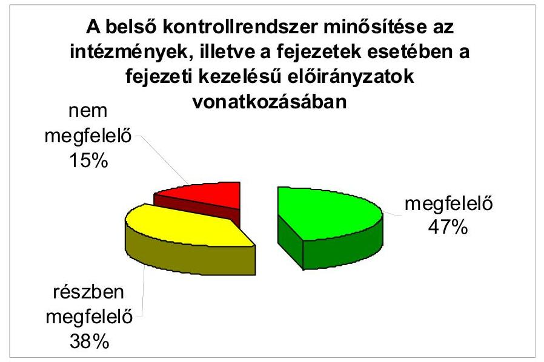

A belső kontrollok működését az ellenőrzésbe bevont intézmények és a fejezeti kezelésű előirányzatok vonatkozásában 85\%-os arányban minősítettük részben, vagy egészben megfelelőnek, illetve 15\%-ban nem megfelelőnek. A belső kontrollrendszer egyes elemeinek összesített megfelelősége 70,9\%-os eredményt ért el. A „nem megfelelő" minősítés a fejezeti kezelésű előirányzatok esetében arányaiban magasabb (27\%) volt, míg az intézményeknél 10,7\%. A jelentős eltérést az okozta, hogy a fejezeti kezelésű előirányzatoknál valamennyi kontroll elem gyengébb volt. Ez különösen megmutatkozott a kontrollkörnyezet, valamint az információ és kommunikáció elemek esetében.

[^0]
[^0]:    ${ }^{4}$ OGY, Levéltár, KBT, PSZÁF, KE, AB, AJBH, BIR, MKÜ, KIM, SZTNH, KEHI, ME, VM, HM, BM, NGM, NAV, NFM, OAH, MEH, KÜM, NFÜ, NEFMI, GVH, KSH, MTA, ONYF
    ${ }^{5}$ KIM, ME, VM, HM, BM, NGM, NFM, KÜM, UF, NEFMI, MTA
    ${ }^{6}$ A módszer leírását a 2. számú melléklet tartalmazza.

---

A belső kontrollrendszer összetevőit az alábbi mátrix mutatja be. Ezen belül értékeltük az öt fő elem megfelelőségét:
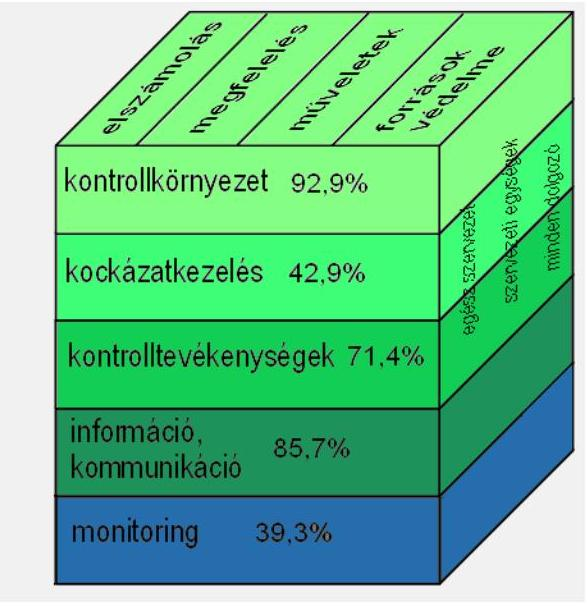

Értékelésünk alapján a legmagasabb megfelelőségi szintet (92,9\%) a kontrollkörnyezet érte el, amelyet a szervezeti struktúra, a belső szabályozottság és a humánerőforrás kezelés határoz meg. Az intézmények szervezeti struktúrája, a felelősségi, hatásköri viszonyok és a feladatok meghatározása, valamint a belső szabályzatok a jogszabályoknak és a belső kontroll standardoknak megfeleltek. A belső szabályozottság javulást mutatott az előző éviekéhez képest, ugyanakkor a közbeszerzés és az információ biztonság szabályozása terén még mutatkoztak hiányosságok. Erre utal, hogy a közbeszerzési szabályzatok közel háromnegyede (20 intézmény) nem határozta meg a közbeszerzés teljes folyamatát lefedő, azok ellenőrzését támogató, átfogó eljárásokat és az azokat támogató egyéb dokumentumokat, nyomonkövetési listákat. Az informatikai szabályzatok az intézmények ötödénél (6 intézmény) nem rendelkeztek működésfolytonossági vagy katasztrófa-elhárítási tervvel. A kontrollkörnyezet területén a legjobb a Kormányzati Ellenőrzési Hivatal volt, 97,8\%-ban megfelelt az előírásoknak, viszont a legalacsonyabb értéket elérő Nemzeti Erőforrás Minisztérium is 80\%-os megfelelőségi szinten teljesített.

Minősítésünk szerint az információ és kommunikáció a második legmagasabb megfelelőségi szintű kontrollpillér (85,7\%). A belső szabályzatok az információ átadásának formáját meghatározták, az alkalmazottak a munkavégzéshez szükséges információkhoz időben hozzájutottak, a szabályzatok rendelkezésre álltak. Hiányosságként értékeltük azonban, hogy 13 intézmény (46,4\%) nem rendelkezett kommunikációs stratégiával, emellett 4 intézmény (14,3\%) nem alakította ki a szabálytalanságok, korrupciógyanú-jelentés megfelelő eljárásrendjét.

Összességében megfelelően (71,4\%) működött az intézmények kontrolltevékenysége, amely a szabályos működést biztosító intézkedések meghozatalát és azok betartását jelenti. A gazdálkodásban a négy szem elve érvényesült, a feladat- és hatáskörök szétválasztása megtörtént. Legnagyobb hiányosság a közbeszerzések ellenőrzése területén volt tapasztalható, ahol a kontrollok működé-

---

sét nem támogatták megfelelően az ellenőrzési listák (Pénzügyi Szervezetek Állami Felügyelete, Alkotmánybíróság, Bíróságok, Belügyminisztérium, Nemzetgazdasági Minisztérium, Külügyminisztérium, Nemzeti Erőforrás Minisztérium).

A költségvetési szerveknél a kockázatkezelés - amely a tevékenységek szabályos és hatékony végrehajtását veszélyeztető tényezők felmérése alapján azok elhárítását szolgálja - a második legalacsonyabb megfelelőségi szintet elérő (42,9\%) kontrollpillér volt. Az összesített értékelés alapján a Levéltár, a Pénzügyi Szervezetek Állami Felügyelete, a Szellemi Tulajdon Nemzeti Hivatala, a Belügyminisztérium és a Magyar Tudományos Akadémia kockázatkezelése 100\%-os megfelelőségi szintű volt, 13 intézmény nem érte el a 70\%-ot. A kockázatkezelési tevékenység szabályozásáról az intézmények nem gondoskodtak teljes körűen (60,7\%-os megfelelőségi szint) és a gyakorlati alkalmazásban is voltak hiányosságok (42,9\%-os megfelelőségi szint). A hiányosságokhoz hozzájárult, hogy nem értékelték a csalás, korrupció kockázatát, az elfogadható kockázati szintet, a kockázati reakciót és a válaszintézkedéseket sem határozták meg.

Összességében a legalacsonyabb megfelelőségi szintet (39,3\%) az intézmények monitoring tevékenysége érte el. Az intézmények között jelentős eltérések mutatkoztak (25\%-96,4\%-os megfelelőségi szint), a legjobb teljesítést a Pénzügyi Szervezetek Állami Felügyelete, a Kormányzati Ellenőrzési Hivatal és a Honvédelmi Minisztérium érte el, viszont a Miniszterelnökség, a Vidékfejlesztési Minisztérium, a Nemzeti Erőforrás Minisztérium és a Gazdasági Versenyhivatal az 50\%-os megfelelőségi szint alatt teljesített. Az alacsony minősítést az okozta, hogy nem készítettek monitoring stratégiákat, nem működtették a monitoring rendszert, elmaradt a belső kontrollrendszerek önértékelése, a belső ellenőrzés nem vizsgálta a kontrollrendszert teljes körűen.

A költségvetési szervek belső ellenőrzési tevékenységére vonatkozó összevont értékelésünk alapján annak szabályozottsága és működése az ellenőrzésbe bevont költségvetési szervek 82,1\%-ánál (23 intézmény) megfelelő volt. Ugyanakkor a belső ellenőrzési tevékenység értékelését negatívan befolyásolta, hogy az intézmények az ellenőrzési tevékenységük során nem, illetve nem kielégítő mértékben vizsgálták a belső kontrollrendszer kiépítését és működését, az erőforrásokkal - különös tekintettel a vagyonnal - való gazdálkodást, az elszámolások, beszámolók megbízhatóságát. További hiányosság, hogy a belső ellenőrök pénzügyi és szabályszerűségi ellenőrzésen túlmenően más típusú -rendszer-, teljesítmény-, illetve informatikai - ellenőrzést csak eseti jelleggel végeztek. Ennek következtében az ellenőrzési feladatok kiválasztása és végrehajtása csak 12 intézmény (42,9\%) esetében megfelelő.

A zárszámadási ellenőrzéseink során már évek óta feltártuk, hogy a belső ellenőrzés a kapacitás problémák miatt nem tudja maradéktalanul ellátni feladatát.

A belső ellenőrök végzettsége és gyakorlati ideje megfelelt a jogszabályban foglaltaknak. Hét intézmény (25\%) külső erőforrással biztosította a belső ellenőrzési feladatok ellátását. Huszonöt intézmény (89,3\%) megfelelőnek ítélte a belső ellenőrzést végző szervezeti egységek ellenőri létszámát, amelynek ellentmond, hogy kapacitás hiányában nem végeztek el kiemelt fontosságú ellenőrzéseket.

A belső ellenőrzési tevékenység erősítése azért is kívánatos, mert a belső kontrollrendszer és a belső ellenőrzés megfelelősége korrelációt
 mutat. Azon intézményeknél, ahol a belső ellenőrzési tevékenység nem működött megfelelően, ott a belső kontrollokban is hiányosságok voltak.

Összegzésként megállapítható, hogy elsősorban a kockázatkezelési tevékenység színvonalának emelése, a Kbt. rendelkezéseinek betartását támogató kontrollok erősítése, a fejezeti kezelésű előirányzatokból pályázati úton nyújtott támogatások elszámolásainak alaposabb és gyakoribb ellenőrzése, a belső szabályzatok folyamatos aktualizálása jelentik a belső kontrollrendszer továbbfejlesztésének főbb irányait. Ehhez szorosan kapcsolódik, hogy az utóbbi években meggyengült a belső ellenőrzés súlya, szerepe, szakmai tevékenysége. A belső ellenőrzés nem végezte el a kontrollrendszer egészének ellenőrzését.

A kontrollok szerepének növelése érdekében fontos törekvés volt a részünkről, hogy a helyszíni ellenőrzés lezárását követően lehetőséget biztosítottunk az intézmények számára, hogy nyilatkozzanak az általunk feltárt kontrollhibák kijavítását szolgáló már megtett, illetve tervezett intézkedéseikről, amely a „jó gyakorlatok" kialakítását, illetve megerősítését szolgálja. Törekvésünk eredményes volt, a fejezetet irányító szervek vezetői a visszaküldött nyilatkozatukban vállalták a kontrollhibák kijavítását. A megtett nyilatkozatok alapján ismét elvégeztük az értékelést a kijavított változatra, annak alapján a kontroll pillérek összesített megítélése 31%-kal javult, ${ }^{7} 92,9 \%$-os megfelelőségi szintet hozott.

A zárszámadási és a belső kontrollokról szóló jelentéseink együtt nyújtanak átfogó képet a költségvetési intézményeknél és fejezeteknél a gazdálkodási menedzsment színvonaláról.

Az Állami Számvevőszékről szóló 2011. évi LXVI. törvény 33. § (1) bekezdésében foglaltak értelmében a jelentésben foglalt megállapításokhoz kapcsolódó intézkedési tervet köteles az ellenőrzött szervezet vezetője összeállítani és azt a jelentés kézhezvételétől számított harminc napon belül az ÁSZ részére megküldeni. Amennyiben az intézkedési tervet határidőben nem küldi meg a szervezet, vagy az továbbra sem elfogadható, az ÁSZ elnöke a hivatkozott törvény 33. § (3) bekezdés a)-b) pontjaiban foglaltakat érvényesítheti.

Az ellenőrzés intézkedést igénylő megállapításai és javaslatai:

# A Vidékfejlesztési miniszternek, a Külügyminiszternek, az Emberi erőforrások miniszterének, a Miniszterelnökséget vezető államtitkárnak, az Állambiztonsági Szolgálatok Történeti Levéltára főigazgatójának, a Köztársasági Elnökség főigazgatójának, az Alkotmánybíróság gazdasági fő- 

[^0]
[^0]:    ${ }^{7}$ Magyarország 2012. évi költségvetése végrehajtásának ellenőrzése keretében ennek utóellenőrzését kiemelt szempontként fogjuk kezelni.

---

# igazgatójának, a Nemzeti Adó- és Vámhivatal elnökének, valamint a Gazdasági Versenyhivatal elnökének: 

Az utóbbi években meggyengült a belső ellenőrzés súlya, szerepe, szakmai tevékenysége. Összességében a legalacsonyabb megfelelőségi szintet (39,3%) az intézmények monitoring tevékenysége érte el. A költségvetési szerveknél a kockázatkezelés - amely a tevékenységek szabályos és hatékony végrehajtását veszélyeztető tényezők felmérése alapján azok elhárítását szolgálja - a második leggyengébb megfelelőségi szintet elérő (42,9%) kontrollpillér volt. A belső ellenőrzés nem végezte el a kontrollrendszer egészének ellenőrzését.

Javaslat:
Vizsgálja felül a fejezetnél, illetve intézményeinél a belső ellenőrzés létszámát, súlyát, szerepét, annak alapján intézkedjen, hogy a belső ellenőrzés alkalmas legyen a kontrollrendszer egészének rendszeres ellenőrzésére.

---

# II. RÉSZLETES MEGÁLLAPÍTÁSOK 

## 1. A BELSŐ KONTROLLRENDSZER ÉS A BELSŐ ELLENŐRZÉS JOGSZABÁLYI HÁTTERE, FELADATAI ÉS FELÉPÍTÉSE

A közszféra belső kontrolljára vonatkozó standardokat - a gazdálkodó szervezetek belső kontrollrendszerével kapcsolatos elveket, ismereteket koncepcionális szinten összefoglaló COSO jelentéssel párhuzamosan - az INTOSAI Belső Kontroll Standard Bizottsága 1992-ben hozta nyilvánosságra. A standardok közszférában történő alkalmazásához 2004-ben további irányelveket fogadtak el, amelyhez a szervezeti kockázatkezelés témakörében, 2007. év során kiegészítő információ készült.

Magyarország uniós csatlakozása előtti időszakban a belső kontrollrendszerre vonatkozó jogszabályok - ellentétben a belső ellenőrzéssel - még nem voltak hatályban. Ugyanakkor a költségvetési szervek belső ellenőrzésére vonatkozó kormányrendelet ${ }^{8}$ a belső ellenőrzés számára olyan feladatokat is megfogalmazott, amelyek a belső kontroll korszerű értelmezése szerint nem ellenőrzési, hanem irányítási, azaz kontroll feladatokat jelentettek. Az uniós csatlakozásra történő felkészülés során az EU Bizottság részéről megfogalmazott elvárás szerint viszont jogi szabályozásban kellett elválasztani egymástól a belső kontrollal kapcsolatos feladatokat és felelősségeket, a belső ellenőrzési funkció feladataitól, hatás- és felelősségi körétől, a nemzetközileg akkor már széles körben elfogadott korszerű PIFC${ }^{9}$ rendszer alapján.

Az EU Bizottság elvárásait figyelembe véve 2003. év végén kiegészült az Áht.${ }^{1}$ egy új fejezettel, ${ }^{10}$ az Ámr.${ }^{1}$ módosult, valamint hatályba lépett a belső kontroll és a belső ellenőrzés szétválasztását biztosítani hivatott kormányrendelet (Ber.). Ezekben a jogszabályokban, majd később a módszertani útmutatókban is, egy új elem a - kontroll és az ellenőrzés fogalmát ${ }^{11}$ élesen el nem határoló - FEUVE, azaz a folyamatba épített, előzetes és utólagos vezetői ellenőrzés fogalma jelent meg.

A jogszabályok módosítása nem segítette kellőképpen annak megvilágítását, illetve megértetését, hogy a kontrolltevékenység során nem csak ellenőrzést, ha-

[^0]
[^0]:    ${ }^{8}$ A központi, a társadalombiztosítási és a köztestületi költségvetési szervek kormányzati, felügyeleti, valamint belső költségvetési ellenőrzéséről szóló 15/1999. (II. 5.) Korm. rendelet.
    ${ }^{9}$ PIFC rendszer: System of the Public Internal Financial Control, azaz államháztartási pénzügyi belső kontrollrendszer, amelynek elvi alapját a COSO, valamint az INTOSAI belső kontrollrendszerre vonatkozó irányelvei képezik.
    ${ }^{10}$ XIII. fejezet: Államháztartási pénzügyi ellenőrzés, Az államháztartási pénzügyi ellenőrzési rendszer
    ${ }^{11}$ Az ellenőrzés kontrollal szembeni leglényegesebb különbsége, hogy az ellenőr független az ellenőrzött tevékenységtől, abba nem is avatkozhat be, azaz az ellenőr nem felelős az általa ellenőrzött tevékenység megfelelőségéért.

---

nem irányítást kell végezni és abban az irányításért való felelősség jelenik meg, szemben mások teljesítéssel összefüggő felelősségének ellenőrzésével.

Az Áht.${ }^{1}$ XIII. fejezetének a belső kontroll nemzetközi szemléletét érvényesítő jelentős módosítása csak 2009. január 1-jén lépett hatályba, alkalmazkodva a nemzetközileg elfogadott elvekhez, értelmezésekhez azzal, hogy a FEUVE fogalmát már a belső kontrollrendszer részeként tartalmazta, és ennek megfelelően később az Ámr.${ }^{1}$-t felváltó új Ámr.${ }^{2}$-ben is hasonlóképpen jelent meg.

Az alapvetően a pénzügyi dimenzióra koncentráló, az Európai Bizottság 2003. évi elvárásait részben félreértelmezve kialakított „Államháztartási belső pénzügyi ellenőrzési rendszer" kategória „Államháztartási kontrollra" módosult, és a jogszabályi rendelkezésekbe beépítésre kerültek a belső kontrollrendszer nemzetközileg elfogadott irányelveinek megfelelő elemek.

Bár a FEUVE mint rövidítés megmaradt, további változás, hogy 2009. január 1-jétől, annak meghatározása a „folyamatba épített, előzetes, utólagos és vezetői ellenőrzés" lett, szemben a korábbi „folyamatba épített, előzetes és utólagos vezetői ellenőrzés"-sel. Tehát ettől az időponttól már nem kizárólag vezetői, hanem attól tágabban értelmezett, a szervezet minden tagjára vonatkozó ellenőrzési (tágabb értelemben kontroll) kötelezettséget jelent. Ez továbbra sem segítette érdemben elhatárolni a belső kontroll és belső ellenőrzés fogalmát, inkább azok egymás közötti átfedését növelte.

Az Áht.${ }^{2}$-ben és az Ávr.-ben érvényre jutottak a belső kontrollrendszer nemzetközi gyakorlatban elfogadott korszerű elvei és követelményei. Az Áht.${ }^{1}$ 2011. január 1-jével hatályba lépő módosításában a FEUVE már csak annyiban szerepelt, hogy mit kell biztosítania a belső kontrollrendszer keretében a kontrolltevékenységek részeként, míg az Ámr.${ }^{2}$ ugyanettől az időponttól hatályba lépett módosítása már nem tartalmazta a FEUVE kialakításának, működtetésének és fejlesztésének kötelezettségét. A közel húsz esztendõn keresztül hatályban lévő Áht.${ }^{1}$-t felváltó új Áht.${ }^{2}$ pedig már nem is utal a belső kontroll és a belső ellenőrzés fogalmi zavarait kiváltó FEUVE kategóriára. A 2012. január 1-jétől hatályos Bkr.-ben megőrződött a FEUVE kategória, amely tartalmában megegyezik a 2011. december 31-éig hatályos Áht.${ }^{1}$ vonatkozó előírásaival. ${ }^{12}$

A FEUVE kategória megőrződött - a belső kontroll fogalmát, standardjait, feladatait világosan és részletesen leíró - a Pénzügyminisztérium Belső Kontroll Kézikönyv 2010. kiadványában is. Az NGM tájékoztatása szerint a jogszabályi rendelkezések felülvizsgálata folyamatos, amelynek során tervezik a fogalmak tisztázását is. A megteremtett jogszabályi háttérnek megfelelően a vonatkozó útmutatók módosítása is meg fog történni.

A bemutatott irányelvek és jogszabályok alapján a szervezeteknek el kell tudni határolni a kontrolltevékenységeket az ellenőrzési tevékenységektől, azonban nem szabad figyelmen kívül hagyni azok kapcsolatrendszerét sem. A belső ellenőrzés belső kontrollrendszeren belül elfoglalt helyét a belső kontroll 3 dimenziós mátrixa segítségével lehet megérteni:

[^0]
[^0]:    ${ }^{12}$ Áht.${ }^{1}$ 121/A. § (4) és (5) bekezdés egyezően a Ber.${ }^{2}$ 8. § (2) és (3) bekezdése tartalmával.

---

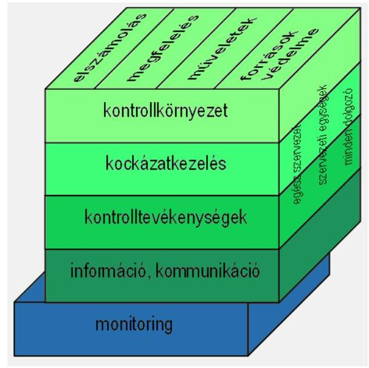

A mátrix az INTOSAI GOV 9100 „Irányelvek a belső kontroll standardokhoz a közszférában" dokumentum alapján mutatja be a belső kontrollrendszert. A dokumentum szerint a belső kontrollrendszer egy olyan összetett folyamat, amelyet egy szervezet vezetése és dolgozói valósítanak meg, és amelyet a kockázatok meghatározására és ésszerű biztosíték létrehozására alakítanak ki. A belső kontrollrendszer öt eleme (kontrollkörnyezet, kockázatkezelés, kontrolltevékenység, információ és kommunikáció, monitoring) útján biztosítani hivatott, hogy a költségvetési szerv működése és gazdálkodása során műveleteit szabályszerűen a megbízható gazdálkodás elveivel összhangban végrehajtsa, az elszámolási kötelezettségeit teljesítse, megfeleljen a vonatkozó törvényeknek, szabályozásoknak és megvédje szervezete erőforrásait a veszteségektől és károktól.

A belső kontrollrendszer magában foglalja a belső ellenőrzést. A belső kontrollrendszeren belül a monitoring kontrollelem részét képezi, ezáltal támogatja a belső kontrollrendszer működésének monitoringját, amelynek kiemelt feladatai közé tartozik - többek között - a belső kontroll keretrendszer fejlesztésének segítése.

# 2. A BELSŐ KONTROLLRENDSZER ÉS A BELSŐ ELLENŐRZÉS ÉRTÉKELÉSE A 2011. ÉVI ZÁRSZÁMADÁS ELLENŐRZÉSE KERETÉBEN 

### 2.1. A belső kontrollrendszer és a belső ellenőrzés szabályozottsága

### 2.1.1. A belső kontrollrendszer egyes elemeinek szabályozottsága

### 2.1.1.1. A kontrollkörnyezet szabályozottsága

A kontrollkörnyezet kialakítása keretében a szervezet vezetésének a feladatok és célok teljesítéséhez, a megfelelő működés biztosításához meg kell határoznia és szabályoznia kell minden szükséges folyamatot és azok összetevőit, továbbá

---

meg kell határoznia és ki kell alakítania a folyamatok ellátását leghatékonyabban támogató szervezeti struktúrát, a szükséges materiális és humán erőforrásokat, a képzettségi, képességi és etikai követelményeket, valamint a külső kapcsolatokat.
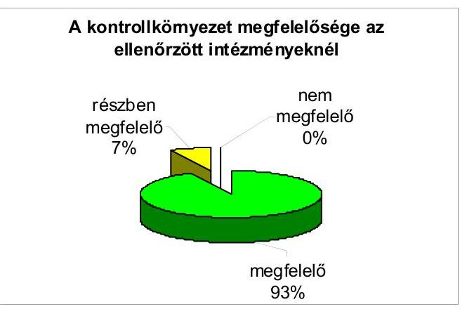

Az öt pillér közül a kontrollkörnyezet megfelelőségi szintje a legmagasabb, ezen a területen két intézmény (NFÜ, NEFMI) kivételével „megfelelő" a minősítés eredménye. A kontrollkörnyezet összesített minősítését a belső szabályzatok jól reprezentálják, azonban ezek között két olyan terület - a közbeszerzés és az információbiztonság - is található, amelyek szabályozása „nem megfelelő". Ezeknek a szabályzatoknak csak a fele felelt meg teljes mértékben a követelményeknek.

Az intézmények - az OBH kivételével - kialakították a világos, egyértelmű szervezeti struktúrát, amelynek ábrája bemutatja a szervezeti egységek megnevezéseit, azok vertikális és horizontális kapcsolatait, az alá- és fölérendeltségi viszonyokat.

Az intézmények 92,9%-a (26 intézmény) „megfelelő" belső szabályzatokkal rendelkezett (az NFÜ és a NEFMI esetében ez „részben megfelelő"), így eleget tettek a belső kontroll egyik kiemelt feladatának, a kontrollkörnyezet kialakításának. Ennek következtében képesek - a külső feltételekkel összhangban - kereteket szabni a szervezet folyamatainak, hogy azok szabályszerűen, célszerűen biztosítsák a jövőben elvárt célkitűzés elérését.

A fejezeti kezelésű előirányzatokra vonatkozóan 9 intézmény rendelkezett „megfelelő", kettő pedig (NFÜ, NEFMI) - egyezően az intézményi körrel „részben megfelelő", jogszabályban előírt szabályzatokkal.

Az intézmények rendelkeztek a vezetőjük által jóváhagyott, aktualizált, az Sztv. 14.
 §-a és az Áhsz. 8. §-a által előírt számviteli politikával, valamint az Sztv. 169. §-a és az Áhsz. 48-49. §-ai által előírt számlarenddel, amelyek egy-két hiányosságtól eltekintve megfelelő módon foglalják magukban a jogszabályok által meghatározott tartalmi elemeket.

A kialakított számlarendekben előforduló hiányosság, hogy a bizonylatok feldolgozási rendje keretében nem írták elő, hogy az egyéb pénzeszközöket érintő tételeket legkésőbb a tárgyhót követő hó 15-ig rögzíteni kell a könyvekben, illetve

---

nem határozták meg a közvetett kiadások szakfeladatra történő felosztásának módját.

Az NFÜ-nél a számviteli politika és a számlarend „nem megfelelő" minősítést kapott.

Az NFÜ esetében hiányosságként mutatkozott, hogy az intézmény 2010. május 13-tól ingatlant, 2010. március 3-tól pedig társasági részesedést kezelt, vagyonkezeléshez kapcsolódó eljárásokat viszont a nevezett szabályzatok nem tartalmaztak. A vagyonkezelési feladatok a 2011. évben is fennálltak, a szabályzatok módosításához kapcsolódó feladatok lekezeléséhez szükséges és alkalmazandó elvekkel, eljárásokkal való kiegészítése ugyanakkor a tárgyévben is elmaradt. Az NFÜ a NAV 2011. április 18-án kelt értesítése szerint 2009. december 3-ára visszamenőlegesen általános forgalmi adó körbe került, ennek kapcsán negyedévente kötelezett az áfa bevallására, a szabályzatok (számviteli politika, számlarend) erre vonatkozó módosítása azonban nem történt meg.

Az NFÜ kivételével valamennyi intézmény rendelkezett a fejezeti kezelésű előirányzatokra vonatkozóan, az Sztv. és az Áhsz. szerint készített megfelelő számviteli politikával és számlarenddel.

Az NFÜ-nél az UF fejezet fejezeti kezelésű előirányzataira vonatkozóan a számviteli politika „részben megfelelő", mivel lehetővé tette a KSz-eknek, illetve az MV Zrt.-nek teljesített előleg-kifizetések „szállítói előleg"-ként történő nyilvántartását. A számlarend ugyanakkor „nem megfelelő" minősítést kapott, mert nem felelt meg az Ámr. 2114. §. (3) bekezdésében foglalt előírásoknak, mivel lehetővé tette az előző évről áthúzódó „szállítói előleg"-ek aktív átfutó elszámolásként történő nyilvántartását.

Az intézmények rendelkeztek az Sztv. 14. §, és az Áhsz. 8. § által előírt, vezetőjük által jóváhagyott pénzkezelési, eszközök és források értékelési, továbbá leltározási és leltárkészítési szabályzattal. Utóbbi szabályzatot azonban az intézmények 17,9%-a (5 intézmény) nem aktualizálta.

A pénzkezelési szabályzatok és a leltározási és leltárkészítési szabályzatok 89,3%-a (25 intézmény), míg az eszközök és források értékelési szabályzatainak 92,9%-a (26 intézmény) volt „megfelelő" az intézményeknél. A pénzkezelési szabályzatok 10,7%-a (3 intézmény) „részben megfelelő" volt. Ugyanez a mutató a leltározási és leltárkészítési szabályzat esetében 7,1% (2 intézmény), ami azt jelenti, hogy ez a szabályzat egy intézménynél (NFÜ) nem volt megfelelő. Az eszközök és források értékelési szabályzata egy-egy intézmény vonatkozásában volt „részben megfelelő", illetve „nem megfelelő". Az NFÜ esetében - a számviteli politikánál bemutatott hiányosságok miatt - sem az eszközök és források értékelési szabályzat, sem a leltározási és leltárkészítési szabályzat „nem volt megfelelő".

---

A pénzkezelési szabályzatok 14,3%-ára (4 intézmény) volt jellemző, hogy az elektronikus aláírásra vonatkozó eljárásrend - amelyet törvény és rendelet ${ }^{13}$ is szabályoz - nem került kialakításra.

A leltározási és leltárkészítési szabályzatok 14,3%-ában (4 intézmény) a piaci értékelésbe bevont, illetve a visszaírással érintett eszközök vonatkozásában nem rögzítették a leltározási időszakban történő eszközmozgatások eljárásrendjét.

Az eszközök és források értékelési szabályzata 7,1%-ában (2 intézmény) nem rögzítették a követelések és a kötelezettségek esetében a deviza-árfolyam meghatározásának módját.

A fejezeti kezelésű előirányzatok vonatkozásában valamennyi intézmény rendelkezett az Sztv. és az Áhsz. szerint készített pénzkezelési, leltározási és leltárkészítési, továbbá eszközök és források értékelési szabályzattal. A szabályzatok „megfelelő"-ek voltak, a VM pénzkezelési szabályzata kivételével, amely „részben megfelelő" minősítést kapott.
„Megfelelő" bizonylati renddel az intézmények 89,3%-a (25 intézmény) rendelkezett.

A bizonylati rendek általános hiányossága, hogy az elektronikus dokumentumok, iratok számviteli bizonylatként történő alkalmazásának feltételeit - amelyet az Sztv. mellett más törvény is előír ${ }^{14}$ - nem szabályozták. A szabályzatok 10,7%-át nem aktualizálták.

A fejezeti kezelésű előirányzatok vonatkozásában tíz intézmény „megfelelő", egy pedig (VM) „részben megfelelő" bizonylati renddel rendelkezett.

A közbeszerzési szabályzatoknak csak 57,1%-a (16 intézmény) „megfelelő", 32,1%-a (9 intézmény) „részben megfelelő", 10,7%-a (KE, KIM és NFÜ) pedig „nem megfelelő".

Valamennyi közbeszerzési eljárásrend tartalmazta a közbeszerzési eljárásokban közreműködők feladatait, a közbeszerzési eljárás dokumentálási rendjét, a szerződéskötés rendjét és egy kivételtől eltekintve az ajánlatok elbírálására létrehozott bírálóbizottság tagjai kiválasztásának szempontjait, feladatait, döntéshozatali eljárásrendjét, a határozatképesség feltételeit.

Az eljárásrendek 25%-a (7 intézmény) nem tartalmazta a közösségi értékhatárokat elérő közbeszerzések esetén az előzetes, összesített tájékoztató készítési kötelezettségre vonatkozó szabályokat, 39,3%-a (11 intézmény) pedig az ajánlati biztosíték kezelésével, nyilvántartásával, illetőleg visszaadásával kapcsolatos feladatokat. Az intézmények 71,4%-a (20 intézmény) nem alkalmazott részletes, a közbeszerzés teljes folyamatát lefedő, azok ellenőrzését támogató ellenőrzési listákat.

[^0]
[^0]:    ${ }^{13}$ Az elektronikus aláírásról szóló 2001. évi XXXV. tv. és a kincstári számlavezetés és finanszírozás, a feladatfinanszírozási körbe tartozó előirányzatok felhasználása, valamint egyes államháztartási adatszolgáltatások rendjéről szóló 46/2009. (XII. 30.) PM rendelet (a PM rendelet 2012. január 1-jétől már nem hatályos).
    ${ }^{14}$ Az általános forgalmi adóról szóló 2007. évi CXXVII. tv. és az elektronikus aláírásról szóló 2001. évi XXXV. tv.

---

Ezt a gyakorlatot nem írja elő jogszabály, de például az uniós támogatások ellenőrzésében ez általános gyakorlat.

Az intézmények fejezeti kezelésű előirányzatokra vonatkozó közbeszerzési szabályzatai közül 10 „megfelelő", egy pedig - az NFÜ - „nem megfelelő" minősítést kapott.

Az NFÜ esetében az intézményre és az UF fejezet fejezeti kezelésű előirányzatokra egyaránt vonatkozó közbeszerzési szabályzat nem aktualizált, abban nem szabályozták, hogy egyszerű közbeszerzési eljárás esetén az írásbeli összegzéskészítésnek és az ajánlattevők részére történő megküldési kötelezettségnek ki a felelőse. Ezen túlmenően nem történt meg az ajánlati biztosíték kezelésével, nyilvántartásával, illetőleg visszaadásával kapcsolatos feladatok, illetve az eredményhirdetésről készített jegyzőkönyv elküldési rendjének szabályozása sem.

Az informatikai szabályzatoknak 46,4%-a (13 intézmény) „megfelelő", 39,3%-a (11 intézmény) „részben megfelelő", 14,3%-a (MKÜ, VM, NFM, NEFMI) pedig „nem megfelelő". A „nem megfelelő" minősítést az MKÜ és az NFM esetében a szabályzat hiánya okozta.

Az intézmények 92,9%-a (26 intézmény) rendelkezett hatályos, a vezető által aláírt informatikai biztonsági szabályzattal, melyek közül csak 42,9% (12 intézmény) aktualizált. Az intézmények közel 90%-a (25 intézmény) rendelkezett dokumentált eljárásrenddel a hozzáférési jogosultságok megállapítására, kiosztására, módosítására és visszavonására vonatkozóan, három negyedénél pedig szétválasztották formálisan is a fejlesztési és üzemeltetési feladatokat. Egy intézmény (MKÜ) kivételével a számítógépes rendszerek mentési eljárásai szabályozottak és dokumentáltak.

Az intézmények ötödére (6 intézmény) jellemző, hogy nincs kinevezett dolgozó, aki a naplóállományok rendszeres vizsgálatáért felelős, nem rendelkeztek működésfolytonossági (Business Continuity Plan) vagy katasztrófa-elhárítási tervvel (Disaster Recovery Plan), továbbá nem szabályozottak a szoftver-változtatások ellenőrzésére, tesztelésére vonatkozó eljárások. Az intézmények 21,4%-a (6 intézmény) nem szabályozta az informatikai rendszer hardver és szoftver elemeire vonatkozó változáskezelési eljárásokat, továbbá működésfolytonossági tervük nem tartalmazott egyértelmű és részletes forgatókönyveket a kritikus fontosságú folyamatok és informatikai rendszerelemek visszaállítására nézve.

A fejezeti kezelésű előirányzatokat érintő kérdések vonatkozásában az azokat kezelő intézmények több mint fele (6 intézmény) rendelkezett „megfelelő" informatikai biztonsági szabályzattal. A KIM és a NEFMI szabályzata „nem megfelelő", a HM, az NGM és az NFM esetében pedig „részben megfelelő" volt.

Az informatikai biztonsági szabályzatok jellemző hiányosságai, hogy azokat nem aktualizálták, a működésfolytonossági tervek nem tartalmaznak egyértelmű és részletes forgatókönyveket a kritikus fontosságú folyamatok és informatikai rendszerelemek visszaállítására vonatkozóan, illetve a számítógépes rendszer mentési eljárásai nem szabályozottak.

A pénzügyi jogkörök gyakorlását meghatározó, „megfelelő" gazdálkodási szabályzatot az intézmények kialakították, amely a VM és a HM esetében

---

csak „részben megfelelő" minősítésű volt. A gazdálkodási szabályzatok a pénzügyi jogkörök gyakorlásával kapcsolatos kötelező elemeket tartalmazták.

A fejezeti kezelésű előirányzatok esetében - a HM „részben megfelelő" minősítésű szabályzata kivételével - valamennyi gazdálkodási szabályzat „megfelelő" volt.

A kockázatkezelési szabályzatok közel kétharmada (17 intézmény) megfelelően került kialakításra, negyede (7 intézmény) „részben megfelelő", 14,3%-a (KIM, ME, MEH, NEFMI) pedig „nem megfelelő". Két intézmény (ME, NEFMI) egyáltalán nem rendelkezett ilyen szabályzattal.

Az intézmények döntő többsége (25 intézmény) - közel 90% - eljárásrendjében meghatározta a kockázat fogalmát, a kockázatokat beazonosította, kategóriákba sorolta, illetve mérlegelte a válaszintézkedéseket.

A fejezeti kezelésű előirányzatok vonatkozásában hat helyen (54,6%) megfelelően, két helyen (18,2%) részben megfelelően kialakított kockázatkezelési szabályzattal rendelkeztek (VM, UF), három helyen (27,3%) azonban (KIM, ME, NEFMI) nem rendelkeztek ilyen dokumentummal.

A „részben megfelelő" kockázatkezelési szabályzatokban jellemző hiányosság volt, hogy azokban nem határozták meg a Kockázatkezelő Bizottság szerepét, a szabályzatok nem tartalmazták a kockázatok értékelését, kategóriába sorolását, valamint a válaszintézkedés folyamatba történő beépítésének módját (VM), illetve a szabályzat nem volt alkalmas arra, hogy megalapozza a működésben rejlő releváns kockázatok feltárását és kezelését (UF fejezet fejezeti kezelésű előirányzat - irányítási és ellenőrzési rendszerben a 4/2011. (II. 9.) Korm. rendelet hatályba lépésével bekövetkező változások, KSz-ek megalakulása, megszűnése).

Az intézmények közel teljes körűen (26 intézmény) rendelkeztek megfelelő eljárásrenddel a szabálytalanságok kezelésére vonatkozóan. Mindössze egy olyan intézmény volt (NEFMI), amely nem rendelkezett szabálytalanságkezelési eljárásrenddel sem az intézmény, sem a fejezeti kezelésű előirányzatok vonatkozásában.

Egyéb szabályzatok közül gépjárművek használatára vonatkozó, tűzvédelmi és - a VM kivételével - munkavédelmi szabályzattal valamennyi intézmény rendelkezett. Az intézmények 92,9%-ának (26 intézmény) elkészült a belföldi kiküldetések és a reprezentációs kiadások elszámolására, valamint a vezetékes és mobiltelefonok használatára vonatkozó eljárásrendje. Önköltségszámítási szabályzattal az intézmények közel 90%-a (25 intézmény), míg a közérdekű adatok kezelésére vonatkozó szabályzattal 82,1%-a (23 intézmény) rendelkezett.

A fejezeti kezelésű előirányzatok felhasználási rendjét az érintett intézmények az Áht. 124. § (9) bekezdésének megfelelően elkészítették, az eljárásrendek a fejezeti kezelésű előirányzatokat lefedik, a tartalmi elemeket magukban foglalják. Három eljárásrend azonban nem készült el az Áht. 149. § (5) bekezdésének p) pontjában megjelölt február 15-ei határidőre.

---

A szabályos és hatékony munkavégzés alapfeltételét biztosító feladatok, és az azok elvégzéséért való felelősség pontos meghatározását szolgáló szabályzatok, illetve folyamatleírások kidolgozását megfelelő alapító okiratok és közel 90%-ban (24, illetve 25 intézmény) megfelelően kialakított SzMSz-ek és ügyrendek támogatták. Az SzMSz-ek és az ügyrendek között „nem megfelelő" minősítésű nem volt.

A hierarchikus módon egymásra épülő, felülről lefelé haladva egyre konkrétabban, a tevékenységekre egyre részletesebb előírásokat megfogalmazó alapító okiratok, SzMSz-ek és ügyrendek, valamint a hierarchiában az ügyrendet követő, belső szabályzatok minősítései között összefüggés figyelhető meg. Azoknál az intézményeknél, ahol az SzMSz és az ügyrend nem megfelelő vagy részben megfelelő minősítésű kategóriákba tartozott, a belső szabályzatok között lényegesen szignifikánsabb volt a „nem megfelelő" minősítés, mint a „megfelelő" minősítésű SzMSz-szel, vagy ügyrenddel rendelkező intézmények körében. Az SzMSz tekintetében az NFM és a KüM, míg az ügyrend vonatkozásában a VM kapott „részben megfelelő" minősítést. Az egyéb szabályzatok közül a közbeszerzési szabályzat (NFM, KüM), a pénzkezelési szabályzat (KüM), a leltározási és leltárkészítési szabályzat (VM) szintén „részben megfelelő" minősítést kapott, amely alátámasztja a fenti megállapítást.

Az alapító okiratok valamennyi intézmény vonatkozásában tartalmazták az Áht. 90. §
 (1) bekezdésében megjelenített elemeket.

Az SzMSz-ek tartalmazták a kötelező elemeket, azonban 7,1% (2 intézmény) esetében nem kerültek aktualizálásra, nem jelenítették meg a költségvetési szerv létrehozásáról szóló jogszabályra történő hivatkozást és az alapító okirat azonosítóit.

Az ügyrendekben megjelentek az SzMSz-ben szabályozott feladatok, a gazdálkodással, a könyvvezetéssel, a szervezet működésével és a vagyongazdálkodással kapcsolatos feladatok. Két ügyrend nem volt aktualizálva, 14,3% (4 intézmény) pedig nem tartalmazta a helyettesítés rendjét.

Valamennyi intézmény gazdasági szervezetének dolgozója rendelkezett a Ktv. 11. § (6) bekezdés és a 31. § (1) bekezdésének megfelelő munkaköri leírással.

A folyamatok meghatározásával kapcsolatban „megfelelő" ellenőrzési nyomvonallal az intézmények 78,6%-a (22 intézmény) rendelkezett, azonban három intézmény esetében (OAH, MEH, KSH) az ellenőrzési nyomvonal nem volt megfelelő, két intézménynél (ME, NEFMI) pedig nem készült.

A humán erőforrás tekintetében a felmérésünk alapján a gazdasági szervezet feladatainak végrehajtásához a létszámkapacitás az intézmények több mint háromnegyed részénél (82,1%) (23 intézmény) elegendő. Hasonló mértékben kerül legalább évente értékelésre a dolgozók teljesítménye. Valamennyi intézmény vonatkozásában írásban rögzítették az egyes munkakörök betöltéséhez szükséges feltételeket és - egy kivételtől eltekintve (NGM) - rendelkezésre állt az éves képzési terv.

Az intézmények kevesebb, mint felénél (13 intézmény) található etikai kódex, mely dokumentumok a vezetők és dolgozók számára elérhetőek.

---

A szervezet vezetőinek és alkalmazottainak fenntartania és demonstrálnia kell a személyes és szakmai becsületességet és az etikai értékeket, folyamatosan szükséges megfelelniük a magatartási szabályoknak, ezáltal is kellő támogatást nyújtani a szervezet belső kontrolljához.

# 2.1.1.2. A kockázatkezelés szabályozottsága és végrehajtása 

A kockázatkezelés során meg kell határozni a tevékenységek, folyamatok, műveletek megfelelő teljesítésének belső kockázatait és a kockázatvállalás szintjét. Az értékelés alapján megfelelő válaszintézkedéseket kell kidolgozni és érvényesíteni a kockázatok mérséklésére.
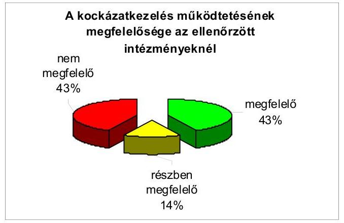

Az előző pontban az értékelésünk alapján magas megfelelőségi szintű pillérként bemutatott kontrollkörnyezettel szemben a kockázatkezelés alacsony megfelelőségi szintű pillére a kontrollrendszernek, annak ellenére, hogy az intézmények mintegy kétharmad része (60,7%) (17 intézmény) megfelelően kialakított kockázatkezelési szabályzattal rendelkezett.

A kockázatkezelési szabályzatok szintjén az intézmények több mint a fele (16) nem rendelkezett megfelelő bizottság felállításáról, egynegyede (7) nem rendelkezett az elfogadható kockázati szint meghatározásával, illetve a kockázati környezet felülvizsgálatával kapcsolatos feladatok elvégzéséről, míg 21,4%-a (6) nem írta elő a kockázatok folyamatgazdáinak kijelölését, illetve a kockázati reakciók meghatározását.

A kockázatkezelési tevékenység azonban már csak 42,9%-os mértékben (12 intézmény) volt megfelelő (hasonlóan a „nem megfelelő" minősítésű intézmények arányával), a „részben megfelelő" minősítésű intézmények aránya pedig 14,3% (4) volt.

A kockázatkezelés legjellemzőbb hiányosságai a csalás és korrupció kockázata értékelésének elmaradása mellett az, hogy nem határozták meg az elfogadható kockázati szintet, a kockázati reakciót és a válaszintézkedéseket. ${ }^{15}$

[^0]
[^0]:    ${ }^{15}$ Az ONYF megkezdte az SzMSz módosítását, amely során - az ellenőrzésünk során jelzettek miatt - külön figyelmet fordít a korrupció megelőzésére és az ezzel kapcsolatos kockázatelemzési tevékenység kialakítására.

---

Összesen 12 intézmény (AB, OBH, BIR, MKÜ, KIM, ME, VM, MEH, NEFMI, GVH, KSH, ONYF) kockázatkezelési tevékenysége nem volt „megfelelő". Ebből nyolc olyan intézmény volt, amelynek kockázatkezelési tevékenysége annak ellenére „nem megfelelő", hogy a kockázatkezelési szabályzata legalább „részben megfelelő" volt.

Két intézmény (ME, NEFMI) egyáltalán nem szabályozta a kockázatkezelési tevékenységét, kettő (KIM, MEH) szabályzata pedig „nem megfelelő" minősítésű volt. Ennek a négy intézménynek a kockázatkezelési tevékenysége nem volt megfelelő.

A kockázatkezelési eljárásrendek - két kivételtől eltekintve (VM, NEFMI) - a vezetők és dolgozók rendelkezésére álltak. Az intézmények közel fele (42,9%) (12 intézmény) értékelte a kockázatkezelés során a csalás és korrupció kockázatát, harmada (35,7%) (10 intézmény) pedig ezek alapján döntött a csalás és korrupció kezeléséről, vagyis azok közül, akik az értékelést elvégezték 83,3%-ban (10 intézmény) a kezelés szükségessége mellett foglaltak állást.

Az intézmények háromnegyede (21 intézmény) a kockázatkezelés során a tevékenységével kapcsolatos kockázatokat meghatározta és felmérte, a kockázatok elemzését elvégezte, azokat kategóriába sorolta, kétharmada (64,3%) (18 intézmény) pedig az elfogadható kockázati szintet és a kockázati reakciót is meghatározta, a válaszintézkedéseket pedig beépítette a folyamatba. A kockázati környezetet azonban már csak az intézmények 60,7%-a (17 intézmény) vizsgálta felül. A kockázatok nyilvántartását az intézmények kétharmada (19 intézmény) megoldotta.

# 2.1.1.3. A kontrolltevékenységek szabályozottsága 

A kontrolltevékenységek azok az eszközök, eljárások, mechanizmusok, amelyeket a szervezet vezetése annak érdekében hoz létre, hogy elősegítse a szervezet célkitűzéseinek elérését. Ezek az eljárások magukban foglalhatják az egyeztetések előkészítését és vezetői felülvizsgálatát, olyan eljárások és felelősségi körök kialakítását, amelyek biztosítják a kulcsszerepet képező beosztások elhatárolását, szétválasztását, korlátozzák a vagyonelemekhez és számviteli nyilvántartásokhoz való fizikai hozzáférést.
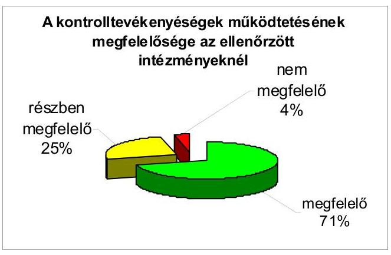

Értékelésünk alapján a kontrolltevékenységek pillér megfelelőségi szintje a kontrollrendszer egészének átlagánál magasabb, az intézmények több mint kétharmadánál (71,4%) (20 intézmény) „megfelelő", a többi esetben pedig egy kivételtől eltekintve (VM) - „részben megfelelő" minősítést ért el. A kontrollok működési hiányosságai elsősorban a közbeszerzések területén jelentkeztek. A lebonyolítást nem támogatták ellenőrzési listák, vagy ezeknek megfelelő dokumentumok. Ezt nem írja elő jogszabály, de például az uniós támogatások ellenőrzésében ez általános gyakorlat, amely biztosítaná az átláthatóságot. A gazdálkodásban a négy szem elve érvényesült, a feladatkörök szétválasztása megfelelően megtörtént, a szakmai teljesítésigazolás területén azonban javításra szorulnak a kontrollok.

Az ellenőrzési nyomvonallal rendelkező intézmények a dokumentum kialakítása során a folyamatokat azonosították, meghatározták a tevékenységcsoportokat és azonosították a folyamatgazdákat. A ME és a NEFMI nem alakította ki az ellenőrzési nyomvonalát.

Az ellenőrzési nyomvonalak tartalmazták a tevékenységek/feladatok megnevezését, az azok végrehajtásáért felelős szervezet megnevezését, a folyamatos sorszámozást, az ellenőrzési pontokat és a végrehajtást igazoló dokumentumok megnevezését. A kialakított ellenőrzési nyomvonalak 80,8%-a (21 intézmény) tartalmazta a tevékenységek/feladatok végrehajtását meghatározó szabályzatokra történő hivatkozást, azonban ezek fellelhetőségi helyét a rendszerben már csak a dokumentumok alig több mint a fele (53,8%) (14 intézmény) tartalmazta.

Valamennyi intézmény rögzítette gazdálkodási, illetve ezzel azonos tartalmú szabályzatában, illetve eljárásrendjében a kötelezettségvállalásra, annak ellenjegyzésére, a szakmai teljesítésigazolásra, az érvényesítésre, az utalványozásra és annak ellenjegyzésére jogosultak körét, feladataikat. Az aláírás minták fellelhetőek voltak.

A kötelezettségvállalás nyilvántartása vezetési módját teljes körben, a nyilvántartással kapcsolatos egyeztetési feladatokat egy kivétellel (HM), a kötelezettségvállalás nullás számlaosztályban történő nyilvántartásának eljárásrendjét szintén - egy kivételtől (NFM) eltekintve - valamennyi intézmény szabályozta. Az összeférhetetlenség fennállásának feltételeit közel teljes körben (96,4%) (27 intézmény) kidolgozták.

A feladatkörök szétválasztása az SzMSz-ben és az ügyrendben egy kivételtől eltekintve (KSH${ }^{16}$) megtörtént. Az összeférhetetlenség kezelése valamennyi intézménynél „megfelelő" volt, mert a kötelezettségvállalás, ellenjegyzés, szakmai igazolás, érvényesítés, utalványozás ellenjegyzését szabályozó eljárásrendek vagy egyéb eljárásrendek rögzítik, hogy ugyanazon gazdasági eseményre vonatkozóan a kötelezettségvállaló és az ellenjegyző, illetve az utalványozó és az ellenjegyző nem lehetnek azonos személyek. A szabályzatok illetve eljárásrendek azt is rögzítik, hogy az érvényesítő nem lehet azonos a kötelezettségvállalásra, az utalványozásra vagy a szakmai igazolásra jogosult személlyel.

[^0]
[^0]:    ${ }^{16}$ A feladatkörök szétválasztását a KSH gazdasági szervezete esetében nem az ügyrendben, hanem a munkaköri leírásokban rögzítették.

---

# 2.1.1.4. Az információ és kommunikáció szabályozottsága, működése 

Az információ és kommunikáció magába foglalja a vonatkozó és megbízható információ meghatározását és megszerzését, továbbá az alkalmazottak és vezetők számára megfelelő formában és időben történő eljuttatását, hogy az lehetővé tegye kötelezettségeik - beleértve a belső kontrollal kapcsolatos kötelezettségeik - teljesítését.
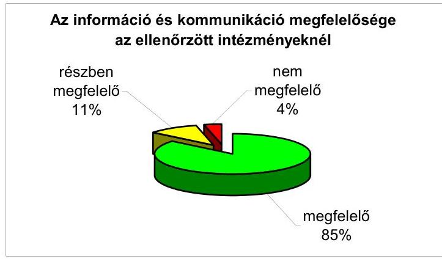

Az információ és kommunikáció pillér megfelelőségi szintje magas, az intézmények 85,7%-ánál (24) „megfelelő", a többi esetben pedig - egy kivételtől eltekintve (KIM) - „részben megfelelő" volt. Hiányosságként értékeltük azonban, hogy 13 intézmény (46,4%) nem rendelkezett kommunikációs stratégiával, emellett 4 intézmény (14,3%) nem alakította ki a szabálytalanságok, korrupciógyanú-jelentés megfelelő eljárásrendjét.

Az információáramlás kialakítása során az intézmények 92,9%-ánál (26 intézmény) rögzítették a belső szabályzatokban az információ átadásának formáit. Az alkalmazottak a munkavégzéshez, a vezetők pedig a döntéshez szükséges információkhoz - az AB kivételével - időben hozzájutottak, a szabályzatok az érintett dolgozók rendelkezésére álltak.

Az iktatási rendszer valamennyi intézménynél támogatta az iratok nyomon követését. Minden intézmény rendelkezett iratkezelési szabályzattal, amelyek kiterjedtek a szabályozandó területekre.

Az intézmények 85,7%-a (24 intézmény) kialakította a szabálytalanságok, illetve a korrupció gyanújával kapcsolatos jelentések eljárásrendjét.

### 2.1.1.5. A monitoring rendszer szabályozottsága, működése

A működés monitoringja a szervezet tevékenységének a célok megvalósításának nyomonkövetését biztosítja. A belső kontrollok monitoringja pedig magába foglalja a vezetés rendszeres felügyeletet gyakorló tevékenységét, valamint más műveleteket, amelyeket az alkalmazottak hajtanak végre feladatkörük ellátása keretében. A belső ellenőrzés egyik alapvető funkciója, hogy segítséget nyújtson a vezetésnek a belső kontroll eredményességének monitoringjához.

---

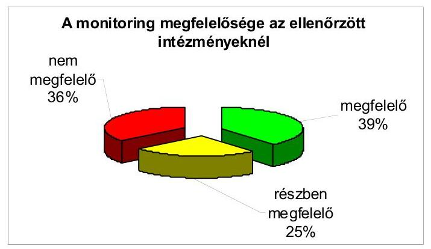

Értékelésünk alapján a pillérek közül a monitoring megfelelőségi szintje a legalacsonyabb, a „nem megfelelő" minősítésű intézmények aránya 35,7% (KE, AB, OBH, MKÜ, ME, VM, BM, NEFMI, GVH, KSH) volt. A monitoring-rendszer gyenge pontja a belső ellenőrzés kontrollrendszerre irányuló vizsgálatainak hiánya mellett a belső kontrollrendszerek önértékelésének elmaradása volt.

A szervezeti célok megvalósításához kapcsolódó monitoring rendszert az intézmények kétharmada kialakította és működtette. A belső kontrollmonitoring keretében az intézmények több mint a fele (16 intézmény) végezte el az önértékelést, kétharmad részük (10 intézmény) ezt külső értékelő bevonásával tette meg.

Az intézmények több mint háromnegyedénél (22 intézmény) vizsgálta a belső ellenőrzés a belső kontrollrendszerek kiépítését és közel ilyen arányban (71,4%) (20 intézmény) értékelték azok gazdaságosságát, hatékonyságát és eredményességét. Az érintett intézmények a belső ellenőrzés által feltárt, a belső kontrollrendszert érintő hibák kijavításáról intézkedtek. Két intézmény esetében (AB, ME) a belső ellenőrzés a belső kontrollrendszerre vonatkozóan egyáltalán nem végzett ellenőrzést. Egy olyan intézmény volt (KE), amelyik a belső kontroll rendszer kiépítése és működése jogszabályoknak való megfelelőségét vizsgálta, azonban azok működésének gazdaságosságát, hatékonyságát, eredményességét nem.

A belső ellenőrzés tevékenységének értékelését a 2.1.2.; a 2.2. és a 2.2.2. pontok tartalmazzák részletesen!

# 2.1.2. A belső ellenőrzés szabályozottsága 

A belső ellenőrzés egy független, tárgyilagos bizonyosságot nyújtó és tanácsadó tevékenység, amelyet hozzáadott érték adása és egy szervezet működésének fejlesztése érdekében alakítanak ki.

A belső ellenőrzés 2010-2011. évi adatait vizsgálva megállapítottuk, hogy az ellenőrzött intézmények közül egy, az ME esetében nem volt belső ellenőrzést végző szervezeti egység és belső ellenőr sem, így a belső ellenőrzési tevékenység nem működött.

---

A belső ellenőri feladatok ellátása az ME-nél csak 2012. március 19-től volt biztosított.

Saját belső ellenőrzési szervezettel, illetve belső ellenőrrel az ellenőrzött intézmények 25%-a (Levéltár, KBT, KE, AB, OBH, SZTNH, KEHI) nem rendelkezett. Ezekben a szervezetekben a belső ellenőrzési tevékenység ellátása megbízási jogviszonyban foglalkoztatott ellenőrrel történt. Egy intézménynél, a KIM-nél került sor a teljes munkaidőben foglalkoztatott belső ellenőr mellett külső erőforrás igénybevételére is.

A 370/2011. (XII. 31.) Korm. rendelet 15. § (5) bekezdése szerint 2012. július 1-jétől az 50 főnél nagyobb engedélyezett létszámmal rendelkező önállóan működő és gazdálkodó költségvetési szervek esetében
 legalább 1 fő belső ellenőrt kell foglalkoztatásra irányuló jogviszonyban alkalmazni. Ettől eltérni csak a fejezetet irányító szerv vezetőjének írásos jóváhagyásával lehet.

A szabályozottság tekintetében egy intézmény, az ME „nem megfelelő", három pedig (OBH, NFM, NEFMI) „részben megfelelő" minősítést kapott.

A belső ellenőrzés feladatkörét elsősorban az SzMSz-ben, illetve a belső ellenőrzési kézikönyvben határozták meg, – ezeken túlmenően – az ügyrend is tartalmazott utalásokat a belső ellenőrzés feladataira.

A belső ellenőrzési kézikönyvek – néhány kisebb hiányosságtól eltekintve – megfeleltek a jogszabályi előírásoknak. Jellemzően azonban (20 esetben) az ellenőrzési kézikönyvek aktualizálása nem, vagy csak késve történt meg.

Belső ellenőrzési tevékenységet csak az államháztartásért felelős miniszter engedélyével rendelkező személyek végeztek. Az alkalmazott belső ellenőrök szakmai végzettsége és gyakorlati ideje megfelelt az előírásoknak; a belső ellenőrök részt vettek szakmai továbbképzésen és az előírt esetekben vizsgát tettek.

# 2.2. A belső kontrollrendszer és a belső ellenőrzés működésének értékelése a 2011. évi zárszámadás ellenőrzése keretében 

A belső kontrollrendszer összevont értékelése a belső kontrollrendszer öt pillérének együttes minősítése alapján történt. Az összevont értékelés elve hasonló, mint az egyes pillérek értékelésére vonatkozó elv, vagyis a „megfelelő" minősítés magas kontrollbizonyosságot, a „részben megfelelő" minősítés közepes kontrollbizonyosságot, míg a „nem megfelelő" minősítés alacsony kontrollbizonyosságot jelent.

Az értékelés alapján a 28 intézmény közel fele (13 intézmény) „megfelelő", 12 „részben megfelelő", míg három (ME, VM, NEFMI), „nem megfelelő" minősítést kapott.

A következő ábra jól szemlélteti az intézmények belső kontrollrendszerének értékelését, amely szerint az említett három intézmény érte el a legmagasabb

---

kockázati pontértéket. A legalacsonyabb kockázati pontértéket az SZTNH, a PSZÁF, a KBT és a NAV kapta.
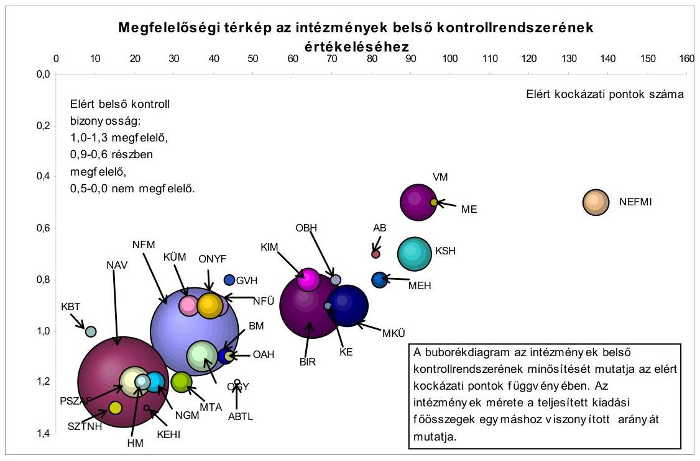

A belső ellenőrzési tevékenység végrehajtásán belül külön-külön minősítettük az ellenőrzési tevékenység megtervezését, végrehajtását, dokumentálását, a jelentéskészítés folyamatát és a korábbi ellenőrzések utógondozását, nyomon követését.

A belső ellenőrzés működését értékelve a költségvetési szervek 82,1%-a (23 intézmény) került „megfelelő", 14,3%-a (4) „részben megfelelő", egy pedig (3,6%) „nem megfelelő" kategóriába.

A „nem megfelelő" minősítést a ME kapta, mivel 2011. évben nem alakította ki a belső ellenőrzés szervezeti kereteit és nem működtette azokat.

A belső ellenőrzési tevékenység tervezése 5 esetben kapott „részben megfelelő" minősítést, ennek oka, hogy ezek az intézmények nem rendelkeztek aktualizált stratégiai tervvel. Éves ellenőrzési tervvel egy intézmény nem rendelkezett (ME).

A NAV esetében mindkét jogelőd szervezet (APEH, VP) az integrációt megelőzően rendelkezett a 2011. évet is átfogó stratégiai tervvel, amelyek az integrációt követően is érvényes és aktuális célokat határoztak meg. A belső ellenőrzési feladatok 2011. évi megszervezése és megtervezése figyelembe vette a NAV hosszú távú célkitűzéseit, különös tekintettel az integrációból adódó feladatokra. A NAV szervezeti stratégiája 2011. év októberében került kiadásra, a NAV belső ellenőrzési stratégiája pedig 2012. május 3-án került jóváhagyásra.

A „megfelelő" minősítésű intézményeknél ezek a dokumentumok rendelkezésre álltak és tartalmukat tekintve alapvetően megfeleltek a jogszabályi előírásoknak. Több helyen (5 intézmény) előforduló hiányosság azonban, hogy

---

az éves ellenőrzési terv összeállításakor a különböző ellenőrzési feladatokat nem prioritások szerint határozták meg. Az ellenőrzési feladatok végrehajtása mindenhol ellenőrzési program alapján történt.

A belső ellenőrzés tevékenységei közül az ellenőrzési feladatok (ellenőrzési típusok meghatározása, megállapítások, ajánlások tétele) területén tapasztaltuk a legnagyobb hiányosságokat, itt 4 intézmény (AB, MKÜ, ME, KüM) minősítése „nem megfelelő", míg 11 (Levéltár, KE, OBH, KIM, KEHI, VM, HM, BM, OAH, NEFMI, GVH) „részben megfelelő" volt.

Az ellenőrzéseket a belső ellenőrzést működtető intézmények közül minden intézménynél megbízólevél alapján hajtották végre. A vizsgálati módszerek kiválasztása az ellenőrzési célnak, feladatoknak megfelelően, kockázatelemzés alapján történt. Az ellenőrzések lefolytatása során 8 esetben került sor külső szakértő igénybevételére.

Hiányosságként értékeltük azonban, hogy az ellenőrzési feladatok tekintetében „nem megfelelő" minősítésű intézmények az ellenőrzési tevékenységük során nem vizsgálták a belső kontrollrendszer kiépítését és működését, a belső kontrollrendszerek működésének gazdaságosságát, hatékonyságát, eredményességét, az erőforrásokkal való gazdálkodást, a vagyon megóvását, gyarapítását, az elszámolások, beszámolók megbízhatóságát (AB, MKÜ, ME). Ennek következtében az intézmények belső ellenőrzésük keretében megállapítást és ajánlást sem tettek. A kedvezőtlen minősítéshez, – amely önmagában csak „részben megfelelő" minősítést okozott – az is hozzájárult, hogy a szervezetek a pénzügyi és szabályszerűségi ellenőrzésen túl más típusú – rendszer- és teljesítményellenőrzést (AB, MKÜ, ME), a beszámolókra vonatkozó megbízhatósági, illetve informatikai (AB, ME, KüM) – ellenőrzést nem, vagy csak eseti jelleggel végeztek, illetve nem végezték el a belső ellenőrzés minőségértékelését.

Ugyancsak kockázatos terület volt a belső ellenőrzési tevékenység végrehajtása (ellenőrzések lefolytatásának módja és területei) és dokumentálása, három intézmény (AB, OBH, ME) „nem megfelelő", 8 pedig (Levéltár, KE, KEHI, VM, NAV, KüM, NEFMI, GVH) „részben megfelelő" minősítést kapott. Ennek oka változó volt az egyes intézményeknél. Előfordult, hogy nem vizsgálták teljes körűen a szervezet belső kontrolljainak megfelelőségét és hatékonyságát, különös tekintettel a pénzügyi működési adatok megbízhatóságára, a működés gazdaságosságára, hatékonyságára és eredményességére, a vagyonvédelemre vagy nem értékelték a kockázatkezelés folyamatainak hatékonyságát, illetve a szabálytalanságok elkövetésének lehetőségét.

Az elkészült belső ellenőri jelentések megállapításai dokumentumokkal alátámasztottak voltak és megtörtént a teljességi nyilatkozatok kiállítása is.

Az ellenőrzésekről minden esetben írásos jelentés készült, amelyek megfeleltek a Ber. 27. §-a előírásainak. Éves (összefoglaló) ellenőrzési jelentést valamennyi intézmény készített, az intézmények 75,0%-a (21 intézmény) intézkedett a belső ellenőrzés által feltárt belső kontrollrendszert érintő hibák kijavításáról.

A belső ellenőrzési tevékenységről a belső ellenőrzési vezető rendszeres jelleggel köteles beszámolni. A beszámolás kiterjed az ellenőrzési tervek megvalósulására, a tervtől való eltérések okainak bemutatására; a függetlenített belső ellenőrzés személyi és tárgyi feltételeire; az ellenőrzések során tett fontosabb megállapításokra és javaslatokra; valamint az ellenőrzési tevékenység fejlesztési javaslataira.

A jelentéskészítés folyamatát – az ME „nem megfelelő" minősítése mellett – két esetben értékeltük „részben megfelelő"-nek (VM, KÜM), ezekben az esetekben az éves (összefoglaló) ellenőrzési jelentés hiányosságaként merült fel, hogy nem tartalmaztak a belső kontrollrendszer szabályszerűségének, gazdaságosságának, hatékonyságának és eredményességének növelése, javítása érdekében tett javaslatokat.

A nyomonkövetés folyamata két esetben (KBT, ME) „nem megfelelő", míg 4 intézménynél (AB, OBH, KüM, GVH) „részben megfelelő" minősítést kapott. Ennek oka, hogy bár voltak olyan ellenőrzések, amelyek megállapításai alapján intézkedési tervet kellett készíteni, az intézkedési tervek nem készültek el határidőben, az intézkedési tervet az ellenőrzés vezetője nem véleményezte, illetve nem történt meg az intézkedések végrehajtásának ellenőrzése sem.

A belső ellenőrök létszáma – az intézményektől kapott információk alapján – „megfelelő", három esetben (BM, KIM, NEFMI) azonban a feladatok csak szűk körű ellátására elegendő. A kapott nyilatkozatokkal szemben ennél több esetben értékeltük alacsonynak a belső ellenőrzési létszámot, hiszen az ellenőrzött intézmények közül – a belső ellenőrzési tevékenység végrehajtására adott minősítések alapján – 11 nem érte el a „megfelelő" szintet.

A belső ellenőrzés állományi létszáma – a kapott tanúsítványok adatai szerint – 2010-ről 2011-re a vizsgált szervek többségénél nem változott, vagy közel azonosan alakult. Egy intézménynél nőtt az állományi létszám, ennek mértéke meghaladta a 30%-ot. Hét intézménynél viszont jelentős létszámcsökkenés következett be (PSZÁF, KIM, HM, BM, NAV, NEFMI, KSH), esetükben a létszámcsökkenés mértéke 18,3%-65% között mozgott.

A BM-nél a 2010. évi kormányzati struktúraváltozás során történt létszámcsökkentés. A jogelődök (IRM) együttes belső ellenőri létszáma 11 főről az átalakulást követően 4 főre csökkent.

A NAV esetében összevonás történt. Az APEH-nál és a VP-nél, mint jogelőd szervezeteknél összességében magasabb volt a belső ellenőrzés állományi létszáma, mint a NAV-nál az összevonást követően (60 főről 49 főre csökkent). Az integrációval egyidejűleg feladatászervezésre is sor került; a jogelőd VP belső ellenőrzési egysége által ellátott, közvetlenül nem a belső ellenőrzési feladatrendszerhez kapcsolódó egyéb tevékenységek (pl. külső szervi ellenőrzések koordinációja) már nem tartoznak a NAV belső ellenőrzésének a kompetenciájába.

A NEFMI esetében már a 2010. év folyamán, az átalakulás eredményeként történt jelentős létszámváltozás, amikor a jogelőd szervezetek összesített belső ellenőri 34 fős állományi létszáma az átalakulást követően 22 főre, 2011. december 31-re pedig 14 főre csökkent.

A belső ellenőrzések száma a vizsgált két évben eltérően alakult és összefüggést mutat az ellenőri létszám változásával.

---

Azoknál a szervezeteknél, ahol az ellenőri létszám 2010. évről 2011. évre csökkent, – két kivételtől eltekintve (KIM, NAV) – arányosan csökkent az ellenőrzések száma is.

A költségvetési szervek – az általuk lefolytatott ellenőrzések típusát tekintve – az esetek többségében szabályszerűségi és pénzügyi ellenőrzéseket végeztek. Ezen túlmenően – eseti jelleggel – előfordultak rendszer- és teljesítményellenőrzések, informatikai ellenőrzések, továbbá végeztek a céljelleggel juttatott előirányzatokra, valamint a költségvetési beszámolóra vonatkozó ellenőrzéseket is.

Négy intézménynél (KE, PSZÁF, HM, KIM) nevesítve is szerepelt, hogy a belső ellenőrzés az ellenőrzési tevékenység mellett tanácsadói feladatokat is ellátott. A KIM és a HM esetében a tanácsadói tevékenység aránya meghaladta az 50%-ot. A PSZÁF-nál az ellenőri kapacitás mintegy 30%-át, míg a HM-nél 27%-át tette ki.

A tanácsadói tevékenység tartalmát 2012. január 1-jétől már jogszabály is meghatározza.

A Bkr. 2. § r) pontja szerint a tanácsadói tevékenység a költségvetési szerv vezetőjének nyújtott olyan hozzáadott értéket eredményező szolgáltatás, amelynek jellegét és hatókörét a belső ellenőrzési vezető és a költségvetési szerv vezetője a megbízáskor közösen határoz meg anélkül, hogy a felelősséget a belső ellenőr magára vállalná.

Korábban a pénzügyminiszter által kiadott 2/2009. (XII. 4.) PM irányelv határozta meg a tanácsadói tevékenység jellemzőit. E szerint a tanácsadói tevékenységre vonatkozó megbízás lényege, hogy a belső ellenőr tanácsot, véleményt ad egy folyamatról, rendszerről, tervezetről, eljárásról, anélkül, hogy ezért operatív felelősséget vállalna.

További jellemzője a tanácsadói tevékenységeknek, hogy bizonyos – az ellenőrzésre jellemző – előírásoknak nem kell megfelelnie. Így a tanácsadói tevékenységet végző belátására bízza a jogszabály, hogy készít-e tevékenysége eredményéről írásbeli jelentést, előírja-e intézkedési terv készítését, valamint nyilvántartja-e a tanácsadói tevékenységeket és azok eredményeit.

# 2.2.1. A belső kontrollok működése a kötelezettségvállalás, a szakmai teljesítésigazolás, a számvitel területén, továbbá az összeférhetetlenségi szabályok érvényesülése 

A kontrollok működése a kötelezettségvállalás területén az intézmények 89,3%-ánál (25 intézmény) „megfelelő", 7,1%-ánál (2 intézmény) „részben megfelelő", a VM esetében viszont „nem megfelelő".

A kötelezettségvállalás előkészítése során a vezetői ellenőrzés teljes körűen, a négy szem elve – a VM kivételével – valamennyi intézménynél teljes körűen, a VM-nél nem minden esetben érvényesült. Ugyanakkor a Kbt. előírásainak érvényesülését biztosító kontrollok működésében hiányosságokat tapasztaltunk, ami abban nyilvánult meg, hogy részletes ellenőrzési listákat – amelyek kontrollálják a Kbt. vonatkozó előírásai betartását – az intézményeknek mindössze egynegyede alkalmazott.

---

Az alkalmazott ellenőrzési listák kellő mértékben támogatták a Kbt. előírásainak betartatását, segítségükkel a négy szem elve dokumentáltan érvényesült.

A fejezeti kezelésű előirányzatok vonatkozásában kedvezőbb a helyzet, a kontrollok az UF fejezet fejezeti kezelésű előirányzatok kivételével „megfelelő"-en működtek.

Az UF fejezet fejezeti kezelésű előirányzatainál megállapított hibák a számvitel területén a belső kontrollok, valamint a számvitelt támogató
 informatikai rendszerekkel kapcsolatos belső kontrollok nem megfelelő működésére vezethetőek vissza. Mindezek következtében a főkönyvi könyvelés és az analitikus nyilvántartás kapcsolata, egyezősége nem volt biztosított, továbbá elmaradt a követelések teljes körű egyeztetése is.

A számvitelt támogató informatikai rendszerekből nyert analitikus nyilvántartások, a főkönyvi kivonat és a beszámolók adatainak egyezőségét rendszerszerűen nem biztosították, amelyre az ÁSZ már a 2010. évi zárszámadás ellenőrzése során is felhívta a figyelmet.

Az UF KEOP, TÁMOP, TIOP, DAOP fejezeti kezelésű előirányzatoknál a könnyített elbírálású, normatív feltételeknek megfelelő, ún. automatikus pályázatokhoz kapcsolódó támogatói okiratokon hiányzott a pénzügyi ellenjegyzés.

Az ellenőrzött GOP pénzforgalmi tételek esetében a kifizetés előtti ellenőrzések rendszere nem teljesen zárt, az ellenőrzés megállapította, hogy az EMIR-ben a specifikáció következtében a másodlagos ellenőrzéseket az elsődleges ellenőrzések lezárását megelőzően is el lehet végezni, illetve az elsődleges ellenőrzés adatait utólagosan módosítani lehet.

A szakmai teljesítésigazolás területén a kontrollok az intézmények kétharmadánál (21 intézmény) „megfelelő"-en, 14,3%-ánál (4 intézmény) pedig „részben megfelelő"-en működtek. Három intézmény (AB, VM, NFÜ) vonatkozásában „nem megfelelő" volt a szakmai teljesítésigazolás.

A szakmai teljesítésigazolás esetében a négy szem elve és a vezetői ellenőrzés érvényesült, a teljesítés alapjául szolgáló alapdokumentumra (számla, átadás-átvételi jegyzőkönyv, szállítólevél) a hivatkozás megtörtént. A legjellemzőbb hiányosság az volt, hogy nem alkalmaztak a tevékenység elvégzését támogató ellenőrzési listákat, vagy ezzel azonos funkciót betöltő dokumentumot, amely teljes körűen biztosította volna a teljesítés igazolására jogszabályban előírt minimum feltételek megvalósulását. Az ellenőrzési listák, ahol azokat alkalmazták, növelték az átláthatóságot és javították az ellenőrizhetőséget.

A fejezeti kezelésű előirányzatok vonatkozásában, arányaiban kedvezőtlenebb a helyzet. A VM, a HM és a KüM a fejezeti kezelésű előirányzatok esetében „nem megfelelő"-en gyakorolta ezeket a jogköröket. A hiányosságok megegyeztek az intézményekre vonatkozóan a fenti részbekezdésben leírtakkal.

A kontrollok a számvitel területén közel 90%-os mértékben (25 intézmény) „megfelelő"-en, egy intézménynél, az ONYF-nél „nem megfelelő"-en működtek. „Részben megfelelő" minősítést kapott az OBH és a KüM.

Az intézmények több mint 90%-ánál (25) csak engedélyezett tranzakció történt, emellett a bizonylatok adatainak a törzsadatokkal való egyezősége automatikusan ellenőrzésre került. Egy intézmény esetében fordult elő, hogy az Sztv. 169. §-a szerint előírt időintervallumon belül a visszamenőleges elérhetőség nem volt biztosított. Valamennyi intézmény esetében a könyvelési tételek beazonosíthatóak voltak, azaz naplózás történt. A számviteli folyamatok végrehajtása során a négy szem elve és a vezetői ellenőrzés elve - a MEH kivételével - érvényesült.

A fejezeti kezelésű előirányzatok vonatkozásában valamivel kedvezőtlenebb a helyzet. A kontrollok 81,8%-os mértékben (9 fejezet) „megfelelő"-en, a VM és az NFÜ esetében azonban nem megfelelően működtek.

A VM esetében nem volt biztosított, hogy csak engedélyezett tranzakciók könyvelése történjen meg, a könyvelési tételek tekintetében nem volt naplózás, a számviteli folyamatok végrehajtása során a négy szem elve nem érvényesült.

Az UF fejezet fejezeti kezelésű előirányzatainál a főkönyvi kivonat és az analitikus nyilvántartás egyezőségét támogató belső kontrollok nem megfelelően működtek a számvitel területén, ezáltal nem volt biztosított a KEOP, TÁMOP, TIOP, INTERREG, ETE beszámolókban szerepeltetett adatok analitikus nyilvántartásokkal történő, teljes körű alátámasztása. A 7 ROP esetében a számviteli kontrollok nem megfelelően működtek, mert a követelések leírásáról írásos dokumentum nem készült.

A kötelezettségvállalás, ellenjegyzés és utalványozás, szakmai teljesítésigazolás és érvényesítés vonatkozásában a jogszabályban előírt összeférhetetlenség elvét valamennyi intézmény esetében betartották.

A számítástechnikai rendszerek biztosították a beszámoló és a pénzforgalmi kimutatások elkészítését, valamint a mérlegsorok és a főkönyvi könyvelés adatainak egyezőségét. Az előirányzat-maradvány kimutatását és egyeztetését 89,3%-os mértékben (25 intézmény), a főkönyvi könyvelést pedig minden intézménynél támogatta a számítástechnikai rendszer.

Az analitikus nyilvántartásokat szoftverek támogatják, ennek mértéke a vevőállomány és a szállítói állomány esetében 96,4% (27), a kötelezettségvállalás esetében 92,9% (26), míg az előirányzat-módosítások és az eszköznyilvántartások esetében 89,3% (25). Az analitikus nyilvántartás és a főkönyvi könyvelés közötti automatikus adatkapcsolat mértéke a vevőállomány és a szállítói állomány, továbbá az eszköznyilvántartások esetében 89,3% (25), a kötelezettségvállalás esetében 85,7% (24), az előirányzat-módosítások vonatkozásában pedig 75,0% (21).

Az informatikai területen működő kontrollok vonatkozásában hiányosságok tapasztalhatóak. Az intézmények 85,7%-a (24 intézmény) gondoskodott arról, hogy az informatikai biztonsági szabályzatot minden dolgozó belső hálózaton vagy tanfolyamon megismerje. Ugyanilyen arányban fértek hozzá a munkahasználatban lévő pénzügyi számviteli szoftverekhez a külső vagy a belső fejlesztők. Az intézmények harmada (9 intézmény) azonban nem rendelkezett az informatikai eszközökön kezelt dokumentumtípusok és adatbázisok teljes körű, naprakész nyilvántartásával, illetve nem végezte el és nem dokumentálta az informatikai eszközökön kezelt dokumentumtípusok és adatbázisok védelmi igényének meghatározását, biztonsági osztályokba sorolását, továbbá nem tesztelte az elmúlt két évben működés folytonossági tervét. Közel hasonló arányban (28,6%) nem tesztelték az elmúlt egy évben, hogy az elmentett állományokból a pénzügyi számviteli adatok és az őket kezelő szoftverek, operációs rendszerek teljes körűen helyreállíthatóak-e.

Az intézmények 85,7%-a (24 intézmény) rendelkezett teljes körű, naprakész és dokumentált nyilvántartással arról, hogy mely dolgozó milyen hozzáférési jogosultságokkal rendelkezik a szervezet hálózati rendszeréhez, operációs rendszereihez, pénzügyi-számviteli szoftvereihez. A központi hálózati és operációs rendszerek 89,3%-a (25 intézmény), míg a pénzügyi számviteli szoftverek 92,9%-a (26 intézmény) kikényszerítik a jelszavakra előírt szabályok teljes körű betartását. A pénzügyi számviteli szoftverekben az intézmények 89,3%-a (25 intézmény) az adathozzáférési, az adatmódosítási és az adattörlési tevékenységet egyaránt naplózta. A mentéseket tartalmazó adathordozók környezeti ártalmaktól (pl. víz, tűz) és az illetéktelen hozzáféréstől való védelme valamennyi intézmény vonatkozásában biztosított.

A költségvetési szervek egyik fő erőforrásának, illetve a működést integráló folyamatok alkotóelemének a megfelelő belső információkat tekintettük, amelyek minőségét meghatározta az adatok gyűjtése, tárolása, áramoltatása és felhasználása. A költségvetési szerv valamennyi tevékenységéről, azok pénzügyi és működési teljesítményéről folyamatosan elegendő és megfelelő információt kellett biztosítania, hogy szükség esetén meg lehessen hozni a korrekciós intézkedéseket.

A minisztériumok informatikai üzemeltetési és telekommunikációs feladatait 2011. január 1-jétől a Központi Szolgáltatási Főigazgatóság, majd - új nevén a Közbeszerzési és Ellátási Főigazgatóság látta el. 2011. május 1-jétől a KEF jogutódja a Kopint-Datorg Zrt. lett.

A KEF-ről szóló rendelet 1. §-a a névváltozást (KSZF helyett KEF) mondta ki, a 4. §-ának (9) bekezdése pedig meghatározta, hogy 2011. május 1-jétől a KSZF-ről szóló rendeletben meghatározott informatikai és telekommunikációs szolgáltatások tekintetében a KSZF jogutódja a Kopint-Datorg Zrt. lett.

Az informatikai és telekommunikációs szolgáltatások nyújtásában további változást hozott a központosított informatikai és elektronikus hírközlési szolgáltatásokról szóló 309/2011. (XII. 23.) Korm. rendelet, mely szerint az abban meghatározott szervek részére (KIM, VM, BM, NGM, NFM, NEFMI) a központosított informatikai és elektronikus hírközlési szolgáltatásokat 2011. december 25-étől a Kopint-Datorg Zrt. jogutódja, a Nemzeti Infokommunikációs Szolgáltató Zrt. (NISZ Zrt.) látta el.

Az informatikai és telekommunikációs szolgáltatásokat ellátó külső szervezet a beszámolási év folyamán két alkalommal is megváltozott, amely változásokkal összefüggő módosításokat az intézmények az IBSZ-ekben nem vezették át teljes körűen.

Az NFM 2011-ben nem rendelkezett önálló informatikai biztonsági szabályzattal, ezért a számítástechnikai eszközöket üzemeltető KEF informatikai biztonsági szabályzatának előírásait követték.

A szabályozottság, illetve a szolgáltatási szerződések hiánya olyan hatáskört érintő vitás helyzeteket eredményezett, melyeknél nem volt egyértelmű, hogy az informatikai szabályozás kinek a feladata.

A NEFMI jogelődjei és a KSZF is rendelkezett IBSZ-szel. A KSZF és a NEFMI jogelődje közötti szolgáltatási szerződés megkötése után 2007-ben hatásköri vita alakult ki, - amely azóta is tart - hogy mely szervezet a felelős az IBSZ kiadásáért. A fejezet irányító szervezete ennek következtében nem rendelkezett egységes, minden kérdést lefedő, jogilag és formailag is megfelelő IBSZ-szel. Ugyanakkor a feladatkörök, a szolgáltatások és azok paramétereivel kapcsolatos kétoldalú szolgáltatási megállapodást kötését kezdeményezte a NISZ Zrt.-vel.

# 2.2.2. A belső kontrollrendszer és a belső ellenőrzés értékelése az alkotmányos fejezeteknél 

Az ellenőrzés során a minisztériumok mellett kiemelt figyelmet fordítottunk az ún. alkotmányos fejezetek ${ }^{17}$ belső kontrollrendszerére, illetve belső ellenőrzésére.

Az alkotmányos fejezetek belső kontrollrendszerét összességében részben megfelelőnek értékeltük, mert a 6 intézményből 5 (KE, AB, OBH, BIR, MKÜ) „részben megfelelő" minősítést kapott, amely az összes alkotmányos fejezet 83,3%-át teszi ki. Az OGY esetében a belső kontrollrendszer minősítése „megfelelő" volt.

A kontrollkörnyezet értékelése az alkotmányos fejezeteknél „megfelelő" minősítést kapott. Ez a részterület magába foglalja a szabályozottságot, a feladat- és felelősségi körök kialakítását, a humán erőforrással, valamint az etikai értékekkel kapcsolatos eljárásokat. A legnagyobb hiányosság az volt, hogy az ellenőrzött intézmények egyike sem rendelkezett a személyi állomány egészére vonatkozó etikai kódex-szel, annak ellenére, hogy funkciójukból, feladatkörükből adódóan elvárható lett volna.

Az MKÜ az ügyészekre vonatkozóan adott ki etikai irányelveket, amely tartalmazta mindazokat az etikai követelményeket, amelyek betartása indokolt a munkakör betöltéséhez.

Jelentős hiányosságokat tapasztaltunk a kockázatkezelés területén, itt az intézmények 66,6%-a (4) kapott „nem megfelelő" minősítést (egyaránt 16,7-16,7% volt azok aránya (1-1), amelyek részben, illetve egészében megfeleltek az előírásoknak). A „nem megfelelő" minősítés oka, hogy ezek az intézmények a tevékenységükkel kapcsolatos kockázatokat nem mérték fel és nem határozták meg, aminek következtében a kockázat-kezelési folyamat sem valósulhatott meg, így a kockázatok elemzése, illetve az esetleges kockázatok következményeinek meghatározása, kiküszöbölése sem.

Kedvezőbb a helyzet a kontrolltevékenységek területén, ami az alkotmányos fejezetek kétharmadánál (4) „megfelelő" minősítést kapott. A „részben

[^0]
[^0]:    ${ }^{17}$ OGY, KE, AB, OBH, BIR, MKÜ

megfelelő" minősítést kapott két intézmény (AB, BIR) esetében a számítástechnika területén tapasztaltunk hiányosságot.

Az információ és kommunikáció területén a belső kontrollok működését valamennyi alkotmányos fejezetnél „megfelelő"-nek minősítettük, a leggyakrabban előforduló hiányosság, hogy az intézmények nem rendelkeztek kommunikációs stratégiával.

A belső kontrollrendszer működésének időnkénti kiértékeléséhez szükség van a rendszer folyamatos figyelemmel kísérésére és értékelésére, amely a monitoring keretén belül valósul meg. A kockázatkezeléshez hasonlóan jelentős hiányosságot tapasztaltunk ezen a területen is, ugyanis az intézmények 66,7%-a (4) „nem megfelelő" minősítést kapott. Ennek alapvető oka, hogy az intézmények harmadánál nem történt intézkedés a belső ellenőrzés által feltárt, a belső kontrollrendszert érintő hibák kijavítása érdekében.

Az alkotmányos fejezetek belső ellenőrzésének működése kettő intézmény (AB, OBH) esetében „részben megfelelő", a többi esetében „megfelelő" minősítést kapott.

A belső ellenőrzés szervezeti kialakítása az alkotmányos fejezetek 50%-ánál (3) külső erőforrás igénybevételével történt, ezeknél az intézményeknél nem foglalkoztattak főállású belső ellenőrt. A belső ellenőrök rendelkeztek szakirányú felsőfokú iskolai végzettséggel vagy más felsőfokú iskolai végzettséggel és a jogszabályban meghatározott szakirányú képesítéssel, valamint részt vettek szakmai továbbképzésen. A belső ellenőrzés kialakítása - a szervezeti struktúrában betöltött helye szerint - „megfelelő" volt, minden esetben megfelelt a Ber. 6. §-ában foglaltaknak, ezáltal függetlensége biztosított volt.

A belső ellenőrzés szabályozottságát tekintve - egy kivétellel (OBH) - minden intézmény „megfelelő" minősítést kapott. A „részben megfelelő" minősítés a belső ellenőrzési kézikönyv aktualizálásának elmaradására vezethető vissza.

A belső ellenőrzés feladatainak meghatározása -
 a belső ellenőrzési kézikönyv mellett – minden esetben az SzMSz-ben történt meg.

A belső ellenőrzési tevékenység végrehajtása során külön-külön minősítettük az ellenőrzési tevékenység megtervezését, végrehajtását, dokumentálását, a jelentéskészítés folyamatát és a korábbi ellenőrzések utógondozását, nyomon követését. Az ellenőrzések megtervezése – két kivétellel (AB, OBH) „megfelelő” minősítést kapott. Minden szerv rendelkezett hosszú távú stratégiai és éves ellenőrzési tervvel, amelyek – néhány hiányosságtól eltekintve – megfeleltek a jogszabályi előírásoknak.

A legnagyobb hiányosság – az alkotmányos fejezetek tekintetében is – az ellenőrzési típus kiválasztása, valamint az ajánlások megfogalmazása területén volt tapasztalható. A vizsgálatba bevont 6 intézmény közül kettő (AB, MKÜ) „nem megfelelő”, kettő pedig (KE, OBH) „részben megfelelő” minősítést kapott. Két intézmény (OGY, BIR) minősítése „megfelelő” volt.

---

A minősítést az okozta, hogy nem minden intézmény vizsgálta és értékelte a 2011. év folyamán a belső kontrollrendszer kiépítésének és működésének a jogszabályoknak és szabályzatoknak való megfelelését; a belső kontrollrendszerek működésének gazdaságosságát, hatékonyságát, eredményességét és az erőforrásokkal való gazdálkodást, a vagyon megóvását, gyarapítását, az elszámolások, beszámolók megbízhatóságát. További hiányosság, hogy az ellenőrzési tevékenység során a belső kontrollrendszerek javítására, továbbfejlesztésére, valamint a kockázati tényezők, hiányosságok megszüntetésére az ellenőrzési egységek nem fogalmaztak meg ajánlást.

A belső ellenőrzési tevékenység végrehajtását és dokumentálását két intézménynél (AB, OBH) értékeltük „nem megfelelő”-nek, egy intézmény pedig (KE) „részben megfelelő” minősítést kapott. Esetükben az ellenőrzések nem terjedtek ki a működés gazdaságosságára, hatékonyságára és eredményességére; nem értékelték a kockázatkezelés folyamatainak hatékonyságát és a szabálytalanságok elkövetésének lehetőségét. Emellett az informatikai biztonsági intézkedések betartásának belső ellenőrzése sem volt dokumentált.

A jelentéskészítés folyamata minden alkotmányos fejezetnél megfelelt az aktuális jogszabályi előírásoknak, minden ellenőrzésről készült írásos jelentés, a 2011. évi ellenőrzési tevékenység összefoglalásáról szóló éves ellenőrzési jelentést valamennyi szerv elkészítette. Az elvégzett ellenőrzésekről a Ber. 32. §-a szerint vezetett nyilvántartás rendelkezésre állt.

A jelentések nyomon követése az alkotmányos fejezeteknél jól működött, mindössze két intézmény (AB, OBH) kapott „részben megfelelő” minősítést. Esetükben az ellenőrzési megállapítások alapján nem készült intézkedési terv.

# 2.2.3. A belső kontrollok működése a fejezeti kezelésű előirányzatokból pályázatok útján nyújtott támogatások esetében 

Az ellenőrzés tapasztalatai szerint a pályázatok útján nyújtott támogatások kezelését átfogó kontrollok nem működtek kellő hatékonysággal. A pályázatok elbírálását nem támogatták teljes körűen számítástechnikai rendszerek, és annak ellenére, hogy a felmérés szerint a fejezetek nagy része naprakész nyilvántartással rendelkezik, a pénzügyi elszámolással késedelembe lévő kedvezményezettek személyéről, nem követi ezt a tényállást automatikus felszólítás. További hiányosság, hogy a kedvezményezettek esetében nem győződtek meg a Kbt. előírásainak betartásáról.

A fejezeti kezelésű előirányzatokból – az ME kivételével – valamennyi fejezet nyújtott pályázatos formában támogatást a kedvezményezettek számára.

Az NGM és az NFM esetében a pályázatok értékelését a kezelő szervezetek végzik.

A benyújtott pályázatok értékelését a VM, a HM, a BM, a KüM és a NEFMI esetében nem támogatták számítógépes értékelő ún. scoring rendszerek. Ezt ugyan jogszabály kötelezően nem írja elő, de segítségével kiszűrhetőek az értékelési folyamatban rejlő szubjektív elemek, mivel a rendszer célja, hogy objektív és transzparens szempontok alapján összehasonlítsa és pontozza a pályázók szakmai felkészültségét, illetve az általuk ajánlott/vállalt üzleti feltételeket,

---

majd ezek alapján állapítsa meg az egyes pályázók által igénybe vehető maximális forrásokat. A pályázatok értékelése során a négy szem elve és a vezetői ellenőrzés – a KüM kivételével – valamennyi fejezetnél érvényesült.

A fejezeti kezelésű előirányzatok felhasználására benyújtott pályázatok értékeléséről, és a támogatás odaítéléséről – két kivétellel (NGM, NFÜ) – bizottság döntött.

Az NGM esetében a döntési listát maga a miniszter hagyta jóvá, míg az NFÜ a könnyített elbírálású a normatív feltételeknek megfelelő, ún. automatikus pályázatokról egyoldalú támogatói okiratot készített.

Az odaítélt támogatásokról megkötött szerződésekben rögzítésre került a kedvezményezettek adott határidőre vonatkozó elszámolási kötelme, továbbá – a KüM kivételével – a szerződések külön pontjában szerepelt, hogy a kedvezményezett a támogatás felhasználása során köteles a Kbt. ¹ előírásait betartani.

Az NFÜ vonatkozásában az automatikus pályázatok esetében a Kbt. ¹ előírásainak betartására vonatkozó kötelmet a támogatói okirat részét képező általános szerződési feltételek dokumentum tartalmazta.

Az NFÜ az UF fejezet fejezeti kezelésű előirányzatainál a közösségi értékhatár alatti közbeszerzések kezelése során a pénzforgalmi tételeinek ellenőrzésénél nem standardizált ellenőrzési listákat alkalmaz, az ellenőrzéseket külső szervezet (ügyvédi iroda, tanácsadó cég), vagy a KSz végzi, különböző ellenőrzési listák alapján.

Két fejezet (VM, NFM) kivételével a nyilvántartásokból naprakészen kimutathatóak a pénzügyi elszámolást határidőre be nem nyújtó kedvezményezettek. A listák alapján azonban nem biztosítja automatizmus a kedvezményezettek azonnali felszólítását, annak érdekében, hogy a szerződés szerinti kötelmüknek tegyenek eleget.

# 2.2.4. A költségvetési szervek vezetői által kiadott nyilatkozatok szerepe, megbízhatósága, összevetése és összhangja a belső kontrollok működésének értékelésével 

A Bkr. 11. § (1) bekezdése alapján a költségvetési szerv vezetője köteles a rendelet 1. melléklet szerinti nyilatkozatban a költségvetési szerv belső kontrollrendszerének minőségét értékelni és az erről szóló dokumentumot az államháztartásért felelős miniszternek április 30-ig megküldeni. A nyilatkozatban értékelni kell a kontrollrendszer valamennyi elemét, továbbá megjelölni azokat a területeket, ahol fejlesztési igény jelentkezett.

A Bkr. 12. § (2) bekezdése értelmében a költségvetési szerv gazdasági vezetője kétévente köteles a belső kontrollrendszerek témakörben az államháztartásért felelős miniszter által meghatározott továbbképzésen részt venni, a nyilatkozatban a továbbképzési kötelezettség betartását is igazolni kell.

Az összes intézmény – az ME kivételével – a nyilatkozatot határidőre megküldte. Közülük 23 intézmény értékelte nyilatkozatában a belső kontrollrendszer elemeit, míg négy intézmény – OBH, BIR, NGM, MTA – ennek a kötelezettsé-

---

gének nem tett eleget. A nyilatkozatot a költségvetési szervek vezetői aláírták, azok fele (14) a nyilatkozatában nem jelölte meg, hogy a belső kontrollrendszer mely területei igényelnek fejlesztést.

A költségvetési szerv vezetői által tett nyilatkozatok a kontrollrendszerekre vonatkozó értékelések, – ideértve az egyes fejlesztendő területek megnevezését, és a fejlesztés irányát is – nem jelentenek kellő garanciát arra vonatkozóan, hogy a kontrollok megfelelően működnek. Ennek következtében ezek a nyilatkozatok nem töltik be szükséges mértékben funkciójukat.

A NEFMI belső kontrollrendszere összességében „nem megfelelő” minősítést kapott, ennek ellenére fejlesztésre szoruló területet nem jelölt meg, míg az ugyancsak „nem megfelelő” minősítésű VM úgy nyilatkozott, hogy nincs a belső kontrollrendszere vonatkozásában olyan terület, amelyik javításra szorul.

A „részben megfelelő” minősítéssel rendelkező intézmények közül az OBH, a BIR, az MKÜ, a MEH és az NFÜ nem jelölt meg fejlesztésre szoruló területeket, közülük az MKÜ, a MEH és az NFÜ értékelte belső kontrollrendszerének elemeit.

A nyilatkozatok közül 20 tartalmazta a költségvetési szerv vezetőjének az igazolását arról, hogy a költségvetési szerv gazdasági vezetője eleget tett a belső kontrollok témakörében előírt és két éven belül teljesítendő továbbképzési kötelezettségének.

Jó gyakorlatnak tartjuk, hogy a GVH a belső kontrollrendszer fejlesztésre szoruló területeit a kontrollrendszerre vonatkozó felmérésünk alapján határozta meg, hivatkozva a munkatábla megfelelő pontjaira.

# 2.2.5. A költségvetés végrehajtása során ellenőrzött beszámolók minősített záradékai és a belső kontrollrendszer kapcsolata 

A Magyar Köztársaság 2011. évi költségvetésének végrehajtásáról szóló ellenőrzés eredményeként elfogadó véleményt kapott az OGY 1-4. cím, a KE, az AB, az OBH, a BIR, az MKÜ és a GVH fejezetek, a KIM, az ME, a VM, a HM, a BM, az NGM, az NFM, a KüM, a NEFMI, a KSH és az MTA fejezetek igazgatási címe és fejezeti kezelésű előirányzatai; a NAV igazgatási címe, továbbá a KT, a PSZÁF, az SZTNH, a KEHI, az OAH és a MEH intézmények. Esetükben a 2011. évi költségvetési beszámolók a vagyoni, pénzügyi helyzetről megbízható, valós képet adtak.

Az elfogadó véleményünket – a beszámoló megbízhatóságát nem befolyásoló hiányosságok miatt – figyelemfelhívó megjegyzéssel egészítettük ki a BM, az NGM és a NEFMI fejezetek igazgatási címei és fejezeti kezelésű előirányzatai, a VM és az NFM fejezetek igazgatási címei, a KIM és a KüM fejezetek fejezeti kezelésű előirányzatai, továbbá az SZTNH és a MEH intézmények beszámolói esetében.

A megállapítások jellemzően a szabályozottsághoz, a mérlegellenőrzés során feltárt szabálytalanságokhoz, a megbízásos jogviszony keretében történő foglalkoztatáshoz, a személyi juttatások körében elszámolt kifizetésekhez, a kötelezettségvállalás ellenjegyzéséhez, a vizsgált pénzügyi elszámolások hiányosságaihoz, az ellenőrzési kötelezettség elmulasztásához kapcsolódtak.

---

# Korlátozott záradékkal ellátott véleményt kapott az NFÜ és az ONYF intézményi beszámolója. 

A korlátozás az NFÜ esetében a tárgyi eszközök, az egyéb aktív pénzügyi elszámolások, a költségvetési tartalékok és a tőkeváltozás mérlegsorait érintette, továbbá a pénzforgalmi jelentést érintően a működési célú pénzeszközátadás és a működési bevétel elszámolására vonatkozott. Az ONYF-nél a korlátozás a nem rendszeres személyi juttatások beszámoló sorra vonatkozott.

Elutasító záradékkal ellátott véleményt kapott az UF fejezet fejezeti kezelésű előirányzatairól készített összesített beszámoló.

Az ellenőrzés során a 28 intézmény és a 11 fejezeti kezelésű előirányzatot kezelő fejezet 2011. évi beszámolójára adott véleményt vetettük össze a belső kontrollrendszerének minősítésével annak érdekében, hogy kimutatható-e összefüggés a belső kontrollrendszer bármely elemének működési hiányossága és a zárszámadás minősítése között.

A költségvetés végrehajtása során ellenőrzött beszámolók minősített záradékai és a belső kontrollrendszer kapcsolatát az alábbi táblázat szemlélteti:

| Belső kont-   rollrendszer   minősítése | A költségvetés végrehajtása során ellenőrzött intézményi,   fejezeti kezelésű előirányzatok beszámolóinak záradékai |  |  |  |
| :--: | :--: | :--: | :--: | :--: |
|  | minősített záradékok |  | nem minősített záradék |  |
|  | elutasító | korlátozott | elfogadó   figyelem-   felhívással | elfogadó |
| Nem   megfelelő | UF fejezet   fejezeti kezelé-   sű előirány-   zatokról készí-   tett összesített   beszámoló | - | VM igazgatása,   NEFMI   igazgatása,   NEFMI fejeze-   ti kezelésű   előirányzatok | ME igazgatása,   ME fejezeti   kezelésű elői-   rányzatok |
| Részben   megfelelő | - | NFÜ, ONYF | MEH, KIM fe   jezeti kezelésű   előirányzatok,   NGM fejezeti   kezelésű elői-   rányzatok | KE, AB, OBH,   KIM igazgatása, GVH, KSH,   VM fejezeti   kezelésű elői-   rányzatok |

---

| Megfelelő | - | - | SZTNH, BM   igazgatása,   NGM igazgatása, NFM   igazgatása,   BM fejezeti   kezelésű elői-   rányzatok,   KÜM fejezeti   kezelésű elői-   rányzatok | OGY, Levéltár, KBT, PSZÁF, BIR, MKÜ, KEHI,   HM igazgatása, NAV, OAH, KÜM igazgatása, MTA igazgatása, HM fejezeti kezelésű előirányzatok, NFM fejezeti kezelésű előirányzatok |
| :--: | :--: | :--: | :--: | :--: |

Ahogy a tábla is jól mutatja, egyértelműen igazolható a belső kontrollrendszer minősítése és a beszámolók minősített záradékai közötti összefüggés. A kapcsolat
 egyúttal a belső kontrollrendszer megfelelő működtetésének fontosságára is utal, hiszen nagymértékben hozzájárul az adott költségvetési szerv szabályos működtetéséhez, illetve a fejezeti kezelésű előirányzatok szabályszerű és célnak megfelelő felhasználásához.

Az ellenőrzött szervezetek közül egynél, az NFÜ-nél született elutasító vélemény az UF fejezet fejezeti kezelésű előirányzatairól készített összesített beszámoló vonatkozásában, ahol a belső kontrollrendszer működését is „nem megfelelő"nek minősítettük. Ugyancsak egyértelmű az összefüggés az elfogadó záradékkal és „megfelelő" minősítésű belső kontrollrendszerrel rendelkező szervezetek esetében (OGY, Levéltár, KBT, PSZÁF, BIR, MKÜ, KEHI, HM, NAV, OAH, KüM, MTA, HM fejezeti kezelésű előirányzatok, NFM fejezeti kezelésű előirányzatok), ahol a megfelelően működtetett belső kontrollrendszer jelentősen hozzájárult az elfogadó záradék kiadásához.

A minősített záradékkal ellátott vélemények esetében a hibát és hiányosságot több belső kontrollrendszer elem nem megfelelő működése okozta.

Az NFÜ intézményi beszámolójára adott korlátozott záradékkal ellátott véleményt a kontrolltevékenység hiányossága okozta, mert az eszköznyilvántartó program a számviteli előírásoktól eltérő állományba vételt, azaz a járművek szabálytalan állományba vételét is lehetővé tette, amit a vezetői ellenőrzés, mint problémás tételt nem szűrt ki.

Az UF fejezet fejezeti kezelésű előirányzatai esetében a minősített vélemény kiadását megalapozó hibák a számvitel területén a belső kontrollok, valamint a számvitelt támogató informatikai rendszerekkel kapcsolatos belső kontrollok nem megfelelő működésére vezethetőek vissza, amelyek következtében a főkönyvi könyvelés és az analitikus nyilvántartás megfelelő kapcsolata, egyezősége nem volt biztosított.

A számvitelt támogató informatikai rendszerekből nyert analitikus nyilvántartások, a főkönyvi kivonat és a beszámolók adatainak egyezősége rendszerszerűen nem biztosított, amelyre az ÁSZ már a 2010. évi zárszámadás ellenőrzése során is felhívta a figyelmet.

---

Az ÁSZ négy rész-beszámoló esetében az Áhsz. 37. § (1) bekezdésében és a 9. sz. mellékletének 2/C ci) pontjában, a Sztv. 69. § (1) bekezdésében, az NGM Útmutatóban, valamint az NFÜ számviteli politikájában rögzített előírások megsértését állapította meg, mivel az NFÜ teljes körűen nem végezte el a követelések év végi egyeztetését. Az NFÜ számviteli politikájában és a leltározási és leltárkészítési szabályzatban, valamint a belső zárlati köriratban rögzített előírások a gyakorlatban nem teljes körűen érvényesültek.

A belső kontrollok működésének a kifizetések előtti ellenőrzések területén tapasztalt hiányosságai következtében összesen 12600,0 M Ft összegben történt nem cél szerinti felhasználást az UF fejezet fejezeti kezelésű előirányzatainál.

Az ONYF esetében a nem rendszeres kifizetések esetében feltárt egyszeri könyvelési hiba volt az alapja a korlátozó záradéknak. Az aktuális számlarend (kontrollkörnyezet) nem tartalmazta a problémát okozó könyvelési tétel számviteli előírások szerinti elszámolását, a vezetői ellenőrzés (kontrolltevékenység), a négy szem elve ebben az esetben sem tudott érvényesülni.

Az NFÜ és az ONYF esetében a pénzügyi területen a vizsgált évben nem mérték fel (ONYF), illetve nem tudták azonosítani a releváns kockázatokat (NFÜ, UF fejezet fejezeti kezelésű előirányzatai), (kockázatkezelés). Az NFÜ esetében nem végezték el a belső kontrollrendszer önértékelését (monitoring). ${ }^{18}$

A nem minősített záradékkal ellátott vélemények és a belső kontrollrendszer közötti kapcsolatot vizsgálva szintén megállapítható a belső kontrollrendszer elemek nem megfelelő működése. ${ }^{19}$

A beszámoló mérlegét érintően:

- a mérlegben kimutatott kötelezettségek besorolása nem felelt meg a jogszabályi előírásoknak, mert olyan tételek szerepeltek a szállítói tartozások között, melyek teljesítése csak 2012-ben történt meg (BM);

Nem volt teljes körű a kontrollkörnyezet részét képező belső szabályozás, hiányosságokkal működött az ellenőrzési nyomvonal és a négy szem elve, és nem volt teljes körű a kontrolltevékenység részét képező számítástechnikai támogatás a beszámoló készítés területén.

- az aktív pénzügyi elszámolások között került kimutatásra olyan meg nem térülő követelés, amelyet végleges kiadásként az egyéb dologi kiadások között kellett volna elszámolni (VM);

Nem volt teljes körű a kontrollkörnyezet részét képező belső szabályozás, hiányosságokkal működött az ellenőrzési nyomvonal és a négy szem elve, és nem volt teljes körű a kontrolltevékenység részét képező számítástechnikai támogatás

[^0]
[^0]:    ${ }^{18}$ A zárójelben azt a kontrollelemet tüntetjük fel, amelyet az adott hiba, vagy hiányosság érint.
    ${ }^{19}$ A felsorolás nem teljes körű a nem minősített vélemények esetén, a belső kontrollrendszer elemek nem megfelelő működését illetve hiányosságát a beszámoló mérlegét, a pénzforgalmat, illetve a szabályozottságot érintően példákon keresztül mutatjuk be.

---

a főkönyvi kivonat készítése, valamint az analitika és a főkönyv kapcsolata területén.

- a nullás számlaosztályban kimutatott, másik fejezettől átvett eszköz állományt nem leltározták, a leltározás négy éven keresztül elmaradt (NGM);

Nem volt teljes körű a kontrollkörnyezet részét képező belső szabályozás, hiányosságokkal működött az ellenőrzési nyomvonal és a négy szem elve, és nem volt teljes körű a kontrolltevékenység részét képező számítástechnikai támogatás a beszámoló készítés területén.

- a fejezeti kezelésű előirányzatok mérlegében a támogatási programelőlegek mérleg soron nem megfelelő összeget mutattak ki a helytelen elszámolás következtében (KÜM fejezeti kezelésű előirányzatok).

Nem volt teljes körű a belső szabályozás (kontrollkörnyezet), hiányosságokkal működött az ellenőrzési nyomvonal és a négy szem elve, és nem volt teljes körű a számítástechnikai támogatás a beszámoló készítés területén (kontrolltevékenység).

A pénzforgalmat érintő hibák és hiányosságok:

- a megbízásos jogviszony keretében történő foglalkoztatás nem állt összhangban a Ktv. 1. § (9) bekezdésében foglaltakkal, mivel az ügyintézői és ügyviteli feladatok kizárólag közszolgálati jogviszonyban végezhetők (VM, BM, NFM);

Hiányosan működött a humánerőforrás kezelés (kontrollkörnyezet), az ellenőrzési nyomvonal és a négy szem elve (kontrolltevékenység).

- a KIM fejezeti kezelésű előirányzatainál hiányosság volt, hogy a cél szerinti felhasználás megállapítására nem volt mód, mivel a benyújtott elszámolás a szakmai kezelő szervezet részéről nem került elfogadásra;

Hiányosan működtek a kontrollok a fejezeti kezelésű előirányzatokból nyújtott támogatások kezelése területén, mert nem volt teljes körű az ellenőrzési nyomvonal és a négy szem elve érvényesülése.

- a fejezeti kezelésű előirányzatoknál céltól eltérő felhasználás megállapítása (NEFMI fejezeti kezelésű előirányzatok).

Hiányosan működtek a kontrollok a fejezeti kezelésű előirányzatokból nyújtott támogatások kezelése területén, mert nem volt teljes körű az ellenőrzési nyomvonal és a négy szem elve érvényesülése.

A szabályozottságot érintő hiányosságok:

- két intézmény vonatkozásában a „nem megfelelő" szabályozottság oka, hogy hiányzott a kockázatkezelési szabályzat; a szabálytalanságok kezelésének eljárásrendje (NEFMI), az informatikai biztonsági szabályzat (VM, NEFMI);
- fejezeti kezelésű előirányzatok esetében hiányzott a követeléskezelés eljárásrendje (KIM fejezeti kezelésű előirányzatok), az informatikai biztonsági szabályzat, a monitoring stratégia (NGM fejezeti kezelésű előirányzatok).

---

# 2.2.6. A belső kontrollok javítására tett intézkedések hatása az érintett intézményeknél 

A helyszíni ellenőrzésünket követően a belső kontrollrendszerre vonatkozó felmérés gyakorlati tapasztalatokkal módosított részletes eredményeit az egyeztetési szakaszban átadtuk a kedvezőtlen („részben megfelelő", „nem megfelelő") összesített eredményt elért intézmények ${ }^{20}$ részére. Egyúttal nyilatkozatokat kértünk be arra vonatkozóan, hogy a helyszíni ellenőrzés lezárása óta, és azt követően milyen intézkedéseket tettek, illetve szándékoznak megtenni a jelzett hibák kijavítása érdekében.

A visszaküldött nyilatkozatok figyelembevételével az intézmények és a fejezeti kezelésű előirányzatok belső kontrollrendszere minősítésének változását az alábbi két ábra mutatja:
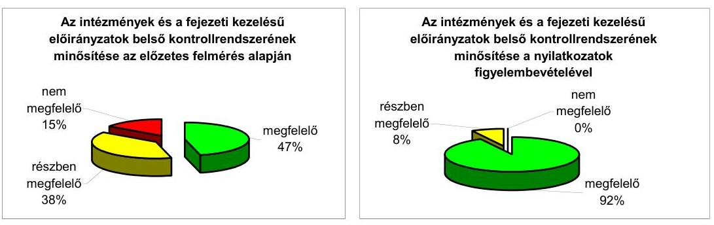

Az intézmények a belső kontrollrendszert érintően megtett, illetve megtenni tervezett intézkedéseik eredményeképpen a belső kontrollok működését közel 100\%-os arányban minősítettük részben vagy egészben megfelelőnek, a korábbi 85\%-kal szemben. ${ }^{21}$ Ezáltal a belső kontrollrendszer elemeinek összesített megfelelősége jelentős javulást mutat 70,9\%-ról 92,9\%-ra növekszik. Ennek elengedhetetlen feltétele, hogy az intézmények elvégezzék a nyilatkozatokban bemutatott intézkedéseikre vonatkozó vállalásokat.

A nyilatkozatok szerint a belső kontrollrendszer elemeinél az alábbi, legjellemzőbb intézkedéseket tették meg, illetve tervezik megtenni az érintett intézmények:

- a kontrollkörnyezet vonatkozásában a belső szabályzatok aktualizálása;
- a kockázatkezelés területén a tevékenységek, folyamatok, műveletek teljesítésének belső kockázatainak - ide értve a csalás, korrupció kockázatát - meghatározása, az értékelések elkészítése és a válaszintézkedések meghozatala;
- a kontrolltevékenységek során a közbeszerzések ellenőrzése területén a kontrollok működését átfogóan támogató eljárások kidolgozása és a kapcsolódó nyomonkövetési listák elkészítése;

[^0]
[^0]:    ${ }^{20} \mathrm{KE}, \mathrm{AB}, \mathrm{AJBH}(\mathrm{OBH}), \mathrm{BIR}, \mathrm{MKU}$, KIM, ME, VM, NGM, MEH, KüM, NFÜ, EMMI (NEFMI), GVH, KSH, ONYF
    ${ }^{21}$ Az eredmények részleteit a 3/b számú melléklet tartalmazza.

---

- az információ és kommunikáció pillér minősítésének javítása érdekében a kommunikációs stratégia, a szabálytalanságok és korrupciógyanú-jelentés kidolgozása;
- a monitoring területén a monitoring stratégia kidolgozása és a belső kontrollrendszer értékelésére irányuló ellenőrzések tervbe vétele.

# 2.3. A belső kontrollrendszer és a belső ellenőrzés kapcsolata 

A belső ellenőrzés a belső kontrollrendszer részét képezi. A belső ellenőrzés támogatja a vezetést a hatékony monitoring megvalósításában, amelynek jogszabályokban rögzített alapvető funkciója, hogy lehetővé tegye a szervezet tevékenységének, a célok megvalósításának nyomon követését.

A belső kontrollrendszer elemei közül az értékelő rendszerünk alapján a monitoring megfelelőségi szintje a legalacsonyabb. A költségvetési szervek közel 40\%-ánál (11 intézmény) „nem megfelelő" a monitoring rendszer kialakítása és közel egyharmaduk (11 intézmény) nem alakított ki monitoring stratégiát. A belső kontrollrendszerek önértékelését az intézmények 42,9\%-a (12 intézmény) nem végezte el, viszont az intézmények 75,0\%-a (21 intézmény) gondoskodott a belső ellenőrzés által feltárt hibák kijavításáról.

A következő grafikonból látható, hogy az értékelés szerint a belső kontrollrendszer és a belső ellenőrzés megfelelősége az intézményeknél korrelációt mutatott a vizsgált évben. Azoknál az intézményeknél, ahol a belső ellenőrzési tevékenység nem működött megfelelően, ott a belső kontrollokban is hiányosságok figyelhetők meg.
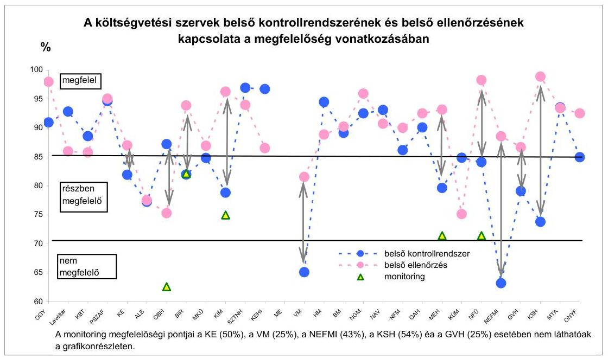

A belső ellenőrzés és a belső kontrollok korrelációját minden intézmény esetében igazolja a grafikon, ugyanis a vizsgált intézmények 85,7\%-ánál 15 százalékpont alatti, 7,1\%-ánál 15 és 20 százalékpont közötti, és mindössze két esetben 25 százalékpont feletti a belső kontrollrendszer és a belső ellenőrzés minő-

---

sítésének %-ban kifejezett különbség értéke. Az OGY, a KBT, a PSZÁF, az MKÜ, az SZTNH, a BM, az NGM, a NAV, az OAH, a MEH és az MTA esetében kifejezetten jól látható a korreláció, mert a belső ellenőrzés és a belső kontrollok minősítésének értékei szinte egybeesnek.

A grafikonban szereplő különbségvonalak (kétvégű nyilak) tíz intézmény (KE, OBH, BIR, KIM, VM, MEH, NFÜ, NEFMI, GVH, KSH) esetében jelzik a belső kontrollrendszer, illetve belső ellenőrzés megfelelőségi százaléka közti különbséget, amennyiben a megfelelőségi szint nem ugyanabba a megfelelőségi tartományba esik. Ezekben az esetekben a korreláció ellenére a belső kontrollrendszer és a belső ellenőrzés minősítése ${ }^{22}$ eltérő értéket kapott, mivel a minősítések értékei más sávhatárok közé estek. A grafikonon feltüntetésre került az adott különbségvonalhoz tartozó monitoring elem megfelelőségi pontja is (háromszögek).

A különbségvonalakkal jelzett eltérések három okra vezethetőek vissza:

- Szabályozottsági és működési hiányosság a belső kontrollrendszer, azon belül a monitoring területén;

A KE és a GVH monitoring rendszert nem alakított ki.
A KIM átfogó, a szervezet egészére vonatkozó monitoring stratégiával nem rendelkezett.

A KSH nem alakította ki és nem működtette a tevékenységével és a szervezeti célok megvalósításával kapcsolatos monitoring rendszerét. A belső ellenőrzés - az ellenőrzésre kijelölt területek esetén - vizsgálta a belső kontrollrendszer kiépítettségét, megfelelőségét, működésének hatékonyságát, eredményességét.

A NEFMI nem alakította ki
 monitoring rendszerét, a belső kontrollrendszerének önértékelését az intézmény vonatkozásában nem végezte el 2011. évben, ugyanakkor a belső ellenőrzési tevékenysége összességében megfelelő minősítést kapott a fejezet költségvetésében jelentős súlyt képviselő szakmai fejezeti kezelésű előirányzatokkal összefüggő ellenőrzéseknek köszönhetően.

- Szabályozottsági és működési hiányosságok a belső kontrollrendszer monitoring pillérén kívüli pillérek területén;

A MEH esetében az eltérést a kockázatkezelés hiányosságai okozták. A hivatal működtetett kockázatkezelési rendszert, a költségvetési szerv tevékenységében, gazdálkodásában rejlő kockázatok felmérése megtörtént, azonban azokat nem értékelte és sorolta kategóriákba, az elfogadható kockázati szintet, illetve a kockázati reakciókat nem határozta meg. A hivatal a kockázatokra adható válaszok

[^0]
[^0]:    ${ }^{22}$ A belső ellenőrzés értékelésére két szinten - a belső kontrollrendszer értékelése keretében és önálló elemként - került sor. A belső ellenőrzés - mint a belső kontrollrendszer része - nem képvisel a belső kontrollrendszeren belül önálló elemet, az a monitoring rendszer része. A belső ellenőrzés a belső kontrollrendszer értékelése keretében alapvetően a kontrollrendszer vizsgálatára irányuló tevékenysége kapcsán került minősítésre. A belső ellenőrzés támogatja a belső kontrollrendszer működésének monitoringját, amelynek kiemelt feladatai közé tartozik a belső kontroll keretrendszer fejlesztésének segítése.

---

(válaszintézkedések) megvalósíthatóságát nem mérlegelte, a válaszintézkedéseket nem építette be a folyamatokba, a kockázati környezetet a beszámolási év során nem vizsgálta felül, a kockázatokat nem tartotta nyilván. A hivatal kockázatkezelési eljárásrenddel nem rendelkezett.

A ME esetében hiányosság, hogy a szabályozási kötelezettség a belső kontrollrendszer kockázatkezelés elemére nem teljesült, továbbá nem volt ellenőrzési nyomvonal, belső ellenőrzési kézikönyv.

- Szabályozottsági és működési hiányosságok a belső ellenőrzés területén.

A ME-nél belső ellenőrzési szervezeti egység, belső ellenőr az ellenőrzött időszakban nem volt, így a belső ellenőrzési tevékenység nem működött.

A felmérés eredményei megerősítik, hogy a belső ellenőrzést végző szervezeti egységeknek - a jogszabályi előírásoknak való megfelelés érdekében - a pénzügyi kontrollok szabályos működésének ellenőrzése mellett egyre nagyobb hangsúllyal szükséges ellenőriznie a szervezet kockázatkezelésére, a működés gazdaságosságára, hatékonyságára, eredményességére, valamint a pénzügyi jelentések megbízhatóságára vonatkozó kontrolltevékenységeket is.

A belső ellenőrzés az intézmények 78,6%-ánál (22) vizsgálta és értékelte a belső kontrollrendszer kialakítását, megfelelőségét, 71,4%-ánál (20) a belső kontrollrendszer működésének gazdaságosságát, hatékonyságát, eredményességét, illetve 75,0%-ánál (21) intézkedett a költségvetési szerv a belső ellenőrzés által feltárt belső kontrollrendszert érintő hibák kijavításáról.

A vizsgált intézmények 60,7%-ánál (17) nem végeztek informatikai rendszerellenőrzést, közel 50,0%-ánál (13) az éves költségvetési beszámolókra vonatkozó megbízhatósági ellenőrzést, 17,9%-ánál (5) rendszer- és teljesítményellenőrzést.

# 3. Az ÁSZ korábbi ellenőrzési javaslatai alapján készített intézkedési tervek végrehajtása, hasznosulása 

Az ÁSZ zárszámadási ellenőrzéseiben megtett megállapítások, javaslatok minden esetben - még ha nem is konkrétan nevesítve - a belső kontrollrendszerek hiányosságaira vezethetőek vissza. Ennek következtében a 2010. évi költségvetés végrehajtásának ellenőrzése kapcsán megtett javaslataink hasznosulása érdekében a költségvetési szerveknél tett intézkedéseket és azok minősítését a Magyar Köztársaság 2011. évi költségvetése végrehajtásának ellenőrzéséről szóló ÁSZ Jelentés B.4. Utóellenőrzés pontja és 8. számú melléklete tartalmazza részletesen.

Budapest, 2012.
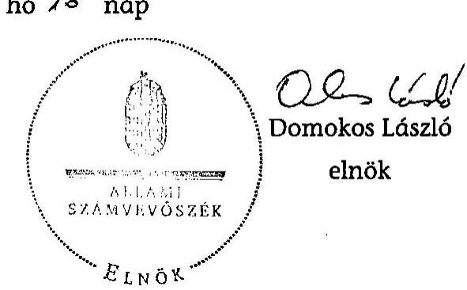

---

Mellékletek

---

# A belső kontrollrendszer és a belső ellenőrzés működésének értékelésére irányuló korábbi ÁSZ vizsgálatok 

Az elmúlt tíz esztendő során az ÁSZ a belső kontrollok működésével kapcsolatban folyamatosan végzett ellenőrzéseket.

Az ellenőrzési feladatok elvégzését - külön az intézményekre és a fejezeti kezelésű előirányzatokra vonatkozóan - munkalapok és ahhoz kapcsolódó értékelő rendszer támogatta.

Az ÁSZ első alkalommal 2001. év során végzett felmérést a központi költségvetés 20 fejezetére és azon belül 651 költségvetési intézményre kiterjedően - ebből 40 intézménynél helyszíni ellenőrzés keretében - annak érdekében, hogy a belső kontrollmechanizmusok ${ }^{1}$ működéséről és az azokban rejlő kockázatokról, illetve mértékükről képet kapjon. Az ellenőrzési feladatok elvégzéséről önálló jelentés készült. ${ }^{2}$

Az intézményi belső kontrollmechanizmusok értékeléséhez a központi költségvetési fejezetek önállóan gazdálkodó költségvetési intézményeinél végzett teljes körű felmérés alapján hét terület adatainak értékelésével nyertünk információkat a kontrollokban rejlő kockázatok mértékéről.

A hét terület - az intézmény tevékenységének szabályozottsága, a kincstári adatszolgáltatáshoz kapcsolódó ellenőrzés, a függetlenített belső ellenőrzés működése, a számviteli rendszer szabályozottsága, a számviteli rendszer informatikai támogatottsága, az informatikai környezet szabályozottsága, az informatikai rendszer működése - a költségvetési beszámoló megbízhatósága szempontjából fontosnak ítélt elemeket foglalta magában.

Az elmúlt tíz esztendő során, összefüggésben a jogszabályi környezet változásaival és a vizsgálatok során szerzett tapasztalatokkal - az alapelvek változatlanul hagyása mellett - folyamatosan módosításokat hajtottunk végre a munkalapokon. Ennek során - eltérő mértékben - megváltoztak a munkalapok struktúrái, bővültek, illetve cserélődtek a kérdések, több esetben módosultak a kérdésekhez kapcsolódó kockázati pontok, továbbá változott az egyes munkalapok súlyozása is.

Az intézmények belső kontrollmechanizmusaira irányuló 2001. évi felmérés eredményei alapján a felmérés körébe vont 651 intézmény 22%-ánál alacsony, 50%-ánál közepes és 28%-ánál magas kockázatot hordoztak a belső kontrollrendszer kiépítettségének hiányosságai a költségvetési beszámolók megbízhatósága szempontjából.

A belső kontrollmechanizmusok elemei közül alacsony kockázatot képviselt a kincstári adatszolgáltatáshoz kapcsolódó ellenőrzés, a számviteli tevékenység szabályozottsága, a számviteli rendszer informatikai támogatottsága. Közepes

[^0]
[^0]:    ${ }^{1}$ Belső kontroll mechanizmusok alatt értjük a kiépített és működő irányítási, szabályozási rendszereket, továbbá azok környezetét és a kontroll eljárásokat.
    ${ }^{2}$ Jelentés a központi költségvetés területén működő belső kontrollmechanizmusok ellenőrzéséről V-15-235/2000-01.

---

kockázatú terület volt az intézmény szabályozottsága. Magas kockázatú területként a függetlenített belső ellenőrzés, az informatikai rendszer működése és az informatikai környezet szabályozottsága emelhető ki.

A függetlenített belső ellenőrzés működése 229, az informatikai rendszer működése 366 intézménynél, míg az informatikai környezet szabályozottsága 310 intézménynél volt magas kockázatú.

A megállapításokkal összefüggésben az ÁSZ 2001-ben javaslatokat tett a Kormánynak, a fejezetek felügyeletét ellátó szervek vezetőinek és a helyszínen ellenőrzött intézmények vezetőinek.

A költségvetési szervek vezetői számára javasolta az ÁSZ, hogy tekintsék át az intézményi belső kontrollmechanizmusok működését a kockázatok minimalizálása érdekében és tegyék meg a szükséges belső szabályozási intézkedéseket, továbbá gondoskodjanak a belső kontrollrendszer folyamatos működését biztosító szervezeti és személyi feltételek megteremtéséről.

Az ezt követő években 2002-től a Magyar Köztársaság mindenkori költségvetése végrehajtásának ellenőrzéséről készült jelentésekben az ÁSZ külön pontban értékelte a zárszámadás ellenőrzésébe bevont központi költségvetési szervek és a fejezeti kezelésű előirányzatok belső kontrollmechanizmusok kockázatait.

A 2009. és a 2010. évi zárszámadás során a belső kontrollrendszerekről megállapítottuk, hogy összehangolt kiépítésük, következetes és folyamatos működésük ellenőrzésünk során feltárt - hiányosságai miatt nem szolgáltak eredményes eszközként az elemi beszámolók megbízhatóságát befolyásoló kockázatok mérsékléséhez, a hibák, szabálytalanságok előfordulásának kiküszöböléséhez. Ugyanakkor a belső ellenőrzés vizsgálatai, értékelései és javaslatai révén - feladat ellátásának hiányosságai következtében - nem támogatta teljes körűen a belső kontroll folyamatok eredményességét, az elszámoltathatóságot, így csak korlátozott mértékben járult hozzá a kontrollkockázatok mérsékléséhez.

---

# Az értékelések elvégzését támogató munkalapok kitöltésének technológiai leírása 

A központi költségvetési szervek belső kontrollrendszere és a belső ellenőrzése vizsgálatának végrehajtását munkalapok támogatták. A munkalapok két típusú - eldöntendő és „értékelő skála" típusú - kérdéseket tartalmaztak.

A belső kontrollrendszert értékelő munkalapok kitöltése során az alapvető vizsgálati eljárásokat (közvetlen részletes vizsgálat) alkalmaztuk, mely eljárások közül a megfigyelést, az információkérést és az elemző eljárásokat használtuk. Az ellenőrzési bizonyíték jellege az eldöntendő kérdések esetében dokumentált volt, míg az „értékelő skála" kérdések megválaszolásánál a dokumentált ellenőrzési bizonyíték mellett - kis mértékben - alkalmazásra került a szóbeli bizonyíték is, amelynek megbízhatóságát - a vizsgálatot végző számvevő döntésétől függően - jegyzőkönyv, illetve tanúsítvány felvételével támasztotta alá.

Az „értékelő skála" típusú kérdések megválaszolása során a számvevők 1-7-ig terjedő skálán minősítették az ellenőrzés során szerzett szakmai tapasztalatok alapján a pillért alkotó elemek vagy részelemek működésének megfelelőségét.

A belső ellenőrzés értékelését támogató munkalapok kitöltésének eljárásrendje hasonlóképpen történt.

## A belső kontrollrendszer egyes pillérei és a belső ellenőrzés értékelése:

A belső kontrollrendszer, azok pillérei (kontrollkörnyezet, kockázatkezelés, kontrolltevékenység, információ és kommunikáció, monitoring) és a belső ellenőrzés minősítését felmérő munkalapokba integrált értékelő rendszer támogatásával történt. A minősítés eredménye „megfelelő", „részben megfelelő" vagy „nem megfelelő" lehetett.

Az eldöntendő és az „értékelő skála" kérdésekhez megfelelőségi pontokat rendeltünk. A munkalapok kérdéseire adott válaszok függvényében a belső kontrollrendszert felépítő öt pillér, illetve a pilléreket alkotó elemek, összesített megfelelőségi pontokat kaptak. A megfelelőségi pontokat a felmérő munkalapokba integrált értékelő rendszer, részben az eldöntendő kérdésekre adott válaszok, részben a számvevő szakmai tapasztalatai az „értékelő skála" típusú kérdések alapján számolta ki.

Az értékelő rendszer kiszámította az eldöntendő kérdésekre adott válaszok alapján a pilléreket alkotó elemek megszerzett és megszerezhető megfelelőségi pontjai százalékban kifejezett arányát és a számvevő szakmai tapasztalatai alapján az „értékelő skála" típusú kérdésekre adott válaszok után kapott megfelelőségi pontok számának, a maximum 7 megfelelőségi ponthoz viszonyított százalékos arányát. A két jellemző százalék egyszerű számtani átlaga mutatja meg, hogy milyen mértékben feleltek meg a kontrollrendszer pilléreit alkotó elemek a 100%-ot jelentő kritériumnak. A megfelelőség százalékát meghatározó mutató alapján az értékelő rendszer elvégezte a kontrollrendszer pilléreit alkotó elemek és a pillérek kategóriába történő besorolását a következők szerint:

---

- amennyiben a megfelelőség százaléka elérte a 85%-os mértéket, a belső kontrollrendszer adott pillére/pillérét alkotó adott elemének minősítése „megfelelő";
- amennyiben a megfelelőség százaléka elérte a 70%-os mértéket, a belső kontrollrendszer adott pillére/pillérét alkotó adott elemének minősítése „részben megfelelő";
- amennyiben a megfelelőség százaléka nem érte el a 70%-os mértéket, a belső kontrollrendszer adott pillére/pillérét alkotó adott elemének minősítése „nem megfelelő".

A belső kontrollrendszer egyes pillérei (ideértve a belső ellenőrzés területét is) esetében a legalább "részben megfelelő" minősítés elérésének lényeges feltétele, hogy a megfelelőség legalább 70%-os, míg a "megfelelő" minősítés elérésének lényeges feltétele, hogy a megfelelőség legalább 85%-os legyen.

A minősítés eredménye megjelent a pilléreket minősítő munkalapokon és a belső ellenőrzést minősítő munkalapon.

# A belső kontrollrendszer összevont értékelése 

A belső kontrollrendszer összevont értékelése a belső kontrollrendszer öt pillérének együttes minősítése alapján történt. Az összevont értékelés elve hasonló volt, mint az egyes pillérek értékelésére vonatkozó elv.

A belső kontrollrendszer összevont értékelése során is a legalább "részben megfelelő" minősítés elérésének lényeges feltétele, hogy a minősítő pontok százalékos aránya legalább 70%, míg a "megfelelő" minősítés elérésének lényeges feltétele, hogy a minősítő pontok százalékos aránya legalább 85% legyen.

Az értékelés végső eredménye a kitöltést követően megjelent az értékelő táblázatban.

---

|  Ssz. | Rendszer elemek | OGY | Levéltár | KBT | PSZÁF | KE | AB | OBH | BIR (OITH) | MKÚ | KIM
igazgatása | SZTNH | KEHI | ME | VM
igazgatása  |
| --- | --- | --- | --- | --- | --- | --- | --- | --- | --- | --- | --- | --- | --- | --- | --- |
|  1 | Kontrollkörnyezet | megfelelő | megfelelő | megfelelő | megfelelő

 | megfelelő | megfelelő | megfelelő | megfelelő | megfelelő | megfelelő | megfelelő | megfelelő | megfelelő | megfelelő  |
|  2 | Kockázatkezelés | megfelelő | megfelelő | részben megfelelő | megfelelő | részben megfelelő | nem megfelelő | nem megfelelő | nem megfelelő | nem megfelelő | nem megfelelő | nem megfelelő | nem megfelelő | megfelelő | megfelelő | nem megfelelő | nem megfelelő |  |
|  3 | Kontrolltevékenységek | megfelelő | megfelelő | megfelelő | megfelelő | megfelelő | részben megfelelő | megfelelő | részben megfelelő | megfelelő | megfelelő | megfelelő | megfelelő | megfelelő | részben megfelelő | nem megfelelő | nem megfelelő  |
|  4 | Információ és kommunikáció | megfelelő | megfelelő | megfelelő | megfelelő | megfelelő | megfelelő | megfelelő | megfelelő | megfelelő | nem megfelelő | megfelelő | megfelelő | megfelelő | részben megfelelő  |
|  5 | Monitoring | megfelelő | megfelelő | részben megfelelő | megfelelő | nem megfelelő | nem megfelelő | nem megfelelő | nem megfelelő | részben megfelelő | nem megfelelő | részben megfelelő | részben megfelelő | megfelelő | nem megfelelő | nem megfelelő  |
|  ÖSSZE | VONT ÉRTÉKELÉS | megfelelő | megfelelő | megfelelő | megfelelő | részben megfelelő | részben megfelelő | részben megfelelő | részben megfelelő | részben megfelelő | részben megfelelő | részben megfelelő | részben megfelelő | részben megfelelő |  |  |  |   |

|  Ssz. | Rendszer elemek | HM igazgatása | BM igazgatása | NGM igazgatása | NAV | NFM igazgatása | OAH | MEH | KÜM igazgatása | NFÜ | NEFMI igazgatása | GVH | KSH | MTA | ONYF  |
| --- | --- | --- | --- | --- | --- | --- | --- | --- | --- | --- | --- | --- | --- | --- | --- |
|  1 | Kontrollkörnyezet | megfelelő | megfelelő | megfelelő | megfelelő | megfelelő | megfelelő | megfelelő | megfelelő |  | részben megfelelő | részben megfelelő |  |  |   |
|  2 | Kockázatkezelés |  |  |  |  |  |  |  |  |  |  |  |  |  |   |
|  3 | Kontrolltevékenységek |  |  |  |  |  |  |  |  |  |  |  |  |  |   |
|  4 | Információ és kommunikáció |  |  |  |  |  |  |  |  |  |  |  |  |  |   |
|  5 | Monitoring |  |  |  |  |  |  |  |  |  |  |  |  |  |   |
|  ÖSSZE | VONT ÉRTÉKELÉS |  |  |  |  |  |  |  |  |  |  |  |  |  |   |

---

|  Ssz. | Rendszer elemek | OGY | Levéltár | KBT | PSZÁF | KE | AB | OBH | BIR (OITH) | MKÜ | KIM igazgatása | SZTNH | KEHI | ME | VM igazgatása  |
| --- | --- | --- | --- | --- | --- | --- | --- | --- | --- | --- | --- | --- | --- | --- | --- |
|  1 | Szervezet, szabályozottság | megfelelő | megfelelő | megfelelő | megfelelő | megfelelő | megfelelő | részben megfelelő | megfelelő | megfelelő | megfelelő | megfelelő | megfelelő | nem megfelelő | megfelelő  |
|  2 | Felügyelet, függetlenség | megfelelő | megfelelő | megfelelő | megfelelő | megfelelő | megfelelő | megfelelő | megfelelő | megfelelő | megfelelő | megfelelő | megfelelő | nem megfelelő | részben megfelelő  |
|  3 | A belső ellenőrzés szakmai felkészültsége | megfelelő | megfelelő | megfelelő | megfelelő | megfelelő | megfelelő | megfelelő | megfelelő | megfelelő | megfelelő | megfelelő | megfelelő | nem megfelelő  |
|  4 | Az ellenőrzés tervezése | megfelelő | megfelelő | megfelelő | megfelelő | megfelelő | részben megfelelő | részben megfelelő | megfelelő |  |  |  |  |  |   |
|  5 | A belső ellenőrzés feladata |  |  |  |  |  |  |  |  |  |  |  |  |  |   |
|  6 | Végrehajtás, dokumentálás |  |  |  |  |  |  |  |  |  |  |  |  |  |   |
|  7 | Jelentéskészítés |  |  |  |  |  |  |  |  |  |  |  |  |  |   |
|  8 | Nyomonkövetés |  |  |  |  |  |  |  |  |  |  |  |  |  |   |
|   | ÖSSZEVONT ÉRTÉKELÉS |  |  |  |  |  |  |  |  |  |  |  |  |  |   |

|  Ssz. | Rendszer elemek | HM igazgatása | BM igazgatása | NGM igazgatása | NAV | NFM igazgatása | OAH | MEH | KÜM igazgatása | NFÜ | NEPMI igazgatása | GVH | KSH | MTA | ONYF  |
| --- | --- | --- | --- | --- | --- | --- | --- | --- | --- | --- | --- | --- | --- | --- | --- |
|  1 | Szervezet, szabályozottság |  |  |  |  |  |  |  |  |  |  |  |  |  |   |
|  2 | Felügyelet, függetlenség |  |  |  |  |  |  |  |  |  |  |  |  |  |   |
|  3 | A belső ellenőrzés szakmai felkészültsége |  |  |  |  |  |  |  |  |  |  |  |  |  |   |
|  4 | Az ellenőrzés tervezése |  |  |  |  |  |  |  |  |  |  |  |  |  |   |
|  5 | A belső ellenőrzés feladata |  |  |  |  |  |  |  |  |  |  |  |  |  |   |
|  6 | Végrehajtás, dokumentálás |  |  |  |  |  |  |  |  |  |  |  |  |  |   |
|  7 | Jelentéskészítés |  |  |  |  |  |  |  |  |  |  |  |  |  |   |
|  8 | Nyomonkövetés |  |  |  |  |  |  |  |  |  |  |  |  |  |   |
|   | ÖSSZEVONT ÉRTÉKELÉS |  |  |  |  |  |  |  |  |  |  |  |  |  |   |

|  Ssz. | Rendszer elemek | HM igazgatása | BM igazgatása | NGM igazgatása | NAV | NFM igazgatása | OAH | MEH | KÜM igazgatása | NFÜ | NEPMI igazgatása | GVH | KSH | MTA | ONYF  |
| --- | --- | --- | --- | --- | --- | --- | --- | --- | --- | --- | --- | --- | --- | --- | --- |
|  1 | Szervezet, szabályozottság |  |  |  |  |  |  |  |  |  |  |  |  |  |   |
|  2 | Felügyelet, függetlenség |  |  |  |  |  |  |  |  |  |  |  |  |  |   |
|  3 | A belső ellenőrzés szakmai felkészültsége |  |  |  |  |  |  |  |  |  |  |  |  |  |   |
|  4 | Az ellenőrzés tervezése |  |  |  |  |  |  |  |  |  |  |  |  |  |   |
|  5 | A belső ellenőrzés feladata |  |  |  |  |  |  |  |  |  |  |  |  |  |   |
|  6 | Végrehajtás, dokumentálás |  |  |  |  |  |  |  |  |  |  |  |  |  |   |
|  7 | Jelentéskészítés |  |  |  |  |  |  |  |  |  |  |  |  |  |   |
|  8 | Nyomonkövetés |  |  |  |  |  |  |  |  |  |  |  |  |  |   |

 |  |  |  |  |  |  |   |
|   | ÖSSZEVONT ÉRTÉKELÉS |  |  |  |  |  |  |  |  |  |  |  |  |  |   |

|  Ssz. | Rendszer elemek | HM igazgatása | BM igazgatása | NGM igazgatása | NAV | NFM igazgatása | OAH | MEH | KÜM igazgatása | NFÜ | NEPMI igazgatása | GVH | KSH | MTA | ONYF  |
| --- | --- | --- | --- | --- | --- | --- | --- | --- | --- | --- | --- | --- | --- | --- | --- |
|  1 | Szervezet, szabályozottság |  |  |  |  |  |  |  |  |  |  |  |  |  |   |
|  2 | Felügyelet, függetlenség |  |  |  |  |  |  |  |  |  |  |  |  |  |   |
|  3 | A belső ellenőrzés szakmai felkészültsége |  |  |  |  |  |  |  |  |  |  |  |  |  |   |
|  4 | Az ellenőrzés tervezése |  |  |  |  |  |  |  |  |  |  |  |  |  |   |
|  5 | A belső ellenőrzés feladata |  |  |  |  |  |  |  |  |  |  |  |  |  |   |
|  6 | Végrehajtás, dokumentálás |  |  |  |  |  |  |  |  |  |  |  |  |  |   |
|  7 | Jelentéskészítés |  |  |  |  |  |  |  |  |  |  |  |  |  |   |
|  8 | Nyomonkövetés |  |  |  |  |  |  |  |  |  |  |  |  |  |   |
|   | ÖSSZEVONT ÉRTÉKELÉS |  |  |  |  |  |  |  |  |  |  |  |  |  |   |

---

|  Ssz. | Rendszer elemek | KIM | ME | VM | HM | BM | NGM | NFM | KÜM | UF | NEFMI | MTA  |
| --- | --- | --- | --- | --- | --- | --- | --- | --- | --- | --- | --- | --- |
|  1 | Kontrollkörnyezet | megfelelő | megfelelő | megfelelő | megfelelő | megfelelő | megfelelő | megfelelő | megfelelő | részben megfelelő | részben megfelelő | megfelelő  |
|  2 | Kockázatkezelés | nem megfelelő | nem megfelelő | részben megfelelő | megfelelő | megfelelő | részben megfelelő | megfelelő | megfelelő | nem megfelelő | nem megfelelő | megfelelő  |
|  3 | Kontrolltevékenységek | megfelelő | megfelelő | nem megfelelő | megfelelő | megfelelő | megfelelő | megfelelő | részben megfelelő | nem megfelelő | részben megfelelő | megfelelő  |
|  4 | Információ és kommunikáció | megfelelő | megfelelő | részben megfelelő | megfelelő | megfelelő | megfelelő | megfelelő | megfelelő | nem megfelelő | részben megfelelő | megfelelő  |
|  5 | Monitoring | megfelelő | nem megfelelő | nem megfelelő | részben megfelelő | megfelelő | nem megfelelő | megfelelő | részben megfelelő | nem megfelelő | nem megfelelő | megfelelő  |
|  ÖSSZEVONT ÉRTÉKELÉS |  | részben megfelelő | nem megfelelő | részben megfelelő |  |  |  |  |  |  |  |   |

---

|  Ssz. | Rendszer elemek | OGY | Leváltár | KBT | PSZÁF | KE | AB | AJBH (OBH) | BIR | MKÜ | KIM igazgatása | SZTNH | KEHI | ME | VM igazgatása  |
| --- | --- | --- | --- | --- | --- | --- | --- | --- | --- | --- | --- | --- | --- | --- | --- |
|  1 | Kontrollkörnyezet | megfelelő | megfelelő | megfelelő | megfelelő | megfelelő | megfelelő | megfelelő | megfelelő | megfelelő | megfelelő | megfelelő | megfelelő |  |   |
|  2 | Kockázatkezelés | megfelelő | megfelelő | részben megfelelő | megfelelő | megfelelő | megfelelő | részben megfelelő | részben megfelelő | megfelelő | megfelelő | megfelelő | megfelelő |  | részben megfelelő  |
|  3 | Kontrolltevékenységek | megfelelő | megfelelő | megfelelő | megfelelő | megfelelő | megfelelő | megfelelő | megfelelő | megfelelő | megfelelő |  |  |  | részben megfelelő  |
|  4 | Információ és kommunikáció | megfelelő | megfelelő | megfelelő | megfelelő | megfelelő | megfelelő | megfelelő | megfelelő | megfelelő | megfelelő |  |  |  | megfelelő  |
|  5 | Monitoring | megfelelő | megfelelő | részben megfelelő |  |  |  |  |  |  |  |  |  |  |   |
|   | ÖSSZEVONT ÉRTÉKELÉS |  |  |  |  |  |  |  |  |  |  |  |  |  |   |

|  Ssz. | Rendszer elemek | HM igazgatása | BM igazgatása | NGM igazgatása | NAV | NFM igazgatása | OAH | MEH | KÜM igazgatása | NFÜ | EMMI (NEFMI) igazgatása | GVH | KSH | MTA | ONYF  |
| --- | --- | --- | --- | --- | --- | --- | --- | --- | --- | --- | --- | --- | --- | --- | --- |
|  1 | Kontrollkörnyezet | megfelelő | megfelelő | megfelelő |  |  |  |  |  |  |  |  |  |  |   |
|  2 | Kockázatkezelés |  |  |  |  |  |  |  |  |  |  |  |  |  |   |
|  3 | Kontrolltevékenységek |  |  |  |  |  |  |  |  |  |  |  |  |  |   |
|  4 | Információ és kommunikáció |  |  |  |  |  |  |  |  |  |  |  |  |  |   |
|  5 | Monitoring |  |  |  |  |  |  |  |  |  |  |  |  |  |   |
|   | ÖSSZEVONT ÉRTÉKELÉS |  |  |  |  |  |  |  |  |  |  |  |  |  |   |

|  Ssz. | Rendszer elemek | HM igazgatása | BM igazgatása | NGM igazgatása | NAV | NFM igazgatása | OAH | MEH | KÜM igazgatása | NFÜ | EMMI (NEFMI) igazgatása | GVH | KSH | MTA | ONYF  |
| --- | --- | --- | --- | --- | --- | --- | --- | --- | --- | --- | --- | --- | --- | --- | --- |
|  1 | Kontrollkörnyezet |  |  |  |  |  |  |  |  |  |  |  |  |  |   |
|  2 | Kockázatkezelés |  |  |  |  |  |  |  |  |  |  |  |  |  |   |
|  3 | Kontrolltevékenységek |  |  |  |  |  |  |  |  |  |  |  |  |  |   |
|  4 | Információ és kommunikáció |  |  |  |  |  |  |  |  |  |  |  |  |  |   |
|  5 | Monitoring |  |  |  |  |  |  |  |  |  |  |  |  |  |   |
|   | ÖSSZEVONT ÉRTÉKELÉS |  |  |  |  |  |  |  |  |  |  |  |  |  |   |

---

|  Ssz. | Rendszer elemek | OGY | Leváltár | KBT | PSZÁF | KE | AB | AJBH (OBH) | BIR | MKÜ | KIM igazgatása | SZTNH | KEHI | ME | VM igazgatása  |
| --- | --- | --- | --- | --- | --- | --- | --- | --- | --- | --- | --- | --- | --- | --- | --- |
|  1 | Szervezet, szabályozottság | megfelelő | megfelelő | megfelelő | megfelelő | megfelelő | megfelelő | részben megfelelő | megfelelő | megfelelő | megfelelő | megfelelő | megfelelő | nem megfelelő | megfelelő |

  |
|  2 | Felügyelet, függetlenség | megfelelő | megfelelő | megfelelő | megfelelő | megfelelő | megfelelő | megfelelő | megfelelő | megfelelő | megfelelő | megfelelő | megfelelő | nem
megfelelő | részben
megfelelő  |
|  3 | A belső ellenőrzés szakmai
felkészültsége | megfelelő | megfelelő | megfelelő | megfelelő | megfelelő | megfelelő | megfelelő | megfelelő | megfelelő | megfelelő | megfelelő | megfelelő | nem
megfelelő | megfelelő  |
|  4 | Az ellenőrzés tervezése | megfelelő | megfelelő | megfelelő | megfelelő | megfelelő | részben
megfelelő | részben
megfelelő | megfelelő | megfelelő | megfelelő | megfelelő | megfelelő | nem
megfelelő | megfelelő  |
|  5 | A belső ellenőrzés feladata | megfelelő | részben
megfelelő | megfelelő | megfelelő | részben
megfelelő | nem
megfelelő | részben
megfelelő | megfelelő | nem
megfelelő | részben
megfelelő | megfelelő | részben
megfelelő | nem
megfelelő | részben
megfelelő  |
|  6 | Végrehajtás, dokumentálás | megfelelő | részben
megfelelő | megfelelő | megfelelő | részben
megfelelő | nem
megfelelő | nem
megfelelő | megfelelő | megfelelő | megfelelő | megfelelő | részben
megfelelő | nem
megfelelő | részben
megfelelő  |
|  7 | Jelentéskészítés | megfelelő | megfelelő | megfelelő | megfelelő | megfelelő | megfelelő | megfelelő | megfelelő | megfelelő | megfelelő | megfelelő | megfelelő | nem
megfelelő | részben
megfelelő  |
|  8 | Nyomonkövetés | megfelelő | megfelelő | nem
megfelelő | megfelelő | megfelelő | részben
megfelelő | részben
megfelelő | megfelelő | megfelelő | megfelelő | megfelelő | megfelelő | nem
megfelelő | megfelelő  |
|  ÖSSZEVONT ÉRTÉKELÉS |  | megfelelő | megfelelő | megfelelő | megfelelő | megfelelő | részben
megfelelő | részben
megfelelő | megfelelő | megfelelő | megfelelő | megfelelő | megfelelő | nem
megfelelő | részben
megfelelő  |

|  Ssz. | Rendszer elemek | HM igazgatása | BM igazgatása | NGM igazgatása | NAV | NFM igazgatása | OAH | MEH | KÜM igazgatása | NFÜ | EMM (NEFMI) igazgatása | GVH | KSH | MTA | ONYF  |
| --- | --- | --- | --- | --- | --- | --- | --- | --- | --- | --- | --- | --- | --- | --- | --- |
|  1 | Szervezet, szabályozottság | megfelelő | megfelelő | megfelelő | megfelelő | részben
megfelelő | megfelelő | megfelelő | megfelelő | megfelelő | megfelelő | megfelelő | megfelelő | megfelelő | megfelelő  |
|  2 | Felügyelet, függetlenség | megfelelő | megfelelő | megfelelő | megfelelő | részben
megfelelő | megfelelő | megfelelő | megfelelő | megfelelő | megfelelő | megfelelő | megfelelő | megfelelő | megfelelő  |
|  3 | A belső ellenőrzés szakmai
felkészültsége | megfelelő | megfelelő | megfelelő | megfelelő | megfelelő | megfelelő | megfelelő | megfelelő | megfelelő | megfelelő | megfelelő | megfelelő | megfelelő | megfelelő  |
|  4 | Az ellenőrzés tervezése | megfelelő | részben
megfelelő | megfelelő | részben
megfelelő | megfelelő | megfelelő | megfelelő | megfelelő | részben
megfelelő | megfelelő | megfelelő | megfelelő | megfelelő | megfelelő  |
|  5 | A belső ellenőrzés feladata | részben
megfelelő | részben
megfelelő | megfelelő | megfelelő | megfelelő | megfelelő | megfelelő | nem
megfelelő | megfelelő | részben
megfelelő | részben
megfelelő | megfelelő | megfelelő | megfelelő  |
|  6 | Végrehajtás, dokumentálás | megfelelő | megfelelő | megfelelő | részben
megfelelő | megfelelő | megfelelő | megfelelő | részben
megfelelő | megfelelő | részben
megfelelő | részben
megfelelő | megfelelő | megfelelő | megfelelő  |
|  7 | Jelentéskészítés | megfelelő | megfelelő | megfelelő | megfelelő | megfelelő | megfelelő | megfelelő | megfelelő | részben
megfelelő | megfelelő | megfelelő | megfelelő | megfelelő | megfelelő  |
|  8 | Nyomonkövetés | megfelelő | megfelelő | megfelelő | megfelelő | megfelelő | megfelelő | megfelelő | megfelelő | részben
megfelelő | megfelelő | megfelelő | részben
megfelelő | megfelelő | megfelelő  |
|  ÖSSZEVONT ÉRTÉKELÉS |  | megfelelő | megfelelő | megfelelő | megfelelő | megfelelő | megfelelő | megfelelő | megfelelő | megfelelő | megfelelő | megfelelő | megfelelő | megfelelő |   |

---

|  Ssz. | Rendszer elemek | KIM | ME | VM | HM | BM | NGM | NFM | KÜM | UF | EMMI
(NEFMI) | MTA  |
| --- | --- | --- | --- | --- | --- | --- | --- | --- | --- | --- | --- | --- |
|  1 | Kontrollkörnyezet | megfelelő | megfelelő | megfelelő | megfelelő | megfelelő | megfelelő | megfelelő | megfelelő | megfelelő | megfelelő | megfelelő  |
|  2 | Kockázatkezelés | megfelelő | megfelelő | megfelelő | megfelelő | megfelelő | megfelelő | megfelelő | megfelelő | részben
megfelelő | megfelelő | megfelelő  |
|  3 | Kontrolltevékenységek | megfelelő | megfelelő | részben
megfelelő | megfelelő | megfelelő | megfelelő | megfelelő | részben
megfelelő | nem
megfelelő | megfelelő | megfelelő  |
|  4 | Információ és kommunikáció | megfelelő | megfelelő | megfelelő | megfelelő | megfelelő | megfelelő | megfelelő | megfelelő | nem
megfelelő | megfelelő | megfelelő  |
|  5 | Monitoring | megfelelő | megfelelő | részben
megfelelő | részben
megfelelő | megfelelő | részben
megfelelő | megfelelő | részben
megfelelő | részben
megfelelő | megfelelő | megfelelő  |
|  ÖSSZEVONT ÉRTÉKELÉS |  |  |  |  |  |  |  |  |  |  |  |   |

---

# Az ellenőrzött szervezetek ÁSZ által el nem fogadott észrevételei 

## Honvédelmi Minisztérium

## 1. Megállapítás

A kötelezettségvállalás nyilvántartása vezetési módját teljes körben, a nyilvántartással kapcsolatos egyeztetési feladatokat egy kivétellel (HM), a kötelezettségvállalás nullás számlaosztályban történő nyilvántartásának eljárásrendjét szintén - egy kivételtől (NFM) eltekintve - valamennyi intézmény szabályozta.

## Észrevétel

„A jelentéstervezet 28. oldal utolsó előtti bekezdésében a kötelezettségvállalások nyilvántartásával és a nyilvántartások egyeztetésével kapcsolatos feladatok HM tárcára vonatkozó megállapításainak felülvizsgálata javasolt, ugyanis az államháztartás vitelével kapcsolatos jogszabályok ezirányú szabályozási kötelezettséget a fejezetet irányító szerv részére nem határoznak meg, a kötelezettségvállalások nyilvántartásának egyeztetésére vonatkozóan pedig előírást nem tartalmaznak."

## Az el nem fogadott észrevétel indokolása

A belső kontrollrendszer egyes elemein belül a kontrollok mennyiségének, minőségének meghatározása a költségvetési szerv vezetőjének kötelezettsége, ugyanis a jogszabályok csak egyes elemek kötelezőségét írják elő, a különböző útmutatók és a bennük foglalt standardok pedig javaslatokat tesznek a további elemekre. Ennek következtében a gyakorlati megvalósítás részletei szervezetenként eltérőek lehetnek. A belső kontrollrendszernek a szervezetirányítás elválaszthatatlan eszközeként, magában kell foglalnia mindazon szabályokat, eljárásokat, amelyek segítséget nyújtanak a vezetésnek a célok eléréséhez. A kialakított kontrollok támogatásával a folyamatok kézben tarthatóak, azokra befolyást lehet gyakorolni. A kötelezettségvállalások nyilvántartásának egyeztetése a gazdálkodás megbízhatósága szempontjából megítélésünk szerint meghatározó kontrollpont.

## Külügyminisztérium

## 1. Megállapítás

A jelentéskészítés folyamatát - az ME „nem megfelelő" minősítése mellett - két esetben értékeltük „részben megfelelő"-nek (VM, KÜM), ezekben az esetekben az éves (összefoglaló) ellenőrzési jelentés hiányosságaként merült fel, hogy nem tartalmaztak a belső kontrollrendszer szabályszerűségének, gazdaságosságának, hatékonyságának és eredményességének növelése, javítása érdekében tett javaslatokat.

---

# Észrevétel 

„A jelentéstervezet „részben megfelelő"-nek értékeli (33. oldal utolsó bekezdés) a KÜM belső ellenőrzéseiről szóló éves összefoglaló jelentések készítésének folyamatát. Tény azonban, hogy a KÜM Ellenőrzési Főosztálya minden esetben a hatályos Korm. rendeletek, (193/2003. (XI. 26.), illetve a 370/2011. (XII. 31.)) szerint állítja össze a belső ellenőrzésekről szóló jelentéseit. Az Ellenőrzési Főosztály a KÜM-ben zajló ÁSZ vizsgálatkor az ÁSZ ellenőre részére átadta az általa kért valamennyi háttéranyagot, melyekre a vizsgálat végzéséhez szükség volt."

## Az el nem fogadott észrevétel indokolása

Az éves (összefoglaló) ellenőrzési jelentés a KÜM esetében nem tartalmazta a belső kontrollrendszer szabályszerűségének, gazdaságosságának, hatékonyságának és eredményességének növelése, javítása érdekében tett javaslatokat. Mivel a költségvetési szerv belső ellenőrzésének értékelésénél a belső kontrollrendszerhez való kapcsolódási pontok kiemelt súlyozással szerepeltek, ezért lett a belső ellenőrzés jelentéskészítés pontja „részben megfelelt" minősítésű.

## 2. Megállapítás

A KÜM Igazgatása belső kontrollrendszerének összevont értékelése „részben megfelelő". (Jelentés 3/a. számú melléklete)

## Észrevétel

„Észrevételezzük, hogy a „Belső kontroll felmérés eredménye az intézményeknél" táblázatban a KÜM csak „részben megfelelő" összevont értékelést kapott annak ellenére, hogy az öt felsorolt rendszerelemből négyben volt „megfelelő" és csak egynél „részben megfelelő" a minősítése."

## Az el nem fogadott észrevétel indokolása

A belső kontrollrendszer összevont értékelése a belső kontrollrendszer öt elemének együttes minősítése alapján történt. Az elemek közül a kontrollkörnyezet és a kontrolltevékenységek a meghatározó fontosságuk miatt kétszeres súllyal szerepelnek a minősítésnél. Mivel a KÜM esetében a kontrolltevékenység elem minősítése „részben megfelelő" volt, a minősítéshez kapcsolódó megfelelőségi százalék a belső kontroll értékelő rendszerben kétszeres súllyal szerepelt az összevont értékelésnél, így lett a végső értékelés eredménye is „részben megfelelő".

## Nemzeti Fejlesztési Ügynökség

## 1. Megállapítás

Az NFÜ kivételével valamennyi intézmény rendelkezett a fejezeti kezelésű előirányzatokra vonatkozóan, az Sztv. és az Áhsz. szerint készített megfelelő számviteli politikával és számlarenddel.

---

# Észrevétel 

„A minősítés indoklásával (a számviteli politika „részben megfelelő", mivel lehetővé tette a KSZ-eknek, illetve az MV Zrt-nek teljesített előleg kifizetések „szállítói előleg"-ként történő nyilvántartását, a számlarend „nem megfelelő", mivel lehetővé tette az előző évről áthúzódó szállítói előlegek aktív átfutó elszámolásként történő nyilvántartását) nem értünk egyet.

Az MV Zrt. pénzügyi szolgáltatási tevékenységet végez, a finanszírozási szerződés szerint e tevékenységeinek ellenszolgáltatásaként díjazásra jogosult. Mindezek miatt NFÜ vonatkozásában az MV Zrt. a szolgáltatást nyújtó szállítóként értelmezendő. Ugyanez vonatkozik a KSZ-ekkel kötött SLA megállapodásra is, amiben a rögzített feladatok elvégzéséért díjazásra jogosultak.

A vásárolt szolgáltatások esetében fizetett előleget a számviteli szabályok alapján függő kiadásként kell elszámolni, és nem előlegkövetelésként."

## Az el nem fogadott észrevétel indokolása

Az NFÜ fejezeti kezelésű előirányzatai között nem áll rendelkezésére más forrás, mint támogatás, ezért csak támogatási előleget fizethet, nem pedig „szállítói előleg"-et. A Közreműködő Szervezetek pedig, mint nevük is mutatja, közreműködő tevékenységet folytatnak, nem pedig árut szállítanak, vagy szolgáltatást nyújtanak. Ezért továbbra is fenntartjuk a 2009., 2010., illetve a 2011. évi zárszámadás-ellenőrzés során megfogalmazott megállapításunkat, miszerint az MV Zrt.-nek és a Közreműködő Szervezeteknek történő kifizetéseket nem az átfutó kiadások között kellene nyilvántartani, mint szállítói előleget.

##

 2. Megállapítás

A közbeszerzési szabályzatoknak csak 57,1%-a (16 intézmény) „megfelelő", 32,1%-a (9 intézmény) „részben megfelelő", 10,7%-a (KE, KIM és NFÜ) pedig „nem megfelelő".

Valamennyi közbeszerzési eljárásrend tartalmazta a közbeszerzési eljárásokban közreműködők feladatait, a közbeszerzési eljárás dokumentálási rendjét, a szerződéskötés rendjét és egy kivételtől eltekintve az ajánlatok elbírálására létrehozott bírálóbizottság tagjai kiválasztásának szempontjait, feladatait, döntéshozatali eljárásrendjét, a határozatképesség feltételeit.

Az eljárásrendek 25%-a (7 intézmény) nem tartalmazta a közösségi értékhatárokat elérő közbeszerzések esetén az előzetes, összesített tájékoztató készítési kötelezettségre vonatkozó szabályokat, 39,3%-a (11 intézmény) pedig az ajánlati biztosíték kezelésével, nyilvántartásával, illetőleg visszaadásával kapcsolatos feladatokat. Az intézmények 71,4%-a (20 intézmény) nem alkalmazott részletes, a közbeszerzés teljes folyamatát lefedő, azok ellenőrzését támogató ellenőrzési listákat. Ezt a gyakorlatot nem írja elő jogszabály, de például az uniós támogatások ellenőrzésében ez általános gyakorlat.

Az intézmények fejezeti kezelésű előirányzatokra vonatkozó közbeszerzési szabályzatai közül 10 „megfelelő", egy pedig - az NFÜ - „nem megfelelő" minősítést kapott.

---

Az NFÜ esetében az intézményre és az UF fejezet fejezeti kezelésű előirányzatokra egyaránt vonatkozó közbeszerzési szabályzat nem aktualizált, abban nem szabályozták, hogy egyszerű közbeszerzési eljárás esetén az írásbeli összegzés-készítésnek és az ajánlattevők részére történő megküldési kötelezettségnek ki a felelőse. Ezen túlmenően nem történt meg az ajánlati biztosíték kezelésével, nyilvántartásával, illetőleg visszaadásával kapcsolatos feladatok, illetve az eredményhirdetésről készített jegyzőkönyv elküldési rendjének szabályozása sem.

# Észrevétel 

„A minősítéseket az ellenőrzés azzal indokolja, hogy az NFÜ intézményre és az UF fejezet fejezeti kezelésű előirányzatokra egyaránt vonatkozó közbeszerzési szabályzata nem aktualizált, abban nem szabályozták, hogy egyszerű közbeszerzési eljárás esetén az írásbeli összegzés-készítésnek és az ajánlattevők részére történő megküldési kötelezettségnek ki a felelőse. Ezen túlmenően nem történt meg az ajánlati biztosíték kezelésével, nyilvántartásával, illetőleg visszaadásával kapcsolatos feladatok, illetve az eredményhirdetésről készített jegyzőkönyv elküldése rendjének szabályozása sem.
Az indoklás nem elfogadható, mivel az NFÜ közbeszerzési és beszerzési szabályzatát évente legalább egyszer felülvizsgálja, majd elnöki utasításban kiadja (a 11/2010 (III. 31.) utasítást a 6/2011 (I.26.), majd a 12/2011 (IV. 26.). utasításokkal). A felsorolt hiányosságok nem alapozzák meg a „nem megfelelő" minősítést, legfeljebb a részben megfelelőt.
Ajánlati biztosítékot az NFÜ a közbeszerzéseiben nem alkalmaz, továbbá álláspontunk szerint a Kbt. 59.§-a kimerítően szabályozza az ajánlati biztosíték nyújtásával/visszafizetésével kapcsolatos kötelezettségeket, éppen ezért nem tartottuk szükségesnek az ÁSZ által hiányolt cselekmények szabályzatban való rögzítését. A Kbt. nem írja elő, hogy az eredményhirdetésről (amely nem minden eljárás típusban kötelező) jegyzőkönyvet kellene készíteni, ezért a jegyzőkönyv megküldése rendjének szabályozását sem tartottuk szükségesnek."

## Az el nem fogadott észrevétel indokolása

Az ellenőrzés megkezdésekor az NFÜ által kitöltött kontrolltáblák válaszai a helyszíni ellenőrzés során felülvizsgálatra kerültek. Az észrevételben kifogásoltakat a kontrolltáblák az NFÜ által adott válaszok alapján tartalmazzák.

Az ellenőrzés megállapította azt a közbeszerzési szabályzat aktualizálását követően továbbra is fennálló és már a 2010. évi zárszámadás ellenőrzése során is megállapított hibát, mely szerint az NFÜ intézményre és az UF fejezet fejezeti kezelésű előirányzatokra egyaránt vonatkozó közbeszerzési szabályzatában nem szabályozták, hogy egyszerű közbeszerzési eljárás esetén az írásbeli összegzés-készítésnek és az ajánlattevők részére történő megküldési kötelezettségnek ki a felelőse.

Az ÁSZ a közbeszerzési szabályzat ellenőrzése során a belső kontroll munkalap vonatkozó részében meghatározott Kbt. előírásoknak való megfelelést ellenőrizte. Az NFÜ által kitöltött belső kontroll munkalap válaszaiból kiindulva hiányosságként állapítottuk meg, hogy 2011. évben szintén nem történt meg az ajánlati biztosíték kezelésével, nyilvántartásával, illetőleg visszaadásával kapcsolatos feladatok, illetve az eredményhirdetésről készített jegyzőkönyv elküldési rendjének szabályozása. A helyszíni ellenőrzés lezárását követően az NFÜ nem adott át olyan új ellenőrzési bizonyítékot, amely indokolná az érintett megállapításunk módosítását.

# 3. Megállapítás 

A fejezeti kezelésű előirányzatok vonatkozásában kedvezőbb a helyzet, a kontrollok az UF fejezet fejezeti kezelésű előirányzatok kivételével „megfelelő"-en működtek.

Az UF fejezet fejezeti kezelésű előirányzatainál megállapított hibák a számvitel területén a belső kontrollok, valamint a számvitelt támogató informatikai rendszerekkel kapcsolatos belső kontrollok nem megfelelő működésére vezethetőek vissza. Mindezek következtében a főkönyvi könyvelés és az analitikus nyilvántartás kapcsolata, egyezősége nem volt biztosított, továbbá elmaradt a követelések teljes körű egyeztetése is.

A számvitelt támogató informatikai rendszerekből nyert analitikus nyilvántartások, a főkönyvi kivonat és a beszámolók adatainak egyezőségét rendszerszerűen nem biztosították, amelyre az ÁSZ már a 2010. évi zárszámadás ellenőrzése során is felhívta a figyelmet.

Az UF KEOP, TÁMOP, TIOP, DAOP fejezeti kezelésű előirányzatoknál a könnyített elbírálású, normatív feltételeknek megfelelő, ún. automatikus pályázatokhoz kapcsolódó támogatói okiratokon hiányzott a pénzügyi ellenjegyzés.

Az ellenőrzött GOP pénzforgalmi tételek esetében a kifizetés előtti ellenőrzések rendszere nem teljesen zárt, az ellenőrzés megállapította, hogy az EMIR-ben a specifikáció következtében a másodlagos ellenőrzéseket az elsődleges ellenőrzések lezárását megelőzően is el lehet végezni, illetve az elsődleges ellenőrzés adatait utólagosan módosítani lehet.

## Észrevétel

„Az indoklással és ebből eredően a minősítéssel nem értünk egyet:

- A számvitelt támogató informatikai rendszerekből nyert analitikus nyilvántartásokkal kapcsolatos megállapítást vélhetően az támasztja alá, hogy az EMIR és a FORRÁS SQL rendszer nincs egymással rendszerszintű kapcsolatban (ezt valóban az ÁSZ 2010. évi zárszámadás ellenőrzése során is kifogásolta, azonban a két eltérő logikájú informatikai rendszer közötti közvetlen kapcsolat létrehozása jelentős fejlesztést igényel), ezért az adatok feldolgozását segédtáblák alkalmazásával oldjuk meg. Ez azonban nem jelenti azt, hogy az egyezőség nem biztosított, illetve nem dokumentált. A követelések teljes körű egyeztetése megtörtént.
- A támogatói okirat jogszabályi alapját a 16/2006. (XII. 28.) MeHVM-PM rendelet, a 217/1998. (XII. 30.) Korm. rendelettel összhangban teremtette meg. Az államháztartás működési rendjéről szóló 217/1998. (XII. 30.) Korm. rendelet (régi Ámr.) 2. § 68. pontja szerint, a pályázati felhívás előzetes kötelezettségvállalásnak minősül. A 85. § (9) bekezdése alapján a támogatásról szóló döntés pedig kötelezettségvállalásnak minősül, amely megfeleltethető az ajánlati kötöttségnek/kötelmi kötelezettségnek, azaz a szerződés létrehozására vagy a támogatás kifizetésére vonatkozó kötelezettségnek. A pénzügyi ellenjegyzés a pályázati felhívás megjelentetéséhez szükséges fedezetigazolás kiadásával megtörtént.

- Nem értünk egyet azzal a megállapítással, hogy a „négy szem elve" alapján működő ellenőrzés nem zárt rendszerben működik. Az első és a második ellenőr véleménykülönbségének kezelésére az egymás közti egyeztetés szolgál, illetve az, hogy az elszámolás végleges jóváhagyása előtt az ellenőrző listák módosíthatók, tehát a fenti gyakorlat eljárási szempontból nem kifogásolható. Az elszámolás jóváhagyását (vezetői ellenőrzést) követően nincs módosítási lehetőség sem az elsődleges, sem a másodlagos ellenőr ellenőrzési listájában. A rendszer zártságát nem befolyásolja az adatrögzítések módszere, mivel megállapítható az adatrögzítés időpontja és az azt végző felhasználó. Az egyes adatrögzítések egymáshoz képest történő sorrendisége és ütemezése eljárásrendi kérdés, ami nem befolyásolhatja a rendszer zártságát és az adatok megbízhatóságát. A kontrollt a kitöltött ellenőrző listák, a négy szem elve és a vezetői ellenőrzés megléte és működtetése jelenti az EMIR rendszerben."

# Az el nem fogadott észrevétel indokolása 

A XIX. Uniós fejlesztések fejezet 2011. évi leltározásának végrehajtásáról szóló 37/2011. (XII. 20.) számú Elnöki utasítás melléklete (A XIX. Uniós fejlesztések fejezet 2011. évi leltározási ütemterve) 2. pontjában a leltárfelvétel fordulónapját 2011. december 31-i dátumban, a leltárfelvétel időszakát 2012. január 6-31. közötti időszakban határozták meg. Az Elnöki Utasításban foglaltak szerint a leltárkiértékelés és záró-jegyzőkönyv elkészítésének határideje 2012. február 10., a leltárkülönbözet kivizsgálásának, jegyzőkönyv felvételének határideje 2012. február 17. volt. Az eltérések rendezése könyvviteli nyilvántartásokban való rögzítésére az Utasítás 2012. február 24-i határidőt, az összefoglaló jelentés elkészítésére 2012. február 28-i határidőt jelölt meg.

Az NGM Módszertani Útmutatója szerint minden év végén leltározás alapján kell a követelések állományát megállapítani, majd értékelni, az Áhsz. 37. §-ának (7) bekezdése szerinti mentesítési lehetőség nem alkalmazható. A követelések esetében a leltározást egyeztetéssel kell végrehajtani. A leltározás végrehajtását (az analitikus nyilvántartásokkal egyeztetett) év végi leltárral kell alátámasztani. A leltározás alapján megállapított értéket kell az államháztartási szervezetnek a főkönyvi könyvelésben rögzíteni, majd a Szt., valamint az Áhsz. értékelési szabályai alapján értékelni és a korrigált követelések értékét kell az év végi mérlegben kimutatni.

Az ellenőrzés részére teljességi nyilatkozattal átadott dokumentumok alapján az adósminősítéssel kapcsolatos kimutatás és az NFÜ Fejezeti Főosztály által készített leltárzáró jegyzőkönyv, valamint a HEP IH vezetője által 2012. április 25-én aláírt Záró jegyzőkönyvben foglaltak (melyben tételesen felsorolva szerepel a le nem egyeztetett követelés) alátámasztják az ÁSZ megállapítását. Az előző évi, illetve a tárgyévi előlegek analitikus kimutatása és a főkönyvi kimutatás közötti eltérések rendezése nem történt meg, a megállapításban kifogásolt összegek nincsenek leltárral alátámasztva, mivel ezekben az esetekben nem került sor a követelések év végi egyeztetésére. A beszámolók elkészítését, valamint a főkönyvi könyvelés és az analitikus könyvelés kapcsolatát, egyezőségét biztosító ellenőrzések elmaradása, illetve a megfelelő informatikai támogatás hiánya hozzájárult a beszámolókra adott minősített véleményekhez, így az ÁSZ megállapításait továbbra is fenntartja.

A feltárt hiba összege 1248,4 M Ft, amely az UF fejezet fejezeti kezelésű előirányzatainak 2011. évi felhasználásáról készített összesített beszámoló mérlegfőösszegének 0,2%-a. A 7 Regionális Operatív Program esetében a követelések leírásáról írásos dokumentum nem készült.

A támogatói okiratokkal kapcsolatban a Ptk. XVII. fejezet 199. § alapján „Egyoldalú nyilatkozatból csak a jogszabályban megállapított esetekben keletkezik jogosultság a szolgáltatás követelésére; az egyoldalú nyilatkozatokra - ha a törvény kivételt nem tesz - a szerződésre vonatkozó szabályokat kell megfelelően alkalmazni.". Az önkormányzatok esetében a törvény - 2011. évre vonatkozóan az Áht¹ 23/A. § (4) bekezdése - kivételt tesz, és előírja az NFÜ részére az önkormányzatokkal történő szerződéskötést.

Az Polgári Törvénykönyvről szóló 1959. évi IV. törvény (a továbbiakban Ptk.) 205/B. § (1) bekezdésének előírásai szerint „Az általános szerződési feltétel csak akkor válik a szerződés részévé, ha alkalmazója lehetővé tette, hogy a másik fél annak tartalmát megismerje, és ha azt a másik fél kifejezetten vagy ráutaló magatartással elfogadta." A (2) bekezdésben foglaltak szerint „Külön tájékoztatni kell a másik felet arról az általános szerződési feltételről, amely a szokásos szerződési gyakorlattól, a szerződésre vonatkozó rendelkezésektől lényegesen vagy valamely korábban a felek között alkalmazott kikötéstől eltér. Ilyen feltétel csak akkor válik a szerződés részévé, ha azt a másik fél - a külön, figyelemfelhívó tájékoztatást követően - kifejezetten elfogadta."

Az ÁSZ Jogi Osztálya által a 2010. évi zárszámadás-ellenőrzéshez 2011. július 26-án kiadott állásfoglalás 1. pont 1. bekezdésében foglaltak szerint, amelyet a 2010. évi zárszámadás-ellenőrzés során az NFÜ részére is megküldtünk, a 2011. évre vonatkozóan hatályos Áht¹ 23/A. §-ának (4) bekezdésében foglaltak alapján az önkormányzati kedvezményezettekkel történő szerződéskötés hiánya megalapozottan kifogásolható. A jogszabályi előírásokba ütköző eljárásra az ÁSZ már a 2010. évi zárszámadás ellenőrzése során is felhívta a figyelmet.

# 4. Megállapítás 

Az ellenőrzött GOP pénzforgalmi tételek esetében a kifizetés előtti ellenőrzések rendszere nem
 teljesen zárt, az ellenőrzés megállapította, hogy az EMIR-ben a specifikáció következtében a másodlagos ellenőrzéseket az elsődleges ellenőrzések lezárását megelőzően is el lehet végezni, illetve az elsődleges ellenőrzés adatait utólagosan módosítani lehet.

## Észrevétel

„Mint azt korábbi észrevételeinkben is jeleztük, a rendszer zárt, a korábbi ellenőrzések eredményei nem vesznek el, a másodlagos ellenőrzés célja, hogy feltárja az elsődleges ellenőrzés hibáit. Amennyiben az esetleges hibák nem lennének korrigálhatóak, nem lenne értelme a másodlagos ellenőrzés elvégzésének. Kérjük törölni."

---

# Az el nem fogadott észrevétel indokolása 

A négy szem elve alapján működő felülvizsgálat nem indokolja az elsődleges ellenőrzés utólagos módosítását. Nem elfogadható, hogy az elsődleges ellenőrzés eredménye a másodlagos ellenőrzés elvégzését követően módosítható legyen. Az eljárásrend - és ezzel párhuzamosan az EMIR specifikáció - módosítására van szükség a tekintetben, hogy a másodlagos ellenőrzés megkezdését követően az elsődleges ellenőrzés adatait ne lehessen módosítani.

## 5. Megállapítás

A fejezeti kezelésű előirányzatok vonatkozásában valamivel kedvezőtlenebb a helyzet. A kontrollok 81,8%-os mértékben (9 fejezet) „megfelelően”, a VM és az NFÜ esetében azonban nem megfelelően működtek.

Az UF fejezet fejezeti kezelésű előirányzatainál a főkönyvi kivonat és az analitikus nyilvántartás egyezőségét támogató belső kontrollok nem megfelelően működtek a számvitel területén, ezáltal nem volt biztosított a KEOP, TÁMOP, TIOP, INTERREG, ETE beszámolókban szerepeltetett adatok analitikus nyilvántartásokkal történő, teljes körű alátámasztása. A 7 ROP esetében a számviteli kontrollok nem megfelelően működtek, mert a követelések leírásáról írásos dokumentum nem készült.

## Észrevétel

„A fenti megállapítást megalapozó, a 37. oldal 1. bekezdésében foglaltakat, mely szerint „Az UF fejezet fejezeti kezelésű előirányzatainál a főkönyvi kivonat és az analitikus nyilvántartás egyezőségét támogató belső kontrollok nem megfelelően működtek a számvitel területén, ezáltal nem volt biztosított a KEOP, TÁMOP, TIOP, INTERREG, ETE beszámolókban szerepeltetett adatok analitikus nyilvántartásokkal történő, teljes körű alátámasztása. A 7 ROP esetében a számviteli kontrollok nem megfelelően működtek, mert a követelések leírásáról írásos dokumentum nem készült." minősítést kérjük módosítani, mivel az NFÜ 2011. évi beszámolójának vizsgálatával kapcsolatos számvevői jelentéstervezetek észrevételezésekor a fenti beszámolóknak az analitikus nyilvántartásokkal való alátámasztottságát - a számvevők részére átadott dokumentumokkal - igazoltuk."

## Az el nem fogadott észrevétel indokolása

A XIX. Uniós fejlesztések fejezet 2011. évi leltározásának végrehajtásáról szóló 37/2011. (XII. 20.) számú Elnöki utasítás melléklete (A XIX. Uniós fejlesztések fejezet 2011. évi leltározási ütemterve) 2. pontjában a leltárfelvétel fordulónapját 2011. december 31-i dátumban, a leltárfelvétel időszakát 2012. január 6-31. közötti időszakban határozták meg. Az Elnöki Utasításban foglaltak szerint a leltárkiértékelés és záró-jegyzőkönyv elkészítésének határideje 2012. február 10., a leltárkülönbözet kivizsgálásának, jegyzőkönyv felvételének határideje 2012. február 17. volt. Az eltérések rendezése könyvviteli nyilvántartásokban való rögzítésére az Utasítás 2012. február 24-i határidőt, az összefoglaló jelentés elkészítésére 2012. február 28-i határidőt jelölt meg.

---

Az NGM Módszertani Útmutatója szerint minden év végén leltározás alapján kell a követelések állományát megállapítani, majd értékelni, az Áhsz. 37. §-ának (7) bekezdése szerinti mentesítési lehetőség nem alkalmazható. A követelések esetében a leltározást egyeztetéssel kell végrehajtani. A leltározás végrehajtását (az analitikus nyilvántartásokkal egyeztetett) év végi leltárral kell alátámasztani. A leltározás alapján megállapított értéket kell az államháztartási szervezetnek a főkönyvi könyvelésben rögzíteni, majd a Sztv., valamint az Áhsz. értékelési szabályai alapján értékelni és a korrigált követelések értékét kell az év végi mérlegben kimutatni.

Az ellenőrzés részére teljességi nyilatkozattal átadott dokumentumok alapján az adósminősítéssel kapcsolatos kimutatás és az észrevételben hivatkozott, NFÜ Fejezeti Főosztály által készített leltárzáró jegyzőkönyv, valamint a HEP IH vezetője által 2012. április 25-én aláírt Záró jegyzőkönyvben foglaltak (melyben tételes felsorolva szerepel a le nem egyeztetett követelés) alátámasztják az ÁSZ megállapítását. Az előző évi, illetve a tárgyévi előlegek analitikus kimutatása és a főkönyvi kimutatás közötti eltérések rendezése nem történt meg, a megállapításban kifogásolt összegek nincsenek leltárral alátámasztva, mivel ezekben az esetekben nem került sor a követelések év végi egyeztetésére. A beszámolók elkészítését, valamint a főkönyvi könyvelés és az analitikus könyvelés kapcsolatát, egyezőségét biztosító ellenőrzések elmaradása, illetve a megfelelő informatikai támogatás hiánya hozzájárult a beszámolókra adott minősített véleményekhez, így az ÁSZ megállapításait továbbra is fenntartja.

A feltárt hiba összege 1248,4 M Ft, amely az UF fejezet fejezeti kezelésű előirányzatainak 2011. évi felhasználásáról készített összesített beszámoló mérlegfőösszegének 0,2%-a. A 7 Regionális Operatív Program esetében a követelések leírásáról írásos dokumentum nem készült.

# 6. Megállapítás 

A fejezeti kezelésű előirányzatok felhasználására benyújtott pályázatok értékeléséről, és a támogatás odaítéléséről - két kivétellel (NGM, NFÜ) - bizottság döntött.

Az NGM esetében a döntési listát maga a miniszter hagyta jóvá, míg az NFÜ a könnyített elbírálású a normatív feltételeknek megfelelő, ún. automatikus pályázatokról egyoldalú támogatói okiratot készített.

## Észrevétel

„Az ellenőrzés a fentiekkel kívánja alátámasztani, hogy a pályázatok útján nyújtott támogatásokkal kapcsolatos átfogó kontrollok nem működtek kellő hatékonysággal.

A Támogatói Okirat létrehozása nem kontroll hiányosság:
A támogatói okirat jogszabályi alapját a 16/2006. (XII. 28.) MeHVM-PM rendelet, a 217/1998. (XII. 30.) Korm. rendelettel összhangban teremtette meg.
A Kedvezményezett és a támogató közötti jogviszonyt a polgári jog általános szabályai felől megközelítve megállapítható, hogy a pályázat benyúj-

---

tása a pályázó és az intézményrendszer vonatkozásában az alábbi jogkövetkezményeket vonja maga után: a felek, vagyis a pályázó és a támogató között a támogatói döntéssel jön létre a jogviszony. A jogviszony létrejöttére analógia útján a Ptk. ajánlatra vonatkozó rendelkezései irányadóak. Pályázati rendszerünkben ez a következőképpen történik: az NFÜ pályázati felhívást tesz közzé. Ez egy olyan jövőbeni szerződés előkészítésére alkalmas nyilatkozat, amely nyilatkozat ún. felhívás ajánlattételre, amelyhez nem kapcsolódik az ajánlati kötöttség és annak jogkövetkezményei. A pályázó a megjelent felhívásra pályázatot nyújt be, melyet jogszerű és szabályszerű aláírásával lát el. A pályázónak ez az akaratnyilatkozata közvetlenül a szerződéskötésre irányul, méghozzá oly módon, hogy a benyújtott pályázat - mint szerződéskötési nyilatkozat - jogilag ajánlatnak, így kötelezettség vállalására irányuló jognyilatkozatnak is minősül egyben.
Az ajánlat megtételével létrejön egy függő jogi helyzet, amely az ajánlattevőt (projektgazda) köti. A Ptk. ajánlati kötöttségének szabályából kiindulva tehát e szakaszban az ajánlattevőnek (pályázónak) ajánlati kötöttsége van. (Ptk. 211. § (1)).
A Ptk. fent is idézett szabályai szerint ajánlat elfogadásáról akkor beszélhetünk, ha azzal az elfogadó nyilatkozat (támogatói döntés) teljes tartalmi azonosulást jelent. Dogmatikailag az ajánlat elfogadásával a jogviszony létrejön a felek között. A Támogatói Okirat aláírása e szerződés pénzügyi és tartalmi feltételei írásba foglalásának tekinthető."

# Az el nem fogadott észrevétel indokolása 

A Ptk. XVII. fejezet 199. § alapján „Egyoldalú nyilatkozatból csak a jogszabályban megállapított esetekben keletkezik jogosultság a szolgáltatás követelésére; az egyoldalú nyilatkozatokra - ha a törvény kivételt nem tesz - a szerződésre vonatkozó szabályokat kell megfelelően alkalmazni.". Az önkormányzatok esetében a törvény - 2011. évre vonatkozóan az Áht${ }_{1}$ 23/A. § (4) bekezdése - kivételt tesz, és előírja az NFÜ részére az önkormányzatokkal történő szerződéskötést.

A Ptk. 205/B. § (1) bekezdésének előírásai szerint „Az általános szerződési feltétel csak akkor válik a szerződés részévé, ha alkalmazója lehetővé tette, hogy a másik fél annak tartalmát megismerje, és ha azt a másik fél kifejezetten vagy ráutaló magatartással elfogadta." A (2) bekezdésben foglaltak szerint „Külön tájékoztatni kell a másik felet arról az általános szerződési feltételről, amely a szokásos szerződési gyakorlattól, a szerződésre vonatkozó rendelkezésektől lényegesen vagy valamely korábban a felek között alkalmazott kikötéstől eltér. Ilyen feltétel csak akkor válik a szerződés részévé, ha azt a másik fél - a külön, figyelemfelhívó tájékoztatást követően - kifejezetten elfogadta."

Az ÁSZ Jogi Osztálya által a 2010. évi zárszámadás ellenőrzéséhez 2011. július 26-án kiadott állásfoglalás 1. pont 1. bekezdésében foglaltak szerint, amelyet már a 2010. évi zárszámadás ellenőrzése során is megküldtünk az NFÜ részére, a hatályos Áht${ }_{1}$ 23/A. §-ának (4) bekezdésében foglaltak alapján az önkormányzati kedvezményezettekkel történő szerződéskötés hiánya megalapozottan kifogásolható. A jogszabályi előírásokba ütköző eljárásra az ÁSZ már a 2010. évi zárszámadás ellenőrzése során is felhívta a figyelmet.

---

# 7. Megállapítás 

Az NFÜ vonatkozásában az automatikus pályázatok esetében a Kbt. előírásainak betartására vonatkozó kötelmet a támogatói okirat részét képező általános szerződési feltételek dokumentum tartalmazta.

Az NFÜ az UF fejezet fejezeti kezelésű előirányzatainál a közösségi értékhatár alatti közbeszerzések kezelése során a pénzforgalmi tételeinek ellenőrzésénél nem standardizált ellenőrzési listákat alkalmaz, az ellenőrzéseket külső szervezet (ügyvédi iroda, tanácsadó cég), vagy a KSz végzi, különböző ellenőrzési listák alapján.

## Észrevétel

„Nem értünk egyet a kontroll minősítésével, mivel:

- az ÁSZF${ }^{1}$ a Támogatói Okirat elválaszthatatlan részét képezi,
- a kontroll erősségét nem az ellenőrző listák egységessége teremti meg, hanem az, hogy a listák mindegyike az eljárás szempontjából lényegesnek tartott elemet tartalmazzon. Ennek a szempontnak a listák megfelelnek."

## Az el nem fogadott észrevétel indokolása

A Ptk. XVII. fejezet 199. § alapján „Egyoldalú nyilatkozatból csak a jogszabályban megállapított esetekben keletkezik jogosultság a szolgáltatás követelésére; az egyoldalú nyilatkozatokra - ha a törvény kivételt nem tesz - a szerződésre vonatkozó szabályokat kell megfelelően alkalmazni.". Az önkormányzatok esetében a törvény - 2011. évre vonatkozóan az Áht${ }_{1}$ 23/A. § (4) bekezdése - kivételt tesz, és előírja az NFÜ részére az önkormányzatokkal történő szerződéskötést.

A Ptk. 205/B. § (1) bekezdésének előírásai szerint „Az általános szerződési feltétel csak akkor válik a szerződés részévé, ha alkalmazója lehetővé tette, hogy a másik fél annak tartalmát megismerje, és ha azt a másik fél kifejezetten vagy ráutaló magatartással elfogadta." A (2) bekezdésben foglaltak szerint „Külön tájékoztatni kell a másik felet arról az általános szerződési feltételről, amely a szokásos szerződési gyakorlattól, a szerződésre vonatkozó rendelkezésektől lényegesen vagy valamely korábban a felek között alkalmazott kikötéstől eltér. Ilyen feltétel csak akkor válik a szerződés részévé, ha azt a másik fél - a külön, figyelemfelhívó tájékoztatást követően - kifejezetten elfogadta."

Az ÁSZ Jogi Osztálya által a 2010. évi zárszámadás-ellenőrzéshez 2011. július 26-án kiadott állásfoglalás 1. pont 1. bekezdésében foglaltak szerint, amelyet a 2010. évi zárszámadás-ellenőrzés során az NFÜ részére is megküldtünk, a 2011. évre vonatkozóan hatályos Áht${ }_{1}$ 23/A. §-ának (4) bekezdésében foglaltak alapján az önkormányzati kedvezményezettekkel történő szerződéskötés hiánya megalapozottan kifogásolható. A jogszabályi előírásokba ütköző eljárásra az ÁSZ már a 2010. évi zárszámadás ellenőrzése során is felhívta a figyelmet.

[^0]
[^0]:    ${ }^{1}$ Általános Szerződési Feltételek

---

A közbeszerzési ellenőrző listák egységessége biztosítaná, hogy az ellenőrzések közbeszerzések egységesen megfeleljenek a vonatkozó jogszabályi előírásoknak, az EU közbeszerzési irányelvében foglaltaknak. A nem egységes ellenőrzési alapján nem állapítható meg, hogy minden esetben minden szempontnak való megfelelés ellenőrzésre került-e, egységes megítélés alapján.

# 8. Megállapítások 

###
 8.1. Megállapítás

Korlátozott záradékkal ellátott véleményt kapott az NFÜ és az ONYF intézményi beszámolója.

A korlátozás az NFÜ esetében a tárgyi eszközök, az egyéb aktív pénzügyi elszámolások, a költségvetési tartalékok és a tőkeváltozás mérlegsorait érintette, továbbá a pénzforgalmi jelentést érintően a működési célú pénzeszközátadás és a működési bevétel elszámolására vonatkozott.

Az NFÜ intézményi beszámolójára adott korlátozott záradékkal ellátott véleményt a kontrolltevékenység hiányossága okozta, mert az eszköznyilvántartó program a számviteli előírásoktól eltérő állományba vételt, azaz a járművek szabálytalan állományba vételét is lehetővé tette, amit a vezetői ellenőrzés, mint problémás tételt nem szűrt ki.

### 8.2. Megállapítás

Elutasító záradékkal ellátott véleményt kapott az UF fejezet fejezeti kezelésű előirányzatairól készített összesített beszámoló.

Az UF fejezet fejezeti kezelésű előirányzatai esetében a minősített vélemény kiadását megalapozó hibák a számvitel területén a belső kontrollok, valamint a számvitelt támogató informatikai rendszerekkel kapcsolatos belső kontrollok nem megfelelő működésére vezethetőek vissza, amelyek következtében a főkönyvi könyvelés és az analitikus nyilvántartás megfelelő kapcsolata, egyezősége nem volt biztosított.

### 8.3. Megállapítás

Az ÁSZ négy rész-beszámoló esetében az Áhsz. 37. § (1) bekezdésében és a 9. sz. mellékletének 2/C ci) pontjában, a Sztv. 69. § (1) bekezdésében, az NGM Útmutatóban, valamint az NFÜ számviteli politikájában rögzített előírások megsértését állapította meg, mivel az NFÜ teljes körűen nem végezte el a követelések év végi egyeztetését. Az NFÜ számviteli politikájában és a leltározási és leltárkészítési szabályzatban, valamint a belső zárlati köriratban rögzített előírások a gyakorlatban nem teljes körűen érvényesültek.

---

# 8.4. Megállapítás 

A belső kontrollok működésének a kifizetések előtti ellenőrzések területén tapasztalt hiányosságai következtében összesen 12600,0 M Ft összegben történt nem cél szerinti felhasználást az UF fejezet fejezeti kezelésű előirányzatainál.

## Észrevételek

## Általános észrevétel a 8. Megállapításokhoz

„Ez a fejezet azt próbálja igazolni, hogy szoros korreláció mutatható ki a belső kontrollrendszer minősítése és a beszámolók minősített záradékai között.

Meglátásunk szerint a meglehetősen gyorsan és a minősítések kritériumainak pontos meghatározása nélkül (A szabályzatok és eljárásrendek megfelelőségi kritériumainak standardizálása, a hiányosságok értékelési módszere és rendszere, stb.) nélkül csak elnagyolt vélemény adható és nem objektív értékelés, ezért következtetések levonására sincs mód."

## Észrevétel a 8.1. Megállapításhoz

„A megállapítás 3 db személygépkocsi tárgyévi állományba vételének elmaradását kifogásolja. A gépkocsik vásárlásáról kiállított számla alapján egyértelműen nem volt meghatározható a közbeszerzési díj alapja, valamint a közbeszerzési eljárás miatt az aktuális piaci információk sem adtak valós képet a gépkocsik csak mennyiségileg kerültek állományba vételre, és leltározásra. A számlák pénzügyi rendezését követően 2012. 01. 01. dátummal a számla alapján kerültek állományba."

## Észrevétel a 8.2. Megállapításhoz

„A megállapítással a 2.2.1. pontra tett észrevételeink alapján nem értünk egyet."

## Észrevétel a 8.3. Megállapításhoz

„A számvevői jelentés észrevételezése során az egyezőséget bemutattuk, a záró leltárjegyzőkönyvek alátámasztják."

## Észrevétel a 8.4. Megállapításhoz

„A megállapítás általános jellege ellenére nem az UF minden elemére, hanem a Széchenyi Tőkealap-kezelő Zrt-nek átadott pénzeszközre utal.
Az NFÜ 2011-ben a 7 NRSK ROP-ból a Széchenyi Tőkealap-kezelő Zrt-nek 12 600,0 MFt összegű kifizetést teljesített, azzal a céllal, hogy az SZTA-n keresztül versenyképes vállalkozások tőke formájában visszatérítendő támogatáshoz jussanak. Az ÁSZ a 2011. évi költségvetés végrehajtása ellenőrzése során ezt céltól eltérő felhasználásnak minősítette, mivel a támogatási konstrukció elfogadásáról - melyről az NFÜ és EU Bizottság között 2010 óta folynak tárgyalások - a kifizetés és a jelentés készítés időpontjában még nem állt rendelkezésre a Bizottság jóváhagyó döntése.

---

Az NFÜ az SZTA-val kötött program végrehajtási finanszírozási szerződés alapján kamatmentes visszatérítendő támogatást nyújt az SZTA részére, mely vezetői és kormányzati döntés és nem a kifizetés előtti ellenőrzés belső kontroll hiányosság."

# Az el nem fogadott észrevételek indokolása 

## Indoklás a 8.1. Megállapításra tett észrevételhez

Az állományba vételnek a gépkocsik beérkezésekor rendelkezésre álló adatok alapján meg kellett volna történnie, a végleges eszközértékre történő módosítást - amennyiben az szükséges - a vonatkozó szabályzatok lehetővé teszik. Az állományba vételhez már a tárgyidőszakban az NFÜ rendelkezésére álltak a - közbeszerzési díjat is tartalmazó - szállítói számlák, a 2012. évi állományba vételre is azok adattartalma alapján került sor. Az észrevétel tárgyévi mennyiségi állományba vételre vonatkozó részei nem helytállóak, mivel a költségvetési beszámolót alátámasztó leltárzáró jegyzőkönyvének - leltártöbblet tételes kimutatásáról szóló - 3. sz. melléklete azt nem igazolja, abban a nevezett gépjárművek - többletként fellelt eszközként - nem szerepelnek. Az ÁSZ álláspontja szerint a tárgyévi értékcsökkenés összege a rendelkezésre álló adatok alapján meghatározható lett volna. Az állományba vételre nem az eszköz beérkezésekor került sor. Az értékelési szabályzatban az eszközök állományba vételével kapcsolatban rögzítettek figyelembe vételéhez a feltételek (az eszközök beérkezése, azok értékének meghatározásához szükséges dokumentumok) adottak voltak.

Az NFÜ az ellenőrzés részére másolatban átadta a szabálytalan kivezetéssel érintett 12 154,0 M Ft értékű immateriális eszköz kivezetésére vonatkozó vagyon selejtezéséről szóló - állomány csökkenési bizonylatait, valamint a leltározás keretében kiállított - tárolási hely alapú nyilatkozatokat. Az állomány csökkenési bizonylatokon a kérdéses eszközök státusza inaktív eszközként szerepelt. A tárolási hely alapú nyilatkozatokban nyilatkozatot tevők szerint a listán szereplő eszközök - így ezen belül a kérdéses immateriális javak is - hiánytalanul megvannak. A nyilatkozatokon a szabálytalan kivezetéssel érintett eszközökre vonatkozóan „nyilvántartása szakmailag nem indokolt", illetve „javaslom az eszközöket kivezetni" - aláírás nélküli, szóbeli tájékoztatás szerint szakmai főosztály vezetőjétől származó - bejegyzések szerepelnek. A költségvetési beszámolót megalapozó leltár záró-jegyzőkönyvének 1. sz. melléklete - a leltár-hiányt tételesen rögzíti, amely a szabálytalan kivezetéssel érintett eszközöket nem tartalmazza, azok ezzel szemben, a beszámoló „Selejtezéssel, megsemmisüléssel összefüggő bruttó csökkenés" sorát alátámasztó intézményi kigyűjtésben szerepelnek. Az előbbiek alapján megállapítható, hogy az intézményi dokumentumok - az észrevételben foglaltakkal ellentétben - az állományból történt szabálytalan kivezetéssel érintett eszközök fellelhetőségét igazolják. Az intézményi dokumentumok alapján megállapítható továbbá az is, hogy bár az állományból történő kivezetést valóban a leltározás keretében kezdeményezték, azonban arra nem - az észrevételben leírtak szerinti - leltárhiányként, hanem selejtezésbe vont eszközként került sor.

---

# Indoklás a 8.2. Megállapításra tett észrevételhez 

Az UF fejezet fejezeti kezelésű előirányzatainak 2011. évi összesített beszámolójáról az NFÜ által készített 32 rész-beszámolóról adott vélemények összegzésének eredménye alapján mondtunk véleményt. A rész-beszámolók minősítése során a korlátozott, illetve az elutasító véleményt eredményező hibák értéke összesen 30 974,34 M Ft volt (a hibahatások figyelembevétele nélkül), amely meghaladta az NFÜ észrevételében is hivatkozott 2\%-os lényegességi küszöböt. Ez alapján az ÁSZ az UF fejezet fejezeti kezelésű előirányzatainak 2011. évi felhasználásáról készített összesített beszámolót elutasító véleménnyel látta el. Az Országgyűlés részére benyújtandó számvevőszéki jelentésben foglalt megállapításokat a számvevői munkaanyagokban foglalt megállapítások megfelelően megalapozzák.

## Indoklás a 8.3. Megállapításra tett észrevételhez

A XIX. Uniós fejlesztések fejezet 2011. évi leltározásának végrehajtásáról szóló 37/2011. (XII. 20.) számú Elnöki utasítás melléklete (A XIX. Uniós fejlesztések fejezet 2011. évi leltározási ütemterve) 2. pontjában a leltárfelvétel fordulónapját 2011. december 31-i dátumban, a leltárfelvétel időszakát 2012. január 6-31. közötti időszakban határozták meg. Az Elnöki Utasításban foglaltak szerint a leltárkiértékelés és záró-jegyzőkönyv elkészítésének határideje 2012. február 10., a leltárkülönbözet kivizsgálásának, jegyzőkönyv felvételének határideje 2012. február 17. volt. Az eltérések rendezése könyvviteli nyilvántartásokban való rögzítésére az Utasítás 2012. február 24-i határidőt, az összefoglaló jelentés elkészítésére 2012. február 28-i határidőt jelölt meg.

Az NGM Módszertani Útmutatója szerint minden év végén leltározás alapján kell a követelések állományát megállapítani, majd értékelni, az Áhsz. 37. §-ának (7) bekezdése szerinti mentesítési lehetőség nem alkalmazható. A követelések esetében a leltározást egyeztetéssel kell végrehajtani. A leltározás végrehajtását (az analitikus nyilvántartásokkal egyeztetett) év végi leltárral kell alátámasztani. A leltározás alapján megállapított értéket kell az államháztartási szervezetnek a főkönyvi könyvelésben rögzíteni, majd a Szt., valamint az Áhsz. értékelési szabályai alapján értékelni és a korrigált követelések értékét kell az év végi mérlegben kimutatni.

Az ellenőrzés részére teljességi nyilatkozattal átadott dokumentumok alapján az adósminősítéssel kapcsolatos kimutatás és az észrevételben hivatkozott, NFÜ Fejezeti Főosztály által készített leltárzáró jegyzőkönyv, valamint a HEP IH vezetője által 2012. április 25 -én aláírt Záró jegyzőkönyvben foglaltak (melyben tételes felsorolva szerepel a le nem egyeztetett követelés) alátámasztják az ÁSZ megállapítását. Az előző évi, illetve a tárgyévi előlegek analitikus kimutatása és a főkönyvi kimutatás közötti eltérések rendezése nem történt meg, a megállapításban kifogásolt összegek nincsenek leltárral alátámasztva, mivel ezekben az esetekben nem került sor a követelések év végi egyeztetésére.

A beszámolók elkészítését, valamint a főkönyvi könyvelés és az analitikus könyvelés kapcsolatát, egyezőségét biztosító ellenőrzések elmaradása, illetve a megfelelő informatikai támogatás hiánya hozzájárult a beszámolókra

---

adott minősített véleményekhez, így az ÁSZ megállapításait továbbra is fenntartja.

A feltárt hiba összege 1248,4 M Ft, amely az UF fejezet fejezeti kezelésű előirányzatainak 2011. évi felhasználásáról készített összesített beszámoló mérlegfőösszegének 0,2\%-a. A 7 Regionális Operatív Program esetében a követelések leírásáról írásos dokumentum nem készült.

# Indoklás a 8.4. Megállapításra tett észrevételhez 

Az ÁSZ azt kifogásolta, hogy a Regionális Operatív Programokból az NFÜ olyan visszatérítendő támogatást nyújtott, amelyek támogatási célja és formája az EU Bizottság által jóváhagyott Operatív Programokban nem szerepel. Ezt a megállapítást az NFÜ nem cáfolta, és olyan, az EU Bizottságtól származó dokumentumot nem tudott bemutatni, amely - állítása ellenére - az alkalmazott eljárás megfelelőségét alátámasztja. Tekintettel arra, hogy a ROP-ok nem tartalmazzák a visszatérítendő támogatási formát, és a tőkealap-juttatást, ezek jogszerűségéhez az Operatív Programok módosításának jóváhagyását kellett volna kezdeményezni az EU Bizottságnál. Ezt az NFÜ nem tette meg, az egy éves késéssel indított prenotifikációs eljárás ezt csak részben pótolta, de ennek eredménye a mai napig nem áll rendelkezésre. Megállapításainkat ezért a továbbiakban fenntartjuk.
