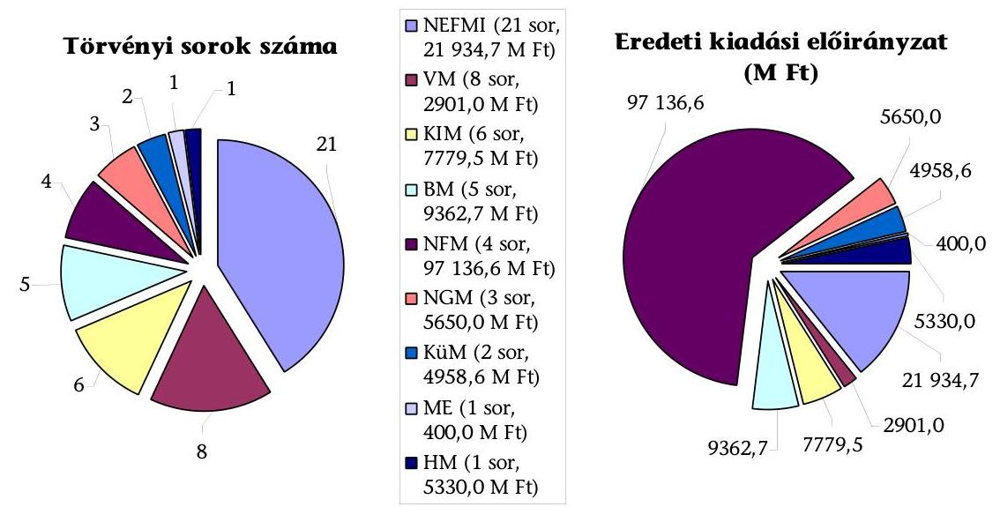
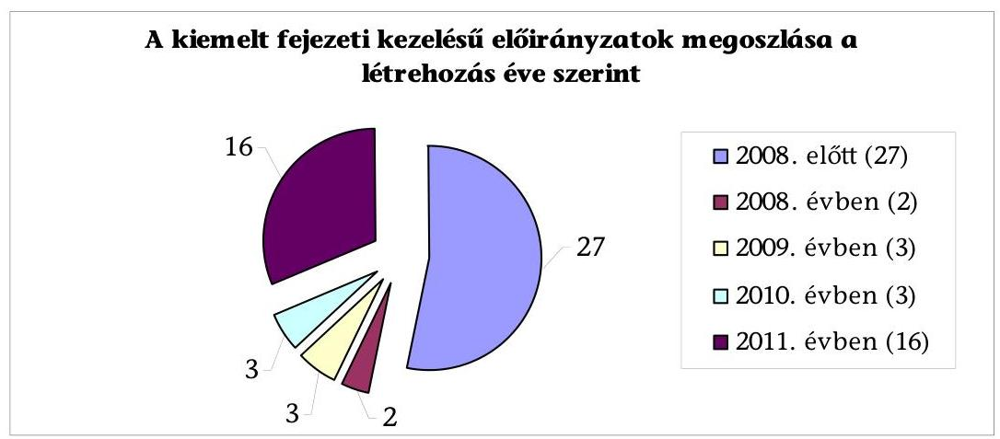
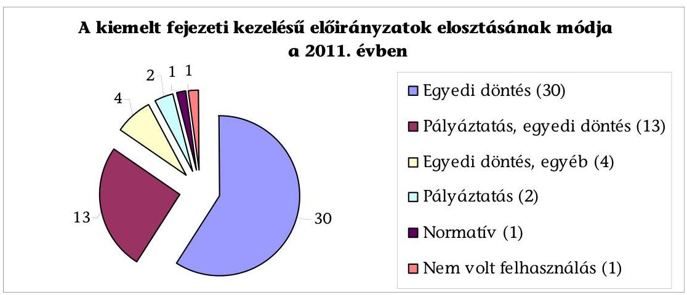
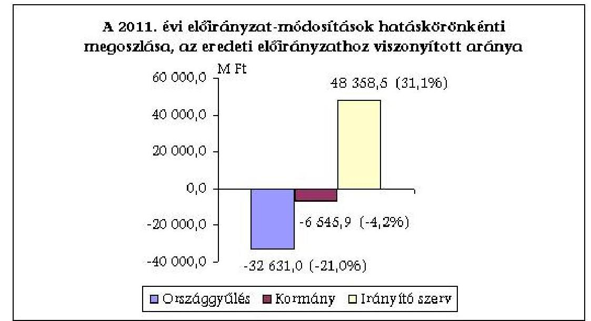
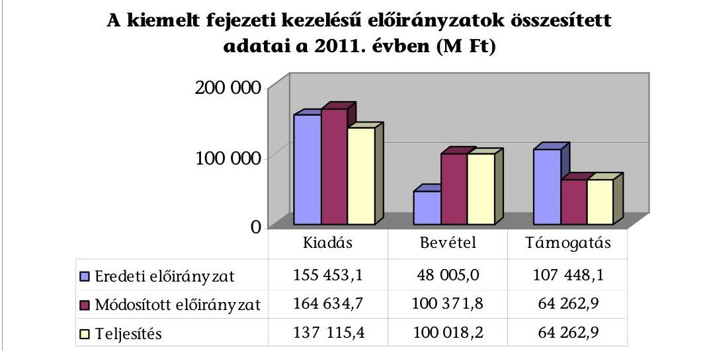
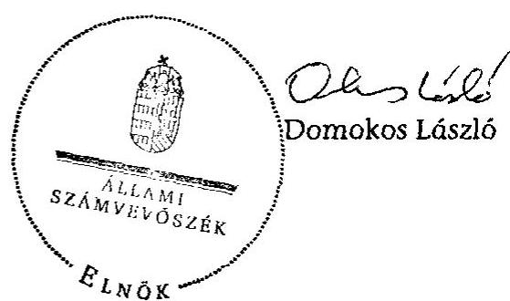

# JELENTÉS 

a 2011. évi költségvetés fejezeti kezelésű előirányzatai tervezésének és évközi módosításainak a szabályszerűség és a pénzügyi-szakmai megalapozottság szempontjából történő ellenőrzéséről

---

# Állami Számvevőszék 

Iktatószám: V-0011-024/2012.
Témaszám: 1050
Vizsgálat-azonosító szám: V0583

## Az ellenőrzést felügyelte:

Dr. Horváth Margit
felügyeleti vezető
Az ellenőrzés végrehajtásáért felelős:
Görgényi Gábor
ellenőrzésvezető
Keresztes Tamás
ellenőrzésvezető
A számvevői munkaanyagok feldolgozásában és a jelentés összeállításában közremüködtek:

Ferencz Katalin Zsuzsanna
számvevő tanácsos
Halkóné Dr. Berkó Katalin
számvevő
Pats Regina
számvevő
Szöllősiné Hrabóczki Etelka
számvevő tanácsos
Szenthelyi Dávid
számvevő gyakornok
Az ellenőrzést végezték:

| Balázs Melinda számvevő tanácsos | Bertalan Rudolf Gyula számvevő | Béres László számvevő |
| :--: | :--: | :--: |
| Dancsóné Kuron Ildikó számvevő tanácsos | Fekete Gábor számvevő tanácsos | Ferencz Katalin   Zsuzsanna számvevő tanácsos |
| Győriné Franyó Éva számvevő | Hadnagyné Papp Ildikó számvevő | Halkóné dr. Berkó Katalin számvevő |
| Jeszenkovits Tamás számvevő tanácsos | Kupcsik Éva számvevő | Pats Regina számvevő |
| Robák Ferencné számvevő tanácsos | Szenthelyi Dávid számvevő gyakornok | Dr. Szima Mária számvevő tanácsos |
| Dr. Szöllősi Zsolt számvevő | Szöllősiné Hrabóczki Etelka számvevő tanácsos | Vacsora Erika számvevő tanácsos |

---

# A témához kapcsolódó eddig készített számvevőszéki jelentések: 

## címe

Vélemény a Magyar Köztársaság 2008. évi költségvetési javaslatáról ..... 0736
Jelentés a fejezeti kezelésú előirányzatok rendszerének ellenőrzéséről ..... 0821
Vélemény a Magyar Köztársaság 2009. évi költségvetési javaslatáról ..... 0836
Jelentés a Magyar Köztársaság 2008. évi költségvetése végrehajtásán ..... 0928
nak ellenőrzéséről
Vélemény a Magyar Köztársaság 2010. évi költségvetési javaslatáról ..... 0935
Jelentés a Magyar Köztársaság 2009. évi költségvetése végrehajtásán ..... 1016
nak ellenőrzéséről
Vélemény a Magyar Köztársaság 2011. évi költségvetési javaslatáról ..... 1025
Jelentés a Magyar Köztársaság 2010. évi költségvetése végrehajtásán ..... 1117
nak ellenőrzéséről
Vélemény Magyarország 2012. évi költségvetési javaslatáról ..... 1121

---

# TARTALOMJEGYZÉK 

BEVEZETÉS ..... 9
I. ÖSSZEGZŐ MEGÁLLAPÍTÁSOK, KÖVETKEZTETÉSEK, JAVASLATOK ..... 11
II. RÉSZLETES MEGÁLLAPÍTÁSOK ..... 17

1. A tervezés és a felhasználás szabályozási és feltételrendszerének alakulása ..... 17
2. Az előirányzatok pénzügyi és szakmai megalapozottsága ..... 24
3. Az előirányzat-változások hatása a feladatellátásra ..... 29
3.1. Az országgyúlési, illetve kormányzati hatáskörben elrendelt zárolások/előirányzat-csökkentések ..... 30
3.2. Az irányító szervek által elrendelt előirányzat-módosítások, átcsoportosítások ..... 36
4. A maradványtartási kötelezettség teljesítése és a maradványok alakulása ..... 39
5. A fejezeti kezelésű előirányzatok teljesítése ..... 42
5.1. A végső felhasználók (kedvezményezettek) szakmai és pénzügyi beszámoltatása ..... 43

## MELLÉKLETEK

1. számú A Kvtv-ben 100,0 M Ft-ot meghaladó támogatási előirányzattal rendelkező azon 2011. évi fejezeti kezelésű előirányzatok, melyek támogatási előirányzatát a Kvtv-t módosító 2011. évi CXIV. törvény 20,0\%-ot meghaladó mértékben változtatta
2. számú A kiemelt fejezeti kezelésű előirányzatok kiadási előirányzatának és teljesítésének fejezetenkénti alakulása a 2011. évben
3. számú A kiemelt fejezeti kezelésű előirányzatok bevételi előirányzatának és teljesítésének fejezetenkénti alakulása a 2011. évben
4. számú A kiemelt fejezeti kezelésű előirányzatok támogatási előirányzatának és teljesítésének fejezetenkénti alakulása a 2011. évben
5. számú A kiemelt fejezeti kezelésű előirányzatokat érintő előirányzat-változtatások hatáskörönkénti és fejezetenkénti alakulása a 2011. évben
6. számú A kiemelt fejezeti kezelésű előirányzatok előirányzat-maradványának fejezetenkénti alakulása a 2011. évben
7. számú A vizsgálattal érintett fejezetek fejezeti kezelésű előirányzatai egyes követelésállományának alakulása a 2010. és a 2011. években

---

.

---

# RÖVIDÍTÉSEK JEGYZÉKE 

## Törvények

| Áht $_{1}$ | az államháztartásról szóló 1992. évi XXXVIII. törvény (ha-   tálytalan 2012. január 1-jétől) |
| :--: | :--: |
| Áht $_{2}$ | az államháztartásról szóló 2011. évi CXCV. törvény |
| Kvtv. | a Magyar Köztársaság 2011. évi költségvetéséről szóló   2010. évi CLXIX. törvény |
| 2012. évi Kvtv. | Magyarország 2012. évi központi költségvetéséről szóló   2011. évi CLXXXVIII. törvény |
| 2011. évi CXIV. törvény | a Magyar Köztársaság 2011. évi költségvetéséről szóló   2010. évi CLXIX. törvény módosításáról (hatálytalan   2012. június 27 -től) |
| 2011. évi CLIV. törvény | a megyei önkormányzatok konszolidációjáról, a megyei   önkormányzati intézmények és a Fővárosi Önkormányzat   egyes egészségügyi intézményeinek átvételéről |
| 2011. évi XXXI. törvény | az államháztartásról szóló 1992. évi XXXVIII. törvény mó-   dosításáról (hatálytalan 2011. május 2-ától) |
| 2010. évi XLII. törvény | a Magyar Köztársaság minisztériumainak felsorolásáról |
| 2003. évi L. törvény | a Nemzeti Civil Alapprogramról (hatálytalan 2012. janu-   ár 1-jétől) |

## Rendeletek

| Áhsz. | az államháztartás szervezetei beszámolási és könyvvezeté-   si kötelezettségének sajátosságairól szóló   249/2000. (XII. 24.) Korm. rendelet |
| :--: | :--: |
| Ámr. | az államháztartás múködési rendjéről szóló   292/2009. (XII. 19.) Korm. rendelet (hatálytalan 2012.   január 1-jétől) |
| Ávr. | az államháztartásról szóló törvény végrehajtásáról szóló   368/2011. (XII. 31.) Korm. rendelet |
| 212/2010. (VII. 1.)   Korm. rendelet | az egyes miniszterek, valamint a Miniszterelnökséget veze-   tő államtitkár feladat- és hatásköréről (statútum) |
| 49/2011. (III. 30.) Korm.   rendelet | egyes fejezeti kezelésű előirányzatokból nyújtott egyedi   támogatásokról |
| BM rendelet | a fejezeti kezelésű előirányzatok felhasználásának általá-   nos rendjéről szóló 17/2011. (V. 23.) BM rendelet (hatály-   talan 2012. május 31-től) |
| HM rendelet | a fejezeti kezelésű előirányzatok felhasználásának szabályairól szóló 10/2011. (IX. 29.) HM rendelet |
| KIM rendelet | a fejezeti kezelésű előirányzatok felhasználásának szabályairól szóló 12/2011. (III. 30.) KIM rendelet (hatálytalan 2012. március 23 -tól) |
| KüM rendelet | egyes fejezeti kezelésű előirányzatok felhasználásának szabályairól szóló 4/2011. (IX. 6.) KüM rendelet |

---

NEFMI rendelet

NFM rendelet

NGM rendelet

VM rendelet

## Határozatok

1505/2011. (XII. 29.)
Korm. határozat

1471/2011. (XII. 23.)
Korm. határozat

1316/2011. (IX. 19.)
Korm. határozat
1283/2011. (VIII. 10.)
Korm. határozat
1190/2011. (VI. 9.)
Korm. határozat
1079/2011. (III. 30.)
Korm. határozat
1025/2011. (II. 11.)
Korm. határozat

## Utasítások

MeG utasítás

## Szórövidítések

ÁFSZFP
ÁHT azonosító
ÁSZ
BIR
BM
ELTE ÁJK
EU
a XX. Nemzeti Erőforrás Minisztérium költségvetési fejezethez tartozó fejezeti kezelésű előirányzatok 2011. évi felhasználásának szabályairól szóló 54/2011. (IX. 1.) NEFMI rendelet
egyes fejezeti kezelésű előirányzatok felhasználásáról szóló 9/2011. (IV. 7.) NFM rendelet
a fejezeti kezelésű előirányzatok felhasználásának szabályairól szóló 33/2011. (VIII. 31.) NGM rendelet (hatálytalan 2012. június 6-tól)
a XII. Vidékfejlesztési Minisztérium költségvetési fejezethez tartozó fejezeti kezelésű előirányzatok 2011. évi kezelésének, felhasználásának szabályairól szóló 52/2011. (VI. 7.) VM rendelet
a központi költségvetési szervek és az egészségügyi intézmények tartozásállományának csökkentéséről, valamint a gyógyszertámogatás és a gyógyászati segédeszköz támogatás kiadásaival kapcsolatos lépésekről
a 2011. évi költségvetési egyensúlyt megtartó intézkedésekről szóló 1316/2011. (IX. 19.) Korm. határozatban elrendelt zárolás csökkentésre változtatásáról és a rendkívüli kormányzati intézkedések előirányzat megemeléséről
a 2011. évi költségvetési egyensúlyt megtartó intézkedésekről (hatálytalan 2011. december 31-től)
a 2010. évi kötelezettségvállalással nem terhelt maradványok felhasználásáról
a 2011. évi egyházi kiegészítő támogatás forráshiányának megoldásával kapcsolatos kormányzati feladatokról
a XX. Nemzeti Erőforrás Minisztérium fejezeten belüli elői-rányzat-átcsoportosításról
az államháztartási egyensúly megőrzéséhez szükséges intézkedésekről
a fejezeti kezelésű előirányzatok kezelésével és felhasználásával kapcsolatos eljárási rendről és hatáskörökről szóló 9/2011. (VII. 29.) MeG államtitkári utasítás

Állami Foglalkoztatási Szolgálat fejlesztési program
államháztartási azonosító
Állami Számvevőszék
Bíróságok
Belügyminisztérium
ELTE Állam- és Jogtudományi Kar
Európai Unió

---

| FH | Foglalkoztatási Hivatal |
| :-- | :-- |
| GFC | Gazdaságfejlesztést szolgáló célelőirányzat |
| HM | Honvédelmi Minisztérium |
| ILO | Nemzetközi Munkaügyi Szervezet |
| KE | Köztársasági Elnökség |
| KIM | Közigazgatási és Igazságügyi Minisztérium |
| Kincstár | Magyar Államkincstár |
| KKK | Közlekedésfejlesztési Koordinációs Központ |
| KTK | kincstári tranzakciós kód |
| KüM | Külügyminisztérium |
| ME | Miniszterelnökség |
| NBC | Nemzetközi befektetéseket támogató célelőirányzat |
| NBSZ | Nemzetbiztonsági Szakszolgálat |
| NCA | Nemzeti Civil Alapprogram |
| NEFE | Nemzetközi Fejlesztési Együttmúködés |
| NEFMI | Nemzeti Erőforrás Minisztérium |
| NFM | Nemzeti Fejlesztési Minisztérium |
| NGM | Nemzetgazdasági Minisztérium |
| ODR | Országos Dokumentum-ellátási Rendszer |
| OGY | Országgyúlés |
| SzMSz | Szervezeti és Múködési Szabályzat |
| Tájékoztató | Tájékoztató a 2011. évi költségvetési törvényjavaslat ösz- |
|  | szeállításához szükséges feltételekről és az érvényesítendő |
|  | követelményekről |
| TIOP | Társadalmi Infrastruktúra Operatív Program |
| UF | Uniós Fejlesztések |
| ÜGY | Magyar Köztársaság Ügyészsége |
| VM | Vidékfejlesztési Minisztérium |

---

.

---

# ÉRTELMEZŐ SZÓTÁR 

alapelőirányzat
eljárásrendek
előirányzat-
átcsoportosítás
előirányzat-maradvány
előirányzat-módosítás
kiemelt fejezeti kezelésű előirányzatok

A tervévet megelőző év eredeti előirányzatának a szerkezeti változásokkal és a szintrehozásokkal módosított öszszege. (Forrás: Ámr. 28. § (2) bekezdése)
A fejezeti kezelésű előirányzatok 2011. évi felhasználásának szabályait tartalmazó, a rövidítések jegyzékében felsorolt miniszteri rendeletek és MeG utasítás.
Az átcsoportosítást végrehajtó költségvetésének kiadási, bevételi, támogatási főösszegének változatlansága mellett, egyidejű előirányzat-csökkentéssel és -növeléssel végrehajtható módosítás. (Forrás: Áht1 2/A. § (3) bekezdés 1) pontja)

Az előirányzat-maradvány a kincstári körbe tartozó költségvetési szerveknél, a fejezeti kezelésű előirányzatoknál, valamint az alapoknál a módosított kiadási és bevételi előirányzatok és azok teljesítésének különbözete. (Forrás: Ámr. 207. § (2) bekezdése)
A megállapított kiadási, bevételi, támogatási kiemelt előirányzat, létszám-előirányzat növelése vagy csökkentése. (Forrás: Áht1 2/A. § (3) bekezdés k) pontja)
Az ellenőrzéssel érintett 51 fejezeti kezelésű előirányzat, melyek a Kvtv-ben 100,0 M Ft-ot meghaladó támogatási előirányzattal rendelkeztek, melyet a Kvtv-t módosító 2011. évi CXIV. törvény 20,0\%-ot meghaladó mértékben változtatott.

---

.

---

# JELENTÉS 

## a 2011. évi költségvetés fejezeti kezelésú előirányzatai tervezésének és évközi módosításainak a szabályszerűség és a pénzügyi-szakmai megalapozottság szempontjából történő ellenőrzéséről

## BEVEZETÉS

A központi költségvetés fejezetei eltérő nagyságrendben, összetételben rendelkeztek fejezeti kezelésű előirányzatokkal, melyek a fejezetek sajátos szakmai, ágazati feladatainak ellátására szolgáltak.

A 2008-2011. években a fejezeti kezelésú előirányzatok - EU-s programokkal együtt számított - aránya a központi költségvetési szervek és a fejezeti kezelésű előirányzatok együttes tervezett kiadási előirányzatainak mintegy felét tette ki. A költségvetési törvényekben jóváhagyott fejezeti kezelésű előirányzatok összege a 2008. évben 1926,6 Mrd Ft, a 2009. évben 1857,8 Mrd Ft, a 2010. évben 1643,4 Mrd Ft, a 2011. évben 2274,7 Mrd Ft volt.

Szabályszerűségi ellenőrzésünk szorosan kapcsolódott az ÁSZ 2011. évi zárszámadási ellenőrzéséhez ${ }^{1}$. Kiválasztottuk 9 fejezet összesen 51 fejezeti kezelésú előirányzatát, amelyek a Magyar Köztársaság 2011. évi költségvetéséről szóló 2010. évi CLXIX. törvényben (Kvtv.) 100,0 M Ft-ot meghaladó támogatási előirányzattal rendelkeztek és előirányzatukat a Kvtv-t módosító 2011. évi CXIV. törvény 20,0\%-ot meghaladó mértékben változtatta. Az eredeti kiadási előirányzataik összesen 155 453,1 M Ft-ot tettek ki.

Az ellenőrzés folyamán támaszkodtunk a költségvetés tervezésével, illetve a végrehajtásának ellenőrzésével kapcsolatos 2008-2010. évek ÁSZ véleményei, jelentései megállapításaira és a fejezeti kezelésű előirányzatokat érintő témaellenőrzések tapasztalataira, a megállapítások hasznosulására.

Jelen ellenőrzés keretében értékeltük az előirányzatok tervezésének és felhasználásának szabályozottságát, feltételrendszerét, a tervezés és az évközi elői-rányzat-módosítások pénzügyi és szakmai megalapozottságát, hatását a szakmai feladatellátásra, valamint az előirányzat-maradványok keletkezésének okait.

[^0]
[^0]:    ${ }^{1}$ 16. témaszámú ellenőrzés: A Magyar Köztársaság 2011. évi költségvetése végrehajtásának ellenőrzéséről

---

Értékeltük továbbá a kiemelt fejezeti kezelésű előirányzatok 2011. évi gazdálkodási folyamatait (a tervezés fázisától kezdve, a különböző előirányzatmódosításokon át a végső felhasználásig vagy a maradvány képződéséig), azok tervszerűségét, a felhasználást a kitűzött célok és ütemezés szempontjából.

Az ÁSZ a költségvetés véleményezésére, illetve végrehajtásának ellenőrzésére irányuló vizsgálataiban visszatérően hiányosságokat állapított meg a fejezeti kezelésű előirányzatok tervezésénél és azok felhasználásánál. A közpénzek tervezésének megalapozottsága, a felhasználás célszerűsége és átláthatósága, a nyilvánosság biztosítása, a nem megfelelő felhasználás megelőzése indokolta külön ellenőrzés elvégzését a fejezetek szakmai feladatai ellátásának több mint felét fedező források felhasználására vonatkozóan.

Az ellenőrzés szempontrendszerét előtanulmánnyal alapoztuk meg. Az ellenőrzés során adatbekéréssel, tanúsítványok alkalmazásával, helyszíni ellenőrzéssel vizsgáltuk a fejezeti kezelésű előirányzatok 2011. évi előirányzatainak szakmai, pénzügyi megalapozottságát, az előirányzat-módosítások, a felhasználás és a támogatottak elszámoltatásának szabályszerűségét, valamint a kötelezettségvállalással terhelt előirányzat-maradvány alátámasztottságát.

Ellenőrzésünk tapasztalataival segítséget kívánunk nyújtani a 2014. évi költségvetés tervezésének és a 2012. évi költségvetés végrehajtásának jobb megalapozásához. Javaslatainkkal elő kívánjuk mozdítani a feladatalapú tervezés kialakítását.

Az ellenőrzés jogi alapját az Állami Számvevőszékről szóló 2011. évi LXVI. törvény 5. § (7) bekezdése, továbbá az Áht ${ }_{2}$ 90. § (1) bekezdése együttesen képezték.

---

# I. ÖSSZEGZŐ MEGÁLLAPÍTÁSOK, KÖVETKEZTETÉSEK, JAVASLATOK 

Az ÁSZ évek óta rámutatott a fejezeti kezelésű előirányzatok tervezése szabályozásának, feltételrendszerének és megalapozottságának hiányosságaira részint a költségvetések véleményezése, részint a zárszámadási ellenőrzések keretében. Többször fogalmaztunk meg kritikát a tervezési munkával kapcsolatban. Nem helyeseltük, hogy a tervezési munka az alku folyamatok során kialakult keretszámok visszatervezésének folyamatává vált. Rámutattunk a feladatok és források közötti összhang hiányára, a feladatelmaradások lehetőségének kockázatára. Megállapításainkat a jelen ellenőrzés tapasztalatai is alátámasztották.

A közpénzek tervezésének megalapozottsága, a felhasználás célszerűsége és átláthatósága, a nyilvánosság biztosítása, a nem megfelelő felhasználás megelőzése indokolta külön ellenőrzés elvégzését a fejezetek szakmai feladatai ellátásának több mint felét fedező források felhasználására vonatkozóan.

Ellenőrzésünk tapasztalataival segítséget kívánunk nyújtani a 2014. évi költségvetés tervezésének és a 2012. évi költségvetés végrehajtásának jobb megalapozásához. Javaslatainkkal elő kívánjuk mozdítani a feladatalapú tervezés ${ }^{2}$ kialakítását.

Szabályszerűségi ellenőrzésünk ráépült a 2011. évi zárszámadási ellenőrzésre. Az ellenőrzésre 9 fejezet $51 \mathrm{db} 100,0 \mathrm{M}$ Ft feletti fejezeti kezelésű előirányzatát választottunk ki, legnagyobb mértékben ${ }^{3}$ ezt a kört érintették a Kormány egyensúlyjavító intézkedései. A kiemelt fejezeti kezelésű előirányzatok szakmai feladatok, kormányzati kommunikációhoz kapcsolódó feladatok, beruházások, informatikai fejlesztések, civil és nonprofit szervezetek támogatása, nemzetközi szervezetek tagsági díjai, illetve egyéb fejezeti feladatok finanszírozására szolgáltak, az eredeti kiadási előirányzataik összesen 155 453,1 M Ft-ot tettek ki (a Kvtv-ben jóváhagyott - UF nélküli - fejezeti kezelésű előirányzatok 14,3\%-a).

[^0]
[^0]:    ${ }^{2}$ Az ÁSZKUT tanulmányában megjelent: „A hazai költségvetési tervezési gyakorlat egyik legnagyobb hibája, hogy a bázisalapú, intézményorientált tervezés alkalmatlan mind a teljesítménykövetelmények érvényesitésére, mind a szükséges szerkezeti változások megalapozására. A pénzügyi egyensúlyi célok követésének nincs alternatívája. E gyakorlat is nagyban hozzájárul ahhoz, hogy az egyensúlyi problémák ismételten újratermelődnek. Az előttünk járó országok közül sokan bebizonyították, hogy a közszektor egészével, ágazataival és egyes szereplőivel szembeni teljesítménykövetelmények jóléti többletet eredményeznek, amely elérésének jelenleg Magyarországon még nincsenek meg a feltételei." [Báger Gasztáv: A nemzetgazdasági tervezés megújításának koncepciója (Pénzügyi Szemle 2010. évi 55. évf.)]
    ${ }^{3}$ A kiválasztott fejezeti kezelésű előirányzatokat a Kvtv-t módosító 2011. évi CXIV. törvény 20,0\%-ot meghaladó mértékben módosította, egy kivételével (NEFMI Egyházi szociális intézményi normatíva kiegészítése) csökkentette.

---

# Az ellenőrzésre kijelölt törvényi sorok és azok eredeti kiadási előirányzatának fejezetek közötti megoszlása 

A fejezeti kezelésű előirányzatok felhasználásának átláthatóságát, az előirányzatokból finanszírozott támogatások, programok terv szerinti lebonyolítását, illetve a maradványok képződését alapvetően meghatározza az előirányzatok tervezése.

A 2011. évi tervezési munka feltételrendszerének kialakítása során prioritás volt a Kormány által vállalt költségvetési egyensúlyi célok biztosítása. A költségvetési politika kiemelt céljai, prioritásai a fejezeti kezelésű előirányzatok tervezésére is kihatottak.

A fejezeti kezelésű előirányzatok 2011. évi tervezésének és felhasználásának szabályozási és feltételrendszerében nem történt jelentős elmozdulás a korábbi évekhez képest. A tervezés alapját képező, az államháztartásért felelős miniszter által kiadott Tájékoztató 2011-re általános célként új tervezési gyakorlat megvalósítását irányozta elő, amely szerint a bázis alapú tervezési módszertant az állami feladatok körének, az ellátásukhoz szükséges forrásoknak a meghatározása váltja fel. A konkrét tervezési követelmények meghatározására vonatkozó részletes előírások azonban továbbra is a bázis alapú tervezés szabályait tartalmazták. Ennek részeként csak a többletigényeket kellett szövegesen indokolni, miközben a jogszabályi változások, illetve a fejezeti kezelésű előirányzatok címrendjének módosulása az alapelőirányzatok felhasználási célját is megváltoztathatta. A fejezeti kezelésű előirányzatok 2011. évi tervezése alapvetően megfelelt a jogszabályokban, illetve az NGM Tájékoztatóban foglalt előírásoknak, ugyanakkor megfelelő szöveges és számszaki indoklás hiányában a tervezett előirányzatokhoz kapcsolódó feladatok, felhasználási célok forrásokkal való összhangját teljes körűen nem biztosította.

A helyszíni ellenőrzés tapasztalatai alapján a tervezés pénzügyi és szakmai megalapozottsága nem volt kielégítő azoknál a fejezeti kezelésű előirányzatoknál, ahol az előirányzat szakmai alátámasztását egyedül a statútumban meghatározott feladatok, a pénzügyi alátámasztását az előző évi tapasztalati

---

adatok, igényfelmérések képezték, konkrét költségterveket, számításokat az előirányzat megalapozásához nem készítettek (16 törvényi sor). A tárcák által az előirányzatok megalapozottságának bizonyítékaként bemutatott dokumentumok több esetben nem az előirányzatok tervezéséhez kapcsolódtak, hanem az előirányzatok felhasználását támasztották alá (4 törvényi sor).

A Kvtv-ben jóváhagyott előirányzat két törvényi sornál alultervezett volt. A NEFMI Egyházi szociális intézményi normatíva kiegészítése előirányzat forráshiányát évközben pótolták (az OGY 8715,5 M Ft többlettámogatást biztosított), ugyanakkor az NFM Útpénztár forráshiánya a közútkezelői közfeladat elmaradását okozta, ez veszélyeztette a projektek eredményes zárását és növeli az uniós támogatás visszafizettetésének kockázatát.

A fejezeti kezelésű előirányzatok gazdálkodásában a támogatások elosztásának módjaként az egyedi döntés volt a meghatározó. Ez kiemeli a fejezeti szabályozások jelentőségét. A tárcák az Áht ${ }_{1}$ 100/J. § (2) bekezdésében előírt, a fejezeti kezelésű előirányzatok kezelésével, felhasználásával kapcsolatos szabályozási kötelezettségnek átlagosan négy hónapos késéssel tettek eleget, amely hátráltatta az előirányzatok tervszerű felhasználását. Az eljárásrendek formai, szerkezeti és tartalmi szempontból egyaránt eltérőek voltak. Az Áht ${ }_{1}$ és a végrehajtására kiadott kormányrendelet előírásai nem biztosították az egységes szerkezetű és részletességű szabályozás kialakítását. Az államháztartásért felelős miniszter Áht ${ }_{1}$-ben előírt egyetértési kötelezettségének gyakorlása sem garantálta az eljárásrendek egységességét.

Az év közbeni gyakori kormányzati intézkedésekkel (zárolások, maradványtartási kötelezettség) alapjaiban módosították a fejezeti kezelésű előirányzatok felhasználását, korlátozták a tervszerű gazdálkodás, a kiszámíthatóság követelményének érvényesülését.

A Kormány által 2011. évben elrendelt zárolások, illetve előirányzat csökkentések jellemzően feladatelmaradást, a feladatok végrehajtásának halasztását, átütemezését, a feladatok körének és volumenének szűkítését, a társadalmi szervezetek múködéséhez biztosított források csökkentését okozták.

Az elvonások és a jóváhagyott többletek összességében országgyűlési hatáskörben 32 631,0 M Ft-tal (21,0\%), Kormány hatáskörben 6545,9 M Ft-tal (4,2\%) csökkentették a kiemelt törvényi sorok kiadási előirányzatait.

A zárolások hatásainak csökkentése érdekében a fejezetek irányító szervei által benyújtott többlettámogatási igényeket a rendkívüli kormányzati intézkedésekre szolgáló tartalék terhére teljesítették (2755,1 M Ft). A felmerült központi költségvetési támogatási igényeket mérsékelte az Áht ${ }_{1}$ módosítása, amely 2011. évben lehetőséget adott a fejezeti kezelésű előirányzatok címen belüli átcsoportosítására.

A rendkívüli kormányzati intézkedésekre szolgáló tartalékból átcsoportosított támogatások felhasználására, elszámolási kötelezettségére vonatkozóan 2011. december 31-ig nem volt előírás. Az ÁSZ 2010. évi költségvetés végrehajtásáról készült Jelentésében tett javaslatával összhangban az elszámolási kötelezettségről 2012. január 1-jei hatállyal az Ávr. 23. §-a rendelkezett.

---

Az irányítószervi előirányzat-módosítások 48 358,5 M Ft-tal (31,1\%) növelték a kiadási előirányzatokat, melynek forrásai az előző évi maradvány ( $47976,5 \mathrm{M}$ Ft), illetve a többletbevételek, visszatérített támogatások ( $382,0 \mathrm{M}$ Ft) voltak. A fejezeten belüli átcsoportosítások a címek, illetve a törvényi sorok között rendezték át az előirányzatokat. Az előirányzatmódosítások, átcsoportosítások pénzügyileg és szakmailag megalapozottak voltak, viszont azok számossága nehezítette a tervszerű gazdálkodást, a felhasználás cél szerinti ütemezését és az elszámolások átláthatóságát.

A fejezeti kezelésű előirányzatok tervezési problémáira vezethető vissza az előirányzatok gyakori módosításának, átcsoportosításának általánossá válása, illetve a tervszerű feladatellátás korlátozottá válása, amely a költségvetésbe épített tartalékok fontosságát erősíti. A Kormány 2011. évi költségvetési egyensúly megőrző intézkedései következtében jelentkező forráshiányt a fejezeti tartalékok nem tudták ellensúlyozni. Az ellenőrzött 9 fejezet a 2011. évben mindössze 1178,9 M Ft tartalékot tervezett, ami a 2010. évi tartalék 36,3\%-a volt.

A fejezeti kezelésű előirányzatokból finanszírozott célok, feladatok tervszerű végrehajtását a zárolások és az előirányzat-módosítások mellett a maradványtartási kötelezettség előirása és az év utolsó negyedévében elrendelt szerződéskötési tilalom is korlátozta.

A maradványtartási kötelezettség végrehajtása érdekében a fejezetek irányító szervei korlátozták az esedékes fizetési kötelezettségeik teljesítését, ezzel kisebb-nagyobb összegű tartozásállományt halmozva fel. Ezen kívül elrendelték a támogatási szerződések felülvizsgálatát, és ahol megoldható volt, éltek a fizetési kötelezettségek átütemezésével. A maradványtartási kötelezettség év végi törlése a fejezeti kezelésű előirányzatok gazdálkodására érdemben már nem volt hatással, a fizetési kötelezettségek 2012. évre történő átütemezését jelentősen már nem tudta mérsékelni.

A kiemelt fejezeti kezelésű előirányzatok 164 634,7 M Ft módosított kiadási előirányzata $83,3 \%$-ban ( $137115,4 \mathrm{M}$ Ft), a bevételi előirányzat 99,6\%-ban (100 018,2 M Ft), a támogatási előirányzat 100,0\%-ban (64 262,9 M Ft) teljesült.

A kiemelt előirányzatok 2011. évi előirányzat-maradványa a módosított kiadási előirányzat 16,5\%-a (27 782,1 M Ft) volt, melynek 97,8\%-a tárgyévben képződött. A tárgyévi előirányzat-maradvány az előző évhez képest 20 194,4 M Ft-tal (ebből az NFM Útpénztár maradványcsökkenése $19224,5 \mathrm{M}$ Ft) csökkent.

A maradványok képződését a tervezési problémák és a kormányzati beavatkozások mellett az eljárásrendek kiadásának késedelme, a nem kellően megalapozott előkészítés, a döntési mechanizmusok hiányosságai, az eljárások (pl. pályázat) gyakori elhúzódása is befolyásolta.

A fejezeti kezelésű előirányzatok felhasználása ÁSZ ellenőrzésének tapasztalatai szerint a támogatási szerződések a kedvezményezett beszámolási kötelezettségére vonatkozó előírásokat tartalmazták, gyakran előfordult azonban,

---

hogy a szerződéseket a projektek megkezdését követően kötötték meg. A támogatási szerződések módosítására sok esetben nem a feladat ellátásához szorosan kapcsolódó szakmai indokok, hanem a fejezeti kezelésű előirányzatok likviditási problémái, vagy a kedvezményezett szerződésmódosítási kérelmei miatt került sor. A támogatott által benyújtott, a fejezetek irányító szervei által felülvizsgált pénzügyi elszámolásoknál az ÁSZ ellenőrzése a számviteli előírásokat sértő, formai és tartalmi hibákat is feltárt, amelyek a belsö kontrollok múködésének hiányosságaira (a monitoring rendszer, az ellenőrzési nyomvonal, a kockázatkezelés és a szabálytalanságok kezelése rendjének hiányos szabályozása, pályázatok értékelését és az egyedi döntéseket támogató számítógépes értékelő rendszer, valamint csekklisták hiánya) vezethetőek vissza.

Az Állami Számvevőszékről szóló 2011. évi LXVI. törvény 33. § (1) bekezdésében foglaltak értelmében a jelentésben foglalt megállapításokhoz kapcsolódó intézkedési tervet köteles az ellenőrzött szervezet vezetője összeállítani és azt a jelentés kézhezvételétől számított harminc napon belül az ÁSZ részére megküldeni. Amennyiben az intézkedési tervet határidőben nem küldi meg a szervezet, vagy az továbbra sem elfogadható, az ÁSZ elnöke a hivatkozott törvény 33. § (3) bekezdés a)-b) pontjaiban foglaltakat érvényesítheti.

Az ellenőrzés intézkedést igénylő megállapításai és javaslatai:

# a nemzetgazdasági miniszter részére 

1. A fejezeti kezelésű előirányzatok tervezésének szabályozási és feltételrendszerében nem történt jelentős elmozdulás a korábbi évekhez képest. A 2011. évi tervezés alapját továbbra is az államháztartásért felelős miniszter által kiadott Tájékoztató képezte, amely szerint a bázis alapú tervezési módszertant az állami feladatok körének, az ellátásukhoz szükséges forrásoknak a meghatározása váltja fel. A konkrét tervezési követelmények meghatározására vonatkozó részletes előírások azonban továbbra is a bázis alapú tervezés szabályait tartalmazták. A fejezeti kezelésű előirányzatok tervezésének szakmai és pénzügyi megalapozottsága nem volt kielégítő azoknál a fejezeti kezelésű előirányzatoknál, ahol az előirányzat szakmai alátámasztását egyedül a statútumban meghatározott feladatok, a pénzügyi alátámasztását az előző évi tapasztalati adatok, igényfelmérések képezték, konkrét költségterveket, számításokat az előirányzatok megalapozásához az irányító szervek, illetve a szakmai kezelő szervek nem készítettek.

Javaslat:
A közpénzek eredményesebb hasznosulása, a tervszerű felhasználás erősítése, a feladatok és a források közötti összhang biztosítása érdekében dolgozza ki a fejezeti kezelésű előirányzatok feladat alapú tervezésének jogszabályi és módszertani alapját, továbbá a bevezetés feltételrendszerét.
2. A fejezetek 2011. évi fejezeti kezelésű előirányzatai kezelésének, felhasználásának eljárásrendjei formai, szerkezeti és tartalmi szempontból egyaránt eltérőek voltak. Az Áht ${ }_{1}$ és a végrehajtására kiadott kormányrendelet előírásai nem biztosították az egységes szerkezetű és részletességű szabályozás kialakítását.

---

Javaslat:
Kezdeményezze a fejezeti kezelésű előirányzatok kezelésével, felhasználásával kapcsolatos fejezeti szabályozások (rendelet, belső szabályzat) formai és tartalmi követelményeinek átfogó előírását az egységes szabályozás kialakítása érdekében. Az átfogó szabályozás terjedjen ki az évközben belépő új feladatokra, a következő költségvetési évre áthúzódó előirányzat-felhasználás szabályaira.

---

# II. RÉSZLETES MEGÁLLAPÍTÁSOK 

## 1. A TERVEZÉS ÉS A FELHASZNÁLÁS SZABÁLYOZÁSI ÉS FELTÉTELRENDSZERÉNEK ALAKULÁSA

Az Országgyűlés a 2010. évi XLII. törvénnyel átalakította a központi költségvetés fejezetrendjét. A törvény előirása alapján, azzal összhangban a Kormány intézkedett az egyes címek, alcímek eredeti előirányzatainak átrendezéséről, az új címrendi besorolásokról. A 2011. évi költségvetési javaslat kidolgozása során az új szervezeti struktúrának megfelelően a tárcák további címrendi módosításokra tettek javaslatot.

A fejezeti kezelésű előirányzatok vonatkozásában címrend módosításra az előirányzatok átrendezése, névváltoztatása, korábbi feladatok megszüntetése, illetve új feladatok felvétele miatt került sor.

A kiemelt fejezeti kezelésű előirányzatok 31,4\%-át a 2011. évben, 68,6\%-át az azt megelőző években hozták létre. Az utóbbiak a 2011. évben - a KüM fejezet két előirányzata kivételével - érintettek voltak címrendi módosításban, illetve névváltoztatásban.

A kiemelt fejezeti kezelésű előirányzatok létrehozás éve szerinti megoszlását az alábbi diagram szemlélteti:

A 2012. évben ismételten változás volt ${ }^{4}$ a fejezeti kezelésű előirányzatok címrendjében, az egyes törvényi sorokhoz kapcsolódó feladatokban.

[^0]
[^0]:    ${ }^{4}$ Az 51 kiemelt előirányzatból a 2012. évi Kvtv-ben önálló törvényi sorként 14 szerepel változatlanul. Az előirányzatok közül 10 megszűnt, a fennmaradó 27 előirányzatban változás történt (beépült a fejezetek intézményeinek költségvetésébe/kiemelt előirányzataiba, illetve a fejezet más fejezeti kezelésű előirányzatába, átadásra került más fejezet részére, változott az elnevezése stb.).

---

# A fejezeti kezelésú előirányzatok 2011. évi tervezésének és felhasználásának szabályozási és feltételrendszerében jelentős elmozdulás nem volt tapasztalható a korábbi évekhez képest. 

Az ÁSZ évek óta rámutatott a költségvetés tervezése szabályozásának, feltételrendszerének és megalapozottságának hiányosságaira. A 2009., illetve 2010. évi költségvetési törvényjavaslatról készített Véleményünkben megállapítottuk, hogy „a tervezési munka az alulról építkezö, a szakmai feladatok teljesitésére épülö, megalapozott tervezés helyett az alkufolyamatok során kialakult keretszámok visszatervezésének folyamatává vált. .... Összességében az a tendencia látszik, hogy a feladatok és a rendelkezésre álló források között feszültségek vannak. A feladatok és források összhangjának hiányára, annak mértékére, kezelési mechanizmusára, a szükséges szerkezeti átalakításokra vonatkozó hatástanulmányokat nem bocsátottak az ellenőrzés rendelkezésére. .... Fennáll annak a kockázata, hogy egyes területeken feladatcsökkenések, feladatelmaradások következnek be."

A 2011. évi költségvetési tervezés feltételrendszerének kialakítása során prioritás a Kormány által vállalt költségvetési egyensúlyi célok elérése volt. A költségvetési politika kiemelt céljai, prioritásai a fejezeti kezelésű előirányzatok tervezésére is kihatottak.

Az Ámr. 26. §-ának előírása alapján a tervezési szabályokat megalapozó dokumentum a 2011. költségvetési javaslat kidolgozása során is az államháztartásért felelős miniszter által kiadott Tájékoztató volt, amely külön fejezetben szabályozta a fejezeti kezelésű előirányzatok tervezésének szabályait és feltételrendszerét. A Tájékoztató az Ámr. 26. § a)-d) pontjaiban rögzített elemeket tartalmazta.

A Tájékoztató az eddigi gyakorlattól részben már eltérő, a korábbi ÁSZ véleményeknek is eleget tevő új tervezési gyakorlat megvalósítását irányozta elő, amely szerint a bázis alapú tervezési módszertant az állami feladatok körének, az ellátásukhoz szükséges forrásoknak a meghatározása váltja fel, azonban a konkrét tervezési követelmények meghatározására vonatkozó részletes előírások - az általános céllal ellentétben - továbbra is a bázis alapú tervezés szabályait tartalmazták.

Az Ámr. bázis alapú tervezésre vonatkozó előírásai (31. §) a 2011. évre vonatkozóan nem változtak, így jogszabályi oldalról sem volt biztosított a feladat alapú tervezési gyakorlat érvényesítése.

Az NGM a fejezeti keretszámokat bázis szemléletben vezette le, melyek az előző évek gyakorlatánál is részletesebb bontásban kerültek kiadásra, ami a fejezeti tervezés egyébként is szűk mozgásterét tovább korlátozta.

A fejezetek 2011. évi költségvetési javaslatának kidolgozása során lényeges körülmény volt, hogy rendkívül rövid idő (5 nap) állt a fejezetek rendelkezésére a javaslatok kidolgozásához. A fejezetek irányító szervei a fejezeti keretszám visszatervezését (intézmények, fejezeti kezelésű előirányzatok vonatkozásá-

---

ban) bázis alapon végezték el, az előző évekhez hasonlóan. ${ }^{5}$ A fejezeti kezelésű előirányzatok szakmai kezelő szervei az alapelőirányzatok ismeretében, a jogszabályi, illetve az egyéb kötelező előírások, az előző években meghatározott determinációk figyelembe vételével dolgozták ki többlettámogatási igényüket.

Az Ámr. 31. §-a ${ }^{6}$ előírta, hogy az előirányzati többlet biztosítására irányuló igényt szöveges indokolással kellett alátámasztani, melyből megállapíthatóak azok a változások, melyek indokolják az alapelőirányzat módosítását. A 2011. évben, illetve a megelőző években a fejezeti kezelésű előirányzatok javasolt költségvetési előirányzatainak szakmai, pénzügyi alátámasztására, megalapozására vonatkozóan ezen kívül nem volt kötelező előírás. A bázis alapú tervezés hiányosságából eredően csak a többletigényt kellett szövegesen indokolni, miközben a fejezeti kezelésű előirányzatok címrendjének módosulása esetenként az alapelőirányzatok felhasználási célját is megváltoztatta.

A 2011. évi költségvetési törvényjavaslatra vonatkozó Véleményünkben megállapítottuk, hogy „a fejezetek irányító szervei a fejezeti kezelésű előirányzataik vonatkozásában a Tájékoztatónak megfelelően készítették el az előirányzatok tartalmi és számszaki levezetéseit. A tervezés során valamennyi fejezetnél biztosították a jogszabályi előirásokkal (Ámr. 28-30. §-ai) való összhangot".

Véleményünkben rámutattunk arra is, hogy „a hatályos jogszabályok nem tartalmaznak pontos előirást az ÁSZ Vélemény elkészitésének feltételeire - a Tájékoztató, a fejezeti keretszámok, valamint a benyújtásra kerülő költségvetési törvényjavaslat ÁSZ részére történő átadásának időpontjára - vonatkozóan. A feltételek meghatározásának hiányában minden évben olyan időpontban bocsátják az ÁSZ rendelkezésére a szükséges dokumentumokat, amely az éves költségvetési törvényjavaslat teljes körü véleményezését nem teszi lehetővé. A Vélemény kialakítását befolyásolja az az évek óta visszatérő tény, hogy a törvényjavaslat benyújtásának időpontjában az előirányzatokat megalapozó egyes jogszabályok még nem hatályosak. A jelzett körülmények következményeként az Országgyúlés költségvetési jogának gyakorlását nem tudjuk megfelelő módon segíteni."

A Kvtv-ben jóváhagyott előirányzatok és az Áht ${ }_{1}$ 49. § (5) bekezdés g) pontjának előirása alapján a fejezetek irányító szervei készítették el a fejezethez tartozó fejezeti kezelésű előirányzatok elemi költségvetését. Az elemi költségvetés közgazdasági tartalom szerinti részletezettséggel készül (személyi juttatások, munkaadói járulékok, dologi kiadások stb.), amely az egyes törvényi sorok szakmai megalapozottsága vonatkozásában nem nyújt releváns információt.

A jogszabályi előírások alapvetően a fejezeti kezelésú előirányzatok kezelésére, felhasználására korlátozódtak, melynek kereteit az Áht ${ }_{1} 49$. § (5) bekezdés p) pontja és a 100/J. § (1)-(2) bekezdése írta elő. Az eljárásrendek tar-

[^0]
[^0]:    ${ }^{5}$ A Magyar Köztársaság 2011. évi költségvetési javaslatáról szóló ÁSZ vélemény megállapította, hogy „A fejezetek irányító szervei az NGM keretszámok, illetve a bekért adatszolgáltatások (2010. évi várható teljesitések, elöirányzat-maradvány, stb.) figyelembevételével alapvetően bázisalapon, a keretszámból kiindulva alakították ki a 2011. évi fejezeti költségvetési javaslatot."
    ${ }^{6} \mathrm{Az}$ Áht ${ }_{2}$, illetve az Ávr. az előirányzati többletre vonatkozóan nem tartalmaz előírást.

---

talmi elemeiről 2011. évben az Ámr. 109. § (8)-(9) bekezdése rendelkezett. Az előírások azonban nem kellően részletesen határozták meg az előirányzatok felhasználásával és elszámoltatásával kapcsolatos követelményeket, melyre az ÁSZ a 2010. évi költségvetés végrehajtásáról készült Jelentésében is felhívta a figyelmet. ${ }^{7}$

Az Áht ${ }_{1}$ 100/J. § (1) bekezdése szerint a fejezeti kezelésű előirányzatok kizárólag a költségvetési törvényben meghatározott célokra használhatók fel. Az éves költségvetési törvények, így a Kvtv. - egyes kiemelt előirányzatok ${ }^{8}$ kivételével - a fejezeti kezelésű előirányzatok megnevezésén kívül az egyes előirányzatok felhasználási céljára vonatkozó rendelkezéseket nem tartalmazott (egyes korábbi években a költségvetési törvényjavaslat szöveges indokolása tért ki különböző részletezettséggel a célok meghatározására).

Az Áht ${ }_{1}$ 100/J. § (2) ${ }^{9}$ bekezdésében előírt, a fejezeti kezelésű előirányzatok kezelésével, felhasználásával kapcsolatos szabályozási kötelezettségnek február 15-i határidőre a 2011. évben egyik fejezet sem tett eleget. Az eljárásrendek átlagosan négy hónapos késéssel jelentek meg, ami késleltette a feladatok végrehajtásának elindítását, hátráltatta a feladatok költségvetési éven belüli megvalósítását.

Az eljárásrendek formai, szerkezeti és tartalmi szempontból egyaránt eltérőek voltak. Az eljárásrendek kidolgozására és részletes tartalmára vonatkozóan nincs egységes elvárás. Az Áht ${ }_{1}$ és a végrehajtására kiadott kormányrendelet előírásai nem biztosították az egységes szerkezetű és részletességű szabályozás kialakítását. Az államháztartásért felelős miniszter Áht ${ }_{1}$ 49. § (5) bekezdés p) pontjában előírt egyetértési kötelezettségének gyakorlása sem garantálta az eljárásrendek egységességét.

Formai szempontból különbséget jelentett, hogy az egyes fejezeti eljárásrendekben nem került egységesen megjelenítésre az előirányzatok neve, címrendi besorolása, ÁHT azonosítója, célja és a felhasználás módja.

Az előirányzatok neve, címrendi besorolása, ÁHT azonosítója, célja és a felhasználás módja egy eljárásrendben (NGM) került teljes körűen feltüntetésre. Öt eljá-

[^0]
[^0]:    ${ }^{7}$ A Magyar Köztársaság 2010. évi költségvetése végrehajtásának ellenőrzéséről szóló ÁSZ Jelentés (1117) megállapította, hogy a szabályozás lehetővé teszi, „hogy a tárcák vezetői a jogszabályi követelményeknek megfelelő, de különböző mélységü, részletességü, és egymástól eltérő belső szabályozásokat határozzanak meg pl. az elszámoltatás alapdokumentumaira, határidejére, a támogatás elszámolása helyszíni ellenőrzésének feltételeire vonatkozóan."
    ${ }^{8}$ A vizsgált előirányzatok közül a NEFMI Egyházi szociális intézményi normatíva kiegészítése törvényi sor célját, a támogatás nyújtásának feltételeit a Kvtv. 42. § határozta meg.
    ${ }^{9}$ Az Áht. 100/J. § (2) bekezdése előírja, hogy a fejezetet irányító szerv vezetője a fejezeti kezelésű előirányzatok kezelésével, felhasználásával kapcsolatos szabályokat - a Kormány rendeletében foglaltak figyelembevételével - évente február 15-éig az adott költségvetési évre vonatkozóan az államháztartásért felelős miniszterrel egyetértésben kiadott rendeletében szabályozza, a jogszabály kiadását nem igénylő rendelkezéseket az államháztartásért felelős miniszter egyetértésével belső normában állapítja meg.

---

rásrendben (KIM, ME, VM, HM, NFM) az ÁHT azonosító kivételével, a BM eljárásrendjében a törvényi sorok címrendi besorolása kivételével valamennyi fenti adat szerepelt. Egy eljárásrendben (KüM) mindössze az előirányzatok nevét és célját tüntették fel. A NEFMI rendeletben a törvényi sorok nem jelentek meg, az eljárásrendben úgy határoztak, hogy ezt külön belső szabályzatban rendezik. A NEFMI fejezeti kezelésű előirányzatainak gazdálkodási, kötelezettségvállalási és utalványozási szabályzatát utasítással adták ki, melynek - többek közt az egyes törvényi sorok fenti adatait tartalmazó - mellékleteit a minisztérium nem nyilvános, belső intranetes honlapján tették közé.

A szerkezeti felépítést tekintve egyes eljárásrendekben a törzsszövegbe építették be a felhasználást érintő valamennyi rendelkezést, más eljárásrendekben a szabályok egy része a törzsszövegben, más része az adott törvényi sornál jelent meg.

Öt fejezet (KIM, HM, BM, NGM, KüM) rendelete az eredeti előirányzattal rendelkező és nem rendelkező törvényi sorokat is tartalmazta. Az ME és a VM eljárásrendjében nem jelentek meg az eredeti előirányzattal nem rendelkező törvényi sorok, azonban a VM rendelete a 2011. évi fejezeti kezelésű előirányzatok kezelésének, felhasználásának részletszabályait az eredeti előirányzattal nem rendelkező, maradványokból finanszírozott előirányzatokra is kiterjesztette. Négy fejezet (KIM, ME, VM, HM) csatolt az eljárásrendjéhez nyilatkozatot, adatlapot tartalmazó mellékleteket. Az Ámr. 109. § (8) bekezdésében foglalt szabályozási kötelezettséget szerkezeti felépítésében egy rendelet (HM) tükrözte vissza.

A tartalmat érintően az eljárásrendek egy részében változatlan formában vagy hasonló megfogalmazással - indokolatlanul - megismétlődtek a magasabb rendű jogszabályok (Áhsz., Ámr.) egyes előírásai. A fejezetek eltérő gyakorlatot alkalmaztak abban, hogy mely területeket szabályoznak eljárásrendben és melyeket belső szabályzatban.

Az Ámr. 109. § (8) bekezdésében foglalt területek közül valamennyi eljárásrend szabályozta a támogatható tevékenységeket és kedvezményezettek körét, az előleg folyósításának lehetőségét, a beszámolás rendjét, az előirányzatok felhasználásával kapcsolatos rendelkezési jogosultságokat és a kifogás benyújtásának lehetőségét, elbírálását.

A fejezetek - a KIM és a VM kivételével - nem rendelkeztek teljes körűen a felhasználás, a támogatások elosztásának és a források rendelkezésre bocsátásának módjáról, a visszafizetés fedezetéül szolgáló biztosítékokról, a visszakövetelés rendjáról, a felhasználás ellenőrzési szabályairól, a kezelő szerv kijelöléséről, az éven túli kötelezettségvállalás lehetőségeiről és a pályázatok lebonyolításáról.

---

Az eljárásrendekben a támogatások elosztásának módja tekintetében az egyedi döntés volt meghatározó, a kiemelt előirányzatok 58,8\%-a kizárólag, 33,3\%-a részben egyedi döntés alapján került felhasználásra. A részletes adatokat az alábbi diagram szemlélteti: ${ }^{10}$

Az Áht ${ }_{1}$ 12/A. § (2) és 24/B. § (4) bekezdése, valamint az Ámr. 117. §-a az éven túli kötelezettségvállalások rendjét részletesen szabályozta. Az eljárásrendek az Áht ${ }_{1}$-ben és az Ámr-ben foglalt szabályok egy részét ismételték meg, a fejezeti kezelésű előirányzatokra vonatkozó speciális előírásokat jellemzően nem tartalmaztak.

Visszatérítési kötelezettséggel nyújtható támogatásról három fejezet (KIM, BM, NEFMI) eljárásrendje rendelkezett. Az eljárásrendekben határoztak a megelőlegezés szabályairól és a visszatérítési kötelezettséggel nyújtott támogatás vissza nem térítendővé történő átminősítésének feltételeiről.

A pályázati eljárással kapcsolatos határidők hiányos és eltérő szabályozása kedvezőtlen hatással volt a célok időbeni megvalósítására. A pályázatok lebonyolításának a meghirdetéstől a támogatási szerződések megkötéséig terjedő időtartama indokolatlanul hosszúra nyúlt.

Az eljárásrendek a pályázati eljárással kapcsolatos egyes határidőknek (benyújtás, hiánypótlás, döntés előkészítése, döntés, pályázó értesítése, kifogás benyújtása, kifogás elbírálása, szerződés megkötése) csak egy részét tartalmazták. A határidőket eltérő módon (nap, munkanap) határozták meg. Az eljárásrendek eltérő módon adtak lehetőséget az egyes határidők meghosszabbítására. A pályázatok elbírálásának szempontjait az eljárásrendeknek csak egy része (HM, NFM, KüM) tartalmazta.

A kifogás benyújtásával, elbírálásával kapcsolatban a benyújtás határidejét és az elbírálás összeférhetetlenségi szabályait valamennyi fejezet eljárásrendje, a kifogás kötelező tartalmát - a BM rendeleten kívül - valamennyi eljárásrend tartalmazta.

[^0]
[^0]:    ${ }^{10}$ Egyéb: kormányzati döntés, szerződés.

---

Az egyes eljárásrendek az előleg folyósításának lehetőségét akkor biztosították, ha a teljesítésarányos finanszírozás a támogatási cél megvalósítását nem tette lehetővé. Az eljárásrendekben visszafizetést szolgáló biztosítékként - a HM, a VM és az NGM fejezet kivételével - beszedési megbízásra való felhatalmazást írtak elő a fejezetek irányító szervei.

Az előleg részletekben történő folyósítása esetén a fennmaradó, a támogatási szerződésben rögzített ütemezés szerinti támogatás folyósításának feltételéül kikötötték a már folyósított támogatással történő elszámolást.

A beszedési megbízásra való felhatalmazás alkalmazásáról az eljárásrendek - a HM, VM és az NGM kivételével - rendelkeztek, némelyik (NFM, KüM) a jogosulatlanul igénybe vett támogatás miatti visszafizetési kötelezettséggel kapcsolatban jelentkező kamatokra is kiterjedően. ${ }^{11}$ Zálogjog, bankgarancia, vagy óvadék biztosítékként történő kikötésére egyik eljárásrendben sem került sor.

A visszakövetelés rendje kapcsán a NEFMI eljárásrendjében előírták, hogy a viszszafizetésre kötelezettnek a részletfizetésre irányuló kérelmét a visszafizetési határidő lejárta előtt, írásban, részletes indoklással együtt kell benyújtania. A KüM eljárásrendje szerint a részletfizetési kedvezményt vagy fizetési halasztást kérelem alapján méltányosságból lehet engedélyezni. ${ }^{12}$

A 2011. évi zárszámadás ellenőrzésének tapasztalatai alapján az ellenőrzött 9 fejezet fejezeti kezelésű előirányzatainak követelésállományán ${ }^{13}$ belül a támogatási programelőlegek állománya 37,3\%-kal (8068,4 M Ft-tal), az előfinanszírozás miatti követelések állománya 197,1\%-kal (213 453,3 M Ft-tal) növekedett az előző évhez képest. A követelésállomány növekedése hangsúlyozza az előlegfolyósítás, a visszafizetés fedezetéül szolgáló biztosítékok és a visszakövetelés rendje szabályozását.

A támogatási szerződések tartalmára vonatkozó részletes követelményeket az eljárásrendeknek csak egy része (HM, BM, NFM, NEFMI) tartalmazott.

A támogatás felhasználásának ellenőrzésé: az eljárásrendek eltérő módon és mélységben szabályozták. A részletes szabályozás hiánya és a kezelő szervezetek ${ }^{14}$ korlátozott ellenőri kapacitása növeli a pénzügyi elszámolások elégtelen ellenőrzésének kockázatát.

[^0]
[^0]:    ${ }^{11}$ Az Ámr. 119. §-a csak a visszatérítési kötelezettséggel nyújtott támogatás és a jogosulatlanul igénybe vett támogatás visszafizetésének biztosítékairól rendelkezett, a jogszabály a visszafizetési kötelezettséggel kapcsolatban jelentkező kamatokat érintően nem írt elő biztosíték kikötési kötelezettséget. 2012. január 1-jétől a kamatokat érintően az Áht ${ }_{2}$ és az Ávr. sem ír elő biztosíték kikötési kötelezettséget.
    ${ }^{12}$ Az Ámr. a fizetési halasztásra nem tartalmazott szabályokat, a fizetési halasztásról a 2012. január 1-jétől hatályban lévő Áht ${ }_{2}$ és az Ávr. sem rendelkezik.
    ${ }^{13}$ A fejezetek összes fejezeti kezelésű előirányzatára vonatkozó adatok. Az ellenőrzésre kiválasztott, kiemelt fejezeti kezelésű előirányzatok követelésállományára elkülönített adatok nem állnak rendelkezésre az elemi költségvetési beszámolóban (ld. 7. sz. melléklet).
    ${ }^{14}$ A fejezetek illetékes szervezeti egységei (szakmai főosztályai), illetve külső kezelő szervezetek.

---

A KIM, VM, NFM fejezetek eljárásrendje a támogatás felhasználásának ellenőrzése vonatkozásában általános szabályokat fogalmazott meg.

Az NGM fejezet eljárásrendjében kizárólag a bekért dokumentumok alapján történő ellenőrzést írták elő.

Az ME, HM, BM, KüM és a NEFMI fejezetek eljárásrendje a felhasználás ellenőrzésének formáját tekintve dokumentum alapú és helyszíni vizsgálatot különböztetett meg, kiemelte, hogy az ellenőrzés során a közbeszerzésre vonatkozó törvényi előírások betartását is vizsgálni kell.

A fejezeti kezelésú előirányzatok felhasználási rendjét három fejezet (KIM, BM, NFM) Kormány döntés alapján év közben belépő új feladatokkal összhangban módosította.

Az irányító szervek a költségvetési egyensúly megőrző kormányintézkedések hatására bekövetkezett feladatváltozások, feladatelmaradások miatt a fejezeti kezelésú előirányzatok felhasználási rendjét nem módosították, mely a szabályozások keretjellegére vezethető vissza. Az eljárásrendek a fejezeti kezelésű előirányzatok szakmai célkitűzéseit tartalmazták, melyek alapvetően nem változtak.

# 2. AZ ELŐIRÁNYZATOK PÉNZÜGYI ÉS SZAKMAI MEGALAPOZOTTSÁGA 

A fejezetek irányító szervei a fejezeti kezelésű előirányzatokat az egyes miniszterek, valamint a Miniszterelnökséget vezető államtitkár feladat- és hatásköréről szóló 212/2010. (VII. 1.) Korm. rendeletben előírt feladatokkal összhangban hozták létre.

A fejezeti kezelésű előirányzatok tervezett előirányzatai nem feladathoz kötöttek, hanem keretjellegűek voltak, érvényesültek az Ámr. 32. § (4) bekezdés a) pontjának előírásai. ${ }^{15}$

Az Ámr. 32. § (4) bekezdés c) pontjának előirása lehetőséget adott a fejezetek irányító szervei részére, hogy a Fejezeti kezelésű előirányzatok címen belül, külön törvényi soron fejezeti általános tartalékot képezzenek. A 2011. évi Tájékoztató a fejezeti tartalékra vonatkozóan előírást nem tartalmazott. ${ }^{16}$ Az ellenőrzött 9 fejezetből 7 fejezet a 2011. évben 1178,9 M Ft

[^0]
[^0]:    ${ }^{15}$ Az Ámr. 32. § (4) bekezdésének előírása szerint: a fejezet irányító szerve fejezeti kezelésű előirányzatot tervezhet a) a központi költségvetésen belüli felhasználásra, ha a tervezéskor a kedvezményezett nem ismert vagy ismert, de a jogosultság mértéke a tervezés időszakában nem határozható meg, valamint a központi beruházások és a felújítási előirányzatok központi kezelése esetében.

    A fentiekre vonatkozóan (a fejezeti általános tartalék kivételével) az Áht ${ }_{2}$, illetve az Ávr. nem tartalmaz előírást. Az Áht ${ }_{2}$ 15. § (3) bekezdés előírása szerint: „A fejezeti általános tartalékot fejezeti kezelésú előirányzatként kell megtervezni."
    ${ }^{16}$ A Tájékoztató a 2012. évi költségvetési törvényjavaslat összeállításához szükséges feltételekről és az érvényesítendő követelményekről előírása a fejezeti általános tartalék tervezésének lehetőségét 2012. évre vonatkozóan megszüntette.

---

tartalékot tervezett, amely a jogelőd fejezetek 2010. évi 3250,3 M Ft tartaléköszszegének $36,3 \%$-a volt.

A KüM és a NEFMI fejezet a 2011. évben nem képzett fejezeti általános tartalékot.

A fejezetek irányító szervei a Kormány 2011. évi költségvetési egyensúly megőrző intézkedései következtében jelentkező forráshiányt fejezeti hatáskörben nem tudták ellensúlyozni, ezért többlettámogatási igénnyel éltek a központi költségvetés tartalékainak, ezen belül jellemzően a rendkívüli kormányzati intézkedésekre szolgáló tartalék terhére.

A központi költségvetés tartalékainak igénybe vételére irányuló kérelmek csökkentése érdekében a Kormány a 2011. évben kezdeményezte az Áht ${ }_{1}$ módosítását. A törvényi indoklás szerint „A törvény 2011. évre nézve mond ki speciális szabályt, ennek értelmében a fejezeti kezelésű előirányzatok felhasználhatók lesznek az eredetileg megtervezett céltól eltérő kiadások teljesítésére is, ha azok évközben merültek fel. Ezáltal lehetővé válik, hogy a kisebb, előre nem látott kiadásokra fejezeten belül találjanak forrást, ami a központi költségvetés tartalékainak igénybe vételére irányuló igények számát csökkenti."

A 2011. évi XXXI. törvény 3. §-ával beiktatott módosítás - az Áht ${ }_{1}$ záró rendelkezéseinek 123/A. §-a ${ }^{17}$ - az Áht ${ }_{1}$ 27. § (3)-(4) bekezdéseinek ${ }^{18}$ előírását oldotta fel, amely - a fejezeti általános tartalék, és az európai uniós tagsággal összefüggő előirányzatok előírt eseteit kivéve - korábban nem adott lehetőséget a fejezeti kezelésű előirányzatok címen belüli átcsoportosítására. Az irányító szervek a szakmai feladatok ellátása céljából, az átmeneti fizetőképesség fenn-

[^0]
[^0]:    ${ }^{17}$ A szabályozás 2011. április 2-ától 2011. december 31-éig volt hatályban. Az Áht ${ }_{1}$ 123/A. § (1): A 2011. évben e törvény 27. § (3)-(4) bekezdésében foglaltaktól eltérően a fejezetet irányító szerv a (2) bekezdésben foglalt korlátozással dönthet a fejezeti kezelésű előirányzatok adott fejezeten belül - más központi költségvetési szervek előirányzatait tartalmazó cím vagy a fejezeti kezelésű előirányzatok címen belül más fejezeti kezelésű előirányzat javára - történő átcsoportosításáról az évközben felmerülő, az adott fejezeti kezelésű előirányzat eredeti céljával, rendeltetésével nem összefüggő többletkiadások teljesíthetősége céljából.
    (2) A fejezetet irányító szerv és a kormány az (1) bekezdés szerinti jogkörét azon fejezeti kezelésű előirányzatok tekintetében gyakorolhatja, amelyek esetén a költségvetési törvény alapján a teljesítés előirányzat-módosítási kötelezettség nélkül nem lépheti túl az előirányzatot.
    ${ }^{18}$ Áht ${ }_{1}$ 27. § (3): A fejezeti kezelésű előirányzatok a fejezeten belül más címekhez vagy más fejezethez tartozó címekhez, alcímekhez a fejezeti kezelésű előirányzat céljának, rendeltetésének megfelelően, a Kormány rendeletében meghatározott módon átcsoportosíthatók, ha az átcsoportosítás a kiemelt előirányzatok fejezetre - a fejezetek közötti átcsoportosításnál az érintett fejezetekre - összesített előirányzatait nem érinti. Az átcsoportosításra fejezeten belüli átcsoportosításnál a fejezetet irányító szerv hatáskörében, fejezetek közötti átcsoportosításnál az érintett fejezetet irányító szervek megállapodása alapján kerülhet sor.
    (4) A fejezeti kezelésű előirányzatok címen belül - a fejezeti tartalék kivételével - az előirányzatok átcsoportosítására csak a költségvetési törvény felhatalmazása alapján vagy e törvény 27/A. §-ában megjelölt esetben kerülhet sor.

---

tartása érdekében éltek a fejezeti kezelésű előirányzatok közötti átcsoportosítás lehetőségével.

A kiemelt fejezeti kezelésű előirányzatok 2011. évi eredeti előirányzatának pénzügyi és szakmai megalapozottságát a helyszíni ellenőrzés mellett az érintett fejezetektől bekért tanúsítványok alapján értékeltük.

A 2011. évi kiemelt fejezeti kezelésű előirányzatok tervezésének szakmai, pénzügyi alátámasztottsága eltérő képet mutatott, melyet alapvetően befolyásolt a fejezeti kezelésű előirányzatok célja, a felhasználásának, a támogatás nyújtásának módja (normatív, pályázati úton, egyedi döntés alapján megvalósuló), illetve a fejezetek eltérő, sajátos tervezési gyakorlata.

Az ellenőrzés megállapította, hogy a fejezeti kezelésú előirányzatok 2011. évi eredeti előirányzatai jogszabályokkal, a szabályozás egyéb eszközeivel, kormányzati, miniszteri szintű döntésekkel, szerződésekkel, megállapodásokkal, valamint a döntések alátámasztását szolgáló számításokkal, költségtervekkel jellemzően megalapozottak voltak.

Nem volt kielégítő a tervezés szakmai, pénzügyi megalapozottsága azoknál a fejezeti kezelésű előirányzatoknál, ahol a tervezés szakmai alátámasztását egyedül a statútumban meghatározott feladatok, pénzügyi alátámasztását az előző évi tapasztalati adatok, igényfelmérések képezték, konkrét költségterveket, számításokat az előirányzat megalapozásához nem készítettek.

A KIM fejezet NCA előirányzata tervezését a 2003. évi L. törvény alapozta meg. A Központilag kezelt fejezeti feladatok, a Kormányzati igazgatással kapcsolatos feladatok támogatása és a Magyarországi Cigányokért Közalapítvány előirányzatok szakmai tervezése az előző évek megállapodásain, illetve a feladatok folytatására vonatkozó döntésen alapult, a pénzügyi megalapozást az előző évi előirányzat összege és a teljesítés képezte.

Az ME fejezet Uniós elnökséggel kapcsolatos kiemelt feladatok fejezeti kezelésű előirányzat célja, feladata, szakmai célkitűzése összhangban volt a 212/2010. (VII. 1.) Korm. rendeletben meghatározott feladatokkal, azonban a Kvtv-ben jóváhagyott fejezeti kezelésű előirányzatot pénzügyileg nem tudták alátámasztani. Az ME tájékoztatása alapján, az előirányzaton rendelkezésre álló költségvetési támogatás nagysága az NGM-mel történt költségvetési egyeztetések során realizálódott, arról írásos dokumentáció nem állt rendelkezésre.

A VM fejezet 8 kiemelt fejezeti kezelésű előirányzatának célja, feladata, szakmai célkitűzése összhangban volt a statútumban meghatározott feladatokkal, azzal, hogy a vízügyi feladatok a 2012. évtől átkerültek a BM fejezethez. „A tervezés menetében a szakmai fóosztály által jelzett igényfelmérés alapján került sor az elöirányzatok nagyságrendjének betervezésére, amelyet az illetékes szakmai főosztály alátámasztott." Öt előirányzatnál jelezték, hogy „a tervezés menetében azonban a főosztály által jelzett igények nem kerülhettek teljes mértékben támogatásra, mivel a költségvetés teherbíró képessége ezt nem tette lehetővé. Azaz a jelzett igényhez képest jelentősen alacsonyabb összeg került megtervezésre az elöirányzaton."

A BM fejezet a Közbiztonsági feladatterv támogatása törvényi sornál a szakmai célokat fogalmazta meg, a tervezett előirányzat összegét a korábbi évek pályázati tapasztalataival indokolta. Az árvíz során megrongálódott közin-

---

tézmények helyreállítása előirányzatot kormánydöntés és a Kvtv. alapozta meg.

Az NGM fejezet a kiemelt fejezeti kezelésű előirányzatokat a kormányprogramokban megfogalmazottakkal való összhangra is figyelemmel, a statútumban foglalt szakmai feladatokra tervezte. Az Állami Bérlakás Programnál a részprogramok egy részének költségigényét meghatározták, más részénél a költségigényt nem számszerúsítették.

A tárcák által az előirányzatok megalapozottságának bizonyítékaként bemutatott dokumentumok a KIM és a NEFMI fejezet 2-2 törvényi sorát érintően nem az előirányzatok tervezéséhez kapcsolódtak, hanem az előirányzatok felhasználásának alátámasztására készültek.

A KIM Nemzetpolitikai tevékenység támogatása és az Összkormányzati kommunikációhoz kapcsolódó feladatok előirányzatai esetében nem a 2011. évi tervezést, hanem az előirányzatok 2011. évi felhasználását alátámasztó szabályozásokat (49/2011. (III. 30.) Korm. rendelet 1. melléklete, a fejezet fejezeti kezelésű előirányzatainak felhasználásáról szóló KIM rendeletek), szerződéseket mutattak be.

A NEFMI fejezet két előirányzata (ELTE ÁJK Egyetem tér rekonstrukciója, Magyar Nemzeti Digitális Archívum létrehozása) tervezésének pénzügyi és szakmai megalapozottsága ellenőrzésekor 2011. évben kötött szerződéseket mutattak be. Ebből következően a szerződések mellékletét képező projektleírás, illetve költségterv nem a költségvetési tervezést, hanem az előirányzat felhasználását alapozta meg.

Az ellenőrzés két fejezeti kezelésű előirányzat esetében tapasztalt már a tervezés időszakában nyilvánvalóvá vált - forráshiányt.

Az NFM Útpénztár és a NEFMI Egyházi szociális intézményi normatíva kiegészítése fejezeti kezelésű előirányzatok jelentősen alultervezettek voltak. A NEFMI Egyházi szociális intézményi normatíva kiegészítése előirányzat forráshiányát évközben pótolták, ugyanakkor az NFM Útpénztár forráshiánya a közútkezelői közfeladat elmaradását okozta.

Az NFM - KKK kezelésében lévő - Útpénztár 2011. évi előirányzatának tervezésénél a tárca fő alapelvként határozta meg a közúthálózat fenntartására és kezelésére fordítható források növelését, a burkolat állapotromlásának csökkentését, illetve a romlás megállítását és a múködtetésben részt vevő szervezetek támogatását. Ezen elvek alapján az Útpénztár előzetesen számszerúsített kiadási előirányzata 166,4 Mrd Ft-ot tett ki, amivel szemben a Kvtv. 88,5 Mrd Ft eredeti kiadási előirányzatot hagyott jóvá, amiből 40,5 Mrd Ft-ot költségvetési támogatás, 48,0 Mrd Ft-ot az úthasználati díjból származó saját bevétel finanszírozott. Az eredeti kiadási előirányzat - döntően az előző évi maradvány felhasználásának köszönhetően - 114,1 Mrd Ft-ra módosult, 95,5 Mrd Ft-ra teljesült, a kötelezettségvállalással terhelt maradvány 18,6 Mrd Ft volt.

A NEFMI Egyházi szociális intézményi normatíva kiegészítése törvényi soron évközben 10,3 Mrd Ft többlettámogatási igény jelentkezett, illetve a finanszírozási problémák elkerülése érdekében a fejezet Szociális célú humánszolgáltatások normatív állami támogatása törvényi soráról előirányzat-átcsoportosítást hajtottak végre. A törvényi sor célját, a támogatás nyújtásának feltételeit a Kvtv.

---

42. § (2) bekezdése határozta meg. Változást jelentett a 2010. évhez képest, hogy az előirányzat felülről nyitottsága megszűnt. A fejezeti kezelésű előirányzaton a 2010. évben a teljesülés az eredeti előirányzathoz képest 204,0\% (12,2 Mrd Ft) volt, ezzel szemben az előirányzatot a 2011. évben bázis szinten, 6,0 Mrd Ft-ra tervezték. A kiadási előirányzat a 2011. évben 18,2 Mrd Ft-ra módosult és teljesült. A fejezet a hiányzó forrást többlettámogatási igény benyújtásával (2011. évi CXIV. tv. 7,4 Mrd Ft, 2011. évi CLIV. tv. 1,3 Mrd Ft, 1190/2011. (VI. 9.) Korm. határozat 1,6 Mrd Ft), a NEFMI Szociális célú humánszolgáltatások normatív állami támogatása törvényi soráról 1,5 Mrd Ft előirányzatátcsoportosítással, illetve 0,4 Mrd Ft előző évi maradvány és bevételi többlet (viszszatérített támogatás) forrásából fedezte. A Rendkívüli kormányzati intézkedések előirányzatból igényelt többlettámogatás miniszteri előterjesztése szerint „A költségvetési tervezés során a szaktárca többször jelezte ezen összeg alultervezett voltát."

A NEFMI Szociális célú humánszolgáltatások normatív állami támogatása ${ }^{19}$ törvényi sora a 2010. évben szintén felülről nyitott sor volt, a 2011. évben a felülről nyitottsága megszűnt. A 2010. évben a törvényi sor 28,2 Mrd Ft eredeti előirányzata 32,6 Mrd Ft-ra módosult és 35,0 Mrd Ft-ra teljesült. A 2011. évi tervezés során az előirányzatot megemelték, az eredeti előirányzat 34,0 Mrd Ft volt, amely 39,3 Mrd Ft-ra módosult és 38,6 Mrd Ft-ra teljesült. A fejezet a hiányzó forrást többlettámogatási igény benyújtásával (2011. évi CLIV. törvény 3,5 Mrd Ft), illetve 1,8 Mrd Ft előző évi maradvány és visszatérített támogatás forrásából fedezte.

A NEFMI fejezet Állami, önkormányzati és egyéb sportlétesítmények fejlesztése és fenntartása feladatfinanszírozás alá tartozó törvényi során év közben múködési támogatás kifizetésének kötelezettsége merült fel, amely az előirányzat évközi módosítását vonta maga után.

A NEFMI Állami, önkormányzati és egyéb sportlétesítmények fejlesztése és fenntartása feladatfinanszírozás alá tartozó törvényi soron a rekonstrukciót lebonyolító projekttársaság múködési támogatása kifizetésének kötelezettsége merült fel, amely évközben 193,7 M Ft előirányzat-módosítást vont maga után. A fejezet a múködési támogatás összegét az Áht ${ }_{1} 123 /$ A. §-ának előirása alapján a Sportlétesítmények fenntartásával, üzemeltetésével összefüggő feladatok törvényi sorra csoportosította át, ennek megfelelően kötötte meg a projekttársasággal a szerződést.

A NEFMI Egyházi szociális intézményi normatíva kiegészítése törvényi soron az előző négy évben - a 2010. évben megemelt eredeti előirányzat ellenére is - forráshiány mutatkozott. A NFM Útpénztár eredeti kiadási előirányzata évről-évre csökkent, 2011. évben stagnált. A NEFMI Állami, önkormányzati és egyéb sportlétesítmények fejlesztése és fenntartása eredeti előirányzata 2008-évről 2009. évre csökkent, a 2011. évi növekedést a debreceni Nagyerdei Stadion rekonstrukciójára tervezett előirányzat okozta. A 2011. évi előirányzat évközben zárolásra, majd elvonásra került.

A NEFMI Egyházi szociális intézményi normatíva kiegészítése eredeti kiadási előirányzata 2008-2009. években 4,5 Mrd Ft, 4,0 Mrd Ft, 2010-2011. években egyaránt 6,0 Mrd Ft volt. A módosított kiadási előirányzat 2008-2010.

[^0]
[^0]:    ${ }^{19}$ Az előirányzat a kiemelt fejezeti kezelésű előirányzatok között nem szerepelt, az öszszefüggések miatt mutattuk be.

---

években az előirányzat felülről nyitottsága miatt nem mutatott jelentős növekedést (103,9\%, 103,5\%, 121,2\%), míg 2011. évben - a felülről nyitottság megszűnése miatt - az eredeti előirányzat 304,0\%-a volt. A teljesülés 2008-2010. években a módosított kiadási előirányzathoz képest $180,1 \%, 284,1 \%, 168,0 \%, 2011$. évben $99,9 \%$ volt.

A NFM Útpénztár eredeti kiadási előirányzata 2008-2011. években 122,1 Mrd Ft, 108,3 Mrd Ft, 88,3 Mrd Ft, 88,5 Mrd Ft volt, a jelzett időszakban az előirányzat-módosítás 14,1-36,5\% közötti arányt mutatott. A módosított kiadási előirányzat a 2008-2011. években 122,1 Mrd Ft, 92,9 Mrd Ft, 82,6 Mrd Ft, 95,5 Mrd Ft összegre teljesült.

A NEFMI Állami, önkormányzati és egyéb sportlétesítmények fejlesztése és fenntartása eredeti kiadási előirányzata 2008-2011. években 539,5 M Ft, 190,8 M Ft, 190,4 M Ft, 6371,3 M Ft volt. A 2011. évi eredeti előirányzat növekedését a debreceni Nagyerdei Stadion rekonstrukciójának 6250,0 M Ft előirányzata jelentette. A módosított előirányzat az eredeti kiadási előirányzat 358,9\%-a, $522,1 \%$-a, $246,2 \%$-a, $4,5 \%$-a volt. A 2011. évben az előirányzat csökkenését a Nagyerdei Stadion előirányzatának elvonása okozta. A teljesülés évről-évre folyamatosan csökkent, a 2008-2011. években 1061,3 M Ft, 638,6 M Ft, 227,4 M Ft és $9,9 \mathrm{M}$ Ft volt.

# 3. AZ ELŐIRÁNYZAT-VÁLTOZÁSOK HATÁSA A FELADATELLÁTÁSRA 

A kiemelt fejezeti kezelésű előirányzatok Kvtv-ben jóváhagyott 155 453,1 M Ft eredeti kiadási előirányzatának forrását 48005,0 M Ft bevételi és 107 448,1 M Ft támogatási előirányzat biztosította.

Bevételt két kiemelt fejezeti kezelésű előirányzaton - az NFM Útpénztár (48 000,0 M Ft) és a NEFMI Mozgáskorlátozottak szerzési és átalakítási támogatása (5,0 M Ft) - terveztek.

A kiadási előirányzat az előirányzat-módosítások hatására egyenlegében 9181,6 M Ft-tal növekedett. Az előirányzat-módosítások hatásköri megoszlását és az eredeti előirányzathoz viszonyított arányát az alábbi ábra mutatja be:

---

# 3.1. Az országgyúlési, illetve kormányzati hatáskörben elrendelt zárolások/előirányzat-csökkentések 

Az országgyűlési és kormányhatáskörű előirányzat-módosítások szabályosak voltak, a kormányintézkedéseknek megfeleltek.

A 2011. évi CXIV. törvény szerinti elvonásokat a Kormány által elrendelt, a nemzetgazdasági miniszter által jóváhagyott, illetve a Kincstár részére bejelentett fejezeti zárolási javaslatok, az irányító szervek által igényelt többleteket miniszteri előterjesztések alapozták meg.

A helyszínen ellenőrzött fejezeti kezelésű előirányzatok tekintetében a gazdálkodási folyamatok jellemzően nem voltak tervszerűek, mivel a feladatok tervszerű végrehajtását a zárolások, a maradványtartási kötelezettség előirása és a szerződéskötési tilalom csak korlátozottan tette lehetővé. Az egyes fejezeti kezelésű sorok forrásának (költségvetési támogatás) többszöri változása miatt az előirányzatok feladatokra, részfeladatokra történő lebontását évközben, esetenként többször is, újból el kellett végezni.

Az 1025/2011. (II. 11.) és az 1316/2011. (IX. 19.) Korm. határozat a fejezetek részére zárolást rendelt el (a februári zárolás előirányzat-csökkentésként beépült a 2011. évi CXIV. törvénybe).

A fejezetek irányító szervei az 1025/2011. (II. 11.) Korm. rendeletben előírt zárolások végrehajtásáról készült javaslatot (a fejezeti kezelésű előirányzatok esetében cím/alcím/jogcímcsoport/jogcím szerinti bontásban) a nemzetgazdasági miniszter részére megküldték, melyet a miniszter jóváhagyott. A zárolt előirányzatok a 2011. évi CXIV. törvénnyel elvonásra kerültek.

Egyes fejezetek az 1316/2011. (IX. 19.) Korm. határozattal elrendelt zárolást részben saját bevétel befizetéssel váltották ki, az ezután fennmaradó zárolt támogatási előirányzatot a Kormány az 1471/2011. (XII. 23.) határozatával elvonta.

A 2011. évi CXIV. törvény 2011. július 30-tól a kiemelt törvényi sorok 107 448,1 M Ft eredeti támogatási előirányzatát 33 946,5 M Ft-tal 73 501,6 M Ft-ra csökkentette.

A módosítás 41 346,5 M Ft elvonásból és a NEFMI Egyházi szociális intézményi normatíva kiegészítése fejezeti kezelésű előirányzat 7400,0 M Ft támogatási többletéből tevődött össze.

A 2011. évi CLIV. törvény 2011. november 26-tól a NEFMI Egyházi szociális intézményi normatíva kiegészítése fejezeti kezelésű előirányzat támogatási előirányzatát 1315,5 M Ft-tal növelte.

A két - országgyűlési hatáskörben végrehajtott - előirányzat-módosítás hatására összességében 32 631,0 M Ft-ot vontak el, amely az eredeti támogatási előirányzat $30,4 \%$-át, a kiadási előirányzat $21 \%$-át jelentette.

Az 51 kiemelt előirányzatból 3 fejezet 4 előirányzatát törölték az országgyűlési és a kormányzati intézkedések (BM Közbiztonsági feladatterv támogatása és NBSZ tevékenységével összefüggő fejlesztési feladatok támogatása,

---

# NEFMI ELTE ÁJK Egyetem tér rekonstrukciója, NFM Digitális átállás előirányzat). 

Az Országgyúlés által elfogadott Kvtv-t módosító jogszabályok szerkezete nehezítette az előirányzatok változásának átláthatóságát és nyomon követhetőségét, mivel a törvényi mellékletek kizárólag a törvényi módosított előirányzatokat tartalmazták. Az elvonások, illetve a többlet támogatások összegeit a Kvtv-ben jóváhagyott, illetve a módosító törvények mellékleteiben megjelenő előirányzatok különbözeteként lehetett kimutatni. Azok a fejezeti kezelésű előirányzatok, melyek eredeti előirányzatát a törvényi módosítás teljes összegében elvonta, nem jelentek meg a módosított Kvtv. előirányzatai között. Ez azonban nem jelentette minden esetben az előirányzatok, illetve a kapcsolódó feladatok megszűnését.

A NEFMI ELTE ÁJK Egyetem tér rekonstrukciója fejezeti kezelésű előirányzatának törvényi módosított előirányzata $0,0 \mathrm{M}$ Ft volt, azonban irányítószervi hatáskörben (jóváhagyott kötelezettségvállalással nem terhelt előző évi maradvány terhére) végrehajtott előirányzat-módosítással növelték az előirányzatot, melyet év végén lekötöttek, így a feladat nem szűnt meg.

A törvénymódosítások mellékletei a zárszámadás fejezeti indokolásának szerkezetével összhangban voltak, azonban az NGM által kiadott éves elemi költségvetési beszámoló garnitúra 23. űrlapjával az összhang már nem volt teljes körűen biztosított.

A fejezeti indoklás a Kvtv-vel és a törvénymódosítással szinkronban bemutatja az éves eredeti előirányzatot és a törvényi módosított előirányzatot, illetve a Kormány és az irányító szervi hatáskörben végrehajtott előirányzat-módosításokat. Az éves elemi költségvetési beszámoló 23. űrlapja az éves eredeti előirányzatot mutatja be, a törvényi módosított előirányzatot nem, mivel az országgyúlési hatáskörben végrehajtott előirányzat-módosításként jelenik meg az űrlapon.

A fejezetek irányító szervei az 1025/2011. (II. 11.) Korm. határozatban előírtak szerint a zárolás miatt lecsökkentett előirányzat-felhasználási lehetőség következményeinek megoldására intézkedési tervet készítettek, melyet a nemzetgazdasági miniszter részére megküldtek.

Az NGM jóváhagyása alapján az ME fejezetnek intézkedési tervkészítési kötelezettsége nem volt.

Az országgyúlési és kormányzati hatáskörben elrendelt zárolaso-kat/előirányzat-csökkentéseket az irányító szervek a múködőképesség fenntartásának prioritásával hajtották végre, jellemzően feladatelmaradást, a feladatok végrehajtásának halasztását, átütemezését, a feladatok körének és volumenének szükítését, az alapítványok, közhasznú és gazdasági társaságok, társadalmi szervezetek vonatkozásában a müködéshez biztosított források csökkentését okozták, jelentősen korlátozva a tervszerű gazdálkodás, a kiszámíthatóság követelményének érvényesülését.

A BM Informatikai rendszerekkel összefüggő kiadások 347,1 M Ft eredeti előirányzatából 100,0 M Ft elvonásra került. Az irányító szervi hatáskörben végrehajtott előirányzat-módosítások hatására a 2011. évi informatikai beruházásokra 338,9 M Ft állt rendelkezésre, a teljesítés 325,7 M Ft volt. A BM Rendörség

---

informatikai fejlesztési feladatainak támogatása $2600,0 \mathrm{M}$ Ft eredeti előirányzatából 1950,0 M Ft-ot elvontak, amely csökkentett feladatellátást eredményezett.

A BM előirányzatai közül a Közbiztonsági feladatterv támogatása 1115,6 M Ft, az NBSZ tevékenységével összefüggő fejlesztési feladatok támogatása $2300,0 \mathrm{M}$ Ft eredeti előirányzata zárolás, elvonás következtében 0,0 M Ft-ra csökkent. A Közbiztonsági feladatterv támogatása előirányzaton kiadást csak a 2010. évi településőr program áthúzódó kifizetései jelentettek. Az árvíz során megrongálódott közintézmények helyreállítása 3000,0 M Ft eredeti előirányzatának $98 \%$-át vonták el. A három fejezeti kezelésű előirányzathoz kapcsolódó feladatok az elvonások miatt elmaradtak.

Az NGM Állami Bérlakás Program 2011. évre tervezett 3500,0 M Ft előirányzatából évközben 3495,0 M Ft-ot (az 1025/2011. (II. 11.) Korm. határozat alapján 1850,0 M Ft-ot, az 1316/2011. (IX. 19.) Korm. határozat alapján 1645,0 M Ft-ot) zároltak, amely elvonásra került.

Az Építésgazdasági és Otthonteremtési Főosztály véleménye szerint „Az Új Széchenyi Terv hosszú távra jelölte ki a gazdaságfejlesztés kitörési pontjait." „A Kormány egyensúly megőrzéséhez szükséges intézkedéseinek eredményeképpen a bérlakásprogram megvalósítására tervezett források nem állnak rendelkezésre 2011. és 2012. évben. Ez azonban nem jelenti azt, hogy a szakmai cél megszünt volna. Arról van szó, hogy a kormányzati szándéknak megfelelően a devizahitelesekkel kapcsolatos problémák kezelése élvez prioritást. A hitelszerződésből eredő kötelezettségeiknek eleget tenni nem tudó természetes személyek lakhatásának biztosításáról szóló 2011. évi CLXX. törvény alapján létrejött Nemzeti Eszközkezelő - a tervek szerint 25.000 lakást vásárol meg és ad bérbe volt tulajdonosaiknak. Ez azt is jelenti, hogy az elkövetkezendő években a bérlakás-állomány növelése mint cél ezen a módon valósul meg. Amennyiben ez utóbbi program sikeres lezajlik, a későbbiekben lehetőség nyílik a korábban tervezett intézkedések megvalósítására."

A zárolások, elvonások az NGM ÁFSZFP fejezeti kezelésű előirányzat esetében a program megvalósításának átütemezését okozták. Az ÁFSZFP eredeti előirányzata 350,0 M Ft volt. Az előirányzatból az 1025/2011. (II. 11.) Korm. határozat alapján 88,1 M Ft-ot zároltak, amely elvonásra került. A zárolás az FH informatikai működését veszélyeztette (pl.: digitális nyomda nem tartható fenn, minimális a forrás a vagyontárgyak állagmegóvására). Az elvonás miatt a Képző és Pihenő Központ feladatait átütemezték, az ILO iroda további működtetéséhez hozzájárulásra nem volt lehetőség, valamint a TIOP 3.2.1. projektet a társfinanszírozás hiánya miatt nem lehetett folytatni. Az FH a forrás-csökkenés miatt a szakmai célok megvalósítást átütemezte.

Az NGM NBC eredeti előirányzata 1800,0 M Ft volt, ebből az 1025/2011. (II. 11.) Korm. határozat végrehajtása során 580,0 M Ft-ot zároltak, mely elvonásra került. Az elvonások a szakmai programok számának csökkentését okozták.

Az NFM Útpénztár előirányzat csökkentése zavart okozott a közfeladatellátásban. Az uniós támogatással megvalósuló projektekhez kapcsolódóan vállalt, az Útpénztárból finanszírozott közútkezelői tevékenység elmaradása veszélyezteti a projektek eredményes zárását és növeli az uniós támogatás visszafizettetésének kockázatát.

Az Útpénztár előirányzatának csökkentése tovább növelte a több évtizedes útfenntartási elmaradást és szűkítette a tervezett beruházások megvalósítá-

---

sát (az Útpénztár forrásai terhére végrehajtott 14280,0 M Ft zárolásból 10 910,1 M Ft-ot a beruházásokra tervezett forrásból vonták el). A tárca számítása szerint a nem gyorsforgalmi közúthálózat felújítási feladatának eleve alacsony előirányzatát a csökkentés a becsült éves forrásszükséglet 5\%-ára mérsékelte. A 2010. év őszén az önkormányzatok számára kiírt pályázat megvalósítása forráshiány miatt elmaradt.

Az Útpénztár költségvetésében a hídfelújításra eredetileg rendelkezésre álló 1000,0 M Ft forrást a zárolás 700,0 M Ft-ra mérsékelte, ami az NFM álláspontja szerint elégtelen volt a hídállomány műszaki romlásának megállításához. A 2007. évben meghirdetett belterületi csomóponti forgalombiztonsági pályázaton nyertes projektek megvalósítása 2011. évben a zárolás miatt nem volt megindítható.

A NEFMI Egészségügyi ellátási és fejlesztési feladatok eredeti előirányzata 638,5 M Ft volt. Az előirányzatból 258,2 M Ft-ot zároltak, mely elvonásra került. Az elvonás a következő részfeladatokat érintette: Katasztrófa-egészségügyi ellátás feltételeinek javítása $22,8 \mathrm{MFt}$, Szerkezet/Intézmény átalakítás és intézmény felügyeleti feladatok $22,0 \mathrm{MFt}$, Népegészségügyi és egészségfejlesztési feladatok 200,4 M Ft, Daganatos Betegek Rehabilitációs Lelki Otthona támogatása 9,0 M Ft, OMSZ Kresz Géza mentőmúzeum támogatása 4,0 M Ft.

A NEFMI Magyar Felsőoktatási Akkreditációs Bizottság támogatása 186,9 M Ft eredeti előirányzatából 60,0 M Ft-ot zároltak. A csökkentett előirányzat miatt a Bizottság módosította szakmai célkitűzéseit.

A NEFMI Közoktatás speciális feladatainak támogatása törvényi sor eredeti előirányzata 282,8 M Ft volt, melyből az 1025/2011. (II. 11.) Korm. határozat alapján 75,0 M Ft-ot, az 1316/2011. (XI. 19.) Korm. határozat alapján 84,2 M Ftot zároltak. A zárolások elvonása következtében több feladat meghiúsult pl.: Ökoiskolák országos találkozójának megszervezése; Zöld Óvoda pályázat; „Mentálhigiénés Alapképzés Pedagógusoknak" program, Globe pályázat, Diákolimpiákon résztvevő diákok felkészítésért járó, tanárok számára kifizetett tiszteletdíjak biztosítása; Arany János Programiroda költségeihez történő hozzájárulás.

A NEFMI Közgyűjteményi szakmai feladatok - közgyűjtemények nemzeti értékmentő̉ programja eredeti előirányzata 321,7 M Ft volt, melyből 100,0 M Ft-ot zároltak. A költségvetési egyensúly megtartását célzó intézkedések a szakmai feladatok elmaradását (pl. kevesebb könyvet szereztek be az ODR keretében) okozták. A közgyűjtemények már a 2009-2010. évben is arra kényszerültek, hogy jelentős megtakarításokat eredményező intézkedéseket hajtsanak végre, mint pl. üres álláshelyek be nem töltése, közüzemi szolgáltatások visszaszorítása, állományvédelmi, állagvédelmi feladatok elhalasztása.

Előfordult, hogy az 1025/2011. (II. 11.) Korm. határozatban elrendelt zárolást, majd elvonást a Rendkívüli kormányzati intézkedések előirányzat terhére történő többletforrás biztosítása követte, ami a tervszerű gazdálkodás ellenében hatott, azonban hozzájárult a feladatok teljesítéséhez.

A NEFMI Állami, önkormányzati és egyéb sportlétesítmények fejlesztése és fenntartása előirányzat eredeti előirányzata 6371,3 M Ft volt. A törvényi soron a fejezet az 1025/2011. (II. 11.) Korm. határozat alapján 4750,3 M Ft-ot zárolt, ezáltal forráshiány alakult ki. A 2011. évi költségvetés tervezésekor, illetve a zárolás során már ismert tény volt, hogy Szeged ad otthont a 2011. augusztus 1621. között megrendezendő olimpiai kvalifikációs Gyorsasági Kajak-Kenu Világ-

---

bajnokságnak, melynek megrendezésére 2011 márciusában a Rendkívüli kormányzati intézkedések előirányzatból $450,0 \mathrm{M}$ Ft forrást igényelt és kapott a fejezet.

A Kormány hatáskörben a kiemelt fejezeti kezelésű előirányzatokat érintő előirányzat-módosítás összesen -6545,9 M Ft összegű volt, mely 9309,0 M Ft elvonásnak és 2763,1 M Ft többlettámogatásnak az egyenlege.

A Kormány az 1471/2011. (XII. 23.) határozatával 9309,0 M Ft elvonásáról, a rendkívüli kormányzati intézkedésekre szolgáló tartalék terhére $2755,1 \mathrm{M} \mathrm{Ft}$, az 1079/2011. (III. 30.) határozatával költségvetési intézményi előirányzat terhére 8,0 M Ft átcsoportosításról intézkedett.

A rendkívüli kormányzati intézkedésekre szolgáló tartalékból átcsoportosított támogatások elszámolására vonatkozóan 2011. december 31-ig nem volt jogszabályi előírás. Az ÁSZ a 2010. évi zárszámadás ellenőrzéséről készült jelentésében javaslatot ${ }^{20}$ tett a nemzetgazdasági miniszter részére a törvényi szabályozás kezdeményezésére. A rendkívüli kormányzati intézkedésekre szolgáló tartalék felhasználásának szabályairól, a támogatás elszámolási kötelezettségéről a 2012. január 1-jétől hatályban lévő Ávr. 23. §-a rendelkezett.

Miniszteri előterjesztés alapján, a Rendkívüli kormányzati intézkedések előirányzat (tartalék) terhére hét törvényi sorra (három KIM és négy NEFMI fejezeti kezelésű előirányzatra) történt összesen 2755,1 M Ft előirányzatátcsoportosítás. Az igénylések jellemzően likviditási problémából adódtak. Az átcsoportosított előirányzatok a fejezeti kezelésű előirányzathoz kapcsolódó szakmai feladatok megvalósítását szolgálták.

[^0]
[^0]:    ${ }^{20}$ A Magyar Köztársaság 2010. évi költségvetése végrehajtásának ellenőrzéséről szóló ÁSZ Jelentés (1117) javaslata a nemzetgazdasági miniszter részére: „Kezdeményezze a Kormány felé annak törvényi szabályozását, hogy valamennyi, a rendkívüli kormányzati intézkedésekre szolgáló tartalékból nyújtott támogatás átcsoportosítására a vonatkozó kormányhatározatban határidőhöz kötött elszámolási és - az igényelt célra fel nem használt része tekintetében, illetve nem az igényelt célra történő felhasználás esetén - egyidejú visszatérítési kötelezettség kerüljön meghatározásra."

---

Az alábbi táblázat a Rendkívüli kormányzati intézkedések előirányzat terhére Kormány hatáskörben végrehajtott előirányzat-átcsoportosításokat mutatja be, érintve az 1471/2011. (XII. 23.) Korm. határozat alapján az elvonásokat is:

| Rendkívüli kormányzati intézkedések előirányzat terhére Kormány hatáskörben végrehajtott előirányzat-átcsoportosítások (M Ft) |  |  |  |  |
| :--: | :--: | :--: | :--: | :--: |
| Korm. határozat száma | Fejezet | Fejezeti kezelésű előirányzat megnevezése | Átcsoportosított összeg | $\begin{gathered} 1471 / 2011 \\ \text { (XII. 23.) } \\ \text { Korm.hat. } \\ \text { elvonása } \end{gathered}$ |
| 1426/2011.(XII.6.) | KIM | Központilag kezelt fejezeti feladatok | 90,0 | - |
| 1265/2011.(VIII.4.) | KIM | Kormányzati igazgatással kapcsolatos feladatok támogatása | 78,8 | $-1,9$ |
| 1258/2011.(VII.26.) | KIM | Nemzetpolitikai tevékenység támogatása | 320,0 | - |
| 1181/2011.(V.31.) | NEFMI | Filmszakmai támogatások | 167,0 | $-78,7$ |
| 1369/2011.(XI.8.) | NEFMI | Múvészeti tevékenységek és egyéb fejezeti feladatok támogatása | 40,0 | $-28,0$ |
| 1190/2011.(VI.9.) | NEFMI | Egyházi szociális intézményi normatíva kiegészítése | 1609,3 | - |
| 1055/2011.(III.22.) | NEFMI | Állami, önkormányzati és egyéb sportlétesítmények fejlesztése és fenntartása | 450,0 | $-1148,3$ |
| Összesen: |  |  | 2755,1 | $-1256,9$ |

A KIM fejezetnél a Központilag kezelt fejezeti feladatok, Kormányzati igazgatással kapcsolatos feladatok támogatása és a Nemzetpolitikai tevékenység támogatása fejezeti kezelésű előirányzatok részére kormányzati hatáskörben összesen 488,8 M Ft-ot csoportosítottak át. A Kormány az előirányzat-átcsoportosításokról az 1258/2011. (VII. 26.), az 1265/2011. (VIII. 4.) és az 1426/2011. (XII. 6.) határozataiban intézkedett. A fejezetnél a Kormányzati igazgatással kapcsolatos feladatok támogatása előirányzaton az 1316/2011. (IX. 19.) Korm. határozat alapján 1,9 M Ft zárolás történt, mely az 1471/2011. (XII. 23.) Korm. határozattal elvonásra került.

A nemzeti erőforrás miniszter a 2011. március 8 -ai előterjesztésében az Állami, önkormányzati és egyéb sportlétesítmények fejlesztése és fenntartása törvényi sorra 450,0 M Ft előirányzat átcsoportosítását (az állami tulajdonú sportlétesítmények alkalmassá tétele a megváltozott nemzetközi előírásoknak megfelelő világversenyek rendezésére) kérte. A Kormány az előirányzatátcsoportosításról az 1055/2011. (III. 22.) határozatában intézkedett. A törvényi soron az 1316/2011. (IX. 19.) Korm. határozat alapján 1148,3 M Ft zárolás történt, mely elvonásra került.

A nemzeti erőforrás miniszter a 2011. május 12-ei előterjesztésében a Filmszakmai támogatások törvényi sorra 167,0 M Ft előirányzat átcsoportosítását (a 2011. június 15-19. Kecskeméti Animációs Filmfesztivál megrendezésére 20,0 M Ft, Mozgókép Mestere elismerés nagydíj fedezetére 147,0 M Ft) kérte. A Kormány az előirányzat-átcsoportosításról az 1181/2011. (V. 31.) határozatá-

---

ban intézkedett. A törvényi soron az 1316/2011. (IX. 19.) Korm. határozat alapján 78,7 M Ft zárolás történt, mely elvonásra került.

A nemzeti erőforrás miniszter a 2011. május 27-ei előterjesztésében az Egyházi szociális intézményi normatíva kiegészítése törvényi sorra a hatályos jogszabályi előírások alapján járó, május-június havi kifizetésekhez hiányzó forrás (1609,3 M Ft) biztosítását kérte. A miniszteri előterjesztés részletesen indokolta a kialakult forráshiány okait (tervezési problémák, jogszabályi háttér) és azok rendezésére javaslatokat fogalmazott meg. A Kormány az előirányzatátcsoportosításról az 1190/2011. (VI. 9.) határozatában intézkedett.

A nemzeti erőforrás miniszter a 2011. október 26-ai előterjesztésében a Művészeti tevékenységek és egyéb fejezeti feladatok támogatása törvényi sorra 40,0 M Ft előirányzat átcsoportosítását (az elmúlt 5 évben kritikus mértékben leromlott egri Gárdonyi Géza Színház épületének felújítására, a színház műszaki berendezéseinek sürgős karbantartására) kérte. A Kormány az előirányzatátcsoportosításról az 1369/2011. (XI. 8.) határozatában intézkedett. A törvényi soron az 1316/2011. (IX. 19.) Korm. határozat alapján 28,0 M Ft zárolás történt, mely elvonásra került.

Egyéb, Kormány hatáskörben végrehajtott előirányzat-átcsoportosítás a vizsgált törvényi sorok közül egyet érintett. A Kormány az 1079/2011. (III. 30.) határozatával az egészségügyi felsőfokú szakirányú szakképzéssel összefüggő feladatok ellátása céljából az Egészségügyi Engedélyezési és Közigazgatási Hivatal intézményi költségvetéséből a NEFMI Egészségügyi ellátási és fejlesztési feladatok törvényi sorra 8,0 M Ft átcsoportosítását rendelte el.

# 3.2. Az irányító szervek által elrendelt előirányzatmódosítások, átcsoportosítások 

Az irányító szervek az előirányzat-módosításokat, átcsoportosításokat a jogszabályi előírásoknak megfelelően hajtották végre, azok szakmailag, pénzügyileg indokoltak és megalapozottak voltak, azonban azok magas száma hátráltatta a felhasználás cél szerinti ütemezését, a tervszerú gazdálkodást, nehezítette az elszámolások átláthatóságát.

Az előirányzat-módosításokat, átcsoportosításokat az irányító szervek előirány-zat-módosítási dokumentumai, az NGM-től kért és megkapott engedélyek, a szakmai kezelő szervezetek előirányzat-átcsoportosítási kérelmei, egyéb belső bizonylatok támasztották alá.

A kiemelt fejezeti kezelésű előirányzatok kiadási előirányzatai az irányítószervi hatáskörben végrehajtott előirányzat-módosítások hatására 31,1\%-kal (48 358,5 M Ft-tal) növekedtek.

A fejezetek irányító szervei a szakmai feladatok megvalósítása és az egyes előirányzatoknál jelentkező forráshiány pótlása érdekében az Áht ${ }_{1}$ 123/A. és 27/B. § (1) bekezdése, valamint az Ámr. 58. § (2) bekezdése előírásainak betartásával több esetben intézkedtek a fejezeti kezelésű előirányzatok jogcímcsoportjain, jogcímein belüli, illetve a fejezeti kezelésú előirányzatok közötti előirányzat-átcsoportosításokról. A fejezeti kezelésű előirányzatok közötti átcsoportosításokat ideiglenesen, visszacsoportosítási kötelezettséggel, illetve

---

visszacsoportosítási kötelezettség nélkül rendelték el. Az irányító szervek az előírt esetekben a nemzetgazdasági miniszter engedélyét megkérték.

A BM fejezet a Rendőrség informatikai fejlesztési feladatainak támogatása törvényi sorra, a Rendőrség napi múködéséhez elengedhetetlen informatikai fejlesztés végrehajtása érdekében az Áht ${ }_{1}$ 123/A. § (1) bekezdésében foglaltak szerint 650,0 M Ft-ot csoportosított át két törvényi soráról. (A két törvényi sor bevételéből 650,0 M Ft-ot kívánt az irányító szerv zárolni, melynek teljesüléséig a zárolást ideiglenesen a Rendőrség informatikai fejlesztési feladatainak támogatása soron hajtották végre.)

Az NFM Útpénztár esetében 8 alkalommal került sor a kiemelt előirányzatok közti átcsoportosításra, amelyek többségét a zárolás miatt szükségessé vált visszatervezés és az előirányzat összegének a zárolások és a maradványtartási kötelezettség előírása miatti változása indukált.

A NEFMI Közoktatás speciális feladatainak támogatása törvényi sorra az Áht ${ }_{1}$ 123/A. §-ának előírása alapján más törvényi sorról 30,0 M Ft előirányzatot csoportosítottak át, ezáltal lehetőség nyílt az Education és Új Pedagógiai Szemle folyóirat és az Education in Hungary megjelentetésére, a nemzetiségi tanulmányi versenyek megvalósítására.

A NEFMI Egyházi szociális intézményi normatíva kiegészítése törvényi sorra forráshiány miatt, az Áht ${ }_{1}$ 27/B. illetve 123/A. §-ának előírása alapján évközben több alkalommal történt irányítószervi hatáskörben a Szociális célú humánszolgáltatások normatív állami támogatása törvényi sorról átcsoportosítás, a fedezet rendelkezésre állása esetén annak visszapótlása mellett. Az átcsoportosított összegből 1534,9 M Ft nem az Egyházi szociális intézményi normatíva kiegészítése törvényi sorról, hanem a Kormány 1283/2011. (VIII. 10.) határozatával az előző évi kötelezettségvállalással nem terhelt maradványok terhére került a Szociális célú humánszolgáltatások normatív állami támogatása törvényi sorra visszapótlásra.

A fejezetek irányító szervei intézkedtek a korábbi években kifizetett, de fel nem használt, visszatérített támogatások felhasználásáról. A felhasználásra vonatkozóan - az Ámr. 210. § (2) bekezdése előírásának megfelelően - a nemzetgazdasági miniszter engedélyét megkérték.

Az NFM Uránércbánya hosszú távú környezeti kárelhárítás előirányzatát 88,1 M Ft-tal növelte egy Zrt. 2010. évi támogatásából fel nem használt öszszeg inkasszálásából származó bevétel előirányzatosítása. Az előirányzatmódosítást a nemzetgazdasági miniszter engedélyét követően hajtották végre.

A NEFMI Egyházi szociális intézményi normatíva kiegészítése előirányzat irányítószervi hatáskörben végrehajtott előirányzat-módosítás hatására, többletbevétel (visszafizetett támogatás) terhére 50,2 M Ft-tal növekedett. Az elői-rányzat-módosítást a nemzetgazdasági miniszter engedélyével hajtották végre.

A fejezetek irányító szervei a többletbevétel terhére végrehajtott előirányzatmódosításokat az Áht ${ }_{1}$ 27/B. § (2) és 100/B. § (1), valamint az Ámr. 59/A. § (1) és (2) bekezdései által előírtak betartásával, az előírt esetekben a nemzetgazdasági miniszter engedélyével hajtották végre.

A vizsgált fejezeti kezelésű előirányzatok esetében az év közben befolyt saját bevétel - az NFM Útpénztár kivételével - nem volt jelentős összegű.

---

Az NFM Útpénztár előirányzatát többletbevételből 2015,5 M Ft-tal növelték szabályszerűen (az NGM miniszter engedélyét követően hajtották végre a módosítást, mivel az előirányzatosítani tervezett többletbevétel az Ámr. 59/A. § (2) bekezdésének hatálya alá esett).

A kiemelt fejezeti kezelésű előirányzatok eredeti előirányzatát az előző évek jóváhagyott előirányzat-maradványa 47 976,5 M Ft-tal növelte. A fejezetek irányító szervei a zárolással/elvonással terhelt fejezeti kezelésű előirányzatok feladatainak végrehajtása, a hiányzó források biztosítása érdekében kezdeményezték a kötelezettségvállalással nem terhelt maradványok visszahagyását. A Kormány - az irányító szervek által az NGM részére megküldött adatszolgáltatások alapján - intézkedett a maradványok jóváhagyásáról, átcsoportosításáról. A kötelezettségvállalással nem terhelt, illetve a kötelezettségvállalással terhelt, de meghiúsult maradványok jóváhagyásáról a Kormány több ütemben intézkedett, amely kedvezőtlenül érintette az előirányzatmódosítások átláthatóságát.

Az NFM Uránércbánya hosszú távú környezeti kárelhárítás előirányzat és az Útpénztár 2011. évi kiadási előirányzatát a 2010. évi és azt megelőző évek jóváhagyott maradványának előirányzatosítása 109,0 M Ft-tal, illetve 37 836,4 M Ft-tal növelte, ami a módosított előirányzat 24,2\%-a, illetve 33,0\%-a volt.

A NEFMI Múvészeti tevékenységek és egyéb fejezeti feladatok támogatása törvényi sor előirányzatát 124,9 M Ft jóváhagyott előirányzat-maradvány előirányzatosítása növelte. A Kormány az 1283/2011. (VIII. 10.) határozatával a kötelezettségvállalással nem terhelt maradványokból a törvényi sor előirányzatát 38,9 M Ft-tal növelte, az 1431/2011. (XII. 13.) határozatával 18,6 M Ft meghiúsult kötelezettségvállalások maradványát más törvényi sorra csoportosította át.

A NEFMI Egészségügyi ellátási és fejlesztési feladatok törvényi sor előirányzatát 2086,2 M Ft jóváhagyott előirányzat-maradvány előirányzatosítása növelte. A maradványból a kötelezettségvállalással nem terhelt 210,4 M Ft, a kötelezettségvállalással terhelt 1815,3 M Ft volt, melyből 60,4 M Ft kötelezettségvállalás meghiúsult. A Kormány a kötelezettségvállalással nem terhelt maradványból az 1339/2011. (X. 14.) határozatával 200,0 M Ft-ot, 1484/2011. (XII. 23.) határozatával 10,4 M Ft-ot más törvényi sorra átcsoportosított, a meghiúsult kötelezettségvállalások maradványát az 1431/2011. (XII. 13.) határozatával csoportosította át más törvényi sorra.

A kiemelt előirányzatok között végrehajtott előirányzatátcsoportosítások megfeleltek az Áht ${ }_{1}$ 27/B. § (3) bekezdése előírásainak. Az előirányzat-módosítások száma jelentős volt, melynek oka, hogy a fejezeti kezelésű előirányzatokat kiemelt előirányzatokra tervezik (személyi juttatás, munkaadói járulékok, dologi kiadások stb.) és az előirányzatokat a felhasználásnak megfelelően, illetve az átadást megelőzően ${ }^{21}$ a kötelező előírások betar-

[^0]
[^0]:    ${ }^{21}$ Pl. támogatási szerződés alapján múködési költségvetés támogatására átadott/átutalt személyi juttatás, munkaadói járulékok, dologi kiadások előirányzatok esetén a felsorolt kiemelt előirányzatokat csökkenteni szükséges a pénzeszköz átadás államháztartáson belülre/kívülre kiemelt előirányzat javára.

---

tásával, szükség szerint a nemzetgazdasági miniszter engedélyével át kellett csoportosítani.

Az ME fejezet az Uniós elnökséggel kapcsolatos kiemelt feladatok fejezeti kezelésű előirányzaton belül a dologi kiemelt előirányzatról 19,9 M Ft-ot csoportosított át személyi juttatások, illetve munkaadókat terhelő járulékok előirányzatra a nemzetgazdasági miniszter engedélyével. Az Uniós elnökséggel kapcsolatban a fejezetnél többletfeladatok jelentkeztek, ezért az annak végrehajtásában résztvevő (az ME állományában lévő) 33 fő munkatárs részére a miniszterelnökséget vezető államtitkár 2011. szeptember 2-án összesen 15,7 M Ft céljuttatás kifizetéséről döntött.

# 4. A MARADVÁNYTARTÁSI KÖTELEZETTSÉG TELJESÍTÉSE ÉS A MARADVÁNYOK ALAKULÁSA 

A tárgyévi maradvány képződését a Kormány költségvetési egyensúly megőrző intézkedései jelentős mértékben befolyásolták. A zárolások elrendelése a támogatási szerződések megkötésének késedelmét, egyes esetekben meghiúsulását, a maradványtartási kötelezettség elrendelése a tárgyévi fizetési kötelezettségek átütemezését, illetve új kötelezettségvállalás esetében a pénzügyi teljesítések 2012. évre ütemezését vonta maga után. Az egyes tevékenységekre (pl. vásárolt közszolgáltatások) vonatkozóan az év utolsó negyedévében elrendelt szerződéskötési tilalom korlátozta az előirányzatok felhasználását.

A maradványképződésre - a fentieken kívül - az eljárásrendek kiadásának késedelme, a nem kellően megalapozott előkészítés, a felhasználással kapcsolatos döntési mechanizmusok hiányosságai és az eljárások (pl. pályázat) elhúzódása is hatással volt, melyek évek óta megjelennek a fejezeti kezelésű előirányzatok gazdálkodásában.

A Kormány az 1316/2011. (IX. 19.) határozatában a fejezetek részére maradványtartási kötelezettséget írt elő. Az irányító szervek - az ME fejezet kivételével - a maradványtartási kötelezettség végrehajtása érdekében intézkedéseket tettek.

Az ME tárcánál a 2011. évi kiadások és bevételek előrejelzései alapján a maradványtartási kötelezettség teljesítése nem indokolt külön intézkedést.

A fejezetek irányító szervei kötelezettségvállalást a 2011. évi lekötetlen előirányzatok terhére csak 2012. évi pénzügyi teljesítési határidővel engedélyeztek. Az érvényben lévő kötelezettségvállalások esetében korlátozták, illetve figyelemmel kísérték a 2011. évben teljesíthető kifizetéseket. Az irányító szervek elrendelték a támogatási szerződések felülvizsgálatát, éltek a tárgyévi fizetési kötelezettség átütemezésével, módosítva az érvényben lévő támogatási szerződéseket.

Egy fejezetnél (KüM) fordult elő, hogy a maradványtartás érdekében végrehajtott fizetési átütemezés késedelmi kamat fizetését vonta maga után.

A KüM fejezet Európai uniós befizetések előirányzatnál a 2011. évben esedékes Európai Fejlesztési Alap 3. részletének kiegyenlítését - maradványtartási kötelezettség miatt - 2012. évben teljesítette késedelmi kamattal növelt értékben.

---

Az 1505/2011. (XII. 29.) Korm. határozat törölte a maradványtartási kötelezettség előírásait, de a devizában teljesítendő kötelezettségeket a Kincstári zárás miatt már nem lehetett teljesíteni.

Az NFM fejezetnél a megtett intézkedések nem voltak elegendőek az előírt maradványtartási kötelezettség teljesítéséhez. A fejezetnél további (mintegy 22,3 Mrd Ft összegű) kifizetési korlátozást kellett volna elrendelni, ami a minisztérium számára szakmai okok miatt nem volt elfogadható.

Az NFM Útpénztár előirányzata a Magyar Közútkezelő Zrt. által ellátott tisztítási, üzemeltetési és fenntartási feladatok elvégzése után kiállított, októberben és novemberben teljesítésigazolt számláinak kifizetésével tartozott a maradványtartási kötelezettség miatt. Az év végi kifizetéseket a maradványtartás eltörlése tette lehetővé.

A Kormány az 1505/2011. (XII. 29.) határozatában a költségvetési szervek tartozásállományának csökkentése céljából törölte a maradványtartási kötelezettséget, ami a fejezeti kezelésű előirányzatok gazdálkodására a törlés késői időpontja miatt jellemzően már nem volt hatással. Az előírások alapján képzett maradványösszeg év végén megjelent a fejezeti kezelésű előirányzatok maradványában. Kivételt jelentett ez alól többek között a HM Nonprofit korlátolt felelősségú társaságok támogatása és az NFM Útpénztár előirányzata.

A HM fejezet a maradványtartási kötelezettség alá vont, majd felszabadított öszszeget többek között a Nonprofit korlátolt felelősségú társaságok támogatása előirányzaton használta fel.

Az NFM Útpénztár előirányzata esetében a kötelezettség feloldása tette lehetővé több mint 5000,0 M Ft tartozásállomány rendezését.

A maradványtartási kötelezettség miatt a fejezetek szakmai feladatai alapvetően nem maradtak el, de a fizetési átütemezés elrendelése alapján végrehajtott szerződésmódosítások a kedvezményezettek elszámolási kötelezettségének határidejét is későbbi időpontra módosították, amely a kiszámítható, tervszerú gazdálkodás érvényesülése ellen hatott. A maradványtartásból eredő problémák a fejezetek gazdálkodásában az előző években is megjelentek. ${ }^{22}$

A kiemelt fejezeti kezelésű előirányzatok 2011. évi előirányzatmaradványa 27782,1 M Ft volt, melyből $27165,7 \mathrm{MFt}(97,8 \%)$ tárgyévben képződött, 616,4 M Ft (2,2\%) előző évek maradványa volt. A fejezetek az elői-rányzat-maradványt a jogszabályi előírásoknak megfelelően állapították meg.

[^0]
[^0]:    ${ }^{22}$ A Magyar Köztársaság 2010. évi költségvetése végrehajtásának ellenőrzéséről szóló ÁSZ Jelentés megállapította, hogy „A tárgyévi előirányzat-maradvány alapvetően a 2011. évre áthúzódó pénzügyi teljesitésekből keletkezett. A fejezetek 2010. évi gazdálkodásának kiszámíthatóságát, ezáltal a tárgyévi előirányzat-maradvány képződésének nagyságát befolyásolták a Kormány 2009. évi elöirányzat-maradvány kezeléséről szóló, illetve a kiadáscsökkentéssel kapcsolatos intézkedései."

---

A tárgyévi maradvány 43,3\%-kal csökkent a 2010. évi maradványhoz (47 976,5 M Ft) képest, melyet az NFM Útpénztár maradványcsökkenése (37 836,4 M Ft-ról 18 611,9 M Ft-ra) okozott.

A vizsgált 51 előirányzatból 41 esetében képződött tárgyévi maradvány, a legnagyobb összegben az NFM fejezethez tartozó Útpénztár és GFC, illetve a BM Rendörség informatikai fejlesztési feladatainak támogatása előirányzaton.

A BM Rendörség informatikai fejlesztési feladatainak támogatása törvényi soron 805,4 M Ft maradvány keletkezett, melyből 798,8 M Ft kötelezettségvállalással terhelt volt. A tárca 2011. december hónapban a Központi Ellátási Főigazgatóság által kötött keret-megállapodások alapján három, illetve a 143/2004. (IV. 29.) Korm. rendelet alapján két közbeszerzési eljárást indított.

Az NFM Útpénztár előirányzat-maradványa (18 611,9 M Ft) az utófinanszírozással történő megvalósítás és a maradványtartási kötelezettség előírására, a GFC maradványa (1960,3 M Ft) a 2011. év végi kötelezettségvállalás 2012. évi fizetési ütemezésére vezethető vissza.

A tárgyévi maradvány képződését legjelentősebb mértékben a Kormány költségvetési egyensúly megőrző intézkedései (zárolások/elvonások, maradványtartási kötelezettség, szerződéskötési tilalom) befolyásolták.

Az NFM fejezet KKK által kezelt előirányzatainál az alacsonyabb összegű no-vember-december havi kifizetések egyik oka a szerződéskötési tilalom, illetve az ez alóli felmentési kérelem elbírálásának időigénye volt. Így pl. az engedély 2012. évre áthúzódó kiadását követően volt csak lehetőség az M43 Makó elkerülő út 380,0 M Ft összegű végszámlájának a kifizetésére.

A NEFMI ELTE ÁJK Egyetem tér rekonstrukciója előirányzaton tervezett 200,0 M Ft előirányzat elvonásra került. A Kormány az 1283/2011. (VIII. 10.) határozatában döntött 150,0 M Ft 2010. évi kötelezettségvállalással nem terhelt maradvány visszahagyásáról. A támogatási szerződést ezt követően, 2011 októberében írták alá. Az előirányzat-felhasználásra 2011. évben nem került sor, a kötelezettségvállalással terhelt maradvány részét képezte.

A NEFMI Egészségügyi intézmények felújítása törvényi soron tervezett előirányzat (322,8 M Ft) 30,3\%-a elvonásra került. A meglévő forrás kiegészítésére az Áht, 123/A. §-ának előírása alapján más törvényi sorról történt az előirányzatra átcsoportosítás. A NEFMI és az Országos Mentőszolgálat 2011. december 9-én írta alá a támogatási szerződést. A 225,0 M Ft támogatás év végéig nem került átadásra, az előirányzat kötelezettségvállalással terhelt maradványát képezte.

A NEFMI fejezetnél a maradványképződést a fejezeti kezelésű előirányzatokat megalapozó, támogatási igényt keletkeztető jogszabályokban év közben bekövetkezett változások is befolyásolták. A NEFMI Mozgáskorlátozottak szerzési és átalakítási támogatása előirányzat felhasználását 2011. július 2ától a 102/2011. (VI. 29.) Korm. rendelet szabályozta.

A NEFMI fejezet Mozgáskorlátozottak szerzési és átalakítási támogatása előirányzaton 1236,0 M Ft maradvány keletkezett. A súlyos mozgáskorlátozott személyek közlekedési kedvezményeiről szóló 102/2011. (VI. 29.) Korm. rendelet 9/A. §-a alapján a NEFMI nyílt pályázati eljárást indított „A súlyos mozgáskorláto-

---

zott személyek közlekedési kedvezményeihez kapcsolódóan új és használt személygépkocsik jogosultak részére történő beszerzése és finanszírozása" tárgyban. A pályázat nyertesével a NEFMI 2011. november 30 -án írta alá az együttmúködési megállapodást.

A kiemelt fejezeti kezelésű előirányzatok 2011. évi előirányzat-maradványát 98,5\%-ban kötelezettségvállalással terheltként mutatták ki, 27 369,2 M Ft öszszegben. A kötelezettségvállalással nem terhelt maradvány $412,9 \mathrm{M}$ Ft volt. A lekötetlen maradvány többek között a feladatok elmaradásának következménye volt. A kiemelt fejezeti kezelésű előirányzatok kötelezettségvállalással terhelt maradványa - egy eset kivételével - megfelelően alátámasztott volt.

Az NFM fejezet Uránércbánya hosszú távú környezeti kárelhárítás előirányzatánál $96,2 \mathrm{M}$ Ft maradványt szabálytalanul - megfelelő alátámasztó dokumentum nélkül - mutattak ki kötelezettségvállalással terhelt maradványként.

# 5. A FEJEZETI KEZELÉSŰ ELŐIRÁNYZATOK TELJESÍTÉSE 

A kiemelt fejezeti kezelésű előirányzatok módosított kiadási előirányzata 164 634,7 M Ft, bevételi előirányzata 100 371,8 M Ft, támogatási előirányzata 64 262,9 M Ft volt. A módosított bevételi előirányzat saját bevételi előirányzatból (52 395,3 M Ft) és pénzforgalom nélküli bevételi előirányzatból (47 976,5 M Ft előző év(ek) maradványának előirányzatosítása) tevődött össze. A módosított kiadási előirányzat 83,3\%-ban (137 115,4 M Ft), a bevételi előirányzat $99,6 \%$-ban ( $100018,2 \mathrm{M}$ Ft), a támogatási előirányzat 100,0\%-ban (64 262,9 M Ft) teljesült.

A saját bevétel meghatározó része, 95,5\%-a (50 015,6 M Ft) az NFM Útpénztár előirányzatán realizálódott.

A kiemelt fejezeti kezelésű előirányzatok összesített adatait az alábbi diagram szemlélteti:

---

# 5.1. A végső felhasználók (kedvezményezettek) szakmai és pénzügyi beszámoltatása ${ }^{23}$ 

A fejezeti kezelésű előirányzatok kezelésében - a tárcákhoz tartozó szervezeti egységeken kívül - külső szervezetek is részt vettek. A szakmai feladatok végrehajtásában, az előirányzatok pénzügyi kezelésében az ellenőrzésre kiválasztott törvényi sorok kapcsán három fejezetet és négy előirányzatot érintően négy külső kezelő szerv vett részt. Ezek a szervezetek feladataikat az adott fejezet fejezeti kezelésű előirányzat felhasználására vonatkozó eljárásrendjében, valamint a minisztériummal kötött megállapodásban rögzített mértékben és módon látták el.

A kezelő szervezetek kijelölésére jellemzően azért került sor, mert az adott előirányzatról finanszírozott feladatok ellátása olyan többletmunkát jelentett (pl. a teljes pályázati folyamat lebonyolítása a kiírástól az elszámoltatásig és a helyszíni ellenőrzésig), amit az irányító szervek a rendelkezésre álló erőforrásokkal nem tudtak volna maradéktalanul ellátni.

A külső kezelő szervek megnevezését és az általuk kezelt előirányzatokat az alábbi táblázat mutatja be:

| Fejezet   neve | Fejezeti kezelésú elöirányzat   megnevezése | Külső kezelő neve |
| :--: | :-- | :-- |
| KIM | Nemzeti Civil Alapprogram | Wekerle Sándor Alapkezelő |
| NGM | Állami Bérlakás Program | ÉMI Építésügyi Minőségellenőrző   Nonprofit Kft. |
| NFM | Útpénztár | Közlekedésfejlesztési Koordinációs   Központ |
|  | Gazdaságfejlesztést szolgáló   célelőirányzat | Magyar Gazdaságfejlesztési   Központ Zrt. |

Az irányító szervek a fejezeti kezelésű előirányzatok tárcaszintű beszámolójának összeállítása előtt elvégezték a kezelő szervek által benyújtott főkönyvi kivonatok, bankszámla egyenlegek, a kincstári költségvetési beszámolók és a Kincstárral végzett KTK rendezések bizonylatainak egyeztetését, ellenőrzését. Ezzel biztosították a kezelésre átadott előirányzatok vagyont, pénzforgalmat, előirányzat-maradványt és kötelezettségvállalást érintő gazdasági eseményeinek a főkönyvi elszámolásban, a beszámolóban számszakilag megfelelően történő megjelenítését.

A fejezeti kezelésű előirányzatokon rendelkezésre álló pénzeszközöket a kedvezményezettek részére jellemzően támogatás formájában, támogatási szerződés keretében adták át az irányító szervek. Az alkalmazott támogatási szerződés minták fejezetenként eltérő tartalmi elemekkel rendelkeztek.

A támogatások finanszírozási rendjében jelentős eltérések mutatkoztak mind a finanszírozás módja (elő-, utófinanszírozás), mind a kifizetés ütemezése (idő-

[^0]
[^0]:    ${ }^{23}$ A fejezeti kezelésű előirányzatok éves költségvetési beszámolójának megbízhatóságát a 16. témaszámú ellenőrzés (A Magyar Köztársaság 2011. évi költségvetésének végrehajtásáról) keretében értékeltük.

---

arányos, teljesítésarányos, egyösszegű, szerződéskötést megelőző előleg, részbeszámoló elfogadásához kötött kifizetés) tekintetében, amit a jogszabályok lehetővé tettek.

Az Ámr. 125. § (1) bekezdése meghatározta, hogy a kedvezményezettek ideértve a költségvetési szerveket is - számára a támogatói okiratban, támogatási szerződésben a költségvetésből nyújtott támogatás rendeltetésszerű felhasználásáról beszámolási kötelezettséget kell előírni. Az Ámr. 125. § (2) bekezdése alapján a beszámoló tartalmi és formai követelményeit a támogatói okiratban, támogatási szerződésben kellett meghatározni. Az eljárásrendek jogszabályi előírások hiányában is rendelkeztek - eltérő tartalommal és részletezettséggel - a pénzügyi elszámolási és a szakmai beszámolási kötelezettség követelményeiről.

A kedvezményezetteknek a támogatás felhasználásáról - a normatív jellegű támogatások kivételével - jellemzően szakmai és pénzügyi záró beszámolót kellett készíteni. Egyes támogatásoknál a kedvezményezettnek a támogatás felhasználásának időszakában megállapított határidőre részbeszámolót is be kellett nyújtani a minisztérium részére, melynek elfogadása a további támogatási részlet(ek) átutalásának feltétele volt.

Az ellenőrzés megállapította, hogy a támogatási szerződések a kedvezményezett pénzügyi elszámolására és szakmai beszámolási kötelezettségére vonatkozó előírásokat tartalmazták.

Az előírások a tételes számlaösszesítő bekérésétől az összes bizonylat másolat és az alátámasztó dokumentumok (pl. szerződések, teljesítésigazolások, bankszámlakivonatok) bekéréséig terjedtek.

Egy fejezetnél (KüM) előfordult, hogy a kedvezményezett részére nem támogatási szerződés formájában nyújtottak támogatást. A kötelezettségvállalás dokumentuma nem felelt meg az Ámr. előírásainak.

A KüM NEFE előirányzata terhére - külképviseleteken keresztül - lebonyolított projektek, feladatok kötelezettségvállalási dokumentuma az ún. záradékolási engedély volt. A záradékolási engedélyeken pénzügyi ellenjegyzés megnevezéssel nem szerepelt aláírás, mellyel megsértették az Ámr. 17. § (9) és 74. § (1) bekezdésének előírását. Továbbá nem írtak elő elszámolási és elkülönített nyilvántartási kötelezettséget, ami nem felelt meg az Ámr. 112-114. §-ai előírásainak. Megállapítható, hogy a külképviseleteken keresztül megvalósított felhasználások elszámolási rendszere, átláthatósága, ellenőrzése nem volt biztosított.

Gyakran előfordult, hogy a szerződésekben a támogatás felhasználásának kezdő időpontjaként a szerződéskötést - sokszor több hónappal - megelőző időpontot határozott meg a támogató. Esetenként a támogatási szerződés megkötésére a feladat megvalósítását követően került sor. A szerződéskötési gyakorlat a döntési folyamatok elhúzódására, illetve szerződéskötési mechanizmusok hosszadalmasságára volt visszavezethető.

A KüM NEFE előirányzatához kapcsolódóan egy támogatási szerződést a projekt megkezdését követő második hónapban kötötték meg.

---

A NEFMI Közoktatásban tanulók határon túli kapcsolatainak támogatása előirányzathoz kapcsolódó támogatási szerződést a támogatott feladat megvalósítását követően, a támogatás felhasználásáról készítendő szakmai beszámoló és pénzügyi elszámolás benyújtásának határideje előtt egy nappal kötötték meg.

A NEFMI az Országos Vérellátó Szolgálat fejlesztési feladatainak és egyéb fejezeti feladatoknak ellátása előirányzat terhére, vércsoport szerológiai automata beszerzésére 2011. március 31-én kötött támogatási szerződést. A kedvezményezett 2011. január 28-án kelt támogatási kérelme szerint: „a Nemzeti Eröforrás Minisztérium támogatását igényelte, amelyet, mint célzott támogatást elvben már megkapott Intézményünk. A Monitoring Testület 2010. november 9-én kelt engedélyével nyilt közbeszerzési eljárás keretében a beszerzést lebonyolítottuk, a szerződéskötésre a mai napon kerülne sor."

A támogatási szerződések módosítására a támogató kezdeményezésére, illetve a kedvezményezett kérelme alapján került sor. A szerződésmódosításokra sok esetben nem a feladat ellátásához szorosan kapcsolódó szakmai indokok alapján került sor. A támogató likviditási problémái a támogatás kifizetésének átütemezését okozták, míg a kedvezményezett szerződésmódosítási kérelmei jellemzően a felhasználási időszak meghosszabbítására, az elszámolási határidő, illetve a támogatás felhasználását meghatározó költségterv módosítására irányultak.

A VM kiemelt fejezeti kezelésű előirányzatainál a kormányzati intézkedések következtében több esetben is korlátozni kellett a kifizetéseket a 2011. év utolsó negyedévében.

A NEFMI fejezet a Magyar Felsőoktatási Akkreditációs Bizottság támogatása előirányzat terhére a Bizottság múködési költségeinek fedezetére 2011. május 30-án kötött szerződést. A szerződés szerint a támogatás 4. részletének (31,7 M Ft) átutalási határideje 2011. október 20. volt. A szerződést 2012. január 17-én módosították, melyben a 4. részlet utalását 2012. március 15 -ig határozták meg, de ezzel összhangban a támogatás felhasználásának véghatáridejét (2011. december 31.), illetve a szakmai beszámoló és a pénzügyi elszámolás megküldésének határidejét (2012. január 30.) nem változtatták meg. A kedvezményezett az utolsó részlet átutalását megelőzően (2012. január 30-ra) számolt el.

A NEFMI Közgyűjteményi szakmai feladatok- közgyűjtemények nemzeti értékmentő programja előirányzaton egy alapítvány támogatási szerződését az 1316/2011. (IX. 19.) Korm. határozatban elrendelt maradványtartási kötelezettség miatt 2011. november 23-án módosították. A 4,0 M Ft-os támogatás utolsó részletének kifizetését 2012-re ütemezték át, mellyel párhuzamosan a támogatás felhasználásának véghatárideje és az elszámolási határidő is módosult.

A helyszíni ellenőrzés megállapította, hogy a kedvezményezettek a pénzügyi elszámolási és a szakmai beszámolási kötelezettségüknek - egyes esetekben az előírt határidőt túllépve - eleget tettek. A fejezetek részéről a beszámolók pénzügyi és szakmai felülvizsgálata - több esetben a vonatkozó eljárásrendben meghatározott határidőhöz képest késedelmesen - megtörtént, illetve hiánypótlás miatt még folyamatban volt.

Az NGM NBC esetében a kedvezményezett a pénzügyi és szakmai beszámolót nem nyújtotta be az előírt határidőre.

---

A NEFMI Filmszakmai támogatások előirányzatáról támogatott kedvezményezett határidőre megküldött szakmai beszámolójának és pénzügyi elszámolásának elfogadására az 54/2011. (IX. 1.) NEFMI rendelet 9. § (4) bekezdésében előírt határidőt követően ( 60 nap) került sor.

A támogatási szerződések nem tartalmazták minden esetben a pénzügyi elszámolásokhoz az alapbizonylatok hitelesített másolata megküldésének kötelezettségét. Két törvényi sor esetében a szakmai főosztály saját hatáskörében dönthette el, hogy a támogatás terhére elszámolt számlák adataiból összeállított elszámoló lap mellé bekéri-e a bizonylatokat, illetve a felhasználást alátámasztó egyéb dokumentumokat.

A NEFMI Közoktatás speciális feladatainak támogatása és Közoktatásban tanulók határon túli kapcsolatainak támogatása előirányzatainál a szakmai főosztály csak az elszámoló lap, illetve az elszámoló lap és a bekért, záradékolt bizonylatok másolatai alapján végezte el a pénzügyi elszámolások ellenőrzését.

Az elszámolások ÁSZ ellenőrzése több esetben nem volt elvégezhető, mert azok benyújtása a helyszíni ellenőrzés lezárását követően volt esedékes, illetve elfogadásuk a helyszíni ellenőrzés befejezéséig nem történt meg.

Az ÁSZ ellenőrzése a támogatott által benyújtott, az irányító szervek által felülvizsgált pénzügyi elszámolásoknál a számviteli előírásokat sértő formai és tartalmi hibákat tárt fel.

A HM Nonprofit Korlátolt felelősségú társaságok támogatása előirányzat egyik kedvezményezettje könyvelésében az alapfeladatok és a rendkívüli feladatok költségeit nem különítette el.

A KüM NEFE előirányzatánál a kedvezményezettel kötött szerződés nem tartalmazta a projekt lezárásához kapcsolódó végső elszámolási határidőt. A támogatási előleggel a kedvezményezett az előírt elszámolási határidőt követően számolt el, a pályázati költségvetési adatlapon szereplő napidíj elszámolás helyett élelmiszer számlákat nyújtott be. A pénzügyi elszámolások bizonylatai esetében a csatolt számlákon nem minden esetben szerepelt a szerződés száma és a felhasznált támogatás összege, vagy ezen adatokat csak a számlamásolatokra vezették fel, így nem volt megállapítható, hogy a bizonylatokat más elszámolásnál nem vet-ték-e figyelembe.

A NEFMI Oktatási, társadalmi, civil és non-profit szervezetek, testületek, egyesületek bizottságok támogatása törvényi sor esetében a kedvezményezett pénzügyi elszámolása egyes tételeinél nem volt egyértelműen megállapítható a támogatás felhasználásának jogszerúsége, annak hiányos dokumentális alátámasztása miatt.

A NEFMI Magyar Vöröskereszt támogatása sor kedvezményezettje pénzügyi elszámolásához nem csatolta az elszámolt személyi juttatásokhoz kapcsolódó egyéni munkaszerződéseket, megbízási szerződéseket, melyek hiányában a kifizetés jogszerúsége nem volt megállapítható. A pénzügyi elszámoláshoz csatolt bizonylatok fénymásolt példányain nem szerepelt a szerződés iktatószáma, melynek feltüntetését a támogatási szerződés előírta.

---

A NEFMI Filmszakmai támogatások előirányzat egyik kedvezményezettje a pénzügyi elszámolásához nem mellékelte a teljesítést igazoló dokumentumokat.

A NEFMI Közművelődési szakmai feladatok és Egészségügyi ellátási és fejlesztési feladatok előirányzatai esetében a kedvezményezett a múködési célú támogatásból felhalmozási célú kiadásnak minősülő tételt is elszámolt.

A NEFMI Előadó múvészeti törvény végrehajtásából adódó feladatok soron a kedvezményezettek elszámolásai olyan számlákat is tartalmaztak, melyek kiállításának időpontja a támogatás felhasználási határidején túl esett.

Az elszámolások ellenőrzése során tett megállapítások a kezelő szervek kontrolljai múködésének hiányosságaira vezethetőek vissza.

Általánosságban megállapítható, hogy a monitoring rendszer, az ellenőrzési nyomvonal, a kockázatkezelés és a szabálytalanságok kezelése rendjének szabályozásában hiányosságok voltak. A fejezeti kezelésű előirányzatok felhasználására benyújtott pályázatok értékelését, illetve az egyedi döntéseket számítógépes értékelő rendszer, a szakmai teljesítésigazolást és a közbeszerzési eljárások ellenőrzését csekklisták nem támogatták. ${ }^{24}$

Budapest, 2012. 03
hó 05 nap

Melléklet: $\quad 7 \mathrm{db}$

[^0]
[^0]:    ${ }^{24}$ 25. témaszámú ellenőrzés: A belső kontroll és belső ellenőrzés szabályszerűségének ellenőrzése a zárszámadási ellenőrzésbe bevont központi költségvetési intézményeknél

---

Mellékletek

---

A Kvtv-ben 100,0 M Ft-ot meghaladó támogatási előirányzattal rendelkező azon 2011. évi fejezeti kezelésű előirányzatok, melyek támogatási előirányzatát a Kvtv-t módosító 2011. évi CXIV. törvény 20,0\%-ot meghaladó mértékben változtatta

|  Fejezet* | Cím/ alcím/ jogcímcsoport | Fejezeti kezelésű előirányzat megnevezése | 2010. évi CLXIX. törvény szerinti támogatási előirányzatok | 2011. évi CXIV. törvény szerinti támogatási előirányzatok M Ft | Változás  |
| --- | --- | --- | --- | --- | --- |
|  I. OGY |  | Nemleges** |  |  |   |
|  II. KE |  | Nemleges** |  |  |   |
|  VI. BIR |  | Nemleges** |  |  |   |
|  VIII. ÜGY |  | Nemleges** |  |  |   |
|  X. KIM | 1521 | Központilag kezelt fejezeti feladatok | 330,4 | 137,8 | $-192,6$  |
|   | 1529 | Összkormányzati kommunikációhoz kapcsolódó feladatok | 500,0 | 228,6 | $-271,4$  |
|   | 15224 | Kormányzati igazgatással kapcsolatos feladatok támogatása | 312,2 | 61,1 | $-251,1$  |
|   | 15312 | Magyarországi Cigányokért Közalapítvány támogatása | 389,8 | 117,0 | $-272,8$  |
|   | 15314 | Nemzeti Civil Alapprogram | 3640,0 | 2837,1 | $-802,9$  |
|   | 1543 | Nemzetpolitikai tevékenység támogatása | 2607,1 | 2047,8 | $-559,3$  |
|  XI. ME | 22 | Uniós elnökséggel kapcsolatos kiemelt feladatok | 400,0 | 100,0 | $-300,0$  |
|   | 2017 | Vízkérelháztási művek fejlesztése és állagmegóvása | 500,0 | 220,0 | $-280,0$  |
|   | 20120 | Ivóvíz-minőség javító program | 200,0 | 90,0 | $-110,0$  |
|   | 20214 | Állami feladatok átvállalása a Nemzeti Környezetvédelmi Program megvalósításában | 201,6 | 146,6 | $-55,0$  |
|  XII.VM | 2038 | Ágazati szakmai szervezetek és képviseletek támogatása | 197,8 | 98,9 | $-98,9$  |
|   | 20315 | Intézményi feladatok támogatása | 773,6 | 473,6 | $-300,0$  |
|   | 20319 | Állami génmegőrzési feladatok támogatása | 400,0 | 250,0 | $-150,0$  |
|   | 20325 | Nemzetközi szervezetek tagsági díjai | 348,0 | 244,2 | $-103,8$  |
|   | 20565 | Fenntartható erdőgazdálkodás támogatása | 280,0 | 198,9 | $-81,1$  |
|  XIII. HM | 825 | Nonprofit korlátolt felelősségű társaságok támogatása | 5330,0 | 3704,0 | $-1626,0$  |
|  XIV. BM | 2017 | Informatikai rendszerekkel összefüggő kiadások | 347,1 | 247,1 | $-100,0$  |
|   | 20125 | Közbiztonsági feladatterv támogatása | 1115,6 | 0,0 | $-1115,6$  |
|   | 20141 | Rendőrség informatikai fejlesztési feladatainak támogatása | 2600,0 | 650,0 | $-1950,0$  |

---

A Kvtv-ben 100,0 M Ft-ot meghaladó támogatási előirányzattal rendelkező azon 2011. évi fejezeti kezelésű előirányzatok, melyek támogatási előirányzatát a Kvtv-t módosító 2011. évi CXIV. törvény 20,0\%-ot meghaladó mértékben változtatta

|  Fejezet* | Cím/ alcím/ jogcímcsoport | Fejezeti kezelésű előirányzat megnevezése | 2010. évi CLXIX. törvény szerinti támogatási előirányzatok | 2011. évi CXIV. törvény szerinti támogatási előirányzatok M Ft | Változás  |
| --- | --- | --- | --- | --- | --- |
|  XIV. BM | 20142 | NBSZ tevékenységével összefüggő fejlesztési feladatok támogatása | 2300,0 | 0,0 | $-2300,0$  |
|   | 20143 | Az árvíz során megrongálódott közintézmények helyreállítása | 3000,0 | 62,5 | $-2937,5$  |
|  XV. NGM | 25250 | Állami Bérlakás Program | 3500,0 | 1650,0 | $-1850,0$  |
|   | 25251 | Nemzetközi befektetéseket támogató célelőirányzat | 1800,0 | 1220,0 | $-580,0$  |
|   | 25305 | Állami Foglalkoztatási Szolgálat fejlesztési program | 350,0 | 261,9 | $-88,1$  |
|  XVII. NFM | 1624 | Uránércbánya hosszú távú környezeti kárelháritás | 704,7 | 480,0 | $-224,7$  |
|   | 16244 | Digitális átállás | 3150,0 | 0,0 | $-3150,0$  |
|   | 1652 | Útpeintár | 40543,1 | 30761,1 | $-9782,0$  |
|   | 1668 | Gazdaságfejlesztést szolgáló célelőirányzat | 4738,8 | 3538,8 | $-1200,0$  |
|  XVIII. KUM | 562 | Európai Uniós befizetések | 4666,2 | 3111,2 | $-1555,0$  |
|   | 5221 | Nemzetközi Fejlesztési Együttmüködés | 292,4 | 92,6 | $-199,8$  |
|  XIX. UF |  | Nemleges*** |  |  |   |
|  XX. NEFMI | 201323 | ELTE AJK Egyetem tér rekonstrukciója | 200,0 | 0,0 | $-200,0$  |
|   | 20344 | Magyar Felsőoktatási Akkreditációs Bizottság támogatása | 186,9 | 126,9 | $-60,0$  |
|   | 20429 | Közoktatás speciális feladatainak támogatása | 282,8 | 207,8 | $-75,0$  |
|   | 20439 | A közoktatásban tanulók határon túli kapcsolatainak támogatása | 300,0 | 140,0 | $-160,0$  |
|   | 20111 | Filmszakmai támogatások | 175,0 | 131,5 | $-43,5$  |
|   | 20112 | Magyar Nemzeti Digitális Archívum létrehozása | 230,0 | 180,0 | $-50,0$  |
|   | 201271 | Közgyűjteményi szakmai feladatok - közgyűjtemények nemzeti értékmentő programja | 321,7 | 221,7 | $-100,0$  |
|   | 201272 | Közművelődési szakmai feladatok | 326,6 | 229,6 | $-97,0$  |
|   | 20128 | PANKKK - Program a Nemzeti Kortárs Könnyüzenei Kultúráért | 104,0 | 21,0 | $-83,0$  |
|   | 20134 | Művészeti tevékenységek és egyéb fejezeti feladatok támogatása | 682,7 | 482,7 | $-200,0$  |
|   | 20135 | Előadóművészeti törvény végrehajtásából adódó feladatok | 1604,0 | 1204,0 | $-400,0$  |

---

A Kvtv-ben 100,0 M Ft-ot meghaladó támogatási előirányzattal rendelkező azon 2011. évi fejezeti kezelésű előirányzatok, melyek támogatási előirányzatát a Kvtv-t módosító 2011. évi CXIV. törvény 20,0\%-ot meghaladó mértékben változtatta

|  Fejezet* | Cím/
alcím/
jogcím-
csoport | Fejezeti kezelésű előirányzat megnevezése | 2010. évi CLXIX. törvény szerinti támogatási előirányzatok | 2011. évi CXIV. törvény szerinti támogatási előirányzatok M Ft | Változás |   |
| --- | --- | --- | --- | --- | --- | --- |
|  XX. NEFMI | 20176 | Mozgáskorlátozottak szerzési és átalakítási támogatása | 1600,0 | 700,0 | $-900,0$ | $-56,3$  |
|   | 20193 | Egyházi szociális intézményi normatíva kiegészítése | 6000,0 | 13400,0 | 7400,0 | 123,3  |
|   | 20222 | Egészségügyi ellátási és fejlesztési feladatok | 638,5 | 380,3 | $-258,2$ | $-40,4$  |
|   | 202216 | Mentőgépjármú és eszközbeszerzés | 1750,0 | 727,4 | $-1022,6$ | $-58,4$  |
|   | 202218 | Országos Vérellátó Szolgálat fejlesztési feladatainak és egyéb fejezeti feladatok támogatása | 420,0 | 196,4 | $-223,6$ | $-53,2$  |
|   | 202411 | Állami, önkormányzati és egyéb sportlétesítmények fejlesztése és fenntartása | 6371,3 | 1621,0 | $-4750,3$ | $-74,6$  |
|   | 20255 | Egészségügyi intézmények felújítása | 322,8 | 250,0 | $-72,8$ | $-22,6$  |
|   | 2030222 | Oktatási társadalmi civil és nonprofit szervezetek, testületek, egyesületek, bizottságok támogatása | 143,4 | 90,5 | $-52,9$ | $-36,9$  |
|   | 2030241 | Magyar Vöröskereszt támogatása | 150,0 | 100,0 | $-50,0$ | $-33,3$  |
|   | 20501 | Kulturális ágazati és intézményi felügyeleti feladatok támogatása | 120,0 | 60,0 | $-60,0$ | $-50,0$  |
|  XXXI. KSH |  | Nemleges*** |  |  |  |   |
|  XXXIII. MTA |  | Nemleges** |  |  |  |   |

- Azon fejezetek, amelyek részére a 2010. évi CLXIX. törvény a 2011. évre fejezeti kezelésű előirányzatot hagyott jóvá. ** Kormány irányítása alá nem tartozó fejezetek, az előírt előirányzat-változások nem érintették a fejezeti kezelésű előirányzatokat. *** Kormány irányítása alá tartozó fejezetek, az egyes fejezeti kezelésű előirányzati sorokon nem volt 20,0\%-ot meghaladó mértékủ változás.

---

2. számú melléklet

A kiemelt fejezeti kezelésú előirányzatok kiadási előirányzatának és teljesítésének fejezetenkénti alakulása a 2011. évben

| Ssz. | Fejezet | Kiadások |  |  |  |  |
| :--: | :--: | :--: | :--: | :--: | :--: | :--: |
|  |  | Eredeti | Módosított | Teljesítés | Módosított előirányzat / eredeti előirányzat | Teljesítés /   módosított   előirányzat |
|  |  | elöirányzat |  |  |  |  |
|  |  | M Ft |  |  | \% |  |
| 1. | X. KIM | 7779,5 | 7996,4 | 6897,7 | 102,8 | 86,3 |
| 2. | XI. ME | 400,0 | 0,0 | 0,0 | 0,0 | - |
| 3. | XII. VM | 2901,0 | 3797,3 | 2814,7 | 130,9 | 74,1 |
| 4. | XIII. HM | 5330,0 | 3775,5 | 3775,5 | 70,8 | 100,0 |
| 5. | XIV. BM | 9362,7 | 2005,2 | 1124,0 | 21,4 | 56,1 |
| 6. | XV. NGM | 5650,0 | 49,0 | 0,0 | 0,9 | - |
| 7. | XVII. NFM | 97136,6 | 117323,5 | 96548,4 | 120,8 | 82,3 |
| 8. | XVIII. KUM | 4958,6 | 4541,6 | 3688,6 | 91,6 | 81,2 |
| 9. | XX. NEFMI | 21934,7 | 25146,2 | 22266,5 | 114,6 | 88,5 |
| Összesen |  | 155453,1 | 164634,7 | 137115,4 | 105,9 | 83,3 |

---

A kiemelt fejezeti kezelésű előirányzatok bevételi előirányzatának és teljesítésének fejezetenkénti alakulása a 2011. évben

|  Ssz. | Fejezet | Bevételek |  |  |  |  |   |
| --- | --- | --- | --- | --- | --- | --- | --- |
|   |  | Eredeti | Módosított | Módosított előirányzatból az előző évi maradvány | Teljesítés | Módosított előirányzat / eredeti előirányzat | Teljesítés / módosított előirányzat  |
|   |  | előirányzat |  |  |  |  |   |
|   |  | M Ft |  |  |  | \% |   |
|  1. X. KIM |  | 0,0 | 2037,1 | 1776,5 | 2026,6 | - | 99,5  |
|  2. XI. ME |  | 0,0 | 0,0 | 0,0 | 0,0 | - | -  |
|  3. XII. VM |  | 0,0 | 2958,4 | 2794,8 | 2961,7 | - | 100,1  |
|  4. XIII. HM |  | 0,0 | 400,5 | 400,3 | 400,5 | - | 100,0  |
|  5. XIV. BM |  | 0,0 | 1546,1 | 896,0 | 1546,1 | - | 100,0  |
|  6. XV. NGM |  | 0,0 | 0,0 | 0,0 | 0,0 | - | -  |
|  7. XVII. NFM |  | 48000,0 | 88098,0 | 37945,4 | 88098,0 | 183,5 | 100,0  |
|  8. XVIII. KúM |  | 0,0 | 1034,6 | 340,9 | 834,9 | - | 80,7  |
|  9. XX. NEFMI |  | 5,0 | 4297,1 | 3822,6 | 4150,4 | 85942,6 | 96,6  |
|  Összesen |  | 48005,0 | 100371,8 | 47976,5 | 100018,2 | 209,1 | 99,6  |

---

A kiemelt fejezeti kezelésű előirányzatok támogatási előirányzatának és teljesítésének fejezetenkénti alakulása a 2011. évben

| Ssz. | Fejezet | Támogatás |  |  |  |
| :--: | :--: | :--: | :--: | :--: | :--: |
|  |  | Eredeti előirányzat | Módosított előirányzat és teljesítés | Módosított előirányzat eredeti előirányzat | Módosított előirányzat / eredeti előirányzat $\%$ |
|  |  | M Ft |  |  |  |
| 1. | X. KIM | 7779,5 | 5959,3 | $-1820,2$ | 76,6 |
| 2. | XI. ME | 400,0 | 0,0 | $-400,0$ | 0,0 |
| 3. | XII. VM | 2901,0 | 838,9 | $-2062,1$ | 28,9 |
| 4. | XIII. HM | 5330,0 | 3375,0 | $-1955,0$ | 63,3 |
| 5. | XIV. BM | 9362,7 | 459,1 | $-8903,6$ | 4,9 |
| 6. | XV. NGM | 5650,0 | 49,0 | $-5601,0$ | 0,9 |
| 7. | XVII. NFM | 49 136,6 | 29 225,5 | $-19911,1$ | 59,5 |
| 8. | XVIII. KüM | 4958,6 | 3507,0 | $-1451,6$ | 70,7 |
| 9. | XX. NEFMI | 21929,7 | 20849,1 | $-1080,6$ | 95,1 |
| Összesen |  | 107 448,1 | 64 262,9 | $-43185,2$ | 59,8 |

---

5. számú melléklet

a V-0011-024/2012. sz. jelentéshez

A kiemelt fejezeti kezelésű előirányzatokat érintő előirányzat-változtatások hatáskörönkénti és fejezetenkénti alakulása a 2011. évben

|  Ssz. | Fejezet | Kiadási előirányzat-változások |  |  |  |  |  |  |  |  |   |
| --- | --- | --- | --- | --- | --- | --- | --- | --- | --- | --- | --- |
|   |  | Eredeti elő- | Előirányzat-változások hatáskörönként |  |  |  |  |  | Előirányzat-változás összesen |  | Módosított előirányzat  |
|   |  |  |  |  |  |  |  |  |  |  |   |
|   |  |  |  |  |  |  |  |  |  |  | előirányzat  |
|   |  |  |  |  |  |  |  |  |  |  |   |
|   |  |  |  |  |  |  |  |  |  |  |   |
|   |  |  |  |  |  |  |  |  |  |  |   |
|   |  |  |  |  |  |  |  |  |  |  |   |
|   |  |  |  |  |  |  |  |  |  |  |   |
|   |  |  |  |  |  |  |  |  |  |  |   |
|   |  |  |  |  |  |  |  |  |  |  |   |
|   |  |  |  |  |  |  |  |  |  |  |   |
|   |  |  |  |  |  |  |  |  |  |  |   |
|   |  |  |  |  |  |  |  |  |  |  |   |
|   |  |  |  |  |  |  |  |  |  |  |   |
|   |  |  |  |  |  |  |  |  |  |  |   |
|   |  |  |  |  |  |  |  |  |  |  |   |
|   |  |  |  |  |  |  |  |  |  |  |   |
|   |  |  |  |  |  |  |  |  |  |  |   |
|   |  |  |  |  |  |  |  |  |  |  |   |
|   |  |  |  |  |  |  |  |  |  |  |   |
|   |  |  |  |  |  |  |  |  |  |  |   |
|   |  |  |  |  |  |  |  |  |  |  |   |
|   |  |  |  |  |  |  |  |  |  |  |   |
|   |  |  |  |  |  |  |  |  |  |  |   |
|   |  |  |  |  |  |  |  |  |  |  |   |
|   |  |  |  |  |  |  |  |  |  |  |   |
|   |  |  |  |  |  |  |  |  |  |  |   |
|   |  |  |  |  |  |  |  |  |  |  |   |
|   |  |  |  |  |  |  |  |  |  |  |   |
|   |  |  |  |  |  |  |  |  |  |  |   |
|   |  |  |  |  |  |  |  |  |  |  |   |
|   |  |  |  |  |  |  |  |  |  |  |   |
|   |  |  |  |  |  |  |  |  |  |  |   |
|   |  |  |  |  |  |  |  |  |  |  |   |
|   |

---

# A kiemelt fejezeti kezelésű előirányzatok előirányzat-maradványának fejezetenkénti alakulása a 2011. évben 

| Ssz. | Fejezet | Elöirányzat-maradvány |  |  |  |  |
| :--: | :--: | :--: | :--: | :--: | :--: | :--: |
|  |  | Tárgyév | Előző évek | Összesen | Kötelezettségvállalással terhelt | Kötelezettségvállalással nem terhelt |
|  |  | M Ft |  |  |  |  |
| 1. | X. KIM | 1088,2 | 27,3 | 1115,5 | 1108,0 | 7,5 |
| 2. | XI. ME | 0,0 | 0,0 | 0,0 | 0,0 | 0,0 |
| 3. | XII. VM | 985,9 | 0,0 | 985,9 | 967,5 | 18,4 |
| 4. | XIII. HM | 0,0 | 0,0 | 0,0 | 0,0 | 0,0 |
| 5. | XIV. BM | 881,2 | 0,0 | 881,2 | 874,5 | 6,7 |
| 6. | XV. NGM | 49,0 | 0,0 | 49,0 | 19,0 | 30,0 |
| 7. | XVII. NFM | 20775,1 | 0,0 | 20775,1 | 20765,4 | 9,7 |
| 8. | XVIII. KúM | 653,3 | 202,5 | 855,8 | 855,8 | 0,0 |
| 9. | XX. NEFMI | 2733,0 | 386,4 | 3119,4 | 2778,9 | 340,5 |
| Összesen |  | 27 165,7 | 616,2 | 27 781,9 | 27 369,1 | 412,8 |

---

A vizsgálattal érintett fejezetek fejezeti kezelésű előirányzatai egyes követelésállományának alakulása a 2010. és a 2011. években*

|  Fejezet | Támogatási program előlegek állományi értéke** |  |  |  | Előfinanszírozás miatti követelések állományi értéke*** |  |  |  | Támogatási program előlegek és előfinanszírozás miatti követelések együttes állományi értéke |  |   |
| --- | --- | --- | --- | --- | --- | --- | --- | --- | --- | --- | --- |
|   | 2010 | 2011
M Ft | Változás |  | 2010 | 2011
M Ft | Változás |  | 2010 | 2011
M Ft | Változás  |
|   |  |  |  | \% |  |  | \% |  |  |  | \%  |
|  X. KIM | 11450,6 | 20772,7 | 9322,1 | 181,4 | 0,0 | 0,0 | 0,0 | - | 11450,6 | 20772,7 | 9322,1  |
|  XI. ME | 0,0 | 0,0 | 0,0 | - | 0,0 | 0,0 | 0,0 | - | 0,0 | 0,0 | 0,0  |
|  XII. VM | 4363,7 | 3207,8 | $-1155,9$ | 73,5 | 0,0 | 23165,5 | 23165,5 | - | 4363,7 | 26373,3 | 22009,6  |
|  XIII. HM | 0,0 | 0,0 | 0,0 | - | 0,0 | 0,0 | 0,0 | - | 0,0 | 0,0 | 0,0  |
|  XIV. BM | 2227,3 | 413,4 | $-1813,9$ | 18,6 | 0,0 | 46334,7 | 46334,7 | - | 2227,3 | 46748,1 | 44520,8  |
|  XV. NGM | 1561,5 | 5216,6 | 3655,1 | 334,1 | 0,0 | 0,0 | 0,0 | - | 1561,5 | 5216,6 | 3655,1  |
|  XVII. NFM | 507,5 | 0,0 | $-507,5$ | 0,0 | 0,0 | 2225,3 | 2225,3 | - | 507,5 | 2225,3 | 1717,8  |
|  XVIII. KUM | 25,2 | 88,4 | 63,2 | 350,8 | 0,0 | 0,0 | 0,0 | - | 25,2 | 88,4 | 63,2  |
|  XX. NEFMI | 1494,7 | 0,0 | $-1494,7$ | 0,0 | 108277,3 | 250005,1 | 141727,8 | 230,9 | 109772,0 | 250005,1 | 140233,1  |
|  Összesen: | 21630,5 | 29698,9 | 8068,4 | 137,3 | 108277,3 | 321730,6 | 213453,3 | 297,1 | 129907,8 | 351429,5 | 221521,7  |

*A fejezetek összes fejezeti kezelésű előirányzatára vonatkozó adatok. Az ellenőrzésre kiválasztott, kiemelt fejezeti kezelésű előirányzatok követelésállományára elkülönített adatok nem állnak rendelkezésre az elemi költségvetési beszámolóban. **A 2011. évi A) intézményi éves elemi költségvetési beszámoló 01 Könyvviteli mérleg űrlap 46. sora szerinti adatok. ***A 2011. évi A) intézményi éves elemi költségvetési beszámoló 01 Könyvviteli mérleg űrlap 47. sora szerinti adatok.