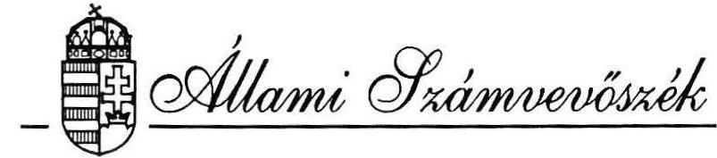
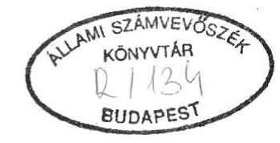
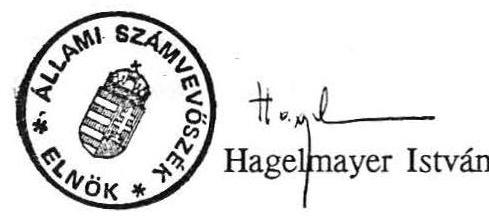

#  

## JELENTÉS

a Népjóléti Minisztérium fejezet pénzügyi-gazdasági ellenőrzéséről

---

Az ellenőrzést végezték:

Balázs Andrásné
Holé Sándorné dr.
Kovácsné Szepesi Etel
Nagy Ákosné
Surányi Tamás
Badacsonyi György
Baranyai Zoltán
Csizmadia József

Az ellenőrzést vezette:
Kolossváry György
számvevő tanácsos
számvevő
számvevő tanácsos
számvevő tanácsos
számvevő
külső szakértő
külső szakértő
külső szakértő
főtanácsos

---

# JELENTÉS 

## a Népjóléti Minisztérium fejezet pénzügyi-gazdasági ellenőrzéséről

A Népjóléti Minisztérium (NM) fejezethez 1991-ben 16 cím tartozott. Fejezet szinten az 1989. évi 18,2 Mrd Ft-tal szemben 1991. évben 140,1 Mrd Ft bevételt realizáltak, míg a kiadások 17,5 Mrd Ft-ról 138,3 Mrd Ft-ra nőttek. Az állami támogatás a bevételekből 1989-ben 16 Mrd Ft-ot, 1991-ben 115,8 Mrd Ft-ot tett ki. A fentiekből a családi pótlék kiegészítő és a Társadalombiztosítási Alap (TBA) támogatása címek előirányzatait a Pénzügyminisztérium, a kormányzati beruházásokat az Állami Fejlesztési Intézet finanszírozta. Az Üdülési és Szanatóriumi Főigazgatóság cím fejezetként működött. Az NM közvetlen gazdálkodási körébe tartozó címek 1991-ben 116,2 Mrd Ft bevételt és 114,1 Mrd Ft kiadást teljesítettek összesen. A feladatokat 1991-ben mintegy 40 ezer fő létszámmal és 34,8 Mrd Ft bruttó értékű állóeszközállománnyal látták el.

A minisztérium felügyelete alá 1989. év elején 45 önálló költségvetési szerv tartozott, míg az 1992. első félév végén már 67. A minisztérium által kezelt Egészségvédelmi Alap 1991-től beépült a fejezet költségvetésébe.

Jellemzi a feladatok változását a családi pótlék és a gyógyító-megelőző ellátások forráscseréje 1990-ben az NM és a TBA között, az Állami Népegészségügyi és Tisztiorvosi Szolgálat 1991. évi létrehozása a népjóléti miniszter közvetlen irányítása alatt, valamint az üdültetés rendszerének alapítványi formában való átalakítása 1992. szeptember 1-től.

Az ellenőrzés célja annak értékelése volt, hogy a költségvetési gazdálkodásban a törvényességi, a célszerűségi és az eredményességi szempontokat hogyan érvényesítették, valamint a feladatok, a szervezet és a pénzügyi források mennyiben vannak összhangban a fejezetnél.

---

Az ellenőrzés a fejezet szintű pénzügyi folyamatok mellett elsősorban a minisztériumi igazgatás, a gyógyító-megelőző ellátás, az orvosegyetemek, valamint az ágazati és célfeladatok területén értékelte a gazdálkodást.

Az ellenőrzött időszak 1989. évtől 1992. I. félévig terjedt, emellett vizsgáltuk az 1992. évi költségvetés megalapozottságát.

# I. 

## Következtetések, javaslatok

A Népjóléti Minisztérium működését a rendszerváltást követően 1990. évben kezdte meg. A minisztérium Kormány által meghatározott feladat- és hatásköre - a jogelőd Szociális és Egészségügyi Minisztériumhoz képest - bővült, illetve jellegében változott. Ez szükségessé tette az új követelményeknek megfelelő szervezeti és irányítási rendszer kialakítását, amelyet a minisztérium is célként tűzött ki. Így mindenekelőtt a minisztérium szervezetének korszerűsítésére, a fejezet szintű gazdálkodás rendszerének kialakítására és a működési feltételek biztosítására helyezték a hangsúlyt.
Mindezt az alapvetően megváltozott szakmai követelmények és az egyre nehezedő gazdasági helyzet mellett kellett megvalósítaniuk. Többek között erre is visszavezethető, hogy csak részleges eredményeket sikerült elérniük ezen a téren.

A szervezeti korszerűsítés folyamata lassú, ami visszafogta a működés szabályozását is. A minisztérium túltagolt szervezeti struktúrája, a működési szabályzatok hiánya, illetve elavultsága, a hatáskörök, gazdasági jogkörök rendezetlensége kedvezőtlenül befolyásolták a belső irányítási rendszert és végső soron a fejezet szintű gazdálkodás szervezését, irányítását.

A Kormány 1991. évi határozatának megfelelően nem végezték el az intézmények teljeskörű felülvizsgálatát, a korszerűsítések irányát sem határozták meg. Késésben van - az 1992. évi költségvetési törvény alapján - az intézmények alapító okiratának felülvizsgálata és tevékenységi körük meghatározása. Mindezek hiánya az intézményi szervezetek korszerűsítésére fékezőleg hat, illetve azt esetlegessé teszi.

Az intézményeknél helyenként végrehajtott szervezési intézkedések arra utalnak, hogy keresik az irányítás, a feladatok célszerűbb ellátását szolgáló megoldásokat. Az egyetemeknél a vezetés struktúrájában lényeges változások történtek, ezek célszerűsége azonban néhány esetben vitatható. A gazdasági-műszaki ellátás szervezeteinél - a vizsgált körben - végzett átszervezések viszont minőségi fejlődést jelentettek. A vizsgált országos intézeteknél ugyanakkor e téren alapvető elmozdulás nem történt. A működés

---

belső szabályzatai az intézményeknél jelentős részben elavultak. Az egyetemeknél a gazdálkodás rendjének korszerűsítése célszerűen a decentralizálás irányában hatott.

Az intézményi felügyeleti tevékenység színvonala visszaesett, ami a gyógyító-megelőző ellátás kettős finanszírozására, az intézményhálózat növekedésére és a Pénzügyi Főosztály nem megfelelő személyi feltételeire vezethető vissza.

A gyógyító-megelőző ellátások TBA általi finanszírozása az intézmény felügyeletnél új helyzetet teremtett. A finanszírozás változását a felügyeleti jogköröknél még nem érvényesítették, ami az intézmények gazdálkodását érintően ellentmondásokat vetett fel (költségvetés jóváhagyása, éves beszámoló és pénzmaradvány elszámolás felülvizsgálata, ellenőrzés).

A fejezet éves költségvetései - a meglévő feszültségekkel - az egyensúlyi követelményeknek általában megfeleltek. A költségvetések egyes előirányzatai azonban nem voltak kellően megalapozottak. Ebben közrejátszott az is, hogy a törvényalkotásban a költségvetési hatások számbavétele esetenként elmaradt, továbbá az állami költségvetés és a TBA költségvetés tervezése, jóváhagyása időbelileg eltért.

Az előirányzatok évközi módosítása során az intézmények pénzügyi helyzetét több esetben nem vették megfelelően figyelembe és így indokolatlanul számottevő pénzeket helyeztek ki.

A fejezet 1990-1991. évi jelentősebb összegű pénzmaradványait - a kötelezettségvállalások teljesítésén túl - célszerűen elsősorban az intézményi működés, a felújítások és a beruházások feszültségeinek enyhítésére használták fel. Eredményes volt az átmenetileg szabad pénzek kihelyezése, kamatbevételek elérése. A vállalkozásokba belépés már kevésbé mondható ennek. A vállalkozási tapasztalatok hiánya, az esetenként megalapozatlan koncepciók miatt többnyire nem értek el megfelelő eredményt.

Az éves költségvetések végrehajtása során - az egyre nehezedő pénzügyi feltételek között - a minisztérium jelentős erőfeszítéseket tett a különböző ágazati feladatok ellátására, az intézmények működőképességének megőrzésére.
Az ellenőrzés a gazdálkodásban elsősorban célszerűségi és eredményességi szempontból állapított meg hiányosságokat.

Az Ágazati és célfeladatok 1991. évi fejezeti szintű előirányzatának jelentős részét más feladatokra (elsősorban felújításra) csoportosították át, illetve tartalékolták. Ezzel az eljárással - bár az törvényi előírással nem ütközik - a különböző ágazati programok költségvetési törvénnyel jóváhagyott pénzügyi lehetőségeit csökkentették. A programokat megvalósító intézmények a szűkített előirányzatot sem megfelelő ütemben és több esetben nem célirányosan használták fel. Ebben a minisztériumi ellenőrzés elmaradása

---

is szerepet játszott. Mindemellett az egyes programok pénzügyi tervezése sem volt kellően megalapozott.

A fejezet szintű pénzügyi feszültségek mögött az intézményi gazdálkodásban érzékelhetők a kihasználatlan tartalékok, a hatékonyság növelésének lehetőségei.

Az intézményeknél a szervezett álláshelyek többnyire mintegy 10%-kal meghaladták a tényleges igényeket. Ennek ellenére az álláshelyek felszámolásával alig éltek, ami alapvetően annak függvénye, hogy a létszámnak és a béralapnak a feladatokkal összefüggő elemző vizsgálatára legtöbbször nem vállalkoztak. A reális létszámmegállapítás ellen hatott a létszám- és bérgazdálkodás jogkörének intézményen belüli decentralizálása is. A bérezési gyakorlatot nem mindig a tudatosság, tervszerűség jellemezte, inkább a spontaneitás. Az intézmények hiányos információs rendszere kevés lehetőséget ad a létszám és bérgazdálkodás kellő mélységű elemzésére.

A hatalmas állóeszköz vagyon jelentős feladatot támaszt annak hasznosításával és fenntartásával szemben. A tapasztalatok szerint a gépek, berendezések kihasználtsága több esetben nem volt elégséges, ami összefügg azzal, hogy a minisztérium a beszerzések összehangolásánál a lehetőségeket csak részben használta ki. Kedvezőtlenül hat, hogy hiányzik az orvostechnikai nagyberendezések beszerzésének, telepítésének szabályozása. Az intézmények részéről ugyanakkor gyakran elmaradt a kihasználtság elemzése.

A készletgazdálkodás feltételeiben, a beszerzések előirányzataiban (pótelőirányzataiban) az elmúlt időszakban indokolatlan különbségek alakultak ki az intézmények között, amely az ellátottság aránytalanságaihoz vezetett. Ennek enyhítésére felügyeleti szervi intézkedés nem született. A készletgazdálkodásban a takarékos megoldások ellen hat a havi, egyenlő ütemű pénzellátás.

A vagyonvédelem és a számviteli rend terén gyakoriak és többirányúak a hiányosságok. A leltározások szabályszerű kiértékelése és a felelősség érvényesítése elmaradt, a selejtezéseknél pedig nem jártak el kellő gondossággal. Ennek következtében az érintett intézményi mérlegek valódisága kérdésessé vált. Az NM Gazdasági Igazgatóság 1989-1991. évi mérlegbeszámolói a valódiság követelményének nem feleltek meg. A szabálytalanságok előfordulását mind a felügyeleti, mind a belső ellenőrzések hiányosságai lehetővé tették.

Sem a felügyeleti jellegű költségvetési ellenőrzések, sem a belső ellenőrzések nem segítették elő kellően a gazdálkodás színvonalának az emelését. A költségvetési ellenőrzéshez a szükséges személyi feltételeket nem biztosították, így az feladatainak csak mérsékelten tett eleget. A belső ellenőrzés rendszerében főként a függetlenített ellenőrzés maradt el jelentősen a követelményektől.

---

Az ellenőrzés megállapításai alapján a következőket javasoljuk:

# 1. A Kormány 

a jövőben - az államháztartásról szóló 1992. évi XXXVIII. törvény 86. paragrafusának megfelelően - a központi és a TBA költségvetést egy időben terjessze az Országgyűlés elé, elősegítve ezzel azt, hogy a Parlament egyszerre tárgyalja meg a két törvényjavaslatot.

## 2. A Népjóléti Minisztérium részére:

a. A szervezeti korszerűsítés keretében

- gyorsítsa fel a minisztériumi szervezet korszerűsítésének folyamatát, figyelemmel az ellenőrzés által feltárt fogyatékosságokra. A felülvizsgálatot terjesszék ki a főosztályok és a felügyelet alá tartozó egyes intézmények feladatainak kapcsolódására;
— mielőbb végezzék el az intézmények alapító okiratának teljeskörű felülvizsgálatát és tevékenységi körük meghatározását. Szükséges emellett - a Kormány 1991. évi határozatából kiindulva - ismételten áttekinteni az intézmények szervezeti és feladatrendszerét;
- a Pénzügyi Főosztály, valamint az Ellenőrzési Főosztály szervezeti kereteinek, személyi feltételeinek megerősítésével teremtsék meg a fejezeti szintű gazdálkodás hatékony irányításának, felügyeletének és ellenőrzésének megfelelő feltételeit.
b. A működés rendje és szabályozottsága érdekében
- a minisztériumi szervezet korszerűsítéséhez igazodva szabályozzák a működési folyamatokat, a gazdálkodás rendszerét, hatáskörét, különböző területeit és a beruházási tevékenységet;
—rendeljék el az intézmények szervezeti- és működési szabályzatainak, ügyrendjeinek, a különböző gazdálkodási szabályzatainak, valamint a munkaköri leírásoknak a felülvizsgálatát és aktualizálását.
c. Tekintsék át a TB finanszírozás hatását az intézmény felügyeleti jogkörökre és kezdeményezzék az indokolt módosítások jogi szabályozását.

---

d. A fejezet szintű költségvetési tervezés megalapozottságát - a PM-mel való egyeztetés szakaszaiban - javítani kell a bázis- és az alapelőirányzatok ellenőrizhető, tételes kimunkálásával, valamint a saját bevételi források reálisabb felmérésével.
e. Az intézményeket érintő előirányzatmódosításkor (pótelőirányzat megállapításkor) körültekintően vegyék figyelembe azok pénzügyi helyzetét. Követeljék meg a pótelőirányzati kérelmek - jogosságát alátámasztó - pontosabb és részletesebb kidolgozását.
f. Az Ágazati és célfeladatok címről finanszírozott szakmai programok pénzügyi tervezését megalapozottabbá kell tenni, meghatározva az egyes programok teljes finanszírozási időtartamát és évenkénti költségvetési előirányzatát. Az előirányzatok tervszerű és célirányos felhasználását rendszeres minisztériumi ellenőrzéssel kell elősegíteni.

Indokoltnak tartjuk a Szombathelyi Markusovszky Kórháznak művese állomásra biztosított és fel nem használt 3 M Ft visszavonását.
g. Az intézményi gazdálkodásban:

- a közalkalmazottak munkaviszonyáról szóló jogszabályi előírások alapján át kell tekinteni az anyagi ösztönzés rendszerét, annak főbb kereteit a munkaügyi szabályzatban célszerű előírni; felül kell vizsgálni a decentralizált létszám- és bérgazdálkodás gyakorlatát a hátrányok kiküszöbölése érdekében; az ágazati létszám- és bér információs rendszert és annak alapján az intézmények információs rendszerét korszerűsíteni kell;
— az eszközök optimális kihasználását szervezési intézkedésekkel és szabályozással célszerű elősegíteni; a nagyértékű gépek, berendezések beszerzése, telepítése egészségpolitikai irányelveken és az összehangolást biztosító szabályozáson alapuljon, ugyanakkor törekedni kell több műszakos üzemeltetésükre;
— az NM Gazdasági Igazgatóságnál az 1989-1991. évi mérlegbeszámolók valódiságának a megsértéséért a felelősséget meg kell vizsgálni és érvényesíteni kell.
h. A költségvetési és az intézményi belső ellenőrzés rendeltetésének megfelelő, színvonalas működését a szervezeti, személyi feltételek megerősítésével, a tevékenység rendszeres értékelésével, a követelmények számonkérésével
 és a belső ellenőrzéshez módszertani útmutatással kell elősegíteni.

---

# II. 

## Részletes megállapítások

## 1. A feladatok, a szervezeti rendszer és a gazdálkodási feltételek összhangjának értékelése

a. A Népjóléti Minisztérium az 1990. évi XXX. törvénnyel alakult meg. A 49/1990. (IX.15.) kormányrendeletben meghatározott feladata és hatásköre - jogelődje, a Szociális és Egészségügyi Minisztérium feladataihoz képest - elsősorban a szociális feladatok vonatkozásában bővült, illetve jellegében változott. Ennek során a minisztérium felügyelete alá tartozó intézményrendszer is jelentősen módosult, ami indokolttá tette az új követelményeknek megfelelő szervezeti, irányítási rendszer kialakítását, működése szabályozottságának megteremtését.
1991. év végétől kezdődően nemzetközi egyezmény keretében nyújtott szakértői közreműködéssel folyik a minisztérium szervezetének, tevékenységének átvilágítása, a feladatokkal arányos, racionális szervezeti felépítés kidolgozása.

A minisztériumon belüli feladatmegosztást, a szervezet struktúráját, hierarchiáját a vizsgált időszakban nem célszerűen építették ki.

A létszámcsökkentésre hozott intézkedések hatására a minisztériumi apparátus korábbi túlméretezettsége mérséklődött, a főosztályok és egyéb szervezeti egységek számának növekedésével azonban a szervezet túltagolttá vált. Nőtt a létszámában elaprózódott szervezeti egységek, illetve a vezetői munkakörök aránya, ami egyúttal növelte a feladatellátás koordináció igényét. Kedvezőtlen volt, hogy egyes szervezeti egységek létszáma nem a feladatukkal arányosan változott.

A minisztérium álláshelyeinek száma az 1989. évi 320-ról 1992-re 269-re csökkent. Jelentős volt a betöltetlen státuszok száma. A ténylegesen foglalkoztatottak létszáma - az egyes években hullámzóan változott, de összességében 247 főről 276,5 főre emelkedett.

Nőtt a szervezeten belül a felsővezetés törzskarának létszáma és súlya.
A fő- és önálló osztályok száma 15-ről 18-ra nőtt, s a 7 fő alatti létszámúak aránya közel megduplázódott.

A minisztérium szervezeti egységei között tapasztalható volt a célszerűtlenül megosztott, részben átfedő feladatellátás. Figyelembe véve a különböző jogállású-

---

kat, vagy eltérő irányításukat, a megfelelő szabályozás hiányát, mindez esetenként hatáskör elvonást, párhuzamos feladatvégzést, koordinációs zavarokat, a döntési szintek feljebbtolódását eredményezte.

Az azonos irányítási vonalba tartozó Szociálpolitikai Főosztály és a Társadalompolitikai Főosztály egyes feladatai részben párhuzamosak vagy átfedőek. (A társadalompolitikai, gazdaságpolitikai, életszínvonalpolitikai megalapozó tervező munka, illetve a Kormány gazdaságpolitikai programjában a társadalompolitikai összefüggések vizsgálata; szociálpolitikai információs rendszer fejlesztése, összehangolása, illetve szociálpolitikai statisztikai rendszer kialakítása.)

A kormánybiztos által irányított Válságkezelő Program Iroda a Szociálpolitikai Főosztály és Család, Gyermek és Ifjúságvédelmi Főosztály tevékenységét esetenként átfedi, s előfordul, hogy ilyenkor hatáskörüket elvonja.

Az 1991. évi XI. törvénnyel létrehozott Állami Népegészségügyi és Tisztiorvosi Szolgálat (ÁNTSZ) és a Közegészségügyi és Járványügyi Főosztály feladata, hatásköre nem megfelelően rendezett. Az ÁNTSZ élén álló országos tisztifőorvos feladatait a miniszter közvetlen irányításával látja el. Ugyanakkor - a minisztérium feladatvégzése alapjául szolgáló, de hatályba nem léptetett 1991. évi szervezeti és működési szabályzat (SZMSZ) tervezet szerint a Közegészségügyi és Járványügyi Főosztályt az egészségpolitikai helyettes államtitkár felügyeli, s feladatát képezi többek között az ÁNTSZ felé a tervezés keretében a közegészségügyi és járványügyi feladatok meghatározása.

A beruházási tevékenység az eltérő irányítás alá tartozó Műszerügyi Önálló Osztály és a Pénzügyi Főosztály között megosztott.

Egyes főosztályok tevékenysége szorosan kapcsolódik, illetve összefügg a felügyelet alá tartozó intézménnyel, vagy konkrét feladatuk odatelesített (pl. Országos Orvostudományi Információs Intézet és Könyvtár, Országos Kórház és Orvostechnológiai Intézet, Gyógyító Megelőző Ellátás Információs Központja). Célszerű lenne ezért a minisztérium feladat-szervezet átvilágítása keretében ezeket a kapcsolatokat a célszerűség, eredményesség szempontjából áttekinteni.

A fejezeti szintű gazdálkodás irányításának és felügyeletének tevékenységét - a közigazgatási helyettes államtitkár közvetlen irányítása alá sorolt - Pénzügyi Főosztály látja el. A funkció személyi feltételei romlottak, s a vizsgálat idején sem voltak megfelelőek. Ez az esetenkénti túlzott leterhelésben, a vezetők munkakörében az irányító, ellenőrző, koordináló, szabályozó, stb. feladatok rovására végzett operatív munkavégzésben nyilvánult meg. Hatása elsősorban az intézmény felügyeleti tevékenység színvonalának visszaesésében volt tapasztalható. Az intézményi felügyeleti tevékenység lényegében a tervezés, beszámoltatás, pénzmaradvány elszámoltatás feladatának formális végrehajtására korlátozódik.

---

A Pénzügyi Főosztály álláshelyeinek száma az 1989. évi 43-ról - folyamatosan - 1992-re 30-ra csökkent. A ténylegesen foglalkoztatottak létszáma a vizsgált években rendre elmaradt e lehetőségektől is. A vizsgálat időszakában kimutatott tényleges létszám 26 fő volt. A szorosan vett fejezeti pénzügyi-gazdasági feladatokat (költségvetési kapcsolatok, ágazati munkaerő és bérpolitika, pénzellátás, stb.) 9 fő - melyből egy nyugdíjas - végzi. A vezetők, ügyintézők általában a szakirányú egyetemi, főiskolai végzettséggel rendelkeznek, ugyanakkor több mint 30%-uk jelen munkakörben 1-2 éve dolgozik, nincs kellő gyakorlatuk.

A minisztérium a vonatkozó 1991. évi Korm. határozat ellenére nem végezte el intézményeinek teljeskörű felülvizsgálatát, szervezeteik korszerűsítésének irányát sem határozta meg. Emellett az 1992. évi költségvetést megállapító 1991. évi XCI. törvény 34. par. (3) bekezdésében előírt kötelezettségnek határidőre nem tett eleget. A felügyelete alá tartozó költségvetési szervek alapító okiratát bekérte, de felülvizsgálatuk, az alap- és vállalkozási tevékenységük körének meghatározása a vizsgálat idején a döntéselőkészítés szakaszában volt.

A törvényi kötelezettség teljesítésének elmaradása részben a korábbi időszak felügyeleti, szabályozási problémáival függ össze, annak hiányosságait tükrözi. A dokumentumok bekérése kapcsán megállapították, hogy az intézmények jelentős köre nem rendelkezik alapító okirattal, vagy feladata nem kellően meghatározott.

A minisztériumi átszervezés előkészítésének elhúzódó folyamata a működést meghatározó, illetve az ahhoz kapcsolódó szabályozási tevékenységet késleltette. Így a minisztérium szervezetére, működésére és gazdálkodására vonatkozó alapvető szabályzatok hiányoznak, vagy csak tervezeti készültségűek, s ebben a formában sem megfelelő színvonalúak. A korábbi szabályzatok elavultak. A hatáskörök egyértelmű meghatározásának, rögzítésének hiányosságai esetenként hatáskörelvonással, párhuzamos feladatvégzéssel vagy koordinációs zavarokkal járnak.

A minisztérium feladatvégzése keretéül szolgáló 1991. évi SZMSZ tervezet már részben elavult, emellett a főosztályi ügyrendek, munkaköri leírások teljeskörben nem állnak rendelkezésre, a meglévők egy része sem aktuális.

A fejezeti gazdálkodás hatás- és feladatkörét, a pénzügyi jogköröket nem, vagy nem megfelelően határozták meg, illetve szabályozták.

Nem rögzítették a költségvetési előirányzatok - jogszabályi keretek alapján gyakorolható - jóváhagyásának, átcsoportosításának eljárási módját, jogosítványát.

A fejezeti kezelésű ágazati célfeladatok előirányzatának felhasználásához kapcsolódóan a minisztérium több szervezeti egysége rendelkezik pénzügyi jogkörrel (pl. kötelezettségvállalás), melyet általában a főosztályvezető, illetve a

---

felhasználási cél és keretösszegekre vonatkozó vezetői döntéssel kijelölt témafelelős gyakorol. Ezek rendje azonban nem szabályozott.

Nem rendezett a főosztályok pénzügyi-gazdálkodási jogköre a Gazdasági Igazgatósággal való kapcsolatrendszerben sem.

Az ÁNTSZ szervezetéről, működéséről szóló 7/1991. (IV.26.) NM rendelet egyes előírásai ellentmondásosak, illetve nem elég konkrétak. Eszerint a minisztérium pénzügyi-gazdasági fejezeti jogosítványait részben a Tisztifőorvosi Hivatalon keresztül gyakorolja. A fejezeti feladatok részbeni továbbadásának ténye mellett kifogásolható, hogy annak konkrét tartalma nem rögzített. (A gyakorlatban a minisztérium vonatkozó döntéséhez kikéri a Tisztifőorvosi Hivatal véleményét.)

A minisztérium összetett feladatellátását különböző adatbázisokra épített információs rendszer segíti. Részben a megfelelő szervezeti, személyi feltételek hiánya miatt ezen információs rendszereket - a lehetséges kapcsolódási pontok és számítógépes háttér figyelembevételével - nem hangolták össze, nem minisztériumi szintű koncepcióra alapozták.

A szükséges és lehetséges koordináció hiánya, az egyedi s esetenként nem kellően átgondolt döntések következtében az e tevékenység fejlesztésére szolgáló pénzeszközök felhasználásában a célszerűségi követelmények nem érvényesültek megfelelően. Az információk hasznosítása, hasznosíthatósága a kívántnál szűkebb körű.

A minisztérium belső információs rendszere a számítógépes adatfeldolgozás technikai feltételeinek és ügyviteli feladatainak összekapcsolt rendszerbe foglalása szakaszában tart.
b. A vizsgált intézményeknél az 1989-1992. I. féléves időszakban végrehajtott fejlesztések, feladatváltozások döntően a betegellátás területén eredményeztek bővülést, bár elmaradtak az igényektől.

Egységes, tárca szintű koncepció hiányában az intézményi szervezetek korszerűsítésére esetlegesen került sor.
A végrehajtott szervezési intézkedések arra utalnak, hogy az intézmények keresik az irányítás, az alapfeladatok célszerűbb ellátását biztosító megoldásokat.

Az oktatási reformfolyamattal is összefüggésben a vezetés struktúrájában lényeges változások történtek az egyetemeknél, e lépések - néhány esetben - a célszerűség oldaláról vitathatók.

---

A Semmelweis Orvostudományi Egyetem (SOTE) területén az igazgatási, ügyviteli tevékenység irányítását, összehangolását a Rektori Hivatal vezetését korábban egyszemélyben a főtitkár látta el. A jelenlegi gyakorlatban már két személy - a Rektori Hivatal vezetője és a főtitkár - között oszlanak meg ezek a feladatok. Az Egyetem Ideiglenes Alapokmányában ugyanakkor nincs meghatározva a főtitkár jogállása, feladatköre.

Az egyetemek, országos intézetek élén egyszemélyi felelős vezető áll, a rektor, illetve a főigazgató főorvos. A SOTE és az Országos Reumatológiai és Fizikoterápiás Intézet (ORFI) esetében közel mintegy húsz szervezeti egység irányítása tartozik közvetlenül a rektorhoz, illetve a főigazgató főorvoshoz, amely az intézményi vezetés és irányítás hatékonysága szempontjából nem mondható célszerűnek.

Az egyetemek szervezete igen összetett. E tekintetben egyedülálló a SOTE, amelyhez 26 klinika, 35 elméleti intézet és 8 országos intézet tartozik, s így az ország legnagyobb intézményi komplexuma. Ez a nagyfokú integráció kétségtelenül előnyös a hallgatók gyakorlati képzésének szervezésénél. A szakmai- és gazdálkodási tevékenység racionális, hatékony irányíthatósága szempontjából azonban felvetődik, hogy célszerű-e ilyen összetett szervezetet egyetlen költségvetési intézmény keretében működtetni.

Az intézmények a gazdasági-műszaki ellátást végző szervezeti egységeknél - a korszerűsítés igényével - több kisebb-nagyobb mértékű átszervezést hajtottak végre. Az egyetemeknél - ahol a szervezet és a működés szabályozása is új alapokra került - ezek a lépések minőségi fejlődést jelentettek e szervezeti egységeknél a feladatrendszer és a szervezet kapcsolatában. (Csökkent az osztályok száma, kedvezőbben alakult a vezetők, beosztottak, illetve az adminisztratív és a fizikai dolgozók aránya.) Az országos intézeteknél a gazdasági részleg szervezetének struktúrájában lényeges elmozdulás nem történt. Ennek hiányában helyenként a szervezet túltagolt.

Az ORFI-nál hat osztály és három önálló előadó tartozik közvetlenül a gazdasági főigazgatóhoz.

A költségvetési keretek és a feladatellátás összehangolásában gondot okoz, hogy az oktatás-gyógyítás-kutatási tevékenység a szakfeladatok rendjében összefonódik, megosztásuk megfelelő pontossággal nehezen valósítható meg, így nem mutatható ki a TB által finanszírozott betegellátás tényleges ráfordítása. A betegellátás költségeinek növekedése jelentős anyagi eszközöket von el a másik két területtől, ennek negatív hatásai főként a klinikák gazdálkodásában érzékelhetőek.

A bázis szemléletű költségvetési tervezési módszer következtében a feladatellátás igényeiből kiinduló tervezés helyett a keretek mechanikus lebontása került előtérbe.

---

Ez is arra utal, hogy célszerű lenne a teljesítmény finanszírozás módszereit mielőbb kimunkálni, szélesebb körű bevezetésének feltételeit megvizsgálni.

Pénzellátási zavarokhoz vezetett, hogy a teljesítményfinanszírozás területén (szívsebészet, vesetranszplantáció, stb.) a TB a ténylegesen felmerülő költségektől elmaradva, időbeli késedelemmel folyósította a pénzügyi fedezetet.

A vizsgált intézményeknél a szervezet és a működés szabályozottsága csak részben elégíti ki a követelményeket. Az egyetemek Ideiglenes Alapokmánya (SOTE), valamint Ideiglenes Alkotmánya (Orvostovábbképző Egyetem /OTE/) - ha esetenként vitathatók is - korszerű szabályzatok. A vizsgált országos intézetek szervezeti és működési szabályzatainak - amelyek már a 80-as évek elejétől érvényben vannak - jogszabályi háttere elavult. A jogszabályi és közgazdasági változások figyelmen kívül hagyása tükröződik az intézetek kapcsolati rendszerének, működési mechanizmusának leírásában is. Az időközben végrehajtott átszervezéseket sem követte minden esetben az SZMSZ módosítása. A múlt év közepétől már nagyobb figyelmet fordítottak a szabályzatok korszerűsítésére.

Az egyetemek ideiglenes szabályzatai széles körű demokratizmust biztosítanak az egyetemi polgároknak (az oktatóknak és a diákoknak), ugyanakkor kifogásolható, hogy a szolgáltató
 szférába sorolt igazgatási, ügyviteli és gazdasági-műszaki ellátási tevékenységek szabályozására kevesebb figyelmet fordítottak. Kedvezőtlen, hogy a gazdasági főigazgató hatásköre, jogköre a korábbiakhoz képest korlátozódott, jogállása nem minden tekintetben volt azonos a vele azonos szintű vezetőkével.

A SOTE Ideiglenes Alapokmánya a gazdasági főigazgató esetében csak a feladatok felsorolására tér ki, hatáskörét, jogosítványait nem rendezi. További hiányosság, hogy az egyes szervezeti egységek SZMSZ-e, ügyrendje nem készült el.

A belső szabályzatok közötti összhang nem valósult meg következetesen. A rész-szabályzatok hatályba lépése néhány esetben megelőzte a működés, gazdálkodás főbb kereteinek meghatározását (pl. ORFI). A szabályzatok így a belső összhang megteremtése céljából többszöri korrekciót igényelnek. A jogszabályi és szervezeti változásokat - kevés kivételtől eltekintve - nem tükrözik a munkaköri leírások.

A belső irányítási- és hatásköri rendszer főbb elemeit, koordinációs pontjait a szervezeti-működési szabályzatok általában rögzítik. Az egyetemeknél a célszerűség szempontjából pozitív, hogy az irányítás felső szintjén összpontosulnak a működés egészét érintő döntéselőkészítések, s a döntéshozatal. A döntések előkészítésére széles körű demokratizmust, koordinációt biztosítanak. Az országos intézetek körében az irányítás hatékonyságának, célszerűségének megítélésénél gondot okoz a szabályozástól eltérő gyakorlat.

---

Ez az Országos Kardiológiai Intézetnél a szabályozás rendszerében, alkalmazhatóságában feltárt hiányosságokra vezethető vissza. Az ORFI-nél a vezetőváltásokkal összefüggően a személyi feltételek hiánya miatt a szabályzatban rögzített irányítási mechanizmus helyett a "kézivezérlés" érvényesült.

A gazdálkodási jogkörök, hatáskörök, felelősségkörök szabályozása és gyakorlata az intézmények jellegéből adódóan eltérő. Az egyetemeknél a gazdálkodás korszerűsítésére számos lépés történt, amelyek a decentralizálás bővüléséhez vezettek. Ezek a folyamatok az összetett feladatrendszer és szervezet szempontjából indokoltak. A decentralizált keretgazdálkodás azokon a területeken működött eredményesen, ahol ennek szabályait meghatározták, s gondoskodtak a folyamatos ellenőrzésről, rendezték a keretek túllépésének szankcióit (pl. OTE). A SOTE esetében az itt mutatkozó hiányosságok is közrejátszottak abban, hogy a legutóbbi időkig nem érvényesült a vezetői felelősség a pénzügyi keretek betartásában, így azokat rendszeresen túllépték.

A vizsgált két országos intézetnél lényegében centralizált gazdálkodás folyik, ami az adottságokat és a jelenlegi helyzetet tekintve célszerűnek mondható.

# 2. A költségvetési tervezés és finanszírozás értékelése 

## a. Költségvetési tervezés

A költségvetési tervező munkában a minisztérium törekedett a feladat, forrás, finanszírozás összehangolt rendszerének kialakítására. Ez a szándék azonban a vizsgált években nem realizálódott kielégítően. A fejezet költségvetésében továbbra sem biztosított teljeskörűen a feladatok és a hozzájuk rendelt pénzügyi keretek összhangja.

A fejezet költségvetése - feladatának bővülésével, az állami és társadalombiztosítás közötti forráscserével, a központi bérpolitikai intézkedésekkel, stb. összefüggésben - nagyságrenddel nőtt.

A gyógyító-megelőző ellátások meghatározott körének, a családi pótléknak forráscseréje 1990-ben nettó 37.412 M Ft-tal, az ÁNTSZ 1992-ben mintegy 4 Mrd Ft-tal növelte a fejezeti költségvetést. Társadalombiztosítási Alapnak fizetendő térítések címen az előirányzat az 1991. évi 13.565 M Ft-ról 1992-re 15.100 M Ft-ra emelkedett.

Az éves tervezés keretében a fejezet és a felügyelete alá tartozó intézmények költségvetési javaslatának bázis- és alapelőirányzatát - forráscsere előirányzatok

---

kivételével - 1991-ig jól ellenőrizhető részletezettséggel és dokumentálhatóan a többször módosított 19/1980. (IX.27.) PM rendelet és tájékoztatók előírásaira figyelemmel munkálták ki. Ugyanakkor előfordult, hogy egyes tételek szabályszerűsége kifogásolható volt, vagy vitatott, nem ellenőrizhető. Ezeket a tételeket azonban a PM minden esetben elfogadta a fejezeti költségvetés bázis előirányzatainak megállapításánál.

A jogelőd SZEM megalakulásakor az 1989. évi szerkezeti változásként a Művelődési Minisztériumtól átvett ifjúsági nevelőintézetek 1988. évi egyszeri felújítási hányad kiegészítését előirányzatosították ( $35,8 \mathrm{M} \mathrm{Ft}$ ).

A fejezet 1989. évi eredeti költségvetési előirányzatának kialakításakor a Igazgatás, valamint az Egyéb anyagi tevékenység és gazdasági szolgáltatás ágazatban elrendelt zárolás számított összege a munkatársi egyeztetésnek megfelelően mérséklésre került (63331/VI/1988. sz. ügyírat). A mérséklés és a zárolandó összeg közötti összefüggés rögzítésének hiányában a további zárolásnál alkalmazott csökkentés jogossága kétséges (a vitatott tétel $10,7 \mathrm{M} \mathrm{Ft}$ ).

Az igazgatási és a gazdasági szolgáltatási ágazat 1990. évi támogatási előirányzatának 5%-os csökkentését a fejezet időarányosan és nem éves szintre számítottan hajtotta végre.

Az 1992. évi tervezésnél a - családi pótlék és TB támogatási címek előirányzatát nem tartalmazó - PM által elfogadott 1991. évi bázis előirányzat egyeztetése során a szerkezeti változás, szintezés tételei, a tisztázott és befogadott eltérések, továbbá a PM által javasolt csökkentések tartalma az ellenőrzésnek átadott dokumentumban nem volt megfelelően részletezett.

A vizsgált időszakban a fejezet költségvetésének egyes előirányzatai - mivel azok alá- vagy fölétervezettek, illetve a feladatokkal nem arányosak - nem voltak kellően megalapozottak. Megjegyezzük azonban, hogy az eltérések esetenként a fejezeti költségvetés nagyságrendjéhez mérten nem számottevőek.
A gyógyító megelőző ellátások társadalombiztosítási finanszírozás körébe vont támogatási előirányzata 1990-ben nem volt kellően megalapozott. Az egységes módszertani előkészítés hiányában alkalmazott kalkuláció számos torzító tényezőt tartalmazott.

A TB által finanszírozandó gyógyító megelőző ellátások támogatási összegét az 1989. évi szakfeladati költségek alapján határozták meg mind a fejezet, mind a felügyelete alá tartozó intézmények szintjén. A szakfeladati tartalom nem egyértelműen meghatározott, nem fejezi ki kellő pontossággal a tényleges egészségügyi ellátás körét (pl. klinikákon végzett felsőoktatási, kutatási tevékenység). Emellett a költségből levezetett kiadás - a számvitel és beszámolás rendjéből adódó - további torzítást eredményezett.

---

A fejezet 1991. évi költségvetésében a gyógyító-megelőző ellátások TB támogatásból származó bevételi előirányzataként az 1990. évi CIV. törvényben elfogadott összeg az Országos Társadalombiztosítási Főigazgatóság (OTF) által közölttől eltért.

A fejezet 1991. évi Parlament által elfogadott TB támogatásának előirányzata 15.392,1 M Ft, az OTF által közölt előirányzat 14.039,6 M Ft volt, az eltérés 1.352,5 M Ft. Az eltérést három intézmény költségvetését érintően (SOTE, OMK, Hévíz) kiegyenlítő bevétel, kiegyenlítő kiadás beiktatásával (1.261,2 M Ft), illetve ár- és díjbevételük korrekciójával rendezték. Ez a megoldás csak technikailag rendezi az 1991. évi TBA és állami költségvetés közötti differenciát.

A törvények előírásai között az eltérés lehetőségét az állami költségvetés és az ahhoz kapcsolódó TBA költségvetés tervezésének, jóváhagyásának időbeli eltérése, szemléletbeni és a vezetett nyilvántartások adatainak különbözősége, továbbá a szükséges egyeztetés elhúzódása teremtette meg.

A fejezet és az OTF bázis előirányzat levezetésének összehasonlításával megállapítható volt, hogy a minisztérium számításaiban szerkezeti változásként, szintrehozásként olyan összeget is szerepeltetett, amely címen addig nem volt finanszírozás.

Az ÁNTSZ 1991. évi költségvetési előirányzatát végleges feladatainak ismerete nélkül alakították ki. Ebből adódóan - a létrehozásáról szóló törvényben megfogalmazott egyes feladatai (pl. tisztifőorvosi hálózat gyógyszerész szakfelügyelet) forrásszükségletének felmérése, átcsoportosítási igénye hiányzott, ugyanakkor a saját bevételét alátervezték.

A családi pótlék előirányzatait alátervezték. Ezt tükrözi a családi pótlék OTF által ténylegesen kiutalt és a módosított költségvetési előirányzata közötti különbözet (1990-ben 110,2 M Ft, 1991-ben 838,9 M Ft). Tervezési és elszámolási megoldások miatt a különbözetek kiegyenlítése elhúzódott, a vizsgálat befejezésekor még rendezetlen volt az 1991. évi tartozás az OTF felé. Kedvezőtlen, hogy a családi pótlék mértékének növeléséről szóló egyes törvények nem rendelkeztek a kapcsolódó pótelőirányzatról (1990. évi XCII. tv., 1991. évi I. tv.).

Nem volt reális - a végrehajtás tükrében - 1989. és 1990. években az állammal szemben különböző jogcímen előírt költségvetési befizetési kötelezettség előirányzata sem. Így a fejezet nem a vonatkozó költségvetési törvényben meghatározott összegben tett eleget befizetési kötelezettségének. Ezt a tényt a zárszámadás elfogadásával az Országgyűlés tudomásul vette.

Az 1988. évi XVII. törvény a fejezet befizetési kötelezettségét 1989-re 41.250 e Ft-ban, az 1989. évi L. törvény 1990-re 25.000 e Ft-ban írta elő. Ezzel szemben a

---

bevételi számlára e jogcímen befolyt és elvont összeg ettől lényegesen elmaradt: 17.223 e Ft, illetve 18.106 e Ft volt.

Az 1989-91. években a bevételek tervezésénél a fejezet nem vette reálisan figyelembe a saját forrás lehetőségeket az eredeti előirányzatok kialakításánál. Az alátervezést érzékelteti, hogy az intézményi bevételek mérsékelt emelése jelentősen elmarad az előző évi tényszámoktól és a tárgyévi teljesítésektől. Így az intézmények az év során gyakran jelentős többletforráshoz jutottak.

Jellemzően az intézményi bevételek 1990-ben tervezett eredeti előirányzata az előző évi teljesítés 66%-a, 1991-ben 77%-a.

A saját bevételek növelésére elsősorban az intézményi díjemelések, kisebb részben a szolgáltatások, vállalkozási jellegű tevékenységek körének bővítése adtak alapot. Az átmenetileg szabad pénzeszközök lekötése után kapott kamat tendenciájában növekvő, de nem tervezett bevételi forrás.
A fejlesztési többletek - a kiadások rangsorolása, illetve a végrehajtás tükrében nem mindig voltak kellően megalapozottak. A jóváhagyott pénzügyi keretek mögött nem volt elegendő szakmai feladattartalom (pl. donorszervezés, transzfúziós program).

A kiadások rangsorolásánál elsődleges szempont volt a meglévő intézményhálózat működőképességének megőrzése, majd jellemzően 1991-től a szociális ellátások területe.

A vizsgált években központilag kezelt előirányzatokat előzetes számítások és ismert feladatok, vállalt kötelezettségek alapján - de a tervalku mechanizmusra is figyelemmel - állították össze. A költségvetés jóváhagyását követően azonban ezek ismételt felülvizsgálatra - s a lehetőségek, új körülmények mérlegelésével jelentős átrendezésre kerültek.

A fejezet költségvetési tervező munkájában a vizsgált időszakban növekedett a normativitás szerepe. A minisztérium feladatköreihez kapcsolt humán szolgáltatások normatív módon támogatottjainak köre szélesedett, emelkedtek az ellátási normák és alkalmazásukban megszűnt a differenciálás.

1990-ről 1992-re pl. az idősek napköziotthoni ellátásánál az évi norma 9 e Ft/fő-ről 28 e Ft/fő-re, a szociális intézményi ellátásnál 70 e Ft/fő-ről 201 e Ft/fő-re emelkedett.

Új normatív ellátási forma 1991-től a fiatalkorúak gyermekotthoni és gyógypedagógiai intézeti ellátása, 1992-től a gyermek és ifjúságvédelem keretében az állami és intézeti nevelés és a házi szociális gondozás.

---

A gyógyító megelőző ellátásban - a teljesítményarányosan finanszírozott kiemelt beavatkozások körének, normatívájának s részben az esetszámok növekedése miatt - a normatív kiadások súlya az intézményi költségvetésekben növekedett.

Ezt jellemzi, hogy az 1989. évben eredetileg 7 kiemelt beavatkozásra 631,5 M Ft volt a tervezett kiadási előirányzat, 1992-ben 10 kiemelt beavatkozásra 1098 M Ft. A tényleges teljesítés 56%-kal nőtt. (1990-től ez a TB finanszírozási körben jelent meg.)

A fejezet szintű előirányzatmódosítások összege az egyes években jelentősen emelkedett, az eredeti költségvetés főösszegéhez mért aránya ugyanakkor 16%-ról 5%-ra csökkent. Nagyobb hányadát a saját hatáskörű módosítások tették ki.

A minisztérium irányító szervi hatáskörében végrehajtott előirányzatmódosítások jelentős hányadára a kormányzati intézkedések érvényesítésével kapcsolatban került sor. Az ezzel összefüggő, központi pénzforrások felhasználásában a pénzellátás biztonságára törekedtek (a központi bérintézkedések végrehajtásánál a tervezési hiányosságok feloldására fedezeti tartalékot képeztek). Az intézmények közötti átcsoportosítás egy része főként a vizsgált időszak elején feladatátrendezéssel függött össze. Ezek azonban nem koncepcionális, hanem egyedi - esetenként nem célszerűségi okokból hozott - döntések voltak.

Az 1990. évi CIV. törvény és az 1991. évi XCI. törvény előirányzat módosítási megkötései feloldására sajátos, - s a költségvetési gazdálkodás elveivel ellentétes megoldást vezettek be. A korábban pénzellátásból fedezett intézményi pótigényekre, adott címen belül egy intézményhez, felhasználási korlátozással kihelyezett forrást képeztek. Így az indokoltnak ítélt előirányzatmódosítást címen belül átcsoportosítással oldották meg (pl. az orvosegyetemek, egészségügyi főiskolák és oktatási, kutatási szakintézetek címhez tartozóan).

Az intézmények előirányzatait több
 esetben indokolatlanul, pénzügyi helyzetük nem megfelelő számbavételével növelték, illetve az indokoltság ellenére nem csökkentették.

Az Országos Haematológiai és Vértranszfúziós Intézet (OHVI) részére 1989-ben továbbképzésre 343 e Ft, külföldi utazásra 80 e Ft, 1990-ben az új TB finanszírozási rendszer gépi úton történő feldolgozásra - előzetes számítás hiányában - 1.000 e Ft, kutatási témákhoz egy fő létszámra 297 e Ft, 1991-ben az AIDS segélyhely üzemeltetésére 650 e Ft pótelőirányzat szükségtelen volt.

Az Országos Pszichiátriai és Neurológiai Intézetnek (OPNI) 1990-ben szakmai programra biztosított 12.080 e Ft pótelőirányzat a felhasználás időbeli eltolódása miatt indokolatlan volt. Az összeget tartalékolták, majd 1992-ben - a

---

vonatkozó 1992. évi kormányhatározat alapján - a "TÁMASZ" nevű alapítvány törzstőkéjét képezte.

Az OHVI-nál a vér és vérkészítményekkel kapcsolatos bevételek - jogszabályi változás alapján - 1989-ről 1990-re 11.748 e Ft-ről 57.711 e Ft-ra emelkedtek. (A bevételek eléréséhez 14.237 e Ft saját forrást kellett igénybe venni.) A megváltozott pénzügyi feltételek ellenére felügyeleti szervi előirányzatváltoztatásra (támogatáscsökkentésre) nem került sor. Ezáltal az intézmény jelentős többletforráshoz jutott, amiből egyes vezetők aránytalanul magas jutalmazása is lehetővé vált. Az 1990. évben a 7,7 M Ft jutalom alapon belül 2.015 e Ft 15 fő jutalmazását képezte, amelynek keretében a főigazgatóhelyettes 318 e Ft, többek pedig 150 e Ft-ot meghaladó jutalomban részesültek.

Az intézmények az 1989-90. években a működési bevétel előirányzatot szabálytalanul saját hatáskörben felemelték - és az is előfordult, hogy a jogszabályi változás hatását figyelmen kívül hagyták - ezáltal a többletteljesítés 50%-át kivonták a költségvetési befizetési kötelezettség alól.

A szúrópróbaszerű ellenőrzés megállapította, hogy a minisztérium az előirányzatmódosításokat többségükben az előírások betartásával hajtotta végre. Megjegyezzük azonban, hogy a fejezet irányításáért felelős jogkörébe tartozó módosítások kiadmányozója - írásos felhatalmazás nélkül - a pénzügyi főosztály vezetője. Ezt a jogkörét felsővezetői döntés alapján gyakorolja.

# b. Finanszírozási gyakorlat 

A Társadalombiztosítási Alap 1990. évi költségvetéséről szóló 1989. évi XLVIII. törvénnyel elrendelt feladat, illetve forráscsere alapján 1990. évtől a gyógyító-megelőző ellátás intézményeinek működési kiadásait az Alap finanszírozza. A felújítások, beruházások finanszírozása az NM-nél maradt. Az eltelt időszak tapasztalatai szerint az életbe lépett változás a korábbi finanszírozási rendszer gondjait nem oldotta fel.

A finanszírozás - szűkebb körtől eltekintve - változatlanul nem feladatonként valósul meg, hanem az intézményi működés egészére irányul. Az intézmények ellátási szintkülönbségeit az új finanszírozási rendszer sem tudta csökkenteni. A működési és a beruházási feladatok szétválasztása erőltetettnek mondható. E kettőségből eredően esetenként előfordult, hogy az elfogadott fejlesztés működési költségei - koordinálatlanság miatt - a TB támogatásában nem jelentek meg. A TBA pótelőirányzatainak év végére való ütemezése esetenként évközi egyensúlyi zavarokhoz vezetett az intézményi gazdálkodásban. Az új rendszer felveti az OTF-nél az általa folyósított intézményi támogatások ellenőrzésének igényét.

---

A minisztérium a fejezet pénzellátásának javítása, illetve kiegyensúlyozottabbá tétele érdekében élt a tartalékolás lehetőségével, a pénzmaradványok felosztásával, a szabad pénzek hasznosításával és vállalkozásba fektetésével (3., 6. és 7. sz. mellékletek).

A szükséges tartalékról különböző módon gondoskodtak a vizsgált időszakban. Az 1991. év előtt az egyes előirányzatok évközi felhasználásának tükrében a felszabadítható összegeket fontossági sorrend szerint átcsoportosították a fedezethiányos és sürgős feladatokra. A gazdálkodás feszültségeire tekintettel azonban 1991. évtől a fejezeti szintű ágazati és célfeladatok előirányzat terhére képeztek tartalékot, figyelemmel a nem tervezhető feladatok pénzigényére is.

Az ágazati és célfeladatok előirányzata terhére 1991-ben saját hatáskörben 221,4 M Ft-ot csoportosítottak át elsősorban felújításra (169,2 M Ft-ot), valamint a MIOK Kórház OTF által nem finanszírozott többletigényére (52,2 M Ft).

Az ágazati és célfeladatok előirányzatából 1992. évben 10% tartalékot képeztek.
A fejezeti szintű pénzmaradvány 1989-ben 527,7 M Ft-ot, 1990-ben 1.127,7 M Ft-ot és 1991-ben 1.058,1 M Ft-ot tett ki.

Az 1990. évi kiugró pénzmaradvány abból adódott, hogy az OTF a teljesítményfinanszírozott feladatok elszámolási és az árkompenzációs pótelőirányzat fedezetét 1990. december elején utalta át, amelyet az intézetek már nem tudtak felhasználni. A maradványt növelte a jelentős áremelésekre való felkészülés, óvatos intézeti gazdálkodás is.

A pénzmaradványok jellemzően céljellegű, illetve "kényszer" megtakarításokból (kutatási maradványok, szállítói tartozások, kötelezettségvállalások fedezetei), másrészt a felújítások, beruházások, szakmai eszköz beszerzések fedezeti hiánya miatt leülepedett pénzekből, valamint az intézményeknél bevételi többletből tevődtek össze.

A fejezeti pénzellátás pénzmaradványa tartalmazza a kihelyezett pénzek (értékpapírok) kamatát és tőkésített kamatát is. A pénzellátási maradvány azonban döntően az ágazati és célfeladatok előirányzat maradványából adódik.

Az OTF által - eltérő mértékben - finanszírozott intézetek tényleges pénzmaradvány helyzetét, a költségek megfelelő elkülönítettségének hiányában nem lehet megítélni. Az átvett pénzek között az oktatási, a kutatási és a betegellátást célzó előirányzatok egybeolvadtak.

---

A PM 1989-ben 2,8 M Ft-ot, 1991. évben pedig 21,3 M Ft-ot vont el a tárcától. 1990-ben a pénzmaradvány befizetési kötelezettség visszahagyásával részben teljesült az SOS Gyermekfalu és a felsőoktatási hallgatói juttatások többletigénye.

A felhasználható pénzmaradványokból az 1989-1991. években elsősorban a működési feladatok pénzügyi fedezeteit egészítették ki (179,4 M Ft), jelentős mértékben értékpapírt vásároltak (149 M Ft) és egyre nagyobb súlyt képviselt a felújítási, beruházási célú felhasználás.

A pénzmaradvány célszerű és szabályos felhasználását jelentősen akadályozta a PM késői jóváhagyása. A fejezeti pénzellátás és az intézetek - tekintettel az áthúzódó kötelezettségekre és a céljellegű kiadásokra (pl. kutatás) - a jóváhagyás tényétől függetlenül teljesítik tartozásaikat.

A minisztérium a pénzmaradványból két évben (1989, 1990.) - a pénzforrás gyarapítására - kihelyezett, átmenetileg szabad pénzt. A tárca ennek kamatait tőkésítette, kötvényeket vásárolt. A kihelyezés 1992. áprilisában megszűnt. A vizsgált időszakban - a pénzmaradványhoz hasonlóan - a költségvetési számláról 1989. II. negyedévétől kisebb megszakításokkal, 1991-től pedig folyamatosan helyeztek ki kamatozásra szabad pénzeszközt, csökkenő mértékben. Az 1989. évben 500 M Ft-ot, 1991-ben 165 M Ft-ot, illetve 136 M Ft-ot.

A kihelyezett összegek kamatait, amely évente változott (átlagosan 30%-os volt), tőkésítették, illetve ebből a folyamatosan jelentkező beruházási, felújítási többletigények fedezeti hiányait pótolták. 1991. II. félévétől a kihelyezett pénzösszeg (136 M Ft) célirányos megtakarítás lett: a DOTE Szívsebészeti Centrum beruházás többletigényét fedezte részben (a felhasználás 1992. IV. hó).

A minisztérium a vizsgált időszakban öt vállalkozásba fektetett be pénzeszközeiből (Px Kft, Röntgen és Kórháztechnikai Vállalat RT, Mester-Malom Kft, RODATA RT, SZEMINFO Kft). A vállalkozásokba a minisztérium összesen 20,2 M Ft készpénzt és 0,2 M Ft eszközt vitt be és 1990-ben 730 e Ft, 1991-ben 1.960 e Ft osztalékot kapott. A minisztérium jelenlegi törzstőkéje a vállalkozásokban 10 M Ft.

A Px Kft és a SZEMINFO Kft a minisztérium épületében, eszközeivel üzemelt, illetve üzemel bérleti díj ellenében. A Px Kft-nek az alakulása évében 21.845 e Ft értékű számítástechnikai eszközt (ebből 19.716 e Ft új beszerzés), éves 25 M Ft-os rendelésállományt, ebből 7,5 M Ft előleg fizetést biztosított a tárca.

A vállalkozások - a SZEMINFO és RKV RT kivételével - az eredeti céljukat nagyobb hányadában nem teljesítették. A tárca a Px Kft-ben lévő üzletrészét 1991-ben 10,3 M Ft-ért értékesítette, de eladásra felajánlották a Mester-Malom

---

Kft-ben lévő tulajdoni hányadot is. A RODATA RT ez év áprilisában öncsődöt jelentett.

A vállalkozási befektetések céljai - a Px Kft és SZEMINFO Kft kivételével - nem tárca feladatokat szolgáltak. A tárca a vállalkozási jellegű befektetésekkel elsősorban a korábban háttérintézményei révén megoldott, általában nem szorosan az alapfeladatokhoz kapcsolódó tevékenységeket kívánta, megfelelő érdekeltségi viszonyokkal, piaci körülmények között megoldani. Ez főként a nem kellő vállalkozási tapasztalatok és a nem mindig megalapozott, következetes koncepciókra épülő célok miatt nem járt megfelelő eredménnyel.

A tárca letéti számlával is rendelkezett, amelyen az elhelyezett összeg az 1989. évi 6.074 e Ft-ról 1991-ig 377 e Ft-ra csökkent. A számlán bonyolították le a költségvetésen kívüli pénzforgalmat (hagyaték, segélyprogram, WHO keret AIDS programra, a tárca társas vállalkozási tulajdonának osztalékai, stb.).

# 3. A költségvetés végrehajtásának értékelése 

### 3.1. A fejezet szintű költségvetési folyamatok

A minisztérium feladatváltozásával, a forráscserével összefüggésben mind összegében, mind szerkezetében jelentősen változott a fejezet költségvetése. Az 1989. évben a közszolgáltatást folytató intézményi gazdálkodás előirányzata volt a meghatározó, 1991-ben az arány a családi pótlék, a TBA támogatása, illetve az ágazati célfeladatok javára tolódott el. (Jellemzően a közszolgáltatást végző intézmények eredeti költségvetési előirányzata a fejezet költségvetésén belül az 1989. évi 82%-ról 1991-re 21%-ra csökkent.)

A fejezet eredeti bevételi előirányzatát az 1989-1991. években folyamatosan túlteljesítette (15,6%, 5,9%, 8,4%-kal). Az 1989. évi 18,2 Mrd Ft-tal szemben 1991-ben 116,2 Mrd Ft bevételt realizáltak (1. sz. melléklet). A forrás struktúrában a költségvetési támogatás a meghatározó, bár aránya kissé mérséklődött (88%-ról 83%-ra). A saját bevételek súlya a fejezeti költségvetésben - figyelemmel a jelentős szerkezeti változásra - nem számottevő, azonban az intézményi kiadások közel egy-tizedét fedezi. Az intézményi bevételek (működési, ár- és díjbevétel, kamat) mintegy kétszeresére növekedése elsősorban az ellátások, szolgáltatások díjainak emelkedésére vezethető vissza. Figyelemre méltó - az összegszerűen nem jelentős - kamatbevételek növekedése.

A vizsgált intézmények ár- és díjbevételeiket rendszeresen, működési bevételeiket többnyire túlteljesítették.

---

A tartós lekötések forrása több intézménynél a kutatási célokra felhalmozódott, több évi feladat ellátására szolgáló pénzeszköz (Országos Traumatológiai Intézet /OTRI/, Pécsi Orvostudományi Egyetem /POTE/, stb.).

A saját bevételeket évről-évre alátervezték (a túlteljesítés az egyes években 103%, 107%, 67%), ami a költségvetés megalapozottságát rontotta.

A többletbevételekhez füződő érdekeltségi rendszer az intézményeket nem késztette valós bevételeik tervezést megelőző feltárására.

Döntően a központi költségvetési és társadalombiztosítási feladatok végrehajtott forráscseréjével összefüggésben, ugrásszerűen emelkedett az átvett pénzekből származó bevétel (1989. évi 139 M Ft-ról 1991-ben 15,5 Mrd Ft-ra).

E forrást növelte az intézmények és a gazdálkodó szervek együttműködési szerződéseiből, alapítványok által gyűjtött adományokból fejlesztési célra véglegesen átvett pénzeszköz.

A fejezeti szintű kiadások is meghaladták az eredeti előirányzatot, a túlteljesítések mértéke mérsékeltebben, de követte a bevételekét (11,1%, 4,1%, 6,4%). A módosított előirányzattól kissé elmaradva az 1989. évi 17,5 Mrd Ft-tal szemben 1991-ben 114,1 Mrd Ft kiadást teljesítettek (2. sz. melléklet).

A kiadások belső struktúrája - az egyenlőtlen növekedések miatt - jelentősen átrendeződött, a bérjellegű kiadások között 1991-től elszámolt családi pótlék 81,4 Mrd Ft volt. Jellemző a működéssel szorosan összefüggő béralap, bérjellegű, anyagjellegű kiadások átlagot meghaladó növekedése.

A fejezet gazdálkodása belső feszültségektől nem volt mentes. A költségvetési bevételek, kiadások közötti különbség évenkénti csökkenő üteme, a működési kiadások átlagon felüli növekedése, a felújítások, beruházások gyakori elhalasztása, valamint az előző évi források fokozódó igénybevétele pénzügyi feszültségeket, finanszírozási gondokat takar.

A vizsgált intézmények évközi pénzügyi zavarait a szükséglettől eltérő ütemű pénzellátás okozta. Költségvetési egyensúlyukat általában megőrizték.

A fejezet a költségvetési egyensúlyát a vizsgált időszakban összességében megőrizte.
 A gazdálkodás feszültségeinek feloldására - egyre szűkebb lehetőséggel - mobilizálható pénzeszközeinek (tartalék, pénzmaradvány, átmenetileg szabad pénzek) hasznosításával, valamint az előirányzatok átcsoportosításával élt.

---

A PSZTI által közreadott 1990. évi fejezet összesítő adatok nem tartalmazzák a társadalombiztosítási számláról folyósított - OTF-től átvett és felhasznált - pénzeket.

# 3.2. Az ágazati és célfeladatok előirányzataival való gazdálkodás 

Az NM 1991. évi költségvetésében az Ágazati és célfeladatok címen 7.029,9 M Ft előirányzatot hagyott jóvá a Parlament.

A vizsgált központi egészségügyi szakmai programok előirányzatainak tervezhetőségét, ezáltal a célszerű felhasználásának megítélését egyes esetekben hátrányosan befolyásolta az a gyakorlat, hogy egy-egy szakmai feladat folyamatos, több évre meghatározott költségigényét előre nem dolgozták ki. Ezáltal az előző évi szakmai és pénzügyi teljesítést is figyelembe vevő számítási anyagok nélkül finanszírozták tovább az eredetileg egyszeri jelleggel támogatott ágazati és célprogramokat.

Például 1991-ben a finanszírozási kísérlet egyes területeinek juttatott, előre nem tervezett összegei, 1992-ben valamennyi orvostudományi egyetem immunológiai programra kapott 9,3 M Ft-os összege, az OHVI több, részleteiben meg sem határozott programjaira szerkezeti változásként biztosított 10 M Ft-os pótelőirányzata.

Az ágazati és célfeladatokra szánt összegek törvényi jóváhagyása után a minisztérium vezetése az előirányzatok egy részét a megfogalmazott feladatoktól eltérően más célokra csoportosította át, illetve tartalékolta. Ennek oka volt a 10%-os dologi automatizmust meghaladó árszint növekedés NM által prognosztizált összege, a fejezeti szintű felújítási igények korábbi évekhez hasonló, várható pótlólagos pénzszükséglete, valamint az új társadalombiztosítási finanszírozási rendszer bizonytalansági tényezői.

A minisztérium - élve az 1990. évi CIV. törvény 9. paragrafusa (10) bekezdésében biztosított lehetőséggel - saját hatáskörben a vizsgált ágazati és célfeladatok terhére 169,2 M Ft-ot felújításra, 12,6 M Ft-ot társadalmi szervek feladatfinanszírozási feladatra csoportosított át. Emellett 49,2 M Ft-tal csökkentette a vizsgált ágazati programok előirányzatait az év végi kormány szintű - valamennyi fejezetet érintő - támogatás csökkentés miatt.

Az 1990. évi CIV. törvény 9. par. (10) bekezdése szerinti szabályozás - bár lehetővé tette a költségvetési gazdálkodás feszültségeinek enyhítését - az ágazati és célfeladatok pénzügyi megvalósítása szempontjából kedvezőtlen volt.

---

Az ellenőrzött ágazati és célfeladatok módosításai az eredeti célokra szánt 1.112,9 M Ft-os előirányzatot fejezeti szinten év közben 21%-kal, 882 M Ft-ra csökkentették.

A minisztérium az előirányzatcsökkentés mellett további 135,5 M Ft-ot tartalékként kezelt, amelyet a korábban említettek miatt egyéb célra - döntően az árváltozások kompenzálására - az intézményekhez utalt ki.

Kellően át nem gondolt tervezésre utal a "Társadalombiztosításban megtakarítást eredményező nagyértékű berendezések üzemeltetési többlete" előirányzat kialakítása, miután döntően beruházást és felújítást szolgált.

A vizsgált központi feladatok 1991. évi 1.112,9 M Ft-os előirányzatának 73%-át, 816,5 M Ft-ot utaltak le az egyes programokat megvalósító intézményeknek.

Ezen belül az előirányzat szerinti pénzeszközöknek a "Kiemelt egészségügypolitikai szakmai célok működésének és eszközellátásának támogatása" programnál a 92%-át, az "Új típusú szervezeti formák és módszertani-vezetési megoldások megalapozása" programnál a 79%-át, az "Intézményi ellátások normatív követelményrendszereinek kidolgozása" programnál a 74%-át, míg a "Társadalombiztosításban megtakarítást eredményező nagyértékű berendezések üzemeltetési többlete" programnál mindössze 57%-át osztották fel a megvalósítás érdekében.

Az előirányzatokból juttatott támogatásokat az intézmények nagyrészt a célnak megfelelően használták fel, több esetben azonban ettől eltérő volt a gyakorlat. Jelentős pénzösszeget sem a tárgyévben (1991), de még a vizsgálat időpontjában sem használtak fel, illetve kötöttek le (pl. a SOTE a "veleszületett" szívhibák program, valamint a Debreceni Orvostudományi Egyetem (DOTE) és a fővárosi Szent László Kórház transzplantációs programjai esetében). A hiányosságok az időben elhúzódó szakmai döntésekre vezethetők vissza.

Az előirányzatok egy részénél a meghatározott tervtől, illetve céltól eltérő - egyes esetekben a takarékossággal ellentétes - felhasználás is tapasztalható volt.

Például a Szombathelyi Markusovszky Kórháznál a pályázat útján elnyert dializáló készülék értékesítése, a Szegedi Orvostudományi Egyetem (SZOTE) izotópdiagnosztikai laboratóriumában az intézmény finanszírozási kísérlet túlzott pénzellátása, valamint az OHVI csontvelő transzplantációs programjánál propaganda célú kifizetés és az egyszeri jelleggel kapott bérelőirányzat rendeltetéstől eltérő felhasználása.

Az ágazati és célfeladatokra előirányzott pénzek hasznosulását hátrányosan befolyásolta, hogy a pénzfelhasználások időben elhúzódtak. Az "Intézmény

---

ellátások normatív követelményrendszereinek kidolgozása" programnál pedig több esetben a minisztérium által meghatározott célok nem realizálódtak.

Az előirányzatok felhasználásánál kedvezőtlen volt, hogy a minisztérium azt nem ellenőrizte, így sem a támogatásban részesült intézmények, sem a minisztérium vezetése nem kapott értékelést az egyes programok megvalósítását szolgáló pénzek felhasználásának szabályszerűségéről és célszerűségéről. Ez a szükséges intézkedések megtételét is korlátozta.

Több intézménynél az intézményfinanszírozási kísérletekhez beszerzett nagyösszegű számítógépeket nem vették nyilvántartásba (pl. a Gyógyító Ellátás Információs Központjánál, a Dunaújvárosi Kórháznál és a DOTE-nél).

Az ágazati és célkeretek beruházásra fordítható pénzeszközei tekintetében nem határozták meg, hogy a célkeretek az intézmények milyen jellegű tevékenységére vonatkoztak. Miután az orvosegyetemeken az egészségügyi ellátás mellett oktató és kutató munka is folyik, így e tevékenységekre fordított beruházási összegek általános forgalmi adója - 1991-ben annak 80%-a - az adóhatóságtól visszaigényelhető volt. Nevezett intézményeken kívül a fentiek szerint járt el az OHVI a donorszervezésre szánt összegek esetében, miután azt - APEH hozzájárulással - kutatási tevékenységnek minősítette.

Az 1991-ben hatályos "A központi költségvetési szervek számlakeretének hatálybaléptetéséről kiadott 925/1987. PM XII. sz. számviteli közlemény" szerint a beruházási juttatásból megvalósított központi vagy célcsoportos beruházások visszaigényelt forgalmi adó összegével nem rendelkezhet az intézmény (azt az Állami Fejlesztési Intézetnek kell átutalni).

A szabályozás figyelembevételével a jelzett megoldás (a tevékenység szerinti célmeghatározás) az NM ezirányú kiadásainak csökkenéséhez vezethetett volna. A túlfinanszírozás milliós nagyságrendű, pontos összege csak tételes ellenőrzés alapján mutatható ki.
(A vizsgált ágazati és célfeladatokra vonatkozó előirányzat-változtatásokat, valamint a fejezeti teljesítések, továbbá az egyes feladatok ellenőrzése során feltárt hiányosságokat a 8. sz. melléklet tartalmazza.)

---

# 3.3. Az intézményi gazdálkodás főbb területeinek értékelése 

## a. Létszám- és bérgazdálkodás

A fejezet intézményeinél 1989-1991. között az előirányzott állományi átlaglétszám 41.912 főről 49.259 főre, 17%-kal, a tényleges átlaglétszám pedig 32.788 főről 39.796 főre, 21%-kal nőtt (4. sz. melléklet).

Fejezeti szinten 1989-1991. évek között a béralap eredeti előirányzata 179%-ra, módosított előirányzata és a tényleges kiadás 214%-ra nőtt.

Az előirányzat növekedés zömmel a központi (egészségügyi, oktatási, kutatási, közművelődési, stb.) bérintézkedések, kisebb részben a feladatbővülés hatásának a következménye. A módosított béralapot fejezeti szinten 98,2 - 98,5 %-ban használták fel.

Az előirányzott állományi átlaglétszám növekedése nagyrészt irányító szervi döntés alapján, az egyes intézetek feladatainak bővüléséhez kapcsolódott (pl. kórházi ágyak számának növekedése, egészségügyi főiskolai képzés beindítása, új szervezetek alakítása, stb.).

Az intézetek feladatainak, az ehhez szükséges létszámnak és béralapnak az elemző vizsgálata alig fordult elő a vizsgált időszakban. Az intézetek belső létszámváltoztatását csak kisebb részben okozta a feladatmegszünés, korszerűbb szervezés miatti létszám-megszüntetés, jellemzőbb az átvett (főleg kutatási célú) pénzek felhasználásával kapcsolatos létszámbővülés és csökkentés volt.

Pozitív példaként kiemelhető az OHVI 1992. évi belső létszámátcsoportosítása és létszámcsökkentése, amelyet teljes belső átvilágítás és az intézeti struktúra átszervezése előzött, illetve alapozott meg.

Az előirányzott és a tényleges átlaglétszámok évenkénti összehasonlítása azt igazolja, hogy az intézetek többségénél a létszámelőirányzat mintegy 10%-kal meghaladta a kialakult ellátási színvonal igényeit, illetve az egyes munkakörök betöltési lehetőségeit. Fejezeti szinten az előirányzott átlaglétszám 78-80 %-át tette ki a tényleges átlaglétszám, a különbség csaknem felét a tartósan távollévők (GYES, GYED, katonai szolgálat, fizetés nélküli szabadság) okozták, másik felét pedig a betöltetlen álláshelyek.

Az intézetek többségénél a létszám- és bérgazdálkodás jogköre a belső szervezeti egységek vezetőihez decentralizált, de alig érzékelhető ennek létszámgazdálkodásra gyakorolt hatása, még az üres álláshelyek felszámolásában sem.

---

A vizsgált időszakban érzékelhetően módosult az intézetek belső struktúrája, mind az állománycsoportok, mind a szakmai munkaköri csoportok összetétele. A szervezetek tagoltabbá váltak, amelyet jelez, hogy a vezető állománycsoportba tartozók aránya a teljes előirányzott létszámon belül az 1989. évi 4,9 %-ról 1991-ben 5,3 %-ra, a tényleges átlaglétszámon belül pedig 5,7 %-ról 5,9 %-ra nőtt. Tehát az egészségügyi intézetekben 1991-ben minden 17-ik foglalkoztatott vezető volt.

A szakmai munkaköri csoportok szerinti összetétel figyelemre méltó változása, hogy az előirányzott létszámon belül 1989-1991. év között az egészségügyi fizikai szakdolgozók (pl. ápolónők) aránya 23,3 %-ról 20,4 %-ra csökkent, míg az egészségügyi szakdolgozók (pl. asszisztensek) aránya 17,8 %-ról 21,6 %-ra nőtt. E változás a tényleges létszámon belül is realizálódott.

Fejezeti szinten a foglalkoztatott létszám mintegy 90%-a főfoglalkozású, 2,2 %-a részfoglalkozású, 7,8 %-a nyugdíjas dolgozó, mely a vizsgált időszakban lényegesen nem változott. A részfoglalkozású és nyugdíjas dolgozók esetenként és főként 1991-ben az intézeti átlagot lényegesen meghaladó bérezésben részesültek, amelyet csak részben indokol a szakmai gyakorlat vagy különleges hozzáértés.

Az NM felső államigazgatási létszámában foglalkoztatott teljes munkaidős dolgozók átlagos bérszintje 1991. évben 387.300 Ft volt, a részfoglalkozású és nyugdíjas dolgozóké - átlaglétszámra vetítve - 557.700 Ft.

Az OTRI-nál a nyugdíjasok számára kifizetett bérköltség aránya 1989-1992. I. féléve között 6,5 %-ról 13%-ra növekedett, miközben létszámuk 12,5 %-kal csökkent.

A bérköltségen belül fejezeti szinten - intézetenként nagy szóródást mutatva - 6,6 %-ról 5,6 %-ra csökkent a túlórákra kifizetett bér aránya.

A OHVI-ban 1989-1991. között a túlórák bérköltsége 4,6 %-ról 3,1 %-ra csökkent, a Traumatológiai Intézetnél 1989-1992. I. féléve között 6,5 %-ról 13,6 %-ra nőtt. Ez utóbbi intézetnél a túlórák ugrásszerű növekedését kisebb részben a fővárosi ügyeleti rendszer megváltoztatása, döntően a bér- és létszámgazdálkodás súlyos belső zavarai idézték elő: a legnagyobb munkaterhelésnek kitett osztályok, részlegek (műtő, röntgen) és a többi osztály közötti aránytalan létszámmegállapítás, ezáltal a napi feladatok túlórában végeztetésének kényszere. A ténylegesen ellátott túlórák díjazására még intézményi szinten sem ad fedezetet a bérmegtakarítás.

A túlórák csökkentésére irányuló tevékenységet több helyen gátolja a dolgozók ellenérdekeltsége, sokan a nagyobb kereset megszerzése érdekében szinte korlátlanul vállalnak túlórát, és ezeket igyekeznek a magasabb díjazású heti munkaszüneti

---

napokra koncentrálni. E törekvéseknek az intézetek középvezetői a túlórák engedélyezésekor alig-alig tudnak ellenállni.

Az intézetek bér- és létszámgazdálkodási információs rendszere hasznosítható információt főleg az üres állások kulcsszám szerinti száma, a szabad alapbér-keret nagysága, a helyettesek alapbére tekintetében nyújt. A bérmegtakarítás mértéke a bérszámfejtés adataiból ismerhető meg, ez a kialakított bér és létszámgazdálkodási információs rendszerrel jelenleg a vizsgált intézményeknél nincs összekapcsolva.

Néhány intézmény információs rendszere még a fenti adatszolgáltatásra sem alkalmas, s ez magában hordja a létszám- és béralap túllépés veszélyét.

Az NM Gazdasági Igazgatóságán a centralizált létszám- és bérgazdálkodáshoz kapcsolódó nyilvántartások nem biztosítják naprakészen a döntésekhez szükséges valamennyi információt. Csak alkalmankénti kigyűjtéssel ismerhető meg a betöltött és betöltetlen létszámhoz kötődő béralap nagysága, a szakfeladat szintű betöltött létszám, stb.

A OTRI-nál az üres állásokra tartalékolt bér nem jelenti a szabad, felhasználható bérkeretet az egyéb bértételeken tapasztalt túllépések miatt. A nyilvántartási rendszer hibái és a bértömeggazdálkodás rosszul értelmezett gyakorlata is hozzájárultak az 1992. I.
 félévi időarányosat 11,4 M Ft-tal meghaladó béralapfelhasználáshoz. A bérmegtakarításból tervezve, de annak hiányában is állandó jellegű bérkiadásokat teljesítettek (ügyeleti díjak, műszakban dolgozók többletteljesítési díja, a megszüntetett veszélyességi pótlék fenntartása).

A számítógépes nyilvántartás egyik intézménynél sem volt képes kiváltani a manuális feldolgozást, még a szűkített információ-szükségletre vonatkozóan sem. A programfejlesztések nem képesek lépést tartani a változásokkal. Az intézetek manuális nyilvántartási rendszere mélyebb, részletesebb elemzésre alkalmatlan.

A bértömeg-gazdálkodás lehetőségeivel az intézetek inkább a helyettesítéseknél és jutalmazásoknál, és kevésbé az üres állások felszámolásánál éltek. Ugyanakkor az üres állásokra tartalékolt bér a vizsgált intézményeknél a betöltött állások besorolási bérének mindössze 50-85%-át teszi ki, mely azt jelzi, hogy az üres állások többségét az intézmények nem is akarják betölteni.

A fluktuáció mértéke a vizsgált egészségügyi intézményekben 1989-1991. között csökkent: a belépő dolgozók aránya a tényleges átlaglétszám arányában 21-25%-ról 14-23%-ra, a kilépőké 19-26%-ról 14-20%-ra alakult.

A fluktuáció okai változatlanul az alacsony munkabérek és a nehéz munkakörülmények. Már érzékelhető a munkanélküliség hatása az állomány stabilizálásában,

---

bár néhány intézménynél ezzel szemben nőtt a próbaidőt felmondó fizikai dolgozók száma, mivel lehetőségük van a munkanélküli segélyre.

A vizsgált időszakban az egészségügyi központi béremelésekre (II.-III.-IV. lépcsőjére), továbbá a felső- és közoktatási, közművelődési, kutatási, pályakezdő, stb. szakemberek központi béremelésére került sor az intézményeknél. Az NM, illetve az ágazatilag illetékes többi minisztérium a végrehajtásra irányelveket adott ki. Az NM a bérfejlesztések konkrét végrehajtását - a munkaköri csoportok szerinti esetleges átcsoportosítását - az intézményekre bízta, a többi minisztérium viszont általában az átcsoportosítást nem engedélyezte.

Az intézmények általában - kisebb korrekciókkal - a központi irányelveknek megfelelően hajtották végre a bérintézkedéseket. A több lépcsős lebonyolítás nagy munkatöbblettel járt, de összességében zökkenőmentesen történt.

Az éves bérautomatizmusokat az intézetek többsége bérarányosan osztotta szét, elvétve fordult elő differenciálás. A helyenkénti létszámcsökkentésből származó bérfejlesztési lehetőségeket a teljesítményekhez kötődően használták fel, a belső szervezeti egységek vezetőinek hatáskörébe utalva. Egyes intézmények a döntési jogkört szakmai munkaköri csoportok - főleg orvos álláshelyek - szerint differenciálták.

A központi és helyi béremelések hatására az egyes állománycsoportok átlagbére differenciáltan javult. Fejezeti szinten 1988-1991. között legnagyobb mértékben az ügyviteli alkalmazottak (238%-ra), legkevésbé a gépkocsivezetők (162%) és a vezetők (198%) átlagbére nőtt. A szakmai munkaköri csoportok szerint legnagyobb mértékben az orvosok (215%) és az egészségügyi szakalkalmazottak (214%) bére nőtt. A bérarányok az egyes munkaköri csoportok között lényegesen nem változtak.

Az éves jutalmazási lehetőségek 1989-1991. között fejezeti szinten a december havi átlagbérek nagyságával közel azonos mértékűek voltak (4. sz. melléklet), az intézmények között nagy szórással (0,1-től 2,4-szereséig). A bérmegtakarításból származó jutalmak és egyéb ösztönzés rendszere az intézmények többségénél pontosan kimunkált szabályzatokon alapul. Általában a bérmegtakarítás 70%-ával rendelkezik a belső szervezeti egység vezetője, amelynek elszámolása havonta történik.

Az intézmények többsége azonban nem él a céljutalmazás lehetőségével, alig tapasztalni előre kitűzött feladatokhoz kötött jutalmazást.

# b. Eszközgazdálkodás 

Fejezeti szinten az állóeszközök bruttó értéke 39%-kal emelkedett 1989-ről 1991-re. Ezen belül legnagyobb mértékben a járművek (129%-kal) és a gépek,

---

berendezések (55%-kal) bruttó értéke nőtt. Egyidejűleg a teljesen (0-ra) leírt állóeszközök állománya 84%-kal növekedett. Az állóeszközök - főként a gépek, berendezések - korszerűsítését szolgáló ráfordítások a működőképesség biztosítását szolgálták, de nem álltak arányban az eszközök értékcsökkenésével, a 0-ra leírt állomány számottevő növekedésével. Az állóeszközök elhasználódási szintje összességében 32%-os, az épületeknél 26%-os, a gépek-berendezéseknél pedig 44%-os (5. sz. melléklet).

A fekvőbeteg ellátás területén a szervezett ágyak száma közel 9.000. A vizsgált intézmények ágykihasználása mintegy 70-95%-os volt. A speciális, országos feladatokat ellátó intézményeknél a kihasználtság az átlagot meghaladó volt (pl. Országos Idegsebészeti Tudományos Intézetnél /OITI/ 95%-os). Az aktív és a krónikus ágyak közötti struktúra változás igénye változatlanul fennáll és az intézményekben feltételezi a létszám struktúra változását is.
A járóbetegellátás kapcsán fokozódott az intézeti igénybevétel (ennek egyik oka a megelőző szűrővizsgálatok szélesebb köre). A diagnosztikai gép-műszerpark, a klinikai és kórházi szakambulanciák fejlesztésével lehetővé vált a magas költségigényű fekvőbeteg ellátás alacsonyabb ráfordítású járóbeteg ellátással történő kiváltása. Ezt tükrözi az elbocsátott betegek számának csökkenése. Az átlagos ápolási idő rövidülése részben a korszerűsödő műszerpark hatása.

Az intézmények törekedtek az eszközeik és épületeik kellő kihasználására. Ezért például bérbeadással, szolgáltatás nyújtásával éltek (pl. OPNI, a Fóti Gyermekváros épületeket, illetve helyiségeket adott bérbe, az OITI energiát szolgáltatott más intézménynek).

Az orvosi gépek, berendezések kihasználtsága több esetben nem megfelelő. A kihasználtságot helyenként nem is elemezték, mivel műszernaplót nem, vagy azt nem előírásszerűen vezették. A berendezések kihasználása különböző tényezők függvénye és változó képet mutat. A korszerű berendezésekkel végzett vizsgálatok száma jelentősen növekedett, míg a korszerűtlen berendezések esetében ez csökkent.

Az OITI-nél a CT vizsgálatok száma 70%-kal növekedett, ugyanakkor a röntgen vizsgálatok száma 70%-kal csökkent.

A fokozott kihasználás bér- és anyagköltség emelkedéssel jár, amelyre nincs külön fedezet. (Póttámogatást csak a CT vizsgálatok túlteljesítése, illetve a lízing élvez.)

Helyenként a berendezések iránti igények megváltoztak és így azok kihasználása mérsékelt.

---

Az Országos Sportegészségügyi Intézet doppinglaboratóriumánál több műszakos üzemeltetéssel számoltak. A tevékenység jelentősen korlátozódott, mivel a sportegyesületek fizető vizsgálati igényei a várakozástól jóval elmaradtak.

Az állóeszközfenntartási ráfordítások (nagyjavítás, kisjavítás) 1989-1991. években összességében mintegy 40%-kal, 1,8 Mrd Ft-ról 2,6 Mrd Ft-ra nőttek. Belső arányai azonban erősen eltérőek, a kisjavítások ráfordításai 69%-kal, míg a nagyjavításoké csak 15%-kal emelkedtek.

A nagyjavítások hosszabb távra előrelátó, tervszerű és szervezett megvalósításáról nem lehet beszélni. Az intézmények feladatainak kijelölését a pillanatnyi szükségesség, sürgősség határozza meg. Elsősorban a nagyjavítások terén jelentős a pénzügyi feszültség. A benyújtott igények részbeni finanszírozása miatt, évente újból rangsorolják a feladatokat.

A karbantartási ráfordítás - a működőképesség biztosítása miatt - kényszer helyzetet okoz a költségvetési gazdálkodásban. Ezeket a folyamatos üzemeltetést biztosító munkálatokat az intézmények nagyrészt szervezetten bonyolították le. Az intézmények körében a kisjavítás külső és belső lebonyolítási aránya állandósult, a saját kivitelezés 33%-ot tesz ki.

Az 1989-1991. évi beruházásoknál az egyéb kormányzati beruházások ráfordításai 2 Mrd Ft-ról 2,9 Mrd Ft-ra (50%-kal), míg a saját elhatározású beruházások ráfordításai 0,8 Mrd Ft-ról 1,8 Mrd Ft-ra (124%-kal) emelkedtek. A beruházások költségvetési előirányzata azonban még így is elmaradt a szükségestől, s az a fejezet gazdálkodásának egyik feszültségforrása.

A beruházási előirányzatok módosítási jogcímei közül növekvő arányúak az átvett pénzek, amelyek nagyrészt kutatási célokat szolgálnak.

A pénzügyi teljesítés 1991-ig rendszeresen meghaladta a módosított előirányzatot, melyre a gép-műszer beszerzések banki finanszírozása adott lehetőséget.

Az előfinanszírozás 1989-ben 194,2 M Ft, 1990-ben 380,8 M Ft, 1991-ben 250 M Ft értékben terhelte a tárgyévi keretet.

Ez a gyakorlat - figyelembe véve az áremelkedést is - eredményesebbé tette a fejezet beruházási pénzeszköz felhasználását. Az előfinanszírozás banki megszüntetését követően a pénzügyi teljesítés az előirányzattól elmaradt, összességében azonban tervszerűnek minősíthető. (1991-ben a módosított előirányzat teljesítése 93%, 1992. I. félévében 56% - lényegében időarányos.)

---

A gépek, műszerek pótlását, korszerűsítését lényegében egy keretgazdálkodás határozta meg. Az intézmények a műszerbizottságok által felülvizsgált igényeiket igazították a jóváhagyott keretekhez. Az 1991. évtől a gép, műszer beruházási keretekből főként cserepótlásra adtak lehetőséget, amelyet pályázati feltételekhez és saját erő hozzájáruláshoz kötött a minisztérium. Emellett jelentős volt - többnyire minisztériumi támogatással - az eszközök lízingelése.

Nagyértékű műszerbeszerzések terén a legfontosabb műszerfejlesztés a CT és DSA lízingelése volt, a korszerű képalkotó eljárások jelentős állomását képezve. 1989-1990-ben teljesítették az ún. "közérzetjavító" műszerprogramot és a DOTE, Országos Onkológiai Intézet nagyműszerek és kiegészítő berendezéseik beszerzését is.

Az eszközbeszerzés pénzeszközeivel való célszerű gazdálkodás, az intézményi ellátottság kiegyenlítése, illetve a területi betegellátás elveinek érvényesítése megkívánja az eszközbeszerzések összehangolását. A beszerzések koordinációját tekintettel annak ágazati és fejezeti szintű indokoltságára - csak mérsékelten és többnyire indirekt módszerekkel valósították meg.

Így - alapvetően a fejezeten belül - a nagyértékű orvosi berendezésekre adott támogatásoknál az ellátottságot is figyelembe veszik, cserepótláshoz kiegészítő támogatást nyújtanak, létesítmény beruházások engedélyezési eljárásánál a tervezett beszerzéseket felülvizsgálják.

Az ágazati szintű koordinációt nehezíti az önkormányzatok önállósága. Az eszközgazdálkodás célszerűsége szempontjából kedvezőtlen, hogy hiányzik az orvostechnikai nagyberendezések beszerzésének, telepítésének szabályozása.

A beruházások terén sajátos problémát vet fel az egyházi tulajdonok visszaadása. Több esetben kezdeményezték különböző rendeltetésű épületek átadását (ORFI, Kalocsai GYIVI, stb.), ez helyenként ingatlan vásárlást tett szükségessé (SZOTE).

Részben ennek megoldására kapott a tárca, illetve intézményei a volt szovjet laktanyákból hasznosításra. Azonban ezek kezelői joga többnyire még rendezetlen, állaguk erősen leromlott, feljavításra nincs fedezet, ezért jelenleg "csak" őriztetik. Egyes esetekben érdemi hasznosításuk erősen megkérdőjelezhető (területi hasznosítás rendezetlensége, vagy erősen fertőzött talaj miatt, stb.).

A készletgazdálkodás intézményi rendszere többnyire megfelelő. Általában ügyvitelileg szabályozott a megrendelések lebonyolítása, a készletezés, a felhasználás bizonylatolása és a nyilvántartás. Egyes nagyértékű anyagok felhasználását beteghez kötötten, nyomonkövethető módon szervezték meg. Helyenként számítógépes feldolgozás biztosítja a vagyonnyilvántartás teljességét, a bizonylatok útját és a könyvelési egyezőségeket (pl. az OITI-nál). Az időszakonkénti készletigényeket a

---

felhasználás tapasztalati adataival, valamint a készlet adatokkal összevetik és ennek függvényében végzik a beszerzést.

A készletbeszerzések költségvetési előirányzataiban, támogatásában (pótelőirányzatok) az elmúlt években aránytalanságok alakultak ki az intézmények között. Ezek az azonos rendeltetésű eszközökkel való ellátottságban (kórtermi, élelmezési, munkahelyi felszerelés, berendezés, textíliák, stb.) mutatkoznak meg. A tervezés jelenlegi bázisszemlélete ezeket az eltéréseket csak tovább növeli.

Felesleges vagy túlzott készletek nem jellemzők a készletgazdálkodásban. Az ésszerű takarékosságot (nagyobb rendelés kapcsán árcsökkentés, az árcsökkentéseknél jelentősebb készlet beszerzés, készpénz fizetési előny, stb.) azonban korlátozza a havi, egyenlő ütemű finanszírozás.

A minisztérium költségvetési szervezetei között sajátos helyet foglal el a Gazdasági Igazgatóság, amely részben a minisztériumi költségvetés operatív gazdálkodó szervezete, részben tárca feladatokat lebonyolító intézmény. A Gazdasági Igazgatóság állóeszköz ellátottsága kedvezőnek mondható. Állóeszközei kihasználtságára a minisztériumi épület, a járművek és nyomdagépek fokozott igénybevétele a jellemző. Az állagmegóvás keretében a felújítási munkálatokat csak mérsékelt pénzügyi keretek között végezhették. A munkák határidejét, költségkeretét azonban többször túllépték. A beszerzések tekintetében meghatározó volt a gép, berendezés, gépkocsi vásárlás, főként a minisztérium részére. A készletbeszerzésekre - pénzügyi fedezet hiányában - egyre kevesebbet fordítottak. Gazdálkodásának szabályozása elavult, az eszközök felhasználásának rendjét eseti intézkedésekkel biztosítják.

# c. Vagyonvédelem, számviteli rend 

Az ellenőrzött intézmények többsége csak költségvetési számlával rendelkezik, kivételt képez az NM Gazdasági Igazgatósága, amely tárca szintű feladatok ellátása miatt a lakásalap számla kezelését is végzi. A számlák használatában szabálytalanságot nem tapasztaltunk.

Az eszköznyilvántartások általában a követelményeknek megfelelőek. Esetenként azonban az aktivált eszköz üzembehelyezési okmánya hiányzott, illetőleg a használatbavétel ellenére késve végezték el az aktiválást.

A
 leltározás és a selejtezés - mint a vagyonvédelem két jelentős eleme - kritikus pont az intézményi gazdálkodásban.

---

Az intézményeknél a leltározási tevékenység színvonala alacsony. A tevékenység szabályozottsága több helyen nem megfelelő (pl. Országos Kardiológiai Intézet, OPNI). Nem alakították ki célszerűen a leltárkörzeteket, a kiértékelés és felelősségre vonás formális, illetve elmarad. Ez utóbbi hiányosság gyakran előfordul. Ezzel az érintett intézményi mérlegek valódisága kérdésessé vált. Több intézménynél az anyagi felelősségre vonás érvényesítését a jogi feltételek, illetve a munkaköri hatáskörök megállapításának hiánya gátolja, valamint alapvető raktározási problémák teszik lehetetlenné.

A Gazdasági Igazgatóság a vizsgált időszakban szabályszerűen végrehajtott és kiértékelt leltárral nem rendelkezett. A személyi használatú eszközöket a dolgozó távozásáig nem ellenőrzik. Anyagi felelősségre vonásra - a munkaköri leírások részbeni hiánya miatt - nincs mód.

A selejtezési eljárások több esetben formálisak voltak, nem intézkedtek a hasznosításról. Esetenként nem kellő gondossággal jártak el és a takarékosságot sem érvényesítették a selejtezéseknél.

Helyenként jelentős értékű eszközt vonnak ki készleteikből, amelynek megalapozottsága erősen kérdéses (pl. OPNI-nál évente 6-8 esetben is selejteztek, többnyire textíliát. A vizsgált időszakban a selejtezett érték így mintegy 10 M Ft volt). A sterilitási követelmény eltérő intézményi értelmezése a selejtezésre is hatással van. (Kritikus terület a sebészeti textília.)

A számvitel terén az intézmények - a minisztérium segítségével - törekedtek a számítógépes rendszerek kialakítására. A számviteli munka színvonala azonban nagyon változó, esetenként a számviteli utasításokat nem érvényesítették.

Több helyen előfordult, hogy a szállítói számlát nem használták. Egyes számlák tartalmát nem az előírásoknak megfelelően állapították meg (pl. függő számla).

A Gazdasági Igazgatóság 1989-1991. évi mérlegbeszámolói - a szabályszerű leltározás hiánya, a nem teljeskörű bevételi előírás, a pénzforgalmi és a főkönyvi nyilvántartás egyezőségének, valamint a szállítói számla alkalmazásának hiánya miatt - a valódiság követelményének nem feleltek meg.

Az intézmények többsége megkésve, felügyeleti segítséget várva kezdte meg ez évben az új számviteli rendre való áttérést. Többnyire csak a számlatükör elkészítéséig jutottak el, az új számlarendek sokszor még nem készültek el. Az áttérés kapcsán előírt rendezőmérleg-készítési kötelezettséget általában teljesítették.

---

Az intézményi mérlegbeszámolók, pénzmaradványok érdemi ellenőrzése az utóbbi időben jelentősen mérséklődött. Ebben szerepet játszott, hogy a minisztérium Pénzügyi Főosztályának személyi feltételei nem tartottak lépést a bővülő feladatokkal.

# 4. Utóvizsgálati tapasztalatok 

Az egyéb központi beruházások előirányzataival való gazdálkodás, valamint a központi államigazgatási szervezetek létszám- és bérgazdálkodásának ellenőrzéséről szóló jelentéseinket 1991. novemberében, illetve 1992. januárjában küldtük meg a népjóléti miniszternek. Ellenőrzéseink hasznosításának tapasztalatai a következők:

## a. Egyéb központi beruházások

Az ellenőrzést követően a minisztérium a hiányosságok megszüntetésére alkalmas intézkedési tervet állított össze. Ezt azonban az ellenőrzés befejezéséig nem hajtották végre, illetve egyes intézkedések a döntéselőkészítés folyamatában voltak.

A fejezet beruházási tevékenysége szervezeti feltételeinek célszerűbbé tétele érdekében még nem intézkedtek.

A beruházási tevékenység változatlanul megosztott a szervezeti hierarchia eltérő felügyeleti vonalához tartozó két főosztály között, koordinációs kötelezettséggel (a közgazdasági helyettes államtitkár közvetlen irányítása alá tartozó VI. Pénzügyi Főosztály, és az egészségpolitikai helyettes államtitkárhoz tartozó XV. Műszerügyi Önálló Osztály között).

Ebből következően a beruházási tevékenység, a koordinációs igények döntési szintje nem kellően racionális.

A minisztérium beruházási tevékenysége továbbra sem szabályozott, holott az ismert jogszabályok és jóváhagyási rend azt - ha ideiglenesen is - indokolják. Az alkalmazott gyakorlat a korábbi, deregulált beruházási jogszabályokon alapul, s nem következetesen egységes. A szabályozás elmaradását az egyéb kapcsolódó, illetve alapul szolgáló szabályozások hiányával indokolják.

A minisztérium nem rendelkezik - a korábban jelzettek szerint - a feladatkörének megfelelő érvényes Szervezeti és Működési Szabályzattal. A számvitelről szóló 1991. évi XVIII. törvény és az államháztartásról szóló 1992. évi XXXVIII. törvény hatálybalépését követően, a beruházásra vonatkozó jogszabályokat deregulálták, új, a jelzett törvényekhez illeszkedő tárgybani jogszabály a vizsgálat idejéig nem jelent meg.

---

A beruházások pénzügyi megalapozottságát tekintve egyes építés jellegű beruházások engedélyokiratának többszöri módosítási igénye kifogásolható (pl. OTE Élelmezési Üzem). Előrelépés, hogy a beruházási folyamatok kedvezőtlen tapasztalataiból levont következtetéseket a gyakorlatban hasznosítják (pl. kivitelező részére előleget banki garancia mellett nyújtottak, szorosabb folyamat ellenőrzési rendszerre dolgoznak ki javaslatot).

A fejezetnél az egyéb központi beruházásokról vezetett nyilvántartás a korábbihoz mérten a forrás összetételéről bővebb információval szolgál, de meghatározott gép, műszer, stb. beszerzésre céljelleggel adott támogatás összegét és felhasználását továbbra sem kezeli kiemelten. A nyilvántartás hiányossága volt az is, hogy a nem az egyéb központi beruházásokhoz kapcsolódó, de tévesen e számlára befizetett intézményi saját forrásokat a banki kapcsolatrendszerben automatikusan nem szűrte ki (pl. 1991-ben SOTE mosodai gépsor).

A SOTE-nél a vizsgálat során kifogásolt üzembehelyezett és működő létesítmények elmaradt aktiválását az 1991. évi főkönyvi kivonat adatai alapján a IV. negyedévben elvégezték. (Urológiai csomópont 49,8 M Ft, Közlekedési és szervízfolyosó 36,8 M Ft, Élelmezési üzem 110,9 M Ft, Pszichiátria Neurológiai Klinika 108,0 M Ft.) A vizsgálat évében egyéb központi beruházást nem helyeztek üzembe.
A saját forrású beruházások pénzeszközeit a Budapest Banknál vezetett számlán kezelik, a felhasználások folyamatos figyelemmel kisérése céljából. Így azonban nem tartották be a 4/1991. (II.13.) PM rendelet 14. paragrafus (3) bekezdésében foglaltakat. (Eszerint a költségvetési szerv saját forrás terhére megvalósított beruházásának pénzügyi lebonyolítását a költségvetési elszámolási számláján köteles végezni.) A jogszabálytól eltérő megoldás nem eredményezett rendeltetésellenes felhasználást, a helytelen gyakorlat megszüntetésére azonban intézkedni kell.

# b. Államigazgatási létszám és bérgazdálkodás 

Az ellenőrzés megállapításai alapján javasoltuk, hogy a minisztérium - céljai ismeretében - mérje fel tevékenységének reális létszám- és bérigényét és ennek alapján a Kormánynál a szükséges intézkedéseket kezdeményezze.

Az ellenőrzést követően a minisztérium tervezett vagy megtett intézkedéseiről nem kaptunk tájékoztatást.

A minisztérium szervezetén belüli felméréssel párhuzamosan a német kormány segítségeként a szervezet szakértői átvilágítására is sor került. Ezért - a párhuzamosság elkerülésére - a szervezet felépítésére, átszervezésére csak a közeljövőben várható döntés, a szakértő által előterjesztett észrevételeket és javaslatokat követően.

---

Az 1991. évi vizsgálatot követően érdemi változást a létszám- és bérgazdálkodás terén nem hajtottak végre. Az eltelt időben a kisebb átszervezéseket főleg a személyi változások indokolták. 1992-ben a tényleges létszám meghaladja a jóváhagyott keretet, ez a korábbi időszakhoz képest jelentős változás. A létszámtöbblet elsősorban a felső vezetés és kapcsolódó szervezeteinél jellemző.

# 5. Az ellenőrzési tevékenység értékelése 

## a. Belső ellenőrzés

A fejezet vizsgált intézményeinél a belső ellenőrzés (a vezetői, a munkafolyamatba épített és a függetlenített ellenőrzés) működését különböző szabályzatokban írták elő. Többnyire belső ellenőri szabályzatban határozták meg a belső ellenőrzés rendszerét, az ellenőrzés rendjét és eljárási szabályait. A szabályzatok egy része sok évvel ezelőtt készült, azokat a változó körülményekhez és jogszabályokhoz nem igazították hozzá.

Az OTE ellenőrzési szabályzata 1977. évi, a 40/1967. (X.13.) Korm. sz. rendeleten alapul, amely - a költségvetési szervek tekintetében - az állami pénzügyekről szóló törvény életbelépésével hatályát vesztette.
Az ORFI ellenőrzési szabályzatát 1981-ben adták ki.

A vezetői és a munkafolyamatba épített ellenőrzést a szervezeti és működési szabályzatokban, illetve az ehhez kapcsolódó részletes ügyviteli szabályzatokban és a munkaköri leírásokban szabályozták.

Tapasztalataink szerint a belső ellenőrzés működik, ha hibákkal is terhelten. A vezetői és a munkafolyamatba épített ellenőrzés hatása - a vizsgált körben érzékelhető volt, míg a függetlenített ellenőrzés nem volt kielégítő.

A vezetői ellenőrzéseknél a különböző módszerek alkalmazása - az információk elemzése, a rendszeres beszámoltatás, az aláírási jog és az egyes gazdálkodási jogkörök gyakorlása - többnyire elősegítette a gazdálkodás rendjét. Esetenként jó hatásúak voltak a vezetői ellenőrzés további módszerei is.

Az OTE-nél jelentős szerepe volt a vezetők közvetlen ellenőrzésének. Az OTE-nél és az ORFI-nál a vezetői ellenőrzést a különböző szakmai területeket (pl. gyógyszergazdálkodás) figyelemmel kísérő és ellenőrző szakmai bizottságok is segítik.

A munkafolyamatba épített ellenőrzés a vizsgált körben általában megfelelően működött, helyenként javuló színvonalú.

---

Az OTE-nél ezt az ellenőrzési formát az 1989-1990. évi költségvetési ellenőrzés még bírálta. Széleskörű intézkedési terv végrehajtásával az ellenőrzés hatékonysága javult.

Az ellenőrzési feladat ügyviteli szabályzatokban és munkaköri leírásokban való rögzítése segítette az ellenőrzés szervezettebb működését. Helyenként az előforduló kevésbé jelentős, kis számú hibák is utalnak az ellenőrzés elfogadható színvonalára. Máshol egyes gazdálkodási események kapcsán az ellenőrzés hiánya is tapasztalható volt. (Az ORFI-nál kivitelezői számla kollandálása, felhasznált karbantartási anyagok érdemi ellenőrzése maradt el.)

A függetlenített belső ellenőrzés fogyatékosságokkal terhelt. Az ellenőrzések gyakran csak szabályszerűségi szempontokkal foglalkoztak és csak szűkebb körben érintik a gazdálkodás hatékonyságát. Előfordul, hogy a jelentések jelentős része leíró jellegű ismertetés (pl. OTRI). Több esetben a vizsgálati megállapítások realizálását nem tudták dokumentálni, hiányoztak az ezt követő intézkedési tervek. Ennek hiányában az ellenőrzések eredményessége, hatékonysága alacsony szintű. Az ellenőrzések követelményektől elmaradó színvonala szemléletbeli, szervezési és személyi tényezőkre vezethető vissza.

A fejezet szintű felmérés adatai szerint szervezeti megoldásként az intézménynél elsősorban az 1 főfoglalkozású belső ellenőr foglalkoztatása a jellemző, de gyakori, hogy a feladatot részfoglalkozásban végeztetik el. A belső ellenőrzés céljára külön szervezeti egység a legnagyobb intézményeknél található.

Az ellenőrzés függetlensége szempontjából kedvezőtlen, hogy az intézmények harmadánál - a jogszabályi előírások ellenére - a függetlenített ellenőrzés nem az elsőszámú vezető közvetlen felügyelete alatt áll.

A személyi feltételekről a vizsgált időszakban több esetben nem megfelelően gondoskodtak, mivel a főfoglalkozású álláshelyek negyede betöltetlen volt. A függetlenített belső ellenőrök mintegy ötöde rendelkezett csak egyetemi, főiskolai végzettséggel és több mint egyharmadának nincs az ellenőrzéshez szükséges speciális szakképzettsége.

# b. Költségvetési ellenőrzés 

A felügyeleti jellegű költségvetési ellenőrzést az Ellenőrzési Főosztály látja el, amelyet helyettes államtitkár felügyel. Az ellenőrzések végrehajtásánál a vizsgált időszakban csak hiányosan tettek eleget a jogszabályi kötelezettségeknek.

---

Több mint két éve nem ellenőriztek 1989-ben 14 önálló költségvetési szervet, 1991-ben 7-et, míg 1992. félévi állapot szerint 8-at. Az ellenőrizendő szervek közül 2-t utoljára 1989-ben ellenőriztek, 1-et pedig 1988-ban.

Az előzőekben meghatározó szerepet játszott az, hogy az ellenőrzés személyi feltételeit nem megfelelően biztosították. A főosztály álláshelyeinek száma 1989. és 1992. között a felére csökkent.

A jelenlegi 5 főfoglalkozású létszámból 3 főrevizor látja el ténylegesen az ellenőrzéseket. Ezen kívül évente néhány főt megbízási jogviszonyban foglalkoztatnak.

Az ellenőrizendő szervek száma 1992. január 1-én 47, amelynek ellenőrzéséhez a rendelkezésre álló létszám túlságosan kevés.

Növeli a feszültséget, hogy a vizsgálandó intézmények között jelentős nagyságrendűek (orvostudományi egyetemek) és országos hálózattal rendelkezők (ÁNTSZ) is vannak.

Az ellenőrzést ellátók a vizsgált években az egyetemi, illetve a főiskolai végzettséggel rendelkeztek. Az ellenőrzési munkához szükséges speciális szakképzettsége azonban csak kisebb hányaduknak volt.

Az ellenőrzések ütemességét és a kapacitással való összhangját éves tervvel kívánták megteremteni, amit azonban időnként módosítani kellett (pl. 1990-ben létszámcsökkenés miatt).

Az ellenőrzések többnyire sokirányúan értékelték a gazdálkodást. Alapvető feladatnak tekintették a gazdálkodási rend és fegyelem biztosítását. Ennek keretében rámutattak a pénzügyi tevékenység szabályozatlanságára, a számviteli és a bizonylati rend hiányosságaira. Vizsgálták az állami vagyon védelmét (pl. a
 Nemzeti Egészségvédelmi Intézet esetében a gazdasági társaságokba való pénzbefektetéseket). Általában értékelték a belső ellenőrzés működését és több hiányosságot állapítottak meg.

Az előzőek mellett többnyire a gazdálkodás hatékonyságát is értékelték. Ennek során többek között elemezték az intézményi kihasználtságot, a saját források bővítésének és a vállalkozásoknak a lehetőségét, a rekonstrukciós munkákat, stb.

Az ellenőrzések hasznosítása keretében a vizsgált szerv intézkedési tervét értékelték és az a minisztérium jóváhagyása után vált véglegessé. A soron következő vizsgálatok alkalmával áttekintették, hogy a költségvetési szervek miként hajtották végre az intézkedési tervet.

---

Az ellenőrzési megállapítások megfelelő hasznosulását hátráltatta, hogy a hibákért a felelősséget csak elvétve vetették fel.

# c. Vállalati felügyeleti ellenőrzés 

A minisztérium felügyelete alatt 1989-1991. években 7, 1992-ben pedig 6 vállalat működött. A vállalatoknál a 39/1978. (VII.18.) MT sz. rendelet szerinti felügyeleti ellenőrzést nem a minisztérium, hanem a mellettük létrehozott felügyelő bizottságok látták el.

Az 1991. évi felügyelő bizottsági ellenőrzések az 1986-1990. évek közötti ötéves időszakra terjedtek ki.

A vállalatok gazdálkodását alapvetően célszerűségi és eredményességi szempontok szerint átfogóan értékelték. A törvényességi és a szabályszerűségi kérdések háttérbe szorultak. A tapasztalatok alapján sokirányú javaslatot tettek, amelynek során előtérbe került a külső tőkebevonás igénye és a gazdasági társasággá átalakulás szükségessége. A realizáló intézkedést a minisztérium helyettes államtitkára tette meg.

Az előzőek mellett a felügyelő bizottságok cél- és témavizsgálatot, valamint éves értékelést rendszeresen végeztek. Az 1991. évet érintő felügyelő bizottsági ellenőrzések a gazdálkodás általános tényezői mellett figyelmet szenteltek a likviditásnak és véleményezték az átalakítási koncepciót.

A minisztérium felügyelete alá tartozó vállalatok közül egy részvénytársasággá alakult át és folyamatban van további egy vállalatnak az átalakítása.

Budapest, 1992. december

Melléklet: 17 lap

---

# Népjóléti Minisztérium 

## fejezet

Bevételek alakulása
(a fejezet közvetlen gazdálkodási körébe tartozó címekre)
M Ft-ban

| Megnevezés | 1989. |  | Növ. az |  | 1990. |  | Növ. az |  | 1991. |  | Növ. az |  |
| :--: | :--: | :--: | :--: | :--: | :--: | :--: | :--: | :--: | :--: | :--: | :--: | :--: |
|  | Ered. | Mód. | Telj. | előző év | Ered. | Mód. | Telj. | előző év | Ered. | Mód. | Telj. | előző év |
|  | előirányz. |  |  | %-ában | előirányz. |  | %-ában |  | előirányz. |  | %-ában |  |

1. Saját bevételek/működési ár és díjbev. 653.0 1251.5 1328.5 131.6 854.6 1634.5 1777.5 133.8 1508.8 2463.8 2521.9 141.9
2. Ktgv-i támogatás 15067.1 16038.9 16038.9 133.6 57007.7 58384.4 58384.4 364.0 98644.2*96583.1 96583.1 165.4
3. Átvett pénzeszközök - 211.8 139.1 39.6 - 237.4 214.8 154.4 6997.9 14897.8 15523.1 -
4. Egyéb bevételek/kiegyenlítő, függő és átfutó nélkül/
5. Előző évi pénzmaradv. igénybevétele

$$
\begin{array}{llllllll}
48.5 & 171.4 & 209.2 & 252.6 & 33.0 & 183.9 & 242.5 & 115.9 & 41.6 & 209.2 & 236.3 & 97.4
\end{array}
$$

$$
\text { (kiegyenlítő, függő, }
$$

átfutó nélkül)

Megjegyzés: A fejezeti adatok a finanszirozáshoz igazodóak. (Nem tartalmazzák 1991-ben az Udülési és Szanatóriumi Főigazgatóság cím adatait, a PM által finanszirozott TBA támogatást, de (*) adat tartalmazza az ANTEi és a hajléktalanok költségvetési támogatási előirányzatát. 1990-ben az OTF-től átvett pénzeszköz adatai kimaradtak a fejezet adataiból.)

---

# Népjóléti Minisztérium 

## fejezet

Kiadások alakulása
(a fejezet közvetlen gazdálkodási körébe tartozó címekre)
M Ft-ban

| Megnevezés | 1989. |  | Növ. az |  | 1990. |  | Növ. az |  | 1991. |  | Növ. az |
| :--: | :--: | :--: | :--: | :--: | :--: | :--: | :--: | :--: | :--: | :--: | :--: |
|  | Ered. | Mód. | Telj. | előző év | Ered. | Mód. | Telj. | előző év | Ered. | Mód. | Telj. |
|  | előirányz. |  |  | %-ában | előirányz. |  | %-ában | előirányz. |  |  | %-ában |

1. Működési
kiadások

---

# A pénzmaradvány alakulása, felhasználása 

|  |  |  | e Ft-ban |
| :--: | :--: | :--: | :--: |
| Megnevezés | 1989. | 1990. | 1991. |
| Korábbi évek maradványa | 589 | 95.552 | 105.462 |
| Jóváhagyott előző évi pm. | 378.492 | 616.356 | 1.813.047 |
| Összes (halm.) pénzmar. | 379.081 | 711.908 | 1.918.509 |
| Tárgyidőszakban felhasznált pénzmaradvány:   - jutalomra | 29.910 | 56.323 | 68.486 |
| - készletbeszerzésre | 62.966 | 113.103 | 460.449 |
| - szolgáltatásra | 74.040 | 54.839 | 177.309 |
| - beruházásra | 88.887 | 111.765 | 331.170 |
| - egyéb kiadás, korrekció | 27.726 | 270.416 | 773.683 |
| Összesen: | 283.529 | 606.446 | 1.811.097 |
| Felhasználatlan pénzmaradvány a tárgyisz. végén: | 95.552 | 105.462 | 107.412 |
| Tárgyidőszak   - bevételei | 37.194.092 | 150.175.627 | 122.407.570 |
| - kiadásai | 35.503.394 | 147.069.345 | 120.828.869 |
| - egyéb | $-12.191$ | 197.761 | $-696$ |
| Tárgyidőszak pénzmar.   - bevételi többletből | 363.170 | 272.011 | 606.427 |
| - kiadási megtakarításból | 253.186 | 1.541.036 | 1.098.450 |
| (-ebből kiadási hátralék/ | 108.962 | 464.201 | 309.196 |
| Egyéb korrekció/előleg) | 50.418 | 36.035 | 17.863 |

Megjegyzés: Udülési és Szanatóriumi Főigazgatóság cím nélkül.

---

# Allományi létszám alakulása 

| Megnevezés | 1989. | 1990. | 1991. | Index |  |
| :--: | :--: | :--: | :--: | :--: | :--: |
|  | átlag állományi létszám (fő) |  |  | 1990. | 1991. |
|  |  |  |  | 1989. | 1990. 1989. |
| Teljes midőben fogl. | 29.115 | 30.137 | 35.845 | 103.5 | 118.9123.1 |
| Részmunkaidőben fogl. | 780 | 848 | 861 | 108.7 | 101.5110.4 |
| Nyugdijas | 2.893 | 2.664 | 3.090 | 92.1 | 116.0106.8 |
| Allományi létszám össz. | 32.788 | 33.649 | 39.796 | 102.6 | 118.3121.4 |

Bér- és keresetszínvonal (Ft/fő/év)

| Teljes midőben fogl. | 145.727 | 197.069 | 251.559 | 135.3 | 127.7 | 172.6 |
| :-- | --: | --: | --: | --: | --: | --: |
| Részmunkaidőben fogl. | 167.215 | 209.303 | 274.879 | 125.2 | 131.3 | 164.4 |
| Nyugdijas | 104.881 | 154.156 | 201.966 | 147.0 | 131.0 | 192.6 |

Egy állományi létszám-
ra számított bérszínv. 142.632 193.983 248.213 136.0 128.0174.0

Egy állományi lét-
számra eső jutalom
9.448
14.884
23.061
157.5
154.9244.1

Egy áll. létszámra szá-
mitott keresetszínv.
152.080 208.867 271.274
137.3
129.9178.4

Megjegyzés: a bérszínvonal az alapbér, pótlék, túlóra, belső helyettesítés és prémium címen kifizetett összegeket tartalmazza.

---

# 5. sz. melléklet

ezer Ft-ban

|  Megnevezés | Bruttó ért. nyitó | Összes növek. | Összes csökk. | Bruttó ért. záró | Értékcsökk. összesen | Nettó érték | Nettó ért. záró bruttó ért.%-ában | Teljesen (0-ra) leírt állóeszköz  |
| --- | --- | --- | --- | --- | --- | --- | --- | --- |
|  1989. év |  |  |  |  |  |  |  |   |
|  11. Ingatlan | 14663718 | 1023042 | 67894 | 15618866 | 4495105 | 11123761 | 71.22% | 153854  |
|  12. Berendezések | 7321239 | 1447867 | 317711 | 8451395 | 4066136 | 4385259 | 51.89% | 515347  |
|  13. Járművek | 470580 | 149858 | 103509 | 516929 | 263171 | 253758 | 49.09% | 58113  |
|  14. Üzemkörön kívüli állóeszk. | 19017 | 462379 | 66 | 481330 | 0 | 481330 | 100.00% | 0  |
|  Összesen: | 22474554 | 3083146 | 489180 | 25068520 | 8824412 | 16244108 | 64.80% | 727314  |
|  1990. év |  |  |  |  |  |  |  |   |
|  11. Ingatlan | 15618866 | 1996950 | 32872 | 17582944 | 4681867 | 12901077 | 73.37% | 168936  |
|  12. Berendezések | 8451395 | 1954399 | 451480 | 9954314 | 4780591 | 5173723 | 51.97% | 632284  |
|  13. Járművek | 516929 | 127909 | 73770 | 571068 | 295550 | 275518 | 48.25% | 58330  |
|  14. Üzemkörön kívüli állóeszk. | 481330 | 3353 | 13396 | 471287 | 0 | 471287 | 100.00% | 0  |
|  Összesen: | 25068520 | 4082611 | 571518 | 28579613 | 9758008 | 18821605 | 65.86% | 659550  |
|  1991. év |  |  |  |  |  |  |  |   |
|  11. Ingatlan | 17582945 | 2323976 | 46835 | 19860086 | 5090482 | 14769604 | 74.37% | 228325  |
|  12. Berendezések | 9954314 | 3675618 | 498525 | 13131407 | 5720905 | 7410502 | 56.43% | 1022001  |
|  13. Járművek | 571067 | 685804 | 73026 | 1183845 | 420878 | 762967 | 64.45% | 88192  |
|  14. Üzemkörön kívüli állóeszk. | 471287 | 188364 | 66526 | 593125 | 0 | 593125 | 100.00% | 0  |
|  Összesen: | 28579613 | 6873762 | 684912 | 34768463 | 11232265 | 23536198 | 67.69% | 1338518  |

Megjegyzés: Az adatok az állami egészségügyi tartalék állóeszközeit is tartalmazzák.

---

# Fejezeti vállalkozások 

| Megnevezés | Px Kft | RKV RT | Mester-Malom Kft | $\begin{aligned} & \text { RODATA } \\ & \text { RT } \end{aligned}$ | SZEMINFO Kft |
| :--: | :--: | :--: | :--: | :--: | :--: |
| Alakulás éve | 1988. | 1989. | 1989. | 1989. | 1990. |
| Alapítói vagyon | 17.2 | 15 | 48.8 | 34 | 1 |
| NM törzstőke |  |  |  |  |  |
| - alapításkor | 6 M Ft | 1 M Ft | 8 M Ft | 5 M Ft | 0.38 M Ft |
| - jelenleg | 0 | 1
 M Ft | 8 M Ft | 0.7 M Ft | 0.38 M Ft |
| NM részesedés, alapítói vagyonból |  |  |  |  |  |
| - alapításkor | $34.9 \%$ | $17 \%$ | $16.4 \%$ | $14.7 \%$ | $26.3 \%$ |
| - jelenleg | $0 \%$ | $17 \%$ | $16.4 \%$ | $2.0 \%$ | $26.3 \%$ |
| Társulás indoka: ágazati informatikai |  | RKV   gyártó   egység   létesítése   választása | EU. int. sütőip. háttérbizt. | kvalifikált   munkahelyteremtés   mozgás   sérülteknek | számítógép   szerviz,   programozás   felügyelet |

---

# KIMUTATÁS

a fejezet szintű szabad pénzeszközök és azok hasznosításáról a költségvetési támogatás kiutalása előttti napon 1989-1990. években ezer Ft-ban

| Számla megnev. és száma | | I. név | 1989. | III. név | IV. név | I. név | 1990. | III. név | IV. név | | :--: | :--: | :--: | :--: | :--: | :--: | :--: | :--: | :--: | :--: | :--: | :--: | | 232-90035-0002 | Egyenleg | 3.285.214 | 3.387.078 | 840.815 | 80.983 | 616.989 | 87.678 | 187.351 | 25.137 | | NM költségvetési számla | Kih. összeg | - | 500.000 | 500.000 | 51.000 | 476.000 | - | - | 165.000 | | | Összesen | 3.285.214 | 3.887.078 | 1.340.815 | 131.983 | 1.092.989 | 87.678 | 187.351 | 190.137 | | 232-90109-8352 | Egyenleg | 37.581 | 53.869 | 50.730 | 430 | 63.303 | 184.144 | 172.564 | 1.106 | | NM Évvégi maradványelszámolási számla | Kih. összeg | - | - | - | 49.000 | 100.000 | - | - | - | | | Összesen | 37.581 | 53.869 | 50.730 | 49.430 | 163.303 | 184.144 | 172.564 | 1.106 | | 232-90122-0283 | Egyenleg | 146.365 | 85.317 | 149.417 | 439 | 163.439 | 115.439 | 54.777 | - | | NM Állóeszközfenntartási alapszáma | Kih. összeg | - | - | - | - | - | - | - | - | | | Összesen | 146.365 | 85.317 | 149.417 | 439 | 163.439 | 115.439 | 54.777 | - | | 232-90166-0036 | Egyenleg | 4.027 | 4.792 | 1.997 | 2.288 | 1.563 | 75.839 | 2.262 | 1.524 | | NM központi Letéti számla | Kih. összeg | - | - | - | - | - | - | - | - | | | Összesen | 4.027 | 4.792 | 1.997 | 2.288 | 1.563 | 75.839 | 2.262 | 1.524 | | 232-90106-4375 | Egyenleg | 12.304 | 20.246 | 19.546 | 17.223 | 14.367 | 17.805 | 18.036 | 18.105 | | NM Bevételi számla | Kih. összeg | - | - | - | - | - | - | - | - | | | Összesen | 12.304 | 20.246 | 19.546 | 17.223 | 14.367 | 17.805 | 18.036 | 18.035 | | 232-90202-0196 | Egyenleg | - | - | - | 1.161.000 | 107.284 | 190.875 | 50.200 | 1.048.075 | | TB Alapelszámolási számla | Kih. összeg | - | - | - | 1.161.000 | 107.284 | 190.875 | 50.200 | 1.048.075 | | | Összesen | - | - | - | 1.161.000 | 107.284 | 190.875 | 50.200 | 1.048.075 |

---

- NÉPJÓLÉTI MINISZTÉRIUM - KIMUTATÁS a fejezet szintű szabad pénzeszközök és azok hasznosításáról a költségvetési támogatás kiutalása előtti napon (hó végi) 1991-ben

| Számla megnev. és száma | I. | II. | III. | IV. | V. | VI. | VII. | VIII. | IX. | X. | XI. | XII. |
| :--: | :--: | :--: | :--: | :--: | :--: | :--: | :--: | :--: | :--: | :--: | :--: | :--: |
| 232-90035-0002 | Egyenleg 528.757 | 983.484 | 801.623 | 1.302.619 | 1.688.686 | 1.912.288 | 2.015.435 | 3.197.696 | 2.606.126 | 2.596.125 | 3.571.768 | 593.241 |
| NM Költségvetési számla | Kih. 8882.165.000 | 165.000 | 165.000 | 136.000 | 136.000 | 136.000 | 136.000 | 136.000 | 136.000 | 136.000 | 136.000 | 136.000 |
|  | Összesen 693.757 | 1.148.484 | 966.623 | 1.438.619 | 1.824.686 | 2.048.288 | 2.151.435 | 3.333.696 | 2.742.126 | 2.732.125 | 3.707.768 | 729.241 |
| 232-90109-8352 | Egyenleg 27.358 | 31.151 | 33.931 | 108.980 | 103.519 | 71.717 | 13.879 | 28.564 | 7.959 | 43.703 | 43.455 | 31.153 |
| NM Évvégi maradvány- | Kih. összeg | - | - | - | - | - | - | - | - | - | - | - |
| elszámolási számla | Összesen 27.358 | 31.151 | 33.931 | 108.980 | 103.519 | 71.717 | 13.879 | 28.564 | 7.959 | 43.703 | 43.455 | 31.153 |
| 232-90122-0283 | Egyenleg 91.000 | 216.500 | 186.500 | 136.800 | 88.297 | 106.597 | 106.397 | 35.397 | 80.437 | 3.437 | 32.576 | 36 |
| NM Állóeszközfenntartási alap számla | Kih. összeg | - | - | - | - | - | - | - | - | - | - | - |
|  | Összesen 91.000 | 216.500 | 186.500 | 136.800 | 88.297 | 106.597 | 106.397 | 35.397 | 80.437 | 3.437 | 32.576 | 36 |
| 232-90166-0036 | Egyenleg 2.324 | 2.324 | 7.347 | 2.347 | 4.607 | 5.567 | 2.659 | 2.759 | 2.759 | 376 | 376 | 376 |
| NM Központi Letéti számla | Kih. összeg | - | - | - | - | - | - | - | - | - | - | - |
|  | Összesen 2.324 | 2.324 | 7.347 | 2.347 | 4.607 | 5.567 | 2.659 | 2.759 | 2.759 | 376 | 376 | 376 |
| 232-90106-4375 | Egyenleg 105 | 105 | 140 | 2.932 | 228 | 228 | 228 | 228 | 31 | 31 | 31 | 272 |
| NM Bevételi számla | Kih. összeg | - | - | - | - | - | - | - | - | - | - |  |
|  | Összesen 105 | 105 | 140 | 2.932 | 228 | 228 | 228 | 228 | 31 | 31 | 31 | 272 |

---

# KIMUTATÁS

a fejezet szintű szabad pénzeszközök és azok hasznosításáról a költségvetési támogatás kiutalása előtti napon (hó végi) 1992-ben

|  Számla megnevezése és száma |  | I. | II. | III. | IV. | V. | VI.  |
| --- | --- | --- | --- | --- | --- | --- | --- |
|  232-90035-0002 | Egyenleg | 2.113.622 | 111.187 | 1.532.994 | 1.118.402 | 821.843 | 1.016.592  |
|  NM Költségvetési számla | Kih.összeg | 136.000 | 136.000 | 136.000 | 136.000 | - | -  |
|   | Összesen | 2.249.622 | 247.187 | 1.668.994 | 1.254.402 | 821.843 | 1.016.592  |
|  232-90109-8352 | Egyenleg | 597.520 | 751.815 | 807.060 | 783.789 | 671.893 | 559.977  |
|  NM Évvégi maradvány elszámolási számla | Kih.összeg | - | - | - | - | - | -  |
|   | Összesen | 597.520 | 751.815 | 807.060 | 783.789 | 671.893 | 559.977  |
|  232-90122-0283 | Egyenleg | 23.956 | 72.256 | 184.406 | 403.906 | 331.358 | 199.399  |
|  NM Állóeszközfenntartási alap számla | Kih.összeg | - | - | - | - | - | -  |
|   | Összesen | 23.956 | 72.256 | 184.406 | 403.906 | 331.358 | 199.399  |
|  232-90166-0036 | Egyenleg | 376 | 376 | 376 | 376 | 376 | 376  |
|  NM Központi Letéti számla | Kih.összeg | - | - | - | - | - | -  |
|   | Összesen | 376 | 376 | 376 | 376 | 376 | 376  |
|  232-90106-4375 | Egyenleg | 272 | 272 | 272 | 272 | 272 | 272  |
|  NM Bevételi számla | Kih.összeg | - | - | - | - | - | -  |
|   | Összesen | 272 | 272 | 272 | 272 | 272 | 272  |

---

Az ágazati és célfeladatok előirányzataival való gazdálkodás ellenőrzésének részletező megállapításai és helyi példák

# 1. Kiemelt egészségügypolitikai szakmai célok működésének és eszközellátásának támogatása 

A meghatározott feladatok keretében került sor többek között a krónikus vesebeteg-ellátás pályázat útján történő támogatására, 30.000 e Ft összegben. A pénzeszközök többségében célirányosan, teljes összegben felhasználást nyertek, bár ettől eltérő gyakorlat is volt.

A Zala Megyei Kórház 2 darab művesére kapott 4.000 e Ft-ból 3.775 e Ft-ot fordított beruházásra, sürgősségre való tekintettel egy gép beszerzése még a pályázat elnyerése előtt realizálódott. A Szombathelyi Markusovszky Kórházhoz juttatott 3.000 e Ft felhasználása azonban nem minősíthető célirányosnak, miután a pályázat elnyerésekor már ismert volt, hogy a megyei művese állomás üzemeltetését átveszi a ROLICARE. A ROLICARE által fizetett 3.000 e Ft végül is visszakerült a Kórház költségvetésébe úgy, hogy eredeti céljára nem használták fel.

A "veleszületett" szívhibák szakmai programra nyújtott 60.000 e Ft célirányos felhasználása 1991-ben csak részben valósult meg.
 meg.

A szegedi Szentgyörgyi Albert Orvostudományi Egyetem részére biztosított 20.000 e Ft – magában foglalva működtetési célú beszerzéseket is (278 e Ft) – teljes mértékben felhasználásra került.

Hasonló feladatra a Semmelweis Orvostudományi Egyetem részére juttatott 40.000 e Ft előirányzatból 1991-ben 30.236 e Ft került kereskedelmi

---

cégekhez átutalásra, mely összegből 19.784 e Ft előleget képez. Az 1992. június 30-i állapot sem mutat kedvezőbb képet, mivel az előirányzatokból 2.600 e Ft értékű berendezés még csak megrendelés alatt áll, 4.300 e Ft azonban még mindig lekötetlen pénzeszköz. A szakmai program megvalósulását hátrányosan érintette, hogy a 13.300 e Ft értékben beszerzett ultrahang készülék, a külföldi partnerrel történt nem megfelelő megállapodás következtében, cserére szorul.
A pénzügyi lebonyolítás tekintetében célszerűtlen volt az 1991. év áprilisában érkező összeget a Budapest Bank, mint a beruházást bonyolító pénzintézet részére átutalni, mert ezáltal az intézet még a folyószámla kamataival sem rendelkezhetett.

Az ágazati feladatok közül a legjelentősebb összeget a csontvelő-transzplantációra szánt 86.700 e Ft képviselte. Az előirányzat felhasználása egyes esetekben célszerűtlen, rendeltetéstől eltérő volt.

A felhasználás keretében példás gyorsasággal megvalósult és aktiválásra került a Szent László Kórház transzplantációs osztálya 24.458 e Ft összeggel. A harmadik steril boxra biztosított 10.000 e Ft a betegellátásban nem hasznosult, a vizsgálat időpontjában a berendezés megrendelés alatt állt. /A fenti összeget kötvényvásárlással hasznosították./

Az OHVI részére juttatott 40.800 Ft összegű pénzeszköz felhasználása több szempontból is kifogásolható. Célszerűtlen kifizetésnek minősíthető a donor-szervezéssel kapcsolatos hétkötetes propaganda szakanyag 1.500 e Ft-ért történő elkészíttetése. A Heim Pál Kórház részére az OHVI nem adta át az eredeti tervben meghatározott 750 e Ft értékű vérkoncentrátumokat. Az egyszeri jelleggel

---

juttatott 5.639 e Ft összegű béralap-előirányzat terhére részben létszámemelést hajtottak végre, melyről, valamint a fennmaradó további összegek megbízási díjakra történő felhasználásáról tételes kimutatást nem készítettek.
2. Új típusú szakmai szervezeti formák, módszertani, vezetési megoldások megalapozása

A meghatározott céltól eltérő felhasználásnak minősül a több intézményt érintő, összesen 81.500 e Ft összegű – az áremelkedések kompenzációját szolgáló egyszeri jellegű támogatás, valamint a romániai árvíz-károsultak részére juttatott 2.000 e Ft összegű kiutalás.

Nevezett keret szolgált fedezetül továbbá az Állami Népegészségügyi és Tisztiorvosi Szolgálat kiépítésére (50.000 e Ft), a Debreceni Orvostudományi Egyetemen egy svéd vendégprofesszor – a minisztériummal egy korábbi szerződés alapján történő – alkalmazására (6.500 e Ft), valamint a Gazdasági Igazgatóság keretében szakmai törvényelőkészítő feladatok finanszírozására (5.378 e Ft). Ezek a kiadások az eredeti célokhoz igazodtak.
3. A társadalombiztosításban megtakarítást eredményező nagyértékű berendezések üzemeltetési többlete

A tervezésre visszavezethető hiányosságok miatt a programban meghatározottaktól eltérő kifizetésekre került sor.

A 3575/1991. sz. kormányhatározat az ágazati és célfeladatok címről 40,3 M Ft átcsoportosítását hagyta jóvá az igazgatási címre. Ez az összeg az eredeti céltól eltérően az NM Gazdasági Igazgatóság felújítási és karbantartási feladatainak forrásául szolgált.

---

A céltól hasonlóképpen eltért – jóllehet előre nem volt tervezhető – a volt szovjet laktanyák őrzésére fordított 2.263 e Ft.

Az előirányzat legjelentősebb tétele a DOTE összesen 31.600 e Ft-tal támogatott vesetranszplantációs programja. Az építéssel kapcsolatos beruházás tervszerűen megvalósult, míg a gép-műszerbeszerzésre szánt összegből 4.145 e Ft-ra a vizsgálat időpontjáig megrendelést nem realizáltak.

A transzplantációs részleg működtetésére kapott összegek az igényektől elmaradtak. A finanszírozás legfőbb hiányossága, hogy nem számol a veseriasztásokkal kapcsolatos – elsősorban béralap és bérjellegű többletköltségekkel. Ennek hiánya végül is a vesetranszplantációs program megvalósítását is hátráltatja.

A vizsgált évben nem volt tisztázott a CT /Computer Tomograph/ csőcseréjének finanszírozása, miután az OTF beruházásnak minősítette, így a minisztérium kényszerűségből biztosította a három vidéki orvostudományi egyetem részére a szükséges pót-előirányzatot.

Nevezett intézmények ugyanazon típusú és életkorú CT-kel rendelkeznek, ennek ellenére a csőcserére Debrecenben 4.000 e Ft-ot, Szegeden 4.160 e Ft-ot, Pécsen 4.421 e Ft-ot fordítottak.

A DOTE Szemészeti Klinikájára, annak működtetésére szánt 2.403 e Ft értékű applicator a tervben foglaltak alapján beszerzésre került. Hasonlóképpen megvalósult a SZOTE-nél a Fogászati Klinika 10.000 e Ft értékben történő helyreállítása.

Az ágazati keret terhére – a meghatározott céltól eltérően – a Fővárosi Szent László Kórház művese-készülékeihez új vízlágyító berendezéshez sürgősséggel 3.200 e Ft összegű pót-előirányzatot biztosítottak, melyet az intéz-

---

mény 1991-ben likviditási problémái kiküszöbölésére fordított. A művese vízelőkészítő rendszer szállítását 1992-re ütemezték, az áprilisban beérkezett berendezést azonban az új művese állomás átadása előtt nem is kívánják üzembe helyezni.
4. Intézmény-ellátások normatív követelményrendszereinek kidolgozása

A kiemelt ágazati célok közül a legfrekventáltabb ágazati /közgazdasági/ feladat, miután a kísérletek során szerzett tapasztalatok hosszú időre meghatározzák az egészségügyi ellátás finanszírozási rendszerét, ezen keresztül determinálják a különböző részterületek átstruktúrálódását.

A következő példák alapján megállapítható, hogy a tárgyalt ágazati és célfeladatra biztosított 99.698 e Ft felhasználása csak részben volt eredményes.

A finanszírozási kísérlet 1987-től a Szekszárdi Városi Kórház részben önálló szerve, a GYOGYINFOK keretében indult, amely 1992. évtől, mint a minisztérium szervezési-módszertani és tudományos kutató alapintézménye, önálló intézményként működik.

A kísérlet számszerű eredményei – a rendszerből következően – utólag a ténylegesen teljesített ápolási esetek és az intézmények költségvetési beszámolójában dokumentált adatok valószínűségszámítás módszerével történő visszavezetéséből származtak. A számítások rámutattak az egyes kórházak rendkívül eltérő költségszintjeire, melynek nivellálását öt évben prognosztizálták.

A teljesítményarányos finanszírozási rendszer bevezetése már az előző kormányzati időszakban megfogalmazódott létjogosultságát a 3006/1991. Kormányhatározat is megerősítette, egyúttal 1992-re előírta az új finanszírozás be-

---

vezetését. Ennek alapján a NM 1991. júliusában közzétett cselekvési programja a teljesítményarányos, ennek keretében a betegségcsoportonkénti /DRG/ finanszírozást kívánta bevezetni, ugyanakkor a GYOGYINFOK számítási anyagait az OTF-nek adaptálásra még nem adták át.

Az 1992. évi X. törvény „A Társadalombiztosítási Alap 1992. évi költségvetéséről, valamint a T. Alapról szóló 1988. évi XXI. törvény módosításáról” készült jogszabály felhatalmazta az OTF-et, hogy a kórházakkal teljesítményfinanszírozási térítésben is megállapodhat. A fentiek értelmében az OTF az egészségügyi ellátás egyes részterületeit kiemelve /pl. szívsebészet, érsebészet, angiographia, CT, művese dialízis/ – a DRG finanszírozás elméletétől eltérően – gyakorlatilag a közvetlen felmerült költségek alapján finanszírozott, anélkül, hogy a GYOGYIN-FOK-tól erre vonatkozóan adatokat kért volna. Az OTF a NM-tól gyakorlatilag a bázis-szemléletű elosztási funkciót vette át, és követte 1991-ben, anélkül, hogy az intézményekről közelebbi információkkal rendelkeztek volna. A pénzelosztó funkcióval nem párosult az ellenőrzési rendszer kiépítése, amit már a korábbi számvevőszéki vizsgálatok is kifogásoltak.

Az új finanszírozási rendre való átállás előkészítéséhez, az ágazati és célkeret terhére biztosított 38.000 e Ft 180 db IBM kompatibilis számítógép vásárlására nyújtott fedezetet.

A beszerzést több árajánlat kérés előzte meg: a fenti berendezések javára végül a közepes árfekvés és a legmagasabb – 3 éves – garanciális idő döntött.

A gépek többségének beszerzése és üzembe helyezése viszonylag rövid átfutási idővel realizálódott, de adminisztrációs problémákra való hivatkozással 6 db gép a szállítási határidő /1992. január 30./ után, míg 9 db berendezés a vizsgálat időpontjáig egyáltalán nem került leszállításra. /Hiányosság, hogy a szerződés fizetési feltételeinek rögzítésénél a végszámla benyújtását nem kötötték valamennyi számítógép leszállításához és rendszerbe állításához./

Az előirányzatból 32.895 e Ft-ot használtak fel. A maradványt a finanszírozási rendszer korszerűsítésére kívánják fordítani, mellyel kapcsolatban a felügyeleti szerv a vizsgálat időpontjáig – még nem foglalt állást.

A háziorvosi szolgálati rendszer kiépülésére a Dunaújvárosi Városi Kórház részére 4.334 e Ft-ot biztosítottak a kísérletül kiválasztott 40 felnőtt és gyermekorvosi körzet költségfigyelésére. A pénzeszközök felhasználása – a feladat ad hoc jellege miatt – gyakorlatilag 1992. I. negyedévében realizálódott, közel 4.000 e Ft-ban, csekély mértékű maradványa /336 e Ft/ fedezetet nyújt a rendszerrel kapcsolatos utómunkálatokra.

A modellkísérletekre – mind Szekszárd, mind Dunaújváros részére – vásárolt számítógépek állománybavétele nem történt meg; átadásuk bruttó összeg megjelölése nélkül történt.

Hasonló céllal, körzeti orvosi hálózattal kapcsolatos adatgyűjtés, valamint az ehhez szükséges software készítés céljából a DOTE-nél 4.15 e Ft-ot használtak fel. A 10 db számítógép ellenértékének /2.728 e Ft/ átutalását követően csak 9 db gép került leszállításra, melyek bevételezése illetve az önkormányzati szervek részére történő átadása nincs dokumentálva.

Eredménytelen volt a SZOTE Központi Izotópdiagnosztikai Labor tételes, az amortizációt is magába foglaló költségfigyelésére irányuló finanszírozási kísérlete. A NM és az intézet közötti megállapodás szerint a minisztérium az általános költségek mélységéig vállalta /1989. I. 1-től/ a feladat teljeskörű finanszírozását. A kísérlet során, miután a dolgozók minél nagyobb teljesítményben voltak

---

érdekeltek – az ápolási esetek átlagosan 25-30%-kal nőttek. Az amortizációs költséget – pedig az érvényes számviteli előírások ellenére – az esetszám alapján számolták el, így ennek összege tovább emelte a kísérlet pénzszükségletét.

Az amortizációs költségek 1991-re felhalmozott összege, fedezetet nyújtott 4.706 e Ft összegben a szakmai feladat infrastruktúrális hátterével összefüggő beszerzésekre. Ez 61%-kal haladja meg az orvos-szakmai műszerbeszerzések értékét.

A NM 1991-re az ugrásszerűen emelkedő költségek egészét átvállalni nem tudta. Az 1991-re biztosított 8.115 e Ft összeg mindössze 70%-a az előző évinek, mely a betegellátás gyakorlatában a vizsgálat iránti megnövekedett igények, azaz a betegek egy részének elutasítását, a dolgozók ezirányú anyagi ösztönzésének megszünését eredményezi.

Budapest, 1992. szeptember
