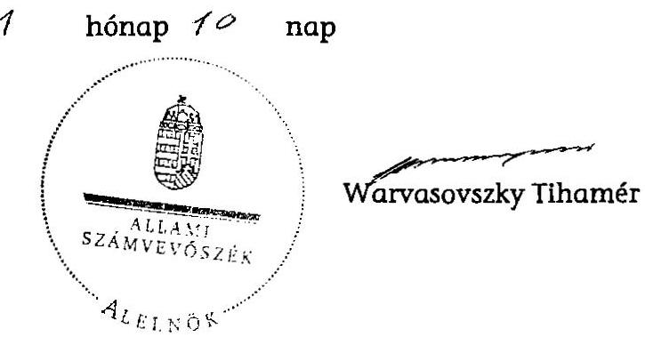

# ÁLLAMI   SZÁMVEVŐSZÉK 

## JELENTÉS

a 2011. évi időközi országgyűlési képviselő-választási kampányokra fordított pénzeszközök elszámolásának ellenőrzéséről a képviselethez jutott jelölő szervezeteknél

---

# Állami Számvevőszék 

Iktatószám: V-0004-057/2013.
Témaszám: 1043
Vizsgálat-azonosító szám: V-0581

## Az ellenőrzést felügyelte:

Horváth Balázs
felügyeleti vezető
Az ellenőrzés végrehajtásáért felelős:
Baracsi Szilvia
ellenőrzésvezető
A jelentés összeállításában közremúködött:
Tóth István
számvevő tanácsos
Az ellenőrzést végezte:
Tóth István
számvevő tanácsos

---

# TARTALOMJEGYZÉK 

BEVEZETÉS ..... 5
I. ÖSSZEGZŐ MEGÁLLAPÍTÁSOK, KÖVETKEZTETÉSEK ..... 8
II. RÉSZLETES MEGÁLLAPÍTÁSOK ..... 9

1. A beszámoló közzététele és tartalma ..... 9
2. A választásokkal kapcsolatos speciális nyilvántartási és gazdálkodási teendők szabályozása, a választási bevételek és kiadások nyilvántartásban történő elkülönítése ..... 10
3. A választásra fordítható összeghatár és a párttörvényben meghatározott korlátozó előírások betartása ..... 10
4. A közzétett adatok bizonylati alátámasztottsága ..... 11

## MELLÉKLETEK

1. számú A Fidesz - Magyar Polgári Szövetség és a Kereszténydemokrata Néppárt által a 2011. évi püspökladányi időközi országgyűlési képviselőválasztásra fordított pénzeszközök forrásai és felhasználása
2. számú A Fidesz - Magyar Polgári Szövetség és a Kereszténydemokrata Néppárt által a 2011. évi Budapest II. kerületi időközi országgyűlési képviselőválasztásra fordított pénzeszközök forrásai és felhasználása

---

.

---

# RÖVIDÍTÉSEK JEGYZÉKE 

Jogszabályok rövidítése
párttörvény
Számv. tv.
Ve.

Szórövidítések:

| ÁSZ | Állami Számvevőszék |
| :-- | :-- |
| Fidesz - MPSZ | Fidesz - Magyar Polgári Szövetség |
| jelölő szervezet | Fidesz - Magyar Polgári Szövetség és Kereszténydemokrata |
|  | Néppárt jelölő szervezet |
| KDNP | Kereszténydemokrata Néppárt |
| OVB | Országos Választási Bizottság |

---

.

---

# JELENTÉS 

## a 2011. évi időközi országgyúlési képviselő-választási kampányokra fordított pénzeszközök elszámolásának ellenőrzéséről a képviselethez jutott jelölő szervezeteknél

## BEVEZETÉS

A választási eljárásról szóló - többször módosított - 1997. évi C. törvény (továbbiakban: Ve.) 92. § (3) bekezdésében kapott felhatalmazás alapján az országgyúlési képviselő-választásra fordított állami és más pénzeszközök, anyagi támogatások felhasználásának ellenőrzése az Állami Számvevőszék (továbbiakban: ÁSZ) feladata, amelyet „a választás második fordulóját követő egy éven belül az országgyúlési képviselethez jutott jelölő szervezetek és független jelöltek tekintetében hivatalból, egyéb jelölő szervezetek és független jelöltek tekintetében más jelölt, jelölő szervezetek kérelmére ellenőrzi. Az ellenőrzés iránti kérelmet a választás második fordulóját követő 3 hónapon belül lehet benyújtani."

Az ÁSZ 2012. évi ellenőrzési terve alapján hivatalból ellenőrizte a FideszMagyar Polgári Szövetség és a Kereszténydemokrata Néppárt (jelölő szervezet) ${ }^{1}$ kampány elszámolását, mivel közös jelöltjük a Hajdú-Bihar megye 6. számú országgyúlési egyéni választókerületben 2011. október 16-án, a Budapest Főváros 2. számú országgyúlési egyéni választókerületében 2011. november 27-én mandátumhoz jutott. Egyéb jelölő szervezetek és független jelöltek vizsgálatát a törvényes határidőn belül az ÁSZ-nál nem kérelmezték. Tekintettel arra, hogy a két párt elnöke által kiadott nyilatkozat alapján a kampány finanszírozása és a kampánybeszámoló közzététele a Fidesz-Magyar Polgári Szövetség (továbbiakban: Fidesz - MPSZ) feladata volt, helyszíni ellenőrzést csak ennél a pártnál végeztünk. A Ve. 49. § (2) bekezdésének rendelkezése szerint: „ha több jelölő szervezet közösen állít jelöltet, a továbbiakban - a választás szempontjából - egy jelölő szervezetnek számítanak".

Az ellenőrzött időszak a 2011. évi időközi országgyúlési képviselő-választási kampányok kezdetétől az elszámolás időpontjáig.

[^0]
[^0]:    ${ }^{1}$ A Ve. 149. § g) pontja értelmében jelölő szervezet lehet a pártok múködéséről és gazdálkodásáról szóló 1989. évi XXXIII. törvény szerint bejegyzett párt.

---

Az ellenőrzés célja annak megállapítása volt, hogy a 2011. évi időközi országgyűlési képviselő-választáson mandátumhoz jutott jelölő szervezet:

- betartotta-e a Ve. 92. § (1) bekezdésében meghatározott költséghatárt, amely szerint „a jelölő szervezetek a választásra a 91. §-ban foglalt költségvetési támogatáson felül jelöltenként legfeljebb egymillió forintot fordíthatnak";
- a Ve. 92. § (2) bekezdésének rendelkezése alapján a választás második fordulóját követő 60 napon belül a Magyar Közlönyben nyilvánosságra hozta-e a választásra fordított állami és más pénzeszközök, anyagi támogatások öszszegét, forrását és felhasználásának módját, valamint gondoskodott-e a források és a felhasználás szabályszerű nyilvántartásáról és bizonylatolásáról.

Az ellenőrzés feltételeit és körülményeit illetően rögzíteni szükséges, hogy a Ve. hatályos rendelkezései, valamint a pártok múködéséről és gazdálkodásáról szóló 1989. évi XXXIII. törvény (továbbiakban: párttörvény) előírásai jelenleg még mindig nem biztosítják a feltételeket a választási kampánypénzek eredetének és felhasználásának teljes átláthatóságához.

A választási elszámolások ellenőrzéséről 1998 óta kiadott jelentéseinkben jeleztük, hogy az ÁSZ nem tudja teljes mértékben betölteni a választási kampány átláthatóságával kapcsolatosan azt a szerepet, amelyet az alkotmányos szabályozás megkívánna, valamint külön részleteztük az ÁSZ hatásköri korlátait is. ${ }^{2}$

Az ÁSZ visszatérően javasolta a Kormánynak, hogy kezdeményezze az Országgyűlésnél a Ve. oly módon való módosítását, amely biztosítja a kampányfinanszírozás átláthatóságát, ellenőrizhetőségét és egyértelműen meghatározza:

- a választási költségek elszámolása szempontjából mely időszak, illetve tevékenység forrásait és ráfordításait kell figyelembe venni;
- a jelöltek száma alapján, normatív módon juttatott állami támogatás felhasználása tekintetében mi a dologi költségek fogalma, a felhasználás elszámolásának formája, tartalma és mi a kifizetőhely;
- a választási költségek forrásai körében az egyéb anyagi támogatások között milyen formában nyújtott és kiktől származó juttatásokat kell figyelembe venni;
- milyen legyen az országgyűlési választásra fordított állami és más pénzeszközök, anyagi támogatások összegét, forrását és a felhasználás módját bemutató, a Magyar Közlönyben megjelentetett választási adatszolgáltatás formája és részletes tartalma;
- hogyan történjen az egyéni jelöltek választási költségei és azok forrásai ellenőrizhetőbb nyilvántartási kötelezettségének érvényesítése;

[^0]
[^0]:    ${ }^{2}$ A témához kapcsolódóan kiadott számvevőszéki jelentések sorszáma: 9916; 039; 0135; 0307; 0562; 0718; 0737; 0903; 0949; 1032; 1103 és 1105.

---

- mennyi legyen a költségvetési támogatáson felüli egy jelöltre átlagosan fordítható kiadás reális értékhatára;
- milyen tartalmú írásos megállapodást kössenek a közös jelöltet állító szervezetek a kampányfinanszírozásra, a nyilvántartásra és az elszámolásra vonatkozóan;
- milyen szankciókkal járjon a határidős elszámolási és közzétételi kötelezettségek elmulasztása.

Jelenleg az Országgyűlés előtt lévő, a választási eljárásról szóló T/8405 számú törvényjavaslat nem tartalmaz rendelkezést a választási kampány meghatározására, a kampánytevékenység tartalmára, a választási kampányra fordítható költségek nagyságára és azok forrására, az elszámolási kötelezettségre, valamint az ÁSZ-nak ezzel kapcsolatos ellenőrzési feladatára.

Az ÁSZ, mint jogalkalmazó szerv csak a hatályos jogszabályi környezetben biztosított keretek között végzi ellenőrzését, ellenőrzési jogosultsága az elszámolási határidőig a jelölő szervezet nyilvántartásában megjelent kampányforrásokra és ráfordításokra terjed ki.

A helyszíni ellenőrzés teljes körű tételes vizsgálattal történt. A 2011. szeptember 2. és 2012. január 12. között teljesült gazdasági eseményeket tételesen ellenőriztük, tekintettel arra, hogy a jelölő szervezet a 2011. évi időközi országgyűlési képviselő-választási kampányokra fordított pénzeszközöket az éves kiadásoktól a könyvviteli rögzítéssel egyidejűleg elkülönítette. A pénzügyi szabályszerűségi ellenőrzést a számvevőszéki ellenőrzés szakmai szabályai szerint készítettük elő és folytattuk le. Az ellenőrzés szakmai módszertana az Állami Számvevőszék Ellenőrzési Kézikönyvében foglalt szakmai szabályokon alapult, amely a Legfelsőbb Ellenőrző Intézmények Nemzetközi Szervezete (INTOSAI) által kiadott nemzetközi standardok (ISSAI) figyelembevételével készült.

Az ellenőrzés módszere: A jelölő szervezet által rendelkezésre bocsátott iratok és a Hivatalos Értesítőben közzétett választási adatszolgáltatás tartalmi öszszevetésével, valamint az alkalmazott eljárások és a jogszabályi követelmények egybevetésével történt.

A helyszíni ellenőrzést: 2011. október 10-12-én a Fidesz - MPSZ Országos Központjában végeztük.

---

# I. ÖSSZEGZŐ MEGÁLLAPÍTÁSOK, KÖVETKEZTETÉSEK 

A közös jelöltállítások vonatkozásában kiadott nyilatkozatok értelmében mind a finanszírozás, mind az elszámolás - a jelölő szervezet nevében - a FideszMPSZ feladata volt. A jelölő szervezet a Ve.-ben és az Országos Választási Bizottság (továbbiakban: OVB) határozataiban rögzítetteknek megfelelően közzétételi kötelezettségét az előírt határidőkön belül teljesítette. A 2011. évi időközi országgyűlési képviselő-választásokkal kapcsolatos forrásokról és ráfordításokról a beszámolókat a Magyar Közlöny Hivatalos Értesítőjében nyilvánosságra hozta, internetes honlapján közzé tette.

A választási kampányforrások és ráfordítások elszámolásáért felelős FideszMPSZ az idöközi országgyúlési képviselöválasztásra vonatkozó kampányszabályzatában rögzítette a kampánytevékenység, a kampányköltség és a választási költségek elszámolása szempontjából az elszámolási időszak fogalmát. A közzétett adatokat megalapozó számviteli nyilvántartásban az időközi választásokra fordított pénzeszközök ráfordításait a Fidesz - MPSZ a kettős könyvvitelében a központi országgyűlési kampány főkönyvi számlán különítette el a működéssel összefüggő kiadásoktól, így a beszámolókban közölt 986 ezer Ft, és 929 ezer Ft ráfordítási adat a főkönyvi kivonatból, valamint a nyilvántartás alapját képező bizonylatokból levezethető volt. A könyvvezetés során érvényesítették a Számv. tv-ben meghatározott (teljesség, valódiság, bruttó elszámolás) számviteli alapelveket. A beszámoló sorok összeállításánál a Ve. 92. § (2) bekezdés előírásait betartották, a közös jelöltállításra tekintettel összeállított beszámoló megfelelt a nyilatkozatokban rögzített beszámolási, nyilvántartási és elszámolási kötelezettségnek.

A jelölő szervezet a felhasználható egymillió forintos költséghatár! nem lépte túl, 986 ezer Ft-ot fordított a Hajdú-Bihar megye 6. számú országgyűlési egyéni választókerület (püspökladányi), 929 ezer Ft-ot a Budapest Főváros 2. számú országgyűlési egyéni választókerület (Budapest II. kerületi) időközi országgyűlési képviselő-választási kampányára.

A párttörvényben rögzített forrásszerzést korlátozó előírásokat a Fidesz MPSZ - a nyilvántartások szerint - a közzétett, országgyűlési képviselőválasztásra fordított összeg forrásai vonatkozásában betartotta, forrásként kizárólag saját forrást jelölt meg.

A kampánytevékenységre vonatkozó, annak jogszerűségét igazoló szerződések, egyéb kötelezettségvállalási dokumentumok rendelkezésre álltak. A Számv. tv. előírásainak megfelelő bizonylatok tartalmuk szerint a könyvelt gazdasági eseményt támasztották alá. A bizonylatok alaki és tartalmi követelmények szempontjából megfeleltek a Számv. tv-ben rögzített, a szabályszerű bizonylatra vonatkozó előírásoknak. A készpénzes kifizetések pénztári bizonylatait a Számv. tv. előírásnak megfelelően szigorú számadás alá vonták. A bizonylatok megőrzéséről a Számv. tv-ben rögzítettek szerint gondoskodtak.

---

# II. RÉSZLETES MEGÁLLAPÍTÁSOK 

## 1. A beSzámoló közzÉtÉtele És TARTALma

A Ve. 92. § (2) bekezdése előírása szerint: „minden jelölő szervezetnek és független jelöltnek a választás második fordulóját követő 60 napon belül a Magyar Közlönyben nyilvánosságra kell hoznia a választásra fordított állami és más pénzeszközök, anyagi támogatások összegét, forrását és felhasználásának módját".

A Hajdú-Bihar megye 6. számú országgyúlési egyéni választókerületében és a Budapest Főváros 2. számú országgyúlési egyéni választókerületében időközi országgyúlési választás kitűzésének tárgyában kiadott 141/2011. (VIII. 1.) számú és a 165/2011. (IX. 14.) számú OVB határozatok mellékletének III. 20. pontja rögzítette, hogy a választásra fordított állami és más pénzeszközök, anyagi támogatások összegét, forrását és felhasználásának módját a jelölő szervezetnek legkésőbb 2011. december 15-ig, illetve 2012. január 26-ig kell a Magyar Közlönyben nyilvánosságra hoznia.

Figyelemmel arra, hogy a Ve. a nyilvánosságra hozandó beszámoló tartalmát, részletezettségét nem szabályozta, a nyilvánosságra hozandó adatok tartalmára vonatkozóan az OVB a Választási füzetek 1998. évi 44. számában az ÁSZ ajánlását tette közzé.

A Ve. nem adott eligazítást arra nézve, hogy közös jelöltállítás esetén melyik jelölő szervezet, vagy minden jelölő szervezet külön-külön (minden jelölő szervezet a saját forrásait és költségeit) köteles-e a kampányköltséggel kapcsolatos beszámolót a Magyar Közlönyben nyilvánosságra hozni, ezért az ellenőrzés a Fidesz - MPSZ és a KDNP által 2011. szeptember 12-én és 2011. október 19-én a közös jelöltállítások vonatkozásában kiadott nyilatkozatokban foglaltakat vette alapul.

A nyilatkozatokban rögzítették, hogy a 2011. évi időközi országgyúlési választásokon a Hajdú-Bihar megyei 6. és a Budapest Főváros 2. választókerületekben közös jelöltet állítanak, a kampány finanszírozását, illetve elszámolását, közzétételét a Fidesz - MPSZ vállalja azzal, hogy a kampány finanszírozására választókerületenként egymillió forintot fordít.

A Fidesz - MPSZ a nyilatkozatnak és a 141/2011. (VIII. 1.) OVB és a 165/2011. (IX. 14.) OVB határozatoknak megfelelően a törvényes határidőn belül tette közzé elszámolásait - az ÁSZ ajánlásának megfelelő szerkezetben és tartalommal - a Magyar Közlöny Hivatalos Értesítőjének 2011. évi 59. számában 2011. december 9-én és a 2012. évi 3. számában 2012. január 17-én (1. és 2. számú melléklet). A Fidesz - MPSZ az elszámolásokat 2011. december 1-én és 2012. január 10-én internetes honlapján is nyilvánosságra hozta.

A jelölő szervezet a beszámolókban kampányforrásként 986 ezer Ft, illetve 929 ezer Ft saját forrást nevezett meg, valamint ugyanekkora összegű anyagjellegű ráfordítást közölt. A kampány finanszírozására kizárólag a Fidesz - MPSZ

---

saját forrását használták fel. A kampányköltségek között hirdetési és plakát, valamint nyomdai, szórólap-gyártási és terjesztési költségeket számoltak el. A nyilvánosságra hozott adatok tartalma és összege egyezett a könyvvezetésben a 616112 központi országgyúlési kampányszámlán rögzített adatokkal, azok a főkönyvi kivonatból levezethetőek voltak. A könyvvezetés során érvényesítették a Számv. tv 15. § (2)-(3) és (9) bekezdésekben rögzített teljesség, valódiság, bruttó elszámolás számviteli alapelveket.

A beszámoló sorok összeállításánál a Ve. 92. § (2) bekezdés előírásait betartották, a kampányról szóló beszámoló tartalmának összeállítására a belső szabályozás külön előírást nem tartalmazott.

# 2. A VÁLASZTÁSOKKAL KAPCSOLATOS SPECIÁLIS NYILVÁNTARTÁSI ÉS GAZDÁLKODÁSI TEENDŐK SZABÁLYOZÁSA, A VÁLASZTÁSI BEVÉTELEK ÉS KIADÁSOK NYILVÁNTARTÁSBAN TÖRTÉNŐ ELKÜLÖNÍTÉSE 

A választási kampányforrások és ráfordítások elszámolásáért felelős Fidesz MPSZ 2009. január 5-étől hatályos belső időközi országgyűlési képviselőválasztásra vonatkozó kampányszabályzatban rögzítette a kampánytevékenység, a kampányköltség fogalmát és a gazdálkodás eljárási szabályokat. A szabályzatban rögzítették a választási költségek elszámolása szempontjából az elszámolási (kampány) időszakot. Az elszámolásnál az időközi országgyűlési képviselőválasztásra vonatkozó szabályzatban rögzítettek szerint jártak el.

A Fidesz - MPSZ a választással kapcsolatos speciális nyilvántartási szabályokat a hatályos számlarendben és kampányszabályzatában szabályozta. A számlarend az országgyűlési választási kiadások nyilvántartására a 6. számlaosztályban külön főkönyvi számlát tartalmazott. A kampányszabályzat szerint a kampányköltségek kifizetése központilag elkülönített bankszámlán történt.

A Fidesz - MPSZ a Ve. 92. § (1) bekezdésében meghatározott ráfordítási korlátok betartásának ellenőrizhetősége céljából külön bankszámlán és a könyvelésben a költségek 5. számlaosztályban történt rögzítésével egyidejűleg, a 616112 főkönyvi számlán különítette el az időközi országgyűlési képviselő választással kapcsolatos kiadásokat az egyéb politikai kiadásoktól.

## 3. A VÁLASZTÁSRA FORDÍTHATÓ ÖSSZEGHATÁr ÉS A PÁRTTÖRVÉNYBEN MEGHATÁROZOTT KORLÁTOZÓ ELŐÍRÁSOK BETARTÁSA

A Ve. 92. § (1) bekezdése szerint "a jelölő szervezetek a választásra a 91. §-ban foglalt költségvetési támogatáson felül jelöltenként legfeljebb egymillió forintot fordíthatnak". A jelöltekre és a választásra fordítható pénzeszközök tárgyában hozott 7/1998. (IV. 1.) OVB állásfoglalás szerint közös jelölés esetén is összesen egymillió forint fordítható egy jelöltre. Az időközi választásokra jelöltarányos állami támogatás a költségvetésben nem állt rendelkezésre, ezért a jelölő szervezet választásonként összesen egymillió forintot fordíthatott szankció nélkül kampánycélokra.

A jelölő szervezet a Ve. 92. § (1) bekezdésében foglalt költséghatárt a Fidesz MPSZ számviteli nyilvántartása, gazdálkodási dokumentumai szerint betartot-

---

ta. A kampányköltségek összegét a Fidesz - MPSZ 2011. évi költségvetésében és a Fidesz - MPSZ és KDNP nyilatkozatokban választásonként egymillió forintban rögzítették. A rendelkezésre bocsátott dokumentumok szerint az időközi országgyűlési képviselő-választáshoz kapcsolódó kampányköltségek összege 986 ezer Ft, illetve 929 ezer Ft volt. A közös jelöltállításra tekintettel, a nyilatkozatoknak megfelelően alakult a tényleges költségráfordítás.

A Fidesz - MPSZ kampányszabályzatában a kampányidőszakban felmerülő előlegek és költségek elszámolására a választás napját megelőző 30 napot és az azt követő 40 napot jelölte meg. A jelölő szervezet a választásra fordítható pénzeszközök felhasználása során belső szabályozásának megfelelően betartotta a Ve. 40. § (1) bekezdés kampányidőszak időtartamára vonatkozó előírásait.

A Fidesz - MPSZ a kampányfinanszírozás forrásaként az egyéb források körében saját forrásait jelölte meg, melynek törvényes jogcímeit az alapszabályban meghatározták. A források vonatkozásában a párttörvény 4. § (2)-(3) bekezdésében foglalt korlátozó, illetve tiltó előírásokat betartották.

# 4. A KÖZZÉTETT ADATOK BIZONYLATI ALÁTÁMASZTOTTSÁGA 

A kampánytevékenységre vonatkozó, annak jogszerűségét igazoló szerződések, egyéb kötelezettségvállalási, illetve teljesítést igazoló dokumentumok rendelkezésre álltak.

A választásokkal kapcsolatos gazdasági események bizonylati alátámasztottsága megfelelt a Számv. tv. 165. § szerinti bizonylati elvnek és bizonylati fegyelemnek. Minden gazdasági eseményről rendelkeztek bizonylattal, az összes bizonylat adatait a könyvviteli nyilvántartásban rögzítették. A szabályszerűen kiállított bizonylatokat a számviteli nyilvántartásba a törvény szerinti időpontig jegyezték be. A Számv. tv. 166. § (1)-(3) és (6) bekezdései számviteli bizonylatokkal kapcsolatos rendelkezéseit betartották. A választásokkal kapcsolatos gazdasági események alapbizonylatai a könyvelési adatok alapján visszakereshetőek voltak. Tartalmuk szerint a könyvelt gazdasági eseményeket támasztották alá.

A számviteli bizonylatok alaki és tartalmi követelmények szempontjából megfeleltek a Számv. tv. 167. § (1) bekezdésben rögzített előírásnak. A készpénzes kifizetések pénztári bizonylatait a Számv. tv. 168. § (1) bekezdése előírásnak megfelelően szigorú számadás alá vonták. A bizonylatok megőrzéséről a Számv. tv. 169. §-ban rögzítettek szerint gondoskodtak.

Budapest, 2013.
Melléklet: 2 db

---

# A Fidesz - Magyar Polgári Szövetség és a Kereszténydemokrata Néppárt által a 2011. évi püspökladányi idöközi országgyülési képviselőválasztásra fordított pénzeszközök forrásai és felhasználása 

1. A jelölt szervezet neve: Fidesz - Magyar Polgári Szövetség, Kereszténydemokrata Néppárt
2. A jelöli szervezet által állított jelöltek száma: 1 fő

Ezer forintban
3. Az országgyülési képviselöválasztásra fordított összeg: 986
3.1. Forrásai összesen: 986
3.1.1. Állami költségvetési támogatás: -

3.1.2. Egyéb források:
ebből

- választási célra kapott adományok: - saját források: 986
3.2. Jogcímek szerinti felhasználás összege:
3.2.1. Az állami költségvetési támogatás terhére:
ebből
- anyagjellegú ráfordítás:
- személyi jellegú ráfordítás:
- egyéb ráfordítás:
3.2.2. Egyéb források terhére: 986
ebből
- anyagjellegú ráfordítás:
- személyi jellegú ráfordítás:
- egyéb ráfordítás:

Tóth Józsefné s. k., pontonági igazgató

Priszter Erzsébet s. k.,
főkönyvele

---

# VI. Hirdetmények 

A Fidesz - Magyar Polgári Szövetség és a Kereszténydemokrata Néppárt által
a 2011. évi Budapest II. kerületi idöközi országgyülésiképviselő-választásra fordított pénzeszközök forrásai és felhasználása (ezer forintban)

1. A jelölt szervezet neve: Fidesz - Magyar Polgári Szövetség, Kereszténydemokrata Néppárt
2. A jelölő szervezet által állított jelöltek száma: 1 fő
3. Az országgyülésiképviselő-választásra fordított összeg:
3.1. Forrásai összesen:
3.1.1. Állami költségvetési támogatás:
3.1.2. Egyéb források:
ebből

- választási célra kapott adományok:
- saját források:
3.2. Jogcímek szerinti felhasználás összege:
3.2.1. Az állami költségvetési támogatás terhére:
ebböl
- anyagjellegú ráfordítás:
- személyi jellegú ráfordítás:
- egyéb ráfordítás:
3.2.2. Egyéb források terhére:
ebből
- anyagjellegú ráfordítás:
- személyi jellegú ráfordítás:
- egyéb ráfordítás:

Tóth Józsefré s. k., 4.2.2. Egyéb források terhére

Priszter Erzsébet s. k., 4.2.2. Egyéb források terhére