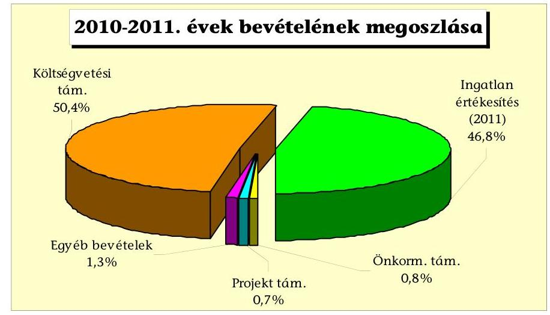
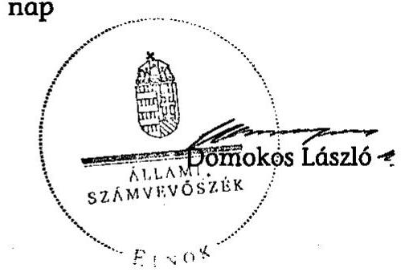
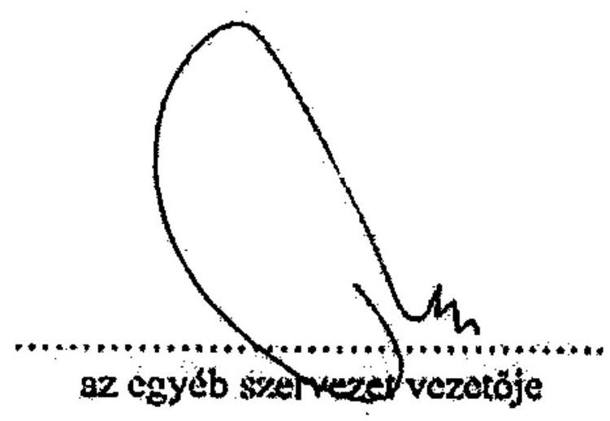
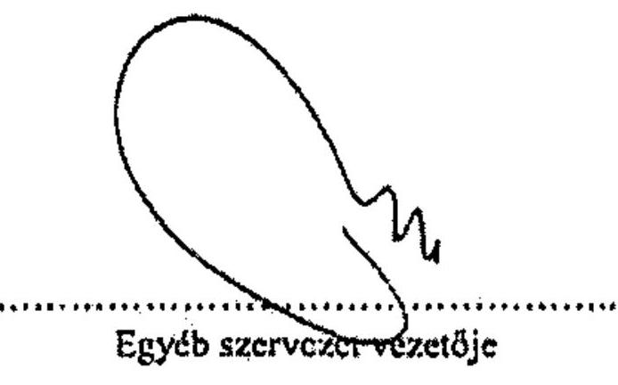
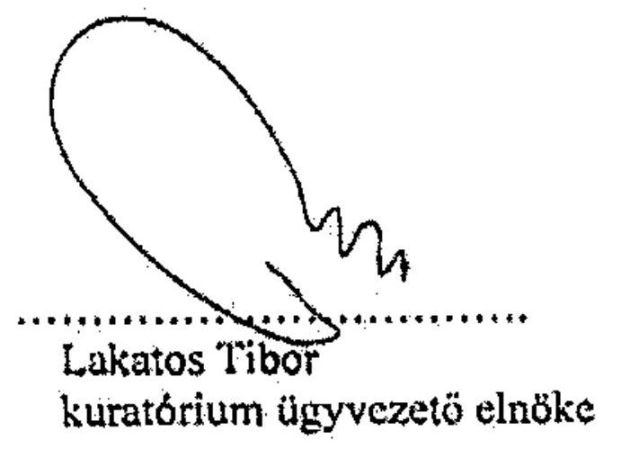
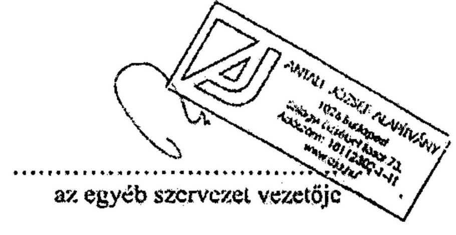
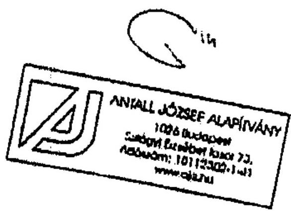
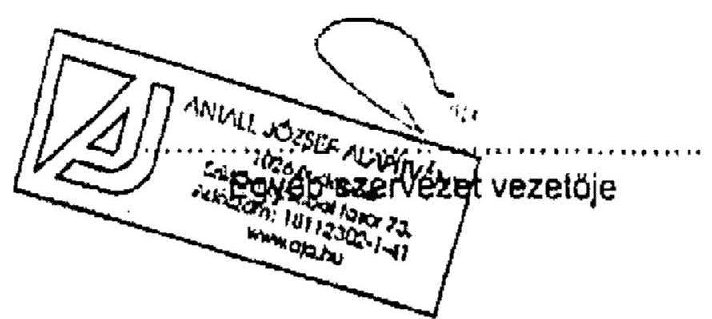
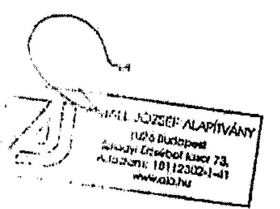

# ÁLLAMI   SZÁMVEVŐSZÉK 

## JELENTÉS

az Antall József Alapítvány 2010-2011. évi gazdálkodása törvényességének ellenőrzéséről

---

# Állami Számvevőszék 

Iktatószám: V-0023-055/2012.
Témaszám: 1062
Vizsgálat-azonosító szám: V-0576

## Az ellenőrzést felügyelte:

## Horváth Balázs

felügyeleti vezető

## Az ellenőrzés végrehajtásáért felelős:

Dr. Veress Tiborné
ellenőrzésvezető

## A jelentés összeállításában közremúködött:

## Kulcsár Lászlóné

számvevő

## Az ellenőrzést végezték:

## Kerekes Gábor   Kulesár Lászlóné   számvevő

A témához kapcsolódó eddig készített számvevőszéki jelentések:

| címe | sorszáma |
| :-- | :--: |
| Jelentés az Antall József Alapítvány 2003-2005. évi gazdálkodása | 0702 |
| törvényességének ellenőrzéséről |  |
| Jelentés az Antall József Alapítvány 2006-2007. évi gazdálkodása | 0848 |
| törvényességének ellenőrzéséről |  |

Jelentés az Antall József Alapítvány 2008-2009. évi gazdálkodása 1044
törvényességének ellenőrzéséről

---

# TARTALOMJEGYZÉK 

BEVEZETÉS ..... 5
I. ÖSSZEGZŐ MEGÁLLAPÍTÁSOK, KÖVETKEZTETÉSEK, JAVASLATOK ..... 7
II. RÉSZLETES MEGÁLLAPÍTÁSOK ..... 13

1. Az alapítvány gazdálkodásának törvényessége ..... 13
1.1. A kuratórium működése ..... 13
1.2. Az alapítvány bevételei ..... 14
1.3. Az alapítvány ráfordításai ..... 15
2. Számviteli beszámolók ..... 16
2.1. A beszámolók szabályossága ..... 16
2.2. A mérleg ..... 17
2.3. Az eredménykimutatás ..... 18
3. A könyvvezetés szabályozottsága ..... 19
4. A könyvvezetés gyakorlata ..... 20
5. Az alapítvány ellenőrzési rendszere ..... 21
6. A korábbi ellenőrzés megállapításaira tett intézkedések ..... 21

## MELLÉKLETEK

1. számú Jelentés az Antall József Alapítvány 2010. évi tevékenységéről (6 oldal)
2. számú Jelentés az Antall József Alapítvány 2011. évi tevékenységéről (6 oldal)

---

.

---

# RÖVIDÍTÉSEK JEGYZÉKE 

Jogszabályok rövidítése

| Civil tv. | az egyesülési jogról, a közhasznú jogállásról, valamint a civil szervezetek működéséről és támogatásáról szóló 2011. évi CLXXV. törvény |
| :--: | :--: |
| pártalapítványi törvény | a pártok működését segítő tudományos, ismeretterjesztő, kutatási, oktatási tevékenységet végző alapítványokról szóló 2003. évi XLVII. törvény |
| párttörvény | a pártok működéséről és gazdálkodásáról szóló 1989. évi XXXIII. törvény |
| Ptk. | a Polgári Törvénykönyvről szóló 1959. évi IV. törvény |
| számviteli rendelet | a számviteli törvény szerinti egyes egyéb szervezetek beszámoló-készítési és könyvvezetési kötelezettségének sajátosságairól szóló 224/2000. (XII. 19.) Korm. rendelet |
| Számv. tv. | a számvitelről szóló 2000. évi C. törvény |

Szórövidítések
alapító
alapítvány
ÁSZ
JESZ/MDF
Kuratórium
MÁK
PGSZ
SZMSZ

Magyar Demokrata Fórum
Antall József Alapítvány
Állami Számvevőszék
Jólét és Szabadság Demokrata Közösség (Magyar Demokrata Fórum jogutódja 2011. június 18-ától)
Antall József Alapítvány kuratóriuma
Magyar Államkincstár
Pénzügyi Gazdálkodási Szabályzat
Szervezeti és Működési Szabályzat

---

.

---

# JELENTÉS 

## az Antall József Alapítvány 2010-2011. évi gazdálkodása törvényességének ellenőrzéséről

## BEVEZETÉS

A pártok - a pártok működését segítő tudományos, ismeretterjesztő, kutatási, oktatási tevékenységet végző alapítványokról szóló 2003. évi XLVII. törvény (pártalapítványi törvény) alapján - a politikai kultúra fejlesztése érdekében tudományos, ismeretterjesztő, kutatási és oktatási tevékenységük elősegítésére a pártok működéséről és gazdálkodásáról szóló 1989. évi XXXIII. törvényben (párttörvény) meghatározott mértékű költségvetési támogatásra jogosult alapítványt hozhatnak létre. A Magyar Demokrata Fórum (2011. június 18-tól Jólét és Szabadság Demokrata Közösség) a törvényben biztosított lehetőséggel élve 2003. évben létrehozta az Antall József Alapítványt (továbbiakban: alapítvány).

Az alapítvány a törvényi előírásoknak megfelelően a 2010. évben 47,1 millió Ft, a 2011. évben 28,3 millió Ft költségvetési támogatásban részesült.

A pártalapítványi törvény 4. § (2) bekezdése alapján az alapítvány gazdálkodása törvényességének ellenőrzésére az Állami Számvevőszék (ÁSZ) jogosult, a 4. § (4) bekezdése alapján az ÁSZ kétévenként ellenőrzi azoknak az alapítványoknak a gazdálkodását, amelyek e törvény szerint költségvetési támogatásban részesültek. Az ÁSZ legutóbb 2010-ben az alapítvány 2008-2009. évi gazdálkodásának törvényességét ${ }^{1}$ ellenőrizte, jelentésében több intézkedési javaslatot tett.

Jelen ellenőrzés célja volt az alapítvány 2010-2011. évi gazdálkodása törvényességének értékelése, amelynek keretében ellenőriztük:

- az alapítvány gazdálkodásának és éves jelentéseinek törvényességét;
- az éves számviteli beszámolók jogszabályi előírásoknak való megfelelését;
- az alapítvány könyvvezetésében a számvitelről szóló 2000. évi C. törvény (Számv. tv.), a pártalapítványok könyvvezetésére vonatkozó jogszabályok, valamint belső előírások betartását;

[^0]
[^0]:    ${ }^{1} 1044$ számú jelentés az Antall József Alapítvány 2008-2009. évi gazdálkodása törvényességének ellenőrzéséről.

---

- a kuratórium megtette-e a szükséges intézkedéseket az ÁSZ előző ellenőrzése során feltárt hiányosságok megszüntetése, valamint az intézkedési tervben megjelölt feladatok végrehajtása érdekében.

Az ellenőrzést a pénzügyi-szabályszerűségi ellenőrzés módszertani szabályai szerint, a pártalapítványok ellenőrzéséhez kiadott segédletbe foglalt egységes követelmények alapján végeztük. Tételesen ellenőriztük a kapott költségvetési támogatásokat, a nyújtott támogatásokat, az egymillió Ft és e feletti, valamint mintavétel alapján az egymillió Ft alatti ráfordításokat. A lényegességi szint meghatározásánál a pártalapítványok ellenőrzési segédlete szerint jártunk el.

Az ellenőrzés körülményeiről rögzíteni szükséges, hogy a Budapesti Rendőrfőkapitányság XI. kerületi Rendőrkapitánysága 2012. április hóban lefoglalta a 2010. évre vonatkozó dokumentumokat - mert ismeretlen tettes ellen sikkasztás, hűtlen kezelés alapos gyanúja miatt a JESZ elnöke feljelentést tett - ezért azok ellenőrzésére az ügyészség előzetes hozzájárulásával a rendőrségen került sor.

---

# I. ÖSSZEGZŐ MEGÁLLAPÍTÁSOK, KÖVETKEZTETÉSEK, JAVASLATOK 

A kuratóriumi működést az alapító okirat határozta meg, amelyet az alapító a kuratórium összetétele, az alapítvány székhelye, az alapítvány képviselői változása miatt módosított. A kuratórium működése a Polgári Törvénykönyvről szóló 1959. évi IV. törvény (Ptk.) vonatkozó előírásainak megfelelt. Az alapító okiratban foglalt határozatképesség hiánya miatt két gazdálkodást érintő határozatot az ellenőrzés érvénytelennek minősített, továbbá a kuratórium az alapítót évente nem tájékoztatta a munkájáról. A csatlakozási támogatások befogadásáról, illetve a nyújtott támogatásokról előzetesen nem döntöttek. A kuratórium a belső szabályzat ${ }^{2}$ előírásától eltérően nem fogadott el éves költségvetési tervet, mivel azt nem készítettek. A képviseleti jog gyakorlása az alapító okirat szabályozásának megfelelően történt. A teljesítésigazolásokat és a bankszámla feletti jog gyakorlását az alapító okirat szerinti jogosultak végezték. A kuratóriumi ülés rendjét az SZMSZ-ben az alapító okiratban foglaltaktól eltérően szabályozták és nem aktualizálták a Pénzügyi Gazdálkodási Szabályzat (PGSZ) előírásait az SZMSZ módosításainak megfelelően.

Az alapítvány beszámolóit nem a jogszabályi előírásnak megfelelő formában készítették el, mivel közhasznú egyszerűsített beszámolót állítottak össze, az egyszerűsített éves beszámoló helyett. A pártalapítványi törvény szerint elkészített jelentéseket nem tették közzé a Magyar Közlöny Hivatalos Értesítőjében, illetve a saját honlapon. A mulasztásra a törvény nem tartalmaz szankciót. A 2010. és a 2011. évre összeállított beszámolók az ellenőrzés által feltárt 3768 ezer Ft, illetve 1414 ezer Ft jelentős összegű hiba következtében nem minősültek megbízhatónak, az eltérés mértéke a következő összeállítás szerint meghaladta a mérlegfőösszeg 2\%-át.

Adatok: ezer Ft-ban

| Megnevezés | 2010. évi | 2011. évi |
| :-- | :--: | :--: |
| Eredmény javító hatás | 2451 | 508 |
| Eredmény csökkentő hatás | 1317 | 906 |
| Előjeltől független hatás | 3768 | 1414 |
| Mérlegfőösszeg | 74223 | 36042 |
| Hiba %-a | $\mathbf{5 , 1 \%}$ | $\mathbf{3 , 9 \%}$ |

Az alapítvány mérlegeit alátámasztó leltárakat egyik évben sem készítették el teljes körűen, így nem érvényesült a mérleg összeállítása során a valódiság

[^0]
[^0]:    ${ }^{2}$ A kuratórium a 2011. december 22-től hatályos SZMSZ-éből törölte a költségvetési terv készítésére vonatkozó kötelezettséget.

---

elve, melynek következtében nem biztosították az alapítványi vagyon védelmét. Az alapítvány cél meghatározása nélkül 2500 ezer Ft összegű kölcsönt nyújtott a JESZ részére, amelyet az ellenőrzés a párttörvényben és az alapító okiratban rögzített céltól eltérő felhasználásnak minősített. A kölcsön után járó, meg nem fizetett kamat összegét bevételként nem számolták el, elhatárolása nem történt meg. Az alapítói tulajdonban lévő, jelzáloggal terhelt ingatlan megvásárlására 25000 ezer Ft összegben adásvételi előszerződést kötöttek, amelyhez azonban a JESZ nem kérte a jelzálogjogosult előzetes jelzálogtörlési nyilatkozatát. Az adásvételi szerződés 2012. június 30-ig tette lehetővé, hogy a JESZ intézkedjen a jelzálog törlése ügyében, amelyre a helyszíni ellenőrzés befejezéséig nem került sor. Az alapítvány nem élt a szerződésben foglalt elállási jogával. A vételárból foglaló és előleg címén 21000 ezer Ft összeget kifizettek, melyet a mérlegben beruházásokra adott előlegként mutattak ki. Az eredménykimutatást érintő, a gazdálkodás eredményére ható hiányosságok a bevételek és ráfordítások szabálytalan könyveléséből, az alapítvány működéséhez nem köthető kiadások elszámolásából, kétszeres kifizetésből adódtak, amelyek azonban a vagyoni helyzet áttekintését nem nehezítették. Az ellenőrzés feltárt eredményre nem ható könyvvezetési hibákat is (pl. a magánszemélyek támogatását nem személyi jellegű ráfordításként mutatták ki, hanem egyéb ráfordításként).

A számviteli szabályzatok Számv. tv.-ben előírt módosításáról az alapítvány képviselője az ÁSZ korábbi, többszöri javaslata ellenére nem gondoskodott. A számviteli politika, a pénzkezelési szabályzat és a számlarend továbbra sem áll összhangban a hatályos jogszabályokkal, nem tükrözi az alapítványi gazdálkodás sajátosságait.

Az alapítvány az éves beszámolóiban összesen 149595 ezer Ft bevételt mutatott ki, az alábbi összetételben:

Az alapítvány két önkormányzattól 1200 ezer Ft, pályázati úton (projekttámogatás) 1089 ezer Ft támogatást kapott. A támogatások utalása minden esetben az alapítvány pénzforgalmi számlájára történt. Az önkormányzatok által nyújtott támogatással dokumentáltan nem számoltak el. A fővárosi önkormányzat a rendezvény elmaradása miatt a 300 ezer Ft összegű támogatást visszafizettette. Az alapítvány a pártalapítványi törvényben előírt közzétételi kötelezettségét

---

nem teljesítette, mivel honlapján nem tette közzé a hódmezővásárhelyi önkormányzattól kapott 750 ezer Ft összegű támogatást.

Az alapítvány összesen 127134 ezer Ft ráfordítást számolt el, működésre 124246 ezer Ft-ot (97,7%), a cél szerinti feladatainak megvalósítására 2888 ezer Ft-ot (2,3%) fordított, amelyből 2055 ezer Ft összegű támogatást adott tovább. A ráfordítások között 2834 ezer Ft összegben olyan kiadásokat mutattak ki, amelyeknél nem dokumentálták, hogy azok az alapítvány működésével kapcsolatban merültek fel, továbbá hibásan szerepeltettek 50 ezer Ft-ot magánszemélynek nyújtott támogatás kétszeri kifizetése miatt. A pártalapítványi törvény kizárólag a költségvetési támogatás céltól eltérő felhasználására határoz meg szankciót. Az alapítványi célú közvetlen és közvetett költségeinek elkülönítéséről nem gondoskodtak.

Az alapítvány könyvvezetését a kettős könyvvitel rendszerében külső könyvelő iroda végezte, amelynek könyvelője a könyvviteli szolgáltatást végzők nyilvántartásában szerepelt. A könyvelő iroda a könyvvezetést és a számviteli beszámolók összeállítását az alapbizonylatok számítógépes feldolgozásával készítette el. Az éves beszámolók elkészítését megelőzően a könyvviteli zárlati feladatokat a szabályszerű leltározás kivételével elvégezték. A könyvvezetésben nem érvényesítették a Számv. tv.-ben szabályozott teljesség (pl. ingatlan értékcsökkenése), valódiság (pl. személyi jellegű ráfordítások) és időbeli elhatárolás (pl. kölcsön kamat) elvét. Az alapítvány nem tartotta be teljes körűen a számviteli bizonylatok alaki és tartalmi előírásaira vonatkozó szabályokat az utalványozás és teljesítésigazolások vonatkozásában. Az ingatlanközvetítési jutalék könyvelése másolati bizonylat alapján történt.

Az ellenőrzési feladatokat az alapító okiratban, az SZMSZ-ben, a PGSZ-ben szabályozták. A kuratórium ellenőrzési tevékenységét nem végezte el dokumentált, nyomon követhető módon. A vezetői és munkafolyamatba épített ellenőrzés nem tárta fel a gazdálkodási és számviteli hibákat. A kuratórium a 2010. év végén külső szervezetet bízott meg az alapítvány tevékenységének utólagos ellenőrzésével, ennek alapján a JESZ elnöke hűtlen kezelés miatt rendőrségi feljelentést tett.

Az ÁSZ korábbi, ismétlődően megfogalmazott intézkedési javaslatainak végrehajtását döntően elmulasztották. A 2008. és 2009. évi beszámolók
 hibáit nem javították ki, az ismételt megjelentetéséről nem gondoskodtak, a mérlegsorok leltárral való alátámasztása teljes körűen nem volt biztosított, céltól eltérő ráfordításokat számoltak el, a számviteli szabályzatokat a gazdálkodási sajátosságoknak és a hatályos jogszabályi előírásoknak megfelelően nem módosították. A kötelezettségvállalást továbbra sem a belső előírásoknak megfelelően érvényesítették, a kuratórium a belső szabályzatokban meghatározott ellenőrzési kötelezettségét nem teljesítette. A pártalapítványi törvény az ÁSZ felhívás teljesítésére vonatkozóan nem határoz meg határidőt, intézkedésre is csak súlyosabb törvénysértés esetén ad lehetőséget.

Az Állami Számvevőszékről szóló 2011. évi LXVI. törvény 33. § (1) bekezdésében foglaltak értelmében a jelentésben foglalt megállapításokhoz kapcsolódó intézkedési tervet köteles az ellenőrzött szervezet vezetője összeállítani és azt a jelentés kézhezvételétől számított harminc napon belül az ÁSZ részére megküldeni. Amennyiben az intézkedési tervet határidőben nem küldi meg a szervezet, vagy az továbbra sem elfogadható, az ÁSZ elnöke a hivatkozott törvény 33. § (3) bekezdés a)- b) pontjaiban foglaltakat érvényesítheti.

A helyszíni ellenőrzés megállapításainak hasznosítása mellett javasoljuk:

# az Alapítvány kuratóriumának 

1. A kuratórium működésében nem tartotta be az alapító okirat előírásait: az alapító okiratban foglalt határozatképesség hiánya miatt két gazdálkodást érintő határozatot az ellenőrzés érvénytelennek minősített; nem adott tájékoztatást az alapítónak működéséről; az SZMSZ-ben az alapító okirattól eltérően szabályozta a kuratóriumi ülések gyakoriságát, a csatlakozói támogatások befogadásáról nem döntött; költségvetési terv készítéséről nem gondoskodtak; a PGSZ-t nem módosították az SZMSZ-szel összhangban.

Javaslat
A kuratórium szabályszerű működése érdekében:
a) biztosítsák a gazdálkodási döntések érvényességéhez az alapító okirat VII/2. pontjában foglaltak betartását;
b) teljesítsék az éves tájékoztatási kötelezettséget az alapító okirat VII/3. h) pontjának megfelelően;
c) módosítsák a kuratóriumi ülések rendjét az SZMSZ-ben, figyelemmel az alapító okirat VII/2. pontjában meghatározott gyakoriságra;
d) döntsenek a csatlakozási támogatások befogadásáról az alapító okirat IV/1. pontja illetve a tovább adott támogatásoknál a VII/. 3. f) pont érvényesítésével;
e) gondoskodjanak az alapítvány költségvetési terv elkészítéséről és jóváhagyásáról a PGSZ 3. pontjának rendelkezése szerint;
f) teremtsenek összhangot az SZMSZ módosításai és a PGSZ rendelkezései között.
2. Az alapítvány beszámolói nem minősültek megbízhatónak, mivel azok adataiban az ellenőrzés a 2010. évben 5,1%, a 2011. évben 3,9% mértékű jelentős összegű hibát állapított meg. Az alapítvány beszámolóit nem a jogszabályi előírásnak megfelelő formában készítette el, a mérlegeit egyik évben sem támasztotta alá teljes körűen leltárral; a magánszemélyek részére kifizetett támogatást mindkét évben a személyi jellegű ráfordítások helyett az egyéb ráfordítások között vették nyilvántartásba. Az alapítvány rendelkezett a Számv. tv.-ben előírt számviteli szabályzatokkal, amelyek módosításáról azonban az ÁSZ korábbi javaslatai ellenére nem gondoskodott, azok nincsenek összhangban a hatályos jogszabályokkal, nem tükrözik a gazdálkodási sajátosságokat. Az ingatlanközvetítési jutalék könyvelése másolati bizonylat alapján történt.

Javaslat
Az éves beszámolókat meghatározó jogszabályok előírásainak érvényesítése érdekében:
a) módosítsák a jelentős összegű hibák kijavításával a 2010. és 2011. évi számviteli beszámolókat a számviteli rendelet 6. § (7) bekezdésében előírt formában, intézkedjenek a pártalapítványi törvény 3/A. § (5) bekezdése alapján a jelentések szabályszerű közzétételére;
b) intézkedjenek a Számv. tv. 69. § előírásainak betartásával a 2010. és a 2011. évi mérlegeket alátámasztó leltárak teljes körű, szabályszerű végrehajtásáról;
c) gondoskodjanak a 2010. és 2011. évi eredménykimutatás Számv. tv. 79. § (3) bekezdésében előírtak szerint a magánszemélyek részére kifizetett támogatások személyi jellegű ráfordításként való elszámolásáról;
d) módosítsák a hatályos jogszabályokkal összhangban, a gazdálkodási sajátosságokra figyelemmel a Számv. tv. 14. § (3)-(5) bekezdésben előírt számviteli szabályzatokat, valamint a 161. §-ban meghatározott számlarendet;
e) biztosítsák a könyvvezetésben a Számv. tv. 15.-16. §-ban rögzített számviteli elvek teljes körű betartását;
f) gondoskodjanak a Számv. tv. 167. § (1) és a 169. § (2) bekezdésekben foglaltak szerint a könyvviteli elszámolást alátámasztó bizonylatok szabályszerűségéről.
3. Az alapítvány nem élt az ingatlan adásvételi szerződésben rögzített elállási jogával. Cél meghatározása nélkül 2500 ezer Ft összegű kölcsönt nyújtottak a JESZ részére. A ráfordítások között mutattak ki 2834 ezer Ft összegben olyan kiadásokat, amelyeknél nem dokumentálták, hogy azok az alapítvány működésével kapcsolatban merültek fel, továbbá hibásan szerepeltettek 50 ezer Ft-ot kétszeri kifizetése miatt. A honlapon nem tették közzé a Hódmezővásárhelyi önkormányzattól kapott 750 ezer Ft összegű támogatást. Az alapítványi célú közvetlen és közvetett költségeinek elkülönítéséről nem gondoskodtak. A kuratórium ellenőrzési tevékenységének dokumentáltan nem tett eleget. A vezetői és munkafolyamatba épített ellenőrzés nem tárta fel a gazdálkodási és számviteli hibákat. Az ÁSZ korábbi, ismétlődően megfogalmazott intézkedési javaslatainak végrehajtását döntően elmulasztották.

Javaslat
A törvényes gazdálkodás biztosítása érdekében:
g) éljenek a JESZ-szel kötött ingatlan adásvételi szerződés 6. pontjában foglalt elállási joggal;
h) szüntessék meg a párttörvény 9/A. § (1) bekezdésében és az alapító okirat II. fejezetében meghatározott céloktól eltérő finanszírozást;
i) szólítsák fel a magánszemély támogatottat a jogtalanul igénybevett 50 ezer Ft támogatás visszafizetésére;
j) tegyenek eleget a Civil tv. 19. § (2) bekezdés és a 20. § rendelkezéseinek megfelelően az alapítványi célú közvetlen és közvetett költségek elkülönítési kötelezettségének;
k) pótolják a Hódmezővásárhelyi önkormányzat 750 ezer Ft csatlakozási támogatásának megjelentetését, tekintettel a pártalapítványi törvény 3. § (4) bekezdésére;
l) követeljék meg a gazdálkodási előírások rendszeres és dokumentált ellenőrzését, kérjék számon felelősök és határidők megjelölésével a számvevőszéki javaslatok végrehajtását.

# II. RÉSZLETES MEGÁLLAPÍTÁSOK 

## 1. Az alapítvány gazdálkodásának törvényessége

### 1.1. A kuratórium működése

Az MDF/JESZ az alapítvány alapító okiratát három alkalommal módosította az ellenőrzött időszakban - összhangban a Ptk. 74/B. § (5), a 74/C. § (1) és (3) bekezdésének rendelkezéseivel - az alapítvány képviselői, a kuratórium összetétele, valamint az alapítvány székhely változása miatt.

A kuratórium az alapítvány vagyonkezelését és gazdálkodását érintő döntéseit - egy alkalom kivételével ${ }^{3}$ - határozatképes üléseken hozta. A 2010. évi hét határozatból kettőt az ellenőrzés érvénytelennek minősített - az alapító okirat VII/2. pontjában foglalt határozatképesség hiánya miatt -, amelyek a 2008. és 2009. évi beszámolók elfogadásához, valamint a 2010. évi kapott és adott támogatások jóváhagyásához kapcsolódtak. A 2011. évi 23 határozatot szabályszerű döntés keretében hozták.

A kuratórium nem adott tájékoztatást az alapítónak az alapító okirat VII/3. h) pontjában meghatározottak szerint az alapítvány által végzett munkáról. Az alapítvány a PGSZ 3. pontjában előírt éves költségvetési tervvel nem rendelkezett, amelyet a kuratóriumnak kellett volna jóváhagynia, végrehajtásáról a főigazgatónak negyedévente írásbeli tájékoztatást adni.

Az SZMSZ rögzítette a hatás-, feladat- és felelősségi köröket, tartalmazta az alapító, a kuratórium, az alapítványi iroda és a külső szakértők feladatait, az ellenőrzés területeit és a kuratórium ügyrendjét. A korábbi ÁSZ ellenőrzés javaslatait figyelembe véve megteremtették az összhangot az alapító okirattal a banki aláírási jog, illetve a kuratórium létszáma tekintetében. A 2011. december 22-i hatályú módosítással az alapító okirat VII/2. pontjában meghatározott negyedéves gyakoriságtól eltérően a kuratóriumi ülések számát félévenként írták elő. A módosítások a kuratórium ügyrendjét (elektronikus szavazás lehetősége), a szervezet felépítését (főigazgató helyett ügyvezető elnök) és az alapítványi iroda működését (programigazgatói státusz megszüntetése) érintették, amellyel összhangban azonban a PGSZ-t nem változtatták.

A Ptk. 74/C. § (4) bekezdés előírásának megfelelően a hatályos alapító okirat és a PGSZ rendelkezett az alapítvány képviseletéről, a képviseleti jog módjáról és terjedelméről, amelyet az alapító okirat I/4. pontja szerinti szabályozásnak megfelelően gyakoroltak. A bankszámla feletti jogkört az alapító okirat V/17. pontja szerinti jogosultak végezték. A kötelezettségvállalást három esetben a kutatási igazgató felhatalmazás nélkül gyakorolta (pl. futárszolgáltatás).

[^0]
[^0]:    ${ }^{3}$ A 2010. augusztus 11-i ülésen a tíz kuratóriumi tagból négy vett részt.

# 1.2. Az alapítvány bevételei 

Az alapítvány a párttörvény 9/A. § (3) bekezdésében foglaltak alapján jogosult volt költségvetési támogatásra. A kiutalt támogatás összege és annak folyósítása megfelelt a párttörvény 9/A. § (2) és (5)-(6) bekezdéseiben foglalt rendelkezéseknek.

Az ellenőrzött időszakban az alapítvány az éves beszámolóiban összesen 149595 ezer Ft bevételt mutatott ki.

|  | Adatok: ezer Ft-ban |  |  |
| :-- | --: | --: | --: |
| Megnevezés | $\mathbf{2 010.}$ | $\mathbf{2011.}$ | Összesen |
| Költségvetési támogatás | 47142 | 28300 | 75442 |
| Csatlakozói támogatás | 1200 | - | 1200 |
| Pályázati úton elnyert támogatás | - | 1089 | 1089 |
| Ingatlan értékesítés bevétele | - | 70000 | 70000 |
| Egyéb bevételek | 999 | 865 | 1864 |
| Összes bevétel | $\mathbf{49341}$ | $\mathbf{100254}$ | $\mathbf{149595}$ |

A költségvetési támogatáson kívül az alapítvány bevétele csatlakozói és pályázati támogatásból, kamatbevételekből, tárgyi eszköz értékesítéséből, jegyzőkönyv alapján bevételként elszámolt szállítói tartozás elengedéséből, valamint bérleti díjból állt. Az alapítvány bevételei között egyszeri bevétel a 2011. júliusáig székhelyül szolgáló, saját tulajdonú, Budapest XI. kerület Bartók Béla út 61. sz. alatti ingatlan értékesítéséből befolyt 70000 ezer Ft vételár. E nélkül a két évben költségvetési támogatásból származott az alapítvány összes bevételének 94,6%-a. Az alapítványhoz csatlakozói támogatásként a 2010. évben a fővárosi önkormányzattól két támogatási szerződéssel 450 ezer Ft teljesült. A Hódmezővásárhelyi önkormányzattól kapott 750 ezer Ft-ra vonatkozó támogatási szerződést nem bocsátották az ellenőrzés rendelkezésére. A kuratórium nem tartotta be az alapító okirat IV/1. pontjában foglalt előírásokat, mert nem döntött a támogatások befogadásáról.

A csatlakozók személye a bankszámla kivonatok alapján egyértelműen azonosítható volt. A fővárosi önkormányzat a támogatási szerződésekben megjelölte a támogatás konkrét célját, amelyek közül a támogatott rendezvény elmaradása miatt, felszólításra 300 ezer Ft visszafizetésre került. A Hódmezővásárhelyi önkormányzat esetében a szerződés hiánya miatt a támogatás célja nem volt megállapítható, elszámolására dokumentumok nem álltak rendelkezésre. Az alapítvány a pártalapítványi törvény 3. § (4) bekezdésében foglaltaknak nem tett eleget, mivel az ötszázezer forintot meghaladó, 750 ezer Ft összegű támogatás közzétételéről nem gondoskodott.

Az alapítvány a 2011. évben az 1089 ezer Ft összegű pályázati úton elnyert támogatást a Tempus Alapítványtól egy 2009. évben kötött támogatási szerződés keretében, a Leonardo da Vinci projekt támogatása címén kapta, amellyel szabályszerűen elszámolt.

# 1.3. Az alapítvány ráfordításai 

Az alapítvány az ellenőrzött időszakban összesen 127134 ezer Ft ráfordítást számolt el, amelynek alakulását az alábbi táblázat szemlélteti:

Adatok: ezer Ft-ban

| Megnevezés | 2010. | 2011. | Összesen |
| :-- | --: | --: | --: |
| Működési ráfordítások | 32461 | 91785 | 124246 |
| Cél szerinti tevékenység ráfordításai | 2334 | 554 | 2888 |
| Ebből: |  |  |  |
| - magánszemélyeknek nyújtott támogatás | 1600 | 455 | 2055 |
| - kutatás, kiadvány, rendezvény, oktatás | 734 | 99 | 833 |
| Összes ráfordítás | $\mathbf{34795}$ | $\mathbf{92339}$ |

 | $\mathbf{1 2 7 1 3 4}$ |

Az alapítvány az alapítványi célú közvetlen és közvetett költségeit nem különítette el, az alapítványok gazdálkodási rendjéről szóló 115/1992. (VII. 23.) Korm. rendelet 3. § (2) bekezdés és 5. § előírásai ellenére ${ }^{4}$.

Az alapítvány éves költségvetési tervvel nem rendelkezett, a célszerinti és működési költségek keretösszegét nem határozta meg. A ráfordítások 97,7%-át költötték működésre, míg a célszerinti ráfordítások 2,3%-ot tettek ki. A működési ráfordítások több mint fele az ingatlaneladáshoz kapcsolódott (65863 ezer Ft könyvszerinti érték kivezetés, 4375 ezer Ft ingatlanközvetítői díj). A fennmaradó összeget rezsi, személyi és egyéb jellegű ráfordítások, szakértői díjak képezték.

A célszerinti kiadások 71,2%-át a magánszemélyek részére nyújtott támogatások jelentették, amelyekről a kuratórium előzetesen nem döntött. A belső szabályzatokkal összhangban minden esetben szerződést kötöttek. Az alapító okirat és a PGSZ támogatásnyújtás feltételeire és a szerződéskötésre vonatkozó szabályokat részben tartotta be. A támogatások nyújtását 2011. évben nem előzte meg pályázati kiírás. A támogatási szerződésekben egyik évben sem határozták meg a szerződésszegés esetén alkalmazandó szankciókat. A 2010. évi támogatások elszámolására a szerződésekben előírt igazolások nem álltak rendelkezésre, egy 50 ezer Ft támogatási szerződés szerinti összeget kétszer teljesített az alapítvány a támogatott felé. A 2011. évi támogatási elszámolások - egy kivételével - rendelkezésre álltak, amelyek elfogadását azonban az alapítvány nem dokumentálta. Az egyéb célszerinti tevékenységként a 2010. évben mindössze 734 ezer Ft-ot fordítottak kutatásra, rendezvényre és oktatásra, a 2011. évben egy szakkönyvvásárlást mutattak ki kutatásként, 99 ezer Ft összegben.

[^0]
[^0]:    ${ }^{4}$ A Civil tv. 19. § (2) bekezdés és 20. § rendelkezései szerint kell a nyilvántartást vezetni.

---

# 2. SZÁMVITELI BESZÁMOLÓK 

### 2.1. A beszámolók szabályossága

Az alapítvány az ellenőrzött időszakban közhasznú egyszerűsített éves beszámolót készített, ami nem felelt meg sem a Számv. tv. szerinti egyes egyéb szervezetek beszámoló-készítési és könyvvezetési kötelezettségének sajátosságairól szóló 224/2000. (XII. 19.) Korm. rendelet 6. § (7) bekezdésében előírt (számviteli rendelet), sem a számviteli politikában meghatározott beszámoló formájának. A beszámolókat a számviteli rendelet 20. § (7) bekezdésben előírt határidőre elkészítették, azokat a Számv. tv. 20. § (6) bekezdésének megfelelően a képviseletre jogosult személy írta alá. A kuratórium a 2010. évi beszámolót dokumentáltan 2012. június 6-án, a 2011. évi beszámolót 2012. május 31-én fogadta el. A 2010. és a 2011. évi számviteli beszámolókban szereplő adatok a záráshoz készített főkönyvi kivonattal, a főkönyvi számlák és az analitikus nyilvántartások adataival egyeztek. Az alapítvány elkészítette a pártalapítványi törvény 3/A. § (1) bekezdése szerinti éves jelentéseit. Az alapítvány a pártalapítványi törvény 3/A. § (5) bekezdésében foglaltakat megsértve a jelentések közzétételi kötelezettségének nem tett eleget sem a Magyar Közlöny Hivatalos Értesítőjében, sem pedig saját honlapján. (A 2010. évi jelentést a Magyar Közlöny szerkesztőségének postai úton megküldték, ennek ellenére nem jelent meg, melyet az alapítvány nem kifogásolt. A 2011. évi jelentés az alapítvány hiánypótlási mulasztása miatt szintén nem került közzétételre.) A mulasztásra a törvény nem tartalmaz szankciót.

A beszámolók megbízhatóságát érintően feltárt hiányosságok (részletesen a 2.3. pontban) összesített adatait a következő táblázat tartalmazza:

| Hibaákkal érintett eredmény-kimutatás sorok megnevezése | Alapítvány által közzétett eredmény-   kimutatás |  | Ellenőrzés által megállapított eltérések a közzétett eredmény-kimutatáshoz képest |  |  |  | Hiba jellege |
| :--: | :--: | :--: | :--: | :--: | :--: | :--: | :--: |
|  | 2010. évi | 2011. évi | 2010. évi |  | 2011. évi |  |  |
|  |  |  | Nem   szerepel | Hibásan   szerepel | Nem   szerepel | Hibásan   szerepel |  |
| 11/5. Egyéb bevétel | 330 | 70609 |  |  | 75 |  | hiány |
| 15/1. Anyagjellegű   ráfordítások | 16646 | 16972 | 0 | 2401 | 0 | 433 | többlet |
| 17/3. Értékcsökkenési   leírás | 970 | 672 | 1317 | 0 | 906 | 0 | hiány |
| 18/4. Egyéb   ráfordítások | 3551 | 68863 | 0 | 50 | 0 | 0 | többlet |
| Eredmény javító hatás   Eredmény csökkentő   hatás |  |  | 2451 |  | 508 |  |  |
| Előjeltől független   hatás |  |  | 1317 |  | 906 |  |  |

Az ellenőrzés során feltárt hibák mindkét évben meghaladták a 2%-os, az alapítvány számviteli politikájában meghatározott jelentős összegű hiba mértékét. A mérlegfőösszeghez viszonyított és az ellenőrzés által feltárt, előjeltől független jelentős összegű hibák aránya a 2010. évben 5,1%, a 2011. évben 3,9% volt, amely miatt az alapítvány beszámolói nem minősültek megbízhatónak.

---

# 2.2. A mérleg 

Az alapítvány a mérlegeit alátámasztó leltárakat egyik évben sem készítette el teljes körűen megsértve a Számv. tv. 69. § előírását, valamint a 15. § (3) bekezdésének valódiság elvét. A 2010. év végi leltárfelvételi íven nem szerepeltették a saját tulajdonú ingatlant. A befektetett eszközök leltárfelvételi ívei mindkét év végén tartalmaztak olyan tételeket, amelyek már selejtezésre kerültek.

Az alapítvány a JESZ tulajdonában lévő Nádor utcai ingatlan vásárlásához kapcsolódóan a 2011. évben 21000 ezer Ft-ot fizetett ki, amely a mérlegben beruházásokra adott előlegként szerepelt. Az alapítvány és a JESZ 2011. május 5-én ingatlanvásárlásra 25000 ezer Ft összegben adásvételi előszerződést kötött. A teljes vételár 84%-ban kiegyenlítésre került annak ellenére, hogy nem állt rendelkezésre a Magyar Fejlesztési Banktól a jelzálogtörlésre vonatkozó hozzájáruló nyilatkozat. Az előszerződés tartalmazta, hogy a JESZ gondoskodik az ingatlan tehermentesítéséről, amelyre a 2012. január 31-én kötött adásvételi szerződés aláírásáig sem került sor. Az adásvételi szerződés 6. pontja értelmében amennyiben a JESZ tehermentesítési kötelezettségének nem tesz eleget 2012. június 30-ig, akkor az alapítvány egyoldalú nyilatkozattal jogosult elállni a szerződéstől. A tehermentesítés nem történt meg, azonban az alapítvány a helyszíni ellenőrzés befejező időpontjáig nem élt elállási jogával.

Az alapítvány 2500 ezer Ft összegű, a JESZ részére szerződéssel adott kölcsönt követelésként mutatta ki a 2011. évi mérlegében. A kölcsönszerződés 2011. december 31-én lejárt, az összeg visszafizetése nem történt meg. Az alapítónak cél meghatározása nélkül nyújtott kölcsön a párttörvény 9/A. § (1) bekezdésének, illetve az alapító okirat II. fejezetének előírásaiba ütközőnek minősíthető, mivel az nem szolgálta az alapítványi célok megvalósulását.

A párttörvénnyel összhangban álló alapító okirat II. fejezete szerint az alapítvány célja, hogy „a) tevékenységével hozzájáruljon a magyarországi politikai kultúra fejlesztéséhez, színvonalának emeléséhez; b) a Magyar Demokrata Fórum által vallott értékekhez és politikai értékrendhez kapcsolódó tudományos, ismeretterjesztő, kutatási és oktatási tevékenységet végezzen; c) tudományos kutatás, tájékoztatás, oktatás és képzés szervezésével elősegítse a fenti célok megvalósulását."

Magánszemélyekkel szembeni követelésként szerepeltették a külső szakértő által feltárt, alapítványi ráfordításként el nem ismert 3233 ezer Ft összegű kiegyenlített számlák értékét. A helyszíni ellenőrzés befejezése időpontjáig az alapítvány főigazgatójával (1144 ezer Ft), irodavezetőjével (1063 ezer Ft), kutatási igazgatójával (44 ezer Ft) és egyéb magánszemélyekkel (982 ezer Ft) szembeni követelést tartottak nyilván, amelynek rendezésére a rendőrségi vizsgálat lezárását követően intézkednek az alapítványnál.

Mindkét évben a pénzeszközökön belül a bankszámla egyenleg a záró bankkivonattal megegyezett. A 2010. évre készpénzleltár nem készült. A 2011. december 31-i pénztár leltár összege megegyezett az időszaki pénztárjelentés és a főkönyvi nyilvántartás értékével. Az aktív időbeli elhatárolásokat az alapítvány nem teljes körűen határozta meg, mivel nem került elszámolásra a JESZ-szel kötött kölcsönszerződésben rögzített 2011. évre járó, de meg nem fizetett kamat.

---

A számlarend előírása ellenére nem készült leltár a korábbi éveket érintő jövedelem elszámolási, adó- és járulékfizetési, valamint különféle egyéb rövidlejáratú kötelezettségekről. A passzív időbeli elhatárolások esetében a számlarendben előírt részletező kimutatást és az azt alátámasztó eredeti bizonylatok másolatait nem csatolták a leltárhoz, azonban azok a vegyes könyvelési bizonylatok mögött megtalálhatóak voltak.

# 2.3. Az eredménykimutatás 

Az alapítvány a bevételeit a számviteli rendelet 17. § (4) bekezdésben előírtaknak megfelelően részletezte. A kapott költségvetési támogatást szabályszerűen a bankkivonatok alapján összesített értékkel megegyezően mutatták ki. Az eredménykimutatásban szereplő adatok a záráshoz készített főkönyvi kivonattal, a főkönyvi számlák az analitikus nyilvántartásokkal megegyeztek. Az eredménykimutatásban kimutatott bevételeket és ráfordításokat könyvelési alapbizonylatokkal (pl. szerződések, számlák) támasztották alá.
A) Az alapítvány a következő eredménymódosítással járó tételeket nem szerepeltette a könyvelésében, illetve szabálytalanul számolta el ráfordításként (összesítve 2.1. pont táblázatában):

- A Számv. tv. 52. § (7) bekezdésében és a belső szabályzatban leírtakat nem tartották be, mert nem számoltak el terv szerinti értékcsökkenési leírást a tulajdonukban álló ingatlanra sem 2010. évre (1317 ezer Ft), sem 2011. évre (906 ezer Ft). Az alapítvány megsértette a Számv. tv. 15. § (2) bekezdésében szabályozott teljesség elvét.

A Számv. tv. 52. § (7) bekezdése értelmében „terv szerinti értékcsökkenést a már rendeltetésszerűen használatba vett, üzembe helyezett immateriális javak, tárgyi eszközök után kell elszámolni addig, amíg azokat rendeltetésüknek megfelelően használják."

- Nem számolták el 2011. évi bevételként a JESZ részére nyújtott 2500 ezer Ft kölcsönszerződésben előírt, de meg nem fizetett 75 ezer Ft kamatot, elhatárolása sem történt meg. Ezzel sérült a Számv. tv. 16. § (2) bekezdésében foglalt időbeli elhatárolás elve.
- Az egyéb ráfordítások között hibásan szerepeltettek 50 ezer Ft-ot magánszemélynek nyújtott támogatás kétszeri kifizetése miatt.
- Az anyagjellegű ráfordítások között mutattak ki 2834 ezer Ft összegben olyan kiadásokat, amelyeknél nem dokumentálták, hogy azok az alapítvány működésével kapcsolatban merültek fel:
- A 2010. évben 648 ezer Ft összegű taxi számla mellé nem csatoltak kiküldetési rendelvényeket így nem volt igazolt, hogy azok az alapítvány tevékenysége érdekében merültek fel, utalványozásuk nem történt meg.
- A 2010. évben 350 ezer Ft értékben személygépkocsi bérléshez kapcsolódó számlákat teljesítettek. A személygépkocsikat minden esetben olyan személy vette át, aki nem állt jogviszonyban az alapítvánnyal.
- A 2010. évben 392 ezer Ft értékben nyomdai szolgáltatásra vonatkozó számlákat teljesítettek. A kiadási pénztárbizonylat alapján a számla szerinti összeg

---

átvevője nem volt jogviszonyban az alapítvánnyal. A számlát alátámasztó szerződés nem állt az ellenőrzés rendelkezésére.

- A 2010. évben 875 ezer Ft, a 2011. évben 375 ezer Ft összegben olyan könyvvel kapcsolatos fordítási díjat számoltak el ráfordításként, amelyet az Antall József Tudásközpont Alapítvány adott ki. Az alapítvány és az Antall József Tudásközpont Alapítvány között a könyvkiadásra, illetve a fordítás finanszírozására nem kötöttek megállapodást.
- A 2010. évben 136 ezer Ft, a 2011. évben 58 ezer
 Ft összegű futárszolgálatról szóló számlát teljesítettek, a szolgáltatások teljesítése a kísérőlevelek alapján a 2010. évben mintegy 80%-ban, 2011-ben teljes egészében a Közraktár utca 46. szám alól történt, amely az Antall József Tudásközpont Alapítvány székhelye. Az alapítvány a székhelyén kívül nem tárolt a tulajdonában álló tárgyakat, eszközöket.

A pártalapítványi törvény kizárólag a költségvetési támogatás céltól eltérő felhasználására határoz meg szankciót.
B) Az alapítvány a következő eredményt nem érintő tételeket helytelenül szerepeltette az eredménykimutatásban:

- A Számv. tv. 79. § (3) bekezdésében foglaltaktól eltérően a magánszemélyek részére kifizetett támogatás teljes értékét mindkét ellenőrzött évben a személyi jellegű ráfordítások helyett az egyéb ráfordítások között tartották nyilván és mutatták ki 2055 ezer Ft összeggel. A hiba folytán sérült a Számv. tv. 15. § (3) bekezdésben rögzített valódiság elve.
- Nem számláztak ki a 2011. évben a magánszemélyek részére mobiltelefon költségtérítést 127 ezer Ft összegben, az bevételként és ráfordításként sem került elszámolásra, azokat kizárólag követelésként szerepeltették, így sérült a Számv. tv. 15. § (2) bekezdésében foglalt teljesség elve.
C) Az alapítványnál az alábbi szabálytalan pénzügyi teljesítéseket tárta fel az ellenőrzés:
- Az ingatlanközvetítési jutalékról az eredeti helyett a számla másolati példányát bocsátották az ellenőrzés rendelkezésére, a könyvelése is a másolati példány alapján történt. A nem hiteles bizonylattal megsértették a Számv. tv. 169. § (2) bekezdésében előírtakat.
- A médiafigyelésre, tanulmánykészítésre kötött megbízási szerződés 6000 ezer Ft megbízási díját a feladat dokumentált teljesítése, illetve a végszámla kibocsátása előtt átutalták.

Az alapítványnak se jogszabályi, se az alapító okirat által előírt könyvvizsgálati kötelezettsége nem volt, amely az eredménykimutatás jelentős összegű hibáit, valamint további szabálytalanságait feltárhatta volna.

# 3. A KÖNYVVEZETÉS SZABÁLYOZOTTSÁGA 

Az alapítvány rendelkezett a Számv. tv. 14. § (3)-(5) bekezdéseiben előírt szabályzatokkal, amelyek módosításáról az ÁSZ többszöri, korábbi javaslatai ellenére nem gondoskodtak.

---

A számviteli politika továbbra sem áll összhangban a Számv. tv. 12. § (3)-(4) bekezdéseiben előírtakkal, mivel kettős könyvviteli rendszer helyett „egyszerűsített kettős könyvviteli" szabályoknak megfelelő könyvvezetést írtak elő, továbbá nem a számviteli rendelet 6. § (7) bekezdésének megfelelően határozták meg a beszámoló formáját. A számviteli rendelet 17. § (8) bekezdésében szerint részletezett nyilvántartási rendszer kialakításának módját nem rögzítették. A Számv. tv. 52. § (2) bekezdésében foglaltaktól eltérően nem határozták meg az immateriális javak és tárgyi eszközöknél a maradvány értéket, a hasznos élettartamot, az értékcsökkenésnél alkalmazott leírási kulcsok megállapításának módját és feltételeit. Nem emelték fel a kis értékű tárgyi eszközök értékhatárát az elszámolás során alkalmazott 100 ezer Ft-ra a Számv. tv. 80. § (2) bekezdésével összhangban. A Számv. tv. 14. § (12) bekezdésé értelmében a „számviteli politika elkészítéséért, módosításáért a gazdálkodó képviseletére jogosult személy felelős". A képviseletre az alapító okirat VIII./1. pontja szerint a kuratórium elnöke vagy ügyvezető elnöke jogosult.

A pénzkezelési szabályzatban a Számv. tv. 14. § (8) bekezdésében előírtaktól eltérően a készpénzben és a bankszámlán tartott pénzeszközök közötti forgalomról, a készpénzállomány ellenőrzéséről, az ellenőrzés gyakoriságáról nem rendelkeztek. A szabályozás a napi záró készpénzállomány maximumát nem az előző évi bevétel 2%-ában határozza meg figyelemmel a Számv. tv. 14. § (9) bekezdésében előírtakra. A szigorú számadású bizonylatok köréből kihagyták a számlatömböt, de a nyilvántartásáról gondoskodtak.

A számlarend sem tükrözi az alapítványi gazdálkodási sajátosságokat, mivel olyan főkönyvi számlákat is tartalmaz, amelyek az alapítványnál nem értelmezhetők. A Számv. tv. 161. § (4) bekezdésé szerint „a számlarend összeállításáért, annak folyamatos karbantartásáért [...] a gazdálkodó képviseletére jogosult személy a felelős".

# 4. A KÖNYVVEZETÉS GYAKORLATA 

Az alapítvány számviteli politikájában meghatározott kettős könyvvezetését külső könyvelő iroda végezte, amelynek könyvelője rendelkezett a Számv. tv. 151. § (1) bekezdésében előírt képesítéssel, szerepelt a könyvviteli szolgáltatást végzők nyilvántartásában. A könyvelő iroda szerződésének megfelelően az alapbizonylatok számítógépes feldolgozásával készítette el a könyvviteli zárlatokat, állította össze a számviteli beszámolókat. A gazdasági eseményeket időrendi sorrendben rögzítették, a könyvelt tételek alapbizonylatai - a jelentés 2.3. C) pont első bekezdésben foglalt egy kivétellel - megtalálhatóak voltak. A könyvvezetésben elmulasztották az 1.3. pont második bekezdésében jelzettek szerint a költségek elkülönített főkönyvi nyilvántartását. Az immateriális javak és tárgyi eszközök éves terv szerinti értékcsökkenését - a 2.3. A) pont első bekezdésben szereplő összegek kivételével - elszámolták. Az aktív időbeli elhatárolást nem teljes körűen állapították meg és számolták el (lásd: 2.3. A) pont második bekezdés). A magánszemélyeknek nyújtott támogatást az ÁSZ korábbi javaslatát figyelmen kívül hagyva az egyéb ráfordítások számlára könyvelték (lásd: 2.3. B) pont első bekezdés). A könyvvezetési, bizonylati hibák a Számv. tv. 15. § (2)-(3), illetve a 16 § (2) bekezdéseiben szabályozott teljesség, valódiság és időbeli elhatárolás elvét sértették, amelyek mindkét évben a beszámoló jelentős összegű hibájához vezettek.

---

Az alapítvány a Számv. tv. 167. § (1) bekezdésében a bizonylatok alaki és tartalmi kellékeire vonatkozó előírásokat nem teljes körűen tartotta be. A 2010. évben a bizonylatok 19,7%-ánál az utalványozó aláírása, 5,7%-ánál a teljesítésigazolás hiányzott, e hiányosságok 2011. évben nem merültek fel. A könyvviteli nyilvántartásokban való rögzítés időpontját a bizonylatok egyik évben sem tartalmazták, az alkalmazott könyvelő programból megállapítható a könyvelés napja. Szigorú számadású bizonylatként tartották nyilván a pénztárbizonylatokat, a pénztárjelentéseket és a számlatömböket betartva a Számv. tv. 168. § (3) bekezdésének előírásait. A pénztár kezelése során a 2011. évben nem tartották be a Számv. tv 14. § (9) bekezdésének előírásait, a napi záró készpénzállomány 57 napon meghaladta a törvényi maximumot. A bankszámla feletti rendelkezés az elektronikus banki utalások végzésével történt, amelyet az alapító okiratban meghatározott személyek gyakoroltak.

# 5. Az alapítvány ellenőrzési Rendszere 

Az alapító okiratban, az SZMSZ-ben és a PGSZ-ben határozták meg az alapító, a kuratórium, a főigazgató, 2011-től az ügyvezető elnök és a megbízott külső szakértő ellenőrzési kötelezettségét. Az alapító az alapítványi célok megvalósulásának ellenőrzését a kuratóriumba delegált tagjai által látta el. A kuratóriumnak a PGSZ szerint negyedévente ellenőriznie kellett az alapítvány gazdasági tevékenységét, amelynek teljesítését dokumentumok nem igazoltak. A főigazgató a 2010. évben egy alkalommal beszámolt a kuratóriumnak az alapítvány gazdálkodási tevékenységéről. A vezetői ellenőrzés (főigazgató/ügyvezető elnök) a szerződések, utalványozások, pénztárellenőrzések aláírásával volt igazolt. Az alapítvány által támogatottak elszámolásait az SZMSZ előírásai ellenére dokumentáltan egyik évben sem ellenőrizték. A könyvelési tevékenység végzésére vonatkozó szerződésekben a könyvelési bizonylatok alaki és formai szempontból történő ellenőrzését rögzítették.

A kuratórium 2010. november 18-i ülésén döntött az alapítvány működésének SZMSZ-ben is előírt, külső szakértő általi jogi átvizsgálásáról. A jelentés a 2010. december 16-i ülésre elkészült és több elmarasztaló megállapítást, illetve személyi felelősségre vonatkozó javaslatot is tartalmazott. A feltárt szabálytalanságok miatt a JESZ elnöke 2011. április 1-jén ismeretlen tettes ellen, sikkasztás és hűtlen kezelés miatt feljelentést tett, amelyben az alapítványnak okozott kár mértékét öt-hat millió Ft-ra becsülte, továbbá hivatkozott az ÁSZ 2008-2009. évekre vonatkozó, valamint a szakértői jelentés megállapításaira. A rendőrség a 2012. április 2-án hozott határozatával lefoglalta a 2007-2010. évek számviteli bizonylatait, szerződéseit. A nyomozás a helyszíni ellenőrzés idején folyamatban volt.

## 6. A korábbi ellenőrzés megállapításaira tett intézkedések

Az alapítványnál az ÁSZ korábbi, ismétlődően megfogalmazott intézkedési javaslatainak végrehajtását döntően elmulasztották:

- Nem javították a 2008. és 2009. évi beszámolók az ÁSZ által feltárt jelentős összegű hibáit, így elmaradt a módosított beszámolók közzététele is.

---

- Nem biztosították teljes körűen a Számv. tv.-ben előírtak szerint az éves mérlegek leltárral való alátámasztottságát.
- Nem a valóságnak megfelelően szerepeltették az eredménykimutatásban könyvelési hibából adódóan - a magánszemélyeknek nyújtott támogatásokat.
- Továbbra is elszámoltak nem a párttörvényben meghatározott célok megvalósítása érdekében teljesült ráfordításokat.
- Nem módosították a számviteli politikát és a kapcsolódó szabályzatokat a gazdálkodási sajátosságoknak, a hatályos jogszabályi előírásoknak megfelelően.
- Nem érvényesítették 2011-ben a kötelezettségvállalásra vonatkozó belső előírásokat a nyújtott támogatásoknál, egyes szolgáltatások megrendelésénél.
- Nem tett eleget a kuratórium az alapító okiratban és a belső szabályzatokban meghatározott ellenőrzési kötelezettségének.

A pártalapítványi törvény az ÁSZ felhívás teljesítésére vonatkozóan nem határoz meg határidőt, intézkedésre is csak súlyosabb törvénysértés esetén ad lehetőséget.

A kuratórium az ÁSZ javaslatait hasznosítva megteremtette az összhangot az alapító okirat és az SZMSZ között a képviseleti jog gyakorlása és a kurátorok száma tekintetében; a kapott támogatásokat átutalással fogadta; a támogatási szerződésekben előírta az elszámolási kötelezettséget és annak módját. A testület 2010. év végén külső szakértőt bízott meg az alapítvány gazdálkodásának, számviteli tevékenységének ellenőrzésére, ezzel betartva az SZMSZ előírását is. A könyvelőváltással fokozottan érvényt szereztek a bizonylati rend és fegyelemnek, biztosították a pénztár könyvvezetéssel alátámasztott egyezőségét. Betartották a bevételek számviteli rendeletben foglalt nyilvántartási szabályait.

Budapest, 2013. 01 hónap 05 nap

Melléklet:  2 db

---

# Antall József Alapítvány 

Egyéb szervezet megnevezése
1114. Budapest, Bartók Béla út 61.

Címe

## JELENTÉS

2010. évi tevékenységéről
a 2003. évi XLVII. törvény 3/A. §. szerint

Kelt: Budapest. 2011.05.25.

---

### a) pont

az Alapítvány 2010. évi számviteli beszámolója

Statisztikai számjel vagy adószám Az egyéb szervezet megnevezése:

Az egyéb szervezet címe:

18112302-1-43 Antall József Alapítvány

1114. Budapest, Bartók Béla út 61.

KETTŐS KÖNYVVITELT VEZETŐ EGYÉB SZERVEZETEK KÖZHASZNÚ EGYSZERŰSÍTETT ÉVES BESZÁMOLÓJÁNAK MÉRLEGE 2010. ÉV

|  Sorsz. | A tétel megnevezése | Előző év | Előző évek helyesbítése | Tárgyév  |
| --- | --- | --- | --- | --- |
|  a | b | c | d | e  |
|  1. | A. Befektetett eszközök (2-5. sorok) | 67 502 | 0 | 66 625  |
|  2. | I. IMMATERIALIS JAVAK | 0 | 0 | 0  |
|  3. | II. TÁRGYI ESZKÖZÖK | 67 502 | 0 | 66 625  |
|  4. | III. BEFEKTETETT PÉNZÜGYI ESZKÖZÖK | 0 | 0 | 0  |
|  5. | IV. Befektetett eszközök értékhelyesbítése | 0 | 0 | 0  |
|  6. | B. Forgóeszközök (7-10. sorok) | 3 292 | 0 | 7 534  |
|  7. | I. KÉSZLÉTEK | 3 163 | 0 | 3 792  |
|  8. | II. KÖVETELÉSEK | 20 | 0 | 3 292  |
|  9. | III. ÉRTÉKPAPÍROK | 0 | 0 | 0  |
|  10. | IV. Pénzeszközök | 49 | 0 | 450  |
|  11. | C. Aktív időbeli elhatárolások | 1 | 0 | 64  |
|  12. | ESZKÖZÖK (AKTÍVÁK) ÖSSZESEN (1+6+11 sor) | 70 735 | 0 | 74 223  |
|  13. | D. Saját tőke (14-19. sorok) | 9 062 | 0 | 23 608
 |
|  14. | I. INDULÓ TÖKE/JEGYZETT TÖKE | 1 000 | 0 | 1 000  |
|  15. | II. TÖKEVÁLTOZÁS/EREDMÉNY | 2 320 | 0 | 8 062  |
|  16. | III. LEKÖTÖTT TARTALÉK | 0 | 0 | 0  |
|  17. | IV. ÉRTÉKELÉSI TARTALÉK | 0 | 0 | 0  |
|  18. | V. TÁRGYÉVI EREDMÉNY ALAPTEVÉKENYSÉGBŐL (közh. tevékenységből) | 4 934 | 0 | 13 882  |
|  19. | VI. TÁRGYÉVI EREDMÉNY VÁLLALKOZÁSI TEVÉKENYSÉGBŐL | 808 | 0 | 664  |
|  20. | E. Céltartalékok | 0 | 0 | 0  |
|  21. | F. Kötelezettségek (22-23. sorok) | 59 168 | 0 | 50 189  |
|  22. | I. HOSSZÚ LEJÁRATÚ KÖTELEZETTSÉGEK | 42 531 | 0 | 35 320  |
|  23. | II. RÖVID LEJÁRATÚ KÖTELEZETTSÉGEK | 16 637 | 0 | 14 869  |
|  24. | G. Passzív időbeli elhatárolások | 2 505 | 0 | 426  |
|  25. | FORRÁSOK (PASSZÍVÁK) ÖSSZESEN (13+20+21+24) | 70 735 | 0 | 74 223  |

Budapest, 2011.05.25.

Az egyéb szervezet vezetője (képviselője)

---

Statisztikai számjel vagy adószám Az egyéb szervezet megnevezése: Az egyéb szervezet címe:

18112302-1-43 Antall József Alapítvány 1114. Budapest, Bartók Béla út 61.

KETTŐS KÖNYVVITELT VEZETŐ EGYÉB SZERVEZETEK KÖZHASZNÚ EGYSZERŰSÍTETT ÉVES BESZÁMOLÓJÁNAK EREDMÉNYKIMUTATÁSA 2010. ÉV

|  Sorsz. | A tétel megnevezése | Előző év | Előző évek helyesbítése | Tárgyév  |
| --- | --- | --- | --- | --- |
|  a | b | c | d | e  |
|  1. | A. Összes közhasznú tevékenységbevétele (1+2+3+4+5) | 85716 | 0 | 48677  |
|  2. | 1.Közhasznú célú működésre kapott támogatás | 66400 | 0 | 48342  |
|  3. | a) alapítói | 0 |  | 0  |
|  4. | b) központi költségvetéstől | 66000 |  | 47142  |
|  5. | c) helyi önkormányzattól | 120 |  | 1200  |
|  6. | d) társadalombiztosítótól | 0 |  | 0  |
|  7. | e) egyéb, ebből 1% | 280 |  | 0  |
|  8. | 2.Pályázati úton elnyert támogatás | 0 |  | 0  |
|  9. | 3.Közhasznú tevékenységből származó bevétel | 5 |  | 5  |
|  10. | 4.Tagdíjból származó bevétel | 0 |  | 0  |
|  11. | 5.Egyéb bevétel | 19311 |  | 330  |
|  12. | B.Vállalkozási tevékenység bevétele | 808 |  | 664  |
|  13. | C.Összes bevétel (A+B) | 86524 | 0 | 49341  |
|  14. | D.Közhasznú tevékenységráfordításai (1+2+3+4+5+6) | 80782 | 0 | 34795  |
|  15. | 1.Anyagjellegű ráfordítások | 42280 |  | 16646  |
|  16. | 2.Személyi jellegű ráfordítások | 23164 |  | 10601  |
|  17. | 3.Értékcsökkenési leírás | 1404 |  | 970  |
|  18. | 4.Egyéb ráfordítások | 7117 |  | 3551  |
|  19. | 5.Pénzügyi műveletek ráfordításai | 6283 |  | 3027  |
|  20. | 6.Rendkívüli ráfordítások | 534 |  | 0  |
|  21. | E.Vállalkozási tevékenységráfordításai (1+2+3+4+5+6) | 0 | 0 | 0  |
|  22. | 1.Anyagjellegű ráfordítások | 0 |  | 0  |
|  23. | 2.Személyi jellegű ráfordítások | 0 |  | 0  |
|  24. | 3.Értékcsökkenési leírás | 0 |  | 0  |
|  25. | 4.Egyéb ráfordítások | 0 |  | 0  |
|  26. | 5.Pénzügyi műveletek ráfordításai | 0 |  | 0  |
|  27. | 6.Rendkívüli ráfordítások | 0 |  | 0  |

---

Statisztikai számjel vagy adószám Az egyéb szervezet megnevezése: Az egyéb szervezet címe:

18112302-1-43
Antall József Alapítvány
1114. Budapest, Bartók Béla út 61.

KETTŐS KÖNYVVITELT VEZETŐ EGYÉB SZERVEZETEK KÖZHASZNÚ EGYSZERŰSÍTETT ÉVES BESZÁMOLÓJÁNAK EREDMÉNYKIMUTATÁSA 2010. ÉV
adatok E FT-ban

| Sorsz. | A tétel megnevezése | Előző év | Előző évek helyesbítése | Tárgyév |
| :--: | :--: | :--: | :--: | :--: |
| a | b | c | d | e |
| 28. | F. Összes ráfordítás (D+E) | 80782 | 0 | 34795 |
| 29. | G. Adózás előtti eredménye (C-F) | 808 | 0 | 664 |
| 30. | H. Adófizetési kötelezettség | 0 |  | 0 |
| 31. | I. Tárgyévi vállalkozási eredmény (G-H) | 808 | 0 | 664 |
| 32. | J. Tárgyévi közhasznú eredmény (A-D) | 4934 | 0 | 13882 |

TÁJÉKOZTATÓ ADATOK

| 33. | A. Személyi jellegű ráfordítások | 23164 |  | 10601 |
| :--: | :--: | :--: | :--: | :--: |
| 34. | 1.Bérköltség | 13146 |  | 6932 |
| 35. | ebből: -megbízási díj | 286 |  | 100 |
| 36. | -tiszteletdíj | 0 |  | 0 |
| 37. | 2.Személyi jellegű egyéb kifizetések | 5905 |  | 1530 |
| 38. | 3.Bérjárulékok | 4113 |  | 2139 |
| 39. | B. A szervezet által nyújtott támogatások | 2540 |  | 1600 |
| 40. | C. Továbbutalási céllal kapott támogatás | 0 |  | 0 |
| 41. | D. Továbbutalt támogatás | 0 |  | 0 |

Budapest, 2011.05.25

---

b.) pont a 2010. évi költségvetési támogatás felhasználására vonatkozó kimutatás
adatok eft-ban
Célszerinti tevékenység közvetlen költségei: ..... 2334

- Magánszemélynek fizetett ösztöndíj, támogatás ..... 1600
- Nemzetközi kapcsolatok ..... 0
- Rendezvények ..... 429
- Kutatások, kiadványok ..... 285
- Oktatás ..... 20
Célszerinti tevékenység közvetett költségei: ..... 0
Működési költségek: ..... 32461
Mandátum szerinti: ..... 562
c.) pont
a 2010. évi vagyon felhasználásával kapcsolatos kimutatás
adatok eft-ban
2008.12.31 ..... 2009.12.31
Saját tőke ..... 9062 ..... 23608
- Induló tőke ..... 1000 ..... 1000
- Eredménytartalék ..... 2320 ..... 8062
- Értékelési tartalék ..... 0 ..... 0
- Tárgyévi eredmény alaptevékenységből ..... 4934 ..... 13882
- Tárgyévi eredmény vállalkozási tevékenységből ..... 808 ..... 664
Céltartalék ..... 0 ..... 0
Kötelezettségek ..... 59168 ..... 50189
- Hosszú lejáratú kötelezettségek ..... 42531 ..... 35320
- Rövid lejáratú kötelezettségek ..... 16637 ..... 14869
Passzív időbeli elhatárolások ..... 2505 ..... 426
Összesen ..... 70722 ..... 5622
d.) pont
a 2010. évi cél szerinti juttatások kimutatás
adatok eft-ban
Célszerinti juttatások:
- Magánszemélynek fizetett ösztöndíj, támogatás ..... 1600
- Nemzetközi kapcsolatok ..... 0
- Rendezvények ..... 429
- Kutatások, kiadványok ..... 285
- Oktatás ..... 20
Mandátum szerinti: ..... 629

---

e.) pont
a 2010. évi kapott támogatások kimutatása
adatok eft-ban
Kapott támogatások

- Központi költségvetési szervtől ..... 47142
- Elkülönített állami pénzalaptól ..... 0
- Helyi önkormányzattól ..... 1200
- Települési önkormányzatok társulásától ..... 0
Tárgyévi összesen
f.) pont
az Alapítvány vezető tisztségviselőinek nyújtott juttatások 2010. évi összege
adatok eft-ban
Vezető tisztségviselők juttatásai:
- Tiszteletdíj ..... 0
- Egyéb juttatás ..... 0
- Kapcsolódó működési költség ..... 0
- Kapcsolódó célszerinti költség ..... 0
Tárgyévi összesen
Budapest, 2011.05.25.

---

# Antall József Alapítvány 

Egyéb szervezet megnevezése

1026 Budapest, Szilágyi Erzsébet fasor 73. Mfsz. em.
Címe

## JELENTÉS

2011. évi tevékenységéről
a 2003. évi XLVII. törvény 3/A. §. szerint

Kelt: Budapest, 2012.05.10.

---

### a) pont

az Alapítvány 2011. évi számviteli beszámolója

18112302-1-43 Antall József Alapítvány

1026. Budapest, Szilágyi Erzsébet fasor 73. Mfsz. em.

Statisztikai számjel vagy adószám Az egyéb szervezet megnevezése:

KETTŐS KÖNYVVITELT VEZETŐ EGYÉB SZERVEZETEK KÖZHASZNÚ EGYSZERŰSÍTETT ÉVES BESZÁMOLÓJÁNAK MÉRLEGE 2011. ÉV adatok E FT-ban

|  Sorsz. | A tétel megnevezése | Előző év | Előző évek helyesbítése | Tárgyév  |
| --- | --- | --- | --- | --- |
|  a | b | c | d | e  |
|  1. | A. Befektetett eszközök (2-6. sorok) | 66 625 | 0 | 21 008  |
|  2. | I. IMMATERIÁLIS JAVAK | 0 |  | 0  |
|  3. | II. TÁRGYI ESZKÖZÖK | 66 625 |  | 21 008  |
|  4. | III. BEFEKTETETT PÉNZÜGYI ESZKÖZÖK | 0 |  | 0  |
|  5. | IV. Befektetett eszközök értékhelyesbítése | 0 |  | 0  |
|  6. | V. Beruházásokra adott előlegek | 0 |  | 21 000  |
|  7. | B. Forgóeszközök (8-10.sorok) | 7 534 | 0 | 15 029  |
|  8. | I. KÉSZLETEK | 3 792 |  | 1 898  |
|  9. | II. KÖVETELÉSEK | 3 292 |  | 5 861  |
|  10. | III. ÉRTÉKPAPÍROK | 0 |  | 0  |
|  11. | IV. Pénzeszközök | 450 |  | 7 272  |
|  12. | C. Aktív időbeli elhatárolások | 64 |  | 5  |
|  13. | ESZKÖZÖK (AKTÍVÁK) ÖSSZESEN(1+7+12 sor) | 74 223 | 0 | 36 042  |
|  14. | D. Saját tőke (15-20.sorok) | 23 608 | 0 | 31 523  |
|  15. | I. INDULÓ TÖKE/JEGYZETT TÖKE | 1 000 |  | 1 000  |
|  16. | II. TÖKEVÁLTOZÁS/EREDMÉNY | 8 062 |  | 22 608  |
|  17. | III. LEKÖTÖTT TARTALÉK | 0 |  | 0  |
|  18. | IV. ÉRTÉKELÉSI TARTALÉK | 0 |  | 0  |
|  19. | V. TÁRGYÉVI EREDMÉNY ALAPTEVÉKENYSÉGBŐL (közh. tevékenységből) | 13 882 |  | 7 559  |
|  20. | VI. TÁRGYÉVI EREDMÉNY VÁLLALKOZÁSI TEVÉKENYSÉGBŐL | 664 |  | 256  |
|  21. | E. Céltartalékok | 0 |  | 0  |
|  22. | F. Kötelezettségek (23-24.sorok) | 50 189 | 0 | 4 418  |
|  23. | I. HOSSZÚ LEJÁRATÚ KÖTELEZETTSÉGEK | 35 320 |  | 0  |
|  24. | II. RÖVID LEJÁRATÚ KÖTELEZETTSÉGEK | 14 869 |  | 4 418  |
|  25. | G. Passzív időbeli elhatárolások

 | 426 |  | 101  |
|  26. | FORRÁSOK (PASSZÍVÁK) ÖSSZESEN (14+21+22+25) | 74 223 | 0 | 36 042  |

Budapest, 2012.06.10.

Az egyéb szervezet vezetője: 1026. Budapest, Szilágyi Erzsébet fasor 73. Mfsz. em.

---

Statisztikai számjel vagy adószám Az egyéb szervezet megnevezése:

Az egyéb szervezet címe:

18112302-1-43 Antall József Alapítvány 1026. Budapest, Szilágyi Erzsébet fasor 73. Mfsz.

KETTŐS KÖNYVVITELT VEZETŐ EGYÉS SZERVEZETEK KÖZHASZNÚ EGYSZERŰSÍTETT ÉVES BESZÁMOLÓJÁNAK MÉRLEGE 2011. ÉV adatok E FT-ban

|  Sorsz. | A tétel megnevezése | Előző év | Előző évek helyesbítése | Tárgyév  |
| --- | --- | --- | --- | --- |
|  a | b | c | d | e  |
|  1. | A.Összes közhasznú tev.bevétele (1+2+3+4+5) | 48677 | 0 | 99998  |
|  2. | 1.Közhasznú célú működésre kapott támogatás | 48342 | 0 | 28300  |
|  3. | a) alapítól | 0 |  | 0  |
|  4. | b) központi költségvetéstől | 47142 |  | 28300  |
|  5. | c) helyi önkormányzattól | 1200 |  | 0  |
|  6. | d) társadalombiztosítótól | 0 |  | 0  |
|  7. | e) egyéb, ebből 1% | 0 |  | 0  |
|  8. | 2.Pályázati úton elnyert támogatás | 0 |  | 1089  |
|  9. | 3.Közhasznú tev.-ből származó bevétel | 5 |  | 0  |
|  10. | 4.Tagdíjból származó bevétel | 0 |  | 0  |
|  11. | 5.Egyéb bevétel | 330 |  | 70809  |
|  12. | B.Vállalkozási tev. bevétele | 664 |  | 256  |
|  13. | C.Összes bevétel (A+B) | 49341 | 0 | 100254  |
|  14. | D.Közhasznú tev.ráfordításai (1+2+3+4+5+6) | 34795 | 0 | 92339  |
|  15. | 1.Anyagjellegű ráfordítások | 16546 |  | 16972  |
|  16. | 2.Személyi jellegű ráfordítások | 10601 |  | 4893  |
|  17. | 3.Értékcsökkenési leírás | 970 |  | 672  |
|  18. | 4.Egyéb ráfordítások | 3551 |  | 68863  |
|  19. | 5.Pénzügyi műveletek ráfordításai | 3027 |  | 939  |
|  20. | 6.Rendkívüli ráfordítások | 0 |  | 0  |
|  21. | E.Vállalkozási tev.ráfordításai (1+2+3+4+5+6) | 0 | 0 | 0  |
|  22. | 1.Anyagjellegű ráfordítások | 0 |  | 0  |
|  23. | 2.Személyi jellegű ráfordítások | 0 |  | 0  |
|  24. | 3.Értékcsökkenési leírás | 0 |  | 0  |
|  25. | 4.Egyéb ráfordítások | 0 |  | 0  |
|  26. | 5.Pénzügyi műveletek ráfordításai | 0 |  | 0  |
|  27. | 6.Rendkívüli ráfordítások | 0 |  | 0  |

---

Statisztikai számjel vagy adószám Az egyéb szervezet megnevezése:

Az egyéb szervezet címe:

18112302-1-43 Antall József Alapítvány 1026. Budapest, Szilágyi Erzsébet fasor 73. Mfsz.

KETTŐS KÖNYVVITELT VEZETŐ EGYÉB SZERVEZETEK KÖZHASZNÚ EGYSZERŰSÍTETT ÉVES BESZÁMOLÓJÁNAK MÉRLEGE 2011. ÉV adatok E FT-ban

|  Sorsz. | A tétel megnevezése | Előző év | Előző évek helyesbítése | Tárgyév  |
| --- | --- | --- | --- | --- |
|  a | b | c | d | e  |
|  28. | F.Összes ráfordítás (D+E) | 34795 | 0 | 92339  |
|  29. | G.Adózás előtti eredménye (B-E) | 664 | 0 | 256  |
|  30. | H.Adófizetési kötelezettség | 0 |  | 0  |
|  31. | I.Tárgyévi vállalk-l eredmény (G-H) | 664 | 0 | 256  |
|  32. | J.Tárgyévi közhasznú eredmény(A-D) | 13882 | 0 | 7659  |

TÁJÉKOZTATÓ ADATOK

|  33. | A..Személyi jellegű ráfordítások | 10601 |  | 4893  |
| --- | --- | --- | --- | --- |
|  34. | 1.Bérköltség | 6932 |  | 3652  |
|  35. | ebből: -megbízási díj | 100 |  | 80  |
|  36. | -tiszteletdíj | 0 |  | 0  |
|  37. | 2.Személyi jellegű egyéb kifizetések | 1530 |  | 277  |
|  38. | 3.Bérjárulékok | 2139 |  | 964  |
|  39. | B.A szervezet által nyújtott támogatások | 1600 |  | 455  |
|  40. | C.Továbbutalási céllal kapott támogatás | 0 |  | 0  |
|  41. | D.Továbbutalt támogatás | 0 |  | 0  |

Budapest, 2012.05.10

---

b.) pont
a 2011. évi költségvetési támogatás felhasználására vonatkozó kimutatás
adatok eFt-ban
Célszerinti tevékenység közvetlen költségei: ..... 554

- Magánszemélynek fizetett ösztöndíj, támogatás ..... 455
- Nemzetközi kapcsolatok ..... 0
- Rendezvények ..... 0
- Kutatások, kiadványok ..... 99
- Oktatás ..... 0
Célszerinti tevékenység közvetett költségei: ..... 0
Működési költségek: ..... 91785
adatok eFt-ban
c.) pont
a 2011. évi vagyon felhasználásával kapcsolatos kimutatás
adatok eFt-ban
2010.12.31 ..... 2011.12.31
Saját tőke ..... 23608 ..... 31523
- Induló tőke ..... 1000 ..... 1000
- Eredménytartalék ..... 8062 ..... 22608
- Értékelési tartalék ..... 0 ..... 0
- Tárgyévi eredmény alaptevékenységből ..... 13882 ..... 7658
- Tárgyévi eredmény vállalkozási tevékenységből ..... 664 ..... 256
Céltartalék ..... 0 ..... 0
Kötelezettségek ..... 50189 ..... 4418
- Hosszú lejáratú kötelezettségek ..... 35320 ..... 0
- Rövid lejáratú kötelezettségek ..... 14869 ..... 4418
Passzív időbeli elhatárolások ..... 426 ..... 101
adatok eFt-ban
d.) pont
a 2011. évi cél szerinti juttatások kimutatás
adatok eFt-ban
Célszerinti juttatások:
- Magánszemélynek fizetett ösztöndíj, támogatás ..... 455
- Nemzetközi kapcsolatok ..... 0
- Rendezvények ..... 0
- Kutatások, kiadványok ..... 99
- Oktatás ..... 0

---

e.) pont
a 2011. évi kapott támogatások kimutatása
adatok eFt-ban
Kapott támogatások

- Központi költségvetési szervtől ..... 28300
- Elkülönített állami pénzalaptól ..... 0
- Helyi önkormányzattól ..... 0
- Települési önkormányzatok társulásától ..... 0
Működési
f.) pont
az Alapítvány vezető tisztségviselőinek nyújtott juttatások 2011. évi összege
adatok eFt-ban
Vezető tisztségviselők juttatásai:
- Tiszteletdíj ..... 0
- Egyéb juttatás ..... 0
- Kapcsolódó működési költség ..... 0
- Kapcsolódó célszerinti költség ..... 0
Működési

