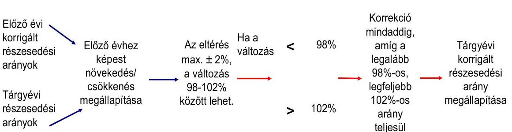
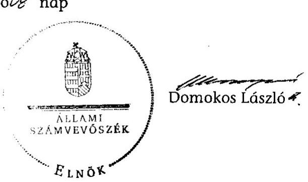
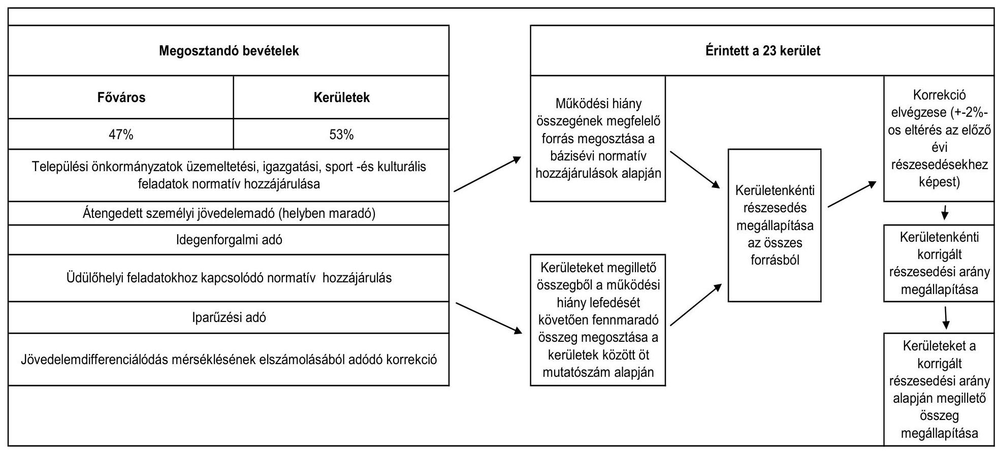

# ÁLLAMI   SZÁMVEVŐSZÉK 

## JELENTÉS

A Fővárosi Önkormányzatot és a kerületi önkormányzatokat osztottan megillető bevételek 2012. évi megosztásáról szóló önkormányzati rendelet felülvizsgálatáról

---

# Állami Számvevőszék 

Iktatószám: V-0041-063/2013.
Témaszám: 1080
Vizsgálat-azonosító szám: V0614
Az ellenőrzést felügyelte:
Holman Magdolna
felügyeleti vezető
Az ellenőrzés végrehajtásáért felelős:
Kisgergely István
ellenőrzésvezető
A jelentés összeállításában közreműködött:
Lajterné Hudák Magdolna
számvevő tanácsos
Páncsics Judit
számvevő
Köllődné Gátai Mária
számvevő
Az ellenőrzést végezték:
Lajterné Hudák Magdolna  Páncsics Judit Köllődné Gátai Mária 
számvevő tanácsos számvevő számvevő
A témához kapcsolódó eddig készített számvevőszéki jelentések:
címe
sorszáma
Jelentés a fővárosi önkormányzatot és a kerületi önkormányzatokat osztottan megillető bevételek 2007. évi megosztásáról szóló önkormányzati rendelet felülvizsgálatáról
0756
Jelentés a fővárosi önkormányzatot és a kerületi önkormányzatokat osztottan megillető bevételek 2008. évi megosztásáról szóló önkormányzati rendelet felülvizsgálatáról
0850
Jelentés a fővárosi önkormányzatot és a kerületi önkormányzatokat osztottan megillető bevételek 2009. évi megosztásáról szóló önkormányzati rendelet felülvizsgálatáról
0956
Jelentés a fővárosi önkormányzatot és a kerületi önkormányzatokat osztottan megillető bevételek 2010. évi megosztásáról szóló önkormányzati rendelet felülvizsgálatáról
1048
Jelentés a fővárosi önkormányzatot és a kerületi önkormányzatokat osztottan megillető bevételek 2011. évi megosztásáról szóló önkormányzati rendelet felülvizsgálatáról
1172

---

# TARTALOMJEGYZÉK 

BEVEZETÉS ..... 9
I. ÖSSZEGZŐ MEGÁLLAPÍTÁSOK, KÖVETKEZTETÉSEK, JAVASLATOK ..... 12
II. RÉSZLETES MEGÁLLAPÍTÁSOK ..... 17

1. A 2012. évi forrásmegosztási rendeletalkotás eljárásának szabályszerűsége, a forrásmegosztás folyamatba épített, előzetes, utólagos és vezetői ellenőrzésének megvalósulása ..... 17
1.1. A forrásmegosztás folyamatának, valamint a folyamatba épített, előzetes, utólagos és vezetői ellenőrzés rendszerének a szabályozottsága ..... 17
1.2. A forrásmegosztási számítások vezetői ellenőrzésének megvalósulása ..... 18
1.3. A forrásmegosztási törvényben előírt adatellenőrzési és véleménykérési kötelezettségek, valamint az adatellenőrzési, véleményezési és rendeletalkotási határidők betartása ..... 18
2. A Fővárosi Önkormányzatot és a kerületi önkormányzatokat osztottan megillető 2012. évi bevételek megállapításának szabályszerűsége, megalapozottsága ..... 19
2.1. A 2012. évi költségvetési törvény alapján a személyi jövedelemadóból, valamint 2010. évi jövedelemkülönbség elszámolásából eredő összegek megállapításának szabályszerűsége ..... 21
2.2. A helyi iparűzési adó, a helyi idegenforgalmi adó és a kapcsolódó normatív hozzájárulás megállapításának megalapozottsága ..... 22
2.3. A települési önkormányzatok üzemeltetési, igazgatási, sport- és kulturális feladataihoz nyújtott normatív hozzájárulás megállapításának helyessége ..... 23
3. A forrásmegosztási számítások során a megosztási arányok meghatározásához felhasznált adatok megalapozottsága, a számítások helyessége ..... 24
3.1. A normatív hozzájárulások tartalmi és összegszerű megfelelősége, a normatív részesedési arány megállapításának megalapozottsága ..... 24
3.2. A kerületi önkormányzatok bázisévi működési kiadásainak és a működési hiány megállapításának szabályszerűsége ..... 26
3.3. A működési hiányra fedezetet nyújtó összeg feletti rész felosztásánál alkalmazott megoszlási viszonyszámok és az alkalmazott mutatószámokból képzett arányszámok megállapításának megalapozottsága és a számítások helyessége ..... 27
3.4. Az idegenforgalmi adó megosztásánál alkalmazott arányszámok megalapozottsága és a számítások helyessége ..... 29

---

3.5. Az egyes kerületi önkormányzatokat megillető részesedési arány 2011. évi forrásmegosztáshoz viszonyított, maximum 2%-os növekedési, illetve csökkenési korlátjának a betartása ..... 30
4. Az esetleges adat- és számítási hibák miatt a 2013. évi forrásmegosztásnál végrehajtandó korrekció (a fővárosi önkormányzat vagy kerületi önkormányzat részére még jogszerűen járó összeg, illetve jogosulatlanul kapott összeg) meghatározása ..... 31
4.1. A 2011. évi forrásmegosztási rendelet felülvizsgálata során nem számszerűsített korrekciók meghatározása a módosított forrásmegosztási törvény alapján ..... 31
4.2. A 2012. évi forrásmegosztási rendelet felülvizsgálata és a módosított forrásmegosztási törvény alapján végrehajtandó korrekciók meghatározása ..... 32
5. Az ÁSZ 2011. évi ellenőrzése során tett javaslatainak hasznosulása ..... 33

# MELLÉKLETEK 

1. számú A 2012. évi forrásmegosztásba bevont bevételek bemutatása a 2012. évi forrásmegosztási rendelet és az ÁSZ megállapításai alapján
2. számú A működési hiány számítása a 2012. évi forrásmegosztási háttérszámítások és az ÁSZ megállapításai alapján
3. számú A kerületi önkormányzatok 2012. évi működési hiányát lefedő összeg feletti rész jogcímenkénti felosztása a forrásmegosztási háttérszámítások és az ÁSZ számításai szerint
4. számú A 2012. évi forrásmegosztási háttérszámításokban szereplő, az ÁSZ szerint figyelembe nem vehető 2010. évi működési kiadások
5. számú A kerületi önkormányzatok részesedése a megosztott bevételekből a korrigált részesedési arány szerint 2012-ben az ÁSZ megállapításai alapján
6. számú A kerületi önkormányzatok részesedése a 2012. évi összes megosztandó bevételből a forrásmegosztási háttérszámítás és az ÁSZ megállapítása alapján, valamint a 2011. évi korrekcióból
7. számú A korrigált részesedési arányok eltérése a 2011. és a 2012. évi forrásmegosztási rendeletekhez képest az ÁSZ megállapítása szerint
8. számú A kerületi önkormányzatok részesedése a 2011. évi forrásmegosztási rendelet ismételt felülvizsgálatából adódódó korrekció miatt, jogcímenként
9. számú Budapest Főváros Önkormányzat Főpolgármesterének észrevétele

## FÜGGELÉKEK

1. számú A forrásmegosztási számítások folyamata 2010. december 31-ig
2. számú A forrásmegosztási számítások folyamata 2011. január 1-je és 2012. május 31-e között
3. számú A forrásmegosztási számítások folyamata 2012. május 31-től

---

# RÖVIDÍTÉSEK JEGYZÉKE 

## Törvények

2010. évi költségvetési törvény
2012. évi költségvetési törvény
ÁSZ tv.
bázisévi zárszámadási törvény
helyi adó tv.
forrásmegosztási törvény
módosított forrásmegosztási törvény

Ötv.

## Rendeletek

2011. évi forrásmegosztási rendelet
2012. évi forrásmegosztási rendelet

Ámr.
idegenforgalmi adó rendelet
iparűzési adó rendelet
a Magyar Köztársaság 2010. évi költségvetéséről szóló 2009. évi CXXX. törvény

Magyarország 2012. évi központi költségvetéséről szóló 2011. évi CLXXXVIII. törvény
az Állami Számvevőszékről szóló 2011. évi LXVI. törvény
a Magyar Köztársaság 2010. évi költségvetésének végrehajtásáról szóló 2011. évi CXXXIII. törvény
a helyi adókról szóló 1990. évi C. törvény
a fővárosi önkormányzat és a kerületi önkormányzatok közötti forrásmegosztásról szóló 2006. évi CXXXIII. törvény 2011. december 31-ig hatályos változata
a fővárosi önkormányzat és a kerületi önkormányzatok közötti forrásmegosztásról szóló 2006. évi CXXXIII. törvény 2012. május 31-től hatályos változata
a helyi önkormányzatokról szóló 1990. évi LXV. törvény (az Ötv. forrásmegosztással kapcsolatos 64. §-a 2013. január 1-jétől hatálytalan)

Budapest Főváros Önkormányzatának a Fővárosi Önkormányzatot és a kerületi önkormányzatokat osztottan megillető bevételek 2011. évi megosztásáról szóló 3/2011. (II. 8.) számú rendelete

Budapest Főváros Önkormányzatának a Fővárosi Önkormányzatot és a kerületi önkormányzatokat osztottan megillető bevételek 2012. évi megosztásáról szóló 8/2012. (II. 10.) számú rendelete
az államháztartás működési rendjéről szóló 292/2009. (XII. 19.) Korm. rendelet (2012. január 1-től az államháztartásról szóló törvény végrehajtásáról szóló 368/2011. (XII. 31.) Korm. rendelet)
Budapest Főváros Önkormányzatának az idegenforgalmi adóról szóló, többször módosított 31/1994. (VI. 10.) számú rendelete
Budapest Főváros Önkormányzatának a helyi iparűzési adóról szóló, többször módosított 21/1991. (IX. 5.) számú rendelete

---

# Szórövidítések 

Adó Főosztály
ÁSZ
bázisévi költségvetési
beszámoló

BM
főjegyző
főpolgármester
Főpolgármesteri hivatal
Fővárosi Önkormányzat
idegenforgalmi bevételek
II. kerületi önkormányzat
VII. kerületi önkormányzat
XI. kerületi önkormányzat
XIV. kerületi önkormányzat
XVII. kerületi önkormányzat
kerületi önkormányzatok
Kincstár
Költségvetési Osztály
Közgyűlés
NAV
NGM
NGM tájékoztató
Pénzügyi Főosztály
SzMSz

Budapest Főváros Önkormányzata Főpolgármesteri Hivatalának Adó Főosztálya
Állami Számvevőszék
a Budapest Főváros Önkormányzata, valamint Budapest Főváros I - XXIII. Kerületek Önkormányzatainak a Magyar Államkincstár által elfogadott 2010. évi költségvetési beszámolói
Belügyminisztérium
Budapest Főváros Önkormányzatának Főjegyzője
Budapest Főváros Önkormányzatának Főpolgármestere
Budapest Főváros Önkormányzata Főpolgármesteri Hivatala
Budapest Főváros Önkormányzata
Idegenforgalmi adó és a hozzá (az üdülőhelyi feladatokhoz) kapcsolódó normatív hozzájárulás.
Budapest Főváros II. kerületi Önkormányzat
Budapest Főváros VII. kerület Erzsébetváros Önkormányzata
Budapest Főváros XI. kerület Újbuda Önkormányzata
Budapest Főváros XIV. kerület Zugló Önkormányzata
Budapest Főváros XVII. kerület Rákosmente Önkormányzata
Budapest Főváros I - XXIII. kerületeinek önkormányzatai
Magyar Államkincstár
Budapest Főváros Önkormányzata Főpolgármesteri Hivatalának Pénzügyi Főosztályának Költségvetési Osztálya
Budapest Főváros Önkormányzatának Közgyűlése
Nemzeti Adó- és Vámhivatal
Nemzetgazdasági Minisztérium
az államháztartási szakfeladatok rendjéről szóló 8/2010. (IX. 10.) NGM tájékoztató

Budapest Főváros Önkormányzata Főpolgármesteri Hivatalának Pénzügyi Főosztálya
A főpolgármester és a főjegyző 505/2011. számú együttes utasítása a Főpolgármesteri Hivatal Szervezeti és Működési Szabályzatáról, Ügyrendjéről (hatályos 2011. január 15-től)

---

21. számú űrlap
22. számú űrlap
23. számú űrlap
24. számú űrlap

A Nemzetgazdasági Minisztérium által közzétett „Tájékoztató az államháztartás szervezetei 2010. évi éves költségvetési beszámolójának összeállításához szolgáló, B. Önkormányzati éves elemi költségvetési beszámoló" elnevezésű beszámoló garnitúrának „Kiadások tevékenységenként" című 21. számú űrlapja.
A Nemzetgazdasági Minisztérium által közzétett „Tájékoztató az államháztartás szervezetei 2010. évi éves költségvetési beszámolójának összeállításához szolgáló, B. Önkormányzati éves elemi költségvetési beszámoló" elnevezésű beszámoló garnitúrának „A normatív hozzájárulások elszámolása és a mutatószámok, feladatmutatók alakulása" című 31. számú űrlapja.
A Nemzetgazdasági Minisztérium által közzétett „Tájékoztató az államháztartás szervezetei 2010. évi éves költségvetési beszámolójának összeállításához szolgáló, B. Önkormányzati éves elemi költségvetési beszámoló" elnevezésű beszámoló garnitúrának „Az előző évi kötelezettségvállalással terhelt normatív, kötött felhasználású támogatások előirányzat maradványainak elszámolása" című 46. számú űrlapja.
A Nemzetgazdasági Minisztérium által közzétett „Tájékoztató az államháztartás szervezetei 2010. évi éves költségvetési beszámolójának összeállításához szolgáló, B. Önkormányzati éves elemi költségvetési beszámoló" elnevezésű beszámoló garnitúrának „A normatív, kötött felhasználású támogatások elszámolása és a mutatószámok, feladatmutatók alakulása" című 51. számú űrlapja.

---

.

---

# ÉRTELMEZŐ SZÓTÁR 

alacsony komfortfokozatú lakások alapterülete
bázisév
forrásmegosztás
forrásmegosztási háttérszámítás
iparosított technológiájú lakások száma
korrigált részesedési arány
működési hiány
normatív hozzájárulások

A 2005. év végén az önkormányzati tulajdonban lévő félkomfortos, komfortnélküli és szükséglakások együttes alapterülete. (Forrás: forrásmegosztási törvény 6. § b) pontja)
A tárgyévet kettővel megelőző év. (Forrás: forrásmegosztási törvény 3. § b) pontja)
A Fővárosi Önkormányzatot és a kerületi önkormányzatokat osztottan megillető bevételek megosztása. (Forrás: az Ötv. 64. § (4) bekezdése alapján meghatározott fogalom)
A Fővárosi Önkormányzat forrásmegosztási rendelettervezetének előterjesztéséhez mellékelt, a forrásmegosztáshoz kapcsolódó számítások. Olyan táblázatrendszer, amely alapján a forrásmegosztási rendelet elfogadásra került. (A 2012. évi forrásmegosztási rendelet előterjesztésének 4. számú melléklete)

A 2005. év végén az egyes kerületi önkormányzatok területén levő iparosított technológiával épült lakások darabszáma. (Forrás: forrásmegosztási törvény 6. § b) pontja)
Az egyes kerületi önkormányzatok részesedési aránya a megosztott forrásokból a tárgyévet megelőző év forrásmegosztásához képest maximum 2%-kal nőhet, illetve csökkenhet. A módszer alkalmazása miatt bekövetkező eltérések a forrásmegosztás során az egyes önkormányzatok bevételekből való részesedését növelik, vagy csökkentik. (Forrás: forrásmegosztási törvény 6. § d) pontja)
A kerületi önkormányzatoknál azon feladatok önkormányzati költségvetési beszámoló szerinti működési kiadásaiból, amelyekhez a központi költségvetés normatív hozzájárulást nyújt, le kell vonni a kiadásokhoz kapcsolódó normatív hozzájárulás összegét. Az így megállapított különbözet a működési hiány. (Forrás: forrásmegosztási törvény 6. § a) pontja)
A forrásmegosztás szempontjából a költségvetési törvényben meghatározott - a szociális, gyermekvédelmi, gyermekjóléti, oktatási, nevelési, közművelődési és üdülőhelyi feladatokhoz kapcsolódó - normatív hozzájárulások és az összes normatív, kötött felhasználású támogatás bázisévi önkormányzati költségvetési beszámoló érintett űrlapjainak adatai szerinti összege. (Forrás: forrásmegosztási törvény 3. § c) pontja)

---

normatív részesedési arány
részesedési arány
tárgyév

A Fővárosi Önkormányzatot és a kerületi önkormányzatokat együttesen megillető - a bázisévi zárszámadási törvénnyel elfogadott - normatív hozzájárulásból a Fővárosi Önkormányzat és együttesen valamennyi kerületi önkormányzat részesedési aránya, százalékban kifejezve (Forrás: forrásmegosztási törvény 3. § d) pontja)
Az egyes kerületi önkormányzatokat a normatív részesedési arány, valamint az állandó népesség a belterület terület, az állandó népesség és a belterületi terület nagyságának hányadosa, a 2005. év végén az önkormányzati tulajdonban lévő félkomfortos, komfort nélküli és a szükséglakások együttes alapterülete, továbbá a 2005. év végén az önkormányzat területén lévő iparosított technológiával épült lakások darabszáma alapján megillető bevételek aránya az összes kerületet megillető forrásokból. (Forrás: forrásmegosztási törvény 6. § b) pontja)
Azon gazdasági év, amelyhez tartozó megosztandó bevételeknek a Fővárosi Önkormányzat és a kerületi önkormányzatok közötti megosztását a forrásmegosztás határozza meg. (Forrás: forrásmegosztási törvény 3. § a) pontja)

---

# JELENTÉS 

## a Fővárosi Önkormányzatot és a kerületi önkormányzatokat osztottan megillető bevételek 2012. évi megosztásáról szóló önkormányzati rendelet felülvizsgálatáról

## BEVEZETÉS

Az ellenőrzés jogszabályi alapját Magyarország Alaptörvényének 43. cikk (1) bekezdése, az ÁSZ tv. 3. § (1) bekezdésének
 és a forrásmegosztási törvény 8. § (1) bekezdésének előírásai képezik. A forrásmegosztási törvény 8. § (1) bekezdése előírja, hogy a Fővárosi Önkormányzat tárgyévre vonatkozó forrásmegosztási rendeletét az Állami Számvevőszék (ÁSZ) felülvizsgálja.

Az ellenőrzés kiterjedt a forrásmegosztás adatainak a megalapozottságára, és az ennek alapjául szolgáló számítások helyességére.

Az ellenőrzött időszakban a forrásmegosztási törvényt az Országgyűlés kétszer módosította ${ }^{1}$. A 2012. január 1-jén hatályba lépett módosítás szerint a kerületi önkormányzatokat a normatív hozzájárulások arányában megillető forrásrész összegét ${ }^{2}$ a bázisévi költségvetési beszámolókból a feladatmutatók alapján, az átlagköltségek figyelembevételével számított működési kiadások ${ }^{3}$ összegéből kiindulva kellett meghatározni. A forrásmegosztási törvény 2012. május 31-től hatályos módosítása ezt a rendelkezést hatályon kívül helyezte.

A forrásmegosztási törvény módosításakor pontosították a normatív hozzájárulás fogalmát, az idegenforgalmi adó és a hozzá kapcsolódó normatív hozzájárulás elkülönített megosztása érdekében ${ }^{4}$ újrafogalmazták a forrásmegosztásba

[^0]
[^0]:    ${ }^{1}$ A 2011. évi CLXVI. törvény 64. §-a 2012. január 1-től, a 2012. évi LVIII. törvény 2012. május 31-től lépett hatályba.
    ${ }^{2}$ A kerületi önkormányzatok között a normatív hozzájárulások arányában megosztandó rész a számított működési kiadások és az ezekhez kapcsolódó normatív hozzájárulások különbözete.
    ${ }^{3}$ A számított működési kiadások között csak azok a feladatok vehetők figyelembe, melyekhez a központi költségvetés normatív hozzájárulást nyújt.
    ${ }^{4}$ A 2011. január 1-jétől hatályos Ötv. 64. § (4a) bekezdése értelmében az idegenforgalmi adót és a hozzá kapcsolódó normatív hozzájárulást csak azok között a kerületi önkormányzatok között lehet megosztani, akik az idegenforgalmi adót helyi rendeletekkel nem vetették ki.

---

bevont bevételek megosztásának elveit ${ }^{5}$. A 2012. május 31-től hatályba lépett módosításokat a 2011. évi forrásmegosztási rendelet felülvizsgálata és a 2012. évi forrásmegosztás során is figyelembe kell venni. Az ÁSZ a 2012. évi forrásmegosztási rendelet felülvizsgálatát a módosított forrásmegosztási törvényben foglaltak alapján végezte. Az eljárási szabályok 2010-2012. évek közötti változásait a jelentés 1-3. számú függelékei tartalmazzák.

A helyszíni ellenőrzés ideje alatt 2012. december 7-én a Kormány benyújtotta az Országgyűlésnek a T/9401. számú törvényjavaslatát az „Egyes törvényeknek a központi költségvetésről szóló törvény megalapozásával összefüggő, valamint egyéb célú módosításáról", amely tartalmazta a forrásmegosztási törvény módosítására tett javaslatot is. Az ÁSZ a megállapításokra tett intézkedést igénylő javaslatoknál a törvénymódosítási javaslatot figyelembe vette.

A forrásmegosztási törvény 8. § (2) bekezdése alapján, ha a felülvizsgálat megállapítja, hogy a forrásmegosztás során alkalmazott adatok, vagy a számítások helytelensége miatt a Fővárosi Önkormányzat, vagy valamelyik kerületi önkormányzat jogosulatlan forráshoz jutott, vagy a jogszerűen járó forrásnál alacsonyabb összegben részesült, azt a hiba feltárását követő év forrásmegosztásánál figyelembe kell venni.

Az ellenőrzés célja annak értékelése volt, hogy:

- a Fővárosi Önkormányzat 2012. évi forrásmegosztási rendelete a forrásmegosztási törvény előírásainak, illetve módosításainak megfelelően határozta-e meg a megosztandó bevételeket és azok összegét;
- a megosztási arányok meghatározásánál felhasznált alapadatok megalapozottak-e, a számítások helyesek voltak-e;
- a forrásmegosztási törvény módosítása és az esetleges adat- és számítási hibák miatt milyen összegű korrekciókat kell elvégezni a 2012. évi forrásmegosztási rendelet felülvizsgálata alapján;
- hasznosultak-e az ÁSZ „a Fővárosi Önkormányzatot és a kerületi önkormányzatokat megillető bevételek 2011. évi megosztásáról szóló önkormányzati rendelet felülvizsgálatáról" szóló jelentésében tett javaslatok.

A 2012. évi forrásmegosztási rendeletnek a módosított forrásmegosztási törvény előírásaihoz való megfelelőségét szabályszerűségi ellenőrzés keretében, elemző eljárással vizsgáltuk az ÁSZ Ellenőrzési Kézikönyvében foglaltak, valamint az INTOSAI ${ }^{6}$ vonatkozó standardjainak figyelembevételével.

A Főpolgármesteri hivatalnál áttekintettük a forrásmegosztási törvényben foglalt előírások megvalósítását, a számítások helyességét. A Fővárosi Önkormányzatot és a kerületi önkormányzatokat megillető bevételek helyességének

[^0]
[^0]:    ${ }^{5}$ 2012. május 21-ig a forrásmegosztás számítási elve azon alapult, hogy a forrásmegosztásból a kerületeket megillető részt az összes kerület között kell megosztani.
    ${ }^{6}$ International Organization of Supreme Audit Institutions, Legfőbb Ellenőrző Intézmények Nemzetközi Szervezete

---

ellenőrzésénél a forrásmegosztási háttérszámítás adatait hasonlítottuk össze az ÁSZ rendelkezésére álló kincstári adatokkal. Az ellenőrzés értékelte az adatfeldolgozás szabályozottságát és ehhez kapcsolódóan a folyamatba épített az előzetes, utólagos és vezetői ellenőrzés működését a 2012. évi forrásmegosztási rendelet előkészítésének és megalkotásának időszakában (2011. október 1-je és 2012. január 31-e között). Utóellenőrzés keretében ellenőriztük az előző évi jelentésben tett javaslatok hasznosulását.

---

# I. ÖSSZEGZŐ MEGÁLLAPÍTÁSOK, KÖVETKEZTETÉSEK, JAVASLATOK 

A Fővárosi Önkormányzat a forrásmegosztásba bevonható bevételeket - az Ötv. előírásait betartva - 201750054 ezer Ft-ban határozta meg. Az összegből 10770031 ezer Ft-ot a települési önkormányzatokat közvetlenül megillető személyi jövedelemadó hányad, 6905023 ezer Ft-ot a települési önkormányzatok üzemeltetési, igazgatási, sport- és kulturális feladataira igénybe vehető normatív hozzájárulás, 184000000 ezer Ft-ot helyi iparűzési adó, 30000 ezer Ft-ot helyi idegenforgalmi adó, valamint 45000 ezer Ft-ot az utóbbihoz kapcsolódó normatív hozzájárulás jogcímeken tervezett meg. A forrásmegosztásba vont bevételek megállapítása a 2012. évben megalapozott volt.

A Fővárosi Önkormányzatot és a kerületi önkormányzatokat 2012. évben megillető részesedés meghatározása a bázisévi önkormányzati költségvetési beszámolók adatain alapult. A módosított forrásmegosztási törvény szerint a normatív részesedési arány a Fővárosi Önkormányzatot és a kerületi önkormányzatokat megillető normatív hozzájárulásból a Fővárosi Önkormányzatra és együttesen valamennyi kerületi önkormányzatra számított részesedési arány, százalékban kifejezve. A normatív részesedési arány megállapításához meg kellett határozni a normatív hozzájárulások körét és azok tartalmát, amely a 2012. évi forrásmegosztási háttérszámításokban megfelelt a módosított forrásmegosztási törvényben előírtaknak. A normatív részesedési arányok számítása helyes volt.

A Főpolgármesteri hivatal a Fővárosi Önkormányzatot és a kerületi önkormányzatokat együttesen megillető részesedés számításánál nem az ÁSZ által a 2011. évi forrásmegosztási rendelet felülvizsgálata során megállapított arányokat vette alapul, ez azonban a Fővárosi Önkormányzat és a kerületi önkormányzatok 2012. évi részesedését nem befolyásolta, az iparűzési adó megosztásában a kerületek javára 1 ezer Ft-os eltérést eredményezett.

A 2012. évi forrásmegosztási rendelet felülvizsgálata során az ÁSZ a Fővárosi Önkormányzat háttérszámításához képest eltéréseket állapított meg, amit részben a módosított forrásmegosztási törvényben foglalt eljárási szabályok változása, részben számítási hibák okoztak.

A Főpolgármesteri hivatal a 2012. évi forrásmegosztási rendelet előterjesztésében, a forrásmegosztás háttérszámításban határozta meg a működési kiadások megállapításához tartozó szakfeladatok körét és az azokon elszámolt működési kiadásokat. A kerületenkénti működési kiadások megállapításakor a Főpolgármesteri hivatal figyelmen kívül hagyta az Ámr-ben előírtakat, és a működési kiadások között figyelembe vettek olyan kiadásokat is, amelyekhez nem kapcsolódott normatív hozzájárulás. A ténylegesen figyelembe vehető működési kiadások összege a 2012. évi forrásmegosztási számításoknál az ÁSZ megállapítása szerint 487869 ezer Ft-tal alacsonyabb a forrásmegosztási háttérszámításokban szereplő 160607256 ezer Ft összegnél. A működési kiadások pontosítása, valamint a normatív hozzájárulások 2 ezer Ft-os kerekítési eltérése miatt

---

módosult a működési hiány összege is, amely a 2012. évi forrásmegosztási háttérszámításokban szereplő 106115427 ezer Ft-ról 105627556 ezer Ft-ra csökkent.

Az idegenforgalmi bevételek nélkül számított összes megosztandó bevételből a működési hiány lefedésére rendelkezésre álló forrás levonását követően az ÁSZ megállapítása szerint 2174163 ezer Ft megosztható forrás maradt, amely 448110 ezer Ft-tal több, mint a forrásmegosztási háttérszámításokban ugyanezen jogcímen megállapított összeg. A különbözet a működési kiadások 487869 ezer Ft-os eltéréséből, a 39763 ezer Ft-os idegenforgalmi bevételek elkülönített megosztása miatti csökkenésből, továbbá 4 ezer Ft kerekítési eltérésből adódott. A forrásmegosztási háttérszámításokban a Főpolgármesteri hivatal a működési hiány lefedésére szolgáló rész levonását követően megállapított forrásrész felosztásához nem a módosított forrásmegosztási törvényben előírtakat alkalmazta.

A 2012. évi forrásmegosztási rendelet felülvizsgálata során az ÁSZ által - a működési hiány lefedésére, a működési hiány levonását követően felosztható forrásokra, és az idegenforgalmi bevételek megosztására - megállapított eltérések a Fővárosi Önkormányzatot és a kerületeket együttesen megillető részesedést nem befolyásolták, azonban a kerületeket külön-külön megillető összegek, a befolyt bevételek megosztását meghatározó arányszámok módosultak, amely miatt a 2013. évi forrásmegosztást korrigálni kell.

Az Ötv. rendelkezései szerint az idegenforgalmi bevételeket csak azon kerületek között lehet megosztani, amelyek az idegenforgalmi adó kivetésének jogát a Fővárosi Önkormányzatnak átengedték. Ezzel ellentétben a forrásmegosztási törvény rendelkezései a teljes forrásmegosztásba bevont bevétel Fővárosi Önkormányzat és az összes kerületi önkormányzat közötti elosztására vonatkoztak, nem tartalmazták az idegenforgalmi bevételek elkülönített megosztásával kapcsolatos szabályokat. Ezt a problémát az ÁSZ már a 2011. évi forrásmegosztási rendelet felülvizsgálatakor is megállapította. A szabályozási hiányosságot a módosított forrásmegosztási törvény 2012. május 31-től megszüntette. Az idegenforgalmi bevételek megosztására vonatkozó eljárási szabályokat megalkották. A rendeletalkotáskor - még meglévő szabályozási hiányosság miatt - a Főpolgármesteri hivatal a 2012. évben a 2011. évben is alkalmazott helytelen módszer szerint számolt, ezért az idegenforgalmi bevételek megosztásnál alkalmazott arányszámok és korrigált részesedési arányok sem voltak helyesek.

Az ÁSZ a 2011. évi forrásmegosztási számításokat a módosított forrásmegosztási törvényben kapott felhatalmazás alapján ismételten felülvizsgálta. Az ÁSZ ellenőrzése során megállapította, hogy a Fővárosi Önkormányzat a 2011. évi felülvizsgálat során a kerületek javára megállapított 379165 ezer Ft összeget a 2012. évi forrásmegosztási rendeletben a kerületek között elosztotta. Az ÁSZ szerint kerületenként megállapított összeg az idegenforgalmi bevételek elkülönített megosztásának hiányából eredően és az eljárási szabályok változása miatt eltért a 2012. évi forrásmegosztási háttérszámításokban szereplő összegektől.

---

A 2012. évi forrásmegosztási rendelet felülvizsgálata, valamint a 2011. évi forrásmegosztási rendelet ismételt felülvizsgálata során az ÁSZ megállapította, hogy kilenc kerületi önkormányzatot együttesen 26718 ezer Ft-tal több forrás illet meg, míg 11 kerületi önkormányzattól együttesen 26714 ezer Ft-ot kell elvonni. A hibás számítások miatti eltérések összességében - a 4 ezer Ft kerekítési eltéréstől eltekintve - kiegyenlítették egymást.

A korrekció során az egyes kerületeket megillető többletforrások, illetve elvonások összegét az 1. számú táblázat, részletesen a jelentés 6. számú mellékletének 14. oszlopa mutatja be.

|  |  | 1. számú táblázat   adatok ezer Ft-ban |
| :-- | :--: | :--: |
| Kerület | ÁSZ által megállapított eltérés |  |
| I. kerület | -1306 |  |
| II. kerület | 19717 | XIV. kerület |
| III. kerület | -1223 | XV. kerület |
| IV. kerület | -2851 | XVI. kerület |
| V. kerület | 88 | XVII. kerület |
| VI. kerület | 1 | XVIII. kerület |
| X. kerület | -1016 | XIX. kerület |
| XI. kerület | -323 | XXII. kerület |
| XII. kerület | -10966 | XXIII. kerület |
| XIII. kerület | -5042 | XXIV. kerület |
| Kerületek eltérése összesen |  |  |

A forrásmegosztási háttérszámítások és a rendelettervezet vezetői ellenőrzése nem volt megfelelő, mivel annak elvégzését a Pénzügyi Főosztály vezetője ugyan aláírásával igazolta, de nem észrevételezte, hogy a 2010. évi működési kiadások között normatív hozzájárulással nem támogatott kiadások is szerepeltek. Az ÁSZ által a
 2012. évi forrásmegosztási rendelet felülvizsgálata során feltárt hiányosságok is a vezetői ellenőrzés nem megfelelő működését mutatják. A Pénzügyi Főosztály belső működési szabályzata tartalmazta a forrásmegosztási rendelet előkészítésével kapcsolatos feladatokat, az ellenőrzési nyomvonala rögzítette a forrásmegosztással kapcsolatos tevékenységek folyamatszabályozását. A Költségvetési Osztály vezetőjének és dolgozóinak munkaköri leírásai azonban nem voltak összhangban az ellenőrzési nyomvonallal, mivel nem tartalmazták az ellenőrzési nyomvonalban előírt ellenőrzési kötelezettségeiket.

A 2012. évi forrásmegosztási rendelet felülvizsgálatához kapcsolódóan az ÁSZ ellenőrizte a 2011. évi jelentésében tett javaslatainak hasznosulását. Ennek során megállapította, hogy a belügyminiszternek a forrásmegosztási törvény módosítására, a főpolgármesternek az ÁSZ által megállapított eltérések 2012. évi forrásmegosztási rendeletben való szerepeltetésére tett javaslatai teljesültek. A főjegyzőnek tett javaslatok közül egy teljesült, mivel az állandó népesség adatát a módosított forrásmegosztási törvénynek megfelelő tartalommal vették figyelembe a 2012. évi forrásmegosztási rendelet megalkotása során. A főjegyzőnek a vezetői ellenőrzés végrehajtásával kapcsolatban tett ÁSZ javaslat nem teljesült, mivel a vezetői ellenőrzés a 2012. évi forrásmegosztási rendelet előkészítése során sem volt megfelelő. Nem teljesült a szakfeladatok tartalmi megfelelőségének biztosítására tett javaslat sem, mivel a 2012. évi forrásmegosztási háttérszámításokban olyan szakfeladatokat szerepeltettek, amelyekhez nem kapcsolódott normatív hozzájárulás.

Az ÁSZ a megállapítások alapján tett javaslatoknál figyelembe vette a T/9401. számon - az „Egyes törvényeknek a központi költségvetésről szóló törvény megalapozásával összefüggő, valamint egyéb célú módosításáról" - benyújtott törvényjavaslatban foglaltakat is. A törvényjavaslat szerint a forrásmegosztási számítások módszere 2013-tól átalakul. Emiatt a 2011. évi forrásmegosztási rendelet felülvizsgálatakor a szakfeladatok tartalmi megfelelőségével, valamint az idegenforgalmi bevételek megosztásával kapcsolatos javaslatok megismétlése - hasznosulás elmaradása ellenére - aktualitását veszíti.

Az Állami Számvevőszékről szóló 2011. évi LXVI. törvény 33. § (1) bekezdésében foglaltak értelmében a jelentésben foglalt megállapításokhoz kapcsolódó intézkedési tervet köteles az ellenőrzött szervezet vezetője összeállítani és azt a jelentés kézhezvételétől számított 30 napon belül az ÁSZ részére megküldeni. Amennyiben az intézkedési tervet határidőben nem küldi meg az ellenőrzött szervezet, vagy az továbbra sem elfogadható, az ÁSZ elnöke a hivatkozott törvény 33. § (3) bekezdés a)-b) pontjaiban foglaltakat érvényesítheti.

Az ellenőrzés intézkedést igénylő megállapításai és javaslatai:

# a főpolgármesternek 

Az ÁSZ a 2011. és 2012. évi forrásmegosztási számításokat a módosított forrásmegosztási törvényben kapott felhatalmazás alapján felülvizsgálta és az ellenőrzés során a kerületi önkormányzatokat külön-külön megillető részesedésekben eltéréseket állapított meg, amely szerint kilenc kerületi önkormányzatot együttesen 26718 ezer Ft-tal több forrás illet meg, míg 11 kerületi önkormányzattól együttesen 26714 ezer Ft-ot kell elvonni. Az eltéréseket, amelyekkel a 2013. évi forrásmegosztást korrigálni kell, az 1. számú táblázat, részletesen a jelentés 6. számú mellékletének 14. oszlopa mutatja be.

Javaslat:
Intézkedjen arról, hogy a forrásmegosztási törvény 8. § (2) bekezdésében előírtaknak megfelelően az ÁSZ által a 2011-2012. évi forrásmegosztási rendeletek felülvizsgálata során megállapított - kilenc kerületi önkormányzat javára együttesen 26718 ezer Ft, valamint 11 kerületi önkormányzat terhére együttesen 26714 ezer Ft - eltéréseket kerületenként a jelentés 1. számú táblázata szerinti összegekkel a 2013. évi forrásmegosztási rendelet megalkotásakor vegyék figyelembe.

---

# a főjegyzőnek 

A Pénzügyi Főosztály ellenőrzési nyomvonala rögzítette a forrásmegosztással kapcsolatos feladatok folyamatszabályozását, azonban a Költségvetési Osztályon dolgozók munkaköri leírásai nem voltak összhangban az ellenőrzési nyomvonalban foglalt ellenőrzési kötelezettségekkel. Az ÁSZ által a 2012. évi forrásmegosztási rendelet felülvizsgálata során feltárt hiányosságok is a vezetői ellenőrzés nem megfelelő működését mutatják.

Javaslat:
A forrásmegosztási rendelet előkészítésében résztvevő közszolgálati tisztviselők munkaköri leírásait hozza összhangba a Pénzügyi Főosztály ellenőrzési nyomvonalában foglalt ellenőrzési feladatokkal és kérje számon a forrásmegosztási rendelettervezet elkészítése során a kijelölt vezetők ellenőrzési feladatainak teljesítését.

---

# II. RÉSZLETES MEGÁLLAPÍTÁSOK 

## 1. A 2012. ÉVI FORRÁSMEGOSZTÁSI RENDELETALKOTÁS ELJÁRÁSÁNAK SZABÁLYSZERŰSÉGE, A FORRÁSMEGOSZTÁS FOLYAMATBA ÉPÍTETT, ELŐZETES, UTÓLAGOS ÉS VEZETŐI ELLENŐRZÉSÉNEK MEGVALÓSULÁSA

### 1.1. A forrásmegosztás folyamatának, valamint a folyamatba épített, előzetes, utólagos és vezetői ellenőrzés rendszerének a szabályozottsága

A 2012. évi forrásmegosztási rendelettervezet előkészítésével kapcsolatos feladatokat az SzMSz 45. § (1) bekezdés 14. pontja alapján a Pénzügyi Főosztály látta el. A Főpolgármesteri hivatal a belső szabályzataiban a rendelettervezet elkészítésének munkafolyamatát javaslatkészítés és rendelettervezet összeállításának munkaszakaszaira bontotta. A Pénzügyi Főosztály belső működési szabályzata a Költségvetési Osztály feladataként írta elő a forrásmegosztási javaslat és a forrásmegosztási rendelettervezet előkészítését.

A Pénzügyi Főosztály ellenőrzési nyomvonala - amelynek részét képezte a forrásmegosztással kapcsolatos feladatok folyamatszabályozása is - tartalmazta a forrásmegosztási rendelettervezet elkészítésének munkafolyamatát, a feladatokat, azok felelőseit, a vonatkozó jogszabályokat és belső szabályzatokat, a feladatellátás során keletkező dokumentumokat, az ellenőrzési pontokat és az ellenőrzés végrehajtóját, valamint a jóváhagyó személy megnevezését. A folyamatszabályozás és az ellenőrzési nyomvonal lefedte a teljes forrásmegosztási rendeletkészítés munkaszakaszait, a vezetői ellenőrzés feladatait. Az ellenőrzési nyomvonal részletesen nem határozta meg a számítások és azok ellenőrzésének módját.

A Költségvetési Osztály elkészítette a forrásmegosztási rendelettervezet ellenőrzési nyomvonalának módosítását és a hozzá kapcsolódó csekklistát, amely tartalmazza az ellenőrizendő adatokat és az ellenőrzés módját, de a módosítást a helyszíni ellenőrzés befejezéséig nem hagyták jóvá.

A forrásmegosztási rendelettervezet előkészítésében érintettek munkaköri leírásai - a Pénzügyi Főosztály vezetőjének kivételével - nem tartalmazták az ellenőrzési kötelezettségeket annak ellenére, hogy a Költségvetési Osztály ellenőrzési nyomvonala alapján az osztályvezetőnek, a csoportvezetőnek és az ügyintézőknek is voltak ellenőrzési feladataik.

A Költségvetési Osztályon a forrásmegosztási rendelettervezet előkészítését az osztályvezető, az összeállítások, a számítások elvégzésében való részvételt a csoportvezető, a forrásmegosztási bevételekre vonatkozó javaslattétellel kapcsolatos feladatok ellátását, valamint a számítások elvégzését, a kerületi önkormányzatokkal való egyeztetés feladatát az ügyintézők munkaköri leírása tartalmazta.

---

A 2012. évi belső ellenőrzési terv készítésénél a kockázatbecslés során a forrásmegosztási rendelet törvényi előírásoknak való megfelelése ellenőrzését nem vették figyelembe, és nem végeztek belső ellenőrzést a 2012. évi forrásmegosztáshoz kapcsolódóan.

# 1.2. A forrásmegosztási számítások vezetői ellenőrzésének megvalósulása 

A 2012. évi forrásmegosztási rendelettervezet elkészítése során a Pénzügyi Főosztály vezetője a forrásmegosztás háttérszámításain, a 2011. évi ÁSZ vizsgálat során megállapított eltérés kerületi önkormányzatokra lebontott megosztását tartalmazó kimutatás dokumentumán, valamint a működési kiadásokat tartalmazó dokumentumon aláírásával igazolta az ellenőrzési feladat ellátását. A vezetői ellenőrzés működése nem volt megfelelő, mivel az ellenőrzés során nem észrevételezték, hogy a 2010. évi működési kiadások között normatív hozzájárulással nem támogatott kiadások is szerepeltek. Nem tárták fel, hogy az ÁSZ által a 2011. évi forrásmegosztási rendelet felülvizsgálata során a főjegyzőnek tett négy javaslatból - az intézkedési terv ellenére - három nem valósult meg.

A forrásmegosztási számításokhoz figyelembe vett bázisévi adatok főösszege és a Kincstár adatbázisában szereplő adatok közötti egyezőségének ellenőrzését az adatokat tartalmazó táblázatba beépített automatikus ellenőrző pont kialakításával biztosították. A kerületekre vonatkozó részletes adategyeztetést - a kincstári adatok, a kerületi önkormányzati beszámolók adatai és a forrásmegosztás számításánál használt adatok között - a Főpolgármesteri hivatal nem végezte. A forrásmegosztás számításánál használt adatok és a kerületi önkormányzati beszámolók adatainak egyezőségét a kerületi önkormányzatok dokumentáltan ellenőrizték, adateltérést nem jeleztek.

A 2012. évi forrásmegosztási rendelet előkészítésével kapcsolatos vezetői ellenőrzési tapasztalatokat nem foglalták össze, a vezetői ellenőrzésről nem készült szakmai szempontokat tartalmazó feljegyzés.

### 1.3. A forrásmegosztási törvényben előírt adatellenőrzési és véleménykérési kötelezettségek, valamint az adatellenőrzési, véleményezési és rendeletalkotási határidők betartása

A 2012. évi forrásmegosztáshoz szükséges - a Kincstár által elfogadott adatokat - a módosított forrásmegosztási törvény 7. § (1) bekezdés előírásának megfelelően a Főpolgármesteri hivatal 2011. október 31-ig elküldte a kerületi önkormányzatoknak ellenőrzésre. A kerületi önkormányzatok - egy kivételével - a módosított forrásmegosztási törvény 7. § (1) bekezdését betartva, 2011. november 15. napjáig az adatellenőrzést elvégezték és ennek eredményéről a Fővárosi Önkormányzatot írásban értesítették.

A VII. kerületi önkormányzat az adategyeztetés eredményéről csak 2011. november 17-én értesítette a Fővárosi Önkormányzatot.

---

A kerületi önkormányzatok - egy kivétellel - az adatokat elfogadták. Az adatellenőrzés során egy önkormányzat tett észrevételt a forrásmegosztás számításánál figyelembe vett működési kiadásokkal kapcsolatban. A II. Kerületi Önkormányzat az ellenőrzés során három szakfeladatot jelölt meg, amelyeket a Fővárosi Önkormányzat nem vett figyelembe a működési kiadások között annak ellenére, hogy véleménye szerint ezeknek a feladatoknak az ellátásához a központi költségvetés támogatást nyújtott.

Az egyeztetőlevél a „8899615 menekültek, befogadottak, oltalmazottak támogatása", „8423601 a kárpótlási, kárrendezési, kártalanítási tevékenység", valamint a „8904411 közcélú foglalkoztatás" szakfeladatok figyelembe vételét javasolta.

A javaslatból a Fővárosi Önkormányzat a „8904411 közcélú foglalkoztatás" szakfeladat figyelembevételét elfogadta, a másik két szakfeladat a költségvetésből nem normatív hozzájárulás címen, hanem fejezeti kezelésű előirányzatokból részesült támogatásban. A 2012. évi forrásmegosztási adatokat a II. kerületi önkormányzat elfogadott észrevétele alapján módosították és 2011. november 29-én a kerületi önkormányzatoknak újra elküldték adatellenőrzésre.

A módosított forrásmegosztási törvény 7. § (2) bekezdése előírta, hogy a Fővárosi Önkormányzat a tárgyévre vonatkozó rendelettervezetét a kerületi önkormányzatoknak véleményezés céljából - minden év január 10-ig - megküldi úgy, hogy a kerületi önkormányzatoknak legalább 15 napot kell biztosítani a véleményezésre. A főpolgármester 2012. január 4-én elküldte a tervezetet véleményezésre, de a kézbesítés nem volt dokumentált. Egy önkormányzat (a XVII. kerületi önkormányzat) a véleményezésre adott válaszában jelezte, hogy csak január 18-án kapta kézhez a rendelettervezetet. A 2012. évi forrásmegosztási rendelethez készített előterjesztés is tartalmazta a kézbesítéssel kapcsolatos problémákat.

A Fővárosi Önkormányzatnál a forrásmegosztási rendelettervezet elfogadásának napjáig (2012. január 25-ig), összesen 13 kerületi önkormányzat válasza érkezett meg a Főpolgármesteri hivatalba, így a rendelet előterjesztésének előkészítése során 10 kerületi önkormányzat véleményét nem tudták figyelembe venni.

A Pénzügyi Főosztály vezetője nyilatkozott a helyszíni ellenőrzés ideje alatt, hogy a jövőben a kézbesítés problémáját iktatott elektronikus levélküldés alkalmazásával oldják meg, ennek megfelelően a folyamatszabályozás és az ellenőrzési nyomvonal módosítását kezdeményezte.

A Fővárosi Közgyűlés a 2012. évi forrásmegosztási rendeletet - a forrásmegosztási törvény 7. § (2) bekezdés előírásának megfelelően - 2012. január 25-én elfogadta.

# 2. A FŐVÁROSI ÖNKORMÁNYZATOT ÉS A KERÜLETI ÖNKORMÁNYZATOKAT OSZTOTTAN MEGILLETŐ 2012. ÉVI BEVÉTELEK MEGÁLLAPÍTÁSÁNAK SZABÁLYSZERŰSÉGE, MEGALA POZOTTSÁGA 

A 2012. évben a Fővárosi Önkormányzatot és a kerületi önkormányzatokat osztottan megillető bevételek az Ötv. 64. § (4) bekezdés a)-c) pontjaiban foglalt

---

szabályozás szerint az alábbiak voltak:

- a személyi jövedelemadóból a költségvetési törvény alapján a főváros közigazgatási területére a normatív hozzájárulások fedezetéül szolgáló rész kivételével kimutatott személyi jövedelemadó hányad, továbbá a tárgyévet megelőző második évi jövedelemdifferenciálódás mérséklésének elszámolásához kapcsolódó, az önkormányzat által vagy részére fizetendő összeg, korrigálva a tárgyévet megelőző évben történő évközi lemondással és pótigényléssel;
- a Fővárosi Közgyűlés rendelete alapján kivetett helyi iparűzési adóból, valamint a kerületek döntése alapján átengedett helyi idegenforgalmi adóból beszedett bevétel és kapcsolódó normatív hozzájárulás (együtt idegenforgalmi bevételek);
- a lakosságszámhoz kapcsolódó normatív hozzájárulások közül a települési önkormányzatok üzemeltetési, igazgatási, sport- és kulturális feladataihoz nyújtott normatív állami hozzájárulás.

A 2012. évi forrásmegosztási rendeletben - az Ötv. 64. § (4) bekezdés
 a)-c) pontjában szereplő jogcímeken számításba vett 20 175 0054 ezer Ft összes megosztandó bevétel megegyezett az ÁSZ felülvizsgálata szerint megosztandó források összegével (1. számú melléklet).

A forrásmegosztásba bevont bevételek összegének és összetételének alakulását a 2008-2012. években a következő táblázat szemlélteti:
2. számú táblázat adatok millió Ft-ban

| Megnevezés | 2008. év | 2009. év | 2010. év | 2011. év | 2012. év |
| :-- | :--: | :--: | :--: | :--: | :--: |
| Luxusadó | 150 |  |  |  |  |
| Idegenforgalmi bevételek | 3900 | 4500 | 2800 | 375 | 75 |
| Települési önkormányzatok üzemeltetési, igazgatási, sport- és kulturális feladatok normatív hozzájárulása | 2409 | 2637 | 3300 | 4693 | 6905 |
| Átengedett SZJA (helyben maradó) | 13334 | 12455 | 12764 | 14458 | 10770 |
| Iparűzési adó | 187000 | 196000 | 197700 | 193000 | 184000 |
| Megosztandó források összesen | $\mathbf{206793}$ | $\mathbf{215592}$ | $\mathbf{216564}$ | $\mathbf{212526}$ | $\mathbf{201750}$ |

Forrás: Az ÁSZ által felülvizsgált forrásmegosztási rendeletek

---

# 2.1. A 2012. évi költségvetési törvény alapján a személyi jövedelemadóból, valamint 2010. évi jövedelemkülönbség elszámolásából eredő összegek megállapításának szabályszerűsége 

A 2012. évi költségvetési törvény 34. § (1) bekezdése alapján a települési önkormányzatot az állandó lakóhely szerint az adózók által 2010. évre bevallott a NAV által a települési önkormányzat közigazgatási területére kimutatott személyi jövedelemadó 8%-a illeti meg. A települési önkormányzatok jövedelemdifferenciálódásának mérséklése érdekében a 2012. évi költségvetési törvény 4. számú mellékletének 3. pontjában településnagyság szerint került meghatározásra a helyben maradó személyi jövedelemadó és az iparűzési adóerő-képesség lakosonként figyelembe veendő, együttes értékhatára. A melléklet 4. pontjában rögzítették az értékhatár feletti részből sávonként levonandó összeg számítására vonatkozó szabályokat. A Fővárosi Önkormányzat esetén a helyben maradó személyi jövedelemadó-bevétel és a 2011. június 30-ai iparűzési adóerő-képesség - a 2011. január 1-jei lakosságszámra - együttesen számított egy főre jutó összegének értékhatára 51 500 Ft/fő volt. Az értékhatárt meghaladó részre érvényesítették a jövedelemkülönbség mérséklésére vonatkozó előírást.

A BM-től kapott adatok szerint a főváros teljes területén (tehát a kerületi önkormányzatok közigazgatási területén) kimutatott 2010. évi személyi jövedelemadó 8%-os 33 993 551 ezer Ft-os, valamint a jövedelemdifferenciálódás mérséklése miatti elvonás 23 223 520 ezer Ft-os összegét a Fővárosi Önkormányzatnál tüntették fel. Ezek egyenlegeként a 2012. évi forrásmegosztási számítások során a települési önkormányzatokat közvetlenül megillető személyi jövedelemadó hányad jogcímen tervezhető összeg 10 770 031 ezer Ft volt. A 2012. évi forrásmegosztási rendeletben az Ötv. és a 2012. évi költségvetési törvény előzőekben ismertetett előírásait figyelembe véve a személyi jövedelemadóból a fővárosi és a kerületi önkormányzatokat megillető helyben maradó rész összegének meghatározása szabályszerű volt.

Az Ötv. 64. § (4) bekezdés a) pontja szerint a megosztandó bevételek része a tárgyévet megelőző második évi (a bázisévi) jövedelemdifferenciálódás mérséklésének elszámolásából adódó különbözet. A 2011. évben a Fővárosi Önkormányzat ezen a jogcímen 1 659 428 ezer Ft visszatérítést kapott, amelyet a forrásmegosztási számításoknál figyelembe vett. Az elszámolási különbözet adata megegyezett a Fővárosi Önkormányzatnak a Kincstár adatbázisában szereplő 2010. évi költségvetési beszámolójának 50. úrlapjában foglalt adatokkal.

A Fővárosi Önkormányzatnál a 2010. évi jövedelemkülönbség mérséklésének féléves elszámolása során megállapított összeg meghaladta a 2010. évi végleges jövedelemkülönbség mérséklés összegét, ezért a kettő különbözete az állami költségvetéssel történő elszámolás keretében az önkormányzatnak visszafizetésre került.

---

# 2.2. A helyi iparűzési adó, a helyi idegenforgalmi adó és a kapcsolódó normatív hozzájárulás megállapításának megalapozottsága 

Az Ötv. 64. § (4) bekezdés b) pontja alapján a Fővárosi Önkormányzatot és a kerületi önkormányzatokat osztottan megillető bevételek „a fővárosi közgyűlés rendelete alapján kivetett helyi iparűzési adóból, valamint a kommunális jellegű adók közül a kerület döntése alapján átengedett helyi idegenforgalmi adóból beszedett bevétel és kapcsolódó normatív hozzájárulások".

A Fővárosi Önkormányzat a 2012. adóévre vonatkozóan módosította mind a helyi iparűzési adóról, mind a helyi idegenforgalmi adóról szóló rendeleteit ${ }^{7}$.

A helyi iparűzési adó rendelet módosítására a helyi adó tv. rendelkezéseinek változása miatt, azzal összhangban került sor. A módosítás az iparűzési adóbevételi tervszám alakulására hatással volt, annak csökkentését eredményezte.

A helyi adó tv-ben módosultak az iparűzési adó alapjára vonatkozó rendelkezések, az adóalap megosztási szabályok, továbbá az iparűzési adó éves mértékének felső határa. A Fővárosi Önkormányzat a helyi iparűzési adó rendeletét a jogszabály előírásainak megfelelően pontosította.

Az Adó Főosztály a helyi iparűzési adó és a helyi idegenforgalmi adó 2012. évi tervszámainak kialakítását a 2012. évi költségvetési koncepció előkészítésekor kezdte meg. A tervezéskor figyelembe vették a külső gazdasági hatásokat, a szakértői prognózisokat, az iparűzési adó sajátos fizetési rendjét, a jogszabályváltozások hatását, az adóhátralékok és túlfizetések alakulását, valamint a 2010. évi adó előírásának és a 2011. év I. félévben teljesített és a II. félévre prognosztizált bevételeknek az összegét. A vezeték nélküli távközlési tevékenységet végző vállalkozók esetében az iparűzési adóalap települések közötti megosztási szabályainak 2012. január 1-jétől hatályba lépő változása miatt a Fővárosi Önkormányzat 13 milliárd Ft iparűzési adóbevétel kieséssel számolt.

A helyi idegenforgalmi adóról szóló rendelet módosításának oka egyrészt az volt, hogy a 2012. évre vonatkozóan 14 kerületi önkormányzat döntött az idegenforgalmi adó saját hatáskörben történő kivetéséről ${ }^{8}$. Módosultak másrészt helyi adó tv.-nek az idegenforgalmi adókötelezettségre, valamint az adó beszedésére kötelezettek körére vonatkozó rendelkezései is. A Fővárosi Önkormányzat a rendeletét a helyi adó tv. változásával összhangban módosította ${ }^{9}$.

[^0]
[^0]:    ${ }^{7}$ a 83/2011. (XII. 30.) Főv. Kgy. rendelet a helyi iparűzési adóról szóló 21/1991. (IX. 5.) Főv. Kgy. rendelet módosításáról, valamint a 82/2011. (XII. 30.) Főv. Kgy. rendelet az idegenforgalmi adóról szóló 31/1994. (VI. 10.) Főv. Kgy. rendelet módosításáról
    ${ }^{8}$ A 2012. évre az I-XIV. kerületi önkormányzatok döntöttek az idegenforgalmi adó saját maguk általi kivetéséről.
    ${ }^{9}$ Az adókötelezettségre vonatkozó rendelkezések közül törölte az üdülőépületek tulajdonosaira vonatkozó részt és az adóbeszedésre kötelezettek körét a helyi adó tv. 34. § (1) bekezdésében foglaltak szerint állapította meg.

---

A helyi idegenforgalmi adó rendelet módosítása a forrásmegosztási rendeletben szereplő tervezett idegenforgalmi adó bevétel és a hozzá kapcsolódó normatív hozzájárulás összegének kialakítására hatással volt, mivel a tervezés alapjául csak azon kerületek területéről beszedett idegenforgalmi adót lehetett figyelembe venni, amelyek hozzájárultak annak a Fővárosi Önkormányzat általi bevezetéséhez. Az előző évekhez képest emiatt nagymértékben (2010. évhez képest 97%-kal, a 2011. évhez képest 80%-kal) lecsökkent a forrásmegosztásba bevonható idegenforgalmi bevételek összege. A 2011. évi költségvetési törvény 3. számú mellékletének 8. pontjában foglaltak szerint a beszedett idegenforgalmi adó minden adóforintjához 1,5 Ft üdülőhelyi normatív hozzájárulás vehető igénybe, amely meghatározta az idegenforgalmi adóhoz kapcsolódó normatív hozzájárulás összegét is.

A 2012. évi költségvetési koncepcióhoz 2011. október 20-án javasolt 200 000 ezer Ft idegenforgalmi adóbevételi tervszámot az Adó Főosztály 2011. december 1-jén 30 000 ezer Ft-ra csökkentette. Ennek oka az volt, hogy a Fővárosi Önkormányzat értesült arról, hogy a 2012. évtől az idegenforgalmi adót a XI. és a XIV. kerületi önkormányzat is saját maga kívánja kivetni ${ }^{10}$. Indokolása szerint a 2011. évihez képest a két kerület leválása következtében a 2012. évben az adóalanyok száma 118-ról 61-re, a megmaradó szálláshelyekről beszedhető adó a korábban tervezett 200 000 ezer Ft-ról várhatóan 22 000-23 000 ezer Ft-ra csökken.

A forrásmegosztási rendelet 184 000 000 ezer Ft helyi iparűzési adó, 30 000 ezer Ft idegenforgalmi adó és 45 000 ezer Ft hozzá kapcsolódó normatív hozzájárulást tartalmazott. Az adóbevételi tervszámok megállapítása megalapozott volt.

# 2.3. A települési önkormányzatok üzemeltetési, igazgatási, sport- és kulturális feladataihoz nyújtott normatív hozzájárulás megállapításának helyessége 

Az Ötv. 64. § (4) bekezdés c) pontja alapján a forrásmegosztásba bevont bevétel a települési önkormányzatok üzemeltetési, igazgatási, sport- és kulturális feladataihoz a lakosságszám alapján nyújtott normatív hozzájárulás.

A 2012. évi forrásmegosztási rendelet 2. § (2) bekezdése alapján a Fővárosi Önkormányzatot és a kerületi önkormányzatokat a települési önkormányzatok üzemeltetési, igazgatási, sport- és kulturális feladataira együttesen a 2011. január elsejei állandó népesség után járó 4074 Ft/fő mértékű, mindösszesen 6 905 023 ezer Ft összegű normatív hozzájárulás illette meg. A 2012. évi forrásmegosztási rendeletben szereplő összeg megegyezett az ugyanezen a jogcímen, a BM által kerületenként rendelkezésre bocsátott normatív hozzájárulások együttes összegével, ezért annak megállapítása helyes volt.

[^0]
[^0]:    ${ }^{10}$ A 2011. adóévben a XI. és a XIV. kerületi önkormányzat közigazgatási területén az idegenforgalmi adót még a Fővárosi Önkormányzat vetette ki.

---

# 3. A FORRÁSMEGOSZTÁSI SZÁMÍTÁSOK SORÁN A MEGOSZTÁSI ARÁNYOK MEGHATÁROZÁSÁHOZ FELHASZNÁLT ADATOK MEGALAPOZOTTSÁGA, A SZÁMÍTÁSOK HELYESSÉGE 

A Fővárosi Önkormányzatot és a kerületi önkormányzatokat 2012. évben megillető részesedés meghatározása a 2010. évi önkormányzati költségvetési beszámolók érintett űrlapjainak adatain alapult. A forrásmegosztás során alkalmazott adatok helyességének ellenőrzésénél a forrásmegosztási háttérszámítások adatait hasonlítottuk össze az ÁSZ rendelkezésére álló, Kincstár által feldolgozott éves költségvetési beszámolók adataival.

### 3.1. A normatív hozzájárulások tartalmi és összegszerű megfelelősége, a normatív részesedési arány megállapításának megalapozottsága

A módosított forrásmegosztási törvény 3. § d) pontja szerint a normatív részesedési arány a Fővárosi Önkormányzatot és a kerületi önkormányzatokat megillető - a bázisévi zárszámadási törvénnyel elfogadott - normatív hozzájárulásból a Fővárosi Önkormányzatra és együttesen valamennyi kerületi önkormányzatra számított részesedési arány, százalékban kifejezve.

A normatív részesedési arány megállapításához meg kellett határozni a forrásmegosztási számításhoz felhasználandó normatív hozzájárulások körét és azok tartalmát. A módosított forrásmegosztási törvény 3. § c) pontja szerint normatív hozzájárulásként a központi költségvetésről szóló törvényben meghatározott - a szociális, gyermekvédelmi, gyermekjóléti, oktatási, nevelési, közművelődési és üdülőhelyi feladatokhoz kapcsolódó - normatív hozzájárulások és az összes normatív, kötött felhasználású támogatás bázisévi önkormányzati költségvetési beszámoló érintett űrlapjainak adatai szerinti összegét kell figyelembe venni.

Az Országgyűlés a 2010. évi költségvetési törvényben a normatív hozzájárulások jogcímeit és fajlagos összegeit a törvény 3. számú mellékletében, a felhasználási kötöttséggel járó normatív állami támogatásokat a 8. számú mellékletben foglaltak szerint határozta meg.

A forrásmegosztási háttérszámításokban a normatív részesedési arány meghatározásánál a 2010. évi költségvetési törvény 3. számú melléklete szerinti, a Fővárosi Önkormányzatot és a kerületi önkormányzatokat megillető normatív hozzájárulások - a módosított forrásmegosztási törvény 3. § c) pontjának rendelkezésére tekintettel - teljes körűen nem vehetők figyelembe. A számításokban nem szerepelhetnek a települési önkormányzatok üzemeltetési, igazgatási, sport- és kulturális feladataihoz, a körzeti
 igazgatási feladatokhoz (kivéve a gyámügyi igazgatási feladatokat), a fővárosi önkormányzat igazgatási, sport- és kulturális feladataihoz, a lakott külterülettel kapcsolatos feladatokhoz, a lakossági települési folyékony hulladék ártalmatlanításához kapcsolódó támogatások.

A forrásmegosztási háttérszámításoknál figyelembe vett normatív hozzájárulások összegének helyességét a kincstári adatbázisban szereplő, a Fővárosi Ön-

---

kormányzat és a kerületi önkormányzatok bázisévi költségvetési beszámolóinak 31., 51. és 46. számú űrlapjai, valamint az üdülőhelyi feladatokra a 2010. évben ténylegesen átutalt ${ }^{11}$ normatív hozzájárulások alapján ellenőriztük.

A forrásmegosztási háttérszámításoknál a 2012. évben alkalmazott bázisévi normatív hozzájárulások összegeinél az ellenőrzés a Fővárosi Önkormányzatnál eltérést nem talált, a kerületi önkormányzatoknál 2 ezer Ft kerekítésből adódó többletet állapított meg. A bázisévi normatív hozzájárulások eltéréseit a 2. számú melléklet tartalmazza.

A 2012. évi forrásmegosztási rendelet 1. § a) és b) pontjában a Fővárosi Önkormányzatot, illetve a kerületi önkormányzatokat együttesen megillető részesedési arányokat százalékban, nyolc tizedesjegy pontossággal határozta meg.

A Fővárosi Önkormányzatot, illetve a kerületi önkormányzatokat együttesen megillető, tárgyévi részesedési arányok számításához mind a 2011., mind a 2012. évre vonatkozóan meg kellett állapítani a kerületek összességére, valamint a Fővárosi Önkormányzatra vonatkozó normatív hozzájárulások összegét és arányait, majd az arányszámok százalékpontban meghatározott változását az előző évhez képest, és az ebből eredő korrekciót.

A módosított forrásmegosztási törvény 5. § (1)-(2) bekezdései szerint:
„(1) A fővárosi önkormányzatot és a kerületi önkormányzatokat az Ötv. 64. § (4) bekezdése szerint osztottan megillető bevételekből 2008. évben a fővárosi önkormányzatot 47%, a kerületi önkormányzatokat együttesen 53% részesedés illeti meg.
(2) A normatív részesedési arány változása esetén a tárgyévet megelőző évi - az (1) bekezdés szerint meghatározott - forrásmegosztási részesedést a normatív részesedési arány százalékpontban meghatározott változása 60%-ának megfelelő mértékben - de legfeljebb 5%-kal - a tárgyévben korrigálni kell."

Az ÁSZ a tárgyévi normatív részesedési arányok felülvizsgálata során megállapította, hogy a 2012. évi forrásmegosztási háttérszámításokban a Fővárosi Önkormányzat a 2011. évi, valamint a 2012. évi normatív részesedési arányokat kerekítésből adódó eltéréssel szerepeltette. Emellett a normatív részesedési arányok változása miatti korrekciónál kiinduló adatként nem az ÁSZ által, a 2011. évi forrásmegosztási rendelet felülvizsgálata során megállapított részesedéseket vette figyelembe.

Az ÁSZ a 2011. évi normatív részesedési arányokat a Fővárosi Önkormányzat esetében 46,9942348%-ban, a kerületi önkormányzatok együttes részesedését 53,0057652%-ban határozta meg.

A 2012. évi forrásmegosztási rendelet 1. §-ában emiatt a kerületi önkormányzatokat együttesen megillető összeget 0,00000045%-kal alacsonyabb értékben

[^0]
[^0]:    ${ }^{11}$ Az üdülőhelyi feladatokra a 2010. évben a kerületi önkormányzatoknak ténylegesen átutalt normatív hozzájárulások adatait a fővárosi önkormányzat banki átutalásai alapján ellenőriztük.

---

(53,01693849%-ban), a Fővárosi Önkormányzatot megillető összeget ugyanenynyivel magasabb értékben (46,98306151%-ban) állapították meg. Ezek együttes hatásaként a megosztásra kerülő iparűzési adóbevételi tervszámban 1 ezer Ft eltérés jelentkezett a kerületi önkormányzatok javára. Az eltérések levezetését az 1. számú mellékletben mutattuk be.

# 3.2. A kerületi önkormányzatok bázisévi működési kiadásainak és a működési hiány megállapításának szabályszerűsége 

A módosított forrásmegosztási törvény 6. § a) pontja szerint a „kerületi önkormányzatokat az idegenforgalmi adó és a hozzá kapcsolódó normatív hozzájárulás nélkül megillető forrás felosztásakor azon feladatok önkormányzati költségvetési beszámoló szerinti bázisévi működési kiadásaiból, amelyekhez a központi költségvetés normatív hozzájárulást nyújt, le kell vonni a kiadásokhoz kapcsolódó normatív hozzájárulás összegét, és a forrásokból az így adódó különbséggel (a működési hiánnyal) megegyező összeget a normatív hozzájárulások arányában kell megosztani az összes kerületi önkormányzat között." A módosított forrásmegosztási törvény szerint normatív hozzájárulással támogatott - szociális, gyermekvédelmi, gyermekjóléti, oktatási, nevelési, közművelődési és üdülőhelyi - feladatokhoz kapcsolódó 2010. évi működési kiadásokat az önkormányzati költségvetési beszámolók szakfeladatonkénti részletezésű adatai alapján kellett számba venni.

A Fővárosi Önkormányzat a 2012. évi forrásmegosztási rendelet előterjesztésében, a forrásmegosztási háttérszámításban határozta meg a működési kiadások megállapításához tartozó szakfeladatok körét és az azokon elszámolt működési kiadásokat.

Az ellenőrzéshez a működési kiadások teljes körű számbavétele céljából az NGM tájékoztatóban foglalt elveket és a kincstári adatbázisból kerületi önkormányzatonként letöltött 21. számú űrlapok adatait használtuk fel. Megállapítottuk, hogy a Fővárosi Önkormányzat a kerületenkénti működési kiadások megállapításakor az Ámr. 12. § (6) bekezdésében ${ }^{12}$ előírtak ellenére támogatásból nem finanszírozható a szabad kapacitás kihasználását célzó, nem haszonszerzés céljából végzett alaptevékenység, valamint az Ámr. 12. § (9) bekezdésében előírtak ellenére vállalkozási tevékenységek szakfeladatait is figyelembe vette.

Az NGM tájékoztató tartalmazza, hogy a kiadások fentieknek megfelelő elkülönítésére a szakfeladatok 7. számjegye szolgál. Ennek megfelelően az „1" kód a (szakmai) alaptevékenységek, a „2" kód a szabad kapacitás kihasználása érdekében végzett alaptevékenységek, a „4" kód a vállalkozási tevékenységek, az „5" kód a támogatási típusú szakfeladatok, a „9" kód a technikai szakfeladatok jelölésére szolgál.

Az Ámr. 12. § (7) bekezdése előírja, hogy a költségvetési szervnek a (6) bekezdés szerinti alaptevékenységeit a szakmai alapfeladataitól elkülönülten kell nyilvántartania és elszámolnia. Az Ámr. 12. § (8) bekezdése lehetővé tette, hogy a helyi

[^0]
[^0]:    ${ }^{12}$ A rendelkezés 2010. augusztus 15-én lépett hatályba.

---

önkormányzat költségvetési szervei részére az irányító szerv a (6) és/vagy (7) bekezdésben foglalt szabályok alkalmazása alól felmentést adjon.

A fentiekben kifogásolt szakfeladatokon elszámolt működési kiadások összege 246716 ezer Ft volt. A működési kiadások között 241153 ezer Ft értékben figyelembe vettek továbbá olyan feladatokra elszámolt kiadásokat is, amelyekhez nem kapcsolódott a módosított forrásmegosztási törvény szerinti tartalomnak megfelelő normatív hozzájárulás.

A szociális feladatok közül a mozgáskorlátozottak közlekedési támogatására, a gyermektartásdíj megelőlegezésére, az otthonteremtési támogatásra a központi költségvetés fejezeti kezelésű előirányzatai biztosították a forrást. A felnőttképzésről szóló 2001. évi CI. törvény alapján szervezett iskolarendszeren kívüli oktatáshoz, képzéshez, a foglalkoztatást elősegítő képzésekhez nem kapcsolódik normatív hozzájárulás.

A kifogásolt szakfeladatokon elszámolt összegeket kerületenként a jelentés 4. számú melléklete részletesen tartalmazza.

Az ellenőrzés során megállapított eltérések miatt a kerületi önkormányzatok működési kiadásai az ÁSZ megállapítása alapján 487869 ezer Ft-tal alacsonyabbak a forrásmegosztási háttérszámításokban szereplő 160607256 ezer Ft összegnél. A működési kiadások pontosítása következtében az összes működési kiadás a forrásmegosztási háttérszámítások 160607256 ezer Ft-os adatához viszonyítva 0,3%-kal, 160119387 ezer Ft-ra változott. Emiatt, valamint normatív hozzájárulásoknál jelzett 2 ezer Ft-os kerekítési eltérésből adódóan a működési hiány lefedésére rendelkezésre álló források összege a 2012. évi forrásmegosztási háttérszámításokhoz képest 106115427 ezer Ft helyett 105627556 ezer Ft-ban (487871 ezer Ft-tal alacsonyabb összegben) határozta meg az ÁSZ ellenőrzése.

# 3.3. A működési hiányra fedezetet nyújtó összeg feletti rész felosztásánál alkalmazott megoszlási viszonyszámok és az alkalmazott mutatószámokból képzett arányszámok megállapításának megalapozottsága és a számítások helyessége 

A módosított forrásmegosztási törvény értelmében a kerületeket megillető forrásból a működési hiány fedezetére biztosított összeg levonását követően maradó összegeket a törvény 6. § b) pontjában szereplő arányszámok alapján kell megosztani.

Az ÁSZ megállapítása szerint a módosított forrásmegosztási törvény 6. § a) pontjának megfelelően számított működési hiány fedezetére rendelkezésre álló források megosztását követően a 6. § b) pontja szerinti megosztásra 2174163 ezer Ft maradt. A forrásmegosztási háttérszámításokban a Fővárosi Önkormányzat a 6. § (2) bekezdése szerinti megosztásra 1726053 ezer Ft összeget határozott meg.

---

Az ÁSZ által megállapított és a Fővárosi Önkormányzat által számított összeg közötti 448110 ezer Ft-os eltérés az alábbi tételekből tevődött össze:
3. számú táblázat adatok ezer Ft-ban

| Megnevezés | Összeg |
| :--: | :--: |
| bázisévi normatív hozzájárulások kerekítéséből adódó különbözet | 2 |
| a szakfeladatok felülvizsgálatából adódó átcsoportosítás miatti különbözet | 487869 |
| idegenforgalmi bevételeknek az elkülönített megosztása miatti különbözet | -39763 |
| normatív részesedési arányok megállapítása miatti különbözet | 1 |
| a megosztandó bevételi források összegének kerekítéséből adódó különbözet | 1 |
| Összesen: | 448110 |

Forrás: ÁSZ
A módosított forrásmegosztási törvény 6. § e) pontja szerint a kerületi önkormányzatokat megillető idegenforgalmi bevételeket (39763 ezer Ft) a többi forrásmegosztásba vont bevételtől elkülönítetten kellett megosztani. Az ÁSZ megállapítása szerint emiatt 39763 ezer Ft-tal csökkent a működési hiány lefedését követően a kerületi önkormányzatok között még felosztható összeg.

A módosított forrásmegosztási törvény 6. § b) pontja alapján az „a) pont szerint számított felosztandó forráson felüli rész 40%-át az állandó népesség, 15%-át a belterületi terület, 15%-át a kerület állandó népességének és a belterületi terület nagyságának hányadosa, 15%-át a 2005. év végén az önkormányzati tulajdonban lévő félkomfortos, komfort nélküli és szükséglakások együttes alapterülete és 15%-át a 2005. év végén az önkormányzat területén levő iparosított technológiával épült lakások darabszáma arányában kell megosztani az önkormányzatok között. A számításokban felhasználandó belterületi terület, illetve lakás adatokat a Melléklet tartalmazza".

A 6. § b) pontban meghatározott jogcímenkénti arányszámokat a módosított forrásmegosztási törvény 6. § c) pontja szerint - „az állandó népesség b) pontja szerinti súlya évente 2 százalékponttal növekszik, a lakás alapterületé és az iparosított technológiával épült lakások darabszámáé pedig 1-1 százalékponttal csökken".

A módosított forrásmegosztási törvény előírása alapján a 2012. évben az előző évi adatokhoz képest az állandó népesség szerinti arányszám 46%-ról 48%-ra növekedett, az önkormányzati tulajdonban lévő alacsony komfortfokozatú lakások együttes alapterületére, valamint az önkormányzat területén iparosított technológiával épült lakások számára vonatkozó arányszám 12%-ról 11%-ra csökkent.

A működési hiány lefedése után maradó összeg felosztásánál alkalmazott jogcímenkénti arányszámokat a Fővárosi Önkormányzat a forrásmegosztási törvény rendelkezéseinek megfelelően állapította meg, azonban a forrásmegosztási háttérszámításokban nem ezekkel, hanem az előző évi arányszámokkal számolt.

A forrásmegosztási háttérszámításokban a működési hiány lefedése után maradó összeg 46%-át osztották fel az állandó népesség és 12-12%-át az alacsony komfortfokozatú lakások együttes alapterülete, valamint az önkormányzat területén iparosított technológiával épült lakások száma alapján, a helyesen megállapított 48-11-11% helyett.

A megosztott bevételekből - a kerületek összességét megillető - a működési hiányra fedezetet nyújtó összeg feletti rész jogcímenkénti felosztását a forrásmegosztási háttérszámítások és az ÁSZ számításai szerint a 3. számú mellékletben mutatjuk be.

A megosztás alapjául szolgáló egyes alapadatokat (belterületi terület nagysága, az önkormányzati tulajdonban lévő félkomfortos, komfort nélküli és szükséglakások együttes alapterület, valamint az önkormányzat területén levő iparosított technológiával épült lakások darabszáma) a módosított forrásmegosztási törvény melléklete határozza meg. A Fővárosi Önkormányzat a forrásmegosztási számításokat ezeknek az adatoknak a felhasználásával végezte el, amelyeknek felülvizsgálata során az ÁSZ eltérést nem tárt fel.

Az állandó népességre vonatkozóan a módosított forrásmegosztási törvény 3. § e) pontja fogalmi meghatározást tartalmazott. A Fővárosi Önkormányzat a forrásmegosztási számításoknál felhasznált állandó népesség adatát ennek figyelembevételével állapította meg. Az ellenőrzés eltérést nem tárt fel.

# 3.4. Az idegenforgalmi adó megosztásánál alkalmazott arányszámok megalapozottsága és a számítások helyessége 

Az ÁSZ a 2011. évi forrásmegosztási rendelet felülvizsgálata során megállapította, hogy a Fővárosi Önkormányzat az idegenforgalmi bevételek megosztásánál „megsértette az Ötv. 64. § (4a) bekezdését, mivel a megosztás módja - az, hogy
 első körben az idegenforgalmi bevételeket az összes kerület között osztották fel. Nem felelt meg az Ötv. 64. § (4a) bekezdésének. A forrásmegosztási háttérszámításnál alkalmazott módszer ellentétes a forrásmegosztási törvény 6. § (1)-(3) bekezdéseivel is, mivel második körben az idegenforgalmi bevételeket nem a 6. § (1)-(3) bekezdései ${ }^{13}$, hanem a korrigált részesedési arányok alapján osztották fel. Ezek miatt az idegenforgalmi bevételek megosztásánál alkalmazott arányszámok megállapítása nem volt szabályszerű.

Az ÁSZ felülvizsgálata a 2011. évben megállapította azt is, hogy „A forrásmegosztási törvény szabályozása a teljes forrásmegosztásba bevont bevétel Fővárosi Önkormányzat és az összes kerületi önkormányzat közötti elosztására irányul és nem rögzíti az idegenforgalmi bevételek megosztásával kapcsolatos szabályokat."

[^0]
[^0]:    ${ }^{13}$ a módosított forrásmegosztási törvény a 6. § a)-c) pontjai

---

A módosított forrásmegosztási törvény az Ötv. 64. § (4a) bekezdésében foglaltakkal összhangban, 2012. május 31-től lépett hatályba, melyben az idegenforgalmi bevételek megosztására vonatkozó eljárási szabályokat megalkották.

A Fővárosi Közgyűlés a 2012. évi forrásmegosztási rendeletét még a törvénymódosítás előtt, 2012. február 10-i hatállyal megalkotta, így a rendelet előkészítésénél a később életbe lépő szabályozást nem tudta figyelembe venni. A szabályozási hiányosságra tekintettel a Fővárosi Önkormányzat a 2012. évben a 2011. évben is alkalmazott helytelen módszer szerint számolt, ezért az idegenforgalmi bevételek megosztásnál alkalmazott arányszámok sem voltak helyesek. A törvénymódosítást követően a 2012. évi forrásmegosztási rendeletet nem módosították.

Az ÁSZ a módosított forrásmegosztási törvény rendelkezéseinek megfelelően a bázisévi normatív hozzájárulások arányában megállapította az idegenforgalmi bevételek megosztásának kerületenkénti helyes arányszámait. A hibás arányszámok miatt eltérés 8 kerületi önkormányzat részesedésében jelentkezett, a kerületek terhére és javára megállapított eltérések összességében kiegyenlítették egymást. A helyes arányszámokat a jelentés 5. számú melléklete, ezeknek az idegenforgalmi bevételek kerületek közötti megosztására gyakorolt hatását a jelentés 6. számú melléklete tartalmazza.

# 3.5. Az egyes kerületi önkormányzatokat megillető részesedési arány 2011. évi forrásmegosztáshoz viszonyított, maximum 2\%-os növekedési, illetve csökkenési korlátjának a betartása 

A módosított forrásmegosztási törvény 6. § d) pontja értelmében „az egyes kerületi önkormányzatoknak az a)-c) pont szerint számított részesedési aránya a megosztott forrásokból a tárgyévet megelőző év forrásmegosztásához képest maximum 2\%-kal nőhet, illetve csökkenhet; a módszer alkalmazása miatt bekövetkező eltérések a forrásmegosztás során az egyes önkormányzatok részesedését növelik vagy csökkentik."

A 2012. évi forrásmegosztási számítások felülvizsgálata során az ÁSZ megállapította, hogy a forrásmegosztási háttérszámításokban a 2\%-os arányváltozással számított részesedési arány minimum (98\%) és maximum (102\%) értékének meghatározása megfelelő volt.

A tárgyévi korrigált részesedési arány megállapításának kiindulópontja az előző évi korrigált részesedési arány. A Fővárosi Önkormányzat a korrigált részesedési arányt ${ }^{14}$ mind a 2011. mind a 2012. években az idegenforgalmi bevételeket is tartalmazó összegre számította, majd az idegenforgalmi bevételeket külön választva, arra a megosztást újra elvégezte. A korrigált részesedési arányok megállapítása emiatt mindkét évben hibás volt.

[^0]
[^0]:    ${ }^{14}$ A kerületeknek a megosztott forrásokból származó részesedése az előző évhez képest maximum 2\%-kal nőhet, vagy csökkenhet.

---

Az 1. számú ábra a tárgyévi korrigált részesedési arány megállapításának folyamatát szemlélteti:

Forrás: ÁSZ
Az ÁSZ a forrásmegosztási rendelet 2011. évi felülvizsgálata során a korrigált részesedési arányok ellenőrzésekor az előzőekben ismertetettel azonos tartalmú megállapítást tett, azonban rögzítette azt is, hogy a forrásmegosztási törvényben meghatározott számítási módszer szerint a korrigált részesedési arányok pontosan nem voltak megállapíthatók. A helyes számítások jogszabályi alapját az Országgyűlés a módosított forrásmegosztási törvénnyel teremtette meg.

A helyes korrigált részesedési arányokat és a forrásmegosztási rendelethez képest - a helytelen számítási módszer alkalmazásából, valamint az előző évi alapadatok változásából eredő - eltéréseket a jelentés 7. számú melléklete tartalmazza.
4. Az ESETLEGES ADAT- ÉS SZÁMÍTÁSI HIBÁK MIATT A 2013. ÉVI FORRÁSMEGOSZTÁSNÁL VÉGREHAJTANDÓ KORREKCIÓ (A FŐVÁROSI ÖNKORMÁNYZAT VAGY KERÜLETI ÖNKORMÁNYZAT RÉSZÉRE MÉG JOGSZERŰEN JÁRÓ ÖSSZEG, ILLETVE JOGOSULATLANUL KAPOTT ÖSSZEG) MEGHATÁROZÁSA

# 4.1. A 2011. évi forrásmegosztási rendelet felülvizsgálata során nem számszerűsített korrekciók meghatározása a módosított forrásmegosztási törvény alapján 

Az ÁSZ a 2011. évi forrásmegosztási rendelet felülvizsgálata során megállapította, hogy „Az idegenforgalmi bevételek megosztására vonatkozó eljárási szabályok hiányában - a jelentésben a kerületi önkormányzatok összességét érintő eltérések bemutatása ellenére - az egyes kerületi önkormányzatokat a megosztott forrásokból megillető részesedések összegei nem állapíthatók meg. Az ÁSZ a forrásmegosztási törvényben foglalt, a 2012. évi forrásmegosztásnál végrehajtandó korrekció (a Fővárosi Önkormányzat vagy kerületi önkormányzat részére még jogszerűen járó, illetve jogosulatlanul kapott) összegét az idegenforgalmi bevételek elkülönített kezelését biztosító eljárási szabályok megalkotását követően állapítja meg."

Az Országgyűlés a módosított forrásmegosztási törvényben megalkotta az idegenforgalmi bevételek megosztására vonatkozó szabályokat, valamint a tör-

---

vény 10. §-ában felhatalmazást adott az ÁSZ-nak a 2011. évi forrásmegosztási rendelet ismételt felülvizsgálatára. Az ÁSZ az idegenforgalmi bevételek elkülönített megosztásának szabályait alkalmazva megállapította, hogy a 2011. évben a forrásmegosztási számításoknál a kerületek javára feltárt 379 165 ezer Ft összeg kerületek közötti megosztását a Fővárosi Önkormányzat a 2011. évi forrásmegosztási rendeletében a helytelenül megállapított korrigált részesedési arányok alapján osztotta fel, valamint a felosztásnál nem érvényesült még az idegenforgalmi adó elkülönített megosztásának elve. A nem megfelelő számítási módszer miatt a kerületeket összesen megillető összeg nem változott, azonban az egyes kerületeket megillető részösszegek módosultak.

A kerületeket a 379 165 ezer Ft-ból ténylegesen megillető részösszegeket a jelentés 6. számú melléklete, az eltérések tényezőnkénti bemutatását ${ }^{15}$ a 8. számú melléklete tartalmazza.

# 4.2. A 2012. évi forrásmegosztási rendelet felülvizsgálata és a módosított forrásmegosztási törvény alapján végrehajtandó korrekciók meghatározása 

A módosított forrásmegosztási törvény 8. § (2) bekezdése szerint „amennyiben a felülvizsgálat megállapítja, hogy a forrásmegosztás során alkalmazott adatok, vagy a számítások helytelensége miatt a fővárosi önkormányzat vagy valamely kerületi önkormányzat jogosulatlan forráshoz jutott, vagy a jogszerűen járó forrásnál alacsonyabb összegben részesült, ezzel az összeggel a hiba feltárását követő évben az 5-6. § alkalmazása eredményeként kialakult forrásmegosztást módosítani kell".

Az ÁSZ a 2012. évi forrásmegosztási rendelet felülvizsgálata során a Fővárosi Önkormányzat és együttesen a kerületi önkormányzatok összes forrásból való részesedésénél a kerületi önkormányzatok javára 0,00000045\%-os eltérést állapított meg, melynek következtében a megosztott forrásokból a kerületi önkormányzatokat mindösszesen 1 ezer Ft-tal több, a Fővárosi Önkormányzatot ugyanennyivel kevesebb összeg illeti meg. Az 1 ezer Ft-os eltérés a kerületi önkormányzatokat összesen megillető iparűzési adó összegében jelenik meg.

A szakfeladatok nem megfelelően történt figyelembevétele miatt a kerületi önkormányzatok által együttesen elszámolt működési kiadások összege 487 869 ezer Ft-tal kevesebb (160 119 387 ezer Ft), mint a Fővárosi Önkormányzat által számított összeg. Ennek következtében, valamint a kerületi önkormányzatok normatív hozzájárulásainál megállapított 2 ezer Ft kerekítési különbözet miatt a működési hiány összege az ÁSZ megállapítása szerint (105 627 556 ezer Ft) 487 871 ezer Ft-tal alacsonyabb a forrásmegosztási háttérszámításokban meghatározott összegnél.

A működési hiány lefedése után a kerületi önkormányzatok között még felosztásra kerülő összeg 448 110 ezer Ft-tal több (2 174 173 ezer Ft) a Fővárosi Önkormányzat által számítottnál, amely 487 871 ezer Ft összegben a működési

[^0]
[^0]:    ${ }^{15}$ A 379 165 ezer Ft újbóli felosztása, illetve a módosított forrásmegosztási törvényben rögzített számítási módszer hatása a kerületeket megillető összegekre.

---

hiány lefedésére rendelkezésre álló összegből történő átcsoportosításból, 39 763 ezer Ft-ban az idegenforgalmi bevételek elkülönített megosztása miatti csökkenésből, 2 ezer Ft-ban a forrásmegosztási háttérszámításoknál a Ft-ban történő számítás, de 1 ezer Ft-ban történő megjelenítésből eredő kerekítési eltérésből származik.

A megállapított eltérések a Fővárosi Önkormányzatot és a kerületek összességét megillető részesedést alapvetően nem befolyásolják, azonban a kerületeket egyenként megillető tervezett összegek, a befolyt bevételek megosztására szolgáló arányszámok módosulnak.

Az ÁSZ megállapítása szerint a 2012. évben a kerületi önkormányzatokat egyenként megillető részesedéseket a jelentés 5. számú melléklete tartalmazza.

# 5. Az ÁSZ 2011. ÉVI ELLENŐRZÉSE SORÁN TETT JAVASLATAINAK HASZNOSULÁSA 

A 2012. évi forrásmegosztási rendelet felülvizsgálatához kapcsolódóan az ÁSZ ellenőrizte a 2011. évi jelentésben tett javaslatok hasznosulását.

Az ÁSZ a 2011. évi forrásmegosztási rendelet felülvizsgálata során a belügyminiszternek kettő, a főpolgármesternek egy, a főjegyzőnek négy javaslatot tett. A forrásmegosztási rendelet felülvizsgálatához kapcsolódóan az ÁSZ ellenőrizte a 2011. évi jelentésben tett javaslatok hasznosulását.

A belügyminiszternek a forrásmegosztási törvény módosításának kezdeményezésére tett javaslat hasznosult.

A főpolgármester intézkedett az ÁSZ által megállapított eltérések 2012. évi forrásmegosztási rendeletben való szerepeltetésére.

A főjegyzőnek tett javaslatok közül egy teljesült, három javaslat pedig nem hasznosult. A főjegyző biztosította, hogy az állandó népesség adatánál a Fővárosi Önkormányzat a forrásmegosztási törvény 3. § e) pontjának megfelelő tartalmú állandó népesség adat alapján számoljanak a 2012. évi forrásmegosztási rendelet megalkotásánál.

A főjegyzőnek a vezetői ellenőrzés végrehajtására tett ÁSZ javaslat nem teljesült, mivel a 2012. évi forrásmegosztási rendelettervezet és az azt megalapozó forrásmegosztási háttérszámítások során a kijelölt vezetők által végzett ellenőrzés működése továbbra sem volt megfelelő. Az ÁSZ-nak a 2011. évi forrásmegosztási rendelet felülvizsgálatakor a főjegyző részére a szakfeladatok tartalmi megfelelőségének biztosítására tett javaslata nem teljesült, mivel a 2012. évi forrásmegosztási háttérszámításokban - a módosított forrásmegosztási törvény 6. § a) pontjában és az Ámr. 12. § (6) bekezdésében foglaltak ellenére - a működési kiadások között továbbra is szerepeltettek szabad kapacitás kihasználását célzó kiadásokat, valamint figyelembe vettek olyan szakfeladatokat is, amelyekhez normatív hozzájárulás nem kapcsolódott.

Az ÁSZ által a 2011. évi forrásmegosztási rendelet felülvizsgálatánál feltárt - a forrásmegosztási törvényben lévő jogszabályi hiányosság miatt - a 2012. évi

---

forrásmegosztási rendeletet megalapozó háttérszámítások elkészítése során sem érvényesült az Ötv. 64. § (4a) bekezdésének előírása, amely szerint az idegenforgalmi bevételeket csak az idegenforgalmi adót be nem vezető kerületek között lehet megosztani.

A forrásmegosztási törvény módosításáról szóló T/9401. számú törvényjavaslatot az Országgyűlés 2012. december 17-én tárgyalta. A benyújtott törvényjavaslat szerint a forrásmegosztási számítások módszere 2013-tól átalakul.

Budapest, 2013.
$\checkmark$ 1 hó 2 nap

Melléklet: $\quad 9 \mathrm{db}$
Függelék: $\quad 3 \mathrm{db}$

---

#### **A 2012. évi forrásmegosztásba bevont bevételek bemutatása a 2012. évi forrásmegosztási rendelet és az ÁSZ megállapításai alapján**

|  Sorszám | Jogcím | Forrásmegosztási rendelet szerint |  |  | ÁSZ megállapítása szerint |  |  | Eltérés |  |   |
| --- | --- | --- | --- | --- | --- | --- | --- | --- | --- | --- |
|   |  | Főváros | Kerületek | Összesen (3+4) | Főváros | Kerületek | Összesen (6+7) | Főváros (3-6) | Kerületek (7-4) | Összesen (9+10)  |
|  1. | 2. | 3. | 4. | 5. | 6. | 7. | 8. | 9. | 10. | 11.  |
|  2. | Normatív részesedési arány (%) 53,01693849% |  |  |  |  |  |  |  |  | 

  |
|  3. | Települési önkormányzatok üzemeltetési, igazgatási, sport- és kulturális feladataihoz kapcsolódó normatív hozzájárulás |  |  |  |  |  |  |  |  |   |
|  4. | 3 244 191 | 3 660 832 | 6 905 023 | 3 244 191 | 3 660 832 | 6 905 023 | 0 | 0 | 0 | 0  |
|  5. | 5 060 090 | 5 709 941 | 10 770 031 | 5 060 090 | 5 709 941 | 10 770 031 | 0 | 0 | 0 | 0  |
|  6. | 86 448 833 | 97 551 167 | 184 000 000 | 86 448 832 | 97 551 168 | 184 000 000 | -1 | 1 | 0 | 0  |
|  7. | 86 448 832
(6.)
(6.)
(6.)
(6.)
(6.)
(6.)
(6.)
(6.)
(6.) | 97 551 167
879 778
93 873 336
93 873 337 | 0
107 801 718
107 801 718
107 801 718
107 801 718 | 0
201 675 054
201 675 054
93 873 335
93 873 335 | 0
93 873 335
107 801 719
107 801 719
107 801 719 | 0
201 675 054
201 675 054
107 801 719
107 801 719 | -1
-1
-1 | 1
1 | 0
0  |
|  8. |  |  |  |  |  |  |  |  |  |   |
|  9. | 93 873 337 | 107 801 717 | 201 675 054 | 93 873 335 | 107 801 719 | 201 675 054 | -2 | 2 | 0 | 0  |
|  10. | 21 142
A kerületek döntése alapján átengedett idegenforgalmi adó
utáni üdülőhelyi feladatokhoz kapcsolódó normatív
hozzájárulás | 23 858 | 45 000 | 21 142 | 23 858 | 45 000 | 0 | 0 | 0 | 0  |
|  11. | 14 095
A kerületek döntése alapján átengedett idegenforgalmi adó
(Ötv. 64. § (4) bekezdés) | 15 905 | 30 000 | 14 095 | 15 905 | 30 000 | 0 | 0 | 0 | 0  |
|  12. | 93 908 574 | 107 841 480 | 201 750 054 | 93 908 572 | 107 841 482 | 201 750 054 | -2 | 2 | 0 | 0  |
|  13. |  |  |  |  |  |  |  |  |  |   |
|  14. | Megosztandó források azon működési kiadások fedezetére, melyekhez a központi költségvetés "normatív hozzájárulás"-t nyújt |  | 106 115 427 |  |  | 105 627 556 |  |  | -487 871 |   |
|  15. | Megosztandó források az egyéb kiadások fedezetére |  | 1 726 053 |  |  | 2 174 163 |  |  | 448 110 |   |

---

2. számú melléklet

A működési hiány számítása a 2012. évi forrásmegosztási háttérszámítások és az ÁSZ megállapításai alapján

|  Megnevezés | Normatív hozzájárulás | Normatív hozzájárulás megoszlása (%) | Működési kiadások, melyekhez a központi költségvetés normatív hozzájárulást nyújt | Működési hiány (4 - 2)  |
| --- | --- | --- | --- | --- |
|  1. | 2. | 3. | 4. | 5.  |
|  Kerületek összesen a forrásmegosztási | 54491829 | 53,01693849 | 160607256 | 106115427  |
|  Kerületek összesen az ÁSZ számításai szerint | 54491831 | 53,01693894 | 160119387 | 105627556  |
|  Eltérés | 2 | 0,00000045 | -487869 | -487871  |
|  Fővárosi Önkormányzat összesen a forrásmegosztási rendelet szerint | 32659840 | 46,98306151 |  |   |
|  Fővárosi Önkormányzat összesen az ÁSZ számításai szerint | 32659840 | 46,98306106 |  |   |
|  Eltérés | 0 | -0,00000045 |  |   |

---

A kerületi önkormányzatok 2012. évi működési hiányát lefedő összeg feletti rész jogcímenkénti felosztása a forrásmegosztási háttérszámítások és az ÁSZ számításai szerint

|  Megnevezés | Állandó népesség a bázisévet követő év január 1-jei adata | Megosztott bevételekből történő részesedés az állandó népesség arányában |  | Belterületi terület nagysága | Megosztott bevételekből történő részesedés a belterületi terület arányában |  | A kerületenkénti belterületi területre számított népsűrűség összege | A megosztott bevételekből történő részesedés a belterületi területre számított népsűrűség arányában |   |
| --- | --- | --- | --- | --- | --- | --- | --- | --- | --- |
|   | ( fő ) | aránya (%) | összege (ezer Ft) | ( ha ) | aránya (%) | összege (ezer Ft) | (tö/ha) | aránya (%) | összege (ezer Ft)  |
|  1. | 2. | 3. | 4. | 5. | 6. | 7. | 8. | 9. | 10.  |
|  Kerületek összesen a forrásmegosztási rendelet szerint | 1665515 | 46% | 793984 | 38605 | 15% | 258908 | 1448.39 | 15% | 258908  |
|  Kerületek összesen az ÁSZ számításai szerint | 1665515 | 48% | 1043599 | 38605 | 15% | 326124 | 1448.39 | 15% | 326124  |
|  Eltérés | 0 | 2% | 249615 | 0 | 0 | 67216 | 0 | 0 | 67216  |

|  Megnevezés | Önkormányzati tulajdonban lévő alacsony komfortfokozatú lakások együttes alapterülete | Megosztott bevételekből történő részesedés az alacsony komfortfokozatú lakások alapterülete arányában |  | Önkormányzat területén iparosított technológiával épült lakások száma |  | A megosztott bevételekből történő részesedés az iparosított technológiával épült lakások száma arányában |  | Összesen (4+7+10+14+17) |  | Kerekítésből adódó eltérés | A megosztott bevételekből történő részesedés a működési kiadási forráshiány lefedése után (18+19)  |
| --- | --- | --- | --- | --- | --- | --- | --- | --- | --- | --- | --- |
|   | ( m2 ) | aránya (%) | összege (ezer Ft) | (db) | aránya (%) | összege (ezer Ft) |  | összege (ezer Ft) | összege (Ft) |  | összege (ezer Ft)  |
|  11. | 12. | 13. | 14. | 15. | 16. | 17. |  | 18. | 19. |  | 20.  |
|  Kerületek összesen a forrásmegosztási rendelet szerint | 724706 | 12% | 207126 | 268645 | 12% | 207126 |  | 1726052 |  | 1 | 1726053  |
|  Kerületek összesen az ÁSZ számításai szerint | 724706 | 11% | 239158 | 268645 | 11% | 239158 |  | 2174163 |  |  | 2174163  |
|  Eltérés | 0 | -1% | 32032 | 0 | -1% | 32032 |  | 448111 |  | -1 | 448110  |

---

#### **A 2012. évi forrásmegosztási háttérszámításokban szereplő, az ÁSZ szerint figyelembe nem vehető 2010. évi működési kiadások**

|  Megnevezés |  |  |  |  |  |  |  |  |  |  |  |  |  |  |  |  |  |  |  |  |  |  |  |  |  |  |  |  |  |  |  |   |
| --- | --- | --- | --- | --- | --- | --- | --- | --- | --- | --- | --- | --- | --- | --- | --- | --- | --- | --- | --- | --- | --- | --- | --- | --- | --- | --- | --- | --- | --- | --- | --- | --- |
|   |  |  |  |  |  |  |  |  |  |  |  |  |  |  |  |  |  |  |  |  |  |  |  |  |  |  |  |  |  |  |  |   |
|   |  |  |  |  |  |  |  |  |  |  |  |  |  |  |  |  |  |  |  |  |  |  |  |  |  |  |  |  |  |  |  |   |
|   |  |  |  |  |  |  |  |  |  |  |  |  |  |  |  |  |  |  |  |  |  |  |  |  |  |  |  |  |  |  |  |   |
|   |  |  |  |  |  |  |  |  |  |  |  |  |  |  |  |  |  |  |  |  |  |  |  |  |  |  |  |  |  |  |  |   |
|   |  |  |  |  |  |  |  |  |  |  |  |  |  |  |  |  |  |  |  |  |  |  |  |  |  |  |  |  |  |  |  |   |

 |  |  |  |  |  |  |  |  |  |  |   |
|---|---|---|---|---|---|---|---|---|---|---|
|   |  |  |  |  |  |  |  |  |  |  |  |  |  |  |  |  |  |  |  |  |  |  |  |  |  |  |  |  |  |  |  |   |
|   |  |  |  |  |  |  |  |  |  |  |  |  |  |  |  |  |  |  |  |  |  |  |  |  |  |  |  |  |  |  |  |   |
|   |  |  |  |  |  |  |  |  |  |  |  |  |  |  |  |  |  |  |  |  |  |  |  |  |  |  |  |  |  |  |  |   |
|   |  |  |  |  |  |  |  |  |  |  |  |  |  |  |  |  |  |  |  |  |  |  |  |  |  |  |  |  |  |  |  |   |
|   |  |  |  |  |  |  |  |  |  |  |  |  |  |  |  |  |  |  |  |  |  |  |  |  |  |  |  |  |  |  |  |   |
|   |  |  |  |  |  |  |  |  |  |  |  |  |  |  |  |  |  |  |  |  |  |  |  |  |  |  |  |  |  |  |  |   |
|   |  |  |  |  |  |  |  |  |  |  |  |  |  |  |  |  |  |  |  |  |  |  |  |  |  |  |  |  |  |  |  |   |
|   |  |  |  |  |  |  |  |  |  |  |  |  |  |  |  |  |  |  |  |  |  |  |  |  |  |  |  |  |  |  |  |   |
|   |  |  |  |  |  |  |  |  |  |  |  |  |  |  |  |  |  |  |  |  |  |  |  |  |  |  |  |  |  |  |  |   |
|   |  |  |  |  |  |  |  |  |  |  |  |  |  |  |  |  |  |  |  |  |  |  |  |  |  |  |  |  |  |  |  |   |
|   |  |  |  |  |  |  |  |  |  |  |  |  |  |  |  |  |  |  |  |  |  |  |  |  |  |  |  |  |  |  |  |   |
|   |  |  |  |  |  |  |  |  |  |  |  |  |  |  |  |  |  |  |  |  |  |  |  |  |  |  |  |  |  |  |  |   |
|   |  |  |  |  |  |  |  |  |  |  |  |  |  |  |  |  |  |  |  |  |  |  |  |  |  |  |  |  |  |  |  |   |
|   |  |  |  |  |  |  |  |  |  |  |  |  |  |  |  |  |  |  |  |  |  |  |  |  |  |  |  |  |  |  |  |   |
|   |  |  |  |  |  |  |  |  |  |  |  |  |  |  |  |  |  |  |  |  |  |  |  |  |  |  |  |  |  |  |  |   |
|   |  |  |  |  |  |  |  |  |  |  |  |  |  |  |  |  |  |  |  |  |  |  |  |  |  |  |  |  |  |  |  |   |
|   |  |  |  |  |  |  |  |  |  |  |  |  |  |  |  |  |  |  |  |  |  |  |  |  |  |  |  |  |  |  |  |   |
|   |  |  |  |  |  |  |  |  |  |  |  |  |  |  |  |  |  |  |  |  |  |  |  |  |  |  |  |  |  |  |  |   |
|   |  |  |  |  |  |  |  |  |  |  |  |  |  |  |  |  |  |  |  |  |  |  |  |  |  |  |  |  |  |  |  |   |
|   |  |  |  |  |  |  |  |  |  |  |  |  |  |  |  |  |  |  |  |  |  |  |  |  |  |  |  |  |  |  |  |   |
|   |  |  |  |  |  |  |  |  |  |  |  |  |  |  |  |  |  |  |  |  |  |  |  |  |  |  |  |  |  |  |  |   |
|   |  |  |  |  |  |  |  |  |  |  |  |  |  |  |  |  |  |  |  |  |  |  |  |  |  |  |  |  |  |  |  |   |
|   |  |  |  |  |  |  |  |  |  |  |  |  |  |  |  |  |  |  |  |  |  |  |  |  |  |  |  |  |  |  |  |   |
|   |  |  |  |  | 

 |  |  |  |  |  |  |  |  |  |  |  |  |  |  |  |  |  |  |  |  |  |  |  |  |  |  |   |
|   |  |  |  |  |  |  |  |  |  |  |  |  |  |  |  |  |  |  |  |  |  |  |  |  |  |  |  |  |  |  |  |   |
|   |  |  |  |  |  |  |  |  |  |  |  |  |  |  |  |  |  |  |  |  |  |  |  |  |  |  |  |  |  |  |  |   |
|   |

---

5. számú melléklet

a V-0041-063/2013. számú jelentéshez

A kerületi önkormányzatok részesedése a megosztott bevételekből a korrigált részesedési arány szerint 2012-ben az ÁSZ megállapításai alapján

adatok ezer Ft-ban

|  Megnevezés | Korrigált részesedési arányok (% ) | Idegenforgalmi adó nélküli megosztott bevételek összesen (4+5+6+7) | Üzemeltetési, igazgatási, sport- és kulturális feladatok normatív hozzájárulása | Települési önkormányzatok jövedelem- differenciálódásának mérséklése alapján járó személyi jövedelemadó | Jövedelem- differenciálódás mérséklésének elszámolásából adódó korrekció | Iparűzési adó | Idegenforgalmi bevételek megosztásának arányszámai | Idegenforgalmi adó | Üdülőhelyi feladatok normatív hozzájárulása | Az ÁSZ 2011. évi észrevételei miatti korrekció  |
| --- | --- | --- | --- | --- | --- | --- | --- | --- | --- | --- |
|  1 | 2 | 3 | 4 | 5 | 6 | 7 | 8 | 9 | 10 | 11  |
|  I. kerület | 1,5417 | 1 661 994 | 56 440 | 88 030 | 13 564 | 1 503 960 | 0,0000 | 0 | 0 | 6 819  |
|  II. kerület | 5,0853 | 5 482 061 | 186 165 | 290 368 | 44 740 | 4 960 788 | 0,0000 | 0 | 0 | 19 108  |
|  III. kerület | 7,2259 | 7 789 645 | 264 528 | 412 595 | 63 572 | 7 048 950 | 0,0000 | 0 | 0 | 28 992  |
|  IV. kerület | 6,1077 | 6 584 170 | 223 591 | 348 744 | 53 734 | 5 958 101 | 0,0000 | 0 | 0 | 24 585  |
|  V. kerület | 1,4082 | 1 518 110 | 51 553 | 80 410 | 12 389 | 1 373 758 | 0,0000 | 0 | 0 | 5 291  |
|  VI. kerület | 2,5169 | 2 713 292 | 92 140 | 143 716 | 22 143 | 2 455 293 | 0,0000 | 0 | 0 | 9 721  |
|  VII. kerület | 3,3190 | 3 577 964 | 121 504 | 189 514 | 29 200 | 3 237 746 | 0,0000 | 0 | 0 | 12 819  |
|  VIII. kerület | 3,8095 | 4 106 664 | 139 458 | 217 518 | 33 515 | 3 716 173 | 0,0000 | 0 | 0 | 14 713  |
|  IX. kerület | 3,6197 | 3 902 053 | 132 510 | 206 680 | 31 845 | 3 531 018 | 0,0000 | 0 | 0 | 13 980  |
|  X. kerület | 4,7133 | 5 081 036 | 172 547 | 269 127 | 41 467 | 4 597 895 | 0,0000 | 0 | 0 | -2 058  |
|  XI. kerület | 7,2853 | 7 853 649 | 266 702 | 415 985 | 64 094 | 7 106 868 | 0,0000 | 0 | 0 | 31 001  |
|  XII. kerület | 2,9806 | 3 213 101 | 109 113 | 170 189 | 26 222 | 2 907 577 | 0,0000 | 0 | 0 | 11 199  |
|  XIII. kerület | 6,0672 | 6 540 587 | 222 111 | 346 436 | 53 378 | 5 918 662 | 0,0000 | 0 | 0 | 15 163  |
|  XIV. kerület | 7,0464 | 7 596 119 | 257 956 | 402 344 | 61 993 | 6 873 826 | 0,0000 | 0 | 0 | 28 961  |
|  XV. Kerület | 5,1273 | 5 527 305 | 187 701 | 292 766 | 45 109 | 5 001 729 | 13,7044 | 2 180 | 3 270 | 21 601  |
|  XVI. Kerület | 4,1684 | 4 493 612 | 152 598 | 238 013 | 36 673 | 4 066 328 | 11,1891 | 1 780 | 2 669 | 19 934  |
|  XVII. kerület | 4,7398 | 5 109 634 | 173 518 | 270 642 | 41 700 | 4 623 774 | 12,7014 | 2 020 | 3 030 | 17 603  |
|  XVIII. Kerület | 6,5960 | 7 110 585 | 241 468 | 376 627 | 58 030 | 6 434 460 | 17,6917 | 2 814 | 4 221 | 33 079  |
|  XIX. Kerület | 3,4777 | 3 749 056 | 127 314 | 198 577 | 30 596 | 3 392 569 | 9,2805 | 1 476 | 2 214 | 13 290  |
|  XX. Kerület | 3,5869 | 3 866 697 | 131 309 | 204 808 | 31 556 | 3 499 024 | 9,7354 | 1 548 | 2 323 | 13 713  |
|  XXI. kerület | 4,8866 | 5 267 792 | 178 889 | 279 019 | 42 991 | 4 766 893 | 13,0727 | 2 079 | 3 119 | 20 480  |
|  XXII. kerület | 3,2716 | 3 526 893 | 119 770 | 186 809 | 28 783 | 3 191 531 | 8,8106 | 1 401 | 2 102 | 13 701  |
|  XXIII. kerület | 1,4190 | 1 529 700 | 51 947 | 81 024 | 12 484 | 1 384 245 | 3,8142 | 607 | 910 | 5 470  |
|  Kerületek összesen az ÁSZ megállapítása szerint | 100,0000 | 107 801 719 | 3 660 832 | 5 709 941 | 879 778 | 97 551 168 | 100,0000 | 15 905 | 23 858 | 379 165  |
|  Kerületek összesen a forrásmegosztási rendelet szerint | 100,0000 | 107 801 717 | 3 660 832 | 5 709 941 | 879 778 | 97 551 167 | 100 | 15 905 | 23 858 | 379 165  |
|  Eltérés |  | 2 | 0 | 0 | 0 | 1 | 0 | 0 | 0 | 0  |

---

A kerületi önkormányzatok részesedése a 2012. évi összes megosztandó bevételből a forrásmegosztási háttérszámítás és az ÁSZ megállapítása alapján, valamint a 2011. évi korrekcióból adatok ezer Ft-ban

|  Önkormányzatok | 2012. év |  |  |  |  |  |  |  |  | 2011. év |  |  |  | 2011. és 2012. évi eltérések együttesen (10+13)  |
| --- | --- | --- | --- | --- | --- | --- | --- | --- | --- | --- | --- | --- | --- | --- |
|   | Forrásmegosztási háttérszámítások szerint |  |  | ÁSZ szerint |  |  | Eltérés |  |  |  |  |  |  |   |
|   | Megosztott bevételek idegenforgalmi i bevételek nélkül | Idegenforgalmi bevételek | Megosztott bevételek összesen (2 + 3) | Megosztott bevételek idegenforgalmi bevételek nélkül | Idegenforgalmi bevételek | Megosztott bevételek összesen (5 + 6) | Idegenforgalmi bevételek nélküli bevételek | Idegenforgalmi bevételek | Együtt | ÁSZ felülvizsgálat miatti korrekció Főváros szerint (2011. évi) | ÁSZ felülvizsgálat miatti korrekció ÁSZ szerint (2011. évi) | Eltérés |  |   |
|  1 | 2. | 3. | 4. | 5. | 6. | 7. | 8. | 9. | 10. | 11. | 12. | 13. | 14. |   |
|  I. kerület | 1662623 | 0 | 1662623 | 1661994 | 0 | 1661994 | -629 | 0 | -629 | 7496 | 6819 | -677 | -1306 |   |
|  II. kerület | 5472262 | 0 | 5472262 | 5482061 | 0 | 5482061 | 9799 | 0 | 9799 | 9190 | 19108 | 9918 | 19717 |   |
|  III. kerület | 7790011 | 0 | 7790011 | 7789645 | 0 | 7789645 | -366 | 0 | -366 | 29849 | 28992 | -857 | -1223 |   |
|  IV. kerület | 6586731 | 0 | 6586731 | 6584170 | 0 | 6584170 | -2561 | 0 | -2561 | 24875 | 24585 | -290 | -2851 |   |
|  V. kerület | 1518022 | 0 | 1518022 | 1518110 | 0 | 1518110 | 88 | 0 | 88 |

 5291 | 5291 | 0 | 88 |   |
|  VI. kerület | 2713291 | 0 | 2713291 | 2713292 | 0 | 2713292 | 1 | 0 | 1 | 9721 | 9721 | 0 | 1 |   |
|  VII. kerület | 3577964 | 0 | 3577964 | 3577964 | 0 | 3577964 | 0 | 0 | 0 | 12819 | 12819 | 0 | 0 |   |
|  VIII. kerület | 4106664 | 0 | 4106664 | 4106664 | 0 | 4106664 | 0 | 0 | 0 | 14713 | 14713 | 0 | 0 |   |
|  IX. kerület | 3902053 | 0 | 3902053 | 3902053 | 0 | 3902053 | 0 | 0 | 0 | 13980 | 13980 | 0 | 0 |   |
|  X. kerület | 5080775 | 0 | 5080775 | 5081036 | 0 | 5081036 | 261 | 0 | 261 | -781 | -2058 | -1277 | -1016 |   |
|  XI. kerület | 7853483 | 0 | 7853483 | 7853649 | 0 | 7853649 | 166 | 0 | 166 | 31490 | 31001 | -489 | -323 |   |
|  XII. kerület | 3218364 | 0 | 3218364 | 3213101 | 0 | 3213101 | -5263 | 0 | -5263 | 16902 | 11199 | -5703 | -10966 |   |
|  XIII. kerület | 6543016 | 0 | 6543016 | 6540587 | 0 | 6540587 | -2429 | 0 | -2429 | 17776 | 15163 | -2613 | -5042 |   |
|  XIV. kerület | 7595551 | 0 | 7595551 | 7596119 | 0 | 7596119 | 568 | 0 | 568 | 28858 | 28961 | 103 | 671 |   |
|  XV. kerület | 5530087 | 5473 | 5535560 | 5527305 | 5450 | 5532755 | -2782 | -23 | -2805 | 21393 | 21601 | 208 | -2597 |   |
|  XVI. kerület | 4493032 | 4446 | 4497478 | 4493612 | 4449 | 4498061 | 580 | 3 | 583 | 19526 | 19934 | 408 | 991 |   |
|  XVII. kerület | 5109338 | 5056 | 5114394 | 5109634 | 5050 | 5114684 | 296 | -6 | 290 | 17863 | 17603 | -260 | 30 |   |
|  XVIII. kerület | 7108734 | 7035 | 7115769 | 7110585 | 7035 | 7117620 | 1851 | 0 | 1851 | 31115 | 33079 | 1964 | 3815 |   |
|  XIX. kerület | 3749440 | 3710 | 3753150 | 3749056 | 3690 | 3752746 | -384 | -20 | -404 | 13795 | 13290 | -501 | -909 |   |
|  XX. kerület | 3866472 | 3826 | 3870298 | 3866697 | 3871 | 3870568 | 225 | 45 | 270 | 13518 | 13713 | 195 | 465 |   |
|  XXI. kerület | 5267196 | 5212 | 5272408 | 5267792 | 5198 | 5272990 | 596 | -14 | 582 | 20122 | 20480 | 358 | 940 |   |
|  XXII. kerület | 3526886 | 3490 | 3530376 | 3526893 | 3503 | 3530396 | 7 | 13 | 20 | 14017 | 13701 | -316 | -296 |   |
|  XXIII. kerület | 1529721 | 1514 | 1531235 | 1529700 | 1517 | 1531217 | -21 | 3 | -18 | 5637 | 5470 | -167 | -185 |   |
|  Kerekítési eltérés | 1 | 1 | 2 |  |  |  |  |  |  |  |  |  |   |
|  Kerületek összesen | 107801717 | 39763 | 107841480 | 107801719 | 39763 | 107841482 | 3 | 1 | 4 | 379165 | 379165 | 0 | 4 |   |

---

A korrigált részesedési arányok eltérése a 2011. és a 2012. évi forrásmegosztási rendeletekhez képest az ÁSZ megállapítása szerint adatok %-ban

|  Önkormányzatok | Korrigált
részesedési arány a
2011. évben a
Forrásmegosztási
rendelet szerint | Korrigált
részesedési arány
a 2011. évben az
ÁSZ szerint | Korrigált
részesedési
arányok eltérése a
2011. évben
(3-2) | Korrigált
részesedési arány a
2012. évben a
Forrásmegosztási
rendelet szerint | Korrigált
részesedési arány
a 2012. évben az
ÁSZ szerint | Korrigált
részesedési
arányok eltérése
a 2012. évben
(6-5)  |
| --- | --- | --- | --- | --- | --- | --- |
|  1. | 2. | 3. | 4. | 5. | 6. | 7.  |
|  I. kerület | 1,5738% | 1,5732% | -0,0006% | 1,5423% | 1,5417% | -0,0006%  |
|  II. kerület | 5,0395% | 5,0482% | 0,0087% | 5,0762% | 5,0853% | 0,0091%  |
|  III. kerület | 7,1739% | 7,1732% | -0,0008% | 7,2262% | 7,2259% | -0,0003%  |
|  IV. kerület | 6,0860% | 6,0857% | -0,0003% | 6,1100% | 6,1077% | -0,0023%  |
|  V. kerület | 1,3980% | 1,3980% | 0,0000% | 1,4082% | 1,4082% | 0,0000%  |
|  VI. kerület | 2,5683% | 2,5683% | 0,0000% | 2,5169% | 2,5169% | 0,0000%  |
|  VII. kerület | 3,3868% | 3,3868% | 0,0000% | 3,3190% | 3,3190% | 0,0000%  |
|  VIII. kerület | 3,8872% | 3,8872% | 0,0000% | 3,8095% | 3,8095% | 0,0000%  |
|  IX. kerület | 3,6935% | 3,6935% | 0,0000% | 3,6197% | 3,6197% | 0,0000%  |
|  X. kerület | 4,7581% | 4,7570% | -0,0011% | 4,7131% | 4,7133% | 0,0002%  |
|  XI. kerület | 7,2324% | 7,2321% | -0,0003% | 7,2851% | 7,2853% | 0,0002%  |
|  XII. kerület | 2,9638% | 2,9588% | -0,0050% | 2,9854% | 2,9806% | -0,0048%  |
|  XIII. kerület | 6,1934% | 6,1911% | -0,0023% | 6,0695% | 6,0672% | -0,0023%  |
|  XIV. kerület | 6,9949% | 6,9950% | 0,0001% | 7,0459% | 7,0464% | 0,0005%  |
|  XV. kerület | 5,1125% | 5,1126% | 0,0001% | 5,1299% | 5,1273% | -0,0026%  |
|  XVI. kerület | 4,1377% | 4,1380% | 0,0003% | 4,1679% | 4,1684% | 0,0005%  |
|  XVII. kerület | 4,7053% | 4,7053% | 0,0000% | 4,7396% | 4,7398% | 0,0002%  |
|  XVIII. kerület | 6,5466% | 6,5479% | 0,0013% | 6,5943% | 6,5960% | 0,0017%  |
|  XIX. kerület | 3,4804% | 3,4801% | -0,0003% | 3,4781% | 3,4777% | -0,0004%  |
|  XX. kerület | 3,5607% | 3,5607% | 0,0000% | 3,5867% | 3,5869% | 0,0002%  |
|  XXI. kerület | 4,8506% | 4,8509% | 0,0003% | 4,8860% | 4,8866% | 0,0006%  |
|  XXII. kerület | 3,2480% | 3,2478% | -0,0002% | 3,2716% | 3,2716% | 0,0000%  |
|  XXIII. kerület | 1,4087% | 1,4086% | -0,0001% | 1,4190% | 1,4190% | 0,0000%  |
|  Kerületek összesen | 100,0000% | 100,0000% | 0,0000% | 100,0000% | 100,0000% | 0,0000%  |

---

A kerületi önkormányzatok részesedése a 2011. évi forrásmegosztási rendelet ismételt felülvizsgálatából adódódó korrekció miatt, jogcímenként

|  Megnevezés | Korrigált részesedési arányok idegenforgalmi bevételek nélkül ( % ) | Idegenforgalmi adó megosztásának részesedési aránya (%) | ÁSZ által megállapított 379165 ezer Ft-ból |  |  | A forrásmegosztási törvény módosítása miatti eltérés |  |  | Összes eltérés az ÁSZ szerint a 2011. évi forrásmegosztási rendelethez képest |  |   |
| --- | --- | --- | --- | --- | --- | --- | --- | --- | --- | --- | --- |
|   |  |  | Kerületeknek járó többletbevétel idegenforgalmi bevételek nélkül (forrásmegosztási törvény 6. § a)-b) pontjai) (ezer Ft) | Kerületeknek járó többletbevétel idegenforgalmi bevételekből (forrásmegosztási törvény 6. § e) pontja ) (ezer Ft) | Összes többletbevétel (ezer Ft) (4+5) | Idegenforgalmi bevételek nélküli bevételek (forrásmegosztási törvény 6. § a)-b) pontjai) (ezer Ft) | Idegenforgalmi bevételek (forrásmegosztási törvény 6. § e) pontja) (ezer Ft) | Összesen (ezer Ft) (7+8) | Idegenforgalmi bevételek nélküli bevételek (forrásmegosztási törvény 6. § e) pont) (ezer Ft) (5+8) | Idegenforgalmi bevételek (forrásmegosztási törvény 6. § e) pont) (ezer Ft) (5+8) | Mindösszesen (ezer Ft) (10+11)  |
|  1 | 2 | 3 | 4 | 5 | 6 | 7 | 8 | 9 | 10 | 11 | 12  |
|  I. kerület | 1,5732 | 0,000 | 7400 | 0 | 7400 | -581 | 0 | -581 | 6819 | 0 | 6819  |
|  II. kerület | 5,0482 | 0,000 | 19108 | 0 | 19108 | 0 | 0 | 0 | 19108 | 0 | 19108  |
|  III. kerület | 7,1732 | 0,000 | 29508 | 0 | 29508 | -516 | 0 | -516 | 28992 | 0 | 28992  |
|  IV. kerület | 6,0857 | 0,000 | 24599 | 0 | 24599 | -14 | 0 | -14 | 24585 | 0 | 24585  |
|  V. kerület | 1,3980 | 0,000 | 5291 | 0 | 5291 | 0 | 0 | 0 | 5291 | 0 | 5291  |
|  VI. kerület | 2,5683 | 0,000 | 9721 | 0 | 9721 | 0 | 0 | 0 | 9721 | 0 | 9721  |
|  VII. kerület | 3,3868 | 0,000 | 12819 | 0 | 12819 | 0 | 0 | 0 | 12819 | 0 | 12819 |

 12819  |
|  VIII. kerület | 3,8872 | 0,000 | 14713 | 0 | 14713 | 0 | 0 | 0 | 14713 | 0 | 14713  |
|  IX. kerület | 3,6935 | 0,000 | 13980 | 0 | 13980 | 0 | 0 | 0 | 13980 | 0 | 13980  |
|  X. kerület | 4,7570 | 0,000 | -2058 | 0 | -2058 | 0 | 0 | 0 | -2058 | 0 | -2058  |
|  XI. kerület | 7,2321 | 14,011 | 31049 | 93 | 31142 | 41 | -182 | -141 | 31090 | -89 | 31001  |
|  XII. kerület | 2,9588 | 0,000 | 11199 | 0 | 11199 | 0 | 0 | 0 | 11199 | 0 | 11199  |
|  XIII. kerület | 6,1911 | 0,000 | 17515 | 0 | 17515 | -2352 | 0 | -2352 | 15163 | 0 | 15163  |
|  XIV. kerület | 6,9950 | 13,627 | 28461 | 90 | 28551 | 441 | -31 | 410 | 28902 | 39 | 28961  |
|  XV. Kerület | 5,1126 | 9,977 | 21102 | 66 | 21168 | 421 | 12 | 433 | 21523 | 78 | 21601  |
|  XVI. Kerület | 4,1380 | 8,106 | 19265 | 54 | 19319 | 535 | 80 | 615 | 19800 | 134 | 19934  |
|  XVII. kerület | 4,7053 | 9,045 | 17810 | 59 | 17869 | 0 | -266 | -266 | 17810 | -207 | 17603  |
|  XVIII. Kerület | 6,5479 | 12,998 | 30721 | 86 | 30807 | 1802 | 470 | 2272 | 32523 | 556 | 33079  |
|  XIX. Kerület | 3,4801 | 6,707 | 13597 | 44 | 13641 | -189 | -162 | -351 | 13408 | -118 | 13290  |
|  XX. Kerület | 3,5607 | 7,042 | 13477 | 47 | 13524 | 0 | 189 | 189 | 13477 | 236 | 13713  |
|  XXI. Kerület | 4,8509 | 9,487 | 19850 | 63 | 19913 | 514 | 53 | 567 | 20364 | 116 | 20480  |
|  XXII. Kerület | 3,2478 | 6,280 | 13818 | 42 | 13860 | -52 | -107 | -159 | 13766 | -65 | 13701  |
|  XXIII. kerület | 1,4086 | 2,719 | 5558 | 18 | 5576 | -50 | -56 | -106 | 5508 | -38 | 5470  |
|  Kerületek összesen | 100,0000 | 100,0000 | 378503 | 662 | 379165 | 0 | 0 | 0 | 378503 | 662 | 379165  |

---

9. sz. melléklet a V-0041-063/2013 sz. jelentéshez

Fővárosi Önkormányzat Főpolgármestere

Ikt., szám: 70/756-31/2013.

Tárgy: 2012. évi forrásmegosztás vizsgálati megállapításainak észrevételezése

Állami Számvevőszék

Domokos László Elnök úr részére

Állami Számvevőszék

50YVÍTELÍ KÓDA

- 87 / 2013

Érk.: JAN - 3 / 2013

Iktasztárom: V-0041-064/2013 Melléklet:

Tisztelt Elnök Úr!

A V-0041-056/2012. szám alatti,

„A Fővárosi Önkormányzatot és a kerületi önkormányzatokat osztottan megillető bevételek 2012. évi megosztásáról szóló önkormányzati rendelet felülvizsgálatáról”

szóló jelentés-tervezetük szakmai észrevételezésének lehetőségét köszönettel vettem.

Tájékoztatom, hogy megállapításaikra észrevételt nem teszek, azokat helytállónak ítélem meg. Javaslataik alapján a szükséges intézkedéseket megtesszük.

Segítőkész munkájukat megköszönöm.

Budapest, 2013. január 3.

Tisztelettel:

Tarlós István

1052 Budapest, Városház utca 9-11. | (evélcím: 1840 Budapest | telefon: 06-1-327-1425 | fax: 06-1-327-1869, e-mail: nageli@budapest.hu)

---

# A forrásmegosztási számítások folyamata 2010. december 31-ig 

---

2. számú függelék a V-0041-063/2013. számú jelentéshez

A forrásmegosztási számítások folyamata 2011. január 1-je és 2012. május 31-e között

|  Megosztandó bevételek |  |  |  |  |  |   |
| --- | --- | --- | --- | --- | --- | --- |
|  Főváros |  | Kerületek |  |  |  |   |
|  47% |  | 53% |  |  |  |   |
|  Települési önkormányzatok üzemeltetési, igazgatási, sport-és kulturális feladataihoz nyújtott normatív hozzájárulás |  |  |  |  |  |   |
|  Átengedett személyi jövedelemadó (helyben maradó) |  |  |  |  |  |   |
|  Iparűzési adó |  |  |  |  |  |   |
|  Jövedelemdifferenciálódás mérséklésének elszámolásából adódó korrekció |  |  |  |  |  |   |
|  Idegenforgalmi adó |  |  |  |  |  |   |
|  Üdülőhelyi feladatokhoz kapcsolódó normatív hozzájárulás |  |  |  |  |  |   |

|  Kerületeket megillető részből: |  |  |  |  |  |  |   |
| --- | --- | --- | --- | --- | --- | --- | --- |
|  Megosztásban érintett a 23 kerület |  |  |  |  |  |  |   |
|  Az idegenforgalmi adón és a hozzá kapcsolódó normatív hozzájáruláson kívüli bevételek megosztása |  |  |  |  |  |  |   |
|  Az idegenforgalmi adón és a hozzá kapcsolódó normatív hozzájáruláson kívüli bevételek megosztása |  |  |  |  |  |  |   |
|  Megosztásban érintettek az idegenforgalmi adó kivetését a Fővárosi Önkormányzatnak átengedő kerületek |  |  |  |  |  |  |   |
|  Az idegenforgalmi adó és a hozzá kapcsolódó normatív hozzájárulás megosztása |  |  |  |  |  |  |   |

|  A megosztás eljárásrendje a forrásmegosztási törvényben nem szabályozott |  |  |  |  |  |  |   |
| --- | --- | --- | --- | --- | --- | --- | --- |
|  |   |   |   |   |   |   |   |
|  |   |   |   |   |   |   |   |
|  |   |   |   |   |   |   |   |
|  |   |   |   |   |   |   |   |
|  |   |   |   |   |   |   |   |
|  |   |   |   |   |   |   |   |
|  |   |   |   |   |   |   |   |
|  |   |   |   |   |   |   |   |
|  Szabályozási hiányosság |  |  |  |  |  |  |   |

Az eltérő vetítési alapok miatt elkülönítetten a kerületek összességére, valamint az idegenforgalmi adó és a hozzá kapcsolódó normatív hozzájárulás megosztásában érintett kerületekre nem alkalmazható.

---

# A forrásmegosztási számítások folyamata 2012. május 31-től

|  Megosztandó bevételek |  |  |  |  |   |
| --- | --- | --- | --- | --- | --- |
|  Főváros | Kerületek |  |  |  |   |
|  47% | 53% |  |  |  |   |
|  Települési önkormányzatok üzemeltetési, igazgatási, sport-és kulturális feladataihoz nyújtott normatív hozzájárulás |  |  |  |  |   |
|  Átengedett személyi jövedelemadó (helyben maradó) |  |  |  |  |   |
|  Iparűzési adó |  |  |  |  |   |
|  Jövedelemdifferenciálódás mérséklésének elszámolásából adódó korrekció |  |  |  |  |   |
|  Idegenforgalmi adó |  |  |  |  |   |
|  Üdülőhelyi feladatokhoz kapcsolódó normatív hozzájárulás |  |  |  |  |   |

|  Kerületeket megillető részből: |  |  |  |  |   |
| --- | --- | --- | --- | --- | --- |
|  Megosztásban érintett a 23 kerület |  |  |  |  |   |
|  Az idegenforgalmi adón és a hozzá kapcsolódó normatív hozzájáruláson kívüli bevételek megosztása |  |  |  |  |   |
|  |   |   |   |   |   |
|  |   |   |   |   |   |
|  |   |   |   |   |   |
|  |   |   |   |   |   |
|  |   |   |   |   |   |
|  |   |   |   |   |   |
|  |   |   |   |   |   |
|  |   |   |   |   |   |
|  Megosztásban érintettek az idegenforgalmi adó kivetését a Fővárosi Önkormányzatnak átengedő kerületek |  |

 |  |  |   |
|  Az idegenforgalmi adó és a hozzá kapcsolódó normatív hozzájárulás megosztása |  |  |  |  |   |
|  |   |   |   |   |   |
|  |   |   |   |   |   |
|  |   |   |   |   |   |
|  |   |   |   |   |   |
|  |   |   |   |   |   |
|  |   |   |   |   |   |
|  |   |   |   |   |   |
|  |   |   |   |   |   |
|  |   |   |   |   |   |
|  |   |   |   |   |   |
|  |   |   |   |   |   |
|  |   |   |   |   |   |
|  |   |   |   |   |   |
|  |   |   |   |   |   |
|  |   |   |   |   |   |
|  |   |   |   |   |   |
|  |   |   |   |   |   |
|  |   |   |   |   |   |
|  |   |   |   |   |   |
|  |   |   |   |   |   |
|  |   |   |   |   |   |
|  |   |   |   |   |   |
|  |   |   |   |   |   |
|  |   |   |   |   |   |
|  |   |   |   |   |   |
|  |   |   |   |   |   |
|  |   |   |   |   |   |
|  |   |   |   |   |   |
|  |   |   |   |   |   |
|  |   |   |   |   |   |
|  |

