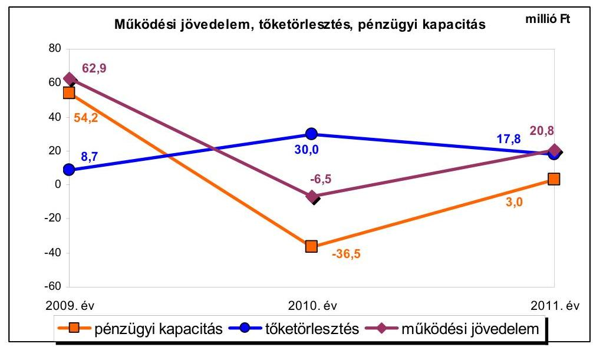
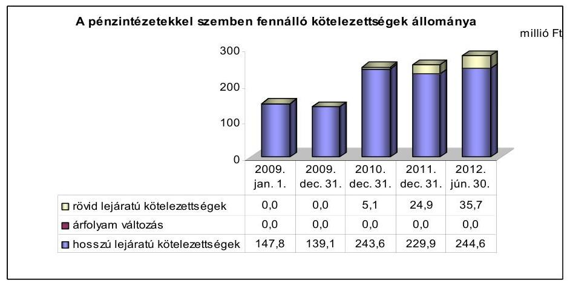
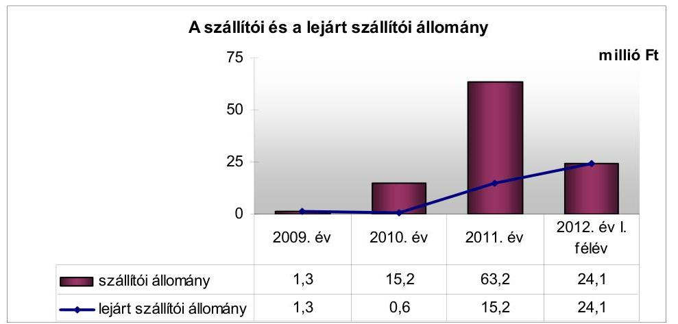
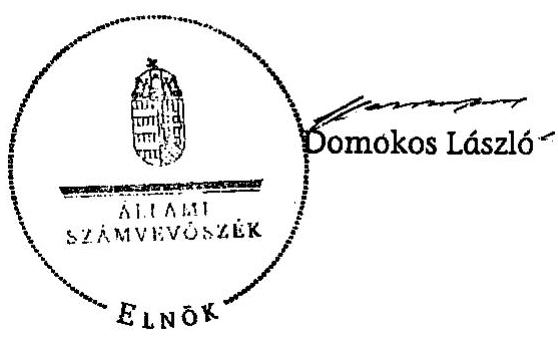
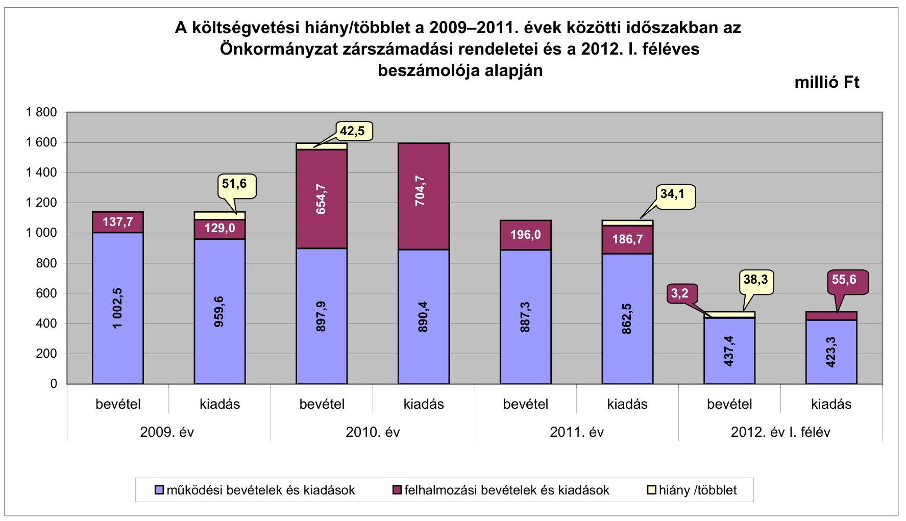
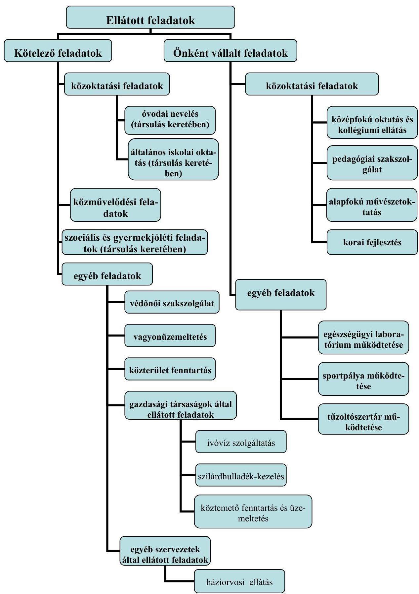

# ÁLLAMI   SZÁMVEVŐSZÉK 

## JELENTÉS

Kadarkút Város Önkormányzata pénzügyi gazdálkodási helyzetének, szabályosságának ellenőrzéséről

---

# Állami Számvevőszék 

Iktatószám: V-0030-202/2013.
Témaszám: 35/1
Vizsgálat-azonosító szám: V059201

## Az ellenőrzést felügyelte:

Dr. Horváth Margit
felügyeleti vezető

## Az ellenőrzést vezette:

## Renkó Zsuzsanna

ellenőrzésvezető

## Az ellenőrzést végezték:

| Bíró Zsolt | Gelencsér Zoltán | Tóth Tamás |
| :-- | :-- | :-- |
| számvevő tanácsos | számvevő tanácsos | számvevő tanácsos |
| csoportvezető |  |  |

---

# TARTALOMJEGYZÉK 

BEVEZETÉS ..... 3
I. ÖSSZEGZŐ MEGÁLLAPÍTÁSOK, KÖVETKEZTETÉSEK, JAVASLATOK ..... 5
II. RÉSZLETES MEGÁLLAPÍTÁSOK ..... 10

1. Az Önkormányzat kötelező és az önként vállalt feladatai, a feladatellátás szervezeti keretei ..... 10
2. A pénzügyi egyensúly fenntartását veszélyeztető pénzügyi kockázatok, ezek csökkentése érdekében tett intézkedések ..... 11
3. A pénzügyi gazdálkodási folyamatok szabályosságát, megfelelőségét biztosító belső kontrollok ..... 18
4. Az ÁSZ korábbi ellenőrzései során a pénzügyi, gazdálkodási helyzet javítására tett javaslatainak megvalósítása ..... 19

## MELLÉKLETEK

1. számú A költségvetési hiány/többlet a 2009-2011. évek közötti időszakban az Önkormányzat zárszámadási rendeletei és a 2012. év I. féléves beszámolója alapján
2. számú Az Önkormányzat bevételei és kiadásai, valamint adósságszolgálata 2009-2011. években (a CLF módszer szerint)
3/a. számú Az Önkormányzat által a 2009. év és a 2012. év I. félév között megvalósított (műszakilag befejezett) fejlesztések forrásösszetétele
3/b. számú Az Önkormányzat 2012. június 30 -án folyamatban lévő fejlesztési feladataihoz kapcsolódó kötelezettségeinek összegzése
3. számú Az önkormányzati feladatok ellátásában résztvevő gazdasági társaságok egyes kiemelt adatai
4. számú Az Önkormányzat 2012. június 30 -án forintban fennálló, hosszú lejáratú adósságot keletkeztető kötelezettségvállalásai
5. számú Az Önkormányzat kötelezettségeinek 2011. december 31-ei és 2012. június 30 -ai állománya és a 2012. évben, valamint az azt követő években várható kötelezettségek miatti kiadások

---

# FÜGGELÉKEK 

1. számú Rövidítések jegyzéke
2. számú Értelmező szótár
3. számú Az Önkormányzat által ellátott feladatok a 2012. év I. félév végén

---

# JELENTÉS 

## Kadarkút Város Önkormányzata pénzügyi gazdálkodási helyzetének, szabályosságának ellenőrzéséről

## BEVEZETÉS

Az államháztartás helyi szintjén, az önkormányzati alrendszerben az utóbbi években megjelenő gazdálkodási nehézségek, a pénzforgalmi hiány növekedése, az eladósodás ráirányította az ÁSZ figyelmét a helyi önkormányzatok pénzügyi helyzetére.

Az ÁSZ a 2012. évi ellenőrzési tervben foglaltaknak megfelelően az önkormányzatok pénzügyi gazdálkodási helyzetének, szabályosságának ellenőrzésével az önkormányzatok 2011. évben megkezdett helyzetelemzését folytatta. Az ellenőrzés keretében értékeljük az Önkormányzatok adósságkezelési és likviditási helyzetét, bemutatjuk a pénzügyi egyensúly alakulására hatással lévő folyamatokat, feltárjuk az ezekre ható kockázatokat, a pénzügyi egyensúlyi helyzetet befolyásoló döntésmegalapozó, döntés-előkészítő eljárások szabályosságát, minősítjük az ezekkel összefüggő belső kontrollok kialakítását, működését. Az ellenőrzés eredményének várható hatásaként a megállapításokkal segítséget nyújthatunk az önkormányzatok számára a pénzügyi egyensúly helyreállítása, javítása és fenntartása érdekében szükségessé váló intézkedések megtételéhez.

Az ellenőrzés típusa: szabályszerűségi ellenőrzés.

## Az ellenőrzés célja annak értékelése volt, hogy:

- a vizsgált időszakban a kötelező- és önként vállalt feladatok ellátását biztosító szervezeti formák változása milyen hatást gyakorolt az Önkormányzat pénzügyi helyzetének alakulására;
- az Önkormányzat pénzügyi - ezen belül múködési és felhalmozási - egyensúlya milyen irányban változott, a változást milyen okok idézték elő, továbbá milyen intézkedéseket tettek a pénzügyi egyensúly biztosítása, illetve javítása érdekében, az intézkedések hatására javult-e az Önkormányzat pénzügyi helyzete;
- a költségvetési kiadások finanszírozása érdekében vállalt pénzintézetekkel szembeni kötelezettségek hogyan alakultak, a kötelezettségek fennállása miként befolyásolja az Önkormányzat jövőbeli pénzügyi egyensúlyi helyzetét;

---

- az Önkormányzat beazonosította, felmérte, értékelte-e a pénzügyi egyensúlyt befolyásoló pénzügyi kockázatokat, a finanszírozási célú pénzügyi műveletekkel kapcsolatban írtak-e elő kockázatértékelési kötelezettséget;
- az Önkormányzat által kialakított belső kontrollok biztosítják-e a pénzügyi gazdálkodás folyamatainak szabályosságát és eredményességét;
- hasznosultak-e az ÁSZ korábbi ellenőrzései során a pénzügyi, gazdálkodási helyzet javítására tett szabályszerűségi és célszerűségi javaslatok.

Az ellenőrzés a 2009. január 1-jétől 2012. június 30 -áig terjedő időszakot ölelte fel. A pénzintézetekkel szembeni kötelezettségek állományának vizsgálatakor a 2011. december 31-én fennálló kötelezettségek keletkezésének kezdő időpontját vettük figyelembe.

Az ellenőrzés szakmai módszertana az Állami Számvevőszék Ellenőrzési Kézikönyvében foglalt szakmai szabályokon alapult, amely a Legfelsőbb Ellenőrzési Intézmények Nemzetközi Szervezete (INTOSAI) által kiadott nemzetközi standardok (ISSAI) figyelembevételével készült.

Az ellenőrzés során használt rövidítések jegyzékét a jelentés 1. számú, az egyes fogalmak magyarázatát a jelentés 2 . számú függeléke tartalmazza.

A vizsgálat jogszabályi alapját az ÁSZ tv. 1. § (3) bekezdésének, 5. § (2)-(6) bekezdéseinek, valamint az államháztartásról szóló 2011. évi CXCV. törvény 61. § (2) bekezdésének előírásai képezik.

Kadarkút város lakosainak száma 2012. január 1-jén 2625 fő volt, ami 60 fős csökkenést jelentett a 2009. év eleji lakosságszámhoz képest. Az Önkormányzat a 2011. évben 1024,0 millió Ft költségvetési bevételt és 1049,2 millió Ft költségvetési kiadást teljesített. 2011. december 31-én a könyvviteli mérleg szerint 2594,1 millió Ft értékű vagyonnal rendelkeztek. Az Önkormányzat vagyona a fejlesztések következtében 668,8 millió Ft-tal ( $34,7 \%$-kal) nőtt a 2009. év végi (1925,3 millió Ft) állományhoz viszonyítva. A 2011. évben az eszközök közül a tárgyi eszközök állománya 2521,0 millió Ft, a forgóeszközök állománya 55,3 millió Ft volt. Az Önkormányzat nevelési és oktatási feladatait az Önkormányzat gesztorságával múködő Közoktatási Társulás által fenntartott Integrált oktatási központban látta el, a kötelező feladatait közös finanszírozással, az önként vállalt feladatait saját finanszírozás mellett. A szociális és gyermekjóléti feladatokat az Önkormányzat gesztorságával múködő Szociális társulás keretében a Szociális központ által látta el. A feladat ellátást közös finanszírozással biztosították a Szociális társulásban résztvevő önkormányzatok. Az Önkormányzat az Integrált oktatási központ és a Szociális központ fejlesztései esetében, mint kizárólagos tulajdonos önállóan döntött, a saját forrást költségvetéseiből biztosította. A közművelődési feladatokat saját fenntartású intézményeivel, az egészségügyi feladatokat vállalkozási szerződések alapján látta el. Az Önkormányzat a városüzemeltetési feladatai ellátására gazdasági társaságokkal közszolgáltatási szerződéseket kötött.

---

# I. ÖSSZEGZŐ MEGÁLLAPÍTÁSOK, KÖVETKEZTETÉSEK, JAVASLATOK 

Kadarkút Város Önkormányzatának pénzügyi egyensúlyi helyzete mind rövid, mind hosszú távon veszélyeztetett. Az alacsony múködési jövedelemtermelő képesség miatt a jelentős szállítói állomány és a pénzintézetekkel szembeni kötelezettségek kifizethetősége kockázatos.

Az Önkormányzat számára az önként vállalt feladatok magas aránya múködési kockázatot jelentett. Az önként vállalt feladatok múködési kiadásokon belüli aránya 2009-ben 23,7\%, 2011-ben 25,7\% volt, annak ellenére, hogy az összegük a 2009. évi 225,8 millió Ft-ról 2011. évre 220,3 millió Ft-ra csökkent. A felhalmozási kiadások egy részét az önként vállalt feladatokhoz kapcsolódó fejlesztésekre fordították, amelyek az azokhoz felvett hitelekkel együtt hozzájárultak a pénzügyi egyensúly romlásához. Kockázatot hordoz a társulási feladatellátásból adódó gesztori feladatok ellátása is.

Az Önkormányzat 2009-2011 között összesen 3648,1 millió Ft költségvetési bevételhez jutott. Ugyanebben az időszakban a teljesített költségvetési kiadása 3732,9 millió Ft-ot tett ki. Az ebből ellátott feladatok alapvetően a közoktatáshoz, a szociális és gyermekjóléti ellátáshoz, a közművelődési és az igazgatási feladatokhoz kapcsolódtak. A feladatellátás részletezését az 3. számú függelék tartalmazza. A múködési és felhalmozási költségvetési egyenlege a 2009. évben pozitív, a 2010-2011. években negatív volt, összesen - 84,8 millió Ft-ot, a teljesített költségvetési kiadások 2,3\%-át jelentette. A nettó múködési jövedelem a 2010-2011. években nem nyújtott fedezetet a felhalmozási forráshiányra.

Az Önkormányzat pénzügyi kapacitásának 2009-2011 közötti változását a múködési jövedelem csökkenés és a tőketörlesztés növekedés 2009. évhez viszonyított együttes hatása eredményezte. A változást a következő ábra mutatja be:

---

A pénzügyi egyensúlyi helyzetre kedvező hatással volt az ÖNHIKI támogatás, mert nélküle a múködési jövedelem a 2009. és a 2011. években is negatív lett volna.

Az ellenőrzött időszakban az Önkormányzat a lehetőségeihez mérten hozott bevételt növelő (magánszemélyek kommunális adója, helyi iparűzési adó, intézményi térítési díjak emelése, földterület értékesítés) és kiadási megtakarítást (feladatátadás; feladatátrendezés; 2009-2011 között összesen 15 álláshely és egyben létszámcsökkentés; többletjuttatások, támogatások csökkentése) eredményező intézkedéseket. Ezek hatására - az Önkormányzat adatszolgáltatása alapján - összesen 68,5 millió Ft bevételi többlet, illetve 37,3 millió Ft kiadási megtakarítás keletkezett.

Az Önkormányzat hosszú lejáratú pénzintézeti kötelezettsége a 2009. év elejétől a 2012. év I. félév végére 147,8 millió Ft-ról 244,6 millió Ft-ra, 65,5\%kal nőtt. A kötelezettségek növekedését a pályázati támogatással megvalósuló fejlesztések önerejének biztosításához évente felvett hitelek eredményezték. A műszakilag befejeződött fejlesztések közül kettő utófinanszírozott volt, amelyek finanszírozásához támogatás-megelőlegezési hitelt is igénybe kellett venni. A hitelek igénybevételéből származó forrásokat a céloknak megfelelően használták fel. A fejlesztési hitelek törlesztésére az ellenőrzött időszakban 111,6 millió Ft kifizetést (tőke, kamat, egyéb költség) teljesítettek.

Az Önkormányzat likviditási és rövid távú pénzügyi egyensúlyi helyzete kedvezőtlenül alakult, a folyamatosan fennálló folyószámlahitel mellett 2011-től munkabér-megelőlegezési hitelt is igénybe vett. A folyószámlahitel napi átlagos állománya jelentősen, a 2009. évi 3,1 millió Ft-ról a 2012. év I. félévre nyolcszorosára, 25,1 millió Ft-ra nőtt. A folyószámlahitellel zárt napok száma emelkedett.

Kedvezőtlen tendencia, hogy a lejárt szállítói kötelezettségekből adódó tartozás 2009. és 2012. év I. félév között jelentős mértékben 1,3 millió Ft-ról 24,1 millió Ft-ra - nőtt. A 2012. év I. félév végi lejárt szállítói tartozásból 17,7 millió Ft-ot átütemeztek. Az Önkormányzat 11 forgalomképes ingatlanát terhelte jelzálog vagy elidegenítési és terhelési tilalom 2012. június 30-án. A terhelt ingatlanok értéke 160,8 millió Ft volt, ami az összes forgalomképes ingatlan értékének (298,7 millió Ft-nak) az 53,8\%-a.

Az ellenőrzött időszak végén a pénzintézetekkel szemben fennálló kötelezettség várható (tőke, kamat, egyéb) kiadása 2014. év végéig 179,1 millió Ft. Az erre az időszakra számba vehető 43,6 millió Ft követelésállomány a kötelezettségek 24,3\%-ára nyújt fedezetet. Kockázatot jelent, hogy a 2009-2011. évek jövedelemtermelő képessége alapján a várhatóan képződő múködési jövedelem a jelenlegi feladat-ellátási struktúrát és kiadási arányokat feltételezve nem nyújt fedezetet a pénzintézeti kötelezettségekre, továbbá szabad tartalékokkal nem rendelkeznek.

Az Önkormányzat nem azonosította be, nem mérte fel és nem értékelte a pénzügyi egyensúlyt befolyásoló pénzügyi kockázatokat, a finanszírozási célú pénzügyi műveletekkel kapcsolatban nem írtak elő kockázatértékelési kötelezettséget.

---

A döntések megalapozottsága érdekében értékelte a pénzintézeti kötelezettségállomány változását, annak okait, vizsgálta és betartotta az Ötv. adósságot keletkeztető kötelezettségvállalások felső korlátjára vonatkozó előírásait. Az adósságot keletkeztető kötelezettségvállalásokról szóló döntéseknél azonban nem határozták meg a visszafizetés lehetséges forrásait, folyamatosan nem kísérték figyelemmel a források meglétét.

Az ellenőrzött időszakban az Önkormányzatnál - az üzemeltetésre átadott eszközök kivételével - nem mérték fel azt, hogy az elhasználódott eszközök felújítása, pótlása mekkora összegű forrásokat igényel.

Az Önkormányzatnál a belső kontrollok kiépítését és múködtetését leszúkítve, a pénzügyi gazdálkodási folyamatok szabályossága vonatkozásában mértük fel és értékeltük. Ezen a területen többféle hiányosságot tapasztaltunk. A kontrollok belső szabályzatokba való beépítése nem volt megfelelő. Nem határozták meg a feladatellátást biztosító támogatásokkal kapcsolatosan a szolgáltató feladatait, a nem szerződésszerű feladatellátás szankcióit, a feladatellátás teljesítéséről a beszámolási kötelezettséget. A pénzügyi egyensúlyi helyzet alakulását befolyásoló kontrollok szabályozása csak részben valósult meg. Elmaradt a pénzintézeti kötelezettségvállalások kockázatainak dön-tés-előkészítő szakaszban történő feltárásával, az Önkormányzat fizetőképességének és eladósodásának kezelésével kapcsolatos döntések kockázatainak kezelésével összefüggő kontrolltevékenységek szabályozása. A kontrollok múködése sem volt megfelelő, mivel a döntés-előkészítés szakaszában nem tárták fel a pénzintézeti kötelezettségvállalások kockázatait. Nem számszerűsítették a kamat és a tőke visszafizetését szolgáló források változásának pénzügyi egyensúlyi helyzetre gyakorolt hatását. A belső ellenőrzési tervek készítése során nem írták elő a pénzügyi, egyensúlyi helyzetet befolyásoló kockázatok feltárását. A belső ellenőrzési tervek nem tartalmazták ezek ellenőrzését.

Az Önkormányzat gazdálkodási rendszerének 2009. évi ÁSZ ellenőrzése a pénzügyi és gazdálkodási helyzet javítására három szabályszerűségi és három célszerűségi javaslatot tartalmazott. A szabályszerűségi javaslatokat hasznosította az Önkormányzat. A célszerűségi javaslatokból kettő hasznosítása nem történt meg. Nem alakították ki a pályázatfigyelés, a pályázatkészítés és a fejlesztési feladatok lebonyolításával kapcsolatos eljárásrendeket. Nem gondoskodtak arról, hogy a belső ellenőrzési stratégiát megalapozó kockázatelemzés terjedjen ki a Polgármesteri hivatalban az európai uniós forrásokból megvalósított feladatok végrehajtására.

Összességében az Önkormányzat jövedelemtermelő képessége alapján képződő bevételei a feladatai ellátásához szükséges kiadásokat csak részben fedezik. A felvett hitelekből eredő kötelezettségei tovább nehezítik pénzügyi gazdálkodási pozícióit, múködését hosszabb távon korlátozzák. A hitelekből megvalósuló beruházások a feladatellátás színvonalának javításához hozzájárultak, de nem teremtenek bevétel növelési lehetőséget és nem növelik a munkahelyteremtő potenciált.

Az ÁSZ tv. 33. § (1) bekezdésében foglaltak értelmében a jelentésben foglalt megállapításokhoz kapcsolódó intézkedési tervet köteles az ellenőrzött szervezet vezetője összeállítani és azt a jelentés kézhezvételétől számított harminc napon

---

belül az ÁSZ részére megküldeni. Amennyiben az intézkedési tervet határidőben nem küldi meg a szervezet, vagy az továbbra sem elfogadható, az ÁSZ elnöke a hivatkozott törvény 33. § (3) bekezdés a)-b) pontjaiban foglaltakat érvényesítheti.

# Az ellenőrzés intézkedést igénylő megállapításai és javaslatai: 

## a Polgármesternek

1. Az Önkormányzat működési jövedelme 2011-ben 2009-hez viszonyítva csökkent, a 2010. évben negatív volt. A nettó működési jövedelem a 2010-2011. években nem nyújtott fedezetet a felhalmozási forráshiányra. Az Önkormányzat likviditása az ellenőrzött időszakban folyószámlahitel, munkabér- és támogatás-megelőlegezési hitel igénybevételével volt biztosítható. A lejárt szállítói tartozás az ellenőrzött időszak végére jelentősen nőtt ( 1,3 millió Ft-ról 24,1 millió Ft-ra). Az ellenőrzött évek jövedelemtermelő képessége alapján a várhatóan képződő működési jövedelem, a jelenlegi feladatstruktúrát (önként vállalt feladatok 24-26\%-os arányát, fejlesztések pl. Integrált oktatási központ és a Szociális központ fenntartását) és arányokat feltételezve, nem nyújt fedezetet a jelenlegi feladatstruktúra finanszírozására.

Javaslat:
Vizsgálja felül az önkormányzat feladatstruktúráját annak érdekében, hogy a kormányzati adósságrendezést követően a működési jövedelemtermelő képesség legyen összhangban a feladatellátással.

Ennek keretében:
a) tárja fel a bevételszerző és kiadáscsökkentő lehetőségeket és ezek alapján intézkedjen a bevételek növelésére, a kintlévőségek behajtására, a kiadások csökkentésére;
b) terjesszen a Képviselő-testület elé reorganizációs programot a kedvezőtlen pénzügyi folyamatok megállítására, a pénzügyi egyensúlyi helyzet gyors stabilizálására.

## a jegyzőnek

1. Az Önkormányzatnál a 2009. évben az Ámr. 145/E. § (1) bekezdésében, a 20102011. években az Ámr. 2 158. § (1) bekezdésében, a 2012. év I. félévében a Bkr. 8. § (1) bekezdésében foglaltak ellenére a pénzügyi, gazdálkodási folyamatok szabályosságát biztosító kontrollok beépítése nem volt megfelelő, mivel elmaradt a pénzintézeti kötelezettségvállalások kockázatainak döntés-előkészítő szakaszban történő feltárásával, az Önkormányzat fizetőképességének és eladósodásának kezelésével, a helyi adósságrendezési eljárással kapcsolatos döntések kockázatainak kezelésével összefüggő kontrolltevékenységek szabályozása.

---

Javaslat:
A pénzügyi gazdálkodási folyamatok szabályosságát biztosító kontrollok beépítése során tegyen eleget a Bkr. 8. § (1)-(2) bekezdéseiben foglaltaknak, amely keretében készítse el az önkormányzati fejlesztések döntés-előkészítési folyamatában az előkészítés, a lebonyolítás és a múködtetés kockázatai feltárását és kezelését biztosító szabályzatokat, szabályozásokat.
2. Az ellenőrzött évek belső ellenőrzési terveinek készítése során a Ber. 18. §-ban ${ }^{1}$ bekezdésében foglaltak ellenére nem írták elő az Önkormányzat pénzügyi, egyensúlyi helyzetét befolyásoló döntések kockázati tényezőinek feltárását, a belső ellenőrzési tervek nem tartalmazták a kockázati tényezők elemzését.

Javaslat:
Tegyen intézkedést, hogy Bkr. 31. § (1)-(2) bekezdésében foglaltak szerint az éves belső ellenőrzés tervek tartalmazzák a pénzügyi egyensúlyi helyzetet befolyásoló döntésekkel kapcsolatos feltárt kockázati tényezők elemzését, és gondoskodjon az ellenőrzési tervek végrehajtásáról.

[^0]
[^0]:    ${ }^{1}$ 2012. január 1-től a Bkr. 29. § (1) bekezdése tartalmazza

---

# II. RÉSZLETES MEGÁLLAPÍTÁSOK 

## 1. Az ÖNKORMÁNYZAT KÖTELEZŐ És AZ ÖNKÉNT VÁLlALT FELADA-

TAI, A FELADATELLÁTÁS SZERVEZETI KERETEI

Az Önkormányzat kötelező és önként vállalt feladatainak körét és mértékét 2010. évtől az éves költségvetési rendeleteiben határozta meg. Önként vállalt feladatok az egészségügyi laboratórium, a sportpálya, a tűzoltószertár, a pedagógiai szakszolgálat, a korai fejlesztés, az alapfokú művészetoktatás, a szakiskola, a szakképzés, a szakközépiskola és a kollégium fenntartása volt. Támogatást nyújtottak civil szervezeteknek, sportegyesületnek, városi rendezvények megtartásához, valamint egyéb helyi szociális célokra (méltányossági ápolási díj, pályakezdők támogatása, beiskolázási segély).

A 2011. évi összes múködési kiadás a 2009. évi 954,4 millió Ft-hoz viszonyítva 10,8\%-kal (102,9 millió Ft-tal) csökkent. Az önként vállalt feladatokra teljesített múködési kiadás a 2009. évi 225,8 millió Ft-ról a 2011. évre 220,3 millió Ft-ra csökkent az alapfokú művészeti oktatáshoz kapcsolódó személyi juttatások és dologi kiadások mérséklődése miatt. Részaránya azonban a 2009. évi 23,7\%-ról 2011. évre 25,9\%-ra növekedett. Az önként vállalt feladatok magas aránya az ellenőrzött időszakban múködési kockázatot jelentett.

Az ellenőrzött időszakban a felhalmozási kiadások 17,8\%-át, 194,4 millió Ft-ot fordítottak önként vállalt feladatokra. Ez az arány a 2010. évben 25,6\% (180,5 millió Ft) volt, az Integrált oktatási központ fejlesztéséből a kollégiumra jutó összeg miatt.

Az Önkormányzat a feladatait 2012. június 30-án (a Polgármesteri hivatallal együtt) öt költségvetési szervvel látta el. Az alapfokú nevelési és az oktatási feladatok ellátását Közoktatási Társulás keretében az Integrált oktatási központ intézményében biztosították. A szociális és gyermekjóléti feladatokat Szociális Társulás keretében a Szociális központ intézménye látta el. Ellátták a házi segítségnyújtást, a szociális étkeztetést, a családsegítést és a nappali ellátást. Az Önkormányzat végezte a Közoktatási Társulás és a Szociális Társulás gesztori feladatait. A társulási feladatellátásból adódó gesztori feladatok ellátása kockázatot hordoz.

Az intézményszervezeti átalakítások következtében a költségvetési szervek száma a 2008. december 31-én fenntartott hatról 2012. év I. félév végére ötre, a telephelyeinek száma tízről nyolcra csökkent. A 2009-2012. év I. félév között megvalósított - az intézmények átadására és feladatátrendezésre irányuló - intézkedések hatásaként a kiadások 66,3 millió Ft-tal, a bevételek 37,5 millió Fttal csökkentek. Az Önkormányzat adatszolgáltatása alapján a megtett intézkedések összesen 28,8 millió Ft megtakarítást eredményeztek.

---

Hedrehely Község Önkormányzata a 2009. évben kilépett a Közoktatási Társulásból, amelynek következtében az intézmények száma egy részben önállóan gazdálkodó oktatási intézménnyel, a telephelyek száma kettővel csökkent.

# 2. A PÉNZÜGYI EGYENSÚLY FENNTARTÁSÁT VESZÉLYEZTETŐ PÉNZÜGYI KOCKÁZATOK, EZEK CSÖKKENTÉSE ÉRDEKÉBEN TETT INTÉZKEDÉSEK 

Az Önkormányzat költségvetésének elemzését CLF módszerrel hajtottuk végre. Az ÁSZ az ellenőrzéshez felhasznált, CLF táblában szereplő adatokat a 20102011. évi költségvetési beszámolókban feltárt (hitelfelvétel, hiteltörlesztés téves könyvelése miatti) hibák miatt módosította. A CLF módszer szerinti 2009-2011 közötti részletes adatokat a jelentés 2. sz. melléklete, a főbb önkormányzati adatokat a következő tábla mutatja be:

|  |  |  | millió Ft |
| :-- | --: | --: | --: |
| Megnevezés | 2009. év | 2010. év | 2011. év |
| Folyó bevételek | 1017,3 | 883,9 | 872,3 |
| Folyó kiadások | 954,4 | 890,4 | 851,5 |
| Múködési jövedelem | $\mathbf{6 2 , 9}$ | $\mathbf{- 6 , 5}$ | $\mathbf{2 0 , 8}$ |
| Felhalmozási bevételek | 98,1 | 624,8 | 151,7 |
| Felhalmozási kiadások | 134,2 | 704,7 | 197,7 |
| Felhalmozási költségvetés egyenlege | $\mathbf{- 3 6 , 1}$ | $\mathbf{- 7 9 , 9}$ | $\mathbf{- 4 6 , 0}$ |
| Folyó és felhalmozási bevételek összesen | 1115,4 | 1508,7 | 1024,0 |
| Folyó és felhalmozási kiadások összesen | 1088,6 | 1595,1 | 1049,2 |
| Finanszírozási múveletek nélküli | $\mathbf{2 6 , 8}$ | $\mathbf{- 8 6 , 4}$ | $\mathbf{- 2 5 , 2}$ |
| pozíció |  |  |  |
| Finanszírozási műveletek egyenlege | $-14,7$ | 82,4 | 22,4 |
| Tárgyévi pénzügyi pozíció | $\mathbf{1 2 , 1}$ | $\mathbf{- 4 , 0}$ | $\mathbf{- 2 , 8}$ |
| Hiteltörlesztés, értékpapír beváltás | 8,7 | 30,0 | 17,8 |
| Nettó múködési jövedelem | $\mathbf{5 4 , 2}$ | $\mathbf{- 3 6 , 5}$ | $\mathbf{3 , 0}$ |

Az Önkormányzat folyó költségvetési egyenlege, múködési jövedelme a 2009. és a 2011. évben pozitív, a 2010. évben negatív volt. A vizsgált időszak egészét tekintve a működési jövedelem összességében 77,2 millió Ft többletet mutatott. A 2010. évben kialakult múködési forráshiányt elsősorban a költségvetési támogatások 62,7 millió Ft-os ( $11,8 \%$-os) csökkenése okozta. A 2011. évben múködési forrástöbblet alakult ki, mivel a folyó bevételek csökkenését meghaladó mértékben estek vissza a folyó kiadások. Az Önkormányzat 2009-2011-ben működőképességének megőrzésére összesen 182,2 millió Ft ÖNHIKI támogatásban részesült. Az ÖNHIKI támogatások nélkül az Önkormányzat múködési jövedelme 2009-ben 6,5 millió Ft, 2010-ben 51,1 millió Ft, 2011-ben 47,4 millió Ft hiányt mutatott volna. A 2009. és a 2011. években a múködési jövedelem fedezetet nyújtott a tőketörlesztésre. A 2010. évben a nettó múködési jövedelmet a támogatás-megelőlegezési hitel visszafizetéséből adódó kiemelkedő mértékű tőketörlesztés tovább rontotta.

Az Önkormányzat felhalmozási költségvetésének egyenlege 2009-2011 között minden évben negatív volt, összesen 162,0 millió Ft felhalmozási forrás-

---

hiányt mutatott. A 2010. évi magas felhalmozási kiadást az EU-s támogatással megvalósított Integrált Oktatási Központ fejlesztésére fordított felhalmozási kiadás eredményezte. A felhalmozási deficitet 2009-ben a nettó működési jövedelemből, a további években hitelfelvételből finanszírozták.

Az Önkormányzat teljes finanszírozási igénye (nettó működési jövedelem és a felhalmozási költségvetés egyenlege) 2010-ben 116,4 millió Ft, 2011-ben 43,0 millió Ft volt. A 2009. évben 18,1 millió Ft finanszírozási többlet keletkezett. Az Önkormányzat zárszámadási rendeleteiben és 2012. év I. félévi beszámolójában a költségvetési kiadások és bevételek különbözeteként 2009-ben és 2011-ben pénzügyi többletet, a 2010. év és a 2012. év I. félév végén pénzügyi hiányt mutattak ki, az adatokat a jelentés 1. számú melléklete tartalmazza.

A folyó bevételek a 2009. évi 1017,3 millió Ft-ról, 2010-re 883,9 millió Ft-ra, 2011-re 872,3 millió Ft-ra csökkentek, a költségvetési támogatások és az egyéb saját bevételek csökkenése miatt. A 2010-ben bekövetkezett jelentősebb változást a normatív hozzájárulások 65,7 millió Ft-os és az ÖNHIKI támogatás 24,8 millió Ft-os csökkenése okozta. A normatív hozzájárulás csökkenését főként a 2009-ben bekövetkezett szervezeti változás miatti ellátotti létszám csökkenése okozta. A pénzügyi egyensúlyi helyzet tekintetében kockázatot jelentett a bevételi kitettség, mivel a gazdálkodásához az Önkormányzat 2009ben 69,4 millió Ft, 2010-ben 44,6 millió Ft, 2011-ben 68,2 millió Ft, 2012. év I. félévében 16,6 millió Ft ÖNHIKI támogatásban részesült.

A helyi adók, pótlékok az Önkormányzatnál nem képeztek meghatározó forrást a folyó bevételek között. A folyó bevételeken belüli részarányuk a 2009. évben 2,0\% (20,7 millió Ft), a 2010. évben 3,4\% (30,4 millió Ft), a 2011. évben 3,1\% (27,1 millió Ft) volt. A bevételi kitettség miatti kockázatot tovább mérsékli, hogy a helyi adóbevétel több adóalanytól származott.

Az Önkormányzatnak az ellenőrzött időszakban kettő helyi adóból keletkezett bevétele. Az iparűzési adónál 2010. január 1-jétől a maximális adómértéket alkalmazták. A magánszemélyek kommunális adójának éves mértéke adótárgyanként eltérő volt. A 2010. évtől az adó mértékét megemelték, amely ettől az időponttól sem érte el a törvényi maximumot.

A felhalmozási bevételek között a legjelentősebb 2009-ben a városközpont felújítására kapott 56,0 millió Ft, 2010-ben az Integrált oktatási központ fejlesztéséhez kapott 517,0 millió Ft, 2011-ben az Integrált oktatási központ fejlesztéséhez és a tanulói számítógép beszerzéshez kapott 118,3 millió Ft támogatás volt.

A folyó kiadások a 2009. évi 954,4 millió Ft-ról 2011. évre 851,5 millió Ft-ra, 10,8\%-kal csökkentek. A változás 54,3\%-át (55,9 millió Ft-ot) a dologi kiadások csökkenése eredményezte. A személyi juttatások és munkaadót terhelő járulékok együttes összege 2009-ről 2010-re nem változott. A 2011. évben bekövetkezett 15,4 millió Ft összegű csökkenést jellemzően a köztisztviselői cafetéria juttatás csökkentése és a közalkalmazottak cafetéria juttatásának megszüntetése okozta.

A dologi kiadások 2010-re 34,0 millió Ft-tal (12,7\%-kal), 2011-re 21,9 millió Ft-tal ( $9,4 \%$-kal) csökkentek az előző évhez viszonyítva. A 2010. évi változás

---

57,1\%-át (19,4 millió Ft-ot) a vásárolt élelmezés csökkenése eredményezte. Az Integrált oktatási központ gazdálkodási feladatait 2009. szeptember 1-jétől a Polgármesteri hivatal látta el, így megszűnt az étkeztetés költségvetési szervek közötti számlázása. A 2011. évi 21,9 millió Ft összegű változás jellemzően a készletbeszerzések, ezen belül kiemelten az élelmiszer beszerzések - a 2010. évi közbeszerzési eljárás árcsökkentő hatása miatt - és az áfa kiadások csökkenéséből adódott.

Az Önkormányzatnál 2012. június 30-ig a műszakilag befejezett beruházásokra és felújításokra fordított kiadás 1052,4 millió Ft volt. A fejlesztésekhez 92,1 millió Ft ( $8,8 \%$ ) hitelt, 806,1 millió Ft ( $76,6 \%$ ) EU-s támogatást, valamint 65,5 millió Ft ( $6,2 \%$ ) egyéb központi támogatást vettek igénybe. A műszakilag befejezett fejlesztések közül kettő utófinanszírozott volt. A két fejlesztés finanszírozásához az Önkormányzatnak támogatás-megelőlegezési hitelt kellett felvennie. Az utófinanszírozás az Önkormányzatnak felhalmozási kockázatot jelentett. A 2012. június 30 -án folyamatban levő felújítások és beruházások 986,4 millió Ft várható teljes bekerülési költségéből az ellenőrzött időszak végéig 2,6 millió Ft-ot teljesítettek. A 2012. július 30-a utáni kötelezettségvállalások forrásmegoszlása 138,8 millió Ft ( $14,1 \%$ ) saját bevétel, 4,9 millió Ft ( $0,5 \%$ ) hitel, 835,2 millió Ft ( $84,9 \%$ ) EU-s támogatás, és 4,9 millió Ft ( $0,5 \%$ ) egyéb központi támogatás. Az Önkormányzat által a 2009. év és a 2012. év I. félév között megvalósított (műszakilag befejezett) fejlesztések forrásösszetételét a jelentés 3. a) számú, a 2012. június 30 -án folyamatban lévő fejlesztési feladataihoz kapcsolódó kötelezettségeinek összegzését a jelentés 3. b) melléklete mutatja be.

Az ellenőrzött időszak fejlesztései közül a jövőbeni üzemeltetés várható kiadásait és bevételeit - a pályázati előírás miatt - a szennyvízberuházás esetében mutatták be. A többi fejlesztésnél ilyen számítás nem készült. A megvalósított Integrált oktatási központ és a Szociális központ fejlesztései jövőbeni üzemeltetési kockázatot jelenthetnek, mivel nem számszerúsítették a várható kiadásokat és a fejlesztések nem teremtenek bevétel növelési lehetőséget.

Az Önkormányzatnál egy fejlesztés van folyamatban. A 2012. június 30-a utáni kötelezettségvállalás EU-s forrására támogatási szerződéssel rendelkeznek, amelyben szállítói finanszírozást kértek. A saját forrás fedezetét társberuházói szerződés alapján a Víziközmű Társulat biztosítja. A fejlesztéshez kapcsolódó 4,9 millió Ft egyéb központi támogatásra benyújtott pályázat elbírálásának hiánya finanszírozási kockázatot jelent.

Az Önkormányzat pénzintézeti kötelezettségeinek állománya 2009. január 1-jétől 2011. december 31-éig 72,4\%-kal, 147,8 millió Ft-ról 254,8 millió Ft-ra növekedett. A 2012. év I. félév végén a pénzintézeti kötelezettség állomány további 10,0\%-kal, 25,5 millió Ft-tal emelkedett. Az Önkormányzat pénzintézetekkel szemben a 2009-2011. években, illetve 2012. június 30 -án fennálló kötelezettségeit a következő ábra mutatja be:

---

Az Önkormányzat 2012. június 30 -án forintban fennálló, hosszú lejáratú adósságot keletkeztető kötelezettségvállalásait az 5. számú melléklet mutatja be. A 2009., 2010. és a 2011. években egy-egy hosszú lejáratú fejlesztési hitel felvételéről döntöttek, összesen 163,1 millió Ft összegben. A 2012. évi költségvetési rendeletben 10,0 millió Ft hosszú lejáratú beruházási hitel felvételét tervezték, de azt a 2012. év I. félév végéig még nem vették igénybe.

A fejlesztési hitelek törlesztésére a 2012. év I. félév végéig összességében 65,7 millió Ft tőke-, 42,5 millió Ft kamat-, és 3,4 millió Ft egyéb költség kifizetést teljesítettek. A fejlesztési hitelek kamata az induló kamatfeltételekhez viszonyítva kedvezően változott, a lehíváskori kamatokhoz viszonyítva 7,0 millió Ft-tal kevesebb fizetési kötelezettség keletkezett.

# A pénzintézeti kötelezettségvállalásokra a Képviselő-testület döntése 

alapján került sor. Nem szabályozták a kötelezettségvállalások kockázatai (pl.: változó kamat, visszafizetés, árfolyam) feltárásának kötelezettségét a dön-tés-előkészítés során. Az adósságot keletkeztető kötelezettségvállalások költségvetési előterjesztésekben meghatározott felső határát betartották. Az Ötv. 88. § (1) bekezdése b) pontjában foglaltak ellenére az Önkormányzat az infrastruktúra fejlesztési hitel III. hitelszerződésben - vállalt kötelezettségei teljesítésének biztosítékául - a hitelt folyósító pénzintézetre engedményezte a központi költségvetésből származó, valamint adójellegű önkormányzati bevételeit. A támo-gatás-megelőlegezési hitelszerződésben jogi biztosíték volt az Önkormányzat „futamidő alatti költségvetése" így a központi költségvetésből származó forrás is.

A Képviselő-testületet évenként tájékoztatták a hosszú lejáratú kötelezettségvállalásokból adódó fizetési kötelezettségekről, azonban nem mutatták be a viszszafizetés forrásait. Az adósságot keletkeztető kötelezettségvállalásokról szóló döntések dokumentumai nem tartalmazták a visszafizetés lehetséges forrásait, illetve a már meglévő kötelezettségek jövőbeni terheinek forrásszükségletét. A törlesztések fedezetének biztosítására nem képeztek elkülönített tartalékot.

A 2010. évtől az Önkormányzat rendszeresen értékelte a likviditási helyzetét, annak változását. Az Önkormányzat 2009-2012. év I. félév közötti időszakban múködésének egyensúlyát folyószámlahitel, munkabér-megelőlegezési hitel és egyéb likvid hitel igénybevételével tudta biztosítani. A folyószámla- és a mun-kabér-megelőlegezési hitelek igénybevételét a 2009-2011. években és a 2012. év I. félévében a következő tábla mutatja be:

---

| Megnevezés | 2009. év | 2010. év | 2011. év | 2012. év 1.   félév |
| :-- | --: | --: | --: | --: |
| Folyószámlahitel |  |  |  |  |
| Keretösszeg január 1-jén (millió Ft) | 50,0 | 50,0 | 50,0 | 50,0 |
| Átlagos napi állomány (millió Ft) | 3,1 | 18,6 | 21,8 | 25,1 |
| Hitellel zárt napok száma (nap) | 181 | 285 | 363 | 181 |
| Egyenleg állomány az időszak végén (millió Ft) | - | 5,1 | 23,7 | 11,7 |
| Teljesített kamat és egyéb költség (millió Ft) | 1,5 | 2,9 | 3,2 | 2,4 |
| Munkabér-megelőlegezési hitel | - | - | 24,0 | 24,0 |
| Keretösszeg január 1-jén (millió Ft) | - | - | 0,4 | 12,0 |
| Átlagos napi állomány (millió Ft) | - | - | 59 | 156 |
| Hitellel zárt napok száma (nap) | - | - | 1,2 | 24,0 |
| Egyenleg állomány az időszak végén (millió Ft) | - | - | 0,0 | 0,3 |
| Teljesített kamat és egyéb költség (millió Ft) |  |  |  |  |

Az Önkormányzat folyószámlahitel kerete az ellenőrzött időszakban állandó volt, kivéve a 2010. április 19. és augusztus 31. közötti időszakot, amikor a hitelkeretet átmenetileg 115,0 millió Ft-ra emelték. Az emelést a 2010. április 20án határidős, 65,5 millió Ft értékű fordított áfa fizetési kötelezettség indokolta. A folyószámlahitel átlagos állománya legnagyobb mértékben 2009-ről 2010-re változott, hatszorosára nőtt. A folyószámlahitellel zárt napok száma a 2009-ről 2011-re több mint kétszeresére növekedett. Az Önkormányzat a 2010. évben egy alkalommal 15,4 millió Ft likvid hitelt vett igénybe pályázat támogatási összegének megelőlegezése céljából. A hitel 2010. július 9-étől december 16áig (160 napig) állt fenn.

Az ellenőrzött időszakban az Önkormányzat likviditása és rövid távú pénzügyi egyensúlya kedvezőtlen irányban változott, mert a folyamatosan fennálló folyószámlahitel mellett a 2011. évtől munkabér-megelőlegezési hitelt is igénybevett, valamint a hitelek napi átlagos állománya és az igénybevételi napok száma is folyamatosan emelkedett.

Az Önkormányzat könyviteli mérleg szerinti kötelezettségeinek 2009-ben 0,6\%át, 2012. június 30 -án $7,7 \%$-át a szállítókkal szembeni kötelezettségek tették ki. A 2009-2012. június 30. közötti szállítói és lejárt szállítói állományát az alábbi ábra mutatja.

Az ellenőrzött időszakban szállítói finanszírozásból eredő lejárt tartozás nem volt. 2011. év végére a lejárt szállítói tartozásállomány jelentősen növe-

---

kedett, a 2011. évi dologi kiadások egy havi átlagának (20,3 millió Ft-nak) a 75,1\%-át tette ki. A 2012. június 30 -án fennálló szállítói állomány már teljes mértékben lejárt állomány volt. A tartozás $21,6 \%$-a, 5,2 millió Ft 61 és 90 nap közötti, $5,8 \%$-a, 1,4 millió Ft 91 és 365 nap közötti volt. A tartozásállomány a 2012. év I. félévi dologi kiadások egy havi átlagának ( 18,1 millió Ft) 1,3szeresét teszi ki.

A lejárt szállítói állomány csökkentése érdekében 2012-ben megállapodást kötött a szállítókkal, amelynek eredményeként 17,7 millió Ft összértékű (ezen belül a 60 és 90 napot meghaladó összesen 6,6 millió Ft összegű) lejárt tartozás hat hónapra, havi részletekben történő teljesítésre átütemezésre került.

A 2010-2012. év I. féléve közötti időszakban a szállítói tartozásállományok, ezen belül a lejárt tartozások arányának növekedése az Önkormányzat fizetőképességének csökkenését, a nemfizetési kockázat növekedését jelzi.

Az Önkormányzatnak gépjárművek beszerzésére irányuló lízingszerződésekből fennálló kötelezettsége 2012. június 30 -án összesen 22100 CHF ( 5,3 millió Ft) volt. A 2009-2011. években a CHF-ben keletkezett lízingkötelezettségek értékelése az Áhsz. 33. § (2) bekezdés c) pontjában foglaltak ellenére nem történt meg, az árfolyamváltozások hatását a számviteli nyilvántartásokban nem mutatták ki. A 2012. évben - az Önkormányzat könyvvizsgálója felhívásának megfelelően - önellenőrzés keretében elvégezték a CHF-ben fennálló lízingkötelezettség értékelését, és 0,3 millió Ft árfolyamveszteséget mutattak ki.

Az Önkormányzat a Víziközmű Társulat szennyvízhálózat kiépítéséhez igénybevett hiteléhez 98,0 millió Ft értékben kezességet vállalt. A kezességvállalásból adódó pénzügyi helyzetére vonatkozó kockázat alacsony. A kezesség beváltására nem került sor, az alapjául szolgáló követelés biztosítéka a Víziközmű Társulat tagjai által fizetett érdekeltségi hozzájárulás.

Az Önkormányzat 11 forgalomképes ingatlanát terhelte jelzálog vagy elidegenítési és terhelési tilalom 2012. június 30 -án. A terhelt ingatlanok értéke 160,8 millió Ft, ami az összes forgalomképes ingatlan értékének ${ }^{2} 53,8 \%$-a. Az egyes hitelszerződések megkötésére vonatkozó döntések előkészítésénél minden esetben tételesen meghatározták a biztosítékként felajánlott ingatlanokat. Az ingatlanok jelzáloggal való terhelése az ellenőrzött időszakban másfélszeresére nőtt, azonban a terhelt ingatlanok száma nem változott, ezáltal a fedezetbevonás miatti kockázat sem nőtt.

Az Önkormányzat kötelezettségeinek 2011. december 31-ei és 2012. június 30ai állományát és a 2012. évben, valamint az azt követő években várható kötelezettségeket a 6. számú melléklet mutatja be. Az Önkormányzatnak pénzintézetekkel szemben fennálló kötelezettsége a 2012. év I. félév végén 280,3 millió Ft volt. Ezek várható kötelezettsége (tőke, kamat és egyéb költség) a legutóbbi kamatfizetés feltételei alapján a 2012-2014. években 179,1 millió Ft. Az Önkormányzatnak a 2012. év I. félév végén szállítói tartozások, lízing és egyéb kötelezettségek címén 26,6 millió Ft és 22100 CHF fizetési

[^0]
[^0]:    ${ }^{2}$ Az Önkormányzat tulajdonában álló forgalomképes ingatlanok nettó értéke 2011. december 31-én 298,7 millió Ft volt.

---

kötelezettsége állt fenn. A 2015. évtől várható jelenleg ismert pénzintézeti kötelezettség 204,5 millió Ft. Az Önkormányzatnak jövőbeli várható kötelezettségei kifizethetőségének kockázatát jelenti, hogy a jövőben képződő múködési jövedelme a - jelenlegi feladat-ellátási struktúrát és kiadási arányokat feltételezve - várhatóan nem nyújt fedezetet a pénzintézeti kötelezettségek teljesítésére, szabad tartalékkal nem rendelkeznek.

A 2012-2014. évek kötelezettségeinek teljesítésére figyelembe vehető a 43,6 millió Ft mérleg szerinti követelésállomány, amely a teljes kötelezettség állományra nem nyújt fedezetet. Az Önkormányzat tájékoztatása szerint a 2015. évtől várható kötelezettségek teljesítésére figyelembe vehető forrás 137,9 millió Ft könyvszerinti nettó értékű, jelzáloggal és egyéb kötelezettséggel nem terhelt forgalomképes ingatlanvagyon értékesítéséből befolyó bevétel.

Az Önkormányzat nem rendelkezett a fizetőképességének és eladósodottságának kezelését szolgáló stratégiával, koncepcióval, programmal. Nem alakították ki a kockázatok kezelésére vonatkozó eljárásokat, módszereket, nem határozták meg a pénzügyi egyensúly biztosítása, illetve helyreállítása, a fizetőképesség megőrzése érdekében hosszú távon elérni kívánt célokat. Az adósságszolgálat alakulását és a felmerülő kockázatokat, valamint a jövedelemtermelő képesség és az adósságszolgálat összefüggéseit nem értékelték.

Az Önkormányzat a 2009-2012. év I. félév közötti időszakban kiadáscsökkentő intézkedések (feladatátadás, feladatátrendezés, létszámcsökkentés, többletjuttatások, támogatások csökkentése) hatásaként 68,5 millió Ft megtakarítást mutatott ki, amelyből 6,6 millió Ft volt az önként vállalt feladatokkal kapcsolatos (civil szervezetek támogatása) megtakarítás. A létszámcsökkentési intézkedések következtében az álláshelyek, valamint a foglalkoztatotti létszám 15 fővel ( $7,8 \%$-kal) csökkent. A bevételnövelő intézkedések 37,3 millió Ft bevételi többletet eredményeztek a 2009-2012. év I. félévben. Ennek 22,0\%-a a helyi adókkal (magánszemélyek kommunális adója, helyi iparűzési adó mértékének emelése), $35,7 \%$-a az eszközök hasznosításával, $42,3 \%$ az intézményi térítési díjak emelésével kapcsolatosan megtett intézkedések eredményeképpen keletkezett. A megtett intézkedések hatására - az Önkormányzat kimutatása szerint - összességében 105,8 millió Ft-tal javult az Önkormányzat pénzügyi egyensúlyi helyzete.

Az ellenőrzött időszakban az Önkormányzatnál - az üzemeltetésre átadott eszközök kivételével - nem mérték fel az elhasználódott eszközök felújításának, pótlásának forrásigényét. A 2009-2011. években a befektetett eszközök után a főkönyvi könyvelésben összesen 180,1 millió Ft összegű értékcsökkenést számoltak el. Az elszámolt értékcsökkenésekből az eszközök pótlására külön alapot - a szociális bérlakások felújítása kivételével - nem képeztek. Az ellenőrzött években fejlesztési feladatokra az elszámolt értékcsökkenés több mint ötszörösét, 997,8 millió Ft-ot költöttek, amelyből az eszközpótlásra fordított összeg az adatszolgáltatásuk szerint 433,0 millió Ft volt.

Alapképzés 2003. év óta külön e célra létrehozott bankszámla segítségével történt (2003-2011. évek alatt összesen 6,0 millió Ft értékben), az alapból kifizetésre 2009-2011 közötti időszakban 31250 Ft összegben - karbantartási célra - került sor. A hatályos jogszabályok nem kötelezik az önkormányzatokat arra, hogy eszközpótlásra alapot képezzenek.

---

# 3. A PÉNZÜGYI GAZDÁLKODÁSI FOLYAMATOK SZABÁLYOSSÁGÁT, MEGFELELŐSÉGÉT BIZTOSÍTÓ BELSŐ KONTROLLOK 

A belső kontrollrendszer keretében a feladatellátás szabályosságát biztosító kontrollokat nem építették be a gazdálkodási folyamatokba. Nem írták elő a feladat átadás-átvételre vonatkozó döntés-előkészítéskor a döntés hatásának értékelését a kötelező és önként vállalt feladatok arányára. Nem határozták meg a feladatellátást biztosító támogatásokkal kapcsolatosan a szolgáltató feladatait, a nem szerződésszerű feladatellátás szankcióit, a feladatellátás teljesítéséről a beszámolási kötelezettséget.

A pénzügyi egyensúlyi helyzet alakulását befolyásoló kontrollok beépítése a pénzügyi, gazdasági folyamatokba hiányos volt. A szabályozás keretében nem írták elő az önkormányzati fejlesztések döntés-előkészítési folyamatában az előkészítés, a lebonyolítás és a múködtetés kockázatai feltárásának és kezelésének kötelezettségét. Részben határozták meg a fejlesztésekhez kapcsolódó külső források, támogatások figyelési rendszerét, a pályázat készítés feltételeit és eljárásrendjét nem alakították ki. A kialakított belső kontrollok - végrehajtásuk esetén - a lehetséges hibák többsége ellen védelmet nyújtottak, mivel:

- rendelkeztek a közpénzek felhasználásának szabályosságát biztosító kockázatkezelési szabályzattal, ellenőrzési nyomvonallal és a szabálytalanságok kezelésének eljárási rendjével;
- a költségvetési tervezési és beszámolási szabályzatban részletesen meghatározták a költségvetés és a zárszámadás készítésével kapcsolatos feladatokat;
- a vagyongazdálkodási rendelet ${ }_{1,2}$-ben és a Közbeszerzési Szabályzatban előírták az önkormányzati fejlesztések esetében a pályáztatási kötelezettséget;
- a múködési és felhalmozási célú pénzeszközátadások feltételrendszerét - a feladatátadással kapcsolatos pénzeszközátadások kivételével - a Képviselőtestület az éves költségvetési rendeletekben határozta meg, de a szabálytalan felhasználás eseteire a 2009-2012. évi költségvetési rendeletek szankciókat nem tartalmaztak.

A Képviselő-testület a 2009-2012. évi költségvetési rendeletekben szabályozta az adósságrendezési eljárás helyi szabályait, illetve a vagyongazdálkodási rendelet ${ }_{1,2}$-ben a pénzintézeti szolgáltatások igénybevételének ajánlatkérési kötelezettségét. A pénzügyi gazdasági döntések megalapozását szolgáló döntés-előkészítő, valamint a pénzintézeti kötelezettségvállalások szabályosságát, megfelelőségét biztosító kontrollokat az Önkormányzat nem alakította ki, mert nem írták elő:

- a fizetőképesség és eladósodás kezelését szolgáló stratégia, koncepció illetve egyéb belső szabályozás készítését;
- a döntés-előkészítés során a pénzintézeti kötelezettségvállalások kockázatai (pl. kamat, visszafizetés, árfolyam) feltárásának kötelezettségét;
- a hitelfelvétel döntés-előkészítés folyamatában a futamidő egyes éveit terhelő kötelezettség költségvetési egyensúlyra gyakorolt hatásának vizsgálatát;

---

- a szállítói tartozások (kiemelten a lejárt szállítói tartozások), az egyéb kiadáselmaradások kezelésének szabályozását;
- az Önkormányzat 2009-2012. évi belső ellenőrzési terveiben nem tervezte a pénzügyi egyensúlyi helyzetét befolyásoló döntések (pénzintézeti kötelezettségvállalások, kölcsönök, támogatások, feladat átadás-átvétel) ellenőrzését.

Összességében a belső kontrollok múködése nem volt megfelelő a 20092012. év I. félév között, mert a döntés-előkészítés szakaszában nem tárták fel a pénzintézeti kötelezettségvállalások kockázatait. Nem számszerűsítették a kamat és a tőke visszafizetését szolgáló források változásának pénzügyi egyensúlyi helyzetre gyakorolt hatását. A belső ellenőrzési terveik készítése során nem írták elő az Önkormányzat pénzügyi, egyensúlyi helyzetét befolyásoló kockázatok feltárását, a belső ellenőrzési tervek nem tartalmazták ezek ellenőrzését.

# 4. Az ÁSZ KORÁBBI ELLENŐRZÉSEI SORÁN A PÉNZÜGYI, GAZDÁLKO-   DÁSI HELYZET JAVÍTÁSÁRA TETT JAVASLATAINAK MEGVALÓSÍTÁSA 

Az ÁSZ az Önkormányzat gazdálkodási rendszerét 2009. évben ellenőrizte, amely során 12 szabályszerűségi és 16 célszerűségi javaslatot tett. A javaslatok hasznosítása érdekében határidő és felelősök megjelölésével a jegyző intézkedési tervet készített. Az Önkormányzat adatszolgáltatása alapján az ÁSZ által tett a szabályszerűségi javaslatokat 100\%-ban, a célszerűségi javaslatokat 75\%ban (12 javaslatot) hasznosítottak.

Az Önkormányzat nyilatkozata alapján négy célszerűségi javaslat nem teljesült. Nem készítették el a pályázatfigyelés, a pályázatkészítés és a fejlesztési feladatok lebonyolításával kapcsolatos eljárásrendet. Nem gondoskodtak a pénz-ügyi-számviteli szoftverek tekintetében a hozzáférési jogosultságok nyilvántartásáról. Nem jelölték ki a pénzügyi-számviteli rendszerből lekérhető ellenőrzési lista vizsgálatáért felelős személyt. Nem gondoskodtak arról, hogy a belső ellenőrzési stratégiát megalapozó kockázatelemzés terjedjen ki az európai uniós forrásokból megvalósított feladatok végrehajtására.

Az Önkormányzat gazdálkodási rendszerének 2009. évi ellenőrzéséről szóló ÁSZ jelentés javaslataiból a pénzügyi, gazdálkodási helyzetre három szabályszerűségi és három célszerűségi javaslat vonatkozott. A pénzügyi, gazdálkodási helyzet értékeléséhez kötődő szabályszerűségi javaslatok a költségvetési rendelettervezet tartalmára (a költségvetési kiadások összege ne tartalmazzon finanszírozási célú kiadásokat), a több éves kihatással járó döntések és az európai uniós feladatok előirányzatainak, bevételeinek és kiadásainak költségvetési rendeletben való rögzítésére, a szabálytalanságok kezelésére vonatkozott. A szabályszerűségi javaslatok hasznosítása megtörtént.

A pénzügyi, gazdálkodási helyzet értékeléséhez kapcsolódó célszerűségi javaslatok az intézkedési terv készítésére, a pályázatfigyelés, a pályázatkészítés és a fejlesztési feladatok lebonyolításával kapcsolatos eljárásrend kialakítására, továbbá a belső ellenőrzési stratégiát megalapozó kockázatelemzés tartalmára vonatkoztak. A megfogalmazott három célszerúségi javaslatból két javaslat hasznosítására nem került sor. Nem alakították ki a pályázatfigyelés, a pályázatkészítés és a fejlesztési feladatok lebonyolításával kapcsolatos eljárás-

---

rendet. Nem gondoskodtak arról, hogy a belső ellenőrzési stratégiát megalapozó kockázatelemzés terjedjen ki az európai uniós forrásokból megvalósított feladatok végrehajtására. A két intézkedés elmaradását a feladattal megbízott felelős dolgozó figyelmetlensége okozta, továbbá ehhez hozzájárult a végrehajtás ellenőrzésének elmulasztása is.

Budapest, 2013. 01 hó 17 nap

Melléklet: $\quad 7 \mathrm{db}$
Függelék: $\quad 3 \mathrm{db}$

---

# A költségvetési hiány/többlet a 2009–2011. évek közötti időszakban az Önkormányzat zárszámadási rendeletei és a 2012. I. féléves beszámolója alapján

|  I. féléves beszámolója | 2009. év | 2010. év | 2011. év | 2012. év | 2012. fél  |
| --- | --- | --- | --- | --- | --- |
|  müködési bevételek és kiadások | 137.7 | 129.0 | 137.7 | 139.0 | 137.7  |
|  felhalmozás bevételek és kiadások | 51.6 | 51.6 | 51.6 | 51.6 | 51.6  |
|  hiány / többlet | 186.5 | 186.7 | 186.7 | 187.3 | 187.7  |
|  féléves | 34.1 | 34.1 | 34.1 | 34.1 | 34.1  |
|  felhés | 38.3 | 38.3 | 38.3 | 38.3 | 38.3  |
|  müködési bevételek és kiadások | 186.5 | 186.7 | 186.7 | 187.3 | 187.7  |
|  felhalmozás bevételek és kiadások | 51.6 | 51.6 | 51.6 | 51.6 | 51.6  |
|  hiány / többlet | 186.5 | 186.7 | 186.7 | 187.3 | 187.7  |

---

Az Önkormányzat bevételei és kiadásai, valamint adósságszolgálata 2009-2011. években (a CLF módszer szerint) (1) 1. FOLYÓ KÖLTSÉGVETÉS*

|  1. FOLYÓ KÖLTSÉGVETÉS* | 2009. év | 2010. év | 2011. év  |
| --- | --- | --- | --- |
|  1.1.1. Saját müködési bevételek | 113,7 | 96,5 | 89,7  |
|  1.1.2. Költségvetési támogatások ÖNHIKI támogatások nélkül** | 532,3 | 469,6 | 431,4  |
|  1.1.3.Atengedett bevételek | 150,6 | 148,2 | 133,0  |
|  1.1.4. Államháztartáson belülről kapott támogatások | 139,1 | 124,2 | 148,9  |
|  1.1.5. EU-tól és külföldről kapott bevételek | 0,0 | 0,0 | 0,0  |
|  1.1.6. Államháztartáson kívülről kapott bevételek | 11,2 | 0,1 | 0,3  |
|  1.1.7. Hozam- és kamatbevételek** | 1,0 | 0,7 | 0,8  |
|  1.1.8. Kölcsönök visszatérülése, igénybevétele | 0,0 | 0,0 | 0,0  |
|  1.1.9. Előző évi pénzmaradvány átvétei | 0,0 | 0,0 | 0,0  |
|  1.1.10. ÖNHIKI támogatások | 69,4 | 44,6 | 68,2  |
|  1.1. Folyó bevételek =1.1.1.+1.1.2.+1.1.3.+1.1.4.+1.1.5.+1.1.6.+1.1.7.+1.1.8.+1.1.9.+1.1.10. | 1017,3 | 883,8 | 872,3  |
|  1.2.1. Müködési kiadások kamatkiadások nélkül | 857,2 | 620,2 | 776,0  |
|  1.2.2. Államháztartáson belülre átadott pénzeszközök | 18,7 | 2,2 | 0,6  |
|  1.2.3.1. vállalkozásoknak | 0,3 | 0,0 | 0,1  |
|  1.2.3.2. EU-nak, illetve külföldre | 0,0 | 0,0 | 0,0  |
|  1.2.3.3. magánszemélyeknek | 70,0 | 62,6 | 69,2  |
|  1.2.3.4. non-profit szervezeteknek | 6,4 | 1,8 | 1,5  |
|  1.2.3. Transzferkiadások (=1.2.3.1+1.2.3.2+1.2.3.3.+1.2.3.4.) | 76,7 | 64,4 | 70,8  |
|  1.2.4. Kamatkiadások** | 1,8 | 3,6 | 4,1  |
|  1.2.5. Kölcsönök nyújtása, törlesztése | 0,0 | 0,0 | 0,0  |
|  1.2.6. Előző évi pénzmaradvány átadás | 0,0 | 0,0 | 0,0  |
|  1.2. Folyó kiadások = 1.2.1.+1.2.2.+1.2.3.+1.2.4.+1.2.5.+1.2.6. | 954,4 | 890,4 | 851,5  |
|  1.3. Folyó költségvetés egyenlege, müködési jövedelem (1.1. - 1.2.) | 62,9 | $-6,5$ | 20,8  |
|  2. FELHALMOZÁSI KÖLTSÉGVETÉS*** |  |  |   |
|  2.1.1. Saját tőkebevételek | 3,1 | 17,4 | 12,2  |
|  2.1.2. Költségvetési támogatások | 16,4 | 27,7 | 9,3  |
|  2.1.3. Államháztartáson belülről kapott támogatások | 68,0 | 578,9 | 127,9  |
|  2.1.4. EU-tól és külföldről kapott támogatások | 0,0 | 0,0 | 0,0  |
|  2.1.5. Államháztartáson kívülről kapott bevételek | 9,4 | 0,0 | 1,5  |
|  2.1.6. Hozam- és kamatbevételek | 0,0 | 0,0 | 0,1  |
|  2.1.7. Kölcsönök visszatérülése, igénybevétele | 1,2 | 0,8 | 0,7  |
|  2.1.8. Előző évi pénzmaradvány átvétei | 0,0 | 0,0 | 0,0  |
|  2.1. Felhalmozási bevételek =2.1.1.+2.1.2+2.1.3+2.1.4.+2.1.5.+2.1.6.+2.1.7.+2.1.8. | 98,1 | 624,8 | 151,7  |
|  2.2.1. Saját beruházási kiadás átával | 90,6 | 56,8 | 81,0  |
|  2.2.2.Saját felújítási kiadás átával | 37,4 | 639,8 | 92,2  |
|  2.2.3. Államháztartáson belülre átadott pénzeszközök | 0,0 | 0,0 | 0,0  |
|  2.2.4. EU-nak és külföldnek adott pénzeszközök | 0,0 | 0,0 | 0,0  |
|  2.2.5. Államháztartáson kívülre adott pénzeszközök | 0,0 | 0,0 | 0,0  |
|  2.2.6. Befektetési célú részesedések vásárlása | 0,0 | 0,0 | 0,0  |
|  2.2.7. Kamatkiadások | 5,2 | 7,9 | 14,6  |
|  2.2.8. Kölcsönök nyújtása, törlesztése | 1,0 | 0,2 | 0,4  |
|  2.2.9. Előző évi pénzmaradvány átadás | 0,0 | 0,0 | 0,0  |
|  2.2.10. AFÁ befizetések | 0,0 | 0,0 | 9,0  |
|  2.2. Felhalmozási kiadások |  |  |   |
|  $=2.2 .1 .+2.2 .2 .+2.2 .3 .+2.2 .4 .+2.2 .5 .+2.2 .6 .+2.2 .7 .+2.2 .8 .+2.2 .9 .+2.2 .10$ | 134,2 | 704,7 | 197,7  |
|  2.3. Felhalmozási költségvetés egyenlege (2.1. - 2.2. | $-36,1$ | $-79,9$ | $-46,0$  |
|  3. FINANSZÍROZÁSI MÜVELETEK NÉLKÜLI (GFS) POZÍCIO (1.3.+2.3.) | 26,8 | $-86,4$ | $-25,2$  |
|  4. FINANSZÍROZÁSI MÜVELETEK |  |  |   |
|  4.1. Hitelfelvétei | 0,0 | 139,5 | 29,1  |
|  4.2. Hiteltörlesztés | 8,7 | 30,0 | 17,8  |
|  4.3. Forgatási és befektetési célú értékpapírok kibocsátása | 0,0 | 0,0 | 0,0  |
|  4.4. Forgatási és befektetési célú értékpapírok beváltása | 0,0 | 0,0 | 0,0  |
|  4.5. Forgatási és befektetési célú értékpapírok értékesítése | 0,0 | 0,0 | 0,0  |
|  4.6. Forgatási és befektetési célú értékpapírok vásárlása | 0,0 | 0,0 | 0,0  |
|  4.7. Egyéb finanszírozási bevételek (függő, átfutó, kiegyenlítő) | $-9,9$ | $-26,4$ | 0,2  |
|  4.8. Egyéb finanszírozási kiadások (függő, átfutó, kiegyenlítő) | $-3,9$ | 0,7 | $-10,9$  |
|  4.9.Finanszírozási műveletek egyenlege (4.1.-4.2.+4.3.-4.4.+4.5.-4.6.+4.7.-4.8. | $-14,7$ | 82,4 | 22,4  |
|  5. TÁRGYÉVI PÉNZÜGYI POZÍCIO (1.3.+ 2.3.+4.9.) | 12,1 | $-4,0$ | $-2,8$  |
|  6. NETTŐ MÜKÖDÉSI JÖVEDELEM=müködési jövedelem (1.3.) - tőketörlesztés (4.2+4.4) | 54,2 | $-36,5$ | 3,0  |
|  TÁJÉKOZTATÓ ADATOK |  |  |   |
|  Összes kötelezettség | 222,9 | 270,1 | 326,9  |
|  ebből rövid lejáratú | 87,6 | 39,2 | 92,8  |
|  Összes szállítói kötelezettség | 1,3 | 15,2 | 63,2  |
|  ebből lejárt (tanúsítványból) | 1,3 | 0,6 | 15,2  |
|  Pénz és tőkepiaci kötelezettség (adósság) | 139,1 | 248,7 | 254,8  |
|  ebből rövid lejáratú | 8,7 | 20,8 | 80,2  |
|  ebből hosszú lejáratú kötelezettségek következő évet terhelő törlesztő résztei (analitikából) | 8,7 | 15,7 | 55,3  |
|  PPP szerződéses állomány jelenértéken (tanúsítványból) | 0,0 | 0,0 | 0,0  |
|  ebből lejárt szolgáltatási díj miatti kötelezettség | 0,0 | 0,0 | 0,0  |
|  Folyószámla-, távid- és munkabérhitet napi átlagos állománya (tanúsítványból) | 3,1 | 18,7 | 21,9  |
|  Kezesség és garanciavállalások (tanúsítványból) | 0,0 | 0,0 | 0,0  |
|  Jogerős bírósági ítéletekből ebbéb kötelezettségek (tanúsítványból) | 0,0 | 0,0 | 0,0  |
|  Finanszírozásba bevonható eszközök: | 49,3 | 45,2 | 42,3  |
|  Tartós hitelviszonyt megtestesítő értékpapírok | 0,4 | 0,3 | 0,2  |
|  Hosszú lejáratú bankbetétek | 0,0 | 0,0 | 0,0  |
|  Értékpapírok | 0,0 | 0,0 | 0,0  |
|  Pénzeszközök (idegen nélkül) | 48,9 | 44,9 | 42,1  |

- A költségvetési szerveknek a számviteli szabályoknak megfelelően a bevételekben nem térül, a kiadásokban nem jelenik meg az amortizáció, a vasvoni helyzetet az esvendez befolyásolja ** A költségvetési támogatásból, a 2009. évben a hozam- és kamatbevételekből, a kamatkiadásokból a felhalmozási célú részt az Önkormányzat adatszolgáltatása szerinti mértékben vettük figyelembe a 2.1.2, a 2.1.6, illetve a 2.2.7 sorokon. *** Bevételekben vagyon megőrzésre és bővítésre fordítható források.

---

|   |  |  |  |  |  |  |  |  |  |  |  |  |  |  |  |  |  |  |  |  |  |  |  |  |  |  |  |  |  |  |  |  |  |  |  |  |  |  |  |  |  |  |  |  |  |  |  |  |  |  |  |  |  |  |  |  |  |  |  |  |  |  |  |  |  |  |  |  |  |  |  |  |  |  |  |  |  |  |  |  |  |  |  |  |  |  |  |  |  |  |  |  |  |  |  |  |  |  |  |  |  | 

---

## **Az Önkormányzat 2012. június 30-án folyamatban lévő fejlesztési feladataihoz kapcsolódó kötelezettségeinek összegzése**

|   |  |  |  |  |  |  |  |  |  |  |  |  |  |  |  |  |  |  |  |  |  |  |  |  |  |  |  |  |  |  |  |  |   |
| --- | --- | --- | --- | --- | --- | --- | --- | --- | --- | --- | --- | --- | --- | --- | --- | --- | --- | --- | --- | --- | --- | --- | --- | --- | --- | --- | --- | --- | --- | --- | --- | --- | --- |
|   |  |  |  |  |  |  |  |  |  |  |  |  |  |  |  |  |  |  |  |  |  |  |  |  |  |  |  |  |  |  |  |  |   |
|   | Fejlesztési feladat
(beruházás, felújítás) |  | Beruházás,
felújítás |  |  |  |  |  |  |  |  |  |  |  |  |  |  |  |  |  |  |  |  |  |  |  |  |  |  |  |  |  |   |
|   |  |  |  |  |  |  |  |  |  |  |  |  |  |  |  |  |  |  |  |  |  |  |  |  |  |  |  |  |  |  |  |  |   |
|   |  |  |  |  |  |  |  |  |  |  |  |  |  |  |  |  |  |  |  |  |  |  |  |  |  |  |  |  |  |  |  |  |   |
|   |  |  |  |  |  |  |  |  |  |  |  |  |  |  |  |  |  |  |  |  |  |  |  |  |  |  |  |  |  |  |  |  |   |
|   |  |  |  |  |  |  |  |  |  |  |  |  |  |  |  |  |  |  |  |  |  |  |  |  |  |  |  |  |  |  |  |  |   |
|   |  |  |  |  |  |  |  |  |  |  |  |  |  |  |  |  |  |  |  |  |  |  |  |  |  |  |  |  |  |  |  |  |   |
|   |  |  |  |  |  |  |  |  |  |  |  |  |  |  |  |  |  |  |  |  |  |  |  |  |  |  |  |  |  |  |  |  |   |
|   |  |  |  |  |  |  |  |  |  |  |  |  |  |  |  |  |  |  |  |  |  |  |  |  |  |  |  |  |  |  |  |  |   |
|   |  |  |  |  |  |  |  |  |  |  |  |  |  |  |  |  |  |  |  |  |  |  |  |  |  |  |  |  |  |  |  |  |   |
|   |  |  |  |  |  |  |  |  |  |  |  |  |  |  |  |  |  |  |  |  |  |  |  |  |  |  |  |  |  |  |  |  |   |
|   |  |  |  |  |  |  |  |  |  |  |  |  |  |  |  |  |  |  |  |  |  |  |  |  |  |  |  |  |  |  |  |  |   |
|   |  |  |  |  |  |  |  |  |  |  |  |  |  |  |  |  |  |  |  |  |  |  |  |  |  |  |  |  |  |  |  |  |   |
|   |  |  |  |  |  |  |  |  |  |  |  |  |  |  |  |  |  |  |  |  |  |  |  |  |  |  |  |  |  |  |  |  |   |
|   |  |  |  |  |  |  |  |  |  |  |  |  |  |  |  |  |  |  |  |  |  |  |  |  |  |  |  |  |  |  |  |  |   |
|   |  |  |  |  |  |  |  |  |  |  |  |  |  |  |  |  |  |  |  |  |  |  |  |  |  |  |  |  |  |  |  |  |   |
|   |  |  |  |  |  |  |  |  |  |  |  |  |  |  |  |  |  |  |  |  |  |  |  |  |  |  |  |  |  |  |  |  |   |
|   |  |  |  |  |  |  |  |  |  |  |  |  |  |  |  |  |  |  |  |  |  |  |  |  |  |  |  |  |  |  |  |  |   |
|   |  |  |  |  |  |  |  |  |  |  |  |  |  |  |  |  |  |  |  |  |  |  |  |  |  |  |  |  |  |  |  |  |   |
|   |  |  |  |  |  |  |  |  |  |  |  |  |  |  |  |  |  |  |  |  |  |  |  |  |  |  |  |  |  |  |  |  |   |
|   |  |  |  |  |  |  |  |  |  |  |  |  |  |  |  |  |  |  |  |  |  |  |  |  |  |  |  |  |  |  |  |  |   |
|   |  |  |  |  |  |  |  |  |  |  |  |  |  |  |  |  |  |  |  |  |  |  |  |  |  |  |  |  |  |  |  |  |   |
|   |  |  |  |  |  |  |  |  |  |  |  |  |  |  |  |  |  |  |  |  |  |  |  |  |  |  |  |  |  |  |  |  |   |
|   |  |  |  |  |  |  |  |  |  |  |  |  |  |  |  |  |  |  |  |  |  |  |  |  |  |  |  |  |  |  |  |  |   |
|   |  |  |  |  |  |  |  |  |  |  |  |  |  |  |  |  |  |  |  |  |  |  |  |  |  |  |  |  |  |  |  |  |   |
|   |  |  |  |  |  |  |  |  |  |  |  |  |  |  |  |  |  |  |  |  |  |  |  |  |  |  |  |  |  |  |  |  |   |
|   |  |  |  |  |  |  |  |  |  |  |  |  |  |  |  |  |  |  |  |  |  |  |  |  |  |  |  |  |  |  |  |  |   |
|   |  |  |  |  |  |  |  |  |  |  |  |  |  |  |  |  |  |  |  |  |  |  |  |  |  |  |  |  |  |  |  |  |   |
|   |  |  |  |  |  |  |  |  |  |  |  |  |  |  |  |  |  |  |  |  |  |  |  |  |  |  |  |  |  |  |  |  |   |
|   |  |  |  |  |  |  |  |  |  |  |  |  |  |  |  |  |  |  |  |  |  |  |  |  |  |  |  |  |  |  |  |  |   |
|   |  |  |  |  |  |  |  |  |  |  |  |  |  |  |  |  |  |  |  |  |  |  |  |  |  |  |  |  |  |  |  |  |   |
|   |  |  |  |  |  |  |  |  |  |  |  |  |  |  |  |  |  |  |  |  |  |  |  |  |  |  |  |  |  |  |  |  |   |
|   |  |  |  |  |  |  |  |  |  |  |  |  |  |  |  |  |  |  |  |  |  |  |  |  |  |  |  |  |  |  |  |  |   |
|   |

---

# Az önkormányzati feladatok ellátásában résztvevő gazdasági társaságok egyes kiemelt adata

|  Gazdasági társaság megnevezése | 2011. december 31-én | a gazdasági társaságnak szerződéses kötelezettségre, feladat ellátási szerződésre alapozottan az önkormányzat költségvetéséből nyújtott  |
| --- | --- | --- |
|   | önkormányzat | önkormányzat gazdasági társaságának  |
|   |  | a gazdasági társaságok  |
|   |  | a megnéző  |
|   |  | tulaidoni hányada  |
|   |  | a meglátás  |
|  I. 100%-os tulajdoni hányadú gazdasági társaságok: |  |   |
|  100%-os tulajdoni hányadú gazdasági társaságok összesen | x | x  |
|  II. 75-99%-os tulajdoni hányadú gazdasági társaságok: |  |   |
|  75-99%-os tulajdoni hányadú gazdasági társaságok összesen | x | x  |
|  75% feletti tulajdoni hányadú gazdasági társaságok összesen | x | x  |
|  III. 51-74%-os tulajdoni hányadú gazdasági társaságok: |  |   |
|  51-74%-os tulajdoni hányadú gazdasági társaságok összesen | x | x  |
|  IV. egyéb, közfeladatot ellátó gazdasági társaságok: |  |   |
|  Szalai és Társa Bt | 0,0 | 0,0  |
|  KVG Zrt. | 0,0 | 0,0  |
|  DRV Zrt. | 0,0 | 0,0  |
|  egyéb, közfeladatot ellátó gazdasági társaságok összesen | x | x  |
|  Összesen | x | x  |

---

Az Önkormányzat 2012. június 30-án forintban fennálló, hosszú lejáratú adósságot keletkeztető kötelezettségvállalásai

|  Megnevezés | Szerződéskötés/
kibocsátás
időpontja | Összeg
millió Ft-ban | Kamat (referencia kamat+
kamatfelár) | Felhasználás célja:  |
| --- | --- | --- | --- | --- |
|  Önkormányzati infrastruktúra
fejlesztési hitel I. | 2006.01 .23 | 150,0 | 3 havi EURIBOR + 1,506\% | Polgármesteri hivatal felújítása  |
|  Önkormányzati infrastruktúra
fejlesztési hitel II. | 2009.12 .03 | 36,8 | 3 havi EURIBOR + 2,5\% | Pályázati projektek önerejének biztosítása  |
|  Önkormányzati infrastruktúra
fejlesztési hitel III. | 2010.04 .08 | 84,0 | 3 havi BUBOR + 4,5\% | Integrált oktatási központ pályázatban el
nem számolható költségeinek
finanszírozása  |
|  Támogatás megelőlegezési hitel
(TIOP) | 2011.06 .29 | 42,3 | 3 havi BUBOR + 4\% | Szociális központ fejlesztés
támogatásának megelőlegezése  |

---

Az Önkormányzat kötelezettségeinek 2011. december 31-ei és 2012. június 30-ai állománya és a 2012. évben, valamint az azt követő években várható kötelezettségek miatti kiadások

|  Megnevezés | Állomány 2011. december 31-én |  |  | Állomány 2012. év I. félév végén |  |  | A 2012. év I. félév végén fennálló kötelezettség alapján várható kiadások a 2012-2014. években |  | A 2012. év I. félév végén fennálló kötelezettség alapján várható kiadások a 2015. évtől |   |
| --- | --- | --- | --- | --- | --- | --- | --- | --- | --- | --- |
|   | Ft-ban (millió Ft-ban) | Devizában (összege, ezer CHFben) | Deviza-
nem | Ft-ban (millió Ft-ban) | Devizában (összege, ezer CHFben) | Deviza-
nem | Ft-ban (millió Ft-ban) | Devizában (összege, ezer CHFben) | Ft-ban (millió Ft-ban) | Devizában (összege, ezer CHFben)  |
|  Önkormányzati infrastruktúra fejlesztési hitel I. | 121,7 |  |  | 119,5 |  |  | 33,5 |  | 109,5 |   |
|  Önkormányzati infrastruktúra fejlesztési hitel II. | 35,5 |  |  | 21,4 |  |  | 22,8 |  | 25,2 |   |
|  Önkormányzati infrastruktúra fejlesztési hitel III. | 68,6 |  |  | 64,6 |  |  | 42,0 |  | 69,8 |   |
|  Támogatás megelőlegezési hitel (TIOP) | 4,1 |  |  | 39,1 |  |  | 42,4 |  | - |   |
|  Folyószámlahitel | 23,7 |  |  | 11,7 |  |  | 14,1 |  | - |   |
|  Munkabér megelőlegezési hitel | 1,2 |  |  | 24,0 |  |  | 24,3 |  | - |   |
|  Pénzintézeti kötelezettségek összesen Ft-ban: | 254,8 |  |  | 280,3 |  |  | 179,1 |  | 204,5 |   |
|  Kezesség | - |  |  | 98,0 |  |  | - |  | - |   |
|  Biztosítékok összesen: |  |  |  | 98,0 |  |  |  |  |  |   |
|  Lízing kötelezettségek |  | 27,6 | CHF |  | 22,1 | CHF |  | 22,1 |  | -  |
|  Szállítói tartozás | 63,2 |  |  | 24,1 |  |  | 24,1 |  | - |   |
|  Egyéb kötelezettségek | 4,7 |  |  | 2,5 |  |  | 2,5 |  | - |   |

---

# RÖVIDÍTÉSEK JEGYZÉKE 

## Törvények

ÁSZ tv.
Stabilitási törvény

Ötv.

## Rendeletek

Áhsz.

Ámr. 1

Ámr. 2

Ber.
Bkr.

SzMSz $_{1}$

SzMSz $_{2}$
vagyongazdálkodási rendelet ${ }_{1}$
vagyongazdálkodási rendelet ${ }_{2}$
2009. évi költségvetési rendelet
2010. évi költségvetési rendelet
2011. évi költségvetési rendelet
2009. évi zárszámadási rendelet
az Állami Számvevőszékről szóló 2011. évi LXVI. törvény Magyarország gazdasági stabilitásáról szóló 2011. évi CXCIV. törvény (hatályos: 2012. január 1-jétől)
a helyi önkormányzatokról szóló 1990. évi LXV. törvény
az államháztartás szervezetei beszámolási és könyvvezetési kötelezettségének sajátosságairól szóló 249/2000. (XII. 24.) Korm. rendelet
az államháztartás múködési rendjéről szóló 217/1998. (XII. 30.) Korm. rendelet (hatálytalan 2010. január 1jétől)
az államháztartás múködési rendjéről szóló 292/2009. (XII. 19.) Korm. rendelet (hatálytalan 2012. január 1jétől)
a költségvetési szervek belső ellenőrzéséről szóló 193/2003. (XI. 26.) Korm. rendelet (hatálytalan 2012. január 1-jétől)
a költségvetési szervek belső kontrollrendszeréről és belső ellenőrzéséről szóló 370/2011. (XII. 31.) Korm. rendelet (hatályos 2012. január 1-jétől)
Kadarkút Város Önkormányzatának 8/2009. (V. 29.) számú rendelete a szervezeti és múködési szabályzatáról (hatályos 2009. május 29-étől 2011. április 13-áig)
Kadarkút Város Önkormányzatának 11/2011. (IV. 14.) számú rendelete a szervezeti és múködési szabályzatáról (hatályos 2011. április 14-étől)
Kadarkút Város Önkormányzatának 31/2003. (XII. 31.) számú rendelete az Önkormányzat vagyonáról és a vagyongazdálkodás szabályairól (hatályos 2003. december 31-étől 2012. március 11-éig)
Kadarkút Város Önkormányzatának 6/2012. (III. 12.) számú rendelete az Önkormányzat vagyonáról, és a vagyongazdálkodás szabályairól (hatályos 2012. március 12-étől)
Kadarkút Város Önkormányzatának 4/2009. (II. 27.) számú rendelete az Önkormányzat 2009. évi költségvetéséről
Kadarkút Város Önkormányzatának 2/2010. (II. 25.) számú rendelete az Önkormányzat 2010. évi költségvetéséről
Kadarkút Város Önkormányzatának 3/2011. (II. 11.) számú rendelete az Önkormányzat 2011. évi költségvetéséről
Kadarkút Város Önkormányzatának 5/2010. (IV. 23.) számú rendelete az Önkormányzat 2009. évi zárszámadásáról

---

2010. évi zárszámadási rendelet

2011. évi zárszámadási rendelet

## Szórövidítések

áfa
ÁSZ
CHF
DRV Zrt.
EU
Hedrehelyi tagintézmény
Integrált oktatási központ
jegyzó
Képviselő-testület
Könyvtár
Közbeszerzési szabályzat

Közoktatási Társulás

LEKI

Múvelődési ház
ÖNHIKI

Önkormányzat
polgármester
Polgármesteri hivatal
szja
Szociális központ
Szociális társulás

Víziközmű Társulat

Kadarkút Város Önkormányzatának 13/2011. (IV. 14.) számú rendelete az Önkormányzat 2010. évi zárszámadásáról
Kadarkút Város Önkormányzatának 11/2012. (IV. 27.) számú rendelete az Önkormányzat 2011. évi zárszámadásáról
általános forgalmi adó
Állami Számvevőszék
svájci frank
Dunántúli Regionális Vízmú Zrt.
Európai Unió
Óvoda és Általános Iskola Hedrehely
Jálics Ernő Általános és Szakképző Iskola, Óvoda, Alapfokú Múvészetoktatási Intézmény, Diákotthon, Egységes Pedagógiai Szakszolgálat és Nevelési Tanácsadó Intézmény
Kadarkút Város Önkormányzatának jegyzője
Kadarkút Város Képviselő-testülete
Városi Könyvtár
Kadarkút Város Önkormányzata Képviselőtestületének 92/2009. (III. 26.) számú határozata 1) pontjával elfogadott Kadarkút Város Önkormányzata Közbeszerzési szabályzata
Kadarkút, Hencse, Hedrehely, Kőkút, Visnye, Mike Közoktatási Intézmény Társulás
leghátrányosabb helyzetú kistérségek felzárkóztatásának támogatása
Kapoli Antal Múvelődési Ház
önhibáján kívül hátrányos helyzetben lévő önkormányzatok támogatása
Kadarkút Város Önkormányzata
Kadarkút Város Önkormányzatának polgármestere
Kadarkút Város Önkormányzatának Polgármesteri hivatala
személyi jövedelemadó
Szociális Alapszolgáltatási Központ
Szociális Alapszolgáltatási Központot Fenntartó Intézményi Társulás (Kadarkút Város Önkormányzata, Hencse, Visnye, Kőkút, Mike, Hedrehely, Bárdudvarnok, Szenna, Patca, Szilvásszentmárton, Zselickisfalud, Kaposszerdahely községek önkormányzatai részvételével)
Kadarkút Szennyvízcsatorna Építő Víziközmű Társulat

---

# ÉRTELMEZŐ SZÓTÁR 

adósságszolgálat
árfolyamkockázat
bevételi kitettség

BUBOR

CLF módszer

Az adósság tőkerészének törlesztése, és az esedékes kamat együttes összege.
Az a kockázat, amely a külföldi devizában fennálló pénzügyi eszközök tulajdonosainál abból ered, hogy az árfolyam elmozdulásával a tulajdonukban lévő eszköz hazai fizetőeszközben kifejezett értéke megváltozik.
Az önkormányzat pénzügyi helyzete olyan külső körülmények hatására is módosulhat, amelyekre az önkormányzatnak nincs hatása, emiatt bevételi kitettsége keletkezik. Pl.: az önkormányzat bevételeinek alakulása függhet néhány nagy adózó gazdasági helyzetének, tevékenységének alakulásától, illetve székhelyének, telephelyének változásától.
Budapesti Bankközi Forint Hitelkamatláb. Irányadó, referencia jellegű kamatláb. Mértékét az MNB naponta állapítja meg a banki kamatok figyelembevételével. Közzététele naponta történik.
Az önkormányzatok költségvetése elemzésének eszköze. A módszer következetesen elkülöníti a folyó és a felhalmozási költségvetés bevételeit és kiadásait, azok költségvetési egyenlegeit. Bizonyos mértékig a vállalati gazdálkodás logikai elemeit érvényesíti az önkormányzatok pénzügyi, jövedelmi helyzetének vizsgálata során.
A folyó költségvetés egyenlege, a múködési jövedelem megmutatja, hogy az Önkormányzat éves folyó bevétele fedezetet biztosít-e a kötelező és önként vállalt feladatellátáshoz kapcsolódó éves folyó kiadására. A múködési jövedelem negatív értéke pénzügyileg fenntarthatatlan helyzetet jelez. A mutató pozitív értéke megtakarítást mutat, amely forrásul szolgálhat az Önkormányzat fennálló kötelezettségei megfizetéséhez, valamint fejlesztéseihez.
A felhalmozási költségvetés pozitív értéke felhalmozási többletet mutat, amely a jövőbeni fejlesztések forrását biztosíthatja. Amennyiben a folyó költségvetési hiány finanszírozása a felhalmozási többletből történik, ez szűkebb értelemben vagyonfelélésnek tekinthető. Amennyiben a felhalmozási költségvetés megtakarítása fejlesztési célú hitelek, kötvények adósságszolgálatát finanszírozza, az változatlan vagyontömeg mellett, a korábban megelőlegezett tőkebevételek valós realizációjának tekinthető. A felhalmozási deficit által generált finanszírozási igény önmagában nem jár pénzügyi kockázattal, a pénzügyileg fenntartható beruházásokhoz kapcsolódó kötelezettségvállalás (adósságszolgálat) átlátható és szabályozott költségvetési gazdálkodással teljesíthető.
A módszer a pénzügyi kapacitás fogalmát helyezi a középpontba. Az adós hitelfelvételi képessége, hosszú távú fizetőképessége vagy bonitása a pénzügyi kapacitással, ezen belül is a nettó múködési jövedelemmel jellemezhető. A nettó

---

múködési jövedelmet a tőketörlesztés levonásával a folyó költségvetés egyenlegéből származtatjuk. A nettó múködési jövedelem negatív értéke az egyes költségvetési években jelentkező adósságszolgálat túlzott mértékére utal, kivéve, ha annak finanszírozására a korábbi években képzett tartalékok fedezetet nyújtanak. A nettó múködési jövedelem negatív értékének felhalmozási többletből, vagy további hitelből történő finanszírozása pénzügyileg nem fenntartható gazdálkodást vetít előre. A pozitív értéket mutató nettó múködési jövedelem fejlesztési kiadások fedezetét biztosíthatja, illetve a folyamatosan, évenként képződő pozitív nettó múködési jövedelemből meghatározható a jövőben vállalható, teljesíthető éves adósságszolgálat, ily módon az a hitelöszszeg, amely - a többi tényezőt, feltételt adottnak tekintve visszafizetési kockázat nélkül felvehető.
felhalmozási kockázat Az a kockázat, amely a folyamatban lévő felhalmozási feladatok finanszírozási forrásának hiányára utal.

- a folyamatban lévő beruházások kockázata (előfinanszírozni kell a projektet, az önerőhöz a források nem állnak rendelkezésre, az önkormányzat finanszírozási terve, ismert forrásösszetétele és annak nagysága nem támasztja alá az ütemezett fizetést);
- a benyújtott pályázatok finanszírozhatósága (a saját erőhöz szükséges források nem állnak rendelkezésre, a pénzügyi szabályozási és a külső finanszírozási környezet bizonytalan);
- az uniós támogatásokhoz való hozzájutás kiszámíthatóságának feltételei romlottak.
fordított áfa Az általános forgalmi adóról szóló 2007. évi CXXVII. törvény 142. §-ban meghatározott termékekre és szolgáltatásokra alkalmazott adózási rend, melynek keretében az adót a termék beszerzője, szolgáltatás igénybevevője fizeti.
felhalmozási bevétel Az önkormányzatok tárgyévi felhalmozási célú költségvetési bevételei.
folyó bevétel Az önkormányzatok tárgyévi múködési célú költségvetési bevételei.
folyókiadás Az önkormányzatok tárgyévi múködési célú költségvetési kiadásai.
garanciavállalás Valamilyen esemény jövőbeni bekövetkezéséhez kapcsolódó kötelezettségvállalás. A garanciavállalás az önkormányzat kötelezettségvállalása arra vonatkozóan, hogy a szerződésben meghatározott feltételek beálltakor a garancia kedvezményezettje számára, határozott összegig, határozott időpontig, felszólításra azonnal fizet. Ez a kötelezettség az önkormányzat számára azzal a bizonytalansággal jár, hogy nem tudja, hogy ezt a kötelezettségvállalását igénybe ve-szik-e vagy nem, és ha igen, mikor.

---

A társulási megállapodásban meghatározott képviselőtestület, illetve annak szerve, amely az intézmény közös fenntartásával illetve a közös foglalkoztatással kapcsolatos feladat- és hatásköröket gyakorolja. (Forrás: 1997. évi CXXXV. törvény a helyi önkormányzatok társulásairól és együttmúködéséről)
kamatkockázat
kezességvállalás
koncesszió, koncessziós szerződés
kötelező közszolgáltatás (önkormányzati feladatokat érintően)
kötvény

A változó kamatozású forint- vagy devizahitelek futamideje alatt a kamat emelkedése miatt fennálló kamatkockázat, melynek növekedése miatt nő a hitel törlesztő részlete.
A kezesség járulékos kötelezettségvállalás, amely lehet egyszerú vagy készfizető, és mindig feltételezi a főkötelezettet. Az egyszerú kezességvállalás esetén a kezes mindaddig megtagadhatja a teljesítést, míg mindazoktól behajtható, akik őt megelőzően vállaltak kötelezettséget. A készfizető kezest nem illeti meg a sortartás kifogása. A fentiek következtében mind a garancia-, mind a kezességvállalás esetében az önkormányzatnak a futamidő teljes időtartama alatt azzal kell számolnia, hogy ha a főkötelezett elmulasztja teljesíteni a fizetést, a vállalt kötelezettséget vele szemben érvényesítik az adott időpontban fennálló összeg erejéig.
Általában köztulajdonban lévő terület, üzem, közszolgáltatás, jog stb. meghatározott időre szóló bérbeadása. A kizárólagos állami, önkormányzati vagy önkormányzati társulási tulajdon múködtetését, valamint a kizárólagosan az állam vagy önkormányzat hatáskörébe utalt tevékenységek gyakorlását lehet koncessziós szerződésben átengedni. Törvény állapítja meg, hogy melyek azok a területek, ahol konceszsziós szerződések köthetők.
A jogok ellenszolgáltatás fejében, koncessziós szerződések alapján kerülnek átengedésre úgy, hogy a jogosult részére ideiglenes piaci monopóliumot biztosítanak.
A koncesszió tárgyát, a hozzá kapcsolódó jogokat, kötelezettségeket és egyéb járulékos körülményeket szerződésben kell rögzíteni. A koncessziós szerződés létrejöttének feltétel-és követelményrendszerét törvény határozza meg. A koncessziós szerződés határozott időtartamra, de legfeljebb 35 évre köthető.
A helyi önkormányzati feladatkörbe tartozó, a köztisztasággal és a településtisztasággal, valamint az élet- és vagyonbiztonsággal összefüggő egyes - közszolgáltatás útján megvalósuló - közfeladatok ellátása, amelynek kötelező igénybevételét külön jogszabály (törvény, helyi önkormányzati rendelet) határozza meg.
Hosszabb lejáratra szóló, hitelviszonyt megtestesítő kamatozó értékpapír. A kötvényben a kibocsátó arra kötelezi magát, hogy a kötvényben megjelölt pénzösszegnek az előre meghatározott kamatát vagy egyéb jutalékait, továbbá az adott pénzösszeget a kötvény mindenkori tulajdonosának, illetve jogosultjának a megjelölt időben és módon megfizeti. A kötvények csoportosítása és fajtái igen sokfélék. Lehetnek névre, vagy bemutatóra szóló; fix vagy változó kamatozású;

---

közfeladat
megtérülési kockázat
nemfizetési kockázatot jelentő tényezők
állami, közintézményi, jegybanki vagy kereskedelmi banki, illetve vállalati kibocsátású; visszahívható, amely lehetőséget ad a kibocsátó számára, hogy a kötvényt valamilyen előre meghatározott árfolyamon bármikor visszavásárolja. A kötvény lehet átváltható, amely lehetőséget ad a birtokosa részére a kötvények meghatározott időpontban meghatározott számú részvényre történő kicserélésére. A devizakötvényt devizában bocsátják ki.
Állami, helyi, illetve kisebbségi önkormányzati feladat, amelynek ellátásáról az államnak, illetve az önkormányzatoknak kell gondoskodni. A hatályos szabályozás szerint közfeladatot törvény és önkormányzati rendelet állapíthat meg. Az önkormányzatok által ellátandó feladatok keretszerú meghatározását az Ötv. tartalmazza.
Az a kockázat, amely akkor áll fenn, ha a hitelfelvétellel megvalósuló fejlesztés tervezett bevételei, illetve kiadás megtakarításai pénzügyi hasznot, eredményt nem biztosítanak, illetve társadalmi hasznot nem eredményeznek.
Nemfizetési kockázat az a kockázat, amely akkor keletkezik, ha a fennálló kötelezettségek teljesítésére nem áll rendelkezésre fedezet és nem is kerül sor a kifizetésre. Egyes elemei:

- szállítói kockázat (egyre növekvő szállítói állomány, növekvő arányú közüzemi tartozások, a mérlegben kimutatott adatok tartalmaznak vitatott, vagy szállítói finanszírozáshoz kapcsolódó kötelezettségeket, a lejárt szállítói állomány összetétele kedvezőtlen irányba tolódott el, sikertelen szállítói átütemezések);
- pénzintézeti kockázat (növekedési tendencia jelentős, árfolyamveszteség vagy a fizetendő kamat mértéke/kezelési költsége nőtt, kezességvállalás nagysága emelkedett, a fedezetbevonás egyre több forgalomképes ingatlant érint, az önkormányzat adósságát újabb kötelezettségvállalással teljesíti, így adósság-spirálba kerül, s kiszolgáltatottá válik, az önkormányzat pénzügyi döntési hatáskörét korlátozza a pénzintézet, a pénzintézet informálisan vagy formálisan fokozatosan átveszi a rendelkezési lehetőséget az önkormányzati bevétel felhasználási módjára vonatkozóan, ennek során saját érdekeit érvényesíti);
- egyéb visszterhes kötelezettségek kockázata (lízing, viszszafizetési kötelezettséggel átvett pénzeszközök értéke nőtt, jogerős peres eljárások miatti kötelezettség vagy adótartozás áll fenn);
- jövőbeni kötelezettségek kifizethetőségének kockázata (nem rendelkezik az önkormányzat szabad tartalékkal, nettó múködési jövedelemmel, nem tettek bevételnövelő, kiadáscsökkentő intézkedéseket, a követelésállományból a kétes kintlévőségek nagysága számottevő, a fedezetként felhasználható ingatlanállomány forgalmi értéke csökkent, értékesítésének lehetősége piaci oldalról korlátozott).

---

ÖNHIKI támogatás
önkormányzat többségi tulajdonában lévő gazdasági társaságok
pénzügyi kapacitás
pénzügyi kockázat

Az önkormányzatok múködőképességét szolgáló, önhibájukon kívül hátrányos helyzetben levő települési önkormányzatok támogatása.
Az önkormányzat a gazdasági társaságban a szavazatok több mint ötven százalékával vagy a Ptk. 685/B. § (2)-(3) bekezdéseiben rögzített meghatározó befolyással rendelkezik. A befolyással rendelkező akkor rendelkezik egy jogi személyben meghatározó befolyással, ha annak tagja, illetve részvényese és jogosult e jogi személy vezető tisztségviselői vagy felügyelőbizottsága tagjai többségének megválasztására, illetve visszahívására, vagy a jogi személy más tagjaival, illetve részvényeseivel kötött megállapodás alapján egyedül rendelkezik a szavazatok több mint ötven százalékával (Ptk. 685/B. § (2) bek.).
A meghatározó befolyás akkor is fennáll, ha a befolyással rendelkező számára e jogosultságok közvetett módon (köztes vállalkozásain keresztül, a Ptk. 685/B. § (3), (4) bek. szerint) biztosítottak.
A helyi önkormányzat és az önkormányzat irányítása alá tartozó költségvetési szerv többségi tulajdonában, illetve többségi befolyása alatt álló gazdálkodó szervezet esetében hitelfelvétel, kölcsönfelvétel, garancia- vagy kezességvállalás, tartozásátvállalás, tartozás-elengedés, értékpapír kibocsátás, vásárlás, pénzügyi lízing, tartós bérleti szerződés, ingyenes vagyonjuttatás (így különösen: ajándékozás, ingyenes engedményezés), vagy követelésvásárlás, követelésengedményezés végrehajtására vonatkozóan az Áht; 100/M. § (4) bekezdése alapján az önkormányzat rendelkezik döntési jogosultsággal.
A pénzügyi kapacitás (financial capacity) a jövedelemtermelő képességet méri. A múködési bevételekből a múködési kiadások és a hitelek tőketörlesztésének kifizetése után fennmaradó jövedelem.
Megmutatkozhat a költségvetés nagyságrendjének, szerkezetének nem megalapozott módosításaiban, a bevételi és a kiadási előirányzatoktól lényegesen eltérő teljesítésekben, a nem megfelelő belső kontrollrendszer múködésében, a tudatos károkozásokban, a biztosítások elmaradásában, a hibás fejlesztési döntésekben, a nem a terveknek megfelelő forrásfelhasználásokban. Jelentkezhet a bevételek és kiadások ütemkülönbsége miatt felvett folyószámla- és likvidhitelek költségvetési év végén fennálló egyenlege miatt, amely az önkormányzat költségvetésébe - akár tartósan - beépülő forráshiányt jelzi. A pénzügyi kockázatok forráshiány, likviditáshiány, bonitáshiány formájában, esetleg látens csődben jelentkezhetnek.
További múködési kockázatok, pl.:

- bevételi kitettség miatti kockázat (az önkormányzat ÖNHIKI támogatással múködött, a helyi adóbevétel jelentős része egy-két nagy adóalanytól származik, nincs az önkormányzatnak további helyi adó bevezetési lehe-

---

tősége, az önkormányzat bevételeinek növekedése egyszeri támogatásból, pénzeszköz átvételből származik);

- múködési jövedelemtermelő képesség miatti kockázat (a múködési jövedelem csökkenő tendenciájú vagy a vizsgált időszak több évében negatív volt);
- adósságszolgálat miatti kockázat (hitelt csak újabb hitel felvételével tudtak kifizetni, a finanszírozási szerkezet kedvezőbb irányú átstrukturálása nem lehetséges, a felhalmozási hiányra nem nyújt fedezetet a nettó múködési jövedelem illetve a kapott uniós és hazai támogatás);
- önként vállalt feladatok miatti kockázat (az önként vállalt feladatok aránya magas vagy nőtt az áttekintett időszakban);
- a fejlesztések során kialakított létesítmények jövőbeni üzemeltetése miatti kockázat (nem számszerúsítették a várható múködési kiadásokat, a fejlesztés fenntartási kötelezettségével nem számoltak, a fejlesztés nem teremt bevétel növelési lehetőséget).
szállítói finanszírozás
szállítói kitettség
törlesztési kockázat
üzemeltetésre átadott eszközök

Olyan támogatás-finanszírozási forma, amelyben a számla támogatásra eső részét közvetlenül a szállítónak - illetve engedményezés esetén az engedményesnek - fizetik ki az önerő kifizetésének igazolása után, a benyújtást követő 30 napon belül. (Forrás: Nemzeti Fejlesztési Ügynökség által kiadott Pénzügyi elszámolás részletes szabályai dokumentum.)
Az önkormányzat pénzügyi helyzete olyan külső körülmények hatására is módosulhat, amelyekre az önkormányzatnak nincs hatása, emiatt szállítói kitettsége keletkezik. Pl.: a lejárt szállítói tartozások rendezése függhet attól, hogy a szállító milyen intézkedéseket foganatosít az önkormányzattal szemben.
Annak a kockázata, hogy a megfelelő időben és mértékben a hitelt felvevőnél rendelkezésre állnak-e a pénzintézetek és egyéb szervek felé fennálló kötelezettségek visszafizetéséhez, a hitelek és kölcsönök törlesztéséhez szükséges pénzügyi források.
A törlesztési kockázatot növeli a kamat- és árfolyam növekedése, mivel ezekben az esetekben az adósságszolgálat nőhet. Törlesztési kockázatot okozhat a visszafizetésre tervezett forrás elérésének, teljesítésének bizonytalansága (pl. a viszszafizetéshez tervezett tartalékolás elmaradt, a tervezettnél alacsonyabb a saját bevétel, a helyi adóból származó bevétel az adóalanyok, adóalapok csökkenése miatt nem teljesül).
Az önkormányzatok tulajdonában lévő azon eszközök, amelyeket nem saját maguk, vagy felügyeletük alatt álló költségvetési szerveik üzemeltetnek, hanem az üzemeltetését, múködtetését más szervekre bízták. Az önkormányzat számviteli nyilvántartásában elkülönítetten kell nyilvántartani ezen eszközök bruttó értékét és értékcsökkenését.

---

visszafizetési kockázat

Annak a kockázata, hogy a hitelt felvevőnél rendelkezésre állnak-e a visszafizetéshez, a hitel törlesztéséhez szükséges pénzügyi források. Egy adott kötelezettség keletkezését megelőzően, illetve azt követően olyan pénzügyi helyzet állhat fenn, amely a kötelezettség visszafizetését korlátozhatja, meggátolhatja, ellehetetleníti. Visszafizetési kockázatot okozhat, ha pl.:

- a hitelfelvételből, kötvénykibocsátásból származó bevétel visszafizetéséhez szükséges forrást a bevétel felhasználási területe nem biztosítja, (pl. a megvalósított beruházás múködése, üzemeltetése során nem a tervezett eredményességet biztosította, vagy a tervezettnél magasabb a fenntartási költsége, a tervezett kiadási megtakarítást nem biztosítja, a betétbehelyezés alacsonyabb kamatbevételt biztosított, mint amennyi a kötvény kamata);
- a visszafizetésre tervezett forrás elérésének, teljesítésének bizonytalansága (pl. a visszafizetéshez tervezett tartalékolás elmaradt, a tervezettnél alacsonyabb a saját bevétel, a helyi adóból származó bevétel az adóalanyok, adóalapok csökkenése miatt nem teljesül);
- a kötelezettségvállaláskor a visszafizetési forrás megjelölésének, tervezésének elmaradása, vagy megalapozatlan figyelembevétele;
- a hosszú lejáratú hitel helyett a kötvénykibocsátás gyakorlata egyben az önkormányzatok adósságot keletkeztető kötelezettségvállalása esetében az átlagos visszafizetési futamidő meghosszabbodásával járt együtt. Az önkormányzatok a hosszú lejáratú hiteleket általában legfeljebb 10-15 éves futamidőre vették fel, ettől eltérően a kötvények jellemző futamideje 20-25 év. A hitel-, és kötvény visszafizetés hosszú futamidejének és a jellemzően 3-5 évvel késleltetett tőketörlesztésnek a tényleges teherbírást elleplező kockázata van, kiszámíthatatlanabbá teszi a visszafizetés tényleges fedezetét.

---

# AZ ÖNKORMÁNYZAT ÁLTAL ELLÁTOTT FELADATOK A 2012. ÉV I. FÉLÉV VÉGÉN 

