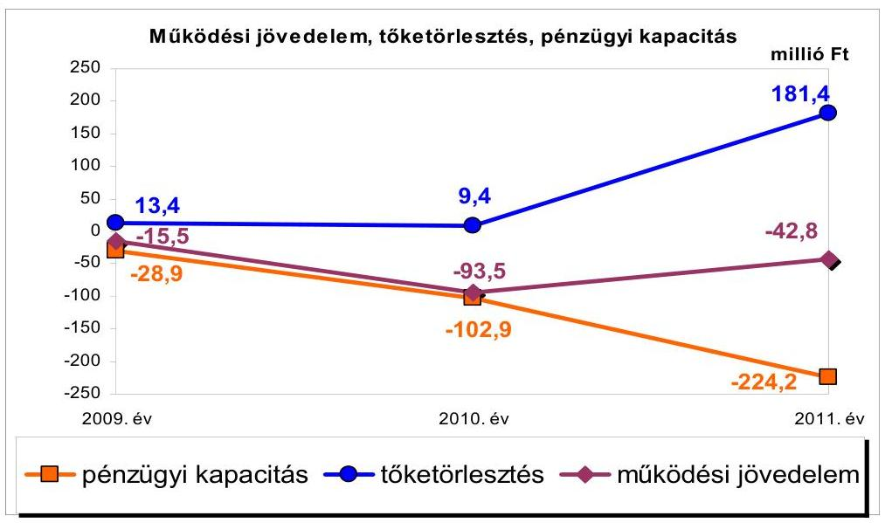
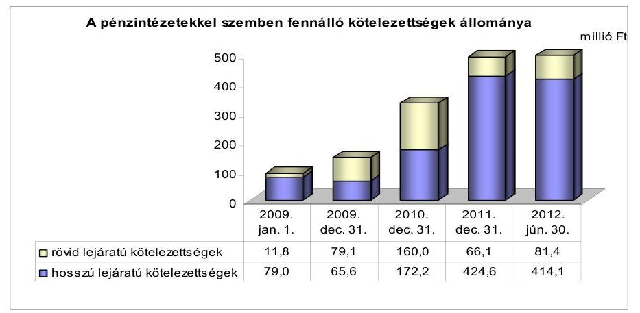
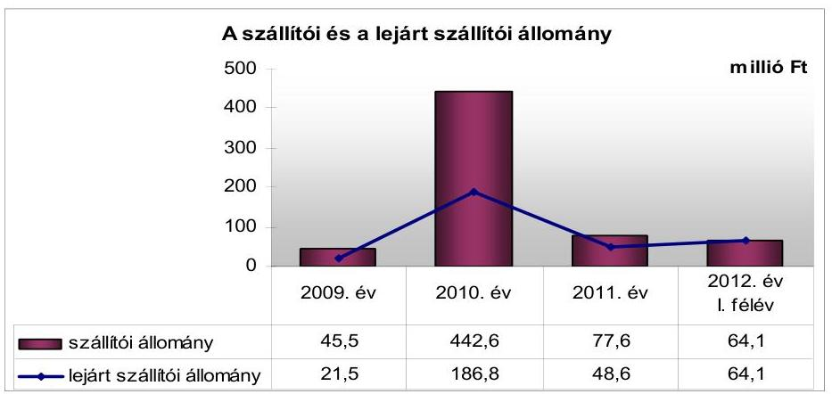
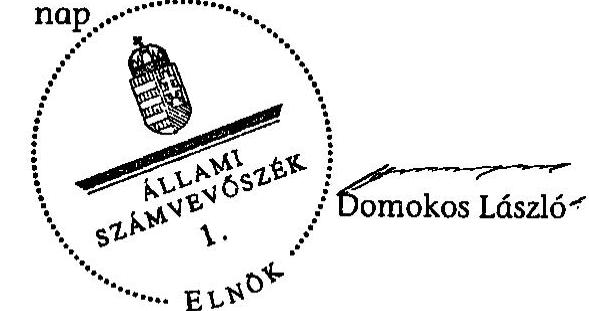
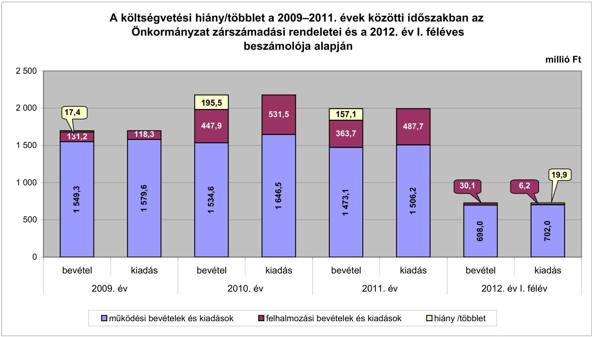
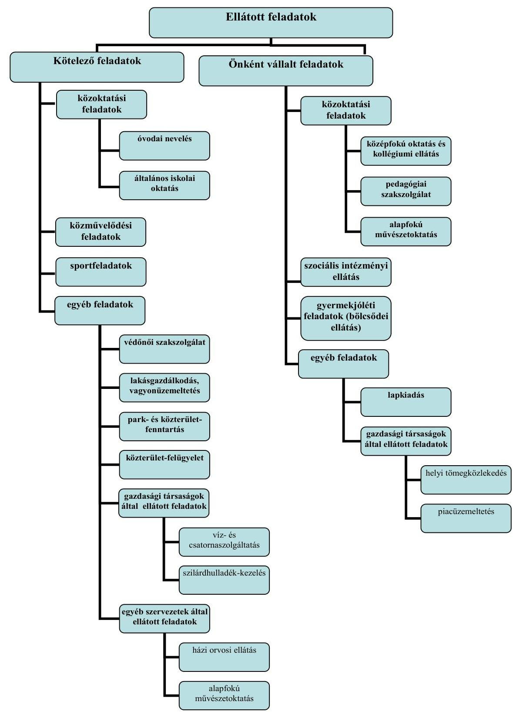

# ÁLLAMI   SZÁMVEVŐSZÉK 

## JELENTÉS

Újszász Város Önkormányzata pénzügyi gazdálkodási helyzetének, szabályosságának ellenőrzéséről

---

# Állami Számvevőszék 

Iktatószám: V-0030-215/2013.
Témaszám: 35/2
Vizsgálat-azonosító szám: V059202

## Az ellenőrzést felügyelte:

Dr. Horváth Margit
felügyeleti vezető

## Az ellenőrzést vezette:

## Renkó Zsuzsanna

számvevő tanácsos

## Az ellenőrzést végezték:

## Batkiné Vas Anna

számvevő tanácsos csoportvezető

## Lingné Rajz Borbála

számvevő tanácsos
dr. Csapó Anna
számvevő tanácsos
Ujvári Józsefné
számvevő tanácsos

---

# TARTALOMJEGYZÉK 

BEVEZETÉS ..... 3
I. ÖSSZEGZŐ MEGÁLLAPÍTÁSOK, KÖVETKEZTETÉSEK, JAVASLATOK ..... 5
II. RÉSZLETES MEGÁLLAPÍTÁSOK ..... 11

1. Az Önkormányzat kötelező és az önként vállalt feladatai, a feladatellátás szervezeti keretei ..... 11
2. A pénzügyi egyensúly fenntartását veszélyeztető pénzügyi kockázatok, ezek csökkentése érdekében tett intézkedések ..... 12
3. A pénzügyi gazdálkodási folyamatok szabályosságát, megfelelőségét biztosító belső kontrollok ..... 20

## MELLÉKLETEK

1. számú A költségvetési hiány/többlet a 2009-2011. évek közötti időszakban az Önkormányzat zárszámadási rendeletei és a 2012. év I. féléves beszámolója alapján
2. számú Az Önkormányzat bevételei és kiadásai, valamint adósságszolgálata a 2009-2011. években (a CLF módszer szerint)
3/a. számú Az Önkormányzat által a 2009. év és a 2012. év I. félév között megvalósított (műszakilag befejezett) fejlesztések forrásösszetétele
3/b. számú Az Önkormányzat 2012. június 30-án folyamatban lévő fejlesztési feladataihoz kapcsolódó kötelezettségeinek összegzése
3/c. számú Az Önkormányzat által beadott, elbírálás alatti pályázatok forrásaiból megvalósuló fejlesztésekhez kapcsolódó kötelezettségvállalások összegzése
3. számú Az önkormányzati feladatok ellátásában résztvevő gazdasági társaságok egyes kiemelt adatai
4. számú Az Önkormányzat 2012. június 30-án fennálló, hosszú lejáratú adósságot keletkeztető kötelezettségvállalásai
5. számú Az Önkormányzat kötelezettségeinek 2011. december 31-ei és 2012. június 30 -ai állománya és a 2012. évben, valamint az azt követő években várható kötelezettségek miatti kiadások

---

# FÜGGELÉKEK 

1. számú Rövidítések jegyzéke
2. számú Értelmező szótár
3. számú Az Önkormányzat által ellátott feladatok a 2012. év I. félév végén

---

# JELENTÉS 

## Újszász Város Önkormányzata pénzügyi gazdálkodási helyzetének, szabályosságának ellenőrzéséről

## BEVEZETÉS

Az államháztartás helyi szintjén, az önkormányzati alrendszerben az utóbbi években megjelenő gazdálkodási nehézségek, a pénzforgalmi hiány növekedése, az eladósodás ráirányította az ÁSZ figyelmét a helyi önkormányzatok pénzügyi helyzetére.

Az ÁSZ a 2012. évi ellenőrzési tervben foglaltaknak megfelelően az önkormányzatok pénzügyi gazdálkodási helyzetének, szabályosságának ellenőrzésével az önkormányzatok 2011. évben megkezdett helyzetelemzését folytatta. Az ellenőrzés keretében értékeljük az önkormányzatok adósságkezelési és likviditási helyzetét, bemutatjuk a pénzügyi egyensúly alakulására hatással lévő folyamatokat, feltárjuk az ezekre ható kockázatokat, a pénzügyi egyensúlyi helyzetet befolyásoló döntésmegalapozó, döntés-előkészítő eljárások szabályosságát, minősítjük az ezekkel összefüggő belső kontrollok kialakítását, múködését.

Az ellenőrzés eredményének várható hatásaként megállapításaival segítséget nyújthat a pénzügyi helyzet értékeléséhez, a pénzügyi egyensúly helyreállítása érdekében szükségessé váló önkormányzati intézkedések megtételéhez.

Az ellenőrzés típusa: szabályszerűségi ellenőrzés.

## Az ellenőrzés célja annak értékelése volt, hogy:

- a vizsgált időszakban a kötelező- és önként vállalt feladatok ellátását biztosító szervezeti formák változása milyen hatást gyakorolt az Önkormányzat pénzügyi helyzetének alakulására;
- az Önkormányzat pénzügyi - ezen belül múködési és felhalmozási - egyensúlya milyen irányban változott, a változást milyen okok idézték elő, továbbá milyen intézkedéseket tettek a pénzügyi egyensúly biztosítása, illetve javítása érdekében, az intézkedések hatására javult-e az Önkormányzat pénzügyi helyzete;
- a költségvetési kiadások finanszírozása érdekében vállalt pénzintézetekkel szembeni kötelezettségek hogyan alakultak, a kötelezettségek fennállása miként befolyásolja az Önkormányzat jövőbeli pénzügyi egyensúlyi helyzetét;

---

- az Önkormányzat beazonosította, felmérte, értékelte-e a pénzügyi egyensúlyt befolyásoló pénzügyi kockázatokat, a finanszírozási célú pénzügyi műveletekkel kapcsolatban írtak-e elő kockázatértékelési kötelezettséget;
- az Önkormányzat által kialakított belső kontrollok biztosítják-e a pénzügyi gazdálkodás folyamatainak szabályosságát és eredményességét;
- hasznosultak-e az ÁSZ korábbi ellenőrzései során a pénzügyi, gazdálkodási helyzet javítására tett szabályszerűségi és célszerűségi javaslatok.

Utóellenőrzésre nem került sor, mivel az ÁSZ a 2009. év és a 2012. év I. félév között ellenőrzést nem végzett az Önkormányzatnál.

Az ellenőrzés a 2009. január 1-jétől 2012. június 30 -áig terjedő időszakot ölelte fel. A pénzintézetekkel szembeni kötelezettségek állományának vizsgálatakor a 2011. december 31-én fennálló kötelezettségek keletkezésének kezdő időpontját vettük figyelembe.

Az ellenőrzés szakmai módszertana az Állami Számvevőszék Ellenőrzési Kézikönyvében foglalt szakmai szabályokon alapult, amely a Legfelsőbb Ellenőrző Intézmények Nemzetközi Szervezete (INTOSAI) által kiadott nemzetközi standardok (ISSAI) figyelembevételével készült.

Az ellenőrzés során használt rövidítéseket a jelentés 1. számú, az egyes fogalmak magyarázatát a jelentés 2 . számú függeléke tartalmazza.

A vizsgálat jogszabályi alapját az ÁSZ tv. 1. § (3) bekezdésének, 5. § (2)-(6) bekezdéseinek, valamint az államháztartásról szóló 2011. évi CXCV. törvény 61. § (2) bekezdésének előírásai képezik.

Újszász város lakosainak száma 2012. január 1-jén 6548 fő volt. Az Önkormányzat a 2011. évben 1830,5 millió Ft költségvetési bevételt ért el és 1993,9 millió Ft költségvetési kiadást teljesített. 2011. december 31-én a könyvviteli mérleg szerint 4031,8 millió Ft értékű vagyonnal rendelkeztek, amely a 2009. év végi állományhoz viszonyítva 15,0\%-kal (526,3 millió Ft-tal) növekedett. Az eszközérték növekedésében 664,3 millió Ft-tal az ingatlanok állománynövekedése volt meghatározó, a végrehajtott intézményrekonstrukciók eredményeként. A források között a saját tőke állományának 138,0 millió Ft-os és a kötelezettségek állományának 326,1 millió Ft-os - ezen belül a hosszú lejáratú hitelek 319,4 millió Ft-os - növekedése adta az állományváltozás döntő hányadát. Az Önkormányzat a 2012. évi költségvetési rendeletében a költségvetés bevételi és kiadási főösszegét 1372,0 millió Ft-ban, a - finanszírozási múveletek nélküli - költségvetési bevétel összegét 1372,0 millió Ft-ban, a költségvetési kiadás összegét 1363,9 millió Ft-ban állapította meg.

---

# I. ÖSSZEGZŐ MEGÁLLAPÍTÁSOK, KÖVETKEZTETÉSEK, JAVASLATOK 

Újszász Város Önkormányzatának pénzügyi egyensúlyi helyzete rövid és hosszú távon veszélyeztetett. Az alacsony múködési jövedelemtermelő képesség miatt a jelentős szállítói állomány és a pénzintézetekkel szembeni kötelezettségek kifizethetősége kockázatos.

Az Önkormányzat múködési kockázatai körében az önként vállalt feladatok miatti kockázat fennállt, mivel a múködési kiadásokon belüli arányuk 2009-ben és 2011-ben 44,1\% (697,1 millió Ft és 663,7 millió Ft), 2010-ben $42,7 \%$ ( 702,6 millió Ft) volt. Felhalmozási kockázatot jelent, hogy a 2010. évben $78,8 \%$, a 2011. évben $49,7 \%$ volt az önként vállalt feladatokra fordított felhalmozási kiadások összes felhalmozási kiadásokon belüli aránya.

Az Önkormányzat 2009-2011 között összesen 5486,2 millió Ft költségvetési bevételhez jutott, teljesített költségvetési kiadása 5869,8 millió Ft-ot tett ki. Az ebből ellátott feladatok alapvetően a közoktatáshoz, a szociális intézményi, a közművelődési, a sport, és az igazgatási feladatokhoz kapcsolódtak. Az ellenőrzött időszakban az önkormányzati feladatok köre nem változott, feladat átvételére, átadására nem került sor. Egy intézmény 2012. év I. félévében történt megszüntetése az Önkormányzat pénzügyi egyensúlyi helyzetére még nem volt hatással. A feladatellátás részletezését a 2. számú függelék tartalmazza. Az Önkormányzat múködési és felhalmozási költségvetési egyenlege 2009-2011 között folyamatosan negatív volt, összesen 383,6 millió Ft-ot, a teljesített költségvetési kiadások 6,5\%-át jelentette. A nettó múködési jövedelem nem nyújtott fedezetet a felhalmozási forráshiányra. Az Önkormányzat pénzügyi kapacitásának 2009-2011 közötti csökkenését a negatív múködési jövedelem és a tőketörlesztés változásának együttes hatása eredményezte. A változást a következő ábra mutatja be:

---

Az Önkormányzatnál a pénzügyi kapacitás ÖNHIKI támogatás mellett is folyamatosan negatív volt. Ugyanakkor a bevételi kitettségre kedvezően hatott, hogy a helyi adóbevétel döntő része nagyszámú adóalanytól származott.

Az Önkormányzat likviditási és rövid távú pénzügyi egyensúlyi helyzete kedvezőtlenül alakult. Pénzintézeti kötelezettségei a 2009. év elejétől a 2012. év I. félév végére több mint ötszörösére, 90,8 millió Ft-ról 495,5 millió Ft-ra növekedtek. A folyószámlahitel 2009-2011 közötti tartós és növekvő mértékű, a munkabér- és a támogatás-megelőlegezési hitelek 2011. évi időszaki bevonása a kiadások fedezetének biztosításába az Önkormányzat pénzügyi helyzetének kedvezőtlen változását jelezte. A pénzintézeti kötelezettségvállalások kockázatainak csökkentése érdekében 2011-ben a folyószámlahitel nagy részét, 130,0 millió Ft-ot, hosszú lejáratú forgóeszköz-finanszírozó hitellel váltottak ki. Ennek eredményeként a folyószámlahitel napi átlagos állománya a 2009-2011. évek 117,5 millió Ft-os átlagáról, a 2012. év I. félévben 23,3 millió Ft-ra csökkent. A likviditás szempontjából kedvező volt, hogy a fejlesztések finanszírozása során az előfinanszírozású projektek esetében igénybe vették az állam által biztosított előleget és a szállítói finanszírozást. Nemfizetési kockázatot jelent, hogy a lejárt szállítói állomány növekedése mellett, a 2012. év I. félév végi 64,1 millió Ft szállítói állományból - amely teljes mértékben lejárt - a 60 napon túli tartozás 35,2 millió Ft volt.

A rövid lejáratú kötelezettségek állományához hasonlóan jellemző volt a hosszú lejáratú kötelezettségek növekedése is. A felvett hosszú lejáratú hitelek év végi állománya, főként a fejlesztések fedezetének biztosítása és a likviditás megőrzése miatt, a 2009. évről a 2011. évre több mint hatszorosára, 65,6 millió Ft-ról, 424,6 millió Ft-ra emelkedett. A hitelek igénybevételéből származó forrásokat a céloknak megfelelően használták fel. A pénzintézeti kötelezettségekből 303,2 millió Ft (tőke, kamat, egyéb költségek) kiadást teljesítettek az ellenőrzött időszakban.

Az ellenőrzött időszak végén ismert adatok alapján a pénzintézetekkel szemben fennálló kötelezettség várható (tőke, kamat és egyéb) kiadása 2014 végéig 272,4 millió Ft. A 2011. év végi, összesen 62,7 millió Ft szabad pénzmaradvány és követelésállomány együttes összege a kötelezettségállományra csak részben nyújt fedezetet. Tekintettel arra, hogy az adósságszolgálat nagyobb mértékű csökkenése csak 2017-től várható, a kötelezettségek teljesítése sem rövid, sem közép távon nem biztosított. A vállalt hosszú és rövid lejáratú kötelezettségek jövőbeli teljesítésére a jelenlegi feltételek mellett számítható múködési jövedelem nem nyújt fedezetet.

Az Önkormányzatnál nem alakítottak ki a kockázatok kezelésére vonatkozó eljárásokat, módszereket, nem határozták meg a pénzügyi egyensúly biztosítására, a fizetőképesség megőrzése érdekében hosszú távon elérni kívánt célokat. Teljes körűen nem mérték fel a pénzügyi egyensúlyt befolyásoló kockázatokat, mivel a döntés-előkészítés szakaszban elmaradt a pénzintézeti kötelezettségvállalások kockázatainak feltárása és a költségvetési egyensúlyra gyakorolt hatásának vizsgálata. Nem történt meg a kamat és a visszafizetést szolgáló források változásának pénzügyi egyensúlyra gyakorolt hatása számszerú bemutatása.

---

Az ellenőrzött időszakban az Önkormányzat a lehetőségeihez mérten hozott bevételt növelő (iparűzési adó, magánszemélyek kommunális adója mértékének emelése, építményadó kivetése, intézményi térítési díjak emelése, hulladékszállítási díj kedvezményeinek csökkentése) és kiadási megtakarítást (2009-2011 között összesen 35 álláshely megszüntetése és egyúttal 27 fős létszámcsökkentés, többletjuttatások, tiszteletdíjak, költségtérítések csökkentése) eredményező intézkedéseket. Ezek hatására az Önkormányzat kimutatása szerint összesen 108,7 millió Ft bevételi többlet, illetve 341,1 millió Ft kiadási megtakarítás keletkezett.

Az ingatlanok jelzáloggal való terhelése az ellenőrzött időszakban nőtt, mely a fedezetbevonások miatt kockázatot jelent. Az Önkormányzat a pénzintézeti kötelezettségeihez kapcsolódóan 13 ingatlanra alapított jelzálogjogot. Egy korlátozottan forgalomképes ingatlan - a 2120. hrsz. számú általános iskola, óvoda telephely - esetében szabálytalanul, mivel az a törzsvagyon részeként hitel fedezeteként nem lett volna felhasználható.

Az ellenőrzött időszakban nem mérték fel, hogy az elhasználódott eszközök felújítása, pótlása mekkora összegű forrásokat igényel. A 2009-2011 között elszámolt értékcsökkenést lényegesen ( 322,0 millió Ft-tal) meghaladó eszközpótlási kiadás az eszközök átlagos műszaki állapotát kedvezően befolyásolta, azonban a beruházások aktiválásának elhúzódása miatt, a számviteli szabályok szerint megállapított használhatósági fokuk még nem mutatott pozitív elmozdulást.

Az Önkormányzatnál a belső kontrollok kiépítését és múködtetését leszűkítve, a pénzügyi gazdálkodási folyamatok szabályossága vonatkozásában mértük fel és részben megfelelőnek értékeltük. Ezen a területen több hiányosságot tapasztaltunk. Elmaradt a pénzintézeti kötelezettségvállalások kockázatainak döntés-előkészítő szakaszban történő feltárásával, az Önkormányzat fizetőképességének és eladósodásának kezelésével, a helyi adósságrendezési eljárással kapcsolatos döntések kockázatainak kezelésével összefüggő kontrolltevékenységek szabályozása. Az ellenőrzött időszak belső ellenőrzési terveinek készítése során nem írták elő a pénzügyi egyensúlyi helyzetet befolyásoló döntések kockázati tényezőinek feltárását, a feltárt kockázati tényezők belső ellenőrzés keretében történő ellenőrzését.

Összességében az Önkormányzat működési jövedelemtermelő képessége gyenge, forrásai az ellátott feladatokra nem nyújtottak fedezetet. Nagyrészt önként vállalt feladatokhoz kapcsolódó felhalmozási kiadásai teljesítése érdekében felvett hitelekből eredő kötelezettségei kockázatot jelentenek, tovább nehezítik pénzügyi gazdálkodási pozícióit, múködését rövid, közép és hosszú távon korlátozzák. A hitelekből megvalósuló beruházások a feladatellátás színvonalának javításához hozzájárultak, egy beruházás révén növelték a munkahelyteremtő potenciált.

Az ÁSZ tv. 33. § (1) bekezdésében foglaltak értelmében a jelentésben foglalt megállapításokhoz kapcsolódó intézkedési tervet köteles az ellenőrzött szervezet vezetője összeállítani és azt a jelentés kézhezvételétől számított harminc napon belül az ÁSZ részére megküldeni. Amennyiben az intézkedési tervet határidőben nem küldi meg a szervezet, vagy az továbbra sem elfogadható, az ÁSZ el-

---

nöke a hivatkozott törvény 33. § (3) bekezdés a)-b) pontjaiban foglaltakat érvényesítheti.

# Az ellenőrzés intézkedést igénylő megállapításai és javaslatai: 

## a polgármesternek

1. Az Önkormányzat nettó működési jövedelme 2009-2011 között negatív volt. A likviditás folyószámla-, munkabér-megelőlegezési és támogatás-megelőlegező hitel igénybevételével volt biztosítható. A finanszírozásban a folyószámlahitel állandósult, napi átlagos állománya 2009-2011 között folyamatosan nőtt. Az Önkormányzat szállítói tartozásállománya a 2012. év I. félév végén teljes egészében lejárt tartozás volt. A lejárt tartozás $54,9 \%-a, 35,2$ millió Ft 60 napon túl lejárt tartozás volt. A pénzintézeti kötelezettségek 2009. év elejétől a 2012. év I. félév végére több mint ötszörösére, 90,8 millió Ft-ról 495,5 millió Ft-ra növekedtek. Az Önkormányzat által tett kiadáscsökkentő és bevételnövelő intézkedések nem biztosítanak elegendő forrást a pénzügyi egyensúly helyreállításához. A vizsgált évek jövedelemtermelő képessége alapján a várhatóan képződő működési jövedelem a jelenlegi feladatstruktúrát (önként vállalt feladatok 43-44 \%) és arányokat feltételezve, nem nyújt fedezetet a jelenlegi feladatstruktúra finanszírozására.

Javaslat:
Vizsgálja felül az önkormányzat feladatstruktúráját annak érdekében, hogy a kormányzati adósságrendezést követően a működési jövedelemtermelő képesség legyen összhangban a feladatellátással.

Ennek keretében:
a) tárjon fel további bevételszerző és kiadáscsökkentő lehetőségeket, melynek alapján intézkedjen a bevételek növelésére, a kintlévőségek behajtására, a kiadások csökkentésére;
b) terjesszen a Képviselő-testület elé reorganizációs programot a kedvezőtlen pénzügyi folyamatok megállítására, a pénzügyi egyensúlyi helyzet stabilizálására;
c) terjesszen a Képviselő-testület elé olyan egyensúlyi (elkülönített) tartalék képzésére vonatkozó előterjesztést, amelynek során a Képviselő-testület meghatározza annak összegét és kötelezettséget vállal arra, hogy a törlesztési időszak alatt ezt a tartalékot a költségvetési rendeleteiben minden évben betervezi az adósságszolgálat teljesítésére.
2. A Képviselő-testületnek előterjesztett éves zárszámadási rendelettervezetekben nem mutatták be az Önkormányzat eszközei után tárgyévben elszámolt értékcsökkenés összegét, az eszközpótlásra fordított tényleges kiadásokat, az eszközök elhasználódási fokának alakulását.

Javaslat:
Mutassa be a Képviselő-testületnek évente a zárszámadási rendelettervezet előter-

---

jesztésében az értékcsökkenés összegét, és ezzel összevetve az elhasználódott eszközök pótlására fordított tényleges kiadásokat, az eszközök elhasználódási fokának alakulását.
3. Az Önkormányzat lejárt szállítói tartozásállománya 2012. június 30-án 64,1 millió Ft volt, melyből a 60 napot meghaladó 35,2 millió Ft.

Javaslat:
Kezelje az Önkormányzat lejárt szállítói tartozásállományát, a szállítói kitettség és a jogszabályi következmények elkerülése érdekében.

# a jegyzönek 

1. Az Önkormányzatnál a 2009. évben az Ámr. 1 145/E. § (1) bekezdésében, a 20102011. években az Ámr. 2 158. § (1) bekezdésében, a 2012. év I. félévében a Bkr. 8. § (1)-(2) bekezdéseiben foglaltak ellenére a pénzügyi, gazdálkodási folyamatok szabályosságát biztosító belső kontrollok beépítése részben volt megfelelő, mivel elmaradt a pénzintézeti kötelezettségvállalások kockázatainak döntés-előkészítő szakaszban történő feltárásával, az Önkormányzat fizetőképességének és eladósodásának kezelésével, a helyi adósságrendezési eljárással kapcsolatos döntések kockázatainak kezelésével összefüggő kontrolltevékenységek szabályozása.

Javaslat:
A Bkr. 8. §. (1)-(2) bekezdése alapján erősítse meg a belső kontrollok beépítését és szabályszerű működtetését. Ennek keretében készítse el az Önkormányzat fizetőképességét, eladósodását, a pénzügyi egyensúlyi helyzetet befolyásoló döntések kockázatainak kezelését biztosító szabályzatok és szabályozásokat.
2. Az ellenőrzött időszak belső ellenőrzési terveinek készítése során a Ber. 18. §-ában ${ }^{1}$ foglaltak ellenére nem írták elő a pénzügyi, egyensúlyi helyzetet befolyásoló döntések kockázati tényezőinek feltárását, a belső ellenőrzési tervek nem tartalmazták a feltárt kockázati tényezők elemzését.

Javaslat:
Tegyen intézkedést, hogy a Bkr. 31. § (1)-(2) bekezdésében foglaltak szerint az éves belső ellenőrzés tervek tartalmazzák a pénzügyi egyensúlyi helyzetet befolyásoló döntésekkel kapcsolatos feltárt kockázati tényezők elemzését és gondoskodjon az ellenőrzési tervek végrehajtásáról.

A polgármester a helyszíni ellenőrzés lezárása után tájékoztatta az ÁSZ-t az általa és a Képviselő-testület által megtett intézkedésekről, amelyeket az ÁSZ nem ellenőrzött, arra vonatkozóan véleményt vagy megállapítást nem fogalmaz meg. Az ellenőrzés lezárását követő intézkedéseket az ÁSZ utóellenőrzés keretében vizsgálhatja.

[^0]
[^0]:    ${ }^{1}$ 2012. január 1-től a Bkr. 29. § (1) bekezdése tartalmazza.

---

A polgármester tájékoztatása szerint a következő intézkedéseket tették:

- a szállítói kitettség mérséklése érdekében a - 2012. június 30 -ai, 64,1 millió Ft - lejárt szállítói állományt 2012. december 21-ére 9,7 millió Ftra csökkentették, amely nem tartalmaz sem 60 napot, sem 30 napot meghaladó tartozást;
- a bevételek növelésére négy ingatlan értékesítésével a 2012. évben 4,5 millió Ft bevételi többlethez jutottak, további három ingatlan értékesítésével 2013-ban várhatóan 9,7 millió Ft többletbevételt érnek el, mely fedezetet nyújt az áthúzódó szállítói állomány finanszírozására;
- a kintlévőségek behajtására tett intézkedések eredményeként - a 2011. évi 61,2 millió Ft-ról - 2012. november 30-ig 13,3 millió Ft-tal csökkent a helyi adó és egyéb hátralék;
- a kiadások csökkentése érdekében három önállóan működő és gazdálkodó intézmény önállóan működő intézménnyé átsorolása történt meg 2013. január 1-jei hatállyal. Az ezzel összefüggő létszámcsökkentés (egy intézményvezetői, két-két gazdaságvezetői és gazdasági ügyintézői létszám) összesen 11,4 millió Ft kiadási megtakarítást jelent a 2013. évi költségvetési egyensúly javításában;
- a jelentésben a jegyzőnek tett 2. számú javaslat alapján a 2013. évi ellenőrzési terv kockázatelemzése tartalmazza a pénzügyi egyensúlyi helyzetet befolyásoló döntésekkel kapcsolatos, feltárt kockázati tényezők elemzését.

---

# II. RÉSZLETES MEGÁLLAPÍTÁSOK 

## 1. Az ÖNKORMÁNYZAT KÖTELEZŐ ÉS AZ ÖNKÉNT VÁLlALT FELADA-

TAI, A FELADATELLÁTÁS SZERVEZETI KERETEI

Az Önkormányzat kötelező és önként vállalt feladatait a Képviselőtestület $\mathrm{SzMSz}_{1,2}$-ében rögzítették. Az önként vállalt feladatok közé sorolták a középfokú oktatást, kollégiumi nevelést, idősek bentlakásos intézményének fenntartását, a pedagógiai szakszolgálat múködtetését, a bölcsőde fenntartását, a lakossági önszerveződő közösségek támogatását. Középtávú célként fogalmazták meg, hogy az önként vállalt feladatokat önfenntartóvá kell tenni. A kötelező és önként vállalt feladatokra fordított múködési kiadások 2010-ről 2011-re számottevően, 8,5\%-kal (140,3 millió Ft-tal) csökkentek. A 2012. évi tervadatok alapján 2011-hez viszonyítva további 12,6\%-os (189,3 millió Ft-os) csökkenés várható. A csökkenést az ellátotti létszámok mérséklődése és a kiadáscsökkentő intézkedések együttesen eredményezték.

Az Önkormányzat múködési kockázatai körében az önként vállalt feladatok miatti kockázat fennállt, mivel a múködési kiadásokon belüli arányuk 2009-ben és 2011-ben 44,1\% (697,1 millió Ft és 663,7 millió Ft), 2010-ben a kötelező feladatokra fordított kiadások emelkedése miatt 42,7\% (702,6 millió Ft) volt. 2009-2011 között a felhalmozási kiadások összegének átlagosan 59,5\%-át fordították önként vállalt feladatokhoz kapcsolódó fejlesztésekre. A kiadás a Gimnázium, Műszaki Szakközépiskola és Kollégium, valamint az idősek otthona 2010-ben megkezdett korszerűsítésével, illetve felújításával függött össze. Felhalmozási kockázatot jelent, hogy a 2010-2011. években magas volt az önként vállalt feladatokra fordított felhalmozási kiadások összes felhalmozási kiadásokon belüli aránya ( $78,8 \%$ és $49,7 \%$ ).

Az Önkormányzat által ellátott kötelező és önként vállalt feladatok a 20092011. évek között nem változtak, azok ellátását biztosító szervezeti struktúrát nem módosították. Feladatátvétel és -átadás nem történt.

A feladatellátás szervezeti formája, valamint a feladatokat ellátó költségvetési szervek száma az ellenőrzött időszakban jelentősen nem változott. A Polgármesteri hivatallal együtt 2009-2011 között hat költségvetési szerv és négy gazdasági társaság vett részt a kötelező és önként vállalt feladatok ellátásában. A négy önállóan múködő és gazdálkodó, valamint kettő önállóan múködő költségvetési szerv 14 telephelyen látta el a feladatokat. Az önállóan múködő Városi Tornacsarnok megszüntetése eredményeként 2012. év I. félév végén öt költségvetési szerv 14 telephelyen biztosította az önkormányzati feladatok ellátását.

Az önállóan múködő Városi Tornacsarnok 2012. február 29-i hatállyal történt megszűnése után a feladatot a Polgármesteri hivatal látja el. A változtatás célja megtakarítás elérése volt. A pénzügyi egyensúlyi helyzetre gyakorolt hatása, az Önkormányzat tájékoztatása szerint, a 2012. év második felében várható.

---

A közfeladatot ellátó gazdasági társaságok közül az Önkormányzatnak az önként vállalt piacüzemeltetési feladatot ellátó Piaccsarnok Kft.-ben 24,6\%-os tulajdoni részaránya volt. A hulladékkezelés-szállítást, víz- és szennyvízkezelést, valamint a helyi tömegközlekedést végző gazdasági társaságokban nem rendelkeztek tulajdoni hányaddal.

Az Önkormányzatnak 51,7\%-os tulajdoni részesedése van a 2010. február 22-től végelszámolás alatt álló Újszász Térsége Gazdaságfejlesztési Kft.-ben. A társaság üzleti tanácsadással foglalkozott, segítséget nyújtott a térségében lévő önkormányzatok gazdasági kapcsolatainak kialakításában.

Az önkormányzati feladatok teljesítésében résztvevő gazdasági társaságok fel-adat-ellátási szerződései tartalmazták a belső utasításban előírt tartalmi elemeket, előírták a feladatellátás teljesítéséről való beszámolási kötelezettséget. A feladatok teljesítéséről a Képviselő-testületnek beszámoltak, a feladatellátás értékelése megtörtént.

# 2. A PÉNZÜGYI EGYENSÚLY FENNTARTÁSÁT VESZÉLYEZTETŐ PÉNZÜGYI KOCKÁZATOK, EZEK CSÖKKENTÉSE ÉRDEKÉBEN TETT INTÉZKEDÉSEK 

Az Önkormányzat költségvetésének elemzését CLF módszerrel hajtottuk végre. A CLF módszer szerinti 2009-2011 közötti részletes adatokat a jelentés 2. számú melléklete, a főbb önkormányzati adatokat a következő tábla mutatja be:

|  |  |  | millió Ft |
| :-- | --: | --: | --: |
| Megnevezés | 2009. év | 2010. év | 2011. év |
| Folyó bevételek | 1564,1 | 1553,0 | 1463,4 |
| Folyó kiadások | 1579,6 | 1646,5 | 1506,2 |
| Müködési jövedelem | $\mathbf{- 1 5 , 5}$ | $\mathbf{- 9 3 , 5}$ | $\mathbf{- 4 2 , 8}$ |
| Felhalmozási bevételek | 113,2 | 425,4 | 367,1 |
| Felhalmozási kiadások | 118,3 | 531,5 | 487,7 |
| Felhalmozási költségvetés egyenlege | $\mathbf{- 5 , 1}$ | $\mathbf{- 1 0 6 , 1}$ | $\mathbf{- 1 2 0 , 6}$ |
| Folyó és felhalmozási bevételek összesen | 1677,3 | 1978,4 | 1830,5 |
| Folyó és felhalmozási kiadások összesen | 1697,9 | 2178,0 | 1993,9 |
| Finanszírozási múveletek nélküli pozíció | $\mathbf{- 2 0 , 6}$ | $\mathbf{- 1 9 9 , 6}$ | $\mathbf{- 1 6 3 , 4}$ |
| Finanszírozási múveletek egyenlege | 30,6 | 201,5 | 154,9 |
| Tárgyévi pénzügyi pozíció | $\mathbf{1 0 , 0}$ | $\mathbf{1 , 9}$ | $\mathbf{- 8 , 5}$ |
| Hiteltörlesztés, értékpapír beváltás | 13,4 | 9,4 | 181,4 |
| Nettó múködési jövedelem | $\mathbf{- 2 8 , 9}$ | $\mathbf{- 1 0 2 , 9}$ | $\mathbf{- 2 2 4 , 2}$ |

Az Önkormányzat 2009-2011 között összesen 5486,2 millió Ft költségvetési bevételhez jutott. Ugyanebben az időszakban a teljesített költségvetési kiadása 5869,8 millió Ft-ot tett ki. Az Önkormányzat működési és felhalmozási költségvetési egyenlege 2009-2011 között folyamatosan negatív volt, összesen 383,6 millió Ft-ot, a teljesített költségvetési kiadások 6,5\%-át jelentette.

Az Önkormányzat folyó bevételei a 2009-2011. években nem fedezték folyó kiadásait. Az alacsony múködési jövedelemtermelő képesség miatti kockázat a 2010-2011. években a 2009. évihez képest erősödött. A folyó költségvetés

---

hiánya 2009-ről 2010-re a hatszorosára nőtt. A hiány emelkedését a dologi kiadások 22,1 millió Ft-os - azon belül az ár- és belvíz elleni védekezés rendkívüli kiadásai és az áfa emelés -, az egyéb folyó kiadások 13,7 millió Ft-os növekedése, valamint az ÖNHIKI támogatás 89,8 millió Ft-os csökkenése okozta. 2010ről 2011-re csökkent a folyó költségvetés hiánya. A javulást a múködési kiadások, nagyrészt a személyi juttatások és járulékai - létszámcsökkentéssel és a béren kívüli juttatások megszüntetésével elért - csökkenése eredményezte. A múködési hiány a 2011. évben amellett csökkent, hogy a költségvetési támogatások 76,6 millió Ft-tal, az államháztartáson belülről átvett pénzeszközök 28,7 millió Ft-tal mérséklődtek. A folyó költségvetés ÖNHIKI támogatás nélkül számított hiánya 2009-ben 128,5 millió Ft, 2010-ben 116,7 millió Ft, 2011-ben 91,8 millió Ft volt.

A nettó múködési jövedelem a 2009-2011. években negatív volt, évről évre növekvő pénzügyi kapacitáshiányt jelzett. A forráshiány növekedését 20092010 között nagyobbrészt a folyó kiadások emelkedése, 2010-2011 között a hi-tel-visszafizetés növekedése okozta. A múködési bevétel a múködési kiadásokat sem fedezte, így nem nyújtott fedezetet az adósságszolgálatra sem.

A felhalmozási kiadások 2009-2011 között folyamatosan, évenként növekvő összeggel haladták meg a felhalmozási bevételeket, mivel egyes fejlesztések, illetve egyes projektek kiadásai önrészének finanszírozása hitelből történt, valamint a kiadások keletkezésének és a pályázati támogatások jóváírásának üteme eltérő volt.

Az Önkormányzat teljes finanszírozási igénye ${ }^{2} 2009$-ben 34,0 millió Ft, 2010-ben 209,0 millió Ft, 2011-ben 344,8 millió Ft volt. A finanszírozási műveletek (hitelfelvételek, hiteltörlesztések és egyéb finanszírozási bevételek, kiadások) egyenlege 2009-2011 között pozitív volt, döntően a hiteltörlesztéseket meghaladó, a pénzügyi hiányt finanszírozó hitelfelvételek következtében.

A zárszámadási rendeletek szerint a költségvetési bevételek és költségvetési kiadások különbözeteként 2009-2011-ben pénzügyi hiány, a 2012. év I. félév végén pénzügyi többlet keletkezett. Ezen bevételek tartalmazták - a CLF modellel ellentétben - az előző évi pénzmaradvány felhasználásából származó pénzforgalom nélküli bevételeket is. ${ }^{3}$

A folyó bevételek összege a 2009. évi 1564,1 millió Ft-ról 2010-re 1553,0 millió Ft-ra, 2011-re 1463,4 millió Ft-ra mérséklődött, átlagosan 9,5\%uk (144,8 millió Ft) származott egyszeri támogatásokból, átvett pénzeszközökből ebben az időszakban. Az Önkormányzat kötelező feladatait a normatív állami hozzájárulások, a támogatások és az szja csökkenő mértékben finanszírozták. A költségvetési támogatás és az szja együttes összege 2009-ről 2010-re 1125,8 millió Ft-ról 1037,1 millió Ft-ra, 2011-re 971,1 millió Ft-ra csök-

[^0]
[^0]:    ${ }^{2}$ teljes finanszírozási igény: a nettó múködési jövedelemnek és a felhalmozási költségvetés egyenlegének együttes, negatív eredménye
    ${ }^{3}$ A költségvetési hiány/többlet alakulását az Önkormányzat 2009-2011. évi zárszámadási rendeletei, valamint a 2012. év I. féléves beszámolója alapján az 1. számú melléklet tartalmazza.

---

kent. A 2009-2010. évek közötti csökkenést döntően az ÖNHIKI támogatás, a 2011. évi csökkenést a központosított előirányzatok mérséklődése okozta. Az Önkormányzat számára bevételi kitettség kockázatot jelentett, hogy a 2009. évi 113,0 millió Ft ÖNHIKI támogatás az elvárható bevételek és az elismerhető kiadások számítási módjának változása miatt 2010-re 23,2 millió Ftra csökkent. A kockázat 2011-ben az előző évihez képest mérséklődött, mivel az ÖNHIKI támogatás 49,0 millió Ft volt.

A helyi adókból (iparűzési adó, magánszemélyek kommunális adója) és pótlékokból származó bevételek folyó bevételeken belüli aránya 2009-ben 3,6\%, (55,8 millió Ft), 2011-ben 5,1\% (74,9 millió Ft) volt. A helyi adóbevételek döntő része nagyszámú adóalanytól származott.

A helyi iparűzési adó mértékét 2012. január 1-jétől a törvényi maximumra emelték. A magánszemélyek kommunális adójának lakásonkénti adómértékét 2010től az akkor hatályos törvényi felső határra emelték, amelyet 2012-ben a lakosságnak a város infrastrukturális fejlesztéséhez történt hozzájárulása miatt nem emeltek tovább. Az építményadót az üzleti célt szolgáló épületek után 2012-től vezették be, mértéke nem érte el a törvényi felső határt.

Az egyéb saját bevételek több mint fele 2009-2011 között az intézményi térítési díjakból származott. 2009-ről 2010-re elsősorban az idősek otthonában ellátottak térítési díjemelése ( 16,7 millió Ft) és az EU-s pályázatokra átvett támogatások emelkedése ( 19,1 millió Ft) hatására növekedett. Ugyanakkor 2010-ről 2011-re 32,3 millió Ft-tal, 363,9 millió Ft-ra csökkent, főként az államháztartáson belülről átvett támogatások ( 28,7 millió Ft-os) csökkenése miatt.

A felhalmozási bevételek 2009-2010 közötti 312,2 millió Ft-os növekedését és 2010-2011 közötti 58,3 millió Ft-os csökkenését döntően az EU-s támogatású projektekre államháztartáson belülről kapott és a saját felhalmozási bevételek változása okozta.

A folyó kiadások 2009-2010 közötti változásának több mint felét a dologi és egyéb folyó kiadások növekménye eredményezte. A 2011. évben a folyó kiadások a személyi juttatások és munkaadókat terhelő járulékok - kiadáscsökkentő intézkedésekkel összefüggő - mérséklődése miatt csökkentek.

A személyi juttatásokra teljesített kiadás 2009-ről 2010-re EU-s támogatásból a kompetenciaalapú oktatás bevezetésére történt kifizetések miatt nőtt. A 20102011 közötti csökkenést a 20 fős létszámcsökkentés, a polgármesteri, alpolgármesteri költségtérítésről lemondás, a Képviselő-testület létszámának és tiszteletdíjának csökkentése, a béren kívüli juttatások megszüntetése okozta. A dologi kiadások 2009-2010 közötti növekménye az ár- és belvíz elleni védekezés rendkívüli kiadásai és az áfa emelés miatt keletkezett. A 2010-ről 2011-re bekövetkezett csökkenés a szemétszállítási díj lakosságra történt áthárításának eredménye volt. Az átadott pénzeszközök nagyságrendje és változása nem gyakorolt jelentős hatást a pénzügyi egyensúlyi helyzetre.

A 2009-2011. évek között a folyó és felhalmozási kiadások együttes összegén belül a felhalmozási kiadások aránya - nagyrészt az EU-s támogatásból

---

végrehajtott fejlesztések miatt - növekedett. A felhalmozási kiadásokból ${ }^{4}$ beruházásokra és felújításokra 2009-ben 98,4 millió Ft-ot, 2010-ben 429,8 millió Ftot, 2011-ben 477,7 millió Ft-ot fordítottak. A megvalósuló beruházások a feladatellátás színvonalának javításához hozzájárultak, egy beruházás - homoktóvis ültetvény - révén növelték a munkahelyteremtő potenciált.

Az Önkormányzat a 2012. év I. félév végéig fejlesztésre 1008,0 millió Ft kiadást teljesített, amelynek forrása 679,8 millió Ft (67,4\%) EU-s támogatás, 208,2 millió Ft (20,7\%) hitel, 104,1 millió Ft (10,3\%) saját forrás, 15,9 millió Ft ( $1,6 \%$ ) egyéb központi támogatás volt. Felhalmozási előirányzatot terhelő kötelezettség a 2012. június 30-a utáni időszakra nem volt, csak a támogatással kapcsolatos pénzügyi elszámolás húzódott át a 2012. év II. félévére. A 2012. év I. félév végén elbírálás alatt lévő pályázat az idősek otthona fejlesztésére tervezett bekerülési költsége 180,0 millió Ft - vonatkozott. A likviditás szempontjából kedvező, hogy a tervezett forrás teljes egészében EU-s támogatás. ${ }^{5}$

Az Önkormányzatnál a döntést előkészítő megvalósítási és fenntarthatósági tervben bemutatták a tervezett fejlesztési feladatok megvalósításának kockázatait, fenntarthatóságát, a várható múködési kiadásokat és kiadási megtakarításokat, bevétel növelési lehetőségeket. A fejlesztés megvalósíthatósági tervéhez kapcsolódóan, az ütemezett kifizetés érdekében finanszírozási tervet készítettek. A fejlesztések finanszírozásának kockázatát csökkentette, hogy az előfinanszírozású projektek esetében igénybe vették az állam által biztosított előleget és a szállítói finanszírozási módot. A folyamatban lévő, pénzügyileg - a támogatások teljes körű átutalásának hiánya (30,3 millió Ft) miatt - be nem fejezett fejlesztések az Önkormányzat pénzügyi helyzetét nem befolyásolják, újabb kiadások nem várhatók.

Az Önkormányzat pénzintézetekkel szembeni kötelezettségeinek állománya a 2009. január 1-jei 90,8 millió Ft-ról 2011 végére 490,7 millió Ft-ra, a 2012. év I. féléve végére 495,5 millió Ft-ra növekedett. Az Önkormányzat pénzintézetekkel szemben a 2009-2011. években, illetve 2012. június 30-án fennálló kötelezettségeit az alábbi ábra mutatja be ${ }^{6}$ :

[^0]
[^0]:    ${ }^{4}$ A felhalmozási kiadásokban 2009-ben 14,1 millió Ft, 2010-ben 95,8 millió Ft, 2011ben 0,8 millió Ft áfa befizetés miatti kiadás szerepel.
    ${ }^{5}$ A 2009. év és a 2012. év I. féléve között megvalósított, 2012. június 30-ig műszakilag befejezett fejlesztések forrásösszetételét a 3/a. számú melléklet tartalmazza. A 2012. június 30-án folyamatban lévő fejlesztési feladataihoz kapcsolódó kötelezettségek összegzését a 3/b. számú melléklet mutatja be. Az Önkormányzat által beadott, elbírálás alatti, pályázati forrásból megvalósítandó fejlesztés adatait a 3/c. számú melléklet tartalmazza.
    ${ }^{6}$ Az ábrában a hosszú lejáratú hitelek következő évet terhelő törlesztő részletei a hosszú lejáratú kötelezettségek között szerepelnek.

---

A felvett hosszú lejáratú hitelek év végi állománya, főként a fejlesztések fedezetének biztosítása, és a likviditás megőrzése miatt, a 2009. évről a 2011. évre közel hétszeresére, 65,6 millió Ft-ról, 424,6 millió Ft-ra emelkedett, majd 2012. év I. félév végére 414,1 millió Ft-ra mérséklődött. A hosszú lejáratú, 2012. év I. félév végén fennálló hitelállományt 254,1 millió Ft (61,4\%) fejlesztési (hat szerződés) és 160,0 millió Ft múködési (két szerződés) célú hitel képezte. A hitelek igénybevétele a szerződésekben rögzített céloknak megfelelően történt. A hitelkeretek ( 463,5 millió Ft) összesen 16,0 millió Ft-os (3,5\%-os) maradványából 15,5 millió Ft feladattal terhelt. Az Önkormányzatnak az ellenőrzött időszakban nem volt devizában fennálló, pénzintézetekkel szembeni kötelezettsége, és kötvényt sem bocsátott ki. ${ }^{7}$

A hosszú lejáratú hitelek után 2009-2012. év I. féléve között összesen 67,4 millió Ft tőketörlesztést, 31,5 millió Ft kamat-, valamint 4,5 millió Ft egyéb kiadást teljesítettek. A kötelezettségvállalások döntés-előkészítő dokumentumai nem tartalmazták, hogy a változó kamatozású kötelezettségvállalások terhei a jövőben jelentősen változhatnak. A hitelek változó kamata az Önkormányzat számára kamatkockázatot jelentett, azonban a kamatok változása - a két legnagyobb összegű ( 68,0 millió Ft-os és 106,0 millió Ft-os) fejlesztési hitel alapkamata $4,88 \%$-ról $1,877 \%$-ra, illetve $9,03 \%$-ról $3,687 \%$-ra történt csökkenése következtében - összességében kedvezően alakult.

A pénzintézeti kötelezettségvállalásokra minden esetben a Képviselőtestület döntése alapján került sor. A hitelt nyújtó pénzintézetet - a pénzügyi szolgáltatások ellenértékétől függően - közbeszerzési eljárás lefolytatása, vagy több árajánlat alapján választották ki. Vizsgálták és betartották az adósságot keletkeztető kötelezettségvállalás felső határát. Az Önkormányzat megsértette az Ötv., 88. § (1) bekezdés b) pontjában ${ }^{8}$ foglalt előírást, amely szerint az önkormányzati törzsvagyon és az szja hitel fedezetéül nem használható fel. A 130,0 millió Ft-os, forgóeszköz-finanszírozó hitel szerződésében törzsvagyonba tartozó, korlátozottan forgalomképes ingatlanra alapítottak keretbizto-

[^0]
[^0]:    ${ }^{7}$ A 2012. június 30 -án a hosszú lejáratú adósságot keletkeztető kötelezettségvállalásokat az 5. számú melléklet tartalmazza.
    ${ }^{8}$ Hatályon kívül helyezte a Magyarország helyi önkormányzatairól szóló 2011. évi CLXXXIX. tv. 156. § (1) bekezdés a) pontja, hatálytalan 2012. január 1-jétől.

---

sítéki jelzálogjogot. Továbbá a folyószámlahitel visszafizetésének fedezeti biztosítékaként 2009-2011 között az szja-t is megjelölték, mely szabálytalanságot a hitelszerződés 2012-től hatályos módosítása során megszüntették.

A Képviselő-testületet a hosszú lejáratú, adósságot keletkeztető kötelezettségvállalásokból adódó fizetési kötelezettségekről, a visszafizetést biztosító feltételekről az éves költségvetési rendeletek előterjesztésekor tájékoztatták. A 2012. évi költségvetési rendelet a visszafizetés - futamidő végéig tartó, évenként ütemezett - forrásait is magában foglalta. Az adósságot keletkeztető kötelezettségvállalásokról szóló dokumentumokban, illetve a döntés-előkészítés során meghatározták a visszafizetés lehetséges forrásait és a döntéseknél figyelembe vették a kötelezettségvállalásokkal már lekötött jövőbeni forrásokat. Évente, illetve új kötelezettség vállalása előtt áttekintették a tervezett forrásokat. Tartalékképzésről nem döntöttek.

Az Önkormányzat 2010-től folyamatosan figyelemmel kísérte és értékelte likviditási helyzetét. A likviditás biztosítása érdekében a hitelszerkezet részbeni változtatását hajtották végre. A rulírozó hitelt hosszú lejáratúra módosították, a folyószámlahitel egy részét hosszú lejáratú hitellel váltották ki. A folyószámla- és a munkabér-megelőlegezési hitelek 2009-2011. években és a 2012. év I. félévi adatait a következő tábla mutatja be:

| Megnevezés | 2009. év | 2010. év | 2011. év | 2012. év   I. félév |
| :-- | --: | --: | --: | --: |
| Folyószámlahitel |  |  |  |  |
| Keretösszeg január 1-jén (millió Ft) | 120,0 | 120,0 | 160,0 | 30,0 |
| Átlagos, napi állomány (millió Ft) | 85,5 | 118,8 | 148,3 | 23,3 |
| Hitellel zárt napok száma (nap) | 365 | 365 | 365 | 172 |
| Egyenleg, állomány az időszak végén (millió Ft) | 79,1 | 160,0 | 17,6 | 6,8 |
| Teljesített kamat és egyéb költség (millió Ft) | 6,8 | 8,7 | 12,7 | 0,8 |
| Munkabér-megelőlegezési hitel | - | - | - | 38,0 |
| Keretösszeg január 1-jén (millió Ft) | - | - | 16,9 | 4,1 |
| Átlagos, napi állomány (millió Ft) | - | - | 208 | 25 |
| Hitellel zárt napok száma (nap) | - | - | 27,9 |  |
| Egyenleg, állomány az időszak végén (millió Ft) | - | - | 4,2 | 0,2 |
| Teljesített kamat és egyéb költség (millió Ft) |  |  |  |  |

A folyószámlahitel állománya 2009-2011 között folyamatosan, a 2012. év I. félévében az időszak szinte teljes egészében fennállt. A hitel 2010. év végi állománya a hitelkerettel egyező volt. A folyószámlahitel 2009-2011 közötti tartós és növekvő mértékű bevonása a kiadások fedezetének biztosításába az Önkormányzat pénzügyi helyzetének kedvezőtlen változását jelezte. A folyószámlahitel keretének 2012. évi jelentős csökkenése a hitelszerkezet átalakításának az eredménye. A 2011. év végén a folyószámlahitel nagy részét, 130,0 millió Ft-ot, 2012-ben pedig a 2011-ben felvett 40,0 millió Ft rulírozó hitelt hosszú lejáratú forgóeszköz-finanszírozó hitellel váltották ki. A folyószámlahitel átlagos napi állománya 2011-ben az évi folyó kiadások 9,8\%-át tette ki.

Munkabér-megelőlegezési hitelt a 2011. évben a folyószámlahitel keret kimerítettsége miatt vettek igénybe, majd 2012-ben egy újabb szerződést is kötöttek. A napi, átlagos állománya a tényleges igénybevételi napokkal számolva 29,6 millió Ft volt. A támogatás-megelőlegező hitel napi átlagos állomá-

---

nya 2011-ben 5,6 millió Ft, a 2012. év I. félévében 46,2 millió Ft volt. A hiteligénybevételi napok a 2011. évi 47-ről a 2012. év I. félévében 182 napra emelkedtek, ami a támogatáshoz való hozzájutás elhúzódását mutatja.

A fizetőképesség fenntartása érdekében igénybevett likvid hitelek kamat- és egyéb kiadásai az ellenőrzött időszakban összesen 35,6 millió Ft terhet jelentettek az Önkormányzat számára.

Az Önkormányzat rövid és hosszú lejáratú kötelezettségeinek 2009-ben 20,1\%át (45,5 millió Ft-ot), 2012. június 30 -án $10,6 \%$-át ( 64,1 millió Ft-ot) képezték a szállítókkal szembeni kötelezettségek. Az Önkormányzat 2009. év és 2012. június 30. közötti szállítói és lejárt szállítói állományát a következő ábra mutatja be:

Az Önkormányzat szállítói kitettsége - a lejárt szállítói állomány növekedése miatt - 2011-ről 2012. év I. féléve végére erősödött. A szállítói tartozásállomány kiugró emelkedését 2009-ről 2010-re a szállítói finanszírozású számlák 338,3 millió Ft-os állománya, valamint a források szűkülése, főként az ÖNHIKI támogatás csökkenése okozta. A szállítói állomány, azon belül a lejárt szállítói tartozásállomány 2010-2011 közötti csökkenését a szállítói finanszírozású számlák 1,1 millió Ft-ra csökkenése és a likviditás helyreállítása érdekében igénybevett rulírozó hitel eredményezte. A 2012. év I. félév végi, 64,1 millió Ft lejárt szállítói tartozásállomány nemfizetési kockázatot jelent. A 2012. év I. félév végén fennálló szállítói kötelezettségállomány ${ }^{9}$ teljes egészében lejárt tartozás volt. Meghaladta a 2012. év I. félévében teljesített dologi kiadások egy havi átlagának (40,0 millió Ft-nak) a másfélszeresét. A lejárt szállítói tartozásállományon belül a 60 napon túli tartozás 35,2 millió Ft (54,9\%) volt.

Az Önkormányzat figyelemmel kísérte a szállítói kötelezettségek állományát. Az energiaszolgáltatók megkeresésével a tartozások átütemezését, részletekben történő megfizetését értek el. A 2011. évben 7,0 millió Ft, a 2012. év I. félévében 8,9 millió Ft összegű számla halasztott kifizetéséhez járultak hozzá a szállítók.

[^0]
[^0]:    ${ }^{9}$ ebből a szállítói finanszírozású számlákkal érintett állomány 1,1 millió Ft

---

Az Önkormányzatnak egy líingszerződéséből 2012. június 30 -án fennálló 1,4 millió Ft fizetési kötelezettsége nem befolyásolja a pénzügyi helyzetét.

Az ingatlanok jelzáloggal való terhelése az ellenőrzött időszakban nőtt, mely a fedezetbevonások miatt kockázatot jelent. A pénzintézeti kötelezettségekhez kapcsolódóan az Önkormányzatnak 13 ingatlana volt jelzáloggal terhelt a 2012. év I. féléve végén. A döntések előkészítésénél nem mutatták be az ingatlanok megterhelésének pénzügyi helyzetre gyakorolt hatását. A jelzáloggal érintett ingatlanok közül egy - a 2120. hrsz. számú általános iskola, óvoda telephely - korlátozottan forgalomképes ingatlan volt. Az Önkormányzat a korlátozottan forgalomképes ingatlan biztosítékként való felajánlásával megsértette az Ötv. 88. § (1) bekezdés b) pontjában ${ }^{10}$ foglalt előírást, mely szerint az önkormányzati törzsvagyon hitel fedezetéül nem használható fel.

Az Önkormányzat kötelezettségeinek állománya 2011. december 31-én 610,4 millió Ft, 2012. június 30 -án 566,3 millió Ft volt. A vállalt hosszú és rövid lejáratú kötelezettségek jövőbeli teljesítésére a jelenlegi feltételek mellett számítható múködési jövedelem nem nyújt fedezetet. Az Önkormányzat hosszú távú pénzügyi egyensúlyi helyzetének fenntartását a 2012. év I. félév végén fennálló hitelek miatti, a 2012. évet követő években teljesítendő kötelezettségei veszélyeztetik. A 2013. és a 2016. évek között a jelenleg fennálló hitelek törlesztése évente 29,4-55,1 millió Ft közötti összeggel terheli az Önkormányzat költségvetését. A 2017. évi 27,8 millió Ft visszafizetési kötelezettség a további években folyamatosan csökken. ${ }^{11}$

Az Önkormányzat elemezte és értékelte a vállalt hosszú és rövid lejáratú, pénzintézeti, valamint az egyéb kötelezettségek jövőbeni teljesítésének lehetőségeit. Az éves költségvetések tartalmazták a várható fedezetek megjelölését. Tartalékot - forrás hiányában - nem képeztek. A 2012-2014. évek várható pénzintézeti kötelezettségeinek teljesítésére 1,5 millió Ft 2011. évi szabad pénzmaradvány és 61,2 millió Ft mérleg szerinti követelésállomány vehető figyelembe, amelyek a teljes kötelezettségállományra nem nyújtanak fedezetet. A várható kötelezettségek teljesítésének 2012-2014 közötti és az azt követő időszakra is további forrásaként jelölték meg a kiadáscsökkentő, bevételnövelő - közöttük a forgalomképes ingatlanok egy részének értékesítése - intézkedések eredményeként képződő működési jövedelmet.

Az Önkormányzat a fizetőképessége biztosításának és eladósodásának kezelését szolgáló stratégiával nem rendelkezett. Nem alakították ki a kockázatok kezelésére vonatkozó eljárásokat, módszereket, nem határozták meg a pénzügyi egyensúly biztosítása, a fizetőképesség megőrzése érdekében hosszú távon elérni kívánt célokat. A pénzügyi egyensúly rövid- és középtávú megteremtése és a

[^0]
[^0]:    ${ }^{10}$ Hatályon kívül helyezte az Ötv. 2 156. § (1) bekezdés a) pontja, hatálytalan 2012. január 1-jétől. Új jogszabályhely: A nemzeti vagyonról szóló 2011. évi CXCVI. törvény 5. § (7) bekezdése, hatályos 2012. június 30 -ától.
    ${ }^{11}$ Az Önkormányzat kötelezettségeinek 2011. december 31-ei és 2012. június 30 -ai állományát és a 2012. évben, valamint az azt követő években várható kötelezettségek miatti kiadásokat a 6 . számú melléklet mutatja be.

---

múködőképesség megőrzése céljából 2010-ben bevételnövelő, kiadáscsökkentő intézkedéseket határoztak meg.

A 2009. év és a 2012. év I. féléve között hozott bevételnövelő intézkedések a helyi adókhoz (iparűzési adó, magánszemélyek kommunális adója mértékének emeléséhez, építményadó kivetéséhez), az intézményi térítési díjak emeléséhez és a lakossági hulladékszállítási díj kedvezményeinek csökkentéséhez kapcsolódtak. Az intézkedések - az Önkormányzat adatszolgáltatása alapján - 108,7 millió Ft-tal javították a költségvetési egyensúlyt. A 2009-2011 között megvalósult kiadáscsökkentő intézkedések - az Önkormányzat adatszolgáltatása alapján - 341,1 millió Ft-tal járultak hozzá a pénzügyi egyensúlyi helyzet javításához. Az összes kiadáscsökkentésből 207,3 millió Ft (60,8\%) az önként vállalt feladatokhoz kapcsolódó megtakarítás volt. A 2009-2011. évi kiadáscsökkentő intézkedések keretében létszámcsökkentést is végrehajtottak, amelynek következtében az álláshelyek száma 2011. év végére 35 -tel - a 2009. január 1-jei 349-ről 314-re -, a foglalkoztatottak száma 27 fővel csökkent. A bevételnövelő és kiadáscsökkentő intézkedések évenkénti együttes összegének a saját bevétel összegéhez viszonyított aránya a vizsgált időszakban meghaladta az adott évi infláció mértékét - az Önkormányzat adatszolgáltatása alapján 449,8 millió Ft-tal javították a pénzügyi egyensúlyi helyzetet.

Az ellenőrzött időszakban nem mérték fel az elhasználódott eszközök felújításának, pótlásának forrásigényét, az eszközök használhatósági fokának alakulását. Az elszámolt értékcsökkenés összegéhez igazodóan nem különítettek el pótlásra, felújításra szolgáló pénzeszközöket. Az ellenőrzött időszakban elszámolt 354,3 millió Ft értékcsökkenés összegét lényegesen meghaladó 676,3 millió Ft eszközpótlási kiadás az eszközök átlagos múszaki állapotát javította, a beruházások aktiválásának elhúzódása miatt azonban, a számviteli szabályok szerint megállapított használhatósági fok mutató nem javult.

# 3. A PÉNZÜGYI GAZDÁLKODÁSI FOLYAMATOK SZABÁLYOSSÁGÁT, MEGFELELŐSÉGÉT BIZTOSÍTÓ BELSŐ KONTROLLOK 

Az önkormányzati feladatellátással kapcsolatban meghatározták a Polgármesteri hivatal szerződéskötési eljárásainak szabályait, a beszámolási kötelezettséget a szolgáltatók számára a feladatok ellátásáról, valamint az önként vállalt feladatok pénzügyi egyensúlyra gyakorolt hatásának értékelését.

A pénzügyi egyensúlyi helyzet alakulását befolyásoló kontrollokat a pénzügyi gazdálkodási folyamatokba beépítették. Meghatározták a pénzügyi, gazdálkodási folyamatok ellenőrzési pontjait és az ellenőrzés felelőseit. A költségvetés készítés folyamatában véleményezési, egyeztetési és ellenőrzési kötelezettséget írtak elő, meghatározták a beszámoló tartalmi követelményeit, ellenőrzési és egyeztetési feladatokat. A fejlesztések döntés-előkészítési folyamatában előírták a kockázatok feltárásának és kezelésének kötelezettségét. Előírták a többletkiadások és megtakarítások mértékének elemzését, a megtérülés és a fenntarthatóság bemutatásának kötelezettségét, a fejlesztések megvalósításához kapcsolódó pályáztatási, nyilvánosságra hozatali kötelezettséget. Meghatározták a fejlesztésekhez kapcsolódó források figyelési rendszerét, a pályázatkészítés feltételeit, szervezeti kereteit, az Önkormányzat által nyújtott nem

---

normatív, céljellegű, működési és felhalmozási célú pénzeszközátadások feltételrendszerét.

A pénzügyi-gazdasági döntések megalapozását szolgáló döntéselőkészítő, valamint a pénzintézeti kötelezettségvállalások szabályosságának megfelelőségét biztosító kontrollok területén előirták a pénzintézeti szolgáltatások pályáztatási, vagy ajánlatkérési kötelezettségét, rendelkeztek a szállítói tartozások kezeléséről, az egyes tevékenységek, folyamatok kockázatainak beazonosításáról, értékeléséről, kezeléséről.

Az Önkormányzatnál a pénzügyi, gazdálkodási folyamatok szabályosságát, megfelelőségét biztosító kontrollok ${ }^{12}$ beépítése összességében részben volt megfelelő, mivel a pénzügyi-gazdasági döntések megalapozását szolgáló döntés-előkészítő, valamint a pénzintézeti kötelezettségvállalások szabályosságának megfelelőségét biztosító kontrollok körében nem rendelkeztek a pénzintézeti kötelezettségvállalások kockázatainak (kamat, visszafizetési, árfolyam) a döntés-előkészítési szakaszban történő feltárásáról. Nem írták elő az Önkormányzat fizetőképességének és eladósodásának kezelését szolgáló stratégia, koncepció vagy egyéb belső szabályozás készítésének kötelezettségét. Nem határozták meg az adósságrendezési eljárás helyi szabályait. Az ellenőrzött időszak belső ellenőrzési terveinek készítése során nem írták elő a pénzügyi egyensúlyi helyzetet befolyásoló döntések kockázatai tényezőinek feltárását, a feltárt kockázati tényezők belső ellenőrzés keretében történő ellenőrzését.

A pénzügyi folyamatokba beépített belső kontrollok múködése részben volt megfelelő, mivel a döntés-előkészítés szakaszában elmaradt a pénzintézeti kötelezettségvállalások kockázatainak feltárása és a költségvetési egyensúlyra gyakorolt hatásának vizsgálata. Nem történt meg a kamat és a visszafizetést szolgáló források változásának pénzügyi egyensúlyra gyakorolt hatása számszerú bemutatása.

Budapest, 2013. 61 hó 17

[^0]
[^0]:    ${ }^{12}$ a feladatellátás szabályosságát; a pénzügyi egyensúlyi helyzet alakulását befolyásoló; a pénzügyi gazdasági döntések megalapozását szolgáló döntés-előkészítő és a pénzintézeti kötelezettségvállalások szabályosságát, megfelelőségét biztosító kontrollok

---

# A költségvetési hiány/többlet a 2009–2011. évek közötti időszakban az Önkormányzat zárszámadási rendeletei és a 2012. év I. féléves beszámolója alapján

|  I. féléves | 2009. év | 2010. év | 2011. év | 2012. év I. féléves  |
| --- | --- | --- | --- | --- |
|  müködési bevételek és kiadások | 2009. év | 2010. év | 2011. év | 2012. év I. féléves  |

---

Az Önkormányzat bevételei és kiadásai, valamint adósságszolgálata a 2009-2011. években (a CLF módszer szerint)

|  1. FOLYÓ KÖLTSÉGVETÉS* | 2009. év | 2010. év | 2011. év  |
| --- | --- | --- | --- |
|  1.1.1. Saját müködési bevételek | 349,3 | 393,5 | 394,8  |
|  1.1.2. Költségvetési támogatások ÖNHIKI támogatások nélkül** | 734,3 | 718,8 | 642,2  |
|  1.1.3. Alengedett bevételek | 295,9 | 214,4 | 302,9  |
|  1.1.4. Államháztartáson belülről kapott támogatások | 69,0 | 97,0 | 68,3  |
|  1.1.5. EU-tól és külföldről kapott bevételek | 0,1 | 0,0 | 0,9  |
|  1.1.6. Államháztartáson kívülről kapott bevételek | 2,1 | 5,9 | 5,2  |
|  1.1.7. Hozam- és kamatbevételek** | 0,4 | 0,2 | 0,1  |
|  1.1.8. Kölcsönök visszatérülése, igénybevétele | 0,0 | 0,0 | 0,0  |
|  1.1.9. Előző évl pénzmaradvány átvétel | 0,0 | 0,0 | 0,0  |
|  1.1.10. ÖNHIKI támogatások | 113,0 | 23,2 | 49,0  |
|  1.1. Folyó bevételek =1.1.1.+1.1.2.+1.1.3.+1.1.4.+1.1.5.+1.1.6.+1.1.7.+1.1.8.+1.1.9.+1.1.10. | 1 564,1 | 1 953,0 | 1 463,4  |
|  1.2.1. Müködési kiadások kamatkiadások nélkül | 1 454,9 | 1 490,7 | 1 336,0  |
|  1.2.2. Államháztartáson belülre átadott pénzeszközök | 9,1 | 15,8 | 2,2  |
|  1.2.3.1. vállalkozásoknak | 0,0 | 8,1 | 7,8  |
|  1.2.3.2. EU-nak, illetve külföldre | 0,0 | 0,0 | 0,1  |
|  1.2.3.3. magánszemélyeknek | 95,7 | 107,2 | 131,0  |
|  1.2.3.4. non-profit szervezetelenek | 13,0 | 13,1 | 9,0  |
|  1.2.3. Transzferkiadások (=1.2.3.1.+1.2.3.2.+1.2.3.3.+1.2.3.4.) | 108,7 | 126,4 | 147,9  |
|  1.2.4. Kamatkiadások** | 6,9 | 13,6 | 20,1  |
|  1.2.5. Kölcsönök nyújtása, törlesztése | 0,0 | 0,0 | 0,0  |
|  1.2.6. Előző évl pénzmaradvány átadás | 0,0 | 0,0 | 0,0  |
|  1.2. Folyó kiadások = 1.2.1.+1.2.2.+1.2.3.+1.2.4.+1.2.5.+1.2.6. | 1 579,6 | 1 646,5 | 1 506,2  |
|  1.3. Folyó költségvetés egyenlege, müködési jövedelem (1.1. - 1.2.) | -15,5 | -93,5 | -42,8  |
|  2. FELHALMOZÁSI KÖLTSÉGVETÉS*** |  |  |   |
|  2.1.1. Saját tőkebevételek | 24,3 | 76,1 | 58,7  |
|  2.1.2. Költségvetési támogatások | 20,1 | 14,3 | 0,0  |
|  2.1.3. Államháztartáson belülről kapott támogatások | 48,1 | 229,1 | 298,7  |
|  2.1.4. EU-tól és külföldről kapott támogatások | 0,0 | 0,0 | 0,0  |
|  2.1.5. Államháztartáson kívülről kapott bevételek | 16,8 | 2,9 | 7,8  |
|  2.1.6. Hozam- és kamatbevételek | 0,0 | 0,0 | 0,0  |
|  2.1.7. Kölcsönök visszatérülése, igénybevétele | 3,9 | 3,0 | 1,9  |
|  2.1.8. Előző évl pénzmaradvány átvétel | 0,0 | 0,0 | 0,0  |
|  2.1. Felhalmozási bevételek =2.1.1.+2.1.2.+2.1.3.+2.1.4.+2.1.5.+2.1.6.+2.1.7.+2.1.8. | 113,2 | 425,4 | 367,1  |
|  2.2.1. Saját beruházási kiadás átával | 97,0 | 34,4 | 254,7  |
|  2.2.2. Saját felújítási kiadás átával | 1,4 | 395,4 | 223,0  |
|  2.2.3. Államháztartáson belülre átadott pénzeszközök | 0,0 | 0,0 | 0,0  |
|  2.2.4. EU-nak és külföldnek adott pénzeszközök | 0,0 | 0,0 | 0,0  |
|  2.2.5. Államháztartáson kívülre adott pénzeszközök | 1,8 | 1,6 | 0,2  |
|  2.2.6. Befektetési célú részesedések vásárlása | 0,0 | 0,0 | 0,0  |
|  2.2.7. Kamatkiadások | 2,7 | 2,7 | 8,2  |
|  2.2.8. Kölcsönök nyújtása, törlesztése | 1,3 | 1,6 | 0,8  |
|  2.2.9. Előző évl pénzmaradvány átadás | 0,0 | 0,0 | 0,0  |
|  2.2.10. ÁFA befizetések | 14,1 | 95,8 | 0,8  |
|  2.2. Felhalmozási kiadások = 2.2.1.+2.2.2.+2.2.3.+2.2.4.+2.2.5.+2.2.6.+2.2.7.+2.2.8.+2.2.9.+2.2.10. | -118,3 | 531,5 | 487,7  |
|  2.3. Felhalmozási költségvetés egyenlege (2.1. - 2.2.) | -5,1 | -106,1 | -120,6  |
|  3. FINANSZÍROZÁSI MÜVELETEK NÉLKÜLI (GFS) POZÍCIÓ(1.3.+2.3.) | -20,6 | -199,6 | -163,4  |
|  4. FINANSZÍROZÁSI MÜVELETEK |  |  |   |
|  4.1. Hitelfelvétel | 67,3 | 196,8 | 340,0  |
|  4.2. Hiteltörlesztés | 13,4 | 9,4 | 181,4  |
|  4.3. Forgatási és befektetési célú értékpapírok kibocsátása | 0,0 | 0,0 | 0,0  |
|  4.4. Forgatási és befektetési célú értékpapírok beváltása | 0,0 | 0,0 | 0,0  |
|  4.5. Forgatási és befektetési célú értékpapírok értékesítése | 0,0 | 0,0 | 0,0  |
|  4.6. Forgatási és befektetési célú értékpapírok vásárlása | 0,0 | 0,0 | 0,0  |
|  4.7. Egyéb finanszírozási bevételek (függő, átfutó, kiegyenlítő) | -4,4 | -44,5 | -3,6  |
|  4.8. Egyéb finanszírozási kiadások (függő, átfutó, kiegyenlítő) | 18,9 | -58,6 | 0,1  |
|  4.9. Finanszírozási művelelek egyenlege (4.1.-4.2.+4.3.-4.4.+4.5.-4.6.+4.7.-4.8.) | 30,6 | 201,5 | 154,9  |
|  5. TÁRGYÉVI PÉNZÜGYI POZÍCIÓ (1.3.+ 2.3.+4.9.) | 10,0 | 1,9 | -8,5  |
|  6. NETTÓ MÜKÖDÉSI JÖVEDELEM=müködési jövedelem (1.3.) - tőketörlesztés (4.2.+4.4.) | -28,9 | -102,9 | -224,2  |
|  TÁJÉKOZTATÓ ADATOK |  |  |   |
|  Összes kötelezettség | 226,5 | 839,2 | 810,4  |
|  ebből rövid lejáratú | 170,6 | 699,6 | 235,1  |
|  Összes szállítói kötelezettség | 45,5 | 442,6 | 77,6  |
|  ebből lejárt (tanúsítványból) | 21,0 | 186,8 | 48,6  |
|  Pénz és tőkepiaci kötelezettség (adósság) | 144,7 | 332,2 | 490,7  |
|  ebből rövid lejáratú | 88,7 | 192,6 | 115,4  |
|  ebből hosszú lejáratú kötelezettségek következő évet terhelő törlesztő részletei (anallikából) | 9,6 | 32,6 | 49,3  |
|  PPP szerződéses állomány jelenértéken (tanúsítványból) | 0,0 | 0,0 | 0,0  |
|  ebből lejárt szolgáltatási díj miatti kötelezettség | 0,0 | 0,0 | 0,0  |
|  Folyószámla-, likvid- és munkabérhitel napi átlagos állománya (tanúsítványból) | 85,5 | 118,8 | 170,8  |
|  Kezesség és garanciavállalások (tanúsítványból) | 0,0 | 0,0 | 0,0  |
|  Jogerős bírósági tőletekből adódó kötelezettségek (tanúsítványból) | 0,0 | 0,0 | 0,0  |
|  Finanszírozásba bevonható eszközök: | 11,7 | 13,8 | 5,2  |
|  Tartós hibéviszonyí megtestesítő értékpapírok | 0,0 | 0,0 | 0,0  |
|  Hosszú lejáratú bankbetétek | 0,0 | 0,0 | 0,0  |
|  Értékpapírok | 0,0 | 0,0 | 0,0  |
|  Pénzeszközök (idegen nélkül) | 11,7 | 13,8 | 5,2  |

- A költségvetési szerveknek a számviteli szabályoknak megfelelően a bevételekben nem térül, a kiadásokban nem jelenik meg az amortizáció, a vagyoni helyzetet az egyenleg befolyásolja. ** A költségvetési támogatásból, a 2009. évben a hozam- és kamatbevételekből, a kamatkiadásokból a felhalmozási célú részt az Önkormányzat adatszolgáltatása szerinti mértékben vettük figyelembe a 2.1.2., a 2.1.6., illetve a 2.2.7. sorokon. *** Bevételekben vagyonmegőrzésre és -bővítésre fordítható források.

---

## **Az Önkormányzat által a 2009. év és a 2012. év I. félév között megvalósított (műszakilag befejezett) fejlesztések forrásószatételt**

|  |   |   |   |   |   |   |   |   |   |   |   |   |   |   |   |   |   |   |   |   |   |   |   |   |   |   |   |   |   |   |   |   |   |   |   |   |   |   |   |   |   |   |   |   |   |   |   |   |   |   |   |   |   |   |   |   |   |   |   |   |   |   |   |   |   |   |   |   |   |   |   |   |   |   |   |   |   |   |   |   |   |   |   |   |   |   |   |   |   |   |   |   |   |   |   |   |   |   |   |  

---

## **Az Önkormányzat 2012. június 30-án folyamatban lévő fejlesztési feladataihoz kapcsolódó kötelezettségeinek összegzése**

|   |  |  |  |  |  |  |  |  |  |  |  |  |  |  |  |  |  |  |  |  |  |  |  |  |  |  |  |  |  |  |  |  |  |  |  |  |  |  |  |  |  |  |  |  |  |  |  |  |  |  |  |  |  |  |  |  |  |  |  |  |  |  |  |  |  |  |  |  |  |  |  |  |  |  |  |  |  |  |  |  |  |  |  |  |  |  |  |  |  |  |  |  |  |  |  |  |  |  |  |  | 

---

## Az Önkormányzat által beadott, elbírálás alatti pályázatok forrásaiból megvalósuló fejlesztésekhez kapcsolódó kötelezettségvállalások összegzése

|  Sorszám | Fejlesztési feladat (beruházás, felújítás) | Beruházás, felújítás | Teljes bekerülési költség (terv) | Ebből kötelező feladatra fordítandó összeg | A teljes bekerülési költségből eszközpótlásra tervezett összeg | 2012. június 30-ig teljesített kiadás | 2012. év I. félév utánra vállalt kötelezettség (9×10+12+14+16+18) | 2012. június 30-a utáni kötelezettségvállalások forrásösszetétele | Támogatás  |
| --- | --- | --- | --- | --- | --- | --- | --- | --- | --- |
|   |  |  |  |  |  |  |  | Saját bevétel | Bévétel  |
|   | Megnevezés | kezdete | tervezett befejezése |  |  |  |  | Bévétel  |
|  1 | 2 | 3 | 4 | 5 | 6 | 7 | 8 | 9  |
|  1. | Felújítások |  |  |  |  |  |  |  |   |
|  1.2 | 10 millió Ft alatti felújítások |  |  |  |  |  |  |  |   |
|   | Fejújítások összesen |  |  | 0,0 | 0,0 | 0,0 | 0,0 | 0,0 | 0,0  |
|  2. | Beruházások |  |  |  |  |  |  |  |   |
|  2.1 | TIOP-3.4.2-11/1 pályázat, "Az Újszászl Zagyvaparti Idősek Otthona korszerűsítése a harmonikus időskor megéléséhez szükséges méltó környezet megteremtéséért" | 2 012 | 2 013 | 180,0 |  | 0,5 | 0,0 | 180,0 | 0,0  |
|  2.2 | 10 millió Ft alatti fejlesztések |  |  |  |  |  |  |  |   |
|   | Beruházások összesen (1 db) |  |  | 180,0 | 0,0 | 0,5 | 0,0 | 180,0 | 0,0  |
|  3. | Összesen (1 db) |  |  | 180,0 | 0,0 | 0,5 | 0,0 | 180,0 | 0,0  |

Bevétel rendelkezésre állása:

A = ha a forrás már rendelkezésre áll, a támogatási szerződést, hitelszerződést megkötötte, a képviselő-testületi határozat rendelkezésre áll a saját forrásról;

B = ha a forrás közbeszerzési eljárása folyamatban van;

C = ha a forrás közbeszerzési eljárása még nem indult el, a forrás nem áll rendelkezésre.

---

## **Az önkormányzati feladatok ellátásában résztvevő gazdasági társaságok egyes kiemelt adatai**

|  Gazdasági társaság
megnevezése | 2011. december 31-én | a gazdasági társaságnak szerződéses kötelezettségre, feladat ellátási szerződésre
alapozottan
az önkormányzat költségvetéséből nyújtott  |
| --- | --- | --- |
|   | önkormányzat
gazdasági
társaságának
tulajdoni hányada
% | saját tőke,
jegyzett tőke
aránya  |
|  I. 100%-os tulajdoni hányadú gazdasági társaságok: |  |   |
|  100%-os tulajdoni hányadú
gazdasági társaságok
összesen | x | x  |
|  II. 75-99%-os tulajdoni hányadú gazdasági társaságok: |  |   |
|  75-99%-os tulajdoni
hányadú gazdasági
társaságok összesen | x | x  |
|  75% feletti tulajdoni
hányadú gazdasági
társaságok összesen | x | x  |
|  III. 51-74%-os tulajdoni hányadú gazdasági társaságok: |  |   |
|  Újszász Térsége
Gazdaságfejlesztési Kft. | 51,7 | x  |
|  51-74%-os tulajdoni
hányadú gazdasági
társaságok összesen | x | x  |
|  IV. egyéb, közfeladatot ellátó gazdasági társaságok: |  |   |
|  Piaccsamok Kft. | 24,6 | x  |
|  Víz- és Csatornaművek
Koncéssziós Zrt. | x | x  |
|  Remondis Szolnok Zrt. | x | x  |
|  Jászkun Volán Zrt. | x | x  |
|  Egyéb, közfeladatot ellátó
gazdasági társaságok
összesen | x | x  |
|  Összesen | x | x  |

---

Az Önkormányzat 2012. június 30-án fennálló, hosszú lejáratú adósságot keletkeztető kötelezettségvállalásai

|  Megnevezés | Szerződéskötés/
Kibocsátás időpontja | Összeg
millió Ft-ban | Kamat
(referencia kamat+ kamatfelár) | Felhasználás célja  |
| --- | --- | --- | --- | --- |
|  BH59D201407000
Infrastruktúrafejl. Hitelpr. | 2007.01.10 | 68,0 | 3 havi EURIBOR + 1,09\% | közutak építése, oktatási int.
rekonstrukciója  |
|  BH59D137509000
Infrastruktúrafejl. Hitelpr. | 2010.01.22 | 48,0 | 3 havi EURIBOR + 1,85\% | gimnázium felújítása  |
|  BH59D137609000
Infrastruktúrafejl. Hitelpr. | 2010.01.22 | 106,0 | 3 havi EURIBOR + 2,9\% | közutak építése  |
|  BH59D137710001 (önerő)
Infrastruktúrafejl. Hitelpr. | 2010.12.17 | 28,2 | 3 havi EURIBOR + 3,03\% | Orczy-kastély homlokzatfelúj. (önerő)  |
|  BH59D137710002 (önerő)
Infrastruktúrafejl. Hitelpr. | 2010.12.17 | 3,3 | 3 havi EURIBOR + 3,03\% | sportpálya felújítás (önerő)  |
|  OK59D136311000
homoktövis ültetvény | 2011.11.03 | 40,0 | 3 havi BUBOR + 3,0\% | munkahelyteremtő beruházás  |
|  RK59D106911000 | 2011.03.02 | 40,0 | 3 havi BUBOR + 3,0\% | átmeneti likviditási problémák  |
|  164/Fe/2011. | 2011.12.30 | 130,0 | 12 havi BUBOR + 2,0\% | forgóeszköz-finanszírozás  |

---

Az Önkormányzat kötelezettségeinek 2011. december 31-ei és 2012. június 30-ai állománya és a 2012. évben, valamint az azt követő években várható kötelezettségek miatti kiadások

|  Megnevezés | Állomány 2011. december 31-én | Állomány 2012. év I. félév végén | A 2012. év I. félév végén fennálló kötelezettség alapján várható kiadások a 20122014. években | A 2012. év I. félév végén fennálló kötelezettség alapján várható kiadások a 2015. évtől  |
| --- | --- | --- | --- | --- |
|  Hosszú lejáratú fejlesztési hitelek | 254,6 | 254,1 | 89,2 | 263,4  |
|  Hosszú lejáratú forgóeszköz-finanszírozó hitelek | 170,0 | 160,0 | 95,3 | 166,4  |
|  Éven belüli támogatás-megelőlegezési hitel | 48,5 | 46,7 | 52,2 | 0,0  |
|  Folyószámlahitel | 17,6 | 6,8 | 7,6 | 0,0  |
|  Munkabér-megelőlegezési hitel | 0,0 | 27,9 | 28,1 | 0,0  |
|  Pénzintézeti kötelezettségek összesen | 490,7 | 495,5 | 272,4 | 429,8  |
|  Lizing kötelezettségek | 2,0 | 1,4 | 2,1 | ---  |
|  Szállítói tartozás (szállítói finanszírozású számlákkal) | 77,6 | 64,1 | 64,1 | ---  |
|  Egyéb kötelezettségek | 40,1 | 5,3 | 5,3 | ---  |

---

# RÖVIDÍTÉSEK JEGYZÉKE 

## Törvények

ÁSZ tv.
Ötv. 1
Ötv. 2

## Rendeletek

Ámr. 1

Ámr. 2

Ber.
Bkr.

Képviselő-testület SZMSZ ${ }_{1}$

Képviselő-testület SZMSZ 2

2009. évi költségvetési rendelet
2010. évi költségvetési rendelet
2011. évi költségvetési rendelet
2012. évi költségvetési rendelet
2009. évi zárszámadási rendelet

2010. évi zárszámadási rendelet

2011. évi zárszámadási rendelet

## Szórövidítések

3/2010. számú utasítás
az Állami Számvevőszékről szóló 2011. évi LXVI. törvény a helyi önkormányzatokról szóló 1990. évi LXV. törvény Magyarország helyi önkormányzatairól szóló 2011. évi CLXXXIX. törvény (egyes rendelkezései kivételével hatályos 2012. január 1-jétől)

az államháztartás múködési rendjéről szóló 217/1998. (XII. 30.) Korm. rendelet (hatálytalan 2010. január 1jétől)
az államháztartás múködési rendjéről szóló 292/2009. (XII. 19.) Korm. rendelet (hatálytalan 2012. január 1jétől)
a költségvetési szervek belső ellenőrzéséről szóló 193/2003. (XI. 26.) Korm. rendelet (hatálytalan 2012. január 1-jétől)
a költségvetési szervek belső kontrollrendszeréről és a belső ellenőrzésről szóló 370/2011. (XII. 31.) számú Korm. rendelet (hatályos 2012. január 1-jétől)
az Önkormányzat Képviselő-testülete és szervei szervezeti és múködési szabályzatáról szóló 8/2007. (IV. 11.) számú rendelete (hatályos 2007. április 11-2010. október 26-áig) az Önkormányzat Képviselő-testülete és szervei szervezeti és múködési szabályzatáról szóló 13/2010. (X. 27.) számú rendelete (hatályos 2010. október 27-étől)
Újszász Város Önkormányzatának 2/2009. (II. 18.) számú rendelete az Önkormányzat 2009. évi költségvetéséről
Újszász Város Önkormányzatának 2/2010. (II. 16.) számú rendelete az Önkormányzat 2010. évi költségvetéséről
Újszász Város Önkormányzatának 4/2011. (II. 16.) számú rendelete az Önkormányzat 2011. évi költségvetéséről
Újszász Város Önkormányzatának 6/2012. (III. 7.) számú rendelete az Önkormányzat 2012. évi költségvetéséről
Újszász Város Önkormányzatának 7/2010. (IV. 28.) számú rendelete az Önkormányzat 2009. évi zárszámadásiról
Újszász Város Önkormányzatának 6/2011. (IV. 13.) számú rendelete az Önkormányzat 2010. évi zárszámadásáról
Újszász Város Önkormányzatának 11/2012. (IV. 25.) számú rendelete az Önkormányzat 2011. évi zárszámadásáról

3/2010. számú Polgármesteri-jegyzői együttes utasítás Újszász város fizetőképességének megőrzése érdekében végrehajtandó feladatokról (hatályos 2010. december 27étől)

---

2012. évi költségvetési koncepció áfa
ÁSZ
EU
idősek otthona
jegyző
Képviselő-testület
Koncepció

Önkormányzat
polgármester
Polgármesteri hivatal szja

Újszász Város Képviselő-testületének 142/2011. (XI. 29.) számú határozata a 2012. évi költségvetési koncepcióról általános forgalmi adó
Állami Számvevőszék
Európai Unió
Időskorúak Szociális Otthona 2010. július 14-ig, 2010. július 15-től Zagyvaparti Idősek Otthona
Újszász Város Önkormányzatának jegyzője
Újszász Város Önkormányzatának Képviselő-testülete
A polgármester és a jegyző 2010. október 21-én kiadott közös intézkedése a pénzügyi egyensúly megteremtésére és a múködőképesség megőrzésére
Újszász Város Önkormányzata
Újszász Város Önkormányzatának polgármestere
Újszász Város Önkormányzatának Polgármesteri Hivatala személyi jövedelemadó

---

# ÉRTELMEZŐ SZÓTÁR 

adósságszolgálat
árfolyamkockázat
bevételi kitettség

BUBOR

CLF módszer

Az adósság tőkerészének törlesztése, és az esedékes kamat együttes összege.
Az a kockázat, amely a külföldi devizában fennálló pénzügyi eszközök tulajdonosainál abból ered, hogy az árfolyam elmozdulásával a tulajdonukban lévő eszköz hazai fizetőeszközben kifejezett értéke megváltozik.
Az önkormányzat pénzügyi helyzete olyan külső körülmények hatására is módosulhat, amelyekre az önkormányzatnak nincs hatása, emiatt bevételi kitettsége keletkezik. Pl.: az önkormányzat bevételeinek alakulása függhet néhány nagy adózó gazdasági helyzetének, tevékenységének alakulásától, illetve székhelyének, telephelyének változásától.
Budapesti Bankközi Forint Hitelkamatláb. Irányadó, referencia jellegű kamatláb. Mértékét az MNB naponta állapítja meg a banki kamatok figyelembevételével. Közzététele naponta történik.
Az önkormányzatok költségvetése elemzésének eszköze. A módszer következetesen elkülöníti a folyó és a felhalmozási költségvetés bevételeit és kiadásait, azok költségvetési egyenlegeit. Bizonyos mértékig a vállalati gazdálkodás logikai elemeit érvényesíti az önkormányzatok pénzügyi, jövedelmi helyzetének vizsgálata során.

A folyó költségvetés egyenlege, a múködési jövedelem megmutatja, hogy az Önkormányzat éves folyó bevétele fedezetet biztosít-e a kötelező és önként vállalt feladatellátáshoz kapcsolódó éves folyó kiadására. A múködési jövedelem negatív értéke pénzügyileg fenntarthatatlan helyzetet jelez. A mutató pozitív értéke megtakarítást mutat, amely forrásul szolgálhat az Önkormányzat fennálló kötelezettségei megfizetéséhez, valamint fejlesztéseihez.

A felhalmozási költségvetés pozitív értéke felhalmozási többletet mutat, amely a jövőbeni fejlesztések forrását biztosíthatja. Amennyiben a folyó költségvetési hiány finanszírozása a felhalmozási többletből történik, ez szűkebb értelemben vagyonfelélésnek tekinthető. Amennyiben a felhalmozási költségvetés megtakarítása fejlesztési célú hitelek, kötvények adósságszolgálatát finanszírozza, az változatlan vagyontömeg mellett, a korábban megelőlegezett tőkebevételek valós realizációjának tekinthető. A felhalmozási deficit által generált finanszírozási igény önmagában nem jár pénzügyi kockázattal, a pénzügyileg fenntartható beruházásokhoz kapcsolódó kötelezettségvállalás (adósságszolgálat) átlátható és szabályozott költségvetési gazdálkodással teljesíthető.

---

A módszer a pénzügyi kapacitás fogalmát helyezi a középpontba. Az adós hitelfelvételi képessége, hosszú távú fizetőképessége vagy bonitása a pénzügyi kapacitással, ezen belül is a nettó múködési jövedelemmel jellemezhető. A nettó múködési jövedelmet a tőketörlesztés levonásával a folyó költségvetés egyenlegéből származtatjuk. A nettó múködési jövedelem negatív értéke az egyes költségvetési években jelentkező adósságszolgálat túlzott mértékére utal, kivéve, ha annak finanszírozására a korábbi években képzett tartalékok fedezetet nyújtanak. A nettó múködési jövedelem negatív értékének felhalmozási többletből, vagy további hitelből történő finanszírozása pénzügyileg nem fenntartható gazdálkodást vetít előre. A pozitív értéket mutató nettó múködési jövedelem fejlesztési kiadások fedezetét biztosíthatja, illetve a folyamatosan, évenként képződő pozitív nettó múködési jövedelemből meghatározható a jövőben vállalható, teljesíthető éves adósságszolgálat, ily módon az a hitelösszeg, amely - a többi tényezőt, feltételt adottnak tekintve - visszafizetési kockázat nélkül felvehető.
felhalmozási kockázat Az a kockázat, amely a folyamatban lévő felhalmozási feladatok finanszírozási forrásának hiányára utal.

- a folyamatban lévő beruházások kockázata (előfinanszírozni kell a projektet, az önerőhöz a források nem állnak rendelkezésre, az önkormányzat finanszírozási terve, ismert forrásösszetétele és annak nagysága nem támasztja alá az ütemezett fizetést);
- a benyújtott pályázatok finanszírozhatósága (a saját erőhöz szükséges források nem állnak rendelkezésre, a pénzügyi szabályozási és a külső finanszírozási környezet bizonytalan);
- az uniós támogatásokhoz való hozzájutás kiszámíthatóságának feltételei romlottak.
fordított áfa Az általános forgalmi adóról szóló 2007. évi CXXVII. törvény 142. §-ban meghatározott termékekre és szolgáltatásokra alkalmazott adózási rend, melynek keretében az adót a termék beszerzője, szolgáltatás igénybevevője fizeti.
felhalmozási bevétel Az önkormányzatok tárgyévi felhalmozási célú költségvetési bevételei.
folyó bevétel Az önkormányzatok tárgyévi múködési célú költségvetési bevételei.
folyókiadás Az önkormányzatok tárgyévi múködési célú költségvetési kiadásai.

---

garanciavállalás
gesztor
használhatósági fok
kamatkockázat
kezességvállalás
koncesszió, koncessziós szerződés

Valamilyen esemény jövőbeni bekövetkezéséhez kapcsolódó kötelezettségvállalás. A garanciavállalás az önkormányzat kötelezettségvállalása arra vonatkozóan, hogy a szerződésben meghatározott feltételek beálltakor a garancia kedvezményezettje számára, határozott összegig, határozott időpontig, felszólításra azonnal fizet. Ez a kötelezettség az önkormányzat számára azzal a bizonytalansággal jár, hogy nem tudja, hogy ezt a kötelezettségvállalását igénybe veszik-e vagy nem, és ha igen, mikor.
A társulási megállapodásban meghatározott képviselőtestület, illetve annak szerve, amely az intézmény közös fenntartásával illetve a közös foglalkoztatással kapcsolatos feladat- és hatásköröket gyakorolja. (Forrás: 1997. évi CXXXV. törvény a helyi önkormányzatok társulásairól és együttműködéséről)
Az eszközgazdálkodás vizsgálatának elemzése során használt mutató. Számításakor a befektetett eszközök (kivéve befektetett pénzügyi eszközök) könyv szerinti (nettó) értékét viszonyítjuk ezen eszközök könyv szerinti bruttó értékéhez. A \%-ban kifejezett mutató csökkenése az eszköz állagának romlására, avulására utal, ami maga után vonja az üzemeltetési és fenntartási költségek növekedését is. (A mutató számítása során az eszközök könyv szerint bruttó és nettó értékét a nettósított önkormányzati beszámoló 38. űrlap vonatkozó soraiból és a 10. oszlopából számítjuk. A számítás során figyelmen kívül hagyjuk a nem aktivált beruházásokat.)
A változó kamatozású forint- vagy devizahitelek futamideje alatt a kamat emelkedése miatt fennálló kamatkockázat, melynek növekedése miatt nő a hitel törlesztő részlete.
A kezesség járulékos kötelezettségvállalás, amely lehet egyszerű vagy készfizető, és mindig feltételezi a főkötelezettet. Az egyszerű kezességvállalás esetén a kezes mindaddig megtagadhatja a teljesítést, míg mindazoktól behajtható, akik őt megelőzően vállaltak kötelezettséget. A készfizető kezest nem illeti meg a sortartás kifogása. A fentiek következtében mind a garancia-, mind a kezességvállalás esetében az önkormányzatnak a futamidő teljes időtartama alatt azzal kell számolnia, hogy ha a főkötelezett elmulasztja teljesíteni a fizetést, a vállalt kötelezettséget vele szemben érvényesítik az adott időpontban fennálló összeg erejéig.
Általában köztulajdonban lévő terület, üzem, közszolgáltatás, jog stb. meghatározott időre szóló bérbeadása. A kizárólagos állami, önkormányzati vagy önkormányzati társulási tulajdon múködtetését, valamint a kizárólagosan az állam vagy önkormányzat hatáskörébe utalt tevékenységek gyakorlását lehet koncessziós szerződésben átengedni. Törvény állapítja meg, hogy melyek azok a területek, ahol koncessziós szerződések köthetők.
A jogok ellenszolgáltatás fejében, koncessziós szerződések

---

kötvény
közfeladat
megtérülési kockázat
nemfizetési kockázatot jelentő tényezők
alapján kerülnek átengedésre úgy, hogy a jogosult részére ideiglenes piaci monopóliumot biztosítanak.
A koncesszió tárgyát, a hozzá kapcsolódó jogokat, kötelezettségeket és egyéb járulékos körülményeket szerződésben kell rögzíteni. A koncessziós szerződés létrejöttének feltételés követelményrendszerét törvény határozza meg. A koncessziós szerződés határozott időtartamra, de legfeljebb 35 évre köthető.
A helyi önkormányzati feladatkörbe tartozó, a köztisztasággal és a településtisztasággal, valamint az élet- és vagyonbiztonsággal összefüggő egyes - közszolgáltatás útján megvalósuló - közfeladatok ellátása, amelynek kötelező igénybevételét külön jogszabály (törvény, helyi önkormányzati rendelet) határozza meg.
Hosszabb lejáratra szóló, hitelviszonyt megtestesítő kamatozó értékpapír. A kötvényben a kibocsátó arra kötelezi magát, hogy a kötvényben megjelölt pénzösszegnek az előre meghatározott kamatát vagy egyéb jutalékait, továbbá az adott pénzösszeget a kötvény mindenkori tulajdonosának, illetve jogosultjának a megjelölt időben és módon megfizeti. A kötvények csoportosítása és fajtái igen sokfélék. Lehetnek névre, vagy bemutatóra szóló; fix vagy változó kamatozású; állami, közintézményi, jegybanki vagy kereskedelmi banki, illetve vállalati kibocsátású; viszszahívható, amely lehetőséget ad a kibocsátó számára, hogy a kötvényt valamilyen előre meghatározott árfolyamon bármikor visszavásárolja. A kötvény lehet átváltható, amely lehetőséget ad a birtokosa részére a kötvények meghatározott időpontban meghatározott számú részvényre történő kicserélésére. A devizakötvényt devizában bocsátják ki.
Állami, helyi, illetve kisebbségi önkormányzati feladat, amelynek ellátásáról az államnak, illetve az önkormányzatoknak kell gondoskodni. A hatályos szabályozás szerint közfeladatot törvény és önkormányzati rendelet állapíthat meg. Az önkormányzatok által ellátandó feladatok keretszerú meghatározását az Ötv. tartalmazza.
Az a kockázat, amely akkor áll fenn, ha a hitelfelvétellel megvalósuló fejlesztés tervezett bevételei, illetve kiadás megtakarításai pénzügyi hasznot, eredményt nem biztosítanak, illetve társadalmi hasznot nem eredményeznek.
Nemfizetési kockázat az a kockázat, amely akkor keletkezik, ha a fennálló kötelezettségek teljesítésére nem áll rendelkezésre fedezet és nem is kerül sor a kifizetésre. Egyes elemei:

- szállítói kockázat (egyre növekvő szállítói állomány, növekvő arányú közüzemi tartozások, a mérlegben kimutatott adatok tartalmaznak vitatott, vagy szállítói finanszírozáshoz kapcsolódó kötelezettségeket, a lejárt szállítói állomány összetétele kedvezőtlen irányba tolódott el, sikertelen szállítói átütemezések);

---

- pénzintézeti kockázat (növekedési tendencia jelentős, árfolyamveszteség vagy a fizetendő kamat mértéke/kezelési költsége nőtt, kezességvállalás nagysága emelkedett, a fedezetbevonás egyre több forgalomképes ingatlant érint, az önkormányzat adósságát újabb kötelezettségvállalással teljesíti, így adósságspirálba kerül, s kiszolgáltatottá válik, az önkormányzat pénzügyi döntési hatáskörét korlátozza a pénzintézet, a pénzintézet informálisan vagy formálisan fokozatosan átveszi a rendelkezési lehetőséget az önkormányzati bevétel felhasználási módjára vonatkozóan, ennek során saját érdekeit érvényesíti);
- egyéb visszterhes kötelezettségek kockázata (lízing, visszafizetési kötelezettséggel átvett pénzeszközök értéke nőtt, jogerős peres eljárások miatti kötelezettség vagy adótartozás áll fenn);
- jövőbeni kötelezettségek kifizethetőségének kockázata (nem rendelkezik az önkormányzat szabad tartalékkal, nettó múködési jövedelemmel, nem tettek bevételnövelő, kiadáscsökkentő intézkedéseket, a követelésállományból a kétes kintlévőségek nagysága számottevő, a fedezetként felhasználható ingatlanállomány forgalmi értéke csökkent, értékesítésének lehetősége piaci oldalról korlátozott).
ÖNHIKI támogatás
önkormányzat többségi tulajdonában lévő gazdasági társaságok

Az önkormányzatok múködőképességét szolgáló, önhibájukon kívül hátrányos helyzetben levő települési önkormányzatok támogatása.
Az önkormányzat a gazdasági társaságban a szavazatok több mint ötven százalékával vagy a Ptk. 685/B. § (2)-(3) bekezdéseiben rögzített meghatározó befolyással rendelkezik. A befolyással rendelkező akkor rendelkezik egy jogi személyben meghatározó befolyással, ha annak tagja, illetve részvényese és jogosult e jogi személy vezető tisztségviselői vagy felügyelőbizottsága tagjai többségének megválasztására, illetve visszahívására, vagy a jogi személy más tagjaival, illetve részvényeseivel kötött megállapodás alapján egyedül rendelkezik a szavazatok több mint ötven százalékával (Ptk. 685/B. § (2) bek.).
A meghatározó befolyás akkor is fennáll, ha a befolyással rendelkező számára e jogosultságok közvetett módon (köztes vállalkozásain keresztül, a Ptk. 685/B. § (3), (4) bek. szerint) biztosítottak.
A helyi önkormányzat és az önkormányzat irányítása alá tartozó költségvetési szerv többségi tulajdonában, illetve többségi befolyása alatt álló gazdálkodó szervezet esetében hitelfelvétel, kölcsönfelvétel, garancia- vagy kezességvállalás, tartozásátvállalás, tartozás-elengedés, értékpapír kibocsátás, vásárlás, pénzügyi lízing, tartós bérleti szerződés, ingyenes vagyonjuttatás (így különösen: ajándékozás, ingyenes engedményezés), vagy követelésvásárlás, követelésengedményezés végrehajtására vonatkozóan az Áht ${ }_{1}$

---

pénzügyi kapacitás
pénzügyi kockázat

100/M. § (4) bekezdése alapján az önkormányzat rendelkezik döntési jogosultsággal.
A pénzügyi kapacitás (financial capacity) a jövedelemtermelő képességet méri. A múködési bevételekből a múködési kiadások és a hitelek tőketörlesztésének kifizetése után fennmaradó jövedelem.
Megmutatkozhat a költségvetés nagyságrendjének, szerkezetének nem megalapozott módosításaiban, a bevételi és a kiadási előirányzatoktól lényegesen eltérő teljesítésekben, a nem megfelelő belső kontrollrendszer múködésében, a tudatos károkozásokban, a biztosítások elmaradásában, a hibás fejlesztési döntésekben, a nem a terveknek megfelelő forrásfelhasználásokban. Jelentkezhet a bevételek és kiadások ütemkülönbsége miatt felvett folyószámla- és likvidhitelek költségvetési év végén fennálló egyenlege miatt, amely az önkormányzat költségvetésébe - akár tartósan beépülő forráshiányt jelzi. A pénzügyi kockázatok forráshiány, likviditáshiány, bonitáshiány formájában, esetleg látens csődben jelentkezhetnek.
További múködési kockázatok, pl.:

- bevételi kitettség miatti kockázat (az önkormányzat ÖNHIKI támogatással múködött, a helyi adóbevétel jelentős része egy-két nagy adóalanytól származik, nincs az önkormányzatnak további helyi adó bevezetési lehetősége, az önkormányzat bevételeinek növekedése egyszeri támogatásból, pénzeszköz átvételből származik);
- múködési jövedelemtermelő képesség miatti kockázat (a múködési jövedelem csökkenő tendenciájú vagy a vizsgált időszak több évében negatív volt);
- adósságszolgálat miatti kockázat (hitelt csak újabb hitel felvételével tudtak kifizetni, a finanszírozási szerkezet kedvezőbb irányú átstrukturálása nem lehetséges, a felhalmozási hiányra nem nyújt fedezetet a nettó múködési jövedelem illetve a kapott uniós és hazai támogatás);
- önként vállalt feladatok miatti kockázat (az önként vállalt feladatok aránya magas vagy nőtt az áttekintett időszakban);
- a fejlesztések során kialakított létesítmények jövőbeni üzemeltetése miatti kockázat (nem számszerúsítették a várható múködési kiadásokat, a fejlesztés fenntartási kötelezettségével nem számoltak, a fejlesztés nem teremt bevétel növelési lehetőséget).

---

szállítói finanszírozás
szállítói kitettség
törlesztési kockázat
üzemeltetésre átadott eszközök
visszafizetési kockázat

Olyan támogatás-finanszírozási forma, amelyben a számla támogatásra eső része közvetlenül a szállítónak - illetve engedményezés esetén az engedményesnek - kerül kifizetésre az önerő kifizetésének igazolása után, a benyújtást követő 30 napon belül. (Forrás: Nemzeti Fejlesztési Úgynökség által kiadott Pénzügyi elszámolás részletes szabályai dokumentum.)
Az önkormányzat pénzügyi helyzete olyan külső körülmények hatására is módosulhat, amelyekre az önkormányzatnak nincs hatása, emiatt szállítói kitettsége keletkezik. Pl.: a lejárt szállítói tartozások rendezése függhet attól, hogy a szállító milyen intézkedéseket foganatosít az önkormányzattal szemben.
Annak a kockázata, hogy a megfelelő időben és mértékben a hitelt felvevőnél rendelkezésre állnak-e a pénzintézetek és egyéb szervek felé fennálló kötelezettségek visszafizetéséhez, a hitelek és kölcsönök törlesztéséhez szükséges pénzügyi források.
A törlesztési kockázatot növeli a kamat- és árfolyam növekedése, mivel ezekben az esetekben az adósságszolgálat nőhet. Törlesztési kockázatot okozhat a visszafizetésre tervezett forrás elérésének, teljesítésének bizonytalansága (pl. a visszafizetéshez tervezett tartalékolás elmaradt, a tervezettnél alacsonyabb a saját bevétel, a helyi adóból származó bevétel az adóalanyok, adóalapok csökkenése miatt nem teljesül).
Az önkormányzatok tulajdonában lévő azon eszközök, amelyeket nem saját maguk, vagy felügyeletük alatt álló költségvetési szerveik üzemeltetnek, hanem az üzemeltetését, múködtetését más szervekre bízták. Az önkormányzat számviteli nyilvántartásában elkülönítetten kell nyilvántartani ezen eszközök bruttó értékét és értékcsökkenését.
Annak a kockázata, hogy a hitelt felvevőnél rendelkezésre állnak-e a visszafizetéshez, a hitel törlesztéséhez szükséges pénzügyi források. Egy adott kötelezettség keletkezését megelőzően, illetve azt követően olyan pénzügyi helyzet állhat fenn, amely a kötelezettség visszafizetését korlátozhatja, meggátolhatja, ellehetetleníti. Visszafizetési kockázatot okozhat, ha pl.:

- a hitelfelvételből, kötvénykibocsátásból származó bevétel visszafizetéséhez szükséges forrást a bevétel felhasználási területe nem biztosítja, (pl. a megvalósított beruházás múködése, üzemeltetése során nem a tervezett eredményességet biztosította, vagy a tervezettnél magasabb a fenntartási költsége, a tervezett kiadási megtakarítást nem biztosítja, a betétbehelyezés alacsonyabb kamatbevételt biztosított, mint amennyi a kötvény kamata);
- a visszafizetésre tervezett forrás elérésének, teljesítésének bizonytalansága (pl. a visszafizetéshez tervezett tartalékolás elmaradt, a tervezettnél alacsonyabb

---

a saját bevétel, a helyi adóból származó bevétel az adóalanyok, adóalapok csökkenése miatt nem teljesül);

- a kötelezettségvállaláskor a visszafizetési forrás megjelölésének, tervezésének elmaradása, vagy megalapozatlan figyelembevétele;
- a hosszú lejáratú hitel helyett a kötvénykibocsátás gyakorlata egyben az önkormányzatok adósságot keletkeztető kötelezettségvállalása esetében az átlagos visszafizetési futamidő meghosszabbodásával járt együtt. Az önkormányzatok a hosszú lejáratú hiteleket általában legfeljebb 10-15 éves futamidőre vették fel, ettől eltérően a kötvények jellemző futamideje 2025 év. A hitel-, és kötvény visszafizetés hosszú futamidejének és a jellemzően 3-5 évvel késleltetett tőketörlesztésnek a tényleges teherbírást elleplező kockázata van, kiszámíthatatlanabbá teszi a visszafizetés tényleges fedezetét.

---

# AZ ÖNKORMÁNYZAT ÁLTAL ELLÁTOTT FELADATOK A 2012. ÉV I. FÉLÉV VÉGÉN 

