# JELENTÉS 

a kerékpárút-hálózat fejlesztésére fordított pénzeszközök felhasználásának ellenőrzéséről (párhuzamos ellenőrzés a Szlovák Számvevőszékkel)

---

# Állami Számvevőszék 

Iktatószám: V-0021-326/2013.
Témaszám: 1060
Vizsgálat-azonosító szám: V0594

## Az ellenőrzést felügyelte:

Holman Magdolna
felügyeleti vezető
Az ellenőrzés végrehajtásáért felelős és az ellenőrzést vezette:
Bocsi Sándor
ellenőrzésvezető
Az összefoglaló jelentést készítette:
Bocsi Sándor
ellenőrzésvezető
A számvevői jelentések feldolgozásában és a jelentés összeállításában közreműködtek:
Keszthelyi Zoltán
számvevő tanácsos

Papp Sándor
számvevő főtanácsos

Szarvas Szilárd
számvevő tanácsos

Tóth Béla
számvevő
Az ellenőrzést végezték:

| Gombás István | Jeszenkovits Tamás | Keszthelyi Zoltán |
| :-- | :-- | :-- |
| számvevő | számvevő tanácsos | számvevő tanácsos |
| Lakatos József | Papp Sándor | Puskás Balázs |
| számvevő | számvevő főtanácsos | számvevő |
| Szarvas Szilárd | Tóth Béla | Trenovszki István |
| számvevő tanácsos | számvevő | számvevő tanácsos |
| Vida László |  |  |
| számvevő tanácsos |  |  |

---

# TARTALOMJEGYZÉK 

BEVEZETÉS ..... 13
I. ÖSSZEGZŐ MEGÁLLAPÍTÁSOK, KÖVETKEZTETÉSEK, JAVASLATOK ..... 17
II. RÉSZLETES MEGÁLLAPÍTÁSOK ..... 24

1. A kerékpáros infrastruktúra fejlesztéspolitikai célkitűzéseinek megvalósításához kialakított központi szabályozás ..... 24
1.1. A kerékpáros infrastruktúra-fejlesztésekhez kapcsolódó központi célkitűzések végrehajtásához szükséges feladatok meghatározása ..... 24
1.2. A szabályozás szerepe a kerékpáros létesítményfejlesztések célkitűzéseinek megvalósításában, az uniós elvárások érvényesítésében ..... 26
2. A kerékpáros fejlesztések pályázati rendszere és forrásszerkezete ..... 28
2.1. A pályázati rendszer fejlesztési céloknak megfelelő kialakítása ..... 28
2.2. A célkitűzések megvalósítását szolgáló források és felhasználásuk ..... 31
2.3. A kerékpárút-hálózat fejlesztésére fordított kiadások hasznosulása ..... 33
2.4. A kerékpáros-közlekedésfejlesztési programok mérési, értékelési rendszere ..... 36
3. A kerékpárút fejlesztések helyi, térségi szerepe ..... 39
3.1. A kedvezményezettek uniós pályázati konstrukciói, pályázati tevékenységük értékelése ..... 39
3.2. A megvalósított projektek illeszkedése a helyi, térségi központi célokhoz ..... 43
3.3. A projektek megvalósításának eredményessége ..... 44
3.4. A projektek forrásfelhasználásának értékelése ..... 46
3.5. A kerékpáros infrastruktúra-fejlesztések elért eredményeinek fenntarthatósága ..... 50
3.6. A kerékpáros beruházások eredményeinek lakossági fogadtatása, a feldolgozott lakossági kérdőívek tapasztalatai ..... 52

## MELLÉKLETEK

1. számú Kimutatás a kerékpáros infrastruktúra-fejlesztéssel kapcsolatban készült szakmai háttérdokumentumokról
2. számú Összefoglalás a 1364/2011. (XI. 8.) Korm. határozatban kijelölt a kerékpáros infrastruktúra-fejlesztési feladatokról

---

3. számú A pályázati konstrukciók illeszkedése a kerékpáros fejlesztésekre vonatkozó központi célkitűzésekhez
4. számú Az ellenőrzött projektek főbb adatai
4/1. számú Az ellenőrzött projektek területi eloszlása, jellemzői
5. számú Kimutatás az ellenőrzött kerékpáros infrastruktúra fejlesztési projektek összköltségéről és a megvalósítás forrásairól
6. számú Kimutatás az ellenőrzött kerékpáros infrastruktúra fejlesztési projektek kerékpárforgalmi és kiegészítő létesítményeiről, szolgáltatásairól
7. számú Kimutatás az ellenőrzött kerékpáros infrastruktúra-fejlesztési projektek fajlagos költségeinek adatairól
8. számú Kimutatás a közúti kerékpáros balesetek 2004-2012. I. félév közötti alakulásáról (az ellenőrzött projektek körzetében és országosan)
9. számú Kimutatás az ellenőrzött kerékpáros infrastruktúra-fejlesztési projektekben meghatározott mutatókról és azok teljesüléséről
10/A. számú A nemzeti fejlesztési miniszter jelentéstervezethez tett észrevétele
10/B. számú Az ÁSZ válasza a nemzeti fejlesztési miniszter jelentéstervezethez tett észrevételeire
11/A. számú A Közlekedésfejlesztési Koordinációs Központ főigazgatójának jelentéstervezethez tett észrevétele
11/B. számú Az ÁSZ válasza a Közlekedésfejlesztési Koordinációs Központ főigazgatójának jelentéstervezethez tett észrevételeire
12/A. számú A Nemzeti Fejlesztési Ügynökség elnökének jelentéstervezethez tett észrevétele
12/B. számú Az ÁSZ válasza a Nemzeti Fejlesztési Ügynökség elnökének jelentéstervezethez tett észrevételeire
13. számú A Szeged Megyei Jogú Város polgármesterének jelentéstervezethez tett észrevétele
14. számú A Közép-Tisza-vidéki Vízügyi Igazgatóság igazgatójának jelentéstervezetre tett észrevétele

# FÜGGELÉKEK 

1. számú A kerékpáros infrastruktúra-fejlesztésekhez kapcsolódó központi célkitűzések
2. számú Összefoglalás a kerékpáros beruházásokkal kapcsolatos lakossági kérdőívek feldolgozásáról
3. számú Kimutatás a kerékpáros beruházásokkal kapcsolatos lakossági kérdőívek feldolgozásáról - részletes adatok

---

# RÖVIDÍTÉSEK JEGYZÉKE 

120/1999. (VIII. 6.) Korm. rendelet

1/2004. (I. 5.) Korm. rendelet

360/2004. (XII. 26.) Korm. rendelet

255/2006. (XII. 8.) Korm. rendelet

281/2006. (XII. 3.) Korm. rendelet

4/2011. (I. 28.) Korm. rendelet

102/2006. (IV. 28.) Korm. rendelet

93/2012. (V. 10.) Korm. rendelet

285/2012. (X. 9.) Korm. rendelet
19/2004. (II. 27.) GKM rendelet

122/2005. (XII. 28.) GKM rendelet
a vizek és a közcélú vízilétesítmények fenntartására vonatkozó feladatokról szóló 120/1999. (VIII. 6.) Korm. rendelet
az Európai Unió strukturális alapjaiból és Kohéziós Alapjából származó támogatások hazai felhasználásáért felelős intézményekről szóló 1/2004. (I. 5.) Korm. rendelet
a Nemzeti Fejlesztési Terv operatív programjai, az EQUAL Közösségi Kezdeményezés program és a Kohéziós Alap projektek támogatásainak fogadásához kapcsolódó pénzügyi lebonyolítási, számviteli és ellenőrzési rendszerek kialakításáról szóló 360/2004. (XII. 26.) Korm. rendelet
a 2007-2013 programozási időszakban az Európai Regionális Fejlesztési Alapból, az Európai Szociális Alapból és a Kohéziós Alapból származó támogatások felhasználásának alapvető szabályairól és felelős intézményeiről szóló 255/2006. (XII. 8.) Korm. rendelet (2011. II. 9-től hatálytalan)
a 2007-2013 programozási időszakban az Európai Regionális Fejlesztési Alapból, az Európai Szociális Alapból és a Kohéziós Alapból származó támogatások felhasználásának rendjéről szóló 4/2011. (I. 28.) Korm. rendelet
az Európai Unió által nyújtott egyes pénzügyi támogatások felhasználásával megvalósuló, és egyes nemzetközi megállapodások alapján finanszírozott programok monitoring rendszerének kialakításáról és működéséről szóló 102/2006. (IV. 28.) Korm. rendelet
az utak építésének, forgalomba helyezésének és megszüntetésének engedélyezéséről szóló 93/2012. (V. 10.) Korm. rendelet
az EU Önerő Alap felhasználásának részletes szabályairól szóló 285/2012. (X. 9.) Korm. rendelet
a Gazdasági és Közlekedési Minisztérium egyes támogatási programjainak részletes szabályairól szóló 19/2004. (II. 27.) GKM rendelet
az Ütpénztár fejezeti kezelésű előirányzat felhasználásának szabályozásáról, valamint az országos közúthálózattal összefüggő feladatok ellátásáról szóló 122/2005.

---

16/2006. (XII. 28.) MeHVM-PM együttes rendelet

19/2007. (VII. 30.) MeHVM rendelet

46/2007. (IV. 4.) GKM rendelet

8/2008. (III. 18.) GKM rendelet

5/2010. (II. 16.) KHEM rendelet

40/2011. (VIII. 3.) NFM rendelet

40/2012. (VII. 10.) NFM rendelet

96/2005. (XII. 25.) OGY határozat
132/2003. (XII. 11.) OGY határozat
1030/2003. (IV. 9.) Korm. határozat
1103/2006. (X. 30.) Korm. határozat
1364/2011. (XI. 8.) Korm. határozat
(XII. 28.) GKM rendelet (2007. IV. 7-től hatálytalan)
a 2007-2013 időszakban az Európai Regionális Fejlesztési Alapból, az Európai Szociális Alapból és a Kohéziós Alapból származó támogatások felhasználásának általános eljárási szabályairól szóló 16/2006. (XII. 28.) MeHVM-PM együttes rendelet (2011. II. 9-től hatálytalan)
az Új Magyarország Fejlesztési Tervben szereplő Regionális Fejlesztés Operatív Programokra meghatározott előirányzatok felhasználásának állami támogatási szempontú szabályairól 19/2007. (VII. 30.) MeHVM rendelet (2012. VI. 11-től hatálytalan)
a közúthálózat finanszírozási célokat szolgáló egyes fejezeti kezelésű előirányzatok felhasználásának szabályozásáról, valamint az országos közúthálózattal összefüggő feladatok ellátásáról szóló 46/2007. (IV. 4.) GKM rendelet (2008. III. 21-től hatálytalan)
az állami tulajdonba tartozó országos közlekedési hálózattal, valamint az országos közlekedési hálózat fejlesztésével összefüggő egyes feladatok ellátásáról, továbbá a közlekedési hálózat finanszírozási célokat szolgáló egyes fejezeti kezelésű előirányzatok felhasználásának szabályairól szóló 8/2008. (III. 18.) GKM rendelet (2010. II. 17-től hatálytalan)
a közlekedési hálózat finanszírozási célokat szolgáló egyes fejezeti kezelésű előirányzatok felhasználásának szabályozásáról, valamint az országos közúthálózattal összefüggő feladatok ellátásáról szóló 5/2010. (II. 16.) KHEM rendelet (2011. VIII. 4-től hatálytalan)
a közlekedési hálózat finanszírozási célokat szolgáló egyes fejezeti kezelésű előirányzatok felhasználásának szabályozásáról, valamint az országos közúthálózattal összefüggő egyes feladatok ellátásáról szóló 40/2011. (VIII. 3.) NFM rendelet (2012. VII. 11-től hatálytalan)
a közlekedési infrastruktúrával összefüggő egyes állami feladatok végrehajtásáról, valamint a feladatok végrehajtásához szükséges források felhasználásának szabályairól szóló 40/2012. (VII. 10.) NFM rendelet
az Országos Fejlesztéspolitikai Koncepcióról
a 2003-2008. közötti időszakra szóló Nemzeti Környezetvédelmi Programról
a Nemzeti Fejlesztési Terv elfogadásáról és a Kohéziós Alap Stratégiáról
az Új Magyarország Fejlesztési Terv elfogadásáról
a természetjáró és kerékpáros turizmus, úthálózat és közlekedés fejlesztésével összefüggő kormányzati feladatokról szóló 1364/2011. (XI. 8.) Korm. határozat

---

10/2006. (V. 16.) GKM utasítás

5/2007. (II. 4.) GKM utasítás

5/2008. (II. 15.) GKM utasítás

9/2009. (II. 27.) KHEM utasítás

6/2010. (II. 19.) KHEM utasítás

16/2011. (III. 8.) NFM utasítás

24/2011. (V. 6.) NFM utasítás

49/2011. (XI. 25.) NFM utasítás

Áfa
ÁSZ
DAOP
DARFT
DARFÜ
EKFS
EMIR
ÉMRFT
ETE
EU
EuroVelo
Fehér Könyv
a Magyar Köztársaság Költségvetése Gazdasági és Közlekedési Minisztérium fejezetének Útpénztár előirányzata tervezésének és felhasználásának részletes szabályairól szóló 10/2006. (V. 16.) GKM utasítás (2007. II. 15-től hatálytalan)
a Gazdasági és Közlekedési Minisztérium közúthálózatfinanszírozási célokat szolgáló egyes fejezeti kezelésű előirányzatai tervezésének és felhasználásának szabályairól szóló 5/2007. (II. 4.) GKM utasítás (2008. II. 15-től hatálytalan)
a Gazdasági és Közlekedési Minisztérium közlekedési hálózat finanszírozási célokat szolgáló egyes fejezeti kezelésű előirányzatai tervezésének és felhasználásának szabályairól szóló 5/2008. (II. 15.) GKM utasítás (2009. II. 27-től hatálytalan)
a Közlekedési, Hírközlési és Energiaügyi Minisztérium közlekedésihálózat-finanszírozási célokat szolgáló egyes fejezeti kezelésű előirányzatai tervezésének és felhasználásának szabályairól szóló 9/2009. (II. 27.) KHEM utasítás (2010. II. 15-től hatálytalan)
a Közlekedési, Hírközlési és Energiaügyi Minisztérium közlekedésihálózat-finanszírozási célokat szolgáló egyes fejezeti kezelésű előirányzatai tervezésének és felhasználásának szabályairól szóló 6/2010. (II. 19.) KHEM utasítás (2011. XI. 26-tól hatálytalan)
az egységes működési kézikönyv kiadásáról szóló 16/2011. (III. 8.) NFM utasítás (2011. V. 7-től hatálytalan)
az egységes működési kézikönyv kiadásáról szóló 24/2011. (V. 6.) NFM utasítás
a Nemzeti Fejlesztési Minisztérium közlekedéssel kapcsolatos fejezeti kezelésű előirányzatai tervezésének és felhasználásának szabályairól szóló 49/2011. (XI. 25.) NFM utasítás
Általános forgalmi adó
Állami Számvevőszék
Dél-alföldi Operatív Program
Dél-alföldi Regionális Fejlesztési Tanács
Dél-alföldi Regionális Fejlesztési Ügynökség Nonprofit Kft.
Egységes Közlekedésfejlesztési Stratégia
Egységes Monitoring Információs Rendszer
Észak-Magyarországi Regionális Fejlesztési Tanács
Európai Területi Együttműködés
Európai Unió
Európai Kerékpárút Hálózat
Fehér Könyv
az Európai Bizottság által 2001. szeptember 12-én megjelentetett „Európai Közlekedéspolitika 2010-ig: itt az idő

---

|  | dönteni" című kiadvány (COM/2001/370) |
| :--: | :--: |
| GKM | Gazdasági és Közlekedési Minisztérium |
| IRM | Igazságügyi és Rendészeti Minisztérium |
| KeNyi | Kerékpárút Nyilvántartó Rendszer |
| KEOP | Környezet és Energia Operatív Program |
| KHEM | Közlekedési Hírközlési és Energiaügyi Minisztérium |
| KIKSZ | KIKSZ Közlekedésfejlesztési Zrt. |
| KKK | Közlekedésfejlesztési Koordinációs Központ |
| KMOP | Közép-magyarországi Operatív Program |
| KMRFT | Közép-Magyarországi Regionális Fejlesztési Tanács |
| KÖTIVIZIG | Közép-Tisza-vidéki Vízügyi Igazgatóság (2011. december 31-ig Közép-Tisza-vidéki Környezetvédelmi és Vízügyi Igazgatóság) |
| KözOP | Közlekedés Operatív Program |
| KSH | Központi Statisztikai Hivatal |
| KTT | Kistérségi Többcélú Társulás |
| KvVM | Környezetvédelmi és Vízügyi Minisztérium |
| MEH | Miniszterelnöki Hivatal |
| MJV | Megyei Jogú Város |
| MKP | A 2003-2015 közötti időszakra szóló Magyar Közlekedéspolitika (19/2004. (III. 26.) OGY határozat) |
| NFM | Nemzeti Fejlesztési Minisztérium |
| NFT I. | Nemzeti Fejlesztési Terv (2004-2006.) |
| NFT I. ROP-1.1 | NFT 1/2004/ROP 1.1 Turisztikai vonzerők fejlesztése 5. komponens - Aktív turizmushoz kapcsolódó infrastrukturális fejlesztés |
| NFÜ | Nemzeti Fejlesztési Ügynökség |
| NKP II. | A 2003-2008 közötti időszakra szóló Nemzeti Környezetvédelmi Program, a 132/2003. (XII. 11.) OGY határozat melléklete |
| NKP III. | A 2009-2014 közötti időszakra szóló Nemzeti Környezetvédelmi Program, a 96/2009. (XII. 9.) OGY határozat melléklete |
| NKS | Nemzeti Közlekedési Stratégia |
| OFK | Országos Fejlesztéspolitikai Koncepció (a 96/2005. (XII. 25.) OGY határozat melléklete) |
| OGY | Országgyűlés |
| OKA | Országos Közúti Adatbank |
| OM | Oktatási Minisztérium |
| OTK | Országos Területfejlesztési Koncepció |
| OTRT | az Országos Területrendezési Tervről szóló 2003. évi XXVI. Törvény |
| ÖTM | Önkormányzati és Területfejlesztési Minisztérium |
| ROP | Regionális Operatív program |
| Sport XXI. Program | Sport XXI. Nemzeti Sportstratégia, a 65/2007. (VI. 27.) OGY határozat melléklete |

---

| TÁMOP | Társadalmi Megújulás Operatív Program |
|

 :-- | :-- |
| TEIR | Országos Területfejlesztési és Területrendezési Információs Rendszer |
|  |  |
| Tkm | Töltéskilométer |
| TKT | Többcélú Kistérségi Társulás |
| ÚKIG | Útgazdálkodási és Koordinációs Igazgatóság |
| ÚMFT | Új Magyarország Fejlesztési Terv (2007-2012.) |
| UMFT DAOP-2007-3.1.2 | ÚMFT Dél-alföldi Operatív Program - kerékpárút hálózat fejlesztése (kódszám: DAOP-2007-3.1.2) |
|  |  |
| ÚSZT | Új Széchenyi Terv |
| VÁTI Nonprofit Kft. | VÁTI Magyar Regionális Fejlesztési és Urbanisztikai Nonprofit Kft. |
|  |  |

---

.

---

# ÉRTELMEZŐ SZÓTÁR 

akcióterv

B+R kerékpártároló és pihenőhely

Egységes Monitoring Információs Rendszer (EMIR)

EU Önerő Alap
hivatásforgalmi kerékpárút
indikátor
intermodalitás
kerékpáros nyom

Az operatív program vagy egyes prioritástengelyek végrehajtására vonatkozó, két vagy több évre szóló részletes programozási és végrehajtási dokumentum, amely tartalmazza az operatív program, illetve a prioritástengely megvalósításának bemutatását, ütemezését és indikatív forrásfelosztását a teljes programozási időszakra, továbbá a támogatási konstrukciók bemutatását legalább 2 évre. (Forrás: 4/2011. (I. 28.) Korm. rendelet 2. § (1) bekezdés 1. pont)

Bike and Ride: Kerékpározz és utazz. Intermodális közlekedés rendszer, amelynek célja a kerékpárosok számára a helyközi és távolsági tömegközlekedés vonzóbbá tétele, a közlekedési formák összekapcsolása. A pályaudvarok és állomások közelében biztonságos kerékpárparkolók, illetve kerékpártárolók kialakítása szükséges hozzá.
A strukturális alapokból, a Kohéziós Alapból, a PHARE-ból, az Átmeneti Támogatásból, a Schengen Alapból, az Európai Gazdasági Térség és Norvég Finanszírozási Mechanizmusból, valamint az ezekhez társuló hazai forrásokból megvalósuló programokkal és projektekkel kapcsolatos menedzsment (végrehajtási és kifizetési), monitoring, illetve ellenőrzési, szabálytalanságkezelési és számviteli feladatokat támogató információtechnológiai rendszer. (Forrás: 102/2006. (IV. 28.) Korm. rendelet 2. § (1) bekezdés a) pont)

Az alap célja a 2007-2013 programozási időszakban - az ETE programjaiból származó támogatások kivételével - az Európai Regionális Fejlesztési Alapból és a Kohéziós Alapból támogatásban részesülő közszféra szervezet kedvezményezettek önerejéhez támogatás nyújtása. (Forrás: 285/2012. (X. 9.) Korm. rendelet 1. § (2) bekezdése)
Az a kerékpárút, amelyet a kerékpár közlekedési eszközként való használata, a munkába, iskolába járás, kerékpárral történő munkavégzés, tehát a napi közlekedési igények lebonyolítása céljából hoztak létre. (Forrás: A Kerékpározás útjai II.; Kézikönyv a kerékpáros közlekedés fejlesztéséhez /Budapest, 2010. augusztus hó/ 18. oldal)
A megvalósulást, teljesülést mérő fizikailag vagy pénzügyileg számszerúsített mutató. (Forrás: 4/2011. (I. 28.) Korm. rendelet 2. § (1) bekezdés 10. pont)
A különböző közlekedési módok egymáshoz illesztése egy utazási láncon belül, mint például a $\mathrm{P}+\mathrm{R}$ (parkolás és közösségi közlekedéssel történő utazás) esetében.
A kerékpáros nyomot ott alkalmazzák, ahol a kerékpáros forgalom közúti forgalomtól való elválasztása nem feltétlenül szükséges, vagy a szabályozási szélességen belül valamilyen okból nem lehetséges, illetve fontos a kerék-

---

párforgalom irányának és haladási nyomvonalának jelzése. (Forrás: A Kerékpározás útjai II.; Kézikönyv a kerékpáros közlekedés fejlesztéséhez /Budapest, 2010. augusztus hó/ 33. oldal)

| közreműködő szervezet | Az 1083/2006/EK tanácsi rendelet 2. cikk 6. pontja szerint bármely közjogi vagy magánjogi intézmény, amely egy irányító vagy az igazoló hatóság illetékessége alatt jár el, vagy ilyen hatóság nevében hajt végre feladatokat a műveleteket végrehajtó kedvezményezettek tekintetében. (Forrás: 4/2011. (I. 28.) Korm. rendelet 2. § (1) bekezdés 17. pont) |
| :--: | :--: |
| monitoring | A források felhasználásának (pénzügyi monitoring), az eredményeknek és a teljesítményeknek (szakmai monitoring) mindenre kiterjedő - többek között szabályossági, hatékonysági és célszerűségi - vizsgálata rendszeres jelleggel projekt, illetve program szinten. (Forrás: 102/2006. (IV. 28.) Korm. rendelet 2. § (1) bekezdés g) pontja) |
| Nemzeti Közlekedési Stratégia (NKS) | Az EU klíma, energetikai, környezetvédelmi és fenntarthatósági politikájával összhangban kialakítandó összközlekedési stratégia terv, amely középtávon (2020-ig), hosszú távon (2027-ig) és nagytávon (2041-ig) fogja meghatározni a hazai közlekedési ágak fejlesztési célkitűzéseit. |
| nyitott kerékpársáv | A nyitott kerékpársáv olyan különleges kerékpársáv, amely a kerékpárosok számára létesül, de indokolt esetben mind a kerékpárosok, mind a gépjárművek átléphetnek a mellettük lévő forgalmi sávba. (Forrás: A Kerékpározás útjai II.; Kézikönyv a kerékpáros közlekedés fejlesztéséhez /Budapest, 2010. augusztus hó/ 34. oldal) |
| Operatív program | A tagállam által benyújtott és a Bizottság által elfogadott dokumentum, amely összefüggő prioritások alkalmazásával fejlesztési stratégiát határoz meg, megvalósításához valamely alapból, illetve a „konvergencia" célkitűzés esetében a Kohéziós Alapból és az ERFA-ból támogatást vesz igénybe. (Forrás: A Tanács 1083/2006/EK rendelete 2. cikk 1. pontja) |
| önálló kerékpárforgalmi létesítmények | A kerékpársáv, a közút mellett egy oldalon vezetett kétirányú, a közút mellett két oldalon vezetett egyirányú kerékpárutak, valamint az elválasztott gyalog- és kerékpárutak (Forrás: A Kerékpározás útjai II.; Kézikönyv a kerékpáros közlekedés fejlesztéséhez /Budapest, 2010. augusztus hó/) |
| prioritási tengely | Valamely operatív program stratégiájának egyik prioritása, amely olyan műveleteket foglal magában, amelyek kapcsolódnak egymáshoz, és konkrét, mérhető célokkal |

---

rendelkeznek. (Forrás: A Tanács 1083/2006/EK rendelete 2. cikk 2. pontja)

| projekt | Egy önálló fejlesztés, vagy több hasonló célú, egyenként 10 M Ft-nál vagy az akciótervben meghatározott ettől eltérő összegnél nem nagyobb összköltségű fejlesztés összessége (közvetett támogatás), vagy pénzügyi eszköz. (Forrás: 255/2006. (XII. 8.) Korm. rendelet 2. § (1) bekezdés o) pont) |
| :--: | :--: |
| tisztított költség | Az ÚSZT keretében 2011-ben kiírt pályázati felhívás a tisztított költséget határozta meg a támogatás odaítélésénél gazdaságossági mutatóként. A projektek tervezett adatainak 1 km-re jutó 36,5 M Ft feletti tisztított költségrésze a pályázat keretében nem számolható el. A tisztított költség magában foglalja a pályaszerkezet kisléptékű földmunkával és a hozzá kapcsolódó forgalomtechnikával megvalósított fejlesztés költségeit. |

---

.

---

# JELENTÉS 

## a kerékpárút hálózat fejlesztésére fordított pénzeszközök felhasználásának ellenőrzéséről (párhuzamos ellenőrzés a Szlovák Számvevőszékkel)

## BEVEZETÉS

Az Állami Számvevőszék (ÁSZ) 2011-2015. évek közötti időszakra szóló stratégiai célkitűzése tartalmazta a közpénzekből finanszírozott beruházások teljesítmény-ellenőrzését és a nemzetközi ellenőrzés-szakmai közéletben az ÁSZ aktív szerepvállalását. Ezek figyelembevételével került kidolgozásra a kerékpárút hálózat fejlesztésére fordított pénzeszközök felhasználásának ellenőrzési programja. A Szlovák Számvevőszékkel egyidőben végzett párhuzamos ellenőrzést külön program alapján végeztük. A közlekedésből származó környezeti terhelés csökkentése és a tiszta városi közlekedés kialakításának elősegítése érdekében a Szlovák Számvevőszék kezdeményezte a kerékpárút hálózat fejlesztésére fordított pénzeszközök felhasználásának párhuzamos ellenőrzését. Az ellenőrzést a két ország számvevőszéke önálló programok alapján, de azonos időben végezte el. A programok a két ország eltérő sajátosságai mellett azonos ellenőrzési szempontokat is tartalmaztak. Így a kerékpáros beruházások megítélése azonos információkat tartalmazó adattáblák alapján történt. Az ellenőrzések kiterjedtek a fejlesztések központi, térségi, helyi célokhoz való illeszkedésének megítélésére is. A párhuzamos ellenőrzés területére vonatkozó megállapítások a két ország nyelvén lesznek olvashatóak.

Az EU a kerékpárút hálózat fejlesztéshez kapcsolódó elképzeléseit a környezetvédelem, a mobilitás fokozása és a közlekedésbiztonság szempontjai mentén alakította ki. Az Európai Kerékpáros Szövetség kidolgozta az Európai Kerékpárút Hálózat (EuroVelo) tervét, amely 14 hosszú távú, egész Európát átszelő kerékpárút kialakítását célozta meg. Ezen utak teljes hossza meghaladja a 60000 km-t, amelyből több mint 20000 km már elkészült. Hazánkat három, az európai kontinenst átszelő kerékpárút érinti, a Duna mentén haladó EuroVelo 6 és a Tisza mentén megépítendő EuroVelo 11 és a Nyugati határszélen lévő EuroVelo 131.

Az OGY az EU közlekedéspolitikájával összhangban, 2004-ben a magyar közlekedéspolitikában általános elemként, elsődleges megvalósítandó területként határozta meg a közlekedésbiztonság javítását és a környezetszennyezés csökkentését. A feladat megvalósításában szerepet szántak a kerékpáros közlekedés elterjesztésének is. Az ellenőrzött pályázati konstrukciók pénzügyi kereteiben

[^0]
[^0]:    1 Forrás: www.eurovelo.org

---

kerékpárutak fejlesztésére 2004 és 2012 között összesen 46,3 Mrd Ft uniós és hazai forrás állt rendelkezésre.

A kerékpárutak 2004-2006. évek közötti fejlesztései az NFT keretében a ROP finanszírozásában valósultak meg. Az ÚMFT 2007-től kiemelten kezelte a közlekedési infrastruktúra-fejlesztését, amelyben megfelelő súlyt kapott a kerékpárút építés is. Egyéb EU-s források (KEOP, TÁMOP, ETE) is lehetővé tették a kerékpározás céljait is szolgáló létesítmények kialakítását. Hazai forrásból az NFM, a GKM, a KHEM, az ÖTM és a Területfejlesztési Minisztérium fejezeti kezelésű előirányzatai terhére 2005-2010 között 1,4 Mrd Ft-ot fordítottak új kerékpárutak építésére. Az Útpénztárból 2006-2010 között a kerékpáros létesítmények fejlesztésének támogatására 3,6 Mrd Ft, a GKM fejezeti kezelésű előirányzata keretében 2007-ben 1,0 Mrd Ft kifizetés történt.

Az ÁSZ a téma jelentőségére és a kerékpáros közlekedés EU-s célkitűzéseinek fontosságára figyelemmel ellenőrizte a kerékpárút hálózat fejlesztésre fordított pénzeszközök hasznosulását, a felhasználás feltételeit és a szabályozottságát.

Az ellenőrzés célja annak megítélése volt, hogy a kerékpárutak fejlesztésére fordított hazai és uniós források hozzájárultak-e a nemzeti környezetvédelmi programokban, az OTK-ban kitűzött célok megvalósításához, a környezetileg fenntartható közlekedési módok ösztönzéséhez, az alternatív városi közlekedés infrastruktúrájának kialakításához, és biztosított volt-e a különböző programokban e célra rendelkezésre álló források eredményes és hatékony felhasználása.

Ennek során értékeltük, hogy:

- a központi szabályozási rendszer biztosította-e az OGY által meghatározott környezetileg fenntartható közlekedési módok, valamint az alternatív városi közlekedés infrastruktúrájának kialakításakor a kerékpáros közlekedésfejlesztési célkitűzések összehangolt megvalósítását;
- a hazai és uniós támogatások pályázati konstrukcióiban foglalt feltételrendszerek kialakítása és működése biztosította-e az OGY által meghatározott kerékpárforgalmi-, valamint kerékpárút fejlesztési célok megvalósítását;
- a helyi és területi döntések illeszkedtek-e az OGY által meghatározott központi kerékpáros közlekedési célkitűzésekhez;
- a megvalósított projektek eredményesen járultak-e hozzá az OGY által meghatározott kerékpáros közlekedési célok eléréséhez, hatékony volt-e a projektekre fordított források felhasználása, az elért eredmények fenntarthatók-e.

Az ellenőrzés szempontrendszerét előtanulmánnyal, valamint a kerékpárút fejlesztésekre vonatkozó 2004-2012. évekre kitöltött tanúsítványok adataival alapoztuk meg.

Az ellenőrzés a 2004-2012. év I. féléve közötti időszakra terjed ki.
A hazai és uniós forrásokból biztosított támogatások felhasználásának eredményességét a hét ROP és a KözOP akcióterveiben megjelölt támogatási célértékek teljesítésének, valamint a kerékpáros közlekedés biztonságára és a kerék-

---

párhálózat fejlesztésének jövőbeni folytatására kitűzött célok megvalósításának értékelésével végeztük.

A hazai és az uniós források felhasználását akkor minősítettük eredményesnek, ha az alábbi három feltétel közül legalább az egyik, valamint a negyedik feltétel együttesen teljesült:

- a megépült kerékpárutak hossza eléri vagy meghaladja a hét ROP és a KözOP akcióterveiben meghatározott célértéket, vagy
- a megépült kerékpárutakon az átlagos napi forgalom eléri vagy meghaladja a hét ROP és a KözOP akcióterveiben meghatározott célértéket, vagy
- a kerékpáros forgalom növekedése eléri vagy meghaladja a hét ROP és a KözOP akcióterveiben meghatározott célértéket, és
- végrehajtották a természetjáró és kerékpáros turizmus, úthálózat és közlekedés fejlesztésével összefüggő kormányzati feladatokról szóló 1364/2011. (XI. 8.) Korm. határozat 2. és 3. pontjában foglaltakat.

A források felhasználása részben eredményes, ha az értékelés feltételei közül legalább egy teljesült.

A pénzügyi erőforrások hasznosulását központi szinten a pályázati forrásokkal ténylegesen megvalósult kerékpárforgalmi létesítmények 1 km-ére jutó összes elszámolt költsége alapján értékeltük. A különböző időszakokban épült
 kerékpárutakat a KSH által kimutatott építőipari árindexek korrekciójával tettük összehasonlíthatóvá.

Az ellenőrzött projektek forrásfelhasználásának értékelését két szempont szerint végeztük. A megvalósított projektek áfá-val növelt, azonos útszélességre korrigált tisztított fajlagos költségét az ÚSZT 2011. évi pályázati felhívásában szereplő  $36,5 \mathrm{M} \mathrm{Ft} / \mathrm{km}$-es mérőszámhoz viszonyítottuk. Az ellenőrzött projektek teljes építési fajlagos költségét a 2004-2012. I. félév között befejeződött uniós projektek átlagos, fajlagos költségéhez viszonyítottuk, külön figyelemmel a megvalósított kerékpárút típusára (külterületi, városi, vegyes). A számításokat 2011. évi áron, az építőipari árindexekkel történő korrekcióval végeztük el. A fentiek alapján hatékonynak minősítettük a projektek forrásfelhasználását, amennyiben a mérőszámok a kapcsolódó ÚSZT előírásnál, illetve az uniós átlagnál alacsonyabb értéket mutattak. A forrásfelhasználást részben hatékonynak minősítettük, amennyiben csak az egyik feltétel teljesült.

Helyszíni ellenőrzést az NFM-nél, a programokat irányító NFÜ-nél, illetve az NFM szakmai háttérintézményénél, a KKK-nál végeztünk. Projektszinten Halászi község, Paszab község, Tiszavasvári város, Szentendre város, Szeged MJV önkormányzatánál, a Közép-Tisza-vidéki Vízügyi Igazgatóságnál, a Hódmezővásárhelyi Többcélú Kistérségi Társulásnál, valamint a Csongrádi Kistérségi Többcélú Társulásnál ellenőriztünk.

A pályázati rendszer működésének megítélését véletlenszerű mintavétellel kiválasztott pályázók részére küldött kérdőívek feldolgozott eredményeivel is elősegítettük. Az NFÜ és a KKK által kezelt kerékpárút fejlesztést tartalmazó öt pénzalap adatai alapján (hazai pályázatok, ROP, KözOP, KEOP, határon átnyúló

---

programok) a reprezentatív kiválasztással 88 pályázót kerestünk meg, a kérdéseinkre 84 kedvezményezettől érkezett válasz.

A helyszínen ellenőrzött beruházások eredményességének, hatásának megítélésére online kérdőíven kértünk véleményt a lakosságtól.

Az Állami Számvevőszékről szóló 2011. évi LXVI. törvény 29. §-a szerint a jelentéstervezetet megküldtük egyeztetésre a nemzeti fejlesztési miniszternek, a Nemzeti Fejlesztési Ügynökség elnökének, a Közlekedésfejlesztési Koordinációs Központ főigazgatójának, a Csongrádi Kistérségi Többcélú Társulás elnökének, Paszab Község Önkormányzata polgármesterének, Tiszavasvári Város Önkormányzata polgármesterének, Hódmezővásárhelyi Többcélú Kistérségi Társulás elnökének, Szentendre Város Önkormányzata polgármesterének, Szeged Megyei Jogú Város polgármesterének, Halászi Község Önkormányzata polgármesterének és a Közép-Tisza-vidéki Vízügyi Igazgatóság igazgatójának. A beérkezett észrevételeket és az ezekre adott válaszokat, ideértve az el nem fogadott észrevételeket és azok indokolását a jelentés 10-15. számú mellékletei tartalmazzák.

Az ellenőrzés jogszabályi alapját Magyarország Alaptörvényének 43. cikk (1) bekezdése és az Állami Számvevőszékről szóló 2011. évi LXVI. törvény 5. § (2), (3), (6) és (9) bekezdései képezték.

---

# I. ÖSSZEGZŐ MEGÁLLAPÍTÁSOK, KÖVETKEZTETÉSEK, JAVASLATOK 

A kerékpáros infrastruktúra-fejlesztések céljait a környezetvédelmi programokban, az országos fejlesztési, területfejlesztési és közlekedési célkitűzésekben keretjelleggel fogalmazta meg az Országgyűlés. A célok megvalósítását szolgáló, hazai és uniós pályázatokat nem hangolták össze, azok sokrétű fejlesztési elképzeléseket támogattak. Kerékpárutak létesítésére 2004-2012 között 4594 M Ft hazai és 41741 M Ft uniós pályázati forrás állt rendelkezésre. Ebből 2012. I. félévig 19542 M Ft felhasználásával összesen 708,5 km hosszú kerékpárutat építettek meg. Uniós forrásokból egy kilométer kerékpárút megépítése átlagosan $34,8 \mathrm{M}$ Ft-ba került. Ez 12,6%-kal haladta meg a hazai forrásból megvalósított kerékpárutak fajlagos költségeit, amelyet megépített kerékpárutak eltérő műszaki tartalma befolyásolt. A kerékpárutak - jogszabályi előírás nélkül - kialakított központi nyilvántartása jelenleg nem alkalmas a hálózati jelleg megítélésére és csak korlátozottan teszi lehetővé a megvalósult fejlesztések környezetre, közlekedésre és a turizmusra gyakorolt hatásának értékelését.

A helyszínen ellenőrzött kilenc beruházás eredményesen szolgálta a környezetileg fenntartható közlekedési módok és az alternatív városi közlekedés infrastruktúrájának kialakítását. Öt beruházás költségigényesebb volt az uniós támogatásból épített, hasonló típusú kerékpárutak országos átlagánál, emiatt a források felhasználását részben hatékonynak minősítettük. A projektek kerékpárút burkolatainak kialakításához közvetlenül elszámolt költségek átlaga alig több mint a fele a jelenlegi pályázati kiírásokban rögzített támogatásként figyelembe vehető $36,5 \mathrm{MFt} / \mathrm{km}$ mértéknek. A megépített kerékpárutak fenntarthatóságát a beruházás kedvezményezettjei nem értékelték. Az üzemeltetők a fenntartással kapcsolatos kiadásaikat elszámolásaikban a kerékpárutakra nem különítették el.

A kerékpáros infrastruktúra-fejlesztés céljait az OGY általános keretjelleggel a nemzeti környezetvédelmi programokban, országos fejlesztési, területfejlesztési és közlekedési célkitűzésekben fogalmazta meg. Az elfogadott koncepciókban szükséges lépésként jelölték meg a kerékpáros közlekedés feltételeinek javítását, az egészség megőrzését, a környezet védelmét, a közlekedésbiztonság növelését és az utazás fenntartható módjának biztosítását. A központi célkitűzések közvetlen megvalósítását a hazai és uniós pályázati konstrukciók biztosították.

A kerékpáros infrastruktúra-fejlesztés megvalósítására nem készült részletes feladatterv. A kitűzött központi célok megvalósítását közvetlenül támogató rendelkezést jelentettek az OTRT-ben megjelenő kerékpárút törzshálózat kijelölése és a természetjáró és kerékpáros turizmus, úthálózat és közlekedési fejlesztések önálló megvalósításáról szóló kormányhatározat előírásai. A Kormány 2011-ben döntött a kiemelt állami feladatnak minősített fejlesztésekről, a prioritást élvező országos és budapesti kerékpárutakról, valamint további feladatokat határozott meg koncepció, ütemterv és megvalósíthatósági tanulmányok készítésére.

---

A kerékpáros infrastruktúra-fejlesztéseket támogató hazai és uniós pályázatokat nem hangolták össze. A sokrétű országos célkitűzéseknek megfelelően a támogatások is többféle területre vonatkoztak. A kerékpárutak hálózatszerű összekapcsolása mellett hasonló prioritást kapott a hivatásforgalmi és a turisztikai kerékpárutak építése is. A célok közé tartozott a nagy forgalmú közutak tehermentesítését és a balesetek számának csökkentését célzó közlekedésbiztonsági kerékpárutak építése, valamint a meglévő kerékpárutak szélesítése, a burkolat megerősítése. A különböző pályázati célokat nem egységes fejlesztési elképzelés mentén alakították ki.

A kerékpárút hálózat fejlesztések megvalósítására kidolgozott pályázati rendszer - széttagoltsága ellenére - összhangban volt a központi és a régiós fejlesztési célkitűzésekkel. A kerékpárutak megvalósítására fordított hazai és uniós források hozzájárultak a központi programokban és az ágazati koncepciókban megfogalmazott célkitűzések megvalósításához. A fejlesztések előmozdították a hivatásforgalmi és a turisztikai célú kerékpáros közlekedést, ösztönöztek a környezetileg fenntartható közlekedési módok elterjesztésére, de nem biztosították a hálózatszerű megvalósítást, a törzshálózat kialakítását.

A kerékpáros közlekedésfejlesztési források kezelésére vonatkozó előírások áttekinthetők voltak. A hazai források felhasználására a kerékpáros fejlesztésekkel kapcsolatos feladatok a pályázati felhívásokban és az útmutatókban jelentek meg. Az NFT I., az ÚMFT, illetve az ÚSZT operatív programjai stratégiai szinten foglalkoztak a kerékpárút hálózat fejlesztésének szükségességével. A konkrét feladatok kijelölését a kétéves akciótervek keretében meghirdetett pályázati konstrukciók tartalmazták. A közzétett felhívások és útmutatók részletesen tartalmazták a támogatás igénylésének pályázati feltételeit, valamint a szükséges formai és tartalmi követelményeket. A pályázati kiírások egyértelműen meghatározták a támogatás szabályszerű felhasználásának a feltételeit.

Az Útpénztár és az Új kerékpárutak és létesítmények fejezeti kezelésű előirányzatokból 2006 és 2008 között meghirdetett pályázatok figyelembe vették a közútkezelők javaslatait, a nemzetközi, az országos és a helyi közútfejlesztési koncepciókat. A meghirdetett pályázati konstrukciók az EuroVelo nemzetközi kerékpárút magyarországi nyomvonalán hiányzó szakaszok, továbbá közlekedésbiztonsági célú önálló kerékpárutak tervezését, engedélyeztetését és kiépítését támogatták. A pályázati célokra 4594 M Ft hazai forrás állt rendelkezésre, amely a benyújtott igények közel egyharmadára nyújtott fedezetet. A hazai források felhasználásánál nem tűztek ki célindikátort, emiatt a felhasználás eredményessége nem ítélhető meg.

Az uniós forrásokból meghirdetett pályázati konstrukciók 2004-2006 között az NFT I., a 2007-2013 közötti időszakra vonatkozóan az ÚMFT, illetve ÚSZT operatív programjaihoz kapcsolódóan jelentek meg. A kerékpáros infrastruktúra-fejlesztést szolgáló uniós forrásokból 41741 M Ft pénzügyi keret állt rendelkezésre.

A kerékpárutak fejlesztésére fordított uniós források felhasználása részben volt eredményes. Maradéktalanul teljesült az átlagos napi forgalom

---

mutatója (a régiónként összesített 43 ezer kerékpáros/nap 2012. június 30-ra több mint háromszorosára növekedett, 137 ezer kerékpáros/nap). A kerékpárforgalom változására meghatározott célértékek és az ellenőrzés során eredményességi kritériumként meghatározott 1364/2011. (XI. 8.) Korm. határozat előírásai részben teljesültek. A természetjáró és kerékpáros turizmus, úthálózat és közlekedési fejlesztési koncepció kidolgozása a 2012. január 15-i határidőig nem történt meg. Az NKS elkészítésének határideje 2013. április. A kiemelt feladatként meghatározott „EuroVelo 6 Duna menti kerékpárút" és a Budapest - Balaton kerékpáros útvonalfejlesztések projektkoncepcióját, ütemezését az NFM előkészítette. A konkrét fejlesztések megvalósíthatósági tanulmányainak elkészítése a helyszíni ellenőrzés ideje alatt volt folyamatban. A kerékpárút hosszára vonatkozó 2012. év végére kitűzött célérték az uniós forrásoknál 948,0 km, melyből 2012. június 30-ig 433,7 km (45,7%) készült el. A 2012. december 31-ig ütemezett átadások figyelembevételével sem várható a kitűzött célérték teljesítése, mert a tervezett befejezési határidők alapján összesen további $220,1 \mathrm{~km}$ teljesítése lehetséges. A tervezett adatokkal együtt a célértékek optimális esetben 69,0%-ra teljesülhetnek.

Az ellenőrzött időszakban a 429 nyertes pályázatból 94 tervezési és 200 építési projekt zárult le. A 2006-2012 I. félév közötti időszakban összesen 708,5 km kerékpárutat építettek meg 23035,2 M Ft beruházási költséggel, amelyhez 19542 M Ft támogatást használtak fel. Hazai pályázati pénzeszközből 182,1 km, uniós forrásokból 526,4 km kerékpárút valósult meg. Az átadott kerékpárutak hosszára és a felhasznált támogatásokra vonatkozó adatokat az alábbi ábra mutatja be:

1. sz. ábra
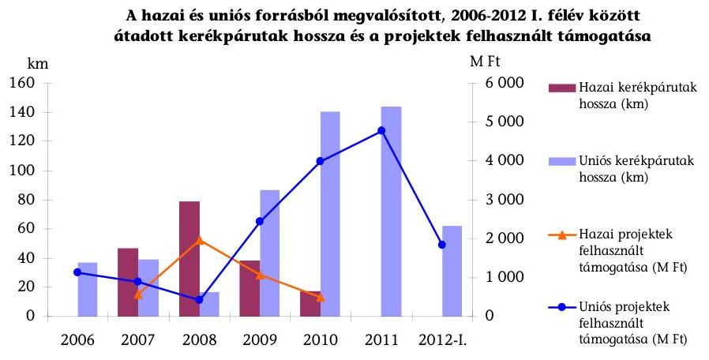

Forrás: NFÜ és KKK adatszolgáltatása
A kerékpárút-hálózat fejlesztésére fordított hazai és uniós források eltérően hasznosultak. Az építőipari árindexekkel 2011. évre korrigált fajlagos beruházási költség hazai forrásokból megvalósított kerékpárutak esetében 30,9 M Ft/km, az uniós (NFT I., ÚMFT/ÚSZT) forrásokból épített kerékpárutak esetében 34,8 M Ft/km volt. A nyilvántartásokban az adatokat kerékpárút típusonként (önálló, burkolati jellel jelölt, vagy nem önálló kialakítású kerékpárút) nem különítették el, ami nem tette lehetővé részletes költséghatékonysági számítások elvégzését. A teljes építési költségek átlagát a különböző kerékpárút típusok összetételének aránya, eltérő műszaki tartalma

---

befolyásolta. Az uniós forrásból megvalósított kerékpárutak teljes építési költségének emelkedéséhez hozzájárult a tervezéssel szemben támasztott műszaki követelmények 2009-től érvényesülő szigorítása. A projektek átlagos támogatása hazai források esetében 77,6%-os, uniós források esetében 87,0%-os volt. Ez lehetővé tette, hogy a pályázók a rendelkezésre álló saját forrásukból uniós támogatás esetében egy magasabb műszaki színvonalat valósítsanak meg.

A kerékpáros infrastruktúra-fejlesztési célok megvalósítását nem támogatta teljes körű, egységes informatikai rendszer. A kerékpárutak teljes körű, egységes számbavételére az ellenőrzött időszakban nem volt hatályos jogi előírás. A közutakról szóló 1988. évi I. törvény 2012. augusztus 7-től írta elő a kerékpárutakkal összefüggő műszaki adatok nyilvántartását. A nyilvántartás adattartalmáról végrehajtási rendelet a helyszíni ellenőrzés befejezésének időpontjáig nem jelent meg. A KKK azonban már 2009-ben megkezdte a kerékpárutak térinformatikai rendszerű központi nyilvántartását (KeNyi). Ennek vezetését jogszabály nem írta elő, adattartalmát a KKK határozta meg. A nyilvántartás adattartalma felhasználhatóságának, szükségességének vizsgálatát nem végezték el. A KeNyi nem tartalmazott a kerékpár infrastruktúrafejlesztések céljainak értékelésére alkalmas mérőszámokat. A nyilvántartás korlátozottan tette lehetővé a megvalósult fejlesztések környezetre, közlekedésre, turizmusra gyakorolt hatásának értékelését. A meglévő kerékpárutak becsült hossza 3000-3500 km, melynek 30-35%-át mérte fel a KKK 2010-ig.

Az uniós projektekhez kialakított EMIR rögzítette a megvalósult kerékpárutak hosszát, azonban a projektek kerékpáros közlekedésre gyakorolt hatására vonatkozó adatokat nem teljes körűen tartalmazott. Az akciótervekben célértékként szereplő kerékpáros forgalom változására, a kerékpáros balesetek számának alakulására vonatkozó adatok nyilvántartásban való rögzítése nem teljes körűen került előírásra, vagy azok teljesítését a közreműködő szervezetek nem minden esetben követelték meg.

Projektszintű ellenőrzést két község, két város, egy megyei jogú város önkormányzatainál, egy vízügyi igazgatóságnál és kettő többcélú kistérségi társulásnál végeztünk. Az
 ellenőrzött projektek összességében eredményesen járultak hozzá az OGY által meghatározott kerékpáros közlekedési és turisztikai célok eléréséhez. Az országos stratégiai célok és irányelvek feladatlebontása nem valósult meg, így kevés információ állt rendelkezésre a települési önkormányzatok részére a helyi közlekedésfejlesztési intézkedések kidolgozásához és térségi (kistérségi) összehangolásához. A megvalósított kerékpáros projektekkel elérni szándékolt és a ténylegesen elért célok összhangban voltak. A támogatási szerződésekben kitűzött műszaki célértékek teljesültek. A tervezettel egyezően valósultak meg a kerékpárút hosszak (összesen $86,8 \mathrm{~km}$ ), az útpálya szélességek, az útszerkezetek, az útvonalak nyomvonalai. A kerékpárút fejlesztések összességében eredményesen szolgálták a települési önkormányzatok helyi, a kistérségi társulások helyi és kistérségi kerékpárutak közlekedésfejlesztési célkitűzéseit.

A helyszíni ellenőrzésre kiválasztott kilenc projekt esetében az uniós kerékpáros közlekedésfejlesztési pályázati konstrukciók (NFT ROP 1.1, DAOP 3.1.2) átláthatóak voltak a kedvezményezettek számára. Az ellenőrzött kedvezményezettek már a pályázati konstrukciók meghirdetését megelőzően tervezték

---

turisztikai és hivatásforgalmi célú kerékpárutak megépítését. A helyi és térségi döntések a környezetileg fenntartható helyi, térségi és központi közlekedési módok ösztönzésére, az alternatív városi közlekedési infrastruktúra kialakítására vonatkoztak. Ezek a helyi célok és a pályázatokat megelőzően elkészített megvalósíthatósági tanulmányok illeszkedtek az uniós pályázati konstrukciókban foglalt feltételrendszerekhez.

A kerékpáros fejlesztések hozzájárultak hét település belterületén a környezetileg fenntartható közlekedési módok és az alternatív városi közlekedés infrastruktúrájának kialakításához. A Tisza-tó bal és jobb partján, Mártélyon a Tisza, valamint Szentendrén a Duna árvízvédelmi töltésen megépült aszfaltburkolatú kerékpárutak javították az árvízvédelmi létesítmények műszaki színvonalát.

Az ellenőrzött kerékpáros fejlesztések közül Paszab, a Hódmezővásárhelyi TKT, valamint a KÖTIVIZIG hatékonyan használta fel a rendelkezésre álló forrásokat, mert az egy kilométerre jutó költségek az uniós (külterületi) átlagnál ( $30,2 \mathrm{M} \mathrm{Ft} / \mathrm{km}$ ) alacsonyabbak voltak, valamint a tisztított építési költségek nem érték el az ÚSZT által meghatározott mértéket. Tiszavasvári, a Csongrádi KTT, Szeged, Halászi és Szentendre beruházásai esetében a rendelkezésre álló források felhasználása részben volt hatékony, mert az egy kilométerre jutó költségek meghaladták a hasonló típusú kerékpárutak uniós átlagát. Az átlagosnál magasabb költségszintet többnyire a közműkiváltások és a műtárgyépítések okozták.

A másik költséghatékonysági kritériumként meghatározott tisztított fajlagos költség egy beruházásnál sem haladta meg a 2011. évi ÚSZT pályázati felhívásban meghatározott $36,5 \mathrm{M} \mathrm{Ft} / \mathrm{km}$-t. Az ellenőrzött projektek teljes építési költségeinek fajlagos adatait, ezen belül a tisztított építési költségek fajlagos költségeit a következő ábra szemlélteti:
2. sz. ábra
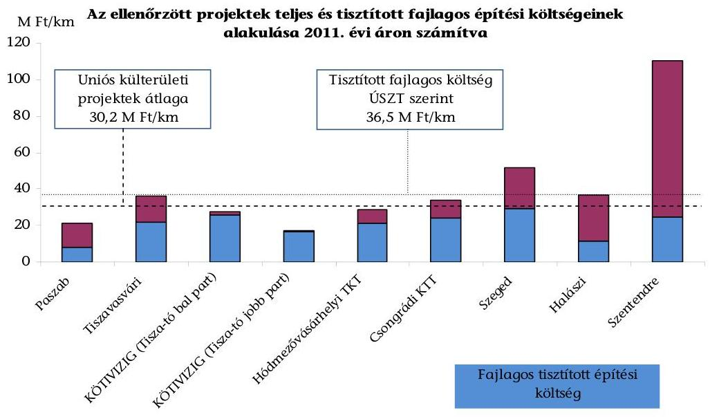

Forrás: az ellenőrzött szervezetek adatszolgáltatása

---

Az uniós projektek teljes építési költségeinek fajlagos átlagát meghaladó projektnél (Tiszavasvári, Csongrádi KTT, Szeged, Halászi, Szentendre) az elszámolt közvetett és egyéb költségek aránya magas volt. Ennek ellenére a támogatható mértékként meghatározott $36,5 \mathrm{M} \mathrm{Ft} / \mathrm{km}$-es tisztított költséghatáron belül valósult meg hat beruházás (Paszab, Tiszavasvári, KÖTIVIZIG két fejlesztése, Hódmezővásárhelyi TKT, Csongrádi KTT) teljes építési költsége. Mivel az ÚSZT pályázat keretében a közvetett költségeknél a közreműködő szervezet tételes, piaci árak szerinti felülvizsgálatot végez, magas annak a kockázata, hogy a pályázók a közvetett költségeik egy részét a támogatható mértékként meghatározott tisztított költségeken belül számolják el, ami kedvezőtlenül hat a támogatások felhasználásának hatékonyságára.

Az ellenőrzött szervezeteknél a megépült kerékpárutak kihasználtságára vonatkozóan előírt mutatószámok teljesültek, a kedvezményezettek azonban mint közútkezelők - a létesítmények üzemeltetésére, fenntartására fordított kiadások nyilvántartását - a KÖTIVIZIG kivételével - a közutakról szóló 1988. évi I. törvény 34. § (3) bekezdésének előírása ellenére nem valósították meg. A megépített kerékpárutak fenntarthatóságát a beruházás kedvezményezettjei nem értékelték, a fenntartáshoz szükséges pénzügyi forrásokról sem voltak pontos adataik.

A kerékpárút fejlesztések kedvező társadalmi hatásai csak közvetett módon és hosszú távon jelentkeznek (egészségügy, életminőség javulás stb.). Az Állami Számvevőszék által végzett lakossági kérdőíves megkérdezés értékelése alapján a választ adók a kerékpárút építések közlekedésbiztonsági és környezeti hatásait kedvezőnek ítélték. A kerékpárutak karbantartásával, fenntartásával a kerékpározók kevésbé voltak elégedettek.

Az Állami Számvevőszékről szóló 2011. évi LXVI. törvény 33. § (1) bekezdésében foglaltak értelmében a jelentésben foglalt megállapításokhoz kapcsolódó intézkedési tervet köteles az ellenőrzött szervezet vezetője összeállítani és azt a jelentés kézhezvételétől számított harminc napon belül az ÁSZ részére megküldeni. Amennyiben az intézkedési tervet határidőben nem küldi meg a szervezet, vagy az továbbra sem elfogadható, az ÁSZ elnöke a hivatkozott törvény 33. § (3) bekezdés a)-b) pontjaiban foglaltakat érvényesítheti.

Az ellenőrzés intézkedést igénylő megállapításai és javaslatai:

# a nemzeti fejlesztési miniszternek: 

1. A kerékpáros infrastruktúra-fejlesztés megvalósítására nem készült feladatterv, az infrastruktúra-fejlesztéseket támogató hazai és uniós pályázatokat nem hangolták össze. A sokrétű országos célkitűzéseknek megfelelően a támogatások is többféle területre vonatkoztak. A fejlesztések előmozdították a hivatásforgalmi és a turisztikai célú kerékpáros közlekedést, ösztönöztek a környezetileg fenntartható közlekedési módok elterjesztésére, de nem biztosították a hálózatszerű megvalósítást, a törzshálózat kialakítását. A különböző pályázati célokat nem egységes fejlesztési elképzelés mentén alakították ki.

Javaslat:

---

Kezdeményezze a komplex és integrált, mérhető célokat tartalmazó kerékpáros közlekedési fejlesztési koncepció kidolgozását, és intézkedjen a rendelkezésre álló források kitűzött célok érdekében történő felhasználásáról.
2. A kerékpárutak teljes körű, egységes számbavételére az ellenőrzött időszakban nem volt hatályos jogi előírás. A térinformatikai rendszerű KeNyi kialakítása is jogi előírás nélkül történt, és nem tartalmazott a kerékpár infrastruktúra-fejlesztések céljainak értékelésére alkalmas mérőszámokat. A nyilvántartás korlátozottan tette lehetővé a megvalósult fejlesztések környezetre, közlekedésre, turizmusra gyakorolt hatásának értékelését.

Javaslat:
Intézkedjen annak érdekében, hogy a kerékpárutak adatainak nyilvántartása terjedjen ki a kerékpáros infrastruktúra-fejlesztések céljainak értékelésére alkalmas mérőszámokra és vizsgáltassa ki a KKK által jogszabályi előírás nélkül bevezetett KeNyi alkalmazásának indokoltságát.

# Halászi község, Paszab község, Tiszavasvári város, Szentendre város és Szeged MJV polgármesterének, a Hódmezővásárhelyi TKT és a Csongrádi KTT elnökének, a KÖTIVIZIG igazgatójának: 

1. A támogatás kedvezményezettjei - mint kerékpárút kezelők - a megvalósított kerékpáros közlekedésfejlesztési projektek üzemeltetéssel és fenntartással kapcsolatos kiadásait - a KÖTIVIZIG kivételével - a közutakról szóló 1988. évi I. törvény 34. § (3) bekezdésének előírása ellenére elkülönítetten nem mutatták ki. A beruházás kedvezményezettjei a megépített kerékpárutak fenntarthatóságát nem értékelték, nem rendelkeztek adatokkal a fenntartáshoz szükséges pénzügyi erőforrásokról.

Javaslat:
Intézkedjen a kezelésükben lévő kerékpárutak esetében a közutakról szóló 1988. évi I. törvény 34. § (3) bekezdése szerinti nyilvántartásáról. Mérje fel a megvalósított kerékpárút infrastruktúra fenntartásához szükséges erőforrásokat, és tegyen intézkedéseket a kerékpárutak hosszú távú fenntarthatósága érdekében.

---

# II. RÉSZLETES MEGÁLLAPÍTÁSOK 

## 1. A kerékpáros infrastruktúra fejlesztéspolitikai célkitűzéseinek megvalósításához kialakított központi szabályozás

A kerékpáros infrastruktúra-fejlesztésekre vonatkozó központi célokat 2004-től az OGY által elfogadott stratégiai szintű, átfogó fejlesztési koncepciók és programok ${ }^{2}$ határozták meg. Az EU tagállamainak közös közlekedéspolitikájával összhangban kialakított célkitűzések általános keretjelleggel fogalmazták meg az egészség megőrzése, a környezet védelme, a hivatásforgalmi és a turisztikai célú közlekedés, valamint a szabadidősport támogatása érdekében megvalósítandó kerékpáros infrastruktúra-fejlesztések indokoltságát. A hazai koncepciók és programok a szükséges beavatkozások között jelölték meg a különféle közlekedési módok közötti átjárhatóság erősítését, a biztonságos kerékpáros közlekedés feltételeinek megteremtését, a sport és turisztikai szolgáltatások bővítését, valamint a regionális szintű kerékpárút fejlesztések megvalósítását. Az EU közlekedéspolitikájában, valamint az OGY határozataiban foglalt kerékpáros infrastruktúra-fejlesztésekre vonatkozó központi célokat a kerékpáros infrastruktúra-fejlesztésekhez kapcsolódó központi célkitűzéseket tartalmazó 1. számú függelék foglalja össze.

### 1.1. A kerékpáros infrastruktúra-fejlesztésekhez kapcsolódó központi célkitűzések végrehajtásához szükséges feladatok meghatározása

A hazai kerékpáros infrastruktúra-fejlesztésre nem készült részletes feladatterv. A központi célok végrehajtásra alkalmas kormányzati szintű lebontása 2011-ben történt meg. A kerékpáros fejlesztésekre vonatkozóan regionális, illetve országos tanulmányok, felmérések és programok készültek, amelyek tartalmaztak egymásra való hivatkozásokat, összességében azonban nem alapozták meg a fejlesztések rendszerszemléletben történő, integrált megvalósítását. Az ellenőrzött időszakban hasznosítható szakmai dokumentumok felsorolását a kerékpáros infrastruktúra-fejlesztéssel kapcsolatban készült szakmai háttérdokumentumokról készült 1. számú melléklet tartalmazza.

Az ellenőrzött időszakban a kerékpárút hálózat fejlesztések komplex megközelítését elősegítő intézkedések történtek. Ezek a rendelkezések az országos kerékpárút törzshálózat elemeinek törvényi szintű kijelölésére, ${ }^{3}$ valamint a témával

[^0]
[^0]:    ${ }^{2}$ NKP-II.; MKP; OFK; OTK; Sport XXI. Program; NKP-III.
    ${ }^{3}$ Az országos kerékpárút törzshálózat elemeit a 2003. április 28-án elfogadott OTRT 1/7. számú melléklete jelölte ki.

---

foglalkozó miniszteri biztos kinevezésére ${ }^{4}$ és az érintett minisztériumok részvételével tárcaközi bizottság ${ }^{5}$ megalakítására terjedtek ki.

A miniszteri biztos és a tárcaközi bizottság széleskörű egyeztetéseket folytattak a kerékpározáshoz kapcsolódó egyesületekkel, társadalmi és gazdasági szervezetekkel. Az egyeztetések során felmerült fejlesztési elképzelések, problémák és megoldási javaslatok feldolgozásának eredményeit a miniszteri biztos irányításával a 2007-2013 közötti időszakra készült Kerékpáros Magyarország Program foglalta össze. A turisztikai és közlekedésbiztonsági fejlesztési koncepció tárgyalását az OGY és a Kormány nem tűzte napirendre. Szakmai megalapozottsága alapján azonban a kerékpáros fejlesztésekkel foglalkozó szakemberek azt a továbbiakban is fontos háttéranyagnak tekintették.

A kerékpárút hálózat fejlesztések központi célkitűzésekkel összhangban történő megvalósítását - önálló fejlesztési terv hiányában - alapvetően a hazai és uniós forrásokból finanszírozott pályázati konstrukciók tették lehetővé. A hazai források felhasználására nem készültek akciótervek, programdokumentumok, a kerékpáros fejlesztésekkel kapcsolatos feladatok a pályázati felhívásokban és az útmutatókban jelentek meg. Az NFT I., az ÜMFT, illetve az ÚSZT operatív programjai stratégiai szinten foglalkoztak a kerékpárút hálózat fejlesztésének szükségességével, a konkrét feladatok kijelölését a kétéves akciótervek keretében meghirdetett pályázati konstrukciók tartalmazták. A vizsgált időszakban 33 olyan pályázati konstrukció jelent meg, amely kifejezetten kerékpárutak tervezését, létesítését és felújítását tette lehetővé. A meghirdetett pályázatok kiíró szervezetenként és évenként való megoszlását az alábbi táblázat foglalja össze:

1. sz. táblázat

| A 2004-2011 közötti időszakban meghirdetett kerékpáros pályázati konstrukciók száma |  |  |  |  |  |  |
| :--: | :--: | :--: | :--: | :--: | :--: | :--: |
| Év | Hazai fejezeti kezelésű előirányzatok |  | NFT I. | ÜMFT/ÚSZT |  | Összesen |
|  | Útpénztár | Új kerékpárutak és létesítmények | ROP | KözOP | ROP-ok |  |
| 2004 | - | - | 1 | - | - | 1 |
| 2006 | 2 | - | - | - | - | 2 |
| 2007 | 1 | 1 | - | - | 7 | 9 |
| 2008 | 2 | - | - | 2 | 9 | 13 |
| 2010 | - | - | - | 1 | - | 1 |
| 2011 | - | - | - | 1 | 6 | 7 |
| Összesen | 5 | 1 | 1 | 4 | 22 | 33 |

Forrás: NFÜ és KKK adatszolgáltatása

[^0]
[^0]:    ${ }^{4}$ A gazdasági és közlekedési miniszter 2005. november 15-én nevezte ki a kerékpáros fejlesztési ügyekért felelős miniszteri biztost,

 aki feladatát 2008. május 31-ig látta el.
    ${ }^{5}$ A 2005 novemberében megalakult tárcaközi bizottságba az IRM, a KVVM, a MEH, az OM és az ÖTM delegált tagokat. A tárcaközi bizottság 2010. május végéig működött.

---

Az 1. számú táblázatban feltüntetett pályázati konstrukciókon kívül az ÚMFT, illetve az ÚSZT keretében további felhívások is megjelentek, amelyek részterületként, más támogatási célhoz kapcsolódóan biztosítottak lehetőséget kerékpáros fejlesztések megvalósítására. Ezen pályázatok keretében komplex turisztikai, közlekedés-, település-, illetve gazdaságfejlesztési tevékenységhez kapcsolódóan vállalták a kedvezményezettek a kerékpáros infrastruktúra (kerékpárutak, pihenőhelyek, tárolók, szervizek, kölcsönzők stb.) kialakítását, korszerűsítését.

A kerékpáros fejlesztések önálló állami feladatként történő tervezése a 2011. évtől kezdődően valósult meg. A természetjáró és kerékpáros turizmus, úthálózat és közlekedés fejlesztési feladatok irányelveinek, valamint az erre vonatkozó koncepció kereteinek a kidolgozását a 2011. április 18-ától egy évre kinevezett miniszterelnöki megbízott felügyelte. Az előkészítési munka eredményét összefoglaló előterjesztés alapján a Kormány az 1364/2011. (XI. 8.) Korm. határozatban döntött a kiemelt állami feladatnak minősített fejlesztésekről, a prioritást élvező országos és budapesti kerékpárutakról, valamint további feladatokat határozott meg koncepció, ütemterv és megvalósíthatósági tanulmányok készítésére vonatkozóan. Az ebben foglalt előírások a természetjáró és kerékpáros turizmus, az úthálózat és közlekedés fejlesztéséhez kapcsolódóan közvetlenül kijelölték az átfogó, valamint a kiemelt feladatokat. Így a kormányhatározat meghatározta a kerékpáros fejlesztések koncepciójának és megvalósíthatósági tanulmányának elkészítésére, a szükséges források felmérésére, valamint a végrehajtás részletes ütemezésére vonatkozó feladatokat.

A KKK javaslatot tett a természetjáró és kerékpáros turizmus, úthálózat és közlekedési fejlesztési koncepciónak a 2013. április 15-ig elkészítendő NKS-ba történő beépítésére. A külső szakértők által elkészítendő stratégiához a KKK a rendelkezésre álló tanulmányok, felmérések és programok figyelembevételével valamennyi közlekedési ágazatra elvégezte a helyzetfelmérést és javaslatot tett az NKS szerkezeti felépítésére, ütemezésére, valamint időhorizontjára.

Az NKS kidolgozását a hazai közlekedési ágak stratégiai igényének meghatározására 2008-ban készült EKFS, illetve az abban foglalt - 2020-ig elérendő - stratégiai célok és beavatkozások aktualizálása tette szükségessé. A kitűzött kormányzati feladatokat és azok végrehajtásának alakulását az 1364/2011. (XI. 8.) Korm. határozatban kijelölt kerékpáros infrastruktúra-fejlesztési feladatokról szóló 2. számú melléklet foglalja össze.

# 1.2. A szabályozás szerepe a kerékpáros létesítményfejlesztések célkitűzéseinek megvalósításában, az uniós elvárások érvényesítésében 

A kerékpáros infrastruktúra-fejlesztést célzó szabályozási környezet összességében támogatta a hazai és uniós forrásokból finanszírozott fejlesztéspolitikai és területfejlesztési célok megvalósítását. A szabályozási struktúra áttekinthető volt a lebonyolításban részt vevő szervezetek és a kedvezményezettek számára, az időben megjelenő jogszabályok és egyéb szabályozó eszközök nem tartalmaztak párhuzamos, illetve egymásnak ellentmondó előírásokat. A hazai és uniós pályázati felhívások egyértelműen meghatározták a támogatások igénybevételéhez szükséges feltételeket.

A hazai forrásokból támogatott fejlesztések végrehajtására a feladatok a miniszteri rendeletekben és utasításokban, valamint a lebonyolítást végző KKK és a jogelőd ÚKIG belső eljárásrendjében jelentek meg. A miniszteri rendeletek ${ }^{6}$ a hazai forrásokból megvalósítandó fejlesztések pályáztatási, elbírálási, szerződéskötési, támogatás folyósítási és ellenőrzési folyamataira vonatkozó előírásokat tartalmazták. A fejezeti kezelésű előirányzatokkal kapcsolatos költségvetés tervezési, felhasználási, valamint pénzügyi-számviteli feladatokat miniszteri utasítások ${ }^{7}$ szabályozták. A fejezeti kezelésű előirányzatok felhasználásával, valamint a pályáztatási tevékenységgel kapcsolatos közreműködői feladatokat, felelősségi és hatásköröket az ÚKIG - illetve jogutódja a KKK - főigazgatója által jóváhagyott belső eljárásrendek tovább részletezték. A 2005-ben kiadott és a jogszabályi változásokkal összhangban aktualizált szabályzatokban ${ }^{8}$ meghatározták a pályáztatás teljes folyamatára, valamint a fejezeti kezelésű előirányzatok tervezésére, felhasználására, pénzügyi-számviteli elszámolására vonatkozó feladatokat.

Az uniós források felhasználásának, ezen belül a nemzeti fejlesztési tervek ${ }^{9}$ végrehajtási eljárásrendjének rögzítése tagállami hatáskörbe tartozott. A hazai jogszabályok ${ }^{10}$ kijelölték az uniós pályázatok és projektek kezelésért felelős intézményeket, részletesen meghatározták a források tervezésének és felhasználásának szabályait. Az operatív programok hatékony végrehajtása érdekében 2007-ben az NFÜ elnöke jóváhagyta az Egységes Működési Kézikönyvet, amely a jogszabályi előírások és az iratminták meghatározásával egységes értelmezést biztosított a kedvezményezettek és a támogatási folyamatban részt vevő szervezetek számára. A 2011. február 9-ét követően meghirdetett pályázati felhívások esetében alkalmazandó részletes eljárásrend miniszteri utasítások formájában lépett hatályba. ${ }^{11}$

A központi célkitűzések közvetlen megvalósítását alapvetően a hazai és uniós pályázati konstrukciók biztosították. A pályázati felhívások figyelembe vették a központilag meghatározott kerékpáros infrastruktúrafejlesztésekhez kapcsolódó célkitűzéseket. A célok megvalósítása érdekében három regionális fejlesztési tanács ${ }^{12}$ a nyomvonal kijelölésére vonatkozó döntést is hozott. A határozataikban foglaltak megjelentek a pályázati felhívásokban. A közzétett felhívások és útmutatók a jogszabályi előírásokkal összhangban részletesen tartalmazták a támogatás igénylésének pályázati feltételeit, valamint a szükséges formai és tartalmi követelményeket. A pályázati szabályozásokban egyértelműen meghatározták a pályázók körét, a támogatható célokat, a támogatási intenzitást, az elbírálás szempontjait, valamint a támogatás szabályszerű felhasználásának feltételeit. Az uniós támogatások esetében a pályázati útmutatók, illetve azok mellékletei 2008-tól további részletes előírásokat tartalmaztak a projektekkel szemben támasztott speciális követelményekre vonatkozóan.

A projektek tartalmát érintő speciális előírásokat a KözOP esetében külön mellékletek, a ROP konstrukcióknál a pályázati útmutatók tartalmazták. A speciális előírások részletesen meghatározták a projekt indokoltságának bemutatására, a választott műszaki megoldás alátámasztására, a kerékpárutak forgalomtechnikai, geometriai és műszaki tervezésére, valamint a fajlagos költségek meghatározására vonatkozó eljárásokat és követelményeket.

# 2. A kerékpáros fejlesztések pályázati rendszere és forrásszerkezete 

### 2.1. A pályázati rendszer fejlesztési céloknak megfelelő kialakítása

A hazai és uniós forrásokra épülő pályázati rendszerek előmozdították a központi programokban és az ágazati koncepciókban megfogalmazott fejlesztési célkitűzések megvalósítását. A pályázati konstrukciók valamennyi esetben több központi kerékpáros infrastruktúra-fejlesztési célkitűzéshez illeszkedtek. A legtöbb figyelem a környezetvédelmi, közlekedésbiztonsági és hivatásforgalmi fejlesztésekre irányult, a turisztikai és egészség-megőrzési szempontok a pályázatok közel felénél (40%) megjelentek. A szabadidősporttal kapcsolatos célkitűzéseket az NFT I., a KözOP és a DAOP 2007. évi pályázati felhívásaiban vették figyelembe. Az ellenőrzött pályázati konstrukciókban a támogatható célokra, a támogatás mértékére, valamint a fenntartási kötelezettségre vonatkozó feltételek eltérőek voltak. A kerékpáros infrastruktúra-fejlesztéseket támogató hazai és uniós pályázati rendszereket nem hangolták össze, a pályázati kiírások nem tették lehetővé a rendelkezésre álló pénzügyi erőforrások koncentrált felhasználását. Az ellenőrzött pályázati konstrukciók és a kerékpáros fejlesztésekre megfogalmazott országos célkitűzések illeszkedését a 3. számú melléklet mutatja be.

Hazai forrásból származó támogatásra 2006 és 2008 között lehetett pályázni kerékpáros infrastruktúra-fejlesztésre. Az Útpénztár, illetve az Új kerékpárutak és létesítmények fejezeti kezelésű előirányzatokból hat pályázati fordulót hirdettek meg.

[^0]
[^0]:    ${ }^{12}$ ÉMRFT, DARFT és a KMRFT

---

A pályázati konstrukciók közül öt forduló az Útpénztárhoz kapcsolódott, az Új kerékpárutak és létesítmények előirányzatból egy pályázati kiírás jelent meg 2007-ben.

A hazai pályázatok feltételrendszerének kidolgozása során figyelembe vették a közútkezelők javaslatait, a nemzetközi és az országos közútfejlesztési koncepciókat, a regionális és helyi fejlesztési igényeket, valamint az EU-s támogatási programokat. A meghirdetett pályázati konstrukciók az EuroVelo nemzetközi kerékpárút magyarországi nyomvonalán hiányzó szakaszok, továbbá közlekedésbiztonsági célú önálló kerékpárutak tervezését, engedélyeztetését és kiépítését támogatták. A 2008-ban közzétett két pályázati fordulóban turisztikai kerékpáros létesítményekre, valamint tíz évnél régebben épült kerékpárutak szélesítésére és burkolat-megerősítésére vonatkozó tervezési és engedélyeztetési tevékenységgel bővült a támogatható célok köre. A támogatási intenzitás alapvetően 50% volt, az építési pályázatoknál azonban elérhette a 100%-ot, amennyiben a kedvezményezett vállalta, hogy a projekttel tehermentesíteni kívánt országos főút belterületi szakaszán saját erőből megvalósítja az átmenő kerékpárutat. A fenntartásra vonatkozóan a pályázati konstrukciók nem tartalmaztak előírásokat, a létesítmények tíz évre szóló fenntartási kötelezettségét a támogatási szerződésekben írták elő. A kérdőívvel megkeresett hazai pályázók részére az igényelt támogatás 69,4%-át ítélték meg. A tervezett összköltséghez viszonyítva az átlagos támogatási arány 65,5% volt.

A kerékpáros létesítmények megvalósításához 2004-től nyílt lehetőség uniós források felhasználására. A pályázati konstrukciók 2004-2006 között az NFT I., a 2007-2013 közötti időszakra vonatkozóan az ÜMFT, illetve ÚSZT operatív programjaihoz kapcsolódóan jelentek meg. Az uniós projektek kérdőívvel megkérdezett pályázói az igényelt támogatás 95,1%-át kapták meg, mely a megvalósított projekt összköltségének 87,7%-át fedezte.

Az NFT I. 1/2004/ROP1.1 pályázati konstrukciójának három komponense biztosított lehetőséget kerékpáros fejlesztések megvalósítására. A nemzeti parkokban és más védett természeti területeken a közlekedéshez és a sportoláshoz szükséges útvonalakon nyílt lehetőség kerékpárutak kiépítésére, felújítására. A jelentős idegenforgalmi potenciállal rendelkező világörökségi helyszínek és történelmi városközpontok fejlesztési lehetőségei között szerepelt a kerékpáros forgalmat engedélyező övezetek kialakítása. Az aktív turizmushoz kapcsolódó fejlesztések fő célja a kerékpáros turizmusban rejlő lehetőségek kiaknázása, valamint az új keresleti trendeknek megfelelő infrastruktúra kialakítása volt.

A pályázati feltételek az aktív turizmusra vonatkozó komponens keretében a Balaton körül, a Duna fővároson kívüli szakaszán, a Dráva és a Tisza mentén, a Szigetközben, valamint a Tisza-, a Fertő- és a Velencei tó körüli térségekben megvalósítandó beruházásokat támogatták. A támogatási intenzitás az első két komponens esetében 97,5%, az aktív turizmushoz kapcsolódó infrastrukturális fejlesztéseknél 95% volt. A létesítmények fenntartási kötelezettségét öt évben határozták meg.

A négy KözOP pályázati konstrukció az 1, 2 és 3 számjegyű közutak mentén hivatásforgalmi és közlekedésbiztonsági céloknak megfelelő kerékpáros létesítmények megvalósítását támogatta. A pályázatok a kerékpárutak, kerékpáros

---

létesítmények kiépítését, a kerékpáros közlekedési infrastruktúra-fejlesztését, a nemzetközi és az országos kerékpárút hálózatokhoz való csatlakozást tűzték ki célként. A részcélok között jelent meg a meglévő belterületeket, településeket, üdülő és rekreációs területeket összekötő, illetve feltáró kerékpárutak bővítése, hálózati jellegének fokozása.

Egyedi döntés alapján, legfeljebb 250 m hosszúságban volt támogatható a külterületi kerékpárutak és a meglévő belterületi szakaszok, illetve más biztonságos továbbhaladást megteremtő létesítmények összekapcsolása. Az ÚSZT keretében 2011-ben kiírt pályázati konstrukció a korábbi célok mellett lehetőséget nyújtott a helyközi, hivatásforgalmi kerékpáros létesítmények előkészítésére, tervezésére, engedélyeztetésére. A támogatási intenzitás az ÚMFT pályázatokban 85-90% közé esett, a 2011-ben meghirdetett ÚSZT konstrukcióban 100% volt.
 A fenntartási kötelezettségre valamennyi pályázat öt évet írt elő.

Az ÚMFT/ÚSZT keretében meghirdetett ROP-ok összesen 22 kerékpáros infrastruktúra-fejlesztésre vonatkozó pályázati konstrukciót tartalmaztak;

- A 2007. évben meghirdetett hét pályázat alapvetően a biztonságos és környezetkímélő hivatásforgalmi kerékpáros létesítmények megvalósítását támogatta, a felhívások ugyanakkor régiónként eltérő részcélokat is tartalmaztak. A DAOP és a KMOP támogatható céljai között szerepelt a rekreációs területeket összekötő, illetve feltáró, valamint a turisztikai célú kerékpárutak kialakítása. A DAOP a választható tevékenységek körébe sorolta továbbá az olyan kerékpárutak építését, amelyek által igazolhatóan bővült a sportolási lehetőségek, valamint a sport, turisztikai, üdülési és idegenforgalmi szempontból kiemelt területek látnivalóinak száma. Az igényelhető támogatás mértékét a pályázati felhívások eltérően szabályozták, a támogatási intenzitás 75-90% közé esett. A létesítmények fenntartási kötelezettsége egységesen öt év volt;
- A 2008. évi kilenc ROP pályázatot egységes felhívással és útmutatóval hirdette meg az NFÜ. A konstrukciók a helyi és helyközi hivatásforgalmi, közlekedési célú kerékpárforgalmi létesítmények építését, a régió kerékpáros közlekedési infrastruktúrájának kialakítását, bővítését, továbbá a már meglévő szakaszok környezetileg fenntartható módon történő hálózatba szervezését támogatták. A pályázati felhívások távlati célként tűzték ki a kerékpározás mint környezetbarát közlekedési mód terjedésének ösztönzését, a hivatásforgalmi kerékpáros közlekedés forgalmának növelését. A támogatást 1, 2 és 3 számjegyű főutak belterületi átkelési, 4 és 5 számjegyű utak kül- és belterületi átkelési szakaszai mentén, valamint egyéb nyilvántartási vagy helyrajzi számmal azonosított belső, helyi közutak mentén tervezett kerékpárút megépítéséhez igényelhették a pályázók. A támogatási intenzitás régiónként eltérően 80-95% között volt, a fenntartási kötelezettségre ugyanakkor valamennyi pályázati felhívás tíz évet írt elő;
- Az ÚSZT keretében 2011-ben közösen meghirdetett hat regionális pályázat a komplex projektek támogatását részesítette előnyben. A fő támogatási cél olyan kerékpárutak megvalósítása volt, amelyek eredményeként egy teljes település vagy egy szerves, funkcionális egységnek tekinthető településrész, illetve kettő vagy több település közötti távolság válik biztonságosan, kényelmesen, közvetlenül elérhetővé. A pályázati felhívások kerékpárforgalmi létesítmények megépítését, meglévő kerékpárforgalmi létesítmények korszerűsítését, közlekedési csomópontok átalakítását, kerékpártámaszok, kerékpárparkolók, B+R kerékpártárolók és pihenőhelyek, valamint forgalomtechnikai és forgalombiztonsági berendezések kialakítását tették lehetővé. A támogatás igénylésére vonatkozó feltételek megegyeztek a korábbi pályázatokban foglalt követelményekkel. A támogatási intenzitás 85-90% közé esett, a fenntartási kötelezettség öt év volt.

Az országos kerékpárút törzshálózat kiépítését a pályázati konstrukciók a meghirdetett célok között a feltételrendszer egyik elemeként kezelték. A benyújtott pályázatok értékelésénél figyelembe vették a kül- és belterületi utak egymáshoz, illetve a meglévő hálózathoz kapcsolódását, ugyanakkor ez nem minősült kiemelt szempontnak a kedvezményezettek körének, a műszaki tartalomnak és a támogatás intenzitásának meghatározásakor.

A pályázatok mindegyikénél meghatározták a kedvezményezettek körét, az önállóan és nem önállóan támogatható tevékenységeket, megjelölték az elszámolható és nem elszámolható költségek körét, előírták az egyéb források biztosításának feltételeit. A konzorciumokra és a kötelező műszaki tartalomra vonatkozó előírások 2007-től kezdődően az ÜMFT, illetve ÚSZT pályázati konstrukciókban jelentek meg.

A hazai pályázati feltételek eredmény- és hatásindikátorként a megépítendő utak hosszát jelölték meg, más monitoring mutatót nem tartalmaztak. Az uniós pályázatok közül az NFT I. nem határozott meg indikátorokat, a KözOP és a ROP konstrukciók a megépítendő kerékpárút hosszát, az átlagos napi forgalmat és a kerékpáros forgalom növekedését jelölték meg monitoring mutatóként.

# 2.2. A célkitűzések megvalósítását szolgáló források és felhasználásuk 

A kerékpárút hálózat fejlesztéséhez felhasználható támogatásokat szerteágazó forrásszerkezet jellemezte. Az ellenőrzött időszakban a kerékpáros fejlesztésekre irányuló 33 hazai és uniós pályázati konstrukcióban összesen 46335 M Ft forrás állt rendelkezésre, amelynek jogcímenkénti megoszlását az alábbi ábra mutatja be:

---

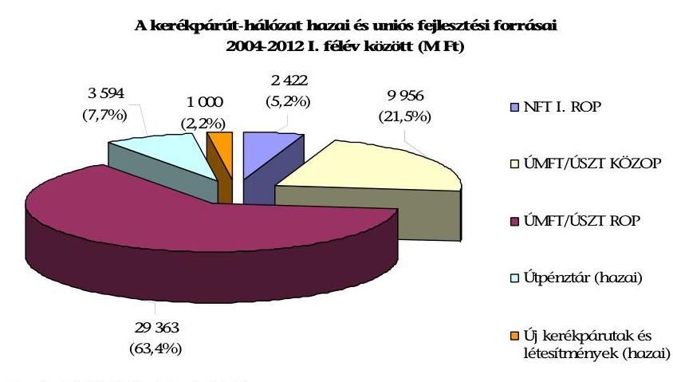

Forrás: NFÜ és KKK adatszolgáltatása

A hazai előirányzatok, a NFT I., valamint a KözOP forrásait teljes egészében megítélték a kedvezményezettek számára. Az ÚMFT, illetve ÚSZT keretében meghirdetett ROP konstrukciók pénzügyi kerete 2012. június 30-án 4606 M Ft felhasználható támogatási kerettel rendelkezett.

A hazai forrásokból megvalósított kerékpárút-fejlesztések pénzügyi kereteit a közlekedésért felelős minisztérium fejezeti kezelésű előirányzatai között tervezték meg. A fejlesztések évenkénti összegét a költségvetési törvények, ezen belül az Útpénztár, valamint az Új kerékpárutak és létesítmények fejezeti kezelésű előirányzatok tartalmazták. Az előirányzatok szakmai kiadási struktúra szerint történő felhasználása, ezen belül a kerékpáros fejlesztések megvalósítása az ÚKIG, illetve jogutódja a KKK által kidolgozott költségvetési javaslat alapján történt. Az ellenőrzött időszakban 4594 M Ft hazai forrás állt rendelkezésre, amely nem nyújtott fedezetet a felmerült pályázói igényekre. A 318 pályázó által benyújtott 16245 M Ft támogatási igény több mint három és félszeresen meghaladta a 2006-2008 közötti időszakban rendelkezésre álló forrásokat. A két hazai fejezeti kezelésű előirányzat teljes összegét 2012. június 30-ig szerződéssel lekötötték és kifizették a 155 kedvezményezett számára.

Az uniós forrásszerkezet az NFT I., az ÚMFT, illetve az ÚSZT operatív programjaiban részletezett prioritási tengelyek pénzügyi kereteiből tevődött össze, amelyeket az EU Bizottsága hagyott jóvá. A kerékpáros infrastruktúrafejlesztésekre fordítható uniós forrásokat 2004 és 2006 között az NFT I. ROP, 2007-2013 között az ÚMFT, illetve az ÚSZT KözOP és ROP kétéves akciótervei rögzítették. Az akciótervek tartalmazták a konkrét kerékpáros konstrukciókat, amelyekhez kijelölték a célokat és hozzárendelték a megvalósítás fedezetéül szolgáló forrásokat. A pályázati keretek összegét a regionális fejlesztési ügynökségek és a konstrukciókat előkészítő munkacsoportok javaslata alapján az NFÚ érintett irányító hatóságai hagyták jóvá.

Az NFT I. Turisztikai vonzerők pályázata 19620 M Ft pénzügyi kerettel rendelkezett, amelyen belül nem volt elkülönítve a kerékpáros fejlesztések forrása. A beérkezett 33 pályázatból 11 nyertes pályázó részére 2422 M Ft támogatást ítéltek meg új kerékpárutak létesítéséhez, amelyből 2368 M Ft kifizetése történt meg. Az eltérést pénzügyi korrekciók és esetenként a tervezettnél alacsonyabb összegű kivitelezés indokolta.

A ROP támogatási keretek elegendő forrást biztosítottak a benyújtott pályázati igényekre, a KözOP esetében azonban 2009 és 2011 között a keretek kimerülése miatt négy alkalommal fel kellett függeszteni a pályáztatási tevékenységet. A meghirdetett 22 ROP felhívásra 443, négy KözOP felhívásra 69 pályázat érkezett. A ROP konstrukciókban 206 pályázat részesült kedvező elbírálásban, melyre 24757 M Ft, az 57 nyertes KözOP pályázatra 9956 M Ft támogatást ítéltek meg. A rendelkezésre álló forrásokból megítélt, szerződéssel lekötött, valamint kifizetett támogatásokat a következő táblázat mutatja be:
2. sz. táblázat

| Az operatív programok támogatási keretének felhasználása (M Ft) |  |  |  |  |  |
| :--: | :--: | :--: | :--: | :--: | :--: |
| Operatív   program | Támogatási   keret | Megítélt   támogatás | Szerződéssel   lekötött   támogatás | 2012.06.30-   ig kifizetett   támogatás | Maradvány   (keret - megítélt   támogatás) |
| KözOP | 9956 | 9956 | 7669 | 1765 | 0 |
| ROP-ok | 29363 | 24757 | 20948 | 14737 | 4606 |
| Összesen | 39319 | 34713 | 28617 | 16502 | 4606 |

Forrás: NFÜ adatszolgáltatása
Kerékpáros tevékenységet érintő fejlesztésekre közvetett módon lehetőséget nyújtottak további KözOP, ROP, valamint KEOP és TÁMOP pályázati felhívások. Ezeknél a konstrukcióknál azonban a turisztikai, közlekedés-, település- és gazdaságfejlesztési célkitűzések jellegéből adódóan a támogatások kerékpáros létesítmények megvalósítására eső része nem volt elkülönítetten kimutatható. Az NFÜ adatszolgáltatása alapján az egyéb fő célkitűzéshez kapcsolódóan 2007. év és 2012. év I. félév között támogatott kerékpáros fejlesztések becsült költsége 10,5 Mrd Ft volt.

A kerékpárutak fejlesztéséhez az uniós források keretében a Strukturális Alapok mellett az ETE pénzeszközeit is igénybe vették. Az ETE pályázati konstrukciók 6,5 Mrd Ft összeggel támogatták határon átnyúló kerékpárutak létesítését.

# 2.3. A kerékpárút-hálózat fejlesztésére fordított kiadások hasznosulása 

A kerékpárút fejlesztések költséghatékonyságának számítását valamennyi kerékpárút típusra összevont adatok alapján, az építőipari árindexekkel történő korrigálással végeztük. A létrehozott kerékpárutak hosszáról és megvalósítási költségéről kerékpárút típus szerinti (önálló, burkolati jellel jelölt, vagy nem önálló kialakítású) teljes körű nyilvántartás nem készült.

A pénzügyi erőforrások hasznosulását központi szinten a ténylegesen megvalósult kerékpárforgalmi létesítmények 1 km-ére jutó összes elszámolt költsége alapján értékeltük. A különböző típusú beruházások közül a külterületeken megvalósultakat külön bemutattuk.

---

Az összevont adatokból számított, az 1 km megépített kerékpárút megvalósítási költségét az eltérő feltételeket tartalmazó programozási időszakonként mutatjuk be. A mutatókat az NFÜ és a KKK adatszolgáltatása alapján a projektek megvalósításához elszámolható kiadások és a megépült kerékpárút szakaszok hosszának hányadosaként számítottuk. A projektek általános forgalmi adót is tartalmazó elszámolható költségét az évenkénti építőipari árindex alapján 2011-es szintre korrigáltuk. Megbízható analitikus nyilvántartás hiányában a projektek típusából és műszaki sajátosságaiból adódó különbségeket nem vettük figyelembe. A különböző típusú kerékpárutak közül az egyedi sajátosságoktól legkevésbé befolyásolt külterületi szakaszok megvalósítási költségeit mutatjuk be összehasonlítási alapként.

Az 1 km megépített kerékpárutak megvalósítási költségeit az alábbi ábra mutatja be:
4. sz. ábra

A 2004 és 2012 I. félév között megépült kerékpárutak 2011. évi áron számított fajlagos elszámolt költsége
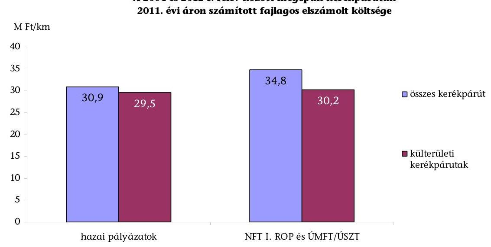

Forrás: NFÜ és KKK adatszolgáltatása
A két pályázati forrásból megépült kerékpárutak teljes hosszára jutó fajlagos költségek között nem volt jelentős nagyságrendű eltérés. Az összes kerékpárút esetében a különbségeket alapvetően a pályázati konstrukciók eltérő támogatási intenzitása idézte elő. A hazai források átlagos támogatásának mértéke 77,6%, az uniós forrásokból megépített létesítményeknél pedig 87,0% volt. További eltéréseket okozott a kül- és belterületi, illetve vegyes szakaszok eltérő aránya. A belterületi szakaszokon a közműkiváltás és a forgalmi csomópontok építése, a területvásárlások jelentősen megdrágították a kivitelezést. Az egyedi terepviszonyokon kívül a költségek további növekedését eredményezte a pályázatokkal szemben támasztott műszaki követelmények 2009-től érvényesülő szigorodása (pl. változtak a pályaszélességre vonatkozó és a keresztmetszeti szerkezeti előírások). Mindezek a változások költségnövelő hatással voltak a 2010-ben és 2011-ben megvalósított kerékpárút építésekre.

A hazai támogatások esetében célértéket nem tűztek ki, így a források felhasználásának eredményessége nem állapítható meg.

---

Az uniós források felhasználása részben volt eredményes. Maradéktalanul teljesült az átlagos napi forgalom mutatója, a kerékpárforgalom változására meghatározott célértékek és az 1364/2011. (XI. 8.) Korm. határozat előírásai részben teljesültek. A kerékpárút fejlesztési indikátorokat a ROP és KözOP kétéves akciótervei 2010 és 2012. év végi céldátummal rögzítették. A ROP akciótervekben rögzített útszakasz célértéke 2012 céldátummal $828,0 \mathrm{~km}$, a KözOP esetében a célérték 120,0 km volt. Ebből 2012 I. félév végéig $^{13}$ a ROP keretében $411,6 \mathrm{~km}$ (49,6%), a KözOP esetében $22,1 \mathrm{~km}$ (18,3%) készült el. A 2012. december 31-ig ütemezett átadások figyelembevételével sem várható a kitűzött célérték teljesítése, mert a tervezett befejezési határidők alapján a ROP pályázatoknál $126,7 \mathrm{~km}$, a KözOP projekteknél pedig még összesen $93,4 \mathrm{~km}$ teljesítése lehetséges. A tervezett adatokkal együtt a célértékek a ROP esetében 65,0%-ra, a KözOP esetében pedig 96,3%-ra teljesülhetnek. Az uniós forrásokból épített kerékpárutak hosszáról az alábbi ábra tájékoztat:
5. sz. ábra
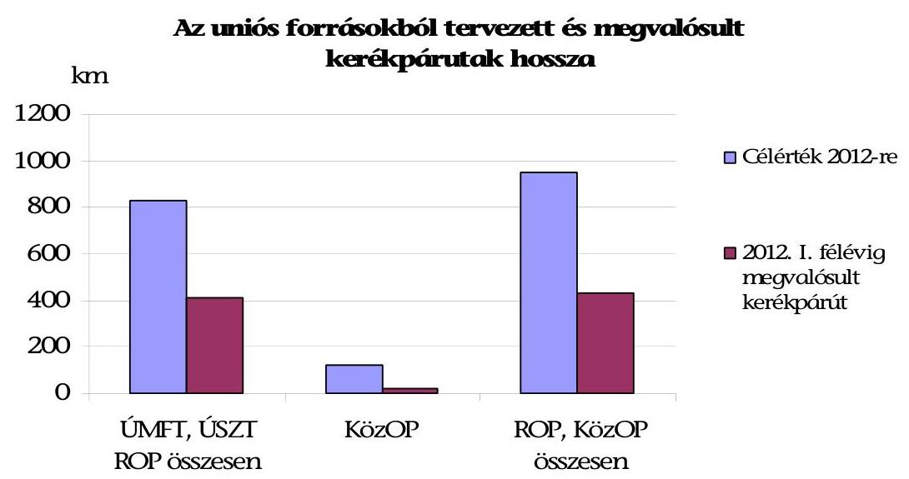

Forrás:
 NFÜ adatszolgáltatása
Az átlagos napi kerékpáros forgalom ${ }^{14}$ (kerékpáros/nap) az ellenőrzött időszakban a tervezettnél nagyobb mértékben bővült. A ROP-hoz tartozó beruházások eredményeként az országos összesített adatok szerint a kerékpáros forgalom a 2012. év végére kitűzött érték (43 ezer kerékpáros/nap) több mint háromszorosára növekedett (137 ezer kerékpáros/nap). Az adatok alapján a mutató régiónként és országos szinten is teljesült. Az ellenőrzésbe bevont kilenc projekt kerékpáros forgalmi adata becsléssel került megállapításra.

Az átlagos napi forgalomra vonatkozóan egy régió nem tűzött ki célértéket, egy régióban pedig nem gyűjtöttek ilyen jellegű adatokat. A növekedés túlnyomó része a DAOP indikátora tette ki (42 000 kerékpáros helyett 97 686 kerékpáros számban teljesült).

A kerékpáros forgalomváltozás 2012. évi célértéke a ROP területén részben teljesült. A mérőszám értéke két régióban haladta meg a tervezett értéket, három régióban pedig alatta maradt, két régió nem tervezett ütemezett mérőszámot.

A DDOP-ban meghatározott 25%, 31%-ra, a KMOP-ben meghatározott 2% pedig 42%-ra teljesült. A DAOP-ban 30%-os kerékpárforgalom növekedést terveztek a beavatkozás területén, ami 22%-ban valósult meg. Az ÉAOP 110%-os terve 98%-ra, a KDOP 2,8%-os célértéke pedig -7%-ra teljesült.

Az 1364/2011. (XI. 8.) Korm. határozat 3. pontja megvalósult, a 2. pontban megfogalmazott feladatok végrehajtása az ellenőrzés ideje alatt még folyamatban volt.

A természetjáró és kerékpáros turizmus, úthálózat és közlekedési fejlesztési koncepció (2. pont) kidolgozása a 2012. január 15-ei határidőig nem történt meg.

A kormányhatározat 3. pontjában kiemelt feladatként meghatározott „EuroVelo 6 Duna menti kerékpárút" és a Budapest-Balaton kerékpáros útvonalfejlesztések projektkoncepcióját, ütemezését a nemzeti fejlesztési miniszter és a miniszterelnöki megbízott - a KKK közreműködésével - 2012 januárjában elkészítette.

A pályázati kérdőívre választ adó hazai és uniós pályázati kedvezményezettek egyaránt a kerékpáros forgalom növekedését jelölték meg a legjellemzőbb eredményként (összes hazai forrást felhasználó összes válaszadó (22) 90,9%-a, uniós forrást felhasználó összes válaszadó (103) 94,2%-a), de a balesetek számának csökkenése is kiemelt jelentőségű (hazai forrást felhasználó összes válaszadó (22) 77,3%-a, uniós forrást felhasználó összes válaszadó (103) 69,9%-a). Egyéb hatásként említettek kevésbé számszerűsíthető tényezőket is, mint pl.: a kerékpáros turizmus növekedése, környezettudatos közlekedés és szemléletmód erősítése.

# 2.4. A kerékpáros-közlekedésfejlesztési programok mérési, értékelési rendszere 

A hazai forrásokból támogatott programok eredményeinek mérése a teljesítendő célértékek hiányában nem valósult meg. A beruházási szakaszban az egyes megépített kerékpárutak hosszát és egyéb műszaki paramétereinek megfelelőségét, minőségét a támogatást nyújtó nem ellenőrizte. ${ }^{15}$ A műszaki átadás során a kerékpárutak műszaki paramétereit az ÚKIG és a KKK által megbízott műszaki ellenőrök ellenőrizték és jegyzőkönyvben rögzítették. A fejlesztési projekteknek a kerékpáros közlekedésre gyakorolt hatása - mért forgalmi és baleseti adatok hiányában - nem volt megállapítható.

[^0]
[^0]:    ${ }^{15}$ Forrás: a KKK adatszolgáltatása.

---

A KKK álláspontja szerint a kerékpáros balesetek rendelkezésre álló adatai nem tükrözik a megvalósult kerékpárutaknak a balesetek csökkenésére gyakorolt hatását, mivel a kerékpárutakon történt személyi sérüléssel járó balesetek nem minden esetben kerülnek bejelentésre és regisztrálásra.

A befejezett projektek eredményességére vonatkozó monitoring tevékenységet az esetenkénti fenntartási ellenőrzések során végeztek. A műszaki előírások teljesítéséről, az átadás-átvétel tapasztalatairól nem készítettek összefoglaló jelentést. A fenntartási kötelezettség ellenőrzésére 2009-2010-ben 96 helyszíni ellenőrzés történt, szankcionálásra nem került sor. Az ellenőrzések 2010 tavaszától forráshiány miatt nem folytatódtak.

A hazai támogatási források nyilvántartása a tényleges forrásfelhasználás nyomon követését biztosította.

A fejezeti kezelésű előirányzatok kezelésére, működtetésére vonatkozó eljárásrendek a források kezelését a pénzügyi tervezés, felhasználás és ellenőrzés folyamatában átfogóan szabályozták. A nyilvántartási feladatokat a forrásokat kezelő szervezetek (ÚKIG, KKK) működési szabályzatai rögzítették.

Az uniós projektekhez kialakított EMIR a programok eredményeit tekintve a megvalósult kerékpárutak hosszának változását mérte. A kerékpárút fejlesztésre vonatkozó programok kerékpáros közlekedésre gyakorolt hatása (kerékpáros forgalom alakulása, közlekedésbiztonság javulása) nem volt értékelhető, mivel erre vonatkozó adatokat az EMIR nem teljes körűen tartalmazta. A kerékpáros forgalom növekedésére, illetve a kerékpáros balesetek számának csökkenésére vonatkozó mutatószámok vagy nem kerültek előírásra, vagy azok teljesítését a közreműködő szervezetek nem követelték meg. ${ }^{16}$

A rendszer tartalmazta a megépült kerékpárutak műszaki paramétereit, és rögzítésre kerültek benne a projektek befogadási kritériumainak, valamint a projekt tervek tartalmi ellenőrzésének adatai.

A monitoring rendszer az egyes projektek fizikai megvalósítását nem követte, mivel az előrehaladási jelentésekben szereplő eredmények a monitoring rendszerben nem jelentek meg. A teljesített célértékek a projektzárást követően kerültek a rendszerbe.

A fenntartási jelentések EMIR-ben rögzített adatai (műszaki állapotváltozások, megtett intézkedések, elvégzett karbantartási munkák és azok költségei) a fenntarthatósági követelmények teljesítését ellenőrizhető módon tartalmazták, és hozzájárultak a programok műszaki követelményeinek fejlesztéséhez.

Az uniós támogatási források nyilvántartása a tényleges forrásfelhasználás nyomon követését biztosította. A nyilvántartási feladatok rögzítése az EMIR-ben szabályozottan, ${ }^{17}$ az adattartalom tekintetében teljes körűen megtörtént. A támogatási források nyilvántartásának és felhasználásának szabályait a működési kézikönyv, ${ }^{18}$ az EMIR használatához kapcsolódó informatikai folyamatokat és szabályokat a vonatkozó, NFÜ által készített informatikai szabályzatok tartalmazták.

A megvalósított projektek forrásfelhasználása, a benyújtott kifizetési igények és a kapcsolódó beszámolók, valamint az elszámolással és a kifizetéssel kapcsolatos pénzügyi folyamatok az EMIR finanszírozási moduljában követhetők nyomon.

Az ellenőrzött projekteknél a támogatási források felhasználása az előrehaladási- és zárójelentési kötelezettségek teljesítésével összhangban történt.

A kötelezettségvállalások engedélyezése, a forrásfelhasználás ütemezése, az előlegek igénylése és teljesítése az EMIR-ben ellenőrizhető volt. A kifizetések és a pénzügyi zárások megfeleltek a jogszabályi feltételeknek.

A kerékpárutak teljes körű, egységes számbavételére az ellenőrzött időszakban nem volt hatályos jogi szabályozás. A közutakról szóló 1988. évi I. törvény 2012. augusztus 7-től írta elő a kerékpárutakkal összefüggő műszaki adatok nyilvántartását ${ }^{19}$, de ennek végrehajtási rendelkezése a helyszíni ellenőrzés befejező időpontjáig nem jelent meg.

A KKK 2009-ben adott megbízást a kerékpárutak nyilvántartására szolgáló térinformatikai alapú KeNyi program kidolgozására. A KKK-nak ezt a feladatot jogszabály nem írta elő, ennek hiányában a KKK alakította ki az adattartalmát, annak vizsgálata nélkül, hogy az a döntéshozók számára megfelelő információt ad-e a kerékpáros fejlesztések célkitűzéseinek megvalósulásáról.

A GKM által kidolgoztatott, de jóvá nem hagyott Kerékpáros Magyarország Program 3.1.1 Országos kerékpárút törzshálózat tervezése és a kerékpárutak nyilvántartása fejezetében fogalmazták meg a nyilvántartás lényegét: „Egységes informatikai adatbázis és hozzáférést biztosító felület (honlap) létrehozása a kerékpárutak nyilvántartásának monitoringjához („KENYA")

A KeNyi feltöltésére a térinformatikai alapú OKA adatbázisból vették át a kerékpározásra alkalmas közutak és a turisztikailag legfontosabb területek felmért kerékpárútjainak adatait. ${ }^{20}$ Ezt követően a KKK a támogatásból megvalósuló kerékpárutak adatait tartotta nyilván. A támogatásból megépült kerékpárutak KeNyi-be történő adatszolgáltatása a pályázati rendszeren keresztül valósult meg, ezt támogatta az az előírás, hogy az adatszolgáltatás költségei a pályázat elismerhető költségei között szerepeltek. Erre vonatkozó adatszolgáltatási kötelezettség előírása a 2010. április 15-én hatályba lépett Útügyi Műszaki Előírásban szerepelt. Az ennek végrehajtásához kapcsolódó szabályozás a 93/2012. (V. 10.) Korm. rendeletben jelent meg, amely előírta, hogy az adat-

[^0]
[^0]:    ${ }^{18}$ Működési Kézikönyv a II. Nemzeti Fejlesztési Terv megvalósításához (2007. április)
    ${ }^{19}$ A közutakról szóló 1988. évi I. törvény 29/B § (9) bekezdése szerint „A Kormány által kijelölt szervezet a kerékpárutakkal összefüggő egyes műszaki adatokról nyilvántartást vezet".
    ${ }^{20}$ Az öt legfontosabb turisztikai terület: Balaton, Kis-Balaton, Velencei-tó, Tisza-tó, Fertő tó; 2009-ben a KeNyi-be felvezették az árvízvédelmi gátak adatait is.

---

szolgáltatási kötelezettségre vonatkozó nyilatkozat az építési engedély részét kell, hogy képezze. A KKK 2012. június 19-én jóváhagyott SzMSz-e tartalmazta először az elvégzendő feladatok között a KeNyi üzemeltetésére vonatkozó feladatokat: „üzemelteti és adatokkal feltölti a kerékpárutak térinformatikai nyilvántartását (KeNyi)".

A megépített kerékpárutak felmérése négy megye területén fejeződött be, de forráshiány miatt a további felmérés és az OKA adatszolgáltatás frissítése 2010-től nem történt meg.

A meglévő 3000-3500 km becsült kerékpárút 30-35%-a került felmérésre 2010-ig. Jelenleg négy cégnek van a KeNyi adatfeltöltéséhez szükséges minősítése, az adatok feltöltése forráshiány miatt szünetel. A KKK adatokat ad át a TEIR-nek a kerékpárút országos törzshálózati adatokra vonatkozóan.

A KeNyi adattartalma korlátozottan teszi lehetővé a megvalósult fejlesztések környezetre, közlekedésre, turizmusra gyakorolt hatásának értékelését.

# 3. A KERÉKPÁRÚT FEJLESZTÉSEK HELYI, TÉRSÉGI SZEREPE 

Projektszintű ellenőrzést Halászi község, Paszab község, Tiszavasvári város, Szentendre város, Szeged MJV önkormányzatainál, a KÖTIVIZIG-nél (kettő projekt), a Hódmezővásárhelyi TKT-nál, valamint a Csongrádi KTT-nál végeztünk. A kilenc projekttel összesen $86,8 \mathrm{~km}$ kerékpárút valósult meg, amelyből $42,4 \mathrm{~km}$ a Tisza-tó bal és jobb partján, Mártélynál a Tisza, illetve Szentendrénél a Duna árvízvédelmi töltésen épült meg. A fejlesztések teljes tényleges építési költsége 2481,7 M Ft, a felhasznált támogatás pedig $2230,7 \mathrm{MFt}(89,9 \%)$ volt. Az ellenőrzött projektek főbb adatait és a megvalósításuk helyét a 4. számú melléklet tartalmazza.

### 3.1. A kedvezményezettek uniós pályázati konstrukciói, pályázati tevékenységük értékelése

A helyszíni ellenőrzésre kiválasztott kilenc projekt esetében az uniós pályázati konstrukciók ${ }^{21}$ átláthatóak voltak a kedvezményezettek számára. A pályázati feltételeket a támogatásra vonatkozó szabályozásokban egyértelműen meghatározták. A pályázati kiírások és útmutatók rögzítették a benyújtáshoz szükséges formai és tartalmi követelményeket. Az NFT I. 1/2004/ROP-1.1 nem szabályozta a konzorciumi együttműködést, helyette a pályázatok közös benyújtására a partnerség lehetőségét biztosította. A kötelező műszaki tartalomra az NFT I. 1/2004/ROP-1.1 nem tartalmazott információt, az ÜMFT DAOP-2007-3.1.2 konstrukcióban meghatározták a pályázatok kötelező műszaki követelményeit.

Az NFT I. 1/2004/ROP-1.1-re vonatkozó szabályozás a pályázatok közös benyújtására a partnerség lehetőségét biztosította. A pályázók megállapodás alapján együttműködhettek más támogatásban részesülő, illetve nem részesülő közreműködő partnerekkel a projektek megvalósításában. A konzorciumi együttműködés

[^0]
[^0]:    ${ }^{21}$ NFT I. 1/2004/ROP-1.1, ÜMFT DAOP-2007-3.1.2

---

szabályait az NFÜ 2007-től, az ÚMFT operatív programjainak keretében meghirdetett konstrukciókra vonatkozóan határozta meg.

A NFT I. 1/2004/ROP-1.1 a kötelező műszaki tartalomra vonatkozóan nem tartalmazott információt. Az építési engedélyt és terveinek, valamint a területi főépítész nyilatkozatának pályázathoz csatolását előírták. A tervezők - igazodva a műszaki szabályozás harmonizációja során átalakuló szabványrendszerhez - a szabványok nem kötelező alkalmazása ellenére figyelembe vették az irányadónak tekintett hazai műszaki specifikációkat, útügyi műszaki előírásokat és egyéb ajánlásokat. ${ }^{22}$ Az ÚMFT DAOP-2007-3.1.2
 konstrukcióban a pályázatok kötelező műszaki tartalmi követelményeit a kerékpárforgalmi létesítmények tervezésére vonatkozó útügyi műszaki ajánlásra hivatkozva határozták meg.

A pályáztatás során az NFT I. 1/2004/ROP-1.1 és a DAOP-2007-3.1.2 konstrukciók feltételrendszere az ellenőrzött beruházások megvalósítása időszakában nem változott. Az ellenőrzött kedvezményezettek nyilatkozata alapján a pályázati tájékoztatás egyszerű, a bírálati rendszer megismerhető volt. A közreműködő szervezetekkel való együttműködés hozzájárult a kedvezményezettek számára a benyújtási, elbírálási és támogatási folyamatok átlátható nyomon követéséhez.

Az uniós pályázati konstrukciókban foglalt feltételrendszerek hét projektnél - két projekt kivételével - összevethetőek voltak a helyi célkitűzésekkel. Illeszkedtek a helyi közlekedésfejlesztési, ezen belül a kerékpáros közlekedés fejlesztésére irányuló elképzelésekhez, valamint a pályázatokat megelőzően elkészített megvalósíthatósági tanulmányokhoz.

Halászi és Paszab önkormányzatai a pályázat benyújtását megelőzően nem rendelkeztek önálló kerékpáros közlekedésfejlesztési célkitűzésekkel. Az ellenőrzött projektek - a nyomvonal mentén fekvő településekkel együttműködésben - a Szigetköz és a Tisza menti kistérségek turisztikai célkitűzéseiben szerepeltek. A fejlesztések a „Duna-menti kerékpárút" Győr - országhatárok közötti, illetve a „Rétközi kerékpárút" Nyíregyháza - Rakamaz közötti szakaszainak megépítéséhez kapcsolódtak.

A pályázati konstrukciókban a projektek pénzügyi finanszírozási lehetőségeit eltérő módon szabályozták. A saját erő minimális aránya az NFT I. 1/2004/ROP-1.1 pályázat esetében 2,5%, míg az ÚMFT DAOP-2007-3.1.2 konstrukcióban 10% volt. Az önerő összetételére speciális előírások nem vonatkoztak. Részben vagy teljes egészében biztosítható volt saját erőből, a partnerek hozzájárulásából, vagy az EU Önerő Alapból. Három önkormányzat ${ }^{23}$ és a Hódmezővásárhelyi TKT a fejlesztéshez szükséges önerőt teljes egészében saját forrásból finanszírozta.

Az önerőt - a saját forrás mellett - a Csongrádi KTT EU Önerő Alap támogatásból, Halászi és Tiszavasvári önkormányzatok EU Önerő Alap támogatás és partner hozzájárulás igénybevételével, a KÖTIVIZIG a partnerek hozzájárulásával biztosította.

[^0]
[^0]:    ${ }^{22}$ A közutak tervezéséről szóló ME-07-3713:1994. számú szabvány; a közutak tervezéséről szóló ÚT2-1.201. és a kerékpárforgalmi létesítmények tervezéséről szóló ÚT4-1.203. számú Útügyi Műszaki Ajánlások.
    ${ }^{23}$ Paszab, Szeged, Szentendre

---

# A helyszíni ellenőrzésre kijelölt kedvezményezettek kerékpáros közlekedésfejlesztési pályázati tevékenysége eredményes volt. 

A projektek illeszkedtek az önkormányzatok, a Kistérségi társulások, valamint a KÖTIVIZIG kerékpárút építési igényeihez. A kedvezményezettek a kistérségi, a megyei és a regionális kerékpáros célokat és a hozzá kapcsolódó döntéseket összehangolták, azok illeszkedtek a központilag meghatározott kerékpáros közlekedési és turisztikai célkitűzésekhez. A pályázatok az első benyújtásukat követően kedvező elbírálásban részesültek. Az elnyert támogatások összességében tényleges többletforrás nélkül biztosították a létesítmények megvalósíthatóságát.

Az ellenőrzött kedvezményezettek már a pályázati konstrukciók meghirdetését megelőzően tervezték turisztikai és közlekedési célú kerékpárutak megépítését.

Szeged MJV Önkormányzata és a Csongrádi KTT előzetes szakmai igényfelmérést végzett. A többi pályázó megvalósíthatósági tanulmányban foglalta össze a fejlesztés szükségességét, valamint műszaki és pénzügyi adatait.

A kerékpárutak megépítésére vonatkozó pályázatok benyújtása képviselőtestületi, társulási, illetve a KÖTIVIZIG esetében fenntartói döntésen alapult. A pályázatok hét kedvezményezett esetében összhangban voltak az önkormányzatok gazdasági, környezetvédelmi programjaiban, közlekedésfejlesztési koncepciójában, a társulások területfejlesztési koncepciójában, illetve a vízügyi igazgatóság költségvetésében és fejlesztési tervdokumentumaiban foglaltakkal.

A fejlesztési célokat az önkormányzatok - Halászi kivételével - a gazdasági- és környezetvédelmi programokban határozták meg. ${ }^{24}$ A célkitűzéseket a társulások a területfejlesztési koncepciókban, a KÖTIVIZIG pedig az éves költségvetési és műszaki fejlesztési terveiben szerepeltette.

A kerékpárút létesítése dokumentáltan nem szerepelt Halászi Község Önkormányzatának fejlesztési terveiben, ennek hiánya azonban nem akadályozta a pályázat megfelelő műszaki és pénzügyi előkészítését.

A kedvezményezettek a pályázat első benyújtását, illetve a szükséges hiánypótlást ${ }^{25}$ követően támogatásban részesültek. Az uniós támogatások mértéke 83,0% és 95,0% között változott. Az elnyert támogatások - a Hódmezővásárhelyi TKT kivételével - elegendőek voltak az elszámolható kiadások figyelembevételével tervezett kerékpárút fejlesztési projektek megvalósításához.

A Hódmezővásárhelyi TKT esetében a benyújtott pályázatban tervezési hiányosság miatt nem vették figyelembe az árvízvédelmi töltés fenntartásához kapcsolódó vízügyi műszaki követelmények költségeit. A vízjogi létesítési engedély kiadásához szükséges műszaki megoldások a teljes építési költséget 288,9 M Ft-ról

[^0]
[^0]:    ${ }^{24}$ Szeged MJV Önkormányzata a gazdasági- és környezetvédelmi programján felül a városi közlekedésfejlesztési programjában is szerepeltette a tervezett kerékpárút fejlesztéseket.
    ${ }^{25}$ Hiánypótlásra a KÖTIVIZIG (Tisza-tó jobb part), Paszab, Szentendre és Tiszavasvári önkormányzatok pályázatánál került sor.

---

309,4 M Ft-ra növelték. A projekt 20,5 M Ft többletkiadásának elszámolását a DARFÜ nem kifogásolta. A saját erő finanszírozását Hódmezővásárhely MJV Önkormányzata vállalta magára.

Az ellenőrzött pályázók részére a megítélt kerékpáros közlekedési- és turisztikai célú uniós támogatások összege 2253,0 M Ft volt. A projekteknél összességében felhasznált tényleges támogatás 22,3 M Ft-tal volt kevesebb a tervezettnél, mely alapvetően egy projekt megvalósításához köthető. Az ellenőrzött kerékpáros infrastruktúra-fejlesztési projektek összköltségéről és a megvalósítás forrásairól az 5. számú melléklet nyújt tájékoztatást.

A KÖTIVIZIG jobb parti projektnél a közbeszerzési eljárás eredményeként a pályázatban tervezett alacsonyabb összegre kötöttek szerződést, emiatt a tervezetthez képest 13,5 M Ft-tal alacsonyabb összegű támogatást vettek igénybe.

A KÖTIVIZIG bal parti projektnél a maximális uniós támogatási összeg és intenzitás eléréséhez hozzájárult a jó pályázat-előkészítési gyakorlat is. A pályázat hiánypótlás-mentes benyújtása előtt - a megvalósíthatósági tanulmány mellett - külső szakértővel beruházás-előkészítő felmérést is készítettek. A projekt lebonyolítási feladataival megbízott műszaki, pénzügyi dolgozók feladatellátásához a pályázatban személyi jellegű költségeket állítottak be, illetve igényeltek. Az önerő finanszírozásába bevonták a területileg érintett megyei önkormányzatot, a Tisza-tó Térségi Fejlesztési Tanácsot és a projekt megvalósításának helyszínében érintett három települési önkormányzatot (Tiszaderzs, Tiszafüred, Tiszaszőlős).

A megvalósítás során jelentkeztek olyan el nem számolható költségek, amelyeket a kedvezményezettek többsége (77,8%) a tervezéskor nem vett figyelembe. ${ }^{26}$ Alapvetően ez okozta a projektek tényleges forrásszerkezetének tervezettől való eltérését is, amelyet a következő tábla mutat be:
3. sz. táblázat

| Az ellenőrzött projektek forrásösszetétele (M Ft) |  |  |  |  |
| :-- | --: | --: | --: | --: |
| Jogcím | Tervezett | Tényleges |  |  |
| EU támogatás | 2253,0 | $91,6 \%$ | 2230,7 | $89,9 \%$ |
| saját önerő | 134,0 | $5,4 \%$ | 134,2 | $5,4 \%$ |
| partnerek   hozzájárulása | 46,0 | $1,9 \%$ | 46,5 | $1,9 \%$ |
| EU önerő alap | 26,4 | $1,1 \%$ | 25,9 | $1,0 \%$ |
| saját forrás (el nem   számolható kiadások) | - | - | 44,4 | $1,8 \%$ |
| Összesen | $\mathbf{2 4 5 9 , 4}$ | $\mathbf{1 0 0 \%}$ | $\mathbf{2 4 8 1 , 7}$ | $\mathbf{1 0 0 \%}$ |

Forrás: az ellenőrzöttek adatszolgáltatása
Az előre nem látható, el nem számolható költségek nagyságrendje a projektek összköltségéhez viszonyítva nem jelentős, 44,4 M Ft (1,8%) összegű volt. Az el

[^0]
[^0]:    ${ }^{26}$ Halászi, Paszab, Szeged, Szentendre, Csongrádi KTT, Hódmezővásárhelyi TKT, KÖTIVIZIG Tisza-tó jobb part

---

nem számolható kiadások tartalmazzák a Hódmezővásárhelyi TKT esetében tervezési probléma miatt felmerült 20,5 M Ft összeget is.

Kerékpáros közlekedésfejlesztési célok megvalósítása érdekében a helyszínen ellenőrzött kedvezményezettek további hazai, illetve uniós pályázatot nem nyújtottak be.

# 3.2. A megvalósított projektek illeszkedése a helyi, térségi központi célokhoz 

A megvalósított projektekhez kapcsolódó helyi és területi kerékpárút fejlesztési döntések illeszkedtek az OGY által meghatározott célkitűzésekhez. ${ }^{27}$ A települési önkormányzatoknak országos stratégiai célok és irányelvek feladatlebontása hiányában kellett kidolgozniuk a helyi közlekedésfejlesztési intézkedéseiket és térségi (kistérségi) szinten összehangolni. A helyi és térségi döntések a környezetileg fenntartható helyi, térségi és központi közlekedési módok ösztönzésére, az alternatív városi közlekedési infrastruktúra kialakítására vonatkoztak.

Az elkészült létesítmények - a KÖTIVIZIG fejlesztései kivételével ${ }^{28}$ - illeszkedtek az OFK-ban és az NKP II-ben a városi térségekre megfogalmazott kerékpárút célkitűzésekhez. Az OFK szerint a kerékpárutak létesítésének a célja a közlekedési rendszerek fejlesztéséből adódó negatív hatások minimalizálása, ${ }^{29}$ az NKP II-nél a települések környezeti problémáinak csökkentése volt. ${ }^{30}$ A KÖTIVIZIG fejlesztései nem a városi térségekre, hanem a Tisza-tó körüli ökoturisztikai kerékpárutak építésére vonatkoztak.

A megvalósított létesítmények közül három ${ }^{31}$ az OTK-ban foglalt Tisza-térség belső közlekedésének javításához járult hozzá, három ${ }^{32}$ pedig a Tisza menti partvonal kerékpáros ökoturisztikai fejlesztését szolgálta. A Hódmezővásárhelyi TKT projektje egyrészt a Tisza-térség belső közlekedését javította, másrészt a Tisza menti partvonal ökoturisztikai kerékpáros útvonalat bővítette. Az OTK IV. 4. c. A Duna-medence fenntartható fejlesztése fejezetben (Halászi és Szentendre projektek) a kerékpárút építését nem fogalmazta meg.

Az OTRT 1/6. számú mellékletében rögzített országos kerékpárút törzshálózaton belül hat megvalósított fejlesztés ${ }^{33}$ a Tiszamente kerékpárúthoz (EuroVelo 11), kettő (Halászi és Szentendre) a Felső-Dunamente kerékpárúthoz (EuroVelo 6), míg a Hódmezővásárhelyi TKT létesítménye a Dél-alföldi határmente kerékpárúthoz csatlakozott.

[^0]
[^0]:    ${ }^{27}$ OFK, OTK, NKP II., OTRT 1/6. számú melléklete
    ${ }^{28}$ KÖTIVIZIG Tisza-tó bal és jobb part
    ${ }^{29}$ a 96/2005. (XII. 25.) OGY határozat mellékletének 2.4.6 A fizikai elérhetőség javítása
    ${ }^{30}$ a 132/2003. (XII. 11.) OGY határozat mellékletének 3.4.3 Közlekedési eredetű település környezeti problémák csökkentése, elsősorban városok sűrűn lakott területein
    ${ }^{31}$ Csongrádi KTT, Paszab, Tiszavasvári
    ${ }^{32}$ KÖTIVIZIG Tisza-tó bal és jobb partja, valamint Szeged.
    ${ }^{33}$ Csongrádi KTT, KÖTIVIZIG Tisza-tó jobb és bal part, Paszab, Szeged, Tiszavasvári

---

A hazai és az uniós pályázati kérdőívre adott válaszok azt mutatták, hogy a támogatás igénybevételi lehetősége döntő jelentőségű volt, nélküle nem valósult volna meg a beruházás. A pályázók megítélése szerint a támogatási lehetőség nagymértékben (az 5-ből átlag 4,5) illeszkedett a kerékpáros fejlesztési dokumentumokban foglalt elképzelésekhez.

Az ellenőrzött öt települési önkormányzatnál, illetve a kettő kistérségi társulás által megvalósított uniós forrású kerékpáros fejlesztés eredményesen szolgálta a kedvezményezettek helyi és kistérségi kerékpáros közlekedésfejlesztési célkitűzéseit, Szeged kivételével pedig a helyi és térségi kerékpáros turisztikai célkitűzések megvalósítását. A kerékpáros fejlesztések hét település belterületén ${ }^{34}$ hozzájárultak a környezetileg fenntartható közlekedési módok, Szegeden pedig az alternatív városi közlekedés infrastruktúrájának kialakításához. A Tisza-tó bal és jobb partján, Mártélynál a Tisza, illetve Szentendrén a Duna árvízvédelmi töltésen megépült aszfaltburkolatú kerékpárutak javították az árvízi védekezési létesítmények műszaki színvonalát. ${ }^{35}$

# 3.3. A projektek megvalósításának eredményessége 

Az ellenőrzött kedvezményezettek projektjei hozzájárultak az OGY által meghatározott kerékpáros közlekedési- és turisztikai célok eléréséhez. A megvalósított kerékpáros projektekkel elérni szándékolt és a ténylegesen elért főbb célok összhangban voltak.

A támogatási szerződésekben kitűzött műszaki célértékek teljesültek. ${ }^{36}$ A tervezettel egyezően valósultak meg a kerékpárút hosszak (összesen 86,8 km), ${ }^{37}$ az útpálya szélességek, az útszerkezetek, az útvonalak nyomvonalai, valamint a kezdő- és végpontok. Az
 ellenőrzött fejlesztéseknél az útpálya felületén burkolati jellel jelölt kerékpáros nyom, illetve nyitott kerékpársáv nem épült.

A pályázók kérdőíves válaszai szerint a beruházás műszaki tartalmán a megvalósítás során a hazai és az uniós projekteknél jellemzően nem kellett módosítani. A kérdőívvel érintett összes uniós projekt (108 beruházás) 37,8%-ánál volt módosítás, ami az érintett projektek közel felénél szerződés-módosítással is járt. A hazai pályázók 14,3%-ánál (3 projekt), az érintett ROP és KözOP projektek (76 beruházás) közel felénél (43,4%) kellett a műszaki tartalmon változtatni.

[^0]
[^0]:    ${ }^{34}$ Balsa, Hódmezővásárhely, Ibrány, Mindszent, Paszab, Szabolcs, Tiszalök
    ${ }^{35}$ Az árvízvédelmi töltésen megépült kerékpárutak hossza: Tisza-tó bal part 13,7 tkm, Tisza-tó jobb part 22,9 tkm, Tisza Mártélynál 2,7 tkm, Duna Szentendrénél 3,1 tkm.
    ${ }^{36}$ Szegednél a műszaki tervekben a megépítendő kerékpárutakat nem a valóságnak megfelelően tüntették fel. A szándékolt fejlesztéstől - pontatlanul - 286 méterrel több kerékpárutat tartalmazott a pályázat. A támogatási szerződést is a helytelen adatokkal kötötték meg, amelyet a projekt befejezése után a szabálytalansági eljárást követően a tényleges útszakaszokra módosítottak.
    ${ }^{37}$ A megépült kerékpárutakból az önálló kerékpárforgalmi létesítmények (kerékpárutak) hossza $44,5 \mathrm{~km}\left(98842,0 \mathrm{~m}^{2}\right)$, a nem önálló - árvízvédelmi töltésen vezetett kerékpárutak - kerékpárforgalmi létesítmények hossza pedig 42,4 tkm ( $131449,0 \mathrm{~m}^{2}$ ).

---

A pályázatok előkészítésénél öt projekt esetében a kedvezményezettek figyelembe vették a helyi civil szervezetek kerékpárút fejlesztéssel kapcsolatos véleményét. ${ }^{38}$ Az NFT I. ROP-1.1 Pályázatnál nem írták elő a helyi, térségi civil szervezetek kerékpáros közlekedési véleményének a dokumentálását. Az ÚMFT DAOP-2007-3.1.2 projektek eredményei összhangban voltak a helyi és a (kis)térségi, elsősorban a projekt környezetében lévő civil szervezetek kerékpáros-közlekedési célkitűzéseivel. ${ }^{39}$

Az ellenőrzött önkormányzatok projektjei közvetlenül kapcsolódtak valamely (kis)térségi kerékpárhálózathoz, a Kistérségi társulások és a KÖTIVIZIG projektjei pedig a külterületi közlekedési és/vagy turisztikai kerékpárhálózathoz. Az összes fejlesztés csatlakozott az országos kerékpárút törzshálózathoz (EuroVelo 6 és 11, Dél-alföldi határmente kerékpárút).

A Rétközi kerékpárút továbbépítésével Ibrány, Paszab, Balsa és Szabolcs településeket kötötték össze. Megépültek a Tiszavasvári - Szorgalmatos - Tiszalök, valamint a Hódmezővásárhely - Mindszent kerékpárutak. Megvalósultak a 4519 jelű közúttal párhuzamosan a Csongrád - Felgyő - Csanytelek és a Halászi - Darnózseli kerékpárutak. Szentendrén a Duna-parti panoráma létesítménnyel kétirányú kerékpáros forgalom alakult ki. Szegeden kilenc kerékpárút szakasz megépítésével az egyes elkülönült szigetként működő kerékpárutakat kapcsolták össze. A Tisza-tó jobb és bal part árvízvédelmi töltésén megvalósított kerékpáros létesítmények biztosították a már megépült üzemi (kerékpár) utak kapcsolatát.

Az ellenőrzött kedvezményezettek által megvalósított hat uniós fejlesztésnél a tényleges pénzügyi, finanszírozási összetétel eltért a tervezettől. Az eltérések az elégtelen műszaki előkészítésre, illetve pénzügyi okokra vezethetők vissza. Egy esetben az eltérést a műszaki szükségességből elvégzett kivitelezési munkák okozták. A tényleges finanszírozási összetétel tervtől való eltérése egy esetben a pályázatban és a műszaki terveken pontatlanul meghatározott műszaki többletekre, valamint a műszaki szükségességből elvégzendő pótmunkákra vezethető vissza. A tervezettől való legnagyobb eltérés (20,5 M Ft, 7,1%) a Hódmezővásárhelyi TKT-nál, a legkisebb ( $0,8 \mathrm{MFt}, 0,4 \%$ ) a Csongrádi KTT-nál volt. Az ellenőrzött kerékpáros infrastruktúra-fejlesztési projektek fajlagos költségeinek adatait a 7. számú melléklet mutatja be.

Paszabnál a műszaki tervek nem tartalmaztak egy megépítendő kerékpárszakaszt. A Hódmezővásárhelyi TKT-nál az árvízvédelmi töltésen vezetett kerékpárút tényleges költsége - a beszerzési érték elfogadott közbeszerzési ajánlattól eltérő kalkulációja miatt - meghaladta a tervezettet. A Csongrádi KTT-nál a tervezéskor nem vették figyelembe a szükséges területvásárlási, valamint a szakhatósági költségeket, Halászinál pedig a pályázat előkészítésének, illetve a felmerült egyéb ügyviteli díjakat. Szegeden a költségnövekedést egyrészt az előre nem látható, de műszaki szükségességből fakadó pótmunkák okozták, másrészt a szándékolt fejlesztéstől eltérően - pontatlanul - 286 méterrel több kerékpárutat tartalmazott a pályázat, amelyet a ténylegesen megvalósult kerékpárszakaszok alapján arányosan csökkentett uniós támogatás-kifizetés eredményezett. Szentendrén - a közle-

[^0]
[^0]:    ${ }^{38}$ Csongrádi KTT, Hódmezővásárhelyi TKT, Halászi, Szeged, Szentendre
    ${ }^{39}$ Az ÚMFT DAOP-2007-3.1.2 Pályázati útmutató III. Szakmai értékelés 3.3 pontja szerint plusz pontot kapott az a pályázó, akit helyi/országos civil, vagy szakmai kerékpáros szervezet támogatott.

---

kedési hatóság előírásának megfelelően - az árvízvédelmi töltés 500 méter hosszú meredek rézsűjénél védőkorlátot építettek.

Az ellenőrzött önkormányzatok közül Halászinál és Szegednél, valamint a Hódmezővásárhelyi TKT-nál az elfogadott pályázatokban meghatározott ütem szerint valósultak meg a fejlesztések. Hat projekt nem zárult le a pályázatokban tervezett befejezési időpontig. ${ }^{40}$ A kivitelezések tényleges befejezési időpontját figyelembe véve a késedelmek kilenc és 22 hónap közöttiek voltak. A tervezett ütemtől való eltérést részben a 2006. évi árvízi védekezés eredményezte. A késedelmek (44,4%-ban) a pályázatok elbírálásának elhúzódására, valamint az építési beruházásokhoz kapcsolódó közbeszerzési eljárások átfutási idejének alultervezésére vezethetők vissza.

A KÖTIVIZIG-nél a Tisza-tó bal partján kivitelezési munkálatokat, illetve a jobb parti projekt közbeszerzését a 2006. évi nyári árvízi védekezés miatt nem tudták elvégezni. A pályázatok benyújtásához képest a támogatási szerződéseket 8, illetve 17 hónappal később kötötték meg.

A pályázati kérdőívre válaszoló kedvezményezettek véleménye alátámasztja, hogy a projektek megvalósulásánál gyakori volt a határidő módosítás. Az uniós projektek esetében a projekt befejezési határidejét 52,5%-nál (53 projekt) (ROP és KözOP esetében 57,7% - 45 beruházás), illetve a hazai beruházások 27,3%-ánál (6 projekt) kellett módosítani. A módosításokra alapvetően kivitelezési problémák, illetve rendkívül sokféle egyéb ok miatt (pl.: előre nem látható pótmunkák, használatbavételi engedély beszerzése, egyéb eljárások elhúzódása stb.) került sor.

Az uniós források felhasználásával megvalósított kerékpáros létesítmények, beszerzett eszközök tervezettel egyező, rendeltetésszerű használatát biztosították. Az ellenőrzött kedvezményezettek közül a KÖTIVIZIG-nél jó közbeszerzési és kivitelezési gyakorlatot tapasztaltunk.

A KÖTIVIZIG Tisza-tó bal parti projekt megvalósításának az eredményességét erősítette, hogy az építési beruházás beszerzéséhez közbeszerzési szakértőt vettek igénybe. A közbeszerzési eljárás alapján a vállalkozási szerződést a legelőnyösebb érvényes ajánlatot tevő vállalkozóval kötötték meg. A KÖTIVIZIG megbízott műszaki dolgozója - a műszaki ellenőrrel közösen - folyamatosan ellenőrizte a kivitelezés folyamatát, amely alapján megtették a szükséges intézkedéseket. A vállalkozónak - a kivitelezési szerződés értelmében - a használatbavételi eljáráskor a közlekedési hatóság által előírtakat is el kellett végeznie.

# 3.4. A projektek forrásfelhasználásának értékelése 

A fajlagos költségek kimutatására a 2011. előtt meghirdetett pályázatok ${ }^{41}$ előírásokat nem tartalmaztak. Az ÚSZT 2011-ben közreadott pályázati felhívása a kerékpáros infrastruktúra létesítmények értékeléséhez a pénzügyi források egy km-re jutó felhasználását jelző mérőszámokat (tisztított-, közvetett-, teljes fajlagos építési költség) alakított ki, melynek alkalmazásával adatokat kértünk az

[^0]
[^0]:    ${ }^{40}$ Paszab, Szentendre, Tiszavasvári, Csongrádi KTT, KÖTIVIZIG Tisza-tó bal és jobb part
    ${ }^{41}$ NFT I. ROP-1.1, ÚMFT DAOP-2007-3.1.2

---

ellenőrzött projektekre vonatkozóan. A források felhasználásának költségigényességét az egy km-re jutó teljes, illetve tisztított fajlagos építési költség alapján értékeltük ${ }^{42}$.

# Az elszámolható teljes építési költségek fajlagos mutatói 

Az ellenőrzött projektek teljes építési fajlagos költségének vizsgálatát a hasonló típusú (külterületi, városi, vegyes) uniós fejlesztések (NFT I. ROP és ÚMFT/ÚSZT) átlagos fajlagos elszámolható költségéhez viszonyítva végeztük el. Hét ellenőrzött projekt külterületi kerékpárút volt, Tiszavasvári vegyes (részben külterületi, részben belterületi), Szeged pedig belterületi (városi) kerékpárútnak minősült. Az uniós pályázati forrásból megépült projektek átlagértékei az alábbiak voltak: külterület 30,2, vegyes 36,1, városi $39,3 \mathrm{M} \mathrm{Ft} / \mathrm{km}$. Az ellenőrzött projektek adatait a következő ábra mutatja be:
6. sz. ábra
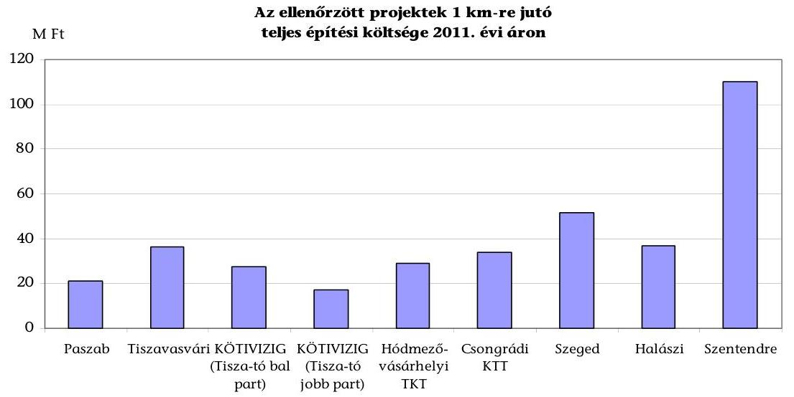

Forrás: ellenőrzöttek adatszolgáltatása
Az ellenőrzött projektek teljes építési fajlagos költsége külterületi létesítményeknél a Csongrádi KTT, illetve Halászi esetében 11,7, illetve 22,0%-kal (3,5, és $6,7 \mathrm{M} \mathrm{Ft} / \mathrm{km}$-rel) haladta meg a kategóriájának megfelelő uniós beruházások átlagát. Szentendre esetében viszont jelentősen, 264,9%-kal ( $80,0 \mathrm{M} \mathrm{Ft} / \mathrm{km}$-rel) lépte túl az ellenőrzött időszakban uniós támogatásból épült kerékpárutak átlagos adatát.

[^0]
[^0]:    ${ }^{42}$ Az egyes költségkategóriákhoz kapcsolódó fajlagos költség mutató a felhasznált erőforrások 1 km kerékpárútszakaszra számított mérőszáma. A teljes építési fajlagos költség mutatóját kerékpárút típusok (külterületi, városi, vegyes) szerinti bontásban is értékeltük. A beruházás során a fentieken túl a projekt keretében - pl. tervezési hiányosság vagy előre nem látható események miatt - el nem számolható költségek is felmerülhetnek, melyeket országos adatok hiányában a számítások során nem vettünk figyelembe.

---

A Csongrádi KTT külterületi projektjének közvetett fajlagos költsége 6,9 M Ft/km volt, mely alapvetően nagytömegű földmunkához, zárt csapadékvíz csatorna építéséhez, geotextíliához, illetve egyéb építési beruházásokhoz kapcsolódott.

Halászi 15,9 M Ft/km közvetett fajlagos költsége jelentős részét (13,4 M Ft/km) a nagytömegű földmunka, zöldterület kialakítás és műtárgyépítés tette ki.

Szentendre esetében az árvízvédelmi töltés megerősítése miatt szükséges nagytömegű földmunka $52,7 \mathrm{MFt} / \mathrm{km}$-rel növelte a fajlagos költségeket. A közvetett költségeken túl felmerült költségek (egyéb kiegészítő létesítmények, egyéb költségek stb.) $31,8 \mathrm{MFt} / \mathrm{km}$-rel növelték a projekt teljes fajlagos építési költségét.

A szegedi kerékpárút teljes fajlagos építési költsége $12,4 \mathrm{MFt} / \mathrm{km}$-rel (31,6%-kal) haladta meg az uniós beruházások városi létesítményeinek átlagát. Ennek alapvető oka, hogy a projekt olyan tételeket tartalmazott (vasúti keresztezés és a zárt csapadékvíz csatorna építése), amelyek összesen $10,4 \mathrm{MFt} / \mathrm{km}$-el emelték a költségeket.

Tiszavasvári kül- és belterületi kerékpárútja teljes fajlagos ráfordítása minimális mértékben, 0,8%-kal (0,3 M Ft/km-rel) haladta meg az uniós beruházások átlagát. A projekt közvetett fajlagos költségén (11,2 M Ft/km) belüli legjelentősebb tétel a 6,8 M Ft/km mutatójú nagytömegű földmunka volt.

Paszab, a Hódmezővásárhelyi TKT, illetve a kettő KÖTIVIZIG projekt külterületi kerékpárútjainak elszámolható teljes költségének fajlagos mutatója az uniós támogatásból megépült beruházások fajlagos mutatójának átlaga alatt realizálódott. A megvalósítás ezeknél a projekteknél az uniós átlagnál költségkímélőbb volt.

Az ellenőrzött projektek összes elszámolható ráfordítását mutató teljes építési költségének fajlagos mutatói 17,0 M Ft/km és 110,2 M Ft/km közé estek. Az adatok nagy szórásában megjelennek a beruházások egyedi sajátosságai.

# A tisztított fajlagos építési költségek alakulása 

Az egy kilométerre jutó teljes építési költségek szórása mutatja, hogy számos olyan egyedi tényező jelentkezik, amely jelentős hatással van a létesítmény teljes költségének alakulására. Az egyedi terepviszonyoktól, az eltérő felszereltségtől a leginkább a burkolat közvetlen kialakítását szolgáló tisztított költségek bemutatásával és elemzésével lehet eltekinteni. Az előzőek miatt a 2011-ben meghirdetett ÜSZT pályázatok (ROP, KözOP) bevezették a tisztított fajlagos költség mutatóját. A tisztított fajlagos költség elismerhető összegét maximálisan 36,5 M Ft/km-ben állapította meg. Az e feletti költségrészt a pályázat keretében nem lehet elszámolni.

Az ellenőrzött projektek forrásfelhasználásának költségigényessége megítélése érdekében az ellenőrzés keretében elvégeztük a tisztított költségek értékelését. A beruházások egymáshoz való hasonlítása érdekében
 2,5 méteres útszélességre korrigáltuk az adatokat.

---

A pénzügyi erőforrás és a fejlesztés eredményét bemutató 1 km-re jutó bruttó tényleges tisztított fajlagos költségeinek a 2011-es ÜSZT pályázati felhívásában szereplő $36,5 \mathrm{M} \mathrm{Ft} / \mathrm{km}$-es mérőszámhoz való viszonyát - azonos útszélességre korrigált adatokkal - az alábbi ábra szemlélteti:
7. sz. ábra
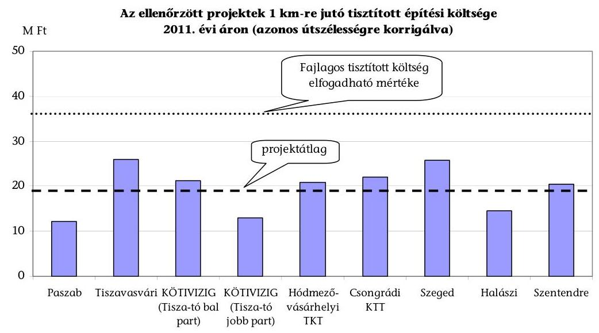

Forrás: ellenőrzött projektek adatszolgáltatása
Az ellenőrzött projektek 2011-es árszintre számított költségei a jelenleg érvényes pályázati kiírás támogatható szintjén belül valósultak meg. Az ellenőrzött projektek átlaga ( $19,2 \mathrm{MFt} / \mathrm{km}) 52,6 \%$-át tette ki a támogatási korlátként meghatározott $36,5 \mathrm{MFt} / \mathrm{km}$-nek, ami azt jelzi, hogy jelentős annak a kockázata, hogy a tervezés és a kivitelezés során a tételeket a piaci árnál magasabban árazzák be, mivel a támogatás szempontjából még így is figyelembevételre kerül. Ezt nem befolyásolja a jelenlegi pályázati rendszer sávos támogatási értékelési rendszere sem, mivel a legnagyobb pontszámot biztosító fajlagos költség a ROP és a KözOP esetében is magasabb, mint az ellenőrzött kilenc projekt átlaga.

A tisztított és teljes fajlagos építési költségek értékei alapján a forrásfelhasználást Paszab, Hódmezővásárhelyi TKT, illetve a kettő KÖTIVIZIG projektje esetében hatékonynak, a többi öt ${ }^{43}$ projekt esetében részben hatékonynak minősítettük. Az ellenőrzött projektek a tisztított fajlagos költség feltételt teljesítették, a részben hatékony minősítést a hasonló típusú uniós fejlesztések átlagánál magasabb értékű teljes fajlagos építési költség indokolta.

A kerékpárutakkal együtt többletforrás igénybevétele nélkül megvalósult 1465 db kerékpáros kiegészítő létesítmény (tervezett 1349 db ) és 43 db kiegészítő szolgáltatás (tervezett 28 db ).

[^0]
[^0]:    ${ }^{43}$ Tiszavasvári, Csongrádi KTT, Szeged, Halászi, Szentendre.

---

A kiegészítő létesítményeknél az eltérések okai a közlekedési hatóság által - a használatbavételi eljárásakor - előírtak, illetve pótlólagos beruházói igények teljesítése volt.

Az ellenőrzött kerékpáros infrastruktúra-fejlesztési projektek kerékpárforgalmi és kiegészítő létesítményeiről, szolgáltatásairól a 6. számú melléklet ad tájékoztatást.

# 3.5. A kerékpáros infrastruktúra-fejlesztések elért eredményeinek fenntarthatósága 

A kedvezményezettek a megvalósított kerékpáros projektek fenntartását és a tervezettnek megfelelő kihasználtságát alapvetően biztosították. A kerékpárutak üzemeltetésére, fenntartására fordított kiadások elkülönített nyilvántartását azonban - egy kivételével - a közutakról szóló 1988. évi I. törvény 34. § (3) bekezdésének előírása ellenére nem valósították meg. A megépített kerékpárutak fenntarthatóságát a beruházás kedvezményezettjei nem értékelték, így - egy kivételével - a fenntartáshoz szükséges erőforrásokról sem voltak pontos adataik.

A KÖTIVIZIG az éves költségvetéseiben - a 120/1999. (VIII. 6.) Korm. rendelet 5.§ (1) bekezdésében foglalt előírás alapján - biztosította a Tisza-tó bal és jobb part kerékpáros létesítmények üzemeltetéséhez szükséges forrásokat.

Az ellenőrzött pályázók a megvalósított létesítmények kerékpáros kihasználtságának (forgalmi adatok) mérésére alkalmas mutatószámokat nem azonos módon határozták meg, a mutatók teljesítési adatait becsléssel állapították meg.

A KÖTIVIZIG Tisza-tó bal és jobb part fejlesztésénél a kerékpáros turisták számát (fő/év) rögzítették. A Csongrádi KTT-nál és a Hódmezővásárhelyi TKT-nál, valamint Szegednél és Szentendrénél az átlagos napi forgalmat (kerékpáros/nap), illetve a kerékpáros forgalom növekedése a beavatkozás területén (%) mutatószámot használták. A Csongrádi KTT-nál és a Hódmezővásárhelyi TKT-nál, Szegednél és Szentendrénél a forgalmi adatok 100,0\% és 111,8\% között teljesültek a tervezetthez képest. A Tisza-tó bal partján a kerékpáros turisták száma a tervezett 10000 főről 13373-ra (33,7\%-kal) míg a jobb partján 10000 főről 26990 főre (1,7-szeresére) teljesült. ${ }^{44}$

A kedvezményezettek nem rendelkeztek az érintett kerékpárszakaszok közlekedésbiztonságára vonatkozó adatokkal. A kerékpárút fejlesztések nem befolyásolták a közúti kerékpáros balesetek számát. Ezt támasztják alá az országos adatok is, mely szerint a bekövetkezett balesetek száma a 2004-2012 I. félév időszakában országosan évente 3300 körül mozgott, amelyet a következő ábra szemléltet:

[^0]
[^0]:    ${ }^{44}$ Forrás: a Tisza-tó bal partján a Szabics kikötőnél, valamint a Tisza-tó jobb partján a Delfin és a Tündérrózsa kikötőknél vezetett kerékpáros forgalmi naplók.

---

8. sz. ábra

A közúti kerékpáros balesetek alakulása 2004-2012. év I. félév között (országos adat)
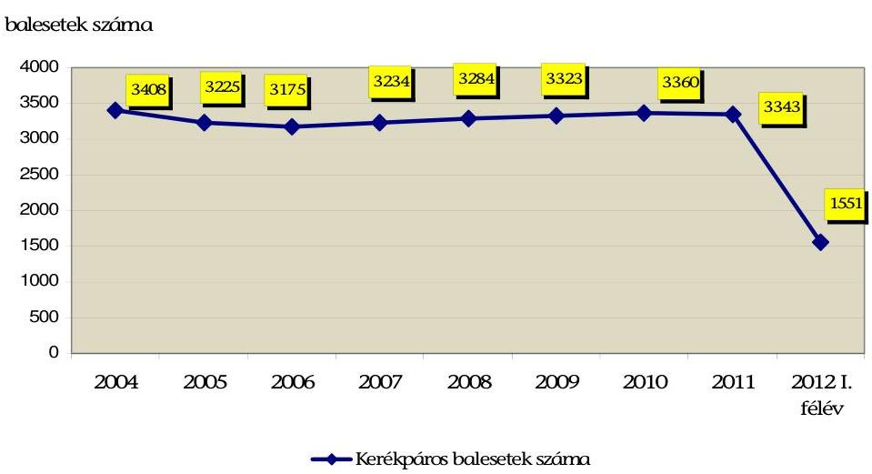

Forrás: Magyar Közút Nonprofit Zrt. adatszolgáltatása
A baleseti adatok értékelésénél figyelembe kell venni azt a körülményt, hogy az uniós pályázatokból megvalósult projektek esetében az NFÜ adatszolgáltatása szerint az átlagos napi forgalom több mint háromszorosára emelkedett. A balesetek száma így a kerékpáros forgalomhoz mérten relatívan csökkent.

Az ellenőrzésre kiválasztott kerékpárutakra vonatkozóan az érintett közútszakaszok 2004-2012. év I. félév kerékpáros baleseti adatai évenként növekvő tendencia mellett, 10-18 között változtak, amelyet a következő ábra szemléltet.
9. sz. ábra
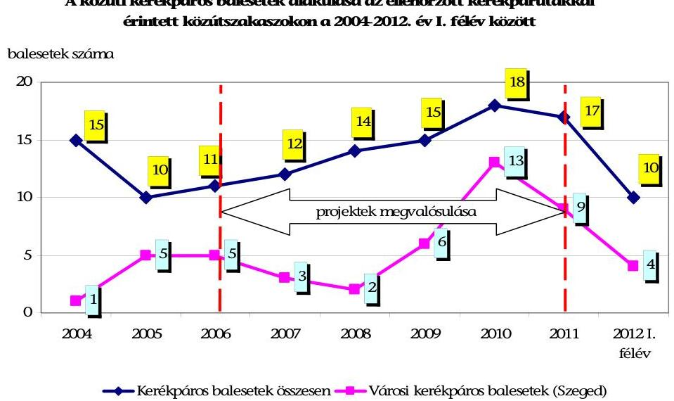

Forrás: Magyar Közút Nonprofit Zrt. adatszolgáltatása

---

A balesetek emelkedését egyértelműen a Szeged városi kerékpáros balesetek okozták. A 2009. évi 15 balesetből 6, a 2010. évi 18 balesetből 13, a 2011. évi 17 balesetből 9 baleset Szeged városi kerékpárútjain történt. Az adatsor arra hívja fel a figyelmet, hogy a forgalmi csomópontokon áthaladó városi kerékpárutak potenciális baleseti helyszíneket jelentenek. A 2004-2012. év I. félév részletes kerékpáros közúti baleseti adatokat a 8. számú melléklet tartalmazza.

Három önkormányzat ${ }^{45}$ és a kistérségi társulások kerékpáros projektjei - a közlekedés-fejlesztés mellett - turisztikai célokat is szolgáltak, ennek ellenére a kerékpáros turizmus értékeléséhez a pályázataikban indikátort nem határoztak meg. Az ellenőrzött projektek közül háromnál (a KÖTIVIZIG Tisza-tó bal és jobb part, valamint Halászi pályázatában) szerepelt indikátorként a kerékpáros turizmushoz kapcsolódó vendégéjszakák száma. A mutatószám Halászi esetében a tervezettel közel azonosan teljesült (tervezett érték 8992 vendégéjszaka, a tényleges pedig 8996 vendégéjszaka). A KÖTIVIZIG a vendégéjszakák számát nem a pályázataiban előírtaknak megfelelően gyűjtötte és tartotta nyilván, helyette a KSH Tisza-tavi térség turizmus adatait vette figyelembe. A mutatók a projektekhez kapcsolható - tényleges kerékpáros vendégéjszakák számán felül halmozottan tartalmazták a nem kerékpáros turistákat is. Az ellenőrzött kerékpáros infrastruktúra-fejlesztési projektekben meghatározott mutatókat és azok teljesülését a 9. számú melléklet tartalmazza.

# 3.6. A kerékpáros beruházások eredményeinek lakossági fogadtatása, a feldolgozott lakossági kérdőívek tapasztalatai 

Az Állami Számvevőszék internetes kérdőíves megkereséssel kérte a lakosság véleményét a kerékpáros infrastruktúra-fejlesztésekről. A kerékpárutakat használók véleményének megismerése céljából a kérdésekkel fordultunk az ellenőrzött beruházások térségében lévő 28 önkormányzat jegyzőin keresztül a településeken élő helyi lakossághoz. Felhívásunkat és a kérdőívet web-es felületen jelentettük meg. Az érdeklődők önkéntes és név nélküli véleményüket online kérdőív kitöltésével közölhették. Az elektronikus kitöltésre rendelkezésre álló két és fél hét alatt összesen 165 válaszadó értékelte az általa ismert kerékpárutakat. A kitöltött kérdőívek háromnegyed része ( $74,6 \%$-a) érkezett az ellenőrzött kilenc projekt térségéből, a negyedrésze az ország más területén élő lakosok véleményét tükrözte.

A felmérésből származó adatok nem reprezentatívak. A kérdésre adott válaszok magukban foglalják azokat a tapasztalatokat is, amelyek nem csak az ellenőrzött beruházások hatásaira, hanem a válaszadók által ismert kerékpáros fejlesztések valamennyi hatására vonatkoznak. Az összesített kérdőívek adalékkal szolgálnak a lakosságnak a kerékpárutak fenntartására, összekapcsolódására, valamint a fejlesztéseknek a kerékpáros közlekedés biztonságára vonatkozó általános véleményéről.

[^0]
[^0]:    ${ }^{45}$ Paszab, Szentendre, Tiszavasvári

---

A válaszadók véleménye szerint egyértelmű javulás következett be a korábbi közlekedésbiztonsági helyzethez képest. A közlekedésbiztonságra vonatkozó válaszok megoszlását az alábbi ábra mutatja:
10. sz. ábra
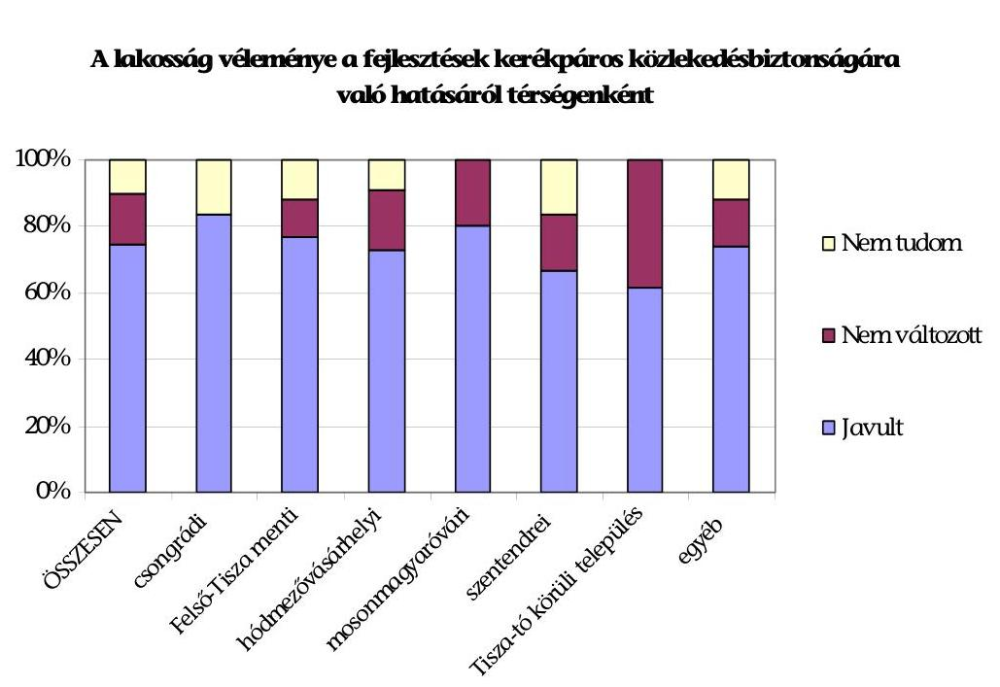

Forrás: lakossági kérdőívek
A kerékpárút építések környezetre gyakorolt hatását is egyértelműen kedvezően értékelték. A válaszadók döntő többsége ítélte úgy, hogy kifejezetten javultak a környék kerékpáros közlekedési feltételei és turisztikai lehetőségei.

A kerékpározók által használt kerékpárutak minőségét alapvetően megfelelőnek ítélték. A kerékpárutak karbantartásával a kerékpározók nem voltak megelégedve. Az összes válaszadó ötöde (20,6\%) rossznak tartotta ezt a tevékenységet.

A kérdőívet megválaszolók többsége (63,7\%) hiányosnak ítélte, illetve nem tartotta biztosítottnak a kerékpárutak egymás közötti összekapcsolódását. Legtöbben az EuroVelo 6 nyomvonalához kapcsolódó kerékpárutakat használók közül hiányolták ezt.

A kerékpárutakhoz kapcsolódó létesítmények közül a kerékpár parkolókat és tárolókat, a biztonságtechnikai fejlesztéseket, a kerékpáros pihenőhelyeket, valamint a műszaki szolgáltatásokat hiányolták.

A kerékpáros infrastruktúra-fejlesztések egyik közvetett hatásaként értékelhető a kerékpározók számának emelkedése. Az összes válaszadó 69,1\%-a vélekedett úgy, hogy a korábbiaknál többen és nagyobb gyakorisággal kerékpároznak.

---

A feldolgozott kérdőívek részletes eredményeit a kerékpáros beruházásokkal kapcsolatos lakossági kérdőívek feldolgozásáról összeállított 2. és 3. számú függelék foglalja össze.

Budapest, 2013. O2. hó 13. nap

Melléklet: $\quad 18 \mathrm{db}$
Függelék: $\quad 3 \mathrm{db}$
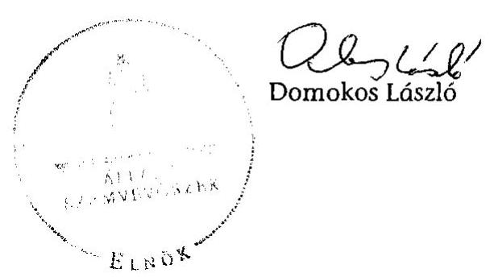

---

# Kimutatás a kerékpáros infrastruktúra-fejlesztéssel kapcsolatban készült szakmai háttérdokumentumokról 

| Cím | Kibocsátás   éve | Megjegyzés |
| :-- | :--: | :-- |
| A kerékpáros közlekedés helyzete   és fejlesztésének fő irányai Magyarországon | 1997 | a KHVM megbízásából készítette a   Tandem Közlekedéstervező Mérnökiroda |
| A megépült regionális kerékpárutak gazdasági, közlekedési és   egyéb hatásai | 2000 | az ÁKMI Kht. megbízásából készítette a Tandem Közlekedéstervező   Mérnökiroda |
| Kerékpárral a Nyugat-Dunántúlon | 2002 | a régióban működő megyei területfejlesztési tanácsok megbízásából   készítette a BME TKK és a   TaschnerWIN Bt. |
| A Nyugat-Dunántúli régió kerékpárturisztikai marketingstratégiája | 2003 | a PHARE CBC HU 00-1503-27 projekt részeként készítette a Magyar   Kerékpárosklub szakértői csoportja |
| Regionális kerékpárutak megítélése a felhasználók szempontjából | 2003 | az ÁKMI Kht. megbízásából készítette a Tandem Közlekedéstervező   Mérnökiroda |
| Az országos kerékpárút-hálózat (OTRT törzsúthálózat) kialakítása | 2006 | az UKIG megbízásából készítette a   Tetthely Mérnöki és Szolgáltató Kft. |
| Az OTRT-ben szereplő nemzetközi EuroVelo kerékpárút-hálózat magyarországi szakaszának egyeztetett nyomvonalterve | 2006 | az UKIG megbízásából készítette a   COWI Magyarország Kft. |
| A ROP 1.1 és 1.2 intézkedések hatékonyságjavítását célzó és értékelő tanulmány | 2007 | a ROP és INTERREG Közösségi Kezdeményezés IH megbízásából készítette az MTA |
| Kerékpáros Magyarország Program 2007-2013 | 2007 | készítését koordinálta a kerékpáros fejlesztésekkel foglalkozó miniszteri biztos |
| A Balaton régió kerékpárturisztikai stratégiája és a Bringakörút projekt előkészítő dokumentuma | 2008 | készítette a Kerékpáros Magyarország Szövetség Turisztikai Munkacsoportja |

---

| Cím | Kibocsátás   éve | Megjegyzés |
| :-- | :--: | :-- |
| A kerékpározás útjai I-II. (Kézikönyv a kerékpáros közlekedés fejlesztéséhez) | 2010 | készítette a Pej Kálmán okl. építőmérnök által vezetett hét fős munkacsoport |
| A kerékpáros turizmus fejlesztési stratégiája 2010-2015 | 2010 | az ÖM Turisztikai Szakállamtitkársága megbízásából készítette a   COWI Magyarország Kft. |
| Az Északi Duna-menti EuroVelo 6 kerékpárút megvalósításának koncepciója | 2011 | - |
| A Balaton kiemelt üdülőkörzet hosszú távú területfejlesztési koncepciója 2020-ig | 2011 | készítette a Balatoni Integrációs és Fejlesztési
 Ügynökség Kht. |
| A Balaton régió kerékpáros-   turisztikai projekt előkészítő do-   kumentuma | 2011 | készítette a Balatoni Integrációs   Közhasznú Nonprofit Kft. |

---

# Összefoglalás a 1364/2011. (XI. 8.) Korm. határozatban kijelölt kerékpáros infrastruktúra-fejlesztési feladatokról

|  Pont | Feladat | Felelős | Határidő | Megjegyzés  |
| --- | --- | --- | --- | --- |
|  2. | Ki kell dolgozni a természetjáró és kerékpáros turizmus, úthálózat és közlekedési fejlesztési koncepciót, valamint a koncepció megvalósításának operatív céljait, részletes feladatait és azok ütemezését összefoglaló intézkedési tervet. | 1. természetjáró és kerékpáros turizmus, úthálózat és közlekedés fejlesztéséért felelős miniszterelnöki megbízott
2. közigazgatási és igazságügyi miniszter
3. nemzeti erőforrás miniszter
4. nemzeti fejlesztési miniszter
5. nemzetgazdasági miniszter
6. vidékfejlesztési miniszter | 2012. január 15. | A helyszíni ellenőrzés ideje alatt folyamatban volt.  |
|  3. | A Kormány kiemelt állami fejlesztésnek tekinti az „EuroVelo 6 Duna menti kerékpárút" (I. ütem: Rajka-Budapest) és a Budapest-Balaton kerékpáros útvonal kiépítését, ezen belül kiemelt fejlesztési prioritásként I. ütemben a Budapest-Etyek útvonal kiépítését, valamint a Balatoni kerékpáros körút komplex minőségi fejlesztését.
Ennek érdekében elő kell készíteni ezen fejlesztések projektkoncepcióját, költségvetését, ütemezését, meg kell vizsgálni az európai uniós fejlesztési források bevonásának lehetőségét. | 1. nemzeti fejlesztési miniszter
2. természetjáró és kerékpáros turizmus, úthálózat és közlekedés fejlesztéséért felelős miniszterelnöki megbízott | 2012. január 15. | Határidőre elkészült.  |

---

2. számú melléklet a V-0021-326/2013. számú jelentéshez

|  Pont | Feladat | Felelős | Határidő | Megjegyzés  |
| --- | --- | --- | --- | --- |
|  4. | Elő kell készíteni a következő országos és budapesti kerékpárút fejlesztési tervek megvalósíthatósági tanulmányait, valamint meg kell vizsgálni a hazai és az európai uniós fejlesztési források bevonásának lehetőségét:
a) EuroVelo 11 „Kelet-európai útvonal" (Bodrog-Tisza menti kerékpárút, Tisza-tó, Tokaj-Hegyalja);
b) EuroVelo 13 „Vasfüggöny kerékpárút" (Fertő tó, Nyugat- és Dél-Dunántúl);
c) Velencei-tó;
d) Budapest fővárosi fejlesztések:
da) EuroVelo 6 (EV6) „Folyók útja" Duna menti kerékpárút teljes fővárosi átvezetése;
db) Puskás Ferenc Stadion melletti kerékpáros infrastruktúra bővítése;
dc) Andrássy úti és Bajcsy-Zsilinszky úti kerékpáros infrastruktúra fejlesztése;
dd) Budapest környéki kerékpárút hálózat bővítése (főhálózati szakaszok Budán és Pesten egyaránt);
de) az elővárosi vasúthálózat és HÉV vonalak kerékpáros kapcsolatainak kiépítése, a három nagy pályaudvar, illetve elővárosi állomások elérhetőségeinek javítása | 1. nemzeti fejlesztési miniszter
2. természetjáró és kerékpáros turizmus, úthálózat és közlekedés fejlesztéséért felelős miniszterelnöki megbízott | 2012. március 31. | A helyszíni ellenőrzés ideje alatt folyamatban volt.  |

---

A pályázati konstrukciók illeszkedése a kerékpáros fejlesztésekre vonatkozó központi célkitűzésekhez

| Pályázati konstrukciók | a központi célkitűzések alapján figyelembe vett szempontok |  |  |  |  |  |
| :--: | :--: | :--: | :--: | :--: | :--: | :--: |
|  | környezetvédelem | közlekedés   biztonság | hivatásforgalom | turisztika | szabadidő-   sport | egészségmegőrzés |
| Útpénztár 2006 I. | $x$ | $x$ | $x$ | $x$ |  | $x$ |
| Útpénztár 2006 II. | $x$ | $x$ | $x$ | $x$ |  | $x$ |
| Új kerékpárutak és létesítmények 2007. I. | $x$ | $x$ | $x$ | $x$ |  | $x$ |
| Útpénztár 2007 II. | $x$ | $x$ | $x$ | $x$ |  | $x$ |
| Útpénztár 2008 I. | $x$ | $x$ | $x$ | $x$ |  | $x$ |
| Útpénztár 2008 II. | $x$ | $x$ | $x$ | $x$ |  | $x$ |
| NFT I. ROP 1.1 |  |  |  | $x$ | $x$ |  |
| KözOP-3.2.0/A-08 |  | $x$ | $x$ | $x$ | $x$ |  |
| KözOP-3.2.0/B-08 |  | $x$ | $x$ | $x$ | $x$ |  |
| KözOP-3.2.0/C-08 |  | $x$ | $x$ | $x$ | $x$ |  |
| KözOP-3.2.0/C-08-11 |  | $x$ | $x$ | $x$ | $x$ |  |
| DAOP-3.1.2 | $x$ | $x$ | $x$ | $x$ | $x$ | $x$ |
| DAOP-3.1.2/A-09 | $x$ | $x$ | $x$ |  |  |  |
| DAOP-3.1.2/B-09 | $x$ | $x$ | $x$ |  |  |  |
| DDOP-5.1.1 | $x$ | $x$ | $x$ |  |  |  |
| DDOP-5.1.1-09 | $x$ | $x$ | $x$ |  |  |  |
| ÉAOP-3.1.3 |  | $x$ | $x$ |  |  |  |
| ÉAOP-3.1.3/A-09 | $x$ | $x$ | $x$ |  |  |  |
| ÉAOP-3.1.3/B-09 | $x$ | $x$ | $x$ |  |  |  |
| ÉMOP-5.1.3-09 | $x$ | $x$ | $x$ |  |  |  |
| KDOP-4.2.2 |  | $x$ | $x$ |  |  | $x$ |
| KDOP-4.2.2-08 |  | $x$ | $x$ |  |  | $x$ |
| KDOP-4.2.2-09 | $x$ | $x$ | $x$ |  |  |  |
| KMOP-2.1.2 | $x$ | $x$ | $x$ | $x$ | $x$ |  |
| KMOP-2.1.2-09 | $x$ | $x$ | $x$ |  |  |  |
| NyDOP-4.3.1/B | $x$ | $x$ | $x$ | $x$ |  |  |
| NyDOP-4.3.1/B-09 | $x$ | $x$ | $x$ |  |  |  |
| DAOP-3.1.2/A-11 | $x$ | $x$ | $x$ |  |  | $x$ |
| DDOP-5.1.1-11 | $x$ | $x$ | $x$ |  |  | $x$ |
| ÉAOP-3.1.3/A-11 | $x$ | $x$ | $x$ |  |  | $x$ |
| ÉMOP-5.1.3-11 | $x$ | $x$ | $x$ |  |  | $x$ |
| KDOP-4.2.2-11 | $x$ | $x$ | $x$ |  |  | $x$ |
| NyDOP-4.3.1/B-11 | $x$ | $x$ | $x$ |  |  | $x$ |

---

Az ellenőrzött projektek főbb adatai

|  Régió | Megye | Település | Kedvezményezett | Pályázat típusa | Pályázat száma/ megnevezése | Projekt megnevezése | Tényleges építési költség (bruttó m Ft) | Felhasznált támogatás (m Ft) | Támogatási döntés dátuma | Megépült kerékpárút hossza (méter) | Projekt befejezéseinek időpontja  |
| --- | --- | --- | --- | --- | --- | --- | --- | --- | --- | --- | --- |
|  Észak-Alföld | Szabolcs-Szatmár-Bereg | Puszab | Puszab Község Önkormányzata | NFT | ROP 1.1 Turisztikai vonzerők fejlesztése | Rétközi kerékpárút továbbépítése Ibrány, Puszab, Balsa és Szabolcs települések közigazgatási területén Nyíregyháza-Tokaj EuroVelo-hoz kapcsolódva | 188,5 | 176,7 | 2005.06.29 | 9305 | 2008.04.30  |
|  Észak-Alföld | Szabolcs-Szatmár-Bereg | Tiszavusvári | Tiszavusvári Város Önkormányzata | NFT | ROP 1.1 Turisztikai vonzerők fejlesztése | Tiszavusvári-Szorgalmatos-Tiszalök kerékpárút kiépítése | 248,6 | 233,0 | 2006.01.23 | 7271 | 2008.03.31  |
|  Észak-Alföld | Jász-Nagykun-Szolnok | Tiszaderzs | Közép-Tisza-vidéki Vizügyi Igazgatóság | NFT | ROP 1.1 Turisztikai vonzerők fejlesztése | Kerékpárút építése a Tisza-tó bal partján EuroVelo 11-es útvonal kiépítése | 312,9 | 297,2 | 2006.04.13 | 13700 | 2006.12.31  |
|  Észak-Magyarország | Heves | Kisköre | Közép-Tisza-vidéki Vizügyi Igazgatóság | NFT | ROP 1.1 Turisztikai vonzerők fejlesztése | Kerékpárút építése a Tisza-tó jobb partján EuroVelo 11-es útvonal kiépítése | 345,6 | 286,5 | 2006.04.13 | 22914 | 2007.08.31  |
|  Dél-Alföld | Csongrád | Hódmezővásárhely | Hódmezővásárhelyi Többcélú Kistérségi Társulás | ÜMFT | DAOP 3.1.2 Kerékpárút hálózat fejlesztése | Hódmezővásárhely és Mindszent településeket összekötő közlekedési kerékpárút építése | 309,4 | 260,0 | 2007.11.27 | 10316 | 2009.11.24  |
|  Dél-Alföld | Csongrád | Csongrád | Csongrádi Kistérség Többcélú Társulás | ÜMFT | DAOP 3.1.2 Kerékpárút hálózat fejlesztése | Kistérségi kerékpárút I. ütemének építése a 4519 jelű országos közül Csongrád-Felgyő-Csanyteleki szakasza mellett | 216,5 | 193,5 | 2007.11.27 | 6577 | 2009.11.27  |
|  Dél-Alföld | Csongrád | Szeged | Szeged Megyei Jogú Város Önkormányzata | ÜMFT | DAOP 3.1.2 Kerékpárút hálózat fejlesztése | Szeged, kerékpárút hálózat fejlesztése a városon átvezető Euro-Velo szakaszhoz több helyen is biztonságosan lehessen csatlakozni | 302,6 | 265,0 | 2007.11.27 | 5696 | 2011.06.09  |
|  Nyugat-Dunántúl | Győr-Moson-Sopron | Halászi | Halászi Község Önkormányzata | NFT | ROP 1.1 Turisztikai vonzerők fejlesztése | Duna-menti kerékpárút III. ütem 4. szakaszának Halászi és Durnózseli közötti külterületi 8 km hosszú kerékpárút építése révén Szigetköz turisztikai fejlesztése | 251,6 | 234,3 | 2005.01.15 | 8000 | 2006.07.14  |
|  Közép-Magyarország | Pest | Szentendre | Szentendre Város Önkormányzata | NFT | ROP 1.1 Turisztikai vonzerők fejlesztése | EuroVelo hálózat fejlesztése - Szentendre Dunaparti panoráma kerékpárút építése | 306,0 | 284,5 | 2005.05.20 | 3063 | 2007.05.18  |
|  ÖSSZESEN |  |  |  |  |  |  | 2481,7 | 2230,7 |  | 86842 |  |   |

---

Az ellenőrzött projektek területi eloszlása, jellemzői

## 1. Felső Tisza-menti kerékpárutak: Puszab Község Önkormányzata

2008-ban megvalósult a Rétközi Kerékpárút továbbépítése Ibrány, Puszab, Balsa és Szabolcs települések közigazgatási területén 9,305 km hosszúságban, 1,6 méteres útszélességgel. A települési kerékpáros projekt Rakamaz-Tokaj térségnél csatlakozott az országos kerékpárút törzshálózathoz [Tiszamente kerékpárút (EuroVelo 11)]. A fejlesztés keretében kialakítottak hat kerékpáros pihenőhelyet összesen 300 m²-en (Ibrány és Szabolcs kettő-kettő, Puszab és Balsa egy-egy), Balsa és Szabolcs településeken a nyilvános WC-ket is felújították.

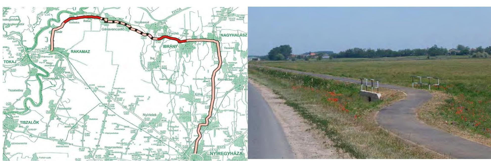

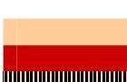

Korábban megépült kerékpárút
Fejlesztés keretében megépített kerékpárút szakaszok
Hiányzó kerékpárút szakasz

---

Az ellenőrzött projektek területi eloszlása, jellemzői

# 2. Felső Tisza-menti kerékpárutak: Tiszavasvári Város Önkormányzata 

A Tiszavasvári - Szorgalmatos - Tiszalök kerékpárút 2008-ban épült, és Tiszalöknél közvetlenül csatlakozott az országos kerékpárút törzshálózathoz [Tiszamente kerékpárút (EuroVelo 11)]. A megvalósult 7,271 km hosszúságú kerékpárút a települések belterületén 2,7 méter ( $1,415 \mathrm{~km}$ hosszú), a külterületeken pedig 2,0 méter ( $5,856 \mathrm{~km}$ hosszú) szélességű, valamint kétirányú (a belterületeken elválasztás nélküli gyalogútként is szolgál). A fejlesztés keretében Tiszavasvári központjában kialakítottak kettő kerékpártámaszt, Szorgalmatos községben pedig három lehajtót (a tervben nem szerepelt, az önkormányzat kérésére épült meg), továbbá Tiszavasváriban kettő 10-10 m²-es kerékpáros megállóhely.
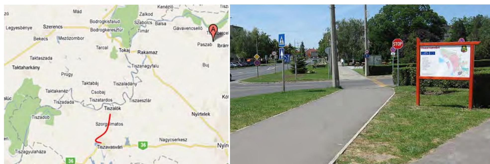

---

Az ellenőrzött projektek területi eloszlása, jellemzői
3. Tisza-tó körüli kerékpárutak, az észak-magyarországi és az észak-alföldi régiók közös kerékpárút projektje Közép-Tisza-vidéki Vízügyi Igazgatóság (Tisza-tó bal
 parti projekt)

2006-ban megépült a Tisza folyó bal parti árvízvédelmi töltésen az erősített szerkezetű kerékpárút, Tiszaderzs (175+275 tkm) feltáró út és Tiszafüred (169+950 tkm) szabad strand közötti szakaszán, 13,700 tkm hosszúságban, 3,0 méter szélességben. Kilométerenkénti kitérőkkel, a korábban meglévő helyeken lehajtó rámpákkal és stabilizált egyoldali, 1,5 méter szélességű padkával. A fejlesztéssel - az árvízvédelmi fővonalon - biztosították a már megépült üzemi utak (kerékpárutak) kapcsolatát. A töltésen elhelyeztek négy - csak kerékpárosok által átjárható - kerékpáros sorompót. Továbbá kihelyeztek öt mobil WC-t, valamint 30 db hulladékgyűjtő edényt.
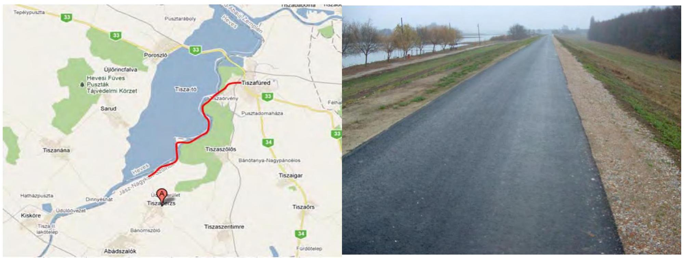

---

Az ellenőrzött projektek területi eloszlása, jellemzői
4. Tisza-tó körüli kerékpárutak, az észak-magyarországi és az észak-alföldi régiók közös kerékpárút projektje Közép-Tisza-vidéki Vízügyi Igazgatóság (Tisza-tó jobb parti projekt)

2007-ben a Tisza-tó jobb parti árvízvédelmi töltésen erősített szerkezetű kerékpárút készült 22,914 tkm hosszúságban, 3,0 méter szélességben, 1-1,5 kmenként kitérővel, a korábban meglévő helyeken lehajtó rámpákkal, szivárgó és kétoldali padkarendezéssel. A fejlesztés Kisköre (134+940 tkm - Jászsági torok), Sarud (150+356/0 tkm - Laskó torok) és Poroszló (8+000 tkm - 33. számú főközlekedési út) települések közötti szakaszon valósult meg. A töltésen hat fizikai akadályt (sorompót) építettek, öt őrháznál a vízvételi lehetőséget biztosították, ugyanitt mobil WC-ket helyeztek el. Poroszlótól Tiszafüredig a Kiskörei duzzasztómű gátján keresztül a Tisza-tó 69,0 km hosszban körbekerékpározható, a teljes kerékpározható hossz 89,6 km. A Tisza-tó körül megépített kerékpárút Poroszlónál csatlakozott az országos kerékpárút törzshálózathoz [Tiszamente kerékpárút (EuroVelo 11)].
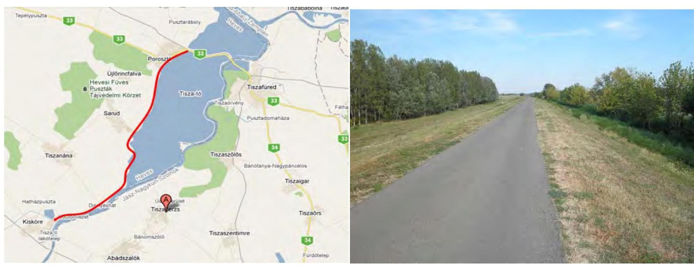

Az ellenőrzött projektek területi eloszlása, jellemzői

---

# 5. Szegedi kerékpárutak: Szeged Megyei Jogú Város Önkormányzata 

Szegeden 2011-ben - a város kerékpárútjainak hálózatos jellegének kialakítása érdekében - kilenc szakaszon, mindösszesen 5,696 km hosszúságban városi kerékpárút épült. Közel 2,0 km kétoldali kerékpárutat létesítettek 2,6 méter szélességgel a Csongrádi sugárúton és a Felső-Tisza parton, részben úttestszélesítéssel. Kerékpárutak épültek 2,0-2,6 méter szélességben a Tompai kapu út vasúti átjárónál, a Vár u. - Széchenyi tér, a Negyvennyolcas u., a Baktó Pihenő u. szakaszokon, illetve gyalogúttal egybeépítve, 3,8 - 5,0 méter szélességben az újszegedi Fő fasoron, a Kossuth Lajos sugárúton meglévő burkolatra, valamint részben a Felső-Tisza parton. A fejlesztéssel megvalósult 58 db rámpa (lehajtók a gyalogjárdák és közutak csatlakozásánál), valamint egy forgalomtechnikai berendezés (vasúti átjárónál fénysorompó). A hiányzó kerékpáros útszakaszok megépítése közvetlen csatlakozást biztosítottak az országos kerékpárút törzshálózathoz [Tiszamente kerékpárút (EuroVelo 11)]
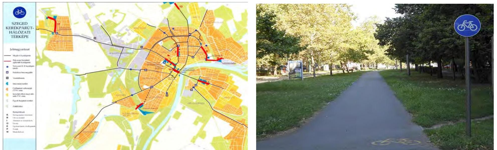

---

Az ellenőrzött projektek területi eloszlása, jellemzői

---

# 6. A csongrádi kerékpárút: Csongrádi Kistérség Többcélú Társulása 

2009-ben a 4519 jelű közút kerékpáros tehermentesítése és a közlekedésbiztonság javítása céljából megépült a Kistérségi kerékpárút I. üteme. A 6,577 km hosszú és 2,6 méter széles kétirányú kerékpárút a 4519 jelű közút (Csongrád - Felgyő - Csanyteleki szakasza) mellett helyezkedett el, helyi, helyközi, kül- és belterületet összekötő, hivatásforgalmi, valamint hálózati kialakítást segítő és turizmust támogató funkcióval. A fejlesztés keretében megépült kettő darab híd is. A megvalósított kerékpáros létesítmény Csongrád belterületén csatlakozott az országos kerékpárút törzshálózathoz [Tiszamente kerékpárút (EuroVelo 11)].
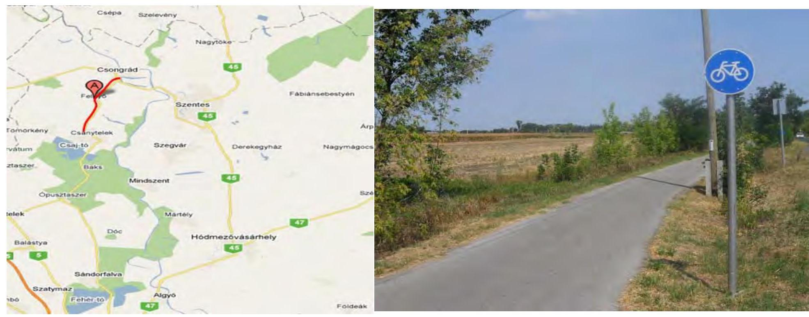

---

Az ellenőrzött projektek területi eloszlása, jellemzői

# 7. A mártélyi üdülőterület kerékpárútja: Hódmezővásárhelyi Többcélú Kistérségi Társulás 

2009-ben megépült a Hódmezővásárhely és Mindszent településeket összekötő 10,316 km hosszú kerékpárút, amely kiváltotta a 4521 jelű közúton a kerékpáros közlekedést. A Hódmezővásárhelyet Mártéllyal összekötő meglévő szakasszal együtt a kerékpárút hossza 17,0 km lett. A fejlesztés - a 4521 jelű közút mentén - Hódmezővásárhely bel- és külterületén 2,716 km, jellemzően 2,0 méter széles, Mártélyon az árvízvédelmi töltésen vezetett 2,700 tkm hosszú 3,0 méter széles megerősített pályaszakaszt, valamint Mindszent bel- és külterületén 4,900 km hosszú 2,6 méter széles kétirányú kerékpárutat tartalmazott. A megépített kerékpárutak Hódmezővásárhelyen csatlakoztak az országos kerékpárút törzshálózathoz (Dél-alföldi határmente kerékpárút).
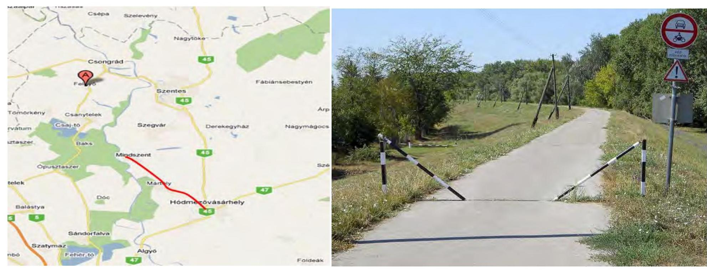

---

Az ellenőrzött projektek területi eloszlása, jellemzői

# 8. A Duna-menti kerékpárutak: Szentendre Város Önkormányzata 

A 2007-ben megvalósított Szentendre Duna-parti panoráma kerékpárút északi irányban csatlakozott a Leányfalun át Dunabogdányig vezető, országos kerékpárút törzshálózathoz [Felső-Dunamente kerékpárút (EuroVelo 6)]. A 3,063 km hosszúságú, árvízvédelmi töltésen vezetett 3,0 méter szélességű kerékpárút megépítésével egyidejűleg egy $110 \mathrm{~m}^{2}$-es kerékpáros pihenőhelyet is kialakítottak, amelyet a pihenő melletti $90 \mathrm{~m}^{2}$-es megállóban több kerékpár biztonságos elhelyezésére alkalmas kerékpártámasszal is elláttak. A kerékpárút városközponthoz közeli végpontjánál egy elhanyagolt épület felújításával önálló WC-mosdó helyiséget alakítottak ki.
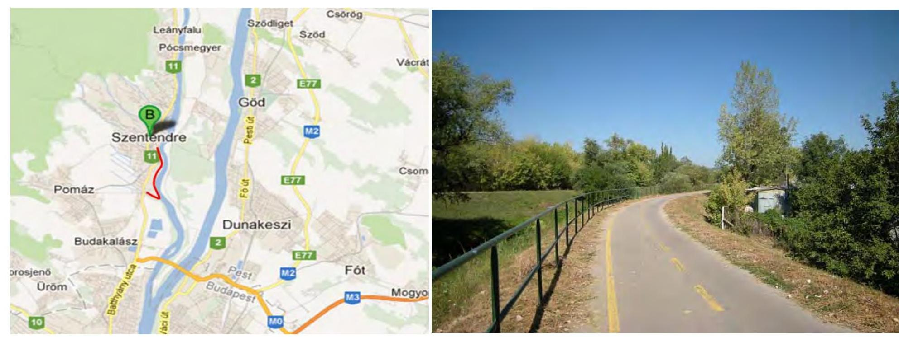

---

Az ellenőrzött projektek területi eloszlása, jellemzői

# 9. A Duna-menti kerékpárutak: Halászi Község Önkormányzata 

2006-ban megépült Halászi és Darnózseli között a 8,000 km hosszú, 2,0 méter szélességű külterületi kerékpárút. A létesítmény a Szigetköz kistérség turisztikai fejlesztése is volt. A kiépült kerékpárút csatlakozott a már kiépült országos kerékpárút törzshálózathoz [Felső-Dunamente kerékpárút (EuroVelo 6)]. A fejlesztés része volt a Nováki-főcsatorna felett elkészült 8,0 méter hosszú és 3,5 méter széles vasbeton híd, továbbá kialakítottak négy kerékpár támaszt, illetve két pihenőhelyet, nádtetős, nyitott esőbeállókkal.
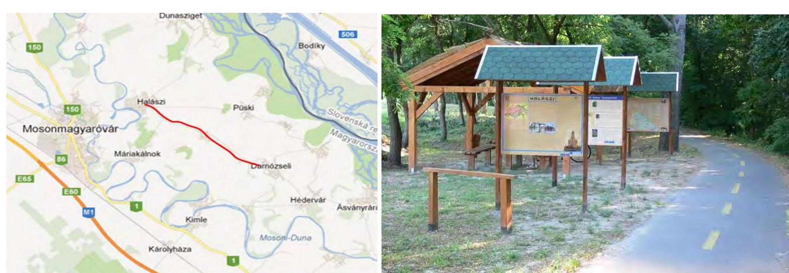

---

# KIMUTATÁS

az ellenőrzött kerékpáros infrastruktúra-fejlesztési projektek összköltségéről és a megvalósítás forrásairól (M Ft, Bruttó)

| Megnevezés | Paszab |  | Tiszavasvári |  | KÖTIVIZIG
(Tisza-tó bal part) |  | KÖTIVIZIG
(Tisza-tó jobb part) |  | Hódmezővásárhelyi TKT |  | Csongrádi TKT |  | Szeged |  | Halászi |  | Szentendre |  | Összesen |  |
| :--: | :--: | :--: | :--: | :--: | :--: | :--: | :--: | :--: | :--: | :--: | :--: | :--: | :--: | :--: | :--: | :--: | :--: | :--: | :--: | :--: |
|  | terv | tény | terv | tény | terv | tény | terv | tény | terv | tény | terv | tény | terv | tény | terv | tény | terv | tény | terv | tény |
| Saját erő | 9,3 | 9,3 | 1,4 | 2,8 | 6,0 | 5,9 | 30,0 | 28,9 | 28,9 | 28,9 | 10,8 | 10,9 | 29,5 | 29,5 | 3,1 | 3,0 | 15,0 | 15,0 | 134,0 | 134,2 |
| Partnerek hozzájárulása |  |  | 2,8 | 4,9 | 9,8 | 9,8 | 31,5 | 29,8 |  |  |  |  |  |  | 1,9 | 2,0 |  |  | 46,0 | 46,5 |
| EU önerő alap |  |  | 8,2 | 7,9 |  |  |  |  |  |  | 10,8 | 10,6 |  |  | 7,4 | 7,4 |  |  | 26,4 | 25,9 |
| EU támogatás | 176,9 | 176,7 | 236,4 | 233,0 | 299,2 | 297,2 | 300,0 | 286,5 | 260,0 | 260,0 | 194,1 | 193,5 | 265,5 | 265,0 | 235,9 | 234,3 | 285,0 | 284,5 | 2253,0 | 2230,7 |
| El nem számolható költségek |  | 2,5 |  |  |  |  |  | 0,4 |  | 20,5 |  | 1,5 |  | 8,1 |  | 4,9 |  | 6,5 | 0,0 | 44,4 |
| Projekt összköltsége | 186,2 | 188,5 | 248,8 | 248,6 | 315,0 | 312,9 | 361,5 | 345,6 | 288,9 | 309,4 | 215,7 | 216,5 | 295,0 | 302,6 | 248,3 | 251,6 | 300,0 | 306,0 | 2459,4 | 2481,7 |

Forrás: az ellenőrzöttek adatszolgáltatása

---

KIMUTATÁS az ellenőrzött kerékpáros infrastruktúra-fejlesztési projektek kerékpárforgalmi és kiegészítő létesítményeiről, szolgáltatásairól

|  Megnevezés | Paszab |  | Tiszavasvári |  | KÖTIVIZIG
(Tisza-tó bal part) |  | KÖTIVIZIG
(Tisza-tó jobb part) |  | Hódmezővásárhelyi TKT |  | Csongrádi KTT |  | Szeged |  | Halászi |  | Szentendre |   |
| --- | --- | --- | --- | --- | --- | --- | --- | --- | --- | --- | --- | --- | --- | --- | --- | --- | --- | --- |
|   | terv | tény | terv | tény | terv | tény | terv | tény | terv | tény | terv | tény | terv | tény | terv | tény | terv | tény  |
|  Kerékpárutak /önálló kerékpárforgalmi létesítmények (méter/m²)/ | 9305 | 9305 | 7271 | 7271 |  |  |  |  | 7616 | 7616 | 6577 | 6577 | 5696 | 5696 | 8000 | 8000 |  |   |
|   | 14888 | 14888 | 15333 | 15333 |  |  |  |  | 18469 | 18469 | 18010 | 18010 | 16142 | 16142 | 16000 | 16000 |  |  |   |
|  Árvizvédelmi töltésen vezetett kerékpárutak /nem önálló kerékpárforgalmi létesítmények (méter/m²)/ |  |  |  |  | 13700 | 13700 | 22914 | 22914 | 2700 | 2700 |  |  |  |  |  |  | 3063 | 3063  |
|   |  |  |  |  | 41715 | 41715 | 72445 | 72445 | 8100 | 8100 |  |  |  |  |  |  | 9189 | 9189 |   |
|  Kerékpáros kiegészítő létesítmények mindösszesen (db), ebből: | 12 | 12 | 194 | 291 | 33 | 29 | 63 | 86 | 144 | 144 | 59 | 59 | 236 | 236 | 555 | 555 | 53 | 53  |
|  Kerékpár támaszok (rövid idejű tárolásra) (db) |  |  | 2 | 2 |  |  |  |  |  |  |  |  |  |  |  | 4 | 4 | 1 | 1  |
|  Kerékpáros rámpák, lehajtók (db) |  |  | 0 | 3 |  |  |  |  |  |  |  |  | 58 | 58 |  |  |  |  |   |
|  Hidak (kerékpáros akadály áthidalására kiépített műtárgy) (db) |  |  |  |  |  |  |  |  |  |  | 2 | 2 |

  |  |  | 1 | 1 |  |   |
|  Kerékpáros turisztikai- és forgalomtechnikai jelzőtáblák (db) | 6 | 6 | 190 | 284 | 33 | 25 | 58 | 80 | 144 | 144 | 57 | 57 | 177 | 177 | 58 | 58 |  |  |   |
|  Kerékpáros sorompók (forgalombiztonsági berendezések, forgalomszabályozó létesítmények) (db) |  |  |  |  | 0 | 4 | 5 | 6 |  |  |  |  | 1 | 1 |  |  |  |  |   |
|  Kerékpáros pihenőhelyek, megállóhelyek (db/m²) | 6 | 6 | 2 | 2 |  |  |  |  |  |  |  |  |  |  |  | 2 | 2 | 1 | 1  |
|   | 300 | 300 | 20 | 20 |  |  |  |  |  |  |  |  |  |  |  |  |  | 200 | 200  |
|  Kerékpáros útvonal mellé telepített növényzet (db) |  |  |  |  |  |  |  |  |  |  |  |  |  |  |  | 490 | 490 | 51 | 51  |
|  Kerékpáros kiegészítő szolgáltatások mindösszesen (db), ebből: | 2 | 2 |  |  | 20 | 35 | 5 | 5 |  |  |  |  |  |  |  |  |  | 1 | 1  |
|  Kerékpárosoknak WC használat vízvételi lehetőséggel (db) | 2 | 2 |  |  |  |  | 5 | 5 |  |  |  |  |  |  |  |  |  | 1 | 1  |
|  Egyéb szolgáltatások (mobil WC, szelektív szeméttároló) (db) |  |  |  |  | 20 | 35 |  |  |  |  |  |  |  |  |  |  |  |  |   |

Forrás: az ellenőrzöttek adatszolgáltatása

---

# KIMUTATÁS

az ellenőrzött kerékpáros infrastruktúra-fejlesztési projektek fajlagos költségeinek adatairól Adatok: bruttó millió Ft/km

|  Megnevezés | Paszab |  | Tiszavasvári |  | KÖTIVIZIG
(Tisza-tó bal part) |  | KÖTIVIZIG
(Tisza-tó jobb part) |  | Hódmezővásárhelyi TKT |  | Csongrádi KTT |  | Szeged |  | Halászi |  | Szentendre |   |
| --- | --- | --- | --- | --- | --- | --- | --- | --- | --- | --- | --- | --- | --- | --- | --- | --- | --- | --- |
|   | terv | tény | terv | tény | terv | tény | terv | tény | terv | tény | terv | tény | terv | tény | terv | tény | terv | tény  |
|  Tisztított építési költség | 7,4 | 7,4 | 20,5 | 20,6 | 21,7 | 21,6 | 15,3 | 14,6 | 19,2 | 20,8 | 23,4 | 23,3 | 28,7 | 29,3 | 9,8 | 9,7 | 22,7 | 21,8  |
|  Közvetett építési költség | 10,0 | 10,0 | 10,5 | 10,5 | 0,0 | 0,0 | 0,0 | 0,0 | 6,7 | 7,1 | 6,8 | 6,7 | 20,5 | 20,9 | 12,6 | 12,6 | 49,6 | 47,7  |
|  Teljes építési költség | 20,0 | 20,0 | 34,2 | 34,2 | 23,0 | 22,8 | 15,8 | 15,1 | 28,0 | 28,0 | 32,8 | 32,6 | 51,8 | 51,7 | 31,0 | 30,8 | 97,9 | 97,8  |
|  Nem elszámolható költség | 0,0 | 0,3 | 0,0 | 0,0 | 0,0 | 0,0 | 0,0 | 0,0 | 0,0 | 2,0 | 0,0 | 0,3 | 0,0 | 1,4 | 0,0 | 0,7 | 0,0 | 2,1  |
|  Teljes építési költség mindösszesen | 20,0 | 20,3 | 34,2 | 34,2 | 23,0 | 22,8 | 15,8 | 15,1 | 28,0 | 30,0 | 32,8 | 32,9 | 51,8 | 53,1 | 31,0 | 31,5 | 97,9 | 99,9  |

Forrás: az ellenőrzöttek adatszolgáltatása

---

## KIMUTATÁS

a közúti kerékpáros balesetek 2004-2012. I. félév közötti alakulásáról (az ellenőrzött projektek körzetében és országosan)

|  Érintett település/útszakasz |  | Projekt
megvalósítá-
sának befejező
dátuma | Érintett közút | Kezdő
útszelvény
(km) | Záró
útszelvény
(km) |  |  |  | Kerékpáros balesetek száma (db) |  |  |  |  |  |  |  |   |
| --- | --- | --- | --- | --- | --- | --- | --- | --- | --- | --- | --- | --- | --- | --- | --- | --- | --- |
|   |  |  |  |  |  | 2004 | 2005 | 2006 | 2007 | 2008 | 2009 | 2010 | 2011 | 2012. I.
félév |  |  |   |
|  Ibrány, Puszab, Balsa és Szabolcs |  | 2008.05.05 | 3821 jelű | 7+416 | 10+722 | 0 | 0 | 0 | 0 | 0 | 0 | 0 | 0 | 0 |  |  |   |
|   |  |  |  | 20+929 | 25+239 | 0 | 0 | 1 | 0 | 1 | 1 | 0 | 1 | 0 |  |  |   |
|   |  |  |  | összesen |  | 0 | 0 | 1 | 0 | 1 | 1 | 0 | 1 | 0 |  |  |   |
|  Tiszavasvári-Szorgalmatos-Tiszulók |  | 2008.02.27 | 36 jelű | 22+060 | 25+300 | 5 | 2 | 4 | 3 | 2 | 2 | 1 | 2 | 2 |  |  |   |
|   |  |  | 3821 jelű | 000+000 | 7+416 | 0 | 0 | 0 | 0 | 0 | 0 | 0 | 0 | 0 |  |  |   |
|   |  |  |  | összesen |  | 5 | 2 | 4 | 3 | 2 | 2 | 1 | 2 | 2 |  |  |   |
|   |  |  |  | Önkormányzati
út | - | - | 0 | 0 | 0 | 0 | 1 | 0 | 2 | 0 | 0 |  |   |
|  Üjszeged, Főfasor (Temesvári krt. – Töltés u.), gyűlőg
kerékpárút |  | 2009. december |  | 43103 jelű | - | - | 1 | 0 | 0 | 0 | 0 | 1 | 1 | 0 | 0 |  |   |
|   |  |  |  | Önkormányzati
út | - | - | 0 | 0 | 0 | 0 | 0 | 0 | 0 | 0 |  |  |   |
|   |  |  |  | Állóváros, Tompai kapu út (Horgosi út – Sinpár sor),
gyűlőg-kerékpárút |  |  | 43103 jelű | - | - | 1 | 0 | 0 | 0 | 0 | 1 | 1 | 0 | 0 |  |   |
|   | Baktó, Pihenő i. (Hosszütöltés u. – Nagybaktói u.),
kerékpárút |  |  | Önkormányzati
út | - | - | 0 | 0 | 0 | 0 | 0 | 0 | 0 | 0 | 0 |  |   |
|   | Kereszttöltés u. (kerékpárút) – Etelka sor (kerékpársáv) –
Felső-Tisza part (kerékpársáv) |  |  | 4412 jelű,
önkormányzati út | - | - | 0 | 3 | 1 | 1 | 1 | 0 | 3 | 5 | 1 |  |   |
|   | Irinyi J. u. – Budai Nagy A. u. (Körtöltés – Zágrábi út),
kerékpársáv |  |  | 4412 jelű | - | - | 0 | 0 | 2 | 0 | 0 | 0 | 0 | 1 | 0 |  |   |
|   | Kökszsdorozsma, Negyvennyolcas u. (Balajthy u. –
Vásártér u.), kerékpárút |  |  | 5405 jelű | - | - | 0 | 0 | 0 | 0 | 0 | 0 | 1 | 0 | 0 |  |   |
|   | Csongrádi sgt. (Római krt. – Rózsa u.), kerékpársáv
feltestés |  |  | 4519 jelű | - | - | 0 | 1 | 2 | 2 | 0 | 3 | 3 | 1 | 0 |  |   |
|   | Kossuth Lajos sgt. (Bocskai u. – Pacsirta u.), gyűlőg
kerékpárút |  |  | 43 jelű,
önkormányzati út | - | - | 0 | 1 | 0 | 0 | 0 | 2 | 2 | 1 | 2 |  |   |
|   | Vár u. (gyűlőg-kerékpárút) – Károlyi u. (kerékpársáv),
(Stefánia – Tisza Lajos krt.) | 2011.10.25 |  | Önkormányzati
út | - | - | 0 | 0 | 0 | 0 | 0 | 0 | 1

 | 1 | 1 |  |   |
|   |  |  |  | összesen |  | 1 | 5 | 5 | 3 | 2 | 6 | 13 | 9 | 4 |  |  |   |
|   |  |  |  | 4521 jelű | 16+824 | 31+040,60 | 2 | 0 | 0 | 0 | 0 | 1 | 0 | 2 | 0 |  |   |
|  Hódmezővásárhely és Mindszent | Hódmezővásárhelyt Mindszenttel összekötő szakasz |  |  | belterületi szakasz | 31+040,60 | - | 0 | 0 | 0 | 3 | 3 | 2 | 2 | 2 | 0 |  |   |
|   | érinti a Borz - Hideg utcát (716 m kerékpárút), Damjanich utcát (1656 m kerékpárút), és a Lázár utcát (345 m elválasztott kerékpársáv) | 2009.03.30 |  |  |  |  |  |  |  |  |  |  |  |  |  |   |
|   |  |  |  | összesen |  | 2 | 0 | 0 | 3 | 3 | 3 | 2 | 4 | 0 |  |  |   |
|   |  |  |  | 4521 jelű | 16+824 | 31+040,60 | 2 | 0 | 0 | 0 | 0 | 1 | 0 | 2 | 0 |  |   |
|   |  |  |  | összesen |  | 3 | 0 | 1 | 1 | 0 | 0 | 0 | 1 | 0 |  |  |   |
|   |  |  |  | 4521 jelű | 16+824 | 31+040,60 | 2 | 0 | 0 | 0 | 0 | 1 | 0 | 2 | 0 |  |   |
|   |  |  |  | belterületi szakasz | 31+040,60 | - | 0 | 0 | 0 | 3 | 3 | 2 | 2 | 2 | 0 |  |   |
|   |  |  |  | összesen |  | 2 | 0 | 0 | 3 | 3 | 3 | 2 | 4 | 0 |  |  |   |
|   |  |  |  | 4521 jelű | 16+824 | 31+040,60 | 2 | 0 | 0 | 0 | 0 | 1 | 0 | 2 | 0 |  |   |
|   |  |  |  | összesen |  | 3 | 0 | 1 | 1 | 0 | 0 | 0 | 1 | 0 |  |  |   |
|   |  |  |  | 4521 jelű | 16+824 | 31+040,60 | 2 | 0 | 0 | 0 | 0 | 1 | 0 | 2 | 0 |  |   |
|  Szentendre | Dózsa György út – Dera patak feletti híd és a Dózsa György út-Bamukerő-Keresztes-Műszó út | 2007.08.20 | 11 jelű | - | - | 3 | 3 | 0 | 2 | 5 | 2 | 1 | 0 | 4 |  |  |   |
|   |  |  |  | összesen |  | 3 | 3 | 0 | 2 | 5 | 2 | 1 | 0 | 4 |  |  |   |
|   |  |  |  | 2006.06.28 | 1401 jelű | 24+889 | 32+835 | 1 | 0 | 0 | 0 | 1 | 1 | 1 | 0 | 0 |   |
|   |  |  |  |  | összesen |  | 1 | 0 | 0 | 0 | 1 | 1 | 1 | 0 | 0 |  |   |
|   |  |  |  | Mindösszesen |  | 13 | 10 | 11 | 12 | 13 | 13 | 15 | 17 | 10 |  |  |   |

Forrás: Magyar Közút Nonprofit Zrt. adatszolgáltatása

---

# KIMUTATÁS

az ellenőrzött kerékpáros infrastruktúra-fejlesztési projektekben meghatározott mutatókról és azok teljesüléséről

|  Megnevezés | Paszab |  | Tiszavasvári |  | KÖTIVIZIG (Tisza-tó bal part) |  | KÖTIVIZIG (Tisza-tó jobb part) |  | Hódmezővásárhelyi TKT |  | Csongrádi KTT |  | Szeged |  | Halászi |  | Szentendre |   |
| --- | --- | --- | --- | --- | --- | --- | --- | --- | --- | --- | --- | --- | --- | --- | --- | --- | --- | --- |
|   | terv | tény | terv | tény | terv | tény | terv | tény | terv | tény | terv | tény | terv | tény | terv | tény | terv | tény  |
|  Megépített kerékpárutak hossza (km) | 9,305 | 9,305 | 7,271 | 7,271 | 13,700 | 13,700 | 22,914 | 22,914 | 10,316 | 10,316 | 6,577 | 6,577 | 5,696 | 5,696 | 8,000 | 8,000 | 3,063 | 3,063  |
|  Pihenőhelyek, megállók száma (db) ${ }^{1}$ | 6 | 6 | 2 | 2 |  |  |  |  |  |  |  |  |  |  | 2 | 2 | 2 | 2  |
|  Pihenőhelyek, megállók alapterülete $\left(\mathrm{m}^{2}\right)$ | 300 | 300 | 20 | 20 |  |  |  |  |  |  |  |  |  |  |  |  | 200 | 200  |
|  Kerékpáros turisták száma (fő) |  |  |  |  | 10000 | 13373 | 10000 | 26990 |  |  |  |  |  |  |  |  |  |   |
|  Kerékpáros turizmushoz kapcsolódó vendégéjszakák száma (nap) ${ }^{2}$ |  |  |  |  | 2500 | 117568 | 2500 | 45249 |  |  |  |  |  |  | 8992 | 8996 |  |   |
|  Átlagos napi forgalom (kerékpáros/nap) |  |  |  |  |  |  |  |  | 6000 | 6300 | 104 | 104 | 10530 | 10530 |  |  | 380 | 424  |
|  Kerékpáros forgalom növekedése a beavatkozás területén (\%) |  |  |  |  |  |  |  |  | 105,5 | 118,2 | 100,0 | 100,0 | 130,0 | 130,0 |  |  |  |   |

Forrás: az ellenőrzöttek adatszolgáltatása Megjegyzés: ${ }^{1}$ Szentendre esetében a pihenő és a megálló indikátorként nem, de az elfogadott programban szerepeltek. ${ }^{2}$ Halásziban indikátorként a turisták által eltöltött vendégéjszakák számának növekedése szerepelt, az összehasonlíthatóság érdekében a teljes napok száma lett feltüntetve. ${ }^{2}$ Tisza-tó bal part forrás: a KSH Tájékoztatási adatbázis, gazdasági ágazatok, turizmus, vendéglátás 2008. év (Tiszafüred, Tiszaszőlős, Tiszaderzs és Abádszalók). ${ }^{2}$ Tisza-tó jobb part forrás: a KSH Tájékoztatási adatbázis, gazdasági ágazatok, turizmus, vendéglátás 2008. év (Kisköre, Poroszló, Tiszanána, Sarud és Újfőrincfalva).

---

10/A. számú melléklet
a V-0021-326/2013. számú jelentéshez
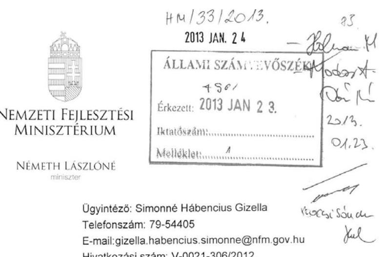

Domokos László részére
elnök
Állami Számvevőszék

# Budapest 

Apáczai Csere János u. 10.
1052

Tárgy: jelentéstervezet véleményezése

## Tisztelt Elnök Úr!

Köszönettel vettem „a kerékpárút hálózat fejlesztésére fordított pénzeszközök felhasználásának ellenőrzéséről" készített jelentés-tervezetüket.

A jelentéstervezet a Közlekedésfejlesztési Koordinációs Központ bevonásával történő véleményezése során kialakult közös állásponttal egyetértek (melléklet), egyebek iránt más észrevételt nem teszek.

Budapest, 2013. január 15.

Tisztelettel:
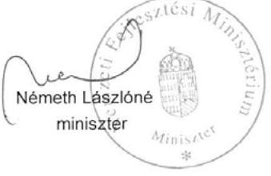

Melléklet: 1 db
Készült: 2 példányban
Kapják: Címzett

---

# Kerékpárút hálózat fejlesztésére fordított pénzeszközök felhasználásának ellenőrzéséről (párhuzamos ellenőrzés a Szlovák Számvevőszékkel) készített számvevőszéki jelentéstervezet - a Közlekedésfejlesztési Koordinációs Központ bevonásával történő - véleményezése 

## Általános észrevételek:

- A Közlekedésfejlesztési Koordinációs Központ kissé értetlenül tapasztalta, hogy a jelentés dominanciaként kezeli a KKK által kialakított és alkalmazott Kerékpárút Nyilvántartási Rendszer (KENYI) működését. A jelentés 2. sz. megállapításának és javaslatának (23. old.) megfogalmazása azt sugallja, hogy a KKK jogtalanul és feleslegesen, az állami forrásokat mintegy pazarolva, öncélúan alakított ki nyilvántartási rendszert az egyébként feladatát képező kerékpárút hálózat fejlesztésére fordítható támogatások felhasználásának átláthatósága és követhetősége céljából.
A jelentés többször hangsúlyozza, hogy a kerékpáros infrastruktúra hálózat fejlesztése többek között a környezetvédelmi szempontok mentén alakult, a környezeti terhelés csökkentését tűzte ki célul. Ennek megfelelően az ellenőrzés egyik célja is az volt, hogy a kerékpárutak fejlesztésére fordított hazai és uniós források hozzájárultak-e a nemzeti környezetvédelmi programokban kitűzött célok megvalósításához. Mindamellett, hogy a kerékpáros közlekedés elterjedése egyértelműen hozzájárul a közlekedésből származó környezeti terhelés csökkentéséhez, a hazai fejlesztések célja és a kerékpáros létesítmények elsődleges feladata a biztonságos közlekedés feltételeinek megteremtése. Ezt bizonyítja, a hazai és Uniós környezetvédelmi programok sajnos csak marginálisan járultak hozzá a kerékpáros infrastruktúra fejlesztéséhez (bár ezt a 44. oldal alján hivatkozott 132/2003. OGY határozat is szorgalmazná). Ebből adódik, hogy a fejlesztések megvalósulását mérő indikátorok- és a nyilvántartási rendszer is túlnyomórészt forgalmi-műszaki jellegű adatokat tartalmaz. A jelentés megállapítja, hogy Kerékpárút Nyilvántartási Rendszer (KENYI) nem tartalmazott a kerékpáros infrastruktúra fejlesztés céljainak értékelésére alkalmas mérőszámot és nem tette lehetővé a megvalósult fejlesztések környezetre, közlekedésre, turizmusra gyakorolt hatásának értékelését. A KENYI rendszer célja elsősorban az, hogy a kerékpáros létesítményekre vonatkozó szerteágazó adattömeg egységesítve legyen, kiszolgálva ezzel az útügyi koordinációt, valamint az önkormányzatok, úttervezők, civil
 szervezetek és kerékpárral közlekedők információigényeit (ÚT 2-2-210 Útügyi Műszaki Előírás). Mindazonáltal a KENYI alkalmas olyan mérőszámok, adatok tárolására, melyek jobban elősegítik például a környezetre gyakorolt hatások értékelését. Azonban az adatbázis felhasználhatóságát elsődlegesen a rendszerbe szolgáltatott adatok mennyisége és minősége határozza meg, ami az eddigi tapasztalatok alapján a KENYI esetében is hiányos. Jelenleg ugyanis - forráshiány miatt - nincs rendszeres forgalomszámlálás a hazai kerékpárutakon (tudomásunk szerint országos szinten 2 db automata forgalomszámláló berendezés üzemel), de a teljes hálózat műszaki felmérése sem valósult meg, illetve a baleseti statisztikák is csak részben terjednek ki a kerékpáros forgalomra. A környezetre gyakorolt hatások értékeléséhez tehát nem a KENYI fejlesztésére, hanem az adatfelvétel és adatszolgáltatás mennyiségének és minőségének fejlesztésére van szükség, mely

---

feladat végrehajtásához több szervezet együttműködésére és jelentős forrásokra lenne szükség. Megjegyezzük, hogy a környezetre gyakorolt hatást közvetett módon, a forgalmi adatok alapján lehet kalkulálni.

- Igen hasznosnak és előremutatónak tartjuk a kerékpáros beruházásokkal kapcsolatos lakossági kérdőíves felmérést. Az eredmények széles körű publikálása hasznos információt jelentene mind a döntéshozók, mind a támogatók és a jövőbeli támogatottak részére.
- A jelentésből hiányoljuk a tervbírálat intézményének említését. A kerékpárutak fejlesztésére fordított források hatékony felhasználásához véleményünk szerint hozzájárult a KKK által bonyolított tervbírálat. A tervbírálat KÖZOP kiírások esetében 2009-től kötelező, ROP kiírások esetén ajánlott. A tervbírálat során szakértői zsűri értékeli az engedélyezésre benyújtandó terveket, mely során számos, a közlekedésbiztonság növelését vagy éppen a költségek csökkentését eredményező javaslat, módosítás születik.

# Részletes észrevételek: 

- 13. oldal 2. bekezdés: a jelentésben foglaltakkal ellentétben jelenleg 14 útvonalat tartalmaz az EuroVelo hálózat, melyből 3 érinti Magyarországot: EuroVelo6 (Duna mentén), EuroVelo11 (Tisza mentén) és EuroVelo13 (Nyugati határszél). Forrás: www.eurovelo.org
- 14. oldal 1. bekezdés: a Útpénztárból 2006-2010 között kerékpáros létesítmények fejlesztésének támogatására 3,6 mrd Ft kifizetés történt, kérjük a szöveg módosítását. A jelentés ebben a részben nem említi a 2007-ben Új kerékpárutak és létesítmények GKM fejezeti kezelésű előirányzat keretében kifizetett 1,0 milliárd Ft támogatást, kérjük pótolni.
- 15. oldal 1. bekezdés: a 1364/2011 (XI.8.) Korm. határozat 2. és 3. pontja véleményünk szerint nincs és nem is lehet összefüggésben a vizsgált időszakban kerékpárutak fejlesztésére fordított források felhasználásának minősítésével. Ugyan ez vonatkozik a 19. oldal 1. bekezdésére.
- 17. oldal utolsó bekezdés: a kerékpáros infrastruktúra fejlesztés céljait, eszközrendszerét és feladattervét a Kerékpáros Magyarország Program megfogalmazta. Bár ez a dokumentum hivatalosan nem került a Kormány által elfogadásra, a fejlesztések nagyrészt az ebben lefektetetett elvek szerint zajlottak. A 1364/2011 (XI.8.) Korm. határozat érdemben már nem befolyásolta a vizsgált időszakot.
- 18. oldal 2. bekezdés: nem értünk egyet a jelentés azon megállapításával, hogy a hazai és uniós pályázatokat nem hangolták össze. A különböző források más és más cél megvalósítását szolgálták, tehát eltérő jellegű projektek finanszírozását tették lehetővé. Ettől függetlenül a pályázatok összehangolása - ha nem is minden tekintetben, de az alapvető célokat illetően feltétlenül - megtörtént.
- 20. oldal 2. bekezdés: egyetértünk azzal, hogy a fejlesztési célok megvalósulásának értékelésére nem áll rendelkezésre megfelelő mennyiségű és minőségű adat, de ennek oka - az általános észrevételek között kifejtettek miatt - nem az informatikai rendszer. A KKK a KENYI fejlesztése során az adattartalom meghatározása során egyeztetett az érintett szervezetekkel. Az adatszolgáltatással kapcsolatos szabályozást a 2010 áprilisában hatályba lépett Útügyi Műszaki Előírás (út 2-2.210)

---

tartalmazza, amely szabályozza és előírja az adatszolgáltatás formáját és végrehajtását. Ismételten hangsúlyozni kívánjuk, hogy a KENYI az adattáblák bővítésével egyszerűen alkalmassá tehető további adatféleségek kezelésére, azonban az adatok előállítását (pl. forgalomszámlálás, baleseti adatok, helyszíni felmérések) nem tudja biztosítani. Az adatok előállítása lényegesen költségesebb és időigényesebb feladat az informatikai rendszer fejlesztésénél. A kerékpáros infrastruktúra részletes felmérésére és adatkonvertálásra a korábbi évek során csak korlátozott források álltak rendelkezésre. 2013-ban KÖZOP forrásból tervezett a teljes hálózat felmérése. Kérjük, hogy fejtsék ki, hogy mely területen van átfedés a KENYI és a TEIR között.

- 23. oldal 2. pont: korábban megfogalmazott indokok miatt az adatgyűjtés (leginkább rendszeres forgalomszámlálás, baleseti adatok) szükségességét javasoljuk hangsúlyozni.
- 25. oldal II. 1.1. pont: a kerékpáros infrastruktúra fejlesztés céljait, eszközrendszerét és feladattervét a Kerékpáros Magyarország Program megfogalmazta. Bár ez a dokumentum hivatalosan nem került a Kormány által elfogadásra, a fejlesztések nagyrészt az ebben lefektetetett elvek szerint zajlottak.
- 27. oldal 2. bekezdés: 2011-től kezdődően a kerékpáros fejlesztések önálló állami feladatként történő tervezése valósult meg. Hangsúlyozni szeretnénk, hogy a 1364/2011. (XI. 8.) Korm. határozat és az abban megfogalmazott célok, feladatok a kerékpáros infrastruktúra fejlesztéseknek csak egy részét (a turisztikai szempontból fontos elemeket) fedik le, tehát nem a teljes hálózat fejlesztésére vonatkozik.
- 29. oldal 2.1. pont: nem értünk egyet a jelentés azon megállapításával, hogy a hazai és uniós pályázatokat nem hangolták össze. A különböző források más és más cél megvalósítását szolgálták, tehát eltérő jellegű projektek finanszírozását tették lehetővé. Ettől függetlenül a pályázatok összehangolása - ha nem is minden tekintetben, de az alapvető célokat illetően feltétlenül - megtörtént.
- 30. oldal 1. bekezdés: a hazai pályázatok esetében kivitelezési (építési) projektek esetében a támogatási intenzitás alapvetően 85 %, míg tervezési projektek esetében 50 % volt.
- 32. oldal 3. bekezdés: a hazai pályázatokkal ellentétben a ROP és KÖZOP konstrukciók a megépítendő kerékpárút hosszán kívül forgalmi adatokat is megjelöltek monitoring mutatóként. A jelentés is megjegyzi (36. oldal 2. bekezdés), hogy a forgalmi adatok a legtöbb esetben nem méréssel, hanem becsléssel lettek megállapítva. Véleményünk szerint a becsült adatok meglehetősen pontatlanok. A forgalmi adatok csak abban az esetben lehetnének objektív indikátorok, ha a megvalósult létesítményeken rendszeres forgalomszámlálás történne. Ez azonban forráshiány miatt sem jelenleg, sem a vizsgált időszakban nem biztosított.
- 33. oldal utolsó bekezdés: a KÖZOP forrásból 2008-ban jelentős elvonás történt 2008-ban, mely a későbbiekben csak részben került pótlásra. Ez is indokolja a konstrukció többszöri felfüggesztését. Javasoljuk, hogy az NFÜ-vel egyeztetve kerüljenek pontosításra az információk.
- 34. oldal 2.3 pont, első bekezdés: a megvalósult kerékpárutakról nem teljes körűen, de készült típus szerinti nyilvántartás. A hazai forrásból megvalósult létesítmények esetében készült bontás, valamint a KENYI rendszerében szereplő kerékpáros létesítmények esetében a nyilvántartás a létesítménytípusokat külön-külön kezeli. A 2013-as KENYI országos adatfelvétel pótolni fogja a hiányzó adatokat.

---

- 35. oldal utolsó bekezdés: a 1364/2011 (XI.8.) Korm. határozat 2. és 3. pontja véleményünk szerint nincs és nem is lehet összefüggésben a vizsgált időszakban kerékpárutak fejlesztésére fordított források felhasználásának minősítésével. Ugyan ez vonatkozik a 37. oldal 2. bekezdésére is.
- 37. oldal 2.4 fejezet, 1. bekezdés: a hazai forrásból épített kerékpárutak műszaki paramétereit az UKIG és a KKK által megbízott műszaki ellenőrök a műszaki átadás során ellenőrizték és jegyzőkönyvben rögzítették. A támogatás kifizetésének feltétele volt a műszaki ellenőr igazolása. A KKK-nál tartott helyszíni ellenőrzés során a kapcsolódó dokumentumok bemutatásra kerültek az ellenőrök részére. A forgalmi adatok mérésére - forrás hiányában - nem került sor, így forgalmi adatok indikátorként való meghatározása, a pályázatok kiírói szerint, nem eredményezett volna objektív mérőszámokat.
- 37. oldal utolsó bekezdés: a hazai forrásból épült létesítmények esetében a fenntartási kötelezettség elmulasztása esetében a hazai támogatási forrásokból való kizárást határozta meg a támogatási szerződés. A hazai támogatási források megszűnésével (2008 után) ez a szankció értelemszerűen nem volt alkalmazható. A 15. számú lábjegyzetben szereplő, 120 millió Ft forrásigényű felmérés és KENYI fejlesztés nem kapcsolódik közvetlenül a fenntartási kötelezettségek ellenőrzéséhez. A fenntartási kötelezettségek ellenőrzése jóval kisebb forrásból megoldható lenne.
- 39. oldal 4. bekezdés: A KKK a KENYI fejlesztése során az adattartalom meghatározása során egyeztetett az érintett szervezetekkel. Az adatszolgáltatással kapcsolatos szabályozást a 2010 áprilisában hatályba lépett Útügyi Műszaki Előírás (út 2-2.210) tartalmazza, amely szabályozza és előírja az adatszolgáltatás formáját és végrehajtását. Továbbra is szeretnénk hangsúlyozni, hogy a KENYI alkalmas különféle adatféleségek (pályázati indikátorok, forgalmi adatok) tárolására. Azonban az adatbázis felhasználhatóságát elsődlegesen a rendszerbe szolgáltatott adatok mennyisége és minősége határozza meg, ami az eddigi tapasztalatok alapján a KENYI esetében is hiányos. Jelenleg ugyanis - forráshiány miatt - nincs rendszeres forgalomszámlálás a hazai kerékpárutakon, de a teljes hálózat műszaki felmérése sem valósult meg, illetve a baleseti statisztikák is csak részben terjednek ki a kerékpáros forgalomra. Kérjük a bekezdés pontosítását. A jelentésben sajnálatos módon nem kerül bemutatásra, hogy a KENYI milyen jellegű - az útügyi koordináció, valamint az önkormányzatok, úttervezők, civil szervezetek és kerékpárral közlekedők információigényeit kiszolgáló részletes - adatokat tartalmaz.
- 39. oldal, utolsó bekezdés: A KENYI feltöltéséhez 2009-ben az induló adatállomány az OKA-ból átvett kerékpározásra alkalmas közutak adatait és a külön felmérés során rögzítésre került 5 turisztikailag legfontosabb terület felmért kerékpárútjainak adatait tartalmazta. 2009-ben az alapadatok kiegészítéséhez a rendszerbe integrálásra kerültek az árvízvédelmi gátak adatai is.
- 40. oldal 2. bekezdés: a KENYI rendszerében a friss adatokat a pályázói adatszolgáltatások, valamint a KKK saját felmérései jelentették/jelentik. Nagyobb terület felmérésére négy megye vonatkozásában 2010. évben, adatkonvertálásra 2011. szeptemberében került sor. Az azt követő időszakban a KKK-hoz beérkező adatok rögzítése a KENYI belső adatbázisában naprakész, de további felmérések elvégeztetésére és a konvertálásokra - tekintettel a forráshiányra - nem kerülhetett sor.

---

- 40. oldal 2. bekezdés, megjegyzés: kérjük mutassák be, hogy mely területen van átfedés a KENYI és a TEIR között.
- 40. oldal 3. bekezdés: a KENYI a fejlesztések hatásainak értékelésére - mint ahogy azt a fentiekben részletesen kifejlettük - elsősorban a hiányos adatszolgáltatás (forgalmi és baleseti adatok) miatt csak korlátozottan alkalmas.
- 41. oldal 1. bekezdés követő 2. apró betűs megjegyzés: az útügyi műszaki előírások alkalmazása nem kötelező, tehát a kötelező alkalmazás megszűnése sem történhetett meg.
- 52 oldal 2. bekezdés: nem értünk egyet a jelentés megállapításával, miszerint a kerékpárút fejlesztések nem befolyásolták a közúti kerékpáros balesetek számát. A 8. sz. ábra kizárólag a balesetek számát mutatja be a forgalmi adatok nélkül. A 3. bekezdés rámutat arra, hogy miközben a balesetek száma gyakorlatilag stagnál, a forgalom jelentős mértékben nőtt (ez a rendszeres forgalomszámlálások hiányában is egyértelműen megállapítható). A 4. bekezdés utolsó mondata - korrekt módon - meg is állapítja, hogy a balesetek száma relatív csökkent. A fejlesztések tehát országos szinten hozzájárultak a kerékpáros balesetek számának csökkenéséhez. Kérjük a 3. bekezdés javítását.

---

# ELNÖK 

ÁLLAMI
SZÁMVEVŐSZÉK
10/B. számú melléklet
a V-0021-326/2013. sz. jelentéshez

Ikt.szám: V-0021-320/2013.

## Németh Lászlóné asszony

miniszter
Nemzeti Fejlesztési Minisztérium

## Budapest

## Tisztelt Miniszter Asszony!

A kerékpárút hálózat fejlesztésére fordított pénzeszközök felhasználásának ellenőrzése (párhuzamos ellenőrzés a Szlovák Számvevőszékkel) címủ jelentéstervezetre tett észrevételeit köszönettel
 megkaptam.

Az Állami Számvevőszék észrevételekre vonatkozó álláspontjáról a felügyeleti vezető által készített részletes tájékoztatást csatoltán megküldöm.

Tájékoztatom Miniszter asszonyt, hogy a jelentésben - az Állami Számvevőszékről szóló 2011. évi LXVI. törvény 29. § (3) bekezdése alapján - az el nem fogadott észrevételeket szerepeltetjük az elutasítás indokának feltüntetésével együtt. Az elfogadott észrevételeket a jelentés szövegezésénél figyelembe vesszük.

Budapest, 2013. 02. hónap napja
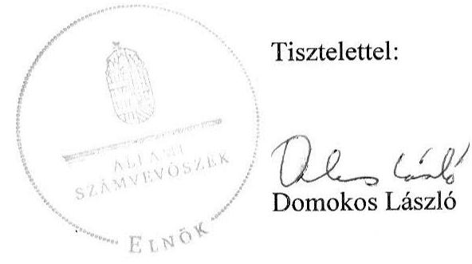

---

# Tájékoztatás 

## Az elfogadott és az el nem fogadott észrevételekről

A kerékpárút hálózat fejlesztésére fordított pénzeszközök felhasználásának ellenőrzése (párhuzamos ellenőrzés a Szlovák Számvevőszékkel) című jelentéstervezetre EFO/448-2/2013NFM iktatószámú levelében tett észrevételeit áttekintettük, azok kezeléséről az alábbi tájékoztatást adom.

Általános észrevételek:

- A kerékpárút hálózat fejlesztésére fordított pénzeszközök felhasználásának ellenőrzése során azt állapítottuk meg, hogy a kerékpárutak teljes körű, egységes számbavételére az ellenőrzött időszakban nem volt hatályos jogi előírás. A közutakról szóló 1988. évi I. törvény 2012. augusztus 7-től írta elő a kerékpárutakkal összefüggő műszaki adatok nyilvántartását. A nyilvántartás adattartalmáról végrehajtási rendelet a helyszíni ellenőrzés befejezésének időpontjáig nem jelent meg, így nem ismert, hogy a feladatot mely szervezet fogja végrehajtani és a nyilvántartás milyen adatokat fog tartalmazni. Az ellenőrzés arra hívta fel a figyelmet, hogy a KKK már 2009-ben megkezdte a kerékpárutak térinformatikai rendszerű központi nyilvántartását (KeNyi), adattartalmát a KKK határozta meg. Ugyanakkor a KKK 2012. június 19-én jóváhagyott SzMSz-e tartalmazta először az elvégzendő feladatok között a KeNyi üzemeltetésére vonatkozó feladatokat.

Az ellenőrzés nem vitatta, hogy a KeNyi rendszere alkalmas a kerékpáros létesítményekre vonatkozó szerteágazó adattömeg egységesítésére, az útügyi koordináció, valamint az önkormányzatok, úttervezők, civil szervezetek és a kerékpárral közlekedők információigényeinek kielégítésére. Megállapította azonban, hogy a kerékpáros fejlesztések eredményeit, hatásait tartalmazó adatok nem állnak teljes körűen rendelkezésre. A jelentéstervezet második számú javaslata nem a KeNyi hiányosságainak pótlására, javítására, hanem olyan adatbázis létrehozására vonatkozott, amely lehetővé teszi a kerékpáros infrastruktúra-fejlesztések céljainak mérését. A közpénzek hatékony felhasználása érdekében meg kell határozni a célok mérésére alkalmas mutatószámokat, ki kell alakítani azok nyilvántartásának, vezetésének, gyűjtésének módját, és ki kell jelölni az erre alkalmazott informatikai rendszert.

Nem fogadtuk el, hogy a jelentésből hiányzik a tervbírálat intézménye. A források felhasználását az ellenőrzési program szerint a pályázati kiírások tartalma és a lebonyolítás gyakorlata alapján értékeltük. A pályázati anyagok értékelésére több más tényező mellett a tervbírálat is hatással lehetett, de ennek az egy elemnek a kiemelése nem indokolt.

---

Részletes észrevételek:

- Elfogadtuk a 13. oldal második és a 14. oldal első bekezdésében foglaltak pontosítására vonatkozó észrevételeit és a megállapításokat pontosítottuk.
- Nem fogadtuk el a 15. oldal első, a 17. oldal utolsó, a 19. oldal első, a 25. oldal II. 1.1. pontra, a 35. oldal utolsó és a 37. oldal második bekezdésére tett észrevételeit. A kerékpáros infrastruktúra-fejlesztések általános céljait az Országgyűlés keretjelleggel koncepciókban és programokban (pl.: Országos Fejlesztési Koncepció, nemzeti környezetvédelmi programok) fogalmazta meg. A kitűzött célok megvalósítására nem készült részletes feladatterv. A Kerékpáros Magyarország Program - mint ahogy az észrevétel is tartalmazza - elfogadásra, jóváhagyásra nem került, ezért nem fogadható el az Országos Fejlesztési Koncepcióban és a nemzeti környezetvédelmi programokban foglalt célok végrehajtásának dokumentumaként. A Kormány az 1364/2011. (XI. 8.) számú határozatában döntött operatív célok, részletes feladatok kidolgozásáról, valamint kiemelt állami fejlesztési feladatokról. Egyben a nemzeti fejlesztési miniszter számára előírta, hogy vizsgálja meg az európai uniós fejlesztési források bevonásának lehetőségét és tegye meg a szükséges intézkedéseket a források biztosítása érdekében. A kormányhatározatban megfogalmazottak az Országgyűlés által elfogadott célok végrehajtását szolgálják, ezért az abban foglaltak nem hagyhatók figyelmen kívül, tekintettel azok teljesítésének határidejére és az ellenőrzött időszak végére.
- Nem fogadtuk el a 18. oldal második bekezdésére és a 29. oldal 2.1. pontjára tett észrevételeit. Az Országgyűlés által meghatározott kerékpáros infrastruktúra-fejlesztési célok teljesítése érdekében végrehajtandó feladatokat, az ahhoz szükséges forrásokat nem határozták meg. Nem volt ismert a megépítésre tervezett kerékpárutak összes hossza, és az sem, hogy milyen célt szolgáló kerékpárútra, melyik forrásból, mennyit terveznek fordítani és ezzel milyen hatást kívánnak elérni. Ennek hiányában nem valósulhatott meg a források felhasználását szolgáló pályázatok összehangolása. Az uniós források felhasználásánál a ROP-okban és a KÖZOP-ban a kitűzött célok sokrétűek voltak, a hazai finanszírozású pályázatoknál pedig csak a pályázati kiírások tartalmazták a felhasználás területeit. Egy-egy akcióterv, pályázati felhívás határozott meg támogatási keretösszeget, illetve azzal elérendő számszerűsített célkitűzést (pl. megépítendő kerékpárút hossza, a kerékpárforgalmi adatok változása), de nem volt ismert az országos célok teljesítéséhez való hozzájárulás mértéke.
- Nem fogadtuk el 20. oldal második és a 40. oldal harmadik bekezdésére tett észrevételét. A jelentéstervezet nem vitatta, hogy az informatikai rendszer alkalmas a különféle mérőszámok kezelésére, de a nyilvántartásban nem álltak teljes körűen rendelkezésre a különböző programokban, koncepciókban kitűzött fejlesztési célokkal összhangban lévő, a fejlesztések hatását bemutató indikátorok (pl. a megvalósult fejlesztések környezetre, közlekedésre, turizmusra gyakorolt hatása). Mivel a KeNyi létrehozásának célja az útügyi koordináció, az úttervezők, civil szervezetek információigényeinek kielégítése volt, ezért az észrevételében leírt egyeztetés sem segítette elő az ellenőrzés által hiányolt fejlesztések hatását bemutató indikátorok létrehozását. Az Útügyi Műszaki Előírások is a más céllal

---

létrehozott nyilvántartás adatszolgáltatását szabályozták, emiatt a jelentéstervezet megalapozottan hiányolta a kitűzött célok megvalósulásának megítéléséhez szükséges adatokat. Álláspontunk szerint a kerékpáros infrastruktúra felmérését és adatkonvertálását időben meg kell előzni a 2. számú javaslatunkban megfogalmazott jelenlegi nyilvántartó rendszer felülvizsgálatának.

- Nem fogadtuk el a 23. oldal második pontjára tett javaslatát. A kerékpárút hálózat fejlesztésére vonatkozó célok meghatározásakor célszerű olyan mérőszámokat kialakítani, amelyek alkalmasak a fejlesztési célok megvalósításának mérésére, értékelésére. Ennek kialakítására és nyilvántartására fogalmaztunk meg javaslatot.
- A 27. oldal második bekezdésre tett észrevétele alapvetően nem módosítja a jelentéstervezet megállapítását. A jelentéstervezet is tartalmazza, hogy az 1364/2011. (XI. 8.) Korm. határozatban foglaltak a természetjáró és kerékpáros turizmus, az úthálózat és közlekedés fejlesztésével összefüggő kormányzati feladatokat tartalmazza. Észrevétele alapján a jelentés szövegét pontosítottuk az alábbiak szerint:
„A kerékpáros fejlesztések önálló állami feladatként való tervezése a 2011. évtől kezdődően valósult meg....Az ebben foglalt előírások a természetjáró és kerékpáros turizmus, az úthálózat és közlekedés fejlesztéséhez kapcsolódóan közvetlenül kijelölték az átfogó, valamint a kiemelt állami feladatokat....Így a kormányhatározat meghatározta a kerékpáros fejlesztések koncepciójának és megvalósíthatósági tanulmányának elkészítésére, a szükséges források felmérésére, valamint a végrehajtás részletes ütemezésére vonatkozó feladatokat."
- Nem fogadtuk el a 30. oldal első bekezdésére tett észrevételét. A hazai forrásból 2006 és 2008 között meghirdetett pályázati felhívásokban a támogatások mértéke 50% volt, amelyekhez 70% erejéig további kiegészítő támogatás volt igényelhető. A 2007. és a 2008. évi pályázati felhívásban megjelölt konkrét esetekben a támogatás mértéke az építési pályázatoknál elérhette a 80, illetve a 100%-ot. Ezek alapján helytálló az a megállapításunk, hogy a támogatási intenzitás alapvetően 50% volt és az építési pályázatoknál elérhette a 100%-ot.
- A 32. oldal harmadik bekezdésére tett észrevétele nem módosítja a jelentéstervezet megállapítását. Az átlagos napi forgalom, mint alkalmazandó eredményindikátor akciótervekben, pályázati útmutatókban megjelent. Egyes pályázati útmutatók ennek számítási módjára is tartalmaztak előírást. Az indikátor cél- és tényértékei az egyes projektek esetében az EMIR-ben is rögzítésre kerültek. Az ellenőrzés mindezt nem hagyhatta figyelmen kívül, függetlenül az indikátor számítási módjától.
- A 33. oldal utolsó bekezdésére tett észrevétele nem módosítja a jelentéstervezet megállapítását, ahhoz kiegészítő információt nyújt. A jelentéstervezetben a Nemzeti Fejlesztési Ügynökség (NFÜ) által átadott adatok kerültek feltüntetésre.

---

- Részben elfogadtuk a 34. oldal 2.3. pont, első bekezdésére tett észrevételét. A megállapítás szövegét kiegészítettük azzal, hogy „teljes körű nyilvántartás nem készült". Ez azonban nem befolyásolja az értékelés módját, ugyanis teljes körű nyilvántartás hiányában az értékelést valamennyi kerékpárút típusra vonatkozó, összevont adatok alapján lehetett elvégezni.
- Elfogadtuk a 37. oldal 2.4. pont, első bekezdésében a műszaki ellenőrzésre vonatkozó észrevételét. A műszaki ellenőrök műszaki átadás során végzett, a támogatás kifizetésének feltételeiként előírt műszaki ellenőri igazolással kiegészítettük megállapításunkat. Észrevételének második része nem változtat azon a tényen, hogy a hazai forrásokból támogatott programok eredményeinek mérésére szolgáló célértéket nem határozták meg, így ennek mérése sem valósulhatott meg. Az uniós forrásból támogatott projektek esetében a forgalmi adatok eredményindikátorként szerepeltek.
- Elfogadtuk a 37. oldal utolsó bekezdésére tett észrevételét és a jelentésben az észrevétellel kifogásolt lábjegyzetet töröltük. Észrevételének első része nincs ellentmondásban megállapításunkkal, mivel az ellenőrzések során nem állapítottak meg olyan körülményt, amely a támogatási szerződésben foglaltak be nem tartása miatt szankció alkalmazását tette volna szükségessé.
- Nem fogadtuk el a 39. oldal negyedik bekezdésére tett észrevételét. A 2010 áprilisában hatályba lépett Útügyi Műszaki Előírás közjogi szervezetszabályozó eszköz és nem jogszabály. Ezért a kerékpárutak teljes körű, egységes számbavételére nem volt jogi szabályozás. Nem vitattuk, hogy a KeNyi alkalmas különböző adatok tárolására. Megállapításunk arra vonatkozott, hogy a jelenlegi adattartalma csak korlátozottan teszi lehetővé a megvalósult fejlesztések környezetre, közlekedésre, turizmusra gyakorolt hatásának értékelését. Ezt a tényt nem módosítja az sem, hogy a KeNyi adatait az útügyi koordináció, az önkormányzatok, az úttervezők, a civil szervezetek és a kerékpárral közlekedők is felhasználhatják.
- Elfogadtuk a 39. oldal utolsó bekezdésére tett észrevételt, melynek alapján a bekezdés szövegéhez kapcsolódó lábjegyzetet kiegészítettük az árvízvédelmi gátak adatainak rendszerbe történő integrálásával.
- A 40. oldal második bekezdésére tett megjegyzése alapján pontosítottuk a hivatkozott bekezdést. A területfejlesztéssel és területrendezéssel kapcsolatos információs rendszerről és a kötelező adatközlés szabályairól szóló 31/2007. (II.8.) Korm. rendelet 2. számú mellékletében szereplő előírás alapján a KKK adatokat ad át a TEIR-nek a kerékpárút országos törzshálózati adataira vonatkozóan. Ennek figyelembevételével a jelentésben tényként szerepeltetjük, hogy a „KKK adatokat ad át a TEIR-nek a kerékpárút országos törzshálózati adatokra vonatkozóan".

A KeNyi adatfeltöltésére vonatkozó észrevétele a jelentéstervezetben foglalt megállapítást nem módosítja, ahhoz kiegészítő információt nyújt a tekintetben, hogy 2011 szeptemberétől

---

a pályázatokhoz kapcsolódó, a Közlekedésfejlesztési Koordinációs Központhoz beérkezett adatok adatbázisba történő feltöltése folyamatos.

- A 41. oldal első bekezdésének második részbekezdésére tett észrevétele alapján a jelentés megállapítását pontosítottuk a következők szerint:
„A tervezők - igazodva a műszaki szabályozás harmonizációja során átalakuló szabványrendszerhez - a szabványok nem kötelező alkalmazása ellenére figyelembe vették az irányadónak tekintett hazai műszaki specifikációkat, útügyi műszaki előírásokat és egyéb ajánlásokat."
- Nem fogadtuk el az 52. oldal második bekezdésére tett észrevételét. A Magyar Közút Nonprofit Zrt. adatszolgáltatása egyértelműen mutatja, hogy az ellenőrzött időszakban a közúti kerékpáros balesetek száma nem csökkent, sőt 2006-tól 2010-ig évről évre kismértékű emelkedést mutat. A jelentéstervezetben az NFÜ adatszolgáltatása alapján tényszerűen ismertetettük azt a körülményt, hogy az uniós projektek esetében több mint háromszorosára növekedett
 a kerékpáros forgalom. Felhívtuk a figyelmet arra is, hogy az abszolút adatok értékelésénél figyelembe kell venni a kerékpáros forgalom emelkedését. A jelentéstervezetben bemutatott adatokból nem vonható le az a következtetés, hogy a fejlesztések országos szinten hozzájárultak a kerékpáros balesetek számának csökkenéséhez, mert az országos közúti kerékpáros forgalom változására mérés hiányában nincs adat, ugyanakkor a kerékpáros balesetek abszolút száma a 2005. évi 3225-ről 2011-re 3343-ra nőtt.

Tájékoztatom, hogy a számvevőszéki jelentés mellékleteiként szerepeltetjük a jelentéstervezethez tett észrevételeit, valamint azokra adott válaszunkat.

Budapest, 2013. 01. hó 9. nap

Holman Magdolna
felügyeleti vezető

---

# KÖZLEKEDÉSFEJLESZTÉSI KOORDINÁCIÓS KÖZPONT 

1024 Budapest, Lövőház utca 39. $\cdot$ telefon: +36 (1) 336-8100 $\cdot$ fax: +36 (1) 336-1522 $\cdot$ e-mail: kkk@kkk.gov.hu

Válaszlevelükben szíveskedjenek az alábbi iktatószámra hivatkozni! IKTATÓSZAM: M-11JI 00/2013
HIV.SZAM.: V-0021-306/2012
TÁRGY: Kerékpárút hálózat fejlesztésére fordított pénzeszközök felhasználásának ellenőrzéséről készített jelentéstervezet véleményezése
ELŐADÓ NEVE: Berencsi Miklós
ELŐADÓ TELEFONOZÁMA: 0613368295
MELLÉKLET: Általános és részletes észrevételek

Állami Számvevőszék
Domokos László
elnök
Budapest 4.
Pf. 54
1364

ÁLLAMI SZÁMVEVŐSZÉK
5011
Érkezo: 2013 JAN 17.
Iktatószám:
Melléklet: $\qquad$
1364

## Tisztelt Elnök Úr!

Mellékelten megküldöm a kerékpárút hálózat fejlesztésére fordított pénzeszközök felhasználásának ellenőrzéséről (párhuzamos ellenőrzés a Szlovák Számvevőszékkel) készített jelentéstervezetükre tett észrevételeinket.

Kérjük a mellékelt megjegyzések, észrevételek szíves figyelembe vételét.

Budapest, 2013. január 9.
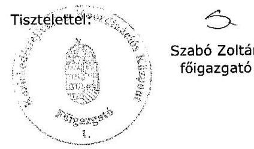

Másolatban kapja:

- Szúcs Lajos főosztályvezető, Nemzeti Fejlesztési Minisztérium

---

Kerékpárút hálózat fejlesztésére fordított pénzeszközök felhasználásának ellenőrzéséről (párhuzamos ellenőrzés a Szlovák Számvevőszékkel) készített számvevőszéki jelentéstervezet véleményezése

Közlekedésfejlesztési Koordinációs Központ

# Általános észrevételek: 

- A Közlekedésfejlesztési Koordinációs Központ kissé értetlenül tapasztalta, hogy a jelentés dominanciaként kezeli a KKK által kialakított és alkalmazott Kerékpárút Nyilvántartási Rendszer (KENYI) működését. A jelentés 2. sz. megállapításának és javaslatának (23. old.) megfogalmazása azt sugallja, hogy a KKK jogtalanul és feleslegesen, az állami forrásokat mintegy pazarolva, öncélúan alakított ki nyilvántartási rendszert az egyébként feladatát képező kerékpárút hálózat fejlesztésére fordítható támogatások felhasználásának átláthatósága és követhetősége céljából.
A jelentés többször hangsúlyozza, hogy a kerékpáros infrastruktúra hálózat fejlesztése többek között a környezetvédelmi szempontok mentén alakult, a környezeti terhelés csökkentését tűzte ki célul. Ennek megfelelően az ellenőrzés egyik célja is az volt, hogy a kerékpárutak fejlesztésére fordított hazai és uniós források hozzájárultak-e a nemzeti környezetvédelmi programokban kitűzött célok megvalósításához.
Mindamellett, hogy a kerékpáros közlekedés elterjedése egyértelműen hozzájárul a közlekedésből származó környezeti terhelés csökkentéséhez, a hazai fejlesztések célja és a kerékpáros létesítmények elsődleges feladata a biztonságos közlekedés feltételeinek megteremtése.
Tekintettel arra, hogy a közlekedési és regionális programok mellett a környezetvédelmi programok csak kis mértékben járultak hozzá a kerékpáros infrastruktúra fejlesztéséhez (bár ezt a 44. oldal alján hivatkozott 132/2003. OGY határozat is szorgalmazná), így a fejlesztések megvalósulását mérő indikátorok és a nyilvántartási rendszer is túlnyomórészt forgalmiműszaki jellegű adatokat tartalmaz.
A jelentés megállapítja, hogy a Kerékpárút Nyilvántartási Rendszer (KENYI) nem tartalmazott a kerékpáros infrastruktúra fejlesztés céljainak értékelésére alkalmas mérőszámot és nem tette lehetővé a megvalósult fejlesztések környezetre, közlekedésre, turizmusra gyakorolt hatásának értékelését. A KENYI rendszer célja elsősorban az, hogy a kerékpáros létesítményekre vonatkozó szerteágazó adattömeg egységesítve legyen, kiszolgálva ezzel az útügyi koordináció, valamint az önkormányzatok, úttervezők, civil szervezetek és kerékpárral közlekedők információigényeit (ÚT 2-2-210 Útügyi Műszaki Előírás). Mindazonáltal a KENYI alkalmas olyan mérőszámok, adatok tárolására, melyek jobban elősegítik például a környezetre gyakorolt hatások értékelését. Azonban az adatbázis felhasználhatóságát elsődlegesen a rendszerbe szolgáltatott adatok mennyisége és minősége határozza meg, ami az eddigi tapasztalatok alapján a KENYI esetében is hiányos. Jelenleg ugyanis - forráshiány miatt - nincs rendszeres forgalomszámlálás a hazai kerékpárutakon (tudomásunk szerint országos szinten 2 db automata forgalomszámláló berendezés üzemel), de a teljes hálózat műszaki felmérése sem valósult meg, illetve a baleseti statisztikák is csak részben terjednek ki

---

a kerékpáros forgalomra. A környezetre gyakorolt hatások értékeléséhez tehát nem a KENYI fejlesztésére, hanem az adatfelvétel és adatszolgáltatás mennyiségének és minőségének fejlesztésére van szükség, mely feladat végrehajtásához több szervezet együttműködésére és források bevonására lenne szükség. Megjegyezzük, hogy a környezetre gyakorolt hatást közvetett módon, a forgalmi adatok alapján lehet kalkulálni.

- Igen hasznosnak és előremutatónak tartjuk a kerékpáros beruházásokkal kapcsolatos lakossági kérdőíves felmérést. Az eredmények széles körű publikálása hasznos információt jelentene mind a döntéshozók, mind a támogatók és a jövőbeli támogatottak részére.
- A jelentésből hiányoljuk a tervbírálat intézményének említését. A kerékpárutak fejlesztésére fordított források hatékony felhasználásához véleményünk szerint hozzájárult a KKK által bonyolított tervbírálat. A tervbírálat KÖZOP kiírások esetében 2009-től kötelező, ROP kiírások esetén ajánlott. A tervbírálat során szakértői zsűri értékeli az engedélyezésre benyújtandó terveket, mely során számos, a közlekedésbiztonság növelését vagy éppen a költségek csökkentését eredményező javaslat, módosítás születik.

# Részletes észrevételek: 

- 13. oldal 2. bekezdés: a jelentésben foglaltakkal ellentétben jelenleg 14 útvonalat tartalmaz az EuroVelo hálózat, melyből 3 érinti Magyarországot: EuroVelo6 (Duna mentén), EuroVelo11 (Tisza mentén) és EuroVelo13 (Nyugati határszél). Forrás: www.eurovelo.org
- 14. oldal 1. bekezdés: a Útpénztárból 2006-2010 között kerékpáros létesítmények fejlesztésének támogatására 3,6 mrd Ft kifizetés történt, kérjük a szöveg módosítását. A jelentés ebben a részben nem említi a 2007-ben Új kerékpárutak és létesítmények GKM fejezeti kezelésű előirányzat keretében kifizetett 1,0 milliárd Ft támogatást, kérjük pótolni.
- 15. oldal 1. bekezdés: az 1364/2011 (XI.8.) Korm. határozat 2. és 3. pontja véleményünk szerint nincs és nem is lehet összefüggésben a vizsgált időszakban kerékpárutak fejlesztésére fordított források felhasználásának minősítésével. Ugyanez vonatkozik a 19. oldal 1. bekezdésére.
- 17. oldal utolsó bekezdés: a kerékpáros infrastruktúra fejlesztés céljait, eszközrendszerét és feladattervét a Kerékpáros Magyarország Program megfogalmazta. Bár ez a dokumentum hivatalosan nem került a Kormány által elfogadásra, a fejlesztések nagyrészt az ebben lefektetett elvek szerint zajlottak. Az 1364/2011 (XI.8.) Korm. határozat érdemben már nem befolyásolta a vizsgált időszakot.
- 18. oldal 2. bekezdés: nem értünk egyet a jelentés azon megállapításával, hogy a hazai és uniós pályázatokat nem hangolták össze. A különböző források más és más cél megvalósítását szolgálták, tehát eltérő jellegű projektek finanszírozását tették lehetővé. Ettől függetlenül a pályázatok összehangolása - ha nem is minden tekintetben, de az alapvető célokat illetően - feltétlenül megtörtént.
- 20. oldal 2. bekezdés: egyetértünk azzal, hogy a fejlesztési célok megvalósulásának értékelésére nem áll rendelkezésre megfelelő mennyiségű és minőségű adat, de ennek oka az általános észrevételek között kifejtettek miatt - nem az informatikai rendszer. A KKK a KENYI fejlesztése során az adattartalom meghatározása során egyeztetett az érintett szervezetekkel. Az adatszolgáltatással kapcsolatos szabályozást a 2010 áprilisában hatályba

---

lépett Útügyi Műszaki Előírás (út 2-2.210) tartalmazza, amely szabályozza és előírja az adatszolgáltatás formáját és végrehajtását. Ismételten hangsúlyozni kívánjuk, hogy a KENYI az adattáblák bővítésével egyszerűen alkalmassá tehető további adatféleségek kezelésére, azonban az adatok előállítását (pl. forgalomszámlálás, baleseti adatok, helyszíni felmérések) nem tudja biztosítani. Az adatok előállítása lényegesen költségesebb és időigényesebb feladat az informatikai rendszer fejlesztésénél. A kerékpáros infrastruktúra részletes felmérésére és adatkonvertálásra a korábbi évek során csak korlátozott források álltak rendelkezésre. 2013-ban KÖZOP forrásból tervezett a teljes hálózat felmérése. Kérjük, hogy fejtsék ki, hogy mely területen van átfedés a KENYI és a TEIR között.

- 23. oldal 2. pont: korábban megfogalmazott indokok miatt az adatgyűjtés (leginkább rendszeres forgalomszámlálás, baleseti adatok) szükségességét javasoljuk hangsúlyozni.
- 25. oldal II. 1.1. pont: a kerékpáros infrastruktúra fejlesztés céljait, eszközrendszerét és feladattervét a Kerékpáros Magyarország Program megfogalmazta. Bár ez a dokumentum hivatalosan nem került a Kormány által elfogadásra, a fejlesztések nagyrészt az ebben lefektetett elvek szerint zajlottak.
- 27. oldal 2. bekezdés: 2011-től kezdődően a kerékpáros fejlesztések önálló állami feladatként történő tervezése valósult meg. Hangsúlyozni szeretnénk, hogy az 1364/2011. (XI. 8.) Korm. határozat és az abban megfogalmazott célok, feladatok a kerékpáros infrastruktúra fejlesztéseknek csak egy részét (a turisztikai szempontból fontos elemeket) fedik le, tehát nem a teljes hálózat fejlesztésére vonatkozik.
- 29. oldal 2.1. pont: nem értünk egyet a jelentés azon megállapításával, hogy a hazai és uniós pályázatokat nem hangolták össze. A különböző források más és más cél megvalósítását szolgálták, tehát eltérő jellegű projektek finanszírozását tették lehetővé. Ettől függetlenül a pályázatok összehangolása - ha nem is minden tekintetben, de az alapvető célokat illetően feltétlenül megtörtént.
- 30. oldal 1. bekezdés: a hazai pályázatoknál kivitelezési (építési) projektek esetében a támogatási intenzitás alapvetően 85%, míg tervezési projektek esetében 50% volt.
- 32. oldal 3. bekezdés: a hazai pályázatokkal ellentétben a ROP és KÖZOP konstrukciók a megépítendő kerékpárút hosszán kívül forgalmi adatokat is megjelöltek monitoring mutatóként. A jelentés is megjegyzi (36. oldal 2. bekezdés), hogy a forgalmi adatok a legtöbb esetben nem méréssel, hanem becsléssel lettek megállapítva. Véleményünk szerint a becsült adatok meglehetősen pontatlanok. A forgalmi adatok csak abban az esetben lehetnének objektív indikátorok, ha a megvalósult létesítményeken rendszeres forgalomszámlálás történne. Ez azonban forráshiány miatt sem jelenleg, sem a vizsgált időszakban nem volt biztosított.
- 33. oldal utolsó bekezdés: a KÖZOP forrásból jelentős elvonás történt 2008-ban, mely a későbbiekben csak részben került pótlásra. Ez is indokolja a konstrukció többszöri felfüggesztését. Javasoljuk, hogy az NFÜ-vel egyeztetve kerüljenek pontosításra az információk.
- 34. oldal 2.3 pont, első bekezdés: a megvalósult kerékpárutakról nem teljes körűen, de készült típus szerinti nyilvántartás. A hazai forrásból megvalósult létesítmények esetében készült bontás, valamint a KENYI rendszerében szereplő kerékpáros létesítmények esetében a nyilvántartás a létesítménytípusokat külön-külön kezeli. A 2013-as KENYI országos adatfelvétel pótolni fogja a hiányzó adatokat.

---

- 35. oldal utolsó bekezdés: az 1364/2011 (XI.8.) Korm. határozat 2. és 3. pontja véleményünk szerint nincs és nem is lehet összefüggésben a vizsgált időszakban kerékpárutak fejlesztésére fordított források felhasználásának minősítésével. Ugyanez vonatkozik a 37. oldal 2. bekezdésére is.
- 37. oldal 2.4 fejezet, 1. bekezdés: a hazai forrásból épített kerékpárutak műszaki paramétereit az UKIÚ és a KKK által megbízott műszaki ellenőrök a műszaki átadás során ellenőrizték és jegyzőkönyvben rögzítették. A támogatás kifizetésének feltétele volt a műszaki ellenőr igazolása. A KKK-nál tartott helyszíni ellenőrzés során a kapcsolódó dokumentumok bemutatásra kerültek a vizsgálatot végző ellenőrök részére. A forgalmi adatok mérésére - forrás hiányában - nem került sor, így forgalmi adatok indikátorként való meghatározása, a pályázatok kiírói szerint, nem eredményezett volna objektív mérőszámokat.
- 37. oldal utolsó bekezdés: a hazai forrásból épült létesítményeknél a fenntartási kötelezettség elmulasztása esetén a hazai támogatási forrásokból való kizárást határozta meg a támogatási szerződés. A hazai támogatási források megszűnésével (2008 után) ez a szankció értelemszerűen nem volt alkalmazható. A 15. számú lábjegyzetben szereplő, 120 millió Ft forrásigényű felmérés és KENYI fejlesztés nem kapcsolódik közvetlenül a fenntartási kötelezettségek ellenőrzéséhez. A fenntartási kötelezettségek ellenőrzése jóval kisebb forrásból megoldható lenne.
- 39. oldal 4. bekezdés: A KKK a KENYI fejlesztése során
 az adattartalom meghatározása során egyeztetett az érintett szervezetekkel. Az adatszolgáltatással kapcsolatos szabályozást a 2010. áprilisában hatályba lépett Útügyi Műszaki Előírás (út 2-2.210) tartalmazza, amely szabályozza és előírja az adatszolgáltatás formáját és végrehajtását. Továbbra is szeretnénk hangsúlyozni, hogy a KENYI alkalmas különféle adatféleségek (pályázati indikátorok, forgalmi adatok) tárolására. Azonban az adatbázis felhasználhatóságát elsődlegesen a rendszerbe szolgáltatott adatok mennyisége és minősége határozza meg, ami az eddigi tapasztalatok alapján a KENYI esetében is hiányos. Jelenleg ugyanis – forráshiány miatt – nincs rendszeres forgalomszámlálás a hazai kerékpárutakon, de a teljes hálózat műszaki felmérése sem valósult meg, illetve a baleseti statisztikák is csak részben terjednek ki a kerékpáros forgalomra. Kérjük a bekezdés pontosítását. A jelentésben sajnálatos módon nem kerül bemutatásra, hogy a KENYI milyen jellegű – az útügyi koordináció, valamint az önkormányzatok, úttervezők, civil szervezetek és kerékpárral közlekedők információigényeit kiszolgáló részletes – adatokat tartalmaz.
- 39. oldal, utolsó bekezdés: A KENYI feltöltéséhez 2009-ben az induló adatállomány az OKAból átvett kerékpározásra alkalmas közutak adatait és a külön felmérés során rögzítésre került 5 turisztikailag legfontosabb terület felmért kerékpárútjainak adatait tartalmazta. 2009-ben az alapadatok kiegészítéséhez a rendszerbe integrálásra kerültek az árvédelmi gátak adatai is.
- 40. oldal 2. bekezdés: a KENYI rendszerében a friss adatokat a pályázói adatszolgáltatások, valamint a KKK saját felmérései jelentették/jelentik. Nagyobb terület felmérésére négy megye vonatkozásában 2010-ben, adatkonvertálásra 2011. szeptemberében került sor. Az azt követő időszakban a KKK-hoz beérkező adatok rögzítése a KENYI belső adatbázisában naprakész, de további felmérések elvégeztetésére és a konvertálásokra – tekintettel a forráshiányra – nem kerülhetett sor.

---

- 40. oldal 2. bekezdés, megjegyzés: kérjük mutassák be, hogy mely területen van átfedés a KENYI és a TEIR között.
- 40. oldal 3. bekezdés: a KENYI a fejlesztések hatásainak értékelésére – mint ahogy azt a fentiekben részletesen kifejtettük – elsősorban a hiányos adatszolgáltatás (fogalmi és baleseti adatok) miatt csak korlátozottan alkalmas.
- 41. oldal 1. bekezdés követő 2. apró betűs megjegyzés: az útügyi műszaki előírások alkalmazása nem kötelező, tehát a kötelező alkalmazás megszűnése sem történhetett meg.
- 52. oldal 2. bekezdés: nem értünk egyet a jelentés megállapításával, miszerint a kerékpárút fejlesztések nem befolyásolták a közúti kerékpáros balesetek számát. A 8. sz. ábra kizárólag a balesetek számát mutatja be a forgalmi adatok nélkül. A 3. bekezdés rámutat arra, hogy miközben a balesetek száma gyakorlatilag stagnál, a forgalom jelentős mértékben nőtt (ez a rendszeres forgalomszámlálások hiányában is egyértelműen megállapítható). A 4. bekezdés utolsó mondata – korrekt módon – meg is állapítja, hogy a balesetek száma relatív csökkent. A fejlesztések tehát országos szinten hozzájárultak a kerékpáros balesetek számának csökkenéséhez. Kérjük a 3. bekezdés javítását.

Budapest, 2013. január 11.
Összeállította: Köbli Magdolna, Berencsi Miklós, Damásdi Andor

---

# ELNÖK 

ÁLLAMI
SZÁMVEVŐSZÉK
$11/$ B. számú melléklet
a V0021-326/2013. sz. jelentéshez

Ikt.szám: V-0021-322/2013.

## Szabó Zoltán úr

főigazgató
Közlekedésfejlesztési Koordinációs Központ

## Budapest

## Tisztelt Főigazgató Úr!

A kerékpárút hálózat fejlesztésére fordított pénzeszközök felhasználásának ellenőrzése (párhuzamos ellenőrzés a Szlovák Számvevőszékkel) című jelentéstervezetre tett észrevételeit köszönettel megkaptam, amely megegyezik a nemzeti fejlesztési miniszter jelentéstervezetre tett észrevételével.

Az Állami Számvevőszék észrevételekre vonatkozó álláspontjáról a felügyeleti vezető által készített részletes tájékoztatást csatoltan megküldöm.

Tájékoztatom Főigazgató urat, hogy a jelentésben – az Állami Számvevőszékről szóló 2011. évi LXVI. törvény 29. § (3) bekezdése alapján – az el nem fogadott észrevételeket szerepeltetjük az elutasítás indokának feltüntetésével együtt. Az elfogadott észrevételeket a jelentés szövegezésénél figyelembe vesszük.

Budapest, 2013. 02. hó 18. nap
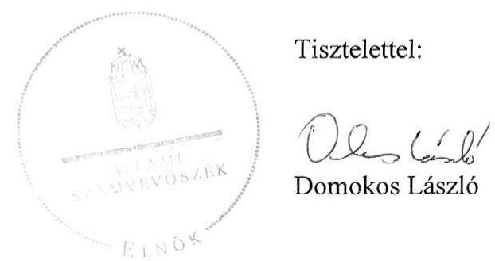

---

# Tájékoztatás 

## Az elfogadott és az el nem fogadott észrevételekről

A kerékpárút hálózat fejlesztésére fordított pénzeszközök felhasználásának ellenőrzése (párhuzamos ellenőrzés a Szlovák Számvevőszékkel) című jelentéstervezetre M-1U/53/2013 iktatószámú levelében tett észrevételeit áttekintettük, azok kezeléséről az alábbi tájékoztatást adom.

Általános észrevételek:

- A kerékpárút hálózat fejlesztésére fordított pénzeszközök felhasználásának ellenőrzése során azt állapítottuk meg, hogy a kerékpárutak teljes körű, egységes számbavételére az ellenőrzött időszakban nem volt hatályos jogi előírás. A közutakról szóló 1988. évi I. törvény 2012. augusztus 7-től írta elő a kerékpárutakkal összefüggő műszaki adatok nyilvántartását. A nyilvántartás adattartalmáról végrehajtási rendelet a helyszíni ellenőrzés befejezésének időpontjáig nem jelent meg, így nem ismert, hogy a feladatot mely szervezet fogja végrehajtani és a nyilvántartás milyen adatokat fog tartalmazni. Az ellenőrzés arra hívta fel a figyelmet, hogy a KKK már 2009-ben megkezdte a kerékpárutak térinformatikai rendszerű központi nyilvántartását (KeNyi), adattartalmát a KKK határozta meg. Ugyanakkor a KKK 2012. június 19-én jóváhagyott SzMSz-e tartalmazta először az elvégzendő feladatok között a KeNyi üzemeltetésére vonatkozó feladatokat.

Az ellenőrzés nem vitatta, hogy a KeNyi rendszere alkalmas a kerékpáros létesítményekre vonatkozó szerteágazó adattömeg egységesítésére, az útügyi koordináció, valamint az önkormányzatok, úttervezők, civil szervezetek és a kerékpárral közlekedők információigényeinek kielégítésére. Megállapította azonban, hogy a kerékpáros fejlesztések eredményeit, hatásait tartalmazó adatok nem állnak teljes körűen rendelkezésre. A jelentéstervezet második számú javaslata nem a KeNyi hiányosságainak pótlására, javítására, hanem olyan adatbázis létrehozására vonatkozott, amely lehetővé teszi a kerékpáros infrastruktúra-fejlesztések céljainak mérését. A közpénzek hatékony felhasználása érdekében meg kell határozni a célok mérésére alkalmas mutatószámokat, ki kell alakítani azok nyilvántartásának, vezetésének, gyűjtésének módját, és ki kell jelölni az erre alkalmazott informatikai rendszert.

Nem fogadtuk el, hogy a jelentésből hiányzik a tervbírálat intézménye. A források felhasználását az ellenőrzési program szerint a pályázati kiírások tartalma és a lebonyolítás gyakorlata alapján értékeltük. A pályázati anyagok értékelésére több más tényező mellett a tervbírálat is hatással lehetett, de ennek az egy elemnek a kiemelése nem indokolt.

---

Részletes észrevételek:

- Elfogadtuk a 13. oldal második és a 14. oldal első bekezdésében foglaltak pontosítására vonatkozó észrevételeit és a megállapításokat pontosítottuk.
- Nem fogadtuk el a 15. oldal első, a 17. oldal utolsó, a 19. oldal első, a 25. oldal II. 1.1. pontra, a 35. oldal utolsó és a 37. oldal második bekezdésére tett észrevételeit. A kerékpáros infrastruktúra-fejlesztések általános céljait az Országgyűlés keretjelleggel koncepciókban és programokban (pl.: Országos Fejlesztési Koncepció, nemzeti környezetvédelmi programok) fogalmazta meg. A kitűzött célok megvalósítására nem készült részletes feladatterv. A Kerékpáros Magyarország Program – mint ahogy az észrevétel is tartalmazza – elfogadásra, jóváhagyásra nem került, ezért nem fogadható el az Országos Fejlesztési Koncepcióban és a nemzeti környezetvédelmi programokban foglalt célok végrehajtásának dokumentumaként. A Kormány az 1364/2011. (XI. 8.) számú határozatában döntött operatív célok, részletes feladatok kidolgozásáról, valamint kiemelt állami fejlesztési feladatokról. Egyben a nemzeti fejlesztési miniszter számára előírta, hogy vizsgálja meg az európai uniós fejlesztési források bevonásának lehetőségét és tegye meg a szükséges intézkedéseket a források biztosítása érdekében. A kormányhatározatban megfogalmazottak az Országgyűlés által elfogadott célok végrehajtását szolgálják, ezért az abban foglaltak nem hagyhatók figyelmen kívül, tekintettel azok teljesítésének határidejére és az ellenőrzött időszak végére.
- Nem fogadtuk el a 18. oldal második bekezdésére és a 29. oldal 2.1. pontjára tett észrevételeit. Az Országgyűlés által meghatározott kerékpáros infrastruktúra-fejlesztési célok teljesítése érdekében végrehajtandó feladatokat, az ahhoz szükséges forrásokat nem határozták meg. Nem volt ismert a megépítésre tervezett kerékpárutak összes hossza, és az sem, hogy milyen célt szolgáló kerékpárútra, melyik forrásból, mennyit terveznek fordítani és ezzel milyen hatást kívánnak elérni. Ennek hiányában nem valósulhatott meg a források felhasználását szolgáló pályázatok összehangolása. Az uniós források felhasználásánál a ROP-okban és a KÖZOP-ban a kitűzött célok sokrétűek voltak, a hazai finanszírozású pályázatoknál pedig csak a pályázati kiírások tartalmazták a felhasználás területeit. Egy-egy akcióterv, pályázati felhívás határozott meg támogatási keretösszeget, illetve azzal elérendő számszerűsített célkitűzést (pl. megépítendő kerékpárút hossza, a kerékpárforgalmi adatok változása), de nem volt ismert az országos célok teljesítéséhez való hozzájárulás mértéke.
- Nem fogadtuk el 20. oldal második és a 40. oldal harmadik bekezdésére tett észrevételét. A jelentéstervezet nem vitatta, hogy az informatikai rendszer alkalmas a különféle mérőszámok kezelésére, de a nyilvántartásban nem álltak teljes körűen rendelkezésre a különböző programokban, koncepciókban kitűzött fejlesztési célokkal összhangban lévő, a fejlesztések hatását bemutató indikátorok (pl. a megvalósult fejlesztések környezetre, közlekedésre, turizmusra gyakorolt hatása). Mivel a KeNyi létrehozásának célja az útügyi koordináció, az úttervezők, civil szervezetek információigényeinek kielégítése volt, ezért az észrevételében leírt egyeztetés sem segítette elő az ellenőrzés által hiányolt fejlesztések hatását bemutató indikátorok létrehozását. Az Útügyi Műszaki Előírások is a más céllal

---

létrehozott nyilvántartás adatszolgáltatását szabályozták, emiatt a jelentéstervezet megalapozottan hiányolta a kitűzött célok megvalósulásának megítéléséhez szükséges adatokat. Álláspontunk szerint a kerékpáros infrastruktúra felmérését és adatkonvertálását időben meg kell előzni a 2. számú javaslatunkban megfogalmazott jelenlegi nyilvántartó rendszer felülvizsgálatának.

- Nem fogadtuk el a 23. oldal második pontjára tett javaslatát. A kerékpárút hálózat fejlesztésére vonatkozó célok meghatározásakor célszerű olyan mérőszámokat kialakítani, amelyek alkalmasak a fejlesztési célok megvalósításának mérésére, értékelésére. Ennek kialakítására és nyilvántartására fogalmaztunk meg javaslatot.
- A 27. oldal második bekezdésre tett észrevétele alapvetően nem módosítja a jelentéstervezet megállapítását. A jelentéstervezet is tartalmazza, hogy az 1364/2011. (XI. 8.) Korm. határozatban foglaltak a természetjáró és kerékpáros turizmus, az úthálózat és közlekedés fejlesztésével összefüggő kormányzati feladatokat tartalmazza. Észrevétele alapján a jelentés szövegét pontosítottuk az alábbiak szerint:
„A kerékpáros fejlesztések önálló állami feladatként való tervezése a 2011. évtől kezdődően valósult meg....Az ebben foglalt előírások a természetjáró és kerékpáros turizmus, az úthálózat és közlekedés fejlesztéséhez kapcsolódóan közvetlenül kijelölték az átfogó, valamint a kiemelt állami feladatokat....Így a kormányhatározat meghatározta a kerékpáros fejlesztések koncepciójának és megvalósíthatósági tanulmányának elkészítésére, a szükséges források felmérésére, valamint a végrehajtás részletes ütemezésére vonatkozó feladatokat."
- Nem fogadtuk el a 30. oldal első bekezdésére tett észrevételét. A hazai forrásból 2006 és 2008 között meghirdetett pályázati felhívásokban a támogatások mértéke 50% volt, amelyekhez 70% erejéig további kiegészítő támogatás volt igényelhető. A 2007. és a 2008. évi pályázati felhívásban megjelölt konkrét esetekben a támogatás mértéke az építési pályázatoknál elérhette a 80, illetve a 100%-ot. Ezek alapján helytálló az a megállapításunk, hogy a támogatási intenzitás alapvetően 50% volt és az építési pályázatoknál elérhette a 100%-ot.
- A 32. oldal harmadik bekezdésére tett észrevétele nem módosítja a jelentéstervezet megállapítását. Az átlagos napi forgalom, mint alkalmazandó eredményindikátor akciótervekben, pályázati útmutatókban megjelent. Egyes pályázati útmutatók ennek számítási módjára is tartalmaztak előírást. Az indikátor cél- és tényértékei az egyes projektek esetében az EMIR-ben is rögzítésre kerültek. Az ellenőrzés mindezt nem hagyhatta figyelmen kívül, függetlenül az indikátor számítási módjától.
- A 33. oldal utolsó bekezdésére tett észrevétele nem módosítja a jelentéstervezet megállapítását, ahhoz kiegészítő információt nyújt. A jelentéstervezetben a Nemzeti Fejlesztési Ügynökség (NFÜ) által átadott adatok kerültek feltüntetésre.

---

-
 Részben elfogadtuk a 34. oldal 2.3. pont, első bekezdésére tett észrevételét. A megállapítás szövegét kiegészítettük azzal, hogy „teljes körű nyilvántartás nem készült". Ez azonban nem befolyásolja az értékelés módját, ugyanis teljes körű nyilvántartás hiányában az értékelést valamennyi kerékpárút típusra vonatkozó, összevont adatok alapján lehetett elvégezni.
- Elfogadtuk a 37. oldal 2.4. pont, első bekezdésében a műszaki ellenőrzésre vonatkozó észrevételét. A műszaki ellenőrök műszaki átadás során végzett, a támogatás kifizetésének feltételeiként előírt műszaki ellenőri igazolással kiegészítettük megállapításunkat. Észrevételének második része nem változtat azon a tényen, hogy a hazai forrásokból támogatott programok eredményeinek mérésére szolgáló célértéket nem határoztak meg, így ennek mérése sem valósulhatott meg. Az uniós forrásból támogatott projektek esetében a forgalmi adatok eredményindikátorként szerepeltek.
- Elfogadtuk a 37. oldal utolsó bekezdésére tett észrevételét és a jelentésben az észrevétellel kifogásolt lábjegyzetet töröltük. Észrevételének első része nincs ellentmondásban megállapításunkkal, mivel az ellenőrzések során nem állapítottak meg olyan körülményt, amely a támogatási szerződésben foglaltak be nem tartása miatt szankció alkalmazását tette volna szükségessé.
- Nem fogadtuk el a 39. oldal negyedik bekezdésére tett észrevételét. A 2010. áprilisában hatályba lépett Útügyi Műszaki Előírás közjogi szervezetszabályozó eszköz és nem jogszabály. Ezért a kerékpárutak teljes körű, egységes számbavételére nem volt jogi szabályozás. Nem vitattuk, hogy a KeNyi alkalmas különböző adatok tárolására. Megállapításunk arra vonatkozott, hogy a jelenlegi adattartalma csak korlátozottan teszi lehetővé a megvalósult fejlesztések környezetre, közlekedésre, turizmusra gyakorolt hatásának értékelését. Ezt a tényt nem módosítja az sem, hogy a KeNyi adatait az útügyi koordináció, az önkormányzatok, az úttervezők, a civil szervezetek és a kerékpárral közlekedők is felhasználhatják.
- Elfogadtuk a 39. oldal utolsó bekezdésére tett észrevételt, melynek alapján a bekezdés szövegéhez kapcsolódó lábjegyzetet kiegészítettük az árvízvédelmi gátak adatainak rendszerbe történő integrálásával.
- A 40. oldal második bekezdésére tett megjegyzése alapján pontosítottuk a hivatkozott bekezdést. A területfejlesztéssel és területrendezéssel kapcsolatos információs rendszerről és a kötelező adatközlés szabályairól szóló 31/2007. (II.8.) Korm. rendelet 2. számú mellékletében szereplő előírás alapján a KKK adatokat ad át a TEIR-nek a kerékpárút országos törzshálózati adataira vonatkozóan. Ennek figyelembevételével a jelentésben tényként szerepeltetjük, hogy a „KKK adatokat ad át a TEIR-nek a kerékpárút országos törzshálózati adatokra vonatkozóan".

A KeNyi adatfeltöltésére vonatkozó észrevétele a jelentéstervezetben foglalt megállapítást nem módosítja, ahhoz kiegészítő információt nyújt a tekintetben, hogy 2011. szeptemberétől

---

a pályázatokhoz kapcsolódó, a Közlekedésfejlesztési Koordinációs Központhoz beérkezett adatok adatbázisba történő feltöltése folyamatos.

- A 41. oldal első bekezdésének második részbekezdésére tett észrevétele alapján a jelentés megállapítását pontosítottuk a következők szerint:
„A tervezők - igazodva a műszaki szabályozás harmonizációja során átalakuló szabványrendszerhez - a szabványok nem kötelező alkalmazása ellenére figyelembe vették az irányadónak tekintett hazai műszaki specifikációkat, útügyi műszaki előírásokat és egyéb ajánlásokat."
- Nem fogadtuk el az 52. oldal második bekezdésére tett észrevételét. A Magyar Közút Nonprofit Zrt. adatszolgáltatása egyértelműen mutatja, hogy az ellenőrzött időszakban a közúti kerékpáros balesetek száma nem csökkent, sőt 2006-tól 2010-ig évről évre kismértékű emelkedést mutat. A jelentéstervezetben az NFÜ adatszolgáltatása alapján tényszerűen ismertetettük azt a körülményt, hogy az uniós projektek esetében több mint háromszorosára növekedett a kerékpáros forgalom. Felhívtuk a figyelmet arra is, hogy az abszolút adatok értékelésénél figyelembe kell venni a kerékpáros forgalom emelkedését. A jelentéstervezetben bemutatott adatokból nem vonható le az a következtetés, hogy a fejlesztések országos szinten hozzájárultak a kerékpáros balesetek számának csökkenéséhez, mert az országos közúti kerékpáros forgalom változására mérés hiányában nincs adat, ugyanakkor a kerékpáros balesetek abszolút száma a 2005. évi 3225-ről 2011-re 3343-ra nőtt.

Tájékoztatom, hogy a számvevőszéki jelentés mellékleteiként szerepeltetjük a jelentéstervezethez tett észrevételeit, valamint azokra adott válaszunkat.

Budapest, 2013. 01. hó 18. nap

Holman Magdolna
felügyeleti vezető

---

# 12/A. számú melléklet a V-0021-326/2013. sz. jelentéshez 

## 11H/26/2013. 2013 JAN 17 ${ }^{\text {® }}$

## (1) SZÉCHENYI TERV

- Holman M
Magdolna
$101 / 1$
2013.01.15

ELNÖK

Iktatószám: $\quad 11/10-5/2013$

## Domokos László

## Elnök Úr

## Állami Számvevőszék

## Budapest

Tárgy: észrevételek megküldése

## Tisztelt Elnök Úr!

Állami Számvevőszék „A kerékpárút hálózat fejlesztésére fordított pénzeszközök felhasználásának ellenőrzése"-tárgyú vizsgálatával összefüggésben az alábbi észrevételeket tesszük:

## 20. oldal 3. bekezdés és 38. oldal 4. bekezdés (..Az uniós projektekhez kialakított EMIR..."):

Az EMIR rendszerben minden projekt esetében rögzítésre kerülnek a vállalt indikátorok cél- és tényértékei. A vizsgált konstrukciók esetében a 4. sz. tanúsítvány tartalmazza az output- és eredményindikátorokat. Az indikátorok tervértékei a pályázati adatlap, ill. a TSZ, a tényértékek pedig a projekt előrehaladási jelentések alapján kerülnek rögzítésre az EMIRben. Ezeket az adatokat a KSZ a folyamatba épített, első szintű ellenőrzés keretében ellenőrzi. A jelentéstervezet véglegesítése során kérjük a fentiek figyelembe vételét, és a bekezdés szövegének módosítását.

## 22. oldal 1. bekezdés (..Az uniós projektek teljes ..."):

Kérjük a bekezdés utolsó mondatának törlését, tekintettel arra, hogy ROP esetében az ÚSZT pályázati kiírások tételesen meghatározzák azt, hogy milyen jellegű költségek számolhatók el tisztított fajlagos építési költségként és közvetett fajlagos építési költségként, így a Kedvezményezettek nem mutathatnak ki közvetett költséget tisztított költségként.

## 31-32. oldal 4-6. bekezdés (..Az ÚMFT/ ÚSZT keretében meghirdetett ROP-ok"):

Az ide vonatkozó három bekezdés esetében javasoljuk a „pályázatok" helyett „pályázati felhívások" megjelölés szerepeltetését, ahol a megjegyzések pályázati kiírásokra vonatkoznak.

Nemzeti Fejlesztési Ügynökség
Cím: H-1077 Budapest, Wesselényi u. 20-22.
Levelezési cím: H-1393 Budapest, pf. 532.
Tel.: +36 40/638-638
E-mail: nfu@nfu.gov.hu
www.nfu.hu
www.ujszechenyiterv.gov.hu

## MÁGYARORSZÁG MEGJÚL

A projektek az Európai Unió támogatásával valósulnak meg.

---

# 32. oldal 4. bekezdés (,A hazai pályázati feltételek..."): 

Megjegyezzük, hogy az NFT I. ROP keretében megjelent 1/2004/ROP1.1 Pályázati útmutató rögzíti, hogy a projektgazdáknak be kell számolniuk a projekt megvalósításának számszerűsíthető eredményeiről (indikátorokról) a pályázati formanyomtatványon és az előrehaladási jelentésekben. Ennek megfelelően javasoljuk a bekezdés szövegének módosítását az alábbiak szerint.
„ Az uniós pályázatok források közül az NFT I. ROP keretében megjelent 1/2004/ROP1.1 kiírás nem határozott meg konkrét indikátorokat, de rögzítette a projektgazdák beszámolási kötelezettségét a számszerűsíthető eredmények vonatkozásában. Az ÚMFT/ ÚSZT keretében a KÖZOP és a ROP konstrukciók..."

## 33. oldal 3. bekezdés (,Az uniós forrászerkezet..."):

A bekezdés szövegében az alábbi módosítást javasoljuk:
„Az akciótervek tartalmazták a konkrét kerékpáros prioritásokat, konstrukciókat..."

## 34. oldal 2. bekezdés (,A kerékpárutak fejlesztéséhez..."):

A bekezdés szövegét az alábbiak szerint javasoljuk módosítani:
A kerékpárutak fejlesztéséhez az uniós források mellett, keretében a Strukturális Alapok célterületéhez tartozó, mellett az ETE pénzeszközeit is igénybe vették.

## 35. oldal utolsó és 36. oldal első bekezdés (,Az uniós források felhasználása...") és 19. oldal 2. bekezdés (,A kerékpárutak fejlesztésére fordított ..."):

Megjegyezzük, hogy a 4. sz. tanúsítvány adatai alapján a ROP-ok 2009-2010. évi akcióterveiben szereplő 2012. évi célérték a megépült kerékpárutak hossza vonatkozásában 480 km. 2012. I. félév végéig a vonatkozó indikátor tényértéke pedig - szintén a 4. sz. tanúsítvány alapján - 446,7 km. Ennek alapján kérjük a célértékek teljesülési százalékának, valamint az Összegző megállapításokban szereplő adatoknak a korrigálását.

## 38. oldal 6-7. bekezdés (,A monitoring rendszer..."):

A monitoring rendszerben (EMIR) rögzítésre kerülnek a projektelőrehaladási jelentések adatai. Az, hogy az indikátor tényértékek a kerékpárutas projektek esetén a projektek zárásakor kerülnek rögzítésre, az a kerékpárutas projektek sajátosságából adódik (tekintettel arra, hogy az utak átadása általában nem szakaszosan történik, ebből kifolyólag a km-adat a projektzáráskor kerülhet az EMIR-be). A projektek megvalósítása során a projektek nyomonkövetése dokumentumalapú és helyszíni ellenőrzések formájában valósul meg. A fentiek alapján szövegjavaslatunk az alábbi:
"A projektek sajátosságából adódóan a teljesített célértékek a projektzárást követően kerülnek rögzítésre a monitoring rendszerbe. A projektek megvalósítása során a projektek nyomonkövetése dokumentumalapú és helyszíni ellenőrzések formájában valósul meg."

Nemzeti Fejlesztési Ügynökség
Cím: H-1077 Budapest, Wesselényi u. 20-22. Levelezési cím: H-1393 Budapest, pf. 332.
Tel.: +36 40/638-638
E-mail: nfu@nfu.gov.hu
www.nfu.hu
www.ujszechenyiterv.gov.hu
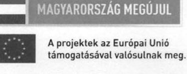

---

Az „eljárásrendek" (vagyis amit így nevezünk, a pályázati eljárásrendeket) szabályozását szintén az EMK végezte, az EMIR IBSZ a rendszer felhasználására (is) vonatkozó biztonsági szabályokat tartalmazta, azonban ezen felül még számos informatikai szabályzat készült. Javasoljuk pontosítani: „... a működési kézikönyv, az EMIR használatához kapcsolódó informatikai folyamatokat és szabályokat a vonatkozó, NFÜ által készített informatikai szabályzatok írták le."

# 39. oldal 1. bekezdés (,A megvalósított projektek..."): 

A bekezdés szövegében „az EMIR pénzügyi modul" helyett javasoljuk „az EMIR finanszírozási modul" kifejezés használatát.

## 39. oldal 2-4. bekezdés (,A nyilvántartás vezetése..."):

Az NFÜ szerződésnyilvántartása az NFÜ saját gazdálkodása részeként kötött szerződéseket tartalmazza, és nem a pályázati pénzek kezelése kapcsán kötött támogatási szerződéseket. A pályázati pénzek (kötelezettségvállalások, szerződések, kifizetési igények, kifizetések...) nyilvántartása az EMIR rendszerben történik.

## 41. oldal utolsó bekezdés (,A pályázati konstrukciókban..."):

Az NFT I. ROP-1.1. konstrukció esetében a saját erő minimális aránya 2,5% volt, mivel a maximális támogatási intenzitás két komponens esetében is 97,5% volt (Id.: 30. o. 4. bekezdés).

Kérjük, szíveskedjenek észrevételeinket figyelembe venni a végleges jelentés elkészítésekor.

Budapest, 2013. január 14.

## Üdvözlettel,

## N

Pálykó Zoltán

Nemzeti Fejlesztési Ügynökség
Cím: H-1077 Budapest, Wesselényi u. 20-22.
Levelezési cím: H-1393 Budapest, pf. 332.
Tel.: +36 40/638-638
E-mail: nfu@nfu.gov.hu
www.nfu.hu
www.ujszechenyiterv.gov.hu

---

# ELNÖK 

ÁLLAMI
SZÁMVEVŐSZÉK
12/B. számú melléklet
a V-0021-326/2013. sz. jelentéshez

Ikt.szám: V-0021-321/2013.

## Pálykó Zoltán úr

elnök
Nemzeti Fejlesztési Ügynökség

## Budapest

## Tisztelt Elnök Úr!

A kerékpárút hálózat fejlesztésére fordított pénzeszközök felhasználásának ellenőrzése (párhuzamos ellenőrzés a Szlovák Számvevőszékkel) címû jelentéstervezetre tett észrevételeit köszönettel megkaptam.

Az Állami Számvevőszék észrevételekre vonatkozó álláspontjáról a felügyeleti vezető által készített részletes tájékoztatást csatoltan megküldöm.

Tájékoztatom Elnök urat, hogy a jelentésben - az Állami Számvevőszékről szóló 2011. évi LXVI. törvény 29. § (3) bekezdése alapján - az el nem fogadott észrevételeket szerepeltetjük az elutasítás indokának feltüntetésével együtt. Az elfogadott észrevételeket a jelentés szövegezésénél figyelembe vesszük.

Budapest, 2013. 02. hó 18. nap
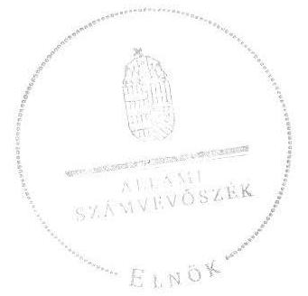

Tisztelettel:

Domokos László

---

# Tájékoztatás 

## Az elfogadott és az el nem fogadott észrevételekről

A kerékpárút hálózat fejlesztésére fordított pénzeszközök felhasználásának ellenőrzése (párhuzamos ellenőrzés a Szlovák Számvevőszékkel) című jelentéstervezetre 11/10-5/2013. iktatószámú levelében tett észrevételeit áttekintettük, azok kezeléséről az alábbi tájékoztatást adom.

Nem fogadtuk el a jelentéstervezet 20. oldal 3. és a 38. oldal 4. bekezdéseiben foglalt megállapításokra tett észrevételeit. Az ellenőrzés nem vitatta, hogy az NFÜ a pályázati adatlapok és a projekt előrehaladási jelentések alapján rögzítette az EMIR-ben az indikátorok cél- és tényértékeit. A kötelező adatszolgáltatás elrendelésének hiányában azonban a rögzített adatok a kerékpáros infrastruktúra-fejlesztések esetében nem voltak teljes körűek. A 2010-22. számú ROP állásfoglalás alapján a DAOP esetében az átlagos napi forgalomra, a DDOP és az ÉAOP esetében az átlagos napi forgalom változására, az ÉAOP esetében a kerékpáros balesetek számának csökkenésére, a KDOP és a KMOP esetében az átlagos napi forgalomra az EMIR nem tartalmazott adatot. A KÖZOP esetében a 2012. I. félévi teljesített célértékek nem szerepeltek az EMIR-ben. A 4. számú tanúsítvány jól mutatja, hogy a fejlesztések kerékpáros közlekedésre gyakorolt hatására vonatkozó adatok
 hiányosak.

Nem fogadtuk el a 22. oldal első bekezdésének utolsó mondatára tett észrevételét. A ROP-ok esetében - az ÚSZT pályázati felhívása szerint - a közreműködő szervezet csak a közvetett költségek esetében végez tételes, piaci árak szerinti felülvizsgálatot, a tisztított költségek esetében az elismerhető költségek egy összegben limitáltak. Az ellenőrzés megállapította, hogy az ellenőrzött projektek kerékpárút burkolatainak kialakításához közvetlenül elszámolt költségek átlaga alig több mint a fele volt a jelenlegi pályázati kiírásokban rögzített támogatásként figyelembe vehető $36,5 \mathrm{MFt} / \mathrm{km}$ mértéknek. Ezért fennáll a kockázata annak, hogy a pályázók a közvetett költségek egy részét a támogatható mértékként meghatározott tisztított költségeken keresztül érvényesítik.

Elfogadtuk a 31-32. oldal 4-6 bekezdésére tett észrevételeit, melynek alapján a „pályázatok" helyett „pályázati felhívások" megjelölést szerepeltetünk.

Nem fogadtuk el a 32. oldal 4. bekezdésében foglalt megállapításokra tett észrevételt. Az észrevétel nem vitatta, hogy az NFT I. keretében megjelent 1/2004/ROP/1.1 kiírás nem határozott meg indikátorokat. A projektgazdák beszámolási kötelezettségének feltüntetése a projekt megvalósításának számszerúsíthető eredményeiről a jelentéstervezet megállapítása szempontjából nem releváns.

---

Elfogadtuk a 33. oldal 3., a 34. oldal 2., és a 38. oldal 7., a 39. oldal 1., és a 41. oldal utolsó bekezdéseiben javasolt szövegpontosításokat.

Elfogadtuk a 39. oldal 2-4 bekezdésére tett észrevételeit. Ennek alapján a jelentés vonatkozó bekezdéseiben csak az EMIR rendszerre vonatkozó megállapításokat szerepeltetjük.

Nem fogadtuk el a 35. oldal utolsó, a 36. oldal első és a 19. oldal 2. bekezdéseihez tett észrevételeket. A 4. számú tanúsítvány adatait részletes, beruházásonkénti kimutatás nem alapozta meg. Ezért a befejezett kerékpárút beruházásokról részletes kimutatást kértünk. Kérésünknek az NFÜ 2012. szeptember 24-ei és 2012. október 5-ei adatszolgáltatásaival tett eleget. Ezeknek a kimutatások adatai alapján állapítottuk meg, hogy 2012. I. félév végéig a ROP keretében $411,6 \mathrm{~km}$, a KÖZOP esetében pedig $22,1 \mathrm{~km}$ kerékpárút készült el. A 4. számú tanúsítványban a ROP-ok 2009-2010. évi akciótervnél 480 km, a 2007-2008. évi akciótervnél 348 km célérték szerepel. Ez alapján az ellenőrzött időszakban a célérték összesen 828 km volt.

Nem fogadtuk el a 38. oldal 6. bekezdésére tett észrevételét, mivel a projekt zárását megelőzően az előrehaladási jelentésekben szereplő eredmények az EMIR-ben a beruházás befejezésétől függetlenül rögzíthetők. A teljesített célértékek a projektzárást követően kerültek a rendszerbe, megállapításunkat pedig nem változtatja meg az észrevételében a projektek nyomon követésére vonatkozó megállapítása.

Tájékoztatom, hogy a számvevőszéki jelentés mellékleteiként szerepeltetjük a jelentéstervezethez tett észrevételeit, valamint azokra adott válaszunkat.

Budapest, 2013. OJ hó Gnap

Holman Magdolna felügyeleti vezető

---

# 13/A. számú melléklet a V-0021-326/2013. sz. jelentéshez 

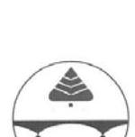

## Közép-Tisza-vidéki Vízügyi Igazgatóság

5000 Szolnok, Ságvári krt. 4.
Levelezési cím: 5002 Szolnok, Pf.: 63
Tel:(56) 501-900 Fax: (56) 501-951 E-mail: titkarsag@kotivizig.hu

Iktatószám: KP-0281-002/2013. Hivatkozási szám: V0021-305/2012. Tárgy: Jelentés-tervezet elfogadása
Előadó: Papp Judit 20: 20-125 Melléklet:

## ÁLLAMI SZÁMVEVŐSZÉK

Budapest

Domokos László Úr
elnök

Tisztelt Elnök Úr!

Megköszönöm a V0021-305/2012. iktatószámon a kerékpárút hálózat fejlesztésére fordított pénzeszközök felhasználásának ellenőrzéséről (párhuzamos ellenőrzés a Szlovák Számvevőszékkel) készített számvevőszéki jelentés-tervezetben foglaltakat.

A jelentés-tervezetre észrevételt nem kívánok tenni.

Szolnok, 2013. január 15.

## Üdvözlettel:

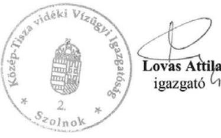

---

# Szeged Megyei Jogú Város Polgármestere 

Iktatószám: 1773/2013
Előadó: Kiro Tünde
62/564-158

Állami Számvevőszék
Domokos László részére

1052 Budapest
Apáczai Csere János u. 10.

Tisztelt Domokos László!

A „Kerékpárút hálózat fejlesztésére fordított pénzeszközök felhasználásának ellenőrzéséről (párhuzamos ellenőrzés a Szlovák Számvevőszékkel)" készített számvevőszéki jelentéstervezetet köszönettel megkaptuk, az abban foglaltakkal kapcsolatban észrevételt nem kívánunk tenni.

Szeged, 2013. január 15.

Tisztelettel:
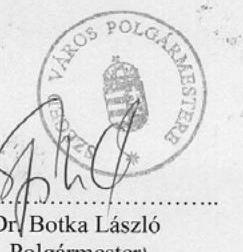

Dri Botka László
Polgármester
Szeged M.J.V.Önkormáhyizata

---

# A kerékpáros infrastruktúra-fejlesztésekhez kapcsolódó központi célkitűzések 

## 2001.

Az EU közlekedéspolitikájáról kiadott Fehér Könyv behatóan foglalkozott a balesetveszélyes és környezetkárosító városi közlekedés átalakításának, ezen belül a kerékpáros közlekedés fejlesztésének szükségességével. A dokumentum a közúti közlekedés biztonságának javítása, az intermodalitás elősegítése, valamint a forgalmi torlódások és a környezetszennyezés csökkentése érdekében tartotta fontosnak a hagyományos egyéni közlekedési módok, ezen belül a kerékpározás vonzóbbá tételét, infrastruktúrájának fejlesztését.

## 2003.

Az NKP II. helyzetértékelésének közlekedésre vonatkozó része arra hívta fel a figyelmet, hogy előtérbe kell helyezni a környezetkímélő - ezen belül a kerékpáros - közlekedési módokat, valamint a közlekedési szokások és a gépjárművezetői magatartás befolyásolásának eszközeit. A dokumentum a városi környezetminőség akcióprogramjában a közúti közlekedés emissziójának csökkentéséhez szükséges beavatkozásként fogalmazta meg a kerékpáros közlekedés feltételeinek javítását. A program a horizontális feladatok indikátorai között határozta meg a kerékpárutak hosszának változását és a kerékpáros közlekedés részesedésének emelkedését a közlekedési módokon belül.

## 2004.

Az MKP a közlekedési infrastruktúra fejlesztésére és fenntartására vonatkozóan - a kerékpáros közlekedési mód konkrét említése nélkül - a fő stratégiai irányok között nevezte meg az egészség megőrzését, a környezet védelmét, a közlekedésbiztonság növelését, valamint a természeti és táji értékek védelmét.

## 2005.

Az OFK a gazdasági, társadalmi és területi kohézióval összefüggésben, a környezetkímélő és a közlekedés biztonságát növelő fejlesztések közé sorolta a kerékpáros közlekedés előtérbe helyezését. A koncepció a helyközi és települési közlekedési rendszerek fejlesztésével kapcsolatban a káros környezeti hatások csökkentése, a fenntartható mobilitás, továbbá a biztonság fokozása érdekében fogalmazta meg a kerékpáros közlekedési feltételek javításának szükségességét. A városi közlekedés fejlesztésén belül, az átmenő forgalom mérséklése érdekében kiemelt hangsúlyt kapott a kerékpárral közlekedők közforgalmú közlekedési eszközre váltását elősegítő B+R (kerékpározz és utazz tovább) létesítmények kialakítása.

Az OTK a területfejlesztési politika egyik alapelveként rögzítette a környezetbarát közlekedés, ezen belül az utazás biztonságos és fenntartható módjának, valamint akadálymentesítésének biztosítását. A koncepció a szabadidős sporttevékenységek, a turizmus és a hivatásforgalmi közlekedés fejlesztéséhez kapcsolódóan tűzte ki célként a fővárosi agglomerációs, illetve országos jelentőségű térségekben, valamint a régiókban a kerékpárutak és a kapcsolódó szolgáltatási rendszerek kialakítását.

---

2007. 

A Sport XXI. Program a szabadidősport egyik fejlesztési lehetőségeként az alacsony költségű, ezért sokak számára elérhető rekreációs tevékenységek közé sorolta a kerékpározást. A dokumentumnak a sport kapcsolatrendszeréről szóló része a falusi és az ökoturizmus fejlesztéséhez figyelembe vehető, sport által kínált lehetőségként határozta meg a kerékpáros útvonalak kiépítését.

# 2009. 

A 2009-es NKP III. a kisebb környezeti terhelést jelentő közlekedési alternatívák széles körben való elérhetőségének és fogyasztásának ösztönzését, a fenntarthatóbb és környezetkímélőbb közlekedési rendszerek kialakítását, valamint az egyéni, nem motorizált közlekedési formák előtérbe helyezését tűzte ki célul. A program részeként a környezettudatos szemlélet és gondolkodásmód erősítésének tematikus akcióprogramja a növekvő kerékpáros turizmus feltételeinek javításához, valamint a környezetbarát alternatív közlekedési módok bővítéséhez tartotta szükségesnek a kerékpárutak és a hozzájuk kapcsolódó szolgáltatások fejlesztését.

---

# Összefoglalás a kerékpáros beruházásokkal kapcsolatos lakossági kérdőívek feldolgozásáról 

A kitöltők kétharmada (66,1%) 30 és 60 év közötti volt. A kérdőívre válaszolók jellemzően magasabb iskolai végzettségűek (61,8%), szellemi foglalkozásúak (47,5%) voltak, akik naponta, vagy hetente többször (70,9%) és alkalmanként fél-egy óra időtartamban (78,6%) használták a kerékpárjukat.

A kerékpározás számos lehetséges indítéka közül a beküldők körében a leggyakrabban az egészséges életmód és az anyagi okok merültek fel (67,3%, illetve 40,6% jelölte meg ezeket a válaszai közt). A kérdőívre válaszolók többsége (69,7%) 2 és 10 km közötti távolságra használja a kerékpárját. Viszonylag kevesen (6,7%) jelölték meg erre a kérdésre a 2 km alatti távolságot. A helyszíni ellenőrzésre kijelölt projektek térségében az alföldi területen (hódmezővásárhelyi térségben és a Tisza-tó körüli településeken) élők értékelték leginkább népszerűnek a kerékpározást. Ezekre a térségekre vonatkozó válaszok átlagosan 4,4 és 4,1 pontértéket tartalmaztak az 1-től 5-ig terjedő skálán.

A közlekedésbiztonság helyzetét valamennyi ellenőrzött projekt térségében egyértelműen javulóként értékelték a kérdőívre válaszolók. A legalacsonyabb arányú javulást is közel kétharmad arányban jelölték be (61,5%, a Tisza-tó körüli kerékpáros fejlesztéseknél). A legnagyobb arányú (83,3%-os) előrelépésről a csongrádi térség útjait ismerő válaszolók adtak számot.

A válaszadók alapvetően biztonságosnak értékelték az általuk használt kerékpárutakat (44,2% jónak vagy kiválónak értékelte), és jónak ítélték azok kitáblázottságát (46,1% tartotta jónak vagy kiválónak). Az alföldi területen kevésbé voltak ezzel elégedettek. A csongrádi térségből válaszolók kétharmada (66,7%), a Tisza-tó körüli településeken élők 61,6%-a, a hódmezővásárhelyi térség kerékpárútjait használók 54,6%-a értékelte megfelelőnek, illetve még elfogadhatónak az általuk használt kerékpárutakat biztonságosságát.

A közlekedésbiztonsággal összefüggésben a kerékpárutak minőségét a válaszadók többsége kiválónak (9,1%), jónak (30,9%) vagy megfelelőnek (27,3%) ítélte. A legkevésbé a hódmezővásárhelyi térség kerékpárutjaival voltak elégedettek, itt a válaszadók 36,4%-a vélekedett úgy, hogy még elfogadható, de 13,6% rossznak értékelte a kerékpárutak minőségét. Hasonló arányú válaszadó (13,3%) tartotta rossznak a mosonmagyaróvári térség kerékpárutjait.

A kerékpárutak karbantartásával, működtetésével az igénybe vevők 44,8%-a nem volt megelégedve. A hódmezővásárhelyi térségre vonatkozó válaszok közel harmada (31,8%), a szentendrei kerékpárutakat ismerők negyede (25,0%), a mosonmagyaróvári térségben kerékpározók ötöde (20,0%) tartotta rossznak az általuk használt kerékpárutak karbantartását.

A létesítmények hálózati jellege a válaszadók 56,4%-ának véleménye alapján hiányos, 7,3%-a szerint nem biztosított. A mosonmagyaróvári térség kerékpárútjait ismerők jelentős többsége (86,7%), a szentendrei térségben kerékpározó válaszolók háromnegyede (75,0%) vélekedett úgy, hogy nem megfelelő a kerékpárutak egymás közötti összekapcsolódása.

---

A lakossági kérdőívet kitöltők véleménye alapján a még jobb kerékpározási körülményekhez kerékpárparkolók és tárolók, valamint biztonságtechnikai fejlesztések hiányoznak a legjobban (55,2%, illetve 50,9% jelölte meg ezeket a válaszai közt). A hódmezővásárhelyi és a csongrádi kerékpárutakat ismerők kétharmada a kerékpártárolókat és kerékpárparkolókat hiányolta a leginkább (68,2%, illetve 66,7% jelölte meg válaszai közt). A biztonságtechnikai fejlesztéseket a Tisza-tó körüli településeken élők több mint kétharmada igényli (69,2%-a jelölte meg válaszai közt).

A kerékpáros közlekedés, továbbá a turizmus feltételeit valamennyi térségben határozottan javulónak értékelték. A csongrádi válaszadók 72,2%-a szerint javult a kerékpáros infrastruktúra fejlesztés hatására a környék turizmusa. Hasonlóan vélekedtek a Tisza-tó körüli kerékpárutakat ismerők (69,2%), valamint a mosonmagyaróvári és a szentendrei térségben kerékpározók is (66,7% és 58,3%).

A kerékpáros szokások változását legtöbben (83,3%) a szentendrei és a csongrádi térséget ismerő válaszadók értékelték pozitívan. Közel ilyen arányban (79,1% és 69,2%) érzékeltek kerékpáros forgalomemelkedést a Felső-Tisza menti kerékpárutakat és a Tisza-tó körüli kerékpárutakat használók.

---

# **Kimutatás a kerékpáros beruházásokkal kapcsolatos lakossági kérdőívek feldolgozásáról - részletes adatok**

|  kérdőívet kitöltők | összesen | csongrádi térség | felső-Tisza menti térség | hódmező-vásárhelyi térség | mosonmagyaróvári térség | szentendrei térség | Tisza-tó körüli település | egyéb térség  |
| --- | --- | --- | --- | --- | --- | --- | --- | --- |
|   | fő | arány | fő |  |  |  |  | 

  |
|  nemek szerint |  |  |  |  |  |  |  |   |
|  nők | 65 | 39,4% | 10 | 12 | 14 | 4 | 5 | 4  |
|  férfiak | 100 | 60,6% | 8 | 31 | 8 | 11 | 7 | 9  |
|  összesen | 165 | 100% | 18 | 43 | 22 | 15 | 12 | 13  |
|  életkor szerint |  |  |  |  |  |  |  |   |
|  18 alatti | 7 | 4,2% | 3 | 3 | 0 | 0 | 0 | 0  |
|  18-30 év közötti | 36 | 21,8% | 2 | 8 | 6 | 5 | 2 | 3  |
|  30-40 év közötti | 49 | 29,7% | 6 | 13 | 6 | 3 | 2 | 5  |
|  40-60 év közötti | 60 | 36,4% | 5 | 15 | 10 | 5 | 7 | 4  |
|  60 év feletti | 13 | 7,9% | 2 | 4 | 0 | 2 | 1 | 1  |
|  összesen | 165 | 100% | 18 | 43 | 22 | 15 | 12 | 13  |
|  iskolai végzettség szerint |  |  |  |  |  |  |  |   |
|  egyetem | 41 | 24,8% | 5 | 8 | 4 | 5 | 5 | 3  |
|  főiskola | 61 | 37,0% | 4 | 15 | 8 | 5 | 4 | 6  |
|  középiskola | 59 | 35,8% | 9 | 17 | 10 | 4 | 3 | 4  |
|  általános iskola | 1 | 0,6% | 0 | 0 | 0 | 1 | 0 | 0  |
|  általános iskolát nem fejezte be | 3 | 1,8% | 0 | 3 | 0 | 0 | 0 | 0  |
|  összesen | 165 | 100% | 18 | 43 | 22 | 15 | 12 | 13  |
|  munkakör szerint* |  |  |  |  |  |  |  |   |
|  tanuló | 19 | 11,7% | 4 | 6 | 0 | 2 | 0 | 1  |
|  fizikai foglalkozású alkalmazott | 23 | 14,2% | 2 | 6 | 5 | 2 | 0 | 2  |
|  szellemi foglalkozású alkalmazott | 77 | 47,5% | 6 | 18 | 14 | 4 | 10 | 7  |
|  középvezető | 21 | 13,0% | 5 | 5 | 1 | 2 | 1 | 1  |
|  felsővezető | 8 | 4,9% | 0 | 2 | 1 | 2 | 0 | 0  |
|  nyugdíjas | 14 | 8,6% | 1 | 4 | 0 | 3 | 1 | 2  |
|  összesen | 162 | 100% | 18 | 41 | 21 | 15 | 12 | 13  |

- Erre a kérdésre összesen 162 válasz érkezett

---

# **Kimutatás a kerékpáros beruházásokkal kapcsolatos lakossági kérdőívek feldolgozásáról - részletes adatok**

|  kérdőívet kitöltők | összesen | csongrádi térség | felső-Tisza menti térség | hódmezővásárhelyi térség | mosonmagyaróvári térség | szentendrei térség | Tisza-tó körüli település | egyéb térség  |
| --- | --- | --- | --- | --- | --- | --- | --- | --- |
|  fő | arány | fő |  |  |  |  |  |   |
|  a kerékpár használatának rendszeressége szerint |  |  |  |  |  |  |  |   |
|  naponta | 62 | 37,6% | 7 | 14 | 16 | 4 | 2 | 4  |
|  hetente többször | 55 | 33,3% | 5 | 15 | 4 | 6 | 4 | 4  |
|  havonta többször | 33 | 20,0% | 6 | 10 | 1 | 5 | 3 | 4  |
|  évente párszor | 15 | 9,1% | 0 | 4 | 1 | 0 | 3 | 1  |
|  összesen | 165 | 100% | 18 | 43 | 22 | 15 | 12 | 13  |
|  a kerékpározás időtartama szerint** |  |  |  |  |  |  |  |   |
|  alkalmanként negyed óra | 10 | 6,1% | 1 | 4 | 1 | 1 | 1 | 0  |
|  alkalmanként fél óra | 65 | 39,6% | 5 | 20 | 9 | 6 | 4 | 5  |
|  alkalmanként egy óra | 64 | 39,0% | 9 | 15 | 9 | 6 | 6 | 5  |
|  alkalmanként több óra | 25 | 15,2% | 3 | 4 | 3 | 2 | 1 | 3  |
|  összesen | 164 | 100% | 18 | 43 | 22 | 15 | 12 | 13  |
|  a kerékpározás indítéka, célja szerint (több válasz lehetséges) |  |  |  |  |  |  |  |   |
|  egészséges életmód | 111 | 67,3% | 13 | 25 | 11 | 10 | 9 | 7  |
|  környezettudatosság | 61 | 37,0% | 4 | 18 | 9 | 6 | 5 | 4  |
|  környezet (család, kollégák) ráhatása | 31 | 18,8% | 8 | 10 | 2 | 2 | 1 | 2  |
|  anyagi okok | 67 | 40,6% | 6 | 18 | 12 | 6 | 4 | 5  |
|  egyéb ok | 48 | 29,1% | 2 | 14 | 11 | 5 | 3 | 2  |
|  összes válaszadó | 165 | - | 18 | 43 | 22 | 15 | 12 | 13  |
|  a kerékpározás távolsága szerint |  |  |  |  |  |  |  |   |
|  alkalmanként 0-2 km | 11 | 6,7% | 1 | 2 | 2 | 0 | 2 | 0  |
|  alkalmanként 2-5 km | 61 | 37,0% | 10 | 13 | 7 | 9 | 3 | 5  |
|  alkalmanként 5-10 km | 54 | 32,7% | 5 | 19 | 7 | 2 | 4 | 4  |
|  alkalmanként 10 km felett | 39 | 23,6% | 2 | 9 | 6 | 4 | 3 | 4  |
|  összesen | 165 | 100% | 18 | 43 | 22 | 15 | 12 | 13  |
|  a kerékpáros infrastruktúra-fejlesztés közlekedésbiztonságra gyakorolt hatásának megítélése szerint |  |  |  |  |  |  |  |   |
|  javult | 123 | 74,5% | 15 | 33 | 16 | 12 | 8 | 8  |
|  nem változott | 25 | 15,2% | 0 | 5 | 4 | 3 | 2 | 5  |
|  nem tudja | 17 | 10,3% | 3 | 5 | 2 | 0 | 2 | 0  |
|  összesen | 165 | 100% | 18 | 43 | 22 | 15 | 12 | 13  |

** Erre a kérdésre összesen 164 válasz érkezett

---

# **Kimutatás a kerékpáros beruházásokkal kapcsolatos lakossági kérdőívek feldolgozásáról - részletes adatok**

|  kérdőívet kitöltők | összesen | csongrádi térség | felső-Tisza menti térség | hódmezővásárhelyi térség | mosonmagyaróvári térség | szentendrei térség | Tisza-tó körüli település | egyéb térség  |
| --- | --- | --- | --- | --- | --- | --- | --- | --- |
|   | fő | arány | fő |  |  |  |  |   |
|  a kerékpárút biztonságának megítélése szerint |  |  |  |  |  |  |  |   |
|  kiváló | 19 | 11,5% | 0 | 10 | 3 | 1 | 2 | 0  |
|  jó | 54 | 32,7% | 6 | 11 | 6 | 8 | 5 | 4  |
|  megfelelő | 47 | 28,5% | 11 | 13 | 6 | 4 | 1 | 4  |
|  még elfogadható | 30 | 18,2% | 1 | 7 | 6 | 1 | 2 | 4  |
|  rossz | 15 | 9,1% | 0 | 2 | 1 | 1 | 2 | 1  |
|  összesen | 165 | 100% | 18 | 43 | 22 | 15 | 12 | 13  |
|  a kerékpárút kitáblázottságának megítélése szerint |  |  |  |  |  |  |  |   |
|  kiváló | 15 | 9,1% | 0 | 8 | 4 | 1 | 0 | 1  |
|  jó | 61 | 37,0% | 7 | 14 | 4 | 7 | 6 | 7  |
|  megfelelő | 47 | 28,5% | 9 | 12 | 9 | 3 | 2 | 1  |

 még elfogadható | 28 | 17,0% | 2 | 7 | 5 | 2 | 2 | 3  |
|  rossz | 14 | 8,5% | 0 | 2 | 0 | 2 | 2 | 1  |
|  összesen | 165 | 100% | 18 | 43 | 22 | 15 | 12 | 13  |
|  a kerékpárút minőségének megítélése szerint |  |  |  |  |  |  |  |   |
|  kiváló | 15 | 9,1% | 0 | 7 | 1 | 1 | 2 | 0  |
|  jó | 51 | 30,9% | 7 | 11 | 5 | 2 | 6 | 8  |
|  megfelelő | 45 | 27,3% | 10 | 11 | 5 | 6 | 0 | 2  |
|  még elfogadható | 35 | 21,2% | 1 | 9 | 8 | 4 | 4 | 2  |
|  rossz | 19 | 11,5% | 0 | 5 | 3 | 2 | 0 | 1  |
|  összesen | 165 | 100% | 18 | 43 | 22 | 15 | 12 | 13  |
|  a kerékpárút karbantartásának, működtetésének megítélése szerint |  |  |  |  |  |  |  |   |
|  kiváló | 6 | 3,6% | 0 | 5 | 1 | 0 | 0 | 0  |
|  jó | 26 | 15,8% | 3 | 5 | 4 | 2 | 4 | 1  |
|  megfelelő | 59 | 35,8% | 13 | 17 | 4 | 6 | 4 | 4  |
|  még elfogadható | 40 | 24,2% | 1 | 10 | 6 | 4 | 1 | 6  |
|  rossz | 34 | 20,6% | 1 | 6 | 7 | 3 | 3 | 2  |
|  összesen | 165 | 100% | 18 | 43 | 22 | 15 | 12 | 13  |

---

# **Kimutatás a kerékpáros beruházásokkal kapcsolatos lakossági kérdőívek feldolgozásáról - részletes adatok**

|  kérdőívet kitöltők | összesen | csongrádi térség | felső-Tisza menti térség | hódmezővásárhelyi térség | mosonmagyaróvári térség | szentendrei térség | Tisza-tó körüli település | egyéb térség  |
| --- | --- | --- | --- | --- | --- | --- | --- | --- |
|   | fő | arány |  |  | fő |  |  |   |
|  a használt kerékpárutak egymás közötti összekapcsolódásának megítélése szerint |  |  |  |  |  |  |  |   |
|  jó | 19 | 11,5% | 0 | 8 | 5 | 1 | 1 | 3  |
|  megfelelő | 41 | 24,8% | 8 | 9 | 11 | 1 | 2 | 6  |
|  hiányos | 93 | 56,4% | 10 | 23 | 4 | 12 | 9 | 29  |
|  nincs | 12 | 7,3% | 0 | 3 | 2 | 1 | 0 | 4  |
|  összesen | 165 | 100% | 18 | 43 | 22 | 15 | 12 | 42  |
|  a még jobb kerékpározási körülményekhez szükséges kerékpáros-infrastruktúra fejlesztések szerint (több válasz lehetséges) |  |  |  |  |  |  |  |   |
|  kerékpár parkoló, tároló | 91 | 55,2% | 12 | 20 | 15 | 6 | 5 | 27  |
|  kerékpáros pihenőhelyek | 65 | 39,4% | 11 | 20 | 6 | 3 | 5 | 15  |
|  műszaki és egyéb szolgáltatások | 38 | 23,0% | 2 | 12 | 4 | 5 | 1 | 9  |
|  biztonságtechnikai fejlesztések | 84 | 50,9% | 8 | 21 | 7 | 8 | 6 | 25  |
|  összes válaszadó | 165 | - | 18 | 43 | 22 | 15 | 12 | 42  |
|  a kerékpáros infrastruktúra-fejlesztés környék turizmusára gyakorolt hatásának megítélése szerint |  |  |  |  |  |  |  |   |
|  javult | 80 | 48,5% | 13 | 19 | 9 | 10 | 7 | 13  |
|  nem változott | 34 | 20,6% | 3 | 9 | 8 | 2 | 1 | 8  |
|  nem tudom | 51 | 30,9% | 2 | 15 | 5 | 3 | 4 | 21  |
|  összesen | 165 | 100% | 18 | 43 | 22 | 15 | 12 | 42  |
|  a kerékpáros infrastruktúra-fejlesztés kerékpározási szokásokra gyakorolt hatásának megítélése szerint |  |  |  |  |  |  |  |   |
|  javult | 114 | 69,1% | 15 | 34 | 11 | 10 | 10 | 25  |
|  nem változott | 33 | 20,0% | 3 | 4 | 8 | 3 | 1 | 11  |
|  nem tudom | 18 | 10,9% | 0 | 5 | 3 | 2 | 1 | 6  |
|  összesen | 165 | 100% | 18 | 43 | 22 | 15 | 12 | 42  |
|  a kerékpározás környezetében való népszerűségének megítélése szerint (1-5-ig terjedő skálán) |  |  |  |  |  |  |  |   |
|  átlag | 3,7 |  | 3,5 | 3,8 | 4,4 | 3,6 | 3,5 | 3,4  |

