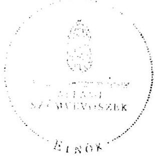

# ÁLLAMI   SZÁMVEVŐSZÉK 

## JELENTÉS

Heréd Község Önkormányzata belső kontrollrendszerének kialakítása, valamint egyes kontrolltevékenységek és a belső ellenőrzés múködése ellenőrzéséről

---

# Állami Számvevőszék 

Iktatószám: V-0012-058-001-046/2013.
Témaszám: 1051
Vizsgálat-azonosító szám: V059101

## Az ellenőrzést felügyelte:

Dr. Benedek Mária
felügyeleti vezető
2012. december 16. napjától

Gyüre Lajosné
felügyeleti vezető
2012. december 15. napjáig

## Az ellenőrzést vezette:

## Szakmányné Bilik Mária ellenőrzésvezető

A számvevőszéki jelentés összeállításában közremüködtek:
Kámán Edina
számvevő
Renner Andrea
számvevő
Az ellenőrzést végezték:
Papp József Szudi Ferencné
számvevő tanácsos számvevő

---

# TARTALOMJEGYZÉK 

BEVEZETÉS ..... 5
I. ÖSSZEGZŐ MEGÁLLAPÍTÁSOK, KÖVETKEZTETÉSEK, JAVASLATOK ..... 8
II. RÉSZLETES MEGÁLLAPÍTÁSOK ..... 13

1. Az önkormányzat belső kontrollrendszere kialakításának megfelelősége ..... 13
1.1. A kontrollkörnyezet kialakítása ..... 13
1.2. A kockázatkezelési rendszer szabályozása ..... 14
1.3. A kontrolltevékenységek kialakítása ..... 14
1.4. Az információs és kommunikációs rendszer szabályozása ..... 15
1.5. A monitoring rendszer szabályozása ..... 16
2. A pénzügyi folyamatokban kulcsszerepet betöltő belső kontrollok (szakmai teljesítésigazolás és utalvány ellenjegyzés) múködése ..... 17
3. A belső ellenőrzés szervezeti keretei és múködése ..... 18

## FÜGGELÉKEK

1. számú Értelmező szótár
2. számú A belső kontrollrendszer kialakítása, a pénzügyi folyamatokban kulcsszerepet betöltő szakmai teljesítésigazolás és utalvány ellenjegyzés kontrollok múködése, valamint a belső ellenőrzés múködése értékelésénél alkalmazott minősítési szempontok

---

.

---

# RÖVIDÍTÉSEK JEGYZÉKE 

## Törvények

ÁSZ tv.
Avtv.

Info tv.

Ötv.
régi Áht.

Számv. tv.
új Áht.

## Rendeletek

Áhsz.

Ámr.
Ávr.

Ber.

Bkr.
önkormányzati SZMSZ

## Szórövidítések

adatvédelmi szabályzat
ÁSZ
Belső ellenőrzési kézikönyv
Belső Kontroll Kézikönyv

2011. évi LXVI. törvény az Állami Számvevőszékről
1992. évi LXIII. törvény a személyes adatok védelméről és a közérdekú adatok nyilvánosságáról (hatálytalan 2012. január 1-jétől)
2011. évi CXII. törvény az információs önrendelkezési jogról és az információszabadságról (hatályos 2012. január 1-jétől)
1990. évi LXV. törvény a helyi önkormányzatokról
1992. évi XXXVIII. törvény az államháztartásról (hatálytalan 2012. január 1-jétől)
2000. évi C. törvény a számvitelről
2011. évi CXCV. törvény az államháztartásról (hatályos 2012. január 1-jétől)

249/2000. (XII. 24.) Korm. rendelet az államháztartás szervezetei beszámolási és könyvvezetési kötelezettségének sajátosságairól
292/2009. (XII. 19.) Korm. rendelet az államháztartás múködési rendjéről (hatálytalan 2012. január 1-jétől)
368/2011. (XII. 31.) Korm. rendelet az államháztartásról szóló törvény végrehajtásáról (hatályos 2012. január 1-jétől)
193/2003. (XI. 26.) Korm. rendelet a költségvetési szervek belső ellenőrzéséről (hatálytalan 2012. január 1jétől)
370/2011. (XII. 31.) Korm. rendelet a költségvetési szervek belső kontrollrendszeréről és belső ellenőrzéséről (hatályos 2012. január 1-jétől)
Heréd Község Önkormányzatának 13/2010. (XII. 17.) számú rendelete az Önkormányzat Szervezeti és Múködési Szabályzatáról

Heréd-Nagykökényes Körjegyzőség Közszolgálati adatvédelmi szabályzata (hatályos 2010. november 1-jétől)
Állami Számvevőszék
Hatvan Körzete Kistérségi Többcélú Társulás Belső ellenőrzési kézikönyv
Az Ámr. 155. § (1) bekezdése, valamint az államháztartási belső kontroll standardokról szóló 1/2009. (IX. 11.) PM irányelv egységes értelmezése érdekében az államháztartásért felelős miniszter által 2010. évben kiadott Belső Kontroll Kézikönyv

---

belső kontrollrendszer szabályzat
ellenőrzési nyomvonal

FEUVE
gazdasági program
gazdálkodási szabályzat
iratkezelési szabályzat
jegyző

Képviselő-testület
körjegyző
Körjegyzőség
körjegyzőségi SZMSZ

Önkormányzat
Önkormányzati Hivatal
polgármester
Társulás

Heréd Község Önkormányzat és Heréd-Nagykökényes Körjegyzőség Belső kontrollrendszer szabályzata (hatályos 2011. január 2-től)
Heréd Községi Önkormányzat és Heréd-Nagykökényes Körjegyzőség Belső kontrollrendszer szabályzatának 1. számú melléklete (hatályos 2011. január 2-től)
folyamatba épített, előzetes, utólagos és vezetői ellenőrzés
a Képviselő-testület 103/2011. (IV. 26.) számú határozatával elfogadott Heréd Település Önkormányzat Gazdasági Programja 2011-2014. évre
Heréd Község Önkormányzatának Gazdálkodási szabályzata (hatályos 2010. november 1-jétől)
Heréd Község Önkormányzatának Egyedi Iratkezelési Szabályzata (hatályos 2007. január 1-jétől)
Herédi Közös Önkormányzati Hivatal jegyzője (2013. január 1-jétől)
Heréd Község Önkormányzatának Képviselő-testülete
Heréd és Nagykökényes Községek Önkormányzatainak körjegyzője (2012. december 31-ig)
Heréd és Nagykökényes Községek Önkormányzatainak Körjegyzősége (megszűnt: 2012. december. 31-én)
Heréd-Nagykökényes Községek Képviselő-testületeinek 5/2007. (X. 9.) számú közös határozatával elfogadott Heréd-Nagykökényes Körjegyzőség Szervezeti és Múködési Szabályzata (hatályos 2007. október 10-től)
Heréd Község Önkormányzata
Herédi Közös Önkormányzati Hivatal (a Körjegyzőség jogutódjaként megalakult 2013. január 1-jén)
Heréd Község Önkormányzatának polgármestere
Hatvan Körzete Kistérségi Többcélú Társulás

---

# JELENTÉS 

## Heréd Község Önkormányzata belső kontrollrendszerének kialakítása, valamint egyes kontrolltevékenységek és a belső ellenőrzés múködése ellenőrzéséről

## BEVEZETÉS

A belső kontrollrendszer kialakítását, múködtetését és fejlesztését a régi Áht. és az új Áht. is előírja. Ennek megvalósításáért a költségvetési szerv vezetője, a körjegyző felel. A belső kontrollrendszer azt a célt szolgálja, hogy a költségvetési szervek működésük és gazdálkodásuk során a tevékenységeket szabályszerűen, gazdaságosan, hatékonyan, eredményesen hajtsák végre, teljesítsék elszámolási kötelezettségeiket és megvédjék az erőforrásokat a veszteségektől, a károktól és a nem rendeltetésszerű használattól. A belső kontrollrendszer magában foglalja mindazon szabályokat, eljárásokat, gyakorlati módszereket és szervezeti struktúrákat, kockázatkezelési technikákat, kontrolltevékenységeket, amelyek segítséget nyújtanak a szervezetnek céljai eléréséhez.

Az ÁSZ a 2011-2015. évekre szóló stratégiájában hangsúlyos szerepet szánt annak, hogy szilárd szakmai alapon álló, értékteremtő ellenőrzéseivel előmozdítsa a közpénzügyek átláthatóságát, rendezettségét. A számvevőszéki ellenőrzés nemzetközi alapelvei is rögzítik, hogy a megfelelő belső kontrollrendszer minimálisra csökkenti a hibák és szabálytalanságok kockázatát.

Az ellenőrzés célja annak értékelése volt, hogy az Önkormányzat a jogszabályi előírásoknak megfelelően alakította-e ki a belső kontrollrendszert; a gazdálkodás folyamatában kulcsszerepet betöltő szakmai teljesítésigazolás és az utalvány ellenjegyzés kontrolltevékenységeit megfelelően működtette-e; biztosí-totta-e a belső ellenőrzés szabályos és eredményes múködését.

Az ÁSZ ezen ellenőrzési céljait pilot (próba) jelleggel községi/nagyközségi önkormányzatoknál végzett ellenőrzések során érvényesítette.

Az ellenőrzés típusa: szabályszerűségi ellenőrzés
Az ellenőrzés jogszabályi alapja: az ÁSZ tv. 5. § (2) és (6) bekezdései
Az ellenőrzött szervezet: az Önkormányzat (ezen belül kiemelten a Körjegyzőség Heréd Község Önkormányzata vonatkozásában)

---

Az ellenőrzött időszak: a belső kontrollrendszer kialakításának megfelelőségét a 2011. évre vonatkozóan értékeltük. A kontrolltevékenységek múködésének megfelelőségét a 2011. január 1-je és december 31-e, míg a belső ellenőrzés múködésének szabályosságát és eredményességét a 2009. január 1-je és 2011. december 31-e közötti időszakot figyelembe véve értékeltük. A helyszíni ellenőrzés lezárásáig a helyi szabályozás változásait nyomon követtük.

Az ellenőrzés szakmai módszertana az Állami Számvevőszék Ellenőrzési Kézikönyvében foglalt szakmai szabályokon alapult, amely a Legfelsőbb Ellenőrző Intézmények Nemzetközi Szervezete (INTOSAI) által kiadott nemzetközi standardok (ISSAI) figyelembevételével készült.

A belső kontrollrendszer kialakításának ellenőrzése során értékeltük a Körjegyzőségen a kontrollkörnyezet, a kockázatkezelési rendszer, a kontrolltevékenységek, az információs és kommunikációs rendszer, valamint a monitoring rendszer szabályozottságának megfelelőségét.

A Körjegyzőségen értékeltük a pénzügyi folyamatokban kulcsszerepet betöltő szakmai teljesítésigazolás és utalvány ellenjegyzés kontrollok múködésének megfelelőségét az államháztartáson kívülre teljesített múködési és felhalmozási célú pénzeszköz átadásoknál, az állományba nem tartozók megbízási díjainál, továbbá a külső szolgáltató által végzett karbantartási, kisjavítási munkákkal kapcsolatos kifizetéseknél. Az egyszerú véletlen mintavétellel kiválasztott tételek ellenőrzését többlépcsős megfelelőségi tesztek útján addig végeztük, amíg elegendő és megfelelő bizonyítékot szereztünk a vizsgált folyamatok kulcskontrolljai múködésének megfelelő vagy nem megfelelő voltáról.

Értékeltük az Önkormányzatnál a belső ellenőrzés múködésének szabályosságát és eredményességét.

Az egyes fogalmak magyarázatát az 1. számú függelék, az ellenőrzés egyes területeinek értékelésénél alkalmazott egységes minősítési szempontokat a 2. számú függelék tartalmazza.

Az ellenőrzés lefolytatásához az Önkormányzat a munkalapok és a tanúsítvány elektronikus kitöltésével, valamint a megjelölt dokumentumok elektronikus megküldésével szolgáltatott adatokat. A munkalapokon szerepeltetett adatok, információk ellenőrzése és szükség szerinti javítása a helyszíni ellenőrzés keretében történt.

Az ÁSZ az ellenőrzés megállapításait az ellenőrzött időszakban hatályos, az intézkedést igénylő megállapításokra tett javaslatokat a jelenleg hatályos jogszabályok alapján fogalmazta meg.

Az ÁSZ tv. 29. § (1) bekezdése szerint a jelentéstervezetet megküldtük a polgármester részére, aki az ÁSZ tv. 29. § (2) bekezdésében foglalt észrevételezési jogával nem élt, a jelentéstervezetre észrevételt nem tett.

Heréd község állandó lakosainak száma 2011. január 1-jén 2029 fő volt. Az Önkormányzat héttagú Képviselő-testületének munkáját egy állandó bizottság segítette. Az Önkormányzat az önállóan működő és gazdálkodó Körjegyzősé-

---

gen kívül két önállóan múködő intézménnyel látta el feladatát, többségi tulajdoni hányadú gazdasági társasággal nem rendelkezett. A polgármester a 2002. évi önkormányzati választások óta tölti be tisztségét, a körjegyző személye 2007. szeptember 1-jétől változatlan. A Körjegyzőség szervezeti egységekre nem tagolódott, a foglalkoztatott köztisztviselők száma 2011. január 1-jén 10 fő volt.

Az Önkormányzat a 2011. évi költségvetési beszámolója szerint 290,9 millió Ft költségvetési bevételt ért el, és 286,4 millió Ft költségvetési kiadást teljesített. A 2011. december 31-i könyvviteli mérleg szerint 795,7 millió Ft értékű eszközvagyonnal rendelkezett, valamint 3,3 millió Ft hosszú lejáratú, és 2,7 millió Ft rövid lejáratú kötelezettsége volt.

---

# I. ÖSSZEGZŐ MEGÁLLAPÍTÁSOK, KÖVETKEZTETÉSEK, JAVASLATOK 

A belső kontrollrendszer kialakítása a Körjegyzőségnél 2011-ben a kontrollkörnyezet, a kockázatkezelési rendszer, a kontrolltevékenységek, az információs és kommunikációs rendszer, valamint a monitoring rendszer szabályozásának, illetve kialakításának értékelése alapján összességében nem felelt meg a jogszabályi előírásoknak.

A kontrollkörnyezet kialakítása részben felelt meg a jogszabályi előírásoknak. A körjegyző elkészítette a gazdálkodást érintő legfontosabb szabályzatokat, azonban a körjegyzőségi SZMSZ-ben az Ámr. rendelkezései ellenére nem aktualizálták az ellátandó és a szakfeladatrend szerint besorolt alaptevékenységeket.

A kockázatkezelési rendszer szabályozása nem felelt meg az Ámr. előírásainak, mivel a körjegyző kockázatelemzést nem végeztetett, valamint a kockázatkezelés keretében nem határozta meg az egyes kockázatokkal kapcsolatos intézkedéseket és megtételük módját.

A kontrolltevékenységek kialakítása a jogszabályi előírásoknak részben volt megfelelő, mivel az Ámr. előírásai ellenére nem szabályozták a Körjegyzőség tevékenységeire vonatkozó beszámolási eljárásokat. A kontrolltevékenységek hiányos kialakítása kockázatot jelent a feladatok szabályszerű végrehajtása során.

Az információs és kommunikációs rendszer szabályozása nem felelt meg a jogszabályi követelményeknek, mivel a körjegyző az Ámr.-ben foglalt előírások ellenére nem határozta meg a közérdekú adatok közzétételi eljárásának, nyilvánosságra hozatalának rendjét, a közérdekú adatok közzétételének adatfelelősét és az adatközlő személyt. Az Avtv.-ben foglaltak ellenére nem szabályozta a közérdekú adatok megismerésére irányuló igények teljesítésének rendjét. Az adatvédelmi és adatbiztonsági szabályzat nem felelt meg az Avtv.-ben előírt tartalmi követelményeknek, mivel nem tartalmazta az ügyfelek adatbiztonságára vonatkozó szabályokat. Az Avtv. rendelkezése ellenére az informatikai rendszer környezetének szabályozása során a körjegyző elmulasztotta az adatbiztonság érvényre juttatásához szükséges intézkedések megtételét. Nem rendelkezett a hozzáférési jogosultságok megállapításáról, betartásának ellenőrzéséről és nyilvántartásáról. Nem szabályozta a Körjegyzőség pénzügyi és számviteli elektronikus adatainak kezelését, feldolgozását, tárolását, a pénzügyi-számviteli szoftverváltozások ellenőrzésére, tesztelésére vonatkozó eljárásokat, a feldolgozott adatok mentési eljárásait és nem jelölte ki a mentések felelőseit.

A monitoring rendszer szabályozása részben felelt meg a jogszabályi előírásoknak, mivel a körjegyző az Ámr. előírása ellenére az operatív tevékenységek keretében megvalósuló folyamatos és eseti nyomon követésből álló, az Önkor-

---

mányzat tevékenységének, a célok megvalósításának nyomon követését biztosító rendszert nem alakította ki.

A belső kontrollrendszer nem megfelelő kialakítása kockázatot jelent az Önkormányzat tevékenységeinek szabályszerű, gazdaságos, hatékony és eredményes végrehajtása során.

A Körjegyzőségen a 2011. évben az államháztartáson kívülre történő működési és felhalmozási célú pénzeszközátadásokkal, az állományba nem tartozók megbízási díjaival, valamint a külső szolgáltatók által végzett karbantartással, kisjavítással kapcsolatos kifizetések során összefoglalóan értékelve a kulcskontrollok múködésének megfelelősége jó volt.

A Körjegyzőségen a 2011. évben az államháztartáson kívülre teljesített múködési és felhalmozási célú pénzeszközátadások során a szakmai teljesítésigazolás és az utalvány ellenjegyzés múködésének megfelelősége jó volt. Az utalványok ellenjegyző̉e és a szakmai teljesítésigazolásra a körjegyző által kijelölt személyek ellenőrzési és igazolási kötelezettségüknek, a feltárt eseti hiányosságok kivételével, eleget tettek.

A Körjegyzőségen a 2011. évben az állományba nem tartozók megbízási díjainak kifizetése során a szakmai teljesítésigazolás és az utalvány ellenjegyzés múködésének megfelelősége kiváló volt, mivel a kiadások jogosságának, öszszegszerúségének, és a megbízási szerződésben foglaltak teljesítésének ellenőrzését a körjegyző által kijelölt személy elvégezte. Az utalványok ellenjegyzője a gazdálkodásra vonatkozó szabályok érvényesüléséről, továbbá a szakmai teljesítésigazolás és az érvényesítés elvégzéséről meggyőződött.

A Körjegyzőségen a 2011. évben a külső szolgáltatók által teljesített karbantartási, kisjavítási munkákra történő kifizetések során a szakmai teljesítésigazolás és az utalvány ellenjegyzés múködésének megfelelősége gyenge volt, mivel a szakmai teljesítés igazolására a körjegyző által kijelölt személy, aláírása ellenére, nem végezte el az Ámr.-ben előírt ellenőrzési feladatait. Az utalványok ellenjegyzője, az Ámr. rendelkezései ellenére, nem kifogásolta, hogy a szakmai teljesítésigazolásra a körjegyző által kijelölt személy az ellenőrzési feladatát nem végezte el. Az utalványok ellenjegyzője nem ellenőrizte a gazdálkodásra vonatkozó szabályok betartását, mivel nem kifogásolta, hogy a kötelezettségvállalás nyilvántartásba vétele során a gazdálkodási szabályzatban előírt bizonylatot nem használták. A számvevőszéki ellenőrzés az ellenőrzött kifizetésekkel összefüggésben a rendelkezésre bocsátott dokumentumok alapján jogosulatlan kifizetést nem tárt fel, azonban a gazdálkodásban kulcsszerepet betöltő kontrollok múködésében feltárt hiányosságok miatt fennáll a hibák bekövetkezésének kockázata.

Az Önkormányzat a belső ellenőrzési feladatokat Társulás útján látta el. Az Önkormányzatnál a 2009-2011. évek között a belső ellenőrzés múködése eredményes volt, mivel a belső ellenőrzés szabályozása és múködése az ellenőrzött időszak egészét tekintve a vonatkozó jogszabályi előírásoknak jól megfelelt, és ellenőrizték a belső kontrollrendszer kialakításának szabályozottságát, a gazdálkodási jogkörök gyakorlásához kapcsolódó belső kontrollok

---

múködését, a vagyonvédelem területén a leltározás és selejtezés szabályszerűségét, intézkedtek az elvégzett ellenőrzések javaslatainak hasznosításáról.

Az ÁSZ tv. 33. § (1) bekezdésében foglaltak értelmében a jelentésben foglalt megállapításokhoz kapcsolódó intézkedési tervet köteles az ellenőrzött szervezet vezetője összeállítani és azt a jelentés kézhezvételétől számított 30 napon belül az ÁSZ részére megküldeni. Amennyiben az intézkedési tervet határidőn belül nem küldi meg a szervezet, vagy az továbbra sem elfogadható, az ÁSZ elnöke a hivatkozott törvény 33. § (3) bekezdés a)-b) pontjaiban foglaltakat érvényesítheti.

Az ellenőrzés intézkedést igénylő megállapításai és javaslatai:

# a jegyzőnek Heréd Község Önkormányzata vonatkozásában 

1. a kontrollkörnyezettel kapcsolatban:

A körjegyzőségi SZMSZ-ben az Ámr. 20. § (2) bekezdés c) pontjában foglaltak ellenére a körjegyző nem aktualizálta az Önkormányzat ellátandó és a szakfeladatrend szerint besorolt alaptevékenységeit.

Javaslat:
Gondoskodjon az Önkormányzati Hivatal SZMSZ-ének elkészítése során arról, hogy az aktualizáltan, az Ávr. 13. § (1) bekezdés c) pontjában foglaltaknak megfelelően tartalmazza az Önkormányzat ellátandó és a szakfeladatrend szerint besorolt alaptevékenységeit, és kezdeményezze a polgármesternél az Önkormányzati Hivatal SZMSZ-ének a Képviselő-testület elé terjesztését.
2. a kockázatkezelési rendszerrel kapcsolatban:

Az Ámr. 157. § (1)-(3) bekezdéseiben foglaltak ellenére a körjegyző kockázatelemzést nem végeztetett, valamint a kockázatkezelés keretében nem határozta meg az egyes kockázatokkal kapcsolatos intézkedéseket és megtételük módját.

Javaslat:
Gondoskodjon a Bkr. 7. §-a alapján, a kockázatok meghatározásának és felmérésének keretében az Önkormányzati Hivatal tevékenységében, gazdálkodásában rejlő kockázatok megállapításáról, valamint az egyes kockázatokkal kapcsolatban szükséges intézkedések meghatározásáról.
3. a kontrolltevékenységekkel kapcsolatban:

A kontrolltevékenységek keretében, az Ámr. 158. § (2) bekezdés d) pontjának előírása ellenére, a körjegyző nem alakította ki a Körjegyzőség tevékenységeire vonatkozó beszámolási eljárásokat.

---

Javaslat:
Alakítsa ki a Bkr. 8. § (4) bekezdés c) pontja alapján az Önkormányzati Hivatal tevékenységeire vonatkozó beszámolási eljárásokat.
4. az információs és kommunikációs rendszerrel kapcsolatban:

Az Avtv. 20. § (8) bekezdésének előírásai, valamint az Ámr. 20. § (3) bekezdés i) pontja ellenére a körjegyző nem határozta meg a közérdekű adatok közzétételi eljárásának, nyilvánosságra hozatalának rendjét, valamint a közérdekű adatok megismerésére irányuló igények teljesítésének rendjét, nem jelölte ki a közérdekű adatok közzétételének adatfelelősét és az adatközlő személyt.

Az informatikai rendszer környezetének szabályozása során az Avtv. 10. § (1)-(2) bekezdéseiben foglaltak ellenére a körjegyző elmulasztotta az adatbiztonság érvényre juttatásához szükséges intézkedések megtételét. Nem rendelkeztek a hozzáférési jogosultságok megállapításáról, betartásának ellenőrzéséről és nyilvántartásáról. Nem szabályozták a Körjegyzőség pénzügyi és számviteli elektronikus adatainak kezelését, feldolgozását, tárolását, a pénzügyi-számviteli szoftverváltozások ellenőrzésére, tesztelésére vonatkozó eljárásokat, a feldolgozott adatok mentési eljárásait, és nem jelölték ki a mentések felelőseit.

Az adatvédelmi és adatbiztonsági szabályzat nem felelt meg az Avtv. 10. § (1)-(2), valamint a 31/A. § (3) bekezdésében előírt tartalmi követelményeknek, mivel nem tartalmazta az ügyfelek adatbiztonságára vonatkozó szabályokat.

Javaslat:
a) Rendelkezzen az Önkormányzattal kapcsolatos információk esetében - az Info tv. 35. § (3) bekezdése alapján - a közérdekű adatok közzétételi eljárásának, nyilvánosságra hozatala rendjének, valamint - az Ávr. 13. § (2) bekezdés h) pontja alapján - a közérdekű adatok megismerésére irányuló igények teljesítése rendjének szabályozásáról, és jelölje ki a közérdekű adatok közzétételének adatfelelősét és az adatközlő személyt.
b) Biztosítsa az Info tv. 7. § (2) bekezdésének megfelelően az adatbiztonság érvényesülését, rendelkezzen a hozzáférési jogosultságok megállapításáról, azok betartásának ellenőrzéséről és nyilvántartásáról. Szabályozza az Önkormányzati Hivatal pénzügyi és számviteli elektronikus adatainak kezelését, feldolgozását, tárolását, a pénzügyi-számviteli szoftverváltozások ellenőrzésére, tesztelésére vonatkozó eljárásokat, a feldolgozott adatok mentési eljárásait, és jelölje ki a mentések felelőseit.
c) Egészítse ki az Info tv. 24. § (3) bekezdése szerinti adatvédelmi és adatbiztonsági szabályzatot annak érdekében, hogy az az Info tv. 7. § (1) bekezdésének megfelelően tartalmazza a személyes adatok biztonságára vonatkozó szabályokat.
5. a monitoring rendszerrel kapcsolatban:

A körjegyző az Ámr. 160. §-ában foglaltak ellenére az operatív tevékenységek keretében megvalósuló folyamatos és eseti nyomon követésből álló, az Önkormányzat

---

tevékenységének, a célok megvalósításának nyomon követését biztosító rendszert nem alakította ki.

Javaslat:
Alakítsa ki és múködtesse a Bkr. 10. §-ában előírtak alapján az operatív tevékenységek keretében megvalósuló folyamatos és eseti nyomon követésből álló, az Önkormányzat tevékenységének, a célok megvalósításának nyomon követését biztosító rendszert.
6. a pénzügyi folyamatokban kulcsszerepet betöltő kontrollok múködésével kapcsolatban:

A szakmai teljesítést igazoló az Ámr. 76. § (1) bekezdésében foglaltakat figyelmen kívül hagyva ellenőrzési feladatát aláírása ellenére nem végezte el, mivel nem kifogásolta, hogy a 100 ezer Ft alatti kötelezettségvállalások nyilvántartásba vétele során a gazdálkodási szabályzatban előírt bizonylatot nem használták, amelynek hiányában a kifizetés jogosságának, összegszerűségének, a megrendelés, szerződés teljesítésének ellenőrzése elmaradt.

Az utalványok ellenjegyző́je aláírása ellenére az Ámr. 79. § (2) bekezdésében foglaltakat figyelmen kívül hagyva nem minden esetben tett eleget ellenőrzési kötelezettségének, mivel nem kifogásolta, hogy a kifizetés jogosságának, összegszerűségének, a megrendelés, szerződés teljesítésének ellenőrzése, a szakmai teljesítés igazolása nem történt meg. Nem minden esetben végezte el a gazdálkodásra vonatkozó szabályok betartásának ellenőrzését, mivel nem kifogásolta, hogy a kötelezettségvállalás nyilvántartásba vételéhez a gazdálkodási szabályzatban előírt bizonylatot nem használták.

Javaslat:
Az operatív gazdálkodás során a múködésbeli hibák megelőzése, feltárása és kijavítása érdekében gondoskodjon arról, hogy
a) az Ávr. 57. § (1) bekezdésében előírtaknak megfelelően a teljesítésigazolás során okmányok alapján ellenőrizzék a kiadások teljesítésének jogosságát, összegszerűségét, az ellenszolgáltatást is magában foglaló kötelezettségvállalás esetében a szerződés, megrendelés teljesítését;
b) a pénzügyi ellenjegyző az új Áht. 37. § (1) bekezdése alapján a kötelezettségvállalás nyilvántartásba vétele során az Önkormányzat gazdálkodási szabályzatában előírt bizonylat alkalmazásáról győződjön meg.

---

# II. RÉSZLETES MEGÁLLAPÍTÁSOK 

## 1. Az önkORMÁNYZAT BELSŐ KONTROLLRENDSZERE KIALAKÍTÁSÁNAK MEGFELELŐSÉGE

### 1.1. A kontrollkörnyezet kialakítása

A kontrollkörnyezet kialakítása a Körjegyzőségen részben volt megfelelő. A Körjegyzőség rendelkezett körjegyzőségi SZMSZ-szel, a Képviselő-testület elfogadta az Önkormányzat 2011-2014. évre szóló gazdasági programját és a Körjegyzőség alapító okiratát. A körjegyző kialakította a gazdálkodást érintő legfontosabb szabályzatokat, azonban a körjegyzőségi SZMSZ-ben az Ámr. 20. § (2) bekezdés c) pontjában ${ }^{1}$ foglaltak ellenére nem aktualizálták az ellátandó és a szakfeladatrend szerint besorolt alaptevékenységeket².

A Képviselő-testület az Önkormányzat gazdasági programját hiányos tartalommal fogadta el.

Az Önkormányzat gazdasági programja az Ötv. 91. § (6) bekezdésében ${ }^{3}$ foglaltak ellenére nem tartalmazta a munkahelyteremtés feltételeinek elősegítésére vonatkozó megoldásokat.

A kontrollkörnyezet kialakítása során a körjegyzö

- a Belső Kontroll Kézikönyv ${ }^{4}$ 1.2.7. pontjában foglaltakat figyelmen kívül hagyva nem írta elő a körjegyzőségi SZMSZ munkatársak általi megismerésének kötelezettségét, és a körjegyzőségi SZMSZ dolgozók általi megismerése nem történt meg;
- a Körjegyzőségen dolgozó köztisztviselők munkaköri leírásaiban, a Belső Kontroll Kézikönyv 1.3.3. pontjában foglalt ajánlás ellenére, a munkakörökhöz kapcsolódó felelősségi szabályokat nem határozta meg;

[^0]
[^0]:    ${ }^{1}$ 2012. január 1-jétől Ávr. 13. § (1) bekezdés c) pontja.
    ${ }^{2}$ A Körjegyzőség a 4/2007. (X. 9.) számú Képviselő-testületi határozattal elfogadott alapító okiratát a szakfeladatrendet érintően a 261/2010. (XII. 17.) számú Képviselőtestületi határozattal módosították, így az alapító okirat az aktuális szakfeladatrend szerint tartalmazta az alapfeladatokat.
    ${ }^{3}$ 2013. január 1-jétől a gazdasági programra, fejlesztési tervre vonatkozó jogszabályi előírásokat a Magyarország helyi önkormányzatairól szóló 2011. évi CLXXXIX. tv. 116. § (1) bekezdése tartalmazza.
    ${ }^{4}$ A 2011. évben az Ámr. 155. § (1) bekezdése szerint a belső kontrollok kialakítása során a költségvetési szerv vezetője figyelembe veszi az államháztartásért felelős miniszter által közzétett, az államháztartási belső kontroll standardokra vonatkozó irányelvet. A 2012. január 1-jétől hatályos Bkr. 5. § (1) bekezdése szerint a költségvetési szervek belső kontrollrendszerét az államháztartásért felelős miniszter által közzétett módszertani útmutatók megfelelő alkalmazásával kell kialakítani és múködtetni.

---

- a Belső Kontroll Kézikönyv 1.4.2. pontjában foglaltakat figyelmen kívül hagyva nem írta elő az ellenőrzési nyomvonal rendszeres felülvizsgálatának kötelezettségét;
- a Belső Kontroll Kézikönyv 1.5.2. pontjában foglaltakat figyelmen kívül hagyva nem dolgozta ki a köztisztviselői munkakörök betöltésére vonatkozó elvárt tudást és képességeket;
- a Belső Kontroll Kézikönyv 1.6.1. pontjában foglaltakat figyelmen kívül hagyva nem határozta meg - a szervezeti célokkal összhangban álló - a köztisztviselőkkel szemben támasztott etikus magatartással és integritással kapcsolatos elvárásokat

# 1.2. A kockázatkezelési rendszer szabályozása 

A kockázatkezelési rendszer szabályozottsága a Körjegyzőségen nem volt megfelelő. A Körjegyzőség rendelkezett kockázatkezelési szabályzattal, azonban a körjegyző a kockázatkezelési rendszer keretében nem végezte el az Ámr. 157. § (1)-(3) bekezdésében ${ }^{5}$ foglaltak szerint a kockázatok elemzését, továbbá nem határozta meg az egyes kockázatokkal kapcsolatos intézkedéseket és megtételük módját.

A kockázatkezelési rendszer szabályozása során a körjegyzó

- a Belső Kontroll Kézikönyv 2.1.3. és 2.1.4. pontjaiban foglalt ajánlást figyelmen kívül hagyva nem alakította ki a kockázat-nyilvántartási rendszert, az azonosított kockázati tényezőkről nem tájékoztatta a kockázati tényezőkkel érintett munkafolyamatok felelőseit;
- a Belső Kontroll Kézikönyv 2.2.3. pontjában foglaltakat figyelmen kívül hagyva nem határozta meg a kockázati túréshatárokat;
- a Belső Kontroll Kézikönyv 2.3.7. pontjában foglalt ajánlás ellenére nem szabályozta a kockázatkezelés keretében tett intézkedések nyomon követését;
- a Belső Kontroll Kézikönyv 2.4.1. pontjában foglaltakat figyelmen kívül hagyva nem írta elő a kockázatkezelés folyamatának legalább évenkénti felülvizsgálatát, és a kockázatok legalább évenkénti felülvizsgálata nem történt meg;
- nem érvényesítette a Belső Kontroll Kézikönyv 2.5.1. pontjában foglalt ajánlást, mivel nem gondoskodott a csalás és korrupció, mint kiemelt kockázatok értékeléséről és kezeléséről.

### 1.3. A kontrolltevékenységek kialakítása

A kontrolltevékenységek kialakítása a Körjegyzőségen részben volt megfelelő. A körjegyzó a kontrollstratégiák és módszerek keretében meghatározta az érvényesítés rendjét, a szakmai teljesítés igazolásának módját, és kijelölte az érvényesítésre, illetve szakmai teljesítésigazolásra jogosultakat, valamint biztosította a feladatellátás folytonosságát. A kontrolltevékenységek kere-

[^0]
[^0]:    ${ }^{5}$ 2012. január 1-jétől a Bkr. 7. § (1)-(2) bekezdése rendelkezik a kockázatkezelési rendszer múködtetéséről, és az egyes kockázatokkal kapcsolatban szükséges intézkedések, valamint azok teljesítésének folyamatos nyomon követése módjának meghatározásáról.

---

tében azonban a körjegyző az Ámr. 158. § (2) bekezdés d) pontjának ${ }^{6}$ előírása ellenére nem alakította ki a Körjegyzőség tevékenységeire vonatkozó beszámolási eljárásokat.

A kontrolltevékenységek kialakítása során a körjegyzó

- a Belső Kontroll Kézikönyv 3.2.1. pontjában foglaltakat figyelmen kívül hagyva nem határozta meg - a folyamatok felügyelet alatt tartása és a kockázatok mérséklése érdekében - az egyes folyamatokkal kapcsolatos végrehajtási, ellenőrzési illetve pénzügyi teljesítési tevékenységeket személyekhez delegáltan;
- a Belső Kontroll Kézikönyv 3.2.3. pontjában foglaltakat figyelmen kívül hagyva nem mérte fel a kis létszámból adódó kockázatokat az összeférhetetlenség kiküszöbölése érdekében.

# 1.4. Az információs és kommunikációs rendszer szabályozása 

Az információs és kommunikációs rendszer szabályozottsága a Körjegyzőségen nem volt megfelelő. A Körjegyzőség rendelkezett iratkezelési, adatvédelmi és adatbiztonsági, valamint szabálytalanságkezelési szabályzatokkal, azonban az Ámr. 159. §-ban ${ }^{7}$ előírt információs és kommunikációs rendszer kialakítása keretében a körjegyzó

- az Önkormányzattal kapcsolatos információk esetében, az Ámr. 20. § (3) bekezdés i) pontjában ${ }^{8}$ foglaltak ellenére nem határozta meg a közérdekú adatok közzétételi eljárásának, nyilvánosságra hozatalának rendjét, nem jelölte ki a közérdekú adatok közzétételének adatfelelősét és az adatközlő személyt, továbbá az Avtv. 20. § (8) bekezdésének ${ }^{9}$ előírásai ellenére nem szabályozta a közérdekú adatok megismerésére irányuló igények teljesítésének rendjét;
- az informatikai rendszer környezetének szabályozása során, az Avtv. 10. § (1)-(2) bekezdéseiben foglalt előírások ellenére ${ }^{10}$, elmulasztotta az adatbiztonság érvényre juttatásához szükséges intézkedések megtételét. Nem rendelkezett a hozzáférési jogosultságok megállapításáról, betartásának ellenőrzéséről és nyilvántartásáról. Nem szabályozta a Körjegyzőség pénzügyi és számviteli elektronikus adatainak kezelését, feldolgozását, tárolását. Nem szabályozta a pénzügyi-számviteli szoftverváltozások ellenőrzésére, tesztelésére vonatkozó eljárásokat, a feldolgozott adatok mentési eljárásait, és nem jelölte ki a mentések felelőseit;

[^0]
[^0]:    ${ }^{6}$ 2012. január 1-jétől a Bkr. 8. § (4) bekezdése tartalmazza a szabályozási kötelezettséget.
    ${ }^{7}$ 2012. január 1-jétől a Bkr. 3. § d) pontja tartalmazza a költségvetési szerv vezetőjének felelősségét a belső kontrollrendszer keretében az információs és kommunikációs rendszer kialakításáért.
    ${ }^{8}$ 2012. január 1-jétől az Ávr. 13. § (2) bekezdés h) pontja tartalmazza a közérdekú adatok nyilvánosságra hozatalával kapcsolatos szabályozás elkészítésének kötelezettségét.
    ${ }^{9}$ 2012. január 1-jétől az Ávr. 13. § (2) bekezdés h) pontja és az Info tv. 35. § (3) bekezdése rögzíti a közérdekú adatok megismerésére irányuló kérelmek teljesítési rendjével kapcsolatos szabályozási kötelezettséget.
    ${ }^{10}$ 2012. január 1-jétől az Info tv. 7. § (2) bekezdése rögzíti az adatbiztonság érdekében szükséges szabályozási kötelezettséggel kapcsolatos előírást.

---

- az adatvédelmi és adatbiztonsági szabályzatot az Avtv. 31/A. § (3) bekezdésének ${ }^{11}$ figyelmen kívül hagyásával nem teljes körűen alakította ki, mert az Avtv. 10. § (1)-(2) bekezdésében foglalt előírások ellenére az elkészített szabályzat nem tartalmazta az ügyfelek adatbiztonságára vonatkozó szabályokat.

Az információs és kommunikációs rendszer szabályozása során a körjegyző:

- az iktatási, iratkezelési rendszer kialakítása során a Belső Kontroll Kézikönyv 4.2.4. pontjában foglaltakat nem érvényesítette, mivel nem határozta meg a Körjegyzőségen az ügyintézési határidők nyomon követésének dokumentálását, a késedelmes ügyintézés jelzéséért való felelősség rendjét;
- a szabálytalanságkezelés keretében a Belső Kontroll Kézikönyv 4.3.3. pontjában foglaltakat figyelmen kívül hagyva nem rögzítette a szabálytalanságot bejelentő védelmére vonatkozó előírásokat.

# 1.5. A monitoring rendszer szabályozása 

A monitoring rendszer szabályozottsága a Körjegyzőségen részben volt megfelelő. A körjegyző meghatározta a kiemelt közszolgáltatások ${ }^{12}$ teljesítményének nyomon követésére szolgáló mutatószámokat, előírta az indikátorok ${ }^{13}$ alakulásának nyomon követését és értékelését. A monitoring rendszer kialakítása során a körjegyző az Ámr. 160. §-ában ${ }^{14}$ foglaltak ellenére az operatív tevékenységek keretében megvalósuló folyamatos és eseti nyomon követésből álló, az Önkormányzat tevékenységének, a célok megvalósításának nyomon követését biztosító rendszert nem alakította ki.

A monitoring rendszer szabályozása keretében a körjegyzó

- a Belső Kontroll Kézikönyv 1.2.2. pontjának ajánlását nem érvényesítette, a szervezeti célok megvalósításának nyomon követése érdekében a lakosság, illetve a szolgáltatásokat igénybe vevők körében az önkormányzati feladatellátásra irányulóan elégedettségi felméréseket a 2009-2011. években nem végeztetett;
- a Belső Kontroll Kézikönyv 5.1.1. pontjában foglaltakat figyelmen kívül hagyva nem intézkedett az Önkormányzat tevékenységével kapcsolatos monitoring stratégia kialakításáról.

[^0]
[^0]:    ${ }^{11}$ 2012. január 1-jétől az Info tv. 24. § (3) bekezdése írja elő az adatvédelmi és adatbiztonsági szabályzat elkészítésének kötelezettségét.
    ${ }^{12}$ Az ellenőrzés során kiemelt közszolgáltatásnak tekintjük az Önkormányzat által ellátandó kötelező közszolgáltatások közül a pénzbeli szociális ellátást, a szociális alapszolgáltatásokat, az óvodai ellátásokat, valamint a körjegyzői hatósági ügyintézést.
    ${ }^{13}$ Az ellenőrzés során indikátorok alatt értjük a mérőszámokat, statisztikai adatokat, szakfeladatokhoz rendelt feladatmutatókat, teljesítménymutatókat.
    ${ }^{14}$ 2012. január 1-jétől a Bkr. 3. § e) pontja tartalmazza a költségvetési szerv vezetőjének felelősségét a nyomon követési rendszer (monitoring) kialakításáért, valamint a Bkr. 10. §-a írja elő a szervezet tevékenységének, a célok megvalósításának nyomon követését biztosító rendszer kialakítását.

---

A belső kontrollrendszer kialakítása a Körjegyzőségnél 2011-ben a kontrollkörnyezet, a kockázatkezelési rendszer, a kontrolltevékenységek, az információs és kommunikációs rendszer, valamint a monitoring rendszer szabályozásának, illetve kialakításának értékelése alapján összességében nem felelt meg a jogszabályi előírásoknak.

# 2. A PÉNZÜGYI FOLYAMATOKBAN KULCSSZEREPET BETÖLTŐ BELSŐ KONTROLLOK (SZAKMAI TELJESÍTÉSIGAZOLÁS ÉS UTALVÁNY ELLENJEGYZÉS) MÜKÖDÉSE 

A Körjegyzőségen a 2011. évben az államháztartáson kívülre teljesített múködési és felhalmozási célú pénzeszközátadások során a szakmai teljesítésigazolás és az utalvány ellenjegyzés kulcskontrollok müködésének megfelelősége jó volt. A szakmai teljesítésigazolás során a támogatási szerződésekben, megállapodásokban meghatározott feladatok (célok) teljesítésének igazolását, a kiadások jogosságának, összegszerűségének ellenőrzését a körjegyző által a feladatra kijelölt személy a gazdálkodási szabályzatban előírt módon - a feltárt hiányosságok kivételével - elvégezte. Az utalványok ellenjegyzője a gazdálkodásra vonatkozó szabályok érvényesüléséről, a szakmai teljesítésigazolás elvégzéséről - a feltárt eseti hiányosságok kivételével - meggyőződött.

A kontrollok működése megfelelőségének ellenőrzése során az alábbi eseti hiányosságok fordultak elő:

- a szakmai teljesítésigazolásra kijelölt személy, az Ámr. 76. § (3) bekezdésében ${ }^{15}$ foglaltak ellenére a Heves Megyei Vízmú Zrt.-nek megállapodás alapján átadott 1330 ezer Ft fejlesztési hozzájárulás kifizetése során ellenőrzési, igazolási kötelezettségének nem tett eleget. Ezért a kiadás jogosságának és összegszerűségének ellenőrzése nem történt meg;
- az utalványok ellenjegyző́je aláírása ellenére nem kifogásolta a Heves Megyei Vízmú Zrt.-nek történt kifizetés esetében a szakmai teljesítésigazolás elmaradását.

A Magyar Közigazgatási Társaságnak fizetett 9 ezer Ft, illetve a Zagyvaság Vidékfejlesztési Közhasznú Egyesületnek fizetett 30 ezer Ft tagdíj kifizetéseknél az Áhsz. 9. számú melléklet számlaosztályok tartalmára vonatkozó 9. d) pontjának előírása ellenére a tagsági díjak nyilvántartására tévesen, a múködési célú pénzeszközátadás államháztartáson kívülre főkönyvi számlát jelölték meg.

A Körjegyzőségen a 2011. évben az állományba nem tartozók megbízási díjainak kifizetése során a szakmai teljesítésigazolás és az utalvány ellenjegyzés kulcskontrollok müködésének megfelelősége kiváló volt, mert a megbízási szerződésekben meghatározott feladatok teljesítésének, a kiadások jogosságának, összegszerűségének ellenőrzését és igazolását a körjegyző által kijelölt személy a gazdálkodási szabályzatban előírt módon elvégezte. Az utalványok ellenjegyzője a gazdálkodásra vonatkozó szabályok érvényesüléséről,

[^0]
[^0]:    ${ }^{15}$ 2012. január 1-jétől az Ávr. 57. § (3) bekezdése tartalmazza a teljesítésigazolás előírását.

---

továbbá a szakmai teljesítésigazolás és az érvényesítés elvégzéséről meggyőződött.

A Körjegyzőségen a 2011. évben a külső szolgáltatók által teljesített karbantartási, kisjavítási munkákra történő kifizetések során a szakmai teljesítésigazolás és az utalvány ellenjegyzés kulcskontrollok müködésének megfelelősége gyenge volt, mivel:

- a szakmai teljesítés igazolására a körjegyző által kijelölt személy az Ámr. 76. § (1) bekezdésében ${ }^{16}$ foglalt ellenőrzési feladatait, aláírása ellenére, nem végezte el. A fűnyíró javításához vásárolt alkatrészek (54,3 ezer Ft), a szolgálati lakáshoz felhasznált festék ( 5,7 ezer Ft), valamint a fűnyíró-javítás (18 ezer Ft) ellenértékének kifizetésénél a - gazdálkodási szabályzatban a 100 ezer Ft-ot el nem érő kötelezettségvállalások nyilvántartásba vételéhez előírt - belső bizonylat ${ }^{17}$ hiányában a kifizetés jogosságának, összegszerűségének, a megrendelés, szerződés teljesítésének ellenőrzése elmaradt;
- az utalványok ellenjegyzője, aláírása ellenére, nem tett eleget az Ámr. 79. § (2) bekezdésében ${ }^{18}$ előírt ellenőrzési kötelezettségének, mivel nem kifogásolta, hogy a fűnyíróhoz vásárolt alkatrészek beszerzése, a festékvásárlás és a fűnyíró-javítás esetében a kifizetés jogosságának, összegszerűségének, a megrendelés, szerződés teljesítésének ellenőrzése - a kötelezettségvállalás dokumentumának hiánya miatt - nem történt meg. Nem végezte el továbbá a gazdálkodásra vonatkozó szabályok betartásának ellenőrzését, mivel a kötelezettségvállalás nyilvántartásba vételéhez az Ámr. 72. § (14) bekezdésében foglaltak ellenére a gazdálkodási szabályzatban előírt bizonylatot nem használták.

Az Önkormányzatnál a 2011. évben a pénzügyi folyamatokban kulcsszerepet betöltő belső kontrollok működésében feltárt hiányosságokkal összefüggésben, az ellenőrzés az ellenőrzött tételek vonatkozásában a rendelkezésre bocsátott dokumentumok alapján kár bekövetkeztére utaló adatot, tényt nem állapított meg.

# 3. A BELSŐ ELLENŐRZÉS SZERVEZETI KERETEI ÉS MŰKÖDÉSE 

Az Önkormányzat a 2009-2011. években a belső ellenőrzési feladatokat - a Képviselő-testület döntése alapján ${ }^{19}$ - Társulás útján látta el. A belső ellenőrzés társulási formában történő ellátását az önkormányzati SZMSZ tartalmazta. A feladat ellátására a Társulás külső szolgáltatóval - évente - kötött megbízási szerződést ${ }^{20}$, amelyben meghatározták a belső ellenőrzési vezető

[^0]
[^0]:    ${ }^{16}$ 2012. január 1-jétől az Ávr. 57. § (1) bekezdése rögzíti a teljesítésigazolás fogalmát.
    ${ }^{17}$ A gazdálkodási szabályzat 7. számú melléklete.
    ${ }^{18}$ 2012. január 1-jétől az Ávr. 55. § (1) bekezdése tartalmazza a pénzügyi ellenjegyző, az 58. § (1) bekezdése az érvényesítő feladatait.
    ${ }^{19}$ A Képviselő-testület 147/2008. (XI. 6.) számú határozata.
    ${ }^{20}$ A 939-2/2010. ikt. sz. 2010. január 14-én, a 6/2010. ikt. sz. 2009. december 17-én, valamint a 4/2011. ikt. sz. 2010. december 20-án megkötött szerződések.

---

személyét és feladatait. Az Önkormányzat rendelkezett a Társulás munkaszervezetének vezetője által jóváhagyott, 2010. január 1-jétől hatályos Belső ellenőrzési kézikönyvvel, amely megfelelt a Ber. 5. § (2) bekezdésében előírt tartalmi követelményeknek.

Az Önkormányzatnál a belső ellenőrzés múködése a 2009. évben a jogszabályi előírásoknak megfelelt, a 2010-2011. években jól megfelelt. A belső ellenőrzési feladatot mindhárom évben az Ötv. 92. § (8) bekezdésében foglaltaknak megfelelően végezték, és a belső ellenőrzési terveket a körjegyző írásos véleményének figyelembevételével, a Ber.-ben foglalt előírásoknak megfelelő tartalommal elkészítették ${ }^{21}$.

A 2009. évben a Képviselő-testület a belső ellenőrzési tervet ${ }^{22}$ - a Társulásban való feladatellátásra történő áttérés előkészítése miatt - az Ötv. 92. § (6) bekezdésében foglalt határidőt - kilenc nappal - túllépve fogadta el, valamint a belső ellenőrzési vezető a Ber. 21. § (2) bekezdésében ${ }^{23}$ foglalt előírás ellenére a belső ellenőrzési terv összeállítását megelőzően kockázatelemzést nem végzett.

A 2010-2011. években az ellenőrzési terveket a Képviselő-testület az Ötv.-ben előírt határidőn belül - a 2011. évben az elvégzendő feladatok rangsorolásával - fogadta el ${ }^{24}$. A 2010-2011. években a belső ellenőrzési terveket alátámasztó kockázatelemzések három, illetve négy magas kockázatú területet határoztak meg.

A 2009. évi belső ellenőrzési tervben, valamint a 2010-2011. évi módosított belső ellenőrzési tervben szereplő ellenőrzéseket az Önkormányzatnál végrehajtották. Soron kívüli ellenőrzést 2009-2011. években nem végeztek. Az ellenőrzési tervben foglalt ellenőrzéseket mindhárom évben a Ber.-ben előírt tartalmú, a belső ellenőrzési vezető által jóváhagyott ellenőrzési program alapján végezték el.

A belső ellenőrök az elvégzett ellenőrzésekről a Ber.-ben előírt formai és tartalmi követelményeknek megfelelő jelentéseket készítettek. Az ellenőrzöttek a javaslatot tartalmazó jelentések esetében az intézkedési terveket elkészítették. A belső ellenőrzési vezető és a körjegyző az elvégzett ellenőrzésekről, illetve az ellenőrzési jelentések javaslatai alapján tett intézkedések nyomon követéséről nyilvántartást ${ }^{25}$ vezetett.

[^0]
[^0]:    ${ }^{21}$ A 2009. évben a belső ellenőrzési tervet a körjegyző készítette el, mert a 2008. évben megbízott belső ellenőr nem látta el a feladatát, és ezért a szerződését felmondták. A Társulással azonban még folyamatban volt a megállapodás megkötése.
    ${ }^{22}$ A 2009. évi belső ellenőrzési tervet a Képviselő-testület a 165/2008. (XI. 24.) számú határozatával fogadta el.
    ${ }^{23}$ 2012. január 1-jétől a Bkr. 31. § (2) bekezdés tartalmazza, hogy a belső ellenőrzési tervnek a stratégiai ellenőrzési tervben és a kockázatelemzés alapján felállított prioritásokon kell alapulnia.
    ${ }^{24}$ A Képviselő-testület az éves belső ellenőrzési tervet a 2010. évre a 202/2009. (X. 13.), valamint a 2011. évre a 213/2010. (XI. 9.) számú határozatával fogadta el.
    ${ }^{25}$ A belső ellenőrzési vezető által készített Intézkedések nyilvántartása a 2009. évről, a 2010. évről, valamint a 2011. évről elnevezésű dokumentumok, valamint a 874-

---

Az ellenőrzések során büntető, szabálysértési, kártérítési vagy fegyelmi eljárás megindítására okot adó cselekményt nem tártak fel.

Az Önkormányzatnál a 2009-2011. évek között a belső ellenőrzés múködése eredményes volt. A belső ellenőrzés szabályozása és múködése az ellenőrzött időszak egészét tekintve a jogszabályi előírásoknak jól megfelelt. Ellenőrizték a belső kontrollrendszer kialakításának szabályozottságát, a gazdálkodási jogkörök gyakorlásához kapcsolódó belső kontrollok múködését, a vagyonvédelem területén a leltározás és selejtezés szabályszerűségét, intézkedtek az elvégzett ellenőrzések javaslatainak hasznosítására.

Budapest, 2013. O2 hó 1 n nap

Függelék: $\quad 2 \mathrm{db}$

Domokos László
elnök

6/2012. ikt. sz. kivonat a 2009. évi, a 874-7/2012. ikt. sz. kivonat a 2010. évi és a 8748/2012. ikt. sz. kivonat a 2011. évi ellenőrzések nyilvántartásáról.

---

# ÉRTELMEZŐ SZÓTÁR 

belső ellenőrzés
belső kontrollrendszer
belső kontrollrendszer területei
integritás
kockázat
kockázatkezelési rendszer
kontrollkörnyezet

Független, tárgyilagos bizonyosságot adó és tanácsadó tevékenység, amelynek célja, hogy az ellenőrzött szervezet múködését fejlessze és eredményességét növelje, az ellenőrzött szervezet céljai elérése érdekében rendszerszemléletű megközelítéssel és módszeresen értékeli, illetve fejleszti az ellenőrzött szervezet irányítási és belső kontrollrendszerének hatékonyságát. (a régi Áht. 121/B. § (1) bekezdés és a Bkr. 2. § b) pontjából levezetett meghatározás)
A belső kontrollrendszer a kockázatok kezelése és tárgyilagos bizonyosság megszerzése érdekében kialakított folyamatrendszer, amely azt a célt szolgálja, hogy a múködés és gazdálkodás során a tevékenységeket szabályszerűen, gazdaságosan, hatékonyan, eredményesen hajtsák végre, az elszámolási kötelezettségeket teljesítsék, megvédjék az erőforrásokat a veszteségektől, károktól és nem rendeltetésszerű használattól. (a régi Áht. 121. § (1) és az új Áht. 69. § (1) bekezdéséből levezetett fogalom)
A kontrollkörnyezet, a kockázatkezelési rendszer, a kontrolltevékenységek, az információ és kommunikáció, valamint a nyomon követés (monitoring). (a régi Áht. 121. § (2) bekezdéséből és a Bkr. 3. §-ából levezetett fogalom)
Az integritás elvek, értékek, cselekvések, módszerek, intézkedések konzisztenciáját jelenti: olyan magatartásmódot, amely meghatározott értékeknek felel meg. Az integritás a közszféra esetében a társadalom által elvárt nyilvánossági, átláthatósági, illetve jogi/etikai normáknak történő megfelelést jelenti.
(A http://integritas.asz.hu honlapon között „Integritás jelentés 2011" címú dokumentum 5. oldal 1. bekezdés)
Az a lehetőség, hogy egy olyan esemény történik meg, amely negatívan hat a célok elérésére. (ÁSZ Ellenőrzési kézikönyv 6/139-140.oldal)
Olyan irányítási eszközök és módszerek összessége, melynek elemei a szervezeti célok elérését veszélyeztető tényezők (kockázatok) azonosítása, elemzése, csoportosítása, nyomon követése, valamint szükség esetén a kockázati kitettség mérséklése. (2012. január 1-jétől a Bkr. 2. § m) pontjában meghatározott fogalom)
A kontrollkörnyezet alakítja ki a szervezet belső kontrollrendszerhez való viszonyát, hozzáállását, befolyásolja az alkalmazottak belső kontrollal kapcsolatos tudatosságát, magatartását. Elemei a személyes és szakmai elkötelezettség és a vezetés, valamint az alkalmazottak által vallott erkölcsi értékek, a szakmai hozzáértés iránti elkötelezettség, a felső vezetés hozzáállása - a vezetés filozófiája és tevékenységének stílusa, a szervezeti struktúra, a humánerőforrás - politika és gazdálkodási gyakorlat. (ÁSZ Ellenőrzési kézikönyv 6/107. oldal)

---

kontrolltevékenységek
kommunikáció
korrupció
kulcskontrollok
lényegesség
monitoring
utóellenőrzés
véletlen minta

A kontrolltevékenységek azok a politikák és eljárások, amelyeket a kockázatok megoldására hoznak létre a szervezet céljainak teljesítése érdekében. (ÁSZ Ellenőrzési kézikönyv 6/108-109. oldal)
Az a tevékenység, melynek során információ továbbítása valósul meg. A kommunikációs folyamat résztvevői között tájékoztatás történik, mely során tényeket, ezek magyarázatát közlik. „A szervezetben eredményes kommunikációnak kell áramlania lefelé, horizontálisan és felfelé, a szervezet egészében és annak valamennyi elemében." (ÁSZ Ellenőrzési kézikönyv 6/112. oldal)
A közhatalmi pozíció bármilyen erkölcstelen felhasználása személyes, vagy magáncélú előnyök megszerzése érdekében. (ÁSZ Ellenőrzési kézikönyv 6/84. oldal)
Az önkormányzatok kontrollrendszere kialakításának ellenőrzése során a pénzügyi folyamatokban kulcsszerepet betöltő belső kontrollok a szakmai teljesítésigazolás és utalvány ellenjegyzés. (ÁSZ Módszertani útmutató az átfogó ellenőrzéshez 2.2. pontja alapján meghatározott fogalom)

Egy információ akkor lényeges, ha hiánya vagy téves állítása befolyásolhatja ezen információkat felhasználók döntéseit, véleményét. Az ellenőrzés során a lényegesség három szempontból értelmezhető: érték, jelleg és összefüggés szerint. (ÁSZ Ellenőrzési kézikönyv 6/122-123. oldal)
A monitoring a különböző szintű szervezeti célok megvalósításának folyamatát kíséri figyelemmel, melynek során a releváns eseményekről és tevékenységekről (együtt: folyamatokról) rendszeres jelleggel, strukturált, döntéstámogató információkhoz jutnak a szervezet vezetői. (NGM útmutató a költségvetési szervek monitoring rendszeréhez 3. oldal, 2011. november, 2012. január 1-jétől a Bkr. 3. § e) pontja nyomon követési rendszerként azonosítja)
Az intézkedések nyomon követése érdekében elrendelt ellenőrzés, amelynek célja, hogy a belső ellenőrzés bizonyosságot szerezzen az elfogadott intézkedések végrehajtásáról, vagy arról a tényről, hogy ha az ellenőrzött szerv, illetve az ellenőrzött szervezeti egység vezetője nem, vagy nem az elfogadott intézkedésnek megfelelően hajtja végre a feladatokat, továbbá meggyőződni arról, hogy a végrehajtott intézkedésekkel a megállapított kockázat ténylegesen megszűnt, vagy a kockázati túréshatár alá csökkent. (2012. január 1-jétől a Bkr. 2. § s) pontjában meghatározott fogalom)
Az alapsokaságot képviselő (reprezentáló) véletlenszerűen kiválasztott részsokaság. (ÁSZ Ellenőrzési kézikönyv 6/71. oldal)

---

# A belső kontrollrendszer kialakítása, a pénzügyi folyamatokban kulcsszerepet betöltő szakmai teljesítésigazolás és utalvány ellenjegyzés kontrollok múködése, valamint a belső ellenőrzés múködése értékelésénél alkalmazott minősítési szempontok 

## 1. A BELSŐ KONTROLLRENDSZER MINŐSÍTÉSE

Az ellenőrzés során először a belső kontrollrendszer területeinek (kontrollkörnyezet, kockázatkezelés, kontrolltevékenységek, információs és kommunikációs rendszer, monitoring rendszer) minősítését külön-külön elvégeztük. A megfelelőség minősítése a belső kontrollrendszer kialakítására vonatkozó kérdéseket tartalmazó munkalapokon, az elérhető és az elért pontokból kimunkált képlet alapján, számítógépes program segítségével történt.

A belső kontrollrendszer egyes területei kialakítása megfelelőségének értékelésére - az elért és elérhető pontok figyelembevételével - sávos rendszer alapján „nem megfelelő", „részben megfelelő" és „megfelelő" minősítést alkalmaztunk.

A vizsgált önkormányzat belső kontrollrendszerének egy-egy területe - az elért pontszámtól függetlenül - „nem megfelelő" értékelést kapott, ha nem teljesítette az alábbi kritériumok bármelyikét.

1. Kontrollkörnyezet kialakítása:

- Az Önkormányzat Képviselő-testülete az Ötv. 91. § (1) bekezdésében előírtaknak megfelelően megalkotta hosszabb időszakra szóló gazdasági programját.
- A Polgármesteri Hivatal ${ }^{1}$ rendelkezik a régi Áht. 88. § (2) bekezdésében előírt alapító okirattal, és az tartalmazza a régi Áht. 90. § (1) bekezdésében előírtakat, kiemelten a d) pont szerinti alaptevékenységeit.
- A Polgármesteri Hivatal rendelkezik a régi Áht. 91. § (2) bekezdésben előírt SZMSZ-szel.
- A Polgármesteri Hivatal rendelkezik az Áhsz. 8. § (3) bekezdésben előírt számviteli politikával.
- A Polgármesteri Hivatal rendelkezik az Áhsz. 8. § (4) bekezdés a) pontjában előírt eszközök és források leltározási és leltárkészítési szabályzatával.
- A Polgármesteri Hivatal rendelkezik az Áhsz. 8. § (4) bekezdés b) pontjában előírt eszközök és források értékelési szabályzatával.

1 A körjegyzőségben működő önkormányzatoknál a polgármesteri hivatal feladatait a körjegyzőség látta el.

---

- A Polgármesteri Hivatal rendelkezik az Áhsz. 8. § (4) bekezdés d) pontjában előírt pénzkezelési szabályzattal.
- A Polgármesteri Hivatal rendelkezik az Áhsz. 49. § (1) bekezdésben előírt számlarenddel.
- A Polgármesteri Hivatal rendelkezik a Számv. tv. 161. § (2) bekezdés d) pontjában előírt bizonylati renddel.
- A Polgármesteri Hivatal rendelkezik a munkavédelemről szóló 1993. évi XCIII. törvény 2. § (3) bekezdés és 72. § (4) bekezdés előírásaiban foglalt, az egészséget nem veszélyeztető és biztonságos munkavégzés követelményei megvalósításának módját meghatározó szabályozással.
- A Polgármesteri Hivatal rendelkezik a tűz elleni védekezésről, a műszaki mentésről és a tűzoltóságról szóló 1996. évi XXXI. törvény 19. § (1) bekezdésben előírt tűzvédelmi szabályzattal.
- A Polgármesteri Hivatal rendelkezik az Ámr. 15. § (6) bekezdésben hivatkozott gazdasági szervezet ügyrendjével. Amennyiben a gazdasági feladatokat a Polgármesteri Hivatalon belül több szervezeti egység látja el, és azoknak önálló ügyrendjük van, az is elfogadható.
- A Polgármesteri Hivatal tevékenységeire vonatkozóan az Ámr. 156. § (2) bekezdésben előírtaknak megfelelve elkészült az ellenőrzési nyomvonal, folyamatleírás.

2. Kockázatkezelési tevékenység szabályozása és kialakítása:

- A költségvetési szerv (Polgármesteri Hivatal) vezetője az Ámr. 157. § (1) bekezdése alapján kockázatkezelési rendszert múködtet, melynek keretében elkészítették a kockázatkezelési szabályzatot a Belső Kontroll Kézikönyv 2.1 pontjában meghatározott tartalommal.

3. Információs és kommunikációs rendszer szabályozása és kialakítása:

- A Polgármesteri Hivatal rendelkezik iratkezelési szabályzattal.
- Az 1992. évi LXIII. tv. 31/A. § (3) bekezdésben előírtaknak megfelelve az Önkormányzat jegyzője elkészítette az adatvédelmi és adatbiztonsági szabályzatot.
- Az Ámr. 156. § (3) bekezdésében előírtaknak megfelelve a jegyző szabályozta a szabálytalanságok kezelésének eljárásrendjét.

4. A monitoring rendszer szabályozottsága:

- Az Önkormányzat rendelkezik a Ber. 5. § (1) bekezdése alapján a jegyző, társult feladatellátás esetén a Ber. 32/B. § (8) bekezdésében előírtaknak megfelelve a társulás munkaszervezeti feladatát ellátó (vagy közös feladatellátás esetén a feladatellátást végző, intézményi társulás esetén az irányítási feladatot ellátó önkormányzat által kijelölt) költségvetési szerv vezetője által jóváhagyott belső ellenőrzési kézikönyvvel.

---

A belső kontrollrendszer öt fő területének egyedi értékelését követően került sor az összegző értékelésre, a minősítés itt is „megfelelő", „részben megfelelő", illetve „nem megfelelő" lehetett:

- Megfelelő a belső kontrollrendszer kialakítása, amennyiben mind az öt fő terület megfelelő értékelést kapott.
- Nem megfelelő a belső kontrollrendszer kialakítása, amennyiben bármelyik fő terület nem megfelelő értékelést kapott.
- Részben megfelelő a kontrollrendszer kialakítása, amennyiben bármelyik fő terület, részben megfelelő értékelést kapott, és egyik fő terület sem kapott nem megfelelő értékelést.

# 2. A KÉT KULCSKONTROLL (SZAKMAI TELJESÍTÉSIGAZOLÁS ÉS AZ UTALVÁNY ELLENJEGYZÉSE) MINŐSÍTÉSE 

A két kulcskontroll (szakmai teljesítésigazolás és az utalvány ellenjegyzése) működése megfelelőségének vizsgálatát többlépcsős megfelelőségi tesztek útján, megismételt eljárással, a könyvviteli tételekből vett egyszerű véletlen minta alapján végeztük.

Az ellenőrzés során alkalmazott módszer (megfelelőségi teszt) lényege, hogy a kiválasztott minta ellenőrzését csak addig végezzük, amíg elegendő és megfelelő bizonyítékot nem szerzünk a vizsgált kulcskontroll (szakmai teljesítésigazolás, utalvány ellenjegyzés) múködésének megfelelő, vagy nem megfelelő voltáról. A megismételt eljárás alkalmazása a szándékolt hatáshoz (törvényes múködés, kitűzött célok, teljesítmények elérése, veszteséget okozó kockázatok megelőzése, mérséklése, feltárása) viszonyítva lehetővé teszi a kontrolltevékenységek tényleges hatásának vizsgálatát, ez alapján a működésük megfelelősége értékelését. Ennek keretében a számvevő bizonyosságot szerez arról, hogy a rendelkezésre álló szabályozás és dokumentumok alapján a szakmai teljesítésigazoláshoz és utalvány ellenjegyzéshez szükséges ellenőrzési lépéseket végrehaj-tották-e.

A tesztek kiértékelése két szinten történt. Először az egyes tevékenységi területre meghatározott kulcskontrollokat értékeltük, majd általános következtetéseket vontunk le a két kulcskontroll együttes megfelelősége tekintetében. Az ellenőrzésre kijelölt területek kifizetéseinél a két kulcskontroll múködése „kiváló", „jó" vagy „gyenge" minősítést kaphatott.

A szakmai teljesítésigazolás és az utalvány ellenjegyzés múködését:

- kiválónak értékeltük abban az esetben, ha azok múködése megfelel a hibák megelőzésére és kijavítására meghatározott jogszabályi és helyi szintű szabályozásnak;
- jónak minősítettük, ha a megállapított kisebb (tolerálható mértékű) hiányosságok nem veszélyeztetik az ellenőrzött területek hibáinak megelőzését és kijavítását;

---

- gyengének értékeltük, amennyiben a kontrollok múködésében előforduló hiányosságok miatt nem biztosított a hibák megelőzése, feltárása, kijavítása.

# 3. A BELSŐ ELLENŐRZÉS MEGFELELŐ ÉS EREDMÉNYES MŰKÖDÉSÉNEK ÉRTÉKELÉSE 

A belső ellenőrzés megfelelő és eredményes múködésének ellenőrzése során értékeltük, hogy az ellenőrzött időszakban a belső ellenőrzés kockázatelemzésen alapuló ellenőrzési terv alapján ellenőrizte-e az Önkormányzat irányítási, belső kontroll eljárásainak hatékonyságát, valamint a jogszabályoknak és belső szabályzatoknak való megfelelését, továbbá a gazdaságosság, hatékonyság és eredményesség követelményeit vizsgálva a belső ellenőrzés fo-galmazott-e meg megállapításokat és ajánlásokat a polgármester és a jegyző részére, és azok hasznosultak-e.

A belső ellenőrzés múködését három év (2009-2011) tapasztalatai, valamint a munkalapok kérdéseire adott válaszok alapján évenként értékeltük, ami az elérhető és az elért pontokból kimunkált képlettel, számítógépes program segítségével történt. A belső ellenőrzés múködése megfelelőségének értékelése során - az elért és elérhető pontok figyelembevételével - a belső kontrollrendszer egyes területeinek minősítésével azonos sávos rendszer alapján „nem felelt meg", „megfelelt" és „jól megfelelt" minősítést alkalmaztunk.

A belső ellenőrzés eredményességének megállapításához a 2009-2011. évek egyedi értékelésén túlmenően az összesített pontszámok alapján is el kellett végezni a „jól megfelelt", „megfelelt" és „nem felelt meg" kategóriák szerinti minősítést.

Eredményesnek akkor tekintettük a belső ellenőrzés múködését, ha az összesített értékelés alapján az önkormányzat legalább „megfelelt" minősítést kapott, és legalább kettő terület ellenőrzésére sor került a 2009-2011. években az alábbiak közül:

- a belső kontrollrendszer kialakításának szabályozottsága;
- a beazonosított tűréshatár feletti kockázatok kezelése érdekében tett intézkedések;
- a gazdálkodási jogkörök gyakorlásához kapcsolódó belső kontrollok múködése;
- a készpénzkezeléssel kapcsolatos belső kontrollok múködése;
- az önkormányzati vagyon hasznosítása területén a vagyongazdálkodási szabályok betartása;
- a vagyonvédelem területén a leltározási és a selejtezési szabályzatban foglaltak betartása;
- kockázatelemzésen alapuló és az előzőekbe nem tartozó ellenőrzés.

---

Továbbá az Önkormányzat jegyzője intézkedett a felsorolt és elvégzett ellenőrzések javaslatainak hasznosításáról. Ha a minősítés az összegző értékelés alapján „nem felelt meg", akkor a belső ellenőrzés múködése nem volt eredményes. Amennyiben az összegző értékelés alapján a minősítés „megfelelt", de az előbb felsorolt területek közül legalább kettő ellenőrzésére a 2009-2011. években nem került sor, vagy a javaslatok hasznosulása érdekében az Önkormányzat jegyzője nem intézkedett, úgy a belső ellenőrzés múködése szintén nem volt eredményes.