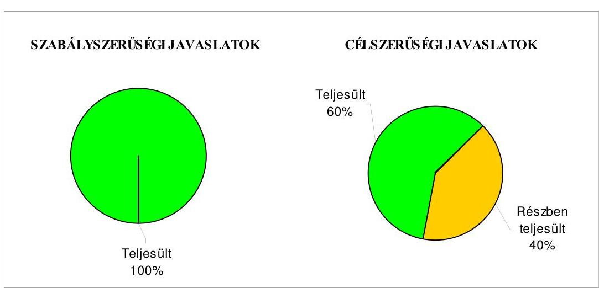

# ÁLLAMI   SZÁMVEVŐSZÉK 

## JELENTÉS

Kenézlő Község Önkormányzata belső kontrollrendszerének kialakítása, valamint egyes kontrolltevékenységek és a belső ellenőrzés múködése ellenőrzéséről

---

# Állami Számvevőszék 

Iktatószám: V-0012-058-009-035/2013.
Témaszám: 1051
Vizsgálat-azonosító szám: V059109

## Az ellenőrzést felügyelte:

Dr. Benedek Mária
felügyeleti vezető
2012. december 16. napjától

Gyüre Lajosné
felügyeleti vezető
2012. december 15. napjáig

## Az ellenőrzést vezette:

## Szakmányné Bilik Mária ellenőrzésvezető

A számvevőszéki jelentés összeállításában közremüködtek:
Groholy Andrásné Hangyál Márta
számvevő tanácsos

## Renner Andrea

számvevő

## Az ellenőrzést végezték:

## Szihalminé Kovács Zsuzsanna Bialkó Zsolt Gyula   számvevő tanácsos

Jelentéseink az Országgyűlés számítógépes hálózatán és az Interneten a www.asz.hu címen is olvashatóak.

---

# TARTALOMJEGYZÉK 

BEVEZETÉS ..... 5
I. ÖSSZEGZŐ MEGÁLLAPÍTÁSOK, KÖVETKEZTETÉSEK, JAVASLATOK ..... 8
II. RÉSZLETES MEGÁLLAPÍTÁSOK ..... 12

1. Az önkormányzat belső kontrollrendszere kialakításának megfelelősége ..... 12
1.1. A kontrollkörnyezet kialakítása ..... 12
1.2. A kockázatkezelési rendszer szabályozása ..... 12
1.3. A kontrolltevékenységek kialakítása ..... 13
1.4. Az információs és kommunikációs rendszer szabályozása ..... 13
1.5. A monitoring rendszer szabályozása ..... 14
2. A pénzügyi folyamatokban kulcsszerepet betöltő belső kontrollok (szakmai teljesítésigazolás és utalvány ellenjegyzés) múködése ..... 15
3. A belső ellenőrzés szervezeti keretei és múködése ..... 16
4. Az ÁSZ 2007-2010. években végzett átfogó ellenőrzései során megfogalmazott javaslatok végrehajtására tett intézkedések ..... 17

## FÜGGELÉKEK

1. számú Értelmező szótár
2. számú A belső kontrollrendszer kialakítása, a pénzügyi folyamatokban kulcsszerepet betöltő szakmai teljesítésigazolás és utalvány ellenjegyzés kontrollok múködése, valamint a belső ellenőrzés múködése értékelésénél alkalmazott minősítési szempontok

---

.

---

# RÖVIDÍTÉSEK JEGYZÉKE 

## Törvények

ÁSZ tv.
Avtv.

Info tv.

Ktv.
Ötv.
régi Áht.
Számv. tv.
új Áht.

## Rendeletek

Áhsz.

Ámr.
Ávr.

Ber.

Bkr.
önkormányzati SZMSZ

## Szórövidítések

adatvédelmi szabályzat

ÁSZ
Belső ellenőrzési kézikönyv
2011. évi LXVI. törvény az Állami Számvevőszékről
1992. évi LXIII. törvény a személyes adatok védelméről és a közérdekú adatok nyilvánosságáról (hatálytalan 2012. január 1-jétől)
2011. évi CXII. törvény az információs önrendelkezési jogról és az információszabadságról (hatályos 2012. január 1-jétől
1992. évi XXIII. törvény a köztisztviselők jogállásáról
1990. évi LXV. törvény a helyi önkormányzatokról
1992. évi XXXVIII. törvény az államháztartásról (hatálytalan 2012. január 1-jétől)
2000. évi C. törvény a számvitelről
2011. évi CXCV. törvény az államháztartásról (hatályos
2012. január 1-jétől)
249/2000. (XII. 24.) Korm. rendelet az államháztartás szervezetei beszámolási és könyvvezetési kötelezettségének sajátosságairól
292/2009. (XII. 19.) Korm. rendelet az államháztartás múködési rendjéről (hatálytalan 2012. január 1-jétől)
368/2011. (XII. 31.) Korm. rendelet az államháztartásról szóló törvény végrehajtásáról (hatályos 2012. január 1jétől)
193/2003. (XI. 26.) Korm. rendelet a költségvetési szervek belső ellenőrzéséről (hatálytalan 2012. január 1jétől)
370/2011. (XII. 31.) Korm. rendelet a költségvetési szervek belső kontrollrendszeréről és belső ellenőrzéséről (hatályos 2012. január 1-jétől)
Kenézlő Község Önkormányzata Képviselő-testületének 8/2011. (V. 16.) számú rendelete Kenézlő Község Önkormányzat Szervezeti és Múködési Szabályzatáról (hatályos 2011. május 20-tól, ezt megelőzően a 7/2007. (V. 11.) számú rendelet volt hatályban)

Kenézlő Község Önkormányzata Polgármesteri Hivatalának Adatvédelmi szabályzata (hatályos 2011. január 14-től)
Állami Számvevőszék
Sárospataki Többcélú Kistérségi Társulás Munkaszervezetének Belső ellenőrzési kézikönyve (hatályos 2011. február 1-jétől)

---

Belső Kontroll Kézikönyv Az Ámr. 155. § (1) bekezdése, valamint az államháztartási belső kontroll standardokról szóló 1/2009. (IX. 11.) PM irányelv egységes értelmezése érdekében az államháztartásért felelős miniszter által 2010. évben kiadott Belső Kontroll Kézikönyv
gazdálkodási szabályzat Kenézlő Község Önkormányzata Polgármesteri Hivatal Szervezeti és Múködési Szabályzatának 8. számú függeléke, Kötelezettségvállalás, utalványozás, ellenjegyzés, érvényesítés rendjének szabályzata (hatályos 2009. január 1-től)
hivatali SZMSZ
informatikai biztonsági
szabályzat
jegyző
Képviselő-testület
kockázatkezelési szabályzat

Önkormányzat
polgármester
Polgármesteri Hivatal szabálytalanságkezelési eljárásrend

Társulás
ügyrend

Kenézlő Község Önkormányzatának 14/2010. (VII. 19.) számú határozattal jóváhagyott, a Polgármesteri Hivatal Szervezeti és Múködési Szabályzata (hatályos 2010. július 19-től)
Kenézlő Község Önkormányzata Polgármesteri Hivatalának Informatikai biztonsági szabályzata (hatályos 2011. január 14-től)
Kenézlő Község Önkormányzatának jegyzője
Kenézlő Község Önkormányzatának Képviselő-testülete
Kenézlő Község Önkormányzata Polgármesteri Hivatal Szervezeti és Múködési Szabályzatának 9. számú függeléke, Kockázatkezelési szabályzat (hatályos 2011. január 1-jétől)
Kenézlő Község Önkormányzata
Kenézlő Község Önkormányzatának polgármestere
Kenézlő Község Önkormányzat Polgármesteri Hivatala
Kenézlő Község Önkormányzata Polgármesteri Hivatal Szervezeti és Múködési Szabályzatának 13. számú függeléke, Szabálytalanságok kezelésének eljárásrendje (hatályos 2009. február 1-jétől)
Sárospataki Többcélú Kistérségi Társulás
Kenézlő Község Önkormányzata Polgármesteri Hivatala Szervezeti és Múködési Szabályzatának a 14/2010. (VII. 19.) számú Képviselő-testületi határozattal jóváhagyott 1. számú melléklete a Polgármesteri Hivatal Ügyrendje (hatályos 2011. május 19-ig), ezt követően a 8/2011. (V. 16.) számú önkormányzati rendelet 3. számú függelékének 1. számú melléklete (hatályos 2011. május 20-tól)

---

# JELENTÉS 

## Kenézló Község Önkormányzata belső kontrollrendszerének kialakítása, valamint egyes kontrolltevékenységek és a belső ellenőrzés múködése ellenőrzéséről

## BEVEZETÉS

A belső kontrollrendszer kialakítását, múködtetését és fejlesztését a régi Áht. és az új Áht. is előírja. Ennek megvalósításáért a költségvetési szerv vezetője, a jegyző felel. A belső kontrollrendszer azt a célt szolgálja, hogy a költségvetési szervek működésük és gazdálkodásuk során a tevékenységeket szabályszerűen, gazdaságosan, hatékonyan, eredményesen hajtsák végre, teljesítsék elszámolási kötelezettségeiket és megvédjék az erőforrásokat a veszteségektől, a károktól és a nem rendeltetésszerú használattól. A belső kontrollrendszer magában foglalja mindazon szabályokat, eljárásokat, gyakorlati módszereket és szervezeti struktúrákat, kockázatkezelési technikákat, kontrolltevékenységeket, amelyek segítséget nyújtanak a szervezetnek céljai eléréséhez.

Az ÁSZ a 2011-2015. évekre szóló stratégiájában hangsúlyos szerepet szánt annak, hogy szilárd szakmai alapon álló, értékteremtő ellenőrzéseivel előmozdítsa a közpénzügyek átláthatóságát, rendezettségét. A számvevőszéki ellenőrzés nemzetközi alapelvei is rögzítik, hogy a megfelelő belső kontrollrendszer minimálisra csökkenti a hibák és szabálytalanságok kockázatát.

Az ellenőrzés célja annak értékelése volt, hogy az Önkormányzat a jogszabályi előírásoknak megfelelően alakította-e ki a belső kontrollrendszert; a gazdálkodás folyamatában kulcsszerepet betöltő szakmai teljesítésigazolás és az utalvány ellenjegyzés kontrolltevékenységeit megfelelően működtette-e; biztosí-totta-e a belső ellenőrzés szabályos és eredményes múködését; intézkedett-e az ÁSZ által a 2007-2010. évek között végzett átfogó ellenőrzések javaslatainak végrehajtásáról.

Az ÁSZ ezen ellenőrzési céljait pilot (próba) jelleggel községi/nagyközségi önkormányzatoknál végzett ellenőrzések során érvényesítette.

Az ellenőrzés típusa: szabályszerűségi ellenőrzés
Az ellenőrzés jogszabályi alapja: az ÁSZ tv. 5. § (2) és (6) bekezdései
Az ellenőrzött szervezet: az Önkormányzat (ezen belül kiemelten a Polgármesteri Hivatal)

---

Az ellenőrzött időszak: a belső kontrollrendszer kialakításának megfelelőségét a 2011. évre vonatkozóan értékeltük. A kontrolltevékenységek múködésének megfelelőségét a 2011. január 1-je és december 31-e, míg a belső ellenőrzés múködésének szabályosságát és eredményességét a 2009. január 1-je és 2011. december 31-e közötti időszakot figyelembe véve értékeltük. A helyszíni ellenőrzés lezárásáig a helyi szabályozás változásait nyomon követtük.

Az ellenőrzés szakmai módszertana az Állami Számvevőszék Ellenőrzési Kézikönyvében foglalt szakmai szabályokon alapult, amely a Legfelsőbb Ellenőrző Intézmények Nemzetközi Szervezete (INTOSAI) által kiadott nemzetközi standardok (ISSAI) figyelembevételével készült.

A belső kontrollrendszer kialakításának ellenőrzése során értékeltük a Polgármesteri Hivatalban a kontrollkörnyezet, a kockázatkezelési rendszer, a kontrolltevékenységek, az információs és kommunikációs rendszer, valamint a monitoring rendszer szabályozottságának megfelelőségét.

A Polgármesteri Hivatalban értékeltük a pénzügyi folyamatokban kulcsszerepet betöltő szakmai teljesítésigazolás és utalvány ellenjegyzés kontrollok működésének megfelelőségét az államháztartáson kívülre teljesített múködési és felhalmozási célú pénzeszköz átadásoknál, az állományba nem tartozók megbízási díjainál, továbbá a külső szolgáltató által végzett karbantartási, kisjavítási munkákkal kapcsolatos kifizetéseknél. Az egyszerű véletlen mintavétellel kiválasztott tételek ellenőrzését többlépcsős megfelelőségi tesztek útján addig végeztük, amíg elegendő és megfelelő bizonyítékot szereztünk a vizsgált folyamatok kulcskontrolljai múködésének megfelelő vagy nem megfelelő voltáról.

Értékeltük az Önkormányzatnál a belső ellenőrzés múködésének szabályosságát és eredményességét.

Az egyes fogalmak magyarázatát az 1. számú függelék, az ellenőrzés egyes területeinek értékelésénél alkalmazott egységes minősítési szempontokat a 2. számú függelék tartalmazza.

Az ellenőrzés lefolytatásához az Önkormányzat a munkalapok és a tanúsítvány elektronikus kitöltésével, valamint a megjelölt dokumentumok elektronikus megküldésével szolgáltatott adatokat. A munkalapokon szerepeltetett adatok, információk ellenőrzése és szükség szerinti javítása a helyszíni ellenőrzés keretében történt.

Az ÁSZ az ellenőrzés megállapításait az ellenőrzött időszakban hatályos, az intézkedést igénylő megállapításokra tett javaslatokat a jelenleg hatályos jogszabályok alapján fogalmazta meg.

Az ÁSZ tv. 29. § (1) bekezdése szerint a jelentéstervezetet megküldtük a polgármester részére, aki az ÁSZ tv. 29. § (2) bekezdésében foglalt észrevételezési jogával nem élt, a jelentéstervezetre észrevételt nem tett.

Kenézlő község állandó lakosainak száma 2011. január 1-jén 1386 fő volt. Az Önkormányzat héttagú Képviselő-testületének munkáját egy állandó bizottság segítette. Az Önkormányzat az önállóan múködő és gazdálkodó Polgármesteri

---

Hivatalon kívül két önállóan múködő költségvetési intézménnyel látta el feladatait. Az Önkormányzat többségi tulajdoni hányadú gazdasági társasággal nem rendelkezett. A polgármester az 1990. évi önkormányzati választások óta tölti be tisztségét, a jegyző személye 1991 októberétől változatlan. A Polgármesteri Hivatal szervezeti egységekre nem tagolódott, a foglalkoztatott köztisztviselők száma 2011. január 1-jén hat fő volt. Az Önkormányzat a 2011. évi költségvetési beszámolója szerint 323 millió Ft költségvetési bevételt ért el, valamint 300,4 millió Ft költségvetési kiadást teljesített. A 2011. december 31-i könyvviteli mérleg szerint 1060,9 millió Ft értékú eszközvagyonnal rendelkezett, a rövid lejáratú kötelezettsége 14,7 millió Ft volt, hosszú lejáratú kötelezettsége nem volt.

---

# I. ÖSSZEGZŐ MEGÁLLAPÍTÁSOK, KÖVETKEZTETÉSEK, JAVASLATOK 

A belső kontrollrendszer kialakítása a Polgármesteri Hivatalban 2011-ben a kontrollkörnyezet, a kockázatkezelési rendszer, a kontrolltevékenységek, az információs és kommunikációs rendszer, valamint a monitoring rendszer szabályozásának, illetve kialakításának értékelése alapján összességében részben felelt meg a jogszabályi előírásoknak.

A kontrollkörnyezet kialakítása egészében megfelelt a jogszabályi követelményeknek. A jegyző a gazdálkodást érintő legfontosabb szabályzatokat elkészítette. Az Ámr.-ben foglaltak közül ugyanakkor a hivatali SZMSZ-ből hiányzott az alaptevékenységek, és azok jogi szabályozásának rögzítése, továbbá az SZMSZ-ben nevesített munkakörökhöz tartozó feladat- és hatáskörök, a hatáskörök gyakorlásának módja és a kapcsolódó felelősségi szabályok meghatározása. Az SZMSZ mellékletét képező ügyrend nem tartalmazta a pénzügyigazdasági feladatok ellátásáért felelős dolgozók helyettesítési rendjére vonatkozó szabályokat. Ezek a hiányosságok korlátozzák a feladatellátás számon kérhetőségét, folyamatosságának biztosítását.

A kockázatkezelési rendszer szabályozása részben felelt meg a jogszabályi előírásoknak. A kockázatkezelési szabályzat tartalmazta a kockázatok felmérésének, elemzésének és kezelésének a módját, azonban a szabályzat előírása ellenére a kockázat-nyilvántartási rendszert nem alakították ki.

A kontrolltevékenységek kialakítása a jogszabályi követelményeknek részben felelt meg. A jegyző szabályozta a gazdálkodási jogkörök gyakorlásának szabályait, azonban az Ámr. rendelkezése ellenére nem alakította ki a Polgármesteri Hivatal tevékenységeire vonatkozó beszámolási eljárásokat. A kialakított kontrolltevékenységek - végrehajtásuk esetén - biztosítják a lehetséges hibák feltárását, kijavítását.

Az információs és kommunikációs rendszer szabályozása részben felelt meg a jogszabályi előírásoknak. A jegyző az informatikai rendszer környezetének szabályozása során az Avtv. előírása ellenére elmulasztotta az adatbiztonság érvényre juttatásához szükséges intézkedések megtételét. Nem határozta meg a hozzáférési jogosultságok megállapítására, módosítására, azok betartásának ellenőrzésére vonatkozó eljárásrendet. Nem szabályozta a pénzügyiszámviteli szoftverváltozások ellenőrzésére, tesztelésére vonatkozó eljárásokat.

A monitoring rendszer szabályozása részben felelt meg a jogszabályi követelményeknek. Szabályozták a rendszeresen végzendő vezetői ellenőrzés rendjét, az egyedi értékelés monitoring rendszerét. Az Ámr.-ben foglaltak ellenére azonban a jegyző nem alakította ki az operatív tevékenységek keretében megvalósuló folyamatos és eseti nyomon követésből álló, a tevékenységek, a célok megvalósításának nyomon követését biztosító rendszert a Polgármesteri Hivatalhoz rendelt önállóan múködő költségvetési intézmények tevékenységeire vonatkozóan.

---

A belső kontrollrendszer részben megfelelő kialakítása kockázatot jelent az Önkormányzat tevékenységeinek szabályszerű, gazdaságos, hatékony és eredményes végrehajtása során.

A Polgármesteri Hivatalban a 2011. évben az államháztartáson kívülre történő működési és felhalmozási célú pénzeszközátadásokkal, az állományba nem tartozók megbízási díjaival, valamint a külső szolgáltatók által végzett karbantartással, kisjavítással kapcsolatos kifizetések során, összefoglalóan értékelve, a kulcskontrollok müködésének megfelelősége kiváló volt.

Az utalványok ellenjegyző́je és a szakmai teljesítésigazolásra a jegyző által kijelölt személyek ellenőrzési és igazolási kötelezettségüknek az Ámr.-ben és a gazdálkodási szabályzatban előírt módon - a feltárt eseti hiányosságok kivételével - eleget tettek. Az utalványok ellenjegyzője eseti jelleggel az Ámr.-ben foglalt, az érvényesítés megtörténtére vonatkozó ellenőrzési kötelezettségét nem teljesítette, mivel nem észrevételezte, hogy a népszámlálással összefüggő megbízási díjak kifizetése előtt az Ámr. összeférhetetlenségre vonatkozó szabályozását figyelmen kívül hagyva az érvényesítő az érvényesítést a saját maga javára látta el. A számvevőszéki ellenőrzés az ellenőrzött kifizetéssel összefüggésben a rendelkezésre bocsátott dokumentumok alapján jogosulatlan kifizetést nem állapított meg.

Az Önkormányzat a belső ellenőrzési feladatokat Társulás útján látta el. A belső ellenőrzés múködése eredményes volt, mivel a belső ellenőrzés szabályozása és múködése az ellenőrzött időszak egészét tekintve a jogszabályi előírásoknak megfelelt. A 2009-2011. években ellenőrizték a belső kontrollrendszer kialakításának szabályozottságát, a gazdálkodási jogkörök gyakorlásához kapcsolódó belső kontrollok múködését, az önkormányzati vagyon hasznosítása területén a vagyongazdálkodási szabályok betartását, a vagyonvédelem területén a leltározási és a selejtezési szabályzatban foglaltak betartását. Az elvégzett ellenőrzések javaslatainak hasznosításáról intézkedtek. A belső ellenőrzés eredményes múködése elősegítette a szabálytalanságok megelőzését, a feltárt hibák kijavítását és megszüntetését.

Az ÁSZ az Önkormányzat gazdálkodását a 2010. évben ellenőrizte átfogó jelleggel, melynek során négy szabályszerűségi és öt célszerűségi javaslatot tett. A javaslatok végrehajtása érdekében intézkedési tervet készítettek, melyet a Képviselő-testület jóváhagyott. Az ellenőrzés szabályszerűségi javaslatait teljes körűen végrehajtották, a célszerűségi javaslatokból három realizálódott, kettőt az Önkormányzat részben vett figyelembe. A 2010. évi ÁSZ ellenőrzés javaslatainak hasznosítása hozzájárult az Önkormányzat belső kontrollrendszerének szabályozottabbá, belső ellenőrzésének eredményesebbé válásához.

Az ÁSZ tv. 33. § (1) bekezdésében foglaltak értelmében a jelentésben foglalt megállapításokhoz kapcsolódó intézkedési tervet köteles az ellenőrzött szervezet vezetője összeállítani és azt a jelentés kézhezvételétől számított 30 napon belül az ÁSZ részére megküldeni. Amennyiben az intézkedési tervet határidőn belül nem küldi meg a szervezet, vagy az továbbra sem elfogadható, az ÁSZ elnöke a hivatkozott törvény 33. § (3) bekezdés a)-b) pontjaiban foglaltakat érvényesítheti.

---

Az ellenőrzés intézkedést igénylő megállapításai és javaslatai:

# a jegyzőnek 

1. a kontrollkörnyezettel kapcsolatban:

A jegyző az Ámr. 20. § (2) bekezdés c) és h) pontjaiban foglaltak ellenére a hivatali SZMSZ-ben nem határozta meg az ellátandó és a szakfeladatrend szerint besorolt alaptevékenységeket, valamint a szabályozásukra vonatkozó jogszabályok megjelölését. Nem rögzítette a hivatali SZMSZ-ben nevesített munkakörökhöz tartozó feladatés hatásköröket, a hatáskörök gyakorlásának módját, az ezekhez kapcsolódó felelősségi szabályokat. A hivatali SZMSZ mellékletét képező ügyrend gazdálkodási feladatok ellátására vonatkozó részében nem határozta meg a pénzügyi-gazdasági feladatok ellátásáért felelős alkalmazottak helyettesítési rendjét.

Javaslat:
Módosítsa a hivatali SZMSZ-t és kezdeményezze a polgármesternél a módosítás Képviselő-testület elé terjesztését annak érdekében, hogy az Ávr. 13. § (1) bekezdés c) és g) pontjainak előírása alapján tartalmazza az aktuális szakfeladatrend szerint az ellátott alaptevékenységeket, a szabályozásukra vonatkozó jogszabályok megjelölését, továbbá a hivatali SZMSZ-ben nevesített munkakörökhöz tartozó feladat- és hatásköröket, a hatáskörök gyakorlásának módját, és az ezekhez kapcsolódó felelősségi szabályokat. Egészítse ki a hivatali SZMSZ mellékletét képező ügyrendet a pénzügyigazdasági feladatok ellátásáért felelős dolgozók helyettesítési rendjének szabályozásával.
2. a kockázatkezelési rendszerrel kapcsolatban:

A jegyző az Ámr. 157. § (1) bekezdése szerinti kockázatkezelési rendszer keretében a kockázatkezelési szabályzat előírása ellenére a kockázat-nyilvántartási rendszert nem alakította ki.

Javaslat:
Alakítsa ki a Bkr. 7. § (1)-(2) bekezdés szerinti kockázatkezelési rendszeren belül a kockázat-nyilvántartási rendszert a belső szabályozással összhangban.
3. a kontrolltevékenységekkel kapcsolatban:

A jegyző az Ámr. 158. § (2) bekezdés d) pontja ellenére nem alakította ki a Polgármesteri Hivatal tevékenységeire vonatkozó beszámolási eljárásokat.

Javaslat:
Alakítsa ki a Bkr. 8. § (4) bekezdés c) pontjának megfelelően a Polgármesteri Hivatal tevékenységeivel kapcsolatos beszámolási eljárásokat.

---

4. az információs és kommunikációs rendszerrel kapcsolatban:

Az informatikai rendszer környezetének szabályozása során az Avtv. 10. § (1)-(2) bekezdéseiben foglalt előírások ellenére a jegyző elmulasztotta az adatbiztonság érvényre juttatásához szükséges intézkedések megtételét. A hozzáférési jogosultságokra vonatkozó eljárásrendben nem rendelkezett a hozzáférési jogosultságok megállapításáról, módosításáról, betartásának ellenőrzéséről, nem szabályozta a pénzügyiszámviteli szoftverváltozások ellenőrzésére, tesztelésére vonatkozó eljárásokat.

Javaslat:
Biztosítsa az Info. tv. 7. § (2) bekezdésének megfelelően az adatbiztonság érvényesülését, rendelkezzen a hozzáférési jogosultságok megállapításáról, módosításáról és betartásának ellenőrzéséről, szabályozza a pénzügyi-számviteli szoftverváltozások ellenőrzésére, tesztelésére vonatkozó eljárásokat.
5. a monitoring rendszerrel kapcsolatban:

Az Ámr. 160. §-ban foglaltak ellenére nem alakította ki az operatív tevékenységek keretében megvalósuló folyamatos és eseti nyomon követésből álló, a tevékenységek, a célok megvalósításának nyomon követését biztosító rendszert a Polgármesteri Hivatalhoz rendelt önállóan múködő költségvetési intézmények tevékenységeire vonatkozóan.

Javaslat:
Gondoskodjon a Bkr. 10. §-ában előírtak alapján az operatív tevékenységek keretében megvalósuló folyamatos és eseti nyomon követésből álló, a tevékenységek, a célok megvalósításának nyomon követését biztosító rendszernek a Polgármesteri Hivatalhoz rendelt intézmények tevékenységeire történő kiterjesztéséről.
6. a pénzügyi folyamatokban kulcsszerepet betöltő kontrollok múködésével kapcsolatban:

Az utalványok ellenjegyzője nem győződött meg a gazdálkodásra vonatkozó szabályok betartásáról, mivel az Ámr. 79. § (2) bekezdésében foglaltak ellenére nem észrevételezte, hogy az érvényesítő az Ámr. 80. § (2) bekezdésében foglalt összeférhetetlenségi szabályt figyelmen kívül hagyva, az érvényesítést saját maga javára látta el.

Javaslat:
Gondoskodjon minden esetben - az Ávr. 60. § (2) bekezdésében foglaltak figyelembevételével - az összeférhetetlenségi szabályok érvényesüléséről.

---

# II. RÉSZLETES MEGÁLLAPÍTÁSOK 

## 1. AZ ÖNKORMÁNYZAT BELSŐ KONTROLLRENDSZERE KIALAKÍTÁSÁNAK MEGFELELŐSÉGE

### 1.1. A kontrollkörnyezet kialakítása

A kontrollkörnyezet kialakítása a Polgármesteri Hivatalban megfelelő volt. A jegyző a gazdálkodást érintő legfontosabb szabályzatokat elkészítette, azonban az Ámr. 20. § (2) bekezdés c) és h) pontjaiban ${ }^{1}$ foglaltak ellenére a hivatali SZMSZ-ben nem határozta meg az ellátandó és a szakfeladatrend szerint besorolt alaptevékenységeket, valamint a szabályozásukra vonatkozó jogszabályok megjelölését. Nem rögzítette a hivatali SZMSZ-ben nevesített munkakörökhöz tartozó feladat- és hatásköröket, a hatáskörök gyakorlásának módját, az ezekhez kapcsolódó felelősségi szabályokat. A hivatali SZMSZ mellékletét képező ügyrend gazdálkodási feladatok ellátására vonatkozó részében nem határozta meg a pénzügyi-gazdasági feladatok ellátásáért felelős dolgozók helyettesítési rendjét.

A jegyző a Ktv. 34. §-ában² foglaltak ellenére nem határozta meg a köztisztviselőkre vonatkozó teljesítménykövetelményeket.

A kontrollkörnyezet kialakítása során a jegyző

- a Belső Kontroll Kézikönyv 1.2.7. pontjában foglalt ajánlást nem vette figyelembe, mert nem írta elő a hivatali SZMSZ munkatársak általi megismerésének kötelezettségét;
- a Belső Kontroll Kézikönyv 1.5.2. pontjában foglalt ajánlást nem érvényesítette, mivel nem dolgozta ki a Polgármesteri Hivatalban ellátott köztisztviselői munkakörök betöltésére vonatkozó elvárt tudást és képességeket.

### 1.2. A kockázatkezelési rendszer szabályozása

A kockázatkezelési rendszer szabályozottsága a Polgármesteri Hivatalban részben volt megfelelő. A jegyző elkészítette a kockázatkezelési szabályzatot, meghatározta a kockázatok felmérésének, elemzésének és kezelésének a módját, azonban az Ámr. 157. § (1) bekezdése ${ }^{3}$ szerinti kockázatkezelési rendszer keretében a kockázatkezelési szabályzat előírása ellenére a kockázatnyilvántartási rendszert nem alakította ki.

[^0]
[^0]:    ${ }^{1}$ 2012. január 1-jétől az Ávr. 13. § (1) bekezdés c) és g) pontjai rögzítik az SZMSZ tartalmi követelményeit.
    ${ }^{2}$ 2012. január 1-jétől a közszolgálati tisztviselőkről szóló 2011. évi CXCIX. törvény 130. §-a a kormánytisztviselőkre vonatkozóan írja elő a teljesítményértékelés kötelezettségét.
    ${ }^{3}$ 2012. január 1-jétől a Bkr. 7. § (1)-(2) bekezdése rendelkezik a kockázatkezelési rendszer működtetéséről.

---

A kockázatkezelési rendszer szabályozása során a jegyző

- a Belső Kontroll Kézikönyv 2.2.4. pontjában foglaltakat figyelmen kívül hagyva az Önkormányzat tevékenységeit kockázati kitettség alapján nem rangsorolta;
- a kockázatkezelés során a Belső Kontroll Kézikönyv 2.4.1. pontjában foglalt ajánlást nem érvényesítette, mivel nem végezte el a beazonosított kockázatok legalább évenkénti felülvizsgálatát;
- nem érvényesítette a Belső Kontroll Kézikönyv 2.5.1. pontjában foglalt ajánlást, mivel nem gondoskodott a csalás és a korrupció, mint kiemelt kockázatok értékeléséről és kezeléséről.

# 1.3. A kontrolltevékenységek kialakítása 

A kontrolltevékenységek kialakítása a Polgármesteri Hivatalban részben volt megfelelő. A jegyző a kontrollstratégiák és módszerek keretében szabályozta a folyamatba épített, előzetes, utólagos és vezető ellenőrzést, meghatározta az érvényesítés rendjét, kialakította a szakmai teljesítésigazolás módját és kijelölte az érvényesítésre, illetve a szakmai teljesítésigazolásra jogosultakat. A kontrolltevékenységek kialakítása során azonban a jegyző az Ámr. 158. § (2) bekezdés d) pontja ${ }^{4}$ ellenére nem alakította ki a Polgármesteri Hivatal tevékenységeire vonatkozó beszámolási eljárásokat.

A kontrolltevékenységek kialakítása során a jegyző

- a Belső Kontroll Kézikönyv 3.2.1. pontjában foglaltakat nem vette figyelembe, mivel a köztisztviselők munkaköri leírásaiban nem határozta meg az ellenőrzési feladataikat;
- a Belső Kontroll Kézikönyv 3.2.3. pontjában foglalt ajánlást figyelmen kívül hagyva nem mérte fel a kis létszámból adódó kockázatokat, illetve ezen kockázat kezelése érdekében az érvényesítési feladatokat ellátó köztisztviselő helyettesítésének biztosításáról nem intézkedett;
- a Belső Kontroll Kézikönyv 3.3.1. pontjában foglalt ajánlást nem érvényesítette, mivel a munkakör átadás-átvételi jegyzőkönyvben nem írta elő kötelező tartalmi elemként a munkaviszony megszűnésének időpontját, az átadónál lévő, átadásra kerülő ügyek iratainak és státuszának a listáját, valamint a folyamatban lévő ügyekről való tájékoztatási kötelezettséget.

### 1.4. Az információs és kommunikációs rendszer szabályozása

Az információs és kommunikációs rendszer szabályozottsága a Polgármesteri Hivatalban részben volt megfelelő, mivel a jegyző az informatikai rendszer környezetének szabályozása során az Avtv. 10. § (1)-(2) bekezdéseiben ${ }^{5}$ foglalt előírások ellenére elmulasztotta az adatbiztonság érvényre juttatásához szükséges intézkedések megtételét. A hozzáférési jogosultságokra vonatkozó eljárásrendben nem rendelkezett a hozzáférési jogosultságok megállapítá-

[^0]
[^0]:    ${ }^{4}$ 2012. január 1-jétől az Bkr. 8. § (4) bekezdés c) pontja tartalmazza a szabályozási kötelezettséget.
    ${ }^{5}$ 2012. január 1-jétől az Info tv. 7. § (2) bekezdése rögzíti az adatbiztonság érdekében szükséges szabályozási kötelezettséggel kapcsolatos előírást.

---

sáról, módosításáról és betartásának ellenőrzéséről, nem szabályozta a pénz-ügyi-számviteli szoftverváltozások ellenőrzésére, tesztelésére vonatkozó eljárásokat.

Az információs és kommunikációs rendszer szabályozása során a jegyző

- a Belső Kontroll Kézikönyv 4.1.1. és 4.1.2. pontjaiban foglaltak figyelmen kívül hagyásával nem szabályozta a szervezeten belüli információátadás formáit, valamint az Önkormányzat kommunikációs csatornáit és a kapcsolódó jogosultságokat;
- az iktatási, iratkezelési rendszer kialakítása során a Belső Kontroll Kézikönyv 4.2.2. és 4.2.4. pontjában foglalt ajánlásokat nem érvényesítette, mert nem szabályozta az ügyintézési határidők nyomon követésének dokumentálását, a késedelmes ügyintézés jelzéséért való felelősség rendjét;
- a szabálytalanságkezelési szabályzatban a Belső Kontroll Kézikönyv 4.3.3. pontjában foglalt ajánlást nem vette figyelembe, mivel nem rögzítette a szabálytalanságot bejelentő védelmére vonatkozó előírásokat.

# 1.5. A monitoring rendszer szabályozása 

A monitoring rendszer szabályozottsága a Polgármesteri Hivatalban részben volt megfelelő, mivel a jegyző az Ámr. 160. § (1)-(2) bekezdésében ${ }^{6}$ foglaltak ellenére nem alakította ki az operatív tevékenységek keretében megvalósuló folyamatos és eseti nyomon követésből álló, a tevékenységek, a célok megvalósításának nyomon követését biztosító rendszert a Polgármesteri Hivatalhoz rendelt önállóan működő költségvetési intézmények tevékenységeire vonatkozóan.

A monitoring rendszer szabályozása keretében a jegyző

- a Belső Kontroll Kézikönyv 1.2.2. pontjában foglaltakat figyelmen kívül hagyva a szervezeti célok megvalósításának nyomon követése érdekében a lakosság, illetve a szolgáltatásokat igénybe vevők körében az önkormányzati feladatellátásra irányulóan elégedettségi felméréseket a 2009-2011. években nem végeztetett;
- a Belső Kontroll Kézikönyv 5.1.2. pontjának ajánlását figyelmen kívül hagyva nem alakította ki az elsőfokú hatósági tevékenységhez kapcsolódó indikátorainak rendszerét és alkalmazásuk rendjét, valamint nem írta elő alakulásuk nyomon követését és értékelését.

A belső kontrollrendszer kialakítása a Polgármesteri Hivatalban 2011ben a kontrollkörnyezet, a kockázatkezelési rendszer, a kontrolltevékenységek, az információs és kommunikációs rendszer, valamint a monitoring rendszer szabályozásának, illetve kialakításának értékelése alapján összességében részben felelt meg a jogszabályi előírásoknak.

[^0]
[^0]:    ${ }^{6}$ 2012. január 1-jétől a Bkr. 10. §-a írja elő a szervezet tevékenységének, a célok megvalósulásának nyomon követését biztosító rendszer kialakítását.

---

# 2. A PÉNZÜGYI FOLYAMATOKBAN KULCSSZEREPET BETÖLTŐ BELSŐ KONTROLLOK (SZAKMAI TELJESÍTÉSIGAZOLÁS ÉS UTALVÁNY ELLENJEGYZÉS) MŰKÖDÉSE 

A Polgármesteri Hivatalban a 2011. évben az államháztartáson kívülre teljesített múködési és felhalmozási célú pénzeszközátadások során a szakmai teljesítésigazolás és az utalvány ellenjegyzés kulcskontrollok múködésének megfelelősége kiváló volt, mert a kiadások jogosságának, öszszegszerúségének ellenőrzését a jegyző által a szakmai teljesítésigazolásra kijelölt személyek a gazdálkodási szabályzatban előírt módon elvégezték. Az utalványok ellenjegyzője a gazdálkodásra vonatkozó szabályok érvényesüléséről, továbbá a szakmai teljesítésigazolás és az érvényesítés elvégzéséről - a feltárt eseti hiányosság kivételével - meggyőződött. A feltárt hiányosságok és a hibák az ellenőrzés által meghatározott kritikus hibaszámot nem haladták meg.

A turizmus fejlesztésére létrehozott egyesület 20 ezer Ft-os tagsági díja kifizetése esetében az Áhsz. 9. számú mellékletének számlaosztályok tartalmára vonatkozó előírások alcím alatt található 9. d) pontjának előírása ellenére a megelőző ügymenetben a kiadást tévesen a múködési célú pénzeszközátadás államháztartáson kívülre főkönyvi számlára jelölték ki.

A Polgármesteri Hivatalban a 2011. évben az állományba nem tartozók megbízási díjainak kifizetése során a szakmai teljesítésigazolás és az utalvány ellenjegyzés kulcskontrollok múködésének megfelelősége kiváló volt, mert a kiadások jogosságának, összegszerűségének, és a szerződésben, megrendelésben foglaltak teljesítésének ellenőrzését a jegyző által a szakmai teljesítésigazolásra kijelölt személyek a gazdálkodási szabályzatban előírt módon elvégezték. Az utalványok ellenjegyzője a gazdálkodásra vonatkozó szabályok érvényesüléséről, továbbá a szakmai teljesítésigazolás és az érvényesítés elvégzéséről a feltárt, eseti hiányosságok kivételével meggyőződött. A feltárt hiányosságok és a hibák az ellenőrzés által meghatározott kritikus hibaszámot nem haladták meg.

Az utalványok ellenjegyzője a népszámláláshoz és a TIOP pályázat pénzügyi lebonyolítói feladatainak ellátásához kapcsolódó kifizetések során aláírása ellenére nem győződött meg az érvényesítés szabályszerűségéről és a gazdálkodásra vonatkozó szabályok betartásáról, mivel az Ámr. 79. § (2) bekezdésében foglaltak ellenére nem észrevételezte, hogy az érvényesítő az Ámr. 80. § (2) bekezdésében ${ }^{7}$ foglalt összeférhetetlenségi szabályok ellenére az érvényesítést saját maga javára látta el.

Az összeférhetetlenségre vonatkozó előírások megsértésével összefüggésben a rendelkezésre bocsátott dokumentumok alapján kár bekövetkezésére utaló adatot, tényt az ellenőrzés nem állapított meg.

A Polgármesteri Hivatalban a 2011. évben a külső szolgáltatók által teljesített karbantartási, kisjavítási munkákra történő kifizetések során a szakmai teljesítésigazolás és az utalvány ellenjegyzés kulcskontrollok múködésének megfelel-

[^0]
[^0]:    ${ }^{7}$ 2012. január 1-jétől Ávr. 60. § (2) bekezdés tartalmazza.

---

lősége kiváló volt, mert a kiadások jogosságának, összegszerűségének, a szerződésben, megrendelésben foglaltak teljesítésének ellenőrzését a jegyző által a szakmai teljesítésigazolásra kijelölt személyek a gazdálkodási szabályzatban előírt módon elvégezték. Az utalványok ellenjegyzője a gazdálkodásra vonatkozó szabályok érvényesüléséről, továbbá a szakmai teljesítésigazolás és az érvényesítés elvégzéséről meggyőződött.

# 3. A BELSŐ ELLENŐRZÉS SZERVEZETI KERETEI ÉS MŰKÖDÉSE 

Az Önkormányzat a belső ellenőrzési feladatokat - az Önkormányzati SZMSZ-ben előírtaknak megfelelően - a Társulással kötött megállapodás alapján látta el az ellenőrzött időszak egészében.

Az Önkormányzatnál a belső ellenőrzés múködése a jogszabályi előírásoknak a 2009-2010. években megfelelt, a 2011. évben jól megfelelt. Az Önkormányzatra vonatkozó éves belső ellenőrzési tervek tartalmukban megfeleltek a jogszabályi előírásoknak. Az éves ellenőrzési tervet a 2009-2010. években a Képviselő-testület az Ötv. 92. § (6) bekezdésében előírt határidőt követően hagyta jóvá ${ }^{8}$, valamint összeállításakor a 2010. évben a Ber. 32/B. § (2) bekezdésben ${ }^{9}$ előírtak ellenére nem kérték ki a jegyző írásos véleményét. Az ellenőrzési terv összeállítását megelőzően készített kockázatelemzés a 2009-2010. években magas kockázatúnak értékelt területet nem tartalmazott.

Az ellenőrzési tervekben mindhárom évben három ellenőrzés végrehajtását tervezték. A tervezett ellenőrzéseket a 2009. év kivételével végrehajtották, a 2009. évben időkeret hiányában ${ }^{10}$ elmaradt a Polgármesteri Hivatalban a pénztár és pénzkezelés múködésének ellenőrzése.

A 2009-2011. években az ellenőrzéseket a Ber.-ben előírt tartalmú ellenőrzési programok alapján végezték, melyeket - a 2009. év kivételével - a belső ellenőrzési vezető hagyott jóvá. Az ellenőrzésekről készült jelentések megfeleltek a Ber. előírásainak, az ellenőrzöttek a javaslatok végrehajtására intézkedési tervet készítettek. A belső ellenőrzési vezető az elvégzett intézkedésekről, illetve a belső ellenőrzési jelentés javaslatai alapján megtett intézkedések nyomon követéséről nyilvántartást vezetett. A jegyző az elvégzett ellenőrzések javaslatainak hasznosítása érdekében intézkedett, a javaslatokat teljes körűen hasznosították.

Az ellenőrzések során büntető-, szabálysértési, kártérítési, fegyelmi eljárás megindítására okot adó cselekményt nem tártak fel. A belső ellenőrzés a feltárt hiányosságok megszüntetéséről beszámoltatás, illetve utóellenőrzés keretében meggyőződött.

[^0]
[^0]:    ${ }^{8}$ A 2009. évi belső ellenőrzési tervet a 37/2008. (XI. 17.) számú határozattal, a 2010. évi belső ellenőrzési tervet az 50/2009. (XI. 29.) számú határozattal hagyta jóvá a Képviselő-testület.
    ${ }^{9}$ 2012. január 1-jétől Bkr. 56. § (2) bekezdés.
    ${ }^{10}$ A következő évben a tartalék időkeret terhére tervezték a vizsgálatot.

---

Az Önkormányzatnál a 2009-2011. években a belső ellenőrzés múködése eredményes volt, mivel a belső ellenőrzés szabályozása és múködése az ellenőrzött időszak egészét tekintve a jogszabályi előírásoknak megfelel. Ellenőrizték a belső kontrollrendszer kialakításának szabályozottságát, a gazdálkodási jogkörök gyakorlásához kapcsolódó belső kontrollok múködését, az önkormányzati vagyon hasznosítása területén a vagyongazdálkodási szabályok, valamint a vagyonvédelem területén a leltározási és a selejtezési szabályzatban foglaltak betartását. Az elvégzett ellenőrzések javaslatainak hasznosítására intézkedtek.

# 4. Az ÁSZ 2007-2010. ÉVEKBEN VÉGZETT ÁtFOGÓ ELLENŐRZÉSEI SORÁN MEGFOGALMAZOTT JAVASLATOK VÉGREHAJTÁSÁRA TETT INTÉZKEDÉSEK 

Az ÁSZ az Önkormányzat gazdálkodását a 2010. évben ellenőrizte ${ }^{11}$ átfogó jelleggel, melynek során négy szabályszerűségi és öt célszerűségi javaslatot tett. A javaslatok realizálása érdekében a polgármester - felelősöket és határidőket tartalmazó - intézkedési tervet készített. Az Önkormányzat gazdálkodásának átfogó ellenőrzéséről készült előterjesztést a Képviselő-testület megtárgyalta, és az intézkedési tervben foglaltakat határozattal jóváhagyta.

Az ÁSZ ellenőrzés által tett javaslatok 78\%-a realizálódott, 22\%-a részben teljesült. Az Önkormányzatnál a 2010. évben végzett ÁSZ ellenőrzés során tett javaslatok hasznosulásának megoszlását a következő ábra szemlélteti:

[^0]
[^0]:    ${ }^{11}$ Az ÁSZ V-3023-8/4/2010. Számvevői jelentése Kenézlő Község Önkormányzata gazdálkodási rendszerének 2010. évi ellenőrzéséről.

---

A szabályszerűségi javaslatokat teljes körűen hasznosították. A célszerűségi javaslatok $60 \%$-a realizálódott, $40 \%$-a részben teljesült. Az ellenőrzési nyomvonalban az ellenőrzéssel kapcsolatos feladatokat rögzítették, azonban az egyes ellenőrzési feladatok elvégzését igazoló dokumentumok fellelési helyét nem határozták meg. Az érintett dolgozók munkaköri leírásában az értékelési feladatok elvégzését előírták, azonban az ellenőrzési feladatok ellátásának kötelezettségét nem rögzítették.

Budapest, 2013. O2 hó 14 nap

Függelék: $\quad 2 \mathrm{db}$

Domokos László
elnök

---

# ÉRTELMEZŐ SZÓTÁR 

belső ellenőrzés
belső kontrollrendszer
belső kontrollrendszer területei
integritás
kockázat
kockázatkezelési rendszer
kontrollkörnyezet

Független, tárgyilagos bizonyosságot adó és tanácsadó tevékenység, amelynek célja, hogy az ellenőrzött szervezet múködését fejlessze és eredményességét növelje, az ellenőrzött szervezet céljai elérése érdekében rendszerszemléletű megközelítéssel és módszeresen értékeli, illetve fejleszti az ellenőrzött szervezet irányítási és belső kontrollrendszerének hatékonyságát. (régi Áht. 121/B. § (1) bekezdés és a Bkr. 2. § b) pontjából levezetett meghatározás)
A belső kontrollrendszer a kockázatok kezelése és tárgyilagos bizonyosság megszerzése érdekében kialakított folyamatrendszer, amely azt a célt szolgálja, hogy a múködés és gazdálkodás során a tevékenységeket szabályszerűen, gazdaságosan, hatékonyan, eredményesen hajtsák végre, az elszámolási kötelezettségeket teljesítsék, megvédjék az erőforrásokat a veszteségektől, a károktól és a nem rendeltetésszerű használattól. (a régi Áht. 121. § (1) és az új Áht. 69. § (1) bekezdéséből levezetett fogalom)
A kontrollkörnyezet, a kockázatkezelési rendszer, a kontrolltevékenységek, az információ és kommunikáció, valamint a nyomon követés (monitoring). (régi Áht. 121. § (2) bekezdéséből és a Bkr. 3. §-ából levezetett fogalom)
Az integritás elvek, értékek, cselekvések, módszerek, intézkedések, konzisztenciáját jelenti: olyan magatartásmódot, amely meghatározott értékeknek felel meg. Az integritás a közszféra esetében a társadalom által elvárt nyilvánossági, átláthatósági, illetve jogi/etikai normáknak történő megfelelést jelenti.
(A http://integritas.asz.hu honlapon között „Integritás jelentés 2011" című dokumentum 5. oldal 1. bekezdés)
Az a lehetőség, hogy egy olyan esemény történik meg, amely negatívan hat a célok elérésére. (ÁSZ Ellenőrzési kézikönyv 6/139-140.oldal)
Olyan irányítási eszközök és módszerek összessége, melynek elemei a szervezeti célok elérését veszélyeztető tényezők (kockázatok) azonosítása, elemzése, csoportosítása, nyomon követése, valamint szükség esetén a kockázati kitettség mérséklése. (2012. január 1-jétől a Bkr. 2. § m) pontjában meghatározott fogalom)
A kontrollkörnyezet alakítja ki a szervezet belső kontrollrendszerhez való viszonyát, hozzáállását, befolyásolja az alkalmazottak belső kontrollal kapcsolatos tudatosságát, magatartását. Elemei a személyes és szakmai elkötelezettség és a vezetés, valamint az alkalmazottak által vallott erkölcsi értékek, a szakmai hozzáértés iránti elkötelezettség, a felső vezetés hozzáállása - a vezetés filozófiája és tevékenységének stílusa, a szervezeti struktúra, a humánerőforrás - politika és gazdálkodási gyakorlat. (ÁSZ Ellenőrzési kézikönyv 6/107. oldal)

---

kontrolltevékenységek
kommunikáció
korrupció
kulcskontrollok
lényegesség
monitoring
utóellenőrzés
véletlen minta

A kontrolltevékenységek azok a politikák és eljárások, amelyeket a kockázatok megoldására hoznak létre a szervezet céljainak teljesítése érdekében. (ÁSZ Ellenőrzési kézikönyv 6/108-109. oldal)
Az a tevékenység, melynek során információ továbbítása valósul meg. A kommunikációs folyamat résztvevői között tájékoztatás történik, mely során tényeket, ezek magyarázatát közlik. „A szervezetben eredményes kommunikációnak kell áramlania lefelé, horizontálisan és felfelé, a szervezet egészében és annak valamennyi elemében." (ÁSZ Ellenőrzési kézikönyv 6/112. oldal)
A közhatalmi pozíció bármilyen erkölcstelen felhasználása személyes, vagy magáncélú előnyök megszerzése érdekében. (ÁSZ Ellenőrzési kézikönyv 6/84. oldal)
Az önkormányzatok kontrollrendszere kialakításának ellenőrzése során a pénzügyi folyamatokban kulcsszerepet betöltő belső kontrollok a szakmai teljesítésigazolás és utalvány ellenjegyzés. (ÁSZ Módszertani útmutató az átfogó ellenőrzéshez 2.2. pontja alapján meghatározott fogalom)

Egy információ akkor lényeges, ha hiánya vagy téves állítása befolyásolhatja ezen információkat felhasználók döntéseit, véleményét. Az ellenőrzés során a lényegesség három szempontból értelmezhető: érték, jelleg és összefüggés szerint. (ÁSZ Ellenőrzési kézikönyv 6/122-123. oldal)
A monitoring a különböző szintű szervezeti célok megvalósításának folyamatát kíséri figyelemmel, melynek során a releváns eseményekről és tevékenységekről (együtt: folyamatokról) rendszeres jelleggel, strukturált, döntéstámogató információkhoz jutnak a szervezet vezetői. (NGM útmutató a költségvetési szervek monitoring rendszeréhez 3. oldal, 2011. november, 2012. január 1-jétől a Bkr. 3. § e) pontja nyomon követési rendszerként azonosítja)
Az intézkedések nyomon követése érdekében elrendelt ellenőrzés, amelynek célja, hogy a belső ellenőrzés bizonyosságot szerezzen az elfogadott intézkedések végrehajtásáról, vagy arról a tényről, hogy ha az ellenőrzött szerv, illetve az ellenőrzött szervezeti egység vezetője nem, vagy nem az elfogadott intézkedésnek megfelelően hajtja végre a feladatokat, továbbá meggyőződni arról, hogy a végrehajtott intézkedésekkel a megállapított kockázat ténylegesen megszűnt, vagy a kockázati túréshatár alá csökkent. (2012. január 1-jétől a Bkr. 2. § s) pontjában meghatározott fogalom)
Az alapsokaságot képviselő (reprezentáló) véletlenszerűen kiválasztott részsokaság. (ÁSZ Ellenőrzési kézikönyv 6/71. oldal)

---

# A belső kontrollrendszer kialakítása, a pénzügyi folyamatokban kulcsszerepet betöltő szakmai teljesítésigazolás és utalvány ellenjegyzés kontrollok múködése, valamint a belső ellenőrzés múködése értékelésénél alkalmazott minősítési szempontok 

## 1. A BELSŐ KONTROLLRENDSZER MINŐSÍTÉSE

Az ellenőrzés során először a belső kontrollrendszer területeinek (kontrollkörnyezet, kockázatkezelés, kontrolltevékenységek, információs és kommunikációs rendszer, monitoring rendszer) minősítését külön-külön elvégeztük. A megfelelőség minősítése a belső kontrollrendszer kialakítására vonatkozó kérdéseket tartalmazó munkalapokon, az elérhető és az elért pontokból kimunkált képlet alapján, számítógépes program segítségével történt.

A belső kontrollrendszer egyes területei kialakítása megfelelőségének értékelésére az elért és elérhető pontok figyelembevételével - sávos rendszer alapján „nem megfelelő", „részben megfelelő" és „megfelelő" minősítést alkalmaztunk.

A vizsgált önkormányzat belső kontrollrendszerének egy-egy területe - az elért pontszámtól függetlenül - „nem megfelelő" értékelést kapott, ha nem teljesítette az alábbi kritériumok bármelyikét.

## 1. Kontrollkörnyezet kialakítása:

- Az Önkormányzat Képviselő-testülete az Ötv. 91. § (1) bekezdésében előírtaknak megfelelően megalkotta hosszabb időszakra szóló gazdasági programját.
- A Polgármesteri Hivatal ${ }^{1}$ rendelkezik a régi Áht. 88. § (2) bekezdésében előírt alapító okirattal, és az tartalmazza a régi Áht. 90. § (1) bekezdésében előírtakat, kiemelten a d) pont szerinti alaptevékenységeit.
- A Polgármesteri Hivatal rendelkezik a régi Áht. 91. § (2) bekezdésben előírt SZMSZ-szel.
- A Polgármesteri Hivatal rendelkezik az Áhsz. 8. § (3) bekezdésben előírt számviteli politikával.
- A Polgármesteri Hivatal rendelkezik az Áhsz. 8. § (4) bekezdés a) pontjában előírt eszközök és források leltározási és leltárkészítési szabályzatával.
- A Polgármesteri Hivatal rendelkezik az Áhsz. 8. § (4) bekezdés b) pontjában előírt eszközök és források értékelési szabályzatával.
- A Polgármesteri Hivatal rendelkezik az Áhsz. 8. § (4) bekezdés d) pontjában előírt pénzkezelési szabályzattal.

[^0]
[^0]:    1 A körjegyzőségben múködő önkormányzatoknál a polgármesteri hivatal feladatait a körjegyzőség látta el.

---

- A Polgármesteri Hivatal rendelkezik az Áhsz. 49. § (1) bekezdésben előírt számlarenddel.
- A Polgármesteri Hivatal rendelkezik a Számv. tv. 161. § (2) bekezdés d) pontjában előírt bizonylati renddel.
- A Polgármesteri Hivatal rendelkezik a munkavédelemről szóló 1993. évi XCIII. törvény 2. § (3) bekezdés és 72. § (4) bekezdés előírásaiban foglalt, az egészséget nem veszélyeztető és biztonságos munkavégzés követelményei megvalósításának módját meghatározó szabályozással.
- A Polgármesteri Hivatal rendelkezik a tűz elleni védekezésről, a műszaki mentésről és a tűzoltóságról szóló 1996. évi XXXI. törvény 19. § (1) bekezdésben előírt tűzvédelmi szabályzattal.
- A Polgármesteri Hivatal rendelkezik az Ámr. 15. § (6) bekezdésben hivatkozott gazdasági szervezet ügyrendjével. Amennyiben a gazdasági feladatokat a Polgármesteri Hivatalon belül több szervezeti egység látja el, és azoknak önálló ügyrendjük van, az is elfogadható.
- A Polgármesteri Hivatal tevékenységeire vonatkozóan az Ámr. 156. § (2) bekezdésben előírtaknak megfelelve elkészült az ellenőrzési nyomvonal, folyamatleírás.

2. Kockázatkezelési tevékenység szabályozása és kialakítása:

- A költségvetési szerv (Polgármesteri Hivatal) vezetője az Ámr. 157. § (1) bekezdése alapján kockázatkezelési rendszert működtet, melynek keretében elkészítették a kockázatkezelési szabályzatot a Belső Kontroll kézikönyv 2.1 pontjában meghatározott tartalommal.

3. Információs és kommunikációs rendszer szabályozása és kialakítása:

- A Polgármesteri Hivatal rendelkezik iratkezelési szabályzattal.
- Az 1992. évi LXIII. tv. 31/A. § (3) bekezdésben előírtaknak megfelelve az Önkormányzat jegyzője elkészítette az adatvédelmi és adatbiztonsági szabályzatot.
- Az Ámr. 156. § (3) bekezdésében előírtaknak megfelelve a jegyző szabályozta a szabálytalanságok kezelésének eljárásrendjét.

4. A monitoring rendszer szabályozottsága:

- Az Önkormányzat rendelkezik a Ber. 5. § (1) bekezdése alapján a jegyző, társult feladatellátás esetén a Ber. 32/B. § (8) bekezdésében előírtaknak megfelelve a társulás munkaszervezeti feladatát ellátó (vagy közös feladatellátás esetén a feladatellátást végző, intézményi társulás esetén az irányítási feladatot ellátó önkormányzat által kijelölt) költségvetési szerv vezetője által jóváhagyott belső ellenőrzési kézikönyvvel.

A belső kontrollrendszer öt fő területének egyedi értékelését követően került sor az összegző értékelésre, a minősítés itt is „megfelelő", „részben megfelelő", illetve „nem megfelelő" lehetett:

---

- Megfelelő a belső kontrollrendszer kialakítása, amennyiben mind az öt fő terület megfelelő értékelést kapott.
- Nem megfelelő a belső kontrollrendszer kialakítása, amennyiben bármelyik fő terület nem megfelelő értékelést kapott.
- Részben megfelelő a kontrollrendszer kialakítása, amennyiben bármelyik fő terület, részben megfelelő értékelést kapott, és egyik fő terület sem kapott nem megfelelő értékelést.

# 2. A KÉT KULCSKONTROLL (SZAKMAI TELJESÍTÉSIGAZOLÁS ÉS AZ UTAI. VÁNY ELLENJEGYZÉSE) MINŐSÍTÉSE 

A két kulcskontroll (szakmai teljesítésigazolás és az utalvány ellenjegyzése) múködése megfelelőségének vizsgálatát többlépcsős megfelelőségi tesztek útján, megismételt eljárással, a könyvviteli tételekből vett egyszerű véletlen minta alapján végeztük.

Az ellenőrzés során alkalmazott módszer (megfelelőségi teszt) lényege, hogy a kiválasztott minta ellenőrzését csak addig végezzük, amíg elegendő és megfelelő bizonyítékot nem szerzünk a vizsgált kulcskontroll (szakmai teljesítésigazolás, utalvány ellenjegyzés) múködésének megfelelő, vagy nem megfelelő voltáról. A megismételt eljárás alkalmazása a szándékolt hatáshoz (törvényes múködés, kitűzött célok, teljesítmények elérése, veszteséget okozó kockázatok megelőzése, mérséklése, feltárása) viszonyítva lehetővé teszi a kontrolltevékenységek tényleges hatásának vizsgálatát, ez alapján a múködésük megfelelősége értékelését. Ennek keretében a számvevő bizonyosságot szerez arról, hogy a rendelkezésre álló szabályozás és dokumentumok alapján a szakmai teljesítésigazoláshoz és utalvány ellenjegyzéshez szükséges ellenőrzési lépéseket végrehajtották-e.

A tesztek kiértékelése két szinten történt. Először az egyes tevékenységi területre meghatározott kulcskontrollokat értékeltük, majd általános következtetéseket vontunk le a két kulcskontroll együttes megfelelősége tekintetében. Az ellenőrzésre kijelölt területek kifizetéseinél a két kulcskontroll múködése „kiváló", „jó" vagy „gyenge" minősítést kaphatott.

A szakmai teljesítésigazolás és az utalvány ellenjegyzés múködését:

- kiválónak értékeltük abban az esetben, ha azok múködése megfelel a hibák megelőzésére és kijavítására meghatározott jogszabályi és helyi szintű szabályozásnak;
- jónak minősítettük, ha a megállapított kisebb (tolerálható mértékű) hiányosságok nem veszélyeztetik az ellenőrzött területek hibáinak megelőzését és kijavítását;
- gyengének értékeltük, amennyiben a kontrollok múködésében előforduló hiányosságok miatt nem biztosított a hibák megelőzése, feltárása, kijavítása.

---

# 3. A BELSŐ ELLENŐRZÉS MEGFELELŐ ÉS EREDMÉNYES MÜKÖDÉSÉNEK ÉRTÉKELÉSE 

A belső ellenőrzés megfelelő és eredményes múködésének ellenőrzése során értékeltük, hogy az ellenőrzött időszakban a belső ellenőrzés kockázatelemzésen alapuló ellenőrzési terv alapján ellenőrizte-e az Önkormányzat irányítási, belső kontroll eljárásainak hatékonyságát, valamint a jogszabályoknak és belső szabályzatoknak való megfelelését, továbbá a gazdaságosság, hatékonyság és eredményesség követelményeit vizsgálva a belső ellenőrzés fogalmazott-e meg megállapításokat és ajánlásokat a polgármester és a jegyző részére, és azok hasz-nosultak-e.

A belső ellenőrzés múködését három év (2009-2011) tapasztalatai, valamint a munkalapok kérdéseire adott válaszok alapján évenként értékeltük, ami az elérhető és az elért pontokból kimunkált képlettel, számítógépes program segítségével történt. A belső ellenőrzés múködése megfelelőségének értékelése során - az elért és elérhető pontok figyelembevételével - a belső kontrollrendszer egyes területeinek minősítésével azonos sávos rendszer alapján „nem felelt meg", „megfelelt" és „jól megfelelt" minősítést alkalmaztunk.

A belső ellenőrzés eredményességének megállapításához a 2009-2011. évek egyedi értékelésén túlmenően az összesített pontszámok alapján is el kellett végezni a „jól megfelelt", „megfelelt" és „nem felelt meg" kategóriák szerinti minősítést.

Eredményesnek akkor tekintettük a belső ellenőrzés múködését, ha az összesített értékelés alapján az önkormányzat legalább „megfelelt" minősítést kapott, és legalább kettő terület ellenőrzésére sor került a 2009-2011. években az alábbiak közül:

- a belső kontrollrendszer kialakításának szabályozottsága;
- a beazonosított túréshatár feletti kockázatok kezelése érdekében tett intézkedések;
- a gazdálkodási jogkörök gyakorlásához kapcsolódó belső kontrollok múködése;
- a készpénzkezeléssel kapcsolatos belső kontrollok múködése;
- az önkormányzati vagyon hasznosítása területén a vagyongazdálkodási szabályok betartása;
- a vagyonvédelem területén a leltározási és a selejtezési szabályzatban foglaltak betartása;
- kockázatelemzésen alapuló és az előzőekbe nem tartozó ellenőrzés.

---

Továbbá az Önkormányzat jegyzője intézkedett a felsorolt és elvégzett ellenőrzések javaslatainak hasznosításáról. Ha a minősítés az összegző értékelés alapján „nem felelt meg", akkor a belső ellenőrzés múködése nem volt eredményes. Amennyiben az összegző értékelés alapján a minősítés „megfelelt", de az előbb felsorolt területek közül legalább kettő ellenőrzésére a 2009-2011. években nem került sor, vagy a javaslatok hasznosulása érdekében az Önkormányzat jegyzője nem intézkedett, úgy a belső ellenőrzés múködése szintén nem volt eredményes.