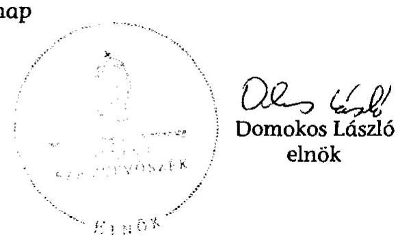

# ÁLLAMI   SZÁMVEVŐSZÉK 

## JELENTÉS

Lébény Nagyközség Önkormányzata belső kontrollrendszerének kialakítása, valamint egyes kontrolltevékenységek és a belső ellenőrzés múködése ellenőrzéséről

---

# Állami Számvevőszék 

Iktatószám: V-0012-058-004-045/2013.
Témaszám: 1051
Vizsgálat-azonosító szám: V059104

## Az ellenőrzést felügyelte:

Dr. Benedek Mária
felügyeleti vezető
2012. december 16. napjától

Gyüre Lajosné
felügyeleti vezető
2012. december 15. napjáig

## Az ellenőrzést vezette:

## Szakmányné Bilik Mária

ellenőrzésvezető
A számvevőszéki jelentés összeállításában közremúködtek:
Dr. Fónagy Diána
számvevő tanácsos
Moder Beatrix
számvevő
Az ellenőrzést végezték:
Dr. Fátrainé Zsebedics Katalin Kiss Rita Teréz
számvevő tanácsos
számvevő tanácsos

---

# TARTALOMJEGYZÉK 

BEVEZETÉS ..... 5
I. ÖSSZEGZŐ MEGÁLLAPÍTÁSOK, KÖVETKEZTETÉSEK, JAVASLATOK ..... 8
II. RÉSZLETES MEGÁLLAPÍTÁSOK ..... 15

1. Az önkormányzat belső kontrollrendszere kialakításának megfelelősége ..... 15
1.1. A kontrollkörnyezet kialakítása ..... 15
1.2. A kockázatkezelési rendszer szabályozása ..... 16
1.3. A kontrolltevékenységek kialakítása ..... 16
1.4. Az információs és kommunikációs rendszer szabályozása ..... 16
1.5. A monitoring rendszer szabályozása ..... 17
2. A pénzügyi folyamatokban kulcsszerepet betöltő belső kontrollok (szakmai teljesítésigazolás és utalvány ellenjegyzés) múködése ..... 18
3. A belső ellenőrzés szervezeti keretei és múködése ..... 20

## FÜGGELÉKEK

1. számú Értelmező szótár
2. számú A belső kontrollrendszer kialakítása, a pénzügyi folyamatokban kulcsszerepet betöltő szakmai teljesítésigazolás és utalvány ellenjegyzés kontrollok múködése, valamint a belső ellenőrzés múködése értékelésénél alkalmazott minősítési szempontok

---

.

---

# RÖVIDÍTÉSEK JEGYZÉKE 

## Törvények

ÁSZ tv.
Avtv.

Info tv.

Mötv.
Ötv.
régi Áht.
Számv. tv.
új Áht.

## Rendeletek

Áhsz.

Ámr.
Ávr.

Ber.
Bkr.
önkormányzati SZMSZ

## Szórövidítések

ÁMK
ÁSZ
Belső ellenőrzési kézikönyv

Belső Kontroll Kézikönyv

2011. évi LXVI. törvény az Állami Számvevőszékről
1992. évi LXIII. törvény a személyes adatok védelméről és a közérdekú adatok nyilvánosságáról (hatálytalan 2012. január 1-jétől)
2011. évi CXII. törvény az információs önrendelkezési jogról és az információszabadságról (hatályos 2012. január 1-jétől)
2011. évi CLXXXIX. törvény Magyarország helyi önkormányzatairól
1990. évi LXV. törvény a helyi önkormányzatokról
1992. évi XXXVIII. törvény az államháztartásról (hatálytalan 2012. január 1-jétől)
2000. évi C. törvény a számvitelről
2011. évi CXCV. törvény az államháztartásról (hatályos 2012. január 1-jétől)

249/2000. (XII. 24.) Korm. rendelet az államháztartás szervezetei beszámolási és könyvvezetési kötelezettségének sajátosságairól
292/2009. (XII. 19.) Korm. rendelet az államháztartás múködési rendjéről (hatálytalan 2012. január 1-jétől)
368/2011. (XII. 31.) Korm. rendelet az államháztartásról szóló törvény végrehajtásáról (hatályos 2012. január 1jétől)
193/2003. (XI. 26.) Korm. rendelet a költségvetési szervek belső ellenőrzéséről (hatálytalan 2012. január 1-jétől)
370/2011. (XII. 31.) Korm. rendelet a költségvetési szervek belső kontrollrendszeréről és belső ellenőrzéséről (hatályos 2012. január 1-jétől)
Lébény Nagyközség Önkormányzata Képviselőtestületének 6/2011. (III. 28.) önkormányzati rendelete az Önkormányzat Szervezeti és Müködési Szabályzatáról

## Általános Művelődési Központ Lébény

Állami Számvevőszék
A Mosonmagyaróvári Többcélú Kistérségi Társulás Lébény Nagyközség Önkormányzatára is vonatkozó belső ellenőrzési kézikönyve (hatályos 2007. március 31-től)
Az Ámr. 155. § (1) bekezdése, valamint az államháztartási belső kontroll standardokról szóló 1/2009. (IX. 11.) PM irányelv egységes értelmezése érdekében az államháztartásért felelős miniszter által 2010. évben kiadott Belső Kontroll Kézikönyv

---

bizonylati szabályzat
FEUVE
gazdasági program
hivatali SZMSZ
informatikai biztonsági
szabályzat
jegyzó
Képviselő-testület
közoktatási társulás
kockázatkezelési szabályzat
Önkormányzat
polgármester
Polgármesteri Hivatal
szabálytalanságkezelési
szabályzat

Társulás

Lébény Nagyközség Polgármesteri Hivatalának Bizonylati Szabályzata
folyamatba épített, előzetes, utólagos és vezetői ellenőrzés A 29/2011. (III. 24.) számú Képviselő-testületi határozattal elfogadott gazdasági program a 2010-2014. évekre
Lébény Nagyközség Polgármesteri Hivatalának Szervezeti és Múködési Szabályzata (hatályos 2008. január 1-jétől)
Lébény Nagyközség Polgármesteri Hivatalának informatikai biztonsági szabályzata (hatályos 2010. január 1jétől)
Lébény Nagyközség Önkormányzatának jegyzője
Lébény Nagyközség Önkormányzatának Képviselőtestülete
Lébény és Bezi községek között 2009. július 1-től létrejött Közoktatási intézményfenntartó társulás
Lébény Nagyközség Polgármesteri Hivatalának kockázatkezelési szabályzata (hatályos 2011. április 1-jétől)
Lébény Nagyközség Önkormányzata
Lébény Nagyközség Önkormányzatának polgármestere
Lébény Nagyközség Önkormányzatának Polgármesteri Hivatala
Lébény Nagyközség Polgármesteri Hivatala szabálytalanság kezelésének eljárásrendje (hatályos 2011. április 1jétől)
Mosonmagyaróvári Többcélú Kistérségi Társulás

---

# JELENTÉS 

## Lébény Nagyközség Önkormányzata belső kontrollrendszerének kialakítása, valamint egyes kontrolltevékenységek és a belső ellenőrzés múködése ellenőrzéséről

## BEVEZETÉS

A belső kontrollrendszer kialakítását, múködtetését és fejlesztését a régi Áht. és az új Áht. is előírja. Ennek megvalósításáért a költségvetési szerv vezetője, a jegyző felel. A belső kontrollrendszer azt a célt szolgálja, hogy a költségvetési szervek múködésük és gazdálkodásuk során a tevékenységeket szabályszerűen, gazdaságosan, hatékonyan, eredményesen hajtsák végre, teljesítsék elszámolási kötelezettségeiket és megvédjék az erőforrásokat a veszteségektől, a károktól és a nem rendeltetésszerú használattól. A belső kontrollrendszer magában foglalja mindazon szabályokat, eljárásokat, gyakorlati módszereket és szervezeti struktúrákat, kockázatkezelési technikákat, kontrolltevékenységeket, amelyek segítséget nyújtanak a szervezetnek céljai eléréséhez.

Az ÁSZ a 2011-2015. évekre szóló stratégiájában hangsúlyos szerepet szánt annak, hogy szilárd szakmai alapon álló, értékteremtő ellenőrzéseivel előmozdítsa a közpénzügyek átláthatóságát, rendezettségét. A számvevőszéki ellenőrzés nemzetközi alapelvei is rögzítik, hogy a megfelelő belső kontrollrendszer minimálisra csökkenti a hibák és szabálytalanságok kockázatát.

Az ellenőrzés célja annak értékelése volt, hogy az Önkormányzat a jogszabályi előírásoknak megfelelően alakította-e ki a belső kontrollrendszert; a gazdálkodás folyamatában kulcsszerepet betöltő szakmai teljesítésigazolás és az utalvány ellenjegyzés kontrolltevékenységeit megfelelően múködtette-e; biztosí-totta-e a belső ellenőrzés szabályos és eredményes múködését.

Az ÁSZ ezen ellenőrzési céljait pilot (próba) jelleggel községi/nagyközségi önkormányzatoknál végzett ellenőrzések során érvényesítette.

Az ellenőrzés típusa: szabályszerűségi ellenőrzés
Az ellenőrzés jogszabályi alapja: az ÁSZ tv. 5. § (2) és (6) bekezdései
Az ellenőrzött szervezet: az Önkormányzat (ezen belül kiemelten a Polgármesteri Hivatal)

Az ellenőrzött időszak: a belső kontrollrendszer kialakításának megfelelőségét a 2011. évre vonatkozóan értékeltük. A kontrolltevékenységek múködésé-

---

nek megfelelőségét a 2011. január 1-je és december 31-e, míg a belső ellenőrzés működésének szabályosságát és eredményességét a 2009. január 1-je és 2011. december 31-e közötti időszakot figyelembe véve értékeltük. A helyszíni ellenőrzés lezárásáig a helyi szabályozás változásait nyomon követtük.

Az ellenőrzés szakmai módszertana az Állami Számvevőszék Ellenőrzési Kézikönyvében foglalt szakmai szabályokon alapult, amely a Legfelsőbb Ellenőrző Intézmények Nemzetközi Szervezete (INTOSAI) által kiadott nemzetközi standardok (ISSAI) figyelembevételével készült.

A belső kontrollrendszer kialakításának ellenőrzése során értékeltük a Polgármesteri Hivatalban a kontrollkörnyezet, a kockázatkezelési rendszer, a kontrolltevékenységek, az információs és kommunikációs rendszer, valamint a monitoring rendszer szabályozottságának megfelelőségét.

A Polgármesteri Hivatalban értékeltük a pénzügyi folyamatokban kulcsszerepet betöltő szakmai teljesítésigazolás és utalvány ellenjegyzés kontrollok működésének megfelelőségét az államháztartáson kívülre teljesített múködési és felhalmozási célú pénzeszköz átadásoknál, az állományba nem tartozók megbízási díjainál, továbbá a külső szolgáltató által végzett karbantartási, kisjavítási munkákkal kapcsolatos kifizetéseknél. Az egyszerű véletlen mintavétellel kiválasztott tételek ellenőrzését többlépcsős megfelelőségi tesztek útján addig végeztük, amíg elegendő és megfelelő bizonyítékot szereztünk a vizsgált folyamatok kulcskontrolljai múködésének megfelelő vagy nem megfelelő voltáról.

Értékeltük az Önkormányzatnál a belső ellenőrzés múködésének szabályosságát és eredményességét.

Az egyes fogalmak magyarázatát az 1. számú függelék, az ellenőrzés egyes területeinek értékelésénél alkalmazott egységes minősítési szempontokat a 2. számú függelék tartalmazza.

Az ellenőrzés lefolytatásához az Önkormányzat a munkalapok és a tanúsítvány elektronikus kitöltésével, valamint a megjelölt dokumentumok elektronikus megküldésével szolgáltatott adatokat. A munkalapokon szerepeltetett adatok, információk ellenőrzése és szükség szerinti javítása a helyszíni ellenőrzés keretében történt.

Az ÁSZ az ellenőrzés megállapításait az ellenőrzött időszakban hatályos, az intézkedést igénylő megállapításokra tett javaslatokat a jelenleg hatályos jogszabályok alapján fogalmazta meg.

Az ÁSZ tv. 29. § (1) bekezdése szerint a jelentéstervezetet megküldtük a polgármester részére, aki az ÁSZ tv. 29. § (2) bekezdésében foglalt észrevételezési jogával nem élt, a jelentéstervezetre észrevételt nem tett.

Lébény nagyközség állandó lakosainak száma 2011. január 1-jén 3156 fő volt. Az Önkormányzat héttagú Képviselő-testületének munkáját három állandó bizottság segítette. Az Önkormányzat az önállóan működő és gazdálkodó Polgármesteri Hivatalon kívül egy költségvetési intézménnyel látta el feladatát. Az

---

Önkormányzat többségi tulajdoni részesedésű gazdasági társasággal nem rendelkezett.

A polgármester a 2006. évi önkormányzati választások óta tölti be tisztségét, a jegyző személye 2007. december 1-jétől változatlan. A Polgármesteri Hivatal nem tagolódik szervezeti egységekre, elkülönített gazdasági szervezete nincs, a foglalkoztatott köztisztviselők száma 2011. január 1-jén 11 fő volt. Az Önkormányzat a 2011. évi költségvetési beszámolója szerint 459,3 millió Ft költségvetési bevételt ért el, 442,5 millió Ft költségvetési kiadást teljesített. A 2011. december 31-i könyvviteli mérleg szerint 1213,5 millió Ft értékű eszközvagyonnal rendelkezett, valamint 105,6 millió Ft hosszú lejáratú, és 51,6 millió Ft rövid lejáratú kötelezettsége volt.

---

# I. ÖSSZEGZŐ MEGÁLLAPÍTÁSOK, KÖVETKEZTETÉSEK, JAVASLATOK 

A belső kontrollrendszer kialakítása a Polgármesteri Hivatalban 2011-ben a kontrollkörnyezet, a kockázatkezelési rendszer, a kontrolltevékenységek, az információs és kommunikációs rendszer, valamint a monitoring rendszer szabályozásának, illetve kialakításának értékelése alapján összességében nem felelt meg a jogszabályi előírásoknak.

A kontrollkörnyezet kialakítása nem felelt meg a jogszabályi követelményeknek, mivel a jegyző az Ámr.-ben foglaltak ellenére a hivatali SZMSZ-ben nem rögzítette az abban nevesített munkakörökhöz tartozó feladat- és hatásköröket, a hatáskörök gyakorlásának módját, a helyettesítés rendjét, az ezekhez kapcsolódó felelősségi szabályokat, ami korlátozza a feladatellátás számon kérhetőségét, folyamatosságának biztosítását. A jegyző a Számv. tv. előírása ellenére a Polgármesteri Hivatal bizonylati szabályzatát nem készítette el, a 2011. évben elkészített bizonylati albumot nem léptette hatályba, ezért fennáll a Számv. tv.-ben előírt bizonylati elv nem megfelelő érvényesítésének kockázata.

A kockázatkezelési rendszer szabályozása nem felelt meg az Ámr. előírásainak, mivel a jegyző nem határozta meg az egyes kockázatokkal kapcsolatos intézkedéseket és megtételük módját.

A kontrolltevékenységek kialakítása a jogszabályi követelményeknek megfelelt. A kialakított kontrolltevékenységek végrehajtásuk esetén biztosítják a lehetséges hibák feltárását, kijavítását.

Az információs és kommunikációs rendszer szabályozása nem felelt meg a jogszabályi követelményeknek, mivel a jegyző az Ámr.-ben foglaltak ellenére nem jelölte ki a közérdekű adatok közzétételének adatfelelősét és az adatközlő személyt. Az informatikai rendszer környezetének szabályozása során az Avtv. előírása ellenére elmulasztotta az adatbiztonság érvényre juttatásához szükséges intézkedések megtételét, nem határozta meg a hozzáférési jogosultságok megállapítására, módosítására, azok betartásának ellenőrzésére vonatkozó eljárásrendet, és nem gondoskodott a hozzáférési jogosultságok nyilvántartásának vezetéséről. Nem szabályozta a pénzügyi-számviteli szoftverváltozások ellenőrzésére, tesztelésére vonatkozó eljárásokat, a pénzügyi-számviteli rendszerben feldolgozott adatok mentési eljárásrendjét és az adatmentések felelősségi viszonyait.

A monitoring rendszer szabályozása nem felelt meg a jogszabályi előírásoknak, mivel a jegyző az Ámr. előírása ellenére az operatív tevékenységek keretében megvalósuló folyamatos és eseti nyomon követésből álló, az Önkormányzat tevékenységének, a célok megvalósításának nyomon követését biztosító rendszert nem alakította ki.

---

A belső kontrollrendszer nem megfelelő kialakítása kockázatot jelent az Önkormányzat tevékenységeinek szabályszerű, gazdaságos, hatékony és eredményes végrehajtása során.

A Polgármesteri Hivatalban a 2011. évben az államháztartáson kívülre történő működési és felhalmozási célú pénzeszközátadásokkal, az állományba nem tartozók megbízási díjaival, valamint a külső szolgáltatók által végzett karbantartással, kisjavítással kapcsolatos kifizetések során, összefoglalóan értékelve, a kulcskontrollok múködésének megfelelősége gyenge volt. Az államháztartáson kívülre történő működési és felhalmozási célú pénzeszközátadásokkal, valamint a külső szolgáltatók által végzett karbantartással, kisjavítással kapcsolatos kiadások teljesítését megelőzően a jegyző által szakmai teljesítésigazolásra kijelölt személyek a kifizetések jogosságának, összegszerűségének ellenőrzését, valamint - az ellenszolgáltatást is magukban foglaló kifizetések esetében - a szerződések, megrendelések szakmai teljesítésének igazolását az Ámr. előírása ellenére nem teljesítették, mivel nem a jegyzői kijelöléssel rendelkező személyek végezték.

Az utalványok ellenjegyzője a kiadások teljesítését megelőzően az Ámr.-ben foglalt ellenőrzési feladatait nem végezte el. Nem kifogásolta a szakmai teljesítésigazolás elmaradását, illetve a jegyzői kijelöléssel nem rendelkező személyek által jogosulatlanul végzett szakmai teljesítésigazolásokat. Nem győződött meg arról, hogy a kifizetések sértik-e a gazdálkodásra - közöttük a kötelezettségvállalások ellenjegyzésének szabályaira, a kötelezettségvállalások nyilvántartására, az utalványrendeleten a kötelezettségvállalás nyilvántartási számának feltüntetésére, valamint az előirányzati fedezet rendelkezésre állásának ellenőrzésére - vonatkozó szabályokat.

Az államháztartáson kívülre történő működési célú pénzeszközátadások kifizetései során a könyvviteli elszámolásra utaló főkönyvi számlát a Számv. tv. és az Áhsz. előírásaival ellentétesen, nem a gazdasági események tényleges tartalmának megfelelően jelölték ki. Hibásan a múködési célú pénzeszköz átadások között számoltak el számla alapján fizetendő tagdíjat, valamint pályázati pénzeszköz megelőlegezését szolgáló, visszatérülő összeget. A könyvvezetésben a téves számlakijelölések miatt sérült a Számv. tv.-ben szabályozott valódiság számviteli alapelv.

A számvevőszéki ellenőrzés az ellenőrzött kifizetésekkel összefüggésben jogosulatlan kifizetést nem tárt fel, azonban a gazdálkodásban kulcsszerepet betöltő kontrollok múködésében feltárt hiányosságok miatt fennáll a hibák bekövetkezésének kockázata.

Az Önkormányzat a belső ellenőrzési feladatokat Társulás útján látta el. Az Önkormányzatnál a 2009-2011. évek között a belső ellenőrzés szabályozása és múködése az ellenőrzött időszak egészét tekintve a jogszabályi előírásoknak megfelelt. A jegyző írásos véleményének figyelembevételével készített és szabályszerűen jóváhagyott éves ellenőrzési tervek, valamint ellenőrzési programok alapján végezték az ellenőrzéseket, azokról jelentések készültek. Az éves ellenőrzési tervek azonban a Ber. előírása ellenére nem tartalmazták az ellenőrzések célját, a belső ellenőrzési vezető által jóváhagyott ellenőrzési programokban nem rögzítették az ellenőrök megbízólevelének számát. Az intézkedési

---

terveket késedelmesen, a Ber.-ben előírt 10 napos határidő helyett az ellenőrzésről készített éves jelentéssel egy időben készítették el. A belső ellenőrzésekről vezetett nyilvántartás a Ber. előírása ellenére nem tartalmazta az ellenőrzések kezdetének és lezárásának időpontját és az ellenőrök nevét.

A belső ellenőrzés múködése nem volt eredményes, mivel az éves ellenőrzési tervek az ellenőrzések célját nem tartalmazták, így az ellenőrzések célra tartott végrehajtása nem volt biztosítva. Ennek következtében az elvégzett ellenőrzések nem tárták fel teljes körűen a belső kontrollok kialakításának, valamint a kulcskontrollok működésének hiányosságait. Az elvégzett ellenőrzések javaslatainak hasznosításáról késedelmesen intézkedtek. Mindezek hozzájárultak a számvevőszéki ellenőrzés során is feltárt szabályozási hiányosságok, a gyengén működő belső kontrollokból eredő hibák ismétlődéséhez.

Az ÁSZ tv. 33. § (1) bekezdésében foglaltak értelmében a jelentésben foglalt megállapításokhoz kapcsolódó intézkedési tervet köteles az ellenőrzött szervezet vezetője összeállítani, és azt a jelentés kézhezvételétől számított 30 napon belül az ÁSZ részére megküldeni. Amennyiben az intézkedési tervet határidőn belül nem küldi meg a szervezet, vagy az továbbra sem elfogadható, az ÁSZ elnöke a hivatkozott törvény 33. § (3) bekezdés a)-b) pontjaiban foglaltakat érvényesítheti.

Az ellenőrzés intézkedést igénylő megállapításai és javaslatai:

# a polgármesternek 

A Polgármesteri Hivatalban a 2011. évben az államháztartáson kívülre történő működési és felhalmozási célú pénzeszközátadásokkal, az állományba nem tartozók megbízási díjaival, valamint a külső szolgáltatók által végzett karbantartással, kisjavítással kapcsolatos kifizetések során, összefoglalóan értékelve, a kulcskontrollok múködésének megfelelősége gyenge volt. A kiadások teljesítését megelőzően a jegyző által szakmai teljesítésigazolásra kijelölt személyek a kifizetések jogosságának, összegszerűségének ellenőrzését, valamint - az ellenszolgáltatást is magukban foglaló kifizetések esetében - a szerződések, megrendelések szakmai teljesítésének igazolását nem teljesítették, mivel azt az Ámr. 76. § (3) bekezdésének előírása ellenére nem a jegyzői kijelöléssel rendelkező személyek végezték. Az utalványok ellenjegyzője a kiadások teljesítését megelőzően az Ámr. 79. § (2) bekezdésében foglalt ellenőrzési feladatait nem végezte el.

Javaslat:
Intézkedjen a szakmai teljesítésigazolás és az utalvány ellenjegyzés kontrollokkal öszszefüggésben a számvevőszéki jelentésben rögzített hiányosságok és szabálytalanságok tekintetében az esetleges munkajogi felelősséggel kapcsolatos körülmények kivizsgálásáról, és a vizsgálat eredményének függvényében tegye meg a szükséges munkajogi intézkedéseket.

---

# a jegyzőnek 

1. a kontrollkörnyezettel kapcsolatban:

Az Ámr. 20. § (2) bekezdés h) pontjában foglaltak ellenére a hivatali SZMSZ-ben nem rögzítette a benne nevesített munkakörökhöz tartozó feladat- és hatásköröket, a hatáskörök gyakorlásának módját, a helyettesítés rendjét, az ezekhez kapcsolódó felelősségi szabályokat.

A jegyző a Számv. tv. 161. § (2) bekezdés d) pontjában foglalt előírás ellenére nem készítette el a Polgármesteri Hivatal bizonylati szabályzatát, a 2011. évben elkészített bizonylati albumot nem léptette hatályba.

Javaslat:
Módosítsa a hivatali SZMSZ-t és kezdeményezze a polgármesternél a módosítás Képviselő-testület elé terjesztését annak érdekében, hogy az Ávr. 13. § (1) bekezdés g) pontjában foglaltaknak megfelelően tartalmazza a hivatali SZMSZ-ben nevesített munkakörökhöz tartozó feladat- és hatásköröket, a hatáskörök gyakorlásának módját, a felelősségi szabályokat és a helyettesítés rendjét.

Gondoskodjon a Számv. tv. 161. § (2) bekezdés d) pont előírásának megfelelően a bizonylati szabályzat elkészítéséről és intézkedjen a bizonylati album hatályba léptetésére.
2. a kockázatkezelési rendszerrel kapcsolatban:

A jegyző az Ámr. 157. § (3) bekezdésének előírása ellenére nem határozta meg az egyes kockázatokkal kapcsolatos intézkedéseket és megtételük módját.

Javaslat:
Módosítsa a kockázatkezelési szabályzatot annak érdekében, hogy az a Bkr. 7. § (2) bekezdésében foglaltaknak megfelelően tartalmazza a kockázatkezelés folyamatát, feladatait és módját.
3. az információs és kommunikációs rendszerrel kapcsolatban:

Az Ámr. 20. § (3) bekezdés i) pontjában foglaltak ellenére a jegyző nem jelölte ki a közérdekű adatok közzétételének adatfelelősét és az adatközlő személyt.

Az informatikai rendszer környezetének szabályozása során az Avtv. 10. § (1)-(2) bekezdéseiben foglalt előírások ellenére a jegyző elmulasztotta az adatbiztonság érvényre juttatásához szükséges intézkedések megtételét. Nem határozta meg a hozzáférési jogosultságok megállapítására és módosítására, azok betartásának ellenőrzésére vonatkozó szabályokat, nem gondoskodott a hozzáférési jogosultságok nyilvántartásának vezetéséről. Nem szabályozta a pénzügyi-számviteli szoftverváltozások ellenőrzésére, tesztelésére vonatkozó eljárásokat, a pénzügyi-számviteli rendszerben feldolgozott adatok mentési eljárásrendjét és az adatmentések felelősségi viszonyait.

---

Javaslat:
a) Jelölje ki az Ávr. 13. § (2) bekezdés h) pontjában foglaltak alapján a közérdekű adatok közzétételének adatfelelősét és az adatközlő személyt.
b) Biztosítsa az Info tv. 7. § (2)-(3) bekezdésének megfelelően az adatbiztonság érvényesülését, rendelkezzen a hozzáférési jogosultságok megállapításáról, módosításáról, azok betartásának ellenőrzéséről, intézkedjen a hozzáférési jogosultságok nyilvántartásának vezetéséről, valamint szabályozza a pénzügyi-számviteli szoftverváltozások ellenőrzésére, tesztelésére vonatkozó eljárásokat, a pénzügyiszámviteli rendszerben feldolgozott adatok mentési eljárásrendjét és az adatmentések felelősségi viszonyait.
4. a monitoring rendszerrel kapcsolatban:

A jegyző az Ámr. 160. §-ában foglaltak ellenére az operatív tevékenységek keretében megvalósuló folyamatos és eseti nyomon követésből álló, az Önkormányzat tevékenységének, a célok megvalósításának nyomon követését biztosító rendszert nem alakította ki.

Javaslat:
Alakítsa ki és múködtesse a Bkr. 10. §-ában előírtak alapján az operatív tevékenységek keretében megvalósuló folyamatos és eseti nyomon követésből álló, az Önkormányzat tevékenységének, a célok megvalósításának nyomon követését biztosító rendszert.
5. a pénzügyi folyamatokban kulcsszerepet betöltő kontrollokkal kapcsolatban:

A kiadások teljesítését megelőzően a jegyző által kijelölt személyek a kifizetések jogosságának, összegszerűségének ellenőrzését, valamint az ellenszolgáltatást is magukban foglaló kifizetések esetében a szerződések, megrendelések szakmai teljesítésének igazolását az Ámr. 76. § (1) bekezdésében foglaltak ellenére nem teljesítették, illetve az Ámr. 76. § (3) bekezdésében foglaltak ellenére a jegyző kijelölésével nem rendelkező személyek jogosulatlanul végezték.

Az utalványok ellenjegyző́je a kiadások teljesítését megelőzően aláírása ellenére nem tett eleget az Ámr. 79. § (2) bekezdésében foglalt ellenőrzési kötelezettségének, nem kifogásolta a szakmai teljesítésigazolás elmaradását, illetve a jegyző kijelölésével nem rendelkező személyek által végzett szakmai teljesítésigazolásokat. Továbbá nem győződött meg arról, hogy a kifizetés sérti-e a gazdálkodásra - közöttük az Ámr. 75. § (1) bekezdésében foglalt, a kötelezettségvállalások nyilvántartására, az Ámr. 78. § (2) bekezdés g) pontjában foglalt, az utalványrendeleten a kötelezettségvállalás nyilvántartási számának feltüntetésére, továbbá az Ámr. 74. § (1) bekezdésében foglalt, a kötelezettségvállalások ellenjegyzésére, valamint az Ámr. 74. § (3) bekezdés a) pontjában foglalt, az előirányzati fedezet rendelkezésre állásának ellenőrzésére - vonatkozó szabályokat.

Az Áhsz. 9. § (11) bekezdésében és 9. számú mellékletében foglaltakkal ellentétesen, a múködési célú pénzeszköz átadások között számoltak el számla alapján fizetendő

---

tagdijat, valamint pályázati pénzeszköz megelőlegezését szolgáló, visszatérülő öszszeget.

Javaslat:
Az operatív gazdálkodás során a múködésbeli hibák megelőzése, feltárása és kijavítása érdekében gondoskodjon arról, hogy:
a) az Ávr. 57. § (3) bekezdése szerinti teljesítésigazolást az Ávr. 57. § (4) bekezdése szerint kijelölt személyek végezzék el, és az Ávr. 57. § (1) bekezdésében foglaltaknak megfelelően okmányok alapján ellenőrizzék a kiadások teljesítésének jogosságát, összegszerűségét, az ellenszolgáltatást is magában foglaló kötelezettségvállalás esetében a szerződés, megrendelés teljesítését;
b) az érvényesítő1 az Ávr. 58. § (1) bekezdése szerint a kifizetéseket megelőzően a teljesítésigazolás alapján ellenőrizze az összegszerűséget, a fedezet meglétét és azt, hogy a megelőző ügymenetben az új Áht., az Áhsz. és az Ávr. - gazdálkodási szabályokra, szabályszerű számlakijelölésre, a teljesítésigazolás elvégzésére vonatkozó - előírásait és a belső szabályzatokban foglaltakat betartották-e;
c) kötelezettségvállalásra az új Áht. 37. § (1) bekezdésében foglaltaknak megfelelően, csak az Ávr. 55. § (1)-(2) bekezdése szerint jogosult személyek pénzügyi ellenjegyzését követően kerüljön sor, és a pénzügyi ellenjegyzés során győződjenek meg a kötelezettségvállalás tárgyával összefüggő szabad előirányzat rendelkezésre állásáról;
d) az Ávr 56. § (1) bekezdésében foglalt kötelezettségvállalási nyilvántartás vezetése megtörténjen, és az utalványrendeleteken az Ávr. 59. § (3) bekezdés f) pontjában foglaltaknak megfelelően feltüntetésre kerüljön a kötelezettségvállalás nyilvántartási száma;
e) a gazdasági eseményeket tényleges tartalmuknak megfelelően könyveljék a Számv. tv. 15. § (3) bekezdésében és az Áhsz. 9. § (11) bekezdésében, valamint 9. számú mellékletében foglaltak betartatásával.
6. a belső ellenőrzés múködésével kapcsolatban:

A belső ellenőrzési tervek a Ber. 21. (3) bekezdés c) pontjában előírtak ellenére nem tartalmazták az ellenőrzések célját.

Az ellenőrzési programok a Ber. 23. § (4) bekezdés j) pontjában előírtak ellenére nem tartalmazták az ellenőrök megbízólevelének számát.

Az intézkedési terveket nem a Ber. 29. § (1) bekezdésében előírt határidőn belül készítették el.

A belső ellenőrzésekről vezetett nyilvántartás a Ber. 32. § (2) bekezdés c) és d) pont-

[^0]
[^0]:    ${ }^{1}$ Az utalvány ellenjegyzőjének feladatait a 2012. január 1-jétől hatályos Ávr. 55. § (1) és 58. § (1) bekezdései alapján az érvényesítő, illetve a pénzügyi ellenjegyző látja el.

---

jaiban előírtak ellenére nem tartalmazta az ellenőrzések kezdetének és lezárásának időpontját és az ellenőrök nevét.

Javaslat:
a) Intézkedjen annak érdekében, hogy az éves ellenőrzési terv a Bkr. 31. § (4) bekezdés c) pontjában foglaltaknak megfelelően tartalmazza az ellenőrzések célját.
b) Intézkedjen a Bkr. 33. § (2) bekezdés g) pont előírását figyelembe véve, hogy az ellenőrzési programban rögzítésre kerüljön az ellenőrök megbízóleveleinek száma.
c) Gondoskodjon az intézkedési tervek Bkr. 45. § (3) bekezdésében előírt határidőn belül történő elkészítéséről.
d) Gondoskodjon a belső ellenőrzésekről vezetett nyilvántartásnak a Bkr. 50. § (2) bekezdés d) és e) pontjának előírása szerinti kiegészítéséről annak érdekében, hogy az tartalmazza az ellenőrzések kezdetének és lezárásának időpontját és az ellenőrök nevét.

---

# II. RÉSZLETES MEGÁLLAPÍTÁSOK 

## 1. Az ÖNKORMÁNYZAT BELSŐ KONTROLLRENDSZERE KIALAKÍTÁSÁNAK MEGFELELŐSÉGE

### 1.1. A kontrollkörnyezet kialakítása

A kontrollkörnyezet kialakítása a Polgármesteri Hivatalban nem volt megfelelő, mivel a jegyző

- az Ámr. 20. § (2) bekezdés h) ${ }^{2}$ pontjában foglaltak ellenére a hivatali SZMSZ-ben nem rögzítette a hivatali SZMSZ-ben nevesített munkakörökhöz tartozó feladat- és hatásköröket, a hatáskörök gyakorlásának módját, a helyettesítés rendjét, az ezekhez kapcsolódó felelősségi szabályokat.
- a Számv. tv. 161. § (2) bekezdés d) pontjában foglalt előírás ellenére nem készítette el a Polgármesteri Hivatal bizonylati szabályzatát, a 2011. évben elkészített bizonylati albumot nem léptette hatályba, ezért fennáll a Számv. tv. 165. § (2) bekezdésében előírt bizonylati elv nem megfelelő érvényesítésének kockázata.

Az Önkormányzat gazdasági programját a Képviselő-testület hiányos tartalommal fogadta el.

A gazdasági program az Ötv. 91. § (6) ${ }^{3}$ bekezdésében foglaltak ellenére nem tartalmazta a munkahelyteremtés feltételeinek elősegítését és az adópolitika célkitűzéseit.

A kontrollkörnyezet kialakítása során a jegyző

- a Belső Kontroll Kézikönyv ${ }^{4}$ 1.5.2. pontjának ajánlását nem érvényesítette, mivel nem dolgozta ki a Polgármesteri Hivatalban ellátott köztisztviselői munkakörök betöltésére vonatkozó elvárt tudást és képességeket;
- a Belső Kontroll Kézikönyv 1.6.1. pontjában foglalt ajánlást figyelmen kívül hagyva, nem határozta meg - a szervezeti célokkal összhangban álló - a köztisztviselőkkel szemben támasztott etikus magatartással és integritással kapcsolatos elvárásokat.

[^0]
[^0]:    ${ }^{2}$ 2012. január 1-jétől az Ávr. 13. § (1) bekezdés g) pontja tartalmazza a vonatkozó előírást.
    ${ }^{3}$ 2013. január 1-jétől a gazdasági programra, fejlesztési tervre vonatkozó jogszabályi előírásokat a Mötv. 116. §-a tartalmazza.
    ${ }^{4}$ Az Ámr. 2011. évben hatályos 155. § (1) bekezdése szerint a belső kontrollok kialakítása során a költségvetési szerv vezetője figyelembe veszi az államháztartásért felelős miniszter által közzétett, az államháztartási belső kontroll standardokra vonatkozó irányelvet. A 2012. január 1-jétől hatályos Bkr. 5. § (1) bekezdése szerint a költségvetési szervek belső kontrollrendszerét az államháztartásért felelős miniszter által közzétett módszertani útmutatók megfelelő alkalmazásával kell kialakítani és működtetni.

---

# 1.2. A kockázatkezelési rendszer szabályozása 

A kockázatkezelési rendszer szabályozottsága a Polgármesteri Hivatalban nem volt megfelelő, mivel a jegyző a kockázatkezelés folyamatát, feladatait nem szabályozta, ennek keretében nem határozta meg az egyes kockázatokkal kapcsolatos intézkedéseket és megtételük módját az Ámr. 157. § (3) bekezdésében ${ }^{3}$ foglaltak ellenére.

A kockázatkezelési rendszer szabályozása során a jegyző

- a Belső Kontroll Kézikönyv 2.4. pontjában foglaltakat figyelmen kívül hagyva nem írta elő a kockázatkezelés folyamatának felülvizsgálatát;
- nem érvényesítette a Belső Kontroll Kézikönyv 2.5.1. pontjában foglalt ajánlást, mivel nem gondoskodott a csalás és a korrupció, mint kiemelt kockázatok értékeléséről és kezeléséről.

### 1.3. A kontrolltevékenységek kialakítása

A kontrolltevékenységek kialakítása a Polgármesteri Hivatalban megfelelő volt. A jegyző a kontrollstratégiák és módszerek keretében szabályozta a FEUVE, valamint a belső jelentéstétel feladatait. Meghatározta az érvényesítés rendjét, szabályozta a szakmai teljesítésigazolás módját és kijelölte az érvényesítésre, illetve szakmai teljesítésigazolásra jogosultakat. Biztosította a végrehajtási, a pénzügyi teljesítési és az ellenőrzési feladatok szétválasztását, valamint a feladatellátás folytonosságát.

A kontrolltevékenységek szabályozottsága annak ellenére megfelelő volt, hogy a jegyző a Belső Kontroll Kézikönyv 3.2.3 pontjában foglalt ajánlást figyelmen kívül hagyva, nem mérte fel a kis létszámból adódó kockázatokat.

### 1.4. Az információs és kommunikációs rendszer szabályozása

Az információs és kommunikációs rendszer szabályozottsága a Polgármesteri Hivatalban nem volt megfelelő, mivel az Ámr. 159. §-ában ${ }^{4}$ előírt információs és kommunikációs rendszer kialakítása keretében a jegyző

- az Ámr. 20. § (3) bekezdés i) pontjában ${ }^{7}$ foglaltak ellenére nem jelölte ki a közérdekú adatok közzétételének adatfelelősét és az adatközlő személyt;

[^0]
[^0]:    ${ }^{3}$ 2012. január 1-jétől a Bkr. 7. § (2) bekezdése rendelkezik az egyes kockázatokkal kapcsolatban szükséges intézkedések, valamint azok teljesítésének folyamatos nyomon követésének módja meghatározásáról.
    ${ }^{6}$ 2012. január 1-jétől a Bkr. 3. § d) pontja tartalmazza a költségvetési szerv vezetőjének felelősségét a belső kontrollrendszer keretében az információs és kommunikációs rendszer kialakításáért.
    ${ }^{7}$ 2012. január 1-jétől az Ávr. 13. § (2) bekezdés h) pontja tartalmazza a közérdekú adatok nyilvánosságra hozatalával kapcsolatos szabályozás elkészítésének kötelezettségét.

---

- az informatikai rendszer környezetének szabályozása során, az Avtv. 10. § (1)-(2) bekezdéseiben foglalt előírások ellenére ${ }^{8}$ elmulasztotta az adatbiztonság érvényre juttatásához szükséges intézkedések megtételét. Az informatikai biztonsági szabályzatban nem határozta meg a hozzáférési jogosultságok megállapítására és módosítására, azok betartásának ellenőrzésére vonatkozó eljárásrendet, nem gondoskodott a hozzáférési jogosultságok nyilvántartásáról. Nem szabályozta a pénzügyi-számviteli szoftverváltozások ellenőrzésére, tesztelésére vonatkozó eljárásokat, a feldolgozott adatok mentési eljárásait és nem jelölte ki a mentések felelőseit.

Az információs és kommunikációs rendszer szabályozása során a jegyző

- a Belső Kontroll Kézikönyv 4.1.1. és 4.1.2. pontjaiban foglalt ajánlást nem érvényesítette, nem szabályozta a szervezeten kívülre történő információátadás módját és formáit, illetve a kívülről érkező információk kezelésének rendjét, valamint nem írta elő az információáramlás dokumentálási kötelezettségét;
- az iktatási, iratkezelési rendszer kialakítása során a Belső Kontroll Kézikönyv 4.2.4. pontjában foglalt ajánlást nem érvényesítette, mert nem határozta meg az ügyintézési határidők nyomon követésének dokumentálását, a késedelmes ügyintézés jelzéséért való felelősség rendjét;
- a szabálytalanságkezelési szabályzatban a Belső Kontroll Kézikönyv 4.3.3. pontjában foglalt ajánlást nem érvényesítette, mivel nem rögzítette a szabálytalanságot bejelentő védelmére vonatkozó előírásokat.

# 1.5. A monitoring rendszer szabályozása 

A monitoring rendszer szabályozottsága a Polgármesteri Hivatalban nem volt megfelelő, mivel a jegyző az Ámr. 160. §-ában ${ }^{9}$ foglaltak ellenére az operatív tevékenységek keretében megvalósuló folyamatos és eseti nyomon követésből álló, az Önkormányzat tevékenységének, a célok megvalósításának nyomon követését biztosító rendszert nem alakította ki.

A jegyző a Belső Kontroll Kézikönyv 1.2.2. pontjában foglalt ajánlást nem érvényesítette, a szervezeti célok megvalósításának nyomon követése érdekében a lakosság, illetve a szolgáltatásokat igénybe vevők körében önkormányzati feladatellátásra irányuló elégedettségi felméréseket nem végeztetett.

A belső kontrollrendszer kialakítása a Polgármesteri Hivatalban 2011-ben a kontrollkörnyezet, a kockázatkezelési rendszer, a kontrolltevékenységek, az információs és kommunikációs rendszer, valamint a monitoring rendszer szabályozásának, illetve kialakításának értékelése alapján összességében nem felelt meg a jogszabályi előírásoknak.

[^0]
[^0]:    ${ }^{8}$ 2012. január 1-jétől az Info tv. 7. § (2)-(3) bekezdése rögzíti az adatbiztonság érdekében szükséges szabályozási kötelezettséggel kapcsolatos előírást.
    ${ }^{9}$ 2012. január 1-jétől a Bkr 10. §-a írja elő a szervezet tevékenységének, a célok megvalósulásának nyomon követését biztosító rendszer kialakítását.

---

# 2. A PÉNZÜGYI FOLYAMATOKBAN KULCSSZEREPET BETÖLTŐ BELSŐ KONTROLLOK (SZAKMAI TELJESÍTÉSIGAZOLÁS ÉS UTALVÁNY ELLENJEGYZÉS) MŰKÖDÉSE 

A Polgármesteri Hivatalban a 2011. évben az államháztartáson kívülre teljesített múködési és felhalmozási célú pénzeszközátadások során a szakmai teljesítésigazolás és az utalvány ellenjegyzés kulcskontrollok múködésének megfelelősége gyenge volt, mivel:

- az egyesületi tagdíj kifizetése során a szakmai teljesítés igazolását az Ámr. 76. § (3) bekezdésében ${ }^{10}$ foglaltak ellenére nem a jegyző által kijelölt személy végezte, így a kiadás jogosságának és összegszerűségének ellenőrzése a kijelöléssel rendelkező személy részéről elmaradt. Az Egyesület Lébényért részére nyújtott támogatások kifizetéseit megelőzően a kijelöléssel rendelkező személy - aláírása ellenére - nem ellenőrizte a kifizetés összegszerűségét;
- az utalványok ellenjegyzője, aláírása ellenére, nem tett eleget az Ámr. 79. § (2) bekezdésében foglalt ellenőrzési kötelezettségének ${ }^{11}$ az egyesületi tagdíj kifizetése során, mivel nem kifogásolta, hogy jegyzői kijelöléssel nem rendelkező személy jogosulatlanul végezte a szakmai tejesítés igazolását, így a kiadások jogosságának és összegszerűségének ellenőrzése a kijelöléssel rendelkező személy részéről elmaradt. Az Egyesület Lébényért részére nyújtott támogatás kifizetéseinél az utalvány ellenjegyzője nem észrevételezte, hogy a szakmai teljesítésigazolásra jogosult személy az összegszerűség ellenőrzését elmulasztotta;
- az utalványok ellenjegyzője, aláírása ellenére, nem győződött meg az Ámr. 74. § (3) bekezdés a) pontjában ${ }^{12}$ foglalt gazdálkodási szabály betartásáról, mivel nem kifogásolta, hogy az egyesületi tagdíj, valamint az Egyesület Lébényért részére ${ }^{13}$ nyújtott támogatás kifizetéseinél a kötelezettségvállalás tárgyával összefüggő kiadási előirányzat nem állt rendelkezésre;
- az utalványok ellenjegyzője - az egyesületi tagdíj, valamint a Sportegyesület, a Máltai Szeretetszolgálat, az Egyesület Lébényért szervezetek részére nyújtott támogatások utalásánál - aláírása ellenére nem győződött meg ar-

[^0]
[^0]:    ${ }^{10}$ 2012. január 1-jétől az Ávr. 57. § (3) bekezdése tartalmazza a teljesítésigazolás módját.
    ${ }^{11}$ 2012. január 1-jétől az új Áht. 38. § (1) bekezdése és az Ávr. 58. § (1) bekezdése tartalmazza a kifizetések utalványozása előtt a teljesítésigazolás megtörténtére vonatkozó ellenőrzési kötelezettséget.
    ${ }^{12}$ 2012. január 1-jétől az új Áht. 37. § (1) bekezdése, valamint az Ávr. 56. § (3) bekezdése tartalmazza a szabad előirányzat rendelkezésre állásának ellenőrzésére vonatkozó előírásokat.
    ${ }^{13}$ Az Önkormányzat 2011. évi költségvetéséről szóló, a 16/2011. (IX. 16.) és a 24/2011. (XII. 15.) számú rendeletekkel módosított 3/2011. (II. 25.) számú rendelet az Egyesület Lébényért támogatására 572 ezer Ft támogatást állapított meg. Az Önkormányzat és a támogatott között 2011. március 17-én és 2011. április 8-án létrejött megállapodások értelmében az Önkormányzat 443186 Ft , valamint 2730050 Ft támogatás nyújtására vállalt kötelezettséget.

---

ról, hogy az érvényesítő elvégezte-e az Ámr. 77. § (1) bekezdésében ${ }^{14}$ foglalt ellenőrzési feladatait, mivel nem kifogásolta, hogy az Ámr. 75. § (1) bekezdésében ${ }^{15}$ előírt kötelezettségvállalás nyilvántartást nem vezették, így az utalványrendeleten az Ámr. 78. § (2) bekezdés g) pontjának ${ }^{16}$ előírása ellenére a kötelezettségvállalás nyilvántartási számát nem tüntették fel.

Az Áhsz. 9. § (11) bekezdésében és 9. számú mellékletében foglaltakkal ellentétesen a múködési célú pénzeszköz átadások között számoltak el számla alapján fizetendő tagdíjat, valamint pályázati pénzeszköz megelőlegezését szolgáló, visszatérülő összeget. A könyvvezetésben a téves számlakijelölések miatt sérült a Számv. tv. 15. § (3) bekezdésében szabályozott valódiság számviteli alapelv.

A Polgármesteri Hivatalban a 2011. évben az állományba nem tartozók megbízási díjainak kifizetése során a szakmai teljesítésigazolás és az utalvány ellenjegyzés kulcskontrollok múködésének megfelelősége gyenge volt, mivel:

- az utalványok ellenjegyző̉e a népszámlálási feladatokkal kapcsolatos kifizetések során, aláírása ellenére nem győződött meg arról, hogy az érvényesítő az Ámr. 77. § (1) bekezdésében foglalt ellenőrzési feladatait elvégezte-e, mivel nem kifogásolta, hogy az Ámr. 75. § (1) bekezdésében előírt kötelezettségvállalás nyilvántartást nem vezették, így az utalványrendeleten az Ámr. 78. § (2) bekezdés g) pontjának előírása ellenére a kötelezettségvállalás nyilvántartási számát nem tüntették fel;
- az utalványok ellenjegyzóje, aláírása ellenére, a gazdálkodási szabályok betartására vonatkozó ellenőrzési feladatát nem végezte el, mivel nem kifogásolta, hogy a népszámlálási feladatokhoz kapcsolódó kifizetések esetében az Ámr. 74. § (1) bekezdésének ${ }^{17}$ előírása ellenére - a megbízási szerződések ellenjegyzését arra felhatalmazással nem rendelkező személy végezte.

A Polgármesteri Hivatalban a 2011. évben a külső szolgáltatók által végzett karbantartási, kisjavítási szolgáltatások kiadásai során a szakmai teljesítésigazolás és az utalvány ellenjegyzés kulcskontrollok müködésének megfelelősége gyenge volt, mivel:

- a szakmai teljesítés igazolását a gépjármú szerelés, a szőnyegtisztítás s a bérlakásban történt üvegjavítás ellenértékének kifizetését megelőzően az Ámr. 76. § (3) bekezdésében foglaltak ellenére nem a jegyző által kijelölt személy végezte;

[^0]
[^0]:    ${ }^{14}$ 2012. január 1-jétől az Ávr. 58. § (1) bekezdése tartalmazza az érvényesítő ellenőrzési feladatait.
    ${ }^{15}$ 2012. január 1-jétől az Ávr. 56. § (1) bekezdése írja elő a kötelezettségvállalások nyilvántartásba vételi kötelezettségét.
    ${ }^{16}$ 2012. január 1-jétől az Ávr. 59. § (3) bekezdés f) pontja tartalmazza az utalványon a kötelezettségvállalási nyilvántartási szám feltüntetésének kötelezettségét.
    ${ }^{17}$ 2012. január 1-jétől az új Áht. 37. § (1)-(2) bekezdése és az Ávr. 55. § (1) bekezdése tartalmazza a pénzügyi ellenjegyzéssel kapcsolatos előírásokat.

---

- az utalványok ellenjegyzője az Ámr. 79. § (2) bekezdésében foglalt ellenőrzési kötelezettségének, aláírása ellenére, nem tett eleget, mert nem ellenőrizte a szakmai teljesítésigazolás megtörténtét a gépjármú szerelési díj, a szőnyegtisztítás és a bérlakásban történt üvegjavítás ellenértékének kifizetését megelőzően, mivel nem kifogásolta, hogy azt a jegyző által szakmai teljesítésigazolásra ki nem jelölt személy jogosulatlanul végezte ${ }^{18}$;
- az utalványok ellenjegyzője - a gépjárműszereléssel, a karosszériajavítással, az árammérő leszereléssel és a mobil tüdőszűrő állomás áramellátásának biztosításával kapcsolatos kiadások teljesítését megelőzően - aláírása ellenére nem győződött meg arról, hogy az érvényesítő elvégezte-e az Ámr. 77. § (1) bekezdésében foglalt ellenőrzési feladatait, mivel nem kifogásolta, hogy az Ámr. 75. § (1) bekezdésében előírt kötelezettségvállalás nyilvántartást nem vezették, így az utalványrendeleten az Ámr. 78. § (2) bekezdés g) pontjának előírása ellenére a kötelezettségvállalás nyilvántartási számát nem tüntették fel;
- az utalványok ellenjegyzője, aláírása ellenére, nem győződött meg az Ámr. 74. § (3) bekezdés a) pontjában foglaltak betartásáról, mivel nem kifogásolta, hogy a gépjármú szerelés, a karosszériajavítás, az árammérő leszerelése és a mobil tüdőszűrő állomás áramellátása ellenértékének kifizetéseit megelőzően a kötelezettségvállalás ellenjegyzése során - a kötelezettségvállalások nyilvántartásának hiányában - nem ellenőrizték a kötelezettségvállalás tárgyával összefüggő kiadási előirányzat rendelkezésre állását.

Az Önkormányzatnál a 2011. évben a pénzügyi folyamatokban kulcsszerepet betöltő belső kontrollok múködésében feltárt hiányosságokból eredően az ellenőrzés, az ellenőrzött tételek vonatkozásában a rendelkezésre bocsátott dokumentumok alapján, kár bekövetkeztére utaló adatot, tényt nem állapított meg.

# 3. A BELSŐ ELLENŐRZÉS SZERVEZETI KERETEI ÉS MŰKÖDÉSE 

Az Önkormányzat a belső ellenőrzési feladatokat - képviselő-testületi döntés alapján ${ }^{19}$ - önkormányzati Társulás útján ${ }^{20}$ látta el az ellenőrzött időszak egészében. A belső ellenőrzési feladatok meghatározásának módja megfelelt az Ötv. 92. § (8) bekezdésében ${ }^{21}$ előírtaknak. A Társulás külső szolgáltatóval kötött vállalkozási szerződést, amelyben meghatározták a belső ellenőrzési vezető személyét, jogállását, feladatait. A belső ellenőrzési vezető és a belső ellenőrzést végzők rendelkeztek megfelelő iskolai végzettséggel, szakmai képesítéssel. A Társulás munkaszervezetének vezetője jóváhagyta a belső ellenőrzési

[^0]
[^0]:    ${ }^{18}$ A szakmai teljesítést igazoló személy a karbantartási, kisjavítási munkákra vonatkozóan nem rendelkezett jegyzői kijelöléssel.
    ${ }^{19}$ A Képviselő-testület 41/2005. (IV. 28.) számú határozata.
    ${ }^{20}$ A Képviselő-testület 28/2008. (VI. 12.) számú határozatával elfogadott társulási megállapodás.
    ${ }^{21}$ 2013. január 1-jétől az Mötv. 42. § 5. pontja és a Bkr. 15. § (7) bekezdés b) pontjának együttes előírásai alapján.

---

vezető által készített belső ellenőrzési kézikönyvet. ${ }^{22}$ A kézikönyv tartalmazta a szakmai etikai kódexet, a kockázatelemzési módszertant, a minőségbiztosítási eljárásokat. Rögzítették továbbá a belső ellenőrzés során feltárt büntető-, szabálysértési, kártérítési, vagy fegyelmi eljárás megindítására okot adó cselekmény esetén az eljárási követelményeket. Előírták az ellenőrzött szervezetek részére a megállapított hiányosságok megszüntetésére irányuló intézkedési terv készítésének kötelezettségét, valamint az intézkedési tervben foglaltak végrehajtásáról történő beszámoltatás rendjét.

A belső ellenőrzési feladatok teljesítésének módja összhangban volt az Ötv.-ben előírtakkal. Az Önkormányzatra vonatkozó - a Képviselő-testület által jóváhagyott - éves belső ellenőrzési tervet kockázatelemzés alapozta meg, a Társulás a jegyző írásos véleményének figyelembevételével készítette el. Az ellenőrzéseket a belső ellenőrzési vezető által jóváhagyott ellenőrzési program alapján hajtották végre. Az elvégzett ellenőrzésekről a vizsgált időszak minden évében elkészítették a jelentéseket. Az ellenőrzési jelentések a 2009. évben a Ber. 27. § (2) ${ }^{23}$ bekezdésében foglalt előírás ellenére nem tartalmazták az ellenőrzés célját, feladatait, a 2010-2011-években készített jelentések megfeleltek a Ber. előírásának. A belső ellenőrzési vezető nyilvántartást vezetett az elvégzett belső ellenőrzésekről.

Az Önkormányzatnál a belső ellenőrzés kialakítása és múködése meg. felelt a jogszabályi előírásoknak, az alábbiakban felsorolt kivételekkel:

- Az ellenőrzési tervek a Ber. 21. (3) bekezdés c) pontjában ${ }^{24}$ előírtak ellenére nem tartalmazták az ellenőrzések célját.
- Az ellenőrzési programok a Ber. 23. § (4) bekezdés j) pontjában ${ }^{25}$ előírtak ellenére nem tartalmazták az ellenőrök megbízólevelének számát.
- A belső ellenőrzés által tett javaslatok végrehajtására az intézkedési terveket nem a Ber. 29. § (1) bekezdésében ${ }^{26}$ előírt határidőn belül, hanem az ellenőrzésekről készült éves beszámolóval egyidejűleg készítették el.
- Az elvégzett belső ellenőrzésekről vezetett nyilvántartás a Ber. 32. § (2) bekezdés c) pontjában ${ }^{27}$ előírtak ellenére nem tartalmazta az ellenőrzések kez-

[^0]
[^0]:    ${ }^{22}$ 2007. március 31-én kiadmányozott belső ellenőrzési kézikönyv, az adott év december 31-i módosításokkal.
    ${ }^{23}$ 2012. január 1-jétől a Bkr. 39. § (3) bekezdése tartalmazza az ellenőrzési jelentések tartalmi előírásait.
    ${ }^{24}$ 2012. január 1-jétől a Bkr. 31. § (4) c) pontja tartalmazza az ellenőrzés céljának ellenőrzési tervben való rögzítését.
    ${ }^{25}$ 2012. január 1-jétől a Bkr. 33. § (2) g) pontja tartalmazza a megbízólevél számának az ellenőrzési programban való rögzítését.
    ${ }^{26}$ 2012. január 1-jétől a Bkr. 45. § (3) bekezdése tartalmazza az intézkedési terv határidejével kapcsolatos rendelkezéseket.
    ${ }^{27}$ 2012. január 1-jétől a Bkr. 50. § (2) bekezdés d) pontja tartalmazza az ellenőrzések nyilvántartásával kapcsolatban az ellenőrzés kezdetének és lezárásának időpontjának rögzítését.

---

detének és lezárásának időpontját, valamint a Ber. 32. § (2) d) pontjában ${ }^{28}$ előírtak ellenére az ellenőrök nevét.

Az éves ellenőrzési tervekben az Önkormányzat által magas kockázatúnak értékelt területek ellenőrzéseit tervezték.

A Polgármesteri Hivatalnál és az ÁMK-nál a 2009. évi belső ellenőrzési terv a beruházási, felújítási és karbantartási tevékenységek végzésének és dokumentálásának, a 2010. évi terv a házipénztár pénzkezelésének, az élelmezési térítési díjak beszedésének és elszámolásának, a 2011. évi ellenőrzési terv a normatív hozzájárulás és támogatási igénylés és elszámolás megalapozottságának ellenőrzését tartalmazta. A fentieken túl a 2010. évi terv kiterjedt a közoktatási társulás múködésének ellenőrzésére is.

A tervezett ellenőrzéseket végrehajtották. Az éves ellenőrzési terveket nem módosították, soron kívüli ellenőrzést nem végeztek. Az ellenőrzések során bünte-tő-, szabálysértési, kártérítési, vagy fegyelmi eljárás megindítására okot adó cselekményt nem tártak fel. A beruházási, karbantartási tevékenység, valamint a házipénztár ellenőrzése során a gazdálkodási jogkörök gyakorlásával, valamint a kiküldetési rendelvények nyilvántartásával és a pénzkezelési szabályzat tartalmával kapcsolatban tártak fel hiányosságot. A normatív hozzájárulás és támogatás igénylésénél és elszámolásánál a belső ellenőrzés nem állapított meg hiányosságot. A belső ellenőrzést végzők az intézkedési tervekben foglalt feladatok végrehajtásáról nyilvántartást vezettek.

Az Önkormányzatnál a 2009-2011. évek között a belső ellenőrzés működése nem volt eredményes annak ellenére, hogy a belső ellenőrzés szabályozása és működése az ellenőrzött időszak egészét tekintve a jogszabályi előírásoknak megfelelt. Ellenőrizték a gazdálkodási jogkörök gyakorlásához kapcsolódó, valamint a készpénzkezeléssel, továbbá a vagyonvédelemmel kapcsolatos belső kontrollok múködését, azonban az éves terv az ellenőrzések célját nem tartalmazta, így az ellenőrzések célra tartott végrehajtásának feltételei nem voltak biztosítottak. Ez is hozzájárult ahhoz, hogy az ellenőrzések nem tárták fel teljes körűen a belső kontrollok kialakításának és működésének hiányosságait. Az ellenőrzöttek határidőn belül nem intézkedtek az elvégzett ellenőrzések javaslatainak hasznosításáról. Mindezek hozzájárultak a számvevőszéki ellenőrzés során is feltárt szabályozási hiányosságok, a gyengén működő belső kontrollokból eredő hibák ismétlődéséhez.
Budapest, 2013. Oa hó /n nap

Függelék: $\quad 2 \mathrm{db}$

28 2012. január 1-jétől a Bkr. 50. § (2) bekezdés e) pontja tartalmazza az ellenőrzések nyilvántartásával kapcsolatban az ellenőrök nevének rögzítését.

---

# ÉRTELMEZŐ SZÓTÁR 

belső ellenőrzés
belső kontrollrendszer
belső kontrollrendszer területei
integritás
kockázat
kockázatkezelési rendszer
kontrollkörnyezet

Független, tárgyilagos bizonyosságot adó és tanácsadó tevékenység, amelynek célja, hogy az ellenőrzött szervezet működését fejlessze és eredményességét növelje, az ellenőrzött szervezet céljai elérése érdekében rendszerszemléletű megközelítéssel és módszeresen értékeli, illetve fejleszti az ellenőrzött szervezet irányítási és belső kontrollrendszerének hatékonyságát. (régi Áht. 121/B, § (1) bekezdés és a Bkr. 2. § b) pontjából levezetett meghatározás)
A belső kontrollrendszer a kockázatok kezelése és tárgyilagos bizonyosság megszerzése érdekében kialakított folyamatrendszer, amely azt a célt szolgálja, hogy a múködés és gazdálkodás során a tevékenységeket szabályszerűen, gazdaságosan, hatékonyan, eredményesen hajtsák végre, az elszámolási kötelezettségeket teljesítsék, megvédjék az erőforrásokat a veszteségektől, károktól és nem rendeltetésszerű használattól. (a régi Áht. 121. § (1) és az új Áht. 69. § (1) bekezdéséből levezetett fogalom)
A kontrollkörnyezet, a kockázatkezelési rendszer, a kontrolltevékenységek, az információ és kommunikáció, valamint a nyomon követés (monitoring). (régi Áht. 121. § (2) bekezdéséből és a Bkr. 3. §-ából levezetett fogalom)
Az integritás elvek, értékek, cselekvések, módszerek, intézkedések konzisztenciáját jelenti: olyan magatartásmódot, amely meghatározott értékeknek felel meg. Az integritás a közszféra esetében a társadalom által elvárt nyilvánossági, átláthatósági, illetve jogi/etikai normáknak történő megfelelést jelenti.
(A http://integritas.asz.hu honlapon közétett „Integritás jelentés $2011^{\prime \prime}$ címú dokumentum 5. oldal 1. bekezdés)
Az a lehetőség, hogy egy olyan esemény történik meg, amely negatívan hat a célok elérésére. (ÁSZ Ellenőrzési kézikönyv 6/139-140.oldal)
Olyan irányítási eszközök és módszerek összessége, melynek elemei a szervezeti célok elérését veszélyeztető tényezők (kockázatok) azonosítása, elemzése, csoportosítása, nyomon követése, valamint szükség esetén a kockázati kitettség mérséklése. (2012. január 1-jétől a Bkr. 2. § m) pontjában meghatározott fogalom)
A kontrollkörnyezet alakítja ki a szervezet belső kontrollrendszerhez való viszonyát, hozzáállását, befolyásolja az alkalmazottak belső kontrollal kapcsolatos tudatosságát, magatartását. Elemei a személyes és szakmai elkötelezettség és a vezetés, valamint az alkalmazottak által vallott erkölcsi értékek, a szakmai hozzáértés iránti elkötelezettség, a felső vezetés hozzáállása - a vezetés filozófiája és tevékenységének stílusa, a szervezeti struktúra, a humánerőforrás - politika és gazdálkodási gyakorlat. (ÁSZ Ellenőrzési kézikönyv 6/107. oldal)

---

kontrolltevékenységek
kommunikáció
korrupció
kulcskontrollok
lényegesség
monitoring
utóellenőrzés
véletlen minta

A kontrolltevékenységek azok a politikák és eljárások, amelyeket a kockázatok megoldására hoznak létre a szervezet céljainak teljesítése érdekében. (ÁSZ Ellenőrzési kézikönyv 6/108-109. oldal)
Az a tevékenység, melynek során információ továbbítása valósul meg. A kommunikációs folyamat résztvevői között tájékoztatás történik, mely során tényeket, ezek magyarázatát közlik. „A szervezetben eredményes kommunikációnak kell áramlania lefelé, horizontálisan és felfelé, a szervezet egészében és annak valamennyi elemében." (ÁSZ Ellenőrzési kézikönyv 6/112. oldal)
A közhatalmi pozíció bármilyen erkölcstelen felhasználása személyes, vagy magáncélú előnyök megszerzése érdekében. (ÁSZ Ellenőrzési kézikönyv 6/84. oldal)
Az önkormányzatok kontrollrendszere kialakításának ellenőrzése során a pénzügyi folyamatokban kulcsszerepet betöltő belső kontrollok a szakmai teljesítésigazolás és utalvány ellenjegyzés. (ÁSZ Módszertani útmutató az átfogó ellenőrzéshez 2.2. pontja alapján meghatározott fogalom)

Egy információ akkor lényeges, ha hiánya vagy téves állítása befolyásolhatja ezen információkat felhasználók döntéseit, véleményét. Az ellenőrzés során a lényegesség három szempontból értelmezhető: érték, jelleg és összefüggés szerint. (ÁSZ Ellenőrzési kézikönyv 6/122-123. oldal)
A monitoring a különböző szintű szervezeti célok megvalósításának folyamatát kíséri figyelemmel, melynek során a releváns eseményekről és tevékenységekről (együtt: folyamatokról) rendszeres jelleggel, strukturált, döntéstámogató információkhoz jutnak a szervezet vezetői. (NGM útmutató a költségvetési szervek monitoring rendszeréhez 3. oldal, 2011. november, 2012. január 1-jétől a Bkr. 3. § e) pontja nyomon követési rendszerként azonosítja)
Az intézkedések nyomon követése érdekében elrendelt ellenőrzés, amelynek célja, hogy a belső ellenőrzés bizonyosságot szerezzen az elfogadott intézkedések végrehajtásáról, vagy arról a tényről, hogy ha az ellenőrzött szerv, illetve az ellenőrzött szervezeti egység vezetője nem, vagy nem az elfogadott intézkedésnek megfelelően hajtja végre a feladatokat, továbbá meggyőződni arról, hogy a végrehajtott intézkedésekkel a megállapított kockázat ténylegesen megszűnt, vagy a kockázati túréshatár alá csökkent. (2012. január 1-jétől a Bkr. 2. § s) pontjában meghatározott fogalom)
Az alapsokaságot képviselő (reprezentáló) véletlenszerűen kiválasztott részsokaság. (ÁSZ Ellenőrzési kézikönyv 6/71. oldal)

---

# A belső kontrollrendszer kialakítása, a pénzügyi folyamatokban kulcsszerepet betöltő szakmai teljesítésigazolás és utalvány ellenjegyzés kontrollok múködése, valamint a belső ellenőrzés múködése értékelésénél alkalmazott minősítési szempontok 

## 1. A BELSŐ KONTROLLRENDSZER MINŐSÍTÉSE

Az ellenőrzés során először a belső kontrollrendszer területeinek (kontrollkörnyezet, kockázatkezelés, kontrolltevékenységek, információs és kommunikációs rendszer, monitoring rendszer) minősítését külön-külön elvégeztük. A megfelelőség minősítése a belső kontrollrendszer kialakítására vonatkozó kérdéseket tartalmazó munkalapokon, az elérhető és az elért pontokból kimunkált képlet alapján, számítógépes program segítségével történt.

A belső kontrollrendszer egyes területei kialakítása megfelelőségének értékelésére - az elért és elérhető pontok figyelembevételével - sávos rendszer alapján „nem megfelelő", „részben megfelelő" és „megfelelő" minősítést alkalmaztunk.

A vizsgált önkormányzat belső kontrollrendszerének egy-egy területe - az elért pontszámtól függetlenül - „nem megfelelő" értékelést kapott, ha nem teljesítette az alábbi kritériumok bármelyikét.

1. Kontrollkörnyezet kialakítása:

- Az Önkormányzat Képviselő-testülete az Ötv. 91. § (1) bekezdésében előírtaknak megfelelően megalkotta hosszabb időszakra szóló gazdasági programját.
- A Polgármesteri Hivatal ${ }^{1}$ rendelkezik a régi Áht. 88. § (2) bekezdésében előírt alapító okirattal, és az tartalmazza a régi Áht. 90. § (1) bekezdésében előírtakat, kiemelten a d) pont szerinti alaptevékenységeit.
- A Polgármesteri Hivatal rendelkezik a régi Áht. 91. § (2) bekezdésben előírt SZMSZ-szel.
- A Polgármesteri Hivatal rendelkezik az Áhsz. 8. § (3) bekezdésben előírt számviteli politikával.
- A Polgármesteri Hivatal rendelkezik az Áhsz. 8. § (4) bekezdés a) pontjában előírt eszközök és források leltározási és leltárkészítési szabályzatával.
- A Polgármesteri Hivatal rendelkezik az Áhsz. 8. § (4) bekezdés b) pontjában előírt eszközök és források értékelési szabályzatával.

1 A körjegyzőségben múködő önkormányzatoknál a polgármesteri hivatal feladatait a körjegyzőség látta el.

---

- A Polgármesteri Hivatal rendelkezik az Áhsz. 8. § (4) bekezdés d) pontjában előírt pénzkezelési szabályzattal.
- A Polgármesteri Hivatal rendelkezik az Áhsz. 49. § (1) bekezdésben előírt számlarenddel.
- A Polgármesteri Hivatal rendelkezik a Számv. tv. 161. § (2) bekezdés d) pontjában előírt bizonylati renddel.
- A Polgármesteri Hivatal rendelkezik a munkavédelemről szóló 1993. évi XCIII. törvény 2. § (3) bekezdés és 72. § (4) bekezdés előírásaiban foglalt, az egészséget nem veszélyeztető és biztonságos munkavégzés követelményei megvalósításának módját meghatározó szabályozással.
- A Polgármesteri Hivatal rendelkezik a tűz elleni védekezésről, a műszaki mentésről és a tűzoltóságról szóló 1996. évi XXXI. törvény 19. § (1) bekezdésben előírt tűzvédelmi szabályzattal.
- A Polgármesteri Hivatal rendelkezik az Ámr. 15. § (6) bekezdésben hivatkozott gazdasági szervezet ügyrendjével. Amennyiben a gazdasági feladatokat a Polgármesteri Hivatalon belül több szervezeti egység látja el, és azoknak önálló ügyrendjük van, az is elfogadható.
- A Polgármesteri Hivatal tevékenységeire vonatkozóan az Ámr. 156. § (2) bekezdésben előírtaknak megfelelve elkészült az ellenőrzési nyomvonal, folyamatleírás.

2. Kockázatkezelési tevékenység szabályozása és kialakítása:

- A költségvetési szerv (Polgármesteri Hivatal) vezetője az Ámr. 157. § (1) bekezdése alapján kockázatkezelési rendszert müködtet, melynek keretében elkészítették a kockázatkezelési szabályzatot a Belső Kontroll kézikönyv 2.1 pontjában meghatározott tartalommal.

3. Információs és kommunikációs rendszer szabályozása és kialakítása:

- A Polgármesteri Hivatal rendelkezik iratkezelési szabályzattal.
- Az 1992. évi LXIII. tv. 31/A. § (3) bekezdésben előírtaknak megfelelve az Önkormányzat jegyzője elkészítette az adatvédelmi és adatbiztonsági szabályzatot.
- Az Ámr. 156. § (3) bekezdésében előírtaknak megfelelve a jegyző szabályozta a szabálytalanságok kezelésének eljárásrendjét.

4. A monitoring rendszer szabályozottsága:

- Az Önkormányzat rendelkezik a Ber. 5. § (1) bekezdése alapján a jegyző, társult feladatellátás esetén a Ber. 32/B. § (8) bekezdésében előírtaknak megfelelve a társulás munkaszervezeti feladatát ellátó (vagy közös feladatellátás esetén a feladatellátást végző, intézményi társulás esetén az irányítási feladatot ellátó önkormányzat által kijelölt) költségvetési szerv vezetője által jóváhagyott belső ellenőrzési kézikönyvvel.

---

A belső kontrollrendszer öt fő területének egyedi értékelését követően került sor az összegző értékelésre, a minősítés itt is „megfelelő", „részben megfelelő", illetve „nem megfelelő" lehetett:

- Megfelelő a belső kontrollrendszer kialakítása, amennyiben mind az öt fő terület megfelelő értékelést kapott.
- Nem megfelelő a belső kontrollrendszer kialakítása, amennyiben bármelyik fő terület nem megfelelő értékelést kapott.
- Részben megfelelő a kontrollrendszer kialakítása, amennyiben bármelyik fő terület részben megfelelő értékelést kapott, és egyik fő terület sem kapott nem megfelelő értékelést.

# 2. A KÉT KULCSKONTROLL (SZAKMAI TELJESÍTÉSIGAZOLÁS ÉS AZ UTALVÁNY ELLENJEGYZÉSE) MINŐSÍTÉSE 

A két kulcskontroll (szakmai teljesítésigazolás és az utalvány ellenjegyzése) működése megfelelőségének vizsgálatát többlépcsős megfelelőségi tesztek útján, megismételt eljárással, a könyvviteli tételekből vett egyszerű véletlen minta alapján végeztük.

Az ellenőrzés során alkalmazott módszer (megfelelőségi teszt) lényege, hogy a kiválasztott minta ellenőrzését csak addig végezzük, amíg elegendő és megfelelő bizonyítékot nem szerzünk a vizsgált kulcskontroll (szakmai teljesítésigazolás, utalvány ellenjegyzés) múködésének megfelelő, vagy nem megfelelő voltáról. A megismételt eljárás alkalmazása a szándékolt hatáshoz (törvényes múködés, kitűzött célok, teljesítmények elérése, veszteséget okozó kockázatok megelőzése, mérséklése, feltárása) viszonyítva lehetővé teszi a kontrolltevékenységek tényleges hatásának vizsgálatát, ez alapján a működésük megfelelősége értékelését. Ennek keretében a számvevő bizonyosságot szerez arról, hogy a rendelkezésre álló szabályozás és dokumentumok alapján a szakmai teljesítésigazoláshoz és utalvány ellenjegyzéshez szükséges ellenőrzési lépéseket végrehaj-tották-e.

A tesztek kiértékelése két szinten történt. Először az egyes tevékenységi területre meghatározott kulcskontrollokat értékeltük, majd általános következtetéseket vontunk le a két kulcskontroll együttes megfelelősége tekintetében. Az ellenőrzésre kijelölt területek kifizetéseinél a két kulcskontroll múködése „kiváló", „jó" vagy „gyenge" minősítést kaphatott.

A szakmai teljesítésigazolás és az utalvány ellenjegyzés múködését:

- kiválónak értékeltük abban az esetben, ha azok múködése megfelel a hibák megelőzésére és kijavítására meghatározott jogszabályi és helyi szintű szabályozásnak;
- jónak minősítettük, ha a megállapított kisebb (tolerálható mértékű) hiányosságok nem veszélyeztetik az ellenőrzött területek hibáinak megelőzését és kijavítását;

---

- gyengének értékeltük, amennyiben a kontrollok múködésében előforduló hiányosságok miatt nem biztosított a hibák megelőzése, feltárása, kijavítása.

# 3. A BELSŐ ELLENŐRZÉS MEGFELELŐ ÉS EREDMÉNYES MŰKÖDÉSÉNEK ÉRTÉKELÉSE 

A belső ellenőrzés megfelelő és eredményes múködésének ellenőrzése során értékeltük, hogy az ellenőrzött időszakban a belső ellenőrzés kockázatelemzésen alapuló ellenőrzési terv alapján ellenőrizte-e az Önkormányzat irányítási, belső kontroll eljárásainak hatékonyságát, valamint a jogszabályoknak és belső szabályzatoknak való megfelelését, továbbá a gazdaságosság, hatékonyság és eredményesség követelményeit vizsgálva a belső ellenőrzés fo-galmazott-e meg megállapításokat és ajánlásokat a polgármester és a jegyző részére, és azok hasznosultak-e.

A belső ellenőrzés múködését három év (2009-2011) tapasztalatai, valamint a munkalapok kérdéseire adott válaszok alapján évenként értékeltük, ami az elérhető és az elért pontokból kimunkált képlettel, számítógépes program segítségével történt. A belső ellenőrzés múködése megfelelőségének értékelése során - az elért és elérhető pontok figyelembevételével - a belső kontrollrendszer egyes területeinek minősítésével azonos sávos rendszer alapján „nem felelt meg", „megfelelt" és „jól megfelelt" minősítést alkalmaztunk.

A belső ellenőrzés eredményességének megállapításához a 2009-2011. évek egyedi értékelésén túlmenően az összesített pontszámok alapján is el kellett végezni a „jól megfelelt", „megfelelt" és „nem felelt meg" kategóriák szerinti minősítést.

Eredményesnek akkor tekintettük a belső ellenőrzés múködését, ha az összesített értékelés alapján az önkormányzat legalább „megfelelt" minősítést kapott, és legalább kettő terület ellenőrzésére sor került a 2009-2011. években az alábbiak közül:

- a belső kontrollrendszer kialakításának szabályozottsága;
- a beazonosított túréshatár feletti kockázatok kezelése érdekében tett intézkedések;
- a gazdálkodási jogkörök gyakorlásához kapcsolódó belső kontrollok múködése;
- a készpénzkezeléssel kapcsolatos belső kontrollok múködése;
- az önkormányzati vagyon hasznosítása területén a vagyongazdálkodási szabályok betartása;
- a vagyonvédelem területén a leltározási és a selejtezési szabályzatban foglaltak betartása;
- kockázatelemzésen alapuló és az előzőekbe nem tartozó ellenőrzés.

---

Továbbá az Önkormányzat jegyzője intézkedett a felsorolt és elvégzett ellenőrzések javaslatainak hasznosításáról. Ha a minősítés az összegző értékelés alapján „nem felelt meg", akkor a belső ellenőrzés múködése nem volt eredményes. Amennyiben az összegző értékelés alapján a minősítés „megfelelt", de az előbb felsorolt területek közül legalább kettő ellenőrzésére a 2009-2011. években nem került sor, vagy a javaslatok hasznosulása érdekében az Önkormányzat jegyzője nem intézkedett, úgy a belső ellenőrzés múködése szintén nem volt eredményes.