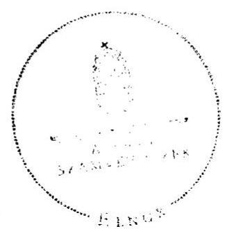

# ÁLLAMI   SZÁMVEVŐSZÉK 

## JELENTÉS

Sáránd Község Önkormányzata belső kontrollrendszerének kialakítása, valamint egyes kontrolltevékenységek és a belső ellenőrzés működése ellenőrzéséről

---

# Állami Számvevőszék 

Iktatószám: V-0012-058-002-041/2013.
Témaszám: 1051
Vizsgálat-azonosító szám: V059102

## Az ellenőrzést felügyelte:

Dr. Benedek Mária
felügyeleti vezető
2012. december 16. napjától

Gyüre Lajosné
felügyeleti vezető
2012. december 15. napjáig

## Az ellenőrzést vezette:

## Szakmányné Bilik Mária ellenőrzésvezető

A számvevőszéki jelentés összeállításában közreműködtek:
Groholy Andrásné Hangyál Márta
számvevő tanácsos
Renner Andrea
számvevő
Az ellenőrzést végezték:
Hegyes Mária Nyikon Zsigmondné
számvevő tanácsos
számvevő tanácsos

---

# TARTALOMJEGYZÉK 

BEVEZETÉS ..... 5
I. ÖSSZEGZŐ MEGÁLLAPÍTÁSOK, KÖVETKEZTETÉSEK, JAVASLATOK ..... 8
II. RÉSZLETES MEGÁLLAPÍTÁSOK ..... 16

1. Az Önkormányzat belső kontrollrendszere kialakításának megfelelősége ..... 16
1.1. A kontrollkörnyezet kialakítása ..... 16
1.2. A kockázatkezelési rendszer szabályozása ..... 17
1.3. A kontrolltevékenység kialakítása ..... 18
1.4. Az információs és kommunikációs rendszer szabályozása ..... 18
1.5. A monitoring rendszer szabályozása ..... 19
2. A pénzügyi folyamatokban kulcsszerepet betöltő belső kontrollok (szakmai teljesítésigazolás és utalvány ellenjegyzés) működése ..... 20
3. A belső ellenőrzés szervezeti keretei és működése ..... 22

## FÜGGELÉKEK

1. számú Értelmező szótár
2. számú A belső kontrollrendszer kialakítása, a pénzügyi folyamatokban kulcsszerepet betöltő szakmai teljesítésigazolás és utalvány ellenjegyzés kontrollok működése, valamint a belső ellenőrzés működése értékelésénél alkalmazott minősítési szempontok

---

.

---

# RÖVIDÍTÉSEK JEGYZÉKE 

## Törvények

ÁSZ tv.
Avtv.

Info tv.

Ktv.
Ötv.
régi Áht.

Számv. tv.
új Áht.

## Rendeletek

Áhsz.

Ámr.
Ávr.

Ber.
Bkr.
önkormányzati SZMSZ
vagyongazdálkodási rendelet

2011. évi LXVI. törvény az Állami Számvevőszékről
1992. évi LXIII. törvény a személyes adatok védelméről és a közérdekű adatok nyilvánosságáról (hatálytalan 2012. január 1-jétől)
2011. évi CXII. törvény az információs önrendelkezési jogról és az információszabadságról (hatályos 2012. január 1-jétől)
1992. évi XXIII. törvény a köztisztviselők jogállásáról
1990. évi LXV. törvény a helyi önkormányzatokról
1992. évi XXXVIII. törvény az államháztartásról (hatálytalan 2012. január 1-jétől)
2000. évi C. törvény a számvitelről
2011. évi CXCV. törvény az államháztartásról (hatályos 2012. január 1-jétől)

249/2000. (XII. 24.) Korm. rendelet az államháztartás szervezetei beszámolási és könyvvezetési kötelezettségének sajátosságairól
292/2009. (XII. 19.) Korm. rendelet az államháztartás működési rendjéről (hatálytalan 2012. január 1-jétől)
368/2011. (XII. 31.) Korm. rendelet az államháztartásról szóló törvény végrehajtásáról (hatályos 2012. január 1-jétől)
193/2003. (XI. 26.) Korm. rendelet a költségvetési szervek belső ellenőrzéséről (hatálytalan 2012. január 1-jétől)
370/2011. (XII. 31.) Korm. rendelet a költségvetési szervek belső kontrollrendszeréről és belső ellenőrzéséről (hatályos 2012. január 1-jétől)
Sáránd Község Önkormányzata Képviselő-testületének 5/2010. (XI. 16.) számú rendelete az Önkormányzat Képviselő-testületének Szervezeti és Működési Szabályzatáról Sáránd Község Önkormányzat Képviselő-testületének 10/2001. (IV. 26.) számú rendelete az Önkormányzat vagyonáról, legutóbbi módosítás a 7/2011. (IV. 1.) számú Képviselő-testületi határozattal

## Szórövidítések

Belső Kontroll Kézikönyv Az Ámr. 155. § (1) bekezdése, valamint az államháztartási belső kontroll standardokról szóló 1/2009. (IX. 11.) PM irányelv egységes értelmezése érdekében az államháztartásért felelős miniszter által 2010. évben kiadott Belső Kontroll Kézikönyv

---

bizonylati szabályzat

FEUVE
gazdálkodási jogkörök szabályzata
gazdasági program
hivatali SZMSZ
informatikai szabályzat
iratkezelési szabályzat
jegyző
Képviselő-testület
kockázatkezelési eljárás

Önkormányzat
polgármester
Polgármesteri Hivatal
számlarend
számviteli politika

Társulás
ügyrend

Sáránd Község Önkormányzatának Bizonylati szabályzata és bizonylati rendje, 1821/2006. iktatási számon kiadott (hatályos 2006. november 1-jétől)
Sáránd Község Önkormányzatának Folyamatba épített, előzetes, utólagos és vezetői ellenőrzés rendszere szabályzata, 1100/2005. iktatási számon kiadott (hatályos 2005. július 1-jétől)
Sáránd Község Önkormányzatának szabályzata az önkormányzati kötelezettségvállalás, ellenjegyzés, utalványozás és érvényesítés rendjéről, 383-1/2008. iktatási számon kiadott (hatályos 2009. augusztus 1-jétől, módosítva 2010. október 15.)
a Képviselő-testület 25/2011. (III. 31.) számú határozatával jóváhagyott, Sáránd Község Önkormányzatának 2010-2014. évi gazdasági programja
Sáránd Község Önkormányzata Polgármesteri Hivatalának Szervezeti és Működési Szabályzata, jóváhagyta a Képviselő-testület 30/2007. (IV. 11.) számú határozata
1/2010. számú Jegyzői utasítás a Polgármesteri Hivatal informatikai üzemeltetési biztonsági szabályairól (hatályos 2010. november 2-től)
Sáránd Község Önkormányzatának Iratkezelési szabályzata (hatályos a 2007. évtől, módosítva 2010. július 18-án)
Sáránd Község Önkormányzatának jegyzője
Sáránd Község Önkormányzatának Képviselő-testülete
Sáránd Község Önkormányzatának Folyamatba épített, előzetes, utólagos és vezetői ellenőrzés rendszere szabályzata, 1100/2005. iktatási számon kiadott (hatályos 2005. július 1-jétől) III. számú fejezete
Sáránd Község Önkormányzata
Sáránd Község Önkormányzatának polgármestere
Sáránd Község Önkormányzatának Polgármesteri Hivatala
Sáránd Község Önkormányzata Polgármesteri Hivatalának Számlarendje, 25-503/2007. iktatási számon kiadott (hatályos 2007. január 1-jétől)
Sáránd Község Önkormányzatának Számviteli politikája, 1831/2006. iktatási számon kiadott (hatályos 2006. évtől, aktualizálva 2010. november 1-jétől)
Derecske-Létavértesi Kistérség Többcélú Kistérségi Társulása
Sáránd Község Önkormányzata Gazdasági szervezetének ügyrendje (hatályos 2007. március 21-től)

---

# JELENTÉS 

## Sáránd Község Önkormányzata belső kontrollrendszerének kialakítása, valamint egyes kontrolltevékenységek és a belső ellenőrzés működése ellenőrzéséről

## BEVEZETÉS

A belső kontrollrendszer kialakítását, működtetését és fejlesztését a régi Áht. és az új Áht. is előírja. Ennek megvalósításáért a költségvetési szerv vezetője, a jegyző felel. A belső kontrollrendszer azt a célt szolgálja, hogy a költségvetési szervek működésük és gazdálkodásuk során a tevékenységeket szabályszerűen, gazdaságosan, hatékonyan, eredményesen hajtsák végre, teljesítsék elszámolási kötelezettségeiket és megvédjék az erőforrásokat a veszteségektől, a károktól és a nem rendeltetésszerű használattól. A belső kontrollrendszer magában foglalja mindazon szabályokat, eljárásokat, gyakorlati módszereket és szervezeti struktúrákat, kockázatkezelési technikákat, kontrolltevékenységeket, amelyek segítséget nyújtanak a szervezetnek céljai eléréséhez.

Az ÁSZ a 2011-2015. évekre szóló stratégiájában hangsúlyos szerepet szánt annak, hogy szilárd szakmai alapon álló, értékteremtő ellenőrzéseivel előmozdítsa a közpénzügyek átláthatóságát, rendezettségét. A számvevőszéki ellenőrzés nemzetközi alapelvei is rögzítik, hogy a megfelelő belső kontrollrendszer minimálisra csökkenti a hibák és szabálytalanságok kockázatát.

Az ellenőrzés célja annak értékelése volt, hogy az Önkormányzat a jogszabályi előírásoknak megfelelően alakította-e ki a belső kontrollrendszert; a gazdálkodás folyamatában kulcsszerepet betöltő szakmai teljesítésigazolás és az utalvány ellenjegyzés kontrolltevékenységeit megfelelően működtette-e; biztosította-e a belső ellenőrzés szabályos és eredményes működését.

Az ÁSZ ezen ellenőrzési céljait pilot (próba) jelleggel községi/nagyközségi önkormányzatoknál végzett ellenőrzések során érvényesítette.

Az ellenőrzés típusa: szabályszerűségi ellenőrzés
Az ellenőrzés jogszabályi alapja: az ÁSZ tv. 5. § (2) és (6) bekezdései
Az ellenőrzött szervezet: az Önkormányzat (ezen belül kiemelten a Polgármesteri Hivatal)

Az ellenőrzött időszak: a belső kontrollrendszer kialakításának megfelelőségét a 2011. évre vonatkozóan értékeltük. A kontrolltevékenységek működésének megfelelőségét a 2011. január 1-je és december 31-e, míg a belső ellenőrzés működésének szabályosságát és eredményességét a 2009. január 1-je és 2011. december 31-e közötti időszakot figyelembe véve értékeltük. A helyszíni ellenőrzés lezárásáig a helyi szabályozás változásait nyomon követtük.

Az ellenőrzés szakmai módszertana az Állami Számvevőszék Ellenőrzési Kézikönyvében foglalt szakmai szabályokon alapult, amely a Legfelsőbb Ellenőrző Intézmények Nemzetközi Szervezete (INTOSAI) által kiadott nemzetközi standardok (ISSAI) figyelembevételével készült.

A belső kontrollrendszer kialakításának ellenőrzése során értékeltük a Polgármesteri Hivatalban a kontrollkörnyezet, a kockázatkezelési rendszer, a kontrolltevékenységek, az információs és kommunikációs rendszer, valamint a monitoring rendszer szabályozottságának megfelelőségét.

A Polgármesteri Hivatalban értékeltük a pénzügyi folyamatokban kulcsszerepet betöltő szakmai teljesítésigazolás és utalvány ellenjegyzés kontrollok működésének megfelelőségét az államháztartáson kívülre teljesített működési és felhalmozási célú pénzeszköz átadásoknál, az állományba nem tartozók megbízási díjainál, továbbá a külső szolgáltató által végzett karbantartási, kisjavítási munkákkal kapcsolatos kifizetéseknél. Az egyszerű véletlen mintavétellel kiválasztott tételek ellenőrzését többlépcsős megfelelőségi tesztek útján addig végeztük, amíg elegendő és megfelelő bizonyítékot szereztünk a vizsgált folyamatok kulcskontrolljai működésének megfelelő vagy nem megfelelő voltáról.

Értékeltük az Önkormányzatnál a belső ellenőrzés működésének szabályosságát és eredményességét.

Az egyes fogalmak magyarázatát az 1. számú függelék, az ellenőrzés egyes területeinek értékelésénél alkalmazott egységes minősítési szempontokat a 2. számú függelék tartalmazza.

Az ellenőrzés lefolytatásához az Önkormányzat a munkalapok és a tanúsítvány elektronikus kitöltésével, valamint a megjelölt dokumentumok elektronikus megküldésével szolgáltatott adatokat. A munkalapokon szerepeltetett adatok, információk ellenőrzése és szükség szerinti javítása a helyszíni ellenőrzés keretében történt.

Az ÁSZ az ellenőrzés megállapításait az ellenőrzött időszakban hatályos, az intézkedést igénylő megállapításokra tett javaslatokat a jelenleg hatályos jogszabályok alapján fogalmazta meg.

Az ÁSZ tv. 29. § (1) bekezdése szerint a jelentéstervezetet megküldtük a polgármester részére, aki az ÁSZ tv. 29. § (2) bekezdésében foglalt észrevételezési jogával nem élt, a jelentéstervezetre észrevételt nem tett.

Sáránd község állandó lakosainak száma 2011. január 1-jén 2386 fő volt. Az Önkormányzat héttagú Képviselő-testületének munkáját kettő állandó bizottság segítette. Az Önkormányzat egyetlen költségvetési szerve az önállóan működő és gazdálkodó Polgármesteri Hivatal volt. Az Önkormányzat egy többségi tulajdoni hányadú gazdasági társasággal rendelkezett. A 2010. évi választásokat követően a polgármester személye nem változott. A jegyző 2010. májusától

---

tölti be a tisztségét. A Polgármesteri Hivatal szervezeti egységekre nem tagolódott, a foglalkoztatott köztisztviselők száma 2011. január 1-jén hét fő volt.

Az Önkormányzat a 2011. évi költségvetési beszámolója szerint 365 millió Ft költségvetési bevételt ért el, ugyanekkora költségvetési kiadást teljesített. A 2011. december 31-i könyvviteli mérleg szerint 1226 millió Ft értékű eszközvagyonnal rendelkezett, a rövid lejáratú kötelezettsége 42 millió Ft volt, hosszú lejáratú kötelezettsége nem volt.

---

# I. ÖSSZEGZŐ MEGÁLLAPÍTÁSOK, KÖVETKEZTETÉSEK, JAVASLATOK 

A belső kontrollrendszer kialakítása a Polgármesteri Hivatalban 2011-ben a kontrollkörnyezet, a kockázatkezelési rendszer, a kontrolltevékenységek, az információs és kommunikációs rendszer, valamint a monitoring rendszer szabályozásának, illetve kialakításának értékelése alapján összességében nem felelt meg a jogszabályi előírásoknak.

A kontrollkörnyezet kialakítása a Polgármesteri Hivatalban részben felelt meg a jogszabályi előírásoknak. A hivatali SZMSZ az Ámr.-ben foglaltak ellenére nem tartalmazta az ellátandó és a szakfeladatrend szerint besorolt alaptevékenységeket, továbbá a hivatali SZMSZ-ben nem rögzítették az abban nevesített munkakörökhöz tartozó feladat- és hatásköröket, a hatáskörök gyakorlásának módját, a helyettesítés rendjét, az ezekhez kapcsolódó felelősségi szabályokat. A Ber. előírása ellenére a hivatali SZMSZ-ben nem határozták meg a belső ellenőrzést végző személy, szervezet jogállását, feladatait. Az ügyrend az Ámr. előírása ellenére nem tartalmazta a pénzügyi-gazdasági feladatok ellátásáért felelős dolgozók helyettesítési rendjét. Ezek a hiányosságok korlátozzák a feladatellátás számon kérhetőségét, folytonosságának biztosítását. A jegyző a számlarendet és annak részeként a bizonylati szabályzatot a Számv. tv. és az Áhsz. előírása ellenére nem aktualizálta.

A kockázatkezelési rendszer szabályozása nem felelt meg a jogszabályi előírásoknak, mivel az Ámr. előírása ellenére a jegyző nem mérte fel és nem állapította meg az Önkormányzat tevékenységében rejlő kockázatokat, nem határozta meg az egyes kockázatokkal kapcsolatos intézkedéseket és megtételük módját.

A kontrolltevékenységek kialakítása a jogszabályi követelményeknek nem felelt meg, mivel a régi Áht.-ban foglaltak ellenére a jegyző nem határozta meg az iratkezelési feladatok folyamatba épített, előzetes, utólagos és vezetői ellenőrzését. Az Ámr. rendelkezése ellenére nem szabályozta a Polgármesteri Hivatal tevékenységeire vonatkozó beszámolási eljárásokat, valamint a szakmai teljesítés igazolásánál az összegszerűség ellenőrzését. A kontrolltevékenységek hiányos kialakítása kockázatot jelent a feladatok szabályszerű végrehajtása során.

Az információs és kommunikációs rendszer szabályozása a jogszabályi előírásoknak nem felelt meg, mivel az Avtv. rendelkezése ellenére a jegyző nem határozta meg a közérdekű adatok megismerésére irányuló igények teljesítésének rendjét, nem határozta meg teljes körűen a hozzáférési jogosultságok megállapítására, módosítására és ellenőrzésére vonatkozó eljárásrendet, nem szabályozta a pénzügyi-számviteli szoftverváltozások ellenőrzésére, tesztelésére vonatkozó eljárásokat, a feldolgozott adatok mentési eljárásait és nem jelölte ki a mentések felelőseit. Az Ámr.-ben foglaltak ellenére nem jelölték ki a közérdekű adatok közzétételének adatfelelősét és az adatközlő személyt, 2012-ben ezt a hiányosságot megszüntették.

---

A monitoring rendszer szabályozása a jogszabályi követelményeknek nem felelt meg, mivel a jegyző az Ámr.-ben foglaltak ellenére az operatív tevékenységek keretében megvalósuló folyamatos és eseti nyomon követésből álló, az
 Önkormányzat tevékenységének, a célok megvalósításának nyomon követését biztosító rendszert nem alakította ki.

A belső kontrollrendszer nem megfelelő kialakítása kockázatot jelent az Önkormányzat tevékenységeinek szabályszerű, gazdaságos, hatékony és eredményes végrehajtása során.

A Polgármesteri Hivatalban a 2011. évben az államháztartáson kívülre történő működési és felhalmozási célú pénzeszköz átadásokkal, az állományba nem tartozók megbízási díjaival, valamint a külső szolgáltatók által végzett karbantartási, kisjavítási munkákkal kapcsolatos kifizetések során - mindhárom területen és összességében - a pénzügyi folyamatokban kulcsszerepet betöltő szakmai teljesítés igazolás és utalvány ellenjegyzés belső kontrollok működésének megfelelősége gyenge volt.

A szakmai teljesítés igazolására a jegyző által kijelölt személyek az Ámr. előírása ellenére a kifizetéseket megelőzően nem végezték el a kifizetések jogosságának, összegszerűségének, a szerződés, megrendelés teljesítésének ellenőrzését, illetve nem tettek eleget igazolási kötelezettségüknek. Az utalványok ellenjegyzője az Ámr.-ben foglaltak ellenére nem észrevételezte, hogy a jegyző által a szakmai teljesítésigazolásra kijelölt személyek ellenőrzési és igazolási kötelezettségüknek nem tettek eleget. Az utalvány ellenjegyzője a népszámláláshoz kapcsolódó megbízási díj kifizetése során az Ámr. előírása ellenére az utalvány ellenjegyzését összeférhetetlenül a maga javára látta el, valamint nem győződött meg a gazdálkodásra vonatkozó szabályok betartásáról, mivel nem észrevételezte az írásbeli kötelezettségvállalási dokumentum, illetve a kötelezettségvállalás ellenjegyzésének hiányát.

A számvevőszéki ellenőrzés az ellenőrzött kifizetésekkel összefüggésben a rendelkezésre bocsátott dokumentumok alapján jogosulatlan kifizetést nem tárt fel, azonban a gazdálkodásban kulcsszerepet betöltő kontrollok működésében feltárt hiányosságok miatt fennáll a hibák bekövetkezésének kockázata.

Az Önkormányzat a belső ellenőrzési feladatokat Társulás útján látta el. A belső ellenőrzés szabályozása és működése az ellenőrzött időszak egészét tekintve a jogszabályi előírásoknak nem felelt meg. Az ellenőrzési tervek összeállítását megelőzően a Ber.-ben foglaltak ellenére az Önkormányzatra vonatkozóan kockázatelemzést nem készítettek. Az ellenőrzési tervek összeállítása nem a jegyző írásos véleményének figyelembevételével történt, mivel a jegyző véleményt, javaslatot nem fogalmazott meg. A Képviselő-testület által jóváhagyott 2011. évi belső ellenőrzési terv nem tartalmazta az ellenőrzés célját, az ellenőrzési kapacitás meghatározását, valamint az ellenőrzés típusát és módszereit. A programokat, a Ber. előírása ellenére, a belső ellenőrzési vezető kijelölésének hiányában, a jegyző hagyta jóvá. Az ellenőrzési jelentések a Ber. rendelkezései ellenére nem tartalmazták az ellenőrzési programnak megfelelő megállapításokat, következtetéseket és javaslatokat. A belső ellenőrzésekről készült jelentésekben feltárt hiányosságok felszámolására a jegyző a Ber.-ben előírtak ellenére intézkedési tervet nem készített, és csak egy esetben intézkedett. A Ber.-ben

---

foglaltak ellenére a belső ellenőrzésekről és az intézkedésekről nyilvántartási rendszert nem alakítottak ki. A Bkr. rendelkezése ellenére a 2012. évben a polgármester nem terjesztette a Képviselő-testület elé a 2011. évi zárszámadási rendelettervezettel egyidejűleg a belső ellenőrzési jelentésekről készült, a jegyző és a belső ellenőrzési vezető által jóváhagyott összefoglalót.

Az Önkormányzatnál a 2009-2011. években a belső ellenőrzés működése nem volt eredményes, mivel a belső ellenőrzés szabályozása és működése az ellenőrzött időszak egészét tekintve a jogszabályi kritériumoknak nem felelt meg, a jegyző nem intézkedett minden esetben a javaslatok hasznosításáról, a feltárt hibák, hiányosságok kijavításáról. Mindezek hozzájárultak a számvevőszéki ellenőrzés során is feltárt szabályozási, gazdálkodási hibák ismétlődéséhez.

Az ÁSZ tv. 33. § (1) bekezdésében foglaltak értelmében a jelentésben foglalt megállapításokhoz kapcsolódó intézkedési tervet köteles az ellenőrzött szervezet vezetője összeállítani és azt a jelentés kézhezvételétől számított 30 napon belül az ÁSZ részére megküldeni. Amennyiben az intézkedési tervet határidőn belül továbbra sem küldi meg a szervezet, vagy az továbbra sem elfogadható, az ÁSZ elnöke a hivatkozott törvény 33. § (3) bekezdés a)-b) pontjaiban foglaltakat érvényesítheti.

Az ellenőrzés intézkedést igénylő megállapításai és javaslatai:

# a polgármesternek 

1. Az utalványok ellenjegyzője aláirását megelőzően az Ámr. 79. § (2) bekezdése ellenére nem győződött meg a gazdálkodásra vonatkozó szabályok betartásáról, mivel nem észrevételezte, hogy a megállapodásokat az Ámr. 74. § (1) bekezdésében foglaltak ellenére a kötelezettségvállalás előtt nem ellenjegyezték.

Javaslat:
Intézkedjen arról, hogy az új Áht. 37. § (1) bekezdésében foglaltaknak megfelelően kötelezettségvállalásra - az Ávr.-ben meghatározott kivételekkel - kizárólag a pénzügyi ellenjegyzés után, a pénzügyi teljesítés esedékességét megelőzően, írásban kerüljön sor.
2. A Bkr. 56. § (8)-(9) bekezdései ellenére a 2012. évben a polgármester nem terjesztette a Képviselő-testület elé a 2011. évi zárszámadási rendelettervezettel egyidejűleg a belső ellenőrzési jelentésekről készült, a jegyző és a belső ellenőrzési vezető által jóváhagyott éves ellenőrzési jelentést.

Javaslat:
Terjessze a Képviselő-testület elé a Bkr. 56. § (8)-(9) bekezdéseiben rögzítetteknek megfelelően a zárszámadási rendelettervezettel egyidejűleg az éves ellenőrzési jelentést.
3. A szakmai teljesítésigazolására a jegyző által kijelölt személyek az Ámr. 76. § (1) bekezdésének előírása ellenére a kifizetéseket megelőzően nem végezték el ellenőrzési

---

feladatukat, illetve az Ámr. 76. § (3) bekezdésében előírtak ellenére nem tettek eleget igazolási kötelezettségüknek. Az utalványok ellenjegyzője az Ámr. 79. § (2) bekezdésében foglaltak ellenére nem ellenőrizte a szakmai teljesítésigazolás megtörténtét. Az utalványok ellenjegyzője nem észrevételezte, hogy nem készült előzetes írásbeli kötelezettségvállalási dokumentum, továbbá az ellenőrzött tételek vonatkozásában a megállapodásokat az Ámr. 74. § (1) bekezdésében foglaltak ellenére nem ellenjegyezték. Az utalványok ellenjegyzője az Ámr. 80. § (2) bekezdés előírása ellenére az utalvány ellenjegyzését összeférhetetlenül, a maga javára látta el.

Javaslat:
Intézkedjen a szakmai teljesítésigazolás és az utalvány ellenjegyzés kontrollokkal összefüggésben a számvevőszéki jelentésben rögzített hiányosságok és szabálytalanságok tekintetében az esetleges munkajogi felelősséggel kapcsolatos körülmények kivizsgálásáról.

# a jegyzőnek 

1. a kontrollkörnyezettel kapcsolatban:

Az Ámr. 20. § (2) bekezdés c) és h) pontjaiban foglaltak ellenére a jegyző a hivatali SZMSZ-ben nem határozta meg az ellátandó, és a szakfeladatrend szerint besorolt alaptevékenységeket. A hivatali SZMSZ-ben a jegyző nem rögzítette az abban nevesített munkakörökhöz tartozó feladat- és hatásköröket, a hatáskörök gyakorlásának módját, a helyettesítés rendjét, az ezekhez kapcsolódó felelősségi szabályokat. Az önkormányzati, illetve a hivatali SZMSZ-ben a belső ellenőrzést végző személy, szervezet jogállását, feladatait a Ber. 4. § (2) bekezdés rendelkezése ellenére nem rögzítették. Az ügyrend az Ámr. 20. § (7) bekezdésében foglaltak ellenére nem tartalmazta a pénzügyi-gazdasági feladatok ellátásáért felelős dolgozók helyettesítési rendjére vonatkozó szabályokat. A jegyző a bizonylati szabályzatot a Számv. tv. 161. § (2) bekezdésének d) pontja és az Áhsz. 49. § (6) bekezdésének előírása ellenére nem aktualizálta.

Javaslat:
a) Módosítsa a hivatali SZMSZ-t, és kezdeményezze a polgármesternél a módosítás Képviselő-testület elé terjesztését annak érdekében, hogy az Ávr. 13. § (1) bekezdésének c) és g) pontjában foglaltaknak megfelelően tartalmazza a szakfeladatrend szerint besorolt alaptevékenységeket, és az abban nevesített munkakörökhöz tartozó feladat- és hatásköröket, a hatáskörök gyakorlásának módját, a helyettesítés rendjét, az ezekhez kapcsolódó felelősségi szabályokat. Rögzítse a Polgármesteri Hivatal SZMSZ-ében a Bkr. 15. § (2) bekezdésének megfelelően a belső ellenőrzést végző személy vagy szervezet jogállását, feladatait.
b) Egészítse ki az ügyrendet az Ávr. 13. § (5) bekezdésében foglaltak alapján a pénzügyi-gazdasági feladatok ellátásáért felelős dolgozók helyettesítési rendjének szabályozásával.
c) Gondoskodjon a Számv. tv. 161. § (2) bekezdés előírásának megfelelően a számlarend és annak részeként a bizonylati szabályzat aktualizálásáról - az

---

Áhsz. 49. § (6) bekezdésének előírását figyelembe véve -, hogy a bizonylati szabályzat mellékletét képező bizonylati album a ténylegesen használt utalványrendeletet tartalmazza.
2. a kockázatkezelési rendszerrel kapcsolatban:

A jegyző az Ámr. 157. § (1)-(3) bekezdéseinek előírása ellenére nem mérte fel és nem állapította meg az Önkormányzat tevékenységében rejlő kockázatokat, az egyes kockázatokkal kapcsolatos intézkedéseket és megtételük módját.

Javaslat:
Gondoskodjon a Bkr. 7. §-a alapján a kockázatok meghatározásának és felmérésének keretében az Önkormányzat tevékenységében, gazdálkodásában rejlő kockázatok megállapításáról, valamint az egyes kockázatokkal kapcsolatban szükséges intézkedések meghatározásáról.
3. a kontrolltevékenységekkel kapcsolatban:

A régi Áht. 121/A. § (4) bekezdésében foglaltak ellenére a kontrolltevékenység részeként a jegyző nem határozta meg az iratkezelési feladatok folyamatba épített, előzetes, utólagos és vezetői ellenőrzését. Az Ámr. 158. § (2) bekezdés d) pontja ellenére nem szabályozta Polgármesteri Hivatal tevékenységeire vonatkozó beszámolási eljárásokat. Az Ámr. 76. § (1) bekezdése és 20. § (3) bekezdés a) pontja előírása ellenére, a gazdálkodási jogkörök szabályozásában nem írta elő a szakmai teljesítés igazolásánál az összegszerűség ellenőrzését.

Javaslat:
a) Gondoskodjon - a Bkr. 8. § (2) bekezdése alapján - az iratkezelési feladatok folyamatba épített, előzetes, utólagos és vezetői ellenőrzéséről.
b) Alakítsa ki a Bkr. 8. § (4) bekezdés c) pontja alapján a Polgármesteri Hivatal tevékenységeire vonatkozó beszámolási eljárásokat.
c) Egészítse ki a gazdálkodási jogkörök szabályozását az Ávr. 57. § (1) bekezdése és 13. § (2) bekezdés a) pontjának megfelelően a teljesítés igazolás során az összegszerűség ellenőrzésének kötelezettségével.
4. az információs és kommunikációs rendszerrel kapcsolatban:

Az Avtv. 20. § (8) bekezdésének rendelkezése ellenére a jegyző a közérdekű adatok megismerésére irányuló igények teljesítésének rendjét nem szabályozta. Az informatikai rendszer környezetének szabályozása során az Avtv. 10. § (1)-(2) bekezdéseiben foglalt előírások ellenére elmulasztotta az adatbiztonság érvényre juttatásához szükséges intézkedések megtételét, a szabályozás keretében nem határozta meg teljes körűen a hozzáférési jogosultságok megállapítására, módosítására és ellenőrzésére vonatkozó eljárásrendet. Nem szabályozta a pénzügyi-számviteli szoftverváltozások ellenőrzésére, tesztelésére vonatkozó eljárásokat, a feldolgozott adatok mentési eljárásait, és nem jelölte ki a mentések felelőseit.

---

Javaslat:
a) Szabályozza az Ávr. 13. § (2) bekezdés h) pontja, valamint az Info tv. 30. § (6) bekezdése szerint a közérdekű adatok megismerésére irányuló igények teljesítésének rendjét.
b) Határozza meg a szabályozásban teljes körűen az Info tv. 7. § (2)-(3) bekezdéseiben foglaltak szerint a hozzáférési jogosultságok megállapítására és módosítására, azok ellenőrzésére vonatkozó eljárásrendet, a pénzügyi-számviteli szoftverváltozások ellenőrzésére, tesztelésére vonatkozó eljárásokat, a feldolgozott adatok mentési eljárásait és jelölje ki a mentések felelőseit.
5. a monitoring rendszerrel kapcsolatban:

A jegyző az Ámr. 160. §-a előírása ellenére az operatív tevékenységek keretében megvalósuló folyamatos és eseti nyomon követésből álló, az Önkormányzat tevékenységének, a célok megvalósításának nyomon követését biztosító rendszert nem alakította ki.

Javaslat:
Alakítsa ki és működtesse a Bkr. 10. §-ában előírtak alapján az operatív tevékenységek keretében megvalósuló folyamatos és eseti nyomon követésből álló, az Önkormányzat tevékenységének, a célok megvalósításának nyomon követését biztosító rendszert.
6. a pénzügyi folyamatokban kulcsszerepet betöltő kontrollokkal kapcsolatban:

A szakmai teljesítés igazolására a jegyző által kijelölt személyek, az Ámr. 76. § (1) bekezdésének előírása ellenére a kifizetéseket megelőzően nem végezték el a kifizetések jogosságának, összegszerűségének, a szerződés, megrendelés teljesítésének ellenőrzését, illetve az Ámr. 76. § (3) bekezdésében előírtak ellenére nem tettek eleget igazolási kötelezettségüknek. Az utalványok ellenjegyzője az Ámr. 79. § (2) bekezdésében foglaltak ellenére nem észrevételezte, hogy a jegyző által a szakmai teljesítésigazolásra kijelölt személyek ellenőrzési és igazolási kötelezettségüknek nem tettek eleget. Az utalványok ellenjegyzője nem győződött meg a gazdálkodásra vonatkozó szabályok betartásáról, mivel nem észrevételezte, hogy a gazdálkodási jogkörök szabályzatában foglaltak ellenére nem készült előzetes írásbeli kötelezettségvállalási dokumentum, továbbá az ellenőrzött tételek vonatkozásában a megállapodásokat az Ámr. 74. §
 (1) bekezdésében foglaltak ellenére nem ellenjegyezték. Az utalványok ellenjegyzője a népszámláláshoz kapcsolódó megbízási díj kifizetése során, az Ámr. 80. § (2) bekezdés előírása ellenére az utalvány ellenjegyzését összeférhetetlenül, a maga javára látta el.

Javaslat:
Az operatív gazdálkodás során a működésbeli hibák megelőzése, feltárása és kijavítása érdekében gondoskodjon arról, hogy

---

a) a teljesítés igazolására a jegyző által kijelöltek az Ávr. 57. § (1) bekezdésében előírtaknak megfelelően a kiadások teljesítésének jogosságát, összegszerűségét, az ellenszolgáltatást is magában foglaló kötelezettségvállalás esetében - ha a kifizetés vagy annak egy része az ellenszolgáltatás teljesítését követően esedékes - annak teljesítését ellenőrizhető okmányok alapján ellenőrizzék, valamint az Ávr. 57. § (3) bekezdése szerint tegyenek eleget igazolási kötelezettségüknek.
b) az érvényesítő az Ávr. 58. § (1) bekezdése szerint a kifizetéseket megelőzően a teljesítésigazolás alapján - az 57. § (3) bekezdése szerinti esetben annak hiányában is - ellenőrizze az összegszerűséget, a fedezet meglétét és a megelőző ügymenetben az új Áht., az Áhsz. és az Ávr. előírásainak és a belső szabályzatokban foglaltaknak a betartását;
c) a pénzügyi ellenjegyző az új Áht. 37. § (1) bekezdése szerint ellenőrizze a kötelezettségvállalásokra vonatkozóan a gazdálkodási szabályok betartását, az írásbeli kötelezettségvállalási dokumentum elkészítését, a kötelezettségvállalások ellenjegyzését;
d) az összeférhetetlenségi szabályok az Ávr. 60. § (1)-(2) bekezdéseiben foglaltaknak megfelelően érvényesüljenek.
7. a belső ellenőrzés működésével kapcsolatban:

A belső ellenőrzési tervek összeállítását megelőzően a Ber. 18. §-ában foglaltak ellenére az Önkormányzatra vonatkozóan kockázatelemzést nem készítettek. A Képviselő-testület által határidőn belül jóváhagyott éves ellenőrzési tervek összeállítása a 2010-2011. években a Ber. 32/B. § (2) bekezdésében foglaltak ellenére nem a jegyző írásos véleményének figyelembevételével történt, mivel a jegyző véleményt, javaslatot nem fogalmazott meg. A Ber. 21. § (3) bekezdésében foglaltak ellenére a 2011. évi ellenőrzési terv nem tartalmazta az ellenőrzés célját, az ellenőrzési kapacitás meghatározását, valamint az ellenőrzés típusát és módszereit. Az ellenőrzési programokat a Ber. 23. § (3) bekezdésében foglaltak ellenére, a belső ellenőrzési vezető kijelölésének hiányában a jegyző hagyta jóvá. Az ellenőrzésekről készült jelentések a Ber. 27. § (2) bekezdés előírásai ellenére nem tartalmazták az ellenőrzési programnak megfelelő megállapításokat, következtetéseket és javaslatokat. A jegyző a Ber. 29. § (1) bekezdés rendelkezése ellenére intézkedési tervet nem készített, dokumentáltan egy esetben intézkedett. A belső ellenőrzésekről, illetve az intézkedésekről az Önkormányzatnál nyilvántartási rendszert a Ber. 29/A. § (1)-(2) és (7) bekezdéseiben foglaltak ellenére nem alakítottak ki.
a) Intézkedjen a Bkr. 29. § (1) bekezdése alapján kockázatelemzésen alapuló ellenőrzési terv készítéséről, valamint arról, hogy - a Társulásban történő feladatellátás miatt - a belső ellenőrzési tervet a Bkr. 56. § (2) bekezdés előírásainak megfelelően a jegyző írásos véleményének figyelembevételével készítsék el.
b) Intézkedjen, hogy az ellenőrzési tervek a Bkr. 31. § (4) bekezdésében foglaltaknak megfelelően tartalmazzák az ellenőrzés célját, az ellenőrzési kapacitás meghatározását, valamint az ellenőrzés típusát.
c) Gondoskodjon a Bkr. 16. § (4) és 22. § (1)-(2) bekezdéseinek alapján a belső ellenőrzési vezető kijelöléséről, illetve arról, hogy az ellenőrzési programokat a Bkr.

---

33. § (2) bekezdésében foglaltaknak megfelelően a belső ellenőrzési vezető hagyja jóvá.
d) Gondoskodjon arról, hogy az ellenőrzési jelentések a Bkr. 39. §-ában foglaltaknak megfelelően tartalmazzák a programnak megfelelő megállapításokat, következtetéseket és javaslatokat.
e) Gondoskodjon a Bkr. 45. § előírásai szerint a belső ellenőrzésekről készült jelentésekben rögzített hiányosságok felszámolására intézkedési terv elkészítéséről.
f) Rendelkezzen a Bkr. 47. § (1)-(2) és 50. § (1)-(2) bekezdéseiben előírt tartalmú, az Önkormányzatnál elvégzett ellenőrzésekre és a jelentés javaslatai alapján megtett intézkedésekre vonatkozó nyilvántartás vezetéséről.

---

# II. RÉSZLETES MEGÁLLAPÍTÁSOK 

## 1. Az ÖNKORMÁNYZAT BELSŐ KONTROLLRENDSZERE KIALAKÍTÁSÁNAK MEGFELELŐSÉGE

### 1.1. A kontrollkörnyezet kialakítása

A kontrollkörnyezet kialakítása a Polgármesteri Hivatalban részben megfelelő volt. A jegyző a gazdálkodást érintő legfontosabb szabályzatokat elkészítette, azonban

- az Ámr. 20. § (2) bekezdés c) és h) pontjaiban ${ }^{1}$ foglaltak ellenére a hivatali SZMSZ-ben nem határozta meg az ellátandó, és a szakfeladatrend szerint besorolt alaptevékenységeket. A hivatali SZMSZ-ben nem rögzítette az abban nevesített munkakörökhöz tartozó feladat- és hatásköröket, a hatáskörök gyakorlásának módját, a helyettesítés rendjét, az ezekhez kapcsolódó felelősségi szabályokat. Az önkormányzati, illetve a hivatali SZMSZ-ben a belső ellenőrzést végző személy, szervezet jogállását, feladatait a Ber. 4. § (2) bekezdés ${ }^{2}$ rendelkezése ellenére nem rögzítették ${ }^{3}$;
- az ügyrend az Ámr. 20. § (7) bekezdésében ${ }^{4}$ foglaltak ellenére nem tartalmazta a pénzügyi-gazdasági feladatok ellátásáért felelős dolgozók helyettesítési rendjére vonatkozó szabályokat;
- a bizonylati szabályzatot a Számv. tv. 161. § (2) bekezdésének d) pontja és az Áhsz. 49. § (6) bekezdésének előírása ellenére nem aktualizálta, mivel nem a 2011-ben használt - hanem a 2007. március 28-án hatályban lévő - utalványrendeletet tartalmazza a bizonylati rend mellékletét képező bizonylati album;
- a Ktv. 34. §-ában foglaltak ellenére nem határozta meg a köztisztviselőkre vonatkozó teljesítménykövetelményeket.

A Képviselő-testület az Önkormányzat gazdasági programját hiányos tartalommal fogadta el.

[^0]
[^0]:    ${ }^{1}$ 2012. január 1-jétől az Ávr. 13. § (1) bekezdés c) és g) pontjai rögzítik az SZMSZ tartalmi követelményeit.
    ${ }^{2}$ 2012. január 1-jétől a Bkr. 15. § (2) bekezdése rendelkezik arról, hogy a belső ellenőrzést végző jogállását az SZMSZ-ben elő kell írni.
    ${ }^{3}$ Az ellenőrzött időszakban a Képviselő-testület évente döntött arról, hogy az Önkormányzatnál a belső ellenőrzési feladatokat a Társulás által megbízott vállalkozás látja el.
    ${ }^{4}$ 2012. január 1-jétől az Ávr.13. § (5) bekezdése tartalmazza a gazdasági szervezet ügyrendjének tartalmi követelményeit.

---

Az Önkormányzat gazdasági programja az Ötv. 91. § (6) bekezdésében ${ }^{5}$ foglaltak ellenére nem tartalmazta a munkahelyteremtés feltételeinek elősegítését, az adópolitikai célkitűzéseket, valamint a közszolgáltatások ellátási színvonalának javítására vonatkozó megoldásokat.

A kontrollkörnyezet kialakítása során a jegyző

- a Belső Kontroll Kézikönyv ${ }^{6}$ 1.2.7. pontjában foglaltakat figyelmen kívül hagyva nem írta elő a hivatali SZMSZ munkatársak általi megismerésének kötelezettségét, és a hivatali SZMSZ dolgozók általi megismerése nem történt meg;
- a Belső Kontroll Kézikönyv 1.5.2. pontjában foglalt ajánlást nem érvényesítette, mivel nem dolgozta ki a Polgármesteri Hivatalban ellátott köztisztviselői munkakörökre betöltésére vonatkozó elvárt tudást és képességeket.

# 1.2. A kockázatkezelési rendszer szabályozása 

A kockázatkezelési rendszer szabályozottsága a Polgármesteri Hivatalban nem volt megfelelő, mivel a jegyző az Ámr. 157. § (1)-(3) bekezdésének ${ }^{7}$ előírása ellenére nem mérte fel és nem állapította meg az Önkormányzat tevékenységében rejlő kockázatokat, nem határozta meg az egyes kockázatokkal kapcsolatos intézkedéseket és megtételük módját.

A kockázatkezelési rendszer szabályozása során a jegyző

- a Belső Kontroll Kézikönyv 2.1.3. pontjában foglaltakat figyelmen kívül hagyva nem alakították ki a kockázat-nyilvántartási rendszert, vezetéséről nem gondoskodtak;
- a Belső Kontroll Kézikönyv 2.2. pontjában foglaltakat figyelmen kívül hagyva nem gondoskodott arról, hogy az Önkormányzat tevékenységeit kockázati kitettség alapján rangsorolják;
- a Belső Kontroll Kézikönyv 2.3. pontjában foglaltakat figyelmen kívül hagyva nem jelölte ki a válaszlépések végrehajtásáért felelős személyeket, nem szabályozta az intézkedések nyomon követésének módját;
- a Belső Kontroll Kézikönyv 2.4.1. és 2.4.2. pontjaiban foglalt ajánlást nem érvényesítette, mivel nem írta elő a kockázatkezelés teljes folyamatának felülvizsgálatát, nem jelölte ki a felülvizsgálatért felelős személyeket;

[^0]
[^0]:    ${ }^{5}$ 2013. január 1-jétől a gazdasági programra, fejlesztési tervre vonatkozó jogszabályi előírásokat Magyarország helyi önkormányzatairól szóló 2011. évi CLXXXIX. törvény 116. § (1) bekezdése tartalmazza.
    ${ }^{6}$ A 2011. évben az Ámr. 155. § (1) bekezdése szerint a belső kontrollok kialakítása során a költségvetési szerv vezetője figyelembe veszi az államháztartásért felelős miniszter által közzétett, az államháztartási belső kontroll standardokra vonatkozó irányelvet. 2012. január 1-jétől a Bkr. 5. § (1) bekezdése értelmében a költségvetési szervek belső kontrollrendszerét az államháztartásért felelős miniszter által közzétett módszertani útmutatók megfelelő alkalmazásával kell kialakítani és működtetni.
    ${ }^{7}$ 2012. január 1-jétől a Bkr. 7. § (1)-(2) bekezdése rendelkezik az egyes kockázatokkal kapcsolatban szükséges intézkedések, valamint azok teljesítésének folyamatos nyomon követésének módja meghatározásáról.

---

- nem érvényesítette a Belső Kontroll Kézikönyv 2.5.1. pontjában foglalt ajánlást, mivel nem gondoskodott a csalás és a korrupció, mint kiemelt kockázatok értékeléséről és kezeléséről.

# 1.3. A kontrolltevékenység kialakítása 

A kontrolltevékenységek kialakítása a Polgármesteri Hivatalban nem volt megfelelő, mivel a jegyző

- a régi Áht. 121/A. § (4) bekezdésében ${ }^{8}$ foglaltak ellenére nem határozta meg az iratkezelési feladatok folyamatba épített, előzetes, utólagos és vezetői ellenőrzését;
- az Ámr. 158. § (2) bekezdés d) pontja ${ }^{9}$ ellenére nem szabályozta a Polgármesteri Hivatal tevékenységeire vonatkozó beszámolási eljárásokat;
- az Ámr. 76. § (1) bekezdése ${ }^{10}$ és 20. § (3) bekezdés a) pontja ${ }^{11}$ előírása ellenére a gazdálkodási jogkörök szabályozásában nem írta elő a szakmai teljesítés igazolásánál az összegszerűség ellenőrzését.

A kontrolltevékenység kialakítása során a jegyző

- a feladatkörök szétválasztása keretében a Belső Kontroll Kézikönyv 3.2.1. pontjában foglalt ajánlást nem érvényesítette, mivel a köztisztviselők munkaköri leírásában nem határozta meg a gazdálkodási jogkörök ellátásához kapcsolódó kötelezettségeket és ellenőrzési feladatokat;
- a Belső Kontroll Kézikönyv 3.3.1. pontjában foglaltakat figyelmen kívül hagyta, mivel nem írta elő a munkakör átadás-átvételi jegyzőkönyv kötelező tartalmi elemeként az átadásra kerülő ügyek iratainak és státuszának rögzítését, valamint az átvevő tájékoztatását a folyamatban lévő ügyekről.

### 1.4. Az információs és kommunikációs rendszer szabályozása

Az információs és kommunikációs rendszer szabályozottsága a Polgármesteri Hivatalban nem volt megfelelő, mivel a jegyző

- az Ámr. 20. § (3) bekezdés i) pontjában ${ }^{12}$ foglaltak ellenére nem jelölte ki a közérdekű adatok közzétételének adatfelelősét és az adatközlő személyt ${ }^{13}$. Az

[^0]
[^0]:    ${ }^{8}$ 2012. január 1-jétől a Bkr. 8. § (2) bekezdése írja elő a FEUVE működtetésének kötelezettségét.
    ${ }^{9}$ 2012. január 1-jétől a Bkr. 8. § (4) bekezdés c) pontja rendelkezik a beszámolási eljárásokről.
    ${ }^{10}$ 2012. január 1-jétől az Ávr. 57. § (1) bekezdése rendelkezik a teljesítésigazolásról.
    ${ }^{11}$ 2012. január 1-jétől az Ávr. 13. § (2) bekezdés a) pontja rendelkezik a gazdálkodási jogkörök szabályozási kötelezettségről.
    ${ }^{12}$ 2012. január 1-jétől az Ávr. 13. § (2) bekezdés h) pontja tartalmazza a közérdekű adatok nyilvánosságra hozatalával kapcsolatos szabályozás elkészítésének kötelezettségét.
    ${ }^{13}$ Az Önkormányzat 5/2012. (III. 30.) számú rendeletének 21/A. §-ával a hiányosságot megszüntették.

---

Avtv. 20. § (8) bekezdésének ${ }^{14}$ rendelkezése ellenére a közérdekű adatok megismerésére irányuló igények teljesítésének rendjét nem szabályozta;

- az informatikai rendszer környezetének szabályozása során az Avtv. 10. § (1)-(2) bekezdéseiben ${ }^{15}$ foglalt
 előírások ellenére elmulasztotta az adatbiztonság érvényre juttatásához szükséges intézkedések megtételét, mivel teljes körűen nem határozta meg a hozzáférési jogosultságok megállapítására és módosítására, azok ellenőrzésére vonatkozó eljárásrendet. Nem szabályozta a pénzügyi-számviteli szoftverváltozások ellenőrzésére, tesztelésére vonatkozó eljárásokat, a feldolgozott adatok mentési eljárásait, és nem jelölte ki a mentések felelőseit.

Az információs és kommunikációs rendszer szabályozása során a jegyző

- a Belső Kontroll Kézikönyv 4.1.1. és 4.1.2. pontjaiban foglaltakat figyelmen kívül hagyva nem szabályozta az Önkormányzattal kapcsolatos információk áramoltatásának rendjét és a szervezeten belüli információátadás formáit;
- az iktatási, iratkezelési rendszer kialakítása során a Belső Kontroll Kézikönyv 4.2.4. pontjában foglalt ajánlást nem érvényesítette, mivel nem írta elő a Polgármesteri Hivatalban az ügyintézési határidők nyomon követésének dokumentálását, nem szabályozta a késedelmes ügyintézés jelzéséért való felelősség rendjét;
- a szabálytalanságkezelési szabályzatban a Belső Kontroll Kézikönyv 4.3.3. pontjában foglaltakat figyelmen kívül hagyva nem rögzítette a szabálytalanságot bejelentő védelmére vonatkozó előírásokat és kötelezettségeket.

# 1.5. A monitoring rendszer szabályozása 

A monitoring rendszer szabályozottsága a Polgármesteri Hivatalban nem volt megfelelő. A jegyző az Ámr. 160. §-ában ${ }^{16}$ foglaltak ellenére az operatív tevékenységek keretében megvalósuló folyamatos és eseti nyomon követésből álló, az Önkormányzat tevékenységének, a célok megvalósításának nyomon követését biztosító rendszert nem alakította ki.

A monitoring rendszer szabályozása keretében a jegyző

- a Belső Kontroll Kézikönyv 1.2.2. pontjában foglaltakat figyelmen kívül hagyva a szervezeti célok megvalósításának nyomon követése érdekében a lakosság, illetve a szolgáltatásokat igénybe vevők körében az önkormányzati feladatellátásra irányulóan elégedettségi felméréseket a 2009-2011. években nem végeztetett;

[^0]
[^0]:    ${ }^{14}$ 2012. január 1-jétől az Info tv. 30. § (6) bekezdése rendelkezik a közérdekű adatok megismerésére irányuló igények rendjének szabályozásáról.
    ${ }^{15}$ 2012. január 1-jétől az Info tv. 7. § (2)-(3) bekezdései rögzítik az adatbiztonság érdekében szükséges szabályozási kötelezettséggel kapcsolatos előírást.
    ${ }^{16}$ 2012. január 1-jétől a Bkr. 3. § e) pontja tartalmazza a költségvetési szerv vezetőjének felelősségét a nyomon követési rendszer (monitoring) kialakításáért, valamint a Bkr. 10. §-a írja elő a szervezet tevékenységének, a célok megvalósításának nyomon követését biztosító rendszer kialakítását.

---

- a Belső Kontroll Kézikönyv 5.1.2. pontjában foglaltak figyelmen kívül hagyásával a közszolgáltatások körében ${ }^{17}$ a teljesítménymutatók rendszerét és alkalmazásának rendjét nem alakította ki.
- a Belső Kontroll Kézikönyv 5.2.1. pontjában foglaltakat figyelmen kívül hagyva a jegyző nem alakította ki a belső kontrollok működésének monitoring rendszerét.

A belső kontrollrendszer kialakítása a Polgármesteri Hivatalban 2011-ben a kontrollkörnyezet, a kockázatkezelési rendszer, a kontrolltevékenységek, az információs és kommunikációs rendszer, valamint a monitoring rendszer szabályozásának, illetve kialakításának értékelése alapján összességében nem felelt meg a jogszabályi előírásoknak.

# 2. A PÉNZÜGYI FOLYAMATOKBAN KULCSSZEREPET BETÖLTŐ BELSŐ KONTROLLOK (SZAKMAI TELJESÍTÉSIGAZOLÁS ÉS UTALVÁNY ELLENJEGYZÉS) MŰKÖDÉSE 

A Polgármesteri Hivatalban a 2011. évben az államháztartáson kívülre teljesített működési és felhalmozási célú pénzeszközátadások során a szakmai teljesítésigazolás és utalvány ellenjegyzés kulcskontrollok működésének megfelelősége gyenge volt, mert

- a jegyző az Ámr. 76. § (1) bekezdésében ${ }^{18}$ és 20. § (3) bekezdés a) pontjában foglaltak ellenére belső szabályzatban nem írta elő a kifizetés összegszerűségének ellenőrzését, nem rendelkezett annak eljárási és dokumentációs részletszabályairól, ezért a Polgárőrségnek, a Sportegyesületnek és a Nyugdíjas Klubnak nyújtott támogatások kifizetésénél a szakmai teljesítést igazoló aláírása önmagában nem jelentette a kifizetés összegszerűségének ellenőrzését;
- az utalványok ellenjegyzője az Ámr. 79. § (2) bekezdésének ${ }^{19}$ ellenére nem győződött meg a gazdálkodásra vonatkozó szabályok betartásáról, mivel nem észrevételezte, hogy a Polgárőrségnek, a Sportegyesületnek és a Nyugdíjas Klubnak nyújtott támogatások esetében a megállapodásokat az Ámr. 74. § (1) bekezdésében ${ }^{20}$ foglaltak ellenére nem ellenjegyezték.

[^0]
[^0]:    ${ }^{17}$ A pénzbeli szociális ellátások, a szociális alapszolgáltatások, az óvodai ellátások, valamint a jegyzői hatáskörbe tartozó elsőfokú hatósági tevékenység (ügyintézés) vonatkozásában.
    ${ }^{18}$ 2012. január 1-jétől az Ávr. 57. § (1) bekezdése tartalmazza a teljesítésigazolásra vonatkozó előírást.
    ${ }^{19}$ 2012. március 31-től az Ávr. 54. § (3) bekezdése írja elő a nem megfelelő kötelezettségvállalás esetén alkalmazandó eljárást.
    ${ }^{20}$ 2012. január 1-jétől az új Áht. 37. § (1) bekezdése rendelkezik a kötelezettségvállalások ellenjegyzéséről.

---

A Polgármesteri Hivatalban a 2011. évben az állományba nem tartozók megbízási díjainak kifizetése során a szakmai teljesítés igazolás és az utalvány ellenjegyzés kulcskontrollok működésének megfelelősége gyenge volt, mert

- a szakmai teljesítésigazolás elvégzését a jegyző által kijelölt személyek az Ámr. 76. § (3) bekezdésének ${ }^{21}$ előírása ellenére, az eboltás lebonyolításához és a gyermekorvos helyettesítéséhez kapcsolódó kifizetéseket megelőzően, aláírásukkal nem igazolták;
- az utalványok ellenjegyzője ${ }^{22}$ az Ámr. 79. § (2) bekezdésében ${ }^{23}$ foglaltak ellenére aláírását megelőzően nem győződött meg a szakmai teljesítésigazolás megtörténtéről, mivel nem észrevételezte, hogy az eboltás lebonyolításához és a gyermekorvos helyettesítéséhez kapcsolódó kifizetéseket megelőzően a szakmai teljesítés igazolását nem végezték el;
- az utalványok ellenjegyzője nem győződött meg a gazdálkodásra vonatkozó szabályok betartásáról, mivel az állományba nem tartozók megbízási díjaihoz kapcsolódó szerződéseket, az Ámr. 74. § (1) bekezdésében foglaltak ellenére, nem ellenjegyezték;
- az utalványok ellenjegyzője a népszámláláshoz kapcsolódó megbízási díj kifizetése során összeférhetetlenség miatt nem volt jogosult az utalvány ellenjegyzésére, mivel az Ámr. 80. § (2) bekezdés ${ }^{24}$ előírása ellenére az utalvány ellenjegyzését a maga javára látta el ${ }^{25}$. Az összeférhetetlenségre vonatkozó előírások megsértésével összefüggésben az ellenőrzés a rendelkezésre bocsátott dokumentumok alapján kár bekövetkeztére utaló adatot, tényt nem állapított meg.

A Polgármesteri Hivatalban a 2011. évben a külső szolgáltatók által teljesített karbantartási, kisjavítási munkákra történő kifizetések során a szakmai teljesítés igazolás és az utalvány ellenjegyzés kulcskontrollok működésének megfelelősége gyenge volt, mert:

- a szakmai teljesítés igazolására a jegyző által kijelölt személyek az Ámr. 76. § (1) bekezdésében foglaltak ellenére a teljesítés jogosságának, összegszerűségének ellenőrzését, a szerződés, megrendelés teljesítésének igazolását, okmányok hiányában, aláírásuk ellenére nem végezték el, mivel a külső

[^0]
[^0]:    ${ }^{21}$ 2012. január 1-jétől az Ávr. 57. § (3) bekezdése szabályozza a teljesítésigazolás módját.
    ${ }^{22}$ Az utalvány ellenjegyzőjének feladatait a 2012. január 1-jétől hatályos Ávr. 55. § (1) és 58. § (1) bekezdései alapján az érvényesítő, illetve a pénzügyi ellenjegyző látja el.
    ${ }^{23}$ 2012. január 1-jétől az új Áht. 38. § (1) bekezdése és az Ávr. 58. § (1) bekezdése tartalmazza a kifizetések utalványozása előtt a teljesítésigazolás megtörténtére vonatkozó ellenőrzési kötelezettséget.
    ${ }^{24}$ 2012. január 1-jétől az Ávr. 60. § (1)-(2) bekezdései tartalmazzák a módosított előírásokat.
    ${ }^{25}$ A népszámláláshoz kapcsolódó ellenőrzési feladatra a jegyző részére az ellenőrzött tételek alapján 3877 Ft-ot fizettek ki.

---

szolgáltatók által teljesített karbantartási, kisjavítási munkák esetében, a gazdálkodási jogkörök szabályzata ${ }^{26}$ előírása ellenére, a kötelezettségvállalásokat nem foglalták írásba. Az önkormányzati gépjármű-javítás, kémény ellenőrzés, tűzoltó készülék karbantartás és fúkasza-javítás ellenértékének kifizetésénél kötelezettségvállalási dokumentum hiányában nem volt ellenőrizhető a teljesítések jogossága és az elszámolások összegszerűsége;

- az utalványok ellenjegyzője aláírása ellenére nem ellenőrizte a szakmai teljesítésigazolás megtörténtét, mivel nem észrevételezte, hogy az önkormányzati gépjárműjavítás, kémény ellenőrzés, tűzoltó készülék karbantartás és fúkasza-javítás ellenértékének kifizetésénél a kötelezettségvállalási dokumentum hiányában a kifizetés jogosságát, összegét és a szerződés teljesítését a szakmai teljesítésigazolásra a jegyző által kijelölt személyek aláírásuk ellenére nem ellenőrizték;
- az utalványok ellenjegyzője az Ámr. 79. § (2) bekezdésének figyelmen kívül hagyásával aláírása ellenére nem győződött meg a gazdálkodásra vonatkozó szabályok betartásáról, mivel nem észrevételezte, hogy a gépjárműjavításhoz, a kémény ellenőrzéshez, a tűzoltó készülék karbantartáshoz és a fúkasza javításhoz kapcsolódó kifizetések esetében a gazdálkodási jogkörök szabályzatában foglaltak ellenére nem készült előzetes írásbeli kötelezettségvállalási dokumentum.

Az Önkormányzatnál a 2011. évben a pénzügyi folyamatokban kulcsszerepet betöltő belső kontrollok működésében feltárt hiányosságokkal összefüggésben az ellenőrzés az ellenőrzött tételek vonatkozásában, a rendelkezésre bocsátott dokumentumok alapján kár bekövetkeztére utaló adatot, tényt nem állapított meg.

# 3. A BELSŐ ELLENŐRZÉS SZERVEZETI KERETEI ÉS MŰKÖDÉSE 

Az Önkormányzat a 2009-2011. évek között a belső ellenőrzési feladatait Társulás keretében látta el. A Társulás a feladatokat megbízási szerződés keretében külső szervezettel látta el, az erre vonatkozó döntéseket a Képviselőtestület évente jóváhagyta ${ }^{27}$.

A 2009-2010-2011. években az Önkormányzatnál a belső ellenőrzés működése a jogszabályi előírásoknak nem felelt meg. A Társulás keretében elvégzett belső ellenőrzés során a belső ellenőrzési vezető személyét a Ber. 4/A. § (2) bekezdése, illetve 12. § rendelkezései ${ }^{28}$ ellenére nem határozták meg.

[^0]
[^0]:    ${ }^{26}$ A gazdálkodási jogkörök szabályzata szerint: „A Kötelezettségvállalás, illetőleg a követelés előírása minden esetben csak írásban történhet".
    ${ }^{27}$ a Képviselő-testület 56/2008. (X. 6.), 72/2009. (X. 7.) és 120/2010. (XI. 16.) számú határozatai alapján
    ${ }^{28}$ 2012. január 1-jétől a Bkr. 16. § (4), illetve a 22. § (1)-(2) bekezdései rendelkeznek a belső ellenőrzési vezető feladatairól.

---

A Képviselő-testület által határidőn belül jóváhagyott éves ellenőrzési tervek összeállítása a 2010-2011. években a Ber. 32/B. § (2) bekezdésben ${ }^{29}$ foglaltak ellenére nem a jegyző írásos véleményének figyelembe vételével történt, mivel a jegyző véleményt, javaslatot nem fogalmazott meg. A belső ellenőrzési tervek összeállítását megelőzően a Ber. 18. §-ában ${ }^{30}$ foglaltak ellenére az Önkormányzatra vonatkozóan kockázatelemzést nem készítettek. A Ber. 21. § (3) bekezdésében ${ }^{31}$ foglaltak ellenére a 2011. évi ellenőrzési terv nem tartalmazta az ellenőrzés célját, az ellenőrzési kapacitás meghatározását, valamint az ellenőrzés típusát és módszereit. Az Önkormányzat éves ellenőrzési terveit a jóváhagyásukat követően nem módosították, soron kívüli ellenőrzésre nem került sor. Az ellenőrzési programokat a Ber. 23. § (3) bekezdésében ${ }^{32}$ foglaltak ellenére a belső ellenőrzési vezető kijelölésének hiányában a jegyző hagyta jóvá.

Az ellenőrzésekről készült jelentések a Ber. 27. § (2) bekezdésében ${ }^{33}$ foglalt tartalmi követelményeknek részben feleltek meg, mivel nem tartalmazták az ellenőrzési programnak megfelelő megállapításokat, következtetéseket és javaslatokat. A jegyző a belső ellenőrzésekről készült jelentésekben feltárt hiányosságok felszámolására - a Ber. 29. § (1) bekezdés ${ }^{34}$ rendelkezése ellenére - intézkedési tervet nem készített, dokumentáltan egy esetben intézkedett ${ }^{35}$. A belső ellenőrzésekről, illetve az ellenőrzési jelentések javaslatai alapján megtett intézkedésekről az Önkormányzatnál nyilvántartási rendszert a Ber. 29/A. § (1)-(2) és (7) bekezdéseiben ${ }^{36}$ foglaltak ellenére nem alakítottak ki.

A Bkr. 56. § (8)-(9) bekezdései ellenére a 2012. évben a polgármester nem terjesztette a Képviselő-testület elé a 2011. évi zárszámadási rendelettervezettel egyidejűleg a
 belső ellenőrzési jelentésekről készült, a jegyző és a belső ellenőrzési vezető által jóváhagyott éves ellenőrzési jelentést.

[^0]
[^0]:    ${ }^{29}$ 2012. január 1-jétől a Bkr. 56. § (2) bekezdése rendelkezik a jegyző írásos véleményének az éves terv készítése során történő figyelembevételéről.
    ${ }^{30}$ 2012. január 1-jétől a Bkr. 29. § (1) bekezdése szabályozza az éves ellenőrzési tervek kockázatelemzés alapján történő elkészítését.
    ${ }^{31}$ 2012. január 1-jétől a Bkr. 31. § (4) bekezdése határozza meg az ellenőrzési terv tartalmát.
    ${ }^{32}$ 2012. január 1-jétől a Bkr. 33. § (2) bekezdése rendelkezik arról, hogy az ellenőrzési programnak tartalmaznia kell a belső ellenőrzési vezető aláírását.
    ${ }^{33}$ 2012. január 1-jétől a Bkr. 39. §-a szabályozza az ellenőrzési jelentés készítését.
    ${ }^{34}$ 2012. január 1-jétől a Bkr. 45. § előírásai rendelkeznek az intézkedési terv elkészítéséről.
    ${ }^{35}$ 1/2011. számú Jegyzői intézkedés (2011. szeptember 10.)
    ${ }^{36}$ 2012. január 1-jétől a Bkr. 47. § (1)-(2) és 50. § (1)-(2) bekezdései rendelkeznek a nyilvántartás vezetéséről.

---

Az Önkormányzatnál a 2009-2011. években a belső ellenőrzés működése nem volt eredményes, mivel a belső ellenőrzés szabályozása és működése az ellenőrzött időszak egészét tekintve a jogszabályi előírásoknak nem felelt meg. A 2009-2011. években ellenőrizték a jogszabályok alapján kötelezően elkészítendő szabályzatok meglétét, a gazdálkodási jogkörök gyakorlásához kapcsolódóan a belső kontrollok működését, a készpénzkezelés szabályszerű működését, azonban a jegyző egy eset kivételével nem intézkedett a javaslatok hasznosításáról, a feltárt hibák, hiányosságok kijavításáról.

Budapest, 2013. 02. hó $A$ nap

Függelék 2 db

Domokos László
elnök

---

# ÉRTELMEZŐ SZÓTÁR 

belső ellenőrzés
belső kontrollrendszer
belső kontrollrendszer területei
integritás
kockázat
kockázatkezelési rendszer
kontrollkörnyezet

Független, tárgyilagos bizonyosságot adó és tanácsadó tevékenység, amelynek célja, hogy az ellenőrzött szervezet működését fejlessze és eredményességét növelje, az ellenőrzött szervezet céljai elérése érdekében rendszerszemléletű megközelítéssel és módszeresen értékeli, illetve fejleszti az ellenőrzött szervezet irányítási és belső kontrollrendszerének hatékonyságát. (régi Áht. 121/B. § (1) bekezdés és a Bkr. 2. § b) pontjából levezetett meghatározás)
A belső kontrollrendszer a kockázatok kezelése és tárgyilagos bizonyosság megszerzése érdekében kialakított folyamatrendszer, amely azt a célt szolgálja, hogy a működés és gazdálkodás során a tevékenységeket szabályszerűen, gazdaságosan, hatékonyan, eredményesen hajtsák végre, az elszámolási kötelezettségeket teljesítsék, megvédjék az erőforrásokat a veszteségektől, károktól és nem rendeltetésszerű használattól. (a régi Áht. 121. § (1) és az új Áht. 69. § (1) bekezdéséből levezetett fogalom)
A kontrollkörnyezet, a kockázatkezelési rendszer, a kontrolltevékenységek, az információ és kommunikáció, valamint a nyomon követés (monitoring). (régi Áht. 121. § (2) bekezdéséből és a Bkr. 3. §-ából levezetett fogalom)
Az integritás elvek, értékek, cselekvések, módszerek, intézkedések konzisztenciáját jelenti: olyan magatartásmódot, amely meghatározott értékeknek felel meg. Az integritás a közszféra esetében a társadalom által elvárt nyilvánossági, átláthatósági, illetve jogi/etikai normáknak történő megfelelést jelenti.
(A http://integritas.asz.hu honlapon között „Integritás jelentés 2011" című dokumentum 5. oldal 1. bekezdés)
Az a lehetőség, hogy egy olyan esemény történik meg, amely negatívan hat a célok elérésére. (ÁSZ Ellenőrzési kézikönyv 6/139-140.oldal)
Olyan irányítási eszközök és módszerek összessége, melynek elemei a szervezeti célok elérését veszélyeztető tényezők (kockázatok) azonosítása, elemzése, csoportosítása, nyomon követése, valamint szükség esetén a kockázati kitettség mérséklése. (2012. január 1-jétől a Bkr. 2. § m) pontjában meghatározott fogalom)
A kontrollkörnyezet alakítja ki a szervezet belső kontrollrendszerhez való viszonyát, hozzáállását, befolyásolja az alkalmazottak belső kontrollal kapcsolatos tudatosságát, magatartását. Elemei a személyes és szakmai elkötelezettség és a vezetés, valamint az alkalmazottak által vallott erkölcsi értékek, a szakmai hozzáértés iránti elkötelezettség, a felső vezetés hozzáállása - a vezetés filozófiája és tevékenységének stílusa, a szervezeti struktúra, a humánerőforrás - politika és gazdálkodási gyakorlat. (ÁSZ Ellenőrzési kézikönyv 6/107. oldal)

---

kontrolltevékenységek
kommunikáció
korrupció
kulcskontrollok
lényegesség
monitoring
utóellenőrzés
véletlen minta

A kontrolltevékenységek azok a politikák és eljárások, amelyeket a kockázatok megoldására hoznak létre a szervezet céljainak teljesítése érdekében. (ÁSZ Ellenőrzési kézikönyv 6/108-109. oldal)
Az a tevékenység, melynek során információ továbbítása valósul meg. A kommunikációs folyamat résztvevői között tájékoztatás történik, mely során tényeket, ezek magyarázatát közlik. „A szervezetben eredményes kommunikációnak kell áramlania lefelé, horizontálisan és felfelé, a szervezet egészében és annak valamennyi elemében." (ÁSZ Ellenőrzési kézikönyv 6/112. oldal)
A közhatalmi pozíció bármilyen erkölcstelen felhasználása személyes, vagy magáncélú előnyök megszerzése érdekében. (ÁSZ Ellenőrzési kézikönyv 6/84. oldal)
Az önkormányzatok kontrollrendszere kialakításának ellenőrzése során a pénzügyi folyamatokban kulcsszerepet betöltő belső kontrollok a szakmai teljesítésigazolás és utalvány ellenjegyzés. (ÁSZ Módszertani útmutató az átfogó ellenőrzéshez 2.2. pontja alapján meghatározott fogalom)

Egy információ akkor lényeges, ha hiánya vagy téves állítása befolyásolhatja ezen információkat felhasználók döntéseit, véleményét. Az ellenőrzés során a lényegesség három szempontból értelmezhető: érték, jelleg és összefüggés szerint. (ÁSZ Ellenőrzési kézikönyv 6/122-123. oldal)
A monitoring a különböző szintű szervezeti célok megvalósításának folyamatát kíséri figyelemmel, melynek során a releváns eseményekről és tevékenységekről (együtt: folyamatokról) rendszeres jelleggel, strukturált, döntéstámogató információkhoz jutnak a szervezet vezetői. (NGM útmutató a költségvetési szervek monitoring rendszeréhez 3. oldal, 2011. november, 2012. január 1-jétől a Bkr. 3. § e) pontja nyomon követési rendszerként azonosítja)
Az intézkedések nyomon követése érdekében elrendelt ellenőrzés, amelynek célja, hogy a belső ellenőrzés bizonyosságot szerezzen az elfogadott intézkedések végrehajtásáról, vagy arról a tényről, hogy ha az ellenőrzött szerv, illetve az ellenőrzött szervezeti egység vezetője nem, vagy nem az elfogadott intézkedésnek megfelelően hajtja végre a feladatokat, továbbá meggyőződni arról, hogy a végrehajtott intézkedésekkel a megállapított kockázat ténylegesen megszűnt, vagy a kockázati túréshatár alá csökkent. (2012. január 1-jétől a Bkr. 2. § s) pontjában meghatározott fogalom)
Az alapsokaságot képviselő (reprezentáló) véletlenszerűen kiválasztott részsokaság. (ÁSZ Ellenőrzési kézikönyv 6/71. oldal)

---

# A belső kontrollrendszer kialakítása, a pénzügyi folyamatokban kulcsszerepet betöltő szakmai teljesítésigazolás és utalvány ellenjegyzés kontrollok működése, valamint a belső ellenőrzés működése értékelésénél alkalmazott minősítési szempontok 

## 1. A BELSŐ KONTROLLRENDSZER MINŐSÍTÉSE

Az ellenőrzés során először a belső kontrollrendszer területeinek (kontrollkörnyezet, kockázatkezelés, kontrolltevékenységek, információs és kommunikációs rendszer, monitoring rendszer) minősítését külön-külön elvégeztük. A megfelelőség minősítése a belső kontrollrendszer kialakítására vonatkozó kérdéseket tartalmazó munkalapokon, az elérhető és az elért pontokból kimunkált képlet alapján, számítógépes program segítségével történt.

A belső kontrollrendszer egyes területei kialakítása megfelelőségének értékelésére - az elért és elérhető pontok figyelembevételével - sávos rendszer alapján „nem megfelelő", „részben megfelelő" és „megfelelő" minősítést alkalmaztunk.

A vizsgált önkormányzat belső kontrollrendszerének egy-egy területe - az elért pontszámtól függetlenül - „nem megfelelő" értékelést kapott, ha nem teljesítette az alábbi kritériumok bármelyikét.

1. Kontrollkörnyezet kialakítása:

- Az Önkormányzat Képviselő-testülete az Ötv. 91. § (1) bekezdésében előírtaknak megfelelően megalkotta hosszabb időszakra szóló gazdasági programját.
- A Polgármesteri Hivatal ${ }^{1}$ rendelkezik a régi Áht. 88. § (2) bekezdésében előírt alapító okirattal, és az tartalmazza a régi Áht. 90. § (1) bekezdésében előírtakat, kiemelten a d) pont szerinti alaptevékenységeit.
- A Polgármesteri Hivatal rendelkezik a régi Áht. 91. § (2) bekezdésben előírt SZMSZ-szel.
- A Polgármesteri Hivatal rendelkezik az Áhsz. 8. § (3) bekezdésben előírt számviteli politikával.
- A Polgármesteri Hivatal rendelkezik az Áhsz. 8. § (4) bekezdés a) pontjában előírt eszközök és források leltározási és leltárkészítési szabályzatával.
- A Polgármesteri Hivatal rendelkezik az Áhsz. 8. § (4) bekezdés b) pontjában előírt eszközök és források értékelési szabályzatával.

1 A körjegyzőségben működő önkormányzatoknál a polgármesteri hivatal feladatait a körjegyzőség látta el.

---

- A Polgármesteri Hivatal rendelkezik az Áhsz. 8. § (4) bekezdés d) pontjában előírt pénzkezelési szabályzattal.
- A Polgármesteri Hivatal rendelkezik az Áhsz. 49. § (1) bekezdésben előírt számlarenddel.
- A Polgármesteri Hivatal rendelkezik a Számv. tv. 161. § (2) bekezdés d) pontjában előírt bizonylati renddel.
- A Polgármesteri Hivatal rendelkezik a munkavédelemről szóló 1993. évi XCIII. törvény 2. § (3) bekezdés és 72. § (4) bekezdés előírásaiban foglalt, az egészséget nem veszélyeztető és biztonságos munkavégzés követelményei megvalósításának módját meghatározó szabályozással.
- A Polgármesteri Hivatal rendelkezik a tűz elleni védekezésről, a műszaki mentésről és a tűzoltóságról szóló 1996. évi XXXI. törvény 19. § (1) bekezdésben előírt tűzvédelmi szabályzattal.
- A Polgármesteri Hivatal rendelkezik az Ámr. 15. § (6) bekezdésben hivatkozott gazdasági szervezet ügyrendjével. Amennyiben a gazdasági feladatokat a Polgármesteri Hivatalon belül több szervezeti egység látja el, és azoknak önálló ügyrendjük van, az is elfogadható.
- A Polgármesteri Hivatal tevékenységeire vonatkozóan az Ámr. 156. § (2) bekezdésben előírtaknak megfelelve elkészült az ellenőrzési nyomvonal, folyamatleírás.

2. Kockázatkezelési tevékenység szabályozása és kialakítása:

- A költségvetési szerv (Polgármesteri Hivatal) vezetője az Ámr. 157. § (1) bekezdése alapján kockázatkezelési rendszert működtet, melynek keretében elkészítették a kockázatkezelési szabályzatot a Belső Kontroll kézikönyv 2.1 pontjában meghatározott tartalommal.

3. Információs és kommunikációs rendszer szabályozása és kialakítása:

- A Polgármesteri Hivatal rendelkezik iratkezelési szabályzattal.
- Az 1992. évi LXIII. tv. 31/A. § (3) bekezdésben előírtaknak megfelelve az Önkormányzat jegyzője elkészítette az adatvédelmi és adatbiztonsági szabályzatot.
- Az Ámr. 156. § (3) bekezdésében előírtaknak megfelelve a jegyző szabályozta a szabálytalanságok kezelésének eljárásrendjét.

4. A monitoring rendszer szabályozottsága:

- Az Önkormányzat rendelkezik a Ber. 5. § (1) bekezdése alapján a jegyző, társult feladatellátás esetén a Ber. 32/B. § (8) bekezdésében előírtaknak megfelelve a társulás munkaszervezeti feladatát ellátó (vagy közös feladatellátás esetén a feladatellátást végző, intézményi társulás esetén az irányítási feladatot ellátó önkormányzat által kijelölt) költségvetési szerv vezetője által jóváhagyott belső ellenőrzési kézikönyvvel.

---

A belső kontrollrendszer öt fő területének egyedi értékelését követően került sor az összegző értékelésre, a minősítés itt is „megfelelő", „részben megfelelő", illetve „nem megfelelő" lehetett:

- Megfelelő a belső kontrollrendszer kialakítása, amennyiben mind az öt fő terület megfelelő értékelést kapott.
- Nem megfelelő a belső kontrollrendszer kialakítása, amennyiben bármelyik fő terület nem megfelelő értékelést kapott.
- Részben megfelelő a kontrollrendszer kialakítása, amennyiben bármelyik fő terület részben megfelelő értékelést kapott, és egyik fő terület sem kapott nem megfelelő értékelést.

# 2. A KÉT KULCSKONTROLL (SZAKMAI TELJESÍTÉSIGAZOLÁS ÉS AZ UTALVÁNY ELLENJEGYZÉSE) MINŐSÍTÉSE 

A két kulcskontroll (szakmai teljesítésigazolás és az utalvány ellenjegyzése) működése megfelelőségének vizsgálatát többlépcsős megfelelőségi tesztek útján, megismételt eljárással, a könyvviteli tételekből vett egyszerű véletlen minta alapján végeztük.

Az ellenőrzés során alkalmazott módszer (megfelelőségi teszt) lényege, hogy a kiválasztott minta ellenőrzését csak addig végezzük, amíg elegendő és megfelelő bizonyítékot nem szerzünk a vizsgált kulcskontroll (szakmai teljesítésigazolás, utalvány ellenjegyzés) működésének megfelelő, vagy nem megfelelő voltáról. A megismételt eljárás alkalmazása a szándékolt hatáshoz (törvényes működés, kitűzött célok, teljesítmények elérése, veszteséget okozó kockázatok megelőzése, mérséklése, feltárása) viszonyítva lehetővé teszi a kontrolltevékenységek tényleges hatásának vizsgálatát, ez alapján a működésük megfelelősége értékelését. Ennek keretében a számvevő bizonyosságot szerez arról, hogy a rendelkezésre álló szabályozás és dokumentumok alapján a szakmai teljesítésigazoláshoz és utalvány ellenjegyzéshez szükséges
 ellenőrzési lépéseket végrehajtottak-e.

A tesztek kiértékelése két szinten történt. Először az egyes tevékenységi területre meghatározott kulcskontrollokat értékeltük, majd általános következtetéseket vontunk le a két kulcskontroll együttes megfelelősége tekintetében. Az ellenőrzésre kijelölt területek kifizetéseinél a két kulcskontroll működése „kiváló", „jó" vagy „gyenge" minősítést kaphatott.

A szakmai teljesítésigazolás és az utalvány ellenjegyzés működését:

- kiválónak értékeltük abban az esetben, ha azok működése megfelel a hibák megelőzésére és kijavítására meghatározott jogszabályi és helyi szintű szabályozásnak;
- jónak minősítettük, ha a megállapított kisebb (tolerálható mértékű) hiányosságok nem veszélyeztetik az ellenőrzött területek hibáinak megelőzését és kijavítását;

---

- gyengének értékeltük, amennyiben a kontrollok működésében előforduló hiányosságok miatt nem biztosított a hibák megelőzése, feltárása, kijavítása.

# 3. A BELSŐ ELLENŐRZÉS MEGFELELŐ ÉS EREDMÉNYES MŰKÖDÉSÉNEK ÉRTÉKELÉSE 

A belső ellenőrzés megfelelő és eredményes működésének ellenőrzése során értékeltük, hogy az ellenőrzött időszakban a belső ellenőrzés kockázatelemzésen alapuló ellenőrzési terv alapján ellenőrizte-e az Önkormányzat irányítási, belső kontroll eljárásainak hatékonyságát, valamint a jogszabályoknak és belső szabályzatoknak való megfelelését, továbbá a gazdaságosság, hatékonyság és eredményesség követelményeit vizsgálva a belső ellenőrzés fogalmazott-e meg megállapításokat és ajánlásokat a polgármester és a jegyző részére, és azok hasznosultak-e.

A belső ellenőrzés működését három év (2009-2011) tapasztalatai, valamint a munkalapok kérdéseire adott válaszok alapján évenként értékeltük, ami az elérhető és az elért pontokból kimunkált képlettel, számítógépes program segítségével történt. A belső ellenőrzés működése megfelelőségének értékelése során - az elért és elérhető pontok figyelembevételével - a belső kontrollrendszer egyes területeinek minősítésével azonos sávos rendszer alapján „nem felelt meg", „megfelelt" és „jól megfelelt" minősítést alkalmaztunk.

A belső ellenőrzés eredményességének megállapításához a 2009-2011. évek egyedi értékelésén túlmenően az összesített pontszámok alapján is el kellett végezni a „jól megfelelt", „megfelelt" és „nem felelt meg" kategóriák szerinti minősítést.

Eredményesnek akkor tekintettük a belső ellenőrzés működését, ha az összesített értékelés alapján az önkormányzat legalább „megfelelt" minősítést kapott, és legalább kettő terület ellenőrzésére sor került a 2009-2011. években az alábbiak közül:

- a belső kontrollrendszer kialakításának szabályozottsága;
- a beazonosított tűréshatár feletti kockázatok kezelése érdekében tett intézkedések;
- a gazdálkodási jogkörök gyakorlásához kapcsolódó belső kontrollok működése;
- a készpénzkezeléssel kapcsolatos belső kontrollok működése;
- az önkormányzati vagyon hasznosítása területén a vagyongazdálkodási szabályok betartása;
- a vagyonvédelem területén a leltározási és a selejtezési szabályzatban foglaltak betartása;
- kockázatelemzésen alapuló és az előzőekbe nem tartozó ellenőrzés.

---

Továbbá az Önkormányzat jegyzője intézkedett a felsorolt és elvégzett ellenőrzések javaslatainak hasznosításáról. Ha a minősítés az összegző értékelés alapján „nem felelt meg", akkor a belső ellenőrzés működése nem volt eredményes. Amennyiben az összegző értékelés alapján a minősítés „megfelelt", de az előbb felsorolt területek közül legalább kettő ellenőrzésére a 2009-2011. években nem került sor, vagy a javaslatok hasznosulása érdekében az Önkormányzat jegyzője nem intézkedett, úgy a belső ellenőrzés működése szintén nem volt eredményes.
