# ÁLLAMI   SZÁMVEVŐSZÉK 

## JELENTÉS

a Magyar Nemzeti Bank működésének és a központi költségvetéssel történő elszámolások szabályszerűségének ellenőrzéséről

---

# Állami Számvevőszék 

Iktatószám: V-0033-119/2012-2013.
Témaszám: 1072
Vizsgálat-azonosító szám: V0600

## Az ellenőrzést felügyelte:

## Makkai Mária

felügyeleti vezető

## Az ellenőrzést vezette és az ellenőrzés végrehajtásáért felelős:

Dede Katalin
ellenőrzésvezető

## Az ellenőrzést végezték:

| dr. Sinka Zoltán | dr. Siska Erika Éva | Dr. Zelei Andrásné |
| :-- | :-- | :-- |
| számvevő tanácsos | számvevő asszisztens | számvevő |
| Farkas László | Gaálné Izsó Éva | Kuzma Ágota |
| számvevő tanácsos | számvevő tanácsos | számvevő |
| Magyaricsné Hajdú | Oláh Róbert | Szólya Ildikó |
| Regina | számvevő tanácsos | számvevő tanácsos |
| számvevő |  |  |

## Trenovszki István

számvevő tanácsos

## A témához kapcsolódó eddig készített számvevőszéki jelentések:

## címe

JELENTÉS a Magyar Nemzeti Bank 2010. évi működésének 1122 ellenőrzéséről
JELENTÉS a Magyar Nemzeti Bank 2009. évi működésének 1007 ellenőrzéséről
JELENTÉS a Magyar Nemzeti Bank 2008. évi működésének 0916 ellenőrzéséről
JELENTÉS a Magyar Nemzeti Bank 2007. évi működésének 0810 ellenőrzéséről
JELENTÉS a Magyar Nemzeti Bank 2006. évi működésének 0716 ellenőrzéséről
JELENTÉS a Magyar Nemzeti Bank 2005. évi működésének 0622 ellenőrzéséről
JELENTÉS a Magyar Nemzeti Bank 2004. évi működésének 0531 ellenőrzéséről

---

JELENTÉS a Magyar Nemzeti Bank 2003. évi működésének ..... 0447
ellenőrzéséről
JELENTÉS a Magyar Nemzeti Bank 2002. évi működésének ..... 0340
ellenőrzéséről
JELENTÉS a Magyar Nemzeti Banknál alkalmazott teljesítmény- ..... 0438
értékelési rendszer működésének ellenőrzéséről
JELENTÉS a Magyar Nemzeti Bank belső (banküzemi) ..... 0328
működésének ellenőrzéséről
JELENTÉS a Magyar Nemzeti Bank működésének ellenőrzéséről ..... 0238

---

# TARTALOMJEGYZÉK 

BEVEZETÉS ..... 7
I. ÖSSZEGZŐ MEGÁLLAPÍTÁSOK, KÖVETKEZTETÉSEK, JAVASLATOK ..... 10
II. RÉSZLETES MEGÁLLAPÍTÁSOK ..... 16

1. Az MNB irányítási, döntéshozatali és ellenőrzési rendszere ..... 16
2. Az MNB banküzemi gazdálkodása ..... 17
2.1. A pénzügyi terv megalapozottsága ..... 18
2.2. A banküzemi általános költségek alakulása, az elszámolások megfelelősége ..... 18
2.3. A beruházások alakulása ..... 21
2.4. A létszám és a személyi ráfordítások alakulása ..... 25
2.5. A takarékossági célkitűzések (HAJÓ projekt) teljesülése ..... 27
3. Az MNB kizárólagos tulajdonában lévő társaságok feletti tulajdonosi joggyakorlás ..... 29
4. Az MNB központi költségvetéssel összefüggő 2007-2011. évek közötti elszámolásai ..... 31
4.1. A kiegyenlítési tartalékok alakulása ..... 31
4.2. A nemzetközi szervezetektől lehívott hitelek igénybevételéhez kapcsolódó, az MNB hatáskörébe eső feladatellátás ..... 33
5. Az ÁSZ 2011-ben közzétett jelentésében megfogalmazott javaslatok hasznosulása ..... 35

## MELLÉKLETEK

1. számú A BEL által végzett vizsgálatok hatáskör szerinti megoszlása a 2011-2012. november 15. közötti időszakban
2. számú Az MNB működési költségeinek alakulása (2010-2011 évek, M Ft)
3. számú Az MNB elnökének észrevétele
4. számú Észrevételre adott válasz az MNB elnöke részére
5. számú Az MNB FB elnökének észrevétele
6. számú A Kincstár elnökének észrevétele
7. számú Észrevételre adott válasz a Kincstár elnökének

---

.

---

# RÖVIDÍTÉSEK JEGYZÉKE 

| ALCO | Asset-Liability Commitee (Eszköz-forrás bizottság), az MNB döntéshozatalt támogató testülete |
| :--: | :--: |
| ÁKK | Államadósság Kezelő Központ Zrt. |
| ÁSZ | Állami Számvevőszék |
| BEL | Belső ellenőrzés szervezeti egység |
| DIPA | Diósgyőri Papírgyár Zrt. |
| e-aukció | elektronikus árverés |
| EB | Európai Bizottság |
| EKB | Európai Központi Bank |
| EU | Európai Unió |
| FB | Felügyelő Bizottság |
| Hpt. | a hitelintézetekről és a pénzügyi vállalkozásokról szóló 1996. évi CXII. törvény |
| IAC | Internal Auditors Committee (a KBER Belső Ellenőrzési Bizottsága) |
| IMF | International Monetary Fund (Nemzetközi Valutaalap) |
| ISTAT | Integrált Statisztikai Rendszer; integráltan valósítja meg a statisztikai adatok gyűjtését, feldolgozását és publikálását |
| KBER | Központi Bankok Európai Rendszere |
| Kbt. | a közbeszerzésekről szóló 2011. évi CVIII. törvény |
| KESZ | Kincstári Egységes Számla |
| Kincstár | Magyar Államkincstár |
| KT | Költségvetési Tanács |
| MNB, Bank | Magyar Nemzeti Bank |
| MNB rendelet | a Magyar Nemzeti Bank éves beszámoló készítési és könyvvezetési kötelezettségének sajátosságairól szóló 221/2000. (XII. 19.) Korm. rendelet |
| MNB tv. | 2011. december 31-ig a Magyar Nemzeti Bankról szóló 2001. évi LVIII. törvény, 2012. január 1-jétől a Magyar Nemzeti Bankról szóló 2011. évi CCVIII. törvény |
| MPV | Magyar Pénzverő Zrt. |
| MT | Monetáris Tanács |
| NGM | Nemzetgazdasági Minisztérium |
| OGY | Országgyűlés |
| PJNY | Pénzjegynyomda Zrt. |
| SAP | Integrált vállalatirányítási rendszer |
| SDR | Special Drawing Rights (Különleges Lehívási Jogok), a Nemzetközi Valutaalap hiteleszköze |
| SZMSZ | Szervezeti és Működési Szabályzat |
| Sztv. | a számvitelről szóló 2000. évi C. törvény |
| vagyon törvény | az állami vagyonról szóló 2007. évi CVI. törvény |

---

.

---

# ÉRTELMEZŐ SZÓTÁR 

deviza-értékpapírok kiegyenlítési tartaléka
elektronikus árverés (eaukció)
forintárfolyam kiegyenlítési tartaléka
lényegesség elve
nem realizált devizaárfolyameredmény
referenciapiac

A devizában fennálló, értékpapíron alapuló követelések piaci értékelése alapján megállapított különbözet, az MNB saját tőkéjének része.
A közbeszerzési eljárás részét képező olyan ismétlődő folyamat, amely az ajánlatoknak a 63. § (4) bekezdés szerinti értékelését követően új, az ellenszolgáltatás mértékére, és az ajánlatnak az értékelési részszempontok szerinti egyes tartalmi elemeire vonatkozó kedvezőbb ajánlat megtételét, és az ajánlatok rangsorolását elektronikus eszköz segítségével, automatizáltan teszi lehetővé (Kbt. 4. § 5. pont)
Az MNB devizában fennálló követeléseinek és kötelezettségeinek hivatalos árfolyamon és átlagos beszerzési árfolyamon számított értékének a különbsége, az MNB saját tőkéjének része.
Lényegesnek minősül a beszámoló szempontjából minden olyan információ, amelynek elhagyása vagy téves bemutatása - az ésszerűség határain belül - befolyásolja a beszámoló adatait felhasználók döntéseit. (Sztv. 16. § (4) bekezdés)

A devizaeszközök és devizaforrások év végi értékeléséből eredő árfolyam különbözetnek (a forint árfolyam kiegyenlítési tartalékának) tárgyévi változása.
A jegybank javadalmazási stratégiája 2001. óta a magyarországi kereskedelmi banki szektorhoz, mint referenciapiachoz viszonyított javadalmazási gyakorlatot követi.

---

.

---

# JELENTÉS 

## a Magyar Nemzeti Bank működésének és a központi költségvetéssel történő elszámolások szabályszerűségének ellenőrzéséről

## BEVEZETÉS

A Magyar Nemzeti Bank (MNB, Bank) a Magyar Köztársaság központi bankja. Magyarország Európai Unióhoz való csatlakozásával az MNB a Központi Bankok Európai Rendszerének (KBER) tagjává, egyben az Európai Központi Bank (EKB) tulajdonosává is vált ${ }^{1}$. Az MNB részvénytársasági formában működő jogi személy, az MNB tv-ben ${ }^{2}$ foglalt korlátozásokkal tulajdont szerezhet. Az MNB elnöke az Országgyűlésnek évente beszámol a bank tevékenységéről és monetáris politikájáról.

Az MNB sajátos ${ }^{3}$ szervezet, sem a piaci, sem az államigazgatási szerveknél megszokott módon nem ellenőrizhető. Az MNB működésére és gazdálkodására a közpénzek felhasználásának átláthatósági és hatékonysági követelményeinek érvényesülnie kell. Feladatai végrehajtása során személyi, intézményi, funkcionális és pénzügyi függetlenséget élvez, de mint 100%-ban állami tulajdonú gazdasági társaság, elszámolással tartozik tulajdonosa felé. Az állam, mint tulajdonos jogait az államháztartásért felelős miniszter gyakorolja az MNB-vel kapcsolatban.

Monetáris politikai eszköztárát a Bank a 2008-2009. évi pénzügyi válság idején új, a forint- és devizalikviditást bővítő eszközökkel egészítette ki. Ugyancsak a pénzügyi válság miatt vált szükségessé az MNB tv. 2010. január 1-jével hatályba lépő módosítása, amelynek nyomán a Bank alapvető feladata a pénzügyi közvetítő rendszer stabilitásának biztosítására irányuló további előírásokkal egészült ki. A jogszabályi változás biztosítja az MNB elnökének azt a jogot, hogy a pénzügyi közvetítő rendszer stabilitása érdekében javaslatot tehessen jogszabály megalkotására.

[^0]
[^0]:    ${ }^{1}$ Az EU-, illetve KBER csatlakozás időpontjában Magyarország 5,4 M euróval járult hozzá az EKB működési költségeihez. 2011-ben az MNB részesedése az EKB-ban 1,3856%, befizetett tőkéje 5,6 M euróra emelkedett. Az euroövezeten kívüli központi bankok a felosztható nyereségből nem részesülhetnek, de veszteség esetén sem kell finanszírozni azt.
    ${ }^{2}$ 2011. december 31-ig a Magyar Nemzeti Bankról szóló 2001. évi LVIII. törvény és 2012. január 1-jétől a Magyar Nemzeti Bankról szóló 2011. évi CCVIII. törvény.
    ${ }^{3}$ A hitelintézetekről és a pénzügyi vállalkozásokról szóló 1996. évi CXII. törvény, valamint a tőkepiacról szóló 2001. évi CXX. törvény korlátozottan vonatkozik a jegybank alaptevékenységeire, számos rendelkezésnek nem kell megfelelnie.

---

A monetáris politika meghatározásán és megvalósításán túl az MNB törvényben rögzített alapvető feladata többek között a törvényes fizetőeszköz kibocsátása. A biztonságos készpénzellátáshoz elengedhetetlen bankjegy- és érmegyártást az MNB a tevékenységével összefüggésben létrehozott, kizárólagos tulajdonában álló leányvállalatai útján látja el.

Az Állami Számvevőszékről (ÁSZ) szóló 2011. évi LXVI. törvény 5. § (10) bekezdése szerint az ÁSZ az MNB gazdálkodását és az MNB tv-ben foglaltak alapján folytatott, az alapvető feladatok körébe nem tartozó tevékenységét ellenőrzi.

Az ellenőrzés aktualitását az adta, hogy 2012. január 1-jén hatályba lépett az új MNB tv., amely részben a régi jegybanktörvény újrakodifikált változata, de új elemeket is tartalmaz. Megváltozott a Bank irányítási és döntéshozatali rendszere, továbbá - 2011. évre visszamenőleg - a forintárfolyam és devizaértékpapír kiegyenlítési tartalékok egyenlegét összevontan kell értékelni.

Az MNB működésére és a központi költségvetéssel történő elszámolások szabályszerűségére kiterjedő ellenőrzés célja annak értékelése volt, hogy

- az MNB irányítási, döntéshozatali és ellenőrzési rendszerének 2011. évi és 2012. I. félévi működése megfelelt-e a hatályos jogszabályi előírásoknak, a részvényesi jogokat gyakorló határozatainak, az Alapító okiratának és a belső szabályzatoknak;
- az MNB 2011. évi banküzemi gazdálkodása megfelelően szabályozott, szabályszerű és takarékos volt-e, teljesültek-e az MNB által meghatározott stratégiai és éves célkitűzések;
- az MNB kizárólagos tulajdonában lévő társaságok (a Pénzverő Zrt., a Pénzjegynyomda Zrt.) feletti tulajdonosi joggyakorlás, a tulajdonosi kontrollok működtetése 2007-2011. évek között szabályozott és szabályszerű volt-e, az MNB kizárólagos tulajdonában lévő társaságokkal összefüggésben meghozott szakmai és tulajdonosi döntései és a társaságokat érintő osztalékpolitikája összhangban volt-e a Bank által meghatározott stratégiai célkitűzésekkel, elősegítette-e azok teljesülését;
- az MNB központi költségvetéssel összefüggő 2007-2011. évek közötti elszámolásai az MNB-ben és az államháztartásban szabályozottak és szabályszerűek voltak-e, megfeleltek-e a jogszabályi előírásoknak és a szerződésekben foglaltaknak;
- az előző évi ÁSZ ellenőrzés javaslatai hasznosultak-e.

A helyszíni ellenőrzést az MNB-nél, a Nemzetgazdasági Minisztériumnál (NGM) és a Magyar Államkincstárnál (Kincstár) folytattuk le. Az ellenőrzés keretében értékeltük a 2008-ban indított és 2011-ben lezárt hatékonyságjavító projekt (HAJÓ projekt) megvalósítását.

Az MNB éves beszámolóit könyvvizsgáló auditálja, ezért a statisztikai mintavétel helyett a program szerinti mintavétellel történt a gazdálkodást (beszerzési eljárások, a beruházási kiadások és a működési költségek), valamint a központi költségvetéssel összefüggő elszámolásokat érintő megállapítások alátámasztása. A mintavételes tesztelés során ellenőriztük a döntések előkészítését és do-

---

kumentumokkal való alátámasztottságát, a kapcsolódó szerződések és a kifizetéseket alátámasztó teljesítésigazolások meglétét, a számlák tartalmi és formai megfelelőségét.

Az ellenőrzést az ÁSZ 2012. II. félévi ellenőrzési terve alapján, a számvevőszéki ellenőrzés szakmai szabályai szerint, szabályszerűségi ellenőrzés módszerével, a vonatkozó nemzetközi standardok figyelembevételével végeztük. Az ellenőrzés végrehajtása során alkalmaztuk az ellenőrzési kritériumokat és kérdéseket, a tanúsítványi adatszolgáltatást, azok elemzését, valamint helyszíni interjúk készítését.

Az ÁSZ a 2011. évi LXVI. törvény 29. §-a szerint a
 jelentést megküldte az MNB elnökének, az MNB Felügyelőbizottság elnökének, a nemzetgazdasági miniszternek, valamint a Magyar Államkincstár elnökének. Az MNB FB elnöke nem tett észrevételt, a nemzetgazdasági miniszter az ÁSZ törvényben biztosított határidőn belül az észrevételezési lehetőségével nem élt. A beérkezett észrevételeket és az arra adott válaszokat a jelentés 3-7. számú mellékletei tartalmazzák.

Az ellenőrzés végrehajtásának jogszabályi alapját az Állami Számvevőszékről szóló 2011. évi LXVI. törvény 5. § (4) és (10) bekezdésében foglaltak képezték.

---

# I. ÖSSZEGZŐ MEGÁLLAPÍTÁSOK, KÖVETKEZTETÉSEK, JAVASLATOK 

Az MNB irányítási és döntéshozatali rendszerének 2011. évi és 2012. I. félévi működése megfelel a hatályos jogszabályi előírásoknak, az Alapító okiratának, a vonatkozó belső szabályzatainak, valamint a részvényesi jogokat gyakorló nemzetgazdasági miniszter határozatainak.

A Felügyelő Bizottság (FB) és a Bank elnöke által irányított Belső ellenőrzés (BEL) a KBER Belső Ellenőrzési Bizottsága (IAC) által előírt ellenőrzéseket is végez. A BEL 2011. évi, az MNB elnöke és az FB által elfogadott munkaterve a rendkívüli vizsgálatok, a közreműködési és a tanácsadói feladatok miatt nem teljesült, négy pénzügyi vizsgálatot töröltek ${ }^{4}$.

A 2011. évi banküzemi költség 11,9 Mrd Ft volt, amely mind az előző év, mind a tervezett költségekhez képest összességében és költségnemenként is csökkent. A működési költségek a 2011. évi pénzügyi terven belül alakultak a tervezettnél alacsonyabb létszám, költségcsökkentő intézkedések, valamint a beruházásoknál jellemző áthúzódó tételek, időbeli elmaradás, felhasználói igény változás és felültervezés miatt.
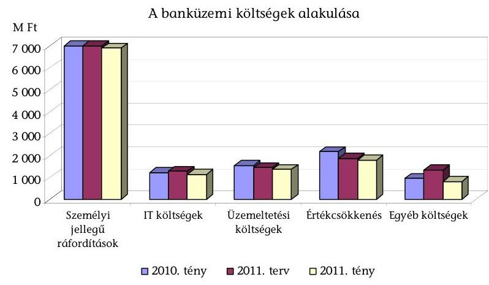

A költségcsökkenések mértékét számviteli szabályoktól eltérő elszámolások is befolyásolták. A banküzemi gazdálkodás során nem volt megfelelő a vezetői ellenőrzés, mivel a szabálytalan elszámolásokat nem szűrte ki. A számviteli szabályoktól eltérő elszámolások az MNB éves beszámolójának minősítését nem befolyásolják. A Bank esetében kormányrendelet ${ }^{5}$ alapján jelentős összegű hibának a mérlegfőösszeg 2%-át, 2011-ben 250 Mrd Ft-ot meghaladó hiba minősül. Ez az előírás nem biztosítja a közpénzekkel való fele-

[^0]
[^0]:    ${ }^{4}$ A törölt vizsgálatokat a BEL 2012-ben hajtotta végre az MNB 2013. január 4-én kelt tájékoztatása szerint.
    ${ }^{5}$ a Magyar Nemzeti Bank éves beszámoló készítési és könyvvezetési kötelezettségének sajátosságairól szóló 221/2000. (XII. 19.) Korm. rendelet

---

lős gazdálkodást és elszámoltatást, mert a mérlegfőösszegnek mindössze 0,1%-át teszik ki a banküzemi költségek és ráfordítások, ezért a gyakorlatban a banküzemnél nem jelent valós korlátot.

A kiegészítő mellékletben nem mutatták be a számviteli politikát érintő évközi módosítások banküzemi költségekre gyakorolt hatását, ezért az MNB banküzemi működése nem átlátható.

A Bank takarékossági törekvései ellenére nem költséghatékony gazdálkodást tapasztaltunk ${ }^{6}$ a multifunkciós eszközöknél, a munkaállomásoknál és laptopoknál, valamint a személyi használatú, km korlátozás nélküli, magánhasználatú gépjárművek terén.

Az MNB iratkezelési gyakorlata 2009-től 2012 decemberéig nem felelt meg az iratkezelésre vonatkozó jogszabályi előírásoknak ${ }^{7}$, mivel a Bank iratkezelési szoftvere nem rendelkezett az előírt tanúsítvánnyal. A Bank egyedi szállítói szerződés nélkül kezdte meg 2011-ben az auditált iratkezelő rendszer beruházást, ezért az elvárt minőségű, illetve tanúsított szoftver kikényszerítésére nem volt eszköze.

A beruházások teljesülése a 2011. évben alacsony, mindössze 54,1%-os volt. A nagy értékű, 30 M Ft feletti informatikai beruházások 28,4%-os tervteljesülése még ettől az értéktől is jelentősen elmaradt. Az alacsony arányú tervteljesülés egyrészt a beruházások tervezésének hiányosságaira vezethető vissza, másrészt előre nem látható tényezők okozták. A tervezési eljárások, egyeztetési folyamatok és kontrollok nem biztosították a felső vezetés által elvárt követelmények teljesülését. A nagy értékű informatikai projektek során a felhasznált belső erőforrások mérése nem volt megoldott. Így utólag nem állapítható meg a projekt csúszás oka (nem megfelelő erőforrás tervezés vagy kapacitás hiány). A Bank nem értékelte az erőforrás tervezés minőségét.

A javadalmazás (alapbér, bónusz, juttatások) szintje meghaladja az MNB által referenciának tekintett kereskedelmi banki átlagot. Az MNB-nél 2011-ben 4,3%-os bérfejlesztés volt, a választható béren kívüli juttatások (cafeteria) személyenkénti összege az infláció mértékével (3,5%) nőtt, amelynek összege kétszerese a kereskedelmi bankoknál jellemző nagyságnak. Az MNB-nél 2011-ben nem változott a bónusz, miközben a hazai kereskedelmi banki ágazatban 2010-ben a bónuszok mértéke átlagosan 18%-kal csökkent. A külső, referenciapiaci összehasonlításban is magas személyi juttatásokat személyi jellegű egyéb kifizetések (pl. belső előadók díjazása, a jellemzően nem támogatott, nem iskolarendszerű képzések finanszírozása, karrier tanácsadás költségei, távmunka biztosítása, csapatépítési programok) is növelték.

[^0]
[^0]:    ${ }^{6}$ Az MNB a felelősségvállalási stratégiai céljai között kiemelt fontosságú prioritásként rögzítette a közpénzekkel való gazdálkodás felelősségét.
    ${ }^{7}$ A köziratokról, a közlevéltárakról és a magánlevéltári anyag védelméről szóló 1995. évi LXVI. törvény 2009. január 1-ei határidővel tanúsított iratkezelési szoftver használatát írta elő a közfeladatot ellátó intézmények, így az MNB számára.

---

A középtávú intézményi célkitűzések megvalósulását humán stratégia támogatja, ugyanakkor bér- és jövedelem stratégiai célkitűzéseket 2012-ig nem határozott meg a Bank.

A 2008-ban indult HAJÓ projekttől az MNB által elvárt költségmegtakarításokat (1495,9 M Ft) nem érték el. Az MNB 2009. évi működése ellenőrzésekor tett ÁSZ javaslat nyomán csökkentett elvárt megtakarítással szemben 1379,1 M Ft volt a projekt eredményeként kimutatott költségcsökkenés. A HAJÓ projekt eredményeinek számszerűsítésékor - az ÁSZ javaslatával összhangban - az MNB megkülönböztette a projekt eredményeként elért teljesítményt az egyéb tényezők miatt bekövetkezett változások hatásaitól. Ugyanakkor - az informatika területén - egyes kezdeményezéseknél ${ }^{8}$ továbbra is helytelenül mutatott ki a HAJÓ kezdeményezéseként megtakarításokat, ugyanis azok nem, vagy nem kizárólag a HAJÓ projekthez köthetőek. A 2008-2011. közötti időszakban a feladatellátás műszaki, szervezeti és szerződéses feltételei olyan mértékben változtak meg, hogy a 2008. évben megfogalmazott költségcsökkentési kezdeményezések 2011. évi költségekre gyakorolt hatása torzításmentesen nem mutatható ki.

Az MNB kizárólagos tulajdonában lévő Pénzjegynyomda Zrt. (PJNY) és a Magyar Pénzverő Zrt. (MPV) működését meghatározó jogszabályi környezet nem egyértelmű, illetve hiányos. A stratégiai jelentőségű, állami monopol tevékenységet ellátó társaságok nem minősülnek nemzetgazdasági szempontból kiemelt jelentőségű nemzeti vagyonnak. Nem tisztázottak az MNB-nek a társaságokkal kapcsolatos vagyonkezelői feladatai, pl. hogy a társaságok végezhetnek-e a jegybanki tevékenységgel összefüggő feladataikon túl ún. piaci feladatokat.

Az MNB a tulajdonosi pozícióját és a leányvállalatok fejlesztését az euró magyarországi bevezetéséhez igazodva határozta meg. Ezzel összefüggésben az MPV-t az EKB előaudítja alkalmasnak találta az euró gyártására. A társaságot az MNB a Logisztikai Központba telepítette át és a Bank tervei szerint tartós tulajdonában marad.

Az euró céldátum eltörlésével az MNB nem vizsgálta felül a PJNY-re vonatkozó stratégiáját, amely szerint az euró bevezetésével megszűnik a bankjegygyártás. A PJNY hosszú távú működését és a hazai bankjegy kibocsátás biztonságos ellátását veszélyeztet(het)i, hogy a Bank a társaság tevékenységének eredményét minden évben osztalékként (2006-2011 között összesen 5,8 Mrd Ft-ot) elvonta.

A kiegyenlítési tartalékok elszámolásai az MNB-ben a belső szabályzatoknak megfelelően történtek. Az NGM, mint az államháztartásért felelős minisztérium azonban a kiegyenlítési tartalékok elszámolásával és térítésével kapcsolatban számszaki és egyéb ellenőrzést nem végzett ${ }^{9}$. A központi költségvetésnek 2007-ben és 2010-ben - az akkor hatályos jogszabályi előírások szerint - összesen 31,9 Mrd Ft térítési kötelezettsége volt a Bank részére a deviza-értékpapírok kiegyenlítési tartalékának negatív egyenlege miatt. Célszerű

[^0]
[^0]:    ${ }^{8}$ HP adattárolók, HP Unix szerverek és a CISCO eszközök költöztetése
    ${ }^{9}$ Az ÁSZ tv. alapján a kiegyenlítési tartalékok elszámolását az ÁSZ nem ellenőrizheti.

---

volt a kiegyenlítési tartalékok összevonását előíró, 2011-től hatályos jogszabályi változás ${ }^{10}$, mivel mérsékli annak kockázatát, hogy az MNB felé központi költségvetési fizetési kötelezettség keletkezzen (az összevont egyenleg 2007-2011. között minden évben pozitív volt).

A nemzetközi szervezetektől a Magyar Állam által lehívott hitelekkel kapcsolatban az MNB hatáskörét túllépve, felhatalmazás nélkül és a hitelintézeti törvény ${ }^{11}$ (Hpt.) 49. § (6) bekezdés előírásait megsértve üzleti titok körébe tartozó adatokat ${ }^{12}$ adott át az IMF-nek, veszélyeztetve ezzel az ország pénzügyi stabilitását. Az adatszolgáltatási kötelezettséget az IMF hitellel kapcsolatos feladatmegosztásra vonatkozó megállapodás ${ }^{13}$ nem tartalmazta. Az IMF alapokmánya szerint a tagok általános kötelezettsége az IMF felé történő információszolgáltatás. Ugyanakkor a tagok nem kötelesek információkat olyan részletesen megadni, ami felfedné harmadik személy - az alapokmány megfogalmazásában „magánszemélyek vagy vállalatok" - ügyleteit.

Az előző, a 2011. évi jelentésünkben ${ }^{14}$ megfogalmazott javaslatainkat az MNB az intézkedési tervének megfelelő ütemezésben megvalósította.

Az Állami Számvevőszékről szóló 2011. évi LXVI. törvény 33. § (1) bekezdésében foglaltak értelmében a jelentésben foglalt megállapításokhoz kapcsolódó intézkedési tervet köteles az ellenőrzött szervezet vezetője összeállítani és azt a jelentés kézhezvételétől számított harminc napon belül az ÁSZ részére megküldeni. Amennyiben az intézkedési tervet határidőben nem küldi meg a szervezet, vagy az továbbra sem elfogadható, az ÁSZ elnöke a hivatkozott törvény 33. § (3) bekezdés a)-b) pontjaiban foglaltakat érvényesítheti.

A helyszíni ellenőrzés megállapításainak hasznosítása mellett javasoljuk:

# A Nemzetgazdasági Miniszternek 

1. A kiegyenlítési tartalékok elszámolásával és térítésével kapcsolatban az NGM, mint az államháztartásért felelős minisztérium nem végez számszaki és egyéb ellenőrzést.
[^0]
[^0]:    ${ }^{10}$ Az unióban a jegybankok külföldi pénznemben fennálló követeléseiből és kötelezettségeiből származó árfolyamveszteségét nem téríti meg az állami költségvetés, azt a jegybankoknak kell kigazdálkodniuk. A KBER előírása szerint csak a nem realizált nyereség kerül tartalékként a forrásoldalon lévő, de a saját tőkén kívüli ún. „átértékelési számlákra", amely a későbbi időszakok esetleges árfolyamveszteségeinek, valamint a negatív piaci értékkülönbözetek fedezetére szolgál.
    ${ }^{11}$ A hitelintézetekről és a pénzügyi vállalkozásokról szóló 1996. évi CXII. törvény
    ${ }^{12}$ A hét legnagyobb bank finanszírozási helyzetéről, nettó devizapozíciójáról naponta, ugyanezen bankok swap ügyleteiről hetente jelentett adatokat az MNB.
    ${ }^{13}$ Az államháztartásért felelős miniszter és az MNB közötti 2008. november 7-ei megállapodás a hitelfelvétellel kapcsolatos eljárási rendről, a döntési jogkörökről és hitel ügylet lebonyolításáról.
    ${ }^{14} 1122$ számú jelentés a Magyar Nemzeti Bank 2010. évi működésének ellenőrzéséről

---

# Javaslat: 

Intézkedjen az MNB által kimutatott kiegyenlítési tartalékoknál a Magyar Állam és a Bank közötti elszámolások ellenőrzéséről.
2. Az MNB kizárólagos tulajdonában lévő társaságok működését meghatározó jogszabályi környezet nem egyértelmű, illetve hiányos. A stratégiai jelentőségű, állami monopol tevékenységet ellátó társaságok nem minősülnek nemzetgazdasági szempontból kiemelt jelentőségű nemzeti vagyonnak. Nem tisztázottak az MNB-nek a társaságaival kapcsolatos vagyonkezelői feladatai, pl. hogy a társaságok végezhet-nek-e a jegybanki tevékenységgel összefüggő feladataikon túl ún. piaci feladatokat.

## Javaslat:

Kezdeményezze a Pénzjegynyomda Zrt. és a Magyar Pénzverő Zrt. jogszabályi környezetének felülvizsgálatát az MNB pénzkibocsátási feladatai kockázatmentes ellátása érdekében.
3. A számviteli szabályoktól eltérő elszámolások az MNB éves beszámolójának minősítését nem befolyásolják. A Bank esetében kormányrendelet alapján jelentős összegű hibának a mérlegfőösszeg 2%-át, 2011-ben 250 Mrd Ft-ot meghaladó
 hiba minősül. Ez az előírás nem biztosítja a közpénzekkel való felelős gazdálkodást és elszámoltatást, mert a mérleg-főösszegnek mindössze 0,1%-át teszik ki a banküzemi költségek és ráfordítások, ezért a gyakorlatban a banküzemnél nem jelent valós korlátot.

## Javaslat:

Kezdeményezze a Magyar Nemzeti Bank éves beszámoló készítési és könyvvezetési kötelezettségének sajátosságairól szóló 221/2000. (XII. 19.) Korm. rendelet módosítását, hogy a számviteli törvény jelentős összegű hibára vonatkozó mértéke az MNB banküzemi költségeire és ráfordításaira a jegybanki tevékenységtől elkülönítve érvényesüljön a közpénzekkel való felelős gazdálkodás biztosítása érdekében.

## Az MNB Elnökének

1. Az MNB iratkezelési gyakorlata 2009-től 2012 decemberéig nem felelt meg az iratkezelésre vonatkozó jogszabályi előírásoknak, mivel a Bank iratkezelési szoftvere nem rendelkezett az előírt tanúsítvánnyal. A Bank egyedi szállítói szerződés nélkül kezdte meg 2011-ben az auditált iratkezelő rendszer beruházást, ezért az elvárt minőségű, illetve tanúsított szoftver kikényszerítésére nem volt eszköze.

## Javaslat:

Intézkedjen a vonatkozó jogszabálynak nem megfelelő iratkezelési rendszerrel kapcsolatban a felelősség megállapításáról.
2. A tervezési eljárások, az egyeztetési folyamatok és a kontrollok nem biztosították a beruházási tervek megalapozottságát. A beruházások teljesülése mindössze 54,1%-os volt. A beruházási projektek során felhasznált belső erőforrások mérése nem volt teljes körűen megoldott, ezért utólag nem állapítható meg, hogy a projekt csúszását

---

mi okozta. A költségcsökkenések mértékét a számviteli szabályoktól eltérő elszámolások is befolyásolták. A banküzemi gazdálkodás során nem volt megfelelő a vezetői ellenőrzés, mivel a szabálytalan elszámolásokat nem szűrte ki.

# Javaslat: 

Intézkedjen a pénzügyi tervezés és a gazdálkodási folyamatok során
a) megalapozott, megvalósítható beruházási tervek készítéséről;
b) az informatikai fejlesztésekhez kapcsolódó belső erőforrás felhasználás teljes körű méréséről;
c) a számviteli szabályok teljes körű betartásáról.
3. Az euró céldátum eltörlésével az MNB nem vizsgálta felül a PJNY-re vonatkozó stratégiáját, amely szerint az euró bevezetésével megszűnik a bankjegygyártás. A PJNY hosszú távú működését és a hazai bankjegy kibocsátás biztonságos ellátását veszélyeztet(het)i, hogy a Bank a társaság tevékenységének eredményét minden évben osztalékként (2006-2011 között összesen 5,8 Mrd Ft-ot) elvonta.

## Javaslat:

Vizsgálja felül a Pénzjegynyomda Zrt-vel kapcsolatos stratégiáját és osztalékpolitikáját a szükséges hazai bankjegy mennyiség biztonságos előállítása és a kockázatok csökkentése érdekében.
4. A nemzetközi szervezetektől a Magyar Állam által lehívott hitelekkel kapcsolatos MNB adatszolgáltatás során a Bank felhatalmazás nélkül, hatáskörét túllépve és a Hpt. 49. § (6) bekezdés előírásait megsértve üzleti titok körébe tartozó adatokat is átadott az IMF-nek.

## Javaslat:

Intézkedjen a felhatalmazás nélküli adatszolgáltatással kapcsolatos felelősség megállapításáról, a felelősség okainak feltárásáról és az eljárási hiba megszüntetéséről.

---

# II. RÉSZLETES MEGÁLLAPÍTÁSOK 

## 1. Az MNB IRÁNYÍTÁSI, DÖNTÉSHOZATALI ÉS ELLENŐRZÉSI RENDSZERE

Az MNB irányítási és döntéshozatali rendszerének 2011. évi és 2012. I. félévi működése megfelelt a hatályos jogszabályi előírásoknak, az Alapító okiratának, a vonatkozó belső szabályzatainak, valamint a részvényesi jogokat gyakorló nemzetgazdasági miniszter határozatainak. A 2012. január 1-jétől hatályos MNB tv-ben ${ }^{15}$ foglalt, az MNB működését és irányítását érintő változásokat az Alapító okiratban, az ügyrendekben és a belső szabályzatokban az előírt határidőre átvezették, illetve hatályba léptették.

A tulajdonosi hatáskört érintő változás, hogy a részvényes ${ }^{16}$ csak az Alapító okirat megállapításáról és módosításáról, a könyvvizsgáló megválasztásáról, visszahívásáról és díjazásának megállapításáról jogosult dönteni.

A 2011. évi számviteli beszámolóban foglalt mérleg és eredménykimutatás megállapítása és az osztalékfizetésről való döntés 2012-től az igazgatóság hatásköre. A részvényes tájékoztatása - a számviteli beszámolót, az üzleti jelentést, és a könyvvizsgálói jelentést is tartalmazó Éves jelentés megküldésével - az előírásnak megfelelően megtörtént.

Az NGM a Bank működésével és az alaptevékenység irányításával kapcsolatos kiemelten fontos kérdésekről rendszeresen kap írásbeli tájékoztatást. Ennek keretében az MNB pl. hetente tájékoztatta a nemzetgazdasági minisztert a végrehajtott devizaműveletekről, valamint az arany- és devizatartalékokról.

Az MNB tv. újra bevezette a testületi irányítási és döntéshozatali mechanizmust. A Monetáris Tanács (MT) döntéseinek végrehajtásáért és az MNB működésének irányításáért való felelősség 2012. március 28-tól az MNB elnökétől az újra létrehozott igazgatóság felelősségi körébe került. A döntési hatáskörök egy részét az igazgatóság ügyrendje elnöki és alelnöki hatáskörbe delegálta.

A működésirányítással és az MNB befektetéseivel kapcsolatos, az igazgatóság ügyrendjében meghatározott kérdésekben az elnök dönt. Az MNB mérlegét érintő, devizában végzett tevékenységek esetében a monetáris stratégiáért felelős alelnök ${ }^{17}$, a pénzügyi közvetítőrendszert és a pénzügyi infrastruktúrát érintő kérdésekben a pénzforgalomért felelős alelnök ${ }^{18}$ dönt.

[^0]
[^0]:    ${ }^{15}$ a Magyar Nemzeti Bankról szóló 2011. évi CCVIII. tv.
    ${ }^{16}$ A Magyar Államot, mint MNB részvénytulajdonost az államháztartásért felelős miniszter képviseli.
    ${ }^{17}$ A Monetáris stratégia és közgazdasági elemzést, a Pénzügyi elemzéseket, a Pénz- és devizapiacot, a Statisztikát és a Kutatást felügyelő alelnök.
    ${ }^{18}$ A Pénzforgalom és értékpapír-elszámolást, a Pénzügyi stabilitást, az Integrált kockázatkezelést és a Készpénzlogisztikát felügyelő alelnök.

---

A működésirányítás átalakításával összhangban 6-ról 3-ra csökkent a döntéshozatalt támogató, konzultatív testületek száma. A 2007-ben megszüntetett - az MNB befektetéseivel kapcsolatos stratégiai és üzletpolitikai kérdésekben való döntéshozatalt támogató - Tulajdonosi bizottság pedig ismét felállításra került.

Megszűnt az operatív vezetést támogató Vezetői bizottság (VB), a Monetáris Tanács (MT) döntéseit támogató Implementációs bizottság (IB), valamint a hitelintézetek válságával kapcsolatban létrejött Operatív válságkezelő bizottság. Változatlanul működött az alelnökök döntéseit támogató Eszköz-forrás bizottság (ALCO) és a Pénzügyi rendszert felügyelő bizottság. A Beruházási és költséggazdálkodási bizottság (BKB) döntés-előkészítő feladatait az Ügyvezető igazgatói értekezlet vette át.

A tulajdonosi ellenőrzés szerve, a Felügyelő Bizottság (FB) az OGY, az ÁSZ és az NGM felé teljesítendő tájékoztatási kötelezettségeinek eleget tett, munkatervét végrehajtotta. Az FB összetételében, munkarendjében 2011-2012-ben nem volt változás. Az FB a hatáskörébe tartozó feladatok ${ }^{19}$ tekintetében irányítja az MNB belső ellenőrzési szervezetét (BEL).

A belső ellenőrzés munkatársai az FB hatáskörébe nem tartozó, az MNB elnöke által elrendelt ellenőrzési feladatokon túl - az MNB KBER tagságából fakadó kötelezettségeként - a KBER IAC által előírt ellenőrzéseket is végeznek.

A BEL az IAC részére 2011. évben 4, 2012-ben 2 ellenőrzést végzett. Ezzel összefüggésben az EKB-nál az auditorok 2011-ben 12, 2012-ben 10 napnyi IAC továbbképzésen is részt vettek.

A BEL 2011 és a 2012. november 15. közötti időszakban összesen 38 jelentéssel záruló vizsgálatot végzett (1. sz. melléklet). A rendkívüli vizsgálatok, a közreműködési és a tanácsadói feladatok elvégzésére 2011-ben nem volt elegendő az előírt 10%-os tartalék. Ennek következtében a 2011. évi, az MNB elnöke és az FB által jóváhagyott munkatervben szereplő négy pénzügyi vizsgálatot törölték${ }^{20}$.

# 2. Az MNB BANKÜZEMI GAZDÁLKODÁSA 

A működési költségek (2. sz. melléklet) 2011. évi összege 11 882,2 M Ft volt, ami 7,0%-kal (900,8 M Ft-tal) volt alacsonyabb a 2010. évi kiadásoknál. A működési költségek 57,9%-át kitevő személyi jellegű ráfordítások a 2010. év tényadatához viszonyítva 1,8%-kal (123,3 M Ft-tal), a banküzemi általános költségek 13,2%-kal (780,7 M Ft-tal) mérséklődtek.

[^0]
[^0]:    ${ }^{19}$ Hatásköre nem terjed ki az MNB alapvető feladataira, így a monetáris politika meghatározására és megvalósítására, illetve azoknak az MNB eredményre gyakorolt hatására.
    ${ }^{20}$ A törölt vizsgálatokat a BEL 2012-ben végrehajtotta.

---

# 2.1. A pénzügyi terv megalapozottsága 

A 2011. évi pénzügyi terv elkészítése a vonatkozó szabályokkal és az elfogadott pénzügyi irányelvekkel összhangban történt. A tervezés módszere és ütemezése a korábbi évek gyakorlatának megfelelő volt (fő irányelvek BKB jóváhagyása, ezt követően a VB általi jóváhagyás, a tervek kidolgozása a költséggazdák által részletes számszaki és szöveges indoklással, majd azok BKB és VB jóváhagyása).

A beruházásokat megalapozó üzleti esettanulmányok formailag és a főbb tartalmi elemeiket tekintve megfeleltek a belső szabályzatokban meghatározott követelményeknek. Tartalmazták azok üzleti indokoltságát, a megvalósítás ütemezését és erőforrásigényét.

A tervezett informatikai beruházások 79,5%-a célkitűzésük alapján (eredményesség és hatékonyság fejlesztése, valamint a szakterületek informatikai támogatottságának fejlesztése) nem illeszkedett a pénzügyi tervezésre vonatkozó szabályozásban előírt funkcionális és „bankszakmai” stratégiához.

A beruházások szakmai stratégiákkal való jobb alátámasztottsága érdekében a 2012. évi pénzügyi tervezés tervegyeztető megbeszélésein már sor került a felhasználói igények funkcionális stratégiákból történő levezetésére.

A Bank a tervezési irányelvekben meghatározott felső költségkorlátokat az éves tervek jóváhagyásakor túllépte ${ }^{21}$, ugyanakkor a tényleges adatok a terven belül alakultak.

A tervtől való elmaradás oka a személyi költségeknél elsősorban a tervezettnél alacsonyabb záró, illetve átlag létszám volt. A reprezentációs, az üzemeltetési és az IT működési költségeknél a kedvezőbb árak érvényesítése mellett jellemző volt a költségek felültervezése.

A működési költségek tervtől való elmaradásához hozzájárult az évközi feladatelmaradás, egyes tervezett rendezvények meghiúsulása, felhasználói igények csökkenése, valamint nem szerződésszerű teljesítés és beszerzési eljárás késedelme.

### 2.2. A banküzemi általános költségek alakulása, az elszámolások megfelelősége

A 2011. évben a banküzemi általános költségek (üzemeltetési-, IT-, egyéb költségek és értékcsökkenés) mind az előző év (780,8 M Ft-tal), mind a tervezett költségekhez képest (812,6 M Ft-tal) csökkentek összességében és költségnemenként is.

[^0]
[^0]:    ${ }^{21}$ A Bank belső szabályai az előzetes irányszámoktól való eltérést lehetővé tették.

---

| A banküzemi általános költségek alakulása |  |  | M Ft |
| :-- | :--: | :--: | :--: |
|  | 2010. évi tény | 2011. évi terv | 2011. évi tény |
| IT költségek | 1219,0 | 1285,6 | 1148,6 |
| Üzemeltetési költségek | 1550,4 | 1444,5 | 1360,8 |
| Értékcsökkenés | 2180,4 | 1869,3 | 1799,3 |
| Egyéb költségek | 956,5 | 1338,7 | 816,8 |

Árversenyt és árelőnyt biztosított a Banknak az e-aukciós eszköz alkalmazása. Az IT költségek jellemzően a beszerzési eljárások során elért kedvező árak, a külső tanácsadói díjak csökkenése miatt, az egyéb költségek a holokauszt per feladatainak átadása és a kommunikációs költségek csökkenése miatt lettek alacsonyabbak.

Az üzemeltetési költségek kedvező alakulásához nagyobb részt - a Hold utcai épület használatának megszüntetéséből adódó - ingatlan üzemeltetéshez kapcsolódó költségek, másrészt a készpénz-logisztikai gépek üzemeltetési költségeinek mérséklődése járult hozzá. Terven felüli volt ugyanakkor a tanácsadói költségek (161,3%-os), valamint a belföldi kiküldetések (241,3%-os) alakulása.

Egyes tárgyi eszközök esetén az ellátottság mutatói, illetve a kapcsolódó költségek alakulása nem támasztja alá a költséghatékony gazdálkodást. Ilyenek a nyomtatók és multifunkciós eszközök (kb. 2 fő/db), a munkaállomások és laptopok (kb. 2 db/fő), továbbá a vezetők és családtagjaik által használt személygépjárművek.

2011-ben 67 db multifunkciós eszköz, 1 db másoló és 225 db nyomtató volt használatban. Az eszközök száma a korábbi évekhez képest csökkent, 2006-ban egy gépet 1,3 fő, 2011-ben 2 fő használt ${ }^{22}$. A felhasználói munkaállomások száma 2011. január 1-jén 1204 volt, ami a 2011. évi munkaállomás beszerzéseket követően 1288 db-ra (mintegy 2 db/fő)
 nőtt ${ }^{23}$.

Nem szolgálja a költséghatékonysági szempontokat az sem, hogy a személyi használatú gépjárműveket a családtagok is km korlátozás nélkül, magáncélra használhatják. A Bank a gépjárművekhez üzemanyag kártyát biztosított, továbbá fizette a felmerülő összes költséget (javítás, biztosítás, adó).

A Bank elnökének döntése alapján az elnök, az alelnökök, az ügyvezető igazgató mellett a szervezeti egység vezetők és 2012-től az MT tagjai jogosultak gépjárművek személyes használatára. A személyi használatú 23 gépjármű 2011-ben átlagosan $21,7 \mathrm{E} \mathrm{km-t}$, összesen $498,8 \mathrm{E} \mathrm{km-t}$ futott. Az egyéni futásteljesítmények $11,4-41,3 \mathrm{E} \mathrm{km}$ közöttiek voltak.

[^0]
[^0]:    ${ }^{22}$ További eszközoptimalizálás eredményeként 2012-ben egy eszközt 3,4-en használtak.
    ${ }^{23}$ A Bank tájékoztatása szerint nem minden munkatárs használ 2 számítógépet. Azok egy része internetes használatot, oktatást, üzletfolytonossági és tesztelési környezetet, valamint ügyfélkapcsolati munkaállomást biztosít. Ezenkívül 2011-ben az MNB 100 laptopot otthoni munkavégzésre biztosított. A selejtezésre kijelölt számítógépeket figyelembe véve az egy főre jutó munkaállomások darabszáma kb. 1,8 db/fő.

---

A beszerzések, szolgáltatások elszámolása az ellenőrzött tételek 14\%-ánál nem a belső szabályzatok előírásai szerint történt. A számviteli szabályoktól eltérő elszámolások (pl. egyes vagyontárgyak nem megfelelő besorolása következtében kisebb elszámolt értékcsökkenés) a költségcsökkenésekhez is hozzájárultak. A számlák egy kivétellel (áthárított repülőjegy) megfeleltek a szerződéseknek.

A beszerzések és az elszámolások szabályszerűségét, a megkötött szerződések megfelelőségét, a teljesítésigazolások meglétét, megfelelőségét a SAP rendszerből leválogatott minta alapján értékeltük.

Egyes beszerzések eszközként vagy költségként való besorolása nem felelt meg a belső szabályzat előírásainak. Egy éves használatú munkaruhákat (póló, köpeny, zokni) és készleteket (hangszóró, asztali számológép, létra, kávéfőző) is tárgyi eszköznek minősítettek. Ezek nem megfelelő elszámolása miatt 989 E Ft-tal kisebb költséget mutattak ki. Nem alkalmazták teljes körűen a Gazdálkodási Kézikönyvben előírt folyamatot a 2011. december 30-án aktivált eszközöknél. 45 db eszköz esetében nem számoltak el 9 E Ft értékcsökkenést.

Az említett eszközök esetében az aktiválási bizonylatot 2012 januárjában - értékcsökkenés elszámolása után - 2011-re visszadátumozva indították el, ezért az előző év utolsó két napjára értékcsökkenést nem számoltak el. ${ }^{24}$

A 2011. szeptember 1. után beszerzett hordozható számítógépek, munkaállomások értékcsökkenése a korábban alkalmazott 4 évről 6 évre módosult, amely miatt az újonnan beszerzett eszközökre vonatkozóan módosították a számviteli politikát. A régi eszközöknél az értékcsökkenést a korábbiak szerint számolták el. A kiegészítő mellékletben a számviteli politika évközi módosításának hatását az Sztv. 88. § (4) bekezdése szerint nem mutatták be, ezért az MNB banküzemi működése nem átlátható.

A PJNY vezérigazgatójának kiválasztása során annak utaztatási (repülőjegy) költségét a Bank erre vonatkozó szerződés nélkül térítette meg.

A vállalkozó a pozícióra megfelelő személy keresését, a kiválasztást követő kapcsolattartást, valamint a Bank és a jelöltek közötti kapcsolatfelvétel koordinálását garanciális kötelezettségként végezte. Az egyik jelölt 203,6 E Ft+áfa utazási költségét az MNB úgy fizette ki, hogy a szerződés szerinti - a kapcsolódó költségek részletezése, valamint egyéb elszámolható költségek meghatározása nélküli, egyösszegű - keresési díjat már korábban megfizette. A repülőjegy költsége a szerződés alapján a vezérigazgató kiválasztását, keresését végző vállalkozás érdekében merült fel, így ez a kifizetés nem tekinthető az MNB működési költségének.

Az ellenőrzés során tapasztalt számviteli szabálytalanságok alátámasztják, hogy a banküzemi gazdálkodás során nem volt megfelelő a munkafolyamatba épített és a vezetői ellenőrzés ${ }^{25}$, mivel a szabálytalan elszámolásokat

[^0]
[^0]:    ${ }^{24}$ A Bank tájékoztatása szerint „...a vezetés tudatosan döntött amellett, hogy a zárlati ütemtervnek való megfelelés az elsődleges és a számszerűsített el nem számolt értékcsökkenést (9 E Ft) nem jelentősnek minősítette."
    ${ }^{25}$ A Bank az informatikai rendszerei által támogatott ellenőrzéseket részesíti előnyben. Azoknál a Számviteli terület érdemi ellenőrzést nem hajt végre.

---

nem szűrte ki. A decentralizált banküzemi gazdálkodáshoz kapcsolódó kontrollok nem teljes körűek, azok a tranzakciók monitorozására nem terjednek ki. Pl. az eszköz-aktiválási bizonylat adattartalmának egyezőségi ellenőrzése automatikus funkció, a szakmai tartalom felülvizsgálatára azonban nincs kialakított kontroll.

A számviteli szabályoktól eltérő elszámolások az MNB éves beszámolójának minősítését nem befolyásolják. A Bank esetében kormányrendelet alapján ${ }^{26}$ jelentősebb összegű hibának a mérlegfőösszeg 2\%-át, 2011-ben 250 Mrd Ft-ot meghaladó hiba minősül. Ez az előírás nem biztosítja a közpénzekkel való felelős gazdálkodást és elszámoltatást, mert a mérlegfőösszegnek mindössze $0,1 \%$-át teszik ki a banküzemi költségek és ráfordítások, ezért a gyakorlatban a banküzemnél nem jelent valós korlátot.

# 2.3. A beruházások alakulása 

A 2011. évi beruházásokra jóváhagyott 1434,0 M Ft összeggel szemben teljesítésként 775,1 M Ft került elszámolásra, ami a tervezett összeg 54,1\%-át teszi ki. A tervtől való elmaradás legnagyobb részét az áthúzódó tételek (493 M Ft) jelentették, a nem megvalósult beruházások összértéke 70 M Ft volt. Az MNB 223,2 M Ft „megtakarítást" mutatott ki részben a beruházások nem kellően megalapozott tervezésének és részben a beszerzési eljárások során a tervezettnél elért kedvezőbb áraknak, illetve a felhasználói igények megváltozásának köszönhetően.

Egyes, a tervezéskor nem kellően megalapozott vagy egyeztetett kiadásokról év közben derült ki, hogy nem érdemes megvalósítani (Logisztikai Központ értéktári daruk szünetmentes áramforrása).

A „Bankjegy minőségi riportok készítése" beruházási soron a Bank 52,5 M Ft megtakarítást mutatott ki azzal, hogy az eredetileg tervezett műszaki megoldás helyett a riportokat az adattárház rendszerben valósította meg a tervezett 58 M Ft helyett 5,5 M Ft-ból. Tervezéskor nem vizsgálta az adattárházban történő megvalósítás lehetőségét. A „Hőszivattyú kiépítése az MNB Logisztikai Központjában" beruházás esetében a tervezett összeg túlzott volt, a megvalósításra annak fele is elegendőnek bizonyult (ezen belül pl. az eljárási díjak és a tervdokumentáció költsége a tervezett 1,5 M Ft helyett 70 e Ft volt).

A 2011. évi informatikai beruházásoknál a pénzügyi terv fő irányelveiben megfogalmazott elvárások nem teljesültek. A tervteljesítés mértéke 2011-ben jelentősen romlott. Az Informatikai Szolgáltatások szervezeti egység 2011. évi beruházási kiadása 444,6 M Ft volt, ami a terv 54,6\%-os teljesülését jelenti.

Az informatikai beruházásoknál a tervtől való eltérés közel $85 \%$-át (312,8 M Ft-ot) az áthúzódó tételek ${ }^{27}$ adták. Az alacsony arányú tervtelje-

[^0]
[^0]:    ${ }^{26}$ A Magyar Nemzeti Bank éves beszámoló készítési és könyvvezetési kötelezettségének sajátosságairól 221/2000. (XII. 19.) Korm. rendelet 3. § (5) bekezdése
    ${ }^{27}$ Áthúzódó beruházási kiadásokat jelentenek, amelyek megvalósítása csúszik át a következő időszakra (tehát továbbra is indokoltak).

---

sülés egyrészt a beruházások tervezésének (pl. feltételek és kockázatok számbavétele, ütemezés) hiányosságaira, másrészt előre nem tervezhető okokra vezethető vissza. Az elmaradó beruházások ( $67,7 \mathrm{MFt}$ ) 18 db 10 M Ft alatti beruházási tételből álltak össze, az elmaradás okai legfőképpen a felhasználói igények évközi megváltozásai voltak.

A nagy értékű komplex beruházásokkal kapcsolatos tervezési eljárások, egyeztetési folyamatok és kontrollok nem biztosították a beruházási tervek felső vezetés által elvárt követelmények teljesülését. A 30 M Ft feletti informatikai beruházások 28,4\%-ban teljesültek, egyedül a felhasználó oldali munkaállomások beszerzése fejeződött be határidőre. A 30 M Ft alatti beruházások esetén a terv $72,2 \%$-a teljesült.

A felhasználó oldali munkaállomások beszerzése esetében a tervtől való eltérést a szállítók eredményes versenyeztetéséből adódó megtakarítás eredményezte. A többi nagy értékű beruházás esetében a tervtől való eltérést részben vagy egészben az okozta, hogy a beruházási tervben szereplő feladatok nem valósultak meg a tervezéskor meghatározott ütemterv szerint. A beruházások tervhez képesti csúszásának többször előforduló okai voltak a belső erőforrás hiánya, a beszerzési eljárások elhúzódása, a magasabb prioritású új igények év közbeni felmerülése.

A 30 M Ft feletti beruházásoknál a tervtől való eltérések okait az alábbi táblázat tartalmazza:

| Megnevezés | Terv   (E Ft) | Tény   (E Ft) | Terv/   tény (\%) | Eltérés főbb okai ${ }^{28}$ |
| :-- | :--: | :--: | :--: | :-- |
| ISTAT rendszerek   továbbfejlesztése 2011 | 64850 | 35693 | 55,0 | Belső- és külső erőforrás   korlátok, újabb igények   az elemzői területekről. |
| Számonkérhetőség   növelése | 69634 | 1688 | 2,4 | Az előzetes külső szakértői   felmérési, tervezési sza-   kasz közbeiktatás miatt a   megvalósítás 2012. évre   áthúzódott. |
| Felhasználói oldali   munkaállomások   beszerzése | 40000 | 28611 | 71,5 | Árlejtéseken elért megta-   karítás alapján kisebb   bekerülési érték. |
| DWDM eszközök   cseréje | 32000 | 0 | 0 | Beszerzési eljárás megis-   métlése |
| Adattárház stratégia   megvalósítása | 56875 | 8514 | 15,0 | Beszerzési eljárás megis-   métlése, újabb igények,   erőforrás hiányok. |
| Auditált iratkezelési   rendszer meg-   valósítása | 62000 | 17870 | 28,8 | Szállítói elállása miatt a   további teljesítési mérföld-   kövek áthúzódtak. |

[^0]
[^0]:    ${ }^{28}$ Az MNB adatszolgáltatása alapján.

---

Az ellenőrzött négy beruházás ${ }^{29}$ ellenőrzése alapján a kockázatok felmérése, a belső erőforrásigény tervezése nem volt megfelelő, vagy a szükséges belső erőforrásokat nem bocsátották rendelkezésre. A belső erőforrások menedzsmentjének alapvető hiányossága volt, hogy a projektek során felhasznált belső erőforrások mérése teljes körűen nem volt megoldott, ezért nem állapítható meg, hogy a projekt csúszását a nem megfelelő erőforrás tervezés okozta vagy az, hogy egy szakterület nem biztosította az elfogadott esettanulmányban meghatározott kapacitásokat. Mérés hiányában nem volt lehetőség az erőforrás tervezés minőségének értékelésére és javítására sem.

Az ellenőrzött 4 beruházás közül kockázatelemzést egy beruházás, az auditált iratkezelési rendszer megvalósításának esettanulmánya tartalmazott, annak ellenére, hogy a komplex esettanulmányokra vonatkozó módszertan előírta a megvalósítás kockázatainak bemutatását. Az adattárház stratégia megvalósítása üzleti esettanulmányában nem szerepelt kockázatelemzés. A munkaállomások beszerzésére kidolgozott esettanulmány tartalmaz egy kockázatelemzés pontot, azonban az nem a beruházás kockázatait mutatja be, hanem azt, hogy a beruházás megvalósítása hogyan csökkenti a működés kockázatait (ez valójában a beruházástól elvárt eredmény). Az ISTAT rendszer továbbfejlesztéséről kidolgozott esettanulmány sem mutatja be a javasolt fejlesztések végrehajtásával összefüggő kockázatokat.

Két beruházásnál a projekt csúszását részben az okozta, hogy belső kapacitáskorlátok következtében a követelmények kidolgozása, a projekt termékek véleményezése vagy a fejlesztések tesztelése késedelmes volt.

A beruházási tervtől való eltéréshez két beruházás esetében is hozzájárult az új felhasználói igények megjelenése miatti prioritás változás. Azt ugyanakkor nem egy előre nem látott külső esemény vagy körülmény okozta, ezért a fejlesztési célok évközi változása az igényfelmérés teljes körűségét és az egyes fejlesztési feladatok indokoltságát is megkérdőjelezik.

A fejlesztéseket a Bank külső vállalkozók bevonásával hajtotta végre. A beszerzési eljárások lebonyolítása a Kbt. előírásainak megfelelően történt.

A beruházások megvalósításának szabályszerűségét a 2011. évi beruházási terv (1434,0 M Ft) 35,5\%-át jelentő 4 informatikai és 4
 nem informatikai beruházás részletes ellenőrzése alapján értékeltük. A Bank a vállalkozók versenyeztetésével a kiinduló árakhoz képest az adattárház beruházásnál közel 50%-kal alacsonyabb árat, a munkaállomások beszerzésekor az induló ajánlati árakhoz képest mintegy $10,3 \mathrm{M} \mathrm{Ft}+$ áfa megtakarítást ért el.

Az MNB iratkezelési gyakorlata 2009-től 2012 decemberéig nem felelt meg az iratkezelésre vonatkozó jogszabályi előírásoknak ${ }^{30}$, mivel a Bank iratkezelési szoftvere nem rendelkezett az előírt tanúsítvánnyal. Az iratkezelést

[^0]
[^0]:    ${ }^{29}$ Az ellenőrzés négy 30 M Ft feletti beruházást vizsgált részletesen: ISTAT rendszerek továbbfejlesztése 2011, Felhasználói oldali munkaállomások beszerzése, Adattárház stratégia megvalósítása, Auditált iratkezelési rendszer megvalósítása.
    ${ }^{30}$ A köziratokról, a közlevéltárakról és a magánlevéltári anyag védelméről szóló 1995. évi LXVI. törvény 2009. január 1-jei határidővel tanúsított iratkezelési szoftver használatát írta elő a közfeladatot ellátó intézmények, így az MNB számára.

---

támogató informatikai rendszer terméktámogatásának hiánya és a rendszer módosítása, fejlesztése esetén bekövetkező fejlesztői felelősségek rendezetlensége kockázatot jelent ${ }^{31}$ az iratkezelés jogszabályoknak megfelelő informatikai támogatottsága szempontjából.

Az „Auditált iratkezelő rendszer" beruházást 2011-ben megkezdte a Bank, azonban a megbízott vállalkozó az iratkezelési folyamatok felmérését aláírt egyedi szállítói szerződés nélkül kezdte meg ${ }^{32}$. A Bank által elvárt minőségű, illetve tanúsított szoftver kikényszerítésére az MNB-nek szerződés hiányában nem volt eszköze. A projekt a célkitűzéseit a helyszíni ellenőrzés befejezéséig nem érte el.

Az ISTAT fejlesztések 3 hónapos csúszásának elsődleges oka a belső erőforrások szűkössége volt. A 2011. évre tervezett adattárház fejlesztések a tervezés hiányosságai, a projekt feladatok végrehajtásának belső erőforráskorlátok miatti elhúzódása, valamint az egyik adatforrás rendszer fejlesztővel való együttműködés problémái miatt alacsony szinten teljesültek.

Az ISTAT és adattárház fejlesztések esetében a fejlesztés előrehaladását, a projekt során meghozott döntéseket a projektvezetés dokumentálta, az előírt specifikációk és tervdokumentumok elkészültek. A 2011. évi adattárház fejlesztésekre elfogadott beruházási előirányzat 16%-a teljesült. A projekt a 2010-ben elfogadott hét fejlesztési feladatból hármat, a 2011-ben elfogadott hat új fejlesztési feladatból pedig egyet valósított meg.

A részletesen ellenőrzött nem informatikai beruházásoknál a Bank elérte a kitűzött célokat, azok szerződés szerinti határidőre megvalósultak a tervezettnél alacsonyabb kiadások mellett.

A beruházások esetében a teljesítésigazolások kiállítása és a teljesítések elszámolása szabályszerűen történt, a beruházásokat szabályszerűen, a számla szerinti összegben aktiválták. A beruházások elszámolásával kapcsolatban az ellenőrzés két tétel esetében tárt fel szabálytalanságot, ami azonban az elszámolásokat érdemben nem torzította.

A beruházási beszámolóban 2.3.1-6. „gépkocsi átvizsgálóba elszívó rendszer kiépítése" megnevezésű beruházás 2011. évben elszámolt kiadásaként a valós 964,5 E Ft helyett 1023,9 E Ft-tal magasabb összeget mutattak ki, az 1.6.2.4-1. „az MNB Logisztikai Központjában hőszivattyú kiépítése" megnevezésű tételen pedig a valós 3292,6 E Ft helyett kevesebbet: 2268,7 E Ft-ot.

[^0]
[^0]:    ${ }^{31}$ A Bank 2012. évben hajtotta végre azokat a fejlesztéseket, amelyek révén a rendszer alkalmassá vált a tanúsításra. Az ellenőrzés részére a helyszíni ellenőrzést követően bemutatott tanúsítványt a tanúsítást végző szervezet 2012. december 18-án állította ki, a tanúsított szoftververziót 2012. december 1-jei dátummal adták ki.
    ${ }^{32}$ A Bank a szolgáltatást megrendelte, azonban az egyedi szállítói szerződés megkötésére - a keret megállapodás előírása ellenére - csak hónapokkal a teljesítés megkezdését követően került sor.

---

# 2.4. A létszám és a személyi ráfordítások alakulása 

Az MNB 2011. évi személyi költségek terve 7023,5 M Ft volt, a tényleges költségfelhasználás 6883,7 M Ft-ot tett ki. A személyi költségek 2011. évi tervének 98%-os teljesülését ${ }^{33}$ alapvetően az alacsonyabb létszám miatti költségmegtakarítás okozta, a béreknél és járuléknál együttesen 109,2 M Ft volt a terv alatti költségfelhasználás. Az átlaglétszám 16 fővel, a záró létszám 14 fővel volt alacsonyabb a tervezettnél, 2011 végén a Bank létszáma 582 fő volt.

A monetáris szakmai tevékenység ellátásához szükséges kapacitás 2011-ben is bővült. A Költségvetési Tanácsban (KT) az MNB-re háruló feladatok ${ }^{34}$ növekedése miatt a jegybanki szakmai területen 7 főt alkalmaztak. A 2011. év végére a jegybanki szakmai terület ${ }^{35}$ aránya meghaladta a 30%-ot (177 fő), a funkcionális területek ${ }^{36}$ súlya megközelítette a 26%-ot (149 fő), a többi szakterület létszámaránya 11-11% körül alakult (Bank ${ }^{37}$, KPL: 62-62 fő, Bankbiztonság: 65 fő, IT: 67 fő).

2011-ben a vezetői jövedelem felső határára vonatkozó jogszabályi előírást az MNB betartotta. A vezetői átlagbérek az előző évhez viszonyítva 8%-kal, az átlagjövedelmek 20,2%-kal csökkentek, amit az elnök, alelnökök és a Monetáris Tanács tagjainak alapbércsökkenése okozott. A beosztott munkavállalók átlagbére 3,6%-kal, átlagjövedelme 4,0%-kal növekedett. Az MNB 2011-ben 3,0% általános és 1,3%-os előléptetéshez kapcsolódó bérfejlesztést hajtott végre.

A munkakörtől függő bónusz mértékei 2011-ben nem változtak. Azok a besorolási szinttől függően maximum 11-88% között alakultak. A teljesítménytől függően a bónuszt megalapozó teljesítményértékelési kategóriák száma - a 2011. évi felülvizsgálatot követően - csökkent (7 helyett 5 kategória).

Munkakörhöz rendelt, alapbérre vetített bónusz maximuma a beosztottaknál 11-40%, az osztályvezetőknél 32-42%, a szervezeti egység vezetőknél 53-64% és az ügyvezető igazgató esetében 88% között alakultak.

A választható béren kívüli juttatások (cafeteria) keret összege a várható inflációs mértékkel (+3,5%) emelkedett, ami személyenként bruttó 641700 Ft volt. A béren kívüli juttatások a munkavállalók részére egyes alapjuttatások és szolgáltatások nyújtását jelentik.

[^0]
[^0]:    ${ }^{33}$ A részletes terv és tény értékeket a 2 sz. melléklet részletezi.
    ${ }^{34}$ A KT munkáját támogató szakmai műhelyfeladatokhoz kapcsolódóan az MNB „Elemzés az államháztartásról" címmel rendszeres kiadványt is megjelentet.
    ${ }^{35}$ A Monetáris stratégia és közgazdasági elemzés, Kutatás, Pénzügyi elemzések, Statisztika, Pénzügyi stabilitás, Pénzforgalom és értékpapír elszámolás szervezeti egységek.
    ${ }^{36}$ A Jog, Nemzetközi kapcsolatok, Kommunikáció, Belső ellenőrzés, Emberi erőforrások, szervezés és tervezés, Számvitel, a Működési szolgáltatások és a Központi beszerzés szervezeti egységek, valamint az adminisztráció.
    ${ }^{37}$ A Bankműveletek, az Integrált kockázatkezelés és a Pénz- és devizapiac szervezeti egységek.

---

Az emberi erőforrásokkal való gazdálkodást az MNB stratégiai kérdésként kezeli, a középtávú intézményi célkitűzések megvalósulását humán stratégia támogatta. A 2008-2011. évekre szóló HR stratégia és annak végrehajtása nem tartalmazta a stratégia tervezett és tényleges megvalósításának költségét, azt az FB részére utólag mutatták ki. A középtávú HR stratégia alapján megtett intézkedések nem szolgálják a költségtakarékos gazdálkodás követelményének érvényesülését ${ }^{38}$. A külső, piaci összehasonlításban is magas személyi juttatásokat személyi jellegű egyéb kifizetések (pl. belső előadók díjazása, a jellemzően nem támogatott, nem iskolarendszerű képzések finanszírozása, karrier tanácsadás költségei, távmunka biztosítása, csapatépítési programok) is növelték.

A megváltozott gazdasági környezet és kereskedelmi banki bérszint, valamint az FB javaslata alapján 2011-ben az MNB külső tanácsadó igénybe vételével felülvizsgálta az MNB javadalmazási gyakorlatát.

A felmérés az európai jegybankok bérpiaci jellemzőire vonatkozott, vizsgálták a javadalmazási rendszerben a belső bérarányokat, valamint elemzés készült a hazai munkaerő-piaci és kereskedelmi banki javadalmazási gyakorlatok tendenciáiról. Az európai jegybanki felmérés azt mutatta, hogy a bérpiaci információkat figyelembe vevő jegybankok 72%-os arányban a banki/pénzügyi szektort tekintik célpiacnak.

A hazai bérpiaci elemzések alapján a szakértő javasolta a bónusz mértékek csökkentését, az alacsonyabb besorolási szinteken a bérsávok szélesítését, az új belépő munkavállalóknál alacsonyabb alapbér megállapítását, valamint a bérpiaci pozíció összjövedelemhez való viszonyítását.

A 2011. évi felmérés azt mutatja, hogy az MNB-nél a banki ágazathoz viszonyítva az alapbér szint, illetve a teljes javadalmazás (alapbér, bónusz, juttatások) meghaladja a referenciapiaci átlagot. Az MNB által készíttetett felmérés szerint az MNB javadalmazási struktúrájában magasabb az alapbér aránya, a béren kívüli (jóléti és cafeteria) juttatások aránya pedig alacsonyabb. Ugyanakkor a cafeteria keret kétszerese a kereskedelmi bankoknál jellemző nagyságnak. A hazai kereskedelmi banki ágazatban 18%-kal, az európai központi bankoknál mintegy 5%-kal csökkent a bónusz mértéke 2010-ben az előző évhez képest.

A bérstratégia a 2012-2014. évekre készült el, ami túlmutat az intézményi stratégia 2013-ig terjedő időszakán. A kialakított stratégia alapján az MNB utólagosan követi a piaci folyamatokat a béreknél és jövedelmeknél. A stratégia szerint az általános bérfejlesztés mértékét a referenciapiac (kereskedelmi bankok) általános bérfejlesztési mértékénél 1%-kal alacsonyabb szinten határozzák meg, a vezetői bónuszokat is alacsonyabb szinten rögzítik és a VBK keretösszege nem emelkedik.

[^0]
[^0]:    ${ }^{38}$ A Bank tájékoztatása szerint az intézményi stratégiája nem költségtakarékossági célokat tűzött ki, hanem önálló célkitűzésként jelent meg az eredményesség és a hatékonyság.

---

# 2.5. A takarékossági célkitűzések (HAJÓ projekt) teljesülése 

A 2008-ban indult HAJÓ projekttől elvárt költségmegtakarításokat (1495,9 M Ft) nem érték el. A 2009. évi működés ellenőrzésekor tett ÁSZ javaslat nyomán csökkentett elvárt megtakarítással szemben 1379,1 M Ft volt a projekt eredményeként kimutatott költségcsökkenés.

Az MNB 2008-ban úgy indította el a HAJÓ projektet, hogy az azt megelőző működésfejlesztési projektet nem zárta le, annak eredményeit nem értékelte, és nem mérte fel a további költségcsökkentési lehetőségeket.

Az ÁSZ javaslatának realizálása során a projekttől elvárt megtakarítást a működési költségekhez kapcsolódóan 1484 M Ft-ra, a beruházásoknál 12 M Ft-ra csökkentették.

A HAJÓ projekt keretében kidolgozott hatékonyságjavító intézkedések túlnyomó részben 3 fő területet, az informatikai, a működtetési, valamint a személyi jellegű kiadásokat érintették.

A projekt eredményének egyik fő jelzőszámát, a létszám alakulását tekintve a projekt minimális célkitűzése, az 57,75 fős létszámcsökkenés teljesült. Nem teljesültek ugyanakkor a HAJÓ projekt személyi ráfordításokat érintő céljai (szisztematikus csere, kompenzációs rendszer átalakítása). A személyi juttatások módosított terve 928,9 M Ft-ra csökkent. Az MNB a HAJÓ hatásaként összesen 759,6 M Ft megtakarítást mutatott ki a személyi ráfordításoknál.

A projekt hatásaként kimutatott eredményeket számos tényező torzította. A munkaviszony megszüntetések költségét az adott évi megtakarítást csökkentő tételként vették figyelembe, nem pedig többletköltségként. Nem számszerűsítették továbbá a 2009-2011. évekre jutó, a projekt tevékenységét érintő közvetett költségeket (pl. infrastruktúra).

A HAJÓ projekt lezárásakor, azok eredményeinek számszerűsítésénél - az ÁSZ javaslatával összhangban - az MNB megkülönböztette a projekt eredményeként elért teljesítményt az egyéb tényezők miatt bekövetkezett változások hatásaitól. A működési költségek 2008-2011 közötti 3028,7 M Ft-os csökkenésének 44,2%-át (1337,4 M Ft) a projekt kezdeményezések eredményeinek és 55,8%-át egyéb tényezőknek tulajdonították.

A helyszíni ellenőrzésünk tapasztalatai azt mutatták, hogy - különösen az informatika területén - egyes kezdeményezéseknél továbbra is helytelenül mutattak ki a HAJÓ kezdeményezéseként megtakarításokat, ugyanis azok nem, vagy nem kizárólag a HAJÓ projekthez köthetőek. A szervezeti egység vezetők saját hatáskörében eredményesen végrehajtott hatékonyságjavító intézkedései is hozzájárultak a költségek csökkentéséhez. Azok azonban a beszámolóban nem minden esetben különültek el a HAJÓ projekt hatásaként kimutatott eredményektől.

Vezetői hatékonyságjavító intézkedés
 pl. a szállítók versenyeztetése, licencszám felülvizsgálata, feladatok ellátása belső erőforrásokkal, stb.

A HP adattárolókkal kapcsolatban kimutatott megtakarítás egy – egyéb okok miatt indokolt – beruházás eredménye volt. Arra – az átadott dokumentációk

---

alapján – a HAJÓ nélkül is sor került volna, ezért annak a projekt eredményeként való bemutatása nem indokolt. Nem mutat valós megtakarítást a HAJÓ beszámoló a „CISCO eszközök költöztetése” kezdeményezés esetében sem, ahol a bázis költség az eszközök költöztetéséhez kapcsolódó egyszeri 7,2 M Ft összegű kiadás volt ${ }^{39}$. A HP Unix szerverek támogatásával kapcsolatos kezdeményezés ${ }^{40}$ esetében a 2008-2011. évek viszonylatában kimutatott 29,21 M Ft megtakarítás a HAJÓ intézkedések nélkül is bekövetkezett volna.

Nehezítette a megtakarítások pontos kimutatását, hogy az informatikai kezdeményezések szállítói szerződésekre vonatkoztak és nem adott feladathoz vagy feladatcsoporthoz kapcsolódó kiadásokra. A 2008-2011 közötti időszakban a feladatellátás műszaki, szervezeti és szerződéses feltételei, sőt maguk a támogatandó feladatok is olyan mértékben változtak meg, hogy a 2008-ban megfogalmazott HAJÓ kezdeményezések 2011. évi költségekre gyakorolt hatása torzításmentesen nem mutatható ki.

A banküzemi működés költségei 2008-2011 között 14,9 Mrd Ft-ról mintegy 20%-kal (3,0 Mrd Ft-tal) csökkentek részben a HAJÓ projekt hatására, ami azt is mutatja, hogy a Bank működésében és gazdálkodásában számottevő költségtartalékok voltak. Ezek egy része realizálódott a projekt eredményeként. A létszámarányos működési költségek a 2011. évre (20,1 M Ft/fő) a 2007. évi szintet (20,4 M Ft/fő) érték el. A 2012. évtől az MNB a banküzem működési költségeinek növekedésével számol ${ }^{41}$.
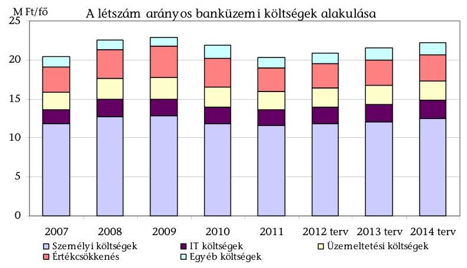

A kimutatott megtakarítások mellett ellentétes irányú tendenciák is megfigyelhetők, amelyek a létszám alakulásában, illetve a működési kiadások növekedésében érhetők tetten. A hatékonyságjavítás keretében leépített munkavállalók helyett részben új munkavállalók felvételére, a feladatbővülésekhez kap-

[^0]
[^0]:    ${ }^{39}$ A CISCO eszközök költöztetése egyszeri költségként merült fel 2008-ban. A Bank azonban a 2008. évet követően nem szereplő költözési költséget a HAJÓ projekt eredményeként realizált megtakarításként mutatta ki. Annak a HAJÓ eredményként való megjelenítése nem valós, torzítja a beszámolót.
    ${ }^{40}$ A Bank tájékoztatása szerint 2011-ben a Unix szervereket már nem használta, mert az azokon futó rendszereket a HAJÓ projekttől független okok miatt leállították.
    ${ }^{41}$ Előterjesztés az MNB Vezetői Bizottságának 2011. szeptember 27-i ülésére a 2012. évi pénzügyi terv előzetes fő irányelveiről

---

csolódó létszámfejlesztésekre került sor (pl. a Statisztika, a Pénzügyi stabilitás, a Kommunikáció, a Készpénzlogisztika szervezeti egységeknél).

Az átlaglétszám csökkenése miatt a 2009-2011. években bekövetkezett költségmegtakarítással ellentétes tényezők voltak a bérfejlesztések és azok járulékvonzatainak összegei (592 M Ft). Az informatikai szakterület 2012. évi tervében az informatikai költségek az előző évi tény költségekhez képest 14,2%-kal (162 M Ft-tal) magasabbak voltak, ezzel hozzávetőlegesen a 2009. évi szintre álltak vissza, részben az új, illetve megnövekedett felhasználói igények miatt.

# 3. Az MNB KIZÁRÓLAGOS TULAJDONÁBAN LÉVŐ TÁRSASÁGOK FELETTI TULAJDONOSI JOGGYAKORLÁS 

A Bank belföldi érdekeltségi körébe – az MNB tv. előírásainak megfelelően – a jegybanki tevékenységgel összefüggésben létrehozott társaságok és a hitelintézetek közötti elszámolás-forgalom lebonyolítását, az értékpapír- és tőzsdeügyletek elszámolását, valamint értékpapírok kezelését és tárolását végző társaságok tartoznak. Az MNB kisebbségi tulajdonában levő külföldi társaságok esetében nem beszélhetünk klasszikus tulajdonosi joggyakorlásról részben a kötelező tagság, részben a kismértékű tulajdonosi hányad miatt.

Az MNB kizárólagos tulajdonában lévő, bankjegy- és érmegyártási tevékenységet ellátó társaságok működését meghatározó jogszabályi környezet nem egyértelmű, illetve hiányos. A stratégiai jelentőségű, állami monopol tevékenységet ellátó társaságok nem minősülnek nemzetgazdasági szempontból kiemelt jelentőségű nemzeti vagyonnak. A társaságokra a vagyon törvények ${ }^{42}$ nem terjednek ki. A társaságok részvénye forgalomképes, átruházása nem korlátozott sem a jogszabályok által, sem a társaság Alapító okiratában.

A PJNY az ország egyetlen bankjegy- és egyik legnagyobb okmány- és hamisítás elleni védelemmel ellátott termékeket gyártó biztonsági nyomdája, az MPV az egyetlen üzemszerűen működő pénzverde. A DIPA a bankjegypapír gyártáson keresztül vesz részt a folyamatban.

Nem tisztázottak az MNB-nek a társaságokkal kapcsolatos vagyonkezelői feladatai, így az sem, hogy a társaságok végezhetnek-e a jegybanki tevékenységgel összefüggő feladataikon túl ún. piaci feladatokat. E feltételek meghatározása nélkül a Bank nem tud megalapozott tulajdonosi stratégiát kidolgozni. Az MNB a leányvállalatok fejlesztését és tulajdonosi pozícióját az euró magyarországi bevezetéséhez viszonyulva határozta meg.

Az MPV üzleti terveiben megfogalmazott fő követelmény az volt, hogy az MNB által megrendelt forgalmi pénzérméket a megfelelő ütemezésben, mennyiségben és minőségben előállítsa. Feladat volt továbbá a kereskedelmi tevékenység fejlesztése. A fejlesztések az euróra való felkészülést szolgálták, a társaságot az EKB előaudítja alkalmasnak találta az euró gyártására. Ezt követően az MPV a Lo-

[^0]
[^0]:    ${ }^{42}$ Az állami vagyonról szóló 2007. évi CVI. és a nemzeti vagyonról szóló 2011. évi CXCVI. törvény

---

gisztikai Központba települt át és a Bank tervei szerint tartósan az MNB tulajdonában marad ${ }^{43}$.

Az MNB a PJNY-t eladni vagy átadni tervezte az Államnak, hogy – az euró bevezetésével megszűnő bankjegygyártás kiesésével – a fennmaradás feltételeit az új tulajdonos teremtse meg. Az ERM II.-höz ${ }^{44}$ való csatlakozást megelőzően a PJNY átadása ugyanakkor nem időszerű.

Az MNB által elfogadott, 2014-ig érvényes stratégia szerint a társaság középtávú célkitűzése – a forintbankjegy gyártásának megszűnését követően – a működőképesség és az eredményes gazdálkodás fenntartása, amelynek érdekében új piacok feltárását és az ahhoz szükséges kereskedelmi, műszaki és humánpolitikai feltételek megteremtését tervezték.

Míg az MNB deklaráltan nonprofit szervezet, addig a 100%-os tulajdonában lévő gazdasági társaságok célja profitszerzés. Emiatt a társaságok és a Bank között érdekellentét van. A PJNY és az MPV a tevékenységi körének szélesítésére, a kapacitások és a piaci tevékenysége fejlesztésére törekszik, az MNB pedig a tevékenységi kör szélesítésében nem érdekelt, költséghatékony működést vár el.

A társaságok árbevételének kb. 50%-a származott az MNB-től. A PJNY bankjegygyártás mellett biztonsági okmányokat ${ }^{45}$ és egyéb termékeket, az MPV saját érmeket, befektetési arany termékeket értékesít. Az Alapító okiratban a tulajdonos ugyanakkor nem tett különbséget a Bank számára végzendő és az ún. piaci feladatok között.

A PJNY a forintbankjegy gyártási tevékenységen kívüli tevékenységhez szükséges fejlesztést saját erőből, a beruházási és amortizációs politika eszközeivel tervezte megoldani. A stratégia az euró 2013. évi bevezetésének feltételezésén alapult. A céldátum eltörlésével azonban nem került sor a stratégiában meghatározott intézkedések felülvizsgálatára, amely kockázatot jelent a hazai bankjegy kibocsátás hosszú távú, biztonságos ellátásában. A PJNY hosszú távú működését veszélyeztet(het)i, hogy a Bank a társaság tevékenységének eredményét minden évben osztalékként elvonta.

A Pénzjegynyomda – az MNB által elrendelt hatékonyságjavító program keretében – a létszám fokozatos leépítését tervezte, azonban a tulajdonos által elrendelt reorganizációs intézkedések ezt felgyorsították. Az egy évig tartó, 144 M Ft költségű reorganizáció 80 fő elbocsátásával és 3 vezérigazgató váltással járt. Célját 500 M Ft-ot meghaladó megtakarítás – ugyanakkor elérte.

Az MNB a Pénzverő szervezeti átalakításával a közvetlen tulajdonosi irányítás mellett döntött. 2007-ben az FB-t, 2009-ben a belső ellenőrzést is megszüntették, a függetlenített ellenőrzési funkciót az MNB BEL vette át. Az FB megszünte-

[^0]
[^0]:    ${ }^{43}$ Forrás: A Magyar Nemzeti Bank tevékenysége 2001-2007
    ${ }^{44}$ ERM II. a Gazdasági és Monetáris Unió árfolyamrendszere
    ${ }^{45}$ A biztonsági okmányok gyártásával kapcsolatban a PJNY a nemzetbiztonsági védelem alá eső szervek és létesítmények köréről szóló 1232/2009. (XII. 30.) Korm. határozat szerint a központi államhatalmi és kormányzati tevékenység szempontjából fontos létesítménynek minősül.

---

tése nem szolgálta a közvagyon védelmi szempontjait ${ }^{46}$, továbbá a döntések felelősének a folyamatos nyomon követése nem valósult meg.

Az MNB-nek a kizárólagos tulajdonában lévő társaságaival összefüggő osztalékpolitikája nincs. A társaságoktól az adózott eredmény 80-100%-át osztalékként elvonta. 2006-2011 között a PJNY 5,8 Mrd Ft, az MPV 1,9 Mrd Ft osztalékot fizetett.

A részvényesi határozatok tartalma a tulajdonos MNB irányítási szemléletéről tanúskodott. A legtöbb határozat a vezérigazgató és a dolgozók munkabérének, bónuszkiírásának, kifizetésének a tárgykörében meghozott döntésről szólt, míg például a beruházással, fejlesztéssel kapcsolatosan csak kettő volt.

# 4. AZ MNB KÖZPONTI KÖLTSÉGVETÉSSEL ÖSSZEFÜGGŐ 2007-2011. ÉVEK KÖZÖTTI ELSZÁMOLÁSAI 

Az MNB mérleg szerinti eredménye 2007-2008-ban és 2010-ben negatív értéket mutatott. A veszteség elszámolására az eredménytartalék fedezetet nyújtott, így a központi költségvetésnek nem keletkezett térítési kötelezettsége.

Az MNB mérleg szerinti eredményének alakulása

|  | 2007 | 2008 | 2009 | 2010 | 2011 | 2012 I.   félév |
| :-- | --: | --: | --: | --: | --: | --: |
| MNB mérleg sze-   rinti eredménye | -16582 | -5464 | 65542 | -41577 | 13598 | 27093 |
| Eredménytartalék | 31507 | 14925 | 9461 | 75003 | 33426 | 47023 |

A költségvetés részére a Kincstári Egységes Számla (KESZ) forintállománya után az MNB 2007-2011 között 157,3 Mrd Ft, a devizaállománya után 29,9 Mrd Ft kamatot számolt el. A forintkamatok 5,6-8,8% között, a devizakamatok ${ }^{47} 0,3-$3,6% között alakultak.

A KESZ az MNB tv., illetve a devizaszámla szerződés alapján kamatozik. A forint egyenleg után a jegybanki alapkamatnak megfelelő mértékű, a devizaegyenleg után a devizanemenkénti referencia hozamnál 0,25%-kal, a devizabetétre 0,125%-kal kisebb kamatot fizet az MNB.

### 4.1. A kiegyenlítési tartalékok alakulása

A központi költségvetésnek 2007-ben és 2010-ben – az akkor hatályos jogszabályi előírások szerint – összesen 31,9 Mrd Ft térítési kötelezettsége volt a Bank részére a deviza-értékpapírok kiegyenlítési tartalékának negatív egyenlege miatt. Célszerű volt a kiegyenlítési tartalékok összevonását előíró, 2011-től hatályos

[^0]
[^0]:    ${ }^{46}$ Az FB feladata a társaság részvényese elé terjesztett valamennyi fontosabb jelentés és a számviteli törvény szerinti beszámoló vizsgálata. Ezeket az MNB BEL nem látta el.
    ${ }^{47}$ A forint, illetve a deviza átlagállományára vetítve.

---

jogszabályi változás ${ }^{48}$, mivel mérsékli annak kockázatát, hogy az MNB felé központi költségvetési fizetési kötelezettség keletkezzen (2007-2011. között az összevont egyenleg minden évben pozitív volt).

A forintárfolyam, valamint a deviza értékpapírok kiegyenlítési tartalékával kapcsolatos központi költségvetési térítési kötelezettség az új MNB tv. 16. § (4) bekezdése szerint 2011-től módosult. Eszerint térítési kötelezettség akkor merül fel, ha a kiegyenlítési tartalékok összevont egyenlege negatív, és arra a mérleg szerinti eredmény és az eredménytartalék nem nyújt fedezetet.

| A kiegyenlítési tartalékok alakulása |  |  |  |  | M Ft |
| :--: | :--: | :--: | :--: | :--: | :--: |
|  | 2007 | 2008 | 2009 | 2010 | 2011 |
| Forintárfolyam kiegyenlítési tartaléka |

 49857 | 236258 | 230792 | 415937 | 1324963 |
| Deviza-értékpapírok kiegyenlítési tartaléka | $-2799$ | 46744 | 21515 | $-29142$ | 5593 |
| Központi költségvetés térítési kötelezettsége | 2799 | 0 | 0 | 29142 | 0 |
| Összevont egyenleg | 47058 | 283002 | 252307 | 386796 | 1330556 |

A kiegyenlítési tartalékok elszámolásai az MNB-ben a belső szabályzatoknak megfelelően történtek. Az NGM azonban a kiegyenlítési tartalékok elszámolásával és térítésével kapcsolatban a közpénzfelhasználásért való felelőssége körében számszaki és egyéb ellenőrzést nem végzett ${ }^{49}$.

A kifizetések az MNB tájékoztatása alapján az NGM utalványozási rendje ${ }^{50}$ szerint történtek. Az NGM ellenőrzése arra terjedt ki, hogy az MNB auditora által jóváhagyott beszámolóban szereplő összeg kerüljön utalványozásra.

[^0]
[^0]:    ${ }^{48}$ Az unióban a jegybankok külföldi pénznemben fennálló követeléseiből és kötelezettségeiből származó árfolyamveszteségét nem téríti meg az állami költségvetés, azt a jegybankoknak kell kigazdálkodniuk. A KBER előírása szerint csak a nem realizált nyereség kerül tartalékként a forrásoldalon lévő, de a saját tőkén kívüli ún. „átértékelési számlákra", amely a későbbi időszakok esetleges árfolyamveszteségeinek, valamint a negatív piaci értékkülönbözetek fedezetére szolgál.
    ${ }^{49}$ Az ÁSZ tv. alapján a kiegyenlítési tartalékok elszámolását az ÁSZ nem ellenőrizheti.
    ${ }^{50}$ A nemzetgazdasági miniszter (pénzügyminiszter) utasításai a rendelkezése alatt álló központi költségvetési előirányzatok és finanszírozási kiadások kezelésének eljárási rendjéről.

---

# 4.2. A nemzetközi szervezetektől lehívott hitelek ${ }^{51}$ igénybevételéhez kapcsolódó, az MNB hatáskörébe eső feladatellátás 

Az MNB az IMF és az uniós szabályrendszer miatt az Állam által lehívott hiteleknél hitelfelvevő ügynökként, az MNB által lehívott hitelrészletnél adósként szerepelt a hitel-megállapodásokban.

Az IMF csak a törvényesen kijelölt pénzügyi szervnek (Magyarországon a központi banknak) ad hitelt. Szabályai tiltják, hogy a jegybankok a felvett hitelt az államnak költségvetési finanszírozási célra továbbítsák. Az uniós szabályozás szerint is - a monetáris finanszírozás tilalma miatt - egy jegybank sem nyújthat hitelt a kormány számára. Hitelügynökként az MNB koordinálta a lehívásokat, törlesztéseket és kamatfizetéseket.

Az IMF-től lehívott hitelt a szabvány szerinti ${ }^{52}$ IMF hitelektől eltérően az MNB és a Pénzügyminisztérium Megállapodása alapján 2009. június 23-ig a Magyar Állam, azt követően lehívásonkénti döntés alapján az MNB és az Állam is igénybe veheti.

A bankmentő csomagra fordítandó hitel kivételével a lehívott összegek az MNB devizatartalékába kerültek és a hitelösszeggel megegyező értékű forintról az Állam az MNB-nél letétbe helyezett, az IMF javára szóló kötelezvényt ${ }^{53}$ állított ki. Az MNB által igénybevett hitel is a devizatartalékot növelte, de az abból eredő kötelezettségeket az MNB tartja nyilván.

Az MNB a hitelfelvételekhez kapcsolódó lebonyolítás rendjét, a hatáskörébe tartozó ügyviteli és jelentési, továbbá az IMF hitelnél a teljesítménykritériumfigyelési feladatokat belső utasításban szabályozta. Az eljárásrend aktualizálására (IMF hitel), illetve kialakítására (EU hitel) ugyanakkor az első lehívásokat követően, 2009. márciusban és áprilisban került sor.

A hitellehívásokhoz kapcsolódóan az MNB jelentési kötelezettsége üzleti-, illetve banktitokként minősített adatokra is kiterjedt ${ }^{54}$. Ezen adatok IMF általi kezelésének megfelelő eljárásokkal történő biztosításáról - az érintettek hozzájárulásának beszerzése és titoktartási záradék alkalmazása - csak a 2010. február 9-től hatályos 2010-503. sz. utasításban rendelkeztek. Ugyanakkor az érin-

[^0]
[^0]:    ${ }^{51}$ A Magyar Köztársaság és a Nemzetközi Valutaalap között 2008. november 6-án létrejött készenléti hitel-megállapodás, valamint a Magyar Köztársaság és az Európai Közösség között 2008. november 19-én létrejött hitel-megállapodás alapján lehívott hitelek.
    ${ }^{52}$ Az IMF törvényben kijelölt pénzügyi szerven keresztül tartja a kapcsolatot a tagországokkal. Pénzügyi segítséget, hitelt is a kijelölt pénzügyi szerven keresztül nyújt.
    ${ }^{53}$ A hitel így nem jelent meg az MNB mérlegében, biztosítva a monetáris finanszírozást tiltó magyar és európai jogi szabályozásnak való megfelelést.
    ${ }^{54}$ Az IMF-nek és az EU-nak szolgáltatott adatok minősítésére vonatkozó információkat csak a 2012. október 1-től hatályos 2012-535. szervezeti egység vezetői utasítás 1. sz. melléklete tartalmazta.

---

tettek hozzájárulásának beszerzésére nem került sor ${ }^{55}$, továbbá az adatok bizalmas jellegére és kezelésére vonatkozó záradék alkalmazása sem volt teljes körű ${ }^{56}$.

A BEL a 2010. évi, az IMF-től és az EU-tól lehívott hitelek lebonyolítására vonatkozó ellenőrzése során megállapította, hogy az adatok bizalmas jellegére és azok kezelésére vonatkozó záradékot egy szervezeti egység nem alkalmazta.

Az üzleti titoknak minősülő adatok felhatalmazás nélküli - IMF-nek való - átadásával a Bank, amely az MNB tv. alapján felelős a pénzügyi stabilitásért, a saját hatáskörébe tartozó feladatellátását veszélyeztette. Az üzleti titok megtartásának kötelezettsége (Hpt. 49. §) az adatkezelők kötelezettsége. Az üzleti titkok körét képező adatok átadásával a Bank a hatáskörét túllépte, továbbá megsértette a Hpt. 49. § (6) bekezdés előírásait, amely alapján az MNB egyedi adatokat kizárólag a nemzetgazdasági miniszter részére, a nemzetgazdasági folyamatok elemzése, illetve a központi költségvetés tervezése céljából, továbbá a pénzügyi közvetítőrendszer stabilitását veszélyeztető helyzetben adhat át.

A hét legnagyobb bank finanszírozási helyzetéről, nettó devizapozíciójáról az IMF felé naponta ${ }^{57}$ az EU felé hetente, ugyanezen bankok swap ügyleteiről az IMF felé hetente jelentett adatokat az MNB.

Az IMF a hitel-megállapodásban vállaltak ellenőrzése, valamint a gazdaságpolitikai program sikeressége és a nyújtott hitelösszeg visszafizetésének biztosítása érdekében figyeli a standard-, a mennyiségi mutatók és a strukturális feltételek teljesítését.

Az MNB naponta szolgáltat adatokat az IMF-nek a devizatartalékairól és az intervenció ${ }^{58}$ nagyságáról, hetente az előző héten kötött egy- és kétoldalú deviza swap ügyletekről, az MNB belföldi pénzpiaci műveleteiről és mérlegének egyes tételeiről. Havi adatszolgáltatás keretében az egyéb monetáris pénzügyi intézmények összevont mérlegéről, az MNB havi mérlegéről és a fizetési mérleg adatokról tájékoztatta az IMF-et ${ }^{59}$. A Bizottság részére az MNB a devizatartalékok alakulásáról kéthetenként, a fizetési mérleg adatokról havi és negyedéves gyakorisággal, az inflációs jelentésről és a pénzügyi stabilitási mutatókról negyedévente küld jelentést.

[^0]
[^0]:    ${ }^{55}$ Az MNB elnökének tájékoztatása szerint „a bankok részéről szükséges felhatalmazás tervezete el is készült, ugyanakkor a szakterület ennek kiküldését elmulasztotta. Az ÁSZ észrevételeit megkapva intézkedtem a felelősök és az eljárási hibák részletes feltárására, valamint az érintett bankok tájékoztatása és utólagos hozzájárulásának beszerzése érdekében."
    ${ }^{56}$ A Bank tájékoztatása szerint 2009. március 5-ét követően alkalmazták a titoktartási záradékot.
    ${ }^{57}$ 2010. augusztus 23-ig
    ${ }^{58}$ A jegybank általi deviza vétel vagy eladás forint ellenében.
    ${ }^{59}$ A Nemzetközi Valutaalap alapokmányának kihirdetéséről szóló 1982. évi 6. törvényerejű rendeletben az IMF felé információszolgáltatás (pl. devizatartalék, nemzetközi fizetési mérleg, nemzetközi beruházási pozíció, nemzeti jövedelem, árindexek) a tagok általános kötelezettsége. Ugyanakkor a tagok nem kötelesek információkat olyan részletesen megadni, ami felfedné magánszemélyek vagy vállalatok ügyleteit.

---

Az MNB adatszolgáltatási kötelezettségét az MNB és az Állam közötti Megállapodás nem, csak a hitelekre vonatkozó belső utasítások tartalmazták.

Az MNB-nek konzultációs kötelezettsége van az IMF felé a tizenkét havi fogyasztói árindex negyedéves egyeztetési sáv eltérése, valamint a nettó nemzetközi tartalékok csökkenésének havi 2 Mrd eurós korlát átlépése esetén. Az EU felé a konzultációs kötelezettsége a nemzetközi tartalékok hirtelen csökkenéséhez (két hetes periódus alatt ne haladja meg az 1 Mrd eurót), valamint a nettó tartalékok szintjéhez (ne essen 18 Mrd euró alá) kapcsolódik.

Az Állam által lehívott hiteleknél a lehívott hitelek az Államadósság Kezelő Központ Zrt. (ÁKK) MNB-nél vezetett devizaszámláin kerültek jóváírásra. A felmerülő költségeket az Állam nevében az ÁKK viselte. Az IMF-től az MNB által lehívott hitelösszegből eredő kötelezettségeket az MNB tartja nyilván, az összeg a devizatartalékot növeli. Az IMF a pénzügyi válság hatásainak enyhítése érdekében növelte a tagállamok devizatartalékait, valamint egyszeri kiegyenlítő allokációt hajtott végre. Ezekből Magyarország kvótaarányosan 2009. augusztusban és szeptemberben közel 1 Mrd SDR összegben részesült.

A BEL 2010-ben az IMF-től és az EB-től lehívott hitelek lebonyolítására, a pénzügyi tranzakciókra, valamint a költségelszámolásokra, kamatfizetésekre, továbbá az adatszolgáltatási gyakorlatra vonatkozóan ellenőrizte azok szabályozottságát, megbízhatóságát, a dokumentáltság teljes körűségét. A BEL egy szervezeti egységnél hiányolta titoktartási záradék alkalmazását, az adatszolgáltató szervezeti egység ezt követően módosította gyakorlatát.

# 5. Az ÁSZ 2011-BEN KÖZZÉTETT JELENTÉSÉBEN MEGFOGALMAZOTT JAVASLATOK HASZNOSULÁSA 

A Magyar Nemzeti Bank 2010. évi működésének ellenőrzéséről szóló V-2018056/2011. számú ÁSZ jelentés javaslatai alapján készített - az ÁSZ elnöke által elfogadott - intézkedési tervet az MNB az ütemezésnek megfelelően végrehajtotta. Azokat a BEL 2012. évben utóellenőrzés keretében ellenőrizte, annak során további intézkedést nem javasolt. Az értékelemzés végrehajtására vonatkozó intézkedés folyamatban volt, mivel azt a Bank 2012. december 31-ei határidővel vállalta.

Az adattárház stratégia megújítása céljából szükséges értékelemzés végrehajtását külső vállalkozótól rendelték meg, a helyszíni ellenőrzés lezárásakor az igények felmérése és az értékelemzés végrehajtása folyamatban volt.

A redundáns központi adattároló ellenőrzéséhez kapcsolódóan az ÁSZ javaslatot nem fogalmazott meg, azonban kockázatként azonosította, hogy az eszközök szállítását elnyerő szállító az eszközök 6 évre megkötött támogatási szerződését fel fogja mondani, kihasználva, hogy a szerződés a rendes felmondást 90 napos határidővel lehetővé teszi.

Az eszközök szállítására és támogatására kiírt közbeszerzési eljárás során a nyertes szállító a rendszertámogatásra vonatkozóan adott, részletes kalkulációval alátámasztott induló árát radikálisan ( $315,5 \mathrm{M}$ Ft-ról $8,5 \mathrm{M}$ Ft-ra) csökkentette, ezzel biztosítva az összességében legkedvezőbb árat. Az ellenőrzés álláspontja szerint a

---

banknak az ajánlati ár alátámasztását kellett volna kérnie, amit a bank nem tett meg. Az ellenőrzés a radikális árcsökkentés miatt kockázatként állapította meg, hogy a szállító már nem fogja a támogatást a szerződéses feltételekkel nyújtani, és a szerződés által biztosított 90 napos rendes felmondási határidőt kihasználva a szerződést fel fogja bontani.

Az ellenőrzés által azonosított kockázat beigazolódott, a szállító a támogatási szerződést 2011. szeptemberi hatállyal felmondta. A Bank az eszközök támogatására több szerződést kötött a korábbi szerződésben meghatározottaknál 24 M Ft-tal magasabb éves költség mellett. A beruházás utóértékeléséről 2012 szeptemberében az Ügyvezetői igazgatói értekezlet részére benyújtott tájékoztató is a jövőben hasznosítható tapasztalatként ismertette a szerződés felmondhatóságának kockázatosságát, és a „szállítói pontmaximalizálás" kockázatát.

Budapest, 2013. 01 hó 08 nap

Melléklet: 7 db
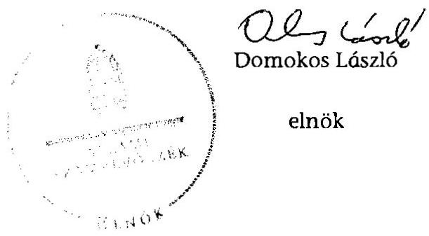

---

# MELLÉKLETEK

---

A BEL által végzett vizsgálatok hatáskör szerinti megoszlása a 2011-2012. november 15. közötti időszakban

|  Év | FB hatáskör | Elnöki hatáskör |   |
| --- | --- | --- | --- |
|   |  | Összes | ebből IAC vizsgálat  |
|  2011. évi vizsgálatok | 21 | 17 | 4  |
|  Ellenőrzési területek (pl.) | - beszerzési tevékenység | - tartalékkezelés

 |   |
|   | - tanácsadói szerződések | - kötelezőtartalék-rendszer |   |
|   | - utazás, gépjármű, bankkártya használat | - monetáris politika |   |
|   | - pénzmosás megakadályozása | - Treasury kockázatkezelési rendszer |   |
|   | - kontrollok működése | - MNB engedélyezési tevékenysége |   |
|   | - leányvállalati ellenőrzések | - államháztartási statisztika |   |
|   | - pénzforgalom bonyolítása | - készpénzlogisztika |   |
|   | - utóellenőrzés | - utóellenőrzés |   |
|  2012. év november 15-ig megkezdett vizsgálatok | 17 | 12 | 2  |
|  Ellenőrzési területek (pl.) | - számítástechnikai eszközökkel történő gazdálkodás | - monetáris statisztikák |   |
|   | - MNB 100%-os tulajdonú társaságai | - jegybanki fedezetértékelési rendszer |   |
|   | - SAP rendszer | - rövid távú likviditási előrejelzés és a likviditás figyelemmel kísérése |   |
|   | - forint- és devizaszámlavezetés | - stressztesztek, hitelezési felmérés |   |
|   |  | - jegybanki pénzkészletek |   |

---

# Az MNB működési költségeinek alakulása 

Adatok: M Ft-ban

| Megnevezés | 2010. évi   tény | 2011. évi   terv | 2011. évi   tény | Index |  |
| :--: | :--: | :--: | :--: | :--: | :--: |
|  |  |  |  | 2011/2010 tény | 2011 tény/   2011 terv |
| 1. Személyi költségek |  |  |  |  |  |
| Bérek | 3825,8 | 3979,7 | 3891,6 | 101,7% | 97,8% |
| Jutalom | 789,2 | 674,4 | 684,0 | 86,7% | 101,4% |
| Korengedményes nyugdíjazás miatti kifizetés | 11,5 | 0,0 | 12,2 | 106,0% |  |
| Végkielégítés, felmentési pénzek | 125,0 | 115,0 | 99,3 | 79,5% | 86,4% |
| Választható béren kívüli juttatások | 353,1 | 377,7 | 361,6 | 102,4% | 95,7% |
| Alapjuttatások és jóléti költségek | 345,2 | 309,4 | 308,6 | 89,4% | 99,7% |
| Egyéb nem rendszeres kifizetés | 26,0 | 21,9 | 27,5 | 105,7% | 125,2% |
| Reprezentáció | 52,7 | 58,0 | 35,4 | 67,2% | 61,2% |
| Belföldi kiküldetés költségei | 0,3 | 0,2 | 0,5 | 179,8% | 192,2% |
| Külföldi kiküldetés költségei | 31,4 | 34,4 | 29,6 | 94,2% | 86,0% |
| Saját gépjármű használat miatti költségtérítés | 3,9 | 1,0 | 2,8 | 71,2% | 276,2% |
| Járulékok | 1442,8 | 1451,8 | 1430,6 | 99,2% | 98,5% |
| 1. Személyi költségek összesen | 7006,9 | 7023,5 | 6883,7 | 98,2% | 98,0% |
| 2. IT költségek |  |  |  |  |  |
| Hardver -és telekommunikációs eszközök | 129,4 | 84,0 | 69,6 | 53,8% | 82,9% |
| Szoftverek | 698,0 | 777,7 | 681,3 | 97,6% | 87,6% |
| Adatátviteli díjak | 75,8 | 69,5 | 83,3 | 109,9% | 119,9% |
| Hírszolgálati díjak | 274,8 | 289,8 | 280,3 | 102,0% | 96,7% |
| Tanácsadói díjak | 41,0 | 64,6 | 34,1 | 83,1% | 52,7% |
| 2. IT költségek összesen | 1219,0 | 1285,5 | 1148,6 | 94,2% | 89,3% |
| 3. Üzemeltetési költségek |  |  |  |  |  |
| Ingatlan költségek | 1028,0 | 990,3 | 917,3 | 89,2% | 92,6% |
| Készpénzlogisztikai gépek, berendezések | 243,1 | 184,5 | 184,4 | 75,8% | 100,0% |
| Egyéb gépek, tárgyi eszközök | 50,9 | 49,0 | 50,0 | 98,2% | 102,0% |
| Járművek | 50,0 | 54,8 | 55,3 | 110,6% | 100,9% |
| Telefon, posta | 54,5 | 52,0 | 49,0 | 89,9% | 94,3% |
| Pénzszállítás | 4,9 | 5,6 | 4,3 | 87,9% | 77,2% |
| Nyomtatványok, irodaszerek és egyéb adminisztrációs anyagok | 18,0 | 16,4 | 12,7 | 70,2% | 77,1% |
| Vagyonbiztosítás | 5,0 | 4,4 | 4,5 | 88,3% | 100,3% |
| Tanácsadói díjak | 10,1 | 12,8 | 20,6 | 204,8% | 161,3% |
| Egyéb költségek | 85,8 | 74,7 | 62,7 | 73,1% | 84,0% |
| 3. Üzemeltetési költségek összesen | 1550,3 | 1444,5 | 1360,8 | 87,8% | 94,2% |
| 4. Értékcsökkenés |  |  |  |  |  |
| Tárgyi eszközök | 1361,5 | 1352,7 | 1309,7 | 96,2% | 96,8% |
| Immateriális javak | 818,9 | 516,6 | 489,7 | 59,8% | 94,8% |
| 4. Értékcsökkenés összesen | 2180,4 | 1869,3 | 1799,4 | 82,5% | 96,3% |
| 5. Egyéb költségek |  |  |  |  |  |
| Hatósági díjak | 0,2 | 0,1 | 0,6 | 346,1% | 746,8% |
| Tagsági díjak | 46,6 | 31,5 | 36,1 | 77,6% | 114,7% |
| Jogi költségek | 225,9 | 541,7 | 140,5 | 62,2% | 25,9% |
| Audit | 36,3 | 37,6 | 37,7 | 103,9% | 100,4% |
| Közgazdasági tanácsadás, adatvásárlás | 43,3 | 44,4 | 46,0 | 106,1% | 103,7% |
| Kommunikáció | 235,7 | 267,8 | 195,4 | 82,9% | 73,0% |
| Újság, szakkönyv | 52,0 | 59,2 | 55,4 | 106,6% | 93,6% |
| Konferenciák | 13,3 | 17,6 | 10,6 | 79,6% | 60,0% |
| Kiküldetési költségek | 126,1 | 148,1 | 131,9 | 104,5% | 89,0% |
| Oktatás | 127,8 | 138,6 | 114,4 | 89,5% | 82,6% |
| Egyéb vegyes költségek | 49,3 | 52,3 | 48,2 | 97,8% | 92,2% |
| 5. Egyéb költségek összesen | 956,5 | 1338,9 | 816,8 | 85,4% | 61,0% |
| 6. Átvezetések összesen | $-130,2$ | $-118,4$ | $-127,1$ | 97,6% | 107,3% |
| 7. Költségek összesen | 12782,9 | 12843,3 | 11882,2 | 93,0% | 92,5% |
| 8. Tartalék |  | 192,6 |  |  |  |
| 9. Költségek főösszege | 12782,9 | 13035,9 | 11882,2 | 93,0% | 91,1% |

---

# 3. sz. melléklet a V-0033-119/2012-2013. sz. jelentéshez 

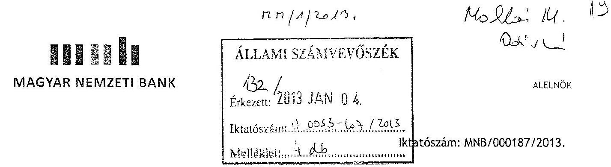

Állami Számvevőszék

## Domokos László

elnök

## Budapest

Apáczai Csere János utca 10.
1052

Tisztelt Elnök Úr!
Mellékelten küldöm az MNB észrevételeit a V-0033-080/2012. számú jelentés-tervezetre.

Budapest, 2013. január 04.

Melléklet: 1 db

Üdvözlettel:

## Kim

Simor András
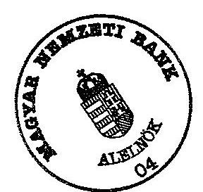

---

# Észrevételek 

## az Állami Számvevőszék V-0033-080/2012. iktatószámú, a Magyar Nemzeti Bank működésének és a központi költségvetéssel történő elszámolások szabályszerűségének ellenőrzéséről szóló számvevőszéki jelentés tervezetéhez

## Bevezető

Az Állami Számvevőszék jelentése számos, tényekkel nem alátámasztott, valótlan állítást tartalmaz. A dokumentum általánosító megállapításai félrevezetőek, az ÁSZ következtetései aránytalanok. Az Állami Számvevőszék nem tartja be saját ellenőrzési elveit és standardjait, amikor nem veszi figyelembe a lényegesség elvét. Az ÁSZ jelentése továbbá olyan, a Magyar Nemzeti Bank alapfeladatai körébe tartozó tevékenységet is érintett, amely az ÁSZ tv. rendelkezése értelmében nem tartozik az ÁSZ hatáskörébe, így az Állami Számvevőszék eljárása nincs összhangban a hatályos jogszabályokkal. Az ÁSZ MNB-nél végzett ellenőrzése nem felelt meg az ÁSZ által a stratégiájában vallott alapértékeknek: számos esetben nem volt felismerhető az a törekvés, hogy hitelesen tárja fel és értékelje a tényeket, hogy ellenőrzési tevékenysége a hibák, hiányosságok megelőzésére irányul, vagy, hogy az ellenőrzötteket segítő együttműködésre törekszik. Igazolja ez utóbbit az a két tény is, hogy szemben a korábbi évek gyakorlatával és a számvevőszéki ellenőrzésnek az ÁSZ honlapján közzétett szakmai szabályaiban foglaltakkal, az Állami Számvevőszék nem közölte hivatalosan a Bankkal az ellenőrzés konkrét ütemtervét (az ellenőrzés végrehajtásának, az ellenőrzés szakaszainak időbeli ütemezését és a végső határidőt), továbbá a megállapításait úgy küldte meg véleményezésre, hogy az ÁSZ törvény által biztosított 15 napos törvényi határidőből az ünnepek és az azok miatti munkarendváltozások miatt mindössze 5 (öt) munkanap álljon az MNB rendelkezésére észrevételei kialakítására és megküldésére, amely nyilvánvalóan nem áll összhangban a jogalkotó szándékával.

A Magyar Nemzeti Bank minden körülmények között a szabályszerű, költséghatékony működésre törekszik. A Magyar Nemzeti Bank mindenkor nyitott arra, hogy az Állami Számvevőszék ellenőrző tevékenysége során feltárt, szakmailag megalapozott észrevételeit megfontolja, azokat a működés részévé tegye. A Magyar Nemzeti Bank működési kiválóságának javítása érdekében erre az elmúlt években számtalan példa volt.

Az Állami Számvevőszék jelentése nem ad valós képet Magyarország központi bankjáról, annak minősége nem áll összhangban az ÁSZ alapértékeivel. Az ÁSZ magatartása és módszere alkalmas arra, hogy aláássa a pártatlan ellenőrzésbe vetett hitet.

Az ÁSZ nem tartja be saját ellenőrzési elveit és standardjait, nem veszi figyelembe a lényegesség elvét, illetve téves megállapításokból von le megalapozatlan következtetéseket.

Az ÁSZ négy hiányosságot állapít meg az MNB számviteli elszámolásaival kapcsolatban, amelyek véleményünk szerint megalapozatlanok. Az MNB minden esetben a jogszabályoknak és a belső szabályoknak megfelelően számolta el a kifogásolt tételeket. Megjegyezzük, hogy az ÁSZ által megállapítani vélt hibák a legkevésbé sem alapozzák meg azon következtetéseket, amelyeket az ÁSZ levon belőlük. Az ÁSZ saját ellenőrzési elveit és standardjait (A részletes észrevételekhez csatolt 1. sz. melléklet) nem tartja be, amikor nem veszi figyelembe a lényegesség elvét. Az ÁSZ ellenőrzési elvei és standardjai alapján a lényegesség alsó határa az MNB esetében 62,5 milliárd forint (a mérlegfőösszeg 0,5%-a), illetve a működési költségekre önállóan vonatkoztatva 60,3 millió forint (a működési költségek 0,5%-a). Az ÁSZ számviteli szabálytalanságokra vonatkozó megállapításai összevontan sem érik el az utóbbi határt. Ebből következően ezen megállapítások még akkor sem képezhetnék javaslatok alapját, ha nem volnának tévesek.

---

Az Állami Számvevőszék túllépte az Állami Számvevőszékről szóló 2011. évi LXVI. törvényben meghatározott hatáskörét.

Az Állami Számvevőszékről szóló 2011. évi LXVI. törvény („Ász tv") 5. § (10) bekezdése értelmében az Állami Számvevőszék a Magyar Nemzeti Bank gazdálkodásának ellenőrzése során nem ellenőrzi a Magyar Nemzeti Bankról szóló törvényben foglaltak alapján folytatott, az alapvető feladatok körébe tartozó tevékenységét.

Mivel a bankjegy és érmekibocsátás az MNB tv. 4. § (2) értelmében az MNB alapfeladatai körébe tartozik, az ezzel kapcsolatos MNB tevékenység vizsgálata az ÁSZ tv. hivatkozott rendelkezése értelmében nem tartozik az ÁSZ hatáskörébe. Így a bankjegyfejlesztéssel kapcsolatos jegybanki tevékenységek sem, amellyel kapcsolatos információk publikus megosztása a
 készpénzbe vetett bizalmat is gyengítheti.

Az ÁSZ jelentéssel ellentétben nem a felültervezés miatt jelentkeztek megtakarítások az MNB működési költségeinél; a tervteljesítés a holokauszt-per nélkül meghaladta a 95 százalékot.

A 2011. évi működési költségek tervtől való elmaradásában jelentős tényező a holokauszt-perrel kapcsolatos tervezett költségek elmaradása, melyre a 2011. évi pénzügyi terv 489 M Ft-ot irányzott elő. A tervezési időszakban még nem volt ismert, hogy a perrel kapcsolatos feladatokat a magyar állam átveszi. A Bank normál működését (holokauszt-per nélkül) tekintve a tényleges költségek a tervezett összeg 95,4%-át teszik ki, ami az előző évhez képest javuló tervteljesítést jelent. Az évről évre csökkenő költségek mellett ez a költség- és létszámgazdálkodás tervszerűségére és hatékonyságára utal.

AZ ÁSZ egy 9 ezer forintos el nem számolt értékcsökkenési költség és egy több mint 9 millió forintos működési költségeket növelő tétel miatt állítja, hogy a költségek csökkenése arra vezethető vissza, hogy az MNB eltért a szabályoktól.

A 2. napra jutó el nem számolt értékcsökkenési költség 9 eFt-os összege valóban csökkentette az MNB 2011. évi működési költségeit, de ez meglehetősen csekély összeg a nagyságrendileg 12 milliárd forintos tételhez képest. Az ÁSZ ugyanakkor a bankjegyfejlesztési projekt elszámolási módját is kifogásolja azt állítva, hogy az MNB által hibásan alkalmazott átsorolás miatt csökkentek a jegybank működési költségei. Ezzel szemben a tény az, hogy az MNB által az MNB Könyvvezetéséről szóló 221/2000 (XII.19.) Kormányrendeletnek megfelelően alkalmazott elszámolás 9,6 millió forinttal növelte a működési költségeket.

Fontos hangsúlyozni, hogy az ÁSZ és az MNB közötti véleménykülönbség csupán prezentációs kérdés, hiszen az ÁSZ nem a pénz elköltést kifogásolja, hanem azt, hogy az eredménykimutatás melyik sorában illetve melyik évben mutattuk ki a kiadásokat.

# Az ÁSZ állításával szemben az MNB működése átlátható

Az ÁSZ azt a következtetést vonja le abból, hogy az MNB - egyébként semmilyen jogszabályt és belső szabályt nem megsértve - nem mutatta be az újonnan beszerzett hordozható számítógépek és munkaállomások értékcsökkenésének 386 eFt-os hatását a kiegészítő mellékletben, hogy az MNB banküzemi működése nem átlátható. Egyértelműen látható, hogy nincs ok-okozati kapcsolat a megállapítás és az abból levont következtetés között. Sőt, éppen az átláthatóság bizonyítéka, hogy az ÁSZ-nak nyújtott adatokból a számvevők pontosan számszerűsíteni tudták a 386 ezer forintos különbözetet.

---

Megalapozatlan az ÁSZ költséghatékonyságot kritizáló megállapítása, hiszen 7 év alatt 588-ról 171 darabra csökkent a nyomtatók és multifunkciós eszközök száma, míg a munkaállomás környezet üzemeltetési költsége példaértékűen alacsony.

Az MNB-ben 2006-ban összesen 558 db nyomtató és számítógépes multifunkcionális berendezés volt használatban, 2012-re ez a szám 171 darabra csökkent. A teljes munkaállomás környezet üzemeltetési költsége pedig a hasonló méretű európai jegybankok között a legalacsonyabbak között van. A jelentés ugyanakkor a nyomtató és számítógépes multifunkcionális eszközök kapcsán a Magyar Nemzeti Bank által már korábban feltárt és időközben saját hatáskörben megszüntetett kevésbé hatékony működési gyakorlatot a nem hatékony gazdálkodás példájaként mutatja be.

A jegybank iratkezelési gyakorlata megfelel a jogszabályokban előírt tartalmi előírásoknak.
Az MNB által 2003-ban bevezetett, a napi gyakorlatban használt elektronikus iratkezelési rendszer megfelel a jogszabályokban előírt tartalmi előírásoknak. Az illetékes közlevéltár az ellenőrzések során megállapítást nem tett, hibát nem tárt fel. A rendszert 2012-ben auditálták. Az ÁSZ észrevételben szereplő „hiteles dokumentum forgalom" a hivatkozott jogszabályban nem szereplő fogalom és így nincs is összefüggésben a tanúsítvány meglétével. A hiteles elektronikus dokumentumforgalmat a Bank a 2011 júliusától Hivatali kapun keresztül teljesíti. Nem felel meg a tényeknek az ÁSZ azon megállapítása sem, hogy a bank szerződés nélkül kezdte meg auditált iratkezelő rendszer beruházást, mert az MNB a központosított közbeszerzés szabályai szerint járt el a beszerzési eljárás során.

Az ÁSZ a piaci medián és a piaci átlag kifejezéseket helytelenül egymás szinonimájának tekinti. Az ÁSZ állításával szemben az MNB teljes javadalmazási szintje megfelel a kitűzött bérpiaci pozíciónak.

Az MNB bérpolitikájának, a bérpiaci pozíciójának 2011. évben történő újbóli áttekintése megvalósítása érdekében a bevont szakértő (HAY GROUP) - az MNB és a kereskedelmi bankok javadalmazásának strukturális eltérései alapján - a teljes javadalmazás szintjét javasolta összevetni. A szakértő megállapította, hogy, az MNB teljes javadalmazási szintje a referenciaplac (pénzügyi szektor) medián +/-10%-os sávjában helyezkedik el, mely az MNB által korábban kitűzött bérpiaci pozíciójának - a pénzügyi szektor medián szintjének - megfelel. (a piaci mediánt, és nem a piaci átlagot célozta meg az MNB).

A Hay Group által 2011. évben elkészített tanulmány szerint az MNB javadalmazási struktúrája eltér a Magyarországi kereskedelmi bankok javadalmazási struktúrájától, mert az alapbér és a kifizetett bónuszok aránya magasabb, míg a juttatások aránya alacsonyabb, azonban a teljes javadalmazás tekintetében a medián szint +/- 10%-os sávján belül helyezkedik el. Így nem valós az a megállapítás, hogy a piaci viszonylatban is magas az MNB munkavállalóinak személyi juttatásai.

A számvevő által „juttatásnak" kategorizált költségek nem képzik részét az MNB javadalmazási rendszerének a belső irányelvek alapján, miután azok a belső tudásátadás, a magasabb szintű munkavégzéshez szükséges ismeretek megszerzését, a munkatársak elkötelezettségének, jobb teljesítményre való ösztönzésének, együttműködéseik javításának erősítését illetve a munkavégzési feltételek javításával a teljesítményük, eredményességük növelését szolgálják, így a bank hatékony és eredményes működéséhez közvetlenül is hozzájárulnak.

Az Állami Számvevőszék állításával ellentétben a Magyar Nemzeti Bank 2012 előtt is rendelkezett bér- és jövedelem stratégiai célkitűzésekkel. Az átadás-átvételi jegyzőkönyv szerint 2012. november 7-én adta át a jegybank az Állami Számvevőszéknek azt a dokumentumot, amely az ÁSZ jelentése szerint nem létezik.

A 2012-2014. évi javadalmazási stratégia mellett a 2008. évtől érvényes bérstratégiai döntés dokumentumát a jegybank 2012. november 7-én adta át az Állami Számvevőszéknek.

---

Az ÁSZ megállapításával ellentétben az MNB nem lépte túl hatáskörét. Az IMF által korábban igényelt, a hitelintézeteket érintő adatszolgáltatás az ÁSZ állításával ellentétben éppen a pénzügyi stabilitási kockázatok elkerülését szolgálta.

Az IMF által igényelt, hitelintézeteket érintő adatszolgáltatással az MNB nem lépte túl a hatáskörét és az ÁSZ megállapításával ellentétben az adatszolgáltatás nemhogy nem okozott pénzügyi stabilitási kockázatokat, hanem éppen azok sikeres elkerülését szolgálta.

Az ÁSZ állításával szemben dokumentált tény az, hogy az adatszolgáltatást az IMF igényelte. Az is megállapítható, hogy az MNB, amely az IMF alapokmány alapján és a megállapodások értelmében hitelfelvevő ügynökként járt el, nem lépte túl a hatáskörét a hitelfelvétellel összefüggő IMF-nek történő adatszolgáltatás végzésével, és ennek megfelelően az MNB és az Állam közötti megállapodásnak nem is kellett az IMF-nek történő adatszolgáltatást szabályoznia.

Az MNB az adatszolgáltatásról az adatszolgáltatást megelőzően szóban tájékoztatta az érintett hitelintézeteket, de a szükséges írásbeli hozzájárulás az adatszolgáltatást megelőző beszerzése valóban elmaradt. Ezzel kapcsolatban az MNB elnöke már az ÁSZ jelen vizsgálata folyamán intézkedett a felelősök és az eljárásrendi hibák kivizsgálása és részletes feltárása iránt. Ugyanakkor mind a 7 érintett hitelintézet adatszolgáltatásra vonatkozó írásbeli hozzájárulásának utólagos beszerzése hiánytalanul megtörtént.

Az ÁSZ által a kiegyenlítési tartalék Nemzetgazdasági Minisztérium általi ellenőrzésére vonatkozó javaslatnak nemcsak hozzáadott értéke nincsen, de amennyiben az az MNB ellenőrzésére vonatkozna, sértené a jegybanki függetlenség uniós jogban és az MNB törvényben is rögzített követelményét is.

A kiegyenlítési tartalékok elszámolását az ÁSZ és a könyvvizsgáló is ellenőrzi. A Jegybanktörvény alapján a kiegyenlítési tartalékokkal kapcsolatos feltöltési kötelezettség elszámolása a végleges, a könyvvizsgáló által ellenőrzött adatok alapján történik, valamint az Állami Számvevőszék a költségvetési kapcsolatok vizsgálati téma keretében rendszeresen ellenőrzi. Véleményünk szerint további ellenőrzés bevezetésének ezért nincs hozzáadott értéke. A hatályos jogszabályok a jegybanki függetlenség uniós jogban és az MNB törvényben is rögzített követelményére figyelemmel egyértelműen nevesítik, hogy mely szervezetek, milyen hatáskörben ellenőrzik az MNB tevékenységét. A Nemzetgazdasági Minisztériumnak nincs ellenőrzési jogköre az MNB tevékenységét illetően, a tulajdonosi ellenőrzés a felügyelőbizottságon keresztül valósul meg.

Az MNB kizárólagos tulajdonában lévő Pénzjegynyomda Zrt. és Magyar Pénzverő Zrt. működési környezetét meghatározó jogszabályi környezet az Állami Számvevőszék állításával ellentétben egyértelmű és nem is hiányos.

Szemben a jelentéstervezetben rögzített megállapítással, álláspontunk az, hogy az MNB kizárólagos tulajdonában lévő Pénzjegynyomda Zrt. és Magyar Pénzverő Zrt. működési környezetét meghatározó jogszabályi környezet egyértelmű és nem is hiányos. Hiányosságként értékeli a tervezet, hogy nem rögzíti jogszabály, hogy a társaságok „végezhetnek-e a jegybanki tevékenységeken túl ún. piaci feladatokat". Túl azon, hogy a megállapítás tárgyi tévedést tartalmaz, hiszen a társaságok egyike sem végez, nem is végezhet jegybanki tevékenységet (lévén az MNB törvényben tételesen meghatározott feladatok ellátására kizárólag az MNB jogosult), és a megnevezett társaságok az MNB tevékenységével összefüggésben létrehozott gazdálkodó szervezetek, a megállapítás nem is helytálló. Az MNB törvény ugyanis nem zárja ki, hogy azok a szervezetek, amelyekben az MNB-nek részesedése lehet, a jegybankéhoz kapcsolódón kívül egyéb tevékenységet is végezzenek, azaz a jogi lehetőség erre adott.

---

Félreérthető és hibás következtetésekhez vezethet, hogy az ÁSZ egy 9 ezer forintos értékcsökkenés hibás elszámolása miatt tesz javaslatot a jelentős összegű hiba határának módosítására.

Az ÁSZ alacsonynak tartja a jelentős összegű hiba határát, és javaslatot tesz a jogalkotónak arra, hogy a kérdést szabályozza az MNB könyvvezetéséről szóló kormányrendeletben úgy, hogy a működési költségekkel kapcsolatban a jelentős összegű hiba határa 500 millió forint legyen.

A javaslat azt a látszatot kelti, mintha az MNB éves beszámolójával összefüggésben a Számvevőszék 500 millió forintot meghaladó hibá(ka)t tárt volna fel. A megalapozottan megállapított hiba (2 napi értékcsökkenés 46 db. eszköz esetében, 9 ezer forint értékben) nemcsak az éves beszámoló minősítését nem befolyásolja, hanem a számviteli törvény szerinti megbízható valós képet sem, sőt egyetlen számjegyet sem, mivel a beszámoló millió forintban készül. A javasolt hibahatár csökkentésének egyébként sem lenne semmilyen plusz kontroll hatása a működési költségekre vonatkozóan. Ráadásul 2012-től az MNB tv. ezt a kontrollt a független könyvvizsgálóhoz telepíti, azzal, hogy a tervezett és a tényleges működési és beruházási költségek alakulásáról szóló elemzést a könyvvizsgáló véleményével ellátva az éves beszámolóval egyidejűleg az MNB megküldi az Országgyűlés gazdasági ügyekért felelős állandó bizottsága, valamint az Állami Számvevőszék részére.

# Az ÁSZ okafogyott javaslatot tesz az MNB elnökének

Az MNB már 2008-ban elindította az iratkezelési rendszerének auditálását, amely folyamat nem az MNB-nek felróható okok miatt húzódott el. Az MNB a 2003-óta használt iratkezelési rendszerére pedig 2012 folyamán - ahogy arról az MNB a számvevőket is tájékoztatta - már meg is kapta a jogszabály által előírt tanúsítványt, így az iratkezelési rendszer mindenben megfelel a vonatkozó jogszabályi rendelkezéseknek.

Hamis látszatot kelt az ÁSZ azon javaslata, miszerint az MNB elnöke intézkedjen többek között a számviteli szabályok teljes körű betartásáról.

Az Állami Számvevőszék javaslata félrevezető, hiszen azt a látszatot kelti, mintha az MNB
 nem tartaná be a számviteli szabályokat. Sem az ÁSZ jelen, illetve korábbi vizsgálatainak megállapításai, sem pedig a könyvvizsgálói jelentések, vezetői levelek, belső ellenőrzési vizsgálatok következtetései nem támasztják alá az ÁSZ javaslatának létjogosultságát.

## Az ÁSZ által javasolt intézkedést az MNB elnöke már végrehajtotta.

Az MNB elnöke már az ÁSZ jelen vizsgálatának folyamán intézkedett az adatszolgáltatással összefüggően a felelősök és az eljárási hibák kivizsgálása és részletes feltárása iránt. Az MNB az IMF-nek történt adatszolgáltatásról tájékoztatta az érintett hitelintézeteket és időközben az összes érintett 7 hitelintézet adatszolgáltatásra vonatkozó írásbeli hozzájárulásának utólagos beszerzése is hiánytalanul megtörtént.

Budapest, 2013. január 4.

A jelentéstervezetre tett részletes jegybanki észrevételeket a Melléklet tartalmazza.

---

Melléklet az „Észrevételek az Állami Számvevőszék V-0033-080/2012. Iktatószámú, a Magyar Nemzeti Bank működésének és a központi költségvetéssel történő elszámolások szabályszerűségének ellenőrzéséről szóló számvevőszéki jelentés tervezetéhez" c. anyaghoz

# Általános észrevételek 

Az ÁSZ jelentéstervezete több helyen is döntés-előkészítő anyagokban szereplő információkat tartalmaz. Ezek az anyagok (jellemzően előterjesztések) a keletkezésükkor hatályban volt jogszabályok - 2011. december 31-ig az 1992. évi LXIII. törvény, 2012. január 1-től a 2011. évi CXII. törvény - és a vonatkozó belső szabályok szerint a keletkezésüktől számított 10 évig nem nyilvánosak, és az azokban szereplő adatok megismerését csak a Bank - mint az adatokat kezelő szerv - vezetője engedélyezheti. Tekintettel arra, hogy az ÁSZ jelentése nyilvános, ezen információk nyilvánosságra hozatala sérti a döntés-előkészítő anyagokban szereplő adatoknak a hivatkozott jogszabályokban biztosított védelmét, ahogyan a Bank érdekelt is. Minthogy az ÁSZ jelentése az ÁSZ törvény szerint sem tartalmazhat törvény által védett titkot, ezért az egyes adatok jelentésben való szerepeltetésének mellőzését kezdeményező javaslataink figyelembevételénél a jogszabályi megfelelést biztosítva kell eljárni.

Az Állami Számvevőszékről szóló 2011. évi LXVI. törvény („Ász tv") 5. § (10) bekezdése értelmében az Állami Számvevőszék a Magyar Nemzeti Bank gazdálkodásának ellenőrzése során nem ellenőrzi a Magyar Nemzeti Bankról szóló törvényben foglaltak alapján folytatott, az alapvető feladatok körébe tartozó tevékenységét.

Mivel a bankjegy- és érmekibocsátás az MNB tv. 4. § (2) értelmében az MNB alapfeladatai körébe tartozik, az ezzel kapcsolatos MNB tevékenység vizsgálata az ÁSZ tv. hivatkozott rendelkezése értelmében nem tartozik az ÁSZ hatáskörébe. Így a bankjegyfejlesztéssel kapcsolatos jegybanki tevékenységek sem, amellyel kapcsolatos információk publikus megosztása a készpénzbe vetett bizalmat is gyengítheti. Kérjük ezt a jelentés nyilvánossága szempontjából figyelembe venni és az erre való utalásokat a jelentésből törölni. Amennyiben ezen tevékenység említésére a jelentésben egyéb vizsgálati szempontból szükség van, azt a fentiek figyelembe vételével indokolt megjeleníteni.

## Bevezetés

## B. oldal 2. bekezdés

1. mondat nem pontos, az alaptevékenységeket csak részlegesen fedi (a törvényben meghatározott alapfeladatok közül csak egyet említ), jóllehet a mondat teljes körűséget sugall.
2. oldal, 2. bekezdés pontosítandó: „az MNB törvényben rögzített alapvető feladata a törvényes fizetőeszköz kibocsátása. Ezt a feladatát a kizárólag a tulajdonában lévő leányvállalatain keresztül látja el."

Az MNB nem a kibocsátást látja el ezen vállalatokon keresztül, hanem a fizetőeszközök gyártását, gyártatását.

---

# 10. oldal 2. bekezdés 

„A BEL az EKB részére is feladatot lát el" megfogalmazás pontatlan: amint az ÁSZ jelentése a 17. oldalon található 19. lábjegyzetéből is kiderül, a Belső ellenőrzés (BEL) a tagságból fakadó kötelezettségeit hajtja végre, azaz elvégzi a KBER Belső Ellenőrzési Bizottsága (IAC) által előírt vizsgálatokat és részt vesz a vonatkozó munkacsoportok működésében.

Valóban a BEL eredetileg jóváhagyott éves munkatervéből négy vizsgálat az FB 9 témában elrendelt rendkívüli vizsgálat miatt elmaradt, ezért év közben a munkaterv az Elnök és az FB jóváhagyásával módosításra került. A 2011-ben törölt vizsgálatokat a BEL 2012-ben végrehajtotta.

## 10. oldal 3. bekezdés

A 2011. évi működési költségek előző évhez, illetve a tervhez viszonyított alakulásában „a beruházásoknál jellemző" okok nem játszottak olyan meghatározó szerepet, mint amire az ahhoz kapcsolódóan felsorolt több tényezőből (áthúzódó tételek, időbeli elmaradás stb.) következtetni lehet. Javasoljuk ezért a második mondatot a következők szerint módosítani: „A működési költségek a 2011. évi pénzügyi terven belül alakultak a tervezettnél alacsonyabb létszám, költségcsökkentő intézkedések, valamint a tervezettől elmaradó beruházások miatt."

A 2011. évi működési költségek tervtől való elmaradásában jelentős tényező a holokauszt-perrel kapcsolatos tervezett költségek elmaradása, melyre a 2011. évi pénzügyi terv 489 M Ft-ot irányzott elő. A tervezési időszakban még nem volt ismert, hogy a perrel kapcsolatos feladatokat a magyar állam látja el. A Bank normál működését (holokauszt-per nélkül) tekintve a tényleges költségek a tervezett összeg 95,4%-át teszik ki, ami az előző évhez képest javuló tervteljesítést jelent. Az évről évre csökkenő költségek mellett ez a költség- és létszámgazdálkodás tervszerűségére és hatékonyságára utal.

## 10. oldal 4. bekezdés, 14. oldal 2. pont javaslatok az elnöknek

Az ÁSZ az összefoglalóban és az elnöknek tett javaslatok között megállapítja, hogy a „költségcsökkenések mértékét a számviteli szabályoktól eltérő elszámolások is befolyásolták".

A 2 napra jutó el nem számolt értékcsökkenési költség 9 eFt-os összege valóban csökkentette az MNB 2011. évi működési költségeit, de meglehetősen csekély összeg a nagyságrendileg 12 milliárd forintos működési költséghez képest. A 19. oldal 7. és 9. bekezdéséhez tett észrevételünkben kifejtettük, hogy véleményünk szerint téves az ÁSZ megállapítása a kis értékű tárgyi eszközök aktiválásával kapcsolatban. A 989 ezer forintos hatás még abban az esetben is elenyésző volna, ha a megállapítás nem volna téves.

A bankjegyfejlesztési projekttel kapcsolatos elszámolások általunk alkalmazott módja 9,6 millió forinttal növelte a működési költségeket.

Ha tehát az ÁSZ megállapításai helyesek volnának a működési költségek még alacsonyabbak lettek volna. Hangsúlyozzuk továbbá, hogy az ÁSZ és az MNB közötti véleménykülönbség csupán

---

prezentációs kérdés, az ÁSZ nem a pénz elköltést kifogásolja, hanem azt, hogy az eredménykimutatás melyik sorában illetve melyik évben mutattuk ki a kiadásokat.

# 10. oldal 4. bekezdés Szabálytalan számviteli elszámolások 

A kis értékű aktivált eszközökről (989 E Ft) összességében elmondható, hogy egy éven túl szolgálják az MNB tevékenységét, számviteli elszámolásuk megfelel a számviteli törvénynek (valós értékelésnek) és a belső szabályoknak. Az ÁSZ által kifogásolt, az év utolsó 2 naptári napjára jutó újonnan beszerzett 46 eszközre jutó értékcsökkenés 9 E Ft-ot tett ki. Az év végi zárás során az összeg ismeretében a számviteli vezetés a zárlati ütemterv betartása miatt eltekintett az értékcsökkenés összegének visszamenőleges elszámolásától. A bankjegyfejlesztési projekt közvetlen kiadásait az MNB Könyvvezetéséről szóló 221/2000 (XII.19.) Kormányrendeletnek ${ }^{1}$ megfelelően a készpénzkibocsátásig eszközként tartjuk nyilván és számoljuk el.

Számvitelt érintő szabálytalanság nem történt, ahogy ezt az ezekre tett konkrét észrevételeink alátámasztják, ezért a vezetői ellenőrzésre vonatkozó megállapítás megalapozatlan.

Az ÁSZ által kifogásolt és az MNB által is ismert elszámolási hiányosság az MNB éves beszámolójának minősítését azért nem befolyásolja, mert annak összege (9 E Ft) nem módosítja a Számviteli törvény szerinti valós képet, sőt egyetlen számjegyet sem, mivel a számviteli beszámoló millió forintban készül. A javasolt hibahatár csökkentésének semmilyen plusz kontroll hatása nem lenne a működési költségek felett. Ráadásul 2012-től az MNB tv. ezt a kontrollt a független könyvvizsgálóhoz telepíti azzal, hogy a tervezett és a tényleges működési és beruházási költségek alakulásáról szóló elemzést a könyvvizsgáló véleményével ellátva az éves beszámolóval egyidejűleg az MNB megküldi az Országgyűlés gazdasági ügyekért felelős állandó bizottsága, valamint az Állami Számvevőszék részére.

Részletesen lásd a 19. oldal 7., 9. és utolsó bekezdéséhez, a 20. oldal 6-7. bekezdéséhez, valamint a 30. oldal 2-3. bekezdéséhez írott észrevételeket.

## 11. oldal 2. bekezdés

Az ÁSZ azt a következtetést vonja le abból, hogy az MNB - egyébként semmilyen jogszabályt és belső szabályt nem megsértve - nem mutatta be az újonnan beszerzett hordozható számítógépek és munkaállomások értékcsökkenésének 386 eFt-os hatását a kiegészítő mellékletben, hogy az MNB banküzemi működése nem átlátható. Egyértelműen látható, hogy nincs ok-okozati kapcsolat a megállapítás és az abból levont következtetés között. Sőt, éppen az átláthatóság bizonyítéka, hogy az ÁSZ-nak nyújtott adatokból a számvevők pontosan számszerűsíteni tudták a 386 ezer forintos különbözetet.

Részletesen lásd a 20. oldal 2-3. bekezdéséhez írott észrevételeket.

## 11. oldal 3. bekezdés

„A Bank költséghatékony törekvései ellenére nem költséghatékony gazdálkodást tapasztaltunk a multifunkciós eszközöknél, a munkaállomásoknál és laptopoknál, valamint a személyi használatú km korlátozás nélküli, magánhasználatú gépjárművek terén."

[^0]
[^0]:    ${ }^{1}$ 221/2000 (XII.19.) Korm. rendelet a Magyar Nemzeti Bank éves beszámolókészítési és könyvvezetési kötelezettségének sajátosságairól

---

Nem értünk egyet a megállapítással, mert az MNB az elmúlt hat évben a nyomtatók és számítógépes multifunkcionális berendezések számát 558 db-ról 171 db-ra csökkentette, ezáltal a berendezések kihasználtsága 1,32-ről 3,43-ra növekedett.

A munkaállomások esetében sem értünk egyet a megállapítással. A számvevőknek már korábban bemutattuk, hogy az elmúlt évek intézkedéseinek köszönhetően hogyan csökkent a Bankban a munkaállomások száma.

Megjegyezzük, hogy a teljes munkaállomás környezet üzemeltetési költsége a hasonló méretű európai jegybankok között a legalacsonyabbak között van.

A MNB javadalmazási politikája a vezetői gépkocsik használatát a vezetők juttatási csomagjának részeként határozta meg.

A személygépjárművek használatának juttatása a Bank bérpolitikájához kapcsolódik, a bérjellegű juttatások részeként működik. A gépjárművek használatának jelenlegi MNB szabályozása, a hazai kereskedelmi bankok javadalmazási gyakorlatával megegyezően a magáncélú használatot is lehetővé teszi, és a Működési szolgáltatások folyamatos ellenőrzése biztosítja, hogy a gépjármű futott kilométere által indokolt mértéken felül benzinköltség elszámolása ne történhessen meg.

A felsorolt indokok alapján kérjük a bekezdésben megfogalmazott állítás törlését.
Részletes adatokat ld. a 19. oldalhoz füzött megjegyzésekben.

# 11. oldal 4. bekezdés 

„Az MNB iratkezelési gyakorlata 2009-óta nem felel meg az iratkezelésre vonatkozó jogszabályi előírásoknak..."

Nem értünk egyet a megállapítással, mert az MNB iratkezelési gyakorlatában kifogásolt, a megállapítás alapját képező az MNB által 2003-ban bevezetett, a napi gyakorlatban használt elektronikus iratkezelési rendszer megfelelt a jogszabályokban előírt tartalmi előírásoknak, ennek a rendszernek az auditálása történt meg 2012-ben. Az illetékes közlevéltár az ellenőrzések során megállapítást nem tett, hibát nem tárt fel.

Az ÁSZ észrevételben szereplő „hiteles dokumentum forgalom" a hivatkozott jogszabályban nem szereplő fogalom és így nincs is összefüggésben a tanúsítvány meglétével. A hiteles elektronikus dokumentumforgalmat a Bank a 2011 júliusától Hivatali kapun keresztül teljesíti.

Nem értünk egyet az ÁSZ észrevételben szereplő azon állítással, hogy a „Bank szerződés nélkül kezdte meg 2011-ben az auditált iratkezelő rendszer beruházást ...", mert az MNB a központosított közbeszerzés szabályai szerint járt el a beszerzési eljárás során.

## 11. oldal 5. bekezdés

„Az alacsony arányú tervteljesülés a beruházások tervezésének hiányosságaira vezethető vissza. A tervezési eljárások, egyeztetési folyamatok és kontrollok nem biztosították a felső vezetés által elvárt követelmények teljesülését."

---

A beruházások esetében nem csak a beruházások tervezett időre történő lebonyolítása, hanem a minőség és a pénzügyi kereteken belüli megvalósítás is fontos, melyekre vonatkozóan
 az ÁSZ nem állapított meg elmaradást, vagy hiányosságot.

A beruházási terv teljesülését több tényező is befolyásolja. Ezek közül lényeges, hogy tervezéskor a beszerzési eljárások időigényét eljárás típusonként, a korábbi tapasztalatok alapján az első körben eredményes eljáráshoz szükséges időtartam alapján tervezi a bank, s ha az nem sikeres és második kört kell kezdeni, akkor a beruházás a tervezetthez képest csúszik (pl.: a portfoliókezelő rendszer, a DWDM eszközök beszerzése). Ez azonban nem jelenti azt, hogy a tervezés pontatlan lenne. A beszerzési eljárások elhúzódása sokszor azzal függ össze, hogy a bank számára legmegfelelőbb eszközök, a lehető legalacsonyabb áron kerüljenek beszerzésre.

A kommunikációval kapcsolatos beruházások (filmek, kiállításfejlesztés) a kommunikációs szolgáltatásokra vonatkozó szerződés késedelmes megkötése következtében nem fejeződött be határidőre. Így kérjük ezen objektív, a tervezés pontatlansága mellett fennálló okok említését is az összefoglalóban.

A vezetői tájékoztatás (pl.: az illetékes szakmai bizottság, illetve a Vezetői bizottság részére készülő rendszeres jelentések) alapján, amikor lehetséges volt, a tervtől való eltéréseket minimalizáló vezető kontrollok működtek.
„A nagy értékű informatikai projektek során a felhasznált belső erőforrások mérése nem volt megoldott. Így utólag nem állapítható meg a projekt csúszás oka (nem megfelelő erőforrás tervezés vagy kapacitás hiány). A bank nem értékelte az erőforrás tervezését."

Az Informatikai szolgáltatások részéről a belső erőforrások számszerűsítése megtörténik a megfelelő informatikai alkalmazás használatával. A 30 M Ft-ot meghaladó beruházások esetében a tervezéskor készített komplex üzleti esettanulmányok tartalmazzák a beruházásokhoz szükséges belső erőforrásokat, ahogy az ÁSZ jelentés 18. oldalának 2. bekezdésében is megfogalmazásra kerül. A 30 M Ft feletti beruházások esetében tehát a szükséges erőforrások tervezése a vonatkozó belső szabályok szerint megtörténik.

Nem értünk egyet a megállapítással, a beruházások a pénzügyi szabályok betartásával, az Magyar Nemzeti Banknál elvárható minőségi színvonalon készülnek el, egyes projektek (adattárház fejlesztések és ISTAT 2011-es fejlesztések), - amelyek esetében az időbeli teljesítés nem kritikus - valóban felmerültek belső erőforrás problémák, azonban ez a bank célszerű és hatékony működését semmilyen formában nem veszélyeztette.

A határidő kritikus beruházások időre elkészültek.
Amint azt az ÁSZ munkatársai is megismerhették, a csúszások a 30 M Ft feletti beruházások esetében előre nem tervezhető okok miatt következtek be: sikertelen közbeszerzési eljárás (DWDM eszközök beszerzése), előzetes szakértői felmérés beiktatása a beruházás speciális jellege miatt (számonkérhetőség megvalósítása), elhúzódó szállítói tárgyalások (auditált iratkezelő rendszer), az ISTAT és Adattárház fejlesztések esetében emberi erőforrás hiánya miatt csúsztak a beruházások.

# 11. oldal 6. bekezdés 

„A javadalmazás (alapbér, bónusz, juttatások) szintje meghaladja az MNB által referenciának tekintett kereskedelmi banki átlagot."

---

„A választható béren kívüli juttatások (cafetéria) személyenkénti összege az inflációmértékével (3,5%) nőtt, az éves keret kétszerese a kereskedelmi bankoknál jellemző nagyságnak. A külső, referenciaplaci összehasonlításban is magas személyi juttatásokat személyi jellegű egyéb kifizetések (pl. belső előadók díjazása, a jellemzően nem támogatott, nem iskolarendszerű képzések finanszírozása, karrier tanácsadás költségei, távmunka biztosítása, csapatépítési programok) is növelték."

Az MNB bérpolitikájának, a bérplaci pozíciójának 2011. évben történő újbóli áttekintése megvalósítása érdekében a bevont szakértő (HAY GROUP) - az MNB és a kereskedelmi bankok javadalmazásának strukturális eltérései alapján - a teljes javadalmazás szintjét javasolta összevetni. A szakértő megállapította, hogy, az MNB teljes javadalmazási szintje a referenciaplac (pénzügyi szektor) medián +/-10%-os sávjában helyezkedik el, mely az MNB által korábban kitűzött bérplaci pozíciójának - a pénzügyi szektor medián szintjének - megfelel. (a placi mediánt, és nem a placi átlagot célozta meg az MNB), ezért az ÁSZ megállapításával nem értünk egyet.

A Hay Group által 2011. évben elkészített tanulmány szerint az MNB javadalmazási struktúrája eltér a Magyarországi kereskedelmi bankok javadalmazási struktúrájától, mert az alapbér és a kifizetett bónuszok aránya magasabb, míg a juttatások aránya alacsonyabb, azonban a teljes javadalmazás tekintetében a medián szint +/- 10%-os sávján belül helyezkedik el. Így nem valós az a megállapítás, hogy a placi viszonylatban is magas az MNB munkavállalóinak személyi juttatásai.

A számvevő által „juttatásnak" kategorizált költségek nem képzik részét az MNB javadalmazási rendszerének a belső irányelvek alapján; miután azok a belső tudásátadás, a magasabb szintű munkavégzéshez szükséges ismeretek megszerzését, a munkatársak elkötelezettségének, jobb teljesítményre való ösztönzésének, együttműködéseik javításának erősítését illetve a munkavégzési feltételek javításával a teljesítményük, eredményességük növelését szolgálják, így a bank hatékony és eredményes működéséhez közvetlenül is hozzájárulnak.

A fentiek alapján nem tartjuk megalapozottnak az ÁSZ által tett megállapításokat.

# 12. oldal 1. bekezdés 

„A középtávú intézményi célkitűzések megvalósulását humán stratégia támogatja, ugyanakkor bér és jövedelem stratégiai célkitűzéseket 2012-ig nem határozott meg a Bank."

Az Állami Számvevőszék a jelentéstervezetének részletes megállapításai között nem szerepelteti a fenti megállapítást.

A számvevő fenti állítása egyébként sem valós, az MNB a 2011-2013. évi javadalmazási stratégiáját megelőzően is rendelkezett bérstratégiával. A 2012-2014. évi javadalmazási stratégia mellett a 2008. évtől érvényes bérstratégiai döntés dokumentuma az Állami Számvevőszék részére 2012.11.07-én átadásra is került.

A hivatkozott dokumentumot, valamint a Vezetői Bizottság jegyzőkönyvét ismételten csatoljuk (lásd 3. és 4. számú melléklet).

Az MNB 2001. óta a bérplaci pozíciójának folyamatos mérséklésére törekszik:
2001-2006: A 2001. évi bérszerkezet egyszerűsítést követően (13. és 14. havi jutalom, évközi jutalom beépítése) a Bank vezetése a munkaerő szakmai minőségének jövőbeni biztosítása érdekében az MNB bérplaci helyzetét az 5 legjobban fizető bankok medián bérszintjével megegyező bérpiaci pozícióban határozta meg, mely szint a Q3 (felső kvartilis) és a D9 (felső decilis) között helyezkedett el. Ezzel egy időben a Bank vezetése egy szervezetfejlesztési programot indított el, melynek eredményeként a bank munkatársainak 30%-a kicserélődött, a munkatársak létszáma 1320 főről 739 főre csökkent, a felsőfokú iskolai végzettséggel rendelkezők aránya 10%-kal emelkedett. A megfelelő szakértői gárda kialakításához szükséges volt a legjobban fizető bankok bérszínvonalához történő pozícionálás.

2006-2007: A szervezetfejlesztési stratégia megvalósítását követően az MNB személyi állományának megtartása vált hangsúlyossá, mely cél megvalósítását a bérszínvonal általánosan alacsonyabb szintje, a teljes banki ágazat Q3 szintje mellett is biztosítani lehetett.

2008-tól: Miután a toborzás-kiválasztási tapasztalatok azt mutatták, hogy az alacsonyabb besorolási szintekre alacsonyabb jövedelem mellett is van mód a kívánt felkészültségű munkatársak felvételére, a költséghatékonyság növelése érdekében 2007-ben újra módosult a referencia bérpiaci szint: a B1-B5 (munkatársi 1-5) besorolási szinteken a kereskedelmi banki piac medián és felső kvartilis értékei közötti 66%-os szintre. (66% os szint= Medián + (Q3-Medián)*0,66). Vagyis csak azokon a besorolási szinteken folytatta az MNB továbbra is korábbi stratégiáját, ahol a magas szakmai tapasztalattal rendelkező szakértők, fiatal tehetségek megszerzése érdekében kiélezett munkaerőpiaci versenyt tapasztalt. (A B6-B12 (munkatársi 6-12) és V1-V6 (vezetői) szinteken a referencia piac felső kvartilise marad a viszonyítási alap.)

2012-től: A 2012-2014. évre meghirdetett javadalmazási stratégia a referencia bérpiac teljes javadalmazási értékének medián+5%-át hirdette meg megcélzott pozícióként, mely 2014 végére tovább közelíti az MNB javadalmazási szintjét a bérpiaci mediánhoz.

A bérpolitikai stratégiák változása csak hosszabb távon realizálható anélkül, hogy a jövedelemszint hirtelen és nagyobb mértékű csökkenése ne okozzon drasztikus hatásokat a munkatársak elkötelezettségében, motivációs szintjében.

A fentiekre tekintettel kérjük a megállapítás törlését.

# 12. oldal, 2. bekezdés: 

„A 2008-ban indult HAJÓ projekttől az MNB által elvárt költségmegtakarításokat nem érték el. (...) A 2008-2011. közötti időszakban a feladatellátás műszaki, szervezeti és szerződéses feltételei olyan mértékben változtak meg, hogy a 2008. évben megfogalmazott költségcsökkentési kezdeményezések 2011. évi költségekre gyakorolt hatása tartósítágmentesen nem mutatható ki."

A HAJÓ projekttől elvárt megtakarítás 92%-át elérte az MNB. Meggyőződésünk, hogy a céltól való kevesebb, mint 10%-os elmaradás nem veszélyeztette a projekt sikerét, ezért kérjük a megállapítás törlését. Amennyiben a törlésre nem kerül sor, akkor kérjük, hogy a jelentésben számszerűen szerepeljen, hogy a bank a tervezett megtakarítások 92%-át elérte.

## 12. oldal 5. bekezdés

Az MNB-nek önálló tulajdonosi stratégiája korábban sem volt, így az nem felülvizsgálható. Az MNB tulajdonosi irányítása oly módon valósult meg, hogy az MNB a Pénzjegynyomdával rendszeres időközönként stratégiát készíttetett, azokat rendszeresen felülvizsgáltatta illetve ezeket

---

jóváhagyta. Így a tulajdonosi stratégiát a társaság által elkészített és a tulajdonos által jóváhagyott stratégia testesítette meg. Az euró bevezetésére vonatkozó céldátum kitolódásával, illetve annak bizonytalanná válásával az MNB felkérte a Pénzjegynyomdát új stratégia elkészítésére, mivel az ehhez szükséges kompetenciák a társaságnál vannak meg. A társaság stratégiájának jóváhagyásával váltak az abban foglaltak egyben az MNB tulajdonosi stratégiájává is.

Az osztalékok elvonásának oka az, hogy a Pénzjegynyomdának nem volt olyan megvalósítandó beruházása, eszközbővítési terve, amely igényelte volna a saját tőke növelését, amennyiben többlet tőkére lenne szüksége az MNB bármikor képes azt juttatni.

A Pénzjegynyomdánál levő többletlikviditás veszteséget jelentett az MNB és ezen keresztül az államháztartás számára.

Az MNB Pénzjegynyomdával kapcsolatos döntései a hazai bankjegykibocsátás biztonságos ellátását nem veszélyeztetheti, tekintve hogy a bankjegykibocsátási tevékenységet nem a társaság, hanem az MNB végzi/végezheti.

Részletesen lásd a 28. oldal 7. bekezdéséhez és a 29. oldal 2. bekezdéséhez írott észrevételeket.

# 13. oldal 2. bekezdés 

Az MNB adatszolgáltatása az IMF alapokmány (1982. évi 6. tvr.) VIII. Cikk 5. szakaszán alapul, miszerint az Alap olyan információk nyújtását kívánhatja meg a tagoktól, amelyeket tevékenységének folytatása céljából szükségesnek ítél, ideértve az IMF feladatainak hatékony ellátásához szükséges e szakaszban felsorolt, de csak minimumnak tekintett számos nemzeti adatot, többek között a bankok és pénzügyi szervek deviza készleteire vonatkozó adatokat is. Ezen túlmenően az IMF alapokmány ugyanezen szakasza értelmében az IMF a tagokkal további információk szolgáltatásában állapodhat meg. A tagok ugyanezen szakasz rendelkezése értelmében vállalják, hogy a megkívánt információkat olyan részletesen és pontosan szolgáltatják, amennyire csak erre mód van.

A hivatkozott hitel megállapodásra vonatkozó adatszolgáltatást a Magyarországnak történő pénzügyi támogatásnyújtás feltéteirendszerét rögzítő Country Report No 08/361 számú IMF igazgatósági anyag tartalmazza (lásd: http://www.imf.org/external/pubs/cat/iongres.aspx?sk=22493,0). A magyar fél hitel megállapodással kapcsolatos vállalásait a pénzügyminiszter és a jegybankelnök által közös levél formájában aláírt a szándéklevél (Letter of Intent) és a Technikai Együttműködési Megállapodás (Technical Memorandum of Understanding) tartalmazza. A Technikai Együttműködési Megállapodás szerint (lásd Technikai Együttműködési Megállapodás 49. oldal 1. pont) az MNB és a Pénzügyminisztérium együttes részvételével zajló tárgyalások során alakult ki az IMF-nek nyújtandó adatszolgáltatás tartalma. Ezek alapján Magyarország vállalta, hogy beszámolókban ellátja az IMF-et az utóbbi által kért ütemezésben vagy időpontokban az általa igényelt információkkal.

Az EU esetében pedig a pénzügyminiszter és jegybankelnök által 2008. november 17-én aláírt Memorandum of Understanding 8. pontja szabályozza, hogy minden szükséges információt meg kell adnia a hitelfelvevőnek.

A fentieket figyelembe véve, valamint, mivel dokumentált tény az, hogy az ÁSZ által hivatkozott adatszolgáltatást az IMF igényelte, megállapítható, hogy az MNB, amely az IMF alapokmány alapján és a megállapodások értelmében hitelfelvevő ügynökként járt el, nem lépte túl a
 hatáskörét a hitelfelvétellel összefüggő IMF-nek történő adatszolgáltatás végzésével, és ennek megfelelően az MNB és az Állam közötti megállapodásnak nem is kellett az IMF-nek történő adatszolgáltatást

---

szabályoznia. Kérjük tehát a hatáskör túllépésre vonatkozó utalás törlését a 13. oldal második bekezdéséből.

Mivel az IMF által igényelt adatszolgáltatás 7 magyar hitelintézet üzleti titoknak minősülő adatát is érintette, tisztában voltunk azzal, hogy az adatszolgáltatás jogszerűségéhez be kell szereznünk az érintett hitelintézetektől az üzleti titkok átadására vonatkozó megfelelő felhatalmazást. A hitelintézetek részéről szükséges felhatalmazás tervezetét elő is készítettük, ugyanakkor ennek kiküldésére, illetve a hitelintézetek hozzájárulásának beszerzésére az adatszolgáltatást megelőzően végül mégsem került sor. Az MNB elnöke már az ÁSZ jelen vizsgálata folyamán intézkedett a felelősök és az eljárási hibák kivizsgálása és részletes feltárása iránt. Az MNB az adatszolgáltatásról szóban tájékoztatta az érintett hitelintézeteket és időközben az összes érintett 7 hitelintézet adatszolgáltatásra vonatkozó írásbeli hozzájárulásának utólagos beszerzése is hiánytalanul megtörtént.

Az ÁSZ megállapításával ellentétben a hivatkozott IMF felé történt adatszolgáltatás nemhogy nem okozott pénzügyi stabilitási kockázatokat, hanem éppen annak elkerülését szolgálta. A cél az volt, hogy az IMF-től lehívott összeg az országban maradjon, miközben félő volt, hogy a külföldi anyabankok esetleges forráskivonása ezzel ellentétes hatást vált ki. A helyzetet végül megnyugtatóan az úgynevezett Bécsi Kezdeményezés rendezte, melyben mind az IMF, mind a magyar kormány mind a kereskedelmi bankok együttműködő partnerek voltak a pénzügyi stabilitás megőrzése érdekében.

Kérjük a pénzügyi stabilitás veszélyeztetésére vonatkozó mondatrész törlését a 13. oldal második bekezdésének első mondatából.

# 13. oldal 10. lábjegyzet és 31. oldal 39. lábjegyzet 

Az ÁSZ észrevételezi, hogy a külföldi jegybankok árfolyamveszteségeit a saját államuk nem téríti meg, azt maguknak kell kigazdálkodniuk. KBER számviteli iránymutatás szerint - melyet az uniós jegybankok többsége követ - az eredményben kell elszámolni a nem realizált árfolyamveszteséget, míg az árfolyamnyereség a jegybankok tőkéjét növeli. Az eredmény felosztására az uniós gyakorlat nagyon sokszínű, de jellemzően magasabb tartalékok képzésével és végső soron magasabb tőkeellátottsággal védekeznek a lehetséges veszteségek és tőkevesztés ellen.

A fentieknek megfelelően kérjük a szöveg pontosítását.

## Javaslatok a nemzetgazdasági miniszternek

## 1. javaslat

Javasolja az ÁSZ, hogy a nemzetgazdasági miniszter intézkedjen a kiegyenlítési tartalékok elszámolásának ellenőrzéséről.

A kiegyenlítési tartalékok elszámolását az ÁSZ és a könyvvizsgáló is ellenőrzi. A Jegybanktörvény alapján a kiegyenlítési tartalékokkal kapcsolatos feltöltési kötelezettség elszámolása a végleges, a könyvvizsgáló által ellenőrzött adatok alapján történik, valamint az Állami Számvevőszék a költségvetési kapcsolatok vizsgálati téma keretében rendszeresen ellenőrzi. Véleményünk szerint további ellenőrzés bevezetésének ezért nincs hozzáadott értéke. A hatályos jogszabályok a jegybanki függetlenség uniós jogban és az MNB törvényben is rögzített követelményére figyelemmel

---

egyértelműen nevesítik, hogy mely szervezetek, milyen hatáskörben ellenőrzik az MNB tevékenységét. A Nemzetgazdasági Minisztériumnak nincs ellenőrzési jogköre az MNB tevékenységét illetően, a tulajdonosi ellenőrzés a felügyelőbizottságon keresztül valósul meg.

Részletesen lásd a 31. oldal utolsó bekezdéséhez és a 32. oldal 1. bekezdéséhez írott észrevételeket.
2. javaslat
12. oldal 3. bekezdés és 13. oldal utolsó bekezdés és az ahhoz kapcsolódó javaslat
„Az MNB kizárólagos tulajdonában lévő Pénzjegynyomda Zrt. (PJNY) és a Magyar Pénzverő Zrt. működését meghatározó jogszabályi környezet nem egyértelmű, illetve hiányos. A stratégiai jelentőségű, állami monopol tevékenységet ellátó társaságok nem minősülnek nemzetgazdasági szempontból kiemelt jelentőségű nemzeti vagyonnak. Nem tisztázottak az MNB-nek a társaságokkal kapcsolatos vagyonkezelői feladatai, pl. hogy a társaságok végezhetnek-e a jegybanki tevékenységen túl ún. piaci feladatokat."

Javaslat:
Kezdeményezze a Pénzjegynyomda Zrt. és a Magyar Pénzverő Zrt. jogszabályi környezetének felülvizsgálatát az MNB pénzkibocsátási feladatai kockázatmentes ellátása érdekében."

Szemben a jelentéstervezetben rögzített megállapítással, álláspontunk az, hogy az MNB kizárólagos tulajdonában lévő Pénzjegynyomda Zrt. és Magyar Pénzverő Zrt. működési környezetét meghatározó jogszabályi környezet egyértelmű és nem is hiányos. Hiányosságként értékeli a tervezet, hogy nem rögzíti jogszabály, hogy a társaságok „végezhetnek-e a jegybanki tevékenységeken túl ún. piaci feladatokat". Túl azon, hogy a megállapítás tárgyi tévedést tartalmaz, hiszen a társaságok egyike sem végez, nem is végezhet jegybanki tevékenységet (lévén az MNB törvényben tételesen meghatározott feladatok ellátására kizárólag az MNB jogosult), és a megnevezett társaságok az MNB tevékenységével összefüggésben létrehozott gazdálkodó szervezetek, a megállapítás nem is helytálló. Az MNB törvény ugyanis nem zárja ki, hogy azok a szervezetek, amelyekben az MNB-nek részesedése lehet, a jegybankéhoz kapcsolódón kívül egyéb tevékenységet is végezzenek, azaz a jogi lehetőség erre adott.

Ezek alapján nem látjuk sem megalapozottnak, sem pedig szükségesnek a jelentéstervezetben a nemzetgazdasági miniszternek tett 2. számú javaslatot, mely álláspontunk szerint nem is következik a leírtakból. Az MNB vagyonkezelői feladatainak szabályozása és - az Állami Számvevőszékről szóló törvény alapján az ÁSZ ellenőrzési hatáskörébe nem tartozó - bankjegy- és érmekibocsátási tevékenység kockázatmentes ellátása, valamint a Bank kizárólagos tulajdonában álló társaságok által végezhető tevékenységek szabályozása között nincs közvetlen ok-okozati összefüggés, ahogyan a bankjegy- és érmekibocsátási tevékenységet sem befolyásolja az, hogy a szóban forgó társaságok nemzetgazdasági szempontból kiemelt jelentőségű nemzeti vagyonnak minősülnek-e. Ez utóbbi megállapítással összefüggésben megjegyezzük, hogy a két társaság által a jegybanki alapvető feladat ellátásával összefüggésben végzett tevékenység nem állami monopólium; ami monopol tevékenység, az a Magyarország törvényes fizetőeszközének minősülő bankjegyek és érmek kibocsátása, melyre kizárólagosan a Magyar Nemzeti Bank jogosult.

Mindezekre tekintettel kérjük a megállapítást és az arra alapított - az ÁSZ ellenőrzési hatáskörében nem tartozó jegybanki alapvető feladatot is érintő - javaslatot törölni.

---

3. javaslat

Az ÁSZ alacsonynak tartja a jelentős összegű hiba határát, és javaslatot tesz a jogalkotónak arra, hogy a kérdést szabályozza az MNB könyvvezetéséről szóló kormányrendeletben úgy, hogy a működési költségekkel kapcsolatban a jelentős összegű hiba határa 500 millió forint legyen.

A javaslat azt a látszatot kelti, mintha az MNB éves beszámolójával összefüggésben a Számvevőszék 500 millió forintot meghaladó hibá(ka)t tárt volna fel. A megalapozottan megállapított hiba (2 napi értékcsökkenés 46 db eszköz esetében, 9 ezer forint értékben) nemcsak az éves beszámoló minősítését nem befolyásolja, hanem a számviteli törvény szerinti megbízható valós képet sem, sőt egyetlen számjegyet sem, mivel a beszámoló millió forintban készül. A javasolt hibahatár csökkentésének egyébként sem lenne semmilyen plusz kontroll hatása a működési költségekre vonatkozóan. Ráadásul 2012-től az MNB tv. ezt a kontrollt a független könyvvizsgálóhoz telepíti, azzal, hogy a tervezett és a tényleges működési és beruházási költségek alakulásáról szóló elemzést a könyvvizsgáló véleményével ellátva az éves beszámolóval egyidejűleg az MNB megküldi az Országgyűlés gazdasági ügyekért felelős állandó bizottsága, valamint az Állami Számvevőszék részére.

Részletesen lásd a 20. oldal 7. bekezdéséhez írott észrevételeket.

# Javaslatok az MNB elnökének 

## 1. javaslat

Az MNB már 2008-ban elindította az iratkezelési rendszerének auditálását, amely folyamat nem az MNB-nek felróható okok miatt húzódott el. Az MNB a 2003 óta használt iratkezelési rendszerére pedig 2012 folyamán már meg is kapta a jogszabály által előírt tanúsítványt, így az iratkezelési rendszer mindenben megfelel a vonatkozó jogszabályi rendelkezéseknek, ezért a javaslat okafogyott, törlését kérjük.

## 2. javaslat

2/a és 2/b pont: A megalapozott, megvalósítható beruházási terveknek nem csak a beruházások tervezett időre történő lebonyolítása, hanem a minőség és a pénzügyi kereteken belüli megvalósítás is jellemzője. Ezekre vonatkozóan viszont az ÁSZ nem állapított meg elmaradást, vagy hiányosságot. A javaslatban említett csúszások nem okoztak az MNB működésében kárt, illetve fennakadást. A beruházások megvalósításának időbeli tervezését a jövőben felülvizsgáljuk, s a vonatkozó belső szabályok módosítása kezdeményezhető szükség esetén azon esetekben, amikor a belső erőforrások nyilvántartására fordított erőfeszítések racionálisak, s nem növelik feleslegesen az adminisztrációt.

A minden beruházásra előírt erőforrás-felhasználás adminisztrálása aránytalan terheket ró a szervezetre. Egy erőforrás tervezésére és visszamérésére alkalmas szoftver bevezetése és annak használata nem garantálja, hogy a beruházási terv, az egyes projektek teljesülése jobb lesz.

---

2/c pont: az ÁSZ jelen, illetve korábbi vizsgálatainak megállapításai, valamint a könyvvizsgálói jelentések, vezetői levelek, belső ellenőrzési vizsgálatok következtetései sem támasztják alá az ÁSZ javaslatát, ezért kérjük a javaslat törlését.

Részletesen lásd az összefoglaló 10. oldal 4. és 11. oldal 2. bekezdéséhez, valamint a 19. oldal 7., 9. és utolsó bekezdéséhez, a 20. oldal 2-3. és 6-7. bekezdéséhez valamint a 30. oldal 2-3. bekezdéséhez írott észrevételeket.

# 3. javaslat: 

Az MNB-nek önálló tulajdonosi stratégiája korábban sem volt, így az nem felülvizsgálható. A Pénzjegynyomdának viszont az euró bevezetés céldátumának kitolódás előtt és után is volt és van felülvizsgált és az MNB elnöke/igazgatósága által jóváhagyott stratégiája, amelyben a tulajdonos stratégiai céljai teljes körűen tükröződnek. (Az euro bevezetésére vonatkozó céldátum kitolódásával, illetve annak bizonytalanná válásával az MNB felkérte a Pénzjegynyomdát új stratégia elkészítésére, mivel az ehhez szükséges kompetenciák a társaságnál vannak meg. A társaság stratégiájának jóváhagyásával váltak az abban foglaltak egyben az MNB tulajdonosi stratégiájává is.)

Az osztalékok elvonásának oka az, hogy a Pénzjegynyomdának nem volt olyan megvalósítandó beruházása, eszközbővítési terve, amely igényelte volna a saját tőke növelését, amennyiben többlet tőkére lenne szüksége, az MNB bármikor képes azt juttatni.

A Pénzjegynyomdánál levő többletlikviditás veszteséget jelentett az MNB és ezen keresztül az államháztartás számára.

Nem helytálló a jelentés azon megállapítása sem, hogy az MNB Pénzjegynyomdával kapcsolatos döntései a hazai bankjegykibocsátás biztonságos ellátását veszélyeztetnék, tekintve hogy a bankjegykibocsátási tevékenységet nem a társaság, hanem az MNB végzi/végezheti.

Részletesen lásd a 28. oldal 7. bekezdéséhez, valamint a 29. oldal 2. bekezdéséhez írott észrevételeket.

## 4. javaslat:

A 13. oldal második bekezdéséhez füzött észrevételünkben részletesen kifejtett indokok alapján kérjük a hatáskör túllépésre vonatkozó utalás törlését a 15. oldal 4. pontjából.

Tény, hogy a hitelintézetek hozzájárulásának beszerzésére az adatszolgáltatást megelőzően nem került sor. Ahogyan azt a 13. oldal 2. bekezdéséhez füzött részletes észrevételünkben már kifejtettük, az MNB elnöke már az ÁSZ jelen vizsgálatának folyamán intézkedett a felelősök és az eljárási hibák kivizsgálása és részletes feltárása iránt. Az MNB az IMF-nek történt adatszolgáltatásról tájékoztatta az érintett hitelintézeteket és időközben az összes érintett 7 hitelintézet adatszolgáltatásra vonatkozó írásbeli hozzájárulásának utólagos beszerzése is hiánytalanul megtörtént.

---

# II. Részletes megállapítások 

## 16. oldal 5. bekezdés utolsó mondata és 6. bekezdés első mondata

„A döntési hatáskörök azonban lényegében nem változtak, mivel azokat az igazgatóság ügyrendje elnöki és alelnöki hatáskörbe delegálta."
„A működésirányítással és az MNB befektetéseivel kapcsolatban az elnök dönt."
A jelentéstervezet tévesen rögzíti, hogy az irányítási és döntéshozatali rend átalakítását követően a döntési hatáskörök lényegében nem változtak, „mivel azokat az igazgatóság ügyrendje elnöki és alelnöki hatáskörbe delegálta". Téves az a megállapítás is, hogy a működésirányítással és az MNB befektetéseivel kapcsolatban az elnök dönt.

A működésirányítási rend átalakítása során - tekintettel arra, hogy az MNB feladatköre érdemben nem módosult - a döntést igénylő kérdések tekintetében lényegi változás nem történt;
 az igazgatóság létrejötte a döntési hatáskör gyakorlására jogosultak tekintetében hozott változást. Minden, korábban az elnök, illetve általa átruházva az alelnökök hatáskörébe tartozó - és a Monetáris Tanács által a hatáskörébe tartozóan magához nem vont - kérdés az igazgatóság hatáskörébe került, mely kérdések egy részében az igazgatóság testületként eljárva hoz döntést, más részében pedig az igazgatóság tagjai közötti feladat- és hatáskörmegosztásnak megfelelően az egyes igazgatósági tagok döntenek.

Megalakulásakor az igazgatóság úgy határozott, hogy mind a működésirányítás körébe tartozóan, mind a Monetáris Tanács döntéseinek végrehajtásával, illetve jegybanki feladatokkal kapcsolatban a döntési hatáskörök többségét testületként eljárva gyakorolja, melyet az igazgatóság ügyrendjének 3.5 (1) bekezdés I. és II. pontja (a-tól t-ig, illetve a-tól z-ig terjedő felsorolásban) ennek megfelelően tükröz is. A korábbi működési modellben a Vezetői Bizottság, illetve az implementációs bizottság és az Operatív válságkezelő bizottság által tárgyalt, az elnök döntési hatáskörébe tartozott kérdések 2012. március 29-től - kevés kivételtől eltekintve - az igazgatóság testületként gyakorolt hatáskörébe tartoznak. Ugyancsak az igazgatóság hatáskörébe kerültek a Beruházási és költséggazdálkodási bizottság elnöke által gyakorolt döntési hatáskörök is. Ezen hatásköreit gyakorolva az igazgatóság 2012. december 31-ig - testületi ülésen, illetve ülésen kívüli szavazás során - összesen 101 határozatot hozott.

Meghatározott kérdésekben az igazgatóság ügyrendje alapján, igazgatósági tagként eljárva, valóban az elnök, illetve az egyes alelnökök döntenek, de ezek az igazgatóság hatáskörének csak kisebb szeletét jelentik. A működésirányítás körében az elnök - mint igazgatósági tag - a cégjegyzési jogosultsággal összefüggő kérdésekről, a Bank ellenőrzésével és működésikockázat-kezelésével kapcsolatos egyes kérdésekről és a felügyelőbizottság ülésein részt venni és nyilatkozatot tenni jogosultak kijelöléséről dönt, míg az MNB befektetéseivel kapcsolatos kérdések körében az igazgatóság tagjaként eljáró elnök hatáskörébe az MNB kisebbségi tulajdonában lévő társaságokkal kapcsolatos egyes kérdések eldöntése, a testületi hatáskörbe nem tartozó kérdések vonatkozásában a társaságok közgyűlésén képviselendő jegybanki álláspont kialakítása, a vezetői érdekeltség jóváhagyása, valamint a tulajdonosi képviselő kijelölése tartozik. Az MNB befektetéseivel kapcsolatos jelentősebb stratégiai és üzletpolitikai kérdésekről az igazgatóság testületként eljárva dönt, így például az igazgatóság testületi hatáskörébe tartozik a Bank kizárólagos és többségi tulajdonában lévő társaságok tulajdonosi szerkezetének, valamint irányításának és vagyoni helyzetének módosításával, osztalékpolitikájával kapcsolatos tulajdonosi döntések meghozatala, a Bank kizárólagos tulajdonában álló társaságok középtávú intézményi és működési stratégiájának, valamint e társaságok éves tervének és beszámolójának jóváhagyása.

---

A fentiekre tekintettel kérjük a 16. oldal 5. bekezdésének utolsó mondatát ${ }^{2}$ törölni, illetve megfelelően módosítani, a 6. bekezdés első mondatát ${ }^{3}$ pedig a tényleges hatásköri szabályoknak megfelelően módosítani.

# 17. oldal 2. bekezdés utolsó mondata 

„A Beruházási és költséggazdálkodási bizottság (BKB) feladatait az ügyvezető igazgatói értekezlet vette át."

A működésirányítási rend átalakulásakor létrehozott Ügyvezető igazgatói értekezlet rendszeresen ülésező döntés-előkészítő fórum, amely a 2012. március 29-i hatállyal megszüntetett Beruházási és költséggazdálkodási bizottságnak (BKB) csupán a döntés-előkészítő funkcióját és ezen hatásköreit vette át, a döntési hatásköröket az igazgatóság, valamint az igazgatóság által a Bank Szervezeti és Működési Szabályzatában meghatározott döntéshozók gyakorolják.

Ennek megfelelően a 17. oldal 2. bekezdésének utolsó mondata ${ }^{4}$ félrevezető, nem a tényleges változást tükrözi, ezért kérjük pontosítani.

## 17. oldal 5. bekezdés

1. A BEL az EKB részére is feladatot lát el: nem helyes a megfogalmazás; amint az ÁSZ jelentése a 17. oldalon található 19. lábjegyzetéből is kiderül, a BEL mindössze az MNB KBER tagságából fakadó kötelezettségeit hajtja végre, azaz elvégzi a KBER Belső Ellenőrzési Bizottsága (IAC) által előírt vizsgálatokat és részt vesz a vonatkozó munkacsoportok működésében.
2. A BEL munkatervét az Elnök és az FB hagyja, hagyta jóvá, a tervezet csak az Elnök jóváhagyását írja le.
3. Valóban a BEL eredetileg jóváhagyott éves munkatervéből négy vizsgálat elmaradt, ezért év közben a munkaterv az Elnök és az FB jóváhagyásával módosításra került. A vizsgálatok törlésére az FB 9 témában elrendelt rendkívüli vizsgálatai miatt került sor. A 2011. évi éves jelentésében a BEL erről az Elnöknek és az FB-nek is beszámolt:
„Az FB által az év első felében kezdeményezett vizsgálatokban való közreműködés, illetve a párhuzamosan elvégzett rendkívüli vizsgálatok miatt a jóváhagyott éves munkatervünket a rendelkezésre álló kapacitásokkal nem tudtuk maradéktalanul végrehajtani, ezért 2011 júniusában kezdeményeztük annak módosítását. Négy pénzügyi vizsgálat törlését javasoltuk arra törekedve, hogy az alapfunkciók ellenőrzése - a magas inherens kockázatok miatt - jelentősen ne csökkenjen, továbbá, hogy a vizsgálatból kieső területek (projektellenőrzés, rövid távú likviditás előrejelzés, beszerzési tevékenység és pénzverde belső ellenőrzési funkciójának) ellenőrzéssel való lefedettsége részlegesen megmaradjon, akár utókövetés, akár FB ellenőrzés formájában. A módosítást mind az Elnök, mind az FB jóváhagyta."

[^0]
[^0]:    ${ }^{2}$ „A döntési hatáskörök azonban lényegében nem változtak, mivel azokat az igazgatóság ügyrendje elnöki és alelnöki hatáskörbe delegálta."
    ${ }^{3}$ „A működésirányítással és az MNB befektetéseivel kapcsolatban az elnök dönt."
    ${ }^{4}$ „A Beruházási és költséggazdálkodási bizottság (BKB) feladatait az ügyvezető igazgatói értekezlet vette át."

---

A 2011-ben törölt vizsgálatokat a BEL 2012-ben egyébként végrehajtotta: Projektmódszertan 08/2012, Rövid távú likviditás 07/2012, Beszerzési tevékenység FB vizsgálatban való közreműködés 04/2012, Pénzverde ellenőrzése 19/2012.

# 18. oldal, 2. bekezdés (ISZ) 

„A tervezett informatikai beruházások 79,5\%-a célkitűzésük alapján (eredményesség és hatékonyság fejlesztése, valamint a szakterületek informatikai támogatottságának fejlesztése) nem illeszkedett a pénzügyi tervezésre vonatkozó szabályozásban előírt funkcionális és „bankszakmai" stratégiához."

A beruházási terv a pénzügyi tervezésre vonatkozó szabályok messzemenő betartásával készült el.
Félreértelmezhető az a számvevői megállapítás, miszerint a beruházási terv 79,5\%-a nem illeszkedik a funkcionális- és bankszakmai stratégiákhoz. A tervezési szabályok szerint a beruházások a fő banki stratégiai célokhoz kerülnek hozzárendelésre, miután a felhasználói területek megfogalmazták a szervezeti-működési céljaik szerinti fejlesztési igényeket.

Az összes beruházás valamely banki stratégiai cél megvalósítását szolgálta. A beruházások pénzügyi igénye 2011. évben főként két cél (eredményesség és hatékonyság fejlesztése, a szakterületek informatikai támogatottságának fejlesztése) megvalósítását jelentette, a többi szakterület stratégiai céljainak megvalósítása a vizsgált időszakban kisebb pénzügyi igényt jelentett (pl. az intergiro megvalósítása, tartalékkezeléshez, válságkezeléshez, devizahitel végtörlesztéshez kapcsolódó pénzügyi instrumentumok bevezetése).
„A bank a tervezési irányelvekben meghatározott felső korlátokat az éves tervek jóváhagyásakor túllépte (...)"

A vonatkozó belső szabály szerint az illetékes döntéshozó (Vezetői bizottság, elnök, Igazgatóság) pénzügyi tervre vonatkozó döntése kiterjed a működési költségek és a beruházási kiadások felülről lefelé történő megközelítéssel jóváhagyott tervjavaslatától való esetleges eltérések elbírálására is. A 2011. évi pénzügyi tervről szóló előterjesztésben az irányelvekben meghatározott irányszámoktól (felső korlátoktól) való eltérések okai bemutatásra kerültek, a pénzügyi terv jóváhagyásáról szóló döntés magában foglalta az irányszámoktól való eltérések indoklásának elfogadását is. Ebből adódóan a megállapítás a jelentésben megfogalmazottak szerint félrevezető, téves következtetések levonását eredményezheti, ezért kérjük törölni.

## 18. oldal, 4. bekezdés (EEF)

„(...) A reprezentációs, az üzemeltetési és az IT működési költségeknél a kedvezőbb árak érvényesítése mellett jellemző volt a költségek felültervezése."

A reprezentációs költségek terve az előző évi tényadatok alapján kerül tervezésre, kivéve a konferenciák költségeinek terve (és az azokhoz kapcsolódó szja kötelezettség), ami a konkrét felhasználói igények és felső vezetői jóváhagyás alapján épül be a pénzügyi tervbe. A reprezentációs

---

költségek 2011. évi terv-tény eltérését az elmaradt konferenciákból adódó költségcsökkenés okozta. Az IT költségek tervezésekor a meglévő szerződések árait, illetve az új felhasználói igények esetén a szállítói ajánlatokat veszi figyelembe a szakterület. Az eseti karbantartások tervezése az előző évek tapasztalatai alapján történik.

Az IT költségek tervezetthez képest alacsonyabb alakulásának fő okai a következők:

- Portfólió kezelő rendszer a beszerzési eljárás megismétlése miatt nem került bevezetésre 2011. évben: 35880,0 e Ft elmaradás.
- Embernap alapú szoftvertámogatások terén kb. 33000,0 e Ft megtakarítás, a nem megvalósult tételek esetében (pl. Számonkérhetőségi rendszer támogatása, SAP bérszámfejtési licencek követése) 9046,3 e Ft elmaradás keletkezik.
- A Viber audit szakértői díjon 12 375,0 e Ft megtakarítást realizáltunk (verseny szélesítése, kisebb cégek bevonása, ebből következően a nyertes ajánlat értéke a tervezetthez képest alacsony szinten alakult).
- Az adattároló támogatásán 3991,3 e Ft elmaradás keletkezett (nem megfelelő szolgáltatás miatt nem fizettünk).
- Hálózati eszközök és egyéb hardverek támogatása 10 198,8 e Ft-tal került kevesebb a tervezettnél (verseny bővítése, elmaradó eseti karbantartások).
- A hírszolgálati tételek esetében a tervtől való elmaradást az első 3 negyedévben a tervezetthez képest kedvezőbb árfolyam okozta, valamint az, hogy az áremelkedés elmaradt a tervezettől ( 9531,8 e Ft).

A tervtől összességében 10,7\%-os elmaradás jelentkezett, amit a fenti, objektív, előre nem látható tényezők okoztak.

# 18. oldal 5. bekezdés 

„A működési költségek tervtől való elmaradásához hozzájárult az évközi feladatelmaradás, egyes tervezett rendezvények meghiúsulása, felhasználói igények csökkenése, valamint nem szerződésszerű teljesítés és beszerzési eljárás késedelem."

Az ÁSZ általános következtetést von le, amelynek alátámasztása nem található meg a jelentésben, ezért nem megalapozott.

## 19. oldal 1. bekezdés

Az ÁSZ a jelentés 19. oldal 1. bekezdésében megállapítja:
„Terven felül! volt...a belföldi kiküldetések (192,2\%) alakulása"
A belföldi kiküldetések az alábbi költségnemekből állnak össze, melyből az ÁSZ csak az első három költségtérítés költségnemet (csak a személyi jellegű ráfordítások közé besorolt Belföldi kiküldetés

---

költségeket) vette figyelembe, mely nem ad teljes képet a belföldi kiküldetésekre fordított költségekről.

522310 belföldi napidíj átalány
522320 belföldi szállás költség megtérítése
522330 belföldi utazási költség megtérítése
512510 belföldi kiküldetés utazási költsége
512520 belföldi kiküldetés szállás költsége

A fentiek 2011. évi túllépése a tervhez viszonyítva (terv: 566 e Ft, tény: 1366 e Ft) 141,34\% volt ( 800 e Ft), ami részletesen indokolásra került az ellenőrzés során átadott anyagokban.

Fontosnak tartjuk itt is felhívni az ÁSZ figyelmét a lényegesség követelményére. Bár a terv túllépés százalékos értéke valóban magasnak látszik, de az MNB 12 milliárd Ft-os működési költség szintjét tekintve itt abszolút értékben kis összegekről van szó.

# 19. oldal 2-3. bekezdés 

„Egyes tárgyi eszközök esetén az ellátottság mutatói, illetve a kapcsolódó költségek alakulása nem támasztja alá a költséghatékony gazdálkodást. Ilyenek a multifunkciós (kb. 2 fő/db), a munkaállomások és laptopok (2 db/fő), továbbá a vezetők és családtagjaik által használt személygépjárművek."

Nem értünk egyet a megállapítással, mivel azt sugallja, hogy 1 munkatárs 2 számítógépet használ. Ez - néhány, speciális, indokolható munkakörtől eltekintve - nincs így.

A munkaállomások évenkénti megújítására már 3. éve érvényben van egy középtávú - az igazgatóság által üzleti esettanulmányok formájában jóváhagyott - terv, amelyben pontosan felmértük az igényeket és beszerzéseinket eszerint folytatjuk le. A költségtakarékossági intézkedéseknek köszönhetően a használatban lévő munkaállomások száma 2009-ről 2011-re kb. 200 db-bal csökkent.

A munkaállomás db számban a munkatársaknál lévő gépeken túl a következő funkciókat ellátó PC-k is találhatók, nem teljes felsorolásként: internetes gépek ( 34 db ), oktatóterem gépei ( 15 db ), üzletfolytonosságot biztosító gépek
 (37 db), fejlesztői-tesztelői környezetben található gépek (kb. 50 db), tárgyalótermek gépei (16 db), a Készpénzlogisztika ügyfélkapcsolati munkaállomásai (15 db) Látogató központ gépei (15 db).

Ezen felül az évenkénti, pótló jellegű beszerzéseket követően jelenleg a raktárkészleten 189 db munkaállomás vár selejtezésre. Ezt figyelembe véve az 1 főre jutó munkaállomás darabszám kb. 1,8 db/fő, ami a közepes méretű európai jegybankok (pl. Svédország, Norvégia, Finnország) átlagához közelít.

A teljes munkaállomás környezet üzemeltetési költsége a hasonló méretű európai jegybankok között a legalacsonyabbak között van.

---

# 19. oldal, 3. bekezdés: 

„Egyes tárgyi eszközök esetén az ellátottság mutatói ... a multifunkcionális eszközök (kb. 2 db/fő/…)”:

1. Az ÁSZ erre vonatkozó megállapítása tárgyi tévedés, mert a használatban lévő multifunkcionális berendezések száma 2011-ben 69 db volt, ami az 582 főre vetítve 8,4 fő/db és nem kb. 2 fő/db, ahogyan az ÁSZ jelentéstervezetben szerepel.
2. Az MNB-ben 2006-ban összesen 558 db nyomtató és számítógépes multifunkcionális berendezés volt használatban, a dolgozói létszám ekkor 739 fő volt, tehát egy berendezésre 1,32 fő jutott. Az elmúlt 6 évben, 2011-re a berendezések számát az MNB 294 db-ra csökkentette (47%-os csökkentés), míg ezzel párhuzamosan a létszám 582 főre csökkent, így az egy berendezésre (nyomtatóra és számítógépes multifunkcionális berendezésre együttesen) eső létszám 1,98-re növekedett. Az MNB felső vezetése 2011. december 21-én fogadta el az „Előterjesztés az MNB dokumentumkezelési eszközeinek (fénymásolók, nyomtatók) konszolidációjáról, az eszközök optimalizálásáról” című előterjesztést, aminek végrehajtása eredményeképpen a nyomtató és multifunkcionális berendezések száma 171 db-ra csökkent (újabb 42%-os csökkenés) ezáltal az egy gépre eső használók száma ma már 3,43 fő. A nem költséghatékony gazdálkodás feltárásának ÁSZ által alkalmazott sajátságos módszerének tűnik, hogy az ellenőrzött szervezet által önállóan feltárt és időközben már megszüntetett korábbi kevésbé hatékony működésre rámutat.
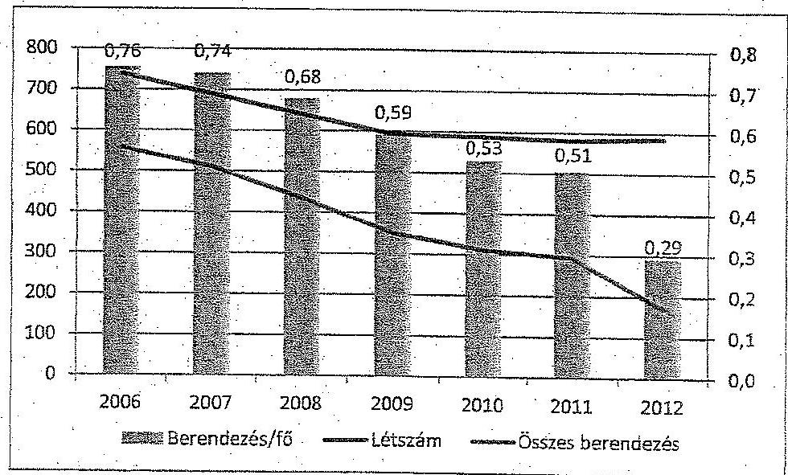
19. oldal, 4-6. bekezdések, 11. oldal 3. bekezdés
„Nem szolgálja a költséghatékonysági szempontokat az sem, hogy a személyi használatú gépjárműveket...”:

1. A MNB javadalmazási politikája a vezetői gépkocsik használatát a vezetők juttatási csomagjának részeként így határozta meg.

---

A személygépjárművek használatának juttatása a Bank bérpolitikájához kapcsolódik, a bérjellegű juttatások részeként működik. A gépjárművek használatának jelenlegi MNB szabályozása, a hazai kereskedelmi bankok javadalmazási gyakorlatával megegyezően a magáncélú használatot is lehetővé teszi, és a Működési szolgáltatások folyamatos ellenőrzése biztosítja, hogy a gépjárművek futott kilométere által indokolt mértéken felül benzinköltség elszámolása ne történhessen meg.

A Hay Group 2011. évi banki jövedelemszint tanulmány rámutat arra, hogy minden a felmérésben résztvevő kereskedelmi bank a vezetők számára engedélyezi és támogatja a vállalati gépjárművek magáncélú használatát, és 45%-uk a külföldi magánhasználatot is finanszírozza, mely gyakorlat a 2012. évi tanulmány szerint sem változott.

A fentiekre tekintettel kérjük, hogy a magánhasználatú vállalati gépjárművekkel kapcsolatos nem megfelelő költséggazdálkodásra vonatkozó megállapítást a jelentésből töröljék.

# Üzemanyagköltségek térítése 

Minden bank kevésbé gazdálkodik a vállalati gépkocsik magáncélú használatának költségeit

Ahogy a grafikonon is látható jelentős különbség van a felső- és a középvezetők megítélésének tekintetében. A bankok 45 százalékánál a felsővezetés külföldre is elviheti az autót céges költségen, míg a középvezetés mindössze a cégek 22%-ának esetében teheti ugyanezt meg. A bankok viszonylag nagy arányban (56%) fizetik a szakértői szinteken is (ez főként az értékesítőket és az értékesítés támogatást jelenti) a magáncélú belföldi utakat.

Gépkocsikhoz kapcsolódó benzintérítési politika
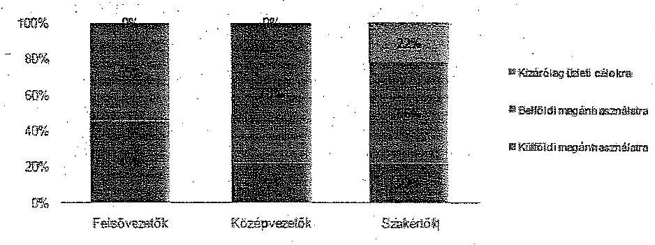

Egyéb gépkocsikhoz kapcsolódó juttatások

---

Milyen egyéb szolgáltatásokat foglal magába a cégek vállalati gépkocsi juttatási politikája?

| KÖZÉPSŐ VEZETŐK | TÖBBESVEZETŐK | KÖZÖSSZÖK | SZAKÉRTŐK |
|---|---|---|---|
| Alapjárt szerződés | 100% | 100% | 100% |
| Megnekszínálat benzintérítés | 100% | 94% | 78% |
| Jártfokongjártaszínálat | 59% | 75% | 67% |
| Különő megnekszínálat | 41% | 19% | 11% |
| Kötelezőn kiálló biztosítás | 92% | 88% | 92% |
| Sorsz. | 17% | 7% | 0% |

A fenti értékeket a gépkocsi juttatást nyújtó vállalatok arányában adtak meg.

A bankok 47%-a meghatároz maximum havi limitet a benzintérítésre vonatkozóan magánhasználat esetén.

Az elmúlt években nem változott jelentősen a gépkocsik cseréjére vonatkozó politika. A bankok átlagosan 60 hónap vagy 150 ezer km után cserélik le az autókat.

Mekkora a vállalatok által nyújtott gépkocsi hozzájárulások összege?

| KÖZÉPSŐ VEZETŐK | TÖBBESVEZETŐK | KÖZÖSSZÖK | SZAKÉRTŐK |
|---|---|---|---|
| Jártfokongjártaszínák havi átlagos juttatási politikája | 250 | 140 |  |

A fenti adatok mértani értékek.

1. Az MNB személyi használatú gépjárműveinek átlagfogyasztása az összehasonlítás alapjául szolgáló átlagos fogyasztás alatt alakult 2011-ben 3,6%-kal.

a) Az ÁSZ jelentésben említett kalkuláció célja az azonos kategóriába tartozó benzin és gázolaj üzemű autók összehasonlítása volt. Az ott figyelembe vett 5,7-7,8 l/100 km átlagfogyasztás a gyártó által közölt, a 715/2007 EK rendeletben előírt mérési szabvány szerinti fogyasztás. Ezt a jelentéshez felhasznált dokumentumban is jeleztük. Ez az adat nem jelent támpontot egy konkrét autó várható fogyasztására, az általában a rendelet szerinti mérési adatnál 20-30%-kal magasabb.

b) A személyi használatú gépjárművek fogyasztásának alakulását folyamatosan rögzíti és értékeli az MNB. 2011-ben ezeknek a gépjárművek átlagfogyasztása 8,31 l volt. A fogyasztás vizsgálatakor az általánosan elfogadott és közzétett tesztfogyasztási adatokhoz viszonyítottuk az értékeket. Mivel a felhasználók különböző forgalmi viszonyok között használják az egyes autókat, vizsgáltuk az egyedi eltéréseket is. Csak két jármű fogyasztása haladta meg több, mint 10%-kal a tesztadatokat. Mindkettő jellemzően rövid, városi szakaszokon közlekedik, ami indokolja az eltérést. Ez a két jármű messze az átlagfutás alatt volt használva (csak 11 500 km/év), ez minimalizálta a jelentkező többletköltséget. Az MNB személyi használatú gépjárműveinek az átlag fogyasztása, amint az az ÁSZ számára átadott kimutatásból is kiderül, 2011-ben összességében még a tesztfogyasztásnál kisebb volt 3,6%-kal.

---

19. oldal 7. bekezdés, 19. oldal 9. bekezdés, összefoglaló 10. oldal 4. bekezdés, javaslatok az elnöknek 14. oldal 2. pont

Az ÁSZ a 19. oldal 7. bekezdésében kifogásolja, hogy az MNB tárgyi eszközként vett állományba egy éves használatú munkaruhákat, illetve készleteket (hangszóró, asztali számológép, létra, kávéfőző). A megállapítás szerint ezzel az MNB 989 ezer forinttal kisebb költséget mutatott ki.

A megállapítással kapcsolatos álláspontunk:
Munkaruhák: a Számviteli kézikönyv szerint a munkaruhák értékcsökkenési leírását a használati idő alapján kell beállítani. A használati időtartamot (juttatási időt) az MNB kollektív szerződése határozza meg. A számviteli rendszerben minden esetben ezen időtartamra történt a tételek költségként való elszámolása.

Létra: az MNB 2 db létrát vásárolt összesen 52 625 Ft, illetve 29 990 Ft értékben. 2006-ban a létrákat anyaggá nyilvánították, de az irattári létra kivétel maradt. A létrákat a Készpénzlogisztika (225 kg teherbírású biztonsági létra) és a Működési szolgáltatások (3 x 11 fokú speciális alumínium létra a padláson levő antennatartó toronyhoz) szakterület használja. A beszerzés és az eszközként való nyilvántartásról szóló döntés dokumentumai 2. sz. mellékletként csatolva.

Asztali számológép: a zsebszámológépek anyagok. A vizsgált időszakban 29 025 Ft értékben aktivált 3 darab, az általánost meghaladó értékű számológép mind olyan asztali számológép, amelyet az egy évet meghaladó használata miatt - az eddigi gyakorlatnak megfelelően - tárgyi eszközként tart nyilván az MNB.

Kávéfőzőt és hangszórót nem aktivált az MNB a vizsgált időszakban.
Az aktivált eszközökről összességében elmondható, hogy egy éven túl szolgálják az MNB tevékenységét, számviteli elszámolásuk megfelel a számviteli törvénynek (valós értékelésnek) és a belső szabályoknak. A kisértékű eszközök azonnali leírása lehetőség, nem kötelezően alkalmazandó. A számviteli politika alapján a Bank - elsődlegesen - nem él a kisértékű eszközök azonnali leírásával, minden tárgyi eszközt - a használati idejének megfelelő leírási kulccsal - aktivál. Tekintettel azonban a költség-haszon elvre a Bank további döntése alapján bizonyos típusú vagyontárgyakat, melyek bekerülési értéke nem haladhatja meg a Sztv. szerinti mindenkori kisértékű határt, készletként kezel. Ezeket a vagyontárgyakat egy külön jegyzék eszköztípusonként tartalmazza. Egyes esetekben, speciálisabb eszközöknél, amikor a bekerülési érték 50%-ot meghaladóan eltér a nyilvántartási ártól, indokolt a jegyzéktől eltérően a tárgyi eszközként való kezelés, amely a szigorúbb nyilvántartást és a prudensebb működést segíti elő.

A megállapítást - túl azon, hogy álláspontunk szerint a fent részletezettek miatt nem megalapozott - a kifogásolt elszámolás nagyságrendje miatt sem lenne indokolt a jelentésben szerepeltetni, összevetve az MNB banküzemi gazdálkodásának méretével és a működési költségek nagyságával. Fontosnak tartjuk megjegyezni, hogy az ÁSZ nem a beszerzések jogosságát, hanem csak azt kifogásolta, hogy melyik évben/években jelent meg költségként ³ a beszerzések értéke, de az állami pénzzel való felelős gazdálkodás szempontjából ez irreleváns.

A fentiek alapján kérjük a helytelen besorolásra vonatkozó megállapítás törlését.

[^0]
[^0]:    ³ A kisértékű eszközök folyamatosan, nagyságrendileg állandó beszerzéseit feltételezve a költségek megjelenése a számviteli kimutatásokban kiegyenlítődik.

---

19. oldal utolsó bekezdés, javaslatok az elnöknek 14. oldal 2. pont

Az ÁSZ megállapítja, hogy 46 darab eszközt az MNB 2011. december 30-án üzembe helyezett, de a két napra jutó értékcsökkenést a következő évre számolta el.

2012 januárjában a költséggazdák az aktiválási bizonylatot az évzárási időszakban, értékcsökkenés futtatás után, 2011-re visszadátumozva indították el, és ezért ezen eszközökre az előző év utolsó 2 napjára nem került elszámolásra 9 ezer forint értékcsökkenési költség. Ebben az esetben a zárási ütemtervet tekintettük elsődlegesnek és a számszaki hatást megbecsülve helyesnek tartjuk, hogy nem indítottunk el ismételt értékcsökkenés-számítást és -könyvelést.

Kérjük a 2 napra jutó értékcsökkenés hatását összegszerűen megjeleníteni a jelentésben.

# 20. oldal 1. bekezdés 

A bekezdésben megállapítja továbbá az ÁSZ:
„Az említett eszközök aktiválási dátuma helytelenül 2012-re lett beállítva…”
Az ÁSZ-megállapítás valójában helytelen, ha így lett volna, akkor ellentmond a 19. oldal utolsó bekezdésében található megállapításnak. Az aktiválás dátuma 2011. december 30. volt, amire már nem futott le az értékcsökkenés számítás.

A 46 db eszköz említése mellett kérjük az el nem számolt értékcsökkenést összegszerűen is megjelölni azzal együtt, hogy mivel az MNB a kormányrendelet alapján a számviteli beszámolóját millió forintban készíti, ez az eltérés egyetlen számjegyet sem változtatott az adatokon. Ismételten felhívjuk a figyelmet a lényegesség követelményére. Véleményünk szerint az ÁSZ ellenőrzési kapacitásának arra való felhasználása, hogy 9 ezer forint értékű hibát mutasson ki az MNB-nél meglehetősen pazarló felhasználása az erőforrásoknak.

## 20. oldal 2-3. bekezdés, összefoglaló 11. oldal 2. bekezdés

Kifogásolja az ÁSZ, hogy az értékcsökkenési kulcsok változásának hatása a kiegészítő mellékletben nincs bemutatva. Véleményük szerint a 386 ezer forintos hatást az MNB kiegészítő mellékletében be kellett volna mutatni.

Ismételten fel
 kell hívnunk a figyelmet arra a tényre, hogy az MNB a beszámolóját millió forintban köteles elkészíteni, így az ÁSZ által becsült 386 ezer forintos hatás lényegében kerekítési különbözet, még az éves értékcsökkenési leírásnak is csupán 0,02%-a.

Az értékcsökkenési kulcsok változása nem befolyásolta a Számviteli törvény szerinti megbízható és valós összképet. A Számviteli törvény (53. § (4) és (5) bekezdés) a kiegészítő mellékletben történő bemutatási kötelezettséget abban az esetben írja elő, ha már aktivált eszköz használati időtartamában történik változás és emiatt a vállalkozás megváltoztatja az értékcsökkenési kulcsot. Az MNB gyakorlata az, hogy a 2011. szeptember 1. után beszerzett hordozható számítógépek és

---

munkaállomások várható hasznos élettartamát 6 évre becsüli és a Számviteli törvény 52. § (1) bekezdésének és a belső szabályoknak megfelelően ezen időszakra állította be az amortizációt.

A szabályozás egyes eszközcsoportok átlagos leírási kulcsát változtatta a jövőben beszerzendő eszközökre, a számviteli politika azonban tartalmazza, hogy a megadott kulcs (használati idő) csak irányadó, ettől a tényleges használati idő függvényében el kell térni. A kulcsok esetleges változtatását a beszerzésért felelős költséggazdáknak kell kezdeményezniük. (Számviteli kézikönyv A fejezet G rész 2. pont). 2007 és 2011 között egyszer sem fordult elő, hogy a Bank már meglévő eszközének módosította volna a leírási kulcsát.

Az ÁSZ azt a következtetést vonja le abból, hogy az MNB - egyébként semmilyen jogszabályt és belső szabályt nem megsértve - nem mutatta be az újonnan beszerzett hordozható számítógépek és munkaállomások értékcsökkenésének 386 eFt-os hatását a kiegészítő mellékletben, hogy az MNB banküzemi működése nem átlátható. Egyértelműen látható, hogy nincs ok-okozati kapcsolat a megállapítás és az abból levont következtetés között. Sőt, az átláthatóság bizonyítéka éppen, hogy az ÁSZ-nak nyújtott adatokból a számvevők pontosan számszerűsíteni tudták a 386 ezer forintos különbözetet.

A fentiek alapján kérjük a megállapítást és az abból levont következtetés törlését.

# 20. oldal, 4. bekezdés 

„A PJNY vezérigazgatójának kiválasztása során annak utaztatási (repülőjegy) költségét a Bank erre vonatkozó szerződés nélkül kötötte meg.

A vállalkozó a pozícióra megfelelő személy keresését, a kiválasztást követő kapcsolattartást, valamint a Bank és a jelöltek közötti kapcsolatfelvétel koordinálását garanciális kötelezettségként végezte. Az egyik jelölt 203,6 E Ft+áfa utazási költségét az MNB úgy fizette ki, hogy a szerződés szerinti - a kapcsolódó költségek részletezése, valamint egyéb elszámolható költségek meghatározása nélküli, egyösszegű - keresési díjat már korábban megfizette."

A költséggazda EEF hozzájárult a költség elszámolásához, a hozzá tartozó működési költségnemek előirányzatainak együttes összege terhére. Erre a vonatkozó belső szabály szerint 2 M Ft alatt a költséggazdának saját hatáskörben lehetősége van, ezért a belső utasításnak megfelelően járt el.
20. oldal 6. bekezdés, összefoglaló 10. oldal 4. bekezdés, javaslatok az elnöknek 14. oldal 2. pont
„Az ellenőrzés során tapasztalt számviteli szabálytalanságok alátámasztják, hogy a banküzemi gazdálkodás során nem volt megfelelő a vezetői ellenőrzés,..."

A vélt számviteli hiányosságokra alapozva az ÁSZ megállapítja, hogy a banküzemi gazdálkodás során nem megfelelő a vezetői ellenőrzés, hiányolja a belső kontrollokat, amelyek a hibákat kiszűrték volna.

Az MNB gazdálkodásának szabályait az SZMSZ, az egyes belső működési kérdésekről szóló elnöki utasítás, a Gazdálkodási kézikönyv, valamint az MNB pénzügyi tervezéséről és az évközi gazdálkodásról szóló utasítás rögzíti. Ezen szabályok egyértelműen meghatározzák a feladatokat és

---

felelősségeket, amelyek megoszlanak a költséggazdák, a felhasználók, a kontrolling és a számviteli funkció között. A szabályozás fő eleme, hogy „az erőforrások igénybevétele és a kapcsolódó gazdálkodási feladatok ellátása során törekedni kell a „négy szem" elv érvényesítésére."

Az ÁSZ példaként említi az eszközökkel kapcsolatos problémát, de más nem kerül említésre, a szöveg tehát ismét félrevezető, mert azt sugallja, mintha jelentős hiányosságok kerültek volna feltárásra. A valóság ezzel szemben az, hogy a következtetést téves megállapításokra alapozza az ÁSZ.

Tehát konkrét hiányosságra vonatkozó megállapítás nem támasztja alá az ÁSZ nem megfelelő vezetői ellenőrzésre vonatkozó megállapítását. Számvitelt érintő lényeges szabálytalanság nem történt, ahogy ezt az ezekre tett konkrét észrevételeink alátámasztják. Hibaként egyedül a 46 eszköz esetében el nem számolt 2 napi értékcsökkenés (9 ezer Ft) jelentkezik, ami figyelembe véve a működési költségek 12 milliárdos szintjét, valamint hogy az MNB millió forintban készíti a számviteli beszámolóját, elhanyagolható, és nem támasztja alá a vezetői ellenőrzés nem megfelelőségét.

Az eszköz-aktiválás bizonylat problémára (lásd még a 19. oldal legaljához, illetve a 20. oldal tetejéhez tett észrevételeket) alapozza az ÁSZ a nem megfelelő vezetői ellenőrzésre és a kontrollok hiányára vonatkozó megállapítását, illetve következtetését. A kontroll működött, hiszen a vezetés tudatosan döntött amellett, hogy a zárlati ütemtervnek való megfelelés az elsődleges és a számszerűsített el nem számolt értékcsökkenést (9 e Ft) nem jelentősnek minősítette.

A bekezdésben megfogalmazott megállapítás, mely az eszköz-aktiválási bizonylatok szakmai tartalmának felülvizsgálatára vonatkozó kontrollt hiányolja, nem megalapozott.

2011-ben az MNB 2143 darab aktív eszközt vett állományba, melyből 130 darab üzembe helyezése esett 2011. december 30-31 közötti könyvelési időszakra. Ez utóbbiból 46 darab (a 2011-ben üzembe helyezett teljes eszköz állomány 2,09%-a) két napra eső 9 ezer Ft értékű értékcsökkenés elszámolásának elmaradása a lényegesség elvét figyelembe véve nem alapozza meg a szakmai kontroll hiányosságára vonatkozó megállapítást. Véleményünk szerint nem a vezető feladata a bizonylatszintű adatellenőrzés. Az MNB folyamatosan arra törekszik, hogy ahol lehet, az informatikai rendszerek által támogatott ellenőrzési lépéseket erősítse. Az eszköz aktiválási bizonylat dátumán a Számvitel érdemi ellenőrzést nem hajt végre, mivel a költséggazda helyezi üzembe az általa felügyelt beruházást.

A fentiek alapján kérjük mind a vezetői ellenőrzésre, mind a kontrollok hiányára vonatkozó megállapítás törlését. Az elnöknek tett javaslatok 2. pontjából a számviteli elszámolásokra vonatkozó rész törlését szintén kérjük.

# 20. oldal, 6. bekezdés 

„(...) A decentralizált banküzemi gazdálkodáshoz kapcsolódó kontrollok nem teljes körűek, azok a tranzakciók monitorozására nem terjednek ki."

Az MNB vonatkozó belső szabálya szerint a költséggazdának a felhasználókat csak azon működési költségek és beruházások esetében kell bevonni a tervezésbe, amelyeknél a konkrét feladat meghatározásában szerepük, illetve a kapcsolódó kiadások alakulására közvetlen ráhatásuk van. A megfelelő irányelvek alapján az illetékes költséggazdák egy összegben (szervezeti egységenkénti részletezés nélkül) tervezhetik az erősen decentralizált, általános felhasználású és kis összegű

---

tételeket. Ebből következően az évközi gazdálkodás esetében az ilyen jellegű, kis értékű, együttesen nem jelentős összegű tételek tranzakció szintű egyenkénti előzetes vizsgálata jelentős többleterőforrást igényelne, ugyanakkor a megállapítás alapjául szolgáló tétel összege 203,6 E Ft.
20. oldal 7. bekezdés, összefoglaló 10. oldal 4. bekezdés, javaslatok az NGM-nek 3. pont

Az ÁSZ alacsonynak tartja a jelentős összegű hiba határát, és javaslatot tesz a jogalkotónak arra, hogy a kérdést szabályozza az MNB könyvvezetéséről szóló kormányrendeletben úgy, hogy a működési költségekkel kapcsolatban a jelentős összegű hiba határa 500 millió forint legyen.

Véleményünk szerint a javaslat alapját képező szabálytalan számviteli elszámolás nem történt, de az ÁSZ által kifogásolt elszámolások [összesen egyrészt 998 ezer forinttal alacsonyabb költség (a kis értékű eszközök aktiválása és a 2 napra el nem számolt értékcsökkenés hatásának köszönhetően), másrészt 9,6 millió forinttal magasabb költség és 47 millió forinttal alacsonyabb ráfordítás (a bankjegyvédelmi projekt elszámolásának hatásaként)] összesen sem érik el még az ÁSZ standardok szerinti lényegességi határt, azaz a működési költségek 0,5%-át, összegzően a 60,3 millió forintot sem, ennek megfelelően az állítás nem alapozza meg a következtetést.

A jelentéstervezetben szereplő azon megállapítás, mely szerint „A számviteli szabályoktól eltérő elszámolások az MNB éves beszámolójának minősítését nem befolyásolják" és „Ennek az az oka, hogy a Bank esetében kormányrendelet alapján az Sztv-ben meghatározott 500 M Ft felső korlát helyett jelentősebb összegű hibának a mérlegfőösszeg 2%-át, 2011-ben 250 Mrd Ft-ot meghaladó hiba minősül" azt a látszatot kelti, mintha az MNB éves beszámolójával összefüggésben a Számvevőszék 500 millió forintot meghaladó hibá(ka)t tárt volna fel. A megalapozottan megállapított, de nem számszerűsített hiba (2 napi értékcsökkenés 46 db eszköz esetében, 9 ezer forint értékben) nemcsak az éves beszámoló minősítését nem befolyásolja, hanem a számviteli törvény szerinti megbízható valós képet sem, sőt egyetlen számjegyet sem, mivel millió forintban készül a beszámoló. A javasolt hibahatár csökkentésének semmilyen plusz kontroll hatása nem lenne a működési költségek felett, mivel 2012-től az MNB tv. ezt a kontrollt a független könyvvizsgálóhoz telepíti azzal, hogy kimondja: „Az MNB a pénzügyi év kezdete előtt működési költségeire, valamint beruházásaira vonatkozóan részletes éves tervet készít. A pénzügyi év lezárását követően összehasonlító elemzést készít a tervezett és a tényleges működési és beruházási költségek alakulásáról. Az elemzést a könyvvizsgáló véleményével ellátva az éves beszámolóval egyidejűleg megküldi az Országgyűlés gazdasági ügyekért felelős állandó bizottsága, valamint az Állami Számvevőszék részére."

# 21. oldal 2. bekezdés 

„Egyes a tervezéskor nem kellően megalapozott... (Logisztikai központ értéktári daruk szünetmentes áramforrása)."

Az MNB-ben a megalapozott beruházási tervek ellenére év közben előfordul, hogy a felhasználói igények megváltoznak, illetve egyéb olyan szempontok merülnek fel, ami alapján a felelős gazdálkodás elveinek megfelelve az adott fejlesztés nem kerül megvalósításra (a tervezetthez képest jóval magasabb áron lehetne beszerezni az adott eszközt). Ezért kérjük a tervek megalapozatlanságára vonatkozó megállapítás törlését.

1. A Logisztikai központ értéktári daruk szünetmentes áramforrása a Készpénzlogisztikai szakterület javaslatára, a működési kockázatok csökkentése érdekében került betervezésre. A

---

szünetmentes berendezés eredetileg elképzelt telepítési helye a Készpénzlogisztika zárt területén volt, az ehhez tartozó műszaki megoldás becsült költsége 9,1M Ft volt. A kijelölt terület a beruházás megindítását megelőzően megváltoztatásra került. Az új terület műszaki (elektromos, gépészeti és építészeti) előkészítése jelentős költségnövekedést jelentett, amellyel a teljes beruházási érték összesen 20 millió Ft-ra nőtt volna.

A jelentkező többletköltségek kompenzálására megvizsgálásra került az a lehetőség is, hogy új szünetmentes berendezés helyett a Székházban (Szabadság téri épületben) felszabaduló szünetmentes berendezés kerüljön a Logisztikai központba nagyfelújítást követően, ez a változat 12 M Ft-ba került volna.
2. A Készpénzlogisztikai szakterület újból elvégezte a kockázatelemzést és megállapította, hogy az árajánlatok szerinti becsült beruházási költség túl magas a működési kockázathoz képest (a Logisztikai Központban bekövetkező esetleges áramszünet hatása a daruk mozgására (leállási idő, újraindítás) nem okozna annyi veszteséget, mint a tervezett beruházás értéke), ezért az Működési szolgáltatások és a Készpénzlogisztikai szakterület képviselői döntése alapján a beruházást az Működési szolgáltatások saját hatáskörben törölte.

# 21. oldal 2. bekezdés 

SAP bérszámfejtési licencek: A számvevő megállapítása megalapozatlan. A tervezési időszakban a SAP konkrét licencdíj követeléssel lépett fel a bankkal szemben, ezért került a tervbe a téma. Később, az MNB érdekeinek megvédése és a takarékossági célok szem előtt tartása és több tárgyalás, adatszolgáltatás lefolytatása után ismerte csak el a SAP, hogy a bank jogosan használja a
 licenceket. Így a beruházás szükségtelenné vált.
A SAP értesítette az MNB-t arról, hogy eltekint a „payroll engine"-nel (bérszámfejtési licenccel) kapcsolatos követelésétől, mivel az MNB jóhiszeműen járt el a licenc alkalmazása során.

Sávszélesség bővítés: A számvevő megállapítása megalapozatlan. A tervezéskor azt vettük figyelembe, hogy a hordozható munkaállomások számának drasztikus növekedésével várhatóan jelentősen emelkedni fog a külső munkavégzés miatti sávszélesség igény. A beruházás megvalósításával viszont vártunk a tényleges felhasználási adatok megjelenéséig. Évközben vált ismertté, hogy az internetes sávszélesség kihasználtsági foka alacsony volt, nem volt indokolt a kapacitásbővítés. Ezért gazdaságossági szempontok miatt nem hajtottuk végre a bővítést.

## 21. oldal 3. bekezdés

„A hőszivattyú kiépítése az MNB Logisztikai központjában..."

1. A Logisztikai központ hőszivattyú kiépítésénél a beruházás előzetes pénzügyi tervezésénél a becsült beruházási költség 6,25 M Ft volt. Ebből 1,5 M Ft tervezési és dokumentációs költség, 4,75 M Ft a kivitelezés költsége. A kivitelezés becslése előzetes ajánlatkérés alapján történt.
2. A beruházáshoz szükséges műszaki berendezések beszerzése a Logisztikai központ biztonsági porta átvizsgáló zsilip elszívó rendszerének berendezéseivel egy eljárásban, összevontan történt. A beérkezett ajánlatok között, az azonos műszaki paraméterű, de eltérő gyártmányok ára között 30\%-ot meghaladó szórás volt. A beszerzési eljárás eredményeképpen a beruházás teljes összege 2,69 M Ft-ot tett ki.

---

A tervezésre és dokumentálásra tervezett költség magában foglalta a Logisztikai központ generáltervezőjének díját is, abban az esetben, ha építési engedély benyújtására, illetve ahhoz engedélyes tervek elkészítésére is szükség lett volna. A kiválasztott műszaki megoldás viszont lehetővé tette az engedélyezési eljárás, így annak jelentős költségeinek elmaradását is.

# 21. oldal 3. (apró betűs) bekezdés 

„A „Bankjegyminőség riportok készítése" beruházási soron a Bank 52,5 M Ft megtakarítást mutatott ki azzal, hogy az eredetileg tervezett műszaki megoldás helyett a riportokat az adattárház rendszerben valósította meg a tervezett 58 M Ft helyett 5,5 M Ft-ból. Tervezéskor nem vizsgálta az adattárházban történő megvalósítás lehetőségét."

A beruházást a Vezetői Bizottság 2009.12.15-én hagyta jóvá. Az előterjesztés készítésekor, az akkori számítástechnikai infrastruktúra alapján két megvalósítási lehetőség merült fel: az SAP-BW alkalmazás és a végül jóváhagyott beruházás. 2009-ben az Adattárház projekt a Statisztika által kért alapcélra koncentrált, nem volt szó más adatok integrálási lehetőségéről. Egy év múlva az Adattárház fejlődése, működése azt mutatta, hogy nagyobb adatforgalom fogadására és tárolására is alkalmas. Így amikor a projekt a beszerzés szakaszába ért, 2011. első felében az érintett szakterületek úgy látták, amennyiben ezzel gazdasági előny érhető el, mindenképpen azt indokolja, hogy így kerüljön megvalósításra a projekt.

## 21. oldal 5. bekezdés

„Az alacsony arányú tervteljesülés a beruházások tervezésének (pl. feltételek és kockázatok számba vétele, ütemezés) hiányosságaira vezethető vissza. Az informatikai beruházások csúszásában számos tényező szerepet játszott, pl.: a beszerzési eljárás eredménytelenség miatt történő elhúzódása, az informatikai külső fejlesztő részéről az erőforrások hibás felmérése.

Az említett erőforrás-hiányos okok két beruházás esetében álltak fenn (adattárház fejlesztések és ISTAT 2011-es fejlesztések).

A csúszások a 30 MFt feletti beruházások több mint felében pontosan ismert, előre nem tervezhető okok miatt következtek be: sikertelen közbeszerzési eljárás (DWDM eszközök beszerzése), előzetes szakértői felmérés beiktatása a beruházás speciális jellege miatt (számonkérhetőség megvalósítása), elhúzódó szállítói tárgyalások (auditált iratkezelő rendszer).

Mindezek alapján kérjük a megállapítás törlését.

## 21. oldal, 6. bekezdés

„A nagy értékű komplex beruházásokkal kapcsolatos tervezési eljárások, egyeztetési folyamatok és kontrollok nem biztosították a beruházási tervek felső vezetés által elvárt követelmények teljesülését."

A felső vezetés elvárása a beruházás minőségében és a pénzügyi keretek betartásában teljesült, a beruházás időbeli megvalósítása pedig nem okozott a bank működésében kockázatokat, melyeket állandóan vizsgált.

---

A beruházások teljesüléséről, az esetleges késedelmes teljesülésről, annak okairól a kontrolling 2011-es év során is havonta tájékoztatta a BKB elnökét a beruházás monitoring jelentésekben, továbbá a Vezetői bizottságot negyedévente a gazdálkodásról készített negyedéves tájékoztatókban. Június hónaptól a beruházási kiadások éves várható előrejelzése is megtörtént. Így véleményünk szerint a szükséges „kontrollok" biztosítottak voltak. Kérjük ezt a mondatot törölni.

# 21. oldal 8. bekezdés 

„Az ellenőrzött négy beruházás ellenőrzése alapján a kockázatok felmérése, a belső erőforrásigény tervezése nem volt megfelelő, vagy a szükséges belső erőforrásokat nem bocsátották rendelkezésre. A belső erőforrások menedzsmentjének alapvető hiányossága volt, hogy a projektek során felhasznált belső erőforrások mérése teljes körűen nem volt megoldott, ezért nem állapítható meg, hogy a projekt csúszását a nem megfelelő erőforrás tervezés okozta vagy az, hogy egyes szakterület nem biztosította az elfogadott esettanulmányban meghatározott kapacitásokat. Mérés hiányában nem volt lehetőség az erőforrás tervezés minőségének értékelésére és javítására sem."

Az informatikai beruházások tervezésével kapcsolatos megállapításokra tett észrevétel:
Javasoljuk a konkrét 30 M Ft feletti beruházások megnevezését. A szöveg így nem konkrét, és nehezen nyomon követhető (egy beruházás... négy beruházás... két beruházásnál...).

A minden beruházásra előírt erőforrás-felhasználás adminisztrálása aránytalan terheket ró a szervezetre. Egy erőforrás tervezésére és visszamérésére alkalmas szoftver bevezetése és annak használata nem garantálja, hogy a beruházási terv, az egyes projektek teljesülése magasabb fokú lesz. Az MNB felső vezetésének álláspontja, hogy a jelenleg érvényes projekt-szabályozással összhangban - csak a határidő-kritikus és/vagy egy bizonyos méret feletti beruházások esetében van erre szükség.

## 22. oldal, 2. bekezdés

„Kockázatelemzést egy beruházás tartalmazott, annak ellenére, hogy a komplex esettanulmányokra vonatkozó módszertan előírta a megvalósítás kockázatainak bemutatását."

Álláspontunk szerint a szabályzat alapján minden esetben elkészült az említett kockázatelemzés, ezért kérjük megnevezni, hogy az ÁSZ szerint mely beruházás komplex üzleti esettanulmánya nem tartalmazza azt.

## 22. oldal 2. bekezdés

Nem értünk egyet azzal a számvevői megállapítással, miszerint csak egy beruházás tartalmaz kockázatelemzést. Az esettanulmányok része az egyes változatok elemzése, előnyök-hátrányok bemutatása, kockázatok elemzése, amely minden egyes esettanulmányos beruházás esetében megtörtént.

---

# 22. oldal 5., 6., 7. bekezdés 

„Az MNB iratkezelési gyakorlata 2009-óta nem felel meg az iratkezelésére vonatkozó jogszabályi előírásoknak"

1. Az MNB iratkezelési gyakorlatában kifogásolt, a megállapítás alapját képező elektronikus iratkezelési rendszert a felügyeleti szervünk (Magyar Nemzeti Levéltár) nem kifogásolta, azzal kapcsolatosan 2011 decemberéig hibát nem tárt fel. A Bank minden évben módosította a jogszabályoknak való megfelelés érdekében az iratkezelési Szabályzatát, amelyet a felügyeleti szerv minden esetben elfogadott, így hatályba helyezhető volt. Az MNB már 2008-ban elindította az iratkezelési rendszerének auditálását, amely folyamat nem az MNB-nek felróható okok miatt húzódott el.

A törvényi előírásoknak megfelelő iratkezelő rendszert a Bank MonDoc 2.1 verziószámmal 2012. december 1-jei dátummal auditáltatta, (a tanúsítvány regisztráció száma: 20-00229/12-00045, érvényessége: 2015.12.17). Ezáltal a Bank eleget tett a vonatkozó jogszabályi előírásoknak, és az általa alkalmazott iratkezelési szoftver megfelel a közfeladatot ellátó szervek iratkezelésének általános követelményeiről szóló 335/2005. (XII. 29.) Korm. rendelet, valamint a közfeladatot ellátó szerveknél alkalmazható iratkezelési szoftverekkel szemben támasztott követelményekről szóló 24/2006. (IV. 29.) BM-IHM-NKÖM együttes rendelet előírásainak.

Az ÁSZ észrevételben szereplő „hiteles dokumentum forgalom" a hivatkozott jogszabályban nem szereplő fogalom és így nincs is összefüggésben a tanúsítvány meglétével. A hiteles elektronikus dokumentumforgalmat a Bank a 2011 júliusától Hivatali kapun keresztül teljesíti.
2. Az MNB 2003 szeptemberében elektronikus dokumentumkezelő rendszert vezetett be, amely jóval megelőzte a közfeladatot ellátóknál alkalmazott megoldásokat. A levéltári törvénynek megfelelően az MNB úgy alakította ki az iratkezelési rendszerét, hogy a Bankhoz érkezett, ott keletkező, illetve onnan továbbított irat az összes a törvény által előírt követelménynek megfelel.

Az iratokat és az adatokat védjük a jogosulatlan hozzáférés, megváltoztatás, továbbítás, nyilvánosságra hozatal, törlés, megsemmisítés, valamint a megsemmisülés és sérülés ellen.

A fentieken túl a rendszer biztosította és biztosítja az ügyiratok beazonosítását, besorolását, osztályozását, előzményezését, irattári tervhez rendelését, metaadattal történő ellátását olyan módon, ahogyan azt később a 24/2006. (IV.29.) BM-IHM-NKÖM együttes rendelete is előírta. A rendszer a bevezetéstől képes volt az ügyiratok tárolására, metaadattal történő ellátására, egyedi (egyszer felhasználható) azonosítószámmal történő ellátására, a vegyes ügyiratok kezelésére az iratok mozgásának nyomon követésére, jogosultságkezelésre, megváltoztathatatlan és törölhetetlen naplózásra. Az iratokat a bevezetéstől nem lehet nyom nélkül törölni a rendszerből, azok a bevezetéstől visszakereshetőek, nyomon követhetőek, bemutathatóak, mindezt folyamatos és biztonságos mentéssel, irattározási, levéltározási támogatással. Az iktatókönyvet az ügyintézés hiteles dokumentumaként lehet használni.

A levéltárral napi szintű kapcsolatban áll a Bank, folyamatosan teljesítjük az elvárásokat: évenkénti átadások, dokumentum visszakeresés bemutatása, az őrzési idők követése, a selejtezés végrehajtása. A levéltári törvénynek megfelelően a Bank biztosítja az iratok szakszerű és biztonságos kezelését és megőrzését. A levéltár - a levéltári törvényben

---

foglaltaknak megfelelően - a Bank Iratkezelési Szabályzata alapján ellenőrzi a nem selejtezhető köziratok fennmaradásának biztosítása érdekében az irataink védelmét és iratkezelésünk rendjét. Az Iratkezelési Szabályzatot minden évben a levéltár jóváhagyásával bocsátjuk ki.

Nem értünk egyet az ÁSZ azon megállapításával, hogy: „Az MNB aláírt szerződés nélkül kezdte meg 2011-ben az auditált Iratkezelési rendszerre vonatkozó beruházást", mert a közbeszerzés szabályai szerint a Bank 2010 decemberében az erre vonatkozó megrendelést rögzítette a KSZF oldalán. A megrendelést a KSZF 2010. december 20-án jóváhagyta, a másik fél a megrendeléseket 2010 december 28-29-én visszaigazolta, így polgári jogi értelemben a szerződés létrejött. A KSZF-es szerződéses feltételeken túl az MNB feltételek tisztázása érdekében a megrendelést követően a Bank azonnal megkezdte a részletek okiratba (szerződésbe) foglalása érdekében a tárgyalást a szerződéses partnerrel.

# 23. oldal, 5. bekezdés 

„A beruházási beszámolóban a 2.3.1-6. „gépkocsi átvizsgálóba elszívó rendszer kiépítése" megnevezésű beruházás 2011. évben elszámolt kiadásaként a valós 964,5 E Ft helyett 1023,9 E Fttal magasabb összeget mutattak ki, az 1.6.2.4-1. „az MNB Logisztikai Központjában hőszivattyú kiépítése" megnevezésű tételen pedig a valós 3292,6 E Ft helyett kevesebbet 2268,7 E Ft-ot."

Az SAP CO és FI moduljaiból lekérdezett riportok egyezően alátámasztják a beruházási beszámolóban szereplő összegeket. A megállapítás téves adatokon alapul ezért kérjük törölni.

## 23. oldal, 7. bekezdés

„A monetáris szakmai tevékenység ellátásához szükséges kapacitás 2011-ben is bővült. A Költségvetési Tanácsban (KT) az MNB-re háruló feladatok növekedése miatt jegybanki szakmai területen 6 főt és egy elnöki tanácsadót alkalmaztak. A KT funkció azonban nem jelent folytonos feladatellátást és új szakterületet sem."

A Költségvetési Tanács feladataival kapcsolatos összességében 7 fős létszámbővülést a vezetői Bizottság a 2010.12.21.-i ülésén hagyta jóvá, mely két jegybanki területet érintett.

Elnöki tanácsadó a Költségvetési Tanáccsal kapcsolatos feladatokkal összefüggésben nem került felvételre.

## A KT FUNKCIÓHOZ KAPCSOLÓDÓ TÖBBLETTERHELÉS A PÉNZÜGYI ELEMZÉSEK SZAKTERÜLETEN

A költségvetési tanácsi funkcióhoz kapcsolódóan jelentősen bővültek az elemzési és előrejelzési feladataink ${ }^{6}$. A költségvetési tanácsi funkciót megelőzően a jegybankban 2-3 ember foglalkozott költségvetési előrejelzéssel. Ebben az időszakban évente négyszer, az inflációs jelentés részeként készítettünk költségvetési hiány- és adósság előrejelzést, illetve publikáltunk 5-10 oldalas elemzést, emellett „beáraztuk" a költségvetési intézkedéscsomagok hatását.

[^0]
[^0]:    ${ }^{6}$ A várt többletfeladatokról, illetve az ehhez kapcsolódó többlet erőforrás igényünkről 2010 decemberében
 részletes indoklást készítettünk.

---

A tanácsi funkció számos ponton többletfeladatot és így többleterőforrás-igényt jelent.

- Egyrészt a transzparencia igénye megköveteli, hogy a tanács döntéseit publikus elemzésekkel alapozza meg. Így a jegybank számos új kiadványt hozott létre. Ebből évente 3-4 kapcsolódik szorosan a költségvetési törvényalkotási folyamathoz és a költségvetési tanácsi tevékenységhez ${ }^{7}$. A hiteles értékelések készítéséhez elengedhetetlen a transzparencia. Ezért az elemzéseknek lényegesen részletezettebbeknek kell lenniük, mint az inflációs jelentésben bemutatott előrejelzések. Így a korábbi, évi négy rövid publikáció mellett további 3-4, jellemzően nagyobb lélegzetű, publikációra alkalmas elemzést/előrejelzést készítünk.
- A költségvetés kiadási és bevételi főösszegét érintő költségvetési törvénymódosító javaslatokról a Tanács véleményt alkot. Így évente több alkalommal szükséges az egyes javaslatokról szakértői véleményt formálni, az adósságszabálynak történő megfelelést vizsgálni, azaz előrejelzést frissíteni. Mivel a módosító javaslatok értékelésére a Tanács számára rendelkezésre álló idő rendkívül rövid (a jelenlegi szabályok szerint egy nap), a feladat megfelelő szinten történő ellátása azt igényli, hogy az előrejelzéseket szinte folyamatosan frissítsük.
- Az új feladat emellett olyan területeken indokolta az elemzési és előrejelzési rendszerünk fejlesztését és a fejlesztések működtetését, amelyekkel kapcsolatban a jegybank korábban nem rendelkezett önálló előrejelzéssel. A korábbi előrejelzési keretben a költségvetés kiadási oldalának egy része (költségvetési szervek kiadásai) esetében nem készítettünk részletes előrejelzést, prognózisainkat egyszerű szabályok alapján, vagy a PM/NGM előrejelzését átvéve készítettük el. A költségvetési intézkedések hatásainak megítéléséhez ugyanakkor nélkülözhetetlen a kiadási folyamatok mélyebb megismerése, a strukturális problémák feltárása. Itt elsősorban olyan szakpolitikai ismeretekre van szükség, amelyek lehetővé teszik annak megítélését, hogy a fő kiadási oldali tételekben mekkora feszültségek vannak egy adott pillanatban (pl. mekkora „implicit adósság" halmozódott fel az egészségügyi rendszer folyamatos alulfinanszírozása során), illetve hogy egy adott évi költségvetési törvényjavaslat, vagy egyéb kormányzati intézkedés hogyan befolyásolja ezeket a feszültségeket. Emellett a nyugdíjrendszerrel kapcsolatos intézkedések értékeléséhez, illetve a nyugdíjrendszerből fakadó implicit államadósság-statisztika előállításához szükségessé vált egy nyugdíjmodell felépítése.

A fenti feladatok folyamatos többletterhelést jelentenek:

- A májustól az év végéig tartó költségvetési törvényalkotási folyamat időszakában a törvényjavaslatot érintő nagyobb csomagok (2012-ben összesen 5 fiskális intézkedéscsomag került bejelentésre), illetve kisebb változások folyamatos nyomon követése, valamint ezek értékelése a KT szempontjai alapján, a rendszeresen frissülő makrogazdasági előrejelzés tükrében folyamatos feladatot jelentenek az elemzői stáb számára.
- Az év első hónapjaiban jut idő a féléves (publikáció jellemzően július elején), illetve éves visszatekintés elkészítésére, valamint az előrejelzési és elemzési módszertan fejlesztésére, így a csapat ekkor is teljes kihasználtsággal üzemel. Emellett az elmúlt években a költségvetés elfogadását követően is számos módosító javaslat került benyújtásra, amiről a KT-nak rendkívül szűk határidők mellett véleményt kellett alkotnia.
- Végül a legjobb nemzetközi gyakorlat szerint a Költségvetési Tanácsok, illetve a hasonló mandátummal bíró fiskális intézmények a szűken vett törvényi kötelezettségeiken felül

[^0]
[^0]:    ${ }^{7} 2011$-ben három, 2012-ben pedig összesen négy kiadványt publikáltunk a költségvetési tanácsi funkcióhoz kapcsolódóan. (http://www.mnb.hu/kladyanyok/elemzes-az-allenhastartas/ef)

---

vizsgálják, elemzik a költségvetés hosszú távú fenntarthatóságát is. Így több évre, vagy akár évtizedre előretekintő elemzéseket is készítenek, illetve publikálnak. A jegybanki stáb először 2012-ben publikált ilyen típusú, elsősorban adósságkivetítésen alapuló hosszabb távú elemzést. A kivetítés elkészítését is az év első felére időzítjük.

# 24. oldal 5. bekezdés 

„A teljesítménytől függő bónusz mértékénél a legalacsonyabb sáv 0\%-ról 0-20\%-ra, a felső két kategória 70-100\% közöttiről 80\%-100\%-ra változott."

A teljesítménymenedzsment rendszer fejlesztése megkívánta a bónuszrendszer áttekintését, a teljesítményértékelés ösztönző erejének növelését előirányzó célokhoz, illetve az új értékelési skálához történő illesztését is. Miután a fent hivatkozott bónuszsávok korábban is 4 sávban kerültek meghatározásra, így a sávok átalakítására nem, csak a sávhatárok - az értékelési kategória tartalma, általa megfogalmazott üzenete szerinti - átgondolására volt szükség. Bár az emberi erőforrások javasolta, és a bank felsővezetése támogatta a kiemelkedő teljesítmények kiemelt elismerését, de a legjobban teljesítő munkatársak külön elismerése, valamint a banki bónuszkeret szervezeti egységekre történő lebontására tett további javaslatok megfontolása rámutatott arra, hogy a bónuszsávok fenti kategóriákban történő módosítása nem indokolt. Így a bónuszhatárok módosítására - a teljesítményértékelés fejlesztési céljaival összhangban - kizárólag az alsó két sávban került sor, amennyiben a legalsó bónuszsáv 0\%-ról 0-20\%-ra, a második sáv 0-20\%-ról 20-40\%-ra módosult az értékelési kategória tartalma szerint, míg a legfelsőbb kategória bónuszsávja nem változott (70-100\%). Eszerint kérjük a mondat korrigálását.
24. oldal 7. bekezdés, 25. oldal 4. bekezdés, 11. oldal 6. bekezdés:
11. oldal 6. bekezdés:
„A választható béren kívüli juttatások (cafetéria) személyenkénti összege az infláció mértékével (3,5\%) nőtt, az éves keret kétszerese a kereskedelmi bankoknál jellemző nagyságnak. A külső, referenciaplaci összehasonlításban is magas személyi juttatásokat személyi jellegű egyéb kifizetések (pl. belső előadók díjazása, a jellemzően nem támogatott, nem iskolarendszerű képzések finanszírozása, karrier tanácsadás költségei, távmunka biztosítása, csapatépítési programok) is növelték."
24. oldal 7. bekezdés:
„A külső, referenciaplaci összehasonlításban is magas személyi juttatásokat személyi jellegű egyéb kifizetések (pl. belső előadók díjazása, a jellemzően nem támogatott, nem iskolarendszerű képzések finanszírozása, karrier tanácsadás költségei, távmunka biztosítása, csapatépítési programok) is növelték."
25. oldal 4. bekezdés:
„Ugyanakkor a cafetéria keret kétszerese a kereskedelmi bankoknál jellemző nagyságnak."

---

A számvevő által „juttatásnak" kategorizált költségek nem képzik részét az MNB javadalmazási rendszerének a belső irányelvek alapján, miután azok a belső tudásátadás, a magasabb szintű munkavégzéshez szükséges ismeretek megszerzését, a munkatársak elkötelezettségének, jobb teljesítményre való ösztönzésének, együttműködéseik javításának erősítését, illetve a munkavégzési feltételek javításával a teljesítményük, eredményességük növelését szolgálják, így a bank hatékony és eredményes működéséhez közvetlenül is hozzájárulnak.

A Hay Group által 2011. évben elkészített tanulmány szerint az MNB javadalmazási struktúrája eltér a Magyarországi kereskedelmi bankok javadalmazási struktúrájától, mert az alapbér és a kifizetett bónuszok aránya magasabb, míg a juttatások aránya alacsonyabb, azonban a teljes javadalmazás tekintetében a medián szint +/- 10\%-os sávján belül helyezkedik el. Így nem valós az a megállapítás, hogy piaci viszonylatban is magasak az MNB munkavállalóinak személyi juttatásai.

# 24. oldal 7. bekezdés: 

„Az emberi erőforrásokkal való gazdálkodást az MNB stratégiai kérdésként kezeli, a középtávú intézményi célkitűzések megvalósulását humán stratégia támogatta. A 2008-2011. évekre szóló HR stratégia és annak végrehajtása nem tartalmazza a stratégia tervezett és tényleges megvalósításának költségét, azt az FB részére utólagosan mutatták ki. A középtávú HR stratégia alapján megtett intézkedések nem szolgálják a költségtakarékos gazdálkodás követelményének érvényesülését."

Az MNB HR stratégiája az intézmény középtávú stratégiai célkitűzéseiben megfogalmazott célok megvalósítását kívánja támogatni az emberi erőforrások és az intézményi kultúra fejlesztése és a munkatársak elkötelezettségének erősítése, az egyre magasabb szintű teljesítmények ösztönzése, valamint az egyéni teljesítmények fokozása érdekében. A HR stratégia ennek érdekében tett intézkedéseit alapvetően belső erőforrások felhasználásával valósította meg. Csak olyan esetekben került sor külső tanácsadó megbízására, melyek az egyedi fejlesztésekhez szükséges kompetencia beszerzését célozták, és ezen megbízások költségei nem haladták meg az éves szokásos, 2002 óta az EEF rendelkezésére álló pénzügyi erőforrásokat.

Az MNB intézményi stratégiája a szervezet és a működés fejlesztését előirányzó célkitűzése, melyből a HR stratégia célrendszere fakadt, nem költségtakarékossági célokat tűzött ki. Az intézmény középtávú stratégiájában különálló célkitűzésként fogalmazódott meg az Eredményesség és hatékonyság illetve a Kontrolling fejlesztése, melyek kifejezetten a költséghatékonyság javítását célozták.

Az emberi erőforrásokkal kapcsolatban kifizetett szakértői - tanácsadói költségeket az alábbi táblázat tartalmazza.

|  | 2006 | 2007 | 2008 * | 2009 | 2010 | 2011 |
| :--: | :--: | :--: | :--: | :--: | :--: | :--: |
| Falszervezett részszetei | 2952000 | 1068000 | 11493000 | 5950000 | 5597500 | 11156250 |
| Kiszerveszti tevékenységek ** | 7944665 | 12785400 | 13393852 | 18497457 | 16166000 | 10760301 |
| Szervezetfejlesztés támogatása | 10896671 | 13855407 | 23886852 | 24449466 | 21765510 | 21916562 |
| HR fejlesztés, vásárolt kompetencia | 5568000 | 1560000 | 4350000 | 4574500 | 2450000 | 4675000 |
| Összesen | 27361336 | 29271807 | 53123654 | 53561473 | 45980010 | 48508163 |

[^0]
[^0]:    * A hatékonysági projekt tanácsadói díját nem tartalmazza
    ** A köztervezett tevékenységekhez kapcsolódó kifizetések egy része a szervezési funkcióhoz kapcsolódik (ARIS folyamatok karbantartása, folyamatszervezet), ami nem része a HR stratégiának.

---

25. oldal 4. bekezdés, 11. oldal 6. bekezdés
„ A 2011. évi felmérés azt mutatja, hogy az MNB-nél a banki ágazathoz viszonyítva az alapbér szint, illetve a teljes javadalmazás (alapbér, bónusz, juttatások) meghaladja a referenciaplaci átlagot. A felmérés szerint az MNB javadalmazási struktúrájában magasabb az alapbér aránya, a béren kívüli (jóléti és cafetéria) juttatások aránya pedig alacsonyabb."

Az MNB bérpolitikájának, bérpiaci pozíciójának 2011. évben történő újbóli áttekintése, megvalósítása érdekében a bevont szakértő (HAY GROUP) - az MNB és a kereskedelmi bankok javadalmazásának strukturális eltérései alapján - a teljes javadalmazás szintjét javasolta összevetni. A szakértő megállapította, hogy az MNB teljes javadalmazási szintje a referenciaplac (pénzügyi szektor) medián +/-10\%-os sávjában helyezkedik el (110\%), mely az MNB által korábban kitűzött bérpiaci pozíciójának - a pénzügyi szektor medián szintjének - megfelel. (A piaci mediánt, és nem a piaci átlagot célozta meg az MNB.) (A szakértők álláspontja szerint amennyiben a vállalat ténylegesen kifizetett bérei, juttatásai a megcélzott bérpiaci szint +/-10 \%-os sávjában mozognak, úgy a vállalat bérezési gyakorlata a célt elérte. Évenként pontosan a megcélzott piaci bérszintet elérni már csak azért sem lehetséges, mert a piac sok tényezőtől függően folyamatos változásban van.) Az MNB 2001 óta folyamatosan mérsékli bérpiaci pozícióját annak érdekében, hogy a teljes javadalmazási szintje a referenciaplaci medián értéket közelítse, összhangban az európai jegybankok többségének javadalmazási gyakorlatával.

A megcélzott bérpiaci medián értékhez való közelítést az eddigiekben a bank bérfejlesztési politikája is elősegítette azzal, hogy az általános bérfejlesztés mértékét 2006-tól mind az infláció, mind a referencia piac bérfejlesztési mértékétől elmaradóan, alacsonyabb szinten valósította meg. 2009. évben a működési költségek csökkentése érdekében 0\%-os általános bérfejlesztést hajtott végre, miközben a referenciaplac a válság ellenére 2,2\%-kal növelte a béreket. 2010. évben az MNB kompenzációs rendszerének változtatásával a munkatársak javadalmazása átlagosan 2\%-kal csökkent, míg ebben az évben a pénzügyi szektorban az alapbérek nem csökkentek, sőt a kereskedelmi bankok tervezett 3,4\%-hoz képest 4,4\%-os bérfejlesztést hajtottak végre. 2011. évben - a referenciaplac előre jelzett bérfejlesztési szándékainak megfelelően - az MNB 3\%-os általános bérfejlesztést valósított meg, míg a vezetők nem részesültek általános bérfejlesztésben.

Az MNB elkötelezett a hatékony működés és a költségek folyamatos racionalizálása mellett, mely erőfeszítéseinek eredményességét nem a banki jövedelmek átlagos alakulása, hanem a létszámcsökkentésről, illetve a juttatásokra fordított költségek csökkentéséről született korábbi döntések és a működési költségek folyamatos
 csökkenése igazolja. A Bank ezen erőfeszítései a kormány költségcsökkentő törekvéseivel (a közszféra bértömegének 15%-os csökkentése, a hatékony foglalkoztatás ösztönzése) összhangban vannak. Fontos hangsúlyozni, hogy az átlagbérek alakulása azért sem jó indikátora a hatékony gazdálkodásnak, mert az átlagbérek csökkenése mellett is nőhetnek a személyi költségek, amennyiben ugyan alacsonyabb bérszintű, de nagyobb létszámú munkavállalót foglalkoztat egy szervezet.

A takarékossági intézkedések tekintetében újra hangsúlyozni kívánjuk, hogy a személyi jellegű költségek és a működési költségek folyamatos csökkentésével, a tevékenységek és az erőforrások folyamatos racionalizálásával a Bank maximálisan támogatja a kormányzat takarékossági intézkedéseit, míg a jegybank magas színvonalú feladatellátása érdekében abban érdekelt, hogy a legjobb szakembereket a leghatékonyabb módon foglalkoztassa, munkájukat elismerje és a munkaerő-piac versenyben vonzó és a legjobb szakembereket megtartani képes munkáltatóként lépjen fel.

---

# 25. oldal 6. bekezdés 

„A 2008-ban indult HAJÓ projekttől elvárt költségmegtakarításokat (1495,9 M Ft) nem érték el. (...)"

A HAJÓ projekttől elvárt megtakarítás 92%-át elérte az MNB. A kimutatott megtakarítások 88%-a 2010 végéig teljesült, a 2011. évi működési költségek alakulásában a HAJÓ projekt keretében kimutatott megtakarítás 12%-a játszott szerepet.

## 26. oldal 2. bekezdés

„A projekt hatásaként kimutatott eredményeket számos tényező torzította. A munkaviszony megszüntetések költségét az adott évi megtakarítást csökkentő tételként vették figyelembe, nem pedig többletköltségként."

A megtakarítások és a többletköltségek számszerűsítésekor tudatosan a McKinsey által használt módszertant alkalmaztuk az elvárt és a ténylegesen megvalósult költségmegtakarítási adatok összehasonlíthatósága érdekében. A Tanácsadó a felmentési időre kifizetett költséget nem többletköltségként, hanem az adott év megtakarításának csökkentésével vette figyelembe. A módszernek kizárólag az adott év megtakarítására van hatása, a hosszú távú megtakarítást nem befolyásolja.

Véleményünk szerint éppen akkor jártunk volna el helytelenül, akkor torzítottuk volna az eredményeket, ha az elvárás számításának módszertanától eltérően vettük volna figyelembe az elért megtakarításokat és többletköltségeket, hiszen ebben az esetben az elvárt és elért költségmegtakarítások értékelhetetlenek lettek volna.

## 26. oldal 4. bekezdés:

„(...) - különösen az informatika területén - egyes kezdeményezéseknél továbbra is helytelenül mutattak ki a HAJÓ kezdeményezéseként megtakarításokat (...)"

Fontosnak tartjuk, hogy a megfogalmazásokból egyértelműen derüljön ki, hogy a működési költségcsökkenés, a megtakarítás megtörtént. A HAJÓ kimutatások a belső előírásoknak és elszámolásoknak, SAP könyveléseknek megfelelően készültek el. Nem volt rá mód és szándék, hogy a ténykönyveléseknek megfelelő költségkülönbözeteket szétbontsuk, átalakítsuk, torzítsuk. HP adattároló: a nagy teljesítményű adattárolóhoz kapcsolódó működési költségek, még a (támogatási szerződés felmondása utáni) szerződések újrakötése után is jelentősen alacsonyabb szinten alakultak, mint 2008-ban. Ennélfogva érthetetlen, hogy az ÁSZ miért tartja nem valós, helytelenül kimutatott megtakarításnak. Az új adattároló rendszer az új, pótló jellegű beruházás eredményeképpen jött létre, de ez nem teszi semmissé azt a tényt, hogy a költségszint jelentősen lecsökkent. Kérjük, hogy ne félreérthetően és ne kétértelműen legyen bemutatva a költségcsökkentés.
Unix szerverek: a megállapítás érthetetlen, az intézkedés a terveknek megfelelően megtörtént (SLA és szerverszám csökkentés). A támogatási szerződést teljes egészében fel lehetett mondani ezek alapján, amivel jelentős megtakarítást értünk el.

Cisco eszközök költöztetése: mivel a HAJÓ célértékben is szerepelt a megtakarítás, ezért az éves beszámolókban is szerepeltetni kellett a költségcsökkenést, mivel valóban nem merült fel ilyen költség. Emiatt a megtakarítás kimutatása technikai kérdés.

---

# 26. oldal, utolsó bekezdés: 

„A banküzemi működés költségei 2008-2011 között 14,9 Mrd Ft-ról mintegy 20%-kal (3,0 Mrd Ft-tal) csökkentek részben a HAJÓ projekt kezdeményezéseivel, ami azt mutatja, hogy a Bank működésében és gazdálkodásában számottevő költségtartalék voltak. (...)"

A Bank működési költségei 2008 óta folyamatosan csökkennek, melynek oka nem a számottevő költségtartalék, hanem a hatékonyság folyamatos javítása. Ennek érdekében valósította meg a Bank a HAJÓ projektét is. A költségtudatosság fenntartása a projekt lezárása után is nagy hangsúlyt kap.

## 27. oldal utolsó bekezdés, 28. oldal 3. bekezdés

„Az MNB kizárólagos tulajdonában lévő bankjegy- és érmegyártási tevékenységet ellátó társaságok működését meghatározó jogszabályi környezet nem egyértelmű, illetve hiányos. A stratégiai jelentőségű, állami monopólium tevékenységet ellátó társaságok nem minősülnek nemzetgazdasági szempontból kiemelt jelentőségű nemzeti vagyonnak. ..."
„Nem tisztázottak az MNB-nek a társaságokkal kapcsolatos vagyonkezelői feladatai, így az sem, hogy a társaságok végezhetnek-e a jegybanki tevékenységen túl ún. piaci feladatokat."

Szemben a jelentéstervezetben rögzített megállapítással, álláspontunk az, hogy az MNB kizárólagos tulajdonában lévő Pénzjegynyomda Zrt. és Magyar Pénzverő Zrt. működési környezetét meghatározó jogszabályi környezet egyértelmű és nem is hiányos. Hiányosságként értékeli a tervezet, hogy nem rögzíti jogszabály, hogy a társaságok „végezhetnek-e a jegybanki tevékenységeken túl ún. piaci feladatokat". Túl azon, hogy a megállapítás tárgyi tévedést tartalmaz, hiszen a társaságok egyike sem végez, nem is végezhet jegybanki tevékenységet (lévén az MNB törvényben tételesen meghatározott feladatok ellátására kizárólag az MNB jogosult), és a megnevezett társaságok az MNB tevékenységével összefüggésben létrehozott gazdálkodó szervezetek, a megállapítás nem is helytálló. Az MNB törvény ugyanis nem zárja ki, hogy azok a szervezetek, amelyekben az MNB-nek részesedése lehet, a jegybankéhoz kapcsolódón kívül egyéb tevékenységet is végezzenek, azaz a jogi lehetőség erre adott.

Ezek alapján nem látjuk sem megalapozottnak, sem pedig szükségesnek a jelentéstervezetben a nemzetgazdasági miniszternek tett 2. számú javaslatot, mely álláspontunk szerint nem is következik a leírtakból. Az MNB vagyonkezelői feladatainak szabályozása és - az Állami Számvevőszékről szóló törvény alapján az ÁSZ ellenőrzési hatáskörébe nem tartozó - bankjegy- és érmekibocsátási tevékenység kockázatmentes ellátása, valamint a Bank kizárólagos tulajdonában álló társaságok által végezhető tevékenységek szabályozása között nincs közvetlen ok-okozati összefüggés, ahogyan a bankjegy- és érmekibocsátási tevékenységet sem befolyásolja az, hogy a szóban forgó társaságok nemzetgazdasági szempontból kiemelt jelentőségű nemzeti vagyonnak minősülnek-e. Ez utóbbi megállapítással összefüggésben megjegyezzük, hogy a két társaság által a jegybanki alapvető feladat ellátásával összefüggésben végzett tevékenység nem állami monopólium; ami monopólium tevékenység, az a Magyarország törvényes fizetőeszközének minősülő bankjegyek és érmék kibocsátása, melyre kizárólagosan a Magyar Nemzeti Bank jogosult.

Mindezekre tekintettel kérjük a megállapítást és - ahogyan azt korábban kezdeményeztük - az arra alapított javaslatot is törölni.

---

# 27. oldal 2. bekezdés: 

„A kimutatott megtakarítások mellett ellentétes irányú tendenciák is megfigyelhetők, amelyek a létszám alakulásában, illetve a működési kiadások növekedésével érhetők tetten. A hatékonyságjavítás keretében leépített munkavállalók felvételére, a feladatbővülésekhez kapcsolódó létszámfejlesztésekre került sor (pl. a Statisztika, a Pénzügyi stabilitás, a Kommunikáció, a Készpénzlogisztika szervezeti egységeknél)."

Az MNB igazgatósága a 2012.05.21-i ülésén tárgyalta meg a HAJÓ projekt eredményeinek visszanézése tárgyú előterjesztést. Ennek az előterjesztésnek a részét képezte az MNB létszámalakulásának bemutatása 2008.09.01. (a Hajó projekt kezdete) és 2011.12.31. (a Hajó projekt zárása) között. Mivel az elmúlt több mint 3 év tekintetében a HAJÓ projekten kívül is történtek létszámcsökkentések és feladatbővüléshez kapcsolódó létszámbővülések, ezért kiemelt figyelmet fordítottunk arra, hogy a létszámot az összes tényező figyelembevételével mutassuk be, melyet az előterjesztés 5. táblázata mutat be. (A táblázatot csatoljuk.)

A megállapítás, miszerint ellentétes irányú tendenciák figyelhetők meg a létszám alakulásában, azért sem állja meg a helyét, mivel a 2011.12.31-i zárólétszám 69,6 fővel alacsonyabb, mint a 2008.09.01-i létszám, ugyanakkor a HAJÓ projekt ennél alacsonyabb 57,75 fős létszámcsökkentési elvárást fogalmazott meg. Valójában a HAJÓ projekttől független létszámcsökkentések és létszámbővülések nagyságrendje megegyezik.

---

|  Szerveszti egység | 2018.09.01. a HAZS |  |  |  |  |  |  |  |  | HAZS-e készülenségkészült |  |  |  |  |  |  |  |  |  |  |  |  |  |  |  |  |  |  |  |  |  |  |  |  |  |  |  |  |  |  |  |  |  |  |  |  |  |  |  |  |  |  |  |  |  |  |  |  |  |  |  |  |  |  |  |  |  |  |  |  |  |  |  |  |  |  |  |  |  |  |  |  |  |  |  |  |  |  |  |  |  |  |  |  |  |  |  |  |  |  |  |  |  |  |  |

---

A HAJÓ projekt keretében megvalósult létszámcsökkentések, valamint a Hajó projekttől független létszámmozgások tételes bemutatását is tartalmazza a hivatkozott igazgatósági előterjesztés, melyet szintén csatolunk. A HAJÓ projekt keretében megvalósult létszámcsökkentések és a feladatbővülések között átfedés nincs.

A HAJÓ projekt kezdeményezéseihez kapcsolódóan az alábbi létszámcsökkentések valósultak meg 2008-2011. között:

- Informatikai szolgáltatások:
- IT infrastruktúra üzemeltetés belső átszervezése (-3 fő);
- Felügyeleti központ átszervezése, az egy műszakban dolgozók számának csökkentése ( -2 fő);
- az alkalmazás üzemeltetési terület átalakítása, a kis felhasználói kört érintő alkalmazások megszüntetése, az alkalmazások rendelkezésre állásának csökkentése (-5 fő);
- a projektiroda és a projektvezetők munkájának racionalizálása ( -1 fő);
- a gazdálkodási csoport és a Helpdesk belső átszervezése, munkafolyamataik racionalizálása ( -5 fő);
- a stratégiai és architektúra csoport munkájának átszervezése ( -1 fő).

# - Készpénzlogisztika: 

- a készpénz-befogadási feladatok folyamatelemzése és a létszám újragondolása (-2 fő);
- az Integrált Emissziós Rendszer (IER) továbbfejlesztése (-2 fő);
- a nagybani érmeforgalom esetében az egy zsák egységről áttértek a raklapszintű (40 zsák) egység előírására ( -1 fő);
- a gazdálkodási csoport munkájának újraszervezése (-1fő);
- a kistételes lakossági érmeforgalom csökkenése (-1 fő);
- a hamis bankjegyekkel kapcsolatos teljes adminisztrációs folyamat racionalizálásra került, a kettős adminisztráció megszüntetése, szakvélemények számának csökkentése ( -1 fő);
- a reject bankjegyek kezelésének és megsemmisítésének egyszerűsítése (-1 fő).

## - Statisztika:

- az adatbefogadó csoportnál a befogadási feladatok csökkenése, racionalizálása és újraszervezése (-5,5 fő);
- szervezeti racionalizálás ( -1 fő);
- a monetáris statisztika informatikai rendszerfejlesztése (ISTAT, -1 fő);
- a tömeges postázási feladatok megszűnése a szervezeti egységnél ( -0,5 fő).

## - Számvitel:

- gazdasági és pénzügyi ügyintézés, valamint az utazásmenedzsment összevonása ( -2 fő);
- a tárgyi eszköz- és főkönyvi könyvelés összevonása ( -2 fő);
- a banküzemi szakértői szerep összevonása ( -1 fő);
- a bankügyleti számviteli szakértői munkakörökben végrehajtott konszolidálás ( -2 fő);
- a bankügyleti területen további racionalizálása ( -0,25 fő).

## - Működési szolgáltatások:

- a belső kézbesítés megszüntetése (-3 fő);
- az „A" épület üzemeltetési, karbantartási feladatainak egy
 kézben történő koncentrálása, ún. „egy üzemeltetős modell"-re történő áttérés (-4 fő).

---

- Jogi szolgáltatások:
Feladatracionalizálás valósult meg a titkársági tevékenységekben. A kormányzati koordináció munkakör összevonásra került a kodifikációs adminisztrációval, valamint a szakmai bizottsági iratok iratkezelését kizárólag a bizottsági titkárságok látják el, így a Jogi szolgáltatások és a bizottságok közötti feladatduplikálás megszüntetésre került. Az IB és az MT részére végzett adminisztrációs feladatok átkerültek a Pénzügyi elemzések szervezethez az MT titkári pozícióval együtt (-2 fő);
- a vezetői asszisztensi és a jogi asszisztensi munkakörök összevonása (-1 fő);
- a még ki nem szervezett beszerzésekkel kapcsolatos jogi ügyek és a közbeszerzési jog kiszervezése (-1 fő).
- Emberi erőforrások, szervezés és tervezés:
- A szervezési és működés-optimalizálási, folyamatszervezési tevékenység kiszervezése. Tekintettel arra, hogy 2008-ban a HAJÓ projekt keretében a szervezetek folyamatai és tevékenységei áttekintésre kerülnek, a felmerült egyedi szervezési feladatokat az EEF keretszerződés alapján külső cég közreműködésével látja el (-1 fő);
- a kontrolling tevékenység működésének racionalizálása, a riportolás egyszerűsítése (-1 fő);
- a bank munkatársi létszámának csökkenése következtében a jövedelem-elszámolás területének létszámcsökkenése (-1 fő).
- Nemzetközi kapcsolatok: az erőforrások és a munkaszervezés racionalizálása (-3 fő).
- Monetáris stratégia és közgazdasági elemzések: Az inflációs riport kevésbé szakértői alapú előrejelzése, modellezés erőteljesebb használata, az intenzívebb modellfejlesztési periódus utáni modellezési feladatok csökkenése (-2 fő).
- Pénzügyi elemzések:
- a fiskális csoport új munkaszervezése (-1 fő);
- a válság miatti munkafeladatok csökkenése, az eszközrendszer fejlesztése (-1 fő).
- Pénzforgalom és értékpapír elszámolás:
- a pénzforgalmi adatszolgáltatások ellenőrzésének bankszakmai felelőssége átkerült a Statisztika területre, valamint a Bankbiztonság pénzmosással kapcsolatos feladatokat vett át a területtől (-1 fő);
- feladatracionalizálás fizetési rendszer szakértő munkakörben (-1 fő).
- Pénzügyi stabilitás: az alkalmazott kutatási, valamint elemzési feladatok átalakítása (-2 fő).
- Kommunikáció:
- a Pénzügyi kultúra projekt 2008 októberétől a Kommunikáció szervezeti egységen belül folytatta szakmai tevékenységét, így a két terület tevékenységi körében fellelhető szinergiák miatt csökkent a szakterület létszáma (-1 fő);
- munkafolyamatok racionalizálása (-1 fő).
- Bankműveletek: Az okmányos ügyletek állományának felülvizsgálatához kapcsolódóan a felesleges kapacitás leépítése (-1 fő).
- Pénz- és devizapiac: A szervezetben foglalkoztatott két asszisztens munkájának újraszervezése (1 fő).

Mivel az ÁSZ 2010-ben tett észrevételének megfelelően a HAJÓ projekt által meghatározott létszám-megtakarítási elvárásokat korrigáltuk MNB szinten összességében 12,5 fős létszámbővüléssel, így a 12,5 fős „megcímkézett" létszámbővüléseket a tényleges megvalósulásnál is figyelembe kellett vennünk. Így a fent bemutatott 70,25 fős létszámcsökkenést mérsékeli a 12,5 fős megvalósult létszámbővülés.

---

Tekintettel arra, hogy az MNB létszámának alakulására az elmúlt három év során nem kizárólag a hatékonysági projekt gyakorolt hatást, hanem a HAJÓ projekten kívül további létszámcsökkentési és feladatbővülésből adódó létszámbővülési intézkedések valósultak meg, így az MNB létszámának alakulását az összes létszámot érintő intézkedést bemutatva, együtt is értékeljük.

Az MNB létszáma 2008.09.01 óta 69,6 fővel, 10,8 %-kal csökkent. A HAJÓ projekten kívüli további létszám-racionalizálási intézkedések egy részében megjelent az a vezetői létszám-gazdálkodási szemlélet, melynek során az önkéntesen távozók, jogi állományba kerülők pozíciójának betöltése a szervezeten belüli feladatátcsoportosítás útján valósul meg, mely a szervezet spontán létszámcsökkenéséhez vezetett. A 2008-2011. között megvalósult nagyobb létszámcsökkenéseket az alábbiakban részletezzük ${ }^{8}$:

- Bankbiztonság: 2008-2009. években az egri objektum üzemeltetése kiszervezésre került, ezzel együtt a Logisztikai Központba való kiköltözéshez kapcsolódóan a Központi épület biztonsági szintje csökkenthető volt, mely a fegyveres biztonsági őr létszámának csökkenését vonta maga után (-15 fő). A szervezeti egységben 2010 és 2011-es években a szervezeti egység vezetőjének kezdeményezésében 4 fős hatékonyságjavítást célzó létszámcsökkenés valósult meg.
- Működési szolgáltatások: 2011-ben az irattár átalakításával összefüggésben 4 fős létszámcsökkenés valósult meg, 2008-ban 3 fős, 2011-ben további 2 fős hatékonyságjavulás valósult meg a szervezeti egységnél.
- Készpénzlogisztika: A HAJÓ projekt 2008.09.01-i kiinduló létszámához viszonyítva a szervezeti egységben a Logisztikai Központba való kiköltözéshez kapcsolódó folyamatelemzések további 3,75 fős létszámcsökkenést eredményeztek 2008-2009-ben. 2011-ben az éjszakai kihelyezett bankjegykészlet beruházás megvalósítását követően 2 fős létszámcsökkenést tudott a szervezeti egység megvalósítani.
- Bankműveletek: A szervezeti egység a munkafolyamatait és feldolgozandó tételszámainak alakulását évente felülvizsgálja, melynek következtében az elmúlt három év alatt a Számlaműveletek munkatársainak létszáma 4 fővel csökkent, a Pénzpiaci műveletek létszáma pedig 2 fővel emelkedett.

A feladatbővülésekhez kapcsolódóan az alábbi nagyobb létszámbővülések valósultak meg az elmúlt három évben:

- Bankbiztonság: A Logisztikai Központ biztonsági szintjének emeléséhez kapcsolódóan 2009-ben 6 biztonsági őr került az MNB munkavállalói állományába, korábban ez a tevékenység szolgáltató szerződés keretében valósult meg.
- Monetáris stratégia és közgazdasági elemzések. Pénzügyi elemzések: 2011-ben az elnök Költségvetési Tanácsban vállalt szerepének támogatásához kapcsolódóan 7 fővel bővült az MNB létszáma. A Monetáris stratégia és közgazdasági elemzések 2009-ben 2 fős létszámbővülési lehetőséget kapott a szakterület modellezési feladatainak bővüléséhez kapcsolódóan.
- Statisztika: 2010-ben döntés született az MNB középtávú Adattárház stratégiájának elfogadása mellett az Adattárház kompetencia központ kialakításáról, mely 2 fős létszámbővülést eredményezett MNB szinten. A szervezeti egységnél jelentkező többletfeladat miatt a szakterület további 2 fős létszámbővülésre kapott engedélyt.

[^0]
[^0]:    ${ }^{8}$ A létszámcsökkenések és bővülések bemutatásakor a vizsgált évek közötti átmeneti létszámváltozások, valamint a szervezeti egységek közötti feladatátadás-átvétel keretében megvalósult létszámváltozások bemutatására nem térünk ki. A táblázatban ezeket a munkaerőmozgásokat is bemutatjuk, annak érdekében, hogy az egyes szervezeti egységek 2008.09.01 és 2011.12.31-i létszámának eltérését indokolni tudjuk.

---

- Pénzügyi stabilitás: 2010-ben a pénzügyi válság hatására az MNB szabályozási tevékenysége felerősödött, melynek következtében a szakterület létszáma 2 fővel bővült. 2011-ben részben az EU magyar elnökség miatt megnövekedett feladatok, részben az Európai rendszerkockázati tanács megalakulásához kapcsolódó feladatnövekedések miatt 1 fős létszámbővülésre kapott engedélyt a szakterület.
- Kommunikáció: 2009-2010-ben a korábban külső partner által ellátott telefonközpont kezelői tevékenység az MNB reputációjának növelése érdekében visszaszervezésre került, valamint a Látogató Központ tárlatvezetői feladatait (melynek ellátása korábban megbízási jogviszony keretében történt) munkajogi szempontokat figyelembe véve 2010-től munkaszerződés keretében valósítja meg a szervezeti egység. Mindez az MNB létszámának 3,35 fős bővülését eredményezte.
- Készpénzlogisztika: 2010-ben döntés született a bankjegyhamisítás elleni védelem fokozásáról, melyhez kapcsolódóan 2 fős létszámfelvételre került sor 2011-ben.

A fentiekre hivatkozva kérjük a megállapítás törlését.

# 27. oldal 4. bekezdés 1. mondata 

„A Bank belföldi érdekeltségébe tartozó társaságok - az MNB tv. előírásainak megfelelően - csak a jegybanki tevékenységgel összefüggő feladatokat, a hitelintézetek közötti elszámolás-forgalom lebonyolítását, az értékpapír- és tőzsdeügyletek elszámolását, valamint értékpapírok kezelését és tárolását végzik."

Az MNB törvénynek való megfelelést igazoló, a Bank belföldi gazdasági társaságokban lévő részesedéséről szóló megállapítás tervezetbeli megfogalmazása pontosításra szorul, mivel e társaságokat úgy mutatja be, mintha kizárólag jegybanki tevékenységgel összefüggő tevékenységet végeznének. A jelenlegi szövegezés helyett a következőt javasoljuk:
„A Banknak - az MNB tv. előírásainak megfelelően - csak olyan belföldi gazdasági társaságban van részesedése, amely jegybanki tevékenységgel összefüggésben létrehozott társaság, vagy fizetési rendszer működtetése tevékenységet végző, illetve tőzsdei, elszámolóházi, központi értéktári és központi szerződő fél tevékenységet végző társaság."
29. oldal 4. bekezdés Magyar Pénzverő Zrt. belső ellenőrzés megszüntetése

A szervezeti racionalizálás következtében a fél munkaidőben foglalkoztatott belső ellenőr leépítésre került. A függetlenített ellenőrzési funkciót az MNB belső ellenőrzése vette át, ami azóta egy szélesebb szakmai tapasztalatokkal rendelkező ellenőrzési kapacitás rendelkezésre állását, valamint további rendszeres vizsgálatokat biztosít.
28. oldal 5. bekezdés
„Az ERM II-höz való csatlakozást megelőzően a PJNY átadása ugyanakkor nem időszerű."
Nincs összefüggés az ERM II-höz való csatlakozás és a PJNY átadása között. Megjegyezzük továbbá, hogy az ÁSZ-nak nincs hatásköre vizsgálni a kérdést.

---

28. oldal 7. bekezdés, 29. oldal 2. bekezdés, összefoglaló 12. oldal 5. bekezdés, javaslatok az elnöknek 15. oldal 3. pont

Kifogásolja az ÁSZ, hogy az MNB a 100%-os tulajdonú leánycégek nyereségét osztalékként elvonta, hiányolja az osztalékpolitikát. Véleményük szerint a PJNY hosszú távú működését veszélyezteti, hogy az MNB minden évben kivonta a társaságból a nyereségből származó forrást. Az ÁSZ szerint érdekellentét van az MNB és a leánycégek között, mert az MNB költséghatékonyságot vár el, míg a leánycégek szélesítenék a tevékenységüket. Véleményük szerint az MNB stratégiájának hiánya kockázatot jelent a hazai bankjegyellátás szempontjából. Az ÁSZ a fenti véleményét egyetlen konkrétummal sem támasztja alá.

Az MNB-nek önálló tulajdonosi stratégiája korábban sem volt, így az nem felülvizsgálható. Az euro bevezetésére vonatkozó céldátum kitolódásával, illetve annak bizonytalanná válásával az MNB felkérte a Pénzjegynyomdát új stratégia elkészítésére, mivel az ehhez szükséges kompetenciák a társaságnál vannak meg. A társaság stratégiájának az MNB által való jóváhagyásával váltak az abban foglaltak egyben az MNB tulajdonosi stratégiájává is.

A Pénzjegynyomda a vizsgált időszakban minden szükséges fejlesztést meg tudott valósítani. Az éves terveiben és a stratégiájában lévő beruházások vagy beszerzések soha nem maradtak el a finanszírozáshoz szükséges pénzeszközök hiánya miatt (lásd a Számvevőszék részére átadott pénzügyi terveket és beszámolókat).

A Pénzjegynyomdánál képződő eredményt az MNB valóban osztalékként kivonta a vállalkozásból. Az elvonás oka az volt, hogy a Pénzjegynyomdának nem volt olyan megvalósítandó beruházása, eszközbővítési terve, amely igényelte volna a saját tőke növelését. Javította a Pénzjegynyomda likviditását, hogy a bankjegygyártó gépsor értékcsökkenése évente mintegy 300 millió forint volt, amely beruházás megújítására a vizsgált időszakban nem volt szükség, így fedezetet nyújt a gépek esetleges jövőbeli felújítására.

A hosszú távú, lekötetlen tőkéből származó többletlikviditás veszteséget jelentett az MNB és ezen keresztül az államháztartás számára ${ }^{4}$, ezért az MNB 2010-ben osztalékként elvonta a társaság eredménytartalékát. A Pénzjegynyomda bankbetétekben kamatozó, a termeléshez fölösleges likviditásának elvonása konszolidált szinten megtakarítást jelent még abban az esetben is, ha a Pénzjegynyomdának rövid időre folyószámlahitelt kellett volna igénybe vennie. A Pénzjegynyomda végül nem kényszerült hitel felvételére. A legnagyobb kamatmegtakarítást abban az esetben értük volna el, ha a szabad eredménytartalékánál is nagyobb tőkét von ki az MNB a Pénzjegynyomdából, de ennek már a tőkeleszállítás miatt adminisztrációs költségei lettek volna. Az osztalékkivonással az MNB állami pénzt takarított meg, felelősen gazdálkodott a rábízott vagyonnal.

A fentiek kapcsán jelezzük, hogy az MNB az alaptevékenysége keretében biztosítja a zavartalan készpénzellátást, a bankjegy- és érmekibocsátást, így nem tartozik az ÁSZ vizsgálatának körébe, hogy az MNB milyen módon biztosítja ezen funkció biztonságos ellátását. Ezért kérjük azon megállapítás törlését, hogy az MNB Pénzjegynyomdával kapcsolatos döntései a hazai bankjegykibocsátás biztonságos ellátását veszélyeztették.

[^0]
[^0]:    ${ }^{4}$ Az akkori pénzpiaci körülmények között a PJNY a jegybanki alapkamatnál alacsonyabb hozam mellett tudta befektetni felesleges likviditását, míg az MNB a többlet likviditás sterilizálása céljából a kereskedelmi bankok betétel után jegybanki alapkamatot fizet.

---

A leányvállalatok működésének költséghatékonyságát növeli a tevékenységi körének szélesítése, mivel a társaság a jelenlegi tevékenységéhez szükséges erőforrásait jobban ki tudja használni. Tehát nincs érdekellentét az MNB
 és a társaságok érdekei között, hanem egyirányba mutatnak. Az MNB korábban is támogatta, hogy a leánycégei használják ki kapacitásaikat szabad piaci üzletek megszerzésére.

---

31. oldal 3. bekezdés

Az ÁSZ a kiegyenlítési tartalékok jelenlegi szabályozását azért tartja megfelelőnek, mert az összevont egyenleg az általuk vizsgált időszakban pozitív volt.

A változtatásnak fiskális okai voltak, annak célszerűségét az egyenleg előjele nem minősíti.

---

# 31. oldal utolsó, 32. oldal 1. bekezdés, javaslatok az NGM-nek 1. pont 

Javasolja az ÁSZ, hogy a nemzetgazdasági miniszter intézkedjen a kiegyenlítési tartalékoknál az elszámolások ellenőrzéséről.

A javaslat a jelentéstervezet szerinti megfogalmazásban félreérthető, abból nem állapítható meg kétséget kizáróan, hogy a nemzetgazdasági miniszter számára előírt intézkedés az MNB ellenőrzésére vagy az NGM-nek a térítéssel összefüggésben fennálló felelősségével kapcsolatban az NGM feladatkörének és feladatai ellátásának ellenőrzésére vonatkozik.

Amennyiben a javaslat a nemzetgazdasági miniszter számára az MNB-nél folytatandó ellenőrzés iránti intézkedést ír elő, tekintettel kell lenni a következőkre:

A kiegyenlítési tartalékok elszámolását az MNB-nél az ÁSZ és a könyvvizsgáló is ellenőrzi. A Jegybanktörvény alapján a kiegyenlítési tartalékokkal kapcsolatos feltöltési kötelezettség elszámolása a végleges, a könyvvizsgáló által ellenőrzött adatok alapján történik, és az Állami Számvevőszék az MNB központi költségvetéssel összefüggő elszámolásai vizsgálati téma keretében rendszeresen ellenőrzi azt. Véleményünk szerint további ellenőrzés bevezetésének ezért nincs hozzáadott értéke. A hatályos jogszabályok a jegybanki függetlenség uniós jogban és az MNB törvényben is rögzített követelményére figyelemmel egyértelműen nevesítik, hogy mely szervezetek, milyen hatáskörben ellenőrzik az MNB tevékenységét. A Nemzetgazdasági Minisztériumnak nincs ellenőrzési jogköre az MNB tevékenységét illetően, a tulajdonosi ellenőrzés a felügyelőbizottságon keresztül valósul meg.

Mindezek alapján kérjük a javaslat mellőzését, illetve ha az nem az MNB ellenőrzésére, hanem a NGM-nél folytatandó ellenőrzésre irányul, a javaslat pontosítását.

## 32. oldal 4.2. 1. bekezdés

„Az MNB az IMF és az uniós szabályrendszer miatt hitelfelvevő ügynökként szerepel a hitelmegállapodásokban."

Az MNB hitelfelvevő ügynökként, illetve az IMF hitel esetében hitel adósként is szerepel a hitelmegállapodásban. (Az MNB által lehívott részlet esetén az MNB az adós.) Kérjük a szöveget ennek megfelelően pontosítani.

## 32. oldal 4.2-es pont behúzott bekezdés

„Az IMF csak a központi bankoknak ad hitelt. Szabályai tiltják, hogy a jegybankok a felvett hitelt az államnak továbbítsák."

A szövegrészt érdemes pontosítani: az IMF a törvényesen kijelölt pénzügyi szervnek folyósít hitelt, amely a tagoknak „kizárólag kincstáruk, központi bankjuk, stabilizációs alapjuk vagy más hasonló pénzügyi szerveik" lehetnek. A hitelnyújtás célja a nemzetközi tartalékok növelése a fizetési mérleg gondok megoldása érdekében. Ebből következően az IMF hitelt nem lehet a költségvetés finanszírozására felhasználni, ezt tiltja az IMF. Javasoljuk a szöveg ennek megfelelő pontosítását.

---

# 32. oldal 4.2-es pont alatti 4. bekezdés 

„Az MNB a hitelfelvételhez kapcsolódó lebonyolítási rendjét, a hatáskörébe tartozó ügyviteli és jelentési, továbbá az IMF hitelnél a teljesítménykritérium-figyelési feladatokat belső utasításban szabályozta. Az eljárásrend kialakítására ugyanakkor az első lehívásokat követően, 2009. márciusban és áprilisban került sor."

A Magyarország Nemzetközi Valutaalapban lévő tagságával összefüggő pénzügyi műveletek ügyviteli feladatai, beleértve a hitelfelvételt is, az MNB által szabályozott terület. A 2008-as hitelmegállapodás megkötésekor a 2008-509-es számú utasítás volt érvényben. Ennek értelemszerű alkalmazásával - mivel a szabályozás egyrészt az ÁSZ jelentés által is hivatkozott IMF szabályoknak megfelelően a központi bank hitelfelvételéről szólt, illetve a hitel megállapodás megkötése vészhelyzet miatti rendkívüli, gyorsított eljárásrendben történt - bonyolította le a hitelfelvételt, majd frissítette a szabályozását.

Mindezek alapján kérjük a megállapítás fentiek szerinti pontosítását.

## 32. oldal 45-ös lábjegyzet

„45 Az IMF-nek és az EU-nak szolgáltatott adatok minőségét csak 2012. október 1-től szabályozták, a 2012- 535. szervezeti egység vezetői utasítás 1. sz. mellékletében."

A hivatkozott, IMF-fel folytatott pénzügyi műveletek bonyolítását szabályozó utasításoknak nem tárgya a szolgáltatott adatok minőségének szabályozása. Az adatminősítési szabályozás az említett utasításban hivatkozott, mindenkori „a bank-, a fizetési-, az értékpapír- és az üzleti titok kezelésére, valamint az ezek kiadására irányuló hatósági megkeresések teljesítésének és nyilvántartásának rendjére vonatkozó szabályokról szóló utasítás".

A fentiek alapján kérjük a megállapítás törlését.
32. oldal utolsó bekezdés utolsó mondatának gondolatjelek közötti mondatrészének második megállapítása, 33. oldal első bekezdés
„Ezen adatok IMF általi kezelésének megfelelő eljárásokkal történő biztosításáról - az érintettek hozzájárulásának beszerzése és titoktartási záradék alkalmazása - csak a 2010. február 9-től hatályos 2010-503. sz. utasításban rendelkeztek."

A hivatkozott, IMF-fel folytatott pénzügyi műveletek bonyolítását szabályozó utasításnak nem tárgya a szolgáltatott adatok minőségének szabályozása. Az adat minősítési szabályozás az említett utasításban hivatkozott, mindenkori „a bank-, a fizetési-, az értékpapír- és az üzleti titok kezelésére, valamint az ezek kiadására irányuló hatósági megkeresések teljesítésének és nyilvántartásának rendjére vonatkozó szabályokról szóló utasítás". 2009. március 5-i e-mailben lettek az adatszolgáltató szervezeti egységek felszólítva egységes, angol nyelvű titoktartási záradék alkalmazására. Ez aztán értelemszerűen bekerült az IMF-műveletekről szóló utasításba, annak 2010-es frissítésekor.

A fentiek alapján kérjük a megállapítás törlését.

---

# 33. oldal első és második bekezdés 

Az MNB adatszolgáltatása az IMF alapokmány (1982. évi 6. tvr.) VIII. Cikk 5. szakaszán alapul, miszerint az Alap olyan információk nyújtását kívánhatja meg a tagoktól, amelyeket tevékenységének folytatása céljából szükségesnek ítél, ideértve, s az IMF feladatainak hatékony ellátásához szükséges e szakaszban felsorolt, de csak minimumnak tekintett számos nemzeti adatot, többek között a bankok és pénzügyi szervek deviza készleteire vonatkozó adatokat is. Ezen túlmenően az IMF alapokmány ugyanezen szakasza értelmében az IMF a tagokkal további információk szolgáltatásában állapodhat meg. A tagok ugyanezen szakasz rendelkezése értelmében vállalják, hogy a megkívánt információkat olyan részletesen és pontosan szolgáltatják, amennyire csak erre mód van.

A hivatkozott hitelmegállapodásra vonatkozó adatszolgáltatást a Magyarországnak történő pénzügyi támogatásnyújtás feltételrendszerét rögzítő Country Report No 08/361 számú IMF igazgatósági anyag tartalmazza (lásd: http://www.imf.org/external/pubs/cat/longres.aspx?sk=22493.0). A magyar fél hitel megállapodással kapcsolatos vállalásait a pénzügyminiszter és a jegybankelnök által közös levél formájában aláírt szándéklevél (Letter of Intent) és a Technikai Együttműködési Megállapodás (Technical Memorandum of Understanding) tartalmazza. A Technikai Együttműködési Megállapodás szerint (lásd Technikai Együttműködési Megállapodás 49. oldal 1. pont) az MNB és a Pénzügyminisztérium együttes részvételével zajló tárgyalások során alakult ki az IMF-nek nyújtandó adatszolgáltatás tartalma. Ezek alapján Magyarország vállalta, hogy beszámolókban ellátja az IMF-et az utóbbi által kért ütemezésben vagy időpontokban az általa igényelt információkkal.

Az EU esetében pedig a pénzügyminiszter és jegybankelnök által 2008. november 17-én aláírt Memorandum of Understanding 8. pontja szabályozza, hogy minden szükséges információt meg kell adnia a hitelfelvevőnek.

A fentieket figyelembe véve, valamint, mivel dokumentált tény az, hogy az ÁSZ által hivatkozott adatszolgáltatást az IMF igényelte, megállapítható, hogy az MNB, amely az IMF alapokmány alapján és a megállapodások értelmében hitelfelvevő ügynökként járt el, nem lépte túl a hatáskörét a hitelfelvétellel összefüggő IMF-nek történő adatszolgáltatás végzésével, és ennek megfelelően az MNB és az Állam közötti megállapodásnak nem is kellett az IMF-nek történő adatszolgáltatást szabályoznia.

Mivel az IMF által igényelt adatszolgáltatás 7 magyar hitelintézet üzleti titoknak minősülő adatát is érintette, tisztában voltunk azzal, hogy az adatszolgáltatás jogszerűségéhez be kell szereznünk az érintett hitelintézetektől az üzleti titok átadására vonatkozó megfelelő felhatalmazást. A hitelintézetek részéről szükséges felhatalmazás tervezetét elő is készítettük, ugyanakkor ennek kiküldésére, illetve a hitelintézetek hozzájárulásának beszerzésére az adatszolgáltatást megelőzően végül mégsem került sor. Az MNB elnöke már az ÁSZ jelen vizsgálata folyamán intézkedett a felelősök és az eljárási hibák kivizsgálása és részletes feltárása iránt. Az MNB az adatszolgáltatásról szóban tájékoztatta az érintett hitelintézeteket és időközben az összes érintett 7 hitelintézet adatszolgáltatásra vonatkozó írásbeli hozzájárulásának utólagos beszerzése is hiánytalanul megtörtént.

Az ÁSZ megállapításával ellentétben a hivatkozott IMF felé történt adatszolgáltatás nemhogy nem okozott pénzügyi stabilitási kockázatokat, hanem éppen annak elkerülését szolgálta. A cél az volt, hogy IMF-től lehívott összeg az országban maradjon, miközben félő volt, hogy a külföldi anyabankok esetleges forráskivonása ezzel ellentétes hatást vált ki. A helyzetet végül megnyugtatóan az úgynevezett Bécsi Kezdeményezés rendezte, melyben mind az IMF, mind a magyar kormány mind a kereskedelmi bankok együttműködő partnerek voltak a pénzügyi stabilitás megőrzése érdekében.

A fentiek alapján kérjük a 33. oldal 2. bekezdése 1. mondatának és a 34. oldal 1. bekezdésének törlését.

---

# 33. oldal 3. bekezdés (47-es lábjegyzet) 

A 47-es lábjegyzet helyesen: 2010. augusztus 23-ig (történt adatszolgáltatás).
Kérjük a dátumot ennek megfelelően javítani.

## 33. o. 48-as lábjegyzet   „48 A jegybank általi deviza vétel vagy eladás."

Az IMF adatszolgáltatásra vonatkozó intervenció lábjegyzetben adott definíciója nem pontos. Helyesen: be kell illeszteni a „forint ellenében" kitételt.

Kérjük a szöveg pontosítását.

## 34. oldal 3. bekezdése:

A bekezdés harmadik mondatából kérjük törölni az „annak ellenére" kitételt. Az MNB ügynökként járt el a hitel felvételénél, de az ÁKK kapcsolódó konverzióit saját számlás ügyletként a saját kockázatára és mérlege terhére végezte. Mint a Számvevőszék számára adott információkban, levelekben több ízben is kiemelésre került (de sajnálatosan a jelentés szövegében nem jelenik meg): az MNB piaci feltételeket kell, hogy alkalmazzon minden az Állam számára végzett konverziónál is a monetáris finanszírozás tilalmának betartása céljából. Amennyiben a jelentés az MNB konverziós nyereségét továbbra is szerepeltetni kívánja, úgy kérjük ennek megjelenítését is.

## 34. oldal 4. bekezdés

„Az IMF a pénzügyi válság hatásainak enyhítése érdekében a tagállamok devizatartalékainak további növelését 2009. augusztusban és szeptemberben közel 1 Mrd SDR összegben támogatta."

Helyesen: ...a tagállamok devizatartalékait 250 milliárd USD-nek megfelelő, 161,2 milliárd SDR szétosztásával növelte, aktuális kvótáik arányában. Másrészt ekkor lépett életbe a negyedik alapokmány módosítás, amelynek eredményeként egy egyszeri, kvótaarányosan kiegyenlítő allokáció történt 21,5 milliárd SDR értékben. Ezekből Magyarország közel 1 Mrd SDR összegben részesült. Kérjük a szöveg helyesbítését.

## 37. oldal I. sz. melléklet

Az itt bemutatott ellenőrzési területek a BEL tevékenységének csak egy részét fedik le, a javasolt pontosítások a lényeges vizsgálati területek teljes körű bemutatását szolgálják.

## 2011. évi vizsgálatok:

FB hatáskörbe tartozó fontos vizsgálati témák voltak továbbá:

---

- Informatikai vizsgálatok (szerverterem, adattárház, statisztikai adatbefogadó rendszer, pozícióvezető rendszer, távmunka, kötelező tartalék-megállapítás rendszere stb.)
- Pénzforgalom lebonyolítása (VIBER, GIRO, STEP2, bankkártya kiegyenlítés)
- Leányvállalati ellenőrzések: Pénzjegynyomda biztonsági kulcskontrolljai, Pénzjegynyomda és Pénzverő gazdálkodása
- A „kontrollok működése" a szervezetet átfogó kontrollokkal foglalkozott (etika, szervezeti célok). A kontrollok működése természetesen minden vizsgálatnak része.

Elnöki hatáskörbe tartozó vizsgálati témák kategóriái:

- Monetáris politika
- Nyílt piaci műveletek
- Irányadó eszköz és kamatfolyosó kialakítása, alap- és kapcsolódó kamatok közzététele
- Kötelező tartalékrendszer
- Jelentés az infláció alakulásáról (nem az infláció alakulását, hanem a kamatdöntéseket megalapozó inflációs jelentés összeállítását, megalapozottságát ellenőrzi a BEL)
- Tartalékkezelés
- IMF negyedéves nettó devizatartalék jelentés
- Treasury kockázatkezelési rendszer: piaci, hitel és likviditási kockázatok
- Pénzforgalom
- MNB hatósági ellenőrzései és szankcionálási eljárásai
- Az MNB hatósági eljárásainak és szakhatósági közreműködésének ellenőrzése
- Statisztika
- Államháztartási statisztikák előállítása
-

 Készpénzlogisztika
- Készpénzforgalmazás
- Hamisgyanús forint és valuta szakértői tevékenység ellátása
- Utóellenőrzések
2012. évi ellenőrzések:

FB hatáskörbe tartozó fontos vizsgálati témák voltak továbbá:

- A nyilvánosság számára elérhető adatok kezelése
- Projekt módszertan vizsgálata
- Forint- és devizaszámla-vezetés, díjak és kondíciók meghatározása
- Leányvállalatok ellenőrzése
- Beszerzési tevékenység

A hitelezési felmérés vizsgálata az Elnök hatáskörébe tartozik.
Elnöki hatáskörbe tartozó vizsgálati témák voltak továbbá:

---

- Euro eladási tenderek
- Deviza likviditás menedzselése
- Pénzügyi stabilitás: stressztesztek, hitelezési felmérés vizsgálatai
- Készpénzlogisztika: kihelyezett jegybanki pénzkészletek

# Mellékletek 

1. Kivonat az ÁSZ ellenőrzési elvei és standardjai című, az ÁSZ internetes oldalán megtalálható dokumentumból
2. Létra beszerzések dokumentumai
3. A 2008. évtől érvényes bérstratégiai döntés dokumentuma
4. A 2007.09.18-i Vezetői Bizottság ülésének jegyzőkönyve.

---

1. sz. melléklet

A számvevőnek a lényegességet figyelembe kell vennie

- az ellenőrzés előkészítése során, az elegendő ellenőrzési bizonyíték megszerzéséhez szükséges ellenőrzési eljárások jellegének, terjedelmének, valamint ütemezésének meghatározásához, az ellenőrzési program kialakításához;
- az ellenőrzési program végrehajtása (helyszíni ellenőrzés) során a feltárt hibák,
- szabálytalanságok, gyenge teljesítmények kiértékeléséhez;
- a jelentés összeállítása során az ellenőrzési megállapítások, következtetések, illetőleg a minősítő vélemény kialakításához.
9.3.7. A pénzügyi-szabályszerűségi ellenőrzések esetében a lényegességi szintet, a még elfogadható hibaszintet - a lényegességi küszöböt - az ellenőrzött pénzügyi elszámolás, beszámoló, nyilvántartás, valamely jellemző, átfogó értékadatának arányában (százalékos mértékben) vagy összegszerűen kifejezve kell meghatározni. A számvevőszéki gyakorlatban a költségvetési beszámolók ellenőrzése során az átfogó lényegességi küszöb mértékét - a nemzetközi standardokhoz igazodóan - általában a kiadási (bevételi, esetleg a mérleg-) főösszeg 0,5-2,0%-a közötti sávban szabjuk meg.
13.1. A pénzügyi elszámolás (beszámoló) megbízhatóságának megítéléséhez, minősítéséhez azt kell egyértelművé tenni, hogy az ellenőrzés során feltárt, kijavítatlan téves állítások összesített értéke lényeges-e, s ennek figyelembevételével mérlegelni kell a pénzügyi elszámolásra (beszámolóra) vonatkozó szabályokkal (kritériumokkal) kapcsolatos hibáknak a pénzügyi elszámolás (beszámoló) megbízhatóságára gyakorolt hatását.
13.2. A pénzügyi elszámolást (beszámolót) alátámasztó tranzakciók szabályszerűségének értékelésekor a számvevőnek mérlegelnie kell, hogy a feltárt szabálytalanságok összevontan lényegesek-e. Emellett a számvevőnek értékelnie kell a szabálytalan tranzakciók jellegét és összefüggéseit."

---

22.12. melléklet

22:22165/220

MKB

20548135 MAGYÁR NEMZETI BANK

Tranzakció

Tranzakció típusa
Megbízó
Megbízó számlaszáma
Megbízó bank

Címzett
Címzett neve

Közlemény

Eredeti összeg
Esedékesség napja
Könyvelés
Könyvelés dátuma
Tranzakcióazonosító
Narratív

Terhelés
Terhelendő számla
Összeg
Értéknap

691

10300002-20548135-20023285 HUF "MANEHUHB"
MKB Bank Nyrt. 1051 Budapest, Szent István tér

PINTER ZOLTÁN
4553560002156434 - Visa Business
BAUMAX 427. BUDAPEST HUH
HUF 29990,00 HUF 29990,00
101123
29 990,00 HUF
2010/11/25

2010/11/25
RK.001349842195
VÁSÁRLÁS

10300002-20548135-20023285 HUF "MANEHUHB"
-29 990,00 HUF

2010/11/25

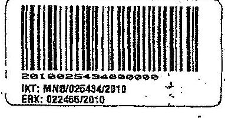

BUDAPEST, VÁCI ÚT, 01 60-62
TERMINAL ID: 00022091
ELADÓ KÓD: 416

ELSZÁMOLÓ: OTP BANK
KARTYATÍPUS: VISA

KARTYASZÁM:

ELADÁS - SALE

IDŐ: 10/11/23 08:34
REF NO: 0000000624
ENGEDÉLYSZÁM /AUTH CODE: 088795
VÁLASZ/RESP: 001
ELFOGADVA

ÖSSZEG: 29.990,00 Ft

KÉRJÜK, ŐRIZZE MEG A
BIZONYLATOT!

---

|  Faktab |  |  |  |  |  |  |  |  |  |  |  |  |  |   |
| --- | --- | --- | --- | --- | --- | --- | --- | --- | --- | --- | --- | --- | --- | --- |
|  |   |   |   |   |   |   |   |   |   |   |   |   |   |   |
|  |   |   |   |   |   |   |   |   |   |   |   |   |   |   |
|  |   |   |   |   |   |   |   |   |   |   |   |   |   |   |
|  |   |   |   |   |   |   |   |   |   |   |   |   |   |   |
|  |   |   |   |   |   |   |   |   |   |   |   |   |   |   |
|  |   |   |   |   |   |   |   |   |   |   |   |   |   |   |
|  |   |   |   |   |   |   |   |   |   |   |   |   |   |   |
|  |   |   |   |   |   |   |   |   |   |   |   |   |   |   |
|  |   |   |   |   |   |   |   |   |   |   |   |   |   |   |
|  |   |   |   |   |   |   |   |   |   |   |   |   |   |   |
|  |   |   |   |   |   |   |   |   |   |   |   |   |   |   |
|  |   |   |   |   |   |   |   |   |   |   |   |   |   |   |
|  |   |   |   |   |   |   |   |   |   |   |   |   |   |   |
|  |   |   |   |   |   |   |   |   |   |   |   |   |   |   |
|  |   |   |   |   |   |   |   |   |   |   |   |   |   |   |
|  |   |   |   |   |   |   |   |   |   |   |   |   |   |   |
|  |   |   |   |   |   |   |   |   |   |   |   |   |   |   |
|  |   |   |   |   |   |   |   |   |   |   |   |   |   |   |
|  |   |   |   |   |   |   |   |   |   |   |   |   |   |   |
|  |   |   |   |   |   |   |   |   |   |   |   |   |   |   |
|  |   |   |   |   |   |   |   |   |   |   |   |   |   |   |
|  |   |   |   |   |   |   |   |   |   |   |   |   |   |   |
|  |   |   |   |   |   |   |   |   |   |   |   |   |   |   |
|  |   |   |   |   |   |   |   |   |   |   |   |   |   |   |
|  |   |   |   |   |   |   |   |   |   |   |   |   |   |   |
|  |   |   |   |   |   |   |   |   |   |   |   |   |   |   |
|  |   |   |   |   |   |   |   |   |   |   |   |   |   |   |

  |   |
|  |   |   |   |   |   |   |   |   |   |   |   |   |   |   |
|  |   |   |   |   |   |   |   |   |   |   |   |   |   |   |
|  |   |   |   |   |   |   |   |   |   |   |   |   |   |   |
|  |   |   |   |   |   |   |   |   |   |   |   |   |   |   |

---

Kőházy Festékáruház 38.380 Ft
Bauhaus Áruház 29.970 Ft
OBI Áruház 35.990 Ft
Baumax 30.990 Ft

Az árak és a távolság alapján a Váci úti Baumax-ból javaslom a létra beszerzését engedélyezés után.

Pintér Zoltán
Ügyfélszolgálati referens
mail:pinterz@mnb.hu
tel:428-2600/2910
fax:428-2622
Kedves Jutka,
A padláson lévő antennatartó toronyhoz vezető fa létra elhasználódott és balesetveszélyes, melyet a BBT is kifogásolt már munkavédelmi szempontok miatt. Kérlek benneteket, hogy megfelelő kitolható létra beszerzését engedélyeztetni illetve beszerezni szíveskedjetek.

Köszönöm.
Pokorny Gábor
Beruházási és üzemeltetési munkatárs
Magyar Nemzeti Bank
Működési szolgáltatások
Tel.: 428 2600/1560
Fax: 428 2522
E-Mail: pokornyg@mnb.hu

---

# Pintér Zoltán 

Feladó:
Küldve:
Címzett:
Másolatot kap:
Tárgy:

Keszthelyi Tiborné
2010. november 19. 7:59
Pintér Zoltán; Tzintzis Fotios
Papdi Lászlóné; Liszi Andrea; Réti Istvánné; Simon István; Jakab Zoltán (MSZ); Pokorny Gábor; Frank Gyula Tamás
FW: A.ép.padlás munkavédelmi bejárás során feltárt hibák kibuvóhoz létra 5m

## Sziasztok

A kitolható, stabil lábakon álló fémlétrát ( $3 \times 11$ fokos, biztonságosan kitámasztható és $6,45 \mathrm{~cm}$-re kitolható) a tárgyi eszköznél az állvány rendezőfogalomra, a lenti beruházási sorra tegyük, és Fotios raktárába tároljuk, amikor kell onnan lehet a padlásra felvinni, illetve a használat után oda visszavinni.

Az ügyfélszolgálaton keresztül lehet igényelni az érintetteknek, vagyis azoknak, akik a padlástól ki akarnak menni a toronyba, illetve a tetőablakokhoz akarnak hozzáférni, ugyanis a munkavédelmi megbízott által kifogásolt balesetveszélyes falétrákat megszüntetjük.

A létrát Zoli jövő hét elején hozza be.
Felhasználói oldalról az érintetteket is szerettem volna tájékoztatni a jövőbeni változástól.
Köszönöm: Jutka
From: Simon István
Sent: Monday, November 15, 2010 4:05 PM
To: Keszthelyi Tiborné
Subject: RE: A.ép.padlás munkavédelmi bejárás során feltárt hibák kibuvóhoz létra 5m
Rendben, szerezzétek be.
István

## From: Keszthelyi Tiborné

Sent: Monday, November 15, 2010 3:50 PM
To: Simon István
Cc: Papdi Lászlóné
Subject: FW: A.ép.padlás munkavédelmi bejárás során feltárt hibák kibuvóhoz létra 5m
István, a lenti igény és a személyes megtekintés eredményeként légy szíves a beszerzést engedélyezni.
A létra leltári számot kapna, és a Fotios raktárában tárolnánk, igény esetén onnan vinnék fel, az elszámolása a beruházási soron történne.
Co szám: 60144 Beszerzés: tervsor: 2027
Fizetési mód: VISA kártya
Köszönöm: Jutka

## From: Pintér Zoltán

Sent: Monday, November 15, 2010 3:17 PM.
To: Keszthelyi Tiborné
Subject: A.ép.padlás munkavédelmi bejárás során feltárt hibák kibuvóhoz létra 5 m
Jutka!
A kérésed alapján megtekintettem a padláson lévő tetőablakhoz 5 méter magas létra szükséges.
Piackutatást végeztem $3 \times 11$ fokos, biztonságosan kitámasztható, mert $6.45 \mathrm{~cm}$-re kitolható.

---

# STRABAG

MNB 10.718/2011 5263601

MNB EXPEDICIO 00000 11.05.26.06:58

# SZÁMLA

SZÁLLÍTÓ VEVŐ

STRABAG Property and Facility Services Zártkörű Részvénytársaság 1134 Budapest Váci út 45. D. épület 5. emelet.

Adószám: 13357371-2-41 Közösségi adószám: HU13357371 Bankszámlaszám: Raiffeisen 12001008-00119544-00100001

FIZETÉSNÉL KÉRJÜK ADJA MEG A VEVŐKÓDÖT ÉS A SZÁMLASZÁMOT!

MNB Banküzemi számviteli és pénzügyi osztály 1850.Budapest

Vevőkód: 3974 Rendsz: 5000000612 Bankszámlaszám: Adószám:

Oktaszám: 1/1 EREDEI PÉLDÁNY

|  Fizetési mód | Teljesítés dátuma | Számla dátuma | Fizetési határidő | Számlaszám  |
| --- | --- | --- | --- | --- |
|  30 nap | 2011.04.04. | 2011.05.20. | 2011.06.19. | SPFS/112998/2011  |

Megjegyzés:

|   | Alap (Ft) | ÁFA% | ÁFA | Bruttó (Ft)  |
| --- | --- | --- | --- | --- |
|  Létra. SAP:4500028860 Közvetített szolgáltatási: | 42.100 | 25% | 10.525 | 52.625  |

|   | ÁFA Alap | ÁFA összeg | Bruttó összeg  |
| --- | --- | --- | --- |
|  25% | 42.100 | 10.525 | 52.625  |
|  Össz. | 42.100 | 10.525 | 52.625  |

FIZETENDŐ HUF 52.625

AZAZ ÖTVENKETTOEZER HATSZÁZHUSZONÖT FORINT

STRABAG Property and Facility Services Zártkörű Részvénytársaság Számviteli osztály 1134 Budapest, Váci út 45. D. épület 5. emelet. 1819 Budapest, Pf. 388. Adószám: 13357371-2-41

GY WhatsApp

---

# MEGYAR NEMZETI BANK

**Magyar Nemzeti Bank**

1850 BUDAPEST

Adószám: 10011963-2-44

Pénzforg. jelezész.: 19017004-00000309

**Szállító:**

Strabag Property and Facility Services Zrt.

Váci út 45. D. ép. 5. em.

1134 Budapest

**Beruházás megrendelés**

Beruházás megrendelésszám/dátum

4500028860 / 2011.03.03

Tárgyaló/kapcsolattartó e-mail

TÖTH MÖNIKA

tothmo@mnb.hu

Telefonszámunk:

+36-1-428-2600/1332

Szerződésszám: 4700001542

|  Tét. Megrendelt anyag/szolgáltatás | Menny. Száll. hat. idő. | Ár/egység | Nettó érték  |
| --- | --- | --- | --- |
|  01 Létra | 1.00 | 2011.03.20 | 42.100 | 42.100  |
|   |  |  |   |
|   | Nettó összérték : |  | 42.100  |
|   | ÁFA összérték |  | 10.525  |
|   | Bruttó összérték |  | 52.625  |

1. Számlázás: a Vállalkozó a számla benyújtására a teljesítést követően -, a Megrendelő által aláírt teljesítésigazolás csatolásával - jogosult.
2. A Vállalkozó a számlán köteles feltüntetni a megrendelést azonosító SAP bizonylatszámot.
3. A Vállalkozó a számlán köteles feltüntetni a megrendelést azonosító SAP bizonylatszámot.

3) A Vállalkozó a számlán köteles feltüntetni a megrendelést azonosító SAP bizonylatszámot.

3) Számlázási cím: MNB Számvitel, 1850 Budapest. Az elfogadott számla alapján a Vállalkozót megillető összeget a megrendelő, a számla kézhezvételétől számított 15 banki munkanapon belül utalja át a Vállalkozó számlájára.

**Szállító:**

Strabag Property and Facility Services Zrt.

**Szállító:** 1.00 42.100

**Nettó összérték :** 42.100 10.525 52.625

Tisztelt partnerünk, kérjük hogy szállítói számláján hivatkozzon a 4500028860 megrendelés számra. Köszönjük!

---

# Gyöngy Attila 

Feladó: Tóth Tamás [tothta@mnb.hu]
Küldve: 2011. március 3. 8:42
Címzett: Gyöngy Attila
Tárgy: FW: Strabag létra megrendelés
Mellékletek: 20110303103454408.pdf

## Szia Attila!

Küldöm a megrendelést a létrára.
Üdvözlettel:
Tóth Tamás [beruházási és üzemeltetési munkatárs] Működési szolgáltatások
Tel.: + 36 (1) 421-3321
Fax: + 36 (1) 421-3317
E-mail: tothta@mnb.hu

Magyar Nemzeti Bank
Az MNB elsődleges célja Szabadság tér 8-9.
az árstabilitás
elérése
1054 Budapest
és fenntartása.
www.mnb.hu
—Original Message
From: Sinkóné Holczhauser Henriett On Behalf Of Magyar Nemzeti Bank Számvitel és Pénzügy
Sent: Thursday, March 03, 2011 8:41 AM
To: Tóth Tamás; Tóth Mónika; Liszi Andrea
Subject FW: Strabag létra megrendelés

Confidentiality Note This e-mail is intended only for the person(s) or entity(ies) to which it is addressed and may contain information that is privileged, confidential or otherwise protected from disclosure. Any review, retransmission or other use of, or taking of any action in reliance upon this information by anyone other than the intended recipient(s) is prohibited. If you have received this e-mail in error, please notify the sender immediately and destroy the entire message.

Disclaimer: Any e-mail messages from Magyar Nemzeti Bank shall not be binding nor construed as constituting any obligation on the part of Magyar Nemzeti Bank, unless Magyar Nemzeti Bank and the recipient(s) have explicitly otherwise agreed upon in writing.

---

# Gyöngy Attila 

## Feladó:

Küldve:
Címzett:
Tárgy:
Mellékletek:

Gyöngy Attila
2011. február 11. 9:23
'Tóth Tamás'
Árajánlat - MNB Log. Központ brikettáló helységbe létra beszerzése
image001.jpg

## Kedves Címzett!

Az MNB Logisztikai Központ KPL brikettáló helységbe egyeztetésünk alapján az alábbi létra beszerzésére, kihelyezésére az alábbi ajánlatot adjuk:

- Nagy teherbírású biztonsági létra, teherbírás 225 kg, 6 lépcsőfok dobogóval együtt 39.900,-Ft+Áfa
- Beszerzés, felállítás, szállítás, beüzemelés 2.200,-Ft+Áfa

A díjak az 1.100 Ft+Áfa rezsióradíjjal vannak elszámolva!
A munkálatok összköltsége: 42.100,-Ft+Áfa
Amennyiben ajánlatunkat megfelelőnek találják kérem szíves visszajelzésüket!
Üdvözlettel:
Gyöngy Attila
létesítmény menedzser
STRABAG Property and Facility Services Zrt.
FM Igazgatóság
H-1134 Budapest, Máriássy út 7.
Tel: +3614514790
Fax: +36 14523880
Mobil: +36302427598
E-mail: attila.gyongy@strabag-pfs.hu
internet: www.strabag-pfs.hu

---

# Strabag Property and Facility Services Zártkörű Részvénytársaság Munkalap

Munkalap száma: 2011.04.01. Munkavégzés helye: MNB LK

Elvégzett munka rövid leírása: A munkaidő-nyilvántartásba 100 kg vagy lelövőbiztosítás (225 kg) 6 lépcsőfokú kitömés leírása, beépítése, telepítése - előírások, árajánlatok alapján.

Felhasznált anyagok: 1 megnevezés: 2 típus/méret: 2 mennyiség: 2

|  Látva | Hozilo XXR 225  |
| --- | --- |
|  |   |
|  |   |
|  |   |
|  |   |

Munkaórák: név: munkaórák

|  Laszlozár Péter | 16  |
| --- | --- |
|  Szegedi Főhöz | 16  |

A munka elvégzését, és a feltüntetett anyagok beépítését igazolom: Név: 01101 Dátum: 2011.04.01.

Létesítménymenedzser tölti ki költséghely / vállalkozási szám: dátum, aláírás:

---

STRABAG Property and Facility Services Zártkörű Részvénytársaság

# MUNKALAP

|  STRABAG Property and Facility Services Zártkörű Részvénytársaság |  |  |  |  |  |  |  |   |
| --- | --- | --- | --- | --- | --- | --- | --- | --- |
|  FM Üzletág |  |  |  | Cégnév: |  |  | Magyar Nemzeti Bank |   |
|  Ajánlatadó: | Gyöngy Attila |  |  | Adószám: |  |  | 10011963-2-44 |   |
|  Email: | Attila.gyongy@strabag-pfs.hu |  |  | Személy: |  |  |  |   |
|  V szám: |  |  |  | Tel/Fax: |  |  |  |   |
|  Ajánlatszám: | 9403 |  |  | Számlázási cím: |  |  | 1054 Budapest, Szabadság tér 8-9. |   |
|  ÁRAJÁNLAT |  |  |  |  |  |  |  |   |
|  MNB Log. Brikettálóba látva vásárlás |  |  |  |  |  |  |  |   |
|  TÉTELEK |  |  |  |  |  |  |  |   |
|  Tétel | mennyiség | egység | norma | anyag (Ft) | díj (Ft) | anyag (Ft) | díj (Ft) | költség (Ft)  |
|  MNB Log. Központ brikettáló helységébe látva
összeszerelése, telepítése | 1 | db |  | 39 900,00 | 2 200,00 | 39 900,00 | 2 200,00 | 42 100,00  |
|

 Összesen: |  |  |  |  |  |  |  | 42 100,00 Ft  |
|  Áraink az ÁFA-t nem tartalmazzák!!! |  |  |  |  |  |  |  |   |
|  Fontos közlendő: A díjak az 1.100 Ft+Áfa rezsióradíjjal vannak elszámolva! |  |  |  |  |  |  |  |   |
|  Az ajánlat 30 napig érvényes!
Budapest, 2011.03.03. |  |  |  |  |  |  |  |   |
|  STRABAG Property and Facility Services Zártkórú Részvénytársaság |  |  |  |  |  |  |  |   |
|  Társaságunk az Általános forgalmi adóról szóló 2007. évi CXXVII. törvény alapján bejegyzett adóalany, akinek semmiféle jogállása nincs, mely akadályozni az e törvény szerinti adóelszámolás kötelezettségét illetve annak követelését. |  |  |  |  |  |  |  |   |
|  MEGRENDELÉS |  |  |  |  |  |  |  |   |
|  A fenti munkát megrendeljük. |  |  |  |  |  |  |  |   |
|  Budapest, 2011.03.03. |  |  |  |  |  |  |  |   |
|  Magyar Nemzeti Bank |  |  |  |  |  |  |  |   |
|  Társaságunk az Általános forgalmi adóról szóló 2007. évi CXXVII. törvény alapján bejegyzett adóalany, akinek semmiféle jogállása nincs, mely akadályozni az e törvény szerinti adóelszámolás kötelezettségét illetve annak követelését. |  |  |  |  |  |  |  |   |
|  KÉSZREJELENTÉS |  |  |  |  |  |  |  |   |
|  A fenti munka árajánlat szerint elkészült. |  |  |  |  |  |  |  |   |
|  Budapest, 2011.04.04. |  |  |  |  |  |  |  |   |
|  STRABAG Property and Facility Services Zártkórú Részvénytársaság |  |  |  |  |  |  |  |   |
|  TELJESÍTÉSIGAZOLÁS |  |  |  |  |  |  |  |   |
|  A fenti munkát a STRABAG Property and Facility Services ZRt. elvégezte, az árajánlatban elfogadott összegről szóló számlát a Megrendelő befogadja. |  |  |  |  |  |  |  |   |
|  Budapest, 2011.04.04. |  |  |  |  |  |  |  |   |
|  Magyar Nemzeti Bank |  |  |  |  |  |  |  |   |
|  SZÁMLAINDÍTÓ |  |  |  |  |  |  |  |   |
|  Tisztelt Pénzügyi Osztály!
Kérjük a fenti munkát a Megrendelő részére kiszámlázni szíveskedjenek.
A számla közvetített szolgáltatást tartalmaz. |  |  |  |  |  |  |  |   |
|  Budapest, |  |  |  |  |  |  |  |   |
|  STRABAG Property and Facility Services Zártkórú Részvénytársaság |  |  |  |  |  |  |  |   |

STRABAG Property and Facility Services Zártkórú Részvénytársaság Postacím: 1519 Budapest, Postafiók 36B. FM Üzletág 1095 Budapest, Mártássy u. 7. Adósz.:13357371-2-42 Tel.: 451-4790 Fax: 452-3880 E-mail: 1 / 1

---

# Teljesítési igazolás

|  Vállalkozási szám: P00366 | Iktatási szám: 9403  |
| --- | --- |
|  Megrendelő: | Magyar Nemzeti Bank  |
|  Helyszín: | Magyar Nemzeti Bank Logisztikai Központ  |
|  Épület: | MNB Logisztikai Központ  |
|  Tárgy: | P00366 lezárása  |
|  Jelen vannak: | Tóth Tamás - Magyar Nemzeti Bank részéről, mint átvevő  |
|   | Gyöngy Attila - Strabag Property and Facility Services Zártkórú  |
|   | Részvénytársaság részéről, mint átadó  |

A Strabag Property and Facility Services Zártkórú Részvénytársaság a

## MNB Log. Brikettálóba létra vásárlás

megnevezésű munka feladatait a megrendelésben meghatározott műszaki tartalommal, a rendelkezésre álló kivitelezési dokumentációk és az ide vonatkozó műszaki és jogszabályi előírásokban foglaltaknak megfelelően, I. osztályú minőségben, a megállapodás szerinti határidőre, teljes körűen kivitelezte.

A jegyzőkönyv egyben a munkaterület visszavételét is igazolja.

A munkát a megrendelő átveszi, a kivitelező jogosult: 42 100,00 Ft + ÁFA árat kiszámlázni.

A jegyzőkönyvet hitelesítők aláírása:

M. H. H. H. H. H. H. H. H. H. H. H. H. H. H. H. H. H. H. H. H. H. H. H. H. H. H. H. H. H. H. H. H. H. H. H. H. H. H. H. H. H. H. H. H. H. H. H. H. H. H. H. H. H. H. H. H. H. H. H. H. H. H. H. H. H. H. H. H. H. H. H. H. H. H. H. H. H. H. H. H. H. H. H. H. H. H. H. H. H. H. H. H. H. H. H. H. H. H. H

---

# KAISER+KRAFT

MINDEN AMI EGY CÉGNEK KELL

MÁSOLAT 1

Szerződéscím

Lap 1

MAGYAR NEMZETI BANK LOGISTIKAI KÖZPONT

STRABAG PROPERTY AND FACILITY SERVICES ZÁRTKÖRŰ RÉSZVÉNYTÁRSASÁG VÁCI ÚT 45.D.ÉP.5 EM. 1134 BUDAPEST

EURÓPA ÚT 1. 1239 BUDAPEST Szállítás módja

Küldeményszám 46/01/00132323

Ördög rendelkezésreállása 10.03.2011 GEDEI LÁSZLÓ

Adószámra: 13357371-2-41

|  |   |   |   |
| --- | --- | --- | --- |
|  Számla |  |  |   |
|  Amíg eszközeit 10 278 510-2-15 |  |  |   |
|  Számla kelte = teljesítés dátuma |  |  |   |
|  Vámtarifasz.Menny. | Megnevezés |  |   |

Főrelésre kérjük feltételei

|  |   |   |   |
| --- | --- | --- | --- |
|  Vevőszám | Szállításszám | Érkezés dátuma  |
|  0209050 |  | 0152223 30.03.2011  |
|  0211698 |  | 0152223 30.03.2011  |
|   |  | Üzleti és szállítási feltételeinket a katalógusunk végén találja.  |
|   |  | Cikkszám Egységár Érték ÁFA nélkül  |
|  |   |   |
|   |  | UTÁNVÉT SZÁLLÍTÁS! KÉRJÜK AZ ÁRU ÉRTÉKÉT A SZÁMLA ELLENÉBEN A FUVAROZÓNKHÓZ KIEGYENLÍTENI SZÍVESKEDJENEK. KKH *** **** **** *** **** *** **** *** **** *** **** *** **** *** **** *** **** *** **** *** **** *** **** *** **** *** **** *** **** *** **** *** **** *** **** *** **** *** **** *** **** *** **** *** **** *** **** *** **** *** **** *** **** *** **** *** **** *** **** *** **** *** **** *** **** *** **** *** **** *** **** *** **** *** **** *** **** *** **** *** **** *** **** *** **** *** **** *** **** *** **** *** **** *** **** *** *

---

Bescheinigung Nr. BE 10096 vom 30.08.2010

# DGUV Test

**Prüf- und Zertifizierungsstelle**

**Fachausschuss Bauliche Einrichtungen**

## GS-Prüfbescheinigung

**Name und Anschrift des Bescheinigungsinhabers:** HAILO-Werk (Auftraggeber)

**Adresse:** Rudolf Loh GmbH & Co. KG, Daimlerstraße 8, D-35708 Haiger

**Name und Anschrift des Herstellers:** s.o.

**Produktbezeichnung:** Stehleitern aus Aluminium mit 3, 4, 5 und 6 Stufen

**Typen:** 8893-001, 8894-001, 8895-001, 8896-001

**Bestimmungsgemäße Verwendung:** —

**Prüfgrundlage:** GS-BE-10 Grundsätze für die Prüfung und Zertifizierung von Stehleitern (02.08)

**Zugehöriger Prüfbericht:** Nr. P 10096

**Bemerkungen:** —

Das geprüfte Baumuster stimmt mit den in § 7 Absatz 1 Satz 2 des Geräte- und Produktsicherheitsgesetzes genannten Anforderungen überein. Der Bescheinigungsinhaber ist berechtigt, das umseitige abgebildete GS-Zeichen an den mit dem geprüften Baumuster übereinstimmenden Produkten anzubringen. Der Bescheinigungsinhaber hat dabei die umseitig aufgeführten Bedingungen zu beachten.

Diese Bescheinigung einschließlich der Berechtigung zur Anbringung des GS-Zeichens ist gültig bis: 29.08.2015

Weiteres über die Gültigkeit, eine Gültigkeitsverlängerung und andere Bedingungen regelt die Prüf- und Zertifizierungsordnung vom September 2008.

---

**Unterschrift (Dipl.-Ing. Civilian)**

**Unterschrift (Dipl.-Ing. Keitholz)**

**Postadresse:** Postfach 1209 · 53002 Bonn · Hausadresse: Niebuhrstraße 5 · 53113 Bonn · Telefon 0228-5406 - 5871 · Telefax 0228-5406 - 5897 · E-Mail fabe@bghw.de · www.bghw.de/fabe 621.135.1/242-HAI Br/De

FZ204 07 10

---

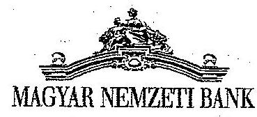

Az 1992. évi LXIII. tv. 19/A. §-ának
(1) bekezdése alapján
2007. szeptember 18.-tól számított 10 éven belül
NEM NYILVÁNOS!
Iktatószám: MNB/22073/2007.

# ELŐTERJESZTÉS 

a Vezetői Bizottság 2007. szeptember 18-i ülésére

Tárgy: Előterjesztés a munkaköri besorolási és előléptetési rendszer továbbfejlesztése, a Bank bérpiaci pozíciójának felülvizsgálata, változtatása tárgyában

---

4. sz. "melléklet

Magyar Nemzeti Bank Jogi Igazgatósága

Az 1992. évi LXIII. tv. 19/A. § (1) bekezdése alapján
2007. szeptember 18-tól számított 10 éven belül
NEM NYILVÁNOS!
Iktatószám: MNB/25013/2007.

# JEGYZŐKÖNYV

a Vezetői Bizottság
2007. szeptember 18-án tartott rendes üléséről

---

# 4. sz. melléklet   a V-0033-119/2012-2013. sz. jelentéshez 

ELHÖK

ÁLLAMI
SZÁMVEVŐSZÉK

Ikt.szám: V-0033-141/2012-2013.

## Simor András úr   elnök

Magyar Nemzeti Bank

Budapest

## Tisztelt Elnök Úr!

A Magyar Nemzeti Bank működésének és a központi költségvetéssel történő elszámolások szabályszerűségének ellenőrzése című jelentéstervezetre tett észrevételeit köszönettel megkaptam.

Az Állami Számvevőszék észrevételekre vonatkozó álláspontjáról a felügyeleti vezető asszony által készített részletes tájékoztatást csatoltan megküldöm.

Tájékoztatom Elnök urat, hogy a számvevőszéki jelentés szövegezése az elfogadott észrevételek figyelembevételével készül.

Budapest, 2013. 12. hó 1. nap
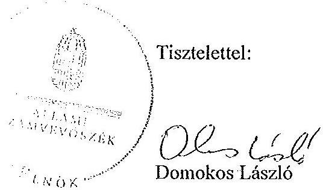

Melléklet: Tájékoztatás az elfogadott és az el nem fogadott észrevételekről

---

# Tájékoztatás   az elfogadott és az el nem fogadott észrevételekről 

Az MNB által 2013. január 4-én elküldött észrevételekkel kapcsolatos válaszunkat a levelükben foglaltak sorrendjének megfelelően adjuk meg.

## Észrevételek

## Bevezető

Az MNB az Állami Számvevőszék (ÁSZ) jelentéstervezetéhez megküldött észrevételeit tényekkel, szakmai érvekkel nem támasztja alá. Az
 MNB válaszlevelében leírtak tehát nem cáfolják az ÁSZ által feltárt, szakmailag megalapozott, tényeken alapuló megállapításokat. Ezek nélkül minden olyan válasz, amely az ellenőrzés körülményeit, az ÁSZ magatartását minősíti, önmagában megkérdőjelezi az MNB észrevételeinek szakmaiságát. Az észrevételek jelentős része leíró jellegű és esetenként ellentmondásos tényeket rögzít. Véleményüket nem teszi szakmailag megalapozottá és valóssá, hogy adott kérdésekben az MNB álláspontját többször is megjelenítik. Ezáltal az észrevételük az ÁSZ megállapításait nem cáfolja, sokkal inkább befolyásolásra, adott esetben félrevezetésre alkalmas eszköz, illetve módszer.

Az ÁSZ a jelentéstervezetében a hatáskörébe tartozó területekről valós képet ad. Az MNB-nél az ÁSZ a hatáskörébe tartozó területeket ellenőrizte, ami a levelükben foglaltakkal ellentétben nem aláássa, hanem megerősíti a jelen ellenőrzésnek - mint az ÁSZ valamennyi ellenőrzésének - a pártatlanságát. Véleményük szerint az ÁSZ jelentése nem ad valós képet Magyarország központi bankjáról. Az Állami Számvevőszéknek nem feladata teljes körű képet bemutatni az MNB-ről, arra felhatalmazása sincs. A teljes kép kialakítása az MNB alapfeladatai körébe tartozó tevékenységek értékelését nem nélkülözheti, amelyre - ahogy Önök is említik - az ÁSZ-nak nincs hatásköre.

Az ÁSZ az ellenőrzése során betartotta az Állami Számvevőszékről szóló 2011. évi LXVI. törvény előírásait, valamint a vonatkozó eljárási szabályokat mind az ellenőrzés lebonyolítása, mind az észrevételezési jog biztosítása terén. Az ellenőrzést szabályszerűségi ellenőrzés módszerével, a vonatkozó nemzetközi standardok figyelembevételével végeztük. Az észrevételeik 1. számú mellékleteként megküldött, az ÁSZ Ellenőrzési Kézikönyvéből készített kivonat az MNB ellenőrzése szempontjából irreleváns. A kivonat ugyanis a pénzügyiszabályszerűségi ellenőrzések általános keretét tartalmazza, az MNB ellenőrzése pedig nem az.

Az ÁSZ által az MNB számviteli elszámolásainál feltárt hiányosságok tényszerűek, rendszerkockázatot mutatnak. A hiányosságok jelzése - az ÁSZ stratégiájában megfogalmazott alapértékeknek megfelelően - arra irányult, hogy elősegítse a Bankban a vezetői ellenőrzés színvonalának erősödését, hatékonyságának növelését. Észrevételeik azt mutatják, hogy nem megfelelő a szakmai együttműködési készség az Állami Számvevőszék ellenőrzése során feltárt, szakmailag megalapozott észrevételek figyelembevételére, azoknak a működés részévé tételére.

Az ÁSZ jelentéstervezet megállapításai és következtetései, miszerint a banküzemi költségek és ráfordítások esetében a gyakorlatban a számviteli szabálytalanságoknál nincs valós korlát, teljesen helytállóak. Mindez a számvitelről szóló 2000. évi C. törvény és a Magyar Nemzeti Bank éves beszámoló készítési és könyvvezetési kötelezettségének sajátosságairól szóló 221/2000. (XII.19.) Korm. rendelet előírásain alapul. Félreértelmezik a jelentéstervezetben a számviteli elszámolásokkal kapcsolatban tett megállapításokat és ezzel akadályozzák a leírtak hasznosulását. A jelentős összegű hibát nem az ÁSZ ellenőrzési elvei és standardjai alapján kell meghatározni, hanem a hivatkozott jogszabályok szerint. A jelenlegi szabályozás mellett az MNB-nél közel 250 Mrd Ft a jelentős összegű hiba határa, miközben a Bank teljes működési költsége ennek csak mintegy 5%-a, 12 Mrd Ft. Ezért tény, hogy a jelenlegi szabályozás mellett a működés területén nem tud olyan nagyságrendű hiba keletkezni, ami az MNB banküzemi beszámolójának minősítését befolyásolná. Tekintettel arra, hogy a számviteli törvény és a jelzett kormányrendelet vonatkozó előírása 2013. január 1-jétől már azonos az MNB-re vonatkozóan (jelentős összegű a hiba, ha meghaladja a mérlegfőösszegének a 2%-át), ezért a közpénzekkel való felelős gazdálkodás és az átláthatóság elősegítése érdekében a vonatkozó javaslatunkat pontosítjuk úgy, hogy ne az MNB teljes mérlegfőösszege, hanem a működési költségek százalékában legyen megállapítva a jelentős összegű hiba határa.

Az ÁSZ hatáskörének megfelelve nem ellenőrizte az MNB alaptevékenységeként ellátott bankjegy- és érmekibocsátást (dokumentumokat erre vonatkozóan nem kértünk és nem is kaptunk). Nem felel meg a valóságnak, hogy az ÁSZ túllépte a hatáskörét. A bankjegyfejlesztéssel kapcsolatos tényeket egyrészt a tulajdonosi joggyakorlás, másrészt a banküzemi költségek elszámolásának ellenőrzése során - amelyek az ÁSZ hatáskörébe tartoznak - tapasztaltak alapján állapítottuk meg. Az MNB a leányvállalatokkal kapcsolatos tulajdonosi pozícióját az euró bevezetéséhez igazodva határozta meg. A stratégiája szerint az euró bevezetésével megszűnik a bankjegygyártás. Az euró bevezetése céldátumának eltörlésével a stratégiát nem módosították, ugyanakkor a Pénzjegynyomda eredményét minden évben osztalékként elvonták, veszélyeztetve ezzel a Társaság hosszú távú működését és a hazai bankjegykibocsátás biztonságos ellátását. Az ellenőrzés során a banküzemi költségek között szerepeltek a bankjegyfejlesztéshez kapcsolódó költségek is. Ezek elszámolásának szabályszerűsége keretében foglalkoztunk a bankjegyfejlesztéssel.

A működési költségek alakulásával kapcsolatban az ÁSZ jelentéstervezetben leírtaknak semmilyen kapcsolata nincs a Bank által hivatkozott holokauszt perrel. A jelentéstervezet a működési költségek pénzügyi terven belüli alakulására vonatkozóan több okot sorol fel, amelyek egyike a felültervezés, amit a beruházásoknál, az IT és a reprezentációs költségeknél állapítottunk meg.

A számviteli szabályoktól eltérő elszámolásokkal kapcsolatos megállapításokat a Bank ismételten félreértelmezi. A jelentéstervezet szakmailag helyesen a költségek csökkenésének az ellenőrzés során feltárt okait tartalmazza (pl. tervezettnél alacsonyabb létszám, költségcsökkentő intézkedések, stb.), amelyek között szerepelnek a szabálytalan elszámolások is. Ezek közül tudatosan kiemelni egy 9 E Ft-os tételt és azt úgy megjeleníteni, hogy csak és kizárólag erre vezethető vissza a költségcsökkenés, félrevezetés. Észrevételükben visszatükröződik a lényeges hibahatárra korábban leírt probléma - nem valós korlát -, amelynek következtében ezeket minden esetben lényegtelennek minősítik. A lényegi hibahatár nem azt jelenti, hogy az alatta lévő tételek esetén nem kell betartani a szabályokat. Elfogadhatatlan, hogy az MNB mindezt prezentációs kérdésnek tartja, és egyes tételeket csupán kerekítési különbözetként kezeli. Értelmezésük szerint az MNB teljes banküzemi költsége kerekítési különbözet lehet, mivel a banküzemi költségek és ráfordítások a mérlegfőösszegnek mindössze 0,1%-át teszik ki. A számviteli törvény előírásainak betartása nem választható a Bank esetében sem és nem prezentációs kérdés, hanem a jogszabályi előírásoknak való megfelelés (jogszabálykövetés) követelménye, amely alól az MNB sem kivétel. Mindezek alapján indokolt a számviteli szabályok teljes körű betartására vonatkozó javaslat.

A banküzemi működés átláthatósága az MNB-nél a 2011. évben nem volt biztosított. Az átláthatóság azt jelenti, ha minden ellenőrzés és részletező dokumentum nélkül a beszámolóból bármilyen külső szemlélő számára egyértelműen kiolvasható a számviteli politikát érintő évközi változások banküzemi költségekre gyakorolt hatása. A leírtak alapján tévesen értelmezik az átláthatóság követelményét. Észrevételük szerint az MNB működése azért átlátható, mert az ÁSZ ellenőrzése a kapott dokumentumokból és adatokból tudta számszerűsíteni mindazt, amit a számviteli törvény szerint a kiegészítő mellékletben kell bemutatni.

Az ÁSZ költséghatékonyságra vonatkozó megállapítása teljes mértékben megalapozott. Félrevezető ezek közül egy példát és részben kiemelni (nyomtatók és multifunkciós eszközök), mivel a hatékonyság mérésének csak az egyik elemét - db számok alakulása - mutatják be, a tényleges hatékonyságot (db/fő) mutató mérőszámot figyelmen kívül hagyják. Észrevételükben nem térnek ki a személyi használatú, km korlátozás nélküli személygépjárművekre, továbbá arra, hogy egy munkavállalóra 1,8 számítógép jut. Az MNB-től kapott adatokon alapuló költséghatékonysági mutatók nagysága sem támasztja alá a költséghatékony gazdálkodást.

A jegybank iratkezelési gyakorlata - állításukkal ellentétben - 2009-től annak auditálásáig (2012. december 1.) nem felelt meg az iratkezelésre vonatkozó jogszabályi előírásoknak. A rendszer módosítása, auditra való alkalmassá tétele 2012-ben valósult meg. A tanúsítvány megléte a jelentéstervezetre tett észrevételben új információként jelent meg. A tanúsítványt kérésünkre észrevételüket követően 2013. január 10-én bocsátották a rendelkezésünkre. A tanúsítvány megküldését követően módosítjuk javaslatunkat, amelyben az iratkezelés jogszabályi előírásoknak való meg nem felelése okainak kivizsgálását kezdeményezzük. Az, hogy a Magyar Nemzeti Levéltár - amely észrevételükkel szemben nem az MNB felügyeleti szerve - nem tárt fel hibát, nem jelenti azt, hogy az iratkezelés megfelelt a törvényi előírásoknak, a tanúsítvány kiadása ugyanis nem a levéltár feladata. Helytálló és megfelel a tényeknek az ÁSZ azon megállapítása, hogy a Bank szerződés nélkül kezdte meg az auditált iratkezelő rendszer beruházást. A megrendeléssel és a visszaigazolással nem szerződéses jogviszony, hanem szerződéskötési kötelezettség keletkezett. Az egyedi szerződést közel 5 hónappal a visszaigazolást követően kötötték meg. Az átadott dokumentációk szerint a szállító a teljesítést már az egyedi szerződés aláírása előtt megkezdte.

Az ÁSZ munkatársai teljes mértékben ismerik a piaci medián és a piaci átlag közötti különbséget. A jelentéstervezetben a közérthetőség követelményét szem előtt tartva alkalmazzuk a piaci átlag kifejezést a piaci medián helyett, tekintettel arra, hogy az a megállapításon nem változtat. Tény ugyanis, hogy a kereskedelmi bankokhoz viszonyítva az MNB a teljes javadalmazási érték (alapbér+bónusz+juttatások) esetében a piaci mediánhoz képest 10%-kal magasabb jövedelmet biztosít az észrevételükben hivatkozott ±10%-kal szemben. Tény továbbá az is, hogy az MNB a javadalmazáson felül a HR stratégia keretében olyan tevékenységeket, szolgáltatásokat (pl. munkavállalók részére karrier tanácsadás) finanszírozott közpénzből, ami nem jellemző a versenyszférában sem. A javadalmazás szintjével kapcsolatban tett megállapításunk az MNB által átadott dokumentumon alapulva megalapozott.

Az MNB 2012-ig nem alakított ki komplex - a bér- és jövedelem elemeket együtt kezelő javadalmazási stratégiát. Az ÁSZ részére átadott, a „munkakör-besorolási és előléptetési rendszer továbbfejlesztése, a Bank bérpiaci pozíciójának felülvizsgálata, változtatása" tárgyú dokumentum alapjaiban az alapbérek MNB-n belüli differenciálásának elveit tartalmazza. Az átadott dokumentumban nem szerepelnek a 2007-2011. évekre vonatkozó javadalmazási stratégiai célkitűzések a béren kívüli, illetve az azon felüli juttatásokra vonatkozóan.

Az IMF részére történő, a hitelintézeteket érintő adatszolgáltatással az MNB túllépte a hatáskörét és megsértette a Hpt. 49. § (6) bekezdés előírásait, amely szerint az MNB egyedi adatokat kizárólag a nemzetgazdasági miniszter részére, a nemzetgazdasági folyamatok elemzése, illetve a központi költségvetés tervezése céljából, továbbá a pénzügyi közvetítőrendszer stabilitását veszélyeztető helyzetben adhat át. Észrevételükben figyelmen kívül hagyják azt a tényt, hogy a pénzügyi stabilitási intézkedések külföldi anyabanki háttérrel rendelkező hitelintézetekre nem terjedtek ki. Tény, hogy az érintett intézetek írásbeli hozzájárulásával az MNB nem rendelkezett, az MNB azonban a törvényi előírás alapján a hozzájárulás birtokában sem adhatott volna ki adatokat az IMF felé az érintett 7 hitelintézet esetében. Észrevételük szerint az adatszolgáltatást az IMF igényelte. Ez azonban nem jelenti azt, hogy az MNB-nek a magyar jogrendet nem kell betartania. Ilyen kitételt az IMF-fel kötött megállapodások sem tartalmaznak. Az adatszolgáltatással kapcsolatos felelősség megállapítására és az eljárási hiba megszüntetésére vonatkozó javaslatot továbbra is fenntartjuk, mivel azok tényleges elrendeléséről, felelőseiről, határidejéről dokumentum nem áll rendelkezésünkre.

Nem helytálló a kiegyenlítési tartalékok elszámolásának ellenőrzésére vonatkozó észrevételük, miszerint azt az ÁSZ és a könyvvizsgáló is ellenőrzi, ezért véleményük szerint a Nemzetgazdasági Minisztérium általi további ellenőrzés bevezetésének nincs hozzáadott értéke. A könyvvizsgáló az éves beszámoló könyvvizsgálatakor a standardoknak megfelelően járt el, a kiegyenlítési tartalékokkal kapcsolatban tételes vizsgálatot nem, csak egyenleg egyeztetést végzett. Az ÁSZ törvény hatályos rendelkezései szerint a kiegyenlítési tartalékok elszámolását az ÁSZ nem ellenőrizheti. Annak érdekében, hogy közpénzfelhasználásra ellenőrizetlenül ne kerüljön sor, továbbra is indokoltnak tartjuk a Nemzetgazdasági Minisztérium közpénzekért való felelőssége körében a kiegyenlítési tartalékok térítésekor az annak elszámolására
 vonatkozó ellenőrzést.

Megalapozott az ellenőrzésnek az a megállapítása, hogy az MNB kizárólagos tulajdonában lévő társaságok jogszabályi környezete nem egyértelmű, illetve hiányos. A stratégiai jelentőségű állami monopol tevékenységet (közfeladatot) ellátó társaságok nem tartoznak sem az állami vagyonról, sem a nemzeti vagyonról szóló törvény hatálya alá. Az MNB törvény bizonyos kivételekkel - így a tevékenységével összefüggésben létrehozott szervezetekben - kizár minden társasági részesedésszerzést, de nem egyértelmű, hogy a társaságok tevékenységi

---

köre csak az MNB alaptevékenységével összefüggő lehet, - jelen esetben a készpénzgyártás - vagy e stratégiai jelentőségű feladata mellett, kockázatmentesen más, piaci tevékenységet is végezhet.

A javaslatokat megalapozó intézkedést igénylő megállapításainkra és javaslatainkra tett észrevételeikre válaszunkat az előbbiekben kifejtettük, a javaslatokat azoknak megfelelően kezeljük.

# Melléklet 

A jelentéstervezetben pontosított részeket a továbbiakban dőlt betűvel jelezzük.

## Általános észrevételek

A jelentéstervezetnek nem melléklete egyetlen döntés-előkészítő anyag sem és a tervezet nem tartalmaz idézetet a döntés-előkészítő anyagokból. A tervezetben nincsenek olyan adatok, azonosítók, információk, amelyek a döntés-előkészítő anyagokban szereplő információk egyedi azonosítását lehetővé teszik. Mindezek alapján a jelentéstervezet megállapításai nem ütköznek a személyes adatok védelméről és a közérdekű adatok nyilvánosságáról szóló 1992. évi LXIII. törvény (Info törvény) 19/A. §-a, illetve a jogszabály helyébe lépett, 2012. január 1-jétől hatályos, az információs önrendelkezési jogról és az információszabadságról szóló 2011. évi CXII. törvény 27. §-ának (2) bekezdésébe. Észrevételeik szerint az ÁSZ jelentéstervezete több helyen is döntés-előkészítő anyagokban szereplő információkat tartalmaz. Tájékoztatásuk szerint ezek az anyagok nem nyilvánosak. Észrevételeikből nem derül ki, hogy a döntéselőkészítő anyagokat a minősített adat védelméről szóló 2009. évi CLV. törvény (Adat törvény) szerinti minősítési eljárással minősített adattá nyilvánították volna. Az Adat törvény szerinti minősített adatot nem adtak át és arról az ÁSZ ellenőrzést sem tájékoztatták. Ezek alapján a jelentéstervezetben megjelenített megállapítások az Adat törvény rendelkezéseit sem sértik.

## Bevezetés

A 8. oldal 2. bekezdését pontosítjuk:
„A monetáris politika meghatározásán és megvalósításán túl az MNB törvényben rögzített alapvető feladata többek között a törvényes fizetőeszköz kibocsátása. A biztonságos készpénzellátáshoz elengedhetetlen bankjegy- és érmegyártást az MNB a tevékenységével összefüggésben létrehozott, kizárólagos tulajdonában álló leányvállalatai útján látja el."

## I. Összegző megállapítások, következtetések, javaslatok

A 10. oldal 2. bekezdésének első mondatát pontosítjuk:
„A Felügyelő Bizottság (FB) és a Bank elnöke által irányított Belső ellenőrzés (BEL) - a KBER Belső Ellenőrzési Bizottsága (IAC) által előírt ellenőrzéseket is végez. A BEL 2011. évi, az MNB elnöke és az FB által elfogadott munkaterve a rendkívüli vizsgálatok, a közreműködési és a tanácsadói feladatok miatt nem teljesült, négy pénzügyi vizsgálatot töröltek."

---

A bekezdés továbbá kiegészül egy lábjegyzettel, amely szerint „A törölt vizsgálatokat a BEL 2012-ben hajtotta végre az MNB 2013. január 4-én kelt tájékoztatása szerint."

A 10. oldal 3. bekezdés második mondatát, mivel a beruházások 54%-os teljesítésénél a tervtől való elmaradás legnagyobb részét áthúzódó tételek, időbeli elmaradás, felhasználói igény változás és felültervezés okozta, nem módosítjuk. A jelentéstervezet a felültervezést a beruházásoknál, az IT és a reprezentációs költségeknél állapította meg, nem a működési költségeknél, ezért semmilyen kapcsolata nincs a holokauszt perrel.

A 10. oldal 4. bekezdéséhez (szabályoktól eltérő elszámolások) írt észrevételükkel kapcsolatos részletes álláspontunkat az észrevételek bevezetőjében leírtakra adott válaszunkban, a 19. oldal 7. és 9., valamint a 20. oldal 6-7. bekezdéseire vonatkozó észrevételnél szerepeltetjük.

Az egyértelműség érdekében a bekezdés negyedik mondatát a következők szerint pontosítjuk:
„A Bank esetében kormányrendelet ${ }^{1}$ alapján jelentős összegű hibának a mérlegfőösszeg 2%-át, 2011-ben 250 Mrd Ft-ot meghaladó hiba minősül."

A 11. oldal 2. bekezdéshez írt észrevételükre válaszunk azonos az észrevételek bevezetőjében az átláthatósággal kapcsolatban, valamint a 20. oldal 2-3 bekezdéseihez leírtakkal.

A 11. oldal 3. bekezdését nem módosítjuk. A nem költséghatékony gazdálkodáshoz írt észrevételükkel kapcsolatos részletes álláspontunkat az észrevételek bevezetőjében adott válaszunkban, és a 19. oldal 2-6. bekezdéseire vonatkozó észrevételeknél szerepeltetjük.
A 11. oldal 4. bekezdéshez írt észrevételükben nem felel meg a valóságnak az, hogy a 2003-ban bevezetett iratkezelési rendszer megfelelt a jogszabályi előírásoknak. A Levéltári törvény auditált iratkezelési rendszer használatát írja elő, a Bank által használt rendszer pedig nem felelt meg az auditálás feltételeinek. A rendszer módosítása, auditra való alkalmassá tétele 2012-ben valósult meg, a fejlesztés tesztelése a helyszíni ellenőrzés végéig nem fejeződött be. A 2013 januárjában az ellenőrzés rendelkezésére bocsátott tanúsítvány szerint az auditra alkalmas szoftverváltozat kiadása 2012 decemberében történt. Helytálló és megfelel a tényeknek továbbá az is, hogy a Bank szerződés nélkül kezdte meg az auditált iratkezelő rendszer beruházást. A megrendeléssel és a visszaigazolással nem szerződéses jogviszony, hanem szerződéskötési kötelezettség keletkezett. Az egyedi szerződést közel 5 hónappal a visszaigazolást követően kötötték meg. Az átadott dokumentációk szerint a szállító a teljesítést már az egyedi szerződés aláírása előtt megkezdte. A bekezdést az auditálás meglétére vonatkozó információ miatt pontosítjuk:
„Az MNB iratkezelési gyakorlata 2009-től 2012 decemberéig nem felelt meg az iratkezelésre vonatkozó jogszabályi előírásoknak, ${ }^{2}$ mivel a Bank iratkezelési szoftvere nem rendelkezett az előírt tanúsítvánnyal. A Bank egyedi szállítói szerződés nélkül kezdte meg 2011-ben az auditált iratkezelő rendszer beruházást, ezért az elvárt minőségű, illetve tanúsított szoftver kikényszerítésére nem volt eszköze."

[^0]
[^0]:    ${ }^{1}$ a Magyar Nemzeti Bank éves beszámoló készítési és könyvvezetési kötelezettségének sajátosságairól szóló 221/2000. (XII. 19.) Korm. rendelet
    ${ }^{2}$ A köziratokról, a közlevéltárakról és a magánlevéltári anyag védelméről szóló 1995. évi LXVI. törvény 2009. január 1-ei határidővel tanúsított iratkezelési szoftver használatát írta elő a közfeladatot ellátó intézmények, így az MNB számára.

---

A 11. oldal 5. bekezdéshez írt észrevételükkel kapcsolatban a beruházások csúszásának okai között szerepeltetjük az előre nem látható indokokat is:
„Az alacsony arányú tervteljesülés egyrészt a beruházások tervezésének hiányosságaira vezethető vissza, másrészt előre nem látható tényezők okozták."

Az ellenőrzött négy beruházás alapján nem állapítható meg, hogy a projektek csúszását a nem megfelelő erőforrás tervezés okozta vagy az, hogy egy szakterület nem biztosította az elfogadott esettanulmányban meghatározott kapacitásokat, ezért a belső erőforrások számszerűsítésére vonatkozó észrevételük nem helytálló.

A 11. oldal 6. bekezdéshez írt észrevételük alapján a bekezdés második és harmadik mondatát pontosítjuk:
„Az MNB-nél 2011-ben 4,3%-os bérfejlesztés volt, a választható béren kívüli juttatások (cafeteria) személyenkénti összege az infláció mértékével (3,5%) nőtt, amelynek összege kétszerese a kereskedelmi bankoknál jellemző nagyságnak. Az MNB-nél 2011-ben nem változott a bónusz, miközben a hazai kereskedelmi banki ágazatban 2010-ben a bónuszok mértéke átlagosan 18%-kal csökkent."

A 12. oldal 1. bekezdéshez írt észrevételükkel ellentétben az MNB 2012-ig nem alakított ki komplex - a bér és jövedelem elemeket együtt kezelő - javadalmazási stratégiát, ezért a bekezdés törlése nem indokolt. Az ÁSZ részére átadott a „munkakör-besorolási és előléptetési rendszer továbbfejlesztése, a Bank bérpiaci pozíciójának felülvizsgálata, változtatása" tárgyú dokumentum alapjaiban az alapbérek MNB-belüli differenciálásának elveit tartalmazza. Az átadott dokumentumban nem szerepelnek a 2007-2011. évekre vonatkozó javadalmazási stratégiai célkitűzések a béren kívüli, illetve az azon felüli juttatásokra vonatkozóan. Észrevételükben stratégiai elemként 2001-2006-ban bérszint, 2006-2007-ben bérszínvonal, 2008-tól bérpiaci szint szerepel és nem a komplex javadalmazás.

A 12. oldal 2. bekezdéshez kért számszerűsítés nem indokolt, mert az abszolút számok is mutatják a tényhelyzetet. Továbbá az MNB kimutatásában szereplő költségmegtakarítások között szerepelnek olyan tételek is, amelyek nem kizárólag a HAJÓ projekthez köthető költségmegtakarítások.

A 12. oldal 3. bekezdés utolsó mondatát pontosítjuk:
„Nem tisztázottak az MNB-nek a társaságokkal kapcsolatos vagyonkezelői feladatai, pl. hogy a társaságok végezhetnek-e a jegybanki tevékenységgel összefüggő feladataikon túl ún. piaci feladatokat."

A 12. oldal 5. bekezdéshez tett észrevételüket nem fogadjuk el. Az MNB tulajdonosi stratégiája hiányában (csak a Pénzjegynyomda Zrt. által készített, elfogadott stratégia nem is lehet a Bank tulajdonosi stratégiája) nem ismert, hogyan tervezi a Bank a társaság által ellátandó közfeladat biztosítását. A Bank 2006-2011 között 5,8 Mrd Ft osztalékot elvont, továbbá az észrevételük szerint a bankjegygyártó gépek éves amortizációja - 300 M Ft - a társaság likviditását növelte, és nem a gépek fenntartására fordították. Ezen tények és az, hogy a Bank tervezi a Pénzjegynyomda Zrt. eladását vagy átadását együttesen veszélyeztethetik a forint bankjegyek - euró bevezetéséig történő - biztonságos gyártását. A jegybank törvény

---

szerint a bankjegy kibocsátója az MNB, de az vitathatatlan tény, hogy kibocsátani csak a legyártott bankjegyet lehet, amelyet csak a Pénzjegynyomda gyárt.

A 13. oldal 2. bekezdés megállapítását fenntartjuk. Az IMF részére történő adatszolgáltatáshoz tett észrevételeikre válaszunkat az észrevételek bevezetőjében szerepeltetjük. Állításukkal ellentétben az MNB a hatáskörét túllépve törvényt sértett a hitelfelvétellel összefüggő IMF felé történt adatszolgáltatások során, amely tényt a hivatkozott bekezdésben feltüntetjük:
„A nemzetközi szervezetektől a Magyar Állam által lehívott hitelekkel kapcsolatban az MNB hatáskörét túllépve, felhatalmazás nélkül és a hitelintézeti törvény ${ }^{3}$ (Hpt.) 49. § (6) bekezdés előírásait megsértve üzleti titok körébe tartozó adatokat ${ }^{4}$ adott át az IMF-nek, veszélyeztetve ezzel az ország pénzügyi stabilitását. Az adatszolgáltatási kötelezettséget az IMF hitellel kapcsolatos feladatmegosztásra vonatkozó megállapodás ${ }^{5}$ nem tartalmazta. Az IMF alapokmánya szerint a tagok általános kötelezettsége az IMF felé történő információszolgáltatás. Ugyanakkor a tagok nem kötelesek információkat olyan részletesen megadni, ami felfedné harmadik személy - az alapokmány megfogalmazásában „magánszemélyek vagy vállalatok" - ügyleteit."

A 13. oldal 10. lábjegyzetét kiegészítjük:
„Az unióban a jegybankok külföldi pénznemben fennálló követeléseiből és kötelezettségeiből származó árfolyamveszteségét nem téríti meg az állami költségvetés, azt maguknak kell kigazdálkodniuk. A KBER előírása szerint csak a nem realizált nyereség kerül tartalékként a forrásoldalon lévő, de a saját tőkén kívüli ún. „átértékelési számlákra", amely a későbbi időszakok esetleges árfolyamveszteségeinek, valamint a negatív piaci értékkülönbözetek fedezetére szolgál."

A jelentéstervezet javaslatai közül az észrevételek bevezető részében leírtak alapján az iratkezelésre és a jelentős összegű hibára vonatkozókat módosítjuk.

Az iratkezelési rendszer jogszabályi megfeleltetésére vonatkozó javaslatot - az általunk 2013. január 14-én átvett hitelesített tanúsítvány alapján - módosítjuk. Meg kívánjuk ugyanakkor jegyezni, hogy a helyszíni ellenőrzés 2012. november 23-án fejeződött be, az iratkezelési rendszerre vonatkozó tanúsítványt pedig 2012. december 18-án állították ki, ezért állításukkal ellentétben - nyilvánvalóan nem tájékoztathatták a számvevőt a tanúsítvány meglétéről, az a jelentéstervezetre tett észrevételben új információként jelent meg.

A módosított javaslat:
„Intézkedjen a vonatkozó jogszabálynak nem megfelelő iratkezelési rendszerrel kapcsolatban a felelősség megállapításáról."

[^0]
[^0]:    ${ }^{3}$ A hitelintézetekről és a pénzügyi vállalkozásokról szóló 1996. évi CXII. törvény
    ${ }^{4}$ A hét legnagyobb bank finanszírozási helyzetéről, nettó devizapozíciójáról naponta, ugyanezen bankok swap ügyleteiről hetente jelentett adatokat az MNB.
    ${ }^{5}$ Az államháztartásért felelős miniszter és az MNB közötti 2008. november 7-ei megállapodás a hitelfelvétellel kapcsolatos eljárási
 rendről, a döntési jogkörökről és hitelügylet lebonyolításáról.

---

A nemzetgazdasági miniszternek szóló, jelentős összegű hibára vonatkozó javaslatot módosítjuk, a többi javaslatot változtatás nélkül továbbra is fenntartjuk, mivel azok megkérdőjelezése nem megalapozott. Azok indoklását a javaslatokat megalapozó intézkedést igénylő megállapításainkra tett észrevételeikkel kapcsolatban az észrevételek bevezetőjében és az I. Összegző megállapítások, következtetések, javaslatok részben kifejtettük.

A pontosított javaslat:
„Kezdeményezze a Magyar Nemzeti Bank éves beszámoló-készítési és könyvvezetési kötelezettségének sajátosságairól szóló 221/2000. (XII. 19.) Korm. rendelet módosítását, hogy a számviteli törvény jelentős összegű hibára vonatkozó mértéke az MNB banküzemi költségeire és ráfordításaira a jegybanki tevékenységtől elkülönítve érvényesüljön a közpénzekkel való felelős gazdálkodás biztosítása érdekében."

# II. Részletes megállapítások 

A 16. oldal 5. bekezdés utolsó mondata és 6. bekezdés első mondata nem tartalmaz téves megállapításokat, az észrevételük szerint is „a döntést igénylő kérdések tekintetében lényegi változás nem történt." Az egyértelműség érdekében pontosítjuk azokat:
„A döntési hatáskörök egy részét az igazgatóság ügyrendje elnöki és alelnöki hatáskörbe delegálta.

A működésirányítással és az MNB befektetéseivel kapcsolatos, az igazgatóság ügyrendjében meghatározott kérdésekben az elnök dönt."

A 17. oldal 2. bekezdés utolsó mondatát kiegészítjük:
„A Beruházási és költséggazdálkodási bizottság (BKB) döntés-előkészítő feladatait az Ügyvezető igazgatói értekezlet vette át."

A 17. oldal 3. bekezdés utolsó mondatának (levelük szerint 17. oldal 5. bekezdés) megfogalmazását az összegző résznél kifejtetteknek megfelelően, az alábbiak szerint pontosítjuk:
„A belső ellenőrzés munkatársai az FB hatáskörébe nem tartozó, az MNB elnöke által elrendelt ellenőrzési feladatokon túl - az MNB KBER tagságából fakadó kötelezettségeként - a KBER IAC által előírt ellenőrzéseket is végeznek."

A 17. oldal 5. bekezdés utolsó mondatát kiegészítjük:
„Ennek következtében a 2011. évi, az MNB elnöke és az FB által jóváhagyott munkatervben szereplő négy pénzügyi vizsgálatot törölték ${ }^{6}$."

A 18. oldal 2. bekezdésre tett észrevételük, miszerint „az összes beruházás valamely stratégiai cél megvalósítását szolgálta", nem helytálló. A tervezési időszakban hatályos 2009-535.

[^0]
[^0]:    ${ }^{6}$ A törölt vizsgálatokat a BEL 2012-ben végrehajtotta.

---

szervezeti egység vezetői utasítás szerint ugyanis a beruházási tervbe csak szakmai stratégiával, vagy működési irányelvvel megalapozott beruházások kerülhetnek be, így az általános célokhoz rendelés önmagában nem elegendő. A beruházási tervek - szakmai stratégiával való megalapozottság hiányában - nem feleltek meg teljes körűen a vonatkozó szabályzat előírásainak. Az informatikai beruházási tervek közel 80%-ánál nem mutatható ki, hogy azok hogyan járulnak hozzá a bankszakmai célok és a szakterületek stratégiai céljainak teljesüléséhez.

A 18. oldal 4. bekezdésében a Bank által az ellenőrzés számára átadott, „A Bank működési költségelőirányzatainak felhasználása" táblázat adataiból, a kapcsolódó indoklásokból vontuk le a következtetéseket, azok megalapozottak. A költségek felültervezését kifogásoló észrevételüket nem fogadjuk el. A reprezentációs költségeknél - észrevételükkel szemben, mely szerint az előző évi tényadatok alapján tervezték azokat - a tervezett költség az előző évi tény 109,9%-a volt, amely 61,2%-ra teljesült. A tényszámok alátámasztják a költség felültervezésére vonatkozó megállapításunkat.

Az IT működési költségek az elmúlt 6 évben rendszeresen a tervtől 5-18%-kal (71-285 MFt-tal) elmaradva teljesültek. Ez részben annak a következménye, hogy a tervezésnél minden olyan költséget megterveztek, ami várhatóan felmerül, így bármilyen évközi feladatelmaradás, beruházás késedelmes beindulása, átadása, nem szerződésszerű teljesítés miatti elmaradás, beszerzési eljárás késedelme, stb. egy irányba mutató eltérést generált. Ezen túl az MNB vezetése az első félévi gazdálkodásról készített tájékoztatók megtárgyalását követően szinte minden évben kéréssel fordult a költséggazdákhoz a terv szerinti költségek csökkentése miatt.

A 4. bekezdés tervezési irányelvekben meghatározott, felső korlátok túllépésére vonatkozó első mondat ténymegállapítást tartalmaz, amelyből következtetést nem vontunk le. Lábjegyzetben megjelenítjük, hogy:
„A Bank belső szabályai az előzetes irányszámoktól való eltérést lehetővé tették."
A 18. oldal 5. bekezdésben tett megállapításunk nem általános következtetés, azt a „Bank működési költségelőirányzatainak felhasználása" táblázat adatai, illetve a kapcsolódó indoklások alapozzák meg.

A 19. oldal 1. bekezdésében a belföldi kiküldetések összetételének pontosítására tett észrevételét köszönjük. Tekintettel arra, hogy a belföldi kiküldetések 2011. évi túllépése (800 E Ft) a tervhez viszonyítva 141,34% volt, a hivatkozott bekezdés utolsó mondatát az alábbiak szerint pontosítjuk:
„Terven felüli volt ugyanakkor a tanácsadói költségek (161,3%-os), valamint a belföldi kiküldetések (241,3%-os) alakulása."

A 19. oldal 2-3. bekezdésében szereplő adatok a helyszíni ellenőrzés során az MNB által átadott dokumentumokban és kimutatásokban szereplő tényadatok, azok módosítása nem indokolt. Megjegyezzük, hogy az MNB által jelzett 1,8 számítógép/fő kerekítéssel és a használhatóságot figyelembe véve 2 számítógép/főt jelent. A megállapítások megfogalmazását a közérthetőség érdekében pontosítjuk:

---

„Ilyenek a nyomtatók és multifunkciós eszközök (kb. 2 fő/db), a munkaállomások és laptopok (kb. 2 db/fő), továbbá a vezetők és családtagjaik által használt személygépjárművek."
„2011-ben 67 db multifunkciós eszköz, 1 db másoló és 225 db nyomtató volt használatban. Az eszközök száma a korábbi évekhez képest csökkent, 2006-ban egy gépet 1,3 fő, 2011-ben 2 fő használt ${ }^{7}$. A felhasználói munkaállomások száma 2011. január 1-jén 1204 volt, ami a 2011. évi munkaállomás-beszerzéseket követően 1288 db-ra (mintegy 2 db/fő) nőtt ${ }^{8}$."

A 19. oldal 4-6. bekezdés szerinti, a magánhasználatú vállalati gépjárművekkel kapcsolatos megállapításunkat fenntartjuk, a személyi használatú gépjárművek km-korlátozás nélküli, magáncélú használata akkor sem szolgálja a költséghatékonyság szempontjait, ha az a javadalmazási rendszer része. Észrevételük - miszerint a kereskedelmi bankok 45%-a finanszírozza a külföldi magánhasználatot - a hivatkozott dokumentumnak nem felel meg, ugyanis az a felső vezetésre igaz. A hivatkozott dokumentumban a bankok 47%-a pedig havi limitet határoz meg a magánhasználat esetén. Fontosnak tartjuk kiemelni azt is, hogy bár az MNB vezetőire nem terjed ki az állami vezetők és az államigazgatási szervek köztisztviselői számára biztosított juttatásokról és azok feltételeiről szóló 192/2010. (VI.10.) Korm. rendelet hatálya, a közigazgatásban sem általános gyakorlat a km-korlátozás nélküli gépkocsi használat. Helyettes államtitkári és alacsonyabb vezetői szinteken a magáncélú utazásra igénybe vehető személyes gépkocsi használat szigorúan meghatározott havi térítésmentes futásteljesítmény mellett engedélyezhető. A 19. oldal 6. bekezdésének első, a gépjármű fogyasztási adatokra vonatkozó mondatát töröljük.

A 19. oldal 7. és 9. bekezdéseiben az egyes vagyontárgyak nem megfelelő besorolására vonatkozó, a tényeknek megfelelő megállapításunkat fenntartjuk. A bekezdést a szabálytalan elszámolások arányának megjelölésével kiegészítjük, amely észrevételükkel ellentétben a hiba jelentőségét bizonyítja:
„A beszerzések, szolgáltatások elszámolása az ellenőrzött tételek 14%-ánál nem a belső szabályzatok előírásai szerint történt. A számviteli szabályoktól eltérő elszámolások (pl. egyes vagyontárgyak nem megfelelő besorolása következtében kisebb elszámolt értékcsökkenés) a költségcsökkenésekhez is hozzájárultak. A számlák egy kivétellel (áthárított repülőjegy) megfeleltek a szerződéseknek."

A 2012. november 13-án az ellenőrzés rendelkezésére bocsátott kimutatás tartalmazza a 2011. évben aktivált eszközöket. A kimutatásban - a jelentéstervezetben hivatkozott - kávéfőző (39005448/2011.03.21), hangszóró (33007026-32/2011.01.13), asztali számológép, 6 fokos alumínium létra is szerepel, annak ellenére, hogy a felsorolt vagyontárgyakat a Gazdálkodási Kézikönyv F fejezetének (A vagyontárgyak kezelésének szabályzata) 5. számú melléklete (A használati időtől függetlenül készletnek minősített vagyontárgyak) tételesen felsorolja. Ezért nem fogadjuk el az asztali számológépekkel kapcsolatos érvelésüket sem, mely szerint az egy évet meghaladó használat miatt tartanak nyilván tárgyi eszközként 3 db, 2011-ben aktivált

[^0]
[^0]:    ${ }^{7}$ További eszköz-optimalizálás eredményeként 2012-ben egy eszközt 3,4-en használtak.
    ${ }^{8}$ A Bank tájékoztatása szerint nem minden munkatárs használ 2 számítógépet. Azok egy része internetes használatot, oktatást, üzletfolytonossági és tesztelési környezetet, valamint ügyfélkapcsolati munkaállomást biztosít. Ezenkívül 2011-ben az MNB 100 laptopot otthoni munkavégzésre biztosított. A selejtezésre kijelölt számítógépeket figyelembe véve az egy főre jutó munkaállomások darabszáma kb. 1,8 db/fő.

---

számológépet. Az észrevételükben hivatkozott, a Működési szolgáltatások szakterület által használt 3 x 11 fokos speciális alumínium létra beszerzésére 2010-ben került sor. Tekintve, hogy a banküzemi gazdálkodást a 2011. év vonatkozásában ellenőriztük, az információ a jelentéstervezet szempontjából irreleváns. Az észrevételhez csatolt 2. számú melléklet ugyanakkor nem tartalmazza a Készpénzlogisztika részére beszerzett biztonsági létra - belső szabályozástól eltérően - eszközként való nyilvántartásáról szóló döntés dokumentumait.

Az egy éves (12 hó) használati idejű munkaruhák tárgyi eszközként való besorolása helytelen, mert azok nem tartósan szolgálják a tevékenységet. Az ellenőrzés rendelkezésére bocsátott kimutatás szerint több ilyen tétel is aktiválásra került 2011-ben.

A 19. oldal utolsó bekezdés utolsó mondatát és a 20. oldal 1. bekezdését - az észrevételükben megadott adatok és információk alapján - az alábbiak szerint pontosítjuk:
„45 db eszköz esetében nem számoltak el 9 E Ft értékcsökkenést.
Az említett eszközök esetében az aktiválási bizonylatot 2012 januárjában - értékcsökkenés elszámolása után - 2011-re visszadátumozva indították el, ezért az előző év utolsó két napjára értékcsökkenést nem számoltak el.

Lábjegyzetben jelezzük, hogy: „A Bank tájékoztatása szerint ...a vezetés tudatosan döntött amellett, hogy a zárlati ütemtervnek való megfelelés az elsődleges és a számszerűsített el nem számolt értékcsökkenést (9 E Ft) nem jelentősnek minősítette."

A megállapítás kapcsán nem indokolt annak megjelölése, hogy „mivel az MNB a kormányrendelet alapján a számviteli beszámolóját millió forintban készíti, ez az eltérés egyetlen számjegyet sem változtatott az adatokon", tekintettel a jelentéstervezet 20. oldal 7. bekezdésében már szereplő megállapításunkra („A számviteli szabályoktól eltérő elszámolások az MNB éves beszámolójának minősítését nem befolyásolják.").

A 20. oldal 2-3. bekezdésében a kiegészítő mellékletben be nem mutatott adatok hatásával kapcsolatban tett észrevételüket, miszerint a 386 E Ft-os hatás lényegtelen - az észrevételek bevezető részében leírtak miatt - nem fogadjuk el. A megállapításunkat a 20. oldal 2-3. bekezdésében a következőképp módosítjuk:
„A 2011. szeptember 1. után beszerzett hordozható számítógépek, munkaállomások értékcsökkenése a korábban alkalmazott 4 évről 6 évre módosult, amely miatt az újonnan beszerzett eszközökre vonatkozóan módosították a számviteli politikát. A régi eszközöknél az értékcsökkenést a korábbiak szerint számolták el. A kiegészítő mellékletben a számviteli politika évközi módosításának hatását az Sztv. 88. § (4) bekezdése szerint nem mutatták be, ezért az MNB banküzemi működése nem átlátható."

A 20. oldal 4. bekezdésében, a PJNY vezérigazgatójának utaztatási költsége (repülőjegy) a vezérigazgató kiválasztását, keresését végző vállalkozás érdekében felmerült költség, amelyet korábban a Bank már megtérített. A szerződésen felüli további kifizetés szempontjából a költséggazda költségelszámoláshoz történt hozzájárulása nem releváns.

A 20. oldal 6. bekezdésében tett észrevételüket, miszerint szabályozási szinten megfelelő a kontrollok működése nem fogadjuk el, ugyanis jól működő kontrollrendszer esetén a vezetői ellenőrzés kiszűri a számviteli területet érintő elszámolási szabálytalanságokat. Ezzel szemben

---

a vezetői (számviteli) ellenőrzés nem tárt fel hibát. A 2011-ben aktivált tárgyi eszközöknél az ellenőrzött tételek 14%-ánál tapasztaltunk nem szabályszerű elszámolást.

A jelentős összegű hibával kapcsolatos észrevételek bevezető részében adott válaszunk itt is érvényes. A javaslatot nem a
 hibákkal, hanem a közpénzfelhasználás kockázataival kapcsolatban tesszük. Ismétlődően és tudatosan félreértelmezik az ÁSZ megállapításait. Az MNB válaszában leírtak az ÁSZ megállapítását és vonatkozó javaslatát alátámasztják, mivel észrevételük szerint is a számvitel érdemi ellenőrzést nem hajt végre pl. az eszközök aktiválásakor. Ezt a tényt lábjegyzetben feltüntetjük:
„A Bank az informatikai rendszerei által támogatott ellenőrzéseket részesíti előnyben. Azoknál a Számviteli terület érdemi ellenőrzést nem hajt végre."

A 20. oldal 7. bekezdéséhez tett észrevételben az MNB ismételten félreértelmezi az ÁSZ megállapításait és javaslatát, ezzel kapcsolatos álláspontunkat az észrevételek bevezető részében írt megjegyzéseinknél rögzítettük.

A 21. oldal 2. bekezdését nem töröljük, mert az észrevételeik ismételten alátámasztják az ÁSZ megállapítását. A példák közül töröltek alapján a pontosított szövegrész a következő:
„Egyes, a tervezéskor nem kellően megalapozott vagy egyeztetett kiadásokról év közben derült ki, hogy nem érdemes megvalósítani (Logisztikai Központ értéktári daruk szünetmentes áramforrása)."

A Logisztikai Központ értéktári daruinál szünetmentes áramforrás beruházása elmaradásának indoklásakor az MNB beszámolója az eredeti 9 M Ft-os tervezett összeghez viszonyítva minősítette indokolatlannak a tervezett beruházást, az esetleges áramszünet által okozott veszteséggel összevetve. Ez a tervezés megalapozatlanságát támasztja alá. A beruházás elmaradására vonatkozó MNB döntést nem kifogásoltuk.

A 21. oldal 3. bekezdéséhez füzött részletes magyarázatukat köszönjük. A Logisztikai Központ hőszivattyú kiépítését érintő észrevételüket nem fogadjuk el, mivel a rendelkezésünkre álló, a Műszaki Szolgálat beruházási tervét részletező dokumentumai szerint nem ajánlatkérés, hanem szakértői becslés volt a tervezés alapja. Az MNB nem mutatott be a kivitelezési költség ajánlatkérés alapján történő becslését alátámasztó dokumentumot. Az észrevételben hivatkozott „kiválasztott műszaki megoldás" – ami a költségesebb engedélyeztetési eljárás elmaradását lehetővé tette – átgondolására a tervezés időszakában nem került sor. A beruházás tényleges összegét az észrevételben is hibásan szerepeltették, az a 2,69 M Ft összeggel ellentétben a beszámolóban 2,269 M Ft.

A részbekezdéshez tett tájékoztatásuk a megállapítás módosítását nem igényli, a „Bankjegy minőségi riportok készítése" beruházás nem kellően megalapozott tervezésre vonatkozó példaként való szerepeltetése tényszerű. Az észrevétel szerint a beruházás 2009. decemberi jóváhagyását követő egy év múlva – tehát a 2011. évi beruházási terv jóváhagyásakor – az MNB észrevételében leírtak szerint már alkalmas volt az Adattárház nagyobb adatforgalom fogadására és tárolására, a 2009-ben jóváhagyott beruházást mégis változatlan formában beállították a tervbe.

---

A 21. oldal 5. bekezdésével kapcsolatban elfogadjuk a beruházások csúszásával kapcsolatban leírtakat. A hivatkozott mondatot az alábbiak szerint pontosítjuk:
„Az alacsony arányú tervteljesülés egyrészt a beruházások tervezésének (pl. feltételek és kockázatok számbavétele, ütemezés) hiányosságaira, másrészt előre nem tervezhető okokra vezethető vissza."

A 21. oldal 6. bekezdése törlésére vonatkozó kérést nem fogadjuk el, mivel a 2011. évi 30 M Ft értéket meghaladó informatikai beruházásból mindössze egy (munkaállomások beszerzése) fejeződött be 2011-ben, ezen belül az informatikai fejlesztést is tartalmazó beruházások közül egy sem. Így a beruházások előkészítéséhez, tervezéséhez és végrehajtásához kapcsolódó kontrollok működését, amelyek célja többek között az, hogy biztosítsák a beruházási célok előzetesen meghatározott idő- és költségkeretben és elvárt minőségben való teljesülését, nem minősíthető eredményesnek.

Az észrevétel nem helytálló, mivel a beruházásokkal kapcsolatban megfogalmazott üzleti célok és minőségi elvárások nem teljesültek maradéktalanul. Az auditált iratkezelési rendszer projekt az eredetileg meghatározott célkitűzéseket (a korábbinál szélesebb funkcionalitású, új, korszerű iratkezelő rendszer bevezetése) nem érte el, csupán a meglévő rendszer auditra való felkészítése valósult meg. Az adattárház projekt esetében pedig a tervezett fejlesztési feladatok egy része (pl. MSK mikró adatbázisok) a helyszíni ellenőrzés végéig nem valósult meg.
A 21. oldal 8. bekezdéséhez leírtak alapján a 30 M Ft feletti informatikai beruházások megnevezését és a csúszások okait tartalmazó táblázattal, valamint a következő lábjegyzettel egészítjük ki a jelentéstervezetet:
„Az ellenőrzés négy 30 M Ft feletti beruházást vizsgált részletesen: ISTAT rendszerek továbbfejlesztése 2011, Felhasználói oldali munkaállomások beszerzése, Adattárház stratégia megvalósítása, Auditált iratkezelési rendszer megvalósítása."

A 22. oldal 2. bekezdésével kapcsolatban megjegyezzük, hogy az MNB üzleti esettanulmány készítésének módszertana előírja, hogy az üzleti esettanulmányban ki kell térni a beruházás megvalósulását fenyegető kockázatokra. Az ellenőrzött négy, 30 M Ft feletti informatikai beruházás (ISTAT rendszerek továbbfejlesztése 2011, Felhasználói oldali munkaállomások beszerzése, Adattárház stratégia megvalósítása, Auditált iratkezelési rendszer megvalósítása) közül egyedül az auditált iratkezelési rendszer megvalósításának esettanulmánya tartalmazta a beruházással kapcsolatos kockázatok bemutatását. Az adattárház stratégia megvalósítása üzleti esettanulmányában nem szerepelt kockázatelemzés. A munkaállomások beszerzésére kidolgozott esettanulmány tartalmaz ugyan egy kockázatelemzés pontot, azonban az nem a beruházás kockázatait mutatja be, hanem azt, hogy a beruházás megvalósítása hogyan csökkenti a működés kockázatait (ez igazából a beruházástól elvárt eredmény). Az ISTAT rendszer továbbfejlesztéséről kidolgozott esettanulmány sem mutatja be a javasolt fejlesztések végrehajtásával összefüggő kockázatokat.

A hivatkozott bekezdést az előzőek alapján az alábbiak szerint egészítjük ki:
„Az ellenőrzött 4 beruházás közül kockázatelemzést egy beruházás, az auditált iratkezelési rendszer megvalósításának esettanulmánya tartalmazott, annak ellenére, hogy a komplex esettanulmányokra vonatkozó módszertan előírta a megvalósítás kockázatainak bemutatását. Az adattárház stratégia megvalósítása üzleti esettanulmányában nem szerepelt

---

kockázatelemzés. A munkaállomások beszerzésére kidolgozott esettanulmány tartalmaz egy kockázatelemzés pontot, azonban az nem a beruházás kockázatait mutatja be, hanem azt, hogy a beruházás megvalósítása hogyan csökkenti a működés kockázatait (ez valójában a beruházástól elvárt eredmény). Az ISTAT rendszer továbbfejlesztéséről kidolgozott esettanulmány sem mutatja be a javasolt fejlesztések végrehajtásával összefüggő kockázatokat."

A 22. oldal 5-7. bekezdéseire vonatkozó észrevételeikben nem vitatják a megállapítás tényszerűségét, vagyis azt, hogy a Bank az ellenőrzött időszakban nem rendelkezett a törvényben előírt, tanúsított iratkezelő rendszerrel. Észrevételükben új információként jelenik meg, hogy a Bank a helyszíni ellenőrzés befejezését követően elvégezte az iratkezelő rendszerének auditálását. Ez azonban a megállapítás helytállóságán nem változtat.

A hivatkozott bekezdéseket az új információ birtokában és az észrevételek bevezető részében adott válaszunkban kifejtettek alapján az alábbiak szerint pontosítjuk:
„Az MNB iratkezelési gyakorlata 2009-től 2012 decemberéig nem felelt meg az iratkezelésre vonatkozó jogszabályi előírásoknak ${ }^{9}$, mivel a Bank iratkezelési szoftvere nem rendelkezett az előírt tanúsítvánnyal. Az iratkezelést támogató informatikai rendszer terméktámogatásának hiánya és a rendszer módosítása, fejlesztése esetén bekövetkező fejlesztői felelősségek rendezetlensége kockázatot jelent ${ }^{10}$ az iratkezelés jogszabályoknak megfelelő informatikai támogatottsága szempontjából.

Az „Auditált iratkezelő rendszer" beruházás szerződésére vonatkozó észrevételük, miszerint polgári jogi értelemben létrejött a szerződés nem helytálló. A megrendeléssel és a visszaigazolással nem szerződéses jogviszony, hanem szerződéskötési kötelezettség keletkezett. A szerződéses jogviszony az egyedi szerződés aláírásával jött létre, közel 5 hónappal a visszaigazolást követően. A szerződő felek a keret megállapodás (KM) előírásait sem tartották be maradéktalanul, ugyanis annak VI./1.1 pontja előírja, hogy a „Szállító teljesítést csak a KM második részében az Intézményi portálon kezdeményezett, a KM-ben meghatározottak szerint megkötött és a Portálon regisztrált egyedi szerződések alapján végezhet.", és az átadott dokumentációk szerint a szállító ezen előírás ellenére a teljesítést már az egyedi szerződés aláírása előtt megkezdte.

A fentiek figyelembe vételével a megállapítást továbbra is fenntartjuk, a hivatkozott mondatot az alábbiak szerint módosítjuk: „Az „Auditált iratkezelő rendszer" beruházást 2011-ben megkezdte a Bank, azonban a megbízott vállalkozó az iratkezelési folyamatok felmérését aláírt egyedi szállítói szerződés nélkül kezdte meg." A mondatot továbbá az alábbi lábjegyzettel egészítjük ki: „A Bank a szolgáltatást megrendelte, azonban az egyedi szállítói szerződés megkötésére – a keret megállapodás előírása ellenére – csak hónapokkal a teljesítés megkezdését követően került sor."

[^0]
[^0]:    ${ }^{9}$ A köziratokról, a közlevéltárakról és a magánlevéltári anyag védelméről szóló 1995. évi LXVI. törvény 2009. január 1-jei határidővel tanúsított iratkezelési szoftver használatát írta elő a közfeladatot ellátó intézmények, így az MNB számára.
    ${ }^{10}$ A bank 2012. évben hajtotta végre azokat a fejlesztéseket, amelyek révén a rendszer alkalmassá vált a tanúsításra. Az ellenőrzés részére a helyszíni ellenőrzést követően bemutatott tanúsítványt a tanúsítást végző szervezet 2012. december 18-án állította ki, a tanúsított szoftververziót 2012. december 1-jei dátummal adták ki.

---

A hivatkozott bekezdés tényszerűen bemutatja, hogy a szerződéskötés több hónapos csúszása a projekt eredményes végrehajtását hátráltatta és ezzel hozzájárult ahhoz, hogy a projekt a kitűzött célokat nem érte el. Ebből a szempontból nincs jelentősége annak, hogy a megrendelés és annak visszaigazolása szerződésnek minősíthető-e. A 22. oldal 8. bekezdését töröljük, mivel az előzőekben leírtakhoz képest többlet információt nem tartalmaz.

A 23. oldal 5. bekezdésében tett megállapításunk valós adatokon alapul, ezért azt nem módosítjuk. A hivatkozott SAP CO és FI moduljába is tévesen kerültek be az adatok, ezért nem az ÁSZ megállapítás a téves. A nyertes vállalkozás MNB/12433/3011 számon iktatott részletes ajánlatából megállapítható, hogy a „6. Légtechnikai rendszer kiépítése" utáni apróbetűs szövegrész a hővisszanyerő egységről szól, melynek bruttó összege 936 376 Ft, a „7. Légtechnikai rendszer kiépítése" pontjában az apróbetűs rész pedig a gépkocsi zsilipelő helyiségekben az elszívó rendszer kialakítására vonatkozó ajánlatot tartalmazza 876 973 Ft összegben. A beruházás megrendelésének rögzítése az SAP-ban (4500030060. számon) még ennek megfelelően történt. A 8. és 9. pontok szerinti tervezési és eljárási díjakat 50-50%-ban tervezték megosztani a két beruházás között. A számla kifizetését követően azonban a porta elszívórendszer összege mellett a hővisszanyerő összegét és mindkét beruházás tervezési, eljárási díját (bruttó 175 000 Ft-ot) is olyan tételen számolták el, melyből a kontrolling beszámoló 2.3.1.6. sorában ezek együttes összegét (1 988 349 Ft) mutatták ki. A szakterület képviselője a helyszíni ellenőrzés során az eljárás időszaka alatti személyi változással indokolta a téves elszámolást.

A 23. oldal 7. bekezdésében a létszámra vonatkozó adatot pontosítjuk:
„A Költségvetési Tanácsban (KT) az MNB-re háruló feladatok növekedése miatt a jegybanki szakmai területen 7 főt alkalmaztak."
„A KT funkció azonban nem jelent folyamatos feladatellátást és új szakterületet sem." A megállapítás helytálló, tekintettel azonban arra, hogy a KT nem tartozik az MNB működési területéhez, a mondatot töröljük.

A 24. oldal 5. bekezdéshez tett észrevétellel pontosítjuk a jelentéstervezetet, a 3. bekezdés utolsó félmondatát és az ötödik bekezdést töröljük. Megjegyezzük azonban, hogy a döntési anyagon alapuló 2011. évi szabályzatok egyaránt tartalmazzák a 80-100%, és a 70-100% közötti bónusz határokat. A 2012. januári bónusz szabályzat 2011 évre visszamenőlegesen módosította a bónusz határt 70-100%-ra.

A 24. oldal 7. és a 25. oldal 4. bekezdéseiben a javadalmazás szintjével kapcsolatban tett megállapításunk az MNB által átadott dokumentumon alapulva megalapozott. A kereskedelmi bankokhoz viszonyítva az MNB a teljes javadalmazási érték (alapbér+bónusz+juttatások) esetében a piaci mediánhoz képest 10%-kal magasabb jövedelmet biztosít. Az MNB-nél 2011-ben a havi átlagjövedelem 32%-kal volt magasabb a pénzügyi, biztosítási tevékenység gazdasági ágazatban teljes munkaidőben foglalkoztatottak havi munkajövedelméhez viszonyítva, míg a nemzetgazdasági átlaghoz képest 183%-kal. (Forrás: MNB tanúsítvány, KSH adatok).
 A bérpiaci tendenciákat figyelembe véve 2012-ben az alapbérek fejlesztésének mérséklését, a bónuszrendszer átalakítását, a cafeteria összegének „befagyasztását” kezdeményezte az MNB.

---

Változatlanul fenntartjuk azon álláspontunkat, hogy az MNB a HR stratégia keretében olyan tevékenységeket, szolgáltatásokat (pl. munkavállalók részére karrier tanácsadás) finanszírozott közpénzből, ami nem jellemző a versenyszférában sem.

A 25. oldal 6. és 26. oldal 2. bekezdéséhez a HAJÓ projekttel kapcsolatos megállapításainkra tett észrevételeiket nem fogadjuk el. Az MNB kimutatásában szereplő költségmegtakarítások között szerepelnek olyan tételek is, amelyek nem kizárólag a HAJÓ projekthez köthető költségmegtakarítások.

Az ellenőrzés során nem a megtakarítások tényét vitattuk, hanem azt, hogy azok teljes körűen a HAJÓ eredményként realizálódtak. Az informatikai területet érintő példák azt támasztják alá, hogy a HAJÓ projektről készült MNB beszámoló a projekt eredményeit összemossa az egyéb intézkedések hatásával. Az MNB által a HAJÓ eredményeiről készített beszámoló a HAJÓ projekt költségekre gyakorolt hatását mutatja be és veti össze a projekt költségeivel. A beszámoló akkor mutatna valós képet, ha az abban bemutatott megtakarításokat a HAJÓ projekt során javasolt intézkedések eredményezték volna.

A 26. oldal 4. bekezdését nem módosítjuk. A HP adattároló cseréje egyéb okok miatt szükséges, pótló beruházás volt, amely - az átadott dokumentációk alapján - a HAJÓ projekt nélkül is megvalósult volna. A kimutatott megtakarítás tehát nem egy költségcsökkentő kezdeményezés, hanem - egyéb okok miatt indokolt - beruházás eredménye volt, ezért annak a HAJÓ projekt eredményként való bemutatása nem valós.

A jelentéstervezet a HP Unix szerverek támogatási költségeinél kimutatott megtakarítás esetében azt állapítja meg, hogy azok a HAJÓ projekt nélkül is realizálódtak volna. A Bank tájékoztatása szerint 2011-ben az Unix szervereket már nem használta, mert az azokon futó rendszereket a HAJÓ projekttől független okok miatt leállították. A nem használt szerverek leállítása és a kapcsolódó támogatási szerződések felmondása az informatikai vezetéstől elvárható intézkedés volt.

A CISCO eszközök költöztetésének költsége nem rendszeres, hanem egyszeri művelettel kapcsolatban merült fel, ezért nem fogadható el, hogy azt a Bank a HAJÓ projekt eredményként realizált megtakarításként mutatta ki. A megtakarítás és a hatékonyságjavító intézkedések között nincs kapcsolat, ezért az, észrevételükkel ellentétben nem technikai kérdés.

A 26. oldal utolsó bekezdését kiegészítjük a tényhelyzet pontos bemutatása érdekében.
„A banküzemi működés költségei 2008-2011 között 14,9 Mrd Ft-ról mintegy 20%-kal (3,0 Mrd Ft-tal) csökkentek részben a HAJÓ projekt hatására, ami azt mutatja, hogy a Bank működésében és gazdálkodásában számottevő költségtartalékok voltak. Ezek egy része realizálódott a projekt eredményeként.”

A 27. oldal 2. bekezdéséhez az ellentétes tendenciát vitató észrevételükre jelezzük, hogy a Bank maga is bemutatja, hogy a létszámcélkitűzések megvalósítása során a leépített munkavállalók helyett ugyanazon szervezeti egységnél létszámfejlesztésekre is sor került. Emiatt a bekezdést nem módosítjuk. A 2012. évre tervezett zárólétszám (a 2011. évi 582 főt meghaladva 597 fő, a módosított terv pedig 600 fő) folyamatában létszámbővülést jelez az MNB működésében.

---

A projekt lezárását követő költségtudatosság, és a költségmegtakarítások középtávú fenntartását a 2012-2014. évekre tervezett költségek nagyságai nem támasztják alá.

A 27. oldal 4. bekezdésben az első mondatot az MNB törvény szerint pontosítjuk:
„A Bank belföldi érdekeltségi körébe - az MNB tv. előírásainak megfelelően - a jegybanki tevékenységgel összefüggésben létrehozott társaságok és a hitelintézetek közötti elszámolásforgalom lebonyolítását, az értékpapír- és tőzsdeügyletek elszámolását, valamint értékpapírok kezelését és tárolását végző társaságok tartoznak.”
27. oldal utolsó, 28. oldal 3. bekezdéséhez tett észrevételeikkel kapcsolatosan az észrevételek bevezető részében adott válaszunkban leírtakat fenntartjuk, a megállapításokat és a javaslatot nem töröljük.

Az MNB kizárólagosan jogosult bankjegy- és érmekibocsátásra. Az MNB által kibocsátott bankjegy és érme Magyarország törvényes fizetőeszköze. A gazdaság készpénzellátásának biztosítása és a készpénzfizetésekbe vetett bizalom fenntartása a Magyar Nemzeti Bank alapvető feladatai közé tartozik, amely fontos eszköze alapvető céljának, az árstabilitás elérésének és fenntartásának.

A biztonságos készpénzellátáshoz elengedhetetlen készpénzgyártást az MNB a tevékenységével összefüggésben létrehozott, kizárólagos tulajdonában álló leányvállalatai, a Pénzjegynyomda Zrt. és a Magyar Pénzverő Zrt. útján látja el. A monopoltevékenységet folytató társaságok kockázatmentes működése nemzetgazdasági érdek.

A bankjegy- és érmegyártás - bár jogszabályban nincs nevesítve, de közgazdasági szempontból - állami monopol tevékenység. A kapcsolódó engedélyekkel kizárólag a két társaság rendelkezik.

A bekezdés első mondatát az alábbiak szerint pontosítjuk:
„Nem tisztázottak az MNB-nek a társaságokkal kapcsolatos vagyonkezelői feladatai, pl. hogy a társaságok végezhetnek-e a jegybanki tevékenységgel összefüggő feladataikon túl ún. piaci feladatokat.”

A 28. oldal 5. bekezdéséhez tett észrevételükkel szemben az ERM II.-höz való csatlakozás és a PJNY átadása között van összefüggés, mivel a stratégiájukban az euró bevezetéséhez kötve határozzák meg a társasággal kapcsolatos tulajdonosi döntéseket. A tulajdonosi joggyakorlás ÁSZ általi ellenőrzésébe beletartozik az MNB, mint tulajdonosi joggyakorló tulajdonosi stratégiájának ellenőrzése, ezért a hatásköri észrevételük nem helytálló.

A 28. oldal 7., 29. oldal 2. bekezdéséhez - a PJNY működésének kockázataira - tett észrevételükkel kapcsolatban az észrevételek bevezetőjében adott válaszunkban leírtak itt is érvényesek.

A 29. oldal 4. bekezdését a tájékoztatásuk alapján kiegészítjük:
„Az MNB a Pénzverő szervezeti átalakításával a közvetlen tulajdonosi irányítás mellett döntött. 2007-ben az FB-t, 2009-ben a belső ellenőrzést is megszüntették, a függetlenített

---

ellenőrzési funkciót az MNB BEL vette át. Az FB megszüntetése nem szolgálta a közvagyon védelmi szempontjait ${ }^{11}$, továbbá a döntések felelősének a folyamatos nyomon követése nem valósult meg.”

A 29. oldal 7.-30. oldal 3. bekezdéseket a bankjegytitok alapján töröljük.
A 31. oldal 3. és 5. bekezdéséhez tett észrevételük szerint a kiegyenlítési tartalékoknál az MNB törvény módosításának fiskális okai voltak, az MNB törvény vonatkozó indoklásában azonban nem szerepelt a változtatás indoka. Az egyértelműség miatt a 3. és 5. bekezdést a következők szerint pontosítjuk:
3. bekezdés: „Célszerű volt a kiegyenlítési tartalékok összevonását előíró, 2011-től hatályos jogszabályi változás ${ }^{12}$, mivel mérsékli annak kockázatát, hogy az MNB felé központi költségvetési fizetési kötelezettség keletkezzen (2007-2011. között az összevont egyenleg minden évben pozitív volt).”
5. bekezdés: „A kiegyenlítési tartalékok elszámolásai az MNB-ben a belső szabályzatoknak megfelelően történtek. Az NGM azonban a kiegyenlítési tartalékok elszámolásával és térítésével kapcsolatban a közpénzfelhasználásért való felelőssége körében számszaki és egyéb ellenőrzést nem végzett.”

A jelentéstervezet részletes megállapításai és összegzése közötti összhang biztosítása érdekében a fenti pontosítások miatt a jelentéstervezet 12. oldal 6. bekezdésének utolsó mondata helyett is a 3. bekezdés pontosított változatát szerepeltetjük.

A kiegyenlítési tartalékokkal kapcsolatos javaslat állításukkal ellentétben nem félrevezető.
A 32. oldal 2. bekezdését és a kapcsolódó részbekezdést kiegészítjük:
„Az MNB az IMF és az uniós szabályrendszer miatt az Állam által lehívott hiteleknél hitelfelvevő ügynökként, az MNB által lehívott hitelrészletnél adósként szerepelt a hitelmegállapodásokban.

Az IMF csak a törvényesen kijelölt pénzügyi szervnek (Magyarországon a központi banknak) ad hitelt. Szabályai tiltják, hogy a jegybankok a felvett hitelt az államnak költségvetési finanszirozási célra továbbítsák. Az uniós szabályozás szerint is - a monetáris finanszírozás tilalma miatt - egy jegybank sem nyújthat hitelt a kormány számára. Hitelügynökként az MNB koordinálta a lehívásokat, törlesztéseket és kamatfizetéseket.”

A 32. oldal 4. bekezdésében a szabályozásra vonatkozó megállapításainkat pontosítjuk:

[^0]
[^0]:    ${ }^{11} \mathrm{Az}$ FB feladata a társaság részvényese elé terjesztett valamennyi fontosabb jelentés és a számviteli törvény szerinti beszámoló vizsgálata. Ezeket az MNB BEL nem látta el.
    ${ }^{12}$ Az unióban a jegybankok külföldi pénznemben fennálló követeléseiből és kötelezettségeiből származó árfolyamveszteségét nem téríti meg az állami költségvetés, azt a jegybankoknak kell kigazdálkodniuk. A KBER előírása szerint csak a nem realizált nyereség kerül tartalékként a forrásoldalon lévő, de a saját tőkén kívüli ún. „átértékelési számlákra”, amely a későbbi időszakok esetleges árfolyamveszteségeinek, valamint a negatív piaci értékkülönbözetek fedezetére szolgál.

---

„Az eljárásrend aktualizálására (IMF hitel), illetve kialakítására (EU hitel) ugyanakkor az első lehívásokat követően, 2009. márciusban és áprilisban került sor.”

A 32. oldal 45-ös lábjegyzetet nem töröljük. Az észrevételükben hivatkozott szabályzat tárgya a szolgáltatott adatok minősítésének a szabályozása. Az IMF-nek történő adatszolgáltatás ideje alatt hatályos 2008-510, a 2009-528 és a 2009-532 szervezeti egység vezetői utasítások azonban az IMF-nek történő adatszolgáltatással érintett üzleti titok adatok minősítésére nem terjednek ki. A lábjegyzetet pontosítjuk:
„Az IMF-nek és az EU-nak szolgáltatott adatok minősítésére vonatkozó információkat csak a 2012. október 1-től hatályos 2012-535. szervezeti egység vezetői utasítás 1. sz. melléklete tartalmazta.”

A 32. oldal utolsó és a 33. oldal első bekezdésének megállapítását nem töröljük. Az IMF adatszolgáltatással érintett üzleti titok adatok minősítését nem tartalmazta a hivatkozott, - a banktitok, az értékpapírtitok és az üzleti titok kezelésére, valamint kiadására irányuló hatósági megkeresések teljesítésének és nyilvántartásának rendjére vonatkozó - szervezeti egység vezetői utasítás. A jelzett utasítás azt viszont tartalmazta, hogy az üzleti titok csak azzal a figyelemfelhívással adható ki, hogy a közöltek üzleti titoknak minősülnek. Észrevételükben is azt jelzik, hogy erre 2009. március 5-ig nem került sor. Ezt a tényt a bekezdés végén lábjegyzetben feltüntetjük:
„A Bank tájékoztatása szerint 2009. március 5-ét követően alkalmazták a titoktartási záradékot.”

A 33. oldal 1. és 2., a 34. oldal 1. bekezdéseit törlő észrevételüket nem fogadtuk el. Álláspontjuk az, hogy mivel a 7 magyar hitelintézet üzleti titoknak minősülő adatát az IMF a Magyar Állam hitellehívásával kapcsolatban igényelte, ezért a Bank nem lépte túl a hatáskörét.

Az indoklásuk nem pontos, ugyanis az IMF és a Magyar Állam közötti hitel megállapodás megkötését (2008. november 4.) követően fogadta el az Országgyűlés a hitelintézetekről és a pénzügyi vállalkozásokról szóló 1996. évi CXII. törvényt (Hptv.) is módosító, a pénzügyi közvetítőrendszer stabilitásának erősítéséről szóló 2008. évi CIV. törvényt ${ }^{13}$. E törvény 23. § (1) bekezdése módosította a Hptv. 49. §-ának (6) bekezdését, amely az üzleti titok sérelem nélküli átadásának három esetét nevesíti. A törvény kizárólag a nemzetgazdasági minisztert hatalmazta fel üzleti titoknak minősülő adatok kezelésével a feladatkörével összefüggésben. Eszerint nem jelenti az üzleti titok sérelmét az MNB által a hitelintézetekről adatok szolgáltatása az államháztartásért felelős miniszter és a pénz-, tőke- és biztosítási piac szabályozásáért felelős miniszter részére, ha az a nemzetgazdasági folyamatok elemzése, illetve a központi költségvetés tervezése céljából történik, vagy ha olyan helyzet áll elő, amely potenciálisan veszélyezteti a pénzügyi közvetítőrendszer stabilitását.

A hét pénzintézet üzleti információira vonatkozó adatszolgáltatása nem felelt meg a Hptv. hivatkozott részében az üzleti titok sérelme szempontjából kivételként nevesített esetnek. Egyéb adat átadását pedig a Hptv. 55. §-ának (1) bekezdése kifejezetten tiltja.

[^0]
[^0]:    ${ }^{13}$ Hatályos 2008. december 23-ától

---

Ezen túl, véleményük szerint az IMF felé történő adatszolgáltatás a pénzügyi stabilitási kockázatok elkerülését szolgálta. „A cél az volt, hogy az IMF-től lehívott összeg az országban maradjon, miközben félő volt, hogy a külföldi
 anyabankok esetleges forráskivonása ezzel ellentétes hatást vált ki." Észrevételük nem veszi figyelembe azt a tényt, hogy a pénzügyi stabilitási intézkedések külföldi anyabanki háttérrel rendelkező hitelintézetekre nem terjedtek ki.

Állításukkal ellentétben az MNB a hatáskörét túllépve törvényt sértett a hitelfelvétellel összefüggő IMF felé történt adatszolgáltatások során, amely tényt a hivatkozott bekezdésben feltüntetjük:
„Az üzleti titoknak minősülő adatok felhatalmazás nélküli - IMF-nek való - átadásával a Bank, amely az MNB tv. alapján felelős a pénzügyi stabilitásért, a saját hatáskörébe tartozó feladatellátását veszélyeztette. Az üzleti titok megtartásának kötelezettsége (Hpt. 49. §) az adatkezelők kötelezettsége. Az üzleti titkok körét képező adatok átadásával a Bank a hatáskörét túllépte, továbbá megsértette a Hpt. 49. § (6) bekezdés előírásait, amely alapján az MNB egyedi adatokat kizárólag a nemzetgazdasági miniszter részére, a nemzetgazdasági folyamatok elemzése, illetve a központi költségvetés tervezése céljából, továbbá a pénzügyi közvetítőrendszer stabilitását veszélyeztető helyzetben adhat át.,,

A 33. oldalon a 47. és 48. lábjegyzeteket az alábbiakra pontosítjuk:
„2010. augusztus 23-ig"
„A jegybank általi deviza vétel vagy eladás forint ellenében."
A 34. oldal 3. bekezdésének utolsó három mondatát töröljük, a 4. bekezdést pontosítjuk:
„Az IMF a pénzügyi válság hatásainak enyhítése érdekében növelte a tagállamok devizatartalékait, valamint egyszeri kiegyenlítő allokációt hajtott végre. Ezekből Magyarország kvótaarányosan 2009. augusztusban és szeptemberben közel 1 Mrd SDR összegben részesült."
Az 1. számú melléklethez tett észrevételükkel pontosítjuk annak adatait, továbbá az IAC részére végzett ellenőrzéseknél csak azok darabszámát tüntetjük fel.

Budapest, 2013. 02. hó 01. nap
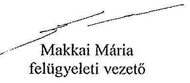

---

# IIIIII   MAGYAR NEMZETI BANK 

## Domokos László elnök részére   Állami Számvevőszék

Budapest
4. Pf. 54.

1364
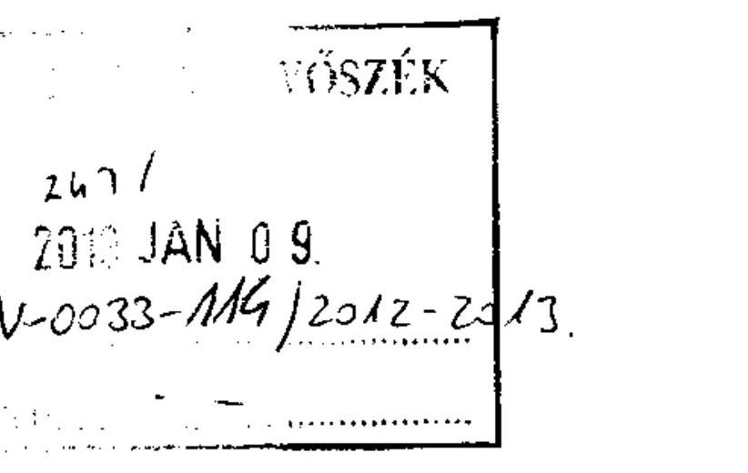

Tisztelt Elnök Úr!
Hivatkozással V-0033-089/2012.-es iktatószámú levelére tájékoztatom, hogy „a Magyar Nemzeti Bank működésének és központi költségvetéssel történő elszámolások szabályszerűségének ellenőrzéséről" készült jelentéstervezetre vonatkozólag nem kívánok észrevételt tenni.

Budapest, 2013. január 7.
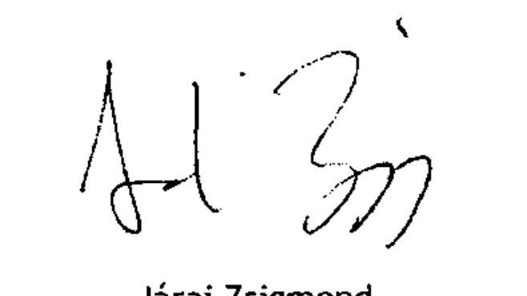

Járai Zsigmond
MNB FB elnök

---

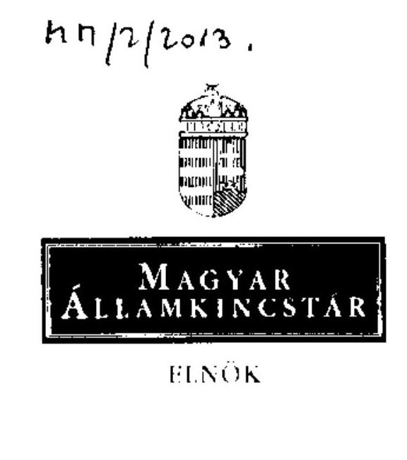
6. sz. melléklet
a V-0033-119/2012-2013. sz. jelentéshez
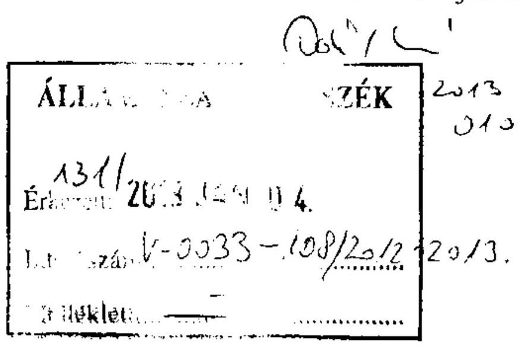

Domokos László
elnök

Állami Számvevőszék

Iktatószám: ELN-35/1/2013.
Hiv. számok:
kísérő levél: V-0033-088/2012.;
jelentéstervezet: V-0033-
080/2012.

Tárgy: Észrevétel megküldése
jelentéstervezetre

# Budapest 

## Tisztelt Elnök Úr!

Tájékoztatom, hogy „A Magyar Nemzeti Bank működésének és a központi költségvetéssel történő elszámolások szabályszerűségének ellenőrzéséről" készült, fenti hivatkozási számú jelentéstervezetet áttekintettük, és a 30. oldalon az alábbi pontosítás átvezetésére teszünk javaslatot, tekintettel arra, hogy a rendelkezésünkre álló adatok alapján a KESZ forintállománya után nem 156,6 Mrd Ft, hanem 157,3 Mrd forint kamatot számolt el az MNB 2007-2011. között.
30. oldal, 4. pont:
„A költségvetés részére a Kincstári Egységes Számla (KESZ) forintállománya után az MNB 2007-2011 között 157,3 Mrd Ft, ..."

Kérem, az észrevételünket szíveskedjék figyelembe venni a jelentéstervezet véglegesítése során.

Budapest, 2013. január 3.
Tisztelettel:
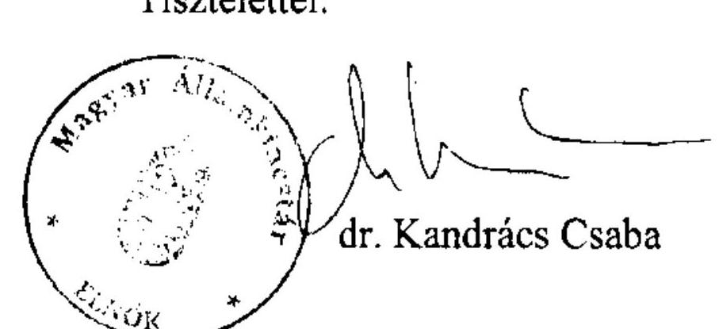

---

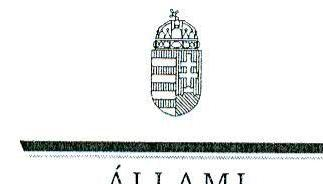

ÁLLAMI
SZÁMVEVŐSZÉK

Ikt.szám: V-0033-120/2012-2013.

Dr. Kandrács Csaba úr
elnök
Magyar Államkincstár

Budapest

# Tisztelt Elnök Úr! 

A Magyar Nemzeti Bank működésének és a központi költségvetéssel történő elszámolások szabályszerűségének ellenőrzése című jelentéstervezetre tett észrevételét köszönettel megkaptam.

Az Állami Számvevőszék észrevételekre vonatkozó álláspontjáról a felügyeleti vezető asszony által készített tájékoztatást csatoltan megküldöm.

Tájékoztatom Elnök urat, hogy a számvevőszéki jelentés szövegezése az elfogadott észrevételek figyelembevételével készül.

Budapest, 2013. 02. hó 04. nap

Tisztelettel:
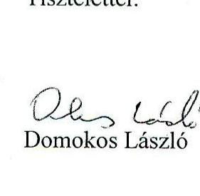

---

# Tájékoztatás   az elfogadott és az el nem fogadott észrevételekről 

A Magyar Nemzeti Bank működésének és a központi költségvetéssel történő elszámolások szabályszerűségének ellenőrzése című jelentéstervezetre tett észrevételét köszönettel megkaptuk.

A számvevőszéki jelentés szövegezése a KESZ forintállománya után elszámolt kamat összegét pontosító észrevétel figyelembevételével készül. A 30. oldal utolsó bekezdését módosítjuk:
„A költségvetés részére a Kincstári Egységes Számla (KESZ) forintállománya után az MNB 2007-2011 között 157,3 Mrd Ft, a devizaállománya után 29,9 Mrd Ft kamatot számolt el. A forintkamatok 5,6-8,8% között, a devizakamatok 0,3-3,6% között alakultak."

Budapest, 2013. 02. hó 01. nap

Makkai Mária
felügyeleti vezető

[^0]
[^0]:    ${ }^{1}$ A forint, illetve a deviza átlagállományára vetítve.
