# ÁLLAMI   SZÁMVEVŐSZÉK 

## JELENTÉS

a kórházi ellátás múködtetésére fordított pénzeszközök felhasználásának ellenőrzéséről

---

# Állami Számvevőszék 

Iktatószám: V-0020-319/2012-2013.
Témaszám: 1059
Vizsgálat-azonosító szám: V0562

## Az ellenőrzést felügyelte:

## Makkai Mária

felügyeleti vezető

## Az ellenőrzést vezette és az ellenőrzés végrehajtásáért felelős:

Böröcz Imre ellenőrzésvezető

## A számvevői munkaanyagok feldolgozásában közremúködtek és a jelentéstervezetet készítették:

Böröcz Imre
ellenőrzésvezető
Balogné Dakó Eszter
számvevő tanácsos
Csordás Péterné
számvevő
Kisgergely István
számvevő tanácsos
Kriston-Vizi János
számvevő tanácsos
Mokánszkiné Mengyi Andrea
számvevő tanácsos
Dr. Németh Eszter
számvevő
Pénzes Gyula
számvevő tanácsos
Újvári Józsefné
számvevő tanácsos

## Az ellenőrzést végezték:

Alexovics Ágota
számvevő tanácsos
Ganter Ildikó
számvevő
Humli Tamásné
számvevő tanácsos

Bencsik Árpád
számvevő
Gergely Tilda
számvevő
Huszár József
számvevő tanácsos

Dr. Csapó Anna
számvevő tanácsos
Dr. Horváth Klára
számvevő tanácsos
Kalmár István
számvevő tanácsos

---

Kányáné Murvai
Tünde
számvevő tanácsos
Liziczai Imréné
számvevő
Pats Regina
számvevő
Szalontai Miklós
számvevő tanácsos

## Knoppné Szabó Ildikó Dr. Lacó Bálintné

számvevő tanácsos
Marozsán Katalin
számvevő
Reichert Margit
számvevő
Dr. Szima Mária
számvevő tanácsos
Dr. Pataki Magdolna
számvevő tanácsos
Séra Andrásné
számvevő tanácsos
Vacsora Erika
számvevő tanácsos

# A témához kapcsolódó eddig készített számvevőszéki jelentések: 

## címe

Jelentés az önkormányzati tulajdonban lévő kórházak pénzügyi helyzetének, gazdálkodásának vizsgálatáról
Jelentés az állami és egyházi tulajdonban lévő kórházak, egyetemi 0301 klinikák gazdálkodásának ellenőrzéséről
a címzett támogatásból finanszírozott egészségügyi beruházások, 0523 rekonstrukciók ellenőrzéséről
Jelentés az egészségügyi szakellátások privatizációjának ellenőrzéséről
Jelentés az állami és önkormányzati kórházak gyógyszergazdálko- 0707 dásának ellenőrzéséről
Jelentés az egyes kórházi tevékenységek kiszervezésének ellenőrzéséről
Jelentés az egynapos sebészeti ellátásra fordított pénzeszközök 1001 hasznosulásának ellenőrzéséről
Jelentés a szervtranszplantáció, a donáció és az alternatív kezelé- 1020 sek ellenőrzéséről

---

# TARTALOMJEGYZÉK 

BEVEZETÉS ..... 13
I. ÖSSZEGZŐ MEGÁLLAPÍTÁSOK, KÖVETKEZTETÉSEK, JAVASLATOK ..... 17
II. RÉSZLETES MEGÁLLAPÍTÁSOK ..... 29

1. A pénzügyi helyzet változása és a pénzügyi egyensúly javítására irányuló kórházi intézkedések ..... 29
1.1. Gottsegen György Országos Kardiológiai Intézet, Budapest (GOKI) ..... 29
1.2. Heim Pál Gyermekkórház, Budapest (HPGY) ..... 34
1.3. Országos Idegtudományi Intézet, Budapest (OITI) ..... 41
1.4. Szent Imre Kórház, Budapest (SZIK) ..... 47
1.5. Uzsoki Utcai Kórház, Budapest (UUK) ..... 52
1.6. Szent Pantaleon Kórház, Dunaújváros (SZPK) ..... 58
1.7. Bugát Pál Kórház Egészségügyi Szolgáltató Nonprofit Kft., Gyöngyös (BPK) ..... 66
1.8. Petz Aladár Megyei Oktató Kórház, Győr (PAMOK) ..... 72
1.9. Kaposi Mór Oktató Kórház, Kaposvár (KMOK) ..... 79
1.10. Városi Kórház Keszthely (VKK) ..... 85
1.11. Marcali Városi Kórház-Rendelőintézet (MVK) ..... 91
1.12. Mátészalka Területi Kórház Egészségügyi Szolgáltató Nonprofit Kft. (MTK) ..... 98
1.13. Miskolci Semmelweis Ignác Egészségügyi Központ és Egyetemi Oktató Kórház Nonprofit Kft. (MISEK) ..... 104
1.14. Mohács Város Kórháza (MoVK) ..... 112
1.15. Dr. Bugyi István Kórház, Szentes (BIK) ..... 118
1.16. Jász-Nagykun-Szolnok Megyei Hetényi Géza Kórház és Rendelőintézet, Szolnok (HGK) ..... 124
1.17. Vas Megyei Markusovszky Kórház Nonprofit Zrt., Szombathely (VMMK) ..... 130
1.18. Szent Borbála Kórház, Tatabánya (SZBK) ..... 136
1.19. Jávorszky Ödön Kórház, Vác (JÖK) ..... 142
1.20. Szent Kozma és Damján Rehabilitációs Szakkórház, Visegrád (SZKDRSZ) ..... 148
2. A kórházi működtetésre vonatkozó korábbi ÁSZ ellenőrzések javaslatai alapján tett intézkedések végrehajtása ..... 153

---

# MELLÉKLETEK 

1. sz. melléklet Az ellenőrzött kórházak rövidítéseinek jegyzéke
2. sz. melléklet A kórházak bevételeinek és ráfordításainak alakulása M Ft-ban
3. sz. melléklet A kórházak engedélyezett álláshelyekhez viszonyított üres álláshelyei számának alakulása, az orvosok és szakápolók kiemelésével (fő)
4. sz. melléklet A munkaerő gazdálkodáshoz igénybevett támogatások
5. sz. melléklet A kórházak összes kötelezettsége és szállítói kötelezettsége, lejárt határidejű szállítói tartozások (M Ft-ban) és a fizetőképességet jellemző likviditási ráta
6. sz. melléklet A kórházaknak nyújtott konszolidációs támogatás és a lejárt határidejú szállítói tartozások (M Ft-ban)
7. sz. melléklet Az Emberi Erőforrások Miniszter jelentéstervezethez tett észrevétele
8. sz. melléklet Az ÁSZ válasza az Emberi Erőforrások Miniszterének a jelentéstervezethez tett észrevételeire
9. sz. melléklet A Gottsegen György Országos Kardiológiai Intézet főigazgatójának a jelentéstervezethez tett észrevétele
10. sz. melléklet Az ÁSZ válasza a Gottsegen György Országos Kardiológiai Intézet főigazgatójának a jelentéstervezethez tett észrevételeire
11. sz. melléklet A Bugát Pál Kórház Egészségügyi Szolgáltató Közhasznú Nonprofit Kft. ügyvezető igazgatójának a jelentéstervezethez tett észrevétele
12. sz. melléklet Az ÁSZ válasza a Bugát Pál Kórház Egészségügyi Szolgáltató Közhasznú Nonprofit Kft. ügyvezető igazgatójának a jelentéstervezethez tett észrevételeire
13. sz. melléklet A Somogy Megyei Kaposi Mór Oktató Kórház főigazgatójának a jelentéstervezethez tett észrevétele
14. sz. melléklet Az ÁSZ válasza a Somogy Megyei Kaposi Mór Oktató Kórház főigazgatójának a jelentéstervezethez tett észrevételeire
15. sz. melléklet A Városi Kórház Keszthely főigazgatójának a jelentéstervezethez tett észrevétele
16. sz. melléklet Az ÁSZ válasza a Városi Kórház Keszthely főigazgatójának a jelentéstervezethez tett észrevételeire
17. sz. melléklet A Csongrád Megyei Dr. Bugyi István Kórház főigazgatójának a jelentéstervezethez tett észrevétele
18. sz. melléklet Az ÁSZ válasza a Csongrád Megyei Dr. Bugyi István Kórház főigazgatójának a jelentéstervezethez tett észrevételeire
19. sz. melléklet A Jász-Nagykun-Szolnok Megyei Hetényi Géza KórházRendelőintézet főigazgatójának a jelentéstervezethez tett észrevétele
20. sz. melléklet Az ÁSZ válasza a Jász-Nagykun-Szolnok Megyei Hetényi Géza Kór-ház-Rendelőintézet főigazgatójának a jelentéstervezethez tett észrevételeire

---

21. sz. melléklet A Vas Megyei Markusovszky Kórház, Egyetemi Oktatókórház Nonprofit ZRt. vezérigazgató főorvosának a jelentéstervezethez tett észrevétele
22. sz. melléklet Az ÁSZ válasza a Vas Megyei Markusovszky Kórház, Egyetemi Oktatókórház Nonprofit ZRt. vezérigazgató főorvosának a jelentéstervezethez tett észrevételeire
23. sz. melléklet A Jávorszky Ödön Kórház főigazgatójának a jelentéstervezethez tett észrevétele
24. sz. melléklet Az ÁSZ válasza a Jávorszky Ödön Kórház főigazgatójának a jelentéstervezethez tett észrevételeire
25. sz. melléklet A Szent Kozma és Damján Rehabilitációs Szakkórház főigazgatójának a jelentéstervezethez tett észrevétele
26. sz. melléklet Az ÁSZ válasza a Szent Kozma és Damján Rehabilitációs Szakkórház főigazgatójának a jelentéstervezethez tett észrevételeire
27. sz. melléklet A Szent Imre Kórház főigazgatójának a jelentéstervezethez tett észrevétele
28. sz. melléklet A Szent Pantaleon Kórház-Rendelőintézet Dunaújváros gazdasági igazgatójának a jelentéstervezethez tett észrevétele
29. sz. melléklet Az Uzsoki Utcai Kórház főigazgatójának a jelentéstervezethez tett észrevétele

# FÜGGELÉK 

Függelék A CLF módszer eredményszemléletű adatainak megállapítási technikája

---

.

---

# RÖVIDÍTÉSEK JEGYZÉKE 

## Törvények

Áht. (régi)
Áht. (új)
Ebtv.
Eftv.
Gt.
Számv. tv.

## Rendeletek

Áhsz.

## Szórövidítések

áfa
ÁSZ
CT
E. Alap

EMMI
EMAFT
ESzCsM
EU
EüM
GYEMSZI
KEHI
kht.
KSH
MRI
NEFMI
OENO
OEP
OGY
TVK
WHO
az államháztartásról szóló 1992. évi XXXVIII. törvény
az államháztartásról szóló 2011. évi CXCV. törvény
a kötelező egészségbiztosítás ellátásairól szóló 1997. évi LXXXIII. törvény
az egészségügyi ellátórendszer fejlesztéséről szóló 2006. évi CXXXII. törvény
a gazdasági társaságokról szóló 2006. évi IV. törvény
a számvitelről szóló 2000. évi C. törvény
az államháztartás szervezetei beszámolási és könyvvezetési kötelezettségének sajátosságairól szóló 249/2000. (XII. 24.) Korm. rendelet
általános forgalmi adó
Állami Számvevőszék
komputertomográfia, komputer tomográf
Egészségbiztosítási Alap
Emberi Erőforrások Minisztériuma
előre meghatározott alapdíjjal finanszírozott teljesítmény
Egészségügyi Szociális és Családügyi Minisztérium
Európai Unió
Egészségügyi Minisztérium
Gyógyszerészeti és Egészségügyi Minőség- és Szervezetfejlesztési Intézet
Kormányzati Ellenőrzési Hivatal
közhasznú társaság
Központi Statisztikai Hivatal
Magnetic Resonance Imaging (mágneses magrezonancia képalkotás)
Nemzeti Erőforrás Minisztérium
Orvosi Eljárások Nemzetközi Osztályozása
Országos Egészségbiztosítási Pénztár
Országgyúlés
teljesítményvolumen keret
World Health Organization (Egészségügyi Világszervezet)

---

.

---

# ÉRTELMEZŐ SZÓTÁR 

aktív fekvőbeteg-ellátás

| árfolyamkockázat | Az a kockázat, amely a külföldi devizában fennálló pénzügyi eszközök tulajdonosainál abból ered, hogy az árfolyam elmozdulásával a tulajdonukban lévő eszköz hazai fizetőeszközben kifejezett értéke megváltozik. |
| :--: | :--: |
| beteg | Az egészségügyi ellátást igénybe vevő vagy abban részesülő személy. [az egészségügyről szóló 1997. évi CLIV. törvény 3. § a) pont] |
| CLF módszer | A CLF módszer a gazdálkodás elemzésének eszköze. Következetesen elkülöníti a múködési és a felhalmozási tevékenység során keletkező bevételeket és ráfordításokat, azok egyenlegeit, valamint a finanszírozási múveleteket. |
| CT | A komputertomográfia (Computed Tomography) a radiológiai diagnosztika egyik ága. A tomográfia szó a szeletelésre utal. A tomográfiás felvételeken a vizsgálat tárgya képzeletbeli szeletekre bontva látható. |
| daily dose | Napi terápiás dózis, a WHO által meghatározott, adott hatóanyagra jellemző napi dózis. Ez adott gyógyszer fő indikációjában, közepesen súlyos állapot esetén átlagosan előírt fenntartó adag felnőtt beteg esetén. [Egészségpolitikai fogalomtár] |
| degresszív finanszírozás | Amikor a szolgáltató finanszírozása nem lineárisan nő az elszámolt/elismert teljesítménnyel, hanem egy, előre meghatározott pont felett a finanszírozás csökken. A degresszió általában felső korlátos, azaz egy pont felett már semmilyen finanszírozás nem jár. [Egészségpolitikai fogalomtár] |
| egészségügyi ellátás | A beteg adott egészségi állapotához kapcsolódó egészségügyi tevékenységek összessége. [az egészségügyről szóló 1997. évi CLIV. törvény 3. § c) pont] |
| egészségügyi intézmény | Az egészségügyi szolgáltatók közül a rendelőintézeti járóbeteg-szakellátást vagy fekvőbeteg-szakellátást nyújtó szolgáltatók (a továbbiakban együtt: gyógyintézet), továbbá az állami mentőszolgálat, az állami vérellátó szolgálat, valamint az egészségügyi államigazgatási szerv intézetei, amennyiben egészségügyi szolgáltatást is nyújtanak. [az egészségügyről szóló 1997. évi CLIV. törvény 3. § g) pont] |

---

egészségügyi szolgáltatás
egészségügyi szolgáltató
az egészségügyi szolgáltató tevékenysége alapján használható elnevezések a fekvőbetegellátásban

Az egészségügyi államigazgatási szerv által kiadott múködési engedély birtokában végezhető egészségügyi tevékenységek összessége, amely az egyén egészségének megőrzése, továbbá a megbetegedések megelőzése, korai felismerése, megállapítása, gyógykezelése, életveszély elhárítása, a megbetegedés következtében kialakult állapot javítása vagy a további állapotromlás megelőzése céljából a beteg vizsgálatára és kezelésére, gondozására, ápolására, egészségügyi rehabilitációjára, a fájdalom és a szenvedés csökkentésére, továbbá a fentiek érdekében a beteg vizsgálati anyagainak feldolgozására irányul. Ideértve a gyógyszerekkel, a gyógyászati segédeszközökkel, a gyógyászati ellátásokkal kapcsolatos külön jogszabály szerinti tevékenységet, valamint a mentést és a betegszállítást, a szülészeti ellátást, az emberi reprodukcióra irányuló különleges eljárásokat, a múvi meddővétételt, az emberen végzett orvostudományi kutatásokat, továbbá a halottvizsgálattal, a halottakkal kapcsolatos orvosi eljárásokkal, - ideértve az ehhez kapcsolódó - a halottak szállításával összefüggő tevékenységeket is. [az egészségügyről szóló 1997. évi CLIV. törvény 3. § e) pont]
A tulajdoni formától és fenntartótól függetlenül minden, egészségügyi szolgáltatás nyújtására és az egészségügyi államigazgatási szerv által kiadott múködési engedély alapján jogosult egyéni egészségügyi vállalkozó, jogi személy vagy jogi személyiség nélküli szervezet. [az egészségügyről szóló 1997. évi CLIV. törvény 3. § f) pont]
Egészségügyi szolgáltatási tevékenységek és ezek alapján használható elnevezések a fekvőbeteg-szakellátás körében

- krónikus, rehabilitációs vagy folyamatos orvosi felügyeletet nem igénylő ápolási, szakápolási szolgáltatás nyújtása esetén az adott ellátási formában múködő intézet,
- több szakmai főcsoportba tartozó szakmában aktív és krónikus, illetve aktív vagy krónikus betegellátást nyújtó, diagnosztikai háttérrel múködő egészségügyi szolgáltató esetén a kórház,
- az egy szakmacsoporton belül speciális, magas szintű szakmai tudás rendelkezésre állása, és az ahhoz kapcsolódó gyógyító, módszertani, kutatási és oktatási tevékenység gyakorlása esetén az országos intézet,
- ha azt az orvostudományi vagy egészségtudományi képzést folytató egyetem részeként látja el, a klinika elnevezés használatára jogosult;
- amennyiben egy szakterületen legalább 5 napon keresztül napi 6 órában biztosítja a 60/2003. (X. 20.) ESzCsM rendelet 4. § (1) bekezdése szerinti feltételeket azzal, hogy csak a beteg nappali elhelyezésére szolgáló helyiség biztosítása szükséges -, a nappali kórház elnevezés használatára jogosult.

---

egynapos sebészeti ellátás
fedezeti összeg
fekvőbeteg-szakellátás
felhalmozási kockázat
finanszírozási múveletek nélküli GFS pozíció
finanszírozási protokoll
[az egészségügyi szolgáltatások nyújtásához szükséges szakmai minimumfeltételekről szóló 60/2003. (X. 20.) ESzCsM rendelet 5. § c), d) pontok]
Az egynapos sebészeti ellátás olyan speciális, kórházi kezelést kiváltó ellátás, amely - a kórházi körülményekhez hasonló - feltételeknek megfelelő intézményben 24 óránál rövidebb ellátási időt igényel. [az egynapos sebészeti és a kúraszerűen végezhető ellátások szakmai feltételeiről szóló 16/2002. (XII. 12.) ESzCsM rendelet]
Az OEP-től származó összes támogatás és a gyógyító tevékenységre elszámolt közvetlen költségek különbözete.
A betegnek a lakóhelye közelében, fekvőbeteggyógyintézeti keretek között végzett egészségügyi ellátása. Ennek igénybevétele a beteg folyamatos ellátását végző orvos, a kezelőorvos vagy az arra feljogosított más személy beutalása, valamint a beteg jelentkezése alapján történik. [az egészségügyről szóló 1997. évi CLIV. törvény 91. § (1) bek.]

Az a kockázat, amely a folyamatban lévő felhalmozási feladatok finanszírozási forrásának hiányára utal:

- a folyamatban lévő beruházások kockázata (előfinanszírozni kell a projektet, az önerőhöz a források nem állnak rendelkezésre, a finanszírozási terve, ismert forrásösszetétele és annak nagysága nem támasztja alá az ütemezett fizetést);
- a benyújtott pályázatok finanszírozhatósága (a saját erőhöz szükséges források nem állnak rendelkezésre, a pénzügyi szabályozási és a külső finanszírozási környezet bizonytalan);
- az uniós támogatásokhoz való hozzájutás kiszámíthatóságának feltételei romlottak.
A CLF módszer szerint számított múködési és felhalmozási tevékenység pénzügyi egyenlegének összevont értéke. Megmutatja, hogy a gazdálkodó szervezet bevételei fedezetet biztosítottak-e a ráfordításokra. A finanszírozási múveletek nélküli GFS pozíció alapján az elemzés során a pénzügyi egyensúlyt akkor tekintettük biztosítottnak, ha a bevételek a ráfordításokra fedezetet nyújtottak.
A finanszírozási protokollok a szakmai szabályokon belül pontosítják azt, hogy a közfinanszírozás terhére az adott ellátás milyen szakmai tartalommal, milyen eljárásrendben vehető igénybe. Tehát a finanszírozási protokollok nem írják felül a szakmai protokollokat, hanem szűkítő jellegűek: azon belül jelölik ki a közfinanszírozás terhére nyújtható technológiákat és eljárásrendeket. [Egészségpolitikai fogalomtár]

---

generikum

gyógyító-megelőző ellátások
gyógyszer
járóbeteg-szakellátás
kamatkockázat
készpénz likviditás
konszignációs raktár
kontrolling

A generikus gyógyszerek (generikumok) olyan gyógykészítmények, amelyek ugyanazokat az aktív összetevőket és ugyanolyan arányban tartalmazzák, mint az eredeti gyógyszerek. Így gyógyhatásukat tekintve megegyeznek az eredeti gyógyszerrel, azonban annak áránál jóval alacsonyabb áron kaphatóak. A generikumok az eredeti gyógyszer szabadalmának lejárta után jelennek meg a piacon. [Egészségpolitikai fogalomtár]
Az egészségügyi szakszemélyzet által nyújtott gyógyítómegelőző eljárások összessége. (Ide tartozó tevékenységek a teljesség igénye nélkül: az egészségügyi szakszemélyzet által végzett szűrés, életvezetési tanácsadás, „felvilágositás", diagnosztikai vizsgálatok, terápiás terv készítése, kezelés, műtét, gyógyszerrendelés, szakápolás) [Egészségpolitikai fogalomtár]
Gyógyszer bármely anyag vagy azok keveréke, amelyet emberi betegségek megelőzésére vagy kezelésére állítanak elő, vagy azok az anyagok vagy keverékei, amelyek farmakológiai, immunológiai vagy metabolikus hatások kiváltása révén az ember valamely élettani funkciójának helyreállítása, javítása vagy módosítása, illetve az orvosi diagnózis felállítása érdekében alkalmazhatók. [az emberi alkalmazásra kerülő gyógyszerekről és egyéb, a gyógyszerpiacot szabályozó törvények módosításáról szóló 2005. évi XCV. tv. 1. §]
A beteg folyamatos ellátását, gondozását végző orvos beutalása vagy a beteg jelentkezése alapján, szakorvos által végzett egyszeri, illetve alkalomszerú egészségügyi ellátás, továbbá fekvőbeteg-ellátást nem igénylő krónikus betegség esetén a folyamatos szakorvosi gondozás. [az egészségügyről szóló 1997. évi CLIV. törvény 89. § (1) bek.]
A változó kamatozású forint-, vagy devizahitelek futamideje alatt a kamat emelkedése miatt fennálló kamatkockázat, melynek növekedése miatt nő a hitel törlesztő részlete.
A teljesen mobil (likvid) pénzeszközök összegét viszonyítja a rövid lejáratú kötelezettségekhez. Gyakorlatilag az azonnal esedékes kifizetések teljesítőképességét fejezi ki. A mutató minimális értéke 20\%, hiszen általában egyszerre a rövid lejáratú kötelezettségeknek csak kis hányadát kell kiegyenlíteni.
Raktári létesítmény, amelyben a beszállító árukészletet helyez el a felhasználó számára a felhasználó által biztosított tárolóterületen, azaz a konszignációs raktár nem más, mint a beszállító készáruraktára a felhasználónál.
A menedzsment igényei szerinti üzemgazdasági szemléletű tervezési, ellenőrzési, információellátási, koordináló vezetési rendszer.

---

közreműködő
krónikus fekvőbetegellátás
likviditás
likviditási ráta

MRI
originális készítmény

A közreműködést igénybe vevő szolgáltató szervezeti egységének tevékenységéhez kapcsolódó, az egészségügyi szolgáltatás nyújtásában részt vevő személy vagy szervezet, amely közreműködői szerződés alapján, közvetlenül, múködési engedély és felelősségbiztosítási szerződés birtokában, a közremüködést igénybe vevő szolgáltató szervezeti egysége által nyújtott szakmában és a saját tulajdonában vagy használatában levő tárgyi eszközökkel, személyesen, vagy az általa foglalkoztatott egészségügyi dolgozókkal a közremüködést igénybe vevő szolgáltató szervezeti egysége által ellátott betegek részére a közremüködést igénybe vevő szolgáltató nevében nyújt egészségügyi szolgáltatást. [az egészségügyi szolgáltatás gyakorlásának általános feltételeiről, valamint a müködési engedélyezési eljárásról szóló 96/2003. (VII. 15.) Korm. rendelet 2. § (1) bekezdés k) pont]
A finanszírozás módja szerint krónikus ellátásnak minősül az, amelynek célja az egészségi állapot stabilizálása, fenntartása, illetve helyreállítása. Az ellátás időtartama, illetve befejezése általában nem tervezhető, és jellemzően hosszú időtartamú, emiatt napi finanszírozási díjtétel az alapja. [Egészségpolitikai fogalomtár]
A likviditás a gazdasági élet valamely szereplőjének olyan állapota, amikor vásárlásait és minden más esedékes fizetési kötelezettségét határidőre ki tudja egyenlíteni.
A likviditás statikus jellemző. Egy vállalkozás adott időpillanatban fennálló fizetőképességét, ill. fizetésképtelenségét jelzi.
A likviditási ráta a likviditás legelterjedtebb mérőszáma. A mutatóban a gazdálkodó szervezet mérlegében szereplő két összetevő, a forgóeszközök és a rövid lejáratú kötelezettségek egymáshoz viszonyított aránya jelenik meg. Amennyiben a mutató értéke 1 alatt van, az gyakorlatilag a fizetésképtelenség közvetlen veszélyét jelzi, hiszen a rövid távon várhatóan pénzeszközzé váló eszközök nem fedezik a rövid távon lejáró kötelezettségeket. A mutató 1 fölötti értéke elfogadható. Az általános vélekedés szerint normális üzletmenet esetén az 1,5 körüli érték tekinthető megfelelőnek.
Az angol „Magnetic Resonance Imaging" rövidítése, melynek jelentése: mágneses magrezonancia képalkotás. A technikát elsősorban az orvosi diagnosztikában használják a test szerkezetének leképezéséhez. Emellett az agyi képalkotás területén is egyre gyakrabban alkalmazzák. Előnye a komputertomográfiához (elterjedtebb angol rövidítéssel CT) képest, hogy jobb a kontrasztfelbontó képessége a lágy szövetek területein.
Az originális (eredeti) készítmények hatóanyaga új fejlesztés eredménye, korábban nem létezett vagy nem használták a gyógyászatban. Az új gyógyszermolekulát hosszú

---

pénzügyi kapacitás
rabatt
súlyszám
szakmai protokoll

TVK
unit dose
évekig szabadalom védi, a szabadalommal bíró gyógyszercég az egyetlen, amely ezt a gyógyszert gyárthatja és forgalmazhatja. [Egészségpolitikai fogalomtár]
A pénzügyi kapacitás (financial capacity) az adósok hitelfelvételi képességének azon mértéke, ahol még anélkül tudják növelni az adósságot, hogy csökkenteniük kellene akár a jelenbeli, akár a jövőben esedékes kiadásaikat a fizetésképtelenség elkerülése érdekében. (Forrás: Az önkormányzati rendszer pénzügyi helyzete, ÁSZKUT tanulmány 2010.)
Engedmény, amelyet a szállító a vevő részére ad, legtöbbször kedvezőbb fizetési megoldásokban, vagy nagyobb árumennyiségben (pl.: gyógyszerek) testesül meg.
Az adott betegségcsoport költségigényének és az átlagos költségigénynek a hányadosa. Magyarországon ez a díj az ellátás teljes (átlagos) költségét fedezi a tőkeköltségek (amortizáció, beruházás) kivételével. [Egészségpolitikai fogalomtár]
Meghatározott betegségcsoportban és ellátási szinten egy betegség vagy állapot - az elérhető tudományos bizonyítékokkal alátámasztott preventív, diagnosztikai, terápiás, ápolási, gondozási és rehabilitációs - ellátási folyamatával kapcsolatos tevékenységek rendszerezett listája, ami az egészségügyi szolgáltatások szakmai ellenőrzésének és finanszírozásának alapját képezi. Célja az ellátás biztonságosságának és egyenletes színvonalának biztosítása. [a vizsgálati és terápiás eljárásrend kidolgozásának, szerkesztésének és szakmai egyeztetése lefolytatásának eljárásrendjéről szóló 23/2006. (V. 18.) EüM rendelet 2. § b) pont]
Teljesítményvolumen keret. [az egészségügyi szolgáltatások Egészségbiztosítási Alapból történő finanszírozásának részletes szabályairól szóló 43/1999. (III. 3.) Korm. rendelet 27. § (2)] Magyarországon a finanszírozás tarthatósága érdekében került bevezetésre 2004-ben. A járóbetegszakellátásra és az aktív fekvőbeteg-szakellátásra vonatkozóan szolgáltatónként, éves szinten, havi bontásban meghatározott elszámolható teljesítménymennyiség. A finanszírozást az OEP az ellátóknak kizárólag a volumenkorlát keretein belül nyújtja. (Egészségpolitikai fogalomtár)
Unit dose kiszerelések használata esetén a napi gyógyszeradagolót a „unit dose" készítmények egy napi terápiát tartalmazó csoportja helyettesíti, melyet valamilyen technológiai megoldással - pl. zárt dobozba, fiókba, füzérbe stb. - betegenként csoportosítva, a beadási sorrendnek megfelelően rendezve ad ki az intézeti gyógyszertár. [Az Országos Gyógyszerészeti Intézet módszertani levele OGYI-P-69-2008.]

---

# JELENTÉS 

## a kórházi ellátás múködtetésére fordított pénzeszközök felhasználásának ellenőrzéséről

## BEVEZETÉS

A kórházak az egészségügyi ellátórendszer többféle egészségügyi szolgáltatást nyújtó intézményei, amelyek közfinanszírozása többcsatornás. A múködést alapvetően az Egészségbiztosítási Alapból (E. Alap) kapott, teljesítménytől függő - Országos Egészségbiztosítási Pénztár által finanszírozott - támogatás határozza meg. Az E. Alapból a gyógyító-megelőző ellátások finanszírozása a 2009. évi 719,0 Mrd Ft-hoz képest a 2011. évben 806,9 Mrd Ft-ra (12,2\%-kal) emelkedett nominálisan, amely reálértéken 3,2\%-os csökkenést jelentett az egészségügyi kiadások 15,4\%-os inflációja mellett ${ }^{1}$. Ezen belül a szakellátások támogatása 539,7 Mrd Ft-ról 585,2 Mrd Ft-ra (8,4\%-kal) nőtt, amely a 2009. évi árakon 7,0\%-os csökkenésnek felelt meg.

A kórházak fejlesztése elsősorban a tulajdonosok/fenntartók feladata. Az ellenőrzési témához kapcsolódó korábbi számvevőszéki jelentések is utaltak már arra, hogy a kórházak a múködési bevételeikből is fordítottak felhalmozásra, elsősorban gép és műszer beszerzésekre. Ezek egy része az elhasználódott eszközök pótlását szolgálta, miközben a finanszírozás nem tartalmazott amortizációs fedezetet.

A kórházak többsége évek óta pénzügyi, likviditási gondokkal küzd. A Kormány döntései ${ }^{2}$ alapján a kórházak a lejárt szállítói tartozások rendezésére és a várólisták csökkentésére a 2010. év végén $27,5 \mathrm{Mrd}$ Ft, majd a fekvő- és járóbeteg-ellátási szolgáltatók az adósságállomány növekedése, a likviditási problémák miatt 2011. év végén újabb 27,0 Mrd Ft konszolidációs támogatásban részesültek. A kórházak kötelezettségállománya 2012. június 30-án 99,5 Mrd Ft, ezen belül a lejárt határidejú szállítói tartozás 35,7 Mrd Ft volt.

A Nemzeti Erőforrás Minisztérium (NEFMI) Egészségügyért Felelős Államtitkársága a 2011. évben közzétette a Semmelweis Tervben meghatározott egészségügyi struktúra-átalakítással járó egészségpolitikai koncepciót. A Kormány a

[^0]
[^0]:    ${ }^{1}$ Forrás: GYEMSZI Árinformáció az egészségügyi intézményekben
    ${ }^{2}$ a Gyógyító-megelőző ellátás jogcím-csoportból finanszírozott egészségügyi szolgáltatók korábbi évekből felhalmozott adósságának rendezésére fordítható konszolidációs támogatásról szóló 269/2010. (XII. 3.) Korm. rendelet és a Gyógyító-megelőző ellátás jogcím-csoportból finanszírozott egészségügyi szolgáltatók adósságának rendezésére fordítható konszolidációs támogatásról és az egészségügyi szolgáltatások Egészségbiztosítási Alapból történő finanszírozásának részletes szabályairól szóló 43/1999. (III. 3.) Korm. rendelet módosításáról szóló 337/2011. (XII. 29.) Korm. rendelet

---

koncepció végrehajtását kormányhatározatban ${ }^{3}$ írta elő. A megyei önkormányzatok konszolidációjával a megyei önkormányzatok tulajdonában lévő, valamint a Fővárosi Önkormányzattól átvett egészségügyi intézmények vagyona 2012. január 1-jével állami tulajdonba került ${ }^{4}$. A települési önkormányzatok fekvőbeteg-szakellátó intézményeinek átvételéről és az átvételhez kapcsolódó egyes törvények módosításáról szóló törvény ${ }^{5}$ alapján 2012. május 1-jével a települési önkormányzatok fenntartásában lévő fekvőbeteg-szakellátó intézmények fenntartását is átvette az állam. A fenntartói feladatokat az Emberi Erőforrások Minisztériuma (EMMI) ${ }^{6}$ felügyelete alatt a GYEMSZI látja el.

A költségvetési vagy társasági formában múködő kórház az alapító okiratában, a társasági szerződésében előírt feladatainak megfelelő ellátásához, a múködés, illetve vállalkozás folytatásához az szükséges, hogy a kötelezettségeire a pénzügyi fedezet, a ráfordításokhoz szükséges bevétel rendelkezésre álljon. Az ellenőrzés során a pénzügyi egyensúly fenntartását veszélyeztető körülmények feltárását és ezek alapján a saját hatáskörben szükséges és lehetséges intézkedések meghozatalát a kórházaktól elvárható követelménynek tekintettük.

Az ellenőrzés típusa pénzügyi-szabályszerúségi ellenőrzés volt, amely a 20092012. év I. félév közötti időszakra terjedt ki. A kórházi múködésre vonatkozó korábbi ÁSZ ellenőrzések javaslatai alapján tett intézkedések végrehajtásának ellenőrzése a 2006-2012. év I. féléves időszakra vonatkozott.

Az ellenőrzést az INTOSAI ellenőrzési standardjai ${ }^{7}$, valamint az ÁSZ pénzügyiszabályszerúségi ellenőrzéshez kidolgozott módszertani előírásai alapján végeztük. Az ellenőrzési programot előtanulmánnyal alapoztuk meg.

Az ellenőrzés végrehajtására az Állami Számvevőszékről szóló 2011. évi LXVI. törvény 1. § (3) bekezdésében, a szabályszerűségi ellenőrzés tekintetében az Állami Számvevőszékről szóló 2011. évi LXVI. törvény 5. § (2)-(5) bekezdéseiben, valamint az államháztartásról szóló 2011. évi CXCV. törvény 61. § (2) bekezdésében foglaltak adtak jogszabályi alapot.

[^0]
[^0]:    ${ }^{3}$ a Semmelweis Tervben meghatározott egészségügyi struktúra-átalakítással járó feladatokról, a kiemelt feladatok végrehajtásához szükséges intézkedésekről szóló 1208/2011. (VI. 28.) Korm. határozat
    ${ }^{4}$ a megyei önkormányzatok konszolidációjáról, a megyei önkormányzati intézmények és a Fővárosi Önkormányzat egyes egészségügyi intézményeinek átvételéről szóló 2011. évi CLIV. törvény
    ${ }^{5}$ a települési önkormányzatok fekvőbeteg-szakellátó intézményeinek átvételéről és az átvételhez kapcsolódó egyes törvények módosításáról szóló 2012. évi XXXVIII. törvény 2. § (2) bekezdése
    ${ }^{6}$ A Nemzeti Erőforrás Minisztérium (NEFMI) elnevezése a Magyar Köztársaság minisztériumainak felsorolásáról szóló 2010. évi XLII. törvény módosításáról szóló 2012. évi XLII tv. 1. §-a alapján 2012. május 14-től Emberi Erőforrások Minisztériuma (EMMI).
    ${ }^{7}$ ISSAI 100. A számvevőszéki ellenőrzés alapelvei, ISSAI 200. A számvevőszéki ellenőrzés általános standardjai és etikai vonatkozású standardok, ISSAI 300. Az ellenőrzés lefolytatásának standardjai a számvevőszéki ellenőrzésben, ISSAI 400. A jelentéskészítési standardok a számvevőszéki ellenőrzésben.

---

Az ellenőrzés célja annak értékelése volt, hogy

- hogyan és milyen tényezők hatására változott a kórházak pénzügyi helyzete, biztosított volt-e a kórházak gazdálkodásában a pénzügyi egyensúly, megtörténtek-e a megteremtésére, javítására irányuló belső intézkedések;
- hasznosultak-e a kórházi múködésre vonatkozó korábbi ÁSZ ellenőrzések során tett javaslatok.

Az ellenőrzés megállapításaival az volt a célunk, hogy támogassuk a kórházak gazdálkodását, a kórházfenntartói és felügyeleti, az ágazati irányítói tevékenységet, továbbá az Országgyűlés törvényalkotó munkáját. Az ellenőrzési megállapítások hasznosítása lehetőséget kínál a kórházaknak a későbbi önértékeléshez, valamint a GYEMSZI-nek a fenntartásában lévő kórházak pénzügyi helyzete összehasonlításához alkalmas módszerek kialakítására.

A helyszíni ellenőrzés során 20 kórház, valamint az EMMI ellenőrzésére került sor. A kórházak közül 13 önkormányzati költségvetési intézmény, kettő központi költségvetési szerv, öt gazdasági társaság volt. Az ellenőrzött kórházak a közfinanszírozott országos ellátási kapacitáson és finanszírozáson belül egyötödnyi arányt képviseltek ${ }^{8}$. Az ellenőrzött kórházak rövidítéseinek jegyzékét az 1. sz. melléklet tartalmazza. Az EMMI-nél végzett helyszíni ellenőrzés során a kórházi múködtetésre vonatkozó korábbi ÁSZ ellenőrzések ${ }^{9}$ javaslatai alapján tett intézkedések végrehajtását ellenőriztük.

A kórházak pénzügyi helyzetét eredményszemléletben, CLF módszerrel mutattuk be. A módszer elkülönítette a múködési és felhalmozási bevételeket, költségeket, ráfordításokat és azok egyenlegeit. A gazdasági társasági formában és a költségvetési szervként múködő kórházak pénzügyi helyzetének elemzése során egyaránt azok üzemgazdasági szemléletű ${ }^{10}$ bevételeit, költségeit és ráfordításait ellenőriztük. A költségek és ráfordítások számbavétele során az értékcsökkenési leírást nem vettük figyelembe, hanem azt vizsgáltuk, hogy a kórházak által végzett eszközpótlások értéke ellensúlyozta-e az elszámolt amortizációs összeget. A pénzügyi helyzet értékelése során a finanszírozási műveletek nélküli (GFS) pozíciót helyeztük a középpontba. Az eredményszemléletű CLF módszerrel történő elemzéshez az adatok egységes szemléletben való megállapításának technikáját a függelék, az alkalmazott fogalmak tartalmát az értelmező szótár mutatja be.

[^0]
[^0]:    ${ }^{8}$ Az ellenőrzött kórházak a 2011. évben a finanszírozott országos átlagos fekvőbeteg kapacitásból $18,8 \%$-ot ( 13370 kórházi ágyat) múködtettek, és az E. Alap összevont szakellátási kassza finanszírozási kifizetéseiből 17,6\%-ot (103,0 Mrd Ft-ot) kaptak.
    ${ }^{9}$ az egészségügyi szakellátások privatizációjának ellenőrzéséről szóló 0609 számú és az egyes kórházi tevékenységek kiszervezésének ellenőrzéséről szóló 0921 számú ÁSZ jelentések
    ${ }^{10}$ A költségvetési szervek üzemgazdasági szemléletű bevételei, költségei és ráfordításai megállapításához a pénzforgalmi adatokat - az analitikus nyilvántartások alapján - a pénzforgalomban nem jelentkező, de a tárgyévet megillető és meg nem illető bevételekkel, valamint a tárgyévet terhelő költségekkel, ráfordításokkal és a tárgyévet nem terhelő kiadásokkal korrigáltuk.

---

A kórházi ellátás teljesítménymutatói közül az egynapos ellátási esetek számát, az ágykihasználtságot, az átlagos ápolási nap adatait elemeztük a 2009-2011 közötti időszakban. ${ }^{11}$ A teljes ellenőrzési időszak tekintetében feldolgoztuk, elemeztük az elszámolható teljesítmények alakulását. ${ }^{12}$ A kórházankénti értékelés során csak azon változásokat emeltük ki, amelyek a pénzügyi helyzetet lényegesen befolyásolhatták.

Az ellenőrzési megállapításokat az ellenőrzött kórházak által szolgáltatott tanúsítványi adatok, a tényeket, véleményeket és számvevői elemzéseket tartalmazó - az ellenőrzöttek által is aláírt - jegyzőkönyvek, valamint a nyilvános és az ÁSZ rendelkezésre álló egyéb kontroll adatforrások (bizonyítékok) alapozták meg.

Az Állami Számvevőszékről szóló 2011. évi LXVI. törvény 29. §-a szerint a jelentéstervezetet megküldtük egyeztetésre az Emberi Erőforrások Minisztériuma, továbbá a helyszínen ellenőrzött 20 kórház vezetője részére. A beérkezett észrevételeket és az ezekre adott válaszokat, ideértve az el nem fogadott észrevételeket és azok indokolását a jelentés 7-29. számú mellékletei tartalmazzák.

[^0]
[^0]:    ${ }^{11}$ Forrás: Kórházi ágyszám és betegforgalmi kimutatás 2009-2011. OEP-FIFO
    ${ }^{12}$ Forrás: Kórházak adatszolgáltatása

---

# I. ÖSSZEGZŐ MEGÁLLAPÍTÁSOK, KÖVETKEZTETÉSEK, JAVASLATOK 

Az ellenőrzött kórházak (a továbbiakban: kórházak) pénzügyi egyensúlya a 2009. évben nem volt biztosított. A 2010. és a 2011. években a pénzügyi egyensúlyi helyzet kedvező irányba változott a teljesítményarányos OEP támogatás növekedésének, valamint a saját bevételek növelésére és a ráfordítások csökkentésére irányuló intézkedéseknek, továbbá a konszolidációs támogatásoknak a hatására. Mindezek azonban nem voltak elegendőek ahhoz, hogy a kórházak teljes körénél megteremtsék a gazdálkodás pénzügyi egyensúlyát, és biztosítsák annak hosszú távú megőrzését. A likviditási problémák és a fizetési késedelmek fennmaradtak.

A kórházak pénzügyi egyensúlya (a bevételek és ráfordítások különbségét a finanszírozási múveletek nélkül számított GFS pozíció alapján) a 2009. évben egyetlen esetben sem, 2010-ben 18, 2011-ben 10 - konszolidációs támogatás nélkül 15 - kórháznál nem volt biztosított. A kórházak 20092011 közötti bevételeit, ráfordításait főbb jogcímenként a 2. sz. melléklet tartalmazza.

A kórházak együttesen számított finanszírozási műveletek nélküli GFS pozíciója 2009-2011 között az alábbiak szerint alakult:

1. számú diagram
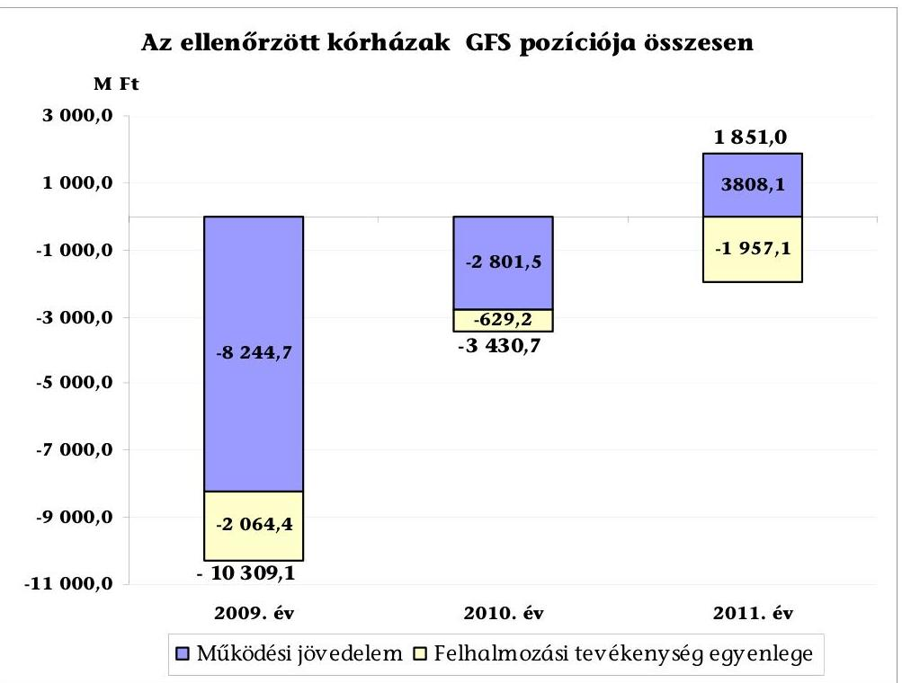

---

A finanszírozási múveletek nélküli GFS pozíció alakulását 2009-2011 között kórházanként az alábbi diagram szemlélteti:
2. számú diagram
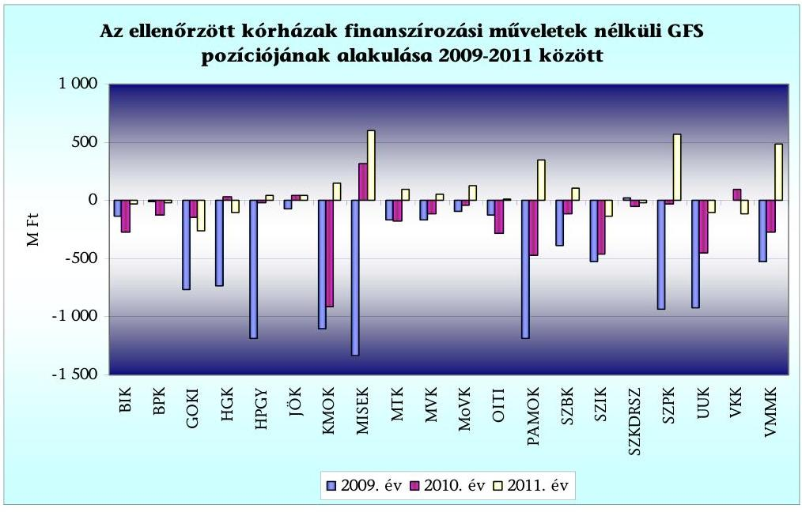

A kórházak 2009-2011 között összesen 13 909,9 M Ft beruházási és 3282,1 M Ft értékű felújítási tevékenységet végeztek. A fejlesztések megvalósításához 2009ben 18, 2010-ben 16, míg 2011-ben egyetlen kórháznál sem keletkezett a felhalmozási ráfordításokat fedezö összegü felhalmozási célú bevétel ${ }^{13}$. Az OEP-től kapott finanszírozás nem tartalmazott eszközpótlási célú hányadot ${ }^{14}$, a felhalmozási célú bevételek nem biztosítottak elegendő fedezetet, így a kórházak a fejlesztéseket múködési bevételből, a múködés biztonságának kockáztatásával finanszírozták. Az eszközpótlásra fordított összeg ( $6192,3 \mathrm{M} \mathrm{Ft}$ ) az összes elszámolt értékcsökkenésnek (21 398,1 M Ft) mindössze 28,9\%-át tette ki. A 2009-2011. évek felhalmozási tevékenysége során - az adatszolgáltatások szerint - egy kórház sem végzett olyan mértékű eszközpótlást, amely ellensúlyozta volna az elszámolt értékcsökkenés összegét. A 12 kórháznál folyamatban lévő - alapvetően pályázati forrásokkal megkezdett - fejlesztésekkel (amelyek tervezett összértéke $50882,6 \mathrm{M}$ Ft, ezen belül fenntartói beruházás $20876,4 \mathrm{M}$ Ft) átmenetileg korszerűbbé válik az eszközállomány egy része, de ezek későbbi pótlásának forrása is bizonytalan. Az eszközpótlások elmaradása a későbbi múködési tevékenység biztonságos folytatását veszélyezteti.

A kórházak gazdálkodásában a CLF módszer szerinti müködési pénzügyi egyensúly 2009-ben 16, 2010-ben 13 - konszolidációs támogatás nélkül 18

[^0]
[^0]:    ${ }^{13}$ saját felhalmozási jellegú bevételek, fenntartói és alapítói támogatások, kölcsönök, átvett pénzeszközök, hosszú lejáratú hitelek
    ${ }^{14}$ Az Egészségügyi Minisztérium-Országos Egészségbiztosítási Pénztár által kiadott Besorolási kézikönyv a homogén betegségcsoportok képzéséhez (HBCs 5.0 verzió) szerint a „tökefedezeti költségeket nem számították be a súlyszámba".

---

-, míg 2011-ben 5 - konszolidációs támogatás nélkül 12 - esetben nem volt biztosított.

A múködés finanszírozását szolgáló bevételek összege 2009-2011 között összességében folyamatosan növekedett. A 2009. évben összesen 107 989,0 M Ft volt, amely 2010-re 6,6\%-kal (7145,6 M Ft-tal), 2011-re 123 020,5 M Ft-ra (6,8\%-kal, 7885,9 M Ft-tal) emelkedett az előző évhez viszonyítva. A jellemző tendenciától eltérően egy kórháznál 2010-re, míg négy kórháznál 2011-re csökkent a múködési bevételek összege. A múködési bevételeken belül minden évben meghatározó volt az OEP-től származó támogatások aránya, amely 2009-ben 86,7\% (93 522,3 M Ft), 2010-ben 82,1\% (100 139,8 M Ft) és 2011-ben 84,0\% (106 972,3 M Ft) volt. Alakulását a finanszírozási szabályok és a kórházak teljesítménymutatóinak változása befolyásolta.

A kórházak fekvő- és járóbeteg szakellátás kapacitása (ágyak, szakorvosi órák száma) érdemben az ellenőrzött időszakban nem változott, így a pénzügyi helyzet alakulását lényegesen nem befolyásolta. A teljesítménymutatók alakulása ugyanakkor a kórházaknál összességében kedvezőtlen hatást jelentett a gazdálkodásban.

1. számú ábra

Teljesítménymutatók (2009-2011) és a TVK kihasználás (2009-2012. I. félév) alakulásának hatása a gazdálkodásra
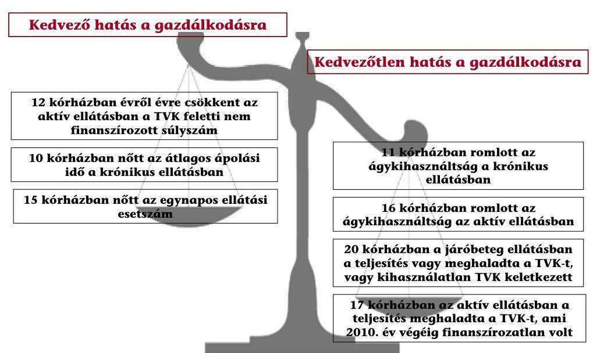

A teljesítményvolumen keret (TVK) a kórházak E. Alapból származó OEP bevételét nagymértékben befolyásolta. A TVK alatti teljesítés bevétel kieséssel járt, a túlteljesítés pedig magában hordozza a gazdaságtalan múködés kockázatát a teljesítések ki nem fizetése, vagy annak csökkentett finanszírozása miatt. A kórházak E. Alapból származó bevétele (konszolidáció nélkül) 2009-ről 2010-re kilenc, 2010-ről 2011-re 19 kórháznál nőtt (összesen 8881,6 M Fttal, 9,4\%-kal). A korábbi merev finanszírozási rendszer a TVK feletti teljesítményeket nem finanszírozta, ez a szabály a 2011. évtől a lépcsős degresszió bevezetésével enyhült és ez megnövelte a kórházi bevételeket. A kórházak körében

---

ez a finanszírozási változás 2011-ben 4,0 Mrd Ft, 2012. év I. félévben pedig 2,1 Mrd Ft bevételi többletet jelentett az aktív fekvőbeteg ellátás tekintetében. Összességében a kórházak E. Alapból származó - gyógyító-megelőző ellátásokon belül a szakellátásra kifizetett - bevételének növekedése a gazdálkodást nem volt képes pozitívan befolyásolni a finanszírozás reálértéken való csökkenése miatt ( $6,0 \%$-os értékvesztés). A pénzügyi helyzet javítása érdekében a kórházak figyelemmel kísérték a teljesítmények megállapított TVK-hoz viszonyított alakulását, növelték az egynapos ellátások számát, korlátozták a műtétek számát.

A fenntartóktól, alapítóktól kapott támogatások a 2009-2011. évek között az összes bevételnek átlagosan 1,6\%-át tették ki (összesen 5773,7 M Ft-ot). E támogatások 40,7\%-át három kórház kapta, így az a pénzügyi egyensúlyi helyzetre számottevő hatást nem gyakorolt.

A saját múködési bevételek a 2009-2011. évek között összességében növekedtek, a kórházak likviditási helyzetére kedvező hatást gyakoroltak. A gazdálkodás egyensúlyának megteremtéséhez számottevő mértékben nem járultak hozzá, mivel arányuk az összes bevételen belül (2009-ben 10,6\%, 2010-ben 10,3\% és 2011-ben 9,7\%) folyamatosan csökkent. Az ellenőrzött időszakban a saját működési bevételei növelése érdekében 19 kórház tett intézkedéseket. Felülvizsgálták a térítésköteles egészségügyi szolgáltatások díjait, a bérleti díjakat, bővítették a térítési díjas ellátások körét, emelték a díjak összegét, egészségügyi szolgáltatásokat végeztek más intézmények részére. A pénzügyi helyzet javítása érdekében tett bevételnövelő intézkedések hatásaként a saját működési bevételek összege 2010-ben 4,3\%-kal, 11 910,9 M Ft-ra nőtt az előző évhez viszonyítva. A 2011. évi saját működési bevételek összege mindöszsze $0,2 \%$-kal ( $27,4 \mathrm{M}$ Ft-tal) haladta meg a 2010. évit.

A működési ráfordítások összességükben folyamatosan, a 2009. évi 116 233,7 M Ft-ról 2010-re 116 810,3 M Ft-ra (0,5\%-kal, 576,6 M Ft-tal), 2011re 119 212,4 M Ft-ra ( $2,1 \%$-kal, 2402,1 M Ft-tal) emelkedtek az előző évhez viszonyítva. Ezen belül a személyi jellegű ráfordítások és a munkaadókat terhelő járulékok együttes összege mérsékelt emelkedés után csökkent (2009-ben 53 341,4 M Ft, 2010-ben 53 412,3 M Ft, 2011-ben 53 086,4 M Ft volt). Ez a közalkalmazottak kötelező előrelépése, a minimálbér és bérminimum emelések, a minőségi létszámfejlesztések, valamint a végrehajtott létszámleépítések, üres álláshely zárolások együttes hatása volt.

A kórházak összes engedélyezett álláshelyekhez viszonyított munkaerő hiánya ${ }^{15}$, (az üres álláshelyek száma) a 2010. évtől folyamatosan növekedett. Az engedélyezett álláshelyekhez képest 2009-2012. év. I. félévben évente átlagosan 8,6\% (1692 fő) munkaerő hiányzott, 2012. év I. félév végén 1800 betöltetlen álláshely volt. Az engedélyezett álláshelyekhez viszonyított hiányzó orvosi és szakdolgozói munkaerő pótlásának elmaradása a kórházak pénzügyi helyzetét javította, ugyanakkor az egészségügyi ellátásban kockázatot jelent. A kórházak engedélyezett álláshelyekhez viszonyított üres álláshelyei

[^0]
[^0]:    ${ }^{15}$ Egy kórház az engedélyezett álláshelyek számát, - mint létszám-gazdálkodási szabályozót - nem alakította ki, az engedélyezett és üres álláshelyek számát nem mutatta ki.

---

számának alakulását, az orvosok és szakápolók kiemelésével a 2009-2012. év I. félév közötti időszakban a 3. sz. melléklet szemlélteti.

A munkaerő fluktuáció ${ }^{16}$ a 2009-2011. évek között folyamatosan növekedett, 2009-ben 21,3\%, 2010-ben 22,2\%, 2011-ben 27,4\% volt, a kilépők száma ezekben az években meghaladta a belépők számát. A 2012. év I. félévben a belépők száma (1078 fő) meghaladta a kilépők (1012 fő) számát.

A kórházak a ráfordítások csökkentése, a hiányzó létszám gazdaságosabb pótlása érdekében éltek a közfoglalkoztatás, a hazai és az EU-s pályázatok lehetőségével. A létszámcsökkentés egyszeri ráfordításainak mérséklésére hat kórház részesült támogatásban. A különböző jogcímeken kapott támogatások és a foglalkoztatás módja 2009-2012. év I. félév között összességében 1835,2 M Ft-tal javította a kórházak pénzügyi helyzetét. A 2009-2012. év I. félév között kapott támogatásokat - a kórházak adatszolgáltatása alapján - a 4. sz. melléklet tartalmazza.

A dologi ráfordítások ${ }^{17}$ az inflációt el nem érő mértékben - 2010-ben 0,6\%$\mathrm{kal}(362,1 \mathrm{M}$ Ft-tal), 2011-ben 2,1\%-kal (1345,3 M Ft-tal) - növekedtek, mert a ráfordítások csökkentése érdekében a kórházak ( 18 kórház, ebből 3 kórház a működtetés egyes részterületeit érintően) takarékossági intézkedéseket hoztak, költségmonitoringot és keretgazdálkodást, valamint belső kontrollrendszert múködtettek.

A gyógyszerbeszerzések értéke 2009-2011 között 24 638,6 M Ft volt, amely a dologi ráfordításoknak átlagosan $\mathbf{1 3 \%}$-át tette ki. A kórházak pénzügyi helyzetét kedvezően befolyásolta, hogy az általában olcsóbb hozzájutást biztosító közös beszerzések és a központosított közbeszerzések aránya emelkedett. Ez a gyógyszerbeszerzéseken belül 2009-2011 között mindössze 8,73\%-ot (2 150,7 M Ft-ot), majd a 2012. év I. félévére már 27,1\%-ot (1 171,7 M Ft-ot) jelentett. Az eredeti, szabadalom alatt lévő (originális) gyógyszerek kiváltása, olcsóbb, szabadalom lejárta után gyártott (generikus) készítményekre 1,6-szorosára nőtt (2009-ben 1905, 2012-ben 3002 készítményt váltottak át), amely a kórházak 90\%-ában csökkentette a gyógyszerbeszerzési költségeket. Kedvezőtlen hatás, hogy a szakmai álláspontok szerint költséghatékony (unit dose, daily dose) gyógyszerelést mindössze egy kórháznál alkalmazták. A gyógyszercégek által nyújtott kedvezmények (rabatt, minta, adomány) értéke a gyógyszerbeszerzésnek 2009-ben 22,1\%-a (1 896,2 M Ft) volt, amely 2012. év I. félévében $14,4 \%$-ra ( 624,8 M Ft ) csökkent, tehát a beszerzési költségmegtakarító hatás egyre kisebb mértékben érvényesült.

A kórházi ellátás során felhasznált szakmai anyagok (egészségügyi célú termékek) és a vásárolt közmúszolgáltatások együtt (villamos energia, gázenergia, távhő-melegvíz, továbbá víz-csatornaszolgáltatások) a dologi ráfor-

[^0]
[^0]:    ${ }^{16}$ A munkaerő fluktuáció, a kilépők és belépők számának aránya az összes betöltött létszámhoz viszonyítva.
    ${ }^{17}$ A személyi jellegú ráfordításokon, munkaadókat terhelő járulékokon, kamatráfordításokon, pénzeszköz átadásokon és egyéb ráfordításokon (adók, befizetési kötelezettségek) kívüli múködési ráfordítások.

---

dításoknak évente átlagosan 26\%-át tették ki. Megnőtt 15\%-kal azoknak a kórházaknak az aránya, amelyek kontrollálták a közműfelhasználást ( $60 \%$-ról $75 \%$-ra), illetve a szakmai anyaggazdálkodást ( $75 \%$-ról $90 \%$-ra). A gazdálkodási intézkedések hatására megtakarító kórházak eredményeinek összege 2009től 2011-ig 106,0 M Ft-ról 414,7 M Ft-ra nőtt. Kedvezötlen tendencia volt, hogy az egy kórházi ápolási napra jutó villamos energia felhasználás mennyisége a kórházak többségénél (55\%-ánál) emelkedett. A felhasználás romlása átlagosan $13 \%$-os volt, amely nagyobb részben a villamos energia felhasználások összesen 8,7\%-os növekedéséből, kisebb részben a teljesített aktív és krónikus ápolási napok összesen 1,1\%-os csökkenéséből adódott.

A segédüzemi szolgáltatások (hőközpont, textilmosatás és betegélelmezés) fajlagos, illetve önköltségei nominális értékben a kórházak 28-40\%-ánál, reálértéken számítva 80-85\%-uknál csökkentek 2009-2011 között. A számított megtakarítások 2009-ben mindössze 27,2 M Ft-ot, 2010-ben 121,7 M Ft-ot, 2011-ben 151,3 M Ft-ot tettek ki.

A kórházak nagyértékú orvosi gép-múszerei közül a CT/MRI berendezések, a nagyteljesítményű kémiai laborautomaták, illetve a központi műtőblokkok gazdaságos üzemeltetése fontos a pénzügyi egyensúly szempontjából. A berendezések kapacitásának minél jobb kihasználása, továbbá a fajlagos üzemi költségek reálértéken számított szinten tartása, illetve csökkenése kívánatos. A CT/MRI berendezés, illetve kémiai laborautomata kapacitáskihasználások a kórházak többségében (11-ből 9 CT/MRI, illetve 10 laborautomata esetében) javultak vagy szinten maradtak 2009-ről 2011-re. A műtőknek csak kisebb hányadában (17-ből 7-nél) volt tapasztalható javulás vagy szintentartás. A fajlagos üzemköltségek nominálisan néhány (1-7) esetben csökkentek, reálértéken pedig hasonlóan kedvezően alakultak, mint a kihasználtságok. A CT/MRI berendezések 70\%-ának (10 közül 7-nek) csökkent reálértéken az üzemköltsége 2009-2011 között, a laborautomatáké a kórházak 85\%-ában (13-ból 11-nél), a központi műtőknek pedig 77\%-ában (18-ból 14ben) lehetett költségcsökkenést kimutatni.

Az adatszolgáltatások alapján az összes OEP folyósította támogatás a gyógyító tevékenység közvetlen költségeire és a gazdasági, múszaki ellátás költségeire 2009-ben 18, 2011-ben 17 kórháznál nem nyújtott fedezetet, ami múködési kockázatot jelez. A gazdasági események számbavételéhez a kórházak a gazdálkodásuk során eltérő könyvvezetési módokat, informatikai rendszereket alkalmaztak, valamint eltérő módon alkalmazták és értelmezték az üzemgazdasági szemléletet. Emiatt a bevételeik, ráfordításaik és az üzemgazdasági szemléletben fontos vezetői információt hordozó - a fedezeti összegeik tartalma eltérő. A hatályos Áhsz. ${ }^{18}$, valamint - a 2014. január 1-én hatályba lépő - az államháztartás számviteléről szóló 4/2013. (I. 11.) Korm.

[^0]
[^0]:    ${ }^{18}$ Az Áhsz. 8. § (10) bekezdése rendelkezése szerint „amennyiben az államháztartás szervezete humán egészségügyi ellátás körébe tartozó szolgáltatását a társadalombiztositás finanszirozza és ugyanezen szolgáltatásokat nem csak a társadalombiztositás finanszirozása mellett végzi, az önköltség számítására nem kötelező szabályozást készítenie. Az egyes szolgáltatások önköltsége a társadalombiztosítás által finanszírozott összeggel egyezően is figyelembe vehető".

---

rendelet 50. § (4) bekezdés b) pontja alapján a kórházak mentesülhetnek az önköltség számítási szabályzat készítési kötelezettség alól. Ez az üzemgazdasági szemlélet egységes értelmezését, az önköltségszámítás egységes módszerének kialakítását és az önköltség folyamatos figyelemmel kísérését akadályozta. Az önköltségszámítás és utókalkuláció hiánya miatt nem ismertek az egyes egészségügyi ellátás típusok tényleges ráfordításai.

A kötelezettségek állománya a 2009. évi 34 329,9 M Ft-ról 2010-ben 3,0 százalékponttal (1043,5 M Ft-tal), 2011-ben 3,8 százalékponttal (1269,0 M Fttal) csökkent az előző évhez képest. A hosszú és rövid lejáratú kötelezettségek összetételében az ellenőrzött időszakban nem volt jelentős változás. A kórházak összes kötelezettsége és szállítói kötelezettsége, lejárt határidejű szállítói tartozások (M Ft-ban) és a fizetőképességet jellemző likviditási ráta alakulását az 5. sz. melléklet tartalmazza.

A kötelezettségek mintegy harmad részét a hosszú lejáratú kötelezettségek tették ki. Ezen belül meghatározó volt egy gazdasági társaság által a feladatellátáshoz átvett önkormányzati vagyon kötelezettségként való kimutatása. Kisebb részarányt képviselt a kórházak pénzintézetekkel szemben fennálló hosszú lejáratú hitel- és lízing tartozása, valamint az alapítóktól származó kölcsön miatti kötelezettsége. A rövid lejáratú kötelezettségek tized része az egyéb rövid lejáratú kötelezettségekből állt, amelynek összege a munkavállalókkal és az adóhatósággal szemben fennálló tartozásból, rövid lejáratú hitel, kölcsön igénybevétele miatti tartozásból állt. Kártérítés és iparűzési adó fizetési kötelezettség az általánostól eltérően egy-egy kórháznál keletkezett. A hosszú lejáratú kötelezettségek, valamint alacsony részarányuk miatt az egyéb rövid lejáratú kötelezettségek a pénzügyi helyzetet számottevően nem befolyásolták.

A kórházak kötelezettségeinek 2009-2011. évi összetételét a 3. sz. diagram szemlélteti:
3. számú diagram
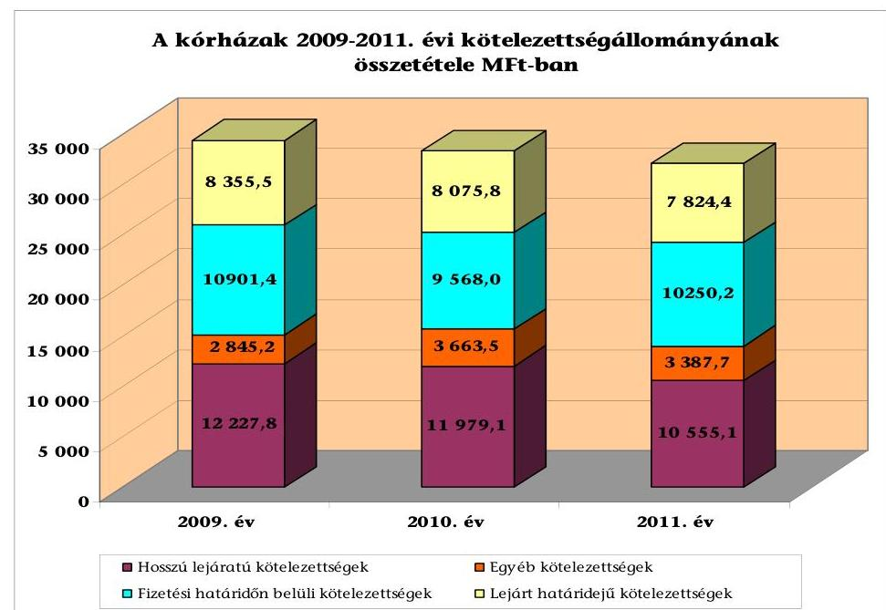

---

A szállítói kötelezettségeknek - amelyek a kötelezettségek több mint felét tették ki - meghatározó szerepe volt a kórházak pénzügyi helyzetének alakulásában. A szállítókkal szemben fennálló kötelezettségek (szállítók) nagyobbrészt a működéshez, a gyógyító tevékenységhez szükséges anyag-, készletvásárlásból, közüzemi- és egyéb szolgáltatásvásárlásból származó, kisebb részben beruházások, felújítások miatti pénzügyileg rendezetlen tartozások voltak.

A szállítók a rövid lejáratú kötelezettségeknek 2009-ben 87,1\%-át (19 256,9 M Ft), 2010-ben 82,7\%-át (17 643,8 M Ft) és 2011-ben 84,2\%-át (18 074,6 M Ft összegben) képviselték. A szállítói kötelezettségen belül a lejárt határidejú szállítói kötelezettségek magas - 40\%-ot meghaladó - részaránya a fizetőképességben rejlő problémát jelez.

A szállítói kötelezettségek kórházankénti változását az alábbi diagram szemlélteti:
4. számú diagram
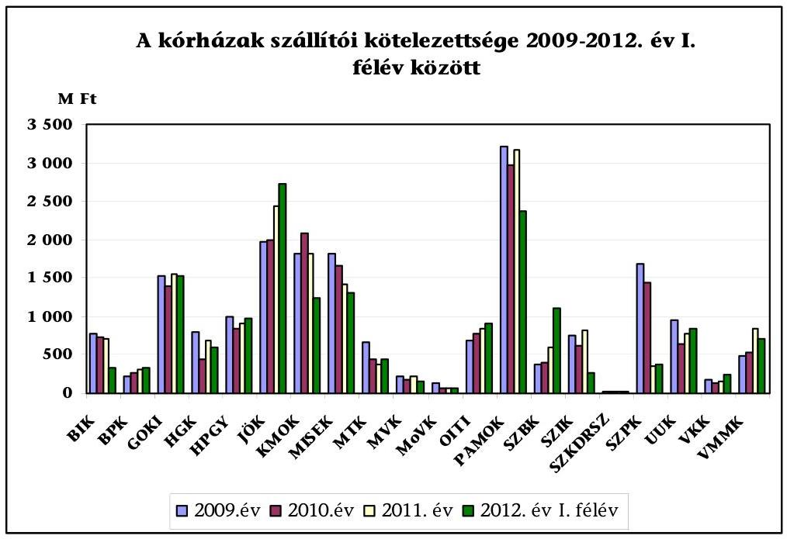

A kórházak a lejárt határidejú szállítói tartozások és a várólisták csökkentése érdekében 2010 decemberében konszolidációs támogatásban részesültek. A folyósított támogatásból 5048,9 M Ft (88,9\%) a szállítói tartozások rendezésére szolgált, amelyből egy kórháznak kellett 14,5 M Ft-ot visszafizetnie. A kórházak 2011 decemberében a lejárt határidejú szállítói tartozások rendezésére újabb 4116,4 M Ft konszolidációs támogatást kaptak. A lejárt határidejú 2011. december 29-ei szállítói tartozásuknál magasabb összegű támogatáshoz jutó három kórháznak 638,7 M Ft konszolidációs támogatást kellett visszafizetnie 2012-ben. A konszolidációs támogatások igénybevétele mellett a 2009. év végi 8355,5 M Ft-ról 2010-ben 8075,8 M Ft-ra, 2011-ben 7824,4 M Ft-ra mérséklődött a lejárt határidejú szállítói tartozás összege. A kórházaknak nyújtott konszolidációs támogatás és a lejárt határidejú szállítói tartozások alakulását a 6. sz.

---

melléklet tartalmazza. Az ellenőrzött időszakot követően a 2011. év végén kiosztott konszolidációs támogatásból visszafolyt összegből az ellenőrzött kórházak részesültek ${ }^{19}$.

A kórházak lejárt határidejű szállítói tartozása 2012. év I. félév végére 8082,7 M Ft-ra, a 2011. évhez képest 3,3\%-kal (258,3 M Ft-tal) emelkedett. A tartozások növekedése azt mutatja, hogy a betegellátás ráfordításai - az egyszeri támogatás hiányában - meghaladták a bevételeket. A konszolidációs támogatás éven belül egyszeri jelleggel történő biztosítása és annak év végére történő ütemezése következtében a késedelmi kamatkötelezettségek felhalmozódtak. A konszolidációs támogatások 2011. évben alkalmazott folyósítási rendszere a támogatások részbeni visszafizetéséből - adminisztratív és pénzügyi szolgáltatási - többletköltségek keletkeztek. A konszolidációs támogatás a kórházaknak csak az adott évi pénzügyi helyzetében eredményezett kedvező változást, a gyógyító tevékenység ellátásában jelentkező hiány okát és újratermelődését nem szüntette meg.

A lejárt határidejű szállítói tartozások 2009-2011. évi változását kórházanként az alábbi diagram szemlélteti:
5. számú diagram
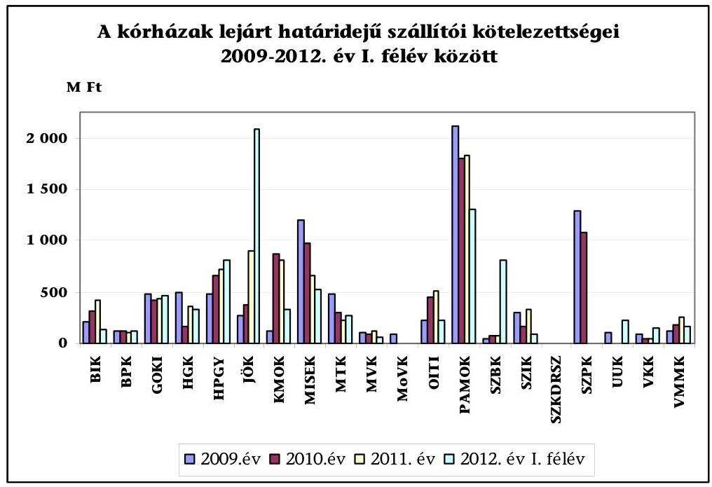

A kötelezettségek késedelmes kiegyenlítése miatt megfizetett késedelmi kamatok, kötbérek a kórházak pénzügyi helyzetét kedvezőtlenül befolyásolták. A ráfordítások között 2009-ben 187,3 M Ft, 2010-ben 267,5 M Ft, 2011-ben 445,5 M Ft és 2012. év I. félévében 261,4 M Ft késedelmi kamatot,

[^0]
[^0]:    ${ }^{19}$ az egészségügyi szolgáltatások Egészségbiztosítási Alapból történő finanszírozásának részletes szabályairól szóló 43/1999. (III. 3.) Korm. rendelet 2012. szeptember 15-étől hatályos 64. §-a alapján

---

kötbért számoltak el. Ennek a dologi ráfordításokon belüli aránya a 2009. évi $0,3 \%$-ról 2011-ben $0,8 \%$-ra növekedett, amit a késedelmesen kifizetett összegek és a késedelmes fizetési napok számának változása együttesen okozott.

A kórházak a szállítói tartozások és a lejárt határidejű kötelezettségek csökkentése érdekében intézkedéseket tettek. Felülvizsgálták és módosították a szállítói szerződéseket, kezdeményezték a kifizetések későbbi időpontban történő rendezését, fizetési határidők módosítását. A megtett intézkedések ellenére a lejárt határidejű tartozások növekedtek, a szállítói kötelezettségeken belüli aránya a 2011. december 31-ei 43,3\%-ról 2012. év I. félév végére 48,9\%-ra nőtt.

Az ellenőrzött időszakban a kórházak átalakítása, likviditási helyzete miatt a fenntartók hét kórházhoz önkormányzati, kincstári biztost, költségvetési felügyelő́t rendeltek ki a gazdálkodás felügyelete és a lejárt határidejű szállítói állomány csökkentése érdekében. A felügyelet időtartama alatt a kórházak pénzügyi egyensúlyi helyzete kedvező irányba változott, négy kórház 2012. év I. félév végi lejárt határidejű szállítói állománya csökkent az előző évhez képest.

A kórházak likviditási helyzete 2009-2011 között kedvező irányba változott, a fizetőképességet jellemző likviditási mutatók mérsékelt ütemben növekedtek. A likviditási mutatók kedvező változása ellenére 14 kórház fizetőképessége továbbra sem volt biztosított, likviditási mutatójuk 1,0 alatti értéket mutatott, a 2011. december 31-én rendelkezésükre álló forgóeszközök nem nyújtottak fedezetet a rövid lejáratú kötelezettségeik teljesítésére.

A kórházi múködésre vonatkozó korábbi két ÁSZ jelentés öt javaslatot fogalmazott meg. A Kormánynak szóló három javaslatból egyet határidőben, kettőt a 2006-2010. évek közötti mulasztást követően a 2011. évben hajtottak végre. Az egészségügyi miniszternek szóló kettő javaslat közül az egyik részben, a másik nem teljesült. Az egészségbiztosítás alapján járó szolgáltatások, a szakmai protokollok meghatározásán túl megtörtént az egyes ellátási események költségfelmérése, azonban az ellátások finanszírozásába történő teljes körű beépítése (átfogó kódkarbantartás) elmaradt. A kötelező egészségbiztosítás ellátásairól szóló 1997. évi LXXXIII. törvénynek az egyes egészségügyi tárgyú törvények módosításáról szóló 2009. évi CLIV. törvénnyel történő módosításakor felhatalmazta az egészségügyi minisztert az egészségügyi ellátás keretében igénybe vehető egyéb kényelmi szolgáltatásokra vonatkozó részletes szabályok meghatározására. Az ÁSZ korábbi javaslata és a törvényi felhatalmazás ellenére a szabályozás nem került kialakításra.

Az Állami Számvevőszékről szóló 2011. évi LXVI. törvény 33. § (1) bekezdésében foglaltak értelmében a jelentésben foglalt megállapításokhoz kapcsolódó intézkedési tervet köteles az ellenőrzött szervezet vezetője összeállítani és azt a jelentés kézhezvételétől számított harminc napon belül az ÁSZ részére megküldeni. Amennyiben az intézkedési tervet határidőben nem küldi meg a szervezet, vagy az továbbra sem elfogadható, az ÁSZ elnöke a hivatkozott törvény 33. § (3) bekezdés a)-b) pontjaiban foglaltakat érvényesítheti.

---

Az ellenőrzés intézkedést igénylő megállapításai és javaslatai:

# az emberi erőforrások miniszterének 

1. A gazdasági események számbavételéhez a kórházak eltérő könyvvezetési módokat alkalmaztak, eltérő módon értelmezték az üzemgazdasági szemléletet. Emiatt eltérő tartalmúak bevételeik, ráfordításaik és fedezeti összegeik. A hatályos Áhsz., valamint - a 2014. január 1-én hatályba lépő - az államháztartás számviteléről szóló 4/2013. (I. 11.) Korm. rendelet 50. § (4) bekezdés b) pontja alapján a kórházak mentesülhetnek az önköltség számítási szabályzat készítésének kötelezettsége alól, az egyes szolgáltatások önköltsége a társadalombiztosítás által finanszírozott összeggel egyezően is figyelembe vehető. Ez felmentést ad az önköltség megállapítása és alakulásának folyamatos figyelemmel kísérése alól. Az önköltségszámítás hiánya miatt nem ismertek az egyes egészségügyi szolgáltatások tényleges ráfordításai.

Javaslat:
a) Kezdeményezze az Áhsz. módosítását, annak érdekében, hogy a humán egészségügyi ellátás körébe tartozó szolgáltatások esetében ne adjon felmentést az önköltség számítási szabályzat készítési kötelezettség alól.
b) Intézkedjen, hogy a GYEMSZI főigazgatója adjon ki olyan fenntartói intézkedést, amely biztosítja, hogy a kórházak az általuk nyújtott szolgáltatások önköltségét működési formától függetlenül, egységes és összevethető számítási módszer szerint állapítsák meg.
2. A kötelező egészségbiztosítás ellátásairól szóló 1997. évi LXXXIII. törvény felhatalmazta az egészségügyi minisztert az egészségügyi ellátás keretében igénybe vehető egyéb kényelmi szolgáltatásokra vonatkozó részletes szabályok meghatározására. A szabályozás az ÁSZ 2009. július 29-én készült javaslata ellenére nem került kialakításra.

Javaslat:
Határozza meg az egészségügyi ellátás keretében igénybe vehető egyéb kényelmi szolgáltatásokra vonatkozó szabályokat.
3. A fejlesztési tevékenység finanszírozásához 2009-ben 18, 2010-ben 16, míg 2011ben egy kórháznál sem keletkezett a felhalmozási ráfordításokat fedező összegű felhalmozási célú bevétel. Egyetlen kórház sem végzett 2009-2011 között olyan mértékű eszközpótlást, amely ellensúlyozta volna az elszámolt értékcsökkenés összegét.

Javaslat:
Alakítson ki olyan rendszert, amely országos ellátási szempontok szerinti rangsoroláson alapulva, a fenntarthatóságot és az ellenőrizhetőséget figyelembe véve biztosítja az elhasználódott eszközök pótlását úgy, hogy annak nagysága összhangban legyen a mindenkori, működő egészségügyi célú vagyonnal.

---

# a Gottsegen György Országos Kardiológiai Intézet (Budapest), a Szent Imre Kórház (Budapest), a Szent Kozma és Damján Rehabilitációs Szakkórház (Visegrád), a Városi Kórház Keszthely és a Dr. Bugyi István Kórház (Szentes) föigazgatói részére 

1. A Gottsegen György Országos Kardiológiai Intézet (Budapest), a Szent Imre Kórház (Budapest), a Szent Kozma és Damján Rehabilitációs Szakkórház (Visegrád), a Városi Kórház Keszthely, Dr. Bugyi István Kórház (Szentes) gazdálkodásában a CLF módszer szerinti múködési pénzügyi egyensúly 2011-ben nem volt biztosított.

Javaslat:
A múködési pénzügyi egyensúlyi helyzet helyreállítása és fenntartása érdekében:
a) mérje fel a saját múködési bevételek növelésének és a költségek mérséklésének lehetőségeit;
b) készítsen intézkedési tervet a múködési pénzügyi egyensúly megteremtésére és annak megőrzésére;
c) ellenőrizze a b) pont szerinti intézkedési terv végrehajtását.

---

# II. RÉSZLETES MEGÁLLAPÍTÁSOK 

## 1. A PÉNZÜGYI HELYZET VÁLTOZÁSA ÉS A PÉNZÜGYI EGYENSÚLY JAVÍTÁSÁRA IRÁNYULÓ KÓRHÁZI INTÉZKEDÉSEK

### 1.1. Gottsegen György Országos Kardiológiai Intézet, Budapest (GOKI)

A GOKI pénzügyi egyensúlya a finanszírozási múveletek nélküli (GFS) pozíció ${ }^{20}$ alapján 2009-2011 között nem volt biztosított, a múködési és felhalmozási tevékenység együttes egyenlege negatív volt. A konszolidációs támogatás, az OEP- és fenntartói támogatás, valamint a keretgazdálkodás eredményeként a múködési és felhalmozási tevékenység egyenlege átmeneti jelleggel kedvező irányba változott. A megtett intézkedések azonban a pénzügyi helyzet folyamatos javulásához, és az egyensúly megteremtéséhez nem elegendőek. A lejárt határidejú és összes szállítói kötelezettségek a konszolidációs támogatás hatására a 2010. évben csak átmeneti jelleggel csökkentek. A 2011. év végén az 1560,5 M Ft szállítói kötelezettség a dologi ráfordítások 32,6\%-át tette ki. A számviteli nyilvántartások alapján a szállítói kötelezettségek összege 2012. június 30 -án 1531,9 M Ft volt.

Az ellenőrzött időszakban költségvetési intézményként múködő GOKI gazdálkodásában a CLF módszer szerinti múködési egyensúly 2009-2011 között nem volt biztosított, a múködési tevékenység egyenlege és a pénzügyi kapacitás negatív volt. A 2010. évben a konszolidációs támogatás, az OEP támogatás és - a bevételnövelő intézkedések hatására - a saját múködési bevételek növekedésének eredményeként a múködési jövedelem és a pénzügyi kapacitás is pozitív volt. A konszolidációs támogatások nélkül a múködési jövedelem 2010-ben -507,4 M Ft, 2011-ben -404,1 M Ft volt. A változást 2010-ben az OEP finanszírozás és a saját múködési bevételek, 2011-ben a fenntartói támogatások és az átvett pénzeszközök növekedése okozta. A felhalmozási tevékenység egyenlege 2009-2011 között negatív volt. A felhalmozási bevételek nem nyújtottak fedezetet a beruházások, felújítások finanszírozására, ami felhalmozási kockázatot jelentett.

A GOKI adósságának rendezése érdekében konszolidációs támogatásban részesült a 2010. évben 520,1 M Ft és a 2011. évben 224,3 M Ft összegben, amelyet jogszerűen felhasznált. A kórház vezetője a 2011. és a 2012. év elején a konszolidációs támogatáshoz kapcsolódó konszolidációs tervet készített, a szakmai és gazdálkodási feladatok és a várt szakmai gazdasági hatás megjelölésével.

[^0]
[^0]:    ${ }^{20}$ A finanszírozási múveletek nélküli (GFS) pozíció a 2009. évben -765,6 M Ft, a 2010. évben -145,6 M Ft, a 2011. évben -261,8 M Ft volt.

---

A múködési és felhalmozási tevékenység egyenlege, a pénzügyi kapacitás 20092011 között az alábbiak szerint alakult:
6. számú diagram
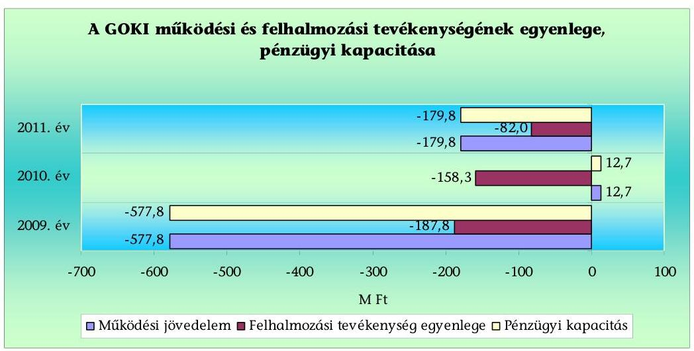

A múködés finanszírozását szolgáló bevételek 2010-re 6547,1 M Ft-ra (11,1\%-kal, 652,7 M Ft-tal), a 2011. évre 6780,1 M Ft-ra (3,6\%-kal, 233,0 M Ft) emelkedtek. A változást elsősorban 2010-ben az 520,1 M Ft konszolidációs támogatás, az OEP finanszírozás 208,7 M Ft-os és a saját múködési bevételek 45,6 M Ft-os növekedése eredményezte. A múködési bevételek növekedését 2011-ben a 224,3 M Ft-os konszolidációs támogatás, valamint a fenntartói támogatás 58,9 M Ft-os növekedése okozta.

A múködési bevételeken belül minden évben meghatározó volt az OEP-től származó támogatások összege. Alakulását a finanszírozási szabályok változása, valamint a konszolidációs támogatások befolyásolták. A fenntartótól kapott támogatás 2009-ben és 2011-ben a pénzügyi helyzetre kedvezően hatott. Aránya a múködési bevételeken belül 2009-ben 2,9\% (169,6 M Ft), 2011-ben 1,2\% (83,3 M Ft) volt. 2010-ben a 24,4 M Ft fenntartói támogatás a pénzügyi helyzetre számottevő hatást nem gyakorolt.

A saját múködési bevételek 2009-2010 között növekedtek, amely a pénzügyi helyzet alakulására 2010-ben, átmeneti jelleggel pozitív hatással volt. A saját bevételek (a három évben együttesen 580,2 M Ft) jelentős része, összesen 442,4 M Ft (76,2\%) áru- és készletértékesítéséből, szolgáltatások nyújtásából és az intézményi ellátási díjakból származott.

A múködési költségek és ráfordítások a 2010. évre 6534,4 M Ft-ra (1,0\%kal, 62,2 M Ft-tal), 2011-re 6959,9 M Ft-ra (6,5\%-kal, 425,5 M Ft-tal) növekedtek az előző évhez viszonyítva. A személyi jellegú ráfordítások és munkaadókat terhelő járulékok együttes összege a 2009. évi 2088,6 M Ft-ról a 2010. évre 2039,6 M Ft-ra (2,3\%-kal, 49,0 M Ft-tal) csökkent az üres álláshelyek számának növekedése miatt. A 2011. évben a személyi jellegú ráfordítások és a munkaadókat terhelő járulékok összege az átlagos statisztikai állományi létszám növekedése következtében 2132,6 M Ft-ra (4,6\%$\mathrm{kal}, 93,0 \mathrm{M}$ Ft-tal) emelkedett.

---

A dologi ráfordítások a 2009. évi 4373,5 M Ft-ról a 2010. évre 4464,9 M Ft-ra (2,1\%-kal), a 2011. évre 4793,6 M Ft-ra (7,4\%-kal) növekedtek. A dologi ráfordítások csökkentésére a GOKI a betegélelmezés, szakmai anyaggazdálkodás területén hozott takarékossági intézkedéseket.

A gyógyító tevékenység közvetlen költségét a GOKI ellátás-típusonként kimutatta, amely szerint a fedezeti összeg 2009-2011. években nem nyújtott fedezetet a gazdasági-, múszaki ellátás felosztott költségeire.

A múködési bevételek, ráfordítások főbb jogcímeinek arányát és alakulását a következő diagram szemlélteti:
7. számú diagram
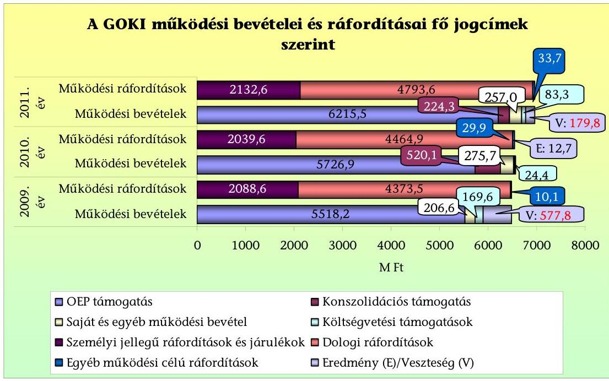

A 2009-2011. években a GOKI 491,1 M Ft beruházási és 129,4 M Ft felújítási tevékenységet végzett. A felhalmozási tevékenység finanszírozására saját bevételek, fenntartói támogatások, államháztartáson belülről és kívülről átvett pénzeszközök szolgáltak. Az eszközpótlásra fordított összeg a 20092011. években 286,6 M Ft volt, amely az elszámolt 836,8 M Ft értékcsökkenésnek $34,2 \%$-át tette ki ${ }^{21}$. A GOKI a beszerzett tárgyi eszközök jövőbeni fenntartási, üzemeltetési költségeit vállalta.

A kötelezettségek állománya a szállítói kötelezettségek csökkenése miatt a 2009. évi 1698,3 M Ft-ról a 2010. évben 1596,4 M Ft-ra mérséklődött. A dologi ráfordítások növekedésének hatására a szállítói kötelezettségek 2011-re 1786,4 M Ft-ra emelkedtek. A 2012. június 30 -ai 1541,1 M Ft kötelezettségállomány teljes egészében rövid lejáratú kötelezettség volt. A GOKI pénzintézettel szembeni kötelezettséggel nem rendelkezett.

[^0]
[^0]:    ${ }^{21}$ A folyamatban lévő fejlesztési tevékenység várható bekerülési értéke 46,8 M Ft.

---

A kapott konszolidációs támogatás a lejárt szállítói tartozásokat 2010-ben, átmeneti jelleggel tudta csökkenteni. A szállítói tartozások után 2009-2011 között kifizetett késedelmi kamat és kötbér mindösszesen 14,6 M Ft (amely az összesen kapott konszolidációs támogatás 2,0\%-a) volt. Kincstári biztos kirendelésére nem volt szükség.

A kórház összes, illetve ezen belül a szállítói és a lejárt határidejű szállítói állománya az alábbiak szerint alakult:
8. számú diagram
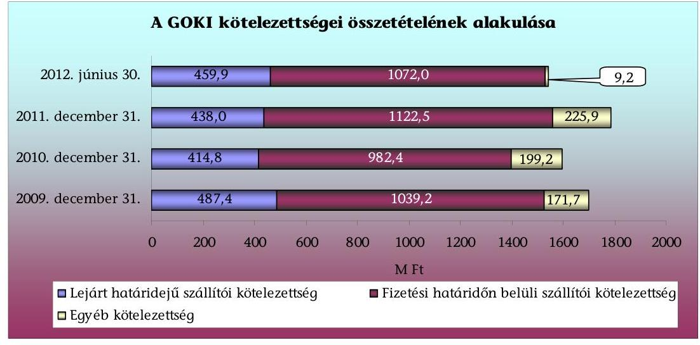

A GOKI likviditási helyzete 2009-2011 között kedvező irányba változott, amelyet a likviditási ráta - 2009. évi 0,32-ről 2011. évi 0,48-ra való emelkedése mutat. A készpénz likviditási mutató szerint a kórház pénzeszközei a 2009. év végén a rövid lejáratú kötelezettségek 14,6\%-ára, míg a 2011. év végén 25,4\%ára nyújtottak fedezetet. A likviditási helyzet javulását a forgóeszköz állomány, illetve a pénzkészlet növekedése eredményezte. A likviditási ráta a kedvező változás ellenére sem érte el a szakmailag elfogadható mértéket, a 2011. év végén fennálló kötelezettségek teljesítésére a forgóeszközök nem nyújtottak elegendő fedezetet.

A pénzügyi egyensúlyi helyzet megteremtése érdekében a GOKI 2009. és 2012. I. félév között - a vásárolt közüzemi szolgáltatásoknál, textilmosatásnál, betegélelmezésnél, gyógyszer-, szakmai anyaggazdálkodásnál - folyamatos költség monitoring és keretrendszert múködtetett.

A GOKI ágyszámában változás nem történt, átlagosan 265 múködő ággyal rendelkezett. A pénzügyi egyensúlyi helyzet - átmeneti - kedvezö változása nem az ellátási teljesítmények alakulásával állt összefüggésben. Egyes kiemelt teljesítménymutatók a következők szerint változtak:

---

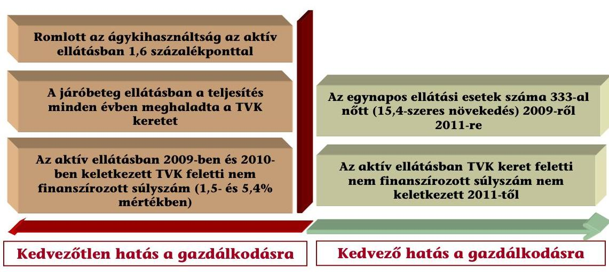

A GOKI munkaerő-hiánya (üres álláshelyek száma) a 2009-2011. években a hiányzó létszám pótlására hozott kórházi intézkedések ellenére - folyamatosan növekedett, a 2009. évben 5,4 fő, a 2010. évben 26,5 fő, a 2011. évben 44,7 fő volt, majd a 2012. év I. félévben 28,8 főre csökkent. Az engedélyezett álláshelyek száma a 2009. évi 579 főről a 2012. év I. félévére 581 főre nőtt, a betöltött álláshelyek száma a 2009. évi 573,6 fơről 2012. év I. félévére 552,3 főre csökkent. Szakember hiány elsősorban az egészségügyi személyzet körében, a szakdolgozóknál jelentkezett. A szakorvosoknál, orvosoknál a 2009. évben nem volt betöltetlen álláshely, 2012. év I. félév végén négy betöltetlen helyet regisztráltak. A szakdolgozóknál 2009-ben kettő, 2012. év I. félév végén 12 üres álláshely volt. A nem egészségügyi személyzetnél a 2009. évről a 2012. év I. félévre a betöltetlen álláshelyek száma 1,9 fővel nőtt. A szakdolgozói hiány pótlására a GOKI-nál több intézkedést tettek: emelkedő számban alkalmaznak részmunkaidős dolgozókat, illetve az intézet dolgozói továbbképzésének biztosítására EU-s pályázaton vettek részt, amelyhez a 2009-2011. években 33,8 M Ft támogatást kaptak. A 2012. év I. félévben a GOKI engedélyezett létszámát hat státusszal kellett csökkenteni. A létszámcsökkentés terheinek mérséklésére a GOKI 11,4 M Ft támogatásban részesült (a tényleges költség 12,1 M Ft-ot tett ki).

A GOKI - pénzügyi helyzetének javítása érdekében - a 2009-2012. év I. félév közötti időszakban a gyógyszerfelhasználás költségének csökkentésére intézkedéseket hozott. Az összes gyógyszerkiadáshoz képest a térítésmentesen kapott gyógyszerek aránya a 2009. évben 19,7\% (76,3 M Ft), a 2012. év I. félévében 8,1\% (19,4 M Ft) volt. Az összes gyógyszerbeszerzési költség a 2009. évben az OEP bevétel 7,0\%-át (386,8 M Ft), a 2012. év I. félévében az OEP bevétel $7,9 \%$-át (240,2 M Ft) tette ki. A gyógyszerköltségek csökkentésére a 2009. évben 26, a 2011. évben 48 féle készítményt váltottak originálisról generikus készítményre.

A szakmai anyagok beszerzési költségét a GOKI folyamatosan figyelemmel kísérte. A készletek forgási sebessége 2009-ről 2011-re 46,7-ről 56,3-re (20,4\%-kal) nőtt. A fajlagos beszerzési költségindex 2009. és 2011. év között az országos átlagnövekedés alatt maradt 2,8 százalékponttal. Az ellátáshoz szükséges anyagokat a konszignációs és a központi raktárban tárolják. A konszig-

---

nációs raktár működtetéséből külön bevétel származott: 2010-ben 50,3 M Ft, 2011-ben 30,0 M Ft. A központi raktárban a költségek csökkentése érdekében minimum-maximum készlet szintet alakítottak ki az előző évi fogyás alapján, a készletfeltöltés havonta, a megállapított minimum szintre történik.

A vásárolt közszolgáltatások alakulását figyelemmel kísérték, folyamatos költség monitoringot múködtettek. A fajlagos földgáz és a vízfelhasználás 15-15\%-kal mérséklődött 2009-ről 2011-re. A GOKI a villamos energia gazdálkodását 2012. évben felülvizsgálta, ennek alapján módosították a tartalék elektromos hálózatra vonatkozó szerződésüket. Az intézkedéssel 0,5 M Ft nagyságrendú megtakarítást értek el. Az egy ápolási napra eső villamos energia felhasználás és a vásárolt távhő, melegvíz felhasználás egyaránt 5-5\%-kal csökkent 2009-ről 2011-re.

A segédüzemi tevékenységek területén költség-monitoring és keretrendszer múködött. A mosatás önköltsége a KSH árindexnél 4 százalékponttal nagyobb mértékben emelkedett (2010. évre 5,5\%-kal, 2011. évre 11,6\%-kal 274 Ft/kg-ról $323 \mathrm{Ft} / \mathrm{kg}$-ra), a betegélelmezés ezzel szemben 10 százalékponttal az árindex alatt ( 1178 Ft/napról $1216 \mathrm{Ft} /$ napra $3 \%$-kal) nőtt. Új tálalási rendszer alkalmazásával $9,8 \mathrm{M}$ Ft megtakarítást értek el.

A nagyértékú orvosi gépek-múszerek közül a kémiai laborautomaták kihasználtsága az ellenőrzött időszakban nem változott. A GOKI-nak nincs át-lagkapacitás-adata a központi műtőről, de a tényleges teljesítése a 2009-2011. években $10 \%$-kal visszaesett ( 1326 műtétről 1199-re), következésképpen a kapacitáskihasználása is vélhetően csökkent. A laborautomaták vizsgálatainak önköltségei és a központi műtő fajlagos költségei inflációt meghaladó mértékben ( $20 \%$-kal, illetve $41 \%$-kal, reálértéken $7 \%$, illetve $28 \%$-kal) nőttek. Mindezek a kórház pénzügyi helyzetét rontották.

# 1.2. Heim Pál Gyermekkórház, Budapest (HPGY) 

A HPGY pénzügyi egyensúlya a 2009-2010 években nem volt biztosított. A finanszírozási múveletek nélküli (GFS) pozíció ${ }^{22}$ a 2009. és a 2010. évben negatív volt. Ennek oka, hogy 2009-ben sem a felhalmozási, sem a múködési bevételek nem nyújtottak fedezetet a felhalmozási és múködési ráfordításokra, míg ez 2010-ben a felhalmozási tevékenység esetében állt fenn. A belső intézkedések a pénzügyi helyzetre kedvező hatást gyakoroltak. A konszolidációs támogatás ellenére a szállítói kötelezettség év végi állománya az előző évhez viszonyított 2010. évi csökkenés után a 2011. évben növekedett, az éves dologi ráfordítás 49,7\%-át (897,5 M Ft-ot) tette ki. Az összes kimutatott szállítói kötelezettség a 2012. év I. félév végén 966,8 M Ft volt.

A HPGY az ellenőrzött időszakban önállóan működő és gazdálkodó költségvetési szervként múködött. A fenntartói jogkört 2011. december 31-ig a Fővárosi Önkormányzat gyakorolta, 2012. január 1-től kormányzati döntés alapján fenntartása, vagyona állami tulajdonba került.

[^0]
[^0]:    ${ }^{22}$ A finanszírozási műveletek nélküli (GFS) pozíció a 2009. évben -1181,9 M Ft, a 2010. évben -19,1 M Ft, a 2011. évben 46,6 M Ft volt.

---

A HPGY pénzügyi helyzete kedvezően változott, mivel a 2011. évben a múködési bevételek fedezetet biztosítottak a múködés költségeire és ráfordításaira. Ennek ellenére a múködés biztonságában, a pénzügyi egyensúlyi helyzet megőrzésében komoly kockázati tényező a lejárt határidejú szállítói kötelezettségek állományának folyamatos növekedése, az azt terhelő késedelmi kamatok, kötbérek mértéke. A múködés során elhasználódott eszközök pótlására, állagának megőrzésére, az amortizáció elszámolása miatti visszapótlási kötelezettség teljesítésére nem képződött fedezet.

A HPGY gazdálkodásában 2009-2011 között nem volt stabil a pénzügyi egyensúly. A HPGY adatszolgáltatása alapján a múködési pénzügyi helyzet kedvezően alakult, a pénzügyi egyensúlyi helyzet javítására hozott intézkedések - bevételek növelése, racionális költség- és létszámgazdálkodás - eredményeként. A múködési tevékenységének vesztesége 2009-ben 879,0 M Ft volt, 2010-ben 28,2 M Ft eredmény keletkezett, ami a 2011-ben 143,4 M Ft-ra emelkedett. A 2009. évi múködési veszteséget a betegellátás teljesítményének elszámolását érintő változás - az EMAFT finanszírozási mód alkalmazása - okozta. A pénzügyi egyensúly elérése, a múködtetés fenntartása érdekében önkormányzati biztos kirendelésére került sor 2010. szeptember 1-től 2011. december 31-ig. Az önkormányzati biztos által feltárt, a fizetésképtelenséghez vezető okok voltak: a gyógyító tevékenység alulfinanszírozása, a saját bevételi források növekedésének elmaradása, a helyiségek alacsony kihasználtsága, karbantartási szerződések, a pénzügyi és gazdasági folyamatok átláthatóságának, valamint a vezetői kontroll hiánya. A HPGY pénzügyi kapacitása az elszámolt tervszerinti értékcsökkenés visszapótlási kötelezettségére nem biztosított fedezetet. A vagyonkezelésbe vett eszközök elszámolt amortizációjából vissza nem pótolt értékcsökkenés összege 2009-ben 247,1 M Ft, 2010-ben 192,5 M Ft, 2011-ben 180,4 M Ft volt.

A 2010. évi pénzügyi egyensúlyi helyzetben az előző évhez viszonyított javulást a 239,5 M Ft konszolidációs támogatás, az OEP kasszamaradvány terhére juttatott $279,9 \mathrm{MFt}$, valamint a fenntartó önkormányzattól válságkezelésre és a szállítói számlák rendezésére kapott $429,0 \mathrm{MFt}$ (összesen $948,4 \mathrm{M}$ Ft) egyszeri támogatás eredményezte. A HPGY a helyszíni ellenőrzés időszakában reorganizációs tervet készített, amelyben a múködéssel kapcsolatos racionalizálási intézkedéseket számszerúsítették. A KEHI a konszolidációs támogatás felhasználását ellenőrizte, jogszerűtlen felhasználást nem állapított meg.

Az egyensúlyi helyzet javulásához hozzájárult az intézmény által megtett költségcsökkentési intézkedések hatására elért - HPGY által számszerúsített 8,9 M Ft költségmegtakarítás. A 2011. évi pénzügyi egyensúly megőrzését az OEP támogatás növekedése és a múködési költségek csökkenése együttesen eredményezték. A 2009-2011. években a felhalmozási bevételek nem nyújtottak fedezetet a megvalósított beruházásokra, felújításokra. A HPGY likvid hitelt nem vett fel, lízing kötelezettsége, hosszúlejáratú pénzintézeti kötelezettsége nem volt, a múködési jövedelmet adósságszolgálati kötelezettség nem terhelte.

---

A múködési és felhalmozási tevékenység egyenlegét, a pénzügyi kapacitás alakulását 2009-2011 között az alábbi diagram szemlélteti:
9. számú diagram
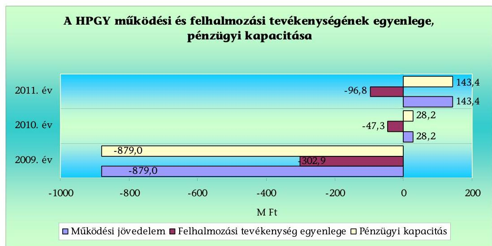

A múködési bevételek a 2009. évi 4601,5 M Ft-ról 2010-ben 5499,7 M Ft-ra (119,5\%-ra) nőttek, majd 2011-ben 5412,9 M Ft-ra ( $98,4 \%$-ra) csökkentek az előző évhez képest. A 2011. évi bevételek összege a 2009. évhez viszonyítva 17,6\%-kal emelkedett a központi finanszírozás szabályozás és a saját bevételt növelő intézkedések, valamint a teljesítménymutatók változásának hatására. A múködési bevételeken belül minden évben meghatározó az OEP-től származó támogatások összege, amelynek aránya az összes múködési bevételen belül átlagosan $80 \%$ volt. A HPGY pénzügyi helyzetét javította a 2010-2011. években kapott 239,5 M Ft, illetve 159,9 M Ft összegű konszolidációs támogatás, amit a lejárt szállítói állománya csökkentésére használt fel. A jogszabályi előírásoknak ${ }^{23}$ részben tettek eleget, mert a támogatásban való részesedés feltételeként a fennmaradó adósságállomány csökkentésére, a pénzügyi egyensúly megteremtését szolgáló konszolidációs tervet nem készítettek.

A fenntartótól kapott támogatás mértéke és bevételeken belüli aránya változó volt, 2009-ben 181,2 M Ft (3,9\%), 2010-ben 610,2 M Ft (11,1\%), 2011ben $466,9 \mathrm{M} \mathrm{Ft}(8,6 \%)$ volt, amely minden évben kedvezően befolyásolta a múködés pénzügyi egyenlegét. A HPGY saját bevételei 2009-2011 között bevételnövelő intézkedései ellenére - csökkentek, a 2009. évi 657,0 M Ft-ról 2010-re 8,4\%-kal 602,0 M Ft-ra, 2011-ben további 28,9\%-kal 427,5 M Ft-ra változtak. A saját bevételek áru- és készletértékesítés (patika árbevétele, anyatej értékesítés), egészségügyi ellátás, illetve a kapcsolódó különféle szolgáltatások ellenértékéből, egyéb sajátos bevételekből származtak. A saját bevételek díjtételeinek meghatározására önköltségszámítást nem végeztek.

[^0]
[^0]:    ${ }^{23}$ A 269/2010. (XII. 3.) Korm. rendelet 5. § d.), valamint a 337/2011. (XII. 29.) Korm. rendelet 5. § c) pontjában foglaltaknak.

---

Az ellenőrzött időszakban a múködési célú költségek és ráfordítások öszszességükben folyamatosan csökkentek, a 2009. évi 5480,5 M Ft-ról 2011. évre 3,8\%-kal, 5269,5 M Ft-ra változtak. A személyi jellegű ráfordítások és járulékai 2009. évhez viszonyítva 2010. évben 1,3\%-kal (43,2 M Ft-tal) nőttek, 2011. évben $1,2 \%$-kal csökkentek az előző évhez képest. A költségek csökkenéséhez hozzájárult a HPGY 2010. évi energetikai beruházása miatt a műszaki dolgozókat érintő létszámleépítés. A dologi kiadások 2011. évben 261 M Ft-tal (12,6\%) csökkentek 2009. évhez képest, amit a vásárolt szolgáltatások (villamos- és gázenergia, víz, szennyvíz) szolgáltatási díjainak mérséklődésével értek el. A HPGY szerződésmódosítással, átszerződésekkel a korábbinál előnyösebb feltételekben állapodott meg a közszolgáltatókkal.

A HPGY számviteli nyilvántartásában nem különítette el a fekvőbeteg, járóbeteg ellátás és egyéb szakmai tevékenység közvetlen és közvetett költségét. A tevékenységek üzemgazdasági szemléletű költségeit a 2009-2011. években egy összegben mutatták ki. Nyilvántartásaiból az egyes szakellátásoknál nem állapítható meg, hogy az OEP finanszírozás mennyiben nyújt fedezetet a betegellátásra annak ellenére, hogy az alkalmazott informatikai rendszerük teljes körű üzemgazdasági nyilvántartás vezetésének lehetőségét biztosította.

A működési bevételek, ráfordításai főbb jogcímeinek arányát és alakulását a következő diagram szemlélteti:
10. számú diagram
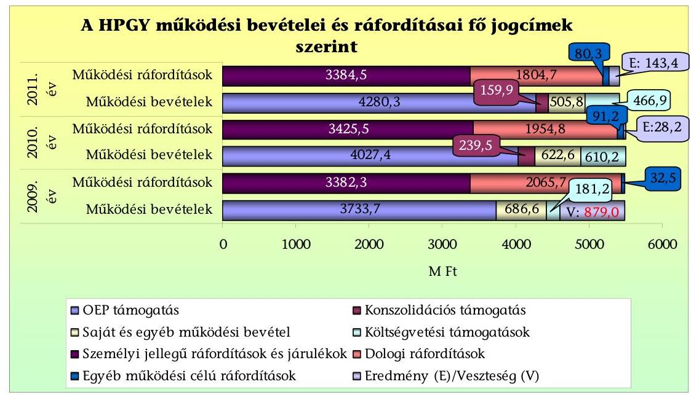

A felhalmozási célra fordítható bevételek 2009-2011 között nem nyújtottak fedezetet a beruházások, felújítások finanszírozására. Az ellenőrzött időszakban 499,3 M Ft beruházási és 615,7 M Ft felújítási tevékenységet végeztek. Ennek a finanszírozására saját bevétel (alapítványi támogatások, adományok, felajánlások, fenntartói támogatás), valamint 10,2 M Ft államháztartáson belülről kapott egyéb bevétel szolgált. A hiányzó fedezet biztosításához 2010-2011. évben 113,5 M Ft a múködési forrást vettek igénybe. A fejlesztések főként a kórház épületei 2009. évet megelőzően megkezdett, több ütemben

---

megvalósuló felújításához, rekonstrukciójához, gép- és jármú beszerzésekhez kapcsolódtak. A 2009-2011 között eszközpótlásra fordított 297,0 M Ft az elszámolt értékcsökkenés összegének ( $620,0 \mathrm{MFt}$ ) 47,9\%-a volt.

A HPGY kötelezettségeinek állománya, - amely azonos a rövid lejáratú kötelezettségei állományával - a 2009. évi 1091,9 M Ft-ról 2010. évre 993,8 M Ft-ra csökkent, 2011. évben 1160,1 M Ft-ra nőtt, illetve 2012. I. félévre 1079,7 M Ft-ra változott. A HPGY kötelezettségeit, ezen belül a szállítói és a lejárt határidejú szállítói állományát az alábbi diagram mutatja be:
11. számú diagram
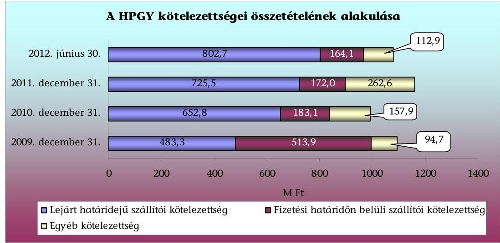

A rövidlejáratú kötelezettségeken belül a szállítói tartozások állománya 2009-ről 2011-re 997,2 M Ft-ról 897,5M Ft-ra, 10,0\%-kal csökkent, majd 2012. I. félévére $7,7 \%$-kal $966,8 \mathrm{M}$ Ft-ra nőtt. A tartozás a 2010. évben volt a legalacsonyabb 835,9 M Ft, az OEP teljesítményarányos finanszírozásán felüli egyszeri jelleggel adott és a fenntartótól kapott támogatás hatására. A lejárt szállítói tartozások a 2010. évet követően növekedtek, a 2009. évi 483,3 M Ft-ról 2011-re 725,5 M Ft-ra, a 2012. I. félévében 802,7 M Ft-ra. A likviditási helyzet javítása érdekében kezdeményezték a lejárt szállítói tartozások későbbi időpontban történő rendezését, amelyet a 2010-2011. években kirendelt önkormányzati biztos is ellenjegyzett. A szállítók által felszámított késedelmi kamat és kötbér mértékét 2009-2010-ben a HPGY megbízható módon nem tartotta nyilván. A nyilvántartások szerint 2011-ben a késedelmes szállítások miatt felszámított 100,3 M Ft, 2012. I. félévében 101,1 M Ft késedelmi kamat és kötbér terheli HPGY-t, amelyet a helyszíni ellenőrzés lezárásáig nem fizettek meg.

A kórház likviditási helyzetében a 2010. évben javulás, majd 2011-ben kedvezőtlen változás volt tapasztalható. A likviditási ráta 2009-ben 0,34 volt, 2010-ben 0,51-re emelkedett, 2011-ben 0,49-re mérséklődött. A készpénz likviditási mutató alapján a 2009-ben a rövidlejáratú kötelezettségek 1,5\%-ára, míg 2011-ben 21,1\%-ára nyújtottak fedezetet a rendelkezésre álló pénzeszközök, a pénzeszközállomány növekedésének hatására. A kórház likviditása nem megfelelő, a likviditási mutatók értéke elmarad a szakmailag elvárható mértéktől, rövidtávon a rendelkezésre álló, pénzeszközzé tehető eszközök nem fedezik a 2011. december 31-ei rövidlejáratú kötelezettségek állományát.

---

A HPGY a 2009-2011. években a pénzügyi tevékenység alakulásával összefüggő belső kontrollokat alapvetően kialakította, de folyamatos múködését a gazdasági vezetői személycserék negatívan befolyásolták. A gazdálkodási jogköröket gyakorlók személyét belső szabályzatban meghatározták, a szabályozás során betartották az összeférhetetlenségi követelményeket. Kialakították az Áht. (új) 69. §-ában előírt kontrollrendszert, intézkedtek a belső ellenőrzés kialakításáról és múködtetéséről. A költségek minimalizálása érdekében folyamatos költségmonitoring rendszert nem múködtettek.

A HPGY esetében az aktív fekvőbeteg szakellátás ágyszámaiban változás nem történt, átlagosan 449 múködő ággyal rendelkezett. A krónikus fekvőbeteg szakellátásban 2009-ről 2012-re 35-ről 65-re nőtt ( $85,7 \%$ ) az ágyak száma. A pénzügyi egyensúlyi helyzet átmeneti javulásában az ellátási teljesítmények változása is szerepet játszott. Egyes kiemelt teljesítménymutatók a következők szerint változtak:
3. számú ábra
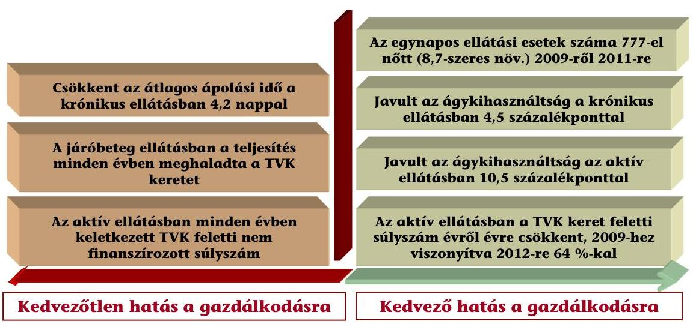

A HPGY munkaerő-hiánya (üres álláshelyek száma) a 2009-2012. év I. félév közötti időszakban a hiányzó létszám pótlására hozott kórházi intézkedések közmunka program, EU-s támogatások igénybevétele - ellenére nem csökkent. A betöltetlen álláshelyek száma a 2009. évben 387 fő, a 2010. évben 333 fő, a 2011. évben 352 fő és a 2012. év I. félévében 350 fő volt. A humánerőforrás hiány elsősorban az orvosoknál és a szakdolgozóknál jelentkezett. A hiányzó létszámot részben közremúködői (vállalkozási), ill. megbízási szerződéssel foglalkoztatott személyzettel pótolták. A költségek csökkentése érdekében a HPGY kihasználta a közfoglalkoztatási és pályázati lehetőségeket. A közmunkaprogram keretében a 2009-2010. évben 2 főt, heti 40 órában foglalkoztattak, amelyhez összesen 2,9 M Ft támogatást kaptak. EU-s pályázat keretében a 2010. évben 70 fő, a 2012. év I. félévben 164 fő továbbképzése valósult meg, amelyhez összesen 28,7 M Ft-ot kaptak. A képzések célja a szakdolgozók konfliktus kezelésének, kommunikációs készségének, valamint a betegdokumentáció számítógépen történő rögzítésének javítása volt. A HPGY a 2010. évben 172,0 M Ft átképzési támogatást kapott, amely a tárgyévi pénzügyi pozíciójukat javította, ugyanakkor ez célzott felhasználási kötelezettséget jelentett. Az

---

ellenőrzött időszakban létszámcsökkentést nem hajtottak végre, ehhez kapcsolódó támogatást nem vettek igénybe.

A HPGY - pénzügyi helyzetének javítása érdekében - a 2009-2012. év I. félév közötti időszakban a gyógyszerfelhasználás költségének csökkentésére intézkedéseket nem hozott, árképzési szabályzatot nem készített. Az ellenőrzött időszakban a közös beszerzések az összes gyógyszerkiadás 10\%-át ( $83,8 \mathrm{M} F \mathrm{Ft}$ ) tették ki. Az összes gyógyszerkiadáshoz képest a térítésmentesen kapott gyógyszerek aránya a 2010. évben 0,2\% ( $0,6 \mathrm{M}$ Ft), a 2012. év I. félévében 0,8\% ( 1 M Ft ) volt. Az összes gyógyszerbeszerzési költség a 2010. évben az OEP bevétel 6,5\%-át ( $277,2 \mathrm{M}$ Ft), a 2012. év I. félévében az OEP bevétel 6,4\%-át (116,4 M Ft) tette ki. A gyógyszerköltségek csökkentésére a 2012. év I. félévében 31 féle készítményt váltottak originálisról generikus készítményre.

A HPGY a 2009-2012. I. félévben a szakmai anyagok beszerzési költségének csökkentésére nem hozott intézkedést. A szakmai anyag készletek forgási sebessége 2009. évi 526,0 fordulat/évről 2010-re 600,9 fordulat/évre nőtt, majd 2011ben 415,5-re csökkent. Az egy aktív fekvőbeteg ellátási esetre jutó szakmai anyag költségindex a szakmai anyagok beszerzési költségét alapul véve 102,2\%, amely 15,6 százalékponttal a 2009-2011. évi országos átlag (117,5\%) alatt volt az ellenőrzött időszakban, így a pénzügyi helyzetre pozitív hatást gyakorolt. Felhasználói kereteket gyógyszer és gyógyászati szakmai anyag körében alkalmaztak, amelynek betartását napi lekérdezéssel kísérték figyelemmel.

A HPGY energiára és közmúszolgáltatásra fordított kiadásai az ellenőrzött időszakban átrendeződtek. Ennek oka, hogy a távhő és melegvíz ellátást a korábbi saját előállítást felváltva 2011 novemberétől a FŐTÁV Zrt. biztosította. A korszerűsítést az eszközök, a technológia elavultsága és üzembiztonsági tényezők indokolták, amelyre fejlesztési forrás nem állt rendelkezésre. A FÔTÁV Zrt. saját rendszerébe való bekötővezetéket és a szükséges hőközpontokat saját forrásból finanszírozta. Az energiaracionalizálás eredményeképpen a gázenergia, valamint a víz-, szennyvíz közszolgáltatásoknál mind mennyiségben, mind költségben csökkenés mutatható ki, amelyek pozitívan hatottak a HPGY pénzügyi egyensúlyára. A műszaki területen tett költségcsökkentési intézkedések jellemzően bérmegtakarítások voltak. Az egy ápolási napra vetített (fajlagos) villamos energia felhasználás $28,9 \mathrm{kWh}$-ról $23,8 \mathrm{kWh}$-ra csökkent. A vásárolt gázenergia felhasználás $30,5 \mathrm{~m}^{3} /$ ápolási napról $4,7 \mathrm{~m}^{3} /$ ápolási napra, a vízfelhasználás $0,83 \mathrm{~m}^{3} /$ ápolási napról $0,47 \mathrm{~m}^{3} /$ ápolási napra csökkent 20092011 között.

Az energiaellátásra, textilmosatásra, betegélelmezésre nem múködött költségmonitoring, keretrendszer az ellenőrzött időszakban, ezzel kapcsolatban dokumentumot nem tudtak az ellenőrzés rendelkezésére bocsátani. Keretrendszer kialakítására egyes területeken 2012. I. félévében történtek kezdeményezések. Kedvezö volt, hogy mind a textil mosatás fajlagos költsége, mind a betegélelmezés átlagos napi költsége csökkent 2009-ről 2011-re (reálértéken 36, illetve 16 százalékponttal). A betegélelmezésben a megtakarítás lét-szám-racionalizálás eredménye.

---

A HPGY CT/MRI kapacitásának kihasználtsága nőtt: 2009-ben 66,9\%, 2011-ben $75,7 \%$ volt. A pénzügyi helyzetet kedvezően befolyásolta, hogy a laborautomaták kihasználtsága közel kétszeresre nőtt 2010-ről 2011-re, illetve hogy a mütők kapacitáskihasználtsága az ellenőrzött időszakban nőtt vagy közel állandó volt. A laborautomaták és a mútok fajlagos közvetlen költségei (önköltségei) reálértéken csökkentek.

# 1.3. Országos Idegtudományi Intézet, Budapest (OITI) 

Az OITI pénzügyi egyensúlya a 2009-2011 között a konszolidációs támogatás hatására javult. A 2009-2010. években a múködési és felhalmozási tevékenységének összevont pénzügyi egyenlege ${ }^{24}$ (GFS pozíció) negatív volt. A GFS pozíció 2011-ben pozitív értéket mutatott. Konszolidációs támogatás nélkül a múködési jövedelem minden évben negatív értéket mutatott. A szállítói kötelezettségek állománya évről évre növekedett, 2011-ben az éves dologi ráfordítások (2495,0 M Ft-nak) 33,6\%-át tette ki. A szállítói tartozás, 2012. I. félév végén 913,2 M Ft volt. A belső intézkedések a pénzügyi egyensúlyi helyzetet kedvező irányba változtatták, azonban önmagukban a szállítói kötelezettségállomány csökkentéséhez, a pénzügyi egyensúly megteremtéséhez nem voltak elégségesek.

Az ellenőrzött időszakban központi költségvetési szervként múködő OITI gazdálkodásában a CLF módszer szerinti múködési egyensúlya a 2009-2010. években nem volt biztosított, a múködési tevékenysége veszteséges, a pénzügyi kapacitása negatív volt. 2011-ben a konszolidációs támogatás hatására múködési eredmény képződött és a pénzügyi kapacitás pozitívvá vált. Az OITI múködési jövedelme konszolidációs támogatás nélkül 2010-ben -605,8 M Ft, 2011ben $-91,7 \mathrm{M}$ Ft volt. A veszteség csökkenését a teljesítményarányos OEP támogatás, a költségvetési támogatás és a racionális létszámgazdálkodás költségcsökkentő hatása eredményezte. A felhalmozási egyenleg a pénzügyi egyensúlyra pozitívan hatott, a felhalmozási célú bevételek fedezetet biztosítottak a beruházási, felújítási tevékenység forrásszükségletére.

Az adósságkonszolidációs program keretében az OITI 2010-ben 143,1 M Ft, 2011-ben 107,7 M Ft konszolidációst támogatásban részesült, amelynek felhasználásához konszolidációs tervet nem készített. A KEHI a konszolidációs támogatás felhasználását ellenőrizte, visszafizetési kötelezettséget nem írt elő.

[^0]
[^0]:    ${ }^{24}$ A finanszírozási múveletek nélküli (GFS) pozíció a 2009. évben -123,5 M Ft, a 2010. évben -279,0 M Ft, a 2011. évben 14,2 M Ft volt.

---

A múködési és felhalmozási tevékenység egyenlege és a pénzügyi kapacitás a 2009-2011 közötti időszakban az alábbiak szerint alakult:
12. számú diagram
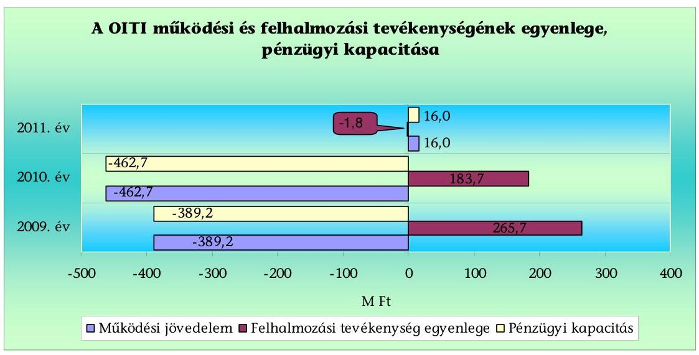

Az intézmény pénzügyi egyensúlyának megteremtésében kockázatot jelent, hogy a kötelezettségvállalást szigorító intézkedések, megrendelések folyamatos vezetői kontrollja ellenére a lejárt esedékességű tartozások csak a finanszírozást növelő, eseti intézkedések hatására csökkentek. A múködési tevékenység ellátásában hosszú távon kockázatot jelent, hogy az elhasználódott eszközök pótlását biztosító jövedelem nem képződött, a beruházások, felújítások az elhasználódott eszközök 16,3\%-át pótolták.

A pénzügyi helyzet 2011. évi kedvező változásában jelentős szerepe volt a múködési bevételek változásának. A 2009. évi 3124,1 M Ft múködési bevétel az előző évhez képest 2010-ben 3232,8 M Ft-ra (3,5\%-kal), a 2011-re 3649,2 M Ftra ( $12,9 \%$-kal) növekedett. A bevételek összegének alakulását az OEP támogatás szabályainak változása, a konszolidációs támogatások és a saját bevételek növelésére irányuló intézkedések befolyásolták. A múködési bevételeken belül minden évben meghatározó volt az - átlagosan 87,3\%-os részarányt képviselő teljesítményarányos - OEP-től származó támogatások összege. A múködési jövedelemtermelő-képesség miatti kockázatot 2010-ben növelte, 2011-ben csökkentett az OEP támogatás változása. Az intézmény OEP támogatása 2009-ben 2713,4 M Ft volt, 2010-ben 2572,6 M Ft-ra (140,8 M Ft-tal) csökkent, 2011-ben 2992,3 M Ft-ra (116,3 M Ft-tal) nőtt az előző évhez képest. A bevételeket növelte a 2010-2011. években kapott 143,1 M Ft, illetve 107,7 M Ft összegű konszolidációs támogatás, továbbá 2011-ben a költségvetési támogatás maradványátvétel 69,5 M Ft növekménye. Az OITI a 2010-2011. évi konszolidációs támogatás igénybevételére támogatási szerződéssel nem rendelkezett. A támogatás átutalását követő 60 napon belül a fennmaradó adósságállomány csökkentését, a

---

pénzügyi egyensúly megteremtését szolgáló konszolidációs tervet - a jogszabályi előírások ellenére ${ }^{25}$ - nem készített.

Az OITI saját bevételei 2009-2011 között növekedtek, amely pozitív hatással volt a pénzügyi egyensúly megteremtésére. A saját bevételek 81,5\%-a szolgáltatások ellenértékéből, 17,1\%-a bérleti díjakból származott. A múködési jövedelem 2009-2010. évi negatív egyenlege ellenére az OITI nem élt a magánrendelésekhez kapcsolódó eszköz-bérbeadás lehetőségével.

A 2009-2011. évek között a múködési költségek és ráfordítások - a bevételek növekedési üteménél kisebb, inflációt el nem érő mértékben - a 2009. évi 3513,3 M Ft-ról a 2011. évre 3633,2 M Ft-ra (3,4\%-kal) növekedtek, azonban a 2011. évben az előző évhez képest 62,3 M Ft-tal (1,7\%-kal) csökkentek. Ebben szerepe volt a személyi jellegú ráfordítások és munkaadót terhelő járulékok 1232,1 M Ft-ról 1135,8 M Ft-ra (7,8\%-kal) - a foglalkoztatási szerkezetváltozás hatására - történő mérséklődésének. A 2009. évről 2011-re a dologi ráfordítások 215,5 M Ft-tal ( $9,5 \%$-kal) növekedtek a gyógyszer, a szakmai anyagok beszerzési költsége emelkedésének, a közüzemi díjak növekedésének hatására. Az OITI gyógyító tevékenységének ellátás típusonkénti közvetlen és felosztható közvetett költségét az analitikus nyilvántartásából történő összesítéssel állapította meg $^{26}$, amely szerint nem képződött fedezet a gyógyító tevékenységhez kapcsolódó gazdasági- múszaki ellátás felosztott költségeire.

Az OITI 2009-2011. évi múködési bevételeinek és ráfordításainak főbb jogcímenkénti alakulását a következő diagram szemlélteti:
13. számú diagram
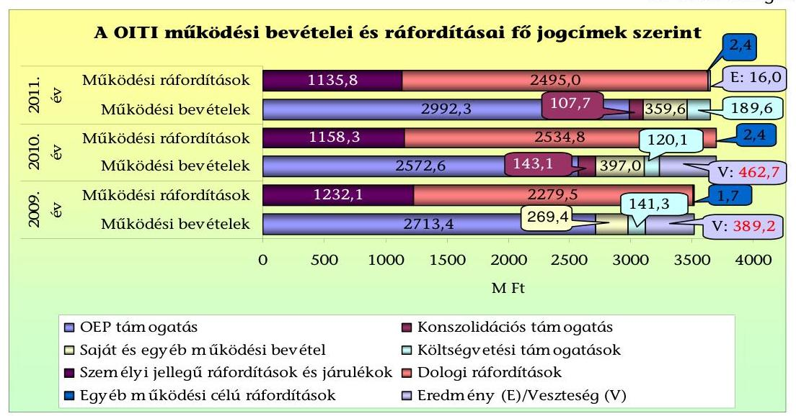

[^0]
[^0]:    ${ }^{25}$ A konszolidációs támogatás folyósításakor hatályban levő a gyógyító-megelőző ellátás jogcím-csoportból finanszírozott egészségügyi szolgáltatók korábbi évekből felhalmozott adósságának rendezésére fordítható konszolidációs támogatásról szóló 269/2010. (XII. 3.) számú, valamint 337/2011. (XII. 29.) számú Kormányrendeletek 5. $\S$-ának c) pontja.
    ${ }^{26}$ Az OITI az egyes ellátástípusok gyógyító-megelőző tevékenységének közvetlen és felosztható közvetett költségeit jogcímenkénti bontásban nem tartotta nyilván, erre vonatkozó adatszolgáltatást az összevontan, nyilvántartásából kigyújtve teljesítette.

---

Az OITI a 2009-2011. években 1118,0 M Ft értékben a főépület rekonstrukcióját 3,0 M Ft összegben valósította meg. A fejlesztési tevékenységet felhalmozási célú saját bevételekből, támogatásból, a 2011-ben hiányzó fedezetként 1,8 M Ft-ot a működési bevételekből finanszíroztak. Az intézménynek folyamatban lévő fejlesztésekből 2011. december 31-én nem állt fenn kötelezettsége. A 2009-2011. évi beruházási, felújítási tevékenységből származó 1121,0 M Ft eszköznövekedés az elszámolt 6891,2 M Ft amortizáció 16,3\%-át pótolta.

Az OITI az ellenőrzött időszakban finanszírozási tevékenységet (hitelek és kölcsön felvétel, törlesztés) nem végzett. Az ellenőrzött időszakban nem volt hosszú lejáratú kötelezettsége, a rövid lejáratú kötelezettségek állománya pedig teljes egészében szállítói kötelezettség volt. A szállítók év végi állománya a 2009. évet követően folyamatosan növekedett, a 2009. évi 680,2 M Ft-ról 2010-ben 777,1 M Ft-ra (14,2\%-kal), a 2011. év végére 837,4 M Ft-ra (7,8\%-kal) emelkedett az előző évhez képest. A szállítói kötelezettségek növekedését a gyógyító tevékenység végzéséhez - különösen a kórházi ellátások szerződött súlyszámon felüli, OEP által nem finanszírozott teljesítéséhez - igénybevett szolgáltatás és eszközbeszerzés miatti kötelezettségvállalások, valamint a működési ráfordítások tartós fedezetlensége együttesen okozták. 2012-ben a szállítói tartozás tovább növekedett, félév végi állománya 913,2 M Ft volt. A lejárt határidejú szállítói tartozások a 2009. évi 225,8 M Ft-ról 2010. év végére 451,3 M Ft-ra, majd a 2011. év végére 505,7 M Ft-ra emelkedtek annak ellenére, hogy a 250,8 M Ft konszolidációs támogatásból 245,5 M Ft-ot lejárt határidejú szállítói tartozások kiegyenlítésére kapott az intézmény. A lejárt esedékességű tartozás 2012. június 30 -ára $223,9 \mathrm{M}$ Ft-ra ( $55,8 \%$-kal) csökkent. Az egyensúlyi helyzetet javította a 2011. év végén a TVK fölemelése a miniszteri tartalékkeretből, a maradványtartási kötelezettség feloldása ( 113,0 M Ft), az OEP év végi kasszamaradványából kapott bevétel ( 175,4 M Ft$)$ és a konszolidációs támogatásból 107,7 M Ft jóváírása, amelyet a szállítók kiegyenlítésére csak 2012-ben használtak fel. Az OITI-hez a 2011-2012. évben költségvetési felügyelő́t rendeltek ki, amit az intézmény pénzügyi helyzete, a lejárt határidejú tartozásainak állománya tett szükségessé.

Az OITI 2009-2012. I. félév végi összes, ezen belül a szállítói és a lejárt határidejű szállítói tartozások állománya az alábbiak szerint változott:
14. számú diagram
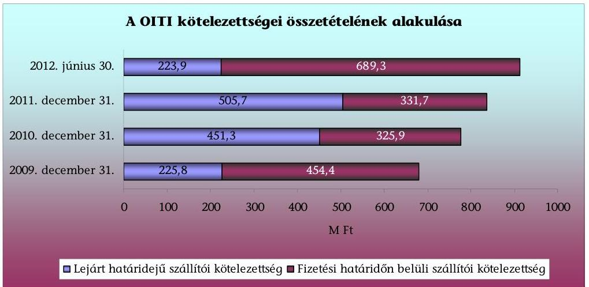

---

Az OITI likviditási helyzete az ellenőrzött időszakban romlott, amit leginkább a likviditási ráta változása jellemez. A likviditás megőrzése érdekében a kórház tett költségcsökkentő intézkedéseket, azonban a TVK túllépést és az OEP finanszírozás alacsony szintjét ezek nem ellensúlyozták, így a mutató értéke a 2009. december 31-ei 0,94-ről 2011. december 31-re 0,43-ra, 2012. június 30 -ára $0,18 \%$-ra csökkent. A készpénz likviditási mutató romlott, 2009. év végén a rendelkezésre álló pénzeszközök a rövidlejáratú kötelezettségek 83,6\%ára, a 2011. évre $35,8 \%$-ára biztosított fedezetet. A likviditási mutatók jelentősen elmaradtak a szakmailag elvárt mértéktől, ami azt jelzi, hogy a rövidlejáratú kötelezettségek rendezéséhez nem rendelkeznek elegendő fedezettel.

Az OITI a pénzügyi egyensúly biztosítása érdekében a 2009-2012. I. félévben a pénzügyi-gazdálkodási tevékenységgel összefüggő belső kontrollokat kialakította. A személyi juttatások és a dologi kiadások alakulásának követésére „keretgazdálkodási tábla" került kialakításra. A vásárolt közüzemi szolgáltatásokkal, gyógyszer- és szakmai anyaggazdálkodás tekintetében költség-monitoring rendszer és keretrendszer múködtetésének szabályait belső szabályzatban nem rögzítették. A keretgazdálkodás módszerét vezetői megbeszéléseken alakították ki, követését heti rendszerességgel végezték.

Az OITI az aktív fekvőbeteg szakellátásban a 2009. évben 127, a 2010. évben 134, a 2011. évben és a 2012. év I. félévben 175 múködő ággyal rendelkezett. A pénzügyi egyensúlyi helyzet romlásában az ellátási teljesítmények alakulása is szerepet játszott. Egyes kiemelt teljesítménymutatók a következők szerint változtak:
4. számú ábra
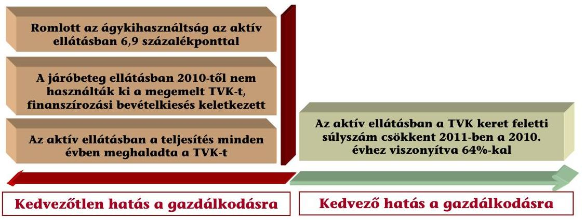

Az OITI munkaerő-hiánya (üres álláshelyek száma) a 2009-2011. években folyamatosan csökkent. A 2009. évben 67, a 2010. évben 58, a 2011. évben 31 üres álláshely volt, amely a 2012. év I. félévben 55-re emelkedett. Betöltetlen álláshely az egészségügyi személyzeten belül a szakorvosoknál, orvosoknál a 2009. évben 3, a 2012. év I. félév végén 5, a szakdolgozóknál a 2009. évben 46, a 2012. év I. félév végén 42 volt. Az OITI a munkaerőhiány pótlását a 2009-2012. év I. félév közötti időszakban szolgáltatásvásárlással, közvetített szakdolgozókkal, és külsős szabad foglakozású, valamint közremúködői szerződéssel foglalkoztatott orvosokkal biztosította. A szolgáltatás vásárlására a 2009. évben fordított 183,2 M Ft összeghez képest a 2010. évben 40,7 M Ft-tal

---

(22,2\%-kal) csökkent, a 2011. évben pedig 49,8 M Ft-tal (35,0\%-kal) nőtt a ráfordítás. EU-s pályázaton a 2010. évben 50 M Ft támogatást nyertek stroke és epilepsia feladat-bővülés ellátásához szükséges 21 fő humán erőforrás biztosítására. A folyamatos hirdetések, toborzások ellenére 2011. június 30-ig 17 főt tudtak foglalkoztatni, 4 álláshely betöltetlen maradt. A foglalkoztatáshoz a 2010. évben 5,5 M Ft és a 2011. évben 12,3 M Ft támogatást vettek igénybe bérköltség, nyugdíjbiztosítási és egészségbiztosítási járulék finanszírozására. 2010. december 1-jétől 33 fő létszámcsökkentést hajtottak végre, a takarítási feladatokat kiszervezték, így a takarítói álláshelyeket megszüntették. A 2012. év I. félévében központi intézkedés miatt 4-gyel csökkent az engedélyezett álláshelyek száma, amellyel az üres álláshelyek számát csökkentették.

Az OITI - pénzügyi helyzetének javítása érdekében - a 2009-2012. év I. félév közötti időszakban a gyógyszerfelhasználás költségének csökkentésére intézkedéseket hozott. Az összes gyógyszerkiadáshoz képest a térítésmentesen kapott gyógyszerek aránya a 2009. évben 1,1\% (1,7 M Ft), a 2012. év I. félévében 2,3\% (2,0 M Ft) volt. Az összes gyógyszerbeszerzési költség a 2009. évben az OEP bevétel 5,9\%-át (159,8 M Ft), a 2011. évben az OEP bevétel 5,8\%-át (175,8 M Ft) tette ki. A gyógyszerköltségek csökkentésére a 2009. évben 50, a 2011. évben 90 féle készítményt váltottak originálisról generikus készítményre.

A szakmai anyag készletek forgási sebessége a 2009. évről a 2011. évre 173-ról 381-re (120\%-kal) nőtt. A szakmai anyagok fajlagos beszerzési költségindexe csökkent és 35 százalékponttal az országos átlagnövekedés alatt maradt. A fajlagos beszerzési költség csökkenése a pénzügyi helyzetre a kórházak átlagánál pozitívabb hatást gyakorolt. Az OITI folyamatos költségmonitoringot, keretrendszert a szakmai anyaggazdálkodással kapcsolatban nem múködtetett.

A vásárolt közszolgáltatások kiadásainak alakulását figyelemmel kísérték. A 2009. évről a 2011. évre az egy ápolási napra vetített villamos energia, valamint a földgáz felhasználás csökkent. A villamos energia $65,8 \mathrm{kWh} /$ napról $60,8 \mathrm{kWh} /$ napra ( $8 \%$-kal), a vásárolt gáz $25,2 \mathrm{~m}^{3} /$ napról $19,5 \mathrm{~m}^{3} /$ napra ( $23 \%$-kal). Az egy ápolási napra jutó víz, szennyvíz menynyisége az elavult vízvezetékrendszer felújítását követően 2009-ről 2011-re kedvezően, $47 \%$-kal csökkent ( $1,07 \mathrm{~m}^{3} /$ napról $0,56 \mathrm{~m}^{3} /$ napra). Az OITI folyamatos költségmonitoringot, keretrendszert nem múködtetett a közszolgáltatásoknál.

A segédüzemi tevékenységek költségeinek alakulását figyelemmel kísérték. A textilmosatást vállalkozásban végeztették. A 2009. évről a 2011. évre a textil mosatás önköltsége 187,3 Ft/kg-ról 192,1 Ft/kg-ra (2,5\%-kal) nőtt, ami azonban reálértéken $11 \%$-os csökkenést jelent. A betegélelmezést vállalkozás végezte. A betegélelmezés önköltsége nőtt a 2009. évről a 2010. évre 1067,2 Ft/napról 1116,7 Ft/napra (5\%-kal), a 2011. évre 1128,7 Ft/napra (1\%kal) a nyersanyag és a rezsiköltség emelkedése miatt. A fogyasztói árindex alatti önköltségváltozás a pénzügyi helyzetre kedvező hatást gyakorolt. A kórház folyamatos költségmonitoringot, keretrendszert a segédüzemi tevékenységgel kapcsolatosan nem működtetett. A költségcsökkentési intézkedések eredményeként keletkezett költségmegtakarítást nem ellenőrizték összegszerűen a kórháznál.

---

Az orvosi gépek-múszerek kihasználtsága növekvő volt a betegszám növekedése következtében. Az MRI berendezés kihasználtsága a 2009. évi 85\%ról 2011. évre 99\%-ra, a kémiai laborautomata kihasználtsága a 2009. évi 39\%-ról 2011. évre 49\%-ra nőtt. Az MRI berendezés és a kémiai laborautomata fajlagos üzemeltetési költségei kedvezően alakultak. Az MRI-é mindössze 1,4\%-kal nőtt 2009-2011 között, a laborautomatáé pedig csökkent. Ezzel szemben a mútők üzemeltetésének fajlagos költsége inflációt meghaladóan, 22\%kal, reálértéken $8 \%$-kal nőtt.

# 1.4. Szent Imre Kórház, Budapest (SZIK) 

A SZIK pénzügyi egyensúlya a 2009-2011. években döntően a konszolidációs támogatás miatt javult. A finanszírozási múveletek nélküli (GFS) pozíció ${ }^{27}$ a 2009-2011. években negatív értéket mutatott, a múködési és felhalmozási tevékenység együttes egyenlege negatív volt. Az összes kötelezettség év végi állománya az előző évhez viszonyított 2010. évi csökkenés után a 2011. évben növekedett. A szállító állomány 2011. december 31-én 814 M Ft volt, amely az éves dologi ráfordításoknak a 24,9\%-át tette ki. Az öszszes kötelezettségen belül a lejárt szállítói tartozások az előző évhez viszonyított 2010. évi csökkenés után 2011. évben növekedtek, 328,4 M Ft-ot tettek ki. 2012. június 30 -án a SZIK összes kötelezettség állománya 357,8 M Ft volt. A belső intézkedések a pénzügyi helyzetet javították, de nem voltak elégségesek a kötelezettségállomány érdemi csökkenéséhez.

Az ellenőrzött időszakban költségvetési intézményként működő SZIK gazdálkodásában a CLF módszer szerinti pénzügyi egyensúly a 2009-2011. években nem volt biztosított, a múködési tevékenység eredménye és a pénzügyi kapacitás negatív volt. A konszolidációs támogatások nélkül a SZIK múködési jövedelme 2010-ben -551,7 M Ft, 2011-ben -319,2 M Ft volt. A veszteség csökkenését döntően a konszolidációs támogatás eredményezte. A felhalmozási tevékenység pénzügyi egyenlege a 2009-2011 közötti időszak egészében negatív volt, a felhalmozási célokra fordítható bevételek nem nyújtottak fedezetet a beruházások, felújítások finanszírozására, ami felhalmozási kockázatot jelentett.

Az adósságkonszolidációs program keretében a SZIK 2010-ben 221,8 M Ft, 2011-ben 228,4 M Ft konszolidációst támogatásban részesült, amely teljes egészében lejárt határidejú szállítói kötelezettségek kiegyenlítésére volt felhasználható. A támogatás felhasználásához mindkét évben konszolidációs terv készült. Az abban meghatározott feladatok végrehajtása a jóváhagyott ütemben és mértékben haladt. A KEHI a konszolidációs támogatás felhasználását ellenőrizte, visszafizetési kötelezettséget nem írt elő. A tartozásállomány részbeni kiegyenlítése után nem került sor önkormányzati biztos kirendelésére.

A múködési és felhalmozási tevékenység egyenlege, a pénzügyi kapacitás 2009-2011 között a következők szerint alakult:

[^0]
[^0]:    ${ }^{27}$ A finanszírozási műveletek nélküli (GFS) pozíció a 2009. évben -523,0 M Ft, a 2010. évben -456,6 M Ft, a 2011. évben -136,2 M Ft volt.

---

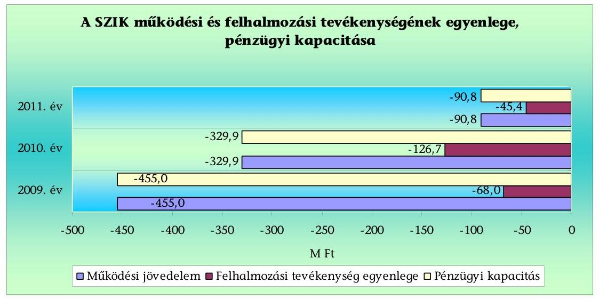

A múködés finanszírozását szolgáló bevételek a 2009. évi 6349,1 M Ftról - az előző évhez viszonyítva - a 2010. évre 6437,6 M Ft-ra (1,4\%-kal, 88,5 M Ft-tal), a 2011. évre 6470,0 M Ft-ra ( $0,5 \%$-kal, 32,4 M Ft-tal) emelkedtek. A 2010. évi múködési bevétel növekedést a 221,8 M Ft konszolidációs támogatás eredményezte (a teljesítményarányos OEP támogatás 51,9 M Ft-tal, a fenntartói támogatás pedig 77,2 M Ft-tal csökkent). A 2011. évi múködési bevétel növekedést a teljesítményarányos OEP támogatás előző évhez viszonyított 428,9 M Ft-os növekedése eredményezte. A saját bevételek növelése érdekében 2009-2011. években több intézkedést ${ }^{28}$ hoztak, azonban ezek hatását számszerúsíteni nem tudták. A múködési bevételeken belül minden évben meghatározó volt az OEP-től származó támogatások és a saját bevételek összege. A bevételek összegének alakulását az ellátás finanszírozási szabályainak változása, a konszolidációs támogatások és a saját bevételek növelésére irányuló kórházi intézkedések befolyásolták. Az ellátás finanszírozási szabályainak változása, az előző évhez viszonyítva a 2010-ben finanszírozás csökkenést okozott, ami kedvezőtlen hatással volt a bevételekre. A fenntartói támogatás aránya és összege változó volt, a 2009. évben a múködési bevételek 1,9\%-át (119,4 M Ft-ot), a 2010. évben $0,7 \%$-át ( 42,2 M Ft-ot), a 2011. évben $0,6 \%$-át ( 37,1 M Ft ) tette ki.

A kórház saját múködési bevételei a 2009. évi 1198,5 M Ft-ról a 2010. évre 1308,6 M Ft-ra növekedtek, amely pozitív hatással volt a pénzügyi helyzetre. A saját múködési bevételek a 2011. évre az előző évhez viszonyítva közel felére, 673,8 M Ft-ra estek vissza az áru- és készletértékesítés, és a térítéses szolgáltatások igénybevételének csökkenése miatt. A saját múködési bevételek (3180,9 M Ft) jelentős része, a 2009-2011. közötti időszakban összesen 3162,5 M Ft (a saját múködési bevételek 99,4\%-a) öt bevételi jogcímen - áru- és készletértékesítés ellenértékéből, szolgáltatások ellenértékéből, egyéb sajátos

[^0]
[^0]:    ${ }^{28}$ Új teljesítményterv megállapítása az egyes szakmai profilok részére, amely a finanszírozási lehetőségek maximális kihasználását célozza, az egynapos mútéti eljárások lehetőség szerinti bővítése, térítéses ápolási egység-kialakítás feltételeinek vizsgálata a rekonstrukció eredményeként szabaddá vált területek hasznosítása céljából.

---

bevételből, továbbszámlázott szolgáltatásokból, bérleti díjakból - származott. A múködési jövedelem negatív egyenlege ellenére a kórház nem élt a magánrendelésekhez kapcsolódó eszköz-bérbeadás lehetőségével.

A múködési költségek és ráfordítások a 2009. évi 6804,1 M Ft-ról - az előző évhez viszonyítva - a 2010. évre 6767,5 M Ft-ra (0,5\%kal, 36,5 M Ft-tal), a 2011. évre 6560,8 M Ft-ra (3,1\%-kal, 206,7 M Ft-tal) csökkentek. A személyi jellegú ráfordítások és a munkaadókat terhelő járulékok együttes összege a 20092011. évek között folyamatosan csökkent, a 2009. évi 3331,4 M Ft-ról a 2010. évre 3329,3 M Ft-ra, a 2011. évre 3295,7 M Ft-ra. A dologi ráfordítások a 2009. évi 3471,9 M Ft-ról a 2010. évre 3423,2 M Ft-ra (1,4\%-kal, 48,7 M Ft-tal), a 2011. évre 3265,1 M Ft-ra (4,6\%-kal, 158,1 M Ft-tal) csökkentek. A dologi ráfordítások összege a 2009. évről 2011. évre 206,8 M Ft-tal (6,0\%-kal) csökkent a kórház intézkedései (gyógyszerkiadások figyelemmel kísérése, gyógyszerek originálisról generikumra váltása, antibiotikumok felhasználási protokolljának felülvizsgálata, szigorú keretgazdálkodás bevezetése, gyógyszerkeretek meghatározása, kórházi gyógyszerlista szűkítése) hatására. A kórház a dologi ráfordítások csökkentésére a vásárolt közműszolgáltatásoknál, szakmai anyaggazdálkodásnál, segédüzemi tevékenységeknél költségcsökkentési intézkedést nem mutatott ki. A gyógyító tevékenység közvetlen költségét a kórház ellátástípusonként kimutatta, amely szerint a fedezeti összeg a 2009-2011. években nem nyújtott fedezetet a gazdasági-, műszaki ellátás felosztott költségeire.

A múködési bevételek és ráfordítások fő jogcímek szerinti arányát és alakulását a következő diagram szemlélteti:
16. számú diagram
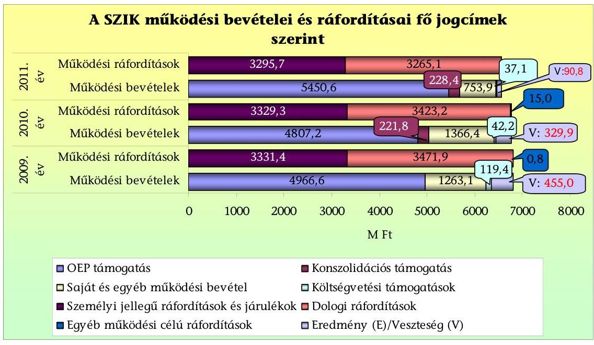

A 2009-2011. években a kórház 323,8 M Ft beruházási és 171,5 M Ft felújítási tevékenységet végzett, amelyhez 295,5 M Ft fenntartói támogatás bevonására volt szükség. A felhalmozási tevékenység finanszírozására a fenntartói támogatáson kívül egyéb támogatások is szolgáltak. Az eszközpótlásra fordított összeg a 2009-2011. években 197,0 M Ft volt, amely az elszámolt 1076,2 M Ft érték-

---

csökkenésnek mindössze 18,3\%-át tette ki. A kórháznál folyamatban lévő beruházás nem volt. A megvalósult fejlesztések a rekonstrukció során történtek, amelynek kapcsán a múködtetési többletráfordítás szükségletet számszerúsítették. A megnövekedett terület éves szinten közel $90,0 \mathrm{M}$ Ft müködtetési többletköltséget jelentett.

A kötelezettségek év végi állománya a 2009. évi 1002,2 M Ft-ról a 2010. évben a lejárt szállítói kötelezettségek csökkenése miatt 810,4 M Ft-ra csökkent, a 2011. évre a lejárt szállítói kötelezettségek növekedése miatt 993,6 M Ft-ra növekedett. A 2012. június 30-i kötelezettségek állományából 83,7 M Ft-ot (23,4\%-ot), a hosszú lejáratú, 274,1 M Ft-ot ( $76,6 \%$-ot) a rövid lejáratú kötelezettségek tettek ki. A 2010. évben kapott konszolidációs támogatás hatására a lejárt szállítói tartozás a 2009. évi 305,1 M Ft-ról 2010. év végére 170,5 M Ft-ra csökkent, majd a 2011. év végére a konszolidációs támogatás ellenére 328,4 M Ft-ra növekedett. A lejárt szállítói tartozások összege 2012. június 30án 83,5 M Ft volt. A szállítói tartozások után 2009-2012. év I. félév közötti időszakban kifizetett késedelmi kamat és kötbér mindösszesen 10,5 M Ft-ot tett ki. A kórháznak pénzintézeti, kölcsönökből származó kötelezettsége nem volt, lizingszerződéssel nem rendelkezett. Hosszú lejáratú kötelezettségei között a kórház rekonstrukcióval kapcsolatosan a Budapest Fővárosi Önkormányzat felé vállalt egyéb kötelezettség szerepelt, ami a 2009. évi 139,7 M Ft-ról 2012. I. félévre 83,7 M Ft-ra csökkent.

A kórház összes kötelezettségének, illetve ezen belül a szállítói és a lejárt határidejú szállítói állománya az alábbiak szerint alakult:
17. számú diagram
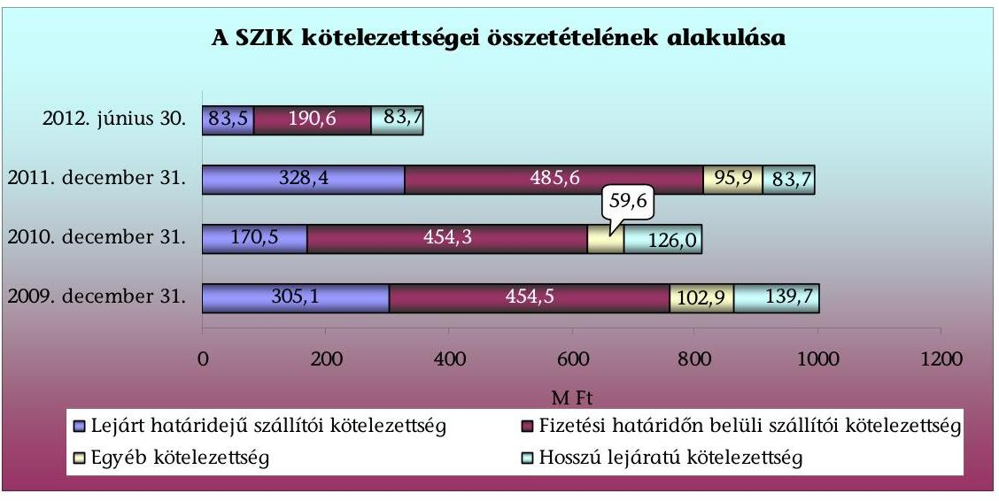

Az intézmény likviditási helyzete az ellenőrzött időszakban kedvező irányba változott, amit leginkább a likviditási ráta alakulása jellemez. A likviditás javítása érdekében a menedzsment bevételnövelő és kiadáscsökkentő intézkedéseket tett, folyamatos egyeztetést folytatott a szállítókkal. A likviditási ráta 2009. évi 0,33 -as értéke 2011-ben 0,60-ra, 2012. június 30-án 0,67-re változott, évről-évre javuló tendenciát mutatott. A készpénz-likviditási mutató is kedvező irányba - a 2009. évi 2,0\%-ról 2011-ben 30,3\%-ra - változott az év vé-

---

gi pénzkészlet növekedésének hatására. A javuló tendencia ellenére a SZIK likviditási helyzete továbbra sem kedvező, a likviditási mutatók a szakmailag elvárható mértéktől jelentősen elmaradtak. A 2011. december 31-én rendelkezésre álló forgóeszközök nem biztosítottak elegendő fedezetet a rövid lejáratú kötelezettségek teljesítésére.

A pénzügyi egyensúlyi helyzet megteremtése érdekében 2009-2012. év I. félév között - a vásárolt közüzemi szolgáltatásoknál, szakmai anyaggazdálkodásnál - a kórház folyamatos költségmonitoring- és keretrendszert múködtetett.

A SZIK esetében az aktív szakellátás ágyszámaiban változás nem történt, átlagosan 541 múködő ággyal rendelkezett. A krónikus szakellátás átlagos ágyszáma 2009-ről 2012-re 22-vel nőtt, 114,5-ről 137-re (19,7\%). Az ellátási teljesítmények alakulása érdemben nem befolyásolta a pénzügyi egyensúlyi helyzetet. Egyes kiemelt teljesítménymutatók a következők szerint változtak:
5. számú ábra
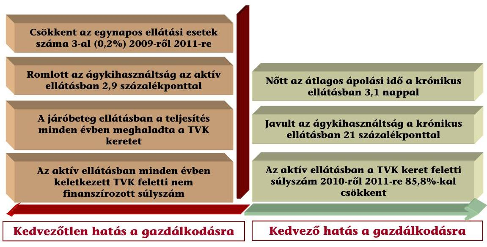

A SZIK munkaerő hiánya (üres állások száma) a 2009-2012. év I. félév közötti időszakban csökkent, annak ellenére, hogy a munkaerőhiány csökkentésére külön intézkedést nem tettek. Az üres állások száma a 2009. évben 17 fő, a 2011. évben 6 fő, a 2012. év I. félévében 2 fő volt. A 2010. évben a betöltött álláshelyek száma 43 fővel haladta meg az engedélyezett álláshelyek számát. A kiadások csökkentése érdekében a 2010. évben 6 fő, míg a 2011. évben 3 fő foglalkoztatásához a Munkaerőpiaci Alapból összesen 5,0 M Ft támogatásban részesültek.

A SZIK - pénzügyi helyzetének javítása érdekében - a 2009-2012. év I. félév közötti időszakban a gyógyszerfelhasználás költségének csökkentésére intézkedéseket (gyógyszer-gazdálkodási szabályzat kiadása és gyógyszer alaplista átdolgozása) hozott. A 2009-2011 közötti időszakban a nyílt és központosított közbeszerzés, valamint az egyéb módon történő beszerzések biztosították a kórházak gyógyszerszükségletét, míg 2012. év I. félévében ezen beszerzési módok

---

mellett a közös beszerzés értéke 41,3\% lett ( $96,8 \mathrm{M} \mathrm{Ft}$ ). Az összes gyógyszerkiadáshoz képest a térítésmentesen kapott gyógyszerek aránya a 2009. évben 28,3\% (170,8 M Ft), a 2012. év I. félévében 31,7\% (74,4 M Ft) volt. Az összes gyógyszerbeszerzési költség a 2009. évben az OEP bevétel 12,1\%-át (603,6 M Ft), a 2011. évben az OEP bevétel 8,4\%-át (476,1 M Ft) tette ki. A gyógyszerköltségek csökkentése érdekében a 2009. évben 47, a 2012. év I. félévében 109 féle készítményt váltottak originálisról generikusra.

A SZIK nem hozott intézkedést a szakmai anyagok beszerzési költségének csökkentésére a 2009-2012. I. félévben. A szakmai anyag készletek forgási sebességének javulása a pénzügyi helyzetre kedvezően hatott 465,1 fordulat/évről 604,5 fordulat/évre (30\%-kal) nőtt 2009-ről 2011-re. A szakmai anyagok egy aktív esetre jutó beszerzési költségindexe az országos átlagnövekedés alatt maradt 12 százalékponttal. A szakmai anyagok beszerzési költségét a SZIK folyamatosan figyelemmel kísérte, folyamatos költségmonitoringot, keretrendszert múködtetett.

A SZIK - a pénzügyi egyensúlyának javítása érdekében - a 2009-2012. I. félévben a vásárolt közszolgáltatások alakulását folyamatosan figyelemmel kísérte, folyamatos költségmonitoringot, keretrendszert múködtetett. Kedvezőtlen volt, hogy az egy ápolási napra vetített villamos energia felhasználás a 2009. évi $20,3 \mathrm{kWh} /$ ápolási napról a 2011 . évre $22,7 \mathrm{kWh} /$ ápolási napra ( $12 \%$-kal) növekedett. Kedvezően változott az egy ápolási napra vetített vízfelhasználás, amely $0,78 \mathrm{~m}^{3} /$ ápolási napról $0,37 \mathrm{~m}^{3} /$ ápolási napra ( $53 \%$-kal) csökkent.

A segédüzemi tevékenységek költségeinek alakulását is folyamatosan figyelemmel kísérték és értékelték. A segédüzemi tevékenység reálértéken számított önköltsége az energiaellátás kivételével nem növekedett. Az energiaellátás fajlagos költsége 13 százalékponttal meghaladta a 2009-2011. évi fogyasztói árindexet (2009. évi 2,8 E Ft/GJ üzemköltség 2011-ben elérte az 3,6 E Ft/GJ üzemköltséget). A SZIK a korábban kiszervezetten múködtetett textilmosatást és a betegélelmezést nem szervezte vissza.

A nagyértékú orvosi gépek-múszerek kihasználtsága javult. A CT berendezés kihasználtsága a 2009. évi $94,7 \%$-ról 2011. évre $99,6 \%$-ra, a kémiai laborautomaták kihasználtsága a 2009. évi 5,9\%-ról 2011. évre 6,0\%-ra, a központi műtő kihasználtsága a 2009. évi 49,6\%-ról 2011. évre 55,1\%-ra változott. A laborautomaták és a központi műtő üzemeltetésének fajlagos költségei inflációt meg nem haladó mértékben változtak és a SZIK pénzügyi helyzetére nem gyakoroltak negatív hatást. A CT önköltség $8518,7 \mathrm{Ft} /$ esetről 10157,9 Ft/esetre 19\%-os nominális értékű, illetve 6\%-os reálértékű növekedése kedvezőtlen hatású volt.

# 1.5. Uzsoki Utcai Kórház, Budapest (UUK) 

Az UUK pénzügyi egyensúlya, a finanszírozási múveletek nélküli (GFS) pozíció ${ }^{29}$ alapján 2009-2011 között nem volt biztosított, a múködési és

[^0]
[^0]:    ${ }^{29}$ A finanszírozási múveletek nélküli (GFS) pozíció a 2009. évben -918,2 M Ft, a 2010. évben -444,8 M Ft, a 2011. évben -98,4 M Ft volt.

---

felhalmozási tevékenység együttes egyenlege negatív volt. A pénzügyi helyzet javulását mutatja, hogy a konszolidációs támogatás, az OEP finanszírozás növekedése és a bevezetett költség-monitoring és keretgazdálkodás eredményeként a múködési tevékenység vesztesége csökkent, illetve 2011-ben eredmény keletkezett. Ennek ellenére az UUK szállítói kötelezettségei - a 2010. évi átmeneti csökkenést követően - folyamatosan emelkedtek. A 2011. év végén a 782,2 M Ft szállítói kötelezettség a dologi ráfordítások 15,7\%-át tette ki. A számviteli nyilvántartások alapján a szállítói kötelezettségek összege 2012. június 30 -án $839,3 \mathrm{M}$ Ft volt.

Az ellenőrzött időszakban költségvetési intézményként múködő UUK gazdálkodásában a CLF módszer szerinti múködési pénzügyi egyensúly a 2009. és a 2010. években nem volt biztosított, a múködési tevékenység eredménye és a pénzügyi kapacitás negatív volt. A 2011. évben az OEP finanszírozás növekedésének és a múködési ráfordítások csökkenésének hatására a múködési jövedelem és a pénzügyi kapacitás is pozitív volt. A konszolidációs támogatás nélkül az UUK múködési jövedelme 2010-ben -658,2 M Ft volt. A konszolidációs támogatás nélküli múködési jövedelem változását 2010-ben a múködési ráfordítások csökkenése eredményezte. A felhalmozási tevékenység egyenlege 2009-2011 közötti időszak egészében negatív volt, a felhalmozási célokra fordítható bevételek nem nyújtottak fedezetet a beruházások, felújítások finanszírozására, ami felhalmozási kockázatot jelentett.

Az UUK a 2010. és 2011. években konszolidációs támogatásban részesült. A 2010. évi 268,0 M Ft támogatáshoz az intézkedési tervet elkészítették. A kórháznak a 2011. évi 305,4 M Ft konszolidációs támogatást vissza kellett fizetni. A visszafizetésre a Magyar Államkincstártól költségmentességet kért, amit az elutasított, így 1,2 M Ft többletköltsége keletkezett.

A múködési és a felhalmozási tevékenység egyenlege, a pénzügyi kapacitás az alábbiak szerint alakult:
18. számú diagram
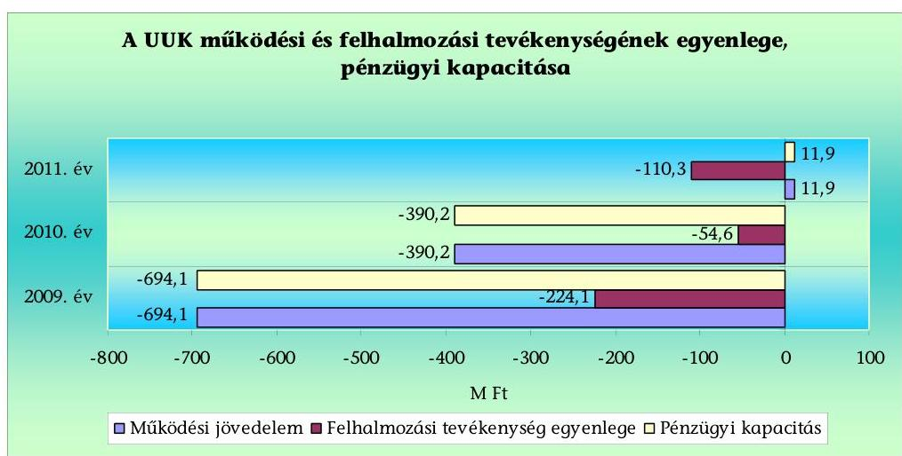

A múködés finanszírozását szolgáló bevételek 2010-re 8361,4 M Ft-ra (1,6\%-kal, 133,4 M Ft-tal) csökkentek 2009-hez viszonyítva a fenntartói támo-

---

gatások, az OEP finanszírozás és a kamatbevételek csökkenése miatt. A múködési bevételek összege 2011-re 8651,8 M Ft-ra (3,4\%-kal, 290,4 M Ft-tal) emelkedtek. A növekedést a saját múködési bevételek 9,8 M Ft-os és az OEP támogatás $289,2 \mathrm{M}$ Ft-os növekedése eredményezte.

A múködési bevételeken belül minden évben meghatározó volt az OEP-től származó támogatás összege, amelyet a finanszírozási szabályok változása és az UUK teljesítménymutatóinak alakulása befolyásolt. A fenntartótól kapott támogatás ${ }^{30}$ a pénzügyi helyzetre számottevő hatást nem gyakorolt.

Az UUK saját múködési bevételei 2009-2010 között nem változtak, azonban a 2011. évre növekedtek, amely a pénzügyi helyzetre kedvezően hatott. A saját bevételek ( $769,5 \mathrm{MFt}$ ) jelentős része, összesen $691,7 \mathrm{MFt}(89,9 \%)$ áru- és készletértékesítéséből, szolgáltatások nyújtásából, valamint bérleti és lízingdíj bevételekből származott. Az UUK az ellenőrzött időszakban a saját múködési bevételek növelése érdekében a térítéses vizsgálatok díjait vizsgálta felül. A térítési díjak felülvizsgálatának hatására a 2011. évben a szolgáltatások ellenértéke 4,7 M Ft-tal ( $6,5 \%$-kal) emelkedett az előző évhez viszonyítva. A magánrendelésekhez kapcsolódó eszköz-bérbeadás lehetőségével nem élt.

A múködési költségek és ráfordítások a 2010. évre 8751,6 M Ft-ra (4,8\%$\mathrm{kal}, 437,5$ M Ft-tal), majd 2011-re 8639,9 M Ft-ra (1,3\%-kal, 111,7 M Ft-tal) csökkentek az előző évhez viszonyítva. A személyi jellegú ráfordítások és munkaadókat terhelő járulékok együttes összege a 2009. évi 3783,8 M Ft-ról a 2010. évre 3663,5 M Ft-ra (3,2\%-kal, 120,3 M Ft-tal), majd 2011-ben 3661,6 M Ft-ra (1,9 M Ft-tal) csökkent. A változást 2010-ben a betöltetlen álláshelyek számának növekedése okozta. A 2011. évben az engedélyezett álláshelyek és a betöltött álláshelyek száma is növekedett. Ezek bérköltségre gyakorolt hatását ellensúlyozta az éves átlagos statisztikai létszám csökkenéséből eredő megtakarítás.

A dologi ráfordítások a 2009. évi 5370,8 M Ft-ról a 2010. évre 5062,4 M Ft-ra (5,7\%-kal, 308,4 M Ft-tal), a 2011. évre 4974,4 M Ft-ra (1,7\%-kal, 88,0 M Ft-tal) csökkentek. A dologi ráfordítások csökkentése érdekében az UUK 2011től a textilmosatás és a betegélelmezés esetében a 2012. év I. félévétől a gyógy-szer- és, szakmai anyaggazdálkodásnál - vezetett be folyamatos költség monitoring és keretrendszert. Változást elsősorban a gyógyszergazdálkodásban és a szakmai anyaggazdálkodásban elért megtakarítások eredményeztek. A gyógyszergazdálkodás során 2010-ben 270,4 M Ft, 2011-ben 168,9 M Ft, a szakmai anyaggazdálkodás területén a 2010. évben 449,5 M Ft megtakarítást ért el az intézmény.

A gyógyító tevékenység közvetlen költségét az UUK ellátás-típusonként kimutatta, amely szerint a fedezeti összeg 2009-2011. években nem nyújtott fedezetet a gazdasági-, múszaki ellátás felosztott költségeire.

[^0]
[^0]:    ${ }^{30}$ A fenntartói támogatás aránya a múködési bevételeken belül - a 2009. év kivételével $(1,3 \%)$ - nem érte el a $0,5 \%$-ot sem.

---

A múködési bevételek, ráfordítások főbb jogcímeinek arányát és alakulását a következő diagram szemlélteti:
19. számú diagram
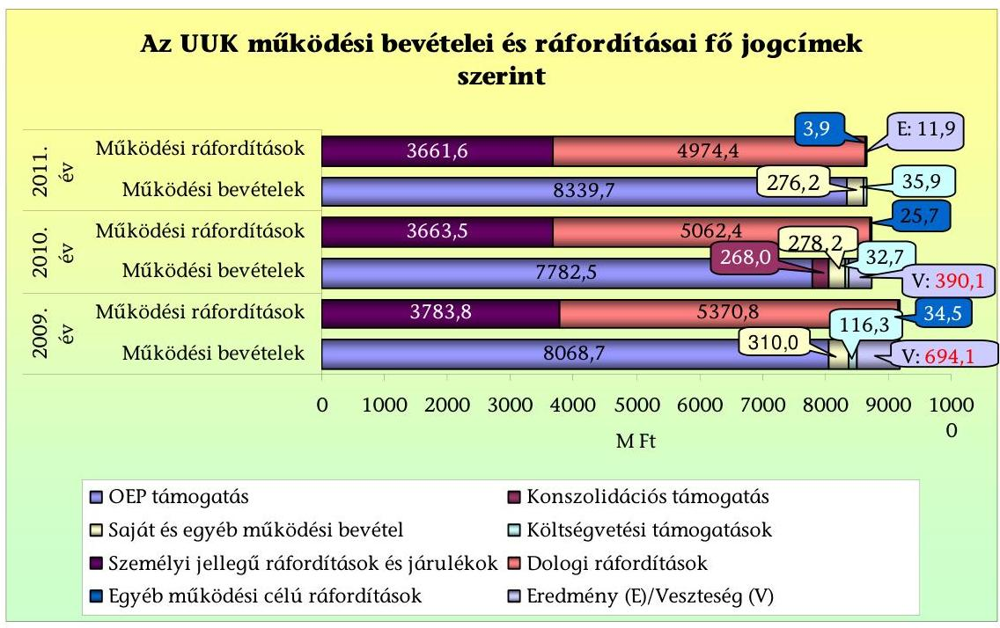

A 2009-2011. években az UUK 383,0 M Ft beruházási és 260,6 M Ft felújítási tevékenységet végzett. A felhalmozási tevékenység finanszírozására saját bevételek és fenntartói támogatások szolgáltak. Az eszközpótlásra fordított öszszeg a 2009-2011. években 400,6 M Ft volt, amely az elszámolt 1230,7 M Ft értékcsökkenésnek a $\mathbf{3 2 , 6 \%}$-át tette $\mathbf{k i}^{31}$. A beszerzett tárgyi eszközök jövőbeni fenntartási, üzemeltetési költségeit az UUK vállalta.

Az UUK kötelezettségeinek állománya a 2009. évi 954,1 M Ft-ról a 2010. évben 714,1 M Ft-ra csökkent, majd a 2011. évre 813,8 M Ft-ra emelkedett a szállítói kötelezettségek változásának hatására. Az UUK a 2010. évben rendelkezett 17,0 M Ft hosszú lejáratú fenntartói kölcsönnel, amelyet vissza is fizetett a következő évben. A 2012. június 30 -ai kötelezettségek állománya 848,3 M Ft volt. Az intézmény pénzintézettel szemben fennálló kötelezettséggel nem rendelkezett. Önkormányzati biztos kirendelésére az ellenőrzött időszakban nem került sor. A 2010. évben kapott konszolidációs támogatás hatására a lejárt szállítói tartozások a 2009. évi 99,3 M Ft-ról 2010-re 0,9 M Ft-ra csökkentek. Az UUK 2011-ben lejárt határidejű szállítói kötelezettséggel nem rendelkezett. Az UUK-nál 2012. június 30-ra 219,5 M Ft lejárt határidejú szállítói kötelezettség keletkezett, amely a pénzügyi helyzetre kedvezőtlen hatást gyakorolt. A kórház összes kötelezettsége, illetve ezen belül a szállítói és a lejárt határidejú szállítói állománya a következők szerint alakult:

[^0]
[^0]:    ${ }^{31}$ A fenntartó által végzett fejlesztési tevékenység bekerülési értéke 6540,5 M Ft volt, amelyet az eszközpótlás még nem tartalmazott.

---

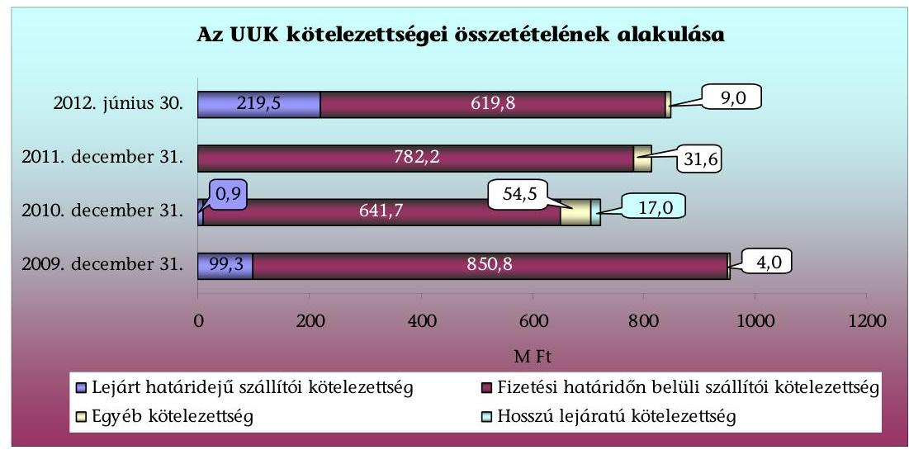

Az UUK likviditási helyzete 2009-2011 között ellentétesen változott. A likviditási ráta a 2009. évi 0,49-ről 2010-ben 0,74-re javult, majd 2011-ben előző évhez képest romlott, mértéke 0,59. A készpénz likviditási mutató alapján az UUK pénzeszközei a 2009. év végén a rövid lejáratú kötelezettségeinek 28,6\%-ára, a 2011. év végén 2,5\%-ára nyújtottak fedezetet. A likviditási mutatók nem érték el a szakmailag elvárt szintet, a rendelkezésre álló pénzeszközök az egyéb forgóeszközökkel együtt sem biztosítnak elegendő fedezetet a 2011. december 31-ei rövidlejáratú kötelezettségek teljesítéséhez.

Az UUK a 2009-2010. években az aktív fekvőbeteg szakellátásban átlagosan 610, 2011-ben és 2012. I. félévében 618 múködő ággyal rendelkezett (1,3\%-os növekedés). A krónikus fekvőbeteg szakellátás ágyszámában változás nem történt, átlagosan 240 múködő ággyal rendelkezett. A pénzügyi egyensúlyi helyzet javulásában az ellátási teljesítmények alakulása is szerepet játszott. Egyes kiemelt teljesítménymutatók a következők szerint változtak:
6. számú ábra
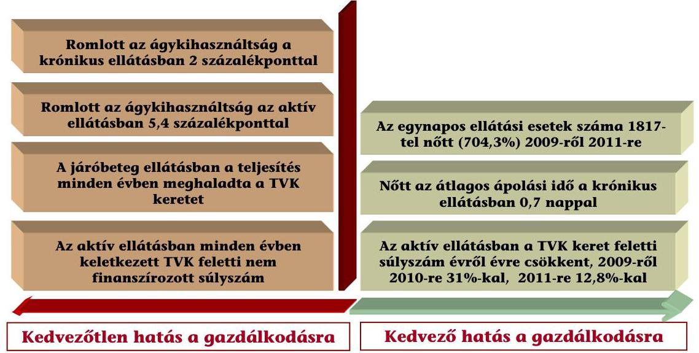

---

Az UUK nem hozott létszámcsökkentési, létszámösszetételt racionalizáló döntéseket a költségek mérséklése, a pénzügyi egyensúlyi helyzet javítása érdekében az ellenőrzött időszakban, mivel korábban következetesen alkalmazták a létszám optimalizálását. Az üres álláshelyek száma változóan alakult - a 2009. évben 13 fő, a 2010. évben 28 fő, a 2011. évben 23,5 fő, a 2012. év I. félévben 32 fő volt - ami az alapfeladatok ellátását nem veszélyeztette. Az engedélyezett álláshelyek száma a 2009. évben 1265 volt, amely a 2012. év I. félévben 1275-re nőtt. A betöltött álláshelyek száma a 2009. évben 1252 volt és 2012. év I. félév végére 1243-ra csökkent. A 2009. évben a 13 üres álláshelyet nem tervezték betölteni, mivel a hatékony munkaszervezéssel megvalósuló munkaidő kihasználás volt a cél. A 2010. évi 28 üres álláshelyet tartalékolták a 2011. évben induló feladatokhoz, a Sürgősségi Betegellátási Osztály múködésének megkezdéséhez és a Dialízis Állomás 8 kezelő egységgel történő bővítéséhez. Betöltetlen álláshely az egészségügyi személyzeten belül az orvosoknál a 2009. évben 6, 2012. év I. félév végén 9,5 volt. A szakdolgozóknál a 2009. évben nem volt, a 2012. év I. félév végén 9 volt. A nem egészségügyi személyzetnél a 2009. évről a 2012. év I. félévre a betöltetlen álláshelyek száma 5,5-el csökkent. Az UUK a hiányzó létszám pótlására és a költségek csökkentésére az ellenőrzött években nem élt a pályázati lehetőségekkel.

Az UUK - pénzügyi helyzetének javítása érdekében - az ellenőrzött időszakban a gyógyszerfelhasználás költségének csökkentésére intézkedéseket hozott. A közös beszerzések értéke az összes gyógyszerkiadáshoz képest a 2012. év I. félévében $41,1 \%$-ot ( $181,8 \mathrm{MFt}$ ) képviselt. Az összes gyógyszerkiadáshoz képest a térítésmentesen kapott gyógyszerek aránya a 2009. évben 9,9\% (145,8 M Ft), a 2012. év I. félévében $11,1 \%$ ( $49,1 \mathrm{MFt}$ ) volt. Az összes gyógyszerbeszerzési költség a 2009. évben az OEP bevétel 18,2\%-át (1471,3 MM Ft), a 2011. évben az OEP bevétel 12,0\%-át (1003,9 M Ft) tette ki. A gyógyszerköltségek csökkentésére a 2009. évben 230, a 2011. évben 233 féle készítményt váltottak originálisról generikus készítményre.

Az UUK a szakmai anyaggazdálkodásában a 2011. év végéig nem múködtetett folyamatos költségmonitoringot, keretrendszert. 2012 elején a beszerzési költségek csökkentésére intézkedést hozott: az év első negyedévében a felhasználói (munkahelyen tárolt) készletek folyamatos, egyidejú monitorozása mellett felhasználói kereteket vezettek be. A szakmai anyag készletek forgási sebessége a 2009. évről a 2011. évre 178-ról 343-ra ( $92,7 \%$-kal) nőtt. A szakmai anyagok fajlagos (egy aktív fekvőbeteg esetre jutó) beszerzési költségindexe az országos átlagnövekedés alatt maradt, annak mindössze $82 \%$-a volt 2009 és 2011 között. Az országos átlagot el nem érő fajlagos beszerzési költség változása a pénzügyi helyzetre a kórházak átlagánál pozitívabb hatást gyakorolt.

Az UUK - pénzügyi egyensúlyának javítása érdekében - az ellenőrzött időszakban a vásárolt közszolgáltatások kiadásainak alakulását figyelemmel kísérte, de nem múködtetett költségmonitoringot, keretrendszert. A 2009. évről a 2011. évre egy ápolási napra vetített (fajlagos) villamos energia felhasználás $18 \%$-kal ( $17,58 \mathrm{kWh} /$ ápolási napról $20,81 \mathrm{kWh} /$ ápolási napra) nőtt, a gázenergia felhasználás $13 \%$-kal ( $5,13 \mathrm{~m}^{3} /$ ápolási napról $4,48 \mathrm{~m}^{3} /$ ápolási napra) csökkent, a vízfelhasználás fajlagos mennyisége nem változott. A villamos energia fogyasztás az épületrekonstrukció során beépített klímaberendezések

---

üzemeltetése miatt emelkedett. A gázenergia felhasználás a gőzfűtésnek melegvizes fűtésre átalakítása miatt csökkent.

A segédüzemi tevékenységek költségeinek alakulását figyelemmel kísérték. A saját előállítású hőközponti hőmennyiség felhasználás csökkent, mert a főépületben új kazánokat szereltek fel és a nyílászárókat kicserélték, így kisebb lett a hőveszteség. A textilmosatás fajlagos költségei is csökkentek $192 \mathrm{Ft} / \mathrm{kg}$-ról $189 \mathrm{Ft} / \mathrm{kg}$-ra. A betegélelmezés költségét a rezsiköltség növekedése emelte 1301ről $1365 \mathrm{Ft} /$ élelmezési napra, ugyanakkor ez $9 \%$-os csökkenés reálértéken.

A nagy értékú orvosi gépek-múszerek kihasználtsága nem javult, a teljesítményvolumen keret miatti betegszám csökkenés következtében. A CT berendezés kihasználtsága a 2009. évi $99 \%$-ról 2011. évre $89 \%$-ra, a kémiai laborautomaták kihasználtsága a 2009. évi $83 \%$-ról 2011. évre $78 \%$-ra csökkent. A mútők kihasználtsága a 2009. évben 45-77\% között és a 2011. évben $40-75 \%$ között volt. A laborautomata kivételével az ellenőrzött nagy értékű berendezések üzemeltetésének fajlagos költsége (önköltsége) inflációt meghaladóan, 5-21\%-kal nőtt. Mindezek az üzemeltetési költségek növekedését okozták, tehát az UUK pénzügyi helyzetére negatív hatást gyakoroltak.

# 1.6. Szent Pantaleon Kórház, Dunaújváros (SZPK ${ }^{32}$ ) 

Az SZPK ${ }_{1}$ pénzügyi egyensúlya 2009-től 2011. október 13-ig nem volt biztosított. A pénzügyi helyzet alakulására kedvező hatást gyakorolt az önkormányzati biztos felügyelete mellett végrehajtott válságkezelési terv. Csökkent a veszteség, valamint a kötelezettségek állománya. A 2011. július 1-jével alapított $\mathrm{SZPK}_{2}$ pénzügyi egyensúlya 2011 II. félévében biztosított volt, azonban a múködés rövid időtartama a pénzügyi helyzetre vonatkozóan következtetések levonásához nem biztosít elegendő információt.

A kórházi feladatokat Dunaújváros Megyei Jogú Város Közgyűlésének döntése alapján - feladat ellátási megállapodás útján - 2011. június 30 -ig az Önkormányzat kizárólagos tulajdonában álló SZPK ${ }_{1}$ látta el. Dunaújváros Megyei Jogú Város Közgyűlése az SZPK ${ }_{1}$ pénzügyi helyzetét is figyelembe véve úgy döntött, hogy 2011. július 1-jétől a kórházi feladatokat költségvetési intézménynél láttatja el. Az alapított intézmény az SZPK ${ }_{1}$-nak nem jogutódja. A feladatellátási szerződés megszüntetésével egyidejúleg az SZPK ${ }_{1}$ megszüntetéséről az önkormányzat nem intézkedett. Az SZPK ${ }_{1}$ a felszámolási eljárás megindítása miatt 2011. október 13-i forduló nappal készítette el az időszakra vonatkozó éves beszámolóját.

Az ellenőrzött időszakra vonatkozóan a gazdálkodási adatok értékelését, elemzését akadályozta, hogy 2011-ben a kórházi ellátást az önkormányzat kétféle múködési formában biztosította, így éves szintű - az előző évekkel összehasonlítható - adatok nem álltak rendelkezésre. A 2011. január 1-október 31-ig terjedő üzleti évre, valamint a 2011. év II. félévre vonatkozó adatok értékelését és

[^0]
[^0]:    ${ }^{32}$ Szent Pantaleon Kórház Kht. (2011. június 30-ig), a továbbiakban SZPK ${ }_{1}$, Szent Pantaleon Kórház - Rendelőintézet (2011. július 1-től), a továbbiakban SZPK ${ }_{2}$.

---

elemzését a feladatellátás múködési formájának változásából adódó technikai elszámolások, a követelés-, illetve tartozásátvállalások is torzítják.

Az SZPK ${ }_{1}$-hoz az alapító önkormányzat 2010. január 1-től 2011. június 30-ig válságkezelési terv kidolgozására és végrehajtására önkormányzati biztost rendelt ki. Az önkormányzati biztos kirendelését a gazdasági társaság pénzügyi helyzete, a lejárt határidejú szállítói kötelezettségek állománya tette szükségessé. Az önkormányzati biztos által feltárt és fizetésképtelenséghez vezető okok a következők voltak: a fekvőbeteg ellátás strukturális átalakítása, a feladatellátás finanszírozási szabályainak változása, az infláció kedvezőtlen hatása, a vizitdíj ellentételezés nélküli eltörlése, a fedezet nélkül végrehajtott kötelező béremelések és a múködési költségek terhére kényszerúen végrehajtott eszközpótlások. Az SZPK ${ }_{1,2}$ múködési és felhalmozási tevékenységének egyenlege, pénzügyi kapacitása 2009-2011 között az alábbiak szerint alakult:
21. számú diagram
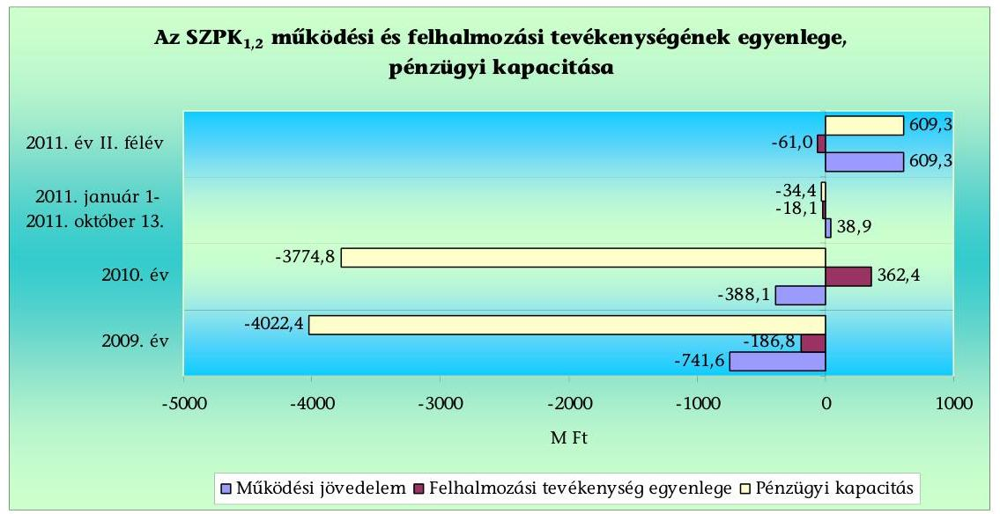

Az SZPK ${ }_{1}$ gazdálkodásában 2009-2010 között a CLF módszer szerinti pénzügyi egyensúly nem volt biztosított, a múködési tevékenység eredménye és a pénzügyi kapacitás negatív volt. A 2011. január 1-től október 13-ig terjedő üzleti évben a múködési tevékenység eredménye - az alapítótól kapott támogatás, a szállítók által elengedett kötelezettségek és az SZPK ${ }_{2}$ által átvállalt tartozások ellenére - nem biztosított fedezetet a felhalmozási tevékenység veszteségére és az adósságszolgálatra. A 2010. évben a konszolidációs támogatás nélkül az SZPK ${ }_{1}$ múködési jövedelme -669,0 M Ft volt. Az előző évhez viszonyítva a veszteség csökkenését - a takarékossági intézkedések hatására - a múködési ráfordítások csökkenése, a saját múködési bevételek növekedése eredményezte. Az SZPK ${ }_{2}$ múködési jövedelme a 2011. évi konszolidációs támogatás nélkül 415,3 M Ft volt. A felhalmozási tevékenység egyenlege 2009-ben és 2011ben negatív volt, a felhalmozási célokra fordítható bevételek nem nyújtottak fedezetet a beruházások, felújítások finanszírozására, ami felhalmozási kockázatot jelentett. A 2010. évben a pozitív összegú felhalmozási egyenleget az alapítótól kapott 422,0 M Ft tőkepótlás eredményezte.

---

Az adósságok rendezésére az SZPK ${ }_{1}$ 2010-ben 280,9 M Ft, az SZPK 2 2011-ben 194,0 M Ft konszolidációs támogatásban részesült, amely lejárt határidejű szállítói kötelezettségek kiegyenlítésére volt felhasználható. A támogatás felhasználására külön konszolidációs program nem készült, mivel a gazdálkodás már a válságkezelési program keretében meghatározottak szerint történt. A 2011. évi konszolidációs támogatás felhasználását a KEHI ellenőrizte és 192,6 M Ft viszszafizetési kötelezettséget állapított meg.

Az SZPK ${ }_{1}$ esetében a saját tőke és jegyzett tőke aránya folyamatosan csökkent. A jegyzett tőke a 2008. és a 2009. évek között 3,0 M Ft, a saját tőke 2008-ban -421,0 M Ft, 2009-ben -1298,8 M Ft volt. A jegyzett tőkét az alapító önkormányzat a 2010. évben 4,0 M Ft-ra emelte, amelyet a -1388,7 M Ft összegű saját tőke összege - a 422,0 M Ft tőkepótlás ellenére - nem ért el. Az alapító önkormányzat a tőkepótlással sem tett eleget a Gt. 51. § (1) bekezdésében foglaltaknak ${ }^{33}$, mivel az SZKP ${ }_{1}$ saját tőkéje a 2008-2010. évek között nem érte el a jegyzett tőkéjének összegét.

A múködés finanszírozását szolgáló bevételek a 2009. évről 2010-re 4731,2 M Ft-ra (4,9\%-kal, 221,2 M Ft-tal) emelkedtek. A 2010. évi múködési bevétel növekedést 280,9 M Ft konszolidációs támogatás, 18,5 M Ft az EU-tól múködési célokra átvett pénzeszköz, a saját működési bevételek 44,7 M Ft-os és az államháztartáson kívülről átvett pénzeszközök 72,9 M Ft-os növekedése eredményezte. A 2011. évre a 2010. évhez viszonyítva a múködési bevételek összege 46,2\%-kal 2185,4 M Ft-tal nőtt. A 2011. évi növekedés összege tartalmazta az SZPK ${ }_{1}$-nek nyújtott 237,8 M Ft alapítói támogatást - ebből 147,3 M Ft alapítói kölcsön támogatássá való átminősítéséből származott -, 363,5 M Ft tartozás- és 215,0 M Ft bér- és járulék-átvállalást. Magában foglalta továbbá az SZPK ${ }_{2}$ részére folyósított 194,0 M Ft konszolidációs támogatást és az államháztartáson belülről kapott 778,5 M Ft egyéb támogatást ${ }^{34}$. A kórházi ellátás teljesítménymutatóinak változása 346,6 M Ft bevételi többletet eredményezett a 2011. évben. A bevételnövelő tényezők hatását lerontotta az OEP finanszírozás teljesítménymutatók romlása miatti 194,3 M Ft-os csökkenése.

A múködési bevételeken belül - a technikai jellegű elszámolásokat, követelésés tartozás-átvállalásokat figyelmen kívül hagyva - minden évben meghatározó volt az OEP-től származó támogatások összege. Az OEP-től származó bevételek összegének alakulását a finanszírozási szabályok változása, a konszolidációs támogatások és a teljesítménymutatók változása befolyásolta.

[^0]
[^0]:    ${ }^{33}$ A Gt. 51. § (1) bekezdése szerint, „ha a gazdasági társaság a számviteli törvény szerinti beszámolójában foglaltak alapján egymást követő két teljes évben nem rendelkezik a társasági formájára kötelezően elöirt jegyzett tőkének megfelelő saját tőkével, a társaság tagjai kötelesek a beszámoló elfogadásától számított három hónapon belül a szükséges saját tőke pótlásáról gondoskodni. Ha ez nem történik meg, a határidő lejártát követő hatvan napon belül intézkedni kell a feltételeknek megfelelő gazdasági társasággá történő átalakításról, illetve annak megszüntetéséröl".
    ${ }^{34}$ Az SZPK ${ }_{2}$ adatszolgáltatása szerint az államháztartáson belülről átvett pénzeszközökből 776,5 M Ft az SZPK 2011. május-június havi teljesítményei után járó OEP bevételt is tartalmazta.

---

Az SZPK ${ }_{1,2}$ saját múködési bevételei 2009-2011 között növekedtek, amely pozitív hatással volt a pénzügyi helyzetre. Az SZPK ${ }_{1}$-nál a három év együttes saját bevételeiből ( $495,6 \mathrm{MFt}$ ) összesen $374,9 \mathrm{M}$ Ft (a saját működési bevételek $75,6 \%-a$ ) áru- és készletértékesítéséből, szolgáltatások nyújtásából, valamint bérleti és lízingdíj bevételekből származott. Az SZPK ${ }_{1,2}$ a saját múködési bevételek növelése érdekében felülvizsgálta a szolgáltatói szerződésekben meghatározott bérleti díjak összegét és azt az önkormányzat által is alkalmazott övezetenkénti díjtételek összegében határozta meg. Az SZPK ${ }_{1}$ bérleti és lízingdíj bevételeiből származó 121,2 M Ft-ból 101,7 M Ft a magánrendelések miatti eszköz-bérbeadásból származtak. A 2011. július 1-től múködő SZPK ${ }_{2}$ esetében a saját működési bevételek összege $65,3 \mathrm{M}$ Ft volt. A saját bevételek díjtételeinek meghatározásához önköltségszámításokat nem végeztek.

A múködési költségek és ráfordítások a 2010. évre 5119,3 M Ft-ra (2,5\%$\mathrm{kal}, 132,3 \mathrm{M}$ Ft-tal) csökkentek, majd 2011-re 6168,4 M Ft-ra (20,5\%-kal, 1049,1 M Ft-tal) növekedtek az előző évhez viszonyítva. A 2010. évi csökkenést a gazdasági társaság által összeállított és önkormányzati biztos felügyelete mellett végrehajtott válságmenedzselő terv eredményezte. A takarékossági intézkedések hatása a 2011. évben is érezhető volt, azonban a gazdasági társaság és a költségvetési szerv által összességében kimutatott múködési ráfordítások a technikai jellegű elszámolásokat, tartozásátvállalásokat is tartalmazták, illetve a gazdasági társaság esetében a 2011. július 1-október 13. között felmerült ráfordításokat is.

A személyi jellegú ráfordítások és a munkaadókat terhelő járulékok együttes összege a 2009. évi 2320,6 M Ft-ról a 2010. évre 2296,6 M Ft-ra (1,0\%-kal, 24,0 M Ft-tal) csökkent. Ennek oka, hogy a kilépő szakorvosok helyett alacsonyabb díjazásért rezidenseket alkalmaztak, a hiányszakmákban pedig vállalkozó orvosok látták el a feladatokat szerződéses formában. A 2011. évben a személyi jellegú ráfordítások és a munkaadókat terhelő járulékok öszszege 2447,7 M Ft-ra (6,6\%-kal, 151,1 M Ft-tal) növekedett az előző évhez viszonyítva.

A dologi ráfordítások a 2009. évi 2817,8 M Ft-ról a 2010. évre 2529,6 M Ft-ra (10,2\%-kal, 288,2 M Ft-tal), a 2011. évre 2361,2 M Ft-ra (6,7\%-kal, 168,4 M Fttal) csökkentek. A dologi ráfordítások csökkenését a takarékossági intézkedések végrehajtása eredményezte.

Az SZPK ${ }_{2}$ nyilvántartásai alapján a költségmegtakarító intézkedések a 2011. év múködtetési költségeire is kedvező hatással voltak. A korábban bérelt helyiségekben lévő szakrendelők az intézményi fekvőbeteg ellátást biztosító épületben nyertek elhelyezést, így az elért megtakarítás összege éves szinten mintegy 138,0 M Ft volt. A szállítókkal történt egyeztetések alapján a tartozásokat átütemezték, a késedelmi kamatok elengedésre kerültek, a szerződések módosítása keretében a szolgáltatók eltekintettek a korábban felszámolt késedelmi díjak megfizetésétől. Az elért megtakarítás éves szinten $87,0 \mathrm{M}$ Ft. A beszállítókkal történt egyeztetések, tárgyalások során az SZPK ${ }_{2}$ éves szinten mintegy 133,0 M Ft szolgáltatási díjcsökkentést tudott elérni.

A gyógyító tevékenység közvetlen költségét a gazdasági társaság és a költségvetési intézmény is kimutatta ellátás-típusonként. Az SZPK ${ }_{1}$ adatszolgáltatása alapján a fedezeti összeg 2009-2011 I. félévében nem nyújtott fedezetet a

---

gazdasági-múszaki ellátás felosztott költségeire. Az SZPK ${ }_{2}$ nyilvántartásai szerint a fedezeti összeg a gazdasági-műszaki ellátás felosztott költségeire fedezetet biztosított. A múködési bevételek, ráfordítások főbb jogcímeinek arányát és alakulását a következő diagram szemlélteti:
22. számú diagram
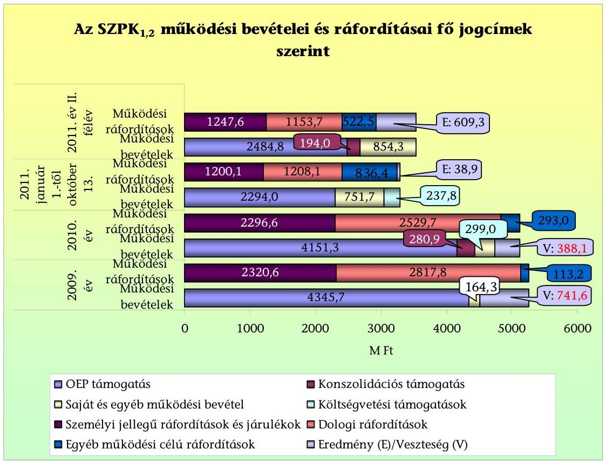

A 2009-től 2011. október 13-ig az SZPK ${ }_{1} 229,8$ M Ft beruházási és 159,5 M Ft felújítási tevékenységet végzett. A felhalmozási tevékenység finanszírozására saját bevételek, EU-s pályázati források, államháztartáson kívülről átvett pénzeszközök és hosszú lejáratú hitelek szolgáltak. Az eszközpótlásra fordított összeg 44,7 M Ft volt, amely az elszámolt 347,1 M Ft értékcsökkenésnek mindössze $\mathbf{1 2 , 9 \%}$-át tette ki. Az SZPK 2011 II. félévében 61,3 M Ft beruházási és $2,5 \mathrm{M}$ Ft felújítási tevékenységet végzett. A felhalmozási tevékenység finanszírozása saját bevételekből történt. Az intézmény 2011 II. félévében eszközpótlásra 1,3 M Ft-ot fordított, amely az elszámolt 54,0 M Ft értékcsökkenés 2,4\%-át tette ki ${ }^{35}$. Az SZPK ${ }_{1,2}$ a fejlesztések során vállalta a beszerzett tárgyi eszközök jövőbeni fenntartási, üzemeltetési költségeit.

Az SZPK ${ }_{1}$ kötelezettségeinek állománya a 2009. évi 3361,8 M Ft-ról a 2010. évben a lejárt határidejú szállítói kötelezettségek csökkenése és a hiteltörlesztések következtében 2967,3 M Ft-ra csökkent. A kötelezettségek állománya 2011. október 13-ra 1445,8 M Ft-ra változott, amelyet a hosszú lejáratú hitelek,

[^0]
[^0]:    ${ }^{35} \mathrm{Az} \mathrm{SZPK}_{2}$ által végzett és folyamatban lévő fejlesztési tevékenység várható bekerülési értéke $3666,0 \mathrm{M} \mathrm{Ft}$.

---

az egyéb rövid lejáratú kötelezettségek és a szállítói kötelezettségek állományának mérséklődése okozott. Az SZPK ${ }_{2}$ esetében a 2011. év végén 502,5 M Ft kötelezettség állt fenn, amelyből 155,2 M Ft a függő elszámolások miatti összeg, 347,3 M Ft fizetési határidőn belüli szállítói kötelezettség volt. A 2012. június 30 -ai kötelezettségek állománya teljes egészében szállítókkal szemben fennálló kötelezettség volt, amelyből 6,0 M Ft lejárt határidejű. A 2010. évben kapott konszolidációs támogatás és az önkormányzati biztos felügyelete mellett végrehajtott válságkezelési terv eredményeként az SZPK ${ }_{1}$ kötelezettségei, ezen belül mind a hosszú, mind a rövid lejáratú kötelezettségek, ennek részeként a szállítói kötelezettségek csökkentek. A lejárt határidejű szállítói kötelezettségek a 2010. évben csak átmeneti jelleggel csökkentek, a felszámolási eljárás megindításának megkezdésére ismét növekedtek. A szállítói tartozások után az SZPK ${ }_{1}$ 2009-ben és 2010-ben összesen 30,7 M Ft késedelmi kamatot és kötbért fizetett ki, amely a kapott konszolidációs támogatás 10,9\%-a volt.

Az SZPK ${ }_{1,2}$ a lejárt határidejű szállítói kötelezettségekkel összefüggésben felszámított késedelmi kamatok és pótlékok összegét számviteli nyilvántartásában elkülönítetten kezelte, a mérlegben azonban ezen összegeket nem egyéb tartozásként, hanem a szállítókkal szemben fennálló kötelezettségként mutatta ki. A nyilvántartásokban a 60 napon túl lejárt határidejű szállítói állományt lejárat szerinti további részletezését nem vezették, így a késedelem tényleges időpontjának megállapítása nem állapítható meg.

A folyamatos fizetőképesség megtartása érdekében az SZPK ${ }_{1}$ a 2009. és a 2010. évben 100,0 M Ft folyószámla hitelkerettel rendelkezett. A folyószámla hitellel zárt napok száma 2009-ben 201 nap, 2010-ben 214 nap, az átlagos napi állomány 6,1 M Ft és 6,7 M Ft volt a két évben. A folyószámlahitelhez kapcsolódóan az SZPK ${ }_{1}$-nak összesen 10,6 M Ft kamat- és egyéb költsége merült fel. A likviditás biztosítása érdekében a folyószámla hitelen kívül egyéb likvid hitel igénybevételére is sor került. Ennek napi átlagos állománya 2009-ben 14,2 M Ft, 2010-ben 22 M Ft volt. Az egyéb likvid hitelekkel kapcsolatban összesen 57,3 M Ft költsége merült fel a gazdasági társaságnak (kamat és egyéb költség).

Az SZPK ${ }_{1}$-nak 2,3 M Ft kötelezettsége keletkezett a 2008. május 30 -án kötött gépjármú lízingszerződése alapján. A fennálló kötelezettség 2012. június 30 -án a gazdasági társaság adatszolgáltatása szerint $0,7 \mathrm{M}$ Ft volt. A nyilvántartások alapján a lízing elszámolással kapcsolatban 0,7 M Ft árfolyamveszteség keletkezett.

A felszámolás alatt álló gazdasági társaságnak 2012. június 30 -án fennálló hosszú lejáratú kötelezettsége 91,8 M Ft volt. Az SZPK ${ }_{1}$ a hosszú lejáratú hiteleket felhalmozási célokra vette igénybe. A hosszú lejáratú hitelek után 20092011 között összesen 23,8 M Ft kamatráfordítása keletkezett.

A kórház összes kötelezettsége, illetve ezen belül a szállítói és a lejárt határidejú szállítói állománya a következők szerint alakult:

---

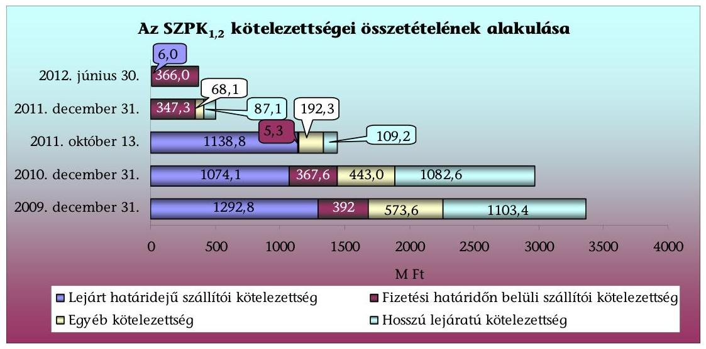

Az SZPK ${ }_{1}$ likvidítási helyzete 2009-2011. október 13-a között kedvezőtlen irányba változott, a készpénz likviditási mutató alapján az SZPK ${ }_{1}$ pénzeszközei a 2009. év végén a rövid lejáratú kötelezettségeinek 1,1\%-ára, 2011. október 13-án 0,04\%-ára nyújtottak fedezetet. A költségvetési intézmény (SZKP ${ }_{2}$ ) esetében a 2011. december 31-én a pénzeszközök a rövid lejáratú kötelezettségek $36,8 \%$-ára biztosítottak fedezetet, a likvidítási ráta 0,48 értéket mutatott. A 2011. évi likvidítási mutatók elmaradtak a szakmailag elvárt mértéktől, a rendelkezésre álló forgóeszközök nem biztosítanak elegendő fedezetet a rövidlejáratú kötelezettségek teljesítéséhez.

A kórház a 2009-2011. években a belső kontrollokat kialakította. A helyszíni ellenőrzés idején rendelkezett a hatályos jogszabályokban előírt szabályzatokkal. A gazdálkodási jogköröket gyakorlók személyét belső szabályzatban meghatározták, a szabályozás során betartották az összeférhetetlenségi követelményeket. A kórháznál kialakították az Áht. (új) 69. §-ában előírt kontrollrendszert, intézkedtek a belső ellenőrzés kialakításáról és múködtetéséről. A pénzügyi egyensúlyi helyzet megteremtése érdekében az SZPK válságkezelési tervet dolgozott ki, amelyet önkormányzati biztos felügyelete mellett hajtott végre. 2009 és 2012. I. félév között a szakmai anyaggazdálkodásnál, valamint a gyógyszerfelhasználást érintően folyamatos költség monitoring és keretrendszert müködtettek.

Az SZPK ágyszámaiban változás nem történt, az aktív fekvőbeteg szakellátásban átlagosan 523, a krónikus fekvőbeteg szakellátásban 188 múködő ággyal rendelkezett. A pénzügyi egyensúlyi helyzet javulásában az ellátási teljesítmények változása is szerepet játszott. Egyes kiemelt teljesítménymutatók a következők szerint változtak:

---

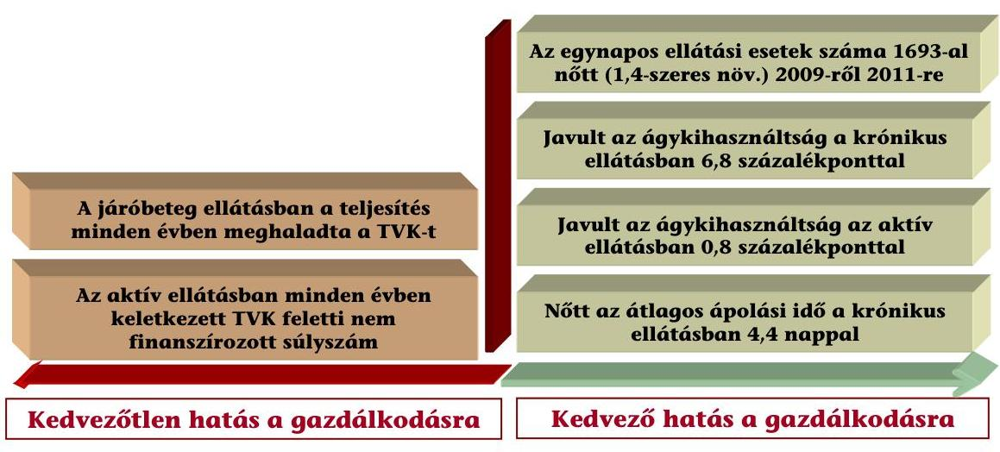

Az SZPK munkaerő-hiánya (üres álláshelyek száma) a 2009. évi 8,6 fơről, a 2010. évre 6,6 fơre csökkent, majd 2011-2012. év I. félévben ezen a szinten maradt. Az engedélyezett álláshelyek száma 2009-2012. év I. félév között nem változott, 846 fó volt. A betöltött álláshelyek száma a 2009. évi 837,4 fơről 2012 I. félévére 839,4 fơre nőtt. Betöltetlen álláshely, átmeneti szakember hiány elsősorban az egészségügyi személyzet körében jelentkezett. Orvosok esetében a 2009. évben és a 2012. I. félév végén is 2,6 fó volt a betöltetlen álláshely, a szakdolgozóknál a 2009. évben 5, míg 2012. év I. félév végén 3 üres álláshely volt. A nem egészségügyi személyzetnél a 2009-2012. év I. félév közötti időszakban a betöltetlen álláshelyek száma mindössze 1 fő volt. A kilépő szakdolgozók pótlását a helyben múködő középfokú szakoktatási intézmény biztosította. Az SZPK az ellenőrzött időszak egyik évében sem vette igénybe a közmunkaprogram és közhasznú foglalkoztatás biztosította lehetőségeket, pályázati forrásokat nem kapott.

Az SZPK - pénzügyi helyzetének javítása érdekében - a 2009-2012. év I. félév közötti időszakban a gyógyszerfelhasználás költségének csökkentésére intézkedéseket hozott. Az SZPK intézeti gyógyszertárat nem múködtet. Az összes gyógyszerkiadáshoz képest a térítésmentesen kapott gyógyszerek aránya a 2009. évben 26,6\% (57,7 M Ft), a 2011. évben 25,9\% (51,9 M Ft) volt. Az összes gyógyszerbeszerzési költség a 2009. évben az OEP bevétel 4,9\%-át (216,3 M Ft), a 2011. évben az OEP bevétel 4,0\%-át (199,7 M Ft) tette ki. A gyógyszerköltségek csökkentésére a 2009. évben 51, a 2011. évben 75 féle készítményt váltottak originálisról generikus készítményre.

Az SZPK úgy intézkedett a szakmai anyagok beszerzési költségének csökkentésére, hogy folyamatosan figyelemmel kísérték a szakmai anyagok beszerzési költségét, a készletek felhasználását, a fekvőbeteg szakellátás területén keretrendszert múködtettek. Egyes anyagokat a gyógyszertártól, másokat közvetlenül a szállítóktól, illetve központosított közbeszerzés alapján az arra kijelölt szervezeten keresztül szereztek be.

Folyamatosan kontrollálták a vásárolt közszolgáltatások alakulását, egyeztettek a szolgáltatókkal, próbáltak árengedményeket elérni. Nem múköd-

---

tettek költség monitoringot, keretrendszert a költségek figyelésére, a felhasználás korlátozására. A víz fajlagos felhasználása $0,36 \mathrm{~m}^{3}$-ről $0,20 \mathrm{~m}^{3}$-re ( $44 \%$-kal) csökkent ezen időszakban, amely kedvezően hatott az SZPK pénzügyi helyzetére. Szintén kedvező, hogy az egy ápolási napra eső villamos energia 2009-ben 10,0 kWh, 2011. évben 8,8 kWh volt ( $12 \%$-os csökkenés) valamint, hogy a vásárolt távhő-melegvíz egy ápolási napra eső mennyisége 0,09 GJ-ról 0,08 GJ-ra csökkent. Ezzel szemben a földgáz fajlagos felhasználása ugyanezen időszakban kedvezőtlenül alakult, $1,08 \mathrm{~m}^{3} /$ ápolási napról $1,22 \mathrm{~m}^{3} /$ ápolási napra $13 \%$ kal nőtt.

A segédüzemi tevékenységek vállalkozói szerződéseinek felülvizsgálata eredményeként költségmegtakarítást értek el mind a textilmosatás, mind a betegélelmezés terén. A 2009. évben 1 kg mosott ruháért 377,3 Ft-ot, 2011. évben 303,5 Ft-ot, a betegélelmezésért naponta 2009. évben 1 719,6 Ft-ot, 2011. évben 1 579,8 Ft-ot fizetett az SZPK.

Az SZPK nem rendelkezik központi mútőblokkal, 2009 és 2011 között a sebészeti műtő kihasználtsága javult 57-ről 60\%-ra. Ezzel szemben a traumatológiai műtőé $28 \%$-ról $27 \%$-ra romlott. Uniós forrással megvalósuló beruházás, hogy a jelenleg döntően osztályokhoz rendelt alacsony kihasználtsággal múködő műtők nagyrészt megszüntetésre kerülnek. Ez az SZPK pénzügyi helyzetére várhatóan pozitív hatással lesz.

# 1.7. Bugát Pál Kórház Egészségügyi Szolgáltató Nonprofit Kft., Gyöngyös (BPK) 

Az BPK pénzügyi egyensúlya a 2009-2011 között nem volt biztosított, azonban 2011-ben a kapott konszolidációs támogatással és a belső intézkedésekkel megteremtették a bevételek és ráfordítások közötti egyensúlyt. A finanszírozási műveletek nélküli GFS pozíció ${ }^{36}$ 2009-2011. években negatív értéket mutatott. Ennek oka, hogy a felhalmozási tevékenység során nem keletkezett elegendő fedezet a felhalmozási ráfordításokra. A szállítói kötelezettségek állománya folyamatosan növekedett, azonban a konszolidációs támogatás hatására a lejárt határidejű szállítói tartozások 2011-ben az előző évhez képest csökkentek. A szállítói kötelezettség 2011. év végi állománya a dologi ráfordításoknak (1634,3 M Ft) 19,2\%-át tették ki. A 2012. év I. félév végére a szállítói kötelezettségek állománya növekedett, összege 327,6 M Ft volt. A saját bevételek növelésére és a racionális költséggazdálkodásra tett intézkedések a pénzügyi helyzetet javították, azonban pénzügyi egyensúly megteremtéséhez és megőrzéséhez önmagukban nem voltak elegendőek.

A BPK gazdasági társasági formában múködött. A BPK-t a Gyöngyösi Kórház Egészségügyi Szolgáltató Kft. - a Hospinvest Zrt. leányvállalataként - múködtette 2009. június 30-ig, majd Gyöngyös Város Önkormányzatának 100\%-os tulajdonú gazdasági társaságaként múködött tovább. A képviselő-testület döntése alapján az önkormányzat értékesítette a gazdasági társaságban levő tulaj-

[^0]
[^0]:    ${ }^{36}$ A finanszírozási műveletek nélküli (GFS) pozíció a 2009. évben -5,9 M Ft, a 2010. évben -126,6 M Ft, a 2011. évben -15,8 M Ft volt.

---

donrészét, amit 2009. október 22-én a Medical Zrt. megvásárolt és annak 100\%-ban tulajdonosa lett. A jogszabályi változásokat követően 2012. május 1jétől a BPK által működtetett önkormányzati vagyon állami tulajdonba került.

A BPK - a tulajdonosváltások miatt - 2009. év január 1-je és július 31-e közötti gazdálkodásra vonatkozó adatokkal nem rendelkezett, ezért a pénzügyi helyzet értékelése a 2010-2011. évekre, valamint a 2012. év I. félévre volt elvégezhető ${ }^{37}$.

A BPK pénzügyi helyzetére kedvezően hatott - a 2010-2011 években a kórházi teljesítmények kedvező változásának, a kórházi ellátás finanszírozását módosító rendelkezések hatására - megnövekedett OEP támogatás. A BPK múködési tevékenységének eredménye és a pénzügyi kapacitás pozitív volt, azonban konszolidációs támogatás nélkül nem képződött pozitív működési jövedelem.

A BPK - adatszolgáltatása alapján - múködési tevékenységének CLF módszer szerinti eredménye (működési jövedelem) a 2010. évi 22,1 M Ft-ról 2011re 37,2 M Ft-ra (68,3\%-kal) emelkedett. Az egyes évek múködési bevételei azonban csak a konszolidációs támogatással együtt biztosítottak fedezetet az üzemeltetés költségeire, ráfordításaira. Az így képződött múködési eredmény mindkét évben fedezetet biztosított a kötelezettségek - az igénybe vett hitelek törlesztésére is. A felhalmozási tevékenység pénzügyi egyenlege mindkét évben negatív volt, a felhalmozási célú bevételek nem biztosítottak fedezetet a beruházások forrásigényére, ami kockázatot jelentett a pénzügyi egyensúly biztosításában.

Az adósságok rendezésére a BPK 2010-ben 113,0 M Ft, 2011-ben 104,8 M Ft konszolidációs támogatásban részesült. A 2010. és 2011. évi adósságkonszolidációs program intézkedési tervében szereplő feladatok végrehajtásáról a beszámolót a BPK benyújtotta, amely szerint az intézkedési tervben szereplő feladatok végrehajtása a jóváhagyott ütemben és mértékben haladt. A KEHI a konszolidációs támogatások felhasználását ellenőrizte, a 2011. évi támogatás tekintetében $0,8 \mathrm{M}$ Ft összegű visszafizetést írt elő.

A múködési és felhalmozási tevékenység egyenlege, a pénzügyi kapacitás a 2010. és 2011. években a következők szerint alakult:

[^0]
[^0]:    ${ }^{37}$ A 2009. évben tájékoztató jelleggel bemutattuk a 2009. július 1-jétől december 31-ig teljesített - BPK által közölt - bevételeket és felmerülő költségeket és ráfordításokat, azonban azok az éves adatokkal nem hasonlíthatók össze.

---

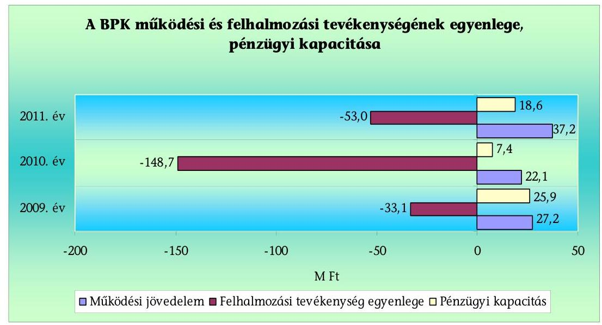

A múködés finanszírozását szolgáló bevételek növekedtek, a 2010. évi 2835,5 M Ft-ról 2011. év végére 2978,5 M Ft-ra, 5,0\%-kal változtak. A múködési bevételek változásában meghatározó szerepe volt a 2402,1M Ft-ról 2629,8 M Ftra változó ( $9,5 \%$-kal emelkedő) az OEP bevételeknek, amelyek a finanszírozási szabályok és a szakmai teljesítménymutatók kedvező változásának hatására növekedtek. A BPK pénzügyi helyzetét javította a 2010-2011. években kapott 113,0 M Ft és 104,8 M Ft konszolidációs támogatás. A BPK az ellenőrzött időszakban nem kapott támogatást a tulajdonostól. A BPK konszolidációs támogatás igénybevételére nem rendelkezett támogatási szerződéssel.

A BPK saját bevételei 2010-2011 között csökkentek, amely negatív hatással volt a pénzügyi egyensúly megteremtésére. A saját bevételek jelentős része (több, mint 60\%-a) - szolgáltatások ellenértékéből, magánrendelések miatti eszköz-bérbeadásból, intézményi ellátási díjakból, készletértékesítésből származott. A saját bevételek növelése érdekében a 2010. évtől kezdődően több intézkedést hozott a BPK, ezek ellenére a saját bevételek összege 2010-ről 2011re - céltartalék feloldás nélkül - 77,8 M Ft-tal (24,8\%-kal) csökkent.

Az ellenőrzött időszakban a múködési költségek és ráfordítások növekedésének mértéke nem érte el az infláció mértékét, a 2010. évi 2813,4 M Ft-ról a 2011. évre 2941,2 M Ft-ra (4,5\%-kal) változott. Ebben meghatározó szerepe volt a személyi juttatások és a dologi ráfordítások emelkedésének. A személyi juttatások 40,1 M Ft-tal, 3,2\%-kal emelkedtek. A dologi ráfordítások 75,5 M Ft-tal ( $4,8 \%$-kal) nőttek, költségeken belüli arányuk nem változott.

A gyógyító tevékenység közvetlen költsége és az E. Alapból származó bevétel különbsége (fedezeti összeg) összességében a 2010. évben 469,2 M Ft, a 2011. évben 652,7 M Ft volt. A fedezeti összeg a gazdasági, múszaki ellátás felosztott költségeire a 2010. és a 2011. évben sem nyújtott fedezetet.

---

A 2010. és a 2011. években a múködési bevételek és ráfordítások főbb jogcímeinek alakulását a következő diagram szemlélteti:
25. számú diagram
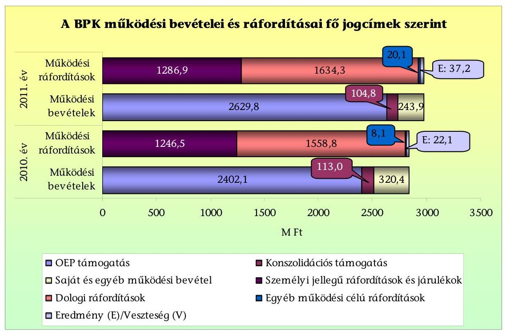

A felhalmozási tevékenység pénzügyi egyenlegének változása a felhalmozási kockázatot mérsékelte. A BPK 2009-2011 között 279,3 M Ft összegű fejlesztést valósított meg. A megvalósítás forrását közel 70\%-ban saját bevételek képezték, melyet pénzintézeti forrás és EU-s támogatás egészített ki. Az elvégzett beruházásokkal és felújításokkal az elszámolt 79,2 M Ft értékcsökkenésnek megfelelő eszközpótlást teljesítették. Az ellenőrzött időszakban beszerzett tárgyi eszközök jövőbeni fenntartási, üzemeltetési költségeit a beszerzések tervezése során nem számszerúsítették, nem ellenőrizték a múködtetés fedezetének rendelkezésre állását.

A finanszírozási múveletek egyenlege (hitelek és kölcsönök felvétele, törlesztése) 2010-2011 között pozitív volt, a pénzügyi lízing és a folyószámlahitel igénybevételének következtében. A pénzintézeti kötelezettség visszafizetése biztosított volt, arra a képződött múködési jövedelem fedezetet nyújtott. A BPK pénzügyi kapacitása 2010-2011 között 25,9 M Ft-ról 18,6 M Ft-ra csökkent.

A BPK összes kötelezettségeinek állománya a 2009. évet követően folyamatosan növekedett, záró értéke a 2009. évi 335,9 M Ft-ról a 2011. év végére 603,7 M Ft-ra (79,5\%-kal), 2012. június 30-án 620,2 M Ft-ra változott. A 2012. június 30 -ai kötelezettségekből $35,0 \mathrm{MFt}(5,6 \%)$ hosszú lejáratú, $585,2 \mathrm{MFt}$ ( $94,4 \%$ ) rövidlejáratú kötelezettség volt. A hosszú lejáratú kötelezettség pénzügyi lízing igénybevétele miatt keletkezett. A pénzintézeti kötelezettségek kötelezettségeken belüli aránya nem volt jelentős.

---

A BPK összes kötelezettsége, illetve ezen belül a szállítói és a lejárt határidejú szállítói állománya az alábbiak szerint alakult:
26. számú diagram
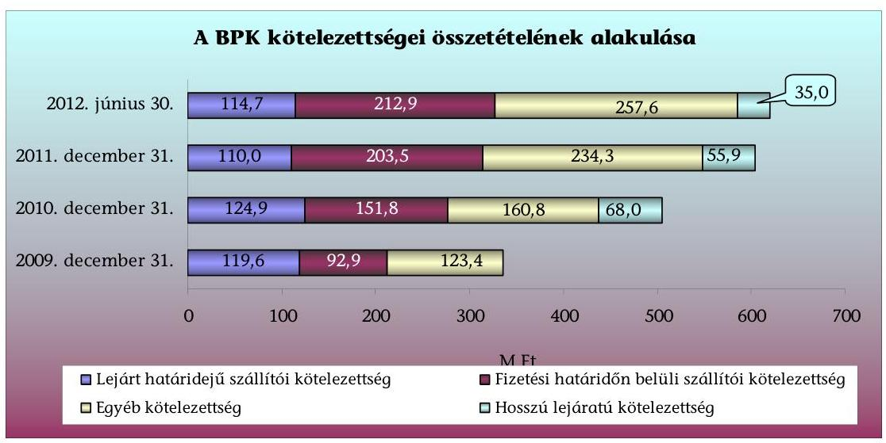

A lejárt esedékességű tartozások kedvezően alakultak az adósságkonszolidáció és a lejárt határidejú tartozások csökkentése, kezelése érdekében hozott intézkedések (a fizetési határidők 30 napról 60 napra történő módosítása) hatására. A 2010. évben a lejárt határidejú szállítói kötelezettségek összege 124,9 M Ft (45,1\%), 2012. június 30 -án $114,7 \mathrm{M}$ Ft (35,0\%) volt. A 2011. évi lejárt határidejú szállítói tartozást ( $110,0 \mathrm{MFt}$ ) 4,7 M Ft-tal meghaladta a 2012. június 30ai tartozás.

A BPK likviditása romlott, pénzállománya a 2010. évi rövidlejáratú kötelezettségek 1,0\%-át, 2011-ben 0,8\%-át fedezte. A mutató azt jelzi, hogy a kórház nem rendelkezik pénzeszközökkel a rövidlejáratú kötelezettségeinek teljesítéséhez. A likviditási ráta is romlott, értéke a 2010. évi 1,12-ről a 2011. év végére 1,03-ra csökkent. A likviditási mutatók elmaradtak a szakmailag elvárható mértéktől, azonban a 2011. év végén rendelkezésre álló, rövidtávon pénzzé tehető eszközök fedezetet biztosítanak a rövidlejáratú kötelezettségek teljesítéséhez. A likviditás javítása érdekében a BPK intézkedéseket tett (villamos energiaés gáztender), azonban azok hatása 2012. II. félévtől várható.

A kórház a belső kontrollokat kialakította - az önköltség-számítási szabályzat kivételével - rendelkezett a hatályos jogszabályokban előírt szabályzatokkal.

A BPK ágyszámaiban változás nem történt, az aktív fekvőbeteg szakellátásban átlagosan 205, a krónikus fekvőbeteg szakellátásban 208 múködő ággyal rendelkezett. A BPK E. Alapból származó bevétele 2009-ről 2010-re 187,7\%-kal (1567,0 M Ft-tal), 2010-ről 2011-re 9,5\%-kal (227,7 M Fttal) nőtt. A 2009-ről 2010-re történő bevétel növekedés elsődleges oka az aktív fekvőbeteg-ellátás 191\%-os TVK-növekménye, és a járóbeteg szakellátás 189\%os TVK-növekménye volt. A kórházi ellátás teljesítménymutatói - amelyek hatással voltak a pénzügyi egyensúlyi helyzet kedvező alakulására is - a következőképp változtak:

---

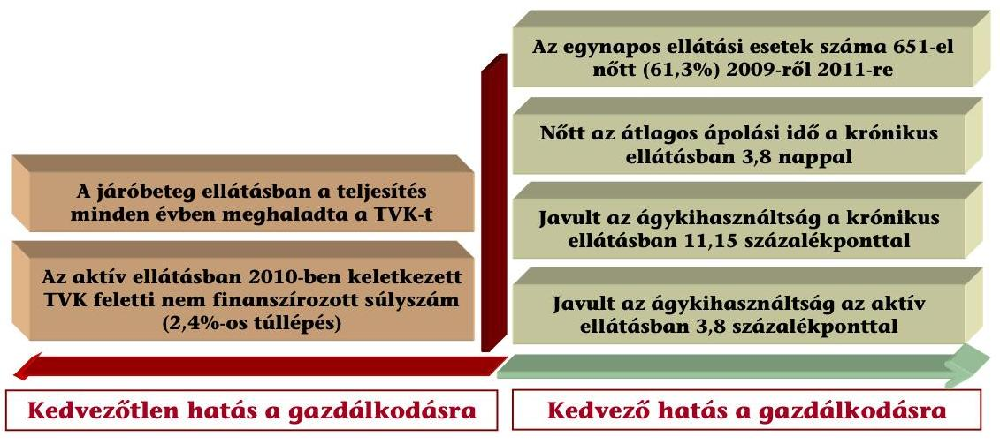

A BPK a létszámgazdálkodását a szakmai minimumelvárások alapján folytatta. Az üres álláshelyeket a feladatellátáshoz előírt, szükséges létszámként értelmezte. A 2009. évben a korábbi vagyonkezelő (Hospinvest Zrt.) múködtetési időszakából örökölt állományi létszámokat és struktúrát a kórház új működtetője áttekintette, felülvizsgálta, majd létszám-kiigazításokat végzett. Ennek eredményeként a 2010. évi 473,9 fős betöltött álláshely 2012. év I. félév végére 454,7 főre ( $4 \%$-kal) csökkent. Az állománycsökkenést a szakdolgozók (alapvetően nővérek) és egyéb kisegítők (nem egészségügyi foglalkoztatottak) létszám-racionalizálása (átcsoportosítás és határozott időre szóló szerződések meg nem újítása), valamint a szakorvosok kilépése okozta. A szakdolgozók száma a 2010. évi 283 fơről 2012. év I. félévre 271 fơre 12 fốvel, míg az egyéb kisegítő dolgozóké 59 fôről 52 fốre, 7 fốvel csökkent. A 2010. évi szakorvosok száma 32 fôről (alapvetően teljes munkaidősök) a 2012. év I. félévre 28 fôre ( $14 \%$-kal) csökkent. A hiányzó létszámot - a pótlásra tett intézkedések hatására - a 2012. év II. félévére tudták biztosítani (1 fő szakorvos kivételével). A 2010. évi létszám-racionalizálással a 2011-2012. év I. félévi teljesítménymutatók nem romlottak. A 2010-2011. években elbocsátással járó létszámcsökkentés nem volt. A költségek részbeni fedezetére a BPK pályázatok útján kiegészítő forrást szerzett, amellyel a pénzügyi helyzetének javításához hozzájárult. Az egyéb kisegítők állománycsoporton belüli hiányának részbeni pótlására, a munkaügyi központ által kiközvetített, regisztrált álláskeresők foglalkoztatásához a 2010. évben 3,2 M Ft (5 fő), a 2011. évben 8,2 M Ft (14 fő) összegben kapott bér- és járulékok fedezetére támogatást. A 2011. évben 20,3 M Ft összegben - a munkabérek nettó értékének 2012. évi megőrzéséhez központi támogatásban részesült.

A BPK - pénzügyi helyzetének javítása érdekében - a 2009-2012. év I. félév közötti időszakban a gyógyszerfelhasználás költségének csökkentésére intézkedéseket nem hozott (a gyógyszerbeszerzést közreműködői szerződés alapján bonyolította le). A unit dose, daily dose gyógyszerelést alkalmazták. Az összes gyógyszerkiadáshoz képest a térítésmentesen kapott gyógyszerek aránya a 2009. évben 40,4\% (45,3 M Ft), a 2012. év I. félévében 40,0\% (18,7 M Ft) volt. Az összes gyógyszerbeszerzési költség a 2010. évben az OEP bevétel 3,7\%-át ( 94,7 M Ft), a 2011. évben az OEP bevétel 3,3\%-át (89,7 M Ft) tette ki. Generi-

---

kus készítményeket a gyógyszerköltségek csökkentésére a beszerzési többletköltségek növekedése miatt nem alkalmaznak.

A BPK a szakmai anyagok költségének csökkentésére költségmonitoringot és osztályos keretrendszert múködtetett. A szakmai anyag készletek forgási sebessége 243 -ról 312 -re ( $28 \%$-kal) nőtt 2010-ről 2011-re. A fajlagos beszerzési költségindex csökkent és 23,8 százalékponttal az országos átlagnövekedés alatt maradt. Az országos átlag alatti fajlagos költségnövekedés a kórházak átlagánál pozitívabb hatást gyakorolt a pénzügyi helyzetre.

A BPK a 2011. évtől folyamatos költségmonitoringot, keretrendszert múködtetett a közműfelhasználásban. Az egy ápolási napra eső villamos energia felhasznált mennyisége 2009-ről 2011-re 30\%-kal emelkedett. A villamos energia vételezési szerződést a korábbi szolgáltató (ÉMÁSZ) módosította, az átlagárat $43,47 \mathrm{Ft} / \mathrm{kWh}$-ról $32,32 \mathrm{Ft} / \mathrm{kWh}$-ra csökkentette. A csökkentés eredményeként a 2010. évben 17,0 M Ft összegű megtakarítást értek el az előző évhez képest. A 2012. év I. félévében a villamos energia beszerzést megtendereztették, amelynek eredményeként szolgáltató váltásra került sor. Figyelembe véve az időközi villamos energia áremelkedést, valamint az új szolgáltató által kínált kedvezőbb átlagárat, a 2012. év I. félévében az áremelkedést mintegy $2,0 \mathrm{Ft} / \mathrm{kWh}$-val ( $10,0 \%$-kal) mérsékelték. Kedvezőtlen volt, hogy a vásárolt gáz egy ápolási napra eső mennyisége 2009-ről 2011-re 5,02 m³-ről $5,45 \mathrm{~m}^{3}$-re ( $9 \%$-kal) nőtt. 2012-ben közbeszerzés keretében gázszolgáltatót váltottak.

A hőenergiát saját hőközpontban állították elő, a textilmosatást és a betegélelmezést kiszervezést követően vásárolták meg. A saját előállítású hő önköltsége $800 \mathrm{Ft} /$ GJ-ról $870 \mathrm{Ft} / \mathrm{GJ}$-ra, az infláció felett 1 százalékponttal emelkedett 2010-2011-ben. Kedvező volt, hogy a textilmosatás fajlagos költsége $211 \mathrm{Ft} / \mathrm{kg}$-ról $186 \mathrm{Ft} / \mathrm{kg}$-ra csökkent 2010-ről 2011-re, a betegélelmezés árváltozása pedig $8 \%$-kal az infláció alatt maradt.

A BPK nagyértékú orvosi gépek-múszereinek kihasználtsága nem javult. A CT berendezés kapacitáskihasználtsága 2010-2012. I. félév között hullámzó volt: a 2010. évi kihasználtság 75\%-os (4110 eset), a 2011. évi 65\%-os ( 3570 eset) volt, illetve a 2012. I. félévi $77 \%$-on ( 2120 eset) teljesült. 2012. I. félévben az önköltség mértéke közel a 2010. évivel azonos volt ( $8413 \mathrm{Ft} /$ eset). A központi műtő kihasználtsága 2010-2012. év I. félévben ingadozással átlagosan $77 \%$ volt: 2010-ben 4191 eset (78\%), 2011-ben 4326 eset (80\%) és 2012. I. félévben 1983 eset $(73 \%)$.

# 1.8. Petz Aladár Megyei Oktató Kórház, Győr (PAMOK) 

A PAMOK pénzügyi egyensúlya a 2009-2011. években döntően a konszolidációs támogatás miatt javult. A finanszírozási múveletek nélküli (GFS) pozíció ${ }^{38}$ a 2009. és a 2010. évben negatív értéket mutatott,

[^0]
[^0]:    ${ }^{38}$ A finanszírozási műveletek nélküli (GFS) pozíció a 2009. évben -1185,2 M Ft, a 2010. évben -469,0 M Ft, a 2011. évben 347,5 M Ft volt.

---

a múködési és felhalmozási tevékenység együttes egyenlege volt, míg a 2011. évben pozitív értéket mutatott. Konszolidációs támogatás nélkül a pénzügyi kapacitás minden évben negatív értéket mutatott. Az összes szállítói kötelezettség év végi állománya az előző évhez viszonyított 2010. évi csökkenés után a 2011. évben növekedett, az éves dologi ráfordítás 39,4\%át (3157,5 M Ft-ot) tette ki. Az összes kimutatott szállítói kötelezettség a 2012. év I. félév végén 2367,2 M Ft volt. A belső intézkedések a pénzügyi helyzetet javították, de nem voltak elégségesek a szállítói kötelezettségállomány érdemi csökkenéséhez.

A PAMOK az ellenőrzött időszakban - a GYEMSZI fenntartásába kerülésig megyei önkormányzati költségvetési intézményként múködött. Gazdálkodásában a CLF módszer szerinti pénzügyi egyensúly a 2009. és a 2010. években nem volt biztosított. A múködési tevékenység eredménye (működési jövedelem) és a pénzügyi kapacitás negatív értékei a 2011. évben változtak pozitív értékűre a konszolidációs támogatás hatására. A konszolidációs támogatások nélkül a múködési jövedelem 2010-ben -1237,5 M Ft, 2011ben -18,0 M Ft volt. A veszteség csökkenését a saját bevételek, a fenntartói- és OEP támogatás növekedése eredményezte. A felhalmozási tevékenység pénzügyi egyenlege a 2009-2011 közötti időszak egészében negatív volt, a felhalmozási célokra fordítható bevételek nem nyújtottak fedezetet a beruházások, felújítások finanszírozására, ami felhalmozási kockázatot jelentett.

A PAMOK az adósságok rendezésére konszolidációs támogatásban részesült. A 2010. évben kapott 787,5 M Ft konszolidációs támogatásból 681,7 M Ft a lejárt szállítói tartozás, míg 105,8 M Ft a várólisták csökkentésére volt felhasználható. A 2011. évben kapott 438,3 M Ft konszolidációs támogatás teljes összege a lejárt szállítói tartozás csökkentésére volt felhasználható. A KEHI a konszolidációs támogatás jogszerú felhasználását ellenőrizte.

A múködési és felhalmozási tevékenység egyenlege és a pénzügyi kapacitás a 2009-2011 közötti időszakban az alábbiak szerint alakult:
27. számú diagram
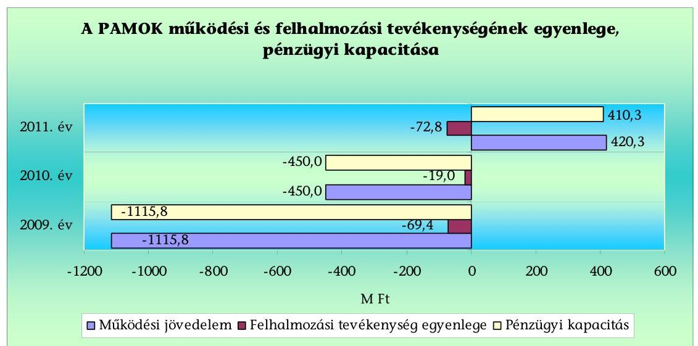

---

A múködés finanszírozását szolgáló bevételek az előző évhez viszonyítva a 2010. évre 13 193,1 M Ft-ra (5,3\%-kal, 662,2 M Ft-tal), a 2011. évre 14 328,3 M Ft-ra (8,6\%-kal, 1135,2 M Ft-tal) emelkedtek. Az előző évhez képest a múködési bevétel növekedést a 2010. évben a 787,5 M Ft konszolidációs támogatás, a 2011. évben pedig a fenntartói támogatás $206,2 \mathrm{M}$ Ft-os, a teljesítményarányos OEP finanszírozás 1016,2 M Ft-os, és a saját múködési bevételek $215,8 \mathrm{M}$ Ft-os növekedése eredményezte. A múködési bevételeken belül minden évben meghatározó volt az OEP-től származó támogatások és a saját bevételek összege. A bevételek összegének alakulását az ellátás finanszírozási szabályainak változása, a konszolidációs támogatások és a saját bevételek növelésére irányuló kórházi intézkedések együtt befolyásolták. A finanszírozás szabályainak változása, az előző évhez viszonyítva a 2010-ben finanszírozás csökkenést okozott. A PAMOK pénzügyi helyzetét javító fenntartói támogatás aránya és összege változó volt, a 2009. évben a múködési bevételek 2,0\%-át (250,8 M Ft-ot), a 2010. évben 0,3\%-át (40,7 M Ft-ot), a 2011. évben 1,7\%-át (247,0 M Ft-ot) tette ki.

A PAMOK saját múködési bevételei a 2009-2011 közötti időszakban növekedtek, amely pozitív hatással volt a pénzügyi helyzetre. A három év együttes saját bevételeiből ( 7123,8 M Ft-ból) összesen 6256,8 M Ft (a saját múködési bevételek $90,3 \%$-a) három jogcímen elszámolt bevételekből - áru- és készletértékesítés ellenértékéből, szolgáltatások ellenértékéből és intézményi ellátási díjakból - származott. A saját múködési bevételek növelése érdekében a PAMOK az ellenőrzött időszakban intézkedéseket hozott (más intézetek részére egészségügyi szolgáltatások végzése, termékvizsgálati szerződés kötése, bérleti díjak emelése, ápolási osztályon a térítési díjak emelése, a foglalkozásegészségügyi szolgálatnál az ellátási kör bővítése, szerződés kötése külső cégekkel közép- és felsővezetők egészségügyi szűrésére). A kórházi intézkedések hatására a 2010. évben a szolgáltatások ellenértéke 13,7 M Ft-tal ( $9,5 \%$-kal), az intézményi ellátási díjakból befolyt összeg 27,3 M Ft-tal ( $15,4 \%$-kal) emelkedett az előző évhez viszonyítva. A 2011. évben a szolgáltatások ellenértéke 68,9 M Ft-tal ( $43,8 \%$-kal), a bérleti díjak összege 21,3 M Ft-tal ( $31,0 \%$-kal) haladta meg a 2010. évi bevételt.

A múködési költségek és ráfordítások az előző évhez viszonyítva a 2010. évre 13 643,1 M Ft-ra (3,6 M Ft-tal) csökkentek, a 2011. évre 13 908,0 M Ft-ra (1,9\%-kal, 264,9 M Ft-tal) növekedtek. A létszámcsökkentés és az üres állások növekedése miatt a személyi jellegú ráfordítások és a munkaadókat terhelő járulékok együttes összege a 2009. évi 6288,0 M Ft-ról a 2010. évre 5999,0 M Ft-ra (4,6\%-kal, 289,0 M Ft-tal), a 2011. évre 5825,0 M Ft-ra (2,9\%$\mathrm{kal}, 174,0 \mathrm{M}$ Ft-tal) csökkent. A dologi ráfordítások a 2009. évi 7345,7 M Ftról a 2010. évre 7598,4 M Ft-ra (3,4\%-kal, 252,7 M Ft-tal), a 2011. évre 8024,0 M Ft-ra (5,6\%-kal, 425,0 M Ft-tal) növekedtek. A dologi ráfordítások öszszege a 2009. évről a 2011. évre 678,3 M Ft-tal ( $9,2 \%$-kal) emelkedett a PAMOK takarékossági intézkedései (új gyógyszer és szakmai anyag keretek kialakítása és azok betartásának kontrollálása, szolgáltatási szerződések felülvizsgálata és módosítása, a központi kazánház üzemeltetésének visszaszervezése) ellenére. A gyógyító tevékenység közvetlen költségét a PAMOK ellátás-típusonként kimutatta, amely szerint a fedezeti összeg a 2009-2011. években nem nyújtott fedezetet a gazdasági-múszaki ellátás felosztott költségeire.

---

A múködési bevételek és ráfordítások fő jogcímek szerinti összetételét és alakulását a következő diagram szemlélteti:
28. számú diagram
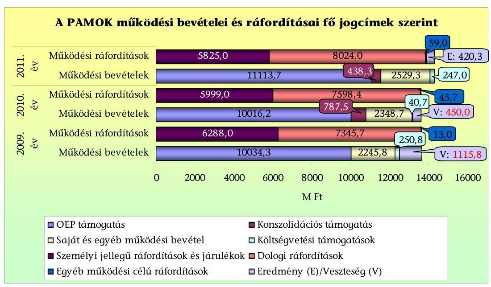

A 2009-2011. években a PAMOK 233,3 M Ft beruházást és 118,1 M Ft felújítást végzett. A 2011. évben 50,0 M Ft külső forrás (fenntartói kölcsön) bevonására volt szükség, amelyből 10,0 M Ft-ot még 2011 szeptemberében vissza is fizettek. A felhalmozási tevékenység finanszírozására ezen kívül más szervektől kapott támogatások ( $89,1 \mathrm{M} \mathrm{Ft}$ ), fenntartói támogatás ( $59,9 \mathrm{M} \mathrm{Ft}$ ) és saját bevételek ( $41,2 \mathrm{M} \mathrm{Ft}$ ) is szolgáltak. Az eszközpótlásra fordított összeg a 2009-2011. években $118,2 \mathrm{M}$ Ft volt, amely az elszámolt 1069,7 M Ft értékcsökkenésnek mindössze $11,0 \%$-át tette ki ${ }^{39}$. A PAMOK a fejlesztések során vállalta a beszerzett tárgyi eszközök jövőbeni fenntartási, üzemeltetési költségeit.

A PAMOK kötelezettségeinek állománya a 2009. december 31-ei 3398,0 M Ft-ról 2010. december 31-ére a lejárt szállítói kötelezettségek csökkenése miatt 3203,4 M Ft-ra csökkent, 2011. december 31-ére a fizetési határidőn belüli szállítói, valamint az egyéb kötelezettségek növekedése miatt 3549,1 M Ft-ra növekedett. A 2012. június 30 -ai kötelezettségek állományából 40,0 M Ft-ot ( $1,6 \%$-ot) a hosszú lejáratú fenntartói kölcsön, 2458,3 M Ft-ot ( $98,4 \%$-ot) a rövidlejáratú kötelezettségek tettek ki. A 2010. évben kapott konszolidációs támogatás hatására a lejárt szállítói tartozás a 2009. december 31-ei 2122,5 M Ft-ról 2010. év végére 1795,4 M Ft-ra csökkent, majd a 2011. év végére a konszolidációs támogatás ellenére 1837,0 M Ft-ra növekedett. A 2012. év I. félévében a lejárt szállítói tartozások csökkentésére letéti számla fel-

[^0]
[^0]:    ${ }^{39}$ Nem tartalmazza a fenntartó által végzett és folyamatban lévő fejlesztést, amelynek várható bekerülési értéke $11,3 \mathrm{Mrd}$ Ft.

---

használásának szabályairól szóló BM rendelet ${ }^{40}$ alapján 766,6 M Ft konszolidációs támogatásban részesült, a lejárt szállítói tartozások összege 2012. június 30-án 1311,8 M Ft volt. Önkormányzati biztos, illetve az állami tulajdonba vétel után költségvetési felügyelő kirendelésére az ellenőrzött időszakban nem volt szükség. A 2009-2012. év I. félév vége között a szállítói tartozások után kifizetett késedelmi kamat és kötbér mindösszesen 401,6 M Ftot (az ugyanezen időszakban a szállítói állomány csökkentésére kapott konszolidációs támogatás $21,3 \%$-a) tett ki. Pénzintézeti kötelezettség nem volt.

A PAMOK összes, illetve ezen belül a szállítói és a lejárt határidejű szállítói állománya az alábbiak szerint alakult:
29. számú diagram
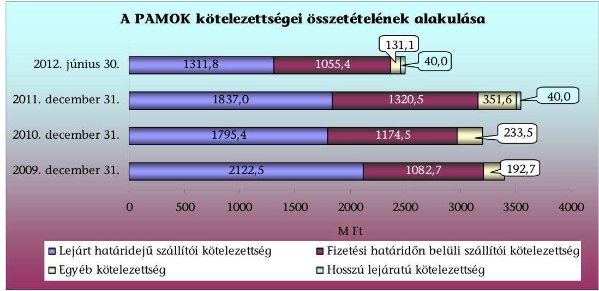

A PAMOK adatszolgáltatása alapján számított likviditási ráta az ellenőrzött időszakban mérsékelten emelkedett, értéke a 2009. december 31-ei 0,19-ről 2011. december 31-re 0,29-re változott. A készpénz-likvidítási mutató alapján a 2009. december 31-én a fennálló rövidlejáratú kötelezettségek 2,2\%-ára, 2011. december 31-én 5,0\%-ára nyújtott fedezetet a rendelkezésre álló pénzállomány. A likviditást javító kórházi intézkedések (követelés- és kötelezettségkezelési rendszer múködtetése, fizetési átütemezések kezdeményezése) ellenére a likvidítási helyzet továbbra is kedvezőtlen volt, a likviditási mutatók jelentősen elmaradtak a szakmailag elvárható mértéktő. A 2011. december 31-én rendelkezésre álló forgóeszközök nem nyújtanak elegendő fedezetet a rövid lejáratú kötelezettségek teljesítésére.

A pénzügyi egyensúlyi helyzet megteremtése érdekében a 2009. év és 2012. év I. félév között - a vásárolt közüzemi szolgáltatásoknál, gyógyszer-, szakmai anyaggazdálkodásnál - folyamatos költség monitoring- és keretrendszert múködtettek. A PAMOK a belső kontrollokat kialakította, azonban nem szabályozta az eszközök és források leltárkészítését és értékelését.

[^0]
[^0]:    ${ }^{40}$ A 12/2012. (III. 30.) BM rendelet a Magyarország 2012. évi központi költségvetéséről szóló 2011. évi CLXXXVIII. törvény 76. §-a szerinti letéti számla felhasználásának szabályairól.

---

A PAMOK ágyszámaiban lényegi változás nem történt, a 2009-2011 közötti időszakban az aktív fekvőbeteg szakellátásban átlagosan 1038, 2012. június 30-án 1041 múködő ággyal, a krónikus fekvőbeteg-szakellátásban a 20092012. év I. félév közötti időszakban 402 múködő ággyal rendelkezett. A pénzügyi egyensúlyi helyzet javulása nem az ellátási teljesítmények alakulásával állt összefüggésben. Egyes kiemelt teljesítménymutatók a következők szerint változtak:
9. számú ábra
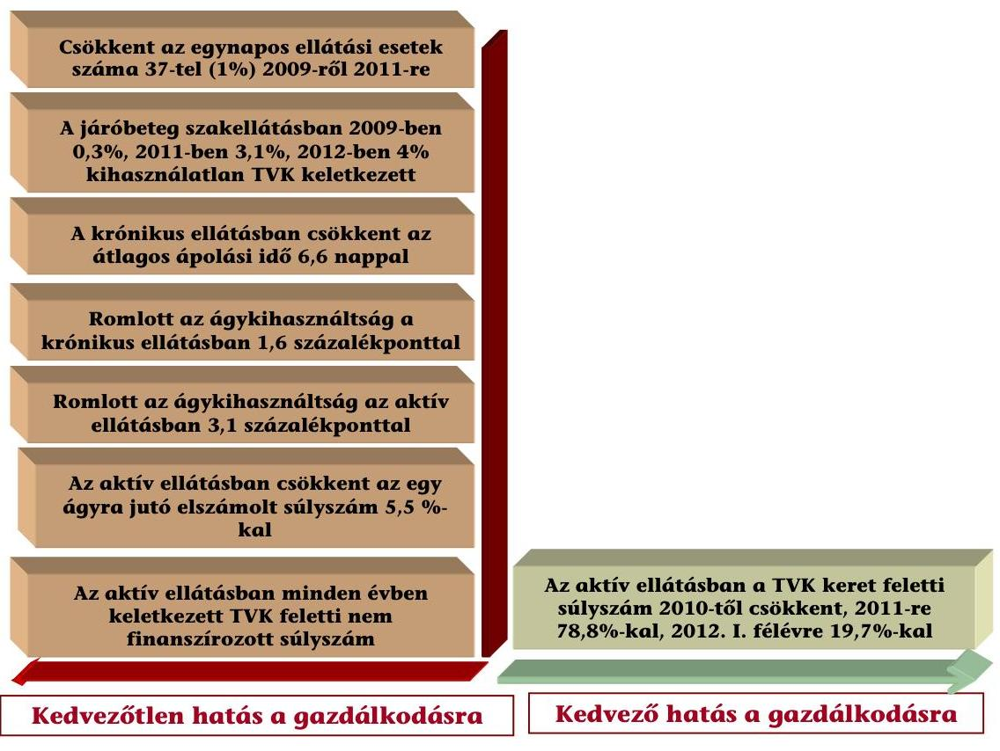

A PAMOK munkaerő-hiánya (üres álláshelyek száma) a 2009-2012. év I. félév közötti időszakban a hiányzó létszám pótlására hozott kórházi intézkedések - közmunka program, EU-s támogatások igénybevétele - ellenére nőtt. Az engedélyezett álláshelyek száma a 2009. évi 2119-ről a 2012. év I. félévére 2169-re emelkedett. A betöltetlen álláshelyek száma a 2009. évi 3-ról a 2012. év I. félévére 185-re emelkedett. A költségek csökkentése érdekében - kisegítő és pénzügyi-számviteli munkakörökben a 2009-2011. években folyamatosan növekvő létszámmal - közmunka program keretében foglalkoztattak munkavállalókat, illetve éltek a pályázati lehetőségekkel, javítva ezzel a PAMOK pénzügyi helyzetét. A közmunka program keretében történő foglalkoztatáshoz a 2009-2012. év I. félév közötti időszakban összesen 97,7 M Ft támogatásban részesültek. A Munkaerőpiaci Alap támogatásával a 2011. évben kettő főt, a 2012. év I. félévében egy főt alkalmaztak, amelyhez összesen 1,3 M Ft támogatást kaptak. EU-s pályázaton hat fő alkalmazására a 20102011. években 40,5 M Ft támogatást nyertek el. A létszámcsökkentés terheinek mérséklésére a 2009. évben 36 főt, a 2010. évben 12 főt érintően össze-

---

sen 65,0 M Ft támogatásban részesültek, amely a létszámcsökkentés egyszeri 159,9 M Ft-os költségének 40,7\%-át fedezte.

A PAMOK intézkedéseket hozott a gyógyszerfelhasználás költségének csökkentésére. Felkutatták az árengedményeket, az áralkuk eredményeként árcsökkentést értek el, 2010. december 1-jétől szigorították a keret-gazdálkodást valamint az ellenőrzött időszakban konszignációs raktárt múködtettek. Az összes gyógyszerköltséghez képest a térítésmentesen kapott gyógyszerek aránya a 2009. évben 35,1\% (411,1 M Ft), a 2012. év I. félévében 19,5\% (101,3 M Ft) volt. Az összes gyógyszerbeszerzési költség a 2009. évben az OEP bevétel 11,7\%át (1170,3 M Ft), a 2010. évben 10,7\%-át (1158,2 M Ft), a 2011. évben 9,7\%-át (1117,6 M Ft), a 2012. év I. félévében 9,7\%-át (519,4 M Ft) tette ki. A gyógyszerköltségek csökkentésére a 2010. évben 94, a 2011. évben 110 féle készítményt váltottak originálisról generikus készítményre.

A PAMOK több intézkedést hozott a szakmai anyagok beszerzési költségének csökkentésére: figyelemmel kísérte a szakmai anyagok beszerzési költségét, költség-monitoring, költségkeret-rendszert múködtetett, a 2010. évben új szakmai anyag kereteket alakított ki, valamint a 2010. évtől kezdődően módosította a szállítási szerződéseket. Mindezekből a 2010. évben 0,2 M Ft, a 2011. évben 0,6 M Ft, a 2012. év I. félévében 0,4 M Ft megtakarítása keletkezett. Hátrányos volt, hogy a szakmai anyag készletek forgási sebessége a 2009. évről a 2011. évre 129,5-ről 107,8-re (16,8\%-kal) csökkent, továbbá a szakmai anyagok fajlagos beszerzési költségindexe meghaladta az országos átlagos növekedést, 2,8 százalékponttal.

A PAMOK a pénzügyi egyensúlyának javítása érdekében figyelemmel kísérte a vásárolt közszolgáltatások alakulását, költség-monitoringot, költségkeretrendszert múködtetett. A vásárolt villamos energia közszolgáltatás szerződését a 2011. évben módosította, amelyből a 2011. évben 60,2 M Ft, a 2012. év I. félévében 30,1 M Ft megtakarítása keletkezett. Az egy ápolási napra vetített villamos energia felhasználás $1,3 \%$-kal, a távhő-melegvíz felhasználás $8,1 \%$-kal, a vízfelhasználás-szennyvíz mennyiség 12,0\%-kal csökkent a 2009. évről a 2011. évre. Az egy ápolási napra jutó gázenergia-hordozó felhasználás a 2009. évi $0,4 \mathrm{~m}^{3}$-ről a 2011. évre $1,6 \mathrm{~m}^{3}$-re emelkedett a központi kazánház üzemeltetésének 2011. évi visszaszervezése miatt. A megtett kórházi intézkedések, a fajlagos felhasználások alakulása kedvező hatást gyakoroltak a PAMOK pénzügyi helyzetére.

A segédüzemi tevékenységek költségeinek alakulását is folyamatosan figyelemmel kísérték. A mosatás fajlagos költsége a 2009. évi $210,7 \mathrm{Ft} / \mathrm{kg}$-ról a 2011. évre $214,3 \mathrm{Ft} / \mathrm{kg}$-ra ( $1,7 \%$-kal) emelkedett. A betegélelmezés korábbi szerződéseit a 2011. évben módosították, így az egy teljesített betegélelmezési napra jutó rezsi költség $1456,7 \mathrm{Ft} /$ nap összegről $1336,4 \mathrm{Ft} /$ nap összegre, $8,3 \%$-kal csökkent a 2009. évről a 2011. évre. A rezsi költség csökkentésére irányuló intézkedés kedvező hatást gyakorolt a PAMOK pénzügyi helyzetére.

A PAMOK-nak nincs átlagkapacitás-adata a központi mútőjéről, de a tényleges teljesítése 2009-ről 2011-re 6,5\%-kal visszaesett (22 120 műtétről 20 681-re), következésképpen a kapacitáskihasználása is vélhetően csökkent. A laborautomaták kihasználtsága a 2009. évi 85,1\%-ról a 2011. évre 87,5\%-ra

---

javult. A laborautomaták és a központi műtő üzemeltetésének fajlagos költsége (önköltsége) a 2009. évről a 2011. évre az infláció alatti mértékben nőtt, a laborautomatáké $5,3 \%$-kal, a központi műtőé $6,3 \%$-kal. Mindezek a PAMOK pénzügyi helyzetére pozitív hatást gyakoroltak. A CT berendezés kihasználtsága 76,5\%-ról 85,2\%-ra javult 2010-ről 2011-re. Hátrányos volt viszont, hogy az önköltsége az inflációt meghaladóan, azaz 11,1 százalékponttal emelkedett.

# 1.9. Kaposi Mór Oktató Kórház, Kaposvár (KMOK) 

A KMOK pénzügyi egyensúlya a finanszírozási múveletek nélküli (GFS) pozíció ${ }^{41}$ alapján a 2009. és a 2010. évben nem volt biztosított, a múködési és felhalmozási tevékenység együttes egyenlege negatív volt. A pénzügyi helyzet javulását mutatja, hogy a konszolidációs támogatás, a bevételnövelő, költségmegtakarító intézkedések és a keretgazdálkodás eredményeként a múködési tevékenység negatív egyenlege csökkent, illetve 2011-ben múködési jövedelem keletkezett. A felhalmozási tevékenység negatív egyenlege a 2009-2011. évek között folyamatosan növekedett. A pénzügyi helyzet javulásának hatására a KMOK szállítói kötelezettségei csökkentek. A 2011. évi 1827,0 M Ft szállítói kötelezettség a dologi ráfordítások 27,4\%-át tette ki. A számviteli nyilvántartások szerint 2012. június 30 -án 1244,9 M Ft szállítói állománnyal rendelkezett.

Az ellenőrzött időszakban költségvetési intézményként múködő KMOK gazdálkodásában a CLF módszer szerinti múködési pénzügyi egyensúly a 2009. és a 2010. években nem volt biztosított, a múködési jövedelem és a pénzügyi kapacitás negatív volt. A 2011. évben a konszolidációs támogatás, valamint a bevételnövelő és költségcsökkentő intézkedések hatására - a saját múködési bevételek növekedésének, és a múködési ráfordítások csökkenésének eredményeként a múködési jövedelem és a pénzügyi kapacitás is pozitív volt. A konszolidációs támogatások nélkül a KMOK múködési jövedelme 2010-ben -1309,1 M Ft, 2011-ben 161,6 M Ft volt. A változást 2010-ben a múködési ráfordítások növekedése és a fenntartótól kapott támogatások csökkenése okozta. A felhalmozási tevékenység egyenlege 2009-2011 közötti időszak egészében negatív volt, a felhalmozási célokra fordítható bevételek nem nyújtottak fedezetet a beruházások, felújítások finanszírozására, ami felhalmozási kockázatot jelentett.

A KMOK adósságának rendezése érdekében konszolidációs támogatásban részesült 2010-ben 554,9 M Ft, 2011-ben 360,3 M Ft összegben. A konszolidációs támogatás felhasználására külön intézkedési tervet nem készítettek, azonban a 2009. és a 2010. évben a likviditási egyensúly megtartása érdekében a szakmai és a gazdálkodási feladatok ellátását főigazgatói utasítások szabályozták. A konszolidációs támogatások kedvezően hatottak a kórház szakmai tevékenységére, a várólisták csökkentésére. A KEHI a 2010-2011. évi konszolidációs támogatást ellenőrizte, visszafizetési kötelezettséget nem állapított meg.

[^0]
[^0]:    ${ }^{41}$ A finanszírozási múveletek nélküli (GFS) pozíció a 2009. évben -1102,9 M Ft, a 2010. évben -914,2 M Ft, a 2011. évben 146,9 M Ft volt.

---

A múködési és felhalmozási tevékenység egyenlege, a pénzügyi kapacitás 20092011 között a következők szerint alakult:
30. számú diagram
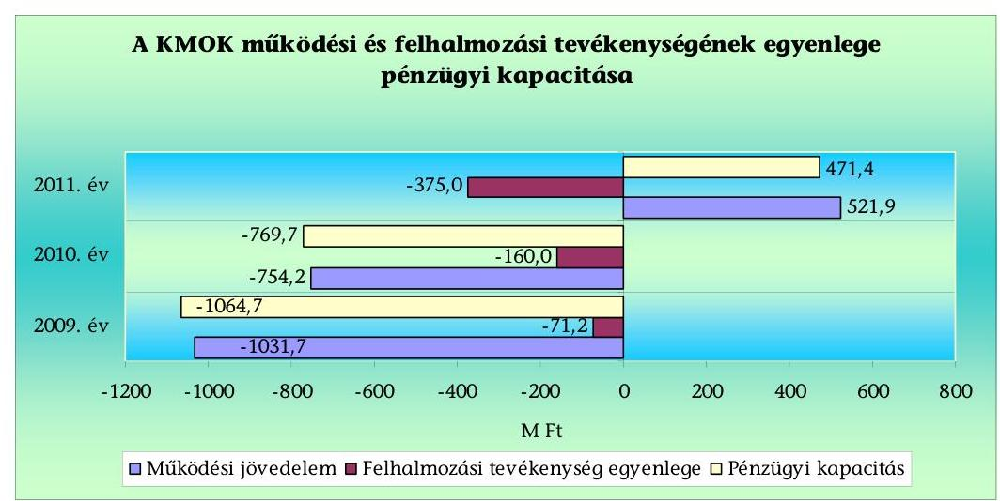

A múködés finanszírozását szolgáló bevételek 2010-re 10 853,4 M Ft-ra (7,0\%-kal, 707,0 M Ft-tal), a 2011. évre 11 701,2 M Ft-ra (7,8\%-kal, 848,2 M Fttal) emelkedtek. A 2010. évi múködési bevétel növekedést az 554,9 M Ft konszolidációs támogatás és a saját múködési bevételek 362,4 M Ft-os növekedése eredményezte. A múködési bevételek növekedését 2011-ben a 360,3 M Ft-os konszolidációs támogatás, valamint a fenntartói támogatás $28,9 \mathrm{M}$ Ft-os és a saját múködési bevételek 482,1 M Ft-os növekedése idézte elő.

A múködési bevételeken belül minden évben meghatározó volt az OEP-től származó támogatások és a saját bevételek összege. Az OEP-től származó bevételek összegének alakulását a finanszírozási szabályok változása, és a konszolidációs támogatások, míg a saját bevételek alakulását az azok növelésére irányuló intézkedések befolyásolták. A fenntartótól kapott támogatás javította a kórház pénzügyi helyzetét. A fenntartói támogatás aránya és összege változó volt, a 2009. évben a múködési bevételek 3,2\%-át (325,3 M Ft-ot), a 2010. évben $0,9 \%$-át ( $98,3 \mathrm{M}$ Ft-ot), a 2011. évben 1,1\%-át (127,2 M Ft-ot) tette ki.

A saját múködési bevételek 2009-2011 között növekedtek, mely pozitív hatással volt a pénzügyi helyzetre. A saját bevételek (a három évben összesen 6055,5 M Ft) jelentős része, összesen 5038,3 M Ft (83,2\%) az intézmény által működtetett, közvetlen lakossági ellátást szolgáló gyógyszertár áru- és készletértékesítéséből származott. A KMOK a saját múködési bevételek növelése érdekében az ellenőrzött időszakban intézkedéseket hozott (lakossági ellátást is biztosító patika kialakítása, a fizetős ellátások körének bővítése, térítésköteles egészségügyi szolgáltatások nyújtására gazdasági társaság alapítása).

A KMOK a gazdasági társaság múködéséhez szükséges személyi és tárgyi feltételeket meghatározott térítési díj ellenében biztosította, amely a tényleges használat alapján, a havi esetszám alapul vételével került elszámolásra. A térítési díj megállapítása a KMOK önköltségszámítása, valamint az OEP finanszírozás alapulvételével történt. A gazdasági társaság olyan egészségügyi szolgáltatásokat

---

nyújtott az igénybe vevők részére, amelyeket az OEP nem finanszíroz, vagy hoszszú várakozási idő után érhető el a fekvő-, járóbeteg és a diagnosztika területén. Az egészségügyi szolgáltatásokat az ellátottak térítéskötelesen, az OEP által finanszírozott ellátáson kívül, attól elkülönítetten vehették igénybe.

Az intézkedések hatására a 2010. évben az áru- és készletértékesítés ellenértéke 478,9 M Ft-tal ( $40,0 \%$-kal) emelkedett az előző évhez viszonyítva. A 2011. évben az áru- és készletértékesítés ellenértéke 493,4 M Ft-tal (29,4\%-kal), a szolgáltatások ellenértéke 10,4 M Ft-tal ( $46,8 \%$-kal) haladta meg a 2010. évi bevételt.

A múködési költségek és ráfordítások a 2010. évre 11 607,6 M Ft-ra (3,8\%-kal, 429,4 M Ft-tal) növekedtek, majd 2011-re 11 179,7 M Ft-ra (3,7\%$\mathrm{kal}, 427,9 \mathrm{M}$ Ft-tal) csökkentek az előző évhez viszonyítva. A személyi jellegú ráfordítások és munkaadókat terhelő járulékok együttes összege a 2009. évi 4850,5 M Ft-ról a 2010. évre 4634,2 M Ft-ra (4,5\%-kal, 216,3 M Ft-tal) csökkent. A 2011. évben a személyi jellegű ráfordítások és a munkaadókat terhelő járulékok összege tovább csökkent 4453,3 M Ft-ra (3,9\%-kal, 180,9 M Fttal). A változást a műszaki- és élelmezési feladatok ellátása területén végrehajtott létszám- és álláshely csökkentés, valamint a betöltetlen álláshelyek számának átmeneti - fluktuációból eredő - növekedése eredményezte.

A dologi ráfordítások a 2009. évi 6295,0 M Ft-ról a 2010. évre 6954,0 M Ft-ra (10,5\%-kal, 659,0 M Ft-tal), az inflációt meghaladó mértékben növekedtek, majd a 2011. évre 6677,5 M Ft-ra (4,0\%-kal, 276,5 M Ft-tal) csökkentek. A dologi ráfordítások csökkenését 2011-re a KMOK takarékossági intézkedései (a vásárolt közüzemi szolgáltatásokkal kapcsolatos szerződésmódosítások, és átszerződések, helyi mosás megszüntetése, valamint az üzemeltetett gázmotor leállítása) eredményezték.

A takarékossági intézkedések hatására a KMOK kimutatásai alapján 2010-2011 között a villamos energia esetében 69,7 M Ft, a gázmotor leállításával összefüggésben a gázfogyasztásban a 2011. évben 79,7 M Ft megtakarítás keletkezett.

A gyógyító tevékenység közvetlen költségét a KMOK ellátás-típusonként kimutatta, amely szerint a fedezeti összeg 2009-2011. években nem nyújtott fedezetet a gazdasági-, múszaki ellátás felosztott költségeire.

A működési bevételek, ráfordítások főbb jogcímeinek arányát és alakulását 2009-2011 között a következő diagram szemlélteti:

---

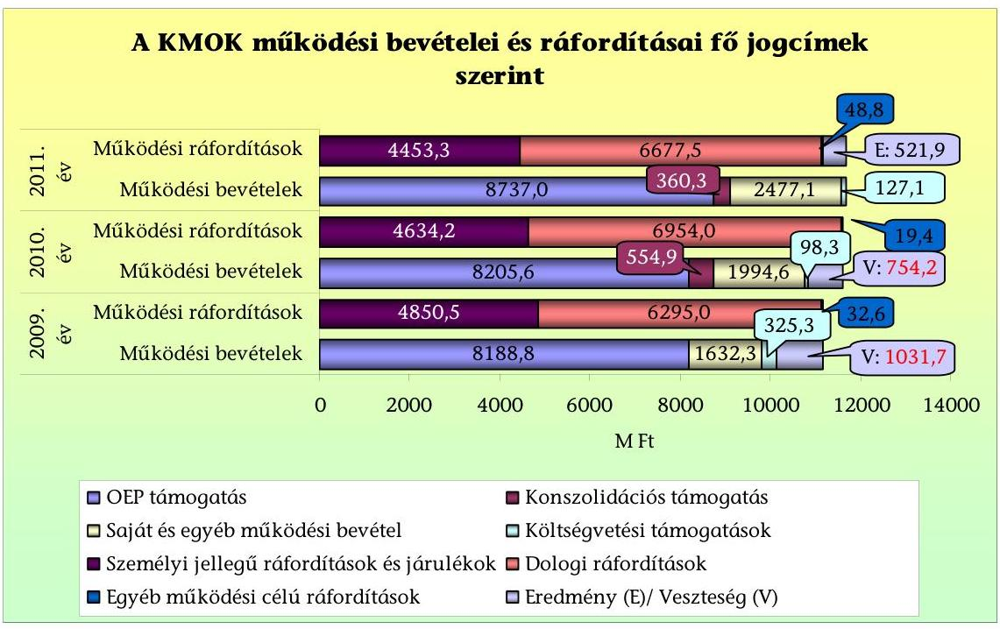

A 2009-2011 között a KMOK 7687,7 M Ft beruházási és 9,7 M Ft felújítási tevékenységet végzett. A felhalmozási tevékenység finanszírozására saját bevételek, fenntartói támogatások, valamint EU-s pályázati források szolgáltak. Az eszközpótlásra fordított összeg a 2009-2011. években 206,1 M Ft volt, amely az elszámolt 2022,8 M Ft értékcsökkenésnek mindössze 10,2\%-át tette $\mathbf{k i}^{42}$. A KMOK a beszerzett tárgyi eszközök jövőbeni fenntartási, üzemeltetési költségeit vállalta.

A kötelezettségek állománya a 2009. évi 1961,2 M Ft-ról a 2010. évben a lejárt határidejú szállítói kötelezettségek növekedése miatt 2215,3 M Ft-ra emelkedett. A 2011. évre a kötelezettségek állománya a szállítói kötelezettségek változása következtében 1932,8 M Ft-ra csökkent. A 2012. június 30 -ai kötelezettségek állományából 105,9 M Ft -ot ( $7,8 \%$-ot) a hosszú lejáratú fenntartói kölcsön, 1248,5 M Ft-ot ( $92,2 \%$-ot) a rövidlejáratú kötelezettségek tették ki, a KMOK pénzintézettel szembeni kötelezettséggel nem rendelkezett. A 2010. évben kapott konszolidációs támogatás ellenére a lejárt szállítói tartozás a 2009. évi 117,0 M Ft-ról 2010. év végére 875,8 M Ft-ra emelkedett, majd a 2011. év végére a konszolidációs támogatás hatására 808,7 M Ft-ra csökkent. A 2012. év I. félévében a lejárt szállítói tartozások összege 2012. június 30-án 325,3 M Ft volt. A szállítói tartozások után 2009-11 között kifizetett késedelmi kamat és kötbér mindösszesen 71,2 M Ft (amely az összesen kapott konszolidációs támogatás 7,8\%-a) volt. Önkormányzati biztos kirendelésére nem volt szükség. A KMOK összes kötelezettsége, illetve ezen belül a szállítói és a lejárt határidejú szállítói állománya a következők szerint alakult:

[^0]
[^0]:    ${ }^{42}$ A KMOK által végzett és folyamatban lévő fejlesztési tevékenység várható bekerülési értéke 7417,4 M Ft.

---

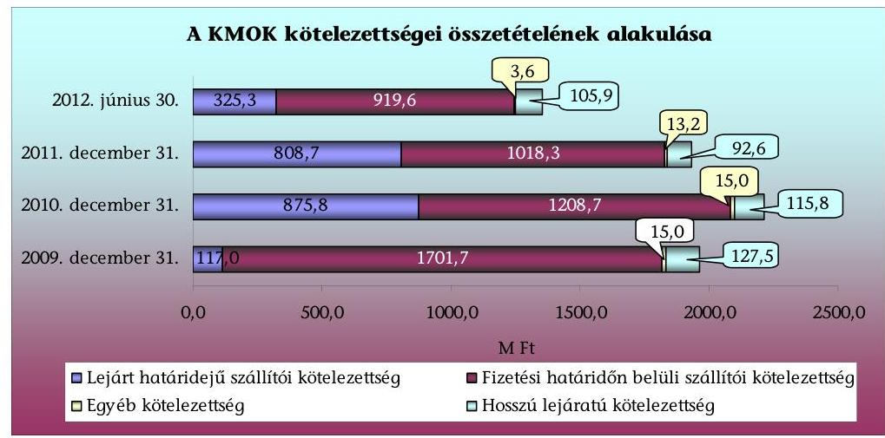

A KMOK likviditási helyzete 2009-2011 között kedvező irányba változott, amelyet a likviditási ráta növekedése mutat. A forgóeszközök növekedésének hatására a likviditási ráta értéke a 2009. évi 0,16 -ról 2011-ben 0,73-ra javult. A KMOK pénzeszközei a 2009. év végén a rövid lejáratú kötelezettségeinek 3,2\%-ára, míg a 2011. év végén 26,0\%-ára nyújtottak fedezetet. A likviditási helyzet az intézkedések és a kedvező változás ellenére sem kielégítő, a likviditási mutatók a szakmailag elvárható mértéktől jelentős mértékben elmaradtak, a forgóeszközök nem biztosítanak elegendő fedezetet a rövidlejáratú kötelezettségek teljesítésére. A pénzügyi egyensúlyi helyzet megteremtése érdekében 2009. és 2012. I. félév között - a vásárolt közüzemi szolgáltatásoknál, gyógyszer-, szakmai anyaggazdálkodásnál - folyamatos költség monitoring és keretrendszert múködtetett.

A KMOK a 2009-2011. években az aktív fekvőbeteg szakellátásban átlagosan 795, 2012. I. félévében 801 múködő ággyal rendelkezett. A krónikus fekvőbeteg szakellátásban 2009-ről 2012. I. félévére 385 -ről 427 -re nőtt (10,9\%) az ágyak száma. A kórházi ellátás teljesítménymutatói - amelyek hatással voltak a pénzügyi egyensúlyi helyzet javulására - a következőképp változtak:
10. számú ábra
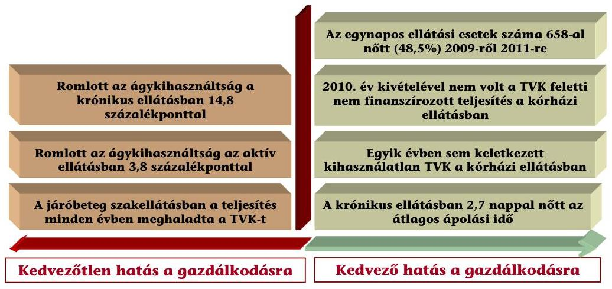

---

A KMOK munkaerő hiánya (üres álláshelyek száma) - a 2009-2012. év I. félév között a hiányzó létszám pótlására hozott intézkedések hatására csökkent (31 fővel). Betöltetlen álláshely a 2009. évben 276, a 2012. év I. félévben 245 volt. A szakember hiány elsősorban az egészségügyi személyzet körében jelentkezett. Az orvosok esetében a 2009. évben 41, a 2012. év I. félév végén 40 betöltetlen álláshely volt. A szakdolgozóknál a 2009. évben 145, a 2012. év I. félév végén 146 üres álláshely volt. A hiányzó egészségügyi létszámot a költségek csökkentése érdekében közremúködői- és megbízási szerződésekkel foglalkoztatott orvosokkal és szakdolgozókkal pótolták. A Munkaerőpiaci Alapból a szakdolgozók pótlása érdekében a 2009. évben 8,3 M Ft (18 fő részére ápoló tanfolyamot tartottak), a 2011. évben 7,8 M Ft (21 fő sürgősségi szakápoló képzése) összegű támogatást kaptak. Közhasznú munka keretében a 2010. évben 8 főt foglalkoztatottak, amelyhez 4,9 M Ft támogatást vettek igénybe. EU-s pályázat keretében a 2010-2011. években 7 főt foglalkoztattak, az elnyert támogatás összesen 4,1 M Ft volt. A KMOK az illetmények és munkabérek javítására a 2009. évben 1292 főre 201,2 M Ft, a 2010. évben 1578 főre 188,5 M Ft, a 2011.évben 1068 főre 84,7 M Ft összegű költségvetési támogatást kapott. A 2008-2009. évi létszámcsökkentéssel összefüggő többletkiadások támogatására (prémium évek nyugdíj, felmentési díj és végkielégítés) a 2009. évben 89 főre 113,4 M Ft, a 2010. évben 54 főre 75,5 M Ft, a 2011. évben 51 főre 66,5 M Ft, a 2012. év I. félévben 31 főre 24,5 M Ft költségvetési támogatást kapott. Az illetmények és munkabérek javítására és a létszámcsökkentéssel öszszefüggő többletkiadásokra kapott támogatások kedvező hatással voltak a KMOK pénzügyi helyzetére.

A KMOK - pénzügyi helyzetének javítása érdekében - a 2009-2012. év I. félév közötti időszakban a gyógyszerfelhasználás költségének csökkentésére intézkedéseket hozott. A KMOK gyógyszergazdálkodásában szerepelt az általa fenntartott közforgalmú gyógyszertár kiadása és üzemeltetése is, így a tanúsítványban szolgáltatott adatok a gyógyszerkiadások megítélésére nem nyújtanak valós képet. Az összes gyógyszerkiadáshoz képest a térítésmentesen kapott gyógyszerek aránya az ellenőrzött időszakban nem haladta meg a 0,1\%-ot (1,9 M Ft). Az összes gyógyszerbeszerzési költség a 2009. évben az OEP bevétel 7,2\%-át (588,9 M Ft), a 2011. évben az OEP bevétel 6,9\%-át (631,1 M Ft) tette ki. A gyógyszerköltségek csökkentésére a 2009. évben 10, a 2011. évben 20 féle készítményt váltottak originálisról generikus készítményre.

A KMOK folyamatosan figyelemmel kísérte a szakmai anyagok beszerzési költségét, költségmonitoringot, keretrendszert múködtetett, de 2009-2012. I. félévben nem hozott külön intézkedést a szakmai anyagok beszerzési költségének csökkentésére. A szakmai anyagok fajlagos beszerzési költségindexe 7,4 százalékponttal az országos átlagnövekedés alatt maradt 2009 és 2011 között. Az országos átlagot el nem érő fajlagos beszerzési költségnövekedés, illetve a mutató abszolút csökkenése a pénzügyi helyzetre a kórházak átlagánál pozitívabb hatást gyakorolt. Hátrányos, hogy a szakmai anyag készletek forgási sebessége 278,5-ről 252,0-re (10\%-kal) csökkent 2009-ről 2011-re.

A vásárolt közszolgáltatások alakulását folyamatosan figyelemmel kísérték, költségmonitoringot, keretrendszert múködtettek. A villamos- és gázenergia, víz, szennyvíz közszolgáltatások költségcsökkentésére intézkedéseket hoztak. A saját textilmosás megszüntetése következtében az egy ápolási napra vetített

---

(fajlagos) gázenergia $32 \%$-kal, a vízfelhasználás $19 \%$-kal csökkent 2009-ről 2011-re. A fajlagos villamos energia felhasználás a szolgáltatási szerződés módosítása ellenére $5 \%$-kal megnőtt, mert a fogyasztás nem csökkent, de a betegápolási napok száma igen.

A betegélelmezés, mint segédüzemi tevékenység költségeinek alakulását is folyamatosan figyelemmel kísérték. A betegélelmezés önköltsége reálértéken $46 \%$-kal csökkent 2009 és 2011 között (nominálisan $883 \mathrm{Ft} /$ élelmezési napról $601 \mathrm{Ft} /$ élelmezési napra).

A nagyértékú orvosi gépek-múszerek kihasználtsága összességében nem változott. A CT/MRI berendezés kihasználtsága a 2009. évi 52,7\%-ról 2011. évre $51,0 \%$-ra csökkent, a kémiai laborautomaták kihasználtsága a 2009. évi 69,3\%-ról 2011. évre 72,3\%-ra nőtt, a központi műtő kihasználtsága a 2009. és a 2011. évben változatlanul $23,2 \%$ volt. Az ellenőrzött nagyértékű berendezések üzemeltetésének fajlagos költségei (önköltségei) három év alatt csupán infláció alatti mértékben nőttek: a CT-é 4,9 százalékponttal, a központi műtőé $9,3 \%$-kal. Mindezek a KMOK pénzügyi helyzetére pozitív hatást gyakoroltak.

# 1.10. Városi Kórház Keszthely (VKK) 

A VKK pénzügyi egyensúlya a finanszírozási múveletek nélküli (GFS) pozíció ${ }^{43}$ alapján 2009-2010 között biztosított volt, majd a 2011. évben nem volt biztosított, a múködési és felhalmozási tevékenység együttes egyenlege negatív volt. A pénzügyi helyzet romlását mutatja, hogy a kapott konszolidációs támogatás és a keretgazdálkodás ellenére a múködési tevékenység jövedelme a 2010-2011. években negatív összegű lett. A szállítói kötelezettségek - a 2010. évi átmeneti csökkenést követően - növekedtek. A 2011. év végén az 155,9 M Ft szállítói kötelezettség a dologi ráfordítások 17,4\%-át tette ki. A számviteli nyilvántartások alapján a szállítói kötelezettségek összege 2012. június 30 -án $252,8 \mathrm{M}$ Ft volt.

Az ellenőrzött időszakban költségvetési intézményként múködő VKK gazdálkodásában a CLF módszer szerinti múködési pénzügyi egyensúly 2009-ben biztosított volt, a múködési tevékenységének eredménye és pénzügyi kapacitása pozitív volt. A pénzügyi helyzet 2010-re nagymértékben romlott. A gazdálkodás egyensúlya 2010-2011 között nem volt biztosított, a múködési tevékenység eredménye és a pénzügyi kapacitás negatív volt. A pénzügyi helyzet kedvezőtlen alakulását 2010-ben a múködési ráfordítások növekedése, a saját múködési bevételek, fenntartói támogatások csökkenése, valamint a fenntartó részére befizetett összeg együttesen okozták. A konszolidációs támogatás nélkül a VKK múködési jövedelme a 2011. évben -164,5 M Ft volt. A 2010. évi NEFMI-től kapott egyszeri támogatás kiesésének hatását a konszolidációs támogatás, az OEP finanszírozás növekedése, valamint a múködési ráfordítások csökkenése sem tudta ellensúlyozni. A felhalmozási tevékenység

[^0]
[^0]:    ${ }^{43}$ A finanszírozási múveletek nélküli (GFS) pozíció a 2009. évben 1,6 M Ft, a 2010. évben 98,8 M Ft, a 2011. évben -118,6 M Ft volt.

---

egyenlege 2009-2010 közötti időszakban pozitív, 2011-ben negatív volt. A 2011. évi negatív egyenlegre fedezetet az előző években képződött pozitív egyenleg biztosított. Így a felhalmozási tevékenység a VKK pénzügyi helyzetére kockázatot nem jelentett.

A VKK adósságának rendezése érdekében konszolidációs támogatásban a 2011. évben részesült 62,0 M Ft összegben. A pénzügyi egyensúly megteremtését szolgáló intézkedési tervet elkészítették a fennmaradó adósságállomány csökkentése érdekében. A KEHI a 2011. évi konszolidációs támogatást ellenőrizte, visszafizetést nem írt elő.

A múködési és a felhalmozási tevékenység egyenlege, a pénzügyi kapacitás 2009-2011 között a következők szerint alakult:
33. számú diagram
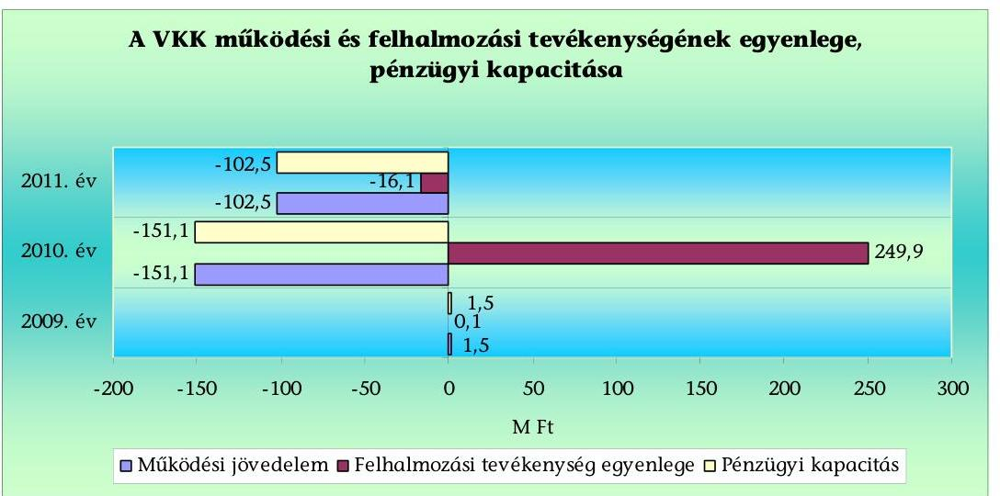

A múködés finanszírozását szolgáló bevételek 2010-re 1941,3 M Ft-ra (11,4\%-kal, 199,3 M Ft-tal) növekedtek, 2011-re 1745,5 M Ft-ra (10,1\%-kal, 195,8 M Ft-tal) csökkentek az előző évhez viszonyítva. A 2010. évi múködési bevétel növekedést és a 2011. évi csökkenést is a NEFMI-től kapott egyszeri támogatás ${ }^{44}-400 \mathrm{M}$ Ft-os - múködési célokra felhasználni kívánt része eredményezte.

A múködési bevételeken belül minden évben meghatározó volt az OEP-től származó támogatások, illetve 2010-ben a NEFMI-től kapott támogatás összege. Az OEP-től származó bevételek összegének alakulását a finanszírozási szabályok változása, a konszolidációs támogatás befolyásolta. A fenntartótól kapott támogatás 2009-ben javította a VKK pénzügyi helyzetét, 2010-ben és 2011-ben számottevő hatást nem gyakorolt rá. A fenntartói támo-

[^0]
[^0]:    ${ }^{44}$ A Kormány 1200/2010. (X. 1.) határozata alapján a 2007 márciusában történt kapacitás-csökkentésre tekintettel a központi költségvetésből a VKK 650,0 M Ft támogatásban részesült, amelyből 400 M Ft -ot múködési, 250 M Ft -ot felhalmozási célokra kívánt fordítani.

---

gatás aránya a 2009. évben a működési bevételek 12,4\%-át (216,7 M Ft-ot) tette ki.

A VKK saját múködési bevételei a 2009-2011 között - a pénzügyi helyzetre kedvezőtlen hatást gyakorolva - csökkentek. A saját bevételek ( 443,6 M Ft) $77,3 \%$-a ( 342,7 M Ft$)$ a szolgáltatások ellenértékéből, bérleti és lízingdíj bevételekből származtak. A VKK a saját múködési bevételek növelése érdekében - a szolgáltatások térítési díjaiban az infláció mértékének érvényesítésén kívül - intézkedéseket nem hozott. A térítési díjakat önköltségszámítással nem alapozták meg. A VKK a magánrendelésekhez kapcsolódó eszközbérbeadás lehetőségével nem élt.

A múködési költségek és ráfordítások a 2010. évre 2092,4 M Ft-ra (20,2\%$\mathrm{kal}, 351,9 \mathrm{M}$ Ft-tal) növekedtek, 2011-re 1848,0 M Ft-ra (11,7\%-kal, 244,4 M Fttal) csökkentek az előző évhez viszonyítva. A személyi jellegú ráfordítások és munkaadókat terhelő járulékok együttes összege a 2009. évi 898,4 M Ft-ról a 2010. évre 905,7 M Ft-ra ( $0,8 \%$-kal, 7,3 M Ft-tal), a 2011. évre 948,5 M Ft-ra ( $4,7 \%$-kal, 42,8 M Ft-tal) növekedett. A változást a betöltött álláshelyek és a foglalkoztatott közalkalmazottak számának növekedése okozta.

A dologi ráfordítások a 2009. évi 842,1 M Ft-ról a 2010. évre 900,0 M Ft-ra (6,9\%-kal, 57,9 M Ft-tal), az inflációt meghaladó mértékben növekedtek, 2011re 897,7 M Ft-ra ( $0,3 \%$-kal, 2,3 M Ft-tal) csökkentek. A dologi ráfordítások csökkentése érdekében keretgazdálkodást folytattak, költségmonitoring tevékenységet végeztek.

A VKK a 2010. évben államháztartáson belülre - a fenntartó részére 284,9 M Ft-ot volt köteles átadni a NEFMI-től kapott támogatás terhére ${ }^{45}$. A pénzeszközátadás a pénzügyi helyzetére kedvezőtlen hatást gyakorolt, valamint a múködési ráfordítások 2010. évi növekedésében jelentős szerepet játszott. (A múködési ráfordítások növekedésének 81,3\%-a volt.)

A gyógyító tevékenység közvetlen költségét a VKK ellátás-típusonként kimutatta, amely szerint a fedezeti összeg a 2009-2011. években nem nyújtott fedezetet a gazdasági-, műszaki ellátás felosztott költségeire.

A múködési bevételek, ráfordításai főbb jogcímeinek arányát és alakulását a következő diagram szemlélteti:

[^0]
[^0]:    ${ }^{45}$ A kapott összeg $43,8 \%$-át (284,9 M Ft-ot) a fenntartó önkormányzat részére - a 362/2010. (XII. 5.) számú képviselő-testületi határozat alapján - be kellett fizetnie. A befizetett összeg a fenntartó által a 2008-2009 években nyújtott támogatás összegével megegyezett.

---

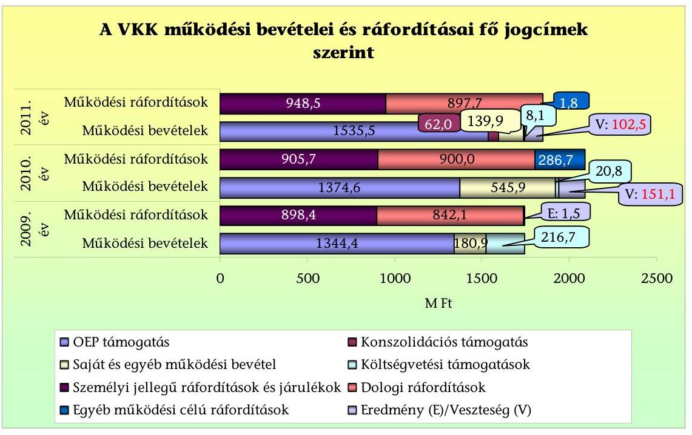

A 2009-2011. években a kórház 34,7 M Ft beruházási és 66,0 M Ft felújítási tevékenységet végzett. A felhalmozási tevékenység finanszírozására saját bevételek, fenntartói támogatások és államháztartáson belülről származó átvett pénzeszközök szolgáltak. Az eszközpótlásra fordított összeg 20092011 között 78,6 M Ft volt, amely az elszámolt 210,8 M Ft értékcsökkenésnek 37,3\%-át tette ki ${ }^{46}$. A beszerzett tárgyi eszközök jövőbeni fenntartási, üzemeltetési költségeit a VKK vállalta.

A VKK kötelezettségeinek állománya a 2009. évi 181,5 M Ft-ról a 2010. évben a lejárt határidejú szállítói kötelezettségek csökkenése miatt 136,5 M Ftra változott, 2011-re a szállítói kötelezettségek változása következtében 155,9 M Ft-ra növekedett. A 2012. június 30 -ai 267,5 M Ft-os kötelezettségek állományából 252,8 M Ft-ot ( $94,5 \%$-ot) a szállítói kötelezettségek, 14,7 M Ft-ot ( $5,5 \%$-ot) az egyéb rövid lejáratú kötelezettségek tették ki. A VKK-nak hosszú lejáratú-, valamint pénzintézettel szemben fennálló kötelezettsége nem volt.

A 2011. évben kapott konszolidációs támogatás ellenére a lejárt szállítói tartozás a 2010. évi 42,5 M Ft-ról 2011-re 8,0M Ft-tal emelkedett. A lejárt szállítói tartozások összege 2012. június 30 -án 147,4 M Ft volt. A szállítói tartozások után 2009-2012. év I. féléve között kifizetett késedelmi kamat és kötbér mindösszesen 8,6 M Ft (amely az összesen kapott konszolidációs támogatás $13,9 \%$-a) volt. Az ellenőrzött időszakban önkormányzati biztos tevékenységére nem volt szükség.

[^0]
[^0]:    ${ }^{46}$ A VKK-nál folyamatban lévő beruházás várható bekerülési értéke 242,5 M Ft, amely teljes egészében pályázati forrásból valósul meg.

---

A kórház összes kötelezettsége, illetve ezen belül a szállítói és a lejárt határidejú szállítói állománya az alábbiak szerint alakult:
35. számú diagram
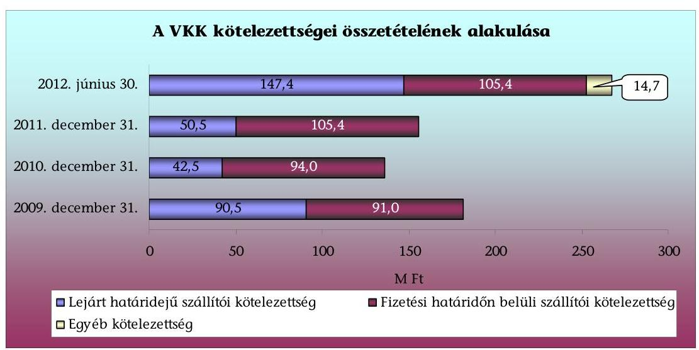

A VKK likviditási helyzete 2009-2011 között kedvezően változott a likviditási ráta alapján, amely a 2009. évi 0,26 -ról 2011-ben 0,30-ra javult. A készpénz likviditási ráta jelentősen nem változott, a VKK pénzeszközei a 2009. év végén a rövid lejáratú kötelezettségeinek 2,1\%-ára, míg a 2011. év végén 1,9\%ára nyújtottak fedezetet. A likviditási mutatók jelentős mértékben elmaradtak a szakmailag elvárható mértéktől, ami azt jelzi, hogy a kórház nem 2011. december 31-én rendelkezett elegendő fedezettel a rövidlejáratú kötelezettségek teljesítéséhez.

A pénzügyi egyensúlyi helyzet megteremtése érdekében 2009. és 2012. I. félév között - a vásárolt közüzemi szolgáltatásoknál, szakmai anyaggazdálkodásnál, a betegélelmezésnél és a textilmosatásnál - folyamatos költség monitoring és keretrendszert múködtetett.

A VKK a 2009-2011. években az aktív fekvőbeteg szakellátásban átlagosan 108, 2012. I. félévében 104 múködő ággyal rendelkezett ( $2,8 \%$-os csökkenés). A krónikus fekvőbeteg szakellátásban 2009-ről 2012. I. félévére 142-ről 124-re csökkent (12,7\%) az ágyak száma. Az ellátási teljesítmények alakulása érdemben nem befolyásolta a pénzügyi egyensúlyi helyzetet.

Egyes kiemelt teljesítménymutatók a következők szerint változtak:

---

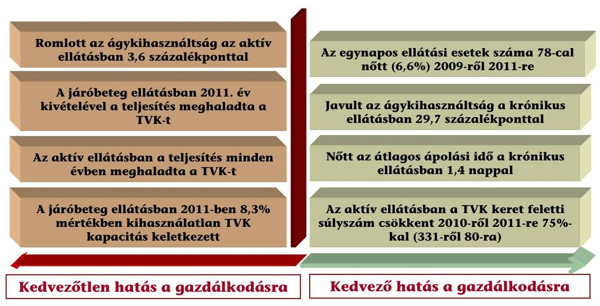

A VKK munkaerő hiánya (üres álláshelyek száma) - a hiányzó létszám pótlására hozott foglalkoztatási szerződéses jogviszony bővítési intézkedések hatására - a 2009. évi 26,5 fơről a 2010. évre 8,5 főre csökkent, a 2011. évre 19,7 före nőtt, majd a 2012. év I. félévre 16 főre csökkent. A betöltött álláshelyek száma a 2009. évi 292,5-ről folyamatosan növekedett, a 2012. év I. félévére 315-re. A humánerőforrás hiány elsősorban az egészségügyi személyzet körében jelentkezett. Orvosoknál a 2009. évben és a 2012. év I. félév végén is 5,8 betöltetlen álláshely, szakdolgozóknál a 2009. évben 12,1, a 2012. év I. félév végén 0,4 fő üres álláshely volt. A hiányzó munkaerő biztosítására, a költségek csökkentése érdekében igénybe vették a közfoglalkoztatási, illetve pályázati lehetőségeket. A közmunkaprogram keretében foglalkoztatottak száma a 2009-2011. években nőtt ( 8 fő,11 fő,17 fő), a 2012. év I. félévben 13 fő volt, amelyhez összesen 19,3 M Ft támogatást kaptak. EU-s pályázat segítségével a 2011. évben és a 2012. év I. félévében 1-1 fő foglalkoztatása történt, 0,2 M Ft támogatással. A közmunkaprogram és az EU-s pályázatok keretében kapott támogatások mértéke éves átlagban nem érte el a 6 M Ft -ot és nem érintette a munkavállalók 5\%-át, így az ellenőrzött időszakban kapott támogatások a pénzügyi egyensúlyi helyzetre számottevő hatást nem gyakoroltak.

A VKK - pénzügyi helyzetének javítása érdekében - a 2009-2012. év I. félév közötti időszakban a gyógyszerfelhasználás költségének csökkentésére a keretgazdálkodást folyamatosan fenntartotta, dokumentumokkal igazolt további intézkedéseket nem hozott. Az összes gyógyszerkiadáshoz képest a térítésmentesen kapott gyógyszerek aránya a 2009. évben 51,5\% (27,5 M Ft), a 2012. év I. félévében $23,3 \%(7,1 \mathrm{MFt})$ volt. Az összes gyógyszerbeszerzési költség a 2009. évben az OEP bevétel 3,9\%-át (53,5 M Ft), a 2011. évben az OEP bevétel 3,5\%át (56,6 M Ft) tette ki. A gyógyszerköltségek csökkentésére a 2009. évben 71, a 2011. évben 211 féle készítményt váltottak originálisról generikus készítményre.

A szakmai anyagok beszerzési költségét a VKK folyamatosan figyelemmel kísérte, költségmonitoringot, keretrendszert müködtetett, de 2009-2012. I. félévben nem hozott intézkedést a szakmai anyagok beszerzési költségének csökken-

---

tésére. A szakmai anyag készletek forgási sebessége 859-ről 1265 -re ( $47 \%$-kal) nőtt 2009-ről 2011-re. A szakmai anyagok fajlagos beszerzési költségindexe meghaladta az országos átlagnövekedést 5,5 százalékponttal. A drágább beszerzés negatívan hatott a VKK pénzügyi helyzetére.

A vásárolt közmúszolgáltatások alakulását is folyamatosan figyelemmel kísérték, költségmonitoringot, keretrendszert múködtettek, külön költségcsökkentési intézkedést nem hoztak. Az egy ápolási napra vetített (fajlagos) földgáz felhasználás 5\%-kal nőtt 2009-ről 2011-re, amely kedvezőtlen hatást gyakorolt a VKK pénzügyi helyzetére. Ezzel szemben a fajlagos vízfelhasználás 25\%kal, a villamos energia fajlagos felhasználása pedig 9\%-kal csökkent.

Hasonlóan figyelemmel kísérték a segédüzemi tevékenységek költségeinek alakulását. A textilmosatás fajlagos költségének reálértéke 24\%-kal csökkent, a betegélelmezés önköltségéé $18 \%$-kal nőtt 2009 és 2011 között. A két tevékenység együttes hatása - a betegélelmezés súlya miatt - a működési egyenlegromlást erősítette. Az ellátási formákban változás nem történt, a textilmosatást közbeszerzési eljárással kiválasztott külső szolgáltató, a betegélelmezést a VKK konyhája látta el.

A kémiai laborautomaták kihasználtsága a 2009. évi átlag 15,4\%-ról 2011. évre 18,3\%-ra javult, a központi műtő kihasználtsága a 2009. évi 78,3\%-ról átmeneti javulás után 2011. évre 74,9\%-ra csökkent. Az ellenőrzött nagyértékű berendezések üzemeltetésének fajlagos költségei (önköltségei) 6,6\%-kal csökkentek. Mindezek a VKK pénzügyi helyzetére pozitív hatást gyakoroltak.

# 1.11. Marcali Városi Kórház-Rendelőintézet (MVK) 

Az MVK pénzügyi egyensúlya, a finanszírozási műveletek nélküli (GFS) pozíció ${ }^{47}$ a 2009. és a 2010. évben negatív értéket mutatott, a múködési és felhalmozási tevékenység együttes egyenlege negatív volt, míg a 2011. évben pozitív értéket mutatott. Konszolidációs támogatás nélkül a pénzügyi kapacitás minden évben negatív értéket mutatott. Az összes szállítói kötelezettség év végi állománya az előző évhez viszonyított 2010. évi csökkenés után a 2011. évben növekedett, az éves dologi ráfordítás 27,1\%-át (216,2 M Ft-ot) tette ki. Az összes kimutatott szállítói kötelezettség a 2012. év I. félév végén 161,7 M Ft volt. A belső intézkedések a pénzügyi helyzetet javították, de nem voltak elégségesek a pénzügyi egyensúly ${ }^{48}$ helyreállításához.

A múködési tevékenység veszteséges volt, amely a konszolidációs támogatás nélkül állandósult. Az OEP támogatás nem biztosított elegendő fedezetet a múködési költségek, ráfordítások fedezetére. A lejárt határidejű szállítói tartozások 2009-2011 között a teljesítményeken alapuló OEP finanszírozáson felül kapott támogatásokkal sem volt jelentős mértékben csökkenthető. A múködési jövede-

[^0]
[^0]:    ${ }^{47}$ A finanszírozási műveletek nélküli (GFS) pozíció a 2009. évben -167,6 M Ft, a 2010. évben -114,0 M Ft, a 2011. évben 55,8 M Ft volt.
    ${ }^{48}$ konszolidációs támogatás nélkül

---

lem nem biztosított fedezetet az amortizáció elszámolása miatti eszközcsökkenés pótlására, állagmegóvására. A felhalmozási tevékenység növelte a pénzügyi egyensúly megteremtésének kockázatát, mivel a végrehajtott fejlesztésekhez nem képződött elegendő felhalmozási bevétel.

Az ellenőrzött időszakban önkormányzati költségvetési intézményként múködő költségvetési szerv - adatszolgáltatása alapján, CLF módszerrel ellenőrzött MVK múködési pénzügyi egyensúlya a 2009-2010. években nem volt biztosított. A múködési tevékenysége veszteséges, a pénzügyi kapacitása negatív volt. A kórház múködési bevételei - a 2010. évben a kapott konszolidációs támogatás segítségével sem - fedezték a múködési költségeket és ráfordításokat. A veszteség 2009-ben 120,2 M Ft, 2010-ben 85,6 M Ft volt. Az egészségügyi szolgáltatás bevételei, költségei, ráfordításai esetén a 2011. évben pozitív egyenleg keletkezett. A konszolidációs támogatás nélkül a veszteség 2009-ben 120,2 M Ft volt, 2010-ben 148,3 M Ft, 2011-ben pedig 5,4 M Ft pozitív eredmény keletkezett. A veszteség csökkenését és eredménybe fordulását a saját bevételek, az OEP támogatás növekedése és a pénzügyi egyensúlyi helyzet megteremtésére hozott intézkedések, racionális költség- és létszámgazdálkodás eredményezte.

Az MVK lejárt szállítói tartozásai rendezésére, valamint a várólisták csökkentésére konszolidációs támogatásban részesült a 2010. évben 62,7 M Ft és a 2011. évben 59,8 M Ft összegben. A konszolidációs támogatás felhasználására szakmai és a gazdálkodási feladatokra intézkedési tervet készítettek. Az intézkedési tervekben szereplő feladatok végrehajtása a jóváhagyott ütemben és mértékben haladt. A KEHI a 2010. és a 2011. évi konszolidációs támogatást ellenőrizte, a támogatásra vonatkozóan visszafizetést nem állapított meg.

A 2009-2011. években a múködési és a felhalmozási tevékenység egyenlege, a pénzügyi kapacitás az alábbiak szerint alakult:
36. számú diagram
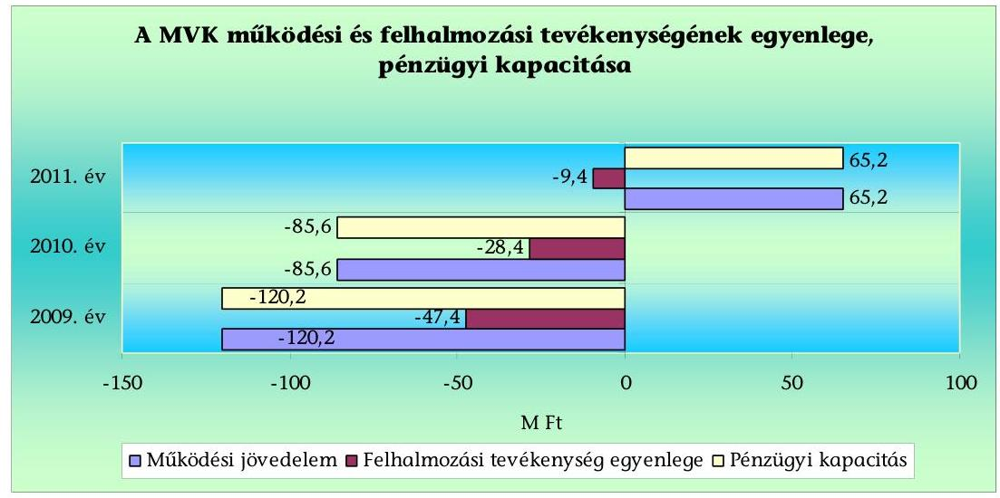

A felhalmozási tevékenység pénzügyi egyenlege kedvező irányba változott: a 2009. évi -47,4 M Ft 2011. évben -9,4 M Ft-ra emelkedett. A múködési tevékenységben nem képződött jövedelem, amely a felhalmozás hiányzó forrására fedezetet biztosított volna, így a felhalmozási tevékenység a pénzügyi egyen-

---

súly biztosításában kockázati tényezőt jelentett. Az MVK finanszírozási múveleteket (értékpapír- és hitelmúveleteket) nem végzett, finanszírozási bevételei nem voltak, adósságszolgálat nem keletkezett.

A múködés finanszírozását szolgáló bevételek eltérően változtak, a 2009. évi 1605,2 M Ft-ról 2010-re 1556,4 M Ft-ra csökkent, 2011. év végére 1684,1 M Ft-ra emelkedett, 2009-ről 2011-re 4,9\%-kal nőtt a központi és a saját bevételt növelő intézkedések hatására.

A múködési bevételeken belül minden évben meghatározó szerepe volt az OEPtől származó támogatásoknak, annak ellenére, hogy múködési bevételeken belüli részaránya a 2009. évi 90,3\%-ról 2011-re 87,3\%-ra csökkent. Az OEP támogatás 2010-ben 93,9 M Ft-tal (93,5\%-ra) csökkent, 2011-ben 114,9 M Ft-tal (108,5\%-ra) emelkedett. A változást az aktív kórházi szakellátás és a járóbeteg szakellátás teljesítményének ingadozása és az ellátás finanszírozási szabályainak módosulása okozta. A pénzügyi egyensúlyi helyzetre kedvező hatással volt a 2010-2011. években kapott 122,5 M Ft konszolidációs támogatás. A múködési célra kapott költségvetési támogatások összege a 2009. évi 29,0 M Ft-ról a 2011. évre 6,9 M Ft-ra ( $76,2 \%$-kal) csökkent. A támogatás a fenntartó önkormányzat közvetítésével a központi költségvetésből származott és meghatározott feladatokat finanszírozott (pl. bérkiegészítések, létszámleépítés támogatása).

Az MVK saját bevétele 2009-ről 2010-re 114,8 M Ft-ról 112,8 M Ft-ra (1,7\%kal) csökkent, 2011-re 127,2 M Ft-ra ( $12,8 \%$-kal) növekedett. A saját bevételek jelentős része ( $80 \%$-a) két bevételi jogcímen - intézményi ellátási díjakból és alkalmazottak térítéséből - származott. Az MVK a saját bevételek növelése érdekében 2011-ben a közremúködő orvosok számára bérleti díjfizetési kötelezettséget írt elő, az élelmezési térítési díjat emelte, valamint az ápolásért térítési díjat számított fel. Az intézkedések hatására 2011-ben az előző évhez viszonyítva az intézményi ellátási díjak $4,6 \mathrm{M}$ Ft-tal ( $5,6 \%$-kal), az alkalmazottak térítése 5,1 M Ft-tal ( $49,4 \%$-kal) emelkedett.

Az ellenőrzött időszakban a múködési költségek és ráfordítások összege folyamatosan csökkent, a 2009. évi 1725,4 M Ft-ról 2011-ben 1618,9 M Ft-ra (6,2\%-kal) változott. Meghatározó szerepe volt a költségek alakulásában a személyi jellegú ráfordításoknak és járulékoknak, 2011-ben a 2009. évhez képest a létszámcsökkentési intézkedések hatására 121,9 M Ft-tal (13,1\%-kal), költségeken belüli aránya 53,7\%-ról 49,7\%-ra csökkent. A dologi kiadások emelkedtek, azonban a növekedés mértéke ( $17,3 \mathrm{M} \mathrm{Ft}, 2,2 \%$ ) a pénzügyi helyzet alakulására nem volt meghatározó. Az E. Alapból származó bevételek fedezték a gyógyító tevékenység közvetlen költségeit. A fedezeti összeg azonban a megtett intézkedések ellenére nem nyújtott fedezetet a gazdasági, múszaki ellátás felosztott költségeire, 2009-ben 52,9\%-át, 2011-ben 67,7\%-át tette ki a felosztott költségeknek.

Az ellenőrzött időszakban 75,1 M Ft összegű beruházási és 10,1 M Ft összegű felújítási tevékenységet végzett az MVK, amelyhez nem állt rendelkezésre elegendő fejlesztési forrás. A felhalmozási tevékenység finanszírozására saját bevételek, valamint EU-tól és más szervektől kapott támogatások szolgáltak. A hiányzó felhalmozási forrásokat részben a szállítók finanszírozták, részben a múködési forrásokból pótolták. Az MVK-ban a 2009-2011. években intézményi

---

fejlesztések keretében közszolgáltatási hálózatbővítés, kórházi gépek, berendezések, számítástechnikai eszközök vásárlása és elhasználódott gépek pótlása valósult meg.

A múködési bevételek és ráfordítások fő jogcímek szerinti alakulását a következő diagram szemlélteti:
37. számú diagram
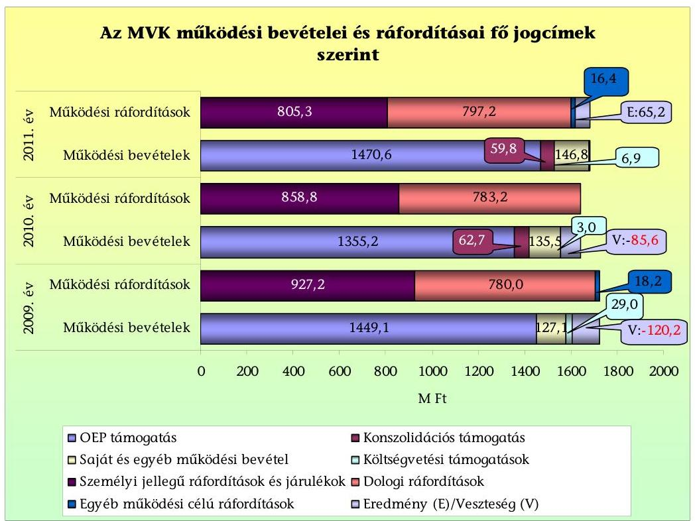

A 2009-2011. években elszámolt amortizáció $339,6 \mathrm{M} \mathrm{Ft}$, az elvégzett beruházásokból és felújításokból az eszközpótlásra fordított érték $6,6 \mathrm{M} \mathrm{Ft}$, amely az eszközérték csökkenés 1,9\%-át fedezte. Működési jövedelem nem képződött, mely az elszámolt értékcsökkenési leírás összegének megfelelő mértékű fedezetet biztosított volna az elhasználódott eszközök cseréjére, állagának megőrzésére. Az amortizáció bevételekben való megtérülésének hiánya közép- és hosszútávon a múködés biztonságának kockázatát növeli. A fenntartó önkormányzat nem végzett fejlesztési tevékenységet az MVK részére.

Az ellenőrzött időszakban beszerzett tárgyi eszközök jövőbeni fenntartási, üzemeltetési költségeit a beszerzések tervezése során figyelembe vették, múködtetési forrásait biztosították. A beszerzett tárgyi eszközök múködtetésére a bevételek fedezetet nyújtottak, emiatt forráshiány nem keletkezett az MVK múködési tevékenységének finanszírozásában.

AZ MVK kötelezettségeinek állománya a 2009. évi 216,5 M Ft-ról 2010-ben 180,0 M Ft-ra (83,2\%-ra) csökkent, majd a 2011. év végére 231,9 M Ft-ra (7,2\%kal) növekedett. A 2012. június 30 -ai kötelezettségek $166,7 \mathrm{M}$ Ft-ra csökkentek.

---

Az MVK összes kötelezettsége, illetve ezen belül a szállítói és a lejárt határidejú szállítói állománya a következők szerint alakul:
38. számú diagram
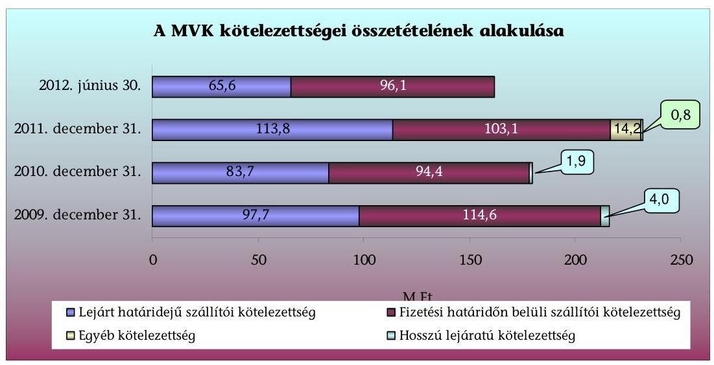

A kötelezettségeken belül a rövid lejáratú kötelezettségek, azon belül pedig a szállítói tartozások állományának súlya volt meghatározó. A szállítói kötelezettségek összege 2009. évi 212,3 M Ft-ról 2010-ben 178,1 M Ft-ra csökkent, majd 2011-ben 216,2 M Ft-ra, 2012. június 30-án 161,7 M Ft-ra változott. Az MVK szállítói tartozások miatti kötelezettségállománya, és ezen belül a lejárt esedékességű tartozások kedvezőtlenül alakultak. A konszolidációs támogatás hatására 2012. I. félévében számottevő mértékben csökkent a lejárt tartozások állománya. A 2009. évben a lejárt határidejú szállítói kötelezettségek összege 97,7 M Ft (46,0\%), 2012. június 30-án 65,6 M Ft (40,6\%) volt. A kedvező változást a konszolidációs támogatás mellett az MVK lejárt határidejú tartozások csökkentése, kezelése érdekében hozott intézkedések eredményezték.

Az MVK likviditási helyzete az ellenőrzött időszakban kedvező irányba változott. A likviditási ráta értéke a 2009. évi 0,13-ról a 2011. évben 0,46-ra javult. A likviditás megőrzése, javítása érdekében a MVK folyamatosan tárgyalt a jelentősebb beszállítókkal, amelyek hatására a készpénz likviditási mutató értéke a 2009. december 31-ei 0,3\%-ról 2011. december 31-én 9,7\%-ra változott. A likviditási mutatók lényegesen elmaradtak a szakmailag elvárható mértéktől, a kórház 2011. december 31-én nem rendelkezett elegendő fedezettel az esedékes kötelezettségek teljesítéséhez.

Az MVK a 2009-2011. években a pénzügyi tevékenység alakulásával összefüggő belső kontrollokat kialakította. A gazdálkodási jogköröket gyakorlók személyét belső szabályzatban meghatározták, a szabályozás során betartották az összeférhetetlenségi követelményeket. Kialakították az Áht. (új) 69. §-ában előírt kontrollrendszert, intézkedtek a belső ellenőrzés kialakításáról és múködtetéséről. A költségkeret gazdálkodás rendjét főigazgatói utasításban írták elő a gyógyszerekre, szakmai anyagokra, vérkészítményekre, élelmezési anyagokra. A költségkeret gazdálkodást havonta értékelték.

---

Az MVK ágyszámaiban változás nem történt, az aktív fekvőbeteg szakellátásban átlagosan 137, a krónikus fekvőbeteg szakellátásban 133 múködő ággyal rendelkezett. A pénzügyi egyensúlyi helyzet romlásában az ellátási teljesítmények alakulása is szerepet játszott. Egyes kiemelt teljesítménymutatók a következők szerint változtak:
12. számú ábra
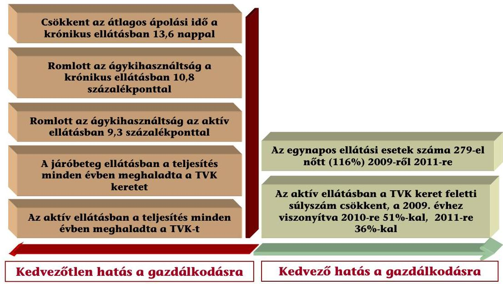

Az MVK munkaerő hiánya (üres álláshelyek száma) - a hiányzó létszám pótlására hozott intézkedések ellenére az előző évhez viszonyítva, a 2010. évi csökkenés után, folyamatosan nőtt. Az engedélyezett álláshelyek száma a 2009. évi 413 -ról a 2012. év I. félévben 385 -re, a betöltött álláshelyek száma a 2009. évi 360 -ról a 2012. év I. félévére 311 -re csökkent. A humán erőforrás hiány elsősorban az egészségügyi személyzet körében jelentkezett. Orvosoknál a 2009. évben 12, 2012. év I. félév végén 18 betöltetlen álláshely, szakdolgozóknál a 2009. évben 17, a 2012. év I. félév végén 29 üres álláshely volt. A nem egészségügyi személyzetnél az ellenőrzött időszakban a betöltetlen álláshelyek száma 5 fővel nőtt. A hiányzó munkaerő biztosítására közreműködői és megbízási szerződéssel foglalkoztattak orvosokat, illetve a 2010. évben közhasznú munka keretében 1 főt alkalmaztak, amelyhez 0,2 M Ft támogatást kaptak. A Munkaerőpiaci Alapból bérköltség támogatásra a 2009. évben 1 főt, a 2010. évben 2 főt érintően összesen 0,6 M Ft, a 2011. évben 2 főt érintően szintén 0,6 M Ft támogatást kaptak. Az MVK 2010. február 1-én a Dél-dunántúli Regionális Munkaügyi Központtal szerződést kötött 27 fő továbbképzésére (ápoló-, digitális írástudás képzés). A 19,3 M Ft költségú képzés 100\%-ban támogatott volt. A diplomás ápoló hiány pótlására az MVK a 2010. évben 4 fő ápoló képzésének költségét vállalta. A létszámcsökkentéssel összefüggő többletráfordítások csökkentésére a 2011. évben 1,0 M Ft támogatásban részesültek. A létszámcsökkentéssel összefüggő, illetve közhasznú munka keretében kapott támogatások javították az ellenőrzött időszakban az MVK pénzügyi helyzetét.

Az MVK - pénzügyi helyzetének javítása érdekében - a 2009-2012. év I. félév közötti időszakban a gyógyszerfelhasználás költségének csökkentésére in-

---

tézkedéseket hozott. Az összes gyógyszerkiadáshoz képest a térítésmentesen kapott gyógyszerek aránya a 2009. évben 34,5\% (26,7 M Ft), a 2012. év I. félévében 19,5\% (6,1 M Ft) volt. Az összes gyógyszerbeszerzési költség a 2009. évben az OEP bevétel 5,3\%-át (77,5 M Ft), a 2011. évben az OEP bevétel 3,9\%-át (59,7 M Ft) tette ki. A gyógyszerköltségek csökkentésére a 2009. évben 132, a 2011. évben 126 féle készítményt váltottak originálisról generikus készítményre.

Az MVK intézkedéseket hozott 2009-2012. I. félévben a szakmai anyagok beszerzési költségének csökkentésére, azokat folyamatosan figyelemmel kísérte, költségmonitoringot, keretrendszert múködtetett. A közbeszerzések lefolytatása eredményeként a közbeszerzés becsült értékéhez képest a 2010. évben 5,2 M Ft, 2012. évben 9,5 M Ft megtakarítás keletkezett, javítva ezzel a pénzügyi helyzetet. Szakmai anyag raktárkészletet a kórház nem tartott. A szakmai anyagok fajlagos beszerzési költségindexe 21,5\%-kal csökkent, ezzel az országos átlagnövekedés alatt maradt. A mutató abszolút csökkenése a pénzügyi helyzetre a kórházak átlagánál pozitívabb hatást gyakorolt.

Az MVK a vásárolt közszolgáltatások alakulását figyelemmel kísérte. Költségmonitoringot múködtetett a vásárolt villamos energia, illetve távhő és melegvíz tekintetében. Közmű-költségcsökkentési intézkedést hozott azzal, hogy megszüntette a szakrendelők üzemeltetését. A villamos energia költségekben 2010-ben 12,7 M Ft, illetve 2011-ben 3,8 M Ft megtakarítás keletkezett, javítva ezzel a pénzügyi helyzetet. Az egy ápolási napra vetített (fajlagos) villamos energia felhasználás $12,1 \%$-kal csökkent 2009-ről 2011-re.

A vásárolt távhő és melegvíz, valamint a víz tekintetében a fajlagos felhasználás 2009-ről 2011-re nőtt. 2010-ben az MVK kezdeményezésére a távhő esetében átálltak a hőmennyiségen alapuló elszámolásra az ellenőrizhetőség miatt. 2010-ben a járóbeteg ellátást biztosító szárnyak bezárásával a fűtésre használt melegvíz éves díja 7,7\%-kal csökkent, de a későbbi időszakban ismét jelentősen nőtt (42,6\%). A távhőszolgáltatás fajlagos költsége az ellenőrzött időszakban folyamatosan emelkedett (ápolási naponként $0,72 \mathrm{EFt}, 0,75 \mathrm{EFt}, 1,10 \mathrm{EFt}$, $1,20 \mathrm{EFt}$ ), így a távhő és melegvíz szolgáltatás díjának csökkentése terén tett intézkedések nem voltak elegendőek és nem járultak hozzá a pénzügyi egyensúly megteremtéséhez. A vízfogyasztás tekintetében az MVK nem múködtetett költségmonitoringot, a fajlagos felhasználás $54 \%$-kal megnőtt 2009-2011 között.

A segédüzemi tevékenységek költségeinek alakulását is figyelemmel kísérték, a betegélelmezés és a textilmosatás kivételével. A szolgáltatási díj reálértéke a betegélelmezésnél 7,0\%-kal csökkent 2009 és 2011 között. A 2010-2012. év I. félévében 11,7 M Ft költségmegtakarítás keletkezett, amely a múködési egyenlegjavulást erősítette.

A nagyértékű orvosi gépek-műszerek közül a kémiai laborautomata kihasználtsága javult, 2009. évi 59,0\%-ról 2011. évre 65,8\%-ra nőtt. A mútők esetében csekély visszaesés mutatható ki, a kihasználtság a 2009. évi 43,6\%-ról 2011. évre 42,1\%-ra csökkent. Az ellenőrzött nagyértékű berendezések üzemeltetésének fajlagos költségei (önköltségei) a kémiai laborautomata

---

esetében az inflációt meg nem haladóan, 2009. évről 2011. évre 6,0\%-kal nőttek, illetve a mútők esetében 6,3\%-kal csökkentek. Mindezek az MVK pénzügyi helyzetére pozitív hatást gyakoroltak.

# 1.12. Mátészalka Területi Kórház Egészségügyi Szolgáltató Nonprofit Kft. (MTK) 

Az MTK pénzügyi egyensúlya 2009-2010 között nem volt biztosított, azonban 2011-ben a kapott konszolidációs támogatással és a belső intézkedésekkel megteremtették a bevételek és a ráfordítások közötti egyensúlyt. A 2009-2010. években a múködési, illetve a felhalmozási bevételek nem nyújtottak fedezetet a múködési és felhalmozási tevékenység forrásigényére, ennek hatására a finanszírozási műveletek nélküli GFS pozíció ${ }^{49}$ negatív értéket mutatott, 2011ben azonban pozitív lett. Konszolidációs támogatás nélkül a költségek és ráfordítások mindhárom évben meghaladták az adott évi bevételeket. A szállítói kötelezettség - ezen belül a lejárt határidejú szállítói tarozások - állománya 2010ben és 2011-ben is csökkent az előző évhez képest. A szállítói kötelezettség 2011. év végi állománya a dologi ráfordítások ( $3252,1 \mathrm{M} \mathrm{Ft}$ ) 11,7\%-át tették ki. A 2012. év I. félévében a szállítói kötelezettségek és a lejárt esedékességű szállítói tartozások növekedtek, összegük $484,8 \mathrm{M}$ Ft, illetve $166,8 \mathrm{M}$ Ft volt. A saját bevételek növelésére és a racionális költséggazdálkodásra tett intézkedések a pénzügyi helyzetet javították.

Az MTK 2010. június 30-ig költségvetési intézményként múködött. Mátészalka Város Önkormányzata (továbbiakban: Önkormányzat) 2009. november 1-jén önkormányzati biztost jelölt ki az intézmény gazdálkodásának felügyeletére, aki a költségvetési szerv megszűnéséig látta el feladatát. A Képviselőtestület döntése alapján 2010. július 1-jétől az egészségügyi közszolgáltatást a költségvetési intézmény utódszerveként ${ }^{50}$ létrehozott kiemelten közhasznú nonprofit gazdasági társaság ${ }^{51}$ látja el. Az Önkormányzat az egészségügyi közfeladat zavartalan ellátásához szükséges vagyont a kórház részére ingyenes használatba adta. Ezzel egyidejúleg az Önkormányzat átadta - a megszüntetett költségvetési szervtől származó - 687,4 M Ft összegű kötelezettséget és 457,3 M Ft összegű követelést. A kórház - a Szabolcs-Szatmár-Bereg Megyei Közgyűlés által létrehozott, irányító, koordináló szerepet betöltő, könyvviteli szolgáltatást nyújtó - Egészségügyi Szervezési és Szolgáltató Holding Nonprofit Zrt.-hez (Holdinghoz) 2010. július 1. napjától csatlakozott. A kórház által használt önkormányzati vagyon 2012. május 1-jén állami tulajdonba került.

A MTK gazdálkodásában - a kórház adatszolgáltatása alapján a CLF módszer szerinti pénzügyi egyensúly 2009-2011 között javuló tendenciát mutatott. A 2009-2010. évek múködési bevételei az üzemeltetés költségeit és ráfordításait nem fedezték. A múködési (kórházi ellátási) tevékenység veszteséges volt,

[^0]
[^0]:    ${ }^{49}$ A finanszírozási műveletek nélküli (GFS) pozíció a 2009. évben -170,0 M Ft, a 2010. évben -179,9 M Ft, a 2011. évben 93,0 M Ft volt.
    ${ }^{50}$ Az Áht. (régi) 100/O. §-ában foglaltak alapján.
    ${ }^{51}$ Az Önkormányzat kizárólagos tulajdonában levő Mátészalkai Területi Kórház Egészségügyi Szolgáltató Nonprofit Kft.-t.

---

azonban a veszteség csökkent, a múködési jövedelem a 2009. évi -163,4 M Ft-ról 2010-re -130,8 M Ft-ra (80,0\%-ra) mérséklődött. 2011-ben 106,6 M Ft eredmény képződött a múködésben. A múködési jövedelem kedvező irányú változását a múködési bevételek növekedése és racionális létszámés költséggazdálkodás érdekében hozott intézkedések hatása együttesen eredményezték. Az OEP támogatás növekedése és a 2011. évi ráfordítások csökkenése kedvezően hatott a múködési egyensúlyra. A felhalmozási egyenleg mindhárom évben negatív volt, a pénzügyi pozíció alakulására kedvezőtlenül hatott, azonban súlyát tekintve a pénzügyi egyensúlyi helyzetre nem volt meghatározó szerepe. Az MTK pénzügyi kapacitása (nettó múködési jövedelme) a múködési jövedelemmel egyező, mivel pénzintézettel szemben fennálló kötelezettsége nem volt, adósságszolgálat a múködési jövedelmet nem terhelte.

A kórház múködési egyensúlyának megteremtését segítette a 2010. évi 126,4 M Ft és a 2011. évi 123,7 M Ft adósságkonszolidációs támogatás. Az adósságkonszolidációs programok végrehajtása érdekében az MTK intézkedési tervet készített, az ebben szereplő feladatok végrehajtásáról beszámolót készítettek. A konszolidációs támogatások felhasználását a KEHI ellenőrizte, jogszerűnek ítélte, visszafizetési kötelezettséget nem írt elő.

A 2009-2011. években a múködési és a felhalmozási tevékenység egyenlege, a pénzügyi kapacitás az alábbiak szerint alakult:
39. számú diagram
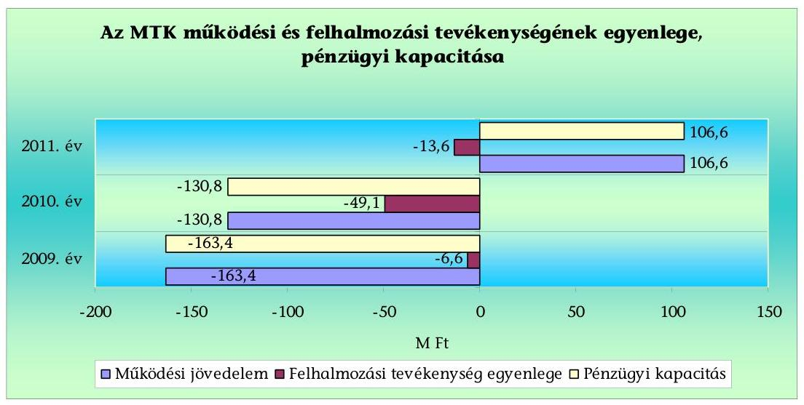

A múködés finanszírozását szolgáló bevételek növekedtek, 2010-re 3488,2 M Ft-ra 22,5\%-kal, a 2011. év végére 3358,7 M Ft-ra, 18,0\%-kal emelkedtek a 2009. évhez képest, ugyanakkor 2010-ről 2011-re a bevételek csökkentek, melyben az államháztartáson kívüli bevételek csökkenése játszott döntő szerepet. A múködési bevételekre kedvezően hatott az OEP-től kapott támogatás emelkedése, amely 2010-ben 41,6 M Ft-tal (1,6\%-kal), 2011-ben 362,2 M Fttal (33,4\%-kal) emelkedett.

A kórház saját bevételei 2009-2011 között 2,2 M Ft-tal (1,9\%-kal) csökkentek, amely negatív hatással volt a pénzügyi egyensúly megteremtésére. Az ellenőrzött időszakban a saját bevételek közel fele betegellátásból, szolgáltatások el-

---

lenértékéből, külső élelmezés értékesítéséből, magánrendelések miatti eszközbérbeadásból, valamint szolgálati lakások térítési díjbevételéből származott. A kórház megemelte a bérleti díjakat, viszont az alacsony mértékű emelés miatt ez az intézkedés nem növelte a saját bevételeket. Az egyéb bevételi jogcímeken csökkenés volt tapasztalható.

Az MTK 2009-2011. évek múködési bevételeit és ráfordításait, azok főbb jogcímenkénti alakulását a következő diagram szemlélteti:
40. számú diagram
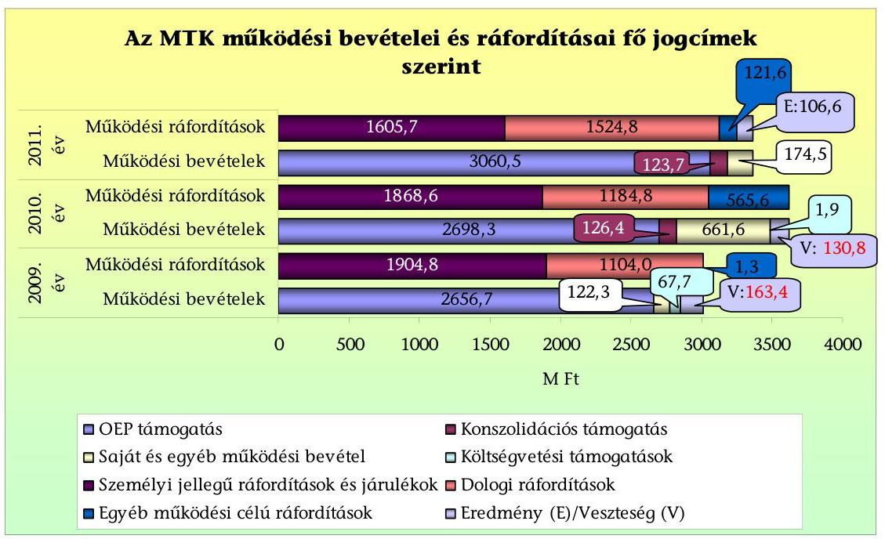

A 2009. évről 2011. évre a múködési költségek és ráfordítások az inflációt meghaladó - a múködési bevételek ( $18 \%$-os) növekedését el nem érő - mértékben növekedtek, összegük a 2009. évi 3010,1 M Ft-ról 2010-ben 3619,0 M Ft-ra, a 2011. évre 3252,1 M Ft-ra változott, a 2009. évhez képest 8,0\%-kal emelkedtek. A 2010. évi növekedésében meghatározó szerepe volt a költségvetési szerv megszűnésével kapcsolatban jelentkező egyszeri jelleggel felmerülő, MTK-t terhelő kötelezettségeknek. A 2011. évtől kedvezőtlenül hatott a pénzügyi helyzetre, hogy az MTK az iparűzési adófizetési kötelezettség alanyává vált. A költségek annak ellenére növekedtek, hogy csökkentésük érdekében a betegellátást érintő, a szakmai és gyógyászati anyag felhasználásban, energiafelhasználásban megtakarítást eredményező intézkedéseket hoztak. A villamos energiaszolgáltatás tekintetében - a Holdinghoz való csatlakozást követően - jelentős megtakarítást (adatszolgáltatásuk szerint a 2010. évben 11,5 M Ft-ot) értek el. A Holding keretében lefolytatott közös közbeszerzési eljárás eredményeképpen egy kWh villamos energia beszerzési ára 32,01 Ft-ról 25,61 Ft-ra változott. Létszám racionalizálásra is sor került, amely a személyi jellegű ráfordítások csökkenését eredményezte.

A gyógyító tevékenység közvetlen és felosztott gazdasági és műszaki költségeire fedezetet biztosított az OEP támogatás és az egyéb bevételek együttes összege.

---

A felhalmozási tevékenység ráfordításai - azok nagyságrendje miatt - érdemben nem befolyásolták a pénzügyi helyzet alakulását. A felhalmozási célú bevételek nem nyújtottak fedezetet a felhalmozási tevékenység forrásigényére. Az ellenőrzött időszakban összesen 54,0 M Ft értékű beruházási és felújítási tevékenységet végzett az MTK. A hiányzó felhalmozási forrást - a kórház adatszolgáltatása alapján - adományból, tulajdonostól kapott támogatásból és saját bevételekből biztosították. A beszerzések tervezése során nem számszerúsítették és nem vették figyelembe a tárgyi eszközök jövőbeni fenntartási, üzemeltetési költségeit.

A MTK-nál a gazdálkodási forma változása miatt nem volt összehasonlítható, illetve nem volt kimutatható, hogy a 2009-2011. években az elvégzett beruházások és felújítások az elszámolt értékcsökkenésnek megfelelő eszközpótlás fedezetét összességében biztosították-e. Ennek oka, hogy a 2010. július 1-től ingyenesen használatba vett eszközök az Önkormányzat nyilvántartásában szerepeltek ${ }^{52}$. A 2011. évben elvégzett 12,9 M Ft értékű beruházás és $0,9 \mathrm{M}$ Ft értékű felújítás biztosította az adott évben elszámolt értékcsökkenést (3,4 M Ft) kompenzáló eszközpótlást.

Az MTK kötelezettségeinek állománya 2009-2011 között csökkent, záró értéke a 2009. évi 754,9 M Ft-ról a 2011. év végére 656,0 M Ft-ra (8,4\%-kal) mérséklődött, 2012. június 30 -án 716,3 M Ft-ra változott.

Az ellenőrzött időszakban a kórháznak hosszú lejáratú kötelezettsége nem volt. A rövid lejáratú kötelezettségek összegén belül csökkenő részarányt képviseltek a szállítói kötelezettségek, arányuk a 2009. évi 87,6\%-ról 2011-ben 58,0\%-ra változott, a 2012. év 1. félévében 60,9\%-ra növekedett. A 2009. évtől kezdődően a rövid lejáratú kötelezettségek állománya előbb csökkenő (a szállítói kötelezettségek mérséklődése miatt), majd növekvő tendenciát mutatott az egyéb kötelezettségek (elsősorban a helyi iparűzési adó) változásának hatására. A kórház szállítói tartozások miatti kötelezettségállománya, ezen belül a lejárt esedékességű tartozások állománya 2009-2011 között összességében kedvezően alakult. A 2009. évben a lejárt határidejú szállítói kötelezettségek összege 474,9 M Ft (71,8\%), 2011. december 31-én 228,1 M Ft (59,9\%) volt. A pénzügyi egyensúly irányába mutató kedvező változást a konszolidációs támogatás, valamint az MTK lejárt határidejú tartozások csökkentése, kezelése érdekében hozott intézkedései eredményezték.

A konszolidációs támogatás felhasználására vonatkozó szakmai és gazdálkodási feladatokat érintő intézkedési tervet elkészítették. A kórházhoz 2009. november 1-től 2010. június 30-ig a működőképesség fenntartása érdekében önkormányzati biztost rendeltek ki, amit a kórház pénzügyi helyzete, a lejárt határidejú tartozásinak állománya tett szükségessé.

A lejárt határidejú szállítói kötelezettségek összege és aránya a 2012. év első félévében 39,9 M Ft-tal (17,5\%-kal) növekedett az előző évhez képest. A szállítói tartozások növekedésének oka, hogy az átalakuláskor átvállalt kötelezettségek,

[^0]
[^0]:    ${ }^{52}$ A fenntartó Önkormányzat által végzett, folyamatban lévő (címzett támogatásból megvalósuló) fejlesztés várható bekerülési értéke $850,0 \mathrm{M} \mathrm{Ft}$.

---

lejárt határidejú szállítói tartozások egy töredékét fedezte csak a konszolidációs támogatás, és a 2009-2010. években felhalmozott veszteséget az MTK önerőből - a megtett bevételnövelő és kiadáscsökkentő intézkedések ellenére - nem tudta kigazdálkodni. Az ellenőrzött időszakban a szállítók késedelmes kiegyenlítése miatt 37,6 M Ft késedelmi kamat és kötbér terhelte a kórházat, ami rontotta a pénzügyi pozícióját.

Az MTK összes kötelezettsége, illetve ezen belül a szállítói és a lejárt határidejú szállítói állománya az alábbiak szerint alakult:
41. számú diagram
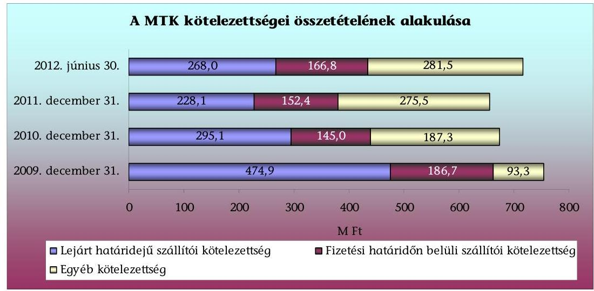

Az MTK likviditási helyzete az ellenőrzött időszakban kedvező irányba változott, ennek ellenére a fizetőképesség mértéke az elvárt szint alatt maradt. A likviditási ráta folyamatosan javult, mértéke a 2009. évi 0,23-ről 2010ben 0,79-re, 2011-ben 1,09-ra emelkedett. A készpénz-likviditási mutató mértéke emelkedett, a rövidlejáratú kötelezettségek a 2009. december 31-ei állományának 2,1\%-ára, 2011-ben 24,6\%-ra biztosított fedezetet. A javuló tendencia ellenére a likviditási mutatók jelentősen elmaradtak az elvárt értéktől, a 2011. december 31-én rendelkezésre álló forgóeszközök nem biztosítanak fedezetet a rövidlejáratú kötelezettségek teljesítésére.

A MTK a szakmai anyaggazdálkodás területén kialakította és múködtette a költség-monitoring rendszert, azonban az gáz-víz- és csatorna költségek tekintetében nem történt meg a rendszer kialakítása, a költségek folyamatos figyelése.

Az MTK ágyszámaiban változás nem történt, az aktív fekvőbeteg szakellátásban átlagosan 320, a krónikus fekvőbeteg szakellátásban 120 múködő ággyal rendelkezett. Az ellátási teljesítmények alakulása érdemben nem befolyásolta a pénzügyi egyensúlyi helyzetet. Egyes kiemelt teljesítménymutatók a következők szerint változtak:

---

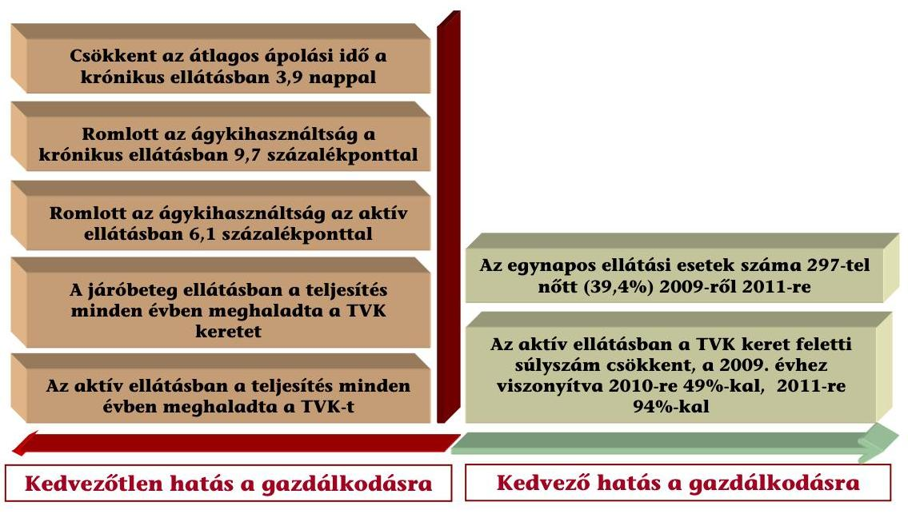

A MTK munkaerő hiánya (üres álláshelyek száma) - a hiányzó létszám pótlására hozott intézkedések (létszám-átcsoportosítások, megbízási szerződéssel történő foglalkoztatás) ellenére - a 2009. évi 17,4 fơről a 2010. évre 59,1 főre nőtt, a 2011. évre 53,7 főre csökkent, majd a 2012. év I. félévre 57,3 főre nőtt. Az engedélyezett álláshelyek száma a 2009. évi 735,1-ről a 2012. év I. év félévére 682,3-ra csökkent, a betöltött álláshelyek száma a 2009. évi 717,8-ról, a 2012. év I. félévére 625,0-ra csökkent. Az üres álláshelyek száma 20092011. évek között több mint háromszorosára emelkedett (17,4-ről 53,7-re), amelyet az üres szakorvosi, illetve szakdolgozói álláshelyek indokoltak. A humánerőforrás hiány elsősorban az egészségügyi személyzet körében jelentkezett, az orvosoknál a 2009. évben 17,8 fő, a 2012. év I. félév végén 19,7 betöltetlen álláshely volt. A hiányt vállalkozási szerződéssel foglalkoztatott orvosokkal pótolták, ezzel biztosítva a feladatok elláthatóságát és a minimum feltételeknek való megfelelést. A 2009. évi szakdolgozói státusz 2,5 fővel az engedélyezett létszám felett volt, azonban ebben a csoportban a 2012. év I. félév végén már 27,7 üres álláshely mutatkozott. A nem egészségügyi személyzetnél a 2009. évről a 2012. év I. félévre a betöltetlen álláshelyek száma 6,4 fővel nőtt. Az ellenőrzött időszakot érintően a munkaügyi központtal kötött hatósági szerződés szerint munkagyakorlat-szerzés céljából történt foglalkoztatáshoz a 2009. évben 2 fő bér- és járulék fedezetére kapott 1,1 M Ft összegű támogatást, egyéb - a szakszemélyzet pótlását célzó - támogatásban nem részesült, közmunkaprogramban nem vett részt. Az új szervezeti keretekben történő működésre való átállás a 2010. évi dolgozói létszámra kihatással volt, 45 fő végkielégítése többletterhet jelentett az MTK számára, azonban a létszámcsökkentés terheinek csökkentésére támogatásban nem részesült.

Az MTK - pénzügyi helyzetének javítása érdekében - az ellenőrzött időszakban a gyógyszerfelhasználás költségének csökkentésére intézkedéseket nem hozott. Az összes gyógyszerkiadáshoz képest a térítésmentesen kapott gyógyszerek aránya a 2009. évben 41,5\% (62,3 M Ft), a 2012. év I. félévében 14,4\% (11,1 M Ft) volt. Az összes gyógyszerbeszerzési költség a 2009. évben az

---

OEP bevétel 5,6\%-át (150,1 M Ft), a 2011. évben az OEP bevétel 4,7\%-át (151,6 M Ft) tette ki. A gyógyszerköltségek csökkentésére a 2009. évben 88, a 2011. évben 85 féle készítményt váltottak originálisról generikus készítményre.

A szakmai anyagok beszerzési költségét az MTK figyelemmel kísérte, folyamatos költségmonitoringot, keretrendszert múködtetett. Külön intézkedést nem hozott - pénzügyi egyensúlyának javítása érdekében - a szakmai anyagok beszerzési költségének csökkentésére. Ettől függetlenül a szakmai anyag készletek forgási sebessége 2009-ről 2011-re 548,7-ről 822,4-re (50\%-kal) nőtt. A szakmai anyagok fajlagos beszerzési költségindexe az országos átlagnövekedés alatt maradt 5,8\%-kal. Az országos átlagot el nem érő fajlagos beszerzési költségnövekedés, illetve a mutató abszolút csökkenése a kórházak átlagánál pozitívabb hatást gyakorolt a pénzügyi helyzetre.

Az MTK a 2009-2012. I. félévben a vásárolt közszolgáltatások alakulását figyelemmel kísérte, azonban nem múködtetett folyamatos költségmonitoringot, keretrendszert. A villamos energia közszolgáltatás területén költségcsökkentési intézkedést hozott. Közbeszerzési tenderek eredményeként a 2010. évben 11,5 M Ft megtakarítása keletkezett. Az egy ápolási napra vetített (fajlagos) villamos energia felhasználásban azonban nem mutatható ki csökkenés, az 5\%-kal nőtt 2009-ről 2011-re. A vásárolt gáz, a távhő-, valamint víz fajlagos felhasználásai szintén emelkedtek az ellenőrzött időszakban, 20\%, $16 \%$, illetve szintén $16 \%$-kal. Mindezek kedvezőtlenül hatottak az MTK pénzügyi helyzetére.

A segédüzemi tevékenységek költségeinek alakulását figyelemmel kísérték, azonban költségmonitoringot, keretrendszert itt sem múködtettek. A saját előállítású hőközpont esetében az üzemköltségek a 2009. évi 16,9 M Ftról 2011-re 3,2 M Ft-ra (13,7 M Ft-tal) csökkentek, melyet a dolgozók Holdinghoz történő 2011. évi átcsoportosítása okozott. Az átszervezés következtében az MTK-nál kimutatott költségek csökkenése a pénzügyi pozíciót javította. Ennek ellenére a textilmosatás önköltsége reálértéken 11\%-kal, a betegélelmezésé pedig $8 \%$-kal nőtt 2009 és 2011 között.

A nagyértékú orvosi gépek-múszerek kihasználtsága - a CT berendezés kivételével - nem javult. A CT berendezés kihasználtsága a 2009. évi 69,3\%ról 2011. évre $71 \%$-ra nőtt, a kémiai laborautomaták kihasználtsága a 2009. évi $60 \%$-ról 2011. évre $54 \%$-ra, a központi mútő kihasználtsága a 2009. évi $47 \%$-ról 2011. évre $41 \%$-ra csökkent. Az CT és a központi mútő üzemeltetésének fajlagos költségei (önköltségei) reálértéken 23, illetve 24 százalékponttal nőttek. Mindezek az MTK pénzügyi helyzetére negatív hatást gyakoroltak.

# 1.13. Miskolci Semmelweis Ignác Egészségügyi Központ és Egyetemi Oktató Kórház Nonprofit Kft. (MISEK) 

A MISEK pénzügyi egyensúlya a 2009. évben nem volt biztosított, a bevételek nem nyújtottak fedezetet a felmerülő költségekre. A 2010-2011. években - a kórházi teljesítmények kedvező változásának és a kórházi ellátás finanszírozását módosító rendelkezések hatására - megnövekedett OEP támogatással biztosított volt a kórház pénzügyi egyensúlya. A finanszírozási műveletek nélküli

---

GFS pozíció ${ }^{53}$ 2009-ben negatív értéket mutatott, amelyet a múködési és felhalmozási tevékenység negatív egyenlege együttesen okozott. A 2010-2011. években mind a múködési, mind a felhalmozási tevékenység bevétele meghaladta a ráfordításokat, így a GFS pozíció is pozitív értéket mutatott. Konszolidációs támogatás nélkül 2010. évben nem képződött múködési jövedelem. A szállítói kötelezettségek folyamatosan mérséklődtek, ezzel együtt - a konszolidációs támogatás hatására - a lejárt határidejú szállítói tartozások csökkentek. A szállítói kötelezettség 2011. évi állománya a dologi ráfordítások ( 4212,7 M Ft) 33,7\%-át tették ki. A MISEK 2012. I. félév végi szállítói állománya tovább csökkent (1298,3 M Ft-ra), amelyből a lejárt esedékességű szállító kötelezettség 775,9 M Ft volt. A felhalmozási tevékenység pénzügyi egyenlege minden évben negatív volt, a fejlesztésekhez nem rendelkeztek elegendő felhalmozási célú forrással, a fejlesztési egyenleg a pénzügyi pozíciót rontotta.

Az ellenőrzött időszakban az egészségügyi szolgáltató feladatokat az önkormányzati költségvetési szervként múködő Miskolci Egészségügyi Központ látta el. Miskolc Megyei Jogú Város Önkormányzata a költségvetési szervet jogutód nélkül megszüntette és 2009. március 1-jétől a kizárólagos önkormányzati tulajdonban levő, kiemelten közhasznú minősítéssel rendelkező gazdasági társaság (MISEK) végezte az egészségügyi szolgáltató tevékenységet. Feladatellátási megállapodás alapján a költségvetési szerv megszűnésének napján fennálló követelése és kötelezettsége a MISEK-t illeti meg, illetve terheli. A MISEK alapításkor az Önkormányzattól kapott vagyona 2012. május 1-jén állami tulajdonba került.

Az elhasználódott eszközök pótlására, állagmegőrzésére 2009-2011. években nem képződött az elszámolt értékcsökkenésnek megfelelő forrás, arra az OEP támogatás nem biztosított fedezetet. A pénzügyi egyensúly megtartásában kockázati tényezőként jelenik meg a szállítói tartozásokon belül - a kedvező tendenciák ellenére - a lejárt határidejú szállítói kötelezettségek magas aránya (2012. június 30 -án $40,2 \%$ ). A pénzügyi egyensúly megteremtésében további bizonytalansági tényező a likviditási ráta és a készpénz-likviditási mutatónak az elvárt szintet el nem érő mértéke.

A MISEK múködési tevékenységének CLF módszerrel megállapított pénzügyi egyenlege 2009-2011 között kedvező irányba változott. A 2009. évben elszámolt bevételek nem nyújtottak fedezetet a felmerült költségekre, ráfordításokra, a múködési tevékenység vesztesége 1135,8 M Ft volt. A múködés költségei a 2009. évben 12,5\%-kal haladták meg a bevételeket. A veszteség kialakulását részben a finanszírozási környezet változása ${ }^{54}$, a „lebegő finanszírozás"okozta, melynek következtében megnőtt a nem finanszírozott ellátások aránya. A költségvetési szerv megszüntetésével kapcsolatban végrehajtott létszámleépítés miatt jelentkező ( 616,3 M Ft) egyszeri kötelezettség átvállalása ugyancsak hozzájárult a veszteség kialakulásához. A 2010-2011. években múködési jövedelem képződött. Kedvező fordulatot eredményezett a 2010. évben kapott konszolidációs támogatás, amely nélkül a tevékenység veszteséges volt.

[^0]
[^0]:    ${ }^{53}$ A finanszírozási múveletek nélküli (GFS) pozíció a 2009. évben -1330,7 M Ft, a 2010. évben 313,3 M Ft, a 2011. évben 599,8 M Ft volt.
    ${ }^{54}$ Előre Meghatározott Alapdíjon Finanszírozott Teljesítmény (EMAFT) bevezetése.

---

A pozitív változáshoz a konszolidációs támogatás mellett a szakmai teljesítménymutatók javulása, az egészségügyi ellátás finanszírozási szabályaiban történt változások, valamint a költségtakarékossági intézkedések járultak hozzá. A 2010. évben 341,2 M Ft, a 2011. évben 633,5 M Ft múködési jövedelem (és ezzel azonos összegű pénzügyi kapacitás) képződött, amely $85,7 \%$-os növekedést jelent.

A MISEK lejárt szállítói tartozások rendezésére, valamint a várólisták csökkentésére konszolidációs támogatásban részesült a 2010. évben 516,3 M Ft és a 2011. évben 315,6 M Ft-ban. A konszolidációs támogatás felhasználására szakmai és a gazdálkodási feladatokra az intézkedési tervet elkészítették.

A 2009-2011. években nem képződött olyan összegű működési jövedelem, mely az elszámolt értékcsökkenésnek megfelelő eszközérték csökkenés pótlására fedezetet biztosítana. Az OEP-től származó bevételekben az értékcsökkenés nem térült meg, az apportba adott eszközök állagmegőrzésére fedezetet nem biztosított. A MISEK múködését, a betegellátás biztonságát közép- és hosszú távon veszélyezteti, hogy az amortizáció pénzügyi realizálásának hiányában a kórház nem képes megteremteni az állagmegóváshoz, elhasználódott eszközök pótlásához szükséges pénzügyi fedezetet.

A múködési és a felhalmozási tevékenység egyenlegét, pénzügyi kapacitását 2009-2011 között az alábbi diagram szemlélteti:
42. számú diagram
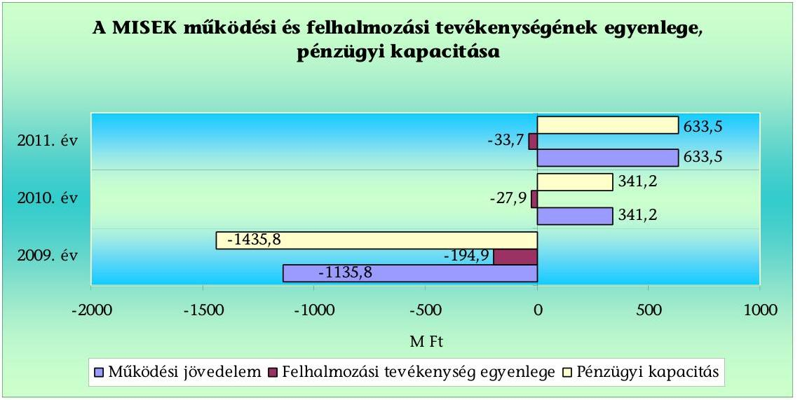

A múködési célokat szolgáló bevételek és költségek változásának együttes hatására a múködési jövedelemtermelő-képesség miatti kockázat mérséklődött. A múködés finanszírozását szolgáló bevételek növekvő tendenciát mutattak, a 2009. évi 7939,7 M Ft-ról 2011. év végére 8719,2 M Ft-ra, 9,8\%-kal nőtt az egészségügyi ellátás finanszírozásának változása és a saját bevételt növelő intézkedések hatására. A múködési bevételeken belül az OEP támogatások öszszege és részaránya a 2009. évi 7221,1 M Ft-ról (90,9\%), a 2010. évi támogatás 7046,1 M Ft-ra (86,3\%) csökkent, majd a 2011. évben 8103,7 M Ft-ra (89,3\%) emelkedett. Múködési bevétel növekedést eredményezett a teljesítményfinanszí-

---

rozáson felül OEP-től kapott konszolidációs támogatás (2010-ben 516,3 M Ft, 2011-ben $315,6 \mathrm{M} \mathrm{Ft}$ ).

A MISEK saját bevételei a 2009. évről a 2010. évre 76,4 M Ft-tal (17,1\%-kal) növekedtek, és a 2011. évre 36,5 M Ft-tal ( $7,0 \%$-kal) csökkentek az előző évhez képest. A saját bevételek jelentős része négy bevételi jogcímen - szolgáltatások ellenértékéből, egyéb saját bevétel, tovább számlázott szolgáltatások, magánrendelések miatti eszköz-bérbeadásból - származott. A saját bevételek a bérleti díjak emelésére, és egyéb bevételnövelő intézkedések hatására emelkedtek. A 2011. évi csökkenést a MISEK patikájának bezárása okozta.

Az ellenőrzött időszakban a múködési költségek és ráfordítások csökkentek, a 2009. évi 9075,5 M Ft-ról a 2011. évre 8085,7 M Ft-ra ( $89,1 \%$-ra) változtak. Ebben meghatározó szerepe volt a dologi ráfordításoknak, amely a szállítói szerződések felülvizsgálata, a szerződések módosítása, valamint a költségcsökkentő intézkedések eredményeként csökkent. A dologi ráfordítások összege a 2011. évben a 2009. évihez viszonyítva 1620,6 M Ft-tal ( $27,8 \%$-kal) csökkent, a költségeken belüli aránya $64,3 \%$-ról $52,1 \%$-ra változott. A személyi juttatások költsége a létszámnövekedéssel együtt növekedett.

A gyógyító tevékenység közvetlen költsége és az E. Alapból származó bevétel különbsége (fedezeti összeg) összességében a 2009. évben 550,2 M Ft, a 2011. évben $1335,8 \mathrm{M}$ Ft volt. A fedezeti összeg a gazdasági, műszaki ellátás felosztott költségeire a 2009. évben $24,0 \%$-ban, a 2011. évben $65,5 \%$-ban nyújtott fedezetet. A múködési bevételek, ráfordítások főbb jogcímeinek arányát és alakulását a következő diagram szemlélteti:
43. számú diagram
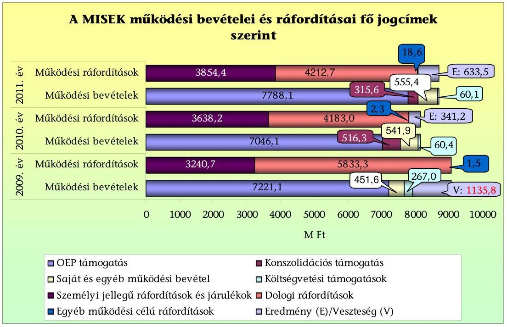

A felhalmozási célra fordítható bevételek a 2009-2011. évek között nem nyújtottak fedezetet a beruházások, felújítások finanszírozására. A felhalmozá-

---

si egyenleg kedvező változása a felhalmozási kockázatot mérsékelte, negatív egyenlege a 2009. évi -194,9 M Ft-ról a 2011. évre -33,7 M Ft-ra változott. Az ellenőrzött időszakban 289,3 M Ft beruházási és 44,5 M Ft épület felújítási tevékenységet végzett a MISEK. A felhalmozási tevékenység finanszírozásához 121,7 M Ft alapítói támogatás állt rendelkezésre. A hiányzó felhalmozási forrásokat (212,1 M Ft) a múködési bevételekből pótolták. Az eszközpótló beruházások, felújítások értéke 82,9 M Ft volt. A MISEK az ellenőrzött időszakban beszerzett tárgyi eszközök jövőbeni fenntartási, üzemeltetési költségeit vállalta.

A MISEK 2009-2011 között 1771,3 M Ft (éves átlagban 590,4 M Ft) értékcsökkenési leírást számolt el, amelynek töredékét ( $4,7 \%$-át) képezte az eszközpótlásra fordított fejlesztések értéke. Az ellenőrzött időszakban a tulajdonos önkormányzat pályázati forrásból a már MISEK tulajdonában levő ingatlanokon rekonstrukciót hajtott végre, ennek értékére vonatkozó információval a MISEK nem rendelkezett.

A finanszírozási múveletek egyenlege kölcsön igénybevétele és törlesztése miatt a 2009-2010. évek között pozitív volt. A kölcsönök igénybevételével a MISEK a fizetőképességét biztosította. A 2011. évi finanszírozási egyenleg negatív összegét - az átmenetileg szabad pénzeszközök hasznosítása céljából 501,4 M Ft értékben vásárolt - forgatási és befektetési célú értékpapír vásárlása okozta.

A 2011. év decemberében juttatott pluszforrások (konszolidációs támogatás) felhasználására 2012. január és február hónapokban került sor, azokat felhasználásig hozamgarantált értékpapírban helyezték el, emiatt a finanszírozási célú pénzeszköz felhasználások meghaladták a finanszírozási bevételek összegét. A kórház 2011. utolsó negyedévétől az átmenetileg szabad pénzeszközeit ebben a betéti formában kamatoztatta, mivel a realizált kamat mértéke látra szóló kamatot lényegesen meghaladó mértékű volt.

A MISEK kötelezettségei állományának záró értéke a 2009. évi 2445,1 M Ft-ról a 2011. év végére 2213,7 M Ft-ra (90,5\%-ra), 2012. június 30-án 2005,0 M Ft-ra csökkent. A MISEK kötelezettségeit, illetve ezen belül a szállítói és a lejárt határidejű szállítói állományát a következő diagram szemlélteti:
44. számú diagram
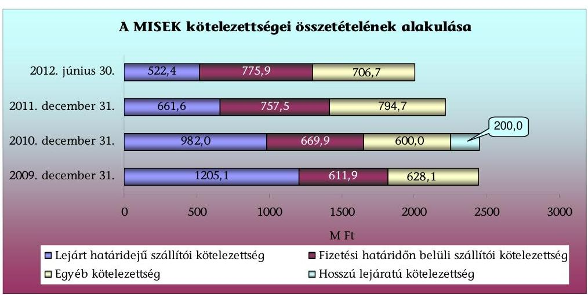

---

A MISEK-nek hosszú lejáratú kötelezettsége 2010-ben kölcsön igénybevételéből származott. A rövidlejáratú kötelezettségek összege a 2009. évtől mérséklődött a szállítói kötelezettségek csökkenése miatt. A szállítók állománya, ezen belül a lejárt esedékességű tartozások kedvezően alakultak a konszolidációs támogatások, és a tartozások csökkentése, kezelése érdekében hozott intézkedések (szállítókkal történt egyeztetés, szállítói szerződések felülvizsgálata és módosítása) hatására. A lejárt határidejű tartozások szállítókon belüli aránya fokozatosan csökkent, a 2009. évi 66,3\%-ról 2012. I. félévére 40,2\%-ra. A szállítói kötelezettség késedelmes teljesítése miatt 101,3 M Ft késedelmi kamat terhelte a kórházat az ellenőrzött időszakban, mely a pénzügyi helyzetét kedvezőtlenül befolyásolta.

A MISEK Non-profit Kft. 2009 januárjában alakult és március 1-jéig gazdasági tevékenységet nem végzett, azonban az átmeneti időszakban önkormányzati biztos kirendelésére került sor.

A MISEK likviditási helyzete az ellenőrzött időszakban kedvező irányba változott, amit a likviditási ráta változása jellemez. A likviditás megőrzése, javítása érdekében a kórház intézkedéseinek hatására a mutató értéke a 2009. december 31-ei 0,70-ról 2011. év végére 0,91-re nőtt, azonban a szakmailag elvárható mértéktől jelentősen elmaradt. A készpénz likviditási mutató a 2011. évben - értékpapír vásárlás miatt - a 2010. évi 23,7\%-ról 2,0\%-ra csökkent. Az értékpapírok értékének figyelembevételével számított likviditási mutató 26,7\%. A 2011. december 31-én fennálló rövidlejáratú kötelezettségek teljesítéséhez nem rendelkeztek elegendő fedezetként szolgáló forgóeszközzel.

A pénzügyi egyensúlyi helyzet megteremtése érdekében 2009. és 2012. I. félév között - a vásárolt közüzemi szolgáltatásoknál, gyógyszer-, szakmai anyaggazdálkodásnál - folyamatos költségmonitoringot és keretrendszert múködtetett.

A MISEK az aktív fekvőbeteg szakellátásban a 2009. évben 942, a 2010. évben 928, a 2011. évben és a 2012. év I. félévben 922 múködő ággyal rendelkezett, a krónikus ellátásban a 2009. évben 432, a 2010. évben 384, a 2011. évben és a 2012. év I. félévben 401 múködő ággyal rendelkezett. A MISEK E. Alapból származó bevétele 2009-ről 2010-re 19,6\%-kal (1154,6 M Ft-tal)-, 2010-ről 2011-re 10,5\%-kal ( 742 M Ft-tal) nőtt. A 2009-ről 2010-re történő bevétel növekedés elsődleges oka a 12\%-os aktív fekvőbeteg-ellátás TVKnövekmény és a 29\%-os járóbeteg szakellátás TVK-növekmény volt. A pénzügyi egyensúlyi helyzet kedvező változása nem az ellátási teljesítmények alakulásával állt összefüggésben. Egyes kiemelt teljesítménymutatók a következők szerint változtak:

---

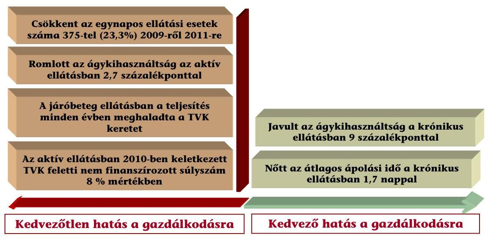

A MISEK munkaerő hiánya (üres álláshelyek száma) a hiányzó létszám pótlására hozott intézkedések (képzés, közfoglalkoztatás, az orvosi állások meghirdetése, közremúködő orvosok bevonása) ellenére a 2009. évről a 2010. évre csökkent (135-főről 118 főre), majd a 2011. évről a 2012. év I. félévre nőtt (132 főről 145 főre). Az engedélyezett (1751 főről 1787 főre) valamint a betöltött álláshelyek (1616 főről 1642 főre) száma a 2009. évről a 2012. év I. félévére nőtt. A humánerőforrás hiány elsősorban az egészségügyi személyzet körében jelentkezett. Az orvosoknál a 2009. évben 60, a 2012. év I. félév végén 62 üres álláshely, a szakdolgozóknál a 2009. évben 41, a 2012. év I. félév végén 55 üres álláshely volt. Közreműködői foglalkoztatási jogviszonyban foglalkoztatott szakorvosok száma a 2009. évben 70 fő, a 2010. évben 83 fő, a 2011. évben 80 fő és a 2012. évben 74 fő volt. A nem egészségügyi személyzetnél a 2009-2012. év I. félév közötti időszakban a betöltetlen álláshelyek száma 7 fővel csökkent. A hiányzó munkaerő biztosítására a 2009-2012. I. félévben igénybe vették a közhasznú foglalkoztatás és az EU-s pályázat biztosította lehetőségeket. A közhasznú munka keretében foglalkoztatottak száma a 2009. évben 75 fő, a 2011. évben 270 fő, a 2012. év I. félévben 121 fő volt, a foglalkoztatáshoz öszszesen 40,6 M Ft támogatást kaptak. EU-s pályázat alapján a 2010. évtől évente 14 fő foglalkoztatásra kötöttek megállapodást, amelynek keretében 2 fő szakorvost (tüdőgyógyász, aneszteziológus) és 12 fő OKJ-s végzettségű szakápolót foglalkoztattak, amelyhez 49,9 M Ft támogatást kaptak. A kapott 90,5 M Ft támogatás javította az ellenőrzött időszakban a MISEK pénzügyi helyzetét. A létszámcsökkentéssel összefüggő többletkiadások támogatására a 2009. évben 89 főt érintően, 90,9 M Ft támogatásban részesültek (ÖM rendelet ${ }^{55}$ alapján). A létszámleépítés nem érintette az egészségügyi ellátásban közvetlenül résztvevő alkalmazottakat, ők munkaügyi jogutódlással átkerültek a MISEK Nonprofit Kft-hez.

[^0]
[^0]:    ${ }^{55}$ a helyi önkormányzatok és a többcélú kistérségi társulások létszámcsökkentési döntéseivel kapcsolatos egyszeri költségvetési támogatás igénylésének, döntési rendszerének, folyósításának és elszámolásának részletes feltételeiről szóló 5/2009. (II. 20.) ÖM rendelet

---

A MISEK - pénzügyi helyzetének javítása érdekében - a 2009-2012. év I. félév közötti időszakban a gyógyszerfelhasználás költségének csökkentésére intézkedéseket hozott. Konszignációs raktárt a 2009. évben múködtetett. Az összes gyógyszerkiadáshoz képest a térítésmentesen kapott gyógyszerek aránya a 2009. évben $21,2 \%$ ( 114,5 M Ft), a 2012. év I. félévében $12,9 \%$ (24,0 M Ft) volt. Az összes gyógyszerbeszerzési költség a 2009. évben az OEP bevétel $9,1 \%$-át ( $539,0 \mathrm{M} \mathrm{Ft}$ ), a 2011. évben az OEP bevétel $4,7 \%$-át ( $378,2 \mathrm{M} \mathrm{Ft}$ ) tette ki. A gyógyszerköltségek csökkentésére a 2011. évben 98, a 2012. év I. félévében 128 féle készítményt váltottak originálisról generikus készítményre.

A szakmai anyagok beszerzési költségét a MISEK folyamatosan figyelemmel kísérte, költségmonitoringot, keretrendszert múködtetett. A pénzügyi egyensúly javítása érdekében a 2009-2012. I. félévben a szakmai anyagok beszerzési költségének csökkentésére felülvizsgálta a szállítási szerződéseket, új szerződéseket kötött meg. A szakmai anyag készletek forgási sebessége 2009-ről 2011-re 223-ról 193-ra (78\%-kal) csökkent. Az egy ápolási napra eső felhasználás 13 százalékponttal javult a kórházak átlagához viszonyítva 2009 és 2011 között. A költségcsökkentő intézkedések hatására a 2011-2012. években összesen 18,1 M Ft megtakarítást értek el, javítva ezzel a MISEK pénzügyi helyzetét.

A MISEK - a pénzügyi egyensúlyának javítása érdekében - a 2009-2012. I. félévben a vásárolt közszolgáltatások alakulását folyamatosan figyelemmel kísérte, folyamatos költségmonitoringot, keretrendszert múködtetett. A vásárolt villamos energiánál, a gázenergiánál, a víz- és szennyvíz közszolgáltatásoknál 2010-2012. években szerződés-módosítással, nyílt közbeszerzési eljárásban elért kedvezőbb árral, az elszámolások és árképzések felülvizsgálatával összesen 24,4 M Ft megtakarítás keletkezett. Ezzel összhangban 2009-ről 2011-re az egy ápolási napra vetített (fajlagos) villamos energia- (13\%-kal), a földgáz-(12\%-kal), a távhő-melegvíz- (21\%-kal) és a vízfelhasználás (19\%-kal) egyaránt csökkent.

A segédüzemi tevékenységek költségeinek alakulását is folyamatosan figyelemmel kísérték. Az energiaellátás üzemi önköltségének reálértéke 2009-ről 2011-re 19\%-ot javult. Költségcsökkentő intézkedésekkel a textilmosatásnál és a betegélelmezésnél összesen 17,6 M Ft megtakarítást értek el 2011-2012. I. félévében. Ezeknek a tevékenységeknek a fajlagos költségei is javultak: reálértéken $8 \%$-ot ( $213 \mathrm{Ft} / \mathrm{kg}$-ról nominálisan $224 \mathrm{Ft} / \mathrm{kg}$-ra, reálértéken $198 \mathrm{Ft} / \mathrm{kg}$-ra), illetve $15 \%$-ot ( $1084 \mathrm{Ft} /$ élelmezési napról nominálisan $1073 \mathrm{Ft} /$ élelmezési napra, reálértéken $945 \mathrm{Ft} /$ élelmezési napra) 2009 és 2011 között.

A nagyértékú orvosi gépek-múszerekkel való gazdálkodás nem javította a MISEK pénzügyi helyzetét. A központi mútő kihasználtsága a 2009. évi 88\%-ról 2011. évre 78\%-ra csökkent. A mútő fajlagos költsége reálértéken 59\%kal nőtt ( $25350 \mathrm{Ft} /$ esetről $43579 \mathrm{Ft} /$ esetre). A kémiai laborautomata kihasználtsága 2009-2011 között 77\%-ról, 80\%-ra javult, az egy esetre jutó költség 14 E Ft-ról 30 E Ft-ra nőtt (a 2009. évben 14,0 E Ft, a 2010. évben 22,0 E Ft, a 2011. évben 30,0 E Ft). A több, mint kétszeres költségnövekedés oka, hogy a MISEK a 2010. évi közbeszerzési eljárást követően új szerződést kötött, amelyben a teljes karbantartási költséget tartalmazta a reagens ára. Mindezek a kórház pénzügyi helyzetére negatív hatást gyakoroltak.

---

# 1.14. Mohács Város Kórháza (MoVK) 

A MoVK pénzügyi egyensúlya a 2009-2010. években nem volt biztosított, azonban a 2011. évre az önkormányzati biztos utasításai alapján megteremtették a pénzügyi egyensúlyt. A finanszírozási múveletek nélküli (GFS) pozíció ${ }^{56}$ a 2009-2010. években negatív értéket mutatott, a múködési és felhalmozási tevékenység együttes egyenlege negatív, míg a 2011. évben pozitív volt. Az összes szállítói kötelezettség év végi állománya az előző évhez viszonyított 2010. évi csökkenés után a 2011. évben növekedett, az éves dologi ráfordítás 8,3\%-át (69,2 M Ft-ot) tette ki. Az összes kimutatott szállítói kötelezettség a 2012. év I. félév végén 68,2 M Ft volt.

Az ellenőrzött időszakban önkormányzati költségvetési intézményként múködő MoVK CLF módszer szerinti pénzügyi egyensúlya a 2009-2010. évek között nem volt biztosított. A pénzügyi helyzet a 2011. évben kedvezően alakult, a pénzügyi egyensúlyi helyzet megteremtésére hozott intézkedések - bevételek növelése, racionális költség- és létszámgazdálkodás - eredményeként.

A MoVK pénzügyi egyensúlyi helyzete az ellenőrzött időszak alatt kedvező irányba változott, a 2009-2010. évek veszteséges gazdálkodását követően 2011ben pozitív működési jövedelem képződött. A 2009-2010. évben kialakult pénzügyi helyzetre, a lejárt határidejú tartozások állományára tekintettel önkormányzati biztost rendelt ki a fenntartó önkormányzat. Az egészségügyi ellátás finanszírozásában bekövetkezett kedvező változás, a konszolidációs támogatás és az önkormányzati biztos utasításai betartásának együttes hatására a MoVK rendezte határidőn túli tartozásait, 2011-ben pénzügyi egyensúlya helyreállt.

A MoVK lejárt szállítói tartozások rendezésére, valamint a várólisták csökkentésére konszolidációs támogatásban részesült a 2010. és a 2011. években. A konszolidációs támogatás felhasználására, a szakmai és a gazdálkodási feladatokra intézkedési tervet nem készítettek. A MoVK a 2010. évi 82,1 M Ft támogatást felhasználta, a 2011. évi konszolidációs támogatás felhasználására nem került sor, mivel a MoVK-nak 2011. december 31-én lejárt szállítói tartozása nem volt. A konszolidációs támogatást az OEP a 2012. június havi esedékes finanszírozási összegből levonta. A KEHI a 2010. évi konszolidációs támogatást ellenőrizte, visszafizetési kötelezettséget nem írt elő.

A múködési és felhalmozási tevékenység egyenlege, és a pénzügyi kapacitás 2009-2011 között a következők szerint alakult:

[^0]
[^0]:    ${ }^{56}$ A finanszírozási műveletek nélküli (GFS) pozíció a 2009. évben -91,4 M Ft, a 2010. évben -36,1 M Ft, a 2011. évben 131,0 M Ft volt.

---

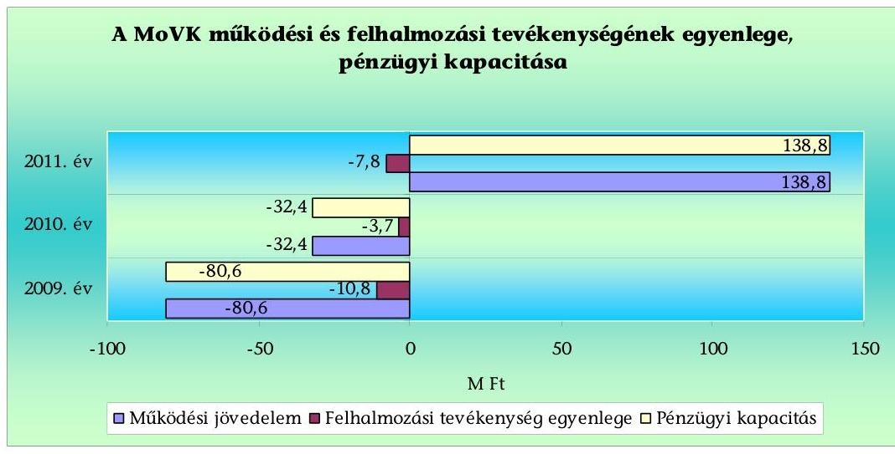

A múködési tevékenység (működési jövedelem) 2009-2010. évek között veszteséges volt, a veszteség a 2009. évi 80,6 M Ft-ról 2010-re 32,4 M Ft-ra csökkent. A múködés bevételei az üzemeltetés költségeit és ráfordításait nem fedezték. A múködési kockázatot csökkentette a 2010. évben kapott 82,1 M Ft összegű konszolidációs támogatás, amelyet a lejárt szállítói tartozások kifizetésére használtak fel. A 2011. évben 138,8 M Ft múködési eredmény képződött, amely fedezetet biztosított - a peres eljárásból származó és a szállítói - kötelezettségek teljesítésére, valamint az amortizáció miatti eszközérték csökkenés pótlására. A múködési célokat szolgáló OEP bevételek és a költségek változásának együttes hatására a múködési jövedelem-termelőképesség miatti kockázat mérséklődött. A felhalmozási tevékenység pénzügyi egyenlegének változása a felhalmozási kockázatot növelte, a beruházások, felújítások finanszírozására nem volt elegendő felhalmozási forrás. A MoVK az ellenőrzött időszakban finanszírozási (hitel- és értékpapír) múveleteket nem végzett, pénzügyi kapacitása a múködési jövedelemmel egyezően alakult.

A múködés finanszírozását szolgáló bevételek növekvő tendenciát mutattak. A 2009. évi 1991,3 M Ft-ról 2010-re 2005,0 M Ft-ra (6,9\%-kal), 2011-ben 2149,6 M Ft-ra ( $7,9 \%$-kal) változott a központi finanszírozási szabályok kedvező változásának hatására. A múködési bevételek változásában meghatározó szerepe volt az OEP-től származó támogatásoknak, 2010-ben a saját bevételek előző évhez viszonyított csökkenését ellensúlyozta a kapott költségvetési támogatás. Az OEP bevételek 2010-re 42,7 M Ft-tal ( $97,6 \%$-ra) csökkentek, 2011-ben 246,3 M Ft-tal ( $113,9 \%$-ra) növekedtek az előző évhez képest. A pénzügyi helyzetet javította a 2010-ben kapott konszolidációs támogatás. A finanszírozási szabályok megváltozása miatt 2009-2010-ben a MoVK a teljesítményei után nem jutott többletbevételhez. A fenntartótól kapott támogatás - nagyságrendjére és részarányára tekintettel - a MoVK pénzügyi helyzetét jelentősen nem befolyásolta. A múködési célú támogatás mértéke 2009-ben a bevételek 0,5\%-át (10,8 M Ft), a 2010. évben a 0,2\%-át ( $4,7 \mathrm{M}$ Ft) tettek ki.

A MoVK saját bevételei 2009-2011 között csökkentek, jelentős részük (215,1 M Ft, 76,7\%-a) négy bevételi jogcímen - áruértékesítés ellenértéke, továbbszámlázott szolgáltatás, bérleti és intézményi ellátási díjak - származott. A

---

múködési jövedelem 2009-2010. évi negatív egyenlege miatt, a saját bevételeinek növelése érdekében felülvizsgálták a közreműködői szerződések miatti esz-köz-bérbeadás feltételeit, az alkalmazottak térítési díjait, bővítették a térítési díjas ellátások körét. Ezek hatására az előző évhez viszonyítva 2011-ben a bérleti díj bevételek 12,3 M Ft-ra (70,8\%-kal), az alkalmazottak térítése 10,1 M Ft-ra (3,1\%-kal), az intézményi ellátási díjak 18,6 M Ft-ra (27,4\%-kal) emelkedtek. Az elért bevételi növekmény azonban nem ellensúlyozta az áru- és készletértékesítés, valamint egyéb sajátos bevételek csökkenését.

Az ellenőrzött időszakban a múködési költségek, ráfordítások folyamatosan csökkentek. A költségek, ráfordítások összege 2011-ben 2071,9 M Ft volt, a 2009. évhez képest 61,1 M Ft-tal (2,9\%-kal), a 2010. évhez képest 26,6 M Ft-tal (1,3\%-kal) csökkent. Ebben meghatározó szerepe volt a személyi jellegű ráfordításoknak és járulékoknak, amely a létszámleépítések hatására a 2009. évi 1287,2 M Ft-ról 2011-re 1168,2 M Ft-ra (9,2\%-kal) csökkent. A gyógyító tevékenység közvetlen költsége és az E. Alapból származó bevétel különbsége (fedezeti összeg) összességében a 2009. évben 568,9 M Ft, a 2011. évben 660,5 M Ft volt. A fedezeti összeg a gazdasági, műszaki ellátás felosztott költségére a 2009. évben 196,0\%-ban (290,3 M Ft), a 2011. évben 180,4\%-ban (366,2 M Ft) fedezetet nyújtott.

A 2009-2011. évek múködési bevételeit, ráfordításait, főbb jogcímeinek alakulását a következő diagram szemlélteti:
46. számú diagram
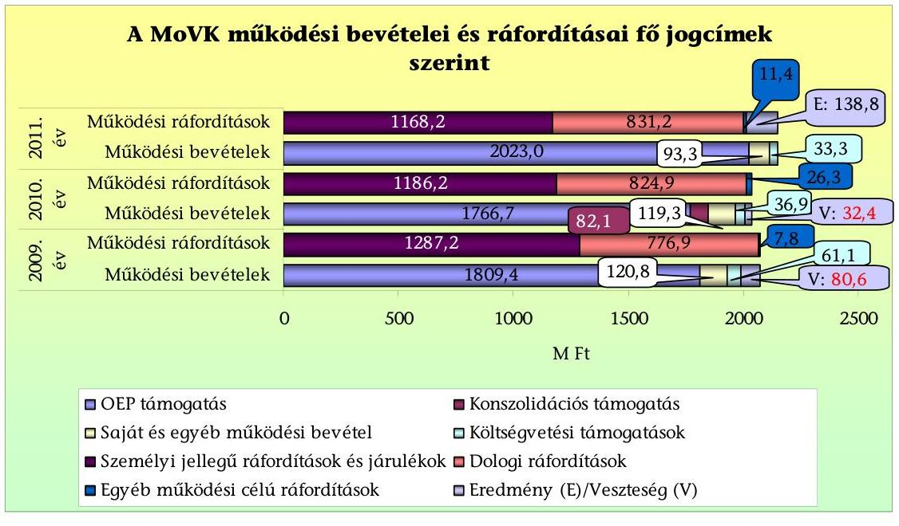

Az ellenőrzött időszakban 20,6 M Ft beruházási és 1,7 M Ft felújítási tevékenységet végzett a MoVK. A felhalmozási célra fordítható bevételekkel a 20092011. évek között nem rendelkeztek. A hiányzó fedezet biztosításához a múködési forrásokból 22,3 M Ft-ot vettek igénybe. A 2009-2011. években összesen 138,2 M Ft értékcsökkenést számoltak el, az eszközpótlásra fordított összeg (15,6 M Ft) ennek a 11,3\%-a volt. A beszerzett tárgyi eszközök jövőbeni fenntartási és üzemeltetési költségeit a MoVK vállalta.

---

A fenntartó önkormányzat által európai uniós forrásból, a TIOP 2.2.2-08 számú program keretében megvalósított fejlesztés (sürgősségi ellátás fejlesztése és gyermek sürgősségi ellátás kialakítása) várható bekerülési költsége $500,1 \mathrm{M} \mathrm{Ft}$, amelyet az eszközpótlásra fordított összeg még nem tartalmazott.

A MoVK kötelezettségeinek állománya a 2009. évet követően folyamatosan csökkent, záró értéke a 2009. évi 167,2 M Ft-ról a 2011. év végére 108,2 M Ft-ra (35,3\%-kal), 2012. június 30-án 106,5 M Ft-ra (36,3\%-kal) változott. A MoVK 2009-2012. I. félév összes kötelezettségének, ezen belül a szállítói és a lejárt határidejú szállítói állományának változását a következő diagram szemlélteti:
47. számú diagram
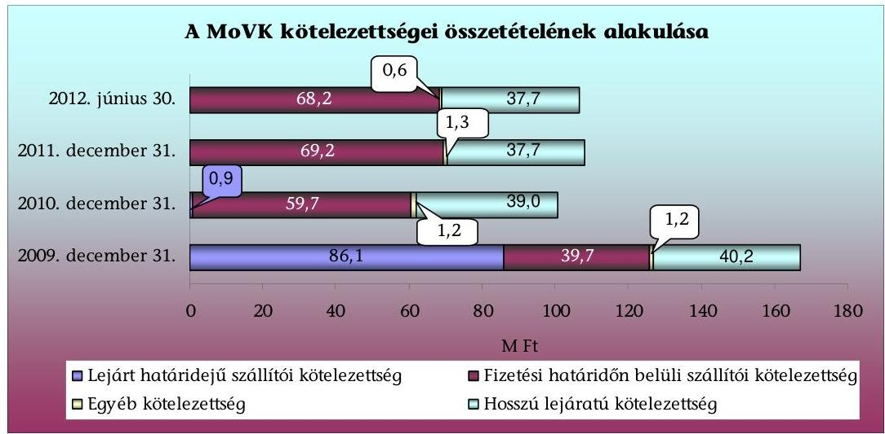

A 2012. június 30-ai kötelezettségek állományából 37,7 M Ft-ot (35,4\%-ot) a hosszú lejáratú, $68,8 \mathrm{M}$ Ft-ot ( $64,6 \%$-ot) a rövidlejáratú kötelezettségek tették ki. A MoVK-nak pénzintézettel szemben fennálló, illetve kölcsönből származó kötelezettsége nem volt. A hosszúlejáratú kötelezettség egy jogerős határozattal megítélt járadékból állt. A rövidlejáratú kötelezettségek összege 2009-től kezdődően csökkenő tendenciát mutatott a szállítói kötelezettségek változásának hatására. A 2009. évben a lejárt határidejú szállítói kötelezettségek összege 86,1 M Ft (68,4\%) volt, amely a ( $82,1 \mathrm{M}$ Ft) konszolidációs támogatás hatására 2010-ben $0,9 \mathrm{M}$ Ft-ra csökkent. A fenntartó önkormányzat 2010. február 1-től szeptember 30-ig önkormányzati biztost rendelt ki a MoVK-hoz, amit a kórház pénzügyi helyzete és a lejárt határidejú szállítói kötelezettség állománya tett szükségessé. Az önkormányzati biztos utasításai és átvilágítás javaslatai alapján a pénzügyi egyensúly fenntartása érdekében intézkedéseket tettek ${ }^{57}$. Az MoVK-nak lejárt határidejú szállítói kötelezettsége 2011. december 31-én és 2012. június 30-án nem volt.

[^0]
[^0]:    ${ }^{57}$ Kötelezettségvállalások nyilvántartásának kialakítására, teljesítés igazolások gyakorlatának egységessé tételére, teljes szerződésállomány átvizsgálására, személyi jellegű juttatások átvizsgálása, kontrolling, belső ellenőrzés kialakítására, takarékos gazdálkodás feltételeinek megteremtésére.

---

A MoVK lejárt szállítói tartozások rendezésére, valamint a várólisták csökkentésére konszolidációs támogatásban részesült a 2010. és a 2011. években. A MoVK a 2010. évi támogatást felhasználta, a 2011. évi konszolidációs támogatás felhasználására nem került sor, mivel a MoVK-nak 2011. december 31-én lejárt szállítói tartozása nem volt. A konszolidációs támogatást az OEP a 2012. június havi esedékes finanszírozási összegből levonta. A konszolidációs támogatás felhasználására, a szakmai és a gazdálkodási feladatokra intézkedési tervet nem készítettek.

A MoVK likviditási helyzete az ellenőrzött időszakban kedvező irányba változott, a likviditási ráta a 2009. évi 0,53-ról a 2011. évben 3,63-ra emelkedett. A likviditás megőrzése, javítása érdekében bevételnövelő, racionális költség- és létszámcsökkentő intézkedéseket tettek, amelyek hatására a készpénz likviditási mutató értéke a 2009. december 31-ei 0,8\%-ról 2011. év végére 241,3\%-ra emelkedett. A mutatók értéke azt jelzi, hogy a költségvetési szerv elegendő forrással rendelkezett a 2011. december 31-én a fennálló rövid lejáratú tartozásainak a rendezéséhez.

A MoVK a 2009-2011. években a pénzügyi tevékenység alakulásával összefüggő belső kontrollokat kialakította.

A MoVK ágyszámaiban változás nem történt, az aktív fekvőbeteg szakellátásban átlagosan 210, a krónikus fekvőbeteg szakellátásban 108 múködő ággyal rendelkezett. A pénzügyi egyensúlyi helyzet kedvező változása nem az ellátási teljesítmények alakulásával állt összefüggésben. Egyes kiemelt teljesítménymutatók a következők szerint változtak:
15. számú ábra
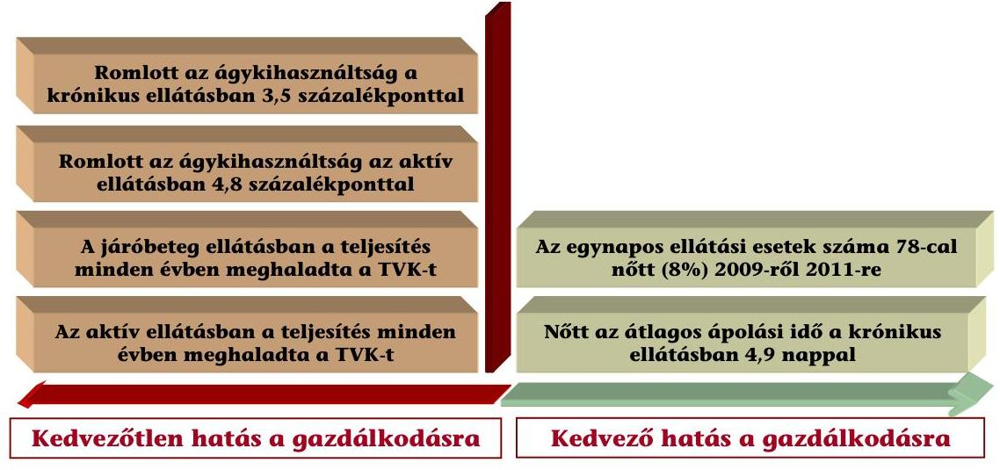

A MoVK munkaerő hiánya - a 2009-2012. év I. félév között a hiányzó létszám pótlására hozott intézkedések (megbízási és vállalkozói szerződések, közmunka program, közfoglalkoztatás) hatására - az ellenőrzött években csökkent. Az engedélyezett álláshelyek száma a 2009. évi 482-ről a 2012. év I. félévére 481-re csökkent, a betöltött álláshelyek száma a 2009. évi 450-ről a 2012. év I. félévére 476,5-re nőtt. A humánerőforrás hiány elsősorban az egészségügyi személyzet körében jelentkezett. Orvosoknál a 2009. évben 12,5, a 2012. év I.

---

félév végén 4 betöltetlen (üres) álláshely, szakdolgozóknál a 2009. évben 13,7, a 2012. év I. félév végén 0,5 üres álláshely volt. A nem egészségügyi személyzetnél a 2009-2012. év I. félév közötti időszakban a betöltetlen álláshelyek száma 5,8 fővel csökkent. A hiányzó munkaerő biztosítására a 2009-2012. év I. félévben a MoVK igénybe vette a közmunkaprogram és közhasznú foglalkoztatás biztosította lehetőségeket. A közmunkaprogram keretében foglalkoztatottak száma a 2009-2010. években 20-20 fő volt, míg a közhasznú munka során foglalkoztatottak száma a 2012. év I. félévben 1 fő volt. A közmunka és közhasznú munka után kapott támogatás összege a 2009-2012. év I. féléve között 26,0 M Ft-ot tett ki. A 2011-2012. években 3 ápoló után részesültek képzési támogatásban $0,8 \mathrm{M}$ Ft értékben. A létszámcsökkentéssel összefüggő többletkiadások támogatására a MoVK a 2009-2012. év I. félévben $4,0 \mathrm{M}$ Ft támogatásban részesült. A létszámcsökkentéssel összefüggő, illetve a közmunkaprogram, közhasznú munka keretében kapott támogatások javították az ellenőrzött időszakban a MoVK pénzügyi helyzetét.

A MoVK - pénzügyi helyzetének javítása érdekében - a 2009-2012. év I. félév közötti időszakban a gyógyszerfelhasználás költségének csökkentésére intézkedéseket hozott. Az összes gyógyszerkiadáshoz képest a térítésmentesen kapott gyógyszerek aránya a 2009. évben 60,3\% (38,6 M Ft), a 2012. év I. félévében 69,0\% (19,8 M Ft) volt. Az összes gyógyszerbeszerzési költség a 2009. évben az OEP bevétel 3,5\%-át ( $64,1 \mathrm{MFt}$ ), a 2011. évben az OEP bevétel 2,9\%-át (58,7 M Ft) tette ki. A gyógyszerköltségek csökkentésére a 2009. évben 20, a 2011. évben 30 féle készítményt váltottak originálisról generikus készítményre.

A szakmai anyagok beszerzési költségét a MoVK folyamatosan figyelemmel kísérte, költségmonitoringot, keretrendszert nem múködtetett. 2009-2012. év I. félévben szerződésmódosításokkal, árengedményekkel összesen 12,4 M Ft megtakarítás keletkezett, javítva ezzel a pénzügyi helyzetet. A szakmai anyag készletek forgási sebessége 553,7-ről 522,5-re csökkent 2009-ről 2011-re. Az egy aktív kórházi fekvőbeteg esetre jutó beszerzési költségindex az országos átlagnövekedést $30 \%$-kal haladta meg.

A MoVK - a pénzügyi egyensúlyának javítása érdekében - a 2009-2012. I. félévben a vásárolt közszolgáltatások alakulását folyamatosan figyelemmel kísérte, költségmonitoringot múködtetett. A villamos energia szolgáltatási szerződést a 2011. évben módosította, amelyből 3,8 M Ft megtakarítást kalkulált. Az egy ápolási napra vetített villamos energia felhasználás $5 \%$-kal ( $8,6 \mathrm{kWh} /$ ápolási napról $9,0 \mathrm{kWh} /$ ápolási napra) nőtt. A távhő-melegvíz szolgáltatási szerződést szintén a 2011. évben módosították, az átalánydíjas elszámolásról áttértek a fogyasztás utáni elszámolásra, így 2011-2012. év I. félévben 13,1 M Ft megtakarítás keletkezett. A fajlagos vízfelhasználás - hasonlóan a villamos energiához - 5\%-kal nőtt, viszont a gázenergia felhasználás $33 \%$-kal csökkent 2009-ről 2011-re. A megtett kórházi intézkedések, valamint a villamos energia fajlagos felhasználásának csökkenése kedvező hatást gyakoroltak a MoVK pénzügyi helyzetére.

A segédüzemi tevékenységek költségeinek alakulását is folyamatosan figyelemmel kísérték. A textil mosás és a betegélelmezés önköltsége egyaránt csökkent. A mosodai önköltség a 2009. évi $216,2 \mathrm{Ft} / \mathrm{kg}$-ról a 2011. évre 181,5 Ft/kg-ra csökkent. A betegélelmezés önköltsége 2009-ben 1014 Ft/nap,

---

2011-ben 1081 Ft/nap volt, a változás reálértéken 7 százalékpontos csökkenést jelentett.

A MoVK-nál a nagyértékú orvosi gépek-múszerek kihasználtsága javult. A kémiai laborautomaták kihasználtsága a 2009. évi 16\%-ról 2011. évre $17 \%$-ra, a központi műtő kihasználtsága a 2009. évi 59\%-ról 2011. évre 67\%-ra nőtt. Az ellenőrzött nagyértékű berendezések közül a laborautomaták üzemeltetésének fajlagos költségei inflációt meg nem haladóan, 5\%-kal nőttek. A központi mútő önköltsége reálértéken 26\%-kal csökkent. Mindezek a MoVK pénzügyi helyzetére pozitív hatást gyakoroltak.

# 1.15. Dr. Bugyi István Kórház, Szentes (BIK) 

A BIK pénzügyi egyensúlya a finanszírozási múveletek nélküli (GFS) pozíció ${ }^{58}$ alapján 2009-2011 között nem volt biztosított, a múködési és felhalmozási tevékenység együttes egyenlege negatív volt. A pénzügyi helyzet kismértékú javulását mutatja, hogy a konszolidációs támogatás, és a keretgazdálkodás eredményeként a múködési tevékenység vesztesége 2011-re csökkent. A bevételnövelő és költségcsökkentő intézkedések a pénzügyi helyzetre számottevő hatást nem gyakoroltak. A konszolidációs támogatás ellenére a lejárt határidejú szállítói kötelezettségek növekedtek, miközben az összes szállítói kötelezettség csökkent. A 2011. december 31-i szállítói kötelezettségek összege 702 M Ft volt, amely az éves dologi ráfordítások 32,6\%-át tette ki. A számviteli nyilvántartások alapján 2012. június 30 -án $336,7 \mathrm{M}$ Ft szállítói kötelezettséggel rendelkezett.

Az ellenőrzött időszakban költségvetési intézményként múködő BIK gazdálkodásában a CLF módszer szerinti múködési pénzügyi egyensúly a 2009-2011 között nem volt biztosított, a múködési tevékenység eredménye és a pénzügyi kapacitás negatív volt. A konszolidációs támogatások nélkül a BIK múködési jövedelme 2010-ben -442,3 M Ft, 2011-ben -144,5 M Ft volt. A konszolidációs támogatás nélkül számított múködési jövedelem változását 2010-ben a múködési ráfordítások növekedése, a fenntartótól kapott támogatások és az OEP finanszírozás csökkenése okozta. A 2011. évben a múködési tevékenység során keletkezett veszteség a fenntartótól kapott támogatás és a növekvő OEP támogatás hatására csökkent. A felhalmozási tevékenység egyenlege 2009-2011 közötti időszak egészében negatív volt, a felhalmozási célokra fordítható bevételek nem nyújtottak fedezetet a beruházások, felújítások finanszírozására, ami felhalmozási kockázatot jelentett.

Az adósságkonszolidációs program keretében a BIK 2010-ben 181,1 M Ft, 2011-ben 126,9 M Ft konszolidációs támogatásban részesült, amelyhez kapcsolódóan konszolidációs tervet készített. A 2011. évi adósságkonszolidációs program intézkedési tervében szereplő feladatok végrehajtása a jóváhagyott ütemben és mértékben haladt. A várólisták csökkentésére kapott konszolidációs támogatások hasznosultak. A KEHI a 2010. évi konszolidációs támogatást ellen-

[^0]
[^0]:    ${ }^{58}$ A finanszírozási múveletek nélküli (GFS) pozíció a 2009. évben -131,2 M Ft, a 2010. évben -275,2 M Ft, a 2011. évben -27,0 M Ft volt.

---

őrizte, nem írt elő visszafizetési kötelezettséget. A BIK a 2012. év I. félévében 298,0 M Ft konszolidációs támogatásban részesült. Az ellenőrzött időszakban, illetve a konszolidációs intézkedéseket követően önkormányzati biztos kirendelésére nem került sor.

A múködési és a felhalmozási tevékenység egyenlege, a pénzügyi kapacitás 2009-2011 között az alábbiak szerint alakult:
48. számú diagram
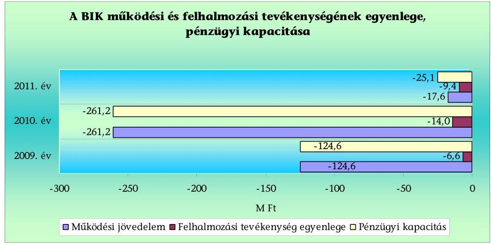

A múködés finanszírozását szolgáló bevételek 2010-re 3580,4 M Ft-ra (1,0\%-kal, 18,0 M Ft-tal), a 2011. évre 4001,7 M Ft-ra (11,8\%-kal, 421,3 M Fttal) emelkedtek. A 181,1 M Ft konszolidációs támogatás és a saját múködési bevételek 32,8 M Ft-os bevételnövelő hatását ellensúlyozta a fenntartótól kapott támogatások 107,1 M Ft-os és az OEP finanszírozás 100,8 M Ft-os csökkenése. A múködési bevételek előző évhez viszonyított 2011. évi 421,3 M Ft-os növekedését az OEP támogatás 440,1 M Ft-os és a fenntartói támogatás 38,1 M Ftos növekedése, valamint a kapott konszolidációs támogatás 54,2 M Ft-os és a saját és egyéb múködési bevételek 2,7 M Ft-os csökkenése együttesen eredményezte. A BIK a 2012. év I. félévében 298,0 M Ft konszolidációs támogatásban részesült.

A múködési bevételeken belül minden évben meghatározó volt az OEP-től származó támogatások összege. Az OEP-től származó bevételek összegének alakulását a finanszírozási szabályok változása, a konszolidációs támogatások befolyásolták. A fenntartótól kapott támogatás javította a kórház pénzügyi helyzetét. A fenntartói támogatás aránya és összege változó volt, a 2009. évben a múködési bevételek 4,3\%-át (154,2 M Ft-ot), a 2010. évben 1,3\%át (47,1 M Ft-ot), a 2011. évben 2,1\%-át (85,2 M Ft-ot) tette ki.

A BIK saját múködési bevételei 2009-ről 2010-re növekedtek, amely - átmeneti jelleggel - pozitív hatással volt a pénzügyi helyzetre. A saját bevételek (591,0 M Ft) jelentős része, összesen 466,7 M Ft (79,0\%) a közforgalmú gyógyszertár áru- és készletértékesítéséből, valamint a szolgáltatások ellenértékéből származott. A BIK a saját múködési bevételek növelése érdekében az ellenőrzött időszakban intézkedéseket hozott (a közforgalmú gyógyszertár

---

forgalmának növelése szociális otthoni partnerek bevonásával, egészségpénztári szerződések megkötésével, a bérleti díjakra vonatkozó szerződések felülvizsgálata, szakmai együttmúködés kiépítése más kórházakkal, új térítéses szolgáltatások bevezetése). Az intézkedések hatására a 2010. évben az áru- és készletértékesítés, valamint a szolgáltatások ellenértéke 18,7 M Ft-tal (28,0\%-kal), 2011-re 15,7 M Ft-tal (18,4\%-kal) emelkedett az előző évhez viszonyítva.

A múködési költségek és ráfordítások a 2010. évre 3841,6 M Ft-ra (4,2\%$\mathrm{kal}, 154,6$ M Ft-tal), 2011-re 4019,3 M Ft-ra (4,6\%-kal, 177,7 M Ft-tal) növekedtek az előző évhez viszonyítva. A személyi jellegú ráfordítások és munkaadókat terhelő járulékok együttes összege a 2009. évi 1853,8 M Ft-ról a 2010. évre 1820,2 M Ft-ra (1,8\%-kal, 33,6 M Ft-tal) csökkent, majd a 2011. évben 1858,9 M Ft-ra ( $2,1 \%$-kal, 38,7 M Ft-tal) növekedett. A változásokat a foglalkoztatottak végzettség és ágazati megoszlás szerinti alakulása okozta. A dologi ráfordítások a 2009. évi 1829,7 M Ft-ról a 2010. évre 1975,4 M Ft-ra (8,0\%-kal, 145,7 M Ft-tal), 2011. évre 2155,2 M Ft-ra ( $9,1 \%$-kal, 179,8 M Ft-tal) az inflációt meghaladó mértékben növekedtek. A dologi ráfordítások csökkentése érdekében a szakmai anyaggazdálkodásnál már 2009-ben, a vásárolt közüzemi szolgáltatások esetében 2011-ben tett takarékossági intézkedéseket. A megtett intézkedéseknek a múködési ráfordításokra összességében számottevő hatása nem volt.

A gyógyító tevékenység közvetlen költségét a BIK ellátás-típusonként kimutatta, amely szerint a fedezeti összeg 2009-ben nem nyújtott fedezetet a gazdasági-, múszaki ellátás felosztott költségeire. A 2011. évben a fedezeti összeg 116,8 M Ft-tal haladta meg a gazdasági-múszaki ellátás felosztott költségeit. A múködési bevételek, ráfordítások főbb jogcímeinek arányát és alakulását a következő diagram szemlélteti:
49. számú diagram
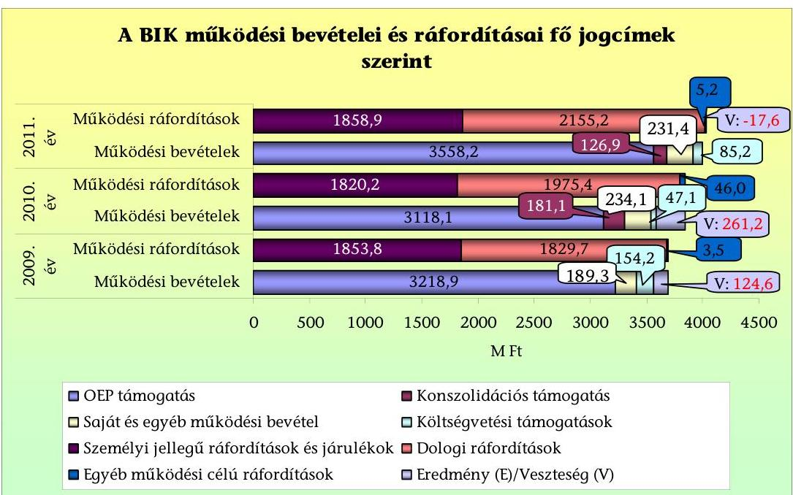

---

A 2009-2011. években a kórház 159,4 M Ft beruházási és 31,4 M Ft felújítási tevékenységet végzett. A felhalmozási tevékenység finanszírozására fenntartói- és államháztartáson belülről kapott támogatások, valamint átvett pénzeszközök szolgáltak. A BIK eszközpótlásra fordított összeget adatszolgáltatásában nem mutatott ki. A beruházások és felújítások az elszámolt 206,2 M Ft értékcsökkenésnek a 92,5\%-át tették ki ${ }^{59}$. A beszerzett tárgyi eszközök jövőbeni fenntartási, üzemeltetési költségeit a BIK vállalta.

A BIK kötelezettségeinek állománya a 2009. évi 1102,8 M Ft-ról a 2010. évben a lejárt határidejú szállítói kötelezettségek változása miatt 1058,0 M Ftra csökkent. A 2011. évre a kötelezettségek állománya a lejárt határidejú szállítói kötelezettségek emelkedése következtében 1070,7 M Ft-ra növekedett. A 2012. június 30 -ai 700,2 M Ft kötelezettségállományból 363,5 M Ft-ot (51,9\%ot) a Csongrád Megyei Önkormányzattal szemben fennálló fenntartói kölcsön, 336,7 M Ft-ot ( $48,1 \%$-ot) a szállítói kötelezettségek tettek ki. A BIK 2006tól összesen 410,6 M Ft összegben fenntartói kölcsönben részesült, amelyet a szállítói állományok csökkentésére, illetve a 90 napon túl lejárt szállítói kötelezettségek rendezésére fordított. Pénzintézettel szembeni kötelezettséggel az intézmény nem rendelkezett. Az ellenőrzött időszakban fennállt és visszafizetett hosszú lejáratú kötelezettségei lizingszerződésekből adódtak. A kapott konszolidációs támogatások ellenére, a lejárt határidejú szállítói kötelezettségek folyamatosan növekedtek, miközben az összes szállítói kötelezettség állománya csökkent. A lejárt határidejú szállítói kötelezettségek összege 2012. június 30-án 132,5 M Ft volt. A szállítói tartozások után 2009-2011 között kifizetett késedelmi kamat és kötbér mindösszesen 1,4 M Ft (a konszolidációs támogatások $0,5 \%$-a) volt.

A BIK összes kötelezettsége, illetve ezen belül a szállítói és a lejárt határidejú szállítói állománya az alábbiak szerint alakult:
50. számú diagram
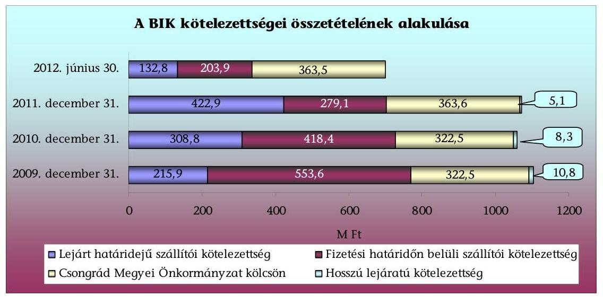

[^0]
[^0]:    ${ }^{59}$ A BIK által végzett és folyamatban lévő fejlesztések 2011. december 31-i kötelezettségvállalása 724,4 M Ft.

---

A BIK likviditási helyzete a 2009-2011. években a likviditási ráta alapján folyamatosan javult. Mértéke 2009-ben 0,19 volt, 2010-ben 0,2-re, 2011-ben 0,36-ra emelkedett. A készpénz likviditási ráta romlott, a rendelkezésre álló pénzeszközök a 2009. év végén a rövid lejáratú kötelezettségek 5,5\%-ára, míg a 2011. év végén $0,7 \%$-ára nyújtottak fedezetet. A BIK likviditása nem megfelelő, a likviditási mutatók értéke elmarad a szakmailag elvárható mértéktől. A 2011. december 31-ei rövidlejáratú kötelezettségek visszafizetéséhez nem rendelkeztek elegendő fedezettel.

A pénzügyi egyensúlyi helyzet megteremtése érdekében 2009. és 2012. I. félév között - a vásárolt közüzemi szolgáltatásoknál, gyógyszer-, szakmai anyaggazdálkodásnál - folyamatos költség monitoring és keretrendszert múködtetett.

A BIK ágyszámaiban változás nem történt, az aktív fekvőbeteg szakellátásban átlagosan 306, a krónikus fekvőbeteg szakellátásban 111 múködő ággyal rendelkezett. Az ellátási teljesítmények alakulása érdemben nem befolyásolta a pénzügyi egyensúlyi helyzetet. Egyes kiemelt teljesítménymutatók a következők szerint változtak:
16. számú ábra
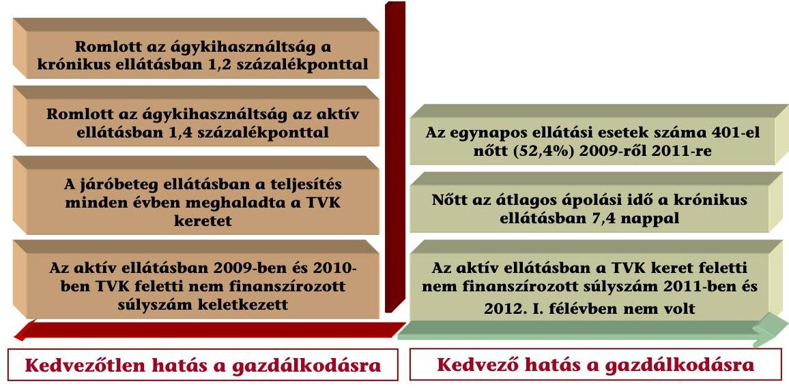

A BIK munkaerő hiánya (üres álláshelyek száma) a 2009-2012. I. félév között - a hiányzó létszám pótlására hozott intézkedések hatására - csökkent. Az engedélyezett álláshelyek száma az ellenőrzött időszakban változatlanul 728 fő volt. A betöltött álláshelyek száma folyamatosan növekedett, a 2009. évről 2012. év I. félévére 652,3-ról 681,2-re. A humán erőforráshiány elsősorban az egészségügyi személyzet körében jelentkezett, orvosoknál ${ }^{60}$ a 2009. évben 21,8, 2012. év I. félévben 11,2 betöltetlen álláshely volt. A szakdolgozóknál 2009-ben 29, 2012. év I. félév végén 23,9 üres álláshely volt. A nem egészségügyi személyzetnél a 2009. évről a 2012. év I. félévre a betöltetlen álláshelyek

[^0]
[^0]:    ${ }^{60}$ Az orvosok száma a szakorvosok, orvosok, rezidensek, gyakornokok számát tartalmazza. Nem tartalmazza az egyéb egyetemi munkakörben foglalkoztatottak létszámát.

---

száma 2,8 fővel csökkent. A hiányzó munkaerő biztosítására a BIK a 20092012. év I. félév közötti időszakban nem vette igénybe a közmunkaprogram és közhasznú foglalkoztatás biztosította pályázati lehetőségeket, ehhez kapcsolódó támogatásban nem részesült.

A BIK - pénzügyi helyzetének javítása érdekében - a 2009-2012. év I. félév közötti időszakban a gyógyszerfelhasználás költségének csökkentésére intézkedéseket hozott. Közös beszerzést bonyolított le a 2011-2012 év I. félévében, amely az összes gyógyszerkiadáshoz viszonyítva 60,5\%-ot (289,1 M Ft) jelentett. Az összes gyógyszerkiadáshoz képest a térítésmentesen kapott gyógyszerek aránya a 2009. évben 19,8\% (79,7 M Ft), a 2012. év I. félévében $16,7 \%(26,9 \mathrm{MFt})$ volt. Az összes gyógyszerbeszerzési költség a 2009. évben az OEP bevétel 13,6\%-át (401,2 M Ft), a 2011. évben az OEP bevétel 9,8\%át (319,1 M Ft) tette ki. A gyógyszerköltségek csökkentésére a 2009. évben 200, a 2011. évben 274 féle készítményt váltottak originálisról generikus készítményre.

A szakmai anyag készletek forgási sebessége 527,8 fordulatról 315,4 fordulatra ( $40 \%$-kal) lassult 2009-ről 2011-re. Az alacsonyabb sebesség miatt több forgóeszközt kötöttek le az anyagkészletek. A szakmai anyagok egy aktív fekvőbeteg esetre jutó beszerzési költségindexe csökkent (13,3 E Ft/esetről 10,9 E Ft/esetre). Az olcsóbb beszerzés a BIK pénzügyi helyzetére kiegyensúlyozó hatást gyakorolt. A szakmai anyagok beszerzési költségét a BIK folyamatosan figyelemmel kísérte, költségmonitoringot, keretrendszert működtetett, költségcsökkentési intézkedéseket hozott (például az Euromedic-Pharma céggel korábban megkötött szerződését a 2010. évben nem hosszabbította meg), amelyekből a 2010-2011. években 38,7 M Ft megtakarítása keletkezett, javítva ezzel a kórház pénzügyi helyzetét.

A BIK a vásárolt közszolgáltatások alakulását folyamatosan figyelemmel kísérte, költségmonitoringot, keretrendszert működtetett. A villamos energia és földgáz közszolgáltatásoknál 2009-2011. években beszerzési forrás és konstrukció változtatására irányuló költségcsökkentési intézkedést hoztak, amelyből a 2009-2011. években 107,4 M Ft megtakarítás keletkezett, javítva ezzel a BIK pénzügyi helyzetét. Kedvezőtlen volt, hogy az egy ápolási napra vetített (fajlagos) villamos energia és vízfelhasználás mértéke 6, illetve 12\%-kal nőtt. A gázenergia fajlagos felhasználása egyidejűleg 18\%-kal csökkent.

Figyelemmel kísérték a segédüzemi tevékenységek költségeinek alakulását is. A textilmosás önköltsége $221 \mathrm{Ft} / \mathrm{kg}$-ról $217 \mathrm{Ft} / \mathrm{kg}$-ra csökkent 2009 és 2011 között. A BIK a 2008. évben a korábban kiszervezett mosodai tevékenységét visszaszervezte, amelyből a 2011. évben 7,5 M Ft költségmegtakarítása keletkezett. A betegélelmezés napi költsége 2009 és 2011 között 1309 Ft/élelmezési napról 1377 Ft/élelmezési napra nőtt.

A BIK-nek nincs adata a nagyértékú orvosi gépek-múszerek kihasználtságáról. Az osztályos műtők fajlagos közvetlen üzemköltségei 3 esetben csökkentek (87-99\%-ra). Két műtőnél növekedtek 9, illetve 12\%-kal, de mindez nem érte el a 2009-2010-es összes fogyasztói árnövekedés mértékét.

---

# 1.16. Jász-Nagykun-Szolnok Megyei Hetényi Géza Kórház és Rendelőintézet, Szolnok (HGK) 

A HGK pénzügyi egyensúlya a 2009. és 2011. években nem volt biztosított. A finanszírozási múveletek nélküli (GSF) pozíció ${ }^{61}$ a 2009. és a 2010. évben negatív, míg a 2011. évben pozitív értéket mutatott. Konszolidációs támogatás nélkül a pénzügyi kapacitás minden évben negatív volt. A kórház összes szállítói kötelezettségének év végi állománya az előző évhez viszonyított 2010. évi csökkenés után a 2011. évben növekedett, az éves dologi ráfordítás 12,7\%-át (690,9 M Ft) tette ki. 2012. I. félév végén a kimutatott összes szállítói kötelezettség 594,9 M Ft volt. A belső intézkedések a pénzügyi helyzetet javították, de nem voltak elégségesek a szállítói kötelezettségállomány érdemi csökkenéséhez.

Az ellenőrzött időszakban költségvetési intézményként működő HGK gazdálkodásában a CLF módszer szerinti működési pénzügyi egyensúly a 2009. és a 2010. években nem volt biztosított, a működési tevékenység eredménye és a pénzügyi kapacitás negatív volt. A 2011. évben a konszolidációs támogatás hatására a működési jövedelem és a pénzügyi kapacitás is pozitív volt. A konszolidációs támogatások nélkül a HGK múködési jövedelme 2010-ben -868,0 M Ft, 2011-ben -293,4 M Ft volt. A veszteség csökkenését a saját bevételek, a fenntar-tói- és OEP támogatás növekedése eredményezte. A felhalmozási tevékenység pénzügyi egyenlege a 2009. és a 2011. évben negatív volt, a felhalmozási célokra fordítható bevételek nem nyújtottak fedezetet a beruházások, felújítások finanszírozására, ami felhalmozási kockázatot jelentett.

A HGK 2010-ben 655,2 M Ft és 2011-ben 358,0 M Ft adósságkonszolidációs támogatásban részesült, amelyet a szállítói tartozások kiegyenlítésére, valamint a várólisták csökkentésére fordított. A 2010. évi konszolidációs támogatásból 578,9 M Ft a szállítói tartozások kiegyenlítésére, 76,3 M Ft a várólisták csökkentésére volt felhasználható. A támogatás felhasználásához 2011-ben konszolidációs tervet készített. A konszolidációs tervben szereplő feladatok végrehajtása a jóváhagyott ütemben és mértékben haladt. A 2010. évi konszolidációs támogatást a KEHI ellenőrizte, visszafizetési kötelezettséget nem állapított meg.

A múködési és felhalmozási tevékenység egyenlege és a pénzügyi kapacitás a 2009-2011 közötti időszakban a következők szerint alakult:

[^0]
[^0]:    ${ }^{61}$ A finanszírozási múveletek nélküli (GFS) pozíció a 2009. évben -730,7 M Ft, a 2010. évben 32,4 M Ft, a 2011. évben -107,5 M Ft volt.

---

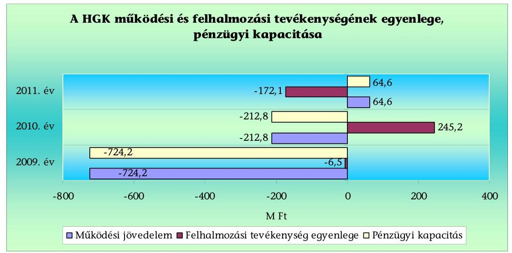

A múködés finanszírozását szolgáló bevételek a 2009. évi 8919,7 M Ftról az előző évhez viszonyítva 2010-re 9662,9 M Ft-ra (8,3\%-kal 743,3 M Fttal), 2011. évre 10222,8 M Ft-ra (5,8\%-kal, 559,9 M Ft-tal) nőttek. A 2010. évi múködési bevétel növekedést a kapott 655,2 M Ft konszolidációs támogatás és a saját múködési bevételek előző évhez viszonyított 248,0 M Ft-os növekedése eredményezte. A 2011. évi múködési bevétel növekedést pedig a fenntartói támogatás $86,1 \mathrm{M}$ Ft összegű, a teljesítményarányos OEP finanszírozás 533,8 M Ft-os, és a saját múködési bevételek 51,4 M Ft-os növekedése eredményezte.

A múködési bevételeken belül meghatározó volt az OEP-től származó bevétel, ami a 2009-2011. években folyamatosan növekedett, a 2009. évi 8039,9 M Ftról az előző évhez viszonyítva 2010-re 7,6\%-kal 8647,2 M Ft-ra, majd 2011-ben $4,8 \%$-kal 9061,3 M Ft-ra nőtt. A tulajdonostól kapott támogatás javította a kórház pénzügyi helyzetét. A múködési célú fenntartói támogatás 2009-ben a múködési bevételek 1,6\%-át, (141,4 M Ft-ot), 2010-ben 0,3\%-át (27,6 M Ft-ot), 2011-ben az 1,1\%-át (113,7 M Ft-ot) tette ki.

A kórház saját múködési bevételeinek 2009-2011. években bekövetkezett növekedése pozitív hatással volt a pénzügyi helyzetre. A 2009-2011. évek közötti saját múködési bevételek ( 2738,1 M Ft) jelentős része a 2009-2011 közötti időszakban összesen 2371,5 M Ft (a saját múködési bevételek 86,6\%-a) három bevételi jogcímen - áru- és készletértékesítés- és szolgáltatások ellenértékéből, bérleti és lízingdíjakból - származott. A kórház intézkedései hatására a bérleti és lízingdíjakból származó bevételek a 2009. évi 81,6 M Ft-ról 2011-re 103,3 M Ftra, $26,6 \%$-kal, az áru és készletértékesítésből befolyt bevételek a 2009. évi 396,8 M Ft-ról 2011-re 677,1 M Ft-ra emelkedtek. A kórház ugyanakkor nem élt a magánrendelésekhez kapcsolódó eszköz-bérbeadás lehetőségével.

A múködési költségek és ráfordítások 2009. évi 9643,8 M Ft-ról a 2010. évre 9875,7 M Ft-ra (2,4\%-kal, 231,9 M Ft-tal), a 2011. évre 10 158,2 M Ft-ra (2,8\%-kal, 282,5 M Ft-tal) növekedtek. A személyi jellegű ráfordítások és a munkaadókat terhelő járulékok együttes összege a 2009. évi 4757,5 M Ft-ról a

---

2010. évre 4620,2 M Ft-ra (2,9\%-kal, 137,3 M Ft-tal) változott a betöltött álláshelyek számának csökkenése következtében. Ennek hatására a 2011. évre a személyi jellegű ráfordítások és a munkaadókat terhelő járulékok összege 4607,0 M Ft-ra ( $0,3 \%$-kal, 13,2 M Ft-tal) csökkent. A dologi ráfordítások a 2009. évi 4783,1 M Ft-ról 2010-re. 5090,8 M Ft-ra (6,4\%-kal, 307,7 M Ft-tal), majd 2011-re 5458,2 M Ft-ra ( $7,2 \%$-kal, 367,4 M Ft-tal) növekedtek. A dologi ráfordítások csökkentése érdekében, a Kórház adatszolgáltatása alapján, a szakmai anyaggazdálkodás és a közüzemi szolgáltatások terén takarékossági intézkedést - a betegélelmezés költségeinek 2010. évi csökkentése kivételével - nem tett. Azonban a 10 legfőbb beszállítóval kötött szerződéseket felülvizsgálta, módosításukat kezdeményezte a kedvezőbb ár és fizetési feltételek elérése érdekében. Az egyeztetés során az ellenőrzött időszakban összesen 9,5 M Ft engedményt ért el, ami pénzügyi helyzetre kedvezően hatott.

A gyógyító tevékenység közvetlen költségét a kórház ellátás-típusonként kimutatta, amely szerint a fedezeti összeg 2009-2011. években nem nyújtott fedezetet a gazdasági-, műszaki ellátás felosztott költségeire.

A működési bevételek és ráfordítások fő jogcímek szerinti arányát és alakulását a következő diagram szemlélteti:
52. számú diagram
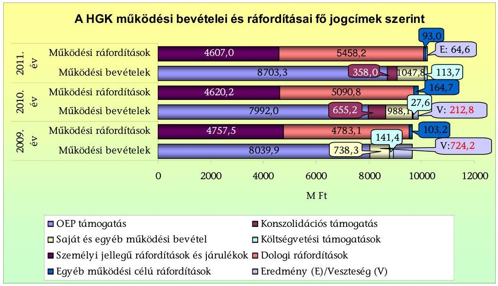

A 2009-2011. években a kórház 326,7 M Ft beruházást és 211,1 M Ft felújítást valósított meg. A felhalmozási célra fordítható bevételek a 2009. és a 2011. évben nem nyújtottak elegendő fedezetet a beruházások, felújítások finanszírozására. Hitel, kötvény, kölcsön bevonására nem volt szükség, a hiányzó részt 2009. évben és 2011. évben fenntartói-, illetve saját-, vagy külső forrásból fedezték. A felhalmozási ráfordítások szükséges forrásai (például uniós forrásból társfinanszírozott SO1 szintű sürgősségi osztály fejlesztése, egykapus sürgősségi ellátás megvalósítása) rendelkezésre álltak.

---

A folyamatban lévő fejlesztésekből ${ }^{62}$ 2011. december 31-én 6372,8 M Ft kötelezettség állt fenn, amelyet 698,5 M Ft saját bevételből (ezen belül 13,3 M Ft fenntartói támogatással), 5674,3M Ft EU-s és egyéb támogatásból terveztek finanszírozni. Az eszközpótlásra fordított összeg a 2009-2011. években 537,8 M Ft volt, amely az elszámolt 990,9 M Ft értékcsökkenésnek 54,3\%-át tette ki. A beszerzett tárgyi eszközök jövőbeni fenntartási, üzemeltetési költségeit a kórház vállalta.

A kötelezettségek állománya a 2009. december 31-i 870,3 M Ft-ról 2010. december 31-ére a lejárt szállítói kötelezettségek csökkenése miatt 742,7 M Ft-ra csökkent, 2011. december 31-ére a lejárt szállítói kötelezettségek előző évhez viszonyított növekedése miatt 942,4 M Ft-ra nőtt. A 2012. június 30 -ai kötelezettségek állományából $15,0 \mathrm{M}$ Ft-ot ( $2,4 \%$-ot) a hosszú lejáratú, 606,3 M Ft-ot ( $97,6 \%$-ot) a rövidlejáratú kötelezettségek tettek ki. A 2010. évben kapott konszolidációs támogatás hatására a lejárt szállítói tartozás a 2009. december 31-i 495,6 M Ft-ról 2010. év végére 163,1 M Ft-ra csökkent, majd a 2011. év végére a konszolidációs támogatás ellenére 359,0 M Ft-ra növekedett. A lejárt szállítói tartozások összege 2012. június 30 -án 333,0 M Ft-ot tett ki. A szállítói tartozások után 2009-2012. év I. félév között kifizetett késedelmi kamat és kötbér mindösszesen 54,7 M Ft-ot (az ugyanezen időszakban a szállítói állomány csökkentésére kapott konszolidációs támogatás 5,8\%-a) tett ki. A kórháznak pénzintézeti kötelezettsége nem volt.

A kórház összes kötelezettsége, illetve ezen belül a szállítói és a lejárt határidejú szállítói állománya az alábbiak szerint alakult:
53. számú diagram
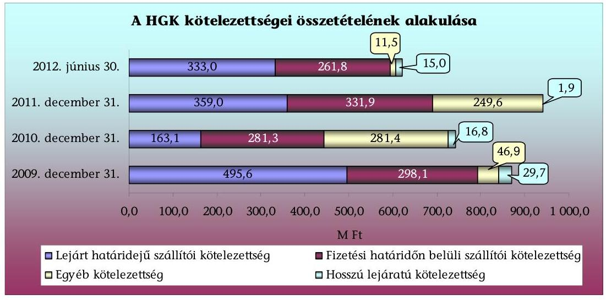

A kórház likviditási helyzetében a 2009-2010. évi kedvezően változott. Az intézmény mérlegadatai szerint a likviditási ráta - évről évre javult, 2009-ben 0,54-ről 2010-ben 1,15-re, 2011-ben 1,33-ra változott. A készpénz lik-

[^0]
[^0]:    ${ }^{62}$ PIC orvosi technológiai eszközök beszerzése, addiktológiai és a kardio-pulmonológiai rehabilitáció fejlesztése, új sebészeti jellegű tömb kialakítása, új radiológiai szakterületet kiszolgáló épület építése.

---

vidítási mutató értéke a 2009. december 31-ei 13,9\%-ról 2010-ben 65,6\%-ra emelkedett, majd 2011-ben 42,6\%-re változott. Az intézménynél 2011. december 31-én fennálló rövidlejáratú kötelezettségek teljesítésére fedezetet biztosítottak a forgóeszközök.

A kórháznál kialakított kontrollrendszer részeként belső ellenőrzést működtettek. A hatályos jogszabályokban előírt szabályzatok rendelkezésre álltak. A gazdálkodási jogköröket gyakorlók személyénél betartották az összeférhetetlenségi követelményeket. A belső kontrollok megfelelő működtetése eredményeként a pénzügyi helyzet, a lejárt határidejű tartozások állománya nem tette szükségessé önkormányzati biztos kirendelését. A pénzügyi egyensúlyi helyzet megteremtése érdekében az ellenőrzött időszakban - a vásárolt közüzemi szolgáltatásoknál, gyógyszer-, szakmai anyaggazdálkodásnál - a kórház folyamatos költség monitoring és keretrendszert múködtetett.

A HGK ágyszámaiban változás nem történt, az aktív fekvőbeteg szakellátásban átlagosan 991, a krónikus fekvőbeteg szakellátásban 241 múködő ággyal rendelkezett. Az ellátási teljesítmények alakulása érdemben nem befolyásolta a pénzügyi egyensúlyi helyzetet. Egyes kiemelt teljesítménymutatók a következők szerint változtak:
17. számú ábra
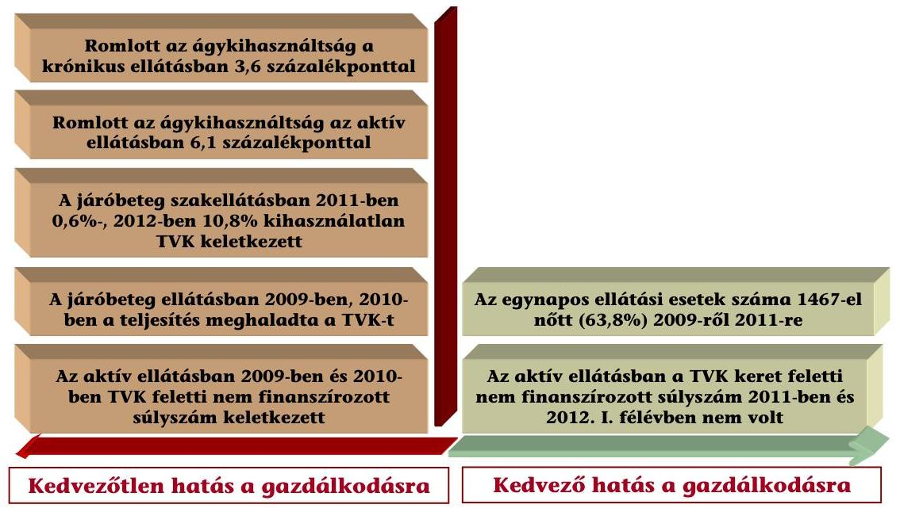

A HGK munkaerő hiánya (az üres álláshelyek száma) a hiányzó létszám pótlására hozott intézkedések (képzés, közfoglalkoztatás, kiszervezés, külső megbízások, szolgáltatás-vásárlás, uniós projekt, stb.) hatására csökkent. Az engedélyezett álláshelyek száma a 2009. évi 1700 fơről, a 2012. I. félévében 1625 főre ( $4,4 \%$-al) csökkent, a betöltött álláshelyek száma a 2009. évi 1599 főről, a 2012. I. félévére 1604 főre nőtt. A 2009-2010. évi 101 üres álláshely, a 2011. évben 67 betöltetlen, a 2012. év I. félévben pedig 21 üres álláshelyre csökkent. A humánerőforrás hiány elsősorban az orvosok körében jelentkezett. A hiányzó munkaerő biztosítására igénybe vett közhasznú foglalkoztatásnak pénzügyi egyensúlyi helyzetet javító szerepe volt. A foglalkoztatottak szá-

---

ma a 2009-2012. év I. félévében nőtt (a 2009. évben 1 fő, a 2012. év I. félévében 10 fő). A 2009-2012. év I. félév között a közhasznú foglalkoztatáshoz 2,2 M Ft bértámogatást kapott a HGK. A 2009. évben 43 fő (műszaki dolgozó) kiszervezése történt meg, amelyhez a 2009. évben 10,6 M Ft, illetve a 2010. évben 13,2 M Ft bértámogatás kapcsolódott. Az Élelmezési Osztály létszámát a 2010. évben - átszervezéssel és felmentéssel - 13 fővel csökkentették, amellyel havi 1,3 M Ft megtakarítást értek el (a tálalás az ápolási feladat részévé vált). A költségek csökkentése érdekében éltek az EU-s pályázati lehetőségekkel, a 2010. évben 6 főre 5,4 M Ft, a 2011. évben 9 főre 13,7 M Ft, a 2012. év I. félévben 9 főre 8,7 M Ft összegű támogatást kaptak.

A HGK - pénzügyi helyzetének javítása érdekében - a 2009-2012. év I. félév közötti időszakban a gyógyszerfelhasználás költségének csökkentésére intézkedéseket hozott. Az ellenőrzött időszakban a közös beszerzéssel bonyolított gyógyszerbeszerzés az összes gyógyszerkiadáshoz képest átlagosan 24,6\%-ot (1271,6 M Ft) képviselt. Az összes gyógyszerkiadáshoz képest a térítésmentesen kapott gyógyszerek aránya a 2009. évben 22,9\% (303,4 M Ft), a 2012. év I. félévében $22,4 \%$ ( $172,6 \mathrm{MFt}$ ) volt. Az összes gyógyszerbeszerzési költség a 2009. évben az OEP bevétel 16,4\%-át (1322,2 M Ft), a 2011. évben az OEP bevétel $16,8 \%$-át ( $1528,7 \mathrm{MFt}$ ) tette ki. A gyógyszerköltségek csökkentésére a 2009. évben 503, a 2011. évben 656 féle készítményt váltottak originálisról generikus készítményre.

A szakmai anyag készletek forgási sebessége a 2009. évi 609 fordulatról évi 602 fordulatra ( $0,1 \%$-kal) csökkent 2011-re. Az alacsonyabb sebesség miatt több forgóeszközt kötöttek le az anyagkészletek. Az egy aktív esetre számított beszerzési költségindex 3,5 százalékponttal meghaladta a kórházak átlagos növekedési indexét, amely az átlagnál kedvezőtlenebb pénzügyi hatást jelentett. Folyamatos költség-monitoring és keretrendszert múködtettek a szakmai anyagok esetében, azonban nem tettek költségcsökkentési intézkedéseket.

A HGK a vásárolt közszolgáltatások alakulását folyamatosan figyelemmel kísérte, költségmonitoringot, keretrendszert múködtetett. A villamos energia közszolgáltatásoknál a 2010-2011. közötti években 4,4 M Ft (2,8\%) költségcsökkentést realizált az eredményes közbeszerzésnek köszönhetően. Az egy ápolási napra vetített villamos energia felhasználás is kedvezöbben alakult: $17,4 \mathrm{kWh} /$ ápolási napról $16,4 \mathrm{kWh} /$ ápolási napra csökkent 2009-ről 2011-re. A közművek közül a vízfelhasználás is csökkent: $0,42 \mathrm{~m}^{3} /$ ápolási napról 0,36 -ra. A vásárolt gázenergia 8,01-ről 8,07 m³ /ápolási napra növekedése ( $1 \%$-kal) nem volt számottevő változás.

A segédüzemi tevékenységek fajlagos költségei reálértéken csökkentek 2009-ről 2011-re. Az energiaellátás 4,20-ról 4,49 E Ft/GJ-ra 7\% reálértékcsökkenést jelentett három év alatt. A textilmosatás átlagos díja hasonlóan változott: a $248 \mathrm{Ft} /$ mosott ruha kg költség 273-ra növekedése $4 \%$-kal volt alacsonyabb a 2009-2011. évi fogyasztói árindexnél. A betegélelmezés napi költsége abszolút értékben is csökkent: 988 Ft /élelmezési napról 907 Ft-ra.

A központi műtő kapacitáskihasználtsága csökkent az ellenőrzött évek során 78\%-ról 68\%-ra. Kedvezően alakult viszont a központi műtő fajlagos üzemköltsége: 2011-re 49,9 E Ft/üzemórára csökkent a 2009-es 52,4 E Ft-ról. A

---

megyei önkormányzat a nagy értékú készülékek üzemeltetését (CT, MRI) és a haemodinamikai labor múködtetését korábban átadta a közbeszerzés nyertesének.

# 1.17. Vas Megyei Markusovszky Kórház Nonprofit Zrt., Szombathely (VMMK) 

A VMMK pénzügyi egyensúlya a finanszírozási múveletek nélküli (GFS) pozíció ${ }^{63}$ alapján a 2009-2010. években nem volt biztosított, a felhalmozási tevékenység együttes egyenlege negatív volt. A pénzügyi helyzet alakulására 2010-ben a konszolidációs támogatás, 2011-ben a bevételnövelő, költségmegtakarító intézkedések voltak kedvező hatással. Ennek ellenére a szállítói kötelezettségek a 2009-2011. évek között növekedtek. A 2011. évi 851,1 M Ft szállítói kötelezettség az éves dologi ráfordítások 12,3\%-át tette ki. A VMMK szállítói kötelezettségeinek összege 2012. június 30 -án 715,8 M Ft -ot tett ki.

A múködési és felhalmozási tevékenység egyenlege, a pénzügyi kapacitás 20092011 között az alábbiak szerint alakult:
54. számú diagram
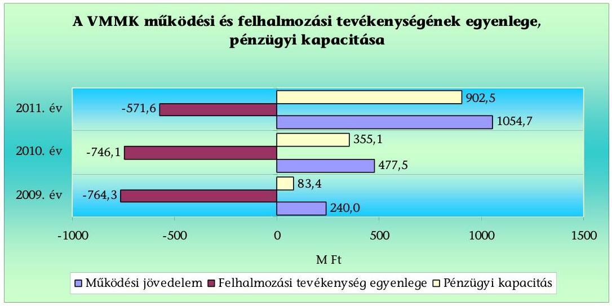

Az ellenőrzött időszakban Nonprofit Zrt.-ként múködő VMMK gazdálkodásában a CLF módszer szerinti múködési egyensúly 2009-2011 között biztosított volt, a múködési tevékenység eredménye a fenntartóval szemben fennálló hosszú lejáratú kölcsönök törlesztő részleteire fedezetet biztosított. Az időszakban képződött múködési jövedelem és pénzügyi kapacitás (nettó múködési jövedelem) folyamatosan emelkedett. A konszolidációs támogatások nélkül a VMMK múködési jövedelme 2010-ben 99,5 M Ft, 2011-ben 932,6 M Ft volt. A változást 2010-ben a múködési ráfordítások növekedése a kamatbevételek és az OEP támogatás csökkenése okozta. A VMMK által elért eredmény a

[^0]
[^0]:    ${ }^{63}$ A finanszírozási múveletek nélküli (GFS) pozíció a 2009. évben -524,3 M Ft, a 2010. évben -268,6 M Ft, a 2011. évben 483,1 M Ft volt.

---

2011. évben a saját működési bevételek és a teljesítménymutatók javulásával növekvő OEP támogatás hatására változott. A felhalmozási tevékenység egyenlege 2009-2011 közötti időszak egészében negatív volt, a felhalmozási célokra fordítható bevételek nem nyújtottak fedezetet a beruházások, felújítások finanszírozására, ami felhalmozási kockázatot jelentett. A hiányzó fedezetet a működési jövedelemből és a rendelkezésre álló pénzeszközökből biztosították.

A VMMK a 2010. évben lejárt határidejű szállítói tartozások mérséklésére 323,9 M Ft, várólisták csökkentésére $54,1 \mathrm{M}$ Ft, a 2011. évben szállítói kötelezettségek rendezésére 420,3 M Ft konszolidációs támogatást kapott. A 2010. évi támogatáshoz konszolidációs terv készült. A KEHI a 2011. évi konszolidációs támogatásra vonatkozóan 298,1 M Ft visszafizetési kötelezettséget állapított meg. Az OEP a 2011. június havi finanszírozáskor 136,0 M Ft-ot visszavont és további 162,1 M Ft támogatás visszavonása várható.

A múködés finanszírozását szolgáló bevételek 2010-re 11 390,0 M Ft-ra (2,4\%-kal, 269,3 M Ft-tal), a 2011. évre 12 439,6 M Ft-ra ( $9,2 \%$-kal, 1049,6 M Ft-tal) emelkedtek. A 2010. évi múködési bevétel növekedést a 378,0 M Ft konszolidációs támogatás és a saját működési bevételek 46,4 M Ft-os növekedése eredményezte, amelyet ellensúlyozott a kamatbevételek 29,6 M Ftos csökkenése. A múködési bevételek növekedését 2011-ben a 284,3 M Ft-os konszolidációs támogatás, a teljesítményektől függő OEP támogatás 557,6 M Ft-os, és a saját múködési bevételek 226,8 M Ft-os emelkedése eredményezte.

A múködési bevételeken belül minden évben meghatározó volt az OEP-től származó támogatások és a saját bevételek összege. Az OEP-től származó bevételek összegének alakulását, a konszolidációs támogatások a finanszírozási szabályok változása-, míg a saját bevételek alakulását az azok növelésére irányuló intézkedések befolyásolták.

A VMMK saját múködési bevételei a 2009-2011 között növekedtek, amely pozitív hatással volt a pénzügyi helyzetre. A saját bevételek (a három évben összesen 5373,7 M Ft) jelentős része, $87,3 \%$-a ( 4689,4 M Ft) a közforgalmú gyógyszertár áru- és készletértékesítéséből származott. A VMMK élt a magánrendelésekhez kapcsolódó eszköz-bérbeadás lehetőségével. A saját múködési bevételek növelése érdekében a 2009. évi Stabilizációs Intézkedési Programjában előírta a térítési dí ellenében igénybe vehető egészségügyi és egyéb szolgáltatások díjainak felülvizsgálatát, emelését, valamint egyéb bevételi lehetőségek keresését.

A múködési költségek és ráfordítások a 2010. évre 10912,5 M Ft-ra ( $0,3 \%$-kal, 31,9 M Ft-tal), 2011-re 11384,9 M Ft-ra (4,3\%-kal, 472,4 M Ft-tal) növekedtek az előző évhez viszonyítva. A személyi jellegú ráfordítások és munkaadókat terhelő járulékok együttes összege a 2009. évi 4367,7 M Ft-ról 4504,7 M Ft-ra (3,1\%-kal, 137,0 M Ft-tal) növekedett a 2010. évre, majd 2011-re 4461,9 M Ft-ra (1,0\%-kal, 45,8 M Ft-tal) csökkent. A VMMK a 2008-ban bevezetett takarékossági intézkedések során létszám racionalizálást hajtott végre, amelynek keretében 2009-ben 68 munkavállaló munkaviszonyának megszüntetésére került sor. A 2010. évi személyi jellegú ráfordítások és

---

a munkaadókat terhelő járulékok növekedését a minőségi létszámfejlesztés, a minimálbérek emelkedése, az ügyeleti díjak, valamint a cafeteria juttatás emeléséből eredő bértömeg növekedés okozta. A 2011. évben 4,0\%-os bérfejlesztés végrehajtására került sor, amelyet a létszámleépítés hatása ellensúlyozott.

A dologi ráfordítások a 2009. évi 6498,6 M Ft-ról a 2010. évre 6391,1 M Ftra (1,7\%-kal, 107,5 M Ft-tal) csökkentek, a 2011. évre 6905,1 M Ft-ra (8,0\%-kal, 514,0 M Ft-tal) emelkedtek. A dologi ráfordítások csökkenését 2010-re a VMMK takarékossági intézkedései (a költségek alakulásának folyamatos figyelemmel kísérése) eredményezték.

A VMMK kimutatásai alapján 2010-ben - a szakmai anyaggazdálkodás terén 43,5 M Ft, villamos energia fogyasztás esetében 26,5 M Ft, a vásárolt távhő- és melegvíz szolgáltatás terén $46,0 \mathrm{M}$ Ft megtakarítást ért el. Ezzel szemben 2011ben a szakmai anyagfelhasználás $254,7 \mathrm{M}$ Ft-tal, a segédüzemi tevékenységek költségei - a kazánházi üzemköltség, mosatási és betegélelmezési költség 78,1 M Ft-tal növekedtek.

A gyógyító tevékenység közvetlen költségét a VMMK ellátás-típusonként kimutatta, amely szerint a fedezeti összeg 2009-2011. években nem nyújtott fedezetet a gazdasági-, múszaki ellátás felosztott költségeire.

A múködési bevételek, ráfordítások főbb jogcímeinek arányát és alakulását 2009-2011 között a következő diagram szemlélteti:
55. számú diagram
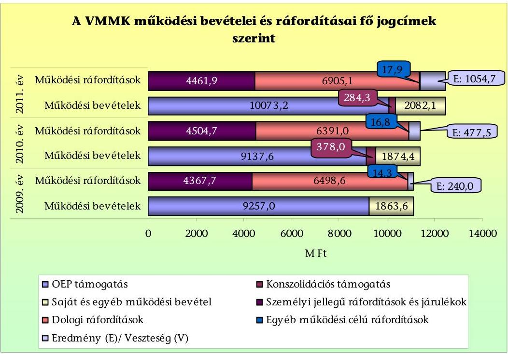

A 2009-2011. években a VMMK 1145,7 M Ft beruházási és 1219,2 M Ft felújítási tevékenységet végzett. A felhalmozási tevékenység finanszírozására saját bevételek, alapítótól kapott támogatások és hosszú lejáratú kölcsön, valamint EU-s pályázati források szolgáltak. Az elvégzett beruházások és

---

felújítások bekerülési értéke az elszámolt 2475,4 M Ft értékcsökkenésnek $\mathbf{9 5 , 5 \%}$-át tette ki ${ }^{64}$. A beszerzett tárgyi eszközök jövőbeni fenntartási, üzemeltetési költségeit a VMMK vállalta.

A VMMK kötelezettségeinek állománya a 2009. évi 11 260,3 M Ft-ról a 2010. évben a lejárt határidejú szállítói és egyéb kötelezettségek növekedése miatt 11 264,5 M Ft-ra, a 2011. évre a szállítói kötelezettségek állományának változása miatt 11 271,1 M Ft-ra emelkedett. A 2012. június 30 -ai kötelezettségek állományából 9698,5 M Ft-ot ( $89,0 \%$-ot) a vagyonkezelésbe kapott eszközök értéke és a hosszú lejáratú fenntartói kölcsön, 1203,3 M Ft-ot (11,0\%-ot) a rövidlejáratú kötelezettségek tették ki. Az ellenőrzött időszakot megelőzően diagnosztikai és terápiás radiológiai berendezések beszerzéséhez - az alapító 850 M Ft, 2011-ben - CT-berendezés beszerzéséhez - 250 M Ft hosszú lejáratú kölcsönt biztosított. A VMMK pénzintézettel szembeni kötelezettséggel nem rendelkezett. A 2010. és a 2011. években kapott konszolidációs támogatás ellenére a lejárt szállítói tartozás a 2009. évi 115,1 M Ft-ról 2010. év végére 183,1 M Ft-ra, 2011-re 260,0 M Ft-ra emelkedett. A lejárt szállítói tartozások összege 2012. június 30 -án $168,3 \mathrm{M}$ Ft volt.

A VMMK összes kötelezettsége, illetve ezen belül a szállítói és a lejárt határidejú szállítói állománya 2009-2011 között az alábbiak szerint alakult:
56. számú diagram
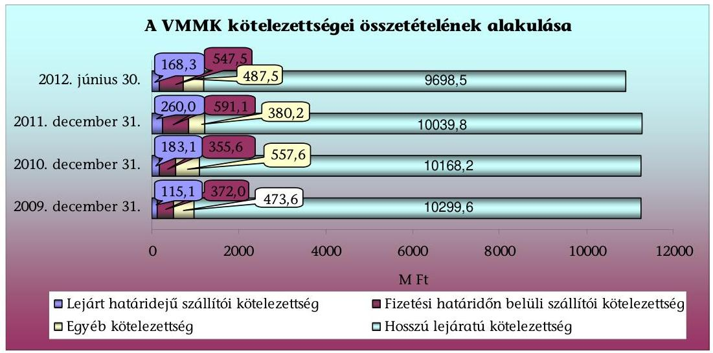

A VMMK likviditási helyzete 2009-2011 között stabil volt, kötelezettségeinek teljesítéséhez elegendő fedezettel rendelkezett. A likviditási ráta mindhárom évben meghaladta a szakmailag elvárható szintet, annak ellenére, hogy a mutató értéke a 2009. évi 2,88 -ról 2,43ra változott. A készpénz likviditási mutató alapján a VMMK pénzeszközei a 2009. év végén a rövid lejáratú kötelezettségeinek 70,6\%-ára, míg a 2011. év végén 117,2\%-ára nyújtottak fedezetet.

[^0]
[^0]:    ${ }^{64}$ A VMMK által végzett és folyamatban lévő fejlesztési tevékenység várható bekerülési értéke $5854,2 \mathrm{M} \mathrm{Ft}$.

---

A pénzügyi egyensúlyi helyzet megteremtése érdekében a VMMK 2009. és 2012. I. félév között a vásárolt közüzemi szolgáltatások és segédüzemi költségek alakulását folyamatosan figyelemmel kísérte, azonban - a szakmai anyaggazdálkodás kivételével - folyamatos költség monitoring és keretrendszert nem múködtetett.

A VMMK ágyszámaiban változás nem történt, az aktív fekvőbeteg szakellátásban átlagosan 854, a krónikus fekvőbeteg szakellátásban 464 múködő ágygyal rendelkezett. Az ellátási teljesítmények alakulása érdemben nem befolyásolta a pénzügyi egyensúlyi helyzetet. Egyes kiemelt teljesítménymutatók a következők szerint változtak:
18. számú ábra
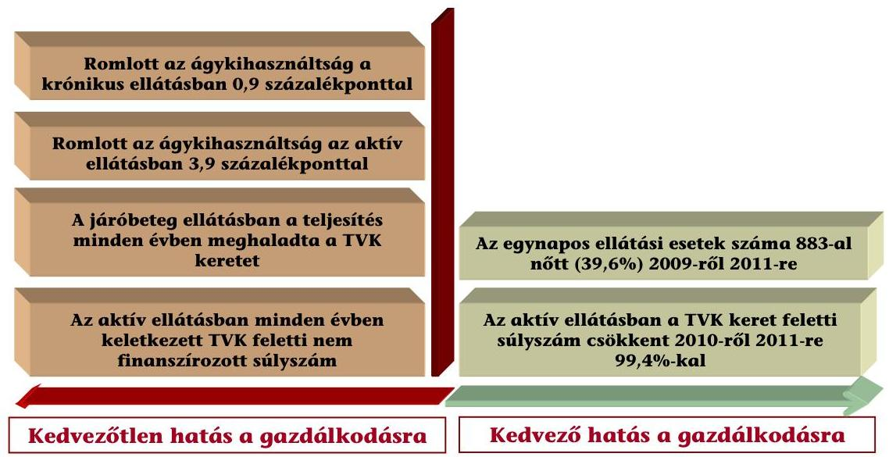

A VMMK munkaerő hiánya (üres álláshelyek száma) - a 2009-2012. év I. félév között állandósult, a 2009. évben 182, a 2010. évben 150, a 2011. évben és 2012. év I. félévben 183 betöltetlen álláshely volt. Az engedélyezett álláshelyek száma a 2009. évi 1820-ról 2012. év I. félévére 1752-re csökkent, a betöltött álláshelyek száma a 2009. évi 1638 -ról 2012. év I. félévére 1569-re csökkent. A humánerőforrás hiány elsősorban az egészségügyi személyzet körében jelentkezett. Az orvosoknál a 2009. évben $63^{65}$, a 2012. év I. félév végén 55 betöltetlen álláshely, szakdolgozóknál a 2009. évben 70, a 2012. év I. félév végén 65 üres álláshely volt. A nem egészségügyi személyzetnél a 2009-2012. év I. félév közötti időszakban a betöltetlen álláshelyek száma 1 fővel csökkent. Az üres álláshelyek csökkentésére a 2009. évben a Nyugat-dunántúli Regionális Munkaügyi Központnál (RMK) közmunkaprogram keretében képzési program lebonyolítására 15 fő szakképzetlen munkaerő igénybevételére nyújtottak be pályázatot. Az RMK-tól képzés lebonyolítására 2009-ben 13,3 M Ft-ot, 2010-ben (14 fő ápolói képzettséget kapott) 10,5 M Ft-ot kaptak. A munkaerő megtartása érdekében a 2012. év I. félévben 1446 fő egészségügyi dolgozó munkabérének

[^0]
[^0]:    ${ }^{65}$ Az orvosok száma nem tartalmazza az egyéb egyetemi végzettségű egészségügyi személyzet számát.

---

javítására 269,1 M Ft, illetve bérkompenzációs pályázaton 1525 főt érintően 56,9 M Ft támogatást kaptak.

A VMMK - pénzügyi helyzetének javítása érdekében - a 2009-2012. év I. félév közötti időszakban a gyógyszerfelhasználás költségének csökkentésére intézkedéseket hozott. A VMMK konszignációs raktárt múködtetett. Az összes gyógyszerkiadáshoz képest a térítésmentesen kapott gyógyszerek aránya 2009-ben 11,8\% (76,8 M Ft), 2012. év I. félévében 4,7\% (17,2 M Ft) volt. Az összes gyógyszerbeszerzési költség 2009-ben az OEP bevétel 7,0\%-át (650,1 M Ft), 2011-ben az OEP bevétel 6,4\%-át (664,1 M Ft) tette ki. A gyógyszerköltségek csökkentésére 2009-ben 500, 2012. év I. félévében 1040 féle készítményt váltottak originálisról generikus készítményre.

A szakmai anyagok beszerzési költségét a VMMK folyamatosan figyelemmel kísérte, költségmonitoringot, keretrendszert múködtetett. A szakmai anyagok beszerzési költségének csökkentését az ellenőrzött időszakban 27 közbeszerzési eljárás lebonyolításával igyekezett elérni. Ennek ellenére a szakmai anyagok fajlagos beszerzési költségindexe meghaladta az országos átlagnövekedést 0,9\%-kal. A drágább beszerzés negatívan hatott a kórház pénzügyi helyzetére. A szakmai anyag készletek forgási sebessége 220,4-ről 193,3-ra (11,7\%-kal) csökkent 2009-ről 2011-re. Az alacsonyabb sebesség miatt több forgóeszközt kötöttek le az anyagkészletek.

A vásárolt közszolgáltatások költségeit folyamatosan figyelemmel kísérték. A villamos energia és a gázenergia vásárlásoknál a 2010-2011. években közbeszerzés lebonyolításával költségcsökkentési intézkedést hoztak, amelyből a 2010-2012 I. félév időszakában 97,5 M Ft megtakarítása keletkezett, javítva ezzel a VMMK pénzügyi helyzetét. Az egy ápolási napra vetített (fajlagos) villamos energia 6\%-kal, a vásárolt távhő-melegvíz 4\%-kal, illetve a vízfelhasználás 5\%-kal csökkent 2009-ről 2011-re. A gáz-energia felhasználása $10 \%$-kal nőtt meg.

A VMMK a segédüzemi tevékenységek költségeinek alakulását figyelemmel kísérte. A fajlagos mosatási díj 138 Ft-ról 159 Ft/mosott ruha kg-ra nőtt 2009ről 2011-re, reálértékben ez 2 százalékpontos drágulást jelentett. A betegélelmezés napidíjának 1562 Ft-ról 1698 Ft-ra növekedése 5\%-kal az infláció alatti volt.

A nagyértékú orvosi gépek-múszerek kihasználtsága az MRI esetében stagnált, a kémiai laborautomatáké javult, a mútők kihasználtsága azonban csökkent. A CT/MRI berendezés kihasználtsága az ellenőrzött időszakban 90\%-os volt, a kémiai laborautomaták kihasználtsága a 2009. évi 26\%-ról 2011. évre 28\%-ra javult, a központi mútő kihasználtsága a 2009. évi 30\%-ról 2011. évre 29\%-ra csökkent. Az ellenőrzött nagyértékű berendezések üzemeltetésének fajlagos költségei (önköltségei) inflációt meg nem haladóan nőttek: az MRI-é és a kémiai laborautomatáké egyaránt 8-8\%-kal, míg a mútőké $7 \%$-kal.

---

# 1.18. Szent Borbála Kórház, Tatabánya (SZBK) 

Az SZBK pénzügyi egyensúlya a finanszírozási múveletek nélküli (GFS) pozíció ${ }^{66}$ alapján 2009-2010 között nem volt biztosított, a múködési és felhalmozási tevékenység együttes egyenlege negatív volt. A pénzügyi helyzet alakulására kedvezően hatott, hogy 2011-ben a konszolidációs támogatás, a fenntartói- és az OEP támogatás növekedése eredményeként a múködési tevékenység során eredmény képződött. A saját bevételek növelésére tett intézkedések a pénzügyi helyzetre számottevő hatást nem gyakoroltak. Az SZBK a költségek csökkentésére irányuló intézkedést nem tett. A szállítói kötelezettségek az ellenőrzött időszakban növekedtek. A 2011. évi 603,3 M Ft szállítói kötelezettség az éves dologi ráfordítások 21,4\%-át tette ki. A számviteli nyilvántartásokban az SZBK 2012. június 30 -án 1097,1 M Ft szállítói kötelezettséget mutatott ki.

Az ellenőrzött időszakban költségvetési intézményként múködő SZBK gazdálkodásában a CLF módszer szerinti múködési pénzügyi egyensúly a 2009. és a 2010. években nem volt biztosított, a múködési tevékenység eredménye és a pénzügyi kapacitás negatív volt. A 2011. évben a konszolidációs támogatás, az EU-tól átvett pénzeszközök és az OEP támogatás növekedésének hatására a múködési jövedelem és a pénzügyi kapacitás is pozitív volt. A konszolidációs támogatások nélkül az SZBK múködési jövedelme 2010-ben -382,4 M Ft, 2011-ben 12,9 M Ft volt. A konszolidációs támogatás nélkül számított múködési jövedelem 2010. évi változását a múködési ráfordítások növekedése, a fenntartótól kapott támogatások és a kamatbevételek csökkenése okozta. A felhalmozási tevékenység egyenlege a 2009-2011 közötti időszak egészében negatív volt, a felhalmozási célokra fordítható bevételek nem nyújtottak fedezetet a beruházások, felújítások finanszírozására, ami felhalmozási kockázatot jelentett. A 2011. évi felhalmozási tevékenység negatív egyenlegére a múködési tevékenység során keletkezett eredmény fedezetet biztosított.

Az SZBK a 2010. évben 278,2 M Ft és a 2011. évben 251,8 M Ft konszolidációs támogatásban részesült, amelynek felhasználásához intézkedési tervet nem készített. A 2010. évi támogatás jogszerűen felhasználásra került, míg a 2011. évi támogatással kapcsolatban visszafizetési kötelezettség keletkezett. Az OEP a 2012. év június havi finanszírozási összegből vonta le a 169,4 M Ft összegű fel nem használt támogatást. A KEHI a 2010. évi és a 2011. évi konszolidációs támogatást ellenőrizte.

A múködési és a felhalmozási tevékenység egyenlege, a pénzügyi kapacitás 2009-2011 között a következők szerint alakult:

[^0]
[^0]:    ${ }^{66}$ A finanszírozási műveletek nélküli (GFS) pozíció a 2009. évben -384,0 M Ft, a 2010. évben -114,7 M Ft, a 2011. évben 105,7 M Ft volt.

---

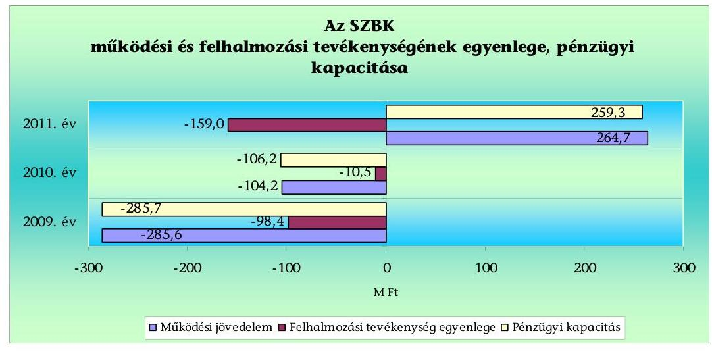

A múködés finanszírozását szolgáló bevételek 2010-re 6251,4 M Ft-ra (3,4\%-kal, 205,0 M Ft-tal), a 2011. évre 6773,1 M Ft-ra (4,1\%-kal, 254,4 M Fttal) emelkedtek. A 2010. évi múködési bevétel növekedést a 278,2 M Ft konszolidációs támogatás, a saját múködési bevételek 35,2 M Ft-os növekedése és a fenntartói támogatások 87,4 M Ft-os csökkenése együttesen eredményezte. A múködési bevételek változását 2011-ben a 251,8 M Ft-os konszolidációs támogatás, az OEP támogatás - az SZBK teljesítménymutatóinak javulása és a degresszíven elszámolt súlyszám javulása következtében történő - 277,4 M Ft-os növekedése eredményezte.

A múködési bevételeken belül minden évben meghatározó volt az OEP-től származó támogatások összege. Alakulását a finanszírozási szabályok változása, a konszolidációs támogatások befolyásolták. A fenntartótól 2009-ben kapott 113,8 M Ft támogatás (aránya a múködési bevételeken belül 1,9\% volt) a pénzügyi egyensúlyt kedvező irányba befolyásolta. A fenntartói támogatás összege a 2010. és a 2011. évben a pénzügyi helyzetre számottevő hatást nem gyakorolt, aránya a múködési bevételeken belül nem érte el az 1,0\%-ot.

A saját múködési bevételek a 2010. évre növekedtek az előző évhez viszonyítva, amely a pénzügyi helyzetre - átmeneti jelleggel - pozitív hatással volt. A CLF-módszer alapján a saját bevételek (a három évben összesen 907,8 M Ft) jelentős része, összesen 658,6 M Ft (72,5\%) szolgáltatások ellenértékéből, egyéb sajátos bevételből és az intézményi ellátási díjakból származott. Az SZBK a saját múködési bevételek növelése érdekében az ellenőrzött időszakban intézkedéseket hozott (a szűrővizsgálatok kampányának kiszélesítése, a VIP szobák marketingje és bérleti díjának felülvizsgálata, a fizetős betegellátás volumenének növelése érdekében együttműködés kialakítása külső páciensszervező céggel), de a magánrendelésekhez kapcsolódó eszközbérbeadás lehetőségével nem élt.

A múködési költségek és ráfordítások a 2010. évre 6355,6 M Ft-ra (0,4\%$\mathrm{kal}, 23,6 \mathrm{M}$ Ft-tal), 2011-re 6508,4 M Ft-ra (2,4\%-kal, 152,8 M Ft-tal) növekedtek az előző évhez viszonyítva. A személyi jellegú ráfordítások és munkaadókat terhelő járulékok együttes összege - az üres álláshelyek szá-

---

mának növekedésének hatására - a 2009. évi 3592,9 M Ft-ról a 2010. évre 3581,0 M Ft-ra ( $0,3 \%$-kal, 11,9 M Ft-tal) csökkent. A 2011. évben a személyi jellegű ráfordítások és a munkaadókat terhelő járulékok összege az év eleji kötelező előrelépések, a minimálbéremelés és a garantált bérminimumra hozás következtében 3688,8 M Ft-ra (3,0\%-kal, 107,8 M Ft-tal) nőtt.

A dologi ráfordítások a 2009. évi 2739,1 M Ft-ról a 2010. évre 2774,6 M Ft-ra (1,3\%-kal, 35,5 M Ft-tal), 2011-re 2819,6 M Ft-ra (1,6\%-kal, 45,0 M Ft-tal) az inflációt meg nem haladó mértékben növekedtek. Az SZBK a dologi ráfordítások csökkentésére takarékossági intézkedéseket nem tett.

A gyógyító tevékenység közvetlen költségét az SZBK ellátás-típusonként kimutatta, amely szerint a fedezeti összeg 2009-2011. években nem nyújtott fedezetet a gazdasági-, múszaki ellátás felosztott költségeire.

A múködési bevételek, ráfordítások főbb jogcímeinek arányát és alakulását a következő diagram szemlélteti:
58. számú diagram
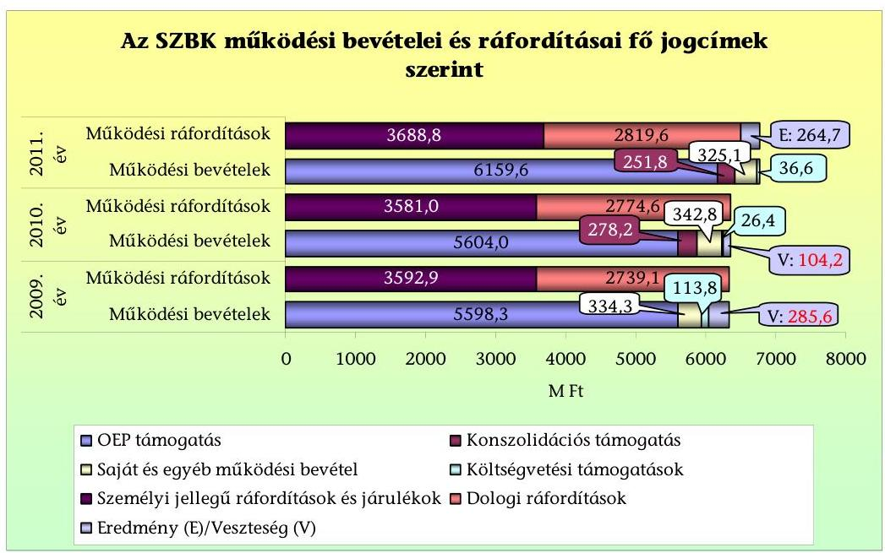

A 2009-2011. években az SZBK 397,4 M Ft beruházási és 33,8 M Ft felújítási tevékenységet végzett. A felhalmozási tevékenység finanszírozására saját bevételek, fenntartói támogatások, valamint államháztartáson belülről és kívülről átvett pénzeszközök szolgáltak. Az eszközpótlásra fordított összeg a 2009-2011. években 171,4 M Ft volt, amely az elszámolt 367,2 M Ft értékcsökkenésnek $\mathbf{4 6 , 7 \%}$-át tette $\mathbf{k i}^{67}$. Az SZBK a beszerzett tárgyi eszközök jövőbeni fenntartási, üzemeltetési költségeit vállalta.

[^0]
[^0]:    ${ }^{67}$ Az SZBK által végzett és folyamatban lévő fejlesztési tevékenység várható bekerülési értéke 5682,1 M Ft.

---

A kötelezettségállomány a 2009. évi 480,3 M Ft-ról a 2010. évben a lejárt határidejú szállítói kötelezettségek változása miatt 506,8 M Ft-ra, 2011-re a szállítói kötelezettségek emelkedése következtében 736,0 M Ft-ra nőtt. A 2012. június 30 -ai kötelezettségek állományából $115,8 \mathrm{M}$ Ft-ot ( $8,5 \%$-ot) a hosszú lejáratú kötelezettségek, 1249,1 M Ft-ot ( $91,5 \%$-ot) a rövidlejáratú kötelezettségek tették ki. Az SZKB a hosszúlejáratú kötelezettségek között 98,0 M Ft - a kincstári vagyonkörbe tartozó ingatlanokra és ingóságokra vonatkozó - vagyonkezelési szerződésből adódó és $25,7 \mathrm{M}$ Ft lizingszerződésekből származó kötelezettséget mutatott ki. A 2010. és a 2011. években kapott konszolidációs támogatás ellenére a lejárt határidejú szállítói tartozás a 2009. évi 49,8 M Ft-ról 2011. év végére 82,0 M Ft-ra, illetve az összes szállítói tartozás 381,1 M Ft-ról 603,3 M Ft-ra emelkedett. A lejárt határidejú szállítói kötelezettségek összege 2012. június 30 -án $810,8 \mathrm{MFt}$, amelyből $535,3 \mathrm{MFt}$ szállítói finanszírozású, EU-s támogatásból megvalósuló fejlesztési feladatokhoz kapcsolódó lejárt szállítói kötelezettség volt.

Az SZBK adatszolgáltatása szerint az összes kötelezettsége, illetve ezen belül a szállítói és a lejárt határidejú szállítói állománya 2009-2012. év I. féléve között az alábbiak szerint alakult:
59. számú diagram
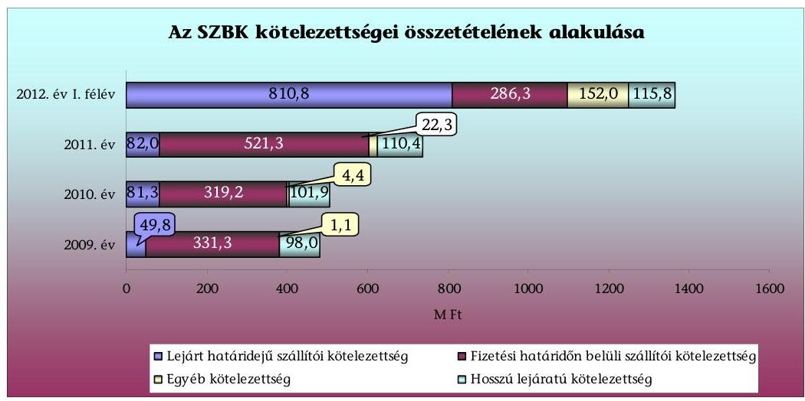

Az SZBK likviditási helyzete 2009-2011 között romlott, amit a likviditási ráta kedvezőtlen változása jelez. A rendelkezésre álló forgóeszközök 2009-ben meghaladták a rövidlejáratú kötelezettségeket, a likviditási ráta 1,06 volt, a 2011. évben azonban a 0,68-ra mérséklődött. Az SZBK pénzeszközei a 2009. év végén a rövid lejáratú kötelezettségeinek $64,8 \%$-ára, míg a 2011. év végén 17,2\%-ára nyújtottak fedezetet. A likviditási mutatók a pénzeszközök csökkenése és a rövidlejáratú kötelezettségek növekedésének együttes hatására változtak kedvezőtlen irányba, a mutatók nem érték el a szakmailag elfogadott elvárható mértéket. A 2011. december 31-ei rövidlejáratú kötelezettségek teljesítésére a forgóeszközök nem nyújtottak fedezetet.

A pénzügyi egyensúlyi helyzet megteremtése érdekében az SZBK 2009. és 2012. I. félév között - a vásárolt közüzemi szolgáltatásoknál, gyógyszer-, szakmai

---

anyaggazdálkodásnál és a segédüzemi tevékenységeknél - folyamatos költség monitoring és keretrendszert múködtetett.

Az SZBK ágyszámaiban változás nem történt, az aktív fekvőbeteg szakellátásban átlagosan 628, a krónikus fekvőbeteg szakellátásban 175 múködő ággyal rendelkezett. A pénzügyi egyensúlyi helyzet javulása nem az ellátási teljesítmények alakulásával állt összefüggésben. Egyes kiemelt teljesítménymutatók a következők szerint változtak:
19. számú ábra
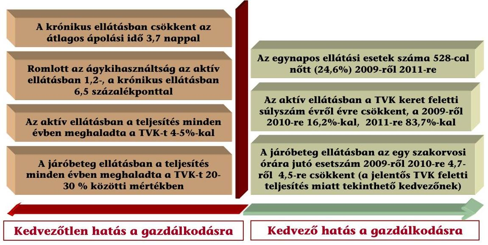

Az SZBK munkaerő hiánya (üres álláshelyek száma) - a 2009-2012. I. félév között a hiányzó létszám pótlására hozott foglalkoztatási szerződéses jogviszony bővítési intézkedéseinek ellenére - az ellenőrzött években nőtt. Az engedélyezett álláshelyek száma a 2009. évi 1269-ről a 2012. év I. félévére 1273-ra nőtt, a betöltött álláshelyek száma a 2009. évi 1124-ről a 2012. év I. félévére 1098-ra csökkent. A humánerőforrás hiány elsősorban az egészségügyi személyzet körében jelentkezett. Az orvosoknál a 2009. évben 49, a 2012. év I. félév végén 54 betöltetlen álláshely, a szakdolgozóknál a 2009. évben 52, a 2012. év I. félév végén 76 üres álláshely volt. A nem egészségügyi személyzetnél a 2009-2012. év I. félév közötti időszakban a betöltetlen álláshelyek száma 3 fővel csökkent. A hiányzó munkaerő biztosítására a 2010. évben igénybe vett közhasznú munka keretében foglalkoztatottak száma 72 fő volt. A munkavállalók Tatabánya Megyei Jogú Város Polgármesteri Hivatala alkalmazásában álltak és a bérüket is a polgármesteri hivatal fizette. Az SZBK a munkabérek javítására a 2009. évben 10 főt érintően $16,5 \mathrm{M}$ Ft, a 2010. évben 12 főt érintően $18,5 \mathrm{M}$ Ft, a 2011. évben 11 főt érintően $8,3 \mathrm{M}$ Ft, a 2012. év I. félévben 3 főt érintően $2,2 \mathrm{M}$ Ft költségvetési támogatásban részesült. A 2011. évben 5 főt érintően $1,8 \mathrm{M}$ Ft, a 2012. év I. félévben 2 főt érintően kaptak $0,1 \mathrm{M}$ Ft munkaerőpiaci támogatást. A költségvetésből és Munkaerőpiaci Alapból kapott támogatást illetmények, munkabérek javítására és rehabilitációs foglalkoztatás bérköltségének támogatására fordították. Ezek mértéke éves átlagban nem éri el a 14 M Ft -ot és nem érinti a munkavállalók $1 \%$-át, így a pénzügyi egyensúlyi helyzetre nem volt számottevő hatással.

---

Az SZBK - pénzügyi helyzetének javítása érdekében - a 2009-2012. év I. félév közötti időszakban a gyógyszerfelhasználás költségének csökkentésére intézkedéseket hozott. A SZBK konszignációs raktárt múködtet. Az összes gyógyszerkiadáshoz képest a térítésmentesen kapott gyógyszerek aránya a 2009. évben 42,2\% (232,3 M Ft), a 2012. év I. félévében 16,8\% (40,9 M Ft) volt. Az összes gyógyszerbeszerzési költség a 2009. évben az OEP bevétel 9,8\%át (550,4 M Ft), a 2011. évben az OEP bevétel 8,3\%-át (510,9 M Ft) tette ki. A gyógyszerköltségek csökkentésére a 2009. évben 203, a 2011. évben 214 féle készítményt váltottak originálisról generikus készítményre.

A szakmai anyagok beszerzési költségét az SZBK folyamatosan figyelemmel kísérte, költségmonitoringot, keretrendszert múködtetett. 2009-2012. I. félévben nem hozott intézkedést a szakmai anyagok beszerzési költségének csökkentésére. A szakmai anyag készletek forgási sebessége 202-ről 157-re (22,4\%-kal) csökkent 2009-ről 2011-re. A szakmai anyagok fajlagos beszerzési költségindexe $2,2 \%$-kal meghaladta az országos átlagnövekedést. A drágább beszerzés negatívan hatott a kórház pénzügyi helyzetére.

Az SZBK - a pénzügyi egyensúlyának javítása érdekében - a 2009-2012. I. félévben a vásárolt közszolgáltatások alakulását folyamatosan figyelemmel kísérte, költségmonitoringot, keretrendszert múködtetett. A közszolgáltatásokban egy kivétellel nem hozott költségcsökkentési intézkedést. Megvalósítás alatt áll egy 783,1 M Ft összköltségű energia-megtakarítási projekt. A korszerűsítésbe tartozik a „manuális épület" ablakainak cseréje, a központi műtő és az intenzív osztály klíma-berendezéseinek korszerűsítése, valamint az épülethomlokzat hőszigetelése. Megújuló energiaforrások telepítésével nagymértékű energia megtakarítással számolnak. A 6,3\%-os belső megtérülési rátájú (IRR) projekt várhatóan 2013. januárban fejeződik be. A költségcsökkentő fejlesztést indokolja, hogy a fajlagos távhő-melegvíz felhasználás 2009-ről 2011-re is nőtt 0,16 GJ/ápolási napról 0,17 GJ-ra. A közműfelhasználásokban eddigi kedvező tények, hogy az egy ápolási napra vetített villamos energia, földgáz, továbbá vízfelhasználás mennyisége 4-8\%-kal csökkent 2009 és 2011 között.

A segédüzemi tevékenységek költségeinek alakulását is folyamatosan figyelemmel kísérték. 2009 és 2011 között a textil-mosatás fajlagos költségeinek reálértéke 6 százalékponttal csökkent (167-ről 179 Ft/kg-ra változott). Az egy élelmezési napra jutó összes betegélelmezési költség a 2009. évben 1986 Ft, a 2011. évben 2081 Ft volt. A növekedés 5\%, amely 9 százalékponttal alatta maradt a háromévi fogyasztói árindexnek, tehát reálértékben csökkenést jelentett.

Az SZBK nagyértékú orvosi gépek-múszereinek kihasználtsága - a CT kivételével - romlott. A CT berendezés kihasználtsága a 2009. évi 76\%-ról 2011. évre 79\%-ra nőtt. A kémiai laborautomaták kihasználtsága a 2009. évi 23\%ról 2011. évre $21 \%$-ra csökkent (a 2011-ben üzembe helyezett három automata átlagos kihasználtsága nem éri el a 10\%-ot). A központi műtő kihasználtsága a 2009. évi 70\%-ról 2011. évre 67\%-ra csökkent. Az ellenőrzött nagyértékű berendezések üzemeltetésének fajlagos költségei (önköltségei) inflációt meghaladóan nőttek. Mindezek a kórház pénzügyi helyzetére negatív hatást gyakoroltak.

---

# 1.19. Jávorszky Ödön Kórház, Vác (JÖK) 

A JÖK pénzügyi egyensúlya a 2009-2011. években döntően a konszolidációs támogatás miatt javult. A finanszírozási múveletek nélküli (GFS) pozíció ${ }^{68}$ a 2009. évben negatív, míg a 2010. és a 2011. évben pozitív értéket mutatott. Konszolidációs támogatás nélkül a kórház pénzügyi kapacitása minden évben negatív volt. Az összes szállítói kötelezettség év végi állománya az előző évhez viszonyítva 2010-ben növekedett, majd 2011-re csökkent, 2011-ben az éves dologi ráfordítás 112,0\%-át (2430,5 M Ft) tette ki. Az összes kimutatott kötelezettség 2012. I. félév végén 3089,3 M Ft volt. A belső intézkedések (köztük az önkormányzati biztos ${ }^{69}$ intézkedései) nem voltak elégségesek a kötelezettségállomány érdemi csökkenéséhez.

Az ellenőrzött időszakban költségvetési intézményként működő JÖK gazdálkodásában a CLF módszer szerinti pénzügyi egyensúly a 2009. évben nem volt biztosított, a múködési tevékenység eredménye és a pénzügyi kapacitás negatív volt. A 2010-2011. években a konszolidációs támogatás hatására a működési jövedelem és a pénzügyi kapacitás is pozitív volt. A konszolidációs támogatások nélkül a JÖK múködési jövedelme 2010-ben -164,9 M Ft, 2011-ben 80,8 M Ft volt. A felhalmozási tevékenység pénzügyi egyenlege a 2009-2011 közötti időszak egészében negatív volt, a felhalmozási célokra fordítható bevételek nem nyújtottak fedezetet a beruházások, felújítások finanszírozására, ami felhalmozási kockázatot jelentett.

Adósságkonszolidációs program keretében a JÖK a 2010. évben 233,4 M Ft, a 2011. évben 160,1 M Ft konszolidációs támogatásban részesült. Az összes támogatásból 388,9 M Ft a lejárt szállítói tartozások finanszírozására, 4,6 M Ft az ortopédiai protetikai beavatkozások esetszámának növelésére, a várólisták csökkentésére volt felhasználható. A 2010. évi konszolidációs támogatás felhasználása jogszerűen megtörtént, a 2011. évi konszolidációs támogatásból 3,0 M Ft visszafizetési kötelezettség keletkezett.

A múködési és felhalmozási tevékenység egyenlege, a pénzügyi kapacitás 20092011 között a következők szerint alakult:

[^0]
[^0]:    ${ }^{68}$ A finanszírozási műveletek nélküli (GFS) pozíció a 2009. évben -74,0 M Ft, a 2010. évben 46,8 M Ft, a 2011. évben 46,3 M Ft volt.
    ${ }^{69}$ 2010. január 1-jétől, az állami tulajdonba vételig önkormányzati biztost rendelt ki a fenntartó önkormányzat.

---

60. számú diagram
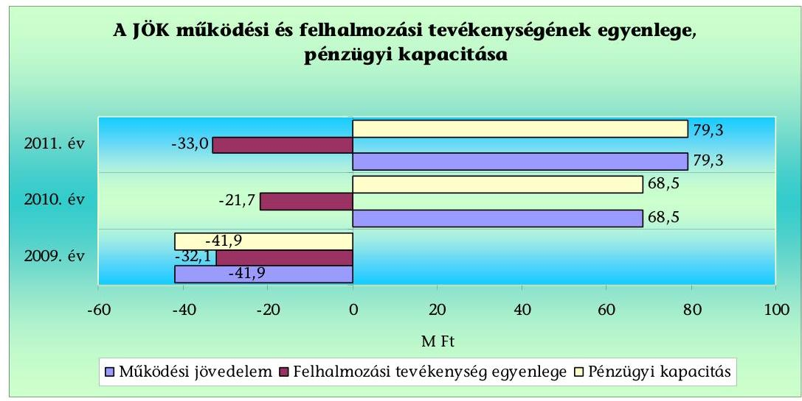

A múködés finanszírozását szolgáló bevételek a 2009. évi 4079,4 M Ftról - az előző évhez viszonyítva - a 2010. évre 4541,9 M Ft-ra (11,3\%-kal, 462,5 M Ft-tal) emelkedtek, a 2011. évre 4218,0 M Ft-ra (7,1\%-kal, 323,9 M Fttal) csökkentek. A 2010. évi múködési bevétel növekedést a 233,4 M Ft konszolidációs támogatás, valamint - az előző évhez viszonyított - teljesítményarányos OEP támogatás 157,9 M Ft-os és a fenntartói támogatások 101,7 M Ft-os növekedése eredményezte. A 2011. évi múködési bevétel csökkenést pedig az az előző évhez viszonyított - teljesítményarányos OEP támogatás 238,1 M Ft-os, a konszolidációs támogatás 73,3 M Ft-os, illetve a saját bevételek 23,1 M Ft-os csökkenése okozta.

A múködési bevételeken belül minden évben meghatározó volt az OEP-től származó támogatások, a fenntartói támogatások és a saját bevételek összege. A bevételek összegének alakulását az ellátás finanszírozási szabályainak változása, a konszolidációs támogatások befolyásolták. A fenntartótól kapott támogatás javította a kórház pénzügyi helyzetét. A fenntartói támogatás összege folyamatosan növekedett, a 2009. évben a múködési bevételek 1,6\%-át (65,1 M Ft), 2010-ben 3,7\%-át (166,9 M Ft), 2011-ben a 4,0\%-át (170,7 M Ft) tette ki.

A saját bevételek 2009-2011 között 12,3\%-kal csökkentek, amely a pénzügyi helyzetre negatív hatást gyakorolt, 2009-ben 225,8 M Ft-ot, 2011-ben 198,1 M Ft-ot tettek ki. A saját bevételek ( 638,7 M Ft) jelentős része a 2009-2011 közötti időszakban összesen 554,7 M Ft (a saját múködési bevételek 91,2\%-a) három bevételi jogcímen - szolgáltatások ellenértékéből, továbbszámlázott szolgáltatásokból, bérleti és lízingdíjakból - származott. A saját bevételek növelése, a követelések behajtása érdekében a behajtással külső vállalkozást bíztak meg.

A múködési költségek és ráfordítások 2009. évi 4121,3 M Ft-ról 2010-re (8,5\%-kal, 352,1 M Ft-tal) - az infláció kétszeresével - 4473,4 M Ft-ra nőttek, majd 2011-re (7,5\%-kal, 334,8 M Ft-tal) 4138,7 M Ft-ra csökkentek. Az üres álláshelyek folyamatos növekedése miatt a személyi jellegű ráfordítások és a munkaadókat terhelő járulékok együttes összege a 2009. évi 2185,5 M Ft-ról

---

2010-re 2108,1 M Ft-ra (3,5\%-kal, 77,4 M Ft-tal), 2011-re 1906,0 M Ft-ra (9,6\%kal, 202,1 M Ft-tal) csökkentek. A dologi ráfordítások a 2009. évi 1893,8 M Ftról a 2010. évre 2300,5 M Ft-ra (21,5\%-kal, 406,7 M Ft-tal) növekedtek, a 2011. évre 2169,4 M Ft-ra (5,7\%-kal, 131,1 M Ft-tal) csökkentek. A gyógyító tevékenység közvetlen költségét ellátás-típusonként nem mutatták ki, a közvetlen költségeket nem tudták megosztani fekvő, járó és egyéb szakellátás szerint, ami az ellátások ráfordításainak megalapozott tervezését, a pénzügyi egyensúly elősegítését gátolhatja. A fedezeti összeg 2009-2011. években nem nyújtott fedezetet a gazdasági, műszaki ellátás felosztott költségeire.

A múködési bevételek és ráfordítások fő jogcímek szerinti arányát és alakulását a következő diagram szemlélteti:
61. számú diagram
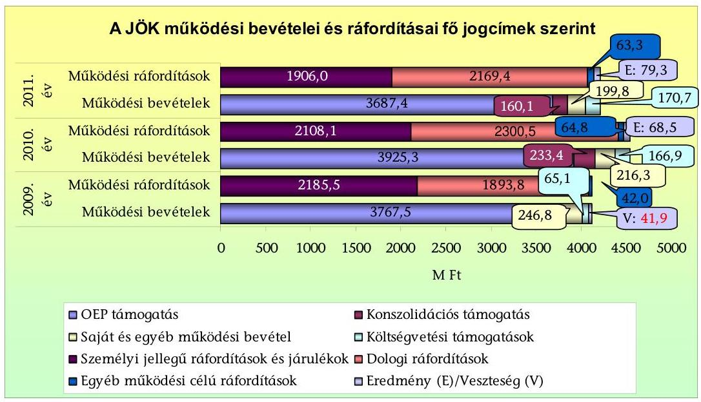

A 2005-2006. évben kezdett fejlesztések finanszírozására a 2009-2011. években összesen 88,0 M Ft-ot fordítottak. A 75,2 M Ft (orvosi műszer, berendezés, valamint számítástechnikai eszközbeszerzés) beruházási és 12,8 M Ft felújítási (be-teg- és szülőszoba, illetve ingatlan felújítás) tevékenység 96,9\%-át, 85,3 M Ft-ot tulajdonosi támogatásból, 3,1\%-át, 2,7 M Ft-ot saját bevételből valósította meg. A 88,0 M Ft tényleges bekerülési költségből 55,0 M Ft-ot fordítottak az előző évek beszerzéséhez kapcsolódó lízing díjak fedezetére. Az eszközpótlásra fordított összeg a 2009-2011. években 55,0 M Ft volt, amely az elszámolt 474,1 M Ft értékcsökkenésnek 11,6\%-át tette ki. Folyamatban van a korábbi fenntartó önkormányzat által kezdeményezett, a kórház korszerűsítését szolgáló beruházás, amelynek várható bekerülési költsége 2185,9 M Ft, amelyből a támogatás mértéke legfeljebb 1966,7 M Ft. A KMOP beruházás befejezésének tervezett ideje 2011. június volt, de a projekt még 2012 őszén sem volt kész, mert az Önkormányzat fizetési kötelezettségeit nem rendezte. A korszerűsítés késedelme veszteséget okoz, mert nem jutnak időben a költségtakarékosabb üzemeltetési megoldásokhoz. Az ellenőrzött időszakban beszerzett tárgyi eszközök jövőbeni fenntartási, üzemeltetési költségeit a beszerzések tervezése során nem vették figyelembe. Múködtetésükre a bevételek nem nyújtottak fedezetet, emiatt is forráshiány keletkezett a múködési tevékenység finanszírozásában.

---

Az év végi kötelezettségek állománya a lejárt szállítói kötelezettségek növekedése miatt a 2009. évi 2347,2,0 M Ft-ról a 2010. évben 2415,7 M Ft-ra, a 2011. évre 3230,2 M Ft-ra növekedett. Az összes kötelezettségállomány 2012. június 30-án 3089,3 M Ft volt. Likvid és hosszúlejáratú hitelt nem vettek fel, de 2012. június 30-án 367,3 M Ft deviza alapú pénzügyi lízing ${ }^{70}$ és $5,1 \mathrm{M}$ Ft operatív lizing kötelezettségük volt. A 2011. december 31-éig teljesített tőkefizetés utáni árfolyam nyereség $0,54 \mathrm{M} \mathrm{Ft}$, míg árfolyam veszteség $12,7 \mathrm{M}$ Ft volt. A lízingdíj növekedés és az árfolyamveszteség kompenzálására a fenntartó önkormányzat 266,6 M Ft-tal támogatta a kórházat. A rövidlejáratú kötelezettségek év végi állománya 2011-ben 2541,0 M Ft volt, amely az összes kötelezettség 3230,2 M Ft - 78,7\%-át tette ki. A 2009. évről 2010-re állományuk nőtt, elsősorban a deviza alapú lízingdíjak és az ÁFA emelkedésének hatására. A szállítói tartozások miatti év végi kötelezettségállomány, ezen belül a lejárt tartozások kedvezőtlenül alakultak a finanszírozás csökkenése és a kedvezőtlen árfolyammozgások miatt. A lejárt határidejű szállítói kötelezettségek 2009. december 31-én 272,0 M Ft (13,8\%), 2012. június 30-án 2087,1 M Ft (76,8\%) volt. 2012. I. félév végén az uniós támogatásból megvalósuló fejlesztési feladatokhoz kapcsolódó lejárt szállítói kötelezettségként 19,6 M Ft-ot mutattak ki. A lejárt határidejú tartozások növekedésének oka elsősorban a deviza (svájci frank) alapú lízingdíjak növekedése volt, melyet a kedvezőtlen árfolyamváltozás befolyásolt. A devizaalapú kötelezettség árfolyamkockázata 2016-ig veszélyezteti a Kórház gazdaságos múködését.

Az összes kötelezettség, illetve ezen belül a szállítói és a lejárt határidejú szállítói állomány az alábbiak szerint alakult:
62. számú diagram
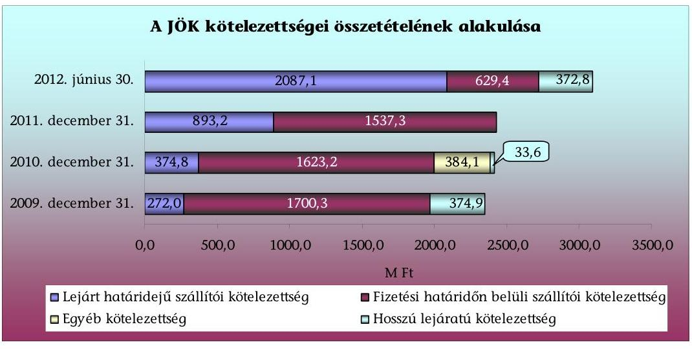

A kórház likviditási helyzete a likviditási mutatók változását tekintve az ellenőrzött időszakban kedvező irányba változott. A likviditási ráta a 2009. évi 0,07-ről a 2011. évben 0,11-re emelkedett. A pénzeszközök a rövidlejáratú kötelezettségekre egyik évben sem nyújtottak fedezetet. A rendelkezésre álló

[^0]
[^0]:    ${ }^{70}$ A szerződést 2006 júniusában kötötték meg 500,0 M Ft értékben, a szerződés lejárata 2016. június 20.

---

készpénz állomány 2009-ben a fennálló kötelezettségek 0,7\%-ra, 2011-ben 3,0\%-ra biztosított fedezetet. A likviditási mutatók kedvező irányba történő elmozdulása ellenére a JÖK likviditása, fizetőképessége nem megfelelő, a likviditási mutatók a szakmailag elvárható szinttől jelentősen elmaradtak.

A 2009-2011. években a pénzügyi tevékenység alakulásával összefüggő belső kontrollokat kialakították, rendelkeztek a hatályos jogszabályokban előírt szabályzatokkal, betartották az összeférhetetlenségi követelményeket. A kórház azonban nem tett eleget az ú.n. „üvegzseb törvény"71 közzétételre vonatkozó előírásainak, saját honlapján nem szerepeltek ${ }^{72}$ a Kbt. 17/C. §-ában előírt, a 20082011. közötti időszakra megkötött szerződések. A vezetők személyében gyakori változás történt. A főigazgatói státusz változásainak időpontjai: 2010. május 1., szeptember 28., október 27., 2012. február 1-je. A gazdasági igazgatói státuszt megbízotti formában 2010. március 29., 2011. február 1., 2012. április 19. napjától töltötték be. Kialakították az Áht. (új) 69. §-ában előírt kontrollrendszert, de 2010 márciusától 2011. novemberig nem foglalkoztattak belső ellenőrt.

Vác Város Önkormányzata a kórházhoz 2010. január 1-jétől 2012. április 30-ig önkormányzati biztost rendelt ki, ${ }^{73}$ amit a lejárt határidejű tartozások állománya indokolt. Az önkormányzati biztos által feltárt, az eladósodáshoz vezető okok a kórház számára nem váltak ismertté. A belső ellenőrzési jelentés szerint az adósságállomány okai között szerepelt - többek között - a 2009. április 1jétől életbe lépett új finanszírozási rendszer, a TVK csökkentés, a számviteli fegyelem hiánya, a vagyonvédelem szabályozásának rendezetlensége. Jelentős tényező, hogy 2010 előtt a tulajdonos hosszú távra, nagy költségvonzattal járó szerződéseket kötött és nincs megoldás a módosításukra (gyógyszerbeszerzés, mosás, bértextília ellátás, élelmezési tevékenység), mivel közbeszerzés keretében kötötték meg azokat. A 2009-2010. évek pénzügyi pozíciójának negatív egyenlege után a 2011. év pozitívuma ( $97,9 \mathrm{M}$ Ft) részben az önkormányzati biztos által végzett $358,1 \mathrm{M}$ Ft adósság átütemezésére, részben a konszolidációs támogatás ( $160,1 \mathrm{M}$ Ft) év végi folyósítására vezethető vissza, ami az adott évben egyenlegjavító tényezőként jelent meg.

A JÖK a 2009-2011. években átlagosan az aktív fekvőbeteg szakellátásban 442, a krónikus fekvőbeteg szakellátásban 123 múködő ággyal rendelkezett. 2012-ben a rekonstrukció miatt csökkentés történt, a működő aktív ágyak száma 23 -mal (5,5\%), a krónikus ágyaké 21-gyel csökkent (17\%). Az ellátási teljesítmények alakulása érdemben nem befolyásolta a kórház pénzügyi egyensúlyi helyzetét. Egyes kiemelt teljesítménymutatók a következők szerint változtak:

[^0]
[^0]:    ${ }^{71}$ A közpénzek felhasználásával, a köztulajdon használatának nyilvánosságával, átláthatóbbá tételével és ellenőrzésének bővítésével összefüggő egyes törvények módosításáról szóló 2003. évi XXIV. törvény
    ${ }^{72}$ A törvény szerint a honlapon meg kell jelentetni a közérdekű nettó $5,0 \mathrm{M}$ Ft feletti kifizetésekre vonatkozó adatokat.
    ${ }^{73}$ MEDINETSYST Egészségügyi Szolgáltató Kft., később Control Balance Kft. névvel.

---

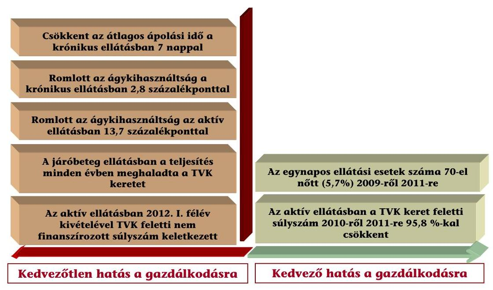

A JÖK munkaerő hiánya - a hiányzó létszám pótlására hozott intézkedések ellenére - a 2010. évtől nőtt, a betöltött álláshelyek száma a 2009. évi 724 főről a 2012. év I. félévére 663 főre csökkent. Az orvosoknál a 2009. évben 38, a 2012. év I. félév végén 34 üres álláshely, a szakdolgozóknál a 2009. évben 52, a 2012. év I. félév végén 106 betöltetlen álláshely volt. A nem egészségügyi személyzetnél a 2009. évről a 2012. év I. félévre az üres álláshelyek száma 24 -ről 31-re nőtt. A költségek csökkentése érdekében a hiányzó szakorvosi létszámot vállalkozói szerződéssel, részmunkaidőben foglalkoztatott orvosokkal pótolták. A hiányzó létszám pótlása érdekében részt vettek EU-s pályázaton, illetve igénybe vették a Munkaerőpiaci Alap támogatását. A Munkaerőpiaci Alap támogatásával a 2010. évben 1 főt, a 2011. évben 3 főt, a 2012. év I. félévben 1 főt foglalkoztattak, amelyhez összesen 1,6 M Ft támogatásban részesültek. EU-s pályázati támogatással a 2009. évben 8 főt, a 2010. évben 10 főt, a 2011. évben 2 főt alkalmaztak, amelyhez összesen 14,7 M Ft támogatásban részesültek.

A JÖK - pénzügyi helyzetének javítása érdekében - az ellenőrzött időszakban a gyógyszerfelhasználás költségének csökkentésére intézkedéseket nem hozott. A JÖK intézeti gyógyszertárat nem múködtet. A gyógyszerköltség tevékenységek közötti (fekvőbeteg-szakellátás, járóbeteg-szakellátás, stb.) megoszlását nem figyelte, folyamatos költség monitoring-, keret-rendszer nem múködtetett. A kórházi gyógyszerfelhasználásban a generikumok alkalmazásának arányára és az alkalmazott beszerzési eljárásokra vonatkozóan számításokat nem készített. Az összes gyógyszerköltség a 2009. évben az OEP bevétel 7,0\%-át (264,4 M Ft), a 2011. évben az OEP bevétel 8,2\%-át (316,2 M Ft) tette ki.

A szakmai anyagok beszerzési költségét a JÖK folyamatosan figyelemmel kísérte, költségmonitoringot, keretrendszert múködtetett, ami pozitívan hatott a pénzügyi helyzetére. A 2009-2012. I. félévben a szakmai anyagok beszerzési költségeinek csökkentésére nem hoztak intézkedést. 2010-től az önkormányzati biztos feladata volt az 5,0 M Ft-ot meghaladó tételekre vonatkozóan a szállí-

---

tókkal történő megállapodás, illetve konkrét adósságrendezési megállapodások készítése. A szakmai anyag készletek forgási sebessége 416 fordulat/évről 561 fordulat/évre ( $35 \%$-kal) nőtt 2009-ről 2011-re, ami kedvezően hatott a pénzügyi egyensúlyra. A szakmai anyagok fajlagos beszerzési költségindexe egy aktív fekvőbeteg esetre vetítve $8 \%$-kal az országos átlag alatt alakult 20092011 között.

A JÓK - a pénzügyi egyensúlyának javítása érdekében - az ellenőrzött időszakban a vásárolt közszolgáltatások alakulását folyamatosan figyelemmel kísérte, költségmonitoringot, keretrendszert múködtetett. A villamos energia közszolgáltatásnál a 2011. évben költségcsökkentési intézkedést hozott, melyből az évben 2,1 M Ft megtakarítása keletkezett, javítva ezzel a kórház pénzügyi helyzetét. Az egy ápolási napra vetített villamos energia fogyasztás 2009-2011 között stagnált $15,4 \mathrm{kWh} /$ nap értéken. A fogyasztott földgáz fajlagos mennyisége $26 \%$-kal, $6,2 \mathrm{~m}^{3} /$ napról $7,8 \mathrm{~m}^{3} /$ napra nőtt. A távhő-melegvíz felhasználás $0,14 \mathrm{GJ} /$ napról $0,07 \mathrm{GJ} /$ napra, a fogyasztott víz fajlagos mennyisége $0,6 \mathrm{~m}^{3}$ /napról $0,4 \mathrm{~m}^{3} /$ napra csökkent a három év során.

A segédüzemi tevékenységek közül az energiaellátásnál 2010-2012. I. félév közötti időszakban folyamatosan, a textilmosatásnál és betegélelmezésnél 2011-től kezdődően múködtettek költségmonitoringot és keretrendszert. A saját hőközponti üzemköltségek kedvezően alakultak: 4423 Ft/GJ-ról 4379 Ft/GJ-ra csökkentek 2009-ről 2010-re. A saját textilmosás fajlagos díja $489 \mathrm{Ft} / \mathrm{kg}$-ról $368 \mathrm{Ft} / \mathrm{kg}$-ra csökkent az ellenőrzött teljes három év alatt. Kedvezőtlenül drágult ellenben a betegélelmezés költsége: a 2009-es 1060 Ft /élelmezési napról 2011-re 1264 Ft/napra nőtt, 19\%-kal, amely reálértéken 6\% drágulást jelentett.

A nagyértékú orvosi gépek-múszerek kihasználtsága változóan alakult. A CT berendezés kihasználtsága a 2009. évi 52\%-ról 2011-ben 53\%-ra nőtt, a központi műtő kihasználtsága a 2009. évi 84\%-ról 2011. évre 72\%-ra csökkent. A CT berendezés használatának önköltsége az inflációt meg nem haladóan, $1 \%$-kal, míg a műtő önköltsége az inflációs mértéket meghaladóan, $14 \%$-kal, a vásárolt kémiai laborszolgáltatás egységára $37 \%$-kal nőtt 2011-re. Mindezek a kórház pénzügyi helyzetére negatív hatást gyakoroltak.

# 1.20. Szent Kozma és Damján Rehabilitációs Szakkórház, Visegrád (SZKDRSZ) 

Az SZKDRSZ pénzügyi egyensúlya a finanszírozási múveletek nélküli (GFS) pozíció ${ }^{74}$ alapján 2009-ben biztosított volt, majd 2010-2011 között nem volt biztosított, múködési és a felhalmozási tevékenység együttes egyenlege negatív volt. A múködési jövedelem csökkenése, a veszteség keletkezése a pénzügyi helyzet romlását jelzi. A múködési ráfordítások növekedési üteme - a bevételnövelő és költségmegtakarító intézkedések, valamint a keretgazdálkodás ellenére - meghaladta a múködési bevételek növekedési ütemét.

[^0]
[^0]:    ${ }^{74}$ A finanszírozási múveletek nélküli (GFS) pozíció a 2009. évben 27,7 M Ft, a 2010. évben -52,9 M Ft, a 2011. évben -22,6 M Ft volt.

---

Az SZKDRSZ a pénzügyi egyensúlyát pénzeszközei ${ }^{75}$ felhasználásával tudta biztosítani. A szállítói kötelezettségek csökkenése nem volt jelentős mértékú. A 2011. évi 18,3 M Ft szállítói kötelezettség az éves dologi ráfordítások 5,2\%-át tette ki. A számviteli nyilvántartásokban az SZBK 2012. június 30 -án 15,9 M Ft szállítói kötelezettséget mutatott ki.

Az ellenőrzött időszakban költségvetési intézményként múködő SZKDRSZ CLF módszer szerinti pénzügyi helyzete folyamatosan romlott. A 2009. és a 2010. évben a múködési pénzügyi egyensúly biztosított volt, azonban a 2011. évben a múködési jövedelem és a pénzügyi kapacitás negatívra változott a múködési költségek és ráfordítások növekedésének ${ }^{76}$ hatására. A 2010. évi konszolidációs támogatás nélkül az SZKDRSZ múködési jövedelme 2010ben $-19,4 \mathrm{M}$ Ft volt. A felhalmozási tevékenység egyenlege a 2009-2011 közötti időszak egészében negatív volt, a felhalmozási célokra fordítható bevételek nem nyújtottak fedezetet a beruházások, felújítások finanszírozására. A felhalmozási tevékenység finanszírozása a 2009. évben a múködési jövedelemből, míg a 2010-2011. években az adatszolgáltatásában kimutatott pénzeszközeiből biztosított volt.

Az SZKDRSZ a 2010. és a 2011. években konszolidációs támogatásban részesült. A 2010. évi 35,4 M Ft konszolidációs támogatásból 20,9 M Ft-ot a szállítói kötelezettségek kiegyenlítésére fordított. A 14,5 M Ft maradványt, valamint a 2011ben kapott 35,3 M Ft konszolidációs támogatást - lejárt határidejú szállítói kötelezettség hiányában - az OEP részére visszautalta.

A múködési és felhalmozási tevékenység egyenlege, a pénzügyi kapacitás 20092011 között a következők szerint alakult:
63. számú diagram
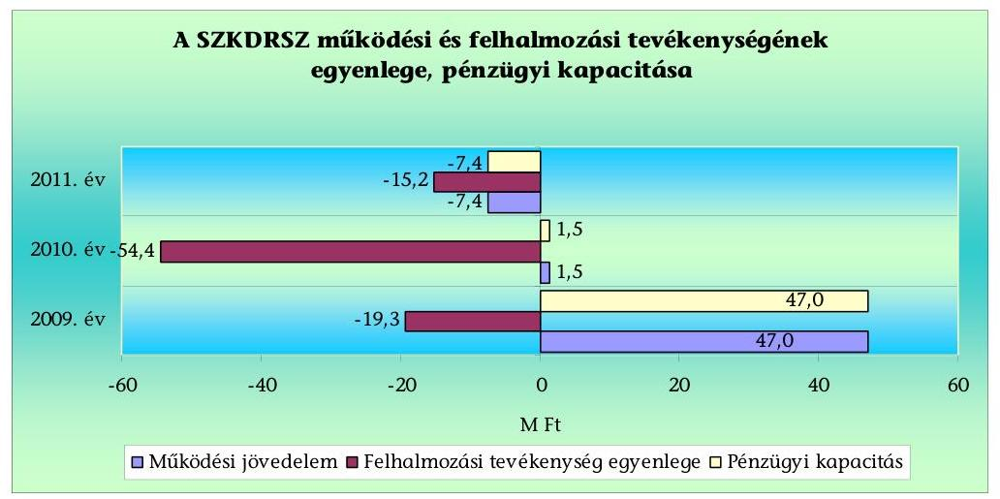

[^0]
[^0]:    ${ }^{75}$ Az SZKDRSZ adatszolgáltatása alapján 2009-ben 80,5 M Ft, 2011-ben 6,5 M Ft pénzeszközzel rendelkezett.
    ${ }^{76}$ Az SZKDRSZ tájékoztatása szerint a 2011. évi veszteséget egy érintésvédelmi felülvizsgálat alapján kötelezően végrehajtott, főépületen kívüli épületek elektromos hálózatának 13,0 M Ft-os értékú előre nem tervezett karbantartási költsége okozta.

---

A múködés finanszírozását szolgáló bevételek 2010-re 860,6 M Ft-ra (1,6\%-kal, 13,2 M Ft-tal), a 2011. évre 919,3 M Ft-ra (6,8\%-kal, 58,7 M Ft-tal) emelkedtek. A 2010. évi múködési bevétel növekedést a 20,9 M Ft konszolidációs támogatás és az OEP finanszírozás 11,4 M Ft-os növekedése eredményezte. A 2011. évi változást az OEP finanszírozás 27,4 M Ft-os, a saját múködési bevételek 16,8 M Ft-os emelkedése, valamint az EU-tól származó 29,5 M Ft átvett pénzeszköz okozta.

A múködési bevételeken belül minden évben az OEP-től származó támogatások összege volt a meghatározó. Az OEP-től származó bevételek összegének alakulását a finanszírozási szabályok változása, a konszolidációs támogatások befolyásolták. A fenntartótól kapott támogatás javította az SZKDRSZ pénzügyi helyzetét. A fenntartói támogatás aránya és összege változó volt, a 2009. évben a múködési bevételek 3,1\%-át (26,9 M Ft-ot), a 2010. évben 2,5\%-át (21,3 M Ftot), a 2011. évben 0,7\%-át (6,5 M Ft-ot) tette ki.

A saját múködési bevételek a 2009. évről a 2010. évre csökkentek, majd a 2011. évre növekedtek. A saját múködési bevételek 2010. évi 7,5 M Ft-os csökkenését az Oszteológiai Rehabilitáció Országos Munkacsoportja konferenciájának technikai okok miatti elmaradása okozta. A saját bevételek (a három év alatt összesen 147,3 M Ft) 75,2\%-a - összesen 110,8 M Ft - szolgáltatások ellenértékéből származott. Az SZKDRSZ a saját múködési bevételek növelése érdekében magasabb komfortfokozat elérésére törekedett a térítés ellenében igénybe vehető kórtermek esetében. Ennek hatására a 2011. évben a szolgáltatások ellenértéke 8,7 M Ft-tal (27,4\%-kal) emelkedett az előző évhez viszonyítva.

A múködési költségek és ráfordítások a 2010. évre 859,1 M Ft-ra (7,4\%$\mathrm{kal}, 58,7 \mathrm{M}$ Ft-tal), majd 2011-re 926,7 M Ft-ra (7,9\%-kal, 67,6 M Ft-tal) emelkedtek az előző évhez viszonyítva. A személyi jellegú ráfordítások és munkaadókat terhelő járulékok együttes összege a 2009. évi 511,0 M Ftról a 2010. évre 528,1 M Ft-ra (3,3\%-kal, 17,1 M Ft-tal), 2011-re 558,6 M Ft-ra (5,8\%-kal, 30,5 M Ft-tal) növekedtek. A változást a betöltetlen álláshelyek számának csökkenése okozta.

A dologi ráfordítások a 2009. évi 284,7 M Ft-ról a 2010. évre 320,4 M Ft-ra (12,5\%-kal, 35,7 M Ft-tal), majd a 2011. évre 353,4 M Ft-ra (10,3\%-kal, 33,0 M Ft-tal) az inflációt meghaladó mértékben növekedtek. A dologi ráfordítások annak ellenére növekedtek, hogy az SZKDRSZ a költségek csökkentése érdekében takarékossági intézkedéseket (gyógyszer- és szakmai anyaggazdálkodás esetében keretrendszer múködtetése, a vásárolt közüzemi szolgáltatásokkal kapcsolatos szerződésmódosítások, átszerződések és központosított közbeszerzések alkalmazása, a betegélelmezésben technológiaváltás) tett.

A gyógyító tevékenység közvetlen költségét az SZKDRSZ ellátás-típusonként kimutatta, amely szerint a fedezeti összeg 2009-2011. években nem nyújtott fedezetet a gazdasági-, múszaki ellátás felosztott költségeire.

A 2009-2011. években az SZKDRSZ 94,2 M Ft beruházási és 171,8 M Ft felújítási tevékenységet végzett. A felhalmozási tevékenység finanszírozására saját bevételek, fenntartói támogatások, államháztartáson kívülről kapott bevételek szolgáltak. Az eszközpótlásra fordított összeg a 2009-2011. években 41,7 M Ft

---

volt, amely az elszámolt 114,7 M Ft értékcsökkenésnek 36,4\%-át tette ki. A beszerzett tárgyi eszközök jövőbeni fenntartási, üzemeltetési költségeit az SZKDRSZ vállalta.

A múködési bevételek, ráfordítások főbb jogcímeinek arányát és alakulását a következő diagram szemlélteti:
64. számú diagram
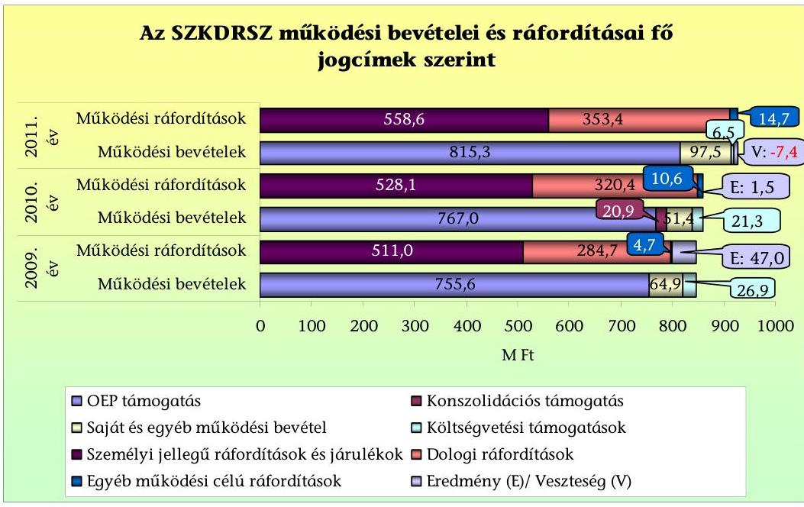

A kötelezettségek állománya a 2009. évi 20,6 M Ft-ról a 2010. évben a szállítói kötelezettségek csökkenése miatt 18,8 M Ft-ra változott. A 2011. évre a kötelezettségek állománya a szállítói és egyéb kötelezettségek növekedése következtében 21,5 M Ft-ra emelkedett. A 2012. június 30 -ai 15,9 M Ft összegű kötelezettség teljes egészében a szállítókkal szemben fennálló tartozás volt. Az SZKDRSZ összes kötelezettsége, illetve ezen belül a szállítói kötelezettségállománya az alábbiak szerint alakult:
65. számú diagram
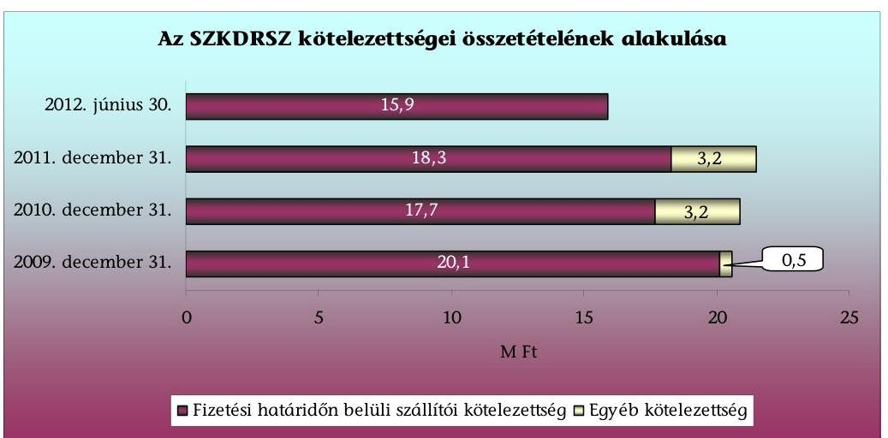

---

Az SZKDRSZ likviditási helyzete 2009-2011 között a készpénz likviditási mutató alapján - a pénzeszközök felhalmozási célú felhasználása következtében romlott. Kedvezőtlen irányba változott a likviditási ráta, a 2010. évi 6,16-ról 8,91-re növekedett, majd 2011-ben 6,7-ra csökkent. A készpénz likviditási mutató alapján az SZKDRSZ pénzeszközei a 2009. év végén a rövid lejáratú kötelezettségeinek 390,8\%-ára, míg a 2011. év végén 30,2\%-ára nyújtottak fedezetet. A likviditási mutatók értéke mindhárom évben jelentős mértékben meghaladta a szakmailag elvárható mértéket. Az SZKDRSZ rövidlejáratú kötelezettségeinek rendezéséhez rendelkezett elegendő fedezettel, a likviditási mutatók kedvezőtlen változása a fizetőképességet nem veszélyeztette.

A pénzügyi egyensúlyi helyzet folyamatos megtartása érdekében az SZKDRSZ 2009. és 2012. I. félév között - a vásárolt közüzemi szolgáltatásoknál, gyógy-szer-, szakmai anyaggazdálkodásnál - folyamatos költség monitoring és keretrendszert múködtetett.

Az SZKDRSZ rehabilitációs szakkórház átlagosan 230 db működő krónikus ággyal rendelkezett. Az ellátási teljesítmények alakulása érdemben nem befolyásolta a pénzügyi egyensúlyi helyzetet. Egyes kiemelt teljesítménymutatók a következők szerint változtak:
21. számú ábra
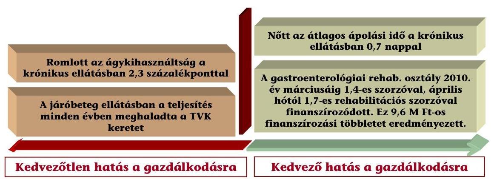

Az SZKDRSZ munkaerő hiánya (üres álláshelyek száma) a 2009-2012. év I. félév között - a hiányzó létszám pótlására hozott intézkedések (közfoglalkoztatás, pályázati lehetőségek kihasználása) hatására - csökkent. Az üres álláshelyek száma a 2009. évi 19 fơről, a 2012. év I. félévére 2 fơre csökkent. Az engedélyezett álláshelyek száma a 2009. évről a 2010. évre 185 fôről 191 fôre nőtt, majd ezen a szinten maradt a 2011-2012. év I. félévben is. A betöltött álláshelyek száma a 2009. évről a 2012. év I. félévre 166 fôről 189 fôre nőtt. A humánerőforrás hiány elsősorban az egészségügyi személyzet körében jelentkezett. Az orvosoknál a 2009. évben 4, a 2012. év I. félév végén 1 üres álláshely, a szakdolgozóknál a 2009. évben 10 üres álláshely volt, ami a 2012. év I. félére betöltésre került. A nem egészségügyi személyzetnél a betöltetlen álláshelyek száma a 2009. évről a 2012. év I. félévre 5 fővel csökkent. Az EU-s pályázati támogatást évente 6 fő foglalkoztatására ( 2 fő szakorvos, 3 fő szakdolgozó és 1 fő gyógypedagógus) kaptak összesen 29,0 M Ft összegben (2011. évben 19,7 M Ft, 2012. év I. félévében 9,3 M Ft). A munkabérek javítására - fenntartó önkormányzat döntése alapján - összesen 32,0 M Ft (2009. évben 154 főt érin-

---

tően 10,2 M Ft-ot, 2010. évben 181 főt érintően 17,7 M Ft-ot, 2011. évben 75 főt érintően $4,2 \mathrm{M}$ Ft-ot) költségvetési támogatást kapott. A pénzügyi egyensúly szempontjából kedvező, hogy az intézmény a támogatásokat kihasználva kiegészítő forráshoz jutott az ellenőrzött időszakban.

A SZKDRSZ - pénzügyi helyzetének javítása érdekében - a 2009-2012. év I. félév közötti időszakban a gyógyszerfelhasználás költségének csökkentésére intézkedéseket hozott. Az összes gyógyszerkiadáshoz képest a térítésmentesen kapott gyógyszerek aránya a 2009. évben 146,8\% (24,5 M Ft), a 2012. év I. félévében $96,1 \%$ ( $8,5 \mathrm{MFt}$ ) volt. Az összes gyógyszerbeszerzési költség a 2009. évben az OEP bevétel 2,2\%-át ( $16,7 \mathrm{MFt}$ ), a 2011. évben az OEP bevétel $2,6 \%$-át ( $21,2 \mathrm{MFt}$ ) tette ki. Az originálisról generikusra váltott készítményekre vonatkozóan nem rendelkeznek adatokkal.

Az SZKDRSZ folyamatosan figyelemmel kísérte a szakmai anyagok beszerzési költségét, költségmonitoringot, keretrendszert múködtetett. A pénzügyi egyensúly javítása érdekében a 2009-2012. I. félévben a szakmai anyagok beszerzési költségének csökkentésére intézkedéseket hozott. A szállítási szerződések felülvizsgálata, új szerződés megkötése következtében a 2009-2011. években összesen $0,4 \mathrm{M}$ Ft megtakarítást értek el, javítva ezzel a kórház pénzügyi helyzetét. A szakmai anyag készletek forgási sebessége a 2009. évről 2011. évre 399ről 382,2-re ( $4 \%$-kal) csökkent. Kedvező volt, hogy ugyanakkor a szakmai anyagok egy ápolási napra eső beszerzési költségindexe csökkent (3\%-kal).

Az SZKDRSZ - a pénzügyi egyensúlyának javítása érdekében - a 2009-2012. I. félévben a vásárolt közszolgáltatások alakulását figyelemmel kísérte, költségmonitoringot, keretrendszert múködtetett. Ennek ellenére kedvezőtlen volt, hogy 2009-ről 2011-re az egy ápolási napra eső (fajlagos) felhasználás a villamos energiánál $22 \%$-kal ( $4,68 \mathrm{kWh} /$ ápolási napról 5,73 -ra), a földgáznál $21 \%$-kal ( $2,36 \mathrm{~m} 3 /$ ápolási napról 2,86 -ra), illetve a víznél $10 \%$-kal ( 0,51 $\mathrm{m} 3 /$ ápolási napról $0,56-\mathrm{ra}$ ) emelkedett. A növekedésben egyaránt szerepet játszott a fogyasztások növekedése és az ápolási napok számának csökkenése.

# 2. A KÓRHÁZI MŰKÖDTETÉSRE VONATKOZÓ KORÁBBI ÁSZ ELLENÖRZÉSEK JAVASLATAI ALAPJÁN TETT INTÉZKEDÉSEK VÉGREHAJTÁSA 

Az utóellenőrzés a 0609. sz. az egészségügyi szakellátások privatizációjának ellenőrzéséről és a 0921. sz. az egyes kórházi tevékenységek kiszervezésének ellenőrzéséről szóló ÁSZ jelentések javaslatainak a végrehajtását ellenőrizte. A jelentések öt javaslatot fogalmaztak meg, ebből három javaslatot a Kormánynak és kettőt az egészségügyi miniszternek. A Kormánynak szóló három javaslatból egyet határidőben, kettőt a 2006-2010. évek közötti mulasztást követően a 2011. évben hajtottak végre. Az egészségügyi miniszternek szóló kettő javaslat közül az egyik részben, a másik nem teljesült.

A 0609. sz. ÁSZ Jelentésben a Kormány részére tett kettő javaslatra a 20062010. évek között eredménytelen feladatkijelölések történtek, a javaslatok végrehajtására a 2011. évben került sor.

---

Az ÁSZ által tett - ,,dolgozzon ki átfogó egészségpolitikai koncepciót, amelynek keretében határozza meg a magántőke, a magánvállalkozások lehetséges szerepét, szakmai területeit, az állami támogatások alapelveit, és mindezekre figyelemmel szabályozza az egészségügyi szakellátások müködésének rendszerét" megfogalmazású - javaslathoz kapcsolódó feladatok végrehajtásával a Kormány az egészségügyi minisztert bízta meg. Az EüM-ben munkacsoport létrehozását tervezeték, azonban a munkacsoport létrehozásáról nem rendelkeztek dokumentummal. A NEFMI 2011 júliusában jelentette meg az „Újraélesztett egészségügy Gyógyuló Magyarország Semmelweis Terv az egészségügy megmentésére" című egészségügyi szakmai koncepciót. A szakmai koncepció megoldási javaslatokat fogalmaz meg a Tulajdonlás és menedzsment címú fejezetében ${ }^{77}$ a magánosítás kérdésében és rögzíti, hogy az „egészségügyi intézmények szabályozatlan, ellenőrizetlen tulajdonosi, vagy funkcionális privatizációja nem támogatható" A szakmai koncepció a magántőke bevonásához meghatározott feltételrendszer kialakítását tartja szükségesnek és elsősorban a járóbeteg-, illetve alapellátásban tartják támogathatónak munkavállalói tulajdonszerzés mellett.

Az ÁSZ által tett - ,,kezdeményezze - az egészségpolitikai koncepcióval összefüggésben - a korlátozott forgalomképességú ingatlanvagyonnal való rendelkezés törvényi újraszabályozását annak érdekében, hogy az ellátási kötelezettség fennállásáig az ellátást szolgáló ingatlan ne legyen elidegeníthető, elajándékozható" megfogalmazású - javaslat végrehajtását a Kormány az önkormányzati és területfejlesztési miniszter, valamint a pénzügyminiszter feladatkörébe utalta, és együttműködési kötelezettséget írt elő az egészségügyi miniszternek. Az egészségügyi miniszter kijelölt egy munkatársat az önkormányzati és területfejlesztési miniszter által létrehozandó munkacsoportban való részvételre. A munkacsoportot azonban az önkormányzati és területfejlesztési miniszter - az BM-től az EMMI által megkért és az ellenőrzés számára bemutatott dokumentációk szerint - nem alakította meg, így a feladat 2006. és 2010. évek között nem valósult meg. A korlátozottan forgalomképes ingatlanvagyonnal való gazdálkodás törvényi szabályozását a nemzeti vagyonról szóló 2011. évi CXCVI. törvény teremtette meg. A törvény 5. § (6)-(7) bekezdései kimondják, hogy a korlátozottan forgalomképes törzsvagyoni minősítés a nemzeti vagyon tekintetében addig áll fenn, amíg az adott vagyontárgy közvetlenül önkormányzati feladat és hatáskör ellátását vagy a közhatalom gyakorlását szolgálja.

A 0921. sz. ÁSZ Jelentésben tett javaslatokból a Kormánynak címzettet határidőben végrehajtották. Az egészségügyi miniszternek szóló egyik javaslatra a végrehajtást előkészítő feladatokat elvégezték, részben teljesítették, míg a másik javaslatra - egy munkatervi javaslaton túl - nem történt eredményes intézkedés.

Az ÁSZ által tett - ,,dolgozza ki és készítse elő a fekvőbeteg ellátás törvényi szintű szabályozását, amelyben egyértelműen meghatározza a magánszektor szerepvállalását a szektorsemlegesség figyelembevételével" megfogalmazású - javaslatra a Kormány törvénymódosítási javaslat kidolgozásával és előterjesztésével intézkedett. Az egyes egészségügyi tárgyú törvények módosításáról szóló 2009. évi CLIV. törvény módosította az Eftv-t, az egészségügyi közszolgáltatásért felelős szervek

[^0]
[^0]:    ${ }^{77}$ Meghatározza a magántőke, a magánvállalkozások helyét, irányát a tulajdonlás és a menedzsment, a kórházi rendszer átalakítása, a finanszírozás területén.

---

által a szakellátási feladatok ellátására kötött szerződésekre vonatkozó szabályok részletesen kidolgozásra és szabályozásra kerültek ${ }^{78}$.

Az egészségügyi miniszternek szóló első javaslat előírta, hogy ,,folytassa a biztosítási alapcsomag pontos és szakmai protokollok szerinti részletes tartalmának kidolgozására irányuló munkát és gondoskodjon annak a folyamatos karbantartásáról". A miniszter az ÁSZ javaslatainak hasznosítása során arról tájékoztatta az ÁSZ Elnökét, hogy a szakmai protokollokon alapuló finanszírozási protokollok kialakítása folyamatban van, a finanszírozási kódok figyelemmel kisérése és időszakos karbantartása megtörténik havonta az általa létrehozott Kódkarbantartó Bizottságban. Jelezte, hogy átfogó kódkarbantartás készül, amelynek eredménye 2010. évben lesz. A finanszírozási protokollok kialakításához szükséges a szakmai protokollok aktualizálása. A szakmai irányelvek, protokollok elkészítését, felülvizsgálatát a vizsgálati és terápiás eljárásrend kidolgozásának, szerkesztésének és szakmai egyeztetése lefolytatásának eljárásrendjéről szóló 23/2006. (V. 18.) EüM rendelet szabályozza. A költségfelmérésen alapuló átfogó kódkarbantartás 2007. év második félévében kezdődött az EüM szervezésében, a feladat elvégzésére megállapodás született az ESKI-vel. A 2008. évi adatgyűjtést követően, az adatok feldolgozását az OEP a feladattervnek megfelelően 2010 áprilisára készítette el. A tényleges költségeken alapuló átfogó kódkarbantartás azonban elmaradt, ezért a feladat részben valósult meg.

Az egészségügyi miniszternek szóló második javaslat előírta, hogy ,,dolgozza ki és szabályozza a közfinanszírozott egészségügyi szolgáltatók által nyújtott kényelmi szolgáltatások körét és részletes feltételeit". Az egyes egészségügyi tárgyú törvények módosításáról szóló 2009. évi CLIV. törvény 35. § (10) bekezdése értelmében az Ebtv. 83. §-ának (4) bekezdése egy új ponttal egészült ki. Ebben felhatalmazást kapott az egészségügyi miniszter, hogy rendeletben határozza meg az egészségügyi ellátás keretében igénybe vehető egyéb kényelmi szolgáltatásokra vonatkozó részletes szabályokat. A szakmai főosztály javaslatot tett az előkészítésre, de az a minisztérium 2010. évi munkatervébe nem került bele, ezért a szabályozás nem került kialakításra.

Az EMMI belső ellenőrzése az ÁSZ által tett javaslatok megvalósulását nem ellenőrizte.

Budapest, 2013. O1 hó 25 nap

Melléklet: $\quad 29 \mathrm{db}$
Függelék: $\quad 1 \mathrm{db}$
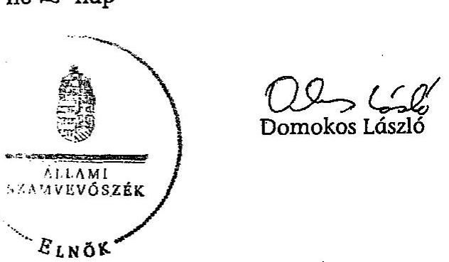

[^0]
[^0]:    ${ }^{78}$ A módosított Eftv-ben (Hatályos 2010. január 1-től) az egészségügyi közszolgáltatásért felelős szervek által a szakellátási feladatok ellátására kötött szerződésekre vonatkoszabályok részletesen kidolgozásra kerültek (Eftv. 2. § (3)-(8) bekezdései, valamint 2/A2/H. §-ok).

---

# MELLÉKLETEK 

a V-0020-319/2012-2013. sz. jelentéshez

---

# AZ ELLENŐRZÖTT KÓRHÁZAK RÖVIDÍTÉSEINEK JEGYZÉKE 

| Sor.   sz. | Rövidítés | Kórház neve | Helység |
| :--: | :--: | :--: | :--: |
| 1. | BIK | Dr. Bugyi István Kórház | Szentes |
| 2. | BPK | Bugát Pál Kórház Eü. Nonprofit Kft. | Gyöngyös |
| 3. | GOKI | Gottsegen György Országos Kardiológiai Intézet | Budapest |
| 4. | HGK | Jász-Nagykun-Szolnok Megyei Hetényi Géza Kórház- Rendelőintézet | Szolnok |
| 5. | HPGY | Heim Pál Gyermekkórház | Budapest |
| 6. | JÖK | Jávorszky Ödön Kórház | Vác |
| 7. | KMOK | Kaposi Mór Oktató Kórház | Kaposvár |
| 8. | MISEK | Miskolci Semmelweis Ignác Eü. Központ Nonprofit Kft. és Egyetemi Oktató Kórház | Miskolc |
| 9. | MTK | Mátészalkai Területi Kórház Nonprofit Kft. | Mátészalka |
| 10. | MVK | Marcali Városi Kórház | Marcali |
| 11. | MoVK | Mohács Város Kórháza | Mohács |
| 12. | OITI | Országos Idegtudományi Intézet | Budapest |
| 13. | PAMOK | Petz Aladár Megyei Oktató Kórház | Győr |
| 14. | SZBK | Szent Borbála Kórház | Tatabánya |
| 15. | SZIK | Szent Imre Kórház | Budapest |
| 16. | SZKDRSZ | Szent Kozma és Damján Rehabilitációs Szakkórház | Visegrád |
| 17. | SZPK* | Szent Pantaleon Kórház | Dunaújváros |
| 18. | UUK | Uzsoki Utcai Kórház | Budapest |
| 19. | VKK | Városi Kórház Keszthely | Keszthely |
| 20. | VMMK | Vas Megyei Markusovszky Kórház Nonprofit Zrt. | Szombathely |

[^0]
[^0]:    * Szent Pantaleon Kórház Kht. (2011. június 30-ig), Szent Pantaleon Kórház - Rendelőintézet (2011. július 1-től)

---

# A kórházak bevételeinek és ráfordításainak alakulása M Ft-ban

|   | BIK (Szentes) |  |  | BPK (Gyöngyös) |  |  | GOKI |  |   |
| --- | --- | --- | --- | --- | --- | --- | --- | --- | --- |
|   | 2009. év | 2010. év | 2011. év | 2009. év | 2010. év | 2011. év | 2009. év | 2010. év | 2011. év  |
|  OEP támogatás | 3218,9 | 3118,1 | 3558,2 | 835,0 | 2402,1 | 2629,8 | 5518,2 | 5726,9 | 6215,5  |
|  Konszolidációs támogatás |  | 181,1 | 126,9 |  | 113,0 | 104,8 | 0,0 | 520,1 | 224,3  |
|  Fenntartói/alapítói támogatás | 154,2 | 47,1 | 85,2 | 0,0 | 0,0 | 0,0 | 169,6 | 24,4 | 83,3  |
|  Saját és egyéb múködési bevételek | 189,3 | 234,1 | 231,4 | 801,9 | 320,4 | 243,9 | 206,6 | 275,7 | 257,0  |
|  - átvett pénzeszközök, egyéb támogatások | 9,3 | 22,2 | 26,6 |  | 3,1 | 7,3 | 30,2 | 53,7 | 75,2  |
|  - saját múködési bevételek | 177,6 | 210,4 | 203,0 | 799,1 | 314,6 | 236,4 | 176,4 | 222,0 | 181,8  |
|  - kamat | 2,4 | 1,5 | 1,8 | 2,8 | 2,7 | 0,2 | 0,0 | 0,0 | 0,0  |
|  Összes múködési bevétel | 3562,4 | 3580,4 | 4001,7 | 1636,9 | 2835,5 | 2978,5 | 5894,4 | 6547,1 | 6780,1  |
|  Múködési ráfordítások kamat nélkül | 3683,5 | 3795,6 | 4014,1 | 1609,7 | 2813,0 | 2926,7 | 6472,2 | 6534,4 | 6959,9  |
|  - személyi ráfordítások és járulékai | 1853,8 | 1820,2 | 1858,9 | 537,4 | 1246,5 | 1286,9 | 2088,6 | 2039,6 | 2132,6  |
|  - dologi ráfordítások | 1829,7 | 1975,4 | 2155,2 | 1062,3 | 1558,8 | 1634,3 | 4373,5 | 4464,9 | 4793,6  |
|  - egyéb múködési ráfordítások | 0,0 | 0,0 | 0,0 | 10,0 | 7,7 | 5,5 | 10,1 | 29,9 | 33,7  |
|  Transzferek | 3,5 | 46,0 | 5,2 |  |  |  | 0,0 | 0,0 | 0,0  |
|  Kamatráfordítások |  |  |  |  | 0,4 | 14,6 | 0,0 | 0,0 | 0,0  |
|  Egyéb ráfordítások | 3,5 | 46,0 | 5,2 | 10,0 | 8,1 | 20,1 | 10,1 | 29,9 | 33,7  |
|  Összes múködési ráfordítás | 3687,0 | 3841,6 | 4019,3 | 1609,7 | 2813,4 | 2941,3 | 6472,2 | 6534,4 | 6959,9  |
|  Múködési jövedelem | $-124,6$ | $-261,2$ | $-17,6$ | 27,2 | 22,1 | 37,2 | $-577,8$ | 12,7 | $-179,8$  |
|  Hitel és kölcsön törlesztés | 0,0 | 0,0 | 7,5 | 1,3 | 14,7 | 18,6 |  |  |   |
|  Nettó múködési jövedelem | $-124,6$ | $-261,2$ | $-25,1$ | 25,9 | 7,4 | 18,6 | $-577,8$ | 12,7 | $-179,8$  |
|  Felhalmozási bevételek | 10,3 | 96,8 | 53,7 | 0,0 | 0,0 | 53,6 | 76,5 | 39,8 | 76,4  |
|  Felhalmozási ráfordítások | 16,9 | 110,8 | 63,1 | 33,1 | 148,7 | 106,6 | 264,3 | 198,1 | 158,4  |
|  Felhalmozási tevékenység egyenlege | $-6,6$ | $-14,0$ | $-9,4$ | $-33,1$ | $-148,7$ | $-53,0$ | $-187,8$ | $-158,3$ | $-82,0$  |
|  Finanszírozási műveletek nélküli GFS pozíció | $-131,2$ | $-275,2$ | $-27,0$ | $-5,9$ | $-126,6$ | $-15,8$ | $-765,6$ | $-145,6$ | $-261,8$  |

---

|   | HGK (Szolnok) |  |  | HPGY |  |  | JÖK (Vác) |  |   |
| --- | --- | --- | --- | --- | --- | --- | --- | --- | --- |
|   | 2009. év | 2010. év | 2011. év | 2009. év | 2010. év | 2011. év | 2009. év | 2010. év | 2011. év  |
|  OEP támogatás | 8039,9 | 7992,0 | 8703,3 | 3733,7 | 4027,4 | 4280,3 | 3767,5 | 3925,3 | 3687,4  |
|  Konszolidációs támogatás |  | 655,2 | 358,0 |  | 239,5 | 159,9 |  | 233,4 | 160,1  |
|  Fenntartói/alapítói támogatás | 141,4 | 27,6 | 113,7 | 181,2 | 610,2 | 466,9 | 65,1 | 166,9 | 170,7  |
|  Saját és egyéb múködési bevételek | 738,3 | 988,1 | 1047,8 | 686,6 | 622,6 | 505,8 | 246,8 | 216,3 | 199,8  |
|  - átvett pénzeszközök, egyéb támogatások | 3,1 | 5,6 | 14,6 | 9,0 | 19,2 | 72,9 | 20,9 | 7,4 | 17,2  |
|  - saját múködési bevételek | 730,2 | 978,3 | 1029,7 | 657,0 | 602,0 | 427,5 | 224,2 | 203,4 | 180,3  |
|  - kamat | 5,0 | 4,2 | 3,5 | 20,6 | 1,4 | 5,4 | 1,6 | 5,5 | 2,3  |
|  Összes múködési bevétel | 8919,6 | 9662,9 | 10222,8 | 4601,5 | 5499,7 | 5412,9 | 4079,4 | 4541,9 | 4218,0  |
|  Múködési ráfordítások kamat nélkül | 9588,1 | 9808,9 | 10154,6 | 5471,3 | 5421,5 | 5250,9 | 4096,6 | 4433,2 | 4107,2  |
|  - személyi ráfordítások és járulékai | 4757,5 | 4620,2 | 4607,0 | 3382,3 | 3425,5 | 3384,5 | 2185,5 | 2108,1 | 1906,0  |
|  - dologi ráfordítások | 4783,1 | 5090,8 | 5458,2 | 2065,7 | 1954,8 | 1804,7 | 1893,8 | 2300,5 | 2169,4  |
|  - egyéb múködési ráfordítások | 47,5 | 97,9 | 89,4 | 23,3 | 41,2 | 61,7 | 17,3 | 24,6 | 31,8  |
|  Transzferek | 55,7 | 66,8 | 3,6 | 9,2 | 50,0 | 18,7 |  |  |   |
|  Kamatráfordítások |  |  |  |  |  |  | 24,6 | 40,2 | 31,5  |
|  Egyéb ráfordítások | 103,2 | 164,7 | 93,0 | 32,5 | 91,2 | 80,3 | 42,0 | 64,8 | 63,3  |
|  Összes múködési ráfordítás | 9643,8 | 9875,7 | 10158,2 | 5480,5 | 5471,5 | 5269,5 | 4121,3 | 4473,4 | 4138,7  |
|  Múködési jövedelem | $-724,2$ | $-212,8$ | 64,6 | $-879,0$ | 28,2 | 143,4 | $-41,9$ | 68,5 | 79,3  |
|  Hitel és kölcsön törlesztés | 0,0 | 0,0 | 0,0 | 0,0 | 0,0 | 0,0 | 0,0 | 0,0 | 0,0  |
|  Nettó múködési jövedelem | $-724,2$ | $-212,8$ | 64,6 | $-879,0$ | 28,2 | 143,4 | $-41,9$ | 68,5 | 79,3  |
|  Felhalmozási bevételek | 67,6 | 398,4 | 223,6 | 287,9 | 306,8 | 406,8 | 0,0 | 0,0 | 0,9  |
|  Felhalmozási ráfordítások | 74,1 | 153,2 | 395,7 | 590,8 | 354,1 | 503,6 | 32,1 | 21,7 | 33,9  |
|  Felhalmozási tevékenység egyenlege | $-6,5$ | 245,2 | $-172,1$ | $-302,9$ | $-47,3$ | $-96,8$ | $-32,1$ | $-21,7$ | $-33,0$  |
|  Finanszírozási műveletek nélküli GFS pozíció | $-730,7$ | 32,4 | $-107,5$ | $-1181,9$ | $-19,1$ | 46,6 | $-74,0$ | 46,8 | 46,3  |

---

|   | KMOK (Kaposvár) |  |  | MISEK (Miskolc) |  |  | MTK (Mátészalka) |  |   |
| --- | --- | --- | --- | --- | --- | --- | --- | --- | --- |
|   | 2009. év | 2010. év | 2011. év | 2009. év | 2010. év | 2011. év | 2009. év | 2010. év | 2011. év  |
|  OEP támogatás | 8 188,8 | 8 205,6 | 8 737,0 | 7 221,1 | 7 046,1 | 7 788,1 | 2 656,7 | 2 698,3 | 3 060,5  |
|  Konszolidációs támogatás |  | 554,9 | 360,3 |  | 516,3 | 315,6 |  | 126,4 | 123,7  |
|  Fenntartói/alapítói támogatás | 325,3 | 98,3 | 127,1 | 267,0 | 60,4 | 60,1 | 67,7 | 1,9 |   |
|  Saját és egyéb működési bevételek | 1 632,3 | 1 994,6 | 2 477,1 | 451,6 | 541,9 | 555,4 | 122,3 | 661,6 | 174,5  |
|  - átvett pénzeszközök, egyéb támogatások | 6,2 | 13,4 | 13,9 | 5,8 | 18,1 | 67,1 | 4,4 | 522,3 | 58,7  |
|  - saját működési bevételek | 1 616,2 | 1 978,6 | 2 460,7 | 445,7 | 522,1 | 485,5 | 117,8 | 138,7 | 114,0  |
|  - kamat | 9,9 | 2,6 | 2,5 | 0,1 | 1,7 | 2,8 | 0,1 | 0,6 | 1,8  |
|  Összes működési bevétel | 10 146,4 | 10 853,4 | 11 701,5 | 7 939,7 | 8 164,7 | 8 719,2 | 2 846,7 | 3 488,2 | 3 358,7  |
|  Működési ráfordítások kamat nélkül | 11 145,5 | 11 588,2 | 11 130,9 | 9 074,0 | 7 821,2 | 8 067,1 | 3 008,8 | 3 053,4 | 3 130,5  |
|  - személyi ráfordítások és járulékai | 4 850,5 | 4 634,2 | 4 453,3 | 3 240,7 | 3 638,2 | 3 854,4 | 1 904,8 | 1 868,6 | 1 605,7  |
|  - dologi ráfordítások | 6 295,0 | 6 954,0 | 6 677,5 | 5 833,3 | 4 183,0 | 4 212,7 | 1 104,0 | 1 184,8 | 1 524,8  |
|  - egyéb működési ráfordítások |  |  |  |  |  |  | 0,0 |  |   |
|  Transzferek | 16,2 | 4,9 | 8,4 | 0,8 | 0,8 |  |  | 563,8 | 119,6  |
|  Kamatráfordítások | 16,4 | 14,5 | 40,4 | 0,7 | 1,5 | 18,6 | 1,3 | 1,8 | 2,0  |
|  Egyéb ráfordítások | 32,6 | 19,4 | 48,8 | 1,5 | 2,3 | 18,6 | 1,3 | 565,6 | 121,6  |
|  Összes működési ráfordítás | 11 178,1 | 11 607,6 | 11 179,6 | 9 075,5 | 7 823,5 | 8 085,7 | 3 010,1 | 3 619,0 | 3 252,1  |
|  Működési jövedelem | -1 031,7 | -754,2 | 521,9 | -1 135,8 | 341,2 | 633,5 | -163,4 | -130,8 | 106,6  |
|  Hitel és kölcsön törlesztés | 33,0 | 15,5 | 50,5 | 300,0 | 0,0 | 0,0 | 0,0 | 0,0 | 0,0  |
|  Nettó működési jövedelem | -1 064,7 | -769,7 | 471,4 | -1 435,8 | 341,2 | 633,5 | -163,4 | -130,8 | 106,6  |
|  Felhalmozási bevételek | 70,0 | 389,1 | 6 637,5 | 14,7 | 105,0 |  | 0,6 | 6,4 | 0,4  |
|  Felhalmozási ráfordítások | 141,2 | 549,1 | 7 012,5 | 209,6 | 132,9 | 33,7 | 7,2 | 55,5 | 14,0  |
|  Felhalmozási tevékenység egyenlege | -71,2 | -160,0 | -375,0 | -194,9 | -27,9 | -33,7 | -6,6 | -49,1 | -13,6  |
|  Finanszírozási műveletek nélküli GFS pozíció | -1 102,9 | -914,2 | 146,9 | -1 330,7 | 313,3 | 599,8 | -170,0 | -179,9 | 93,0  |

---

|   | MVK (Marcali) |  |  | MoVK (Mohács) |  |  | OITI |  |   |
| --- | --- | --- | --- | --- | --- | --- | --- | --- | --- |
|   | 2009. év | 2010. év | 2011. év | 2009. év | 2010. év | 2011. év | 2009. év | 2010. év | 2011. év  |
|  OEP támogatás | 1449,1 | 1355,2 | 1470,6 | 1809,4 | 1766,7 | 2023,0 | 2713,4 | 2572,6 | 2992,3  |
|  Konszolidációs támogatás |  | 62,7 | 59,8 |  | 82,1 |  |  | 143,1 | 107,7  |
|  Fenntartói/alapítói támogatás | 29,0 | 3,0 | 6,9 | 61,1 | 36,9 | 33,3 | 141,3 | 120,1 | 189,6  |
|  Saját és egyéb múködési bevételek | 127,1 | 135,5 | 146,8 | 120,8 | 119,3 | 93,3 | 269,4 | 397,0 | 359,6  |
|  - átvett pénzeszközök, egyéb támogatások | 0,2 | 16,2 | 6,3 | 24,1 | 27,4 | 1,3 | 26,5 | 119,1 | 21,1  |
|  - saját múködési bevételek | 126,9 | 119,3 | 140,5 | 94,9 | 89,5 | 87,5 | 242,8 | 277,9 | 338,5  |
|  - kamat | 0,0 | 0,0 | 0,0 | 1,8 | 2,4 | 4,5 |  |  |   |
|  Összes múködési bevétel | 1605,2 | 1556,4 | 1684,1 | 1991,3 | 2005,0 | 2149,6 | 3124,1 | 3232,8 | 3649,2  |
|  Múködési ráfordítások kamat nélkül | 1725,4 | 1642,0 | 1618,9 | 2068,2 | 2033,9 | 2007,4 | 3511,6 | 3693,1 | 3630,8  |
|  - személyi ráfordítások és járulékai | 927,2 | 858,8 | 805,3 | 1287,2 | 1186,2 | 1168,2 | 1232,1 | 1158,3 | 1135,8  |
|  - dologi ráfordítások | 780,0 | 783,2 | 797,2 | 776,9 | 824,9 | 831,2 | 2279,5 | 2534,8 | 2495,0  |
|  - egyéb múködési ráfordítások | 18,2 | 0,0 | 16,4 | 4,1 | 22,8 | 8,0 | 0,0 | 0,0 | 0,0  |
|  Transzferek |  |  |  | 3,7 | 3,5 | 3,4 | 1,7 | 2,4 | 2,4  |
|  Kamatráfordítások |  |  |  |  |  |  |  |  |   |
|  Egyéb ráfordítások | 18,2 | 0,0 | 16,4 | 7,8 | 26,3 | 11,4 | 1,7 | 2,4 | 2,4  |
|  Összes múködési ráfordítás | 1725,4 | 1642,0 | 1618,9 | 2071,9 | 2037,4 | 2010,8 | 3513,3 | 3695,5 | 3633,2  |
|  Múködési jövedelem | $-120,2$ | $-85,6$ | 65,2 | $-80,6$ | $-32,4$ | 138,8 | $-389,2$ | $-462,7$ | 16,0  |
|  Hitel és kölcsön törlesztés | 0,0 | 0,0 | 0,0 | 0,0 | 0,0 | 0,0 | 0,0 | 0,0 | 0,0  |
|  Nettó múködési jövedelem | $-120,2$ | $-85,6$ | 65,2 | $-80,6$ | $-32,4$ | 138,8 | $-389,2$ | $-462,7$ | 16,0  |
|  Felhalmozási bevételek | 0,0 | 0,0 | 0,0 | 0,0 | 0,0 | 0,0 | 997,2 | 570,3 | 1,1  |
|  Felhalmozási ráfordítások | 47,4 | 28,4 | 9,4 | 10,8 | 3,7 | 7,8 | 731,5 | 386,6 | 2,9  |
|  Felhalmozási tevékenység egyenlege | $-47,4$ | $-28,4$ | $-9,4$ | $-10,8$ | $-3,7$ | $-7,8$ | 265,7 | 183,7 | $-1,8$  |
|  Finanszírozási műveletek nélküli GFS pozíció | $-167,6$ | $-114,0$ | 55,8 | $-91,4$ | $-36,1$ | 131,0 | $-123,5$ | $-279,0$ | 14,2  |

---

|   | PAMOK (Győr) |  |  | SZBK (Tatabánya) |  |  | SZIK |  |   |
| --- | --- | --- | --- | --- | --- | --- | --- | --- | --- |
|   | 2009. év | 2010. év | 2011. év | 2009. év | 2010. év | 2011. év | 2009. év | 2010. év | 2011. év  |
|  OEP támogatás | 10034,3 | 10016,2 | 11113,7 | 5598,3 | 5604,0 | 6159,6 | 4966,6 | 4807,2 | 5450,6  |
|  Konszolidációs támogatás |  | 787,5 | 438,3 |  | 278,2 | 251,8 |  | 221,8 | 228,4  |
|  Fenntartói/alapítói támogatás | 250,8 | 40,7 | 247,0 | 113,8 | 26,4 | 36,6 | 119,4 | 42,2 | 37,1  |
|  Saját és egyéb múködési bevételek | 2245,8 | 2348,7 | 2529,3 | 334,3 | 342,8 | 325,1 | 1263,1 | 1366,4 | 753,9  |
|  - átvett pénzeszközök, egyéb támogatások | 41,3 | 88,5 | 53,2 | 1,4 | 1,9 | 31,0 | 55,2 | 55,8 | 77,0  |
|  - saját múködési bevételek | 2201,4 | 2257,7 | 2473,5 | 292,6 | 327,8 | 287,4 | 1198,4 | 1308,6 | 673,8  |
|  - kamat | 3,1 | 2,5 | 2,6 | 40,3 | 13,1 | 6,7 | 9,5 | 2,0 | 3,1  |
|  Összes múködési bevétel | 12530,9 | 13193,1 | 14328,3 | 6046,4 | 6251,4 | 6773,1 | 6349,1 | 6437,6 | 6470,0  |
|  Múködési ráfordítások kamat nélkül | 13646,7 | 13642,9 | 13908,0 | 6332,0 | 6355,6 | 6505,8 | 6803,3 | 6752,5 | 6560,8  |
|  - személyi ráfordítások és járulékai | 6288,0 | 5999,0 | 5825,0 | 3592,9 | 3581,0 | 3688,8 | 3331,4 | 3329,3 | 3295,7  |
|  - dologi ráfordítások | 7345,7 | 7598,4 | 8024,0 | 2739,1 | 2774,6 | 2819,6 | 3471,9 | 3423,2 | 3265,1  |
|  - egyéb múködési ráfordítások | 13,0 | 45,5 | 59,0 |  |  |  | 0,0 | 0,0 | 0,0  |
|  Transzferek |  | 0,2 |  |  |  |  | 0,8 | 15,0 |   |
|  Kamatráfordítások |  |  |  |  |  |  |  |  |   |
|  Egyéb ráfordítások | 13,0 | 45,7 | 59,0 | 0,0 | 0,0 | 0,0 | 0,8 | 15,0 | 0,0  |
|  Összes múködési ráfordítás | 13646,7 | 13643,1 | 13908,0 | 6332,0 | 6355,6 | 6508,4 | 6804,1 | 6767,5 | 6560,8  |
|  Múködési jövedelem | $-1115,8$ | $-450,0$ | 420,3 | $-285,6$ | $-104,2$ | 264,7 | $-455,0$ | $-329,9$ | $-90,8$  |
|  Hitel és kölcsön törlesztés |  |  | 10,0 | 0,1 | 2,0 | 5,4 | 0,0 | 0,0 | 0,0  |
|  Nettó múködési jövedelem | $-1115,8$ | $-450,0$ | 410,3 | $-285,7$ | $-106,2$ | 259,3 | $-455,0$ | $-329,9$ | $-90,8$  |
|  Felhalmozási bevételek | 34,4 | 106,6 | 49,1 | 11,9 | 151,3 | 3,0 | 163,3 | 85,0 | 205,3  |
|  Felhalmozási ráfordítások | 103,8 | 125,6 | 121,9 | 110,3 | 161,8 | 162,0 | 231,3 | 211,7 | 250,7  |
|  Felhalmozási tevékenység egyenlege | $-69,4$ | $-19,0$ | $-72,8$ | $-98,4$ | $-10,5$ | $-159,0$ | $-68,0$ | $-126,7$ | $-45,4$  |
|  Finanszírozási műveletek nélküli GFS pozíció | $-1185,2$ | $-469,0$ | 347,5 | $-384,0$ | $-114,7$ | 105,7 | $-523,0$ | $-456,6$ | $-136,2$  |

---

|   | SZKDRSZ (Visegrád) |  |  | SZPK (Dunaújváros) |  |  | UUK |  |   |
| --- | --- | --- | --- | --- | --- | --- | --- | --- | --- |
|   | 2009. év | 2010. év | 2011. év | 2009. év | 2010. év | 2011. év | 2009. év | 2010. év | 2011. év  |
|  OEP támogatás | 755,6 | 767,0 | 815,3 | 4345,7 | 4151,3 | 4778,8 | 8068,7 | 7782,5 | 8339,7  |
|  Konszolidációs támogatás | 0,0 | 20,9 | 0,0 |  | 280,9 | 194,0 |  | 268,0 |   |
|  Fenntartói/alapítói támogatás | 26,9 | 21,3 | 6,5 |  |  | 237,8 | 116,3 | 32,7 | 35,9  |
|  Saját és egyéb múködési bevételek | 64,9 | 51,4 | 97,5 | 164,3 | 299,0 | 1606,0 | 310,0 | 278,2 | 276,2  |
|  - átvett pénzeszközök, egyéb támogatások | 10,8 | 5,7 | 35,8 | 7,2 | 98,2 | 1399,1 | 14,4 | 15,1 | 9,7  |
|  - saját múködési bevételek | 48,4 | 41,0 | 57,8 | 155,3 | 200,0 | 205,9 | 253,3 | 253,2 | 263,0  |
|  - kamat | 5,8 | 4,7 | 3,9 | 1,9 | 0,8 | 1,0 | 42,3 | 9,9 | 3,5  |
|  Összes múködési bevétel | 847,4 | 860,6 | 919,3 | 4510,0 | 4731,2 | 6816,6 | 8495,0 | 8361,4 | 8651,8  |
|  Múködési ráfordítások kamat nélkül | 799,7 | 858,4 | 925,9 | 5250,9 | 5118,4 | 5645,3 | 9154,6 | 8725,9 | 8636,0  |
|  - személyi ráfordítások és járulékai | 511,0 | 528,1 | 558,6 | 2320,6 | 2296,6 | 2447,7 | 3783,8 | 3663,5 | 3661,6  |
|  - dologi ráfordítások | 284,7 | 320,4 | 353,4 | 2817,8 | 2529,7 | 2361,8 | 5370,8 | 5062,4 | 4974,4  |
|  - egyéb múködési ráfordítások | 4,0 | 9,9 | 13,9 | 112,5 | 292,1 | 835,8 | 0,0 | 0,0 | 0,0  |
|  Transzferek | 0,7 | 0,7 | 0,8 | 0,7 | 0,9 | 523,1 | 34,5 | 25,7 | 3,9  |
|  Kamatráfordítások |  |  |  |  |  |  | 0,0 | 0,0 | 0,0  |
|  Egyéb ráfordítások | 4,7 | 10,6 | 14,7 | 113,2 | 293,0 | 1358,9 | 34,5 | 25,7 | 3,9  |
|  Összes múködési ráfordítás | 800,4 | 859,1 | 926,7 | 5251,6 | 5119,3 | 6168,4 | 9189,1 | 8751,6 | 8639,9  |
|  Múködési jövedelem | 47,0 | 1,5 | $-7,4$ | $-741,6$ | $-388,1$ | 648,2 | $-694,1$ | $-390,2$ | 11,9  |
|  Hitel és kölcsön törlesztés |  |  |  | 3280,8 | 3386,7 | 73,3 | 0,0 | 0,0 | 0,0  |
|  Nettó múködési jövedelem | 47,0 | 1,5 | $-7,4$ | $-4022,4$ | $-3774,8$ | 574,9 | $-694,1$ | $-390,2$ | 11,9  |
|  Felhalmozási bevételek | 36,0 | 83,3 | 95,9 | 11,5 | 601,8 | 3,1 | 77,2 | 169,7 | 165,1  |
|  Felhalmozási ráfordítások | 55,3 | 137,7 | 111,1 | 198,3 | 239,4 | 82,2 | 301,3 | 224,3 | 275,4  |
|  Felhalmozási tevékenység egyenlege | $-19,3$ | $-54,4$ | $-15,2$ | $-186,8$ | 362,4 | $-79,1$ | $-224,1$ | $-54,6$ | $-110,3$  |
|  Finanszírozási műveletek nélküli GFS pozíció | 27,7 | $-52,9$ | $-22,6$ | $-928,4$ | $-25,7$ | 569,1 | $-918,2$ | $-444,8$ | $-98,4$  |

---

|   | VKK (Keszthely) |  |  | VMMK (Szombathely |  |  | Összesen |  |   |
| --- | --- | --- | --- | --- | --- | --- | --- | --- | --- |
|   | 2009. év | 2010. év | 2011. év | 2009. év | 2010. év | 2011. év | 2009. év | 2010. év | 2011. év  |
|  OEP támogatás | 1344,4 | 1374,6 | 1535,5 | 9257,0 | 9137,6 | 10073,2 | 93522,3 | 94476,7 | 103412,4  |
|  Konszolidációs támogatás |  | 0,0 | 62,0 | 0,0 | 378,0 | 284,3 | 0,0 | 5663,1 | 3559,9  |
|  Fenntartói/alapítói támogatás | 216,7 | 20,8 | 8,1 | 0,0 | 0,0 | 0,0 | 2446,8 | 1380,9 | 1945,8  |
|  Saját és egyéb múködési bevételek | 180,9 | 545,9 | 139,9 | 1863,6 | 1874,4 | 2082,1 | 12019,9 | 13613,9 | 14102,4  |
|  - átvett pénzeszközök, egyéb támogatások | 4,4 | 407,2 | 2,9 | 94,7 | 88,7 | 80,1 | 369,1 | 1588,8 | 2071,0  |
|  - saját múködési bevételek | 175,3 | 134,7 | 133,6 | 1684,7 | 1731,1 | 1957,9 | 11418,2 | 11910,9 | 11938,3  |
|  - kamat | 1,2 | 4,0 | 3,4 | 84,2 | 54,6 | 44,1 | 232,6 | 114,2 | 93,1  |
|  Összes múködési bevétel | 1742,0 | 1941,3 | 1745,5 | 11120,6 | 11390,0 | 12439,6 | 107989,0 | 115134,6 | 123020,5  |
|  Múködési ráfordítások kamat nélkül | 1740,5 | 1805,7 | 1846,2 | 10880,6 | 10912,5 | 11384,9 | 116063,2 | 116810,3 | 118414,4  |
|  - személyi ráfordítások és járulékai | 898,4 | 905,7 | 948,5 | 4367,7 | 4504,7 | 4461,9 | 53341,4 | 53412,3 | 53086,4  |
|  - dologi ráfordítások | 842,1 | 900,0 | 897,7 | 6498,6 | 6391,0 | 6905,1 | 62447,5 | 62809,6 | 64154,9  |
|  - egyéb múködési ráfordítások | 0,0 | 0,0 | 0,0 | 14,3 | 16,8 | 17,9 | 274,3 | 588,4 | 1173,1  |
|  Transzferek | 0,0 | 286,7 | 1,8 |  |  |  | 127,5 | 1067,4 | 690,9  |
|  Kamatráfordítások |  |  |  |  |  |  | 43,0 | 58,4 | 107,1  |
|  Egyéb ráfordítások | 0,0 | 286,7 | 1,8 | 14,3 | 16,8 | 17,9 | 444,8 | 1714,2 | 1971,1  |
|  Összes múködési ráfordítás | 1740,5 | 2092,4 | 1848,0 | 10880,6 | 10912,5 | 11384,9 | 116233,7 | 117936,1 | 119212,4  |
|  Múködési jövedelem | 1,5 | $-151,1$ | $-102,5$ | 240,0 | 477,5 | 1054,7 | $-8244,7$ | $-2801,5$ | 3808,1  |
|  Hitel és kölcsön törlesztés | 0,0 | 0,0 | 0,0 | 156,6 | 122,4 | 152,2 | 3771,8 | 3541,3 | 317,5  |
|  Nettó múködési jövedelem | 1,5 | $-151,1$ | $-102,5$ | 83,4 | 355,1 | 902,5 | $-12016,5$ | $-6342,8$ | 3490,6  |
|  Felhalmozási bevételek | 45,2 | 288,8 | 0,6 | 91,1 | 91,9 | 196,5 | 1995,4 | 3491,0 | 8172,6  |
|  Felhalmozási ráfordítások | 45,1 | 38,9 | 16,7 | 855,4 | 838,0 | 768,1 | 4059,8 | 4120,2 | 10129,7  |
|  Felhalmozási tevékenység egyenlege | 0,1 | 249,9 | $-16,1$ | $-764,3$ | $-746,1$ | $-571,6$ | $-2064,4$ | $-629,2$ | $-1957,1$  |
|  Finanszírozási műveletek nélküli GFS pozíció | 1,6 | 98,8 | $-118,6$ | $-524,3$ | $-268,6$ | 483,1 | $-10309,1$ | $-3430,7$ | 1851,0  |

---

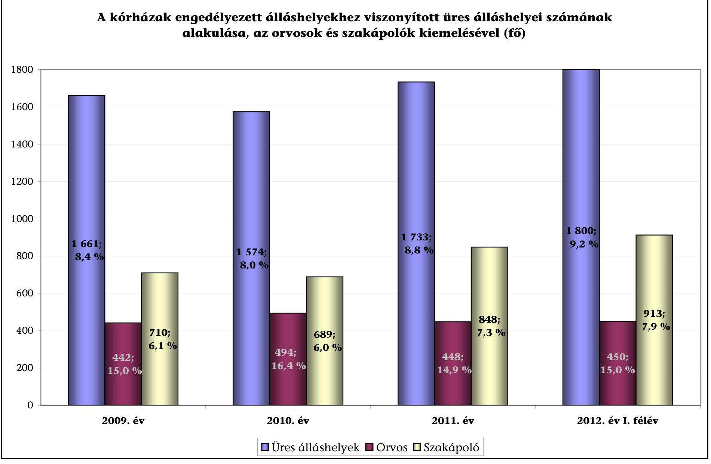

# A kórházak engedélyezett álláshelyekhez viszonyított üres álláshelyei számának alakulása, az orvosok és szakápolók kiemelésével (fő)

|  Üres álláshelyek | Orvos | Szakápoló  |
| --- | --- | --- |
|  2009. év | 1,661 | 8,4 %  |
|  2010. év | 1,574 | 8,0 %  |
|  2011. év | 1,733 | 8,8 %  |
|  2012. év | 1,800 | 9,2 %  |
|  2013. év | 1,913 | 7,9 %  |

---

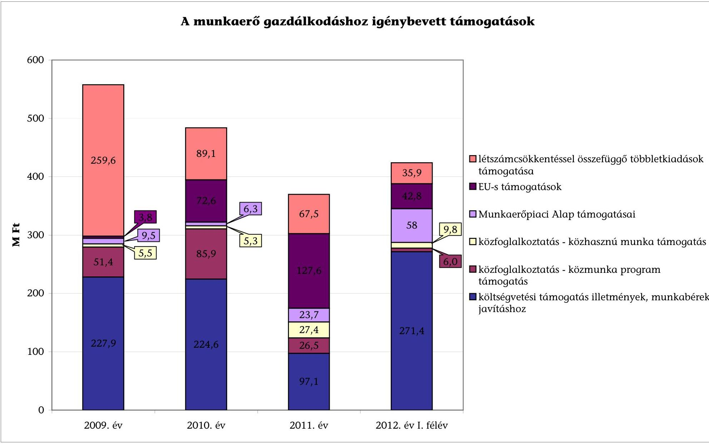

# A munkaerő gazdálkodáshoz igénybevett támogatások

|  Ite | Előbítető (támoztatási)  |
| --- | --- |
|  259.6 | 227.9  |
|  51.4 | 51.4  |
|  9.5 | 9.5  |
|  5.5 | 5.5  |
|  8.9 | 8.9  |
|  72.6 | 72.6  |
|  6.3 | 6.3  |
|  5.3 | 5.3  |
|  67.5 | 67.5  |
|  5.9 | 5.9  |
|  35.9 | 35.9  |
|  42.8 | 42.8  |
|  58 | 58  |
|  9.8 | 9.8  |
|  9.8 | 9.8  |
|  5.0 | 5.0  |
|  227.9 | 224.6  |
|  224.6 | 224.6  |
|  271.4 | 271.4  |
|  271.4 | 271.4  |

- Iteszámcsökkentéssel összefüggő többletkiadások támogatása
- Előbítető (támoztatási) 259.6
- Előbítető (támoztási) 51.4
- Előbítető (támoztási) 227.9
- Előbítető (támoztási) 51.4
- Előbítető (támoztási) 224.6
- Előbítető (támoztási) 224.6
- Előbítető (támoztási) 271.4
- Előbítető (támoztási) 2009. év
- Előbítető (támoztási) 2010. év
- Előbítető (támoztási) 2011. év
- Előbítető (támoztási) 2012. év

2012. év I. félév

---

A kórházak összes kötelezettsége és szállítói kötelezettsége, lejárt határidejű szállítói tartozások (M Ft-ban) és a fizetőképességet jellemző likviditási ráta

|  Kórház | ÖSSZES KÖTELEZETTSÉG |  |  | összes kötelezettségből ÖSSZES SZÁLLÍTÓ |  |  |  | összes szállítóból
LEJÁRT HATÁRIDEJŰ SZÁLLÍTÓK |  |  |  | LIKVIDITÁSI RÁTA |  |   |
| --- | --- | --- | --- | --- | --- | --- | --- | --- | --- | --- | --- | --- | --- | --- |
|   | 2009. év | 2010. év | 2011. év | 2009.év | 2010.év | 2011. év | 2012. Lfé | 2009.év | 2010.év | 2011. év | 2012. Lfé | 2009.év | 2010.év | 2011. év  |
|  BIK | 1102,8 | 1058,0 | 1070,7 | 769,5 | 727,2 | 702,0 | 336,7 | 215,9 | 308,8 | 422,9 | 132,8 | 0,19 | 0,20 | 0,36  |
|  BPK | 335,9 | 505,5 | 603,7 | 212,5 | 276,7 | 313,5 | 327,6 | 119,6 | 124,9 | 110,0 | 114,7 | 1,94 | 1,12 | 1,03  |
|  GOKI | 1698,3 | 1596,4 | 1786,4 | 1526,6 | 1397,2 | 1560,5 | 1531,9 | 487,4 | 414,8 | 438,0 | 459,9 | 0,32 | 0,60 | 0,48  |
|  HGK | 870,3 | 742,6 | 942,4 | 793,7 | 444,4 | 690,9 | 594,8 | 495,6 | 163,1 | 359,0 | 333,0 | 0,54 | 1,15 | 1,33  |
|  HPGY | 1091,9 | 993,8 | 1160,1 | 997,2 | 835,9 | 897,5 | 966,8 | 483,3 | 652,8 | 725,5 | 802,7 | 0,34 | 0,51 | 0,49  |
|  JÖK | 2347,2 | 2415,7 | 2430,5 | 1972,3 | 1998,0 | 2430,5 | 2716,5 | 272,0 | 374,8 | 893,2 | 2087,1 | 0,07 | 0,04 | 0,11  |
|  KMOK | 1961,2 | 2215,3 | 1932,8 | 1818,7 | 2084,5 | 1827,0 | 1244,9 | 117,0 | 875,8 | 808,7 | 325,3 | 0,16 | 0,28 | 0,73  |
|  MISEK | 2445,1 | 2451,9 | 2213,8 | 1817,0 | 1651,9 | 1419,1 | 1298,3 | 1205,1 | 982,0 | 661,6 | 522,4 | 0,70 | 0,77 | 0,91  |
|  MTK | 754,9 | 627,4 | 656,0 | 661,6 | 440,1 | 380,5 | 434,8 | 474,9 | 295,1 | 228,1 | 268,0 | 0,23 | 0,79 | 1,09  |
|  MVK | 216,3 | 180,0 | 231,9 | 212,3 | 178,1 | 216,9 | 161,7 | 97,7 | 83,7 | 113,8 | 65,6 | 0,13 | 0,15 | 0,46  |
|  MoVK | 167,2 | 100,8 | 108,2 | 125,8 | 60,6 | 69,2 | 68,2 | 86,1 | 0,9 | 0,0 | 0,0 | 0,53 | 2,23 | 3,63  |
|  OITI | 680,2 | 777,2 | 837,4 | 680,2 | 777,2 | 837,4 | 913,2 | 225,8 | 451,3 | 505,7 | 223,9 | 0,94 | 0,33 | 0,43  |
|  PAMOK | 3397,9 | 3203,4 | 3549,1 | 3205,2 | 2969,9 | 3157,5 | 2367,2 | 2122,5 | 1795,4 | 1837,0 | 1311,8 | 0,19 | 0,28 | 0,29  |
|  SZBK | 480,2 | 506,8 | 736,0 | 381,1 | 400,5 | 603,3 | 1097,1 | 49,8 | 81,3 | 82,0 | 810,8 | 1,06 | 1,63 | 0,68  |
|  SZIK | 1002,2 | 810,4 | 993,6 | 759,6 | 624,8 | 814,0 | 274,1 | 305,1 | 170,5 | 328,4 | 83,5 | 0,33 | 0,42 | 0,60  |
|  SZKDRSZ | 20,6 | 18,8 | 21,5 | 20,1 | 17,3 | 18,3 | 15,9 | 0,0 | 0,0 | 0,0 | 0,0 | 6,16 | 8,91 | 6,70  |
|  SZPK | 3361,8 | 2967,3 | 502,5 | 1684,8 | 1441,7 | 347,3 | 372,0 | 1292,8 | 1074,1 | 0,0 | 6,0 | 0,47 | 0,44 | 0,48  |
|  UUK | 954,1 | 714,1 | 813,8 | 950,1 | 642,6 | 782,2 | 839,3 | 99,3 | 0,9 | 0,0 | 219,5 | 0,49 | 0,74 | 0,59  |
|  VKK | 181,5 | 136,5 | 155,9 | 181,5 | 136,5 | 155,9 | 252,8 | 90,5 | 42,5 | 50,5 | 147,4 | 0,26 | 1,57 | 0,30  |
|  VMMK | 11260,3 | 11264,5 | 11271,1 | 487,1 | 538,7 | 851,1 | 715,8 | 115,1 | 183,1 | 260,0 | 168,3 | 2,88 | 2,43 | 2,43  |
|  ÖSSZESEN | 34329,9 | 33286,4 | 32017,4 | 19256,9 | 17643,8 | 18074,6 | 16529,6 | 8355,5 | 8075,8 | 7824,4 | 8082,7 | 0,50 | 0,59 | 0,68  |

---

# A kórházaknak nyújtott konszolidációs támogatás és a lejárt határidejű szállítói tartozások (M Ft-ban)

|  Kórház | Kiutalt konszolidációs támogatás |  | Konszolidációs támogatásból |  |  |  | Kapott
támogatásból
visszafizetendő |  | Lejárt határidejű szállítói tartozások az év utolsó napján |  |   |
| --- | --- | --- | --- | --- | --- | --- | --- | --- | --- | --- | --- |
|   |  |  | lejárt szállítói
tartozás |  | várólisták csökkentésére |  |  |  |  |  |   |
|   | 2010. év | 2011. év | 2010. év | 2011. év | 2010. év | 2011. év | 2010. év | 2011. év | 2009.év | 2010.év | 2011. év  |
|  BIK | 181,1 | 126,9 | 166,6 | 126,9 | 14,5 | 0,0 | 0,0 | 0,0 | 215,9 | 308,8 | 422,9  |
|  BPK | 113,0 | 104,8 | 113,0 | 104,8 | 0,0 | 0,0 | 0,0 | 0,0 | 119,6 | 124,9 | 110,0  |
|  GOKI | 520,1 | 224,3 | 304,1 | 224,3 | 216,0 | 0,0 | 0,0 | 0,0 | 487,4 | 414,8 | 438,0  |
|  HGK | 655,2 | 358,0 | 578,9 | 358,0 | 76,3 | 0,0 | 0,0 | 0,0 | 495,6 | 163,1 | 359,0  |
|  HPGV | 239,5 | 159,9 | 239,0 | 159,9 | 0,5 | 0,0 | 0,0 | 0,0 | 483,3 | 652,8 | 725,5  |
|  JOK | 233,4 | 160,1 | 228,8 | 160,1 | 4,6 | 0,0 | 0,0 | 0,0 | 272,0 | 374,8 | 893,2  |
|  KMOK | 554,9 | 360,3 | 495,2 | 360,3 | 59,7 | 0,0 | 0,0 | 0,0 | 117,0 | 875,8 | 808,7  |
|  MISEK | 516,3 | 315,6 | 516,3 | 315,6 | 0,0 | 0,0 | 0,0 | 0,0 | 1205,1 | 982,0 | 661,6  |
|  MTK | 126,4 | 123,7 | 126,4 | 123,7 | 0,0 | 0,0 | 0,0 | 0,0 | 474,9 | 295,1 | 228,1  |
|  MVK | 62,7 | 59,8 | 62,5 | 59,8 | 0,2 | 0,0 | 0,0 | 0,0 | 97,7 | 83,7 | 113,8  |
|  MoVK* | 82,1 | 79,8 | 82,1 | 79,8 | 0,0 | 0,0 | 0,0 | 0,0 | 86,1 | 0,9 | 0,0  |
|  OITI | 143,1 | 107,7 | 137,8 | 107,7 | 5,3 | 0,0 | 0,0 | 0,0 | 225,8 | 451,3 | 505,7  |
|  PAMOK | 787,5 | 438,3 | 681,7 | 438,3 | 105,7 | 0,0 | 0,0 | 0,0 | 2122,5 | 1795,4 | 1837,0  |
|  SZBK | 278,2 | 251,8 | 259,6 | 251,8 | 18,6 | 0,0 | 0,0 | 0,0 | 49,8 | 81,3 | 82,0  |
|  SZIK | 221,8 | 228,4 | 221,8 | 228,4 | 0,0 | 0,0 | 0,0 | 0,0 | 305,1 | 170,5 | 328,4  |
|  SZKDRSZ | 35,4 | 35,3 | 35,4 | 35,3 | 0,0 | 0,0 | 14,5 | 35,3 | 0,0 | 0,0 | 0,0  |
|  SZPK | 280,9 | 194,0 | 277,8 | 194,0 | 3,1 | 0,0 | 0,0 | 0,0 | 1292,8 | 1074,1 | 0,0  |
|  UUK | 268,0 | 305,4 | 198,0 | 305,4 | 70,0 | 0,0 | 0,0 | 305,4 | 99,3 | 0,9 | 0,0  |
|  VKK | 0,0 | 62,0 | 0,0 | 62,0 | 0,0 | 0,0 | 0,0 | 0,0 | 90,5 | 42,5 | 50,5  |
|  VMMK** | 378,0 | 420,3 | 323,9 | 420,3 | 54,1 | 0,0 | 0,0 | 298,1 | 115,1 | 183,1 | 260,0  |
|  Osszesen: | 5677,6 | 4116,4 | 5048,9 | 4116,4 | 628,6 | 0,0 | 14,5 | 638,8 | 8355,5 | 8075,8 | 7824,4  |

Ténylegesen felhasználható szállítói kötelezettségek teljesítésére 2010-ben 5034,4 M Ft, 2011-ben 3477,6 M Ft.

- A 2011. évi támogatás 2012. január hónapban került kiutalásra. ** A 2011. évi konszolidációs támogatásból 162,1 M Ft visszautalása még nem történt meg, a 2012. évben várható.

---

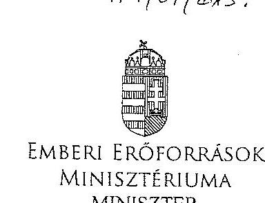

EMBERI ERÖFORRÁSOK MINISZTÉRIUMA MINISZTER

Iktatószám: 839-3/2013/ELL

7. sz. melléklet
a V-0020-319/2012-2013. sz. jelentéshez

38312013.
Érkezett: 2013 JAN 11.

Iktatőszám: 11-0020-302/2012

Melléklet:

Ügyintéző: Bánkné Simon Judit (54430)
Hiv. szám: V-0020-293/2012.

1-13. 01.14

Domokos László úr
elnök

Állami Számvevőszék

Budapest
Apáczai Csere János u. 10.
1052

Tárgy: Észrevétel a kórházi ellátás működtetésére fordított pénzeszközök felhasználásának ellenőrzéséről szóló jelentés-tervezethez

Tisztelt Elnök Úr!

A kórházi ellátás működtetésére fordított pénzeszközök felhasználásának ellenőrzéséről szóló jelentés-tervezethez az alábbi észrevételeket teszem.

Szakmai észrevételek:

1. A 9. oldalon az Értelmező Szótár fejezetben a közreműködő fogalma pontatlan, kérem az egészségügyi szolgáltatás gyakorlásának általános feltételeiről, valamint a működési engedélyezési eljárásról szóló 96/2003. (VII. 15.) Korm. rendelet 2. § k) pontjában foglaltak szerint a hatályos definíció átvételét:
„k) közreműködő: a közreműködést igénybe vevő szolgáltató szervezeti egységének tevékenységéhez kapcsolódó, az egészségügyi szolgáltatás nyújtásában részt vevő személy vagy szervezet, amely közreműködői szerződés alapján, közvetlenül, működési engedély és felelősségbiztosítási szerződés birtokában, a közreműködést igénybe vevő szolgáltató szervezeti egysége által nyújtott szakmában és a saját tulajdonában vagy használatában levő tárgyi eszközökkel, személyesen, vagy az általa foglalkoztatott egészségügyi dolgozókkal a közreműködést igénybe vevő szolgáltató szervezeti egysége által ellátott betegek részére a közreműködést igénybe vevő szolgáltató nevében nyújt egészségügyi szolgáltatást;"

2. A 11. oldal Bevezetés fejezetben a 2. bekezdés átdolgozását, pontosítását kérem, mert a bekezdésben foglaltak nem tesznek különbséget a címzett támogatások és az uniós forrástervezés és felhasználás között. A hivatkozott ÁSZ jelentés tárgyát, amelynek megállapításait idézi, kizárólag a címzett támogatások képezték, az uniós 2007-2013.

---

tervezési időszak pedig a 2006-tól meg is szűnt címzett támogatási rendszer vizsgált időszakát követően indult.

A bekezdésben nem egyértelmű, hogy a stratégiai tervezés hiányát a tulajdonos/fenntartó vagy az ágazat szintjén állapítja meg. A 2007-2013. uniós tervezés során az uniós forrás-felhasználás tervezési alapdokumentumai az Egészségügyi Fejlesztési Koncepcióra és az Egészséges Társadalom Komplex Programra (igaz, ezek nem a Kormány által elfogadott stratégiai dokumentumok) építve kerültek kialakításra, melyeket mind a Kormány, mind az Európai Bizottság az operatív programok keretében elfogadott. Az egészségügyi reform fő beavatkozási területeit a 2011. évtől a Semmelweis Terv, valamint az abban foglalt intézkedések végrehajtását előíró 1208/2011. (VI. 28.) Korm. határozat határozza meg.
3. A 12. oldal 1. bekezdése utolsó előtti mondatának pontosítását kérem tekintettel arra, hogy 2012. május 1-jével nem mindegyik városi önkormányzati fenntartású járóbeteg intézményt vette át az állam, hanem csak a kórházhoz integráltakat.
4. A 13. oldalon a lábjegyzettel kapcsolatban jelzem, hogy a NEFMI EMMI-re történő átnevezésére vonatkozó jogszabályi hivatkozás hibás. A helyes jogszabály a Magyar Köztársaság minisztériumainak felsorolásáról szóló 2010. évi XLII. törvény módosításáról szóló 2012. évi XLII. törvény.
5. A 22. oldal utolsó bekezdésének helyesbítését kérem az alábbiakra figyelemmel:

A kórházak a lejárt határidejű szállítói tartozások és a várólisták csökkentése érdekében 2010 decemberében konszolidációs támogatásban részesültek. A folyósított támogatásból a 20 érintett intézmény 5677,6 millió forinttal részesült, melyből a ténylegesen szállítói tartozásokra fordítható összeg 5048,9 millió forint volt. A 2011. év folyamán egy szolgáltató által 14,5 millió forint került visszafizetésre.
A 2011 decemberében kiosztásra került 27 milliárd forint konszolidációs támogatásból az érintett 20 intézmény 4116,4 forinttal részesült, mely teljes egészében a 2011. december 29 -én már lejárt szállítói tartozások kifizetésére volt felhasználható. Tekintettel arra, hogy egyes intézményeknek nem állt fenn akkora lejárt szállítói tartozásuk, amennyi konszolidációs támogatást kaptak, ezen összegből 638,8 millió forint került a 2012. év során visszafizetésre, melynek egy részét a visszafizetést teljesítő szolgáltatók számára a kormányzat visszaosztotta.

# Technikai észrevételek: 

1. A tervezet általános adatai között célszerű lenne egyértelműen rögzíteni, hogy mi az ellenőrzés tárgya és az ellenőrzés során vizsgált időszak.
2. A jelzett 0523. sorszámú ÁSZ jelentést javasolt felsorolni a témához kacsolódó számvevőszéki jelentések között.
3. A 3. oldal Rövidítések jegyzéke vonatkozásában is célszerű lábjegyzettel az EMMI-t ellátni, hasonlóan a 12. oldal 7-es lábjegyzetéhez - NEFMI 2012. május 14-től EMMI elnevezés alatt müködik -, ezáltal összekapcsolva a két hivatkozást.

---

4. A 10. oldalon a fogalomtárban szerepeltetett „TVK" meghatározása a 43/1999. (III. 3.) Korm. rendelet 27. § (2) bekezdése alapján „teljesítményvolumen keret"-ként, a bekezdés végén hivatkozott fogalomtárban pedig teljesítményvolumen korlátként szerepel). Ennek értelmében kérem a Jelentésben az „(Egészségpolitikai Fogalomtár)"-ra történő hivatkozás törlését.
5. Javasolom a jelentés-tervezet kiegészítését egy olyan melléklettel, amely intézményi bontásban feltünteti a következő adatokat:

- üres álláshelyek száma 2009., 2010., 2011. 2012. I. félév (összesítve, valamint orvosok, egészségügyi szakdolgozók, egyéb munkakörben foglalkoztatottak szerinti bontásban)
- fluktuáció mértéke 2009., 2010., 2011., 2012. I. félév (összesítve, valamint orvosok, egészségügyi szakdolgozók, egyéb munkakörben foglalkoztatottak szerinti bontásban)
- az intézmény igénybe vett-e pályázati támogatást a humán erőforrás biztosításához
- az intézmény igénybe vett-e közmunka programot a humán erőforrás biztosításához.
Álláspontom szerint egy ilyen összefoglaló táblázat megkönnyítené az áttekintést, és segítené az ágazati humánerőforrás-tervezést.

6. Javasolom a jelentésben annak feltüntetését, hogy az egyes intézmények vizsgálata során mely uniós vagy egyéb forrásból megvalósult/megvalósuló pályázatok áttekintése történt meg (pl. TÁMOP 6. prioritás képzési és foglalkoztatási pályázatai, illetve eszközpótlás tekintetében a TIOP 2. prioritás infrastrukturális fejlesztési pályázatok, és KMOP 4. prioritás kiemelt projektjei).

Az emberi erőforrások minisztere részére tett javaslatok vonatkozásában fennálló észrevételek:

1. javaslat: A b) pont esetében kiemelem, hogy az alábbi kiírás előtt álló vagy folyamatban lévő uniós pályázatok kapcsolódnak a megfogalmazott intézkedéshez, támogatják annak megvalósítását.
A jelzett fejlesztések ütemezetten várhatóan 2014 végére valósulnak meg, így az intézkedési javaslatban foglalt egységes önköltség-számítási módszer bevezetése 2015. előtt reálisan nem kivitelezhető.

- TÁMOP 6.2.5./B-C „Az egészségügyi ellátórendszer hatékonyságának javítása a rendszerirányítási funkció területi együttműködésre építő fejlesztésével" c. kiemelt pályázat (kiírás előtt) célja többek között a rendszerszintű és intézményi hatékonyság fejlesztése, a területi együttműködések és feladatmegosztások erősítése, a betegutak módszertannal megalapozott szervezése. A felépülő rendszer lehetővé teszi az orvosszakmai kapacitások igény- és erőforrás-alapú tervezését, átszervezését, az ellátásban és müködtetésben az erőforrás-felhasználások csökkentését, a fejlesztési és üzemeltetési célú források hatékonyabb elosztását. A program egyik lényegi eleme a kontrolling elszámolások egységesítése (jelenlegi működési költségek egységes kimutatása, illetve a finanszírozás és a valós költségek összhangba hozatala), ennek

---

keretében az intézményi osztályos kontroling struktúrák egységesítésére, az esetszintủ költségszámítás kereteinek megteremtésére kerül sor.

- A TÁMOP 6.2.5/A „Egységes külső felülvizsgálati rendszer kialakítása a járó és fekvőbeteg szakellátásban, valamint a gyógyszertári ellátásban" c. - jelenleg bírálat alatt lévő - kiemelt projekt keretében az intézmény müködését átvilágító, az intézményi menedzsment munkáját támogató szolgáltatások, illetve az ellátás minőségét, hatékonyságát vizsgáló egységes külső felülvizsgálati rendszer fejlesztése valósul meg.
- A már kiírt és további ütemekben még 2013 tavaszáig folyamatosan kiírásra kerülő E-Health informatikai pályázatok (TIOP 2.3.1, TIOP 2.3.2, EKOP 2.3.7.) a megfogalmazott intézkedési javaslat esetében az informatikai háttértámogatást biztosítják. Az E-Health projektek célja az intézményi autonómia megőrzése mellett egy „egységes ágazat felhő" létrehozása, közhiteles adatokat biztosításával, kommunikációs standardok bevezetésével, és szolgáltatási standardok megvalósításával. A rendszerek többek között biztosítják majd az ágazaton belül keletkezett adatok egységesített tartalmát és automatikus feldolgozhatóságát.

2. javaslat: Kormányrendeleti szinten az egyes egészségügyi szolgáltatók által nyújtott kényelmi szolgáltatásokra vonatkozó konkrét szabályok nem, csak azok jogszabályi kereteinek megalkotása indokolt. A konkrét szabályoknak az egyes szolgáltatók által helyben közzéteendő szabályzatokban kell megjelennie.
3. javaslat: A tárgyi eszközök amortizációból adódó pótlási igényének az országos ellátási szempontok szerinti rangsoroláson alapuló kielégítése sértheti az egészségügyi ellátáshoz való egyenlő hozzáférés elvét. Ezért az elhasználódott eszközök pótlásának rendszerszerű - az ellátás nyújtásához orvosi és egészségpolitikai szempontból indokoltan felhasznált eszközök amortizációját minden közfinanszírozott egészségügyi szolgáltató esetében fedező finanszírozására lenne szükség, amelyhez mindenekelőtt megfelelő nagyságú költségvetési előirányzat szükséges. Egy ilyen, rendszerszintű módosítást igénylő javaslatot, melynek megvalósításához a Nemzetgazdasági Minisztérium bevonása elengedhetetlen, célszerű lenne a Kormánynak címezve megfogalmazni. Az eszközpótlással kapcsolatos technikai megvalósítást azonban indokolt fenntartói szintre delegálni.

Kérem Elnök Urat, hogy észrevételeimet a jelentés véglegezésekor figyelembe venni szíveskedjenek.

Budapest, 2013. január 40,,
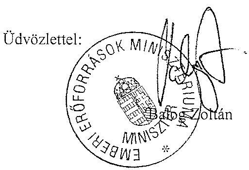

---

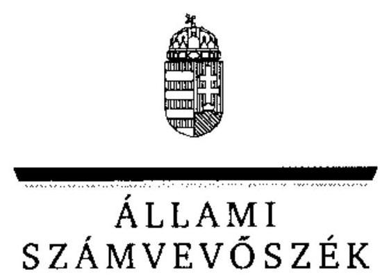

# E L N Ö K 

8. sz. melléklet
a V-0020-319/2012-2013. sz. jelentéshez
Ikt.szám: V-0020-309/2012-2013.

## Balog Zoltán úr

miniszter
Emberi Erőforrások Minisztériuma

## Budapest

## Tisztelt Miniszter Úr!

A kórházi ellátás müködtetésére fordított pénzeszközök felhasználásának ellenőrzéséről szóló jelentéstervezetre küldött észrevételeit köszönettel megkaptam.

Az Állami Számvevőszék észrevételekre vonatkozó álláspontjáról a felügyeleti vezető által készített részletes tájékoztatást csatoltan megküldöm.

Tájékoztatom Miniszter Urat, hogy a számvevőszéki jelentés szövegezése az elfogadott észrevételei figyelembevételével készül.

Budapest, 2013. O2 hó 25 nap

Tisztelettel:
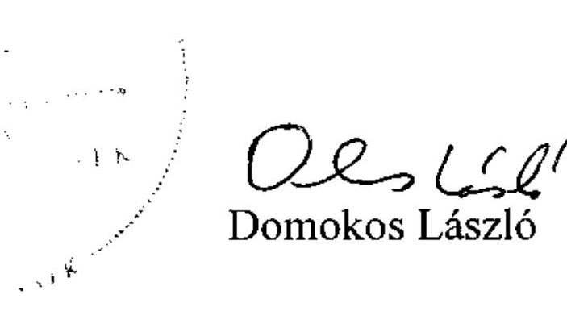

Melléklet: Tájékoztatás az elfogadott és az el nem fogadott észrevételekről

---

# Tájékoztatás   az elfogadott és az el nem fogadott észrevételekről 

A 2013. január 10-én kelt miniszteri levél nem vitatta az ellenőrzés megállapításait, azokhoz egy szöveghelyesbítést kért és két információ bővítést javasolt. A többi észrevétel a jelentéstervezet bevezető szövegrészének és értelmező szótárának pontositását kezdeményezte, valamint az emberi erőforrások minisztere részére tett javaslatokhoz füzött a megvalósíthatóságukkal kapcsolatos kiegészítő véleményt.

Az észrevételeket a következők szerint kezeljük.

## Szakmai észrevételek figyelembevétele

1. A jelentéstervezet értelmező szótárában szereplő fogalom meghatározás az ellenőrzött időszak 2009-2011 közötti éveiben hatályos volt. A kért pontosítás az ellenőrzött időszak utolsó félévében - 2012. január 1-jétől - hatályos. Tekintettel azonban arra, hogy sem a régi sem az új fogalom meghatározás nem befolyásolja a megállapításainkat, ezért a jelentéstervezetben a 2012. január 1-jétől hatályos jogszabályi meghatározást szerepeltetjük a következők szerint:
„közremüködő: a közremüködést igénybe vevő szolgáltató szervezeti egységének tevékenységéhez kapcsolódó, az egészségügyi szolgáltatás nyújtásában részt vevő személy vagy szervezet, amely közremüködői szerződés alapján, közvetlenül, müködési engedély és felelősségbiztositási szerzödés birtokában, a közremüködést igénybe vevő szolgáltató szervezeti egysége által nyújtott szakmában és a saját tulajdonában vagy használatában levő tárgyi eszközökkel, személyesen, vagy az általa foglalkoztatott egészségügyi dolgozókkal a közremüködést igénybe vevő szolgáltató szervezeti egysége által ellátott betegek részére a közremüködést igénybe vevő szolgáltató nevében nyújt egészségügyi szolgáltatást."
2. A 11. oldalon a Bevezetés fejezet 2. bekezdését egyértelművé tesszük, a jelentéstervezetben a következő módosított bekezdést szerepeltetjük:
„A kórházak fejlesztése elsősorban a tulajdonosok/fenntartók feladata. Az ellenőrzési témához kapcsolódó korábbi számvevőszéki jelentések is utaltak már arra, hogy a kórházak a müködési bevételeikböl is forditottak felhalmozásra, elsősorban gép és müszer beszerzésekre. Ezek egy része az elhasználódott eszközök pótlását szolgálta, miközben a finanszírozás nem tartalmazott amortizációs fedezetet."

---

3. A Bevezetés fejezetben a 12. oldal 1. bekezdése utolsó előtti mondatában az átvett intézmények körét a települési önkormányzatok fekvőbeteg-szakellátó intézményeinek átvételéről és az átvételhez kapcsolódó egyes törvények módosításáról szóló 2012. évi XXXVIII. törvény szerinti megfogalmazás átvételével tesszük egyértelművé. A pontosított szövegrész a következő:
„2012. május 1-jével a települési önkormányzatok fenntartásában lévő fekvőbetegszakellátó intézmények fenntartását is átvette az állam."
4. A Bevezetés fejezetben a 12. oldal 1. bekezdése utolsó mondatához kapcsolódó lábjegyzet jogszabályi hivatkozását pontosítjuk a következők szerint:
„A Nemzeti Eröforrás Minisztérium (NEFMI) elnevezése a Magyar Köztársaság minisztériumainak felsorolásáról szóló 2010. évi XLII. törvény módosításáról szóló 2012. évi XLII tv. 1. §-a alapján 2012. május 14-től Emberi Eröforrások Minisztériuma (EMMI)."
5. Az Összegző megállapítások, következtetések, javaslatok fejezetben a 22. oldal utolsó bekezdésének helyesbítésére vonatkozó szövegjavaslat szó szerinti átvételét nem tartjuk indokoltnak. A jelentéstervezet 13. és 15 . oldalán hivatkozottaknak megfelelően a „kórházak" megjelölés egyértelműen az ellenőrzött 20 kórházat jelöli, így az erre való utalások szükségtelenek. A közérthetőség, az évenkénti sajátosságok kiemelése érdekében a konszolidációs támogatásokról, azok felhasználásáról szóló információkat évenként tagolva mutatjuk be. Az ellenőrzött időszakot követő lényeges információt megjelenítjük, utalunk a 2011. évi támogatásból visszafizetett összeg (az intézmények állami tulajdonba vételével és a struktúraátalakítással kapcsolatosan felmerülő költségek egyszeri támogatására szolgáló fedezet előirányzata) terhére visszajuttatott további támogatásra. A pontosított bekezdés a következő:
„A kórházak a lejárt határidejű szállitói tartozások és a várólisták csökkentése érdekében 2010 decemberében konszolidációs támogatásban részesültek. A folyósitott támogatásból $5048,9 \mathrm{MFt}(88,9 \%)$ a szállitói tartozások rendezésére szolgált, amelyböl egy kórháznak kellett 14,5 M Ft-ot visszafizetnie. A kórházak 2011 decemberében a lejárt határidejű szállitói tartozások rendezésére újabb 4116,4 MFt konszolidációs támogatást kaptak. A lejárt határidejű 2011. december 29-ei szállitói tartozásuknál magasabb összegü támogatáshoz jutó három kórháznak 638,7 MFt konszolidációs támogatást kellett visszafizetnie 2012-ben. A konszolidációs támogatások igénybevétele mellett a 2009. év végi 8355,5 M Ft-ról 2010-ben 8075,8 M Ft-ra, 2011-ben 7824,4 M Ft-ra mérséklődött a lejárt határidejű szállitói tartozás összege. A kórházaknak nyújtott konszolidációs támogatás és a lejárt határidejü szállitói tartozások alakulását a 6. sz. melléklet tartalmazza. Az ellenőrzött időszakot követően a 2011. év végén kiosztott konszolidációs támogatásból visszafolyt összegből az ellenőrzött kórházak részesültek.*" (* Kapcsolódó lábjegyzet: "az egészségügyi szolgáltatások Egészségbiztositási Alapból történő finanszírozásának részletes szabályairól szóló 43/1999. (III. 3.) Korm. rendelet 2012. szeptember 15-étől hatályos 64. §-a alapján")

---

# Technikai észrevételek 

1. Az „ellenőrzés tárgya" és a „vizsgált időszak" egyértelmű rögzítésére vonatkozó észrevétel alapján nem tartunk szükségesnek kiegészitést, mert a Bevezetés fejezet 9. bekezdése (13. oldal) pontosan tartalmazza az ellenőrzés célját, 6. bekezdése (12. oldal) pedig az ellenőrzött időszakot.
2. A vonatkozó technikai észrevételre és a jelentéstervezet 11. oldalán a Bevezetés fejezet 2. bekezdése módosítására tekintettel a címzett támogatásból finanszírozott egészségügyi beruházások, rekonstrukciók ellenőrzéséről szóló 0523 sorszámú ÁSZ jelentéssel a témához kapcsolódó számvevőszéki jelentések felsorolását kiegészítjük.
3. A 3. oldalon a Rövidítések jegyzékében nem tartjuk szükségesnek a NEFMI és az EMMI összekapcsolását, hiszen az ESzCsM, vagy az EüM is külön-külön önálló rövidítésként szerepel. A jelentéstervezetben minden esetben a vonatkozó időszaktól függő hatályos elnevezést, illetve rövidítést alkalmaztuk.
4. A 10. oldalon az Értelmező Szótárban a TVK fogalmának kettős megközelítését fenntartjuk, mert az észrevétel ellenére az egészségügyi szolgáltatások Egészségbiztosítási Alapból történő finanszírozásának részletes szabályairól szóló 43/1999. (III. 3.) Korm. rendelet 27. § (2) bekezdése szerinti teljesítményvolumen keret megjelölés mellett fontosnak tartjuk a közérthetőség szempontjából az Egészségügyi Fogalomtárban közzétett volumenkorlát szerinti értelmezés bemutatását is. A jelentéstervezet megállapításainál nem használtuk a korlát megfogalmazást, ugyanakkor alkalmazzák olyan, a közvélemény számára hozzáférhető dokumentumok, mint például egyes években az Egészségbiztosítási Alap fejezet költségvetési beszámolóinak szöveges indokolásai.
5. A jelentéstervezet kiegészítését a javasolt humánerőforrás melléklettel nem tartjuk indokoltnak. Az ágazati humánerőforrás-tervezés fontosságával egyetértünk, az ellenőrzés céljaként megfogalmazott kérdések megválaszolásához azonban nem szükséges az új mellékletet. Az ellátási feltételek javasolt mélységủ elemzésének igényét az ellenőrzés célja és keretei nem indokolják.
6. A jelentéstervezet kiegészítése az áttekintett pályázatok leltárával nem indokolt. A kizárólag kórházak által szolgáltatott információkat hasznosító egyedi és összegző elemzésekben a pénzügyi egyensúlyi helyzetre ható tényezőknek volt szerepe, az egyedi pályázati azonosítások a megállapítások áttekintését nehezítené.

Az emberi erőforrások minisztere részére tett javaslatok vonatkozásában fennálló észrevételek

1. A jelentéstervezet első javaslat b) pontjában foglaltakkal összefüggésben az észrevétel a kiírás előtt álló vagy folyamatban lévő uniós pályázatokat részletezi, és az ezek megvalósítását követő 2015. év előtti egységes önköltség-számítási módszer bevezetését nem tartja reálisnak.

---

Az esetszintű költségszámítás, az intézményi átvilágítás fejlesztése, vagy az „egységes ágazati felhő" létrehozása előtt már indokolt a kórházak önköltség számításainak egységesítését szolgáló fenntartói intézkedés (pl. irányelv, módszertan, szabályozás minta) miniszteri kezdeményezése. A javaslatunk emiatt rövidtávon is indokolt.
2. A jelentéstervezet második javaslatához füzött észrevétellel kapcsolatban egyetértünk abban, hogy a központi szabályozás alapvetően a keretek tisztázását, a szolgáltatói szabályozás pedig a helyi sajátosságok meghatározását szolgálja. A kötelező egészségbiztosítás ellátásairól szóló 1997. évi LXXXIII. törvény jelenleg hatályos 83. § (4) bekezdése azonban nem az észrevételben jelzett kormányrendeleti szintủ szabályozást írja elő, hanem azzal az egészségbiztosításért felelős minisztert hatalmazza fel. A törvény ugyanezen bekezdés zs) pontja szó szerint az egészségügyi ellátás keretében igénybe vehető egyéb kényelmi szolgáltatásokra vonatkozó részletes szabályok meghatározására utal. A hatályos törvényi előírás szerint megfogalmazott javaslatunkat emiatt változatlanul fenntartjuk.
3. A jelentéstervezet harmadik javaslatához füzött észrevétel a megfelelő nagyságú költségvetési előirányzat elérését és annak az egészségügyi finanszírozás rendszerében történő szétosztását tartja szükségesnek az eszközpótláshoz. A számvevőszéki javaslat az elérendő célra helyezte a hangsúlyt, az azt biztosító rendszer kialakítását a területért felelős emberi erőforrások miniszterének címezte. Az országos ellátási szempontok szerinti rangsorolás a fenntarthatósággal együtt értelmezve nem kizárásra, hanem célszerű időbeni ütemezésre utal, nem sérti az egészségügyi ellátáshoz való egyenlő hozzáférés esélyét. Mindezek alapján a javaslatunkat változatlanul fenntartjuk.

Budapest, 2013. 02. hó 25. nap

Makkai Mária
felügyeleti vezető

---

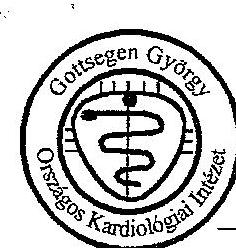

# Gottsegen György Országos Kardiológiai Intézet 

FÖIGAZGATÓSÁG

1096 Budapest, Haller u. 29.
Telefon: 299-8100
Fax: 299-8181
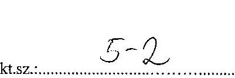

Ikt.sz.:.
Tárgy: ÁSZ jelentés-tervezethez észrevétel
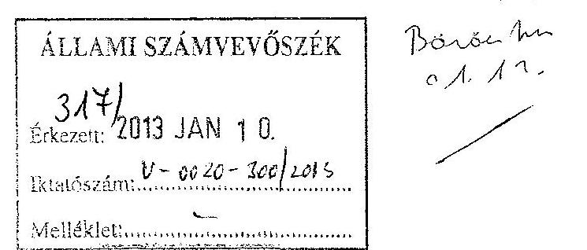

Megkaptam a kórházi ellátás működtetésére fordított pénzeszközök felhasználásának ellenőrzéséről készített számvevőszéki jelentéstervezetet.

A Gottsegen György Országos Kardiológiai Intézetre vonatkozó részletes megállapítások fejezettel kapcsolatban írásbeli észrevételt kívánok tenni annak érdekében, hogy a jelentéstervezetben szereplő megállapítások hátterében rejlő problémákat megvilágítsam.

Részletes megállapítások 27. oldal 1.1. pont 2. bekezdéshez „a müködési egyensúly 2009-2011. között nem volt biztosított."

A Gottsegen György Országos Kardiológiai Intézetben lefolytatott Állami Számvevőszéki vizsgálatról jegyzőkönyv készült, amelyet a helyi vizsgálatot vezető számvevő tanácsos, Knoppné Szabó Ildikó készített. Ez az anyag részletesen tartalmazza az Intézetben keletkező működési hiány részletes szakmai okait, amelyek ismerete nélkülözhetetlen a finanszírozási problémák pontos megértéséhez. Írásbeli észrevételemet az említett jegyzőkönyvben szereplő részletes elemzésre alapítom, ugyanis az abban szereplő megállapításokkal messzemenően egyetértek. Ezért saját szavaim helyett a vizsgálatról készített jegyzőkönyvből szó szerint idézek.
„A müködési hiány keletkezésének okait a Kardiológiai Intézet folyamatosan feltárja, a lehetséges megoldásokat feltérképezi, a veszteséget okozó tényezőket számszerüsíti. Aktívan közremüködik a finanszírozási problémák megoldásában, az OEP és a Minisztérium részére javaslatot készít az egyes finanszírozási kérdések megoldása érdekében.

---

A Kardiológiai Intézetnél a müködési hiány keletkezése a finanszírozás reálértékének folyamatos csökkenésében, valamint az Intézet finanszírozásában kigazdálkodhatatlan alábbi hiányosságokra vezethető vissza:

- A gyermekellátás évek óta alulfinanszírozott. A gyermekellátásból származó bevétel javitását célzó 2008. évi ráforditás gyüjtés eredménye 2012. I. félévében még nem realizálódott.
- A gyermek szivtranszplantáció finanszírozásának több éve fennálló problémája 2011. év január elsejétől oldódott meg, az egészségügyi szakellátás társadalombiztositási finanszírozásának egyes kérdéseiről szóló 9/1993. (IV.2.) NM rendelek módositásával. Bevezetésre került a „beteg további sorsa N, nagy értékü, országosan még nem elterjedt mütéti eljárás elötti ápolás lezárása" kód. Ezzel a transzplantációt megelőzö ellátás önálló finanszírozási esetként, külön HBCS-ben finanszírozódik, amennyiben a kórházi felvétel és a nagy értékü beavatkozás elvégzésének idöpontja között 10 ápolási napnál hosszabb idö telik el.
- A Kardiológiai Intézet, a Csecsemő és Gyermek-Gyógyászati Nemzeti Program alapján, 2008. évtől végez müsziv-kezelést. A kezelés finanszírozásának kérdése a mai napig megoldatlan. Az Intézet folyamatos egyeztetést folytat az egészségügyi kormányzattal, részletes javaslatot tesz a megoldásra. A 2008-2011. között elvégzett müsziv-beültetés és kezelésekkel összefüggésben, hat beteg ellátását követően, 213,4 millió Ft finanszírozási vesztesége keletkezett a Kardiológiai Intézetnek. Az új eljárás bevezetésével eddig nem történt többlet kapacitás megállapítása az Intézet számára, ezért az évente tervezett nyolc ellátáshoz kapcsolódóan 1040 súlyszámnyi többlet kapacitás megállapítását pályázza meg az GOKI.
A müsziv kezelés befogadása csak 2010. június 1-tól lehetséges, de ekkor a finanszírozási jogszabályok még nem tették lehetővé a müsziv-kezelés elektronikus teljesitmény jelentését. Az ellátás elektronikus kódolása a 43/1999. (III. 3.) Korm. rendelet 2011. januártól hatályos módosítása óta lehetséges (a müsziv kezelés lezárásának kódolását és elkülönitett HBCS-be besorolódását a beteg további sorsa alpont N-kódú, „nagy értékü, országosan még nem elterjedt mütéti eljárás elötti ápolás lezárása" kiegészitéssel). A teljesitmény-jelentést is biztositó jogszabály megjelenését követően a finanszírozás további akadálya a jogszabály eltérő értelmezése az OEP-nél és a GOKI-nál. A 43/1999. (III.3.) Korm. r 40. § (2) alapján, ha a nagy értékü beavatkozás a kórházi felvétel idöpontjától számított legalább 10 napon túl történt, a nagy értékü eljárás és az azt megelőző ellátás önálló finanszírozási esetként számolható el. Az OEP véleménye szerint, amennyiben a müsziv kezelés előtt legalább 10 napos ellátás nem történik, az nem kerülhet be a müsziv kezelés HBCS-be. A GOKI véleménye szerint életmentő eljárás esetén nem értelmezhetö.
- A Szivtranszplantációs Program keretein belül az Intézet feladata a felnőtt betegek transzplantáció elötti és utáni ellátásának biztositása. Az elökezelés finanszirozása, valamint az utókezelés finanszírozása kilöködési reakció esetén, megoldatlan. Ezzel az Intézetet betegenként 12,0 millió Ft veszteség éri.
- A fekvő és járó teljesitmény lejelentés nem megfelelő összevezetése, a lejelentések javitásának elmulasztása (más intézmények részéről) miatt az Intézetnek éveken át jelentös vesztesége keletkezett. A társkórház 2010. évben a veszteséget megfizette a Kardiológiai Intézet számára.
- Alacsony, 2010. év óta változatlan nagyságrendü az Intézet számára megállapított TVK keret. Az elmúlt években a Kardiológiai Intézetnél végrehajtott új eljárások befogadásával az Intézet többlet kapacitáshoz nem jutott, az Intézet TVK-ja a müsziv kezelés finanszírozására nem elegendő. A Kardiológiai Intézet a müsziv kezelés TVK

---

alóli mentesitése, valamint a havi finanszirozás biztositása érdekében az egészségügyi kormányzathoz fordult. Az egyeztetés évek óta folyik.

- A degresszív finanszirozási sáv kihasználása a GOKI esetében is gazdaságtalan, mivel az Intézet által végzett, jelentös értékü eszközt és gyógyszert igénylő beavatkozásoknál a TVK kereten felüli, 30\%-on finanszirozott (további 10\%) teljesitmény tovább növeli a veszteséget.
A Kardiológiai Intézet müködési egyenlegét, a 2009-2011. közötti években, az OEP-től származó eseti, rendkivüli támogatások, kiegészitések javitották. Ezek azonban nem oldják meg, nem szüntetik meg az Intézet folyamatosan újra termelődő, fent említett finanszirozási problémáit." (6-7. oldal)

# További észrevételek: 

Összefoglaló jelentés 27. oldal 2. bekezdés utolsó mondata:
„A felhalmozási bevételek nem nyújtottak fedezetet a beruházások finanszirozására, ami felhalmozási kockázatot jelentett."
A számvevő tanácsos helyszíni vizsgálatáról készített ÁSZ jelentés a következőket tartalmazza a felhalmozási kiadások elemzésével kapcsolatban:
„A felhalmozási kiadásokat az OEP külön nem finanszirozta. A felújítási és beruházási költségek fedezetét döntöen saját forrásból biztositották, ezen felül egyéb felhalmozási célú pénzeszközként alapitványi támogatásból jutottak forráshoz." (4. oldal 3. bekezdés)
„A Kardiológiai Intézetnél az ellenőrzött években a felhalmozási célú kiadásokat a felhalmozási források nem fedezték, a felhalmozási hiány azonban folyamatosan mérséklődött a kiadások fokozatos visszafogása eredményeképpen." (8. oldal 4. bekezdés)
„A felújítás és beruházás költségeinek fedezetét - elégséges külső forrás hiányában - döntöen saját forrásból biztositották. A felhalmozási kiadásokat (eszközpótlást) a tulajdonos támogatása az elszámolt értékcsökkenés mértékében nem biztositotta." (8. oldal 6. bekezdés)
Felhalmozási kiadásaink és bevételeink, az amortizáció figyelembe vételével az alábbiak szerint alakultak:

|  |  |  | eFt |
| :--: | :--: | :--: | :--: |
|  | 2009 | 2010 | 2011 |
| Éves amortizáció | 321432 | 213575 | 301825 |
| Felhalmozási kiadások összesen | 264333 | 198128 | 158406 |
| Felhalmozási célra kapott bevételek összesen | 76529 | 39810 | 76386 |
| Felhalmozási célra kapott támogatások | 76276 | 39806 | 75276 |
| ebből: - költségvetési támogatás | 62992 | 39806 | 40076 |
| - elözö évi maradvány átadás fejezet részéről |  |  | 27200 |
| - egyéb támogatások államháztartáson belülről | 2284 | 0 | 0 |
| - egyéb támogatások államháztartáson kivülröl | 11000 | 0 | 8000 |
| Saját tökebevételek ( saját hatáskörben értékesitett tárgyi eszközök bevétele) | 253 | 4 | 1110 |
| Felhalmozási kiadások/éves amortizáció \%-a | $82,2 \%$ | $92,8 \%$ | $52,5 \%$ |
| Amortizáció "pótlásának" lehetősége \%-ban ha csak a kapott támogatás terhére történt volna meg a pótlás | $23,8 \%$ | $18,6 \%$ | $25,3 \%$ |
| A müködési bevételekből - ellátási érdekből felhalmozási célra forditott kiadás | 187804 | 158318 | 82020 |

---

Összefoglaló jelentés 28. oldal 3. bekezdés utolsó mondata:
„A GOKI a saját müködési bevételek növelése érdekében az ellenőrzött idöszakban intézkedéseket nem hozott."

A számvevő tanácsos helyszíni vizsgálatáról készített ÁSZ jelentés leszögezte, hogy az intézet jelentős lépéseket tett a bevétel növelése érdekében, bár lehetőségei e téren erősen korlátozottak voltak.
„Az Intézet saját bevételi forrásai: fizető ellátások, gyógyszerkipróbálás, bérsterilizálás, patika, vérvisszaszállítás, bérleti díjak és továbbszámlázott szolgáltatások, konszignációs készletek raktározása. E bevételi források többségének alakulására, növelésére az Intézetnek alapvetően ráhatása nincs. A saját bevételi források közül kiemelendő a konszignációs raktározás, ami minden évben jelentős bevételt eredményezett." (7. oldal utolsó bekezdés):
Megjegyzést érdemel azonban az, hogy egyes bevételt növelő tervezett intézkedéseink nem realizálódhattak, például a konszignációs raktárakban tárolt anyagok tárolási dijának emelése vonatkozásában, mert nem álltak összhangban a vállalkozói adminisztratív költségek csökkentésére irányuló Egyszerủ Állam címủ kormányzati programról szóló 1405/2011. (XI.25.) Kormányhatározatban megfogalmazott elvárásokkal.

Tisztelettel kérem, hogy a Gottsegen György Országos Kardiológiai Intézetről szóló részletes megállapítások fejezetet a fenti, az Állami Számvevőszéki helyszíni vizsgálat jegyzőkönyvéből vett idézetekkel kiegészíteni szíveskedjenek.

Ezúton szeretném megköszönni a helyszíni ellenőrzést végző Knoppné Szabó Ildikó számvevő tanácsos asszony részletekbe menő elemző munkáját.

Budapest, 2013. január 7.

Tisztelettel:
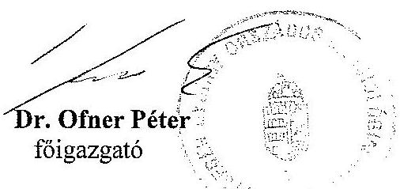

---

# 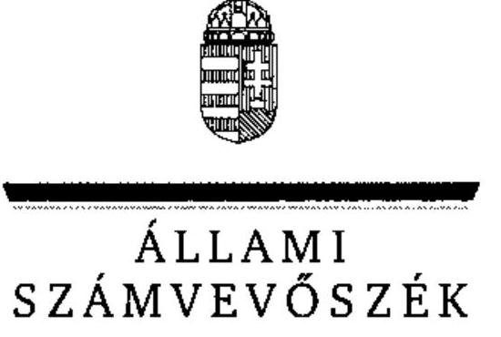 

## 10. sz. melléklet

a V-0020-319/2012-2013. sz. jelentéshez
Ikt.szám: V-0020-310/2012-2013.

## Dr. Ofner Péter úr

föigazgató
Gottsegen György Országos Kardiológiai Intézet

## Budapest

## Tisztelt Föigazgató Úr

A kórházi ellátás müködtetésére fordított pénzeszközök felhasználásának ellenőrzéséről szóló jelentéstervezetre küldött észrevételeket köszönettel megkaptam.

Az Állami Számvevőszék észrevételekre vonatkozó álláspontjáról a felügyeleti vezető által készített részletes tájékoztatást csatoltan megküldöm.

Tájékoztatom Főigazgató Urat, hogy a számvevőszéki jelentés szövegezése az elfogadott észrevételei figyelembevételével készül.

Budapest, 2013. O2 hó 25 nap

Tisztelettel:

## 02066

Domokos László

Melléklet: Tájékoztatás az elfogadott és az el nem fogadott észrevételekröl

---

# Tájékoztatás   az elfogadott és az el nem fogadott észrevételekről 

A 2013. január 7 -én kelt észrevételeikkel kapcsolatosan a következő tájékoztatást adjuk.
Észrevételük szerint a jelentéstervezet a müködési hiány részletes szakmai okait nem taglalja a helyszíni ellenőrzéskor közösen felvett jegyzőkönyvnek megfelelően. Az intézeti vélemény szerint a szakmai okok ismerete nélkülözhetetlen a finanszírozási problémák pontos megértéséhez.

A jelentéstervezet bevezetőjében szerepel, hogy a pénzügyi egyensúly fenntartását veszélyeztető körülmények feltárását és ezek alapján a saját hatáskörben szükséges és lehetséges intézkedések meghozatalát a kórházaktól elvárható követelménynek tekintettük. Az ellenőrzést jóváhagyott program szerint hajtottuk végre, amelynek céljai között nem szerepelt a speciális finanszírozási problémák feltárása. E témakör több elemével korábbi - részben a jelentéstervezetben is hivatkozott - számvevőszéki ellenőrzések foglalkoztak. A helyszíni ellenőrzésről készült, közösen felvett jegyzőkönyv tartalmazta, hogy abba az Intézet által szolgáltatott tanúsítványi adatok és a rendelkezésre bocsátott további információk alapján kerültek tények, intézeti kiegészítő megjegyzések. Ugyanakkor az is szerepelt benne, hogy a jegyzőkönyv nem tekinthető az ÁSZ-nak az adott kórházra vonatkozó ellenőrzési megállapításainak. A jegyzőkönyv az ellenőrzés megállapításait alátámasztó dokumentumok egyike. A számvevőszéki jelentéstervezet részletes megállapításaiban az ellenőrzött 20 kórház mindegyikéről azonos elemzési és értékelései módszer alapján szerepelnek a megállapítások, a lényegesség és az áttekinthető terjedelem követelményeire is figyelemmel.

Mindezek alapján az Intézetre vonatkozó részletes megállapítások bővítését a jegyzőkönyvből idézett szövegrészekkel nem tartjuk indokoltnak.

A levélben szereplő további észrevételeket - a felvetések sorrendjében - a következők szerint kezeljük:

1. A jelentéstervezet 27. oldal 2. bekezdés utolsó mondatára hivatkozva idézi az észrevétel a helyszíni ellenőrzéskor felvett jegyzőkönyv több bekezdését és egy további információkat tartalmazó kiegészítő táblázatot mutat be.

A jelentéstervezetben az Intézet által kitöltött és hitelesített 2. számú tanúsítványban közölt felhalmozási bevételek és kiadások adatait elemeztük. Megállapítottuk, hogy a felhalmozási tevékenység finanszírozásához nem volt elegendő a felhalmozási jogcímen képződött bevételek összege, ami a felhalmozási tevékenységre kockázatot jelent. A jelentéstervezet 29. oldal utolsó előtti bekezdésében felsoroltuk, hogy milyen bevételi forrásokat használtak fel a felhalmozási kiadások finanszírozására (saját bevételek, fenntartói támogatások, ál-

---

lamháztartáson belülről és kívülről átvett pénzeszközök). Az észrevételben leírtak és a jelentéstervezet megállapításai között nincs ellentmondás. A felhalmozási tevékenység elemzése során valamennyi kórház esetében arra is választ kerestünk, hogy az eszközpótlás címén végzett beruházások milyen mértékben pótolták az elhasználódott eszközöket. A 6. számú tanúsítványban közölt adatokat - eszközpótló beruházások értékének felhasználásával - az elszámolt értékcsökkenéshez viszonyítottuk. A jelentéstervezetben rámutattunk, hogy az összes lehetséges forrás bevonásával történő eszközpótló beruházás sem volt elegendő az elhasználódott eszközök pótlására. A fentiek miatt az amortizáció pótlásával kapcsolatban tett észrevétel nem indokolja a megállapítások pontosítását.
2. A jelentéstervezet 28. oldal 3. bekezdés utolsó mondatára vonatkozó észrevétel a helyszíni ellenőrzéskor közösen felvett jegyzőkönyv egy bekezdésére hivatkozva állítja, hogy jelentős lépéseket tett az Intézet a bevételei növelése érdekében, ugyanakkor a lehetőségeik korlátozottak voltak.

A rendelkezésre álló ellenőrzési bizonyítékok a ,jelentős lépéseket" nem igazolják, ugyanakkor bizonyos intézkedések megtétele a rendelkezésre álló bizonyítékokból kikövetkeztethető. Emiatt a megállapításaink közül a hivatkozott mondatot töröljük.

Budapest, 2013. 02 hó 25 . nap
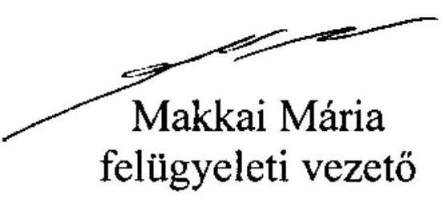

---

# 111111111111111111111111111111111 

## Bugát Pál Kórház

Egészségügyi Szolgáltató Közhasznú Nonprofit Kft.

## Állami Számvevőszék

1052 Budapest, Apáczal Csere János u. 10.

Domokos László
elnök

Tisztelt Elnök Úr!

## A Bugát Pál Kórház Nonprofit Kft. részéről az ÁSZ ellenőrzés jelentéstervezetéhez az alábbi észrevételt kívánjuk tenni:

A Bugát Pál Kórház Nonprofit Kft.-ra vonatkozó Részletes megállapítások részanyag 3. oldalán az alábbi megállapítás szerepel:
„A BPK saját bevételei 2010-2011 között csökkentek, amely negatív hatással volt a pénzügyi egyensúly megteremtésére. A saját bevételek jelentős része (több, mint 60\%-a) - szolgáltatások ellenértékéből, magánrendelések miatti eszköz-bérbeadásból, intézményi ellátási díjakból, készletértékesítésből származott. A saját bevételek növelése érdekében a 2010. évtől kezdődően több intézkedést hozott a BPK, ezek ellenére a saját bevételek összege 2010-ről 2011-re 77,8 M Ft-tal ( $24,8 \%$-kal) csökkent."

Ehhez a szövegrészhez az alábbi észrevételt tesszük:
A saját bevétel csökkenéséhez 2011. évben nagy mértékben hozzájárult a 2010. évben képzett céltartalék részbeni feloldása ( 40,7 millió Ft).

Gyöngyös, 2013. január 07.

Tisztelettel

Bodnár Krisztina
ügyvezető igazgató

## Bugát Pál Kórház

Egészségügyi Szolgáltató Közhasznú Nonprofit Kft.
3200 Gyöngyös, Dózsa György út 20-22.
Adószám: 92814668-2-10

---

# 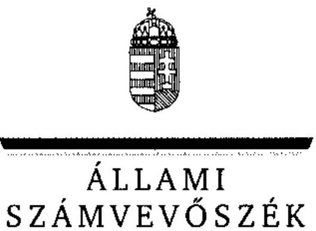 

## 12. sz. melléklet

a V-0020-319/2012-2013. sz. jelentéshez

Ikt.szám: V-0020-318/2012-2013.

## Bodnár Krisztina úrhölgy

ügyvezető igazgató
Bugát Pál Kórház Egészségügyi Szolgáltató Közhasznú Nonprofit Kft.

## Gyöngyös

## Tisztelt Ügyvezető Igazgató Asszony!

A kórházi ellátás működtetésére fordított pénzeszközök felhasználásának ellenőrzéséről szóló jelentéstervezetre küldött észrevételét köszönettel megkaptam.

Az Állami Számvevőszék észrevételre vonatkozó álláspontjáról a felügyeleti vezető által készített tájékoztatást csatoltan megküldöm.

Tájékoztatom Ügyvezető Igazgató Asszonyt, hogy a számvevőszéki jelentés szövegezése az elfogadott észrevétele figyelembevételével készül.

Budapest, 2013. O2 hó 25 nap

Tisztelettel:

## 02.2.2.2

Domokos László

---

# Tájékoztatás   az elfogadott észrevételről 

A számvevőszéki jelentéstervezetbe a rendelkezésre álló információk alapján került az észrevételezett megállapítás. (A Kórház által hitelesített tanúsítványok nem tartalmaztak céltartalék képzésre és feloldásra vonatkozó információt, valamint a helyszíni ellenőrzésről közösen felvett jegyzőkönyvben sem szerepel erre vonatkozó tény.) Az észrevételükben jelzett céltartalék feloldás esetén is csökkent a müködési bevétel 2011-ben az előző évhez képest.

A céltartalék képzés és feloldás teljes körű adatai hiányában a jelentéstervezet észrevételezett bekezdése utolsó mondatát a következők szerint módosítjuk:
„A saját bevételek növelése érdekében a 2010. évtől kezdődően több intézkedést hozott a BPK, ezek ellenére a saját bevételek összege 2010-ről 2011-re - céltartalék feloldás nélkül - 77,8 M Ft-tal (24,8\%-kal) csökkent."

Budapest, 2013. 02. hó 25. nap
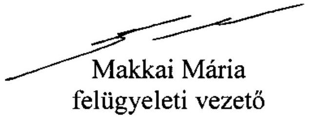

---

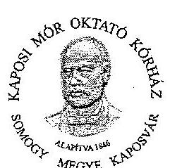

# SOMOGY MEGYE a V-0020-319/2012-2013. sz. jelentéshez 

## KAPOSI MÓR OKTATÓ KÓRHÁZ

Dr. Moizs Mariann
főigazgató
7400 Kaposvár, Tallián Gy. u. 20-32.

$82 / 501-301$
$82 / 413-122$
foigtitk@kmmk.hu
$82 / 313-161$
Ikt.sz.: IG/coce $-\infty 0 \quad / 2013$
Tárgy: Észrevétel jelentéstervezetre

## Állami Számvevőszék

## Domokos László

elnök

## 1052 Budapest

Apáczai Csere János u. 10.

## Tisztelt Elnök Úr!

A Somogy Megyei Kaposi Mór Oktató Kórház részéről köszönettel megkaptuk a kórházi ellátás működtetésére fordított pénzeszközök felhasználásának ellenőrzéséről szóló jelentéstervezetet.
Az általános részben foglaltakkal egyetértünk, bár javasoljuk hangsúlyossá tenni az alábbiakat:

Feladatarányos finanszírozás
Sürgősségi ellátás finanszírozásának biztosítása
Nagy értékủ eszközök pótlásának, az amortizáció évtizedes megoldatlanságának rendezése.
Indokunk, hogy tapasztalataink szerint a Somogy Megyei Kaposi Mór Oktató Kórház, mint nagytérségi intézmény a Semmelweis Terv szerint kiemelt feladataihoz mérten alulfinanszírozott.

Az intézményre vonatkoztatott tételes megállapításokban foglaltakkal egyetértünk. Egyetlen megjegyzésünk lenne: A 27. oldal utolsó bekezdésében szereplő, a konszolidációs támogatás felhasználásáról szóló, „a szakmai és a gazdálkodási feladatokra intézkedési tervet nem készítettek" rész ellentmond a valóságnak és a jelentés többi részének, tekintettel arra, hogy az intézmény vezetése újabb és újabb likviditási racionalizálási programokat, illetve konszolidációs tervet készített, melyet a konszolidációs támogatás felhasználásának ellenőrzésekor csatoltunk.
Tisztelettel kérnénk ennek módosítását. Egyebekben a Somogy Megyei Kaposi Mór Oktató Kórház vonatkozásában leírtakkal egyetértünk.

Kaposvár, 2013. január 2.
Munkájukat megköszönve, szívélyes üdvözlettel:
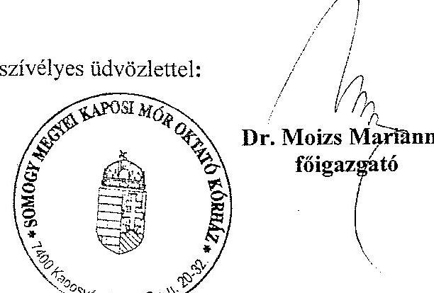

---

# 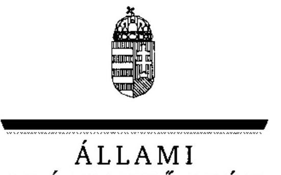 

## 14. sz. melléklet a V-0020-319/2012-2013. sz. jelentéshez

Ikt.szám: V-0020-316/2012-2013.

## Dr. Moizs Mariann úrhölgy   föigazgató

Somogy Megyei Kaposi Mór Oktató Kórház

## Kaposvár

## Tisztelt Föigazgató Asszony!

A kórházi ellátás müködtetésére fordított pénzeszközök felhasználásának ellenőrzéséről szóló jelentéstervezetre küldött észrevételeit köszönettel megkaptam.

Az Állami Számvevőszék észrevételekre vonatkozó álláspontjáról a felügyeleti vezető által készített részletes tájékoztatást csatoltan megküldöm.

Tájékoztatom Főigazgató Asszonyt, hogy a számvevőszéki jelentés szövegezése az elfogadott észrevételei figyelembevételével készül.

Budapest, 2013. 01 hó 25 nap

Tisztelettel:

## 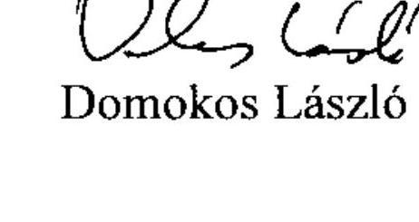

Domokos László

Melléklet: Tájékoztatás az elfogadott és az el nem fogadott észrevételekről

---

# Tájékoztatás   az elfogadott és az el nem fogadott észrevételekről 

A Kórház a 2013. január 2-án kelt levelében a jelentéstervezet általános részében foglaltakkal való egyetértése mellett több terület hangsúlyosabbá tételét javasolta. Ezzel kapcsolatban a következő tájékoztatást adjuk:

- A feladatarányos finanszírozás és a sürgősségi ellátás finanszírozása témaköreinek mélyebb taglalása nem szükséges a pénzügyi egyensúly alakulásának és annak javítására irányuló belső intézkedéseknek a megítéléséhez. A két témakörben a sürgősségi betegellátó rendszer kialakítására, fejlesztésére fordított pénzeszközök felhasználásának ellenőrzéséről szóló 0924 sorszámú jelentés, illetve a jelentéstervezetben felsorolt, témához kapcsolódó eddig készített számvevőszéki jelentések tartalmaznak megállapításokat.
- Az eszközök pótlásának, az amortizáció évtizedes megoldatlanságának kérdéskörére a jelentéstervezet Bevezetése a 11. oldal 2. bekezdésében - hasonló korábbi számvevőszéki tapasztalatokat kiemelve - hivatkozik. Ezen túl a jelentéstervezetben az Összegző megállapítások, következtetések, javaslatok fejezet a 16. oldal 2. számú diagramot követő bekezdésében az a megállapítás szerepel, hogy a kórházi tevékenység biztonságos folytatását veszélyezteti az eszközpótlás elmaradása. Mindezek alapján a jelentéstervezetben a megjelölt témakör kellően hangsúlyos.

A jelentéstervezet 27. oldal utolsó bekezdésére vonatkozó észrevétellel kapcsolatban jelezzük, hogy a konszolidációs támogatás felhasználását tartalmazó intézkedési terv hiányát a Kórház által készített és hitelesített (aláirt) 12. számú tanúsítvány alapján állapítottuk meg. A tanúsítvány a konszolidációs támogatás felhasználását tartalmazó intézkedési terv elfogadására vonatkozó időpontot nem tartalmazott. A Kórház által a helyszíni ellenőrzés rendelkezésére bocsátott föigazgatói utasításokból (a „2009. áprilisától kezdődően megváltozott finanszírozási rend miatt történt intézkedésekről" szóló, valamint a „2010. november 1-jétől érvényes gazdasági intézkedésekről" szóló) nem derül ki, hogy azok egyértelműen a konszolidációs támogatáshoz kapcsolódóan készültek. A föigazgatói utasításokra való hivatkozás megjelenítése érdekében az észrevételben hivatkozott bekezdés 2. mondatát a következők szerint kiegészítjük:
„A konszolidációs támogatás felhasználására külön intézkedési tervet nem készitettek, azonban a 2009. és a 2010. évben a likviditási egyensúly megtartása érdekében a szakmai és a gazdálkodási feladatok ellátását föigazgatói utasitások szabályozták."

Budapest, 2013. 0 ? hó 25 .nap
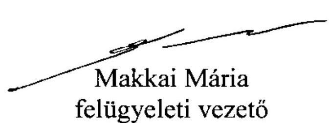

---

# VÁROSI KÓRHÁZ KESZTHELY 

$2-13.07 .90$

Állami Számvevőszék
Domokos László
részére

## Budapest 4.

Pf: 54.
1364

Ikt. szám: V-0020-294/2012.
Ügyintéző: Böröcz Imre

## Tisztelt Domokos László Úr!

Az Állami Számvevőszék 2012. IV. negyedévben végzett, a kórház ellátás működtetésére fordított pénzeszközök felhasználásának ellenőrzéséről megnevezésű ellenőrzéséhez kapcsolódóan elkészítette az ellenőrzést lezáró jelentés-tervezetet. A kórházunkhoz eljuttatott tervezet szövegéhez a következő észrevételeket tesszük:

## A jelentés tervezet 29. oldal 2. bekezdés utolsó mondata a következő:

„A dologi ráfordítások csökkentésére takarékossági intézkedéseket nem hoztak."
Fenti megállapítás vélhetően hibásan került be az ellenőrzési jelentésbe.
A Keszthelyi Kórház a dologi ráfordítások csökkentésére intézkedést hozott.
Több helyen is leírásra került, intézményünk évek óta szoros keretgazdálkodást folytat, melynek kiemelt célterülete az önálló keretgazdákhoz kötött havi rendszerességgel kibocsájtott, végrehajtott és ellenőrzött előirányzat felhasználás. A megrendelések kibocsájtása során folyamatosan monitorozott a keretfelhasználások célszerűségének ellenőrzése, elemzése, szakmai teljesítéshez kötöttségének felülvizsgálata.

A legnagyobb volumenű anyag és szolgáltatás beszerzések esetében rendszeresen közbeszerzési eljárásokat folytatunk le, melyek jobbára egy évre kiterjedőek. Az egy éves időtartam lehetőséget biztosít arra, hogy a termékköröket felülvizsgáljuk, aktualizáljuk pénzügyi és szakmai szempontok figyelembe vételével. Kórházunkban minőség irányítási rendszer is müködik, amely szintén folyamatosan monitorozza (minősíti) az igénybe vett szolgáltatásokat és a beszerzett termékeket, így ez is egyfajta kontroll rendszerként működik.

---

A dologi kiadások csökkenése ellen hatott, hogy a 2010-es év volt az első olyan teljes év, mikor már 12 hónapon keresztül üzemelt az új szakmaként megnyitott sürgősségi betegellátó osztály. Az ápolási osztály teljes ágykihasználtság mellett, a rehabilitációs osztály pedig több mint 30 ágyon látott el betegeket. Értelemszerủen a megnövekedett szakmai feladatok a dologi kiadások tekintetében is többletfelhasználást eredményeztek.

A szakértői elemzés dologi kiadások esetében az inflációhoz viszonyít, viszont az éves inflációs rátán belül 2010. évben előfordultak olyan összetevők, melyek dologi kiadások között megjelenve az éves inflációt meghaladva növekedtek. Ilyenek például az energia áremelkedés, gyógyszer áremelkedés, élelmiszer áremelkedés.

# Az ellenőrzési jelentés tervezet 32. oldal 2. bekezdés a következőt tartalmazza: 

„a gyógyszerfelhasználás költségének csökkentésére intézkedéseket nem hozott."
Fenti megállapítás vélhetően hibásan került be az ellenőrzési jelentésbe.
A Keszthelyi Kórház intézkedéseket hozott a gyógyszerfelhasználás költségeinek csökkentésére.

Fenti bekezdés utolsó mondataként megállapítja, hogy a készítmények felhasználási struktúráján belül differenciálódásra került sor az ellenőrzött időszakban. A differenciálódás jelentősen elősegítette a beszerzések költséghatékonyságának növekedését, mivel az olcsóbb beszerzési áru generikumok féleségeinek száma megnövekedett.

A gyógyszerbeszerzésekre szintén jellemző a fentiekben részletezett szigorú keretgazdálkodás. Kórházunk egészségügyi - gazdasági kontroll szervezetet müködtet a gyógyszergazdálkodáshoz kapcsolódóan (gyógyszerbizottság), mely szervezet a beszerzéseket pénzügyi szempontból a felhasználásokat pedig orvos szakmai és ápolás szakmai szempontból kontrollálja.

A legnagyobb tömegben felhasznált antibiotikumokra és alvadás gátlókra rendszerezett módon történnek ajánlatkérések. A drágább beszerzési árú termékek felhasználása kizárólag intézményi szakmai protokollok alapján lehetséges, melyeket egészségügyi-szakmai szempontból a fent nevezett gyógyszerbizottság folyamatosan felügyel.

Az ellenőrzési jelentés végleges szövegezésének összeállításakor kérjük a fenti észrevételek figyelembevételét.

Keszthely, 2013. január 7.
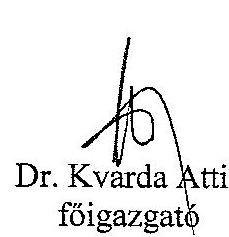

Tisztelettel:

Kertész Márta gazdasági igazgató

---

# 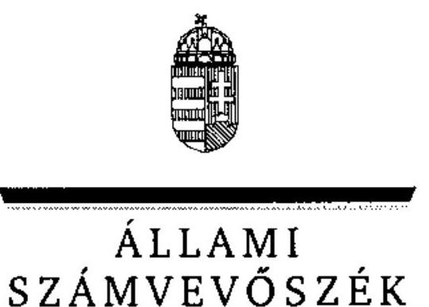 

## 16. sz. melléklet

a V-0020-319/2012-2013. sz. jelentéshez

Ikt.szám: V-0020-315/2012-2013.

## Dr. Kvarda Attila úr

föigazgató
Városi Kórház Keszthely

## Keszthely

## Tisztelt Föigazgató Úr!

A kórházi ellátás müködtetésére fordított pénzeszközök felhasználásának ellenőrzéséről szóló jelentéstervezetre küldött észrevételeit köszönettel megkaptam.

Az Állami Számvevőszék észrevételekre vonatkozó álláspontjáról a felügyeleti vezető által készített részletes tájékoztatást csatoltan megküldöm.

Tájékoztatom Főigazgató Urat, hogy a számvevőszéki jelentés szövegezése az elfogadott észrevételei figyelembevételével készül.

Budapest, 2013. 02. hó 25 nap

Tisztelettel:

## 02266

Domokos László

Melléklet: Tájékoztatás az elfogadott és az el nem fogadott észrevételekről

---

# Tájékoztatás   az elfogadott és az el nem fogadott észrevételekről 

A 2013. január 7 -én kelt észrevételeikkel kapcsolatosan a következő tájékoztatást adjuk.
A jelentéstervezet 29. oldal 2. bekezdéséhez tett észrevétel hibásnak tartja azt a mondatot, hogy „A dologi ráfordítások csökkentésére takarékossági intézkedéseket nem hoztak".

A dologi ráfordítások csökkentésére vonatkozó megállapítást a Kórház által átadott, hitelesített adatszolgáltatás - a 16., 17. és 18. számú tanúsítványok - alapján tettük. A tanúsítványokban feltett kérdésekre - amely a dologi (szakmai anyaggazdálkodással, vásárolt közüzemi szolgáltatásokkal, segédüzemi tevékenységgel kapcsolatban felmerült) költségek csökkentésére tett intézkedésre vonatkozott - valamennyi költségelem tekintetében azt a választ kaptuk, hogy a Kórház nem tett ilyen intézkedést. A Kórház által hitelesített tanúsítványok tartalmának ellenére, tekintettel a költségkeret gazdálkodásra vonatkozó megállapításra, a jelentéstervezet 29. oldal 2. bekezdésének utolsó mondatát a következők szerint módosítjuk:
„A dologi ráforditások csökkentése érdekében keretgazdálkodást folytattak, költségmonitoring tevékenységet végeztek."

A vonatkozó észrevétel további részében jelzett kiegészítő információkat (dologi kiadások csökkenése ellen ható tényezők, átlagos inflációt meghaladó költségelemek) köszönettel vettük. Azok részletes bemutatása a 20 kórház pénzügyi egyensúlyát egyenként értékelő jelentésben - az alkalmazott lényegességi szempont miatt - nem indokolt.

A jelentéstervezet 32. oldal 2. bekezdés első mondatához tett észrevétel kifogásolta azt a mondatrészt, hogy „a gyógyszerfelhasználás költségének csökkentésére intézkedéseket nem hozott".

Az ellenőrzési bizonyítékok értékelése alapján a vonatkozó mondatrészt a következők szerint pontositjuk:
,, a gyógyszerfelhasználás költségének csökkentésére a keretgazdálkodást folyamatosan fenntartotta, dokumentumokkal igazolt további intézkedéseket nem hozott."

Budapest, 2013. OZ, hó 25. nap
Makkai Mária
felügyeleti vezető

---

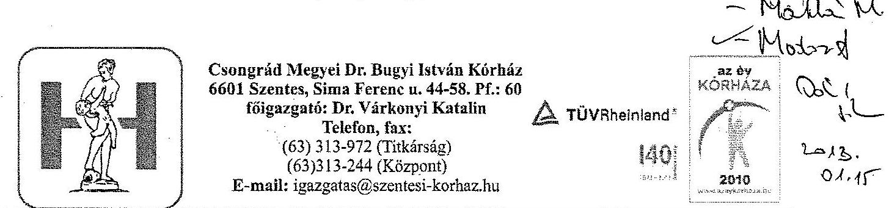

# Ü.i.: 01/5/2 /2013.

**Domokos László**

**Elnök**

**Állami Számvevőszék**

**Budapest**

**Apáczai Csere János u. 10.**

**1052**

Tárgy: Észrevétel jelentés tervezetre

|  ÁLLAMI SZÁMVEVŐSZÉK |   |
| --- | --- |
|  453/ |   |
|  Érkezeti: 2013 JAN 15. |   |
|  Iktatószám: V-0020-304/615. |   |
|  Melléklet: ***_******_******_***_____ |   |

## Tisztelt Elnök Úr!

Hivatkozással a V-0020-294/2012 iktatószámú levelükre intézményünk, a Csongrád Megyei Dr. Bugyi István Kórház vonatkozásában az alábbi észrevételeket tesszük:

A jelentési terv 25-26. oldalán, az ellenőrzésintézkedést igénylő megállapításainál és javaslatainál Intézményünk külön ki van emelve. Az ellenőrzés során megállapították, hogy 2011-ben nem volt biztosított a működési pénzügyi egyensúly, ezért annak helyreállítására és fenntartása érdekében javasolják, intézkedési terv készítését. Intézményünk 2011 őszén készített intézkedési tervet, melyet az akkori fenntartónak, a Csongrád Megyei Önkormányzatnak megküldtünk és mely ellen kifogást nem emeltek. Véleményünk szerint a bizonytalan pénzügyi helyzet nem csak a Kórház gazdálkodása miatt alakult kedvezőtlenül. Intézményünk mindent próbál megtenni annak érdekében, hogy javuljon az egyensúly, viszont a saját működési bevételek növelése és költségek csökkentése nem feltétlenül elegséges, mivel - ahogyan az a jelentésben is megfogalmazásra került - elsősorban az egészségügy alulfinanszírozottsága miatt keletkezik deficit, amely azonban csökkenő tendenciát mutatott a vizsgált időszakban.

1. A jelentés tervezet 2. sz mellékletében szereplő adatok és az megküldött tanúsítványok adatai eltérnek.

|   | Jelentés adata | Tanúsítvány adata  |
| --- | --- | --- |
|  OEP támogatás 2010 | 3 118,1 MFt | 3 299,2 MFt  |
|  OEP támogatás 2011 | 3 558,2 MFt | 3 685,0 MFt  |
|  |   |   |

Az OEP támogatás eltérő adata a 28. oldalon a működési finanszírozást szolgáló bevételek elemzésénél nem 100,8 MFt-os eltérést, hanem 80,3 Mftos csökkenést jelent.

---

1. 2011. évi müködési bevételek növekedését a jelentés tervezettől (28.old.) eltérően nem a saját működési bevételek növekedése, hanem az OEP támogatás emelkedése okozta. A saját működési bevételek 3MFt-tal csökkentek. A 482,1MFt-os növekedést nagy részét a finanszírozás kifizetése jelentette: a teljesítési időhöz képest 3 hónapról 2 hónapra csökkent.

|  év | müködési bevétel |  | saját müködési bevétel |  | fenntartó tám |  | ÁHT-tól kapott bev. |  | OEP finanszírozás |  | EU-tó kapott támogatás |  | ÁHT-on kiv. kapott bev. |  | Ho: kat  |
| --- | --- | --- | --- | --- | --- | --- | --- | --- | --- | --- | --- | --- | --- | --- | --- |
|   | müködési bevétel | eltérés előző évhez | saját mük. bevétei | eltérés előző évhez | fenntartó tám |  |  |  |  |  |  |  |  |  |   |
|  2009 | 3 562,4 |  | 177,6 |  | 154,2 |  | 2,1 |  | 3 218,9 |  | 7 |  | 0 |  | 2,4  |
|  2010 | 3 580,4 | 18,0 | 210,4 | 32,8 | 47,1 | -107,1 | 17,4 | 15,3 | 3 299,2 | 80,3 | 4,6 | -2,4 | 0 | 0 | 1,5  |
|  2011 | 4 001,7 | 421,3 | 202,9 | -7,5 | 85,2 | 38,1 | 3,7 | -13,7 | 3685,1 | 385,9 | 20,5 | 15,9 | 2,5 | 2,5 | 1,7  |

1. Müködési ráfordítások

|   | Jelentés adata | Tanúsítvány adata  |
| --- | --- | --- |
|  Müködési ráfordítások 2010 | 3 841,6 MFt | 3 841,6 MFt  |
|  Müködési ráfordítások 2011 | 4 019,3 MFt | 4 026,8 MFt  |

A jelentés tervezet adatai (29. old) Müködési költségek, ráfordítások eltérnek az aláírt tanúsítványok adataitól: Önök megállapítása: 2011-re 177,7M Ft (4,6%), véleményünk szerint: 185,2MFt-tal, 4,8%-kal növekedtek az előző évhez viszonyítva.

1. Dologi ráfordítások

|   | Jelentés adata | Tanúsítvány adata  |
| --- | --- | --- |
|  Dologi kiadás 2009 | 1 829,7 MFt | 1 878,9 MFt  |
|  Dologi kiadás 2010 | 1 975,4 MFt | 1 487,1 MFt  |
|  Dologi kiadás 2011 | 2 155,2 MFt | 2 004,6 Mft  |

A jelentés tervezet adatai (29. old) - A dologi ráfordítások - eltérnek a fenti adatoknak megfelelően az aláírt tanúsítványok adataitól.

---

# 5. Gyógyszer 

Térítésmentesen kapott gyógyszer aránya az összes gyógyszerkiadáshoz képest 2012. I. félévében az Önök tervezetében (32. old) 17,8M Ft és 11,1\%, az aláírt tanúsítványok adatai szerint $16,7 \%, 26,9 \mathrm{MFt}$.

## 6. Betegélelmezés

A jelentéstervezetben (32. old) tett megállapítás a beteg élelmezési költségről nem valós adatot mutat, amelynek oka az lehet, hogy a kiszámításához használt 18 -as tanúsítvány pénzforgalmi adatokat tartalmaz. A reálérték növekedés helyes megállapításához üzemgazdasági adatok felhasználása szükséges, amelyet az alábbi táblázatban részletezünk.

| Megnevezés | 2009. év | 2010. év | 2011. év | 2012.év I.   félév |
| :-- | --: | --: | --: | --: |
| Teljesített betegélelmezési   napok száma | 111281 | 107708 | 105555 | 53510 |
| Vásárolt betegélelmezés bruttó   (áfa-s) költsége (eFt)   PÉNZFORGALMI | 111560 | 159080 | 179701 | 50179 |
| Vásárolt betegélelmezés bruttó   (áfa-s) költsége (eFt)   ÜZEMGAZDASÁGI | 145627 | 144215 | 145346 | 75349 |
| Betegélelmezés napi költsége   ÜZEMGAZDASÁGI (Ft) | 1309 | 1339 | 1377 | 1408 |

Az üzemgazdasági adatok ismeretében a helyes megállapítás az lenne, hogy a betegélelmezés napi költsége 2009 és 2011 között $1.309 \mathrm{Ft} /$ élelmezési napról $1.377 \mathrm{Ft} /$ élelmezési napra, reálértéken $5,2 \%$-kal nőtt.

Szentes, 2013. január 07.

## 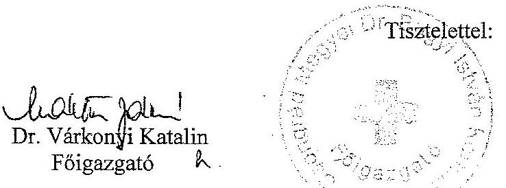

Tedásné Harnóczi Gabriella Gazdasági igazgató helyettes

---

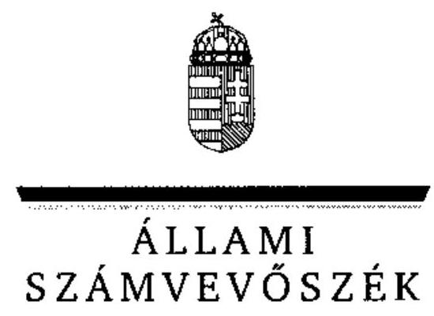

ELNÖK
18. sz. melléklet a V-0020-319/2012-2013. sz. jelentéshez

Ikt.szám: V-0020-313/2012-2013.

# Dr. Várkonyi Katalin úrhölgy   föigazgató 

Csongrád Megyei Dr. Bugyi István Kórház

## Szentes

## Tisztelt Föigazgató Asszony!

A kórházi ellátás müködtetésére fordított pénzeszközök felhasználásának ellenőrzéséről szóló jelentéstervezetre küldött észrevételeit köszönettel megkaptam.

Az Állami Számvevőszék észrevételekre vonatkozó álláspontjáról a felügyeleti vezető által készített részletes tájékoztatást csatoltan megküldöm.

Tájékoztatom Főigazgató Asszonyt, hogy a számvevőszéki jelentés szövegezése az elfogadott észrevételei figyelembevételével készül.

Budapest, 2013. 02 hó 24 nap

Tisztelettel:

## 02   Domokos László

Melléklet: Tájékoztatás az elfogadott és az el nem fogadott észrevételekről

---

# Tájékoztatás   az elfogadott és az el nem fogadott észrevételekről 

A 2013. január 7 -én kelt észrevételeikkel kapcsolatosan a következő tájékoztatást adjuk.
Az általános észrevételükben jelezték, hogy 2011 öszén készült már intézkedési terv, amit az akkori fenntartó is elfogadott, illetve a pénzügyi helyzetet befolyásoló körülményként utaltak az egészségügy alulfinanszírozottságára. A 2011 öszén készült intézkedési terv ellenére - annak végrehajtási tapasztalatait is hasznosítva - indokolt, hogy készüljön egy aktuális intézkedési terv a Kórház pénzügyi egyensúlyi helyzetének javítására, amelyben a Kórház hatáskörében megteendő intézkedéseket indokolt rögzíteni.

A további észrevételeket - a levélben jelzett pontok szerinti sorrendben - a következők szerint kezeljük.

1. Véleményükkel ellentétben összességében nincs eltérés az OEP által folyósított támogatás összegében. A tanúsítványokon közölt OEP támogatás tartalmazta a kapott konszolidációs támogatás összegét. A jelentéstervezet 2 . számú mellékletében külön mutattuk be a feladatellátás mértékének függvényében kapott OEP támogatást és az egyes években egyszeri jelleggel folyósított konszolidációs támogatást. Ezek együttesen megegyeznek a tanúsítványokban szereplő összegekkel.
2. A Kórház szerint a 2011. évi müködési bevételek növekedését a jelentéstervezettől (28. oldal) eltérően nem a saját működési bevételek növekedése, hanem az OEP támogatás emelkedése okozta. A saját működési bevételek 3 M Ft-tal csökkentek. A 482,1 M Ft-os növekedés nagy részét a finanszírozás kifizetése jelentette: a teljesítési időhöz képest 3 hónapról 2 hónapra csökkent.

A jelentéstervezet 28. oldalán a bevételek változását bemutató bekezdés utolsó előtti mondatát a következőkre pontosítjuk:
„A müködési bevételek elözö évhez viszonyitott 2011. évi 421,3 M Ft-os növekedését az OEP támogatás 440,1 M Ft-os és a fenntartói támogatás 38,1 M Ft-os növekedése, valamint a kapott konszolidációs támogatás 54,2 M Ft-os és a saját és egyéb müködési bevételek 2,7 M Ft-os csökkenése együttesen eredményezte."
3. Az észrevétel szerint a jelentéstervezet 29. oldalán szereplő működési költségek, ráfordítások összege eltér az aláirt tanúsítványok adataitól. A tanúsítványon a 2011. évi müködési ráfordítások összege 4026,8 M Ft, amely 7,5 M Ft kölcsöntörlesztés összegét is tartalmazza.

A tanúsítvány kitöltési útmutatója szerint a kölcsönök törlesztése nem része a müködési ráfordításoknak, azt a finanszírozási kiadások között kell bemutatni. A kölcsön törlesztése

---

nélkül a működési ráfordítások összege a jelentéstervezetben rögzített 4019,3 M Ft, a kiadások változását ennek figyelembevételével elemeztük. Az észrevétel alapján a jelentéstervezet módosítása nem indokolt.
4. A Kórház észrevétele szerint a dologi ráfordítások jelentéstervezetben (29. oldal) szereplő éves adatai eltérnek az intézmény által megadott tanúsítvány adataitól.

A Kórház által kitöltött és hitelesített 2. és 3. számú tanúsítványok összhangja nem volt teljes körű. Az összes ráfordítások tanúsítványok közötti egyezősége nem volt biztosított, ebből adódtak az eltérések. A dologi ráfordítások módosítása csak más ráfordítási elemek rovására történhet, ugyanakkor nem kifogásolták a ráfordítások föösszegét és azok további elemeit, ezért a jelzett szövegrészt nem módosítjuk.
5. Kifogásolták, hogy a térítésmentesen kapott gyógyszerek 2012. év I. félévi összege és aránya a jelentéstervezetben (32. oldal) nem azonos a tanúsítványi adattal.

A rendelkezésre álló dokumentumok áttekintését követően a következők szerint pontosítjuk a szövegrészt:
„Az összes gyógyszerkiadáshoz képest a térítésmentesen kapott gyógyszerek aránya a 2009. évben 19,8\% (79,7 M Ft), a 2012. év I. félévében 16,7\% (26,9 M Ft) volt."
6. Észrevételük alapján az Önök által hitelesített 18. számú tanúsítvány adatait nem megfelelően töltötték ki.

A tanúsítvány egyértelműen a valós (üzemgazdasági szemléletű) költségadatokra kérdez rá. A helyszíni ellenőrzés során a tényekről közösen felvett jegyzőkönyv utalt önköltségszámítás szabályozási és adatszolgáltatási hiányosságokra, illetve az élelmezést szolgáltató felé történő megállapodás alapú továbbszámlázások miatti költségcsökkenés föbb elemeire. Ezekre való tekintettel a vonatkozó szövegrészt a következők szerint pontosítjuk:
„A betegélelmezés napi költsége 2009 és 2011 között 1309 Ft/élelmezési napról 1377 Ft/élelmezési napra nőtt."

Budapest, 2013. 02 hó $25_{t}$ nap

Makkai Mária
felügyeleti vezető

---

# 19. sz. melléklet

a V-0020-319/2012-2013. sz. jelentéshez

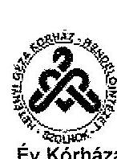

Jász-Nagykun-Szolnok Megyei
Hetényi Géza Kórház-Rendelőintézet
Főigazgató: Dr. Bene Ildikó
5000 Szolnok, Tószegi út 21.
Tel: 56/503-710, Fax: 56/503-722
E-mail: foigazgato@hetenyikorhaz.hu

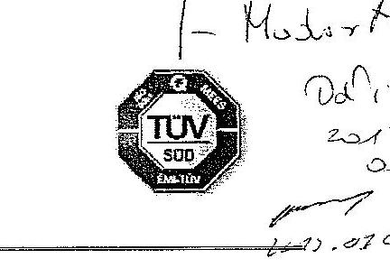

Állami Számvevőszék
Domokos László elnök
részére

Budapest
Apáczai Csere János utca 10.
1052

Tisztelt Elnök Úr!

Iktatószám: 1560-1/2013.
Tárgy: Észrevétel
Hiv.szám: V-0020-294/2012.
Ügyintéző: Agócs Attila

Állami Számvevőszék
Domokos László elnök
részére

Budapest
Apáczai Csere János utca 10.
1052

Tisztelt Elnök Úr!

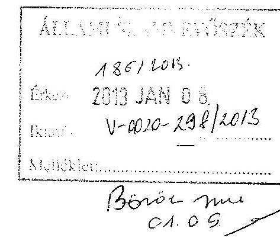

2012. december 20-án kelt, V-0020-294/2012. hivatkozási számú levelében foglaltakra, nagy tisztelettel Intézetünk az alábbi észrevételt kívánja tenni:

A jelentéstervezet a kórházi ellátás működtetésére fordított pénzeszközök felhasználásának ellenőrzéséről objektív tényeket közöl.

Intézményünk esetében is a megállapítások összességében helytállóak. Az alábbiak azonban – véleményünk szerint – ellentmondásban vannak egymással:

A 29. oldal 1. bekezdésében „A dologi ráfordítások csökkentése érdekében a kórház adatszolgáltatása alapján a szakmai anyaggazdálkodás, közüzemi szolgáltatások terén költségcsökkentő intézkedést – a betegelemzés költségeinek 2010. évi csökkentése kivételével – nem tett.”

A 32. oldal 3. bekezdésében „A villamos energia közszolgáltatásoknál a 2010-2011. közötti években 4,4 M Ft (2,8%) költségcsökkentést realizált az eredményes közbeszerzésnek köszönhetően. Az egy ápolási napra vetített villamos energia felhasználás is kedvezőbben alakult: 17,4 kWh/ápolási napra csökkent 2009-ről 2011-re. A közművek közül a vízfelhasználás is csökkent: 0,42 m³/ápolási napról 0,36-ra.

A vásárolt gázenergia 8,01-ről 8,07 m³/ápolási napra növekedése (1%-kal) nem volt számottevő változás.”

Tisztelettel kérjük a jelzett bekezdések közötti ellentmondások feloldását.

Munkájukat megköszönve, tisztelettel

Szolnok, 2013. január 4.

Dr. Bene Ildikó
főigazgató

Agócs Attila
gazdasági igazgató

---

# 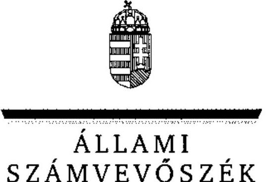 

## 20. sz. melléklet

a V-0020-319/2012-2013. sz. jelentéshez

Ikt.szám: V-0020-317/2012-2013.

## Dr. Bene Ildikó úrhölgy   föigazgató

Jász-Nagykun-Szolnok Megyei Hetényi Géza Kórház-Rendelőintézet

## Szolnok

## Tisztelt Föigazgató Asszony!

A kórházi ellátás múködtetésére fordított pénzeszközök felhasználásának ellenőrzéséről szóló jelentéstervezetre küldött észrevételét köszönettel megkaptam.

Az Állami Számvevőszék észrevételre vonatkozó álláspontjáról a felügyeleti vezető által készített tájékoztatást csatoltan megküldőm.

Tájékoztatom Főigazgató Asszonyt, hogy a számvevőszéki jelentés szövegezése az elfogadott észrevétele figyelembevételével készül.

Budapest, 2013. O2 hó 25 nap

Tisztelettel:

## 02   Domokos László

---

# Tájékoztatás   az elfogadott észrevételről 

A Kórház által kitöltött és hitelesített 17. számú tanúsítvány szerint a Kórház sem a szakmai anyag, sem a közüzemi szolgáltatások csökkentése érdekében nem tett intézkedést. A jelentéstervezet 32. oldalán tett megállapítás szerint a költségcsökkenés az eredményes közbeszerzés miatt jelentkezett, nem pedig a kórház által tett takarékossági intézkedés hatására, ezért nincs ellentmondás.

Az egyértelmű megfogalmazás érdekében a bekezdés utolsó mondatát a következők szerint módosítjuk:
„A dologi ráforditások csökkentése érdekében, a Kórház adatszolgáltatása alapján, a szakmai anyaggazdálkodás és a közüzemi szolgáltatások terén takarékossági intézkedést - a betegélelmezés költségeinek 2010. évi csökkentése kivételével - nem tett."

Budapest, 2013. 02 hó 25 .nap
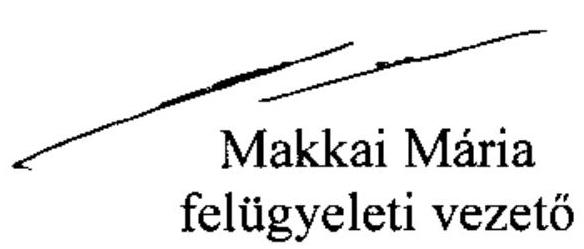

---

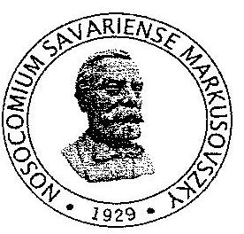

# $1 / 1400-9$ 

12012

## Makkai Mária

felügyeleti vezető
Állami Számvevőszék

## Budapest

Apáczai Csere J.u. 10.
1052

1934/2013
1.11 - 82013
$y-6020-296 / 2013$

## Bórisi m

01.09

Tisztelt Felügyeletvezető Asszony!
A számvevőszéki jelentéstervezet, mely a kórházi ellátás működtetésére fordított pénzeszközök felhasználásának ellenőrzésével kapcsolatban készült, megkaptuk.

Az ellenőrzés megállapításával, céljával egyetértek érdemi észrevételem, mely a vizsgálat adatait módosítaná nincs, csupán néhány esetben szeretnénk pontosítani.
1.1.a. Vas Megyei Markusovszky Kórház Nonprofit Zrt., Szombathely (VMMK) kórházunk gazdasági társaság formában müködik, s tervezéskor számoltunk ugyan a beruházási, felhasználási kiadásokkal is, de külön elkülönítésre előirányzat e jogcímen nincs, illetve az értékcsökkenés mértéke az iránymutató, melyek visszapótlására nem kaptunk fedezetet.
Kötelezettségvállalásainkat a rendelkezésünkre álló szabad pénzkészletet, OEP és egyéb bevétel mértékéig eszközöljük.

A vizsgált időszakban - 2003 - 2011 év - a fizetési határidőn túli szállitói kötelezettségek év végére emelkedést mutatnak ugyan, de ennek rendezése az OEP által biztosított kasszamaradvány és konszolidációs támogatás mértéke mindig fedezetet biztosított, sőt 2011 évben a 420,3 millió Ft-os volumenú konszolidációs támogatásból 298,1 millió Ft-ot vissza is kellett fizetni kórházunknak, mert 2011. december 29-én jogszabály által meghatározott határnap - csupán 122,2 millió Ft összegű lejárt szállítói tartozása volt kórházunknak.
A visszafizetés két részletben megtörtént.

---

b. A szakmai anyag felhasználás növekedés oka elsősorban a többletteljesítésből adódtak. E szakterületen is a kórház egy „keretgazdálkodási" rendszert vezetett be, mely havonta értékelésre kerül. A szakmai osztályok részére kiadott keretek betartása kötelezö, eltérés csak a TVK többletteljesítés miatt keletkezhet, melyet felülvizsgálunk, és szükség szerinti mértékig módosítunk.

Továbbá a fentiekben jelzetteken túl, a kórház aktív osztályai a struktúra átalakítási pályázat zavartalan megvalósítása miatt folyamatosan áthelyezésre kerülnek, s a kialakítással járó többletfeladatok okoznak szakmai anyag igényt, melynek jogosultságát külön-külön bíráljuk el.

Tehát kórházunkban a szakmai anyaggazdálkodásra vonatkozóan is alkalmazunk keretgazdálkodást.
c. Arra a megállapításra, hogy a vásárolt közszolgáltatásokra a kórház nem müködtetett költségmonitoringot és keretrendszert, valamint a segédüzemi tevékenységek költségeinek alakulását nem kísérte folyamatosan figyelemmel, az alábbiakról tájékoztatjuk Önöket: Kórházunk saját monitoring rendszert müködtet, keretgazdálkodást folytat oly módon, hogy a keretfelelősök a havi bevétel $90 \%$-át használhatják fel saját felelősségi körükben, $10 \%$ tartalékba kerül, amit vezetői engedéllyel lehet felhasználni, indokolt esetben.
Az a tény, hogy kórházunk speciálisan a fenti célra fejlesztett szoftvert nem alkalmaz, hanem saját rendszert müködtet, nem teszi megítélésem szerint kifogás tárgyává a jelentés fenti megállapításait.

A fajlagos közmüfelhasználások számítási és összehasonlítási metódusát nem ismerjük. Nem tudjuk, mihez viszonyítva nőtt több tíz százalékkal a fajlagos közmüfelhasználásunk. Tényleges ápolási napjaikra vetítve a közmüfelhasználásunkat - a földgáz kivételével mindenütt csökkenés figyelhető meg a 2009-2011. közötti időszakban, mind a felhasználási volumen, mind a ráfordítások vonatkozásában. A földgázfelhasználásunk nagyságrendje viszont alig haladja meg az évi 20 millió forintot.
d. A mosásnál jelzett, reálértéken $2 \%$-os drágulás annak tudható be, hogy a 2009. év adatai fél évig $20 \%$ ÁFA-t tartalmaznak, mivel július 1-től emelkedett $25 \%$-ra az ÁFA. Ezzel a 2009. év ráfordítása kevesebb lett a kisebb ÁFA-tartalom miatt.
2011. február 15 -től új közbeszerzési eljárás alapján, új szerződés szerint vesszük igénybe a szolgáltatást. A 2011-ben tapasztalható ráfordítás-emelkedésnek az oka, hogy korábban saját mosodát müködtettünk 138,- Ft-os fajlagos költséggel, de a mosodai gépek, épületek oly mértékben voltak leamortizálódva, hogy a felújítás közel 800-1000 millió Ftos volumenủ kifizetést jelentett volna, ezért döntöttünk a szolgáltatás vásárlásáról. Összességében ezen döntése a kórháznak pozitív eredményt hozott.
e. Élelmezés vonatkozásában 2009. év adataiban fél évig $20 \%$, fél évig $25 \%$ ÁFA tartalommal jelentek meg, ami az összehasonlítást torzítja. Ha azonos ÁFA mértékre

---

korrigáljuk a számítást, a kórházi (2011-es) napidíj mértéke alatta marad az inflációval korrigált értékének.
Az emelkedés mértéke sem a szakági, sem a fogyasztói árindexekkel számolva nem magasabb az indexált összegeknél, ugyanis szerződésünkben csupán inflációkövetést az előző évi szakmai ágazati infláció $80 \%$-os mértékéig fogadunk el.

A kórház eddig is és ezután is mindent megtesz azért, hogy a betegellátás maximális biztosítása mellett optimalizálni tudja a költséggazdálkodást, a létszám - és bérgazdálkodást, s a szintentartást ezek folyamatos ellenőrzéseivel, kontrolling szakmai és keretgazdálkodás betartásával tudjuk megvalósítani.
Ezen intézkedéseink következményeinek tudható be, hogy kórházunk likviditási helyzetét fenntartva, biztosítja a működtetést, fejlesztési, beruházási lehetőségeivel emeli a szakmai színvonalat, s nem utolsó sorban a rendkívül feszített létszám- és bérgazdálkodás lehetővé teszi a kórház egész kollektívája számára bizonyos érdekeltségi és cafetéria juttatás biztosítását.

Tisztelettel kérem, hogy amennyiben lehetőség van rá, ezen észrevételeket a jelentésben elfogadni szíveskedjék, ugyanis azon kevés kórházak közé tartozunk, akik szufficittel zárják gazdálkodási évüket - pénzforgalmi szemléletben - s e mögött rendkívül sok munka, erőfeszítés húzódik meg.

Szombathely, 2013. január 4.

Tisztelettel:
(2) $1+1$
Prof. Dr. Nagy Nagy Lajos PhD
vezérigazgató föorvos
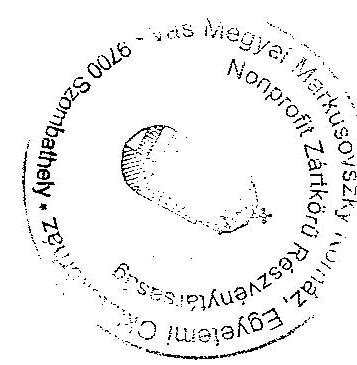

---

# 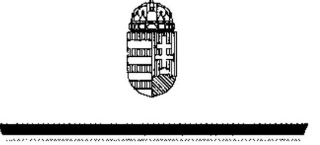 

## ÉLNÖK

ÁLLAMI
SZÁMVEVÔSZÉK
22. sz. melléklet
a V-0020-319/2012-2013. sz. jelentéshez

Ikt.szám: V-0020-314/2012-2013.

## Prof. Dr. Nagy Lajos PhD úr

vezérigazgató föorvos
Vas Megyei Markusovszky Kórház, Egyetemi Oktatókórház Nonprofit ZRt.

## Szombathely

## Tisztelt Vezérigazgató Úr!

A kórházi ellátás múködtetésére fordított pénzeszközök felhasználásának ellenőrzéséről szóló jelentéstervezetre küldött észrevételeit köszönettel megkaptam.

Az Állami Számvevőszék észrevételekre vonatkozó álláspontjáról a felügyeleti vezető által készített részletes tájékoztatást csatoltan megküldöm.

Tájékoztatom Vezérigazgató Urat, hogy a számvevőszéki jelentés szövegezése az elfogadott észrevételei figyelembevételével készül.

Budapest, 2013. 02 hó 25 nap

Tisztelettel:

## 0202   Domokos László

Melléklet: Tájékoztatás az elfogadott és az el nem fogadott észrevételekröl

---

# Tájékoztatás   az elfogadott és az el nem fogadott észrevételekről 

Az öt pontban tagolt pontositó észrevételeket a következők szerint kezeljük.
a) A felhalmozási kiadásokkal, a fizetési határidőn túli szállitói kötelezettségekkel és a konszolidációs támogatással kapcsolatos kiegészítő információk részletes bemutatása a 20 kórház pénzügyi egyensúlyát egyenként értékelő jelentésben - az általánosan alkalmazott lényegességi szempontú megközelítés miatt - nem indokolt.
b) Észrevételükben a szakmai anyagok felhasználásánál is alkalmazott keretgazdálkodás egyes elemeit részletezik. Ez a jelentéstervezet módosítását nem indokolja, mivel a 32. oldal 2. bekezdése hasonló megállapítást tesz.
c) A Kórház által kitöltött és hitelesített 17. és 18. számú tanúsítványokban közölt nemleges válaszok és a helyszíni ellenőrzéskor a tényekről közösen felvett jegyzőkönyv a bizonyítékai annak a megállapításnak, hogy nem kiterjesztett a keretgazdálkodás sem a közmüvekre, sem a segédüzemi szolgáltatásokra.

A korábbi állításukkal ellentétes észrevétel miatt az ellenőrzési bizonyítékokat újra áttekintettük. A közösen felvett jegyzőkönyv tartalmazza, hogy a közmüvek esetében a fogyasztásokat rögzítették, a változások okait vizsgálták, illetve a vásárolt segédüzemi szolgáltatások adatait elemezték. Mindezek alapján a vonatkozó megállapításokat a következőkre módositjuk:
„A vásárolt közszolgáltatások költségeit folyamatosan figyelemmel kisérték", illetve „A VMMK a segédüzemi tevékenységek költségeinek alakulását figyelemmel kísérte."

A Kórház észrevételében jelezte, hogy számára nem ismert a fajlagos közmüfelhasználások számítási és összehasonlítási metódusa. A jelentéstervezet a 32. oldal 3. bekezdésében az "egy ápolási napra vetített (fajlagos)" meghatározással utal a számítási módra, és az elemző megállapítások megfogalmazásából egyértelműen kiderül, hogy a Kórház saját adataihoz mért változásokat értékeltük. Az észrevételben hivatkozott tendenciák miatt ismételten elvégeztük a fajlagos közmüfelhasználások számításait. A vonatkozó megállapításokat a következők szerint pontosítjuk:
„A villamos energia és a gázenergia vásárlásoknál a 2010-2011. években közbeszerzés lebonyolításával költségcsökkentési intézkedést hoztak, amelyből a 2010-2012 I. félév időszakában 97,5 M Ft megtakarítása keletkezett, javitva ezzel a VMMK pénzügyi helyzetét. Az egy ápolási napra vetített (fajlagos) villamos energia 6\%-kal, a vásárolt távhő-melegvíz 4\%-kal, illetve a vizfelhasználás 5\%-kal csökkent 2009-ről 2011-re. A gázenergia felhasználása $10 \%$-kal nőtt meg."

---

d) A mosodai feladatok ellátásával kapcsolatos észrevételben szereplő kiegészítő információkat köszönettel vettük, azok számvevőszéki jelentésben történő bemutatása nem indokolt. A jelentéstervezetben az ezzel kapcsolatos elemzés reálértéken történt, ami az ÁFA és egyéb árváltozásokat is tartalmazza.
e) Az észrevétel alapján az élelmezés elemzését újra elvégeztük. A 32. oldal 4. bekezdése utolsó mondatában a fajlagos napi összegek változatlanul hagyása mellett javítjuk a változás megítélését. Az " $5 \%$-kal az infláció alatti volt" szövegrészt alkalmazzuk, mert a változás nem haladta meg a három év együttes inflációját. Az élelmezés fajlagos költségeinek értékelése reálértéken történt.

Budapest, 2013. 02. hó 25. nap

Makkai Mária
felügyeleti vezető

---

# Jávorszky Ödön Kórház 

Gazdasági Igazgatóság
2600 Vác, Argenti Döme Tér 1 - 3, 2013. 17.17
Telefon: 27 / 620-620 Fax: 27 / 314-693

## Állami Számvevőszék Budapest

Apáczai Csere János utca 10 1052.

Domokos László
Elnök Úr részére

Tisztelt Elnök Úr !

Az Állami Számvevőszék munkatársainak a 2012. évben Intézetünknél folytatott ellenőrzésćnek során tett összegző megállapításaival kapcsolatosan az alábbi észrevételeket teszem:

Nagyon fontos megállapítások, következtctések kerültek rögzítésre, melynek bemutatása hozzásegitheti az egészségügyi ágazatot a finanszírozás változásához is.
Ezen megállapítások pld.:

- Az Intézetek fö bevételi forrása az OEP finanszírozás, mely a vizsgált egységek közül - 20 kórház - 17 kórházban nem nyújt fedezetet a müködési kiadásokra.
- Az amortizáció visszapótlásának hiánya és következményei az elavult géppark, a gazdaságtalan müködtetés
- Az üzemgazdasági szemléletü könyvelés hiánya
-: A gazdasági események számbavételéhez eltérő könyvelési módozatot és informatikai rendszert alkalmaznak, s. az Intézeteknek nem kötelezö önköltség számitási szabályzatot készíteniük sem.

Intézetünk müködtetésével kapcsolatos konkrét megállapításokra tett észrevételeink:
A 2009-2011. évekre a müködési bevételek és ráfordítások alakulásának vizsgálatánál valószínủ, hogy a tanúsítvány elkészítésénél kollégáink nem közölték azt a tényt, hogy a személyi jellegủ ráfordítások csökkenése az idöközben végrehajtott ágyszám csökkenésböl eredő létszám csökkenésböl, valamint a több szakterületen megnövekedett vállalkozási formában történő feladatellátásnak a következménye.
A dologi kiadásokra fordított összeg növekedése ennek figyelembe vételével sajnos nem azt jelentette, hogy a szakmai és egyéb dologi kiadásokra fordítható összeg növekedett volna. Az intézet az Önkormányzati jóváhagyásával és közremüködésével 2006.06.25-2009.05.15 közötti időszakban 552.063.964.- Ft összegủ deviza alapú hitelt vett fel a CIB Banktól orvosi gépmúszer beszerzés érdekében.

---

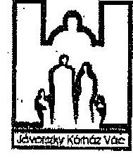

# Jávorszky Ödön Kórház 

Gazdasági Igazgatóság 2600 Vác, Argenti Döme Tór 1-3. Telefon: 27 / 620-620 Fax: 27 / 314-693

A hitel felvételekor nem készítettek gazdaságossági számításokat annak érdekében, hogy a beruházással el lehet -e émi olyan bevétel növekedést mely fedezetet biztosítana beruházás fizetendő részleteinek a költségeire.

A gazdasági számítás hiányosságain és a hitelszerződésből eredő kamatfizetési kötelezettségen felül a deviza alapú hitelek árfolyam kockázatból eredő fizetési kötelezettség is terhelte az intézmény forrásait.
A fedezetlen kötelezettségvállalás 2006-tól 2016-ig terheli le folyamatosan a bevételt, s ellehetetleníti az intézet gazdaságos müködését.

A beruházási költségek fizetése s az időközben kedvezőtlen feltételekkel megkötött szolgáltatási szerződések hatására az intézményben súlyos likviditási problémák léptek fel. A szállítói magatartás révén ezek már veszélyeztették az intézmény folyamatos müködését (kamat kiterhelések, szállítások leállítása, peresítések) ezért a „müködés biztosítása érdekében" a korábbi fenntartó engedélyével és kezességvállalása mellett 2008-ban Faktorálási megállapodás jött létre az intézmény és az MKB Bank között (Sodexo, Pharmadose Kft., TEVA szállítói kötelezettségek tekintetében), melynek állománya 2011. év végén 1.134.593.362.- Ft. A faktorálás a kötelezettségállományt nem csökkentette, a kamat megfizetésével tovább terhelte az intézmény költségvetését.

A 2010. január hónaptól kirendelt önkormányzati biztos úgy próbált „segiteni" a fizetésképtelenségen, hogy átütemezte, elodázta a részletfizetési kötelezettséget. Tulajdonképpen a tulajdonosi helytállás helyett, egy újabb időre vállaltatott fedezetlen kötelezettséget.

Az ellenőrzés és adatszolgáltatás során jelezték az adatszolgáltatást nyújtó kollégáink, hogy üzemgazdasági adatokat intézményünk nem tud szolgáltatni tekintettel arra, hogy intézményünk - mint a költségvetés szabályai szerint gazdálkodó szervezet- pénzforgalmi szemléletű könyvelés vezetésćrc kötelezett, ezért ilyen nyilvántartással, üzemgazdasági költségnyilvántartással nem rendelkezett.

Az üzemgazdasági adatokat kérő táblázatokban pénzforgalmi adatok kerültek rögzítésre, s amennyiben a több i intézmény üzemgazdasági szemléletben adott meg, a kérésüknek megfelelően adatokat, akkor a mi intézetünk adataival történő összehasonlítás nem valós következtetésre adhat alapot.

---

# Jávorszky Ödön Kórház 

## Gazdasági Igazgatóság

2600 Vác, Argenti Dôme Tér 1-3. Telefon: 27 / 620-620 Fax: 27 / 314-693

A vizsgálati jegyzőkönyv ezen anomáliák ellenére nagyon sok fontos problémára és elvégzendő feladatra világított rá, melyek segítségünkre lesznek azon törekvéseinkben, hogy a jogszabályoknak megfelelő számviteli rendet tudjuk kialakítani.
2013.január 11.

Tisztelettel
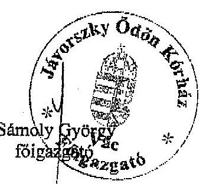

---

# Sámoly György úr   föigazgató   Jávorszky Ödön Kórház 

Vác

## Tisztelt Föigazgató Úr

A kórházi ellátás müködtetésére fordított pénzeszközök felhasználásának ellenőrzéséről szóló jelentéstervezetre küldött észrevételeket köszönettel megkaptam.

Az Állami Számvevőszék észrevételekre vonatkozó álláspontjáról a felügyeleti vezető által készített részletes tájékoztatást csatoltan megküldöm.

Tájékoztatom Főigazgató Urat, hogy a számvevőszéki jelentés szövegezése az elfogadott észrevételei figyelembevételével készül.

Budapest, 2013. 02 hó 25 nap

Tisztelettel:

## 02222 Domokos László

---

# Tájékoztatás   az elfogadott és az el nem fogadott észrevételekről 

A 2013. január 11-én kelt levélben a Kórház által fontosnak tartott és a jelentéstervezetben szereplő megállapításaink, következtetéseink kiemelését köszönettel vettük. A Kórházra vonatkozó további kiegészítő információkat tartalmazó észrevételeket - a levélben jelzett sorrendet követve - a következők szerint kezeljük:

1. Észrevételükben a személyi és dologi ráfordítások alakulását befolyásoló kiegészítő információkat adnak. A személyi jellegű ráfordítások csökkenését az időközben végrehajtott ágyszám csökkenésből eredő létszámcsökkenéssel indokolják, valamint jelzik a több szakterületen megnövekedett vállalkozási formában történő feladatellátást.
A jelentéstervezetben tett megállapításokat a Kórház által kitöltött tanúsítványok adatai és a helyszíni ellenőrzés során közösen felvett jegyzőkönyvben foglalt információk (tények, elemzések és kiegészítő észrevételek) alapján készítettük. Megállapításainkat ezek a dokumentációk alátámasztják, az új információk a Kórház pénzügyi helyzete megítélését öszszességében nem befolyásolják, ezért azok beépítése a jelentéstervezetbe nem indokolt.
2. A Kórház a levelében bemutatta a 2006-ban indított és deviza alapú kötelezettségvállalással megvalósult gépműszer beszerzése körülményeit, valamint jelzi ennek 2016-ig tartó kedvezőtlen hatásait.
A jelentéstervezet 30. oldal első bekezdésének 3-5. és az utolsó mondata tartalmaz minden olyan információt (a kötelezettségből fennálló tartozás összegét, az igénybevétel és a lejáratának időpontját, az árfolyamváltozás miatti veszteséget, az ennek fedezetét szolgáló fenntartói támogatást), amely az észrevételben megfogalmazottakkal az ellenőrzött időszak pénzügyi helyzetének megítélése szempontjából lényeges. Ugyanakkor a megállapításainkat kiegészítjük az árfolyamváltozásból eredő kockázat kiemelésével, a következők szerint:
„A devizaalapú kötelezettség árfolyamkockázata 2016-ig veszélyezteti a Kórház gazdaságos müködését."
3. A Kórház észrevétele a szállítói kötelezettségek változásával és egyes szállítói kötelezettségek 2008. évi faktorálásával kapcsolatos információkat közül. A faktorálás a kötelezettségállományt nem csökkentette, a kamat megfizetése tovább terhelte a Kórház költségvetését.
Ellenőrzésünk a 2009-2012. év I. félévében történt eseményeket, illetve ezen időszakban fennálló kötelezettségeket elemezte. Megállapításainkat a tanúsítványokon közölt, ezen időszakra vonatkozó kötelezettségállomány és a közösen felvett jegyzőkönyvben foglalt információk alapján tettük. A jelentéstervezetben tett megállapítások kiegészítése nem indokolt.

---

4. Az önkormányzati biztos kirendelésével kapcsolatos észrevétel szerint a 2010. január hónaptól kirendelt önkormányzati biztos „átütemezte, elodázta a részletfizetési kötelezettséget, tulajdonképpen a tulajdonosi helytállás helyett egy újabb időre vállaltatott fedezetlen kötelezettséget."

A helyszíni ellenőrzést az ellenőrzési programban meghatározott célok figyelembevételével végeztük, amely szerint nem volt ellenőrzési feladat az önkormányzati biztos tevékenységének minősítése. Lényeges kérdésnek azt tekintettük, hogy a Kórház pénzügyi helyzete miatt rendelt-e ki önkormányzati biztost a fenntartó önkormányzat. Az önkormányzati biztos által kezdeményezett átütemezésre utaltunk a jelentéstervezet 31. oldalán. A jelentéstervezet pontosítása nem indokolt, mivel észrevételük nem ellentétes a jelentéstervezetben megfogalmazottakkal.
5. Észrevételükben jelezték, hogy a Kórház nem tudott üzemgazdasági szemléletű adatokat szolgáltatni, mivel a költségvetés szabályai szerint gazdálkodó szervezet pénzforgalmi szemléletű könyvelésre kötelezett, üzemgazdasági költségnyilvántartással nem rendelkezett.

Az ellenőrzött kórházak többsége költségvetési szervként működött az ellenőrzött időszak egy részében, vagy egészében. A tanúsítványokhoz készített kitöltési útmutató segítségével a kórházak pénzforgalmi adatai - az analitikus nyilvántartásban rendelkezésre álló adatok felhasználásával, a szükséges korrekciók végrehajtásával - üzemgazdasági szemléletűvé alakíthatóak voltak. Az ellenőrzés dokumentumai azt mutatták, hogy a Kórház is tett e körbe tartozó lépéseket. Minden ellenőrzött kórház pénzügyi helyzetét a jelentéstervezetben is bemutatott „eredményszemléletű CLF" módszerrel elemeztük. A korrekciók után az adatok összességében az elemzéshez megfelelő alapot szolgáltattak.

Budapest, 2013. 02. hó 25 . nap
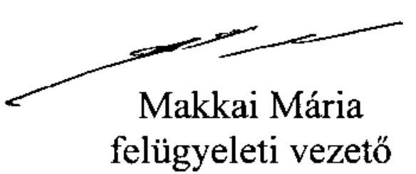

---

# Szent Kozma és Damján Rehabilitációs Szakkórház 

2026 Visegrád, Gizella-telep
Föigazgató: dr. Huszár Sándor
Tel.: 26/801-700
Fax: 26/801-701
Igazgatóság: 26/801-777
e-mail: titkarsag@visegradikorhaz.hu

Iktatószám: 15/3/2013.
Úgyintéző:
Hivatkozási szám:
Tárgy: ÁSZ jelentéstervezet
észrevételezése

Állami Számvevőszék

## Domokos László

Elnök

Budapest

Tisztelt Elnök Úr!
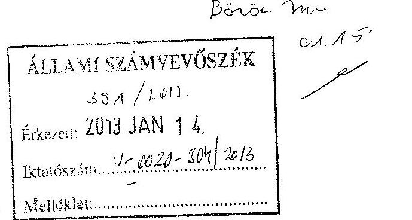

Szakkórházunk 2012. december 27-én vette kézhez a kórházi ellátás működtetésére fordított pénzeszközök felhasználásának ellenőrzéséről készített számvevőszéki jelentéstervezetet.

Megköszönve az ellenőrzésükben részt vevő kollégáik segítő hozzáállását és iránymutatását, az intézetüket érintő részletes megállapítások vonatkozásában az alábbi pontosításokat, illetve szükségszerű kiegészítéseket tesszük:

- A jelentéstervezet a CLF módszer elemzési eszközeit alkalmazva szakmailag korrekt megállapításokat tartalmaz, ugyanakkor figyelmen kívül hagyja azt a tényt, hogy szakkórházunk a vizsgált időszakban nagymértékủ, 2010-ben $79 \mathrm{~m} \mathrm{Ft}, 2011$-ben 68 m Ft, 2012-ben 85 m Ft szabad pénzmaradvánnyal, tartalékkal rendelkezett, amely lehetővé tette, hogy ,,a működési ráfordítások növekedési üteme - a bevételnövelő és költségmegtakarító intézkedések, valamint a keretgazdálkodás ellenére - meghaladta a működési bevételek növekedési ütemét". (147. oldal 2. bek.)
- A megállapításhoz (148. oldal 3. bek.) - miszerint a konszolidációs támogatás „felhasználásához intézkedési tervet nem készített"-ünk, jeleznénk, hogy intézkedési terv készítési kötelezettségünk nem volt, mivel nem rendelkeztünk lejárt határidejű szállítói állománnyal.
- „A dologi ráfordítások ..... az inflációt meghaladó mértékben növekedtek". Ennek oka az, hogy pénzeszközeink, tartalékaink felhasználásával komfortjavító intézkedéseket hoztunk, melyek eredményeként régóta elhúzódó egészségügyi készletbeszerzéseket foganatosítottunk.
- „Az SZKDRSZ likviditási helyzete 2009-2011 között ..... romlott". (151. oldal 1. bek.) A likviditási ráta 2009-ben 6,16, 2011-ben 6,7 volt.
- Pénzeszközök vonatkozásában pontosítást igényel (148. oldal lap alján 75. sz. lábjegyzet): 2011. december 31-i pénzeszköz állományunk 87,1 m Ft, 2009-hez (80,5 m Ft) képest emelkedett.
A lábjegyzetben jelzett $6,5 \mathrm{~m} \mathrm{Ft}$ pénzeszköz kizárólag az intézményi lakásépítési alap számla és a házipénztár egyenlege. A szakkórház állami tulajdonba vétele miatt az

---

elszámolási betétszámla a könyvviteli mérlegünkben az aktív pénzügyi elszámolások között szerepel ( $80,6 \mathrm{~m} \mathrm{Ft}$ ). Az elszámolási betétszámla, a házipénztár és a lakásépítési alap számla együttes egyenlege $87,1 \mathrm{~m} \mathrm{Ft}$, amely a 2011. évi záró pénzkészletünk.

- Kötelezettségek vonatkozásában:

A $87,1 \mathrm{~m}$ Ft-os pénzkészletet $21,5 \mathrm{~m}$ Ft kötelezettség terhelte, melyből $18,3 \mathrm{~m}$ Ft nem lejárt határidejủ szállítói állomány $3,2 \mathrm{~m}$ Ft egyéb rövid lejáratú kötelezettség, azaz a rendelkezésünkre álló eszközök többszörösen fedezetet nyújtottak a rövid lejáratú kötelezettségeink teljesítésére.

- A vásárolt közszolgáltatások tekintetében: (152. oldal 4. bek.)

Az egy ápolási napra eső villamos energia, földgáz és víz felhasználási adatok helyesen - a tanúsítványok adatai alapján - a következők:
Villamos energia:
2009. $4,71 \mathrm{kWh} /$ áp. nap
2011. $5,65 \mathrm{kWh} /$ áp.nap
növekedés \%-a: $\quad 20$
Gáz:
2009. $2,35 \mathrm{~m}^{3} /$ áp.nap
2011. $2,86 \mathrm{~m}^{3} /$ áp.nap
növekedés \%-a: $\quad 21,7$
Víz:
2009. $0,4 \mathrm{~m}^{3} /$ áp.nap
2011. $0,56 \mathrm{~m}^{3} /$ áp.nap
növekedés \%-a: $\quad 1,4$
Értve a CLF módszer lényegét, mely a müködési jövedelem alakulását helyezi az elemzés, ellenőrzés fókuszába, a javaslatnak megfelelően a bevételek növelésére és a költségek csökkentésére intézkedési tervet készítünk, ugyanakkor úgy ítéljük meg, hogy szakkórházunk pénzügyi egyensúlya a vizsgált időszakban és 2012 év folyamán is biztosított volt.

Visegrád, 2013. január 7.
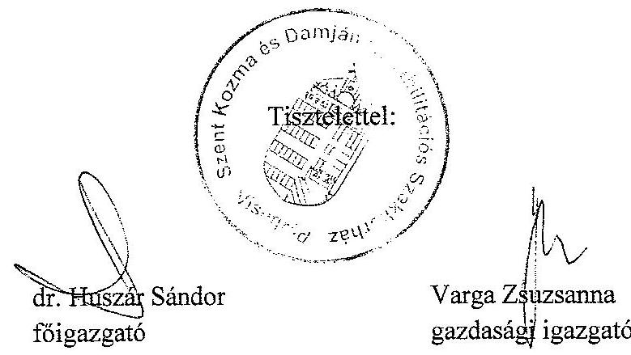

---

# 26. sz. melléklet   a V-0020-319/2012-2013. sz. jelentéshez 

Ikt.szám: V-0020-311/2012-2013.

## Dr. Huszár Sándor úr

föigazgató
Szent Kozma és Damján Rehabilitációs Szakkórház

## Visegrád

## Tisztelt Föigazgató Úr

A kórházi ellátás müködtetésére fordított pénzeszközök felhasználásának ellenőrzéséről szóló jelentéstervezetre küldött észrevételeket köszönettel megkaptam.

Az Állami Számvevőszék észrevételekre vonatkozó álláspontjáról a felügyeleti vezető által készített részletes tájékoztatást csatoltan megküldöm.

Tájékoztatom Főigazgató Urat, hogy a számvevőszéki jelentés szövegezése az elfogadott észrevételei figyelembevételével készül.

Budapest, 2013. O2 hó 25 nap

Tisztelettel:

## 02, 666

Domokos László

---

# Tájékoztatás   az elfogadott és az el nem fogadott észrevételekről 

A 2013. január 7 -én kelt levelük 1., 4., 5. és 6. francia bekezdéseiben tett észrevételek a pénzmaradvánnyal, a pénzkészlettel, a kötelezettségekkel és a likviditással összefüggésben közölnek információkat.

A Kórház müködési jövedelmét, felhalmozási tevékenységének egyenlegét eredményszemléletben, CLF módszerrel elemeztük. Ez alapján a 2010-2011. években a ráfordítások meghaladták a bevételeket, ami azt jelenti, hogy a pénzügyi egyensúly nem állt fenn. Megállapításainkat a rendelkezésünkre álló bizonyítékok - a Kórház által szolgáltatott hitelesített adatok - alapján tettük. Föigazgatói aláírással hitelesített teljességi nyilatkozat igazolja, hogy a rendelkezésre bocsátott dokumentumok a Kórház gazdálkodásáról megbízható, valós és teljes körű információt tartalmaznak. A Kórház által hitelesített 2. számú tanúsítványban a felhalmozási költségvetésben minden évben szerepelt előző évi pénzmaradvány átvétel. A Pénzeszközök év végi állománya (idegen pénzeszközök nélkül) a tanúsítvány és a helyszíni ellenőrzés során közösen felvett jegyzőkönyv 6. oldal első táblázata szerint 2009-ben $80,5 \mathrm{MFt}, 2010$-ben $98,0 \mathrm{MFt}$, 2011-ben 6,5 M Ft volt. Eredményszemléletben nem értelmezhető az aktív pénzügyi elszámolás. A készpénz likviditási mutatónál az azonnal, szabadon felhasználható, „pántlikázatlan" pénz lehet a számítás alapja. A jelentéstervezetben foglalt megállapítások a rendelkezésre álló ellenőrzési bizonyítékokkal alátámasztottak, azok módosítása nem indokolt.

A levelük 2. francia bekezdésében megfogalmazott észrevétel a konszolidációs támogatásokhoz kapcsolódva jelzi, hogy nem volt intézkedési terv készítési kötelezettségük.

A jelentéstervezet nem tartalmazza azt, hogy a kórháznak intézkedési terv kötelezettsége volt, tényként az szerepel a jelentéstervezetben, hogy nem készített a Kórház intézkedési tervet. A félreértés elkerülése érdekében a vonatkozó mondatot a következőre pontosítjuk:
„Az SZKDRSZ a 2010. és a 2011. években konszolidációs támogatásban részesült."
A levelük 3. francia bekezdése a dologi ráfordítások inflációt meghaladó mértékủ növekedését indokolja, a régóta elhúzódó egészségügyi készletbeszerzések megvalósítására utalással.

A dologi kiadások emelkedése a rendelkezésre álló adatok alapján az egészségügyi készletbeszerzések növekedésével önmagában nem magyarázható (a 15. számú tanúsítványon a gyógyszerbeszerzés értéke alig emelkedett, a szakmai készletvásárlás étéke a 16. számú tanúsítvány alapján csökkent), ezért a jelentéstervezetben foglalt megállapítások kiegészítése nem indokolt.

---

A levelük 6. francia bekezdésben megfogalmazott észrevétel a közműfelhasználás fajlagos adatainak eltérését jelzi. Ismételten elvégeztük a fajlagos közműfelhasználások számításait, és a vonatkozó megállapításokat a következők szerint pontosítjuk:
„Az SZKDRSZ - a pénzügyi egyensúlyának javítása érdekében - a 2009-2012. I. félévben a vásárolt közszolgáltatások alakulását figyelemmel kísérte, költségmonitoringot, keretrendszert müködtetett. Ennek ellenére kedvezőtlen volt, hogy 2009-ről 2011-re az egy ápolási napra eső (fajlagos) felhasználás a villamos energiánál 22\%-kal (4,68 kWh/ápolási napról 5,73-ra), a földgáznál 21\%-kal (2,36 m3/ápolási napról 2,86-ra), illetve a viznél 10\%-kal ( $0,51 \mathrm{~m} 3 /$ ápolási napról 0,56 -ra) emelkedett. A növekedésben egyaránt szerepet játszott a fogyasztások növekedése és az ápolási napok számának csökkenése."

Budapest, 2013. 02 hó 25 . nap
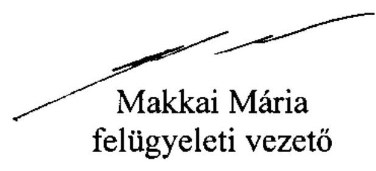

---

# SZENT IMRE KÓRHÁZ

a V-0020-319/2012-2013. sz. jelentéshez

A Pécsi Tudományegyetem Általános Orvostudományi Kar Oktatókórháza

FŐIGAZGATÓSÁG
Prof. Dr. Bedros J. Róbert Ph.D.
fölgazgató főorvos, főtanácsos

e-mail: tikkarag@szentiorekorbaz.hu
1115 Budapest, Tőtényi út 12-16.50, 1502. Budapest, Pf. 4. - 361-464-8702 - Fax: +361-203-3652

240/2012/C/C

Állami Számvevőszék

Domokos László
elnök

Budapest
Apáczai Csere János u. 10.
1052

ÁLLAMI SZÁMVEVŐSZÉK

517/2013
Érkezett: 2013 JAN 1 ű.
Iktatószám: V-0020-300/2012
Melléklet:

Tisztelt Elnök Úr!

Hivatkozással a V-0020-294/2012. számú átiratára tájékoztatom, hogy a kórházi ellátás működtetésére fordított pénzeszközök felhasználásának ellenőrzéséről készített számvevőszéki jelentéstervezetet átnéztem, az abban foglaltakkal kapcsolatban észrevételt nem teszek.

Budapest, 2013. január „44”.

Tisztelettel:

Prof. Dr. Bedros J. Róbert Ph.D.

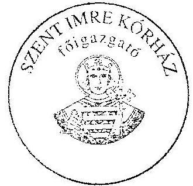

---

# Szent Pantaleon Kórház-Rendelőintézet Dunaújváros

## Gazdasági Igazgatóság

### Gazdasági Igazgató: Posch Ferencné

**Állami Számvevőszék**

**Domokos László**

**elnök**

**1052 Budapest**

Apáczai Csere János u. 10.

**Tisztelt Elnök Úr!**

„A Kórházi ellátás működtetésére fordított pénzeszközök felhasználásnak ellenőrzése" tárgyú, V-0020-294/2012-es iktatószámmal megküldött jelentéstervezetet köszönettel megkaptam.

Az adott szakterületekkel együtt áttekintettük. Intézményünk a jelentéstervezetre nem tesz észrevételt.

**Tisztelettel**

- Posch Ferencné
- gazdasági igazgató

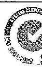

28. sz. melléklet
a V-0020-319/2012-2013. sz. jelentéshez
2400 Dunaújváros, Korányi S. u. 4-6.
Tel.: (25) 550-200
Fax: (25) 413-051
E-mail: gazdiag@pantaleon.hu

**Dátum:** 2013. január 10.
**Iktatószám:** 7/2013.

**Ögyintéző:**

**ÁLLAMI SZÁMVEVŐSZÉK**

4531

**Érkezés:** 2013 JAN 15.

**Iktatószám:** V-0020-319/2012

**Melléklet:**

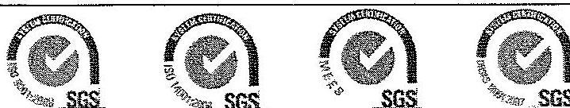

---

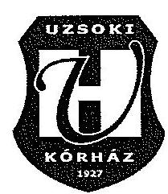

# UZSOKI UTCAI KÓRIIÁZ

1145 Budapest, Uzsoki utca 29-41

DR. FICZERE ANDREA
Főigazgató

E-mail: foigazgatósag@uzsoki.hu

Telefon: 251-73-33/2100 m., 467-3744, Telefax: 251-40-69 V-0020-294/2012

---

# Állami Számvevőszék

Domokos László
Számvevőszék Elnöke
részére

Budapest
Apáczai Csere János utca 10.
1052

---

# Tisztelt Elnök Úr!

Köszönettel megkaptuk a kórházi ellátás működtetésére fordított pénzeszközök felhasználásának ellenőrzéséről készült számvevőszéki jelentéstervezetet, melyet áttekintettünk.

A jelentéstervezet adataival és megállapításaival egyetértünk, azzal kapcsolatosan észrevételt nem teszünk.

Budapest, 2012. december 28-án

Tisztelettel:

Dr. Ficzere Andrea
Főigazgató

---

Központi telefonszám: 467-3700, 467-3800, 251-7333, 251-4455
Központi e-mail: uzsoki@uzsoki.hu
Web: www.uzsoki.hu

---

# FÜGGELÉK 

a V-0020-319/2012-2013. sz. jelentéshez

---

# A CLF módszer eredményszemléletű adatainak megállapítási technikája 

| Pénzforgalmi szemléletű könyvvezetés | Üzemgazdasági szemléletű könyvvezetés |
| :--: | :--: |
| A gazdasági események a pénzmozgással egyidejúleg jelennek meg a könyvelésben, akkor és azt könyveljük, amikor és amivel pénzkifizetés vagy pénz bevételezés történt. | A tevékenység költségének és ráfordításának kimutatása a cél, azokat a tranzakciókat ismeri el, amelyek az adott időszakot terhelik, függetlenül a pénzmozgástól. A pénzügyileg nem rendezett tételek követelések és kötelezettségek formájában jelennek meg a könyvekben. Az ingatlanok és tárgyi eszközök beszerzési ára nem a vétel időszakát terheli, hanem az amortizálódás mértékével évenként terhelik az eredményt, az értékcsökkenési leírás jelent költségtényezőt. |
| Bevételek |  |
| Bevételek (működési és felhalmozási) esetében az analitikus nyilvántartások alapján kimutatott bevételeket növeltük az ismert, de be nem folyt és tárgyévet megillető bevételek áfa nélküli értékével, valamint csökkentettük a tárgyévben befolyt, de nem a tárgyévet megillető bevételek áfa nélküli összegével.   Saját múködési bevételként vettük figyelembe az adott költségvetési évet megillető biztosító által visszaigazolt, de pénzforgalmilag nem rendezett kártérítési bevétel összegét. | 96 és 98 számlacsoportokban elszámolt gazdasági események:   Saját múködési bevételként került kimutatásra:   értékesített, átruházott (engedményezett) követelések könyv szerinti értéke (862) és elismert értéke (962) egyenlege   káreseménnyel kapcsolatos kifizetések, kötbérek, késedelmi kamatok, utólag adott engedmény (863), illetve ilyen jogcímen kapott bevételek (963) egyenlege   biztosító által visszaigazolt kártérítés öszszegét (968).   visszafizetési kötelezettség nélkül kapott támogatások, fejlesztési támogatások és véglegesen átvett (kapott) nem fejlesztési célú pénzeszközök ( 967 és 9894 és 9895) megfelelő jogcímen, múködési vagy felhalmozási bevételek között vettük figyelembe.   Visszafizetési kötelezettség nélkül felhalmozási célra kapott támogatásokból az egyes években a tárgyévi fejlesztési kiadások finanszírozásához szükséges bevételek |

---

összegét vettük figyelembe.
A hitelező által elengedett kötelezettség értéke (9893) múködési vagy felhalmozási bevételek között került figyelembe vételre, az elengedett kötelezettség jellegét figyelembe véve.

Az értékesített tárgyi eszközök és immateriális javak könyv szerinti értékének (861) és a bevételének (961) egyenlegét saját tőkebevételként vettük figyelembe.

Ingatlanok, tárgyi eszközök és immateriális javak értékesítése: Az eredmény szemléletű elszámolás hatására a könyvekben kimutatásra kerül az értékesítési tevékenységgel az adott eszközre vonatkozóan elért eredmény. Megjelenik egyéb bevételként az értékesítés hatására elért árbevétel, hasonlóan a pénzforgalmi szemléletű elszámolásokhoz, továbbá egyéb kiadásként az értékesített eszköz nettó értéke (bruttó érték és elszámolt értékcsökkenés kivezetése az egyéb ráfordításokkal szemben), melyet pénzforgalmi szemléletben nem kiadásként számolunk el, hanem a tőkeváltozással szembeni eszközök állományában bekövetkezett csökkenésként mutatunk ki. A költségvetési szervek esetében az ingatlanok, tárgyi eszközök és immateriális javak értékesítésének eredményét az elért árbevétel és az adott eszköz analitikus nyilvántartásokban szereplő nettó értékének (bruttó érték csökkentve az elszámolt értékcsökkenési leírással) különbözeteként állapíthatjuk meg. Az elért eredményt saját tőkebevételként vettük figyelembe.

# Költségek és ráfordítások 

Kiadások (múködési és felhalmozási) esetében: az analitikus nyilvántartások alapján a költségvetési szervek pénzforgalmi szemléletben kimutatott kiadásait
növeltük az ismert, de a tárgyévben ki nem fizetett és tárgyévet terhelő kiadások visszaigényelhető áfával csökkentett öszszegével, valamint
csökkentettük a tárgyévben kifizetett, de nem a tárgyévet terhelő kiadások visszaigényelhető áfával csökkentett összegével.

Az adók, illetékek, hozzájárulások (867) és társasági adó (891) a kamatkiadások nélküli múködési ráfordítások között kerültek figyelembe vételre.

A rendkívüli ráfordítások között (88) elszámolt tartozásátvállalás, elengedett követelés összege a kamatkiadások nélküli múködési ráfordítások között kerültek figyelembe vételre.

Az alábbi esetekben a kórházak számviteli politikájában foglaltak szerint - a GT-k és a költségvetési szervek esetében is - egyedi elbírálás alapján a „nem jelentősnek" minősülő tételeket figyelmen kívül hagytuk. „Jelentős" összeg esetén a megfelelő múködési vagy felhalmozási bevételek illetve kiadások között szerepeltettük.
céltartalék képzés és feloldás (865 és 965), értékvesztés, terven felüli értékcsökkenés elszámolása és visszaírása ( 866 és 966), behajthatatlan követelés, leltárhiány miatti ráfordítások (869) és a különféle egyéb bevételek (969) között elszámolt leltártöbblet;
a pénzügyi múveletek ráfordításai (87) között elszámolt befektetett pénzügyi eszközök

---

árfolyamvesztesége, a részesedések, értékpapírok értékvesztése, külföldi pénzértékre szóló eszközök és kötelezettségek mérleg fordulónapi értékelésének összevont árfolyamvesztesége;
a pénzügyi műveletek bevételei között elszámolt (97) külföldi pénzértékre szóló eszközök és kötelezettségek pénzügyileg rendezett árfolyamnyeresége és a külföldi pénzértékre szóló eszközök és kötelezettségek mérlegfordulónapi értékelésének összevont árfolyamnyeresége;
a rendkívüli ráfordítások (88) és bevételek (98) térítés nélkül átadott és átvett eszközök, térítés nélkül nyújtott szolgáltatások, ajándékként, hagyatékként kapott eszközök értéke.

Az áfa köteles tevékenységek esetében a kiszámlázott termékek és szolgáltatások áfája bevételként, illetve a visszaigényelhető áfa költségként eredményszemléletben nem jelenik meg. Ezért a bevételek és ráfordítások megállapítása során ezeket a tételeket az analitikus nyilvántartások alapján figyelmen kívül hagytuk.

Személyi kiadások és járulékai: A költségvetési szervek esetében a személyi kiadások és járulékainak elszámolása a könyvekben nem a tárgyhónapra, hanem a tárgyhónapot követő hónapban történik. Emiatt a könyvekben az adott évben elszámolt személyi juttatások és járulékai a tárgyévet megelőző év december havi, valamint a tárgyévi január-november hónapokra elszámolt kiadásokat tartalmazza. Az eredmény szemlélet biztosítása érdekében az előző év december havi személyi juttatásai és járulékai összegével a pénzforgalmi szemléletben elszámolt kiadásokat csökkentettük, míg a tárgyév december havi - de következő év januárjában elszámolt - személyi juttatásokkal és járulékaival növeltük.

Értékcsökkenési leírás: nem pénzforgalmi tétel, a költségek és ráfordítások számbavétele, a múködési jövedelem számítása során nem vettük figyelembe. Az elemzés során azt vizsgáltuk, hogy a kórházak által végrehajtott fejlesztések eszközpótlása el-lensúlyozta-e az általuk elszámolt értékcsökkenés összegét.

| Függő átfutó tételek | Időbeli elhatárolások |
| :-- | :-- |
| Függő-, átfutó-, kiegyenlítő kiadások és | A felhalmozási célokra kapott támogatá- |
| bevételek: az analitikus nyilvántartások | sok összegét az üzemgazdasági szemléletú |
| alapján megvizsgáltuk, hogy az itt elszá- | könyvvezetésben időbeli elhatárolásként |
| molt tételek tárgyévet, tárgyévet követő, | kezeljük. A fejlesztés aktiválása után |

---

vagy azt megelőző évet/éveket terhelő, illetve megillető végleges kiadásokkal és bevételekkel függnek-e össze.

Végleges bevétel és kiadás esetén az adott év bevétele, illetve ráfordításaként vettük figyelembe. Amennyiben nem az adott időszakot illeti meg a bevétel, vagy terheli a ráfordítás az üzemgazdasági szemléletben időbeli elhatárolásként, mérlegtételként kezelendő. Ezek a tételek a pénzforgalmi bevételekre és kiadásokra növelő vagy csökkentő hatást gyakorolhatnak.

A ki nem fizetett december havi munkabérek összege a munkavállalókkal szembeni kötelezettségként, a mérlegben egyéb rövidlejáratú kötelezettségként mutatandó ki.

Az itt kezelt, költségvetési szerv által tévesen kifizetett, vagy részére tévesen utalt összegek a mérlegben egyéb követelés, illetve egyéb kötelezettségként mutatandók ki.

Az adott/kapott előlegek követelésként, illetve kötelezettségként kerülnek a mérlegben kimutatásra.

Összes kötelezettség: az adott évi költségvetési beszámoló mérlegében szereplő öszszes kötelezettség összegét növelni szükséges a passzív pénzügyi elszámolások között szereplő december 31-én rendezetlen tételek, a ki nem fizetett december havi személyi juttatások, a munkabéreket terhelő levonások és a munkáltatót terhelő járulékfizetési kötelezettség, valamint adóhatósággal szemben fennálló kötelezettségek összegével.
évente elszámolt értékcsökkenéssel egyező összegben történik az elhatárolás feloldása és bevételként történő elszámolása. A fejlesztési ráfordítások fedezettségének elemzéséhez a fejlesztésekre kapott támogatásokat és egyéb bevételeket abban az időszakban vettük figyelembe, amikor a fejlesztés ráfordításai felmerültek.