# ÁLLAMI   SZÁMVEVŐSZÉK 

## JELENTÉS

a Strukturális Alapok szabályainak egyszerűsítéséről (EU Strukturális Alapok Munkacsoport által koordinált közös ellenőrzés)

---

# ÁLLAMI SZÁMVEVŐSZÉK 

Iktatószám: V-0028-111/2013.
Témaszám: 47
Vizsgálat-azonosító szám: V-0605

## Az ellenőrzést felügyelte:

Dr. Pulay Gyula Zoltán
felügyeleti vezető

## Az ellenőrzést vezette:

## Barta József ellenőrzésvezető

## Az ellenőrzést végezték:

## Beck Miklós

számvevő tanácsos
Tolnai Lászlóné
számvevő főtanácsos

## Kökény László

számvevő tanácsos
Tukacs Éva
számvevő tanácsos

## Laczkovich Rita

számvevő tanácsos
Kopasz Norman
számvevő asszisztens

## A témához kapcsolódó eddig készített számvevőszéki jelentések:

## címe

Tájékoztató az európai uniós támogatások 2006, 2007, 2008, 2009, illetve 2010. évi felhasználásának ellenőrzéséről

## sorszáma

0630
0727
0830
0933
1027
1123
Jelentés az uniós támogatások hazai monitoring és ellenőrzési 0723 rendszere múködésének ellenőrzéséről

Jelentés a szilárdhulladék-gazdálkodásra a Kohéziós Alapból és hazai forrásból nyújtott támogatások hasznosulásának ellenőrzéséről

Jelentés a Kohéziós Alapból és hazai forrásokból finanszírozott kiemelt szennyvíztisztítási projektek megvalósításának ellenőrzéséről

Jelentés az energiagazdálkodást érintő állami és önkormányzati 1009 intézkedések, kiemelten az energiaracionalizálást célzó támogatások hatásának ellenőrzéséről

Jelentés a Nemzeti Fejlesztési Terv végrehajtásának ellenőrzéséről 1110
Jelentés a 2007-től uniós finanszírozással megvalósuló, kormányzati döntésen alapuló beruházási projektek pályáztatási, tervezési és előkészítési tapasztalatainak ellenőrzéséről

---

# TARTALOMJEGYZÉK 

BEVEZETÉS ..... 11
I. ÖSSZEGZŐ MEGÁLLAPÍTÁSOK, KÖVETKEZTETÉSEK, JAVASLATOK ..... 16
II. RÉSZLETES MEGÁLLAPÍTÁSOK ..... 26

1. 2. főterület - A Strukturális Alapok programjainak áttekintése ..... 26
1.1. A Magyarországon indított operatív programok száma és összesített
költségvetési forrása (uniós források + nemzeti társfinanszírozás) ..... 26
1.2. Az egyes operatív programok jóváhagyott támogatási kerete ..... 27
1.3. Az egyes operatív programok támogatási keretének aránya a 2007-
2013 közötti időszak Strukturális Alapjainak teljes összegéhez képest
(uniós források + nemzeti társfinanszírozás) ..... 28
3. 2. főterület - A választható egyszerűsítési intézkedések hatása, nemzeti
keretrendszerbe való beépítése és megítélése ..... 28
2.1. Általános értékelés ..... 28
2.2. Intézkedésenkénti értékelések ..... 30
4. 3. főterület - A kötelező és a nemzeti hatáskörben meghozott
egyszerűsítési intézkedések hatása és megítélése ..... 35
3.1. Kötelező intézkedések ..... 35
3.1.1. Általános értékelés ..... 35
3.1.2. Intézkedésenkénti értékelések ..... 36
3.2. A nemzeti hatáskörben meghozott 15 egyszerűsítési intézkedés
hatása és megítélése ..... 37
3.2.1. Általános értékelés ..... 37
3.2.2. A kedvezményezettek véleménye ..... 39
3.2.3. A kedvezményezettek főbb javaslatai ..... 39
3.2.4. Intézkedésenkénti értékelések ..... 40
5. 4. főterület - A 2014-2020 közötti időszakra vonatkozó jogalkotási csomag
- az Európai Bizottság COM (2011) 615 sz. rendelet-tervezete (végleges) -
tervezetének értékelése ..... 52

---

# MELLÉKLETEK 

1. sz. Magyarország nemzeti ellenőrzési jelentése a Strukturális Alapok szabályainak egyszerűsítése párhuzamos ellenőrzéséről
2/a. sz. A Magyar Államkincstár elnökének a jelentéstervezethez tett észrevétele
2/b. sz. Az ÁSZ válasza a Magyar Államkincstár elnökének a jelentéstervezethez tett észrevételére
3/a. sz. A Nemzeti Fejlesztési Ügynökség elnökének a jelentéstervezethez tett észrevétele
3/b. sz. Az ÁSZ válasza a Nemzeti Fejlesztési Ügynökség elnökének a jelentéstervezethez tett észrevételére
4/a. sz. A Nemzeti Fejlesztési Miniszternek a jelentéstervezethez tett észrevétele
4/b. sz. Az ÁSZ válasza a Nemzeti Fejlesztési Miniszternek a jelentéstervezethez tett észrevételére

## FÜGGELÉKEK

1. sz. Az egyszerűsítési intézkedések célja, jogi megalapozása, bevezetésének időpontja
2. sz. Az egyszerű állam kormányzati programban a Strukturális Alapok forrásainak végrehajtásához kapcsolódó egyszerűsítési intézkedések költségcsökkentő hatása
3. sz. A pályázók/kedvezményezettek részére megküldött Kérdőív minta az egyszerűsítési intézkedések hatásának felmérésére
3/a. sz. A pályázók/kedvezményezettek részére megküldött Kérdőív mintához az egyszerűsítési intézkedések hatásának felmérésére Fedőlapja
4. sz. Az egyszerűsítési intézkedésekben érintett pályázatok/projektek adatai
5/a. sz. Az operatív programok támogatási kerete a 2007-2013. évek között (2007. január l-jei és 2011. december 31-i állapot szerint)
5/b. sz. Az operatív programok és finanszírozási alapjaik pénzügyi adatai a 20072013. évek között évenkénti bontásban
5. sz. Kimutatás az egyszerűsítési intézkedésekben érintett projektekről operatív programonként és finanszírozási alaponként (2011. december 31-i állapot)
6. sz. Kimutatás a visszamenőlegesen alkalmazható egyszerűsítési intézkedésekben érintett projektekről operatív programonként és finanszírozási alaponként (2011. december 31-i állapot)
7. sz. A kedvezményezetteknek kiküldött kérdőívekre adott válaszok feldolgozása diagramokban
8/a. sz. Alkalmazza-e az intézkedést? (2. kérdés) ERFA
8/b. sz. Alkalmazza-e az intézkedést? (2. kérdés) ESZA
8/c. sz. Voltak-e az intézkedésnek negatív hatásai? (3. kérdés) ERFA
8/d. sz. Voltak-e az intézkedésnek negatív hatásai? (3. kérdés) ESZA

---

8/e. sz. Tapasztalatai szerint az egyszerűsítési intézkedésekkel az adminisztratív terhekben, költségekben van-e megtakarítás? (5. kérdés) ERFA
8/f. sz. Tapasztalatai szerint az egyszerűsítési intézkedésekkel az adminisztratív terhekben, költségekben van-e megtakarítás? (5. kérdés) ESZA
9. sz. Kimutatás a 2012-2013. években bevezetni tervezett egyszerűsítő intézkedésekről
10. sz. Kimutatás a nemzeti hatáskörben bevezetett egyéb egyszerűsítési intézkedésekben érintett projektekről operatív programonként és finanszírozási alaponként (2011. december 31-i állapot)
11. sz. Jövőbeli egyszerűsítési intézkedések (NFÜ)

---

.

---

# RÖVIDÍTÉSEK JEGYZÉKE 

| Áht. | az államháztartásról szóló 2011. évi CXCV. törvény |
| :-- | :-- |
| ÁROP | Államreform Operatív Program |
| ÁSZ | Állami Számvevőszék |
| ÁSZF | Általános Szerződési Feltételek |
| DAOP | Dél-alföldi Operatív Program |
| DDOP | Dél-dunántúli Operatív Program |
| ÉAOP | Észak-alföldi Operatív Program |
| EK | Európai Közösségek |
| EKOP | Elektronikus Közigazgatás Operatív Program |
| ÉMOP | Észak-magyarországi Operatív Program |
| ERFA | Európai Regionális Fejlesztési Alap |
| ESZA | Európai Szociális Alap |
| EU | Európai Unió |
| EUTAF | Európai Támogatásokat Auditáló Főigazgatóság |
| FÖMI | Földmérési és Távérzékelési Intézet |
| GDP | Gross Domestic Product (Bruttó Hazai Termék) |
| GOP | Gazdaságfejlesztési Operatív Program |
| HEP IH | Humán-erőforrás Programok Irányító Hatósága |
| IH | Irányító Hatóság |
| KA | Kohéziós Alap |
| KDOP | Közép-dunántúli Operatív Program |
| KEOP | Környezet és Energia Operatív Program |
| KIM | Közigazgatási és Igazságügyi Minisztérium |
| Kincstár | Magyar Államkincstár |
| KKV | Kis- és középvállalkozás |
| KMOP | Közép-magyarországi Operatív Program |
| KÖZOP | Közlekedés Operatív Program |
| KÖZIG IH | Közigazgatási Reform Programok Irányító Hatósága |
| NAV | Nemzeti Adó- és Vámhivatal |
| NFM | Nemzeti Fejlesztési Minisztérium |
| NFT | Nemzeti Fejlesztési Terv |
| NFÜ | Nemzeti Fejlesztési Ügynökség |
| NGM | Nemzetgazdasági Minisztérium |
| NYDOP | Nyugat-dunántúli Operatív Program |
| OCCR | Országos Cégnyilvántartó és Céginformációs Rendszer |
| OP | Operatív Program |
| ROP | Regionális Operatív Program |
| TakarNet | Földhivatali Információs Rendszer |
| TÁMOP | Társadalmi Megújulás Operatív Program |

---

| TIOP | Társadalmi Infrastruktúra Operatív Program |
| :-- | :-- |
| ÚMFT | Új Magyarország Fejlesztési Terv |
| VM | Vidékfejlesztési Minisztérium |
| VOP | Végrehajtás Operatív Program |

---

# ÉRTELMEZŐ SZÓTÁR 

átalányalapú költségek (egységköltség alkalmazásával számítva)
átalányösszegek
egyfordulós pályázat

Európai Regionális Fejlesztési Alap (ERFA)

Európai Szociális Alap (ESZA)

Egységes Monitoring Információs Rendszer (EMIR)
egyszerűsítési intézkedések

Ellenőrzési Hatóság

A tagállam által meghatározott egységköltség alkalmazásával számított átalányalapú költségek elszámolása. 2. sz. uniós választható egyszerúsítési intézkedés.
Átalányösszegek a múveletek költségeinek teljes vagy részleges fedezésére (az átalányösszeg nem haladhatja meg az 50000 EUR-t). 3. sz. választható intézkedés.
Pályázatos projekt kiválasztási eljárás, amelynek során kizárólag részletes projektjavaslat kerül benyújtásra. (255/2006. (XII. 8.) Korm. rendelet 2. § (1) bekezdés d) pont)
Az Európai Unió Strukturális Alapjainak egyike, rendeltetése, hogy elősegítse a Közösségen belüli legjelentősebb regionális egyenlőtlenségek orvoslását a fejlődésben lemaradt térségek fejlesztésében és strukturális alkalmazkodásában, valamint a hanyatló ipari térségek átalakításában való részvétel útján. (Az Európai Unió múködéséről szóló szerződés 176. cikke)
Az Európai Unió Strukturális Alapjainak egyike, amelynek célja az Unión belül a munkavállalók foglalkoztatásának megkönnyítése, földrajzi és foglalkozási mobilitásuk növelése, továbbá az ipari és a termelési rendszerben bekövetkező változásokhoz való alkalmazkodásuk megkönnyítése, különösen szakképzés és átképzés útján. (Az Európai Unió múködéséről szóló szerződés 162. cikke)
A nemzeti költségvetési, illetve nemzetközi támogatással megvalósuló programok figyelemmel kísérése céljából létrehozott egységes számítógépes rendszer, amely kizárólagosan jogosult a programok monitoring adatainak gyűjtésére és rendszerezésére. (124/2003. (VIII. 15.) Korm. rendelet 15. §)
2008 és 2011 között tizenegy módosító rendelet került elfogadásra a Strukturális Alapok komplex rendszerének egyszerűsítésére. Ezek képezik a párhuzamos ellenőrzés megfelelő jogalapját. A vizsgálat kiegészült a nemzeti hatáskörben bevezetett 15 db , az NFÜ által bemutatott egyszerűsítési intézkedés értékelésével.
A tagállam által az egyes operatív programok számára kijelölt olyan nemzeti, regionális vagy helyi hatóság vagy szervezet, amely funkcionálisan független az irányító hatóságtól és az igazoló hatóságtól, és amely az irányítási és ellenőrzési rendszer eredményes múködésének vizsgálatáért felel. (A Tanács 2006. július 11-ei 1083/2006/EK rendelet 59. cikk (1) c)) Magyarországon az EUTAF látja el az Ellenőrzési Hatóság feladatait. (Az Európai Támogatásokat Auditáló Főigazgatóságról szóló 210/2010. (VI. 30.) Korm. rendelet 3. § a) szerint.)

---

Igazoló Hatóság

Irányító Hatóság

Kapcsolattartó Bizottság
közreműködő szervezet
közvetett költségek (áta-
lányalapon meghatá-
rozva)
konvergencia régió
normatív támogatás

A tagállam által kijelölt nemzeti, regionális vagy helyi hatóság, illetve szervezet, amely a Bizottság részére történő megküldést megelőzően igazolja a költségnyilatkozatot és a kifizetési kérelmeket. (A Tanács 2006. július 11-ei 1083/2006/EK rendelet 59. cikk (1) b))
Magyarországon Az Igazoló Hatóság 281/2006. (XII. 23.) Korm. rendelet szerinti feladatait a 271/2010. (XII. 8.) Korm. rendelet alapján 2011. január 1-jétől a Magyar Államkincstár EU Támogatások Pénzügyi és Szabályta-lanság-nyilvántartási Főosztály és EU Támogatások Szabályosság Felülvizsgálati Főosztály keretein belül látja el. A tagállam által az operatív program irányítására kijelölt nemzeti, regionális vagy helyi hatóság, illetve közjogi vagy magánszerv. (A Tanács 2006. július 11-ei 1083/2006/EK rendelet 59. cikk (1) a))
Magyarországon az NFÜ szervezetén belül múködő egyes főosztályok látják el az irányító hatósági feladatokat.
(A nemzeti fejlesztési miniszter 17/2012. (VI. 15.) NFM utasítása a Nemzeti Fejlesztési Ügynökség Szervezeti és Múködési Szabályzatának kiadásáról 14. § (1))
Az uniós tagállamok legfőbb ellenőrző intézményei vezetőiből, valamint az Európai Számvevőszék elnökéből álló testület.
Bármely közjogi vagy magánjogi intézmény, amely egy irányító vagy az igazoló hatóság illetékessége alatt jár el, vagy ilyen hatóság nevében hajt végre feladatokat a múveleteket végrehajtó kedvezményezettek tekintetében. (A Tanács 2006. július 11-ei 1083/2006/EK rendelet 2. cikk 6. pontja)
A múveletek átalányalapon meghatározott közvetett költségeinek elszámolása a műveletre bejelentett közvetlen költségek legfeljebb 20\%-áig. 1. sz. uniós választható egyszerúsítési intézkedés.
Azok a régiók, ahol az egy főre jutó GDP kevesebb az EU25 átlagának 75\%-ánál. Ezek a régiók az Európai Unió regionális politikájának 1. fő célkitűzése („a legelmaradottabb régiók támogatása és fejlesztése") alá tartoznak. A Közép-magyarországi régió kivételével Magyarország összes régiója e kategóriába tartozik.
A normatív támogatást a 2007-2013 programozási időszakban az Európai Regionális Fejlesztési Alapból, az Európai Szociális Alapból és a Kohéziós Alapból származó támogatások felhasználásának rendjéről szóló 4/2011. (I. 28.) Korm. rendelet 24. § (4) bekezdése szabályozza. Ha a támogatási döntés mérlegelés nélkül, kizárólag a projektkiválasztási szempontoknak való megfelelőségen alapul (a továbbiakban: könnyített elbírálású támogatás) az NFÜ dönt a projektjavaslat támogatásáról vagy elutasításáról.

---

operatív program
támogatást nyújtó intézmények
támogatási szerződés
támogatói okirat
uniós meghatározás szerinti nagyprojekt

A tagállam által benyújtott és a Bizottság által elfogadott dokumentum, amely összefüggő prioritások alkalmazásával fejlesztési stratégiát határoz meg, amelynek megvalósításához valamely alapból, illetve a „konvergencia" célkitúzés esetében a Kohéziós Alapból és az ERFA-ból támogatást vesznek igénybe. (A Tanács 2006. július 11-ei 1083/2006/EK rendeletének 2. cikk 1. pontja)
Támogatást nyújtó intézmények alatt az NFÜ-t és a vele szerződéses kapcsolatban álló közremúködő szervezeteket értjük a jelentésben.
Az NFÜ vagy a közremúködő szervezet és a kedvezményezett között létrejött szerződés, amely tartalmazza a támogatás nyújtásának és felhasználásának részletes szabályait. (255/2006. (XII. 8.) Korm. rendelet 2. § (1) bekezdés r) pont)
A támogatói okirat használatát a 2007-2013 programozási időszakban az Európai Regionális Fejlesztési Alapból, az Európai Szociális Alapból és a Kohéziós Alapból származó támogatások felhasználásának rendjéről szóló 4/2011. (I. 28.) Korm. rendelet 2. §-a szabályozza. „Amennyiben a projekt kiválasztási szempontok nem igényelnek mérlegelést (normatív támogatás), a támogatási szerződés megkötése helyett támogatói okirat bocsátható ki, ezzel felgyorsul a szerződéskötés folyamata."
Környezetvédelem területén 25 M EUR (2010. június 17étől 50 M EUR), és más szakterületen 50 M EUR összköltség feletti olyan beruházás, amelynek kiválasztása kiemelt projekt, egyfordulós vagy kétfordulós pályázati eljárások szerint történhet, és támogatásához az Európai Bizottság jóváhagyása szükséges. (255/2006. (XII. 8.) Korm. rendelet 2. § (1) bekezdés s) pont)
E nagyprojektek a Kohéziós Alapból és az ERFA-ból finanszírozhatóak. (A Tanács 2006. július 11-ei 1083/2006/EK rendelete 39. cikk)

---

.

---

# JELENTÉS 

## a Strukturális Alapok szabályainak egyszerűsítéséről (EU Strukturális Alapok Munkacsoport által koordinált közös ellenőrzés)

## BEVEZETÉS

Az EU Kapcsolattartó Bizottság - az uniós szinten és a tagállamokban ismert jelenség, a túlzott adminisztratív teher alapján - 2011-ben jóváhagyott egy, több európai, nemzeti számvevőszék együttmúködésével megvalósuló nemzetközi ellenőrzést a Strukturális Alapokkal kapcsolatos szabályok egyszerűsítésének ellenőrzésére. Az ellenőrzést 14 számvevőszék végzi el az V. Strukturális Alapok Munkacsoport (továbbiakban: Munkacsoport) keretében közös ellenőrzési program alapján.

A Munkacsoport 9 európai uniós - 7 választható és 2 kötelező - egyszerűsítési intézkedés ellenőrzéséről döntött, továbbá az általa kidolgozott ellenőrzési terv lehetővé tette nemzeti hatáskörben bevezetett egyszerűsítési intézkedések ismertetését és értékelését is, melyek közül 15 intézkedést ellenőriztünk. Az ellenőrzés tárgya 24 - 9 uniós, valamint a 15 nemzeti - egyszerűsítési intézkedés volt.

Magyarország a vizsgált 24-ből összesen 19 intézkedést vezetett be (2 kötelező és 2 választható európai uniós, valamint 15 nemzeti intézkedést) de a gyakorlatban ezek közül egy intézkedés - a 8. számú kötelezően alkalmazandó intézkedés - nem érintett egyetlen projektet sem, így összesen 18 intézkedés alkalmazására került sor.

A Munkacsoport által ellenőrzésre javasolt 7 db választható intézkedés megnevezése sorrendben:

1. a közvetett költségek (átalányalapon meghatározva, a közvetlen költségek $20 \%$-áig),
2. az átalányalapú költségek (egységköltség alkalmazásával számítva),
3. átalányösszegek,
4. a természetbeni hozzájárulások elszámolhatósága,
5. előlegfizetések,
6. nagyprojektek megnövelt rugalmassága,
7. társfinanszírozott visszatérítendő támogatások.

A Munkacsoport által ellenőrzésre javasolt 2 kötelező intézkedés megnevezése sorrendben:
8. jövedelemtermelő projektek teljes költséghatárának megemelése,

---

9. egységes 50 millió EUR összegű küszöb bevezetése ERFA projektek esetében.

Lehetőség volt az uniós egyszerűsítő intézkedések mellett nemzeti hatáskörben további egyszerűsítésekre az Európai Regionális Fejlesztési Alapra, az Európai Szociális Alapra és a Kohéziós Alapra vonatkozó általános rendelkezések megállapításáról és az 1260/1999/EK rendelet hatályon kívül helyezéséről szóló, a Tanács 2006. július 11-i 1083/2006/EK rendelete 9. cikk (5) alapján.

Az ÁSZ ellenőrzés 15 db nemzeti hatáskörben bevezetett egyszerűsítő intézkedést értékelt, amelyek megnevezése sorrendben:

1. online külső értékelés,
2. pályázói tájékoztató felület kialakítása (e-ügyintézés felület),
3. pályázat kitöltő programok kialakítása,
4. számlakitöltő alkalmazása,
5. jelentéskitöltő alkalmazása,
6. NAV adatkapcsolat,
7. Kincstár adatkapcsolat - önkormányzati törzsadat,
8. számlaösszesítő,
9. normatív eljárás alkalmazása,
10. támogatói okirat bevezetése,
11. pályázati adatlap egyszerűsítésével legfeljebb 6-6 horizontális szempont,
12. pályázathoz bekért mellékletek számának maximalizálása,
13. 4 és 5 számjegyű utak felújítására és építésére vonatkozó felhívások esetében a fenntartási időszak 5 év, függetlenül a felhívás előírásától,
14. lehetséges a bérbeadás előzetes támogató hozzájárulás nélkül, függetlenül az általános szerződési feltételek rendelkezésétől,
15. a fenntartási kötelezettség csökkentése KKV-k esetében.

Az egyszerűsítési intézkedések célját, jogi megalapozását, bevezetésének időpontját az 1. számú függelék tartalmazza.

Magyarország a Munkacsoport által meghatározott mind a 9 egyszerűsítési intézkedésre és mind a két finanszírozási alapra (ERFA, ESZA) kiterjesztette ellenőrzését. A nemzetközi ellenőrzési programban foglalt lehetőség szerint nem vizsgáltuk a Kohéziós Alapból finanszírozott operatív programot (VOP), illetve az operatív programok prioritásait, mivel a Kohéziós Alap és a Strukturális Alapok közötti különbségtétel (projektek, intézkedések lehatárolása) egyértelműen lehetséges volt.

---

A Magyarországon végzett vizsgálat a Strukturális Alapokon belül forrásonként - a következő operatív programokat érintette:

ESZA: TÁMOP, ÁROP;
ERFA: ROP (konvergencia): DAOP, DDOP, ÉAOP, ÉMOP, KDOP, NYDOP, ROP (KMOP), valamint EKOP, GOP, KEOP (3-4. és 6. prioritás), KÖZOP (3-4. prioritás), TIOP.

Magyarországon - az Európai Bizottság akcióprogramjának támogatása mellett -, szintén kiemelt téma az adminisztratív terhek csökkentése. „Magyarországon az adminisztrációs terhek a GDP 10,5\%-ára, mintegy 3000 milliárd forintra rúgnak, szemben az uniós átlag 1000 milliárd forinttal, amely a GDP 3,8\%-a. ... a vállalatvezetők számára egy évben átlagosan 65 órát jelent a különböző adminisztratív feladatok ellátása. Ez a terhelés háromszor magasabb az uniós átlagnál, és kétszer nagyobb, mint a visegrádi országokban."1

2011-től az egyszerűsítési célokat kormányzati szinten az 1405/2011. (XI. 25.) Korm. határozat („Egyszerú állam: a vállalkozások adminisztratív terheit csökkentő középtávú kormányzati program") fogalmazta meg.

Az NFÜ megbízásából készült felmérés szerint ${ }^{2}$ a Strukturális Alapok és a Kohéziós Alap által finanszírozott 2007-2013-as fejlesztési terv ${ }^{3}$ forrásainak felhasználása $12 \%$ és $22 \%$ közötti adminisztratív költséggel jár, figyelembe véve a pályázóknál, majd a támogatottaknál a végrehajtás során felmerülő költségeket és a fejlesztéspolitikai intézményrendszer múködési költségeit is. Ez azt jelenti, hogy a források ( 8000 Mrd Ft) felhasználása a 2008-ban alkalmazott pályáztatási gyakorlat mellett 2007-2013 között 960 és 1760 Mrd Ft közötti adminisztratív költséggel terheli a gazdaságot, korlátozva ezzel a fejlesztésekre fordítható forrásokat. A pályázati rendszerben a támogatási szerződés megkötéséig a pályázók a támogatási keretösszeg 3,8\% és 9,1\% közötti (304-728 Mrd Ft) adminisztratív költséget viselnek, amelynek több mint a kétharmada a pályázati rendszer okozta felesleges költség. ${ }^{4}$

A vállalkozói adminisztratív költségek csökkentésére irányuló, Egyszerű Állam című középtávú kormányzati programról szóló 1405/2011. (XI. 25.) Korm. határozat 1. mellékletében szereplő 114 intézkedés közül a 12 kiemelt intézkedés egyike a fejlesztési célú támogatásokhoz kapcsolódó szabályok, adminisztráció egyszerűsítése: a jelenlegi ellenőrzés tárgykörébe tartozó Strukturális Alapokra (Új Széchenyi Terv), a vidékfejlesztési támogatásokra, valamint kiemelten a

[^0]
[^0]:    ${ }^{1}$ Széll Kálmán Terv Bürokrácia-csökkentő Program I.
    ${ }^{2}$ HFB HUNGARICUM Gazdasági Tanácsadó és Szolgáltató Kft. és a PPH Közpolitikai Elemző Kft.: A projektgazdák támogatások megszerzésére és felhasználásával kapcsolatos költségeinek felmérésére projekt, 2008.
    ${ }^{3}$ Új Magyarország Fejlesztési Terv, Új Széchenyi Terv.
    ${ }^{4}$ A tanulmány 2008-ban készült el, a becslés a 2008-ban alkalmazott pályáztatási gyakorlatot alapul véve készült. Az azóta bevezetett egyszerűsítő intézkedések az adminisztratív terheket csökkentették.

---

közbeszerzésekre vonatkozóan. ${ }^{5}$ Több feladat határideje 2012. első hónapjaiban járt le. A helyszíni ellenőrzés befejezéséig öt intézkedést végrehajtottak, de ezek közül egy intézkedésnél a költségcsökkentő hatás - beszámoló hiányában - még nem állapítható meg. ${ }^{6}$ A Strukturális Alapok fejlesztési forrásainak végrehajtásához kapcsolódó, megvalósult egyszerűsítési intézkedések összességében - az NGM becslése szerint -, a tervezettet kismértékben (1,6\%-kal) meghaladó költségcsökkenést eredményeztek. Az intézkedésekhez rendelt eredeti határidőket és a felelősségi rendet a Kormány 2012 októberében módosította, a Strukturális Alapok fejlesztési forrásainak végrehajtásához kapcsolódó három intézkedésnél egységesen 2012. november 30-ára változtatta a határidőt.

A fenti egyszerűsítési intézkedések hatásának mérésére kidolgozott mutató szerint a költségmegtakarítás 23,2 Mrd Ft a vállalkozási szféra számára. ${ }^{7}$ Ezen felül a közbeszerzési szabályok egyszerűsítése mintegy 4 Mrd Ft-os megtakarítást eredményezhet, amely megtakarítás nem csak a Strukturális Alapokból támogatott fejlesztésekhez kapcsolódik. Ezen túlmenően lényeges az egyszerűsítéseknek a vállalkozások irritációját megszüntető (nem számszerűsített) hatása.

Az ellenőrzés típusa szabályszerűségi ellenőrzés ${ }^{8}$ volt annak figyelembe vételével, hogy eredményességi szempont szerint is értékeltük az egyszerűsítési intézkedéseket. A szabályszerűségi ellenőrzés keretében értékeltük az uniós rendeletekben, valamint a hazai jogszabályokban, kormányprogramban, állásfoglalásokban és eljárásrendekben meghatározott intézkedések bevezetését, végrehajtását, illetve a bevezetés, végrehajtás esetleges elmaradásának okait. Eredményességi szempont szerint értékeltük az intézkedések hatását, hasznosságát és azt, hogy valós egyszerűsítést jelentenek-e (ellenintézkedéssel nem volt-e újabb teher).

Magyarország nemzeti ellenőrzési jelentése a Munkacsoport által meghatározott szerkezetben, finanszírozási forrásonként és intézkedésenként értékelte az egyszerűsítő hatásokat (1. sz. melléklet).

[^0]
[^0]:    ${ }^{5}$ Az egyszerűsítési intézkedések költségcsökkentő hatását a 2. számú függelék tartalmazza.
    ${ }^{6}$ Az NFÜ tájékoztatása szerint: „2012. decemberben elkészült a beszámoló a 32. sz. intézkedésről. A számszerúsített költségcsökkentő hatás 1995 millió forint."
    ${ }^{7}$ A mutató meghatározása összhangban van a kormányzati stratégiai irányításról szóló 38/2012. (III. 12.) Korm. rendelet 7. § (12) pontjában adott értelmezéssel.
    ${ }^{8}$ Az ISSAI 100 41. paragrafusa szerint: A gyakorlatban átfedés lehet a szabályszerűségi és a teljesítményellenőrzés között. Ilyen esetekben az ellenőrzés típusának meghatározása az ellenőrzés elsődleges céljától függ.

---

A közös nemzetközi programmal összhangban a nemzeti ellenőrzési jelentésben általános áttekintést adtunk a Strukturális Alapok programjairól (1. főterület), valamint ellenőriztük a közös program további három főterületét:
2. főterület - a választható egyszerűsítési intézkedések hatása, nemzeti keretrendszerbe való beépítése és megítélése,
3. főterület - a kötelező és a nemzeti hatáskörben bevezetett egyszerűsítési intézkedések hatása és megítélése,
4. főterület - a 2014-2020 közötti időszakra vonatkozó jogalkotási csomag - az Európai Bizottság COM (2011) 615 sz. rendelet-tervezete (végleges) - tervezetének értékelése.

Az összegek ezer euróban szerepelnek, a 2011. december 31-i középárfolyamon (1 EUR=311,13 Ft) átszámítva.

Az ellenőrzés jogalapját az Állami Számvevőszékről szóló 2011. LXVI. törvény 5. § (1)-(3), (5)-(6) és (9) bekezdései, valamint az Áht. 61. § (2) bekezdése együttesen képezték.

---

# I. ÖSSZEGZŐ MEGÁLLAPÍTÁSOK, KÖVETKEZTETÉSEK, JAVASLATOK 

Magyarországon a Munkacsoport által meghatározott mind a 9 (7 választható és 2 kötelező) egyszerűsítési intézkedés beépült a nemzeti keretrendszerbe mind az ERFA, mind pedig az ESZA alapok vonatkozásában. Az EU egyszerűsítő intézkedések jogszabályi megalapozására nem volt szükség, mert az EU rendeletek közvetlenül alkalmazandóak, azaz külön nemzeti jogi átültetés nélkül válnak a nemzeti jog részévé, illetve általános hatályúak, azaz minden részletében minden tagállamra kötelezőek.

Az egyszerűsített elszámolási módok alkalmazásának lehetőségét a 2007-2013 programozási időszakban az Európai Regionális Fejlesztési Alapból, az Európai Szociális Alapból és a Kohéziós Alapból származó támogatások felhasználásának rendjéről szóló 4/2011. (I. 28.) Korm. rendelet teremtette meg.

Az ellenőrzés keretében kérdőívvel kerestük meg az igazoló/ellenőrző/irányító hatóságokat, valamint a végrehajtási intézményrendszer elektronikus nyilvántartásában (EMIR) szereplő, az egyszerűsítési intézkedésekkel érintett kedvezményezetteket ${ }^{9}$ finanszírozási alaponként, operatív programonként és egyszerűsítési intézkedésenként csoportosítva. A pályázói/kedvezményezetti kérdőívet a Munkacsoport által meghatározott szakmai tartalommal az ÁSZ állította öszsze. A helyszíni ellenőrzés keretében a kérdőíves felmérés a hatóságoknál interjúkkal egészült ki.

A beérkezett kérdőívek értékelése egyszerűsítési intézkedésenként történt, forrásonként és operatív programonként. A felmérés eredményeként a megkérdezett hatóságok válaszait összevetettük a kedvezményezettek véleményével, valamint egyszerűsítési javaslatokat gyűjtöttünk a kedvezményezettektől.

A bevezetett egyszerűsítési intézkedésekben összesen 37432 db projekt volt érintett. Egy projektre több egyszerűsítési intézkedés is vonatkozhatott, ezért minden projekt annyiszor szerepelt a megkérdezendő kedvezményezettek adatbázisában, ahány intézkedés érintette.

Az uniós és a nemzeti hatáskörben meghozott egyszerűsítési intézkedések hasznosulása eltérő volt, időben eltérő bevezetési időpontjuk miatt. Az 1-6. választható uniós egyszerűsítő intézkedések bevezetési időpontja 2009. év, a 7. intézkedésé 2011. december 13. volt. A kötelező egyszerűsítő intézkedések közül a 8. 2008 december 25-én, a 9. 2010-ben került bevezetésre, tehát hatásuk legfeljebb 3 évre terjedt ki. A potenciálisan érintett projektek - azaz a bevezetésre elméleti lehetőséggel rendelkező pályázatok - száma az uniós egyszerűsítési intézkedések esetében 400 db volt, míg a nemzeti hatáskörben meghozott egyszerűsítési intézkedések esetében mind a 37432 db projekt potenciálisan érintett volt.

[^0]
[^0]:    ${ }^{9}$ 3. és 3/a. számú függelék

---

A 7 választható egyszerűsítési intézkedés közül 2 intézkedés alkalmazására került sor. Az alkalmazott választható intézkedések a 2. számú, az átalányalapú költségek (egységköltség alkalmazásával számítva) és a 6. számú nagyprojektek megnövelt rugalmassága megnevezésű intézkedés. A két alkalmazott, választható egyszerűsítési intézkedés megítélése a hatóságok és a kedvezményezettek részéről is az, hogy az intézkedések alkalmazása hasznos, mivel tényleges egyszerűsítést jelentett. Túlszabályozás nem fordult elő.

A 2. számú, az átalányalapú költségek (egységköltség alkalmazásával számítva) intézkedés 348 db projektnél érvényesült, ami a potenciálisan érintett projektek $87,4 \%$-a. A potenciálisan érintett és a teljes projektek száma ebben az esetben megegyezett ( 398 db ), az összes projektre elkülönített forrás 59252 E EUR volt. Az intézkedés által érintett projektekre elkülönített forrás aránya 35\% az összes projektre elkülönített forráshoz viszonyítva.

A 6. számú, nagyprojektek megnövelt rugalmassága intézkedés az 1 db potenciálisan érintett projektnél érvényesült (ERFA KMOP). A projektek teljes száma az OP-ban 4175 db , az összes projektre elkülönített forrás 777784 E EUR volt. Az intézkedés által érintett 1 db projektre elkülönített forrás (19 285 E EUR) aránya $2,5 \%$ az összes projektre elkülönített forráshoz viszonyítva.

Az ellenőrzött uniós választható egyszerűsítő intézkedések bevezetése finanszírozási alaponként és irányító hatóságonként eltérő volt az 1-3. sz. intézkedések esetében. Az NFÜ az ERFA alapot felhasználó operatív programokra nem vezette be egyik intézkedést sem, hivatkozva arra, hogy nem állt rendelkezésre az egyszerűsített elszámolásokhoz kapcsolódó módszertan az elhúzódó egyeztetések miatt.

Az ESZA alapokat felhasználó operatív programok közül a KÖZIG IH bevezette az ÁROP egyes projektjeire a 2. sz. intézkedést, mivel itt rendelkezésére állt az elszámolhatósági útmutató, amely mint keretszabályozás lehetőséget biztosított az intézkedés alkalmazására. Az Unió Bizottsága a 2012. évben (az ellenőrzött időszak után) fogadta el az egyszerűsített elszámolásokhoz kapcsolódó módszertant, amely alapján a HEP IH tervezi az egyszerűsítő intézkedések alkalmazását.

A 4. és 5. és a 7. intézkedések bevezetése okafogyottá vált, mert Magyarország az uniós intézkedések meghozatala előtt kialakította saját rendszerét, amelynek működtetését sem az uniós, sem a hazai hatóságok nem kifogásolták. A 4. sz. egyszerűsítő intézkedés bevezetését megelőzően Magyarország kialakította azt a pénzügyi eszközöket kezelő holding alapot, amely az irányító hatóság szerint megfelelően működött, ezért az intézkedés bevezetésére nem volt szükség. Az 5. sz. egyszerűsítő intézkedést Magyarország nem alkalmazta, mert az előlegekkel való elszámolásnak más módját alkalmazva (nemzeti forrásból megelőlegezve) nem tette költségnyilatkozatba az előlegeket. A 7. sz. egyszerűsítő intézkedést a 1310/2011/EU rendelet 2011. december 13-tól vezette be. Magyarországon nem volt a 7. sz. intézkedés alkalmazására megfelelő állami pénzügyi intézményként működő, kijelölt közreműködő szervezet, így az intézményi háttér kialakításának időigénye miatt Magyarország nem alkalmazta az intézkedést.

---

A 2 kötelező egyszerűsítési intézkedés közül a 8. számú, a jövedelemtermelő projektek teljes költséghatárának megemelése megnevezésű intézkedésnél a vizsgált időszakban nem volt érintett projekt, a 9. számú, az egységes 50 millió EUR összegű küszöb bevezetése is mindössze egy projektet érintett. Az intézkedés a KEOP-ra vonatkozott, ahol a projektek teljes száma 1521 db , az összes projektre elkülönített forrás 219120 E EUR volt. Az intézkedés által érintett projektre elkülönített forrás ( 3213 E EUR) aránya 1,5\% volt az összes projektre elkülönített forráshoz viszonyítva. Mind a két kötelező egyszerűsítési intézkedés megítélése a hatóságok részéről pozitív volt, mivel az intézkedések bevezetését hasznosnak tartották, amelyek tényleges egyszerűsítést jelentettek, illetve a 8. számú intézkedésnél jelentett volna, amennyiben alkalmazásására sor kerül. Az egyetlen kedvezményezett nem érzékelt negatív hatást az intézkedéssel kapcsolatban és változást sem tapasztalt az adminisztratív terhekben, költségekben. Túlszabályozás nem fordult elő.

A nemzeti hatáskörben megállapított egyszerűsítési intézkedések közül az irányító hatóságoknál és a kedvezményezetteknél - a nemzetközi ellenőrzésben bemutatás céljából - 15 db -ot értékelt az ÁSZ ellenőrzés. Az intézkedések egyaránt érintették az ERFA és az ESZA támogatású projekteket. Bevezetésük szakmai indokai a következők voltak: a projektkiválasztási folyamat és a kifizetések gyorsítása, az adminisztratív terhek csökkentése, a pályázókkal, kedvezményezettekkel gyorsabbá, átláthatóbbá váló kommunikáció, a pályázóbarát támogatási rendszer erősítése.

A nemzeti hatáskörben megállapított egyszerűsítési intézkedések közül a 13-15. számúak csak az ERFA esetében alkalmazhatók (a ROP programokra érvényesek), a többi intézkedés - az 1. számú Online külső értékelés intézkedés kivételével - mindkét Strukturális Alapból finanszírozott programokat érintette. Az érintett projektek száma négy intézkedésnél meghaladta a 10000 darabot, ezekben az esetekben a számuk 13981 db és 31546 db között mozgott. Az érintett projektek támogatási kerete (európai és hazai társfinanszírozás együttesen) hat intézkedésnél nagyobb volt 3 Mrd EUR-nál, a legmagasabb, 8,4 Mrd EUR a 2. számú intézkedésnél volt.

A nemzeti hatáskörben megállapított egyszerűsítési intézkedésekkel érintett projektek számát és a támogatások összegét a vizsgált időszakban a következő kimutatás tartalmazza:

| Intézkedés   sorszáma | Finanszíro-   zási alap | Érintett pro-   jektek (db) | Érintett pro-   jektek (E EUR) |
| :--: | :--: | :--: | :--: |
| 1. | ERFA | 5380 | 1037597,18 |
| 2. | ERFA | 31546 | 8406 103,63 |
|  | ESZA | 5886 | 1479229,54 |
| 3. | ERFA | 29054 | 3833216,26 |
|  | ESZA | 4550 | 360545,99 |
| 4. | ERFA | 9432 | 4647944,21 |
|  | ESZA | 4570 | 1319951,39 |
| 5. | ERFA | 9041 | 4074739,55 |
|  | ESZA | 4057 | 1191482,05 |
| 6. | ERFA | 19998 | 5807247,85 |

---

|  | ESZA | 4927 | 1341 805,63 |
| :--: | :--: | :--: | :--: |
| 7. | ERFA | 995 | 308333,32 |
|  | ESZA | 179 | 85 066,01 |
| 8. | ERFA | 3275 | 3576629,90 |
|  | ESZA | 1832 | 1183 999,81 |
| 9. | ERFA | 13981 | 482248,48 |
|  | ESZA | 3100 | 196 956,98 |
| 10. | ERFA | 4091 | 627,49 |
|  | ESZA | 2334 | 321,01 |
| 11. | ERFA | 6299 | 326318,67 |
|  | ESZA | 79 | 22931,57 |
| 12. | ERFA | 6299 | 326318,67 |
|  | ESZA | 79 | 22931,57 |
| 13. | ERFA | 13 | 42716,23 |
| 14. | ERFA | 28 | 24148,43 |
| 15. | ERFA | 1 | 253,91 |

Az irányító hatóságok minden nemzeti hatáskörben alkalmazott intézkedést hasznosnak, tényleges egyszerűsítésnek ítéltek.

A kedvezményezettek véleményének felméréséhez, a válaszok értékeléséhez fokozott informatikai támogatásra volt szükség a pályázatok nagy száma, illetve a feladat összetettsége miatt. A kedvezményezettek válaszolási kedvének megőrzése és a túlterhelés elkerülése érdekében az ÁSZ egy projektre legfeljebb három egyszerűsítési intézkedéssel kapcsolatos kérdést tett fel.

A halmozódásokat tartalmazó adatbázis összesen 164085 db végrehajtott egyszerűsítést tartalmazott, amely informatikai korrekcióval 100572 db-ra csökkent (4. sz. függelék). Az ÁSZ összesen 99333 kérdőívet küldött el elektronikus úton a kedvezményezetteknek, melynek összetételét egyszerűsítési intézkedésenként összefoglalva az 1. számú ábra mutatja.

A 100572 db-ról való csökkenést az NFÜ adatbázisában szereplő email címek hiánya, vagy pontatlansága okozta.

---

# Egyszerűsítési intézkedésekben 

érintett projektek
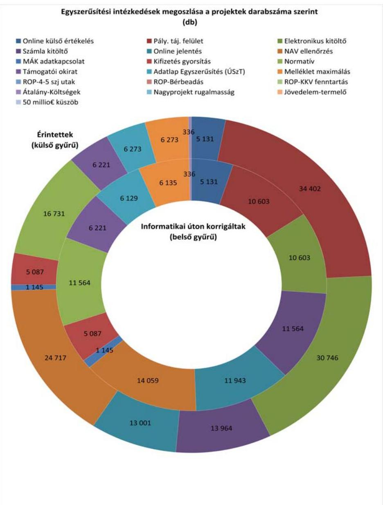

Az egyhetes válaszadási időszakot követően összesen 13658 db kitöltött kérdőív érkezett vissza (válaszadási arány: 13,7\%), melyből 1598 kérdőívben (a visszaküldött kérdőívek 11,7\%-ában) szerepelt érdemi javaslat illetve észrevétel a további egyszerűsítési intézkedésekre.

Az egyes hatóságok az egyszerűsítési intézkedéseknek valós egyszerűsítő hatását érzékelték. A kedvezményezettek/pályázók inkább pozitívnak értékelték az

---

intézkedések hatását, értékelésük szerint csökkentek, vagy nem változtak terheik. Tehát együttesen értékelve az intézkedések egyszerűsítő hatásúak voltak.

Az ellenőrzés pozitív tendenciaként értékelte, ha a pályázók/kedvezményezettek az adminisztratív terhelés változására vonatkozó kérdésre a csökkent és a nem változott válaszok voltak együttesen többségben. (Ez a visszaküldött kérdőívek tanúsága szerint minden intézkedés esetében így volt). Ezt arra való tekintettel tettük így, hogy a szubjektív értékítélet alapján, továbbá előzetes tapasztalat hiányában az érintettek a csökkenést nem mindig érzékelhették, míg a terhek növekedését - amit a válaszadók kevesebb, mint 15 \%-a jelölt meg - nagy valószínűséggel minden esetben visszajelezték. Az ellenőrzés pozitív tendenciaként értékelte azt is, ha a hatóságok hasznosnak ítélték a változtatást, ugyanakkor a kedvezményezettek terhei nem nőttek.

A kérdőív 2. kérdésére - Alkalmazza-e az intézkedést? - adott válaszok alapján a pályázók/kedvezményezettek kétharmada (66,7\%) érzékelte úgy, hogy a nemzeti hatáskörben bevezetett egyszerűsítési intézkedések következtében munkaidőt, illetve költségeket takarított meg az intézkedések alkalmazása során.

Arra a kérdésre, hogy voltak-e az intézkedésnek negatív hatásai, a pályázók/kedvezményezettek 85\%-a adta azt a választ, hogy nem tapasztalt az intézkedések alkalmazásával kapcsolatos negatív hatást. A többi válaszadónak nehézséget okozott az új eljárásrendre való átállás, illetve véleményük szerint a közreműködő szervezet lassan állt át az új eljárásrendre, vagy hibásan alkalmazta az egyszerűsítési intézkedést.

A kérdőív további kérdésére válaszolva a pályázók/kedvezményezettek közel fele tapasztalta költségeinek, adminisztratív terheinek csökkenését az egyszerűsítési intézkedés bevezetését követően, $42 \%$-uk nem tapasztalt sem pozitív, sem negatív változást. A terhek növekedését a válaszadók 2\%-a érzékelte, 7\%-uk pedig azt tapasztalta, hogy az egyszerűsítési intézkedés következtében csökkentek terhei, azonban egyéb kötelezettségei, költségei, vagy feladatai nőttek.

A kedvezményezettek további egyszerűsítési javaslatainak elemzését követően a tételenként kategorizált és összesített egyéni vélemények alapján 11 válaszcsoportot alakítottunk ki. Az egyéni válaszok tételes értékelése folyamán a vélemények az alábbi 11 válaszcsoport egyikébe kerültek be:

1. elektronikus ügyintézés;
2. dokumentumok / adminisztráció csökkentése, duplikáció elkerülése;
3. pályázati felület továbbfejlesztése / hibajavítás;
4. finanszírozás gyorsítása / egyszerűsítése;
5. egyértelmű meghatározások, sablonok rendelkezésre állása;
6. finanszírozáson kívüli eljárások gyorsítása / egyszerűsítés;
7. telefonos ügyfélszolgálat fejlesztése;
8. általános negatív vélemény (bonyolult / lassú);

---

9. általános pozitív vélemény;
10. pályázatírót alkalmazott, így önálló véleménye nem volt;
11. egyéb.

Az egyszerűsítést célzó javaslatok megoszlását a következő, 2. számú ábra mutatja:
2. sz. ábra
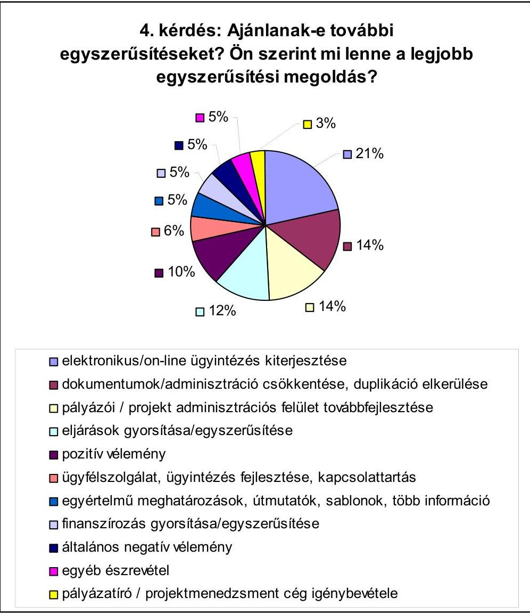

A pályázók/kedvezményezettek által javasolt további egyszerűsítési intézkedések 61\%-a négy intézkedés között oszlott meg (elektronikus ügyintézés $21 \%$, dokumentumok/adminisztráció csökkentése, duplikáció elkerülése 14\%; pályázati/projekt adminisztrációs felület továbbfejlesztése/hibajavítás 14\%; finanszírozás gyorsítása/egyszerúsítése 12\%). A válaszadók további 10\%-a általánosságban pozitív véleményt, 5\%-a pedig általánosságban negatív véleményt fogalmazott meg.

---

Összességében megállapítható volt, hogy mind a választható, mind a kötelező, mind a nemzeti hatáskörben megállapított egyszerűsítési intézkedések megítélése a hatóságok és a kedvezményezettek részéről is az, hogy az intézkedések alkalmazása hasznos, mivel tényleges egyszerűsítést jelentett. Az összes lehetséges 37432 db projektből valamennyi érintett volt valamelyik egy, vagy több - nemzeti hatáskörben bevezetett egyszerűsítési intézkedés által. Az alkalmazott uniós egyszerűsítési intézkedések viszonylag alacsony számát és arányát részben az is indokolta, hogy az intézkedések bevezetése okafogyottá vált, mert Magyarország az uniós intézkedések meghozatala előtt kialakította saját egyszerűsítést célzó rendszerét.

Az NFÜ a jó tapasztalatok miatt az egyszerűsítési intézkedések körének bővítését tervezi. Az 1. és 3. számú választható egyszerűsítési intézkedés bevezetését megalapozó módszertan 2012. augusztusi uniós elfogadását követően, 2013-tól az intézkedések alkalmazását tervezik. További 7, nemzeti hatáskörben alkalmazott egyszerűsítő intézkedés bevezetését tervezik, melyből a 2012. év folyamán az ellenőrzés befejezéséig 3 - adatkapcsolattal, illetve a források biztosításával kapcsolatos - intézkedést már bevezettek.

Az EU 2014-2020 közötti időszakra vonatkozó jogalkotási csomag tervezete az ellenőrzött hatóságok szerint nagyobb mozgásteret/lehetőségeket biztosít a tagállamok számára, de fontos az ehhez szükséges szabályozási környezet, különös tekintettel a szükséges elszámolhatósági útmutatók kialakítása.

Jó gyakorlat
Magyarország az EU egyszerűsítési intézkedések mellett nemzeti hatáskörben is hozott olyan intézkedéseket, amelyek célja volt az adminisztratív terhek csökkentése, a támogatások felhasználásának gyorsítása. A nemzeti hatáskörben megállapított egyszerűsítési intézkedések közül az irányító hatóságoknál és a kedvezményezetteknél - a nemzetközi ellenőrzésben bemutatás céljából - 15 db-ot értékelt az ÁSZ ellenőrzés. Az intézkedések egyaránt érintették az ERFA és az ESZA támogatású projekteket.

A nemzeti hatáskörben bevezetett intézkedések szakmai indokai a következők voltak: a projektkiválasztás folyamat és a kifizetések gyorsítása, az adminisztratív terhek csökkentése, a pályázókkal, kedvezményezettekkel gyorsabbá, átláthatóbbá váló kommunikáció, a pályázóbarát támogatási rendszer erősítése.

Mind a hatóságok, mind a kedvezményezettek minden alkalmazott intézkedést hasznosnak, tényleges egyszerűsítésnek ítéltek. Az intézkedések következtében csökkentek, vagy nem változtak a kedvezményezettek és/vagy a támogatásközvetítő rendszer adminisztratív terhei.

# Gyengeségek 

Az ellenőrzött szervezetek kevés információval rendelkeztek az egyszerűsítési intézkedések bevezetésének tapasztalatairól, és az intézkedések által kiváltott hatásokról a pályázók és a kedvezményezettek körében, mivel hiányoztak a folyamat célzott figyelemmel kísérésének szabályai és kijelölt felelősei.

---

Viszonylag alacsony az uniós jogszabályok módosításaiból eredően alkalmazott egyszerűsítési intézkedések ( 9 -ből 4 db ), valamint az egyszerűsítési intézkedések által érintett projektek ( 18317 -ből 350 db ) száma és aránya. Az alacsony arányszám kialakulásának főbb okai: hosszú egyeztetési időigény az Európai Unióval; az alkalmazáshoz szükséges értékhatárt nem sikerül elérni; a hazai kialakított támogatásközvetítő rendszer eltér a bevezetendő intézkedések által megkívánt struktúráktól.

Az Állami Számvevőszékről szóló 2011. évi LXVI. törvény 33. § (1) bekezdésében foglaltak értelmében a jelentésben foglalt megállapításokhoz kapcsolódó intézkedési tervet köteles az ellenőrzött szervezet vezetője összeállítani és azt a jelentés kézhezvételétől számított harminc napon belül az ÁSZ részére megküldeni. Amennyiben az intézkedési tervet határidőben nem küldi meg a szervezet, vagy az továbbra sem elfogadható, az ÁSZ elnöke a hivatkozott törvény 33. § (3) bekezdés a)-b) pontjaiban foglaltakat érvényesítheti.

A helyszíni ellenőrzés megállapításainak hasznosítása mellett javasoljuk:

# a nemzeti fejlesztési miniszternek: 

1. Az ellenőrzött szervezetek kevés információval rendelkeztek az egyszerűsítési intézkedések bevezetésének tapasztalatairól, és az intézkedések által a pályázók és a kedvezményezettek körében kiváltott hatásokról, mivel nem alakították ki teljes körűen a folyamat célzott figyelemmel kísérésének szabályait és nem jelölték ki a felelősöket.

Javaslat:
Tekintse át a Strukturális Alapokat érintő egyszerűsítési intézkedések bevezetésének feltételrendszerét és az intézkedések bevezetése elmaradásának - az ÁSZ és az NFÜ által feltárt - okait elemezve, az alapján segítse elő az egyszerűsítési intézkedések jövőbeni bevezethetőségét. Teremtse meg a bevezetett intézkedések hatásai mérhetőségének, értékelhetőségének a lehetőségét.
2. Az egyszerűsített elszámolások módszertanának az EU Bizottságával az NFÜ által folytatott elhúzódó egyeztetése hátráltatta a - közvetlen és közvetett költségek elszámolásának egyszerűsítésére vonatkozó - választható egyszerűsítő intézkedések bevezetését.

Javaslat:
Készíttesse elő - az NFÜ költség adatbázisában rendelkezésre álló tényleges költségadatok figyelembevételével - a jövőben alkalmazható egyszerűsített elszámolások módszertanát és az Elszámolhatósági Útmutatókat annak érdekében, hogy azok az EU 2014-2020 közötti programozási időszak elejétől bevezethetőek legyenek.
3. A Strukturális Alapok szabályainak egyszerűsítése (EU Strukturális Alapok Munkacsoport által koordinált közös ellenőrzés) ellenőrzéséről szóló ÁSZ jelentés a kérdőíves felmérés során feltárta a kedvezményezettek által javasolt, az egyszerűsítést célzó további fejlesztési irányokat. A pályázók, illetve a kedvezményezettek által javasolt egyszerűsítési intézkedések 61\%-a négy intézkedés között oszlott meg (elektronikus

---

ügyintézés $21 \%$, dokumentumok és az adminisztráció csökkentése, duplikáció elkerülése 14\%; pályázati és projekt adminisztrációs felület továbbfejlesztése, hibajavítás 14\%; finanszírozás gyorsítása és egyszerűsítése 12\%). A kedvezményezettek által tett javaslatok hasznosítása indokolt a támogatások lebonyolításában érintett szervezetek tevékenysége során.

Javaslat:
Intézkedjen a Strukturális Alapok szabályainak egyszerűsítése (EU Strukturális Alapok Munkacsoport által koordinált közös ellenőrzés) ellenőrzéséről szóló ÁSZ jelentésben összefoglalt, a kedvezményezettek által javasolt, az egyszerűsítést célzó további fejlesztési irányok hasznosításáról, összhangban a 2014-2020-as tervezési időszakra vonatkozó EU jogalkotási programcsomaggal.

---

# II. RÉSZLETES MEGÁLLAPÍTÁSOK 

## 1. 1. FÖTERÜLET - A Strukturális Alapok programjainak átTEKINTÉSE

Fő kérdés: Az Önök tagállama mennyi pénzt kap a Strukturális Alapokból a 2007-2013 közötti időszakra, és az hogyan oszlik meg az operatív programok között (a területi együttműködésre irányuló operatív programok és a transznacionális programok kivételével)?

Magyarország részére a Strukturális Alapokból a 2007-2013 közötti időszakra vonatkozóan az ERFÁ-ból 12649743 E EUR, az ESZÁ-ból 3629089 E EUR összegű támogatási keretet állapítottak meg, a hazai rész az ERFA esetében 2232308 E EUR, az ESZA esetében 640427 E EUR volt. A támogatások megoszlását az operatív programok között az 1. főterülethez kitöltött, „Az operatív programok támogatási kerete a 2007-2013. évek között (2007. január 1-jei és 2011. december 31-i állapot)" című 5/a. függelék, az operatív programok adatait évenkénti bontásban az 5/b. számú függelék tartalmazza.

### 1.1. A Magyarországon indított operatív programok száma és összesített költségvetési forrása (uniós források + nemzeti társfinanszírozás)

Operatív programok:
a) Az Európai Szociális Alap (ESZA) részeként Magyarország 2 db operatív programot indított (ÁROP, TÁMOP);
b) az Európai Regionális Fejlesztési Alap (ERFA) részeként 12 db operatív programot indított (EKOP, GOP, KEOP (3-4. és 6. prioritás), KÖZOP (3-4. prioritás), $\mathrm{ROP}^{10}$ (konvergencia), $\mathrm{ROP}(\mathrm{KMOP}), \mathrm{TIOP}$ ).

Az operatív programok költségvetési forrásai:
a) Az ESZA-hoz kapcsolódó összesített költségvetési forrás 4269516 E EUR (az uniós források összege: 3629089 E EUR, a nemzeti társfinanszírozás összege 640427 E EUR) volt;
b) az ERFA-hoz kapcsolódó összesített költségvetési forrás 14882052 E EUR (az uniós források összege: 12649743 E EUR, a nemzeti társfinanszírozás összege 2232308 E EUR) volt.

[^0]
[^0]:    ${ }^{10}$ A ROP részei a KMOP, és a konvergencia régiók operatív programjai (a DAOP, a DDOP, az ÉAOP, az ÉMOP, a KDOP, az NYDOP).

---

# 1.2. Az egyes operatív programok jóváhagyott támogatási kerete 

A operatív programokra elkülönített kereteket az 5/a. függelék, valamint az alábbi felsorolás tartalmazza a 2011. december 31-i állapot szerint.
uniós források nemzeti társfinanszírozás

ESZA:
ÁROP
TÁMOP
ERFA:
EKOP
GOP
KEOP
ROP (KMOP)
KÖZOP
ROP (konvergencia)
TIOP

146571 E EUR
3482518 E EUR
358445 E EUR
2858824 E EUR
396031 E EUR
1467196 E EUR
1482907 E EUR
4304318 E EUR
1782022 E EUR

25865 E EUR
614562 E EUR
63255 E EUR
504498 E EUR
69888 E EUR
258917 E EUR
261690 E EUR
759586 E EUR
314474 E EUR

Az operatív programok támogatási keretét összefoglalva a 3. számú ábra mutatja:
3. sz. ábra
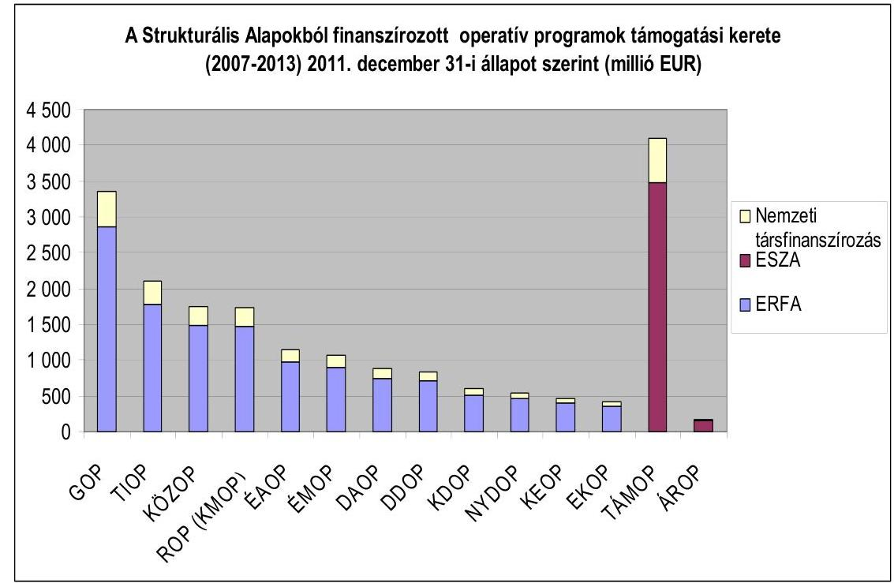

Forrás: NFÜ (Az adatok tartalmazzák az operatív programok között végrehajtott átcsoportosításokat.)

---

# 1.3. Az egyes operatív programok támogatási keretének aránya a 2007-2013 közötti időszak Strukturális Alapjainak teljes összegéhez képest (uniós források + nemzeti társfinanszírozás) 

27\% a ROP (konvergencia),
$21 \%$ a TÁMOP,
$18 \%$ a GOP,
$11 \%$ a TIOP.
A többi operatív program esetén az arány nem éri el a 10\%-ot: ÁROP 1\%, EKOP 2\%, KEOP 2\%, ROP (KMOP) és KÖZOP 9-9\%.

## 2. 2. FÖTERÜLET - A VÁLASZTHATÓ EGYSZERŰSÍTÉSI INTÉZKEDÉSEK HATÁSA, NEMZETI KERETRENDSZERBE VALÓ BEÉPÍTÉSE ÉS MEGÍTÉLÉSE

Ebben a részben áttekintjük a választható egyszerűsítési intézkedések nemzeti keretrendszerbe való beépítésének helyzetét, hatását és fogadtatását a kedvezményezettek és a támogatásközvetítő szervezetek részéről.

### 2.1. Általános értékelés

I. kérdés: Az Önök tagállama beépítette a választható egyszerűsítési intézkedéseket a nemzeti keretrendszerbe?

Az EU egyszerűsítő intézkedések jogszabályi megalapozására nem volt szükség, mert az EU rendeletek közvetlenül alkalmazandóak, azaz külön nemzeti jogi átültetés nélkül válnak a nemzeti jog részévé, illetve általános hatályúak, azaz minden részletében minden tagállamra kötelezőek.

Az egyszerűsítési intézkedések alkalmazásához azonban szükség volt az egyszerűsített elszámolásokhoz kapcsolódó módszertan elfogadására, ami az ERFA esetében nem történt meg, az ESZA esetében pedig 2012 augusztusáig húzódott.

Az EU válaszható intézkedések bevezetésének indokai az irányító hatóságok szerint a következők voltak: egyszerűsítés, adminisztratív terhek csökkentése, gyorsítás, forrásvesztés elkerülése.

Az érintett uniós egyszerűsítési intézkedések átültetése kapcsán felmerülő gondokról az ellenőrzött szervezetek nem számoltak be.

Magyarország az egyszerűsítési intézkedésekhez nem tett hozzá további elemeket, azonban a 2. számú intézkedés esetében az uniós egyszerűsítési intézkedés bevezetése előtti egyes szigorúbb szabályokat - részletes módszertan hiányában - nem következetesen szüntették meg, ugyanis továbbra is érvényben maradt

---

az a kötelezettség, hogy az átalányköltségen elszámolt számlákat meg kellett őrizni, és azokat a helyszíni ellenőrzéskor be kellett mutatni.

Az intézkedések hatályba lépésének időpontja megegyezett az EU rendeletek hatályba lépésének időpontjával.

A HEP IH a TÁMOP-ra tervezi bevezetni az 1-3. intézkedést.
II. kérdés: Hány operatív program és projekt érintett, és mennyi pénz kapcsolódik a választható egyszerúsítési intézkedésekhez?

Az intézkedések közül a 6. (Nagyprojektek megnövelt rugalmassága) intézkedés az 1 db potenciálisan érintett ${ }^{11}$ projektnél érvényesült (ERFA ROP (KMOP)). A projektek teljes száma az OP-ban 4175 db , az összes projektre elkülönített forrás 777784 E EUR volt. Az intézkedés által érintett projektekre elkülönített forrás aránya $2,5 \%$ az összes projektre elkülönített forráshoz viszonyítva (6. számú függelék).

A visszamenőlegesen alkalmazható, 2. (Átalányalapú költségek (egységköltség alkalmazásával számítva) intézkedés $348 \mathrm{db}(87,4 \%)$ ESZA-ÁROP projektnél érvényesült. A potenciálisan érintett és a teljes projektek száma megegyezett, 398 db , az összes projektre elkülönített forrás 59252 E EUR volt. Az intézkedés által érintett projektekre elkülönített forrás aránya $35 \%$ az összes projektre elkülönített forráshoz viszonyítva (7. számú függelék).
III. kérdés: Hasznosak-e és tényleges egyszerúsítést jelentenek-e a választható egyszerúsítési intézkedések?

Mind a kedvezményezettek, mind az irányító hatóságok valós egyszerúsítésnek értékelték az intézkedéseket.

Az intézkedések alkalmazása elmaradásának indoka volt az EU-val folytatott egyeztetések elhúzódása (ERFA 1-3. intézkedések, ESZA 1. és 3. intézkedés), nemzetközi tapasztalatok hiánya (7. intézkedés), a hazai gyakorlat eltérő volta (5. intézkedés), illetve Magyarország az intézkedés meghozatala előtt kialakította a kapcsolódó intézményrendszert, ezen nem volt értelme változtatni. Az alkalmazás elmaradásának okairól a megkérdezett minisztériumok nem nyújtottak érdemi információt.

Az intézkedésekhez kapcsolódóan nem folytak célellenőrzések. A támogatásokat kezelő intézményrendszer a folyamatba épített ellenőrzések során az egyszerúsítő intézkedésekkel összefüggő szabálytalanságot nem állapított meg. ${ }^{12}$ Az igazoló/ellenőrzési hatóságok nem rendelkeztek ilyen irányú tapasztalatokkal. Az Ellenőrzési Hatóság szerint: „Az egyszerúsítésre vonatkozó törekvések - vagyis az adminisztráció és a bürokrácia csökkentése - alapvetően előremutatóak, azonban azok gyakorlati tapasztalatai, kockázatai jelenleg nem ismertek."

[^0]
[^0]:    ${ }^{11}$ Az intézkedés által elméletileg érintett projektek (6. számú intézkedés esetén a hazai kifizetés elfogadása uniós jóváhagyás előtt).
    ${ }^{12}$ Az NFÜ adatszolgáltatásában a folyamatba épített ellenőrzések a dokumentum alapú mellett a helyszíni ellenőrzéseket is magukba foglalják.

---

Az intézkedések következtében csökkentek vagy nem változtak a kedvezményezettek és/vagy a végrehajtási intézményrendszer ellenőrzési terhei. A 8. intézkedés esetében „a támogatást kezelő intézményrendszer ellenőrzési terhei csökkentek (kevesebb dokumentumot kell ellenőrizni), így összességében a kifizetésekre gyorsabban kerülhetett sor. Ugyanakkor a helyszíni ellenőrzések során ellenőrizendő dokumentumok mennyisége nőtt." (NFÜ kérdőívre adott válasza)

A kedvezményezettek csak az alkalmazott intézkedésekről alkottak véleményt az alábbiak szerint:

Az egy adott egyszerűsítési intézkedésről a válaszadók hasonló véleménnyel rendelkeztek operatív programtól függetlenül, az egyes válaszok részaránya az átlagtól nem tért el 10\%-nál nagyobb mértékben. A többség (lásd a 3. és 5. kérdésre adott válaszok elemzését a 8. és a 8/a-8/f számú függelékekben az alkalmazott intézkedéseket egyszerűsítésnek értékelte.

Az intézkedéseknek a válaszolók szerint (kedvezményezettek, hatóságok) szerint nem voltak negatív hatásai.
IV. kérdés: Ajánlanak-e az irányító/igazoló/ellenőrző hatóságok és a kedvezményezettek fejlesztéseket vagy további egyszerűsítéseket? Ha igen, melyek ezek? Milyen érvek szólnak a javasolt fejlesztések mellett?

A KIM és az NFÜ tájékoztatása szerint további 7 egyszerűsítő intézkedés bevezetését tervezték, melyből a 2012. év folyamán az ellenőrzés befejezéséig 3 - adatkapcsolattal, illetve a források biztosításával kapcsolatos - intézkedést már be is vezettek (9. számú függelék). Az intézkedésekhez indoklást nem fűztek.

A 2012-2013. évekre az Igazoló Hatóság nem tervez további egyszerűsítési javaslatokat, az Ellenőrzési Hatóság, valamint az NFM és az NGM az ellenőrzéshez kapcsolódóan nem számolt be egyszerűsítési javaslatairól.
V. kérdés: Hogyan értékeli a számvevőszék a választható egyszerűsítési intézkedések hasznosságát?

A hatóságok, valamint a kedvezményezettek pozitív véleménye, továbbá az ÁSZ ellenőrzés tapasztalatai alapján minden alkalmazott választható intézkedést hasznosnak, tényleges egyszerűsítésnek ítéltünk, amelyek következtében csökkentek a kedvezményezettek és/vagy a támogatásközvetítő rendszer adminisztratív terhei.

# 2.2. Intézkedésenkénti értékelések 

A választható egyszerűsítési intézkedések hatása, nemzeti keretrendszerbe való beépítése és megítélése

Magyarország alkalmazta a 2. választható egyszerűsítési intézkedést az ESZA forrás ÁROP programra, valamint a 6. választható egyszerűsítési intézkedést az ERFA forrásból működő ROP (KMOP) programra. Nem került bevezetésre egyik finanszírozási alapra sem az 1. a 3-5, valamint a 7. választható egyszerűsítési

---

intézkedés, valamint a 2. választható egyszerűsítési intézkedés az ERFA esetében.

A be nem vezetett intézkedésekre a II. és a III. kérdésekre vonatkozóan az alábbi megállapítások érvényesek:
II. kérdés: Hány operatív program és projekt érintett, és mennyi pénz kapcsolódik a választható egyszerűsítési intézkedéshez?

Nem érintett programokat.
III. kérdés: Hasznos-e és tényleges egyszerűsítést jelent-e a választható egyszerűsítési intézkedés?

Nincs tapasztalat.

# 1. választható egyszerúsítési intézkedés: Közvetett költségek (átalányalapon meghatározva, legfeljebb a közvetlen költségek 20\%áig) 

I. kérdés: Az Önök tagállama beépítette a választható egyszerűsítési intézkedést a nemzeti keretrendszerbe?

ERFA
Az alkalmazás elmaradásának oka:
ERFA: Az intézkedés bevezetési dátuma az uniós rendeletben 2009. május 22. volt. Magyarország megkezdte a szükséges módszertan bevezetésének elkészítését, azonban az NFÜ szerint nem álltak rendelkezésre szükséges mélységű információk, a megalapozó módszertan kidolgozása időigényes, a szükséges adatokat visszamenőleg kell kigyújteni, csak új kiírások esetén lehet alkalmazni, ilyen már nem volt sok az egyeztetési folyamat felfüggesztésekor, 2011. év vége után.

Magyarország nem tervezi 2014-ig az egyszerűsítő intézkedés alkalmazását.
ESZA
Az intézkedés bevezetését megalapozó módszertan - közel 3 éves egyeztetés utáni - bizottsági jóváhagyására 2012 augusztusában került sor. Ezt követően tervezi a HEP IH az intézkedés bevezetését a 2007-2013 közötti tervezési periódusban konkrét TÁMOP kiírásokban. Az ún. flat-rate (közvetett költségek áta-lány-alapú elszámolása) egyszerűsítő intézkedés bevezetése - tekintve, hogy az Európai Bizottság előzetes jóváhagyásához kötött - a legkisebb kockázatot jelenti a tagállam szempontjából.

## 2. választható egyszerúsítési intézkedés: Átalányalapú költségek (egységköltség alkalmazásával számítva)

I. kérdés: Az Önök tagállama beépítette a választható egyszerűsítési intézkedést a nemzeti keretrendszerbe?

---

# ESZA 

Az alkalmazhatósághoz a nemzeti elszámolhatósági útmutató módosítása járult hozzá.

Az átalányköltségek megállapításának meghatározásához, elemzéséhez rendelkezésre állt a 2004-2006. programozási időszakra érvényes Nemzeti Fejlesztési Terv közel 17 ezres projektjének elszámolása, amely tételesen tartalmazta a menedzsment költségeket is, azonban a kérdőívre adott NFÜ válasz szerint az adatbázis nem képezte az átalányköltség megállapításának alapját.

A bevezetés célja volt: a támogatási folyamat egyszerűsítése, a gyorsabb átfutási idő, az adminisztratív terhek csökkentése.

ESZA forrásokra van elfogadott elszámolhatósági útmutató, az intézkedés bevezetését megalapozó módszertan - közel 3 éves egyeztetés utáni - bizottsági jóváhagyására 2012 augusztusában került sor. Csak egy IH (a KÖZIG IH az ÁROP projektjeire) alkalmazta a 2. intézkedést. A TÁMOP-ból, ESZA forrásból finanszírozott programok esetében a 2007-2013-as programozási időszakban lehetőség szerint pilot projekt keretében, és a 2014-2020-as időszakban már rendszerszinten tervezi a HEP IH az egyszerűsítő intézkedés alkalmazását. A módszertanok véglegesítése folyamatban van.

Az NGM-től kapott tájékoztatás szerint a módszer bevezetésének egy további területe a munkaerőképzés, illetve a szolgáltatások költségei lehetnek. A módszer alkalmazásának egyik feltétele az NGM szerint a megfelelő megbízhatóságú historikus adatbázis megléte az egységkalkuláció módszertanának igazolására. A módszer alkalmazásának nemzetközi tapasztalatairól a HEP IH az általa 2012 júliusában szervezett nemzetközi workshop-on is szerzett információkat.

Magyarország az egyszerűsítési intézkedésekhez nem tett hozzá további elemeket, azonban a 2. számú intézkedés esetében az uniós egyszerűsítési intézkedés bevezetése előtti egyes szigorúbb szabályokat - részletes módszertan hiányában - nem következetesen szüntették meg, ugyanis továbbra is érvényben maradt az a kötelezettség, hogy az átalányköltségen elszámolt számlákat meg kellett őrizni, és azokat a helyszíni ellenőrzéskor be kellett mutatni.

A KÖZIG IH az átalány alapú elszámolás mellett meghagyta a számlák megőrzésének kötelezettségét a helyszíni ellenőrzésekhez. (Az intézkedés bevezetésekor még nem létezett egységes uniós módszertan, amely egyértelművé tette volna az átalány alapú elszámolás részletszabályait.)

## ERFA

A bevezetés elmaradásának oka:
Az intézkedés bevezetési dátuma az uniós rendeletben 2009. május 22. volt. Magyarország megkezdte a szükséges módszertan bevezetésének elkészítését, azonban az elszámolhatósági útmutatónak a nemzeti hatóságok és az EU Bizottság közötti egyeztetése elhúzódott. Az NFÜ szerint nem álltak rendelkezésre szükséges mélységű információk, a megalapozó módszertan kidolgozása idő-

---

igényes, a szükséges adatokat visszamenőleg kell kigyűjteni, valamint csak új kiírások esetén lehet alkalmazni.

Magyarország nem tervezi 2014-ig az egyszerűsítő intézkedés alkalmazását.
II. kérdés: Hány operatív program és projekt érintett, és mennyi pénz kapcsolódik a választható egyszerűsítési intézkedéshez?

Az intézkedés $348 \mathrm{db}(87,4 \%)$ ESZA-ÁROP projektnél érvényesült. A potenciálisan érintett és a teljes projektek száma megegyezett, 398 db , az összes projektre elkülönített forrás 59252 E EUR volt. Az intézkedés által érintett projektekre elkülönített forrás aránya $35 \%$ az összes projektre elkülönített forráshoz viszonyítva (7. számú függelék).
III. kérdés: Hasznos-e és tényleges egyszerűsítést jelent-e a választható egyszerűsítési intézkedés?

Az irányító hatóságok az alkalmazott intézkedést hasznosnak, tényleges egyszerűsítésnek ítélték.

A kedvezményezettek közel fele nem ismerte az intézkedést. A válaszadók 49\%a időt takarított meg az intézkedés alkalmazásával. Negatív hatást nem tapasztaltak a kedvezményezettek az egyszerűsítési intézkedés bevezetése következtében. 48\% esetében költség/adminisztrációs teher csökkenését tapasztalták, $42 \%$-uk nem tapasztalt változást e tekintetben.

# 3. választható egyszerűsítési intézkedés: Átalányösszegek 

I. kérdés: Az Önök tagállama beépítette a választható egyszerűsítési intézkedést a nemzeti keretrendszerbe?

ERFA
A bevezetés elmaradásának oka:
Az ERFA forrásokra az elszámolhatósági útmutatónak a nemzeti hatóságok és az EU Bizottság közötti elhúzódó egyeztetése volt.

Magyarország nem tervezi 2014-ig annak alkalmazását.

## ESZA

Az intézkedés bevezetését megalapozó módszertan - közel 3 éves egyeztetés utáni - bizottsági jóváhagyására 2012 augusztusában került sor. Az ESZA Általános útmutató az elszámolható költségekről 2007-2013 programozási időszak: szabályozza az egyszerűsített elszámolási módokat és alkalmazásuk eseteit. A TÁMOP-ból, ESZA forrásból finanszírozott programok esetében a 2007-2013-as programozási időszakban lehetőség szerint pilot projekt keretében, és a 2014-2020-as időszakban már rendszerszinten tervezi a HEP IH az egyszerűsítő intézkedés alkalmazását. A módszertanok véglegesítése folyamatban van.

---

# 4. választható egyszerúsítési intézkedés: A természetbeni hozzájárulások elszámolható költségként való meghatározásának engedélyezése a pénzügyi tervezéssel kapcsolatban 

I. kérdés: Az Önök tagállama beépítette a választható egyszerűsítési intézkedést a nemzeti keretrendszerbe?

A bevezetés elmaradásának oka:
A 4. intézkedés esetében a GOP és KMOP keretében meghirdetett pénzügyi konstrukciókat múködtető holdingalap felállítására már 2007-ben, a rendelet módosítását megelőzően sor került, így az intézkedés az NFÜ számára már nem volt releváns.

Újabb holdingalap felállítása 2014-ig nem várható.
Magyarország nem tervezi 2014-ig alkalmazását.

## 5. választható egyszerúsítési intézkedés: Előlegfizetések

I. kérdés: Az Önök tagállama beépítette a választható egyszerűsítési intézkedést a nemzeti keretrendszerbe?

A bevezetés elmaradásának oka:
Az intézkedés bevezetése szükségtelen, Magyarország nem teszi költségnyilatkozatba a kedvezményezetteknek fizetett előleget, így az egyszerűsítés nem idézett elő változást.

Magyarország nem tervezi 2014-ig alkalmazását.

## 6. választható egyszerúsítési intézkedés: Nagyprojektek megnövelt rugalmassága

I. kérdés: Az Önök tagállama beépítette a választható egyszerűsítési intézkedést a nemzeti keretrendszerbe?

Alkalmazásának indoka a kifizetések gyorsítása, a forrásvesztés elkerülése. A nagyprojektek Európai Bizottság általi jóváhagyása egy-másfél évet vett igénybe, az egyszerűsítésnek köszönhetően a projektek végrehajtásával nem kell erre várni.

Az intézkedés bevezetése akadályokba nem ütközött, túlszabályozás nem volt.

## II. kérdés: Hány operatív program és projekt érintett, és mennyi pénz kapcsolódik a választható egyszerúsítési intézkedéshez?

Az intézkedés 1 db potenciálisan érintett projektnél érvényesült (ERFA KMOP). A projektek teljes száma az OP-ban 4175 db , az összes projektre elkülönített forrás 777784 E EUR volt. Az intézkedés által érintett projektekre elkülönített forrás aránya 2,5\% az összes projektre elkülönített forráshoz viszonyítva (6. számú függelék).

---

# III. kérdés: Hasznos-e és tényleges egyszerúsítést jelent-e a választható egyszerúsítési intézkedések? 

Az NFÜ tényleges egyszerűsítésnek értékelte az intézkedést.
Az egyszerűsítési intézkedés vonatkozásában nem érkezett kitöltött kérdőív.

## 7. választható egyszerűsítési intézkedés: Társfinanszírozott visszatérítendő támogatások

## I. kérdés: Az Önök tagállama beépítette a választható egyszerúsítési intézkedést a nemzeti keretrendszerbe?

A 1310/2011/EU rendelet 2011. december 13-tól vezeti be a közreműködő szervezeteken keresztül nyújtható visszatérítendő hozzájárulások és hitelkeretek fogalmát, ez szinte egybeesik a jelen ellenőrzés vizsgálati időszakának végével.

## A bevezetés elmaradásának oka:

Magyarországon nem volt állami pénzügyi intézményként működő, kijelölt közreműködő szervezet, az intézményi háttér kialakítása időigényes. A hiányzó nemzetközi tapasztalatok illetve részletszabályok miatt az $\mathrm{IH}-\mathrm{k}$ nem foglalkoztak az intézkedés bevezetésével.

## 3. FÖTERÜLET - A KÖTELEZŐ ÉS A NEMZETI HATÁSKÖRBEN MEGHOZOTT EGYSZERŰSÍTÉSI INTÉZKEDÉSEK HATÁSA ÉS MEGÍTÉLÉSE

Mind az EU kötelező, mind a nemzeti hatáskörben bevezetett egyszerűsítési intézkedések hasznosak voltak. Minden intézkedés gyorsíthatta a támogatások felhasználásának folyamatát. Az intézkedések következtében csökkentek (nemzeti hatáskörben bevezetett intézkedések közül: 3-5. valamint a 11. és 12. intézkedések) vagy nem változtak a kedvezményezettek és/vagy a támogatásközvetítő rendszer ellenőrzési terhei.

### 3.1. Kötelező intézkedések

### 3.1.1. Általános értékelés

A két kötelező intézkedés az ERFA forrásból finanszírozott regionális és az infrastruktúra fejlesztési operatív programok (ROP, KEOP, KÖZOP) projektjeit érintette.

Az ellenőrzöttek az intézkedésekhez kapcsolódóan nem tettek továbbfejlesztésükre javaslatokat.

Az ÁSZ értékelése
A két kötelező intézkedés bevezetése nem okozott gondot, a 9. kötelező egyszerűsítési intézkedés valós egyszerűsítést jelentett. Magyarországon a jövedelemtermelő projektek a korábbi ( 500 E EUR) értékhatárt sem érték el, ezért az értékhatár megnövelése (8. kötelező egyszerűsítési intézkedés) nem érintett pro-

---

jekteket, az intézkedés alkalmazásához nem voltak a megfelelő költségsávban jövedelemtermelő projektek. A későbbiek során, amennyiben két értékhatár közötti sávban lesznek támogatott projektek, akkor, mind a pályázatok elfogadásakor, mind a projektek értékelésekor egyszerűsítés következik be.

# 3.1.2. Intézkedésenkénti értékelések 

## 8. kötelező egyszerúsítési intézkedés: A jövedelemtermelő projektek teljes költséghatárának megemelése 1 millió EUR összegre és az ESZA projektek kizárása

I. kérdés: Hány operatív program és projekt érintett, és mennyi pénz kapcsolódik a kötelező egyszerűsítési intézkedéshez?

A vizsgált operatív programok 11069 db projektet tartalmaztak, ezek közül jövedelemtermelő 7468 darab volt ( 4840999 E EUR, 1072185 E EUR kerettel), visszamenőleges hatállyal összesen 12223 db projektet tartalmaztak, ezek közül jövedelemtermelő 9513 darab volt, amelynek kerete rendre 5569329 illetve 1277841 E EUR volt.

Magyarországon a jövedelemtermelő projektek a korábbi (500 E EUR) értékhatárt sem érték el, ezért az értékhatár megnövelése nem érintett projekteket, az intézkedés alkalmazásához nem voltak a megfelelő költségsávban jövedelemtermelő projektek.
II. kérdés: Hasznos-e és tényleges egyszerűsítést jelent-e a kötelező egyszerűsítési intézkedés?

Az alkalmazott intézkedésekhez többletszabályozás nem járult.
Az intézkedést mind az Igazoló Hatóság, mind a bevezető IH-k hasznosnak, tényleges egyszerűsítésnek tartották, azonban a bevezetés indoklásaként annak kötelező jellegét adták meg.

Az intézkedés pozitív hatása mind az Ellenőrzési, mind az Irányító Hatóság szerint a költség/adminisztratív teher csökkenése (pl. csökkentette ellenőrzési kötelezettségüket).

Az IH-k egyértelműen egyszerűsítésnek értékelték az intézkedést.
A támogatásokat kezelő intézményrendszer a folyamatba épített ellenőrzések során az egyszerűsítő intézkedésekkel összefüggő szabálytalanságot nem állapított meg. ${ }^{13}$

Jó gyakorlatról nem tudunk beszámolni, mert nem volt érintett projekt. A későbbiek során, amennyiben két értékhatár közötti sávban lesznek támogatott

[^0]
[^0]:    ${ }^{13}$ Az NFÜ tájékoztatása szerit a folyamatba épített ellenőrzések a dokumentum alapú mellett a helyszíni ellenőrzéseket is magukba foglalják.

---

projektek, akkor mind a pályázatok elfogadásakor, mind a projektek értékelésekor egyszerűsítés következik be.

# 9. kötelező egyszerűsítési intézkedés: Egységes 50 M EUR összegű küszöb bevezetése a nagyprojektekhez 

I. kérdés: Hány operatív program és projekt érintett, és mennyi pénz kapcsolódik a kötelező egyszerűsítési intézkedéshez?

Az intézkedés a KEOP egy projektjére vonatkozott, ahol a korábbi költségküszöb 25 M EUR volt.

A KEOP kerete 219120 E EUR, a leszerződött projektek száma 1521 db , az egy érintett projekt támogatása 3213 E EUR volt.
II. kérdés: Hasznos-e és tényleges egyszerűsítést jelent-e a kötelező egyszerűsítési intézkedés?

Az intézkedést mind az Igazoló Hatóság, mind az azt bevezető IH hasznosnak, tényleges egyszerűsítésnek tartotta, azonban a bevezetés indoklásaként annak kötelező jellegét adták meg.

Az alkalmazott intézkedésekhez többletszabályozás nem járult.
Az intézkedés pozitív hatása, hogy a nagyprojektekre vonatkozó előírásokat magasabb értékhatár felett kell csak alkalmazni. Az értékhatár alatti projektek végrehajtása gyorsabb volt, az NFÜ álláspontja szerint az egyszerűsítési intézkedés csökkentette a költség, adminisztratív terheket.

Az egyetlen kedvezményezett nem érzékelt negatív hatást az intézkedéssel kapcsolatban és változást sem tapasztalt az adminisztratív terhekben, költségekben.

A támogatásokat kezelő intézményrendszer a folyamatba épített ellenőrzések során az egyszerűsítő intézkedésekkel összefüggő szabálytalanságot nem állapított meg. ${ }^{14}$

### 3.2. A nemzeti hatáskörben meghozott 15 egyszerűsítési intézkedés hatása és megítélése

### 3.2.1. Általános értékelés

Nemzeti hatáskörben megállapított egyszerűsítési intézkedések közül az irányító hatóságoknál és a kedvezményezetteknél - a nemzetközi ellenőrzésben bemutatás céljából - 15 db -ot értékelt az ÁSZ ellenőrzés. Az intézkedések egyaránt érintették az ERFA és az ESZA támogatású projekteket.

[^0]
[^0]:    ${ }^{14}$ Az NFÜ tájékoztatása szerit a folyamatba épített ellenőrzések a dokumentum alapú mellett a helyszíni ellenőrzéseket is magukba foglalják.

---

A nemzeti hatáskörben bevezetett intézkedések ( 15 db ) közül 5 igényelte jogszabály módosítását (8-12. intézkedések), 7 db (1-7. intézkedések) az Egységes Müködési Kézikönyvben került meghatározásra, 3 db (13-15. intézkedések) pedig a ROP IH állásfoglalása alapján lett hatályos. A nemzeti hatáskörben bevezetett intézkedések felsorolását és tartalmának lényegi ismertetését a 1. számú függelékben ismertetjük. A sorrendben első 7 intézkedés az elektronikus lehetőségek előnyeit használja ki, a 9-12. sorszámú intézkedések az elbírálási időtartamot csökkentik, a 8. és a 13-15. sorszámú intézkedések a felesleges hazai szigorú intézkedéseket közelítik az uniós rendeletek szelleméhez.

A nemzeti hatáskörben bevezetett intézkedések szakmai indokai a következők voltak: a projektkiválasztás folyamat és a kifizetések gyorsítása, az adminisztratív terhek csökkentése, a pályázókkal, kedvezményezettekkel gyorsabbá, átláthatóbbá váló kommunikáció, pályázóbarát támogatási rendszer erősítése.

A bevezetett egyszerúsítési intézkedésekben összesen 37432 db projekt volt érintett, összesen 164085 db egyszerúsítésben. A 15 db nemzeti hatáskörben bevezetett egyszerúsítési intézkedés összesen 171026 db projektnél érvényesült, amely halmozott adat, hiszen volt olyan projekt, amelyik több intézkedésben is érintett volt. A halmozódások alapján számolva az érintett projektek aránya az összes projekt $42,5 \%-a$, a potenciálisan érintett projektek $68,7 \%$-a (10. számú függelék). Az ERFA esetében a nemzeti intézkedéssel érintett projektek száma 139433 db ; az összes projekt $41,1 \%-a$, a potenciálisan érintett projektek 66,6\%-a. Az ESZA esetében a nemzeti intézkedéssel érintett projektek száma 31593 db ; az összes projekt $50,1 \%-a$, a potenciálisan érintett projektek $79,2 \%$-a.

A nemzeti hatáskörben bevezetett intézkedések közül az IH-k tapasztalatai szerint a kedvezményezetteket a kezdeti nehézségeken az ügyfélszolgálati rendszer átsegítette, a közremúködő szervezetek és az egyes IH-k esetében a 9. és a 11. intézkedés igényelt előzetes felkészülést, mérlegelést.

Az IH-k minden alkalmazott intézkedést hasznosnak, tényleges egyszerúsítésnek ítéltek, a kedvezményezettek/pályázók is inkább pozitívnak értékelték az intézkedések hatását.

Az intézkedések következtében csökkentek vagy nem változtak a kedvezményezettek és/vagy a végrehajtási intézményrendszer ellenőrzési terhei. A 8. intézkedés esetében „a támogatást kezelő intézményrendszer ellenőrzési terhei csökkentek (kevesebb dokumentumot kell ellenőrizni), így összességében a kifizetésekre gyorsabban kerülhetett sor. Ugyanakkor a helyszíni ellenőrzések során ellenőrizendő dokumentumok mennyisége nőtt" (NFÜ kérdőívre adott válasza).

A pályázók/kedvezményezettek csak az alkalmazott intézkedésekről alkottak véleményt az alábbiak szerint:

Az egy adott egyszerúsítési intézkedésről a válaszadók hasonló véleménnyel rendelkeztek operatív programtól függetlenül, az egyes válaszok részaránya az átlagtól nem tért el 10\%-nál nagyobb mértékben (kivételt jelentettek azon OPk , ahol kisszámú válasz érkezett, pl. KÖZOP, EKOP, KEOP).

---

A válaszadók többsége (lásd a 3. és az 5. kérdésre adott válaszok elemzését az 8. és $8 / a-8 / f$ számú függelékek) az alkalmazott intézkedéseket egyszerűsítésnek értékelte.

Az intézkedéseknek a válaszolók szerint (kedvezményezettek, hatóságok) szerint nem voltak negatív hatásai. A legnegatívabban értékelt a kedvezményezettek körében 18\%-os arányt képviselve a pályázatkitöltő program.

ERFA: A kedvezményezettek 30-39\%-a érzékelte adminisztratív terheinek csökkentését 4 db intézkedésnél, 40-49\%-a érzékelte 4 db intézkedésnél, 50-58\%-a érzékelte 5 db intézkedésnél. Két intézkedésre a „nem változott" válasz érkezett (2, illetve 1 válaszoló volt), 100\%-os válaszadási aránnyal.

ESZA: A kedvezményezettek 30-39\%-a érzékelte adminisztratív terheinek csökkentését 1 db intézkedésnél, 40-49\%-a érzékelte 3 db intézkedésnél, 50-58\%-a érzékelte 8 db intézkedésnél.

A kérdőív lehetőséget adott arra, hogy a válaszadók röviden kifejtsék egyszerűsítéssel kapcsolatos véleményüket, további javaslataikat az egyszerúsítésre. A megjegyzéseket 11 fő kategóriákba lehetett besorolni. A legtöbb megjegyzés, javaslat az alábbi négy kategóriában érkezett.

# 3.2.2. A kedvezményezettek véleménye 

A 9-12. intézkedések révén összességében csökkentek a terhek, azonban a közreműködő szervezetek és az egyes IH-k esetében igényelt előzetes felkészülést, mérlegelést. A 13-15. intézkedések felesleges terhektől, kötöttségektől szabadították meg a támogatottakat, egyben csökkentették a végrehajtási intézményrendszer munkáját is.

Az online külső értékelés egyszerűsítő hatása a lebonyolításban érintett szervezetek munkáját gyorsította, a bekért mellékletek maximalizálása a helyszíni ellenőrzés tapasztalatai szerint is korlátozottan érvényesült.

A válaszadók közel 10\%-a szerint a jelenlegi rendszer megfelelően működik, a kedvezményezett kiadásokat takarított meg, illetve tényleg egyszerűsítésként éli meg az adott intézkedést.

A pályázati, illetve projekt adminisztrációs rendszert a válaszadók bonyolultnak, bürokratikusnak tartják, amely indokolatlan adminisztrációs terhet ró rájuk, és számos területen párhuzamosságot, többletmunkát okoznak.

Általános negatív véleményt a válaszadók közel 5\%-a fejezett ki a hosszú elbírálási, kifizetési, ügyintézési határidőkkel, a bonyolult és bürokratikus rendszerrel kapcsolatosan.

### 3.2.3. A kedvezményezettek fóbb javaslatai

Elektronikus/on-line ügyintézés kiterjesztése: a pályázatok, projektek kezelése, az ezzel kapcsolatos ügyintézés (kizárólag) elektronikus úton történjen, a papíralapú dokumentumok benyújtásának mellőzésével. Az elektronikus ügyin-

---

tézés eredményeként felgyorsulnának az eljárások, a kedvezményezettek papírmunkát és költséget takarítanának meg.

Dokumentumok/adminisztráció csökkentése, duplikáció elkerülése: a pályázónak/kedvezményezetteknek ne kelljen papír alapon és ezzel párhuzamosan elektronikusan benyújtani a szükséges dokumentumokat. A hivatalok/hatóságok rendszereinek összekapcsolásával elkerülhető az adminisztrációs terheket jelentősen növelő duplikáció (pl. olyan igazolásokat, nyilatkozatokat, engedélyeket, okiratokat, hitelesítést stb. ne kelljen benyújtani, amely más hatóságnál, hivatalnál rendelkezésre áll).

Pályázói/projekt adminisztrációs felület továbbfejlesztése: a pályázók/kedvezményezettek által használt elektronikus felületek (pl. pályázatírás, projekt előrehaladási jelentés készítése, kifizetési kérelmek, számlaösszesítők kezelése) továbbfejlesztése, hibajavítása, további funkciók beépítése, amely megkönnyíti a felhasználók munkáját, könnyen kezelhetővé teszi a rendszereket.

Eljárások gyorsítása/egyszerűsítése: javaslatok a pályáztatási eljárás gyorsítására, illetve egyszerűsítésére, a bürokrácia, az adminisztráció (pl. a bekért dokumentumok/mellékletek számának) csökkentése, elektronikus ügyintézés bevezetése.

# 3.2.4. Intézkedésenkénti értékelések 

1. nemzeti hatáskörben meghozott egyszerúsítési intézkedés: Online külső értékelés
I. kérdés: Hány operatív program és projekt érintett, és mennyi pénz kapcsolódik az egyszerúsítési intézkedéshez?

| Finanszí-   rozási   alap:   ERFA | Összes   projekt | Potenciális   projekt | Érintett   projekt | Érin-   tett/   összes | Érintett/   poten-   ciális |
| :-- | :--: | :--: | :--: | :--: | :--: |
| Projektek   (db) | 8366 | 6136 | 5380 | $64,3 \%$ | $87,7 \%$ |
| Források   (E EUR) | 2204414,26 | 1659922,04 | 1037597,18 | $47,1 \%$ | $62,5 \%$ |

## II. kérdés: Hasznos-e és tényleges egyszerúsítést jelent-e az egyszerúsítési intézkedés?

A kedvezményezettek 43\%-a időt takarított meg az intézkedés alkalmazásával. $57 \%$-a nem ismerte az intézkedést. Negatív hatást a kedvezményezettek 15\%-a tapasztalt, $37 \%$ esetében költség/adminisztrációs teher csökkenését tapasztalták, $56,8 \%$-uk nem tapasztalt változást e tekintetben.

---

Az irányító hatóságok az alkalmazott intézkedést hasznosnak, tényleges egyszerűsítésnek ítélték, tovább fejlesztik a rendszert a teljesen elektronikus dokumentum alapú értékelés felé.

# 2. nemzeti hatáskörben meghozott egyszerúsítési intézkedés: Pályázói tájékoztató felület kialakítása (e-ügyintézés felület) 

I. kérdés: Hány operatív program és projekt érintett, és mennyi pénz kapcsolódik az egyszerűsítési intézkedéshez?

| Finanszírozási alap: ERFA | Összes projekt | Potenciális projekt | Érintett projekt | Érintett /összes | Érintett/ potenciális |
| :--: | :--: | :--: | :--: | :--: | :--: |
| Projek-   tek (db) | 31546 | 31546 | 31546 | 100,0\% | 100,0\% |
| Források (E EUR) | 8406 103,63 | 8406 103,63 | 8406 103,63 | 100,0\% | 100,0\% |
| Finanszírozási alap: ESZA | Összes projekt | Potenciális projekt | Érintett projekt | Érintett /összes | Érintett/ potenciális |
| Projektek (db) | 5886 | 5886 | 5886 | 100,0\% | 100,0\% |
| Források (E EUR) | 1479 229,54 | 1479 229,54 | 1479 229,54 | 100,0\% | 100,0\% |

II. kérdés: Hasznos-e és tényleges egyszerűsítést jelent-e az egyszerűsítési intézkedés?

A pályázók/kedvezményezettek 75\%-a időt takarított meg az intézkedés alkalmazásával, 22\% nem ismerte az intézkedést. Negatív hatást a kedvezményezettek 16\%-a tapasztalt, 48\% esetében költség/adminisztrációs teher csökkenését tapasztalták, $42 \%$-uk nem tapasztalt változást e tekintetben. A válaszadók 9\%a tapasztalta a költség/adminisztrációs teher csökkenését az intézkedés eredményeképpen, azonban más területen a kötelezettségek/feladatok/költségek növekedését érzékelte.

Az ellenőrzés során szerzett tapasztalatok:
A kedvezményezettek, pályázók szempontjából: az elektronikus alkalmazások használata jelentett problémát, amit oktatással, illetve az ügyfélszolgálaton keresztül orvosoltak, ami a lebonyolításban érintett szervezetnek okozott többletterheket.

## 3. nemzeti hatáskörben meghozott egyszerúsítési intézkedés: Pályázat kitöltő programok kialakítása

kérdés: Hány operatív program és projekt érintett, és mennyi pénz kapcsolódik az egyszerűsítési intézkedéshez?

---

| Finanszírozási   alap:   ERFA | Összes   projekt | Potenciális   projekt | Érintett   projekt | Érin-   tett/   összes | Érintett/ potenciális |
| :--: | :--: | :--: | :--: | :--: | :--: |
| Projek-   tek (db) | 31546 | 31546 | 29054 | $92,1 \%$ | $92,1 \%$ |
| Források   (E EUR) | 8406 103,63 | 8406 103,63 | 3833 216,26 | $45,6 \%$ | $45,6 \%$ |

| Finanszírozási   alap:   ESZA | Összes   projekt | Potenciális   projekt | Érintett   projekt | Érin-   tett/   összes | Érintett/ potenciális |
| :--: | :--: | :--: | :--: | :--: | :--: |
| Projektek (db) | 5886 | 5886 | 4550 | $77,3 \%$ | $77,3 \%$ |
| Források   (E EUR) | 1479 229,54 | 1479 229,54 | 360545,99 | $24,4 \%$ | $24,4 \%$ |

# II. kérdés: Hasznos-e és tényleges egyszerúsítést jelent-e az egyszerúsítési intézkedés? 

Az irányító hatóságok az alkalmazott intézkedést hasznosnak, tényleges egyszerűsítésnek ítélték.

Az ellenőrzés során szerzett tapasztalatok:
A kedvezményezettek, pályázók szempontjából: az elektronikus alkalmazások használata jelentett problémát, amit oktatással, illetve az ügyfélszolgálaton keresztül orvosoltak, ami a lebonyolításban részt vevő szervezetnek okozott nehézséget.

A kedvezményezettek 69\%-a időt takarított meg az intézkedés alkalmazásával, 39\% nem ismerte az intézkedést. Negatív hatást a kedvezményezettek 18\%-a tapasztalt, $48 \%$ esetében költség/adminisztrációs teher csökkenését tapasztalták, $42 \%$-uk nem tapasztalt változást e tekintetben.

## 4. nemzeti hatáskörben meghozott egyszerúsítési intézkedés: Számlakitöltő alkalmazása

kérdés: Hány operatív program és projekt érintett, és mennyi pénz kapcsolódik az egyszerűsítési intézkedéshez?

---

| Finanszí-   rozási   alap:   ERFA | Összes   projekt | Potenciális   projekt | Érintett   projekt | Érintett/   összes | Érin-   tett/   poten-   ciális |
| :-- | :--: | :--: | :--: | :--: | :--: |
| Projek-   tek (db) | 27333 | 19594 | 9432 | $34,5 \%$ | $48,1 \%$ |
| Források:   (E EUR) | 7358409,24 | 5801402,24 | 4647944,21 | $63,2 \%$ | $80,16 \%$ |

| Finanszí-   rozási   alap:   ESZA | Összes   projekt | Potenciális   projekt | Érintett   projekt | Érintett/   összes | Érin-   tett/   poten-   ciális |
| :-- | :--: | :--: | :--: | :--: | :--: |
| Projek-   tek (db) | 5537 | 4902 | 4570 | $82,5 \%$ | $93,2 \%$ |
| Források   (E EUR) | 1448221,33 | 1341538,83 | 1319951,39 | $91,1 \%$ | $98,4 \%$ |

II. kérdés: Hasznos-e és tényleges egyszerűsítést jelent-e az egyszerűsítési intézkedés?

Az irányító hatóságok az alkalmazott intézkedést hasznosnak, tényleges egyszerűsítésnek ítélték.

Az ellenőrzés során szerzett tapasztalatok:
A kedvezményezettek, pályázók szempontjából: az elektronikus alkalmazások használata jelentett problémát, amit oktatással, illetve az ügyfélszolgálaton keresztül orvosoltak, ami a lebonyolításban részt vevő szervezetnek okozott nehézséget.

A kedvezményezettek 75\%-a időt takarított meg az intézkedés alkalmazásával. Negatív hatást a kedvezményezettek 15\%-a tapasztalt, továbbá 53\% esetében költség/adminisztrációs teher csökkenését tapasztalták, 37\%-uk nem tapasztalt változást e tekintetben. A kedvezményezettek 8\%-a tapasztalt növekedést az egyéb kötelezettségekben/költségekben/feladatokban.

# 5. nemzeti hatáskörben meghozott egyszerűsítési intézkedés: Jelentéskitöltő alkalmazása 

I. kérdés: Hány operatív program és projekt érintett, és mennyi pénz kapcsolódik az egyszerűsítési intézkedéshez?

---

| Finanszí-   rozási   alap:   ERFA | Összes   projekt | Potenciális   projekt | Érintett   projekt | Érintett/   összes | Érin-   tett/   poten-   ciális |
| :-- | :--: | :--: | :--: | :--: | :--: |
| Projek-   tek (db) | 27333 | 18750 | 9041 | $33,1 \%$ | $48,2 \%$ |
| Források   (E EUR) | 7358409,24 | 5699484,50 | 4074739,55 | $55,4 \%$ | $71,5 \%$ |

| Finanszí-   rozási   alap:   ESZA | Összes   projekt | Potenciális   projekt | Érintett   projekt | Érintett/   összes | Érin-   tett/   poten-   ciális |
| :-- | :--: | :--: | :--: | :--: | :--: |
| Projek-   tek (db) | 5537 | 4394 | 4057 | $73,3 \%$ | $92,3 \%$ |
| Források   (E EUR) | 1448221,33 | 1272954,74 | 1191482,05 | $82,3 \%$ | $93,6 \%$ |

II. kérdés: Hasznos-e és tényleges egyszerűsítést jelent-e az egyszerűsítési intézkedés?

Az intézkedés egyszerűsítő hatása korlátozott volt, mert a fenntartási jelentés beadása már kizárólag elektronikusan történt, azonban a többi jelentéstípusnál a teljes elektronizálás még folyamatban volt, a kedvezményezetteknek az elektronikus benyújtás mellett kinyomtatva is be kell adni a különféle jelentéseket a számvevőszéki jelentés összeállításának idején. (Az egységes működési kézikönyv kiadásáról szóló 24/2011. (V. 6.) NFM utasítás 352. § (1))

Az ellenőrzés során szerzett tapasztalatok:
A kedvezményezettek, pályázók szempontjából: az elektronikus alkalmazások használata jelentett problémát, amit oktatással, illetve az ügyfélszolgálaton keresztül orvosoltak, ami a lebonyolításban részt vevő szervezetnek okozott nehézséget. A végrehajtási intézményrendszer szempontjából: az elektronikus dokumentumok tárolásához szükséges kapacitások tervezése jelentett megoldandó feladatot, kihívást, ami technikai fejlesztéssel kezelhető volt.

A kedvezményezettek 78\%-a időt takarított meg az intézkedés alkalmazásával. Negatív hatást a kedvezményezettek 16\%-a tapasztalt, továbbá 52\% esetében költség/adminisztrációs teher csökkenését tapasztalták, 38\%-uk nem tapasztalt változást e tekintetben.

# 6. nemzeti hatáskörben meghozott egyszerüsítési intézkedés: NAV adatkapcsolat 

kérdés: Hány operatív program és projekt érintett, és mennyi pénz kapcsolódik az egyszerűsítési intézkedéshez?

---

| Finanszírozási   alap:   ERFA | Összes   projekt | Potenciális   projekt | Érintett   projekt | Érin-   tett/   összes | Érintett/   potenciális |
| :-- | :--: | :--: | :--: | :--: | :--: |
| Projek-   tek (db) | 27333 | 19998 | 19998 | $73,2 \%$ | $100,0 \%$ |
| Források   (E EUR) | 7358409,24 | 5807247,85 | 5807247,85 | $78,9 \%$ | $100,0 \%$ |

| Finanszírozási   alap:   ESZA | Összes   projekt | Potenciális   projekt | Érintett   projekt | Érintett/   összes | Érintett/   potenciális |
| :-- | :--: | :--: | :--: | :--: | :--: |
| Projek-   tek (db) | 5537 | 4927 | 4927 | $89,2 \%$ | $100,0 \%$ |
| Források   (E EUR) | 1448221,33 | 1341805,63 | 1341805,63 | $92,7 \%$ | $100,0 \%$ |

II. kérdés: Hasznos-e és tényleges egyszerűsítést jelent-e az egyszerűsítési intézkedés?

A kedvezményezettek 59\%-a időt takarított meg az intézkedés alkalmazásával. Negatív hatást nem tapasztaltak a kedvezményezettek, $40 \%$ esetében költség/adminisztrációs teher csökkenését tapasztalták, 56\%-uk nem tapasztalt változást e tekintetben.

# 7. nemzeti hatáskörben meghozott egyszerüsítési intézkedés: Kincstár adatkapcsolat - önkormányzati törzsadat 

kérdés: Hány operatív program és projekt érintett, és mennyi pénz kapcsolódik az egyszerűsítési intézkedéshez?

| Finanszí-   rozási   alap:   ERFA | Összes   projekt | Potenciális   projekt | Érintett   projekt | Érin-   tett/ös   szes | Érintett/   potenciá-   lis |
| :-- | :--: | :--: | :--: | :--: | :--: |
| Projek-   tek (db) | 16189 | 995 | 995 | $6,1 \%$ | $100,0 \%$ |
| Források   (E EUR) | 6054075,36 | 308333,32 | 308333,32 | $5,1 \%$ | $100,0 \%$ |

---

| Finanszí-   rozási   alap:   ESZA | Összes   projekt | Potenciális   projekt | Érintett   projekt | Érin-   tett/ös   szes | Érintett/   potenciá-   lis |
| :-- | :--: | :--: | :--: | :--: | :--: |
| Projek-   tek (db) | 5886 | 179 | 179 | $3,0 \%$ | $100,0 \%$ |
| Források   (E EUR) | 1448221,33 | 85066,01 | 85066,01 | $5,9 \%$ | $100,0 \%$ |

II. kérdés: Hasznos-e és tényleges egyszerűsítést jelent-e az egyszerűsítési intézkedés?

A kedvezményezettek 59\%-a időt takarított meg az intézkedés alkalmazásával. Negatív hatást csak kis mértékben tapasztaltak a kedvezményezettek, 50\% esetében költség/adminisztrációs teher csökkenését tapasztalták, 42\%-uk nem tapasztalt változást e tekintetben.

# 8. nemzeti hatáskörben meghozott egyszerúsítési intézkedés: Számlaösszesítő 

kérdés: Hány operatív program és projekt érintett, és mennyi pénz kapcsolódik az egyszerűsítési intézkedéshez?

| Finanszí-   rozási   alap:   ERFA | Összes   projekt | Potenciális   projekt | Érintett   projekt | Érin-   tett/ös   szes | Érin-   tett/   poten-   ciális |
| :-- | :--: | :--: | :--: | :--: | :--: |
| Projek-   tek (db) | 27333 | 9268 | 3275 | $12,0 \%$ | $35,3 \%$ |
| Források   (E EUR) | 7358409,24 | 6845656,55 | 3576629,90 | $48,6 \%$ | $52,2 \%$ |

| Finanszí-   rozási   alap:   ESZA | Összes pro-   jekt | Potenciális   projekt | Érintett   projekt | Érin-   tett/ös   szes | Érin-   tett/   poten-   ciális |
| :-- | :--: | :--: | :--: | :--: | :--: |
| Projek-   tek (db) | 5537 | 2138 | 1832 | $33,1 \%$ | $85,7 \%$ |
| Források   (E EUR) | 1448221,33 | 1316603,31 | 1183999,81 | $81,8 \%$ | $89,9 \%$ |

II. kérdés: Hasznos-e és tényleges egyszerűsítést jelent-e az egyszerűsítési intézkedés?

A kedvezményezettek 75\%-a időt takarított meg az intézkedés alkalmazásával, 13\% nem ismerte az intézkedést. Negatív hatást a kedvezményezettek 17\%-a

---

tapasztalt, 58\% esetében költség/adminisztrációs teher csökkenését tapasztalták, $31 \%$-uk nem tapasztalt változást e tekintetben.

A 8. nemzeti hatáskörben bevezetett intézkedés esetében „a támogatást kezelő intézményrendszer ellenőrzési terhei csökkentek (kevesebb dokumentumot kell ellenőrizni), így összességében a kifizetésekre gyorsabban kerülhetett sor. Ugyanakkor a helyszíni ellenőrzések során ellenőrizendő dokumentumok mennyisége nőtt." (az NFÜ kérdőívre adott - válasza)

# 9. nemzeti hatáskörben meghozott egyszerúsítési intézkedés: Normatív eljárás alkalmazása 

I. kérdés: Hány operatív program és projekt érintett, és mennyi pénz kapcsolódik az egyszerúsítési intézkedéshez?

| Finan-   szírozás   i alap:   ERFA | Összes   projekt | Potenciális   projekt | Érintett   projekt | Érintett/   összes | Érintett/   potenciális |
| :-- | :--: | :--: | :--: | :--: | :--: |
| Projek-   tek (db) | 27160 | 27160 | 13981 | $51,5 \%$ | $51,5 \%$ |
| Forrá-   sok   (E EUR) | 6314862,36 | 6314862,36 | 482248,48 | $7,6 \%$ | $7,6 \%$ |

| Finan-   szírozás   i alap:   ESZA | Összes   projekt | Potenciális   projekt | Érintett   projekt | Érintett/   összes | Érintett/   potenciális |
| :-- | :--: | :--: | :--: | :--: | :--: |
| Projek-   tek (db) | 5537 | 5537 | 3100 | $56,0 \%$ | $56,0 \%$ |
| Forrá-   sok   (E EUR) | 1448221,33 | 1448221,33 | 196956,98 | $13,6 \%$ | $13,6 \%$ |

II. kérdés: Hasznos-e és tényleges egyszerűsítést jelent-e az egyszerűsítési intézkedés?

A kedvezményezettek 43\%-a időt takarított meg az intézkedés alkalmazásával, $51 \%$ nem ismerte az intézkedést. Negatív hatást a kedvezményezettek 11\%-a tapasztalt, 38\% esetében költség/adminisztrációs teher csökkenését tapasztalták, $54 \%$-uk nem tapasztalt változást e tekintetben.

## 10. nemzeti hatáskörben meghozott egyszerüsítési intézkedés: Támogatói okirat bevezetése

kérdés: Hány operatív program és projekt érintett, és mennyi pénz kapcsolódik az egyszerűsítési intézkedéshez?

---

| Finan-   szírozás   i alap:   ERFA | Összes projekt | Potenciális   projekt | Érintett   projekt | Érin-   tett/   összes | Érintett/   poten-   ciális |
| :-- | :--: | :--: | :--: | :--: | :--: |
| Projek-   tek (db) | 31271 | 31271 | 4091 | $13,1 \%$ | $13,1 \%$ |
| Forrá-   sok   (E EUR) | 6314862,36 | 6314862,36 | 627,49 | $0,0 \%$ | $0,0 \%$ |

| Finan-   szírozás   i alap:   ESZA | Összes projekt | Potenciális   projekt | Érintett   projekt | Érin-   tett/   összes | Érintett/   poten-   ciális |
| :-- | :--: | :--: | :--: | :--: | :--: |
| Projek-   tek (db) | 5886 | 5886 | 2334 | $39,7 \%$ | $39,7 \%$ |
| Forrá-   sok   (E EUR) | 1448221,33 | 1448221,33 | 321,01 | $0,0 \%$ | $0,0 \%$ |

II. kérdés: Hasznos-e és tényleges egyszerűsítést jelent-e az egyszerűsítési intézkedés?

A kedvezményezettek 66\%-a időt takarított meg az intézkedés alkalmazásával, 27\% nem ismerte az intézkedést. Negatív hatást a kedvezményezettek 10\%-a tapasztalt, 50\% esetében költség/adminisztrációs teher csökkenését tapasztalták, 42\%-uk nem tapasztalt változást e tekintetben.

# 11. nemzeti hatáskörben meghozott egyszerűsítési intézkedés: Pályázati adatlap egyszerüsítése (legfeljebb 6-6 horizontális szempont) 

I. kérdés: Hány operatív program és projekt érintett, és mennyi pénz kapcsolódik az egyszerűsítési intézkedéshez?

| Finanszí-   rozási   alap:   ERFA | Összes   projekt | Potenciális   projekt | Érintett   projekt | Érintett/   összes | Érintett/   potenciá-   lis |
| :-- | :--: | :--: | :--: | :--: | :--: |
| Projek-   tek (db) | 29797 | 6299 | 6299 | $21,1 \%$ | $100,0 \%$ |
| Források   (E EUR) | 6135270,37 | 326318,67 | 326318,67 | $5,3 \%$ | $100,0 \%$ |

---

| Finanszí-   rozási   alap:   ESZA | Összes   projekt | Potenciális   projekt | Érintett   projekt | Érintett/   összes | Érintett/   potenciá-   lis |
| :-- | :--: | :--: | :--: | :--: | :--: |
| Projek-   tek (db) | 5886 | 79 | 79 | $1,3 \%$ | $100,0 \%$ |
| Források   (E EUR) | 1448221,33 | 22931,57 | 22931,57 | $1,6 \%$ | $100,0 \%$ |

II. kérdés: Hasznos-e és tényleges egyszerűsítést jelent-e az egyszerűsítési intézkedés?

Az irányító hatóságoknak, a pályázatkezelő szervezeteknek a leginkább releváns szempontok kiválasztása jelentett többletmunkát, ennek megoldásához az NFÜ központi útmutató készítésével járult hozzá.

A kedvezményezettek 61\%-a időt takarított meg az intézkedés alkalmazásával, $33 \%$ nem ismerte az intézkedést. Negatív hatást a kedvezményezettek 14\%-a tapasztalt, $49 \%$ esetében költség/adminisztrációs teher csökkenését tapasztalták, $45 \%$-uk nem tapasztalt változást e tekintetben.

# 12. nemzeti hatáskörben meghozott egyszerúsítési intézkedés: Pályázathoz bekért mellékletek számának maximalizálása 

I. kérdés: Hány operatív program és projekt érintett, és mennyi pénz kapcsolódik az egyszerűsítési intézkedéshez?

| Finanszí-   rozási   alap:   ERFA | Összes   projekt | Potenciális   projekt | Érintett   projekt | Érintett/   összes | Érin-   tett/   poten-   ciális |
| :-- | :--: | :--: | :--: | :--: | :--: |
| Projek-   tek (db) | 29797 | 6299 | 6299 | $21,1 \%$ | $100,0 \%$ |
| Források   (E EUR) | 6135270,37 | 326318,67 | 326318,67 | $5,3 \%$ | $100,0 \%$ |

| Finanszí-   rozási   alap:   ESZA | Összes   projekt | Potenciális   projekt | Érintett   projekt | Érintett/   összes | Érin-   tett/   poten-   ciális |
| :-- | :--: | :--: | :--: | :--: | :--: |
| Projek-   tek (db) | 5886 | 79 | 79 | $1,3 \%$ | $100,0 \%$ |
| Források   (E EUR) | 1448221,33 | 22931,57 | 22931,57 | $1,6 \%$ | $100,0 \%$ |

II. kérdés: Hasznos-e és tényleges egyszerűsítést jelent-e az egyszerűsítési intézkedés?

---

A kedvezményezettek 59\%-a időt takarított meg az intézkedés alkalmazásával. Negatív hatást csak kis mértékben tapasztaltak a kedvezményezettek, 49,5\% esetében költség/adminisztrációs teher csökkenését tapasztalták, 42\%-uk nem tapasztalt változást e tekintetben.
13. nemzeti hatáskörben meghozott egyszerúsítési intézkedés: 4 és 5 számjegyú utak felújítására és építésére vonatkozó felhívások esetében a fenntartási időszak 5 év, függetlenül a felhívás előírásától
I. kérdés: Hány operatív program és projekt érintett, és mennyi pénz kapcsolódik a visszamenőleges hatályú egyszerúsítési intézkedéshez?

| Finan-   szírozás   i alap:   ERFA | Összes   projekt | Potenciális   projekt | Érintett   projekt | Érintett/   összes | Érintett/   potenciá-   lis |
| :-- | :--: | :--: | :--: | :--: | :--: |
| Projek-   tek (db) | 11984 | 13 | 13 | $0,1 \%$ | $100 \%$ |
| Forrá-   sok   (E EUR) | 4359989,39 | 42716,23 | 42716,23 | $1,0 \%$ | $100,0 \%$ |

# II. kérdés: Hasznos-e és tényleges egyszerúsítést jelent-e az egyszerúsítési intézkedés? 

A bevezetés indoka:
„A 2007-es, 2009-es és 2011-es felhívások eltérő fenntartási időszakot írtak elő azonos tevékenységek esetén, amely a nyomon követés és ellenőrzés során az adminisztrációt nehezíthette volna, illetve az EK rendeletben elöirtnál jelentősen hosszabb 10 éves fenntartást írt volna elő a 2009-es projektek esetében. Az IH egységesítette a fenntartási időszak hosszát és az EK rendelettel összhangban 5 évben határozta meg azt."(a ROP IH - kérdőívre adott - válasza)

Az egyszerűsítési intézkedés vonatkozásában a kedvezményezettektől nem érkezett kitöltött kérdőív.
14. nemzeti hatáskörben meghozott egyszerúsítési intézkedés: Bérbeadás előzetes támogató hozzájárulás nélkül, tekintet nélkül az ÁSZF rendelkezésére
I. kérdés: Hány operatív program és projekt érintett, és mennyi pénz kapcsolódik az egyszerűsítési intézkedéshez?

---

Az intézkedés a ROP (konvergencia) programokat érintette.

| Finanszi-   rozási   alap:   ERFA | Összes   projekt | Potenciális   projekt | Érintett   projekt | Érin-   tett/összes | Érin-   tett/   poten-   ciális |
| :-- | :--: | :--: | :--: | :--: | :--: |
| Projek-   tek (db) | 11984 | 261 | 28 | $0,2 \%$ | $10,7 \%$ |
| Források   (E EUR) | 4359989,39 | 130468,61 | 24148,43 | $0,6 \%$ | $18,5 \%$ |

II. kérdés: Hasznos-e és tényleges egyszerűsítést jelent-e az egyszerűsítési intézkedés?

A bevezetés indoka:
„A Regionális Fejlesztési Operatív Programok helyi gazdaságfejlesztési prioritásainak egyik célja az üzleti környezet fejlesztése, azaz ipari parkok, iparterületek és inkubátorházak kialakításának támogatása. Ezeknek célja, hogy a fejlesztéssel érintett területre vállalkozások települjenek be. A betelepülés történhet bérbe adással vagy elidegenítéssel. Az egyszerúsités bevezetését tehát a fejlesztés célja indokolta, hiszen a cél a fejlesztéssel érintett területek kihasználtsága." (a ROP IH - kérdőívre adott - válasza)

A két válaszoló nem ismerte magát az intézkedést, nem érzékelt negatív hatást az intézkedés bevezetésével és változást sem tapasztalt az adminisztratív terhekben, költségekben.

# 15. nemzeti hatáskörben meghozott egyszerúsítési intézkedés: Fenntartási kötelezettség csökkentése KKV-k esetében 

I. kérdés: Hány operatív program és projekt érintett, és mennyi pénz kapcsolódik az egyszerűsítési intézkedéshez?

Az intézkedés a ROP (konvergencia) programokat érintette.

| Finanszi-   rozási   alap:   ERFA | Összes   projekt | Potenciális   projekt | Érintett   projekt | Érintett/   összes | Érintett/   potenciá-   lis |
| :-- | :--: | :--: | :--: | :--: | :--: |
| Projek-   tek (db) | 11984 | 112 | 1 | $0,0 \%$ | $0.9 \%$ |
| Források   (E EUR) | 4359989,39 | 94160,96 | 253,91 | $0,0 \%$ | $0,3 \%$ |

II. kérdés: Hasznos-e és tényleges egyszerűsítést jelent-e az egyszerűsítési intézkedés?

---

A bevezetés indoka:
„A különböző években megjelent pályázati felhívások eltérő fenntartási időszakot írtak elő azonos tevékenységek esetén, továbbá adott esetben az EK rendeletben előirtnál hosszabb fenntartást írtak elő." (a ROP IH - kérdőívre adott - válasza)

Az egyszerűsítési intézkedés vonatkozásában csak egy kedvezményezett volt, aki nem töltött ki kérdőívet.

# 4. FÖTERÜLET - A 2014-2020 KÖzÖTTI IDŐSZAKRA VONATKOZÓ JOGALKOTÁSI CSOMAG - AZ EURÓPAI BIZOTTSÁG COM (2011) 615 SZ. RENDELET-TERVEZETE (VÉGLEGES) - TERVEZETÉNEK ÉRTÉKELÉSE 

A Strukturális Alapok felhasználását érintő, az Európai Bizottság 2014-2020 közötti programozási időszakra vonatkozó jogalkotási csomag tervezetének egyszerűsítő hatásait az NFÜ ismerte, arról alkotott véleményüket a 11. számú függelék tartalmazza (C kitöltött kérdőív).

Egyszerűsíti-e az Európai Bizottság jogalkotási csomagjának tervezete a Strukturális Alapok alkalmazását?

Az irányító hatóságok szerint a Bizottság hivatkozott javaslatai összességében a „tagállamok nagyobb felelősségét, büntethetőségét eredményezi, és jelentős adminisztratív terheket generál."

1) Mi a véleménye az általános rendelet - Európai Bizottság COM (2011) 615 sz. ren-delet-tervezete (végleges) - alábbi rendelkezéseiről:
1.1. A támogatásokkal kapcsolatban az 57. cikk (1) bekezdése a következőket tartalmazza:
„A vissza nem térítendő támogatás az alábbi formákban történhet:
(a) ténylegesen felmerült, adott esetben természetbeni hozzájárulással és értékcsökkenéssel együtt kifizetett támogatható költségek visszatérítése;
(b) egységköltségek szokásos mértéke;
(c) közpénzekből folyósított egyösszegű, 100000 EUR-t nem meghaladó támogatás;
(d) százalékban meghatározott átalánydíjas finanszírozás alkalmazása egy vagy több meghatározott költségkategóriára."

Az 57. cikk (2) - (5) bekezdései további feltételeket tartalmaznak.
Mind az Ellenőrzési Hatóság, mind az Igazoló Hatóság szerint - elvileg - a szabályozás nagyobb mozgásteret/lehetőségeket biztosít a tagállamok számára, de fontos az ehhez szükséges szabályozási környezet, különös tekintettel a szükséges elszámolhatósági útmutatók kialakítása.

---

Az NFÜ nem kifogásolta az 57. cikk (1) bekezdését, de fontosnak tartotta tisztázni, hogy „közbeszerzési eljárás keretében megvalósitott projektek esetén is alkalmazhatók egyszerúsített elszámolási módszertanok (ahol az ajánlattevő ilyenek öszszegére tesz ajánlatot). Az Európai Bizottság megerősítette ennek a lehetőségét."
1.2. A támogatások közvetett költségeivel kapcsolatban az 58. cikk az alábbiakat tartalmazza:
„Amennyiben valamely múvelet végrehajtása közben közvetett költségek keletkeznek, ezeket átalány alapon lehet kiszámítani a következőképpen:
(a) a támogatható közvetlen költségek 20\%-áig terjedő átalány, amikor az átalányt egy igazságos, méltányos és ellenőrizhető számítási módszerrel számítják ki, illetve egy olyan módszerrel, amelyet a teljes egészében a tagállam által finanszírozott, hasonló típusú múveletek és kedvezményezettek esetében alkalmazott támogatási konstrukcióknál használnak;
(b) a támogatható közvetlen személyzeti költségek 15\%-áig terjedő átalány;
(c) az uniós politikákban a hasonló típusú múvelet és kedvezményezett esetében alkalmazott módszerek és megfelelő ráták alapján számított, a támogatott közvetlen költségekre vonatkozó átalány.

A Bizottságot fel kell hatalmazni arra, hogy a 142. cikknek megfelelően felhatalmazáson alapuló jogi aktusokat fogadjon el a fenti c) pontban említett átalány és az ahhoz kapcsolódó módszerek meghatározása érdekében."

Mind az Ellenőrzési Hatóság, mind az Igazoló Hatóság szerint a fenti lehetőség alapvetően az ESZA-ból finanszírozott operatív programok, illetve a technikai segítségnyújtás költségeinek elszámolásait egyszerúsítheti, hangsúlyozva azonban a megfelelő számítási módszerek kialakítását. Az Igazoló Hatóság szükségesnek tartja a módszerek Bizottsággal történő előzetes egyeztetését.

Az NFÜ alapvetően támogatta az idézett jogszabályi részt, azonban további módosítás mellett érvelt és sikerült elérnie, hogy a tanácsi kompromisszumos szöveg szerint:
„- a közvetett költségek 20\% helyett a közvetlen költségek 25\%-áig elszámolhatók átalányként

- a közvetlen személyzeti költségek 15\%-áig előzetes alátámasztó kalkuláció nélkül alkalmazható átalány
- az ESZA esetében a jogosult közvetlen személyzeti költségek 40\%-áig alkalmazható átalány a ráta meghatározását alátámasztó számítás nélkül."

---

1.3. A jövedelemtermelő projektekkel kapcsolatban az 54. cikk (1) bekezdése a következőket tartalmazza:
„Egy múvelet adott referencia-időszak alatt történő elvégzése után megtermelt nettó bevételt előre meg kell határozni az alábbi módszerek egyikével:
(a) az érintett múvelet típusára vonatkozó átalány formájában meghatározott százalékos arány alkalmazása;
(b) a múvelet nettó bevétele jelenértékének a kiszámítása, figyelembe véve a szennyező fizet elvet és adott esetben az érintett tagállam viszonylagos jólétével kapcsolatos méltányossági megfontolásokat.

A társfinanszírozandó múvelet támogatható kiadása nem haladhatja meg a múvelet nettó bevétel jelenértékével csökkentett, jelenértéken számított beruházási költségét, amelyet e módszerek egyikével számítottak ki.

A Bizottságot fel kell hatalmazni arra, hogy a 142. cikknek megfelelően felhatalmazáson alapuló jogi aktusokat fogadjon el a fenti a) pontban említett átalány meghatározása érdekében.

A 143. cikk (3) bekezdésében meghatározott vizsgálati eljárásnak megfelelően a Bizottság végrehajtási aktusok révén elfogadja a b) pont szerinti módszertant."

Mind az Ellenőrzési Hatóság, mind az Igazoló Hatóság szerint a szabályozás pontosítása egységessé teszi a tagállamok által alkalmazandó gyakorlatot és ez elősegíti az átláthatóság javítását. Az Igazoló Hatóság fontosnak tartja, hogy mielőbb történjen meg a (b) pont szerinti módszertan mielőbbi - Bizottság általi - jóváhagyása.

Az NFÜ pozitívnak tartotta, hogy egyrészt a tagállam választása alapján lehetővé teszi, hogy a várható jövedelem tételes kalkuláció helyett átalány alapján kerüljön meghatározásra, másrészt ahol a várható jövedelem meghatározása nem lehetséges, a jelenlegi 5 évi helyett 3 évi jövedelem levonását írja elő (54.2. cikk).

Az irányító hatóságok a pozitívumok mellett problémásnak tartották, hogy:

- a jogszabály nem biztosít lehetőséget a nettó bevételnek a beruházás összköltsége és a beruházás jogosult költsége közötti arányos megosztására,
- a jogszabály szövege nem megfelelően tesz különbséget a projekt zárását követően előálló jövedelem és a projekt végrehajtása során keletkezett jövedelem (55.6) közt.

A problémákra - az NFÜ álláspontja szerint - az elfogadott kompromisszumos tanácsi szövegjavaslat alapján megfelelő válaszok születtek.
1.4. A tagállamok nagyobb felelőssége és elszámoltathatósága: több beszámolási kötelezettség, pl. az irányítás igazoló nyilatkozata (65., 75. cikk), az irányító és ellenőrző hatóságok nemzeti szintű akkreditációja (64. cikk), a tagállamok felelőssége (63. cikk).

---

Mind az Ellenőrzési Hatóság, mind az Igazoló Hatóság szerint a szabályozás alapján megerősödik a „share management" elve, nő a tagállamok felelőssége. Az Igazoló Hatóság szerint ez nem jelent automatikusan egyszerűsítést, csak annyira, amennyire a Bizottság támaszkodni kíván a tagállami ellenőrzésekre, rendszerekre. Bizalom hiánya esetén további uniós ellenőrzésekkel lehet számolni.

A megkérdezettek szerint cél, hogy „az EB szerepe a kijelölés folyamatában opcionális legyen".
1.5. Irányító és ellenőrző hatóságok: az előzőekhez hasonlóan a 113. cikk egy irányító hatóságot, egy igazoló hatóságot és egy ellenőrző hatóságot ír elő. Az irányító hatóság az igazoló hatóság funkcióját is betöltheti. A három hatóság ugyanahhoz az állami hatósághoz vagy szervhez is tartozhat, amennyiben tiszteletben tartják a feladatok elkülönitésének elvét. Azon operatív programok esetében, amelyeknél a forrásokból származó támogatás teljes összege meghaladja a 250 millió EUR-t, az ellenőrző hatóság nem tartozhat az irányító hatósággal azonos állami hatósághoz.

Mind az Ellenőrzési Hatóság, mind az Igazoló Hatóság szerint a szabályozás rugalmasnak tekinthető, viszont lehetőséget nyújt - az Igazoló Hatóság válasza alapján - „a jelenleg jól múködő intézményrendszeri struktúra megtartásához is". Az Ellenőrzési Hatóság szerint fontos, hogy mind a létrehozandó rendszernél, mind a források operatív programok közötti felosztásánál tekintettel legyenek egyrészt a költség-haszon elvre, másrészt a programok lebonyolításának méretgazdaságossági szempontjaira.

Az NFÜ tájékoztatása szerint ezek a rendelkezések is változtak. Világossá vált, hogy a Bizottság „nagyobb bizonyosságot vár el a megosztott irányítás alatt müködő tagállami ellenőrzési rendszertől", ami azt jelenti, hogy lenne lehetőség az igazolás összevonására a hitelesítéssel, de a feladatokat továbbra is el kell látni.
1.6. A 38. cikk rendelkezik az alapokból származó források újrafelhasználásáról a program lezárultáig, ha azok visszafizetése a pénzügyi eszközök részére beruházásokból vagy a felszabadított forrásokból történik.

Mind az Ellenőrzési Hatóság, mind az Igazoló Hatóság szerint a szabályok lehetővé teszik a források újraallokálását, de tapasztalatok még nem állnak rendelkezésre.

Az NFÜ a következő problémákat látta a fenti cikkekhez kapcsolódóan:

- az alapokba befizetett forrásokat 2 éven belül ki kell helyezni (35.2-35.3 cikk) a végső kedvezményezetthez, hogy ezáltal a pénzügyi eszközök egyfajta szakaszolt, graduális felhasználása valósuljon meg, és a Bizottság szándéka szerint elkerülhetővé váljon nagyobb összegek ilyen eszközökben való hosszadalmas tárolása és az $n+$ szabályok kikerülése.

---

- a javaslat szerint forrásokat tíz évig az eredeti céloknak megfelelően kell felhasználni.
- a Bizottság több szempontot másodlagos jogalkotásba utal, így azok hatásai előre nem láthatók.

A tanácsi vita során azonban minden tekintetben pozitív irányú elmozdulás történt.

Budapest, 2013. 03 hó 05 nap

Melléklet: $\quad 7 \mathrm{db}$
Függelék: $\quad 19 \mathrm{db}$

---

# Magyarország nemzeti ellenőrzési jelentése (munkaanyag) 

a Strukturális Alapok szabályainak egyszerűsítése párhuzamos ellenőrzéséről

benyújtva az EU tagországok nemzeti legfőbb ellenőrző intézményei vezetőiből, valamint az Európai Számvevőszék elnökéből álló Kapcsolattartó Bizottság Strukturális Alapok V. Munkacsoportja részére

---

# Tartalomjegyzék 

Előzmények ..... 3
Megállapítások és javaslatok ..... 3
Függelékek jegyzéke ..... 6
Rövidítések jegyzéke ..... 7
Értelmező szótár ..... 8
Bevezetés ..... 11
Összefoglalás ..... 11
Az ellenőrzés hatóköre ..... 13
Ellenőrzési módszertan ..... 13
Főbb következtetések ..... 17
Ellenőrzési megállapítások ..... 19
I. rész: Általános áttekintés ..... 19

1. főterület - A Strukturális Alapok programjainak áttekintése ..... 19
II. Rész: 2008/2009/2010/2011-ben meghozott egyszerúsítési intézkedések ..... 21
2. főterület: - A választható egyszerúsítési intézkedések hatása, nemzeti keretrendszerbe való beépítése és megítélése ..... 21
Intézkedésenkénti értékelések ..... 24
A választható egyszerúsítési intézkedések hatása, nemzeti keretrendszerbe való beépítése és megítélése ..... 24
3. főterület - A kötelező és a nemzeti hatáskörben meghozott egyszerúsítési intézkedések hatása és megítélése ..... 29
Kötelező intézkedések ..... 29
A nemzeti hatáskörben meghozott 15 egyszerúsítési intézkedés hatása és megítélése ..... 31
III. rész Jövőbeli egyszerúsítés ..... 42
4. főterület - A 2014-2020 közötti időszakra vonatkozó jogalkotási csomag - az Európai Bizottság COM (2011) 615 sz. rendelet-tervezete (végleges) - tervezetének értékelése ..... 42

---

# Előzmények 

Az EU Kapcsolattartó Bizottság - az uniós szinten és a tagállamokban ismert jelenség, a túlzott adminisztratív teher alapján - 2011-ben jóváhagyott egy, több számvevőszék együttműködésével megvalósuló ellenőrzést a Strukturális Alapokkal kapcsolatos szabályok egyszerűsítésének ellenőrzésére. Az ellenőrzést 14 számvevőszék végzi el a Strukturális Alapok Munkacsoport (továbbiakban: Munkacsoport) keretében közös ellenőrzési program alapján.

A közös nemzetközi programmal összhangban általános áttekintést adunk a Strukturális Alapok programjairól (1. főterület), valamint ellenőriztük a közös program további három főterületét:
2. főterület - a választható egyszerűsítési intézkedések hatása, nemzeti keretrendszerbe való beépítése és megítélése,
3. főterület - a kötelező és a nemzeti hatáskörben bevezetett egyszerúsítési intézkedések hatása és megítélése,
4. főterület - a 2014-2020 közötti időszakra vonatkozó jogalkotási csomag - az Európai Bizottság COM (2011) 615 sz. rendelet-tervezete (végleges) - tervezetének értékelése.

Az országjelentés a Munkacsoport által meghatározott szerkezetben, finanszírozási forrásonként és intézkedésenként értékelte az egyszerűsítő hatásokat.

## Európa összegek a táblázatokban

Az összegek ezer euróban szerepelnek, a 2011. december 31-i középárfolyamon (1 EUR=311,13 Ft) átszámítva.

## Megállapítások és javaslatok

## - Következtetések, megállapítások

Magyarországon a Munkacsoport által meghatározott mind a 9 ( 7 választható és 2 kötelező) egyszerúsítési intézkedés beépült a nemzeti keretrendszerbe mind az ERFA, mind pedig az ESZA alapok vonatkozásában. Az EU egyszerűsítő intézkedések jogszabályi megalapozására nem volt szükség, mert az EU rendeletek közvetlenül alkalmazandóak, azaz külön nemzeti jogi átültetés nélkül válnak a nemzeti jog részévé, illetve általános hatályúak, azaz minden részletében minden tagállamra kötelezőek.

A 2 kötelező intézkedés közül a 8. számú, a projektek teljes költséghatárának megemelése megnevezésű intézkedésnél a vizsgált időszakban nem volt érintett projekt, a 9. számú, az egységes 50 millió EUR összegű küszöb bevezetése is mindössze egy projektet érintett.

A 9. számú intézkedés a KEOP-ra vonatkozott, ahol a projektek teljes száma 1521 db , az összes projektre elkülönített forrás 219120 E EUR volt. Az intézkedés által érintett projektre elkülönített forrás ( 3213 E EUR) aránya 1,5\% volt az összes projektre elkülönített forráshoz viszonyítva. Mind a két kötelező egyszerűsítési intézkedés megítélése a hatóságok részéről pozitív, mivel az intézkedések alkalmazását hasznosnak tartották, amelyek tényleges egyszerűsítést jelentettek. Az egyetlen kedvezményezett nem érzékelt negatív hatást az intézkedéssel kapcsolatban és válto-

---

zást sem tapasztalt az adminisztratív terhekben, költségekben. Túlszabályozás nem fordult elő.

A 7 választható egyszerűsítési intézkedés közül 2 intézkedés alkalmazására került sor. Az alkalmazott választható intézkedések a 2. számú, az átalányalapú költségek (egységköltség alkalmazásával számítva) és a 6. számú nagyprojektek megnövelt rugalmassága megnevezésű intézkedés. A két alkalmazott, választható egyszerűsítési intézkedés megítélése a hatóságok és a kedvezményezettek részéről is az, hogy az intézkedések alkalmazása hasznos, mivel tényleges egyszerűsítést jelentett. Túlszabályozás nem fordult elő.

A 2. számú, az átalányalapú költségek (egységköltség alkalmazásával számítva) intézkedés 348 db (a potenciálisan érintett projektek 87,4\%-a) projektnél érvényesült. A potenciálisan érintett és a teljes projektek száma megegyezett ( 398 db ), az összes projektre elkülönített forrás 59252 E EUR volt. Az intézkedés által érintett projektekre elkülönített forrás aránya $35 \%$ az összes projektre elkülönített forráshoz viszonyítva.

A 6. számú, Nagyprojektek megnövelt rugalmassága intézkedés 1 db potenciálisan érintett projektnél érvényesült (ERFA KMOP). A projektek teljes száma 4175 db , az összes projektre elkülönített forrás 777784 E EUR volt. Az intézkedés által érintett 1 db projektre elkülönített forrás (19 285 E EUR) aránya 2,5\% az összes projektre elkülönített forráshoz viszonyítva.

Az ERFA források felhasználása során az 1-3. számú választható egyszerűsítési intézkedést nem alkalmaztuk és a hatóságok nem is tervezik alkalmazni, az NFÜ Alkalmazhatósági Útmutatója uniós egyeztetésének elhúzódása miatt. A 4. és a 7. számú választható egyszerűsítési intézkedés a meglévő intézményi rendszer átalakítását igényelné, ennek végrehajtását a hatóságok nem tervezik. Az 5. számú választható egyszerűsítési intézkedés bevezetése szükségtelen, nem értelmezhető, mivel Magyarországon nem kerül költségnyilatkozatba az előleg.

Az ESZA források felhasználása során a 4-6. számú választható egyszerűsítési intézkedés nem alkalmazható, mivel ezek az Alapra nem értelmezhetőek. Az 1. és 3. számú választható egyszerűsítési intézkedést nem alkalmaztuk a bevezetését megalapozó módszertan uniós egyeztetésének elhúzódása miatt. A módszertan 2012. augusztusában elfogadásra került, ezért az NFÜ 2013-ig az 1. és 3. számú választható egyszerűsítési intézkedés bevezetését tervezi. A 7. számú választható egyszerűsítési intézkedés a meglévő intézményi rendszer átalakítását igényelné, ennek végrehajtását a hatóságok nem tervezik.

Az NFÜ az 1. és 3. számú választható egyszerűsítési intézkedés bevezetését megalapozó módszertan 2012. augusztusi uniós elfogadását követően, 2013-tól az intézkedések alkalmazását tervezi.

További 7, nemzeti hatáskörben alkalmazott egyszerűsítő intézkedés bevezetését tervezik, melyből a 2012. év folyamán az ellenőrzés befejezéséig 3 - adatkapcsolattal, illetve a források biztosításával kapcsolatos - intézkedést már bevezettek.

Az EU 2014-2020 közötti időszakra vonatkozó jogalkotási csomag tervezet mind az Ellenőrzési Hatóság, mind az Igazoló Hatóság szerint nagyobb mozgásteret/lehetőségeket biztosít a tagállamok számára, de fontos az ehhez szükséges szabályozási környezet, különös tekintettel a szükséges elszámolhatósági útmutatók kialakítása.

---

# Jó gyakorlat 

Nemzeti hatáskörben megállapított egyszerűsítési intézkedések közül az irányító hatóságoknál és a kedvezményezetteknél - a nemzetközi ellenőrzésben bemutatás céljából - 15 db -ot értékelt az ÁSZ ellenőrzés. Az intézkedések egyaránt érintették az ERFA és az ESZA támogatású projekteket.

A nemzeti hatáskörben bevezetett intézkedések szakmai indokai a következők voltak: a projektkiválasztás folyamat és a kifizetések gyorsítása, az adminisztratív terhek csökkentése, a pályázókkal, kedvezményezettekkel gyorsabbá, átláthatóbbá váló kommunikáció, a pályázóbarát támogatási rendszer erősítése.

A hatóságok minden alkalmazott intézkedést hasznosnak, tényleges egyszerűsítésnek ítéltek, a kedvezményezettek/pályázók is inkább pozitívnak értékelték az intézkedések hatását. Az intézkedések következtében csökkentek, vagy nem változtak a kedvezményezettek és/vagy a támogatásközvetítő rendszer adminisztratív terhei.

## Gyengeségek és javaslatok

Az ellenőrzött szervezetek kevés információval rendelkeznek az egyszerűsítési intézkedések bevezetésének tapasztalatairól és az intézkedések által kiváltott hatásokról a pályázók és a kedvezményezettek körében, mivel hiányoztak a folyamat célzott figyelemmel kísérésének szabályai és kijelölt felelősei.

Viszonylag alacsony az alkalmazott egyszerűsítési intézkedések (9-ből 4 db ), valamint az egyszerűsítési intézkedések által érintett projektek (18 317-ből 350 db ) száma és aránya. Az alacsony arányszám kialakulásának főbb okai:

- hosszú egyeztetési időigény az Európai Unióval,
- alkalmazáshoz szükséges értékhatárt nem sikerül elérni,
- a hazai kialakított támogatásközvetítő rendszer eltér a bevezetendő intézkedések által megkívánt struktúráktól.

A közvetlen és közvetett költségek elszámolásának egyszerűsítésére vonatkozó három választható egyszerűsítő intézkedés bevezetését hátráltatta az Elszámolhatósági Útmutatók EU Bizottságával folytatott elhúzódó egyeztetése.

Előnyös volna az EU 2014-2020 közötti „jogalkotási csomagjának" elfogadásakor a költségelszámolások egyszerűsítésére vonatkozó olyan egyértelmű szabályozási környezet létrehozása, amely lehetővé teszi a tagállamok számára, hogy időben kialakíthassák saját szabályaikat, különös tekintettel az Elszámolhatósági Útmutatókra.

---

# Függelékek jegyzéke 

1. sz. Az egyszerűsítési intézkedések célja, jogi megalapozása, bevezetésének időpontja
2. sz. Az egyszerű állam kormányzati programban a Strukturális Alapok forrásainak végrehajtásához kapcsolódó egyszerűsítési intézkedések költségcsökkentő hatása
3. sz. A pályázók/kedvezményezettek részére megküldött Kérdőív minta az egyszerűsítési intézkedések hatásának felmérésére
3/a. sz. A pályázók/kedvezményezettek részére megküldött Kérdőív mintához az egyszerűsítési intézkedések hatásának felmérésére Fedőlapja
4. sz. Az egyszerűsítési intézkedésekben érintett pályázatok/projektek adatai

5/a. sz. Az operatív programok támogatási kerete a 2007-2013. évek között (2007. január 1-jei és 2011. december 31-i állapot szerint)

5/b. sz. Az operatív programok és finanszírozási alapjaik pénzügyi adatai a 2007-2013. évek között évenkénti bontásban
6. sz. Kimutatás az egyszerűsítési intézkedésekben érintett projektekről operatív programonként és finanszírozási alaponként (2011. december 31-i állapot)
7. sz. Kimutatás a visszamenőlegesen alkalmazható egyszerűsítési intézkedésekben érintett projektekről operatív programonként és finanszírozási alaponként (2011. december 31-i állapot)
8. sz. A kedvezményezetteknek kiküldött kérdőívekre adott válaszok feldolgozása diagramokban
8/a. sz. Alkalmazza-e az intézkedést? (2. kérdés) ERFA
8/b. sz. Alkalmazza-e az intézkedést? (2. kérdés) ESZA
8/c. sz. Voltak-e az intézkedésnek negatív hatásai? (3. kérdés) ERFA
8/d. sz. Voltak-e az intézkedésnek negatív hatásai? (3. kérdés) ESZA
8/e. sz. Tapasztalatai szerint az egyszerűsítési intézkedésekkel az adminisztratív terhekben, költségekben van-e megtakarítás? (5. kérdés) ERFA
8/f. sz. Tapasztalatai szerint az egyszerűsítési intézkedésekkel az adminisztratív terhekben, költségekben van-e megtakarítás? (5. kérdés) ESZA
9. sz. Kimutatás a 2012-2013. években bevezetni tervezett egyszerűsítő intézkedésekről
10. sz. Kimutatás a nemzeti hatáskörben bevezetett egyéb egyszerűsítési intézkedésekben érintett projektekről operatív programonként és finanszírozási alaponként (2011. december 31-i állapot)
11. sz. Jövőbeli egyszerűsítési intézkedések (NFÜ)

---

# Rövidítések jegyzéke 

| Áht. | az államháztartásról szóló 2011. évi CXCV. törvény |
| :-- | :-- |
| ÁROP | Államreform Operatív Program |
| ÁSZ | Állami Számvevőszék |
| ÁSZF | Általános Szerződési Feltételek |
| DAOP | Dél-alföldi Operatív Program |
| DDOP | Dél-dunántúli Operatív Program |
| ÉAOP | Észak-alföldi Operatív Program |
| EK | Európai Közösségek |
| EKOP | Elektronikus Közigazgatás Operatív Program |
| ÉMOP | Észak-magyarországi Operatív Program |
| ERFA | Európai Regionális Fejlesztési Alap |
| ESZA | Európai Szociális Alap |
| EU | Európai Unió |
| EUTAF | Európai Támogatásokat Auditáló Főigazgatóság |
| FÖMI | Földmérési és Távérzékelési Intézet |
| GDP | Gross Domestic Product (Bruttó Hazai Termék) |
| GOP | Gazdaságfejlesztési Operatív Program |
| HEP IH | Humán-erőforrás Programok Irányító Hatósága |
| IH | Irányító Hatóság |
| KA | Kohéziós Alap |
| KDOP | Közép-dunántúli Operatív Program |
| KEOP | Környezet és Energia Operatív Program |
| KIM | Közigazgatási és Igazságügyi Minisztérium |
| Kincstár | Magyar Államkincstár |
| KKV | Kis- és középvállalkozás |
| KMOP | Közép-magyarországi Operatív Program |
| KÖZIG IH | Közigazgatási Reform Programok Irányító Hatósága |
| KÖZOP | Közlekedés Operatív Program |
| NAV | Nemzeti Adó- és Vámhivatal |
| NFM | Nemzeti Fejlesztési Minisztérium |
| NFT | Nemzeti Fejlesztési Terv |
| NFÜ | Nemzeti Fejlesztési Ügynökség |
| NGM | Nemzetgazdasági Minisztérium |
| NYDOP | Nyugat-dunántúli Operatív Program |
| OCCR | Országos Cégnyilvántartó és Céginformációs Rendszer |
| OP | Operatív Program |
| ROP | Regionális Operatív Program |
| TakarNet | Földhivatali Információs Rendszer |
| TÁMOP | Társadalmi Megújulás Operatív Program |
| TIOP | Társadalmi Infrastruktúra Operatív Program |
| ÚMFT | Új Magyarország Fejlesztési Terv |
| VM | Vidékfejlesztési Minisztérium |
| VOP | Végrehajtás Operatív Program |

---

# Értelmező szótár 

átalányalapú költségek (egységköltség alkalmazásával számítva)
átalányösszegek
egyfordulós pályázat

Európai Regionális Fejlesztési Alap (ERFA)

Európai Szociális Alap (ESZA)

Egységes Monitoring Információs Rendszer (EMIR)
egyszerűsítési intézkedések

Ellenőrzési Hatóság

A tagállam által meghatározott egységköltség alkalmazásával számított átalányalapú költségek elszámolása. 2. sz. . uniós választható egyszerúsítési intézkedés.
Átalányösszegek a múveletek költségeinek teljes vagy részleges fedezésére (az átalányösszeg nem haladhatja meg az 50000 EUR-t). 3. sz. választható intézkedés.

Pályázatos projekt kiválasztási eljárás, amelynek során kizárólag részletes projektjavaslat kerül benyújtásra. (255/2006. (XII. 8.) Korm. rendelet 2. § (1) bekezdés d) pont)
Az Európai Unió Strukturális Alapjainak egyike, rendeltetése, hogy elősegítse a Közösségen belüli legjelentősebb regionális egyenlőtlenségek orvoslását a fejlődésben lemaradt térségek fejlesztésében és strukturális alkalmazkodásában, valamint a hanyatló ipari térségek átalakításában való részvétel útján. (Az Európai Unió múködéséről szóló szerződés 176. cikke)

Az Európai Unió Strukturális Alapjainak egyike, amelynek célja az Unión belül a munkavállalók foglalkoztatásának megkönnyítése, földrajzi és foglalkozási mobilitásuk növelése, továbbá az ipari és a termelési rendszerben bekövetkező változásokhoz való alkalmazkodásuk megkönnyítése, különösen szakképzés és átképzés útján. (Az Európai Unió múködéséről szóló szerződés 162. cikke)

A nemzeti költségvetési, illetve nemzetközi támogatással megvalósuló programok figyelemmel kísérése céljából létrehozott egységes számítógépes rendszer, amely kizárólagosan jogosult a programok monitoring adatainak gyűjtésére és rendszerezésére. (124/2003. (VIII. 15.) Korm. rendelet 15. §)

2008 és 2011 között tizenegy módosító rendelet került elfogadásra a Strukturális Alapok komplex rendszerének egyszerűsítésére. Ezek képezik a párhuzamos ellenőrzés megfelelő jogalapját. A vizsgálat kiegészült a nemzeti hatáskörben bevezetett 15 db , az NFÜ által bemutatott egyszerűsítési intézkedés értékelésével.
a tagállam által az egyes operatív programok számára kijelölt olyan nemzeti, regionális vagy helyi hatóság vagy szervezet, amely funkcionálisan független az irányító hatóságtól és az Igazoló Hatóságtól, és amely az irányítási és ellenőrzési rendszer eredményes múködésének vizsgálatáért felel. (A Tanács 2006. július 11-ei 1083/2006/EK rendelet 59. cikk (1) c)) Magyarországon az EUTAF látja el az Ellenőrzési Hatóság feladatait. (Az Európai Támogatásokat Auditáló Főigazgatóságról szóló 210/2010. (VI. 30.) Korm. rendelet 3. § a) szerint.)

---

Igazoló Hatóság

Irányító Hatóság

Kapcsolattartó Bizottság
közreműködő szervezet
közvetett költségek (átalányalapon meghatározva)
konvergencia régió
normatív támogatás

A tagállam által kijelölt nemzeti, regionális vagy helyi hatóság, illetve szervezet, amely a Bizottság részére történő megküldést megelőzően igazolja a költségnyilatkozatot és a kifizetési kérelmeket. (A Tanács 2006. július 11-ei 1083/2006/EK rendelet 59. cikk (1) b))
Magyarországon Az Igazoló Hatóság 281/2006. (XII. 23.) Korm. rendelet szerinti feladatait a 271/2010. (XII. 8.) Korm. rendelet alapján 2011. január 1-jétől a Magyar Államkincstár EU Támogatások Pénzügyi és Szabályta-lanság-nyilvántartási Főosztály és EU Támogatások Szabályosság Felülvizsgálati Főosztály keretein belül látja el.

A tagállam által az operatív program irányítására kijelölt nemzeti, regionális vagy helyi hatóság, illetve közjogi vagy magánszerv. (A Tanács 2006. július 11-ei 1083/2006/EK rendelet 59. cikk (1) a))
Magyarországon az NFÜ szervezetén belül múködő egyes főosztályok látják el az irányító hatósági feladatokat.
(A nemzeti fejlesztési miniszter 17/2012. (VI. 15.) NFM utasítása a Nemzeti Fejlesztési Ügynökség Szervezeti és Müködési Szabályzatának kiadásáról14. § (1)

Az uniós tagállamok legfőbb ellenőrző intézményei vezetőiből, valamint az Európai Számvevőszék elnökéből álló testület.

Bármely közjogi vagy magánjogi intézmény, amely egy irányító vagy az Igazoló Hatóság illetékessége alatt jár el, vagy ilyen hatóság nevében hajt végre feladatokat a múveleteket végrehajtó kedvezményezettek tekintetében. (A Tanács 2006. július 11-ei 1083/2006/EK rendelet 2. cikk 6. pontja)

A műveletek átalányalapon meghatározott közvetett költségeinek elszámolása a műveletre bejelentett közvetlen költségek legfeljebb 20\%-áig. 1. sz. uniós választható egyszerúsítési intézkedés.

Azok a régiók, ahol az egy főre jutó GDP kevesebb az EU25 átlagának 75\%-ánál. Ezek a régiók az Európai Unió regionális politikájának 1. fő célkitűzése („a legelmaradottabb régiók támogatása és fejlesztése") alá tartoznak. A Közép-magyarországi régió kivételével Magyarország összes régiója e kategóriába tartozik.

A normatív támogatást „A 2007-2013 programozási időszakban az Európai Regionális Fejlesztési Alapból, az Európai Szociális Alapból és a Kohéziós Alapból származó támogatások felhasználásának rendjéről szóló 4/2011. (I. 28.) Korm. rendelet 24. § (4) bekezdése" szabályozza. Ha a támogatási döntés mérlegelés nélkül, kizárólag a projekt-kiválasztási szempontoknak való megfelelőségen alapul (a továbbiakban: könnyített elbírálású támogatás) az NFÜ dönt a projektjavaslat támogatásáról vagy elutasításáról.

---

operatív program
támogatást nyújtó intézmények
támogatási szerződés
támogatói okirat
uniós meghatározás szerinti nagyprojekt

A tagállam által benyújtott és a Bizottság által elfogadott dokumentum, amely összefüggő prioritások alkalmazásával fejlesztési stratégiát határoz meg, amelynek megvalósításához valamely alapból, illetve a „konvergencia" célkitúzés esetében a Kohéziós Alapból és az ERFA-ból támogatást vesznek igénybe. (A Tanács 2006. július 11-ei 1083/2006/EK rendeletének 2. cikk 1. pontja)

Támogatást nyújtó intézmények alatt az NFÜ-t és a vele szerződéses kapcsolatban álló közremúködő szervezeteket értjük a jelentésben.

Az NFÜ vagy a közremúködő szervezet és a kedvezményezett között létrejött szerződés, amely tartalmazza a támogatás nyújtásának és felhasználásának részletes szabályait. (255/2006. (XII. 8.) Korm. rendelet 2. § (1) bekezdés r) pont)

A támogatói okirat használatát a „A 2007-2013 programozási időszakban az Európai Regionális Fejlesztési Alapból, az Európai Szociális Alapból és a Kohéziós Alapból származó támogatások felhasználásának rendjéről szóló 4/2011. (I. 28.) Korm. rendelet 2. §-a" szabályozza. „Amennyiben a projekt kiválasztási szempontok nem igényelnek mérlegelést (normatív támogatás), a támogatási szerződés megkötése helyett támogatói okirat bocsátható ki, ezzel felgyorsul a szerződéskötés folyamata."
Környezetvédelem területén 25 M EUR (2010. június 17étől 50 M EUR), és más szakterületen 50 M EUR összköltség feletti olyan beruházás, amelynek kiválasztása kiemelt projekt, egyfordulós vagy kétfordulós pályázati eljárások szerint történhet, és támogatásához az Európai Bizottság jóváhagyása szükséges. (255/2006. (XII. 8.) Korm. rendelet 2. § (1) bekezdés s) pont)
E nagyprojektek a Kohéziós Alapból és az ERFA-ból finanszírozhatóak. (A Tanács 2006. július 11-ei 1083/2006/EK rendelete 39. cikk)

---

# Bevezetés 

## Összefoglalás

Magyarország a Munkacsoport által meghatározott mind a 9 egyszerúsítési intézkedésre kiterjesztette ellenőrzését mind az ERFA-ból, mind pedig az ESZA-ból finanszírozott programokra.

Az ellenőrzés tárgya a 9 uniós, valamint a 15 nemzeti hatáskörben bevezetett intézkedés volt. Összesen 19 ( 2 kötelező és 2 választható európai uniós, valamint 15 nemzeti hatáskörben bevezetett) intézkedés alkalmazására került sor, de a gyakorlatban ezek közül egy intézkedés - a 8. számú, kötelezően alkalmazandó intézkedés: jövedelemtermelő projektek értékhatárának megemelése - nem érintett egyetlen projektet sem (1. számú függelék).

Magyarországon - az Európai Bizottság akcióprogramjának támogatása mellett -, szintén kiemelt téma az adminisztratív terhek csökkentése. „Magyarországon az adminisztrációs terhek a GDP 10,5\%-ára, mintegy 3000 milliárd forintra rúgnak, szemben az uniós átlag 1000 milliárd forinttal, amely a GDP 3,8\%-a. ... a vállalatvezetők számára egy évben átlagosan 65 órát jelent a különböző adminisztratív feladatok ellátása. Ez a terhelés háromszor magasabb az uniós átlagnál, és kétszer nagyobb, mint a visegrádi országokban."1

2011-től az egyszerűsítési célokat kormányzati szinten az 1405/2011. (XI. 25.) Korm. határozat („Egyszerű állam: a vállalkozások adminisztratív terheit csökkentő középtávú kormányzati program") fogalmazta meg.

Az NFÜ megbízásából készült felmérés szerint ${ }^{2}$ a Strukturális Alapok és a Kohéziós Alap által finanszírozott 2007-2013-as fejlesztési terv ${ }^{3}$ forrásainak felhasználása $12 \%$ és $22 \%$ közötti adminisztratív költséggel jár, figyelembe véve a pályázóknál, majd a támogatottaknál a végrehajtás során felmerülő költségeket és a fejlesztéspolitikai intézményrendszer múködési költségeit is. Ez azt jelenti, hogy a források ( 8000 Mrd Ft) felhasználása a 2008-ban alkalmazott pályáztatási gyakorlat mellett 2007-2013 között 960 és 1760 Mrd Ft közötti adminisztratív költséggel terheli a gazdaságot, korlátozva ezzel a fejlesztésekre fordítható forrásokat. A pályázati rendszerben a támogatási szerződés megkötéséig a pályázók a támogatási keretösszeg 3,8\% és 9,1\% közötti (304-728 Mrd Ft) adminisztratív költséget viselnek, amelynek több mint a kétharmada a pályázati rendszer okozta felesleges költség.

A vállalkozói adminisztratív költségek csökkentésére irányuló, Egyszerű Állam című középtávú kormányzati programról szóló 1405/2011. (XI. 25.) Korm. határozat 1. mellékletében szereplő 114 intézkedés közül a 12 kiemelt intézkedés egyike a fejlesztési célú támogatásokhoz kapcsolódó szabályok, adminisztráció egyszerűsítése: a jelenlegi ellenőrzés tárgykörébe tartozó Strukturális Alapokra (Új Széchenyi Terv), a vidékfejlesztési támogatásokra, valamint kiemelten a közbeszerzésekre vonatkozóan. ${ }^{4}$ Több feladat határideje 2012. első hónapjaiban járt le. A helyszíni ellenőrzés

[^0]
[^0]:    ${ }^{1}$ Széll Kálmán Terv Bürokrácia-csökkentő Program I.
    ${ }^{2}$ HFB HUNGARICUM Gazdasági Tanácsadó és Szolgáltató Kft. és a PPH Közpolitikai Elemző Kft.: A projektgazdák támogatások megszerzésére és felhasználásával kapcsolatos költségeinek felmérésére projekt, 2008.
    ${ }^{3}$ Új Magyarország Fejlesztési Terv, Új Széchenyi Terv.
    ${ }^{4}$ Az egyszerűsítési intézkedések költségcsökkentő hatását a 2. számú függelék tartalmazza.

---

befejezéséig öt intézkedést végrehajtottak, de ezek közül egy intézkedésnél a költségcsökkentő hatás - beszámoló hiányában - még nem állapítható meg. A Strukturális Alapok fejlesztési forrásainak végrehajtásához kapcsolódó, megvalósult egyszerűsítési intézkedések összességében - az NGM becslése szerint - a tervezettet kismértékben ( $1,6 \%$-kal) meghaladó költségcsökkenést eredményeztek. Az intézkedésekhez rendelt eredeti határidőket és a felelősségi rendet a Kormány 2012 októberében módosította, a Strukturális Alapok fejlesztési forrásainak végrehajtásához kapcsolódó három intézkedésnél egységesen 2012. november 30 -ára változtatta a határidőt.

A fenti egyszerűsítési intézkedések hatásának mérésére kidolgozott mutató szerint a költségmegtakarítás 23,2 Mrd Ft a vállalkozási szféra számára. ${ }^{5}$ Ezen felül a közbeszerzési szabályok egyszerűsítése mintegy 4 Mrd Ft-os megtakarítást eredményezhet, amely megtakarítás nem csak a Strukturális Alapokból támogatott fejlesztésekhez kapcsolódik. Ezen túlmenően lényeges az egyszerűsítéseknek a vállalkozások irritációját megszüntető (nem számszerűsített) hatása.

A kormányzati szintű intézkedések mellett a Strukturális Alapok támogatásait nyújtó intézmények még további - hazai szinten nemzeti hatáskörben megállapított - egyszerűsítési intézkedéseket vezettek be. Ezen intézkedések közül 15 db-ot ellenőriztünk, az ellenőrzés eredményeit bemutatjuk a jelentésben a kötelezően bevezetett intézkedésekkel együtt a 3. főterületen.

[^0]
[^0]:    ${ }^{5}$ A mutató meghatározása összhangban van a kormányzati stratégiai irányításról szóló 38/2012. (III. 12.) Korm. rendelet 7. § (12) pontjában adott értelmezéssel.

---

# Az ellenőrzés hatóköre 

A Magyarországon végzett vizsgálat a Strukturális Alapokon belül az Európai Szociális Alapra és az Európai Regionális Fejlesztési Alapra terjedt ki. Forrásonként az érintett operatív programok:

ESZA: TÁMOP, ÁROP;
ERFA: ROP (konvergencia): DAOP, DDOP, ÉAOP, ÉMOP, KDOP, NYDOP, ROP (KMOP), valamint EKOP, GOP, KEOP (3-4. és 6. prioritás), KÖZOP (3-4. prioritás), TIOP.

## Ellenőrzési módszertan

Az ellenőrzés típusa szabályszerűségi ellenőrzés ${ }^{6}$ annak figyelembe vételével, hogy eredményességi szempont szerint is értékeltük az egyszerűsítési intézkedéseket. A szabályszerűségi ellenőrzés keretében értékeltük az uniós rendeletekben, valamint a hazai jogszabályokban, kormányprogramban, állásfoglalásokban és eljárásrendekben meghatározott intézkedések bevezetését, végrehajtását, illetve a bevezetés, végrehajtás esetleges elmaradásának okait. Eredményességi szempont szerint értékeltük az intézkedések hatását, hasznosságát és azt, hogy valós egyszerűsítést jelentenek-e (ellenintézkedéssel nem volt-e újabb teher).

Az ellenőrzés keretében kérdőívvel kerestük meg az igazoló/ellenőrző/irányító hatóságokat valamint a végrehajtási intézményrendszer elektronikus nyilvántartásában (EMIR) szereplő, az egyszerűsítési intézkedésekkel érintett kedvezményezetteket ${ }^{7}$ finanszírozási alaponként, operatív programonként és egyszerűsítési intézkedésenként csoportosítva. A helyszíni ellenőrzés keretében a kérdőíves felmérést a hatóságoknál interjúkkal egészítettük ki.

A beérkezett kérdőívek értékelése egyszerűsítési intézkedésenként történt, forrásonként és operatív programonként. A felmérés eredményeként a megkérdezett hatóságok válaszait összevetettük a kedvezményezettek véleményével, valamint egyszerűsítési javaslatokat gyűjtöttünk a kedvezményezettektől.

A bevezetett egyszerűsítési intézkedésekben összesen 37432 db projekt volt érintett. Egy projektre több egyszerűsítési intézkedés is vonatkozott, ezért minden projekt anynyiszor szerepelt a megkérdezendő kedvezményezettek adatbázisában, ahány intézkedés érintette. Ennek figyelembe vételével a halmozódásokat tartalmazó adatbázis összesen 164085 db végrehajtott egyszerűsítést tartalmazott, amely informatikai korrekcióval 100572 db-ra csökkent (4. sz. függelék).

A kedvezményezettek véleményének felméréséhez, a válaszok értékeléséhez fokozott informatikai támogatásra volt szükség a pályázatok nagy száma, illetve a feladat összetettsége miatt.

A kedvezményezettek válaszolási kedvének megőrzése és a túlterhelés elkerülése érdekében egy projektre legfeljebb három egyszerűsítési intézkedéssel kapcsolatos kér-

[^0]
[^0]:    ${ }^{6}$ Az ISSAI 100 41. paragrafusa szerint: A gyakorlatban átfedés lehet a szabályszerűségi és a teljesítményellenőrzés között. Ilyen esetekben az ellenőrzés típusának meghatározása az ellenőrzés elsődleges céljától függ.
    ${ }^{7}$ 3. és 3/a. számú függelék

---

dést tettünk fel. A kérdőívek kiküldéséhez szükséges leválogatás szempontja a fentiek mellett az volt, hogy a megkérdezettek száma egyszerűsítési intézkedésenként a lehető legnagyobb mértékben közelítsen egymáshoz. A kigyűjtés ezeknek a feltételeknek tett eleget.

A kérdőívet összesen 99333 címzettnek küldtük el elektronikus úton. A csökkenést az NFÜ adatbázisában szereplő email címek hiánya, vagy pontatlansága okozta. A kérdőívek visszaküldése önkéntes volt.

A kérdőíveket nem módosítható formátumban küldtük ki, amelyben rögzítettük a pénzügyi alap, az operatív program és az egyszerűsítési intézkedés nevét, bevezetésének dátumát, így a feldolgozásnál ezek az információk rendelkezésre álltak a szétválogatáshoz. A kedvezményezetteknek négy kérdésre feleletválasztással volt módja kitölteni a kérdőívet. Megkérdeztük véleményüket, javaslataikat, amelyeket 150 karakterre korlátoztunk.

---

# Egyszerűsítési intézkedésekben érintett projektek 

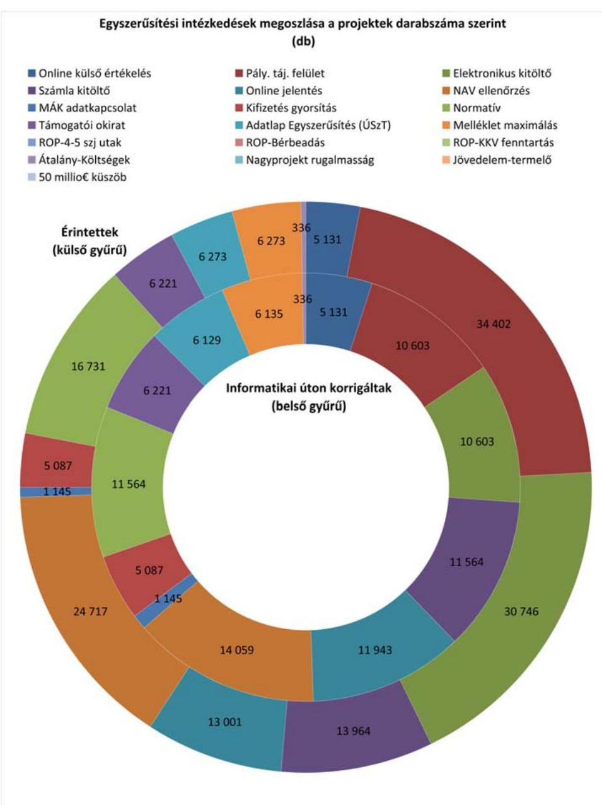

Az egyhetes válaszadási időszakot követően összesen 13658 db kitöltött kérdőív érkezett vissza (válaszadási arány: 13,7\%), melyből 1598 kérdőívben (a visszaküldött kérdőívek 11,7\%-ában) szerepelt érdemi javaslat, észrevétel a további egyszerűsítési intézkedésekre.

A válaszok alapján létrehozott Excel táblázat elemzésekre alkalmas. A kedvezményezettek egyszerűsítési javaslatainak elemzését követően a tételenként kategorizált és összesített egyéni vélemények alapján 11 válaszcsoportot alakítottunk ki. Az

---

egyéni válaszok tételes értékelése folyamán a vélemények az alábbi 11 válaszcsoport egyikébe kerültek be:

1. elektronikus ügyintézés;
2. dokumentumok/adminisztráció csökkentése, duplikáció elkerülése;
3. pályázati felület továbbfejlesztése/hibajavítás;
4. finanszírozás gyorsítása/egyszerűsítése;
5. egyértelmű meghatározások, sablonok rendelkezésre állása;
6. finanszírozáson kívüli eljárások gyorsítása/egyszerűsítés;
7. telefonos ügyfélszolgálat fejlesztése;
8. általános negatív vélemény (bonyolult/lassú);
9. általános pozitív vélemény;
10. pályázatírót alkalmazott, így önálló véleménye nem volt;
11. egyéb.

---

# Főbb következtetések 

- 2008-2011 között meghozott választható egyszerúsítési intézkedések értékelése;

A 7 választható egyszerűsítési intézkedés közül 2 intézkedés alkalmazására került sor. A alkalmazott választható intézkedések a 2. számú, az átalányalapú költségek (egységköltség alkalmazásával számítva) és a 6. számú nagyprojektek megnövelt rugalmassága megnevezésű intézkedés. A 2 alkalmazott, választható egyszerűsítési intézkedés megítélése a hatóságok és a kedvezményezettek részéről is azonos, az intézkedések alkalmazása hasznos, mivel tényleges egyszerűsítést jelentett. Túlszabályozás nem fordult elő.

A 2. (Átalányalapú költségek (egységköltség alkalmazásával számítva)) intézkedés 348 db (a potenciálisan érintett projektek $87,4 \%$-a) projektnél érvényesült. A potenciálisan érintett és a teljes projektek száma megegyezett, 398 db , az összes projektre elkülönített forrás 59252 E EUR volt. Az intézkedés által érintett projektekre elkülönített forrás aránya $35 \%$ az összes projektre elkülönített forráshoz viszonyítva.

A 6. (Nagyprojektek megnövelt rugalmassága) intézkedés 1 db potenciálisan érintett projektnél érvényesült (ERFA KMOP). A projektek teljes száma 4175 db volt, az összes projektre elkülönített forrás 777784 E EUR volt. Az intézkedés által érintett 1 db projektre elkülönített forrás (19 285 E EUR) aránya 2,5\% az összes projektre elkülönített forráshoz viszonyítva.

Az ERFA források felhasználása során az 1-3. számú választható egyszerűsítési intézkedést a hatóságok nem alkalmazták és nem is tervezik alkalmazni, az NFÜ Alkalmazhatósági Útmutatója uniós egyeztetésének elhúzódása miatt. A 4. és a 7. számú választható egyszerűsítési intézkedés a meglévő intézményi rendszer átalakítását igényelné, ennek végrehajtását a hatóságok nem tervezik. Az 5. számú választható egyszerűsítési intézkedés bevezetése szükségtelen, nem értelmezhető, mivel Magyaországon nem kerül költségnyilatkozatba az előleg.

Az ESZA források felhasználása során a 4, 5. és a 6. számú választható egyszerűsítési intézkedés nem alkalmazható, mivel ezek az Alapra nem értelmezhetőek. Az 1. és 3. számú választható egyszerűsítési intézkedést a hatóságok nem alkalmazták a bevezetését megalapozó módszertan uniós egyeztetésének elhúzódása miatt. A módszertan 2012. augusztusában elfogadásra került, ezért az NFÜ 2013-ig az 1. és 3. számú választható egyszerűsítési intézkedés bevezetését tervezi. A 7. számú választható egyszerűsítési intézkedés a meglévő intézményi rendszer átalakítását igényelné, ennek végrehajtását a hatóságok nem tervezik.

- 2008-2011 között meghozott kötelező, és a nemzeti hatáskörben meghozott egyszerúsítési intézkedések értékelése;

Magyarországon a Munkacsoport által meghatározott mind a 9 (2 kötelező és 7 választható) egyszerűsítési intézkedés beépült a nemzeti keretrendszerbe mind az ERFA, mind pedig az ESZA alapok vonatkozásában. Az EU egyszerűsítő intézkedések jogszabályi megalapozására nem volt szükség, mert az EU rendeletek közvetlenül alkalmazandóak, azaz külön nemzeti jogi átültetés nélkül válnak a nemzeti jog részévé, illetve általános hatályúak, azaz minden részletében minden tagállamra kötelezőek.

---

A 2 kötelező intézkedés közül a 8. számú, a projektek teljes költséghatárának megemelése megnevezésű intézkedésnél a vizsgált időszakban nem volt érintett projekt, a másik intézkedés ( 9 . számú, az egységes 50 millió EUR összegű küszöb bevezetése) is mindössze egy projektet érintett.

A 9. számú intézkedés a KEOP-ra vonatkozott, ahol a projektek teljes száma 1521 db , az összes projektre elkülönített forrás 219120 E EUR volt. Az intézkedés által érintett projektre elkülönített forrás ( 3213 E EUR) aránya 1,5\% volt az összes projektre elkülönített forráshoz viszonyítva. Mind a két kötelező egyszerűsítési intézkedés megítélése a hatóságok részéről pozitív, mivel az intézkedések alkalmazását hasznosnak tartották, amelyek tényleges egyszerűsítést jelentettek. Az egyetlen kedvezményezett nem érzékelt negatív hatást az intézkedéssel kapcsolatban és változást sem tapasztalt az adminisztratív terhekben, költségekben. Túlszabályozás nem fordult elő.

A nemzeti hatáskörben megállapított egyszerűsítési intézkedések közül az irányító hatóságoknál és a kedvezményezetteknél - a nemzetközi ellenőrzésben bemutatás céljából - 15 db -ot értékelt az ÁSZ ellenőrzés. Az intézkedések egyaránt érintették az ERFA és az ESZA támogatású projekteket. Bevezetésük szakmai indokai a következők voltak: a projektkiválasztás folyamat és a kifizetések gyorsítása, az adminisztratív terhek csökkentése, a pályázókkal, kedvezményezettekkel gyorsabbá, átláthatóbbá váló kommunikáció, a pályázóbarát támogatási rendszer erősítése.

Az irányító hatóságok minden alkalmazott intézkedést hasznosnak, tényleges egyszerűsítésnek ítéltek, a kedvezményezettek/pályázók is inkább pozitívnak értékelték az intézkedések hatását, amelyek következtében csökkentek, vagy nem változtak a kedvezményezettek és/vagy a támogatásközvetítő rendszer ellenőrzési terhei.

# - A 2014-2020 közötti programozási időszakra vonatkozó jogalkotási csomag tervezetének értékelése. 

Az ellenőrzött hatóságok szerint - elvileg - a szabályozás nagyobb mozgásteret/lehetőségeket biztosít a tagállamok számára, de fontos az ehhez szükséges szabályozási környezet, különös tekintettel a szükséges elszámolhatósági útmutatók kialakítása.

---

# Ellenőrzési megállapítások 

## I. rész: Általános áttekintés

## 1. fôterület - A Strukturális Alapok programjainak áttekintése

Fő kérdés: Az Önök tagállama mennyi pénzt kap a Strukturális Alapokból a 20072013 közötti időszakra, és az hogyan oszlik meg az operatív programok között (a területi együttmúködésre irányuló operatív programok és a transznacionális programok kivételével)?

Magyarország részére a Strukturális Alapokból a 2007-2013 közötti időszakra vonatkozóan az ERFÁ-ból 12649743 E EUR, az ESZÁ-ból 3629089 E EUR összegű támogatási keretet állapítottak meg, a hazai rész az ERFA esetében 2232308 E EUR, az ESZA esetében 640427 E EUR volt. A támogatások megoszlását az operatív programok között az 1. főterülethez kitöltött, „Az operatív programok támogatási kerete a 2007-2013. évek között (2007. január 1-jei és 2011. december 31-i állapot)" című 5/a. függelék, az operatív programok adatait évenkénti bontásban az 5/b. számú függelék tartalmazza.

### 1.1 A Magyarországon indított operatív programok száma, és összesített költségvetési forrása (uniós források + nemzeti társfinanszírozás):

a) Az Európai Szociális Alap részeként Magyarország 2 db operatív programot indított (ÁROP, TÁMOP);
b) az Európai Regionális Fejlesztési Alap részeként 12 db operatív programot indított (EKOP, GOP, KEOP (3-4. és 6. prioritás), KÖZOP (3-4. prioritás), $\mathrm{ROP}^{8}$ (konvergencia), ROP (KMOP), TIOP);
a) Az ESZA-hoz kapcsolódó összesített költségvetési forrás 4269516 E EUR (az uniós források összege: 3629089 E EUR, a nemzeti társfinanszírozás összege 640427 E EUR) volt;
b) az ERFA-hoz kapcsolódó összesített költségvetési forrás 14882052 E EUR (az uniós források összege: 12649743 E EUR, a nemzeti társfinanszírozás összege 2232308 E EUR) volt.

### 1.2 Az egyes operatív programok jóváhagyott támogatási kerete

A operatív programonkra elkülönített kereteket az 5/a. függelék, valamint az alábbi felsorolás tartalmazza a 2011. december 31-i állapot szerint.
uniós források nemzeti társfinanszírozás
ESZA:
ÁROP 146571 E EUR 25865 E EUR
TÁMOP 3482518 E EUR 614562 E EUR

[^0]
[^0]:    ${ }^{8}$ A ROP részei a KMOP, és a konvergencia régiók operatív programjai (a DAOP, a DDOP, az ÉAOP, az ÉMOP, a KDOP, az NYDOP).

---

ERFA:

| EKOP | 358445 E EUR | 63255 E EUR |
| :-- | :--: | :--: |
| GOP | 2858824 E EUR | 504498 E EUR |
| KEOP | 396031 E EUR | 69888 E EUR |
| ROP (KMOP) | 1467196 E EUR | 258917 E EUR |
| KÖZOP | 1482907 E EUR | 261690 E EUR |
| ROP (konvergencia) | 4304318 E EUR | 759586 E EUR |
| TIOP | 1782022 E EUR | 314474 E EUR |

Az operatív programok támogatási keretét összefoglalva a 2. számú ábra mutatja:
2. sz. ábra
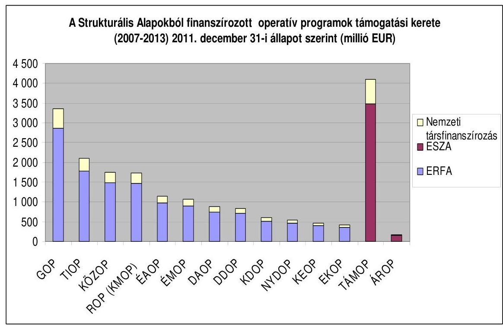

Forrás: NFÜ (Az adatok tartalmazzák az operatív programok között végrehajtott átcsoportosításokat.)

# 1.3 Az egyes operatív programok támogatási keretének aránya a 20072013 közötti időszak Strukturális Alapjainak teljes összegéhez képest (uniós források + nemzeti társfinanszírozás): 

$27 \%$ a ROP (konvergencia),
$21 \%$ a TÁMOP,
$18 \%$ a GOP,
$11 \%$ a TIOP.
A többi operatív program esetén az arány nem éri el a 10\%-ot: ÁROP 1\%, EKOP 2\%, KEOP 2\%, ROP (KMOP) és KÖZOP 9-9\%.

---

# II. Rész: 2008/2009/2010/2011-ben meghozott egyszerúsítési intézkedések 

## 2. főterület: - A választható egyszerűsítési intézkedések hatása, nemzeti keretrendszerbe való beépítése és megítélése

Ebben a részben áttekintjük a választható egyszerűsítési intézkedések nemzeti keretrendszerbe való beépítésének helyzetét, hatását és fogadtatását a kedvezményezettek és a támogatásközvetítő szervezetek részéről.

Általános értékelés:

## I. kérdés: Az Önök tagállama beépítette a választható egyszerúsítési intézkedéseket a nemzeti keretrendszerbe?

Az EU egyszerűsítő intézkedések jogszabályi megalapozására nem volt szükség, mert az EU rendeletek közvetlenül alkalmazandóak, azaz külön nemzeti jogi átültetés nélkül válnak a nemzeti jog részévé, illetve általános hatályúak, azaz minden részletében minden tagállamra kötelezőek.

Az egyszerűsítési intézkedések alkalmazásához azonban szükség volt az Elszámolhatósági Útmutató elfogadására, ami az ERFA esetében nem történt meg, az ESZA esetében pedig 2012 augusztusáig húzódott.

Az EU válaszható intézkedések bevezetésének indokai az irányító hatóságok szerint a következők voltak: egyszerűsítés, adminisztratív terhek csökkentése, gyorsítás, forrásvesztés elkerülése.

Az érintett uniós egyszerűsítési intézkedések átültetése kapcsán felmerülő gondokról az ellenőrzött szervezetek nem számoltak be.

Magyarország az egyszerűsítési intézkedésekhez nem tett hozzá további elemeket, azonban a 2. számú intézkedés esetében az uniós egyszerűsítési intézkedés bevezetése előtti egyes szigorúbb szabályokat - részletes módszertan hiányában - nem következetesen szüntették meg, ugyanis továbbra is érvényben maradt az a kötelezettség, hogy az átalányköltségen elszámolt számlákat meg kellett őrizni, és azokat a helyszíni ellenőrzéskor be kellett mutatni.

Az intézkedések hatályba lépésének időpontja megegyezett az EU rendeletek hatályba lépésének időpontjával.

A HEP IH a TÁMOP-ra tervezi bevezetni az 1-3. intézkedést.

## II. kérdés: Hány operatív program és projekt érintett, és mennyi pénz kapcsolódik a választható egyszerúsítési intézkedésekhez?

Az intézkedések közül a 6. (Nagyprojektek megnövelt rugalmassága) intézkedés az 1 db potenciálisan érintett ${ }^{9}$ projektnél érvényesült (ERFA ROP (KMOP)). A projektek teljes száma 4175 db , az összes projektre elkülönített forrás 777784 E EUR volt. Az intézkedés által érintett projektekre elkülönített forrás aránya 2,5\% az összes projektre elkülönített forráshoz viszonyítva (6. számú függelék).

[^0]
[^0]:    ${ }^{9}$ Az intézkedés által elméletileg érintett projektek (6. számú intézkedés esetén a hazai kifizetés elfogadása uniós jóváhagyás előtt).

---

A visszamenőlegesen alkalmazható, 2. (Átalányalapú költségek (egységköltség alkalmazásával számítva)) intézkedés $348 \mathrm{db}(87,4 \%)$ ESZA-ÁROP projektnél érvényesült. A potenciálisan érintett és a teljes projektek száma megegyezett, 398 db , az öszszes projektre elkülönített forrás 59252 E EUR volt. Az intézkedés által érintett projektekre elkülönített forrás aránya $35 \%$ az összes projektre elkülönített forráshoz viszonyítva (7. számú függelék).

# III. kérdés: Hasznosak-e és tényleges egyszerúsítést jelentenek-e a választható egyszerúsítési intézkedések? 

Mind a kedvezményezettek, mind az irányító hatóságok valós egyszerúsítésnek értékelték az intézkedéseket.

Az intézkedések alkalmazása elmaradásának indoka volt az EU-val folytatott egyeztetések elhúzódása (ERFA 1-3. intézkedések, ESZA 1. és 3. intézkedés), nemzetközi tapasztalatok hiánya (7. intézkedés), a hazai gyakorlat eltérő volta (5. intézkedés), illetve Magyarország az intézkedés meghozatala előtt kialakította a kapcsolódó intézményrendszert, ezen nem volt értelme változtatni. Az alkalmazás elmaradásának okairól a megkérdezett minisztériumok nem nyújtottak érdemi információt.

Az intézkedésekhez kapcsolódóan nem folytak célellenőrzések. A támogatásokat kezelő intézményrendszer a folyamatba épített ellenőrzések során az egyszerűsítő intézkedésekkel összefüggő szabálytalanságot nem állapított meg. ${ }^{10} \mathrm{Az}$ igazoló/ellenőrzési hatóságok nem rendelkeztek ilyen irányú tapasztalatokkal. Az Ellenőrzési Hatóság szerint: „Az egyszerúsítésre vonatkozó törekvések - vagyis az adminisztráció és a bürokrácia csökkentése - alapvetően előremutatóak, azonban azok gyakorlati tapasztalatai, kockázatai jelenleg nem ismertek."

Az intézkedések következtében csökkentek vagy nem változtak a kedvezményezettek és/vagy a végrehajtási intézményrendszer ellenőrzési terhei. A 8. intézkedés esetében „a támogatást kezelő intézményrendszer ellenőrzési terhei csökkentek (kevesebb dokumentumot kell ellenőrizni), így összességében a kifizetésekre gyorsabban kerülhetett sor. Ugyanakkor a helyszíni ellenőrzések során ellenőrizendő dokumentumok mennyisége nőtt." (NFÜ kérdőívre adott válasza)

A kedvezményezettek csak az alkalmazott intézkedésekről alkottak véleményt az alábbiak szerint:

Az egy adott egyszerűsítési intézkedésről a válaszadók hasonló véleménnyel rendelkeztek operatív programtól függetlenül, az egyes válaszok részaránya az átlagtól nem tért el 10\%-nál nagyobb mértékben. A többség (lásd a 3. és 5. kérdésre adott válaszok elemzését a 8. és a 8/a-8/f számú függelékekben) az alkalmazott intézkedéseket egyszerűsítésnek értékelte.

Az intézkedéseknek a válaszolók szerint (kedvezményezettek, hatóságok) szerint nem voltak negatív hatásai.

## IV. kérdés: Ajánlanak-e az irányító/igazoló/ellenőrző hatóságok és a kedvezményezettek fejlesztéseket vagy további egyszerüsítéseket? Ha igen, melyek ezek? Milyen érvek szólnak a javasolt fejlesztések mellett?

[^0]
[^0]:    ${ }^{10}$ Az NFÜ adatszolgáltatásában a folyamatba épített ellenőrzések a dokumentum alapú mellett a helyszíni ellenőrzéseket is magukba foglalják.

---

A KIM és az NFÜ tájékoztatása szerint további 7 egyszerűsítő intézkedés bevezetését tervezték, melyből a 2012. év folyamán az ellenőrzés befejezéséig 3 - adatkapcsolattal, illetve a források biztosításával kapcsolatos - intézkedést már be is vezettek ( 9 . számú függelék). Az intézkedésekhez indoklást nem fűztek.

A 2012-2013. évekre az Igazoló Hatóság nem tervez további egyszerűsítési javaslatot, az Ellenőrzési Hatóság, valamint az NFM és az NGM az ellenőrzéshez kapcsolódóan nem számolt be egyszerűsítési javaslatairól.

# V. kérdés: Hogyan értékeli a számvevőszék a választható egyszerűsítési intézkedések hasznosságát? 

A hatóságok, valamint a kedvezményezettek pozitív véleménye, továbbá az ÁSZ ellenőrzés tapasztalatai alapján minden alkalmazott választható intézkedést hasznosnak, tényleges egyszerűsítésnek ítéltünk, amelyek következtében csökkentek a kedvezményezettek és/vagy a támogatásközvetítő rendszer adminisztratív terhei.

---

# Intézkedésenkénti értékelések 

## A választható egyszerúsítési intézkedések hatása, nemzeti keretrendszerbe való beépítése és megítélése

## 1. választható egyszerúsítési intézkedés: Közvetett költségek (átalányalapon meghatározva, legfeljebb a közvetlen költségek 20\%-áig)

## I. kérdés: Az Önök tagállama beépítette a választható egyszerúsítési intézkedést a nemzeti keretrendszerbe?

Magyarország nem alkalmazta az egyszerúsítési intézkedést.

## ERFA

## Az alkalmazás elmaradásának oka:

ERFA: Az intézkedés bevezetési dátuma az uniós rendeletben 2009. május 22. volt. Magyarország megkezdte a szükséges módszertan bevezetésének elkészítését, azonban az NFÜ szerint nem álltak rendelkezésre szükséges mélységű információk, a megalapozó módszertan kidolgozása időigényes, a szükséges adatokat visszamenőleg kell kigyújteni, csak új kiírások esetén lehet alkalmazni, ilyen már nem volt sok az egyeztetési folyamat felfüggesztésekor, a 2011. év vége után.

Magyarország nem tervezi 2014-ig az egyszerűsítő intézkedés alkalmazását.

## ESZA

Az intézkedés bevezetését megalapozó módszertan - közel 3 éves egyeztetés utáni bizottsági jóváhagyására 2012 augusztusában került sor. Ezt követően tervezi a HEP IH az intézkedés bevezetését a 2007-2013 közötti tervezési periódus TÁMOP kiírásaiban. Az ún. flat-rate (közvetett költségek átalány-alapú elszámolása) egyszerűsítő intézkedés bevezetése - tekintve, hogy az Európai Bizottság előzetes jóváhagyásához kötött - a legkisebb kockázatot jelenti a tagállam szempontjából.
II. kérdés: Hány operatív program és projekt érintett, és mennyi pénz kapcsolódik a választható egyszerúsítési intézkedéshez?

Nem érintett programokat.
III. kérdés: Hasznos-e és tényleges egyszerúsítést jelent-e a választható egyszerúsítési intézkedés?

Nincs tapasztalat.
2. választható egyszerúsítési intézkedés: Átalányalapú költségek (egységköltség alkalmazásával számítva)
I. kérdés: Az Önök tagállama beépítette a választható egyszerúsítési intézkedést a nemzeti keretrendszerbe?

## ESZA

Az alkalmazhatósághoz a nemzeti elszámolhatósági útmutató módosítása járult hozzá.

---

Az átalányköltségek megállapításának meghatározásához, elemzéséhez rendelkezésre állt a 2004-2006. programozási időszakra érvényes Nemzeti Fejlesztési Terv közel 17 ezres projektjének elszámolása, amely tételesen tartalmazta a menedzsment költségeket is, azonban a kérdőívre adott NFÜ válasz szerint az adatbázis nem képezte az átalányköltség megállapításának alapját.

A bevezetés célja volt: a támogatási folyamat egyszerűsítése, a gyorsabb átfutási idő, az adminisztratív terhek csökkentése.

ESZA forrásokra van elfogadott elszámolhatósági útmutató, az intézkedés bevezetését megalapozó módszertan - közel 3 éves egyeztetés utáni - bizottsági jóváhagyására 2012 augusztusában került sor. Csak egy IH (a KÖZIG IH az ÁROP projektjeire) alkalmazta a 2. intézkedést. A TÁMOP-ból, ESZA forrásból finanszírozott programok esetében a 2007-2013-as programozási időszakban lehetőség szerint pilot projekt keretében, és a 2014-2020-as időszakban már rendszerszinten tervezi a HEP IH az egyszerűsítő intézkedés alkalmazását. A módszertanok véglegesítése folyamatban van.

Az NGM-től kapott tájékoztatás szerint a módszer bevezetésének egy további területe a munkaerőképzés, illetve a szolgáltatások költségei lehetnek. A módszer alkalmazásának egyik feltétele az NGM szerint a megfelelő megbízhatóságú historikus adatbázis megléte az egységkalkuláció módszertanának igazolására. A módszer alkalmazásának nemzetközi tapasztalatairól a HEP IH az általa 2012 júliusában szervezett nemzetközi workshop-on is szerzett információkat.

Magyarország az egyszerűsítési intézkedésekhez nem tett hozzá további elemeket, azonban a 2. számú intézkedés esetében az uniós egyszerűsítési intézkedés bevezetése előtti egyes szigorúbb szabályokat - részletes módszertan hiányában - nem következetesen szüntették meg, ugyanis továbbra is érvényben maradt az a kötelezettség, hogy az átalányköltségen elszámolt számlákat meg kellett őrizni, és azokat a helyszíni ellenőrzéskor be kellett mutatni.

A KÖZIG IH az átalány alapú elszámolás mellett meghagyta a számlák megőrzésének kötelezettségét a helyszíni ellenőrzésekhez. (Az intézkedés bevezetésekor még nem létezett egységes uniós módszertan, amely egyértelművé tette volna az átalány alapú elszámolás részletszabályait.)

# ERFA 

## A bevezetés elmaradásának oka:

Az intézkedés bevezetési dátuma az uniós rendeletben 2009. május 22. volt. Magyarország megkezdte a szükséges módszertan bevezetésének elkészítését, azonban az elszámolhatósági útmutatónak a nemzeti hatóságok és az EU Bizottság közötti egyeztetése elhúzódott. Az NFÜ szerint nem álltak rendelkezésre szükséges mélységű információk, a megalapozó módszertan kidolgozása időigényes, a szükséges adatokat visszamenőleg kell kigyújteni, valamint csak új kiírások esetén lehet alkalmazni (amit nem terveztek sokat).

Magyarország nem tervezi 2014-ig az egyszerűsítő intézkedés alkalmazását.

## II. kérdés: Hány operatív program és projekt érintett, és mennyi pénz kapcsolódik a választható egyszerúsítési intézkedéshez?

Az intézkedés 348 db (87,4\%) ESZA-ÁROP projektnél érvényesült. A potenciálisan érintett és a teljes projektek száma megegyezett, 398 db , az összes projektre elkülöní-

---

tett forrás 59252 E EUR volt. Az intézkedés által érintett projektekre elkülönített forrás aránya $35 \%$ az összes projektre elkülönített forráshoz viszonyítva (7. számú függelék).

# III. kérdés: Hasznos-e és tényleges egyszerúsítést jelent-e a választható egyszerúsítési intézkedés? 

Az irányító hatóságok az alkalmazott intézkedést hasznosnak, tényleges egyszerúsítésnek ítélték.

A kedvezményezettek közel fele nem ismerte az intézkedést. A válaszadók 49\%-a időt takarított meg az intézkedés alkalmazásával. Negatív hatást nem tapasztaltak a kedvezményezettek az egyszerúsítési intézkedés bevezetése következtében. 48\% esetében költség/adminisztrációs teher csökkenését tapasztalták, 42\%-uk nem tapasztalt változást e tekintetben.

## 3. választható egyszerúsítési intézkedés: Átalányösszegek

## I. kérdés: Az Önök tagállama beépítette a választható egyszerúsítési intézkedést a nemzeti keretrendszerbe?

## ERFA

## A bevezetés elmaradásának oka:

Az ERFA forrásokra az elszámolhatósági útmutatónak a nemzeti hatóságok és az EU Bizottság közötti elhúzódó egyeztetése volt.

Magyarország nem tervezi 2014-ig annak alkalmazását.

## ESZA

Az intézkedés bevezetését megalapozó módszertan - közel 3 éves egyeztetés utáni bizottsági jóváhagyására 2012 augusztusában került sor. Az ESZA Általános útmutató az elszámolható költségekről 2007-2013 programozási időszak: szabályozza az egyszerúsített elszámolási módokat és alkalmazásuk eseteit. A TÁMOP-ból, ESZA forrásból finanszírozott programok esetében a 2007-2013-as programozási időszakban lehetőség szerint pilot projekt keretében, és a 2014-2020-as időszakban már rendszerszinten tervezi a HEP IH az egyszerűsítő intézkedés alkalmazását. A módszertanok véglegesítése folyamatban van.

## II. kérdés: Hány operatív program és projekt érintett, és mennyi pénz kapcsolódik a választható egyszerúsítési intézkedéshez?

Nem volt érintett program.

## III. kérdés: Hasznos-e és tényleges egyszerúsítést jelent-e a választható egyszerúsítési intézkedés?

Nem volt tapasztalat.

---

4. választható egyszerűsítési intézkedés: A természetbeni hozzájárulások elszámolható költségként való meghatározásának engedélyezése a pénzügyi tervezéssel kapcsolatban
I. kérdés: Az Önök tagállama beépítette a választható egyszerűsítési intézkedést a nemzeti keretrendszerbe?

# A bevezetés elmaradásának oka: 

A 4. intézkedés esetében a GOP és KMOP keretében meghirdetett pénzügyi konstrukciókat működtető holdingalap felállítására már 2007-ben, a rendelet módosítását megelőzően sor került, így az intézkedés az NFÜ számára már nem volt releváns.

Újabb holdingalap felállítása 2014-ig nem várható.
Magyarország nem tervezi 2014-ig alkalmazását.
II. kérdés: Hány operatív program és projekt érintett, és mennyi pénz kapcsolódik a választható egyszerűsítési intézkedéshez?

Nem volt érintett program.
III. kérdés: Hasznos-e és tényleges egyszerűsítést jelent-e a választható egyszerűsítési intézkedés?

Magyarország az EU intézkedés meghozatalát megelőzően alakította ki rendszerét, ezért az uniós intézkedésről nem volt tapasztalat.

## 5. választható egyszerűsítési intézkedés: Előlegfizetések

I. kérdés: Az Önök tagállama beépítette a választható egyszerűsítési intézkedést a nemzeti keretrendszerbe?

## A bevezetés elmaradásának oka:

Az intézkedés bevezetése szükségtelen, Magyarország nem teszi költségnyilatkozatba a kedvezményezetteknek fizetett előleget, így az egyszerűsítés nem idézett elő változást.

Magyarország nem tervezi 2014-ig alkalmazását.
II. kérdés: Hány operatív program és projekt érintett, és mennyi pénz kapcsolódik a választható egyszerűsítési intézkedésekhez?

Nem volt érintett program.
III. kérdés: Hasznos-e és tényleges egyszerűsítést jelent-e a választható egyszerűsítési intézkedés?

Nem volt tapasztalat.
6. választható egyszerűsítési intézkedés: Nagyprojektek megnövelt rugalmassága
I. kérdés: Az Önök tagállama beépítette a választható egyszerűsítési in-

---

# tézkedést a nemzeti keretrendszerbe? 

Alkalmazásának indoka a kifizetések gyorsítása, a forrásvesztés elkerülése. A nagyprojektek Európai Bizottság általi jóváhagyása egy-másfél évet vett igénybe, az egyszerűsítésnek köszönhetően a projektek végrehajtásával nem kell erre várni.

Az intézkedés bevezetése akadályokba nem ütközött, túlszabályozás nem volt.

## II. kérdés: Hány operatív program és projekt érintett, és mennyi pénz kapcsolódik a választható egyszerúsítési intézkedéshez?

Az intézkedés 1 db potenciálisan érintett projektnél érvényesült (ERFA KMOP). A projektek teljes száma 4175 db , az összes projektre elkülönített forrás 777784 E EUR volt. Az intézkedés által érintett projektekre elkülönített forrás aránya 2,5\% az összes projektre elkülönített forráshoz viszonyítva (6. számú függelék).

## III. kérdés: Hasznos-e és tényleges egyszerúsítést jelent-e a választható egyszerúsítési intézkedések?

Az NFÜ tényleges egyszerűsítésnek értékelte az intézkedést.
Az egyszerűsítési intézkedés vonatkozásában nem érkezett kitöltött kérdőív.

## 7. választható egyszerűsítési intézkedés: Társfinanszírozott visszatérítendő támogatások

## I. kérdés: Az Önök tagállama beépítette a választható egyszerűsítési intézkedést a nemzeti keretrendszerbe?

A 1310/2011/EU rendelet 2011. december 13-tól vezeti be a közreműködő szervezeteken keresztül nyújtható visszatérítendő hozzájárulások és hitelkeretek fogalmát, ez szinte egybeesik a jelen ellenőrzés vizsgálati időszakának végével.

## A bevezetés elmaradásának oka:

Magyarországon nem volt állami pénzügyi intézményként működő, kijelölt közreműködő szervezet, az intézményi háttér kialakítása időigényes. A hiányzó nemzetközi tapasztalatok illetve részletszabályok miatt az IH-k nem foglalkoztak az intézkedés bevezetésével.

## II. kérdés: Hány operatív program és projekt érintett, és mennyi pénz kapcsolódik a választható egyszerűsítési intézkedéshez?

Nem volt érintett program.

## III. kérdés: Hasznos-e és tényleges egyszerűsítést jelent-e a választható egyszerűsítési intézkedés?

Nem volt tapasztalat.

---

# 3. főterület - A kötelező és a nemzeti hatáskörben meghozott egyszerúsítési intézkedések hatása és megítélése 

Mind az EU kötelező, mind a nemzeti hatáskörben bevezetett egyszerűsítési intézkedések hasznosak voltak. Minden intézkedés gyorsíthatta a támogatások felhasználásának folyamatát. Az intézkedések következtében csökkentek (nemzeti hatáskörben bevezetett intézkedések közül: 3- 5. valamint a 11. és 12. intézkedések) vagy nem változtak a kedvezményezettek és/vagy a támogatásközvetítő rendszer ellenőrzési terhei.

## Kötelező intézkedések

## Általános értékelés:

A két kötelező intézkedés az ERFA forrásból finanszírozott regionális és az infrastruktúra fejlesztési operatív programok projektjeit érintette.

Az ellenőrzöttek az intézkedésekhez kapcsolódóan nem tettek továbbfejlesztésükre javaslatokat.

## Az ÁSZ értékelése:

A két kötelező intézkedés bevezetése nem okozott gondot, a 9. kötelező egyszerűsítési intézkedés valós egyszerűsítést jelentett. Magyarországon a jövedelemtermelő projektek a korábbi ( 500 E EUR) értékhatárt sem érték el, ezért az értékhatár megnövelése (8. kötelező egyszerűsítési intézkedés) nem érintett projekteket, az intézkedés alkalmazásához nem voltak a megfelelő költségsávban jövedelemtermelő projektek. A későbbiek során, amennyiben két értékhatár közötti sávban lesznek támogatott projektek, akkor, mind a pályázatok elfogadásakor, mind a projektek értékelésekor egyszerűsítés következik be.

## 8. kötelező egyszerűsítési intézkedés: A jövedelemtermelő projektek teljes költséghatárának megemelése 1 millió EUR összegre és az ESZA projektek kizárása

## I. kérdés: Hány operatív program és projekt érintett, és mennyi pénz kapcsolódik a kötelező egyszerúsítési intézkedéshez?

Az érintett operatív programok 11069 db projektet tartalmaztak, ezek közül jövedelemtermelő 7468 darab volt ( 4840999 E EUR, 1072185 E EUR kerettel), visszamenőleges hatállyal összesen 12223 db projektet tartalmaztak, ezek közül jövedelemtermelő 9513 darab volt, amelynek kerete rendre 5569329 illetve 1277841 E EUR volt.

Magyarországon a jövedelemtermelő projektek a korábbi ( 500 E EUR) értékhatárt sem érték el, ezért az értékhatár megnövelése nem érintett projekteket, az intézkedés alkalmazásához nem voltak a megfelelő költségsávban jövedelemtermelő projektek.

## II. kérdés: Hasznos-e és tényleges egyszerűsítést jelent-e a kötelező egyszerúsítési intézkedés?

Az alkalmazott intézkedésekhez többletszabályozás nem járult.

---

Az intézkedést mind az Igazoló Hatóság, mind a bevezető IH-k hasznosnak, tényleges egyszerűsítésnek tartották, azonban a bevezetés indoklásaként annak kötelező jellegét adták meg.

Az intézkedés pozitív hatása mind az Ellenőrzési, mind az irányító hatóság szerint a költség/adminisztratív teher csökkenése (pl. csökkentette ellenőrzési kötelezettségüket).

Az IH-k egyértelműen egyszerűsítésnek értékelték az intézkedést.
A támogatásokat kezelő intézményrendszer a folyamatba épített ellenőrzések során az egyszerűsítő intézkedésekkel összefüggő szabálytalanságot nem állapított meg. ${ }^{11}$

Jó gyakorlatról nem tudunk beszámolni, mert nem volt érintett projekt. A későbbiek során, amennyiben két értékhatár közötti sávban lesznek támogatott projektek, akkor mind a pályázatok elfogadásakor, mind a projektek értékelésekor egyszerűsítés következik be.

# 9. kötelező egyszerűsítési intézkedés: Egységes 50 M EUR összegű küszöb bevezetése a nagyprojektekhez 

## I. kérdés: Hány operatív program és projekt érintett, és mennyi pénz kapcsolódik a kötelező egyszerűsítési intézkedéshez?

Az intézkedés a KEOP egy projektjére vonatkozott, ahol a korábbi költségküszöb 25 M EUR volt.

A KEOP kerete 219120 E EUR, a leszerződött projektek száma 1521 db , az egy érintett projekt támogatása 3213 E EUR volt.

## II. kérdés: Hasznos-e és tényleges egyszerűsítést jelent-e a kötelező egyszerúsítési intézkedés?

Az intézkedést mind az Igazoló Hatóság, mind az azt bevezető IH hasznosnak, tényleges egyszerűsítésnek tartotta, azonban a bevezetés indoklásaként annak kötelező jellegét adták meg.

Az alkalmazott intézkedésekhez többletszabályozás nem járult.
Az intézkedés pozitív hatása, hogy a nagyprojektekre vonatkozó előírásokat magasabb értékhatár felett kell csak alkalmazni. Az értékhatár alatti projektek végrehajtása gyorsabb volt, az NFÜ álláspontja szerint az egyszerűsítési intézkedés csökkentette a költség, adminisztratív terheket.

Az egyetlen kedvezményezett nem érzékelt negatív hatást az intézkedéssel kapcsolatban és változást sem tapasztalt az adminisztratív terhekben, költségekben.

A támogatásokat kezelő intézményrendszer a folyamatba épített ellenőrzések során az egyszerűsítő intézkedésekkel összefüggő szabálytalanságot nem állapított meg ${ }^{12}$.

[^0]
[^0]:    ${ }^{11}$ Az NFÜ tájékoztatása szerit a folyamatba épített ellenőrzések a dokumentum alapú mellett a helyszíni ellenőrzéseket is magukba foglalják,
    ${ }^{12}$ Az NFÜ tájékoztatása szerit a folyamatba épített ellenőrzések a dokumentum alapú mellett a helyszíni ellenőrzéseket is magukba foglalják,

---

# A nemzeti hatáskörben meghozott 15 egyszerúsítési intézkedés hatása és megítélése 

## Általános értékelés:

Nemzeti hatáskörben megállapított egyszerúsítési intézkedések közül az irányító hatóságoknál és a kedvezményezetteknél - a nemzetközi ellenőrzésben bemutatás céljából - 15 db -ot értékelt az ÁSZ ellenőrzés. Az intézkedések egyaránt érintették az ERFA és az ESZA támogatású projekteket.

A nemzeti hatáskörben bevezetett intézkedések ( 15 db ) közül 5 igényelte jogszabály módosítását (8-12. intézkedések), 7 db (1-7. intézkedések) az Egységes Múködési Kézikönyvben került meghatározásra, 3 db (13-15. intézkedések) pedig a ROP állásfoglalása alapján lett hatályos. A nemzeti hatáskörben bevezetett intézkedések felsorolását és tartalmának lényegi ismertetését a 1. számú függelékben ismertetjük. A sorrendben első 7 intézkedés az elektronikus lehetőségek előnyeit használja ki, a 9-12. sorszámú intézkedések az elbírálási időtartamot csökkentik, a 8. és a 13-15. sorszámú intézkedések a felesleges hazai szigorú intézkedéseket közelítik az uniós rendeletek szelleméhez.

A nemzeti hatáskörben bevezetett intézkedések szakmai indokai a következők voltak: a projektkiválasztás folyamat és a kifizetések gyorsítása, az adminisztratív terhek csökkentése, a pályázókkal, kedvezményezettekkel gyorsabbá, átláthatóbbá váló kommunikáció, pályázóbarát támogatási rendszer erősítése.

A bevezetett egyszerúsítési intézkedésekben összesen 37432 db projekt volt érintett, összesen 164085 db egyszerúsítésben. A 15 db nemzeti hatáskörben bevezetett egyszerúsítési intézkedés összesen 171026 db projektnél érvényesült, amely halmozott adat, hiszen volt olyan projekt, amelyik több intézkedésben is érintett volt. A halmozódások alapján számolva az érintett projektek aránya az összes projekt 42,5\%-a, a potenciálisan érintett projektek 68,7\%-a (10. számú függelék). Az ERFA esetében a nemzeti intézkedéssel érintett projektek száma 139433 db ; az összes projekt $41,1 \%$-a, a potenciálisan érintett projektek 66,6\%-a. Az ESZA esetében a nemzeti intézkedéssel érintett projektek száma 31593 db ; az összes projekt $50,1 \%$-a, a potenciálisan érintett projektek $79,2 \%$-a.

A nemzeti hatáskörben bevezetett intézkedések közül az IH-k tapasztalatai szerint a kedvezményezetteket a kezdeti nehézségeken az ügyfélszolgálati rendszer átsegítette, a közremúködő szervezetek és az egyes IH-k esetében a 9. és a 11. intézkedés igényelt előzetes felkészülést, mérlegelést.

Az IH-k minden alkalmazott intézkedést hasznosnak, tényleges egyszerúsítésnek ítéltek, a kedvezményezettek/pályázók is inkább pozitívnak értékelték az intézkedések hatását.

Az intézkedések következtében csökkentek vagy nem változtak a kedvezményezettek és/vagy a végrehajtási intézményrendszer ellenőrzési terhei. A 8. intézkedés esetében „a támogatást kezelő intézményrendszer ellenőrzési terhei csökkentek (kevesebb dokumentumot kell ellenőrizni), így összességében a kifizetésekre gyorsabban kerülhetett sor. Ugyanakkor a helyszíni ellenőrzések során ellenőrizendő dokumentumok mennyisége nőtt." (NFÜ kérdőívre adott válasza)

A pályázók/kedvezményezettek csak az alkalmazott intézkedésekről alkottak véleményt az alábbiak szerint:

---

Az egy adott egyszerűsítési intézkedésről a válaszadók hasonló véleménnyel rendelkeztek operatív programtól függetlenül, az egyes válaszok részaránya az átlagtól nem tért el 10\%-nál nagyobb mértékben (kivételt jelentettek azon OP-k, ahol kisszámú válasz érkezett, pl. KÖZOP, EKOP, KEOP).

A válaszadók többsége (lásd a 3. és 5. kérdésre adott válaszok elemzését az 8. és 8/a$8 / f$ számú függelékek) az alkalmazott intézkedéseket egyszerűsítésnek értékelte.

Az intézkedéseknek a válaszolók (kedvezményezettek, hatóságok) szerint nem voltak negatív hatásai. A legnegatívabban értékelt a kedvezményezettek körében 18\%-os arányt képviselve a pályázatkitöltő program.

ERFA: A kedvezményezettek 30-39\%-a érzékelte adminisztratív terheinek csökkentését 4 db intézkedésnél, 40-49\%-a érzékelte 4 db intézkedésnél, 50-58\%-a érzékelte 5 db intézkedésnél. Két intézkedésre a „nem változott" válasz érkezett (2, illetve 1 válaszoló volt), 100\%-os válaszadási aránnyal.

ESZA: A kedvezményezettek 30-39\%-a érzékelte adminisztratív terheinek csökkentését 1 db intézkedésnél, 40- 49\%-a érzékelte 3 db intézkedésnél, 50-58\%-a érzékelte 8 db intézkedésnél.

A kérdőív lehetőséget adott arra, hogy a válaszadók röviden kifejtsék egyszerűsítéssel kapcsolatos véleményüket, további javaslataikat az egyszerúsítésre. A megjegyzéseket 11 fő kategóriákba lehetett besorolni. A legtöbb megjegyzés, javaslat az alábbi négy kategóriában érkezett.

# A kedvezményezettek véleménye: 

A 9-12. intézkedések révén összességében csökkentek a terhek, azonban a közreműködő szervezetek és az egyes IH-k esetében igényelt előzetes felkészülést, mérlegelést. A 13-15. intézkedések felesleges terhektől, kötöttségektől szabadították meg a támogatottakat, egyben csökkentették végrehajtási intézményrendszer munkáját is.

Az online külső értékelés egyszerűsítő hatása a lebonyolításban érintett szervezetek munkáját gyorsította, a bekért mellékletek maximalizálása a helyszíni ellenőrzés tapasztalatai szerint is korlátozottan érvényesült.

A válaszadók közel 10\%-a szerint a jelenlegi rendszer megfelelően működik, a kedvezményezett kiadásokat takarított meg, illetve tényleg egyszerűsítésként éli meg az adott intézkedést.

A pályázati, illetve projekt adminisztrációs rendszert a válaszadók bonyolultnak, bürokratikusnak tartják, amely indokolatlan adminisztrációs terhet ró rájuk, és számos területen párhuzamosságot, többletmunkát okoznak.

Általános negatív véleményt a válaszadók közel 5\%-a fejezett ki a hosszú elbírálási, kifizetési, ügyintézési határidőkkel, a bonyolult és bürokratikus rendszerrel kapcsolatosan.

## A kedvezményezettek fóbb javaslatai:

Elektronikus/on-line ügyintézés kiterjesztése: a pályázatok, projektek kezelése, az ezzel kapcsolatos ügyintézés (kizárólag) elektronikus úton történjen, a papíralapú dokumentumok benyújtásának mellőzésével. Az elektronikus ügyintézés eredménye-

---

ként felgyorsulnának az eljárások, a kedvezményezettek papírmunkát és költséget takarítanának meg.

Dokumentumok/adminisztráció csökkentése, duplikáció elkerülése: a pályázónak/kedvezményezetteknek ne kelljen papír alapon és ezzel párhuzamosan elektronikusan benyújtani a szükséges dokumentumokat. A hivatalok/hatóságok rendszereinek összekapcsolásával elkerülhető az adminisztrációs terheket jelentősen növelő duplikáció (pl. olyan igazolásokat, nyilatkozatokat, engedélyeket, okiratokat, hitelesítést stb. ne kelljen benyújtani, amely más hatóságnál, hivatalnál rendelkezésre áll).

Pályázói/projekt adminisztrációs felület továbbfejlesztése: a pályázók/kedvezményezettek által használt elektronikus felületek (pl. pályázatírás, projekt előrehaladási jelentés készítése, kifizetési kérelmek, számlaösszesítők kezelése) továbbfejlesztése, hibajavítása, további funkciók beépítését, amely megkönnyíti a felhasználók munkáját, könnyen kezelhetővé teszi a rendszereket.

Eljárások gyorsítása/egyszerűsítése: javaslatok a pályáztatási eljárás gyorsítására, illetve egyszerűsítésére, a bürokrácia, az adminisztráció (pl. a bekért dokumentumok/mellékletek számának) csökkentése, elektronikus ügyintézés bevezetése.

# 1. nemzeti hatáskörben meghozott egyszerúsítési intézkedés: Online külső értékelés 

I. kérdés: Hány operatív program és projekt érintett, és mennyi pénz kapcsolódik az egyszerúsítési intézkedéshez?

| Finanszírozási   alap: ERFA | Összes pro-   jekt | Potenciális   projekt | Érintett   projekt | Érintett/   összes | Érintett/   potenciális |
| :-- | :--: | :--: | :--: | :--: | :--: |
| Projektek (db) | 8366 | 6136 | 5380 | $64,3 \%$ | $87,7 \%$ |
| Források (E EUR) | 2204414,26 | 1659922,04 | 1037597,18 | $47,1 \%$ | $62,5 \%$ |

## II. kérdés: Hasznos-e és tényleges egyszerúsítést jelent-e az egyszerúsítési intézkedés?

A kedvezményezettek 43\%-a időt takarított meg az intézkedés alkalmazásával. 57\%a nem ismerte az intézkedést. Negatív hatást a kedvezményezettek 15\%-a tapasztalt, $37 \%$ esetében költség/adminisztrációs teher csökkenését tapasztalták, 56,8\%-uk nem tapasztalt változást e tekintetben.

Az irányító hatóságok az alkalmazott intézkedést hasznosnak, tényleges egyszerűsítésnek ítélték, tovább fejlesztik a rendszert a teljesen elektronikus dokumentum alapú értékelés felé.
2. nemzeti hatáskörben meghozott egyszerúsítési intézkedés: Pályázói tájékoztató felület kialakítása (e- ügyintézés felület)
I. kérdés: Hány operatív program és projekt érintett, és mennyi pénz kapcsolódik az egyszerúsítési intézkedéshez?

---

| Finanszírozási   alap: ERFA | Összes projekt | Potenciális   projekt | Érintett   projekt | Érintett/   összes | Érintett/   potenciális |
| :-- | --: | --: | --: | --: | --: |
| Projektek (db) | 31546 | 31546 | 31546 | $100,0 \%$ | $100,0 \%$ |
| Források (E EUR) | 8406103,63 | 8406103,63 | 8406103,63 | $100,0 \%$ | $100,0 \%$ |
| Finanszírozási   alap: ERFA |  |  |  |  |  |
| Projektek (db) | 5886 | 5886 | 5886 | $100,0 \%$ | $100,0 \%$ |
| Források (E EUR) | 1479229,54 | 1479229,54 | 1479229,54 | $100,0 \%$ | $100,0 \%$ |

# II. kérdés: Hasznos-e és tényleges egyszerúsítést jelent-e az egyszerúsítési intézkedés? 

A pályázók/kedvezményezettek 75\%-a időt takarított meg az intézkedés alkalmazásával, $22 \%$ nem ismerte az intézkedést. Negatív hatást a kedvezményezettek 16\%-a tapasztalt, $48 \%$ esetében költség/adminisztrációs teher csökkenését tapasztalták, $42 \%$-uk nem tapasztalt változást e tekintetben. A válaszadók 9\%-a tapasztalta a költség/adminisztrációs teher csökkenését az intézkedés eredményeképpen, azonban más területen a kötelezettségek/feladatok/költségek növekedését érzékelte.

Az ellenőrzés során szerzett tapasztalatok
A kedvezményezettek, pályázók szempontjából: az elektronikus alkalmazások használata jelentett problémát, amit oktatással, illetve az ügyfélszolgálaton keresztül orvosoltak, ami a lebonyolításban érintett szervezetnek okozott többletterheket.

## 3. nemzeti hatáskörben meghozott egyszerúsítési intézkedés: Pályázat kitöltő programok kialakítása

I. kérdés: Hány operatív program és projekt érintett, és mennyi pénz kapcsolódik az egyszerúsítési intézkedéshez?

| Finanszírozási   alap: ERFA | Összes projekt | Potenciális   projekt | Érintett   projekt | Érintett/   összes | Érintett/   potenciális |
| :-- | --: | --: | --: | --: | --: |
| Projektek (db) | 31546 | 31546 | 29054 | $92,1 \%$ | $92,1 \%$ |
| Források (E EUR) | 8406103,63 | 8406103,63 | 3833216,26 | $45,6 \%$ | $45,6 \%$ |
| Finanszírozási   alap: ESZA |  |  |  |  |  |
| Projektek (db) | 5886 | 5886 | 4550 | $77,3 \%$ | $77,3 \%$ |
| Források (E EUR) | 1479229,54 | 1479229,54 | 360545,99 | $24,4 \%$ | $24,4 \%$ |

## II. kérdés: Hasznos-e és tényleges egyszerúsítést jelent-e az egyszerúsítési intézkedés?

Az irányító hatóságok az alkalmazott intézkedést hasznosnak, tényleges egyszerúsítésnek ítélték.

---

Tapasztalt nehézségek:
A kedvezményezettek, pályázók szempontjából: az elektronikus alkalmazások használata jelentett problémát, amit oktatással, illetve az ügyfélszolgálaton keresztül orvosoltak, ami a lebonyolításban részt vevő szervezetnek okozott nehézséget.

A kedvezményezettek 69\%-a időt takarított meg az intézkedés alkalmazásával, 39\% nem ismerte az intézkedést. Negatív hatást a kedvezményezettek 18\%-a tapasztalt, $48 \%$ esetében költség/adminisztrációs teher csökkenését tapasztalták, 42\%-uk nem tapasztalt változást e tekintetben.

# 4. nemzeti hatáskörben meghozott egyszerúsítési intézkedés: Számlakitöltő alkalmazása 

I. kérdés: Hány operatív program és projekt érintett, és mennyi pénz kapcsolódik az egyszerúsítési intézkedéshez?

| Finanszírozási   alap: ERFA | Összes pro-   jekt | Potenciális   projekt | Érintett   projekt | Érin-   tett/összes | Érintett/   potenciális |
| :-- | --: | --: | --: | --: | --: |
| Projektek (db) | 27333 | 19594 | 9432 | $34,5 \%$ | $48,1 \%$ |
| Források (E   EUR) | 7358409,24 | 5801402,24 | 4647   944,21 | $63,2 \%$ | $80,1 \%$ |
| Finanszírozási   alap: ESZA |  |  |  |  |  |
| Projektek (db) | 5537 | 4902 | 4570 | $82,5 \%$ | $93,2 \%$ |
| Források (E   EUR) | 1448221,33 | 1341538,83 | 1319   951,39 | $91,1 \%$ | $98,4 \%$ |

## II. kérdés: Hasznos-e és tényleges egyszerúsítést jelent-e az egyszerúsítési intézkedés?

Az irányító hatóságok az alkalmazott intézkedést hasznosnak, tényleges egyszerúsítésnek ítélték.

Tapasztalt nehézségek:
A kedvezményezettek, pályázók szempontjából: az elektronikus alkalmazások használata jelentett problémát, amit oktatással, illetve az ügyfélszolgálaton keresztül orvosoltak, ami a lebonyolításban részt vevő szervezetnek okozott nehézséget.

A kedvezményezettek 75\%-a időt takarított meg az intézkedés alkalmazásával. Negatív hatást a kedvezményezettek 15\%-a tapasztalt, továbbá 53\% esetében költség/adminisztrációs teher csökkenését tapasztalták, 37\%-uk nem tapasztalt változást e tekintetben. A kedvezményezettek 8\%-a tapasztalt növekedést az egyéb kötelezettségekben/költiségekben/feladatokban.

## 5. nemzeti hatáskörben meghozott egyszerúsítési intézkedés: Jelentéskitöltő alkalmazása

I. kérdés: Hány operatív program és projekt érintett, és mennyi pénz kapcsolódik az egyszerúsítési intézkedéshez?

---

| Finanszírozási   alap: ERFA | Összes projekt | Potenciális   projekt | Érintett   projekt | Érintett/   összes | Érintett/   potenciális |
| :-- | --: | --: | --: | --: | --: |
| Projektek (db) | 27333 | 18750 | 9041 | $33,1 \%$ | $48,2 \%$ |
| Források (E EUR) | 7358409,24 | 5699484,50 | 4074739,55 | $55,4 \%$ | $71,5 \%$ |
| Finanszírozási   alap: ESZA |  |  |  |  |  |
| Projektek (db) | 5537 | 4394 | 4057 | $73,3 \%$ | $92,3 \%$ |
| Források (E EUR) | 1448221,33 | 1272954,74 | 1191482,05 | $82,3 \%$ | $93,6 \%$ |

# II. kérdés: Hasznos-e és tényleges egyszerúsítést jelent-e az egyszerúsítési intézkedés? 

Az intézkedés egyszerűsítő hatása korlátozott volt, mert a fenntartási jelentés beadása már kizárólag elektronikusan történt, azonban a többi jelentéstípusnál a teljes elektronizálás még folyamatban volt, a kedvezményezetteknek az elektronikus benyújtás mellett kinyomtatva is be kell adni a különféle jelentéseket a számvevőszéki jelentés összeállításának idején. (Az egységes múködési kézikönyv kiadásáról szóló 24/2011. (V. 6.) NFM utasítás 352. § (1))

Tapasztalt nehézségek:
A kedvezményezettek, pályázók szempontjából: az elektronikus alkalmazások használata jelentett problémát, amit oktatással, illetve az ügyfélszolgálaton keresztül orvosoltak, ami a lebonyolításban részt vevő szervezetnek okozott nehézséget. A végrehajtási intézményrendszer szempontjából: az elektronikus dokumentumok tárolásához szükséges kapacitások tervezése jelentett megoldandó feladatot, kihívást, ami technikai fejlesztéssel kezelhető volt.

A kedvezményezettek 78\%-a időt takarított meg az intézkedés alkalmazásával. Negatív hatást a kedvezményezettek 16\%-a tapasztalt, továbbá $52 \%$ esetében költség/adminisztrációs teher csökkenését tapasztalták, 38\%-uk nem tapasztalt változást e tekintetben.

## 6. nemzeti hatáskörben meghozott egyszerüsítési intézkedés: NAV adat-

kapcsolat

## I. kérdés: Hány operatív program és projekt érintett, és mennyi pénz kapcsolódik az egyszerúsítési intézkedéshez?

| Finanszírozási   alap: ERFA | Összes projekt | Potenciális   projekt | Érintett   projekt | Érintett/   összes | Érintett/   potenciális |
| :-- | --: | --: | --: | --: | --: |
| Projektek (db) | 27333 | 19998 | 19998 | $73,2 \%$ | $100,0 \%$ |
| Források (E EUR) | 7358409,24 | 5807247,85 | 5807247,85 | $78,9 \%$ | $100,0 \%$ |
| Finanszírozási   alap: ESZA |  |  |  |  |  |
| Projektek (db) | 5537 | 4927 | 4927 | $89,0 \%$ | $100,0 \%$ |
| Források (E EUR) | 1448221,33 | 1341805,63 | 1341805,63 | $92,7 \%$ | $100,0 \%$ |

---

# II. kérdés: Hasznos-e és tényleges egyszerúsítést jelent-e az egyszerúsítési intézkedés? 

A kedvezményezettek 59\%-a időt takarított meg az intézkedés alkalmazásával. Negatív hatást nem tapasztaltak a kedvezményezettek, $40 \%$ esetében költség/adminisztrációs teher csökkenését tapasztalták, 56\%-uk nem tapasztalt változást e tekintetben.

## 7. nemzeti hatáskörben meghozott egyszerúsítési intézkedés: Kincstár adatkapcsolat - önkormányzati törzsadat

I. kérdés: Hány operatív program és projekt érintett, és mennyi pénz kapcsolódik az egyszerúsítési intézkedéshez?

| Finanszírozási   alap: ERFA | Összes projekt | Potenciális   projekt | Érintett   projekt | Érintett/   összes | Érintett/   potenciális |
| :-- | --: | --: | --: | --: | --: |
| Projektek (db) | 16189 | 995 | 995 | $6,1 \%$ | $100,0 \%$ |
| Források (E EUR) | 6054075,36 | 308333,32 | 308333,32 | $5,1 \%$ | $100,0 \%$ |
| Finanszírozási   alap: ESZA |  |  |  |  |  |
| Projektek (db) | 5886 | 179 | 179 | $3,0 \%$ | $100,0 \%$ |
| Források (E EUR) | 1448221,33 | 85066,01 | 85066,01 | $5,9 \%$ | $100,0 \%$ |

II. kérdés: Hasznos-e és tényleges egyszerúsítést jelent-e az egyszerúsítési intézkedés?

A kedvezményezettek 59\%-a időt takarított meg az intézkedés alkalmazásával. Negatív hatást csak kis mértékben tapasztaltak a kedvezményezettek, 50\% esetében költség/adminisztrációs teher csökkenését tapasztalták, 42\%-uk nem tapasztalt változást e tekintetben.

## 8. nemzeti hatáskörben meghozott egyszerúsítési intézkedés: Számlaöszszesítő

I. kérdés: Hány operatív program és projekt érintett, és mennyi pénz kapcsolódik az egyszerúsítési intézkedéshez?

| Finanszírozási   alap: ERFA | Összes   projekt | Potenciális   projekt | Érintett   projekt | Érintett/   összes | Érintett/   potenciális |
| :-- | --: | --: | --: | --: | --: |
| Projektek (db) | 27333 | 9268 | 3275 | $12,0 \%$ | $35,3 \%$ |
| Források (E EUR) | 7358409,24 | 6845656,55 | 3576629,90 | $48,6 \%$ | $52,2 \%$ |
| Finanszírozási   alap: ESZA |  |  |  |  |  |
| Projektek (db) | 5537 | 2138 | 1832 | $33,1 \%$ | $85,7 \%$ |
| Források (E EUR) | 1448221,33 | 1316603,31 | 1183999,81 | $81,8 \%$ | $89,9 \%$ |

II. kérdés: Hasznos-e és tényleges egyszerúsítést jelent-e az egyszerúsítési intézkedés?

---

A kedvezményezettek 75\%-a időt takarított meg az intézkedés alkalmazásával, 13\% nem ismerte az intézkedést. Negatív hatást a kedvezményezettek 17\%-a tapasztalt, $58 \%$ esetében költség/adminisztrációs teher csökkenését tapasztalták, 31\%-uk nem tapasztalt változást e tekintetben.

A 8. nemzeti hatáskörben bevezetett intézkedés esetében „a támogatást kezelő intézményrendszer ellenőrzési terhei csökkentek (kevesebb dokumentumot kell ellenőrizni), így összességében a kifizetésekre gyorsabban kerülhetett sor. Ugyanakkor a helyszini ellenőrzések során ellenőrizendő dokumentumok mennyisége nőtt." (az NFÜ - kérdőívre adott válasza)

# 9. nemzeti hatáskörben meghozott egyszerúsítési intézkedés: Normatív eljárás alkalmazása 

I. kérdés: Hány operatív program és projekt érintett, és mennyi pénz kapcsolódik az egyszerúsítési intézkedéshez?

| Finanszírozási   alap: ERFA | Összes projekt | Potenciális   projekt | Érintett   projekt | Érintett/   összes | Érintett/   potenciális |
| :-- | --: | --: | --: | --: | --: |
| Projektek (db) | 27160 | 27160 | 13981 | $51,5 \%$ | $51,5 \%$ |
| Források (E EUR) | 6314862,36 | 6314862,36 | 482248,48 | $7,6 \%$ | $7,6 \%$ |
| Finanszírozási   alap: ESZA |  |  |  |  |  |
| Projektek (db) | 5537 | 5537 | 3100 | $56,0 \%$ | $56,0 \%$ |
| Források (E EUR) | 1448221,33 | 1448221,33 | 196956,98 | $13,6 \%$ | $13,6 \%$ |

## II. kérdés: Hasznos-e és tényleges egyszerúsítést jelent-e az egyszerúsítési intézkedés?

A kedvezményezettek 43\%-a időt takarított meg az intézkedés alkalmazásával, 51\% nem ismerte az intézkedést. Negatív hatást a kedvezményezettek 11\%-a tapasztalt, $38 \%$ esetében költség/adminisztrációs teher csökkenését tapasztalták, 54\%-uk nem tapasztalt változást e tekintetben.

## 10. nemzeti hatáskörben meghozott egyszerúsítési intézkedés: Támogatói okirat bevezetése

I. kérdés: Hány operatív program és projekt érintett, és mennyi pénz kapcsolódik az egyszerúsítési intézkedéshez?

| Finanszírozási   alap: ERFA | Összes projekt | Potenciális   projekt | Érintett   projekt | Érintett/   összes | Érintett/   potenciális |
| :-- | --: | --: | --: | --: | --: |
| Projektek (db) | 31271 | 31271 | 4091 | $13,1 \%$ | $13,1 \%$ |
| Források (E EUR) | 6314862,36 | 6314862,36 | 627,49 | $0,0 \%$ | $0,0 \%$ |
| Finanszírozási   alap: ESZA |  |  |  |  |  |
| Projektek (db) | 5886 | 5886 | 2334 | $39,7 \%$ | $39,7 \%$ |

---

| Források (E EUR) | 1448221,33 | 1448221,33 | 321,01 | $0,0 \%$ | $0,0 \%$ |
| :-- | :-- | :-- | :-- | :-- | :-- |

# II. kérdés: Hasznos-e és tényleges egyszerúsítést jelent-e az egyszerúsítési intézkedés? 

A kedvezményezettek 66\%-a időt takarított meg az intézkedés alkalmazásával, 27\% nem ismerte az intézkedést. Negatív hatást a kedvezményezettek 10\%-a tapasztalt, $50 \%$ esetében költség/adminisztrációs teher csökkenését tapasztalták, 42\%-uk nem tapasztalt változást e tekintetben.

## 11. nemzeti hatáskörben meghozott egyszerúsítési intézkedés: Pályázati adatlap egyszerúsítése (legfeljebb 6-6 horizontális szempont)

I. kérdés: Hány operatív program és projekt érintett, és mennyi pénz kapcsolódik az egyszerúsítési intézkedéshez?

| Finanszírozási   alap: ERFA | Összes projekt | Potenciális   projekt | Érintett   projekt | Érintett/   összes | Érintett/   potenciális |
| :-- | --: | --: | --: | --: | --: |
| Projektek (db) | 29797 | 6299 | 6299 | $21,1 \%$ | $100,0 \%$ |
| Források (E EUR) | $6135270,37$ | $326318,67$ | $326318,67$ | $5,3 \%$ | $100,0 \%$ |
| Finanszírozási   alap: ESZA |  |  |  |  |  |
| Projektek (db) | 5886 | 79 | 79 | $1,3 \%$ | $100,0 \%$ |
| Források (E EUR) | $1448221,33$ | $22931,57$ | $22931,57$ | $1,6 \%$ | $100,0 \%$ |

## II. kérdés: Hasznos-e és tényleges egyszerúsítést jelent-e az egyszerúsítési intézkedés?

Az irányító hatóságoknak, a pályázatkezelő szervezeteknek a leginkább releváns szempontok kiválasztása jelentett többletmunkát, ennek megoldásához az NFÜ központi útmutató készítésével járult hozzá.

A kedvezményezettek 61\%-a időt takarított meg az intézkedés alkalmazásával, 33\% nem ismerte az intézkedést. Negatív hatást a kedvezményezettek 14\%-a tapasztalt, $49 \%$ esetében költség/adminisztrációs teher csökkenését tapasztalták, 45\%-uk nem tapasztalt változást e tekintetben.

## 12. nemzeti hatáskörben meghozott egyszerúsítési intézkedés: Pályázathoz bekért mellékletek számának maximalizálása

I. kérdés: Hány operatív program és projekt érintett, és mennyi pénz kapcsolódik az egyszerúsítési intézkedéshez?

| Finanszírozási   alap: ERFA | Összes pro-   jekt | Potenciális   projekt | Érintett   projekt | Érintett/   összes | Érintett/   potenciális |
| :-- | :--: | :--: | :--: | :--: | :--: |
| Projektek (db) | 29797 | 6299 | 6299 | $21,1 \%$ | $100,0 \%$ |
| Források (E EUR) | $6135270,37$ | $326318,67$ | $326318,67$ | $5,3 \%$ | $100,0 \%$ |
| Finanszírozási   alap: ESZA |  |  |  |  |  |

---

| Projektek (db) | 5886 | 79 | 79 | $1,3 \%$ | $100,0 \%$ |
| :-- | --: | --: | --: | --: | --: |
| Források (E EUR) | 1448221,33 | 22931,57 | 22931,57 | $1,6 \%$ | $100,0 \%$ |

# II. kérdés: Hasznos-e és tényleges egyszerúsítést jelent-e az egyszerúsítési intézkedés? 

A kedvezményezettek 59\%-a időt takarított meg az intézkedés alkalmazásával. Negatív hatást csak kis mértékben tapasztaltak a kedvezményezettek, 49,5\% esetében költség/adminisztrációs teher csökkenését tapasztalták, 42\%-uk nem tapasztalt változást e tekintetben.
13. nemzeti hatáskörben meghozott egyszerúsítési intézkedés: 4 és 5 számjegyú utak felújítására és építésére vonatkozó felhívások esetében a fenntartási időszak 5 év, függetlenül a felhívás előírásától
I. kérdés: Hány operatív program és projekt érintett, és mennyi pénz kapcsolódik a visszamenőleges hatályú egyszerúsítési intézkedéshez?

| Finanszírozási   alap: ERFA | Összes projekt | Potenciális   projekt | Érintett   projekt | Érintett/   összes | Érintett/   potenciális |
| :-- | :--: | :--: | :--: | :--: | :--: |
| Projektek (db) | 11984 | 13 | 13 | $0,1 \%$ | $100,0 \%$ |
| Források (E EUR) | 4359989,39 | 42716,23 | 42716,23 | $1,0 \%$ | $100,0 \%$ |

II. kérdés: Hasznos-e és tényleges egyszerúsítést jelent-e az egyszerúsítési intézkedés?

## A bevezetés indoka:

„A 2007-es, 2009-es és 2011-es felhívások eltérő fenntartási időszakot írtak elő azonos tevékenységek esetén, amely a nyomon követés és ellenőrzés során az adminisztrációt nehezíthette volna, illetve az EK rendeletben elöirtnál jelentősen hosszabb 10 éves fenntartást írt volna elő a 2009-es projektek esetében. Az IH egységesitette a fenntartási időszak hosszát és az EK rendelettel összhangban 5 évben határozta meg azt." (a ROP IH - kérdőívre adott - válasza)

Az egyszerűsítési intézkedés vonatkozásában a kedvezményezettektől nem érkezett kitöltött kérdőív
14. nemzeti hatáskörben meghozott egyszerúsítési intézkedés: Bérbeadás előzetes támogató hozzájárulás nélkül, tekintet nélkül az ÁSZF rendelkezésére
I. kérdés: Hány operatív program és projekt érintett, és mennyi pénz kapcsolódik az egyszerúsítési intézkedéshez?

Az intézkedés a ROP (konvergencia) programokat érintette.

| Finanszírozási   alap: ERFA | Összes projekt | Potenciális   projekt | Érintett   projekt | Érintett/   összes | Érintett/   potenciális |
| :-- | :--: | :--: | :--: | :--: | :--: |
| Projektek (db) | 11984 | 261 | 28 | $0,2 \%$ | $10,7 \%$ |

---

| Források (E   EUR) | 4359989,39 | 130468,61 | 24148,43 | $0,6 \%$ | $18,5 \%$ |
| :-- | :-- | :-- | :-- | :-- | :-- |

II. kérdés: Hasznos-e és tényleges egyszerúsítést jelent-e az egyszerúsítési intézkedés?

# A bevezetés indoka: 

„A Regionális Fejlesztési Operatív Programok helyi gazdaságfejlesztési prioritásainak egyik célja az üzleti környezet fejlesztése, azaz ipari parkok, iparterületek és inkubátorházak kialakításának támogatása. Ezeknek célja, hogy a fejlesztéssel érintett területre vállalkozások települjenek be. A betelepülés történhet bérbe adással vagy elidegenítéssel. Az egyszerúsités bevezetését tehát a fejlesztés célja indokolta, hiszen a cél a fejlesztéssel érintett területek kihasználtsága." (a ROP IH - kérdőívre adott - válasza)

A két válaszoló nem ismerte magát az intézkedést, nem érzékelt negatív hatást az intézkedés bevezetésével és változást sem tapasztalt az adminisztratív terhekben, költségekben.

## 15. nemzeti hatáskörben meghozott egyszerúsítési intézkedés: Fenntartási kötelezettség csökkentése KKV- k esetében

I. kérdés: Hány operatív program és projekt érintett, és mennyi pénz kapcsolódik az egyszerúsítési intézkedéshez?

Az intézkedés a ROP (konvergencia) programokat érintette.

| Finanszírozási   alap: ERFA | Összes projekt | Potenciális   projekt | Érintett   projekt | Érintett/   összes | Érintett/   potenciális |
| :-- | :--: | :--: | :--: | :--: | :--: |
| Projektek (db) | 11984 | 112 | 1 | $0,0 \%$ | 0,9   $\%$ |
| Források (E EUR) | 4359989,39 | 94160,96 | 253,91 | $0,0 \%$ | $0,3 \%$ |

II. kérdés: Hasznos-e és tényleges egyszerúsítést jelent-e az egyszerúsítési intézkedés?

## A bevezetés indoka:

„A különböző években megjelent pályázati felhívások eltérő fenntartási időszakot írtak elő azonos tevékenységek esetén, továbbá adott esetben az EK rendeletben előirtnál hosszabb fenntartást írtak eló." (a ROP IH - kérdőívre adott - válasza)

Az egyszerűsítési intézkedés vonatkozásában csak egy kedvezményezett volt, aki nem töltött ki kérdőívet.

---

# III. rész Jövőbeli egyszerűsítés 

## 4. főterület - A 2014-2020 közötti időszakra vonatkozó jogalkotási csomag - az Európai Bizottság COM (2011) 615 sz. rendelettervezete (végleges) - tervezetének értékelése

A Strukturális Alapok felhasználását érintő, az Európai Bizottság 2014-2020 közötti programozási időszakra vonatkozó jogalkotási csomag tervezetének egyszerűsítő hatásait az NFÜ ismerte, arról alkotott véleményüket a 11. számú függelék tartalmazza (C kitöltött kérdőív).

Egyszerüsíti-e az Európai Bizottság jogalkotási csomagjának tervezete a Strukturális Alapok alkalmazását?

Az irányító hatóságok szerint a Bizottság hivatkozott javaslatai összességében a „tagállamok nagyobb felelősségét, büntethetőségét eredményezi, és jelentős adminisztratív terheket generál".

1) Mi a véleménye az általános rendelet - Európai Bizottság COM (2011) 615 sz. rendelettervezete (végleges) - alábbi rendelkezéseiről:
1.1. A támogatásokkal kapcsolatban az 57. cikk (1) bekezdése a következőket tartalmazza:
„A vissza nem térítendő támogatás az alábbi formákban történhet:
(a) ténylegesen felmerült, adott esetben természetbeni hozzájárulással és értékcsökkenéssel együtt kifizetett támogatható költségek visszatérítése;
(b) egységköltségek szokásos mértéke;
(c) közpénzekből folyósított egyösszegű, 100000 EUR-t nem meghaladó támogatás;
(d) százalékban meghatározott átalánydíjas finanszírozás alkalmazása egy vagy több meghatározott költségkategóriára."

Az 57. cikk (2) - (5) bekezdései további feltételeket tartalmaznak.
Mind az Ellenőrzési Hatóság, mind az Igazoló Hatóság szerint - elvileg - a szabályozás nagyobb mozgásteret/lehetőségeket biztosít a tagállamok számára, de fontos az ehhez szükséges szabályozási környezet, különös tekintettel a szükséges elszámolhatósági útmutatók kialakítása.

Az NFÜ nem kifogásolta az 57. cikk (1) bekezdést, de fontosnak tartotta tisztázni, hogy „közbeszerzési eljárás keretében megvalósitott projektek esetén is alkalmazhatók egyszerüsített elszámolási módszertanok (ahol az ajánlattevő ilyenek összegére tesz ajánlatot). Az Európai Bizottság megerősítette ennek a lehetőségét".
1.2. A támogatások közvetett költségeivel kapcsolatban az 58. cikk az alábbiakat tartalmazza:
„Amennyiben valamely múvelet végrehajtása közben közvetett költségek keletkeznek, ezeket átalány alapon lehet kiszámítani a következőképpen:

---

(a) a támogatható közvetlen költségek 20\%-áig terjedő átalány, amikor az átalányt egy igazságos, méltányos és ellenőrizhető számítási módszerrel számítják ki, illetve egy olyan módszerrel, amelyet a teljes egészében a tagállam által finanszírozott, hasonló típusú múveletek és kedvezményezettek esetében alkalmazott támogatási konstrukcióknál használnak;
(b) a támogatható közvetlen személyzeti költségek 15\%-áig terjedő átalány;
(c) az uniós politikákban a hasonló típusú múvelet és kedvezményezett esetében alkalmazott módszerek és megfelelő ráták alapján számított, a támogatott közvetlen költségekre vonatkozó átalány.

A Bizottságot fel kell hatalmazni arra, hogy a 142. cikknek megfelelően felhatalmazáson alapuló jogi aktusokat fogadjon el a fenti c) pontban említett átalány és az ahhoz kapcsolódó módszerek meghatározása érdekében."

Mind az Ellenőrzési Hatóság, mind az Igazoló Hatóság szerint a fenti lehetőség alapvetően az ESZA-ból finanszírozott operatív programok, illetve a technikai segítségnyújtás költségeinek elszámolásait egyszerűsítheti, hangsúlyozva azonban a megfelelő számítási módszerek kialakítását. Az Igazoló Hatóság szükségesnek tartja a módszerek Bizottsággal történő előzetes egyeztetését.

Az NFÜ alapvetően támogatta az idézett jogszabályi részt, azonban további módosítás mellett érvelt és sikerült elérnie, hogy a tanácsi kompromisszumos szöveg szerint:

- a közvetett költségek 20\% helyett a közvetlen költségek 25\%-áig elszámolhatók átalányként
- a közvetlen személyzeti költségek 15\%-áig előzetes alátámasztó kalkuláció nélkül alkalmazható átalány
- az ESZA esetében a jogosult közvetlen személyzeti költségek 40\%-áig alkalmazható átalány a ráta meghatározását alátámasztó számítás nélkül.
1.3. A jövedelemtermelő projektekkel kapcsolatban az 54. cikk (1) bekezdése a következőket tartalmazza:
„Egy múvelet adott referencia-időszak alatt történő elvégzése után megtermelt nettó bevételt előre meg kell határozni az alábbi módszerek egyikével:
(a) az érintett múvelet típusára vonatkozó átalány formájában meghatározott százalékos arány alkalmazása;
(b) a múvelet nettó bevétele jelenértékének a kiszámítása, figyelembe véve a szennyező fizet elvet és adott esetben az érintett tagállam viszonylagos jólétével kapcsolatos méltányossági megfontolásokat.

A társfinanszírozandó múvelet támogatható kiadása nem haladhatja meg a múvelet nettó bevétel jelenértékével csökkentett, jelenértéken számított beruházási költségét, amelyet e módszerek egyikével számítottak ki.

A Bizottságot fel kell hatalmazni arra, hogy a 142. cikknek megfelelően felhatalmazáson alapuló jogi aktusokat fogadjon el a fenti a) pontban említett átalány meghatározása érdekében.

---

A 143. cikk (3) bekezdésében meghatározott vizsgálati eljárásnak megfelelően a Bizottság végrehajtási aktusok révén elfogadja a b) pont szerinti módszertant."

Mind az Ellenőrzési Hatóság, mind az Igazoló Hatóság szerint a szabályozás pontosítása egységessé teszi a tagállamok által alkalmazandó gyakorlatot és ez elősegíti az átláthatóság javítását. Az Igazoló Hatóság fontosnak tartja, hogy mielőbb történjen meg a (b) pont szerinti módszertan mielőbbi - Bizottság általi - jóváhagyása.

Az NFÜ pozitívnak tartotta, hogy, egyrészt a tagállam választása alapján lehetővé teszi, hogy a várható jövedelem tételes kalkuláció helyett átalány alapján kerüljön meghatározásra, másrészt ahol a várható jövedelem meghatározása nem lehetséges, a jelenlegi 5 évi helyett 3 évi jövedelem levonását írja elő (54.2. cikk).

Az irányító hatóságok a pozitívumok mellett problémásnak tartották, hogy:

- a jogszabály nem biztosít lehetőséget a nettó bevételnek a beruházás összköltsége és a beruházás jogosult költsége közötti arányos megosztására,
- a jogszabály szövege nem megfelelően tesz különbséget a projekt zárását követően előálló jövedelem és a projekt végrehajtása során keletkezett jövedelem (55.6. cikk) közt.

A problémákra - az NFÜ álláspontja szerint - az elfogadott kompromisszumos tanácsi szövegjavaslat alapján megfelelő válaszok születtek.
1.4. A tagállamok nagyobb felelőssége és elszámoltathatósága: több beszámolási kötelezettség, pl. az irányítás igazoló nyilatkozata (65., 75. cikk), az irányító és ellenőrző hatóságok nemzeti szintű akkreditációja (64. cikk), a tagállamok felelőssége (63. cikk).

Mind az Ellenőrzési Hatóság, mind az Igazoló Hatóság szerint a szabályozás alapján megerősödik a „share management" elve, nő a tagállamok felelőssége. Az Igazoló Hatóság szerint ez nem jelent automatikusan egyszerűsítést, csak annyira, amennyire a Bizottság támaszkodni kíván a tagállami ellenőrzésekre, rendszerekre. Bizalom hiánya esetén további uniós ellenőrzésekkel lehet számolni.

A megkérdezettek szerint cél, hogy „az EB szerepe a kijelölés folyamatában opcionális legyen,.
1.5. Irányító és ellenőrző hatóságok: az előzőekhez hasonlóan a 113. cikk egy irányító hatóságot, egy igazoló hatóságot és egy ellenőrző hatóságot ír elő. Az irányító hatóság az igazoló hatóság funkcióját is betöltheti. A három hatóság ugyanahhoz az állami hatósághoz vagy szervhez is tartozhat, amennyiben tiszteletben tartják a feladatok elkülönítésének elvét. Azon operatív programok esetében, amelyeknél a forrásokból származó támogatás teljes összege meghaladja a 250 millió EUR-t, az ellenőrző hatóság nem tartozhat az irányító hatósággal azonos állami hatósághoz.

Mind az Ellenőrzési Hatóság, mind az Igazoló Hatóság szerint a szabályozás rugalmasnak tekinthető, viszont lehetőséget nyújt - az Igazoló Hatóság válasza alapján „a jelenleg jól múködő intézményrendszeri struktúra megtartásához is". Az Ellenőrzési Hatóság szerint fontos, hogy mind a létrehozandó rendszernél, mind a források operatív programok közötti felosztásánál tekintettel legyenek egyrészt a költség-haszon elvre, másrészt a programok lebonyolításának méretgazdaságossági szempontjaira.

---

Az NFÜ tájékoztatása szerint ezek a rendelkezések is változtak. Világossá vált, hogy a Bizottság „nagyobb bizonyosságot vár el a megosztott irányítás alatt müködő tagállami ellenőrzési rendszertől", ami azt jelenti, hogy lenne lehetőség az igazolás összevonására a hitelesítéssel, de a feladatokat továbbra el kell látni.
1.6. A 38. cikk rendelkezik az alapokból származó források újrafelhasználásáról a program lezárultáig, ha azok visszafizetése a pénzügyi eszközök részére beruházásokból vagy a felszabadított forrásokból történik.

Mind az Ellenőrzési Hatóság, mind az Igazoló Hatóság szerint a szabályok lehetővé teszik a források újraallokálását, de tapasztalatok még nem állnak rendelkezésre.

Az NFÜ a következő problémákat látta a fenti cikkekhez kapcsolódóan:

- az alapokba befizetett forrásokat 2 éven belül ki kell helyezni (35.2-35.3 cikk) a végső kedvezményezetthez, hogy ezáltal a pénzügyi eszközök egyfajta szakaszolt, graduális felhasználása valósuljon meg, és a Bizottság szándéka szerint elkerülhetővé váljon nagyobb összegek ilyen eszközökben való hosszadalmas tárolása és az $n+$ szabályok kikerülése.
- a javaslat szerint forrásokat tíz évig az eredeti céloknak megfelelően kell felhasználni.
- a Bizottság több szempontot másodlagos jogalkotásba utal, így azok hatásai előre nem láthatók.

A tanácsi vita során azonban minden tekintetben pozitív irányú elmozdulás történt.

---

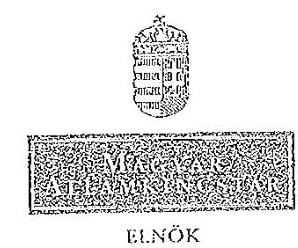

# JLLAMI SZÁM! L VÖSZÉK 

G01/
Érkezett: 2013 JAN 17.
Iktatószám: $\qquad$
Melléklet: $\qquad$

Iktatószám: ELN-3/2/2013.
Hiv. számok:
kísérő levél: V-0028-093/2012.;
jelentéstervezet: V-0028-
$101 / 2012$.

## Domokos László

elnök

Tárgy: Észrevételek megküldése jelentéstervezetre

## Budapest

## Tisztelt Elnök Úr!

Tájékoztatom, hogy „a Strukturális Alapok szabályainak egyszerüsitése (EU Strukturális Alapok Munkacsoport "által"koordinált-közös" ellénörzés) ellenörzéséröl" készült, fenti hivatkozási számú jelentéstervezetet áttekintettük, és észrevételeink az alábbiak:
1.) Jelentés (3. oldal) „Rövidítések jegyzéke"-ben az „ÁSZF" rövid név megnevezése hiányzik.
2.) Jelentés (3. oldal) „Rövidítések jegyzéke"-ben kérjük a „MÁK" helyett a Magyar Államkincstár jogszabályban alkalmazott rövid nevét alkalmazni: Kincstár. Javasoljuk, továbbá a jelentéstervezetben ennek következetes átvezetését (pl.: 10. oldal 7. pont; 18. oldal 1. sz. ábra magyarázata).

Megjegyezzük, hogy más témájú számvevői jelentésekben is „Kincstár" szerepel a rövidítések jegyzékében.
3.) Jelentés (6. oldal) „Értelmezö szótár"-ában és 1. számú melléklet szerinti munkaanyag (9. oldal) „Értelmezö szótár"-ában megjelenített „Kapcsolattartó Bizottság" meghatározását javasoljuk az 1. számú melléklet szerinti munkaanyag elölapjának utolsó bekezdésével összhangban megjeleníteni a következők szerint:

## „Kapcsolattartó Bizottság

Az uniós tagállamok legföbb ellenörzési ellenörzö intézményeinek vezetöiböl, valamint az Európai Számvevőszéknek elnökéből a vezetöiböl álló testület."

---

4.) A jelentés (12. oldal) „Bevezetés" részében a főterületek felsorolását javasoljuk az 1. számú melléklet szerinti munkaanyag (3. oldal) „Elözmények" rész tagolásával összhangban megjeleníteni, az 1. felsorolásjelző törlésével.
5.) Jelentés (13. oldal) „Bevezetés" részében és 1. számú melléklet szerinti munkaanyag (3. oldal) „Elözmények" részében megjelenített 4. főterület megjelölését javasoljuk kiegészíteni a jelentés 49. oldalán megjelenített címmel összhangban a következők szerint:
„4. föterület - a 2014-2020 közötti időszakra vonatkozó jogalkotási csomag - az Európai Bizottság COM (2011) 615 sz. rendelet-tervezcte (végleges) - tervezetének értékelése."
6.) A jelentés (16. oldal) I. fejezetében „a nemzeti hatáskörben megállapított egyszerüsitési intézkedések" részhez összeállított táblázat (kimutatás) fejlécében „Érintett projektek (E EUR)" szerepel, a táblázat feletti bekezdésben kiemelt, kerekített összegek viszont „M EUR"-ban kerültek megadásra. Javasoljuk az összegek eltérő mértékegységének megfeleltetését, mert a kimutatásban megjelenített összegek kerekítve Mrd-os és nem milliós nagyságrendűek. Például a táblázatban „8 406 103,63 $E$ EUR" szerepel, a táblázat feletti bekezdésben viszont „8,4 M EUR", illetve „3 M EUR" szerepel.

Az 1. sz. melléklet szerinti munkaanyag 10. számú függelékében a „Forrás" összegek „E EUR"-ban kerültek megadásra, így a jelentésben a kerekített összegek mértékegysége igényel pontosítást.
7.) A jelentés (16. oldal) kimutatását tartalmazó táblázat feletti mondatot javasoljuk kiegészíteni, hogy milyen időállapotra vonatkozó adatok kerültek a kimutatásban megjelenítésre.
8.) Jelentés (29. oldal) - II. fejezet „Részletes megállapítások", 2.1. pont „IV kérdés" általános értékelése szerint: „A 2012-2013. évekre az Igazoló és Ellenőrzési Hatóság, valamint az NFM és az NGM az ellenőrzéshez kapcsolódóan nem számolt be egyszerüsitési javaslatairól."

A 2012-2013. évekre az Igazoló Hatóság nem tervez további egyszerüsitési javaslatokat, amit az ellenőrzésvezetőnek 2012. október 8-án megküldött, 2012. október 4-ci keltezéssel kitöltött kérdőívben is jelzett, ezért kérjük a kapcsolódó bekezdés pontositását.

Kérem, az észrevételeinket szíveskedjenek figyelembe venni a jelentéstervezet véglegesítése során.

Budapest, 2013. január 16.
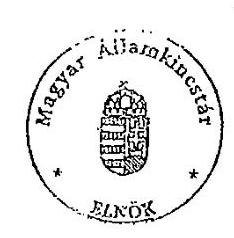

Tisztelettel:
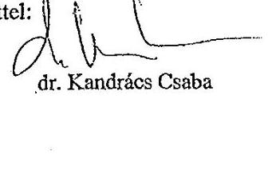

---

2/b. sz. melléklet a V-0028-111/2013. sz. jelentéshez
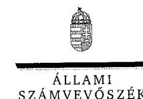

# dr. Kandrács Csaba úr 

elnök
Magyar Államkincstár

## Budapest

## Tisztelt Elnök Úr!

A Strukturális Alapok szabályainak egyszerűsítése (EU Strukturális Alapok Munkacsoport által koordinált közös ellenőrzés) ellenőrzése címủ jelentéstervezetre tett észrevételeit köszönettel megkaptam.

Az Állami Számvevőszék álláspontjáról a felügyeleti vezető által készített részletes tájékoztatást csatoltan megküldöm.

Tájékoztatom Elnök urat, hogy a jelentésben - az Állami Számvevőszékről szóló 2011. évi LXVI. törvény 29. § (3) bekezdése alapján - az el nem fogadott észrevételeket szerepeltetjük az elutasítás indokának feltüntetésével együtt. Az elfogadott észrevételeket a jelentés szövegezésénél figyelembe vettük.

Budapest, 2013. 0. hó 06 nap

Tisztelettel:

## Domokos László

Melléklet: Tájékoztatás az elfogadott és az el nem fogadott észrevételekről

---

# Tájékoztatás 

## az elfogadott és az el nem fogadott észrevételekröl

A Strukturális Alapok szabályainak egyszerűsítése ellenőrzése (EU Strukturális Alapok Munkacsoport által koordinált közös ellenőrzés) címủ jelentéstervezetre ELN-3/2/2013. ikt. számú levelében tett észrevételeit áttekintettük, azok kezeléséről az alábbi tájékoztatást adom.

Magyar Államkincstár által tett észrevételek átvezetése a tervezeten:

| Sorszám: | Hivatkozás | Eredeti szövegváltozat / Észrevé-   tel: | Új szövegváltozat helye, új   szövegváltozat / Indoklás: |
| :--: | :--: | :--: | :--: |
| 1. | 3. oldal | A „Rövidítések jegyzéke"-ben az   „ÁSZF" rövid név megnevezése   hiányzik | 5. oldal   „ÁSZF" rövid név ismertetését   pótoltuk: „Általános Szerződé-   si Feltételek" |
| 2. | 3. oldal | A „Rövidítések jegyzéke"-ben a   „MÁK" helyett „Kincstár" rövid   név alkalmazását kérik. | 5. oldal   A „Rövidítések jegyzéke"-ben   és a jelentésben a „MÁK" he-   lyett „Kincstár" rövid nevet   tüntettük fel. |
| 3. | 6. oldal | Az „Értelmező szótár"-ban a „Kap-   csolattartó Bizottság" meghatározá-   sát kérték az 1. számú melléklet   előlapjával összhangban megjelení-   teni. | 6. oldal   A javaslatot elfogadtuk, az   alábbiak szerint:   „Az uniós tagállamok legfőbb   ellenőrző intézményei vezető-   iből, valamint az Európai   Számvevőszék elnökéből álló   testület." |
| 4. | 12. oldal | A „Bevezetés"-ben a főterületek   felsorolását javasolták összhangba   hozni az 1. számú melléklet   „Előzmények" rész tagolásával. | 15. oldal   A javaslatot elfogadtuk, az   alábbiak szerint:   „A közös nemzetközi progi-   rammal összhangban a nemze- |

---

|  |  |  | ti ellenőrzési jelentésben általános áttekintést adtunk a Strukturális Alapok programjairól (1. föterület), valamint ellenőriztük a közös program további három föterületét:   2. föterület - a választható egyszerúsítési intézkedések hatása, nemzeti keretrendszerbe való beépítése és megítélése,   3. föterület - a kötelező és a nemzeti hatáskörben bevezetett egyszerúsítési intézkedések hatása és megítélése,   4. föterület - a 2014-2020 közötti időszakra vonatkozó jogalkotási csomag - az Európai Bizottság COM (2011) 615 sz. rendelet-tervezete (végleges) - tervezetének értékelése." |
| :--: | :--: | :--: | :--: |
| 5. | 13. oldal | A „Bevezetés" részben a 4. főterület megnevezését kérték kiegészíteni a jelentés 49. oldalán megjelenített címmel összhangban. | 15. oldal   A javaslatot elfogadtuk, az alábbiak szerint:   „4. főterület - a 2014-2020 közötti időszakra vonatkozó jogalkotási csomag - az Európai Bizottság COM (2011) 615 sz. rendelet-tervezete (végleges) - tervezetének értékelése." |
| 6. | 16. oldal | A táblázatban és a táblázat feletti bekezdésben szereplő adatok nagyságrendje nem egyezik (Mrd EUR helyett M EUR szerepel). | 18. oldal   A táblázat feletti bekezdésben szereplő adatok nagyságrendjét összhangba hoztuk a táblázattal (Mrd EUR) |
| 7. | 16. oldal | A táblázat feletti bekezdésben szereplő mondatot javasolták kiegészíteni az időszak megjelölésével. | 18. oldal   A javaslatot elfogadtuk, az alábbiak szerint:   „A nemzeti hatáskörben megállapított egyszerúsítési intéz- |

---

|  |  |  | kedésekkel érintett projektek   számát és a támogatások ösz-   szegét a vizsgált időszakban a   következő kimutatás tartal-   mazza..." |
| :-- | :-- | :-- | :-- |
|  | 29. oldal | Kérték pontosítani, hogy az Igazoló   Hatóság nem tervez további egy-   szerüsitési javaslatokat. | 30. oldal |

Tájékoztatom, hogy a számvevőszéki jelentés mellékleteiként szerepeltetjük a jelentéstervezethez tett észrevételeit, valamint azokra adott válaszunkat.

Budapest, 2013. felbvud hó 23 nap

Tisztelettel:
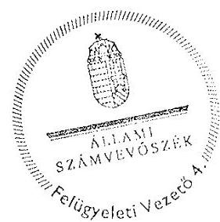

Dr. Pulay Gyula
felügyeleti vezető

---

# ELNÖK 

Iktatószám: 11/43-6/2013.
Ügyintéző: Gáspár Dániel

## Domokos László

elnök

Állami Számvevőszék

## Budapest

Apáczai Csere János u. 10.
1052

Állami Számvevőszék

## Tisztelt Elnök Úr!

Az Állami Számvevőszék „Strukturális Alapok szabályainak egyszerűsítése" tárgyú vizsgálatának 2012. december 21-én kelt, V-0028-092/2012. iktatószámú jelentéstervezetével összefüggésben az alábbi észrevételeket tesszük:

1. sz. észrevétel Jelentéstervezet 10. oldal 8. pont („8. projektek teljes költséghatárának megemelése") (ROP) .

Az egyértelműség kedvéért javasoljuk az alábbi kiegészítést: „8. jövedelemtermelő projektek teljes költséghatárának megemelése"
2. sz. észrevétel Jelentéstervezet 11. oldal, 25. oldal 1. 1. pont, 1. sz. melléklet 13., 19. oldal (KÖZOP)

A jelentéstervezet fenti oldalain kérjük feltüntetni, hogy csak a KÖZOP 3-4. prioritásai kerülnek ERFA-ból finanszírozásra.
3. sz. észrevétel Jelentéstervezet 11. oldal, 7. bekezdés („Az NFÜ megbízásából készült felmérés szerint....") (KMF)

A jelentésben hivatkozott tanulmány 2008-ban készült el, alig egy év pályáztatási tapasztalatai alapján becsülte a pályázói és a fejlesztéspolitikai intézményrendszer oldalán felmerülő adminisztratív költségeket a teljes, 2007-13-as programozási időszakra. Fontos kiemelni, hogy a becslés a 2008-ban alkalmazott pályáztatási gyakorlatot alapul véve készült. Azóta több lépcsőben módosítások következtek be az uniós támogatások végrehajtási rendszerében, melyek közül legjelentősebb a 4/2011. (I.28.) Korm. rendelet hatályba lépése volt. A bevezetett egyszerűsítő, gyorsítást

Nemzeti Fejlesztési Ügynökség
Cím: H-1077 Budapest, Wesselényi u. 20-22.
Levelezési cím: H-1393 Budapest, pf. 332.
Tel.: +36 40/638-638
E-mail: nfu@nfu.gov.hu
www.nfu.hu
www.ujszechenyiterv.gov.hu

---

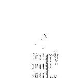

elősegítő intézkedések okán a hivatkozott tanulmány a jelenlegi helyzetre nem releváns, félrevezető lehet a költségek nagyságrendjét illetően. Az előbbiek miatt nem javasoljuk a hivatkozást szerepeltetni a jelentésben, kérjük törölni a bekezdést.

4. sz. észrevétel Jelentéstervezet 12. oldal 1. bekezdés ("A helyszíni ellenőrzés befejezéséig öt intézkedést végrehajtottak, de ezek közül egy intézkedésnél a költségcsökkentő hatás – beszámoló hiányában – még nem állapítható meg.") (KMF)

2012 decemberében elkészült a beszámoló a 32. sz. intézkedésről (NFM). A számszerűsített költségcsökkentő hatás 1995 MFt. Kérjük a jelentés szövegét módosítani.

5. sz. észrevétel Jelentéstervezet 15. oldal 3. bekezdés és 28. oldal 2.1. pont 5. bekezdés ("A 6. számú, nagyprojektek megnövelt ..."), valamint 33. oldal 6. intézkedés II. kérdés ("Az intézkedés 1 db ...") (ROP)

Az egyértelműség kedvéért javasoljuk az alábbi kiegészítést: "A projektek teljes száma az OP-ban 4175 db, ...."

6. sz. észrevétel Jelentéstervezet 15. oldal 3., 4. bekezdése hivatkozik az elszámolhatósági útmutatóval kapcsolatos elhúzódó egyeztetésekre, ill. az EUB általi elfogadásra 2012-ben. (KMF)

Itt helyesen az egyszerűsített elszámolásokhoz kapcsolódó módszertanról van szó, kérjük javítani. Ugyanezt kérjük javítani a 27. oldalon is (2.1. pont 2. bekezdés).

7. sz. észrevétel Jelentéstervezet 15. oldal 7. bekezdés ("A 2 kötelező egyszerűsítési intézkedés ...") (ROP)

Az egyértelműség kedvéért javasoljuk az alábbi kiegészítést: "A 2 kötelező egyszerűsítési intézkedés közül a 8. számú, a jövedelemtermelő projektek teljes költséghatárának megemelése ..."

8. sz. észrevétel Jelentéstervezet 22. oldal "Gyengeségek" második bekezdés "Viszonylag alacsony az alkalmazott egyszerűsítési intézkedések száma (9-ből 4 darab)..." (KMF)

Kérjük kiegészíteni: "Viszonylag alacsony az uniós jogszabályok módosításaiból eredően alkalmazott egyszerűsítési intézkedések száma ..."

9. sz. észrevétel Jelentéstervezet 23. oldal, javaslatok a nemzeti fejlesztési miniszternek (KMF)

1., sz. javaslat: "Tekintse át a Strukturális Alapokat érintő egyszerűsítési intézkedések bevezetésének feltételrendszerét, gondoskodjon a bevezetés elmaradása okainak feltárásáról"

Az NFÜ minden uniós jogszabály módosításon alapuló, de be nem vezetett egyszerűsítési intézkedésre adott indoklást, így a bevezetés elmaradásának okait nem szükséges feltárni, kérjük törölni. A javaslat nem következik a megelőző bekezdésben felvázoltakból.

Nemzeti Fejlesztési Ögynökség
Cím: H-1077 Budapest, Wesselényi u. 20-22.
Levelezési cím: H-1393 Budapest, pf. 332.
Tel.: +36 40/638-638
E-mail: nfu@nfu.gov.hu
www.nfu.hu
www.ujszechenyiterv.gov.hu

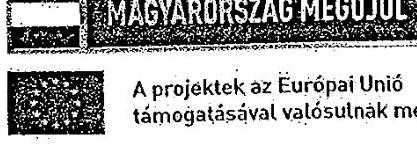

---

Szintén az 1. sz. javaslat szerint: „teremtse meg a lehetüséget az egyes intézkedések hatásának mérhetőségére, értékelhetőségére".

Az NFÜ a kormányzati, ill. uniós elvárásoknak megfelelően tesz eleget jelentéstételi kötelezettségeinek, melyek fö fókusza az uniós források felhasználásának (abszorpció), eredményének nyomon követése (indikátorok). Az egyszerüsitő intézkedések hatásának ezekbe kell beépülnie. Kérjük a javaslatot törölni.
2. sz. javaslat: Kérjük az „elszámolhatósági útmutató"-t módszertanra javítani (ld. fent, itt nem az elszámolhatósági útmutatóról van szó, hanem az egyszerüsített elszámolások módszertanáról).
10. sz. észrevétel Jelentéstervezet 25. oldal 1. 1. pont, 1. sz. melléklet 13., 19. oldal (KEOP)

A jelentéstervezet fenti oldalain kérjük feltüntetni, hogy csak a KEOP 3-4. és 6. prioritásai kerülnek ERFA-ból finanszírozásra.
11. sz. észrevétel Jelentéstervezet 26. oldal 1.2 pont, 1. sz. melléklet 19. oldal 1. 2 pontja, 5/a függelék (KÖZOP)

A jelentéstervezet hivatkozott pontjai az 5/a függelékre hivatkoznak, mint amely 2011. december 31-i állapotnak megfelelő adatokat tartalmaz az OP-k jóváhagyott támogatási keretére vonatkozóan, azonban az 5/a függelék 2007. 01.01-i állapotnak megfelelő adatokat tartalmaz.

Javasoljuk kivenni a szövegből az 5/a függelékre való hivatkozást vagy az 5/a függeléket kiegészíteni a 2011. 12.31-i állapotnak megfelelő adatokkal, ahogy az a függelék fejlécében is szerepel megnevezésként.
12. sz. észrevétel Jelentéstervezet 27. oldal 1.3 pont, 1. sz. melléklet 20. oldal 1.3 pont, 5/a függelék (KÖZOP)

Az 5/a függelékben foglalt \%-os adatok nincsenek összhangban a Jelentéstervezet 27. oldalának 1.3 és az 1. sz. melléklet 20. oldal 1.3 pontjával
Kérjük a függelékben és a szövegben az adatok javítását.
13. sz. észrevétel Jelentéstervezet 35. oldal 3.1.2. pont (8.kötelező egyszerüsítési intézkedés) („Az érintett operatív programok (GOP, KMOP) 11069 db projektet tartalmaztak, ezek közül jövedelemtermelő 7468 darab volt...") (GOP)

Jelezzük, hogy GOP-ban nem volt érintett projekt, a 6. és 7. sz. függelék sem tartalmaz GOP-ra nézve adatot. Kérjük, töröljék a GOP-ot a szövegből, és a függelékek szerint javítsák az adatokat.

Ugyanez a megállapítás található a Magyarország nemzeti ellenőrzési jelentése c. munkaanyag 29. oldalán lévő 8. kötelező egyszerüsítési intézkedés pontban. Kérjük itt is javítani.

Nemzeti Fejlesztési Ügynökség
Cím: H-1077 Budapest, Wesselényi u. 20-22.
Levelezési cím: H-1393 Budapest, pl. 332.
Tel.: $+36-40 / 638-638$
E-mail: nfu@nfu.gov.hu
www.nfu.hu
www.ujszechenyiterv.gov.hu

---

1. sz. észrevétel Jelentéstervezet 34. oldal 3.1.1. pont 1. bekezdés ("A két kötelező intézkedés...") (ROP)

Javasoljuk az érintett operatív programok konkrét megnevezését szerepeltetni a szövegben.

1. sz. észrevétel Jelentéstervezet 35. oldal 3.1.2. pont 8. intézkedés 1. kérdés ("Az érintett operatív programok...") (ROP)

A bekezdés egyes adatai nincsenek összhangban a 6. és a 7. sz. függelék adataival, a bekezdést javasoljuk az alábbiak szerint módosítani: "A vizsgált operatív programok 11069 db projektet tartalmaztak, ... ezek közül jövedelemtermelő 9513 db volt."

1. sz. észrevétel Jelentéstervezet 48. oldal 14. nemzeti hatáskörben meghozott egyszerűsítési intézkedés 1. kérdés

Az egyszerűsítési intézkedéssel kapcsolatban megjegyezzük, hogy a konvergencia ROP-ok mellett a KMOP esetében is volt az intézkedés által potenciálisan érintett 21 db projekt. Ezzel összhangban a kapcsolódó adatokat összefoglaló táblát az alábbiak szerint javasoljuk módosítani:

|  Finanszírozási alap: ERFA | Összes projekt | Potenciális projekt | Érintett projekt | Érintett/összes | Érintett/potenciális  |
| --- | --- | --- | --- | --- | --- |
|  Projektek (db) | 11 984 | 261 | 28 | 0,2% | 10,73%  |
|  Források (E EUR) | 4 359 989,39 | 130 468,61 | 24 148,43 | 0,6% | 18,5%  |

1. sz. észrevétel Jelentéstervezet 49. oldal 15. nemzeti hatáskörben meghozott egyszerűsítési intézkedés 1. kérdés

Az egyszerűsítési intézkedéssel kapcsolatban megjegyezzük, hogy a konvergencia ROP-ok mellett a KMOP esetében is volt az intézkedés által potenciálisan érintett 18 db projekt. Ezzel összhangban a kapcsolódó adatokat összefoglaló táblát az alábbiak szerint javasoljuk módosítani:

|  Finanszírozási alap: ERFA | Összes projekt | Potenciális projekt | Érintett projekt | Érintett/összes | Érintett/potenciális  |
| --- | --- | --- | --- | --- | --- |
|  Projektek (db) | 11 984 | 112 | 1 | 0,0% | 0,9%  |
|  Források (E EUR) | 4 359 989,39 | 94 160,96 | 253,91 | 0,0% | 0,3%  |

A fenti módosítási javaslatokat - elfogadás esetén - kérjük, hogy az ÁSZ a jelentéstervezet 1. sz. mellékletét képező munkaanyagon is átvezetni szíveskedjék.

1. sz. észrevétel Jelentéstervezet 2. sz. függelék (KMF)
2. sz. intézkedés tényleges költségcsökkentő hatása 1995 MFt.

Nemzeti Fejlesztési Ügynökség Cím: H-1077 Budapest, Wesselényi u. 20-22. Levelezési cím: H-1393 Budapest, pf. 332. Tel.: +36 40/638-638 E-mail: nfu@nfu.gov.hu www.nfu.hu www.ujszechenyiterv.gov.hu

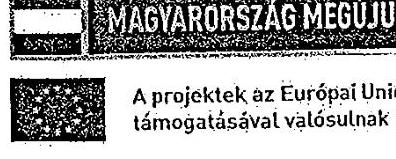

---

19. sz. észrevétel Jelentéstervezet 5/a, 5/b függelék, 6-7. függelék (KÖZOP)

Az 5/a függelékben a KÖZOP KA finanszírozás összegénél nem a valós képet tükrözi a 0 E Euro összeg szerepeltetése, tekintettel arra, hogy a KÖZOP 1., 2., 5., 6. prioritásai KA-ból finanszírozottak. Tekintettel arra, hogy az ellenőrzés csak az ERFA, ESZA forrásból finanszírozott összegeket vizsgálta, így a „nem releváns" megnevezés lenne véleményünk szerint helyes nemcsak a KÖZOP, hanem minden olyan OP esetén, ahol volt egyébként KA-ból forrás allokálva az adott OP-ra. Javasoljuk a függelék címét is ennek megfelelően módosítani.

Az 5/b függelékben a KA-ra vonatkozó adatoknál semmi nem szerepel, holott a függelék neve „Az operatív programok és finanszírozási alapjaik pénzügyi adatai a 2007-2013. évek között évenkénti bontásban". Amennyiben csak az ERFA, ESZA adatok relevánsak, úgy javasoljuk törölni a táblázatból a KA-ra vonatkozó sorokat és a függelék címét is ennek megfelelően módosítani.

A 6-7. számú függelékben is csak ERFA, ESZA adatok szerepelnek, így javasoljuk a függelék címét ennek megfelelően módosítani.

A 6. sz. függelék 6. nagyprojektek megnövelt rugalmassága intézkedés KÖZOP-hoz tartozó 8. oszlopban szereplő összeg helyesen: 1209340 E euro
20. sz. észrevétel Jelentéstervezet 5/a, 5/b függelék, 6-7. függelék (KEOP)

Az 5/a függelékben a KEOP KA finanszírozás összegénél nem a valós képet tükrözi a 0 E Euro összeg szerepeltetése, tekintettel arra, hogy a KEOP 1., 2., 5., 7., 8. prioritásai KA-ból finanszírozottak. Tekintettel arra, hogy az ellenőrzés csak az ERFA, ESZA forrásból finanszírozott összegeket vizsgálta, így a „nem releváns" megnevezés lenne véleményünk szerint helyes nemcsak a KEOP, hanem minden olyan OP esetén, ahol volt egyébként KA-ból forrás allokálva az adott OP-ra. Javasoljuk a függelék címét is ennek megfelelően módosítani.
Az 5/b függelékben a KA-ra vonatkozó adatoknál semmi nem szerepel, holott a függelék neve „Az operatív programok és finanszírozási alapjaik pénzügyi adatai a 2007-2013. évek között évenkénti bontásban". Amennyiben csak az ERFA, ESZA adatok relevánsak, úgy javasoljuk törölni a táblázatból a KA-ra vonatkozó sorokat és a függelék címét is ennek megfelelően módosítani.
A 6-7. számú függelékben is csak ERFA, ESZA adatok szerepelnek, így javasoljuk a függelék címét ennek megfelelően módosítani.

# 21. sz. észrevétel (HEP) 

A Flat rate egyszerűsített elszámolási mód már bevezetésre került: 2012. december 21-én jelent meg a TÁMOP-1.4.1 „Hátrányos helyzetű célcsoportok foglalkoztatásának támogatása a nonprofit szervezetek foglalkoztatási kapacitásának erősítésével" című konstrukció, melyben a közvetett költségek a felmerülő közvetlen költségek meghatározott mértékéig átalány alapon számolhatóak el.

---

A Jelentéstervezet mindenhol azt említi, hogy a Nemzeti Elszámolhatósági Útmutató teremtette meg az egyszerúsített elszámolási módok alkalmazásának lehetőségét. Felhívjuk a figyelmet, hogy az átalányalapú elszámolhatóságról a 4/2011-es Korm. rendeletre is rendelkezik:

4/2011 Korm. rend 57 §:
(2) Ha a pályázati felhívás vagy a támogatási szerződés arra lehetőséget biztosít, egyes költségek a támogatási szerzödésben vagy a támogatói okiratban meghatározott mértékig - a kettős finanszírozás lehetőségének kizárása mellett - átalány olajon is elszámolhatóak.

Budapest, 2013. január $\mathrm{L}^{18} \mathrm{~m}$

Üdvözlettel,

Belykó Zoltán

Nemzeti Fejlesztési Ügynökség
Cím: H-1077 Budapest, Wesselériyt u. 20-22.
Levelezési cím: H-1393 Budapest, pl. 332.
Tel.: +36 40/638-638
E-mail: nfu@nfu.gov.hu
www.nfu.hu
www.ejszechenyiterv.gov.hu

---

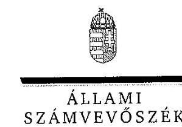

# Petykó Zoltán úr 

elnök
Nemzeti Fejlesztési Ügynökség

## Budapest

## Tisztelt Elnök Úr!

A Strukturális Alapok szabályainak egyszerűsítése (EU Strukturális Alapok Munkacsoport által koordinált közös ellenőrzés) ellenőrzése címủ jelentéstervezetre tett észrevételeit köszönettel megkaptam.

Az Állami Számvevőszék álláspontjáról a felügyeleti vezető által készített részletes tájékoztatást csatoltan megküldöm.

Tájékoztatom Elnök urat, hogy a jelentésben - az Állami Számvevőszékről szóló 2011. évi LXVI. törvény 29. § (3) bekezdése alapján - az el nem fogadott észrevételeket szerepeltetjük az elutasítás indokának feltüntetésével együtt. Az elfogadott észrevételeket a jelentés szövegezésénél figyelembe vettük.

Budapest, 2013. 0 hó 66 nap

Tisztelettel:

Dömokos László ${ }^{\text {s }}$.

Melléklet: Tájékoztatás az elfogadott és az el nem fogadott észrevételekről

---

# Tájékoztatás

## az elfogadott és az el nem fogadott észrevételekről

A Strukturális Alapok szabályainak egyszerűsítése ellenőrzése (EU Strukturális Alapok Munkacsoport által koordinált közös ellenőrzés) című jelentéstervezetre 11/13-6/2013 ikt. számú levelében tett észrevételeit áttekintettük, azok kezeléséről az alábbi tájékoztatást adom.

NFÜ által tett észrevételek átvezetése a tervezeten:

|  Sorszám: | Hivatkozás | Eredeti szövegváltozat / Észrevétel: | Új szövegváltozat helye, új szövegváltozat / Indoklás:  |
| --- | --- | --- | --- |
|  1. | 10. oldal 8. pont. | „8. projektek teljes költséghatárának megemelése"
Az egyértelműség kedvéért javasoljuk az alábbi kiegészítést: „8. jövedelemtermelö projektek teljes költséghatárának megemelése" | 11. oldal 8. pont.
A javaslatot az ÁSZ jelentéstervezetre vonatkoztatva elfogadtuk, a kért módosítás átvezetésre került.  |
|  2. | 11. oldal, 25. oldal 1. 1. pont, 1. sz. melléklet 13., 19. oldal | KÖZOP
A jelentéstervezet fenti oldalain kérjük feltüntetni, hogy csak a KÖZOP 3-4. prioritósai kerülnek ERFA-ből finanszírozásra. | 13. oldal, 26. oldal 1. 1. pont, 1. sz. melléklet 13., 19. oldal
A javaslatot az ÁSZ jelentéstervezetre vonatkoztatva elfogadtuk, a kért módosítás átvezetésre került.  |
|  3. | 11. oldal, 7. | „Az NFÜ megbízásából készült felmérés szerint....." | 13. oldal, 7. bekezdés  |

---

|   | bekezdés | A jelentésben hivatkozott tanulmány 2008-ban készült el, alig egy év pályáztatási tapasztalatai alapján becsülte a pályázói és a fejlesztéspolitikai intézményrendszer oldalán felmerülő adminisztratív költségeket a teljes, 2007-13-as programozási időszakra. Fontos kiemelni, hogy a becslés a 2008-ban alkalmazott pályáztatási gyakorlatot alapul véve készült. Azóta több lépcsőben módosítások következtek be az uniós támogatások végrehajtási rendszerében, melyek közül legjelentősebb a 4/2011. (I.28.) Korm. rendelet hatályba lépése volt. A bevezetett egyszerűsítő, gyorsítást elősegítő intézkedések okán a hivatkozott tanulmány a jelenlegi helyzetre nem releváns, felrevezető lehet a költségek nagyságrendjét illetően. Az előbbiek miatt nem javasoljuk a hivatkozást szerepeltetni a jelentésben, kérjük törölni a bekezdést. | A javaslatot részben elfogadtuk, a bekezdést nem töröltük, hanem a jelentést az alábbi magyarázatot tartalmazó lábjegyzettel kiegészítettük:  |
| --- | --- | --- | --- |
|  4. | 12. oldal 1. bekezdés | „A helyszíni ellenőrzés befejezéséig öt intézkedést végrehajtottak, de ezek közül egy intézkedésnél a költségcsökkentő hatás - beszámoló hiányában - még nem állapítható meg."
2012 decemberében elkészült a beszámoló a 32. sz. intézkedésről (NFM). A számszerűsített költségcsökkentő hatás 1995 MFt. Kérjük a jelentés szövegét módosítani. | 14. oldal 1. bekezdés
A jelentést az alábbi magyarázatot tartalmazó lábjegyzettel kiegészítettük:
Az NFÚ tájékoztatása szerint: „2012. decemberben elkészült a beszámoló a 32. sz. intézkedésről. A számszerűsített költségcsökkentő hatás 1995 millió forint."  |
|  5. | 15. oldal 3. bekezdés és 28. oldal 2.1. pont 5. bekezdés, valamint 33. oldal 6. intézkedés II. kérdés | („A 6. számú, nagyprojektek megnövelt ..."), valamint („Az intézkedés 1 db ...")
Az egyértelműség kedvéért javasoljuk az alábbi kiegészítést:
„A projektek teljes száma az OP-ban 4175 db, ...." | 17. oldal 3. bekezdés és 29. oldal 2.1. pont 5. bekezdés, valamint 34. oldal 6. intézkedés II. kérdés
A javaslatot az ÁSZ jelentéstervezetre vonatkoztatva elfogadtuk, a kért módosítás átvezetésre került.  |
|  6. | 15. oldal 3., 4. | A Jelentéstervezet 15. oldal 3., 4. bekezdése hivatkozik az elszámolhatósági útmutat | 17. oldal 4., 5.  |

---

|   | bekezdés | tóval kapcsolatos elhúzódó egyeztetésekre, ill. az EUB általi elfogadásra 2012-ben. Itt helyesen az egyszerűsített elszámolásokhoz kapcsolódó módszertanról van szó, kérjük javítani. Ugyanezt kérjük javítani a 27. oldalon is (2.1. pont 2. bekezdés). | A javaslatot az ÁSZ jelentés- tervezetre vonatkoztatva elfo- gadtuk, a kért módosítás átvezetésre került.  |
| --- | --- | --- | --- |
|  7. | 15. oldal 7. bekezdés | „A 2 kötelező egyszerűsítési intézkedés ..." | 17. oldal 7. bekezdés  |
|   |  | Az egyértelműség kedvéért javasoljuk az alábbi kiegészítést: | A javaslatot az ÁSZ jelentés- tervezetre vonatkoztatva elfo- gadtuk, a kért módosítás átvezetésre került.  |
|   |  | „A 2 kötelező egyszerűsítési intézkedés közül a 8. számú, a jövedelemtermelő projek- tek teljes költséghatárának megemelése ..." |   |
|  8. | 22. oldal „Gyengeségek" második be- kezdés | „Viszonylag alacsony az alkalmazott egyszerűsítési intézkedések száma (9-ből 4 darab)..." | 24. oldal első bekezdés  |
|   |  | Kérjük kiegészíteni: „Viszonylag alacsony az uniós jogszabályok módosításalból eredően alkalmazott egyszerűsítési intézkedések száma ..." | A javaslatot az ÁSZ jelentés- tervezetre vonatkoztatva elfo- gadtuk, a kért módosítás átvezetésre került.  |
|  9. | 23. oldal, ja- vaslatok a nemzeti fej- lesztési mi- niszternek | 1., sz. javaslat: „Tekintse át a Strukturális Alapokat érintő egyszerűsítési intézkedések bevezetésének feltételrendszerét, gondoskodjon a bevezetés elmaradása okainak feltárásáról" | 24. oldal, javaslatok a nem- zeti fejlesztési miniszternek  |
|   |  | Az NFÜ minden uniós jogszabály módosításon alapuló, de be nem vezetett egysze- rűsítési intézkedésre adott indoklást, így a bevezetés elmaradásának okait nem szükséges feltárni, kérjük törölni. A javaslat nem következik a megelőző bekezdés- ben felvázoltakból. | Az 1. sz. javaslatot érintő máso- dik észrevételt nem fogadtuk el, mivel NFÜ jelentéselnek fóku- szában az uniós források fel- használásának eredményének nyomon követése van, de az egyszerűsítési intézkedések hatá- sának mérésére, értékelésére nem terjed ki.  |
|   |  | Szintén az 1. sz. javaslat szerint: „teremtse meg a lehetőséget az egyes intézkedések hatásának mérhetőségére, értékelhetőségére". | Az 1. sz. javaslatot érintő első észrevételt és a 2. sz. javaslatra tett észrevételt hasznosítottuk az alábbiak szerint:  |
|   |  | Az NFÜ a kormányzati, ill. uniós elvárásoknak megfelelően tesz eleget jelentéstételi kötelezettségeinek, melyek fő fókusza az uniós források felhasználásának (abszorp- ció), eredményének nyomon követése (indikátorok). Az egyszerűsítő intézkedések hatásának ezekbe kell beépülnie. Kérjük a javaslatot törölni. | „Az ellenőrzött szervezetek kevés információval rendelkeztek az  |
|   |  | 2. sz. javaslat: Kérjük az „elszámolhatósági útmutató"-t módszertanra javítani (id. fent, itt nem az elszámolhatósági útmutatóról van szó, hanem az egyszerűsített elszámolások módszertanáról). |   |

---

egyszerűsítési intézkedések bevezetésének tapasztalatairól, és az intézkedések által a pályázók és a kedvezményezettek körében kiváltott hatásokról, mivel nem alakították ki teljes körűen a folyamat célzott figyelemmel kísérésének szabályait és nem jelölték ki a felelősöket.
Javaslat:
Tekintse át a Strukturális Alapokat érintő egyszerűsítési intézkedések bevezetésének feltételreudszerét és az intézkedések bevezetése elmaradásának - az ÁSZ és az NFÜ által feltárt - okait elemezve, az alapján segítse elő az egyszerűsítési intézkedések jövőbeni bevezethetőségét. Teremtse meg a bevezetett intézkedések hatásai mérhetőségének, értékelhetőségének a lehetőségét.
Az egyszerűsített elszámolások módszertanának az EU Bizottságával az NFÜ által folytatott elhúzódó egyeztetése hátráltatta a - közvetlen és közvetett költségek elszámolásának egyszerűsítésére vonatkozó - választható egyszerűsítő intézkedések bevezetését.
Javaslat:
Készíttesse elő - az NFÜ költség adatbázisában rendelkezése

---

|   |  |  |  | álló
tényleges
költségadatok
figyelembevételével – a jövőben
alkalmazható
egyszerűsített
elszámolások
módszertanát és
az
Elszámolandó
últámaztat
szeregió,
a
Elszámol
hözérő
tartalmaztat
szeregió,
a
Elszá
módos
tartalmaztat
szeregió,
a
Elszá
módos
tartalmaztat
szeregió,
a
Elszá
módos
tartalmaztat
szeregió,
a
Elszá
módos
tartalmaztat
szeregió,
a
Elszá
módos
tartalmaztat
szeregió,
a
Elszá
módos
tartalmaztat
szeregió,
a
Elszá
módos
tartalmaztat
szeregió,
a
Elszá
módos
tartalmaztat
szeregió,
a
Elszá
módos
tartalmaztat
szeregió,
a
Elszá
módos
tartalmaztat
szeregió,
a
Elszá
módos
tartalmaztat
szeregió,
a
Elszá
módos
tartalmaztat
szeregió,
a
Elszá
módos
tartalmaztat
szeregió,
a
Elszá
módos
tartalmaztat
szeregió,
a
Elszá
módos
tartalmaztat
szeregió,
a
Elszá
módos
tartalmaztat
szeregió,
a
Elszá
módos
tartalmaztat
szeregió,
a
Elszá
módos
tartalmaztat
szeregió,
a
Elszá
módos
tartalmaztat
szeregió,
a
Elszá
módos
tartalmaztat
szeregió,
a
Elszá
módos
tartalmaztat
szeregió,
a
Elszá
módos
tartalmaztat
szeregió,
a
Elszá
módos
tartalmaztat
szeregió,
a
Elszá
módos
tartalmaztat
szeregió,
a
Elszá
módos
tartalmaztat
szeregió,
a
Elszá
módos
tartalmaztat
szeregió,
a
Elszá
módos
tartalmaztat
szeregió,
a
Elszá
módos
tartalmaztat
szeregió,
a
Elszá
módos
tartalmaztat
szeregió,
a
Elszá
módos
tartalmaztat

---

|   | pont | ezek közül jövedelemtermelő 7468 darab volt..." | A javaslatot az ÁSZ jelentés-tervezetre vonatkoztatva elfo-gadtuk, a kért módosítás átvezetésre került az alábbiak szerint:  |
| --- | --- | --- | --- |
|   |  | Jelezzük, hogy GOP-ban nem volt érintett projekt, a 6. és 7. sz. függelék sem tartalmaz GOP-ra nézve adatot. Kérjük, töröljék a GOP-ot a szövegből, és a függelékek szerint javítsák az adatokat. | „A vizsgált operatív programok 11069 db projektet tartalmaz-tak, ezek közül jövedelemterme-10 7468 darab volt (4 840 999 E EUR, 1 072 185 E EUR kerette!), visszamenőleges hatállyal össze-sen 12223 db projektet tartal-maztak, ezek közül jövedelem-termelő 9513 darab volt, amelynek kerete rendre 5 569 329 illetve 1 277 841 E EUR volt."  |
|   |  | Ugyanez a megállapítás található a Magyarország nemzeti ellenőrzési jelentése c. munkaanyag 29. oldalán lévő 8. kötelező egyszerűsítési intézkedés pontban. Kérjük itt is javítani. |   |
|   |  | A bekezdés egyes adatai nincsenek összhangban a 6. és a 7. sz. függelék adatai-va, a bekezdést javasoljuk az alábbiak szerint módosítani: „A vizsgált operatív programok 11069 db projektet tartalmaztak, ... ezek közül jö-vedelemtermelő 9513 db volt." |   |
|   |  | „A két kötelező intézkedés..." |   |
|   |  | Javasoljuk az érintett operatív programok konkrét megnevezését szerepeltetni a szövegben. | 35. oldal 3.1.1. pont 1. be-kezdés  |
|  14. | 34. oldal 3.1.1. pont 1. bekezdés |  | A javaslatot az ÁSZ jelentés-tervezetre vonatkoztatva elfo-gadtuk, a kért módosítás átvezetésre került az alábbiak szerint: „A két kötelező intézkedés az ERFA forrásból finanszírozott regionális és az infrastruktúra fejlesztési operatív programok (ROP, KEOP, KÖZOP) projektjeit érintette."  |
|  16. | 48. oldal 14. nemzeti hatáskörben meghozott egyszerűsítési | Az egyszerűsítési intézkedéssel kapcsolatban megjegyezzük, hogy a konvergencia ROP-ok mellett a KMOP esetében is volt az intézkedés által potenciálisan érintett 21 db projekt. Ezzel összhangban a kapcsolódó adatokat összefoglaló táblát az alábbiak szerint javasoljuk módosítani: | 51. oldal 14. nemzeti hatás-körben meghozott egyszerű-sítési intézkedés 1. kérdés  |
|   |  |  | A javaslatot az ÁSZ jelentés-tervezetre vonatkoztatva elfo-  |
|  |   |   |   |
|  |   |   |   |
|  |   |   |   |
|  |   |   |   |
|  |   |   |   |
|  |   |   |   |
|  |   |   |   |
|  |   |   |   |
|  |   |   |   |
|  |   |   |   |
|  |   |   |   |
|  |   |   |   |
|  |   |   |   |
|  |   |   |   |
|  16. | 48. oldal 14. nemzeti ha-táskörben meghozott egyszerűsítési | Az egyszerűsítési intézkedéssel kapcsolatban megjegyezzük, hogy a konvergencia ROP-ok mellett a KMOP esetében is volt az intézkedés által potenciálisan érintett 21 db projekt. Ezzel összhangban a kapcsolódó adatokat összefoglaló táblát az alábbiak szerint javasoljuk módosítani: | 51. oldal 14. nemzeti hatás-körben meghozott egyszerű-sítési intézkedés 1. kérdés  |
|   |  |  | A javaslatot az ÁSZ jelentés-tervezetre vonatkoztatva elfo-  |
|  |   |   |   |
|  |   |   |   |
|  |   |   |   |
|  |   |   |   |
|  |   |   |   |
|  |   |   |   |
|  |   |   |   |
|  |   |   |   |
|  |   |   |   |
|  |   |   |   |
|  |   |   |   |
|  |   |   |   |
|  |   |   |   |
|  |   |   |   |
|  |   |   |   |
|  |   |   |   |
|  |   |   |   |
|  |   |   |   |
|  |   |   |   |
|  |   |   |   |
|  |   |   |   |
|  |   |   |   |
|  |   |   |   |
|  |   |   |   |
|  |   |   |   |
|  |   |   |   |
|  |   |   |   |
|  |   |   |   |
|  |   |   |   |
|  |   |   |   |
|  |   |   |   |

---

|   | kérdés | Finanszírozási alap: ERFA | Összes projekt | Potenciális projekt | Érintett projekt | Érintett/ összes | Érintett/ potenciális  |
| --- | --- | --- | --- | --- | --- | --- | --- |
|   |  | Projektek (db) | 11 984 | 261 | 28 | 0,2% | 10,73%  |
|   |  | Források (E EUR) | 4 359 989,39 | 130 468,61 | 24 148,43 | 0,6% | 18,5%  |
|   |  | Az egyszerűsítési intézkedéssel kapcsolatban megjegyezzük, hogy a konvergencia ROP-ok mellett a KMOP esetében is volt az intézkedés által potenciálisan érintett 18 db projekt. Ezzel összhangban a kapcsolódó adatokat összefoglaló táblát az alábbiak szerint javasoljuk módosítani. |  |  |  |  |   |
|  17. | 49. oldal 15. nemzeti hatáskörben meghozott egyszerűsítési intézkedés 1. kérdés |  |  |  |  |  |   |
|   |  | Finanszírozási alap: ERFA | Összes projekt | Potenciális projekt | Érintett projekt | Érintett/ összes | Érintett/ potenciális  |
|   |  | Projektek (db) | 11 984 | 112 | 1 | 0,0% | 0,9%  |
|   |  | Források (E EUR) | 4 359 989,39 | 94 160,96 | 253,91 | 0,0% | 0,3%  |
|  18. | 2. sz. függelék |  |  |  |  |  |   |
|   |  | 32. sz. intézkedés tényleges költségcsökkentő hatása 1995 MFt. |  |  |  |  |   |
|   |  | Az 5/a függelékben a KÖZOP KA finanszírozás összegénél nem a valós képet tükrözi a 0 E Euro összeg szerepeltetése, tekintettel arra, hogy a KÖZOP 1., 2., 5., 6. prioritásai KA-ből finanszírozottak. Tekintettel arra, hogy az ellenőrzés csak az ERFA, ESZA forrásból finanszírozott összegeket vizsgálta, így a "nem releváns" megnevezés lenne véleményünk szerint helyes nemcsak a KÖZOP, hanem minden olyan OP esetén, ahol volt egyébként KA-ből forrás allokálva az adott OP-ra. Javasoljuk a függelék címét is ennek megfelelően módosítani. |  |  |  |  |   |
|   | 19-20. | Az 5/b függelék, 6-7. függelék | Az 5/b függelékben a KA-ra vonatkozó adatoknál semmi nem szerepel, holott a függelék neve "Az operatív programok és finanszírozási alapjaik pénzügyi adatai a 2007-2013. évek között évenkénti bontásban". Amennyiben csak az ERFA, ESZA adatok relevánsak, úgy javasoljuk törölni a táblázatból a KA-ra vonatkozó sorokat. |  |  |  |   |

gadtuk, a kért adatpontosító módosítás átvezetésre került.

51. oldal 15. nemzeti hatáskörben meghozott egyszerűsítési intézkedés 1. kérdés

A javaslatot az ÁSZ jelentés- tervezetre vonatkoztatva elfo- gadtuk, a kért adatpontosító módosítás átvezetésre került.

2. sz. függelék

Az 18. sz. észrevétel figyelembe- vétele a 4. sz. észrevételnél fel- tüntetettek szerint történt.

5/a, 5/b függelék, 6-7. füg- gelék

A javaslatot az ÁSZ jelentés- tervezetre vonatkoztatva elfo- gadtuk, a kért adatpontosító módosítás átvezetésre került az alábbiak szerint:

A táblázatokból a KA adatsorok törlésre kerültek.

---

|   |  | és a függelék címét is ennek megfelelően módosítani.   A 6-7. számú függelékben is csak ERFA, ESZA adatok szerepelnek, így javasoljuk a függelék címét ennek megfelelően módosítani.   A 6. sz. függelék 6. nagyprojektek megnövelt rugalmassága intézkedés KÖZOP-hoz tartozó 8. oszlopban szereplő összeg helyesen: 1209340 E euro   Az 5/a függelékben a KEOP KA finanszírozás összegénél nem a valós képet tükrözi a 0 E Euro összeg szerepeltetése, tekintettel arra, hogy a KEOP 1., 2., 5., 7., 8. prioritásai KA-ből finanszírozottak. Tekintettel arra, hogy az ellenőrzés csak az ERFA, ESZA forrásból finanszírozott összegeket vizsgálta, így a „nem releváns" megnevezés lenne véleményünk szerint helyes nemcsak a KEOP, hanem minden olyan OP esetén, ahol volt egyébként KA-ből forrás allokálva az adott OP-ra. Javasoljuk a függelék címét is ennek megfelelően módosítani.   Az 5/b függelékben a KA-ra vonatkozó adatoknál semmi nem szerepel, holott a függelék neve „Az operatív programok és finanszírozási alapjaik pénzügyi adatai a 2007-2013. évek között évenkénti bontásban". Amennyiben csak az ERFA, ESZA adatok relevánsak, úgy javasoljuk törölni a táblázatból a KA-ra vonatkozó sorokat és a függelék címét is ennek megfelelően módosítani.   A 6-7. számú függelékben is csak ERFA, ESZA adatok szerepelnek, így javasoljuk a függelék címét ennek megfelelően módosítani. | A függelékek táblázatcímei:   „Operatív programok strukturális alapokból származó támogatási kerete"  |
| --- | --- | --- |
|  21. |  | A Fiat rate egyszerűsített elszámolási mód már bevezetésre került: 2012. december 21-én jelent meg a TÁMOP-1.4.1 „Hátrányos helyzetű célcsoportok foglalkoztatásának támogatása a nonprofit szervezetek foglalkoztatási kapacitásának erősítésével" című konstrukció, melyben a közvetett költségek a felmerülő közvetlen költségek meghatározott mértékéig átalány alapon számolhatóak el.   A jelentéstervezet mindenhol azt említi, hogy a Nemzeti Elszámolhatósági Útmutató teremtette meg az egyszerűsített elszámolási módok alkalmazásának lehetőségét. Felhívjuk a figyelmet, hogy az átalányalapú elszámolhatóságról a 4/2011-es Korm. rendeletre is rendelkezik:   4/2011 Korm rend 57. §:   (2) Ha a pályázati felhívás vagy a támogatási szerződés arra lehetőséget biztosít, egyes költségek a támogatási szerződésben vagy a támogatói okiratban meghatározott mértékag a kettős finanszírozás lehetőségének kizárása mellett - átalány alapon is elszámolhatóak. | A javaslatot az ÁSZ jelentéstervezetre vonatkoztatva elfogadtuk, a kért módosítás átvezetésre került a 16. oldalon az alábbiak szerint:   „Az egyszerűsített elszámolási módok alkalmazásának lehetőségét a 2007-2013 programozási időszakban az Európai Regionális Fejlesztési Alapból, az Európai Szociális Alapból és a Kohéziós Alapból származó támogatások felhasználásának rendjéről szóló 4/2011. (I. 28.) Korm.  |

---

Tájékoztatom, hogy a számvevőszéki jelentés mellékleteiként szerepeltetjük a jelentéstervezethez tett észrevételeit, valamint azokra adott válaszunkat.

Budapest, 2013. 2. 1. 1. hó 2. nap

Tisztelettel:
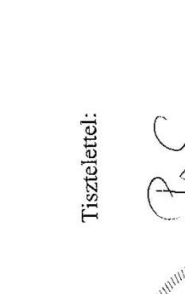

---

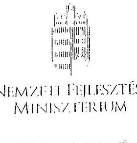

NEMZFII FIILISZTÉSI MINISZTIRIIUM

NEMFIII IASZIONE

Iktatószám: EFO/397-2/2013-NFM

Ugyintéző: Simonné Hábencius Gizella Telefonszám: 79-54405 E-mail:gizella.habencius.simonne@nfm.gov.hu Hivatkozási szám: V-0028-091/2012.

# Domokos László részére 

elnök
Állami Számvevőszék

## Budapest

Apáczai Csere János u. 10.
1052
Tárgy: Jelentés-tervezet véleményezése

## Tisztelt Elnök Úr!

Köszönettel vettem a Strukturális Alapok egyszerüsitése (EU Strukturális Alapok Munkacsoport által koordinált közös ellenorzes) ellenörzéséröl készített jelentés-tervezetüket.

A tervezetre az alábbi észrevételeket tesszük:
Általános észrevétel:
A tervezet a nemzeti fejlesztési miniszternek fogalmaz meg javaslatokat elsősorban a 2014-2020-as idöszakra vonatkozóan (23-24. oldal). Ennek kapcsán szükséges felhívni a figyelmet a Kormány által elfogadott, a 2014-2020 közötti európai uniós fejlesztési források felhasználásának tervezésével és intézményrendszerének kialakításával összefüggő aktuális feladatokról szóló 1600/2012. (XII. 17.) Korm. határozatra. A Korm. határozat értelmében:

- A 2014-2020 közötti időszak operatív programjainak tervezéséért és a szakmai tartalom meghatározásáért a kijelölt szaktárcák felelnek a jövőben. Az irányító hatóságok a szakmapolitikáért felelós szaktárcák struktúrájába és irányítása alá kerülnek;
- A 2014-2020 közötti elúrópai uniós fejlesztési források felhasználását, valamint a partnerségi megállapodás és az operatív programok kidolgozását, koordinációját a nemzetgazdasági miniszter látja el;
A hivatkozott Kormány határozat alapján a 2014-2020-as programozási időszakra vonatkozóan olyan szervezeti és hatásköri változások várhatóak, melyek miatt az ÁSZ jelentésben a nemzeti fejlesztési miniszternek meghatározott feladatok végrehajthatósága tekintetében egyeztetni szükséges az átalakításokkal érintett nemzeti fejlesztési ügynökséggel (a továbbiakban: NFU) és szakáárcákkal.

---

# Részletes észrevételek: 

Ezúton tájékoztatom arról, hogy információink szerint az NFÜ az alább felsorolt észrevételeket közvetlenül megküldte az ÁSZ részére. Jelzem továbbá, hogy az NFÜ észrevételeivel egyetértek.

1. Jelentés-tervezet 10. oldal 8. pont
„8. projektek teljes költséghatárának megemelése"
Javaslat:
„8. jövedelemtermelő projektek teljes költséghatárának megemelése"
2. Jelentés-tervezet 11. oldal, 25. oldal 1. 1. pont, 1. számú melléklet 13., 19. oldal Javaslat: A jelentés-tervezet hivatkozott oldalain kérjük feltüntetni, hogy csak a KÖZOP-nak csak a 3-4. prioritásai kerülnek ERFA-ból finanszírozásra.
3. Jelentés-tervezet 11. oldal, 7. bekezdés („Az NFÜ megbizásából készült felmérés szerint....")
Javaslat: Az előbbiek miatt nem javasoljuk a hivatkozást szerepeltetni a jelentésben, kérjük törölni a bekezdést.
Indoklás: A jelentésben hivatkozott tanulmány 2008-ban készült el, alig egy év pályáztatási tapasztalatai alapján becsülte a pályázói és a fejlesztéspolitikai intézményrendszer oldalán felmerülö adminisztratív költségeket a teljes, 2007-13-as programozási időszakra. Fontos kiemelni, hogy a becslés a 2008-ban alkalmazott pályáztatási gyakorlatot alapul véve készült. Azóta több lépcsőben módosítások következtek be az uniós támogatások végrehajtási rendszerében, melyek közül legjelentősebb a 4/2011. (I.28.) Korm. rendelet hatályba lépése volt. A bevezetett egyszerűsítő, gyorsítást elősegitő intézkedések okán a hivatkozott tanulmány a jelenlegi helyzetre nem releváns, félrevezető lehet a költségek nagyságrendjét illetően.
4. Jelentés-tervezet 12. oldal 1. bekezdés (,A helyszini ellenőrzés befejezéséig öt intézkedést végrehajtottak, de ezek közül egy intézkedésnél a költségcsökkentő hatás - beszámoló hiányában - még nem állapítható meg.")
Javaslat: Kérjük a jelentés szövegét módosítani.
Indoklás: 2012. decemberben elkészült a beszámoló a 32. sz. intézkedésről. A számszerüsített költségcsökkentő hatás 1995 millió forint.
5. Jelentés-tervezet 15. oldal 3. bekezdés, 28. oldal II. 1 pont II. kérdés 5. bekezdés (,A 6. számú, nagyprojektek megnövelt..."), valamint 33. oldal 6. intézkedés II. kérdés (,Az intézkedés 1 db...")
Javaslat: Az egyértelműség kedvéért javasoljuk az alábbi kiegészítést: „A projektek teljes száma az OP-ban 4175 db, ..."
6. Jelentés-tervezet 15. oldal 7. bekezdés (,A 2 kötelező egyszerüsitési intézkedés ...")

Javaslat: Az egyértelmüség kedvéért javasoljuk az alábbi kiegészítést: „A 2 kötelező egyszerüsitési intézkedés közül a 8. számú, a jövedelemtermelő projektek teljes költséghatárának megemelése..."
Indoklás: Itt helyesen az egyszerüsített elszámolásokhoz kapcsolódó módszertanról van szó, kérjük javítani. Ugyanezt kérjük javítani a 27. oldalon is (2.1. pont 2. bekezdés).
7. Jelentés-tervezet 22. oldal „Gyengeségek" 2. bekezdés
„Viszonylag alacsony az alkalmazott egyszerüsitési intézkedések száma (9-böl 4 darab)..." Javaslat:
„Viszonylag alacsony az uniós jogszabályok módosításaiból eredően alkalmazott egyszerüsitési intézkedések száma ..."

---

8. Jelentés-tervezet 23. oldal, javaslatok a nemzeti fejlesztési miniszternek
9. számú javaslat:
„Tekintse át a Strukturális Alapokat érintő egyszerüsitési intézkedések bevezetésének feltételrendszerét, gondoskodjon a bevezetés elmaradása okainak feltárásáról" Javaslat: A bevezetés elmaradásának okait nem szükséges feltárni, kérjük törölni.
Indoklás: Az NFÜ minden uniós jogszabály módosításon alapuló, de be nem vezetett egyszerüsitési intézkedésre adott indoklást. A javaslat nem következik a megelőző bekezdésben felvázoltakból.
„... teremtse meg a lehetőséget az egyes intézkedések hatásának mérhetőségére, értékelhetőségére".
Javaslat: Kérjük a javaslatot törölni.
Indoklás: Az NFÜ a kormányzati, ill. uniós elvárásoknak megfelelően tesz eleget jelentéstételi kötelezettségeinek, melyek fö fókusza az uniós források felhasználásának (abszorpció), eredményének nyomon követése (indikátorok). Az egyszerüsitő intézkedések hatásának ezekbe kell beépülnie.
10. számú javaslat:

Javaslat: Kérjük az „elszámolhatósági útmutató"-t „módszertan"-ra javítani.
Indoklás: A javaslatbantt nem az elszámolhatósági útmutatóról van szó, hanem az egyszerüsített elszámolások módszertanáról.
9. A Jelentés-tervezet oldalain kérjük feltüntetni, hogy csak a KEOP 3-4. és 6. prioritásai kerülnek ERFA-ból finanszírozásra.
10. Jelentés-tervezet 26. oldal 1.2 pont, 1. számú melléklet 19. oldal 1.2 pontja, 5/a függelék Javaslat: Javasoljuk kivenni a szövegböl az 5/a függelékre való hivatkozást, vagy az 5/a függeléket kérjük kiegészíteni a 2011. december 31-ei állapotnak megfelelő adatokkal, ahogy az a függelék fejlécében is szerepel megnevezésként.
Indoklás: A jelentéstervezet hivatkozott pontjai az 5/a függelékre hivatkoznak, mint amely 2011. december 31-ei állapotnak megfelelő adatokat tartalmaz az OP-k jóváhagyott támogatási keretére vonatkozóan, azonban az 5/a függelék 2007. január 1-jei állapotnak megfelelő adatokat tartalmaz.
11. Jelentés-tervezet 27. oldal 1.3 pont, 1. számú függelék 20. oldal 1.3 pont, 5/a függelék Javaslat: Kérjük a függelékben és a szövegben az adatok javítását.
Az 5/a függelékben foglalt adatok alapján, számításaink szerint a \%-os arányok helyesen:
ROP Konvergencia 27\%
TÁMOP 21\%
GOP 15\%
TIOP 12\%
ÁROP 1\%
EKOP 2\%
KMOP 9\%
KÖZOP 10\%
KEOP 2\%
12. Jelentés-tervezet 34. oldal 3.1.1. pont 1. bekezdés (,A két kötelező intézkedés...") Javaslat: Javasoljuk az érintett operatív programok konkrét megnevezését szerepeltetni a szövegben.
13. Jelentés-tervezet 35. oldal 3.1.2. pont (,8. kötelező egyszerüsitési intézkedés") („Az érintett operativ programok (GOP, KMOP) 11069 db projektet tartalmaztak, ezek közül jövedelemtermelö 7468 darab volt...")

---

Javaslat: „A vizsgált operativ programok 11069 db projektet tartalmaztak, ... ezek közül jövedelemtermelö 9513 db volt."
Indoklás: A bekezdés egyes adatai nincsenek összhangban a 6. és a 7. sz. függelék adataival, a bekezdést javasoljuk módosítani. A GOP-ban nem volt érintett projekt, a 6. és 7. sz. függelék sem tartalmaz GOP-ra nézve adatot.

Ugyanez a megállapítás található a Magyarország nemzeti ellenőrzési jelentése c. munkaanyag 29. oldalán lévő 8. kötelező egyszerúsítési intézkedés pontban. Kérjük itt is javítani.
14. Jelentés-tervezet 48. oldal 14. nemzeti hatáskörben meghozott egyszerüsítési intézkedés I. kérdés
Javaslat: A kapcsolódó adatokat összefoglaló táblát az alábbiak szerint javasoljuk módosítani:

| Finanszírozási   alap: ERFA | Összes projekt | Potenciális   projekt | Érintett   projekt | Érintett/   összes | Érintett/   potenciális |
| :-- | :--: | :--: | :--: | :--: | :--: |
| Projektek (db) | 11984 | 261 | 28 | $0,2 \%$ | $10,73 \%$ |
| Források   EUR) | 4359989,39 | 130468,61 | 24148,43 | $0,6 \%$ | $18,5 \%$ |

Indoklás: Az egyszerüsítési intézkedéssel kapcsolatban a konvergencia ROP-ok mellett a KMOP esetében is volt az intézkedés által potenciálisan érintett 21 db projekt.
15. Jelentéstervezet 49. oldal 15. nemzeti hatáskörben meghozott egyszerüsítési intézkedés I. kérdés
Javaslat: A kapcsolódó adatokat összefoglaló táblát az alábbiak szerint javasoljuk módosítani:

| Finanszírozási   alap: ERFA | Összes projekt | Potenciális   projekt | Érintett   projekt | Érintett/   összes | Érintett/   potenciális |
| :-- | :--: | :--: | :--: | :--: | :--: |
| Projektek (db) | 11984 | 112 | 1 | $0,0 \%$ | $0,9 \%$ |
| Források   EUR) | 4359989,39 | 94160,96 | 253,91 | $0,0 \%$ | $0,3 \%$ |

Indoklás: Az egyszerüsítési intézkedéssel kapcsolatban a konvergencia ROP-ok mellett a KMOP esetében is volt az intézkedés által potenciálisan érintett 18 db projekt.
A fenti módosítási javaslatokat - elfogadás esetén - kérjük, hogy az ÁSZ a jelentéstervezet 1. sz. mellékletét képező munkaanyagon is átvezetni szíveskedjék.
16. Jelentés-tervezet 2. sz. függelék
32. sz. intézkedés tényleges költségcsökkentő hatása 1995 millió forint. Kérjük javítani az intézkedés celláját.
17. Jelentés-tervezet 5/a, 5/b függelék, 6-7. függelék

Az 5/a függelékben a KÖZOP KA finanszírozás összegénél nem a valós képet tükrözi a 0 Euro összeg szerepeltetése, tekintettel arra, hogy a KÖZOP 1., 2., 5., 6. prioritásai Kohéziós Alapból finanszírozottak. Tekintettel arra, hogy az ellenőrzés csak az ERFA, ESZA forrásból finanszírozott összegeket vizsgálta, így a „nem releváns" megnevezés lenne véleményünk szerint helyes nemcsak a KÖZOP, hanem minden olyan OP esetén, ahol volt egyébként KA-ból forrás allokálva az adott OP-ra. Javasoljuk a függelék címét is ennek megfelelően módosítani.
Az 5/b függelékben a KA-ra vonatkozó adatoknál semmi nem szerepel, holott a függelék neve „Az operativ programok és finanszírozási alapjaik pénzügyi adatai a 2007-2013. évek között évenkénti bontásban". Amennyiben csak az ERFA, ESZA adatok relevánsak, úgy

---

javasoljuk törölni a táblázatból a KA-ra vonatkozó sorokat és a függelék címét is ennek megfelelően módosítani.
A 6-7. számú függelékben is csak ERFA, ESZA adatok szerepelnek, így javasoljuk a függelék címét ennek megfelelően módosítani.
A 6. sz. függelék „6. nagyprojektek megnövelt rugalmassága" c. intézkedés KÖZOP-hoz tartozó 8. oszlopban szereplő összege helyesen: 1209340 E euro
18. Jelentés-tervezet 5/a, 5/b függelék, 6-7. függelék

Az 5/a függelékben a KEOP KA finanszírozás összegénél nem a valós képet tükrözi a 0 E Euro összeg szerepeltetése, tekintettel arra, hogy a KEOP 1., 2., 5., 7., 8. prioritásai Kohéziös Alapból finanszírozottak. Tekintettel arra, hogy az ellenőrzés csak az ERFA, ESZA forrásból finanszírozott összegeket vizsgálta, így a "nem releváns" megnevezés lenne véleményünk szerint helyes nemcsak a KEOP, hanem minden olyan OP esetén, ahol volt egyébként KA-ból forrás allokálva az adott OP-ra. Javasoljuk a függelék címét is ennek megfelelően módosítani.
Az 5/b függelékben a KA-ra vonatkozó adatoknál semmi nem szerepel, holott a függelék neve "Az operatív programok és finanszírozási alapjaik pénzügyi adatai a 2007-2013. évek között évenkénti bontásban". Amennyiben csak az ERFA, ESZA-adatok-relevánsak,-úgyjavasoljuk törölni a táblázatból a KA-ra vonatkozó sorokat és a függelék címét is ennek megfelelően módosítani.
A 6-7. számú függelékben is csak ERFA, ESZA adatok szerepelnek, így javasoljuk a függelék címét ennek megfelelően módosítani.
19. Flat rate elszámolási mód:

A Flat rate egyszerüsített elszámolási mód már bevezetésre került. 2012. december 21-én jelent meg a TÁMOP-1.4.1 „Hátrányos helyzetü célcsoportok foglalkoztatásának támogatása a nonprofit szervezetek foglalkoztatási kapacitásának erösitésével" című konstrukció, melyben a közvetett költségek a felmerülö közvetlen költségek meghatározott mértékéig átalány alapon számolhatóak el.
Az anyag mindenhol azt említi, hogy a Nemzeti Elszámolhatósági Útmutató teremtette meg az egyszerüsített elszámolási módok alkalmazásának lehetőségét. Javasoljuk, hogy a jelentés először a 2007-2013 programozási időszakban az Európai Regionális Fejlesztési Alapból, az Európai Szociális Alapból és a Kohéziós Alapból származó támogatások felhasználásának rendjéről szóló 4/2011. (I. 28.) Korm. rendeletre hivatkozzon, utána az Elszámolhatósági Útmutatóra.
4/2011. (I. 28.) Korm. rendelet 57. §:
"(2) Ha a pályázati felhívás vagy a támogatási szerződés arra lehetőséget biztosít, egyes költségek a támogatási szerződésben vagy a támogatói okiratban meghatározott mértékig a kettős finanszírozás lehetőségének kizárása mellett - átalány alapon is elszámolhatóak."

Budapest, 2013. január , 28 .

Melléklet: 1 db
Készült: 2 példányban
Kapják: Címzett
Irattár
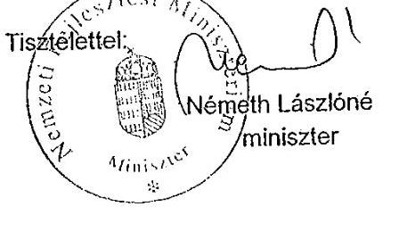

---

4/b. sz. melléklet a V-0028-111/2013. sz. jelentéshez
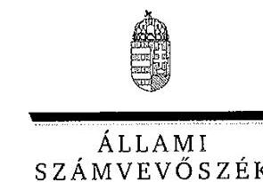

Ikt.szám: V-0028-110/2013.

Németh Lászlóné asszony miniszter Nemzeti Fejlesztési Minisztérium

# Budapest 

## Tisztelt Miniszter Asszony!

A Strukturális Alapok szabályainak egyszerüsítése (EU Strukturális Alapok Munkacsoport által koordinált közös ellenőrzés) ellenőrzése címủ jelentéstervezetre tett észrevételeit köszönettel megkaptam.

Az Állami Számvevőszék álláspontjáról a felügyeleti vezető által készített részletes tájékoztatást csatoltan megküldöm.

Tájékoztatom Miniszter Asszonyt, hogy a jelentésben - az Állami Számvevőszékről szóló 2011. évi LXVI. törvény 29. § (3) bekezdése alapján - az el nem fogadott észrevételeket szerepeltetjük az elutasítás indokának feltüntetésével együtt. Az elfogadott észrevételeket a jelentés szövegezésénél figyelembe vettük.

Budapest, 2013. 03 hó 06 nap

Tisztelettel:

## Domokos László 7

Melléklet: Tájékoztatás az elfogadott és az el nem fogadott észrevételekről

---

# Tájékoztatás

## az elfogadott és az el nem fogadott észrevételekről

A Strukturális Alapok szabályainak egyszerűsítése ellenőrzése (EU Strukturális Alapok Munkaosoport által koordinált közös ellenőrzés) című jelentéstervezetre EFO/397-2/2013-NFM ikt. számú levelében tett észrevételeit áttekintettük, azok kezeléséről az alábbi tájékoztatást adom.

NFM által tett észrevételek átvezetése a tervezeten:

|  Sorszám: | Hivatkozás | Eredeti szövegváltozat / Észrevétel: | Új szövegváltozat / Indok-
lás:  |
| --- | --- | --- | --- |
|   | Általános ész-
revételek | A tervezet a nemzeti fejlesztési miniszternek fogalmaz meg javaslatokat elsősorban a 2014-2020-as időszakra vonatkozóan (23-24. oldal). Ennek kapcsán szükséges felhívni a figyelmet a Kormány által elfogadott, a 2014-2020 közötti európai uniós fejlesztési források felhasználásának tervezésével és intézményrendszerének kialakításával összefüggő aktuális feladatokról szóló 1600/2012. (XII. 17.) Korm. határozatra. A Korm. határozat értelmében:
A 2014-2020 közötti időszak operatív programjainak tervezéséért és a szakmai tartalom meghatározásáért a kijelölt szaktárcák felelnek a jövőben. Az irányító hatóságok a szakmapolitikáért felelős szaktárcák struktúrájába és irányítása alá kerülnek;
A 2014-2020 közötti európai uniós fejlesztési források felhasználását, valamint a partnerségi megállapodás és az operatív programok kidolgozását, koordinációját a nemzetgazdasági miniszter látja el;
A hivatkozott Kormány határozat alapján a 2014-2020-as programozási időszakra | Az ÁSZ jelentésben a nemzeti fejlesztési miniszternek meghatározott feladatok címzettje tekintetében nem indokolt változattal. A hivatkozott 1600/2012. (XII. 17.) Korm. határozat alapján a Miniszterelnökséget vezető államtitkár a jövőre vonatkozóan tesz javaslatot a Nemzeti Fejlesztési Kormánybizottság részére az irányító hatóságok és a programok lebonyolítását támogató intézményrendszert keretek felállításának módjára, felelősségi rendjére és ütemezé-  |

---

|   |  | vonatkozóan olyan szervezeti és hatásköri változások várhatóak, melyek miatt az ÁSZ jelentésben a nemzeti fejlesztési miniszternek meghatározott feladatok végrehajthatósága tekintetében egyeztetni szükséges az átalakításokkal érintett nemzeti fejlesztési ügynökséggel (a továbbiakban: NFÜ) és szaktárcákkal. |  | sére vonatkozóan.  |
| --- | --- | --- | --- | --- |
|  1. | 10. oldal 8. pont. | „8. projektek teljes költséghatárának megemelése"
Javaslat: „8. jövedelemtermelő projektek teljes költséghatárának megemelése" |  | 11. oldal 8. pont
A javaslatot az ÁSZ jelentéstervezetre vonatkoztatva elfogadtuk, a kért módosítás átvezetésre került.  |
|  2. | 11. oldal, 25. oldal 1. 1. melléklet 13., 19. oldal | Javaslat: A jelentéstervezet fenti oldalain kérjük feltüntetni, hogy csak a KÖZOP 3-4. prioritásai kerülnek ERFA-ból finanszírozásra. |  | 13. oldal, 26. oldal 1. 1. pont. 1. sz. melléklet 13., 19. oldal
A javaslatot az ÁSZ jelentéstervezetre vonatkoztatva elfogadtuk, a kért módosítás átvezetésre került.  |
|  3. | 11. oldal, 7. bekezdés | „Az NFÜ megbízásából készült felmérés szerint...."
A jelentésben hivatkozott tanulmány 2008-ban készült el, alig egy év pályáztatási tapasztalatai alapján becsülte a pályázói és a fejlesztéspolitikai intézményrendszer oldalán felmerülő adminisztratív költségeket a teljes, 2007-13-as programozási időszakra. Fontos kiemelni, hogy a becslés a 2008-ban alkalmazott pályáztatási gyakorlatot alapul véve készült. Azóta több lépcsőben módosítások következtek be az uniós támogatások végrehajtási rendszerében, melyek közül legjelentősebb a 4/2011. (I.28.) Korm. rendelet hatályba lépése volt. A bevezetett egyszerűsítő, gyorsítást elősegítő intézkedések okán a hivatkozott tanulmány a jelenlegi helyzetre nem releváns, félrevezető lehet a költségek nagyságrendjét illetően.
Javaslat: Az előbbiek miatt nem javasoljuk a hivatkozást szerepeltetni a jelentésben, kérjük törölni a bekezdést. |  | 13. oldal, 7. bekezdés
A javaslatot részben elfogadtuk, a bekezdést nem töröltük, hanem a jelentést az alábbi magyarázatot tartalmazó lábjegyzettel kiegészítettük:
„A tanulmány 2008-ban készült el, a becslés a 2008-ban alkalmazott pályáztatási gyakorlatot alapul véve készült. Az azóta bevezetett egyszerűsítő intézkedések az adminisztratív terheket csökkentették."  |
|  4. | 12. oldal 1. bekezdés | „A helyszíni ellenőrzés befejezéséig öt intézkedést végrehajtottak, de ezek közül egy intézkedésnél a költségcsökkentő hatás - beszámoló hiányában - még nem állapít |  | 14. oldal 1. bekezdés
A jelentést az alábbi magyará-  |

---

|   |  | ható meg." | zatot tartalmazó lábjegyzettel  |
| --- | --- | --- | --- |
|   |  | 2012 decemberében elkészült a beszámoló a 32. sz. intézkedésről (NFM). A számszerüsített költségcsökkentő hatás 1995 MFt. | kiegészítettük:  |
|   |  | Javaslat: Kérjük a jelentés szövegét módosítani. | Az NFÜ tájékoztatása szerint: „2012. decemberben elkészült a beszámoló a 32. sz. intézkedésről. A számszerűsített költségcsökkentő hatás 1995 millió forint."  |
|  5. | 15. oldal 3. bekezdés és 28. oldal 2.1. pont 5. bekezdés, valamint 33. oldal 6. intézkedés II. kérdés | („A 6. számú, nagyprojektek megnövelt ..."), valamint („Az intézkedés 1 db ...") | 17. oldal 3. bekezdés és 29. oldal 2.1. pont 5. bekezdés, valamint 34. oldal 6. intézkedés II. kérdés  |
|   |  | Javaslat: Az egyértelműség kedvéért javasoljuk az alábbi kiegészítést: | A javaslatot az ÁSZ jelentés-tervezetre vonatkoztatva elfogadtuk, a kért módosítás átvezetésre került.  |
|   |  | „A projektek teljes száma az OP-ban 4175 db, ...." |   |
|  6. | 15. oldal 7. bekezdés | „A 2 kötelező egyszerűsítési intézkedés ..." | 17. oldal 7. bekezdés  |
|   |  | Az egyértelműség kedvéért javasoljuk az alábbi kiegészítést: | A javaslatot az ÁSZ jelentés-tervezetre vonatkoztatva elfogadtuk, a kért módosítás átvezetésre került.  |
|   |  | „A 2 kötelező egyszerűsítési intézkedés közül a 8. számú, a jövedelemtermelő projektek teljes költséghatásának megemelése ..." |   |
|   |  | Itt helyesen az egyszerűsített elszámolásokhoz kapcsolódó módszertanzál van szó, kérjük javítani. Ugyanezt kérjük javítani a 27. oldalon is (2.1. pont 2. bekezdés). |   |
|  7. | 22. oldal „Gyengeségek" második bekezdés | „Viszonylag alacsony az alkalmazott egyszerűsítési intézkedések száma (9-ből 4 darab)..." | 24. oldal első bekezdés  |
|   |  | Javaslat: „Viszonylag alacsony az uniós jogszabályok módosításaiból eredően alkalmazott egyszerűsítési intézkedések száma ..." | A javaslatot az ÁSZ jelentés-tervezetre vonatkoztatva elfogadtuk, a kért módosítás átvezetésre került.  |
|  8. | 23. oldal, javaslatok a nemzeti fejlesztési mű | 1., sz. javaslat: „Tekintse át a Strukturdlis Alapokat érintő egyszerűsítési intézkedések bevezetésének feltételrendszerét, gondoskodjon a bevezetés elmaradása okaitsak feltárásáról" | 24. oldal, javaslatok a nemzeti fejlesztési miniszternek  |
|   |  | Javaslat: A bevezetés elmaradásának okait nem szükséges feltárni, kérjük törölni. | Az 1. sz. javaslatot érintő második észrevételt nem fogadtuk el.  |

---

| niszternek | Indoklás: Az NFÜ minden uniós jogszabály módosításon alapuló, de be nem vezetett egyszerűsítési intézkedésre adott indoklást. A javaslat nem következik a megelőző bekezdésben felvázoltakból. „teremtse meg a lehetőséget az egyes intézkedések hatásának mérhetőségére, értékelhetőségére". | mivel az NFÜ jelentésének fókuszában az uniós források felhasználásának eredményének nyomon követése van, de az egyszerűsítési intézkedések hatásának mérésére, értékelésére nem terjed ki. |
| :--: | :--: | :--: |
|  | Javaslat: Kérjük a javaslatot törölni. | Az 1. sz. javaslatot érintő első észrevételt és a 2. sz. javaslatra tett észrevételt hasznosítottuk az alábbiak szerint: |
|  | Indoklás: Az NFÜ a kormányzati, ill. uniós elvárásoknak megfelelően tesz eleget jelentéstételi kötelezettségeinek, melyek fő fókusza az uniós források felhasználásának (abszorpció), eredményének nyomon követése (indikátorok). Az egyszerűsítő intézkedések hatásának ezekbe kell beépülnie. | „Az ellenőrzött szervezetek kevés információval rendelkeztek az egyszerűsítési intézkedések bevezetésének tapasztalatairól, és az intézkedések által a pályázók és a kedvezményezettek körében kiváltott hatásokról, mivel nem alakították ki teljes körűen a folyamat célzott figyelemmel kísérésének szabályait és nem jelölték ki a felelősöket. |
|  | 2. sz. javaslat: | Javaslat: |
|  | Javaslat: Kérjük az „elszámolhatósági útmutató"-t módszertanra javítani | Tekintse át a Strukturális Alapokat érintő egyszerűsítési intézkedések bevezetésének feltételrendszerét és az intézkedések bevezetése elmaradásának - az ÁSZ és az NFÜ által feltárt - okait elemezve, az alapján segítsé elő az egyszerűsítési intézkedések jövőbeni bevezethetőségét. Teremtse meg a bevezetett intézkedések hatásai mérhetőségének, érté- |

---

|   |  |  |  | kelhetőségének a lehetőségét.  |
| --- | --- | --- | --- | --- |
|   |  |  |  | Az egyszerűsített elszámolások módszertanának az EU Bizottságával az NFÜ által folytatott elhúzódó egyeztetése húzáltatta a – közvetlen és közvetett költségek elszámolásának egyszerűsítésére vonatkozó – választható egyszerűsítő intézkedések bevezetését.  |
|   |  |  |  | Javaslat:  |
|   |  |  |  | Készíttesse elő – az NFÜ költség adatbázisában rendelkezésre álló tényleges költségadatok figyelembevételével – a jövőben alkalmazható egyszerűsített elszámolások módszertanát és az Elszámolhatósági Útmutatókat annak érdekében, hogy azok az EU 2014-2020 közötti programozási időszak elejétől bevezethetőek legyenek.  |
|   |  |  |  | 26. oldal 1. 1. pont, 1. sz. melléklet 13., 19. oldal  |
|  9. | 25. oldal 1. 1. pont, 1. sz. melléklet 13., 19. oldal |  | A jelentéstervezet fenti oldalain kérjük feltüntetni, hogy csak a KÉOP 3-4. és 6. prioritásai kerülnek ERFA-ból finanszírozásra. | 26. oldal 1. 1. pont, 1. sz. melléklet 13., 19. oldal  |
|   |  |  |  | A javaslatot az ÁSZ jelentéstervezetre vonatkoztatva elfogadtuk, a kért módosítás átvezetésre került.  |
|  10. | 26. oldal 1.2 pont, 1. sz. melléklet 19. oldal 1. 2 pontja, 5/a |  | Javaslat: Javasoljuk kivenni a szövegből az 5/a függelékre való hivatkozást vagy az 5/a függeléket kiegészíteni a 2011. 12.31-i állapotnak megfelelő adatokkal, ahogy az a függelék fejlécében is szerepel megnevezésként. | 27. oldal 1.2 pont, 1. sz. melléklet 19. oldal 1. 2 pontja, 5/a függelék  |
|   |  |  |  | Az érzéktelt nem fogadtuk el, mivel az 5/a függelék második  |
|   |  |  |  | 26. oldal 1. 1. pont, 1. sz. melléklet 13., 19. oldal  |
|   |  |  |  | Az érzéktelt nem fogadtuk el, mivel az 5/a függelék második  |

---

|   | függelék | hagyott támogatási keretére vonatkozóan, azonban az 5/a függelék 2007. 01.01-i állapotnak megfelelő adatokat tartalmaz. |  | táblázata tartalmazza a 2011. december 31-i állapotnak megfelelő adatokat.  |
| --- | --- | --- | --- | --- |
|  11. | 27. oldal 1.3 pont, 1. sz. melléklet 20. oldal 1.3 pont, 5/a függelék | Javaslat: Kérjük a függelékben és a szövegben az adatok javítását.
Az 5/a függelékben foglalt adatok alapján, számításaink szerint a %-os arányok helyesen:
ROP Konvergencia 27%
TÁMOP 21%
GOP 15%
TIOP 12%
ÁROP 1%
EKOP 2%
KMOP 9%
KÖZOP 10%
KEOP 2% |  | 28. oldal 1.3 pont, 1. sz. melléklet 20. oldal 1.3 pont, 5/a függelék
Az észrevételt nem fogadtuk el, mivel jelentés adatai az 5/a függelék második táblázatában szereplő, a 2011. december 31-i állapotnak megfelelő adatokkal összhangban vannak.  |
|  12. | 34. oldal 3.1.1. pont 1. bekezdés | "A két kötelező intézkedés..."
Javaslat: Javasoljuk az érintett operatív programok konkrét megnevezését szerepeltetni a szövegben. |  | 35. oldal 3.1.1. pont 1. bekezdés
A javaslatot az ÁSZ jelentés-tervezetre vonatkoztatva elfogadtuk, a kért módosítás átvezetésre került az alábbiak szerint:
"A két kötelező intézkedés az ERFA forrásból finanszírozott regionális és az infrastruktúra fejlesztési operatív programok (ROP, KEOP, KÖZOP) projektjelt érintette."  |
|  13. | 35. oldal 3.1.2. pont | Jelentés-tervezet 35. oldal 3.1.2. pont ("8. kötelező egyszerűsítési intézkedés") ("Az érintett operatív programok (GOP, KMOP) 11069 db projektet tartalmaztak, ezek közül jövedelemetermelő 7468 darab volt...")
Javaslat: "A vizsgált operatív programok 11069 db projektet tartalmaztak, ... ezek |  | 36. oldal 3.1.2. pont
A javaslatot az ÁSZ jelentés-tervezetre vonatkoztatva elfogadtuk, a kért módosítás átveze-  |

---

|   |  | közül jövedelemtermelő 9513 db volt." |  |  |  |  | tésre került az alábbiak szerint:  |
| --- | --- | --- | --- | --- | --- | --- | --- |
|   |  | "Az érintett operatív programok (GOP, KMOP) 11069 db projektet tartalmaztak, ezek közül jövedelemtermelő 7468 darab volt..." |  |  |  |  | "A vizsgált operatív programok 11069 db projektet tartalmaztak, ezek közül jövedelemtermelő 7468 darab volt (4 840 999 E EUR, 1 072 185 E EUR keretné), visszamenőleges hatállyal összesen 12223 db projektet tartalmaztak, ezek közül jövedelemtermelő 9513 darab volt, amelynek kerete rendre 5 569 329 illetve 1 277 841 E EUR volt."  |
|   |  | Indoklás: A bekezdés egyes adatai nincsenek összhangban a 6. és a 7. sz. függelék adataival, a bekezdést javasoljuk módosítani. A GOP-ban nem volt érintett projekt, a 6. és 7. sz. függelék sem tartalmaz GOP-rs nézve adatot. Ugyanez a megállapítás található a Magyarország nemzeti ellenőrzési jelentése c. munkaanyag 29. oldalán lévő 8. kötelező egyszerűsítési intézkedés pontban. Kérjük itt is javítani. |  |  |  |  | 51. oldal 14. nemzeti hatáskörben meghozott egyszerűsítési intézkedés I. kérdés  |
|   |  | Javaslat: A kapcsolódó adatokat összefoglaló táblát az alábbiak szerint javasoljuk módosítani: |  |  |  |  | A javaslatot az ÁSZ jelentés-tervezetre vonatkoztatva elfogadtuk, a kért adatpontosító módosítás átvezetésre került.  |
|   | 48. oldal 14. nemzeti hatáskörben meghozott egyszerűsítési intézkedés I. kérdés | Finanszírozási alap: ERFA | Összes projekt | Potenciális projekt | Érintett projekt | Érintett/ összes | Érintett/ potenciális  |
|  14. |  | Projektek (db) | 11 984 | 261 | 28 | 0,2% | 10,73%  |
|   |  | Források (E EUR) | 4 359 989,39 | 130 468,61 | 24 148,43 | 0,6% | 18,5%  |
|   |  | Indoklás: Az egyszerűsítési intézkedéssel kapcsolatban a konvergencia BOP-ok mellett a KMOP esetében is volt az intézkedés által potenciálisan érintett 21 db projekt. |  |  |  |  |   |
|   | 49. oldal 15. nemzeti hatáskörben meghozott egyszerűsítési intézkedés I. kérdés | Javaslat: A kapcsolódó adatokat összefoglaló táblát az alábbiak szerint javasoljuk módosítani: |  |  |  |  | 51. oldal 15. nemzeti hatáskörben meghozott egyszerűsítési intézkedés I. kérdés  |
|  15. |  | Finanszírozási alap: ERFA | Összes projekt | Potenciális projekt | Érintett projekt | Érintett/ összes | Érintett/ potenciális  |
|   |  | Projektek (db) | 11 984 | 112 | 1 | 0,0% | 0,9%  |
|   |  | Források (E | 4 359 | 94 160,96 | 253,91 | 0,0% | 0,3%  |

---

|   |  | EUR) | 989,39 |  |  |   |
| --- | --- | --- | --- | --- | --- | --- |
|   |  | Indoklás: Az egyszerűsítési intézkedéssel kapcsolatban a konvergencia ROP-ok mellett a KMOP esetében is volt az intézkedés által potenciálisan érintett 18 db projekt. |  |  |  |   |
|  16. | 2. sz. függelék | 32. sz. intézkedés tényleges költségcsökkentő hatása 1995 MFt. |  |  |  | 2. sz. függelék
Az 16. sz. észrevétel figyelembevétele a 4. sz. észrevételnél feltüntetettek szerint történt.  |
|  17-18. | 5/a, 5/b függelék, 6-7. függelék | Az 5/a függelékben a KÖZOP KA finanszírozás összegénél nem a valós képet tükrözi a 0 E Euro összeg szerepeltetése, tekintettel arra, hogy a KÖZOP 1., 2., 5., 6. prioritásai KA-ból finanszírozottak. Tekintettel arra, hogy az ellenőrzés csak az ERFA, ESZA forrásból finanszírozott összegeket vizsgálta, így a „nem releváns" megnevezés lenne véleményünk szerint helyes nemcsak a KÖZOP, hanem minden olyan OP esetén, ahol volt egyébként KA-ból forrás allokálva az adott OP-ra. Javasoljuk a függelék címét is ennek megfelelően módosítani.
Az 5/b függelékben a KA-ra vonatkozó adatoknál semmi nem szerepel, holott a függelék neve „Az operatív programok és finanszírozási alapjunk pénzügyi adatai a 2007-2013. évek között évenkénti bontásban". Amennyiben csak az ERFA, ESZA adatok relevánsak, úgy javasoljuk törölni a táblázatból a KA-ra vonatkozó sorokat és a függelék címét is ennek megfelelően módosítani.
A 6-7. számú függelékben is csak ERFA, ESZA adatok szerepelnek, így javasoljuk a függelék címét ennek megfelelően módosítani.
A 6. sz. függelék 6. nagyprojektek megnövelt rugalmassága intézkedés KÖZOP-hoz tartozó 8. oszlopban szereplő összeg helyesen: 1 209 340 E euro
Az 5/a függelékben a KEOP KA finanszírozás összegénél nem a valós képet tükrözi a 0 E Euro összeg szerepeltetése, tekintettel arra, hogy a KEOP 1., 2., 5., 7., 8. prioritásai KA-ból finanszírozottak. Tekintettel arra, hogy az ellenőrzés csak az ERFA, ESZA forrásból finanszírozott összegeket vizsgálta, így a „nem releváns" megnevezés lenne véleményünk szerint helyes nemcsak a KEOP, hanem minden olyan OP esetén, ahol volt egyébként KA-ból forrás allokálva az adott OP-ra. Javasoljuk a függelék címét is ennek megfelelően módosítani.
Az 5/b függelékben a KA-ra vonatkozó adatoknál semmi nem szerepel, holott a | 5/a, 5/b függelék, 6-7. függelék
A javaslatot az ÁSZ jelentéstervezetre vonatkoztatva elfogadtuk, a kért adatpontosító módosítás átvezetésre került az alábbiak szerint:
A táblázatokból a KA adatsorok törlésre kerültek.
A függelékek táblázatcímei:
„Operatív programok strukturális alapokból származó támogatási kerete" |   |

---

|  |  | függelék neve „Az operatív programok és finanszírozási alapjaik pénzügyi adatai a 2007-2013. évek között évonkénti bontásban". Amennyiben csak az ERFA, ESZA adatok relevánsak, úgy javasoljuk törölni a táblázatból a KA-ra vonatkozó sorokat és a függelék címét is ennek megfelelően módosítani.   A 6-7. számú függelékben is csak ERFA, ESZA adatok szerepelnek, így javasoljuk a függelék címét ennek megfelelően módosítani. |  |
| :--: | :--: | :--: | :--: |
|  |  | A Flat rate egyszerúsített elszámolási mód már bevezetésre került: 2012. december 21-én jelent meg a TÁMOP-1.4.1 „Hátrányos helyzetű célcsoportok foglalkoztatásának támogatása a nonprofit szervezetek foglalkoztatási kapacitásának erősítésével" című konstrukció, melyben a közvetett költségek a felmerülő közvetlen költségek meghatározott mértékéig átalány alapon számolhatóak el.   A jelentéstervezet mindenhol azt említi, hogy a Nemzeti Elszámolhatósági Útmutató teremtette meg az egyszerúsített elszámolási módok alkalmazásának lehetőségét. Felhívjuk a figyelmet, hogy az átalányalapú elszámolhatóságról a 4/2011-es Korm. rendeletre is rendelkezik:   4/2011 Korm. rend 37. §.   (2) Ha a pályázati felhívás vagy a támogatási szerződés arra lehetőséget biztosít, egyes költségek a támogatási szerződésben vagy a támogatói okiratban meghatározott mértékig a kettős finanszírozás lehetőségének kizárása mellett - átalány alapon is elszámolhatóak. | A javaslatot az ÁSZ jelentéstervezetre vonatkoztatva elfogadtak, a kért módosítás átvezetésre került a 16. oldalon az alábbiak szerint:   „Az egyszerúsített elszámolási módok alkalmazásának lehetőségét a 2007-2013 programozási időszakban az Európai Regionális Fejlesztési Alapból, az Európai Szociális Alapból és a Kohéziós Alapból származó támogatások felhasználásának rendjéről szóló 4/2011. (I. 28.) Korm. rendelet teremtette meg." |

Budapest, 2013. felhívjuk haćtnap
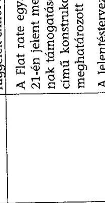

Tisztelettel:

Dr. Pulsy Gyula
felügyeleti vezető

---

# Az egyszerűsítési intézkedések célja, jogi megalapozása, bevezetésének időpontja

|  Intézkedés sor-
száma | megnevezése | Bevezetésének célja | Bevezetését megalapozó jogszabályok, közjogi szervezetszabályozó eszközök | Hazai bevezetésének időpontja | Érintett Strukturális Alap |   |
| --- | --- | --- | --- | --- | --- | --- |
|   |  |  |  |  | ERFA | ESZA  |
|  Választható intézkedések |  |  |  |  |  |   |
|  1 | közvetett költségek (átalányalapon meghatározva, legfeljebb a közvetlen költségek 20\%-áig) | A műveletek átalányalapon meghatározott közvetett költségeinek elszámolása a műveletre bejelentett közvetlen költségek legfeljebb 20\%-áig. | 397/2009/EK rendelet 1. cikk (3) bekezdése az 1080/2006/EK (ERFA) rendelet 7. cikkére vonatkozóan vissza nem térítendő támogatások esetén.
A 4/2011.(I. 28.) Korm. rendeletben az átalány alapú elszámolás lehetőségét a 176/2012. (VII. 26.) Korm. rendelet iktatta be. | nem vezették be | NEM | NEM  |
|  2 | átalányalapú költségek (egységköltség alkalmazásával számítva) | A tagállam által meghatározott egységköltség alkalmazásával számított átalányalapú költségek elszámolása. | 396/2009/EK rendelet 1. cikk az 1081/2006/EK (ESZA) rendelet 11. cikkére vonatkozóan vissza nem térítendő támogatások esetén.
397/2009/EK rendelet 1. cikk (3) bekezdése az 1080/2006/EK (ERFA) rendelet 7. cikkére vonatkozóan.
A 4/2011.(I. 28.) Korm rendeletben az átalány alapú elszámolás lehetőségét a 176/2012. (VII. 26.) Korm. rendelet iktatta be. | $\begin{aligned} & 2009 . \quad 05 . \ & 22 . \end{aligned}$ | NEM | IGEN  |
|  3 | átalányösszegek | Átalányösszegek a műveletek költségeinek teljes vagy részleges fedezésére (az átalányösz- | 396/2009/EK rendelet 1. cikk az 1081/2006/EK (ESZA) rendelet 11. cikkére vonatkozóan. | nem vezették be | NEM | NEM  |

---

|   |  | szeg nem haladhatja meg az 50000 EUR). | 397/2009/EK rendelet 1. cikk (3) bekezdése az 1080/2006/EK (ERFA) rendelet 7. cikkére vonatkozóan
A 4/2011.(I. 28.) Korm. rendeletben az átalány alapú elszámolás lehetőségét a 176/2012. (VII. 26.) Korm. rendelet iktatta be. |  |  |   |
| --- | --- | --- | --- | --- | --- | --- |
|  4 | a természetbeni hozzájárulások elszámolhatósága | a természetbeni hozzájárulások elszámolható költségként való meghatározásáról a pénzügyi eszközökkel kapcsolatban. | 284/2009/EK rendelet 1. cikk (3) bekezdése az 1083/2006/EK rendelet (Strukturális Alapokra vonatkozó általános rendelet) 56. cikkének (2) bekezdésére vonatkozóan | nem vezették be | NEM | NEM  |
|  5 | Előlegfizetések | Törli (az állami támogatással kapcsolatban) azt a korlátot, amely a költségnyilatkozathoz a teljes támogatási összeg 35\%ára korlátozta a kedvezményezetteknek kifizethető előleget. | 284/2009/EK rendelet 1. cikk (4) bekezdésének (b) pontjával az 1083/2006/EK rendelet 78. cikke (2) bekezdése (b) pontjának törlése. | nem vezették be | NEM | NEM  |
|  6 | Nagyprojektek megnövelt rugalmassága | A nagyprojektekhez kapcsolódó költségeknek a költségnyilatkozatokba való belefoglalása az Európai Bizottság előzetes hozzájárulása nélkül. | 284/2009/EK rendelet az 1. cikk (4) bekezdésének (c) pontja az 1083/2006/EK rendelet (Strukturális Alapokra vonatkozó általános rendelet) 78. cikkének (4) bekezdése.
A hazai jogszabályok módosítását nem igényelte, mert az Igazoló hatóságra vonatkozó 4/2011.(I. 28.) Korm. rendelet 72.§ (2) bekezdése előírja az uniós szabályoknak való megfelelést a költségigazolásokban. | 2009. 04 09. | IGEN | NEM  |
|  7 | Társfinanszírozott visszatérítendő támogatások | Bevezeti a társfinanszírozott visszatérítendő támogatás lehetőségét. | 1310/2011/EU rendelet 1. (2., 3.) cikk. | nem vezették be | NEM | NEM  |

---

|  Kötelező intézkedések |  |  |  |  |  |   |
| --- | --- | --- | --- | --- | --- | --- |
|  8 | Projektek teljes költséghatárának megemelése | A jövedelemtermelő projektek teljes költséghatárának 1 M EUR összegre való megemeléséről és az ESZA projektek kizárásáról. | 1341/2008/EK rendelet 1. cikk az 1083/2006/EK rendelet (Strukturális Alapokra vonatkozó általános rendelet) 55. cikkének (5) bekezdésére vonatkozóan.
A hazai jogszabályok módosítását nem igényelte. | $\begin{aligned} & 2008 .12 . \ & 25 . \end{aligned}$ | NEM | nem értelmez-
hető  |
|  9 | Egységes 50 millió EUR összegű küszöb bevezetése ERFA projektek esetében | Egyetlen 50 M EUR összegű küszöb bevezetéséről nagyprojektek esetén. | 539/2010/EU rendelet 1. cikk (1) bekezdése az 1083/2006/EK rendelet (Strukturális Alapokra vonatkozó általános rendelet) 39. cikkére vonatkozóan.
A hazai jogszabályok módosítását nem igényelte. | $\begin{aligned} & 2010 .06 . \ & 25 . \end{aligned}$ | IGEN | nem értelmez-
hető  |
|  Nemzeti hatáskörben meghozott intézkedések |  |  |  |  |  |   |
|  1 | Online külső értékelés | A külső értékelők a számukra kiosztott projektek értékelését az e célból létrehozott internetes felületen végezhetik el. A teljesen papírmentes értékeléshez szükséges fejlesztés folyamatban van. Bevezetése esetén nem lesz szükséges papír alapon átadni a projekt dokumentációt. |  | $\begin{aligned} & 2008 .11 . \ & 01 . \end{aligned}$ | IGEN | NEM  |

---

|  2 | Pályázói tájékoztató felület kialakítása (e-ügyintézés felület) | az elektronikus alkalmazások elterjesztésével, jobb kihasználásával a pályázókkal, kedvezményezettekkel gyorsabbá, átláthatóbbá válik a kommunikáció. | Egységes Működési Kézikönyvben került meghatározásra. | 2007. 10. 01. |  |   |
| --- | --- | --- | --- | --- | --- | --- |
|  3 | Pályázat kitöltő programok kialakítása | Az NFÜ honlapjáról letölthető és telepíthető, az egyes pályázati kiírásokat tartalmazó adatlapkitöltő program, amely kiszűri a legtöbb formai és tartalmi hiányosságot, illetve azonosítja a beadott pályázatot. Az elkészült elektronikus adatlap a rendszerbe közvetlenül beolvasható. | Egységes Működési Kézikönyvben került meghatározásra. | 2007. 01. 01. |  |   |
|  4 | Számlakitöltő alkalmazása | A kifizetés igénylések benyújtásának támogatására szolgál a számlakitöltő felület, mely a pályázó tájékoztató felületbe belépve érhető el. A kedvezményezett által a felületen betöltött adatok a rendszerbe automatikusan áttöltődnek egy biztonságos adatkapcsolaton keresztül. | Egységes Működési Kézikönyvben került meghatározásra. | 2008. 04. 01. |  |   |
|  5 | Jelentéskitöltő alkalmazása | A kedvezményezettek által kötelezően benyújtandó előrehaladási jelentések támogatására került kialakításra a jelentéskitöltő alkalmazás, mely a pályázó tájékoztató felületen belépve érhető el. A felületen betöltött adatok a rendszerbe automati- | Egységes Működési Kézikönyvben került meghatározásra. | 2008. 05. 01. |  |   |

---

|   |  | kusan áttöltődnek egy biztonságos adatkapcsolaton keresztül. |  |  |  |   |
| --- | --- | --- | --- | --- | --- | --- |
|  6 | NAV adatkapcsolat | A kedvezményezettek köztartozás mentességét meg kell vizsgálni a kifizetések előtt. Ehhez nyújt segítséget a NAV és az uniós támogatásokat nyilvántartó EMIR rendszer közötti adatkapcsolat, a NAV-tól érkező köztartozást érintő adatok megjelennek az EMIR megfelelő funkciójában, ezáltal egyértelműen és gyorsan elvégezhető az ellenőrizés anélkül, hogy a pályázónak kellene igazolást kérnie a NAV-tól, és azt megküldenie a támogatást nyújtónak. A frissítés általánosságban havi szintű, új ügyfeleknél heti szintű. | Egységes Működési Kézikönyvben került meghatározásra. | 2007. 10. 01. |  |   |
|  7 | MÁK adatkapcsolat - önkormányzati törzsadat | A pályázati dokumentáció kitöltését segítő kitöltő programban és a jogosultsági ellenőrzés során az önkormányzatok és intézményeik alapvető azonosító adatai (15 adatmező) online lekérhetők a hiteles adatbázisból (MÁK - Önkormányzati törzsadat), így azokat a pályázónak nem kell külön megadnia, a kitöltés során nincs hibalehetőség. A pályázati dokumentáció kitöltését segítő kitöltő programban és a jogosultsági ellenőrzés során | Egységes Működési Kézikönyvben került meghatározásra. | 2010. 06. 01. |  |   |

---

|   |  | az önkormányzatok és intézményeik alapvető azonosító adatai (15 adatmező) online lekérhetők a hiteles adatbázisból (MÁK Önkormányzati törzsadat), így azokat a pályázónak nem kell külön megadnia, a kitöltés során nincs hibalehetőség. |  |  |  |   |
| --- | --- | --- | --- | --- | --- | --- |
|  8 | Számlaösszesítő | A hitelesített számla-másolatok benyújtásának mellőzése 500 ezer Ft-ig (helyette: elszámolás számlaösszesítővel).
A kis összegű költségek tételes elszámolása, alátámasztása indokolatlan adminisztratív terhet jelentett a kedvezményezettek számára, illetve a dokumentum alapú ellenőrzések indokolatlanul hátráltatták a kifizetéseket. Az egyszerűsítés kockázatot nem jelent, mivel egyrészt kis összegű tételekről van szó, másrészt a megalapozó dokumentáció a helyszíni ellenőrzések során ellenőrizhető. | 281/2006 (XII. 23.) Korm. rendelet 19. § (10) | $\begin{aligned} & 2009 . \ & 01 . \ & 03 . \end{aligned}$ |  |   |
|  9 | Normatív eljárás alkalmazása | Ha a projekt kiválasztási szempontok nem igényelnek mérlegelést, a projektjavaslatokat nem kell pontozni, csak az előre meghatározott szempontoknak való megfelelőségüket kell vizsgálni. | 16/2006 (XII. 28.) MeHVM-PM együttes rendelet 13. § | 2007. 01. 01. |  |   |

---

| 10 | Támogatói okirat bevezetése | Amennyiben a projekt kiválasztási szempontok nem igényelnek mérlegelést (normatív jellegű támogatás), a támogatási szerződés megkötése helyett támogatói okirat bocsátható ki, ezzel felgyorsul a szerződéskötés folyamata. | 16/2006 (XII. 28.) MeHVM-PM együttes rendelet 13. § | $\begin{aligned} & 2009 . \ & 01 . \end{aligned}$ | IGEN | IGEN |
| :--: | :--: | :--: | :--: | :--: | :--: | :--: |
| 11 | Pályázati adatlap egyszerűsítése (legfeljebb 6-6 horizontális szempont) | A támogatást igénylőknek horizontális (esélyegyenlőségi, ill. környezeti fenntarthatósági) vállalásokat kell tenniük. 2011 előtt nem volt korlátia a horizontális vállalások számának (a pályázók akár 15-20 vállalást is tehettek), az új szabályozás kialakítását követően (24/2011. (V.6.) NFM utasítás az egységes müködési kézikönyv kiadásáról, 30. §) a vállalások száma először 6-6-ra, 2012 nyarától pedig 6-ra csökkent, mely az új pályázati kiírásoknál kerül érvényesítésre. " vezetői döntés alapján az ÜSZT pályázati kiírásaiban (2011. február 9. után megjelent kiírások) már csökkentett számú horizontális szempont szerepelt. Az előírás szabályozás szintjén a 24/2011. (V.6.) NFM utasításban jelent meg (30 §)." NFÜ válasza | (24/2011. (V.6.) NFM utasítás   A nemzeti fejlesztési miniszter 24/2011. (V. 6.) NFM utasítása az egységes müködési kézikönyv kiadásáról a ... 2007-2013. programozási időszakban az Európai Regionális Fejlesztési Alapból, az Európai Szociális Alapból és a Kohéziós Alapból származó támogatások felhasználásának rendjéről szóló 4/2011. (I. 28.) Korm. rendelet 2. § (1) bekezdés 4. pontja alapján.   "581. § Ez az utasítás a közzétételét követő napon lép hatályba. 582. § Az egységes müködési kézikönyv kiadásáról szóló 16/2011. (III. 8.) NFM utasítás hatályát veszti." | $\begin{aligned} & 2011 . \ & 05 . \ & 06 . \end{aligned}$ |  |  |
|  |  |  |  |  |  |  |

---

|  12 | Pályázathoz bekért mellékletek számának maximalizálása | A pályázati dokumentációval kötelezően benyújtandó mellékletek száma kiírásonként változó mennyiségű, és esetenként indokolatlanul nagy számú (esetenként 20-30) volt. Az ÚSZT kiírásoknál a 24/2011. (V.6.) NFM utasítás 28. § (5) szerint a projekt adatlaphoz csatolandó mellékletek száma legfeljebb 10 lehet. | 24/2011. (V.6.) NFM utasítás 28. § (5) | $\begin{aligned} & 2011.05 . \ & 07 . \end{aligned}$ |  |   |
| --- | --- | --- | --- | --- | --- | --- |
|  13 | 4 -és 5 számjegyű utak felújítására és építésére vonatkozó felhívások esetében a fenntartási időszak 5 év, függetlenül a felhívás előírásától | A 2007-es, 2009-es és 2011-es felhívások eltérő fenntartási időszakot írtak elő azonos tevékenységek esetén, amely a nyomon követés és ellenőrzés során az adminisztrációt nehezíthette, illetve az EK rendeletben előírtnál jelentősen hosszabb 10 éves fenntartást írt elő a 2009-es projektek esetében. Az IH a fenntartási időszak hosszát egységesen, az EK rendelettel összhangban, 5 évben határozta meg. | (ROP-2012-01 sz. állásfoglalás) | 2012. 01. 11. |  |   |

---

| 14 | Bérbeadás előzetes támogató hozzájárulás nélkül, tekintet nélkül az általános szerződési feltételek rendelkezésétől | A Regionális Fejlesztési Programok helyi gazdaságfejlesztési prioritásainak egyik célja az üzleti környezet fejlesztése, azaz ipari parkok, iparterületek és inkubátorházak kialakításának támogatása. Ezeknek célja, hogy a fejlesztett területre vállalkozások települjenek be bérbe adással vagy elidegenítéssel. Az egyszerűsítést tehát a fejlesztés célja, a fejlesztett területek kihasználtsága indokolta. | (ROP-2009-01 sz. állásfoglalás) | 2009. 01. 19. | IGEN | Nem értelmezhető  |
| --- | --- | --- | --- | --- | --- | --- |
|  15 | Fenntartási kötelezettség csökkentése KKV-k esetében | A különböző években megjelent pályázati felhívások eltérő fenntartási időszakot írtak elő azonos tevékenységek esetén, adott esetben az EK rendeletben előírtnál hosszabbat. A gazdaságfejlesztési kiírások mikro-, kis- és középvállalkozás (a továbbiakban KKV) kedvezményezetteinek a felhívásban, illetve a támogatási szerződésben a fenntartási kötelezettség lecsökkenthető 3 évre, amenynyiben a kedvezményezett a támogatási szerződésben tett vállalásait a 3. év végére teljesíteni tudja. | (ROP-2011-08 sz. állásfoglalás) | 2011. 05. 05. | IGEN | Nem értelmezhető  |

---

# Az egyszerú állam kormányzati programban a Strukturális Alapok fejlesztési forrásainak végrehajtásához kapcsolódó egyszerúsítési intézkedések költségcsökkentő hatása

|  Intézkedés
száma | Intézkedés megnevezése | Határidő | Felelős | Tervezett költ-
ségcsökkentő
hatás
M Ft | Tényleges költ-
ségcsökkentő
hatás
M Ft**  |
| --- | --- | --- | --- | --- | --- |
|  30. | Horizontális szempontok érvényesítése programok és
nem minden projekt szintjén, a horizontális elvekhez
kapcsolódó adatszolgáltatás ésszerúsítése. | 2012. március 1. | NFM,
NEFMI,
KIM | 400 | 360  |
|  31. | Projekt monitoring, elszámolás, lezárás egyszerűsítése
(ÜSZT): (a) Szükséges dokumentáció ésszerűsítése és
csökkentése; (b) A támogatási szerződés módosítása
esetén a módosítás ideje alatt a változással nem érin-
tett költségvetési sorok tekintetében ne kerüljön sor a
kifizetés fel-függesztésére. | 2012. január 1. | NFM | 10000 | 5500  |
|  32. | A pályázónak ne kelljen állami társszerveknél már
rendelkezésre álló igazolásokat benyújtania, ezt a Köz-
reműködő Szervezet tudja ellenőrizni az adatbázisok- | 2012. január 1.
2012. november 30.* | NFM,
VM | 1500 | na $^{1}$  |

[^0] [^0]: ${ }^{1}$ Az NFÜ tájékoztatása szerint: „2012. decemberben elkészült a beszámoló a 32. sz. intézkedésről. A számszerúsített költségcsökkentő hatás 1995 millió forint."

---

|   | ból. |  |  |  |   |
| --- | --- | --- | --- | --- | --- |
|  33. | A támogatási és kifizetési kérelmek elbírálási határidejének rövidítése | 2012. január 1. | NFM | 10000 | 14880  |
|  34. | Közremúködő Szervezetek múködésének felülvizsgálata, ügyfélbarát, egységes múködés ki-alakítása | 2012. november 30.* | NFM | 1000 | na  |
|  35. | Könnyen értelmezhető, a pályázatban való részvételről gyors, megalapozott döntést elősegítő pályázati kiírások, pályázati dokumentáció rendszerének kialakítása | 2012. januártól megjelenő pályázatok | NFM | 300 | 293  |
|  41. | Ajánlások kibocsátása a vállalkozásbarát közbeszerzési eljárásrendek elősegítése érdekében: (1) Kötőerővel nem bíró irányelvek kialakítása az egyes közbeszerzési eljárásrendek, különösen az ajánlatkérő saját eljárásrendje fejlesztésére, amelyek teljesítéséről az ajánlatkérők évente beszámolnak; (2) Minta eljárásrend készítése (Vállalkozásbarát Közbeszerzés), amely az adminisztratív terhek alacsony szinten tartását biztosító pontokat határozná meg, amelyeket az ajánlatkérők saját eljárásrendjükbe szabadon felvehetnének | (1) feladat tekintetében: 2012. május 1.
(2) feladat tekintetében: 2012. november 30.* | NFM,
NGM | 4000 | na  |
|  Összesen: |  |  | 27200 | 21033 |   |

Forrás: Egyszerű állam: a vállalkozások adminisztratív terheit csökkentő középtávú kormányzati program *módosított határidők (az eredeti határidőket és a felelősségi rendet módosította az 1416/2012. (X. 1.) Korm. határozat) **Forrás: az NGM monitoring becslése

---

# Kérdöív 

## Finanszírozási alap: ERFA

## Operatív program: GOP

## Egyszerűsítési intézkedés:

Az egyszerűsítés lényege: NAV adatkapcsolat létrehozása
Bevezetés időpontja: 2007-10-01

## 1. Van-e az egyszerüsítési intézkedés bevezetése elötti eljárásról tapasztalata

O Igen
O Nem
2. Alkalmazza-e az intézkedést? (több válasz is lehetséges)
$\square$ Igen, mert munkaidőt takarítottam meg vele a munkahelyen,
$\square$ Igen, mert munkaidőt takarítottam meg vele a hivatali, hatósági ügyintézéskor,
$\square$ Igen, mert kiadásokat takarítottam meg (a munkabértől eltekintve)
$\square$ Nem, mert nem ismertem,
$\square$ Nem, mert ismertem, de nem tartottam egyszerüsítésnek,
$\square$ Nem, mert ismertem, de a projektben nem tudtam alkalmazni
3. Voltak-e az intézkedésnek negatív hatásai? (több válasz is lehetséges)
$\square$ Igen, mert a régi eljárásrendet már megszoktam, az átállás feleslegesterheket rótt rám
$\square$ Igen, mert a közreműködő szervezet lassan állt át az új eljárásrendre
$\square$ Igen, mert a közremüködő szervezet hibásan alkalmazta az egyszerűsítő intézkedést, ez tőlem többletmunkát igényelt
$\square$ Nem
4. Ajánlanak-e további egyszerüsítéseket? Ön szerint mi lenne a legjobb egyszerüsítési megoldás? (Max az első 1.50 karaktert tudjuk figyelembe venni)

A megjegyzés helye ...

---

5. Tapasztalatai szerint az egyszerüsítési intézkedésekkel az adminisztratív terhekben, költségekben van-e megtakarítás?
O költség/adminisztratív teher csökkentése,
O nincs változás,
O költség/adminisztratív teher csökkentése a területen, de ellentételezésként növekedtek az egyéb kötelezettségek/költsegek/feladatok,
O költség/adminisztratív teher emelkedése.

---

# KÖSZÖNJÜK A VÁLASZOKAT! 

## Kitöltési útmutató:

A kérdőiv az Adobe Reader 9, vagy újabb verziójával tölthetö ki, amely ingyenesen letölthetö: http://get.adobe.com/reader/ címröl, akár a magyar nyelvü verzió is.

A válaszadás a négyzetbe, karikába kattintással történik, kivéve a 4. pont, ahol szöveg begépelése lehetséges, de csak az elsö 150 karaktert tudjuk figyelembe venni, ha valamelyik pontra nem tud, vagy nem kiván válaszolni, hagyja üresen.

Kérjük, hogy a kitöltött kérdőivet az ürlapba beépített KÜLDÉS gombbal 2012.10.12-ig szíveskedjenek visszaküldeni az "Asztali e-mail alkalmazás" választásával, majd a feljövö, új e-mail-t elküldeni annak a figyelembe vételével, hogy csak az értesitési e-mail címröl érkezö választ tudjuk feldolgozni! Amennyiben nem történik meg az automatikus levélirás vagy az automatikus ágról nem az értesitési e-mail lesz a feladó akkor az "Internetes e-mail" ág választásával: mentse le az adat fájlt '(x)fdf' olyan helyre, ahol könnyen megtalálja (pl. Dokumentumok). Lépjen be az értesitési e-mail postafiókjába, és csatolja az '(x)fdf' fájlt az elküldendö levélhez és az igy elkészült levelet küldje el az ÁSZ-nak, az egyszerusites2012@asz.hu címre. A rendszer a beérkezö e-mailek után nem küld vissza átvételi elismervényt. A feldolgozásra a beküldési határidő után kerül sor. Az anonimitást az ÁSZ biztositja, a válaszok összesítve lesznek kiértékelve! A kérdöivet nem tudja elmenteni magának, ezért késöbb sem tudja folytatni a kitöltést, csak kinyomtatni lehetséges.

A kitöltéssel kapcsolatos esetleges technikai jellegü problémáira Kökény László számvevö tanácsos az ÁSZ munkatársa 06-1-456-8392 telefonszámon tud segíteni. A válaszokkal kapcsolatos kérdéseire Laczkovich Rita számvevö tanácsos az ÁSZ munkatársa 06-1-4763828 telefonszámon tud válaszolni.

## KÜLDÉS

---

A pályázók/kedvezményezettek részére kiküldött

# MINTA KÉRDŐÍV 

az egyszerűsítési intézkedések hatásának felmérésére

---

Az egyszerűsítési intézkedésekben érintett pályázatok/projektek adatai

| S.sz. | Egyszerúsítési intézkedés | Érintettek   (db) | Informatikai úton   korrigált (db) |
| :--: | :-- | --: | --: |
| 1 | Online külső értékelés | 5131 | 5131 |
| 2 | Pály. táj. felület | 34402 | 10603 |
| 3 | Elektronikus kitöltő | 30746 | 10603 |
| 4 | Számla kitöltő | 13964 | 11564 |
| 5 | Online jelentés | 13001 | 11943 |
| 6 | NAV ellenőrzés | 24717 | 14059 |
| 7 | MÁK ell. Érintett | 1145 | 1145 |
| 8 | Kifizetés gyorsítás | 5087 | 5087 |
| 9 | Nomatív | 16731 | 11564 |
| 10 | Támogatói okirat | 6221 | 6221 |
| 11 | Adatlap Egyszerűsítés (ÚSzT) | 6273 | 6129 |
| 12 | Melléklet maximálás (ÚSzT) | 6273 | 6129 |
| 13 | ROP-4-5 szj utak B | 13 | 13 |
| 14 | ROP-Bérbeadás B | 28 | 28 |
| 15 | ROP-KKV fenntartás B | 1 | 1 |
| 16 | Átalány-Költségek B | 336 | 336 |
| 17 | ROP-Bérbeadás A | 14 | 14 |
| 18 | Nagyprojekt rugalmasság A | 1 | 1 |
| 19 | Jövedelem-termelő A | 0 | 0 |
| 20 | 50 millio EUR küszöb A | 1 | 1 |
|  | Összesen | 164085 | 100572 |

---

Az operatív programok támogatási kerete a 2007-2013. évek között (2007. január 1-jei és 2011. december 31-i állapot)

|  OP
megnevezése | Operatív programok strukturális alapokból származó támogatási kerete (2007-2013) 2007.01.01.-i állapot szerint (E EUR) |  |  |  |  |   |
| --- | --- | --- | --- | --- | --- | --- |
|   | ERFA | ESZA | Hazai rész összesen | Összesen | Összesen (\%) | Az ellenőrzés része (igen/nem)  |
|  AROP | 0 | 146571 | 25865 | 172436 | $1 \%$ | igen  |
|  ROP Konv | 4304318 | 0 | 759586 | 5063904 | $27 \%$ | igen  |
|  DAOP |  |  |  |  |  | igen  |
|  DDOP |  |  |  |  |  | igen  |
|  EAOP |  |  |  |  |  | igen  |
|  EMOP |  |  |  |  |  | igen  |
|  KDOP |  |  |  |  |  | igen  |
|  NYDOP |  |  |  |  |  | igen  |
|  EKOP | 358445 | 0 | 63255 | 421700 | $2 \%$ | igen  |
|  GOP | 2495769 | 0 | 440430 | 2936199 | $15 \%$ | igen  |
|  KEOP | 396031 | 0 | 69888 | 465919 | $2 \%$ | igen  |
|  KMOP | 1467196 | 0 | 258917 | 1726113 | $9 \%$ | igen  |
|  KÖZOP | 1679061 | 0 | 269468 | 1948529 | $10 \%$ | igen  |
|  TÁMOP | 0 | 3482518 | 614562 | 4097080 | $22 \%$ | igen  |
|  TIOP | 1948923 | 0 | 343928 | 2292851 | $12 \%$ | igen  |
|  VOP |  |  |  |  |  | nem  |
|  Összesen | 12649743 | 3629089 | 2845899 | 19124731 | 100\% |   |

---

Az operatív programok támogatási kerete a 2007-2013. évek között (2007. január 1-jei és 2011. december 31-i állapot)

|  OP
megnevezése | Operatív programok strukturális alapokból származó támogatási kerete (2007-2013) 2011.12.31.-i állapot szerint (E EUR) |  |  |  |  |   |
| --- | --- | --- | --- | --- | --- | --- |
|   | ERFA | ESZA | Hazai rész összesen | Összesen | Összesen (\%) | Az ellenőrzés része (igen/nem)  |
|  AROP | 0 | 146571 | 25865 | 172436 | $1 \%$ | igen  |
|  ROP Konv | 4304318 | 0 | 759586 | 5063904 | $27 \%$ | igen  |
|  DAOP |  |  |  |  |  | igen  |
|  DDOP |  |  |  |  |  | igen  |
|  EAOP |  |  |  |  |  | igen  |
|  EMOP |  |  |  |  |  | igen  |
|  KDOP |  |  |  |  |  | igen  |
|  NYDOP |  |  |  |  |  | igen  |
|  EKOP | 358445 | 0 | 63255 | 421700 | $2 \%$ | igen  |
|  GOP | 2858824 | 0 | 504498 | 3363322 | $18 \%$ | igen  |
|  KEOP | 396031 | 0 | 69888 | 465919 | $2 \%$ | igen  |
|  KMOP | 1467196 | 0 | 258917 | 1726113 | $9 \%$ | igen  |
|  KÖZOP | 1482907 | 0 | 261690 | 1744597 | $9 \%$ | igen  |
|  TÁMOP | 0 | 3482518 | 614562 | 4097080 | $21 \%$ | igen  |
|  TIOP | 1782022 | 0 | 314474 | 2096496 | $11 \%$ | igen  |
|  VOP |  |  |  |  |  | nem  |
|  Összesen | 12649743 | 3629089 | 2872735 | 19151567 | 100\% |   |

---

Az operatív programok és finanszírozási alapjaik pénzügyi adatai a 2007-2013. évek között évenkénti bontásban

|  OP | Alap | Jóváhagyott támogatás 2011.12.31-ig, EU+hazai (E EUR) |  |  |  |  | Támogatási szerződéssel 2011.12.31-ig lekötött támogatás, EU+hazai (E EUR) |  |  |  |  | Az Európai Bizottságnak bejelentett elszámolható költségek (E EUR) |  |  |  |   |
| --- | --- | --- | --- | --- | --- | --- | --- | --- | --- | --- | --- | --- | --- | --- | --- | --- |
|   |  | 2007 | 2008 | 2009 | 2010 | 2011 | 2007 | 2008 | 2009 | 2010 | 2011 | 2007 | 2008 | 2009 | 2010 | 2011  |
|  AROP | ESZA | 8170 | 25710 | 14969 | 4471 | 8599 | 11056 | 16456 | 22664 | 1521 | 8944 | 0 | 6344 | 8676 | 13114 | 17421  |
|  ROP Konv | ERFA | 18086 | 434011 | 1005429 | 960562 | 692243 | 147826 | 241808 | 859780 | 871652 | 474673 | 0 | 28452 | 366163 | 757900 | 1081122  |
|  DAOP | ERFA |  |  |  |  |  |  |  |  |  |  |  |  |  |  |   |
|  DDOP | ERFA |  |  |  |  |  |  |  |  |  |  |  |  |  |  |   |
|  ÉAOP | ERFA |  |  |  |  |  |  |  |  |  |  |  |  |  |  |   |
|  ÉMOP | ERFA |  |  |  |  |  |  |  |  |  |  |  |  |  |  |   |
|  KDOP | ERFA |  |  |  |  |  |  |  |  |  |  |  |  |  |  |   |
|  NYDOP | ERFA |  |  |  |  |  |  |  |  |  |  |  |  |  |  |   |
|  EKOP | ERFA | 3749 | 108804 | 53692 | 6436 | 13689 | 3749 | 105475 | 45635 | 9960 | 10754 | 0 | 3850 | 41115 | 40147 | 28223  |
|  GOP | ERFA | 673542 | 250965 | 564380 | 277459 | 596459 | 556814 | 217122 | 468566 | 235479 | 607208 | 637 | 249265 | 367193 | 506512 | 754487  |
|  KEOP | ERFA | 0 | 6337 | 44301 | 72181 | 97982 | 0 | 2509 | 24361 | 52668 | 81744 | 0 | 29 | 5794 | 30608 | 44108  |
|  KMOP | ERFA | 22859 | 477986 | 357049 | 197669 | 284242 | 79916 | 209086 | 346549 | 243081 | 279850 | 0 | 59415 | 209088 | 346205 | 568070  |
|  KÖZOP | ERFA | 0 | 387782 | 371155 | 113463 | 266421 | 0 | 140689 | 418764 | 110979 | 245531 | 0 | 0 | 60866 | 126246 | 137145  |
|  TÁMOP | ESZA | 148622 | 460383 | 421253 | 356051 | 133194 | 123390 | 296515 | 481269 | 409237 | 146350 | 0 | 251 | 156026 | 274450 | 473253  |
|  TIOP | ERFA | 0 | 200982 | 578185 | 313907 | 220365 | 45829 | 68858 | 513320 | 399942 | 230157 | 0 | 124 | 24554 | 176505 | 342587  |
|  VOP | KA |  |  |  |  |  |  |  |  |  |  |  |  |  |  |   |
|  Összesen |  | 875028 | 2352960 | 3410414 | 2302199 | 2313194 | 968580 | 1298518 | 3180908 | 2334519 | 2085210 | 637 | 347730 | 1239475 | 2271688 | 3446414  |

---

|  Intézkedés | Bevezetési
dátum az uniós
rendelkezés
ek
es | Szervezeti
egység |  | Projektek
teljes száma
(ált) | Az intézkedés
által elméletileg
érintett projektek
száma (ált)
(„potenciális
projektek”) | Az intézkedés által
érintett projektek
száma (ált)
(„ténylegesen
érintett projektek”) | Százalék – Az
intézkedés által
érintett projektek
száma/összes
projekt | Százalék – Az
intézkedés által
érintett projektek
száma/potenciális
projektek | Az összes projektet
elkáznóért
források* (E EUR) | Az intézkedés által
elméletileg érintett
projektek
(potenciális
projektek)
elkáznóért
források*
(E EUR) | Az intézkedés
által érintett
projektek
(énylegesen
érintett
projektek)
elkáznóért
források*
össze
projekt | Százalék – Az
intézkedés által
érintett projektek
ténylegesen
érintett
projektek
elkáznóért
források*
össz
projekt | Százalék – Az
intézkedés által
érintett projektek
ténylegesen
érintett
projektek
elkáznóért
források*
(terencejáit
s projektek  |
| --- | --- | --- | --- | --- | --- | --- | --- | --- | --- | --- | --- | --- | --- |
|  1 | 2 |  |  | 3 | 4 | 5 | 6=5/3 | 7=5/4 | 8 | 9 | 10 | 11=10/8 | 12=10/9  |
|   |  |  |  |  |  |  |  |  |  |  |  |  | Választható intézkedések  |
|  1. közvetett
köllségek | 2009. május 22.
(csak ERFA) |  |  | nem releváns |  |  |  |  |  |  |  |  |   |
|  2. elválónyulapú
köllségek | 2009. május 22. |  |  | nem releváns |  |  |  |  |  |  |  |  |   |
|  3. elválónyösszegek | 2009. május 22. |  |  | nem releváns |  |  |  |  |  |  |  |  |   |
|  4. pénzügyi
tervezési
konstrukciókhoz
kapcsolódó
természetbeni
beszédértékűek | 2009. április 9. |  |  | nem releváns |  |  |  |  |  |  |  |  |   |
|  5. előlegfizetések
(alliami
tamogatás) | 2009. április 9. |  |  | nem releváns |  |  |  |  |  |  |  |  |   |
|  6. nagyprojektek
megezveét
regulimassága | 2009. április 9. | KEOP | ERFA | nem releváns |  |  |  |  |  |  |  |  |   |
|   |  | KÓZOP | ERFA | 220 | 0 | 0 | 0,0% | 0,0% | 1 209 340 | 0 | 0 | 0,0% | 0,0%  |
|   |  | KMEP | ERFA | 4 175 | 1 | 1 | 0,0% | 100,0% | 777 784 | 19 283 | 19 283 | 1,5% | 100,0%  |
|   |  | Konvergenzió
ROP | ERFA | 5 134 | 0 | 0 | 0,0% | 0,0% | 2 634 755 | 0 | 0 | 0,0% | 0,0%  |
|  7.
tárolinanszírozott
visszatérítendő
tárolinaplatok | 2011. december
23. |  |  | nem releváns |  |  |  |  |  |  |  |  |   |
|   |  |  |  |  |  |  |  |  |  |  |  |  | Kötéyző intézkedések  |
|  8.
jóvedelemtermelő
projektok teljes
köllségeinek
megemelése 1
millió EUR | 2008. december | KEOP | ERFA | 1 521 | 0 | 0 |  |  | 219 120 | 0 | 0 | 0,0% | 0,0%  |
|  összegre (az ESZA
projektek
kivételével) |  | KÓZOP | ERFA | 239 | 0 | 0 | 0,0% | 0,0% | 1 209 340 | 0 | 0 | 0,0% | 0,0%  |
|   |  | KMEP | ERFA | 4 175 | 3 557 | 0 | 0,0% | 0,0% | 777 784 | 254 137 | 0 | 0,0% | 0,0%  |
|   |  | Konvergenzió
ROP |  | 5 134 | 3 911 | 0 | 0,0% | 0,0% | 2 634 755 | 818 048 | 0 | 0,0% | 0,0%  |
|  9. egységes fél
millió EUR összegű
készítő-e
nagyprojektekhez | 2010. június 25.
(csak ERFA) | KEOP | ERFA | 1 521 | 1 | 1 | 0,1% | 100,0% | 219 120 | 3 213 | 3 213 | 1,5% | 100,0%  |
|   |  | KÓZOP | ERFA | 239 | 0 | 0 | 0,0% | 0,0% | 1 209 340 | 21 711 | 21 711 | 1,8% | 100,0%  |
|   |  | KMEP | ERFA | 4 175 | 0 | 0 | 0,0% | 0,0% | 777 784 | 0 | 0 | 0,0% | 0,0%  |
|   |  | Konvergenzió
ROP |  | 5 134 | 0 | 0 | 0,0% | 0,0% | 2 634 755 | 0 | 0 | 0,0% | 0,0%  |

*uniós források és a hazai tárolinanszírozás

---

|  Intézkedés | Intézkedés
alkalmazh
atóságának
dátuma | Szervezti
egység |  | Projektek
teljes száma
(db) | Az intézkedés
által elméletileg
érintett projektek
száma (db)
(„potenciális
projektek”) | Az intézkedés
által érintett
projektek száma
(db)
(„ténylegesen
érintett
projektek”) | Százalék – Az
intézkedés által
érintett projektek
száma/összes
projekt | Százalék – Az
intézkedés által
érintett projektek
száma/potenciális
projektek
elkülönített
források*
(E EUR) | Az intézkedés által
élméletileg érintett
projektek
száma/potenciális
projektek
elkülönített
források*
(E EUR) | Az intézkedés által
érintett projektek
ténylegesen érintett
projektek
elkülönített
források*
(E EUR) | Százalék – Az
intézkedés által
érintett projektek
ténylegesen érintett
projektek
elkülönített
források*/összes
projekt | Százalék – Az
intézkedés által
érintett projektek
ténylegesen
érintett
projektek
elkülönített
források*/összes
projekt | 12=10/8 | 12=10/9  |
| --- | --- | --- | --- | --- | --- | --- | --- | --- | --- | --- | --- | --- | --- |
|  1 | 2 |  |  | 3 | 4 | 5 | 6=5/3 | 7=5/4 | 8 | 9 | 10 | 11=10/8 | 12=10/9  |
|   |  |  |  |  |  |  |  |  |  |  |  |  |   |
|   |  |  |  |  |  |  |  |  |  |  |  |  |   |
|  1. közvetett költségek | 2006.
augusztus
1. (csak
ERFA) |  |  |  |  |  |  |  |  |  |  |  |   |
|  2. átalányulapú
költségek | 2006.
augusztus
1. | ÁROP | ESZA | 398 | 398 | 348 | 87,4% | 87,4% | 59 252 | 59 252 | 20 712 | 34,96% | 34,96%  |
|  3. átalányösszegek | 2006.
augusztus
1. |  |  |  |  |  |  |  |  |  |  |  |   |
|  4. pénzügyi tervezési
konstrukciókhoz
kapcsolódó
természetbeni
hozzájárulások | 2006.
augusztus
1. |  |  | nem
releváns |  |  |  |  |  |  |  |  |   |
|  7. társfinanszírozott
visszutérítendő
támogatások | 2007.
junuár 1. |  |  | nem
releváns |  |  |  |  |  |  |  |  |   |
|   |  |  |  |  |  |  |  |  |  |  |  |  |   |
|   |  |  |  |  |  |  |  |  |  |  |  |  |   |
|  8. Jövedelemtermelő
projektek teljes
költségének
megemelése 1 millió
EUR összegre (az ESZA
projektek kivételével) | 2006.
augusztus
1. | KÖZOP | ERFA | 239 | 0 | 0 | 0,0% | 0,0% | 1 209 340 | 0 | 0 | 0,00% | 0,00%  |
|   |  | KMOP | ERFA | 5804 | 4769 | 0 | 0,0% | 0,0% | 1 273 496 | 346 767 | 0 | 0,00% | 0,00%  |
|   |  | Konverge
ncia ROP | ERFA | 6180 | 4744 | 0 | 0,0% | 0,0% | 3 086 493 | 931 074 | 0 | 0,00% | 0,00%  |

*uniós források és a hazai társfinanszírozás

---

# A kedvezményezetteknek kiküldött kérdőívekre adott válaszok feldolgozása diagramokban 

(8/a - f. számú függelékek)

---

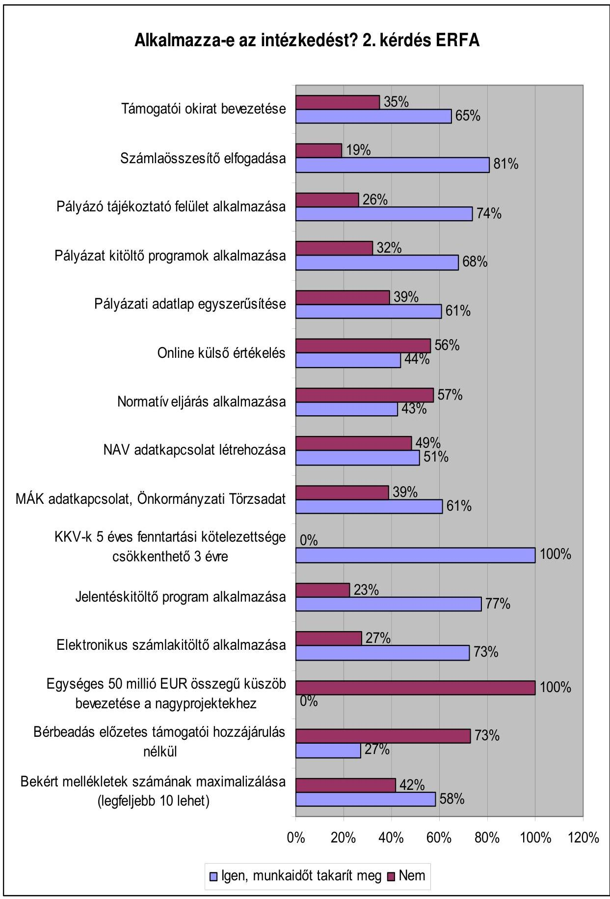

[^0]
[^0]:    Igen, munkaidőt takarít meg ■ Nem

---

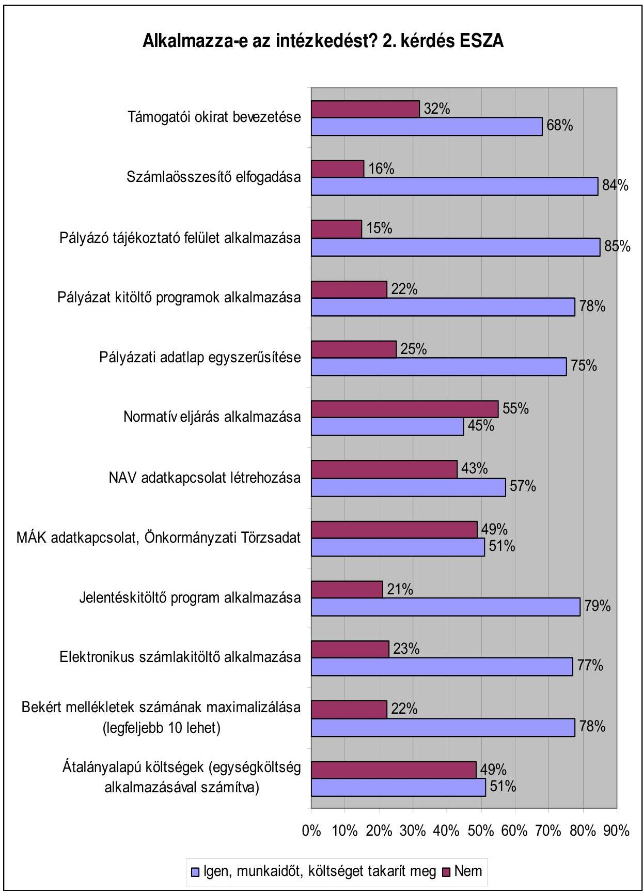

■ Igen, munkaidőt, költséget takarít meg ■ Nem

---

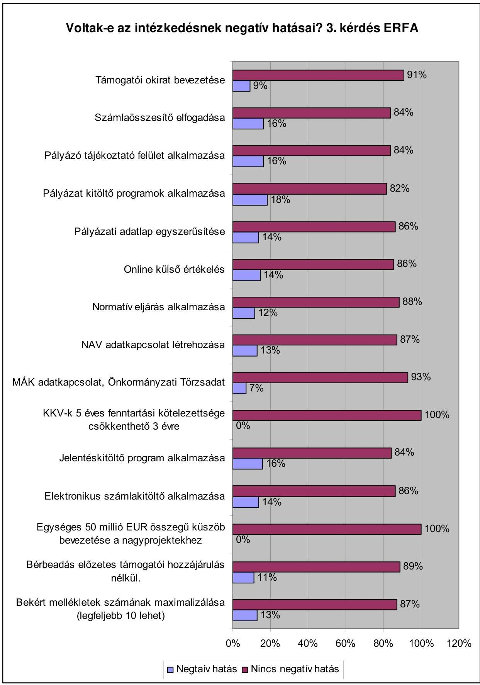

[^0]
[^0]:    ${ }^{1}$ Negtaív hatás $\square$ Nincs negatív hatás

---

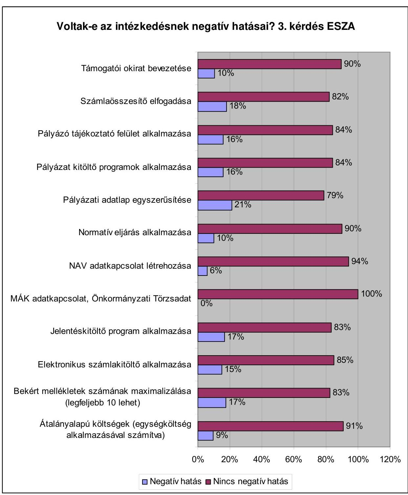

[^0]
[^0]:    ${ }^{1}$ Negatív hatás $\square$ Nincs negatív hatás

---

# Tapasztalatai szerint az egyszerúsítési intézkedésekkel az adminisztratív terhekben, költségekben van-e megtakarítás? 5. kérdés ERFA 

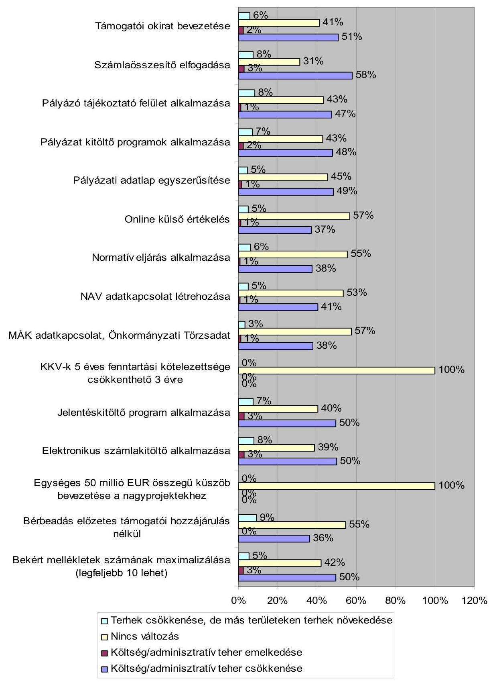

---

# Tapasztalatai szerint az egyszerűsítési intézkedésekkel az adminisztratív terhekben, költségekben van-e megtakarítás? 5. kérdés ESZA 

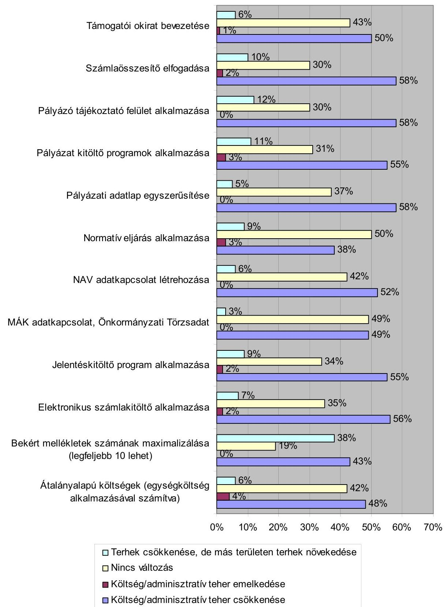

---

# Kimutatás a 2012-2013. években bevezetni tervezett egyszerűsítő intézkedésekről

|  Intézkedés
száma* | Intézkedés célja | Tervezett jogszabály módosítás/jogszabályalkotás | Tervezett hatókör | Alkalmazás tervezett bevezetésének időpontja  |
| --- | --- | --- | --- | --- |
|  1. | OCCR adatkapcsolat - pályázók/kedvezményezettek azonosító adatainak vizsgálata | - | Pályázók (cégek)
Kedvezményezettek (cégek) | 2012. február, használatának beépítése a támogatási rendszerbe folyamatos  |
|  2. | Elektronikus kapcsolattartás kiterjesztése a kedvezményezettekkel | - | kedvezményezettek | folyamatos  |
|  3. | FÖMI - TakarNet adatkapcsolat Jelzálog-biztosítékokkal kapcsolatos adatok vizsgálata | - | kedvezményezettek | 2012. november  |
|  4. | Szállítói előleg alkalmazásának kiterjesztése a kedvezményezettek likviditásának biztosítása érdekében | 4/2011. (I.28.) Korm. rendelet | kedvezményezettek | 2012. július  |
|  5. | Közszféra szervezet kedvezményezettek önerejének biztosítására 50 Mrd Ft visszatérítendő forrás biztosítása 2012-re | Új hatásköri rendelet (NFM) | Közszféra kedvezményezettek | 2012. augusztus 15.  |
|  6. | A támogatási szerződés megkötéséig terjedő időtartam csökkentésére vonatkozó módosítások | 4/2011. (I. 28.) Korm. rendelet módosítása az 1423/2011. (XII. 6.) Korm. határozat alapján (NFM és a projektgazdákat felügyelő minisztériumok) | Kedvezményezett, támogató intézményrendszer | 2012-ben bevezetve  |
|  7. | Horizontális szempontok egyszerűsítése és a horizontális elvekhez kapcsolódó adatszolgáltatás ésszerűsítése | az intézkedés nem igényelt jogszabály módosítást | kedvezményezett | 2012-ben bevezetve  |

- Az NFÜ intézkedések 1-5 sorszámmal, a KIM intézkedései 6-7 sorszámmal vannak megjelölve.

---

|  10. számú függelék |  |  |  |  |  |  |  |  |  |  |   |
| --- | --- | --- | --- | --- | --- | --- | --- | --- | --- | --- | --- |
|  |   |   |   |   |   |   |   |   |   |   |   |
|  |   |   |   |   |   |   |   |   |   |   |   |
|  |   |   |   |   |   |   |   |   |   |   |   |
|  |   |   |   |   |   |   |   |   |   |   |   |
|  |   |   |   |   |   |   |   |   |   |   |   |
|  |   |   |   |   |   |   |   |   |   |   |   |
|  |   |   |   |   |   |   |   |   |   |   |   |
|  |   |   |   |   |   |   |   |   |   |   |   |
|  |   |   |   |   |   |   |   |   |   |   |   |
|  |   |   |   |   |   |   |   |   |   |   |   |
|  |   |   |   |   |   |   |   |   |   |   |   |
|  |   |   |   |   |   |   |   |   |   |   |   |
|  |   |   |   |   |   |   |   |   |   |   |   |
|  |   |   |   |   |   |   |   |   |   |   |   |
|  |   |   |   |   |   |   |   |   |   |   |   |
|  |   |   |   |   |   |   |   |   |   |   |   |
|  |   |   |   |   |   |   |   |   |   |   |   |
|  |   |   |   |   |   |   |   |   |   |   |   |
|  |   |   |   |   |   |   |   |   |   |   |   |
|  |   |   |   |   |   |   |   |   |   |   |   |
|  |   |   |   |   |   |   |   |   |   |   |   |
|  |   |   |   |   |   |   |   |   |   |   |   |
|  |   |   |   |   |   |   |   |   |   |   |   |
|  |   |   |   |   |   |   |   |   |   |   |   |
|  |   |   |   |   |   |   |   |   |   |   |   |
|  |   |   |   |   |   |   |   |   |   |   |   |
|  |   |   |   |   |   |   |   |   |   |   |   |
|  |   |   |   |   |   |   |   |   |   |   |   |
|  |   |   |   |   |   |   |   |   |   |   |   |
|  |   |   |   |   |   |   |   |   |   |   |   |
|  |   |   |   |   |   |   |   |   |   |   |   |

---

|   |  |  |  |  |  |  |  |  |  |  | 10. számú függelék  |
| --- | --- | --- | --- | --- | --- | --- | --- | --- | --- | --- | --- |
|   |  |  |  |  |  |  |  |  |  |  | Kimutatás a nemzeti hatáskörben bevezetett egyéb egyszerűsítési intézkedésekben érintett projektekről  |
|   |  |  |  |  |  |  |  |  |  |  | operatív programonként és finanszírozási alaponként (2011. december 31-i állapot)  |
|   |  |  |  |  |  |  |  |  |  |  |   |
|   |  |  |  |  |  |  |  |  |  |  | 10. számú függelék  |
|  Operatív |  | Finanszírozási alap | Összes (db) | Potenciális (db) | Érintött (db) | Érintőssze (%) | Érintépténc (%) | Összes projekt (E EUR) | Potenciális projekt (E EUR) | Érintött projekt (E EUR) | Érintőssze (%)  |
|  program |  |  |  |  |  |  |  |  |  |  |   |
|   |  |  |  |  |  |  | 4. intézkedés: számla kitöltő program |  |  |  |   |
|  DAOP | ERFA |  | 984 | 820 | 688 | 69,9% | 83,9% | 448 173,0 | 340 484,3 | 311 020,7 | 69,4%  |
|  DDOP | ERFA |  | 599 | 467 | 395 | 65,9% | 84,6% | 434 626,2 | 360 277,9 | 342 404,7 | 78,8%  |
|  EAOP | ERFA |  | 1053 | 872 | 711 | 67,5% | 81,5% | 497 990,4 | 414 380,8 | 388 017,2 | 77,9%  |
|  EKOP | ERFA |  | 44 | 33 | 28 | 63,6% | 84,8% | 175 414,5 | 156 600,3 | 136 843,2 | 78,0%  |
|  EMOP | ERFA |  | 1307 | 1094 | 844 | 64,6% | 77,1% | 497 356,5 | 393 750,6 | 366 665,8 | 73,7%  |
|  GOP | ERFA |  | 13945 | 9515 | 2258 | 16,2% | 23,7% | 1 304 333,9 | 833 982,9 | 166 268,1 | 12,7%  |
|  KDOP | ERFA |  | 647 | 511 | 423 | 65,4% | 82,8% | 303 445,3 | 248 549,7 | 227 459,3 | 75,0%  |
|  KDOP | ERFA |  | 1171 | 825 | 744 | 63,5% | 90,2% | 155 111,4 | 94 829,6 | 91 151,3 | 58,8%  |
|  KMOP | ERFA |  | 5125 | 3296 | 1264 | 24,7% | 38,3% | 1 150 766,0 | 943 182,6 | 619 225,9 | 53,8%  |
|  KÖZOP | ERFA |  | 129 | 92 | 91 | 70,5% | 98,9% | 868 132,3 | 705 989,6 | 705 096,5 | 81,2%  |
|  NTDOP | ERFA |  | 659 | 529 | 473 | 71,8% | 89,4% | 299 920,9 | 240 506,0 | 226 877,7 | 75,6%  |
|  TÉIP | ERFA |  | 1670 | 1540 | 1513 | 90,6% | 98,2% | 1 223 138,9 | 1 068 867,8 | 1 066 919,7 | 87,2%  |
|  ÉRFA |  |  | 27333 | 19594 | 9432 | 61,2% | 77,8% | 7 350 409,2 | 5 801 402,2 | 4 647 944,2 | 68,5%  |
|  ÁROP | ERFA |  | 395 | 577 | 344 | 87,1% | 91,2% | 58 202,4 | 49 661,7 | 42 066,5 | 72,5%  |
|  TÁMOP | ERFA |  | 5142 | 4535 | 4226 | 82,2% | 93,4% | 1 390 018,9 | 1 291 877,2 | 1 277 884,9 | 91,9%  |
|  ÉSZA |  |  | 5537 | 4902 | 4570 | 84,6% | 92,3% | 1 448 221,3 | 1 341 538,8 | 1 319 951,4 | 82,1%  |
|   |  |  |  |  |  |  | 7. intézkedés: Online PET kitöltő |  |  |  |   |
|  DAOP | ERFA |  | 984 | 823 | 697 | 70,8% | 84,7% | 448 173,0 | 360 685,6 | 332 904,2 | 74,3%  |
|  DDOP | ERFA |  | 599 | 471 | 408 | 68,1% | 86,6% | 434 626,2 | 374 331,4 | 363 642,3 | 83,7%  |
|  EAOP | ERFA |  | 1053 | 784 | 612 | 58,1% | 78,1% | 497 990,4 | 391 334,4 | 361 834,5 | 72,7%  |
|  EKOP | ERFA |  | 44 | 38 | 33 | 75,0% | 86,8% | 175 414,5 | 170 751,9 | 150 994,8 | 86,1%  |
|  EMOP | ERFA |  | 1307 | 1034 | 816 | 62,4% | 78,9% | 497 356,5 | 379 347,7 | 365 156,0 | 73,4%  |
|  GOP | ERFA |  | 13945 | 9204 | 2327 | 16,7% | 25,3% | 1 304 333,9 | 917 740,0 | 327 572,7 | 25,1%  |
|  KDOP | ERFA |  | 647 | 455 | 381 | 58,9% | 83,7% | 303 445,3 | 220 755,2 | 203 140,7 | 66,9%  |
|  KDOP | ERFA |  | 1171 | 694 | 603 | 51,5% | 86,9% | 155 111,4 | 79 709,3 | 75 730,0 | 48,8%  |
|  KMOP | ERFA |  | 5125 | 3148 | 1254 | 24,5% | 39,8% | 1 150 766,0 | 810 263,7 | 632 132,2 | 54,9%  |
|  KÖZOP | ERFA |  | 129 | 92 | 12 | 9,3% | 12,6% | 868 132,3 | 712 606,8 | 3 470,1 | 0,4%  |
|  NTDOP | ERFA |  | 659 | 531 | 461 | 70,0% | 86,8% | 299 920,9 | 242 192,3 | 224 964,9 | 75,0%  |
|  TÉIP | ERFA |  | 1670 | 1473 | 1437 | 86,0% | 97,6% | 1 223 138,9 | 1 039 766,1 | 1 033 197,1 | 84,5%  |
|  ÉRFA |  |  | 27333 | 18750 | 9041 | 54,3% | 70,7% | 7 350 409,2 | 5 699 404,5 | 4 074 739,5 | 62,1%  |
|  ÁROP | ERFA |  | 395 | 578 | 343 | 86,8% | 91,2% | 58 202,4 | 50 141,8 | 43 011,1 | 73,9%  |
|  TÁMOP | ERFA |  | 5142 | 4018 | 3714 | 72,2% | 92,4% | 1 390 018,9 | 1 222 813,0 | 1 148 470,9 | 82,6%  |
|  ÉSZA |  |  | 5537 | 4394 | 4057 | 79,5% | 91,8% | 1 448 221,3 | 1 272 954,7 | 1 191 482,0 | 78,3%  |

---

|  10. számú függelék |  |  |  |  |  |  |  |  |  |  |   |
| --- | --- | --- | --- | --- | --- | --- | --- | --- | --- | --- | --- |
|  |   |   |   |   |   |   |   |   |   |   |   |
|  |   |   |   |   |   |   |   |   |   |   |   |
|  |   |   |   |   |   |   |   |   |   |   |   |
|  |   |   |   |   |   |   |   |   |   |   |   |
|  |   |   |   |   |   |   |   |   |   |   |   |
|  |   |   |   |   |   |   |   |   |   |   |   |
|  Operatív program | Finanszírozási alap | Összes (db) | Potenciális (db) | Érintett (db) | Érintőssz (%) | Érintípotenc (%) | Összes projekt (E EUR) | Potenciális projekt (E EUR) | Érintett projekt (E EUR) | Érintőssz (%) | Érintípotenc (%)  |
|  |   |   |   |   |   |   |   |   |   |   |   |
|  |   |   |   |   |   |   |   |   |   |   |   |
|  DAOP | ERFA | 984 | 820 | 820 | 83,3% | 100,0% | 448 173,0 | 340 484,3 | 340 484,3 | 76,0% | 100,0%  |
|  DDOP | ERFA | 599 | 467 | 467 | 78,0% | 100,0% | 434 626,2 | 360 277,9 | 360 277,9 | 82,9% | 100,0%  |
|  EAOP | ERFA | 1053 | 872 | 872 | 82,8% | 100,0% | 497 990,4 | 414 380,8 | 414 380,8 | 83,2% | 100,0%  |
|  EKOP | ERFA | 44 | 34 | 34 | 77,3% | 100,0% | 175 414,5 | 157 082,4 | 157 082,4 | 89,5% | 100,0%  |
|  ESOP | ERFA | 1307 | 1094 | 1094 | 83,7% | 100,0% | 497 356,5 | 393 750,6 | 393 750,6 | 79,2% | 100,0%  |
|  GOP | ERFA | 13945 | 9794 | 9794 | 70,2% | 100,0% | 1 304 333,9 | 837 714,0 | 837 714,0 | 64,2% | 100,0%  |
|  KDOP | ERFA | 647 | 511 | 511 | 79,0% | 100,0% | 303 445,3 | 248 549,7 | 248 549,7 | 81,9% | 100,0%  |
|  KDOP | ERFA | 1171 | 825 | 825 | 70,5% | 100,0% | 155 111,4 | 94 829,6 | 94 829,6 | 61,1% | 100,0%  |
|  KMOP | ERFA | 5125 | 3420 | 3420 | 66,7% | 100,0% | 1 150 766,0 | 944 814,9 | 944 814,9 | 82,1% | 100,0%  |
|  KOZOP | ERFA | 129 | 92 | 92 | 71,3% | 100,0% | 868 132,3 | 705 989,6 | 705 989,6 | 81,3% | 100,0%  |
|  NTDOP | ERFA | 659 | 529 | 529 | 80,3% | 100,0% | 299 920,9 | 240 506,0 | 240 506,0 | 80,2% | 100,0%  |
|  TEIP | ERFA | 1670 | 1540 | 1540 | 92,2% | 100,0% | 1 223 138,9 | 1 068 867,8 | 1 068 867,8 | 87,4% | 100,0%  |
|  ☐ ERFA |  | 27333 | 19998 | 19998 | 77,9% | 100,0% | 7 358 489,2 | 5 807 247,8 | 5 807 247,8 | 79,1% | 100,0%  |
|  AROP | ESZA | 395 | 577 | 577 | 95,4% | 100,0% | 58 202,4 | 49 661,7 | 49 661,7 | 85,5% | 100,0%  |
|  TAMOP | ESZA | 5142 | 4550 | 4550 | 88,5% | 100,0% | 1 390 018,9 | 1 292 144,0 | 1 292 144,0 | 93,0% | 100,0%  |
|  ☐ ESZA |  | 5537 | 4927 | 4927 | 92,0% | 100,0% | 1 448 221,3 | 1 341 805,6 | 1 341 805,6 | 89,1% | 100,0%  |
|  |   |   |   |   |   |   |   |   |   |   |   |
|  DAOP | ERFA | 1328 | 42 | 42 | 3,2% | 100,0% | 448 173,0 | 28 457,2 | 28 457,2 | 6,3% | 100,0%  |
|  DDOP | ERFA | 776 | 31 | 31 | 4,0% | 100,0% | 434 626,2 | 16 164,8 | 16 164,8 | 3,7% | 100,0%  |
|  EAOP | ERFA | 1447 | 52 | 52 | 3,6% | 100,0% | 497 990,4 | 11 419,8 | 11 419,8 | 2,3% | 100,0%  |
|  EKOP | ERFA | 48 | 6 | 6 | 12,5% | 100,0% | 175 414,5 | 3 796,5 | 3 796,5 | 2,2% | 100,0%  |
|  ESOP | ERFA | 1682 | 167 | 167 | 9,9% | 100,0% | 497 356,5 | 30 991,9 | 30 991,9 | 6,2% | 100,0%  |
|  KDOP | ERFA | 881 | 29 | 29 | 3,3% | 100,0% | 303 445,3 | 18 748,4 | 18 748,4 | 6,2% | 100,0%  |
|  KDOP | ERFA | 1421 | 401 | 401 | 28,2% | 100,0% | 155 111,4 | 28 856,2 | 28 856,2 | 18,6% | 100,0%  |
|  KMOP | ERFA | 5786 | 136 | 116 | 2,0% | 100,0% | 1 150 766,0 | 80 202,1 | 80 202,1 | 7,0% | 100,0%  |
|  KOZOP | ERFA | 227 | 39 | 39 | 17,2% | 100,0% | 868 132,3 | 11 424,8 | 11 424,8 | 1,3% | 100,0%  |
|  NTDOP | ERFA | 844 | 28 | 28 | 3,3% | 100,0% | 299 920,9 | 22 900,8 | 22 900,8 | 7,6% | 100,0%  |
|  TEIP | ERFA | 1749 | 84 | 84 | 4,8% | 100,0% | 1 223 138,9 | 55 370,6 | 55 370,6 | 4,5% | 100,0%  |
|  ☐ ERFA |  | 16189 | 995 | 995 | 8,4% | 100,0% | 6 054 075,4 | 308 333,3 | 308 333,3 | 6,0% | 100,0%  |
|  AROP | ESZA | 398 | 17 | 17 | 4,3% | 100,0% | 58 202,4 | 9 111,8 | 9 111,8 | 15,7% | 100,0%  |
|  TAMOP | ESZA | 5488 | 162 | 162 | 3,0% | 100,0% | 1 390 018,9 | 75 954,2 | 75 954,2 | 5,5% | 100,0%  |
|  ☐ ESZA |  | 5886 | 179 | 179 | 3,6% | 100,0% | 1 448 221,3 | 85 066,0 | 85 066,0 | 10,6% | 100,0%  |

---

|   |  |  |  |  |  |  |  |  |  | 10. számú függelék  |
| --- | --- | --- | --- | --- | --- | --- | --- | --- | --- | --- |
|   |  |  |  |  |  |  |  |  |  | Kimutatás a nemzeti hatáskörben bevezetett egyéb egyszerűsítési intézkedésekben érintett projektekről  |
|   |  |  |  |  |  |  |  |  |  | operatív programonként és finanszírozási alaponként (2011. december 31-i állapot)  |
|  Operatív |  |  |  |  |  |  |  |  |  |   |
|  program |  |  |  |  |  |  |  |  |  |   |
|   |  |  |  |  |  |  |  |  |  | 10. számú függelék  |
|  |   |   |   |   |   |   |   |   |   |   |
|  |   |   |   |   |   |   |   |   |   |   |
|  |   |   |   |   |   |   |   |   |   |   |
|  Operatív |  | Finanszírozási alap | Összes (db) | Potenciális (db) | Érintett (db) | Érintőssze (%) | Érintépotenz (%) | Összes projekt (E EUR) | Potenciális projekt (E EUR) | Érintett projekt (E EUR)  |
|  |   |   |   |   |   |   |   |   |   |   |
|  |   |   |   |   |   |   |   |   |   |   |
|  |   |   |   |   |   |   |   |   |   |   |
|  |   |   |   |   |   |   |   |   |   |   |
|  DAOP | ERFA |  | 984 | 802 | 396 | 40,2% | 49,4% | 448 173,0 | 439 866,8 | 222 632,1  |
|  DDOP | ERFA |  | 599 | 459 | 261 | 43,6% | 56,9% | 434 626,2 | 428 080,2 | 282 815,9  |
|  EAOP | ERFA |  | 1053 | 804 | 485 | 46,1% | 60,3% | 497 990,4 | 486 953,2 | 318 155,4  |
|  EKOP | ERFA |  | 44 | 44 | 17 | 38,6% | 38,6% | 175 414,5 | 175 414,5 | 69 853,4  |
|  EMOP | ERFA |  | 1307 | 808 | 457 | 35,0% | 56,6% | 497 356,5 | 475 895,0 | 277 411,8  |
|  GOP | ERFA |  | 13945 | 2816 | 2 | 0,0% | 0,1% | 1 304 333,9 | 1 002 630,5 | 430,8  |
|  KDOP | ERFA |  | 647 | 502 | 260 | 40,2% | 51,8% | 303 445,3 | 296 381,6 | 154 474,3  |
|  KDOP | ERFA |  | 1171 | 338 | 121 | 10,3% | 35,8% | 155 111,4 | 132 904,6 | 37 253,8  |
|  KMOP | ERFA |  | 5125 | 1419 | 472 | 9,2% | 33,3% | 1 150 766,0 | 1 060 114,6 | 618 141,6  |
|  KÖZOP | ERFA |  | 129 | 119 | 72 | 55,8% | 60,5% | 868 132,3 | 867 828,9 | 682 524,2  |
|  NTDOP | ERFA |  | 659 | 525 | 269 | 40,8% | 51,4% | 299 920,9 | 292 861,1 | 160 117,6  |
|  TÍOP | ERFA |  | 1670 | 634 | 463 | 27,7% | 73,0% | 1 223 138,9 | 1 186 725,6 | 752 819,1  |
|  ZERFA |  |  | 27333 | 9268 | 3275 | 32,3% | 47,3% | 7 358 489,2 | 6 845 656,5 | 3 576 629,9  |
|  AROP | ESZA |  | 395 | 72 | 34 | 8,6% | 47,2% | 58 202,4 | 42 417,5 | 25 125,4  |
|  TÁMOP | ESZA |  | 5142 | 2066 | 1798 | 35,0% | 87,0% | 1 390 018,9 | 1 274 185,8 | 1 160 864,4  |
|  ESZ |  |  | 5537 | 2138 | 1832 | 21,8% | 67,1% | 1 448 221,3 | 1 316 603,3 | 1 183 999,8  |
|  |   |   |   |   |   |   |   |   |   |   |
|  |   |   |   |   |   |   |   |   |   |   |
|  |   |   |   |   |   |   |   |   |   |   |
|  DAOP | ERFA |  | 984 | 984 | 38 | 3,9% | 3,9% | 448 173,0 | 448 173,0 | 2 043,6  |
|  DDOP | ERFA |  | 599 | 599 | 41 | 6,8% | 6,8% | 434 626,2 | 434 626,2 | 2 212,0  |
|  EAOP | ERFA |  | 1053 | 1053 | 75 | 7,1% | 7,1% | 497 990,4 | 497 990,4 | 4 405,9  |
|  EMOP | ERFA |  | 1307 | 1307 | 109 | 8,3% | 8,3% | 497 356,5 | 497 356,5 | 5 402,5  |
|  GOP | ERFA |  | 13945 | 13945 | 8956 | 64,2% | 64,2% | 1 304 333,9 | 1 304 333,9 | 292 433,8  |
|  KDOP | ERFA |  | 647 | 647 | 23 | 3,6% | 3,6% | 303 445,3 | 303 445,3 | 1 311,2  |
|  KDOP | ERFA |  | 1171 | 1171 | 791 | 67,5% | 67,5% | 155 111,4 | 155 111,4 | 23 603,8  |
|  KMOP | ERFA |  | 5125 | 5125 | 2747 | 53,6% | 53,6% | 1 150 766,0 | 1 150 766,0 | 55 268,8  |
|  NTDOP | ERFA |  | 659 | 659 | 24 | 3,6% | 3,6% | 299 920,9 | 299 920,9 | 1 867,0  |
|  TÍOP | ERFA |  | 1670 | 1670 | 1177 | 70,5% | 70,5% | 1 223 138,9 | 1 223 138,9 | 93 699,8  |
|  ZERFA |  |  | 27160 | 27160 | 13981 | 28,9% | 28,9% | 6 314 862,4 | 6 314 862,4 | 482 248,5  |
|  AROP | ESZA |  | 395 | 395 | 73 | 18,5% | 18,5% | 58 202,4 | 58 202,4 | 3 922,2  |
|  TÁMOP | ESZA |  | 5142 | 5142 | 2027 | 58,9% | 58,9% | 1 390 018,9 | 1 390 018,9 | 193 034,7  |
|  ESZ |  |  | 5537 | 5537 | 3100 | 38,7% | 38,7% | 1 448 221,3 | 1 448 221,3 | 196 957,0  |

---

|  10. számú függelék |  |  |  |  |  |  |  |  |  |  |   |
| --- | --- | --- | --- | --- | --- | --- | --- | --- | --- | --- | --- |
|  |   |   |   |   |   |   |   |   |   |   |   |
|  |   |   |   |   |   |   |   |   |   |   |   |
|  |   |   |   |   |   |   |   |   |   |   |   |
|  |   |   |   |   |   |   |   |   |   |   |   |
|  |   |   |   |   |   |   |   |   |   |   |   |
|  |   |   |   |   |   |   |   |   |   |   |   |
|  |   |   |   |   |   |   |   |   |   |   |   |
|  |   |   |   |   |   |   |   |   |   |   |   |
|  |   |   |   |   |   |   |   |   |   |   |   |
|  |   |   |   |   |   |   |   |   |   |   |   |
|  |   |   |   |   |   |   |   |   |   |   |   |
|  |   |   |   |   |   |   |   |   |   |   |   |
|  |   |   |   |   |   |   |   |   |   |   |   |
|  |   |   |   |   |   |   |   |   |   |   |   |
|  |   |   |   |   |   |   |   |   |   |   |   |
|  |   |   |   |   |   |   |   |   |   |   |   |
|  |   |   |   |   |   |   |   |   |   |   |   |
|  |   |   |   |   |   |   |   |   |   |   |   |
|  |   |   |   |   |   |   |   |   |   |   |   |
|  |   |   |   |   |   |   |   |   |   |   |   |
|  |   |   |   |   |   |   |   |   |   |   |   |
|  |   |   |   |   |   |   |   |   |   |   |   |
|  |   |   |   |   |   |   |   |   |   |   |   |
|  |   |   |   |   |   |   |   |   |   |   |   |
|  |   |   |   |   |   |   |   |   |   |   |   |
|  |   |   |   |   |   |   |   |   |   |   |   |
|  |   |   |   |   |   |   |   |   |   |   |   |
|  |   |   |   |   |   |   |   |   |   |   |   |
|  |   |   |   |   |   |   |   |   |   |   |   |
|  |   |   |   |   |   |   |   |   |   |   |   |
|  |   |   |   |   |   |   |   |   |   |   |   |

---

|   |  |  |  |  |  |  |  |  |  |  | 10. számú függelék  |
| --- | --- | --- | --- | --- | --- | --- | --- | --- | --- | --- | --- |
|   |  |  |  |  |  |  |  |  |  |  | Kimutatás a nemzeti hatáskörben bevezetett egyéb egyszerűsítési intézkedésekben érintett projektekről  |
|   |  |  |  |  |  |  |  |  |  |  | operatív programonként és finanszírozási alaponként (2011. december 31-i állapot)  |
|   |  |  |  |  |  |  |  |  |  |  |   |
|   |  |  |  |  |  |  |  |  |  |  | 10. számú függelék  |
|  Operatív |  | Finanszírozási alap | Összes (db) | Potenciális (db) | Érintött (db) | Érintőssze (%) | Érintézetes (f) | Összes projekt (E) | Potenciális projekt (E) | Érintött projekt (E) | Érintőssze (%)  |
|  program |  |  |  |  |  |  |  |  |  |  |   |
|   |  |  |  |  |  |  |  | 12. intézkedés: mellékletek számának maximálásában |  |  |   |
|  DAOP | ERFA |  | 1328 | 183 | 183 | 13,8% | 100,0% | 448 173,0 | 3 146,1 | 3 146,1 | 0,7%  |
|  DDOP | ERFA |  | 776 | 57 | 57 | 7,3% | 100,0% | 434 626,2 | 4 773,9 | 4 773,9 | 1,1%  |
|  EAOP | ERFA |  | 1447 | 158 | 158 | 10,9% | 100,0% | 497 990,4 | 2 266,2 | 2 266,2 | 0,5%  |
|  EKOP | ERFA |  | 48 | 2 | 2 | 4,2% | 100,0% | 175 414,5 | 6 428,2 | 6 428,2 | 3,7%  |
|  EMOP | ERFA |  | 1682 | 134 | 134 | 8,0% | 100,0% | 497 356,5 | 5 600,1 | 5 600,1 | 1,1%  |
|  GOP | ERFA |  | 15357 | 3499 | 3499 | 22,8% | 100,0% | 1 304 333,9 | 192 001,3 | 192 001,3 | 14,7%  |
|  KDOP | ERFA |  | 881 | 139 | 139 | 15,8% | 100,0% | 303 445,3 | 5 481,0 | 5 481,0 | 1,8%  |
|  KFOP | ERFA |  | 1421 | 553 | 553 | 38,9% | 100,0% | 155 111,4 | 18 521,7 | 18 521,7 | 11,9%  |
|  KMOP | ERFA |  | 5786 | 1448 | 1448 | 25,0% | 100,0% | 1 150 766,0 | 55 239,5 | 55 239,5 | 4,8%  |
|  KÖZOP | ERFA |  | 227 | 38 | 38 | 16,7% | 100,0% | 868 132,3 | 20 981,3 | 20 981,3 | 2,4%  |
|  NYDOP | ERFA |  | 644 | 88 | 88 | 10,4% | 100,0% | 299 920,9 | 11 879,5 | 11 879,5 | 4,0%  |
|  2 | ERFA |  | 29797 | 6299 | 6299 | 15,8% | 100,0% | 6 135 270,4 | 326 318,7 | 326 318,7 | 4,2%  |
|  AROP | ESZA |  | 398 | 8 | 8 | 1,3% | 100,0% | 58 202,4 | 8 129,2 | 8 129,2 | 14,0%  |
|  TAMOP | ESZA |  | 5488 | 74 | 74 | 1,5% | 100,0% | 1 390 018,9 | 14 802,4 | 14 802,4 | 1,1%  |
|  2 | ESZA |  | 5886 | 79 | 79 | 1,3% | 100,0% | 1 448 221,3 | 22 931,6 | 22 931,6 | 7,5%  |
|   |  |  |  |  |  |  |  | 13. intézkedés: 4 és 5 számúgyú utal |  |  |   |
|  ROP/KMOP | ERFA |  | 5804 | 5 | 5 | 0,1% | 100,0% | 1 273 496,3 | 15 766,1 | 15 766,1 | 1,2%  |
|  ROP/kons | ERFA |  | 6180 | 8 | 8 | 0,1% | 100,0% | 3 086 493,1 | 26 950,1 | 26 950,1 | 0,9%  |
|  2 | ERFA |  | 11984 | 13 | 13 | 0,1% | 100,0% | 4 359 989,4 | 42 716,2 | 42 716,2 | 1,1%  |
|   |  |  |  |  |  |  |  | 14. intézkedés: bérkeadás előzetes támogatót hozzájárulás nélkül |  |  |   |
|  ROP/kons | ERFA |  | 6180 | 240 | 28 | 0,5% | 11,7% | 3 086 493,1 | 119 824,8 | 24 148,4 | 0,8%  |
|  2 | ERFA |  | 6180 | 240 | 28 | 0,5% | 11,7% | 3 086 493,1 | 119 824,8 | 24 148,4 | 0,8%  |
|   |  |  |  |  |  |  |  | 15. intézkedés: fenntartási idő kötelezettségének csökkentése |  |  |   |
|  ROP/kons | ERFA |  | 6180 | 94 | 1 | 0,0% | 1,1% | 3 086 493,1 | 74 289,2 | 253,9 | 0,0%  |
|  2 | ERFA |  | 6180 | 94 | 1 | 0,0% | 1,1% | 3 086 493,1 | 74 289,2 | 253,9 | 0,0%  |

Forrás: NFÜ

---

# C kérdőív 

## Jövőbeli egyszerűsítési intézkedések

## III. Kérdés

## Ajánlanak-e az irányító hatóságok a 2007-13 programozási periódusra további egyszerűsítéseket? Ha igen, melyek ezek? Milyen érvek szónak a javasolt fejlesztések mellett?

A korábban átadott IV. sz. „Tanúsítvány a 2012-2013. években bevezetni tervezett egyszerűsítő intézkedésekről" c. tanúsítvány szerint.

## IV. Kérdés

## Egyszerűsíti-e az Európai Bizottság jogalkotási csomagjának tervezete a Strukturális Alapok alkalmazását?

Úgy gondoljuk, hogy a Bizottság következő időszakra adott jogszabályi javaslata sok tekintetben (összességében) a tagállamok nagyobb felelősségét, büntethetőségét eredményezi, és jelentős adminisztratív terheket generál. A kérdőívben szereplő jogszabályhelyekre vonatkozó véleményeinket az alábbiakban röviden mutatjuk be - a kérdőívben referált javaslatok közt több előremutató elem is szerepel. Azon szempontokra nézve, melyeket a tervezetekben e cikkek kapcsán aggályosnak találtunk, a tanácsban lezajlott vita során jórészt megnyugtató megoldást sikerült találni (ugyanakkor meg kell jegyezni, hogy az elfogadott tanácsi szövegjavaslatok egyelőre csak a Tanács álláspontját tükrözik, és az EP-EB-Tanács trialógusa során a jogalkotási folyamat végső fázisában változhatnak).

### 4.1. Ismeri-e az ön intézménye a Strukturális Alapokhoz kapcsolódóan javasolt jogalkotási csomag tervezetét?

Igen. Az NFÜ és az NFM a jogszabálycsomag tervezetével kapcsolatos vita hazai felelőse és ebből adódóan a hazai mandátumkészítési folyamatok koordinátora, illetve a vita rendszeres résztvevője.

Meg kell jegyezni, hogy a kérdőívben szereplő idézetek közül több már meghaladott, mivel azoktól - legalábbis a tanácsi vita során - eltérő kompromisszumos szövegjavaslatot sikerült elérni.

### 4.2.1 - 57.1 bekezdés, vissza nem térítendő támogatások formái

Az 57.1 bekezdés számunkra elfogadható volt, ellenvetést azzal kapcsolatosan nem fogalmaztunk meg. Az 57.3 kapcsán tisztázni láttuk szükségesnek, hogy közbeszerzési eljárás keretében megvalósított projektek esetén is alkalmazhatók egyszerűsített elszámolási módszertanok (ahol az ajánlattevő ilyenek összegére tesz ajánlatot). Az Európai Bizottság megerősítette ennek a lehetőségét.

### 4.2.2. - 58. cikk, közvetett költségek

Az 58. cikkből idézett szövegelemet alapjában véve támogattuk - mivel fontos könnyítésnek látjuk a közösségi szintű átalány értékek meghatározását és opcionális alkalmazhatóságát - illetve ahhoz képest lehetőség szerint további rugalmasságért

---

érveltünk a tanácsi vita során a források egyszerűbb felhasználhatósága és az alacsonyabb adminisztratív terhek érdekében. Ennek eredményeképpen a tanácsi kompromisszumos szövegben a közvetett költségek 20\% helyett a közvetlen költségek 25\%-áig elszámolhatók átalányként, és a közvetlen személyzeti költségek 15\%-áig előzetes alátámasztó kalkuláció nélkül alkalmazható átalány. Az ESZA esetében a jogosult közvetlen személyzeti költségek 40\%-áig alkalmazható átalány a ráta meghatározását alátámasztó számítás nélkül. Az ETE esetében a közvetlen költségek 15\%-a helyett 20\%-ig alkalmazható átalány a személyzeti költségekre.

# 4.2.3. 54. cikk, jövedelemtermelő beruházások 

Pozitív elemnek tartottuk, hogy az általános rendelet tervezete a tagállam választása alapján lehetővé teszi, hogy a várható jövedelem tételes kalkuláció helyett átalány alapján kerüljön meghatározásra. Szintén pozitív, hogy ahol a várható jövedelem meghatározása nem lehetséges, a jelenlegi 5 évi helyett 3 évi jövedelem levonását írja elő (54.2. cikk). Problémásnak tartottuk azonban, hogy a jogszabály nem biztosít lehetőséget a nettó bevételnek a beruházás összköltsége és a beruházás jogosult költsége közötti arányos megosztására, illetve, hogy a jogszabály szövege nem megfelelően tesz különbséget a projekt zárását követően előálló jövedelem, valamint a projekt végrehajtása során keletkezett jövedelem (55.6) közt.

A tanácsi vitában mindezen szempontokra sikerült megnyugtató választ adni, illetve a lehetőségek további rugalmasságát is elértük, az ÁúT által április 24-én elfogadott kompromisszumos tanácsi szövegjavaslat keretében.

### 4.2.4. Tagállamok nagyobb felelőssége és elszámoltathatósága

A Költségvetési Rendelet módosításával a releváns cikkek is módosultak az eredeti javaslathoz képest. Az akkreditáció intézménye kikerült a rendelet-tervezetből, míg a vezetői nyilatkozat, ill. opcionális nemzeti szintű nyilatkozat igen. Az akkreditáció helyére lépett kijelölés (delegation) intézményének tárgyalása jelenleg zajlik a Tanácsban. Minden új intézményrendszeri elem bevezetését akkor tudjuk támogatni, ha ettől a rendszer kiszámíthatóbbá válik, a szabályozási előírások kezdetektől megismerhetőek, a végrehajtás szilárd jogszabályi alapon nyugszik. Mindezért célunk, hogy az EB szerepe a kijelölés folyamatában opcionális lehessen, ti. a tagállam ez irányú kérésére az EB köteles legyen megvizsgálni a kijelölést, és arra vonatkozóan állásfoglalást kiállítani, mintegy elkerülve hogy később, az auditok során állapítsanak meg rendszer jellegű hiányosságot.

### 4.2.5. Irányító és ellenőrző hatóságok

E rendelkezések is változtak. Egyértelműen kiderült, hogy az EB nagyobb bizonyosságot vár el a megosztott irányítás alatt működő tagállami ellenőrzési rendszertől. Így bár elviekben az igazolás összevonható lenne a hitelesítéssel, a nagyobb bizonyosság miatt a szervezetek összevonhatóak, de a feladatok kötelezően ellátandóak. Másrészt megjegyezzük, hogy a tagállamokban csekély a 250 millió euro alatti programok száma.

---

# 4.2.6. Pénzügyi eszközök, források újra felhasználhatósága 

A pénzügyi eszközök kapcsán pozitív elemnek tartjuk, hogy bármely KSK-alap és fejlesztési cél vonatkozásában alkalmazhatóvá válnak; akár több alap együttesen is finanszírozhat pénzügyi eszközöket. Nehézséget jelent, hogy az alapokba befizetett forrásokat 2 éven belül ki kell helyezni (35.2-35.3 cikk) a végső kedvezményezetthez, hogy ezáltal a pénzügyi eszközök egyfajta szakaszolt, graduális felhasználása valósuljon meg, és a Bizottság szándéka szerint elkerülhetővé váljon nagyobb összegek ilyen eszközökben való hosszadalmas tárolása és az n+ szabályok kikerülése. További kötöttségnek látjuk, hogy a javaslat szerint forrásokat tíz évig az eredeti céloknak megfelelően kell felhasználni. Bizonytalanságnak ítéljük (ítéltük) meg, hogy a Bizottság több szempontot másodlagos jogalkotásba utal, így azok hatásai előre nem láthatók.

A tanácsi vita során azonban minden tekintetben pozitív irányú elmozdulás történt. A 2 éves határidő helyett új megoldás került kialakításra: újabb források a pénzügyi eszköz számára csak akkor hívhatók le, ha a rendelkezésre álló források meghatározott százaléka már kihelyezésre került. Kedvező elmozdulás, hogy a tanácsi szöveg szerint a végső kedvezményezettek szintjén nincs audit, illetve lehetőség lesz ún. követő beruházások végrehajtására is az elszámolhatósági időszakot követő hét éven belül. Több szempont is a másodlagos szabályozás helyett magában a jogszabályban kerülne rögzítésre.