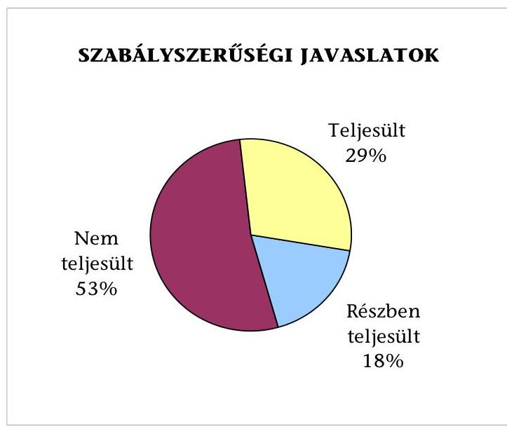
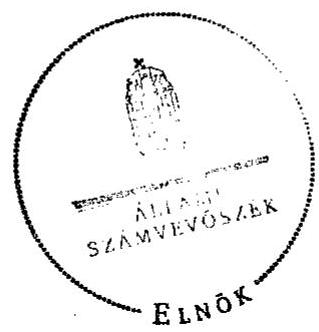
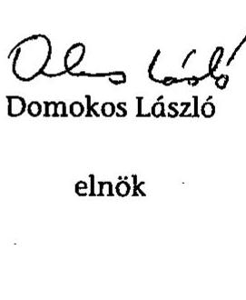

# JELENTÉS 

Balatonfőkajár Község Önkormányzata belső kontrollrendszerének kialakítása, valamint egyes kontrolltevékenységek és a belső ellenőrzés működése ellenőrzéséről

---

# Állami Számvevőszék 

Iktatószám: V-0012-058-008-035/2013.
Témaszám: 1051
Vizsgálat-azonosító szám: V059108

## Az ellenőrzést felügyelte:

Dr. Benedek Mária
felügyeleti vezető
2012. december 16. napjától

Gyüre Lajosné
felügyeleti vezető
2012. december 15. napjáig

## Az ellenőrzést vezette:

## Szakmányné Bilik Mária

ellenőrzésvezető
A számvevőszéki jelentés összeállításában közreműködtek:
Dr. Fónagy Diána
számvevő tanácsos
Moder Beatrix
számvevő
Az ellenőrzést végezték:
Iszakné Dóczé Katalin Komlósiné Bogár Éva
számvevő tanácsos számvevő tanácsos

---

# TARTALOMJEGYZÉK 

BEVEZETÉS ..... 5
I. ÖSSZEGZŐ MEGÁLLAPÍTÁSOK, KÖVETKEZTETÉSEK, JAVASLATOK ..... 8
II. RÉSZLETES MEGÁLLAPÍTÁSOK ..... 16

1. Az önkormányzat belső kontrollrendszere kialakításának megfelelősége ..... 16
1.1. A kontrollkörnyezet kialakítása ..... 16
1.2. A kockázatkezelési rendszer szabályozása ..... 17
1.3. A kontrolltevékenységek kialakítása ..... 18
1.1. Az információs és kommunikációs rendszer szabályozása ..... 19
1.2. A monitoring rendszer szabályozása ..... 19
2. A pénzügyi folyamatokban kulcsszerepet betöltő belső kontrollok (szakmai teljesítésigazolás és utalvány ellenjegyzés) működése ..... 20
3. A belső ellenőrzés szervezeti keretei és működése ..... 22
4. Az ÁSZ 2007-2010. években végzett átfogó ellenőrzései során megfogalmazott javaslatok végrehajtására tett intézkedések ..... 24

## FÜGGELÉKEK

1. számú Értelmező szótár
2. számú A belső kontrollrendszer kialakítása, a pénzügyi folyamatokban kulcsszerepet betöltő szakmai teljesítésigazolás és utalvány ellenjegyzés kontrollok működése, valamint a belső ellenőrzés működése értékelésénél alkalmazott minősítési szempontok

---

.

---

# RÖVIDÍTÉSEK JEGYZÉKE 

## Törvények

ÁSZ tv.
Avtv.

Info tv.

Htv.

Mötv.

Ötv.
régi Áht.

Számv. tv.
új Áht.

## Rendeletek

Áhsz.

Ámr.
Ávr.

Ber.
Bkr.
hivatali SZMSZ

Képviselő-testületi SZMSZ 1

Képviselő-testületi SZMSZ 2

2011. évi LXVI. törvény az Állami Számvevőszékről
1992. évi LXIII. törvény a személyes adatok védelméről és a közérdekű adatok nyilvánosságáról (hatálytalan 2012. január 1-jétől)
2011. évi CXII. törvény az információs önrendelkezési jogról és az információszabadságról (hatályos 2012. január 1-jétől)
1991. évi XX. törvény a helyi önkormányzatok és szerveik, a köztársasági megbízottak, valamint egyes centrális alárendeltségű szervek feladat- és hatásköreiről
2011. évi CLXXXIX. törvény Magyarország helyi önkormányzatairól (hatályos 2012. január 1-jétől)
1990. évi LXV. törvény a helyi önkormányzatokról
1992. évi XXXVIII. törvény az államháztartásról (hatálytalan 2012. január 1-jétől)
2000. évi C. törvény a számvitelről
2011. évi CXCV. törvény az államháztartásról (hatályos 2012. január 1-jétől)

249/2000. (XII. 24.) Korm. rendelet az államháztartás szervezetei beszámolási és könyvvezetési kötelezettségének sajátosságairól
292/2009. (XII. 19.) Korm. rendelet az államháztartás működési rendjéről (hatálytalan 2012. január 1-jétől)
368/2011. (XII. 31.) Korm. rendelet az államháztartásról szóló törvény végrehajtásáról (hatályos 2012. január 1-jétől)
193/2003. (XI. 26.) Korm. rendelet a költségvetési szervek belső ellenőrzéséről (hatálytalan 2012. január 1-jétől)
370/2011. (XII. 31.) Korm. rendelet a költségvetési szervek belső kontrollrendszeréről és belső ellenőrzéséről (hatályos 2012. január 1-jétől)
27/2012. (VIII. 23.) számú önkormányzati rendelet Balatonfőkajár Község Önkormányzat Polgármesteri Hivatalának Szervezeti és Működési Szabályzatáról
7/1999. (VII. 5.) számú önkormányzati rendelet Balatonfőkajár Község Képviselő-testületének Szervezeti és Működési Szabályzatáról (hatályos 2011. január 26-ig)
1/2011. (I. 27.) számú önkormányzati rendelet Balatonfőkajár Község Képviselő-testületének Szervezeti és Működési Szabályzatáról (hatályos 2011. január 27-étől)

---

# Szórövidítések 

ÁSZ
Belső ellenőrzési kézikönyv
Belső Kontroll Kézikönyv

FEUVE
gazdálkodási jogkörök szabályzata
jegyző
Képviselő-testület
kockázatkezelési szabályzat

Önkormányzat
polgármester
Polgármesteri Hivatal
számlarend
számviteli politika

Társulás

Állami Számvevőszék
Kelet-Balatoni Kistérség Többcélú Társulása Belső ellenőrzési kézikönyve
az Ámr. 155. § (1) bekezdése, valamint az államháztartási belső kontroll standardokról szóló 1/2009. (IX. 11.) PM irányelv egységes értelmezése érdekében az államháztartásért felelős miniszter által a 2010. évben kiadott Belső Kontroll Kézikönyv
A folyamatba épített, előzetes, utólagos és vezetői ellenőrzés
Balatonfőkajár Község polgármesterének és jegyzőjének 2010/1 számú közös intézkedése a Község Önkormányzatának pénzgazdálkodásával kapcsolatos kötelezettségvállalás, utalványozás, érvényesítés és ellenjegyzés hatásköri rendjéről, kiegészítve 2011. január 1-jétől
Balatonfőkajár Község Önkormányzatának jegyzője
Balatonfőkajár Község Képviselő-testülete
Balatonfőkajár Község Önkormányzata Polgármesteri Hivatalának Kockázatkezelési szabályzata (hatályos 2011. január 1-jétől)

Balatonfőkajár Község Önkormányzata
Balatonfőkajár Község Önkormányzatának polgármestere
Balatonfőkajár Község Önkormányzatának Polgármesteri Hivatala
Balatonfőkajár Község Önkormányzatának Számviteli rendje (hatályos 2006. január 1-jétől, aktualizálva minden év január 1-jén)
Balatonfőkajár Község Önkormányzatának Számviteli politikája (hatályos 2006. január 1-jétől, aktualizálva minden év január 1-jén)
Kelet-Balatoni Kistérségi Többcélú Társulás

---

# JELENTÉS 

## Balatonfőkajár Község Önkormányzata belső kontrollrendszerének kialakítása, valamint egyes kontrolltevékenységek és a belső ellenőrzés működése ellenőrzéséről

## BEVEZETÉS

A belső kontrollrendszer kialakítását, működtetését és fejlesztését a régi Áht. és az új Áht. is előírja. Ennek megvalósításáért a költségvetési szerv vezetője, a jegyző felel. A belső kontrollrendszer azt a célt szolgálja, hogy a költségvetési szervek működésük és gazdálkodásuk során a tevékenységeket szabályszerűen, gazdaságosan, hatékonyan, eredményesen hajtsák végre, teljesítsék elszámolási kötelezettségeiket és megvédjék az erőforrásokat a veszteségektől, a károktól és a nem rendeltetésszerű használattól. A belső kontrollrendszer magában foglalja mindazon szabályokat, eljárásokat, gyakorlati módszereket és szervezeti struktúrákat, kockázatkezelési technikákat, kontrolltevékenységeket, amelyek segítséget nyújtanak a szervezetnek céljai eléréséhez.

Az ÁSZ a 2011-2015. évekre szóló stratégiájában hangsúlyos szerepet szánt annak, hogy szilárd szakmai alapon álló, értékteremtő ellenőrzéseivel előmozdítsa a közpénzügyek átláthatóságát, rendezettségét. A számvevőszéki ellenőrzés nemzetközi alapelvei is rögzítik, hogy a megfelelő belső kontrollrendszer minimálisra csökkenti a hibák és szabálytalanságok kockázatát.

Az ellenőrzés célja annak értékelése volt, hogy az Önkormányzat a jogszabályi előírásoknak megfelelően alakította-e ki a belső kontrollrendszert; a gazdálkodás folyamatában kulcsszerepet betöltő szakmai teljesítésigazolás és az utalvány ellenjegyzés kontrolltevékenységeit megfelelően működtette-e; biztosította-e a belső ellenőrzés szabályos és eredményes működését; intézkedett-e az ÁSZ által a 2007-2010. évek között végzett átfogó ellenőrzések javaslatainak végrehajtásáról.

Az ÁSZ ezen ellenőrzési céljait pilot (próba) jelleggel községi/nagyközségi önkormányzatoknál végzett ellenőrzések során érvényesítette.

Az ellenőrzés típusa: szabályszerűségi ellenőrzés.
Az ellenőrzés jogszabályi alapja: az ÁSZ tv. 5. § (2) és (6) bekezdései.
Az ellenőrzött szervezet: az Önkormányzat (ezen belül kiemelten a Polgármesteri Hivatal)

---

Az ellenőrzött időszak: a belső kontrollrendszer kialakításának megfelelőségét a 2011. évre vonatkozóan értékeltük. A kontrolltevékenységek működésének megfelelőségét a 2011. január 1-je és december 31-e, míg a belső ellenőrzés működésének szabályosságát és eredményességét a 2009. január 1-je és 2011. december 31-e közötti időszakot figyelembe véve értékeltük. A helyszíni ellenőrzés lezárásáig a helyi szabályozás változásait nyomon követtük. Az ÁSZ korábbi ellenőrzési javaslatai alapján tett intézkedéseket, illetve azok megvalósítását utóellenőrzés keretében ellenőriztük.

Az ellenőrzés szakmai módszertana az Állami Számvevőszék Ellenőrzési Kézikönyvében foglalt szakmai szabályokon alapult, amely a Legfelsőbb Ellenőrző Intézmények Nemzetközi Szervezete (INTOSAI) által kiadott nemzetközi standardok (ISSAI) figyelembevételével készült.

A belső kontrollrendszer kialakításának ellenőrzése során értékeltük a Polgármesteri Hivatalban a kontrollkörnyezet, a kockázatkezelési rendszer, a kontrolltevékenységek, az információs és kommunikációs rendszer, valamint a monitoring rendszer szabályozottságának megfelelőségét.

A Polgármesteri Hivatalban értékeltük a pénzügyi folyamatokban kulcsszerepet betöltő szakmai teljesítésigazolás és utalvány ellenjegyzés kontrollok működésének megfelelőségét az államháztartáson kívülre teljesített működési és felhalmozási célú pénzeszköz átadásoknál, az állományba nem tartozók megbízási díjainál, továbbá a külső szolgáltató által végzett karbantartási, kisjavítási munkákkal kapcsolatos kifizetéseknél. Az egyszerû véletlen mintavétellel kiválasztott tételek ellenőrzését többlépcsős megfelelőségi tesztek útján addig végeztük, amíg elegendő és megfelelő bizonyítékot szereztünk a vizsgált folyamatok kulcskontrolljai működésének megfelelő vagy nem megfelelő voltáról.

Értékeltük az Önkormányzatnál a belső ellenőrzés működésének szabályosságát és eredményességét.

Az egyes fogalmak magyarázatát az 1. számú függelék, az ellenőrzés egyes területeinek értékelésénél alkalmazott egységes minősítési szempontokat a 2. számú függelék tartalmazza.

Az ellenőrzés lefolytatásához az Önkormányzat a munkalapok és a tanúsítvány elektronikus kitöltésével, valamint a megjelölt dokumentumok elektronikus megküldésével szolgáltatott adatokat. A munkalapokon szerepeltetett adatok, információk ellenőrzése és szükség szerinti javítása a helyszíni ellenőrzés keretében történt.

Az ÁSZ az ellenőrzés megállapításait az ellenőrzött időszakban hatályos, az intézkedést igénylő megállapításokra tett javaslatokat a jelenleg hatályos jogszabályok alapján fogalmazta meg.

Az ÁSZ tv. 29. § (1) bekezdése szerint a jelentéstervezetet megküldtük a polgármester részére, aki az ÁSZ tv. 29. § (2) bekezdésében foglalt észrevételezési jogával nem élt, a jelentéstervezetre észrevételt nem tett.

---

Balatonfőkajár község állandó lakosainak száma 2011. január 1-jén 1370 fő volt. Az Önkormányzat héttagú Képviselő-testületének munkáját állandó bizottság nem segítette. Az Önkormányzat az önállóan működő és gazdálkodó Polgármesteri Hivatalon kívül egy költségvetési intézménnyel látta el feladatát. Az Önkormányzat többségi tulajdoni részesedésű gazdasági társasággal nem rendelkezett. A polgármester 1994 óta tölti be tisztségét, az ellenőrzött időszakban a jegyző személye 2011. május 1-jén változott. A Polgármesteri Hivatal nem tagolódik szervezeti egységekre, elkülönített gazdasági szervezete nincs, a foglalkoztatott köztisztviselők száma 6 fő volt. Az Önkormányzat a 2011. évi költségvetési beszámolója szerint 133,7 millió Ft költségvetési bevételt ért el, valamint 127,0 millió Ft költségvetési kiadást teljesített. A 2011. december 31-i könyvviteli mérleg szerint 1486,4 millió Ft értékű eszközvagyonnal rendelkezett, hosszú lejáratú kötelezettsége nem volt, a rövid lejáratú kötelezettségállomány 6,0 millió Ft volt.

---

# I. ÖSSZEGZŐ MEGÁLLAPÍTÁSOK, KÖVETKEZTETÉSEK, JAVASLATOK 

A belső kontrollrendszer kialakítása a Polgármesteri Hivatalban 2011-ben a kontrollkörnyezet, a kockázatkezelési rendszer, a kontrolltevékenységek, az információs és kommunikációs rendszer, valamint a monitoring rendszer szabályozásának, illetve kialakításának értékelése alapján összességében nem felelt meg a jogszabályi előírásoknak.

A kontrollkörnyezet kialakítása nem felelt meg a jogszabályi követelményeknek, mivel a jegyző a Htv. előírása ellenére nem gondoskodott arról, hogy a Képviselő-testület dönthessen az Önkormányzat gazdasági programjáról, így az Önkormányzat az Ötv.-ben foglaltak ellenére nem határozta meg gazdasági programját, az önkormányzati célok kitűzése elmaradt. A Polgármesteri Hivatal a 2011. évben nem rendelkezett szervezeti és működési szabályzattal, a 2012. évben elfogadott - hivatali SZMSZ tartalmában nem felelt meg az Ávr. előírásainak, nem tartalmazta az alapító okirat keltét, számát, az alapítás időpontját, a szakfeladat szerint besorolt alaptevékenységeket, valamint az egyes munkakörökhöz tartozó részletes feladatokat és a helyettesítés rendjét, ami a feladatellátás számonkérését, folyamatosságát korlátozza. A Bkr. előírása, valamint az előző ÁSZ ellenőrzés javaslata ellenére a hivatali SZMSZ-ben nem határozták meg a belső ellenőrzést végző jogállását, feladatait. Az Ámr. előírása - és az előző ÁSZ ellenőrzés javaslata ellenére - nem készült el a Polgármesteri Hivatal ellenőrzési nyomvonala. A Képviselő-testület az Ötv.-ben foglaltak ellenére az önkormányzati vagyonnal való gazdálkodás szabályait nem határozta meg.

A kockázatkezelési rendszer szabályozása részben felelt meg a jogszabályi követelményeknek, mivel az Ámr. előírása - valamint a korábbi ÁSZ ellenőrzés javaslata - ellenére nem mérték fel teljes körűen a Polgármesteri Hivatal gazdálkodásában rejlő kockázatokat.

A kontrolltevékenységek kialakítása a jogszabályi követelményeknek részben felelt meg, mivel a jegyző a régi Áht. előírása ellenére nem határozta meg a folyamatba épített, előzetes, utólagos és vezetői ellenőrzés feladatait a vagyonhasznosítási tevékenység és a szabálytalanságkezelés folyamataiban, és az Ámr. előírása ellenére nem alakította ki a Polgármesteri Hivatal tevékenységeire vonatkozó beszámolási eljárásokat.

Az információs és kommunikációs rendszer szabályozása nem felelt meg a jogszabályi követelményeknek, mivel az Önkormányzat az Ámr. előírása - és az előző ÁSZ vizsgálat javaslata - ellenére a 2011. évben sem rendelkezett szabálytalanságkezelési eljárásrenddel, továbbá az informatikai rendszer környezetének szabályozása során az Avtv. előírása ellenére az adatbiztonság érvényre juttatásához szükséges intézkedések megtételét a jegyző elmulasztotta.

A monitoring rendszer szabályozása nem felelt meg a jogszabályi előírásoknak, mivel a jegyző az Ámr. előírása ellenére az operatív tevékenységek kere-

---

tében megvalósuló folyamatos és eseti nyomon követésből álló, az Önkormányzat tevékenységének, a célok megvalósításának nyomon követését biztosító rendszert nem alakította ki.

A belső kontrollrendszer nem megfelelő kialakítása kockázatot jelent az Önkormányzat tevékenységeinek szabályszerű, gazdaságos, hatékony
 és eredményes végrehajtása során.

A Polgármesteri Hivatalban a 2011. évben az államháztartáson kívülre történő működési és felhalmozási célú pénzeszközátadásokkal, az állományba nem tartozók megbízási díjaival, valamint a külső szolgáltatók által végzett karbantartással, kisjavítással kapcsolatos kifizetések során összefoglalóan értékelve a kulcskontrollok működésének megfelelősége gyenge volt. A külső szolgáltatók által végzett karbantartással, kisjavítással kapcsolatos, 100 ezer Ft alatti kiadásoknál a szakmai teljesítés igazolását végző személy az Ámr.-ben előírt feladatait nem végezte el. Az előző ÁSZ ellenőrzés javaslatai ellenére a kötelezettségvállalás nyilvántartás folyamatos vezetéséről nem gondoskodtak, továbbá - írásbeli kötelezettségvállalás hiányában - a kifizetések jogosságával, összegszerűségével és szakmai teljesítésével kapcsolatos ellenőrzési feladatait a szakmai teljesítés igazolója nem tudta elvégezni és a szakmai teljesítésigazolás elmaradását az utalványok ellenjegyzője sem kifogásolta.

Az utalványok ellenjegyzője az államháztartáson kívülre történő működési és felhalmozási célú pénzeszközátadásokkal, az állományba nem tartozók megbízási díjaival, valamint a külső szolgáltatók által végzett karbantartással, kisjavítással kapcsolatos kiadások teljesítését megelőzően az Ámr.-ben foglalt ellenőrzési feladatait nem végezte el, nem győződött meg a gazdálkodásra - közöttük a kötelezettségvállalások nyilvántartására és az utalványrendeleten a kötelezettségvállalás nyilvántartási számának feltüntetésére - vonatkozó szabályok betartásáról. Továbbá a külső szolgáltatók által végzett karbantartással, kisjavítással kapcsolatos 100 ezer Ft alatti - előzetes írásbeli kötelezettségvállaláshoz nem kötött - kiadásoknál nem észrevételezte, hogy a kötelezettségvállalás időpontjában, okmányok hiányában az előirányzati fedezet rendelkezésre állását nem ellenőrizték.

Az államháztartáson kívülre átadott működési célú pénzeszközök 2011. évi módosított előirányzatát túllépték, amelynek oka az volt, hogy az év közben hozott képviselő-testületi döntés alapján nyújtott támogatásra a költségvetési rendeletben eredeti előirányzat nem állt rendelkezésre, és a költségvetési rendelet módosítása - az Ámr.-ben előírtak ellenére - elmaradt.

A számvevőszéki ellenőrzés az ellenőrzött kifizetésekkel összefüggésben jogosulatlan kifizetést nem tárt fel, azonban a gazdálkodásban kulcsszerepet betöltő kontrollok működésében feltárt - az előző ÁSZ ellenőrzés javaslatai hasznosításának elmaradása miatt továbbra is fennálló - hiányosságok miatt magas a hibák bekövetkezésének kockázata.

Az Önkormányzat a belső ellenőrzési feladatokat az Ötv.-vel összhangban, a Társulás útján látta el. A Társulás munkaszervezetének vezetője által jóváhagyott Belső ellenőrzési kézikönyv, a Ber. előírása ellenére, nem tartalmazta a kockázatelemzési módszertant. Az Önkormányzatnál a belső ellenőrzés

---

szabályozása és működése összességében jól megfelelt a jogszabályi előírásoknak. A belső ellenőrzés működése annak ellenére jól megfelelt a jogszabályi előírásoknak, hogy a Ber. előírásai ellenére az éves ellenőrzési terv összeállítása nem a jegyző írásos véleményének figyelembevételével történt, mivel a jegyző véleményt nem fogalmazott meg. Az elvégzett ellenőrzések javaslatai alapján tett intézkedésekről nyilvántartást nem vezettek, a belső ellenőrzés az ellenőrzési jelentések alapján megtett intézkedések nyomon követését elmulasztotta, valamint a 2011. évben az éves ellenőrzési tervet megalapozó kockázatelemzésben magas kockázatúnak értékelt terület tervezett ellenőrzése - az ellenőrzési terv módosítása nélkül - elmaradt.

A belső ellenőrzés működése nem volt eredményes, mivel az elvégzett ellenőrzések javaslatainak hasznosítására elfogadott intézkedési tervek megvalósítását a belső ellenőrzés nem követte nyomon, és a javaslatokat az Önkormányzat csak részben hasznosította. Az ÁSZ előző ellenőrzésének javaslata ellenére nem tervezték valamennyi magas kockázatúnak értékelt terület ellenőrzését, és az Önkormányzat költségvetéséből céljelleggel nyújtott támogatások rendeltetésszerű felhasználását nem ellenőrizték, továbbá a tervezett, magas kockázatú terület ellenőrzését nem végezték el. Mindezek hozzájárultak a számvevőszéki ellenőrzés során is feltárt szabályozási hiányosságok, a gyengén működő belső kontrollokból eredő hibák ismétlődéséhez.

Az ÁSZ az Önkormányzat gazdálkodási rendszerének 2010. évi átfogó ellenőrzése során 17 szabályszerűségi és három célszerűségi javaslatot tett. A javaslatok realizálása érdekében - a felelősöket és határidőket tartalmazó - intézkedési terv készült, amelyet a Képviselő-testület jóváhagyott. Az ÁSZ által tett javaslatokból nyolc megvalósult, három részben hasznosult, kilenc nem teljesült. A szabályszerűségi javaslatokból öt realizálódott, három részben hasznosult, kilenc nem teljesült. A célszerűségi javaslatokat végrehajtották. A jegyző nem hasznosította a szabályozásbeli hiányosságok megszüntetésére, a számlarend tartalmára, az Önkormányzat szabályszerű gazdálkodására és a belső ellenőrzés szabályszerű működésére vonatkozó ÁSZ javaslatokat.

Az ÁSZ tv. 33. § (1) bekezdésében foglaltak értelmében az ellenőrzött szervezet vezetője köteles a jelentésben foglalt megállapításokhoz kapcsolódó intézkedési tervet összeállítani, és azt a jelentés kézhezvételétől számított 30 napon belül az ÁSZ részére megküldeni. Amennyiben az intézkedési tervet határidőre nem küldi meg a szervezet, vagy az az ÁSZ tv. 33. § (2) bekezdésében foglalt póthatáridő eltelte ellenére továbbra sem elfogadható, az ÁSZ elnöke a hivatkozott törvény 33. § (3) bekezdés a)-b) pontjaiban foglaltakat érvényesítheti.

Az ellenőrzés intézkedést igénylő megállapításai és javaslatai:

# a polgármesternek 

A jegyző a Htv. 140. § (1) bekezdés a) pontjában foglalt előírást figyelmen kívül hagyva nem készítette elő a gazdasági programtervezetet, így a Képviselő-testület az Ötv. 91. § (6) és (7) bekezdéseiben foglaltakat megsértve nem döntött az Önkormányzat gazdasági programjáról.

---

Javaslat:
Terjessze a Képviselő-testület elé a gazdasági program jegyző által elkészített tervezetét, annak érdekében, hogy azt a Képviselő-testület a Mötv. 116. § (1) bekezdésében foglaltak szerint fogadja el.

# a jegyzőnek 

1. kontrollkörnyezettel kapcsolatban:

A jegyző a Htv. 140. § (1) bekezdés a) pontjában foglalt előírást figyelmen kívül hagyva nem készítette elő a gazdasági programtervezetet, így a Képviselő-testület az Ötv. 91. § (6) és (7) bekezdéseiben foglaltakat megsértve nem döntött az Önkormányzat gazdasági programjáról.

Az Ávr. 13. § (1) bekezdésének b-c) és g) pontjában foglaltak ellenére, a 2012. augusztus 23-ától hatályos hivatali SZMSZ-ben nem rögzítették a Polgármesteri Hivatal alapító okiratának keltét, számát, az alapítás időpontját, az ellátandó, és a szakfeladatrend szerint besorolt alaptevékenységeket. Továbbá nem határozták meg a hivatali SZMSZ-ben nevesített munkakörökhöz tartozó feladat- és hatásköröket, a hatáskörök gyakorlásának módját, a helyettesítés rendjét, az ezekhez kapcsolódó felelősségi szabályokat, valamint a Ber. 4. § (2) bekezdése előírásai ellenére a hivatali SZMSZ-ben nem írták elő a belső ellenőrzést végzők jogállását, és feladatait.

Az Ámr. 156. § (2) bekezdésében foglalt előírás ellenére nem alakította ki a Polgármesteri Hivatalban ellátott feladatokra vonatkozóan az ellenőrzési nyomvonalat.

Az Ötv. 36. § (2) bekezdés a) pontjában foglaltak ellenére nem gondoskodott az önkormányzati vagyonnal való gazdálkodás szabályairól szóló tervezet előkészítéséről, így az Ötv. 16. § (1) és a 80. § (1)-(2) bekezdés előírásai ellenére a Képviselő-testület nem szabályozta a tulajdonosi jogok gyakorlásának módját.

Javaslat:
a) Készítse el a Htv. 140. § (1) bekezdés a) pontjában foglaltak alapján a gazdasági program tervezetét, és kezdeményezze a polgármesternél a Képviselő-testület elé terjesztését annak érdekében, hogy azt a Képviselő-testület a Mötv. 116. §-ában rögzített tartalommal fogadja el.
b) Kezdeményezze a hivatali SZMSZ módosítását annak érdekében, hogy az, Ávr. 13. § (1) bekezdés b-c) és g) pontjaiban foglaltaknak megfelelően, tartalmazza a Polgármesteri Hivatal alapító okiratának keltét, számát, az alapítás időpontját, az ellátandó és a szakfeladatrend szerinti szakfeladat számmal és megnevezéssel besorolt alaptevékenységek megjelölését, továbbá a hivatali SZMSZ-ben nevesített munkakörökhöz kapcsolódó feladat- és hatásköröket, a hatáskörök gyakorlásának módját, a kapcsolódó felelősségi szabályokat és a helyettesítés rendjét, valamint hogy a Bkr. 15. § (2) bekezdésében foglaltak szerint, abban előírásra kerüljön a belső ellenőrzést végzők jogállása, feladatai.

---

c) Készítse el a Bkr. 6. § (3) bekezdés előírásának eleget téve a Polgármesteri Hivatal ellenőrzési nyomvonalát.
d) Készítse elő a nemzeti vagyonról szóló 2011. évi CXCVI. törvény 5. § és 18. § (1) bekezdésének megfelelően a vagyonnal való gazdálkodás szabályairól szóló előterjesztést, és kezdeményezze a polgármesternél annak Képviselő-testület elé terjesztését.
2. a kockázatkezelési rendszerrel kapcsolatban:

A jegyző az Ámr. 157. § (2) bekezdésében és a kockázatkezelési szabályzatban foglaltak ellenére nem mérte fel teljes körűen a Polgármesteri Hivatal gazdálkodásában rejlő kockázatokat.

Javaslat:
Gondoskodjon a Bkr. 7. §-a alapján a kockázatok meghatározásának és felmérésének keretében a Polgármesteri Hivatal gazdálkodásában rejlő kockázatok teljes körű felméréséről.
3. a kontrolltevékenységekkel kapcsolatban:

A jegyző a régi Áht. 121/A. § (4) bekezdésében foglaltak ellenére nem határozta meg a folyamatba épített, előzetes, utólagos és vezetői ellenőrzés feladatait a vagyonhasznosítási tevékenység és a szabálytalanságkezelés folyamataiban.

A jegyző az Ámr. 158. § (2) bekezdés d) pontjának előírása ellenére nem alakította ki a Polgármesteri Hivatal tevékenységeire vonatkozó beszámolási eljárásokat.

Javaslat:
a) Gondoskodjon - a Bkr. 8. § (2) bekezdése alapján - a vagyonhasznosítási tevékenység és a szabálytalanságkezelés folyamatba épített, előzetes, utólagos és vezetői ellenőrzéséről.
b) Alakítsa ki a Bkr. 8. § (4) bekezdés c) pontjának megfelelően a Polgármesteri Hivatal tevékenységeire vonatkozó beszámolási eljárásokat.
4. az információs és kommunikációs rendszerrel kapcsolatban:

A jegyző az Ámr. 156. § (3) bekezdésében foglalt előírás ellenére nem készítette el a szabálytalanságok kezelésének eljárásrendjét.

Az informatikai rendszer környezetének szabályozása során az Avtv. 10. § (1)-(2) bekezdéseiben foglalt előírások ellenére a jegyző elmulasztotta az adatbiztonság érvényre juttatásához szükséges intézkedések megtételét. Nem határozta meg a hozzáférési jogosultságok megállapítására és módosítására, azok betartásának ellenőrzésére vonatkozó szabályokat, nem gondoskodott megfelelő tartalmú hozzáférési jogosultság nyilvántartás vezetéséről. Nem szabályozta a pénzügyi-számviteli szoftverváltozások ellenőrzésére, tesztelésére vonatkozó eljárásokat, a pénzügyi-számviteli rendszerben feldolgozott adatok mentési eljárásrendjét és az adatmentések felelős-

---

ségi viszonyait.
Javaslat:
a) A Bkr. 6. § (4) bekezdésében foglaltaknak megfelelően készítse el a szabálytalanságok kezelésének eljárásrendjét.
b) Biztosítsa az Info tv. 7. § (2) bekezdésének megfelelően az adatbiztonság érvényesülését, az informatikai környezet szabályozása keretében rendelkezzen a hozzáférési jogosultságok megállapításáról, módosításáról, azok betartásának ellenőrzéséről. Gondoskodjon a hozzáférési jogosultság nyilvántartás - jogosultság kiadás dátumával, jogosultsági szint meghatározásával és a változások követésével történő - kiegészítéséről. Szabályozza a pénzügyi-számviteli szoftverváltozások ellenőrzésére, tesztelésére vonatkozó eljárásokat, a pénzügyi-számviteli rendszerekben feldolgozott adatok mentési eljárásrendjét és az adatmentések felelősségi viszonyait.
5. a monitoring rendszerrel kapcsolatban:

A jegyző az Ámr. 160. §-ában foglaltak ellenére az operatív tevékenységek keretében megvalósuló folyamatos és eseti nyomon követésből álló, az Önkormányzat tevékenységének, a célok megvalósításának nyomon követését biztosító rendszert nem alakította ki.

Javaslat:
Alakítsa ki és működtesse a Bkr. 10. §-ában előírtak alapján az operatív tevékenységek keretében megvalósuló folyamatos és eseti nyomon követésből álló, az Önkormányzat tevékenységének, a célok megvalósításának nyomon követését biztosító rendszert.
6. a pénzügyi folyamatokban kulcsszerepet betöltő kontrollok működésével kapcsolatban:

A jegyző által kijelölt személyek, aláírásuk ellenére a kifizetések jogosságának, összegszerűségének ellenőrzését, a szerződések, megrendelések szakmai teljesítésének igazolását az Ámr. 76. § (1) bekezdésében foglaltak ellenére - okmányok hiányában - nem végezték el, illetve a szakmai teljesítésigazolás dokumentumán az Ámr. 76. § (3) bekezdésében foglaltak ellenére nem tüntették fel az igazolás dátumát.

Az utalványok ellenjegyzője a kiadások teljesítését megelőzően, aláírása ellenére, nem tett eleget az Ámr. 79. § (2) bekezdésében foglalt ellenőrzési kötelezettségének, nem kifogásolta a szakmai teljesítésigazolás elmaradását, illetve a nem szabályszerűen végrehajtott szakmai teljesítésigazolást. Továbbá nem győződött meg arról, hogy a kifizetés sérti-e a gazdálkodásra - közöttük az Ámr. 75. § (1) bekezdésében foglalt, a kötelezettségvállalások nyilvántartására, az Ámr. 78. § (2) bekezdés g)
 pontjában foglalt, az utalványrendeleten a kötelezettségvállalás nyilvántartási számának feltüntetésére, továbbá az Ámr. 74. § (3) bekezdés a) pontjában foglalt, az előirányzati fedezet rendelkezésre állásának ellenőrzésére vonatkozó szabályokat.

Az államháztartáson kívülre átadott működési célú pénzeszközök módosított elői-

---

rányzatát a 2011. évben az Önkormányzatnál túllépték. Az előirányzat-túllépést az okozta, hogy az év közben a képviselő-testületi határozat alapján odaítélt támogatással a költségvetési rendeletet az Ámr. 68. § (1) és (3) bekezdésében előírtak ellenére nem módosították.

Javaslat:
Az operatív gazdálkodás során a működésbeli hibák megelőzése, feltárása és kijavítása érdekében gondoskodjon arról, hogy:
a) az Ávr. 57. § (4) bekezdése szerint teljesítésigazolásra kijelölt személyek az Ávr. 57. § (1) bekezdésében foglaltaknak megfelelően, okmányok alapján ellenőrizzék a kiadások teljesítésének jogosságát, összegszerűségét, ellenszolgáltatást is magában foglaló kötelezettségvállalás esetében a szerződés, megrendelés szakmai teljesítését, és a teljesítésigazolás dokumentumán az Ávr. 57. § (3) bekezdés előírásainak megfelelően szerepeltessék az igazolás dátumát;
b) az új Áht. 38. § (1) bekezdésének és az Ávr. 58. § (1) bekezdésének megfelelően, a kiadási előirányzatok terhére történő kifizetések elrendelésére (utalványozásra) kizárólag a teljesítés igazolását, és az annak alapján végrehajtott érvényesítést követően kerüljön sor;
c) az Ávr 56. § (1) bekezdésében foglalt kötelezettségvállalási nyilvántartás naprakész vezetése megtörténjen, és az utalványrendeleteken az Ávr. 59. § (3) bekezdés f) pontjában foglaltaknak megfelelően feltüntetésre kerüljön a kötelezettségvállalás nyilvántartási száma;
d) a pénzügyi ellenjegyzés során az új Áht. 37. § (1) bekezdésében foglalt előírás szerint győződjenek meg a kötelezettségvállalás tárgyával összefüggő szabad előirányzat rendelkezésre állásáról;
e) az év közben hozott képviselő-testületi döntések alapján, az új Áht. 34. § (1) és (5) bekezdésében foglaltaknak megfelelően, az Önkormányzat költségvetési rendelete módosításának előkészítése megvalósuljon, és kezdeményezze a polgármesternél ennek Képviselő-testület elé terjesztését annak érdekében, hogy a költségvetési rendeletet negyedévenként, de legkésőbb az éves költségvetési beszámoló elkészítésének határidejéig, december 31-ei hatállyal módosítsák.
7. a belső ellenőrzés működésével kapcsolatban:

A Belső ellenőrzési kézikönyv a Ber. 5. § (2) bekezdés e) pontjának előírása ellenére nem tartalmazta a kockázatelemzési módszertant.

Az éves ellenőrzési tervek összeállítása a Ber. 32/B. § (2) bekezdésében foglalt előírás ellenére nem a jegyző írásos véleményének figyelembe vételével történt, mivel a jegyző véleményt, javaslatot nem fogalmazott meg.

A kockázatelemzésben magas kockázatúnak értékelt tevékenység 2011. évre tervezett ellenőrzését nem végezték el. Az elmaradást a belső ellenőrzési vezető nem indokolta, az ellenőrzési terv módosítását a Ber. 32/B. § (6) bekezdésében foglaltak ellenére nem kezdeményezte.

---

A belső ellenőrzés a Ber. 8. § f) pontjában foglaltak ellenére az ellenőrzési jelentések alapján megtett intézkedések nyomon követését elmulasztotta, a Ber. 29/A. § (1)-(2) bekezdése szerinti nyilvántartás vezetéséről nem gondoskodott.

Javaslat:
a) Intézkedjen a Bkr. 17. § (2) bekezdés c) pontja alapján, hogy a Belső ellenőrzési kézikönyvet egészítsék ki a tervezés megalapozásához alkalmazott kockázatelemzési módszertannal.
b) Készítsen írásos véleményt az éves ellenőrzési tervek összeállításához, és biztosítsa, hogy az éves ellenőrzési terv jóváhagyása - a Bkr. 56. § (2) bekezdésében foglaltaknak megfelelően - annak figyelembevételével történjen.
c) Gondoskodjon arról, hogy a Képviselő-testület által elfogadott éves ellenőrzési tervekben szereplő belső ellenőrzéseket elvégezzék, és a Bkr. 56. § (5) bekezdésében foglalt előírást betartva, az éves ellenőrzési tervben foglaltakhoz viszonyítva ellenőrzés elhagyására vagy új ellenőrzés indítására az ellenőrzési terv módosítását követően kerüljön sor.
d) Kezdeményezze, hogy a belső ellenőrzés a Bkr. 21. § (2) d) pontjában foglaltak szerint kövesse nyomon a belső ellenőrzési jelentések alapján megtett intézkedéseket, és vezessen erre vonatkozó nyilvántartást a Bkr. 47. § (1)-(2) bekezdéseiben foglalt előírásokat is figyelembe véve.

---

# II. RÉSZLETES MEGÁLLAPÍTÁSOK 

## 1. AZ ÖNKORMÁNYZAT BELSŐ KONTROLLRENDSZERE KIALAKÍTÁSÁNAK MEGFELELŐSÉGE

### 1.1. A kontrollkörnyezet kialakítása

A kontrollkörnyezet kialakítása a Polgármesteri Hivatalban nem volt megfelelő, mivel a jegyző

- a Htv. 140. § (1) bekezdés a) pontjában foglalt előírást figyelmen kívül hagyva nem készítette elő a gazdasági programtervezetet, így a Képviselőtestület az Ötv. 91. § (6) és (7) bekezdéseiben $^{1}$ foglaltakat megsértve nem döntött az Önkormányzat gazdasági programjáról, az Önkormányzat az Ötv. 91. § (1) bekezdésében foglaltak ellenére nem határozta meg gazdasági programját, az önkormányzati célok kitűzése elmaradt;
- a régi Áht. 91. § (2) bekezdésében $^{2}$ foglaltak ellenére nem készítette el a Polgármesteri Hivatal szervezeti és működési szabályzatát.

Korábban a Képviselő-testületi SZMSZ $_{1}$ 4. számú mellékletében - „Polgármesteri Hivatali ügyrend" - szabályozták a belső szervezeti tagozódást és a munkarendet, amelyet 2011. január 26-ától a Képviselő-testületi SZMSZ $_{2}$ hatályon kívül helyezett.

A jegyző a hivatali SZMSZ-t a 2012. évben elkészítette, amelyet a Képviselőtestület elfogadott $^{3}$, azonban az továbbra sem felel meg teljes körűen az Ávr. 13. § (1), valamint a Bkr. 15. § (2) bekezdésében előírt tartalmi követelményeknek.

- A hivatali SZMSZ az Ávr. 13. § (1) bekezdés b)-c) pontjaiban foglaltak ellenére nem tartalmazza a Polgármesteri Hivatal alapító okiratának keltét, számát, az alapítás időpontját, a szakfeladatrend szerint besorolt alaptevékenységeket, valamint az Ávr. 13. § (1) bekezdés g) pontjában foglaltak ellenére nem tartalmazza a hivatali SZMSZ-ben nevesített munkakörökhöz tartozó feladat- és hatásköröket, a hatáskörök gyakorlásának módját, a helyettesítés rendjét és az ezekhez kapcsolódó felelősségi szabályokat. A Bkr. előírása ellenére a hivatali SZMSZ-ben nem rögzítették a belső ellenőrzést végző jogállását és feladatait.

[^0]
[^0]:    $^{1}$ 2013. január 1-jétől a gazdasági programra, fejlesztési tervre vonatkozó jogszabályi előírásokat a Mötv. 116. § (1) bekezdése tartalmazza.
    $^{2}$ 2012. január 1-jétől az új Áht. 10. § (5) bekezdése rendelkezik az SZMSZ készítésének kötelezettségéről.
    $^{3}$ A hivatali SZMSZ-t a Képviselő-testület a 27/2012. (VIII. 23.) számú határozatával fogadta el.

---

- az Ámr. 156. § (2) bekezdésében $^{4}$ foglalt előírás, valamint az előző ÁSZ ellenőrzés javaslata ellenére nem alakította ki a Polgármesteri Hivatalban ellátott feladatokra vonatkozóan az ellenőrzési nyomvonalat $^{5}$;
- az Ötv. 36. § (2) bekezdés a) pontjában foglaltak ellenére nem gondoskodott az önkormányzati vagyonnal való gazdálkodás szabályairól szóló tervezet előkészítéséről, így az Ötv. 16. § (1) és a 80. § (1)-(2) bekezdése, továbbá a Htv. 133. § (1) bekezdés j) pontja előírásai ellenére a Képviselő-testület nem szabályozta a tulajdonosi jogok gyakorlásának módját.

A kontrollkörnyezet kialakítása során a jegyző

- a Polgármesteri Hivatalban dolgozó köztisztviselők munkaköri leírásaiban, a Belső Kontroll Kézikönyv $^{6}$ 1.3.3. pontjában foglaltakat figyelmen kívül hagyva, a munkakörökhöz kapcsolódó felelősségi szabályokat nem határozta meg;
- a Belső Kontroll Kézikönyv 1.5.2. pontjában foglalt ajánlást nem érvényesítette, nem dolgozta ki a Polgármesteri Hivatalban ellátott köztisztviselői munkakörök betöltésére vonatkozó elvárt tudást és képességeket;
- a Belső Kontroll Kézikönyv 1.6. pontjában foglalt ajánlást figyelmen kívül hagyva, nem intézkedett a szervezeti célokkal összhangban álló etikai értékek és kiemelt kezeléséről, mivel nem határozta meg a köztisztviselőkkel szembeni etikai elvárásokat.

# 1.2. A kockázatkezelési rendszer szabályozása 

A kockázatkezelési rendszer szabályozottsága a Polgármesteri Hivatalban részben volt megfelelő, mivel a jegyző elkészítette a kockázatkezelési szabályzatot, amelyben meghatározta a kockázatkezelés folyamatát, feladatait, kijelölte a végrehajtásért felelős személyeket, azonban a kockázatok elemzése, értékelése keretében - az Ámr. 157. § (2) bekezdésében $^{7}$ és a kockázatkezelési szabályzatban foglaltak, valamint az előző ÁSZ vizsgálat javaslata ellenére nem mérték fel teljes körűen a Polgármesteri Hivatal gazdálkodásában rejlő kockázatokat.

[^0]
[^0]:    $^{4}$ 2012. január 1-jétől a Bkr. 6. § (3) bekezdése tartalmazza az ellenőrzési nyomvonal készítésére vonatkozó előírást.
    $^{5}$ A 2011. január 26-ig hatályos Képviselő-testületi SZMSZ1 2006. március 14-i módosításával hatályba helyezett melléklete volt a Polgármesteri Hivatal ellenőrzési nyomvonala.
    $^{6}$ Az Ámr. 2011. évben hatályos 155. § (1) bekezdése szerint a belső kontrollok kialakítása során a költségvetési szerv vezetője figyelembe veszi az államháztartásért felelős miniszter által közzétett, az államháztartási belső kontroll standardokra vonatkozó irányelvet. 2012. január 1-jétől a Bkr. 5. § (1) bekezdése értelmében a költségvetési szervek belső kontrollrendszerét az államháztartásért felelős miniszter által közzétett módszertani útmutatók megfelelő alkalmazásával kell kialakítani és működtetni.
    $^{7}$ 2012. január 1-jétől a Bkr. 7. § (1)-(2) bekezdése rendelkezik a kockázatkezelési rendszer működtetéséről.

---

A kockázatkezelési rendszer szabályozása során a jegyző

- a Belső Kontroll Kézikönyv 2.2.4. pontjában foglalt ajánlást nem érvényesítette, mivel nem gondoskodott arról, hogy az Önkormányzat tevékenységeit kockázati kitettség alapján rangsorolják;
- a Belső Kontroll Kézikönyv 2.4.1. pontjában foglalt ajánlást figyelmen kívül hagyva nem írta elő a kockázatkezelés folyamatának legalább évenkénti felülvizsgálatát, és a kockázatok legalább évenkénti felülvizsgálata nem történt meg;
- a Belső Kontroll Kézikönyv 2.5.1 pontjában foglalt ajánlást nem érvényesítette, mivel nem gondoskodott a csalás és a korrupció, mint kiemelt kockázatok értékeléséről és kezeléséről.

# 1.3. A kontrolltevékenységek kialakítása 

A kontrolltevékenységek kialakítása a Polgármesteri Hivatalban részben volt megfelelő, mivel a jegyző meghatározta az érvényesítés rendjét, szabályozta a szakmai teljesítésigazolás módját és kijelölte az érvényesítésre, illetve szakmai teljesítésigazolásra jogosultakat, azonban

- a régi Áht. 121/A. § (4) bekezdésében $^{8}$ foglaltak ellenére nem határozta meg a vagyonhasznosítási tevékenység és a szabálytalanság kezelés folyamatba épített, előzetes, utólagos és vezetői ellenőrzését;
- az Ámr. 158. § (2) bekezdés d) $^{9}$ pontjának előírása ellenére nem alakította ki a Polgármesteri Hivatal tevékenységeire vonatkozó beszámolási eljárásokat.

A kontrolltevékenységek kialakítása során a jegyző

- a Belső Kontroll Kézikönyv 3.2.1. pontjában foglaltakat figyelmen kívül hagyva, a köztisztviselők ellenőrzési feladatait munkaköri leírásban nem határozta meg;
- a Belső Kontroll Kézikönyv 3.2.3. pontjában foglalt ajánlást nem érvényesítette, mivel nem mérte fel a kis létszámból adódó kockázatokat az összeférhetetlenség kiküszöbölése érdekében;
- a feladatvégzés folytonosságának feltételeit nem biztosította, mivel a Belső Kontroll Kézikönyv 3.3.1. pontjában foglaltakat figyelmen kívül hagyva, nem szabályozta a Polgármesteri Hivatalban munkaviszony megszűnése esetén a munkavállaló folyamatban lévő feladatai átadásának rendjét, nem írta elő munkakör átadás-átvétel esetén jegyzőkönyv készítésének kötelezettségét.

[^0]
[^0]:    $^{8}$ 2012. január 1-jétől a Bkr. 8. § (2) bekezdése tartalmazza, hogy a kontrolltevékenységek részeként biztosítani kell a FEUVE kötelezettségét a költségvetési szerv minden tevékenységére vonatkozóan.
    $^{9}$ 2012. január 1-jétől a Bkr. 8. § (4) bekezdés c) pontja tartalmazza a szabályozási kötelezettséget.

---

# 1.4. Az információs és kommunikációs rendszer szabályozása 

Az információs és kommunikációs rendszer szabályozottsága a Polgármesteri Hivatalban nem volt megfelelő, mivel a jegyző

- az Ámr. 156. § (3) bekezdésében $^{10}$ foglalt előírás, valamint az előző ÁSZ ellenőrzés javaslata ellenére nem készítette el a szabálytalanságok kezelésének eljárásrendjét $^{11}$;
- az informatikai rendszer környezetének szabályozása során az Avtv. 10. § (1)-(2) bekezdéseiben $^{12}$ foglalt előírások ellenére elmulasztotta az adatbiztonság érvényre juttatásához

 szükséges intézkedések megtételét, mivel nem határozta meg az informatikai hozzáférési jogosultságok megállapítására és módosítására, azok ellenőrzésére vonatkozó eljárásrendet. Nem rendelkezett a Polgármesteri Hivatal megfelelő tartalmú hozzáférési jogosultság nyilvántartással, mivel az nem tartalmazta a jogosultság kiadásának dátumát, a jogosultság szintjét, és nem követte a változásokat. Nem határozta meg a pénzügyi-számviteli szoftverváltozások ellenőrzésére, tesztelésére vonatkozó eljárásokat, az informatikai rendszerekben feldolgozott adatok mentési eljárásait és az adatmentések felelősségi viszonyait.

Az információs és kommunikációs rendszer szabályozása során a jegyző

- a Belső Kontroll Kézikönyv 4.1.1. pontjában foglalt ajánlást nem érvényesítette, nem szabályozta a szervezeten belüli, valamint a szervezeten kívülre történő információátadás módját és formáit, illetve a kívülről érkező információk kezelésének rendjét, az információáramlás dokumentálási kötelezettségét;
- az iktatási, iratkezelési rendszer kialakítása során a Belső Kontroll Kézikönyv 4.2.4. pontjában foglalt ajánlást figyelmen kívül hagyta, mivel nem szabályozta az ügyintézési határidők dokumentálási és a késedelmes ügyintézés jelzésért való felelősségi rendjét.

### 1.5. A monitoring rendszer szabályozása

A monitoring rendszer szabályozottsága a Polgármesteri Hivatalban nem volt megfelelő, mivel a jegyző az Ámr. 160. §-ában ${ }^{13}$ foglaltak ellenére az operatív tevékenységek keretében megvalósuló folyamatos és eseti nyomon

[^0]
[^0]:    ${ }^{10}$ 2012. január 1-jétől a Bkr. 6. § (4) bekezdése írja elő a szabálytalanságkezelési eljárásrend elkészítésének kötelezettségét.
    ${ }^{11}$ A 2011. január 26-ig hatályos Képviselő-testületi SZMSZ ${ }_{1}$ 2006. március 14-i módosításával hatályba helyezett melléklete volt a szabálytalanságkezelési szabályzat, melyet a Képviselő-testületi SZMSZ ${ }_{2}$ 2011. január 27-étől hatályon kívül helyezett. Az ÁSZ javaslata az előző ellenőrzés időpontjában hatályos szabályzat kiegészítésére vonatkozott.
    ${ }^{12}$ 2012. január 1-jétől az Info tv. 7. § (2) bekezdése rögzíti az adatbiztonság érdekében szükséges szabályozási kötelezettséggel kapcsolatos előírást.
    ${ }^{13}$ 2012. január 1-jétől a Bkr. 10. §-a írja elő a szervezet tevékenységének, a célok megvalósulásának nyomon követését biztosító rendszer kialakítását.

---

követésből álló, az Önkormányzat tevékenységének, a célok megvalósításának nyomon követését biztosító rendszert nem alakította ki.

A jegyző a Belső Kontroll Kézikönyv 1.2.2. pontjának ajánlását nem érvényesítette, a szervezeti célok megvalósításának nyomon követése érdekében a lakosság, illetve a szolgáltatásokat igénybe vevők körében az önkormányzati feladatellátásra irányuló elégedettségi felméréseket nem végeztetett.

A belső kontrollrendszer kialakítása a Polgármesteri Hivatalban 2011-ben a kontrollkörnyezet, a kockázatkezelési rendszer, a kontrolltevékenységek, az információs és kommunikációs rendszer, valamint a monitoring rendszer szabályozásának, illetve kialakításának értékelése alapján összességében nem felelt meg a jogszabályi előírásoknak.

# 2. A PÉNZÜGYI FOLYAMATOKBAN KULCSSZEREPET BETÖLTŐ BELSŐ KONTROLLOK (SZAKMAI TELJESÍTÉSIGAZOLÁS ÉS UTALVÁNY ELLENJEGYZÉS) MŰKÖDÉSE 

Az Önkormányzat 2011. évi elemi költségvetésében az államháztartáson kívülre átadott működési és felhalmozási célú pénzeszközökre 9755 ezer Ft eredeti előirányzatot terveztek, amit év közben 10689 ezer Ft-ra módosítottak, a teljesítés 10708 ezer Ft, az előirányzat túllépés 19 ezer Ft volt. Az előirányzattúllépést az okozta, hogy az év közben hozott képviselő-testületi határozat ${ }^{14}$ alapján az általános iskolások kirándulásához biztosított, a katolikus egyháznak nyújtott támogatásra a költségvetési rendeletben eredeti előirányzat nem állt rendelkezésre, és az Ámr. 68. § (1) és (3) bekezdésében előírtak ${ }^{15}$ ellenére a költségvetési rendelet módosítása elmaradt.

A Polgármesteri Hivatalban a 2011. évben az államháztartáson kívülre teljesített működési és felhalmozási célú pénzeszközátadások során a kulcskontrollok működésének megfelelősége összességében gyenge volt, mert az utalványok ellenjegyzője - a Bursa Hungarica pályázati önerőhöz, a Polgárőr Egyesületnek, a Katolikus Egyháznak, valamint a Református Egyház által működtetett általános iskolának nyújtott támogatás kifizetéseit megelőzően - aláírása ellenére, az Ámr. 79. § (2) bekezdésében ${ }^{16}$ foglalt ellenőrzési feladatainak nem tett eleget. Nem győződött meg arról, hogy az érvényesítő elvégezte-e az Ámr. 77. § (1) bekezdésében ${ }^{17}$ foglalt ellenőrzési feladatait, mivel nem kifogásolta, hogy - a korábbi ÁSZ vizsgálat javaslata ellenére - az

[^0]
[^0]:    ${ }^{14}$ A Képviselő-testület 39/2011. (VIII. 23.) számú határozata.
    ${ }^{15}$ 2012. január 1-jétől az új Áht. 34. § (1) és (5) bekezdése rendelkezik az önkormányzati alrendszerben az előirányzatok módosításának, átcsoportosításának szabályairól.
    ${ }^{16}$ 2012. január 1-jétől az „utalvány ellenjegyzése" kontrolltevékenység jogszabályi előírása megszűnt, helyette bővültek az érvényesítő feladatai, valamint új értelmezést kapott a pénzügyi ellenjegyzés. Az érvényesítő feladatait az Ávr. 58. § (1) bekezdése tartalmazza, míg a pénzügyi ellenjegyzés önkormányzatokra vonatkozó előírásait az 55. § (2) bekezdés f) pontja rögzíti.
    ${ }^{17}$ 2012. január 1-jétől az Ávr. 58. § (1) bekezdése tartalmazza az érvényesítő ellenőrzési feladatait.

---

Ámr. 75. § (1) bekezdésében ${ }^{18}$ előírt kötelezettségvállalási nyilvántartást nem vezették, így az utalványrendeleteken az Ámr. 78. § (2) bekezdés g) pontjának ${ }^{19}$ előírása ellenére a kötelezettségvállalások nyilvántartási számát nem tüntették fel.

A szakmai teljesítésigazoló az ellenőrzési feladatait a gazdálkodási jogkörök szabályzatában előírt módon végezte el.

A Polgármesteri Hivatalban a 2011. évben az állományba nem tartozók megbízási díjainak kifizetése során a kulcskontrollok működésének megfelelősége összességében gyenge volt, mert az utalványok ellenjegyzője - a népszámlálással kapcsolatos kifizetéseket megelőzően - az Ámr. 79. § (2) bekezdésében foglalt ellenőrzési feladatainak aláírása ellenére nem tett eleget, nem győződött meg arról, hogy az érvényesítő elvégezte-e az Ámr. 77. § (1) bekezdésében foglalt ellenőrzési feladatait, mivel nem kifogásolta, hogy az Ámr. 75. § (1) bekezdésében előírt kötelezettségvállalási nyilvántartást nem vezették, így az utalványrendeleteken az Ámr. 78. § (2) bekezdés g) pontjának előírása ellenére a kötelezettségvállalások nyilvántartási számát nem tüntették fel.

A szakmai teljesítésigazoló az ellenőrzési feladatait a gazdálkodási jogkörök szabályzatában előírt módon végezte el.

A Polgármesteri Hivatalban a 2011. évben a külső szolgáltatók által végzett karbantartási kisjavítási szolgáltatások kiadásai során a szakmai teljesítésigazolás és az utalvány ellenjegyzés kulcskontrollok működésének megfelelősége gyenge volt, mert a festék és hígító vásárlással, a Kossuth út 10. szám alatti szolgálati lakás karbantartásával és a nyomtatók javításával kapcsolatos kifizetéseket megelőzően:

- a szakmai teljesítés igazolására a jegyző által kijelölt személy - aláírása ellenére - az Ámr. 76. § (1) bekezdésében ${ }^{20}$ foglalt ellenőrzési feladatait nem látta el, mivel az írásbeli kötelezettségvállaláshoz nem kötött kifizetéseknek a gazdálkodási jogkörök szabályzatában előírtak szerinti nyilvántartásba vétele elmaradt, így a szakmai teljesítés igazolója okmányok hiányában a kifizetések jogosságát, összegszerűségét és a szakmai teljesítést nem tudta ellenőrizni, továbbá egy esetben ${ }^{21}$ az Ámr. 76. § (3) bekezdésében ${ }^{22}$ foglaltak ellenére a szakmai teljesítésigazolás dokumentumán nem szerepelt az igazolás dátuma;

[^0]
[^0]:    ${ }^{18}$ 2012. január 1-jétől az Ávr. 56. § (1) bekezdése írja elő a kötelezettségvállalások nyilvántartásba vételi kötelezettségét.
    ${ }^{19}$ 2012. január 1-jétől az Ávr. 59. § (3) bekezdés f) pontja tartalmazza az utalványon a kötelezettségvállalási nyilvántartási szám feltüntetésének kötelezettségét.
    ${ }^{20}$ 2012. január 1-jétől az Ávr. 57. § (1) bekezdése tartalmazza a teljesítésigazolás feladatait.
    ${ }^{21}$ A festék és hígító vásárlásnál.
    ${ }^{22}$ 2012. január 1-jétől az Ávr. 57. § (3) bekezdése tartalmazza a teljesítésigazolás módját.

---

A Polgármesteri Hivatalnál a 2011. évben éltek az Ámr. 72. § (13) bekezdésében foglaltak szerinti lehetőséggel, amely szerint nem szükséges előzetes írásbeli kötelezettségvállalás a gazdasági eseményenként 100 ezer Ft-ot el nem érő kifizetések esetében, ennek módját és nyilvántartási formáját szabályozták, azonban a szabályzatban előírt nyilvántartást nem vezették.

- az utalványok ellenjegyzője az Ámr. 79. § (2) bekezdésében foglalt ellenőrzési kötelezettségének, aláírása ellenére nem tett eleget, nem ellenőrizte a szakmai teljesítésigazolás megtörténtét ${ }^{23}$, mivel nem észrevételezte, hogy a rendelkezésre álló dokumentumok alapján a szakmai teljesítést igazoló az ellenőrzési feladatait nem tudta elvégezni;
- az utalványok ellenjegyzője - aláírása ellenére - nem győződött meg arról, hogy az érvényesítő elvégezte-e az ellenőrzési feladatait, mivel nem kifogásolta, hogy az Ámr. 75. § (1) bekezdésében előírt kötelezettségvállalás nyilvántartást nem vezették, így az utalványrendeleten az Ámr. 78. § (2) bekezdés g) pontjának előírása ellenére a kötelezettségvállalás nyilvántartási számát nem tüntették fel;
- az utalványok ellenjegyzője aláírása ellenére nem győződött meg az Ámr. 74. § (3) bekezdés a) pontjában ${ }^{24}$ foglalt gazdálkodási szabály betartásáról, nem kifogásolta, hogy a kötelezettségvállalások nyilvántartásának hiányában nem győződtek meg arról, hogy a kötelezettségvállalás tárgyával összefüggő kiadási előirányzat a kötelezettségvállalás időpontjában rendelkezésre állt-e.

Az Önkormányzatnál a 2011. évben a pénzügyi folyamatokban kulcsszerepet betöltő belső kontrollok működésében feltárt hiányosságokkal összefüggésben az ellenőrzés, az ellenőrzött tételek vonatkozásában a rendelkezésre bocsátott dokumentumok alapján, kár bekövetkeztére utaló adatot, tényt nem állapított meg.

# 3. A BELSŐ ELLENŐRZÉS SZERVEZETI KERETEI ÉS MŰKÖDÉSE 

Az Önkormányzat a 2009-2011. évek között a belső ellenőrzési feladatokat - képviselő-testületi döntés ${ }^{25}$ alapján - helyi önkormányzati társulás útján látta el, az Ötv. 92. § (8) bekezdés c) pontja szerint. A Társulás vállalkozási szerződéssel alkalmazott gazdasági társasággal látta el a belső ellenőrzési feladatokat, a Társulás munkaszervezetével kötött megállapodásban meghatározták a feladatokat, és kijelölték a belső ellenőrzési vezető személyét.

Az Önkormányzat rendelkezett a Társulás munkaszervezetének vezetője által jóváhagyott Belső ellenőrzési kézikönyvvel, amely tartalmazta a szakmai etikai

[^0]
[^0]:    ${ }^{23}$ 2012. január 1-jétől az új Áht. 38. § (1) bekezdése és az Ávr. 58. § (1) bekezdése tartalmazza a kifizetések utalványozása előtt a teljesítésigazolás megtörténtére vonatkozó ellenőrzési kötelezettséget.
    ${ }^{24}$ 2012. január 1-jétől az Ávr. 56. § (3) bekezdése tartalmazza a szabad előirányzat rendelkezésre állásának ellenőrzésére vonatkozó előírást.
    ${ }^{25}$ A belső ellenőrzés Társulás útján történő ellátásáról a Képviselő-testület a 35/2006. (XII. 11.) számú határozatával döntött.

---

kódexet és a minőségbiztosítási eljárásokat, azonban a Ber. 5. § (2) bekezdés e) pontjának előírása ${ }^{26}$ ellenére nem határozta meg a kockázatelemzési módszertant.

Az Önkormányzatnál a 2009-2010. években a belső ellenőrzés kialakítása és működése a jogszabályi előírásoknak jól megfelelt, mivel a belső ellenőrzési feladatok ellátási módja összhangban volt az Ötv.-vel. A Képviselőtestület elfogadta ${ }^{27}$ a belső ellenőrzés 2010-2014. évekre vonatkozó, kockázatelemzéssel megalapozott stratégiai ellenőrzési tervét. A Képviselő-testület által határidőn belül jóváhagyott ${ }^{28}$ éves ellenőrzési tervek, a belső ellenőrzési vezető által jóváhagyott ellenőrzési programok, illetve a jelentések megfeleltek a Ber. előírásainak. Az ellenőrzöttek határidőn belül elkészítették az intézkedési terveket. A belső ellenőrzési vezető folyamatosan vezette az elvégzett ellenőrzéseikről a nyilvántartást. Az éves ellenőrzési terv összeállítása a Ber. 32/B. § (2) bekezdés előírása ${ }^{29}$ ellenére nem a jegyző írásos véleményének figyelembevételével történt, mivel a jegyző véleményt, javaslatot nem fogalmazott meg. A Ber. 29/A. § (1)-(2) bekezdéseiben ${ }^{30}$
 foglalt előírás ellenére az elvégzett ellenőrzések javaslatai alapján tett intézkedésekről nyilvántartást nem vezettek, a belső ellenőrzés a Ber. 8. § f) pontjában ${ }^{31}$ foglalt előírás ellenére elmulasztotta az ellenőrzési jelentések alapján megtett intézkedések nyomon követését, és nem győződött meg a feltárt hiányosságok megszüntetéséről.

A 2011. évben az Önkormányzatnál a belső ellenőrzés kialakítása és működése megfelelt a jogszabályi előírásoknak, annak ellenére, hogy a 2009-2010. évek működésében feltárt hiányosságokon túl az éves ellenőrzési tervet megalapozó kockázatelemzésben magas kockázatúnak értékelt munkaerő-gazdálkodási tevékenység tervezett ellenőrzését nem végezték el. Az elmaradást a belső ellenőrzési vezető nem indokolta, az ellenőrzési terv módosítását a Ber. 32/B. § (6) bekezdésében ${ }^{32}$ foglaltak ellenére nem kezdeményezte.

Az Önkormányzatnál a belső ellenőrzési terveket megalapozó kockázatelemzés mindhárom évben azonos volt. A vizsgált folyamatok közül magas kockázatúnak minősítették a normatív állami támogatás igénylését és elszámolását, a vagyongazdálkodást, a pénztár- és bankszámlapénz kezelést, a munkaerőgazdálkodást és a társadalmi szervezetek támogatását.

[^0]
[^0]:    ${ }^{26}$ 2012. január 1-jétől a Bkr. 17. § (2) bekezdés c) pontja tartalmazza az előírást.
    ${ }^{27}$ A Képviselő-testület a 41/2009. (XII. 15.) számú határozatával fogadta el a belső ellenőrzés 2010-2014. évekre vonatkozó stratégiai ellenőrzési tervét.
    ${ }^{28}$ A 2009. évi tervet az 52/2008. (XI. 20.). számú határozattal, a 2010. évi tervet a 36/2009. (XI. 23.) számú határozattal, a 2011. évi tervet a 36/2010. (XI. 22.) számú határozattal fogadta el a Képviselő-testület.
    ${ }^{29}$ 2012. január 1-jétől a Bkr. 56. § (2) bekezdése írja elő társult feladatellátás esetén az éves ellenőrzési tervek összeállításánál a jegyző írásos véleményének figyelembe vételi kötelezettségét.
    ${ }^{30}$ 2012. január 1-jétől a Bkr. 47. § (1)-(2) bekezdése tartalmazza a nyilvántartás vezetésére vonatkozó előírásokat.
    ${ }^{31}$ 2012. január 1-jétől a Bkr. 21. § (2) bekezdés d) pontja tartalmazza az előírást.
    ${ }^{32}$ 2012. január 1-jétől a Bkr. 56. § (5) bekezdése rendelkezik arról, hogy ellenőrzést elhagyni csak az ellenőrzési terv módosítását követően lehet.

---

Az éves ellenőrzési tervekben - a korábbi ÁSZ javaslat ellenére - nem tervezték valamennyi magas kockázatúnak értékelt terület ellenőrzését, és nem ellenőrizték az Önkormányzat költségvetéséből céljelleggel nyújtott támogatások rendeltetésszerű felhasználását.

A normatív állami támogatás igénylése és elszámolása ellenőrzéseiről készült jelentések közül a 2009. évi fogalmazott meg javaslatokat. A javaslatok hasznosítására intézkedési tervet készítettek. A 2010. évi, az operatív gazdálkodási jogkörök gyakorlását értékelő jelentésben megfogalmazott javaslatok közül a kötelezettségvállalások nyilvántartási rendjének kialakítására és folyamatos vezetésre vonatkozó javaslatot - jelen ÁSZ ellenőrzés tapasztalata alapján - nem hasznosították. A szabályozottság tárgyú vizsgálati jelentés négy - a szabályzatok kiadásával és hatályosításával kapcsolatos ${ }^{33}$ - javaslatot fogalmazott meg, szabályozási hiányosság megszüntetésére vonatkozó javaslatot nem tett, annak ellenére, hogy jelen ÁSZ ellenőrzés megállapítása szerint a kontrollrendszer kialakítása a 2011. évben is hiányos volt.

Az Önkormányzatnál a 2009-2011. évek között a belső ellenőrzés működése nem volt eredményes, annak ellenére, hogy a belső ellenőrzés szabályozása és működése az ellenőrzött időszak egészét tekintve a jogszabályi előírásoknak jól megfelelt. Az elvégzett ellenőrzések javaslatainak hasznosítására elfogadott intézkedési tervek megvalósítását a belső ellenőrzés nem követte nyomon, és a javaslatokat az Önkormányzat teljes körűen nem hasznosította; nem tervezték valamennyi magas kockázatúnak értékelt terület ellenőrzését, valamint a 2011. évben a tervezett, magas kockázatú terület ellenőrzését nem végezték el.

# 4. Az ÁSZ 2007-2010. ÉVEKBEN VÉGZETT ÁTFOGÓ ELLENŐRZÉSEI SORÁN MEGFOGALMAZOTT JAVASLATOK VÉGREHAJTÁSÁRA TETT INTÉZKEDÉSEK 

Az ÁSZ az Önkormányzat gazdálkodási rendszerét a 2010. évben ellenőrizte átfogó jelleggel ${ }^{34}$. Az ellenőrzésről készített jelentés 17 szabályszerűségi és három célszerűségi javaslatot fogalmazott meg. A Képviselő-testület elfogadta ${ }^{35}$ a jegyző által készített - a felelősöket és határidőket tartalmazó - intézkedési tervet. Az intézkedési tervben foglalt határidőre a szabályszerűségi javaslatokból öt realizálódott, három részben, kilenc nem hasznosult. A három célszerűségi javaslatot hasznosították.

[^0]
[^0]:    ${ }^{33}$ „1.) Szabályzatok hatályosításáról gondoskodni kell. 2.) A hatályosítás dátumát összhangban kell tartani az egyéb csatolt dokumentumokkal. 3.) A szabályzatokat a jegyző írja alá. Ha a Képviselő-testület megtárgyalja és elfogadja a szabályzatokat, a határozatot csatolják a szabályzatgyűjteményhez. 4.) Ha a szabályzatok tekintetében megmarad a szabadlapos formátum, az eredeti szabályzat mögé fúzzék be minden év hatályosítását, ne cseréljenek ki lapokat, mellékleteket. Az eredeti szabályzat és a módosítások aláírásáról is gondoskodni kell."
    ${ }^{34}$ V-0323-8/18/2010. iktatószámú Számvevői jelentés Balatonfőkajár Község Önkormányzata gazdálkodási rendszerének 2010. évi ellenőrzéséről.
    ${ }^{35}$ Az intézkedési tervet a 36/2010. (XI. 22.) számú határozatával hagyta jóvá a Képviselő-testület.

---

A szabályszerűségi javaslatok hasznosulásának megoszlását az alábbi ábra szemlélteti:

A részletes megállapítások 1., 2. és 3. pontjaiban rögzített, nem végrehajtott javaslatokon felül a következő szabályszerűségi javaslatokat nem hasznosították: A jegyző nem jelölte ki a selejtezési és hasznosítási eljárás szabályszerű végrehajtásának folyamatba épített ellenőrzéséért felelős személyeket a régi Áht. 121/A. § (4) bekezdésében foglaltak ellenére. Nem gondoskodott arról, hogy az Áhsz. 49. § (3) bekezdésében foglaltak alapján a számlarend tartalmazza a főkönyv és az analitikus nyilvántartások egyeztetésének dokumentálási módját.

Budapest, 2013. 03 hó 01 nap

Függelék 2 db

---

# ÉRTELMEZŐ SZÓTÁR 

belső ellenőrzés
belső kontrollrendszer
belső kontrollrendszer területei
integritás
kockázat
kockázatkezelési rendszer
kontrollkörnyezet

Független, tárgyilagos bizonyosságot adó és tanácsadó tevékenység, amelynek célja, hogy az ellenőrzött szervezet működését fejlessze és eredményességét növelje, az ellenőrzött szervezet céljai elérése érdekében rendszerszemléletű megközelítéssel és módszeresen értékeli, illetve fejleszti az ellenőrzött szervezet irányítási és belső kontrollrendszerének hatékonyságát. (régi Áht. 121/B. § (1) bekezdés és a Bkr. 2. § b) pontjából levezetett meghatározás)
A belső kontrollrendszer a kockázatok kezelése és tárgyilagos bizonyosság megszerzése érdekében kialakított folyamatrendszer, amely azt a célt szolgálja, hogy a működés és gazdálkodás során a tevékenységeket szabályszerűen, gazdaságosan, hatékonyan, eredményesen hajtsák végre, az elszámolási kötelezettségeket teljesítsék, megvédjék az erőforrásokat a veszteségektől, károktól és nem rendeltetésszerű használattól. (a régi Áht. 121. § (1) és az új Áht. 69. § (1) bekezdéséből levezetett fogalom)
A kontrollkörnyezet, a kockázatkezelési rendszer, a kontrolltevékenységek, az információ és kommunikáció, valamint a nyomon követés (monitoring). (régi Áht. 121. § (2) bekezdéséből és a Bkr. 3. §-ából levezetett fogalom)
Az integritás elvek, értékek, cselekvések, módszerek, intézkedések konzisztenciáját jelenti: olyan magatartásmódot, amely meghatározott értékeknek felel meg. Az integritás a közszféra esetében a társadalom által elvárt nyilvánossági, átláthatósági, illetve jogi/etikai normáknak történő megfelelést jelenti.
(A http://integritas.asz.hu honlapon közétett „Integritás jelentés $2011^{\prime \prime}$ címú dokumentum 5. oldal 1. bekezdés)
Az a lehetőség, hogy egy olyan esemény történik meg, amely negatívan hat a célok elérésére. (ÁSZ Ellenőrzési kézikönyv 6/139-140.oldal)
Olyan irányítási eszközök és módszerek összessége, melynek elemei a szervezeti célok elérését veszélyeztető tényezők (kockázatok) azonosítása, elemzése, csoportosítása, nyomon követése, valamint szükség esetén a kockázati kitettség mérséklése. (2012. január 1-jétől a Bkr. 2. § m) pontjában meghatározott fogalom)
A kontrollkörnyezet alakítja ki a szervezet belső kontrollrendszerhez való viszonyát, hozzáállását, befolyásolja az alkalmazottak belső kontrollal kapcsolatos tudatosságát, magatartását. Elemei a személyes és szakmai elkötelezettség és a vezetés, valamint az alkalmazottak által vallott erkölcsi értékek, a szakmai hozzáértés iránti elkötelezettség, a felső vezetés hozzáállása - a vezetés filozófiája és tevékenységének stílusa, a szervezeti struktúra, a humánerőforrás - politika és gazdálkodási gyakorlat. (ÁSZ Ellenőrzési kézikönyv 6/107. oldal)

---

kontrolltevékenységek
kommunikáció
korrupció
kulcskontrollok
lényegesség
monitoring
utóellenőrzés
véletlen minta

A kontrolltevékenységek azok a politikák és eljárások, amelyeket a kockázatok megoldására hoznak létre a szervezet céljainak teljesítése érdekében. (ÁSZ Ellenőrzési kézikönyv 6/108-109. oldal)
Az a tevékenység, melynek során információ továbbítása valósul meg. A kommunikációs folyamat résztvevői között tájékoztatás történik, mely során tényeket, ezek magyarázatát közlik. „A szervezetben eredményes kommunikációnak kell áramlania lefelé, horizontálisan és felfelé, a szervezet egészében és annak valamennyi elemében." (ÁSZ Ellenőrzési kézikönyv 6/112. oldal)
A közhatalmi pozíció bármilyen erkölcstelen felhasználása személyes, vagy magáncélú előnyök megszerzése érdekében. (ÁSZ Ellenőrzési kézikönyv 6/84. oldal)
Az önkormányzatok kontrollrendszere kialakításának ellenőrzése során a pénzügyi folyamatokban kulcsszerepet betöltő belső kontrollok a szakmai teljesítésigazolás és utalvány ellenjegyzés. (ÁSZ Módszertani útmutató az átfogó ellenőrzéshez 2.2. pontja alapján meghatározott fogalom)

Egy információ akkor lényeges, ha hiánya vagy téves állítása befolyásolhatja ezen információkat felhasználók döntéseit, véleményét. Az ellenőrzés során a lényegesség három szempontból értelmezhető: érték, jelleg és összefüggés szerint. (ÁSZ Ellenőrzési kézikönyv 6/122-123. oldal)
A monitoring a különböző szintű szervezeti célok megvalósításának folyamatát kíséri figyelemmel, melynek során a releváns eseményekről és tevékenységekről (együtt: folyamatokról) rendszeres jelleggel, strukturált, döntéstámogató információkhoz jutnak a szervezet vezetői. (NGM útmutató a költségvetési szervek monitoring rendszeréhez 3. oldal, 2011. november, 2012. január 1-jétől a Bkr. 3. § e) pontja nyomon követési rendszerként azonosítja)
Az intézkedések nyomon követése érdekében elrendelt ellenőrzés, amelynek célja, hogy a belső ellenőrzés bizonyosságot szerezzen az elfogadott intézkedések végrehajtásáról, vagy arról a tényről, hogy ha az ellenőrzött szerv, illetve az ellenőrzött szervezeti egység vezetője nem, vagy nem az elfogadott intézkedésnek megfelelően hajtja végre a feladatokat, továbbá meggyőződni arról, hogy a végrehajtott intézkedésekkel a megállapított kockázat ténylegesen megszűnt, vagy a kockázati túréshatár alá csökkent. (2012. január 1-jétől a Bkr. 2. § s) pontjában meghatározott fogalom)
Az alapsokaságot képviselő (reprezentáló) véletlenszerűen kiválasztott részsokaság. (ÁSZ Ellenőrzési kézikönyv 6/71. oldal)

---

# A belső kontrollrendszer kialakítása, a pénzügyi folyamatokban kulcsszerepet betöltő szakmai teljesítésigazolás és utalvány ellenjegyzés kontrollok működése, valamint a belső ellenőrzés működése értékelésénél alkalmazott minősítési szempontok 

## 1. A BELSŐ KONTROLLRENDSZER MINŐSÍTÉSE

Az ellenőrzés során először a belső kontrollrendszer területeinek (kontrollkörnyezet, kockázatkezelés, kontrolltevékenységek, információs és kommunikációs rendszer, monitoring rendszer) minősítését külön-külön elvégeztük. A megfelelőség minősítése a belső kontrollrendszer kialakítására vonatkozó kérdéseket tartalmazó munkalapokon, az elérhető és az elért pontokból kimunkált képlet alapján, számítógépes program segítségével történt.

A belső kontrollrendszer egyes területei kialakítása megfelelőségének értékelésére - az elért és elérhető pontok figyelembevételével - sávos rendszer alapján „nem megfelelő", „részben megfelelő" és „megfelelő" minősítést alkalmaztunk.

A vizsgált önkormányzat belső kontrollrendszerének egy-egy területe - az elért pontszámtól függetlenül - „nem megfelelő" értékelést kapott, ha nem teljesítette az alábbi kritériumok bármelyikét.

1. Kontrollkörnyezet kialakítása:

- Az Önkormányzat Képviselő-testülete az Ötv. 91. § (1) bekezdésében előírtaknak megfelelően megalkotta hosszabb időszakra szóló gazdasági programját.
- A Polgármesteri Hivatal ${ }^{1}$ rendelkezik a régi Áht. 88. § (2) bekezdésében előírt alapító okirattal, és az tartalmazza a régi Áht. 90. § (1) bekezdésében előírtakat, kiemelten a d) pont szerinti alaptevékenységeit.
- A Polgármesteri Hivatal rendelkezik a régi Áht. 91. § (2) bekezdésben előírt SZMSZ-szel.
- A Polgármesteri Hivatal rendelkezik az Áhsz. 8. § (3) bekezdésben előírt számviteli politikával.
- A Polgármesteri Hivatal rendelkezik az Áhsz. 8. §
 (4) bekezdés a) pontjában előírt eszközök és források leltározási és leltárkészítési szabályzatával.
- A Polgármesteri Hivatal rendelkezik az Áhsz. 8. § (4) bekezdés b) pontjában előírt eszközök és források értékelési szabályzatával.

[^0]
[^0]:    ${ }^{1}$ A körjegyzőségben működő önkormányzatoknál a polgármesteri hivatal feladatait a körjegyzőség látta el.

---

- A Polgármesteri Hivatal rendelkezik az Áhsz. 8. § (4) bekezdés d) pontjában előírt pénzkezelési szabályzattal.
- A Polgármesteri Hivatal rendelkezik az Áhsz. 49. § (1) bekezdésben előírt számlarenddel.
- A Polgármesteri Hivatal rendelkezik a Számv. tv. 161. § (2) bekezdés d) pontjában előírt bizonylati renddel.
- A Polgármesteri Hivatal rendelkezik a munkavédelemről szóló 1993. évi XCIII. törvény 2. § (3) bekezdés és 72. § (4) bekezdés előírásaiban foglalt, az egészséget nem veszélyeztető és biztonságos munkavégzés követelményei megvalósításának módját meghatározó szabályozással.
- A Polgármesteri Hivatal rendelkezik a tűz elleni védekezésről, a műszaki mentésről és a tűzoltóságról szóló 1996. évi XXXI. törvény 19. § (1) bekezdésben előírt tűzvédelmi szabályzattal.
- A Polgármesteri Hivatal rendelkezik az Ámr. 15. § (6) bekezdésben hivatkozott gazdasági szervezet ügyrendjével. Amennyiben a gazdasági feladatokat a Polgármesteri Hivatalon belül több szervezeti egység látja el, és azoknak önálló ügyrendjük van, az is elfogadható.
- A Polgármesteri Hivatal tevékenységeire vonatkozóan az Ámr. 156. § (2) bekezdésben előírtaknak megfelelve elkészült az ellenőrzési nyomvonal, folyamatleírás.

2. Kockázatkezelési tevékenység szabályozása és kialakítása:

- A költségvetési szerv (Polgármesteri Hivatal) vezetője az Ámr. 157. § (1) bekezdése alapján kockázatkezelési rendszert működtet, melynek keretében elkészítették a kockázatkezelési szabályzatot a Belső Kontroll Kézikönyv 2.1 pontjában meghatározott tartalommal.

3. Információs és kommunikációs rendszer szabályozása és kialakítása:

- A Polgármesteri Hivatal rendelkezik iratkezelési szabályzattal.
- Az 1992. évi LXIII. tv. 31/A. § (3) bekezdésben előírtaknak megfelelve az Önkormányzat jegyzője elkészítette az adatvédelmi és adatbiztonsági szabályzatot.
- Az Ámr. 156. § (3) bekezdésében előírtaknak megfelelve a jegyző szabályozta a szabálytalanságok kezelésének eljárásrendjét.

4. A monitoring rendszer szabályozottsága:

- Az Önkormányzat rendelkezik a Ber. 5. § (1) bekezdése alapján a jegyző, társult feladatellátás esetén a Ber. 32/B. § (8) bekezdésében előírtaknak megfelelve a társulás munkaszervezeti feladatát ellátó (vagy közös feladatellátás esetén a feladatellátást végző, intézményi társulás esetén az irányítási feladatot ellátó önkormányzat által kijelölt) költségvetési szerv vezetője által jóváhagyott belső ellenőrzési kézikönyvvel.

---

A belső kontrollrendszer öt fő területének egyedi értékelését követően került sor az összegző értékelésre, a minősítés itt is „megfelelő", „részben megfelelő", illetve „nem megfelelő" lehetett:

- Megfelelő a belső kontrollrendszer kialakítása, amennyiben mind az öt fő terület megfelelő értékelést kapott.
- Nem megfelelő a belső kontrollrendszer kialakítása, amennyiben bármelyik fő terület nem megfelelő értékelést kapott.
- Részben megfelelő a kontrollrendszer kialakítása, amennyiben bármelyik fő terület, részben megfelelő értékelést kapott, és egyik fő terület sem kapott nem megfelelő értékelést.

# 2. A KÉT KULCSKONTROLL (SZAKMAI TELJESÍTÉSIGAZOLÁS ÉS AZ UTALVÁNY ELLENJEGYZÉSE) MINŐSÍTÉSE 

A két kulcskontroll (szakmai teljesítésigazolás és az utalvány ellenjegyzése) működése megfelelőségének vizsgálatát többlépcsős megfelelőségi tesztek útján, megismételt eljárással, a könyvviteli tételekből vett egyszerű véletlen minta alapján végeztük.

Az ellenőrzés során alkalmazott módszer (megfelelőségi teszt) lényege, hogy a kiválasztott minta ellenőrzését csak addig végezzük, amíg elegendő és megfelelő bizonyítékot nem szerzünk a vizsgált kulcskontroll (szakmai teljesítésigazolás, utalvány ellenjegyzés) működésének megfelelő, vagy nem megfelelő voltáról. A megismételt eljárás alkalmazása a szándékolt hatáshoz (törvényes működés, kitűzött célok, teljesítmények elérése, veszteséget okozó kockázatok megelőzése, mérséklése, feltárása) viszonyítva lehetővé teszi a kontrolltevékenységek tényleges hatásának vizsgálatát, ez alapján a működésük megfelelősége értékelését. Ennek keretében a számvevő bizonyosságot szerez arról, hogy a rendelkezésre álló szabályozás és dokumentumok alapján a szakmai teljesítésigazoláshoz és utalvány ellenjegyzéshez szükséges ellenőrzési lépéseket végrehajtották-e.

A tesztek kiértékelése két szinten történt. Először az egyes tevékenységi területre meghatározott kulcskontrollokat értékeltük, majd általános következtetéseket vontunk le a két kulcskontroll együttes megfelelősége tekintetében. Az ellenőrzésre kijelölt területek kifizetéseinél a két kulcskontroll működése „kiváló", „jó" vagy „gyenge" minősítést kaphatott.

A szakmai teljesítésigazolás és az utalvány ellenjegyzés működését:

- kiválónak értékeltük abban az esetben, ha azok működése megfelel a hibák megelőzésére és kijavítására meghatározott jogszabályi és helyi szintű szabályozásnak;
- jónak minősítettük, ha a megállapított kisebb (tolerálható mértékű) hiányosságok nem veszélyeztetik az ellenőrzött területek hibáinak megelőzését és kijavítását;

---

- gyengének értékeltük, amennyiben a kontrollok működésében előforduló hiányosságok miatt nem biztosított a hibák megelőzése, feltárása, kijavítása.

# 3. A BELSŐ ELLENŐRZÉS MEGFELELŐ ÉS EREDMÉNYES MŰKÖDÉSÉNEK ÉRTÉKELÉSE 

A belső ellenőrzés megfelelő és eredményes működésének ellenőrzése során értékeltük, hogy az ellenőrzött időszakban a belső ellenőrzés kockázatelemzésen alapuló ellenőrzési terv alapján ellenőrizte-e az Önkormányzat irányítási, belső kontroll eljárásainak hatékonyságát, valamint a jogszabályoknak és belső szabályzatoknak való megfelelését, továbbá a gazdaságosság, hatékonyság és eredményesség követelményeit vizsgálva a belső ellenőrzés fogalmazott-e meg megállapításokat és ajánlásokat a polgármester és a jegyző részére, és azok hasznosultak-e.

A belső ellenőrzés működését három év (2009-2011) tapasztalatai, valamint a munkalapok kérdéseire adott válaszok alapján évenként értékeltük, ami az elérhető és az elért pontokból kimunkált képlettel, számítógépes program segítségével történt. A belső ellenőrzés működése megfelelőségének értékelése során - az elért és elérhető pontok figyelembevételével - a belső kontrollrendszer egyes területeinek minősítésével azonos sávos rendszer alapján „nem felelt meg", „megfelelt" és „jól megfelelt" minősítést alkalmaztunk.

A belső ellenőrzés eredményességének megállapításához a 2009-2011. évek egyedi értékelésén túlmenően az összesített pontszámok alapján is el kellett végezni a „jól megfelelt", „megfelelt" és „nem felelt meg" kategóriák szerinti minősítést.

Eredményesnek akkor tekintettük a belső ellenőrzés működését, ha az összesített értékelés alapján az önkormányzat legalább „megfelelt" minősítést kapott, és legalább kettő terület ellenőrzésére sor került a 2009-2011. években az alábbiak közül:

- a belső kontrollrendszer kialakításának szabályozottsága;
- a beazonosított tűréshatár feletti kockázatok kezelése érdekében tett intézkedések;
- a gazdálkodási jogkörök gyakorlásához kapcsolódó belső kontrollok működése;
- a készpénzkezeléssel kapcsolatos belső kontrollok működése;
- az önkormányzati vagyon hasznosítása területén a vagyongazdálkodási szabályok betartása;
- a vagyonvédelem területén a leltározási és a selejtezési szabályzatban foglaltak betartása;
- kockázatelemzésen alapuló és az előzőekbe nem tartozó ellenőrzés.

---

Továbbá az Önkormányzat jegyzője intézkedett a felsorolt és elvégzett ellenőrzések javaslatainak hasznosításáról. Ha a minősítés az összegző értékelés alapján „nem felelt meg", akkor a belső ellenőrzés működése nem volt eredményes. Amennyiben az összegző értékelés alapján a minősítés „megfelelt", de az előbb felsorolt területek közül legalább kettő ellenőrzésére a 2009-2011. években nem került sor, vagy a javaslatok hasznosulása érdekében az Önkormányzat jegyzője nem intézkedett, úgy a belső ellenőrzés működése szintén nem volt eredményes.
