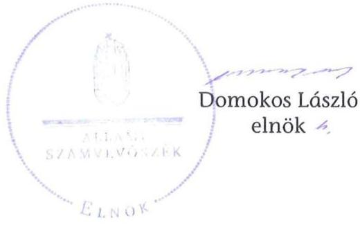
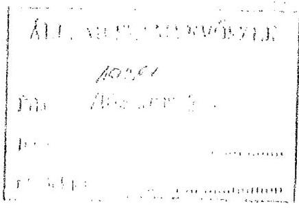
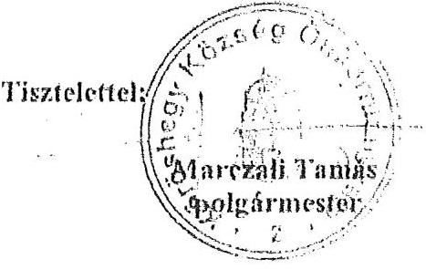
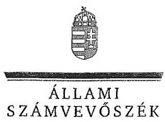
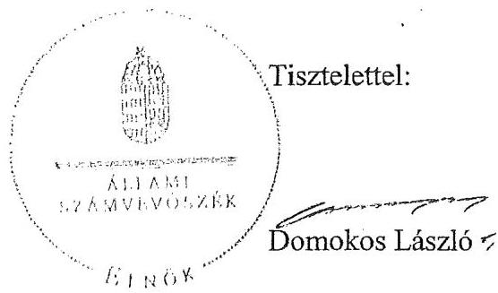

# JELENTÉS 

Kőröshegy Község Önkormányzata belső kontrollrendszerének kialakítása, valamint egyes kontrolltevékenységek és a belső ellenőrzés múködése ellenőrzéséről

---

# Állami Számvevőszék 

Iktatószám: V-0012-058-007-038/2013.
Témaszám: 1051
Vizsgálat-azonosító szám: V059107

## Az ellenőrzést felügyelte:

Dr. Benedek Mária
felügyeleti vezető
2012. december 16. napjától

Gyüre Lajosné
felügyeleti vezető
2012. december 15. napjáig

## Az ellenőrzést vezette:

## Szakmányné Bilik Mária ellenőrzésvezető

A számvevőszéki jelentés összeállításában közremüködtek:
Dr. Fónagy Diána
számvevő tanácsos
Kámán Edina
számvevő
Az ellenőrzést végezték:
Csepreginé Tancsík Erzsébet Péntek László
számvevő tanácsos
számvevő tanácsos

---

# TARTALOMJEGYZÉK 

BEVEZETÉS ..... 5
I. ÖSSZEGZŐ MEGÁLLAPÍTÁSOK, KÖVETKEZTETÉSEK, JAVASLATOK ..... 8
II. RÉSZLETES MEGÁLLAPÍTÁSOK ..... 15

1. Az önkormányzat belső kontrollrendszere kialakításának megfelelősége ..... 15
1.1. A kontrollkörnyezet kialakítása ..... 15
1.2. A kockázatkezelési rendszer szabályozása ..... 16
1.3. A kontrolltevékenységek kialakítása ..... 17
1.4. Az információs és kommunikációs rendszer szabályozása ..... 17
1.5. A monitoring rendszer szabályozása ..... 18
2. A pénzügyi folyamatokban kulcsszerepet betöltő belső kontrollok (szakmai teljesítésigazolás és utalvány ellenjegyzés) múködése ..... 19
3. A belső ellenőrzés szervezeti keretei és működése ..... 22
MELLÉKLETEK
4. számú Az észrevételt tartalmazó polgármesteri levél
5. számú Az észrevételre vonatkozó elnöki válaszlevél
FÜGGELÉKEK
6. számú Értelmező szótár
7. számú A belső kontrollrendszer kialakítása, a pénzügyi folyamatokban kulcsszerepet betöltő szakmai teljesítésigazolás és utalvány ellenjegyzés kontrollok múködése, valamint a belső ellenőrzés múködése értékelésénél alkalmazott minősítési szempontok

---

.

---

# RÖVIDÍTÉSEK JEGYZÉKE 

## Törvények

ÁSZ tv.
Avtv.

Info tv.

Htv.

Ktv.
Mötv.
Ötv.
régi Áht.
Számv. tv.
új Áht.

## Rendeletek

Áhsz.

Ámr.
Ávr.

Ber.
Bkr.
közműfejlesztési támogatásról szóló Korm. rendelet
önkormányzati SZMSZ
2011. évi LXVI. törvény az Állami Számvevőszékről
1992. évi LXIII. törvény a személyes adatok védelméről és a közérdekú adatok nyilvánosságáról (hatálytalan 2012. január 1-jétől)
2011. évi CXII. törvény az információs önrendelkezési jogról és az információszabadságról (hatályos 2012. január 1-jétől)
1991. évi XX. törvény a helyi önkormányzatok és szerveik, a köztársasági megbízottak, valamint egyes centrális alárendeltségú szervek feladat- és hatásköreiről
1992. évi XXIII. törvény a köztisztviselők jogállásáról (hatálytalan 2012. március 1-jétől)
2011. évi CLXXXIX. törvény Magyarország helyi önkormányzatairól (hatályos 2012. január 1-jétől)
1990. évi LXV. törvény a helyi önkormányzatokról
1992. évi XXXVIII. törvény az államháztartásról (hatálytalan 2012. január 1-jétől)
2000. évi C. törvény a számvitelről
2011. évi CXCV. törvény az államháztartásról (hatályos 2012. január 1-jétől)

249/2000. (XII. 24.) Korm. rendelet az államháztartás szervezetei beszámolási és könyvvezetési kötelezettségének sajátosságairól
292/2009. (XII. 19.) Korm. rendelet az államháztartás múködési rendjéről (hatálytalan 2012. január 1-jétől)
368/2011. (XII. 31.) Korm. rendelet az államháztartásról szóló törvény végrehajtásáról (hatályos 2012. január 1jétől)
193/2003. (XI. 26.) Korm. rendelet a költségvetési szervek belső ellenőrzéséről (hatálytalan 2012. január 1-jétől)
370/2011. (XII. 31.) Korm. rendelet a költségvetési szervek belső kontrollrendszeréről és belső ellenőrzéséről (hatályos 2012. január 1-jétől)

262/2004. (IX. 23.) Korm. rendelet a magánszemélyek közműfejlesztési támogatásáról

Köröshegy Község Önkormányzatának 5/2011. (IV. 18.) számú rendelete az Önkormányzat Szervezeti és Müködési Szabályzatáról

---

# Szórövidítések 

adatvédelmi szabályzat Kőröshegy Község Önkormányzata Polgármesteri Hivatalának Közszolgálati adatvédelmi szabályzata (hatályos 2006. április 24-étől)

ÁSZ
Belső ellenőrzési kézikönyv
Belső Kontroll Kézikönyv

FEUVE
FEUVE szabályzat
gazdálkodási jogkörök szabályzata
gazdasági program
hivatali SZMSZ
informatikai biztonsági szabályzat
jegyzó
Képviselő-testület
kockázatkezelési szabályzat
leltározási szabályzat

Önkormányzat
polgármester
Polgármesteri Hivatal

Társulás
társulási tanács

Állami Számvevőszék
Balatonföldvári Többcélú Kistérségi Társulás Belső Ellenőrzési Kézikönyve (hatályos 2009. január 2-ától)
az Ámr. 155. § (1) bekezdése, valamint az államháztartási belső kontroll standardokról szóló 1/2009. (IX. 11.) PM irányelv egységes értelmezése érdekében az államháztartásért felelős miniszter által a 2010. évben kiadott Belső Kontroll Kézikönyv
folyamatba épített, előzetes, utólagos és vezetői ellenőrzés Kőröshegy Község Önkormányzata Polgármesteri Hivatala Folyamatba épített, előzetes, utólagos és vezetői ellenőrzése rendszerének szabályzata (hatályos 2006. március 31-étől)
Kőröshegy Község Önkormányzata Polgármesteri Hivatalának Gazdálkodási szabályzata (hatályos 2010. július 10-étől)
Kőröshegy Község Képviselő-testületének 38/2007. (III. 26.) számú képviselő-testületi határozatával elfogadott Gazdasági program
a Képviselő-testület 53/2011. (IV. 18.) számú határozatával elfogadott Kőröshegy Község Önkormányzata Polgármesteri Hivatalának Szervezeti és Múködési Szabályzata
Kőröshegy Község Önkormányzata Polgármesteri Hivatalának Informatikai biztonsági szabályzata (hatályos 2012. január 2-ától)

Kőröshegy Község Önkormányzatának jegyzője
Kőröshegy Község Képviselő-testülete
a FEUVE szabályzat III. fejezete (hatályos 2006. március 31-étől)
Kőröshegy Község Önkormányzata Polgármesteri Hivatalának Leltárkészítési és leltározási szabályzata (hatályos 2011. február 1-jétől)

Kőröshegy Község Önkormányzata
Kőröshegy Község Önkormányzatának polgármestere
Kőröshegy Község Önkormányzatának Polgármesteri Hivatala
Balatonföldvári Többcélú Kistérségi Társulás
Balatonföldvári Többcélú Kistérségi Társulás Társulási Tanácsa

---

# JELENTÉS 

## Kőröshegy Község Önkormányzata belső kontrollrendszerének kialakítása, valamint egyes kontrolltevékenységek és a belső ellenőrzés múködése ellenőrzéséről

## BEVEZETÉS

A belső kontrollrendszer kialakítását, múködtetését és fejlesztését a régi Áht. és az új Áht. is előírja. Ennek megvalósításáért a költségvetési szerv vezetője, a jegyző felel. A belső kontrollrendszer azt a célt szolgálja, hogy a költségvetési szervek múködésük és gazdálkodásuk során a tevékenységeket szabályszerűen, gazdaságosan, hatékonyan, eredményesen hajtsák végre, teljesítsék elszámolási kötelezettségeiket és megvédjék az erőforrásokat a veszteségektől, a károktól és a nem rendeltetésszerú használattól. A belső kontrollrendszer magában foglalja mindazon szabályokat, eljárásokat, gyakorlati módszereket és szervezeti struktúrákat, kockázatkezelési technikákat, kontrolltevékenységeket, amelyek segítséget nyújtanak a szervezetnek céljai eléréséhez.

Az ÁSZ a 2011-2015. évekre szóló stratégiájában hangsúlyos szerepet szánt annak, hogy szilárd szakmai alapon álló, értékteremtő ellenőrzéseivel előmozdítsa a közpénzügyek átláthatóságát, rendezettségét. A számvevőszéki ellenőrzés nemzetközi alapelvei is rögzítik, hogy a megfelelő belső kontrollrendszer minimálisra csökkenti a hibák és szabálytalanságok kockázatát.

Az ellenőrzés célja annak értékelése volt, hogy az Önkormányzat a jogszabályi előírásoknak megfelelően alakította-e ki a belső kontrollrendszert; a gazdálkodás folyamatában kulcsszerepet betöltő szakmai teljesítésigazolás és az utalvány ellenjegyzés kontrolltevékenységeit megfelelően múködtette-e; biztosí-totta-e a belső ellenőrzés szabályos és eredményes múködését.

Az ÁSZ ezen ellenőrzési céljait pilot (próba) jelleggel községi/nagyközségi önkormányzatoknál végzett ellenőrzések során érvényesítette.

Az ellenőrzés típusa: szabályszerűségi ellenőrzés
Az ellenőrzés jogszabályi alapja: az ÁSZ tv. 5. § (2) és (6) bekezdései
Az ellenőrzött szervezet: az Önkormányzat (ezen belül kiemelten a Polgármesteri Hivatal)

---

Az ellenőrzött időszak: a belső kontrollrendszer kialakításának megfelelőségét a 2011. évre vonatkozóan értékeltük. A kontrolltevékenységek múködésének megfelelőségét a 2011. január 1-je és december 31-e, míg a belső ellenőrzés múködésének szabályosságát és eredményességét a 2009. január 1-je és 2011. december 31-e közötti időszakot figyelembe véve értékeltük. A helyszíni ellenőrzés lezárásáig a helyi szabályozás változásait nyomon követtük.

Az ellenőrzés szakmai módszertana az Állami Számvevőszék Ellenőrzési Kézikönyvében foglalt szakmai szabályokon alapult, amely a Legfelsőbb Ellenőrző Intézmények Nemzetközi Szervezete (INTOSAI) által kiadott nemzetközi standardok (ISSAI) figyelembevételével készült.

A belső kontrollrendszer kialakításának ellenőrzése során értékeltük a Polgármesteri Hivatalban a kontrollkörnyezet, a kockázatkezelési rendszer, a kontrolltevékenységek, az információs és kommunikációs rendszer, valamint a monitoring rendszer szabályozottságának megfelelőségét.

A Polgármesteri Hivatalban értékeltük a pénzügyi folyamatokban kulcsszerepet betöltő szakmai teljesítésigazolás és utalvány ellenjegyzés kontrollok működésének megfelelőségét az államháztartáson kívülre teljesített múködési és felhalmozási célú pénzeszköz átadásoknál, az állományba nem tartozók megbízási díjainál, továbbá a külső szolgáltató által végzett karbantartási, kisjavítási munkákkal kapcsolatos kifizetéseknél. Az egyszerű véletlen mintavétellel kiválasztott tételek ellenőrzését többlépcsős megfelelőségi tesztek útján addig végeztük, amíg elegendő és megfelelő bizonyítékot szereztünk a vizsgált folyamatok kulcskontrolljai múködésének megfelelő vagy nem megfelelő voltáról.

Értékeltük az Önkormányzatnál a belső ellenőrzés múködésének szabályosságát és eredményességét.

A fogalmak magyarázatát az 1. számú függelék, az ellenőrzés egyes területeinek értékelésénél alkalmazott egységes minősítési szempontokat a 2. számú függelék tartalmazza.

Az ellenőrzés lefolytatásához az Önkormányzat a munkalapok és a tanúsítvány elektronikus kitöltésével, valamint a megjelölt dokumentumok elektronikus megküldésével szolgáltatott adatokat. A munkalapokon szerepeltetett adatok, információk ellenőrzése és szükség szerinti javítása a helyszíni ellenőrzés keretében történt.

Az ÁSZ az ellenőrzés megállapításait az ellenőrzött időszakban hatályos, az intézkedést igénylő megállapításokra tett javaslatokat a jelenleg hatályos jogszabályok alapján fogalmazta meg.

Az ÁSZ tv. 29. § (1) bekezdése szerint a jelentéstervezetet megküldtük a polgármester részére, aki az ÁSZ tv. 29. § (2) bekezdésében foglalt észrevételezési jogával élt, a jelentéstervezetre tett észrevételt a számvevőszéki jelentésben figyelembe vettük.

Köröshegy község állandó lakosainak száma 2011. január 1-jén 1455 fő volt. Az Önkormányzat héttagú Képviselő-testületének munkáját egy állandó bizott-

---

ság segítette. Az Önkormányzat az önállóan múködő és gazdálkodó Polgármesteri Hivatalon kívül intézménnyel, valamint többségi tulajdoni hányadú gazdasági társasággal nem rendelkezett.

A polgármester a 2006. évi önkormányzati választások óta tölti be tisztségét. A jegyző személye 2009. április 1-jén, 2010. január 15-én és 2010. május 1-jén változott. A Polgármesteri Hivatal szervezeti egységekre nem tagolódott, a foglalkoztatott köztisztviselők száma 2011. január 1-jén hét fő volt. Az Önkormányzat a 2011. évi költségvetési beszámolója szerint 154,6 millió Ft költségvetési bevételt ért el, és 152,7 millió Ft költségvetési kiadást teljesített. A 2011. december 31-i könyvviteli mérleg szerint 869,9 millió Ft értékű eszközvagyonnal rendelkezett, a rövid lejáratú kötelezettsége 62,2 millió Ft volt, hosszú lejáratú kötelezettsége nem volt.

---

# I. ÖSSZEGZŐ MEGÁLLAPÍTÁSOK, KÖVETKEZTETÉSEK, JAVASLATOK 

A belső kontrollrendszer kialakítása a Polgármesteri Hivatalban 2011-ben a kontrollkörnyezet, a kockázatkezelési rendszer, a kontrolltevékenységek, az információs és kommunikációs rendszer, valamint a monitoring rendszer szabályozásának, illetve kialakításának értékelése alapján összességében nem felelt meg a jogszabályi előírásoknak.

A kontrollkörnyezet kialakítása nem felelt meg a jogszabályi követelményeknek. A jegyző a gazdálkodást érintő legfontosabb szabályzatokat elkészítette, azonban a Htv.-ben foglalt előírást figyelmen kívül hagyva nem készítette elő a gazdasági programtervezetet, így a Képviselő-testület az Ötv.-ben foglaltak ellenére nem határozta meg az Önkormányzat 2011-2014. évekre vonatkozó gazdasági programját. A hivatali SZMSZ-ben az Ámr. rendelkezései ellenére nem rögzítették az engedélyezett létszámot. A leltározási szabályzatban a mérlegben kimutatott eszközök kétévenkénti leltározási kötelezettségét írták elő, annak ellenére, hogy erre a Képviselő-testület nem adta meg az Áhsz. szerinti önkormányzati rendeleti felhatalmazást. Az évenkénti leltározási kötelezettség nem teljesítése vagyonvédelmi kockázatot jelent.

A kockázatkezelési rendszer szabályozása nem felelt meg az Ámr. előírásainak, mivel nem végezték el a kockázatok elemzését.

A kontrolltevékenységek kialakítása a jogszabályi előírásoknak részben volt megfelelő, mivel az Ámr. előírásai ellenére nem alakították ki a Polgármesteri Hivatal tevékenységeire vonatkozó beszámolási eljárásokat.

Az információs és kommunikációs rendszer szabályozása nem felelt meg a jogszabályi követelményeknek, mivel az Ámr.-ben foglaltak ellenére a jegyző́ nem határozta meg a közérdekú adatok közzétételi eljárásának, nyilvánosságra hozatalának rendjét, nem jelölte ki a közérdekú adatok közzétételének adatfelelősét és az adatközlő személyt. Az Avtv. előírásai ellenére a jegyző nem szabályozta a közérdekú adatok megismerésére irányuló igények teljesítésének rendjét, és elmulasztotta az informatikai rendszer környezetének szabályozása során az adatbiztonság érvényre juttatásához szükséges intézkedések megtételét. Nem alakította ki az informatikai rendszer hozzáférési jogosultságaira vonatkozó eljárásrendet és nyilvántartást, nem szabályozta a pénzügyi-számviteli szoftverváltozások ellenőrzésére, tesztelésére vonatkozó eljárásokat, és a pénz-ügyi-számviteli rendszerben feldolgozott adatok mentési eljárásait. Az adatvédelmi és adatbiztonsági szabályzat nem felelt meg az Avtv.-ben előírt tartalmi követelményeknek, mivel nem tartalmazta az ügyfelek adatbiztonságára vonatkozó szabályokat. A Polgármesteri Hivatalban az információs és kommunikációs rendszer szabályozottságának hiányosságait a jegyző a 2012. évben részben megszüntette.

A monitoring rendszer szabályozása részben felelt meg a jogszabályi előírásoknak, mivel a jegyző az Ámr. előírása ellenére az Önkormányzat tevékenysé-

---

gének, a célok megvalósításának nyomon követését biztosító, az operatív tevékenységek keretében megvalósuló folyamatos és eseti nyomon követésből álló, az Önkormányzat tevékenységének, a célok megvalósításának nyomon követését biztosító rendszert nem alakította ki.

A belső kontrollrendszer nem megfelelő kialakítása kockázatot jelent az Önkormányzat tevékenységeinek szabályszerű, gazdaságos, hatékony és eredményes végrehajtása során.

A Polgármesteri Hivatalban a 2011. évben az államháztartáson kívülre történő működési és felhalmozási célú pénzeszközátadásokkal, az állományba nem tartozók megbízási díjaival, valamint a külső szolgáltatók által végzett karbantartással, kisjavítással kapcsolatos kifizetések során a kulcskontrollok múködésének megfelelősége gyenge volt.

Az államháztartáson kívülre történő működési és felhalmozási célú pénzeszközátadásokkal, valamint az állományba nem tartozók megbízási díjaival kapcsolatos kiadások teljesítését megelőzően azok jogosságának, összegszerűségének ellenőrzését, valamint - az ellenszolgáltatást is magukban foglaló kifizetések esetében - a megbízási szerződések szakmai teljesítésének igazolását, az Ámr. előírása ellenére, nem végezték el. Az utalvány ellenjegyzését, az Ámr.ben foglaltak ellenére, nem minden esetben az arra jogosult (jegyzői kijelöléssel rendelkező) személy végezte. Az utalványok ellenjegyzője a kiadások teljesítését megelőzően, az Ámr. szabályozása ellenére, nem győződött meg arról, hogy az utalványozás sérti-e a gazdálkodásra - az előirányzat meglétére, az utalvány tartalmi megfelelőségére, a kötelezettségvállalás ellenjegyzésére, az összeférhetetlenség elkerülésére - vonatkozó szabályokat. Az utalvány ellenjegyzője nem kifogásolta a szakmai teljesítésigazolás elmaradását. Nem biztosították teljes körűen az Ámr.-ben foglalt összeférhetetlenségi szabályok betartását, mivel a megbízási díjak kifizetése során az érvényesítő és az utalvány ellenjegyző esetenként a maga javára látta el feladatát. Ebből adódóan azonban az Önkormányzatnál károkozás nem történt. A működési célú pénzeszközátadások keretében a közműfejlesztési támogatás $3,7 \%$-át, a közműfejlesztési támogatásról szóló Korm. rendeletben foglaltak ellenére, nem a jogosult magánszemélyek részére fizették ki, hanem a víziközmű számlára vezették át, amihez azonban nem csatolták a jogosultak írásbeli felhatalmazását. A külső szolgáltatók által végzett karbantartással, kisjavítással kapcsolatos kifizetéseknél több esetben nem az Áhsz. előírásainak megfelelő főkönyvi számlát jelölték ki. A könyvvezetésben a téves számlakijelölések miatt sérült a Számv. tv.-ben szabályozott valódiság számviteli alapelv.

A számvevőszéki ellenőrzés az ellenőrzött kifizetésekkel összefüggésben a rendelkezésre bocsátott dokumentumok alapján jogosulatlan kifizetést nem tárt fel, azonban a gazdálkodásban kulcsszerepet betöltő kontrollok múködésében feltárt hiányosságok miatt fennáll a hibák bekövetkezésének kockázata.

Az Önkormányzat a belső ellenőrzési feladatokat Társulás útján látta el. Az Önkormányzatnál a 2009-2011. években a belső ellenőrzés múködése a jogszabályi előírásoknak nem felelt meg, mivel előterjesztés hiányában a Képviselö-testület az Önkormányzat éves belső ellenőrzési tervét - az Ötv. előírása ellenére - egyik évben sem hagyta jóvá. A 2009-2011. években a belső ellenőrzési

---

vezető, a Ber.-ben foglaltak ellenére, nem készített az ellenőrzési tervek összeállítását megelőzően az Önkormányzatra vonatkozó kockázatelemzést, valamint a jegyző nem adott írásos véleményt az ellenőrzési tervek összeállításához. Az elvégzett ellenőrzésekről készített kilenc jelentés közül - a Ber.-ben foglaltak ellenére - mindössze egy jelentés tartalmazott javaslatot. A javaslat hasznosítására az Önkormányzat a Ber.-ben előírt intézkedési tervet nem készített, azonban a javaslatot a feladatellátás során hasznosította. Az Önkormányzatnál a 2009-2011. évek között a belsố ellenőrzés múködése nem volt eredményes, mivel a belső ellenőrzés szabályozása és működése az ellenőrzött időszak egészét tekintve a jogszabályi előírásoknak nem felelt meg. A belső ellenőrzés nem tárta fel a kontrollrendszer kialakításának és működésének hiányosságait, annak ellenére, hogy ellenőrizték a belső kontrollrendszer egyes elemei kialakításának szabályozottságát, a gazdálkodási jogkörök gyakorlásához kapcsolódóan a belső kontrollok működését, valamint a vagyonvédelem területén a leltározási szabályzatban foglaltak betartását. A belső ellenőrzés működésében megállapított hiányosságok miatt nem volt biztosított az Önkormányzatnál, hogy a belső ellenőrzés megelőzze, feltárja és kijavíttassa a lényeges hibákat és szabálytalanságokat.

Az ÁSZ tv. 33. § (1) bekezdésében foglaltak értelmében az ellenőrzött szervezet vezetője köteles a jelentésben foglalt megállapításokhoz kapcsolódó intézkedési tervet összeállítani, és azt a jelentés kézhezvételétől számított 30 napon belül az ÁSZ részére megküldeni. Amennyiben az intézkedési tervet határidőre nem küldi meg a szervezet, vagy az az ÁSZ tv. 33. § (2) bekezdésében foglalt póthatáridő eltelte ellenére továbbra sem elfogadható, az ÁSZ elnöke a hivatkozott törvény 33. § (3) bekezdés a)-b) pontjaiban foglaltakat érvényesítheti.

Az ellenőrzés intézkedést igénylő megállapításai és javaslatai:

# a polgármesternek 

1. A jegyző a Htv. 140. § (1) bekezdés a) pontjában foglalt előírást figyelmen kívül hagyva nem készítette elő a gazdasági programtervezetet, így a Képviselő-testület az Ötv. 91. § (6) és (7) bekezdéseiben foglaltakat megsértve nem döntött az Önkormányzat gazdasági programjáról.

Javaslat
Terjessze a Képviselő-testület elé a gazdasági program jegyző által elkészített tervezetét annak érdekében, hogy azt a Képviselő-testület a Mötv. 116. § (3)-(4) bekezdéseiben foglalt tartalommal fogadhassa el.
2. A síkosságmentesítés elvégeztetésére irányuló kötelezettségvállalásnál, valamint a népszámlálási feladatokat ellátók részére kifizetett megbízási díjak esetében az Ámr. 74. § (1) bekezdésében foglaltak ellenére, nem történt meg a kötelezettségvállalás ellenjegyzése.

Javaslat:
Biztosítsa, hogy az új Áht. 37. § (1) bekezdésében foglaltaknak megfelelően kötele-

---

zettségvállalásra - az Ávr.-ben meghatározott kivételekkel - kizárólag a pénzügyi ellenjegyzés után kerüljön sor.

# a jegyzönek 

1. a kontrollkörnyezettel kapcsolatban:

A jegyző, a Htv. 140. § (1) bekezdés a) pontjában foglalt előírást figyelmen kívül hagyva nem készítette el a gazdasági programtervezetet, így a Képviselő-testület az Ötv. 91. § (7) bekezdésében foglaltak ellenére nem határozta meg az Önkormányzat 2011-2014. évekre vonatkozó gazdasági programját.

A hivatali SZMSZ-ben az Ámr. 20. § (2) bekezdés e) pontjában foglaltak ellenére nem rögzítették az engedélyezett létszámot.

A leltározási szabályzatban a mérlegben kimutatott eszközök kétévenkénti leltározási kötelezettségét írták elő, annak ellenére, hogy erre a Képviselő-testület nem adta meg az Áhsz. 37. § (7) bekezdésében foglaltak szerinti önkormányzati rendeleti felhatalmazást.

Javaslat:
a) Készítse el a Htv. 140. § (1) bekezdés a) pontjában foglaltak alapján a gazdasági program tervezetét, és kezdeményezze a polgármesternél, hogy a Képviselőtestület a Mötv. 116. § (3)-(4) bekezdéseiben foglalt tartalommal fogadja el az Önkormányzat gazdasági programját.
b) Módosítsa a hivatali SZMSZ-t annak érdekében, hogy az Ávr. 13. § (1) bekezdés e) pontjában foglaltaknak megfelelően tartalmazza a Polgármesteri Hivatal engedélyezett létszámát.
c) Írja elő az Áhsz. 37. § (1) bekezdésében foglaltak alapján a könyvviteli mérlegben kimutatott eszközök évenkénti leltározási kötelezettségét. Amennyiben a tulajdon védelme megfelelően biztosított és ellenőrzött, valamint biztosított az eszközök állományában bekövetkezett változások folyamatos - mennyiségben és értékben történő - nyilvántartása, készítsen előterjesztést, és kezdeményezze a polgármesternél a Képviselő-testület elé terjesztését annak érdekében, hogy az, az Áhsz. 37. § (7) pontjában foglaltak alapján rendeletben állapítsa meg amennyiben a feltételei fennállnak - az eszközök kétévenkénti leltározásának kötelezettségét.
2. a kockázatkezelési rendszerrel kapcsolatban:

Az Ámr. 157. § (1)-(2) bekezdésében foglaltak ellenére nem végezték el a kockázatok elemzését.

Javaslat:
Gondoskodjon a Bkr. 7. §-a alapján a kockázatok meghatározásának és felmérésének

---

keretében a Polgármesteri Hivatal tevékenységében, gazdálkodásában rejlő kockázatok megállapításáról.
3. a kontrolltevékenységekkel kapcsolatban:

A kontrolltevékenységek keretében az Ámr. 158. § (2) bekezdés d) pontjának előírása ellenére nem alakították ki a Polgármesteri Hivatal tevékenységeire vonatkozó beszámolási eljárásokat.

Javaslat:
Alakítsa ki a Bkr. 8. § (4) bekezdés c) pontjának alapján a Polgármesteri Hivatal tevékenységeire vonatkozó beszámolási eljárásokat.
4. az információs és kommunikációs rendszerrel kapcsolatban:

Az adatvédelmi és adatbiztonsági szabályzat nem felelt meg az Avtv. 10. § (1)-(2), valamint a 31/A. § (3) bekezdésében előírt tartalmi követelményeknek, mivel nem tartalmazta az ügyfelek adatbiztonságára vonatkozó szabályokat.

Javaslat:
Egészítse ki az Info tv. 24. § (3) bekezdése szerinti adatvédelmi és adatbiztonsági szabályzatot annak érdekében, hogy az, az Info tv. 7. § (1) bekezdésének megfelelően tartalmazza a személyes adatok biztonságára vonatkozó szabályokat.
5. a monitoring rendszerrel kapcsolatban:

A jegyző, az Ámr. 160. §-ában foglaltak ellenére, az operatív tevékenységek keretében megvalósuló folyamatos és eseti nyomon követésből álló, az Önkormányzat tevékenységének, a célok megvalósításának nyomon követését biztosító rendszert nem alakította ki.

Javaslat:
Alakítsa ki és múködtesse a Bkr. 10. §-ában előírtak alapján az operatív tevékenységek keretében megvalósuló folyamatos és eseti nyomon követésből álló, az Önkormányzat tevékenységének, a célok megvalósításának nyomon követését biztosító rendszert.
6. a pénzügyi folyamatokban kulcsszerepet betöltő kontrollok múködésével kapcsolatban:

A szakmai teljesítés igazolására a jegyző által kijelölt személy az Ámr. 76. § (1) bekezdésében foglalt ellenőrzési feladatait az államháztartáson kívülre történt működési és felhalmozási célú pénzeszközátadások és az állományba nem tartozók megbízási díjai kifizetéseit megelőzően nem végezte el. A bizonylatokon az ellenőrzés megtörténtét aláírásával, az igazolás dátumának feltüntetésével, valamint a teljesítés tényére történő utalás megjelölésével a gazdálkodási jogkörök szabályzatában előírtak ellenére nem igazolta.

---

A közműfejlesztési támogatásról szóló Korm. rendelet 6. § (6) bekezdésében foglaltak ellenére a közműfejlesztési támogatás összegének 3,7\%-át nem a jogosult magánszemélyek részére fizették ki, hanem a víziközmú számlára vezették át a jogosultak írásbeli felhatalmazása nélkül.

Az utalvány ellenjegyzését nem minden esetben az arra jogosult személy végezte, továbbá az utalványok ellenjegyzője, aláírása ellenére, nem tett eleget az Ámr. 79. § (2) bekezdésében foglalt ellenőrzési kötelezettségének. A külön írásbeli rendelkezésként elkészített utalvány nem felelt meg az Ámr. 78. § (2) bekezdésében, valamint a gazdálkodási jogkörök szabályzata VI. fejezetében előírt tartalmi követelményeknek. Nem biztosították az Ámr. 80. § (2) bekezdésében foglalt összeférhetetlenségi szabályok betartását, mivel a projekt menedzseri megbízási díjak kifizetése során az érvényesítő, a számlálóbiztosi megbízási díjak kifizetése során az utalvány ellenjegyzője a saját maga javára látta el érvényesítői, illetve ellenjegyzői feladatát.

Javaslat:
Az operatív gazdálkodás során a müködésbeli hibák megelőzése, feltárása és kijavítása érdekében gondoskodjon arról, hogy
a) az Ávr. 57. § (1) bekezdésében előírtaknak megfelelően a teljesítés igazolására kijelölt személyek okmányok alapján ellenőrizzék a kiadások teljesítésének jogosságát, összegszerűségét, az ellenszolgáltatást is magában foglaló kötelezettségvállalás esetében a szerződés, a megrendelés teljesítését;
b) az Ávr. 55. § (1) és (3) bekezdésében előírtaknak megfelelően a pénzügyi ellenjegyzést az arra jogosult, az előírt végzettséggel és képesítéssel rendelkező személy aláírásával igazolják;
c) az érvényesítő az Ávr. 58. § (1) bekezdése szerint a kifizetést megelőzően a teljesítésigazolás alapján ellenőrizze az összegszerűséget, a fedezet meglétét és azt, hogy a megelőző ügymenetben az új Áht., az Áhsz., az Ávr. - gazdálkodási szabályokra, szabályszerű számlakijelölésre, teljesítésigazolás ellenőrzésére, előirányzat rendelkezésre állására vonatkozó - előírásait és a belső szabályzatokban foglaltakat betartották-e;
d) a külön írásbeli rendelkezésként kiállítandó utalvány tartalmazza az Ávr. 59. § (3) bekezdésében foglaltakat, illetve az utalvány használata során az azon szereplő valamennyi adat feltüntetésre kerüljön;
e) az Ávr. 60. § (1)-(2) bekezdésének figyelembevételével az összeférhetetlenségi szabályok érvényesüljenek;
f) az új Áht. 37. § (1) bekezdésében, valamint az Ávr. 55. § (1) bekezdésében foglaltaknak megfelelően a pénzügyi ellenjegyzést követően történjen a kötelezettségvállalás;
g) a közműfejlesztési támogatást, a magánszemélyek közműfejlesztési támogatásáról szóló 262/2004. (IX. 23.) Korm. rendelet 6. § (6) bekezdésében foglaltaknak megfelelően a jogosultak részére fizessék ki, továbbá csatolják a jogosultak írás-

---

beli felhatalmazását a támogatás összegének víziközmű számlára történő átvezetéséhez.
7. a belső ellenőrzés múködésével kapcsolatban:

A Képviselő-testület az Önkormányzat éves ellenőrzési tervét - az Ötv. 92. § (6) bekezdésének előírása ellenére - előterjesztés hiányában a 2009-2011. években nem hagyta jóvá.

A 2009-2011. években a belső ellenőrzési vezető - a Ber. 21. § (2) bekezdésében foglaltak ellenére - a belső ellenőrzési tervek összeállítását megelőzően az Önkormányzatra vonatkozó kockázatelemzést nem készített.

A Ber. 32/B. § (2) bekezdésének előírása ellenére az ellenőrzési tervek összeállításához nem készült jegyzői írásos vélemény.

A belső ellenőrzési jelentésben szereplő javaslat hasznosítására nem készítettek a Ber. 29. § (1) bekezdésében előírt intézkedési tervet.

Javaslat:
a) Készítse elő az éves ellenőrzési tervről szóló előterjesztést, és kezdeményezze a polgármesternél a Képviselő-testület elé terjesztését annak érdekében, hogy a Képviselő-testület az éves ellenőrzési tervet a Mötv. 119. § (5) bekezdésében előírt határidőig jóváhagyhassa. Haladéktalanul pótolja és kezdeményezze a polgármesternél, hogy a Képviselő-testület az ellenőrzött időszakra vonatkozó ellenőrzési tervekben foglaltakat tárgyalja meg.
b) Biztosítsa, hogy az éves ellenőrzési tervet a Bkr. 29. §. (1) bekezdése és 31. § (2) bekezdésének megfelelően kockázatelemzéssel alapozzák meg.
c) Biztosítsa, hogy az éves ellenőrzési terv összeállítása a társult feladatellátásra tekintettel, a Bkr. 56. § (2) bekezdésében foglaltaknak megfelelően, a jegyző írásos véleményének figyelembevételével történjen.
d) Gondoskodjon a Bkr. 45. § (1) bekezdésének előírása szerint - a belső ellenőrzésekről készült jelentésekben rögzített hiányosságok felszámolására - intézkedési terv elkészítéséről.

---

# II. RÉSZLETES MEGÁLLAPÍTÁSOK 

## 1. Az önkORMÁNYZAT BELSŐ KONTROLLRENDSZERE KIALAKÍTÁSÁNAK MEGFELELŐSÉGE

### 1.1. A kontrollkörnyezet kialakítása

A kontrollkörnyezet kialakítása a Polgármesteri Hivatalban nem volt megfelelő, mivel a jegyző

- a Htv. 140. § (1) bekezdés a) pontjában foglalt előírást figyelmen kívül hagyva nem készítette elő a gazdasági programtervezetet, így a Képviselőtestület az Ötv. 91. § (7) bekezdésében ${ }^{1}$ foglaltakat megsértve, nem határozta meg az Önkormányzat 2011-2014. évekre vonatkozó gazdasági programját;

A Képviselő-testület a 99/2010. (X. 18.) számú határozatával döntött a 2007. évi gazdasági program felülvizsgálatáról, amely végrehajtására azonban nem került sor.

- a hivatali SZMSZ-ben, az Ámr. 20. § (2) bekezdés c) és e) pontjaiban ${ }^{2}$ foglaltak ellenére, nem rögzítette az ellátandó és a szakfeladatrend szerint besorolt alaptevékenységeket ${ }^{3}$, és az engedélyezett létszámot;
- a leltározási szabályzatban a mérlegben kimutatott eszközök kétévenkénti leltározási kötelezettségét írta elő, annak ellenére, hogy erre a Képviselőtestület nem adta meg az Áhsz. 37. § (7) bekezdése szerinti önkormányzati rendeleti felhatalmazást;
- a Ktv. 34. § (4) bekezdésében foglaltak ellenére nem határozta meg a köztisztviselőkre vonatkozó teljesítménykövetelményeket.

[^0]
[^0]:    ${ }^{1}$ 2013. január 1-jétől a gazdasági programra, fejlesztési tervre vonatkozó jogszabályi előírásokat a Mötv. 116. §-a tartalmazza.
    ${ }^{2}$ 2012. január 1-jétől az Ávr. 13. § (1) bekezdés c) és e) pontjai rögzítik az SZMSZ tartalmi követelményeit.
    ${ }^{3}$ A hivatali SZMSZ helyett az önkormányzati SZMSZ 4. számú függeléke tartalmazza 2012. május 22-étől - az ellátandó és a szakfeladatrend szerint besorolt alaptevékenységeket.

---

A kontrollkörnyezet kialakítása során a jegyző

- a Belső Kontroll Kézikönyv ${ }^{4}$ 1.5.2. pontjában foglaltakat figyelmen kívül hagyva nem dolgozta ki a Polgármesteri Hivatalban ellátott köztisztviselői munkakörök betöltésére vonatkozó elvárt tudást és képességeket;
- a Belső Kontroll Kézikönyv 1.6. pontjában foglaltakat figyelmen kívül hagyva nem intézkedett a szervezeti célokkal összhangban álló etikai értékek kiemelt kezeléséről, mivel nem határozta meg a köztisztviselőkkel szembeni etikai elvárásokat. A köztisztviselőkkel szembeni etikai elvárásokat tartalmazó, 2012. szeptember 1-jétől hatályos Etikai Kódexet a jegyző az ÁSZ ellenőrzés megkezdését követően elkészítette.

# 1.2. A kockázatkezelési rendszer szabályozása 

A kockázatkezelési rendszer szabályozottsága a Polgármesteri Hivatalban nem volt megfelelő. A Polgármesteri Hivatal rendelkezett kockázatkezelési szabályzattal, azonban a jegyző a kockázatkezelési rendszer keretében, az Ámr. 157. § (1)-(2) bekezdésében ${ }^{5}$ foglaltak ellenére, nem végezte el a kockázatok elemzését.

A kockázatkezelési rendszer szabályozása során a jegyző

- a Belső Kontroll Kézikönyv 2.1.3. pontjában foglaltakat figyelmen kívül hagyva nem alakította ki a kockázat-nyilvántartási rendszert;
- a Belső Kontroll Kézikönyv 2.2.3. pontjában foglaltakat figyelmen kívül hagyva nem határozta meg a kockázati túréshatárokat;
- a Belső Kontroll Kézikönyv 2.2.4. pontjában ajánlást nem érvényesítette, mivel nem gondoskodott arról, hogy az Önkormányzat tevékenységeit kockázati kitettség alapján rangsorolják;
- a Belső Kontroll Kézikönyv 2.3.1. pontjában foglaltakat figyelmen kívül hagyva a kockázatkezelés vonatkozásában nem biztosította a kockázatkezelők számára a szükséges felhatalmazást és hozzáférési jogosítványokat;
- a Belső Kontroll Kézikönyv 2.4.1. pontjában foglaltakat, valamint a kockázatkezelési szabályzatban előírtakat figyelmen kívül hagyva nem biztosította a kockázatok legalább évenkénti felülvizsgálatát;
- nem érvényesítette a Belső Kontroll Kézikönyv 2.5.1. pontjában foglalt ajánlást, mivel nem gondoskodott a csalás és a korrupció, mint kiemelt kockázatok értékeléséről és kezeléséről.

[^0]
[^0]:    ${ }^{4}$.Az Ámr. 2011. évben hatályos 155. § (1) bekezdése szerint a belső kontrollok kialakítása során a költségvetési szerv vezetője figyelembe veszi az államháztartásért felelős miniszter által közzétett, az államháztartási belső kontroll standardokra vonatkozó irányelvet. A 2012. január 1-jétől hatályos Bkr. 5. § (1) bekezdése szerint a költségvetési szervek belső kontrollrendszerét az államháztartásért felelős miniszter által közzétett módszertani útmutatók megfelelő alkalmazásával kell kialakítani és múködtetni.
    ${ }^{5}$ 2012. január 1-jétől a Bkr. 7. § (1)-(2) bekezdése rendelkezik a kockázatkezelési rendszer múködtetéséről, és a költségvetési szerv tevékenységében rejlő kockázatok felméréséről, megállapításáról.

---

# 1.3. A kontrolltevékenységek kialakítása 

A kontrolltevékenységek kialakítása a Polgármesteri Hivatalban részben volt megfelelő. A jegyző meghatározta az érvényesítés rendjét, a szakmai teljesítés igazolásának módját, kijelölte az érvényesítésre, illetve szakmai teljesítésigazolásra jogosultakat. Az Ámr. 158. § (2) bekezdés d) ${ }^{6}$ pontjának előírása ellenére a jegyző azonban nem alakította ki a Polgármesteri Hivatal tevékenységeivel kapcsolatos beszámolási eljárásokat.

A kontrolltevékenységek kialakítása során a jegyző

- a feladatkörök szétválasztása keretében, a Belső Kontroll Kézikönyv 3.2.1. pontjában foglaltakat figyelmen kívül hagyva - a folyamatok felügyelet alatt tartása és a kockázatok mérséklése érdekében - a belső szabályzatokban nem határozta meg az egyes tevékenységekhez kapcsolódó ellenőrzési feladatokat;
- a Belső Kontroll Kézikönyv 3.2.3. pontjában foglaltakat figyelmen kívül hagyva nem mérte fel a kis létszámból adódó kockázatokat az összeférhetetlenség kiküszöbölése érdekében.

### 1.4. Az információs és kommunikációs rendszer szabályozása

Az információs és kommunikációs rendszer szabályozottsága a Polgármesteri Hivatalban nem volt megfelelő, mivel az Ámr. 159. §-ában ${ }^{7}$ előírt információs és kommunikációs rendszer kialakítása keretében a jegyző

- az Ámr. 20. § (3) bekezdés i) pontjában ${ }^{8}$ foglalt előírás ellenére nem határozta meg a közérdekú adatok nyilvánosságra hozatalának rendjét, nem jelölte ki a közérdekú adatok közzétételének adatfelelősét és az adatközlő személyt. Az Avtv. 20. § (8) bekezdésének ${ }^{9}$ előírása ellenére nem szabályozta a közérdekú adatok megismerésére irányuló igények teljesítésének rendjét;
- az informatikai rendszer környezetének szabályozása során, az Avtv. 10. § (1)-(2) bekezdéseiben és a 31/A. § (1)-(3) bekezdéseiben foglalt előírások ellenére ${ }^{10}$, elmulasztotta az adatbiztonság érvényre juttatásához szükséges intézkedések megtételét, mivel az adatvédelmi és adatbiztonsági szabályzat nem tartalmazta az ügyfelek adatbiztonságára vonatkozó szabályokat. Nem

[^0]
[^0]:    ${ }^{6}$ 2012. január 1-jétől az Bkr. 8. § (4) bekezdés c) pontja tartalmazza a szabályozási kötelezettséget.
    ${ }^{7}$ 2012. január 1-jétől a Bkr. 3. § d) pontja tartalmazza a költségvetési szerv vezetőjének felelősségét a belső kontrollrendszer keretében az információs és kommunikációs rendszer kialakításáért.
    ${ }^{8}$ 2012. január 1-jétől az Ávr. 13. § (2) bekezdés h) pontja tartalmazza a közérdekú adatok nyilvánosságra hozatalával kapcsolatos szabályozás elkészítésének kötelezettségét.
    ${ }^{9}$ 2012. január 1-jétől az Ávr. 13. § (2) bekezdés h) pontja és az Info tv. 35. § (3) bekezdése rögzíti a közérdekú adatok megismerésére irányuló kérelmek teljesítési rendjével kapcsolatos szabályozási kötelezettséget.
    ${ }^{10}$ 2012. január 1-jétől az Info tv. 7. § (2) bekezdése rögzíti az adatbiztonság érdekében szükséges szabályozási kötelezettséggel kapcsolatos előírást, valamint az Info tv. 24. § (3) bekezdése írja elő az adatvédelmi és adatbiztonsági szabályzat elkészítésének kötelezettségét.

---

alakította ki az informatikai rendszer hozzáférési jogosultságaira vonatkozó eljárásrendet és nyilvántartást. Nem szabályozta a pénzügyi-számviteli szoftverváltozások ellenőrzésére vonatkozó eljárásokat, a pénzügyiszámviteli rendszerben feldolgozott adatok mentési eljárásait.

Az információs és kommunikációs rendszer szabályozása során a jegyző:

- a Belső Kontroll Kézikönyv 4.1.2. pontjában foglaltakat figyelmen kívül hagyva nem szabályozta a külső feleknek történő átadás, illetve kívülről érkező információk kezelésének rendjét, dokumentálási kötelezettségét;
- a szabálytalanságkezelés keretében, a Belső Kontroll Kézikönyv 4.3.3. pontjában foglaltakat figyelmen kívül hagyva, nem rögzítette a szabálytalanságot bejelentő védelmére vonatkozó előírásokat és kötelezettségeket.

A Polgármesteri Hivatalban az információs és kommunikációs rendszer szabályozottságának hiányosságait a 2012. évben részben megszüntették.

A jegyző elkészítette és 2012. január 2-án hatályba léptette a közérdekú adatok megismerésére irányuló kérelmek intézésének, valamint a kötelezően közzéteendő adatok nyilvánosságra hozatalának rendjéről szóló szabályzatot. Kijelölte a közérdekú adatok közzététele kapcsán az adatfelelőst és az adatközlőt. A jegyző az informatikai rendszer hozzáférési jogosultságaira elkészítette az eljárásrendet, valamint 2012. január 2-án hatályba helyezte az informatikai biztonsági szabályzatot, amelyben szabályozta a szoftverváltozások ellenőrzésére vonatkozó eljárásokat, a pénzügyi-számviteli rendszerben feldolgozott adatok mentési eljárásait, és gondoskodott a szabályzat megismertetéséről, dokumentálásáról.

# 1.5. A monitoring rendszer szabályozása 

A monitoring rendszer szabályozottsága a Polgármesteri Hivatalban részben volt megfelelő. A jegyző kialakította a kiemelt közszolgáltatások ${ }^{11}$ teljesítményeinek nyomon követésére szolgáló mutatószámokat, előírta az indikátorok alakulásának nyomon követését és értékelését. A jegyző azonban az Ámr. 160. § (1)-(2) bekezdésében ${ }^{12}$ foglaltak ellenére az operatív tevékenységek keretében megvalósuló folyamatos és eseti nyomon követésből álló, a Polgármesteri Hivatal tevékenységének, a célok megvalósításának nyomon követését biztosító rendszert nem alakította ki.

A jegyző a Belső Kontroll Kézikönyv 1.2.2. ajánlását nem érvényesítette, a szervezeti célok megvalósításának nyomon követése érdekében a lakosság, illetve a szolgáltatásokat igénybe vevők körében az önkormányzati feladatellátásra irányuló elégedettségi felméréseket nem végeztetett.

A belső kontrollrendszer kialakítása a Polgármesteri Hivatalban 2011ben a kontrollkörnyezet, a kockázatkezelési rendszer, a kontrolltevékenységek,

[^0]
[^0]:    ${ }^{11}$ Az ellenőrzés során kiemelt közszolgáltatásnak tekintettük az Önkormányzat által ellátandó kötelező közszolgáltatások közül a pénzbeli szociális ellátást, a szociális alapszolgáltatásokat, az óvodai ellátásokat, a jegyzői hatósági ügyintézést.
    ${ }^{12}$ 2012. január 1-jétől a Bkr. 10. §-a tartalmazza a monitoring rendszer kialakításával kapcsolatos előírásokat.

---

az információs és kommunikációs rendszer, valamint a monitoring rendszer szabályozásának, illetve kialakításának értékelése alapján összességében nem felelt meg a jogszabályi előírásoknak.

# 2. A PÉNZÜGYI FOLYAMATOKBAN KULCSSZEREPET BETÖLTŐ BELSŐ KONTROLLOK (SZAKMAI TELJESÍTÉSIGAZOLÁS ÉS UTALVÁNY ELLENJEGYZÉS) MŰKÖDÉSE 

Az Önkormányzat a 2011. évi elemi költségvetésében az államháztartáson kívülre átadott felhalmozási célú pénzeszközökre eredeti előirányzatot nem tervezett. Az előirányzat év közben 387,0 ezer Ft-ra módosult, a 2011. évi teljesítés 577,6 ezer Ft volt, a módosított előirányzatot 49,3\%-kal (190,6 ezer Ft-tal) túllépték.

A Polgármesteri Hivatalban a 2011. évben az államháztartáson kívülre teljesített müködési és felhalmozási célú pénzeszközátadások során a szakmai teljesítésigazolás és az utalvány ellenjegyzés kulcskontrollok müködésének megfelelősége gyenge volt, mivel:

- a szakmai teljesítés igazolására a jegyző által kijelölt személy az Ámr. 76. § (1) bekezdésében ${ }^{13}$ foglalt ellenőrzési feladatát nem végezte el a közmúfejlesztési támogatások (2011. március 10-én, 2011. szeptember 15-én és 2011. december 1-jén történt) kifizetései során, mert a bizonylatokon az ellenőrzés megtörténtét aláírásával, az igazolás dátumának feltüntetésével, valamint a teljesítés tényére történő utalás megjelölésével, a gazdálkodási jogkörök szabályzatában előírtak ellenére, nem igazolta. Ezért a kiadás jogosságának és összegszerűségének szakmai teljesítés igazoló általi ellenőrzése nem történt meg;
- az utalvány ellenjegyzője, aláírása ellenére, nem végezte el ellenőrzési feladatát a közmúfejlesztési támogatások (2011. március 10-én, 2011. szeptember 15-én és 2011. december 1-jén történt) kifizetései során, mert - az Ámr. 79. § (2) bekezdésében ${ }^{14}$ foglaltak ellenére - nem ellenőrizte a szakmai teljesítés igazolásának megtörténtét. Nem kifogásolta, hogy a közmúfejlesztési támogatások kifizetését megelőzően az érvényesítő, aláírása ellenére, nem látta el az Ámr. 77. § (1) bekezdésében foglalt ellenőrzési kötelezettségeit, mert a szakmai teljesítés igazolásának hiánya ellenére végezte el az érvényesítést. Az utalványok ellenjegyzője, aláírása ellenére, nem győződött meg továbbá a gazdálkodási szabályok betartásáról sem, mert - az Ámr. 74. § (3) bekezdés a) pontjában foglaltak ellenére - a közmúfejlesztési támogatások kifizetésekor nem észrevételezte, hogy a kifizetés jogcímén, a kontrollok hiányos és nem megfelelő működéséből adódóan, a jóváhagyott

[^0]
[^0]:    ${ }^{13}$ 2012. január 1-jétől az Ávr. 57. § (1) bekezdése rögzíti a teljesítésigazolás fogalmát. Az 57. § (3) bekezdése rögzíti, hogy a teljesítést az igazolás dátumának és a teljesítés tényére történő utalás megjelölésével, az arra jogosult személy aláírásával kell igazolni.
    ${ }^{14}$ 2012. január 1-jétől az érvényesítő feladatait az Ávr. 58. § (1) bekezdése tartalmazza, míg a pénzügyi ellenjegyzés önkormányzatokra vonatkozó előírásait az 55. § (2) bekezdés f) pontja rögzíti.

---

előirányzatot túllépték, mivel - a fedezet rendelkezésre állása ellenére - az Önkormányzat költségvetési rendeletében a kiadási előirányzatot nem módosították. A külön írásbeli rendelkezésként elkészített utalvány nem felelt meg az Ámr. 78. § (2) bekezdésében ${ }^{15}$, valamint a gazdálkodási jogkörök szabályzata VI. fejezetében előírt tartalmi követelményeknek, mert nem tartalmazta az ellenjegyzés keltezését, a költségvetés évét, a kedvezményezett megnevezését, címét, a fizetés időpontját, módját, összegét, devizanemét, a megterhelendő és a jóváírandó pénzforgalmi számlák számát és megnevezését. Nem észrevételezte, hogy a közmúfejlesztési támogatás összegének 3,7\%át, a közmúfejlesztési támogatásról szóló Korm. rendelet 6. § (6) bekezdésében foglaltak ellenére, nem a jogosult magánszemélyek részére fizették ki, hanem a víziközmú számlára vezették át, amihez azonban nem csatolták a jogosultak írásbeli felhatalmazását.

A Polgármesteri Hivatalban a 2011. évben az állományba nem tartozók megbízási díjainak kifizetése során a szakmai teljesítésigazolás és az utalvány ellenjegyzés kulcskontrollok müködésének megfelelősége gyenge volt, mivel:

- a szakmai teljesítés igazolására a jegyző által kijelölt személy - az Ámr. 76. § (1) bekezdésével ellentétesen - ellenőrzési feladatát nem végezte el a népszámlálási feladatokat ellátók (2011. november 23 -ai) megbízási díjainak kifizetésénél, mert a kifizetést megelőzően a bizonylaton az ellenőrzés megtörténtét aláírásával, az igazolás dátumának feltüntetésével, valamint a teljesítésre történő utalással, a gazdálkodási jogkörök szabályzatában előírtak ellenére nem igazolta. Ezért a kiadás jogosságának, összegszerűségének és megbízási szerződés szerinti teljesítésének szakmai teljesítés igazoló általi ellenőrzése nem történt meg;
- az utalványok ellenjegyzését a népszámlálási feladatokat ellátók megbízási díjainak (2011. november 23-ai) kifizetése előtt, az Ámr. 79. § (1) bekezdésében foglaltak ellenére, nem az arra jogosult személy végezte el, mivel az ellenjegyzői feladatot ellátó igazgatási ügyintézőt a jegyző írásban nem jelölte ki, valamint az nem rendelkezett az Ámr. 19. § (1) bekezdésében ${ }^{16}$ előírt szakképzettséggel és képesítéssel. Az utalvány ellenjegyzője, aláírása ellenére, nem végezte el ellenőrzési feladatát, mivel a népszámlálási feladatokat ellátók részére kifizetett megbízási díjak esetében - az Ámr. 79. § (2) bekezdésében foglaltak ellenére - nem ellenőrizte a szakmai teljesítés igazolásának megtörténtét. Az utalvány ellenjegyzője a számlálóbiztosi megbízási díjak kifizetését megelőzően nem észrevételezte, hogy az érvényesítő, aláírása ellenére, nem látta el az Ámr. 77. § (1) bekezdésében foglalt ellenőrzési feladatait, mivel a szakmai teljesítés igazolásának hiánya ellenére végezte el az érvényesítést. Az utalványok ellenjegyzője, aláírása ellenére, nem győződött meg továbbá a gazdálkodásra vonatkozó szabályok betartásáról. A projektmenedzseri, valamint a számlálóbiztosi megbízási díjak kifizetése előtt

[^0]
[^0]:    ${ }^{15}$ 2012. január 1-jétől az Ávr. 59. § (3) bekezdése tartalmazza a külön írásbeli rendelkezésként elkészített utalvány tartalmi követelményét.
    ${ }^{16}$ 2012. január 1-jétől az Ávr. 55. § (3) bekezdése tartalmazza a pénzügyi ellenjegyzöre és az érvényesítőre vonatkozó képesítési követelményeket.

---

nem észrevételezte, hogy a külön írásbeli rendelkezésként elkészített utalvány nem felelt meg az Ámr. 78. § (2) bekezdésében, valamint a gazdálkodási jogkörök szabályzata VI. fejezetében előírt tartalmi követelményeknek, mert nem tartalmazta az ellenjegyzés keltezését, a költségvetés évét, a kedvezményezett megnevezését, címét, a fizetés időpontját, módját, összegét, devizanemét, a megterhelendő és a jóváírandó pénzforgalmi számlák számát és megnevezését. Nem kifogásolta, hogy a népszámlálási feladatokat ellátók részére kifizetett megbízási díjakra vonatkozóan, az Ámr. 74. § (1) bekezdésében ${ }^{17}$ foglaltak ellenére, nem történt meg a kötelezettségvállalás ellenjegyzése, valamint, hogy nem biztosították az Ámr. 80. § (2) bekezdésében ${ }^{18}$ foglalt összeférhetetlenségi szabályok betartását (a projektmenedzseri megbízási díjak kifizetése során az érvényesítő, a számlálóbiztosi megbízási díjak kifizetése során az utalvány ellenjegyzője saját maga javára látta el érvényesítői illetve ellenjegyzői feladatát). Ebből adódóan azonban az Önkormányzatnál károkozás nem történt.

A Polgármesteri Hivatalban a 2011. évben a külső szolgáltatók által teljesített karbantartási, kisjavítási munkákra történő kifizetések során a szakmai teljesítésigazolás és az utalvány ellenjegyzés kulcskontrollok múködésének megfelelősége gyenge volt, mivel:

- az utalvány ellenjegyzője a kulcsmásolás kifizetésénél, aláírása ellenére, nem végezte el ellenőrzési feladatát, mert - az Ámr. 79. § (2) bekezdésében foglaltak ellenére - nem ellenőrizte a szakmai teljesítés igazolásának megtörténtét. Az utalványok ellenjegyzője, aláírása ellenére, nem győződött meg a gazdálkodásra vonatkozó szabályok betartásáról a síkosságmentesítés, a temetői tereprendezés, a hótolás, a kulcsmásolás és az izzó vásárlás kifizetéseket megelőzően, mivel nem észrevételezte, hogy a külön írásbeli rendelkezésként elkészített utalvány nem felelt meg az Ámr. 78. § (2) bekezdésében, valamint a gazdálkodási jogkörök szabályzata VI. fejezetében előírt tartalmi követelményeknek, mert nem tartalmazta az ellenjegyzés keltezését, a költségvetés évét, a kedvezményezett megnevezését, címét, a fizetés időpontját, módját, összegét, devizanemét, a megterhelendő és a jóváírandó pénzforgalmi számlák számát és megnevezését. A síkosságmentesítés elvégeztetésére irányuló kötelezettségvállalásnál, az Ámr. 74. § (1) bekezdésében foglaltak ellenére, nem történt meg annak ellenjegyzése.

Eseti hiányosság volt, hogy a szakmai teljesítés igazolására jegyző által kijelölt személy - az Ámr. 76. § (1) bekezdésével ellentétesen - ellenőrzési feladatát nem végezte el a kulcsmásolás kifizetését megelőzően, mert a bizonylaton az ellenőrzés megtörténtét aláírásával, az igazolás dátumának feltüntetésével, valamint a teljesítésre utalással, a gazdálkodási jogkörök szabályzatában előírtak ellenére nem igazolta.

A síkosságmentesítés, a temetői tereprendezés, a hótolás, a kulcsmásolás és az izzó vásárlás esetében - az Áhsz. 9. számú melléklet számlaosztályok tartalmá-

[^0]
[^0]:    ${ }^{17}$ 2012. január 1-jétől az új Áht. 37. § (1) bekezdése és az Ávr. 55. § (1) bekezdése tartalmazza a kötelezettségvállalás pénzügyi ellenjegyzésére vonatkozó előírást.
    ${ }^{18}$ 2012. január 1-jétől az Ávr. 60. § (1)-(2) bekezdése tartalmazza az összeférhetetlenségre vonatkozó előírásokat.

---

ra vonatkozó 9. d) pontjának előírása ellenére - a kifizetéseket tévesen külső szolgáltató által végzett karbantartás, kisjavítás főkönyvi számlaszámra könyvelték. A könyvvezetésben a téves számlakijelölések miatt sérült a Számv. tv. 15. § (3) bekezdésében szabályozott valódiság számviteli alapelv.

Az Önkormányzatnál a 2011. évben a pénzügyi folyamatokban kulcsszerepet betöltő belső kontrollok múködésében feltárt hiányosságokkal összefüggésben az ellenőrzés, az ellenőrzött tételek vonatkozásában, a rendelkezésre bocsátott dokumentumok alapján kár bekövetkeztére utaló adatot, tényt nem állapított meg.

# 3. A BELSŐ ELLENŐRZÉS SZERVEZETI KERETEI ÉS MŰKÖDÉSE 

Az Önkormányzat a 2009-2011. években a belső ellenőrzési feladatokat - az önkormányzati SZMSZ-ben foglaltaknak megfelelően - a Társulás útján látta el. A feladatok ellátására a Társulás külső szolgáltatóval évente kötött megállapodást, amelyben meghatározták a belső ellenőrzési vezető személyét és feladatait. A Belső ellenőrzési kézikönyvet - a Ber. 32/B. § (8) bekezdésében ${ }^{19}$ foglaltak ellenére - a Társulás munkaszervezetének vezetője helyett a társulási tanács elnöke hagyta jóvá.

A Belső ellenőrzési kézikönyv, a Ber. 5. § (2) bekezdésében előírtaknak megfelelően, tartalmazta a belső ellenőrzési feladatokat, a szakmai etikai kódexet, a kockázatelemzési módszertant, valamint a belső ellenőrzési tevékenység minőségét biztosító szabályokat.

A 2009-2011. években a belső ellenőrzés múködése a jogszabályi előírásoknak nem felelt meg, mivel a Képviselő-testület az Önkormányzat éves ellenőrzési tervét - az Ötv. 92. § (6) bekezdésének ${ }^{20}$ előírása ellenére - előterjesztés hiányában egyik évben sem hagyta jóvá.

A Képviselő-testület a tárgyévet megelőző évben csak a következő évi belső ellenőrzés céljait fogadta el ${ }^{21}$. Az önkormányzati célok figyelembevételével a belső ellenőrzési vezető elkészítette a Társulás - Önkormányzatra is kiterjedő - belső ellenőrzési tervét, amelyet azonban a Képviselő-testület helyett a társulási tanács hagyott jóvá ${ }^{22}$.

[^0]
[^0]:    ${ }^{19}$ 2012. január 1-jétől a Bkr. 17. § (1) bekezdése tartalmazza a belső ellenőrzési kézikönyv jóváhagyására vonatkozó előírást.
    ${ }^{20}$ Az éves ellenőrzési terv Képviselő-testület általi jóváhagyását 2013. január 1-jétől a Mötv. 119. § (5) bekezdése írja elő.
    ${ }^{21}$ A Képviselő-testület a belső ellenőrzési célokat a 2009. évre a 135/2008. (XI. 24.) számú, a 2010. évre a 143/2009. (XI. 23.) számú, a 2011. évre a 120/2010. (XI. 8.) számú határozatával fogadta el.
    ${ }^{22}$ A társulási tanács az éves belső ellenőrzési ütemtervet a 2009. évre a 29/2009. (II. 26.) számú, a 2010. évre a 46/2010. (III. 28.) számú, a 2011. évre 4/2011. (I. 27.) számú határozatával fogadta el.

---

A 2009-2011. években a belső ellenőrzési vezető - a Ber. 21. § (2) bekezdésében ${ }^{23}$ foglaltak ellenére - a belső ellenőrzési tervek ${ }^{24}$ összeállítását megelőzően az Önkormányzatra vonatkozóan kockázatelemzést nem készített, és - a Ber. 32/B. § (2) bekezdésének ${ }^{25}$ előírása ellenére - az ellenőrzési tervek összeállításához jegyzői írásos vélemény nem készült.

A Társulás 2009. évi belső ellenőrzési tervében ${ }^{26}$ a Polgármesteri Hivatalnál hat, az oktatási intézménynél egy ellenőrzést irányoztak elő. A Társulás 2010. és 2011. évi belső ellenőrzési tervében a Polgármesteri Hivatalnál háromhárom ellenőrzés szerepelt. A belső ellenőrzési tervek módosítására és soron kívüli ellenőrzések végrehajtására az Önkormányzatnál nem került sor. A Társulás belső ellenőrzési tervében szereplő ellenőrzések közül a 2009. évben az oktatási intézmény átfogó ellenőrzése - az intézmény évközi megszüntetése miatt elmaradt.

A 2009. évi ellenőrzési tervben a Polgármesteri Hivatalnál hat ellenőrzést terveztek, de az elvégzett ellenőrzésekről a belső ellenőr négy jelentést készített, mivel egyes témák ellenőrzését - a belső ellenőrzési tervtől eltérően - nem külön-külön, hanem egy ellenőrzés keretében végezte el.

A 2010. évi belső ellenőrzéseket végrehajtották, a 2011. évi ellenőrzési tervben előirányzott három ellenőrzés közül azonban a beruházások ellenőrzése elmaradt, mivel a szükséges dokumentumok nem álltak rendelkezésre ${ }^{27}$. Az ellenőrzések során büntető-, szabálysértési, kártérítési, illetve fegyelmi eljárás megindítására okot adó cselekményt nem tártak fel.

Az elvégzett kilenc ellenőrzésről készített jelentés közül - a Ber. 27. § (2) bekezdés l) pontjában ${ }^{28}$ foglaltak ellenére - három jelentésen nem szerepelt a dátum, és - a Ber. 27. § (2) bekezdés j) pontjában ${ }^{29}$ foglaltak ellenére - mindössze egy jelentés ${ }^{30}$ tartalmazott javaslatot. A javaslat arra irányult, hogy a 100 ezer Ft-ot meghaladó összegű támogatásban részesített civil szervezettel az Önkormányzat minden esetben kössön írásos megállapodást. A javaslat hasznosítására az

[^0]
[^0]:    ${ }^{23}$ 2012. január 1-jétől a Bkr. 31. § (2) bekezdése tartalmazza az éves ellenőrzési terv megalapozására vonatkozó előírásokat.
    ${ }^{24}$ A Társulás által elkészített, de a Képviselő-testület által el nem fogadott belső ellenőrzési tervek.
    ${ }^{25}$ 2012. január 1-jétől a Bkr. 56. § (2) bekezdése tartalmazza a jegyző írásos véleményének figyelembe vételére vonatkozó előírást.
    ${ }^{26}$ A Képviselő-testület által meghatározott belső ellenőrzési célokat figyelembe véve.
    ${ }^{27}$ Névtelen feljelentés alapján ismeretlen tettes ellen indított nyomozás során a beruházásokkal kapcsolatos dokumentumokat a nyomozóhatóság lefoglalta. A nyomozást 2012. június 6-án bűncselekmény hiányában megszüntették.
    ${ }^{28}$ 2012. január 1-jétől a Bkr. 39. § (3) bekezdés m) pontja írja elő, hogy az ellenőrzési jelentésnek tartalmaznia kell a jelentés dátumát.
    ${ }^{29}$ 2012. január 1-jétől a Bkr. 39. § (3) bekezdés k) pontja írja elő, hogy az ellenőrzési jelentésnek tartalmaznia kell javaslatokat is.
    ${ }^{30}$ A 2010. évben a civil szervezetek támogatása szabályszerűségének ellenőrzése.

---

Önkormányzat a Ber. 29. § (1) bekezdésében ${ }^{31}$ előírt intézkedési tervet nem készített, azonban a javaslatot a feladatellátás során hasznosította és arról a belső ellenőr a 2011. évben a civil szervezetek támogatásának ellenőrzése során meggyőződött.

Az Önkormányzatnál a 2009-2011. évek között a belső ellenőrzés múködése nem volt eredményes, mivel a belső ellenőrzés szabályozása és működése az ellenőrzött időszak egészét tekintve a jogszabályi előírásoknak nem felelt meg. A belső ellenőrzés nem tárta fel a kontrollrendszer kialakításának és múködésének hiányosságait, annak ellenére, hogy ellenőrizték a belső kontrollrendszer egyes elemei kialakításának szabályozottságát, a gazdálkodási jogkörök gyakorlásához kapcsolódóan a belső kontrollok múködését, valamint a vagyonvédelem területén a leltározási szabályzatban foglaltak betartását.

Budapest, 2013. 0. hó 00 nap

Függelék: $\quad 2 \mathrm{db}$

[^0]
[^0]:    ${ }^{31}$ 2012. január 1-jétől a Bkr. 45. §-a tartalmazza az intézkedési terv elkészítésével kapcsolatos szabályokat.

---

# KÖRÖSHEGY KÖZSÉG ÖNKORMÁNYZATA 

8617 Köröshegy, Fetőfi S. u. 71.
Tel.: 340-011, fax: 540-044, email: enkormanyzat@koroshegy.hu web: www.koroshegy.hu

Ügviratszám: 80-2/2013.
Ügvintéző: Bánhíć Gábor

Tárgy: észrevétel jelentéstervezetre
Hivatkozási szám: V-0012-058-007-029/2012.

Állami Számvevőszék
Domokos László Elnők
1052 Budapest, Apáczal Csere J. u. 10.

Tisztelt Elnők Úr!

A Köröshegy Község Önkormányzatánál 2012. évben tartott belső kontrollrendszer kialakítása, valamint egyes kontrolltevékenységek és a belső ellenőrzés müködése ellenőrzéséről készült jelentéstervezethez a következő észrevételt kívánom tenni:
A jelentés több esetben említi (először a 8. oldal 4. bekezdésében), hogy a közmúfejlesztési támogatások kifizetése nem a jogosult magánszemélyek részére történt, hanem átvezetésre került a víziközmú számlára. Ez a megfogalmazás csak néhány esetre lehet érvényes, mert a közmúfejlesztési támogatások kifizetése a legtöbb esetben közvetlenül a jogosult magánszemélyek részére történt.

Köröshegy, 2013. január 25.

---

.

---

ELNÖK

# Marczali Tamás úr 

polgármester
Kőröshegy Község Önkormányzat

## Kőröshegy

## Tisztelt Polgármester Úr!

Köszönettel megkaptam 2013. január 29. napján a Kőröshegy Község Önkormányzata belső kontrollrendszerének kialakítása, valamint egyes kontrolltevékenységek és a belső ellenőrzés müködése ellenőrzésének jelentéstervezetében foglalt megállapításokra tett észrevételét.

Tájékoztatom Polgármester urat, hogy a jelentéstervezetre tett észrevételének figyelembevételével hozzuk nyilvánosságra a számvevőszéki jelentést.

Az Állami Számvevőszék észrevételekre vonatkozó álláspontjáról a felügyeleti vezető által készített részletes tájékoztatást csatoltan megküldöm.

Budapest, 2013. $\quad$ J hó $O \ll$ nap

Melléklet:
Táaékoztatás az elfogadott észrevételekről

Tisztelettel:
Domokos László 5

---

# Tájékoztatás 

## az elfogadott észrevételekröl

A Kőröshegy Község Önkormányzata belső kontrollrendszerének kialakítása, valamint egyes kontrolltevékenységek és a belső ellenőrzés müködése ellenőrzésének jelentéstervezetére tett polgármesteri észrevételt az Állami Számvevőszék köszönettel megkapta és hasznosította.

A polgármesteri észrevétel szerint ,, a jelentés több esetben említi (elöször a 8. oldal 4. bekezdésében), hogy a közmüfejlesztési támogatások kifizetése nem a jogosult magánszemélyek részére történt, hanem átvezetésre került a víziközmü számlára. Ez a megfogalmazás csak néhány esetre lehet érvényes, mert a közmüfejlesztési támogatások kifizetése a legtöbb esetben közvetlenül a jogosult magánszemélyek részére történt".

A fent leírtak alapján a 15 napos észrevételezésre megküldött számvevőszéki jelentéstervezet 8. oldal 4. bekezdése, a 11. oldal utolsó bekezdése, továbbá a 18. oldal (19. oldalra átnyúló) utolsó bekezdése az észrevételnek megfelelően módosításra került.

A jelentéstervezetre tett polgármesteri észrevételt, valamint az annak elfogadásával kapcsolatos számvevőszéki tájékoztatást az Állami Számvevőszék a jelentés mellékleteként szerepelteti.

Budapest, 2013. 03 hó 06 nap

---

# ÉRTELMEZŐ SZÓTÁR 

belső ellenőrzés
belső kontrollrendszer
belső kontrollrendszer területei
integritás
kockázat
kockázatkezelési rendszer
kontrollkörnyezet

Független, tárgyilagos bizonyosságot adó és tanácsadó tevékenység, amelynek célja, hogy az ellenőrzött szervezet múködését fejlessze és eredményességét növelje, az ellenőrzött szervezet céljai elérése érdekében rendszerszemléletű megközelítéssel és módszeresen értékeli, illetve fejleszti az ellenőrzött szervezet irányítási és belső kontrollrendszerének hatékonyságát. (régi Áht. 121/B. § (1) bekezdés és a Bkr. 2. § b) pontjából levezetett meghatározás)
A belső kontrollrendszer a kockázatok kezelése és tárgyilagos bizonyosság megszerzése érdekében kialakított folyamatrendszer, amely azt a célt szolgálja, hogy a múködés és gazdálkodás során a tevékenységeket szabályszerűen, gazdaságosan, hatékonyan, eredményesen hajtsák végre, az elszámolási kötelezettségeket teljesítsék, megvédjék az erőforrásokat a veszteségektől, károktól és nem rendeltetésszerű használattól. (régi Áht. 121. § (1) és az új Áht. 69. § (1) bekezdéséből levezetett fogalom)
A kontrollkörnyezet, a kockázatkezelési rendszer, a kontrolltevékenységek, az információ és kommunikáció, valamint a nyomon követés (monitoring). (régi Áht. 121. § (2) bekezdéséből és a Bkr. 3. §-ából levezetett fogalom)
Az integritás elvek, értékek, cselekvések, módszerek, intézkedések konzisztenciáját jelenti: olyan magatartásmódot, amely meghatározott értékeknek felel meg. Az integritás a közszféra esetében a társadalom által elvárt nyilvánossági, átláthatósági, illetve jogi/etikai normáknak történő megfelelést jelenti.
(A http://integritas.asz.hu honlapon között „Integritás jelentés 2011" címú dokumentum 5. oldal 1. bekezdés)
Az a lehetőség, hogy egy olyan esemény történik meg, amely negatívan hat a célok elérésére. (ÁSZ Ellenőrzési kézikönyv 6/139-140.oldal)
Olyan irányítási eszközök és módszerek összessége, melynek elemei a szervezeti célok elérését veszélyeztető tényezők (kockázatok) azonosítása, elemzése, csoportosítása, nyomon követése, valamint szükség esetén a kockázati kitettség mérséklése. (2012. január 1-jétől a Bkr. 2. § m) pontjában meghatározott fogalom)
A kontrollkörnyezet alakítja ki a szervezet belső kontrollrendszerhez való viszonyát, hozzáállását, befolyásolja az alkalmazottak belső kontrollal kapcsolatos tudatosságát, magatartását. Elemei a személyes és szakmai elkötelezettség és a vezetés, valamint az alkalmazottak által vallott erkölcsi értékek, a szakmai hozzáértés iránti elkötelezettség, a felső vezetés hozzáállása - a vezetés filozófiája és tevékenységének stílusa, a szervezeti struktúra, a humánerőforrás - politika és gazdálkodási gyakorlat. (ÁSZ Ellenőrzési kézikönyv 6/107. oldal)

---

kontrolltevékenységek
kommunikáció
korrupció
kulcskontrollok
lényegesség
monitoring
utóellenőrzés
véletlen minta

A kontrolltevékenységek azok a politikák és eljárások, amelyeket a kockázatok megoldására hoznak létre a szervezet céljainak teljesítése érdekében. (ÁSZ Ellenőrzési kézikönyv 6/108-109. oldal)
Az a tevékenység, melynek során információ továbbítása valósul meg. A kommunikációs folyamat résztvevői között tájékoztatás történik, mely során tényeket, ezek magyarázatát közlik. „A szervezetben eredményes kommunikációnak kell áramlania lefelé, horizontálisan és felfelé, a szervezet egészében és annak valamennyi elemében." (ÁSZ Ellenőrzési kézikönyv 6/112. oldal)
A közhatalmi pozíció bármilyen erkölcstelen felhasználása személyes, vagy magáncélú előnyök megszerzése érdekében. (ÁSZ Ellenőrzési kézikönyv 6/84. oldal)
Az önkormányzatok kontrollrendszere kialakításának ellenőrzése során a pénzügyi folyamatokban kulcsszerepet betöltő belső kontrollok a szakmai teljesítésigazolás és utalvány ellenjegyzés. (ÁSZ Módszertani útmutató az átfogó ellenőrzéshez 2.2. pontja alapján meghatározott fogalom)

Egy információ akkor lényeges, ha hiánya vagy téves állítása befolyásolhatja ezen információkat felhasználók döntéseit, véleményét. Az ellenőrzés során a lényegesség három szempontból értelmezhető: érték, jelleg és összefüggés szerint. (ÁSZ Ellenőrzési kézikönyv 6/122-123. oldal)
A monitoring a különböző szintű szervezeti célok megvalósításának folyamatát kíséri figyelemmel, melynek során a releváns eseményekről és tevékenységekről (együtt: folyamatokról) rendszeres jelleggel, strukturált, döntéstámogató információkhoz jutnak a szervezet vezetői. (NGM útmutató a költségvetési szervek monitoring rendszeréhez 3. oldal, 2011. november, 2012. január 1-jétől a Bkr. 3. § e) pontja nyomon követési rendszerként azonosítja)
Az intézkedések nyomon követése érdekében elrendelt ellenőrzés, amelynek célja, hogy a belső ellenőrzés bizonyosságot szerezzen az elfogadott intézkedések végrehajtásáról, vagy arról a tényről, hogy ha az ellenőrzött szerv, illetve az ellenőrzött szervezeti egység vezetője nem, vagy nem az elfogadott intézkedésnek megfelelően hajtja végre a feladatokat, továbbá meggyőződni arról, hogy a végrehajtott intézkedésekkel a megállapított kockázat ténylegesen megszűnt, vagy a kockázati túréshatár alá csökkent. (2012. január 1-jétől a Bkr. 2. § s) pontjában meghatározott fogalom)
Az alapsokaságot képviselő (reprezentáló) véletlenszerűen kiválasztott részsokaság. (ÁSZ Ellenőrzési kézikönyv 6/71. oldal)

---

# A belső kontrollrendszer kialakítása, a pénzügyi folyamatokban kulcsszerepet betöltő szakmai teljesítésigazolás és utalvány ellenjegyzés kontrollok múködése, valamint a belső ellenőrzés múködése értékelésénél alkalmazott minősítési szempontok 

## 1. A BELSŐ KONTROLLRENDSZER MINŐSÍTÉSE

Az ellenőrzés során először a belső kontrollrendszer területeinek (kontrollkörnyezet, kockázatkezelés, kontrolltevékenységek, információs és kommunikációs rendszer, monitoring rendszer) minősítését külön-külön elvégeztük. A megfelelőség minősítése a belső kontrollrendszer kialakítására vonatkozó kérdéseket tartalmazó munkalapokon, az elérhető és az elért pontokból kimunkált képlet alapján, számítógépes program segítségével történt.

A belső kontrollrendszer egyes területei kialakítása megfelelőségének értékelésére - az elért és elérhető pontok figyelembevételével - sávos rendszer alapján „nem megfelelő", „részben megfelelő" és „megfelelő" minősítést alkalmaztunk.

A vizsgált önkormányzat belső kontrollrendszerének egy-egy területe - az elért pontszámtól függetlenül - „nem megfelelő" értékelést kapott, ha nem teljesítette az alábbi kritériumok bármelyikét.

1. Kontrollkörnyezet kialakítása:

- Az Önkormányzat Képviselő-testülete az Ötv. 91. § (1) bekezdésében előírtaknak megfelelően megalkotta hosszabb időszakra szóló gazdasági programját.
- A Polgármesteri Hivatal ${ }^{1}$ rendelkezik a régi Áht. 88. § (2) bekezdésében előírt alapító okirattal, és az tartalmazza a régi Áht. 90. § (1) bekezdésében előírtakat, kiemelten a d) pont szerinti alaptevékenységeit.
- A Polgármesteri Hivatal rendelkezik a régi Áht. 91. § (2) bekezdésben előírt SZMSZ-szel.
- A Polgármesteri Hivatal rendelkezik az Áhsz. 8. § (3) bekezdésben előírt számviteli politikával.
- A Polgármesteri Hivatal rendelkezik az Áhsz. 8. § (4) bekezdés a) pontjában előírt eszközök és források leltározási és leltárkészítési szabályzatával.
- A Polgármesteri Hivatal rendelkezik az Áhsz. 8. § (4) bekezdés b) pontjában előírt eszközök és források értékelési szabályzatával.

[^0]
[^0]:    ${ }^{1}$ A körjegyzőségben működő önkormányzatoknál a polgármesteri hivatal feladatait a körjegyzőség látta el.

---

- A Polgármesteri Hivatal rendelkezik az Áhsz. 8. § (4) bekezdés d) pontjában előírt pénzkezelési szabályzattal.
- A Polgármesteri Hivatal rendelkezik az Áhsz. 49. § (1) bekezdésben előírt számlarenddel.
- A Polgármesteri Hivatal rendelkezik a Számv. tv. 161. § (2) bekezdés d) pontjában előírt bizonylati renddel.
- A Polgármesteri Hivatal rendelkezik a munkavédelemről szóló 1993. évi XCIII. törvény 2. § (3) bekezdés és 72. § (4) bekezdés előírásaiban foglalt, az egészséget nem veszélyeztető és biztonságos munkavégzés követelményei megvalósításának módját meghatározó szabályozással.
- A Polgármesteri Hivatal rendelkezik a tűz elleni védekezésről, a műszaki mentésről és a tűzoltóságról szóló 1996. évi XXXI. törvény 19. § (1) bekezdésben előírt tűzvédelmi szabályzattal.
- A Polgármesteri Hivatal rendelkezik az Ámr. 15. § (6) bekezdésben hivatkozott gazdasági szervezet ügyrendjével. Amennyiben a gazdasági feladatokat a Polgármesteri Hivatalon belül több szervezeti egység látja el, és azoknak önálló ügyrendjük van, az is elfogadható.
- A Polgármesteri Hivatal tevékenységeire vonatkozóan az Ámr. 156. § (2) bekezdésben előírtaknak megfelelve elkészült az ellenőrzési nyomvonal, folyamatleírás.

2. Kockázatkezelési tevékenység szabályozása és kialakítása:

- A költségvetési szerv (Polgármesteri Hivatal) vezetője az Ámr. 157. § (1) bekezdése alapján kockázatkezelési rendszert működtet, melynek keretében elkészítették a kockázatkezelési szabályzatot a Belső Kontroll Kézikönyv 2.1 pontjában meghatározott tartalommal.

3. Információs és kommunikációs rendszer szabályozása és kialakítása:

- A Polgármesteri Hivatal rendelkezik iratkezelési szabályzattal.
- Az 1992. évi LXIII. tv. 31/A. § (3) bekezdésben előírtaknak megfelelve az Önkormányzat jegyzője elkészítette az adatvédelmi és adatbiztonsági szabályzatot.
- Az Ámr. 156. § (3) bekezdésében előírtaknak megfelelve a jegyző szabályozta a szabálytalanságok kezelésének eljárásrendjét.

4. A monitoring rendszer szabályozottsága:

- Az Önkormányzat rendelkezik a Ber. 5. § (1) bekezdése alapján a jegyző, társult feladatellátás esetén a Ber. 32/B. § (8) bekezdésében előírtaknak megfelelve a társulás munkaszervezeti feladatát ellátó (vagy közös feladatellátás esetén a feladatellátást végző, intézményi társulás esetén az irányítási feladatot ellátó önkormányzat által kijelölt) költségvetési szerv vezetője által jóváhagyott belső ellenőrzési kézikönyvvel.

---

A belső kontrollrendszer öt fő területének egyedi értékelését követően került sor az összegző értékelésre, a minősítés itt is „megfelelő", „részben megfelelő", illetve „nem megfelelő" lehetett:

- Megfelelő a belső kontrollrendszer kialakítása, amennyiben mind az öt fő terület megfelelő értékelést kapott.
- Nem megfelelő a belső kontrollrendszer kialakítása, amennyiben bármelyik fő terület nem megfelelő értékelést kapott.
- Részben megfelelő a kontrollrendszer kialakítása, amennyiben bármelyik fő terület, részben megfelelő értékelést kapott, és egyik fő terület sem kapott nem megfelelő értékelést.

# 2. A KÉT KULCSKONTROLL (SZAKMAI TELJESÍTÉSIGAZOLÁS ÉS AZ UTALVÁNY ELLENJEGYZÉSE) MINŐSÍTÉSE 

A két kulcskontroll (szakmai teljesítésigazolás és az utalvány ellenjegyzése) működése megfelelőségének vizsgálatát többlépcsős megfelelőségi tesztek útján, megismételt eljárással, a könyvviteli tételekből vett egyszerű véletlen minta alapján végeztük.

Az ellenőrzés során alkalmazott módszer (megfelelőségi teszt) lényege, hogy a kiválasztott minta ellenőrzését csak addig végezzük, amíg elegendő és megfelelő bizonyítékot nem szerzünk a vizsgált kulcskontroll (szakmai teljesítésigazolás, utalvány ellenjegyzés) múködésének megfelelő, vagy nem megfelelő voltáról. A megismételt eljárás alkalmazása a szándékolt hatáshoz (törvényes múködés, kitűzött célok, teljesítmények elérése, veszteséget okozó kockázatok megelőzése, mérséklése, feltárása) viszonyítva lehetővé teszi a kontrolltevékenységek tényleges hatásának vizsgálatát, ez alapján a múködésük megfelelősége értékelését. Ennek keretében a számvevő bizonyosságot szerez arról, hogy a rendelkezésre álló szabályozás és dokumentumok alapján a szakmai teljesítésigazoláshoz és utalvány ellenjegyzéshez szükséges ellenőrzési lépéseket végrehajtották-e.

A tesztek kiértékelése két szinten történt. Először az egyes tevékenységi területre meghatározott kulcskontrollokat értékeltük, majd általános következtetéseket vontunk le a két kulcskontroll együttes megfelelősége tekintetében. Az ellenőrzésre kijelölt területek kifizetéseinél a két kulcskontroll múködése „kiváló", „jó" vagy „gyenge" minősítést kaphatott.

A szakmai teljesítésigazolás és az utalvány ellenjegyzés múködését:

- kiválónak értékeltük abban az esetben, ha azok múködése megfelel a hibák megelőzésére és kijavítására meghatározott jogszabályi és helyi szintű szabályozásnak;
- jónak minősítettük, ha a megállapított kisebb (tolerálható mértékű) hiányosságok nem veszélyeztetik az ellenőrzött területek hibáinak megelőzését és kijavítását;

---

- gyengének értékeltük, amennyiben a kontrollok múködésében előforduló hiányosságok miatt nem biztosított a hibák megelőzése, feltárása, kijavítása.

# 3. A BELSŐ ELLENŐRZÉS MEGFELELŐ ÉS EREDMÉNYES MŰKÖDÉSÉNEK ÉRTÉKELÉSE 

A belső ellenőrzés megfelelő és eredményes múködésének ellenőrzése során értékeltük, hogy az ellenőrzött időszakban a belső ellenőrzés kockázatelemzésen alapuló ellenőrzési terv alapján ellenőrizte-e az Önkormányzat irányítási, belső kontroll eljárásainak hatékonyságát, valamint a jogszabályoknak és belső szabályzatoknak való megfelelését, továbbá a gazdaságosság, hatékonyság és eredményesség követelményeit vizsgálva a belső ellenőrzés fo-galmazott-e meg megállapításokat és ajánlásokat a polgármester és a jegyző részére, és azok hasznosultak-e.

A belső ellenőrzés múködését három év (2009-2011) tapasztalatai, valamint a munkalapok kérdéseire adott válaszok alapján évenként értékeltük, ami az elérhető és az elért pontokból kimunkált képlettel, számítógépes program segítségével történt. A belső ellenőrzés múködése megfelelőségének értékelése során - az elért és elérhető pontok figyelembevételével - a belső kontrollrendszer egyes területeinek minősítésével azonos sávos rendszer alapján „nem felelt meg", „megfelelt" és „jól megfelelt" minősítést alkalmaztunk.

A belső ellenőrzés eredményességének megállapításához a 2009-2011. évek egyedi értékelésén túlmenően az összesített pontszámok alapján is el kellett végezni a „jól megfelelt", „megfelelt" és „nem felelt meg" kategóriák szerinti minősítést.

Eredményesnek akkor tekintettük a belső ellenőrzés múködését, ha az összesített értékelés alapján az önkormányzat legalább „megfelelt" minősítést kapott, és legalább kettő terület ellenőrzésére sor került a 2009-2011. években az alábbiak közül:

- a belső kontrollrendszer kialakításának szabályozottsága;
- a beazonosított tűréshatár feletti kockázatok kezelése érdekében tett intézkedések;
- a gazdálkodási jogkörök gyakorlásához kapcsolódó belső kontrollok múködése;
- a készpénzkezeléssel kapcsolatos belső kontrollok múködése;
- az önkormányzati vagyon hasznosítása területén a vagyongazdálkodási szabályok betartása;
- a vagyonvédelem területén a leltározási és a selejtezési szabályzatban foglaltak betartása;
- kockázatelemzésen alapuló és az előzőekbe nem tartozó ellenőrzés.

---

Továbbá az Önkormányzat jegyzője intézkedett a felsorolt és elvégzett ellenőrzések javaslatainak hasznosításáról. Ha a minősítés az összegző értékelés alapján „nem felelt meg", akkor a belső ellenőrzés működése nem volt eredményes. Amennyiben az összegző értékelés alapján a minősítés „megfelelt", de az előbb felsorolt területek közül legalább kettő ellenőrzésére a 2009-2011. években nem került sor, vagy a javaslatok hasznosulása érdekében az Önkormányzat jegyzője nem intézkedett, úgy a belső ellenőrzés múködése szintén nem volt eredményes.