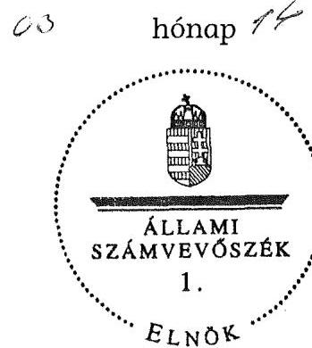

ÁLLAMI
SZÁMVEVŐSZÉK

# JELENTÉS 

Mártély Község Önkormányzata belső kontrollrendszerének kialakítása, valamint egyes kontrolltevékenységek és a belső ellenőrzés működése ellenőrzéséről

---

# Állami Számvevőszék 

Iktatószám: V-0012-058-006-036/2013.
Témaszám: 1051.
Vizsgálat-azonosító szám: V059106

## Az ellenőrzést felügyelte:

Dr. Benedek Mária
felügyeleti vezető
2012. december 16. napjától

Gyüre Lajosné
felügyeleti vezető
2012. december 15. napjáig

## Az ellenőrzést vezette:

## Szakmányné Bilik Mária

ellenőrzésvezető
A számvevőszéki jelentés összeállításában közreműködtek:
Dr. Láng Ágnes Krisztina
számvevő
Renner Andrea
számvevő
Az ellenőrzést végezték:
Kisapáti Angéla Lödiné Cser Zsuzsanna
számvevő tanácsos számvevő főtanácsos

---

# TARTALOMJEGYZÉK 

BEVEZETÉS ..... 5
I. ÖSSZEGZŐ MEGÁLLAPÍTÁSOK, KÖVETKEZTETÉSEK, JAVASLATOK ..... 8
II. RÉSZLETES MEGÁLLAPÍTÁSOK ..... 15

1. Az önkormányzat belső kontrollrendszere kialakításának megfelelősége ..... 15
1.1. A kontrollkörnyezet kialakítása ..... 15
1.2. A kockázatkezelési rendszer szabályozása ..... 16
1.3. A kontrolltevékenységek kialakítása ..... 16
1.4. Az információs és kommunikációs rendszer szabályozása ..... 17
1.5. A monitoring rendszer szabályozása ..... 17
2. A pénzügyi folyamatokban kulcsszerepet betöltő belső kontrollok (szakmai teljesítésigazolás és utalvány ellenjegyzés) működése ..... 18
3. A belső ellenőrzés szervezeti keretei és működése ..... 21

## FÜGGELÉKEK

1. számú Értelmező szótár
2. számú A belső kontrollrendszer kialakítása, a pénzügyi folyamatokban kulcsszerepet betöltő szakmai teljesítésigazolás és utalvány ellenjegyzés kontrollok működése, valamint a belső ellenőrzés működése értékelésénél alkalmazott minősítési szempontok

---

.

---

# RÖVIDÍTÉSEK JEGYZÉKE 

## Törvények

ÁSZ tv.
Avtv.

Info tv.

Ötv.
régi Áht.
új Áht.

## Rendeletek

Áhsz.

Ámr.
Ávr.

Ber.
Bkr.
önkormányzati SZMSZ

## Szórövidítések

adatvédelmi szabályzat
alapító okirat
ÁSZ
Belső ellenőrzési kézikönyv
Belső Kontroll Kézikönyv

2011. évi LXVI. törvény az Állami Számvevőszékről
1992. évi LXIII. törvény a személyes adatok védelméről és a közérdekű adatok nyilvánosságáról (hatálytalan 2012. január 1-jétől)
2011. évi CXII. törvény az információs önrendelkezési jogról és az információszabadságról (hatályos 2012. január 1-jétől)
1990. évi LXV. törvény a helyi önkormányzatokról az államháztartásról szóló 1992. évi XXXVIII. törvény (hatálytalan 2012. január 1-jétől)
2011. évi CXCV. törvény az államháztartásról (hatályos 2012. január 1-jétől)

249/2000. (XII. 24.) Korm. rendelet az államháztartás szervezetei beszámolási és könyvvezetési kötelezettségének sajátosságairól
292/2009. (XII. 19.) Korm. rendelet az államháztartás működési rendjéről (hatálytalan 2012. január 1-jétől)
368/2011. (XII. 31.) Korm. rendelet az államháztartásról szóló törvény végrehajtásáról (hatályos 2012. január 1jétől)
193/2003. (XI. 26.) Korm. rendelet a költségvetési szervek belső ellenőrzéséről (hatálytalan 2012. január 1-jétől)
370/2011. (XII. 31.) Korm. rendelet a költségvetési szervek belső kontrollrendszeréről és belső ellenőrzéséről (hatályos 2012. január 1-jétől)
4/2003. (III. 25.) Ök. rendelet Mártély Község Önkormányzat Képviselő-testülete és szervei Szervezeti és Működési Szabályzata kiadásáról (hatályos 2003. április 1jétől)

Mártély Község Polgármesteri Hivatala Adatvédelmi szabályzata (hatályos 2007. október 31-től 2012. március 1-ig)
Mártély Község Önkormányzat Polgármesteri Hivatalának Alapító okirata (hatályos 2011. október 5-től)
Állami Számvevőszék
Belső ellenőrzési kézikönyv (hatályos 2004. június 15-től)
Az Ámr. 155. § (1) bekezdése, valamint az államháztartási belső kontroll standardokról szóló 1/2009. (IX. 11.) PM irányelv egységes értelmezése érdekében az államháztartásért felelős miniszter által 2010. évben kiadott Belső Kontroll Kézikönyv

---

| FEUVE | folyamatba épített, előzetes, utólagos és vezetői ellenőrzés |
| :--: | :--: |
| FEUVE szabályzat | Mártély Község Polgármesteri Hivatal FEUVE (rendszer)   szabályzata (hatályos 2007. június 1-jétől) |
| gazdasági program | Mártély Község Önkormányzat 2010-2014. évekre szóló   Gazdasági programja |
| hivatali SZMSZ | Mártély Község Önkormányzata Polgármesteri Hivatala-   nak Ügyrendje (hatályos 2007. szeptember 26-tól, a Pol-   gármesteri Hivatal szervezeti és működési szabályait tar-   talmazza) |
| informatikai biztonsági   szabályzat | Mártély Község Önkormányzata Polgármesteri Hivatalá-   nak Informatikai biztonsági szabályzata (hatályos 2007.   szeptember 1-jétől) |
| iratkezelési szabályzat | Mártély Község Önkormányzata Polgármesteri Hivatalá-   nak Egyedi iratkezelési szabályzata (hatályos 2007. szeptem-   ber 7-től) |
| jegyző | Mártély Község Önkormányzatának jegyzője |
| KAM szabályzat | Mártély Község Önkormányzatának és Polgármesteri   Hivatalának Közérdekű adatok megismerésére irányuló   igények teljesítésének rendjét rögzítő szabályzata (hatá-   lyos 2008. október 1-jétől) |
| Képviselő-testület   kockázatkezelési sza-   bályzat | Mártély Község Önkormányzatának Képviselő-testülete   Mártély Község Önkormányzata Polgármesteri Hivatalá-   nak Kockázatkezelési szabályzata (FEUVE szabályzat VIII.   fejezete és 4. számú melléklete együttesen, hatályos 2007.   június 1-jétől) |
| Önkormányzat   polgármester | Mártély Község Önkormányzata   Mártély Község Önkormányzatának polgármestere |
| Polgármesteri Hivatal | Mártély Község Önkormányzatának Polgármesteri Hiva-   tala |
| szabálytalanságkezelési   szabályzat | Mártély Község Polgármesteri Hivatalának Szabálytalan-   ságkezelési szabályzata (FEUVE szabályzat IX. fejezete,   hatályos 2007. június 1-jétől) |
| utalványozási szabály-   zat | Mártély Község Önkormányzata Polgármesteri Hivatalá-   nak Utalványozási szabályzata a pénzgazdálkodással   összefüggő kötelezettségvállalási, utalványozási, érvénye-   sítési és ellenjegyzési jogkörök gyakorlásáról és annak   rendjéről (hatályos 2005. október 1-jétől) |

---

# JELENTÉS 

## Mártély Község Önkormányzata belső kontrollrendszerének kialakítása, valamint egyes kontrolltevékenységek és a belső ellenőrzés működése ellenőrzéséről

## BEVEZETÉS

A belső kontrollrendszer kialakítását, működtetését és fejlesztését a régi Áht. és az új Áht. is előírja. Ennek megvalósításáért a költségvetési szerv vezetője, a jegyző felel. A belső kontrollrendszer azt a célt szolgálja, hogy a költségvetési szervek működésük és gazdálkodásuk során a tevékenységeket szabályszerűen, gazdaságosan, hatékonyan, eredményesen hajtsák végre, teljesítsék elszámolási kötelezettségeiket és megvédjék az erőforrásokat a veszteségektől, a károktól és a nem rendeltetésszerű használattól. A belső kontrollrendszer magában foglalja mindazon szabályokat, eljárásokat, gyakorlati módszereket és szervezeti struktúrákat, kockázatkezelési technikákat, kontrolltevékenységeket, amelyek segítséget nyújtanak a szervezetnek céljai eléréséhez.

Az ÁSZ a 2011-2015. évekre szóló stratégiájában hangsúlyos szerepet szánt annak, hogy szilárd szakmai alapon álló, értékteremtő ellenőrzéseivel előmozdítsa a közpénzügyek átláthatóságát, rendezettségét. A számvevőszéki ellenőrzés nemzetközi alapelvei is rögzítik, hogy a megfelelő belső kontrollrendszer minimálisra csökkenti a hibák és szabálytalanságok kockázatát.

Az ellenőrzés célja annak értékelése volt, hogy az Önkormányzat a jogszabályi előírásoknak megfelelően alakította-e ki a belső kontrollrendszert; a gazdálkodás folyamatában kulcsszerepet betöltő szakmai teljesítésigazolás és az utalvány ellenjegyzés kontrolltevékenységeit megfelelően működtette-e; biztosította-e a belső ellenőrzés szabályos és eredményes működését.

Az ÁSZ ezen ellenőrzési céljait pilot (próba) jelleggel községi/nagyközségi önkormányzatoknál végzett ellenőrzések során érvényesítette.

Az ellenőrzés típusa: szabályszerűségi ellenőrzés
Az ellenőrzés jogszabályi alapja: az ÁSZ tv. 5. § (2) és (6) bekezdései
Az ellenőrzött szervezet: az Önkormányzat (ezen belül kiemelten a Polgármesteri Hivatal)

Az ellenőrzött időszak: a belső kontrollrendszer kialakításának megfelelőségét a 2011. évre vonatkozóan értékeltük. A kontrolltevékenységek működésének megfelelőségét a 2011. január 1-je és december 31-e, míg a belső ellenőrzés

---

működésének szabályosságát és eredményességét a 2009. január 1-je és 2011. december 31-e közötti időszakot figyelembe véve értékeltük. A helyszíni ellenőrzés lezárásáig a helyi szabályozás változásait nyomon követtük.

Az ellenőrzés szakmai módszertana az Állami Számvevőszék Ellenőrzési Kézikönyvében foglalt szakmai szabályokon alapult, amely a Legfelsőbb Ellenőrző Intézmények Nemzetközi Szervezete (INTOSAI) által kiadott nemzetközi standardok (ISSAI) figyelembevételével készült.

A belső kontrollrendszer kialakításának ellenőrzése során értékeltük a Polgármesteri Hivatalban a kontrollkörnyezet, a kockázatkezelési rendszer, a kontrolltevékenységek, az információs és kommunikációs rendszer, valamint a monitoring rendszer szabályozottságának megfelelőségét.

A Polgármesteri Hivatalban értékeltük a pénzügyi folyamatokban kulcsszerepet betöltő szakmai teljesítés igazolás és az utalvány ellenjegyzés kontrollok működésének megfelelőségét az államháztartáson kívülre teljesített működési és felhalmozási célú pénzeszköz átadásoknál, az állományba nem tartozók megbízási díjainál, továbbá a külső szolgáltatók által végzett karbantartási, kisjavítási munkákkal kapcsolatos kifizetéseknél. Az egyszerű véletlen mintavétellel kiválasztott tételek ellenőrzését többlépcsős megfelelőségi tesztek útján addig végeztük, amíg elegendő és megfelelő bizonyítékot szereztünk az ellenőrzött folyamatok kulcskontrolljai működésének megfelelő vagy nem megfelelő voltáról.

Értékeltük az Önkormányzatnál a belső ellenőrzés működésének szabályosságát és eredményességét.

Az egyes fogalmak magyarázatát az 1. számú függelék, az ellenőrzés egyes területeinek értékelésénél alkalmazott egységes minősítési szempontokat a 2. számú függelék tartalmazza.

Az ellenőrzés lefolytatásához az Önkormányzat a munkalapok és a tanúsítvány elektronikus kitöltésével, valamint a megjelölt dokumentumok elektronikus megküldésével szolgáltatott adatokat. A munkalapokon szerepeltetett adatok, információk ellenőrzése és szükség szerinti javítása a helyszíni ellenőrzés keretében történt.

Az ÁSZ az ellenőrzés megállapításait az ellenőrzött időszakban hatályos, az intézkedést igénylő megállapításokra tett javaslatokat a jelenleg hatályos jogszabályok alapján fogalmazta meg.

Az ÁSZ tv. 29. § (1) bekezdése szerint a jelentéstervezetet megküldtük a polgármester részére, aki az ÁSZ tv. 29. § (2) bekezdésében foglalt észrevételezési jogával nem élt, a jelentéstervezetre észrevételt nem tett.

Mártély község állandó lakosainak száma 2011. január 1-jén 1296 fő volt. Az Önkormányzat héttagú Képviselő-testületének munkáját kettő állandó bizottság segítette. Az Önkormányzat az önállóan működő és gazdálkodó Polgármesteri Hivatalon kívül három önállóan működő intézménnyel látta el feladatát. Az Önkormányzat egy többségi tulajdoni hányadú gazdasági társasággal rendelkezett. A polgármester az 1994. évi önkormányzati választások óta tölti

---

be tisztségét. A jegyző 2007. november 1-jétől látta el feladatait. A Polgármesteri Hivatalban foglalkoztatott köztisztviselők száma 2011. január 1-jén 7 fő volt, a Hivatal szervezeti egységekre nem tagolódott.

Az Önkormányzat a 2011. évi költségvetési beszámolója szerint 253,2 millió Ft költségvetési bevételt ért el, 249,8 millió Ft költségvetési kiadást teljesített. A 2011. december 31-i könyvviteli mérleg szerint 1799 millió Ft értékű eszközvagyonnal rendelkezett, 10,9 millió Ft hosszú lejáratú, 55,7 millió Ft rövid lejáratú kötelezettsége volt.

---

# I. ÖSSZEGZŐ MEGÁLLAPÍTÁSOK, KÖVETKEZTETÉSEK, JAVASLATOK 

A belső kontrollrendszer kialakítása a Polgármesteri Hivatalban 2011-ben a kontrollkörnyezet, a kockázatkezelési rendszer, a kontrolltevékenységek, az információs és kommunikációs rendszer, valamint a monitoring rendszer szabályozásának, illetve kialakításának értékelése alapján összességében nem felelt meg a jogszabályi előírásoknak.

A kontrollkörnyezet kialakítása részben felelt meg a jogszabályi előírásoknak. A jegyző elkészítette a gazdálkodást érintő legfontosabb szabályzatokat, azonban a hivatali SZMSZ, az Ámr.-ben foglaltak ellenére, nem tartalmazta az ellátandó, és a szakfeladatrend szerint besorolt alaptevékenységek, valamint az alaptevékenységeket szabályozó jogszabályok megjelölését. A jegyző nem határozta meg a hivatali SZMSZ-ben nevesített valamennyi munkakörhöz tartozó feladat- és hatásköröket, a hatáskörök gyakorlásának módját, az ezekhez kapcsolódó felelősségi szabályokat. A hivatali SZMSZ nem tartalmazta a Polgármesteri Hivatal szervezeti ábráját, valamint az irányító szerv által a Polgármesteri Hivatalhoz rendelt más költségvetési szervek felsorolását. Ezek a hiányosságok korlátozzák a feladatellátás számon kérhetőségét, folyamatosságának biztosítását.

A kockázatkezelési rendszer szabályozása a jogszabályi előírásoknak részben megfelelt. A jegyző a kockázatkezelési szabályzatban meghatározta az Önkormányzat tevékenységében és gazdálkodásában rejlő kockázatokat, azonban az Ámr.-ben előírt, az egyes kockázatokkal (pl. korrupciós kockázatokkal) kapcsolatos intézkedéseket és megtételük módját hiányosan határozta meg.

A kontrolltevékenységek kialakítása a jogszabályi előírásoknak részben felelt meg, mivel a jegyző szabályozta az érvényesítés rendjét, kijelölte az érvényesítésre jogosultakat, azonban az Ámr. előírásait figyelmen kívül hagyva nem szabályozta a szakmai teljesítésigazolás módját, rendjét. A kontrolltevékenységek hiányos kialakítása kockázatot jelent a feladatok szabályszerű végrehajtása során.

Az információs és kommunikációs rendszer szabályozása nem felelt meg a jogszabályi követelményeknek, mivel a jegyző az informatikai rendszer környezetének szabályozása során, az Avtv. rendelkezése ellenére, elmulasztotta az adatbiztonság érvényre juttatásához szükséges intézkedések megtételét. Nem határozta meg a hozzáférési jogosultságokat, nem rendelkezett a hozzáférési jogosultságokkal kapcsolatos nyilvántartásokról, eljárásrendről, nem határozta meg a pénzügyi-számviteli szoftverváltozások ellenőrzésére, tesztelésére vonatkozó eljárásokat, a pénzügyi-számviteli rendszerben a feldolgozott adatok mentési eljárásait és felelősségi viszonyait.

---

A monitoring rendszer szabályozása megfelelt a jogszabályi előírásoknak, mivel a
 jegyző meghatározta a kiemelt közszolgáltatások teljesítményének nyomon követésére szolgáló mutatószámokat és előírta alakulásuk értékelését.

A Polgármesteri Hivatalban a 2011. évben az államháztartáson kívülre történő működési és felhalmozási célú pénzeszközátadásokkal, az állományba nem tartozók megbízási díjaival, valamint a külső szolgáltatók által végzett karbantartással, kisjavítással kapcsolatos kifizetések során összefoglalóan értékelve a kulcskontrollok működésének megfelelősége gyenge volt.

Az államháztartáson kívülre történő működési és felhalmozási célú pénzeszközátadásokkal kapcsolatos kiadások teljesítését megelőzően a szakmai teljesítés igazolását nem végezték el. Az állományba nem tartozók megbízási díjai és a külső szolgáltatók által végzett karbantartással, kisjavítással kapcsolatos kifizetések esetében az Ámr.-ben foglaltak ellenére a szakmai teljesítés igazolását olyan személyek látták el, akiket a jegyző nem jelölt ki a feladatra, illetve akiknek aláírás mintája az Ámr.-ben előírt nyilvántartásban nem szerepelt, így a feladat elvégzésére nem voltak jogosultak. A nyilvántartásra vonatkozó hiányosságot 2012-ben megszüntették.

Az utalványok ellenjegyzője aláírása ellenére nem tett eleget az Ámr.-ben előírt ellenőrzési kötelezettségének, mivel nem kifogásolta, hogy a kifizetések szakmai teljesítés igazolását nem, vagy arra nem jogosult személyek végezték el. Az Ámr. előírása ellenére nem győződött meg a gazdálkodásra - köztük a kötelezettségvállalások írásba foglalására, azok ellenjegyzésére, a kötelezettségvállalások nyilvántartásba vételére és a nyilvántartási szám utalványrendeleten történő feltüntetésére - vonatkozó szabályok betartásáról.

A számvevőszéki ellenőrzés az ellenőrzött kifizetésekkel összefüggésben jogosulatlan kifizetést nem tárt fel, azonban a gazdálkodásban kulcsszerepet betöltő kontrollok működésében feltárt hiányosságok miatt fennáll a hibák bekövetkezésének kockázata.

Az Önkormányzat a belső ellenőrzési feladatok elvégzésére gazdasági társaságot bízott meg. Az Önkormányzatnál a 2009-2011. években a belső ellenőrzés szabályozása és működése összességében nem felelt meg a jogszabályi előírásoknak. A belső ellenőr az egyes ellenőrzésekhez önálló ellenőrzési programot a Ber.-ben előírtak ellenére nem készített. A belső ellenőri jelentések csak részben feleltek meg a Ber.-ben előírt tartalmi követelményeknek, mivel a jelentések megállapításai tartalmi tévedéseket tartalmaztak, illetve a javaslattétel annak ellenére elmaradt, hogy az indokolt lett volna.

A Magyar Államkincstár a 2011. évben az Önkormányzat állami normatív támogatás visszafizetési kötelezettségét állapította meg, annak ellenére, hogy a belső ellenőrzés azok elszámolását minden évben ellenőrizte és megfelelőnek értékelte. A Képviselő-testület intézkedett a visszafizetési kötelezettség belső ellenőrzést végző társasággal történő megosztásáról. A belső ellenőrzést ellátó gazdasági társaság felmondásának elfogadását követően a belső ellenőrzési feladatok ellátására más gazdasági társasággal kötöttek vállalkozási szerződést.

---

A belső ellenőrzés működése a 2009-2011. években nem volt eredményes, mivel a belső ellenőrzés szabályozása és működése az ellenőrzött időszak egészét tekintve a jogszabályi előírásoknak nem felelt meg. Ellenőrizték a gazdálkodási jogkörök gyakorlásához, valamint a készpénzkezeléshez kapcsolódó belső kontrollok működését, az önkormányzati vagyon hasznosítása területén a vagyongazdálkodási szabályok betartását, a kötelező belső szabályzatok elkészítését. Az Önkormányzat végrehajtható javaslatok hiányában nem tudott intézkedni az elvégzett ellenőrzések javaslatainak hasznosításáról, a feltárt hibák, hiányosságok kijavításáról. A belső ellenőrzés működésében megállapított hiányosságok nem biztosították, hogy a belső ellenőrzés megelőzze, feltárja, kijavíttassa a lényeges hibákat és szabálytalanságokat.

Az ÁSZ tv. 33. § (1) bekezdésében foglaltak értelmében az ellenőrzött szervezet vezetője köteles a jelentésben foglalt megállapításokhoz kapcsolódó intézkedési tervet összeállítani, és azt a jelentés kézhezvételétől számított 30 napon belül az ÁSZ részére megküldeni. Amennyiben az intézkedési tervet határidőn belül nem küldi meg a szervezet, vagy az az ÁSZ tv. 33. § (2) bekezdésében foglalt póthatáridő eltelte ellenére továbbra sem elfogadható, az ÁSZ elnöke a hivatkozott törvény 33. § (3) bekezdés a)-b) pontjaiban foglaltakat érvényesítheti.

Az ellenőrzés intézkedést igénylő megállapításai és javaslatai:

# a polgármesternek 

1.  A Mártélyi Óvodáért Alapítvány részére, a védőnői feladatra és a karbantartási, kisjavítási szolgáltatásokra teljesített kifizetéseknél a kötelezettségvállalás ellenjegyzése az Ámr. 74. § (1) bekezdésben foglaltak ellenére elmaradt.

Javaslat:
Biztosítsa, hogy az Önkormányzat nevében történő kötelezettségvállalásra, az új Áht. 37. § (1) bekezdésében foglaltaknak megfelelően, pénzügyi ellenjegyzés után kerüljön sor.
2.  A szakmai teljesítésigazolást, az államháztartáson kívülre történő működési és felhalmozási célú pénzeszközátadásokkal kapcsolatos kiadások teljesítését megelőzően, az Ámr. 76. § (1) bekezdés előírása ellenére nem végezték el, illetve azt az állományba nem tartozók megbízási díjai és a külső szolgáltatók által végzett karbantartással, kisjavítással kapcsolatos kifizetések esetében, az Ámr. 76. § (5) bekezdésében foglaltak ellenére, nem a jegyző által kijelölt személyek végezték. Az utalványok ellenjegyzője az államháztartáson kívülre teljesített működési és felhalmozási célú pénzeszközátadások, az állományba nem tartozók megbízási díjai és a külső szolgáltatók által végzett karbantartással, kisjavítással kapcsolatos kifizetések esetében, aláírása ellenére, nem tett eleget az Ámr. 79. § (2) bekezdésében foglalt ellenőrzési kötelezettségének, valamint nem győződött meg a gazdálkodásra - köztük az Ámr. 74. § (1) bekezdésében előírt, a kötelezettségvállalások írásba foglalására és ellenjegyzésére, az Ámr. 75. § (1) bekezdésében foglalt, a kötelezettségvállalások nyilvántartásba vételére és az Ámr. 78. § (2) bekezdés g) pontja szerinti, a kötelezettségvállalások nyilvántartási számának utalványrendeleten történő feltüntetésére - vonatkozó szabályok betartásáról.

---

Javaslat:
Intézkedjen a számvevőszéki jelentésben rögzített, a szakmai teljesítésigazolás és az utalvány ellenjegyzés kontrollokkal összefüggő hiányosságok és szabálytalanságok tekintetében az esetleges munkajogi felelősséggel kapcsolatos körülmények kivizsgálásáról.

# a jegyzőnek 

1.  a kontrollkörnyezet szabályozásával kapcsolatban:

A jegyző a hivatali SZMSZ-ben az Ámr. 20. § (2) bekezdés c), h), i) és k) pontjaiban foglaltak ellenére nem rögzítette az ellátandó és a szakfeladatrend szerint besorolt alaptevékenységek, valamint az alaptevékenységet szabályozó jogszabályok megjelölését. Nem határozta meg a hivatali SZMSZ-ben nevesített valamennyi munkakörhöz tartozó feladat- és hatásköröket, a hatáskörök gyakorlásának módját, az ezekhez kapcsolódó felelősségi szabályokat. A hivatali SZMSZ nem tartalmazta a költségvetési szerv szervezeti ábráját, az irányító szerv által a költségvetési szervhez rendelt más költségvetési szervek felsorolását.

A jegyző a hivatali SZMSZ-ben - az Ámr. 20. § (7) bekezdésének a gazdasági szervezet ügyrendjének tartalmára vonatkozó előírása ellenére - nem szabályozta a pénzügyi-gazdasági feladatok munkafolyamatainak leírását, a pénzügyi-gazdasági feladatok ellátásáért felelős vezető és alkalmazottak feladat- és hatáskörét.

Javaslat:
a) Módosítsa a hivatali SZMSZ-t és kezdeményezze a polgármesternél a módosítás Képviselő-testület elé terjesztését annak érdekében, hogy az az Ávr. 13. § (1) bekezdés c), e), g) és i) pontjaiban foglaltaknak megfelelően tartalmazza a Polgármesteri Hivatal által ellátandó és a szakfeladatrend szerint besorolt alaptevékenységeket, a hivatali SZMSZ-ben nevesített munkakörhöz tartozó feladat- és hatásköröket, azok gyakorlásának módját, a felelősségi szabályokat, a Polgármesteri Hivatal szervezeti ábráját és a hozzárendelt költségvetési szervek felsorolását.
b) Egészítse ki a hivatali SZMSZ-t és kezdeményezze a polgármesternél a módosítás Képviselő-testület elé terjesztését annak érdekében, hogy az Ávr. 13. § (5) bekezdésében foglaltaknak megfelelően tartalmazza a pénzügyi-gazdasági feladatok munkafolyamatainak leírását, a vezető és a pénzügyi-gazdasági feladatok ellátásáért felelős alkalmazottak feladat- és hatáskörét.

---

2.  a kontrolltevékenységek kialakításával kapcsolatban:

A jegyző, az Ámr. 20. § (3) bekezdés a) pontjában foglalt előírást figyelmen kívül hagyva, nem szabályozta a teljesítésigazolás módját, rendjét.

Javaslat:
Egészítse ki az utalványozási szabályzatot az Ávr. 13. § (2) bekezdés a) pontjában foglaltak alapján a teljesítésigazolás módjának, rendjének szabályozásával.
3.  az információs és kommunikációs rendszer kialakításával kapcsolatban:

A jegyző, az Avtv. 10. § (1)-(2) bekezdéseiben foglalt előírások ellenére, elmulasztotta az adatbiztonság érvényre juttatásához szükséges intézkedések megtételét. Nem rendelkezett a hozzáférési jogosultságok megállapításáról, betartásának ellenőrzéséről és nyilvántartásáról. Nem szabályozta a pénzügyi-számviteli szoftverváltozások ellenőrzésére, tesztelésére vonatkozó eljárásokat, a pénzügyi-számviteli rendszerben feldolgozott adatok mentési eljárásait, és nem jelölte ki a mentések felelőseit.

Javaslat:
Biztosítsa az Info tv. 7. § (2) bekezdésének megfelelően az adatbiztonság érvényesülését, rendelkezzen a hozzáférési jogosultságok megállapításáról, betartásának ellenőrzéséről és nyilvántartásáról. Szabályozza a pénzügyi-számviteli szoftverváltozások ellenőrzésére, tesztelésére vonatkozó eljárásokat, a pénzügyi-számviteli rendszerben feldolgozott adatok mentési eljárásait, és jelölje ki a mentések felelőseit.
4.  a pénzügyi folyamatokban kulcsszerepet betöltő kontrollok működésével kapcsolatban:

Az államháztartáson kívülre történő működési és felhalmozási célú pénzeszközátadásokkal kapcsolatos kiadások teljesítését megelőzően a szakmai teljesítés igazolását az Ámr. 76. § (1) bekezdés előírása ellenére nem végezték el. Az állományba nem tartozók megbízási díjai és a külső szolgáltatók által végzett karbantartással, kisjavítással kapcsolatos kifizetések esetében, az Ámr. 76. § (5) bekezdésében foglaltak ellenére, a szakmai teljesítés igazolását nem a jegyző által kijelölt személyek végezték.

Az utalványok ellenjegyzője aláírása ellenére nem tett eleget az Ámr. 79. § (2) bekezdésében foglalt ellenőrzési kötelezettségének, mivel nem kifogásolta, hogy a kifizetések szakmai teljesítésigazolását nem, vagy arra nem jogosult személyek végezték el. Nem győződött meg a gazdálkodásra - köztük az Ámr. 74. § (1) bekezdésében előírt, a kötelezettségvállalások írásba foglalására és ellenjegyzésére, az Ámr. 75. § (1) bekezdésében foglalt, a kötelezettségvállalások nyilvántartásba vételére és az Ámr. 78. § (2) bekezdés g) pontja szerinti, a kötelezettségvállalások nyilvántartási számának utalványrendeleten történő feltüntetésére - vonatkozó szabályok betartásáról.

Javaslat:

---

Az operatív gazdálkodás során a működésbeli hibák megelőzése, feltárása és kijavítása érdekében gondoskodjon arról, hogy
a) az Ávr. 57. § (3) bekezdése szerinti teljesítésigazolást az Ávr. 57. § (4) bekezdése figyelembevételével kijelölt személyek végezzék el, és az Ávr. 57. § (1) bekezdésében foglaltaknak megfelelően a teljesítésigazolás során ellenőrizzék a kiadások teljesítésének jogosságát, összegszerűségét, valamint ellenszolgáltatást is magában foglaló kötelezettségvállalás esetében a szerződés, megrendelés teljesítését;
b) az érvényesítő, az Ávr. 58. § (1) bekezdése szerint, a kifizetést megelőzően a teljesítésigazolás alapján ellenőrizze az összegszerűséget és azt, hogy a megelőző ügymenetben az Áht., az Áhsz., az Ávr. előírásait és a belső szabályzatokban foglaltakat betartották-e;
c) az Önkormányzat nevében történő kötelezettségvállalásra, az új Áht. 37. § (1) bekezdésében foglaltaknak megfelelően, minden esetben pénzügyi ellenjegyzés után kerüljön sor;
d) az Ávr. 56. § (1) bekezdésében előírt kötelezettségvállalások nyilvántartását vezessék, és az utalványrendeleteken az Ávr. 59. § (3) bekezdés f) pontjában foglaltaknak megfelelően feltüntetésre kerüljön a kötelezettségvállalás nyilvántartási száma.
5.  a belső ellenőrzés működésével kapcsolatban:

A belső ellenőr az ellenőrzésekhez ellenőrzési programot a Ber. 23. § (1) bekezdésében foglaltak ellenére nem készített.

Az ellenőrzési jelentések, a Ber. 27. § (2) bekezdés j) pontjában előírtak ellenére, nem minden esetben tartalmaztak végrehajtható javaslatokat az ellenőrzött szervezetek számára.

Javaslat:
a) Gondoskodjon arról, hogy a belső ellenőrzéseket a Bkr. 33. §-ának megfelelően készült ellenőrzési program alapján végezzék.

[^0]
[^0]:    ${ }^{1}$ Az utalvány ellenjegyzőjének feladatait a 2012. január 1-jétől hatályos új Áht. 38. § (1) bekezdése és az Ávr. 58. § (1) bekezdései alapján az érvényesítő látja el.

---

b) Intézkedjen, hogy a belső ellenőrzési jelentések a Bkr. 39. §-ában meghatározott tartalmi követelményeknek megfeleljenek, az ellenőrzött szervezetek számára végrehajtható javaslatokat fogalmazzanak meg, továbbá a belső ellenőrzés által tett javaslatok alapján - a Bkr. 45. § (1)-(3) bekezdéseiben előírtak szerint - az ellenőrzött szervek intézkedési tervet készítsenek.

---

# II. RÉSZLETES MEGÁLLAPÍTÁSOK 

## 1. AZ ÖNKORMÁNYZAT BELSŐ KONTROLLRENDSZERE KIALAKÍTÁSÁNAK MEGFELELŐSÉGE

### 1.1. A kontrollkörnyezet kialakítása

A kontrollkörnyezet kialakítása a Polgármesteri Hivatalban részben volt megfelelő. A Polgármesteri Hivatal rendelkezett hivatali SZMSZ-szel, a Képviselő-testület elfogadta a 2010-2014. évekre szóló gazdasági programját és a Polgármesteri Hivatal alapító okiratát. A jegyző kialakította a gazdálkodást érintő legfontosabb szabályzatokat, azonban

- a hivatali SZMSZ-ben, az Ámr. 20. § (2) bekezdés c), h), i) és k) ${ }^{2}$ pontjaiban foglaltak ellenére, nem rögzítette az ellátandó és a szakfeladatrend szerint besorolt alaptevékenységek, valamint az alaptevékenységet szabályozó jogszabályok megjelölését. Nem határozta meg a hivatali SZMSZ-ben nevesített valamennyi munkakörhöz tartozó feladat- és hatásköröket, a hatáskörök gyakorlásának módját, és az ezekhez kapcsolódó felelősségi szabályokat. A hivatali SZMSZ nem tartalmazta a költségvetési szerv szervezeti ábráját, és az irányító szerv által a költségvetési szervhez rendelt más költségvetési szervek felsorolását;
- a hivatali SZMSZ-ben ${ }^{3}$ - az Ámr. 20. § (7) bekezdésének ${ }^{4}$ a gazdasági szervezet ügyrendjének tartalmára vonatkozó előírása ellenére - nem szabályozta a pénzügyi-gazdasági feladatok munkafolyamatainak leírását, a pénzügyigazdasági feladatok ellátásáért felelős vezető és alkalmazottak feladat- és hatáskörét.

A kontrollkörnyezet kialakítása során a jegyző

- A Belső Kontroll Kézikönyv ${ }^{5}$ 1.2.7. SZMSZ pontjában foglalt ajánlást nem hasznosította, mert nem írta elő a hivatali SZMSZ munkatársak általi megis-

[^0]
[^0]:    ${ }^{2}$ 2012. január 1-jétől az Ávr. 13. § (1) bekezdés c), e) g) és i) pontjai rögzítik a költségvetési szerv SZMSZ-ének hivatkozott tartalmi követelményeit.
    ${ }^{3}$ Az önkormányzati SZMSZ-ben és a hivatali SZMSZ-ben foglaltak szerint a Polgármesteri Hivatal egységes szervezetként működik, nincs elkülönített gazdasági szervezete. Az Ámr. 16. § (2)-(3) bekezdése alapján a Polgármesteri Hivatal látja el az Ámr. 15. § (2) bekezdése szerinti gazdálkodási feladatokat.
    ${ }^{4}$ 2012. január 1-jétől az Ávr. 13. § (5) bekezdése tartalmazza a költségvetési szerv szervezeti egységei ügyrendjének tartalmi követelményeit.
    ${ }^{5}$ A 2011. évben az Ámr. 155. § (1) bekezdése szerint a belső kontrollok kialakítása során a költségvetési szerv vezetője figyelembe veszi az államháztartásért felelős miniszter által közzétett, az államháztartási belső kontroll standardokra vonatkozó irányelvet. 2012. január 1-jétől a Bkr. 5. § (1) bekezdése értelmében a költségvetési szervek belső kontrollrendszerét az államháztartásért felelős miniszter által közzétett módszertani útmutatók megfelelő alkalmazásával kell kialakítani és működtetni.

---

merésének kötelezettségét, és a hivatali SZMSZ dolgozók általi megismerése nem történt meg;

- a Belső Kontroll Kézikönyv 1.5.2. pontjában foglalt ajánlást nem érvényesítette, mivel nem dolgozta ki a Polgármesteri Hivatalban ellátott köztisztviselői munkakörök betöltésére vonatkozó elvárt tudást és képességeket;
- a Belső Kontroll Kézikönyv 1.6. pontjában foglaltakat figyelmen kívül hagyva nem intézkedett - a szervezeti célokkal összhangban álló - etikai értékek kiemelt kezeléséről, mivel nem határozta meg a köztisztviselőkkel szembeni etikai elvárásokat.

# 1.2. A kockázatkezelési rendszer szabályozása

A kockázatkezelési rendszer szabályozottsága a Polgármesteri Hivatalban részben megfelelő volt. A jegyző a kockázatkezelési szabályzatban meghatározta az Önkormányzat tevékenységében és gazdálkodásában rejlő kockázatokat, azonban az Ámr.-ben előírt, az egyes kockázatokkal (pl. korrupciós kockázatokkal) kapcsolatos intézkedéseket és megtételük módját hiányosan határozta meg.

A kockázatkezelési rendszer szabályozása során a jegyző

- a kockázatok meghatározása és felmérése során a Belső Kontroll Kézikönyv 2.1.4. pontjában foglalt ajánlást nem érvényesítette, mert az azonosított kockázati tényezőkről nem tájékoztatta a kockázati tényezőkkel érintett munkafolyamatok felelőseit;
- a kockázatok elemzése körében, a Belső Kontroll Kézikönyv 2.2.2. pontjában foglalt ajánlást figyelmen kívül hagyva, a Polgármesteri Hivatalban nem dokumentálták az azonosított kockázatok értékelésének eredményét;
- a Belső Kontroll Kézikönyv 2.4.2. pontjában és a kockázatkezelési szabályzatban foglaltakat nem hasznosította, mivel nem gondoskodott legalább évenként a kockázatok dokumentált felülvizsgálatáról és az ellenőrzött időszakban a kockázati tényezők felülvizsgálatának hatására intézkedést nem hozott;
- nem érvényesítette a Belső Kontroll Kézikönyv 2.5.1. pontjában foglalt ajánlást, mivel nem gondoskodott a csalás és korrupció, mint kiemelt kockázatok értékeléséről és kezeléséről.

### 1.3. A kontrolltevékenységek kialakítása

A kontrolltevékenységek kialakítása a Polgármesteri Hivatalban részben volt megfelelő. A jegyző szabályozta az érvényesítés rendjét, kijelölte az érvényesítésre jogosultakat, az előírt szakképesítéssel rendelkező személynek adott felhatalmazást a kötelezettségvállalás és utalványozás ellenjegyzésére. A kontrolltevékenységek keretében azonban a jegyző, az Ámr. 20. § (3) bekezdés a) pontjában ${ }^{6}$ foglalt előírást figyelmen kívül hagyva, nem szabályozta a szakmai teljesítésigazolás módját, rendjét. Az Ámr. 76. § (5) bekezdésében ${ }^{7}$ foglaltak

[^0]
[^0]:    ${ }^{6}$ 2012. január 1-jétől az Ávr. 13. § (2) bekezdés a) pontja rendelkezik a gazdálkodási jogkörök szabályozási kötelezettségéről.
    ${ }^{7}$ 2012. január 1-jétől az Ávr. 57. § (4) bekezdése rendelkezik a teljesítés igazolására jogosultak kijelöléséről.

---

ellenére - a számlálóbiztosi feladatra teljesített kifizetések kivételével - nem jelölte ki a szakmai teljesítésigazolásra jogosultakat, így a Polgármesteri Hivatalban a szakmai teljesítésigazolásra kijelölt személyekről az Ámr. 80. § (3) bekezdése ${ }^{8}$ szerinti nyilvántartással nem rendelkeztek ${ }^{9}$.

A kontrolltevékenységek kialakítása során a jegyző a Belső Kontroll Kézikönyv 3.2.3. pontjában foglaltakat figyelmen kívül hagyva nem mérte fel a kis létszámból adódó kockázatokat az összeférhetetlenség kiküszöbölése érdekében.

# 1.4. Az információs és kommunikációs rendszer szabályozása

Az információs és kommunikációs rendszer szabályozottsága a Polgármesteri Hivatalban nem volt megfelelő. A Polgármesteri Hivatal rendelkezett adatvédelmi, iratkezelési és informatikai biztonsági szabályzattal. A jegyző meghatározta a közérdekű adatok közzétételének, megismerési igényének teljesítési rendjét, azonban az informatikai rendszer környezetének szabályozása során, az Avtv. 10. § (1)-(2) bekezdéseiben foglalt előírások ellenére ${ }^{10}$, elmulasztotta az adatbiztonság érvényre juttatásához szükséges intézkedések megtételét. Nem rendelkezett a hozzáférési jogosultságok megállapításáról, betartásának ellenőrzéséről és nyilvántartásáról. Nem szabályozta a pénzügyi-számviteli szoftverváltozások ellenőrzésére, tesztelésére vonatkozó eljárásokat, a pénzügyi-számviteli rendszerben feldolgozott adatok mentési eljárásait és nem jelölte ki a mentések felelőseit.

Az információs és kommunikációs rendszer szabályozása során a jegyző

- az iktatási, iratkezelési rendszer kialakítása keretében a Belső Kontroll Kézikönyv 4.2.4. pontjában foglalt ajánlást nem érvényesítette, mert nem szabályozta az ügyintézési határidők nyomon követésének dokumentálását, a késedelmes ügyintézéssel kapcsolatos felelősséget;
- a szabálytalanságkezelés szabályozása keretében a Belső Kontroll Kézikönyv 4.3.3. pontjában foglalt ajánlást figyelmen kívül hagyva nem rögzítette a szabálytalanságot bejelentő védelmére vonatkozó előírásokat és kötelezettségeket.

### 1.5. A monitoring rendszer szabályozása

A monitoring rendszer szabályozottsága a Polgármesteri Hivatalban megfelelő volt. A jegyző meghatározta a kiemelt közszolgáltatások ${ }^{11}$ teljesít-

[^0]
[^0]:    ${ }^{8}$ 2012. január 1-jétől az Ávr. 60. § (3) bekezdése rendelkezik a gazdálkodási jogkörök gyakorlóinak naprakész nyilvántartásáról.
    ${ }^{9}$ A jegyző a 2012. január 1-jétől hatályos utalványozási szabályzatban kijelölte a teljesítés igazolására jogosultakat, és naprakész nyilvántartást vezet a teljesítésigazolásra kijelölt személyekről.
    ${ }^{10}$ 2012. január 1-jétől az Info tv. 7. § (2) bekezdése rögzíti az adatbiztonság érdekében szükséges szabályozási kötelezettséggel kapcsolatos előírást.
    ${ }^{11}$ Kiemelt közszolgáltatásnak tekintjük az Önkormányzat által ellátandó kötelező közszolgáltatások közül a pénzbeli szociális ellátást, a szociális alapszolgáltatásokat, az óvodai ellátásokat, valamint a jegyzői hatósági ügyintézést.

---

ményének nyomon követésére szolgáló mutatószámokat, előírta az indikátorok ${ }^{12}$ alakulásának nyomon követését és értékelését. Kialakította az Önkormányzat belső kontrollrendszerére irányuló monitoring rendszert.

A monitoring rendszer szabályozása keretében a jegyző

- a Belső Kontroll Kézikönyv 1.2.2. ajánlását nem érvényesítette, a szervezeti célok megvalósításának nyomon követése érdekében a lakosság, illetve a szolgáltatásokat igénybe vevők körében az önkormányzati feladatellátásra irányuló elégedettségi felméréseket nem végeztetett;
- a Belső Kontroll Kézikönyv 5.1.3. ajánlását nem hasznosította, mivel a 2011. évben a monitoring információk alapján jelentést, feljegyzést a FEUVE rendszer átalakítására, módosítására, az ellenőrzési nyomvonal módosítására, valamint a képviselő-testületi döntések előkészítéséhez nem készített.

A belső kontrollrendszer kialakítása a Polgármesteri Hivatalban 2011-ben a kontrollkörnyezet, a kockázatkezelési rendszer, a kontrolltevékenységek, az információs és kommunikációs rendszer, valamint a monitoring rendszer szabályozásának, illetve kialakításának értékelése alapján összességében nem felelt meg a jogszabályi előírásoknak.

# 2. A PÉNZÜGYI FOLYAMATOKBAN KULCSSZEREPET BETÖLTŐ BELSŐ KONTROLLOK (SZAKMAI TELJESÍTÉSIGAZOLÁS ÉS UTALVÁNY ELLENJEGYZÉS) MŰKÖDÉSE

A Polgármesteri Hivatalban a 2011. évben az államháztartáson kívülre teljesített működési és felhalmozási célú pénzeszközátadások során a szakmai teljesítésigazolás és az utalvány ellenjegyzés kulcskontrollok működésének megfelelősége gyenge volt, mivel

- a Mártélyi Óvodáért alapítvány részére, illetve magánszemély részére teljesített, közműfejlesztési támogatásra vonatkozó három kifizetést megelőzően az Ámr. 76. § (1) bekezdésében ${ }^{13}$ foglaltak ellenére - nem történt meg a kifizetés jogosságának és összegszerűségének szakmai teljesítésigazolása;
- az utalványok ellenjegyzője, aláírása ellenére, nem tett eleget az Ámr. 79. § (2) bekezdése ${ }^{14}$ szerinti ellenőrzési kötelezettségének, mivel nem észrevételezte a szakmai teljesítés igazolásának elmaradását az ellenőrzött négy kifizetésnél;
- az utalványok ellenjegyzője, aláírása ellenére, nem győződött meg az érvényesítés elvégzéséről. Az érvényesítő nem végezte el az Ámr. 77. § (1) bekez-

[^0]
[^0]:    ${ }^{12}$ Indikátorok alatt értjük a mérőszámokat, statisztikai adatokat, szakfeladatokhoz rendelt feladatmutatókat, teljesítménymutatókat.
    ${ }^{13}$ 2012. január 1-jétől az Ávr. 57. § (1) bekezdése szabályozza a teljesítést igazoló feladatait.
    ${ }^{14}$ 2012. január 1-jétől az új Áht. 38. § (1) bekezdése és az Ávr. 58. § (1) bekezdése tartalmazza a kifizetések utalványozása előtt a teljesítésigazolás megtörténtére vonatkozó ellenőrzési kötelezettséget.

---

désében ${ }^{15}$ foglalt ellenőrzési feladatait, mivel annak ellenére aláírásával igazolta a feladat elvégzését, hogy a szakmai teljesítés igazolása nem történt meg;

- az utalványok ellenjegyzője, aláírása ellenére, nem győződött meg a gazdálkodásra vonatkozó szabályok betartásáról, mivel nem észrevételezte, hogy a Mártélyi Óvodáért Alapítvány részére teljesített kifizetésnél a kötelezettségvállalás ellenjegyzése az Ámr. 74. § (1) bekezdésében ${ }^{16}$ előírtak ellenére nem történt meg. Nem kifogásolta, hogy az ellenőrzött kifizetéseket, az Ámr. 75. § (1) bekezdésében ${ }^{17}$ foglaltak ellenére, a kötelezettségvállalást nyilvántartásba nem vezették fel.

A Polgármesteri Hivatalban a 2011. évben az állományba nem tartozók megbízási díjainak kifizetése során a szakmai teljesítésigazolás és az utalvány ellenjegyzés kulcskontrollok működésének megfelelősége gyenge volt, mivel

- a szakmai teljesítésigazolást az Ámr. 76. § (5) bekezdésében foglaltak ellenére jegyzői kijelöléssel nem rendelkező személy végezte el a körzeti védőnői feladatra teljesített kifizetésnél. A számlálóbiztosi feladatra teljesített kifizetésnél a jegyző által kijelölt személyek végezték a szakmai teljesítésigazolást, azonban aláírás-mintájuk az Ámr. 80. § (3) bekezdésében előírt nyilvántartásban nem szerepelt ${ }^{18}$. A szakmai teljesítés igazolója a szakmai teljesítésigazolás módjára, rendjére vonatkozó belső szabályozás hiányában ellenőrzési feladatainak szabályszerűen nem tudott eleget tenni, ezért a kiadások teljesítését megelőzően - az Ámr. 76. § (1) bekezdésének előírása ellenére - szabályszerűen nem történt meg az ellenőrzött két kifizetés jogosságának, összegszerűségének és szerződésszerű teljesítésének ellenőrzése;
- az utalványok ellenjegyzője, az Ámr. 79. § (2) bekezdése ellenére, aláírását megelőzően nem győződött meg a szakmai teljesítésigazolás elvégzéséről, mivel nem kifogásolta, hogy arra nem jogosult

[^0]
[^0]:    ${ }^{15}$ 2012. január 1-jétől az Ávr. 58. § (1) bekezdése szabályozza az érvényesítő feladatait.
    ${ }^{16}$ 2012. január 1-jétől az Ávr. 55. § (1) bekezdése szabályozza a kötelezettségvállalás ellenjegyzésének szabályait.
    ${ }^{17}$ 2012. január 1-jétől az Ávr. 56. § (1) bekezdése szabályozza a kötelezettségvállalások nyilvántartásának szabályait.
    ${ }^{18}$ A jegyző a 2012. január 1-jétől hatályos utalványozási szabályzatban kijelölte a teljesítés igazolására jogosultakat, és naprakész nyilvántartást vezet a teljesítésigazolásra kijelölt személyekről.
 személyek végezték a szakmai teljesítésigazolást;
- az utalványok ellenjegyzője, aláírása ellenére, nem győződött meg az érvényesítés elvégzéséről. Az érvényesítő nem végezte el az Ámr. 77. § (1) bekezdésben foglalt ellenőrzési feladatait, mivel annak ellenére aláírásával igazolta a feladat elvégzését, hogy arra nem jogosult személyek végezték a szakmai teljesítésigazolást;
- az utalványok ellenjegyzője, aláírása ellenére, nem győződött meg a gazdálkodásra vonatkozó szabályok betartásáról, mivel nem észrevételezte, hogy a körzeti védőnői feladatra teljesített kifizetésnél a kötelezettségvállalás ellenjegyzése, az Ámr. 74. § (1) bekezdésében előírtak figyelmen kívül hagyásá-

[^0]
[^0]:    ${ }^{15}$ 2012. január 1-jétől az Ávr. 58. § (1) bekezdése szabályozza az érvényesítő feladatait.
    ${ }^{16}$ 2012. január 1-jétől az Ávr. 55. § (1) bekezdése tartalmazza a pénzügyi ellenjegyzés módjának szabályozását.
    ${ }^{17}$ 2012. január 1-jétől az Ávr. 56. § (1) bekezdése tartalmazza a kötelezettségvállalások nyilvántartásával kapcsolatos előírásokat.
    ${ }^{18}$ 2012. január 1-jétől a nyilvántartásra vonatkozó hiányosságot megszüntették.

---

val, nem történt meg. Nem jelezte, hogy a két ellenőrzött megbízási díj kifizetését, az Ámr. 75. § (1) bekezdésében foglaltak ellenére, a kötelezettségvállalások nyilvántartásába nem vezették fel, a kapcsolódó utalványrendeleteken, az Ámr. 78. § (2) bekezdés g) pontjában ${ }^{19}$ foglaltak ellenére, a kifizetések kötelezettségvállalás nyilvántartási sorszámát nem tüntették fel.

A Polgármesteri Hivatalban a 2011. évben a külső szolgáltatók által végzett karbantartási, kisjavítási szolgáltatások kiadásai során a szakmai teljesítésigazolás és az utalvány ellenjegyzés kulcskontrollok működésének megfelelősége gyenge volt, mert

- a szakmai teljesítésigazolást, az Ámr. 76. § (5) bekezdésében foglaltak ellenére, jegyzői kijelöléssel nem rendelkező személy végezte el a gépjárműjavítás, a gépjármű-kozmetika (takarítás), a tűzoltó-gépkocsi közlekedésbiztonsági vizsgálat és a számítógép-hálózat rendszerfelügyelete címén teljesített kifizetéseknél. Kijelölés hiányában a kiadások teljesítését megelőzően - az Ámr. 76. § (1) bekezdésének előírása ellenére - jogszerűen nem történt meg azok jogosságának, összegszerűségének és a megrendelésben, szerződésben foglaltak teljesítésének ellenőrzése;
- az utalványok ellenjegyzője, az Ámr. 79. § (2) bekezdésében foglaltakat figyelmen kívül hagyva, aláírása ellenére nem győződött meg a szakmai teljesítésigazolás elvégzéséről, mivel nem kifogásolta, hogy jegyzői kijelöléssel nem rendelkező személy végezte a szakmai teljesítésigazolást az ellenőrzött kifizetéseknél;
- az utalványok ellenjegyzője, aláírása ellenére, nem győződött meg az érvényesítés elvégzéséről. Az érvényesítő nem végezte el az Ámr. 77. § (1) bekezdésben foglalt ellenőrzési feladatait, mivel annak ellenére aláírásával igazolta a feladat elvégzését, hogy a kifizetéseket megelőzően a szakmai teljesítésigazolást nem a jegyző által kijelölt személy végezte;
- az utalványok ellenjegyzője, aláírása ellenére, nem győződött meg a gazdálkodásra vonatkozó szabályok betartásáról, mivel nem észrevételezte, hogy az utalványozási szabályzat 1.1. pontjában és az Ámr. 74. § (1) bekezdésében foglaltak ellenére - a kötelezettségvállalás és annak ellenjegyzése írásban nem történt meg a karbantartási, kisjavítási szolgáltatások kifizetéseinél. Nem kifogásolta, hogy azokat, az Ámr. 75. § (1) bekezdésében foglaltak ellenére, a kötelezettségvállalások nyilvántartásába nem vezették fel.

Az Önkormányzatnál a 2011. évben a pénzügyi folyamatokban kulcsszerepet betöltő belső kontrollok működésében feltárt hiányosságokkal összefüggésben az ellenőrzés, az ellenőrzött tételek vonatkozásában, a rendelkezésre bocsátott dokumentumok alapján kár bekövetkeztére utaló adatot, tényt nem állapított meg.

[^0]
[^0]:    ${ }^{19}$ 2012. január 1-jétől az Ávr. 59. § (3) bekezdése f) pontja írja elő a kötelezettségvállalás nyilvántartási számának feltüntetését a külön írásbeli rendelkezésen.

---

# 3. A BELSŐ ELLENŐRZÉS SZERVEZETI KERETEI ÉS MŰKÖDÉSE 

Az Önkormányzat a 2009-2011. években a belső ellenőrzési feladatokra - a Képviselő-testület döntése alapján ${ }^{20}$ - külső szolgáltatót, gazdasági társaságot bízott meg, a feladatellátás módjában az ellenőrzött időszakban változás nem történt. A belső ellenőrzési feladatok ellátásának módját az önkormányzati SZMSZ-ben határozták meg. A feladatok ellátására a 2009. évben kötött szerződésben a belső ellenőrzési vezető személyét, feladatait - a Ber. 4/A. § (2) ${ }^{21}$ bekezdésében foglaltak ellenére - nem határozták meg, a 2010. és 2011. évi vállalkozói szerződések a Ber.-ben előírt tartalommal készültek.

Az Önkormányzatnál a 2009. és a 2011. években a belső ellenőrzés kialakítása és működése a jogszabályi előírásoknak nem felelt meg. A belső ellenőr az egyes ellenőrzésekhez önálló ellenőrzési programot, a Ber. 23. § (1) bekezdésében ${ }^{22}$ foglaltak ellenére, nem készített. Az ellenőrzési jelentések csak részben feleltek meg a Ber. 27. § (1)-(2) bekezdéseiben előírt tartalmi követelményeknek, mert a Ber. 27. § (2) bekezdés j) pontjában előírtak ellenére, az ellenőrzött szervezetek számára nem minden esetben tartalmaztak végrehajtható javaslatokat ${ }^{23}$. A 2009. évben nem gondoskodtak a Ber. 32. §-ában előírt, az elvégzett ellenőrzések adatait tartalmazó nyilvántartás vezetéséről.

Az Önkormányzatnál a 2010. évben a belső ellenőrzés kialakítása és működése a jogszabályi előírásoknak annak ellenére megfelelt, hogy a feladatellátás a 2009. és a 2011. évekhez hasonlóan hiányos volt, de kijelölték a belső ellenőrzési vezetőt, aki az elvégzett ellenőrzésekről a Ber.-ben előírt tartalommal nyilvántartást vezetett.

Az éves ellenőrzési tervet megalapozó kockázatelemzés alapján a belső ellenőr magas kockázatú területeket nem jelölt meg. A 2009. és 2011. évi belső ellenőrzési tervben, valamint a 2010. évi módosított belső ellenőrzési tervben szereplő ellenőrzéseket az Önkormányzatnál végrehajtották. Soron kívüli ellenőrzést az ellenőrzött időszakban nem végeztek.

A belső kontrollok működését a belső ellenőr a 2010-2011. években ellenőrizte a Polgármesteri Hivatal működésének és gazdálkodásának szervezettsége és szabályozottsága, továbbá a pénzkezelés, valamint a vagyongazdálkodás területén. A jelentések megállapításai - a pénzkezelés ellenőrzése esetében a javaslatai is - tartalmi tévedéseket tartalmaztak, illetve a javaslattétel annak ellenére elmaradt, hogy az indokolt lett volna.

[^0]
[^0]:    ${ }^{20}$ A Képviselő-testület 181/2007. (XII. 19.) számú határozata alapján a belső ellenőrzési feladatokat az Önkormányzat a saját és az intézményei vonatkozásában - a Hódmezővásárhelyi Többcélú Kistérségi Társulástól függetlenül - önállóan látja el.
    ${ }^{21}$ 2012. január 1-jétől a Bkr. 16. § (4) bekezdése írja elő a belső ellenőrzési vezető feladatkörébe tartozó tevékenység ellátásának módjára vonatkozó rendelkezési kötelezettséget.
    ${ }^{22}$ 2012. január 1-jétől a Bkr. 33. §-a írja elő az ellenőrzési program készítésének kötelezettségét.
    ${ }^{23}$ 2012. január 1-jétől a Bkr. 39. § (3) bekezdés k) pontja írja elő, hogy az ellenőrzési jelentésnek tartalmaznia kell javaslatokat is.

---

A belső ellenőr a normatív állami támogatások elszámolását minden évben ellenőrizte, hibát, szabálytalanságot nem állapított meg, javaslatot nem tett. A Magyar Államkincstár Csongrád Megyei Igazgatósága a 2008-2010. évi elszámolásokat érintetően az Önkormányzat normatíva visszafizetési kötelezettségét állapította meg 2721,8 ezer Ft összegben. A Képviselő-testület intézkedett a viszszafizetési kötelezettség belső ellenőrzést végző társasággal történő megosztásáról. A belső ellenőrzést ellátó gazdasági társaság felmondásának elfogadását követően a belső ellenőrzési feladatok ellátására más gazdasági társasággal kötöttek vállalkozási szerződést.

A belső ellenőrzés a 2009-2011. években az ellenőrzések során büntető-, szabálysértési, kártérítési, vagy fegyelmi eljárás megindítására okot adó cselekményt nem tárt fel.

Az Önkormányzatnál a 2009-2011. években a belső ellenőrzés működése nem volt eredményes, mivel a belső ellenőrzés szabályozása és működése az ellenőrzött időszak egészét tekintve a jogszabályi előírásoknak nem felelt meg. Ellenőrizték ugyan a gazdálkodási jogkörök gyakorlásához kapcsolódó, valamint a készpénzkezeléssel kapcsolatos belső kontrollok működését, az önkormányzati vagyon hasznosítása területén a vagyongazdálkodási szabályok betartását, továbbá a leltározás és selejtezés szabályszerűségét, azonban a kockázatelemzés alapján a belső ellenőrzési tervben magas kockázatú területeket nem jelöltek meg. Az Önkormányzat végrehajtható javaslatok hiányában nem tudott intézkedni az elvégzett ellenőrzések javaslatainak hasznosításáról, a feltárt hibák, hiányosságok kijavításáról.

Budapest, 2013.

Dömökös László elnök.

Függelék: $\quad 2 \mathrm{db}$

---

# ÉRTELMEZŐ SZÓTÁR 

belső ellenőrzés
belső kontrollrendszer
belső kontrollrendszer területei
integritás
kockázat
kockázatkezelési rendszer
kontrollkörnyezet

Független, tárgyilagos bizonyosságot adó és tanácsadó tevékenység, amelynek célja, hogy az ellenőrzött szervezet működését fejlessze és eredményességét növelje, az ellenőrzött szervezet céljai elérése érdekében rendszerszemléletű megközelítéssel és módszeresen értékeli, illetve fejleszti az ellenőrzött szervezet irányítási és belső kontrollrendszerének hatékonyságát. (régi Áht. 121/B. § (1) bekezdés és a Bkr. 2. § b) pontjából levezetett meghatározás)
A belső kontrollrendszer a kockázatok kezelése és tárgyilagos bizonyosság megszerzése érdekében kialakított folyamatrendszer, amely azt a célt szolgálja, hogy a működés és gazdálkodás során a tevékenységeket szabályszerűen, gazdaságosan, hatékonyan, eredményesen hajtsák végre, az elszámolási kötelezettségeket teljesítsék; megvédjék az erőforrásokat a veszteségektől, károktól és nem rendeltetésszerű használattól. (a régi Áht. 121. § (1) és az új Áht. 69. § (1) bekezdéséből levezetett fogalom)
A kontrollkörnyezet, a kockázatkezelési rendszer, a kontrolltevékenységek, az információ és kommunikáció, valamint a nyomon követés (monitoring). (régi Áht. 121. § (2) bekezdéséből és a Bkr. 3. §-ából levezetett fogalom)
Az integritás elvek, értékek, cselekvések, módszerek, intézkedések, konzisztenciáját jelenti: olyan magatartásmódot, amely meghatározott értékeknek felel meg. Az integritás a közszféra esetében a társadalom által elvárt nyilvánossági, átláthatósági, illetve jogi/etikai normáknak történő megfelelést jelenti.
(A http://integritas.asz.hu honlapon közétett „Integritás jelentés 2011" című dokumentum 5. oldal 1. bekezdés)
Az a lehetőség, hogy egy olyan esemény történik meg, amely negatívan hat a célok elérésére. (ÁSZ Ellenőrzési kézikönyv 6/139-140.oldal)
Olyan irányítási eszközök és módszerek összessége, melynek elemei a szervezeti célok elérését veszélyeztető tényezők (kockázatok) azonosítása, elemzése, csoportosítása, nyomon követése, valamint szükség esetén a kockázati kitettség mérséklése. (2012. január 1-jétől a Bkr. 2. § m) pontjában meghatározott fogalom)
A kontrollkörnyezet alakítja ki a szervezet belső kontrollrendszerhez való viszonyát, hozzáállását, befolyásolja az alkalmazottak belső kontrollal kapcsolatos tudatosságát, magatartását. Elemei a személyes és szakmai elkötelezettség és a vezetés, valamint az alkalmazottak által vallott erkölcsi értékek, a szakmai hozzáértés iránti elkötelezettség, a felső vezetés hozzáállása - a vezetés filozófiája és tevékenységének stílusa, a szervezeti struktúra, a humánerőforrás - politika és gazdálkodási gyakorlat. (ÁSZ Ellenőrzési kézikönyv 6/107. oldal)

---

kontrolltevékenységek
kommunikáció
korrupció
kulcskontrollok
lényegesség
monitoring
utóellenőrzés
véletlen minta

A kontrolltevékenységek azok a politikák és eljárások, amelyeket a kockázatok megoldására hoznak létre a szervezet céljainak teljesítése érdekében. (ÁSZ Ellenőrzési kézikönyv 6/108109. oldal)

Az a tevékenység, melynek során információ továbbítása valósul meg. A kommunikációs folyamat résztvevői között tájékoztatás történik, mely során tényeket, ezek magyarázatát közlik. „A szervezetben eredményes kommunikációnak kell áramlania lefelé, horizontálisan és felfelé, a szervezet egészében és annak valamennyi elemében." (ÁSZ Ellenőrzési kézikönyv 6/112. oldal)
A közhatalmi pozíció bármilyen erkölcstelen felhasználása személyes, vagy magáncélú előnyök megszerzése érdekében. (ÁSZ Ellenőrzési kézikönyv 6/84. oldal)
Az önkormányzatok kontrollrendszere kialakításának ellenőrzése során a pénzügyi folyamatokban kulcsszerepet betöltő belső kontrollok a szakmai teljesítésigazolás és utalvány ellenjegyzés. (ÁSZ Módszertani útmutató az átfogó ellenőrzéshez 2.2. pontja alapján meghatározott fogalom)

Egy információ akkor lényeges, ha hiánya vagy téves állítása befolyásolhatja ezen információkat felhasználók döntéseit, véleményét. Az ellenőrzés során a lényegesség három szempontból értelmezhető: érték, jelleg és összefüggés szerint. (ÁSZ Ellenőrzési kézikönyv 6/122-123. oldal)
A monitoring a különböző szintű szervezeti célok megvalósításának folyamatát kíséri figyelemmel, melynek során a releváns eseményekről és tevékenységekről (együtt: folyamatokról) rendszeres jelleggel, strukturált, döntéstámogató információkhoz jutnak a szervezet vezetői. (NGM útmutató a költségvetési szervek monitoring rendszeréhez 3. oldal, 2011. november, 2012. január 1-jétől a Bkr. 3. § e) pontja nyomon követési rendszerként azonosítja)
Az intézkedések nyomon követése érdekében elrendelt ellenőrzés, amelynek célja, hogy a belső ellenőrzés bizonyosságot szerezzen az elfogadott intézkedések végrehajtásáról, vagy arról a tényről, hogy ha az ellenőrzött szerv, illetve az ellenőrzött szervezeti egység vezetője nem, vagy nem az elfogadott intézkedésnek megfelelően hajtja végre a feladatokat, továbbá meggyőződni arról, hogy a végrehajtott intézkedésekkel a megállapított kockázat ténylegesen megszűnt, vagy a kockázati tűréshatár alá csökkent. (2012. január 1-jétől a Bkr. 2. § s) pontjában meghatározott fogalom)
Az alapsokaságot képviselő (reprezentáló) véletlenszerűen kiválasztott részsokaság. (ÁSZ Ellenőrzési kézikönyv 6/71. oldal)

---

# A belső kontrollrendszer kialakítása, a pénzügyi folyamatokban kulcsszerepet betöltő szakmai teljesítésigazolás és utalvány ellenjegyzés kontrollok működése, valamint a belső ellenőrzés működése értékelésénél alkalmazott minősítési szempontok 

## 1. A BELSŐ KONTROLLRENDSZER MINŐSÍTÉSE

Az ellenőrzés során először a belső kontrollrendszer területeinek (kontrollkörnyezet, kockázatkezelés, kontrolltevékenységek, információs és kommunikációs rendszer, monitoring rendszer) minősítését külön-külön elvégeztük. A megfelelőség minősítése a belső kontrollrendszer kialakítására vonatkozó kérdéseket tartalmazó munkalapokon, az elérhető és az elért pontokból kimunkált képlet alapján, számítógépes program segítségével történt.

A belső kontrollrendszer egyes területei kialakítása megfelelőségének értékelésére - az elért és elérhető pontok figyelembevételével - sávos rendszer alapján „nem megfelelő", „részben megfelelő" és „megfelelő" minősítést alkalmaztunk.

A vizsgált önkormányzat belső kontrollrendszerének egy-egy területe - az elért pontszámtól függetlenül - „nem megfelelő" értékelést kapott, ha nem teljesítette az alábbi kritériumok bármelyikét.

1. Kontrollkörnyezet kialakítása:

- Az Önkormányzat Képviselő-testülete az Ötv. 91. § (1) bekezdésében előírtaknak megfelelően megalkotta hosszabb időszakra szóló gazdasági programját.
- A Polgármesteri Hivatal ${ }^{1}$ rendelkezik a régi Áht. 88. § (2) bekezdésében előírt alapító okirattal, és az tartalmazza a régi Áht. 90. § (1) bekezdésében előírtakat, kiemelten a d) pont szerinti alaptevékenységeit.
- A Polgármesteri Hivatal rendelkezik a régi Áht. 91. § (2) bekezdésben előírt SZMSZ-szel.
- A Polgármesteri Hivatal rendelkezik az Áhsz. 8. § (3) bekezdésben előírt számviteli politikával.
- A Polgármesteri Hivatal rendelkezik az Áhsz. 8. § (4) bekezdés a) pontjában előírt eszközök és források leltározási és leltárkészítési szabályzatával.
- A Polgármesteri Hivatal rendelkezik az Áhsz. 8. § (4) bekezdés b) pontjában előírt eszközök és források értékelési szabályzatával.

[^0]
[^0]:    ${ }^{1}$ A körjegyzőségben működő önkormányzatoknál a polgármesteri hivatal feladatait a körjegyzőség látta el.

---

- A Polgármesteri Hivatal rendelkezik az Áhsz. 8. § (4) bekezdés d) pontjában előírt pénzkezelési szabályzattal.
- A Polgármesteri Hivatal rendelkezik az Áhsz. 49. § (1) bekezdésben előírt számlarenddel.
- A Polgármesteri Hivatal rendelkezik a Számv. tv. 161. § (2) bekezdés d) pontjában előírt bizonylati renddel.
- A Polgármesteri Hivatal rendelkezik a munkavédelemről szóló 1993. évi XCIII. törvény 2. § (3) bekezdés és 72. § (4) bekezdés előírásaiban foglalt, az egészséget nem veszélyeztető és biztonságos munkavégzés követelményei megvalósításának módját meghatározó szabályozással.
- A Polgármesteri Hivatal rendelkezik a tűz elleni védekezésről, a műszaki mentésről és a tűzoltóságról szóló 1996. évi XXXI. törvény 19. § (1) bekezdésben előírt tűzvédelmi szabályzattal.
- A Polgármesteri Hivatal rendelkezik az Ámr. 15. § (6) bekezdésben hivatkozott gazdasági szervezet ügyrendjével. Amennyiben a gazdasági feladatokat a Polgármesteri Hivatalon belül több szervezeti egység látja el, és azoknak önálló ügyrendjük van, az is elfogadható.
- A Polgármesteri Hivatal tevékenységeire vonatkozóan az Ámr. 156. § (2) bekezdésben előírtaknak megfelelve elkészült az ellenőrzési nyomvonal, folyamatleírás.

2. Kockázatkezelési tevékenység szabályozása és kialakítása:

- A költségvetési szerv (Polgármesteri Hivatal) vezetője az Ámr. 157. § (1) bekezdése alapján kockázatkezelési rendszert működtet, melynek keretében elkészítették a kockázatkezelési szabályzatot a Belső Kontroll Kézikönyv 2.1 pontjában meghatározott tartalommal.

3. Információs és kommunikációs rendszer szabályozása és kialakítása:

- A Polgármesteri Hivatal rendelkezik iratkezelési szabályzattal.
- Az 1992. évi LXIII. tv. 31/A. § (3) bekezdésben előírtaknak megfelelve az Önkormányzat jegyzője elkészítette az adatvédelmi és adatbiztonsági szabályzatot.
- Az Ámr. 156. § (3) bekezdésében előírtaknak megfelelve a jegyző szabályozta a szabálytalanságok kezelésének eljárásrendjét.

4. A monitoring rendszer szabályozottsága:

- Az Önkormányzat rendelkezik a Ber. 5. § (1) bekezdése alapján a jegyző, társult feladatellátás esetén a Ber. 32/B. § (8) bekezdésében előírtaknak megfelelve a társulás munkaszervezeti feladatát ellátó (vagy közös feladatellátás esetén a feladatellátást végző, intézményi társulás esetén az irányítási feladatot ellátó önkormányzat által kijelölt) költségvetési szerv vezetője által jóváhagyott belső ellenőrzési kézikönyvvel.

---

A belső kontrollrendszer öt fő területének egyedi értékelését követően került sor az összegző értékelésre, a minősítés itt is „megfelelő", „részben megfelelő", illetve „nem megfelelő" lehetett:

- Megfelelő a belső kontrollrendszer kialakítása, amennyiben mind az öt fő terület megfelelő értékelést kapott.
- Nem megfelelő a belső kontrollrendszer kialakítása, amennyiben bármelyik fő terület nem megfelelő értékelést kapott.
- Részben megfelelő a kontrollrendszer kialakítása, amennyiben bármelyik fő terület, részben megfelelő értékelést kapott, és egyik fő terület sem kapott nem megfelelő értékelést.

# 2. A KÉT KULCSKONTROLL (SZAKMAI TELJESÍTÉSIGAZOLÁS ÉS AZ UTALVÁNY ELLENJEGYZÉSE) MINŐSÍTÉSE 

A két kulcskontroll (szakmai teljesítésigazolás és az utalvány ellenjegyzése) működése megfelelőségének vizsgálatát többlépcsős megfelelőségi tesztek útján, megismételt eljárással, a könyvviteli tételekből vett egyszerű véletlen minta alapján végeztük.

Az ellenőrzés során alkalmazott módszer (megfelelőségi teszt) lényege, hogy a kiválasztott minta ellenőrzését csak addig végezzük, amíg elegendő és megfelelő bizonyítékot nem szerzünk a vizsgált kulcskontroll (szakmai teljesítésigazolás, utalvány ellenjegyzés) működésének megfelelő, vagy nem megfelelő voltáról. A megismételt eljárás alkalmazása a szándékolt hatáshoz (törvényes működés, kitűzött célok, teljesítmények elérése, veszteséget okozó kockázatok megelőzése, mérséklése, feltárása) viszonyítva lehetővé teszi a kontrolltevékenységek tényleges hatásának vizsgálatát, ez alapján a működésük megfelelősége értékelését. Ennek keretében a számvevő bizonyosságot szerez arról, hogy a rendelkezésre álló szabályozás és dokumentumok alapján a szakmai teljesítésigazoláshoz és utalvány ellenjegyzéshez szükséges ellenőrzési lépéseket végrehajtották-e.

A tesztek kiértékelése két szinten történt. Először az egyes tevékenységi területre meghatározott kulcskontrollokat értékeltük, majd általános következtetéseket vontunk le a két kulcskontroll együttes megfelelősége tekintetében. Az ellenőrzésre kijelölt területek kifizetéseinél a két kulcskontroll működése „kiváló", „jó" vagy „gyenge" minősítést kaphatott.

A szakmai teljesítésigazolás és az utalvány ellenjegyzés működését:

- kiválónak értékeltük abban az esetben, ha azok működése megfelel a hibák megelőzésére és kijavítására meghatározott jogszabályi és helyi szintű szabályozásnak;
- jónak minősítettük, ha a megállapított kisebb (tolerálható mértékű) hiányosságok nem veszélyeztetik az ellenőrzött területek hibáinak megelőzését és kijavítását;

---

- gyengének értékeltük, amennyiben a kontrollok működésében előforduló hiányosságok miatt nem biztosított a hibák megelőzése, feltárása, kijavítása.

# 3. A BELSŐ ELLENŐRZÉS MEGFELELŐ ÉS EREDMÉNYES MŰKÖDÉSÉNEK ÉRTÉKELÉSE 

A belső ellenőrzés megfelelő és eredményes működésének ellenőrzése során értékeltük, hogy az ellenőrzött időszakban a belső ellenőrzés kockázatelemzésen alapuló ellenőrzési terv alapján ellenőrizte-e az Önkormányzat irányítási, belső kontroll eljárásainak hatékonyságát, valamint a jogszabályoknak és belső szabályzatoknak való megfelelését, továbbá a gazdaságosság, hatékonyság és eredményesség követelményeit vizsgálva a belső ellenőrzés fogalmazott-e meg megállapításokat és ajánlásokat a polgármester és a jegyző részére, és azok hasznosultak-e.

A belső ellenőrzés működését három év (2009-2011) tapasztalatai, valamint a munkalapok kérdéseire adott válaszok alapján évenként értékeltük, ami az elérhető és az elért pontokból kimunkált képlettel, számítógépes program segítségével történt. A belső ellenőrzés működése megfelelőségének értékelése során - az elért és elérhető pontok figyelembevételével - a belső kontrollrendszer egyes területeinek minősítésével azonos sávos rendszer alapján „nem felelt meg", „megfelelt" és „jól megfelelt" minősítést alkalmaztunk.

A belső ellenőrzés eredményességének megállapításához a 2009-2011. évek egyedi értékelésén túlmenően az összesített pontszámok alapján is el kellett végezni a „jól megfelelt", „megfelelt" és „nem felelt meg" kategóriák szerinti minősítést.

Eredményesnek akkor tekintettük a belső ellenőrzés működését, ha az összesített értékelés alapján az önkormányzat legalább „megfelelt" minősítést kapott, és legalább kettő terület ellenőrzésére sor került a 2009-2011. években az alábbiak közül:

- a belső kontrollrendszer kialakításának szabályozottsága;
- a beazonosított tűréshatár feletti kockázatok kezelése érdekében tett intézkedések;
- a gazdálkodási jogkörök gyakorlásához kapcsolódó belső kontrollok működése;
- a készpénzkezeléssel kapcsolatos belső kontrollok működése;
- az önkormányzati vagyon hasznosítása területén a vagyongazdálkodási szabályok betartása;
- a vagyonvédelem területén a leltározási és a selejtezési szabályzatban foglaltak betartása;
- kockázatelemzésen alapuló és az előzőekbe nem tartozó ellenőrzés.

---

Továbbá az Önkormányzat jegyzője intézkedett a felsorolt és elvégzett ellenőrzések javaslatainak hasznosításáról. Ha a minősítés az összegző értékelés alapján „nem felelt meg", akkor a belső ellenőrzés működése nem volt eredményes. Amennyiben az összegző értékelés alapján a minősítés „megfelelt", de az előbb felsorolt területek közül legalább kettő ellenőrzésére a 2009-2011. években nem került sor, vagy a javaslatok hasznosulása érdekében az Önkormányzat jegyzője nem intézkedett, úgy a belső ellenőrzés működése szintén nem volt eredményes.