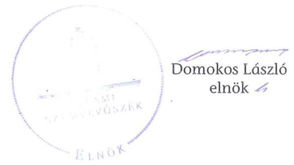

# ÁLLAMI   SZÁMVEVŐSZÉK 

## JELENTÉS

Murakeresztúr Község Önkormányzata belső kontrollrendszerének kialakítása, valamint egyes kontrolltevékenységek és a belső ellenőrzés múködése ellenőrzéséről

---

# Állami Számvevőszék 

Iktatószám: V-0012-058-005-039/2013.
Témaszám: 1051
Vizsgálat-azonosító szám: V059105

## Az ellenőrzést felügyelte:

Dr. Benedek Mária
felügyeleti vezető
2012. december 16-tól napjától

Gyüre Lajosné
felügyeleti vezető
2012. december 15. napjáig

Az ellenőrzést vezette:
Szakmányné Bilik Mária
ellenőrzésvezető
A számvevőszéki jelentés összeállításában közremüködtek:
Dr. Láng Ágnes Krisztina
számvevő
Renner Andrea
számvevő
Az ellenőrzést végezték:
Molnár Istvánné
Pálfiné Pusztai Magdolna
számvevő tanácsos
számvevő tanácsos

---

# TARTALOMJEGYZÉK 

BEVEZETÉS ..... 7
I. ÖSSZEGZŐ MEGÁLLAPÍTÁSOK, KÖVETKEZTETÉSEK, JAVASLATOK ..... 10
II. RÉSZLETES MEGÁLLAPÍTÁSOK ..... 17

1. Az önkormányzat belső kontrollrendszere kialakításának megfelelősége ..... 17
1.1. A kontrollkörnyezet kialakítása ..... 17
1.2. A kockázatkezelési rendszer szabályozása ..... 17
1.3. A kontrolltevékenységek kialakítása ..... 18
1.4. Az információs és kommunikációs rendszer szabályozása ..... 19
1.5. A monitoring rendszer szabályozása ..... 19
2. A pénzügyi folyamatokban kulcsszerepet betöltő belső kontrollok (szakmai teljesítésigazolás és utalvány ellenjegyzés) múködése ..... 20
3. A belső ellenőrzés szervezeti keretei és múködése ..... 22

## FÜGGELÉKEK

1. számú Értelmező szótár
2. számú A belső kontrollrendszer kialakítása, a pénzügyi folyamatokban kulcsszerepet betöltő szakmai teljesítésigazolás és utalvány ellenjegyzés kontrollok múködése, valamint a belső ellenőrzés múködése értékelésénél alkalmazott minősítési szempontok

---

.

---

# RÖVIDÍTÉSEK JEGYZÉKE 

## Törvények

ÁSZ tv.
Avtv.

Info tv.

Mötv.
Ötv.
régi Áht.
új Áht.

## Rendeletek

Áhsz.

Ámr.

Ávr.

Ber.
Bkr.

## Szórövidítések

adatvédelmi szabályzat

ÁSZ
Belső ellenőrzési kézikönyv

2011. évi LXVI. törvény az Állami Számvevőszékről
1992. évi LXIII. törvény a személyes adatok védelméről és a közérdekú adatok nyilvánosságáról (hatálytalan 2012. január 1-jétől)
2011. évi CXII. törvény az információs önrendelkezési jogról és az információszabadságról (hatályos 2012. január 1-jétől)
2011. évi CLXXXIX. törvény Magyarország helyi önkormányzatairól (hatályos 2012. január 1-jétől)
1990. évi LXV. törvény a helyi önkormányzatokról
1992. évi XXXVIII. törvény az államháztartásról (hatálytalan 2012. január 1-jétől)
2011. évi CXCV. törvény az államháztartásról (hatályos 2012. január 1-jétől)

249/2000. (XII. 24.) Korm. rendelet az államháztartás szervezetei beszámolási és könyvvezetési kötelezettségének sajátosságairól
az államháztartás múködési rendjéről szóló 292/2009. (XII. 19.) Korm. rendelet (hatálytalan 2012. január 1jétől)
368/2011. (XII. 31.) Korm. rendelet az államháztartásról szóló törvény végrehajtásáról (hatályos 2012. január 1jétől)
193/2003. (XI. 26.) Korm. rendelet a költségvetési szervek belső ellenőrzéséről (hatálytalan 2012. január 1-jétől)
370/2011. (XII. 31.) Korm. rendelet a költségvetési szervek belső kontrollrendszeréről és belső ellenőrzéséről (hatályos 2012. január 1-jétől)

Murakeresztúr és Fityeház Községek Körjegyzősége Szabályzata a közérdekú adatok megismerésére irányuló kérelmek intézésének, továbbá a kötelezően közzéteendő adatok nyilvánosságra hozatalának rendjéről 5. pont (hatályos 2011. január 1-jétől), Informatikai biztonsági szabályzat 1. 7-8. pontjai (hatályos 2010. március 1-jétől)
Állami Számvevőszék
Nagykanizsai Kistérség Többcélú Társulásának Belső ellenőrzési kézikönyve (hatályos 2010. március 29-től)

---

Belső Kontroll Kézikönyv Az Ámr. 155. § (1) bekezdése, valamint az államháztartási belső kontroll standardokról szóló 1/2009. (IX. 11.) PM irányelv egységes értelmezése érdekében az államháztartásért felelős miniszter által 2010. évben kiadott Belső Kontroll Kézikönyv
FEUVE
gazdálkodási jogkörök szabályzata
gazdasági program
informatikai biztonsági szabályzat
iratkezelési szabályzat
jegyzó
katasztrófa elhárítási terv

Képviselő-testület
körjegyzó
Körjegyzőség
körjegyzőségi SZMSZ
kockázatkezelési szabályzat

Önkormányzat
Önkormányzati Hivatal
pénzkezelési szabályzat
polgármester
szabálytalanságkezelési szabályzat

## 4

folyamatba épített, előzetes, utólagos és vezetői ellenőrzés
Murakeresztúr és Fityeház Községek Körjegyzősége Kötelezettségvállalás, utalványozás, ellenjegyzés, érvényesítés rendjének szabályzata (hatályos 2010. január 1-jétől)
Murakeresztúr Község Önkormányzatának Gazdasági programja 2010-2014.
Murakeresztúr és Fityeház Községek Körjegyzősége Informatikai biztonsági szabályzata (389-3/2010. iktatószámon kiadott, hatályos 2010. március 1-jétől)
Murakeresztúr és Fityeház Községek Körjegyzőségének Iratkezelési szabályzata (hatályos 2007. január 1-jétől)
Murakeresztúri Közös Önkormányzati Hivatal jegyzője (2013. január 1-jétől)

Murakeresztúr és Fityeház Községek Körjegyzőségének Informatikai katasztrófa elhárítási terve (51/2008. iktatószámon kiadott, hatályos 2008. január 1-jétől)
Murakeresztúr Község Képviselő-testülete
Murakeresztúr és Fityeház Községek Önkormányzatának körjegyzője (2012. december 31-ig)
Murakeresztúr és Fityeház Községek Önkormányzatának Körjegyzősége (megszűnt: 2012. december 31-én)
Murakeresztúr és Fityeház Községek Körjegyzőségének Úgyrendi szabályzata (hatályos 2011. január 1-jétől)
Murakeresztúr és Fityeház Községek Körjegyzősége Kockázatkezelési szabályzata (389/2010. iktatószámon kiadott, hatályos 2010. március 1-jétől)
Murakeresztúr Község Önkormányzata
Murakeresztúri Közös Önkormányzati Hivatal (a Körjegyzőség jogutódjaként megalakult 2013. január 1-jén)
Murakeresztúr és Fityeház Községek Körjegyzőségének Pénzkezelési szabályzata I. fejezet bankszámlapénz kezelésére vonatkozó szabályozás (hatályos 2005. január 1jétől), II. fejezet a házipénztári pénzkezelés szabályozása (hatályos 2008. július 1-jétől)
Murakeresztúr Község Önkormányzatának polgármestere
Murakeresztúr és Fityeház Községek Körjegyzősége Szabályzat a szabálytalanságok kezelésének eljárásrendjére (hatályos 2009. január 1-jétől)

---

Társulás
Ütkezelői Társulás
ügyrend

Nagykanizsai Kistérség Többcélú Társulása
Zala Megyei Települési Önkormányzatok Útkezelői Társulása
Murakeresztúr és Fityeház Községek Körjegyzősége Gazdasági szervezetének ügyrendje (hatályos 2011. április 29től)

---

.

---

# JELENTÉS 

## Murakeresztúr Község Önkormányzata belső kontrollrendszerének kialakítása, valamint egyes kontrolltevékenységek és a belső ellenőrzés múködése ellenőrzéséről

## BEVEZETÉS

A belső kontrollrendszer kialakítását, múködtetését és fejlesztését a régi Áht. és az új Áht. is előírja. Ennek megvalósításáért a költségvetési szerv vezetője, körjegyzőség esetén a körjegyző felel. A belső kontrollrendszer azt a célt szolgálja, hogy a költségvetési szervek múködésük és gazdálkodásuk során a tevékenységeket szabályszerűen, gazdaságosan, hatékonyan, eredményesen hajtsák végre, teljesítsék elszámolási kötelezettségeiket és megvédjék az erőforrásokat a veszteségektől, a károktól és a nem rendeltetésszerű használattól. A belső kontrollrendszer magában foglalja mindazon szabályokat, eljárásokat, gyakorlati módszereket és szervezeti struktúrákat, kockázatkezelési technikákat, kontrolltevékenységeket, amelyek segítséget nyújtanak a szervezetnek céljai eléréséhez.

Az ÁSZ a 2011-2015. évekre szóló stratégiájában hangsúlyos szerepet szánt annak, hogy szilárd szakmai alapon álló, értékteremtő ellenőrzéseivel előmozdítsa a közpénzügyek átláthatóságát, rendezettségét. A számvevőszéki ellenőrzés nemzetközi alapelvei is rögzítik, hogy a megfelelő belső kontrollrendszer minimálisra csökkenti a hibák és szabálytalanságok kockázatát.

Az ellenőrzés célja annak értékelése volt, hogy az Önkormányzat a jogszabályi előírásoknak megfelelően alakította-e ki a belső kontrollrendszert; a gazdálkodás folyamatában kulcsszerepet betöltő szakmai teljesítésigazolás és az utalvány ellenjegyzés kontrolltevékenységeit megfelelően múködtette-e; biztosí-totta-e a belső ellenőrzés szabályos és eredményes múködését.

Az ÁSZ ezen ellenőrzési céljait pilot (próba) jelleggel községi/nagyközségi önkormányzatoknál végzett ellenőrzések során érvényesítette.

Az ellenőrzés típusa: szabályszerűségi ellenőrzés
Az ellenőrzés jogszabályi alapja: az ÁSZ tv. 5. § (2) és (6) bekezdései
Az ellenőrzött szervezet: az Önkormányzat (ezen belül kiemelten a Körjegyzőség Murakeresztúr Község Önkormányzata vonatkozásában)

---

Az ellenőrzött időszak: a belső kontrollrendszer kialakításának megfelelőségét a 2011. évre vonatkozóan értékeltük. A kontrolltevékenységek múködésének megfelelőségét a 2011. január 1-je és december 31-e, míg a belső ellenőrzés múködésének szabályosságát és eredményességét a 2009. január 1-je és 2011. december 31-e közötti időszakot figyelembe véve értékeltük. A helyszíni ellenőrzés lezárásáig a helyi szabályozás változásait nyomon követtük.

Az ellenőrzés szakmai módszertana az Állami Számvevőszék Ellenőrzési Kézikönyvében foglalt szakmai szabályokon alapult, amely a Legfelsőbb Ellenőrző Intézmények Nemzetközi Szervezete (INTOSAI) által kiadott nemzetközi standardok (ISSAI) figyelembevételével készült.

A belső kontrollrendszer kialakításának ellenőrzése során értékeltük a Körjegyzőségen a kontrollkörnyezet, a kockázatkezelési rendszer, a kontrolltevékenységek, az információs és kommunikációs rendszer, valamint a monitoring rendszer szabályozottságának megfelelőségét.

A Körjegyzőségen értékeltük a pénzügyi folyamatokban kulcsszerepet betöltő szakmai teljesítésigazolás és az utalvány ellenjegyzés kontrollok múködésének megfelelőségét az államháztartáson kívülre teljesített múködési és felhalmozási célú pénzeszközátadásoknál, az állományba nem tartozók megbízási díjainál, továbbá a külső szolgáltatók által végzett karbantartási, kisjavítási munkákkal kapcsolatos kifizetéseknél. Az egyszerú véletlen mintavétellel kiválasztott tételek ellenőrzését többlépcsős megfelelőségi tesztek útján addig végeztük, amíg elegendő és megfelelő bizonyítékot szereztünk a vizsgált folyamatok kulcskontrolljai múködésének megfelelő vagy nem megfelelő voltáról.

Értékeltük az Önkormányzatnál a belső ellenőrzés múködésének szabályosságát és eredményességét.

A fogalmak magyarázatát az 1. számú függelék, az ellenőrzés egyes területeinek értékelésénél alkalmazott egységes minősítési szempontokat a 2. számú függelék tartalmazza.

Az ellenőrzés lefolytatásához az Önkormányzat a munkalapok és a tanúsítvány elektronikus kitöltésével, valamint a megjelölt dokumentumok elektronikus megküldésével szolgáltatott adatokat. A munkalapokon szerepeltetett adatok, információk ellenőrzése és szükség szerinti javítása a helyszíni ellenőrzés keretében történt.

Az ÁSZ az ellenőrzés megállapításait az ellenőrzött időszakban hatályos, az intézkedést igénylő megállapításokra tett javaslatokat a jelenleg hatályos jogszabályok alapján fogalmazta meg.

Az ÁSZ tv. 29. § (1) bekezdése szerint a jelentéstervezetet megküldtük a polgármester részére, aki az ÁSZ tv. 29. § (2) bekezdésében foglalt észrevételezési jogával nem élt, a jelentéstervezetre észrevételt nem tett.

Murakeresztúr Község állandó lakosainak száma 2011. január 1-jén 1848 fő volt. Az Önkormányzat hattagú Képviselő-testületének munkáját kettő állandó bizottság segítette. Az Önkormányzat az önállóan múködő és gazdálkodó Kör-

---

jegyzőségen felül egy intézménnyel látta el feladatát. Az Önkormányzat többségi tulajdoni hányadú gazdasági társasággal nem rendelkezett. A polgármester az 1998. évi önkormányzati választások óta tölti be tisztségét. A körjegyzó 2002. január 1-jétől látja el feladatait. A Körjegyzőség szervezeti egységekre nem tagolódott, a foglalkoztatott köztisztviselők száma 2011. január 1-jén 9 fő volt.

Az Önkormányzat a 2011. évi költségvetési beszámolója szerint 446,9 millió Ft költségvetési bevételt ért el, valamint 430,2 millió Ft költségvetési kiadást teljesített. A 2011. december 31-i könyvviteli mérleg szerint 1189,2 millió Ft értékú eszközvagyonnal rendelkezett, 83,2 millió Ft hosszú lejáratú, 42,4 millió Ft rövid lejáratú kötelezettsége volt.

---

# I. ÖSSZEGZŐ MEGÁLLAPÍTÁSOK, KÖVETKEZTETÉSEK, JAVASLATOK 

A belső kontrollrendszer kialakítása a Körjegyzőségnél 2011-ben a kontrollkörnyezet, a kockázatkezelési rendszer, a kontrolltevékenységek, az információs és kommunikációs rendszer, valamint a monitoring rendszer szabályozásának, illetve kialakításának értékelése alapján összességében a jogszabályi előírásoknak részben felelt meg.

A kontrollkörnyezet kialakítása a jogszabályi követelményeknek megfelelt. A körjegyző elkészítette a gazdálkodást érintő legfontosabb szabályzatokat, azonban a körjegyzőségi SZMSZ, az Ámr.-ben foglaltak ellenére, nem tartalmazta az ellátandó és a szakfeladatrend szerint besorolt alaptevékenységeket, valamint a szabályozásukra vonatkozó jogszabályok megjelölését. A körjegyzö nem határozta meg a körjegyzőségi SZMSZ-ben nevesített valamennyi munkakörhöz tartozó feladat- és hatásköröket, a hatáskörök gyakorlásának módját, a helyettesítés rendjét, az ezekhez kapcsolódó felelősségi szabályokat. Ezek a hiányosságok korlátozzák a feladatellátás számon kérhetőségét, folytonosságának biztosítását.

A kockázatkezelési rendszer szabályozása részben felelt meg a jogszabályi előírásoknak. A körjegyző a kockázatkezelési szabályzatban meghatározta az Önkormányzat tevékenységében és gazdálkodásában rejlő kockázatokat, azonban az Ámr.-ben előírt, az egyes kockázatokkal (pl. korrupciós kockázatokkal) kapcsolatos intézkedéseket és megtételük módját hiányosan határozta meg.

A kontrolltevékenységek kialakítása a jogszabályi követelményeknek részben felelt meg, mivel a körjegyzö az Ámr.-ben foglaltak ellenére nem alakította ki a Körjegyzőség tevékenységeire vonatkozó beszámolási eljárásokat. A gazdálkodási jogkörök szabályzatában nem írta elő az érvényesítés dátumának rögzítési kötelezettségét, továbbá az előzetesen írásbeli kötelezettségvállalást nem igénylő kifizetéseknél nem határozta meg az eljárási részletszabályokat. A kontrolltevékenységek hiányos kialakítása kockázatot jelent a feladatok szabályszerű végrehajtása során.

Az információs és kommunikációs rendszer szabályozása részben felelt meg a jogszabályi követelményeknek, mivel a körjegyzö, az Avtv. előírásai ellenére, elmulasztotta az adatbiztonság érvényre juttatásához szükséges intézkedések megtételét, nem határozta meg a hozzáférési jogosultságok megállapítására és módosítására, betartásuk ellenőrzésére vonatkozó eljárásrendet. Nem szabályozta a pénzügyi-számviteli szoftverváltozások ellenőrzésére, tesztelésére vonatkozó eljárásokat, a pénzügyi-számviteli rendszerben feldolgozott adatok mentési eljárásait, és nem jelölte ki a mentések felelőseit.

A monitoring rendszer szabályozása részben felelt meg a jogszabályi előírásoknak. A körjegyzö kialakította az Önkormányzatnál a kontrolltevékenységek monitoring rendszerét, azonban az Ámr. előírása ellenére az operatív tevékeny-

---

ségek keretében megvalósuló folyamatos és eseti nyomon követésből álló, az Önkormányzat tevékenységének, a célok megvalósításának nyomon követését biztosító rendszert nem alakította ki.

A belső kontrollrendszer részben megfelelő kialakítása közepes kockázatot jelent az Önkormányzat tevékenységeinek szabályszerű, gazdaságos, hatékony és eredményes végrehajtása során.

A Körjegyzőségnél az Önkormányzat vonatkozásában a 2011. évben az államháztartáson kívülre történő működési célú pénzeszközátadásokkal, az állományba nem tartozók megbízási díjaival, valamint a külső szolgáltatók által végzett karbantartással, kisjavítással kapcsolatos kifizetések során - összefoglalóan értékelve - a kulcskontrollok müködésének megfelelősége gyenge volt.

A körjegyző által a szakmai teljesítés igazolására kijelölt személyek nem tettek eleget az Ámr.-ben előírt igazolási, valamint az összegszerűség ellenőrzésére vonatkozó kötelezettségüknek. A karbantartással, kisjavítással kapcsolatos kifizetések során a körjegyző által kijelölt személy nem vette figyelembe az Ámr. összeférhetetlenségre vonatkozó rendelkezését, mivel a szakmai teljesítésigazolást közeli hozzátartozója javára látta el.

Az utalványok ellenjegyzője a kiadások teljesítését megelőzően az Ámr.-ben foglalt ellenőrzési feladatait nem szabályszerűen végezte. A kifizetéseket szakmai teljesítésigazolás hiányában ellenjegyezte, illetve nem észrevételezte, hogy az összeférhetetlenségi szabályokat nem tartották be. Az utalvány ellenjegyzője az Ámr. rendelkezései ellenére nem győződött meg a gazdálkodási szabályok betartásáról, mivel nem kifogásolta az ellenjegyzés nélküli szerződéskötéseket, továbbá a kötelezettségvállalások nyilvántartásba vétele elmaradt, így az utalványon a kötelezettségvállalás nyilvántartási számát sem rögzítették.

Az államháztartáson kívülre történő működési célú pénzeszközátadások és a külső szolgáltatók által végzett karbantartással, kisjavítással kapcsolatos kifizetések során a könyvviteli elszámolásra utaló főkönyvi számlát, a Számv. tv. és az Áhsz. előírásaival ellentétesen, nem a gazdasági események tényleges tartalmának megfelelően jelölték ki. Hibásan, a múködési célú pénzeszközátadások között számoltak el egyéb szolgáltatást, illetve az ingatlanok karbantartási, kisjavítási szolgáltatásai között számoltak el egyéb bérleti díj kifizetést. A téves számlakijelölés miatt a könyvvezetés során sérült a Számv. tv.-ben meghatározott valódiság számviteli alapelv.

A számvevőszéki ellenőrzés az ellenőrzött kifizetésekkel összefüggésben jogosulatlan kifizetést nem tárt fel, azonban a gazdálkodásban kulcsszerepet betöltő kontrollok múködésében feltárt hiányosságok miatt fennáll a hibák bekövetkezésének kockázata.

Az Önkormányzat a belső ellenőrzési feladatok ellátását a Társulással kötött megállapodás alapján biztosította. Az Önkormányzatnál a 2009-2011. években a belső ellenőrzés szabályozása és múködése összességében nem felelt meg a jogszabályi előírásoknak. A 2009-2011. évi ellenőrzési tervek összeállítását megelőzően a Ber. előírásai ellenére kockázatelemzést nem készítettek. A

---

2010. évi ellenőrzési tervet a körjegyző késedelmesen terjesztette a Képviselőtestület elé, ezért azt az Ötv.-ben meghatározott határidőt túllépve fogadták el. A 2010. évben az éves ellenőrzési terv módosítását előterjesztés hiányában, az Ötv.-ben foglaltak ellenére, a Képviselő-testület nem hagyta jóvá, azonban a tervtől eltérő ellenőrzéseket végeztek. A feltárt hiányosságok megszüntetéséről az ellenőrzést végzők a Ber.-ben foglaltak ellenére nem győződtek meg, a belső ellenőrzési vezető által vezetett nyilvántartás nem tartalmazta az ellenőrzések kezdetének és lezárásának időpontját, valamint a jelentések jelentősebb megállapításait, javaslatait.

A belső ellenőrzés működése nem volt eredményes, mivel a belső ellenőrzés szabályozása és múködése az ellenőrzött időszak egészét tekintve a jogszabályi előírásoknak nem felelt meg. A 2009-2011. években ellenőrizték a gazdálkodási jogkörök gyakorlásához kapcsolódóan a belső kontrollok múködését, azonban a körjegyző nem intézkedett teljes körűen a feltárt hibák és hiányosságok kijavítására, ezért a gyengén működő kontrollok következtében a szabálytalanságok ismétlődtek.

Az ÁSZ tv. 33. § (1) bekezdésében foglaltak értelmében az ellenőrzött szervezet vezetője köteles a jelentésben foglalt megállapításokhoz kapcsolódó intézkedési tervet összeállítani, és azt a jelentés kézhezvételétől számított 30 napon belül az ÁSZ részére megküldeni. Amennyiben az intézkedési tervet határidőn belül nem küldi meg a szervezet, vagy az az ÁSZ tv. 33. § (2) bekezdésében foglalt póthatáridő eltelte ellenére továbbra sem elfogadható, az ÁSZ elnöke a hivatkozott törvény 33. § (3) bekezdés a)-b) pontjaiban foglaltakat érvényesítheti.

Az ellenőrzés intézkedést igénylő megállapításai és javaslatai:

# a polgármesternek 

1. A népszámláláshoz kapcsolódó lakcím ellenőrzési feladat ellátására kötött megbízási szerződés, valamint a gépkölcsönzésre kötött bérleti szerződés ellenjegyzése az Ámr. 74. § (1) bekezdésben foglaltak ellenére elmaradt.

Javaslat:
Biztosítsa, hogy az Önkormányzat nevében történő kötelezettségvállalásra, az új Áht. 37. § (1) bekezdésében foglaltaknak megfelelően, pénzügyi ellenjegyzés után kerüljön sor.
2. A körjegyző által a szakmai teljesítés igazolására kijelölt személyek nem tettek eleget az Ámr. 76. § (1) bekezdésében előírt igazolási, valamint az összegszerűség ellenőrzésére vonatkozó kötelezettségüknek. A karbantartással, kisjavítással kapcsolatos kifizetések során a körjegyzö által kijelölt személy nem vette figyelembe az Ámr. 80. § (2) bekezdésében foglaltakat, mivel a szakmai teljesítésigazolást közeli hozzátartozója javára látta el.

Az utalványok ellenjegyzője a kiadások teljesítését megelőzően, aláírása ellenére, nem tett eleget az Ámr. 79. § (2) bekezdésében foglalt - a szakmai teljesítésigazolásra vonatkozó - ellenőrzési kötelezettségének. Nem győződött meg a gazdálkodásra

---

- köztük az Ámr. 74. § (1) bekezdésében előírt, a kötelezettségvállalások ellenjegyzésére, az Ámr. 75. § (1) bekezdésében foglalt, a kötelezettségvállalások nyilvántartásba vételére és az Ámr. 78. § (2) bekezdés g) pontja szerinti, a kötelezettségvállalás nyilvántartási számának az utalványrendeleten történő feltüntetésére - vonatkozó szabályok betartásáról.

Javaslat:
Intézkedjen a szakmai teljesítésigazolás és az utalvány ellenjegyzés kontrollokkal öszszefüggésben a számvevőszéki jelentésben rögzített hiányosságok és szabálytalanságok tekintetében az esetleges munkajogi felelősséggel kapcsolatos körülmények kivizsgálásáról, és a vizsgálat eredményének függvényében tegye meg a szükséges munkajogi intézkedéseket.

# a jegyzőnek Murakeresztúr Község Önkormányzata vonatkozásában 

1. a kontrollkörnyezettel kapcsolatban:

Az Ámr. 20. § (2) bekezdés c) és h) pontjában foglaltak ellenére a körjegyzőségi SZMSZ nem tartalmazta az ellátandó és a szakfeladatrend szerint besorolt alaptevékenységeket, az alaptevékenységet szabályozó jogszabályok megjelölését, a körjegyzőségi SZMSZ-ben nevesített valamennyi munkakörhöz tartozó feladat- és hatásköröket, a hatáskörök gyakorlásának módját, a helyettesítés rendjét és az ezekhez kapcsolódó felelősségi szabályokat.

Javaslat:
Gondoskodjon az Önkormányzati Hivatal SZMSZ-ének elkészítéséről az Ávr. 13. § (1) bekezdés c) és g) pontjaiban foglaltaknak megfelelően. Az SZMSZ tartalmazza az Önkormányzat ellátandó és a szakfeladatrend szerint besorolt alaptevékenységeit, az alaptevékenységet szabályozó jogszabályok megjelölését, az abban nevesített munkakörhöz tartozó feladat- és hatásköröket, azok gyakorlásának módját, a helyettesítés rendjét, valamint a felelősségi szabályokat. Kezdeményezze a polgármesternél az Önkormányzati Hivatal SZMSZ-ének a Képviselő-testület elé terjesztését.
2. a kontrolltevékenységekkel kapcsolatban:

A körjegyző az Ámr. 158. § (2) bekezdés d) pontjában foglaltak ellenére nem alakította ki a Körjegyzőség tevékenységeire vonatkozó beszámolási eljárásokat.

A körjegyző az érvényesítés rendjének szabályozásakor nem írta elő az Ámr. 77. § (3) bekezdése szerinti tartalmi elemek közül az érvényesítés dátumának rögzítési kötelezettségét.

A körjegyző, az Ámr. 72. § (14) bekezdésében foglaltakat figyelmen kívül hagyva, nem határozta meg az előzetesen írásbeli kötelezettségvállalást nem igénylő kifizetések rendjét és az eljárási részletszabályokat.

---

Javaslat:
a) Alakítsa ki a Bkr. 8. § (4) bekezdés c) pontja alapján az Önkormányzati Hivatal tevékenységeire vonatkozó beszámolási eljárásokat.
b) Módosítsa a gazdálkodási jogkörök szabályzatát, hogy az Ávr. 58. § (3) bekezdésében foglaltaknak megfelelően az érvényesítésre vonatkozó előírások az érvényesítő keltezéssel ellátott aláírását is tartalmazzák.
c) Módosítsa a gazdálkodási jogkörök szabályzatát, hogy az Ávr. 53. § (2) bekezdésének megfelelően tartalmazza az előzetesen írásbeli kötelezettségvállalást nem igénylő kifizetések rendjét és eljárási részletszabályait.
3. az információs és kommunikációs rendszerrel kapcsolatban:

A körjegyző az informatikai rendszer környezetének szabályozása során, az Avtv. 10. § (1)-(2) bekezdésében foglalt előírások ellenére, elmulasztotta az adatbiztonság érvényre juttatásához szükséges intézkedések megtételét, nem határozta meg a hozzáférési jogosultságok megállapítására és módosítására, betartásuk ellenőrzésére vonatkozó eljárásrendet. Nem szabályozta a pénzügyi-számviteli szoftverváltozások ellenőrzésére, tesztelésére vonatkozó eljárásokat, a pénzügyi-számviteli rendszerben feldolgozott adatok mentési eljárásait, és nem jelölte ki a mentések felelőseit.

Javaslat:
Biztosítsa az Info tv. 7. § (2) bekezdése alapján az adatbiztonság érvényesülését, gondoskodjon a hozzáférési jogosultságok megállapítására és módosítására, betartásuk ellenőrzésére vonatkozó eljárásrend meghatározásáról. Szabályozza a pénzügyiszámviteli szoftverváltozások ellenőrzésére, tesztelésére vonatkozó eljárások, valamint a pénzügyi-számviteli rendszerben feldolgozott adatok mentési eljárásait, és jelölje ki a mentések felelőseit.
4. a monitoring rendszerrel kapcsolatban:

A körjegyző, az Ámr. 160. §-ában foglaltak ellenére, az operatív tevékenységek keretében megvalósuló folyamatos és eseti nyomon követésből álló, az Önkormányzat tevékenységének, a célok megvalósításának nyomon követését biztosító rendszert nem alakította ki.

Javaslat:
Alakítsa ki és múködtesse a Bkr. 10. §-ában előírtak alapján az operatív tevékenységek keretében megvalósuló folyamatos és eseti nyomon követésből álló, az Önkormányzat tevékenységének, a célok megvalósításának nyomon követését biztosító rendszert.

---

5. a pénzügyi folyamatokban kulcsszerepet betöltő kontrollok működésével kapcsolatban:

A körjegyző által a szakmai teljesítés igazolására kijelölt személyek nem tettek eleget az Ámr. 76. § (1) bekezdésében előírt igazolási, valamint az összegszerűség ellenőrzésére vonatkozó kötelezettségüknek. A karbantartással, kisjavítással kapcsolatos kifizetések során a körjegyző által kijelölt személy nem vette figyelembe az Ámr. 80. § (2) bekezdésében foglaltakat, mivel a szakmai teljesítésigazolást közeli hozzátartozója javára látta el.

Az utalványok ellenjegyzője a kiadások teljesítését megelőzően, aláírása ellenére nem tett eleget az Ámr. 79. § (2) bekezdésében foglalt ellenőrzési kötelezettségének. A kifizetéseket szakmai teljesítésigazolás hiányában ellenjegyezte, illetve nem észrevételezte, hogy az összeférhetetlenségi szabályokat nem tartották be. Nem győződött meg a gazdálkodásra - köztük az Ámr. 74. § (1) bekezdésében előírt, a kötelezettségvállalások ellenjegyzésére, az Ámr. 75. § (1) bekezdésében foglalt, a kötelezettségvállalások nyilvántartásba vételére és az Ámr. 78. § (2) bekezdés g) pontja szerinti, a kötelezettségvállalás nyilvántartási számának az utalványrendeleten történő feltüntetésére - vonatkozó szabályok betartásáról.

Az Áhsz. 9. § (11) bekezdésében és 9. számú melléklete 9. c) pontjában foglaltakkal ellentétesen, a müködési célú pénzeszközátadások között számoltak el egyéb szolgáltatást, illetve az ingatlanok karbantartási, kisjavítási szolgáltatásai között számoltak el egyéb bérleti díj kifizetést.

Javaslat:
Az operatív gazdálkodás során a müködésbeli hibák megelőzése, feltárása és kijavítása érdekében gondoskodjon arról, hogy
a) az Ávr. 57. § (3) bekezdése szerinti teljesítésigazolást az Ávr. 60. § (2) bekezdésében rögzített összeférhetetlenségi szabályok figyelembevételével kijelölt személyek végezzék el, és az Ávr. 57. § (1) bekezdésében foglaltaknak megfelelően a teljesítésigazolás során ellenőrizzék a kiadások teljesítésének jogosságát, összegszerűségét, valamint ellenszolgáltatást is magában foglaló kötelezettségvállalás esetében a szerződés, megrendelés teljesítését;
b) az érvényesítő az Ávr. 58. § (1) bekezdése szerint, a kifizetéseket megelőzően a teljesítésigazolás alapján ellenőrizze az összegszerűséget és azt, hogy a megelőző ügymenetben az új Áht., az Áhsz., az Ávr. előírásait és a belső szabályzatokban foglaltakat betartották-e;
c) az Ávr 56. § (1) bekezdésében előírt kötelezettségvállalások nyilvántartása megtörténjen, és az utalványrendeleteken az Ávr. 59. § (3) bekezdés f) pontjában foglaltaknak megfelelően feltüntetésre kerüljön a kötelezettségvállalás nyilvántartási száma;
d) az Önkormányzat nevében történő kötelezettségvállalásra az új Áht. 37. § (1) bekezdésében foglaltaknak megfelelően, pénzügyi ellenjegyzés után kerüljön sor;

---

e) a gazdasági eseményeket tényleges tartalmuknak megfelelően könyveljék az Áhsz. 9. § (11) bekezdésében, valamint 9. számú melléklete 9. c) pontjában foglaltak betartatásával.
6. a belső ellenőrzés múködésével kapcsolatban:

A 2010. évi ellenőrzési tervet a Képviselő-testület az Ötv. 92. § (6) bekezdésében foglalt határidőt túllépve fogadta el, mert a körjegyző nem gondoskodott a határidőn belül történő előterjesztéséről. Az éves ellenőrzési terv módosítását az Ötv. 92. § (6) bekezdésében foglaltak ellenére - előterjesztés hiányában - a Képviselőtestület nem hagyta jóvá, azonban a tervtől eltérő ellenőrzéseket végeztek.

A 2009-2011. évi ellenőrzési tervek összeállítását megelőzően a Ber. 21. § (2) bekezdésében foglalt előírás ellenére kockázatelemzést nem készítettek.

A feltárt hiányosságok megszüntetéséről a belső ellenőrzést végzők utóellenőrzéssel, az intézkedési terv végrehajtásáról készített beszámolóval, illetve egyéb módon - a Ber. 8. § f) pontjának figyelmen kívül hagyásával - nem győződtek meg.

A belső ellenőrzési vezető által vezetett nyilvántartás, a Ber. 32. § (2) bekezdés c) pontjában előírtak ellenére, nem tartalmazta az ellenőrzések kezdetének és lezárásának időpontját, valamint a Ber. 32. § (2) bekezdés e) pontjában előírtak ellenére a jelentések jelentősebb megállapításait, javaslatait.

Javaslat:
a) Készítse elő az éves ellenőrzési tervről szóló előterjesztést, és kezdeményezze a polgármesternél a Képviselő-testület elé terjesztését annak érdekében, hogy a Képviselő-testület az éves ellenőrzési tervet a Mötv. 119. § (5) bekezdésében előírt határidőig jóváhagyhassa, továbbá gondoskodjon arról, hogy annak módosítására kizárólag a Képviselő-testület jóváhagyásával kerüljön sor.
b) Gondoskodjon arról, hogy az éves ellenőrzési tervet a Bkr. 31. § (2) bekezdésének megfelelően kockázatelemzéssel alapozzák meg.
c) Gondoskodjon arról, hogy a belső ellenőrzési vezető a Bkr. 21. § (2) bekezdés d) pontja szerint tegyen eleget a belső ellenőri jelentések alapján megtett intézkedések nyomon követésére vonatkozó kötelezettségének.
d) Gondoskodjon arról, hogy a belső ellenőrzési vezető által az elvégzett ellenőrzésekről vezetett nyilvántartás a Bkr. 50. § (2) bekezdés d) pontja és 47. § (1) bekezdés szerint tartalmazza az ellenőrzések kezdetének és lezárásának időpontját, valamint a jelentések jelentősebb megállapításait, javaslatait.

---

# II. RÉSZLETES MEGÁLLAPÍTÁSOK 

## 1. Az önkORMÁNYZAT BELSŐ KONTROLLRENDSZERE KIALAKÍTÁSÁNAK MEGFELELŐSÉGE

### 1.1. A kontrollkörnyezet kialakítása

A kontrollkörnyezet kialakítása a Körjegyzőségen megfelelő volt. A Képviselő-testület elfogadta az Önkormányzat gazdasági programját¹, a körjegyző elkészítette a gazdálkodást érintő legfontosabb szabályzatokat. Az Ámr. 20. § (2) bekezdés c) ${ }^{2}$ és h) ${ }^{3}$ pontjában foglaltak ellenére azonban a körjegyzőségi SZMSZ nem tartalmazta az ellátandó és a szakfeladatrend szerint besorolt alaptevékenységeket, az alaptevékenységet szabályozó jogszabályok megjelölését, a körjegyzőségi SZMSZ-ben nevesített valamennyi munkakörhöz tartozó feladat- és hatásköröket, a hatáskörök gyakorlásának módját, a helyettesítés rendjét és az ezekhez kapcsolódó felelősségi szabályokat.

A kontrollkörnyezet kialakítása során a körjegyzö

- a Belső Kontroll Kézikönyv ${ }^{4}$ 1.2.7. pontjában foglalt ajánlást nem érvényesítette, mert nem írta elő a körjegyzőségi SZMSZ dolgozók általi megismerésének kötelezettségét, és a körjegyzőségi SZMSZ dolgozók általi megismerése nem történt meg;
- a Belső Kontroll Kézikönyv és 1.5.2. pontjaiban foglalt ajánlást nem vette figyelembe, mivel nem dolgozta ki a Körjegyzőségnél ellátott köztisztviselői munkakörök betöltésére vonatkozó elvárt tudást és képességeket.

### 1.2. A kockázatkezelési rendszer szabályozása

A kockázatkezelési rendszer szabályozottsága a Körjegyzőségen részben volt megfelelő. A körjegyző a kockázatkezelési szabályzatban meghatározta az Önkormányzat tevékenységében és gazdálkodásában rejlő kockázatokat, azonban az Ámr.-ben előírt, az egyes kockázatokkal (pl. korrupciós kocká-

[^0]
[^0]:    ${ }^{1}$ 2013. január 1-jétől a gazdasági programra, fejlesztési tervre vonatkozó jogszabályi előírásokat a Magyarország helyi önkormányzatairól szóló 2011. évi CLXXXIX. tv. 116. § (1) bekezdése tartalmazza.
    ${ }^{2}$ 2012. január 1-jétől az Ávr. 13. § (1) bekezdés c) pontja tartalmazza.
    ${ }^{3}$ 2012. január 1-jétől az Ávr. 13. § (1) bekezdés g) pontja tartalmazza.
    ${ }^{4}$ A 2011. évben az Ámr. 155. § (1) bekezdése szerint a belső kontrollok kialakítása során a költségvetési szerv vezetője figyelembe veszi az államháztartásért felelős miniszter által közzétett, az államháztartási belső kontroll standardokra vonatkozó irányelvet. 2012. január 1-jétől a Bkr. 5. § (1) bekezdése értelmében a költségvetési szervek belső kontrollrendszerét az államháztartásért felelős miniszter által közzétett módszertani útmutatók megfelelő alkalmazásával kell kialakítani és múködtetni.

---

zatokkal) kapcsolatos intézkedéseket és megtételük módját hiányosan határozta meg.

A kockázatkezelési rendszer szabályozása során a körjegyzö

- a kockázatelemzés szabályozása keretében a Belső Kontroll Kézikönyv 2.2.1. pontjában foglalt ajánlást nem hasznosította, mert a kockázatok értékelése során nem határozta meg a beazonosított kockázati tényezők vonatkozásában fontos, a bekövetkezés valószínúségének és a Körjegyzöségre gyakorolt hatását;
- a Belső Kontroll Kézikönyv 2.3. pontjában foglaltakat figyelmen kívül hagyva nem jelölte ki a válaszlépések végrehajtásáért felelős személyeket, nem szabályozta az intézkedések nyomon követésének módját;
- a Belső Kontroll Kézikönyv 2.4.2. pontjában foglalt ajánlást és a belső szabályozást figyelmen kívül hagyva a 2009-2011. években nem gondoskodott a beazonosított kockázatok évenkénti felülvizsgálatáról, a szükséges intézkedések megtételéről;
- nem érvényesítette a Belső Kontroll Kézikönyv 2.5.1. pontjában foglalt ajánlást, mivel nem gondoskodott a csalás és a korrupció, mint kiemelt kockázatok értékeléséről és kezeléséről.

# 1.3. A kontrolltevékenységek kialakítása 

A kontrolltevékenységek kialakítása a Körjegyzőségen részben volt megfelelő. A körjegyzö a kontrollstratégiák és módszerek keretében szabályozta a folyamatba épített, előzetes, utólagos és vezetői ellenőrzést, a gazdálkodási jogkörök gyakorlásának módját. A körjegyző azonban

- az Ámr. 158. § (2) bekezdés d) pontjában ${ }^{5}$ foglaltak ellenére nem alakította ki a Körjegyzőség tevékenységeire vonatkozó beszámolási eljárásokat;
- az érvényesítés rendjének szabályozásakor a gazdálkodási jogkörök szabályzatában nem írta elő az Ámr. 77. § (3) bekezdésében ${ }^{6}$ előírt tartalmi elemek közül az érvényesítés dátumának rögzítési kötelezettségét;
- az Ámr. 72. § (14) bekezdésében ${ }^{7}$ foglaltakat figyelmen kívül hagyva nem határozta meg az előzetesen írásbeli kötelezettségvállalást nem igénylő kifizetések rendjét, az eljárási részletszabályokat.

[^0]
[^0]:    ${ }^{5}$ 2012. január 1-jétől az Bkr. 8. § (4) bekezdés c) pontja tartalmazza a szabályozási kötelezettséget.
    ${ }^{6}$ 2012. január 1-jétől az Ávr. 58. § (3) bekezdése rendelkezik arról, hogy az érvényesítésnek tartalmaznia kell az érvényesítő keltezéssel ellátott aláírását.
    ${ }^{7}$ 2012. január 1-jétől az Ávr. 53. § (2) bekezdése rendelkezik arról, hogy az előzetes írásbeli kötelezettségvállalást nem igénylő kifizetések rendjét belső szabályzatban kell rögzíteni.

---

A kontrolltevékenységek kialakítása során a körjegyző a Belső Kontroll Kézikönyv 3.2.3. pontjában foglalt ajánlást nem hasznosította, mert nem végezte el a kis létszámból adódó kockázatok felmérését és nem tett intézkedést a kockázatkezelés érdekében.

# 1.4. Az információs és kommunikációs rendszer szabályozása 

Az információs és kommunikációs rendszer szabályozottsága a Körjegyzőségnél részben volt megfelelő. A körjegyző kialakította és szabályozta az iratkezelés rendjét. Elkészítette az adatvédelmi és az informatikai biztonsági szabályzatot, valamint a katasztrófa elhárítási tervet. Az informatikai rendszer környezetének szabályozása során azonban a körjegyző, az Avtv. 10. § (1)-(2) bekezdésében foglalt előírások ellenére ${ }^{8}$, elmulasztotta az adatbiztonság érvényre juttatásához szükséges intézkedések megtételét, nem határozta meg a hozzáférési jogosultságok megállapítására és módosítására, betartásuk ellenőrzésére vonatkozó eljárásrendet. Nem szabályozta a pénzügyi-számviteli szoftverváltozások ellenőrzésére, tesztelésére vonatkozó eljárásokat, a pénzügyiszámviteli rendszerben feldolgozott adatok mentési eljárásait, és nem jelölte ki a mentések felelőseit.

Az információs és kommunikációs rendszer szabályozása során a körjegyzó

- az iktatási, iratkezelési rendszer kialakítása során a Belső Kontroll Kézikönyv 4.2.4. pontjában foglalt ajánlást nem érvényesítette, mert nem szabályozta a Körjegyzőségen az ügyintézési határidők nyomon követésének dokumentálási és a késedelmes ügyintézés jelzéséért való felelősségi rendjét;
- a szabálytalanságkezelési szabályzatban a Belső Kontroll Kézikönyv 4.3.3. pontjában foglalt ajánlást nem hasznosította, mert nem határozta meg a szabálytalanságot bejelentő védelmére vonatkozó előírásokat és kötelezettségeket.

### 1.5. A monitoring rendszer szabályozása

A monitoring rendszer szabályozottsága a Körjegyzőségnél részben volt megfelelő. A körjegyzó kialakította az Önkormányzatnál a kontrolltevékenységek monitoring rendszerét, azonban az Ámr. 160. §-ában ${ }^{9}$ foglaltak ellenére, az operatív tevékenységek keretében megvalósuló folyamatos és eseti nyomon követésből álló, az Önkormányzat tevékenységének, a célok megvalósításának nyomon követését biztosító rendszert nem alakította ki.

A monitoring rendszer szabályozása során a körjegyzó a Belső Kontroll Kézikönyv 1.2.2. ajánlását nem érvényesítette, a szervezeti célok megvalósításának nyomon követése érdekében a lakosság, illetve a szolgáltatásokat igénybe vevők körében az önkormányzati feladatellátásra irányuló elégedettségi felméréseket nem végeztetett.

[^0]
[^0]:    ${ }^{8}$ 2012. január 1-jétől az Info tv. 7. § (2) bekezdése rögzíti az adatbiztonság érdekében szükséges szabályozási kötelezettséggel kapcsolatos előirást.
    ${ }^{9}$ 2012. január 1-jétől a Bkr. 10. §-a írja elő a szervezet tevékenységének, a célok megvalósulásának nyomon követését biztosító rendszer kialakítását.

---

A belsõ kontrollrendszer kialakítása a Körjegyzőségnél 2011-ben a kontrollkörnyezet, a kockázatkezelési rendszer, a kontrolltevékenységek, az információs és kommunikációs rendszer, valamint a monitoring rendszer szabályozásának, illetve kialakításának értékelése alapján összességében a jogszabályi előírásoknak részben felelt meg.

# 2. A PÉNZÜGYI FOLYAMATOKBAN KULCSSZEREPET BETÖLTŐ BELSŐ KONTROLLOK (SZAKMAI TELJESÍTÉSIGAZOLÁS ÉS UTALVÁNY ELLENJEGYZÉS) MÜKÖDÉSE 

A Körjegyzőségnél az Önkormányzat vonatkozásában a 2011. évben az államháztartáson kívülre teljesített müködési és felhalmozási célú pénzeszközátadások során a szakmai teljesítésigazolás és az utalvány ellenjegyzés kulcskontrollok müködésének megfelelősége gyenge volt, mert

- a szakmai teljesítésigazolásra kijelölt személy nem végezte el az Ámr. 76. § (3) bekezdésében ${ }^{10}$ foglalt feladatait a Polgárőr Egyesület, a Sportegyesület, valamint az Útkezelői Társulás részére teljesített müködési célú pénzeszközátadásoknál, mert az ellenőrzés megtörténtét aláírásával, az igazolás dátumának feltüntetésével, valamint a teljesítés tényére történő utalás megjelölésével nem igazolta. A Vasutas Települések Szövetsége részére teljesített tagdíj kifizetéséhez kapcsolódó kötelezettségvállalási dokumentum nem tartalmazta a tagdíj összegét, így a szakmai teljesítésigazoló - az Ámr. 76. § (1) bekezdésében ${ }^{11}$ foglaltakat figyelmen kívül hagyva - aláírása ellenére nem ellenőrizte az összegszerűséget a kifizetést megelőzően;
- az utalványok ellenjegyzője ${ }^{12}$, aláírása ellenére, nem tett eleget az Ámr. 79. § (2) bekezdése ${ }^{13}$ szerinti ellenőrzési kötelezettségének, mivel nem észrevételezte a szakmai teljesítésigazolás elmaradását. Nem győződött meg a gazdálkodásra vonatkozó szabályok betartásáról, mivel nem észrevételezte a támogatások és a tagdíjak kifizetése esetében, hogy a kötelezettségvállalás nyilvántartásba vétele az Ámr. 75. § (1) bekezdésének ${ }^{14}$ előírása ellenére elmaradt, így az utalványon a kötelezettségvállalás nyilvántartási számát - az

[^0]
[^0]:    ${ }^{10}$ 2012. január 1-jétől az Ávr. 57. § (3) bekezdés írja elő a teljesítés igazolásának módját.
    ${ }^{11}$ 2012. január 1-jétől az Ávr. 57. § (1) bekezdése írja elő a teljesítés igazolás során az összegszerűség ellenőrzésére vonatkozó kötelezettséget.
    ${ }^{12}$ Az utalvány ellenjegyzőjének feladatait a 2012. január 1-jétől hatályos Ávr. 55. § (1) és 58. § (1) bekezdései alapján az érvényesítő, illetve a pénzügyi ellenjegyző látja el.
    ${ }^{13}$ 2012. január 1-jétől az új Áht. 38. § (1) bekezdése és az Ávr. 58. § (1) bekezdése tartalmazza a kifizetések utalványozása előtt a teljesítésigazolás megtörténtére vonatkozó ellenőrzési kötelezettséget.
    ${ }^{14}$ 2012. január 1-jétől az Ávr. 56. § (1) bekezdése írja elő a kötelezettségvállalások nyilvántartásba vételi kötelezettségét.

---

Ámr. 78. § (2) bekezdés g) pontját ${ }^{15}$ figyelmen kívül hagyva - nem rögzítették.

Az Áhsz. 9. § (11) bekezdésében és 9. számú melléklete 9. c) pontjában foglaltakkal ellentétesen, a múködési célú pénzeszközátadások között számoltak el egyéb szolgáltatást. A könyvvezetésben a téves számlakijelölések miatt sérült a Számv. tv. 15. § (3) bekezdésében szabályozott valódiság számviteli alapelv.

A Körjegyzőségnél az Önkormányzat vonatkozásában a 2011. évben az állományba nem tartozók megbízási díjainak kifizetése során a szakmai teljesítésigazolás és az utalvány ellenjegyzés kulcskontrollok müködésének megfelelősége gyenge volt, mert

- a szakmai teljesítés igazolására a körjegyző által kijelölt személy az Ámr. 76. § (1) bekezdésében foglaltakat figyelmen kívül hagyva - aláírása, a dátum feltüntetése, valamint a teljesítés tényére történő utalás ellenére - a népszámláláshoz kapcsolódó kifizetéseknél nem végezte el a kifizetés összegszerűségének ellenőrzését, mivel nem kifogásolta, hogy a megbízási díjak elszámolásának dokumentumán a szerződésben rögzítetteken túl további díjtételt - az oktatáson való részvételi díjat - is szerepeltettek a számlálóbiztosi tevékenység elszámolásakor;
- az utalványok ellenjegyzője az Ámr. 79. § (2) bekezdését figyelmen kívül hagyva, aláírása ellenére nem győződött meg a gazdálkodásra vonatkozó szabályok betartásáról, mivel nem észrevételezte, hogy az Ámr. 74. § (1) bekezdésben ${ }^{16}$ foglaltak ellenére a népszámláláshoz kapcsolódó címellenőrzési feladat ellátására kötött megbízási szerződés ellenjegyezése elmaradt. Nem kifogásolta továbbá, hogy a számlálóbiztosi tevékenység esetében - a szabályozás hiányossága miatt - a kötelezettségvállalás nyilvántartásba vétele az Ámr. 75. § (1) bekezdésének előírása ellenére elmaradt, így az utalványon kötelezettségvállalás nyilvántartási számot - az Ámr. 78. § (2) bekezdés g) pontját figyelmen kívül hagyva - nem rögzítettek.

A Körjegyzőségnél az Önkormányzat vonatkozásában a 2011. évben a külső szolgáltatók által végzett karbantartási, kisjavítási szolgáltatások kiadásai során a szakmai teljesítésigazolás és az utalvány ellenjegyzés kulcskontrollok müködésének megfelelősége gyenge volt, mert

- a körjegyzö által a szakmai teljesítés igazolására kijelölt személy ellenőrzési feladatait az Ámr. 80. § (2) bekezdés ${ }^{17}$ előírása ellenére jogosulatlanul végezte, mivel az önkormányzati gépjárművek és a fűnyíró javítási, karbantartási munkáinál a szakmai teljesítés igazolását közeli hozzátartozója javára látta

[^0]
[^0]:    ${ }^{15}$ 2012. január 1-jétől az Ávr. 59. § (3) bekezdés f) pontja tartalmazza az utalványon a kötelezettségvállalási nyilvántartási szám feltüntetésének kötelezettségét.
    ${ }^{16}$ 2012. január 1-jétől az új Áht. 37. § (1) bekezdése értelmében kötelezettséget vállalni, az Ávr.-ben foglalt kivételekkel, csak pénzügyi ellenjegyzés után, a pénzügyi teljesítés esedékességét megelőzően, írásban lehet.
    ${ }^{17}$ 2012. január 1-jétől az Ávr. 60. § (2) bekezdés tartalmazza az összeférhetetlenségre vonatkozó szabályt.

---

el. Ebből eredő jogosulatlan kifizetést a dokumentumok alapján az ellenőrzés nem tárt fel;

- az utalványok ellenjegyzője, aláírása ellenére, nem látta el az Ámr. 79. § (2) bekezdésében előírt feladatát, mivel nem észrevételezte, hogy a körjegyzó által kijelölt személy a szakmai teljesítésigazolást jogosulatlanul végezte;
- az utalványok ellenjegyzője, aláírása ellenére, nem győződött meg a gazdálkodásra vonatkozó szabályok betartásáról, mivel nem észrevételezte, hogy a gépkölcsönzésre kötött bérleti szerződés ellenjegyzése az Ámr. 74. § (1) bekezdésben foglaltak ellenére elmaradt. Nem kifogásolta továbbá, hogy a gépkocsijavítások, karbantartások és a betonbontó gép bérleti dijának kifizetéseinél a szabályozás hiányossága miatt a kötelezettségvállalásokat az Ámr. 75. § (1) bekezdésének előírása ellenére nem vették nyilvántartásba, így az utalványon a kötelezettségvállalás nyilvántartási számot - az Ámr. 78. § (2) bekezdés g) pontját figyelmen kívül hagyva - nem rögzítettek.

Az Áhsz. 9. § (11) bekezdésében és 9. számú melléklete 9. c) pontjában foglaltakkal ellentétesen, az ingatlanok karbantartási, kisjavítási szolgáltatásai között számoltak el egyéb bérleti dij kifizetést. A könyvvezetésben a téves elszámolás miatt sérült a Számv. tv. 15. § (3) bekezdésében szabályozott valódiság számviteli alapelv.

A Körjegyzőségnél az Önkormányzat vonatkozásában a 2011. évben a pénzügyi folyamatokban kulcsszerepet betöltő belső kontrollok müködésében feltárt hiányosságokkal összefüggésben az ellenőrzés az ellenőrzött tételek vonatkozásában a rendelkezésre bocsátott dokumentumok alapján kár bekövetkeztére utaló adatot, tényt nem állapított meg.

# 3. A BELSŐ ELLENŐRZÉS SZERVEZETI KERETEI ÉS MÜKÖDÉSE 

A belső ellenőrzési feladatokat az Ötv. 92. § (8) bekezdésének megfelelően a Képviselő-testület döntése ${ }^{18}$ alapján a Társulással kötött megállapodás alapján ${ }^{19}$ látták el. A belső ellenőrzés társulási formában történő ellátását az önkormányzati SZMSZ-ben, a belső ellenőrzési feladatokat a Belső ellenőrzési kézikönyvben határozták meg.

Az Önkormányzatnál a 2009. és a 2011. években a belső ellenőrzés kialakítása és múködése a jogszabályi előírásoknak megfelelt. A belső ellenőrzési feladatokat az Ötv. 92. § (8) bekezdésében foglaltaknak megfelelően végezték. Az éves ellenőrzési terv a körjegyző írásos véleményének figyelembevételével készült, tartalmában megfelelt az előírásoknak. Az ellenőrzéseket a Ber.-ben előírt tartalmú ellenőrzési programok alapján végezte el a belső ellenőr, amelyekről a formai és tartalmi követelményeknek megfelelő jelentések készültek. Az éves ellenőrzési terv összeállítását megelőzően azonban a Ber. 21. §

[^0]
[^0]:    ${ }^{18}$ A belső ellenőrzési feladatellátással a Képviselő-testület a 142/2006. (XI. 23.) számú határozatában a Társulást bízta meg.
    ${ }^{19}$ A társulási megállapodás 2008. január 1-jétől hatályos.

---

(2) bekezdésében ${ }^{20}$ foglalt előírás ellenére kockázatelemzést nem készítettek. A feltárt hiányosságok megszüntetéséről a belső ellenőrzést végzők utóellenőrzéssel, az intézkedési terv végrehajtásáról készített beszámolóval, illetve egyéb módon - a Ber. 8. § f) pontjának ${ }^{21}$ figyelmen kívül hagyásával - nem győződtek meg. A belső ellenőrzési vezető az elvégzett ellenőrzésekről nyilvántartást vezetett, de az nem tartalmazta a Ber. 32. § (2) bekezdés c) pontjában ${ }^{22}$ előírtak ellenére az ellenőrzések kezdetének és lezárásának időpontját, valamint a Ber. 32. § (2) bekezdés e) pontjában ${ }^{23}$ előírtak ellenére a jelentések jelentősebb megállapításait, javaslatait.

Az Önkormányzatnál a 2010. évben a belső ellenőrzés múködése és kialakítása a jogszabályi előirásoknak nem felelt meg. Az ellenőrzési tervet a Képviselő-testület az Ötv. 92. § (6) bekezdésében ${ }^{24}$ foglalt határidőt túllépve ${ }^{25}$ fogadta el, mert a körjegyző nem gondoskodott a határidőn belül történő előterjesztéséről. A 2009. és a 2011. évek hiányosságain túl a 2010. évben az éves ellenőrzési terv módosítását az Ötv. 92. § (6) bekezdésében foglaltak ellenére a Képviselő-testület - előterjesztés hiányában - nem hagyta jóvá, azonban a tervtől eltérő ellenőrzéseket végeztek. A 2009. és a 2011. években az éves ellenőrzési tervek szerinti ellenőrzéseket végrehajtották. Soron kívüli ellenőrzést a 2009-2011. években nem végeztek. A belső ellenőrzés a gazdálkodási jogköröket érintően a 2009. évben ellenőrizte és értékelte a belső kontrollok múködését. Az ellenőrzés a pénzgazdálkodási jogkörök gyakorlási rendjének, a pénzkezelési és a gazdálkodási jogkörök szabályozásának megfelelőségére irányult. Az ellenőrzésről készült jelentés négy javaslatot tartalmazott. A javaslatok a pénztárost helyettesítő köztisztviselő munkaköri leírásának a helyettesi feladattal történő kiegészítésére és anyagi felelősségvállalási nyilatkozatának pénzkezelési szabályzathoz való csatolására irányultak. Javasolták továbbá a szakmai teljesítés igazolására jogosult személyek aláírás mintáinak a gazdálkodási jogkörök szabályzatához történő csatolását, és a gazdasági eseményeket rögzítő bizonylatokon a szakmai teljesítés igazolásának és a kötelezettségvállalás nyilvántartási számának feltüntetését. A belső ellenőri javaslatok - a jelen ellenőrzés tapasztalatai alapján - részben hasznosultak. A pénztárost helyettesítő köztisztviselő munkaköri leírását kiegészítették, a szakmai teljesítésigazolás elvégzésére jogosultak aláírás mintáit a gazdálkodási jogkörök szabályzatához csatolták.

[^0]
[^0]:    ${ }^{20}$ 2012. január 1-jétől a Bkr. 31. § (2) bekezdés szerint a belső ellenőrzési tervnek a stratégiai ellenőrzési tervben és a kockázatelemzés alapján felállított prioritásokon kell alapulnia.
    ${ }^{21}$ 2012. január 1-jétől a Bkr. 21. § (2) bekezdés d) pontja írja elő a belső ellenőri jelentések alapján megtett intézkedések nyomon követését.
    ${ }^{22}$ 2012. január 1-jétől a Bkr. 50. § (2) bekezdés d) pontja tartalmazza az ellenőrzések nyilvántartásával kapcsolatban az ellenőrzés kezdete és lezárása időpontjának rögzítését.
    ${ }^{23}$ 2012. január 1-jétől a Bkr. 47. § (1) bekezdése írja elő nyilvántartás vezetését a megállapításokról, javaslatokról és a vonatkozó intézkedésekről.
    ${ }^{24}$ Az éves ellenőrzési terv Képviselő-testület általi jóváhagyását 2013. január 1-jétől a Mötv. 119. § (5) bekezdése írja elő.
    ${ }^{25}$ A 2010. évi belső ellenőrzési tervet a Képviselő-testület a 98/2009. (XI. 26.) számú határozatával fogadta el.

---

Azonban a kötelezettségvállalások nyilvántartási sorszáma - a kötelezettségvállalás nyilvántartás vezetésének hiánya miatt - továbbra sem szerepelt az utalványokon, valamint a pénzkezelési szabályzathoz nem mellékelték a pénztáros helyettesítését végző köztisztviselő anyagi felelősségvállalási nyilatkozatát.

A 2009-2011. évi ellenőrzések során büntető-, szabálysértési, kártérítési, vagy fegyelmi eljárás megindítására okot adó cselekményt nem tártak fel. Az ellenőrzött időszakban a belső ellenőrzés a feltárt hiányosságok megszüntetéséről nem győződött meg.

Az Önkormányzatnál a 2009-2011. évek között a belső ellenőrzés múködése nem volt eredményes, mivel a belső ellenőrzés szabályozása és múködése az ellenőrzött időszak egészét tekintve a jogszabályi előírásoknak nem felelt meg. A 2009-2011. években ellenőrizték a gazdálkodási jogkörök gyakorlásához kapcsolódóan a belső kontrollok múködését. A belső ellenőrzés által tett javaslatok részben hasznosultak, mivel a körjegyző nem intézkedett teljes körűen a feltárt hibák, hiányosságok kijavításáról.

Budapest, 2013. 0.5 hó 0.5 nap

Függelék:
2 db

---

# ÉRTELMEZŐ SZÓTÁR 

belső ellenőrzés
belső kontrollrendszer
belső kontrollrendszer területei
integritás
kockázat
kockázatkezelési rendszer
kontrollkörnyezet

Független, tárgyilagos bizonyosságot adó és tanácsadó tevékenység, amelynek célja, hogy az ellenőrzött szervezet múködését fejlessze és eredményességét növelje, az ellenőrzött szervezet céljai elérése érdekében rendszerszemléletű megközelítéssel és módszeresen értékeli, illetve fejleszti az ellenőrzött szervezet irányítási és belső kontrollrendszerének hatékonyságát. (régi Áht. 121/B § (1) bekezdés és a Bkr. 2. § b) pontjából levezetett meghatározás)
A belső kontrollrendszer a kockázatok kezelése és tárgyilagos bizonyosság megszerzése érdekében kialakított folyamatrendszer, amely azt a célt szolgálja, hogy a múködés és gazdálkodás során a tevékenységeket szabályszerűen, gazdaságosan, hatékonyan, eredményesen hajtsák végre, az elszámolási kötelezettségeket teljesítsék, megvédjék az erőforrásokat a veszteségektől, károktól és nem rendeltetésszerű használattól. (régi Áht. 121. § (1) és az új Áht. 69. § (1) bekezdéséből levezetett fogalom)
A kontrollkörnyezet, a kockázatkezelési rendszer, a kontrolltevékenységek, az információ és kommunikáció, valamint a nyomon követés (monitoring). (régi Áht. 121. § (2) bekezdéséből és a Bkr. 3. §-ából levezetett fogalom)
Az integritás elvek, értékek, cselekvések, módszerek, intézkedések, konzisztenciáját jelenti: olyan magatartásmódot, amely meghatározott értékeknek felel meg. Az integritás a közszféra esetében a társadalom által elvárt nyilvánossági, átláthatósági, illetve jogi/etikai normáknak történő megfelelést jelenti. (A http://integritas.asz.hu honlapon közétett „Integritás jelentés $2011^{\text {" }}$ címú dokumentum 5. oldal 1. bekezdés)
Az a lehetőség, hogy egy olyan esemény történik meg, amely negatívan hat a célok elérésére. (ÁSZ Ellenőrzési kézikönyv 6/139-140.oldal)
Olyan irányítási eszközök és módszerek összessége, melynek elemei a szervezeti célok elérését veszélyeztető tényezők (kockázatok) azonosítása, elemzése, csoportosítása, nyomon követése, valamint szükség esetén a kockázati kitettség mérséklése. (2012. január 1-jétől a Bkr. 2. § m) pontjában meghatározott fogalom)
A kontrollkörnyezet alakítja ki a szervezet belső kontrollrendszerhez való viszonyát, hozzáállását, befolyásolja az alkalmazottak belső kontrollal kapcsolatos tudatosságát, magatartását. Elemei a személyes és szakmai elkötelezettség és a vezetés, valamint az alkalmazottak által vallott erkölcsi értékek, a szakmai hozzáértés iránti elkötelezettség, a felső vezetés hozzáállása - a vezetés filozófiája és tevékenységének stílusa, a szervezeti struktúra, a humánerőforrás - politika és gazdálkodási gyakorlat. (ÁSZ Ellenőrzési kézikönyv 6/107. oldal)

---

kontrolltevékenységek
kommunikáció
korrupció
kulcskontrollok
lényegesség
monitoring
utóellenőrzés
véletlen minta

A kontrolltevékenységek azok a politikák és eljárások, amelyeket a kockázatok megoldására hoznak létre a szervezet céljainak teljesítése érdekében. (ÁSZ Ellenőrzési kézikönyv 6/108-109. oldal)
Az a tevékenység, melynek során információ továbbítása valósul meg. A kommunikációs folyamat résztvevői között tájékoztatás történik, mely során tényeket, ezek magyarázatát közlik. „A szervezetben eredményes kommunikációnak kell áramlania lefelé, horizontálisan és felfelé, a szervezet egészében és annak valamennyi elemében." (ÁSZ Ellenőrzési kézikönyv 6/112. oldal)
A közhatalmi pozíció bármilyen erkölcstelen felhasználása személyes, vagy magáncélú előnyök megszerzése érdekében. (ÁSZ Ellenőrzési kézikönyv 6/84. oldal)
Az önkormányzatok kontrollrendszere kialakításának ellenőrzése során a pénzügyi folyamatokban kulcsszerepet betöltő belső kontrollok a szakmai teljesítésigazolás és utalvány ellenjegyzés. (ÁSZ Módszertani útmutató az átfogó ellenőrzéshez 2.2. pontja alapján meghatározott fogalom)

Egy információ akkor lényeges, ha hiánya vagy téves állítása befolyásolhatja ezen információkat felhasználók döntéseit, véleményét. Az ellenőrzés során a lényegesség három szempontból értelmezhető: érték, jelleg és összefüggés szerint. (ÁSZ Ellenőrzési kézikönyv 6/122-123. oldal)
A monitoring a különböző szintű szervezeti célok megvalósításának folyamatát kíséri figyelemmel, melynek során a releváns eseményekről és tevékenységekről (együtt: folyamatokról) rendszeres jelleggel, strukturált, döntéstámogató információkhoz jutnak a szervezet vezetői. (NGM útmutató a költségvetési szervek monitoring rendszeréhez 3. oldal, 2011. november, 2012. január 1-jétől a Bkr. 3. § e) pontja nyomon követési rendszerként azonosítja)
Az intézkedések nyomon követése érdekében elrendelt ellenőrzés, amelynek célja, hogy a belső ellenőrzés bizonyosságot szerezzen az elfogadott intézkedések végrehajtásáról, vagy arról a tényről, hogy ha az ellenőrzött szerv, illetve az ellenőrzött szervezeti egység vezetője nem, vagy nem az elfogadott intézkedésnek megfelelően hajtja végre a feladatokat, továbbá meggyőződni arról, hogy a végrehajtott intézkedésekkel a megállapított kockázat ténylegesen megszűnt, vagy a kockázati tűréshatár alá csökkent. (2012. január 1-jétől a Bkr. 2. § s) pontjában meghatározott fogalom)
Az alapsokaságot képviselő (reprezentáló) véletlenszerűen kiválasztott részsokaság. (ÁSZ Ellenőrzési kézikönyv 6/71. oldal)

---

# A belső kontrollrendszer kialakítása, a pénzügyi folyamatokban kulcsszerepet betöltő szakmai teljesítésigazolás és utalvány ellenjegyzés kontrollok múködése, valamint a belső ellenőrzés múködése értékelésénél alkalmazott minősítési szempontok 

## 1. A BELSŐ KONTROLLRENDSZER MINŐSÍTÉSE

Az ellenőrzés során először a belső kontrollrendszer területeinek (kontrollkörnyezet, kockázatkezelés, kontrolltevékenységek, információs és kommunikációs rendszer, monitoring rendszer) minősítését külön-külön elvégeztük. A megfelelőség minősítése a belső kontrollrendszer kialakítására vonatkozó kérdéseket tartalmazó munkalapokon, az elérhető és az elért pontokból kimunkált képlet alapján, számítógépes program segítségével történt.

A belső kontrollrendszer egyes területei kialakítása megfelelőségének értékelésére - az elért és elérhető pontok figyelembevételével - sávos rendszer alapján „nem megfelelő", „részben megfelelő" és „megfelelő" minősítést alkalmaztunk.

A vizsgált önkormányzat belső kontrollrendszerének egy-egy területe - az elért pontszámtól függetlenül - „nem megfelelő" értékelést kapott, ha nem teljesítette az alábbi kritériumok bármelyikét.

1. Kontrollkörnyezet kialakítása:

- Az Önkormányzat Képviselő-testülete az Ötv. 91. § (1) bekezdésében előírtaknak megfelelően megalkotta hosszabb időszakra szóló gazdasági programját.
- A Polgármesteri Hivatal ${ }^{1}$ rendelkezik a régi Áht. 88. § (2) bekezdésében előírt alapító okirattal, és az tartalmazza a régi Áht. 90. § (1) bekezdésében előírtakat, kiemelten a d) pont szerinti alaptevékenységeit.
- A Polgármesteri Hivatal rendelkezik a régi Áht. 91. § (2) bekezdésben előírt SZMSZ-szel.
- A Polgármesteri Hivatal rendelkezik az Áhsz. 8. § (3) bekezdésben előírt számviteli politikával.
- A Polgármesteri Hivatal rendelkezik az Áhsz. 8. § (4) bekezdés a) pontjában előírt eszközök és források leltározási és leltárkészítési szabályzatával.
- A Polgármesteri Hivatal rendelkezik az Áhsz. 8. § (4) bekezdés b) pontjában előírt eszközök és források értékelési szabályzatával.

[^0]
[^0]:    ${ }^{1}$ A körjegyzőségben múködő önkormányzatoknál a polgármesteri hivatal feladatait a körjegyzőség látta el.

---

- A Polgármesteri Hivatal rendelkezik az Áhsz. 8. § (4) bekezdés d) pontjában előírt pénzkezelési szabályzattal.
- A Polgármesteri Hivatal rendelkezik az Áhsz. 49. § (1) bekezdésben előírt számlarenddel.
- A Polgármesteri Hivatal rendelkezik a Számv. tv. 161. § (2) bekezdés d) pontjában előírt bizonylati renddel.
- A Polgármesteri Hivatal rendelkezik a munkavédelemről szóló 1993. évi XCIII. törvény 2. § (3) bekezdés és 72. § (4) bekezdés előírásaiban foglalt, az egészséget nem veszélyeztető és biztonságos munkavégzés követelményei megvalósításának módját meghatározó szabályozással.
- A Polgármesteri Hivatal rendelkezik a tűz elleni védekezésről, a műszaki mentésről és a tűzoltóságról szóló 1996. évi XXXI. törvény 19. § (1) bekezdésben előírt tűzvédelmi szabályzattal.
- A Polgármesteri Hivatal rendelkezik az Ámr. 15. § (6) bekezdésben hivatkozott gazdasági szervezet ügyrendjével. Amennyiben a gazdasági feladatokat a Polgármesteri Hivatalon belül több szervezeti egység látja el, és azoknak önálló ügyrendjük van, az is elfogadható.
- A Polgármesteri Hivatal tevékenységeire vonatkozóan az Ámr. 156. § (2) bekezdésben előírtaknak megfelelve elkészült az ellenőrzési nyomvonal, folyamatleírás.

2. Kockázatkezelési tevékenység szabályozása és kialakítása:

- A költségvetési szerv (Polgármesteri Hivatal) vezetője az Ámr. 157. § (1) bekezdése alapján kockázatkezelési rendszert működtet, melynek keretében elkészítették a kockázatkezelési szabályzatot a Belső Kontroll Kézikönyv 2.1 pontjában meghatározott tartalommal.

3. Információs és kommunikációs rendszer szabályozása és kialakítása:

- A Polgármesteri Hivatal rendelkezik iratkezelési szabályzattal.
- Az 1992. évi LXIII. tv. 31/A. § (3) bekezdésben előírtaknak megfelelve az Önkormányzat jegyzője elkészítette az adatvédelmi és adatbiztonsági szabályzatot.
- Az Ámr. 156. § (3) bekezdésében előírtaknak megfelelve a jegyző szabályozta a szabálytalanságok kezelésének eljárásrendjét.

4. A monitoring rendszer szabályozottsága:

- Az Önkormányzat rendelkezik a Ber. 5. § (1) bekezdése alapján a jegyző, társult feladatellátás esetén a Ber. 32/B. § (8) bekezdésében előírtaknak megfelelve a társulás munkaszervezeti feladatát ellátó (vagy közös feladatellátás esetén a feladatellátást végző, intézményi társulás esetén az irányítási feladatot ellátó önkormányzat által kijelölt) költségvetési szerv vezetője által jóváhagyott belső ellenőrzési kézikönyvvel.

---

A belső kontrollrendszer öt fő területének egyedi értékelését követően került sor az összegző értékelésre, a minősítés itt is „megfelelő", „részben megfelelő", illetve „nem megfelelő" lehetett:

- Megfelelő a belső kontrollrendszer kialakítása, amennyiben mind az öt fő terület megfelelő értékelést kapott.
- Nem megfelelő a belső kontrollrendszer kialakítása, amennyiben bármelyik fő terület nem megfelelő értékelést kapott.
- Részben megfelelő a kontrollrendszer kialakítása, amennyiben bármelyik fő terület, részben megfelelő értékelést kapott, és egyik fő terület sem kapott nem megfelelő értékelést.

# 2. A KÉT KULCSKONTROLL (SZAKMAI TELJESÍTÉSIGAZOLÁS ÉS AZ UTALVÁNY ELLENJEGYZÉSE) MINŐSÍTÉSE 

A két kulcskontroll (szakmai teljesítésigazolás és az utalvány ellenjegyzése) működése megfelelőségének vizsgálatát többlépcsős megfelelőségi tesztek útján, megismételt eljárással, a könyvviteli tételekből vett egyszerű véletlen minta alapján végeztük.

Az ellenőrzés során alkalmazott módszer (megfelelőségi teszt) lényege, hogy a kiválasztott minta ellenőrzését csak addig végezzük, amíg elegendő és megfelelő bizonyítékot nem szerzünk a vizsgált kulcskontroll (szakmai teljesítésigazolás, utalvány ellenjegyzés) múködésének megfelelő, vagy nem megfelelő voltáról. A megismételt eljárás alkalmazása a szándékolt hatáshoz (törvényes múködés, kitűzött célok, teljesítmények elérése, veszteséget okozó kockázatok megelőzése, mérséklése, feltárása) viszonyítva lehetővé teszi a kontrolltevékenységek tényleges hatásának vizsgálatát, ez alapján a működésük megfelelősége értékelését. Ennek keretében a számvevő bizonyosságot szerez arról, hogy a rendelkezésre álló szabályozás és dokumentumok alapján a szakmai teljesítésigazoláshoz és utalvány ellenjegyzéshez szükséges ellenőrzési lépéseket végrehaj-tották-e.

A tesztek kiértékelése két szinten történt. Először az egyes tevékenységi területre meghatározott kulcskontrollokat értékeltük, majd általános következtetéseket vontunk le a két kulcskontroll együttes megfelelősége tekintetében. Az ellenőrzésre kijelölt területek kifizetéseinél a két kulcskontroll múködése „kiváló", „jó" vagy „gyenge" minősítést kaphatott.

A szakmai teljesítésigazolás és az utalvány ellenjegyzés múködését:

- kiválónak értékeltük abban az esetben, ha azok múködése megfelel a hibák megelőzésére és kijavítására meghatározott jogszabályi és helyi szintű szabályozásnak;
- jónak minősítettük, ha a megállapított kisebb (tolerálható mértékű) hiányosságok nem veszélyeztetik az ellenőrzött területek hibáinak megelőzését és kijavítását;

---

- gyengének értékeltük, amennyiben a kontrollok múködésében előforduló hiányosságok miatt nem biztosított a hibák megelőzése, feltárása, kijavitása.

# 3. A BELSŐ ELLENŐRZÉS MEGFELELŐ ÉS EREDMÉNYES MÜKÖDÉSÉNEK ÉRTÉKELÉSE 

A belső ellenőrzés megfelelő és eredményes múködésének ellenőrzése során értékeltük, hogy az ellenőrzött időszakban a belső ellenőrzés kockázatelemzésen alapuló ellenőrzési terv alapján ellenőrizte-e az Önkormányzat irányítási, belső kontroll eljárásainak hatékonyságát, valamint a jogszabályoknak és belső szabályzatoknak való megfelelését, továbbá a gazdaságosság, hatékonyság és eredményesség követelményeit vizsgálva a belső ellenőrzés fo-galmazott-e meg megállapításokat és ajánlásokat a polgármester és a jegyző részére, és azok hasznosultak-e.

A belső ellenőrzés múködését három év (2009-2011) tapasztalatai, valamint a munkalapok kérdéseire adott válaszok alapján évenként értékeltük, ami az elérhető és az elért pontokból kimunkált képlettel, számítógépes program segítségével történt. A belső ellenőrzés múködése megfelelőségének értékelése során - az elért és elérhető pontok figyelembevételével - a belső kontrollrendszer egyes területeinek minősítésével azonos sávos rendszer alapján „nem felelt meg", „megfelelt" és „jól megfelelt" minősítést alkalmaztunk.

A belső ellenőrzés eredményességének megállapításához a 2009-2011. évek egyedi értékelésén túlmenően az összesített pontszámok alapján is el kellett végezni a „jól megfelelt", „megfelelt" és „nem felelt meg" kategóriák szerinti minősítést.

Eredményesnek akkor tekintettük a belső ellenőrzés múködését, ha az összesített értékelés alapján az önkormányzat legalább „megfelelt" minősítést kapott, és legalább kettő terület ellenőrzésére sor került a 2009-2011. években az alábbiak közül:

- a belső kontrollrendszer kialakításának szabályozottsága;
- a beazonosított tűréshatár feletti kockázatok kezelése érdekében tett intézkedések;
- a gazdálkodási jogkörök gyakorlásához kapcsolódó belső kontrollok múködése;
- a készpénzkezeléssel kapcsolatos belső kontrollok múködése;
- az önkormányzati vagyon hasznosítása területén a vagyongazdálkodási szabályok betartása;
- a vagyonvédelem területén a leltározási és a selejtezési szabályzatban foglaltak betartása;
- kockázatelemzésen alapuló és az előzőekbe nem tartozó ellenőrzés.

---

Továbbá az Önkormányzat jegyzője intézkedett a felsorolt és elvégzett ellenőrzések javaslatainak hasznosításáról. Ha a minősítés az összegző értékelés alapján „nem felelt meg", akkor a belső ellenőrzés múködése nem volt eredményes. Amennyiben az összegző értékelés alapján a minősítés „megfelelt", de az előbb felsorolt területek közül legalább kettő ellenőrzésére a 2009-2011. években nem került sor, vagy a javaslatok hasznosulása érdekében az Önkormányzat jegyzője nem intézkedett, úgy a belső ellenőrzés múködése szintén nem volt eredményes.