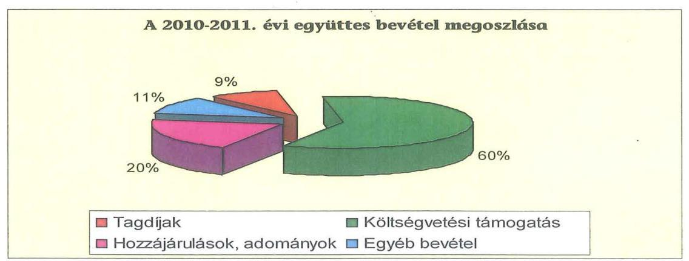
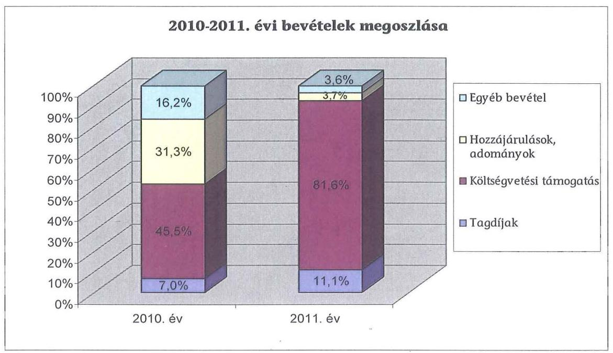
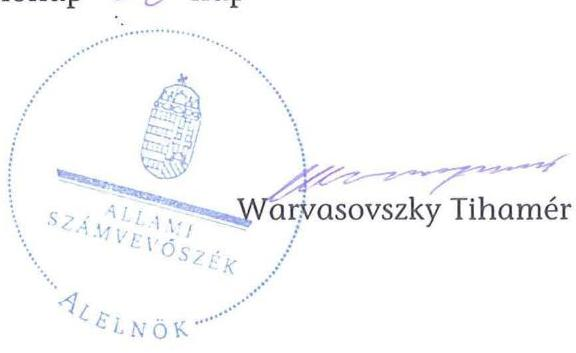
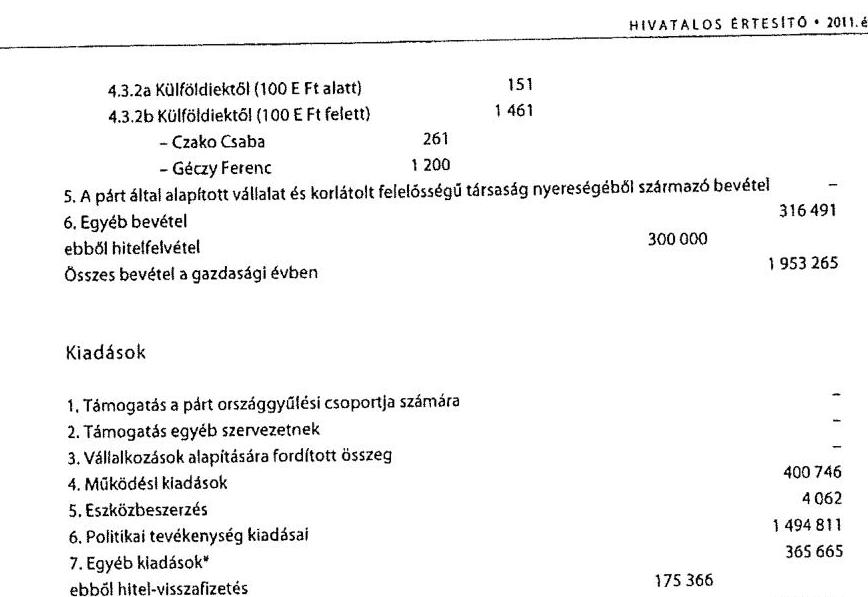

# ÁLLAMI   SZÁMVEVŐSZÉK 

## JELENTÉS

a Fidesz - Magyar Polgári Szövetség 2010-2011. évi gazdálkodása törvényességének ellenőrzéséről

---

# Állami Számvevőszék 

Iktatószám: V-0036-054/2013.
Témaszám: 1075
Vizsgálat-azonosító szám: V0610

## Az ellenőrzést felügyelte:

## Horváth Balázs

felügyeleti vezető

## Az ellenőrzés végrehajtásáért felelős:

## Baracsi Szilvia

ellenőrzésvezető

## A jelentés összeállításában közreműködött:

## Tóth István

számvevő tanácsos

## Az ellenőrzést végezték:

Tóth István
számvevő tanácsos

## Dr. Faragóné Tóth   Mária   számvevő tanácsos

## A témához kapcsolódó eddig készített számvevőszéki jelentések:

## címe

Jelentés a Fiatal Demokraták Szövetsége 1991. évi gazdálkodása törvényességének ellenőrzéséről
Jelentés a Fiatal Demokraták Szövetsége 1992-1993. évi gazdálkodása törvényességének ellenőrzéséről
Jelentés a FIDESZ - Magyar Polgári Párt 1994-1995. évi gazdálkodása törvényességének ellenőrzéséről
Jelentés a FIDESZ - Magyar Polgári Párt 1996-1997. évi gazdálkodása törvényességének ellenőrzéséről
Jelentés a FIDESZ - Magyar Polgári Párt 1998-1999. évi gazdálkodása törvényességének ellenőrzéséről
Jelentés a FIDESZ - Magyar Polgári Párt 2000-2001. évi gazdálkodása törvényességének ellenőrzéséről
Jelentés a FIDESZ - Magyar Polgári Szövetség 2002-2003. évi gazdálkodása törvényességének ellenőrzéséről
Jelentés a FIDESZ - Magyar Polgári Szövetség 2004-2005. évi gazdálkodása törvényességének ellenőrzéséről
Jelentés a FIDESZ - Magyar Polgári Szövetség 2006-2007. évi gazdálkodása törvényességének ellenőrzéséről
Jelentés a Fidesz - Magyar Polgári Szövetség 2008-2009. évi gazdálkodása törvényességének ellenőrzéséről

Jelentéseink az Országgyűlés számítógépes hálózatán és az Interneten a www.asz.hu címen is olvashatóak.

---

# TARTALOMJEGYZÉK 

BEVEZETÉS ..... 5
I. ÖSSZEGZŐ MEGÁLLAPÍTÁSOK, KÖVETKEZTETÉSEK ..... 7
II. RÉSZLETES MEGÁLLAPÍTÁSOK ..... 9

1. A Párt gazdálkodásáról szóló 2010-2011. évi beszámolók ..... 9
1.1. A teljes ellenőrzési időszakra érvényes megállapítások ..... 9
1.2. Bevételek ..... 9
1.3. Kiadások ..... 10
2. A Pártnak a beszámoló összeállítására és az azt alátámasztó
könyvvezetésre vonatkozó belső szabályozása és gyakorlata ..... 11
2.1. A számviteli rendszer szabályozása ..... 11
2.2. A könyvvezetés összhangja a jogszabályokban és a belső
szabályzatokban előírt követelményekkel ..... 12
2.3. A bizonylati elv és fegyelem, bizonylati rend érvényesülése ..... 13
3. A Párt bevételszerző, gazdálkodó tevékenysége ..... 13
3.1. A Párt gazdálkodásának szabályozottsága ..... 13
3.2. A Párt vagyonának elemei ..... 14
4. A gazdálkodással összefüggő, egyéb jogszabályokban foglalt előírások
betartása ..... 15
4.1. A foglalkoztatás szabályszerűsége ..... 15
4.2. Személyi jellegű kifizetésekre vonatkozó jogszabályok betartása ..... 15
4.3. Az adózási, társadalombiztosítási és egyéb jogszabályok
rendelkezéseinek érvényesítése ..... 16
5. A Párt belső kontroll rendszere ..... 17
5.1. A belső ellenőrzés rendszerének szabályozottsága, működése ..... 17
5.2. Az informatikai rendszer szabályozottsága, működtetése ..... 18

## MELLÉKLETEK

1. számú A Fidesz - Magyar Polgári Szövetség 2010. évi beszámolója
2. számú A Fidesz - Magyar Polgári Szövetség 2010. évi módosított beszámolója
3. számú A Fidesz - Magyar Polgári Szövetség 2011. évi beszámolója

---

.

---

# RÖVIDÍTÉSEK JEGYZÉKE 

## Jogszabályok rövidítése

Art.
állami vagyon törvény párttörvény

Számv. tv.
Szja. törvény

Tbj.

## Névrövidítések

APEH/NAV
ÁSZ
KH
OE
OV
Párt
SZB
VKI
az adózás rendjéről szóló 2003. évi XCII. törvény az állami vagyonról szóló 2007. évi CVI. törvény a pártok működéséről és gazdálkodásáról szóló 1989. évi XXXIII. törvény
a számvitelről szóló 2000. évi C. törvény
a személyi jövedelemadóról szóló 1995. évi CXVII. törvény
a társadalombiztosítás ellátásaira és a magánnyugdíjra jogosultakról, valamint e szolgáltatások fedezetéről szóló 1997. évi LXXX. törvény

Adó- és Pénzügyi Ellenőrzési Hivatal/ Nemzeti Adó- és Vámhivatal
Állami Számvevőszék
Központi Hivatal
Országos Elnökség
Országos Választmány
Fidesz - Magyar Polgári Szövetség
Számvizsgáló Bizottság
Választókerületi Iroda

---

.

---

# JELENTÉS   a Fidesz - Magyar Polgári Szövetség 2010-2011. évi gazdálkodása törvényességének ellenőrzéséről 

## BEVEZETÉS

Az Állami Számvevőszékről szóló 2011. évi LXVI. törvény 5. § (11) bekezdés a) pontja, valamint a pártok működéséről és gazdálkodásáról szóló 1989. évi XXXIII. törvény (párttörvény) 10. § (1) bekezdése alapján a pártok gazdálkodása törvényességének ellenőrzésére az Állami Számvevőszék (ÁSZ) jogosult. Az ÁSZ a rendszeres költségvetési támogatásban részesülő pártok gazdálkodását a párttörvény 10. § (3) bekezdésében előírtak szerint kétévenként ellenőrzi. A Fidesz - Magyar Polgári Szövetség (Párt) a 2010. évben 889 millió Ft és a 2011. évben 1055 millió Ft költségvetési támogatásban részesült.

Az ellenőrzés célja annak megállapítása volt, hogy:

- a Párt által készített és a Magyar Közlönyben közzétett éves beszámolók a törvényi előírásoknak megfeleltek-e, a könyvvezetéssel és a valósággal megegyező adatokat tartalmaztak-e;
- a könyvvezetés és a gazdálkodás során betartották-e a számvitelről szóló 2000. évi C. törvény (Számv. tv.) és az egyéb jogszabályok rendelkezéseit, a belső előírásokat;
- a Párt a működéséhez szabályszerűen igénybe vehető forrásokat használt-e fel, a párttörvényben engedélyezett gazdálkodó tevékenységet folytatott-e.

Az ellenőrzött időszak: 2010. január 1. - 2011. december 31.
Az ellenőrzés típusa: pénzügyi-szabályszerűségi ellenőrzés
Az ellenőrzés körülményeit illetően rögzíteni szükséges ${ }^{1}$, hogy:

- a párttörvény 1. sz. melléklete szerinti beszámoló mintához magyarázatot, útmutatót nem készítettek a jogalkotók, így ennek kitöltése pártonként - kialakított számviteli politikájuknak megfelelően - eltérő lehet;

[^0]
[^0]:    ${ }^{1}$ Az ÁSZ a korábbi pártellenőrzésekről készített jelentéseiben javasolta a Kormánynak a párttörvény módosítását. A közigazgatási és igazságügyi miniszter 2012 májusában tájékoztatta az ÁSZ-t, hogy a Kormány fontosnak tartja a számvitelről szóló törvénnyel összehangolt pártfinanszírozási és gazdálkodási szabályok megalkotását.

---

- a beszámoló minta a számviteli törvény rendelkezéseivel nem harmonizál, nem felel meg sem a mérleg, sem az eredménykimutatás követelményeinek.

Az ÁSZ a párttörvény módosításáig a jelenleg hatályos rendelkezéseknek megfelelő - egységes módszertani alapokra helyezett - gyakorlattal folytatja a pártok gazdálkodása törvényességének ellenőrzését. Az ellenőrzést a pénzügyi-szabályszerűségi ellenőrzés módszertani szabályai, valamint a pártellenőrzésre kiadott „A pártok gazdálkodása törvényességének pénzügyi szabályszerűségi ellenőrzéséhez" című segédletbe foglalt egységes követelmények szerint végeztük. Az ellenőrzési feladatok szempontrendszerét kockázatelemzéssel alapoztuk meg, amelynek eredményeként az ellenőrzést alacsony kockázatúnak minősítettük. A Párttól bekért adatok előzetes elemzése és a 2010-2011. évi főkönyvi könyvelési adatok alapján terveztük meg a tételes ellenőrzést, valamint a statisztikai mintavételi eljárást. Tételesen ellenőriztük a bevételek közül az egymillió Ft feletti tételeket, valamint a beszámolóban kötelezően nevesítendő, értékhatárt elérő egyéb hozzájárulásokat, adományokat. Az ellenőrzött években a bizonylati rend és fegyelem ellenőrzéséhez az ellenőrzési program szerint Win-idea programmal értékalapú rétegzett, véletlenszerű mintavétellel választottuk ki a bizonylatokat. A 2010. évi tételeknél figyelmen kívül hagytuk az állami támogatás és egyéb források terhére elszámolt országgyűlési választási költségeket, mert az ÁSZ korábbi ellenőrzése erre kiterjedt. ${ }^{2}$

Az ellenőrzésnél az átfogó lényegességi küszöb mértékét a bevételi főösszeg 2\%-ában határoztuk meg. Tekintettel a párttörvény 1. számú mellékletének előírásaira (belföldi hozzájárulás, adomány 500 ezer Ft, külföldi 100 ezer Ft felett) specifikus lényegességi küszöböt alkalmaztunk az egyéb hozzájárulások és adományok esetében.

A helyszíni ellenőrzésre 2012. november 6-26. között, a Párt Budapest VI. Lendvay utca 28. szám alatti székhelyén került sor.

Az ÁSZ tv. 29. § (1) bekezdése szerint a jelentéstervezetet megküldtük a Párt elnökének, aki a jelentéstervezetre észrevételt nem tett.

[^0]
[^0]:    ${ }^{2}$ A részletes megállapítások az ÁSZ 1105. sorszámon kiadott „A 2010. évi országgyűlési választásra fordított pénzeszközök elszámolásának ellenőrzéséről a jelölő szervezeteknél és független jelöltnél" című számvevőszéki jelentésben találhatók.

---

# I. ÖSSZEGZŐ MEGÁLLAPÍTÁSOK, KÖVETKEZTETÉSEK 

A Párt a 2010. és 2011. évi pénzügyi beszámolóit a párttörvényben előírt határidőn belül, a Hivatalos Értesítőben és a honlapján közzétette. A 2010. évi módosított beszámolót egy jogi személy adományozó nevének pontatlan rövidítése miatt ismételten megjelentették. A beszámolók összeállítása során érvényesültek a Számv. tv.-ben foglalt alapelvek. A beszámolók megbízható és valós képet mutattak a Párt gazdálkodásáról.

A Párt a Számv. tv.-ben előírt hatályos számviteli politikával és kapcsolódó szabályzatokkal, valamint számlarenddel rendelkezett. A számviteli szabályzatok megfeleltek a párttörvény szerinti gazdálkodással és beszámoló készítéssel összefüggő sajátos szabályoknak, valamint a Számv. tv. vonatkozó előírásainak. A párttörvény és a Számv. tv. közötti összhang hiányát a Párt belső szabályozás keretében feloldotta.

A szabályszerű beszámolás érdekében a Párt a Számv. tv.-ben előírtakkal összhangban kialakította a kettős könyvvezetésének rendjét. A könyvvezetés a Párt használatában lévő eszközökben és azok forrásaiban bekövetkezett változásokat a valóságnak megfelelően, folyamatosan, zárt rendszerben, áttekinthetően mutatta be. A könyvvezetésben érvényesültek a Számv. tv.-ben meghatározott elvek. Az analitikus nyilvántartások szabályszerű vezetéséről és főkönyvi egyeztetéséről a Számv. tv. és a belső szabályozások előírásainak megfelelően gondoskodtak. Az éves zárlati munkát megalapozó leltározást az előírtak szerint teljes körűen végrehajtották, a leltárak kiértékelése során eltérést nem állapítottak meg. Az éves zárást a Számv. tv.-ben és a számlarendben foglaltak szerint határidőre elvégezték.

A könyvviteli nyilvántartásokban rögzített gazdasági eseményeket szabályszerűen kiállított bizonylatok támasztották alá. A bizonylatok alaki és tartalmi előírásainak a Számv. tv.-ben foglaltak szerint érvényt szereztek. A szigorú számadású nyomtatványok nyilvántartásba vételi kötelezettségét teljesítették. A Számv. tv. bizonylati elvre és bizonylati fegyelemre vonatkozó előírásait a Párt betartotta. A bizonylatok megőrzéséről szabályszerűen gondoskodtak.

A Párt az ellenőrzött években 3246494 ezer Ft bevételből gazdálkodott.

---

A Párt 2010-2011. évi bevételeinek háromötöde költségvetési támogatásból származott. A könyvekben év végén kimutatott kötelezettség állomány a 2010. évi 2546112 ezer Ft-ról, 2011. évben 1708317 ezer Ft-ra csökkent. A bevételszerző, gazdálkodó tevékenység során betartották a párttörvény forrásszerzési és gazdálkodási előírásait. A Párt saját bevételei szabályozott tagdíjfizetésből, egyéb hozzájárulásokból és adományokból, egyéb bevételekből származtak. A Párt nem pénzbeli vagyoni hozzájárulásként a 2010. évben 7934 ezer Ft, 2011. évben 8231 ezer Ft összegű támogatást kapott kedvezményes ingatlan bérleti díj formájában. A Párt a 2009. évben az állami vagyonról szóló törvényben foglaltak betartásával huszonkét ingatlant vásárolt 200827 ezer Ft értékben. A vásárláshoz a törvény által biztosított hitelt vették igénybe, amelynek fedezeteként jelzálogjogot jegyeztettek be. A jelzálogszerződés és a bank általános üzletszabályzatának megfelelően a vásárolt ingatlanok értékbecsléséről gondoskodtak. A Párt a hitelszerződésben rögzítetteknek megfelelően a kamatfizetésen túl évente 13396 ezer Ft tőkét törlesztett.

A munkaerő-foglalkoztatás az ellenőrzött időszakban a Munka Törvénykönyvéről szóló törvényben szabályozott tartalmú munkaszerződések szerint történt. A Párt a foglalkoztatottakat a törvényi előírásoknak megfelelően bejelentette. A munkabérek számfejtése, kifizetése megfelelt a hatályos jogszabályi előírásoknak. A munkavállalókat megillető juttatásokat és a költségtérítéseket szabályozták. Személyi jellegű kifizetések körében a munkavállalóknak az Szja. törvényben meghatározott kedvezményes adófizetési kötelezettség teljesítése mellett étkezési utalványt nyújtottak.

Az adózási és a társadalombiztosítási jogszabályok munkaviszonnyal összefüggő előírásait, a havi és az éves adatszolgáltatási, bevallási és befizetési kötelezettségét a Párt teljesítette, a foglalkoztatottak biztosítási jogviszonyában történt változásokat határidőre bejelentette. A kötelező nyilvántartásokat vezették. A Párt, mint kifizető a magánszemélyeknek irodahelyiség után fizetett bérleti díj után az Szja. törvényben előírt adóelőleg levonási kötelezettségét az Art.-ban foglaltak szerint teljesítette, az igazolásokat kiadta. A Párt a cégautóadó, valamint a tulajdonában lévő telefonok magáncélú használatából eredő bevallási, valamint adó- és járulékbefizetési kötelezettségét teljesítette. Az elszámolt reprezentáció költségei nem haladták meg az Szja tv.-ben meghatározott adómentes határt.

A belső ellenőrzés rendszerének szabályait a Párt az alapszabályban, a pénzügyi és a költségvetési gazdálkodási szabályzatban rögzítette. A Számvizsgáló Bizottság (SZB) az ügyrendi előírásokkal összhangban folytatta le ellenőrzéseit az ellenőrzött időszakban, arról a Kongresszusnak beszámolt. A kötelezettségvállalási, teljesítésigazolási, utalványozási és ellenjegyzési jogkört a szabályoknak megfelelően gyakorolták. A munkafolyamatba épített ellenőrzés a belső szabályozás előírásának megfelelően
 a rendszeres pénztárellenőrzésben továbbá az alapbizonylatok könyvelésre való feladás előtti felülvizsgálatában valósult meg. A vezetői és a munkafolyamatba épített ellenőrzés segítette a Párt szabályszerű könyvvezetését és a beszámoló készítését. A gazdálkodással összefüggő informatikai rendszer működtetését szabályozták.

---

# II. RÉSZLETES MEGÁLLAPÍTÁSOK 

## 1. A PÁRT GAZDÁLKODÁSÁRÓL SZÓLÓ 2010-2011. ÉVI BESZÁMOLÓK

### 1.1. A teljes ellenőrzési időszakra érvényes megállapítások

A Párt az ellenőrzött évek gazdálkodási beszámolóit a párttörvény 9. § (1) bekezdésében előírt határidőn belül, a párttörvény 1. számú mellékletében előírt formában és tartalommal tette közzé. A 2010. évi beszámoló 2011. április 20-án, a Hivatalos Értesítő 27. számában, az önellenőrzés alapján módosított 2010. évi beszámoló 2011. május 6-án, a Hivatalos Értesítő 30. számában, a 2011. évi beszámoló 2012. április 17-én, a Hivatalos Értesítő 17. számában jelent meg (1-3. számú melléklet). A Párt mindhárom beszámolóját honlapján is nyilvánosságra hozta. Az Országos Választmány (OV) a Párt éves gazdálkodásáról készített és az Országos Elnökség (OE) által beterjesztett beszámolókat az alapszabály 52. § (1) bekezdésének k) pontja szerinti hatáskörében mindkét évben elfogadta.

A beszámolók összeállításának rendjét a Párt hatályos számviteli politikájában és számlarendjében szabályozta. A Párt a számlarendjében határozta meg a beszámoló sorok és a főkönyvi számlák kapcsolatát. A beszámoló sorok adatai levezethetők voltak a főkönyvi kivonatokból, illetve a főkönyvi számlákból és az azokhoz kapcsolódó analitikus nyilvántartásokból. A beszámolók a Választókerületi Irodák (VKI) és a Központi Hivatal (KH) számviteli bizonylatai alapján, központilag könyvelt gazdasági események főkönyvi kivonataiból készültek, adataik megbízható, valós képet adtak a Párt éves gazdálkodásáról. Az ismételt közzététel oka, hogy egy jogi személy adományozó nevét (MAGOSZ) az eredeti beszámolóban pontatlanul rövidítették. A Párt a számviteli politikájában előírtaknak megfelelően december 31-i fordulónappal készítette el beszámolóit. A beszámolók összeállítása során érvényesültek a Számv. tv. 15-16. §-ában foglalt alapelvek.

### 1.2. Bevételek

A beszámoló bevételeit a 9. Bevételek elnevezésű számlaosztályhoz tartozó, a párttörvény 1. számú melléklete szerinti minta soraihoz igazodó főkönyvi számlák adataiból, valamint a belső szabályozás szerinti - a 4. számlaosztályban nyilvántartott - kölcsön- és hitelből állították össze.

A tagdíj megállapítás feltételeit a Párt alapszabálya rögzítette. Mérsékléséről, illetve annak elengedéséről az OV tagdíjszabályzatban határozhatott, a befizetések a szabályozással összhangban teljesültek. A tagdíjak beszámolósor közzétett adata mindkét évben megegyezett a kapcsolódó főkönyvi számlán kimutatott egyenleggel. A tagdíj főkönyvi számlák adatait analitika támasztotta alá. A tagdíjakhoz kapcsolódó bizonylatok alapján a befizető személye és a

---

jogcím minden esetben megállapítható volt. A beszámoló soron csak a tagdíjak fogalomkörébe tartozó összegek szerepelnek.

Az állami költségvetésből származó támogatás beszámolósor adatát a 2010. és a 2011. években a főkönyvi könyvelésben kimutatott, a Magyar Államkincstár által ténylegesen átutalt, valamint a Magyar Köztársaság 2010. évi költségvetésének végrehajtásáról szóló 2011. évi CXXXIII. törvényben és a 2010. évi országgyűlési választásra jelöltarányosan kapott támogatásnak együttes összegével, illetve a Magyar Köztársaság 2011. évi költségvetésének végrehajtásáról szóló 2012. évi CLV. törvényben meghatározott összeggel egyezően közölték.

Az egyéb hozzájárulások, adományok beszámolósor adatát a párttörvény 1. számú mellékletében előírt minta szerint tovább részletezték. A párttörvényben meghatározott értékhatár feletti és alatti támogatásokat külön főkönyvi számlán tartották nyilván. A beszámoló sorok összege megegyezett az egyéb hozzájárulás számlacsoportban és az egyéb rendkívüli bevételek számlán kimutatott nem pénzbeli vagyoni hozzájárulások egyenlegével. A Párt a beszámolókban feltüntette azon támogatók nevét, amelyektől egy naptári év alatt a párttörvény 9. § (2) bekezdésében meghatározott értékhatárt meghaladó támogatást kapott. Az egyéb hozzájárulások, adományok jogi személyektől beszámolósor évenkénti teljesítését a Párt a közzétett beszámolókban a párttörvény 1. számú melléklet tartalmi előírásai szerinti csoportosításban, a könyvviteli nyilvántartás adataival egyezően, az értékhatárt meghaladó összegű támogatást nyújtókat nevesítve (2010. évben hét, 2011. évben nyolc), a támogatás összegével együtt szerepeltette. A beszámolókban szerepelt az önkormányzatoktól bérelt ingatlanok tényleges és a piaci bérleti dijának különbözeteként kapott nem pénzbeli vagyoni hozzájárulás értéke a 2010. évben 7934 ezer Ft, a 2011. évben 8231 ezer Ft összegben. Az egyéb hozzájárulások, adományok jogi személynek nem minősülő gazdasági társaság közölt adatai mindkét évben megegyeztek a könyvviteli nyilvántartásban kimutatott összegekkel. Az egyéb hozzájárulások, adományok magánszemélyektől címen szereplő összeg - analitikával alátámasztottan - megegyezett a kapcsolódó számlacsoport számláinak összevont egyenlegével.

Az egyéb bevételek beszámoló soron a számviteli politika előírásai szerint szerepeltették az adott évben felvett hitel összegét, a tárgyi eszközök értékesítéséből és káresemények megtérítéséből származó bevételeket, a Kereszténydemokrata Néppárttól megállapodás alapján kapott összeget, továbbá pénzintézettől kapott kamatokat. A beszámoló soron szereplő összeg megegyezett a kapcsolódó főkönyvi számlákon kimutatott bevétellel.

# 1.3. Kiadások 

A beszámolóban a kiadásokat a kettős könyvvitel megfelelő számláin könyvelt költség és ráfordítási adatok, valamint a hitelek és kölcsönök tárgyévi törlesztésének összevont adatai alapján állították össze. A 2010. és a 2011. évekre közzétett beszámolók kiadási sorainak ellenőrzésekor a főkönyvi záró adatokhoz képest eltérés nem mutatkozott, a kiadási jogcímek azonossága érvényesült.

---

A 2011. évi támogatás egyéb szervezeteknek beszámolósoron közölt adat megegyezett a kapcsolódó főkönyvi számla egyenlegével, tartalmában kizárólag jogi személynek adott támogatást tartottak nyilván.

A működési kiadások beszámoló soron a számlarendben meghatározott működési kiadásokat (rezsi költségek, bérleti díjak, munkavállalók bér- és járulékköltségei, személyi jellegű egyéb kifizetések, anyagköltségek és a működéshez kapcsolódó igénybevett szolgáltatások) tették közzé.

Az eszközbeszerzés közölt adata megegyezett a számlarendben meghatározott vonatkozó főkönyvi számlacsoport könyvelt egyenlegével. A beszámoló soron az adott évben vásárolt gépjármű teljes vételárát, valamint az egyéb eszközbeszerzéseket szerepeltették.

A politikai tevékenység kiadásai beszámoló soron a Párt a számlarendjében meghatározottaknak megfelelően a hirdetés-, propaganda- és rendezvényköltségek, az országgyűlési és a helyi önkormányzati választási költségek, valamint a politikai tevékenységgel kapcsolatos egyéb kiadások főkönyvi számláin rögzített adatait mutatta ki mindkét évben.

Az egyéb kiadások soron a beszámolók adata mindkét évben megegyezett az egyéb kiadások számlacsoportban könyvelt késedelmi és hitelkamat, kártérítés, bírság, valamint a hitelek és kölcsönök törlesztéseinek összevont egyenlegével a számviteli politika előírásának megfelelően.

# 2. A PÁRTNAK A BESZÁMOLÓ ÖSSZEÁLLÍTÁSA ÉS AZ AZT ALÁTÁMASZTÓ KÖNYVVEZETÉSRE VONATKOZÓ BELSŐ SZABÁLYOZÁSA ÉS GYAKORLATA 

### 2.1. A számviteli rendszer szabályozása

A Párt belső számviteli szabályozásként az ellenőrzött időszakban rendelkezett a Számv. tv. 14. § (3) bekezdésében előírt számviteli politikával, továbbá a Számv. tv. 14. § (5) bekezdés a), b) és d) pontjaiban meghatározott eszközök és források leltárkészítési és leltározási szabályzatával, eszközök és források értékelési szabályzatával, pénzkezelési szabályzatával, valamint a 161. § szerinti számlarenddel.
2010. és 2011. január 1-jével a számviteli szabályzatokat felülvizsgálták, azokat változatlan tartalommal, kizárólag a hatályba lépés időpontját aktualizálva, a Számv. tv. 14. § (12) és a 161. § (4) bekezdésével és alapszabályával összhangban a Párt képviseletére jogosultak - gazdasági vezető és a főkönyvelő (külső megbízott) - léptették hatályba.

A szabályzatok módosítása nem volt indokolt, mivel a Pártra vonatkozó jogszabályi és gazdálkodási feltételekben nem történt változás. A számviteli szabályzatok megfeleltek a párttörvény gazdálkodással és beszámoló készítéssel összefüggő sajátos, valamint a Számv. tv. vonatkozó előírásainak. A párttörvény és a Számv. tv. közötti összhang hiányát a Párt belső szabályozás keretében feloldotta.

---

# 2.2. A könyvvezetés összhangja a jogszabályokban és a belső szabályzatokban előírt követelményekkel 

A Párt a Számv. tv. 159. §-ában előírt kettős könyvvitelt vezetett. A könyvvezetést és a beszámoló összeállítását mindkét ellenőrzött évben ugyanaz a könyvelő kft. végezte, határozatlan idejű megbízási szerződés alapján. A könyvelő kft. vezetője a Számv. tv. 151. § (1) bekezdés a) pontja szerint meghatározott képesítéssel rendelkezik, a Magyar Könyvvizsgálói Kamara nyilvántartásában szerepel. A könyvelő kft. a Párt székhelyén végezte tevékenységét, az operatív információáramlás feltételei biztosítottak voltak.

A Párt az eszközökről és azok forrásairól, továbbá a gazdasági műveletek hatására bekövetkezett változásokról a valóságnak megfelelő, folyamatos, zárt rendszerű, áttekinthető központi könyvviteli nyilvántartást vezetett, mindkét évben azonos számítógépes programmal. A Pártnál alkalmazott pénzügyi, számviteli szoftver adatállományából az ellenőrzéshez szükséges adatok teljes körűen előállíthatók voltak.

A könyvvezetés során érvényesültek a Számv. tv. 15. §-ban és 16. § (1)-(3) bekezdésben szabályozott számviteli alapelvek. A Párt számlakijelölési gyakorlata megfelelt a Számv. tv. 160. §-ában és a számlarendben foglalt előírásoknak.

A Párt a Számv. tv. 161. § (2) bekezdés c) pontjában foglaltakkal összhangban a főkönyvi számlákhoz rendelt analitikák köréről, vezetésének módjáról a számviteli politikában, a számlarendben és a pénzkezelési szabályzatban rendelkezett. Az ellenőrzött időszakban a főkönyvi számlákhoz kapcsolódóan az immateriális javak és aktivált tárgyi eszközök, a szállítók, a vevők, a tagdíj bevételek, a hitelek és fizetendő kamatok, a bankszámla és a készpénzforgalom, az elszámolásra kiadott előlegek és az egyéni bérek és járulékok analitikus nyilvántartását az előírások szerint vezették. Az analitikus nyilvántartások és a főkönyvi könyvelés között az értékadatok számszerű egyeztetése a Számv. tv. 161. § (3) bekezdés előírásának megfelelően megtörtént.

Az éves zárást megalapozó leltározást a 2010-2011. években a Számv. tv. 69. § (1)-(2) bekezdésben, valamint a leltározási szabályzatban előírtak szerint teljes körűen végrehajtották. A Párt leltározási kötelezettségének mindkét ellenőrzött évben eleget tett, az eszközök és források értékelését december 31-i fordulónappal elvégezte mind a KH-ban, mind a VKI-kban. A leltárak kiértékelése során leltárkülönbözetet nem mutattak ki. Az éves zárást a Számv. tv. 164. § (1)-(2) bekezdésében és a számlarendben foglaltak szerinti határidőben végrehajtották. Ennek keretében a beszámolókat alátámasztó főkönyvi kivonatokat elkészítették. Év végén a kiegészítő, helyesbítő, egyeztető, összesítő könyvelési munkálatokat és a számlák technikai lezárását elvégezték.

A Párt a készpénzforgalom nyilvántartására a pénzügyi szabályzatban előírt időszaki pénztárjelentést vezette. A készpénzforgalom pénztárjelentésben való rögzítése a pénzmozgással egyidejűleg a Számv. tv. 165. § (3) bekezdés a) pontjának megfelelően történt. A pénzkezelés szabályszerűségét a Számv. tv. 14. § (8)-(9) bekezdéseiben és a pénzkezelési szabályzat előírásaival összhangban biztosították. A pénztárosi feladatokat ellátó személyek esetében az össze-

---

férhetetlenségi követelmények betartásáról gondoskodtak. A pénztárosok rendelkeztek a pénzkezeléshez kapcsolódó felelősségvállalási nyilatkozattal. A pénzkezelési szabályzatban meghatározott napi készpénz záró állomány mértékét nem lépték túl. A bankszámla felett és a pénztári kifizetéseknél az utalványozási jogot a pénzügyi szabályzat szerint arra jogosultak gyakorolták.

# 2.3. A bizonylati elv és fegyelem, bizonylati rend érvényesülése 

A Párt a bizonylati rendjét a számviteli politikájában és az ahhoz kapcsolódóan elkészített egyéb számviteli és gazdálkodási szabályzataiban határozta meg. A számviteli nyilvántartásban a könyvelt gazdasági műveleteket szabályszerűen kiállított bizonylatokkal támasztották alá, a Számv. tv. 165. § (1) - (2) bekezdésében foglalt előírásoknak megfelelően. Az egyes gazdasági műveletek, események bizonylatainak adatait a Számv. tv. 165. § (3) bekezdésében meghatározott időpontig rögzítették. A könyvvezetés során a Számv. tv. 165. § (4) bekezdés előírását figyelembe véve gondoskodtak a főkönyvi könyvelés és a bizonylatok adatai közötti egyeztetés és ellenőrzés logikailag zárt rendszerben való biztosításáról.
 A számviteli bizonylatok hitelesek, megbízhatók és helytállóak voltak, megfelelve a Számv. tv. 166. §-ában rögzített szabályoknak. A bizonylatok alaki és tartalmi előírásai a Számv. tv. 167. § (1) bekezdésében foglaltaknak megfelelően érvényesültek.

A Párt a Számv. tv. 168. § (3) bekezdése szerint eleget tett a szigorú számadású nyomtatványok nyilvántartásba vételi kötelezettségének. A bizonylatok megőrzéséről a Számv. tv. 169. § előírásainak megfelelően gondoskodtak.

## 3. A Párt bevételszerző, gazdálkodó tevékenysége

### 3.1. A Párt gazdálkodásának szabályozottsága

A hatályos alapszabály, a pénzkezelési és a költségvetési gazdálkodási szabályzat határozza meg a Párt gazdálkodási rendjét. Az alapszabály 86. §-ában a párttörvény 4. és 6. §-aival összhangban rögzítették a Párt bevételeinek és gazdálkodó tevékenységének jogcímeit.

A helyi szervezetek az alapszabály 22. § f) és g) pontjának értelmében az OV által megállapított módon részesedtek a Párt költségvetéséből, bevételeikkel önállóan gazdálkodtak a VKI-n keresztül. A gazdálkodási szabályzat 14-15. §-ai szerint a VKI-k bankszámlával nem rendelkeztek, a készpénzben történő tranzakciók a KH-ban működő VKI pénztárban teljesültek, a szervezetenként nyilvántartott bevételek terhére.

Az OE kezeli a Párt vagyonát, gyakorolja a tulajdonosi jogokat az alapszabály 60. § (1) bekezdés k) pontjának értelmében. A 60. § (1) bekezdés l) és m) pontjai alapján gondoskodik a Párt költségvetésének előkészítéséről, tervezetének az OV elé történő beterjesztéséről és a jóváhagyott költségvetés végrehajtásáról, továbbá beszámol utóbbiról az OV-nak.

---

# 3.2. A Párt vagyonának elemei 

A Párt befolyt és a beszámolókban kimutatott bevételei az ellenőrzött időszakban: tagdíjakból, a párttörvény 5. § (2) bekezdésében és a választási eljárásról szóló 1997. évi C. törvény 91. §-ában engedélyezett állami költségvetési támogatásokból, valamint egyéb hozzájárulásokból, adományokból, egyéb bevételekből (kölcsön igénybevétel, hitelfelvétel, tárgyi eszközök értékesítése, káreseményekkel kapcsolatos, illetve kamatbevétel) álltak. A Párt bevételeinek évenkénti megoszlását az alábbi ábra szemlélteti:

A Pártnak a 2010. évben 1953265 ezer Ft, a 2011. évben 1293229 ezer Ft összbevétele volt. Az ellenőrzött időszak bevételeinek 60%-a költségvetési támogatásból származott. A Párt az ellenőrzött időszakban a könyvviteli nyilvántartások szerint a párttörvény 4. §-ában meg nem engedett forrásból származó, illetve névtelen vagyoni hozzájárulást nem fogadott el. A Párt önellenőrzés keretében tárt fel a bizonylatok alapján nem megállapítható befizetőtől származó, 2010. évi adományt 106 ezer Ft összegben, melyet a párttörvény 4. § (3) bekezdésének megfelelően a központi költségvetés részére befizetett. A Párt a párttörvény 6. §-ában engedélyezett gazdálkodó tevékenységet folytatott. Gazdasági társaságban részesedést nem szerzett, vállalatot, egyszemélyes kft.-t nem alapított, értékpapírt nem vásárolt. A Párt az ellenőrzött időszakban a bérelt önkormányzati tulajdonú ingatlanok közül 49 ingatlant bérelt piaci áron, két ingatlan után bérleti díjat nem fizetett, a 2010. évben 36, a 2011. évben 32 ingatlan után kedvezményes bérleti díjat fizetett. A piaci és a ténylegesen fizetett bérleti díj különbözete nem pénzbeli vagyoni hozzájárulásnak minősült, amelynek értékét a Párt a párttörvény 4. § (5) bekezdésében foglaltak szerint megállapította és a beszámolókban szerepeltette az egyéb hozzájárulások adományok jogi személyektől soron.

A Párt az állami vagyonról szóló 2007. évi CVI. törvény 68. § (4) bekezdése alapján 2009-ben vásárolt 22 állami tulajdonú ingatlanra a hivatkozott törvény 68. § (1) bekezdésének előírása alapján 200827 ezer Ft összegű kedvezményes kamatfeltételű, jelzáloggal biztosított hitelt vett igénybe a Magyar Fejlesztési Bank Zrt.-től. A kamatfizetésen túl évente 13396 ezer Ft tőkét törlesztettek. A jelzálogszerződés 14. pontjának, valamint a bank Általános Üzletszabályzat 5.2. pontjának megfelelően a Párt a vásárolt ingatlanok értékbecsléséről 2011. évben gondoskodott. Az ingatlanokat rendeltetésüknek megfelelően párttevékenység céljára használták.

A Pártnak a 2010. év végén 2546112 ezer Ft, a 2011. év végén 1708317 ezer Ft összegű kötelezettsége állt fenn.

# 4. A gazdálkodással összefüggő, egyéb jogszabályokban foglalt előírások betartása 

### 4.1. A foglalkoztatás szabályszerűsége

A Párt feladatait 2010. január 1-jén munkaviszony keretében 17 fő munkavállaló alkalmazásával látta el, amely 2010. szeptember 1-jére 6 főre csökkent.

A Pártnál a 2010. és a 2011. években a munkakörök ellátása - 2010. január 1. és augusztus 31. között megbízási szerződéssel foglalkoztatott egy személy kivételével - határozatlan idejű, a Munka Törvénykönyvéről szóló 1992. évi XXII. törvény 76. § (1)-(6) bekezdésében szabályozott tartalmú munkaszerződés szerint történt, amit a munkáltatói jogokat gyakorló írt alá. A munkavállalók részletes feladatait a munkaköri leírásokban rögzítették. A pénzügyi-számviteli területen dolgozók megfelelő szakmai végzettséggel, gyakorlattal rendelkeztek. Az alkalmazottak bérszámfejtését, továbbá az adó és társadalombiztosítási jogszabályokban előírt levonási, bevallási és adatszolgáltatási kötelezettség teljesítését a könyvelő kft. látta el. A Pártnál a munkavállalókat az adózás rendjéről szóló 2003. évi XCII. törvény (Art.) 16. § (4) bekezdése előírásainak megfelelően bejelentették. A munkabérek számfejtése, kifizetése a munkaszerződéssel és a hatályos, a társadalombiztosítás ellátásaira és a magánnyugdíjra jogosultakról, valamint e szolgáltatások fedezetéről szóló 1997. évi LXXX. törvény (Tbj.), a személyi jövedelemadóról szóló 1995. évi CXVII. törvénnyel (Szja. törvény) és az egyéb jogszabályokkal összhangban történt. Az egyéni bér- és járuléknyilvántartásokat vezették, amelyek megegyeztek a főkönyvi könyveléssel és bevallásokkal. Az Art. 46. § (1) bekezdésben, valamint a Tbj. 47. § (3) bekezdésben szabályozott igazolásokat a Párt határidőben kiadta.

### 4.2. Személyi jellegű kifizetésekre vonatkozó jogszabályok betartása

A Párt a munkavállalókat megillető juttatásokat, költségtérítéseket az Szja. törvénnyel összhangban lévő hatályos szabályzatok, gazdasági vezetői utasítások alapján fizette. A Párt a gazdasági vezető utasítása szerint az alkalmazottak részére béren kívüli juttatásként kizárólag étkezési utalványt nyújtott a 2010. évben havi 15 ezer Ft/fő, a 2011. évben havi 18 ezer Ft/fő értékben, amely után az Szja. törvényben meghatározott kedvezményes adófizetési kötelezettségét teljesítette. A Párt munkavállalói részére munkába járással kapcsolatos utazási költségtérítést nem fizetett. Belföldi és külföldi kiküldetés alapján utazási költségtérítést, napidíjat nem számoltak el. A Pártnál a 2010-2011. évben a magán tulajdonú gépjármű hivatalos célú használatát szabályozták, azonban ezen a címen kifizetés nem történt. A Párt a tulajdonában lévő gépjárművek magánhasználatát nem engedélyezte.

# 4.3. Az adózási, társadalombiztosítási és egyéb jogszabályok rendelkezéseinek érvényesítése 

A Párt az ellenőrzött időszakban a magánszemélyeknek teljesített kifizetésekből levont személyi jövedelemadót, a munkáltatót és munkavállalókat terhelő járulékokat, valamint a magánnyugdíj-pénztári befizetési kötelezettséget havonta megállapította, és a bevallást az Art. 31. § (2) bekezdésében meghatározott határidőre teljesítette. Az Art. 2. számú melléklet I. Határidők fejezet 1. és 5. pontja alapján a levont adót és járulékot havi rendszerességgel határidőre megfizette. A Tbj. 46. §-a szerinti társadalombiztosítási egyéni nyilvántartást a Párt megfelelően vezette, és azokról az adatszolgáltatását teljesítette. A levont magán-nyugdíjpénztári tagdíjakat a 2010. év végéig havonta a Tbj. 51. § (1) bekezdése előírásainak megfelelően nyugdíjpénztáranként határidőre bevallották és befizették (2011. január 1-jétől a magán nyugdíjpénztári tagságok megszűntek). Az adók és járulékok bevallása és befizetése a főkönyvi nyilvántartás adataival megegyezett. A Pártnak az ellenőrzött években adóhátralékai nem voltak, ezt az Adó és Pénzügyi Ellenőrzési Hivatal/Nemzeti Adó és Vámhivatal (APEH/NAV) folyószámla kivonata alátámasztotta.

A Párt a 2010. évben öt, a 2011. évben négy magánszemélynek fizetett bérleti díjat irodahelyiség bérlemény után. A Párt, mint kifizető, az Art. 25. § (3) bekezdése szerint levonási kötelezettségét a 2010. évre vonatkozóan az Szja. törvény 74. § (6) bekezdése, a 2011. évben az Szja. törvény 31. §-a alapján teljesítette. A levont adóelőleget az Art. 2. számú mellékletében meghatározott határidőre befizették, a személyi jövedelemadó előleg levonásáról az igazolást az Art. 46. § (1) bekezdésének megfelelően kiadták. A Párt a hivatali gépkocsik használati szabályzatában rögzítette, hogy a leadott üzemanyagszámla akkor fizethető ki, ha a menetlevélen feltüntetett kilométer, valamint az APEH/NAV által meghatározott üzemanyagár alapján kiszámított fogyasztási norma nem lépi túl az egyszerűsített alapnormát. A Pártnál mindkét évben a szabályozás szerint jártak el. A Párt feladatai teljesítéséhez az ellenőrzött időszakban hét darab saját tulajdonú, valamint két darab bérelt gépkocsit üzemeltetett. A Párt a tulajdonában álló gépkocsik után a gépjárműadóról szóló 1991. évi LXXXII. törvény 17/A.-17/G. § előírásainak megfelelően az ellenőrzött időszakra vonatkozóan a cégautó adót önadózással megállapította, negyedévenkénti adóbevallási, adófizetési kötelezettségét teljesítette, kivéve a 2011. szeptember 8-án vásárolt új beszerzésű személygépjárművet. Az új gépjárműre vonatkozó cégautó adó bevallási és befizetési kötelezettségét - 21 ezer Ft cégautó adó és 1 ezer Ft önellenőrzési pótlék - a helyszíni ellenőrzés időszakában önellenőrzés keretében rendezték.

A Párt a 2010. évben az Szja. törvény 69. § (12) bekezdése, a 2011. évben a 70. § (5) bekezdése alapján a könyvelt telefon kiadások 20 százaléka után állapította meg a tulajdonában álló telefonok magán célú használatából eredő adó és járulék bevallási és befizetési kötelezettséget, melyet határidőre teljesített.

---

A Párt a működési és politikai célú reprezentációs kiadásokat önálló főkönyvi számlán tartotta nyilván. Az elszámolt reprezentációs kiadások összege nem haladta meg a 2010. évben az Szja. törvény 69. § (7) bekezdés b) pontjában, a 2011. évben az Szja. törvény 70. § (2) bekezdésében meghatározott adómentes értékhatárt, ezért személyi jövedelemadó és járulékfizetési kötelezettség nem keletkezett.

A Pártnak gazdálkodó tevékenységével összefüggésben az általános forgalmi adóról szóló 2007. évi CXXVII. törvény hatálya alá tartozó bevallási, befizetési kötelezettsége nem keletkezett. A Pártnak a foglalkoztatás elősegítéséről és a munkanélküliek ellátásáról szóló 1991. évi IV. törvény 41/A. § szerinti rehabilitációs hozzájárulás fizetési kötelezettsége nem keletkezett, mivel az általa foglalkoztatottak száma a 20 főt nem haladta meg.

A 2010-2011. éveket érintő társadalombiztosítási ellenőrzésre nem került sor, az APEH/NAV az adózási szabályok betartását nem vizsgálta.

# 5. A Párt belső kontroll rendszere 

### 5.1. A belső ellenőrzés rendszerének szabályozottsága, működése

A Párt gazdálkodásának, pénzügyi és számviteli tevékenységének belső ellenőrzési rendszerét az alapszabályban, a pénzügyi és a költségvetési gazdálkodási szabályzataiban határozta meg.

Az alapszabály XIII. fejezete rögzíti az SZB megválasztásának, feladatának szabályait. Az SZB működési rendjét a testület saját hatáskörében megállapította. Az SZB ellenőrzési feladatkörében: megvizsgálja és írásban véleményezi az OV elé terjesztett költségvetést, illetve annak végrehajtásáról szóló beszámolót; jogosult a Párt pénzügyeivel, gazdálkodásával, vagyonkezelésével kapcsolatos információk megszerzésére; ellenőrzi a tagdíjak és tagdíj-kiegészítések befizetését, felhasználásának módját; munkájáról tájékoztatja az OE-t és OV-t, továbbá beszámolni köteles a Kongresszusnak. A Párt tisztújító Kongresszusa 2011. július 3-án az alapszabály 81. §-ában foglaltaknak megfelelően megválasztotta az SZB tagjait, valamint póttagjait, és elfogadta a két kongresszus közötti -2011-2013. június - időszakra vonatkozó ellenőrzési tervet. A Kongresszus hatáskörében elfogadta az SZB munkájáról készített beszámolót. Az SZB a 2010. és 2011. években véleményezte a költségvetési tervet, az éves beszámolók tervezetét, ellenőrizte a VKI tagdíj befizetéseket és az irodák kiadásait, a 2010. évi országgyűlési és az önkormányzati választások kampány költségvetésének végrehajtását, a Hajdú-Bihar megyei 6. választókerület kampány kiadásainak teljesítését. Az elvégzett ellenőrzésekről
 jegyzőkönyvek készültek. Az SZB 2010. és 2011. években végzett ellenőrzései során szabálytalanságot nem állapított meg.

A vezetői és munkafolyamatba épített ellenőrzési feladat- és hatásköröket a hatályban lévő költségvetési gazdálkodási, valamint a pénzügyi szabályzatban határozták meg. A gazdasági és pénzügyi ellenőrzés szervezése és működtetése a költségvetési gazdálkodási szabályzat 41. §-a szerint a gazdasági vezető felelősségi körébe tartozott. A gazdasági vezető a pénzügyi szabályzat

---

mellékleteiben meghatározta az aláírási jogok gyakorlásának feltételeit, kijelölte az utalványozásra, teljesítésigazolásra, érvényesítésre és ellenjegyzésre/ellenőrzésre jogosultak körét. A munkafolyamatba épített ellenőrzés egyeztetési, engedélyezési, jóváhagyási és ellenőrzési feladatait a pénzügyi szabályzatban és a munkaköri leírásokban határozták meg. A kötelezettségvállalási, teljesítésigazolási, utalványozási és ellenjegyzési jogkört a szabályoknak megfelelően gyakorolták. A munkafolyamatba épített ellenőrzés a belső szabályozás előírásának megfelelően a rendszeres pénztárellenőrzéssel, továbbá a VKI-któl beérkezett alapbizonylatok könyvelésre való feladás előtti felülvizsgálatával valósult meg. A könyvelő kft.-vel kötött megbízási szerződésben ellenőrzési feladatot nem rögzítettek, azonban a Párt elnökének meghatalmazása alapján a gazdálkodással kapcsolatos ellenőrzési és ellenjegyzési feladatokat a könyvelő kft. főkönyvelője látta el. Ellenőrizte a bérszámfejtési és költségvetési kifizetések szabályszerűségét, az elszámolásra kiadott előlegek nyilvántartását, a felvett hitel elszámolását. Az ellenőr az ellenőrzésekről készült jegyzőkönyvek szerint szabálytalanságot, hiányosságot nem tárt fel. A belső ellenőrzési rendszer szabályozási háttere, valamint működése biztosította a Párt szabályszerű működését, segítette a Párt gazdálkodásának, könyvvezetésének és beszámoló készítésének törvényességét.

# 5.2. Az informatikai rendszer szabályozottsága, működtetése 

A Párt informatikai rendszerének használatához informatikai biztonsági szabályzattal rendelkezett, melyet a Párt és a könyvelő kft. munkavállalói dokumentáltan megismertek. A könyvelőprogramot kizárólag a Párt gazdálkodási adatainak könyveléséhez használják, a könyvelést több alkalmazott végzi. A hozzáférési jogosultságokat dokumentálták, ellenőrizték. Személyenkénti nyilvántartásával, illetve az informatikai eszközökön kezelt dokumentumtípusok és adatbázisok teljes körű, naprakész nyilvántartásával a Párt rendelkezett. Az alkalmazott számviteli szoftverekből programozható, tetszőleges ellenőrzési napló és jelentés kérdezhető le. Az ellenőrzési napló szabályszerűen tartalmazta a szervezetet, az adószámot, a listakészítés dátumát, az elvégzett műveleteket, azok időpontjait, a műveletet végrehajtó felhasználót. Az alkalmazott könyvelő és bérszámfejtő programok zárt rendszerűek, a jogszabályi követelményeknek megfelelnek. A pénzügyi, számviteli szoftverek módosításait, verzióváltozását dokumentálták. A külső adathordozókra mentett pénzügyi, számviteli adatállományt a környezeti ártalmaktól elzártan, az illetéktelen hozzáféréstől védve tárolták.

Budapest, 2013.

Melléklet: 3 db
hónap 08 nap

---

# VI. Hirdetmények 

## Mérlegbeszámolók

## A Fidesz - Magyar Polgári Szövetség 2010. évi beszámolója

Bevételek
1. Tagdíjek
2. Állami költségvetésből származó támogatás
3. Képviselőcsoportnak nyújtott állami támogatás
4. Egyéb hozzájárulások, adományok
4.1. Jogi személyektől
4.1.1a Belföldiektől (500 E Ft alatt)*
4.1.1b Belföldiektől (500 E Ft felett)*

- Fény Utcai Plac Kft. (Bp. X.)

- Kőbányai Vagyonkezelő Zrt. (Bp. X.)

- Bp. XIII. Ker. Polgármesteri Hivatal

- Bp. XIX. Ker. Önkormányzat Polgármesteri Hivatala
- Palota Holding Zrt. (Bp. XV.)

- Belváros-Lipótváros Önkormányzata
- Bp. Pesterzsébet (XX.) Polgármesteri Hivatala
- AA Med Kft.
- Debra Certification Kft.
- Fidelitas
- Hotel Esztergom Kft.
- Kövite Plusz Kft.
- Magyar Gazdák Szövetsége
- Magyar Posta
- Nemzeti Fórum
- Nexon Kft.

4.1.2a Külföldiektől (100 E Ft alatt)
4.2. Jogi személyiséggel nem rendelkezőktől
4.2.1a Belföldiektől (500 E Ft alatt)
4.3. Magánszemélyektől
4.3.1a Belföldiektől (500 E Ft alatt)
4.3.1b Belföldiektől (500 E Ft felett)

- Arrolth Sándor
- Csöbör Katalin

- Balácz Zoltán

- Balázs József

- Banai Miklós

- Barna László

- Becsó Zsolt

- Boldog István

- Deutsch Tamás
- Doszpol József

136968
888974
610832
96500
520
775
507
823
593
971
684
1000
510
14400
2000
2000
1256
18500
20000
0
917
513415
455622
56181
510
510
850
3203
1000

---

| - Farkas Sándor | 600 |
| :--: | :--: |
| - Földesi Gyula | 505 |
| - Für Zoltán | 502 |
| - Gáspár Zsolt Gábor | 505 |
| - Gyapáros Alpár | 620 |
| - György István | 550 |
| - Herman István | 510 |
| - Hollási Antal Gábor | 628 |
| - Horváth László | 936 |
| - Járóka Lívia | 758 |
| - Jelen Tamás | 1077 |
| - Kalmár László | 3000 |
| - Karakó László | 510 |
| - Kocsis Máté | 654 |
| - Kornya László | 1000 |
| - Kovács Balázs | 640 |
| - Kovács János | 530 |
| - Kővári János | 750 |
| - László Tamás | 512 |
| - Lázár János | 1000 |
| - Lezsák Sándor | 807 |
| - Lipók Sándor | 510 |
| - Lukács László | 503 |
| - Martos Dániel | 587 |
| - Melkuhn Dezső | 900 |
| - Michl József | 813 |
| - Nagy Kálmán | 698 |
| - Németh Ferenc | 900 |
| - Novák Pál Ferenc | 1000 |
| - Orbán Viktor | 600 |
| - Pánczél Károly | 501 |
| - Pócs János | 830 |
| - Polgárdy Imre | 620 |
| - Radnóti Ákos | 501 |
| - Ríz Levente | 550 |
| - Rogán Antal | 550 |
| - Sági István | 505 |
| - Schöpflin György | 758 |
| - Siki Tibor | 530 |
| - Somogyi Balázs | 500 |
| - Surján László | 1500 |
| - Takács István | 1010 |
| - Tassi László | 840 |
| - Tóth Géza | 900 |
| - Tóthné Győző-Molnár Anita | 900 |
| - Tremmel Ferencné | 8035 |
| - Vantara Gyula | 600 |
| - Varga Béla | 1010 |
| - Varga Mihály | 502 |
| - Zsellér Gusztáv | 1000 |

---

Budapest, 2010. április 18.

Tóth Józsefné s. k.,
gerősségi vezető

Pritzter Erzsébet s. k.,
Wikimynedi

Megjegyzés: A Szövetség beszámolójának *-gal jelzett sorai számított adatot is tartalmaznak, 3061 E Ft (4.1.1a sorból), 4873 E Ft (4.1.1b sorból) és 7934 E Ft (7. sorból) összegben.

---

.

---

# VI. Hirdetmények 

Pártok mérlegbeszámolói
A Fidesz - Magyar Polgári Szövetség 2010. évi módosított beszámolója
Bevételek
Ezer forintban
1. Tagdíjak ..... 136968
2. Állami költségvetésből származó támogatás ..... 888974
3. Képviselőcsoportnak nyújtott állami támogatás ..... -
4. Egyéb hozzájárulások, adományok ..... 610832
4.1. Jogi személyektől ..... 96500
4.1.1a Belföldiektől (500 E Ft alatt)* ..... 9361
4.1.1b Belföldiektől (500 E Ft felett)* ..... 87139

- Fény Utcai Plac Kft. (Bp. X.) ..... 520
- Kőbányai Vagyonkezelő Zrt. (Bp. X.) ..... 775
- Bp. XIII. Ker. Polgármesteri Hivatal ..... 507
- Bp. XIX. Ker. Önkormányzat Polgármesteri Hivatala ..... 823
- Palota Holding Zrt. (Bp. XV.) ..... 593
- Belváros-Lipótváros Önkormányzata ..... 971
- Bp. Pesterzsébet (XX.) Polgármesteri Hivatala ..... 684
- AA Med Kft. ..... 1000
- Dekra Certification Kft. ..... 510
- Fidelitas ..... 14400
- Hotel Esztergom Kft. ..... 2000
- Kövite Plusz Kft. ..... 800
- MAGOSZ ..... 23800
- Magyar Posta ..... 1256
- Nemzeti Fórum ..... 18500
- Nexon Kft. ..... 20000
4.1.2a Külföldiektől (100 E Ft alatt) ..... 0
4.2. Jogi személyiséggel nem rendelkezőktől ..... 917
4.2.1a Belföldiektől (500 E Ft alatt) ..... 917
4.3. Magánszemélyektől ..... 513415
4.3.1a Belföldiektől (500 E Ft alatt) ..... 455622
4.3.1b Belföldiektől (500 E Ft felett) ..... 56181
- Amóth Sándor ..... 510
- Csőbör Katalin ..... 501
- Balácz Zoltán ..... 800
- Balázs József ..... 560
- Banai Miklós ..... 2000
- Barna László ..... 1000
- Becsó Zsolt ..... 510

---

|  - Boldog István | 850  |
| --- | --- |
|  - Deutsch Tamás | 3203  |
|  - Doszpod József | 1000  |
|  - Farkas Sándor | 600  |
|  - Földesi Gyula | 505  |
|  - Für Zoltán | 502  |
|  - Gáspár Zsolt Gábor | 505  |
|  - Gyapáros Alpár | 620  |
|  - György István | 550  |
|  - Herman István | 510  |
|  - Hollósi Antal Gábor | 628  |
|  - Horváth László | 936  |
|  - Járóka Lívia | 758  |
|  - Jelen Tamás | 1077  |
|  - Kalmár László | 3000  |
|  - Karakó László | 510  |
|  - Kocsis Máté | 654  |
|  - Kornya László | 1000  |
|  - Kovács Balázs | 640  |
|  - Kovács János | 530  |
|  - Kővári János | 750  |
|  - László Tamás | 512  |
|  - Lázár János | 1000  |
|  - Lezsák Sándor | 807  |
|  - Lipók Sándor | 510  |
|  - Lukács László | 503  |
|  - Martos Dániel | 587  |
|  - Melkuhn Dezső | 900  |
|  - Michl József | 813  |
|  - Nagy Kálmán | 698  |
|  - Németh Ferenc | 900  |
|  - Novák Pál Ferenc | 1000  |
|  - Orbán Viktor | 600  |
|  - Pánczél Károly | 501  |
|  - Pócs János | 830  |
|  - Polgárdy Imre | 620  |
|  - Radnóti Ákos | 501  |
|  - Ríz Levente | 550  |
|  - Rogán Antal | 550  |
|  - Sági István | 505  |
|  - Schöpflin György | 758  |
|  - Siki Tibor | 530  |
|  - Somogyi Balázs | 500  |
|  - Surján László | 1500  |
|  - Takács István | 1010  |
|  - Tassi László | 840  |

---

|  - Tóth Géza | 900  |
| --- | --- |
|  - Tóthné Győző-Molnár Anita | 900  |
|  - Tremmel Ferencné | 8035  |
|  - Vantara Gyula | 600  |
|  - Varga Béla | 1010  |
|  - Varga Mihály | 502  |
|  - Zsellér Gusztáv | 1000  |
|  4.3.2a Külföldiektől (100 E Ft alatt) | 151  |
|  4.3.2b Külföldiektől (100 E Ft felett) | 1461  |
|  - Czako Csaba | 261  |
|  - Géczy Ferenc | 1200  |
|  5. A párt által alapított vállalat és korlátolt felelősségű társaság nyereségéből |   |
|  származó bevétel |   |
|  6. Egyéb bevétel | 316491  |
|  ebből hitelfelvétel | 300000  |
|  7. Összes bevétel a gazdasági évben | 1953265  |

# Kiadások

Adatok ezer forintban

1. Támogatás a párt országgyűlési csoportja számára
2. Támogatás egyéb szervezetnek
3. Vállalkozások alapítására fordított összegek
4. Működési kiadások 400746
5. Eszközbeszerzés 4062
6. Politikai tevékenység kiadása 1494811
7. Egyéb kiadások* 365665
8. ebből hitel-visszafizetés 175366
9. Összes kiadás a gazdasági évben 2265284

- Megjegyzés: a Szövetség beszámolójának *-gal jelzett sorai számított adatot is tartalmaznak,

 3061 ezer forint (4.1.1a sorból), 4873 ezer forint (4.1.1b sorból) és 7934 ezer forint (7. sorból) összegben.

Budapest, 2011. május 3.

Tóth Józsefné s. k., gazdasági vezető

Priszter Erzsébet s. k., felképesítő

---

.

---

# Pártok beszámolói 

## A Fidesz - Magyar Polgári Szövetség 2011. évi beszámolója

## Bevételek

1. Tagdíjak ..... 143860
2. Állami költségvetésből származó támogatás ..... 1055000
3. Képviselőcsoportnak nyújtott állami támogatás ..... -
4. Egyéb hozzájárulások, adományok ..... 46140
4.1. Jogi személyektől ..... 9831
4.1.1a Belföldiektől ( 500 ezer Ft alatt)* ..... 2517
4.1.1b Belföldiektől ( 500 ezer Ft felett)* ..... 7314
-Fény Utcai Piac Kft. (Bp. II.) ..... 551
-Kibányai Vagyonkezelő Zrt. (Bp. X.) ..... 806
-Bp. XIII. ker. Polgármesteri Hivatal ..... 550
-Bp. XIX. ker. Önkormányzat Polgármesteri Hivatal ..... 855
-Palota Holding Zrt. (Bp. XV.) ..... 616
- Belváros - Lipótváros Önkormányzata ..... 1210
- Bp. Pesterzsébet (XX.) Polgármesteri Hivatal ..... 713
- Bp. XVIII. ker. Polgármesteri Hivatal ..... 613
- Patent Holding Kft. ..... 1400
4.1.2a Külföldiektől ( 100 ezer Ft alatt) ..... 0
4.2. Jogi személyiséggel nem rendelkezőktől ..... 100
4.2.1a Belföldiektől ( 500 ezer Ft alatt) ..... 100
4.3. Magánszemélyektől ..... 36209
4.3.1a Belföldiektől ( 500 ezer Ft alatt) ..... 30065
4.3.1b Belföldiektől ( 500 ezer Ft felett) ..... 6091
- Deutsch Tamás ..... 1000
- Járóka Lívia ..... 762
- Kalmár László ..... 3000
- Pap Hunor ..... 700
- Schöpflin György ..... 629
4.3.2a Külföldiektől ( 100 ezer Ft alatt) ..... 53
4.3.2b Külföldiektől ( 100 ezer Ft felett) ..... 0
5. A párt által alapított vállalat és korlátolt felelősségű társaság nyereségéből származó bevétel ..... -
6. Egyéb bevétel ..... 48229
ebből IVtelfelvétel ..... 0
Összes bevétel a gazdasági évben ..... 1293229

---

# Kiadások 

1. Támogatás a párt országgyűlési csoportja számára
2. Támogatás egyéb szervezetnek 900
3. Vállalkozások alapítására fordított összeg
4. Működési kiadások 280281
5. Eszközbeszerzés 15469
6. Politikai tevékenység kiadásai 86594
7. Egyéb kiadások* 780820
ebből hitel-visszafizetés 612629
Összes kiadás a gazdasági évben 1164064

Megjegyzés: A Szövetség beszámolójának *-gal jelzett sorai számított adatot is tartalmaznak, 2317 ezer Ft (4.1.1a sorból), 5914 ezer Ft (4.1.1b sorból) és 8231 ezer Ft (7. sorból) összegben.

Budapest, 2012. április 11.

Tóth Józsefné s. k.,
gazdasági vezető

Priszter Erzsébet s. k.,
főkönyvelő
