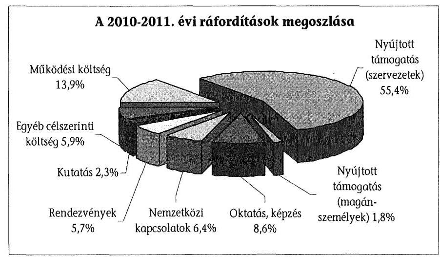
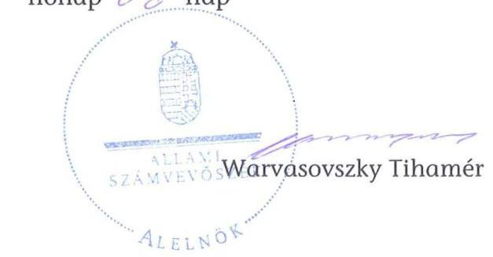
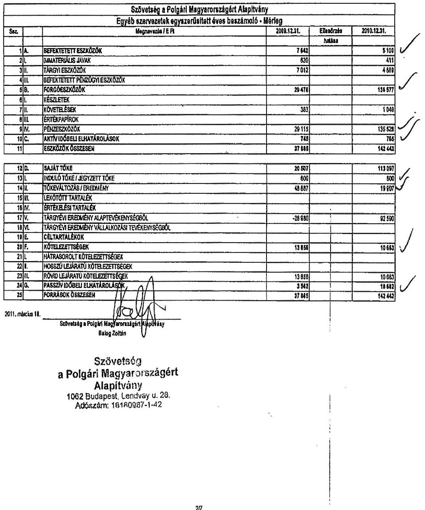
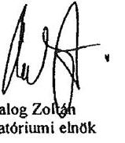

# ÁLLAMI   SZÁMVEVÔSZÉK 

## JELENTÉS

a Szövetség a Polgári Magyarországért Alapítvány 2010-2011. évi gazdálkodása törvényességének ellenőrzéséről

---

# Állami Számvevőszék 

Iktatószám: V-0039-043/2013.
Témaszám: 1078
Vizsgálat-azonosító szám: V-0611

## Az ellenőrzést felügyelte:

Horváth Balázs
felügyeleti vezető
Az ellenőrzés végrehajtásáért felelős:
Baracsi Szilvia
ellenőrzésvezető
A jelentés összeállításában közremúködött:
Kulcsár Lászlóné
számvevő
Az ellenőrzést végezték:
Huszár József Kulcsár Lászlóné
számvevő tanácsos számvevő

A témához kapcsolódó eddig készített számvevőszéki jelentések:
címe
sorszáma
Jelentés a Szövetség a Polgári Magyarországért Alapítvány 2003- 0654
2005. évi gazdálkodása törvényességének ellenőrzéséről

Jelentés a Szövetség a Polgári Magyarországért Alapítvány 2006- 0849
2007. évi gazdálkodása törvényességének ellenőrzéséről
Jelentés a Szövetség a Polgári Magyarországért Alapítvány 2008- 1102
2009. évi gazdálkodása törvényességének ellenőrzéséről

---

# TARTALOMJEGYZÉK 

BEVEZETÉS ..... 5
I. ÖSSZEGZŐ MEGÁLLAPÍTÁSOK, KÖVETKEZTETÉSEK ..... 7
II. RÉSZLETES MEGÁLLAPÍTÁSOK ..... 9

1. Az alapítvány gazdálkodásának törvényessége ..... 9
1.1. A kuratórium múködése ..... 9
1.2. Az alapítvány bevételei ..... 10
1.3. Az alapítvány ráfordításai ..... 11
2. Éves beszámolók ..... 12
2.1. A számviteli beszámolók szabályossága ..... 12
2.2. A mérleg ..... 13
2.3. Az eredménykimutatás ..... 14
3. A könyvvezetés szabályozottsága ..... 14
4. A könyvvezetés gyakorlata ..... 15
5. Az alapítvány ellenőrzési rendszere ..... 16
6. Az alapítvány által létrehozott szervezet ..... 17
7. A korábbi ellenőrzés megállapításaira tett intézkedések ..... 17

## MELLÉKLETEK

1. számú Beszámoló a Szövetség a Polgári Magyarországért Alapítvány 2010. évi tevékenységéről (10 oldal)
2. számú Beszámoló a Szövetség a Polgári Magyarországért Alapítvány 2011. évi tevékenységéről (7 oldal)

---

.

---

# RÖVIDÍTÉSEK JEGYZÉKE 

## Jogszabályok rövidítése:

Korm. rendelet
pártalapítványi törvény
párttörvény
Ptk.
számviteli rendelet
számv. tv.

## Szórövidítések:

alapító/Fidesz-MPSZ
alapítvány
ÁSZ
FB
kuratórium
SZMSZ
PKA
PSZA
az alapítványok gazdálkodási rendjéről szóló 115/1992. (VII. 23.) Korm. rendelet (hatályon kívül helyezte a 350/2011. (XII. 30.) Korm. rendelet, hatálytalan 2012. január 1. óta)
a pártok múködését segítő tudományos, ismeretterjesztő, kutatási, oktatási tevékenységet végző alapítványokról szóló 2003. évi XLVII. törvény
a pártok múködéséről és gazdálkodásáról szóló 1989. évi XXXIII. törvény
a Polgári Törvénykönyvről szóló 1959. évi IV. törvény
a számviteli törvény szerinti egyes egyéb szervezetek be-számoló-készítési és könyvvezetési kötelezettségének sajátosságairól szóló 224/2000. (XII. 19.) Korm. rendelet
a számvitelről szóló 2000 . évi C. törvény

Fidesz - Magyar Polgári Szövetség
Szövetség a Polgári Magyarországért Alapítvány
Állami Számvevőszék
Szövetség a Polgári Magyarországért Alapítvány Felügyelő Bizottsága
Szövetség a Polgári Magyarországért Alapítvány Kuratóriuma
Szövetség a Polgári Magyarországért Alapítvány Szervezeti és Múködési Szabályzata
Polgári Kultúráért Alapítvány
Polgári Szemle Alapítvány

---

.

---

# JELENTÉS 

## a Szövetség a Polgári Magyarországért Alapítvány 2010-2011. évi gazdálkodása törvényességének ellenőrzéséről

## BEVEZETÉS

A pártok múködését segítő tudományos, ismeretterjesztő, kutatási, oktatási tevékenységet végző alapítványokról szóló 2003. évi XLVII. törvény (pártalapítványi törvény) alapján a pártok a politikai kultúra fejlesztése érdekében tudományos, ismeretterjesztő, kutatási és oktatási tevékenységük elősegítésére, a pártok múködéséről és gazdálkodásáról szóló 1989. évi XXXIII. törvényben (párttörvény) meghatározott mértékű költségvetési támogatásra jogosult alapítványt hozhatnak létre. A Fidesz - Magyar Polgári Szövetség (Fidesz-MPSZ) a törvényben biztosított lehetőséggel élve - 2003-ban létrehozta a Szövetség a Polgári Magyarországért Alapítványt (alapítvány).

Az alapítvány a törvényi előírásnak megfelelően a 2010. évben 538584 ezer Ft, a 2011. évben 611700 ezer Ft költségvetési támogatásban részesült.

A pártalapítványi törvény 4. § (2) bekezdése alapján az alapítvány gazdálkodása törvényességének ellenőrzésére az Állami Számvevőszék (ÁSZ) jogosult, a 4. § (4) bekezdése alapján az ÁSZ kétévenként ellenőrzi azoknak az alapítványoknak a gazdálkodását, amelyek e törvény szerint költségvetési támogatásban részesültek. Az ÁSZ legutóbb a 2010. évben az alapítvány 2008-2009. évi gazdálkodásának törvényességét ${ }^{1}$ ellenőrizte, jelentésében egy intézkedési javaslatot tett.

Jelen ellenőrzés célja az alapítvány 2010-2011. évi gazdálkodása törvényességének értékelése volt, amelynek keretében ellenőriztük:

- az alapítvány gazdálkodásának és éves jelentéseinek törvényességét;
- az éves számviteli beszámolók jogszabályi előírásoknak való megfelelését;
- az alapítvány könyvvezetésében a számvitelről szóló 2000. évi C. törvény (Szt.), a pártalapítványok könyvvezetésére vonatkozó jogszabályok, valamint belső előírások betartását;
- a kuratórium megtette-e a szükséges intézkedéseket az ÁSZ előző ellenőrzése során feltárt hiányosságok megszüntetése, valamint az intézkedési tervben megjelölt feladatok végrehajtása érdekében.

[^0]
[^0]:    ${ }^{1} 1102$ számú jelentés a Szövetség a Polgári Magyarországért Alapítvány 2008-2009. évi gazdálkodása törvényességének ellenőrzéséről.

---

Az ellenőrzött időszak: 2010. január 1. - 2011. december 31.
Az ellenőrzés típusa: pénzügyi-szabályszerúségi ellenőrzés
Az ellenőrzést a pénzügyi-szabályszerúségi ellenőrzés módszertani szabályai szerint, a pártalapítványok ellenőrzéséhez kiadott segédletben foglalt egységes követelmények alapján végeztük. A kapott támogatásokat tételesen, a nyújtott támogatásokat, illetve a ráfordításokat ötmillió Ft és e felett tételesen, valamint ötmillió Ft alatt mintavételes eljárással ellenőriztük. A lényegességi szint meghatározásánál a pártalapítványok ellenőrzési segédlete szerint jártunk el.

A helyszíni ellenőrzésre 2012. október 29 - november 30. között, az Alapítvány Budapest I. Pauler utca 11. szám alatti székhelyén került sor.

Az ÁSZ tv. 29. § (1) bekezdése szerint a jelentéstervezetet megküldtük a kuratórium elnökének, aki a jelentéstervezetre észrevételt nem tett.

---

# I. ÖSSZEGZŐ MEGÁLLAPÍTÁSOK, KÖVETKEZTETÉSEK 

Az alapító okirat tartalma és előírásai megfeleltek a Polgári Törvénykönyvről szóló 1959. évi IV. törvény (Ptk.), a párttörvény és a pártalapítványi törvény rendelkezéseinek. Meghatározta az alapítvány céljait, az alapítványi vagyon felhasználásának, a képviseleti jog gyakorlásának módját, valamint a kuratórium és az alapítvány múködésének főbb szabályait. Az alapító okiratot az alapító egy alkalommal, az alapítvány székhelyváltozása miatt módosította.

A szervezeti és múködési szabályzat (SZMSZ) az alapító okiratban előírtakkal összhangban részletesen előírta az alapítvány kuratóriumának és alkalmazottainak feladat- és hatáskörét. Az ellenőrzött időszakban az SZMSZ-t kiegészítették a gazdasági és a képzési igazgatói funkciókkal, titkárságot alakítottak ki, meghatározták ezek tevékenység- és feladatkörét.

A háromtagú kuratórium az ellenőrzött időszakban a törvényes előírásoknak megfelelően múködött. Az alapító okiratnak megfelelő gyakorisággal, határozatképes üléseken hozta határozatait, melyek az alapítványi célok megvalósulását szolgálták. A képviseleti és a bankszámla feletti rendelkezési jog gyakorlása megfelelt az alapító okirat és az SZMSZ előírásainak. A kuratórium az alapítvány gazdálkodását, az általa elfogadott költségvetés teljesítésének ellenőrzésén keresztül folyamatosan követte.

Az ellenőrzött években az alapítvány összes bevétele 1191013 ezer Ft volt. Ennek 96,6\%-át a központi költségvetési támogatás, $1,7 \%-1,7 \%$-át a csatlakozói adományok és az egyéb bevételek tették ki. Az alapítvány egy külföldi alapítványtól kapott támogatásokat, ezek a pártalapítványi törvénynek megfelelően az alapítvány pénzforgalmi számlájára a támogató fizetési számlájáról érkeztek, azokat a honlapon közzétették. Az ellenőrzött időszak 832284 ezer Ft összegű ráfordításainak $86,1 \%$-a az alapítványi célok megvalósításának közvetlen és közvetett költsége, 13,9\%-a múködési költség volt.

---

A támogatások odaítéléséről a kuratórium az alapító okirat, az SZMSZ, valamint a korábbi években jóváhagyott támogatási koncepció alapján döntött. A kuratórium elnöke a támogatottakkal szerződést kötött, melyben a nyújtott támogatás felhasználásának szakmai és pénzügyi elszámolásáról rendelkezett. A támogatási szerződésekben szerepeltették az ÁSZ előző ellenőrzésében javasolt záradékolási kötelezettséget. A támogatottak határidőre elszámoltak, a fel nem használt támogatási összegeket visszafizették. Az alapítvány alkalmazottai a nyilvántartásokban rögzítették az elszámolások megtörténtét, azok szabályszerűségét és a megtett intézkedéseket támogatásonként dokumentálták. A kuratórium minden esetben döntött a támogatások elszámolási határidejének módosításáról és elszámolásának elfogadásáról. A támogatások célja és felhasználása megfelelt a pártalapítványi törvény előírásainak.

Az alapítvány rendelkezett a jogszabályokban előírt, a könyvvezetés és a beszámoló elkészítésének rendjét meghatározó számviteli politikával és az ahhoz kapcsolódó szabályzatokkal. A számviteli politikát és a számlarendet az ÁSZ előző ellenőrzése során tett javaslatával kiegészítették.

Az alapítvány az egyszerűsített éves beszámolókat és a pártalapítványi törvény szerinti éves jelentéseket a jogszabályi előírásoknak és a belső szabályzatoknak megfelelően készítette el és hozta nyilvánosságra. A beszámolókat a könyvvizsgáló hitelesítette, az FB véleményezte, a kuratórium érvényes határozatokkal elfogadta.

A mérleg és eredménykimutatás sorok adatai megegyeztek a kapcsolódó analitikus és főkönyvi nyilvántartások adataival, melyek az év végi főkönyvi kivonatokból levezethetőek voltak. A mérlegben kimutatott eszközök és források értékadatai számviteli bizonylatokkal alátámasztottak voltak. Az eredménykimutatásban kimutatott bevételeket és ráfordításokat az előírásoknak megfelelően elkülönítették.

A könyvvezetést a vonatkozó jogszabályok és belső előírások betartásával, a kettős könyvvitel rendszerében végezték. A könyvvezetésre és a beszámoló elkészítésére jogosult személy szerepelt a könyvviteli szolgáltatást végzők nyilvántartásában. A számv. tv. bizonylatokra vonatkozó alaki és tartalmi követelményeit és a kötelezettségvállalás, az utalványozás szabályait érvényesítették.

Az alapítvány, az ellenőrzési időszakot megelőzően létrehozott két szervezete részére támogatás formájában szabályosan, elszámolási kötelezettség mellett adott át pénzeszközöket.

Az alapítvány az ellenőrzött időszakban kuratóriumi kontroll, vezetői és munkafolyamatba épített ellenőrzés mellett, törvényesen múködött. Ezt elősegítette a Felügyelő Bizottság (FB), a könyvvizsgáló és a könyvelő cég összehangolt tevékenysége. Az ÁSZ korábbi ellenőrzésének javaslata megvalósult.

---

# II. RÉSZLETES MEGÁLLAPÍTÁSOK 

## 1. Az alapítVÁny GAZDÁlKODÁSÁNAK TÖRVÉNVESSÉGE

### 1.1. A kuratórium múködése

Az ellenőrzött időszakban a Fidesz-MPSZ az alapító okiratot egy alkalommal módosította - összhangban a Ptk. 74/B. § (1) bekezdés d) pontja és az (5) bekezdés rendelkezéseivel - az alapítvány székhelyváltozása miatt. Az alapító okirat tartalma és előírásai megfeleltek a Ptk., a párttörvény és a pártalapítványi törvény rendelkezéseinek. Nevesítette az alapítvány cél szerinti tevékenységeit, szabályozta a kuratórium feladat- és hatáskörét, a képviseleti jogok gyakorlásának módját. Az alapítvány alapító okiratában foglalt célok és a cél érdekében meghatározott tevékenységek összhangban voltak a párttörvény 9/A. § (1) bekezdésében előírtakkal.

Az SZMSZ az alapító okirattal összhangban meghatározta a kuratórium és az alapítvány alkalmazottainak feladat- és hatáskörét. Az ellenőrzött időszakban az SZMSZ-t kiegészítették a gazdasági és a képzési igazgatói funkciókkal, titkárságot alakítottak ki, meghatározták ezek tevékenység- és feladatkörét. Törölték az SZMSZ-ből a könyvelő, a könyvvizsgáló és a jogi képviselő feladatait, mivel ezeket a megbízási szerződések részletesen tartalmazták. Az alapítvány a céljaira rendelt vagyon felhasználási módját az alapító okiratban és az SZMSZ-ben a párttörvény és a pártalapítványi törvény rendelkezései, továbbá a Ptk. előírásainak megfelelően szabályozta.

A kuratórium az ellenőrzött időszakban hat-hat alkalommal ülésezett, összesen 63 érvényes határozatot hozott. Múködése megfelelit az alapító okirat és az SZMSZ előírásainak, mind az ülések gyakorisága, mind a döntéshozatal módja tekintetében. Az alapítvány szabályozása szerint vezette a kuratóriumi ülésekre vonatkozó nyilvántartásait (jegyzőkönyv, döntések, határozatok tára).

A kuratórium - az alapító okirat 8.4. pontja előírásának megfelelően - döntött az alapítvány költségvetéseinek elfogadásáról. A költségvetések mindkét évben tartalmazták az alapítvány költségvetési forrásból származó és egyéb bevételeit, a cél szerinti tevékenységek közvetlen és közvetett ráfordításait (részletezve továbbadott támogatások és saját tevékenységek szerint), valamint a múködtetéssel összefüggő költségeit. A munkaszervezet vezetője a költségvetés alakulásáról folyamatosan tájékoztatta a kuratóriumot. Az éves költségvetést mindkét évben indokoltan módosították. A 2010. évi költségvetés módosítását az indokolta, hogy a választási eredmények miatt többletforrás állt rendelkezésre. A 2011. évben a módosításra a célszerinti felhasználáson belüli átcsoportosítás miatt volt szükség.

Az alapítvány a Ptk. 29. § (3), és a 74/C § (4) bekezdés rendelkezései szerint szabályozta az alapító okirat 12. illetve az SZMSZ 1.3.6 és 6.2.9. pontjaiban a képviseleti, és a bankszámla feletti rendelkezési jog gyakorlásának előírásait.

---

Az ellenőrzött időszakban a képviseleti jogot a szabályozásnak megfelelően a kuratórium elnöke gyakorolta. A bankszámla feletti rendelkezési jog gyakorlása az alapító okirat és az SZMSZ rendelkezéseivel összhangban történt.

# 1.2. Az alapítvány bevételei 

Az alapítvány a párttörvény 9/A. § (3) bekezdésében foglaltak alapján jogosult volt költségvetési támogatásra. Az alapítvány az ellenőrzött időszak éves beszámolóiban összesen 1191013 ezer Ft bevételt mutatott ki, melynek 96,6\%-a költségvetési támogatás volt. A kiutalt támogatás összege és annak folyósítása megfelelt a párttörvény 9/A. § (2) és (5) - (6) bekezdéseiben foglalt rendelkezéseknek.

Az alapítvány 2010. és 2011. évi bevételeinek alakulását és összetételét az alábbi kimutatás tartalmazza:
adatok: ezer Ft-ban

| Megnevezés | 2010. | 2011. | Összesen |
| :-- | --: | --: | --: |
| Költségvetési támogatás | 538584 | 611700 | 1150284 |
| Egyéb támogatás | 11162 | 9602 | 20764 |
| Kapott kamatok (pénzeszköz-lekötés) | 3431 | 12506 | 15937 |
| Egyéb bevételek | 1090 | 2938 | 4028 |
| Összes bevétel | $\mathbf{5 5 4 2 6 7}$ | $\mathbf{6 3 6 7 4 6}$ | $\mathbf{1 1 9 1 0 1 3}$ |

Az alapítvány a Konrad Adenauer Alapítványtól a párttörvény 9/A. § (1) bekezdésében meghatározott célokra, szerződéssel összesen 20764 ezer Ft támogatást kapott. Az alapítványnak a támogatásokkal a szerződések szerint el kellett számolnia, melyeket dokumentáltan, határidőben teljesített. Az alapítvány a támogató által meghatározott céloknak megfelelően képzésre, rendezvényre, tanácsadási szolgáltatásokra, projekttel kapcsolatos költségekre és múködésre kapta a támogatásokat.

A pártalapítványi törvény 3. § (2) bekezdésével és az alapító okirattal összhangban a kuratórium döntött a juttatott támogatások befogadásáról.

A támogatások a külföldi alapítvány pénzforgalmi számlájáról az alapítvány pénzforgalmi számlájára érkeztek, a pártalapítványi törvény 3. § (3) bekezdésében előírtakkal összhangban, amit az alapítvány a honlapján is közzétett a pártalapítványi törvény 3. § (4) bekezdésének megfelelően.

Az alapítvány pénzügyi bevételei a szabad rendelkezésű pénzeszközök kamatát tartalmazták 15937 ezer Ft összegben. Az alapítvány 4028 ezer Ft egyéb bevételeiből 2365 ezer Ft a Fidesz-MPSZ részére átadás-átvételi jegyzőkönyvvel átadott és számlázott eszközök értéke, melyet a Fidesz-MPSZ kiegyenlített, a többi egyéb költségtérítés (telefon, rezsi).

---

# 1.3. Az alapítvány ráfordításai 

Az alapítvány az ellenőrzött időszak éves beszámolóiban összesen 832284 ezer Ft ráfordítást számolt el. A ráfordítások 86,1\%-a ( 716783 ezer Ft) az alapítványi célok megvalósítása érdekében merült fel - közvetlen és közvetett célszerinti ráfordításként -, a működési kiadások 13,9\%-ot (115 501 ezer Ft) tettek ki. Az alapítványnak az ellenőrzött időszakban nem keletkezett közbeszerzés lefolytatási kötelezettsége.

A kuratórium az éves költségvetésekben állapította meg a működési és az alapítvány célszerinti tevékenységének feladataira fordítható keretösszegeket, döntött a kapcsolódó szerződések megkötéséről.

Az alapítvány 2010. és 2011. évi célszerinti közvetlen és közvetett ráfordításait a következő táblázat tartalmazza:
adatok: ezer Ft-ban

| Megnevezés | 2010. | 2011. | Összesen |
| :-- | --: | --: | --: |
| Nyújtott támogatások | 297315 | 179010 | 476325 |
| Ebből: |  |  |  |
| - szervezeteknek nyújtott támogatás | 291321 | 170109 | 461430 |
| - magánszemélyeknek nyújtott támogatás | 5994 | 8901 | 14895 |
| Oktatás, képzés | 31551 | 40413 | 71964 |
| Nemzetközi kapcsolatok | 21457 | 31927 | 53384 |
| Rendezvények | 25151 | 22059 | 47210 |
| Kutatás | - | 19163 | 19163 |
| Egyéb (díjak, gyakorinokok, közvetett célszerinti*) | 28715 | 20022 | 48737 |
| Összes célszerinti ráfordítás | 404189 | 312594 | 716783 |

*Az alapítvány közvetett célszerinti ráfordításként kimutatott összegeinek 80\%-át az alkalmazottainak kifizetett bérek és járulékai tették ki.

Az alapítvány célszerinti feladatellátását, a pályázati koncepciójával összhangban lévő célszerinti ráfordítások 66,5\%-át pályázati/egyedi kérelmekre való támogatások nyújtásával és $33,5 \%$-át saját szervezeti keretei között megvalósított képzésekkel, rendezvényekkel, kutatásokkal, nemzetközi kapcsolatokkal (konferenciák, tanulmányok készíttetése) és egyéb tevékenységekkel végezte. Az alapítvány az ellenőrzött időszakban támogatásainak 96,9\%-át szervezeteknek, $3,1 \%$-át magánszemélyeknek nyújtotta.

A támogatások odaítéléséről a kuratórium az alapító okiratban előírtaknak megfelelően, minden alkalommal döntött. A kuratóriumi jegyzőkönyvekben rögzítették a támogatott nevét, a támogatás célját és összegét. A megkötött szerződéseket a képviseletre jogosult kuratóriumi elnök írta alá.

---

A szerződések tartalmazták a kuratóriumi döntés számát, a támogatás célját, mértékét, folyósításának módját és határidejét, az elszámoláshoz benyújtandó beszámoló készítést, a benyújtandó pénzügyi dokumentumok körét és kellékeit, a támogatás felhasználásának ellenőrzését (szerepeltetve a helyszíni ellenőrzés lehetőségét), a szerződésszegések eseteit és következményeit. A szerződésekben előírták, hogy a programok dokumentumain és a kiadványokon az alapítványt támogatóként szerepeltessék. A támogatási szerződéseket az ÁSZ előző jelentésében javasolt, elszámolásként benyújtott bizonylatok záradékolási kötelezettségének előírásával kötötték.

A támogatások folyósítása a szerződésekben foglaltak szerinti módon és határidőre történt. A támogatottak betartották az elszámolásra vonatkozó beszámoló készítési, bizonylatolási előírásokat. Egy 2011. évi, 400 ezer Ft összegű könyvkiadáshoz kapcsolódó támogatás esetében a teljes összeg visszafizetésre került, mert a könyvet nem adták ki. Amennyiben a támogatottak nem számoltak el a támogatás teljes összegével, az alapítvány a maradványösszegeket visszafizettette. Az alapítvány nyilvántartásai szerint az elszámolási határidőt megelőzőn annak betartására felszólították a támogatottakat. Az elszámolási határidő módosítási kérelmeket a kuratórium jóváhagyta. A támogatottak 95,5\%-ban betartották (három ellenőrzött támogatás kivételével) a szerződésekben kikötött, illetve kuratóriumi döntéssel módosított végső elszámolási határidőket (leghosszabb túllépés 37 nap volt). A kuratórium a támogatások elszámolásának elfogadásáról minden esetben döntött.

Az alapítvány munkatársai a támogatások ellenőrzése során a célok megvalósulását dokumentumok alapján ellenőrizték. A szervezett képzések és a közös rendezvények, programok esetében helyszínen is ellenőrizték a teljesítést.

# 2. ÉVES BESZÁmolók 

### 2.1. A számviteli beszámolók szabályossága

Az alapítvány mindkét évben eleget tett beszámoló készítési kötelezettségének, egyszerűsített éves beszámolóit a számviteli politikájában megjelölt formában, a számviteli törvény szerinti egyes egyéb szervezetek beszámoló-készítési és könyvvezetési kötelezettségének sajátosságairól szóló 224/2000. (XII. 19.) Korm. rendelet (számviteli rendelet) 20. § (7) bekezdésben előírt, határidőn belül készítette el.

Az FB az alapító okirat előírásának megfelelően az egyszerűsített éves beszámolókat véleményezte, a kuratóriumnak elfogadásra javasolta. A kuratórium a beszámolókat érvényes kuratóriumi határozattal elfogadta. A könyvvizsgáló az alapítvány egyszerűsített éves beszámolóit hitelesítő záradékkal látta el. Az egyszerűsített éves beszámolókat a számv. tv. 20. § (6) bekezdésében előírtak szerint a képviseletre jogosult kuratóriumi elnök írta alá.

Az alapítvány az egyszerűsített éves beszámoló összeállítása során érvényesítette a számv. tv. 15-16. §-aiban foglalt számviteli alapelveket. Az éves beszámolók adatai az év végi főkönyvi kivonatok illetve a kapcsolódó analitikák adataiból levezethetőek voltak. A mérleg és az eredménykimutatás soraihoz kapcsolódó főkönyvi számlák, az analitikus nyilvántartások adataival megegyeztek.

---

A beszámolók megbízható, valós képet nyújtottak az alapítvány gazdálkodásáról.

Az alapítvány a 2010. és a 2011. évi gazdálkodásával kapcsolatban elkészítette a pártalapítványi törvény 3/A. § (1) bekezdése szerinti jelentéseit. A jelentések tartalma megfelelt a 3/A. § (3) bekezdésében előírtaknak, amit a 3/A. § (2) bekezdése előírásának megfelelően a kuratórium elfogadott. A jelentések közzétételi kötelezettségének az alapítvány a 3/A. § (5) bekezdésében előírtak alapján, határidőn belül a Magyar Közlöny Hivatalos Értesítőjében és a saját honlapján is eleget tett.

Az alapítvány a civil szervezetek bírósági nyilvántartásáról és az ezzel összefüggő eljárási szabályokról szóló 2011. évi CLXXXI. törvény előírásának eleget téve a 2011. évi beszámolót az Országos Bírósági Hivatal részére megküldte.

# 2.2. A mérleg 

Az ellenőrzött években a mérlegsorok adatai megegyeztek a kapcsolódó analitikus és főkönyvi nyilvántartások összesített adataival. Az éves mérlegekben kimutatott eszközök és források értékadatait a számv. tv. 69. § (1) bekezdés előírásának megfelelően, a leltározási szabályzat szerinti leltárakkal alátámasztották.

Az alapítvány az immateriális javak és tárgyi eszközök értékét az egyedi nyilvántartás adataiból készített összesítő kimutatásokkal, leltározási szabályzat szerinti tételes eszközleltárral támasztotta alá. A pénzeszközök értékét készpénzállománynál mennyiségi leltár, bankszámláknál év végi bankkivonatok, a követelések és kötelezettségek, az aktív és passzív időbeli elhatárolások értékét év végi tételes kimutatások, és azok kiértékelését igazoló jegyzőkönyvek támasztották alá.

Az ellenőrzött időszakban az immateriális javak és tárgyi eszközök egyedi nyilvántartása és az állományváltozások (beruházások, aktiválások, selejtezés, terv szerinti értékcsökkenés) elszámolása összhangban volt a belső szabályzatok - a számviteli politika, a számlarend és a leltározási szabályzat - előírásaival. Az eszközök beszerzése során betartották az SZMSZ-ben előírt kötelezettségvállalás szabályait.

Az egyszerűsített éves beszámoló a forgóeszközökön belül a 2010. évben a munkavállalókkal szembeni, illetve mindkét évben egyéb elismert követeléseket tartalmazott (szállítói túlfizetés). A pénzeszközök mérlegben kimutatott értéke megegyezett az év végi pénztárjelentés záró állomány és a záró bankkivonatok egyenlegeinek összegével.

A mérlegben az induló tőkét az alapító okirat által meghatározott induló vagyon értékének megfelelően mutatták ki.

A kötelezettségek között mindkét évben rövidlejáratú kötelezettséget mutattak ki, amely a kuratórium által megítélt és a tárgyévben ki nem fizetett támogatásokat, a szállítói tartozások értékét, és az év végi adó- és járuléktartozásokat tartalmazta.

---

Az aktív és passzív időbeli elhatárolások elszámolása szabályos volt, az elszámolást szállítói számlák és analitikus nyilvántartások támasztották alá.

# 2.3. Az eredménykimutatás 

Az ellenőrzött években az eredménykimutatás sorok adatai a főkönyvi kivonatok, illetve a vonatkozó főkönyvi és részletező számlák összesített adataival megegyeztek, a Korm. rendelet ${ }^{2} 3$. § (2) bekezdésében és az 5. §-ában előírtaknak megfelelő bontásban mutatták be a bevételeket és ráfordításokat.

Az eredménykimutatásban szereplő bevételeket és ráfordításokat könyvelési alapbizonylatokkal (szerződések, szállítói számlák, bér, feladások, bank- és pénztárbizonylatok) támasztották alá.

A ráfordítások elszámolásánál érvényesítették a kötelezettségvállalás, a teljesítésigazolás és a banki aláírás szabályait. A szerződéseket - az alapító okirat előírásával összhangban - minden esetben a kuratórium elnöke kötötte meg. Az utalványozást az SZMSZ-ben és a pénzkezelési szabályzatban előírtak szerint végezték.

## 3. A KÖNYVVEZETÉS SZABÁLYOZOTTSÁGA

A könyvvezetés és az éves beszámolók elkészítésének belső szabályozási rendszere a számv. tv. által kötelezően előírt szabályozáson alapult.

Az alapítvány az ellenőrzött időszakban a számv. tv. 14. § (3)-(5) bekezdéseinek előírásával összhangban rendelkezett hatályos számviteli politikával (ennek keretében határozták meg az eszközök és a források értékelési szabályait), leltárkészítési és leltározási, pénzkezelési szabályzattal, továbbá a számv. tv. 161. §-ának megfelelően számlarenddel. Az alapítvány szabályzatainak módosítását sem jogszabályi, sem gazdálkodási változás nem indokolta.

A kuratórium a számviteli politikát és a számlarendet egy alkalommal, 2011. március 16-i hatállyal kiegészítette, az előző ÁSZ ellenőrzés javaslataival egyezően. A számviteli politikában előírták a nyújtott támogatások éven belüli és éven túli teljesítésének elkülönítését, a számlarendben az 1.3. pontban jelzett záradékolási kötelezettséget.

Az eszközök és a források leltárkészítési és leltározási szabályzata az alapítványi gazdálkodás sajátosságainak megfelelően tartalmazta a mérlegtételeket alátámasztó leltározással és leltárkészítéssel kapcsolatos feladatokat, a menynyiségi felvétellel és egyeztetéssel leltározandó eszközök és források körét, a leltározás gyakoriságát és idejét.

A selejtezés szabályait és dokumentálásának módját külön szabályzat tartalmazta.

[^0]
[^0]:    ${ }^{2}$ Hatályon kívül helyezte a 350/2011. (XII. 30.) Korm. rendelet, hatálytalan 2012. január 1. óta.

---

A pénzkezelési szabályzat és a hozzá kapcsolódó elektronikus átutalások és a bankkártyák használati rendjéről szóló szabályzatok előírásai megfeleltek a számv. tv. 14. § (8) bekezdése rendelkezéseinek, melyeket a kuratórium elfogadott. Az alapítvány a pénzkezelési szabályzatában a napi készpénz záró állomány maximális mértékét a számv. tv. 14. § (9) bekezdésével összhangban határozta meg.

# 4. A KÖNYVVEZETÉS GYAKORLATA 

Az alapítvány könyvvezetését, bérszámfejtését, éves beszámolóinak összeállítását számviteli szolgáltató szervezet végezte, amely az alapítvány létrehozása óta nem változott. A feladatokat ellátó személy rendelkezett a számv. tv. 151. § (1) bekezdésben előírt képesítéssel, a könyvviteli szolgáltatást végzők nyilvántartásában szerepelt.

A könyvvezetést a kettős könyvvitel rendszerében, az alapbizonylatok számítógépes feldolgozásával, az ellenőrzött időszakban azonos könyvelési programmal végezték. A kialakított számítógépes könyvelési rendszerből az ellenőrzéshez szükséges adatokat biztosították.

A könyvelési bizonylatok alaki és tartalmi követelményeit a számv. tv. 167. § (1) bekezdés előírásának megfelelően érvényesítették. A számlakijelölés gyakorlata összhangban volt a számv. tv. és a számlarend előírásaival. A gazdasági eseményeket idősorrendben rögzítették, a könyvelt tételekhez minden esetben megfelelő alapbizonylatok kapcsolódtak.

Az egyszerűsített éves beszámolók elkészítését megelőzően a számviteli politikában megjelölt könyvviteli zárlati feladatokat elvégezték.

Az ellenőrzött időszakban a leltározási szabályzat előírásainak megfelelően, az immateriális javak és tárgyi eszközök leltárfelvételi íveit az analitikus nyilvántartásokkal egyeztették és dokumentáltan kiértékelték. Az egyéb eszköz és a forrás tételeket a főkönyvi számláknak az analitikus nyilvántartásokkal, és a könyvelés helyességét igazoló egyéb okmányokkal (bankkivonatok, szerződések) történt egyeztetése útján leltározták, a belső szabályzatnak megfelelően dokumentálták. A selejtezésekre a selejtezési szabályzatban foglaltak betartásával került sor.

A számlarendben az előírtaknak megfelelően az immateriális javak és tárgyi eszközök egyedi nyilvántartó lapjait naprakészen vezették. A személyi jellegű kifizetésekről egyénenként, az adóhatósággal szembeni kötelezettségről havonkénti elkülönített nyilvántartást vezettek. A szállítókkal szembeni kötelezettséget a zárt rendszerú főkönyvi könyvelés keretében tételesen, a kuratórium által megítélt támogatásokat és azok pénzügyi teljesítését folyamatosan nyilvántartották. Az év végi záráshoz a főkönyvi kivonatokat az analitikus nyilvántartások és a főkönyvi számlák egyeztetése alapján állították össze.

Az alapítvány a házipénztár kezelését, a pénztári nyilvántartások vezetését és ellenőrzését a pénzkezelési szabályzat szerint végezte és dokumentálta. A házipénztárt az alapítvány székhelyén múködtették. A házipénztár napi záró készpénz állománya nem haladta meg a szabályzatban előírt összeget.

---

Az utólagos elszámolásra kiadott előlegeket és azok elszámolását nyilvántartották, az elszámolások a szabályzatban rögzített 30 napos határidőn belül, szabályszerűen megtörténtek. A szigorú számadás alá vont bizonylatok körét a pénzkezelési szabályzatban határozták meg, azokról a számv. tv. 168. § (3) bekezdésének megfelelően nyilvántartást vezettek.

A könyvvezetésben - a Korm. rendelet 3. § (2) bekezdésében előírtaknak megfelelően - az alapítványi célú tevékenység közvetlen és közvetett (működési jellegű) költségeit a főkönyvi könyvelés keretében elkülönítették. A költségek típusát a könyvelési alapbizonylatokon feltüntették.

# 5. Az alapíTvány EllenŐrzési RendsZere 

A kuratórium az ülésein rendszeresen - az alapító okiratnak és az SZMSZ-nek megfelelően - beszámoltatta a munkaszervezet vezetőjét (igazgató és/vagy gazdasági igazgató) az alapítvány tevékenységéről, működéséről.

A munkaszervezet kis létszáma (egyik évben sem haladta meg a négy főt) nem indokolta független belső ellenőr alkalmazását, amit a számviteli politika 1.4.3.3. pontja is rögzített. A kuratórium az SZMSZ-ben szabályozta a munkáltatói jogok gyakorlását. Azt az alapítvány igazgatója felett (az alapító okirattal összhangban) a kuratórium elnöke, az alapítvány egyéb alkalmazottai felett az igazgató (és általános helyettesként a gazdasági igazgató) gyakorolta. A munkaköri leírások tartalmazták az egyes munkakörökhöz tartozó, munkafolyamatba épített ellenőrzési feladatokat.

A vezetői ellenőrzést a kuratórium elnöke, az alapítvány igazgatója és/vagy gazdasági igazgatója a kötelezettségvállalási, az utalványozási jog, valamint a munkáltatói jogkör gyakorlásán keresztül látta el.

Az alapítvány igazgatója és gazdasági igazgatója ellenőrizte a munkaszervezet múködését, a költségvetés végrehajtását, valamint a továbbadott támogatások felhasználásáról készített elszámolások szerződés szerinti teljesítését, ezzel is hozzájárulva az alapítvány szabályszerű múködéséhez.

Az alapító az alapító okiratban háromtagú FB-t jelölt ki, előírva feladat-, jogés hatáskörét, megnevezve tagjait és elnökét. Az FB az ellenőrzött években az alapító okiratnak és ügyrendjének megfelelően látta el feladatát. Az FB az alapító okirat 11.5. pontja rendelkezéseinek megfelelően a kuratórium jóváhagyását megelőzően mindkét évben véleményezte és elfogadta a költségvetést, a számviteli beszámolót, az éves tevékenységéről készített szakmai jelentést és a könyvvizsgálói jelentést. Az FB a 2011. évben megtárgyalta és elfogadta az alapítvány oktatási intézményi akkreditációjának meghosszabbításával kapcsolatos előterjesztést.

A kuratórium az éves beszámolók ellenőrzésével független könyvvizsgálót bízott meg. A könyvelő céggel kötött szerződés nem írt elő a megbízott részére ellenőrzési feladatokat, rögzítette a hibák javításához kapcsolódó szavatossági kötelezettséget, valamint a Ptk. szerinti kárfelelősséget.

---

Az alapítványt, mint akkreditált képzési intézményt a 2012. évben ellenőrizte a Budapest Főváros Kormányhivatala Munkaügyi Központ, amely a feladatellátást megfelelőnek találta.

Az alapítvány vezetői és munkafolyamatba épített ellenőrzése alkalmas volt a hibák kiszűrésére, amit kiegészítettek a könyvelő és könyvvizsgáló céggel kialakított, rendszeresen végrehajtott egyeztetések.

# 6. AZ ALAPÍTVÁNY ÁLTAL LÉTREHOZOTT SZERVEZET 

Az alapítvány kuratóriuma az ellenőrzött időszakban egy-egy alkalommal módosította a korábbi években létrehozott Polgári Szemle Alapítvány (PSZA), és a Polgári Kultúráért Alapítvány (PKA) alapító okiratát. Az alapító okiratok módosítására a PKA esetében a székhely, a PSZA esetében a székhely és a kuratórium elnöke személyének változása miatt került sor.

Az alapítvány kuratóriuma az ellenőrzött időszakban a Polgári Szemle folyóirat megjelentetésére két támogatási szerződéssel összesen 2000 ezer Ft támogatást nyújtott a PSZA-nak. A PSZA a szerződésben rögzített határidőre és módon elszámolt a támogatások cél szerinti felhasználásával.

Az alapítvány a PKA részére három kuratóriumi döntéssel összesen 20000 ezer Ft összegű, saját rendezvényeire, kutatási ösztöndíjra és működésre fordítható támogatást nyújtott, melyekre szerződést kötöttek. A PKA a 2010. évben kapott két, összesen 10000 ezer Ft összegű támogatással megfelelő módon, egyszerre számolt el.

A PKA a 2011. évben egy támogatási szerződéssel kapott 10000 ezer Ft összegű támogatás $45,3 \%$-val a kuratórium előzetes hozzájárulását követően az eredeti határidőt követő négy hónap múlva, 2012. május 31-én számolt el. A fennmaradó összeg felhasználását és elszámolását az alapítvány kuratóriuma 2013. január 15-ig engedélyezte a PKA részére.

## 7. A KORÁBBI ELLENŐRZÉS MEGÁLLAPÍTÁSAIRA TETT INTÉZKEDÉSEK

Az előző ÁSZ jelentés javaslatának eleget téve a kuratórium a 05/2011. (III.16.) b) számú határozatával kiegészítette az alapítvány számlarendjét azzal, hogy a támogatások elszámolásaként benyújtott bizonylatokon záradékként fel kell tüntetni, hogy azokat mely támogatási szerződés keretében használták fel. Ezen előírást a támogatási szerződésekben rögzítették, betartásukat ellenőrizték.

Budapest, 2013.
hónap $\varnothing$ nap

Melléklet: $\quad 2 \mathrm{db}$

---

.

---

# Beszámoló a Szövetség a Polgári Magyarországért Alapítvány 2010. évi tevékenységéről 

---

Szövetség a Polgári Magyarországért Alapítvány Egyéb szervezelsé egyszerűsített éves beszámoló - Éredménykimutatás

|  Szz. | Megnevezés / S Ft | Alapítvány | Vállalkozási tervlénegyek | Összesen | Alapítvány | Vállalkozási tervlénegyek | Összesen | Alapítvány | Vállalkozási tervlénegyek | Összesen  |
| --- | --- | --- | --- | --- | --- | --- | --- | --- | --- | --- |
|  1.A. |  |  |  |  |  |  |  |  |  |   |
|  2.1. | Alapítvány | Alapítvány |  |  |  |  |  |  |  |   |
|  3. | Alapítvány | Alapítvány |  |  |  |  |  |  |  |   |
|  4. | Alapítvány | Alapítvány |  |  |  |  |  |  |  |   |
|  5. | Alapítvány | Alapítvány |  |  |  |  |  |  |  |   |
|  6. | Alapítvány | Alapítvány |  |  |  |  |  |  |  |   |
|  7. | Alapítvány | Alapítvány |  |  |  |  |  |  |  |   |
|  8. | Alapítvány | Alapítvány |  |  |  |  |  |  |  |   |
|  9. | Alapítvány | Alapítvány |  |  |  |  |  |  |  |   |
|  10. | Alapítvány | Alapítvány |  |  |  |  |  |  |  |   |
|  11. | Alapítvány | Alapítvány |  |  |  |  |  |  |  |   |
|  12. | Alapítvány | Alapítvány |  |  |  |  |  |  |  |   |
|  13. | Alapítvány | Alapítvány |  |  |  |  |  |  |  |   |
|  14. | Alapítvány | Alapítvány |  |  |  |  |  |  |  |   |
|  15. | Alapítvány | Alapítvány |  |  |  |  |  |  |  |   |
|  16. | Alapítvány | Alapítvány |  |  |  |  |  |  |  |   |
|  17. | Alapítvány | Alapítvány |  |  |  |  |  |  |  |   |
|  18. | Alapítvány | Alapítvány |  |  |  |  |  |  |  |   |
|  19. | Alapítvány | Alapítvány |  |  |  |  |  |  |  |   |
|  20. | Alapítvány | Alapítvány |  |  |  |  |  |  |  |   |
|  21. | Alapítvány | Alapítvány |  |  |  |  |  |  |  |   |
|  22. | Alapítvány | Alapítvány |  |  |  |  |  |  |  |   |
|  23. | Alapítvány | Alapítvány |  |  |  |  |  |  |  |   |
|  24. | Alapítvány | Alapítvány |  |  |  |  |  |  |  |   |
|  25. | Alapítvány | Alapítvány |  |  |  |  |  |  |  |   |
|  26. | Alapítvány | Alapítvány |  |  |  |  |  |  |  |   |
|  27. | Alapítvány | Alapítvány |  |  |  |  |  |  |  |   |
|  28. | Alapítvány | Alapítvány |  |  |  |  |  |  |  |   |
|  29. | Alapítvány | Alapítvány |  |  |  |  |  |  |  |   |
|  30. | Alapítvány | Alapítvány |  |  |  |  |  |  |  |   |
|  31. | Alapítvány | Alapítvány |  |  |  |  |  |  |  |   |
|  32. | Alapítvány | Alapítvány |  |  |  |  |  |  |  |   |
|  33. | Alapítvány | Alapítvány |  |  |  |  |  |  |  |   |
|  34. | Alapítvány | Alapítvány |  |  |  |  |  |  |  |   |
|  35. | Alapítvány | Alapítvány |  |  |  |  |  |  |  |   |
|  36. | Alapítvány | Alapítvány |  |  |  |  |  |  |  |   |
|  37. | Alapítvány | Alapítvány |  |  |  |  |  |  |  |   |
|  38. | Alapítvány | Alapítvány |  |  |  |  |  |  |  |   |
|  39. | Alapítvány | Alapítvány |  |  |  |  |  |  |  |   |
|  40. | Alapítvány | Alapítvány |  |  |  |  |  |  |  |   |
|  41. | Alapítvány | Alapítvány |  |  |  |  |  |  |  |   |
|  42. | Alapítvány | Alapítvány |  |  |  |  |  |  |  |   |
|  43. | Alapítvány | Alapítvány |  |  |  |  |  |  |  |   |
|  44. | Alapítvány | Alapítvány |  |  |  |  |  |  |  |   |
|  45. | Alapítvány | Alapítvány |  |  |  |  |  |  |  |   |
|  46. | Alapítvány | Alapítvány |  |  |  |  |  |  |  |   |
|  47. | Alapítvány | Alapítvány |  |  |  |  |  |  |  |   |
|  48. | Alapítvány | Alapítvány |  |  |  |  |  |  |  |   |
|  49. | Alapítvány | Alapítvány |  |  |  |  |  |  |  |   |
|  50. | Alapítvány | Alapítvány |  |  |  |  |  |  |  |   |
|  51. | Alapítvány | Alapítvány |  |  |  |  |  |  |  |   |
|  52. | Alapítvány | Alapítvány |  |  |  |  |  |  |  |   |
|  53. | Alapítvány | Alapítvány |  |  |  |  |  |  |  |   |
|  54. | Alapítvány | Alapítvány |  |  |  |  |  |  |  |   |
|  55. | Alapítvány | Alapítvány |  |  |  |  |  |  |  |   |
|  56. | Alapítvány | Alapítvány |  |  |  |  |  |  |  |   |
|  57. | Alapítvány | Alapítvány |  |  |  |  |  |  |  |   |
|  58. | Alapítvány | Alapítvány |  |  |  |  |  |  |  |   |
|  59. | Alapítvány | Alapítvány |  |  |  |  |  |  |  |   |
|  60. | Alapítvány | Alapítvány |  |  |  |  |  |  |  |   |
|  61. | Alapítvány | Alapítvány |  |  |  |  |  |  |  |   |
|  62. | Alapítvány | Alapítvány |  |  |  |  |  |  |  |   |
|  63. | Alapítvány | Alapítvány |  |  |  |  |  |  |  |   |
|  64. | Alapítvány | Alapítvány |  |  |  |  |  |  |  |   |
|  65. | Alapítvány | Alapítvány |  |  |  |  |  |  |  |   |
|  66. | Alapítvány | Alapítvány |  |  |  |  |  |  |  |   |
|  67. | Alapítvány | Alapítvány |  |  |  |  |  |  |  |   |
|  68. | Alapítvány | Alapítvány |  |  |  |  |  |  |  |   |
|  69. | Alapítvány | Alapítvány |  |  |  |  |  |  |  |   |
|  70. | Alapítvány | Alapítvány |  |  |  |  |  |  |  |   |
|  71. | Alapítvány | Alapítvány |  |  |  |  |  |  |  |   |
|  72. | Alapítvány | Alapítvány |  |  |  |  |  |  |  |   |
|  73. | Alapítvány | Alapítvány |  |  |  |  |  |  |  |   |
|  74. | Alapítvány | Alapítvány |  |  |  |  |  |  |  |   |
|  75. | Alapítvány | Alapítvány |  |  |  |  |  |  |  |   |
|  76. | Alapítvány | Alapítvány |  |  |  |  |  |  |  |   |
|  77. | Alapítvány | Alapítvány |  |  |  |  |  |  |  |   |
|  78. | Alapítvány | Alapítvány |  |  |  |  |  |  |  |   |
|  79. | Alapítvány | Alapítvány |  |  |  |  |  |  |  |   |
|  80. | Alapítvány | Alapítvány |  |  |  |  |  |  |  |   |
|  81. | Alapítvány | Alapítvány |  |  |  |  |  |  |  |   |
|  82. | Alapítvány | Alapítvány |  |  |  |  |  |  |  |   |
|  83. | Alapítvány | Alapítvány |  |  |  |  |  |  |  |   |
|  84. | Alapítvány | Alapítvány |  |  |  |  |  |  |  |   |
|  85. | Alapítvány | Alapítvány |  |  |  |  |  |  |  |   |
|  86. | Alapítvány | Alapítvány |  |  |  |  |  |  |  |   |
|  87. | Alapítvány | Alapítvány |  |  |  |  |  |  |  |   |
|  88. | Alapítvány | Alapítvány |  |  |  |  |  |  |  |   |
|  89. | Alapítvány | Alapítvány |  |  |  |  |  |  |  |   |
|  90. | Alapítvány | Alapítvány |  |  |  |  |  |  |  |   |
|  91. | Alapítvány | Alapítvány |  |  |  |  |  |  |  |   |
|  92. | Alapítvány | Alapítvány |  |  |  |  |  |  |  |   |
|  93. | Alapítvány | Alapítvány |  |  |  |  |  |  |  |   |
|  94. | Alapítvány | Alapítvány |  |  |  |  |  |  |  |   |
|  95. | Alapítvány | Alapítvány |  |  |  |  |  |  |  |   |
|  96. | Alapítvány | Alapítvány |  |  |  |  |  |  |  |   |
|  97. | Alapítvány | Alapítvány |  |  |  |  |  |  |  |   |
|  98. | Alapítvány | Alapítvány |  |  |  |  |  |  |  |   |
|  99. | Alapítvány | Alapítvány |  |  |  |  |  |  |  |   |
|  100. | Alapítvány | Alapítvány |  |  |  |  |  |  |  |   |
|  101. | Alapítvány | Alapítvány |  |  |  |  |  |  |  |   |
|  102. | Alapítvány | Alapítvány |  |  |  |  |  |  |  |   |
|  103. | Alapítvány | Alapítvány |  |  |  |  |  |  |  |   |
|  104. | Alapítvány | Alapítvány |  |  |  |  |  |  |  |   |
|  105. | Alapítvány | Alapítvány |  |  |  |  |  |  |  |   |
|  106. | Alapítvány | Alapítvány |  |  |  |  |  |  |  |   |
|  107. | Alapítvány | Alapítvány |  |  |  |  |  |  |  |   |
|  108. | Alapítvány | Alapítvány |  |  |  |  |  |  |  |   |
|  109. | Alapítvány | Alapítvány |  |  |  |  |  |  |  |   |
|  110. | Alapítvány | Alapítvány |  |  |  |  |  |  |  |   |
|  111. | Alapítvány | Alapítvány |  |  |  |  |  |  |  |   |
|  112. | Alapítvány | Alapítvány |  |  |  |  |  |  |  |   |
|  113. | Alapítvány | Alapítvány |  |  |  |  |  |  |  |   |
|  114. | Alapítvány | Alapítvány |  |  |  |  |  |  |  |   |
|  115. | Alapítvány | Alapítvány |  |  |  |  |  |  |  |   |
|  116. | Alapítvány | Alapítvány |  |  |  |  |  |  |  |   |
|  117. | Alapítvány | Alapítvány |  |  |  |  |  |  |  |   |
|  118. | Alapítvány | Alapítvány |  |  |  |  |  |  |  |   |
|  119. | Alapítvány | Alapítvány |  |  |  |  |  |  |  |   |
|  120. | Alapítvány | Alapítvány |  |  |  |  |  |  |  |   |
|  121. | Alapítvány | Alapítvány |  |  |  |  |  |  |  |   |
|  122. | Alapítvány | Alapítvány |  |  |  |  |  |  |  |   |
|  123. | Alapítvány | Alapítvány |  |  |  |  |  |  |  |   |
|  124. | Alapítvány | Alapítvány |  |  |  |  |  |  |  |   |
|  125. | Alapítvány | Alapítvány |  |  |  |  |  |  |  |   |
|  126. | Alapítvány | Alapítvány |  |  |  |  |  |  |  |   |
|  127. | Alapítvány | Alapítvány |  |  |  |  |  |  |  |   |
|  128. | Alapítvány | Alapítvány |  |  |  |  |  |  |  |   |
|  129. | Alapítvány | Alapítvány |  |  |  |  |  |  |  |   |
|  130. | Alapítvány | Alapítvány |  |  |  |  |  |  |  |   |
|  131. | Alapítvány | Alapítvány |  |  |  |  |  |  |  |   |
|  132. | Alapítvány | Alapítvány |  |  |  |  |  |  |  |   |
|  133. | Alapítvány | Alapítvány |  |  |  |  |  |  |  |   |
|  134. | Alapítvány | Alapítvány |  |  |  |  |  |  |  |   |
|  135. | Alapítvány | Alapítvány |  |  |  |  |  |  |  |   |
|  136. | Alapítvány | Alapítvány |  |  |  |  |  |  |  |   |
|  137. | Alapítvány | Alapítvány |  |  |  |  |  |  |  |   |
|  138. | Alapítvány | Alapítvány |  |  |  |  |  |  |  |   |
|  139. | Alapítvány | Alapítvány |  |  |  |  |  |  |  |   |
|  140. | Alapítvány | Alapítvány |  |  |  |  |  |  |  |   |
|  141. | Alapítvány | Alapítvány |  |  |  |  |  |  |  |   |
|  142. | Alapítvány | Alapítvány |  |  |  |  |  |  |  |   |
|  143. | Alapítvány | Alapítvány |  |  |  |  |  |  |  |   |
|  144. | Alapítvány | Alapítvány |  |  |  |  |  |  |  |   |
|  145. | Alapítvány | Alapítvány |  |  |  |  |  |  |  |   |
|  146. | Alapítvány | Alapítvány |  |  |  |  |  |  |  |   |
|  147. | Alapítvány | Alapítvány |  |  |  |  |  |  |  |   |
|  148. | Alapítvány | Alapítvány |  |  |  |  |  |  |  |   |
|  149. | Alapítvány | Alapítvány |  |  |  |  |  |  |  |   |
|  150. | Alapítvány | Alapítvány |  |  |  |  |  |  |  |   |
|  151. | Alapítvány | Alapítvány |  |  |  |  |  |  |  |   |
|  152. | Alapítvány | Alapítvány |  |  |  |  |  |  |  |   |
|  153. | Alapítvány | Alapítvány |  |  |  |  |  |  |  |   |
|  154. | Alapítvány | Alapítvány |  |  |  |  |  |  |  |   |
|  155. | Alapítvány | Alapítvány |  |  |  |  |  |  |  |   |
|  156. | Alapítvány | Alapítvány |  |  |  |  |  |  |  |   |
|  157. | Alapítvány | Alapítvány |  |  |  |  |  |  |  |   |
|  158. | Alapítvány | Alapítvány |  |  |  |  |  |  |  |   |
|  159. | Alapítvány | Alapítvány |  |  |  |  |  |  |  |   |
|  160. | Alapítvány | Alapítvány |  |  |  |  |  |  |  |   |
|  161. | Alapítvány | Alapítvány |  |  |  |  |  |  |  |   |
|  162. | Alapítvány | Alapítvány |  |  |  |  |  |  |  |   |
|  163. | Alapítvány | Alapítvány |  |  |  |  |  |  |  |   |
|  164. | Alapítvány | Alapítvány |  |  |  |  |  |  |  |   |
|  165. | Alapítvány | Alapítvány |  |  |  |  |  |  |  |   |
|  166. | Alapítvány | Alapítvány |  |  |  |  |  |  |  |   |
|  167. | Alapítvány | Alapítvány |  |  |  |  |  |  |  |   |
|  168. | Alapítvány | Alapítvány |  |  |  |  |  |  |  |   |
|  169. | Alapítvány | Alapítvány |  |  |  |  |  |  |  |   |
|  170. | Alapítvány | Alapítvány |  |  |  |  |  |  |  |   |
|  171. | Alapítvány | Alapítvány |  |  |  |  |  |  |  |   |
|  172. | Alapítvány | Alapítvány |  |  |  |  |  |  |  |   |
|  173. | Alapítvány | Alapítvány |  |  |  |  |  |  |  |   |
|  174. | Alapítvány | Alapítvány |  |  |  |  |  |  |  |   |
|  175. | Alapítvány | Alapítvány |  |  |  |  |  |  |  |   |
|  176. | Alapítvány | Alapítvány |  |  |  |  |  |  |  |   |
|  177. | Alapítvány | Alapítvány |  |  |  |  |  |  |  |   |
|  178. | Alapítvány | Alapítvány |  |  |  |  |  |  |  |   |
|  179. | Alapítvány | Alapítvány |  |  |  |  |  |  |  |   |
|  180. | Alapítvány | Alapítvány |  |  |  |  |  |  |  |   |
|  181. | Alapítvány | Alapítvány |  |  |  |  |  |  |  |   |
|  182. | Alapítvány | Alapítvány |  |  |  |  |  |  |  |   |
|  183. | Alapítvány | Alapítvány |  |  |  |  |  |  |  |   |
|  184. | Alapítvány | Alapítvány |  |  |  |  |  |  |  |   |
|  185. | Alapítvány | Alapítvány |  |  |  |  |  |  |  |   |
|  186. | Alapítvány | Alapítvány |  |  |  |  |  |  |  |   |
|  187. | Alapítvány | Alapítvány |  |  |  |  |  |  |  |   |
|  188. | Alapítvány | Alapítvány |  |  |  |  |  |  |  |   |
|  189. | Alapítvány | Alapítvány |  |  |  |  |  |  |  |   |
|  180. | Alapítvány | Alapítvány |  |  |  |  |  |  |  |   |
|  181. | Alapítvány | Alapítvány |  |  |  |  |  |  |  |   |
|  182. | Alapítvány | Alapítvány |  |  |  |  |  |  |  |   |
|  183. | Alapítvány | Alapítvány |  |  |  |  |  |  |  |   |
|  184. | Alapítvány | Alapítvány |  |  |  |  |  |  |  |   |
|  185. | Alapítvány | Alapítvány |  |  |  |  |  |  |  |   |
|  186. | Alapítvány | Alapítvány |  |  |  |  |  |  |  |   |
|  187. | Alapítvány | Alapítvány |  |  |  |  |  |  |  |   |
|  188. | Alapítvány | Alapítvány |  |  |  |  |  |  |  |   |
|  189. | Alapítvány | Alapítvány |  |  |  |  |  |  |  |   |
|  190. | Alapítvány | Alapítvány |  |  |  |  |  |  |  |   |
|  191. | Alapítvány | Alapítvány |  |  |  |  |  |  |  |   |
|  192. | Alapítvány | Alapítvány |  |  |  |  |  |  |  |   |
|  193. | Alapítvány | Alapítvány |  |  |  |  |  |  |  |   |
|  194. | Alapítvány | Alapítvány |  |  |  |  |  |  |  |   |
|  195. | Alapítvány | Alapítvány |  |  |  |  |  |  |  |   |
|  196. | Alapítvány | Alapítvány |  |  |  |  |  |  |  |   |
|  197. | Alapítvány | Alapítvány |  |  |  |  |  |  |  |   |
|  198. | Alapítvány | Alapítvány |  |  |  |  |  |  |  |   |
|  199. | Alapítvány | Alapítvány |  |  |  |  |  |  |  |   |
|  200. | Alapítvány | Alapítvány |  |  |  |  |  |  |  |   |
|  201. | Alapítvány | Alapítvány |  |  |  |  |  |  |  |   |
|  202. | Alapítvány | Alapítvány |  |  |  |  |  |  |  |   |
|  203. | Alapítvány | Alapítvány |  |  |  |  |  |  |  |   |
|  204. | Alapítvány | Alapítvány |  |  |  |  |  |  |  |   |
|  205. | Alapítvány | Alapítvány |  |  |  |  |  |  |  |   |
|  206. | Alapítvány | Alapítvány |  |  |  |  |  |  |  |   |
|  207. | Alapítvány | Alapítvány |  |  |  |  |  |  |  |   |
|  208. | Alapítvány | Alapítvány |  |  |  |  |  |  |  |   |
|  209. | Alapítvány | Alapítvány |  |  |  |  |  |  |  |   |
|  210. | Alapítvány | Alapítvány |  |  |  |  |  |  |  |   |
|  211. | Alapítvány | Alapítvány |  |  |  |  |  |  |  |   |
|  212. | Alapítvány | Alapítvány |  |  |  |  |  |  |  |   |
|  213. | Alapítvány | Alapítvány |  |  |  |  |  |  |  |   |
|  214. | Alapítvány | Alapítvány |  |  |  |  |  |  |  |   |
|  215. | Alapítvány | Alapítvány |  |  |  |  |  |  |  |   |
|  216. | Alapítvány | Alapítvány |  |  |  |  |  |  |  |   |
|  217. | Alapítvány | Alapítvány |  |  |  |  |  |  |  |   |
|  218. | Alapítvány | Alapítvány |  |  |  |  |  |  |  |   |
|  219. | Alapítvány | Alapítvány |  |  |  |  |  |  |  |   |
|  220. | Alapítvány | Alapítvány |  |  |  |  |  |  |  |   |
|  219. | Alapítvány | Alapítvány |  |  |  |  |  |  |  |   |
|  221. | Alapítvány | Alapítvány |  |  |  |  |  |  |  |   |
|  222. | Alapítvány | Alapítvány |  |  |  |  |  |  |  |   |
|  223. | Alapítvány | Alapítvány |  |  |  |  |  |  |  |   |
|  224. | Alapítvány | Alapítvány |  |  |  |  |  |  |  |   |
|  225. | Alapítvány | Alapítvány |  |  |  |  |  |  |  |   |
|  226. | Alapítvány | Alapítvány |  |  |  |  |  |  |  |   |
|  227. | Alapítvány | Alapítvány |  |  |  |  |  |  |  |   |
|  228. | Alapítvány | Alapítvány |  |  |  |  |  |  |  |   |
|  229. | Alapítvány | Alapítvány |  |  |  |  |  |  |  |   |
|  230. | Alapítvány | Alapítvány |  |  |  |  |  |  |  |   |
|  231. | Alapítvány | Alapítvány |  |  |  |  |  |  |  |   |
|  232. | Alapítvány | Alapítvány |  |  |  |  |  |  |  |   |
|  233. | Alapítvány | Alapítvány |  |  |  |  |  |  |  |   |
|  234. | Alapítvány | Alapítvány |  |  |  |  |  |  |  |   |
|  235. | Alapítvány | Alapítvány |  |  |  |  |  |  |  |   |
|  236. | Alapítvány | Alapítvány |  |  |  |  |  |  |  |   |
|  237. | Alapítvány | Alapítvány |  |  |  |  |  |  |  |   |
|  238. | Alapítvány | Alapítvány |  |  |  |  |  |  |  |   |
|  239. | Alapítvány | Alapítvány |  |  |  |  |  |  |  |   |
|  240. | Alapítvány | Alapítvány |  |  |  |  |  |  |  |   |
|  241. | Alapítvány | Alapítvány |  |  |  |  |  |  |  |   |
|  242. | Alapítvány | Alapítvány |  |  |  |  |  |  |  |   |
|  242. | Alapítvány | Alapítvány |  |  |  |  |  |  |  |   |
|  243. | Alapítvány | Alapítvány |  |  |  |  |  |  |  |   |
|  244. | Alapítvány | Alapítvány |  |  |  |  |  |  |  |   |
|  245. | Alapítvány | Alapítvány |  |  |  |  |  |  |  |   |
|  245. | Alapítvány | Alapítvány |  |  |  |  |  |  |  |   |
|  246. | Alapítvány | Alapítvány |  |  |  |  |  |  |  |   |
|  246. | Alapítvány | Alapítvány |  |  |  |  |  |  |  |   |
|  247. | Alapítvány | Alapítvány |  |  |  |  |  |  |  |   |
|  247. | Alapítvány | Alapítvány |  |  |  |  |  |  |  |   |
|  248. | Alapítvány | Alapítvány |  |  |  |  |  |  |   |
|  248. | Alapítvány | Alapítvány |  |  |  |  |  |  |  |   |
|  249. | Alapítvány | Alapítvány |  |  |  |  |  |  |   |
|  249. | Alapítvány | Alapítvány |  |  |  |  |  |  |   |
|  250. | Alapítvány | Alapítvány |  |  |  |  |  |  |   |
|  250. | Alapítvány | Alapítvány |  |  |  |  |  |  |   |
|  250. | Alapítvány | Alapítvány |  |  |  |  |  |  |   |
|  250. | Alapítvány | Alapítvány |  |  |  |  |  |  |   |
|  250. | Alapítvány | Alapítvány |  |  |  |  |  |  |   |
|  250. | Alapítvány | Alapítvány |  |  |  |  |  |  |   |
|  250. | Alapítvány | Alapítvány |  |  |  |  |  |  |   |
|  250. | Alapítvány | Alapítvány |  |  |  |  |  |  |   |
|  250. | Alapítvány | Alapítvány |  |  |  |  |  |  |   |
|  250. | Alapítvány | Alapítvány |  |  |  |  |  |  |   |
|  250. | Alapítvány | Alapítvány |  |  |  |  |  |  |   |
|  250. | Alapítvány | Alapítvány |  |  |  |  |  |  |   |
|  250. | Alapítvány | Alapítvány |  |  |  |  |  |  |   |
|  250. | Alapítvány | Alapítvány |  |  |  |  |  |  |   |
|  250. | Alapítvány | Alapítvány |  |  |  |  |  |  |   |
|  250. | Alapítvány | Alapítvány |  |  |  |  |  |  |   |
|  250. | Alapítvány | Alapítvány |  |  |  |  |  |  |   |
|  250. | Alapítvány | Alapítvány |  |  |  |  |  |  |   |
|  250. | Alapítvány | Alapítvány |  |  |  |  |  |  |   |
|  250. | Alapítvány | Alapítvány |  |  |  |  |  |  |   |
|  250. | Alapítvány | Alapítvány |  |  |  |  |  |  |   |
|  250. | Alapítvány | Alapítvány |  |  |  |  |  |  |   |
|  250. | Alapítvány | Alapítvány |  |  |  |  |  |  |   |
|  250. | Alapítvány | Alapítvány |  |  |  |  |  |  |   |
|  250. | Alapítvány | Alapítvány |  |  |  |  |  |  |   |
|  250. | Alapítvány | Alapítvány |  |  |  |  |  |  |   |
|  250. | Alapítvány | Alapítvány |  |  |  |  |  |  |   |
|  250. | Alapítvány | Alapítvány |  |  |  |  |  |  |   |
| 250. | Alapítvány | Alapítvány |  |  |  |  |  |  |   |
|  250. | Alapítvány | Alapítvány |  |  |  |  |  |  |   |
| 250. | Alapítvány | Alapítvány |  |  |  |  |  |  |   |
| 250. | Alapítvány | Alapítvány |  |  |  |  |  |  |   |
| 250. | Alapítvány | Alapítvány |  |  |  |  |  |  |   |
| 250. | Alapítvány | Alapítvány |  |  |  |  |  |  |   |
| 250. | Alapítvány | Alapítvány |  |  |  |  |  |  |   |
| 250. | Alapítvány | Alapítvány |  |  |  |  |  |  |   |
| 250. | Alapítvány | Alapítvány |  |  |  |  |  |  |   |
| 250. | Alapítvány | Alapítvány |  |  |  |  |  |  |   |
| 250. | Alapítvány | Alapítvány |  |  |  |  |  |  |   |
| 250. | Alapítvány | Alapítvány |  |  |  |  |  |  |  |   |
| 250. | Alapítvány | Alapítvány |  |  |  |  |  |  |  |  |   |
| 250. | Alapítvány | Alapítvány |  |  |  |  |  |  |  |  |   |
| 250. | Alapítvány | Alapítvány |  |  |  |  |  |  |  |  |  |  |  |  |  |  |  |  |  |  |  |  |  |  |  |  |  |  |   |   |    |    |     |    103. |  |  |  |  |  |  103. | 103. 103. | 103. | 103. | 103. | 103. | 103. | 103. | 103. | 103. | 103. | 103. | 103. | 103. | 103. | 103. | 103. | 103. | 103. | 103. | 103. | 103. | 103. | 103. | 103. | 103. | 103. | 103. | 103. | 103. | 103. | 103. | 103. | 103. | 103. | 103. | 103. | 103. | 103. | 103. | 103. | 103. | 103. | 103. | 103. | 103. | 103. | 103. | 103. | 103. | 103. | 103. | 103. | 103. | 103. | 103. | 103. | 103. | 103. | 103. | 103. | 103. | 103. | 103. | 103. | 103. | 103. | 103. | 103. | 103. | 103. | 103. | 103. | 103. | 103. | 103. | 103. | 103. | 103. | 103. | 103. | 103. | 103. | 103. | 103. | 103. | 103. | 103. | 103. | 103. | 103. | 103. | 103. | 103. | 103. | 103. | 103. | 103. | 103. | 103. | 103. | 103. | 103. | 103. | 103. | 103. | 103. | 103. | 103. | 103. | 103. | 103. | 103. | 103. | 103. | 103. | 103. | 103. | 103. | 103. | 103. | 103. | 103. | 103. | 103. | 103. | 103. | 103. | 103. | 103. | 103. | 103. | 103. | 103. | 103. | 103. | 103. | 103. | 103. | 103. | 103. | 103. | 103. | 103. | 103. | 103. | 103. | 103. | 103. | 103. | 103. | 103. | 103. | 103. | 103. | 103. | 103. | 103. | 103. | 103. | 103. | 103. | 103. | 103. | 103. | 103. | 103. | 103. | 103. | 103. | 103. | 103. | 103. | 103. | 103. | 103. | 103. | 103. | 103. | 103. | 103. | 103. | 103. | 103. | 103. | 103. | 103. | 103. | 103. | 103. | 103. | 103. | 103. | 103. | 103. | 103. | 103. | 103. | 103. | 103. | 103. | 103. | 103. | 103. | 103. | 103. | 103. | 103. | 103. | 103. | 103. | 103. | 103. | 103. | 103. | 103. | 103. | 103. | 103. | 103. | 103. | 103. | 103. | 103. | 103. | 103. | 103. | 103. | 103. | 103. | 103. | 103. | 103. | 103. | 103. | 103. | 103. | 103. | 103. | 103. | 103. | 103. | 103. | 103. | 103. | 103. | 103. | 103. | 103. | 103. | 103. | 103. | 103. | 103. | 103. | 103. | 103. | 103. | 103. | 103. | 103. | 103. | 103. | 103. | 103. | 103. | 103. | 103. | 103. | 103. | 103. | 103. | 103. | 103. | 103. | 103. | 103. | 103. | 103. | 103. | 103. | 103. | 103. | 103. | 103. | 103. | 103. | 103. | 103. | 103. | 103. | 103. | 103. | 103. | 103. | 103. | 103. | 103. | 103. | 103. | 103. | 103. | 103. | 103. | 103. | 103. | 103. | 103. | 103. | 103. | 103. | 103. | 103. | 103. | 103. | 103. | 103. | 103. | 103. | 103. | 103. | 103. | 103. | 103. | 103. | 103. | 103. | 103. | 103. | 103. | 103. | 103. | 103. | 103. | 103. | 103. | 103. | 103. | 103. | 103. | 103. | 103. | 103. | 103. | 103. | 103. | 103. | 103. | 103. | 103. | 103. | 103. | 103. | 103. | 103. | 103. | 103. | 103. | 103. | 103. | 103. | 103. | 103. | 103. | 103. | 103. | 103. | 103. | 103. | 103. | 103. | 103. | 103. | 103. | 103. | 103. | 103. | 103. | 103. | 103. | 103. | 103. | 103. | 103. | 103. | 103. | 103. | 103. | 103. | 103. | 103. | 103. | 103. | 103. | 103. | 103. | 103. | 103. | 103. | 103. | 103. | 103. | 103. | 103. | 103. | 103. | 103. | 103. | 103. | 103. | 103. | 103. | 103. | 103. | 103. | 103. | 103. | 103. | 103. | 103. | 103. | 103. | 103. | 103. | 103. | 103. | 103. | 103. | 103. | 103. | 103. | 103. | 103. | 103. | 103. | 103. | 103. | 103. | 103. | 103. | 103. | 103. | 103. | 103. | 103. | 103. | 103. | 103. | 103. | 103. | 103. | 103. | 103. | 103. | 103. | 103. | 103. | 103. | 103. | 103. | 103. | 103. | 103. | 103. | 103. | 103. | 103. | 103. | 103. | 103. | 103. | 103. | 103. | 103. | 103. | 103. | 103. | 103. | 103. | 

---

Szövetség a Polgári Magyarországért Alapítvány Egyéb szervezetek egyszerűsített éves beszámoló - Eredmény kimutatás

|  Szo. | Megnevezés / E. Ft | Alaptoválanyság | Vállalkozási tevékenység | Összesen | Alaptoválanyság | Vállalkozási tevékenység | Összesen | Alaptoválanyság | Vállalkozási tevékenység | Összesen  |
| --- | --- | --- | --- | --- | --- | --- | --- | --- | --- | --- |
|  1) 1. | ÖRTÉKSZETÉS HETTŐ ÁRKOVÉTELŐ |  |  |  |  |  |  |  |  |   |
|  2) 2. | AKTIVÁLT GÁJÉT TELJESÍTNOVISK ÉRTÉKÉ |  |  |  |  |  |  |  |  |   |
|  3) 3. | EGYÉSI BÉVÉTELÉK | 470 263 |  | 470 263 |  |  |  | 500 836 |  | 500 836  |
|  4) | - dejtőli |  |  |  |  |  |  |  |  |   |
|  5) | - Májombi Móstepechal | 460 000 |  | 460 000 |  |  |  | 530 004 |  | 530 004  |
|  6) | - helyi békonványzati |  |  |  |  |  |  |  |  |   |
|  7) | - agyék | 9 700 |  | 9 700 |  |  |  | 12 352 |  | 12 352  |
|  8) 4. | PÉNÉSZIPI MÁVÉLETÉK BÉVÉTELŐ | 7 964 |  | 7 964 |  |  |  | 3 421 |  | 3 421  |
|  9) 5. | RÉNDIÓKÓLI BÉVÉTELÉK |  |  |  |  |  |  |  |  |   |
|  10) | - dejtőli |  |  |  |  |  |  |  |  |   |
|  11) | - tászonél Móstepechal |  |  |  |  |  |  |  |  |   |
|  12) | - helyi békonványzati |  |  |  |  |  |  |  |  |   |
|  13) | - agyék |  |  |  |  |  |  |  |  |   |
|  14) 6. | TACIÓJAK |  |  |  |  |  |  |  |  |   |
|  15) 4. | ÖRÖZES BÉVÉTEL | 480 184 |  | 480 184 |  |  |  | 554 287 |  | 554 287  |
|  16) 7. | ANTAGJELEGŐ RÁPOROTÁGOK | 120 139 |  | 120 139 |  |  |  | 96 139 |  | 96 139  |
|  17) 8. | SZÖMELPI JELEGŐ RÁPOROTÁGOK | 90 144 |  | 90 144 |  |  |  | 57 251 |  | 57 251  |
|  18) 9. | ÉRTÉKOSZVÁGNESELŐRÁG | 3 207 |  | 3 207 |  |  |  | 3 132 |  | 3 132  |
|  19) 10. | EGYÉSI RÁPOROTÁGOK | 290 521 |  | 290 521 |  |  |  | 206 149 |  | 206 149  |
|  20) 11. | PÉNÉSZIPI MÁVÉLETÉK RÁPOROTÁGK | 75 |  | 75 |  |  |  | 4 |  | 4  |
|  21) 12. | RÉNDIÓKÓLI RÁPOROTÁGOK | 65 |  | 65 |  |  |  | 11 |  | 11  |
|  22) 16. | ÖRÖZES RÁPOROTÁG | 512 140 |  | 512 140 |  |  |  | 481 677 |  | 481 677  |
|  23) 13. | ÁRÓZAS GŰÉTŐ RÁPOROTÁGY | -60 569 |  | -60 569 |  |  |  | 92 595 |  | 92 595  |
|  24) 1. | ANDFIZETÉSI KÖTELEZETTŐRÓ |  |  |  |  |  |  |  |  |   |
|  25) 15. | JÓVÁRÁGYOTT KAETÁLÉK |  |  |  |  |  |  |  |  |   |
|  26) 2. | TÁRÓVÉSI RÁPOROTÁG | -60 569 |  | -60 569 |  |  |  | 92 595 |  | 92 595  |
|  2011. márósz 10. |  |  |  |  |  |  |  |  |  |   |

Szővetség a Polgári Magyarországért Alapítvány 1002 Budapest, Landvay u. 28. Átöszámi: 18180087-1-42

Szövetség a Polgári Magyarországért Alapítvány 1002 Budapest, Landvay u. 28. Átöszámi: 18180087-1-42

---

# Szövetség a Polgári Magyarországért Alapítvány 

Adószám:
Bírósági végzés száma:
KSH statisztikai számjel:
$18180987-1-42$
$61.038 / 2003$
$18180987-9499-569-01$
b) pont

A 2010. évi költségvetési támogatás felhasználására vonatkozó kimutatás
(adatok eFi-ban)

Állami költségvetésböl kapott támogatás:
Célszerinti tevékenység közvetlen költségei:
Ebböl:
Magánszemélyeknek nyújtott ösztöndíj, támogatás:
Gyakornoki program:
Külsö szervezetek támogatása:
Nemzetközi kapcsolatok:
Képzés:
Rendezvények:
Díjak:
Egyéb:
Célszerinti tevékenység közzvetett költségei:
Müködési költségek:

Költségek mindösszesen:

Állami költségvetés maradványösszege:

538584

382924
5994
3555
291321
21457
31551
25151
3000
895
21265
57487

461676

76908

---

# Szövetség a Polgári Magyarországért Alapítvány 

Adószám:
Bírósági végzés száma:
KSH statiszékai számjel:

18180987-1-42
61.038/2003
18180987-9499-569-01
c) pont
2010. évi vagyon felhasználással kapcsolatos kimutatás

Forrás
2010. évi
D Saját tőke 113097
I. Induló tőke: (jegyzett tőke) 600
II. Tőkeváltozás 19907
III. Lekötött tartalék 0
IV. Értékelési tartalék 0
V. Tárgynegyedévi eredmény
alaptevekényeségból 92590
VI. Tárgyévi eredmény vállalkozási 0
tevékenységböl 0
E Céltartalék
F Kötelezettségek 10663
I. Hosszú lejáratú kötelezettségek 0
II. Rövid lejáratú kötelezettségek 10663

Passzív időbeli elhatárolások 18682
Források
összesen:

---

Szövetség a Polgári Magyarországért Alapitvány Adószám: 18180987-1-42 Bírósági végzés száma: 61.038/2003 KSH statisztikai számjel: 18180987-9499-569-01

d.) pont

2010. évi célszerinti közvetlen juttatások kimutatása

|  CÉLSZERINTI KÖZVETLEN JUTTATÁSOK |  |   |
| --- | --- | --- |
|  MEGNEVEZÉS |  | 2010. év  |
|  magánszemélyeknek nyújtott ösztöndíj, támogatás |  | 5 994  |
|  gyakornoki program |  | 3 555  |
|  külső szervezetek támogatásai |  | 291 321  |
|  nemzetközi kapcsolatok |  | 21 457  |
|  képzés |  | 31 551  |
|  rendezvények (konferenciák, díjátadók) |  | 25 151  |
|  díjak |  | 3 000  |
|  egyéb |  | 895  |
|  MINDÖSSZESEN: |  | 382 924  |

*a célszerinti közvetett költségek: 21 265 406 Ft

---

# Szövetség a Polgári Magyarországért Alapítvány 

Adószám: $\quad 18180987-1-42$
Bírósági végzés száma: $\quad 61.038 / 2003$
KSH statisztikai számjel: $\quad 18180987-9499-569-01$
e.) pont
2010. évi kapott támogatások
adatok F. Fi-ban

## TÁMOGATÁSOK

a., központi költségvetési szervtól 538584
b., elkülönített állami pénzalaptól 0
c., helyi önkormányzattól 0
d., települési önkormányzatok társulásától és mindezek szervezeteitől 0

---

# Szövetség a Polgári Magyarországért Alapítvány

Adószám: 18180987-1-42 Bírósági végzés száma: 61.038/2003 KSH statisztikai számjel: 18180987-9499-569-01

f.) pont

Az Alapítvány vezető tisztségviselőinek nyújtott juttatások összege 2010. évben

adatok eFi-ban

|   | 2010. év  |
| --- | --- |
|  VEZETŐ TISZTSÉGVISELŐK JUTTATÁSA | 2 930  |
|  ebből: |   |
|  tiszteletdíj |   |
|  egyéb juttatás |   |
|  tisztségéhez kapcsolódási kig | 2 210  |
|  tisztségéhez kapcsolatosurinti kig | 720  |

---

# Szövetség a Polgári Magyarországért Alapítvány 

Adószám:
Bírósági végzés száma:
KHS statisztikai számjel:
18180987-1-42
61.038/2003
18180987-9499-569-01
g) Az Alapitvány 2010. évi tevékenységéről szóló rövid tartalmi beszámoló:

Az Alapítvány kuratóriuma 2010-ben 6, a Felügyelő Bizottság 2 alkalommal ülésezett. 2010ben az összes bevéteünk 554267 ezer Ft volt, a 2009. évi eredmény 20507 ezer Ft.
Az Alapitó Okiratunkban rögzített célokra közvetlenül 382924 ezer Ft-ot (82,94\%), közvetett költségekre 21265 ezer Ft-ot (4,6\%), müködésre 57487 ezer Ft-ot (12,45\%) fordítottunk.
Saját tőkénk 20507 ezer Ft-ról 113097 ezer Ft-ra gyarapodott.
Alapitványunk egyik kiemelt feladata a képzés:
A Közéleti Akadémiánkon összesen 8 képzést tartottunk: ötször „Önkormányzati alapismeretek" - 508 fő, egyszer „Roma szakpolitikai képzés" - 40 fő, egyszer "Kulturális műhely" - 18 fő illetve egy kommunikációs tréninget 49 fő részvételével. Támogattuk továbbá a Polgárok Házában a Civil Közéleti Akadémiát, a Fidelitas Ifjúsági Közéleti Akadémiáját és a Nemzeti Fórum Önkormányzati Kollégiumát is, valamint a Csengey Dénes Vándoregyetemet.

Saját rendezvényeink közül kiemelem a hagyományos Kötesei Polgári találkozónkat. 2010-ben 2 alkalommal rendeztük meg, 2010. május 30-án „Új kezdet" és 2010. szeptember 4-én „Nemzeti kormányzás" címmel. Mindkét rendezvényünkre igen nagy volt az érdeklődés, több mint négyszázan voltunk a Dobozy kúrián eseményenként.
A Kommunista diktatúrák áldozatainak emléknapián az Uránia Filmszínházban szerveztünk megemlékezést február végén.
Március 15-e tiszteletére 5. alkalommal adtuk át a Fiatalok a Polgári Magyarországért Dijat, a Misztrál Együttes a 2010. évi díjazott.
2010. március 30-án a Zeneakadémián nagysikerü hangversenyt rendeztünk a Fidesz 22. születésnapja tiszteletére.
Társrendezői voltunk „Az egyházüldözés és egyházüldözök a Kádár korszakban" c. konferenciának.
Nemeskürty István 85. születésnapjára rendeztünk a MTA-n egy ünnepséget, amelyen mutattuk be - meglepetésként - a Füveskönyv c., Tanár úr legszebb gondolatait összefoglaló könyvet, amit Alapítványunk támogatott.
November végén három napos konferenciát rendeztünk Esztergomban „A romák felzárkózása európai dimenzióban" címmel, mintegy 200 résztvevôvel, a CES támogatásával, EU Bizottság részéről, szlovák, bolgár, cseh előadókkal stb. Kiemelt szerepet kaptak a tanácskozáson a történelmi egyházak. Az Örvény c. film után kis csoportos beszélgetések is gazdagitották a programot.
December 10-én az Emberjogi Világnap alkalmából konferenciát rendezünk „Az emberi és polgári jogok a magyar EU elnökség elött" címmel

---

.

---

# Beszámoló a Szövetség a Polgári Magyarországért Alapítvány 2011. évi tevékenységéről

|  Szövetség a Polgári Magyarországért Alapítvány |  |  |  |   |
| --- | --- | --- | --- | --- |
|  Egyéb szervezetek egyszerűsített éves beszámoló - Mérleg |  |  |  |   |
|  Ssz. | Megnevezés / E.ft. | 2010.12.31. | Ellenőrzés
bokása | 2011.12.31.  |
|  1.A. | MERKEZETETT ESZKÖZÖK | 2 194 |  | 2 767  |
|  2.I. | IMMATERIAUS JAVAK | 411 |  | 216  |
|  3.S. | TÁROVIESZKÖZÖK | 4 686 |  | 2 251  |
|  4.B. | BERKEZETETT PENZUOVI ESZKÖZÖK |  |  |   |
|  5.A. | FORGERSZKÖZÖK | 136 071 |  | 461 236  |
|  6.I. | KÉSZLETEK |  |  |   |
|  7.A. | KÖVETELESEK | 1 049 |  | 14 452  |
|  8.B. | EXTENZMPIROK |  |  |   |
|  9.H. | PENZESZKÖZÖK | 135 528 |  | 366 864  |
|  10.C. | AKÜV KÖZETTESZKÖZÖK | 761 |  | 446  |
|  11. | ESZKÖZÖK ÖSSZESZÖK | 142 442 |  | 404 548  |
|  12.B. | SALÁV TÖKÉ | 113 061 |  | 379 234  |
|  13.I. | MOVAD TÖKÉ / JEGYZETT TÖKÉ | 500 |  | 500  |
|  14.L. | TÖKÉVÁLTÖZES / ERÉZMÉNY | 15 507 |  | 112 437  |
|  15.A. | LENÖVÖVÍ TARTALÉK |  |  |   |
|  16.V. | EXTÉKELÉSI TARTALÉK |  |  |   |
|  17.V. | TÁROVÉVIEREDMÉNY ALAPTEVÉRENYSEGJÁT | 52 590 |  | 256 120  |
|  18.V. | TÁROVÉVIEREDMÉNY VALLAI, KOZÁSI TEVÉRENYSEGJÁT |  |  |   |
|  19.C. | CÉLTARTALÉKOK |  |  |   |
|  20.F. | KÖTELEZETTSÉGEK | 10 863 |  | 8 641  |
|  21.I. | HATRASOROLT KÖTELEZETTSÉGEK |  |  |   |
|  22.A. | HOSSESI LILIRAKÁTI KÖTELEZETTSÉGEK |  |  |   |
|  23.A. | KÖVÉI LILIRAKÁTI KÖTELEZETTSÉGEK | 10 863 |  | 8 641  |
|  24.C. | PASSZIV KÖZETTESZKÖZÖK | 18 882 |  | 18 472  |
|  25. | FORGERSZKÖZÖK | 142 442 |  | 404 548  |
|  2012. márókat 6. | Szövetsége Polgári Magyarországért Alapítvány |  |  |   |
|   | Bérig Zoltán |  |  |   |

Szövetség a Polgári Magyarországért Alapítvány 1013. Búzspest, Pászer u. 11. Ádőszzert: 18170387-1-41

---

Szövetség a Polgári Magyarországért Alapítvány Egyéb szervezetek egyszerűsített éves beszámoló - Eredménykimutatás

|  Ssz. | Megnevezés (E.F) | Alaptavékonyság | Váladások/ távékonyság | Összesen | Alaptavékonyság | Váladások/ távékonyság | Összesen | Alaptavékonyság | Váladások/ távékonyság | Összesen  |
| --- | --- | --- | --- | --- | --- | --- | --- | --- | --- | --- |
|  1.1. | ÉRTÉKESÍTÉS-NETTŐ ARBEVÉTELE |  |  |  |  |  |  |  |  |   |
|  2.2. | AKTIVÁLT SAJAT TELJESÍTIMÉNYEK ÉRTEKE |  |  |  |  |  |  |  |  |   |
|  3.3. | EGYÉB BEVÉTELEK | 550 836 |  | 550 836 |  |  |  | 624 240 |  | 624 240  |
|  4. | - alapító |  |  |  |  |  |  |  |  |   |
|  5. | - központi költségecseli | 538 584 |  | 538 584 |  |  |  | 611 750 |  | 611 750  |
|  6. | - helyi önbományzati |  |  |  |  |  |  |  |  |   |
|  7. | - egyéb | 12 252 |  | 12 252 |  |  |  | 12 540 |  | 12 540  |
|  8.4. | PÉNZÜGYI MŰVELETEK BEVÉTELEI | 3 431 |  | 3 431 |  |  |  | 12 565 |  | 12 565  |
|  9.5. | REMOKVOLI BEVÉTELEK |  |  |  |  |  |  |  |  |   |
|  10. | - alapító |  |  |  |  |  |  |  |  |   |
|  11. | - központi költségecseli |  |  |  |  |  |  |  |  |   |
|  12. | - helyi önbományzati |  |  |  |  |  |  |  |  |   |
|  13. | - egyéb |  |  |  |  |  |  |  |  |   |
|  14.6. | TÁGÓLIKK |  |  |  |  |  |  |  |  |   |
|  15.A. | ÖSSZES BEVÉTEL | 554 267 |  | 554 267 |  |  |  | 636 748 |  | 636 748  |
|  16.7. | ANHAGJELLEGŰ RAFORDÍTÁSOK | 96 139 |  | 96 139 |  |  |  | 132 391 |  | 132 391  |
|  17.6. | SZEMÉLYI JELLEGŰ RAFORDÍTÁSOK | 67 251 |  | 67 251 |  |  |  | 58 010 |  | 58 010  |
|  18.6. | ÉRTÉKESÍTÉS-NEG-LEIRAS | 3 132 |  | 3 132 |  |  |  | 2 631 |  | 2 631  |
|  19.10. | EGYÉB RAFORDÍTÁSOK | 295 140 |  | 295 140 |  |  |  | 177 395 |  | 177 395  |
|  20.11. | PÉNZÜGYI MŰVELETEK RAFORDÍTÁSAI | 4 |  | 4 |  |  |  | 180 |  | 180  |
|  21.12. | REMOKVOLI RAFORDÍTÁSOK | 11 |  | 11 |  |  |  |  |  |   |
|  22.8. | ÖSSZES RAFORDÍTÁS | 461 677 |  | 461 677 |  |  |  | 375 607 |  | 375 607  |
|  23.C. | ADÓZÁS ELETTI EREZMÉNY | 62 068 |  | 62 068 |  |  |  | 266 139 |  | 266 139  |
|  24.1. | ADÓFIZETESI KÖTELEZETTÉS |  |  |  |  |  |  |  |  |   |
|  25.C. | JÓVAHAGYOTT OSZTÁLÉV |  |  |  |  |  |  |  |  |   |
|  26.C. | TÁRGYÉVI EREZMÉNY | 62 060 |  | 62 060 |  |  |  | 266 139 |  | 266 139  |

2012. március 5.

Szövetség a Polgári Magyarországért Alapítvány Balog Zoltán

Szövetség a Polgári Magyarországért Alapítvány 1013 Budapest, Pauter u. 11 Adószám: 18180987-1-21

---

Szövetség a Polgári Magyarországért Alapítvány Egyéb szervezetek egyszerűsített éves beszámoló - Eredménykimutatás

|  Ssz. | Megnevezés / E Ft | Alaptevékenység | 2010.12.31. |  |  |  | 2011.12.31. |  |  |  | 2011.12.31. |  |  |  |  |  |  |  |  |  |  |  |  |  |  |  |  |  |  |  |  |  |  |  |   |
| --- | --- | --- | --- | --- | --- | --- | --- | --- | --- | --- | --- | --- | --- | --- | --- | --- | --- | --- | --- | --- | --- | --- | --- | --- | --- | --- | --- | --- | --- | --- | --- | --- | --- | --- |
|   |  |  | Alaptevékenység | Vállalkozási tevékenység | Összesen | Alaptevékenység | Vállalkozási tevékenység | Összesen | Alaptevékenység | Vállalkozási tevékenység | Összesen |  |  |  |  |  |  |  |  |  |  |  |  |  |  |  |  |  |  |  |  |  |  |   |
|  1/A. |  |  |  |  |  |  |  |  |  |  |  |  |  |  |  |  |  |  |  |  |  |  |  |  |  |  |  |  |  |  |  |  |  |   |
|  2/1. |  |  |  |  |  |  |  |  |  |  |  |  |  |  |  |  |  |  |  |  |  |  |  |  |  |  |  |  |  |  |  |  |  |   |
|  3/ |  |  |  |  |  |  |  |  |  |  |  |  |  |  |  |  |  |  |  |  |  |  |  |  |  |  |  |  |  |  |  |  |  |   |
|  4/ |  |  |  |  |  |  |  |  |  |  |  |  |  |  |  |  |  |  |  |  |  |  |  |  |  |  |  |  |  |  |  |  |  |   |
|  5/ |  |  |  |  |  |  |  |  |  |  |  |  |  |  |  |  |  |  |  |  |  |  |  |  |  |  |  |  |  |  |  |  |  |   |
|  6/ |  |  |  |  |  |  |  |  |  |  |  |  |  |  |  |  |  |  |  |  |  |  |  |  |  |  |  |  |  |  |  |  |  |   |
|  7/2. |  |  |  |  |  |  |  |  |  |  |  |  |  |  |  |  |  |  |  |  |  |  |  |  |  |  |  |  |  |  |  |  |  |   |
|  8/3. |  |  |  |  |  |  |  |  |  |  |  |  |  |  |  |  |  |  |  |  |  |  |  |  |  |  |  |  |  |  |  |  |  |   |
|  9/4. |  |  |  |  |  |  |  |  |  |  |  |  |  |  |  |  |  |  |  |  |  |  |  |  |  |  |  |  |  |  |  |  |  |   |
|  10/5. |  |  |  |  |  |  |  |  |  |  |  |  |  |  |  |  |  |  |  |  |  |  |  |  |  |  |  |  |  |  |  |  |  |   |
|  11/6. |  |  |  |  |  |  |  |  |  |  |  |  |  |  |  |  |  |  |  |  |  |  |  |  |  |  |  |  |  |  |  |  |  |   |
|  12/0. |  |  |  |  |  |  |  |  |  |  |  |  |  |  |  |  |  |  |  |  |  |  |  |  |  |  |  |  |  |  |  |  |  |   |
|  13/0. |  |  |  |  |  |  |  |  |  |  |  |  |  |  |  |  |  |  |  |  |  |  |  |  |  |  |  |  |  |  |  |  |  |   |
|  14/ |  |  |  |  |  |  |  |  |  |  |  |  |  |  |  |  |  |  |  |  |  |  |  |  |  |  |  |  |  |  |  |  |  |   |
|  15/ |  |  |  |  |  |  |  |  |  |  |  |  |  |  |  |  |  |  |  |  |  |  |  |  |  |  |  |  |  |  |  |  |  |   |
|  16/ |  |  |  |  |  |  |  |  |  |  |  |  |  |  |  |  |  |  |  |  |  |  |  |  |  |  |  |  |  |  |  |  |  |   |
|  17/ |  |  |  |  |  |  |  |  |  |  |  |  |  |  |  |  |  |  |  |  |  |  |  |  |  |  |  |  |  |  |  |  |  |   |
|  18/ |  |  |  |  |  |  |  |  |  |  |  |  |  |  |  |  |  |  |  |  |  |  |  |  |  |  |  |  |  |  |  |  |  |   |
|  19/ |  |  |  |  |  |  |  |  |  |  |  |  |  |  |  |  |  |  |  |  |  |  |  |  |  |  |  |  |  |  |  |  |  |   |
|  20/0. |  |  |  |  |  |  |  |  |  |  |  |  |  |  |  |  |  |  |  |  |  |  |  |  |  |  |  |  |  |  |  |  |  |   |
|  21/ |  |  |  |  |  |  |  |  |  |  |  |  |  |  |  |  |  |  |  |  |  |  |  |  |  |  |  |  |  |  |  |  |  |   |
|  22/ |  |  |  |  |  |  |  |  |  |  |  |  |  |  |  |  |  |  |  |  |  |  |  |  |  |  |  |  |  |  |  |  |  |   |
|  23/ |  |  |  |  |  |  |  |  |  |  |  |  |  |  |  |  |  |  |  |  |  |  |  |  |  |  |  |  |  |  |  |  |  |   |
|  24/ |  |  |  |  |  |  |  |  |  |  |  |  |  |  |  |  |  |  |  |  |  |  |  |  |  |  |  |  |  |  |  |  |  |   |
|  25/ |  |  |  |  |  |  |  |  |  |  |  |  |  |  |  |  |  |  |  |  |  |  |  |  |  |  |  |  |  |  |  |  |  |   |
|  26/ |  |  |  |  |  |  |  |  |  |  |  |  |  |  |  |  |  |  |  |  |  |  |  |  |  |  |  |  |  |  |  |  |  |   |
|  27/ |  |  |  |  |  |  |  |  |  |  |  |  |  |  |  |  |  |  |  |  |  |  |  |  |  |  |  |  |  |  |  |  |  |   |
|  28/ |  |  |  |  |  |  |  |  |  |  |  |  |  |  |  |  |  |  |  |  |  |  |  |  |  |  |  |  |  |  |  |  |  |   |
|  29/ |  |  |  |  |  |  |  |  |  |  |  |  |  |  |  |  |  |  |  |  |  |  |  |  |  |  |  |  |  |  |  |  |  |   |
|  30/ |  |  |  |  |  |  |  |  |  |  |  |  |  |  |  |  |  |  |  |  |  |  |  |  |  |  |  |  |  |  |  |  |  |   |
|  31/ |  |  |  |  |  |  |  |  |  |  |  |  |  |  |  |  |  |  |  |  |  |  |  |  |  |  |  |  |  |  |  |  |  |   |
|  32/ |  |  |  |  |  |  |  |  |  |  |  |  |  |  |  |  |  |  |  |  |  |  |  |  |  |  |  |  |  |  |  |  |  |   |
|  33/ |  |  |  |  |  |  |  |  |  |  |  |  |  |  |  |  |  |  |  |  |  |  |  |  |  |  |  |  |  |  |  |  |  |   |
|  34/ |  |  |  |  |  |  |  |  |  |  |  |  |  |  |  |  |  |  |  |  |  |  |  |  |  |  |  |  |  |  |  |  |  |   |
|  35/ |  |  |  |  |  |  |  |  |  |  |  |  |  |  |  |  |  |  |  |  |  |  |  |  |  |  |  |  |  |  |  |  |  |   |
|  36/ |  |  |  |  |  |  |  |  |  |  |  |  |  |  |  |  |  |  |  |  |  |  |  |  |  |  |  |  |  |  |  |  |  |   |
|  37/ |  |  |  |  |  |  |  |  |  |  |  |  |  |  |  |  |  |  |  |  |  |  |  |  |  |  |  |  |  |  |  |  |  |   |
|  38/ |  |  |  |  |  |  |  |  |  |  |  |  |  |  |  |  |  |  |  |  |  |  |  |  |  |  |  |  |  |  |  |  |  |   |
|  39/ |  |  |  |  |  |  |  |  |  |  |  |  |  |  |  |  |  |  |  |  |  |  |  |  |  |  |  |  |  |  |  |  |  |   |
|  40/ |  |  |  |  |  |  |  |  |  |  |  |  |  |  |  |  |  |  |  |  |  |  |  |  |  |  |  |  |  |  |  |  |  |   |
|  41/ |  |  |  |  |  |  |  |  |  |  |  |  |  |  |  |  |  |  |  |  |  |  |  |  |  |  |  |  |  |  |  |  |  |   |
|  42/ |  |  |  |  |  |  |  |  |  |  |  |  |  |  |  |  |  |  |  |  |  |  |  |  |  |  |  |  |  |  |  |  |  |   |
|  43/ |  |  |  |  |  |  |  |  |  |  |  |  |  |  |  |  |  |  |  |  |  |  |  |  |  |  |  |  |  |  |  |  |  |   |
|  44/ |  |  |  |  |  |  |  |  |  |  |  |  |  |  |  |  |  |  |  |  |  |  |  |  |  |  |  |  |  |  |  |  |  |   |
|  45/ |  |  |  |  |  |  |  |  |  |  |  |  |  |  |  |  |  |  |  |  |  |  |  |  |  |  |  |  |  |  |  |  |  |   |
|  46/ |  |  |  |  |  |  |  |  |  |  |  |  |  |  |  |  |  |  |  |  |  |  |  |  |  |  |  |  |  |  |  |  |  |   |
|  47/ |  |  |  |  |  |  |  |  |  |  |  |  |  |  |  |  |  |  |  |  |  |  |  |  |  |  |  |  |  |  |  |  |  |   |
|  48/ |  |  |  |  |  |  |  |  |  |  |  |  |  |  |  |  |  |  |  |  |  |  |  |  |  |  |  |  |  |  |  |  |  |   |
|  49/ |  |  |  |  |  |  |  |  |  |  |  |  |  |  |  |  |  |  |  |  |  |  |  |  |  |  |  |  |  |  |  |  |  |   |
|  50/ |  |  |  |  |  |  |  |  |  |  |  |  |  |  |  |  |  |  |  |  |  |  |  |  |  |  |  |  |  |  |  |  |  |   |
|  51/ |  |  |  |  |  |  |  |  |  |  |  |  |  |  |  |  |  |  |  |  |  |  |  |  |  |  |  |  |  |  |  |  |  |   |
|  52/ |  |  |  |  |  |  |  |  |  |  |  |  |  |  |  |  |  |  |  |  |  |  |  |  |  |  |  |  |  |  |  |  |  |   |
|  53/ |  |  |  |  |  |  |  |  |  |  |  |  |  |  |  |  |  |  |  |  |  |  |  |  |  |  |  |  |  |  |  |  |  |   |
|  54/ |  |  |  |  |  |  |  |  |  |  |  |  |  |  |  |  |  |  |  |  |  |  |  |  |  |  |  |  |  |  |  |  |  |   |
|  55/ |  |  |  |  |  |  |  |  |  |  |  |  |  |  |  |  |  |  |  |  |  |  |  |  |  |  |  |  |  |  |  |  |  |   |
|  56/ |  |  |  |  |  |  |  |  |  |  |  |  |  |  |  |  |  |  |  |  |  |  |  |  |  |  |  |  |  |  |  |  |  |   |
|  57/ |  |  |  |  |  |  |  |  |  |  |  |  |  |  |  |  |  |  |  |  |  |  |  |  |  |  |  |  |  |  |  |  |  |   |
|  58/ |  |  |  |  |  |  |  |  |  |  |  |  |  |  |  |  |  |  |  |  |  |  |  |  |  |  |  |  |  |  |  |  |  |   |
|  59/ |  |  |  |  |  |  |  |  |  |  |  |  |  |  |  |  |  |  |  |  |  |  |  |  |  |  |  |  |  |  |  |  |  |   |
|  60/ |  |  |  |  |  |  |  |  |  |  |  |  |  |  |  |  |  |  |  |  |  |  |  |  |  |  |  |  |  |  |  |  |  |   |
|  61/ |  |  |  |  |  |  |  |  |  |  |  |  |  |  |  |  |  |  |  |  |  |  |  |  |  |  |  |  |  |  |  |  |  |   |
|  62/ |  |  |  |  |  |  |  |  |  |  |  |  |  |  |  |  |  |  |  |  |  |  |  |  |  |  |  |  |  |  |  |  |  |   |
|  63/ |  |  |  |  |  |  |  |  |  |  |  |  |  |  |  |  |  |  |  |  |  |  |  |  |  |  |  |  |  |  |  |  |  |   |
|  64/ |  |  |  |  |  |  |  |  |  |  |  |  |  |  |  |  |  |  |  |  |  |  |  |  |  |  |  |  |  |  |  |  |  |  |   |
|  65/ |  |  |  |  |  |  |  |  |  |  |  |  |  |  |  |  |  |  |  |  |  |  |  |  |  |  |  |  |  |  |  |  |  |  |   |
|  66/ |  |  |  |  |  |  |  |  |  |  |  |  |  |  |  |  |  |  |  |  |  |  |  |  |  |  |  |  |  |  |  |  |  |  |   |
|  67/ |  |  |  |  |  |  |  |  |  |  |  |  |  |  |  |  |  |  |  |  |  |  |  |  |  |  |  |  |  |  |  |  |  |  |   |
|  68/ |  |  |  |  |  |  |  |  |  |  |  |  |  |  |  |  |  |  |  |  |  |  |  |  |  |  |  |  |  |  |  |  |  |  |   |
|  69/ |  |  |  |  |  |  |  |  |  |  |  |  |  |  |  |  |  |  |  |  |  |  |  |  |  |  |  |  |  |  |  |  |  |  |   |
|  70/ |  |  |  |  |  |  |  |  |  |  |  |  |  |  |  |  |  |  |  |  |  |  |  |  |  |  |  |  |  |  |  |  |  |  |   |
|  71/ |  |  |  |  |  |  |  |  |  |  |  |  |  |  |  |  |  |  |  |  |  |  |  |  |  |  |  |  |  |  |  |  |  |  |   |
|  72/ |  |  |  |  |  |  |  |  |  |  |  |  |  |  |  |  |  |  |  |  |  |  |  |  |  |  |  |  |  |  |  |  |  |  |   |
|  73/ |  |  |  |  |  |  |  |  |  |  |  |  |  |  |  |  |  |  |  |  |  |  |  |  |  |  |  |  |  |  |  |  |  |  |   |
|  74/ |  |  |  |  |  |  |  |  |  |  |  |  |  |  |  |  |  |  |  |  |  |  |  |  |  |  |  |  |  |  |  |  |  |  |   |
|  75/ |  |  |  |  |  |  |  |  |  |  |  |  |  |  |  |  |  |  |  |  |  |  |  |  |  |  |  |  |  |  |  |  |  |  |   |
|  76/ |  |  |  |  |  |  |  |  |  |  |  |  |  |  |  |  |  |  |  |  |  |  |  |  |  |  |  |  |  |  |  |  |  |  |   |
|  77/ |  |  |  |  |  |  |  |  |  |  |  |  |  |  |  |  |  |  |  |  |  |  |  |  |  |  |  |  |  |  |  |  |  |  |   |
|  78/ |  |  |  |  |  |  |  |  |  |  |  |  |  |  |  |  |  |  |  |  |  |  |  |  |  |  |  |  |  |  |  |  |  |  |   |
|  79/ |  |  |  |  |  |  |  |  |  |  |  |  |  |  |  |  |  |  |  |  |  |  |  |  |  |  |  |  |  |  |  |  |  |  |   |
|  80/ |  |  |  |  |  |  |  |  |  |  |  |  |  |  |  |  |  |  |  |  |  |  |  |  |  |  |  |  |  |  |  |  |  |  |   |
|  81/ |  |  |  |  |  |  |  |  |  |  |  |  |  |  |  |  |  |  |  |  |  |  |  |  |  |  |  |  |  |  |  |  |  |  |   |
|  82/ |  |  |  |  |  |  |  |  |  |  |  |  |  |  |  |  |  |  |  |  |  |  |  |  |  |  |  |  |  |  |  |  |  |  |  |   |
|  83/ |  |  |  |  |  |  |  |  |  |  |  |  |  |  |  |  |  |  |  |  |  |  |  |  |  |  |  |  |  |  |  |  |  |  |  |   |
|  84/ |  |  |  |  |  |  |  |  |  |  |  |  |  |  |  |  |  |  |  |  |  |  |  |  |  |  |  |  |  |  |  |  |  |  |  |   |
|  85/ |  |  |  |  |  |  |  |  |  |  |  |  |  |  |  |  |  |  |  |  |  |  |  |  |  |  |  |  |  |  |  |  |  |  |  |   |
|  86/ |  |  |  |  |  |  |  |  |  |  |  |  |  |  |  |  |  |  |  |  |  |  |  |  |  |  |  |  |  |  |  |  |  |  |  |  |   |
|  87/ |  |  |  |  |  |  |  |  |  |  |  |  |  |  |  |  |  |  |  |  |  |  |  |  |  |  |  |  |  |  |  |  |  |  |  |  |   |
|  88/ |  |  |  |  |  |  |  |  |  |  |  |  |  |  |  |  |  |  |  |  |  |  |  |  |  |  |  |  |  |  |  |  |  |  |  |  |  |   |
|  89/ |  |  |  |  |  |  |  |  |  |  |  |  |  |  |  |  |  |  |  |  |  |  |  |  |  |  |  |  |  |  |  |  |  |  |  |  |  |  |   |
|  90/ |  |  |  |  |  |  |  |  |  |  |  |  |  |  |  |  |  |  |  |  |  |  |  |  |  |  |  |  |  |  |  |  |  |  |  |  |  |  |   |
|  91/ |  |  |  |  |  |  |  |  |  |  |  |  |  |  |  |  |  |  |  |  |  |  |  |  |  |  |  |  |  |  |  |  |  |  |  |  |  |  |   |
|  92/ |  |  |  |  |  |  |  |  |  |  |  |  |  |  |  |  |  |  |  |  |  |  |  |  |  |  |  |  |  |  |  |  |  |  |  |  |  |  |   |
|  93/ |  |  |  |  |  |  |  |  |  |  |  |  |  |  |  |  |  |  |  |  |  |  |  |  |  |  |  |  |  |  |  |  |  |  |  |  |  |  |  |   |
|  94/ |  |  |  |  |  |  |  |  |  |  |  |  |  |  |  |  |  |  |  |  |  |  |  |  |  |  |  |  |  |  |  |  |  |  |  |  |  |  |  |   |
|  95/ |  |  |  |  |  |  |  |  |  |  |  |  |  |  |  |  |  |  |  |  |  |  |  |  |  |  |  |  |  |  |  |  |  |  |  |  |  |  |  |  |   |
|  96/ |  |  |  |  |  |  |  |  |  |  |  |  |  |  |  |  |  |  |  |  |  |  |  |  |  |  |  |  |  |  |  |  |  |  |  |  |  |  |  |  |  |  |   |
|  97/ |  |  |  |  |  |  |  |  |  |  |  |  |  |  |  |  |  |  |  |  |  |  |  |  |  |  |  |  |  |  |  |  |  |  |  |  |  |  |  |  |  |  |  |  |   |
|  98/ |  |  |  |  |  |  |  |  |  |  |  |  |  |  |  |  |  |  |  |  |  |  |  |  |  |  |  |  |  |  |  |  |  |  |  |  |  |  |  |  |  |  |  |  |   |
|  99/ |  |  |  |  |  |  |  |  |  |  |  |  |  |  |  |  |  |  |  |  |  |  |  |  |  |  |  |  |  |  |  |  |  |  |  |  |  |  |  |  |  |  |  |  |  |   |
|  100/ |  |  |  |  |  |  |  |  |  |  |  |  |  |  |  |  |  |  |  |  |  |  |  |  |  |  |  |  |  |  |  |  |  |  |  |  |  |  |  |  |  |  |  |  |  |  |   |
|  101/ |  |  |  |  |  |  |  |  |  |  |  |  |  |  |  |  |  |  |  |  |  |  |  |  |  |  |  |  |  |  |  |  |  |  |  |  |  |  |  |  |  |  |  |  |  |  |   |
|  102/ |  |  |  |  |  |  |  |  |  |  |  |  |  |  |  |  |  |  |  |  |  |  |  |  |  |  |  |  |  |  |  |  |  |  |  |  |  |  |  |  |  |  |  |  |  |  |  |   |
|  103/ |  |  |  |  |  |  |  |  |  |  |  |  |  |  |  |  |  |  |  |  |  |  |  |  |  |  |  |  |  |  |  |  |  |  |  |  |  |  |  |  |  |  |  |  |  |  |  |   |
|  104/ |  |  |  |  |  |  |  |  |  |  |  |  |  |  |  |  |  |  |  |  |  |  |  |  |  |  |  |  |  |  |  |  |  |  |  |  |  |  |  |  |  |  |  |  |  |  |  |  |   |
|  105/ |  |  |  |  |  |  |  |  |  |  |  |  |  |  |  |  |  |  |  |  |  |  |  |  |  |  |  |  |  |  |  |  |  |  |  |  |  |  |  |  |  |  |  |  |  |  |  |  |  |  |   |
|  106/ |  |  |  |  |  |  |  |  |  |  |  |  |  |  |  |  |  |  |  |  |  |  |  |  |  |  |  |  |  |  |  |  |  |  |  |  |  |  |  |  |  |  |  |  |  |  |  |  |  |  |  |  |   |
|  107/ |  |  |  |  |  |  |  |  |  |  |  |  |  |  |  |  |  |  |  |  |  |  |  |  |  |  |  |  |  |  |  |  |  |  |  |  |  |  |  |  |  |  |  |  |  |  |  |  |  |  |  |  |  |  |  |  |  |  |   |
|  108/ |  |  |  |  |  |  |  |  |  |  |  |  |  |  |  |  |  |  |  |  |  |  |  |  |  |  |  |  |  |  |  |  |  |  |  |  |  |  |  |  |  |  |  |  |  |  |  |  |  |  |  |  |  |  |  |  |  |  |  |  |  |   |
|  109/ |  |  |  |  |  |  |  |  |  |  |  |  |  |  |  |  |  |  |  |  |  |  |  |  |  |  |  |  |  |  |  |  |  |  |  |  |  |  |  |  |  |  |  |  |  |  |  |  |  |  |  |  |  |  |  |  |  |  |  |  |  |  |   |
|  111/ |  |  |  |  |  |  |  |  |  |  |  |  |  |  |  |  |  |  |  |  |  |  |  |  |  |  |  |  |  |  |  |  |  |  |  |  |  |  |  |  |  |  |  |  |  |  |  |  |  |  |  |  |  |  |  |  |  |  |  |  |  |  |  |  |  |  |  |   |
|  112/ |  |  |  |  |  |  |  |  |  |  |  |  |  |  |  |  |  |  |  |  |  |  |  |  |  |  |  |  |  |  |  |  |  |  |  |  |  |  |  |  |  |  |  |  |  |  |  |  |  |  |  |  |  |  |  |  |  |  |  |  |  |  |  |  |  |  |  |  |  |  |  |  |  |  |  |  |  |  |  |  |  |  |  |  |  |  |  |  |  |  |  |  |  |  |  |  |  |  |  |  | 

---

b) A 2011. évi költségvetési támogatás felhasználására vonatkozó kimutatás
adatok eFt-ban
Állami költségvetésból kapott támogatás: ..... 611700
Célszerinti tevékenység közvetlen költségei: ..... 299622
Ebböl:
Magánszemélyeknek nyújtott ösztöndlj, támogatás: ..... 8901
Gyakornoki program: ..... 1380
Külső szervezetek támogatása: ..... 170109
Nemzetközi kapcsolatok: ..... 31927
Képzés: ..... 40413
Rendezvények: ..... 22059
Dijak: ..... 3000
Kutatás: ..... 19163
Egyéb: ..... 2670
Célszerinti tevékenység közvetett költségei: ..... 12972
Müködési költségek: ..... 58013
Költségek mindösszesen: ..... 370607
Állami támogatás maradványösszege: ..... 241093
c) 2011. évi vagyon felhasználással kapcsolatos kimutatás
Forrás
adatok eFt-ban
2011. évi
D Saját tőke ..... 379236
I. Induló tőke: (jegyzett tőke) ..... 600
II. Tőkeváltozás ..... 112497
III. Lekötött tartalék ..... 0
IV. Értékelési tartalék ..... 0
V. Tárgynegyedévi eredmény alaptevekényeségből ..... 266139
VI. Tárgyévi eredmény vállalkozási tevékenységböl ..... 0
E Céltartalék
F Kötelezettségek ..... 8841
I. Hosszú lejáratú kötelezettségek ..... 0
II. Rövid lejáratú kötelezettségek ..... 8841
Passzív időbeli elhatárolások ..... 16472
Források 8.: ..... 404549

---

d) 2011. évi célszerinti közvetlen juttatások kimutatása

|  CÉLSZERINTI KÖZVETLEN JUTTATÁSOK |  |   |
| --- | --- | --- |
|  MEGNEVEZÉS |  | 2011.év  |
|  magánszemélyeknek nyújtott ösztöndíj, támogatás |  | 8901  |
|  gyakornoki program |  | 1380  |
|  külső szervezetek támogatásai |  | 170109  |
|  nemzetközi kapcsolatok |  | 31927  |
|  képzés |  | 40413  |
|  rendezvények (konferenciák, dijátadók) |  | 22059  |
|  díjak |  | 3000  |
|  kutatások |  | 19163  |
|  egyéb |  | 2670  |
|  MINDÖSSZESEN: |  | 299622  |

*a célszerinti közvetett költségek: 12972258 Ft e) 2011. évi kapott támogatások adatok eFt-ban TÁMOGATÁSOK a., központi költségvetési szervtől 611700 b., elkülönített állami pénzalaptól 0 c., helyi önkormányzattól 0 d., települési önkormányzatok társulásától és mindezek szervezeteitől 0 f) Az Alapítvány vezető tisztségviselőinek nyújtott juttatások összege 2011. évben

|   | adatok eFt-ban  |
| --- | --- |
|  VEZETŐ TISZTSÉGVISELŐK JUTTATÁSA | 2523  |
|  ebből: |   |
|  tiszteletdíj | -  |
|  egyéb juttatás | -  |
|  tisztségéhez kapcsolóolási ktg | 1803  |
|  tisztségéhez kapcsolószorintő ktg | 720  |

Szövetség a Polgári Magyarországért Alapítvány

---

# Szövetség a Polgári Magyarországért Alapítvány 

Adószám:
Bírósági végzés száma:
KHS statisztikai számjel:
18180987-1-41
61.038/2003
18180987-9499-569-01
g) Az Alapítvány 2011. évi tevékenységéröl szóló rövid tartalmi beszámoló:

Az Alapítvány kuratóriuma 2011-ben 6, a Felügyelő Bizottság 2 alkalommal ülésezett, minden ülés határozat képes volt. 2011-ben az összes bevételünk 636746 ezer Ft volt, a 2011. évi eredmény 266139 ezer Ft.
Az Alapitő Okiratunkban rögzített célokra közvetlenül 299622 ezer Ft-ot ( $80,85 \%$ ), közvetett költségekre 12 972 ezer Ft-ot ( $3,5 \%$ ), müködésre 58013 ezer Ft-ot ( $15.65 \%$ ) fordítottunk.
Saját tőként 113097 ezer Ft-ról 379256 ezer Ft-ra gyarapodott.
Alapítványunk egyik kiemelt feladata 2011-ben is a képzés volt:
A Közdésti Akadémánkon összesen 20 képzést tartottunk: 10 „Önkormányzati Alapismeretek" - 505 fő, Szakpolitikai képzés: egyszer „Roma szakpolitikai képzés" - 25 fő; „Helyi társadalom felépítése, ellenfélanultos, közösségépités technikál", „Településfejlesztés, vagyongazdálkodás, városüzemeltetés", „Költségvetés, pénzügy", illetve „Helyi média és kommunikáció" című tréningeket összesen 45 fő részvételével. 6 alkalommal tartottunk kommunikációs tréninget 57 fő részvételével.
Az év folyamán lejárt a 2007 szeptemberében megszerzett felnőttképzési intézményakkreditációnk, melyet alapítványunk 2013. szeptember 13-ig ismételten elnyert.

Saját rendezvényeink közül kiemelem a hagyományos Köztesi Polgári találkozónkat. 2011-ben 2 alkalommal rendeztük meg, 2011. június 05 -én „A nemzeti kormányzás első éve" és 2011. szeptember 10-én „Ki tartozik kinek?" címmel. Mindkét rendezvényünkre igen nagy volt az érdeklődés, több mint négyszázan voltunk a Dobozy kúrián eseményenként.

Társrendezői voltunk Mádl Ferenc volt köztársasági elnök úr 80.születésnapja valamint Grosics Gyula 85. születésnapja alkalmából rendezett ünnepségeknek, Dr. Horváth Jánost, a Magyar Országgyűlés koreltokét 90. születésnapja alkalmából emlékkönyvvel köszöntöttük.

## Konferenciák:

Konferenciát szerveztünk a gyermekek után járó szavazati joggal kapcsolatos elvi, családpolitikai és társadalmi kérdések megvitatására. A Hanns Seidel Alapítvánnyal közösen több konferenciát is szerveztünk: „Küldetésben: cigányság - kereszténység - magyarság" címmel, valamint „Az emberi és polgári jogok kisebbségi alapvetései - különös tekintettel a nemzetiségi jogokra" címmel.

## Díjak:

Március 15-e tiszteletére 6. alkalommal adtuk át a Fiatalok a Polgári Magyarországért Dijat, Táj és Ember Népföliskola a 2011. évi díjazott.
A Polgári Magyarországért Díjat, alapítványunk életmődiját 2011 -ben a kuratórium Duray Miklósnak ítélte oda.

## Támogatások:

Kiemelt egyesületek egyedi kérelmeire, alapítványok programjaihoz, konferenciáihoz, ismeretterjesztő rendezvényeihez nyújtsittunk támogatást: pl.- a teljesség igénye nélkül - Keresztény Értelmiségiek Szövetsége, Hermina Szalon, Politológus Hallgatók országos konferenciája, Polgári Kultúráért Alapítvány, Szövetség a Nemzetért Alapítvány, Nyugdíjas Polgári Egyesület, Magyar Szemle Alapítvány, MOKKA ...

Támogattuk a „Bibó 100" Emléknap megvalósítását, 10. Kárpát-medencel ifjúsági nyári egyetem szervezését, Csabahőr Közösségépítő és Hagyományőrző Egyesület Csillagösvény c. koncert sorozatát, a VII. Harkányi Szabadegyetem c. találkozó létrejöttét, a Holdvilágárok Alapítvány „Árpád pajzz" c. rendezvényét, a Polgárok Házában a Civil Közéleti Akadémiát, a Fidelitas Ifjúsági Közéleti Akadémiáját is.

Több folyóirat, könyv kiadását és megjelentetését támogattuk, kiemelve: Polgári Szemle, Magyar Szemle, Hungarian Review, Jókai Anna életműsorozat, Deáky Zita: Jó kis fiúk és leánykák, „Ráadás dohogó" - Benyhe János posztumusz kötet, Nyilasy Balázs: A 19. századi modern magyar románc, Borsi-Kálmán Béla:

---

Megközelítések, Kun Miklós: Legenda és Valóság, Ablonczy Bálint: az Alkotmány nyomában, Színházóérténeti Múzeum „Hit és Magyarság" Szeleczky Zita életét bemutató könyv és CD.

# Gyakornoki program: 

5 éve folyamatosan megvalósuló gyakornoki programunk keretében a politika iránt érdeklődő 18 fő egyetemi hallgatóknak biztosítottunk tapasztalatszerzési lehetőséget ebben az évben.

Nemzetközi kapcsolataink közül kiemelem a Konrad Adenauer Alapítványtól érkező hagyományos támogatást. A Hanns Seidel Alapítvánnyal közösen több programot és konferenciát szerveztük „Együtt Európában - magyar - borvát - piknik c. rendezvényünket, „Küldetésben: Cigányság-KereszténységMagyarság", valamint „Az emberi és polgári jogok kisebbségi alapvetései-különös tekintettel a nemzetiségi jogokra. A CES együttmüködés ebben az évben is sikeres folytatódott.

A hagyományos ún. „országklubok" rendezvényein kiemelkedő, aktuális kérdésekről tájékoztattuk a hazánkban élő és dolgozó, véleményformáló diplomatákat, külföldi üzletembereket.

Havonta egy alkalommal alapítványunk a Fejlődő Vállalkozások Egyesületének szervezett találkozóinak ad otthont.

## Az alapítvány munkaszervezete:

Alapítványunk székhelye 2011. június 30 -án Budapest, VI. Lendvay u. 28. számról Budapest, I. Pauler u. 11. számra változott. A költözés zavartalan volt, a költségeket a kuratórium biztosította.

Több személyi változásra is sor került ebben az évben: ór. Lengyel Györgyi igazgató asszony több mint 7 éves alapítványi munkaviszonya után a közigazgatásban folytatta pályáját. 2011-ben képzési igazgató munkakört töltött be Csepreghy Nándor, képzési referens Juhász Anikó majd Torda Katalin volt. Köszönjük mindannyijuk munkáját!
Alapítványunk gazdasági igazgatójának neveztük ki Bathelt Krisztinát, és képzési referensnek Sándor Papp Csillát.

Ebben az évben fejeződött be az Állami Számvevőszéknek az alapítványunk 2008-2009. évi gazdálkodásának törvényességi ellenőrzését célzó vizsgálata. (A jelentés mind az ÁSZ, mind a saját -www.szpma.huhoolapunkon is olvasható.) A jelentés kedvező képet ad alapítványunk munkájáról, a hatályos törvényeknek, a jogszabályi és belső előírásoknak megfelelő müködéséről.

Budapest, 2012. május 3.
