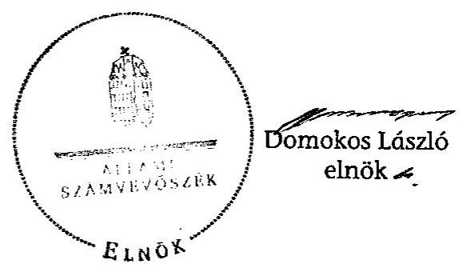

# ÁLLAMI   SZÁMVEVŐSZÉK 

## JELENTÉS

Csabdi Község Önkormányzata belső kontrollrendszerének kialakítása, valamint egyes kontrolltevékenységek és a belső ellenőrzés múködése ellenőrzéséről

---

# Állami Számvevőszék 

Iktatószám: V-0012-058-012-032/2013.
Témaszám: 1051
Vizsgálat-azonosító szám: V059112

## Az ellenőrzést felügyelte:

Dr. Benedek Mária
felügyeleti vezető
2012. december 16. napjától

Gyüre Lajosné
felügyeleti vezető
2012. december 15. napjáig

## Az ellenőrzést vezette:

## Szakmányné Bilik Mária

ellenőrzésvezető
A számvevőszéki jelentés összeállításában közreműködtek:
Dr. Fónagy Diána
számvevő tanácsos
Groholy Andrásné Hangyál Márta
számvevő tanácsos
Az ellenőrzést végezték:

| Beke Andrea | Csényi István |
| :-- | :-- |
| számvevő | számvevő tanácsos |

---

# TARTALOMJEGYZÉK 

BEVEZETÉS ..... 5
I. ÖSSZEGZŐ MEGÁLLAPÍTÁSOK, KÖVETKEZTETÉSEK, JAVASLATOK ..... 8
II. RÉSZLETES MEGÁLLAPÍTÁSOK ..... 15

1. Az Önkormányzat belső kontrollrendszere kialakításának megfelelősége ..... 15
1.1. A kontrollkörnyezet kialakítása ..... 15
1.2. A kockázatkezelési rendszer szabályozása ..... 16
1.3. A kontrolltevékenységek kialakítása ..... 17
1.4. Az információs és kommunikációs rendszer szabályozása ..... 18
1.5. A monitoring rendszer szabályozása ..... 18
2. A pénzügyi folyamatokban kulcsszerepet betöltő belső kontrollok (szakmai teljesítésigazolás és utalvány ellenjegyzés) működése ..... 19
3. A belső ellenőrzés szervezeti keretei és működése ..... 22

## FÜGGELÉKEK

1. számú Értelmező szótár
2. számú A belső kontrollrendszer kialakítása, a pénzügyi folyamatokban kulcsszerepet betöltő szakmai teljesítésigazolás és utalvány ellenjegyzés kontrollok működése, valamint a belső ellenőrzés működése értékelésénél alkalmazott minősítési szempontok.

---

.

---

# RÖVIDÍTÉSEK JEGYZÉKE 

## Törvények

ÁSZ tv.
Avtv.

Info tv.

Vtv.

Mötv.

Ötv.
régi Áht.

Számv. tv.
új Áht.

## Rendeletek

Áhsz.

Ámr.
Ávr.

Ber.

Bkr.
önkormányzati SZMSZ

## Szórövidítések

adatvédelmi szabályzat

ÁSZ
Belső ellenőrzési kézikönyv

Belső kontrollrendszer szabályzat

2011. évi LXVI. törvény az Állami Számvevőszékről
1992. évi LXIII. törvény a személyes adatok védelméről és a közérdekű adatok nyilvánosságáról (hatálytalan 2012. január 1-jétől)
2011. évi CXII. törvény az információs önrendelkezési jogról és az információszabadságról (hatályos 2012. január 1-jétől
2007. évi CLII. törvény az egyes vagyonnyilatkozat-tételi kötelezettségekről
2011. évi CLXXXIX. törvény Magyarország helyi önkormányzatairól (hatályos 2012. január 1-jétől)
1990. évi LXV. törvény a helyi önkormányzatokról
1992. évi XXXVIII. törvény az államháztartásról (hatálytalan 2012. január 1-jétől)
2000. évi C. törvény a számvitelről
2011. évi CXCV. törvény az államháztartásról (hatályos
2012. január 1-jétől)
249/2000. (XII. 24.) Korm. rendelet az államháztartás szervezetei beszámolási és könyvvezetési kötelezettségének sajátosságairól
292/2009. (XII. 19.) Korm. rendelet az államháztartás működési rendjéről (hatálytalan 2012. január 1-jétől)
368/2011. (XII. 31.) Korm. rendelet az államháztartásról szóló törvény végrehajtásáról (hatályos 2012. január 1jétől)
193/2003. (XI. 26.) Korm. rendelet a költségvetési szervek belső ellenőrzéséről (hatálytalan 2012. január 1-jétől)
370/2011. (XII. 31.) Korm. rendelet a költségvetési szervek belső kontrollrendszeréről és belső ellenőrzéséről (hatályos 2012. január 1-jétől)
Csabdi Község Önkormányzatának 8/2011. (IV. 13) számú rendelete a Képviselő-testület Szervezeti és Működési Szabályzatáról

Csabdi Község Polgármesteri Hivatalának Közszolgálati adatvédelmi szabályzata (836/19/2011. iktatószámú)
Állami Számvevőszék
a Vértes Többcélú Kistérségi Önkormányzati Társulás Csabdi Község Önkormányzatára is vonatkozó Belső ellenőrzési kézikönyve (hatályos 2011. szeptember 21-jétől)
Csabdi Község Polgármesteri Hivatalának Belső kontrollrendszer szabályzata (836/23/2011. iktatószámú)

---

Belső Kontroll Kézikönyv az Ámr. 155. § (1) bekezdése, valamint az államháztartási belső kontroll standardokról szóló 1/2009. (IX. 11.) PM irányelv egységes értelmezése érdekében az államháztartásért felelős miniszter által a 2010. évben kiadott Belső Kontroll Kézikönyv
bizonylati rend
etikai kódex
értékelési szabályzat

FEUVE
gazdasági program
gazdálkodási jogkörök szabályzata
hivatali SZMSZ
informatikai biztonsági szabályzat
iratkezelési szabályzat
jegyző
Képviselő-testület
kockázatkezelési szabályzat
leltározási szabályzat

Önkormányzat
pénzkezelési szabályzat
polgármester
Polgármesteri Hivatal
szabálytalanságkezelési
eljárásrend
számviteli politika
számlarend
Társulás
ügyrend

Csabdi Község Polgármesteri Hivatalának bizonylati rendje és a bizonylati album (hatályos 2011. február 1-jétől)
Csabdi Község Polgármesteri Hivatalának Hivatásetikai alapelvek és köztisztviselői hivatásetikai eljárás szabályai (hatályos 2011. február 23-tól)
Csabdi Község Polgármesteri Hivatalának értékelési szabályzata (hatályos 2011. február 1-jétől)
folyamatba épített, előzetes, utólagos és vezetői ellenőrzés
Csabdi Község Önkormányzata Képviselő-testületének 115/2006. (XI. 16.) számú határozatával elfogadott Gazdasági Programja a 2007-2013. évekre
Csabdi Község Polgármesteri Hivatalának szabályzata a kötelezettségvállalás, szakmai teljesítésigazolás, utalványozás, ellenjegyzés, érvényesítés hatásköri rendjéről (hatályos 2011. április 1-jétől)
Csabdi Község Polgármesteri Hivatalának Szervezeti és Működési Szabályzata (hatályos 2011. február 1-jétől)
Csabdi Község Polgármesteri Hivatalának Informatikai biztonsági szabályzata (836/16/2011. iktatószámú)
Csabdi Község Polgármesteri Hivatalának Iratkezelési szabályzata (1/2007. számú)
Csabdi Község Önkormányzatának jegyzője
Csabdi Község Képviselő-testülete
a Belső kontrollrendszer szabályzat III. fejezete
Csabdi Község Polgármesteri Hivatalának Leltározási és leltárkészítési szabályzata (hatályos 2011. augusztus 31től)
Csabdi Község Önkormányzata
Csabdi Község Polgármesteri Hivatalának Pénzkezelési szabályzata (836/1/2011. iktatószámú)
Csabdi Község Önkormányzatának polgármestere
Csabdi Község Önkormányzat Polgármesteri Hivatala
a Belső kontrollrendszer szabályzat VII. fejezete
Csabdi Község Polgármesteri Hivatalának Számviteli politikája (hatályos 2011. augusztus 31-től)
a jegyző által kiadott Számlarend (hatályos 2011. február 1-jétől)
Vértes Többcélú Kistérségi Önkormányzati Társulás
Csabdi Község Polgármesteri Hivatala gazdasági szervezetének ügyrendje (hatályos 2011. január 3-tól)

---

# JELENTÉS 

## Csabdi Község Önkormányzata belső kontrollrendszerének kialakítása, valamint egyes kontrolltevékenységek és a belső ellenőrzés működése ellenőrzéséről

## BEVEZETÉS

A belső kontrollrendszer kialakítását, működtetését és fejlesztését a régi Áht. és az új Áht. is előírja. Ennek megvalósításáért a költségvetési szerv vezetője, a jegyző felel. A belső kontrollrendszer azt a célt szolgálja, hogy a költségvetési szervek működésük és gazdálkodásuk során a tevékenységeket szabályszerűen, gazdaságosan, hatékonyan, eredményesen hajtsák végre, teljesítsék elszámolási kötelezettségeiket, és megvédjék az erőforrásokat a veszteségektől, a károktól és a nem rendeltetésszerű használattól. A belső kontrollrendszer magában foglalja mindazon szabályokat, eljárásokat, gyakorlati módszereket és szervezeti struktúrákat, kockázatkezelési technikákat, kontrolltevékenységeket, amelyek segítséget nyújtanak a szervezetnek céljai eléréséhez.

Az ÁSZ a 2011-2015. évekre szóló stratégiájában hangsúlyos szerepet szánt annak, hogy szilárd szakmai alapon álló, értékteremtő ellenőrzéseivel előmozdítsa a közpénzügyek átláthatóságát, rendezettségét. A számvevőszéki ellenőrzés nemzetközi alapelvei is rögzítik, hogy a megfelelő belső kontrollrendszer minimálisra csökkenti a hibák és szabálytalanságok kockázatát.

Az ellenőrzés célja annak értékelése volt, hogy az Önkormányzat a jogszabályi előírásoknak megfelelően alakította-e ki a belső kontrollrendszert; a gazdálkodás folyamatában kulcsszerepet betöltő szakmai teljesítésigazolás és az utalvány ellenjegyzés kontrolltevékenységeit megfelelően működtette-e; biztosította-e a belső ellenőrzés szabályos és eredményes működését.

Az ÁSZ ezen ellenőrzési céljait pilot (próba) jelleggel községi/nagyközségi önkormányzatoknál végzett ellenőrzések során érvényesítette.

Az ellenőrzés típusa: szabályszerűségi ellenőrzés
Az ellenőrzés jogszabályi alapja: az ÁSZ tv. 5. § (2) és (6) bekezdései
Az ellenőrzött szervezet: az Önkormányzat (ezen belül kiemelten a Polgármesteri Hivatal)

---

Az ellenőrzött időszak: a belső kontrollrendszer kialakításának megfelelőségét a 2011. évre vonatkozóan értékeltük. A kontrolltevékenységek működésének megfelelőségét a 2011. január 1-je és december 31-e, míg a belső ellenőrzés működésének szabályosságát és eredményességét a 2009. január 1-je és 2011. december 31-e közötti időszakot figyelembe véve értékeltük. A helyszíni ellenőrzés lezárásáig a helyi szabályozás változásait nyomon követtük.

Az ellenőrzés szakmai módszertana az Állami Számvevőszék Ellenőrzési Kézikönyvében foglalt szakmai szabályokon alapult, amely a Legfelsőbb Ellenőrző Intézmények Nemzetközi Szervezete (INTOSAI) által kiadott nemzetközi standardok (ISSAI) figyelembevételével készült.

A belső kontrollrendszer kialakításának ellenőrzése során értékeltük a Polgármesteri Hivatalban a kontrollkörnyezet, a kockázatkezelési rendszer, a kontrolltevékenységek, az információs és kommunikációs rendszer, valamint a monitoring rendszer szabályozottságának megfelelőségét.

A Polgármesteri Hivatalban értékeltük a pénzügyi folyamatokban kulcsszerepet betöltő szakmai teljesítésigazolás és utalvány ellenjegyzés kontrollok működésének megfelelőségét az államháztartáson kívülre teljesített működési és felhalmozási célú pénzeszköz átadásoknál, az állományba nem tartozók megbízási díjainál, továbbá a külső szolgáltató által végzett karbantartási, kisjavítási munkákkal kapcsolatos kifizetéseknél. Az egyszerű véletlen mintavétellel kiválasztott tételek ellenőrzését többlépcsős megfelelőségi tesztek útján addig végeztük, amíg elegendő és megfelelő bizonyítékot szereztünk a vizsgált folyamatok kulcskontrolljai működésének megfelelő vagy nem megfelelő voltáról.

Értékeltük az Önkormányzatnál a belső ellenőrzés működésének szabályosságát és eredményességét.

A fogalmak magyarázatát az 1. számú függelék, az ellenőrzés egyes területeinek értékelésénél alkalmazott egységes minősítési szempontokat a 2. számú függelék tartalmazza.

Az ellenőrzés lefolytatásához az Önkormányzat a munkalapok és a tanúsítvány elektronikus kitöltésével, valamint a megjelölt dokumentumok elektronikus megküldésével szolgáltatott adatokat. A munkalapokon szerepeltetett adatok, információk ellenőrzése és szükség szerinti javítása a helyszíni ellenőrzés keretében történt.

Az ÁSZ az ellenőrzés megállapításait az ellenőrzött időszakban hatályos, az intézkedést igénylő megállapításokra tett javaslatokat a jelenleg hatályos jogszabályok alapján fogalmazta meg.

Az ÁSZ tv. 29. § (1) bekezdése szerint a jelentéstervezetet megküldtük a polgármester részére, aki az ÁSZ tv. 29. § (2) bekezdésében foglalt észrevételezési jogával nem élt, a jelentéstervezetre észrevételt nem tett.

Csabdi község állandó lakosainak száma 2011. január 1-jén 1236 fő volt. Az Önkormányzat héttagú Képviselő-testületének munkáját kettő állandó bizottság segítette. Az Önkormányzatnak egy önállóan működő és gazdálkodó költségvetési intézménye volt, a Polgármesteri Hivatal. Az Önkormányzat többségi

---

tulajdoni hányadú gazdasági társasággal nem rendelkezett. A polgármester a 2010. évi önkormányzati választások óta tölti be tisztségét. A jegyző személye 2007. február 1-jén, 2010. február 1-jén és 2010. november 1-jén változott. Az ellenőrzött időszak végén hivatalban lévő jegyző 2011. szeptember 1-jétől látta el feladatait. A Polgármesteri Hivatal szervezeti egységekre nem tagolódott, a foglalkoztatott köztisztviselők száma 2011. január 1-jén négy fő volt. Az Önkormányzat a 2011. évi költségvetési beszámolója szerint 111,1 millió Ft költségvetési bevételt ért el, és 110,0 millió Ft költségvetési kiadást teljesített. A 2011. december 31-i könyvviteli mérleg szerint 814,7 millió Ft értékű eszközvagyonnal rendelkezett, a rövid lejáratú kötelezettsége 10,6 millió Ft volt, hosszú lejáratú kötelezettsége nem volt.

---

# I. ÖSSZEGZŐ MEGÁLLAPÍTÁSOK, KÖVETKEZTETÉSEK, JAVASLATOK 

A belső kontrollrendszer kialakítása a Polgármesteri Hivatalban 2011-ben a kontrollkörnyezet, a kockázatkezelési rendszer, a kontrolltevékenységek, az információs és kommunikációs rendszer, valamint a monitoring rendszer szabályozásának, illetve kialakításának értékelése alapján összességében nem felelt meg a jogszabályi előírásoknak.

A kontrollkörnyezet kialakítása részben felelt meg a jogszabályi előírásoknak. A jegyző elkészítette a gazdálkodást érintő legfontosabb szabályzatokat, azonban a hivatali SZMSZ, az Ámr.-ben foglaltak ellenére, nem tartalmazta a költségvetési szerv szervezeti ábráját, továbbá a hivatali SZMSZ-ben hiányosan rögzítették a nevesített munkakörökhöz tartozó feladat- és hatásköröket. A Ber. rendelkezéseit figyelmen kívül hagyva a jegyző a hivatali SZMSZ-ben nem határozta meg a belső ellenőrzést végző személy jogállását, feladatait. Az ügyrend, az Ámr. előírása ellenére, nem tartalmazta a pénzügyi-gazdasági feladatok ellátásáért felelős dolgozók helyettesítési rendjét. Ezek a hiányosságok korlátozzák a feladatellátás számonkérhetőségét, folyamatosságának biztosítását. A jegyző a leltározási szabályzatban, az Áhsz. előírása ellenére, nem rögzítette az üzemeltetésre átadott eszközök leltározásának rendjét, ami kockázatot jelent a vagyonvédelemben.

A kockázatkezelési rendszer szabályozása nem felelt meg a jogszabályi előírásoknak, mivel a jegyző, a Vtv. előírása ellenére, nem rögzítette a hivatali SZMSZ-ben a köztisztviselők vagyonnyilatkozat tételi kötelezettségét és nem biztosította a vagyonnyilatkozat-tétel teljesítésének dokumentálását.

A kontrolltevékenységek kialakítása a jogszabályi követelményeknek nem felelt meg, mivel, a régi Áht.-ban foglaltak ellenére, nem határozták meg a vagyonhasznosítási tevékenység és az iratkezelési feladatok folyamatba épített, előzetes, utólagos és vezetői ellenőrzését és, az Ámr. előírása ellenére, a Polgármesteri Hivatal tevékenységeire vonatkozó beszámolási eljárásokat. A gazdálkodási szabályzat naprakészségét nem biztosították, mivel a jegyzőváltáshoz kapcsolódó változásokat a nyilvántartásokban nem rögzítették. A kötelezettségvállalás és utalvány ellenjegyzésére a jegyző által felhatalmazottak nem rendelkeztek az Ámr.-ben előírt iskolai végzettséggel, illetve szakképesítéssel. A kontrolltevékenységek hiányos kialakítása kockázatot jelent a feladatok szabályszerű végrehajtása során.

Az információs és kommunikációs rendszer szabályozása részben felelt meg a jogszabályi követelményeknek, mivel a jegyző az, Ámr.-ben foglaltak ellenére, a közérdekű adatok közzétételének rendje keretében nem jelölte ki az adatközlésért felelős személyt. Az informatikai rendszer környezetének szabályozása során, az Avtv. előírása ellenére, elmulasztotta az adatbiztonság érvényre juttatásához szükséges intézkedések megtételét. A jegyző nem rendelkezett a hozzáférési jogosultságok megállapításáról, módosításáról, nem szabá-

---

lyozta a pénzügyi-számviteli szoftverváltozások ellenőrzésére vonatkozó eljárásokat.

A monitoring rendszer szabályozása részben felelt meg a jogszabályi előírásoknak. A jegyző szabályozta a rendszeresen végzendő vezetői ellenőrzés rendjét, az egyedi értékelés monitoring rendszerét, azonban a belső kontrollok működésének értékelését nem alapozta meg kockázatértékeléssel.

A belső kontrollrendszer nem megfelelő kialakítása kockázatot jelent az Önkormányzat tevékenységeinek szabályszerű, gazdaságos, hatékony és eredményes végrehajtása során.

A Polgármesteri Hivatalban a 2011. évben az államháztartáson kívülre történő működési és felhalmozási célú pénzeszközátadásokkal, az állományba nem tartozók megbízási díjaival, valamint a külső szolgáltatók által végzett karbantartással, kisjavítással kapcsolatos kifizetések során, összefoglalóan értékelve, a kulcskontrollok működésének megfelelősége gyenge volt. Az államháztartáson kívülre történő működési és felhalmozási célú pénzeszközátadásokkal, megbízási díjakkal, valamint a külső szolgáltatók által végzett karbantartással, kisjavítással kapcsolatos kiadások teljesítését megelőzően a jegyző által szakmai teljesítésigazolásra kijelölt személyek a kifizetések jogosságának, összegszerűségének ellenőrzését, valamint - az ellenszolgáltatást is magukban foglaló kifizetések esetében - a szerződések, megrendelések szakmai teljesítésének igazolását, az Ámr. előírása ellenére, nem teljesítették. A külső szolgáltatók által végzett karbantartással, kisjavítással kapcsolatos kifizetések esetében az igazolást nem a jegyzői kijelöléssel rendelkező személy végezte.

Az utalványok ellenjegyzője a kiadások teljesítését megelőzően az Ámr.-ben foglalt ellenőrzési feladatait nem végezte el. Nem kifogásolta a szakmai teljesítésigazolás elmaradását, illetve a jegyzői kijelöléssel nem rendelkező személyek által jogosulatlanul végzett szakmai teljesítésigazolásokat. Nem győződött meg arról, hogy a kifizetések sértik-e a gazdálkodásra - közöttük a kötelezettségvállalások ellenjegyzésének szabályaira, a kötelezettségvállalások nyilvántartására, az utalványrendeleten a kötelezettségvállalás nyilvántartási számának feltüntetésére - vonatkozó szabályokat. Az államháztartáson kívülre történő működési célú pénzeszközátadások kifizetései során a könyvviteli elszámolásra utaló főkönyvi számlát - a Számv. tv. és az Áhsz. előírásaival ellentétesen nem a gazdasági események tényleges tartalmának megfelelően jelölték ki. Hibásan a működési célú pénzeszköz átadások között számoltak el számla alapján fizetendő tagdíjat. A könyvvezetésben a téves számlakijelölés miatt sérült a Számv. tv.-ben szabályozott valódiság számviteli alapelv.

A számvevőszéki ellenőrzés az ellenőrzött kifizetésekkel összefüggésben jogosulatlan kifizetést nem tárt fel, azonban a gazdálkodásban kulcsszerepet betöltő kontrollok működésében feltárt hiányosságok miatt fennáll a hibák bekövetkezésének kockázata.

Az Önkormányzat a belső ellenőrzési feladatokat a Társulás által megbízott külső szervezet útján látta el. Az Önkormányzatnál a 2009-2010. években a belső ellenőrzés szabályozása és működése a jogszabályi előírásoknak nem felelt meg, mivel a 2009. évben a Képviselő-testület az éves ellenőrzési ter-

---

vet nem az Ötv.-ben előírt határidőig fogadta el. Az ellenőrzött időszakban, a Ber. előírása ellenére, az ellenőrzési tervek összeállítását megelőzően kockázatelemzést nem készítettek, a belső ellenőrzési vezető az ellenőrzési programokat nem hagyta jóvá. A belső ellenőrzés által tett javaslatok végrehajtására, a Ber.ben foglaltak ellenére, intézkedési terveket nem készítettek, a Ber. előírását figyelmen kívül hagyva a 2009-2011. évek között nem követték nyomon a feltárt hiányosságok megszüntetését. A 2011. évben az előző években fennálló hiányosságok egy részét megszüntették, és a belső ellenőrzés működése a jogszabályi előírásoknak megfelelt, azonban az ellenőrzési terv összeállításakor, a Ber. előírása ellenére, továbbra sem vették figyelembe - adatszolgáltatás hiányában - a jegyző írásos véleményét, és a Ber.-ben foglaltakkal ellentétesen az éves ellenőrzési terv nem tartalmazta az ellenőrzések tárgyát.

A belső ellenőrzés működése a 2009-2011. években nem volt eredményes, mivel a belső ellenőrzés szabályozása és működése az ellenőrzött időszak egészét tekintve a jogszabályi előírásoknak nem felelt meg. Ellenőrizték a gazdálkodási jogkörök gyakorlásához, valamint a készpénzkezeléshez kapcsolódó belső kontrollok működését, és a kötelező belső szabályzatok elkészítését. A jegyző azonban nem intézkedett a belső ellenőrzés által megfogalmazott javaslatok hasznosításáról és a feltárt hibák, hiányosságok kijavításáról. Mindezek hozzájárultak a számvevőszéki ellenőrzés során is feltárt szabályozási hiányosságok és a gyengén működő belső kontrollokból eredő hibák ismétlődéséhez.

Az ÁSZ tv. 33. § (1) bekezdésében foglaltak értelmében az ellenőrzött szervezet vezetője köteles a jelentésben foglalt megállapításokhoz kapcsolódó intézkedési tervet összeállítani és azt a jelentés kézhezvételétől számított 30 napon belül az ÁSZ részére megküldeni. Amennyiben az intézkedési tervet határidőn belül nem küldi meg a szervezet, vagy az az ÁSZ tv. 33. § (2) bekezdésében foglalt póthatáridő eltelte ellenére továbbra sem elfogadható, az ÁSZ elnöke a hivatkozott törvény 33. § (3) bekezdés a)-b) pontjaiban foglaltakat érvényesítheti.

Az ellenőrzés intézkedést igénylő megállapításai és javaslatai:

# a polgármesternek 

A szakmai teljesítésigazolásra a jegyző által kijelölt személyek, az Ámr. 76. § (1) bekezdésének előírása ellenére, a kifizetéseket megelőzően nem végezték el a kifizetések jogosságának, összegszerűségének, a szerződés, megrendelés teljesítésének ellenőrzését, illetve, az Ámr. 76. § (3) bekezdésében előírtak ellenére, nem tettek eleget igazolási kötelezettségüknek. Az utalványok ellenjegyzője nem tett eleget az Ámr. 79. § (2) bekezdése szerinti - a szakmai teljesítésigazolás és az érvényesítés megtörténtére vonatkozó - ellenőrzési kötelezettségnek.

Javaslat:
Intézkedjen a szakmai teljesítésigazolás és az utalvány ellenjegyzés kontrollokkal összefüggésben a számvevőszéki jelentésben rögzített hiányosságok és szabálytalanságok tekintetében az esetleges munkajogi felelősséggel kapcsolatos körülmények kivizsgálásáról, és a vizsgálat eredményének függvényében tegye meg a szükséges munkajogi intézkedéseket.

---

# a jegyzőnek 

1. a kontrollkörnyezettel kapcsolatban:

Az Ámr. 20. § (2) bekezdés h) és i) pontjaiban foglaltak ellenére a jegyző a hivatali SZMSZ-ben nem rögzítette az abban nevesített munkakörökhöz tartozó feladat- és hatásköröket, a költségvetési szerv szervezeti ábráját, továbbá az ügyrendben, az Ámr. 20. § (7) bekezdésének előírása ellenére, nem határozta meg a pénzügyigazdasági feladatok ellátásáért felelős dolgozók helyettesítésének rendjét.

A Ber. 4. § (2) bekezdésének rendelkezéseit figyelmen kívül hagyva a jegyző a hivatali SZMSZ-ben nem határozta meg a belső ellenőrzést végző személy jogállását, feladatait. A Vtv. 4. § a) pontjának előírásai ellenére a jegyző nem rögzítette a hivatali SZMSZ-ben a köztisztviselők vagyonnyilatkozat tételi kötelezettségét, és nem biztosította a vagyonnyilatkozat tétel teljesítésének dokumentálását. A leltározási szabályzatban, az Áhsz. 37. § (4)-(5) bekezdéseiben foglaltak ellenére, a jegyző nem szabályozta az üzemeltetésre átadott eszközök leltározásának rendjét.

Javaslat:
a) Módosítsa a hivatali SZMSZ-t, és kezdeményezze a polgármesternél a módosítás Képviselő-testület elé terjesztését annak érdekében, hogy az az Ávr. 13. § (1) bekezdésének e) és g) pontjaiban foglaltaknak megfelelően tartalmazza a költségvetési szerv szervezeti ábráját, a szabályzatban nevesített munkakörökhöz tartozó feladat- és hatásköröket, a Bkr.15. § (2) bekezdésének megfelelően a belső ellenőrzést végző személy vagy szervezet jogállását, feladatait, valamint a Vtv. 4. § a) pontjában előírtak alapján rögzítse a köztisztviselők vagyonnyilatkozat-tételi kötelezettségét.
b) Egészítse ki az ügyrendet az Ávr. 13. § (5) bekezdésében foglaltak alapján a pénzügyi-gazdasági feladatok ellátásáért felelős dolgozók helyettesítési rendjének szabályozásával.
c) Gondoskodjon a leltározási szabályzat kiegészítéséről, hogy az az Áhsz. 37. § (4) bekezdés előírásának megfelelően tartalmazza az üzemeltetésre átadott eszközök leltározásának rendjét.
2. a kontrolltevékenységekkel kapcsolatban:

A régi Áht. 121/A. § (4) bekezdésében foglaltak ellenére a jegyző nem határozta meg a vagyonhasznosítási tevékenység és az iratkezelési folyamatok folyamatba épített, előzetes, utólagos és vezetői ellenőrzését. Az Ámr. 158. § (2) bekezdés d) pontja ellenére nem alakította ki a Polgármesteri Hivatal tevékenységeire vonatkozó beszámolási eljárásokat. Az Ámr. 19. § (1) bekezdésében foglaltakat figyelmen kívül hagyva adott felhatalmazást a kötelezettségvállalás és az utalványozás ellenjegyzésére, mivel az ellenjegyzésre felhatalmazott személy nem rendelkezett az előírt iskolai végzettséggel, illetve szakképesítéssel. Az Ámr. 80. § (3) bekezdésben foglaltakkal szemben a kötelezettségvállalásra, ellenjegyzésre, a szakmai teljesítés igazolására, érvényesítésre és utalványozásra jogosult személyekről és az aláírás-mintájukról vezetett nyilvántartás naprakészségét nem biztosította.

---

Javaslat:
a) Gondoskodjon - a Bkr. 8. § (2) bekezdése alapján - a vagyonhasznosítási tevékenység és az iratkezelési folyamatok folyamatba épített, előzetes, utólagos és vezetői ellenőrzéséről.
b) Alakítsa ki a Bkr. 8. § (4) bekezdés c) pontjának megfelelően a Polgármesteri Hivatal tevékenységeire vonatkozó beszámolási eljárásokat.
c) Biztosítsa, hogy a pénzügyi ellenjegyzésre felhatalmazott személyek rendelkezzenek az Ávr. 55. § (3) bekezdésében előírt iskolai végzettséggel illetve szakképesítéssel.
d) Biztosítsa, hogy a gazdálkodási jogkörök szabályzata naprakész nyilvántartást tartalmazzon a kötelezettségvállalásra, pénzügyi ellenjegyzésre, teljesítésigazolásra, érvényesítésre és utalványozásra jogosult személyekről és aláírás-mintájukról az Ávr. 60. § (3) bekezdésének megfelelően.
3. az információs és kommunikációs rendszerrel kapcsolatban:

Az Ámr. 20. § (3) bekezdés i) pontjában foglalt előírás ellenére a jegyző nem jelölte ki a közérdekű adatok közzétételének rendje keretében az adatközlését felelős személyt. Az informatikai rendszer környezetének szabályozása során, az Avtv. 10. § (1)(2) bekezdéseiben foglalt előírások ellenére, a jegyző elmulasztotta az adatbiztonság érvényre juttatásához szükséges intézkedések megtételét, nem rendelkezett a hozzáférési jogosultságokról, azok ellenőrzéséről, és nem szabályozta a pénzügyiszámviteli szoftverváltozások ellenőrzésére, tesztelésére vonatkozó eljárásokat.

Javaslat:
a) Jelölje ki az Ávr. 13. § (2) bekezdés h) pontja alapján a közérdekű adatközlését felelős személyt.
b) Biztosítsa az Info tv. 7. § (2)-(3) bekezdéseinek megfelelően az adatbiztonság érvényesülését, rendelkezzen a hozzáférési jogosultságok megállapításáról, betartásának ellenőrzéséről, és szabályozza a pénzügyi-számviteli szoftverváltozások ellenőrzésére, tesztelésére vonatkozó eljárásokat.
4. a pénzügyi folyamatokban kulcsszerepet betöltő kontrollok működésével kapcsolatban:

A szakmai teljesítésigazolásra a jegyző által kijelölt személyek, az Ámr. 76. § (1) bekezdésének előírása ellenére, a kifizetéseket megelőzően nem végezték el a kifizetések jogosságának, összegszerűségének, a szerződés, megrendelés teljesítésének ellenőrzését, illetve - az Ámr. 76. § (3) bekezdésében előírtak ellenére - nem tettek eleget igazolási kötelezettségüknek. Az utalványok ellenjegyzője, az Ámr. 79. § (2) bekezdésében foglaltak ellenére, nem észrevételezte, hogy a jegyző által a szakmai teljesítésigazolásra kijelölt személyek ellenőrzési és igazolási kötelezettségüknek nem tettek eleget, továbbá hogy a szakmai teljesítésigazolást nem az arra kijelölt személy végezte.

---

Az utalvány ellenjegyzője nem kifogásolta, hogy a kötelezettségvállalás ellenjegyzése az Ámr. 74. § (1) bekezdés előírása ellenére nem történt meg, továbbá nem győződött meg az érvényesítés megtörténtéről. Nem kifogásolta, hogy az Ámr. 75. § (1) bekezdésében előírt kötelezettségvállalás nyilvántartást nem vezették, így az utalványrendeleten, az Ámr. 78. § (2) bekezdés g) pontjának előírása ellenére, a kötelezettségvállalás nyilvántartási számát nem tüntették fel.

Az Áhsz. 9. § (11) bekezdésében és a 9. számú mellékletének 9. d) pontjában foglaltakkal ellentétesen, az államháztartáson kívülre történő működési célú pénzeszköz átadások között számoltak el tagdíjat.

Javaslat:
Az operatív gazdálkodás során a működésbeli hibák megelőzése, feltárása és kijavítása érdekében gondoskodjon arról, hogy
a) a teljesítés igazolására kijelöltek - az Ávr. 57. § (1) bekezdésében előírtaknak megfelelően - a kiadások teljesítésének jogosságát, összegszerűségét, az ellenszolgáltatást is magában foglaló kötelezettségvállalás esetében - ha a kifizetés vagy annak egy része az ellenszolgáltatás teljesítését követően esedékes - annak teljesítését ellenőrizhető okmányok alapján ellenőrizzék, valamint az Ávr. 57. § (3) bekezdése szerint tegyenek eleget igazolási kötelezettségüknek;
b) az érvényesítő az Ávr. 58. § (1) bekezdése szerint a kifizetéseket megelőzően a teljesítésigazolás alapján ellenőrizze az összegszerűséget, a fedezet meglétét és azt, hogy a megelőző ügymenetben az új Áht., az Áhsz. és az Ávr. előírásait és a belső szabályzatokban foglaltakat betartották-e;
c) az Ávr. 56. § (1) bekezdésében foglalt kötelezettségvállalási nyilvántartás vezetése megtörténjen és az utalványrendeleteken az Ávr. 59. § (3) bekezdés f) pontjában foglaltaknak megfelelően feltüntetésre kerüljön a kötelezettségvállalás nyilvántartási száma;
d) a gazdasági eseményeket tényleges tartalmuknak megfelelően könyveljék a Számv. tv. 16. § (3) bekezdésében és az Áhsz. 9. § (11) bekezdésében, valamint 9. számú mellékletében foglaltak betartatásával.
5. a belső ellenőrzéssel kapcsolatban:

A Bkr. 21. § (3) bekezdésében foglaltakkal ellentétesen az éves ellenőrzési terv nem tartalmazta az ellenőrzések tárgyát.

A belső ellenőrzés által tett javaslatok végrehajtására, a Bkr. 29. § (1) bekezdésében foglaltak ellenére, a jegyző nem készített intézkedési tervet.

A Bkr. 8. § f) pontjának előírását figyelmen kívül hagyva a 2009-2011. évek között nem követték nyomon a feltárt hiányosságok megszüntetését.

Az ellenőrzési terv összeállítása - a Bkr. 32/B. § (2) bekezdésének előírása ellenére nem a jegyző írásos véleményének figyelembevételével történt, mivel a jegyző nem fogalmazott meg véleményt, javaslatot.

---

Javaslat:
a) Kezdeményezze, hogy az éves tervekben a Bkr. 31. § (4) bekezdés b) pontjában foglaltaknak megfelelően rögzítsék az ellenőrzések tárgyát.
b) Gondoskodjon a Bkr. 45. § (1) bekezdése előírása szerint a belső ellenőrzésekről készült jelentésekben rögzített hiányosságok felszámolása érdekében az intézkedési terv elkészítéséről.
c) Kezdeményezze, hogy a belső ellenőrzési vezető a jelentések alapján megtett intézkedéseket nyomon kövesse, és az ezzel kapcsolatos nyilvántartási kötelezettségét teljesítse a Bkr. 21. § (2) bekezdés d) pontjának megfelelően.
d) Biztosítsa, hogy az éves ellenőrzési terv összeállítása a társult feladatellátásra tekintettel, a Bkr. 56. § (2) bekezdésében foglaltaknak megfelelően, a jegyző írásos véleményének figyelembevételével történjen.

---

# II. RÉSZLETES MEGÁLLAPÍTÁSOK 

## 1. Az ÖNKORMÁNYZAT BELSŐ KONTROLLRENDSZERE KIALAKÍTÁSÁNAK MEGFELELŐSÉGE

### 1.1. A kontrollkörnyezet kialakítása

A kontrollkörnyezet kialakítása a Polgármesteri Hivatalban részben volt megfelelő. A jegyző a gazdálkodást érintő legfontosabb szabályzatokat elkészítette, azonban

- a hivatali SZMSZ, az Ámr. 20. § (2) bekezdés h), i) pontjaiban ${ }^{1}$ foglaltak ellenére, nem tartalmazta a költségvetési szerv szervezeti ábráját, nem rögzítette az abban nevesített munkakörökhöz tartozó feladat- és hatásköröket. A jegyző hiányosan határozta meg a Polgármesteri Hivatalban dolgozó köztisztviselők feladat- és hatáskörét, a munkaköri leírások köztisztviselők általi megismerése két fő esetében nem történt meg;
- a Bkr. 4. § (2) ${ }^{2}$ bekezdésének rendelkezéseit figyelmen kívül hagyva a jegyző a hivatali SZMSZ-ben nem határozta meg a belső ellenőrzést végző személy jogállását és feladatait;
- a jegyző az ügyrend gazdálkodási feladatok ellátására vonatkozó részében, az Ámr. 20. § (7) bekezdésének ${ }^{3}$ előírása ellenére, nem határozta meg a pénzügyi-gazdasági feladatok ellátásáért felelős dolgozók helyettesítésének rendjét;
- a leltározási szabályzatban, az Áhsz. 37. § (4)-(5) bekezdéseiben foglaltak ellenére, nem rögzítették az üzemeltetésre átadott eszközök leltározásának rendjét.

A Képviselő-testület az Önkormányzat gazdasági programját hiányos tartalommal fogadta el.

A gazdasági program, az Ötv. 91. § (6) bekezdésében ${ }^{4}$ foglaltak ellenére, nem tartalmazta a munkahelyteremtés feltételeinek elősegítésére, az adópolitikai célkitűzésekre, az egyes közszolgáltatások biztosítására, színvonalának javítására vo-

[^0]
[^0]:    ${ }^{1}$ 2012. január 1-jétől az Ávr. 13. § (1) bekezdés e) és g) pontjai tartalmazzák a vonatkozó előírást.
    ${ }^{2}$ 2012. január 1-jétől a Bkr. 15. § (2) bekezdése tartalmazza a belső ellenőrzést végző személy vagy szervezet, vagy szervezeti egység jogállásának, feladatainak meghatározására vonatkozó szabályokat.
    ${ }^{3}$ 2012. január 1-jétől az Ávr. 13. § (5) bekezdése tartalmazza a gazdasági szervezet ügyrendjének tartalmi követelményeit.
    ${ }^{4}$ 2013. január 1-jétől a gazdasági programra, fejlesztési tervre vonatkozó jogszabályi előírásokat az Mötv. 116. §-a tartalmazza.

---

natkozó megoldásokat, továbbá nem gondoskodtak a gazdasági program célkitűzéseinek az érintettekkel történő megismertetéséről.

A kontrollkörnyezet kialakítása során a jegyző

- a Belső Kontroll Kézikönyv ${ }^{5}$ 1.2.7. pontjában foglalt ajánlást nem érvényesítette, mert nem írta elő a hivatali SZMSZ munkatársak általi megismerésének kötelezettségét, és a hivatali SZMSZ dolgozók általi megismerése nem történt meg;
- a Belső Kontroll Kézikönyv 1.5.2. pontjában foglalt ajánlást nem érvényesítette, mivel nem dolgozta ki a Polgármesteri Hivatalban ellátott köztisztviselői munkakörök betöltésére vonatkozó elvárt tudást és képességeket.

# 1.2. A kockázatkezelési rendszer szabályozása 

A kockázatkezelési rendszer szabályozottsága a Polgármesteri Hivatalban nem volt megfelelő. A Vtv. 4. § a) pontjának előírásai ellenére nem rögzítették a hivatali SZMSZ-ben a köztisztviselők vagyonnyilatkozat tételi kötelezettségét, és nem biztosították a vagyonnyilatkozat tétel teljesítésének dokumentálását.

A kockázatkezelési rendszer szabályozása során a jegyző

- a kockázatok meghatározása és felmérése során - a Belső Kontroll Kézikönyv 2.1.1. pontjában foglalt ajánlást figyelmen kívül hagyva - nem határozta meg a kockázatkezelésben résztvevők feladatait, jogait és kötelezettségeit, hatáskörét és felelősségét. Nem rögzítette a költségvetési szerv kockázati tűrőképességét és azt az értéknagyságot, amely felett be kell avatkozni a folyamatokba;
- a Belső Kontroll Kézikönyv 2.1.4. pontjában foglaltakat figyelmen kívül hagyva, nem tájékoztatta az érintetteket a beazonosított kockázati tényezőkről;
- a kockázatok elemzése során - a Belső Kontroll Kézikönyv 2.2.3. pontjában foglalt ajánlást nem érvényesítette - az Önkormányzat tevékenységeit a kockázati kitettség alapján nem rangsorolta, és nem határozta meg a kockázati tűréshatárokat;
- a kockázatkezelés vonatkozásában a Belső Kontroll Kézikönyv 2.3.4. pontjának ajánlását nem hasznosította, mivel nem gondoskodott arról, hogy a kockázatkezelők megkapják a feladat ellátásához szükséges felhatalmazást és hozzáférési jogosítványokat, valamint nem szabályozta az intézkedések nyomon követését;
- a Belső Kontroll Kézikönyv 2.4.1. pontjában foglaltakat figyelmen kívül hagyva nem írta elő a kockázatkezelés teljes folyamatának felülvizsgálatát, és nem írta elő a belső ellenőrzés megállapításainak figyelembe vételét;

[^0]
[^0]:    ${ }^{5}$ Az Ámr. 2011. évben hatályos 155. § (1) bekezdése szerint a belső kontrollok kialakítása során a költségvetési szerv vezetője figyelembe veszi az államháztartásért felelős miniszter által közzétett, az államháztartási belső kontroll standardokra vonatkozó irányelvet. A 2012. január 1-jétől hatályos Bkr. 5. § (1) bekezdése szerint a költségvetési szervek belső kontrollrendszerét az államháztartásért felelős miniszter által közzétett módszertani útmutatók megfelelő alkalmazásával kell kialakítani és működtetni.

---

- a Belső Kontroll Kézikönyv 2.4.3 pontjának ajánlását figyelmen kívül hagyva, nem jelölte ki a kockázatkezelési tevékenység felülvizsgálatáért felelős személyeket;
- nem érvényesítette a Belső Kontroll Kézikönyv 2.5.1. pontjában foglalt ajánlást, mivel nem gondoskodott a csalás és a korrupció, mint kiemelt kockázatok értékeléséről és kezeléséről.

# 1.3. A kontrolltevékenységek kialakítása 

A kontrolltevékenységek kialakítása a Polgármesteri Hivatalban nem volt megfelelő, mivel a jegyző

- a régi Áht. 121/A. § (4) bekezdésében ${ }^{6}$ foglaltak ellenére nem határozta meg a FEUVE feladatait a vagyonhasznosítási és az iratkezelési folyamatok vonatkozásában;
- az Ámr. 158. § (2) bekezdés d) pontja7 ellenére nem alakította ki a Polgármesteri Hivatal tevékenységeire vonatkozó beszámolási eljárásokat;
- az Ámr. 80. § (3) bekezdésben ${ }^{8}$ foglaltakkal szemben a kötelezettségvállalásra, ellenjegyzésre, szakmai teljesítés igazolására, érvényesítésre és utalványozásra jogosult személyekről és az aláírás-mintájukról vezetett nyilvántartás naprakészségét nem biztosította. A 2011. szeptember 1-jén végrehajtott jegyzőváltáshoz kapcsolódó változásokat a nyilvántartásban nem rögzítették;
- az Ámr. 19. § (1) bekezdésében ${ }^{9}$ foglaltakat figyelmen kívül hagyva adott felhatalmazást a kötelezettségvállalás és az utalványozás ellenjegyzésére, mivel az ellenjegyzésre felhatalmazott személy nem felelt meg a képesítési előírásoknak.

A kontrolltevékenységek kialakítása során a jegyző

- a Belső Kontroll Kézikönyv 3.2.1. pontjában foglalt ajánlást figyelmen kívül hagyva a köztisztviselők munkaköri leírásai csak részben tartalmazták az ellenőrzési feladatokat;
- a Belső Kontroll Kézikönyv 3.2.3. pontjában foglalt ajánlást nem érvényesítette, nem írta elő a kis létszámból adódó kockázatok felmérésére irányuló kockázatelemzési kötelezettséget, illetve nem intézkedett ezen kockázat kezelése érdekében;

[^0]
[^0]:    ${ }^{6}$ 2012. január 1-jétől a Bkr. 8. § (2) bekezdése tartalmazza a szabályozási kötelezettséget.
    ${ }^{7}$ 2012. január 1-jétől a Bkr. 8. § (4) bekezdés c) pontja tartalmazza a szabályozási kötelezettséget.
    ${ }^{8}$ 2012. január 1-jétől az Ávr. 60. § (3) bekezdése tartalmazza a nyilvántartási kötelezettséget.
    ${ }^{9}$ 2012. január 1-jétől az Ávr. 55. § (3) bekezdésében írták elő az iskolai és szakképzettségi követelményeket.

---

- a Belső Kontroll Kézikönyv 3.3.1. pontjában foglalt ajánlást figyelmen kívül hagyva a munkakör átadás-átvételi jegyzőkönyvben nem írta elő kötelező tartalmi elemként a munkaviszony megszűnésének időpontját, az átadónál lévő, átadásra kerülő ügyek iratainak és státuszának a listáját.

# 1.4. Az információs és kommunikációs rendszer szabályozása 

Az információs és kommunikációs rendszer szabályozottsága a Polgármesteri Hivatalban részben volt megfelelő. A jegyző kialakította az iktatási rendszert, szabályozta az iratkezelés rendjét, elkészítette az adatvédelmi és adatbiztonsági szabályzatot, valamint a szabálytalanságkezelési eljárásrendet. Az Ámr. 159. §-ában ${ }^{10}$ előírt információs és kommunikációs rendszer kialakítása keretében a jegyző -

- az Ámr. 20. § (3) bekezdés i) pontjában ${ }^{11}$ foglalt előírás ellenére - a közérdekű adatok közzétételének rendje keretében nem jelölte ki az adatközlésért felelős személyt;
- az informatikai rendszer környezetének szabályozása során, az Avtv. 10. § (1)-(2) ${ }^{12}$ bekezdéseiben foglalt előírások ellenére, elmulasztotta az adatbiztonság érvényre juttatásához szükséges intézkedések megtételét. Nem rendelkezett a hozzáférési jogosultságok megállapításáról, módosításáról és a hozzáférési jogosultságok betartásának ellenőrzéséről, nem szabályozta a pénzügyi-számviteli szoftverváltozások ellenőrzésére, tesztelésére vonatkozó eljárásokat.

Az információs és kommunikációs rendszer szabályozása során a jegyző

- az iktatási, iratkezelési rendszer kialakítása keretében a Belső Kontroll Kézikönyv 4.2.4. pontjában foglalt ajánlást nem érvényesítette, mert nem írta elő az ügyintézési határidők dokumentálását, és nem szabályozta a késedelmes ügyintézés jelzéséért való felelősség rendjét;
- a szabálytalanságkezelés keretében - a Belső Kontroll Kézikönyv 4.3.3. pontjában foglalt ajánlást figyelmen kívül hagyva - nem rögzítette a szabálytalanságot bejelentő védelmére vonatkozó előírásokat és kötelezettségeket.

### 1.5. A monitoring rendszer szabályozása

A monitoring-rendszer szabályozottsága a Polgármesteri Hivatalban részben volt megfelelő. A jegyző szabályozta a rendszeresen végzendő vezetői ellenőrzés rendjét, az egyedi értékelés monitoring rendszerét, azonban a belső kontrollok működésének értékelését nem alapozta meg kockázatértékeléssel.

[^0]
[^0]:    ${ }^{10}$ 2012. január 1-jétől a Bkr. 3. § d) pontja tartalmazza a költségvetési szerv vezetőjének felelősségét a belső kontrollrendszer keretében az információs és kommunikációs rendszer kialakításáért.
    ${ }^{11}$ 2012. január 1-jétől az Ávr. 13. § (2) bekezdés h) pontja tartalmazza a közérdekű adatok nyilvánosságra hozatalával kapcsolatos szabályozás elkészítésének kötelezettségét.
    ${ }^{12}$ 2012. január 1-jétől az Info tv. 7. § (2)-(3) bekezdése rögzíti az adatbiztonság érdekében szükséges szabályozási kötelezettséggel kapcsolatos előírást.

---

A monitoring rendszer szabályozása keretében a jegyző

- a Belső Kontroll Kézikönyv 1.2.2. pontjának ajánlását nem érvényesítette, a szervezeti célok megvalósításának nyomon követése érdekében a lakosság, illetve a szolgáltatásokat igénybe vevők körében az önkormányzati feladatellátásra irányuló elégedettségi felméréseket nem végeztetett;
- a Belső Kontroll Kézikönyv 5.2.1. pontjában foglalt ajánlást nem érvényesítette, a belső kontrollok működésének értékelését nem alapozta meg kockázatértékeléssel. A monitoring rendszer szabályozása nem tartalmazta a kontrollok feltérképezését és kiválasztását, az értékelés szervezeti szintjeit. Nem jelölte ki a monitoring rendszer működtetéséért felelős személyt, a 2011. évben monitoring információk alapján jelentéseket, feljegyzéseket nem készített. Nem alakította ki a rendszeresen végzendő vezetői ellenőrzés rendjét.

A belső kontrollrendszer kialakítása a Polgármesteri Hivatalban 2011-ben a kontrollkörnyezet, a kockázatkezelési rendszer, a kontrolltevékenységek, az információs és kommunikációs rendszer, valamint a monitoring rendszer szabályozásának, illetve kialakításának értékelése alapján összességében nem felelt meg a jogszabályi előírásoknak.

# 2. A PÉNZÜGYI FOLYAMATOKBAN KULCSSZEREPET BETÖLTŐ BELSŐ KONTROLLOK (SZAKMAI TELJESÍTÉSIGAZOLÁS ÉS UTALVÁNY ELLENJEGYZÉS) MŰKÖDÉSE

A Polgármesteri Hivatalban a 2011. évben az államháztartáson kívülre teljesített működési és felhalmozási célú pénzeszközátadások során a szakmai teljesítésigazolás és az utalvány ellenjegyzés kulcskontrollok működésének megfelelősége gyenge volt, mivel:

- a - tévesen a támogatások között kimutatott - Duna-Vértes Köze Regionális Hulladékgazdálkodási Társulás részére történt tagdíj átutalását megelőzően a jegyző által kijelölt személyek, az Ámr. 76. § (1) bekezdésében ${ }^{13}$ foglaltak ellenére, a kifizetés jogosságát, összegszerűségét nem ellenőrizték, mert a bizonylaton az ellenőrzés megtörténtét aláírásukkal, az igazolás dátumának feltüntetésével, valamint a teljesítés tényére történő utalás megjelölésével nem igazolták;
- az utalványok ellenjegyzője ${ }^{14}$, aláírása ellenére, nem tett eleget az Ámr. 79. § (2) bekezdése ${ }^{15}$ szerinti - a szakmai teljesítésigazolás és az érvényesítés megtörténtére vonatkozó - ellenőrzési kötelezettségének, mivel nem ellenőrizte a szakmai teljesítésigazolás megtörténtét a Duna-Vértes Köze Regionális Hulladékgazdálkodási Társulás részére történt tagdíj átutalását, va-

[^0]
[^0]:    ${ }^{13}$ 2012. január 1-jétől az Ávr. 57. § (1) bekezdése tartalmazza a teljesítésigazolásra vonatkozó előírást.
    ${ }^{14}$ Az utalvány ellenjegyzőjének feladatait 2012. január 1-jétől hatályos Ávr. alapján az érvényesítő, illetve a pénzügyi ellenjegyző látja el.
    ${ }^{15}$ 2012. január 1-jétől az új Áht. 38. § (1) bekezdése és az Ávr. 58. § (1) bekezdése tartalmazza a kifizetések utalványozása előtt a teljesítésigazolás megtörténtére vonatkozó ellenőrzési kötelezettséget.

---

lamint az érvényesítés megtörténtét a Bicske Város Önkormányzatának az orvosi ügyelet támogatása átutalását megelőzően;

- az utalványok ellenjegyzője nem kifogásolta, hogy az érvényesítő a szakmai teljesítésigazolás hiánya ellenére hajtotta végre az érvényesítést. Nem észrevételezte, hogy a támogatások kifizetését elrendelő utalványrendeleten - az Ámr. 78. § (2) bekezdés g) pontjában ${ }^{16}$ előírtakkal ellentétesen - nem tüntették fel a kötelezettségvállalás nyilvántartási sorszámát.

Az Áhsz. 9. § (11) bekezdésében és a 9. számú mellékletének 9. d) pontjában foglaltakkal ellentétesen, az államháztartáson kívülre történő működési célú pénzeszköz átadások között számoltak el tagdíjat. A könyvvezetésben a téves számlakijelölés miatt sérült a Számv. tv. 15. § (3) bekezdésében szabályozott valódiság számviteli alapelv.

A Polgármesteri Hivatalban a 2011. évben az állományba nem tartozók megbízási díjainak kifizetése során a szakmai teljesítésigazolás és az utalvány ellenjegyzés kulcskontrollok működésének megfelelősége gyenge volt, mivel:

- a szakmai teljesítés igazolására a jegyző által kijelölt személyek az Ámr. 76. § (1) bekezdésében foglalt ellenőrzési feladataikat nem látták el, a kifizetés jogosságát, összegszerűségét, a szerződésben foglalt feladatok elvégzésének teljesítését nem ellenőrizték a költségvetési beszámoló elkészítésére adott eseti megbízási díj átutalását megelőzően. A bizonylaton az ellenőrzés megtörténtét aláírásukkal, az igazolás dátumának feltüntetésével, valamint a teljesítés tényére történő utalás megjelölésével nem igazolták;
- az utalvány ellenjegyzője az Ámr. 79. § (2) bekezdésében foglalt ellenőrzési kötelezettségének, aláírása ellenére, nem tett eleget, mivel nem ellenőrizte a szakmai teljesítésigazolás és az érvényesítés megtörténtét az eseti megbízás díjának átutalását megelőzően;
- az utalványok ellenjegyzője, aláírása ellenére, nem győződött meg a gazdálkodásra vonatkozó szabályok betartásáról, nem észrevételezte, hogy a támogatások kifizetését elrendelő utalványrendeleten - az Ámr. 78. § (2) bekezdés g) pontjában foglalt előírtakkal ellentétesen -, a kötelezettségvállalások nyilvántartásának hiánya miatt nem tüntették fel a kötelezettségvállalás nyilvántartási sorszámát. Nem kifogásolta, hogy a kötelezettségvállalás (eseti megbízási szerződés) ellenjegyzése, az Ámr. 74. § (1) bekezdés előírása ellenére, nem történt meg.

A Polgármesteri Hivatalban a 2011. évben a külső szolgáltatók által teljesített karbantartási, kisjavítási munkákra történő kifizetések során a szakmai teljesítésigazolás és az utalvány ellenjegyzés kulcskontrollok működésének megfelelősége gyenge volt:

[^0]
[^0]:    ${ }^{16}$ 2012. január 1-jétől az Ávr. 59. § (3) bekezdés f.) pontja tartalmazza az utalványon a kötelezettségvállalási nyilvántartási szám feltüntetésének kötelezettségét.

---

- a szakmai teljesítés igazolására a jegyző által kijelölt személyek az Ámr. 76. § (1) bekezdésében foglalt ellenőrzési feladataikat nem látták el, a kifizetés jogosságát, összegszerűségét, a szerződésben, megrendelésben foglalt feladatok elvégzésének teljesítését nem ellenőrizték a burkolatsüllyedés és a szalagszűrő prés javítása feladatok elvégzésénél. A bizonylatokon az ellenőrzések megtörténtét aláírásukkal, az igazolás dátumának feltüntetésével, valamint a teljesítés tényére történő utalás megjelölésével nem igazolták;
- a szakmai teljesítés igazolását - az Ámr. 76. § (3) bekezdésében ${ }^{17}$ foglaltakat figyelmen kívül hagyva - nem a jegyző által kijelölt személy látta el a fénymásoló 2011. szeptember havi karbantartási díjának kifizetése során;
- az utalvány ellenjegyzése a burkolatsüllyedés javítása és a szalagszűrő prés felújítása esetében nem történt meg, így az ellenjegyzésre jogosultak az Ámr. 79. § (2) bekezdésében foglalt ellenőrzési kötelezettségüknek nem tettek eleget. Nem ellenőrizték a szakmai teljesítésigazolás megtörténtét. Nem kifogásolták, hogy az Ámr. 75. § (1) bekezdésében ${ }^{18}$ előírt kötelezettségvállalás nyilvántartást nem vezették;
- az utalvány ellenjegyzője, aláírása ellenére, az Ámr. 79. § (2) bekezdésében foglalt ellenőrzési kötelezettségének nem tett eleget a fénymásoló 2011. szeptember havi karbantartási díjának kifizetése során, mivel nem észrevételezte, hogy a szakmai teljesítésigazolást nem az arra kijelölt személy végezte el. Nem kifogásolta, hogy az Ámr. 75. § (1) bekezdésében előírt kötelezettségvállalás nyilvántartást nem vezették, így az utalványrendeleten, az Ámr. 78. § (2) bekezdés g) pontjának előírása ellenére, a kötelezettségvállalás nyilvántartási számát nem tüntették fel.

A külső szolgáltatók által teljesített karbantartási, kisjavítási munkákra történő kifizetések során a Számv. tv. 15. § (9) bekezdésében foglaltak ellenére - megsértve a bruttó elszámolás elvét - követelést és kötelezettségeket számoltak el egymással szemben.

Az Önkormányzatnál a 2011. évben a pénzügyi folyamatokban kulcsszerepet betöltő belső kontrollok működésében feltárt hiányosságokkal összefüggésben az ellenőrzés az ellenőrzött tételek vonatkozásában a rendelkezésre bocsátott dokumentumok alapján kár bekövetkeztére utaló adatot, tényt nem állapított meg.

[^0]
[^0]:    ${ }^{17}$ 2012. január 1-jétől az Ávr. 57. § (3) bekezdése tartalmazza a teljesítésigazolás módját.
    ${ }^{18}$ 2012. január 1-jétől az Ávr. 56. § (1) bekezdése írja elő a kötelezettségvállalások nyilvántartásba vételi kötelezettségét.

---

# 3. A BELSŐ ELLENŐRZÉS SZERVEZETI KERETEI ÉS MŰKÖDÉSE

Az Önkormányzat a belső ellenőrzési feladatokat - az Ötv. 92. § (8) bekezdésében előírtaknak megfelelően - a Társulás által megbízott külső szervezetek útján látta el az ellenőrzött időszak egészében.

Az Önkormányzatnál a 2009-2010. években a belső ellenőrzés kialakítása és működése a jogszabályi előírásoknak nem felelt meg. A 2009. évben a Képviselő-testület az éves ellenőrzési tervet nem az Ötv. 92. § (6) bekezdésében szereplő határidőig fogadta ${ }^{19}$ el. Az ellenőrzött időszakban, a Ber. 21. § (2) bekezdésében ${ }^{20}$ foglaltak ellenére, nem készítettek az éves ellenőrzési tervek összeállítását megelőzően kockázatelemzést. A Ber. 23. § (3) bekezdésének ${ }^{21}$ előírása ellenére a belső ellenőrzési vezető az ellenőrzött időszakban nem hagyta jóvá az ellenőrzési programokat. A belső ellenőrzés által tett javaslatok végrehajtására, a Ber. 29. § (1) bekezdésében ${ }^{22}$ foglaltak ellenére a jegyző egyik évben sem készített intézkedési tervet. A Ber. 8. § f) bekezdését ${ }^{23}$ figyelmen kívül hagyva a 2009-2011. évek között nem követték nyomon a feltárt hiányosságok megszüntetését. Az Önkormányzatnál a 2011. évben az előző években fennálló hiányosságok egy részét megszüntették, és a belső ellenőrzés kialakítása és működése a jogszabályi előírásoknak megfelelt. Az ellenőrzési terv összeállítása azonban, Ber. 32/B. § (2) bekezdésének ${ }^{24}$ előírása ellenére, továbbra sem a jegyző írásos véleményének figyelembevételével történt, mivel a jegyző véleményt, javaslatot nem fogalmazott meg. A Ber. 21. § (3) bekezdésében ${ }^{25}$ foglaltakkal ellentétesen az éves ellenőrzési terv nem tartalmazta az ellenőrzések tárgyát.

A 2009-2011. évek között a jóváhagyott éves ellenőrzési terveket nem módosították, a Polgármesteri Hivatalban tervezett ellenőrzéseket végrehajtották, azokról a Ber.-ben meghatározott tartalommal és szerkezetben készítették el a jelentéseket. Az ellenőrzések során büntető-, szabálysértési, kártérítési, vagy fegyelmi eljárás megindítására okot adó cselekményt nem tártak fel.

[^0]
[^0]:    ${ }^{19}$ A 2009. évre vonatkozó éves ellenőrzési tervet a Képviselő-testület a 96/2008. (XI. 27.) számú határozatával fogadta el.
    ${ }^{20}$ 2012. január 1-jétől a Bkr. 29. § (1) bekezdése tartalmazza az ellenőrzési terv összeállításával kapcsolatban a kockázatelemzésre vonatkozó szabályt.
    ${ }^{21}$ 2012. január 1-jétől a Bkr. 33. § (2) bekezdése határozza meg a belső ellenőrzési program tartalmának kötelező elemeit, köztük a belső ellenőrzési vezető aláírását.
    ${ }^{22}$ 2012. január 1-jétől a Bkr. 45. §-a tartalmazza az intézkedési tervvel kapcsolatos előírásokat belső ellenőrzés esetén.
    ${ }^{23}$ 2012. január 1-jétől a Bkr. 21. § -a írja elő a belső ellenőrzés feladataként a belső ellenőrzési jelentések alapján megtett intézkedések nyilvántartását és nyomon követését.
    ${ }^{24}$ 2012. január 1-jétől a Bkr. 56. § (2) bekezdése írja elő az ellenőrzési terv összeállítása során a jegyző írásos véleményének figyelembevételét.
    ${ }^{25}$ 2012. január 1-jétől a Bkr. 31. § (4.) bekezdése írja elő az ellenőrzési terv kötelező tartalmi elemeit.

---

Az Önkormányzatnál a 2009-2011. évek között a belső ellenőrzés működése nem volt eredményes, mivel a belső ellenőrzés szabályozása és működése az ellenőrzött időszak egészét tekintve a jogszabályi előírásoknak nem felelt meg. Ellenőrizték a belső kontrollrendszer kialakításánál a jogszabályok alapján kötelezően elkészítendő belső szabályzatok meglétét, a számviteli politikában foglaltak betartását, a gazdálkodási jogkörök gyakorlásához, valamint a készpénzkezeléshez kapcsolódóan a belső kontrollok működését. Azonban a javaslatok hasznosítására, a feltárt hibák, hiányosságok kijavítására - a 2010. év kivételével - a jegyző intézkedési tervet nem készített.

Budapest, 2013. 03 hó nap

Függelék: 2 db

---

# ÉRTELMEZŐ SZÓTÁR

belső ellenőrzés
belső kontrollrendszer
belső kontrollrendszer területei
integritás
kockázat
kockázatkezelési rendszer
kontrollkörnyezet

Független, tárgyilagos bizonyosságot adó és tanácsadó tevékenység, amelynek célja, hogy az ellenőrzött szervezet működését fejlessze és eredményességét növelje, az ellenőrzött szervezet céljai elérése érdekében rendszerszemléletű megközelítéssel és módszeresen értékeli, illetve fejleszti az ellenőrzött szervezet irányítási és belső kontrollrendszerének hatékonyságát. (A régi Áht. 121/B. § (1) bekezdés és a Bkr. 2. § b) pontjából levezetett meghatározás.)
A belső kontrollrendszer a kockázatok kezelése és tárgyilagos bizonyosság megszerzése érdekében kialakított folyamatrendszer, amely azt a célt szolgálja, hogy a működés és gazdálkodás során a tevékenységeket szabályszerűen, gazdaságosan, hatékonyan, eredményesen hajtsák végre, az elszámolási kötelezettségeket teljesítsék, megvédjék az erőforrásokat a veszteségektől, károktól és nem rendeltetésszerű használattól. (A régi Áht. 121. § (1) és az új Áht. 69. § (1) bekezdéséből levezetett fogalom.)
A kontrollkörnyezet, a kockázatkezelési rendszer, a kontrolltevékenységek, az információ és kommunikáció, valamint a nyomon követés (monitoring). (A régi Áht. 121. § (2) bekezdéséből és a Bkr. 3. §-ából levezetett fogalom.)
Az integritás elvek, értékek, cselekvések, módszerek, intézkedések, konzisztenciáját jelenti: olyan magatartásmódot, amely meghatározott értékeknek felel meg. Az integritás a közszféra esetében a társadalom által elvárt nyilvánossági, átláthatósági, illetve jogi/etikai normáknak történő megfelelést jelenti. (A http://integritas.asz.hu honlapon között „Integritás jelentés 2011" című dokumentum 5. oldal 1. bekezdés.)
Az a lehetőség, hogy egy olyan esemény történik meg, amely negatívan hat a célok elérésére. (ÁSZ Ellenőrzési kézikönyv 6/139-140.oldal)
Olyan irányítási eszközök és módszerek összessége, melynek elemei a szervezeti célok elérését veszélyeztető tényezők (kockázatok) azonosítása, elemzése, csoportosítása, nyomon követése, valamint szükség esetén a kockázati kitettség mérséklése. (2012. január 1-jétől a Bkr. 2. § m) pontjában meghatározott fogalom)
A kontrollkörnyezet alakítja ki a szervezet belső kontrollrendszerhez való viszonyát, hozzáállását, befolyásolja az alkalmazottak belső kontrollal kapcsolatos tudatosságát, magatartását. Elemei a személyes és szakmai elkötelezettség és a vezetés, valamint az alkalmazottak által vallott erkölcsi értékek, a szakmai hozzáértés iránti elkötelezettség, a felső vezetés hozzáállása - a vezetés filozófiája és tevékenységének stílusa, a szervezeti struktúra, a humánerőforrás - politika és gazdálkodási gyakorlat. (ÁSZ Ellenőrzési kézikönyv 6/107. oldal)

---

kontrolltevékenységek
kommunikáció
korrupció
kulcskontrollok
lényegesség
monitoring
utóellenőrzés
véletlen minta

A kontrolltevékenységek azok a politikák és eljárások, amelyeket a kockázatok megoldására hoznak létre a szervezet céljainak teljesítése érdekében. (ÁSZ Ellenőrzési kézikönyv 6/108-109. oldal)
Az a tevékenység, melynek során információ továbbítása valósul meg. A kommunikációs folyamat résztvevői között tájékoztatás történik, mely során tényeket, ezek magyarázatát közlik. „A szervezetben eredményes kommunikációnak kell áramlania lefelé, horizontálisan és felfelé, a szervezet egészében és annak valamennyi elemében." (ÁSZ Ellenőrzési kézikönyv 6/112. oldal)
A közhatalmi pozíció bármilyen erkölcstelen felhasználása személyes, vagy magáncélú előnyök megszerzése érdekében. (ÁSZ Ellenőrzési kézikönyv 6/84. oldal)
Az önkormányzatok kontrollrendszere kialakításának ellenőrzése során a pénzügyi folyamatokban kulcsszerepet betöltő belső kontrollok a szakmai teljesítésigazolás és utalvány ellenjegyzés. (ÁSZ Módszertani útmutató az átfogó ellenőrzéshez 2.2. pontja alapján meghatározott fogalom.)

Egy információ akkor lényeges, ha hiánya vagy téves állítása befolyásolhatja ezen információkat felhasználók döntéseit, véleményét. Az ellenőrzés során a lényegesség három szempontból értelmezhető: érték, jelleg és összefüggés szerint. (ÁSZ Ellenőrzési kézikönyv 6/122-123. oldal)
A monitoring a különböző szintű szervezeti célok megvalósításának folyamatát kíséri figyelemmel, melynek során a releváns eseményekről és tevékenységekről (együtt: folyamatokról) rendszeres jelleggel, strukturált, döntéstámogató információkhoz jutnak a szervezet vezetői. (NGM útmutató a költségvetési szervek monitoring rendszeréhez 3. oldal, 2011. november, 2012. január 1-jétől a Bkr. 3. § e) pontja nyomon követési rendszerként azonosítja.)
Az intézkedések nyomon követése érdekében elrendelt ellenőrzés, amelynek célja, hogy a belső ellenőrzés bizonyosságot szerezzen az elfogadott intézkedések végrehajtásáról, vagy arról a tényről, hogy ha az ellenőrzött szerv, illetve az ellenőrzött szervezeti egység vezetője nem, vagy nem az elfogadott intézkedésnek megfelelően hajtja végre a feladatokat, továbbá meggyőződni arról, hogy a végrehajtott intézkedésekkel a megállapított kockázat ténylegesen megszűnt, vagy a kockázati tűréshatár alá csökkent. (2012. január 1-jétől a Bkr. 2. § s) pontjában meghatározott fogalom.)
Az alapsokaságot képviselő (reprezentáló) véletlenszerűen kiválasztott részsokaság. (ÁSZ Ellenőrzési kézikönyv 6/71. oldal)

---

# A belső kontrollrendszer kialakítása, a pénzügyi folyamatokban kulcsszerepet betöltő szakmai teljesítésigazolás és utalvány ellenjegyzés kontrollok működése, valamint a belső ellenőrzés működése értékelésénél alkalmazott minősítési szempontok 

## 1. A BELSŐ KONTROLLRENDSZER MINŐSÍTÉSE

Az ellenőrzés során először a belső kontrollrendszer területeinek (kontrollkörnyezet, kockázatkezelés, kontrolltevékenységek, információs és kommunikációs rendszer, monitoring rendszer) minősítését külön-külön elvégeztük. A megfelelőség minősítése a belső kontrollrendszer kialakítására vonatkozó kérdéseket tartalmazó munkalapokon, az elérhető és az elért pontokból kimunkált képlet alapján, számítógépes program segítségével történt.

A belső kontrollrendszer egyes területei kialakítása megfelelőségének értékelésére - az elért és elérhető pontok figyelembevételével - sávos rendszer alapján „nem megfelelő", „részben megfelelő" és „megfelelő" minősítést alkalmaztunk.

A vizsgált önkormányzat belső kontrollrendszerének egy-egy területe - az elért pontszámtól függetlenül - „nem megfelelő" értékelést kapott, ha nem teljesítette az alábbi kritériumok bármelyikét.

1. Kontrollkörnyezet kialakítása:

- Az Önkormányzat Képviselő-testülete az Ötv. 91. § (1) bekezdésében előírtaknak megfelelően megalkotta hosszabb időszakra szóló gazdasági programját.
- A Polgármesteri Hivatal ${ }^{1}$ rendelkezik a régi Áht. 88. § (2) bekezdésében előírt alapító okirattal, és az tartalmazza a régi Áht. 90. § (1) bekezdésében előírtakat, kiemelten a d) pont szerinti alaptevékenységeit.
- A Polgármesteri Hivatal rendelkezik a régi Áht. 91. § (2) bekezdésben előírt SZMSZ-szel.
- A Polgármesteri Hivatal rendelkezik az Áhsz. 8. § (3) bekezdésben előírt számviteli politikával.
- A Polgármesteri Hivatal rendelkezik az Áhsz. 8. § (4) bekezdés a) pontjában előírt eszközök és források leltározási és leltárkészítési szabályzatával.
- A Polgármesteri Hivatal rendelkezik az Áhsz. 8. § (4) bekezdés b) pontjában előírt eszközök és források értékelési szabályzatával.

[^0]
[^0]:    ${ }^{1}$ A körjegyzőségben működő önkormányzatoknál a polgármesteri hivatal feladatait a körjegyzőség látta el.

---

- A Polgármesteri Hivatal rendelkezik az Áhsz. 8. § (4) bekezdés d) pontjában előírt pénzkezelési szabályzattal.
- A Polgármesteri Hivatal rendelkezik az Áhsz. 49. § (1) bekezdésben előírt számlarenddel.
- A Polgármesteri Hivatal rendelkezik a Számv. tv. 161. § (2) bekezdés d) pontjában előírt bizonylati renddel.
- A Polgármesteri Hivatal rendelkezik a munkavédelemről szóló 1993. évi XCIII. törvény 2. § (3) bekezdés és 72. § (4) bekezdés előírásaiban foglalt, az egészséget nem veszélyeztető és biztonságos munkavégzés követelményei megvalósításának módját meghatározó szabályozással.
- A Polgármesteri Hivatal rendelkezik a tűz elleni védekezésről, a műszaki mentésről és a tűzoltóságról szóló 1996. évi XXXI. törvény 19. § (1) bekezdésben előírt tűzvédelmi szabályzattal.
- A Polgármesteri Hivatal rendelkezik az Ámr. 15. § (6) bekezdésben hivatkozott gazdasági szervezet ügyrendjével. Amennyiben a gazdasági feladatokat a Polgármesteri Hivatalon belül több szervezeti egység látja el, és azoknak önálló ügyrendjük van, az is elfogadható.
- A Polgármesteri Hivatal tevékenységeire vonatkozóan az Ámr. 156. § (2) bekezdésben előírtaknak megfelelve elkészült az ellenőrzési nyomvonal, folyamatleírás.

2. Kockázatkezelési tevékenység szabályozása és kialakítása:

- A költségvetési szerv (Polgármesteri Hivatal) vezetője az Ámr. 157. § (1) bekezdése alapján kockázatkezelési rendszert működtet, melynek keretében elkészítették a kockázatkezelési szabályzatot a Belső Kontroll Kézikönyv 2.1 pontjában meghatározott tartalommal.

3. Információs és kommunikációs rendszer szabályozása és kialakítása:

- A Polgármesteri Hivatal rendelkezik iratkezelési szabályzattal.
- Az 1992. évi LXIII. tv. 31/A. § (3) bekezdésben előírtaknak megfelelve az Önkormányzat jegyzője elkészítette az adatvédelmi és adatbiztonsági szabályzatot.
- Az Ámr. 156. § (3) bekezdésében előírtaknak megfelelve a jegyző szabályozta a szabálytalanságok kezelésének eljárásrendjét.

4. A monitoring rendszer szabályozottsága:

- Az Önkormányzat rendelkezik a Ber. 5. § (1) bekezdése alapján a jegyző, társult feladatellátás esetén a Ber. 32/B. § (8) bekezdésében előírtaknak megfelelve a társulás munkaszervezeti feladatát ellátó (vagy közös feladatellátás esetén a feladatellátást végző, intézményi társulás esetén az irányítási feladatot ellátó önkormányzat által kijelölt) költségvetési szerv vezetője által jóváhagyott belső ellenőrzési kézikönyvvel.

---

A belső kontrollrendszer öt fő területének egyedi értékelését követően került sor az összegző értékelésre, a minősítés itt is „megfelelő", „részben megfelelő", illetve „nem megfelelő" lehetett:

- Megfelelő a belső kontrollrendszer kialakítása, amennyiben mind az öt fő terület megfelelő értékelést kapott.
- Nem megfelelő a belső kontrollrendszer kialakítása, amennyiben bármelyik fő terület nem megfelelő értékelést kapott.
- Részben megfelelő a kontrollrendszer kialakítása, amennyiben bármelyik fő terület, részben megfelelő értékelést kapott, és egyik fő terület sem kapott nem megfelelő értékelést.

# 2. A KÉT KULCSKONTROLL (SZAKMAI TELJESÍTÉSIGAZOLÁS ÉS AZ UTALVÁNY ELLENJEGYZÉSE) MINŐSÍTÉSE 

A két kulcskontroll (szakmai teljesítésigazolás és az utalvány ellenjegyzése) működése megfelelőségének vizsgálatát többlépcsős megfelelőségi tesztek útján, megismételt eljárással, a könyvviteli tételekből vett egyszerű véletlen minta alapján végeztük.

Az ellenőrzés során alkalmazott módszer (megfelelőségi teszt) lényege, hogy a kiválasztott minta ellenőrzését csak addig végezzük, amíg elegendő és megfelelő bizonyítékot nem szerzünk a vizsgált kulcskontroll (szakmai teljesítésigazolás, utalvány ellenjegyzés) működésének megfelelő, vagy nem megfelelő voltáról. A megismételt eljárás alkalmazása a szándékolt hatáshoz (törvényes működés, kitűzött célok, teljesítmények elérése, veszteséget okozó kockázatok megelőzése, mérséklése, feltárása) viszonyítva lehetővé teszi a kontrolltevékenységek tényleges hatásának vizsgálatát, ez alapján a működésük megfelelősége értékelését. Ennek keretében a számvevő bizonyosságot szerez arról, hogy a rendelkezésre álló szabályozás és dokumentumok alapján a szakmai teljesítésigazoláshoz és utalvány ellenjegyzéshez szükséges ellenőrzési lépéseket végrehajtották-e.

A tesztek kiértékelése két szinten történt. Először az egyes tevékenységi területre meghatározott kulcskontrollokat értékeltük, majd általános következtetéseket vontunk le a két kulcskontroll együttes megfelelősége tekintetében. Az ellenőrzésre kijelölt területek kifizetéseinél a két kulcskontroll működése „kiváló", „jó" vagy „gyenge" minősítést kaphatott.

A szakmai teljesítésigazolás és az utalvány ellenjegyzés működését:

- kiválónak értékeltük abban az esetben, ha azok működése megfelel a hibák megelőzésére és kijavítására meghatározott jogszabályi és helyi szintű szabályozásnak;
- jónak minősítettük, ha a megállapított kisebb (tolerálható mértékű) hiányosságok nem veszélyeztetik az ellenőrzött területek hibáinak megelőzését és kijavítását;

---

- gyengének értékeltük, amennyiben a kontrollok működésében előforduló hiányosságok miatt nem biztosított a hibák megelőzése, feltárása, kijavítása.

# 3. A BELSŐ ELLENŐRZÉS MEGFELELŐ ÉS EREDMÉNYES MŰKÖDÉSÉNEK ÉRTÉKELÉSE 

A belső ellenőrzés megfelelő és eredményes működésének ellenőrzése során értékeltük, hogy az ellenőrzött időszakban a belső ellenőrzés kockázatelemzésen alapuló ellenőrzési terv alapján ellenőrizte-e az Önkormányzat irányítási, belső kontroll eljárásainak hatékonyságát, valamint a jogszabályoknak és belső szabályzatoknak való megfelelését, továbbá a gazdaságosság, hatékonyság és eredményesség követelményeit vizsgálva a belső ellenőrzés fogalmazott-e meg megállapításokat és ajánlásokat a polgármester és a jegyző részére, és azok hasznosultak-e.

A belső ellenőrzés működését három év (2009-2011) tapasztalatai, valamint a munkalapok kérdéseire adott válaszok alapján évenként értékeltük, ami az elérhető és az elért pontokból kimunkált képlettel, számítógépes program segítségével történt. A belső ellenőrzés működése megfelelőségének értékelése során - az elért és elérhető pontok figyelembevételével - a belső kontrollrendszer egyes területeinek minősítésével azonos sávos rendszer alapján „nem felelt meg", „megfelelt" és „jól megfelelt" minősítést alkalmaztunk.

A belső ellenőrzés eredményességének megállapításához a 2009-2011. évek egyedi értékelésén túlmenően az összesített pontszámok alapján is el kellett végezni a „jól megfelelt", „megfelelt" és „nem felelt meg" kategóriák szerinti minősítést.

Eredményesnek akkor tekintettük a belső ellenőrzés működését, ha az összesített értékelés alapján az önkormányzat legalább „megfelelt" minősítést kapott, és legalább kettő terület ellenőrzésére sor került a 2009-2011. években az alábbiak közül:

- a belső kontrollrendszer kialakításának szabályozottsága;
- a beazonosított tűréshatár feletti kockázatok kezelése érdekében tett intézkedések;
- a gazdálkodási jogkörök gyakorlásához kapcsolódó belső kontrollok működése;
- a készpénzkezeléssel kapcsolatos belső kontrollok működése;
- az önkormányzati vagyon hasznosítása területén a vagyongazdálkodási szabályok betartása;
- a vagyonvédelem területén a leltározási és a selejtezési szabályzatban foglaltak betartása;
- kockázatelemzésen alapuló és az előzőekbe nem tartozó ellenőrzés.

---

Továbbá az Önkormányzat jegyzője intézkedett a felsorolt és elvégzett ellenőrzések javaslatainak hasznosításáról. Ha a minősítés az összegző értékelés alapján „nem felelt meg", akkor a belső ellenőrzés működése nem volt eredményes. Amennyiben az összegző értékelés alapján a minősítés „megfelelt", de az előbb felsorolt területek közül legalább kettő ellenőrzésére a 2009-2011. években nem került sor, vagy a javaslatok hasznosulása érdekében az Önkormányzat jegyzője nem intézkedett, úgy a belső ellenőrzés működése szintén nem volt eredményes.
