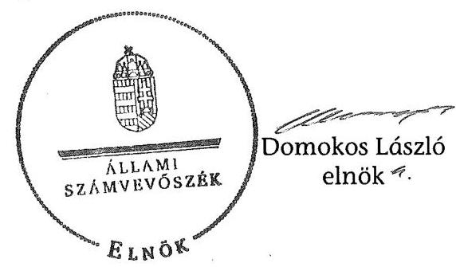

# JELENTÉS 

Dunaalmás Község Önkormányzata belső kontrollrendszerének kialakítása, valamint egyes kontrolltevékenységek és a belső ellenőrzés müködése ellenőrzéséről

---

# Állami Számvevőszék 

Iktatószám: V-0012-058-011-031/2013.
Témaszám: 1051
Vizsgálat-azonosító szám: V059111

## Az ellenőrzést felügyelte:

Dr. Benedek Mária
felügyeleti vezető
2012. december 16. napjától

Gyüre Lajosné
felügyeleti vezető
2012. december 15. napjáig

## Az ellenőrzést vezette:

## Szakmányné Bilik Mária

ellenőrzésvezető
A számvevőszéki jelentés összeállításában közremüködtek:
Kámán Edina
számvevő
Renner Andrea
számvevő
Az ellenőrzést végezték:
Szeibel Gáborné Krupánszki Dóra
számvevő
számvevő

---

# TARTALOMJEGYZÉK 

BEVEZETÉS ..... 5
I. ÖSSZEGZŐ MEGÁLLAPÍTÁSOK, KÖVETKEZTETÉSEK, JAVASLATOK ..... 8
II. RÉSZLETES MEGÁLLAPÍTÁSOK ..... 15

1. Az önkormányzat belső kontrollrendszere kialakításának megfelelősége ..... 15
1.1. A kontrollkörnyezet kialakítása ..... 15
1.2. A kockázatkezelési rendszer szabályozása ..... 15
1.3. A kontrolltevékenységek kialakítása ..... 16
1.4. Az információs és kommunikációs rendszer szabályozása ..... 16
1.5. A monitoring rendszer szabályozása ..... 17
2. A pénzügyi folyamatokban kulcsszerepet betöltő belső kontrollok (szakmai teljesítésigazolás és utalvány ellenjegyzés) múködése ..... 18
3. A belső ellenőrzés szervezeti keretei és működése ..... 22
FÜGGELÉKEK
4. számú Értelmező szótár
5. számú A belső kontrollrendszer kialakítása, a pénzügyi folyamatokban kulcsszerepet betöltő szakmai teljesítésigazolás és utalvány ellenjegyzés kontrollok múködése, valamint a belső ellenőrzés múködése értékelésénél alkalmazott minősítési szempontok

---

.

---

# RÖVIDÍTÉSEK JEGYZÉKE 

## Törvények

ÁSZ tv.
Avtv.

Info tv.

Ötv.
régi Áht.
Számv. tv.
új Áht.
2007. évi CLII. törvény

## Rendeletek

Áhsz.

Ámr.
Ávr.

Ber.
Bkr.
költségvetési rendelet
önkormányzati SZMSZ

## Szórövidítések

ÁSZ
Belső ellenőrzési kézikönyv

2011. évi LXVI. törvény az Állami Számvevőszékről
1992. évi LXIII. törvény a személyes adatok védelméről és a közérdekú adatok nyilvánosságáról (hatálytalan 2012. január 1-jétől)
2011. évi CXII. törvény az információs önrendelkezési jogról és az információszabadságról (hatályos 2012. január 1-jétől)
1990. évi LXV. törvény a helyi önkormányzatokról
1992. évi XXXVIII. törvény az államháztartásról (hatálytalan 2012. január 1-jétől)
2000. évi C. törvény a számvitelről
2011. évi CXCV. törvény az államháztartásról (hatályos 2012. január 1-jétől)
2007. évi CLII. törvény az egyes vagyonnyilatkozat-tételi kötelezettségekről

249/2000. (XII. 24.) Korm. rendelet az államháztartás szervezetei beszámolási és könyvvezetési kötelezettségének sajátosságairól
292/2009. (XII. 19.) Korm. rendelet az államháztartás múködési rendjéről (hatálytalan 2012. január 1-jétől)
368/2011. (XII. 31.) Korm. rendelet az államháztartásról szóló törvény végrehajtásáról (hatályos 2012. január 1jétől)
193/2003. (XI. 26.) Korm. rendelet a költségvetési szervek belső ellenőrzéséről (hatálytalan 2012. január 1-jétől)
370/2011. (XII. 31.) Korm. rendelet a költségvetési szervek belső kontrollrendszeréről és belső ellenőrzéséről (hatályos 2012. január 1-jétől)
1/2011. (II. 10.) számú önkormányzati rendelet Dunaalmás Község Önkormányzatának 2011. évi költségvetéséről
Dunaalmás Község Önkormányzat Képviselő-testületének 4/2007. (IV. 5.) számú önkormányzati rendelete az Önkormányzat Szervezeti és Múködési Szabályzatáról (hatályos 2007. április 5-től)

Állami Számvevőszék
Tatai Kistérség Többcélú Társulás Belső ellenőrzési kézikönyve (hatályos 2006. január 1-jétől)

---

Belső Kontroll Kézikönyv Az Ámr. 155. § (1) bekezdése, valamint az államháztartási belső kontroll standardokról szóló 1/2009. (IX. 11.) PM irányelv egységes értelmezése érdekében az államháztartásért felelős miniszter által 2010. évben kiadott Belső Kontroll Kézikönyv
értékelési szabályzat

FEUVE
FEUVE szabályzat
gazdálkodási jogkörök szabályzata
hivatali SZMSZ
iskola
Képviselő-testület
kockázatkezelési szabályzat
óvoda
Önkormányzat
polgármester
Polgármesteri Hivatal
szabálytalanságkezelési eljárásrend

Társulás
társulási megállapodás

Dunaalmás Község Önkormányzata Polgármesteri Hivatala Eszközök és források értékelésének szabályairól szóló 6/2010. (VII. 30.) számú jegyzői intézkedés
folyamatba épített, előzetes, utólagos és vezetői ellenőrzés Dunaalmás Község Önkormányzata Polgármesteri Hivatala Folyamatba épített, előzetes, utólagos és vezetői ellenőrzésének (FEUVE) szabályairól és a Hivatal ellenőrzési nyomvonaláról, valamint a belső ellenőrzésről szóló 4/2010. (V. 31.) számú jegyzői intézkedés (hatályos 2010. június 1-jétől)
Dunaalmás Község Önkormányzata Polgármesteri Hivatala Kötelezettségvállalás, utalványozás és érvényesítés szabályozásáról szóló 1/2011. (IX. 1.) számú jegyzői intézkedés (hatályos 2011. szeptember 1-jétől)
a Képviselő-testület 51/2010. (VII. 28.) számú határozatával elfogadott Dunaalmás Község Önkormányzata Polgármesteri Hivatalának Szervezeti és Múködési Szabályzata (hatályos 2010. augusztus 1-jétől)
Csokonai Általános Iskola
Dunaalmás Község Képviselő-testülete
Dunaalmás Község Önkormányzata Polgármesteri Hivatalának Kockázatkezelési szabályzatáról szóló 3/2010. (V. 31.) számú jegyzői intézkedés (hatályos 2010. június 1jétől)
Kék Duna Óvoda
Dunaalmás Község Önkormányzata
Dunaalmás Község Önkormányzatának polgármestere
Dunaalmás Község Önkormányzatának Polgármesteri Hivatala
Dunaalmás Község Önkormányzata Polgármesteri Hivatalának Szabálytalanságok kezelésének eljárásrendje, amely a hivatali SZMSZ 3. számú melléklete (hatályos 2010. augusztus 1-jétől)

Tatai Kistérség Többcélú Társulása
Tatai Kistérség Többcélú Társulás társulási megállapodása (hatályos 2004. június 30-tól)

---

# JELENTÉS 

## Dunaalmás Község Önkormányzata belső kontrollrendszerének kialakítása, valamint egyes kontrolltevékenységek és a belső ellenőrzés múködése ellenőrzéséről

## BEVEZETÉS

A belső kontrollrendszer kialakítását, múködtetését és fejlesztését a régi Áht. és az új Áht. is előírja. Ennek megvalósításáért a költségvetési szerv vezetője, a jegyző felel. A belső kontrollrendszer azt a célt szolgálja, hogy a költségvetési szervek múködésük és gazdálkodásuk során a tevékenységeket szabályszerűen, gazdaságosan, hatékonyan, eredményesen hajtsák végre, teljesítsék elszámolási kötelezettségeiket, és megvédjék az erőforrásokat a veszteségektől, a károktól és a nem rendeltetésszerű használattól. A belső kontrollrendszer magában foglalja mindazon szabályokat, eljárásokat, gyakorlati módszereket és szervezeti struktúrákat, kockázatkezelési technikákat, kontrolltevékenységeket, amelyek segítséget nyújtanak a szervezetnek céljai eléréséhez.

Az ÁSZ a 2011-2015. évekre szóló stratégiájában hangsúlyos szerepet szánt annak, hogy szilárd szakmai alapon álló, értékteremtő ellenőrzéseivel előmozdítsa a közpénzügyek átláthatóságát, rendezettségét. A számvevőszéki ellenőrzés nemzetközi alapelvei is rögzítik, hogy a megfelelő belső kontrollrendszer minimálisra csökkenti a hibák és szabálytalanságok kockázatát.

Az ellenőrzés célja annak értékelése volt, hogy az Önkormányzat a jogszabályi előírásoknak megfelelően alakította-e ki a belső kontrollrendszert; a gazdálkodás folyamatában kulcsszerepet betöltő szakmai teljesítésigazolás és az utalvány ellenjegyzés kontrolltevékenységeit megfelelően működtette-e; biztosí-totta-e a belső ellenőrzés szabályos és eredményes múködését.

Az ÁSZ ezen ellenőrzési céljait pilot (próba) jelleggel községi/nagyközségi önkormányzatoknál végzett ellenőrzések során érvényesítette.

Az ellenőrzés típusa: szabályszerűségi ellenőrzés
Az ellenőrzés jogszabályi alapja: az ÁSZ tv. 5. § (2) és (6) bekezdései
Az ellenőrzött szervezet: az Önkormányzat (ezen belül kiemelten a Polgármesteri Hivatal)

Az ellenőrzött időszak: a belső kontrollrendszer kialakításának megfelelőségét a 2011. évre vonatkozóan értékeltük. A kontrolltevékenységek múködésének megfelelőségét a 2011. január 1-je és december 31-e, míg a belső ellenőrzés

---

múködésének szabályosságát és eredményességét a 2009. január 1-je és 2011. december 31-e közötti időszakot figyelembe véve értékeltük. A helyszíni ellenőrzés lezárásáig a helyi szabályozás változásait nyomon követtük.

Az ellenőrzés szakmai módszertana az Állami Számvevőszék Ellenőrzési Kézikönyvében foglalt szakmai szabályokon alapult, amely a Legfelsőbb Ellenőrző Intézmények Nemzetközi Szervezete (INTOSAI) által kiadott nemzetközi standardok (ISSAI) figyelembevételével készült.

A belső kontrollrendszer kialakításának ellenőrzése során értékeltük a Polgármesteri Hivatalban a kontrollkörnyezet, a kockázatkezelési rendszer, a kontrolltevékenységek, az információs és kommunikációs rendszer, valamint a monitoring rendszer szabályozottságának megfelelőségét.

A Polgármesteri Hivatalban értékeltük a pénzügyi folyamatokban kulcsszerepet betöltő szakmai teljesítés igazolás és az utalvány ellenjegyzés kontrollok múködésének megfelelőségét az államháztartáson kívülre teljesített múködési és felhalmozási célú pénzeszköz átadásoknál, az állományba nem tartozók megbízási díjainál, továbbá a külső szolgáltatók által végzett karbantartási, kisjavítási munkákkal kapcsolatos kifizetéseknél. Az egyszerű véletlen mintavétellel kiválasztott tételek ellenőrzését többlépcsős megfelelőségi tesztek útján addig végeztük, amíg elegendő és megfelelő bizonyítékot szereztünk a vizsgált folyamatok kulcskontrolljai múködésének megfelelő vagy nem megfelelő voltáról.

Értékeltük az Önkormányzatnál a belső ellenőrzés múködésének szabályosságát és eredményességét.

A fogalmak magyarázatát az 1. számú függelék, az ellenőrzés egyes területeinek értékelésénél alkalmazott egységes minősítési szempontokat a 2. számú függelék tartalmazza.

Az ellenőrzés lefolytatásához az Önkormányzat a munkalapok és a tanúsítvány elektronikus kitöltésével, valamint a megjelölt dokumentumok elektronikus megküldésével szolgáltatott adatokat. A munkalapokon szerepeltetett adatok, információk ellenőrzése és szükség szerinti javítása a helyszíni ellenőrzés keretében történt.

Az ÁSZ az ellenőrzés megállapításait az ellenőrzött időszakban hatályos, az intézkedést igénylő megállapításokra tett javaslatokat a jelenleg hatályos jogszabályok alapján fogalmazta meg.

Az ÁSZ tv. 29. § (1) bekezdése szerint a jelentéstervezetet megküldtük a polgármester részére, aki az ÁSZ tv. 29. § (2) bekezdésében foglalt észrevételezési jogával nem élt, a jelentéstervezetre észrevételt nem tett.

Dunaalmás község állandó lakosainak száma 2011. január 1-jén 1507 fő volt. Az Önkormányzat héttagú képviselő-testületének munkáját három állandó bizottság segítette. Az Önkormányzat az önállóan múködő és gazdálkodó Polgármesteri Hivatalon kívül két önállóan múködő intézménnyel látta el feladatát, valamint egy többségi tulajdoni hányadú gazdasági társasággal rendelkezett. A polgármester a 2010. évi önkormányzati választások óta tölti be tisztségét, az ellenőrzött időszakban a jegyző személye 2011. június 1-jén változott. A

---

Polgármesteri Hivatal szervezeti egységekre nem tagolódott, a foglalkoztatott köztisztviselők száma 2011. január 1-jén öt fő volt.

Az Önkormányzat a 2011. évi költségvetési beszámolója szerint 191,7 millió Ft költségvetési bevételt ért el, és 190,6 millió Ft költségvetési kiadást teljesített. A 2011. december 31-i könyvviteli mérleg szerint 587,0 millió Ft értékű eszközvagyonnal rendelkezett, 34,4 millió Ft rövid lejáratú kötelezettsége volt, hosszú lejáratú kötelezettsége nem volt.

---

# I. ÖSSZEGZŐ MEGÁLLAPÍTÁSOK, KÖVETKEZTETÉSEK, JAVASLATOK 

A belső kontrollrendszer kialakítása a Polgármesteri Hivatalban 2011-ben a kontrollkörnyezet, a kockázatkezelési rendszer, a kontrolltevékenységek, az információs és kommunikációs rendszer, valamint a monitoring rendszer szabályozásának, illetve kialakításának értékelése alapján összességében nem felelt meg a jogszabályi előírásoknak.

A kontrollkörnyezet kialakítása nem felelt meg a jogszabályi követelményeknek, mivel a jegyző́ nem gondoskodott az Áhsz. előírása szerinti értékelési szabályzat, valamint a Számv. tv.-ben előírt bizonylati szabályzat elkészítéséről.

A kockázatkezelési rendszer szabályozása nem felelt meg a jogszabályi előírásnak, mivel a 2007. évi CLII. törvény rendelkezései ellenére a hivatali SZMSZ-ben nem rögzítették a vagyonnyilatkozat-tételre kötelezettek körét.

A kontrolltevékenységek kialakítása megfelelt a jogszabályi követelményeknek, mivel a jegyző szabályozta a folyamatba épített, előzetes, utólagos és vezetői ellenőrzést, a gazdálkodási jogkörök ellátásának módját és rendjét, továbbá kialakította a Polgármesteri Hivatal tevékenységeire vonatkozó beszámolási eljárásokat.

Az információs és kommunikációs rendszer szabályozása nem felelt meg a jogszabályi követelményeknek, mivel az Avtv.-ben foglaltak ellenére nem készítették el az adatvédelmi és adatbiztonsági szabályzatot, és az Ámr.-ben foglaltak ellenére nem határozták meg a közérdekú adatok közzétételi eljárásának, nyilvánosságra hozatalának rendjét, nem jelölték ki a közérdekú adatok közzétételének adatfelelősét és az adatközlő́ személyt. Az Avtv.-ben foglalt előírások ellenére elmulasztották az adatbiztonság érvényre juttatásához szükséges intézkedések megtételét, nem rendelkeztek a hozzáférési jogosultságok megállapításáról, betartásának ellenőrzéséről és nyilvántartásáról. Nem szabályozták a pénzügyi-számviteli szoftverváltozások ellenőrzésére, tesztelésére vonatkozó eljárásokat, a feldolgozott adatok mentési eljárásait, és nem jelölték ki a mentések elvégzésének felelőseit.

A monitoring rendszer szabályozása nem felelt meg a jogszabályi előírásoknak, mivel a jegyző az Ámr.-ben foglalt előírások ellenére az operatív tevékenységek keretében megvalósuló folyamatos és eseti nyomon követésből álló, az Önkormányzat tevékenységének, a célok megvalósításának nyomon követését biztosító rendszert nem alakította ki.

A belső kontrollrendszer nem megfelelő kialakítása kockázatot jelent az Önkormányzat tevékenységeinek szabályszerű, gazdaságos, hatékony végrehajtása során.

---

A Polgármesteri Hivatalban a 2011. évben az államháztartáson kívülre történő működési és felhalmozási célú pénzeszközátadásokkal, az állományba nem tartozók megbízási díjaival, valamint a külső szolgáltatók által végzett karbantartással, kisjavítással kapcsolatos kifizetések során a kulcskontrollok múködésének megfelelősége gyenge volt.

Az Ámr. előírásai ellenére a kiadások teljesítését megelőzően azok jogosságának, összegszerűségének ellenőrzése, valamint - az ellenszolgáltatást is magukban foglaló kifizetések esetében - a szerződések szakmai teljesítésének igazolása nem történt meg, illetve azt nem az arra jogosult személy végezte el.

Az utalványok ellenjegyző́je az Ámr.-ben foglaltak ellenére nem kifogásolta a szakmai teljesítésigazolás elmaradását. A kiadások teljesítését megelőzően nem győződött meg arról, hogy a kifizetés sérti-e a gazdálkodásra - az előirányzat meglétére, az utalvány tartalmi és formai megfelelőségére, a kötelezettségvállalások nyilvántartásba vételére - vonatkozó szabályokat. Nem kifogásolta, hogy a támogatási és a megbízási szerződéseket az Ámr.-ben foglaltak ellenére a kötelezettségvállalás előtt nem ellenjegyezték. Nem észrevételezte, hogy - a belső szabályozás hiányosságai miatt a 100 ezer Ft alatti kifizetések esetén - a kötelezettségvállalás nyilvántartásba vétele nem, illetve nem szabályszerűen történt meg. Az utalványok ellenjegyzését nem minden esetben az arra jogosult személy végezte el.

A karbantartással, kisjavítással kapcsolatos kifizetések során a könyvviteli elszámolásra utaló főkönyvi számlát - a Számv. tv. és az Áhsz. előírásaival ellentétesen - nem a gazdasági események tényleges tartalmának megfelelően jelölték ki. Hibásan a karbantartással, kisjavítással kapcsolatos kifizetések között számolták el a karbantartási anyagok vásárlásának kifizetéseit. A könyvvezetésben a téves számlakijelölések miatt sérült a Számv. tv.-ben szabályozott valódiság számviteli alapelv.

A számvevőszéki ellenőrzés az ellenőrzött kifizetésekkel összefüggésben a rendelkezésre bocsátott dokumentumok alapján jogosulatlan kifizetést nem tárt fel, azonban a gazdálkodásban kulcsszerepet betöltő kontrollok múködésében feltárt hiányosságok miatt fennáll a hibák bekövetkezésének kockázata.

Az Önkormányzat a 2009-2011. években a belső ellenőrzési feladatokat a Társulás útján látta el. A belső ellenőrzés szabályozása az ellenőrzött időszakban a jogszabályi előírásoknak összességében megfelelt, azonban a belső ellenőrzést végzők jogállását, feladatait a Ber.-ben foglaltak ellenére a hivatali SZMSZ helyett a FEUVE szabályzatban határozták meg. A 2011. évben a Ber. előírása ellenére az éves ellenőrzési terv összeállítását megelőzően nem készítettek kockázatelemzést, és a belső ellenőrzési vezető az ellenőrzési programokat nem hagyta jóvá. Az elvégzett ellenőrzésekről vezetett nyilvántartás, a Ber.-ben foglaltak ellenére, nem tartalmazta az ellenőrök nevét. A Ber. előírása ellenére nem gondoskodtak a külső és belső ellenőrzési jelentésekben szereplő ellenőrzési javaslatok alapján megtett intézkedések nyomon követését tartalmazó nyilvántartás kialakításáról.

Az Önkormányzatnál a 2009-2011. évek között a belső ellenőrzés múködése nem volt eredményes, mivel a kontrollrendszer, valamint a pénzügyi folya-

---

matokban kulcsszerepet betöltő belső kontrollok működésére irányuló belső ellenőrzés javaslataira tett intézkedések - a számvevőszéki ellenőrzés tapasztalatai alapján - nem hasznosultak, a szabályozási, gazdálkodási hibák ismétlődtek. A belső ellenőrzés szabályozása és működése az ellenőrzött időszak egészét tekintve a jogszabályi előírásoknak megfelelt.

Az ÁSZ tv. 33. § (1) bekezdésében foglaltak értelmében az ellenőrzött szervezet vezetője köteles a jelentésben foglalt megállapításokhoz kapcsolódó intézkedési tervet összeállítani és azt a jelentés kézhezvételétől számított 30 napon belül az ÁSZ részére megküldeni. Amennyiben az intézkedési tervet határidőn belül nem küldi meg a szervezet, vagy az az ÁSZ tv. 33. § (2) bekezdésében foglalt póthatáridő eltelte ellenére továbbra sem elfogadható, az ÁSZ elnöke a hivatkozott törvény 33. § (3) bekezdés a)-b) pontjaiban foglaltakat érvényesítheti.

Az ellenőrzés intézkedést igénylő megállapításai és javaslatai:

# a polgármesternek 

1. Az utalványok ellenjegyző́je aláírását megelőzően az Ámr. 79. § (2) bekezdése ellenére nem győződött meg a gazdálkodásra vonatkozó szabályok betartásáról, mivel nem észrevételezte, hogy a támogatási szerződéseket, valamint a megbízási szerződéseket az Ámr. 74. § (1) bekezdésében foglaltak ellenére a kötelezettségvállalás előtt nem ellenjegyezték.

Javaslat:
Intézkedjen arról, hogy az új Áht. 37. § (1) bekezdésében foglaltaknak megfelelően kötelezettségvállalásra - az Ávr.-ben meghatározott kivételekkel - kizárólag a pénzügyi ellenjegyzés után kerüljön sor.
2. A szakmai teljesítésigazolást az Ámr. 76. § (5) bekezdésében foglaltak ellenére nem minden esetben a jegyző által kijelölt személy végezte el, valamint - az Ámr. 76. § (1) és (3) bekezdésében foglaltakat figyelmen kívül hagyva - a szakmai teljesítésigazolásra a jegyző által kijelölt személy a szakmai teljesítésigazolást nem végezte el. Az utalványok ellenjegyzöje aláírása ellenére nem tett eleget az Ámr. 79. § (2) bekezdésében foglalt, a gazdálkodásra vonatkozó szabályokkal kapcsolatos ellenőrzési kötelezettségének, továbbá nem kifogásolta a szakmai teljesítésigazolás elmaradását.

Javaslat:
Intézkedjen a szakmai teljesítésigazolás és az utalvány ellenjegyzés kontrollokkal öszszefüggésben a számvevőszéki jelentésben rögzített hiányosságok és szabálytalanságok tekintetében az esetleges munkajogi felelősséggel kapcsolatos körülmények kivizsgálásáról.

## a jegyzőnek

1. a kontrollkörnyezettel kapcsolatban:

A jegyző az Áhsz. 8. § (4) bekezdés b) pontjának előírása ellenére az értékelési sza-

---

bályzat elkészítéséről nem gondoskodott, valamint - a Számv. tv. 161. § (2) bekezdés d) pontjában foglalt előírás ellenére - nem készítette el a Polgármesteri Hivatal bizonylati szabályzatát.

Javaslat:
a) Gondoskodjon az Áhsz. 8. § (4) bekezdés b) pontjában előírt értékelési szabályzat elkészítéséről.
b) Gondoskodjon a Számv. tv. 161. § (2) bekezdés d) pont előírásának megfelelően a bizonylati szabályzat elkészítéséről.
2. a kockázatkezelési rendszerrel kapcsolatban:

A jegyző, az egyes vagyonnyilatkozat-tételi kötelezettségekről szóló 2007. évi CLII. törvény 4. § a) pontjának előírása ellenére, a hivatali SZMSZ-ben nem rögzítette a vagyonnyilatkozat-tételre kötelezettek körét.

Javaslat:
Módosítsa a hivatali SZMSZ-t és kezdeményezze a polgármesternél a módosítás Képviselő-testület elé terjesztését annak érdekében, hogy a 2007. évi CLII. törvény 4. § a) pontjában előírtak alapján tartalmazza a köztisztviselők vagyonnyilatkozat tételi kötelezettségét.
3. az információs és kommunikációs rendszerrel kapcsolatban:

A jegyző, az Avtv. 31/A. § (3) bekezdésében foglaltak ellenére, nem készítette el az adatvédelmi és adatbiztonsági szabályzatot. Az Ámr. 20. § (3) bekezdés i) pontjában foglaltak ellenére nem határozta meg a közérdekű adatok közzétételi eljárásának, nyilvánosságra hozatalának rendjét, nem jelölte ki a közérdekű adatok közzétételének adatfelelősét és az adatközlő személyt. Az informatikai rendszer környezetének szabályozása során a jegyző, az Avtv. 10. § (1)-(2) bekezdéseiben foglalt előírások ellenére, elmulasztotta az adatbiztonság érvényre juttatásához szükséges intézkedések megtételét, nem rendelkezett a hozzáférési jogosultságok megállapításáról, betartásának ellenőrzéséről és nyilvántartásáról. Nem szabályozta a pénzügyi-számviteli szoftverváltozások ellenőrzésére, tesztelésére vonatkozó eljárásokat, a feldolgozott adatok mentési eljárásait, és nem jelölte ki a mentések elvégzésének felelőseit.

Javaslat:
a) Intézkedjen az Info tv. 24. § (3) bekezdése alapján az adatvédelmi és adatbiztonsági szabályzat kiadásáról.
b) Rendelkezzen az Önkormányzattal kapcsolatos információk esetében az Ávr. 13. § (2) bekezdés h) pontja és az Info tv. 35. § (3) bekezdése alapján a közérdekű adatok közzétételi eljárásának, nyilvánosságra hozatala rendjének szabályozásáról, jelölje ki a közérdekű adatok közzétételének adatfelelősét és az adatközlő személyt.

---

c) Biztosítsa az Info tv. 7. § (2) bekezdésének megfelelően az adatbiztonság érvényesülését, rendelkezzen a hozzáférési jogosultságok megállapításáról, betartásának ellenőrzéséről és nyilvántartásáról. Szabályozza a Polgármesteri Hivatal pénzügyi és számviteli elektronikus adatainak kezelését, feldolgozását, tárolását, a pénzügyi-számviteli szoftverváltozások ellenőrzésére, tesztelésére vonatkozó eljárásokat és a feldolgozott adatok mentési eljárásait, és jelölje ki a mentések elvégzésének felelőseit.
4. a monitoring rendszerrel kapcsolatban:

A jegyző az Ámr. 160. §-ában foglaltak ellenére az operatív tevékenységek keretében megvalósuló folyamatos és eseti nyomon követésből álló, az Önkormányzat tevékenységének, a célok megvalósításának nyomon követését biztosító rendszert nem alakította ki.

Javaslat:
Alakítsa ki és múködtesse a Bkr. 10. §-ában előírtak alapján, az operatív tevékenységek keretében megvalósuló folyamatos és eseti nyomon követésből álló, az Önkormányzat tevékenységének, a célok megvalósításának nyomon követését biztosító rendszert.
5. a pénzügyi folyamatokban kulcsszerepet betöltő kontrollok múködésével kapcsolatban:

A szakmai teljesítésigazolást, az Ámr. 76. § (5) bekezdésében foglaltak ellenére, nem minden esetben a jegyző által kijelölt személy végezte el. A szakmai teljesítésigazolásra kijelölt személy az Ámr. 76. § (1) és (3) bekezdésében foglaltakat figyelmen kívül hagyva, aláírása ellenére, nem végezte el a kiadások jogosságának, összegszerűségének ellenőrzését és a szerződések, megrendelések szakmai teljesítésének igazolását, illetve a kifizetéseket megelőzően nem igazolta az utalványrendeleten aláírásával a teljesítés megtörténtét és a szakmai teljesítés jogosságát.

Az utalványok ellenjegyzője, aláírása ellenére, nem tett eleget az Ámr. 79. § (2) bekezdésében foglalt, a gazdálkodásra vonatkozó szabályokkal kapcsolatos ellenőrzési kötelezettségének. Nem kifogásolta a szakmai teljesítésigazolás elmaradását. Nem észrevételezte, hogy az Ámr. 20. § (3) bekezdés a) pontjában foglaltak ellenére a belső szabályozás nem tartalmazta a 100 ezer Ft alatti kifizetések esetén a kötelezettségvállalás nyilvántartásba vételének eljárási és dokumentációs részletszabályait. A külső szolgáltatók által végzett karbantartással, kisjavítással kapcsolatos kifizetéseknél, a Számv. tv. 16. § (3) bekezdése és az Áhsz. 9. § (11) bekezdése, valamint 9. számú mellékletének előírásai ellenére, a főkönyvi számlát hibásan jelölték ki.

Javaslat:
Az operatív gazdálkodás során a müködésbeli hibák megelőzése, feltárása és kijavítása érdekében gondoskodjon arról, hogy
a) az Ávr. 57. § (3) bekezdése szerinti teljesítésigazolást az Ávr. 57. § (4) bekezdése szerint kijelölt személyek végezzék el, és az Ávr. 57. § (1) bekezdésében foglaltaknak megfelelően okmányok alapján ellenőrizzék a kiadások teljesítésének jo-

---

gosságát, összegszerűségét, az ellenszolgáltatást is magában foglaló kötelezettségvállalás esetében a szerződés, megrendelés teljesítését;
b) az érvényesítő az Ávr. 58. § (1) bekezdése szerint a kifizetést megelőzően a teljesítésigazolás alapján ellenőrizze az összegszerűséget, a fedezet meglétét és azt, hogy a megelőző ügymenetben az Áht., az Áhsz. és az Ávr. - gazdálkodási szabályokra, a teljesítésigazolás elvégzésére és előirányzat rendelkezésre állására vonatkozó - előírásait és a belső szabályzatokban foglaltakat betartották-e;
c) a külön írásbeli rendelkezésként kiállítandó utalvány tartalmazza az Ávr. 59. § (3) bekezdésében foglaltakat, illetve az utalvány használata során az azon szereplő valamennyi adat feltüntetésre kerüljön;
d) az új Áht. 37. § (1) bekezdésében, valamint az Ávr. 55. § (1) bekezdésében foglaltaknak megfelelően a pénzügyi ellenjegyzést követően történjen a kötelezettségvállalás;
e) az Ávr 56. § (1) bekezdésében foglaltak szerint a kötelezettségvállalást követően annak nyilvántartásba vétele megtörténjen, valamint az Ávr. 13. § (2) bekezdés a) pontjában foglaltaknak megfelelően a belső szabályozás tartalmazza a 100 ezer Ft alatti kifizetések esetén a kötelezettségvállalás nyilvántartásba vételének eljárási és dokumentációs részletszabályait annak érdekében, hogy a kötelezettségvállalások nyilvántartásba vétele szabályszerűen megtörténhessen;
f) a gazdasági eseményeket tényleges tartalmuknak megfelelően könyveljék a Számv. tv. 16. § (3) bekezdésében és az Áhsz. 9. § (11) bekezdésében, valamint 9. számú mellékletében foglaltak betartatásával.
6. a belső ellenőrzés múködésével kapcsolatban:

A belső ellenőrzést végzők jogállását, feladatait a Ber. 4. § (2) bekezdésében foglaltak ellenére a hivatali SZMSZ helyett a FEUVE szabályzatban határozták meg. A Ber. 21. § (2) bekezdésének előírása ellenére az éves ellenőrzési terv összeállítását megelőzően nem készítettek kockázatelemzést. A Ber. 23. § (3) bekezdése előírása ellenére a belső ellenőrzési vezető az ellenőrzési programokat nem hagyta jóvá. Az elvégzett ellenőrzésekről vezetett nyilvántartás hiányos volt, nem tartalmazta a Ber. 32. § (2) bekezdésének d) pontjában előírtak alapján az ellenőrök nevét. A Ber. 29/A. § (1)-(2) és (7) bekezdéseinek előírása ellenére nem gondoskodtak a külső és belső ellenőrzési jelentésekben szereplő ellenőrzési javaslatok alapján megtett intézkedések nyomon követését tartalmazó nyilvántartás kialakításáról.

Javaslat:
a) Módosítsa a hivatali SZMSZ-t és kezdeményezze a polgármesternél a módosítás Képviselő-testület elé terjesztését annak érdekében, hogy a Bkr. 15. § (2) bekezdésében foglaltak szerint előírásra kerüljön a belső ellenőrzési kötelezettség, a belső ellenőrzést végzők jogállása és feladatai.
b) Biztosítsa, hogy az éves ellenőrzési tervet a Bkr. 29. § (1) bekezdése és 31. § (2) bekezdésének megfelelően kockázatelemzéssel alapozzák meg.

---

c) Intézkedjen, hogy a Bkr. 33. § (2) bekezdés előírásával összhangban az ellenőrzési programot a belső ellenőrzési vezető hagyja jóvá.
d) Gondoskodjon a belső ellenőrzésekről vezetett nyilvántartásnak a Bkr. 50. § (2) bekezdés e) pont előírása szerinti kiegészítéséről annak érdekében, hogy az tartalmazza az ellenőrzés lefolytatásában részt vett vizsgálatvezető, a belső ellenőr és a szakértő nevét.
e) Intézkedjen a Bkr. 14. § (1) bekezdésében előírtaknak megfelelően a külső ellenőrzési jelentésekben szereplő ellenőrzési javaslatok alapján megtett intézkedések nyomon követését tartalmazó nyilvántartás vezetéséről, valamint arról, hogy a belső ellenőrzési vezető a Bkr. 47. § (1) bekezdésének megfelelően vezessen nyilvántartást a belső ellenőrzési jelentésekben tett megállapításokról, javaslatokról, a vonatkozó intézkedési tervekről és azok végrehajtásának nyomon követéséről.

---

# II. RÉSZLETES MEGÁLLAPÍTÁSOK 

## 1. Az önkORMÁNYZAT BELSŐ KONTROLLRENDSZERE KIALAKÍTÁSÁNAK MEGFELELŐSÉGE

### 1.1. A kontrollkörnyezet kialakítása

A kontrollkörnyezet kialakítása a Polgármesteri Hivatalban nem volt megfelelő, mivel a jegyző

- nem gondoskodott, az Áhsz. 8. § (4) bekezdés b) pontjában foglaltak ellenére, az értékelési szabályzat elkészítéséről¹;
- nem készítette el, a Számv. tv. 161. § (2) bekezdés d) pontjában foglalt előírás ellenére, a Polgármesteri Hivatal bizonylati szabályzatát.

A kontrollkörnyezet kialakítása során a jegyző

- a Belső Kontroll Kézikönyv ${ }^{2}$ 1.2.7. pontjában foglalt ajánlást nem érvényesítette, mert nem írta elő a hivatali SZMSZ munkatársak általi megismerésének ${ }^{3}$ kötelezettségét;
- a Belső Kontroll Kézikönyv 1.3.3. pontjában foglaltakat figyelmen kívül hagyva a Polgármesteri Hivatalban dolgozó köztisztviselők munkaköri leírásaiban a munkakörökhöz kapcsolódó felelősségi szabályokat nem határozta meg;
- a Belső Kontroll Kézikönyv 1.5.2. pontjában foglalt ajánlást nem érvényesítette, mivel nem dolgozta ki a Polgármesteri Hivatalban ellátott köztisztviselői munkakörök betöltésére vonatkozó elvárt tudást és képességeket;
- a Belső Kontroll Kézikönyv 1.6. pontjában foglalt ajánlást figyelmen kívül hagyva nem intézkedett a szervezeti célokkal összhangban álló etikai értékek és az integritás kiemelt kezeléséről, nem határozta meg a köztisztviselőkkel szembeni etikai elvárásokat.

### 1.2. A kockázatkezelési rendszer szabályozása

A kockázatkezelési rendszer szabályozottsága a Polgármesteri Hivatalban nem volt megfelelő. A 2007. évi CLII. törvény 4. § a) pontjának előírása

[^0]
[^0]:    ${ }^{1}$ Az értékelési szabályzat hatályba léptetése nem történt meg, mivel az elkészült szabályzatot a jegyző nem írta alá.
    ${ }^{2}$ A 2011. évben az Ámr. 155. § (1) bekezdése szerint a belső kontrollok kialakítása során a költségvetési szerv vezetője figyelembe veszi az államháztartásért felelős miniszter által közzétett, az államháztartási belső kontroll standardokra vonatkozó irányelvet. 2012. január 1-jétől a Bkr. 5. § (1) bekezdése értelmében a költségvetési szervek belső kontrollrendszerét az államháztartásért felelős miniszter által közzétett módszertani útmutatók megfelelő alkalmazásával kell kialakítani és működtetni.
    ${ }^{3}$ A szabályozás hiánya ellenére a hivatali SZMSZ tartalmazta a dolgozók megismerési nyilatkozatát.

---

ellenére a jegyző a hivatali SZMSZ-ben nem rögzítette a vagyonnyilatkozattételre kötelezettek körét.

A kockázatkezelési rendszer szabályozása során a jegyző

- a Belső Kontroll Kézikönyv 2.1.3. pontjában foglalt ajánlást figyelmen kívül hagyva nem alakította ki a kockázat-nyilvántartási rendszert;
- nem érvényesült a Belső Kontroll Kézikönyv 2.2.3. pontjában foglalt ajánlás, mert nem határozta meg a kockázati túréshatárokat;
- a Belső Kontroll Kézikönyv 2.3.4. pontjában foglalt ajánlást nem érvényesítette, mivel a kockázatkezelés vonatkozásában nem biztosította a kockázatkezelők részére szükséges felhatalmazást és a kockázatkezelési feladatellátást biztosító hozzáférési jogosítványokat;
- a Belső Kontroll Kézikönyv 2.4.1. pontjában foglalt ajánlást figyelmen kívül hagyva nem írta elő a kockázatkezelés teljes folyamatának felülvizsgálatát;
- nem érvényesítette a Belső Kontroll Kézikönyv 2.5.1. pontjában foglalt ajánlást, mivel nem gondoskodott a csalás és a korrupció, mint kiemelt kockázatok értékeléséről és kezeléséről.

# 1.3. A kontrolltevékenységek kialakítása 

A kontrolltevékenységek kialakítása a Polgármesteri Hivatalban megfelelő volt. A jegyző a kontrollstratégiák és módszerek keretében szabályozta a folyamatba épített, előzetes, utólagos és vezetői ellenőrzést, az érvényesítés rendjét, a szakmai teljesítés igazolásának módját, és kijelölte az érvényesítésre, illetve a szakmai teljesítésigazolásra jogosultakat, továbbá kialakította a Polgármesteri Hivatal tevékenységeire vonatkozó beszámolási eljárásokat.

A kontrolltevékenységek kialakítása során a jegyző

- a Belső Kontroll Kézikönyv 3.2.3. pontjában foglaltakat figyelmen kívül hagyva nem mérte fel a kis létszámból adódó kockázatokat az összeférhetetlenség kiküszöbölése érdekében;
- a Belső Kontroll Kézikönyv 3.3.1. pontjában foglaltakat figyelmen kívül hagyta, mivel nem szabályozta a munkaviszony megszűnése esetén a munkavállaló folyamatban lévő feladatainak átadási rendjét, továbbá nem írta elő munkakör átadás-átvétel esetén a jegyzőkönyv készítési kötelezettséget.

### 1.4. Az információs és kommunikációs rendszer szabályozása

Az információs és kommunikációs rendszer szabályozottsága a Polgármesteri Hivatalban nem volt megfelelő. Az Ámr. 159. §-ban ${ }^{4}$ előírt információs és kommunikációs rendszer kialakítása keretében a jegyző

- az Avtv. 31/A. § (3) bekezdésében ${ }^{5}$ foglaltak ellenére nem készítette el az adatvédelmi és adatbiztonsági szabályzatot;

[^0]
[^0]:    ${ }^{4}$ 2012. január 1-jétől a Bkr. 3. § d) pontja tartalmazza a költségvetési szervek vezetőjének felelősségét a belső kontrollrendszer keretében az információs és kommunikációs rendszer kialakításáért.

---

- az Ámr. 20. § (3) bekezdés i) pontjában ${ }^{6}$ foglaltak ellenére nem határozta meg a közérdekú adatok közzétételi eljárásának, nyilvánosságra hozatalának rendjét, nem jelölte ki a közérdekú adatok közzétételének adatfelelősét és az adatközlő személyt;
- az informatikai rendszer környezetének szabályozása során, az Avtv. 10. § (1)-(2) bekezdéseiben foglalt előírások ellenére ${ }^{7}$, elmulasztotta az adatbiztonság érvényre juttatásához szükséges intézkedések megtételét. Nem rendelkezett a hozzáférési jogosultságok megállapításáról, betartásának ellenőrzéséről és nyilvántartásáról. Nem szabályozta a pénzügyi-számviteli szoftverváltozások ellenőrzésére, tesztelésére vonatkozó eljárásokat, a feldolgozott adatok mentési eljárásait, és nem jelölte ki a mentések elvégzésének felelőseit.

Az információs és kommunikációs rendszer szabályozása során a jegyző

- a Belső Kontroll Kézikönyv 4.1.1. pontjában foglaltakat figyelmen kívül hagyva nem határozta meg az Önkormányzattal kapcsolatos információk esetében a külső partnerekkel folytatott horizontális és vertikális kommunikáció alapvető szabályait;
- az iktatási, iratkezelési rendszer kialakítása keretében a Belső Kontroll Kézikönyv 4.2.4. pontjában foglalt ajánlást nem érvényesítette, mert nem szabályozta az ügyintézési határidők dokumentálását, és nem szabályozta a késedelmes ügyintézés jelzéséért való felelősség rendjét;
- a szabálytalanságkezelési eljárásrendben a Belső Kontroll Kézikönyv 4.3.3. pontjában foglalt ajánlást nem hasznosította, mert nem rögzítette a szabálytalanságot bejelentő védelmére vonatkozó előírásokat és kötelezettségeket.

# 1.5. A monitoring rendszer szabályozása 

A monitoring rendszer szabályozottsága a Polgármesteri Hivatalban nem volt megfelelő, mivel a jegyző az Ámr. 160. §-ában ${ }^{8}$ foglaltak ellenére az operatív tevékenységek keretében megvalósuló folyamatos és eseti nyomon követésből álló, az Önkormányzat tevékenységének, a célok megvalósításának nyomon követését biztosító rendszert nem alakította ki.

A monitoring rendszer szabályozása során a jegyző

- a Belső Kontroll Kézikönyv 1.2.2. pontjának ajánlását nem érvényesítette, a szervezeti célok megvalósításának nyomon követése érdekében a lakosság, il-

[^0]
[^0]:    ${ }^{5}$ 2012. január 1-jétől az Info tv. 24. § (3) bekezdése írja elő az adatvédelmi és adatbiztonsági szabályzat készítésének kötelezettségét.
    ${ }^{6}$ 2012. január 1-jétől az Ávr. 13. § (2) bekezdés h) pontja és az Info tv. 35. § (3) bekezdése tartalmazza a közérdekú adatok nyilvánosságra hozatalával kapcsolatos szabályozás elkészítésének kötelezettségét.
    ${ }^{7}$ 2012. január 1-jétől az Info tv. 7. § (2) bekezdése rögzíti az adatbiztonság érdekében szükséges szabályozási kötelezettséggel kapcsolatos előírást.
    ${ }^{8}$ 2012. január 1-jétől a Bkr. 3. § e) pontja tartalmazza a költségvetési szerv vezetőjének felelősségét a nyomon követési rendszer (monitoring) kialakításáért, a Bkr. 10. §-a tartalmazza a monitoring rendszer kialakításával kapcsolatos előírásokat.

---

letve a szolgáltatásokat igénybevevők körében az önkormányzati feladatellátásra irányuló elégedettségi felméréseket nem végeztetett;

- a Belső Kontroll Kézikönyv 5.1.1. pontjában foglaltakat figyelmen kívül hagyva nem szabályozta a Polgármesteri Hivatalnál a rendszeresen végzendő vezetői ellenőrzés rendjét.

A belső kontrollrendszer kialakítása a Polgármesteri Hivatalban 2011ben a kontrollkörnyezet, a kockázatkezelési rendszer, a kontrolltevékenységek, az információs és kommunikációs rendszer, valamint a monitoring rendszer szabályozásának, illetve kialakításának értékelése alapján összességében nem felelt meg a jogszabályi előírásoknak.

# 2. A PÉNZÜGYI FOLYAMATOKBAN KULCSSZEREPET BETÖLTŐ BELSŐ KONTROLLOK (SZAKMAI TELJESÍTÉSIGAZOLÁS ÉS UTALVÁNY ELLENJEGYZÉS) MÜKÖDÉSE 

A Polgármesteri Hivatalban a 2011. évben az államháztartáson kívülre teljesített múködési célú pénzeszközátadások során a szakmai teljesítésigazolás és az utalvány ellenjegyzés kulcskontrollok müködésének megfelelősége gyenge volt, mivel

- a szakmai teljesítés igazolására a jegyző által kijelölt személy az Ámr. 76. § (1) bekezdésében ${ }^{9}$ foglaltak figyelmen kívül hagyásával, aláírása ellenére, a Nyugdíjas Klubnak, a Baráti Körnek, valamint a Református Egyháznak fizetett támogatások esetében a kifizetés jogosságát, összegszerűségét kötelezettségvállalási bizonylat hiányában nem ellenőrizte. A Baráti Kör részére 2011. május 5 -én nyújtott támogatás kifizetésekor aláírt támogatási szerződéssel nem rendelkeztek, mert azt a támogatottal 2011. július 4-én kötötték meg. A Református Egyház részére 2011. július 11-én kifizetett támogatás esetében a támogatási szerződés nem volt érvényes, mert azt a támogatott nem írta alá;
- az utalvány ellenjegyzője az Ámr. 79. § (2) bekezdésében ${ }^{10}$ foglaltak ellenére nem ellenőrizte az érvényesítés megtörténtét a Polgári Körnek 2011. július 4én és 2011. szeptember 30-án kifizetett támogatásoknál, mivel nem észrevételezte, hogy az érvényesítő, aláírása ellenére, nem látta el az Ámr. 77. § (1) bekezdésében ${ }^{11}$ foglalt ellenőrzési kötelezettségeit, mert a kifizetéseknél használt utalványrendeleten nem tüntették fel a kedvezményezett nevét, címét és a kifizetés módját;
- az utalványok ellenjegyzője az Ámr. 79. § (2) bekezdését figyelmen kívül hagyva, aláírása ellenére, nem győződött meg a gazdálkodási szabályok be-

[^0]
[^0]:    ${ }^{9}$ 2012. január 1-jétől az Ávr. 57. § (1) bekezdése rögzíti a teljesítésigazolás fogalmát.
    ${ }^{10}$ 2012. január 1-jétől az Ávr. nem nevesíti az „utalvány ellenjegyzése" kontrolltevékenységet, a feladatok ellátását az új tartalommal bevezetett „pénzügyi ellenjegyzés" és az érvényesítés keretében szabályozták.
    ${ }^{11}$ 2012. január 1-jétől az Ávr. 58. § (1) bekezdése tartalmazza az érvényesítő kifizetések utalványozása előtti ellenőrzési feladatait.

---

tartásáról, mert a 2011. július 11-én a Református Egyház támogatásának kifizetéséhez használt utalványrendelet nem felelt meg az Ámr. 78. § (2) bekezdésében ${ }^{12}$, valamint a gazdálkodási jogkörök szabályzata V. fejezet 2. pontjában előírt tartalmi követelményeknek, mivel nem tartalmazta a költségvetési évet, a kifizetés időpontját és módját, devizanemét, a kedvezményezett címét, az érintett szakfeladat, illetve főkönyvi számla számát és megnevezését. A Református Egyháznak 2011. július 11-én és a Polgári Körnek 2011. szeptember 30-án kifizetett támogatásoknál a kötelezettségvállalás ellenjegyzése, az Ámr. 74. § (1) bekezdése ${ }^{13}$ ellenére, nem történt meg. A Polgári Kör részére 2011. július 4-én kifizetett támogatásnál a kötelezettségvállalás nyilvántartásba vételére a kifizetést követően 2011. szeptember 30án került sor.

Az utalványok ellenjegyző́je a Református Egyház 2011. július 11-ei, a Polgári Kör és a Vöröskereszt 2011. július 4-ei támogatásainak kifizetése során ellenőrzési feladatát - aláírása ellenére - nem szabályszerűen látta el, mivel az Önkormányzat 2011. június 1-jétől augusztus 31-ig nem rendelkezett az Ámr. 80. § (3) bekezdésében ${ }^{14}$ foglaltak szerint a kötelezettségvállalásra és ellenjegyzésre jogosult személyekről és aláírás-mintájukról belső szabályozásban rögzített naprakész nyilvántartással. A nyilvántartás aktualizálásával kapcsolatos hiányosságot 2011. szeptember 1-jén megszüntették.

A Polgármesteri Hivatalban a 2011. évben az állományba nem tartozók megbízási díjainak kifizetése során a szakmai teljesítésigazolás és az utalvány ellenjegyzés kulcskontrollok müködésének megfelelősége gyenge volt, mert

- a szakmai teljesítésigazolást a könyvtár üzemeltetéssel kapcsolatos megbízási díj 2011. május 31-ei és 2011. május 4-ei kifizetésénél, az Ámr. 76. § (3) bekezdésében ${ }^{15}$ foglaltak ellenére, nem a jegyző által kijelölt személy végezte;
- a szakmai teljesítés igazolására jegyző által kijelölt személy, az Ámr. 76. § (1) bekezdésében foglaltak ellenére, a gyermek szakorvosi szolgálat 2011. december 29-ei és június 29-ei kifizetéseinél és a könyvtár üzemeltetésével kapcsolatos 2011. november 2-ai megbízási díj kifizetésénél a szerződés teljesítését - a teljesített óraszámot tartalmazó bizonylat hiányában - nem ellenőrizte. Nem ellenőrizte továbbá a gyermek szakorvosi szolgálatot ellátó szakorvos részére 2011. május 4-én teljesített kifizetésnél - kötelezettségvállalási dokumentum hiányában - a kifizetés jogosságát;

[^0]
[^0]:    ${ }^{12}$ 2012. január 1-jétől az Ávr. 59. § (3) bekezdése tartalmazza a külön írásbeli rendelkezésként elkészített utalvány tartalmi követelményét.
    ${ }^{13}$ 2012. január 1-jétől az új Áht. 37. § (1) bekezdése és az Ávr. 55. § (1) bekezdése tartalmazza a pénzügyi ellenjegyzésre vonatkozó előírást.
    ${ }^{14}$ 2012. január 1-jétől az Ávr. 60. § (3) bekezdése tartalmazza a naprakész nyilvántartás vezetésének kötelezettségét.
    ${ }^{15}$ 2012. január 1-jétől az Ávr. 57. § (3) bekezdése tartalmazza a teljesítésigazolás elvégzésének módját.

---

- az utalványok ellenjegyző́je az Ámr. 79. § (2) bekezdésében foglaltak ellenére a gyermek szakorvosi ellátás 2011. december 29-ei és a könyvtár üzemeltetéssel kapcsolatos 2011. november 2-ai kifizetéseknél nem észrevételezte, hogy a szakmai teljesítésigazoló, aláírása ellenére, nem látta el ellenőrzési kötelezettségeit, továbbá, hogy az utalványrendeleteken, az Ámr. 78. § (2) bekezdésben foglaltak ellenére, nem tüntették fel a kedvezményezett nevét, címét, a kifizetés módját és a kötelezettségvállalás nyilvántartási számát;
- az utalványok ellenjegyzóje, az Ámr. 79. § (2) bekezdésében foglaltak ellenére, nem észrevételezte, hogy a 2011. december 29-ei gyermek szakorvosi ellátással, valamint a 2011. május 31-ei és november 2-ai könyvtár üzemeltetéssel kapcsolatos megbízási díjaknál a kötelezettségvállalás nyilvántartásba vételére, az Ámr. 75. § (1) bekezdésében ${ }^{16}$ foglaltak ellenére, nem került sor. Nem észrevételezte, hogy a könyvtár üzemeltetéssel kapcsolatos megbízási szerződés ellenjegyzése nem történt meg. A megbízási díjak kifizetéseinél, az Ámr. 74. § (3) bekezdés a) pontjában ${ }^{17}$ foglaltak ellenére, nem észrevételezte, hogy az Önkormányzat költségvetési rendelete a megbízási díj soron kiadási előirányzatot - tervezési hiba miatt - nem tartalmazott, így a kiadási előirányzat nem állt rendelkezésre ${ }^{18}$.
- Az utalványok ellenjegyzóje ellenőrzési feladatát, aláírása ellenére, nem szabályszerűen látta el a könyvtár üzemeltetésével kapcsolatos megbízási díj kifizetésénél, mivel az Önkormányzat 2011. június 1-jétől augusztus 31-éig nem rendelkezett az Ámr. 80. § (3) bekezdésében előírt a kötelezettségvállalásra és ellenjegyzésre jogosult személyekről és aláírás-mintájukról belső szabályozásban rögzített naprakész nyilvántartással. A nyilvántartás aktualizálásával kapcsolatos hiányosságot 2011. szeptember 1-jén megszüntették.

A Polgármesteri Hivatalban a 2011. évben a külső szolgáltatók által teljesített karbantartási, kisjavítási szolgáltatások kiadásai során a szakmai teljesítésigazolás és az utalvány ellenjegyzés kulcskontrollok múködésének megfelelősége gyenge volt, mert

- a szakmai teljesítés igazolására a jegyző által kijelölt személy, az Ámr. 76. § (3) bekezdésében foglaltak ellenére, a fénymásoló javítás kiadásának kifizetését megelőzően aláírásával nem igazolta a teljesítés megtörténtét és a kifizetés jogosságát, összegszerűségét;
- a szakmai teljesítés igazolására jegyző által kijelölt személy, az Ámr. 76. § (1) bekezdésében foglaltak ellenére, nem tett eleget ellenőrzési kötelezettségének a számítógép karbantartási anyag, a kazánkarbantartás, és a kazánkarbantartási anyag kifizetését megelőzően, mivel a megrendelők

[^0]
[^0]:    ${ }^{16}$ 2012. január 1-jétől az Ávr. 56. § (1) bekezdése írja elő a kötelezettségvállalások nyilvántartásba vételi kötelezettségét.
    ${ }^{17}$ 2012. január 1-jétől az új Áht. 37. § (1) bekezdése írja elő a pénzügyi ellenjegyzést megelőzően az előirányzat rendelkezésre állásának ellenőrzését.
    ${ }^{18}$ Az Önkormányzat a 2011. évi költségvetésében az állományba nem tartozók megbízási díjainak kifizetésére eredeti előirányzatot nem tervezett, az előirányzatot évközben nem módosította, a teljesítés ennek ellenére 3576 ezer Ft volt. Az előirányzat túllépést az okozta, hogy az állományba nem tartozók megbízási díjára tervezett összeget helytelenül a nem rendszeres személyi juttatások összegén belül tervezték.

---

nem tartalmaztak mennyiséget és összeget, valamint a belső szabályzatban rögzítettek ellenére a megrendelők szállítók általi visszaigazolása nem történt meg. A kazánkarbantartással kapcsolatos kifizetés esetében az utalványrendeleten a szakmai teljesítés igazolás kelte megelőzte a munka elvégzését igazoló dokumentumok kiállításának dátumát ${ }^{19}$. A vágókorongbeszerzés kifizetés jogosságának ellenőrzése nem történt meg, mivel a megrendelésen feltüntetett szállító nem egyezett a számla kiállítójával;

- az utalvány ellenjegyzését a számítógép karbantartási anyag beszerzésnél az Ámr. 79. § (1) bekezdésében ${ }^{20}$ foglalt előírásokkal, valamint a belső szabályozással ellentétesen - arra nem jogosult személy végezte el;
- az utalványok ellenjegyzője, az Ámr. 79. § (2) bekezdése ellenére, nem ellenőrizte a szakmai teljesítésigazolás megtörténtét a kazánkarbantartás és a kazánkarbantartási anyag kifizetését megelőzően. Nem észrevételezte, hogy a számítógép karbantartási anyag, a kazánkarbantartás, valamint a kazánkarbantartási anyag kifizetéseknél, az Ámr. 78. § (2) bekezdésben foglaltak ellenére, az utalványrendeleteken nem tüntették fel a kedvezményezett címét;
- az utalványok ellenjegyzője, aláírása ellenére, nem észrevételezte, hogy a kazánkarbantartás kifizetését megelőzően, az Ámr. 75. § (1) bekezdésének előírása ellenére, a kötelezettségvállalás nyilvántartásba vétele nem történt meg. Nem kifogásolta a számítógép karbantartási anyag és a kazánkarbantartási anyag kifizetéseknél, hogy a kötelezettségvállalás nyilvántartásba vétele nem szabályszerűen történt meg, mivel az Ámr. 20. § (3) bekezdés a) pontjában ${ }^{21}$ foglaltak ellenére a belső szabályozás nem tartalmazta a 100 ezer Ft alatti kifizetések esetében a kötelezettségvállalás nyilvántartásba vételének eljárási és dokumentációs részletszabályait.

A Számv. tv. 16. § (3) bekezdésében, az Áhsz. 9. § (11) bekezdésében és a 9. számú melléklet 9. c) pontjában foglaltakkal ellentétesen a külső szolgáltatók által végzett karbantartási, kisjavítási munkák kifizetései között számolták el a számítógép karbantartási anyag és a kazánkarbantartási anyag kifizetéseket. A könyvvezetésben a téves számlakijelölések miatt sérült a Számv. tv. 15. § (3) bekezdésében szabályozott valódiság számviteli alapelv.

Az Önkormányzatnál a 2011. évben a pénzügyi folyamatokban kulcsszerepet betöltő belső kontrollok múködésében feltárt hiányosságokkal összefüggésben az ellenőrzés az ellenőrzött tételek vonatkozásában, a rendelkezésre bocsátott dokumentumok alapján kár bekövetkeztére utaló adatot, tényt nem állapított meg.

[^0]
[^0]:    ${ }^{19}$ A szakmai teljesítés igazolás kelte 2011. október 1-je, a munkalap kelte 2011. október 3-a, a számla kiállításának kelte 2011. október 4-e.
    ${ }^{20}$ 2012. január 1-jétől az Ávr. 55. § (2) bekezdése tartalmazza a pénzügyi ellenjegyzésre jogosultak körét.
    ${ }^{21}$ 2012. január 1-jétől az Ávr. 13. § (2) bekezdés a) pontja tartalmazza a gazdálkodással kapcsolatos belső előírásokra vonatkozó szabályokat.

---

# 3. A BELSŐ ELLENŐRZÉS SZERVEZETI KERETEI ÉS MŰKÖDÉSE 

Az Önkormányzat ${ }^{22}$ a 2009-2011. években a belső ellenőrzési feladatokat - a Képviselő-testület döntése alapján ${ }^{23}$ - a Társulás ${ }^{24}$ útján látta el. A belső ellenőrzést végzők jogállását, feladatait, a Ber. 4. § (2) bekezdésében ${ }^{25}$ foglaltak ellenére, a hivatali SZMSZ helyett a FEUVE szabályzatban határozták meg. A feladat ellátására a Társulás Tata Város Önkormányzatának Polgármesteri Hivatalával kötött megállapodást ${ }^{26}$, amelyben meghatározták a belső ellenőrzési vezető személyét, feladatait.

Az Önkormányzatnál a 2009-2010. években a belső ellenőrzés működése a jogszabályi előírásoknak jól megfelelt, a 2011. évben nem felelt meg. Az ellenőrzési tervet megalapozó kockázatelemzést, a 2011. évben a Ber. 21. § (2) bekezdésének ${ }^{27}$ előírása ellenére, nem készítettek. A 2009-2011. években a Polgármesteri Hivatalnál négy, az intézményeknél évente egy-egy ellenőrzést terveztek.

A Ber. 23. § (3) bekezdésében ${ }^{28}$ foglalt előírás ellenére a 2011. évi ellenőrzési programokat a belső ellenőrzési vezető helyett a jegyző hagyta jóvá. A 20092011. években az ellenőrzési tervben foglalt ellenőrzéseket az ellenőrzési programok alapján végrehajtották.

Az ellenőrzött időszakban javaslatot négy jelentés tartalmazott. Az ellenőrzöttek az intézkedést igénylő javaslatot tartalmazó jelentések esetében intézkedési terveket készítettek. A 2009-2011. években a belső ellenőrzések során büntető-, szabálysértési, kártérítési, vagy fegyelmi eljárás megindítására okot adó cselekményt nem tártak fel. Soron kívüli ellenőrzést nem végeztek.

A belső ellenőrzés a 2009. évben a kötelezettségvállalás szabályai betartásának ellenőrzése, valamint a 2010. évben az átfogó pénzügyi ellenőrzések keretében ellenőrizte a gazdálkodási jogkörök gyakorlásához, illetve a pénzkezeléshez és a vagyonvédelem területéhez kapcsolódóan a belső kontrollok múködését. A kötelezettségvállalás szabályainak betartásáról készült ellenőrzési jelentés intézkedési tervében javaslatként szerepelt, hogy az 50 ezer Ft feletti kötelezettségvállalásokat minden esetben előzetesen írásba kell foglalni, a kötelezettségvállalások nyilvántartását teljes körűvé kell tenni a pénztári kifizetések felveze-

[^0]
[^0]:    ${ }^{22}$ A Társulás Önkormányzatra vonatkozó belső ellenőrzési feladatellátása a Polgármesteri Hivatalra és a hozzá kapcsolódó két önállóan múködő intézményre terjedt ki.
    ${ }^{23}$ A Képviselő-testület 52/2004. (VI. 29) számú határozata.
    ${ }^{24}$ 2004. június 30 -tól hatályos társulási megállapodás a Tatai Kistérségi Többcélú Társuláshoz történő csatlakozásról.
    ${ }^{25}$ 2012. január 1-jétől a Bkr. 15. § (2) bekezdése rendelkezik arról, hogy a belső ellenőrzést végző jogállását az SZMSZ-ben rögzíteni kell.
    ${ }^{26}$ A 2009. április 16-án kötött megállapodás.
    ${ }^{27}$ 2012. január 1-jétől a Bkr. 31. § (2) bekezdése írja elő, hogy a belső ellenőrzési tervnek kockázat elemzésen kell alapulnia.
    ${ }^{28}$ 2012. január 1-jétől a Bkr. 33. § (2) bekezdése rendelkezik arról, hogy az ellenőrzési programnak tartalmaznia kell a belső ellenőrzési vezető aláírását.

---

tésével, valamint egyértelművé kell tenni a kötelezettségvállalások nyilvántartásba vételi számát. Az intézkedéseket a Polgármesteri Hivatal 2010. évi átfogó pénzügyi ellenőrzése során utóellenőrzés keretében nyomon követték, és megállapították azok teljesülését. A belső kontrollok múködtetésére irányuló belső ellenőri javaslatok - a jelen ellenőrzés tapasztalatai alapján - azonban nem hasznosultak, mivel a pénzügyi folyamatokban kulcsszerepet betöltő belső kontrollok működése gyenge volt, valamint a kötelezettségvállalások nyilvántartásba vételét, továbbá az utalványrendeleteken a kötelezettségvállalás nyilvántartási számának feltüntetését továbbra sem biztosították. A Polgármesteri Hivatal 2011. évi ellenőrzése keretében a belső ellenőrzés megállapította, hogy az előző évben feltárt költségvetési és zárszámadási rendelet szerkezetének megfelelőségére vonatkozó hiányosságok közül kettő továbbra is fennállt.

A belső ellenőrzésekről vezetett nyilvántartás hiányos volt, mert nem tartalmazta a Ber. 32. § (2) bekezdésének d) és e) pontjaiban ${ }^{29}$ előírtak alapján az ellenőrök nevét, a 2009-2010. években a jelentősebb megállapításokat, javaslatokat. Továbbá, a Ber. 12. § n) pontja ${ }^{30}$, valamint 29/A. § (1)-(2) és (7) bekezdéseinek ${ }^{31}$ előírásai ellenére, nem gondoskodtak a külső és belső ellenőrzési jelentésekben szereplő ellenőrzési javaslatok alapján megtett intézkedések nyomon követését tartalmazó nyilvántartás kialakításáról.

Az Önkormányzatnál a 2009-2011. évek között a belső ellenőrzés múködése nem volt eredményes. A belső ellenőrzés szabályozása és múködése az ellenőrzött időszak egészét tekintve a jogszabályi előírásoknak megfelelt, azonban a kontrollrendszer, valamint a pénzügyi folyamatokban kulcsszerepet betöltő belső kontrollok működésére irányuló belső ellenőrzés javaslataira tett intézkedések - a számvevőszéki ellenőrzés tapasztalatai alapján - nem hasznosultak, a szabályozási, gazdálkodási hibák ismétlődtek.

Budapest, 2013. ৩০ hó /r nap

Függelék: $\quad 2 \mathrm{db}$

29 2012. január 1-jétől a Bkr. 50. § (2) bekezdés e) pontja tartalmazza a belső ellenőrzésekről vezetett nyilvántartás tartalmi követelményeként az ellenőrzésvezető és belső ellenőr nevét.
${ }^{30}$ 2012. január 1-jétől a Bkr. 47. § (1) bekezdésének előírása alapján a belső ellenőrzési vezetőnek éves bontásban nyilvántartást kell vezetni, amellyel a belső ellenőrzési jelentésekben tett megállapításokat, javaslatokat, a vonatkozó intézkedési terveket és azok végrehajtását nyomon követi.
${ }^{31}$ 2012. január 1-jétől a Bkr. 22. § (2) bekezdésének b) pontja szerint a belső ellenőrzési vezető köteles gondoskodni a belső ellenőrzések nyilvántartásáról, valamint a költségvetési szerv vezetőjének döntésétől függően, a külső ellenőrzések nyilvántartásáról.

---

.

---

# ÉRTELMEZŐ SZÓTÁR 

belső ellenőrzés
belső kontrollrendszer
belső kontrollrendszer területei
integritás
kockázat
kockázatkezelési rendszer
kontrollkörnyezet

Független, tárgyilagos bizonyosságot adó és tanácsadó tevékenység, amelynek célja, hogy az ellenőrzött szervezet múködését fejlessze és eredményességét növelje, az ellenőrzött szervezet céljai elérése érdekében rendszerszemléletű megközelítéssel és módszeresen értékeli, illetve fejleszti az ellenőrzött szervezet irányítási és belső kontrollrendszerének hatékonyságát. (A régi Áht. 121/B. § (1) bekezdés és a Bkr. 2. § b) pontjából levezetett meghatározás.)
A belső kontrollrendszer a kockázatok kezelése és tárgyilagos bizonyosság megszerzése érdekében kialakított folyamatrendszer, amely azt a célt szolgálja, hogy a múködés és gazdálkodás során a tevékenységeket szabályszerűen, gazdaságosan, hatékonyan, eredményesen hajtsák végre, az elszámolási kötelezettségeket teljesítsék, megvédjék az erőforrásokat a veszteségektől, károktól és nem rendeltetésszerű használattól. (A régi Áht. 121. § (1) és az új Áht. 69. § (1) bekezdéséből levezetett fogalom.)
A kontrollkörnyezet, a kockázatkezelési rendszer, a kontrolltevékenységek, az információ és kommunikáció, valamint a nyomon követés (monitoring). (A régi Áht. 121. § (2) bekezdéséből és a Bkr. 3. §-ából levezetett fogalom.)
Az integritás elvek, értékek, cselekvések, módszerek, intézkedések, konzisztenciáját jelenti: olyan magatartásmódot, amely meghatározott értékeknek felel meg. Az integritás a közszféra esetében a társadalom által elvárt nyilvánossági, átláthatósági, illetve jogi/etikai normáknak történő megfelelést jelenti.
(A http://integritas.asz.hu honlapon között „Integritás jelentés $2011^{\prime \prime}$ címú dokumentum 5. oldal 1. bekezdés.)
Az a lehetőség, hogy egy olyan esemény történik meg, amely negatívan hat a célok elérésére. (ÁSZ Ellenőrzési kézikönyv 6/139-140.oldal)
Olyan irányítási eszközök és módszerek összessége, melynek elemei a szervezeti célok elérését veszélyeztető tényezők (kockázatok) azonosítása, elemzése, csoportosítása, nyomon követése, valamint szükség esetén a kockázati kitettség mérséklése. (2012. január 1-jétől a Bkr. 2. § m) pontjában meghatározott fogalom)
A kontrollkörnyezet alakítja ki a szervezet belső kontrollrendszerhez való viszonyát, hozzáállását, befolyásolja az alkalmazottak belső kontrollal kapcsolatos tudatosságát, magatartását. Elemei a személyes és szakmai elkötelezettség és a vezetés, valamint az alkalmazottak által vallott erkölcsi értékek, a szakmai hozzáértés iránti elkötelezettség, a felső vezetés hozzáállása - a vezetés filozófiája és tevékenységének stílusa, a szervezeti struktúra, a humánerőforrás - politika és gazdálkodási gyakorlat. (ÁSZ Ellenőrzési kézikönyv 6/107. oldal)

---

kontrolltevékenységek
kommunikáció
korrupció
kulcskontrollok
lényegesség
monitoring
utóellenőrzés
véletlen minta

A kontrolltevékenységek azok a politikák és eljárások, amelyeket a kockázatok megoldására hoznak létre a szervezet céljainak teljesítése érdekében. (ÁSZ Ellenőrzési kézikönyv 6/108-109. oldal)
Az a tevékenység, melynek során információ továbbítása valósul meg. A kommunikációs folyamat résztvevői között tájékoztatás történik, mely során tényeket, ezek magyarázatát közlik. „A szervezetben eredményes kommunikációnak kell áramlania lefelé, horizontálisan és felfelé, a szervezet egészében és annak valamennyi elemében." (ÁSZ Ellenőrzési kézikönyv 6/112. oldal)
A közhatalmi pozíció bármilyen erkölcstelen felhasználása személyes, vagy magáncélú előnyök megszerzése érdekében. (ÁSZ Ellenőrzési kézikönyv 6/84. oldal)
Az önkormányzatok kontrollrendszere kialakításának ellenőrzése során a pénzügyi folyamatokban kulcsszerepet betöltő belső kontrollok a szakmai teljesítésigazolás és utalvány ellenjegyzés. (ÁSZ Módszertani útmutató az átfogó ellenőrzéshez 2.2. pontja alapján meghatározott fogalom.)

Egy információ akkor lényeges, ha hiánya vagy téves állítása befolyásolhatja ezen információkat felhasználók döntéseit, véleményét. Az ellenőrzés során a lényegesség három szempontból értelmezhető: érték, jelleg és összefüggés szerint. (ÁSZ Ellenőrzési kézikönyv 6/122-123. oldal)
A monitoring a különböző szintű szervezeti célok megvalósításának folyamatát kíséri figyelemmel, melynek során a releváns eseményekről és tevékenységekről (együtt: folyamatokról) rendszeres jelleggel, strukturált, döntéstámogató információkhoz jutnak a szervezet vezetői. (NGM útmutató a költségvetési szervek monitoring rendszeréhez 3. oldal, 2011. november, 2012. január 1-jétől a Bkr. 3. § e) pontja nyomon követési rendszerként azonosítja.)
Az intézkedések nyomon követése érdekében elrendelt ellenőrzés, amelynek célja, hogy a belső ellenőrzés bizonyosságot szerezzen az elfogadott intézkedések végrehajtásáról, vagy arról a tényről, hogy ha az ellenőrzött szerv, illetve az ellenőrzött szervezeti egység vezetője nem, vagy nem az elfogadott intézkedésnek megfelelően hajtja végre a feladatokat, továbbá meggyőződni arról, hogy a végrehajtott intézkedésekkel a megállapított kockázat ténylegesen megszűnt, vagy a kockázati túréshatár alá csökkent. (2012. január 1-jétől a Bkr. 2. § s) pontjában meghatározott fogalom.)
Az alapsokaságot képviselő (reprezentáló) véletlenszerűen kiválasztott részsokaság. (ÁSZ Ellenőrzési kézikönyv 6/71. oldal)

---

# A belső kontrollrendszer kialakítása, a pénzügyi folyamatokban kulcsszerepet betöltő szakmai teljesítésigazolás és utalvány ellenjegyzés kontrollok müködése, valamint a belső ellenőrzés múködése értékelésénél alkalmazott minősítési szempontok 

## 1. A BELSŐ KONTROLLRENDSZER MINŐSÍTÉSE

Az ellenőrzés során először a belső kontrollrendszer területeinek (kontrollkörnyezet, kockázatkezelés, kontrolltevékenységek, információs és kommunikációs rendszer, monitoring rendszer) minősítését külön-külön elvégeztük. A megfelelőség minösítése a belső kontrollrendszer kialakítására vonatkozó kérdéseket tartalmazó munkalapokon, az elérhető és az elért pontokból kimunkált képlet alapján, számítógépes program segítségével történt.

A belső kontrollrendszer egyes területei kialakítása megfelelőségének értékelésére az elért és elérhető pontok figyelembevételével - sávos rendszer alapján „nem megfelelő", „részben megfelelő" és „megfelelő" minősítést alkalmaztunk.

A vizsgált önkormányzat belső kontrollrendszerének egy-egy területe - az elért pontszámtól függetlenül - „nem megfelelő" értékelést kapott, ha nem teljesítette az alábbi kritériumok bármelyikét.

1. Kontrollkörnyezet kialakítása:

- Az Önkormányzat Képviselő-testülete az Ötv. 91. § (1) bekezdésében előírtaknak megfelelően megalkotta hosszabb időszakra szóló gazdasági programját.
- A Polgármesteri Hivatal ${ }^{1}$ rendelkezik a régi Áht. 88. § (2) bekezdésében előírt alapító okirattal, és az tartalmazza a régi Áht. 90. § (1) bekezdésében előírtakat, kiemelten a d) pont szerinti alaptevékenységeit.
- A Polgármesteri Hivatal rendelkezik a régi Áht. 91. § (2) bekezdésben előírt SZMSZ-szel.
- A Polgármesteri Hivatal rendelkezik az Áhsz. 8. § (3) bekezdésben előírt számviteli politikával.
- A Polgármesteri Hivatal rendelkezik az Áhsz. 8. § (4) bekezdés a) pontjában előírt eszközök és források leltározási és leltárkészítési szabályzatával.
- A Polgármesteri Hivatal rendelkezik az Áhsz. 8. § (4) bekezdés b) pontjában előírt eszközök és források értékelési szabályzatával.

1 A körjegyzőségben múködő önkormányzatoknál a polgármesteri hivatal feladatait a körjegyzőség látta el.

---

- A Polgármesteri Hivatal rendelkezik az Áhsz. 8. § (4) bekezdés d) pontjában előírt pénzkezelési szabályzattal.
- A Polgármesteri Hivatal rendelkezik az Áhsz. 49. § (1) bekezdésben előírt számlarenddel.
- A Polgármesteri Hivatal rendelkezik a Számv. tv. 161. § (2) bekezdés d) pontjában előírt bizonylati renddel.
- A Polgármesteri Hivatal rendelkezik a munkavédelemről szóló 1993. évi XCIII. törvény 2. § (3) bekezdés és 72. § (4) bekezdés előírásaiban foglalt, az egészséget nem veszélyeztető és biztonságos munkavégzés követelményei megvalósításának módját meghatározó szabályozással.
- A Polgármesteri Hivatal rendelkezik a tűz elleni védekezésről, a műszaki mentésről és a tűzoltóságról szóló 1996. évi XXXI. törvény 19. § (1) bekezdésben előírt tűzvédelmi szabályzattal.
- A Polgármesteri Hivatal rendelkezik az Ámr. 15. § (6) bekezdésben hivatkozott gazdasági szervezet ügyrendjével. Amennyiben a gazdasági feladatokat a Polgármesteri Hivatalon belül több szervezeti egység látja el, és azoknak önálló ügyrendjük van, az is elfogadható.
- A Polgármesteri Hivatal tevékenységeire vonatkozóan az Ámr. 156. § (2) bekezdésben előírtaknak megfelelve elkészült az ellenőrzési nyomvonal, folyamatleírás.

2. Kockázatkezelési tevékenység szabályozása és kialakítása:

- A költségvetési szerv (Polgármesteri Hivatal) vezetője az Ámr. 157. § (1) bekezdése alapján kockázatkezelési rendszert működtet, melynek keretében elkészítették a kockázatkezelési szabályzatot a Belső Kontroll Kézikönyv 2.1 pontjában meghatározott tartalommal.

3. Információs és kommunikációs rendszer szabályozása és kialakítása:

- A Polgármesteri Hivatal rendelkezik iratkezelési szabályzattal.
- Az 1992. évi LXIII. tv. 31/A. § (3) bekezdésben előírtaknak megfelelve az Önkormányzat jegyzője elkészítette az adatvédelmi és adatbiztonsági szabályzatot.
- Az Ámr. 156. § (3) bekezdésében előírtaknak megfelelve a jegyző szabályozta a szabálytalanságok kezelésének eljárásrendjét.

4. A monitoring rendszer szabályozottsága:

- Az Önkormányzat rendelkezik a Ber. 5. § (1) bekezdése alapján a jegyző, társult feladatellátás esetén a Ber. 32/B. § (8) bekezdésében előírtaknak megfelelve a társulás munkaszervezeti feladatát ellátó (vagy közös feladatellátás esetén a feladatellátást végző, intézményi társulás esetén az irányítási feladatot ellátó önkormányzat által kijelölt) költségvetési szerv vezetője által jóváhagyott belső ellenőrzési kézikönyvvel.

---

A belső kontrollrendszer öt fő területének egyedi értékelését követően került sor az összegző értékelésre, a minősítés itt is „megfelelő", „részben megfelelő", illetve „nem megfelelő" lehetett:

- Megfelelő a belső kontrollrendszer kialakítása, amennyiben mind az öt fő terület megfelelő értékelést kapott.
- Nem megfelelő a belső kontrollrendszer kialakítása, amennyiben bármelyik fő terület nem megfelelő értékelést kapott.
- Részben megfelelő a kontrollrendszer kialakítása, amennyiben bármelyik fő terület részben megfelelő értékelést kapott, és egyik fő terület sem kapott nem megfelelő értékelést.

# 2. A KÉT KULCSKONTROLL (SZAKMAI TELJESÍTÉSIGAZOLÁS ÉS AZ UTAIVÁNY ELLENJEGYZÉSE) MINÖSÍTÉSE 

A két kulcskontroll (szakmai teljesítésigazolás és az utalvány ellenjegyzése) múködése megfelelőségének vizsgálatát többlépcsős megfelelőségi tesztek útján, megismételt eljárással, a könyvviteli tételekből vett egyszerű véletlen minta alapján végeztük.

Az ellenőrzés során alkalmazott módszer (megfelelőségi teszt) lényege, hogy a kiválasztott minta ellenőrzését csak addig végezzük, amíg elegendő és megfelelő bizonyítékot nem szerzünk a vizsgált kulcskontroll (szakmai teljesítésigazolás, utalvány ellenjegyzés) múködésének megfelelő, vagy nem megfelelő voltáról. A megismételt eljárás alkalmazása a szándékolt hatáshoz (törvényes működés, kitűzött célok, teljesítmények elérése, veszteséget okozó kockázatok megelőzése, mérséklése, feltárása) viszonyítva lehetővé teszi a kontrolltevékenységek tényleges hatásának vizsgálatát, ez alapján a múködésük megfelelősége értékelését. Ennek keretében a számvevő bizonyosságot szerez arról, hogy a rendelkezésre álló szabályozás és dokumentumok alapján a szakmai teljesítésigazoláshoz és utalvány ellenjegyzéshez szükséges ellenőrzési lépéseket végrehajtották-e.

A tesztek kiértékelése két szinten történt. Először az egyes tevékenységi területre meghatározott kulcskontrollokat értékeltük, majd általános következtetéseket vontunk le a két kulcskontroll együttes megfelelősége tekintetében. Az ellenőrzésre kijelölt területek kifizetéseinél a két kulcskontroll múködése „kiváló", „jó" vagy „gyenge" minősítést kaphatott.

A szakmai teljesítésigazolás és az utalvány ellenjegyzés múködését:

- kiválónak értékeltük abban az esetben, ha azok múködése megfelel a hibák megelőzésére és kijavítására meghatározott jogszabályi és helyi szintű szabályozásnak;
- jónak minősítettük, ha a megállapított kisebb (tolerálható mértékű) hiányosságok nem veszélyeztetik az ellenőrzött területek hibáinak megelőzését és kijavítását;
- gyengének értékeltük, amennyiben a kontrollok múködésében előforduló hiányosságok miatt nem biztosított a hibák megelőzése, feltárása, kijavítása.

---

# 3. A BELSŐ ELLENŐRZÉS MEGFELELŐ ÉS EREDMÉNYES MÜKÖDÉSÉNEK ÉRTÉKELÉSE 

A belső ellenőrzés megfelelő és eredményes múködésének ellenőrzése során értékeltük, hogy az ellenőrzött időszakban a belső ellenőrzés kockázatelemzésen alapuló ellenőrzési terv alapján ellenőrizte-e az Önkormányzat irányítási, belső kontroll eljárásainak hatékonyságát, valamint a jogszabályoknak és belső szabályzatoknak való megfelelését, továbbá a gazdaságosság, hatékonyság és eredményesség követelményeit vizsgálva a belső ellenőrzés fogalmazott-e meg megállapításokat és ajánlásokat a polgármester és a jegyző részére, és azok hasz-nosultak-e.

A belső ellenőrzés múködését három év (2009-2011) tapasztalatai, valamint a munkalapok kérdéseire adott válaszok alapján évenként értékeltük, ami az elérhető és az elért pontokból kimunkált képlettel, számítógépes program segítségével történt. A belső ellenőrzés múködése megfelelőségének értékelése során - az elért és elérhető pontok figyelembevételével - a belső kontrollrendszer egyes területeinek minősítésével azonos sávos rendszer alapján „nem felelt meg", „megfelelt" és „jól megfelelt" minősítést alkalmaztunk.

A belső ellenőrzés eredményességének megállapításához a 2009-2011. évek egyedi értékelésén túlmenően az összesített pontszámok alapján is el kellett végezni a „jól megfelelt", „megfelelt" és „nem felelt meg" kategóriák szerinti minősítést.

Eredményesnek akkor tekintettük a belső ellenőrzés múködését, ha az összesített értékelés alapján az önkormányzat legalább „megfelelt" minősítést kapott, és legalább kettő terület ellenőrzésére sor került a 2009-2011: években az alábbiak közül:

- a belső kontrollrendszer kialakításának szabályozottsága;
- a beazonosított tűréshatár feletti kockázatok kezelése érdekében tett intézkedések;
- a gazdálkodási jogkörök gyakorlásához kapcsolódó belső kontrollok múködése;
- a készpénzkezeléssel kapcsolatos belső kontrollok múködése;
- az önkormányzati vagyon hasznosítása területén a vagyongazdálkodási szabályok betartása;
- a vagyonvédelem területén a leltározási és a selejtezési szabályzatban foglaltak betartása;
- kockázatelemzésen alapuló és az előzőekbe nem tartozó ellenőrzés.

Továbbá az Önkormányzat jegyzője intézkedett a felsorolt és elvégzett ellenőrzések javaslatainak hasznosításáról. Ha a minősítés az összegző értékelés alapján „nem felelt meg", akkor a belső ellenőrzés múködése nem volt eredményes. Amennyiben az összegző értékelés alapján a minősítés „megfelelt", de az előbb felsorolt területek közül legalább kettő ellenőrzésére a 2009-2011. években nem került sor, vagy a javaslatok hasznosulása érdekében az Önkormányzat jegyzője nem intézkedett, úgy a belső ellenőrzés múködése szintén nem volt eredményes.