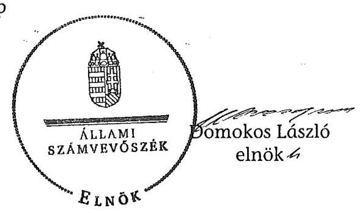

ÁLLAMI
SZÁMVEVŐSZÉK

# JELENTÉS 

Köveskál Község Önkormányzata belső kontrollrendszerének kialakítása, valamint egyes kontrolltevékenységek és a belső ellenőrzés működése ellenőrzéséről

---

# Állami Számvevőszék 

Iktatószám: V-0012-058-010-036/2013.
Témaszám: 1051
Vizsgálat-azonosító szám: V059110

## Az ellenőrzést felügyelte:

Dr. Benedek Mária
felügyeleti vezető
2012. december 16. napjától

Gyüre Lajosné
felügyeleti vezető
2012. december 15. napjáig

## Az ellenőrzést vezette:

## Szakmányné Bilik Mária

ellenőrzésvezető
A számvevőszéki jelentés összeállításában közreműködtek:
Dr. Fónagy Diána
számvevő tanácsos
Moder Beatrix
számvevő
Az ellenőrzést végezték:
Kiss Rita Teréz Nagy Adrienn
számvevő tanácsos számvevő

---

# TARTALOMJEGYZÉK 

BEVEZETÉS ..... 7
I. ÖSSZEGZŐ MEGÁLLAPÍTÁSOK, KÖVETKEZTETÉSEK, JAVASLATOK ..... 9
II. RÉSZLETES MEGÁLLAPÍTÁSOK ..... 16

1. Az önkormányzat belső kontrollrendszere kialakításának megfelelősége ..... 16
1.1. A kontrollkörnyezet kialakítása ..... 16
1.2. A kockázatkezelési rendszer szabályozása ..... 17
1.3. A kontrolltevékenységek kialakítása ..... 18
1.4. Az információs és kommunikációs rendszer szabályozása ..... 18
1.5. A monitoring rendszer szabályozása ..... 19
2. A pénzügyi folyamatokban kulcsszerepet betöltő belső kontrollok (szakmai teljesítésigazolás és utalvány ellenjegyzés) működése ..... 19
3. A belső ellenőrzés szervezeti keretei és működése ..... 21

## FÜGGELÉKEK

1. számú Értelmező szótár
2. számú A belső kontrollrendszer kialakítása, a pénzügyi folyamatokban kulcsszerepet betöltő szakmai teljesítésigazolás és utalvány ellenjegyzés kontrollok működése, valamint a belső ellenőrzés működése értékelésénél alkalmazott minősítési szempontok

---

.

---

# RÖVIDÍTÉSEK JEGYZÉKE 

## Törvények

Ász. tv.
Avtv.

Info tv.

Mötv.

Htv.

Ötv.
régi Áht.
Számv. tv.
új Áht.

## Rendeletek

Áhsz.

Ámr.
Ávr.

Ber.

Bkr.
önkormányzati SZMSZ

## Szórövidítések

ÁSZ
adatvédelmi és adatbiztonsági szabályzat

Belső ellenőrzési kézikönyv
2011. évi LXVI. törvény az Állami Számvevőszékről
1992. évi LXIII. törvény a személyes adatok védelméről és a közérdekű adatok nyilvánosságáról (hatálytalan 2012. január 1-jétől)
2011. évi CXII. törvény az információs önrendelkezési jogról és az információszabadságról (hatályos 2012. január 1-jétől)
2011. évi CLXXXIX. törvény Magyarország helyi önkormányzatairól (hatályos 2012. január 1-jétől)
1991. évi XX. törvény a helyi önkormányzatok és szerveik, a köztársasági megbízottak, valamint egyes centrális alárendeltségű szervek feladat- és hatásköreiről
1990. évi LXV. törvény a helyi önkormányzatokról
1992. évi XXXVIII. törvény az államháztartásról (hatálytalan 2012. január 1-jétől)
2000. évi C. törvény a számvitelről
2011. évi CXCV. törvény az államháztartásról (hatályos
2012. január 1-jétől)

249/2000. (XII. 24.) Korm. rendelet az államháztartás szervezetei beszámolási és könyvvezetési kötelezettségének sajátosságairól
292/2009. (XII. 19.) Korm. rendelet az államháztartás működési rendjéről (hatálytalan 2012. január 1-jétől)
368/2011. (XII. 31.) Korm. rendelet az államháztartásról szóló törvény végrehajtásáról (hatályos 2012. január 1-jétől )
193/2003. (XI. 26.) Korm. rendelet a költségvetési szervek belső ellenőrzéséről (hatálytalan 2012. január 1-jétől)
370/2011. (XII. 31.) Korm. rendelet a költségvetési szervek belső kontrollrendszeréről és belső ellenőrzéséről (hatályos 2012. január 1-jétől)
Köveskál Község Önkormányzatának 8/2008. (V. 22.) számú rendelete Köveskál Község Önkormányzata Szervezeti és Működési Szabályzatáról

Állami Számvevőszék
Köveskál-Szentbékkálla-Balatonhenye Körjegyzőség Adatvédelmi és adatbiztonsági szabályzata (hatályos 2008. október 1-jétől)

Tapolca és Környéke Kistérség Többcélú Társulása belső ellenőrzési kézikönyv (hatályos 2006. március 9-étől)

---

Belső Kontroll Kézikönyv
Belső Kontrollrendszer szabályzata

FEUVE
gazdasági program
hivatali SZMSZ
informatikai biztonsági szabályzat
jegyző
Képviselő-testület
kockázatkezelési szabályzat ${ }_{1}$
kockázatkezelési szabályzat ${ }_{1}$
kockázatkezelési szabályzat ${ }_{2}$
körjegyző
körjegyzőség
köveskáli óvoda

Önkormányzat
Önkormányzati Hivatal
polgármester
az Ámr. 155. § (1) bekezdése, valamint az államháztartási belső kontroll standardokról szóló 1/2009. (IX. 11.) PM irányelv egységes értelmezése érdekében az államháztartásért felelős miniszter által a 2010. évben kiadott Belső Kontroll Kézikönyv
Köveskál-Balatonhenye-Szentbékkálla Községek Körjegyzőségének Belső kontrollrendszere (hatályos 2011. január 1-jétől)
folyamatba épített, előzetes, utólagos és vezetői ellenőrzés
a Képviselő-testület 26/2011. (IV. 28.) határozatával elfogadott, 2010-2014. évekre vonatkozó gazdasági program
Köveskál Község Önkormányzata 8/2008. (V. 22.) számú rendeletének 1. sz. függeléke Köveskál-Balatonhenye-Szentbékkálla Községek Körjegyzőségének Ügyrendjéről, Szervezeti és Működési Szabályzatáról, valamint Köztisztviselőinek Közszolgálati Szabályzatáról
Köveskál-Balatonhenye-Szentbékkálla Községek Körjegyzőségének Informatikai Biztonsági Szabályzata (hatályos 2009. január 1-jétől)
Kővágóörsi Közös Önkormányzati Hivatal jegyzője
Köveskál Község Önkormányzatának Képviselőtestülete
Köveskál-Balatonhenye-Szentbékkálla Községek Önkormányzatainak és Intézményeinek Kockázatkezelési szabályzata (A FEUVE Szabályzat 4. sz. melléklete, hatályos 2008. november 1-jétől)
Köveskál-Balatonhenye-Szentbékkálla Községek Körjegyzőségének Belső kontrollrendszere III. fejezet (hatályos 2011. január 1-jétől)
Köveskál, Balatonhenye, Szentbékkálla Községek Önkormányzatainak körjegyzője
Köveskál, Balatonhenye, Szentbékkálla Községek Önkormányzatainak Körjegyzősége
Köveskál székhelyű, Balatonhenye, Köveskál, Mindszentkálla és Szentbékkálla Községek Önkormányzatai által fenntartott Közös Fenntartású Napközi otthonos Óvoda
Köveskál Község Önkormányzata
Kővágóörsi Közös Önkormányzati Hivatal (2013. január 1-jétől, Ábrahámhegy, Balatonhenye, Balatonrendes, Kékkút, Kővágóörs, Köveskál, Mindszentkálla, Salföld, Szentbékkálla települések önkormányzatainak hivatala)
Köveskál Község Önkormányzatának polgármestere

---

számviteli politika
számlarend
szennyvíztársulás

Társulás

Köveskál-Szentbékkálla-Balatonhenye Körjegyzőség Számviteli politikája (hatályos 2011. december 22-től)
Köveskál-Szentbékkálla-Balatonhenye Körjegyzőség Számlarendje (hatályos 2011. december 22-étől)
Köveskál és Térsége Szennyvíz Önkormányzati Területfejlesztési Társulás
Tapolca és Környéke Kistérség Többcélú Társulása

---

.

---

# JELENTÉS 

## Köveskál Község Önkormányzata belső kontrollrendszerének kialakítása, valamint egyes kontrolltevékenységek és a belső ellenőrzés működése ellenőrzéséről

## BEVEZETÉS

A belső kontrollrendszer kialakítását, működtetését és fejlesztését a régi Áht. és az új Áht. is előírja. Ennek megvalósításáért a költségvetési szerv vezetője, a jegyző felel. A belső kontrollrendszer azt a célt szolgálja, hogy a költségvetési szervek működésük és gazdálkodásuk során a tevékenységeket szabályszerűen, gazdaságosan, hatékonyan, eredményesen hajtsák végre, teljesítsék elszámolási kötelezettségeiket és megvédjék az erőforrásokat a veszteségektől, a károktól és a nem rendeltetésszerű használattól. A belső kontrollrendszer magában foglalja mindazon szabályokat, eljárásokat, gyakorlati módszereket és szervezeti struktúrákat, kockázatkezelési technikákat, kontrolltevékenységeket, amelyek segítséget nyújtanak a szervezetnek céljai eléréséhez.
Az ÁSZ a 2011-2015. évekre szóló stratégiájában hangsúlyos szerepet szánt annak, hogy szilárd szakmai alapon álló, értékteremtő ellenőrzéseivel előmozdítsa a közpénzügyek átláthatóságát, rendezettségét. A számvevőszéki ellenőrzés nemzetközi alapelvei is rögzítik, hogy a megfelelő belső kontrollrendszer minimálisra csökkenti a hibák és szabálytalanságok kockázatát.
Az ellenőrzés célja annak értékelése volt, hogy az Önkormányzat a jogszabályi előírásoknak megfelelően alakította-e ki a belső kontrollrendszert; a gazdálkodás folyamatában kulcsszerepet betöltő szakmai teljesítésigazolás és az utalvány ellenjegyzés kontrolltevékenységeit megfelelően működtette-e; biztosította-e a belső ellenőrzés szabályos és eredményes működését.
Az ÁSZ ezen ellenőrzési céljait pilot (próba) jelleggel községi/nagyközségi önkormányzatoknál végzett ellenőrzések során érvényesítette.
Az ellenőrzés típusa: szabályszerűségi ellenőrzés
Az ellenőrzés jogszabályi alapja: az Ász. tv. 5. § (2) és (6) bekezdései
Az ellenőrzött szervezet: az Önkormányzat (ezen belül kiemelten a Körjegyzőség Köveskál Község Önkormányzata vonatkozásában)
Az ellenőrzött időszak: a belső kontrollrendszer kialakításának megfelelőségét a 2011. évre vonatkozóan értékeltük. A kontrolltevékenységek működésének megfelelőségét a 2011. január 1-je és december 31-e, míg a belső ellenőrzés működésének szabályosságát és eredményességét a 2009. január 1-je és 2011. december 31-e közötti időszakot figyelembe véve értékeltük. A helyszíni ellenőrzés lezárásáig a helyi szabályozás változásait nyomon követtük.

---

Az ellenőrzés szakmai módszertana az Állami Számvevőszék Ellenőrzési Kézikönyvében foglalt szakmai szabályokon alapult, amely a Legfelsőbb Ellenőrző Intézmények Nemzetközi Szervezete (INTOSAI) által kiadott nemzetközi standardok (ISSAI) figyelembevételével készült.
A belső kontrollrendszer kialakításának ellenőrzése során értékeltük a Körjegyzőségen a kontrollkörnyezet, a kockázatkezelési rendszer, a kontrolltevékenységek, az információs és kommunikációs rendszer, valamint a monitoring rendszer szabályozottságának megfelelőségét. A Körjegyzőségen értékeltük a pénzügyi folyamatokban kulcsszerepet betöltő szakmai teljesítésigazolás és utalvány ellenjegyzés kontrollok működésének megfelelőségét az államháztartáson kívülre teljesített működési és felhalmozási célú pénzeszköz átadásoknál, az állományba nem tartozók megbízási díjainál, továbbá a külső szolgáltatók által végzett karbantartási, kisjavítási munkákkal kapcsolatos kifizetéseknél. A kulcskontrollok működését megfelelőségi tesztek alkalmazásával ellenőriztük. Az egyszerű véletlen mintavétellel kiválasztott tételek ellenőrzését többlépcsős megfelelőségi tesztek útján addig végeztük, amíg elegendő és megfelelő bizonyítékot szereztünk a vizsgált folyamatok kulcskontrolljai működésének megfelelő vagy nem megfelelő voltáról. Értékeltük az Önkormányzatnál a belső ellenőrzés működésének szabályosságát és eredményességét.
A fogalmak magyarázatát az 1. számú függelék, az ellenőrzés egyes területeinek értékelésénél alkalmazott egységes minősítési szempontokat a 2. számú függelék tartalmazza.
Az ellenőrzés lefolytatásához az Önkormányzat a munkalapok és a tanúsítvány elektronikus kitöltésével, valamint a megjelölt dokumentumok elektronikus megküldésével szolgáltatott adatokat. A munkalapokon szerepeltetett adatok, információk ellenőrzése és szükség szerinti javítása a helyszíni ellenőrzés keretében történt.
Az ÁSZ az ellenőrzés megállapításait az ellenőrzött időszakban hatályos, az intézkedést igénylő megállapításokra tett javaslatokat a jelenleg hatályos jogszabályok alapján fogalmazta meg.
Az ÁSZ tv. 29. § (1) bekezdése szerint a jelentéstervezetet megküldtük a polgármester részére, aki az ÁSZ tv. 29. § (2) bekezdésében foglalt észrevételezési jogával nem élt, a jelentéstervezetre észrevételt nem tett.
Köveskál község állandó lakosainak száma 2011. január 1-jén 409 fő volt. Az Önkormányzat öttagú Képviselő-testületének munkáját kettő állandó bizottság segítette. Az Önkormányzat az önállóan működő és gazdálkodó Körjegyzőségen kívül kettő költségvetési intézménnyel látta el feladatát. Az Önkormányzat többségi tulajdoni részesedésű gazdasági társasággal nem rendelkezett. A polgármester a 2004. október 10-ei időközi választások óta tölti be tisztségét, a körjegyző személye 2008. október 1-jétől változatlan. A Körjegyzőség szervezeti egységekre nem tagolódik, elkülönített gazdasági szervezete nincs, a foglalkoztatott köztisztviselők száma 2011. január 1-jén 6 fő volt. Az Önkormányzat a 2011. évi költségvetési beszámolója szerint 507,9 millió Ft költségvetési bevételt ért el, 500,4 millió Ft költségvetési kiadást teljesített. A 2011. december 31-i könyvviteli mérleg szerint 420,6 millió Ft értékű eszközvagyonnal rendelkezett, a rövid lejáratú kötelezettségállomány 1,3 millió Ft, hosszú lejáratú kötelezettsége nem volt.

---

# I. ÖSSZEGZŐ MEGÁLLAPÍTÁSOK, KÖVETKEZTETÉSEK, JAVASLATOK 

A belső kontrollrendszer kialakítása a Körjegyzőségben 2011-ben a kontrollkörnyezet, a kockázatkezelési rendszer, a kontrolltevékenységek, az információs és kommunikációs rendszer, valamint a monitoring rendszer szabályozásának, illetve kialakításának értékelése alapján, összességében nem felelt meg a jogszabályi előírásoknak.
A kontrollkörnyezet kialakítása részben megfelelt a jogszabályi követelményeknek. A körjegyző elkészítette a gazdálkodást érintő legfontosabb szabályzatokat, azonban az Ámr.-ben foglaltak ellenére a hivatali SZMSZ-ben nem rögzítette az alaptevékenységeket szabályozó jogszabályokat, a Körjegyzőség engedélyezett létszámát, a szervezeti ábrát, valamint a munkakörökhöz tartozó feladat- és hatásköröket, a hatáskörök gyakorlásának módját, a helyettesítés rendjét, az ezekhez kapcsolódó felelősségi szabályokat. A hivatali SZMSZ-ben, a Ber. előírása ellenére, nem írta elő továbbá a belső ellenőrzést végző jogállását, feladatait. Ezek a hiányosságok korlátozzák a feladatellátás számon kérhetőségét, és folyamatosságának biztosítását. Az ellenőrzési nyomvonalban az Ámr. előírása ellenére a körjegyző nem azonosította be a Körjegyzőség működési folyamatait, mivel az ellenőrzési nyomvonalat az Önkormányzat sajátosságaira, a Körjegyzőségben ténylegesen ellátott tevékenységekre nem adaptálta.
A kockázatkezelési rendszer szabályozása részben volt megfelelő. A Körjegyzőség rendelkezett az Ámr. előírásának megfelelő, a szervezet működésében rejlő kockázatos területek kezelését célzó kockázatkezelési szabályzattal, amelyben meghatározták a kockázatkezelés folyamatát, feladatait, és kijelölték a végrehajtásért felelős személyeket. Az alkalmazhatóságot nehezítette, hogy egyidejűleg két kockázatkezelési szabályzat volt hatályban, amelyek egymást kiegészítették, ugyanakkor ellentmondásokat is tartalmaztak.
A kontrolltevékenységek kialakítása a jogszabályi előírásoknak részben megfelelt, mivel a körjegyző a kontrollstratégiák és módszerek keretében szabályozta a FEUVE feladatait, kialakította a Körjegyzőség tevékenységeire vonatkozó beszámolási eljárásokat, biztosította a végrehajtási, a pénzügyi teljesítési és az ellenőrzési feladatok szétválasztását. Meghatározta az érvényesítés rendjét, szabályozta a szakmai teljesítésigazolás módját, és kijelölte az érvényesítésre, illetve szakmai teljesítésigazolásra jogosultakat. Az érvényesítési feladatra történő kijelölés során azonban a körjegyző az Ámr.-ben előírt képesítési követelményeket figyelmen kívül hagyta. A kontrolltevékenységek hiányos kialakítása kockázatot jelent a feladatok szabályszerű végrehajtása során.
Az információs és kommunikációs rendszer szabályozása részben megfelelt a jogszabályi követelményeknek. Az informatikai rendszer környezetének szabályozása során az adatbiztonság érvényre juttatásához szükséges intézkedéseket a körjegyző - az Avtv. előírásait csak részben figyelembe véve - hiányosan tette meg, mivel az informatikai biztonsági szabályzatban a hozzáférési jogosultságok megállapítására, módosítására, azok betartásának ellenőrzésére vonatkozó eljárásrendet nem határozta meg, és nem szabályozta a pénzügyiszámviteli szoftverváltozások ellenőrzésére, tesztelésére vonatkozó eljárásokat.

---

A monitoring
 rendszer szabályozása nem felelt meg a jogszabályi előírásoknak, mivel a körjegyző az Ámr. előírása ellenére az operatív tevékenységek keretében megvalósuló folyamatos és eseti nyomon követésből álló, az Önkormányzat tevékenységének, a célok megvalósításának nyomon követését biztosító rendszert nem alakította ki.
A belső kontrollrendszer nem megfelelő kialakítása kockázatot jelent az Önkormányzat tevékenységeinek szabályszerű, gazdaságos, hatékony és eredményes végrehajtása során.
A Körjegyzőségnél az Önkormányzat vonatkozásában a 2011. évben az államháztartáson kívülre történő működési és felhalmozási célú pénzeszközátadásokkal, az állományba nem tartozók megbízási díjaival, valamint a külső szolgáltatók által végzett karbantartással, kisjavítással kapcsolatos kifizetések során a belső kontrollok működésének megfelelősége - összefoglalóan értékelve - gyenge volt. A kiadások teljesítését megelőzően azok jogosságának, összegszerűségének, az ellenszolgáltatást is magukban foglaló kifizetések esetében a szerződések teljesítésének ellenőrzését a körjegyző által szakmai teljesítésigazolásra kijelölt személyek nem végezték el, illetve nem szabályszerűen végezték, mivel a teljesítésigazolás dátumát nem tüntették fel.
Az utalványok ellenjegyzője a kiadások teljesítését megelőzően - aláírása ellenére - az Ámr.-ben foglalt ellenőrzési feladatait nem végezte el. Nem kifogásolta a szakmai teljesítésigazolás elmaradását, illetve azok nem előírt módon történő ellátását, továbbá nem ellenőrizte az érvényesítés megtörténtét. Nem észrevételezte, hogy az érvényesítés nem szabályszerűen végrehajtott szakmai teljesítésigazoláson alapult, és az érvényesítést végző egyik személy nem rendelkezett az Ámr.-ben előírt képesítéssel. Továbbá nem kifogásolta, hogy az állományba nem tartozók megbízási díjainak kifizetésénél az utalványrendeleten nem tüntették fel a kötelezettségvállalás nyilvántartási számát. Az utalványok ellenjegyzője, aláírása ellenére, a működési és felhalmozási célú pénzeszközátadásokkal és a külső szolgáltatók által végzett karbantartással, kisjavítással kapcsolatos kiadások teljesítését megelőzően nem győződött meg arról, hogy az utalványozás sérti-e a gazdálkodásra - a kötelezettségvállalás ellenjegyzésére vonatkozó szabályokat.
A számvevőszéki ellenőrzés az ellenőrzött kifizetésekkel összefüggésben jogosulatlan kifizetést nem tárt fel, azonban a gazdálkodásban kulcsszerepet betöltő kontrollok működésében feltárt hiányosságok miatt fennáll a hibák bekövetkezésének kockázata.
Az Önkormányzat a belső ellenőrzési feladatokat a Társulás útján látta el. Az Önkormányzatnál a 2009-2011. évek között a belső ellenőrzés szabályozása és működése az ellenőrzött időszak egészét tekintve a jogszabályi előírásoknak nem felelt meg. A Belső ellenőrzési kézikönyvet, a Ber. előírása ellenére, nem a Társulás munkaszervezetének vezetője hagyta jóvá. A Képviselő-testület az Önkormányzatra vonatkozó éves ellenőrzési terveket az Ötv.-ben foglalt határidőn túl hagyta jóvá, mert a körjegyző elmulasztotta a határidőn belül történő előterjesztésüket. Az ellenőrzési programot a Ber.-ben előírtak ellenére a belső ellenőrzési vezető nem hagyta jóvá. Az ellenőrzési javaslatok alapján megtett intézkedések nyomon követéséről a Ber.-ben előírt nyilvántartást a belső ellenőrzési vezető nem alakította ki. Az ellenőrzési program Ber.-ben előírt szükség szerinti módosítása nem történt meg annak ellenére, hogy a 2010. év-

---

ben elvégzett egy intézményi ellenőrzésről készített jelentés megállapításai nem fedték le teljes körűen az ellenőrzési program feladatait.
A belső ellenőrzés működése nem volt eredményes, mivel annak szabályozása és működése a jogszabályi előírásoknak nem felelt meg. A körjegyző a belső ellenőrzés megfelelő kialakításáról és működtetéséről, a régi Áht. előírása ellenére nem gondoskodott, mivel a Társulás munkaszervezetében a feladat ellátásának személyi feltételei nem voltak biztosítottak (32 társult önkormányzat belső ellenőrzési feladatait az ellenőrzési időszakban egy, illetve két fő belső ellenőr látta el). Ennek következtében a 2009-2011. évek között az Önkormányzatnál mindössze egy intézményi ellenőrzést hajtottak végre, a Körjegyzőség feladatellátására vonatkozó ellenőrzést nem végeztek, így a belső ellenőrzés nem tárhatta fel a belső kontrollok működésének hiányosságait.
Az ÁSZ tv. 33. § (1) bekezdésében foglaltak értelmében az ellenőrzött szervezet vezetője köteles a jelentésben foglalt megállapításokhoz kapcsolódó intézkedési tervet összeállítani, és azt a jelentés kézhezvételétől számított 30 napon belül az ÁSZ részére megküldeni. Amennyiben az intézkedési tervet határidőn belül nem küldi meg a szervezet, vagy az az ÁSZ tv. 33. § (2) bekezdésében foglalt póthatáridő eltelte ellenére továbbra sem elfogadható, az ÁSZ elnöke a hivatkozott törvény 33. § (3) bekezdés a)-b) pontjaiban foglaltakat érvényesítheti.
Az ellenőrzés intézkedést igénylő megállapításai és Javaslatai:

# a polgármesternek 

1. A működési és felhalmozási célú pénzeszközátadásokkal és a külső szolgáltatók által végzett karbantartással, kisjavítással kapcsolatos megállapodásokat, az Ámr. 74. § (1) bekezdésében foglaltak ellenére, a kötelezettségvállalás előtt nem ellenjegyezték.

Javaslat:
Biztosítsa, hogy az új Áht. 37. § (1) bekezdésében foglaltaknak megfelelően kötelezettségvállalásra - az Ávr.-ben meghatározott kivételekkel - kizárólag a pénzügyi ellenjegyzés után, a pénzügyi teljesítés esedékességét megelőzően, írásban kerüljön sor.
2. A működési és felhalmozási célú pénzeszközátadásokkal, az állományba nem tartozók megbízási díjaival és a külső szolgáltatók által végzett karbantartással, kisjavítással kapcsolatos kifizetések során a szakmai teljesítésigazolására a körjegyző által kijelölt személyek, az Ámr. 76. § (1) bekezdésének előírása ellenére, a kifizetéseket megelőzően nem végezték el ellenőrzési feladatukat, illetve igazolási kötelezettségüknek nem az Ámr. 76. § (3) bekezdésében előírt módon tettek eleget. Az utalványok ellenjegyzője, az Ámr. 79. § (2) bekezdésében foglaltak ellenére, nem ellenőrizte a szakmai teljesítésigazolás megtörténtét. Az utalványok ellenjegyzője nem észrevételezte, hogy az érvényesítést végző egyik személy nem rendelkezett az Ámr. 19. § (1) bekezdésében előírt képesítéssel. Az utalványok ellenjegyzője nem észrevételezte továbbá, hogy megállapodásokat az Ámr. 74. § (1) bekezdésében foglaltak ellenére nem ellenjegyeztek.

Javaslat:
Intézkedjen a szakmai teljesítésigazolás és az utalvány ellenjegyzés kontrollokkal összefüggésben a számvevőszéki jelentésben rögzített hiányosságok és szabálytalanságok tekintetében az esetleges munkajogi felelősséggel kapcsolatos körülmények kivizsgálásáról.

# a jegyzőnek Köveskál Község Önkormányzata vonatkozásában 

1. a kontrollkörnyezettel kapcsolatban:

Az Ámr. 20. § (2) bekezdés c), e), i) és h) pontjaiban foglaltak ellenére a hivatali SZMSZ-ben nem rögzítette az alaptevékenységeket szabályozó jogszabályok megjelölését, a Körjegyzőség engedélyezett létszámát és a szervezeti ábrát, valamint a hivatali SZMSZ-ben nevesített munkakörökhöz tartozó feladat- és hatásköröket, a hatáskörök gyakorlásának módját, a helyettesítés rendjét, az ezekhez kapcsolódó felelősségi szabályokat, továbbá, a Ber. 4. § (2) bekezdés előírása ellenére, a hivatali SZMSZ-ben nem írták elő a belső ellenőrzést végzők jogállását, feladatait.

A folyamatok meghatározása és dokumentálása körében, az ellenőrzési nyomvonalban, az Ámr. 156. § (2) bekezdésében előírtak ellenére, nem azonosította be a Körjegyzőség tevékenységéhez kapcsolódó folyamatokat, nem jelölte ki a folyamatgazdákat, nem határozta meg a felelősségi szinteket és - a pénzügyi tevékenység kivételével - az ellenőrzési folyamatokat.

Javaslat:
a) Gondoskodjon arról, hogy a hivatali SZMSZ tartalmazza - az Ávr. 13. § (1) bekezdés c), e) és g) pontjaiban foglaltaknak megfelelően - az alaptevékenységeket szabályozó jogszabályok megjelölését, az Önkormányzati Hivatal engedélyezett létszámát és a szervezeti ábrát, valamint a hivatali SZMSZ-ben nevesített munkakörökhöz kapcsolódó feladat- és hatásköröket, a hatáskörök gyakorlásának módját, a helyettesítés rendjét és az ezekhez kapcsolódó felelősségi szabályokat, valamint a Bkr. 15. § (2) bekezdésében foglaltak szerint a hivatali SZMSZ-ben előírásra kerüljön a belső ellenőrzést végzők jogállása és feladatai.
b) Gondoskodjon a Bkr. 6. § (3) bekezdésében előírtak érvényre juttatása érdekében az Önkormányzati Hivatal működési folyamatainak beazonosításáról, a folyamatgazdák kijelöléséről, valamint az ellenőrzési folyamatok valamennyi tevékenységre vonatkozó felelősségi szintjeinek meghatározásáról.
2. a kontrolltevékenységekkel kapcsolatban:

A körjegyző által érvényesítésre írásban kijelölt személyek közül a pénzügyi ügyintéző II. nem rendelkezett az Ámr. 19. § (1) bekezdésében előírt iskolai végzettséggel és szakképesítéssel.

Javaslat:
A gazdálkodási jogkörökre történő kijelölések - így az érvényesítő kijelölése - során legyen figyelemmel az Ávr. 58. § (4) és 55. § (3) bekezdéseiben foglalt előírásokra, biztosítsa, hogy a jogszabályban előírt képesítési feltételeknek megfelelő köztisztviselők végezzék az érvényesítési feladatokat.

---

3. az információs és kommunikációs rendszerrel kapcsolatban:

Az informatikai rendszer környezetének szabályozása során, az Avtv. 10. § (1)-(2) bekezdéseinek előírása ellenére, az adatbiztonság érvényre juttatásához szükséges intézkedéseket a körjegyző hiányosan tette meg, mivel nem rendelkezett a hozzáférési jogosultságok megállapításáról és módosításáról, a jogosultságok betartásának ellenőrzéséről, továbbá nem szabályozta a pénzügyi-számviteli szoftverváltozások ellenőrzésére, tesztelésére vonatkozó eljárásokat.

Javaslat:
Biztosítsa az Info tv. 7. § (2)-(3) bekezdéseinek megfelelően az adatbiztonság érvényesülését, rendelkezzen a hozzáférési jogosultságok megállapításáról, módosításáról, azok betartásának ellenőrzéséről, valamint szabályozza a pénzügyi-számviteli szoftverváltozások ellenőrzésére, tesztelésére vonatkozó eljárásokat.
4. a monitoring rendszerrel kapcsolatban:

A körjegyző az Ámr. 160. §-ában foglaltak ellenére az operatív tevékenységek keretében megvalósuló folyamatos és eseti nyomon követésből álló, az Önkormányzat tevékenységének, a célok megvalósításának nyomon követését biztosító rendszert nem alakította ki.

Javaslat:
Alakítsa ki és működtesse a Bkr. 10. §-ában előírtak alapján az operatív tevékenységek keretében megvalósuló folyamatos és eseti nyomon követésből álló, az Önkormányzat tevékenységének, a célok megvalósításának nyomon követését biztosító rendszert.
5. a pénzügyi folyamatokban kulcsszerepet betöltő kontrollok működésével kapcsolatban:

A működési és felhalmozási célú pénzeszközátadásokkal, az állományba nem tartozók megbízási díjaival és a külső szolgáltatók által végzett karbantartással, kisjavítással kapcsolatos kiadások teljesítését megelőzően a körjegyző által kijelölt személyek a kifizetések jogosságának, összegszerűségének, valamint az ellenszolgáltatást is magukban foglaló kifizetések esetében a szerződések, megrendelések teljesítésének ellenőrzését a körjegyző által szakmai teljesítésigazolásra kijelölt személyek, az Ámr. 76. § (1) bekezdésében foglaltak ellenére nem végezték el, illetve nem az Ámr. 76. § (3) bekezdésében foglalt módon teljesítették.

Az utalványok ellenjegyzője a működési és felhalmozási célú pénzeszközátadásokkal, az állományba nem tartozók megbízási díjaival és a külső szolgáltatók által végzett karbantartással, kisjavítással kapcsolatos kiadások teljesítését megelőzően, az Ámr. 79. § (2) bekezdésében foglaltak ellenére, ellenjegyezte a kifizetéseket. Nem győződött meg továbbá arról, hogy a kifizetés sérti-e a gazdálkodásra - az Ámr. 74. § (1) bekezdésében foglalt, a kötelezettségvállalások ellenjegyzésének szabályaira, valamint az Ámr. 78. § (2) bekezdés g) pontjában foglalt, az utalványrendeleten a kötelezettségvállalás nyilvántartási számának feltüntetésére - vonatkozó szabályokat. Az érvényesítés - az Ámr. 77. § (1) bekezdésében foglalt előírás ellenére - nem szabályszerűen elvégzett szakmai teljesítésigazolás alapján történt. Az érvényesítést végző

---

körjegyző által kijelölt személy nem rendelkezett az Ámr. 19. § (1) bekezdésében előírt iskolai végzettséggel és képesítéssel.

Javaslat:
Az operatív gazdálkodás során a működésbeli hibák megelőzése, feltárása és kijavítása érdekében gondoskodjon arról, hogy:
a) a teljesítésigazolásra kijelölt személyek az Ávr. 57. § (1) bekezdésében foglaltaknak megfelelően okmányok alapján ellenőrizzék a kiadások teljesítésének jogosságát, összegszerűségét, ellenszolgáltatást is magában foglaló kötelezettségvállalás esetében a szerződés, megrendelés teljesítését, továbbá, hogy a teljesítést az Ávr. 57. § (3) bekezdésében foglalt módon, dátummal, a teljesítés tényére történő utalással és aláírásukkal igazolják.
b) az Ávr. 58. § (4) és 55. § (3) bekezdéseiben foglalt képesítési feltételeknek megfelelő érvényesítő - az Ávr. 58. § (1) bekezdése szerint - a kifizetéseket megelőzően a teljesítésigazolás alapján ellenőrizze az összegszerűséget, valamint azt, hogy a megelőző ügymenetben az új Áht., az Áhsz. és az Ávr. - a gazdálkodási szabályokra, a szabályszerű számlakijelölésre, a teljesítésigazolás elvégzésére vonatkozó előírásait és a belső szabályzatokban foglaltakat betartották-e;
c) az utalványrendeleteken az Ávr. 59. § (3) bekezdés f) pontjában foglaltaknak megfelelően feltüntetésre kerüljön a kötelezettségvállalás
 nyilvántartási száma;
d) kötelezettségvállalásra az új Áht. 37. § (1) bekezdésében foglaltaknak megfelelően, csak az Ávr. 55. § (1)-(2) bekezdése szerint jogosult személyek pénzügyi ellenjegyzését követően kerüljön sor.
6. a belső ellenőrzés működésével kapcsolatban:

A Belső ellenőrzési kézikönyvet, a Ber. 32/B. § (8) bekezdésében foglaltak ellenére, a Társulás munkaszervezetének vezetője nem hagyta jóvá.

Az éves ellenőrzési terveket a Képviselő-testület késedelmesen, nem az Ötv. 92. § (6) bekezdésében előírt határidőig hagyta jóvá, mert a körjegyző elmulasztotta a határidőn belül történő előterjesztésüket.

Az ellenőrzési programot, a Ber. 23. § (3) bekezdésében előírtak ellenére, a belső ellenőrzési vezető nem hagyta jóvá. Az ellenőrzési program módosítása a Ber. 23. § (3) bekezdésében foglaltak alapján nem történt meg, annak ellenére, hogy a 2010. évben elvégzett belső ellenőrzésről készült jelentés megállapításai a Ber. 27. § (2) bekezdés i) pontjában foglaltaknak csak részben feleltek meg az ellenőrzési programnak, így az ellenőrzés nem fedte le az ellenőrzési programban foglalt feladatokat.

A belső ellenőrzési vezető nem alakította ki a Ber. 12. § n) pontjában előírt nyilvántartást az ellenőrzési javaslatok alapján megtett intézkedések nyomon követéséről.

A körjegyző a belső ellenőrzés megfelelő kialakításáról és működtetéséről, a régi Áht. 121/B. § (4) bekezdésében foglaltak ellenére, nem gondoskodott, mivel a Társulás munkaszervezetében a belső ellenőrzési feladatok ellátásának személyi feltételei nem voltak biztosítva, ezért az Önkormányzatnál az ellenőrzött három évben mindössze egy intézményi ellenőrzést végeztek, a Körjegyzőség feladatellátására vonatkozó el-

---

lenőrzést nem hajtottak végre.
Javaslat:
a) Kezdeményezze, hogy a Belső ellenőrzési kézikönyvet a Bkr. 56. § (7) bekezdésében foglaltaknak megfelelően a Társulás munkaszervezetének vezetője hagyja jóvá.
b) Készítse elő az éves ellenőrzési tervről szóló előterjesztést, és kezdeményezze a polgármesternél a Képviselő-testület elé terjesztését annak érdekében, hogy a Képviselő-testület az éves ellenőrzési tervet az Mötv. 119. § (5) bekezdésében előírt határidőig jóváhagyhassa.
c) Kezdeményezze, hogy a tervezett ellenőrzéseket - a Bkr. 33. § (2) bekezdésében foglaltaknak megfelelően - a belső ellenőrzési vezető által jóváhagyott ellenőrzési programok alapján hajtsák végre, illetve - szükség esetén - a Bkr. 33. § (3) bekezdésében foglalt előírásnak megfelelően az ellenőrzési programokat módosítsák.
d) Intézkedjen a Társulásnál, hogy a belső ellenőrzés a Bkr. 21. § (2) bekezdés d) pontjában foglaltak szerint kövesse nyomon a belső ellenőrzési jelentések alapján megtett intézkedéseket, és vezessen erre vonatkozó nyilvántartást a Bkr. 47. § (1)-(2) bekezdéseiben foglalt előírásokat is figyelembe véve.
e) Biztosítsa - a Htv. 140. § (1) bekezdés e) pontjában foglalt feladat- és hatáskörében eljárva - az Önkormányzat által alapított és fenntartott költségvetési szervek pénzügyi-gazdasági ellenőrzésének ellátását, illetve gondoskodjon az új Áht. 70. § (1) bekezdésének előírása szerint a belső ellenőrzés megfelelő kialakításáról és működtetéséről.

---

# II. RÉSZLETES MEGÁLLAPÍTÁSOK 

## 1. Az önkormányzat belső kontrollrendszerének kialakításának megfelelősége

### 1.1. A kontrollkörnyezet kialakítása

A kontrollkörnyezet kialakítása a Körjegyzőségben részben volt megfelelő. A Képviselő-testület megalkotta az önkormányzati SZMSZ-t, valamint rendeletben meghatározta a vagyongazdálkodás szabályait. A Körjegyzőség rendelkezett a jogszabályokban előírt tartalmú alapító okirattal. A körjegyző kialakította a számviteli politikát és a számlarendet, melynek keretében elkészítette a leltározási, az értékelési, a pénzkezelési szabályzatot ${ }^{1}$, és kialakította a bizonylati rendet. Elkészítette továbbá a munkavédelmi és a tűzvédelmi szabályzatot ${ }^{2}$, valamint hatályba helyezte a Körjegyzőség ellenőrzési nyomvonalát, azonban a körjegyző

- az Ámr. 20. § (2) bekezdés c), e) és i) pontjaiban ${ }^{3}$ foglaltak ellenére a hivatali SZMSZ-ben nem rögzítette az alaptevékenységeket szabályozó jogszabályok megjelölését, az engedélyezett létszámot, valamint a szervezeti ábrát, továbbá az Ámr. 20. § (2) bekezdés h) pontjában ${ }^{4}$ foglaltak ellenére nem határozta meg a hivatali SZMSZ-ben nevesített munkakörökhöz tartozó feladat- és hatásköröket, a hatáskörök gyakorlásának módját, a helyettesítés rendjét, és az ezekhez kapcsolódó felelősségi szabályokat;
- a Ber. 4. § (2) bekezdés ${ }^{5}$ előírása ellenére a hivatali SZMSZ-ben nem írta elő a belső ellenőrzést végzők jogállását, feladatait;
- a folyamatok meghatározása és dokumentálása körében, az ellenőrzési nyomvonalban - az Ámr. 156. § (2) bekezdésében ${ }^{6}$ előírtak ellenére - nem azonosította be a Körjegyzőség tevékenységéhez kapcsolódó folyamatokat, nem jelölte ki a folyamatgazdákat, és nem határozta meg a felelősségi szinteket és - a pénzügyi tevékenység kivételével - az ellenőrzési folyamatokat.

A körjegyző által hatályba helyezett szabálytalanságkezelési szabályzat mellékletét képezte az ellenőrzési nyomvonal, amelyet azonban az Önkormányzat sajátosságaira, a Körjegyzőségben ténylegesen ellátott tevékenységekre nem adaptáltak, így a funkcióját nem tölthette be.

[^0]
[^0]:    ${ }^{1}$ A Körjegyzőség 2011. december 15-től hatályos Leltározási és leltárkészítési szabályzata, Eszközök és források értékelési szabályzata, és a 2011. január 1-jétől hatályos Pénzkezelési szabályzata.
    ${ }^{2}$ A Körjegyzőség 1999. február 1-jétől hatályos Munkavédelmi szabályzata és az 1999. május 1-jétől hatályos Tűzvédelmi szabályzata.
    ${ }^{3}$ 2012. január 1-jétől az Ávr. 13. § (1) bekezdés c) és e) pontjai rögzítik a vonatkozó előírásokat.
    ${ }^{4}$ 2012. január 1-jétől az Ávr. 13. § (1) bekezdés g) pontja rögzíti a vonatkozó előírást.
    ${ }^{5}$ 2012. január 1-jétől a Bkr. 15. § (2) bekezdése tartalmazza a rendelkezést.
    ${ }^{6}$ 2012. január 1-jétől a Bkr. 6. § (3) bekezdése tartalmazza az ellenőrzési nyomvonallal kapcsolatos előírásokat.

---

A Képviselő-testület az Önkormányzat gazdasági programját hiányos tartalommal fogadta el.

Az Önkormányzat gazdasági programja az Ötv. 91. § (6) bekezdésében ${ }^{7}$ foglaltak ellenére nem tartalmazta a munkahelyteremtés feltételeinek elősegítésére vonatkozó megoldásokat és az adópolitika célkitűzéseit.
A kontrollkörnyezet kialakítása során a Belső Kontroll Kézikönyv ${ }^{8}$ 1.5.2. pontjának ajánlása nem érvényesült, mivel a körjegyző, a köztisztviselői munkakörök betöltéséhez szükségesnek tartott elvárt tudást és képességeket nem dolgozta ki.

# 1.2. A kockázatkezelési rendszer szabályozása 

A kockázatkezelési rendszer szabályozottsága a Körjegyzőségben részben volt megfelelő. A körjegyző az Ámr. 157. § előírásának megfelelően elkészítette a szervezet működésében rejlő kockázatos területek kezelését célzó kockázatkezelési szabályzatokat (kockázatkezelési szabályzat ${ }_{1,2}$ ), amelyekben meghatározta a kockázatkezelés folyamatát, feladatait, és kijelölte a végrehajtásért felelős személyeket, azonban a Körjegyzőség 2011. január 1-jétől két egyidejűleg hatályos kockázatkezelési szabályzattal is rendelkezett, amelyek részben kiegészítették egymást, ugyanakkor egyes kérdésekben ellentmondásos előírásokat tartalmaztak, ami az alkalmazhatóságot nehezítette.

A kockázatkezelési rendszer szabályozása során a körjegyző

- a kockázatok meghatározása és felmérése keretében - a Belső Kontroll Kézikönyv 2.1. pontjában foglalt ajánlást figyelmen kívül hagyva - a két egyidejűleg hatályos szabályozás ellentmondásos előírása miatt nem határozta meg egyértelműen a kockázatok értékelésének módját. A kockázatkezelési szabályzat1 alapján a feltárt kockázati tényezőket alacsony és magas, míg a Belső Kontrollrendszer szabályzatának III. fejezete alapján alacsony, közepes és magas kockázati kategóriákba kell sorolni. Továbbá nem rögzítette azt az értéknagyságot, amely felett be kell avatkozni a folyamatokba;
- a kockázatok elemzése során a Belső Kontroll Kézikönyv 2.2.3. pontjában foglalt ajánlást nem érvényesítette, az Önkormányzat tevékenységeit a kockázati kitettség alapján nem rangsorolta, és nem határozta meg a kockázati túréshatárokat;
- a Belső Kontroll Kézikönyv 2.4.1. pontjában foglalt ajánlást és a kockázatkezelési szabályzat ${ }_{2}$-ban előírtakat ${ }^{9}$ figyelmen kívül hagyva, a beazonosított kockázati tényezők évenkénti felülvizsgálatát elmulasztotta ${ }^{10}$;

[^0]
[^0]:    ${ }^{7}$ 2013. január 1-jétől a gazdasági programra; fejlesztési tervre vonatkozó jogszabályi előírásokat az Mötv. 116. § (1) bekezdése tartalmazza.
    ${ }^{8}$ Az Ámr. 2011. évben hatályos 155. § (1) bekezdése szerint a belső kontrollok kialakítása során a költségvetési szerv vezetője figyelembe veszi az államháztartásért felelős miniszter által közzétett, az államháztartási belső kontroll standardokra vonatkozó irányelvet. A 2012. január 1-jétől hatályos Bkr. 5. § (1) bekezdése szerint a költségvetési szervek belső kontrollrendszerét az államháztartásért felelős miniszter által közzétett módszertani útmutatók megfelelő alkalmazásával kell kialakítani és működtetni.
    ${ }^{9}$ Kockázatkezelési szabályzat 1.4.1. pont.
    ${ }^{10}$ A 2011. január 1-jétől hatályos kockázatkezelési szabályzat ${ }_{2}$-ban azonosított kockázatok felülvizsgálata 2011. december 31-ig nem volt aktuális, azonban a kockázatok felülvizsgálata a helyszíni ellenőrzés időpontjáig sem történt meg.

---

- nem érvényesítette a Belső Kontroll Kézikönyv 2.5.1. pontjában foglalt ajánlást, nem gondoskodott a csalás és a korrupció, mint kiemelt kockázatok értékeléséről és kezeléséről.

# 1.3. A kontrolltevékenységek kialakítása 

A kontrolltevékenységek kialakítása a Körjegyzőségben részben volt megfelelő, mivel a körjegyző a kontrollstratégiák és módszerek keretében szabályozta a FEUVE feladatait, kialakította a Körjegyzőség tevékenységeire vonatkozó beszámolási eljárásokat, és biztosította a végrehajtási, a pénzügyi teljesítési és az ellenőrzési feladatok szétválasztását. Meghatározta az érvényesítés rendjét, szabályozta a szakmai teljesítésigazolás módját és kijelölte az érvényesítésre, illetve szakmai teljesítésigazolásra jogosultakat, azonban a körjegyző által érvényesítésre írásban kijelölt személyek közül a pénzügyi ügyintéző II. nem rendelkezett az Ámr. 19. § (1) bekezdésében ${ }^{11}$ előírt iskolai végzettséggel és szakképesítéssel.

A kontrollkörnyezet kialakítása során a körjegyző

- a Belső Kontroll Kézikönyv 3.2.3. pontjában foglalt ajánlást nem érvényesítette, mivel nem mérte fel a kis létszámból adódó kockázatokat;
- a feladatvégzés folytonosságának feltételeit nem biztosította, mivel a Belső Kontroll Kézikönyv 3.3.1. pontjában foglalt ajánlást figyelmen kívül hagyva, nem szabályozta a Körjegyzőségben munkaviszony megszűnése esetén a munkavállaló folyamatban lévő feladatai átadásának rendjét, nem írta elő munkakör átadás-átvétel esetén jegyzőkönyv készítésének a kötelezettségét.

### 1.4. Az információs és kommunikációs rendszer szabályozása

Az információs és kommunikációs rendszer szabályozottsága a Körjegyzőségben részben volt megfelelő. A körjegyző kialakította az iktatás és iratkezelés rendjét, elkészítette az adatvédelmi és adatbiztonsági-, valamint a szabálytalanságkezelési szabályzatot, és meghatározta az információáramlás rendjét. Az informatikai rendszer környezetének szabályozása során azonban, az Avtv. 10. § (1)-(2) bekezdésének ${ }^{12}$ előírása ellenére, az adatbiztonság érvényre juttatásához szükséges intézkedéseket hiányosan hozta meg, mivel az informatikai biztonsági szabályzatban nem rendelkezett a hozzáférési jogosultságok megállapításáról és módosításáról, a jogosultságok betartásának ellenőrzéséről, továbbá nem szabályozta a pénzügyi-számviteli szoftverváltozások ellenőrzésére, tesztelésére vonatkozó eljárásokat.

Az információs és kommunikációs rendszer szabályozása során a körjegyző

- az iktatási, iratkezelési rendszer kialakítása keretében a Belső Kontroll Kézikönyv 4.2.4. pontjában foglalt ajánlást figyelmen kívül hagyva, nem rögzítette a késedelmes ügyintézés jelzéséért való felelősséget;
- a szabálytalanságkezelési szabályzatban a Belső Kontroll Kézikönyv 4.3.3. pontjában foglalt ajánlást nem érvényesítette, nem rögzítette a szabálytalanságot bejelentő védelmére vonatkozó előírásokat és kötelezettségeket.

[^0]
[^0]:    ${ }^{11}$ 2012. január 1-jétől a képesítési követelményekről az Ávr. 58. § (4) és 55. § (3) bekezdései rendelkeznek.
    ${ }^{12}$ 2012. január 1-jétől az Info tv. 7. § (2)-(3) bekezdései rögzítik az adatbiztonság érdekében szükséges szabályozási kötelezettséggel kapcsolatos előírást.

---

# 1.5. A monitoring rendszer szabályozása 

A monitoring rendszer szabályozottsága a Körjegyzőségen nem volt megfelelő, mivel a körjegyző az
 Ámr. 160. §-ában ${ }^{13}$ foglaltak ellenére az operatív tevékenységek keretében megvalósuló folyamatos és eseti nyomon követésből álló, az Önkormányzat tevékenységének, a célok megvalósításának nyomon követését biztosító rendszert nem alakította ki.

A körjegyző a Belső Kontroll Kézikönyv 1.2.2. ajánlását nem érvényesítette, a szervezeti célok megvalósulásának nyomon követése érdekében a lakosság, illetve a szolgáltatásokat igénybe vevők körében az önkormányzati feladatellátásra irányuló elégedettségi felméréseket nem végeztetett.
A belső kontrollrendszer kialakítása a Körjegyzőségben 2011-ben a kontrollkörnyezet, a kockázatkezelési rendszer, a kontrolltevékenységek, az információs és kommunikációs rendszer, valamint a monitoring rendszer szabályozásának, illetve kialakításának értékelése alapján összességében nem felelt meg a jogszabályi előírásoknak.

## 2. A PÉNZÜGYI FOLYAMATOKBAN KULCSSZEREPET BETÖLTŐ BELSŐ KONTROLLOK (SZAKMAI TELJESÍTÉSIGAZOLÁS ÉS UTALVÁNY ELLENJEGYZÉS) MŰKÖDÉSE

A Körjegyzőségnél az Önkormányzat vonatkozásában a 2011. évben az államháztartáson kívülre teljesített működési és felhalmozási célú pénzeszközátadások során a szakmai teljesítésigazolás és az utalvány ellenjegyzés kulcskontrollok működésének megfelelősége gyenge volt, mivel

- a szakmai teljesítés igazolására - a körjegyző által - kijelölt személy a vállalkozó háziorvos költséghozzájárulásainak és a Köveskálért Alapítvány támogatásának kifizetéseit megelőzően a kiadások jogosságának, összegszerűségének ellenőrzését nem szabályszerűen igazolta, mivel az Ámr. 76. § (3) bekezdésében foglalt előírás ${ }^{14}$ ellenére a bizonylatokon az igazolás dátumát nem tüntette fel;
- az utalványok ellenjegyzője az Ámr. 79. § (2) bekezdésében foglalt ellenőrzési kötelezettségének nem tett eleget, aláírása ellenére nem ellenőrizte a szakmai teljesítésigazolás megtörténtét ${ }^{15}$ a vállalkozó háziorvos költséghozzájárulásainak és a Köveskálért Alapítvány támogatásának kifizetéseit megelőzően, mivel a szakmai teljesítésigazolás nem szabályszerűen történt;
- az utalványok ellenjegyzője - a vállalkozó háziorvos költséghozzájárulásainak és a Köveskálért Alapítvány támogatásának kifizetéseit megelőzően - az Ámr. 79. § (2) bekezdésében foglaltak ellenére - ellenjegyezte a kifizetéseket.

[^0]
[^0]:    ${ }^{13}$ 2012. január 1-jétől a Bkr 10. §-a írja elő a szervezet tevékenységének, a célok megvalósulásának nyomon követését biztosító rendszer kialakítását.
    ${ }^{14}$ 2012. január 1-jétől az Ávr. 57. § (3) bekezdése tartalmazza a teljesítés igazolás módját.
    ${ }^{15}$ 2012. január 1-jétől az új Áht 38. § (1) bekezdése és az Ávr. 58. § (1) bekezdése tartalmazza a kifizetések utalványozása előtt a teljesítésigazolás megtörténtére vonatkozó ellenőrzési kötelezettséget.

---

Az érvényesítés, az Ámr. 77. § (1) bekezdésében ${ }^{16}$ foglalt előírás ellenére, nem szabályszerűen elvégzett szakmai teljesítésigazolás alapján történt;

- az érvényesítést végző - körjegyző által kijelölt - személy nem rendelkezett az Ámr. 19. § (1) bekezdésében előírt iskolai végzettséggel és képesítéssel;
- az utalványok ellenjegyzője, aláírása ellenére, nem győződött meg az Ámr. 74. § (1) bekezdésében ${ }^{17}$ foglalt, gazdálkodásra vonatkozó szabály betartásáról, mivel a polgárőrséggel kötött támogatási szerződést nem ellenjegyezték.
A Körjegyzőségnél az Önkormányzat vonatkozásában a 2011. évben az állományba nem tartozók megbízási díjainak kifizetése során a szakmai teljesítésigazolás és az utalvány ellenjegyzés kulcskontrollok működésének megfelelősége gyenge volt, mivel a villanyszereléssel és takarítással kapcsolatos megbízási díjak esetében
- a szakmai teljesítés igazolására a körjegyző által kijelölt személy - az Ámr. 76. § (1) bekezdésében ${ }^{18}$ előírtak ellenére - a kifizetések jogosságának, összegszerűségének, és a megbízási szerződésekben foglalt feladatok teljesítésének ellenőrzését nem végezte el, mert a bizonylatokon az ellenőrzés megtörténtét aláírásával, az igazolás dátumának feltüntetésével, valamint a teljesítés tényére történő utalás megjelölésével nem igazolta;
- az utalványok ellenjegyzője az Ámr. 79. § (2) bekezdésében foglalt ellenőrzési feladatát - aláírása ellenére - nem végezte el, mivel a szakmai teljesítésigazolás elmaradása ellenére ellenjegyezte a kifizetéseket;
- az utalványok ellenjegyzője, az Ámr. 79. § (2) bekezdésében foglaltak ellenére, nem ellenőrizte az érvényesítés megtörténtét, mert az érvényesítő - aláírása ellenére - nem látta el az Ámr. 77. § (1) bekezdésében ${ }^{19}$ foglalt ellenőrzési kötelezettségeit, mivel a szakmai teljesítés igazolásának hiányában végezte az érvényesítést, továbbá nem jelezte, hogy az utalványrendeleten - az Ámr. 78. § (2) bekezdés g) pontjának ${ }^{20}$ előírását figyelmen kívül hagyva - a kötelezettségvállalás nyilvántartási számát nem tüntették fel.
A Körjegyzőségnél az Önkormányzat vonatkozásában a 2011. évben a külső szolgáltatók által végzett karbantartási, kisjavítási szolgáltatások kiadásai során a szakmai teljesítésigazolás és az utalvány ellenjegyzés kulcskontrollok működésének megfelelősége gyenge volt, mivel
- a körjegyző által szakmai teljesítésigazolásra kijelölt személy a tűzoltókocsi karbantartás kifizetését megelőzően - az Ámr. 76. § (1) bekezdésében előírt -

[^0]
[^0]:    ${ }^{16}$ 2012. január 1-jétől az Ávr. 58. § (1) bekezdése tartalmazza, hogy az érvényesítő teljesítésigazolás alapján végzi el az ellenőrzési feladatait.
    ${ }^{17}$ 2012. január 1-jétől az új Áht. 37. §. (1) bekezdése tartalmazza, hogy kötelezettséget vállalni csak pénzügyi ellenjegyzés után, írásban lehet.
    ${ }^{18}$ 2012. január 1-jétől az Ávr. 57. § (1) bekezdése tartalmazza a teljesítés igazolás feladatait.
    ${ }^{19}$ 2012. január 1-jétől az Ávr. 58. § (1) bekezdése tartalmazza az érvényesítő ellenőrzési feladatait, valamint azt, hogy az érvényesítés teljesítésigazolás alapján történik.
    ${ }^{20}$ 2012. január 1-jétől az Ávr. 59. § (3) bekezdés f) pontja tartalmazza az utalványon a kötelezettségvállalás nyilvántartási szám feltüntetésének kötelezettségét.

---

ellenőrzési feladatát, ezen belül az összegszerűség ellenőrzését nem végezte el, mivel a kötelezettségvállalás dokumentuma nem tartalmazta a kötelezettségvállalás összegét, továbbá - az Ámr. 76. § (3) bekezdésében előírtakat figyelmen kívül hagyva - a bizonylatokon az igazolás dátumát nem tüntette fel;

- az utalványok ellenjegyzője az Ámr. 79. § (2) bekezdésében foglalt ellenőrzési feladatát, aláírása ellenére, nem végezte el a tűzoltókocsi karbantartás kifizetését megelőzően, nem győződött meg a szakmai teljesítésigazolás megtörténtéről, mivel nem kifogásolta, hogy a szakmai teljesítés igazolója az összegszerűség tekintetében nem látta el ellenőrzési feladatát, továbbá nem észrevételezte, hogy a szakmai teljesítés igazolás módja nem felelt meg az Ámr. 76. § (3) bekezdésében előírtaknak;
- az utalványok ellenjegyzője a falugondnoki gépjármű olajcseréjével kapcsolatos kiadás teljesítését megelőzően az Ámr. 79. § (2) bekezdésében foglaltak ellenére, ellenjegyezte a kifizetéseket. Az érvényesítés, az Ámr. 77. § (1) bekezdésében ${ }^{21}$ foglalt előírás ellenére, nem szabályszerűen elvégzett szakmai teljesítésigazolás alapján történt. Az érvényesítési feladatra kijelölt és azt ellátó személy nem rendelkezett az Ámr. 19. § (1) bekezdésében előírt iskolai végzettséggel és képesítéssel;
- az utalványok ellenjegyzője, aláírása ellenére, nem győződött meg az Ámr. 74. § (1) bekezdésében foglalt, gazdálkodásra vonatkozó szabály betartásáról, mivel nem észrevételezte, hogy a tűzoltókocsi karbantartással kapcsolatos kötelezettségvállalás dokumentumát nem ellenjegyezték.
A Körjegyzőségnél az Önkormányzat vonatkozásában a 2011. évben a pénzügyi folyamatokban kulcsszerepet betöltő belső kontrollok működésében feltárt hiányosságok következtében az ellenőrzés, az ellenőrzött tételek vonatkozásában, a rendelkezésre bocsátott dokumentumok alapján, kár bekövetkeztére utaló adatot, tényt nem állapított meg.

# 3. A BELSŐ ELLENŐRZÉS SZERVEZETI KERETEI ÉS MŰKÖDÉSE 

Az Önkormányzat a 2009-2011. évek között a belső ellenőrzési feladatait - Képviselő-testületi döntés alapján ${ }^{22}$ - a Társulás útján látta el. A belső ellenőrzési feladatok meghatározásának módja megfelelt az Ötv. 92. § (8) bekezdésében előírtaknak.

A Belső ellenőrzési kézikönyv tartalmazta a szakmai etikai kódexet, a kockázatelemzési módszertant és a minőségbiztosítási eljárásokat, azonban azt a Ber. 32/B. § (8) bekezdésében ${ }^{23}$ foglaltak ellenére nem a Társulás munkaszervezetének vezetője, hanem a Társulás elnöke hagyta jóvá. A belső ellenőrzési feladatokat a Társulás munkaszervezetén belüli egység látta el, a belső ellenőrzési vezetőt kijelölték. A munkaszervezetben a feladat ellátásának személyi feltételei

[^0]
[^0]:    ${ }^{21}$ 2012. január 1-jétől az Ávr. 58. § (1) bekezdése tartalmazza, hogy az érvényesítő teljesítésigazolás alapján végzi el az ellenőrzési feladatait.
    ${ }^{22}$ A Képviselő-testület 41/2004. (VI. 18.), 48/2005. (V. 9.), 129/2005. (XII. 12.), 52/2007. (VII. 9.), 116/2008. (XI. 25.) számú határozatai.
    ${ }^{23}$ 2012. január 1-jétől a Bkr. 56. § (7) bekezdése rendelkezik a belső ellenőrzési kézikönyv jóváhagyásáról, társult feladatellátás esetén.

---

azonban nem voltak biztosítva, így a Társuláshoz történő csatlakozással a belső ellenőrzés megfelelő működtetését az Önkormányzatnál a körjegyző nem biztosította.

A Társulás munkaszervezetében a 32 társult önkormányzat belső ellenőrzési feladatainak ellátására ${ }^{24}$ 2009. január 1-jén két fő belső ellenőrt alkalmaztak. A belső ellenőrzési vezető tájékoztatása szerint egy fő 2009 augusztusától tartósan távol volt, 2010 decemberétől egy fő belső ellenőr alkalmazásával pótolták a munkatársat, azonban 2011 szeptemberétől ismét egy fő - a belső ellenőrzési vezető - látta el a belső ellenőrzési feladatokat.
A 2009-2010-2011. években az Önkormányzatnál a belső ellenőrzés működése a jogszabályi előírásoknak nem felelt meg. A Képviselő-testület az Önkormányzatra vonatkozó éves ellenőrzési terveket az Ötv. 92. § (6) bekezdésében foglalt határidőn túl hagyta jóvá ${ }^{25}$, mert a körjegyző elmulasztotta a határidőn belül történő előterjesztésüket. A körjegyző írásos véleményének figyelembevételével összeállított éves ellenőrzési tervek nem feleltek meg a jogszabályi előírásoknak, mivel a Ber. 21. § (3) bekezdés b) és f) pontjaiban ${ }^{26}$ előírtak ellenére nem tartalmazták az ellenőrzés tárgyát és az ellenőrzés módszerét ${ }^{27}$. Az ellenőrzési programot a Ber. 23. § (3) bekezdésében ${ }^{28}$ előírtak ellenére a belső ellenőrzési vezető helyett a polgármester, a körjegyző és a Társulás elnöke hagyta jóvá. A belső ellenőrzési vezető nem alakította ki a Ber. 12. § n) pontjában ${ }^{29}$ előírt nyilvántartást az ellenőrzési javaslatok alapján megtett intézkedések nyomon követéséről. Az Önkormányzatnál elvégzett egy ellenőrzésről készített jelentés - mivel az ellenőrzés során hiányosságot nem tártak fel - javaslatokat nem tartalmazott. A belső ellenőrzési terveket megalapozó kockázatelemzések nem tartalmaztak magas kockázatú területet, az Önkormányzat működését mindhárom évben alacsony kockázatúnak minősítették.

Az éves kockázatelemzést a belső ellenőrzés által előre meghatározott általános szempontrendszer ${ }^{30}$ szerint készítette el az Önkormányzat. A belső ellenőr a társult önkormányzatokat az összesített pontszám alapján rangsorolta ${ }^{31}$. A kockázatelemzés során az önkormányzatok egyes tevékenységeinek kockázatelemzése és értékélése nem történt meg.

[^0]
[^0]:    ${ }^{24}$ A 2009. évben 51 önállóan működő és gazdálkodó és 19 önállóan működő, a 2010. és a 2011. évben egyaránt 48 önállóan működő és gazdálkodó és 26 , illetve 27 önállóan működő költségvetési intézmény belső ellenőrzésének feladatát jelentette.
    ${ }^{25}$ A Képviselő-testület 114/2008. (XI. 25.) számú, 136/2009. (XII. 2.) számú és 97/2010. (XII. 14.) számú határozata.
    ${ }^{26}$ 2012. január 1-jétől a Bkr. 31. § (4) bekezdése tartalmazza az ellenőrzési tervre vonatkozó előírásokat.
    ${ }^{27}$ A 2012-től hatályos szabályozásban az ellenőrzési terv kötelező tartalmi elemei között az ellenőrzés módszere nem szerepel.
    ${ }^{28}$ 2012. január

 1-jétől a Bkr. 33. § (2) bekezdése tartalmazza az ellenőrzési program jóváhagyására vonatkozó előírásokat.
    ${ }^{29}$ 2012. január 1-jétől a Bkr. 47. § (1)-(2) bekezdése tartalmazza a nyilvántartás vezetésére vonatkozó előírásokat.
    ${ }^{30}$ Az értékelendő szempontok a költségvetési bevétel nagysága, a hitelfelvétel, a szervezet funkcionális stabilitása, a szervezet tevékenységének összetettsége, valamint az ellenőrzés jellege (kötelező, illetve javasolt) voltak.
    ${ }^{31}$ A kockázati rangsorban az Önkormányzat a 32 település közül 2009-ben a 18., 2010-ben a 21., 2011-ben a 22. helyen szerepelt.

---

A 2009. és 2011. években az Önkormányzatnál ellenőrzést nem terveztek és nem hajtottak végre. A 2010. évben az ellenőrzési tervben egy - a szennyvíztársulásnál elvégzendő - ellenőrzés szerepelt. Az Önkormányzat másik intézménye, a köveskáli óvoda, valamint a Körjegyzőség tevékenységeinek ellenőrzésére nem került sor.
Az Önkormányzatnál soron kívüli ellenőrzést nem végeztek. A tervezett 2010. évi ellenőrzést végrehajtották, azonban az ellenőrzésről készített jelentés megállapításai a Ber. 27. § (2) bekezdés i) pontjában ${ }^{32}$ foglaltak ellenére csak részben feleltek meg az ellenőrzési programnak, - a jelentés megállapításai alapján az ellenőrzés nem fedte le az ellenőrzési programban foglalt valamennyi feladatot. Az ellenőrzési program Ber. 23. § (3) bekezdésében ${ }^{33}$ előírt szükség szerinti módosítása nem történt meg.
Az Önkormányzatnál a 2009-2011. évek között a belső ellenőrzés működése nem volt eredményes, mivel a belső ellenőrzés szabályozása és működése az ellenőrzött időszak egészét tekintve a jogszabályi előírásoknak nem felelt meg, a Körjegyzőségnél ellenőrzést nem végeztek, így a belső ellenőrzés nem tárhatta fel a belső kontrollok működésének hiányosságait.
A körjegyző a belső ellenőrzés megfelelő működtetéséről a régi Áht. 121/B § (4) bekezdésének ${ }^{34}$ előírása ellenére nem gondoskodott, mivel a Társulás munkaszervezetében a feladat ellátásának személyi feltételei nem voltak biztosítottak, ezért a 2009-2011. évek között az Önkormányzatnál mindössze egy intézményi ellenőrzést hajtottak végre. Ennek ellenére a körjegyző az Ámr. 217. § c) pontja ${ }^{35}$ alapján, az Ámr. 21. számú mellékletében foglaltak szerint nyilatkozott a belső kontrollok megfelelő működtetéséről.
Budapest, 2013. o) hó nap

Függelék 2 db

[^0]
[^0]:    ${ }^{32}$ A 2012. január 1-jétől hatályos Bkr. erre vonatkozó rendelkezést nem tartalmaz.
    ${ }^{33}$ 2012. január 1-jétől a Bkr. 33. § (3) bekezdése tartalmazza az ellenőrzési program végrehajtására, módosítására vonatkozó előírást.
    ${ }^{34}$ 2012. január 1-jétől az új Áht. 70. § (1) bekezdése rögzíti, hogy a belső ellenőrzés kialakításáról, megfelelő működtetéséről a költségvetési szerv vezetője köteles gondoskodni.
    ${ }^{35}$ 2012. január 1-jétől a Bkr. 11. § (1) bekezdése rögzíti a nyilatkozattételi kötelezettséget, és a Bkr. 1. számú melléklete tartalmazza a belső kontroll rendszerek szabályszerű, gazdaságos, hatékony és eredményes működéséről készítendő nyilatkozatot.

---

.

---

# ÉRTELMEZŐ SZÓTÁR 

belső ellenőrzés
belső kontrollrendszer
belső kontrollrendszer területei
integritás
kockázat
kockázatkezelési rendszer
kontrollkörnyezet

Független, tárgyilagos bizonyosságot adó és tanácsadó tevékenység, amelynek célja, hogy az ellenőrzött szervezet működését fejlessze és eredményességét növelje, az ellenőrzött szervezet céljai elérése érdekében rendszerszemléletű megközelítéssel és módszeresen értékeli, illetve fejleszti az ellenőrzött szervezet irányítási és belső kontrollrendszerének hatékonyságát. (A régi Áht. 121/B. § (1) bekezdés és a Bkr. 2. § b) pontjából levezetett meghatározás.)
A belső kontrollrendszer a kockázatok kezelése és tárgyilagos bizonyosság megszerzése érdekében kialakított folyamatrendszer, amely azt a célt szolgálja, hogy a működés és gazdálkodás során a tevékenységeket szabályszerűen, gazdaságosan, hatékonyan, eredményesen hajtsák végre, az elszámolási kötelezettségeket teljesítsék, megvédjék az erőforrásokat a veszteségektől, károktól és nem rendeltetésszerű használattól. (A régi Áht. 121. § (1) és az új Áht. 69. § (1) bekezdéséből levezetett fogalom.)
A kontrollkörnyezet, a kockázatkezelési rendszer, a kontrolltevékenységek, az információ és kommunikáció, valamint a nyomon követés (monitoring). (A régi Áht. 121. § (2) bekezdéséből és a Bkr. 3. §-ából levezetett fogalom.)
Az integritás elvek, értékek, cselekvések, módszerek, intézkedések, konzisztenciáját jelenti: olyan magatartásmódot, amely meghatározott értékeknek felel meg. Az integritás a közszféra esetében a társadalom által elvárt nyilvánossági, átláthatósági, illetve jogi/etikai normáknak történő megfelelést jelenti. (A http://integritas.asz.hu honlapon közétett „Integritás jelentés 2011" címú dokumentum 5. oldal 1. bekezdés.)
Az a lehetőség, hogy egy olyan esemény történik meg, amely negatívan hat a célok elérésére. (ÁSZ Ellenőrzési kézikönyv 6/139-140.oldal)
Olyan irányítási eszközök és módszerek összessége, melynek elemei a szervezeti célok elérését veszélyeztető tényezők (kockázatok) azonosítása, elemzése, csoportosítása, nyomon követése, valamint szükség esetén a kockázati kitettség mérséklése. (2012. január 1-jétől a Bkr. 2. § m) pontjában meghatározott fogalom)
A kontrollkörnyezet alakítja ki a szervezet belső kontrollrendszerhez való viszonyát, hozzáállását, befolyásolja az alkalmazottak belső kontrollal kapcsolatos tudatosságát, magatartását. Elemei a személyes és szakmai elkötelezettség és a vezetés, valamint az alkalmazottak által vallott erkölcsi értékek; a szakmai hozzáértés iránti elkötelezettség; a felső vezetés hozzáállása - a vezetés filozófiája és tevékenységének stílusa; a szervezeti struktúra; a humánerőforrás-politika és gazdálkodási gyakorlat. (ÁSZ Ellenőrzési kézikönyv 6/107. oldal)

---

kontrolltevékenységek
kommunikáció
korrupció
kulcskontrollok
lényegesség
monitoring
utóellenőrzés
véletlen minta

A kontrolltevékenységek azok a politikák és eljárások, amelyeket a kockázatok megoldására hoznak létre a szervezet céljainak teljesítése érdekében. (ÁSZ Ellenőrzési kézikönyv 6/108-109. oldal)
Az a tevékenység, melynek során információ továbbítása valósul meg. A kommunikációs folyamat résztvevői között tájékoztatás történik, mely során tényeket, ezek magyarázatát közlik. „A szervezetben eredményes kommunikációnak kell áramlania lefelé, horizontálisan és felfelé, a szervezet egészében és annak valamennyi elemében." (ÁSZ Ellenőrzési kézikönyv 6/112. oldal)
A közhatalmi pozíció bármilyen erkölcstelen felhasználása személyes, vagy magáncélú előnyök megszerzése érdekében. (ÁSZ Ellenőrzési kézikönyv 6/84. oldal)
Az önkormányzatok kontrollrendszere kialakításának ellenőrzése során a pénzügyi folyamatokban kulcsszerepet betöltő belső kontrollok a szakmai teljesítésigazolás és utalvány ellenjegyzés. (ÁSZ Módszertani útmutató az átfogó ellenőrzéshez 2.2. pontja alapján meghatározott fogalom.)

Egy információ akkor lényeges, ha hiánya vagy téves állítása befolyásolhatja ezen információkat felhasználók döntéseit, véleményét. Az ellenőrzés során a lényegesség három szempontból értelmezhető: érték, jelleg és összefüggés szerint. (ÁSZ Ellenőrzési kézikönyv 6/122-123. oldal)
A monitoring a különböző szintű szervezeti célok megvalósításának folyamatát kíséri figyelemmel, melynek során a releváns eseményekről és tevékenységekről (együtt: folyamatokról) rendszeres jelleggel, strukturált, döntéstámogató információkhoz jutnak a szervezet vezetői. (NGM útmutató a költségvetési szervek monitoring rendszeréhez 3. oldal, 2011. november, 2012. január 1-jétől a Bkr. 3. § e) pontja nyomon követési rendszerként azonosítja.)
Az intézkedések nyomon követése érdekében elrendelt ellenőrzés, amelynek célja, hogy a belső ellenőrzés bizonyosságot szerezzen az elfogadott intézkedések végrehajtásáról, vagy arról a tényről, hogy ha az ellenőrzött szerv, illetve az ellenőrzött szervezeti egység vezetője nem, vagy nem az elfogadott intézkedésnek megfelelően hajtja végre a feladatokat, továbbá meggyőződni arról, hogy a végrehajtott intézkedésekkel a megállapított kockázat ténylegesen megszűnt, vagy a kockázati tűréshatár alá csökkent. (2012. január 1-jétől a Bkr. 2. § s) pontjában meghatározott fogalom.)
Az alapsokaságot képviselő (reprezentáló) véletlenszerűen kiválasztott részsokaság. (ÁSZ Ellenőrzési kézikönyv 6/71. oldal)

---

# A belső kontrollrendszer kialakítása, a pénzügyi folyamatokban kulcsszerepet betöltő szakmai teljesítésigazolás és utalvány ellenjegyzés kontrollok működése, valamint a belső ellenőrzés működése értékelésénél alkalmazott minősítési szempontok 

## 1. A BELSŐ KONTROLLRENDSZER MINŐSÍTÉSE

Az ellenőrzés során először a belső kontrollrendszer területeinek (kontrollkörnyezet, kockázatkezelés, kontrolltevékenységek, információs és kommunikációs rendszer, monitoring rendszer) minősítését külön-külön elvégeztük. A megfelelőség minősítése a belső kontrollrendszer kialakítására vonatkozó kérdéseket tartalmazó munkalapokon, az elérhető és az elért pontokból kimunkált képlet alapján, számítógépes program segítségével történt.

A belső kontrollrendszer egyes területei kialakítása megfelelőségének értékelésére - az elért és elérhető pontok figyelembevételével - sávos rendszer alapján „nem megfelelő", „részben megfelelő" és „megfelelő" minősítést alkalmaztunk.

A vizsgált önkormányzat belső kontrollrendszerének egy-egy területe - az elért pontszámtól függetlenül - „nem megfelelő" értékelést kapott, ha nem teljesítette az alábbi kritériumok bármelyikét.

1. Kontrollkörnyezet kialakítása:

- Az Önkormányzat Képviselő-testülete az Ötv. 91. § (1) bekezdésében előírtaknak megfelelően megalkotta hosszabb időszakra szóló gazdasági programját.
- A Polgármesteri Hivatal ${ }^{1}$ rendelkezik a régi Áht. 88. § (2) bekezdésében előírt alapító okirattal, és az tartalmazza a régi Áht. 90. § (1) bekezdésében előírtakat, kiemelten a d) pont szerinti alaptevékenységeit.
- A Polgármesteri Hivatal rendelkezik a régi Áht. 91. § (2) bekezdésben előírt SZMSZ-szel.
- A Polgármesteri Hivatal rendelkezik az Áhsz. 8. § (3) bekezdésben előírt számviteli politikával.
- A Polgármesteri Hivatal rendelkezik az Áhsz. 8. § (4) bekezdés a) pontjában előírt eszközök és források leltározási és leltárkészítési szabályzatával.
- A Polgármesteri Hivatal rendelkezik az Áhsz. 8. § (4) bekezdés b) pontjában előírt eszközök és források értékelési szabályzatával.

[^0]
[^0]:    ${ }^{1}$ A körjegyzőségben működő önkormányzatoknál a polgármesteri hivatal feladatait a körjegyzőség látta el.

---

- A Polgármesteri Hivatal rendelkezik az Áhsz. 8. § (4) bekezdés d) pontjában előírt pénzkezelési szabályzattal.
- A Polgármesteri Hivatal rendelkezik az Áhsz. 49. § (1) bekezdésben előírt számlarenddel.
- A Polgármesteri Hivatal rendelkezik a Számv. tv. 161. § (2) bekezdés d) pontjában előírt bizonylati renddel.
- A Polgármesteri Hivatal rendelkezik a munkavédelemről szóló 1993. évi XCIII. törvény 2. § (3) bekezdés és 72. § (4) bekezdés előírásaiban foglalt, az egészséget nem veszélyeztető és biztonságos munkavégzés követelményei megvalósításának módját meghatározó szabályozással.
- A Polgármesteri Hivatal rendelkezik a tűz elleni védekezésről, a műszaki mentésről és a tűzoltóságról szóló 1996. évi XXXI. törvény 19. § (1) bekezdésben előírt tűzvédelmi szabályzattal.
- A Polgármesteri Hivatal rendelkezik az Ámr. 15. § (6) bekezdésben hivatkozott gazdasági szervezet ügyrendjével. Amennyiben a gazdasági feladatokat a Polgármesteri Hivatalon belül több szervezeti egység látja el, és azoknak önálló ügyrendjük van, az is elfogadható.
- A Polgármesteri Hivatal tevékenységeire vonatkozóan az Ámr. 156. § (2) bekezdésben előírtaknak megfelelve elkészült az ellenőrzési nyomvonal, folyamatleírás.

2. Kockázatkezelési tevékenység szabályozása és kialakítása:

- A költségvetési szerv (Polgármesteri Hivatal) vezetője az Ámr. 157. § (1) bekezdése alapján kockázatkezelési rendszert működtet, melynek keretében elkészítették a kockázatkezelési szabályzatot a Belső Kontroll Kézikönyv 2.1 pontjában meghatározott tartalommal.

3. Információs és kommunikációs rendszer szabályozása és kialakítása:

- A Polgármesteri Hivatal rendelkezik iratkezelési szabályzattal.
- Az 1992. évi LXIII. tv. 31/A. § (3) bekezdésben előírtaknak megfelelve az Önkormányzat jegyzője elkészítette az adatvédelmi és adatbiztonsági szabályzatot.
- Az Ámr. 156. § (3) bekezdésében előírtaknak megfelelve a jegyző szabályozta a szabálytalanságok kezelésének eljárásrendjét.

4. A monitoring rendszer szabályozottsága:

- Az Önkormányzat rendelkezik a Ber. 5. § (1) bekezdése alapján a jegyző, társult feladatellátás esetén a Ber. 32/B. § (8) bekezdésében előírtaknak megfelelve a társulás munkaszervezeti feladatát ellátó (vagy közös feladatellátás esetén a feladatellátást végző, intézményi társulás esetén az irányítási feladatot ellátó önkormányzat által kijelölt) költségvetési szerv vezetője által jóváhagyott belső ellenőrzési kézikönyvvel.

---

A belső kontrollrendszer öt fő területének egyedi értékelését követően került sor az összegző értékelésre, a minősítés itt is „megfelelő", „részben megfelelő", illetve „nem megfelelő" lehetett:

- Megfelelő a
 belső kontrollrendszer kialakítása, amennyiben mind az öt fő terület megfelelő értékelést kapott.
- Nem megfelelő a belső kontrollrendszer kialakítása, amennyiben bármelyik fő terület nem megfelelő értékelést kapott.
- Részben megfelelő a kontrollrendszer kialakítása, amennyiben bármelyik fő terület részben megfelelő értékelést kapott, és egyik fő terület sem kapott nem megfelelő értékelést.

# 2. A KÉT KULCSKONTROLL (SZAKMAI TELJESÍTÉSIGAZOLÁS ÉS AZ UTAZÁNY ELLENJEGYZÉSE) MINŐSÍTÉSE 

A két kulcskontroll (szakmai teljesítésigazolás és az utalvány ellenjegyzése) működése megfelelőségének vizsgálatát többlépcsős megfelelőségi tesztek útján, megismételt eljárással, a könyvviteli tételekből vett egyszerű véletlen mintavételi eljárással kiválasztott minta alapján végeztük.

Az ellenőrzés során alkalmazott módszer (megfelelőségi teszt) lényege, hogy a kiválasztott minta ellenőrzését csak addig végeztük, amíg elegendő és megfelelő bizonyítékot nem szereztünk a vizsgált kulcskontroll (szakmai teljesítésigazolás, utalvány ellenjegyzés) működésének megfelelő, vagy nem megfelelő voltáról. A megismételt eljárás alkalmazása a szándékolt hatáshoz (törvényes működés, kitűzött célok, teljesítmények elérése, veszteséget okozó kockázatok megelőzése, mérséklése, feltárása) viszonyítva lehetővé tette a kontrolltevékenységek tényleges hatásának vizsgálatát, ez alapján a működésük megfelelősége értékelését. Ennek keretében a számvevő bizonyosságot szerzett arról, hogy a rendelkezésre álló szabályozás és dokumentumok alapján a szakmai teljesítésigazoláshoz és utalvány ellenjegyzéshez szükséges ellenőrzési lépéseket végrehajtották-e.

A tesztek kiértékelése két szinten történt. Először az egyes tevékenységi területre meghatározott kulcskontrollokat értékeltük, majd általános következtetéseket vontunk le a két kulcskontroll együttes megfelelősége tekintetében. Az ellenőrzésre kijelölt területek kifizetéseinél a két kulcskontroll működése „kiváló", „jó" vagy „gyenge" minősítést kaphatott.

A szakmai teljesítésigazolás és az utalvány ellenjegyzés működését:

- kiválónak értékeltük abban az esetben, ha azok működése megfelel a hibák megelőzésére és kijavítására meghatározott jogszabályi és helyi szintű szabályozásnak;
- jónak minősítettük, ha a megállapított kisebb (tolerálható mértékű) hiányosságok nem veszélyeztetik az ellenőrzött területek hibáinak megelőzését és kijavítását;

---

- gyengének értékeltük, amennyiben a kontrollok működésében előforduló hiányosságok miatt nem biztosított a hibák megelőzése, feltárása, kijavítása.

# 3. A BELSŐ ELLENŐRZÉS MEGFELELŐ ÉS EREDMÉNYES MŰKÖDÉSÉNEK ÉRTÉKELÉSE 

A belső ellenőrzés megfelelő és eredményes működésének ellenőrzése során értékeltük, hogy az ellenőrzött időszakban a belső ellenőrzés kockázatelemzésen alapuló ellenőrzési terv alapján ellenőrizte-e az Önkormányzat irányítási, belső kontroll eljárásainak hatékonyságát, valamint a jogszabályoknak és belső szabályzatoknak való megfelelését, továbbá a gazdaságosság, hatékonyság és eredményesség követelményeit vizsgálva a belső ellenőrzés fogalmazott-e meg megállapításokat és ajánlásokat a polgármester és a jegyző részére, és azok hasznosultak-e.

A belső ellenőrzés működését három év (2009-2011) tapasztalatai, valamint a munkalapok kérdéseire adott válaszok alapján évenként értékeltük, ami az elérhető és az elért pontokból kimunkált képlettel, számítógépes program segítségével történt. A belső ellenőrzés működése megfelelőségének értékelése során - az elért és elérhető pontok figyelembevételével - a belső kontrollrendszer egyes területeinek minősítésével azonos sávos rendszer alapján „nem felelt meg", „megfelelt" és „jól megfelelt" minősítést alkalmaztunk.

A belső ellenőrzés eredményességének megállapításához a 2009-2011. évek egyedi értékelésén túlmenően az összesített pontszámok alapján is el kellett végezni a „jól megfelelt", „megfelelt" és „nem felelt meg" kategóriák szerinti minősítést.

Eredményesnek akkor tekintettük a belső ellenőrzés működését, ha az összesített értékelés alapján az önkormányzat legalább „megfelelt" minősítést kapott, és legalább kettő terület ellenőrzésére sor került a 2009-2011. években az alábbiak közül:

- a belső kontrollrendszer kialakításának szabályozottsága;
- a beazonosított tűréshatár feletti kockázatok kezelése érdekében tett intézkedések;
- a gazdálkodási jogkörök gyakorlásához kapcsolódó belső kontrollok működése;
- a készpénzkezeléssel kapcsolatos belső kontrollok működése;
- az önkormányzati vagyon hasznosítása területén a vagyongazdálkodási szabályok betartása;
- a vagyonvédelem területén a leltározási és a selejtezési szabályzatban foglaltak betartása;
- kockázatelemzésen alapuló és az előzőekbe nem tartozó ellenőrzés.

---

Továbbá az Önkormányzat jegyzője intézkedett a felsorolt és elvégzett ellenőrzések javaslatainak hasznosításáról. Ha a minősítés az összegző értékelés alapján „nem felelt meg", akkor a belső ellenőrzés működése nem volt eredményes. Amennyiben az összegző értékelés alapján a minősítés „megfelelt", de az előbb felsorolt területek közül legalább kettő ellenőrzésére a 2009-2011. években nem került sor, vagy a javaslatok hasznosulása érdekében az Önkormányzat jegyzője nem intézkedett, úgy a belső ellenőrzés működése szintén nem volt eredményes.
