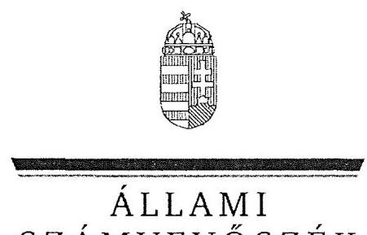
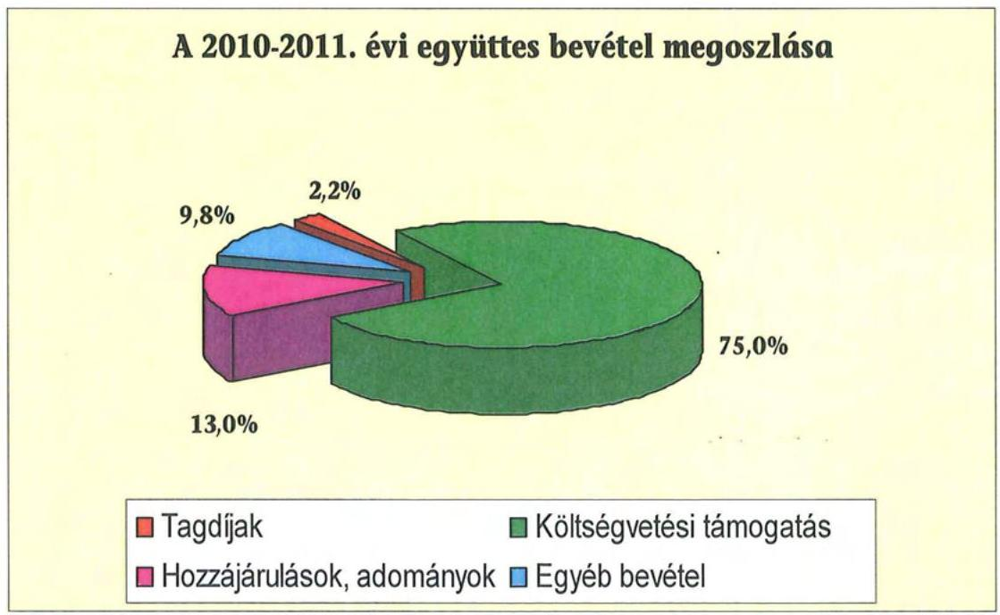
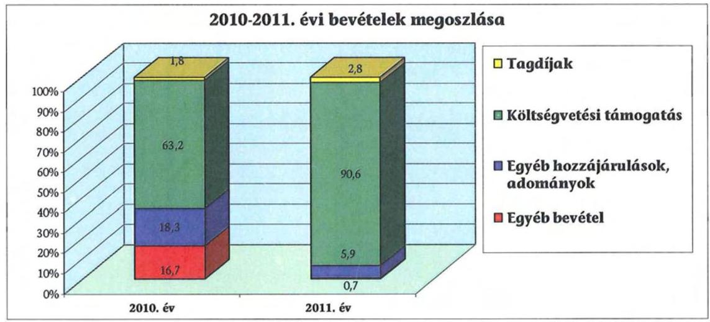
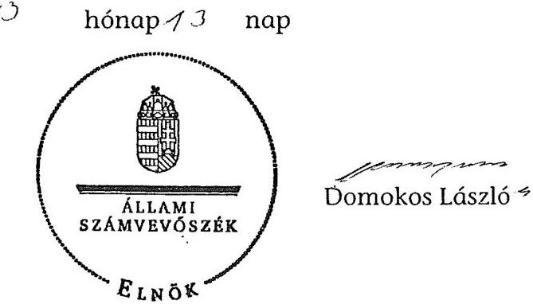

ÁLLAMI
SZÁMVEVŐSZÉK

# JELENTÉS 

a Kereszténydemokrata Néppárt 2010-2011. évi gazdálkodása törvényességének ellenőrzéséről

---

# Állami Számvevőszék 

Iktatószám: V-0037-052/2013.
Témaszám: 1076
Vizsgálat-azonosító szám: V0612

## Az ellenőrzést felügyelte:

Horváth Balázs
felügyeleti vezető
Az ellenőrzés végrehajtásáért felelős:
Baracsi Szilvia Zsuzsanna
ellenőrzésvezető
A jelentéstervezet összeállításában közreműködött:
Marozsán Katalin
számvevő
Az ellenőrzést végezték:
Marozsán Katalin Vincze Béla Róbert Vacsora Erika
számvevő számvevő számvevő

## A témához kapcsolódó eddig készített számvevőszéki jelentések:

## címe

Jelentés a Kereszténydemokrata Néppárt 1992-1993. évi gazdálkodása törvényességének ellenőrzéséről
Jelentés a Kereszténydemokrata Néppárt 1994-1995. évi gazdálkodása törvényességének ellenőrzéséről
Jelentés a Kereszténydemokrata Néppárt 1996-1997. évi gazdálkodása törvényességének ellenőrzéséről
Jelentés a Kereszténydemokrata Néppárt 1998-1999. évi gazdálkodása törvényességének ellenőrzéséről
Jelentés a Kereszténydemokrata Néppárt 2000-2001. évi gazdálkodása törvényességének ellenőrzéséről
Jelentés a központi költségvetési támogatásban nem részesült pártok 2001-2004. évi gazdálkodása törvényességének ellenőrzéséről
Jelentés a Kereszténydemokrata Néppárt 2006-2007. évi gazdálkodása törvényességének ellenőrzéséről
Jelentés a Kereszténydemokrata Néppárt 2008-2009. évi gazdálkodása törvényességének ellenőrzéséről

---

# TARTALOMJEGYZÉK 

BEVEZETÉS ..... 5
I. ÖSSZEGZŐ MEGÁLLAPÍTÁSOK, KÖVETKEZTETÉSEK, JAVASLATOK ..... 7
II. RÉSZLETES MEGÁLLAPÍTÁSOK ..... 12

1. A Párt gazdálkodásáról szóló 2010-2011. évi beszámolók ..... 12
1.1. A teljes ellenőrzési időszakra érvényes megállapítások ..... 12
1.2. Bevételek ..... 12
1.3. Kiadások ..... 13
2. A Pártnak a beszámoló összeállítására és az azt alátámasztó
könyvvezetésre vonatkozó belső szabályozása és gyakorlata ..... 14
2.1. A számviteli rendszer szabályozása ..... 14
2.2. A könyvvezetés összhangja a jogszabályokban és a belső
szabályzatokban előírt követelményekkel ..... 15
2.3. A bizonylati elv és fegyelem, a bizonylati rend érvényesülése ..... 16
3. A Párt bevételszerző, gazdálkodó tevékenysége ..... 17
4. A gazdálkodással összefüggő egyéb jogszabályokban foglalt előírások
betartása ..... 18
4.1. A foglalkoztatás szabályszerűsége ..... 18
4.2. Személyi jellegű kifizetésekre vonatkozó jogszabályok betartása ..... 18
4.3. Az adózási, társadalombiztosítási és egyéb jogszabályok
rendelkezéseinek betartása ..... 19
5. A belső kontroll rendszere ..... 20
5.1. A belső ellenőrzés rendszerének szabályozottsága, működése ..... 20
5.2. Az informatikai rendszer szabályozottsága, működtetése ..... 21
6. Az előző ellenőrzés megállapításaira tett intézkedések ..... 22

## MELLÉKLETEK

1. számú A Kereszténydemokrata Néppárt 2010. évi pénzügyi beszámolója
2. számú A Kereszténydemokrata Néppárt 2011. évi pénzügyi beszámolója

---

.

---

# RÖVIDÍTÉSEK JEGYZÉKE 

Jogszabályok rövidítése

Art.
állami vagyon törvény
Eho. tv.
Munka Törvénykönyve párttörvény

Számv. tv.
Szja törvény
Tbj.

Szórövidítések

Alapszabály
APEH
ÁSZ
MPEB
NAV
OE
OPEB
OV
Párt
SzMSz
az adózás rendjéről szóló - többször módosított - 2003. évi XCII. törvény
az állami vagyonról szóló 2007. évi CVI. törvény 1998. évi LXVI. törvény az egészségügyi hozzájárulásról a Munka Törvénykönyvéről szóló 1992. évi XXII. törvény a pártok működéséről és gazdálkodásáról szóló 1989. évi XXXIII. törvény
a számvitelről szóló 2000. évi C. törvény
a személyi jövedelemadóról szóló 1995. évi CXVII. Törvény
a társadalombiztosítás ellátásaira és a magánnyugdíjra jogosultakról, valamint e szolgáltatások fedezetéről szóló 1997. évi LXXX. törvény

A Kereszténydemokrata Néppárt Alapszabálya
Adó- és Pénzügyi Ellenőrzési Hivatal
Állami Számvevőszék
Megyei Pénzügyi Ellenőrző Bizottság
Nemzeti Adó- és Vámhivatal
Országos Elnökség
Országos Pénzügyi Ellenőrző Bizottság
Országos Választmány
Kereszténydemokrata Néppárt
Szervezeti és Működési Szabályzat

---

.

---

# JELENTÉS 

## a Kereszténydemokrata Néppárt 2010-2011. évi gazdálkodása törvényességének ellenőrzéséről

## BEVEZETÉS

Az Állami Számvevőszékről szóló 2011. évi LXVI. törvény 5. § (11) bekezdés a) pontja, valamint a pártok működéséről és gazdálkodásáról szóló 1989. évi XXXIII. törvény (párttörvény) 10. § (1) bekezdése alapján a pártok gazdálkodása törvényességének ellenőrzésére az Állami Számvevőszék (ÁSZ) jogosult. Az ÁSZ a rendszeres költségvetési támogatásban részesülő pártok gazdálkodását a párttörvény 10. § (3) bekezdésében előírtak szerint kétévenként ellenőrzi. A Kereszténydemokrata Néppárt a 2010. évben 213,5 millió Ft, a 2011. évben 232,6 millió Ft költségvetési támogatásban részesült.

Az ellenőrzés célja annak megállapítása volt, hogy:

- a Párt által készített és a Magyar Közlönyben közzétett éves beszámolók a törvényi előírásoknak megfelelnek-e, a könyvvezetéssel és a valósággal megegyező adatokat tartalmaznak-e;
- a könyvvezetés és a gazdálkodás során betartották-e a számvitelről szóló többször módosított - 2000. évi C. törvény (Számv. tv.) és az egyéb jogszabályok rendelkezéseit, a belső előírásokat;
- a Párt a működéséhez szabályszerűen igénybe vehető forrásokat használt-e fel, a párttörvényben engedélyezett gazdálkodó tevékenységet folytatott-e.

Az ellenőrzött időszak: 2010. január 1. - 2011. december 31.
Az ellenőrzés típusa: pénzügyi-szabályszerűségi ellenőrzés
Az ellenőrzés körülményeit illetően rögzíteni szükséges ${ }^{1}$, hogy:

- a párttörvény 1. számú melléklete szerinti beszámolómintához magyarázatot, útmutatót nem készítettek a jogalkotók, így ennek kitöltése pártonként kialakított számviteli politikájuknak megfelelően - eltérő lehet;

[^0]
[^0]:    ${ }^{1}$ Az ÁSZ a korábbi pártellenőrzésekről készített jelentéseiben javasolta a Kormánynak a párttörvény módosítását. A közigazgatási és igazságügyi miniszter 2012 májusában tájékoztatta az ÁSZ-t, hogy a Kormány fontosnak tartja a számvitelről szóló törvénnyel összehangolt pártfinanszírozási és gazdálkodási szabályok megalkotását.

---

- a beszámolóminta a Számv. tv. rendelkezéseivel nem harmonizál, nem felel meg sem a mérleg, sem az eredménykimutatás követelményeinek.

Az ÁSZ a párttörvény módosításáig a hatályos rendelkezéseknek megfelelő - egységes módszertani alapokra helyezett - gyakorlattal folytatja a pártok gazdálkodása törvényességének ellenőrzését. Az ellenőrzést a pénzügyi-szabályszerűségi ellenőrzés módszertani szabályai szerint, a pártellenőrzésre kiadott „A pártok gazdálkodása törvényességének pénzügyi-szabályszerűségi ellenőrzéséhez" című segédletbe foglalt egységes követelmény szerint végeztük. Az ellenőrzési feladatok szempontrendszerét kockázatelemzéssel alapoztuk meg, amelynek eredményeként az ellenőrzést alacsony eredendő és közepes kontroll kockázatúnak minősítettük. A Párttól bekért adatok előzetes elemzése és a 2010-2011. évi főkönyvi könyvelési adatok alapján terveztük meg a tételes ellenőrzést, valamint a statisztikai mintavételi eljárást. Tételesen ellenőriztük a bevételek közül az egy millió Ft feletti tételeket, valamint a beszámolóban kötelezően nevesítendő, értékhatárt elérő egyéb hozzájárulásokat, adományokat. Az ellenőrzött években a bizonylati rend és fegyelem ellenőrzéséhez a program szerint Win-idea programmal értékalapú rétegzett, véletlenszerű mintavétellel választottuk ki a bizonylatokat.

Az előkészítés során a rendelkezésre bocsátott dokumentumok alapján az átfogó lényegességi küszöb mértékét a beszámolók bevételi főösszegének 2,0%-ában határoztuk meg. Specifikus lényegességi küszöböt alkalmaztunk az egyéb hozzájárulások, adományok körében a párttörvény 1. számú mellékletének előírása szerinti nevesítési értékhatárra (belföldi 500 ezer Ft, külföldi 100 ezer Ft feletti) tekintettel.

A helyszíni ellenőrzés 2012. október 29 - november 16 között, a Párt Budapest, XIV. kerület Bazsarózsa utca 69. szám alatti székhelyén történt.

Az ÁSZ tv. 29. § (1) bekezdése szerint a jelentéstervezetet megküldtük a Párt elnökének, aki a jelentéstervezetre észrevételt nem tett.

---

# I. ÖSSZEGZŐ MEGÁLLAPÍTÁSOK, KÖVETKEZTETÉSEK, JAVASLATOK 

A Párt a 2010. évi gazdálkodásról szóló beszámolóját a párttörvényben előírt határidőn túl, közel egy hónapos késedelemmel, a 2011. évi beszámolót az előírt határidőre tette közzé a Magyar Közlöny Hivatalos Értesítőjében és internetes honlapján. A Párt a beszámoló összeállítás szabályait a számviteli politikájában hiányosan rögzítette, ennek ellenére a beszámoló sorok értékét a főkönyvi kivonat adatai alátámasztották. A 2010. évi beszámolóban a párttörvényben előírt ötszázezer forintot meghaladó hozzájárulások nevesítési kötelezettségét elmulasztották három természetes személy esetében összesen 1950 ezer Ft összegben. A teljes körű nevesítés hiánya miatt a 2010. évi beszámoló nem mutatott megbízható, valós képet a Párt gazdálkodásáról. A 2011. évi beszámoló megbízható és valós képet adott a Párt gazdálkodásáról, - annak ellenére, hogy a beszámoló összeállításánál nem érvényesítették a Számv. tv-ben foglalt teljesség és következetesség számviteli alapelvét - mivel a 3389 ezer Ft összegű hiba a bevételi főösszegre vetítve (1,6%) nem haladta meg az ÁSZ által alkalmazott 2%-os átfogó lényegességi küszöböt. A 2010. évi beszámoló lényeges hibáival összefüggésben a párttörvény nem rendelkezik kötelező könyvvizsgálatról, illetve nem szankcionálja a beszámolási határidő elmulasztását.

A Párt rendelkezett a Számv. tv.-ben előírt, az OV által korábbi időszakban jóváhagyott számviteli szabályzatokkal. A számviteli politika csak részben tartalmazta a párttörvény szerinti beszámoló sorok fogalomkörét és a kapcsolódó főkönyvi számlákkal való összefüggését. A számlarendben a beszámoló sorokat alátámasztó költséghelyi könyvelés főkönyvi számláinak tartalmát és változásának jogcímeit, más számlákkal való kapcsolatát nem határozták meg. A szabályozási hiányosságok hozzájárultak a könyvvezetési és a beszámolási hibákhoz, ami részben összefüggött a párttörvény és a Számv. tv. közötti összhang hiányával.

A Párt a Számv. tv.-ben rögzített kettős könyvvitelt vezetett. A kettős könyvvezetést külső számviteli szolgáltató végezte, amelynek könyvelője a könyvviteli szolgáltatást végzők nyilvántartásában szerepelt. A 2011. évi beszámolót érintő könyvvezetési szabálytalanság, hogy eszközbeszerzést politikai kiadásnak (képzőművészeti alkotás vásárlása), illetve működési kiadásnak (honlap készítése) számoltak el. A beszámolót nem érintő könyvvezetési szabálytalanság, hogy az 5226 ezer Ft értékű nem pénzbeli vagyoni hozzájárulást nem mutatták ki a könyvviteli nyilvántartásokban, annak ellenére, hogy a 2011. évi beszámolóban az egyéb hozzájárulások, adományok és egyéb kiadások beszámolósoron szerepelt. Az ellenőrzött időszakban a számlakijelölés gyakorlata a könyvvezetésben - a képzőművészeti alkotás és a honlap kivételével - összhangban volt a Számv. tv. és a számlarend előírásaival. A leltározást mindkét évben a leltározási szabályzat előírásai szerint elvégezték, a leltárakat összesítették és kiértékelték. A számlarendben meghatározott zárlati feladatokat szabályszerűen, teljes körűen végrehajtották. Az analitikus nyilvántartásokat a Számv. tv.-nek és a belső előírásoknak megfelelően vezették, egyeztették.

---

A pénzkezelési feladatok szabályszerű ellátását a pénzkezelési szabályzat előírásaival összhangban a központi hivatalnál és a megyei szervezeteknél biztosították. A pénztárosi feladatot ellátók körében összeférhetetlenség nem állt fenn, a felelősségvállalási nyilatkozatot aláírták. A Párt nem lépte túl a Számv. tv. szabályai szerint megállapított záró készpénzállományt. A banki kifizetéseket a jogosultak engedélyezték.

A bizonylati elv és fegyelem szabályait a számlarend és a pénzkezelési szabályzat tartalmazta. A gazdasági események számviteli nyilvántartásokban történő rögzítése során érvényesítették a bizonylati fegyelmet, a könyvelt gazdasági műveleteket szabályszerűen kiállított bizonylatokkal támasztották alá. A bizonylatok feldolgozási rendjének kialakításával kapcsolatos előírásokat betartották. A könyvviteli elszámolást közvetlenül alátámasztó számviteli bizonylatok alaki-tartalmi előírásainak - kisebb hiányosságokkal - eleget tettek. A szigorú számadású nyomtatványokról a nyilvántartást a pénzkezelési szabályzat szerint vezették. A bizonylatok megőrzéséről a Számv. tv. előírásainak betartásával gondoskodtak.

A Párt gazdálkodó, bevételszerző tevékenysége során - könyvviteli nyilvántartásai szerint - betartotta a párttörvényben előírt adományszerzési tilalmakat és gazdálkodási korlátokat. Nem fogadott el külföldi államtól, költségvetési szervtől, állami vállalattól, állami részvétellel működő gazdasági társaságtól, közvetlen költségvetési támogatásban vagy költségvetési szervi támogatásban részesülő alapítványtól vagyoni hozzájárulást, valamint névtelen adományt. A Párt a párttörvényben engedélyezett gazdálkodó tevékenységet nem folytatott, egyszemélyes korlátolt felelősségű társaságot nem alapított, más gazdasági társaságban részesedést nem szerzett, értékpapírt nem vásárolt.

A Párt 2010-2011. évi beszámolóiban összesen 594363 ezer Ft bevételt mutatott ki, az alábbi összetételben:

---

A 2010-2011. évi bevételek háromnegyede (446052 ezer Ft) költségvetési támogatásból származott. A Párt a helyi önkormányzatoktól kedvezményes díjtétellel ingatlan használati jogot kapott. Ehhez kapcsolódóan a párttörvény előírásait figyelembe véve a 2010. évben 5637 ezer Ft, illetve a 2011. évben 5226 ezer Ft értékben állapította meg a nem pénzbeli vagyoni hozzájárulás összegét.

A Párt a 2010. évben az állami vagyon törvény alapján hat ingatlant vásárolt 64900 ezer Ft értékben, amelynek 87%-át (56200 ezer Ft) a Magyar Fejlesztési Bank Zrt. által folyósított hitel igénybevételével és 13%-át (8700 ezer Ft) saját forrásból fedezték. A hiteleket folyamatosan törlesztették, a 2010. évben 17174 ezer Ft-ot, a 2011. évben
 18110 ezer Ft-ot fizettek vissza.

A munkaerő foglalkoztatás az ellenőrzött időszakban a Munka Törvénykönyvéről szóló törvényben szabályozott tartalmú munkaszerződések, valamint megbízási szerződések szerint történt. A munkavállalók részletes feladatait munkaköri leírásban rögzítették. A Párt a foglalkoztatottakat a törvényi előírásoknak megfelelően bejelentette. A munkabérek és juttatások számfejtése, kifizetése megfelelt a hatályos jogszabályi előírásoknak. A magáncélú telefonhasználatból eredő adó- és járulékbevallási és fizetési kötelezettségnek eleget tettek. A reprezentáció költségei nem haladták meg az Szja tv-ben meghatározott adómentes értékhatárt. A Pártnak az ellenőrzött évek APEH/NAV folyószámla kivonatának zárlati adatai szerint költségvetési hátraléka nem volt.

A Párt a belső kontrollrendszerét az Alapszabályban, a pénzkezelési szabályzatban, a kötelezettségvállalás és utalványozás rendjében szabályozta. A Párt központi hivatala, helyi, megyei/fővárosi szervezetei - az előző ÁSZ ellenőrzés felhívása ellenére - nem rendelkeztek az Alapszabályban előírt SzMSZszel. A Párt központi döntéshozó és irányító testületei ellátták a szabályzatokban előírt feladataikat, az éves költségvetési terveket és a beszámolókat az OPEB ellenőrizte, az OV megtárgyalta és határozatban jóváhagyta. A MPEB tagjai nem kerültek megválasztásra, így megyei szintű ellenőrzéseket nem végeztek. A vezetői és munkafolyamatba épített ellenőrzési feladat- és hatáskörök hiányos szabályozása miatt az OE feladata a Párt működésének, irányításának és hivatali szervezetének felügyelete. Az Alapszabályban és a belső szabályozásokban nem delegálták a gazdálkodást irányító, ellenőrző vezetői feladatot konkrét személyhez, beosztáshoz. A kötelezettségvállalás és utalványozás rendje nem volt összhangban az Alapszabályban előírt jogosultságokkal, az a megyei és helyi szervezetek vezetőinek kötelezettségvállalási jogosultságát nem tartalmazta. A könyvviteli bizonylatok helyességét a gazdasági vezető ellenőrizte. A pénztári nyilvántartásokat a pénztárellenőr teljes körűen felülvizsgálta. A gazdálkodással összefüggő informatikai rendszer működtetését nem szabályozták. Az informatikai biztonságot külső megbízott, rendszergazda felügyelte.

Az ÁSZ előző ellenőrzése megállapításai alapján három pontban hívta fel a Pártot a törvényes állapot helyreállítására. A Párt a javaslatokat csak részben hajtotta végre. A 2010. évi gazdálkodási beszámolót késedelmesen tették közzé, a gazdálkodási szabályzatot nem léptették hatályba, az Alapszabály által előírt, azzal tartalmilag összehangolt SzMSz-eket nem készítették el. Az ellenőrző testületek Alapszabályban meghatározott működését részben valósították meg.

---

Az Állami Számvevőszékről szóló 2011. évi LXVI. törvény 33. § (1) bekezdésében foglaltak értelmében a jelentésben foglalt megállapításokhoz kapcsolódó intézkedési tervet köteles az ellenőrzött szervezet vezetője összeállítani, és azt a jelentés kézhezvételétől számított harminc napon belül az ÁSZ részére megküldeni. Amennyiben az intézkedési tervet határidőre nem küldi meg a szervezet, vagy az továbbra sem elfogadható, az ÁSZ elnöke a hivatkozott törvény 33. § (3) bekezdés a)- b) pontjaiban foglaltakat érvényesítheti.

A helyszíni ellenőrzés megállapításainak hasznosítása mellett felhívjuk:

# a Párt elnökét 

1. A Párt a 2010. évi gazdálkodásról szóló beszámoló összeállításánál nem érvényesítette a párttörvény előírását, mert elmulasztotta nevesíteni három belföldi magánszemély ötszázezer forint értéket meghaladó adományát, összesen 1950 ezer Ft összegben. A teljes körű nevesítés hiánya miatt a 2010. évi beszámoló nem mutatott megbízható, valós képet a Párt gazdálkodásáról.

Felhívás:
Tegye közzé a Párt 2010. évi gazdálkodásáról szóló módosított beszámolóját a párttörvény 9. § (2) bekezdésben előírtak szerint az ötszázezer forintot meghaladó hozzájárulást adó személyek megnevezésének és a támogatás összegének feltüntetésével.
2. A számviteli politika és számlarend csak részben tükrözte a Pártra jellemző sajátosságokat, nem megfelelően szabályozta a párttörvény szerinti beszámoló sorok fogalomkörét és a kapcsolódó főkönyvi számlákkal való összefüggését.

Felhívás:
Módosítsa a számviteli politikát és a számlarendet a Számv. tv. 14. § (3) bekezdésében, valamint a 161. § (2) bekezdésében előírtak figyelembevételével, annak érdekében, hogy a könyvvezetés és a párttörvény 1. számú melléklete szerinti beszámoló sorok összhangja biztosított legyen.
3. A szerződéskötés és utalványozás rendje nem felelt meg az Alapszabály követelményének, nem biztosította a helyi szervezeteknek a kötelezettségvállalási jogkört.

Felhívás:
Intézkedjen a kötelezettségvállalási jogkör Alapszabály 48. §-ában foglaltak szerinti szabályozására.

---

4. Az ÁSZ korábbi ellenőrzését követő felhívása ellenére az Alapszabályban előírt gazdálkodási szabályzatot az OV nem hagyta jóvá; a szervezeti és működési szabályzatot nem készítették el, a MPEB tagjai nem kerültek megválasztásra, így megyei szintű ellenőrzéseket nem végeztek.

# Felhívás: 

Intézkedjen az Alapszabály 57. §-a alapján a gazdálkodási szabályzat OV általi elfogadásáról, a 81-82. §-ok szerint a MPEB tagjainak megválasztásáról és a testületek szabályszerű működtetéséről. Az Alapszabály 91. §-a alapján intézkedjen a gazdálkodási jogkörrel rendelkező szervezetek szervezeti és működési szabályzatainak elkészítéséről, hatályba léptetéséről.

---

# II. RÉSZLETES MEGÁLLAPÍTÁSOK 

## 1. A PÁRT GAZDÁLKODÁSÁRÓL SZÓLÓ 2010-2011. ÉVI BESZÁMOLÓK

### 1.1. A teljes ellenőrzési időszakra érvényes megállapítások

A Párt a 2010. évi gazdálkodásáról szóló beszámolóját a párttörvény 9. § (1) bekezdésében előírt április 30-i határidőn túl, 2011. május 27-én hozta nyilvánosságra. A 2011. évi beszámolót határidőre, 2012. április 5-én tette közzé a Magyar Közlöny mellékletét képező Hivatalos Értesítőben (1-2. számú melléklet). Internetes honlapján mindkét ellenőrzött év beszámolóját megjelentette. Beszámolóit a párttörvény 1. számú mellékletében meghatározott minta szerint - a 2010. évi nevesítési kötelezettség alá eső, belföldi magánszemélyek ötszázezer forint feletti adományai kivételével - készítette el. A beszámolókat az OE elfogadta. A közzétett beszámolók a helyi, a megyei/kerületi szervezetek, valamint a központi hivatali szervezet számviteli bizonylatai alapján, központilag könyvelt adatok főkönyvi kivonataiból készültek. A Párt a beszámoló összeállítás szabályait a számviteli politikájában hiányosan rögzítette, mert az csak részben tartalmazta a párttörvény szerinti beszámoló sorok (egyéb bevételek, eszközbeszerzések, működési, politikai és egyéb kiadások) fogalomkörét és a kapcsolódó főkönyvi számlákkal való összefüggését. A beszámoló sorok értékét a főkönyvi kivonat adatai alátámasztották. Az Alapszabály értelmében a helyi szervezetek önállóan gazdálkodnak, a bevételeiket saját döntésük szerint használhatják fel. A 2010-2011. években a tanúsítványi adatszolgáltatásban működőnek jelölt helyi, megyei/ kerületi szervezetek bevételeit és kiadásait mindkét évi főkönyvi könyvelés és beszámoló tartalmazta.

A nyilvánosságra hozott 2010. évi beszámolóban a párttörvény 9. § (2) bekezdésében foglaltak ellenére elmulasztották nevesíteni három természetes személy ötszázezer forint értéket meghaladó adományát, összesen 1950 ezer Ft összegben, amely így nem minősült megbízhatónak. A 2011. évi beszámoló megbízható és valós képet adott a Párt gazdálkodásáról, annak ellenére, hogy a beszámoló összeállításánál nem érvényesítették a Számv. tv. 15. § (2) és (5) bekezdéseiben foglalt teljesség és következetesség számviteli alapelvet. A 3389 ezer Ft összegű hiba, a bevételi főösszegre vetítve (1,6%) nem haladta meg az ÁSZ által alkalmazott 2%-os átfogó lényegességi küszöböt.

### 1.2. Bevételek

A tagdíjfizetés összegét és feltételeit a Párt az Alapszabály 11. §-ában rögzítette. A tagdíj elengedéséről, illetve mérsékléséről szóló egyedi döntéseket csatolták az elszámoláshoz, így azok jogszerűsége megállapítható volt. A beszámoló tagdíjak sorában kimutatott összeg az ellenőrzött években megegyezett a kapcsolódó főkönyvi számlán kimutatott egyenleggel. A könyvviteli adatokat szabályszerű bizonylatok támasztották alá. A beszámoló adata csak tagdíjnak minősülő bevételeket tartalmazott.

---

Az állami költségvetésből származó támogatás beszámolósor adatát 2010-2011. években a főkönyvi könyvelésben kimutatott, a Magyar Államkincstár által ténylegesen átutalt, valamint a Magyar Köztársaság 2010. évi költségvetésének végrehajtásáról szóló 2011. évi CXXXIII. törvényben, illetve a Magyar Köztársaság 2011. évi költségvetésének végrehajtásáról szóló 2012. évi CLV. törvényben meghatározott összeggel egyezően közölték.

Az egyéb hozzájárulások, adományok beszámoló soron - a párttörvény 9. § (2) bekezdésében és az 1. számú mellékletében előírtak szerint tovább részletezve - a Párt az ellenőrzött években kizárólag belföldi jogi és magánszemélyektől származó bevételt mutatott ki. A beszámolókban szereplő adatok mindkét évben megegyeztek a kapcsolódó főkönyvi számlán könyvelt bevétellel, azzal az eltéréssel, hogy a nem pénzbeli vagyoni hozzájárulást a 2011. évben nem könyvelték.

Az egyéb hozzájárulások, adományok belföldi jogi személyektől beszámoló soron a párttörvény 9. § (2) bekezdésében előírtaknak megfelelően nevesítették az egy adományozótól származó, ötszázezer forintot meghaladó adományokat. A beszámolók tartalmazták az önkormányzatoktól kedvezményes díjtételű ingatlanhasználat formájában kapott nem pénzbeli vagyoni hozzájárulás értékét, ami a 2010. évben 5637 ezer Ft-ot, a 2011. évben 5226 ezer Ft-ot tett ki.

Az egyéb hozzájárulások, adományok belföldi magánszemélyektől soron a 2010. évi beszámolóban elmulasztották nevesíteni három, a párttörvény 9. § (2) bekezdésében meghatározott, támogatónkénti ötszázezer forint összeghatárt meghaladó, természetes személytől származó adományt (Gróff Tamásné 750 ezer Ft, Strommer Pál 600 ezer Ft és Nagy Sándor 600 ezer Ft).

Az egyéb bevétel beszámoló sorban az ingatlanvásárlási célú tárgyévi hitel összegeit és a kamatbevételeket mutatták ki. A beszámoló sorok adatai megegyeztek a kapcsolódó főkönyvi számlák összevont adataival.

# 1.3. Kiadások 

A 2010. és a 2011. évekre közzétett beszámolók kiadásainak ellenőrzése során megállapított eltéréseket - beszámoló soronként - a következő összeállítás részletezi:
adatok ezer Ft-ban

| Megnevezés | Párt által közzétett beszámoló |  | Ellenőrzés alapján megállapított eltérés a beszámolóhoz képest |  |  |  |
| :--: | :--: | :--: | :--: | :--: | :--: | :--: |
|  | 2010. év | 2011. év | 2010. év |  | 2011. év |  |
| KIADÁSOK |  |  | Nem szerepel | Hibásan szerepel | Nem szerepel | Hibásan szerepel |
| 2. Tám. egyéb szervezetnek | 178 | 440 |  |  |  |  |
| 4. Működési | 126461 | 123319 |  | 14 |  | 744 |
| 5. Eszközbeszerzés | 70601 | 1818 |  |  | 1609 |  |
| 6. Politikai tev. | 90823 | 60936 | 14 |  |  | 865 |
| 7. Egyéb kiadások | 22811 | 23165 |  |  | 171 |  |
| ÖSSZESEN: | 310874 | 209678 | 14 | 14 | 1780 | 1609 |
| A hiba előjeltől független összege |  |  | 28 |  | 3389 |  |

---

A támogatás egyéb szervezeteknek beszámoló soron közölt adat az ellenőrzött években megegyezett a kapcsolódó főkönyvi számla egyenlegével. A könyvelés csak jogi személynek nyújtott támogatásokat tartalmazott.

A működési kiadásokat a Párt a vonatkozó főkönyvi számlán másodlagosan könyvelte. A beszámoló mindkét évben a tényleges működési kiadások értékét tartalmazta, kivéve a 2010. évben 14 ezer Ft értékben a működési kiadások között kimutatott, politikai tevékenységnek minősülő öt számlát. A 2011. évben az eszközbeszerzés sor helyett a működési kiadások között szerepelt 744 ezer Ft értékű szellemi termék. Ezzel sérült a következetesség számviteli alapelve.

Az eszközbeszerzés beszámoló soron az adott évben vásárolt ingatlanok teljes vételárát és az egyéb eszközbeszerzéseket a vonatkozó főkönyvi számlákkal egyezően mutatták ki, kivéve a 2011. évben a működési kiadások között szerepeltetett 744 ezer Ft értékű szellemi terméket, és a politikai kiadások között elszámolt 865 ezer Ft értékű képzőművészeti alkotást.

A politikai tevékenység kiadásait a Párt a vonatkozó főkönyvi számlán másodlagosan
 könyvelte. A beszámoló sorokat alátámasztó főkönyvi adatok alapján - a működési kiadásnál és az eszközbeszerzésnél részletezett hibákat kivéve - a beszámoló mindkét évben a tényleges politikai kiadások értékét tartalmazta.

Az egyéb kiadások között bankköltséget, bírságot, késedelmi kamatot, valamint a hitelre vásárolt ingatlanok adott évi hiteltörlesztéseit szerepeltették a könyveléssel egyező összegben, a 2011. évi hitelvisszafizetés kivételével. A 2011. évben 171 ezer Ft-tal kevesebb hitel-visszafizetést mutattak ki, mint a ténylegesen könyvelt összeg, emiatt nem érvényesült a teljesség számviteli alapelve. A beszámolósor mindkét évben tartalmazta a helyi önkormányzatoktól kedvezményes díjtételű ingatlanhasználat formájában kapott nem pénzbeli vagyoni hozzájárulás értékéhez kapcsolódó, pénzforgalom nélküli ráfordítás elszámolását.

A kiadásoknál feltárt hibák mértéke a bevételi főösszegre vetítve a 2010. és a 2011. években nem haladta meg az ÁSZ által elfogadott 2%-os átfogó lényegességi küszöböt.

# 2. A Pártnak a beszámoló összeállítására és az azt alátámasztó könyvvezetésre vonatkozó belső szabályozása és gyakorlata 

### 2.1. A számviteli rendszer szabályozása

A Párt belső számviteli szabályozásként rendelkezett az OV által korábbi időszakban elfogadott számviteli politikával, leltározási és leltárkezelési, eszközök és források értékelési és pénzkezelési szabályzattal valamint számlarenddel. A szabályzatok módosítása - a számviteli politika és a számlarend kivételével - nem volt indokolt, mivel a Pártra vonatkozó jogszabályi és gazdálkodási feltételekben nem történt változás.

---

A számviteli politika a Számv. tv. 14. § (3) bekezdése alapján csak részben tükrözte a Pártra jellemző sajátosságokat, a párttörvény szerinti beszámoló összeállítására vonatkozó részletes szabályokat hiányosan rögzítették. Egyértelműen nem tartalmazta az egyes beszámoló sorok (egyéb bevételek, eszközbeszerzések, működési, politikai és egyéb kiadások) fogalomkörének meghatározását és a kapcsolódó főkönyvi számlákkal való összefüggését. A számlarend nem tartalmazta a párttörvény 1. számú melléklete szerinti beszámoló sorokat alátámasztó, a költséghelyek szerinti elszámolásnál a Számv. tv. 161. § (2) bekezdés b) pontjában foglalt előírásokat, melyek a főkönyvi számla tartalmára, a növekedésének, csökkenésének jogcímeire, a számlát érintő gazdasági eseményekre, azok más számlákkal való kapcsolatára vonatkoznak.

# 2.2. A könyvvezetés összhangja a jogszabályokban és a belső szabályzatokban előírt követelményekkel 

A Párt a számviteli politika előírásával összhangban a Számv. tv. 159. §-ában előírt kettős könyvvitelt vezetett. A könyvvezetést mindkét évben azonos külső könyvelési szolgáltató központilag végezte, a feladatokat ellátó rendelkezett a Számv. tv. 151. § (1) bekezdés a) pont szerint meghatározott képesítéssel és szerepelt a könyvviteli szolgáltatást végzők nyilvántartásában.

A Számv. tv. 15. § (2) és (5) bekezdésében foglalt teljesség és következetesség számviteli alapelvek nem érvényesültek a következő könyvelési tételeknél:

- a 2010. évben a működési kiadások között mutattak ki 14 ezer Ft értékben politikai kiadást;
- a 2011. évben a működési kiadások között szerepelt 744 ezer Ft összegű szellemi termék (honlap) beszerzés, illetve a politikai kiadások között könyveltek 865 ezer Ft összegű képzőművészeti alkotás vásárlást;
- a 2011. évben az 5226 ezer Ft nem pénzbeli vagyoni hozzájárulást nem könyvelték.

A Párt az eszközökről és azok forrásairól, továbbá a gazdasági műveletek hatására bekövetkezett változásokról a valóságnak megfelelő, folyamatos, zárt rendszerű, áttekinthető könyvviteli nyilvántartást vezetett. A Pártnál alkalmazott pénzügyi számviteli szoftver adatállományokból az adatok teljes körűen előállíthatók voltak.

A számlakijelölés gyakorlata - két tétel (képzőművészeti alkotás, honlap) kivételével - összhangban volt a Számv. tv. 160. §-ában és a számlarendben foglalt előírásokkal.

Az eszközök bekerülési értékét a Számv. tv. 47-48. §-a és az 51. § szabályai szerint határozták meg, az értékcsökkenés elszámolása megfelelt a Számv. tv. 52-53. §-a és a belső szabályozások előírásainak. A Párt a 100 ezer Ft érték alatt beszerzett kis értékű tárgyi eszközök értékcsökkenési leírását használatbavételkor egy összegben elszámolta, analitikus nyilvántartásában érték nélkül szerepeltette. A nem pénzbeli vagyoni hozzájárulás értékét a párttörvény előírásait figyelembe véve a Párt által bérelt ingatlanoknál meghatározták.

---

A számlarendben szabályozott főkönyvi számlákhoz rendelt analitikát az előírásoknak megfelelően vezették. Számlarend szerinti kézi analitikus nyilvántartás készült a tárgyi eszközökről, a valutapénztárról és a szigorú számadású bizonylatokról, valamint a hiteltartozásokról. A szállítókról, a reprezentációról, a kis értékű tárgyi eszközökről és a készpénzadományokról számítógépes analitikát vezettek. Az analitikus nyilvántartások és a főkönyvi könyvelés között az értékadatok számszerű egyeztetése a Számv. tv. 161. § (3) bekezdésben és a számlarendben rögzített szabállyal összhangban megtörtént.

Az eszközök és források éves leltározását a 2010-2011. évben a Számv. tv. 69. § (1)-(2) bekezdésben, valamint a leltározási és leltárkezelési szabályzatban előírtak szerint végrehajtották. A központi és a megyei irodák által felvett leltárak kiértékelése megtörtént, eltéréseket (többlet, hiány) nem állapítottak meg. Az éves zárást a Számv. tv. 164. § (1)-(2) bekezdésében és a számlarendben foglaltak szerinti határidőre szabályszerűen elvégezték. A beszámolókat alátámasztó főkönyvi kivonatokat a Pártnál elkészítették. Év végén az analitikus nyilvántartások és a főkönyvi számlák egyenlegének egyeztetése megtörtént.

A pénzkezelési szabályzat előírásaival összhangban a pénztárosi feladatot ellátók körében összeférhetetlenség nem állt fenn, a felelősségvállalási nyilatkozatot aláírták. A pénzkezelési szabályzat szerint a házipénztár kezelésére, a pénztárosi teendők ellátására az elnök pénztárost bíz meg. Ez a pártközpontban és a megyei szervezeteknél megtörtént. A Párt nem lépte túl a Számv. tv. 14. § (9) bekezdés szabályai szerint megállapított 500 ezer Ft záró készpénz állományt. A készpénzben és a bankszámlán tartott pénzeszközök közötti forgalomban a szabályszerűséget biztosították, a főkönyvi nyilvántartás adataiból a pénzmozgások követhetőek voltak. A banki kifizetéseket a jogosultak engedélyezték.

# 2.3. A bizonylati elv és fegyelem, a bizonylati rend érvényesülése 

A Párt a Számv. tv. 165. § (1)-(2) bekezdésében foglalt bizonylati elvre és fegyelemre vonatkozó eljárásrendjét a pénzkezelési szabályzatban és a számlarendben szabályozta. A bizonylati fegyelemre vonatkozó előírásokat alapvetően betartották, a könyvelt gazdasági műveleteket szabályszerűen kiállított bizonylatokkal támasztották alá. A könyvvezetésben gondoskodtak a főkönyvi könyvelés és a bizonylatok adatai közötti egyeztetésről.

A bizonylatok feldolgozási rendjének kialakításával kapcsolatos előírásokat betartották. A számviteli bizonylatok a Számv. tv. 167. § (1) bekezdés szerinti alaki és tartalmi kellékei - a c) és az i) pontokban meghatározottak kivételével - eleget tettek a törvényi előírásoknak. Esetileg elmaradt a pénzkezelési bizonylatokon az átvevő és a befizető aláírása, valamint a könyvviteli rögzítés időpontjának feltüntetése. A Pártnál a szigorú számadási kötelezettség alá vont, valamint az elektronikus nyomtatványok körét a pénzkezelési szabályzatban meghatározták, a nyilvántartást szabályozásnak megfelelően vezették. A bizonylatok megőrzéséről a Számv. tv. 169. § (1)-(3), és (5) bekezdésének előírásai szerint gondoskodtak.

---

# 3. A Párt bevételszerző, gazdálkodó tevékenysége 

Az Alapszabály 48. §-a rögzíti, hogy a helyi szervezet a párt nevében jogokat szerezhet és kötelezettségeket vállalhat, bevételeivel és a juttatásokkal önállóan gazdálkodik, kiadásaival elszámolni köteles, továbbá működéséről, gazdálkodásáról évente köteles beszámolni a megyei választmánynak. Az Alapszabály 53. § alapján a megyei szervezet költségvetése alapján bevételeivel önállóan gazdálkodik, az 55. § szerint hatásköre a helyi szervezetek gazdálkodásának felügyelete, a juttatások elszámoltatása.

A Párt vagyona a párttörvény 4. § (1) bekezdésében meghatározott szabályozott tagdíjfizetésből, egyéb hozzájárulásokból és adományokból, az 5. § (2) bekezdése szerinti költségvetési támogatásból, valamint egyéb bevételből (kamat) képződött.

A párt bevételeinek megoszlását a következő ábra mutatja be (adatok %-ban):

A Párt a 2010. évben 213452 ezer Ft, a 2011. évben 232600 ezer Ft költségvetési támogatásban részesült. Az ellenőrzött időszak bevételeinek 75,0 %-a költségvetési támogatásból származott.

A Párt az ellenőrzött időszakban a könyvviteli nyilvántartásai szerint külföldi államtól, költségvetési szervtől, állami vállalattól, állami részvétellel működő gazdasági társaságtól, közvetlen költségvetési támogatásban vagy költségvetési szervi támogatásban részesülő alapítványtól vagyoni hozzájárulást, valamint névtelen adományt nem fogadott el, betartva a párttörvény 4. § (2)-(3) bekezdéseiben foglaltakat. A Párt a párttörvény 6. § (1) bekezdésében engedélyezett gazdálkodó tevékenységet nem folytatott, a 6. § (3)-(4) bekezdésében engedélyezett egyszemélyes korlátolt felelősségű társaságot nem alapított, más gazdasági társaságban részesedést nem szerzett, értékpapírt nem vásárolt.

A Párt a helyi önkormányzatoktól kedvezményes díjtétellel ingatlan használati jogot kapott. A Párt a használt önkormányzati ingatlanokhoz kapcsolódóan a 2010. évben 15, a 2011. évben 12 ingatlan esetében - a párttörvény 4. § (5) bekezdése előírásának megfelelően - megállapította a fizetett bérleti díj és a tényleges piaci ár közötti különbözetet.

---

A Párt az állami vagyontörvény 68. § (4) bekezdése alapján a 2010. évben hat ingatlant vásárolt 64900 ezer Ft értékben. A vásárlásokhoz a törvény által biztosított, Magyar Fejlesztési Bank Zrt.-vel kötött 300000 ezer Ft összegű hitelkeret-szerződés alapján folyósított, 56200 ezer Ft összegű hitelt vettek igénybe, valamint 8700 ezer Ft saját forrást használtak fel. A hiteleket folyamatosan törlesztették, a 2010. évben 17174 ezer Ft-ot, a 2011. évben 18110 ezer Ft-ot fizettek vissza. A megszerzett ingatlanokat teljes körűen az állami vagyontörvényben meghatározott rendeltetési cél szerint használták.

# 4. A gazdálkodással összefüggő egyéb jogszabályokban foglalt előírások betartása 

### 4.1. A foglalkoztatás szabályszerűsége

A Pártnál a 2010. évben 30 fő, a 2011. évben 28 fő munkavállalót foglalkoztattak teljes illetve részmunkaidőben. A vezetési (főtitkár, gazdasági vezető), szervezési, gazdálkodási feladatokat határozatlan idejű munkaszerződések keretében látták el. A munkaerő foglalkoztatása munkaviszony keretében kizárólag a Munka Törvénykönyvéről szóló 1992. évi XXII. törvény 76. § (1)-(6) bekezdéseiben szabályozott tartalmú munkaszerződés szerint történt. A munkaszerződések a munkaviszony szempontjából lényeges adatokat tartalmazták. A munkavállalók részletes feladatait munkaköri leírásban rögzítették.

A Pártnál a munkavállalókat az Art. 16. § (4) bekezdése előírásainak megfelelően bejelentették. A munkabérek számfejtése, kifizetése a munkaszerződéssel és a hatályos Tbj. és Szja törvénnyel és az egyéb jogszabályokkal összhangban történt. Az összesített havi bérfeladások megegyeztek a főkönyvi könyveléssel és a bevallásokkal. A Tbj. 44. § (5) bekezdésében foglaltaknak megfelelően a Párt határidőre bejelentette a foglalkoztatási jogviszonyban történt változásokat. Az Art. 46. § (1) bekezdésben, valamint a Tbj. 47. § (3) bekezdésben szabályozott igazolásokat a Párt határidőre kiadta.

A Párt 2010. I. félévben megbízással foglalkoztatott egy egyéni vállalkozót a könyvelési feladatok ellátására. A megbízást teljes munkaidős gazdasági vezetői munkaszerződésre módosították. A könyvviteli szolgáltatásra, a bevételek és kiadások évközi folyamatos könyvelésére és az év végi zárlati munkák előkészítésére határozatlan idejű megbízási szerződést kötöttek egy kft.-vel. A könyvelési szolgáltató végezte a munkabérek számfejtését, teljesítette az adó- és társadalombiztosítási jogszabályokban előírt levonási, bevallási és adatszolgáltatási kötelezettségeket.

### 4.2. Személyi jellegű kifizetésekre vonatkozó jogszabályok betartása

A Párt a munkavállalókat megillető juttatások fajtáját, mértékét és a jogosultak körét belső szabályzatban nem határozta meg, erre vonatkozó határozatot az OE sem hozott. Az éves költségvetésbe tervezett és jóváhagyott juttatások kifizetését a főtitkár engedélyezte. A Párt az ellenőrzött időszakban béren kívüli juttatásként a teljes munkaidőben foglalkoztatottaknak étkezési utalványt, helyi közlekedéshez bérletet, valamint üdülési hozzájárulást adott.

---

A Párt a saját gépkocsi hivatali célra történő használatát és a hivatalos külföldi kiküldetést szabályozta. A szabályzatok összhangban vannak a belföldi hivatalos kiküldetést teljesítő
 munkavállaló élelmezési költségtérítéséről szóló 278/2005. (XII. 20.) Korm. rendelet, valamint a külföldi kiküldetéshez kapcsolódó elismert költségekről szóló 168/1995. (XII. 27.) Korm. rendelet előírásaival.

A Párt a hivatalos utazásokra tagjai és alkalmazottai magántulajdonú gépkocsiját vette igénybe. A magántulajdonú gépjármű hivatali célú használatát, annak elrendelését, végrehajtásának igazolását, üzemanyag- és költségelszámolás rendjét, mértékét szabályzatban rögzítették. A szabályzat 2009. január 1-jétől hatályos. Kiküldetést a Párt elnöke, főtitkára, alelnökei és megyei elnökei rendelhettek el. Az utazási költségtérítést az Szja törvény 7. § (1) bekezdés r) pontjában foglaltak szerinti adómentes mértékkel számolták el, az Szja tv. 3. § 83. pontjában elrendelt szigorú számadású kiküldetési rendelvénnyel.

A külföldi kiküldetések eljárási rendjét, elszámolható költségeit hatályos szabályzat rögzítette, az utazás elrendelése az elnök hatáskörébe tartozott. A Pártnál a külföldi kiküldetés elszámolása a hatályos Szja törvény és a külföldi kiküldetéshez kapcsolódó elismert költségekről szóló 168/1995. (XII. 27.) Korm. rendelet előírásaival összhangban szabályosan történt, a belső szabályozás mellékleteit azonban nem alkalmazták.

# 4.3. Az adózási, társadalombiztosítási és egyéb jogszabályok rendelkezéseinek betartása 

A Párt munkáltatói és kifizetői jogkörében rendszeresen eleget tett az Eho. tv., a Tbj., az Szja törvény és az Art. hatályos törvényi előírásainak. A munkabérekhez és a béren kívüli juttatásokhoz, valamint a kifizetésekhez kapcsolódó - Art. és Tbj. jogszabályokban előírt - havi és éves bejelentési, adó- és járuléknyilvántartási, levonási, bevallási, adatszolgáltatási kötelezettségének határidőre eleget tett. Az Art. előírásai alapján a levont adót és járulékot határidőre megfizette. Kifizetőként a külföldi kiküldetéseknél a napidíjjal kapcsolatos adót és járulékot szabályszerűen levonták, megfizették és a foglalkoztatottaknak az igazolásokat kiadták.

Az adók és járulékok bevallása és befizetése a főkönyvi nyilvántartás és az APEH/NAV folyószámláján kimutatott adatokkal megegyezett. A Pártnak az ellenőrzött évek APEH/NAV folyószámla kivonatának zárlati adatai szerint költségvetési hátraléka nem volt.

A Pártnak gazdálkodó tevékenységével összefüggésben az általános forgalmi adóról szóló 2007. évi CXXVII. törvény hatálya alá tartozó bevallási, befizetési kötelezettsége nem keletkezett.

A Pártnak a foglalkoztatás elősegítéséről és a munkanélküliek ellátásáról szóló 1991. évi IV. törvény 41/A. § szerinti rehabilitációs hozzájárulás fizetési kötelezettsége nem keletkezett, mert az általa foglalkoztatott megváltozott munkaképességű dolgozók száma elérte a létszám 5%-át.

---

A Pártnál az elszámolt reprezentáció együttes értéke egyik évben sem haladta meg az Szja törvény 69. § (7) bekezdése b) pontjában², illetve a 70. § (2) bekezdés a) pontjában foglalt értékhatárt, ezért a Pártnak személyi jövedelemadó és járulékfizetési kötelezettsége nem keletkezett. A reprezentációs kifizetések analitikája és a főkönyvi nyilvántartás egyező volt. A Párt alkalmazottainak adott természetbeni juttatások után az Szja törvény 69. §-ában előírt adó és az egészségügyi hozzájárulás megfizetésre került.

A Párt a tulajdonában álló telefonok magáncélú használatából eredő költségeinek tételes elkülönítését nem alkalmazta, a 2010. évben az Szja. törvény 69. § (12) bekezdése, a 2011. évben a 70. § (5) bekezdés ca) pontja szerint járt el, az adó- és járulékfizetési kötelezettségének mindkét évben eleget tett. A helyi és a megyei alapszervezeteknél felmerült telefonköltségekre vonatkozó bevallást a 2010-2011. évek végén önrevízióval teljesítették. A 2010-2011. éveket érintő társadalombiztosítási ellenőrzésre nem került sor, az APEH/NAV az adózási szabályok betartását nem ellenőrizte.

# 5. A Belső Kontroll RENDSZERE 

### 5.1. A belső ellenőrzés rendszerének szabályozottsága, működése

A Párt gazdálkodásának, pénzügyi és számviteli tevékenységének belső ellenőrzési rendszerét az Alapszabályban, a pénzkezelési szabályzatban, a kötelezettségvállalás és utalványozás rendjében szabályozta. Az Alapszabály 91. §-a szerint a Párt helyi szervezetei és meghatározott testületei szervezeti és működési szabályzatot kötelesek készíteni, melyben az Alapszabály rendelkezéseivel összhangban pontosítják és részletezik a számukra irányadó szervezeti és működési szabályokat. Az ellenőrzött időszakban - az előző ÁSZ ellenőrzés felhívása ellenére - a Párt helyi szervezetei, a megyei/fővárosi szervezetek és a központi hivatali szervezet nem rendelkezett SzMSz-szel. A megyei szervek és tisztségviselők illetékessége a megyére, a központi testületek és tisztségviselők illetékessége az ország egész területére kiterjedt. A Párt központi döntéshozó és irányító testületei ellátták a szabályzatokban előírt feladataikat, az éves költségvetési terveket és a beszámolókat az OPEB ellenőrizte, az OE megtárgyalta és határozatban jóváhagyta.

Az Alapszabály kétszintű - országos, megyei/fővárosi - pénzügyi ellenőrző bizottság létrehozását és működését írta elő (OPEB, MPEB). Az Alapszabály 21. §-a szerint a Párt gazdálkodásának szabályszerűségére, a költségvetés megtartására a pénzügyi ellenőrző bizottságok ügyeltek. Az ellenőrző bizottságoknak az Alapszabály 81-85. §-ai szerinti tevékenységük, ellenőrzéseik során a jogszabályok, az Alapszabály és a Párt gazdálkodási szabályzata szerint kell eljárniuk.

Az OV 31/2010. (XII. 18.) határozata rögzíti az OPEB tagjainak megválasztását 4 éves időtartamra. Az OPEB jegyzőkönyvet készített a 2010. és a 2011.

[^0]
[^0]:    ${ }^{2}$ Hatályos 2010. december 31-ig.

---

évről megjelentetett beszámolók és azok mellékleteinek felülvizsgálatáról és elfogadásáról. A beszámoló felülvizsgálatának módszerét, szempontjait a jegyzőkönyv nem ismerteti. Az MPEB-k nem alakultak meg, így az ellenőrzött időszakban nem látták el az Alapszabályban előírt feladatukat.

A vezetői és munkafolyamatba épített ellenőrzés a feladatok, hatáskörök, felügyeleti és felelősségi körök hiányos szabályozása miatt rendszerbeli problémákat mutat. A kötelezettségvállalás és utalványozás rendjét hiányosan szabályozták, a hatáskörileg illetékes személyeket kijelölték. A szerződéskötés és utalványozás rendje nem volt összhangban az Alapszabályban előírt jogosultságokkal, a megyei és helyi szervezetek vezetőinek kötelezettségvállalási jogosultságát nem tartalmazta. A Párt szervezeteinek munkáját hivatali szervezet segíti, azonban az Alapszabály 72. § (4) bekezdése szerint a hivatali szervezet felépítésére, szervezeti tagozódásra és vezetőjének hatáskörére vonatkozó szervezeti és működési szabályzattal nem rendelkeztek. Az OE feladatává tették a Párt működésének irányítását és hivatali szervezetének felügyeletét. Az Alapszabály szerint az OE két ülése között az operatív feladatokat az Ügyvezető Elnökség látja el, irányítja a Párt hivatali szervezetét és az ügyvezető főtitkárt, illetve összefogja a titkárok munkáját, ellenőrzi a Párt gazdálkodását, a munkaviszonyban álló személyek felett a munkáltatói jogokat gyakorolja. Az Alapszabályban és a belső szabályozásokban nem rendelték a gazdálkodást irányító, ellenőrző vezetői feladatot konkrét személyhez, beosztáshoz.

A vezetői ellenőrzést a gazdálkodás folyamatában végezték. Az utalványozást a központ által kezelt bankszámlán a gazdasági vezető és a pénzügyi ügyintéző közösen elektronikus aláírással végezte. A megyei szervezeteknél a vezetők, az alapszervezeteknél a választott vezetők utalványoztak. A könyvviteli bizonylatok helyességét a gazdasági vezető ellenőrizte.

A munkafolyamatba épített ellenőrzés körében a pénztárak általános ellenőrzési feladatainak ellátására a központban a pénzügyi ügyintéző kapott megbízást, az ellenőrzés teljes körű volt. A könyvelési szolgáltatóval kötött megbízási szerződésben ellenőrzési feladatot nem rögzítettek. A gazdasági vezető a bizonylatok könyvelésre történő átadása előtt ellenőrizte a bizonylatok Számv. tv. 165-167. §-ainak való megfelelőségét, hiányosság észlelésekor intézkedett az érintett szervezetek felé a bizonylatolás hibáinak kijavítására.

A Párt belső ellenőrzési rendszerének szabályozottsága - az előző ÁSZ ellenőrzés felhívása ellenére - hiányos. Az Alapszabály 91. §-ában előírt, a gazdálkodási jogkörrel rendelkező szervezetek jog- és felelősségi körét nem határozták meg. A MPEB tagjait nem választották meg, és megyei szintű ellenőrzésről dokumentumok nem keletkeztek. A gazdasági vezető 2010. évtől való kinevezése, a fokozott vezetői ellenőrzés elősegítette a Párt gazdálkodásának, könyvvezetésének és beszámoló készítésének törvényességét.

# 5.2. Az informatikai rendszer szabályozottsága, működtetése 

A Párt informatikai biztonsági szabályzattal nem rendelkezett. Az informatikai biztonságot külső megbízott felügyelte, egyben a rendszergazdai feladatokat is ellátta. A könyvviteli és bérnyilvántartásokat azonos személyek kezelték, akiknek személye a vizsgált időszakban nem változott.

---

A számviteli szoftverek használatáról az ellenőrzési lista lekérhető, de azokat a vizsgált időszakban ellenőrzési célra nem használták. A könyvelési programot a jogosultak közös felhasználónévvel és jelszóval használták, így a könyvelési tételek rögzítése nem köthető felhasználóhoz. A Párt elektronikus adatainak kezelése, tárolása saját szerverén, illetve szervezetén belül történt. A könyvviteli, pénzügyi szoftverek mentési eljárását a Pártnál nem szabályozták. A gyakorlatban az adatokat naponta DVD-romra mentették, havonta a központi szerveren biztonsági mentés történt. Havonta a könyvelésből nyomtatott példány készült. Számítógépes rendszerben csak a könyvviteli nyilvántartást és a bérszámfejtést kezelték, a szoftver-nyilvántartási kötelezettség a könyvelő céget terhelte. A Párt könyvelését, bérszámfejtését és nyilvántartását végző külső szolgáltató gondoskodott a számviteli szoftverek hatályos jogszabályoknak megfelelő karbantartásáról. A változások programkövetését évenként a fejlesztőnél előfizette és a szoftverváltozások dokumentumainak megőrzéséről gondoskodott.

# 6. Az előző ellenőrzés megállapításaira tett intézkedések 

Az előző ellenőrzés megállapításai alapján az ÁSZ három pontban hívta fel a Párt elnökét a törvényes állapot helyreállítására. A Párt a javaslatokat csak részben hajtotta végre.

A Párt a 2010. évi gazdálkodásáról szóló beszámolóját a párttörvény által előírt határidőt követően tette közzé. A Párt 2010. november 8-án a gazdasági vezető aláírásával gazdálkodási szabályzatot adott ki, amelynek jóváhagyása az OV által nem történt meg. Az Alapszabály által előírt, azzal tartalmilag összehangolt SzMSz-t nem készítették el. A Párt gazdálkodása ellenőrzési rendszerének hatékony működését csak részben valósították meg. A Párt hivatali szervezetében a 2010. évtől főállású gazdasági vezetőt neveztek ki, amely hozzájárult a vezetői ellenőrzés javításához. A Pártnál számottevően javult a pénztárellenőrzés gyakorlata és a bizonylati fegyelem. A pénztárak gazdasági eseményeit szabályszerűen kiállított bizonylatok támasztották alá.

Budapest, 2013.

Melléklet: $\quad 2 \mathrm{db}$

---

# Pártok mérlegbeszámolói 

## A Kereszténydemokrata Néppárt 2010. évi pénzügyi beszámolója

| Bevételek |  |  |  |  | Ezerforintban |
| :--: | :--: | :--: | :--: | :--: | :--: |
| 1. |  | Tagdíjak |  |  | 6162 |
| 2. |  | Állami költségvetésből származó támogatás |  |  | 213452 |
| 3. |  | Képviselőcsoporttól kapott támogatás |  |  |  |
| 4. |  | Egyéb hozzájárulások, adományok |  |  | 61773 |
|  | 4.1. | Jogi személyektől |  | 8227 |  |
|  |  | 4.1.1.a Belföldiektől (500 E Ft alatt) | 3630 |  |  |
|  |  | 4.1.1.b Belföldiektől (500 E Ft felett) | 4597 |  |  |
|  |  | Eghajlat Könyvkiadó |  | 1320 |  |
|  |  | Budapest IV. Ker. Önkormányzat |  | 544 |  |
|  |  | Budapest V. Ker. Önkormányzat |  | 1185 |  |
|  |  | Budapest XV. Ker. Önkormányzat |  | 898 |  |
|  |  | Budapest XII. Ker. Önkormányzat |  | 650 |  |
|  |  | 4.1.2.a Külföldiektől (100 E Ft alatt) |  | 0 |  |
|  | 4.2. | Jogi személyiséggel nem rendelkezőktől |  |  | 0 |
|  | 4.3. |

 Magánszemélyektől |  |  | 53546 |
|  |  | 4.3.1.a Belföldiektől (500 E Ft alatt) | 45546 |  |  |
|  |  | 4.3.1.b Belföldiektől (500 E Ft felett) | 8000 |  |  |
|  |  | Pankj István |  | 1000 |  |
|  |  | Dr. Kitza Ákos |  | 1000 |  |
|  |  | Gonda Erika |  | 1000 |  |
|  |  | Dr. Csiba Gáborné |  | 1000 |  |
|  |  | Dr. Tóth László |  | 1000 |  |
|  |  | Dr. Vallkovics Attila |  | 1000 |  |
|  |  | Dr. Zsiga Marozsi |  | 1000 |  |
|  |  | Sebestyén László |  | 1000 |  |
|  |  | 4.3.2.a Külföldiektől (100 E Ft alatt) | 0 |  |  |
| 5. |  | A párt által alapított vállalat és korlátolt felelősségű társaság nyereségéből származó bevétel | 0 |  |  |
| 6. |  | Egyéb bevétel |  |  | 56306 |
|  | 6.1. | ebből felvett hitel |  | 56200 |  |
|  |  | Összes bevétel a gazdasági évben |  |  | 337693 |
| Kiadások |  |  |  | Ezer forintban |  |
| 1. |  | Támogatás a párt országgyűlési csoportja számára |  |  | 0 |
| 2. |  | Támogatás egyéb szervezeteknek |  |  | 178 |
| 3. |  | Vállalkozások alapítására fordított összeg |  |  | 0 |
| 4. |  | Működési kiadások |  |  | 126461 |
| 5. |  | Eszközbeszerzés |  |  | 70601 |
| 6. |  | Politikai tevékenység kiadásai |  |  | 90823 |
| 7. |  | Egyéb kiadások |  |  | 22811 |
|  |  | ebből hitel-visszafizetés |  | 17174 | 0 |
|  |  | Összes kiadás a gazdasági évben |  |  | 310874 |

Budapest, 2011. március 19.

---

.

---

# A Kereszténydemokrata Néppárt 2011. évi pénzügyi beszámolója 

| Bevételek |  |  |  |  | Ezer forintban |
| :--: | :--: | :--: | :--: | :--: | :--: |
| 1. |  | Tagdíjak |  |  | 7127 |
| 2. |  | Állami költségvetésből származó támogatás |  |  | 232600 |
| 3. |  | Képviselőcsoportnak nyújtott támogatás |  |  |  |
| 4. |  | Egyéb hozzájárulások, adományok |  |  | 15084 |
|  | 4.1. | Jogi személyektől |  |  | 7342 |
|  |  | 4.1.1.a Belföldiektől (500 ezer Ft alatt) | 2745 |  |  |
|  |  | 4.1.1.b Belföldiektől (500 ezer Ft felett) | 4597 |  |  |
|  |  | Éghajlat Könyvkiadó |  | 1200 |  |
|  |  | Budapest IV. Ker. Önkormányzat |  | 544 |  |
|  |  | Budapest V. Ker. Önkormányzat |  | 1185 |  |
|  |  | Budapest XV. Ker. Önkormányzat |  | 898 |  |
|  |  | Budapest XII. Ker. Önkormányzat |  | 770 |  |
|  |  | 4.1.2.a Külföldiektől (100 ezer Ft alatt) |  | 0 |  |
|  | 4.2. | Jogi személyiséggel nem rendelkezőktől |  | 0 |  |
|  | 4.3. | Magánszemélyektől |  |  | 7742 |
|  |  | 4.3.1.a Belföldiektől (500 ezer Ft alatt) | 7712 |  |  |
|  |  | 4.3.1.b Belföldiektől (500 ezer Ft felett) | 630 |  |  |
|  |  | Dr. Surján László |  | 630 |  |
|  |  | 4.3.2.a Külföldiektől (100 ezer Ft alatt) | 0 |  |  |
| 5. |  | A párt által alapított vállalat és korlátolt felelősségű társaság nyereségéből származó bevétel | 0 |  |  |
| 6. |  | Egyéb bevétel |  |  | 1859 |
|  | 6.1. | ebből felvett hitel |  |  | 0 |
|  |  | Összes bevétel a gazdasági évben |  |  | 256670 |
|  |  |  |  |  |  |
|  |  | Kiadások |  |  | Ezer forintban |
|  | 1. | Támogatás a párt országgyűlési csoportja számára |  |  | 0 |
|  | 2. | Támogatás egyéb szervezeteknek |  |  | 440 |
|  | 3. | Vállalkozások alapítására fordított összeg |  |  | 0 |
|  | 4. | Működési kiadások |  |  | 123319 |
|  | 5. | Eszközbeszerzés |  |  | 1818 |
|  | 6. | Politikai tevékenység kiadásai |  |  | 60936 |
|  | 7. | Egyéb kiadások |  |  | 23165 |
|  |  | ebből hitel-visszafizetés |  | 17939 | 0 |
|  |  | Összes kiadás a gazdasági évben |  |  | 209678 |

Budapest, 2012. március 9.
Dr. Senyán Zsolt s.k., elnök
