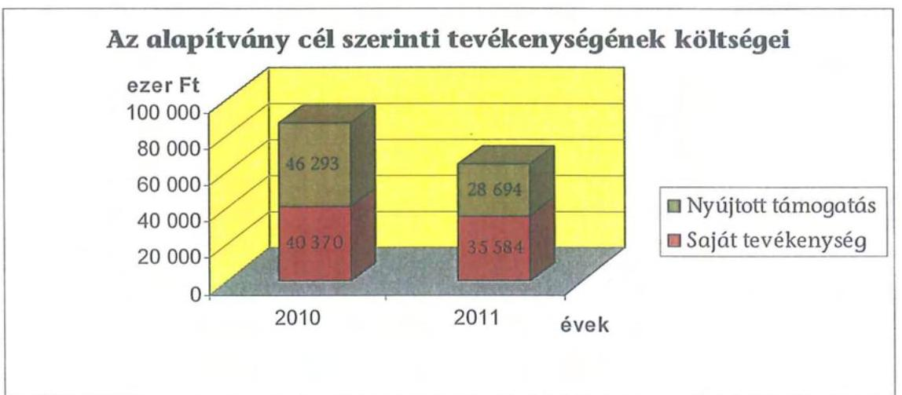
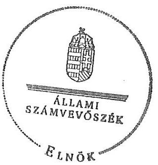
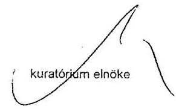
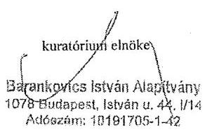

# ÁLLAMI   SZÁMVEVÔSZÉK 

## JELENTÉS

a Barankovics István Alapítvány 2010-2011. évi gazdálkodása törvényességének ellenőrzéséről

---

# Állami Számvevőszék 

Iktatószám: V-0040-043/2013.
Témaszám: 1079
Vizsgálat-azonosító szám: V0613

## Az ellenőrzést felügyelte:

Horváth Balázs
felügyeleti vezető
Az ellenőrzés végrehajtásáért felelős:
Baracsi Szilvia Zsuzsanna
ellenőrzésvezető

## A jelentéstervezet összeállításában közremúködött:

Ferencz Katalin Zsuzsanna
számvevő tanácsos
Az ellenőrzést végezték:
Brebán Andrea
F Ferencz Katalin Zsuzsanna
számvevő tanácsos számvevő tanácsos

A témához kapcsolódó eddig készített számvevőszéki jelentések:
címe
sorszáma
Jelentés a Barankovics István Alapítvány 2006-2007. évi gazdálko- 0910
dása törvényességének ellenőrzéséről
Jelentés a Barankovics István Alapítvány 2008-2009. évi gazdálko- 1041
dása törvényességének ellenőrzéséről

---

# TARTALOMJEGYZÉK 

BEVEZETÉS ..... 5
I. ÖSSZEGZŐ MEGÁLLAPÍTÁSOK, KÖVETKEZTETÉSEK, JAVASLATOK ..... 7
II. RÉSZLETES MEGÁLLAPÍTÁSOK ..... 12

1. Az alapítvány gazdálkodásának törvényessége ..... 12
1.1. A kuratórium működése ..... 12
1.2. Az alapítvány bevételei ..... 13
1.3. Az alapítvány ráfordításai ..... 14
2. Az éves beszámolók ..... 17
2.1. A számviteli beszámolók ..... 17
2.2. A mérleg ..... 18
2.3. Az eredménykimutatás ..... 20
3. A könyvvezetés szabályozottsága ..... 20
4. A könyvvezetés gyakorlata ..... 21
5. Az alapítvány ellenőrzési rendszere ..... 22
6. A korábbi ellenőrzés megállapításaira tett intézkedések ..... 23

## MELLÉKLETEK

1. számú A Barankovics István Alapítvány 2010. évi egyszerűsített éves beszámoló- ja
2. számú Beszámoló a Barankovics István Alapítvány 2010. évi tevékenységéről
3. számú A Barankovics István Alapítvány 2011. évi egyszerűsített éves beszámoló- ja
4. számú Beszámoló a Barankovics István Alapítvány 2011. évi tevékenységéről

---

.

---

# RÖVIDÍTÉSEK JEGYZÉKE 

## Jogszabályok rövidítése:

pártalapítványi törvény a pártok múködését segítő tudományos, ismeretterjesztő, kutatási, oktatási tevékenységet végző alapítványokról szóló 2003. évi XLVII. törvény
párttörvény a pártok múködéséről és gazdálkodásáról szóló 1989. évi XXXIII. törvény
Ptk. a Polgári Törvénykönyvről szóló 1959. évi IV. törvény
számviteli rendelet az Szt. szerinti egyes egyéb szervezetek beszámolókészítési és könyvvezetési kötelezettségének sajátosságairól szóló 224/2000. (XII. 19.) Korm. rendelet
Szt. a számvitelről szóló 2000 . évi C. törvény

## Szórövidítések:

alapító
alapítvány
ÁSZ
FB
KDNP
SZMSZ

Kereszténydemokrata Néppárt
Barankovics István Alapítvány
Állami Számvevőszék
Felügyelő Bizottság
Kereszténydemokrata Néppárt
szervezeti és múködési szabályzat

---

.

---

# JELENTÉS 

## a Barankovics István Alapítvány 2010-2011. évi gazdálkodása törvényességének ellenőrzéséről

## BEVEZETÉS

A pártok múködését segítő tudományos, ismeretterjesztő, kutatási, oktatási tevékenységet végző alapítványokról szóló 2003. évi XLVII. törvény (pártalapítványi törvény) alapján, a pártok a politikai kultúra fejlesztése érdekében tudományos, ismeretterjesztő, kutatási és oktatási tevékenységük elősegítésére, a pártok múködéséről és gazdálkodásáról szóló 1989. évi XXXIII. törvényben (párttörvény) meghatározott mértékű költségvetési támogatásra jogosult alapítványt hozhatnak létre. A Kereszténydemokrata Néppárt (KDNP) a törvényben biztosított lehetőséggel élve, 2006-ban létrehozta a Barankovics István Alapítványt (alapítvány).

Az alapítvány a törvényi előírásnak megfelelően a 2010. évben 70301 ezer Ft, a 2011. évben 69400 ezer Ft költségvetési támogatásban részesült.

A pártalapítványi törvény 4. § (2) bekezdése alapján az alapítvány gazdálkodása törvényességének ellenőrzésére az Állami Számvevőszék (ÁSZ) jogosult, a 4. § (4) bekezdése alapján az ÁSZ kétévenként ellenőrzi azoknak az alapítványoknak a gazdálkodását, amelyek e törvény szerint költségvetési támogatásban részesültek. Az ÁSZ legutóbb 2010. évben az alapítvány 2008-2009. évi gazdálkodásának törvényességét ${ }^{1}$ ellenőrizte, jelentésében több intézkedési javaslatot tett.

Jelen ellenőrzés célja az alapítvány 2010-2011. évi gazdálkodása törvényességének értékelése volt, amelynek keretében ellenőriztük:

- az alapítvány gazdálkodásának és éves jelentéseinek törvényességét;
- az éves számviteli beszámolók jogszabályi előírásoknak való megfelelését;
- az alapítvány könyvvezetésében a számvitelről szóló 2000. évi C. törvény (Szt.), a pártalapítványok könyvvezetésére vonatkozó jogszabályok, valamint belső előírások betartását;
- a kuratórium megtette-e a szükséges intézkedéseket az ÁSZ előző ellenőrzése során feltárt hiányosságok megszüntetése, valamint az intézkedési tervben megjelölt feladatok végrehajtása érdekében.

[^0]
[^0]:    ${ }^{1} 1041$ számú jelentés a Barankovics István Alapítvány 2008-2009. évi gazdálkodása törvényességének ellenőrzéséről.

---

Az ellenőrzött időszak: 2010. január 1. - 2011. december 31.
Az ellenőrzés típusa: pénzügyi-szabályszerúségi ellenőrzés
Az ellenőrzést a pénzügyi-szabályszerúségi ellenőrzés módszertani szabályai szerint, a pártalapítványok ellenőrzéséhez kiadott segédletben foglalt egységes követelmények alapján végeztük. A kapott támogatásokat tételesen, a nyújtott támogatásokat, illetve a ráfordításokat egymillió Ft és e felett tételesen, valamint egymillió Ft alatt mintavételes eljárással ellenőriztük. A lényegességi szint meghatározásánál a pártalapítványok ellenőrzési segédlete szerint jártunk el.

A helyszíni ellenőrzésre 2012. október 24. - november 16. között, az Alapítvány Budapest IX. Kálvin tér 8. szám alatti irodájában került sor.

Az ÁSZ tv. 29. § (1) bekezdése szerint a jelentéstervezetet megküldtük a kuratórium elnökének, aki a jelentéstervezet megállapításaira észrevételt nem tett, ugyanakkor tájékoztatást adott a javaslatokra tett intézkedésekről.

---

# I. ÖSSZEGZŐ MEGÁLLAPÍTÁSOK, KÖVETKEZTETÉSEK, JAVASLATOK 

Az alapító okirat tartalma és előírásai megfeleltek a Polgári Törvénykönyvről szóló 1959. évi IV. törvény (Ptk.), a párttörvény és a pártalapítványi törvény rendelkezéseinek. Az alapító párt az alapító okiratot az ellenőrzött időszakban két alkalommal módosította. A korábbi ÁSZ ellenőrzés javaslatának megfelelően biztosította a felügyelő bizottság (FB) teljes létszámú múködését.

A kuratórium az ellenőrzött időszakban törvényesen múködött. Határozatait - az alapító okiratnak megfelelően - határozatképes üléseken, a jelenlévők egyszerű szótöbbségével hozta. A határozatok a párttörvényben és az alapító okiratban rögzített alapítványi célok megvalósulását szolgálták. A képviseleti és bankszámla feletti rendelkezési jog gyakorlása megfelelt az alapító okirat előírásainak. Az alapítvány gazdálkodása a kuratórium által elfogadott költségvetés alapján történt. A kuratórium nem tett eleget az alapító okirat előírásának, amikor 2010 februárjában nem döntött a beérkező adományok 8,8\%ának elfogadásáról. A korábbi ÁSZ ellenőrzés javaslatainak megismerését követően az alapítvány kuratóriuma a döntési kötelezettségének minden esetben eleget tett.

Az ellenőrzött években az alapítvány összes bevétele 147792 ezer Ft volt. Ennek 94,5\%-át a párttörvény alapján az éves költségvetési törvényekben meghatározott központi költségvetési támogatás, 1,2\%-át csatlakozói adomány, 4,3\%át a szabad pénzeszközök lekötéséből és biztosítási kártérítésből származó bevétel jelentette. Az adományok a pártalapítványi törvénynek megfelelően a támogatók pénzforgalmi számlájáról érkeztek. A támogatók a banki kivonatokon azonosíthatók voltak.

A 2010-2011. évi együttes ráfordítás 202540 ezer Ft volt, amelynek 74,5\%-át az alapítványi célok megvalósításának közvetlen, 16,9\%-át az egyéb közvetett költségek, 8,6\%-át az alapítványkezelő szervének költségei tették ki.

---

A cél szerinti tevékenységek költségének 49,7\%-át a más szervezetek és magánszemélyek részére nyújtott támogatások, $50,3 \%$-át a saját szervezeti keretek között megvalósított tevékenységek költségei alkották. A nyújtott támogatások és a saját tevékenységek az alapító okiratban rögzített célok megvalósítására irányultak. A támogatások odaítéléséről a kuratórium, illetve a szervezeti és múködési szabályzat (SZMSZ) előírása alapján 1000 ezer Ft összeghatárig a kuratórium elnöke döntött. A kuratórium a nyújtott támogatásokról és a kuratórium elnöke által meghozott döntésekről utólag határozatot hozott. A korábbi ÁSZ ellenőrzés javaslatára a nyújtott támogatások döntéshozatali hatáskörének összhangját az alapítói okirat és az SZMSZ előírásaiban megteremtették. A támogatottakkal a kuratórium elnöke szerződést kötött, melyben a nyújtott támogatás felhasználásának szakmai és pénzügyi elszámolásáról rendelkezett. A támogatottak - egy kivételével - határidőre elszámoltak, azonban az elszámolások $18,4 \%$-a nem felelt meg teljes körűen a támogatási szerződésben előírtaknak. Az alapítvány a helyszíni ellenőrzés időszakában hiánypótlást kért a támogatottaktól. Az elszámolások javítása részben megtörtént.

Egy támogatott a 2010. évi 800 ezer Ft támogatásra a szerződésben rögzített határidőre benyújtotta szakmai és pénzügyi elszámolását. Ugyanez a támogatott a 2011. évi 650 ezer Ft támogatással szerződés szerint nem számolt el. Az ÁSZ ellenőrzés megállapította, hogy az alapítványnál rendelkezésre álló dokumentumok a 2010. évi támogatásnál 393 ezer Ft, a 2011. évi támogatásnál 471 ezer Ft összegben nem támasztották alá a párttörvényben meghatározott célhoz igazodó felhasználást. A jelen ÁSZ ellenőrzés észrevételére a kuratórium elnöke a támogatottat hiánypótlásra, illetve megfelelő bizonylati alátámasztás hiányában a támogatás visszafizetésére szólította fel. A kuratórium a helyszíni ellenőrzés befejezéséig nem döntött a támogatások elszámolásának elfogadásáról, a kedvezményezett által visszafizetendő támogatás összegéről és határidejéről. A támogatási és pályázati szabályzat nem rendelkezett a támogatási szerződések tartalmáról, a támogatások elszámolásának ellenőrzési és elfogadási rendjéről. A támogatások ellenőrzésének feladata a munkaszervezet egyik tagjának munkaköri leírásában sem szerepelt. Az ellenőrzött időszakban az elszámolások megtörténtét az alapítványi iroda munkatársai a támogatások kísérő lapján rögzítették. Az elszámolás szabályszerűségének ellenőrzését nem dokumentálták. A kuratórium a támogatások elszámolásának elfogadásáról az előző bekezdésben foglalt kivétellel - a szakmai beszámoló alapján döntött. A pénzügyi elszámolások megtárgyalására csak a munkaszervezet által jelzett hiányosságok esetében került sor.

Az alapítvány rendelkezett a jogszabályokban előírt, a könyvvezetés és a beszámoló elkészítésének rendjét meghatározó számviteli politikával és az ahhoz kapcsolódó szabályzatokkal. Az alapítvány a számviteli szabályzatokat a korábbi ÁSZ ellenőrzés megállapításait figyelembe véve megújította. Az ellenőrzés az alapítvány sajátosságai - az immateriális javak értékelése, a kapott és nyújtott támogatások nyilvántartása - vonatkozásában tapasztalt a jogszabályi előírásoktól eltérő, hiányos szabályozást.

Az alapítvány a pártalapítványi törvénynek megfelelően az éves jelentéseket (számviteli beszámoló, az alapítvány tevékenységéről szóló beszámoló) elkészítette, az alapító okirat előírása alapján az FB véleményezte, a kuratórium egyhangú döntéssel elfogadta. Az alapítvány a pártalapítványi törvényben előírt

---

közzétételi kötelezettségének csak részben tett eleget. Az alapítvány tevékenységéről szóló 2010. évi beszámolót a Magyar Közlöny Hivatalos Értesítőjében nem tették közzé, a honlapon egyik évben sem jelentették meg. A mulasztásra a törvény nem tartalmaz szankciót. Az éves beszámolók megbízható, valós adatokat tartalmaztak, azok elkészítésénél érvényesítették az Szt.-ben megfogalmazott alapelveket. A feltárt hibák egyik évben sem haladták meg az alapítvány számviteli politikájában meghatározott 2\%-os jelentős összegű hiba mértékét. A mérleg és eredménykimutatás sorok adatai megegyeztek a kapcsolódó analitikus és főkönyvi nyilvántartások összesített adataival, az év végi főkönyvi kivonatok adataiból levezethetőek voltak. A mérlegtételek alátámasztásához az Szt. előírásának megfelelő, illetve a leltározási szabályzatban előírt leltárdokumentációt - a tárgyi eszközök leltárfelvételi jegyzőkönyvének kivételével egyik évre vonatkozóan sem készítettek. Az ellenőrzés a számviteli bizonylatok alapján megállapította, hogy a mérleg eszközök és források adatai valós értéket mutattak.

A könyvvezetést a vonatkozó jogszabályok és belső előírások betartásával, a kettős könyvvitel rendszerében végezték. A könyvvezetésre és a beszámoló elkészítésére jogosult személy szerepelt a könyvviteli szolgáltatást végzők nyilvántartásában. A könyvvezetésben érvényesítették az Szt. bizonylatokra vonatkozó alaki és tartalmi követelményeit. A belső szabályzatokban előírt egyedi nyilvántartásokat vezették, és azoknak a főkönyvi adatokkal való egyeztetését elvégezték. A házipénztári nyilvántartások vezetése szabályszerű volt, azonban a pénzkezelési szabályzatban előírtakkal ellentétben a pénztárellenőri feladatok ellátására az alapítvány megbízást nem adott. Az elszámolásra adott előlegekkel elszámoltak, azokat, valamint a szigorú számadású nyomtatványokat nyilvántartották. Az eszközbeszerzéseknél és a ráfordítások elszámolásánál érvényesítették a kötelezettségvállalás és az utalványozás szabályait.

Az alapítvány ellenőrzési rendszere hozzájárult a törvényes gazdálkodáshoz. Az FB az alapító okiratban előírt ellenőrzési tevékenységét ellátta. A kuratórium beszámoltatta a kuratórium elnökét, figyelemmel kísérte a költségvetés teljesítését, az éves beszámolók ellenőrzésével független könyvvizsgálót bízott meg. Az ellenőrzésre vonatkozó feladatokat a gazdálkodási szabályzatok rögzítették. A vezetői ellenőrzést a kuratórium elnöke a munkáltatói jogkör gyakorlása, a képviseleti jog, a kötelezettségvállalás, az utalványozás és a bankszámla feletti rendelkezés során ellátta. Az alapítvány megbízási szerződéssel külső szolgáltató cégeket bízott meg ellenőrzési feladatok ellátására. A megbízottak javasolták a nyújtott támogatások elszámolásának szigorúbb előírását, ellenőrzését, szankciók alkalmazásának lehetőségét. A javaslatot az alapítvány részben hasznosította. Az ÁSZ korábbi ellenőrzésének javaslatai megvalósultak.

Az Állami Számvevőszékről szóló 2011. évi LXVI. törvény 33. § (1) bekezdésében foglaltak értelmében a jelentésben foglalt megállapításokhoz kapcsolódó intézkedési tervet köteles az ellenőrzött szervezet vezetője összeállítani és azt a jelentés kézhezvételétől számított harminc napon belül az ÁSZ részére megküldeni. Amennyiben az intézkedési tervet határidőben nem küldi meg a szervezet, vagy az továbbra sem elfogadható, az ÁSZ elnöke a hivatkozott törvény 33. § (3) bekezdés a)- b) pontjaiban foglaltakat érvényesítheti.

---

A helyszíni ellenőrzés megállapításainak hasznosítása mellett javasoljuk:

# az alapítvány kuratóriumának 

1. A nyújtott támogatások elszámolásához az alapítványnál rendelkezésre álló dokumentumok a 2010. évi támogatásnál 393 ezer Ft, a 2011. évi támogatásnál 471 ezer Ft összegnél nem támasztották alá a párttörvény 9/A. § (1) bekezdése szerinti célhoz igazodó felhasználást. A kuratórium nem döntött a támogatás elszámolásának elfogadásáról, a visszafizetendő támogatás összegéről és határidejéről.

Javaslat:
Döntsön a kiutalt támogatások szakmai és pénzügyi elszámolásának elfogadásáról, a párttörvény 9/A. § (1) bekezdése szerinti célhoz nem igazodó felhasználás esetén a támogatások visszafizettetéséről, a követelés nyilvántartásba vételéről.
2. A támogatási és pályázati szabályzat nem rendelkezett a támogatási szerződések tartalmáról, a támogatások elszámolásának ellenőrzési és elfogadási rendjéről.

Javaslat:
Szabályozza a párttörvény 9/A. § (1) bekezdése szerinti célszerű felhasználás biztosítása érdekében a támogatási szerződések tartalmi előírásait, az elszámolások ellenőrzésének, elfogadásának rendjét, és intézkedjen annak betartásáról.
3. Az ellenőrzés a számviteli szabályzatokban, az alapítvány sajátosságai vonatkozásában az Szt. és a számviteli rendelet előírásaitól eltérő, hiányos szabályozást tapasztalt. A számviteli politikában az immateriális javak értékelése, a számlarendben a kapott támogatások és adományok felhasználásának elkülönített nyilvántartása, a kapott és a véglegesen átadott támogatások szabályozása nem volt összhangban a jogszabályi előírásokkal.

Javaslat:
a) Szabályozza a számviteli politikában az Szt. 24. § (1)-(2) bekezdései és a 25. § (6) bekezdése alapján az immateriális javak értékelését.
b) Módosítsa a számlarendben az Szt. 77. § (3) bekezdése és a 81. § (2) bekezdése, illetve a számviteli rendelet 17. § (8) bekezdése előírásaival összhangban a kapott és nyújtott támogatások nyilvántartási szabályait.
4. A mérlegben kimutatott eszközök és források értékadatai számviteli bizonylatokkal alátámasztottak voltak, azonban mérleg alátámasztó leltárak - a tárgyi eszközök leltárfelvételi jegyzőkönyvének kivételével - nem készültek.

Javaslat:
Tartassa be az Szt. 69. § (1) bekezdése, illetve a leltározási szabályzat mérlegleltárak készítésére vonatkozó előírásait.

---

5. Az alapítvány az éves jelentés közzétételi kötelezettségének csak részben tett eleget. Az alapítvány tevékenységéről szóló 2010. évi beszámolót a Hivatalos Értesítőben nem tették közzé, a honlapon egyik évben sem jelentették meg.

Javaslat:
Tegyen eleget a pártalapítványi törvény 3/A. § (5) bekezdés előírásának megfelelően az éves jelentés közzétételi kötelezettségének.
6. A pénzkezelési szabályzatban előírtakkal ellentétben pénztárellenőri feladatok ellátására az alapítvány megbízást nem adott.

Javaslat:
Intézkedjen a pénzkezelési szabályzat 2.2. pont előírása alapján pénztárellenőr kijelöléséről.

---

# II. RÉSZLETES MEGÁLLAPÍTÁSOK 

## 1. Az alapítVÁNY GAZDÁlKODÁSÁNAK TÖRVÉNYESÉGE

### 1.1. A kuratórium múködése

Az alapító okirat tartalma és előírásai megfeleltek a Ptk., a párttörvény és a pártalapítványi törvény rendelkezéseinek. Nevesítette az alapítvány cél szerinti tevékenységeit, szabályozta a kuratórium feladat és hatáskörét, az alapítvány nyilvántartásaival összefüggő alapvető elvárásokat, a képviseleti jogok gyakorlásának módját. Az alapítvány célja és a cél elérése érdekében az alapító okiratban meghatározott tevékenységek megfeleltek a párttörvény 9/A. § (1) bekezdésében foglaltaknak.

Az alapítvány alapító okirat szerinti célja „az európai kereszténydemokrata és ke-resztény-szociális eszme megismertetése, a nemzeti elkötelezettség és a kereszténydemokrata eszmekör jegyében az alapító szándékával és a közjó szolgálatával összhangban a politikai kultúra fejlesztése érdekében tudományos, ismeretterjesztő, kutatatási és oktatási tevékenység elősegítése".

Az alapító párt az alapító okiratot az ellenőrzött időszakban két alkalommal módosította. A módosítás az alapítvány telephelyét, a kuratórium jogkörét és a kuratóriumra vonatkozó összeférhetetlenségi szabályokat, illetve az FB tagjait érintette. A korábbi ÁSZ ellenőrzés javaslatának megfelelően az alapító biztosította, hogy az FB teljes létszámban végezhesse munkáját.

Az alapítvány SZMSZ-e rögzítette a hatás-, feladat- és felelősségi köröket. A korábbi ÁSZ ellenőrzés javaslatára a nyújtott támogatások döntéshozatali hatáskörének összhangját az alapítói okirat és az SZMSZ előírásaiban megteremtették.

Az SZMSZ felhatalmazta a kuratóriumi elnököt 1000 ezer Ft összeghatárig önálló kötelezettségvállalásra. A felhatalmazás - a 2011. január 3-áig érvényben lévő alapító okirattal ellentétben - kiterjedt a támogatások odaítéléséhez kapcsolódó döntéshozatalra is. A 2011. január 4-ei dátummal módosított alapító okirat előírta, hogy a „Kuratórium felhatalmazhatja az Elnököt, hogy saját hatáskörben döntsön támogatások odaítélése ill. támogatás iránti kérelmek elutasítása tárgyában". Az elnöki hatáskörben megítélt támogatásokról az SZMSZ előírásának megfelelően a kuratórium minden esetben tájékoztatást kapott és utólagosan jóváhagyta azokat.

Az SZMSZ a képviseleti jog szabályozása tekintetében összhangban volt az alapító okirattal. A képviseleti jogot az ellenőrzött időszakban a kuratórium elnöke, akadályoztatása esetén a kuratórium alelnöke gyakorolhatta. A képviseleti jog gyakorlása az alapító okirattal, a Ptk. és az SZMSZ előírásaival összhangban történt.

Az SZMSZ a bankszámla feletti rendelkezéssel kapcsolatban szabályokat nem fogalmazott meg. A számlát vezető banknál bejelentettek köre megfelelt az alapító okirat előírásának. A bankszámla feletti rendelkezés módjának beje-

---

lentésében eltérés volt, melyet a helyszíni ellenőrzés időszakában az alapító okirat előírásának megfelelően módosítottak.

Az alapító okirat 12.) pontja az alapítvány bankszámlái feletti együttes rendelkezésre a kuratórium elnökét és alelnökét hatalmazta fel. A banki bejelentő karton és a banki jogosultsági szerződés alapján azonban a kuratórium elnökének önálló rendelkezésre is joga volt. A jogosultsági szerződés szerint - a helyszíni ellenőrzés időszakában a banknál - a rendelkezési módot a kuratórium elnökének és alelnökének együttes rendelkezési jogára módosították.

A kuratórium az ellenőrzött időszakban 11 ülésen 89 határozatot hozott. A kuratóriumi ülésekről készült jegyzőkönyvek és a csatolt jelenléti ívek szerint a határozatokat minden esetben az alapító okirat rendelkezése szerinti határozatképes ülésen, szabályosan - a jelenlévő kuratóriumi tagok egyszerű szótöbbségével - hozták.

A kuratórium - az alapító okirat vonatkozó előírásának megfelelően - döntött az alapítvány költségvetéseinek elfogadásáról. A költségvetések tartalmazták az alapítvány bevételeit és kiadásait. A kiadásokat alapítványi célú tevékenység közvetlen és közvetett költségei, valamint a kezelőszervezet költségei és egyéb közvetett (múködési) költségek szerinti bontásban.

A kuratórium a 2010. évben módosította az alapítvány költségvetését. A módosítás elsősorban a költségvetési támogatás és a személyi jellegű ráfordítások értékeit érintette. A 2011. évi költségvetés a pénzmaradványt, az előző évekről áthúzódó projektek költségeit, és a közvetlen és közvetett költségek értékeit véglegesítette.

# 1.2. Az alapítvány bevételei 

Az alapítvány az ellenőrzött időszak éves beszámolóiban összesen 147792 ezer Ft bevételt mutatott ki, amelyből a központi költségvetési támogatás aránya $94,5 \%$ volt. Az alapítvány jogosult volt a költségvetési támogatásra a párttörvény 9/A. § (3) bekezdésében foglaltak alapján. A támogatás mértékét a párttörvény 9/A. § (5) és (6) bekezdéseinek rendelkezése határozta meg.

A Magyar Államkincstár által - a párttörvény 9/A. (2) bekezdésének megfelelően - kiutalt támogatás összege, a 2010. évben 70301 ezer Ft, a 2011. évben 69400 ezer Ft volt. A beszámolókban kimutatott összegek ezzel megegyeztek.

Az alapító okirat - a törvényi szabályozással összhangban - lehetővé tette az alapítvány számára a csatlakozók által befizetett támogatások, adományok elfogadását a pártalapítványi törvény előírásainak figyelembe vételével. Az alapítvány mindkét évben kapott magán- és jogi személyektől támogatást. A beszámolókban kimutatott támogatás összesen 1840 ezer Ft (1,2\%) volt.

Az alapítványhoz az időszakban 1902 ezer Ft csatlakozói támogatás folyt be, illetve 62 ezer Ft - korábbi években befolyt - be nem fogadott támogatást fizettek vissza.

---

A pártalapítványi törvény 3. § (2) bekezdése és azzal összhangban az alapító okirat előírta, hogy a csatlakozói adományok elfogadásáról a kuratórium dönt. A felajánlások elfogadásának gyakorlata - a 2010. február 2-17. közötti időszak kivételével - megfelelt az alapító okirat előírásának.

A pártalapítványi törvény 3. § (2) bekezdése szerint „az alapítványhoz bárki feltétel nélkül csatlakozhat, az alapító okirat azonban elöírhatja, hogy a csatlakozás elfogadásához a kezelő szerv jóváhagyása szükséges". Az alapító okirat 8. kuratórium jogköre fejezetének előírása szerint a kuratórium „elbirálja a csatlakozási kérelmeket, dönt a felajánlás elfogadásáról".

Az időszakban az alapítványhoz 15 esetben érkezett adomány belföldi támogatóktól. A 2010. február 2-17. közötti időszakban beérkező hat adomány elfogadásáról, 168 ezer Ft értékben ( $8,8 \%$ ) nem döntött a kuratórium. A korábbi ÁSZ ellenőrzés javaslatainak megismerését követően az alapítvány kuratóriuma minden esetben döntött az adományok elfogadásáról.

A támogatások a pártalapítványi törvény 3. § (3) bekezdésének megfelelően folytak be. Egyértelműen azonosítható magánszemélyek és egy szervezet nyújtott támogatást az alapítvány részére. A támogatások az alapítvány pénzforgalmi számlájára a támogatók pénzforgalmi számlájáról érkeztek. A pártalapítványi törvény 3. § (4) bekezdésében előírt közzétételi kötelezettség nem keletkezett, mert a támogatónkénti befizetett összegek nem érték el az 500 ezer Ft-ot.

Az alapítványt támogatók közül négy magánszemély és egy szervezet jelölt meg konkrét célt, összesen 292 ezer Ft támogatás felhasználásával kapcsolatban. Az alapítvány a támogatásokat a támogatók által megjelölt célokra fordította. Az alapítvány szabad pénzeszközeinek kamatoztatásából és biztosítási kártérítésből az ellenőrzött időszakban összesen 6251 ezer Ft bevételhez jutott.

# 1.3. Az alapítvány ráfordításai 

Az alapítvány a 2010. évben 116076 ezer Ft, a 2011. évben 86464 ezer Ft, öszszesen 202540 ezer Ft ráfordítást számolt el. A ráfordítások 74,5\%-a ( 150941 ezer Ft) az alapítványi célok megvalósítása érdekében közvetlenül, a $8,6 \%$-a ( 17337 ezer Ft) közvetetten merült fel, elszámolása szabályszerű volt. Az alapítvány ráfordításainak $16,9 \%$-át ( 34262 ezer Ft) az egyéb közvetett (múködési) költségek, ráfordítások tették ki.

A cél szerinti tevékenységek ráfordításainak 49,7\%-át ( 74987 ezer Ft) a más szervezetek és magánszemélyek részére nyújtott támogatások, 50,3\%-át ( 75954 ezer Ft) a saját szervezeti keretek között megvalósított tevékenységek költségei alkották. A saját szervezet által, illetve a támogatottak által megvalósított tevékenységek a párttörvényben és az alapító okiratban rögzített célok megvalósítását szolgálták.

---

Az alapítvány célszerinti közvetlen költségeit, ráfordításait a 2010. és 2011. években a következő táblázat tartalmazza:

|  | adatok ezer Ft-ban |  |  |
| :-- | --: | --: | --: |
| Tevékenységek | 2010. év | 2011. év | Együttesen |
| Saját rendezvények | 11061 | 1958 | 13019 |
| Saját kiadványok | 9627 | 6483 | 16110 |
| Szakpolitikai projektek | 1194 | 0 | 1194 |
| Cigány integrációs projekt | 874 | 0 | 874 |
| Egyéb projektek | 11114 | 23630 | 34744 |
| Honlap fenntartása | 6500 | 3513 | 10013 |
| Támogatott rendezvények | 12977 | 5965 | 18942 |
| Támogatott kiadványok | 13340 | 1112 | 14452 |
| Szervezetek támogatása | 19189 | 21267 | 40456 |
| Egyéb támogatások | 787 | 350 | 1137 |
| Célszerinti közvetlen ráfordítások | 86663 | 64278 | 150941 |

A kuratórium az alapítvány költségvetéseinek elfogadásakor döntött a célszerinti tevékenység és a múködés költségeinek kereteiről. A célszerinti tevékenységek elvégzését megfelelően dokumentálták. A dokumentumok igazolták a feladatok ellátását. A kuratóriumi elnök az elvégzett tevékenységekről rendszeresen tájékoztatta a kuratóriumot, a beszámolóit a kuratórium jóváhagyta.

Az alapító okirat előírásainak megfelelően az alapítvány egyedi kérelmek alapján nyújtott támogatást más szervezetek, illetve a 2010. évben magánszemélyek részére is. A kuratórium határozatot hozott - a kuratórium elnöke által meghozott döntésekről utólag - a nyújtott támogatásokról. A kuratórium minden esetben a párttörvény 9/A. § (1) bekezdés szerinti célok eléréséhez nyújtott támogatást. A határozathozatal megfelelt az alapító okiratban, az SZMSZben, a támogatási és a pályázati szabályzatban rögzített előírásoknak. A kuratóriumi jegyzőkönyvek, és a határozatok könyvében rögzített határozatok tartalmazták a támogatott nevét, a támogatás céljának rövid leírását és összegét.

A támogatási és a pályázati szabályzat nem rendelkezett a támogatási szerződések tartalmáról, a támogatások elszámolásának ellenőrzési és elfogadási rendjéről. A támogatások ellenőrzésének feladata a munkaszervezet egyik tagjának munkaköri leírásában sem szerepelt. Az időszakban az elszámolások megtörténtét az alapítványi iroda munkatársai a támogatások kísérő lapján rögzítették, az elszámolás szabályszerűségének ellenőrzését nem dokumentálták. A kuratórium a támogatások elszámolásának elfogadásáról a szakmai beszámoló alapján minden esetben döntött, a pénzügyi elszámolások megtárgyalására csak a munkaszervezet által jelzett hiányosságok esetében került sor.

Az ellenőrzött időszakban a kuratórium elnöke a támogatottakkal az alapító okiratban meghatározott képviseleti jog, illetve a támogatási és pályáztatási

---

szabályzat előírásának megfelelően támogatási szerződést kötött. A támogatási szerződések a kuratóriumi határozatokkal - a támogatott megnevezése, a támogatás célja és összege vonatkozásában - összhangban voltak. A szerződés tartalmazta a támogatás folyósításának és elszámolásának módját, határidejét. A támogatási szerződések megnevezése és az elszámolás szabályai nem voltak egységesek. A támogatás szabályozása, illetve a támogatási szerződések a hibás, hiányos vagy meg nem valósult elszámolás elfogadásának módját, határidejét nem szabályozták, a nyújtott támogatások forrását nem rögzítették. A támogatási szerződések csak azt kötötték ki, hogy az alapítvány a támogatott szerződésszegése esetén (nem a célra használja fel a támogatást, nem biztosítja az ellenőrzést) a támogatási szerződést felmondhatja, ebben az esetben a támogatott köteles a kiutalt támogatást visszafizetni. Az alapítvány az elszámolás részeként szakmai és pénzügyi elszámolást írt elő, kikötötte a támogatottak kiadványain támogatóként való feltüntetését.

Az ellenőrzött időszakban a támogatottak - egy kivételével - az alapítvány által nyújtott támogatással határidőre elszámoltak. A támogatottak a fel nem használt összegeket visszautalták. Az ellenőrzött elszámolások 18,4\%-a - a nyújtott támogatások 49 elemú mintájából 9 elszámolása - nem felelt meg teljes körűen a támogatási szerződésben előírtaknak. Az alapítvány a helyszíni ellenőrzés időszakában hiánypótlást kért a támogatottaktól, az elszámolások javítása részben megtörtént.

Egy elszámolásnál hiányzott a szakmai beszámoló, öt elszámolásban az eredeti számlák nem voltak záradékolva, illetve egy esetben nem az alapítvány neve szerepelt támogatóként a bizonylatok záradékában. A hibák, hiányosságok javítása a helyszíni ellenőrzés alatt megtörtént. Két elszámolásban továbbra is maradtak eltérések. Az előírt számlaösszesítőt nem csatolták (a számlák összértéke és tartalma megfelelő volt), illetve a szerződésben előírtaktól eltérően a támogatott kiadványain a támogatott nem az alapítvány logóját, hanem a nevét tüntette fel.

Egy támogatott esetében az elszámolást alátámasztó dokumentumok a támogatások teljes összegének adott célra történő felhasználását nem igazolták. A támogatott szervezet a 2010. évi 800 ezer Ft támogatásra benyújtotta szakmai és pénzügyi elszámolását, azonban a 2011. évi 650 ezer Ft támogatással nem számolt el. A kuratórium a 2010. évi támogatás elszámolását nem fogadta el, azt visszaküldte. A helyszíni ellenőrzés idejéig a támogatott a javított elszámolás megküldéséről nem gondoskodott és a kuratórium sem intézkedett. Az alapítvány a támogatott szervezettől - a helyszíni ellenőrzést megelőzően - 2011. évi könyvelési dokumentumokat kapott, szakmai beszámoló nem készült. A helyszíni ellenőrzés időszakában a szervezet korábbi elnöke a pénzügyi bizonylatok alátámasztásához összefoglaló táblát küldött meg hiánypótlásként, amely az alapítványnál meglévő dokumentumokat hivatkozásként tartalmazta. Az alapítványnál rendelkezésre álló dokumentumok a 2010. évi támogatásnál 393 ezer Ft, a 2011. évi támogatásnál 471 ezer Ft értékben nem támasztották alá a párttörvény 9/A. § (1) bekezdése szerinti célhoz igazodó felhasználást. A kuratórium nem döntött a támogatások elszámolásának elfogadásáról, a visszafizetendő támogatás összegéről és határidejéről, illetve ebből adódóan a követelések főkönyvi könyvelésben történő előírásáról. A kuratórium elnöke a helyszíni ellenőrzést követően - 2012. november 19-én kelt levelében - a támo-

---

gatottat hiánypótlásra, illetve megfelelő bizonylati alátámasztás hiányában a támogatás visszafizetésére szólította fel.

A pártalapítványi törvény kizárólag a költségvetési támogatás céltól eltérő felhasználására határoz meg szankciót. Az alapítvány a számviteli nyilvántartásában az Szt. szerinti egyes egyéb szervezetek beszámolókészítési és könyvvezetési kötelezettségének sajátosságairól szóló 224/2000. (XII. 19.) Korm. rendelet (számviteli rendelet) 17. § (8) bekezdésének előirása alapján nem különítette el a költségvetési támogatás és a nem konkrét célra kapott magán adományok felhasználását. Az Szt. 161/A. § (2) bekezdésében előírt „A közpénzek felhasználásának és a köztulajdon használatának nyilvánossága és ellenőrizhetősége" teljes körűen nem volt biztosított. Dokumentummal nem volt alátámasztott, hogy a támogatott szervezetnek nyújtott támogatást költségvetési vagy csatlakozói támogatásból biztosította az alapítvány.

Az alapítványnak 2010. június 9 -én - a támogatott szervezetnek nyújtott első támogatás kiutalásakor - rendelkezésére állt 1569 ezer Ft nem konkrét célra nyújtott csatlakozói támogatás.

Az ellenőrzött időszakban a vállalkozói megbízások értéke évenként nem haladta meg a közbeszerzési értékhatárt, ezért nem keletkezett az alapítványnak közbeszerzés lefolytatási kötelezettsége.

# 2. Az ÉVES BESZÁmolók 

### 2.1. A számviteli beszámolók

Az alapítvány elkészítette a pártalapítványi törvény 3/A. § (1) bekezdése szerinti éves jelentését, annak részeként a 3/A. § (3) bekezdésben előírt számviteli beszámolót, és a tevékenységének bemutatásáról szóló beszámolót (1-4. számú melléklet).

Az alapítvány - a számviteli politikában meghatározott formában - egyszerüsített éves beszámoló készítésével tett eleget beszámolókészítési kötelezettségének. A számviteli rendelet 6. § (7) bekezdésével összhangban az alapítvány egyszerüsített éves beszámolója mérlegből és eredménykimutatásból állt.

Az alapítvány az ellenőrzött időszakban a számviteli politikában előírtaknak megfelelően könyvvizsgálót alkalmazott. ${ }^{2}$ Az alapítvány egyszerúsített éves beszámolóit a választott könyvvizsgáló mindkét évben hitelesítő záradékkal látta el.

A 2010. évi beszámoló aláírásának dátuma (2011. február 21.) nem felelt meg a számviteli politika előírásának, mely szerint a mérleg és eredménykimutatás dátumozása a könyvvizsgálói munka lezárásának rögzített napja (2011. március 17.) szerint történik.

[^0]
[^0]:    ${ }^{2}$ A számviteli rendelet 19. § (1) bekezdésében előírtak alapján az alapítványnak könyvvizsgálati kötelezettsége nem állt fenn.

---

A beszámolókat az FB mindkét évben véleményezte az alapító okirat 11. 5. pontjának megfelelően. Ezt követően a beszámolókat a kuratórium egyhangú döntéssel elfogadta.

Az alapítvány a pártalapítványi törvény 3/A. § (5) bekezdésében előírt közzétételi kötelezettségének csak részben tett eleget. A számviteli beszámolókat (éves egyszerűsített beszámolók) a Magyar Közlöny Hivatalos Értesítőjében a törvényben előírt határidőben közzétették, a honlapon megjelentették. Az alapítvány tevékenységéről szóló 2010. évi beszámolót nem tették közzé, a honlapon egyik évben sem jelentették meg. A mulasztásra a törvény nem tartalmaz szankciót. Az alapítvány, a civil szervezetek bírósági nyilvántartásáról és az ezzel összefüggő eljárási szabályokról szóló 2011. évi CLXXXI. törvény előírásának eleget téve, a 2011. évi egyszerűsített éves beszámolóját az Országos Bírósági Hivatal részére megküldte.

Az egyszerűsített éves beszámolók összeállítása során érvényesültek az Szt.-ben foglalt alapelvek. Az éves beszámolók adatai az év végi főkönyvi kivonatok adataiból mindkét évben levezethetőek voltak. A beszámolósorokhoz kapcsolódó főkönyvi számlák az analitikus nyilvántartások adataival megegyeztek.

# 2.2. A mérleg 

A mérlegsorok adatai mindkét ellenőrzött évben megegyeztek a kapcsolódó főkönyvi és analitikus nyilvántartások összesített adataival. A mérlegtételek alátámasztásához az Szt. 69. § (1) bekezdése előírásának megfelelő, illetve a leltározási szabályzatban előírt leltárdokumentációt - a tárgyi eszközök leltárfelvételi jegyzőkönyvének kivételével - egyik évre vonatkozóan sem készítették el. Az ellenőrzés a bekért számviteli bizonylatok (leltárfelvételi jegyzőkönyv, év végi bankkivonat, záró pénztárjelentés, szállítói folyószámla kivonat, stb.) alapján megállapította, hogy a mérleg eszközök és források adatai valós értéket mutattak.

A tárgyi eszközök fizikai leltározásáról leltárfelvételi jegyzőkönyvek készültek. A jegyzőkönyvek értékadatai alapján leltáreltérés nem volt, azonban a kiértékelés eredményét a jegyzőkönyvekben nem rögzítették. Az egyeztetéssel leltározott eszközökről és forrásokról nem készültek a leltározási szabályzat 10. pontjában előírt (aláírással, keltezéssel ellátott) leltárak. A házipénztár év végi állományának a pénzkezelési szabályzat 5 . pontjában elöírtaknak megfelelő számbavételét nem végezték el, az év végi pénztárkészletet záró pénztárjelentés támasztotta alá.

A tárgyi eszközöknél a számviteli politikában - amely az eszközök és források értékelésének szabályozását is magában foglalta - rögzítettekkel összhangban volt az egyedi nyilvántartás, az aktiválás, az értékelés és a terv szerinti értékcsökkenés elszámolása. A főkönyvi kimutatásban, illetve az egyedi nyilvántartásban szereplő eszközök értéke megegyezett a mérlegben kimutatott tárgyi eszközértékkel.

A pénzeszközök között a bankszámlákon rendelkezésre álló pénzeszközöket az év végi bankkivonatok egyenlegeivel megegyezően, illetve a házipénztárban lévő pénzkészletet az év végi pénztárjelentés záró állományával megegyezően mutatták ki. Követelésállományt, aktív időbeli elhatárolásokat egyik évben sem mutatott ki az alapítvány.

---

A mérleg forrás oldala a saját tőkén belül az induló vagyont az alapító okirat által rögzített értéknek megfelelően tartalmazta. A 2011. évi mérlegben rövid lejáratú kölcsönként kimutattak 650 ezer Ft-ot, a kuratórium tagjával 2011. december 28-án likviditási céllal kötött kölcsönszerződés alapján. A szerződésben foglaltak szerint az alapítvány kamatot nem fizetett. A kölcsönt 2012. évben a szerződésben előírtaknak megfelelően visszafizették.

Az alapítványnak év végén lejárt (fizetési határidőn túli) szállítói állománya nem volt. Az egyéb kötelezettségállomány december hónapra számfejtett munkabért, kapcsolódó adó- és járulékkötelezettséget tartalmazott.

A passzív időbeli elhatárolások között a 2012. évben esedékes 2011. évi könyvvizsgálói díjat 32 ezer Ft-tal alacsonyabb összegben mutatták ki.

Passzív időbeli elhatárolásként a könyvvizsgálói díj bruttó (152 ezer Ft) összege helyett a nettó összeget ( 120 ezer Ft) határolták el, amely nem felel meg az Szt. 47. § (2) bekezdés b) pontja és a számviteli politika előírásainak. A számviteli politika szerint „az alapítvány alanyi adómentes adóalany", ezért bekerülési értékként, illetve költségként az általános forgalmi adót is magába foglaló bruttó értéket kell kimutatni.

A nyújtott támogatások elszámolásánál (1.3. pont), illetve a 2011. évi passzív időbeli elhatárolások könyvelésében feltárt hibák egyik évben sem haladták meg a $2 \%$-os, az alapítvány számviteli politikájában meghatározott jelentős összegű hiba mértékét.

Az ellenőrzés által megállapított hibák mérlegre gyakorolt hatását a következő táblázat mutatja be:
adatok ezer Ft-ban

| Hibákkal érintett mérlegsorok megnevezése | Ellenőrzés által megállapított eltérések a közzétett mérleghez képest |  |  |  |
| :--: | :--: | :--: | :--: | :--: |
|  | 2010. év |  | 2011. év |  |
|  | Eszközök | Források | Eszközök | Források |
| Követelések | 393 |  | 471 | 0 |
| Mérleg szerinti eredmény |  | 393 | 0 | 439 |
| Passzív időbeli elhatárolások |  |  |  | 32 |
| Eltérés összesen | 393 | 393 | 471 | 471 |
| Előjeltől független hatás |  | 786 |  | 942 |
| Mérlegfőösszeg |  | 69177 |  | 56794 |
| Hiba hatása a mérlegfőösszeg \%-ában |  | $1,1 \%$ |  | $1,7 \%$ |

---

# 2.3. Az eredménykimutatás 

Az ellenőrzött időszakban az eredménykimutatás sorok adatai az év végi főkönyvi kivonatok, illetve a vonatkozó főkönyvi és részletező számlák összesített adataival megegyeztek.

A bevételeken belül a költségvetésből származó, valamint az egyéb támogatásokat elkülönítetten kezelték. A költségvetési és az egyéb támogatások, a támogatáson kívüli egyéb bevételek és a pénzügyi műveletek bevételének összege megegyezett a vonatkozó bankkivonatok összesített értékével.

Az eredménykimutatásban szereplő ráfordításokat könyvelési alapbizonylatokkal (szállítói számlák, bankkivonatok, pénztárbizonylatok, egyéb könyvelési feladások, szerződések) támasztották alá. A készpénzes kifizetéseknél és a szállítói számláknál érvényesítették az utalványozás pénzkezelési szabályzatban rögzített szabályait, a kifizetéseket az utalványozásra jogosult személyek minden esetben engedélyezték. A pénzkezelési szabályzat a teljesítésigazolási jogkörről külön nem rendelkezett. A banki utalásokat megelőzően a rendelkezési joggal felruházottak a tételek kifizethetőségét aláírásukkal igazolták.

A nyújtott támogatások elszámolásánál, illetve a 2011. évi passzív időbeli elhatárolások könyvelésében feltárt hibákat a 2.2. pont részletesen tartalmazza.

Az ellenőrzés által megállapított hibák eredménykimutatásra gyakorolt hatását a következő táblázat mutatja be:
adatok ezer Ft-ban

| Hibákkal érintett eredménykimutatás sorok megnevezése | Ellenőrzés által megállapított eltérések a közzétett eredmény-kimutatáshoz képest |  |  |  |
| :--: | :--: | :--: | :--: | :--: |
|  | 2010. év |  | 2011. év |  |
|  | Csökkenés | Növekedés | Csökkenés | Növekedés |
| Anyagjellegú ráfordítások |  |  |  | 32 |
| Egyéb ráfordítások | 393 |  | 471 | 0 |
| Tárgyévi eredmény |  | 393 |  | 439 |

## 3. A KÖNYVVEZETÉS SZABÁLYOZOTTSÁGA

Az alapítvány gazdálkodásának, könyvvezetésének és az éves beszámolók elkészítésének belső szabályozási rendszere az Szt. által kötelezően előírt szabályozáson alapult. Az alapítvány az Szt. 14. § (3)-(5) bekezdései szerint rendelkezett számviteli politikával, az eszközök és a források leltárkészítési és leltározási szabályzatával, pénzkezelési szabályzattal, továbbá az Szt. 161. § (1)-(2) bekezdéseiben előírt számlarenddel. A számviteli politikában foglaltak alapján az eszközök és források értékelésére külön szabályzatot nem alkotott, az értékelések módját a számviteli politikában rögzítette.

---

Az alapítvány a számviteli szabályzatokat a korábbi ÁSZ ellenőrzés megállapításait figyelembe véve megújította. A számviteli politika és a számlarend 2010. január 1-jétől hatályos. Mindkét év január 1-jével leltározási szabályzatot és pénzkezelési szabályzatot léptettek hatályba. A szabályzatokat a kuratórium jóváhagyásával, a kuratóriumi elnök aláírásával adták ki.

A számviteli politikában az immateriális javak értékelése, a számlarendben a kapott támogatások és adományok felhasználásának elkülönített nyilvántartása, a kapott és a véglegesen átadott támogatások szabályozása nem volt összhangban a jogszabályi előírásokkal.

Az alapítvány alaptevékenységéhez kapcsolódóan könyvek, tanulmányok írására adott megbízást, illetve felhasználási jogot vásárolt. A számviteli politika immateriális javak besorolására vonatkozó előírásai nem rendelkeztek a tartósság (legalább 1 éven túl szolgálják az alapítvány tevékenységét) ismérveiről, ami nem felel meg az Szt. 24. § (1) és (2) bekezdései, valamint 25. § (6) bekezdése előírásainak. Szabályozás hiányában az utalványozó nem döntött az immateriális javak (jellemzően vagyonértékű jogok) éven belüli, illetve éven túli besorolásáról, a szerzett jogokat az alapítvány költségként számolta el.

Nem szabályozták a számviteli rendelet 17. § (8) bekezdése és az Szt. 161/A. § (2) bekezdése előírásainak megfelelően a költségvetési támogatás, a konkrét, illetve a nem konkrét célra kapott magánadományok felhasználásának elkülönített nyilvántartását.

A számlarendben az Szt. 77. § (3) bekezdés b) pontja és a 81. § (2) bekezdés c) pontja előírásaitól eltérően szabályozták az egyéb bevételek és az egyéb ráfordítások, illetve hozzá kapcsolódóan az árbevételek és a rendkívüli ráfordítások számlacsoportokat.

Az alapítvány a munkavállalók természetbeli juttatásáról a 2008. július 1-én kiadott szabályzatában rendelkezett, mely az aktuális jogszabályoknak nem megfelelő előírásokat tartalmazott. Az ellenőrzött években az alapítvány a béren kívüli juttatásokat a munkavállalókkal kötött szerződésben rögzítette, a kifizetések a szerződésben foglaltak alapján történtek.

# 4. A KÖNYVVEZETÉS GYAKORLATA 

A könyvvezetést a vonatkozó jogszabályok és belső előírások betartásával a kettős könyvvitel rendszerében, a számviteli bizonylatok számítógépes feldolgozásával végezték. A könyvvezetést és az egyszerűsített éves beszámolók összeállítását, valamint a bérszámfejtést külső könyvelő cég végezte. A könyvvezetéssel és a beszámoló elkészítésével megbízott személy rendelkezett az Szt. 151. § (1) bekezdésében előírt képesítéssel, szerepelt a könyvviteli szolgáltatást végzők nyilvántartásában.

A könyvelési rendszerből az ellenőrzéshez szükséges adatok lekérdezhetők voltak, az alkalmazott számítógépes könyvelő program az ellenőrzött időszakban nem változott. A számlakijelölés gyakorlata a számlarenddel összhangban volt, eltérést a számlarend Szt.-től eltérő szabályozása okozott az egyéb bevételek és ráfordítások esetében. A gazdasági eseményeket idősorrendben rögzítették, a könyvelt tételek alapbizonylatai megtalálhatóak voltak. A könyvviteli el-

---

számolást alátámasztó bizonylatokon az Szt. 167. § (1) bekezdésében előírt alaki és tartalmi követelmények - az ellenőrzést igazoló aláírása kivételével - érvényesültek.

A bankbizonylatokon, illetve a pénztári bizonylatokon 2011 júniusáig ellenőri aláírás nem szerepelt. Az alapítvány az ellenőrzési időszakban, a pénzkezelési szabályzat 2.2. pontjában foglaltakkal ellentétben a pénztárellenőri feladatok ellátására megbízást nem adott. 2011 júliusától a pénztári bizonylatokat a számviteli szolgáltatást végző cég képviselője írta alá ellenőrként, azonban a szerződés a szolgáltató részére ellenőri feladatokat nem írt elő.

Az alapítvány házipénztárának működtetése kézi feldolgozással, a pénzkezelési szabályzatban előírtaknak megfelelően történt, a szabályzatban meghatározott napi pénztári zárókészlet összegét nem lépték túl. A pénztárban alkalmazott szigorú számadású nyomtatványok nyilvántartása, azok vezetése megfelelt az Szt. 168. § (3) bekezdésében előírtaknak. Az utólagos elszámolásra adott előlegek kiadásának, valamint azok visszavezetésének, elszámolásának analitikus nyilvántartása megfelelő volt, az előlegekkel minden esetben határidőre elszámoltak.

A bankszámla feletti rendelkezési jog gyakorlása az ellenőrzött időszakban megfelelt az alapító okiratban és a pénzkezelési szabályzatban előírtaknak, mely szerint a bankszámla felett a kuratóriumi elnök és egy kuratóriumi tag együttesen rendelkezett. A banki átutalásokat - internet alapú elektronikus banki szolgáltatásokra kötött szerződés alapján - elektronikus úton teljesítették.

A könyvvezetésben - az alapítványok gazdálkodási rendjéről szóló 115/1992. (VII. 23.) Korm. rendelet ${ }^{3}$ 3. § (2) bekezdésében és az 5. §-ában előírtaknak megfelelően - az alapítványi célú tevékenység közvetlen és közvetett (működési jellegű) költségeit a főkönyvi könyvelés keretében elkülönítették.

A számviteli politikában meghatározott, a könyvviteli zárlattal kapcsolatos feladatokat az éves beszámoló elkészítését megelőzően elvégezték. Ezek keretében elszámolták a tárgyi eszközök éves terv szerinti értékcsökkenését, megállapították és lekönyvelték az időbeli elhatárolásokat. A könyvviteli számlákból főkönyvi kivonatot készítettek, és elvégezték az eszköz-, forrás- és eredményszámlák technikai zárását. A leltározás egyik évben sem volt teljes körű. A számbavétel csak a tárgyi eszközökre terjedt ki, a házipénztár pénzkészletét év végén nem leltározták. A bankszámlán rendelkezésre álló pénzeszközök, a kötelezettségek, a passzív időbeli elhatárolások egyeztetéses leltározását az Szt. 69. § (1)-(2) bekezdés előírása ellenére nem teljesítették.

# 5. Az alapítvány ellenőrzési RENDSZERE 

Az alapító az alapító okiratban háromtagú FB-t jelölt ki, szabályozta a fel-adat-, jog- és hatáskörét, megnevezte elnökét. Az FB az ellenőrzött években

[^0]
[^0]:    ${ }^{3}$ Hatályon kívül helyezte a 350/2011. (XII. 30.) Korm. rendelet, hatálytalan 2012. január 1. óta.

---

ügyrendjének megfelelően múködött, ellátta feladatát. Véleményezte az éves költségvetéseket és azok módosítását, az éves beszámolókat, az ÁSZ ellenőrzés javaslataira teendő intézkedések tervét. Az FB legalább egy tagja minden alkalommal részt vett a kuratórium ülésein, így követte az alapítvány feladatellátásának szabályosságát. Az FB - ügyrendjével összhangban - az ellenőrzött években egy-egy célellenőrzést végzett, melyek során eltérést, hiányosságot nem tártak fel. Az ellenőrzésekről tájékoztatta a kuratóriumot, illetve az alapítót.

A kuratórium beszámoltatta a kuratórium elnökét az alapítvány tevékenységéről, múködéséről, figyelemmel kísérte a költségvetés teljesítését. A vezetői ellenőrzést a kuratórium elnöke a munkáltatói jogkör gyakorlása, a képviseleti jog, a kötelezettségvállalás, az utalványozás és a bankszámla feletti rendelkezés során megfelelően ellátta.

Az ellenőrzésre vonatkozó feladatokat a gazdálkodási szabályzatok rögzítették. A vezetői és a folyamatba épített ellenőrzés a számviteli politikában foglaltaknak megfelelően múködött. A pénzkezelési szabályzat rendelkezett a pénztárellenőr feladatairól. Az alapítványnál a munkaköri leírások alapján kijelölt pénztárellenőr nem volt.

A számviteli politika előírása alapján „Az alapítvány létszámából eredően függetlenített belső ellenőrzés nincs." Az időszakban az alapítvány határozott idejű megbízási szerződéssel külső szolgáltató cégeket bízott meg a gazdálkodás, a pénzügyi folyamatok szabályozottságának, a jogszabályok és a belső szabályok betartásának ellenőrzésére. A megbízottak a szerződésekben előírt feladataik elvégzéséről havi jelentésekben számoltak be, javaslatokat tettek. A 2010. évben javasolták az átadás-átvétel, a projektek dokumentálásának módosítását, a javaslatokat az alapítvány hasznosította. A 2011. évben javasolták a nyújtott támogatások elszámolásánál az egységes pénzügyi elszámoló lap alkalmazását, az elszámolásra benyújtott bizonylatok szigorúbb formai ellenőrzését, a záradékolás általános előírását, az elszámolási határidőkhöz cselekvési és ütemterv kialakítását az alapítvány munkatársai által elvégzendő feladatok megjelölésével, a szankciók alkalmazásának lehetőségét. A javaslatok alapján a szerződések formai szempontból megújultak, egyes esetekben szigorúbb elszámolási feltételeket írtak elő, azonban az egységes elszámoló lap, a záradékolás általános előírása és a cselekvési, illetve ütemterv szabályozása nem történt meg.

A kuratórium az éves beszámolók ellenőrzésével független könyvvizsgálót bízott meg. A könyvvizsgáló az éves beszámolókat hitelesítette, az éves könyvvizsgálói jelentéseket a kuratórium elfogadta.

# 6. A KORÁBBI ELLENŐRZÉS MEGÁLLAPÍTÁSAIRA TETT INTÉZKEDÉSEK 

Az alapítvány által megtett intézkedések az ÁSZ javaslatokkal összhangban voltak. Az ÁSZ korábbi ellenőrzésének javaslatai megvalósultak.

Az alapító biztosította, hogy az FB az alapító okirat szerint, teljes létszámban végezhesse munkáját. Az alapító az alapító okiratban módosította az alapítvány által nyújtott támogatásokkal kapcsolatos döntéshozatali szabályt, a kuratórium a szabályozásnak megfelelően járt el. Az ÁSZ ellenőrzést követő idő-

---

szakban a kuratórium minden esetben határozott az alapító okirat előírásának megfelelően a csatlakozói támogatások, adományok elfogadásáról. A kuratórium új leltárkészítési és leltározási szabályzatot adott ki.

Budapest, 2013. ๑) hónap 13 nap

Melléklet: 4 db

Domokos László

---

1. számú melléklet a V-0040-043/2013. számú jelentéshez

Adószám: 1819705-1-42
Bírósági végzés száma:12.PK.60.540/2006/3

# BARANKOVICS ISTVÁN ALAPÍTVÁNY 

1078. Budapest, István u. 44.

Egyszerűsített éves beszámoló
2010.évröl

Budapest, 2011.február, 21.

---

# 18191705-1-42

adószám Az üzleti év mérlegfordulónapja: 2010.december 31 Barankovics István Alapítvány EREDMÉNYKIMUTATÁSA (5.melléklet)

|  Tétel-
szám | A tétel megnevezése | Előző év | Mód. | Tárgyév  |
| --- | --- | --- | --- | --- |
|  a | b | c | d | e  |
|  1. | Értékesítés nettó árbevétele |  |  |   |
|  2. | Aktivált saját teljesítmények értéke |  |  |   |
|  3. | Egyéb bevételek | 71344 |  | 72133  |
|   | Ebből: támogatások | 71344 |  | 72133  |
|   | alapítói |  |  |   |
|   | központi költségvetési |  |  | 70301  |
|   | helyi önkormányzati |  |  |   |
|   | egyéb | 0 |  | 1832  |
|  4. | Pénzügyi műveletek bevételei | 8522 |  | 3150  |
|  5. | Rendkívüli bevételek |  |  |   |
|   | Ebből: támogatások |  |  |   |
|   | alapítói |  |  |   |
|   | központi költségvetési |  |  |   |
|   | helyi önkormányzati |  |  |   |
|   | egyéb |  |  |   |
|  6. | Tagdíjak |  |  |   |
|  A. | Összes bevétel | 79866 |  | 75283  |
|  7. | Anyagjellegú ráfordítások | 28038 |  | 46509  |
|  8. | Személyi jellegú ráfordítások | 28006 |  | 22328  |
|  9. | Értékcsökkenési leírás | 548 |  | 936  |
|  10. | Egyéb ráfordítások | 21663 |  | 46303  |
|  11. | Pénzügyi műveletek ráfordításai |  |  |   |
|  12. | Rendkívüli ráfordítások | 0 |  | 0  |
|  B. | Összes ráfordítás | 78255 |  | 116076  |
|  C. | Adózás előtti eredmény | 1611 |  | -40793  |
|  1. | Adófizetési kötelezettség |  |  |   |
|  D. | Jóváhagyott osztalék |  |  |   |
|  E. | Tárgyévi eredmény | 1611 |  | -40793  |

Budapest, 2011.február, 21 Euratoriumi elnök

---

# 18191705-1-42

adószám

11

Az üzleti év mérlegfordulónapja: 2010. december 31

Barankovics István Alapítvány Egyszerűsített éves beszámoló MÉRLEG (4.sz. melléklet)

|  Fétel
szám | A tétel megnevezése | Előző év | Mód. | Tárgyév  |
| --- | --- | --- | --- | --- |
|  a | b | c | d | e  |
|  1. | A. Befektetett eszközök | 1 359 |  | 1 141  |
|  2. | I. Immateriális javak |  |  |   |
|  3. | II. Tárgyi eszközök | 1 359 |  | 1 141  |
|  4. | III. Befektetett pénzügyi eszközök |  |  |   |
|  5. | B. Forgóeszközök | 106 522 |  | 68 036  |
|  6. | I. Köszletek |  |  |   |
|  7. | II. Követelések | 119 |  | 0  |
|  8. | III. Értékpapírok |  |  |   |
|  9. | IV. Pénzeszközök | 106 403 |  | 68 036  |
|  10. | C. Aktív időbeli elhatárolások | 2 237 |  | 0  |
|  11. | ESZKÖZÖK (AKTÍVÁK) Összesen | 118 118 |  | 69 177  |

Budapest, 2011. február, 21

Küratőműm. elnök

---

# 18191705-1-42

adószám

12

Az üzleti év mérlegfordulónapja: 2010 december 31

Barankovics István Alapítvány

Egyszerűsített éves beszámoló MÉRLEGE (4.sz.melléklet)

|  Tétel- | A tétel megnevezése | Előző év | Mód. | Tárgyév  |
| --- | --- | --- | --- | --- |
|  szám |  |  |  |   |
|  a | b | c | d | e  |
|  12. | D. Sáját tőke | 108 114 |  | 67 321  |
|  13. | I. Jegyzett tőke | 700 |  | 700  |
|  14. | II. Tökeváltozás/ Eredmény | 105 803 |  | 107 414  |
|  15. | III. Lekötött tartalék |  |  |   |
|  16. | IV. Értékelési tartalék |  |  |   |
|  17. | V. Tárgyévi eredmény alaptevékenységből | 1 611 |  | -40 793  |
|  18. | VI. Tárgyévi eredmény vállalkozási tev-ből |  |  |   |
|  19. | E. Céltartalékok |  |  |   |
|  20. | F. Kötelezettségek | 2 004 |  | 1 856  |
|  21. | I. Hátrasorolt kötelezettségek |  |  |   |
|  22. | II. Hosszú lejáratú kötelezettségek |  |  |   |
|  23. | III. Rövid lejáratú kötelezettségek | 2 004 |  | 1 856  |
|  24. | G. Passzív időbeli elhatárolások |  |  |   |
|  25. | FORRÁSOK (PASSZÍVÁK) Összesen | 110 118 | 0 | 69 177  |

Budapest, 2011. február, 21

kuratoriumi elnök

---

# BESZÁMOLÓ   A   BARANKOVICS ISTVÁN ALAPÍTVÁNY   (továbbiakban BIA)   2010. évi tevékenységéről

---

# A 2010. évi induló helyzet 

A BIA a 2009. év zárásakor összesen 106403 eFt-tal rendelkezett az Alapítvány bankszámláján, illetve pénztárában.

## A BIA 2010. évi pénzügyi forrásai

A BIA fő bevételi forrása 2010-ben is a költségvetési támogatás volt. A költségvetési támogatás összege, 2010. évben összesen 70301 eFt volt.

A BIA pénzügyi műveletek bevételeiből, azaz a kamatbevételből 3150 eFt-hoz jutott, ami szintén szabadon felhasználható forrást jelentett.

A BIA elkülönített állami pénzalaptól, helyi önkormányzattól, települési önkormányzatok társulásától vagy ezek szerveitől támogatást nem kapott.

Az alapítványnak további bevételt jelentettek a megjelölt céllal, illetve nem célzottan befizetett támogatások. Ezek összege a mérleg szerint 2010-ben 1832 eFt.

Így a BIA-nak 2010-ben a mérleg szerint az összes bevétele 75283 eFt forint volt, de emellett értelemszerủen rendelkezésre állt az előző év(ek)ből megmaradt, fel nem használt 106403 eFt is, mely pénzeszköz mindösszesen 181686 eFt volt. 2010. évben az összes ráfordítás 116076 eFt volt. A mérleg szerinti eredmény -40793 eFt.

## Humán eröforrás

Az elmúlt évben több személyi változás is történt november közepéig a különböző feladatokat ellátó személyek tekintetében, az ügyvezető igazgató is távozott az év második felében. Ezt követően két fő alapítványi munkatárs került alkalmazásra, akik - egy fő négyórás munkatárs segítségével - a mai napig is ellátják az alapítvány működtetési illetve a támogatások, rendezvények szakmai feladatait egyaránt.

## A BIA Kuratóriuma

A BIA Kuratóriuma 2010-ben négy ülést tartott. A 2010. évi ülésekről a jegyzőkönyvek rendben elkészültek és az üléseken meghozott határozatok a Határozatok Könyvében külön is rögzítésre kerültek.

A BIA egyes vezető tisztségviselőinek nyújtott juttatások
A korábbi évekkel egyezően a BIA Kuratóriumának tagjai és a BIA Kuratóriumának elnöke nem kaptak sem tiszteletdíjat, sem egyéb juttatást vagy költségtérítést.

## A BIA müködési költségci

A müködési (személyi és dologi) kiadásokra, valamint beruházásra 24000 eFt összegủ keretet biztosított a Kuratórium. Ebből az összegből 17663 eFt került ténylegesen felhasználásra.

---

# Az ÁSZ-ellenőrzés 

A pártok müködését segitő tudományos, ismeretterjesztő, kutatási, okratási tevékenységet végző alapitványokról szóló 2003. évi XLVII. törvény 4. § (4) bekezdése elöirja, hogy az Állami Számvevőszék kétévenként ellenőrzi azoknak az alapitványoknak a gazdálkodását, amelyek e törvény szerint állami költségvetési támogatásban részesültek. Így sor került 2010. évben a BIA 2008. és 2009. évi gazdálkodása törvényességének ellenőrzésére.

Az ellenőrzés befejezése után az ÁSZ elkészítette a jelentést, néhány kisebb pontatlanságon kívül alapvetően pozitív megállapításokat tett a BIA 2008. és 2009. évi gazdálkodásának törvényességével kapcsolatban. A megállapítások alapján intézkedési terv készült, az abban megfogalmazott feladatok végrehajtásra kerültek.

## Az alapítványi célú tevékenységekről

A BIA tevékenységének fő területei és a területekhez rendelt források a 2010. évi költségvetés elfogadásakor is meghatározásra kerültek

A költségvetésben meghatározott alapítványi célú tevékenységek közül:
a. A saját (és közös) rendezvényre 12500 e Ft összegű keretet biztosított a Kuratórium. Ténylegesen ilyen célra a BIA 11061 e Ft-ot fordított. Ebből az összegből 27 saját, illetve közös rendezvény került megvalósításra.
b. A saját (és közös) kiadványokra 10000 e Ft összegű keretet biztosított a Kuratórium. Ténylegesen ilyen célra a BIA a 9627 eFt-ot fordított. Ezen összeg segítségével 18 kiadvány jelenhetett meg.
c. A támogatott rendezvényekre 15000 eFt összegủ keretet biztosított a Kuratórium. A BIA támogatásával 2010-ban 30 rendezvény valósulhatott meg, a keret $86,5 \%$-os, összesen 12977 eFt felhasználásával.
d. A támogatott kiadványokra szintén 15000 eFt összegủ keretet biztosított a Kuratórium. Ténylegesen ilyen célra a BIA 13340 eFt-ot fordított.
e. Az országos és regionális szervezetek támogatására 20000 eFt lett tervezve. Ténylegesen ilyen célra a BIA végül 22 szerződés keretében 19189 e Ft-ot fordított.
f. Az ösztöndíjprogramra 1000 eFt összegủ keretet biztosított a Kuratórium. A BIA 2010-ben 2541 eFt-ot költött.
g. Kutatásokra az év elején elfogadott költségvetésben 2000 eFt összegủ keret lett elöirányozva. Ezt az összeget a szeptemberi ülésen 1000 eFt-ra módosította a Kuratórium. Ténylegesen ilyen célra a BIA 2010-ben forrást nem fordított.
h. A honlap kialakítása és müködtetése céljára a Kuratórium 9000 eFt-ot biztosított. Felhasználásra 6500 eFt került. Ez 72,2\%-os felhasználást jelentett. A BIA honlapjának megújítása 2010 év végével elkezdődött, a várható befejezés 2011.
i. A szakpolitikai projektekre 3000 eFt összegủ keretet biztosított a Kuratórium. Ezt az összeget a 2010. szeptemberi ülésén a Kuratórium 1000 eFt-ra módosította. Ezt az összeget meghaladva a BIA 1194 eFt-ot költött.

---

j. Egyéb projektekre 2000 eFt összegő keretet biztosított a Kuratórium. Ezt az összeget a 2010. szeptembert ülésén a Kuratórium 9000 eFt-ra módosította. A végző felhasználás a biztosított keret $94,9 \%$-a, azaz 8544 eFt volt. Ezt az összeget a BIA fóként az árvízkárosult gyermekek táboroztatásának, illetve részükre szervezett rendezvények támogatására fordította.
k. A költségvetésben elfogadásra került a Cigány integrációs projekt támogatása. Összesen 874 eFt került kifizetésre.

1. A költségvetésben elfogadásra került egy Kulturális pályázat költségvetési keret 3000 eFt összegben. Ezt az összeget a szeptembert ülésen a Kuratórium 1000 eFt-ra módosította. A BIA pályázatra összesen 817 eFt-ot használt fel.

Az alapítványi célú tevékenységekre a Kuratórium a költségvetés elfogadásakor összesen 97000 eFt-os keretet biztosított. Ezen összegen belül - ahogy azt már fentebb jeleztük - több tevékenységi területhez tartozó forrás összege módosításra került úgy, hogy a végösszeg 97000 eFt maradt. Ebből a keretből 2010. folyamán 86663 eFt , a keretösszeg $89,3 \%$-a került kifizetésre.

A 2010. év egészét tekintve összefoglalásként megállapítható, hogy
a. a BIA 2010. évben a jogszabályi előírásoknak, valamint az alapítvány célkitűzéseinek megfelelően müködött;
b. a Kuratórium alapítványi célú tevékenységekhez összesen 97000 eFt-os keretet biztosított, melyből 86663 eFt került felhasználásra;
c. a BIA 2010. évben mindösszesen 116076 eFt-ot használt fel, azzz a tárgyévi költségvetési támogatást teljes egészében felhasználta és az azt meghaladó összeget a korábbi években fel nem használt összegekböl biztosította;
d. a BIA a 2010. évet úgy zárta, hogy 68036 eFt állt rendelkezésre az Alapítvány bankszámláján és a házipénztárban mindösszesen. Így a BIA 2011. év elején is zökkenőmentesen tudta finanszírozni müködését.

Budapest, 2011. 05. 09.
Prof. Dr. Mészáros József
a BIA kuratóriumának elnöke

---

Adószám: 1819705-1-42
Birósági végzés száma: 12. PK. 60.540/2006/3

# BARANKOVICS ISTVÁN ALAPÍTVÁNY 

1078. Budapest, István u. 44.

Egyszerűsített éves beszámoló
2011.évről

Budapest, 2012. március 20.

---

# 18191705-1-42

adószám Az üzleti év mérlegfordulónapja: 2011 december 31 Barankovics István Alapítvány EREDMÉNYKIMUTATÁSA (5.melléklet)

|  Tétel-
szám | A tétel megnevezése | Előző év | Mód. | Tárgyév  |
| --- | --- | --- | --- | --- |
|  a | b | c | d | e  |
|  1. | Értékeutés nettó árbevétele |  |  |   |
|  2. | Aktivált saját teljesítmények értéke |  |  |   |
|  3. | Egyéb bevételek | 72133 |  | 69805  |
|   | Ebbül: támogatások | 72133 |  | 69408  |
|   | alapító |  |  |   |
|   | központi költségvetési | 70301 |  | 69400  |
|   | helyi önkormányzati |  |  |   |
|   | egyéb | 1832 |  | 8  |
|  4. | Pénztügyi műveletek bevételei | 3150 |  | 2704  |
|  5. | Rendkívüli bevételek |  |  |   |
|   | Ebbül: támogatások |  |  |   |
|   | alapító |  |  |   |
|   | központi költségvetési |  |  |   |
|   | helyi önkormányzati |  |  |   |
|   | egyéb |  |  |   |
|  6. | Tagdíjak |  |  |   |
|  A. | Összes bevetel | 75283 |  | 72509  |
|  7. | Anyagjellegú ráfordítások | 46509 |  | 24925  |
|  8. | Személyi jellegú ráfordítások | 22328 |  | 32086  |
|  9. | Értékcsökkenési leírás | 936 |  | 759  |
|  10. | Egyéb ráfordítások | 46303 |  | 28694  |
|  11. | Pénztügyi műveletek ráfordításai |  |  |   |
|  12. | Rendkívüli ráfordítások | 0 |  | 0  |
|  B. | Összes ráfordítás | 116076 |  | 86464  |
|  C. | Adózás előtti eredmény | $-40793$ |  | $-13955$  |
|  1. | Adófinetési kötelezettség |  |  |   |
|  D. | Jóváhagynit osztalék |  |  |   |
|  E. | Tárgyévi eredmény | $-40793$ |  | $-13955$  |

Barankovics István Alapítvány 1070 Budapest, Mórón u. 44, 014 Adószám: 18191705-1-42

Budapest, 2012. március 20.

---

# 18191705-1-42

adószám

11

Az üzleti év mérlegfordulónapja: 2011. december 31

Barankovics István Alapítvány Egyszerűsített éves beszámoló MÉRLEG (4.sz. melléklet)

|  Tétel-
szám | A tétel megnevezése | Előző év | Mód. | Tárgyév  |
| --- | --- | --- | --- | --- |
|  a | b | c | d | e  |
|  1. | A. Befektetett eszközök | 1 141 |  | 937  |
|  2. | I. Immateriális javak |  |  |   |
|  3. | II. Tárgyi eszközök | 1 141 |  | 937  |
|  4. | III. Befektetett pénzügyi eszközök |  |  |   |
|  5. | B. Forgóeszközök | 68 036 |  | 55 857  |
|  6. | I. Készletek |  |  |   |
|  7. | II. Követelések | 0 |  | 0  |
|  8. | III. Értékpapírok |  |  |   |
|  9. | IV. Pénzeszközök | 68 036 |  | 55 857  |
|  10. | C. Aktív időbeli elhatárolások | 0 |  | 0  |

|  11. | ESZKÖZÖK (AKTÍVÁK) Összesen | 69 177 | 56 794  |
| --- | --- | --- | --- |
|  |   |   |   |

Barankovics István Alapítvány 1078 Budapest, István u. 44. 914 Ádőszám: 18191705-1-42

Budapest, 2012. március 20.

Eurabirítani elnök

---

# 18191705-1-42

adószám

12

Az üzleti év mérlegfordulónapja: 2011. december 31

## Barankovics István Alapítvány

Egyszörűsített éves beszámoló MÉRLEGE (4.sz.melléklet)

|  Tétel-
szám | A tétel megnevezése | Előző év | Mód. | Tárgyév  |
| --- | --- | --- | --- | --- |
|  a | b | c | d | e  |
|  12. | D. Sóját tőke | 67 321 |  | 53 360  |
|  13. | E. Jogyétt tőke | 700 |  | 700  |
|  14. | H. Tőkeváltozás/ Éredmény | 107 414 |  | 66 621  |
|  15. | III. Lekötött tartalék |  |  |   |
|  16. | IV. Érűkezési tartalék |  |  |   |
|  17. | V. Tárgyévi eredmény alaptevékenységből | -40 793 |  | -13 955  |
|  18. | VI. Tárgyévi eredmény vállalkozási tevből |  |  |   |
|  19. | E. Céltartalékok |  |  |   |
|  20. | F. Kötelezettségek | 1 856 |  | 3 308  |
|  21. | I. Hátrasorolt kötelezettségek |  |  |   |
|  22. | II. Hosszú lejáratú kötelezettségek |  |  |   |
|  23. | III. Rövid lejáratú kötelezettségek | 1 856 |  | 3 308  |
|  24. | G. Passzív időbeli elhatárolások |  |  | 120  |
|  25. | FORRÁSOK (PASSZÍVÁK) Összesen | 69 177 | 0 | 56 794  |

Barankovics István Alapítvány 1078 Budapest, István u. 44. 914 Adószám: 18191705-1-42

Budapest, 2012. március 20.

Kuratóriánál és ok

---

4. számú melléklet
a V-0040-043/2013. számú jelentéshez

BESZÁMOLÓ
A
BARANKOVICS ISTVÁNY ALAPÍTVÁNY
(továbbiakban BIA)
2011. évi tevékenységéről

---

# A 2011. évi induló helyzet 

A BIA a 2010. év zárásakor összesen 68036 eFt-tal rendelkezett az Alapítvány bankszámláján, illetve pénztárában.

## A BIA 2011. évi pénzügyi forrásai

A BIA fő bevételi forrása 2011-ben is a költségvetési támogatás volt. A költségvetési támogatás összege, 2011. évben összesen 69400 eFt volt.

A BIA pénzügyi műveletek bevételeiből, azaz a kamatbevételből 2704 eFt-hoz jutott, ami szintén szabadon felhasználható forrást jelentett.

A BIA elkülönített állami pénzalaptól, helyi önkormányzattól, települési önkormányzatok társulásától vagy ezek szerveitől támogatást nem kapott.

Az alapítvány 2011-ben megjelölt céllal, illetve nem célzottan befizetett támogatásként kapott mérleg szerinti összege 8 eFt volt.

Így a BIA-nak 2011-ben a mérleg szerint az összes bevétele 72509 eFt forint volt, de emellett értelemszerűen rendelkezésre állt az előző év(ek)ből megmaradt, fel nem használt 68036 eFt is, mely pénzeszköz mindösszesen 140545 eFt volt. 2011. évben az összes ráfordítás 86464 eFt volt. A mérleg szerinti eredmény -13 955 eFt.

## Humán erőforrás

A 2011-es évben az alapítvány működését, illetve a támogatások, rendezvények szakmai feladatait továbbra is két alapítványi főmunkatárs biztosította, munkájukat egy fő, részmunkaidős, napi négyórás alkalmazott segítette. A második negyedévtől - szintén részmunkaidőben - 11 fő megyei kulturális szervezőt és egy országos koordinátort alkalmazott a BIA, akik az alapítvány célkitűzéseit, elsősorban rendezvényszervezés formájában megyei szinten segítik.

## A BIA Kuratóriuma

A BIA Kuratóriuma 2011-ben négy ülést tartott. A 2011. évi ülésekről a jegyzőkönyvek rendben elkészültek és az üléseken meghozott határozatok a Határozatok Könyvében külön is rögzítésre kerültek.

## A BIA egyes vezető tisztségviselőinek nyújtott juttatások

A korábbi évekhez hasonlóan a BIA Kuratóriumának elnöke, alelnöke, valamint a BIA Kuratóriumának és Felügyelőbizottságának tagjai sem tiszteletdíjat, sem egyéb juttatást vagy költségtérítést 2011-ben sem kaptak.

## A BIA müködési költségei

A müködési (személyi és dologi) kiadásokra, valamint beruházásra a Kuratórium 12300 eFt összegű keretet biztosított. Az év végére ténylegesen felhasznált összeg 16600 eFt volt. A keret túllépése a megnövekedett bér- illetve járulék kifizetésekből, valamint az alapítványi iroda beruházásra (pl. szervergép, bútor) fordított költségeiből tevődött össze.

---

# Az alapítványi célú tevékenységekről 

A BIA tevékenységének fő területei és a területekhez rendelt források a 2011. évi költségvetés elfogadásakor is meghatározásra kerültek

A költségvetésben meghatározott alapítványi célú tevékenységek közül:
a. A saját (és közös) rendezvényre, valamint saját (és közös) kiadványok megjelentetésére a Kuratórium 2011. évre 8000 e Ft összegű keretet biztosított. Ténylegesen erre a célra a BIA 15518 e Ft-ot fordított. Ebből az összegből az eddigi évekhez képest jelentősen több - 26 saját, illetve közös rendezvény, valamint 28 támogatott rendezvény - került megvalósításra. Szintén ezen összegből a BIA 6 saját kiadványt jelentett meg és további 3 kötet megjelenését támogatta.
b. Az országos és regionális szervezetek támogatására 15000 eFt-ot terveztünk. Ténylegesen e célra a BIA végül 21267 e Ft-ot fordított, ezen összegből összesen 9 szervezetnek nyújtott támogatást.
c. Az ösztöndíjprogramra a Kuratórium 2500 eFt összegű keretet biztosított ám a BIA 2011. év során ösztöndíjpályázatot nem hirdetett, így költség nem keletkezett.
d. A kutatásokra szánt összesen 3000 eFt összegű keretből a BIA az év során 650 eFt-ot használt föl.
e. 2011. év során az egyéb projekt címen a BIA kulturális szervezői által rendezett rendezvények, valamint a honlap kialakításának és müködtetésének költségei szerepelnek. E célra a Kuratórium 20000 eFt-os keretösszeget határozott meg. A tényleges költés 26843 eFt volt, amelyből az egyéb rendezvények költségei 23331 eFt, a honlap költségei pedig 3512 eFt-ot tettek ki.
f. Szintén alapítványi célú kiadásra, a személyi kifizetésekre a Kuratórium 4800 eFt-ot irányozott elő, a tényleges kiadás azonban csak 4110 eFt volt.
g. Az alapítványi célú egyéb kiadásokra (előkészítés, ellenőrzés) a 3300 eFt-os keretből a BIA 1475 eFt-ot használt föl.

## A 2011. év egészét tekintve összefoglalásként megállapítható, hogy

a. a BIA 2011. évben a jogszabályi előírásoknak, valamint az alapítvány célkitűzéseinek megfelelően működött;
b. a Kuratórium alapítványi célú tevékenységekhez összesen 56600 eFt-os keretet biztosított, amelyhez képest a tényleges költség 2011. folyamán 69864 eFt volt;
c. a BIA 2011. évben mindösszesen 86464 eFt-ot használt fel, azaz a tárgyévi költségvetési támogatást teljes egészében felhasználta és az azt meghaladó összeget a korábbi években fel nem használt összegekből biztosította;
d. a BIA a 2011. évet úgy zárta, hogy 55857 eFt állt rendelkezésre az Alapítvány bankszámláján és a házipénztárban mindösszesen. Így a BIA 2012. év elején is zökkenőmentesen tudta finanszírozni működését.

Budapest, 2012. március 23.

Barankovics Istvan Alapítvány 1076 Budapest, István u. 44, 214 Adószám/18191705-1-42

Prof. Dr. Mészáros József
a BIA kuratóriumának elnöke