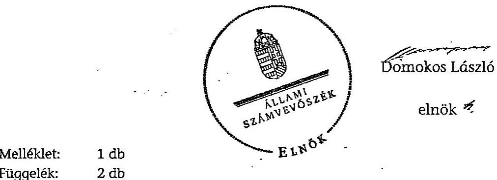
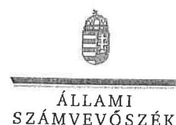
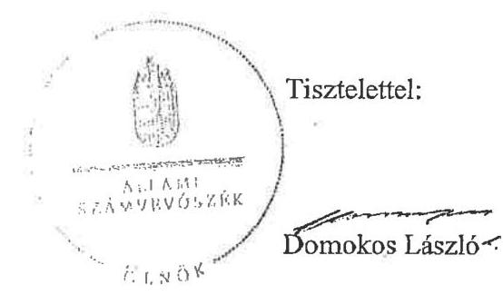
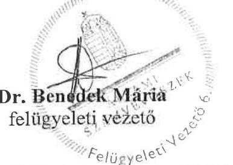

# JELENTÉS 

Kerepes Nagyközség Önkormányzata belső kontrollrendszerének kialakítása, valamint egyes kontrolltevékenységek és a belső ellenőrzés működése ellenőrzéséről

---

# Állami Számvevőszék 

Iktatószám: V-0012-058-003-047/2013.
Témaszám: 1051
Vizsgálat-azonosító szám: V059103

## Az ellenőrzést felügyelte:

Dr. Benedek Mária
felügyeleti vezető
2012. december 16. napjától

Gyüre Lajosné
felügyeleti vezető
2012. december 15. napjáig

## Az ellenőrzést vezette:

## Szakmányné Bilik Mária

ellenőrzésvezető
A számvevőszéki jelentés összeállításában közreműködtek:
Dr. Fónagy Diána
számvevő tanácsos
Dr. Láng Ágnes Krisztina
számvevő
Az ellenőrzést végezték:
Szappanos Júlia Vojcsekné Szabó Ágnes
számvevő tanácsos
számvevő tanácsos

---

# TARTALOMJEGYZÉK 

BEVEZETÉS ..... 5
I. ÖSSZEGZŐ MEGÁLLAPÍTÁSOK, KÖVETKEZTETÉSEK, JAVASLATOK ..... 8
II. RÉSZLETES MEGÁLLAPÍTÁSOK ..... 16

1. Az önkormányzat belső kontrollrendszere kialakításának megfelelősége ..... 16
1.1. A kontrollkörnyezet kialakítása ..... 16
1.2. A kockázatkezelési rendszer szabályozása ..... 17
1.3. A kontrolltevékenységek kialakítása ..... 17
1.4. Az információs és kommunikációs rendszer szabályozása ..... 18
1.5. A monitoring rendszer szabályozása ..... 19
2. A pénzügyi folyamatokban kulcsszerepet betöltő belső kontrollok (szakmai teljesítésigazolás és utalvány ellenjegyzés) működése ..... 19
3. A belső ellenőrzés szervezeti keretei és működése ..... 22
MELLÉKLETEK
4. számú Tájékoztatás a jelentéstervezetre tett észrevételek elfogadásáról és annak indokairól
FÜGGELÉKEK
5. számú Értelmező szótár
6. számú A belső kontrollrendszer kialakítása, a pénzügyi folyamatokban kulcsszerepet betöltő szakmai teljesítésigazolás és utalvány ellenjegyzés kontrollok működése, valamint a belső ellenőrzés működése értékelésénél alkalmazott minősítési szempontok

---

.

---

# RÖVIDÍTÉSEK JEGYZÉKE 

## Törvények

ÁSZ tv.
Avtv.

Info tv.

Mötv.

Mvtv.
Ötv.
régi Áht.
Számv. tv.
új Áht.

## Rendeletek

Áhsz.

Ámr.
Ávr.

Ber.
Bkr.
vagyongazdálkodási rendelet

## Szórövidítések

Általános Iskola
ÁSZ
Belső ellenőrzési kézikönyv
Belső Kontroll Kézikönyv
2011. évi LXVI. törvény az Állami Számvevőszékről
1992. évi LXIII. törvény a személyes adatok védelméről és a közérdekű adatok nyilvánosságáról (hatálytalan 2012. január 1-jétől)
2011. évi CXII. törvény az információs önrendelkezési jogról és az információszabadságról (hatályos 2012. január 1-jétől)
2011. évi CLXXXIX. törvény Magyarország helyi önkormányzatairól (hatályos 2012. január 1-jétől)
1993. évi XCIII. törvény a munkavédelemről
1990. évi LXV. törvény a helyi önkormányzatokról
1992. évi XXXVIII. törvény az államháztartásról (hatálytalan 2012. január 1-jétől)
2000. évi C. törvény a számvitelről
2011. évi CXCV. törvény az államháztartásról (hatályos 2012. január 1-jétől)

249/2000. (XII. 24.) Korm. rendelet az államháztartás szervezetei beszámolási és könyvvezetési kötelezettségének sajátosságairól
292/2009. (XII. 19.) Korm. rendelet az államháztartás működési rendjéről (hatálytalan 2012. január 1-jétől)
368/2011. (XII. 31.) Korm. rendelet az államháztartásról szóló törvény végrehajtásáról (hatályos 2012. január 1-jétől)
193/2003. (XI. 26.) Korm. rendelet a költségvetési szervek belső ellenőrzéséről (hatálytalan 2012. január 1-jétől)
370/2011. (XII. 31.) Korm. rendelet a költségvetési szervek belső kontrollrendszeréről és belső ellenőrzéséről (hatályos 2012. január 1-jétől)
Kerepes Nagyközség Önkormányzat Képviselőtestületének 27/2004. (IX. 30.) rendelete az önkormányzat vagyonáról, a vagyongazdálkodás szabályairól

Széchenyi István Általános Iskola és Alapfokú Művészetoktatási Intézmény
Állami Számvevőszék
Kerepes Nagyközség Önkormányzatának Belső Ellenőrzési Kézikönyve
az Ámr. 155. § (1) bekezdése, valamint az államháztartási belső kontroll standardokról szóló 1/2009. (IX. 11.) PM irányelv egységes értelmezése érdekében az államháztartásért felelős miniszter által 2010. évben kiadott Belső

---

|  | Kontroll Kézikönyv |
| :--: | :--: |
| CKÖ | Kerepes Nagyközség Cigány Kisebbségi Önkormányzata |
| gazdasági program | Kerepes Nagyközség Önkormányzatának Ciklusprogramja a 2010-2014. évekre |
| értékelési szabályzat | Kerepes Nagyközség Önkormányzata Polgármesteri Hivatalának Eszközök és források értékelési szabályzata (hatályos 2006. december 1-jétől) |
| FEUVE | folyamatba épített, előzetes, utólagos és vezetői ellenőrzés |
| hivatali SZMSZ | Kerepes Nagyközség Önkormányzat Képviselőtestületének 15/2007. (V. 15.) rendelete Kerepes Nagyközség Önkormányzatának és Szerveinek Szervezeti és Működési Szabályzatáról, 6. számú függelék |
| jegyző | Kerepes Nagyközség Önkormányzatának jegyzője |
| iratkezelési szabályzat | Kerepes Nagyközség Önkormányzatának Egyedi iratkezelési szabályzata (hatályos 2006. december 14-től) |
| Képviselő-testület | Kerepes Nagyközség Képviselő-testülete |
| kockázatkezelési szabályzat | Kerepes Nagyközség Önkormányzatának Kockázatkezelési szabályzata (hatályos 2008. november 1-jétől) |
| Közhasznú Kft. | Kerepesi Községszolgáltató Közhasznú Nonprofit Korlátolt Felelősségű Társaság |
| leltározási szabályzat | Kerepes Nagyközség Önkormányzata Polgármesteri Hivatalának Leltárkészítési és leltározási szabályzata (hatályos 2006. december 1-jétől) |
| Önkormányzat | Kerepes Nagyközség Önkormányzata |
| pénzkezelési szabályzat | Kerepes Nagyközség Önkormányzat Polgármesteri Hivatalának Pénz- és értékkezelési szabályzata (hatályos 2006. november 30-tól) |
| polgármester | Kerepes Nagyközség Önkormányzatának polgármestere |
| Polgármesteri Hivatal | Kerepes Nagyközség Önkormányzatának Polgármesteri Hivatala |
| szabálytalanságkezelési | Kerepes Nagyközség Önkormányzat Képviselőtestületének 15/2007. (V. 15.) rendeletének Szervezeti és Működési Szabályzatáról 4. számú melléklete |
| számviteli politika | Kerepes Nagyközség Önkormányzat Polgármesteri Hivatalának Számviteli politikája (hatályos 2006. december 1-jétől) |
| számlarend | Kerepes Nagyközség Önkormányzat Polgármesteri Hivatalának Számlarendje (hatályos 2006. december 1-jétől) |
| ügyrend | Kerepes Nagyközség Önkormányzat Polgármesteri Hivatala Gazdasági szervezetének ügyrendje (hatályos 2007. január 15-étől) |

---

# JELENTÉS 

## Kerepes Nagyközség Önkormányzata belső kontrollrendszerének kialakítása, valamint egyes kontrolltevékenységek és a belső ellenőrzés működése ellenőrzéséről

## BEVEZETÉS

A belső kontrollrendszer kialakítását, működtetését és fejlesztését a régi Áht. és az új Áht. is előírja. Ennek megvalósításáért a költségvetési szerv vezetője, a jegyző felel. A belső kontrollrendszer azt a célt szolgálja, hogy a költségvetési szervek működésük és gazdálkodásuk során a tevékenységeket szabályszerűen, gazdaságosan, hatékonyan, eredményesen hajtsák végre, teljesítsék elszámolási kötelezettségeiket és megvédjék az erőforrásokat a veszteségektől, a károktól és a nem rendeltetésszerű használattól. A belső kontrollrendszer magában foglalja mindazon szabályokat, eljárásokat, gyakorlati módszereket és szervezeti struktúrákat, kockázatkezelési technikákat, kontrolltevékenységeket, amelyek segítséget nyújtanak a szervezetnek céljai eléréséhez.

Az ÁSZ a 2011-2015. évekre szóló stratégiájában hangsúlyos szerepet szánt annak, hogy szilárd szakmai alapon álló, értékteremtő ellenőrzéseivel előmozdítsa a közpénzügyek átláthatóságát, rendezettségét. A számvevőszéki ellenőrzés nemzetközi alapelvei is rögzítik, hogy a megfelelő belső kontrollrendszer minimálisra csökkenti a hibák és szabálytalanságok kockázatát.

Az ellenőrzés célja annak értékelése volt, hogy az Önkormányzat a jogszabályi előírásoknak megfelelően alakította-e ki a belső kontrollrendszert; a gazdálkodás folyamatában kulcsszerepet betöltő szakmai teljesítésigazolás és az utalvány ellenjegyzés kontrolltevékenységeit megfelelően működtette-e; biztosította-e a belső ellenőrzés szabályos és eredményes működését.

Az ÁSZ ezen ellenőrzési céljait pilot (próba) jelleggel községi/nagyközségi önkormányzatoknál végzett ellenőrzések során érvényesítette.

Az ellenőrzés típusa: szabályszerűségi ellenőrzés
Az ellenőrzés jogszabályi alapja: az ÁSZ tv. 5. § (2) és (6) bekezdései
Az ellenőrzött szervezet: az Önkormányzat (ezen belül kiemelten a Polgármesteri Hivatal)

Az ellenőrzött időszak: a belső kontrollrendszer kialakításának megfelelőségét a 2011. évre vonatkozóan értékeltük. A kontrolltevékenységek működésének

---

megfelelőségét a 2011. január 1-je és december 31-e, míg a belső ellenőrzés működésének szabályosságát és eredményességét a 2009. január 1-je és 2011. december 31-e közötti időszakot figyelembe véve értékeltük. A helyszíni ellenőrzés lezárásáig a helyi szabályozás változásait nyomon követtük.

Az ellenőrzés szakmai módszertana az Állami Számvevőszék Ellenőrzési Kézikönyvében foglalt szakmai szabályokon alapult, amely a Legfelsőbb Ellenőrző Intézmények Nemzetközi Szervezete (INTOSAI) által kiadott nemzetközi standardok (ISSAI) figyelembevételével készült.

A belső kontrollrendszer kialakításának ellenőrzése során értékeltük a Polgármesteri Hivatalban a kontrollkörnyezet, a kockázatkezelési rendszer, a kontrolltevékenységek, az információs és kommunikációs rendszer, valamint a monitoring rendszer szabályozottságának megfelelőségét.

A Polgármesteri Hivatalban értékeltük a pénzügyi folyamatokban kulcsszerepet betöltő szakmai teljesítésigazolás és utalvány ellenjegyzés kontrollok működésének megfelelőségét az államháztartáson kívülre teljesített működési és felhalmozási célú pénzeszköz átadásoknál, az állományba nem tartozók megbízási díjainál, továbbá a külső szolgáltatók által végzett karbantartási, kisjavítási munkákkal kapcsolatos kifizetéseknél. Az egyszerű véletlen mintavétellel kiválasztott tételek ellenőrzését többlépcsős megfelelőségi tesztek útján addig végeztük, amíg elegendő és megfelelő bizonyítékot szereztünk a vizsgált folyamatok kulcskontrolljai működésének megfelelő vagy nem megfelelő voltáról.

Értékeltük az Önkormányzatnál a belső ellenőrzés működésének szabályosságát és eredményességét.

A fogalmak magyarázatát az 1. számú függelék, az ellenőrzés egyes területeinek értékelésénél alkalmazott egységes minősítési szempontokat a 2. számú függelék tartalmazza.

Az ellenőrzés lefolytatásához az Önkormányzat a munkalapok és a tanúsítvány elektronikus kitöltésével, valamint a megjelölt dokumentumok elektronikus megküldésével szolgáltatott adatokat. A munkalapokon szerepeltetett adatok, információk ellenőrzése és szükség szerinti javítása a helyszíni ellenőrzés keretében történt.

Az ÁSZ az ellenőrzés megállapításait az ellenőrzött időszakban hatályos, az intézkedést igénylő megállapításokra tett javaslatokat a jelenleg hatályos jogszabályok alapján fogalmazta meg.

Az ÁSZ tv. 29. § (1) bekezdése szerint a jelentéstervezetet megküldtük a polgármester részére, aki az ÁSZ tv. 29. § (2) bekezdésében foglalt észrevételezési jogával élt, a jelentéstervezetre észrevételt tett, és az ÁSZ tv. 29. § (3) bekezdésének megfelelően a figyelembe nem vett észrevételeket és annak indokairól szóló tájékoztatást a jelentés tartalmazza (1. számú melléklet).

Kerepes nagyközség állandó lakosainak száma 2011. január 1-jén 10178 fő volt. Az Önkormányzat 12 tagú Képviselő-testületének munkáját négy állandó bizottság segítette. Az Önkormányzat az önállóan működő és gazdálkodó Pol-

---

gármesteri Hivatalon kívül öt önállóan működő intézménnyel látta el feladatát. Az Önkormányzat egy többségi tulajdoni hányadú gazdasági társasággal rendelkezett. A polgármester a 2006. évi önkormányzati választások óta tölti be tisztségét. A jegyző 2006. december 1. és 2011. február 15. között, majd 2011. szeptember 1-jétől látta el feladatait. A jegyzői feladatok ellátására 2011. február 16-tól 2011. augusztus 31-ig az igazgatási iroda vezetője kapott megbízást. A Polgármesteri Hivatal négy szervezeti egységre tagolódott, a foglalkoztatott köztisztviselők száma 2011. január 1-jén 30 fő volt. Az Önkormányzat a 2011. évi költségvetési beszámolója szerint 1436,1 millió Ft költségvetési bevételt ért el és 1307,7 millió Ft költségvetési kiadást teljesített. A 2011. december 31-i könyvviteli mérleg szerint 5516,8 millió Ft értékű eszközvagyonnal rendelkezett, 728,9 millió Ft hosszú lejáratú és 199,5 millió Ft rövid lejáratú kötelezettsége volt.

---

# I. ÖSSZEGZŐ MEGÁLLAPÍTÁSOK, KÖVETKEZTETÉSEK, JAVASLATOK 

A belső kontrollrendszer kialakítása a Polgármesteri Hivatalban 2011-ben a kontrollkörnyezet, a kockázatkezelési rendszer, a kontrolltevékenységek, az információs és kommunikációs rendszer, valamint a monitoring rendszer szabályozásának, illetve kialakításának értékelése alapján összességében nem felelt meg a jogszabályi előírásoknak.

A kontrollkörnyezet kialakítása nem felelt meg a jogszabályi követelményeknek, mivel a jegyző az Ámr.-ben foglaltak ellenére a hivatali SZMSZ-ben nem rögzítette az ellátandó és a szakfeladatrend szerint besorolt alaptevékenységeket, az azokat szabályozó jogszabályokat, a Polgármesteri Hivatal szervezeti ábráját, valamint a hozzárendelt költségvetési szervek felsorolását, megjelölését. Nem határozta meg továbbá a hivatali SZMSZ-ben a gazdasági szervezet megnevezését, a szabályzatban nevesített valamennyi munkakörhöz tartozó feladat- és hatásköröket, a hatáskörök gyakorlásának módját, a helyettesítés rendjét és az ezekhez kapcsolódó felelősségi szabályokat. Az ügyrend az Ámr.-ben foglaltak ellenére nem tartalmazta a gazdasági vezető és a pénzügyigazdasági feladatok ellátásáért felelős alkalmazottak feladat- és hatáskörét, valamint a helyettesítés rendjét. Ezek a hiányosságok korlátozzák a feladatellátás számon kérhetőségét, folyamatosságának biztosítását. A jegyző az Mvtv. előírását figyelmen kívül hagyva - a képernyő előtti munkavégzés, valamint a foglalkozás-egészségügyi ellátás kivételével - nem határozta meg a Polgármesteri Hivatalban az egészséget nem veszélyeztető és biztonságos munkavégzésre vonatkozó követelmények megvalósításának módját, a munkavédelmi szabályokat.

A kockázatkezelési rendszer szabályozása nem felelt meg a jogszabályi előírásoknak, mivel a jegyző az Ámr. szabályozása ellenére nem írta elő a feltárt kockázati tényezők elemzését.

A kontrolltevékenységek kialakítása nem felelt meg a jogszabályi követelményeknek, mert a régi Áht.-ban előírt területekre nem teljes körűen határozták meg a folyamatba épített, előzetes, utólagos és vezetői ellenőrzést, és az Ámr. előírása ellenére, a Polgármesteri Hivatal tevékenységeire vonatkozó beszámolási eljárásokat. A kötelezettségvállalás és utalvány ellenjegyzésére
 felhatalmazottak nem rendelkeztek az előírt iskolai végzettséggel, illetve szakképesítéssel. A kontrolltevékenységek hiányos kialakítása kockázatot jelent a feladatok szabályszerű végrehajtása során.

Az információs és kommunikációs rendszer szabályozása nem felelt meg a jogszabályi követelményeknek, mert a jegyző, az Avtv.-ben foglaltak ellenére, nem készítette el az adatvédelmi és adatbiztonsági szabályzatot, továbbá az informatikai biztonsági szabályzatot.

A monitoring rendszer szabályozása nem felelt meg a jogszabályi előírásoknak, mert a jegyző, az Ámr. előírása ellenére, az operatív tevékenységek kere-

---

tében megvalósuló folyamatos és eseti nyomon követésből álló, az Önkormányzat tevékenységének, a célok megvalósításának nyomon követését biztosító rendszert nem alakította ki.

A belső kontrollrendszer nem megfelelő kialakítása kockázatot jelent az Önkormányzat tevékenységeinek szabályszerű, gazdaságos, hatékony és eredményes végrehajtása során.

A Polgármesteri Hivatalban a 2011. évben az államháztartáson kívülre történő működési célú pénzeszközátadásokkal, az állományba nem tartozók megbízási díjaival, valamint a külső szolgáltatók által végzett karbantartással, kisjavítással kapcsolatos kifizetések során összefoglalóan értékelve a kulcskontrollok működésének megfelelősége gyenge volt. Az államháztartáson kívülre átadott működési célú pénzeszközátadások és a külső szolgáltató által végzett karbantartási, kisjavítási szolgáltatások esetében a szakmai teljesítés igazolását nem a jegyző által kijelölt személy végezte. Az állományba nem tartozók megbízási díjai és a karbantartási kifizetések esetében a szakmai teljesítésigazolás nem az ügyrendben előírt módon, illetve hiányos tartalmú okmányok alapján történt, ezért a kiadások teljesítését megelőzően, az Ámr. előírása ellenére, nem történt meg azok jogosságának, összegszerűségének és szerződésszerű teljesítésének ellenőrzése.

Az utalványok ellenjegyzője a kiadások teljesítését megelőzően az Ámr.-ben foglalt ellenőrzési feladatait nem a jogszabályi előírásoknak megfelelően végezte el. Nem észrevételezte a jegyzői kijelöléssel nem rendelkező személyek által jogosulatlanul végzett szakmai teljesítésigazolásokat, és nem ellenőrizte a szakmai teljesítésigazolás belső szabályzatban rögzített módon és ellenőrizhető dokumentumok alapján történő elvégzését. Nem kifogásolta a kifizetéseket megelőzően a gazdálkodási szabályok, közöttük a kötelezettségvállalások nyilvántartására, az utalványrendeletben a kötelezettségvállalás nyilvántartási számának feltüntetésére vonatkozó előírások be nem tartását.

A számvevőszéki ellenőrzés az ellenőrzött kifizetésekkel összefüggésben jogosulatlan kifizetést nem tárt fel, azonban a gazdálkodásban kulcsszerepet betöltő kontrollok működésében feltárt hiányosságok miatt fennáll a hibák bekövetkezésének kockázata.

Az államháztartáson kívülre történő működési célú pénzeszközátadás kifizetései során a könyvviteli elszámolásra utaló főkönyvi számlát, a Számv. tv. és az Áhsz. előírásaival ellentétesen, nem a gazdasági események tényleges tartalmának megfelelően jelölték ki, mert hibásan a működési célú pénzeszköz átadások között számoltak el a CKÖ részére teljesített működési támogatást. A nem megfelelő számlakijelölések miatt sérült a Számv. tv.-ben szabályozott a tartalom elsődlegessége a formával szemben számviteli alapelv.

Az Önkormányzatnál a belső ellenőrzési feladatokat külső szolgáltató látta el. A 2009-2011. években a belső ellenőrzés szabályozása és működése a jogszabályi előírásoknak megfelelt. A belső ellenőrzési vezető személyét, illetve a belső ellenőrzési vezető feladatkörébe tartozó tevékenységek ellátásának módját azonban a külső szolgáltatóval kötött vállalkozói szerződésben - a Ber.ben előírtak ellenére - nem határozták meg. Az éves ellenőrzési terveket a Kép-

---

viselő-testület nem az Ötv.-ben előírt határidőig hagyta jóvá, mert a jegyző azokat határidőn belül nem terjesztette elő. Az ellenőrzési programokat - a Ber. rendelkezéseit figyelmen kívül hagyva - a kijelölt belső ellenőrzési vezető hiányában, az azokat elkészítő belső ellenőr írta alá. A belső ellenőrzési jelentések tartalmazták az ellenőrzés tárgyát, célját, feladatait, az ellenőrzési megállapításokat és következtetéseket, azonban több jelentésben nem volt megállapítható a javaslat címzettje. Az ellenőrzöttek, a Ber.-ben foglaltak ellenére, nem készítettek a javaslatok végrehajtására intézkedési tervet.

A belső ellenőrzés működése a 2009-2011. években nem volt eredményes, annak ellenére, hogy a belső ellenőrzés szabályozása és működése az ellenőrzött időszak egészét tekintve megfelelt a jogszabályi előírásoknak és ellenőrizték a gazdálkodási jogkörök gyakorlásához, valamint a készpénzkezeléshez kapcsolódó belső kontrollok működését, és a kötelező belső szabályzatok elkészítését. A vagyon hasznosítása területén a vagyongazdálkodási szabályok betartását nem ellenőrizték. A jegyző nem készített intézkedési tervet, nem intézkedett a belső ellenőrzés által megfogalmazott javaslatok hasznosításáról, a feltárt hibák, hiányosságok kijavításáról, ami hozzájárult a számvevőszéki ellenőrzés során is feltárt szabályozási hiányosságok, a gyengén működő belső kontrollokból eredő hibák ismétlődéséhez.

Az ÁSZ tv. 33. § (1) bekezdésében foglaltak értelmében az ellenőrzött szervezet vezetője köteles a jelentésben foglalt megállapításokhoz kapcsolódó intézkedési tervet összeállítani, és azt a jelentés kézhezvételétől számított 30 napon belül az ÁSZ részére megküldeni. Amennyiben az intézkedési tervet határidőben nem küldi meg a szervezet, vagy az az ÁSZ tv. 33. § (2) bekezdésében foglalt póthatáridő eltelte ellenére továbbra sem elfogadható, az ÁSZ elnöke a hivatkozott törvény 33. § (3) bekezdés a)-b) pontjaiban foglaltakat érvényesítheti.

Az ellenőrzés intézkedést igénylő megállapításai és javaslatai:

# a polgármesternek 

Az államháztartáson kívülre átadott működési célú pénzeszközátadások és a külső szolgáltatók által végzett karbantartási, kisjavítási szolgáltatások kifizetéseit megelőzően a szakmai teljesítés igazolását, az Ámr. 76. § (5) bekezdésében foglaltak ellenére, nem a jegyző által kijelölt személy végezte. Az állományba nem tartozók megbízási díjai és a karbantartási kifizetések esetében a szakmai teljesítésigazolás nem az ügyrendben előírt módon, illetve hiányos tartalmú okmányok alapján történt, ezért a kiadások teljesítését megelőzően, az Ámr. 76. § (1) bekezdés előírása ellenére, nem történt meg azok jogosságának, összegszerűségének és szerződésszerű teljesítésének az ellenőrzése. Az utalványok ellenjegyzője a kiadások teljesítését megelőzően az Ámr. 79. § (2) bekezdésében foglalt ellenőrzési feladatait nem végezte el.

Javaslat:
Intézkedjen a szakmai teljesítésigazolás és az utalvány ellenjegyzés kontrollokkal összefüggésben a számvevőszéki jelentésben rögzített hiányosságok és szabálytalanságok tekintetében az esetleges munkajogi felelősséggel kapcsolatos körülmények ki-

---

vizsgálásáról, és a vizsgálat eredményének függvényében tegye meg a szükséges munkajogi intézkedéseket.

# a jegyzőnek 

1. a kontrollkörnyezettel kapcsolatban:

A jegyző az Mvtv. előírását figyelmen kívül hagyva - a képernyő előtti munkavégzés, valamint a foglalkozás-egészségügyi ellátás kivételével - nem határozta meg a Polgármesteri Hivatalban az egészséget nem veszélyeztető és biztonságos munkavégzésre vonatkozó követelmények megvalósításának módját.

A jegyző, az Ámr. 20. § (2) bekezdés c), e), h), i) és k) pontjaiban foglaltak ellenére, nem rögzítette a hivatali SZMSZ-ben az ellátandó, és a szakfeladatrend szerint besorolt alaptevékenységeket, valamint az alaptevékenységet szabályozó jogszabályok megjelölését, a Polgármesteri Hivatal szervezeti ábráját, valamint a hozzárendelt költségvetési szervek felsorolását. Továbbá nem határozta meg a gazdasági szervezet megnevezését, a hivatali SZMSZ-ben nevesített valamennyi munkakörhöz tartozó feladat- és hatásköröket, a hatáskörök gyakorlásának módját, a helyettesítés rendjét és az ezekhez kapcsolódó felelősségi szabályokat.

A jegyző, az Ámr. 20. § (7) bekezdésében foglalt előírás ellenére, az ügyrendben nem határozta meg a gazdasági vezető és a pénzügyi-gazdasági feladatok ellátásáért felelős alkalmazottak feladat- és hatáskörét, valamint a helyettesítés rendjét.

Javaslat:
a) Gondoskodjon a Polgármesteri Hivatalban az egészséget nem veszélyeztető és biztonságos munkavégzésre vonatkozó követelmények megvalósításának teljes körű szabályozásáról az Mvtv. 2. § (3) bekezdése alapján.
b) Módosítsa a hivatali SZMSZ-t és kezdeményezze a polgármesternél a módosítás Képviselő-testület elé terjesztését annak érdekében, hogy az Ávr. 13. § (1) bekezdés c), e), g) és i) pontjaiban foglaltaknak megfelelően tartalmazza a Polgármesteri Hivatal által ellátandó és a szakfeladatrend szerint besorolt alaptevékenységeket, az alaptevékenységet szabályozó jogszabályok megjelölését, a Polgármesteri Hivatal szervezeti ábráját és a hozzárendelt költségvetési szervek felsorolását, a gazdasági szervezet megnevezését, a szabályzatban nevesített munkakörhöz tartozó feladat- és hatásköröket, azok gyakorlásának módját, a helyettesítés rendjét és a felelősségi szabályokat.
c) Egészítse ki az ügyrendet az Ávr. 13. § (5) bekezdésében foglaltak alapján a gazdasági vezető és a pénzügyi-gazdasági feladatok ellátásáért felelős alkalmazottak feladat- és hatásköre, valamint a helyettesítés rendje szabályozásával.
2. a kockázatkezelési rendszerrel kapcsolatban:

A jegyző, az Ámr. 157. § (1)-(2) bekezdéseiben foglaltak ellenére, nem írta elő a feltárt kockázati tényezők elemzésének kötelezettségét.

---

Javaslat:
Gondoskodjon a Bkr. 7. § alapján a kockázatok meghatározásának és felmérésének szabályozása keretében a feltárt kockázati tényezők elemzésének kötelezettségéről.
3. a kontrolltevékenységekkel kapcsolatban:

A jegyző, a régi Áht. 121/A. § (4) bekezdésében előírt területekre nem teljes körűen határozta meg a folyamatba épített, előzetes, utólagos és vezetői ellenőrzést.

A jegyző, az Ámr. 158. § (2) bekezdés d) pontjának előírása ellenére, nem alakította ki a Polgármesteri Hivatal tevékenységeire vonatkozó beszámolási eljárásokat.

A jegyző az Ámr. 19. § (1) bekezdésében foglaltakat figyelmen kívül hagyva hatalmazta fel a kötelezettségvállalás és az utalványozás ellenjegyzésére jogosultakat.

Javaslat:
a) Gondoskodjon a Bkr. 8. § (2) bekezdésében előírtak szerint minden tevékenységre vonatkozóan a folyamatba épített, előzetes, utólagos és vezetői ellenőrzésről.
b) Alakítsa ki a Bkr. 8. § (4) bekezdés c) pontja alapján a Polgármesteri Hivatal tevékenységeire vonatkozó beszámolási eljárásokat.
c) Gondoskodjon az Ávr. 55. § (3) bekezdésében előírt iskolai végzettséggel, illetve szakképesítéssel rendelkező pénzügyi ellenjegyző kijelöléséről.
4. az információs és kommunikációs rendszerrel kapcsolatban:

A jegyző, az Avtv. 31/A. § (3) bekezdése szabályozása ellenére, nem készítette el az adatvédelmi és adatbiztonsági szabályzatot. Az informatikai rendszer környezetének szabályozása során, az Avtv. 10. § (1)-(2) bekezdéseiben foglalt előírások ellenére, elmulasztotta az adatbiztonság érvényre juttatásához szükséges intézkedések megtételét, informatikai biztonsági szabályzatot nem készített.

Javaslat:
Biztosítsa az Info tv. 7. § (2) bekezdése és 24. § (3) bekezdése alapján az adatbiztonság érvényesülését, gondoskodjon az informatikai biztonsági, továbbá az adatvédelmi és adatbiztonsági szabályzatok kiadásáról.
5. a monitoring rendszerrel kapcsolatban:

A jegyző, az Ámr. 160. §-ában foglaltak ellenére, az operatív tevékenységek keretében megvalósuló folyamatos és eseti nyomon követésből álló, az Önkormányzat tevékenységének, a célok megvalósításának nyomon követését biztosító rendszert nem alakította ki.

Javaslat:
Alakítsa ki és működtesse a Bkr. 10. §-ában előírtak alapján az operatív tevékenysé-

---

gek keretében megvalósuló folyamatos és eseti nyomon követésből álló, az Önkormányzat tevékenységének, a célok megvalósításának nyomon követését biztosító rendszert.
6. a pénzügyi folyamatokban kulcsszerepet betöltő kontrollok működésével kapcsolatban:

Az államháztartáson kívülre átadott működési célú pénzeszközátadások és a külső szolgáltatók által végzett karbantartási, kisjavítási szolgáltatások kifizetéseit megelőzően a szakmai teljesítés igazolását, az Ámr. 76. § (5) bekezdésében foglaltak ellenére, nem a jegyző által kijelölt személy végezte. Az állományba nem tartozók megbízási díjai és a karbantartási kifizetések esetében a szakmai teljesítésigazolás nem az ügyrendben előírt módon, illetve hiányos tartalmú okmányok alapján történt, ezért a kiadások teljesítését megelőzően, az Ámr. 76. § (1) bekezdés előírása ellenére, nem történt meg azok jogosságának, összegszerűségének és szerződésszerű teljesítésének az ellenőrzése.

Az utalványok ellenjegyzője a kiadások teljesítését megelőzően, aláírása ellenére, nem a jogszabályi előírásoknak megfelelően tett eleget az Ámr. 79. § (2) bekezdésében foglalt ellenőrzési kötelezettségének, nem kifogásolta a jegyzői kijelöléssel nem rendelkező személyek által jogosulatlanul végzett szakmai teljesítésigazolásokat, továbbá nem ellenőrizte, hogy a szakmai teljesítés igazolása a belső szabályzatban rögzített módon és ellenőrizhető dokumentumok alapján történt-e. Az utalványok ellenjegyzője nem győződött meg a gazdálkodásra vonatkozó szabályok betartásáról, mert nem észrevételezte, hogy az állományba nem tartozók megbízási díjainak kifizetésére történt kötelezettségvállalást követően, az Ámr. 75. § (1) bekezdésében ${ }^{1}$
 előírtak ellenére, nem gondoskodtak annak nyilvántartásba vételéről és az utalványrendeleten, az Ámr. 78. § (2) bekezdés g) pontjában előírtak ellenére, a kötelezettségvállalás nyilvántartási sorszámának feltüntetéséről.

Az Áhsz. 9. § (11) bekezdésében és a 9. számú melléklet 3. pontjában foglaltakkal ellentétesen, az államháztartáson kívülre történő működési célú pénzeszköz átadások között számoltak el a CKÖ részére teljesített működési támogatást.

Javaslat:
Az operatív gazdálkodás során a működésbeli hibák megelőzése, feltárása és kijavítása érdekében gondoskodjon arról, hogy
a) az Ávr. 57. § (3) bekezdése szerinti teljesítésigazolást az Ávr. 57. § (4) bekezdése szerint kijelölt személyek a belső szabályzatban előírt módon végezzék el, és az Ávr. 57. § (1) bekezdésében foglaltaknak megfelelően, okmányok alapján ellenőrizzék a kiadások teljesítésének jogosságát, összegszerűségét, valamint az ellenszolgáltatást is magában foglaló kötelezettségvállalás esetében a szerződés, megrendelés teljesítését;

[^0]
[^0]:    ${ }^{1}$ 2012. január 1-jétől az Ávr. 56. § (1) bekezdése tartalmazza, hogy a kötelezettségvállalást követően gondoskodni kell annak nyilvántartásba vételéről.

---

b) az érvényesítő² az Ávr. 58. § (1) bekezdése szerint a kifizetéseket megelőzően a teljesítésigazolás alapján ellenőrizze az összegszerűséget és azt, hogy a megelőző ügymenetben az új Áht., az Áhsz., az Ávr. - gazdálkodási szabályokra, szabályszerű számlakijelölésre és a teljesítésigazolás elvégzésére vonatkozó - előírásait és a belső szabályzatokban foglaltakat betartották-e;
c) az Ávr 56. § (1) bekezdésében előírt kötelezettségvállalások nyilvántartása megtörténjen, és az utalványrendeleteken az Ávr. 59. § (3) bekezdés f) pontjában foglaltaknak megfelelően feltüntetésre kerüljön a kötelezettségvállalás nyilvántartási száma;
d) a gazdasági eseményeket tényleges tartalmuknak megfelelően könyveljék a Számv. tv. 16. § (3) bekezdésében és az Áhsz. 9. § (11) bekezdésében, valamint 9. számú mellékletében foglaltak betartatásával.
7. a belső ellenőrzés működésével kapcsolatban:

Az éves ellenőrzési terveket a Képviselő-testület késedelmesen, nem az Ötv. 92. § (6) bekezdésében előírt határidőig hagyta jóvá, mert a jegyző elmulasztotta azok határidőn belül történő előterjesztését.

A belső ellenőrzési vezető személyét, illetve a belső ellenőrzési vezető feladatkörébe tartozó tevékenységek ellátásának módját a külső szolgáltatóval kötött vállalkozói szerződésben - a Ber. 4/A. § (2) bekezdésében foglaltak ellenére - nem határozták meg.

Az ellenőrzési programokat - a Ber. 23. § (4) bekezdés m) pontját figyelmen kívül hagyva - kijelölt belső ellenőrzési vezető hiányában, az azokat elkészítő belső ellenőr írta alá.

Az ellenőrzöttek, a Ber. 29. § (1) bekezdésében foglaltak ellenére, nem készítettek intézkedési tervet a javaslatok végrehajtására.

Javaslat:
a) Készítse elő az éves ellenőrzési tervről szóló előterjesztést és kezdeményezze a polgármesternél a Képviselő-testület elé terjesztését annak érdekében, hogy a Képviselő-testület az éves ellenőrzési tervet a Mötv. 119. § (5) bekezdésében előírt határidőig jóváhagyhassa.
b) Kezdeményezze a belső ellenőrzés ellátásáról szóló vállalkozási szerződés módosítását annak érdekében, hogy az a Bkr. 16. § (4) bekezdése alapján rendelkezzen a belső ellenőrzési vezető kijelöléséről, a belső ellenőrzési vezető feladatkörébe tartozó tevékenységek ellátásának módjáról és biztosítsa, hogy az ellenőrzési programot a Bkr. 33. § (2) bekezdésében foglaltaknak megfelelően a belső ellenőrzési vezető hagyja jóvá.

[^0]
[^0]:    ${ }^{2}$ Az utalvány ellenjegyzőjének feladatait a 2012. január 1-jétől hatályos Ávr. 54. § (1) bekezdése és 58. § (1) bekezdése alapján az érvényesítő, illetve a pénzügyi ellenjegyző látja el.

---

c) Intézkedjen, a Bkr. 45. § (1) bekezdés előírásának megfelelően, a belső ellenőrzés által tett javaslatok hasznosulása érdekében intézkedési terv készítéséről.

---

# II. RÉSZLETES MEGÁLLAPÍTÁSOK 

## 1. AZ ÖNKORMÁNYZAT BELSŐ KONTROLLRENDSZERE KIALAKÍTÁSÁNAK MEGFELELŐSÉGE

### 1.1. A kontrollkörnyezet kialakítása

A kontrollkörnyezet kialakítása a Polgármesteri Hivatalban nem volt megfelelő, mivel

- a hivatali SZMSZ-ben, az Ámr. 20. § (2) bekezdés ${ }^{3}$ c), e), h), i) és k) pontjaiban foglaltak ellenére, nem rögzítették az ellátandó, és a szakfeladatrend szerint (szakfeladat számmal és megnevezéssel) besorolt alaptevékenységeket, az alaptevékenységet szabályozó jogszabályok megjelölését, a Polgármesteri Hivatal szervezeti ábráját, valamint a hozzárendelt költségvetési szervek felsorolását, továbbá nem határozták meg a gazdasági szervezet megnevezését, a hivatali SZMSZ-ben nevesített valamennyi munkakörhöz tartozó feladat- és hatásköröket, a hatáskörök gyakorlásának módját, a helyettesítés rendjét és az ezekhez kapcsolódó felelősségi szabályokat;
- az ügyrend, az Ámr. 20. § (7) bekezdésében ${ }^{4}$ foglaltak ellenére, nem tartalmazta a gazdasági vezető és a pénzügyi-gazdasági feladatok ellátásáért felelős alkalmazottak feladat- és hatáskörét, valamint a helyettesítés rendjét;
- a jegyző az Mvtv. 2. § (3) bekezdés előírását figyelmen kívül hagyva - a képernyő előtti munkavégzés, valamint a foglalkozás-egészségügyi ellátás kivételével - nem határozta meg a Polgármesteri Hivatalban az egészséget nem veszélyeztető és biztonságos munkavégzésre vonatkozó követelmények megvalósításának módját, a munkavédelmi szabályokat.

A kontrollkörnyezet kialakítása során a Belső Kontroll Kézikönyv ${ }^{5}$ 1.2.7. pontjában foglalt ajánlás nem érvényesült, mert a jegyző nem írta elő a hivatali SZMSZ munkatársak általi megismerésének kötelezettségét, és a hivatali SZMSZ dolgozók általi megismerését nem dokumentálták.

[^0]
[^0]:    ${ }^{3}$ 2012. január 1-jétől az Ávr. 13. § (1) bekezdés c)-i) pontjai rögzítik a hivatali SZMSZ tartalmi követelményeit.
    ${ }^{4}$ 2012. január 1-jétől az Ávr. 13. § (5) bekezdése tartalmazza a gazdasági szervezet ügyrendjének tartalmi követelményeit.
    ${ }^{5}$ Az Ámr. 2011. évben hatályos 155. § (1) bekezdése szerint a belső kontrollok kialakítása során a költségvetési szerv vezetője figyelembe veszi az államháztartásért felelős miniszter által közzétett, az államháztartási belső kontroll standardokra vonatkozó irányelvet. A 2012. január 1-jétől hatályos Bkr. 5. § (1) bekezdése szerint a költségvetési szervek belső kontrollrendszerét az államháztartásért felelős miniszter által közzétett módszertani útmutatók megfelelő alkalmazásával kell kialakítani és működtetni.

---

# 1.2. A kockázatkezelési rendszer szabályozása 

A kockázatkezelési rendszer szabályozottsága a Polgármesteri Hivatalban nem volt megfelelő, mert a jegyző, az Ámr. 157. § (2) bekezdésében ${ }^{6}$ foglaltak ellenére, nem írta elő a feltárt kockázati tényezők elemzésének kötelezettségét.

A kockázatkezelési rendszer szabályozása során a jegyző

- a Belső Kontroll Kézikönyv 2.1.3. pontjában foglalt ajánlást figyelmen kívül hagyva nem alakította ki a kockázat-nyilvántartási rendszert,
- a Belső Kontroll Kézikönyv 2.1.4. pontjában foglalt ajánlást nem érvényesítette, mert az azonosított kockázati tényezőkről nem tájékoztatta a kockázati tényezőkkel érintett munkafolyamatok felelőseit;
- a Belső Kontroll Kézikönyv 2.2.1., 2.2.2. és 2.2.3. pontjaiban foglalt ajánlást nem érvényesítette, mert nem írta elő az azonosított kockázatok bekövetkezésének esetére a várható hatás felmérését, a Polgármesteri Hivatalban nem dokumentálták az azonosított kockázatok értékelésének eredményét, és nem határozták meg a kockázati tűréshatárokat;
- a Belső Kontroll Kézikönyv 2.3.2. és 2.4.1. pontjaiban megfogalmazott ajánlásokat nem hasznosította, mert nem határozta meg a kockázatok kezelésének, a válaszlépések dokumentálásának, az intézkedések nyomon követésének módját, továbbá nem gondoskodott a kockázatkezelés teljes folyamatának felülvizsgálatáról;
- a Belső Kontroll Kézikönyv 2.5.1. pontjában foglalt ajánlást nem érvényesítette, mert nem gondoskodott a csalás és a korrupció, mint kiemelt kockázatok értékeléséről és kezeléséről.


### 1.3. A kontrolltevékenységek kialakítása

A kontrolltevékenységek kialakítása a Polgármesteri Hivatalban nem volt megfelelő, mert a jegyző

- a régi Áht. 121/A. § (4) bekezdésében ${ }^{7}$ előírt területekre nem teljes körűen határozta meg a folyamatba épített, előzetes, utólagos és vezetői ellenőrzést;
- az Ámr. 158. § (2) bekezdés d) pontjának ${ }^{8}$ előírása ellenére nem alakította ki a Polgármesteri Hivatal tevékenységeire vonatkozó beszámolási eljárásokat;
- az Ámr. 19. § (1) bekezdésében ${ }^{9}$ foglaltakat figyelmen kívül hagyva hatalmazta fel a kötelezettségvállalás és az utalványozás ellenjegyzésére jogosul-

[^0]
[^0]:    ${ }^{6}$ 2012. január 1-jétől a Bkr. 7. § (2) bekezdése írja elő a költségvetési szerv tevékenységében, gazdálkodásában rejlő kockázatok felmérésének kötelezettségét.
    ${ }^{7}$ 2012. január 1-jétől a Bkr. 8. § (2) bekezdése írja elő a FEUVE működtetésének kötelezettségét.
    ${ }^{8}$ 2012. január 1-jétől a Bkr 8. § (4) bekezdés rögzíti a költségvetési szerv belső szabályzatainak minimális tartalmi követelményeit.
    ${ }^{9}$ 2012. január 1-jétől az Ávr. 55. § (3) bekezdésében írták elő a pénzügyi ellenjegyzésre feljogosított személy iskolai végzettségére és képesítésére vonatkozó követelményeket.

---

takat, mivel azok nem rendelkeztek az előírt iskolai végzettséggel, illetve szakképesítéssel.

A kontrolltevékenységek kialakítása során a jegyző a Belső Kontroll Kézikönyv 3.2.1. pontjában foglaltakat nem vette figyelembe, mivel a köztisztviselők munkaköri leírásaiban nem határozta meg az ellenőrzési feladataikat. A Polgármesteri Hivatalban az érvényesítésre, a szakmai teljesítésigazolásra és az ellenjegyzésre kijelölt, valamint felhatalmazott dolgozók munkaköri leírása nem tartalmazta az ellenőrzési feladatok ellátásának kötelezettségét.

# 1.4. Az információs és kommunikációs rendszer szabályozása 

Az információs és kommunikációs rendszer szabályozottsága a Polgármesteri Hivatalban nem volt megfelelő, mert az Ámr. 159. §-ában ${ }^{10}$ előírt információs és kommunikációs rendszer kialakítása keretében a jegyző

- az Avtv. 31/A. § (3) bekezdése) ${ }^{11}$ szabályozása ellenére nem készítette el az adatvédelmi és adatbiztonsági szabályzatot;
- az informatikai rendszer környezetének szabályozása során, az Avtv. 10. § (1)-(2) bekezdéseiben ${ }^{12}$ foglalt előírások ellenére, elmulasztotta az adatbiztonság érvényre juttatásához szükséges intézkedések megtételét. Nem határozta meg a hozzáférési jogosultságokra vonatkozó eljárásrendet, és a hozzáférési jogosultságokról nyilvántartást nem vezetett. A pénzügyiszámviteli szoftverváltozások ellenőrzésére, tesztelésére, illetve a pénzügyiszámviteli rendszerben feldolgozott adatok biztonsági mentésére vonatkozó eljárásrendet nem alakított ki.

Az információs és kommunikációs rendszer szabályozása során a jegyző

- az iktatási, iratkezelési rendszer kialakítása keretében a Belső Kontroll Kézikönyv 4.2.4. pontjában foglalt ajánlást nem érvényesítette, mert nem szabályozta az ügyintézési határidők nyomon követésének dokumentálását és a késedelmes ügyintézés jelzéséért való felelősség rendjét;
- a szabálytalanságkezelési szabályzatban a Belső Kontroll Kézikönyv 4.3.1. pontjában foglalt ajánlást nem hasznosította, mert nem rögzítette az észlelt szabálytalanságokról készült dokumentumok kötelező útvonalait;
- a szabálytalanságkezelési szabályzatban a Belső Kontroll Kézikönyv 4.3.3. pontjában foglaltakat figyelmen kívül hagyva nem rögzítette a szabálytalanságot bejelentő védelmére vonatkozó előírásokat és kötelezettségeket.

[^0]
[^0]:    ${ }^{10}$ 2012. január 1-jétől a Bkr. 3. § d) pontja tartalmazza a költségvetési szerv vezetőjének felelősségét a belső kontrollrendszer keretében az információs és kommunikációs rendszer kialakításáért.
    ${ }^{11}$ 2012. január 1-jétől az Info tv. 24. § (3) bekezdése írja elő az adatvédelmi és adatbiztonsági szabályzat készítésének kötelezettségét.
    ${ }^{12}$ 2012. január 1-jétől az Info tv. 7. § (2) bekezdése rögzíti az adatbiztonság érdekében szükséges szabályozási kötelezettséggel kapcsolatos előírást.

---

# 1.5. A monitoring rendszer szabályozása 

A monitoring rendszer szabályozottsága a Polgármesteri Hivatalban nem volt megfelelő, mert a jegyző, az Ámr. 160. §-ában ${ }^{13}$ foglaltak ellenére, az operatív tevékenységek keretében megvalósuló folyamatos és eseti nyomon követésből álló, a szervezet tevékenységének, a célok megvalósításának nyomon követését biztosító rendszert nem alakította ki.

A monitoring rendszer szabályozása során a jegyző

- a Belső Kontroll Kézikönyv 1.2.2. pontjának ajánlását nem érvényesítette, a szervezeti célok megvalósításának nyomon követése érdekében a

 lakosság, illetve a szolgáltatásokat igénybe vevők körében az önkormányzati feladatellátásra irányuló elégedettségi felméréseket nem végeztetett;
- a Belső Kontroll Kézikönyv 5.2.1. pontjában foglaltakat figyelmen kívül hagyva a belső kontrollrendszer legalább évenkénti felülvizsgálatát nem végezte el.

A belső kontrollrendszer kialakítása a Polgármesteri Hivatalban 2011-ben a kontrollkörnyezet, a kockázatkezelési rendszer, a kontrolltevékenységek, az információs és kommunikációs rendszer, valamint a monitoring rendszer szabályozásának, illetve kialakításának értékelése alapján összességében nem felelt meg a jogszabályi előírásoknak.

## 2. A PÉNZÚGYI FOLYAMATOKBAN KULCSSZEREPET BETÖLTŐ BELSŐ KONTROLLOK (SZAKMAI TELJESÍTÉSIGAZOLÁS ÉS UTALVÁNY ELLENJEGYZÉS) MŰKÖDÉSE

A Polgármesteri Hivatalban a 2011. évben az államháztartáson kívülre teljesített működési célú pénzeszközátadások között nyilvántartott kifizetések során a szakmai teljesítésigazolás és az utalvány ellenjegyzés kulcskontrollok működésének megfelelősége gyenge volt, mert

- a szakmai teljesítés igazolását a CKÖ, a Kerepesi Sportbarátok Egyesület, a Szekér-Transz Bt., a Közhasznú Kft., valamint a Lila Akác Nyugdíjas szervezet támogatásánál, az Ámr. 76. § (5) bekezdésében ${ }^{14}$ foglaltak ellenére, nem a jegyző által kijelölt személy végezte; a kiadások teljesítését megelőzően, az Ámr. 76. § (1) bekezdésének ${ }^{15}$ előírása ellenére, a jegyző által kijelölt személy azok jogosságát és összegszerűségét nem ellenőrizte;

[^0]
[^0]:    ${ }^{13}$ 2012. január 1-jétől a Bkr. 10. §-a írja elő a szervezet tevékenységének, a célok megvalósulásának nyomon követését biztosító rendszer kialakítását.
    ${ }^{14}$ 2012. január 1-jétől az Ávr. 57. § (4) bekezdése határozza meg a teljesítésigazolásra jogosult személyek kijelölésének szabályait.
    ${ }^{15}$ 2012. január 1-jétől az Ávr. 57. § (1) bekezdése rögzíti a teljesítésigazolás fogalmát.

---

- az utalványok ellenjegyzője, aláírása ellenére, nem a jogszabályi előírásoknak megfelelően tett eleget az Ámr. 79. § (2) bekezdésében ${ }^{16}$ szerinti ellenőrzési kötelezettségnek, mivel nem kifogásolta a támogatások kifizetésénél, hogy jegyzői kijelöléssel nem rendelkező személy jogosulatlanul végezte a szakmai teljesítés igazolását, így a kiadások jogosságának és összegszerűségének ellenőrzése a kijelöléssel rendelkező személy részéről elmaradt. Az utalványok ellenjegyzője, aláírása ellenére, nem győződött meg a gazdálkodásra vonatkozó szabályok betartásáról, mert nem észrevételezte, hogy a támogatások kifizetését elrendelő utalványrendeleten, az Ámr. 78. § (2) bekezdés g) ${ }^{17}$ pontjában előírtakkal ellentétesen, nem tüntették fel a kötelezettségvállalás nyilvántartási sorszámát.

Az Áhsz. 9. § (11) bekezdésében és a 9. számú melléklet 3. pontjában foglaltakkal ellentétesen, az államháztartáson kívülre történő működési célú pénzeszköz átadások között számoltak el a CKÖ részére teljesített működési támogatást. A nem megfelelő számlakijelölések miatt sérült a Számv. tv. 16. § (3) bekezdésében szabályozott a tartalom elsődlegessége a formával szemben számviteli alapelv.

A Polgármesteri Hivatalban a 2011. évben az állományba nem tartozók megbízási díjainak kifizetése során a szakmai teljesítésigazolás és az utalvány ellenjegyzés kulcskontrollok működésének megfelelősége gyenge volt, mert

- a szakmai teljesítés igazolására a jegyző által kijelölt személy a honlap szerkesztéshez és a tüdőszűrés lebonyolításához kapcsolódó megbízási díjak kifizetésének alapbizonylatát aláírásával, dátummal, valamint a kiadás jogszerűségének, összegszerűségének és szerződés szerinti teljesítés igazolására utaló rájegyzéssel ellátta. Ezen rájegyzés ${ }^{18}$ azonban nem felelt meg az ügyrendben rögzített - a szakmai teljesítés igazolás módjával, dokumentációs részletszabályaival kapcsolatos - előírásnak;
- a szakmai teljesítés igazolására a jegyző által kijelölt személy a számlálóbiztosi feladatok ellátásához kapcsolódó megbízási díjak kifizetését megelőzően, az Ámr. 76. § (1) bekezdésében foglaltak ellenére, nem a jogszabályi előírásoknak megfelelően végezte el a kiadás jogosságának, összegszerűségének és a szerződés szerinti teljesítésnek az ellenőrzését, mert annak ellenére aláírta az igazolást, hogy a megbízási díjak elszámolásának dokumentuma szerint elvégzett, illetve a szerződés alapján elvégzendő feladatok nem voltak pontosan beazonosíthatóak ${ }^{19}$. Nem kifogásolta továbbá, hogy a szerződésszerű teljesítést igazoló felülvizsgáló személyét ${ }^{20}$ nem határozták meg;

[^0]
[^0]:    ${ }^{16}$ 2012. január 1-jétől az új Áht. 38. § (1) bekezdése és az Ávr. 58. § (1) bekezdése tartalmazza a kifizetések utalványozása előtt a teljesítésigazolás megtörténtére vonatkozó ellenőrzési kötelezettséget.
    ${ }^{17}$ 2012. január 1-jétől az Ávr. 59. § (3) bekezdés f) pontja tartalmazza az utalványon a kötelezettségvállalási nyilvántartási szám feltüntetésének kötelezettségét.
    ${ }^{18}$ A rájegyzés szövege: „a teljesítést igazolom".
    ${ }^{19}$ Az Önkormányzat és a számlálóbiztos között megkötött megbízási szerződésben nem jelölték meg, hogy a megbízottnak melyik számlálókörzetben kell ellátni a feladatát.

---

- az utalványok ellenjegyzését a számlálóbiztosi feladatok ellátásával kapcsolatos kiadások teljesítését megelőzően nem az arra jogosult személy végezte, mivel a jegyző a kijelölésekor nem vette figyelembe az Ámr. 19. § (1) bekezdésének ${ }^{21}$ iskolai végzettségre vonatkozó előírását. Az utalványok ellenjegyzője a honlap szerkesztéshez, a számlálóbiztosi feladatok ellátásához és a tüdőszűrés lebonyolításához kapcsolódó kiadásoknál, aláírása ellenére, nem a jogszabályi előírásoknak megfelelően tett eleget az Ámr. 79. § (2) bekezdésében előírt ellenőrzési kötelezettségének, mert nem győződött meg arról, hogy a szakmai teljesítés igazolása a belső szabályzatban rögzített módon, illetve a szakmai teljesítés igazolására alkalmas tartalmú dokumentumok alapján történt-e. Továbbá nem észrevételezte, hogy az utalványrendeleten az érvényesítő nem tüntette fel az érvényesítés dátumát. Az utalványok ellenjegyzője nem a jogszabályi előírásoknak megfelelően győződött meg a gazdálkodásra vonatkozó szabályok betartásáról, mivel nem észrevételezte, hogy az állományba nem tartozók megbízási díjainak kifizetésére történt kötelezettségvállalást követően, az Ámr. 75. § (1) bekezdésében ${ }^{22}$ előírtak ellenére, nem gondoskodtak annak nyilvántartásba vételéről, és az utalványrendeleten, az Ámr. 78. § (2) bekezdés g) pontjában előírtak ellenére, a kötelezettségvállalás nyilvántartási sorszámának feltüntetéséről.

A Polgármesteri Hivatalban a 2011. évben a külső szolgáltatók által végzett karbantartási, kisjavítási szolgáltatások kiadásai során a szakmai teljesítésigazolás és az utalvány ellenjegyzés kulcskontrollok működésének megfelelősége gyenge volt, mert

- a szakmai teljesítés igazolását a nyomtatóval, a személygépkocsi javítással és az útkarbantartással összefüggő kifizetés előtt, az Ámr. 76. § (5) bekezdésében foglaltak ellenére, nem a jegyző által kijelölt személy végezte, ezért a kiadások teljesítését megelőzően, az Ámr. 76. § (1) bekezdésének előírása ellenére, a kijelöléssel rendelkező személy nem ellenőrizte azok jogosságát, összegszerűségét és szerződésszerű teljesítését. A szakmai teljesítést igazoló a fűtésszerelés és a gázkészülék karbantartás kifizetésének alapbizonylatát aláírásával, dátummal, valamint a kiadás jogszerűségének, összegszerűségének és szerződés szerinti teljesítésének igazolására utaló rájegyzéssel ellátta, azonban ezen rájegyzés ${ }^{23}$ nem felelt meg az ügyrendben rögzített - a szakmai teljesítésigazolás módjával, dokumentációs részletszabályaival kapcsolatos - előírásnak.

[^0]
[^0]:    ${ }^{20}$ Az Önkormányzat és a népszámlálási feladatokkal megbízott között létrejött megbízási szerződés 10. pontja szerint a feladat elvégzésének szerződés szerinti teljesítését a felülvizsgáló a feladatok maradéktalan teljesítését követően igazolja. A szakmai teljesítés igazolásához nem állt rendelkezésre olyan dokumentum, amelyből megállapítható lett volna, hogy a szerződésszerű teljesítést a KSH által kijelölt felülvizsgáló igazolta-e.
    ${ }^{21}$ 2012. január 1-jétől a pénzügyi ellenjegyzésre jogosult személy képesítési előírásait az Ávr. 55. § (3) bekezdése tartalmazza.
    ${ }^{22}$ 2012. január 1-jétől az Ávr. 56. § (1) bekezdése tartalmazza, hogy a kötelezettségvállalást követően gondoskodni kell annak nyilvántartásba vételéről.
    ${ }^{23}$ A rájegyzés szövege: „a teljesítést igazolom".

---

- az utalványok ellenjegyzője, aláírása ellenére, nem a jogszabályi előírásoknak megfelelően tett eleget az Ámr. 79. § (2) bekezdésében előírt ellenőrzési kötelezettségének, mivel a nyomtató, a személygépkocsi és az út javítása kiadásainak kifizetésénél nem kifogásolta, hogy jegyzői kijelöléssel nem rendelkező személy végezte a szakmai teljesítésigazolást. A fűtésszerelés és a gázkészülék karbantartáshoz kapcsolódó kiadások pénzügyi teljesítése előtt pedig nem győződött meg a szakmai teljesítés igazolás belső szabályzatban rögzített elvégzéséről. Az utalványok ellenjegyzője, aláírása ellenére, nem győződött meg a gazdálkodásra vonatkozó szabályok betartásáról, mivel nem észrevételezte, hogy a karbantartási, kisjavítási szolgáltatások kötelezettségvállalásait követően, az Ámr. 75. § (1) bekezdésében előírtak ellenére, nem gondoskodtak azok nyilvántartásba vételéről, és az utalványrendeleten, az Ámr. 78. § (2) bekezdés g) pontjában előírtak ellenére, a kötelezettségvállalás nyilvántartási sorszámának feltüntetéséről.

Az Önkormányzatnál a 2011. évben a pénzügyi folyamatokban kulcsszerepet betöltő belső kontrollok működésében feltárt hiányosságokkal összefüggésben az ellenőrzés, az ellenőrzött tételek vonatkozásában a rendelkezésre bocsátott dokumentumok alapján kár bekövetkeztére utaló adatot, tényt nem állapított meg.

# 3. A BELSŐ ELLENŐRZÉS SZERVEZETI KERETEI ÉS MŰKÖDÉSE 

Az Önkormányzatnál a belső ellenőrzési feladatokat külső szolgáltató, gazdasági társaság látta el. A feladatellátás módja az ellenőrzött időszakban azonos volt. A belső ellenőrzési vezető személyét, illetve a belső ellenőrzési vezető feladatkörébe tartozó tevékenységek ellátásának módját a külső szolgáltatóval kötött vállalkozói szerződésben - a Ber. 4/A. § (2) bekezdés ${ }^{24}$ előírása ellenére - nem határozták meg.

Az Önkormányzatnál a 2009-2011. években a belső ellenőrzés kialakítása és működése a jogszabályi előírásoknak megfelelt, a belső ellenőrzési feladatok ellátási módja összhangban volt az Ötv.-ben előírtakkal.

Az éves ellenőrzési terveket a Képviselő-testület késedelmesen, nem az Ötv. 92. § (6) bekezdésében ${ }^{25}$ előírt határidőig hagyta jóvá ${ }^{26}$, mert a jegyző elmulasztotta azok határidőn belül történő előterjesztését. Az ellenőrzési programokat - a Ber. 23. § (4) bekezdés m) ${ }^{27}$ pontját figyelmen kívül hagyva - kijelölt

[^0]
[^0]:    ${ }^{24}$ 2012. január 1-jétől a Bkr. 16. § (4) bekezdése írja elő a belső ellenőrzési vezető feladatkörébe tartozó tevékenység ellátásának módjára vonatkozó rendelkezési kötelezettséget.
    ${ }^{25}$ Az éves ellenőrzési terv Képviselő-testület általi jóváhagyását 2013. január 1-jétől a Mötv. 119. § (5) bekezdése írja elő.
    ${ }^{26}$ Az éves ellenőrzési tervet a Képviselő-testület a 2009. évre vonatkozóan a 158/2008. (XII. 17.), a 2010. évre az 5/2010. (I. 27.), a 2011. évet illetően a 245/2010. (XI. 25.) számú határozattal fogadta el.
    ${ }^{27}$ 2012. január 1-jétől a Bkr. 33. § (2) bekezdés értelmében az ellenőrzési programot a belső ellenőrzési vezető hagyja jóvá.

---

belső ellenőrzési vezető hiányában, az azokat elkészítő belső ellenőr írta alá. A belső ellenőrzési jelentések tartalmazták az ellenőrzés tárgyát, célját, feladatait, az ellenőrzési megállapításokat és következtetéseket, azonban több jelentésben (így a 2009. évi normatíva utóellenőrzés, a 2010. évi adóügyi nyilvántartások ellenőrzése és a 2011. évi társadalmi szervezetek működésének és gazdálkodásának ellenőrzése) nem volt megállapítható a javaslat címzettje. A belső ellenőrzést végző szolgáltató a Ber. előírása szerint éves bontásban nyilvántartást vezetett az elvégzett ellenőrzésekről.

Az ellenőrzött időszakban az éves ellenőrzési tervek szerinti ellenőrzéseket végrehajtották. Soron kívül évente egy-egy ellenőrzést végeztek, a 2009-2010. években a helyi adóztatási tevékenység, 2011-ben a többségi tulajdonú gazdasági társaság utóellenőrzése tárgyában.

A 2010-2014. évekre szóló belső ellenőrzési stratégiai tervet megalapozó kockázatelemzés során a vagyongazdálkodási feladatokhoz kapcsolódó folyamatokat (értékelés, használatból kivonás, eszközök átadása, átvétele) közepes
 kockázatúnak értékelték, amelynek ellenőrzési gyakoriságát három évre állapították meg. Ennek ellenére az éves belső ellenőrzési terveket megalapozó kockázatazonosítás és értékelés a 2009-2011. évek egyikében sem terjedt ki a vagyongazdálkodási feladatokra és folyamatokra, a vagyongazdálkodási rendeletben foglaltak betartására. A belső ellenőrzés nem tervezett és nem is végzett ellenőrzést a vagyongazdálkodás vonatkozásában. A belső ellenőrzés elmaradása kockázatot jelentett az Önkormányzat vagyongazdálkodási feladatainak szabályszerű ellátásában.

A belső ellenőrzés a 2009-2011. években a gazdálkodási jogkörök gyakorlásához kapcsolódóan az ellátmányok, az előlegek, és a saját bevételek tekintetében, valamint a készpénzkezelést érintően ellenőrizte és értékelte a belső kontrollok működését. Az ellenőrzöttek, a Ber. 29. § (1) bekezdésében ${ }^{28}$ foglaltak ellenére, a javaslatok végrehajtására intézkedési tervet nem készítettek. A belső kontrollok működtetésére irányuló belső ellenőri javaslatok nem hasznosultak, a jegyző a belső kontrollok szabályszerű működtetéséről nem gondoskodott, a pénzkezelési szabályzatnak az ellátmányok, valamint az előlegek szabályszerű elszámolására vonatkozó kiegészítéséről 2011. december 31-ig nem intézkedett.

A belső ellenőrzés a 2011. évben két esetben tárt fel büntetőeljárás megindítására okot adó cselekményt a Közhasznú Kft. 2011. évi gazdálkodása körében. A polgármester a belső ellenőrzés kezdeményezése alapján büntető feljelentést tett.

[^0]
[^0]:    ${ }^{28}$ 2012. január 1-jétől a Bkr. 45. § (1) bekezdése írja elő az intézkedési terv készítésének kötelezettségét.

---

A pénzkiadó automatából felvett készpénzt a korábbi ügyvezető nem vételeztette be a pénztárba, és a bizonylattal nem számolt el. A szemétdij számlázás, beszedés és a díjbeszedők elszámoltatásának bizonylatai ellenőrzése során feltárták, hogy nem került pénztári bevételezésre három tétel, összesen 977 ezer Ft értékben.

Az Önkormányzatnál a 2009-2011. években a belső ellenőrzés működése nem volt eredményes, mert az önkormányzati vagyon hasznosítása területén a vagyongazdálkodási szabályok betartásának közepesre értékelt kockázata ellenére a vizsgált időszakban ezen a területen nem terveztek és nem is végeztek ellenőrzést. Továbbá a jegyző nem intézkedett a belső ellenőrzés által megfogalmazott javaslatok hasznosításáról, a feltárt hibák, hiányosságok kijavításáról, ami hozzájárult a számvevőszéki ellenőrzés során is feltárt szabályozási hiányosságok, a gyengén működő belső kontrollokból eredő hibák ismétlődéséhez.

Budapest, 2013. ๑) hó 20 nap



---



ELNÖK

Ikt.szám: V-0012-058-003-041/2013.

# Franka Pál Tibor úr <br> polgármester 

Kerepes Nagyközség Önkormányzata

## Kerepes

## Tisztelt Polgármester Úr!

Köszönettel megkaptam a 2013. január 29. napján kelt, a Kerepes Nagyközség Önkormányzata belső kontrollrendszerének kialakítása, valamint egyes kontrolltevékenységek és a belső ellenőrzés működése ellenőrzésének jelentéstervezetében foglalt megállapításokra tett észrevételeit.

Tájékoztatom Polgármester urat, hogy a jelentéstervezetre tett észrevételeinek figyelembevételével hozzuk nyilvánosságra a számvevőszéki jelentést.

Az Állami Számvevőszék észrevételekre vonatkozó álláspontjáról a felügyeleti vezető által készített részletes tájékoztatást csatoltan megküldöm.

Budapest, 2013. 03 hó 05 nap


Mellékletek:

1. melléklet: Tájékoztatás a jelentéstervezetre tett észrevételek elfogadásáról és annak indokairól

---

.

---

# Tájékoztatás 

## (a jelentéstervezetre tett észrevételek elfogadásáról és annak indokairól)

|  | Észrevétel: | „Összefoglalóan értelmezve és vizsgálva ezen jelentéstervezetet megállapítottuk, hogy abban a vizsgálati módszerből és a vizsgálatot végzők személyéből eredően egyes vizsgálati területeken részleges és nem teljes dokumentum- és gyakorlatelemzés történt, így mind az összegző, mind a részletező megállapítások ezeken alapulnak, melyek nem adhatnak valós képet sem az érintett terület, sem az önkormányzat teljes tevékenységét illetően." |
| :--: | :--: | :--: |
|  | Válasz: | Az Állami Számvevőszék az észrevételt nem fogadja el. |
| 1. |  | Az Állami Számvevőszék által végzett pilot (próba) ellenőrzéshez készített ellenőrzési program III. fejezete tartalmazza az értékelés módját, szempontjait. A belső kontrollrendszer kialakítása megfelelőségének értékelése az ellenőrzési program 1. számú mellékletében felsorolt jogszabályok, illetve azok felhatalmazása alapján kiadott módszertani útmutatók előírásai alapján történt. A belső kontrollrendszer kialakításának megfelelősége minősítésére vonatkozó kritériumokat az ellenőrzési program 5. számú mellékletében nevesített, az ellenőrzés lefolytatásához szükséges 2-6. számú munkalapok tartalmazzák. Az ellenőrzés során először a belső kontrollrendszer egyes területeinek minősítését végeztük el. A megfelelőség minősítése az egyes munkalapokon elért és elérhető pontszámok arányában történt, miszerint $60 \%$-ig nem megfelelő, $61-80 \%$-ig részben megfelelő, $81 \%$ fölött megfelelő a minősítés eredménye. Az elért pontszámtól függetlenül nem megfelelő a minősítés, ha a belső kontrollrendszer adott területének kialakítása nem teljesíti az ellenőrzési program 4. számú mellékletében meghatározott bármelyik kritériumot. A belső kontrollrendszer öt fő területének értékelését követően kerül sor az összegző értékelésre. Nem megfelelő a belső kontrollrendszer kialakítása, amennyiben bármelyik fő terület nem megfelelő értékelést kapott. A pilot ellenőrzés tapasztalatait a 2013. évi ellenőrzési program készítése során hasznosítja az Állami Számvevőszék. <br> Kerepes Nagyközség Önkormányzata belső kontrollrendszerének kialakítását a fentiekben ismertetett - valamennyi önkormányzatnál alkalmazott egységes - értékelési szempontok alapján minősítettük. Az észrevétellel érintett területek minősítése, az Önkormányzat helyszíni ellenőrzést megelőző, webes felületen történt elektronikus adatszolgáltatása alapján elért pontszámok, illetve az ellenőrzési programban meghatározott kritikus megfelelőségi pontok figyelembevételével elvégzett értékeléshez képest a helyszíni ellenőrzés befejezésekor rendelkezésre álló - a 2012. szeptember 10-én kelt, a polgármester és a jegyző által aláírt teljességi nyilatkozattal alátámasztott - dokumentumok elemzését követően sem változott. <br> Az Állami Számvevőszék a pénzügyi folyamatokban kulcsszerepet betöltő belső kontrollok működésére vonatkozó megállapításokat a statisztikai mintavétellel kiválasztott bizonylatok elemzése alapján fogalmazta meg. Az alkalmazott módszer biztosítja, hogy a megfelelőségi tesztek segítségével vizsgált kiadásoknál működő kontrollok ellenőrzésének tapasztalatai alapján az Állami Számvevőszék általános következtetést vonjon le a Polgármesteri Hivatalban a 2011. évben az államháztartáson kívülre történő működési célú pénzeszközátadásokkal, az állományba nem tartozók megbízási díjaival, valamint a külső szolgáltatók által végzett karbantartással, kisjavítással kapcsolatos kifizetések kulcskontrolljainak működésére nézve. |

---

|  | Észrevétel: | „Jelen jelentéstervezet ismerete és megszületése előtt, már közvetlenül a vizsgálatot követően tettünk intézkedéseket, változtattunk a kifogásolt gyakorlaton azokon a területeken, amelyeken lehetőség volt az azonnali intézkedésre. Ezen túlmenően már az ÁSZ vizsgálatot jóval megelőzően, 2012 márciusában megkezdtük az önkormányzat és a polgármesteri hivatal valamennyi szabályzatának teljes körű felülvizsgálatát, a hiányok pótlását és a szükséges korrekciók elvégzését. Erre vonatkozó utalást a tervezet nem tartalmaz, bár az ellenőrzést végzők felé ennek tényét jeleztük." |
| :--: | :--: | :--: |
| 2. |  | Az Állami Számvevőszék az észrevételt nem fogadja el. |
|  | Indoklás: | A számvevőszéki jelentéstervezet 5-6. oldala tartalmazza az ellenőrzött időszak megjelölését, amely szerint az Állami Számvevőszék a belső kontrollrendszer kialakításának megfelelőségét a 2011. évre vonatkozóan, a kontrolltevékenységek működésének megfelelőségét a 2011. január 1-je és december 31-e, míg a belső ellenőrzés működésének szabályosságát és eredményességét a 2009. január 1-je és 2011. december 31-e közötti időszakra vonatkozóan értékelte. Az Állami Számvevőszék az ellenőrzési időszak vonatkozásában feltárt hiányok pótlását a helyszíni ellenőrzés lezárásáig figyelembe veszi, és az időközben megszüntetett hiányosságokra vonatkozóan az Állami Számvevőszék javaslatokat nem fogalmaz meg. Az Önkormányzat észrevételében jelzett, a 2012-ben végrehajtott hiányok pótlását és a korrekciók elvégzését alátámasztó dokumentumok az ellenőrzött szervezet részéről nem kerültek átadásra. |
| 3. | Észrevétel: | „1.1. A kontrollkörnyezet kialakítása <br> - Kerepes Nagyközség Polgármesteri Hivatala Szervezeti és Működési Szabályzata a vizsgálat megállapításai szerint nem tartalmazza az Ámr. 20. § (2) bekezdés c), e), h), i) és k) pontjaiban foglaltakat. <br> a) A vizsgálat ezen pontjában tett megállapításaival részben értünk egyet. <br> A belső kontrollrendszer kialakításának szabályszerűsége szempontjából - tekintettel arra, hogy a Polgármesteri Hivatal (továbbiakban: PH) Alapító okirata, mely az alaptevékenységeket a szakfeladat számmal és megnevezésével tartalmazza és melyet alapdokumentumként tartunk nyilván -, az alaptevékenységek megnevezésének, illetve a szakfeladatok számának hiánya megítélésünk szerint nem jelentheti e téren a teljes szabályozatlanságot. Természetesen a PH Szervezeti és Működési Szabályzatát a 2012. január 1. napján hatályba lépett 368/2011. (XII. 31.) Korm. rendelet szabályainak megfelelően módosítani fogjuk." |
|  | Válasz: | Az Állami Számvevőszék az észrevételt nem fogadja el. |
|  | Indoklás: | A számvevőszéki jelentéstervezet nem tartalmaz arra vonatkozó utalást, hogy az alaptevékenységek megnevezésének, illetve a szakfeladatok számának hiánya a hivatali SZMSZ-ben teljes szabályozatlanságot jelentené. A jelentéstervezet az említetteken felül a megállapítás és a minősítés alapját képező további hiányosságokat is felsorolt. |
| 4. | Észrevétel: | „b) A helyi önkormányzatokról szóló 1990. évi LXV. tv. 38. §-a szerint "a Képviselő testület egységes hivatalt hoz létre - polgármesteri hivatal elnevezéssel- az önkormányzat működésével, valamint az államigazgatási ügyek döntésre való előkészítésével és végrehajtásával kapcsolatos feladatok ellátására". <br> E megfogalmazást a jogszabályi hivatkozással együtt a PH SzMSZ-ének bevezető része, csakúgy, mint az Alapító Okirat 16. pontja tartalmazza. <br> Az alaptevékenységet szabályozó jogszabályok megjelölésének teljes hiányát tartalmazó megállapításával ezért ismételten nem tudunk egyetérteni." |
|  | Válasz: | Az Állami Számvevőszék az észrevételt nem fogadja el. |
|  | Indoklás: | Jelen pontban is elmondható, hogy a számvevőszéki jelentéstervezet nem tartalmaz az alaptevékenységet szabályozó jogszabályok megjelölésének teljes hiányára vonatkozó utalást. Az államháztartás működési rendjéről szóló 292/2009. (XII. 19.) Korm. rendelet (a továbbiakban: Ámr.) 20. § (2) bekezdés c) pontja szerint az SZMSZ-nek az alaptevé- |

---

|  |  | kenységet szabályozó jogszabályok megjelölését szükséges tartalmaznia, amelyre tekintettel egy jogszabály szövegének az SZMSZ-be történő szószerinti átemelésével nem tettek eleget az Ámr. jelen pontban hivatkozott rendelkezésének. |
| :--: | :--: | :--: |
| 5. | Észrevétel: | ,,c) A vizsgálat ezen pontjában tett megállapításaival részben értünk egyet. <br> A PH SzMSZ-e valóban nem tartalmazza a hivatal szervezeti ábráját, valamint a hozzárendelt költségvetési szervek felsorolását, az SzMSZ-ben nevesített munkakörökhöz tartozó feladat- és hatásköröket, a hatáskörök gyakorlásának módját, a helyettesítés rendjét, az ezekhez kapcsolódó felelősségi szabályokat. Ugyanakkor a PH SzMSZ II. fejezete a hivatal belső felépítését, megnevezését, működési rendjét, azok engedélyezett létszámát tartalmazza, míg a III. fejezete részletezi a szervezeti egységek feladatait. <br> A részletes, egy-egy munkakörhöz tartozó feladat-és hatáskör, a helyettesítés rendjét, a felelősségi, valamint a beszámolási kötelezettségre vonatkozó szabályokat az információáramlás irányát, az egyes köztisztviselők - SzMSZ alapján elkészített - munkaköri leírása tartalmazza. A helyettesítés rendjére vonatkozóan további szabályokat tartalmaz még Kerepes Polgármesteri Hivatal Közszolgálati Szabályzata (továbbiakban: Szabályzat). <br> A Szabályzat 3.4. pontja és 11.8.3-11.8.4. pontja részbeni szabályokat tartalmaz az egészségügyi nem veszélyeztető és biztonságos munkavégzés követelményeinek biztosításával kapcsolatosan. <br> Mindezek alapján teljes szabályozatlanság véleményünk szerint - itt sem állapítható meg." |
|  | Válasz: | Az Állami Számvevőszék az észrevételt részben elfogadja. |
|  | Indoklás: | A jelentéstervezet megállapításai az SZMSZ-nek az Ámr. 20. § (2) bekezdésében meghatározott kötelező tartalmi elemeinek hiányára vonatkoznak, nem pedig a jogszabálynak megfelelően szabályozott tartalmi elemekre. <br> Az Állami Számvevőszék az egészségüket nem veszélyeztető és biztonságos munkavégzés követelményeinek biztosításával kapcsolatos

 észrevételt részben elfogadja, és a számvevőszéki jelentésben az erre vonatkozó részt módosítja, tekintettel arra, hogy az Önkormányzat a munkavédelemről szóló 1993. évi CXIII. törvény (Mvtv.) 2. § (3) bekezdésében foglaltaknak nem teljes körűen tett eleget. Erre utal az észrevétel azon fordulata is, amely szerint „a Szabályzat 3.4. pontja és 11.8.3-11.8.4. pontja részbeni szabályokat tartalmaz [...]". |
| 6. | Észrevétel: | ,,d) A jelentés ezen pontjában foglaltak szerint "a Képviselő-testület az Önkormányzat gazdasági programját hiányos tartalommal fogadta el". Az Önök által hivatkozott, Ötv. 91. § (6) bekezdése szerint "...A gazdasági program az önkormányzat(ok) részére helyi szinten meghatározza mindazon célkitűzéseket, feladatokat, amelyek a költségvetési lehetőségekkel összhangban, a helyi társadalmi, környezeti, gazdasági adottságok átfogó figyelembevételével - a kistérségi területfejlesztési koncepcióhoz illeszkedve - az önkormányzat(ok) által nyújtandó kötelező és önként vállalt feladatok biztosítását, fejlesztését szolgálják. A gazdasági program tartalmazza különösen: a fejlesztési elképzeléseket, a munkahelyteremtés feltételeinek elősegítését, a településfejlesztési politika, az adópolitika célkitűzéseit, az egyes közszolgáltatások biztosítására, színvonalának javítására vonatkozó megoldásokat...". <br> Ezt figyelembe véve az önkormányzat 2010-2014 évi ciklusprogramja kifejezetten tartalmazza az önkormányzat munkahelyteremtéssel kapcsolatos elképzeléseit, hiszen <br> o a bölcsőde (17 új munkahely), <br> o az idősek-és fogyatékkal élők nappali ellátását biztosító intézmény megépítése (7 új munkahely) közvetlenül, míg <br> o az M31-es lehajtó, <br> o az M3 és M31 utat összekötő út megépítése, <br> o az előbbieket körülvevő, illetve a Patkó Csárda fölötti, mintegy 100-120 ha terület ipari területté minősítése, <br> o a szabályozási tervek készítése <br> közvetlenül és közvetetten is hozzájárul a munkahelyteremtéshez (Új üzemek, cégek megjelenése, a kereskedelmi hálózat bővülése, stb.). |

---

|  |   |   |
| --- | --- | --- |
|   |  | Az önkormányzat ciklusprogramja az egyes közszolgáltatások - egészségügyi ellátás (pl. tárgyalások egészségügyi centrum létrehozására), egészséges ivóvíz, vízrendezés és vízelvezetés, helyi közutak és közterületek fenntartása, (pl. Wéber Ede, Szondy utca aszfaltozása, 2012-ben a Gyulai Pál, Patak utca burkolása) a köztisztaság és településtisztaság biztosítása (Kft. működtetése), az oktatás, az egészségügyi, a szociális ellátás (idősek és fogyatékkal élők nappali ellátásának biztosítása), a gyermek és ifjúsági feladatok (bölcsődei ellátás) biztosítására, színvonalának javítására vonatkozó megoldásokat úgy szintén - ha nem is felsorolásszerűen, de a szövegkörnyezetből kikövetkeztethetően -- tartalmazza. <br> A Szérűskert, a Juhász Gyula fölötti rész, a Hegy utca Szőlő utca által határolt terület szabályozását, a Széphegy fölötti rész belterületbe vonását mind-mind a településfejlesztés, a településrendezés eszközeiként lehet és kell értelmezni."  |
|   | Válasz: | Az Állami Számvevőszék az észrevételt elfogadja.  |
|   | Indoklás: | Az Önkormányzat 2010-2014. évre vonatkozó ciklusprogramjára vonatkozó megállapítás a jelentésből törlésre került, mivel a jelen pontban hivatkozott észrevételben kifejtettek alapján megállapítást nyert, hogy a fejlesztési célkitűzések munkahelyteremtéssel és a közszolgáltatások biztosításával is együtt járnak.  |
|  7. | Észrevétel: | „e) A jelentés ezen pontjában foglaltak szerint "A kontrollkörnyezet kialakítása során a Belső Kontroll Kézikönyv 1.2.7. pontjában foglalt ajánlás nem érvényesült, mert a jegyző nem írta elő a hivatali SzMSz munkatársak általi megismerésének kötelezettségét, és a hivatali SzMSz dolgozók általi megismerése nem történt meg". Ez a megállapítás nem helytálló, hiszen az SzMSz dolgozók általi megismerése - annak ellenére, hogy annak dokumentálása elmaradt - megtörtént, azt a dolgozók ismerik. Munkavégzésük során a munkáltatóval egyetemben annak szabályait alkalmazzák, előírásait betartják."  |
|   | Válasz: | Az Állami Számvevőszék az észrevételt részben elfogadta.  |
|   | Indoklás: | A jelen pontban hivatkozott észrevétel alapján a jelentéstervezetben foglalt megállapítás pontosításra kerül oly módon, hogy a hivatali SZMSZ dolgozók általi megismerése megtörténtének hiánya helyett a megismerés dokumentálásának elmaradására vonatkozzon a megállapítás.  |
|  8. | Észrevétel: | „A hivatkozott jogszabályok a jegyző kötelezettségként a belső kontrollrendszer kialakítását és működtetését nevesítik. Arra vonatkozóan, hogy ezt milyen módon, eszközökkel biztosítja, előírást nem tartalmaz, csak annyiban, hogy figyelembe kell vennie az államháztartásért felelős miniszter által közzétett, az államháztartási belső kontroll standardokra vonatkozó irányelvet, a Belső Kontroll Kézikönyvben foglaltakat. Ennek a jelentéstervezetben hivatkozott pontjai (2.1.3., 2.1.4., 2.2.1., 2.2.2., 2.2.3., 2.3.2., 2.4.1., 2.5.1.) csak ajánlásokként lettek megfogalmazva. <br> Az Ámr. 157. §-a értelmében "a költségvetési szerv vezetője köteles a kockázati tényezők figyelembevételével kockázatelemzést végezni és kockázatkezelési rendszert működtetni, melynek során fel kell mérni és meg kell állapítani a költségvetési szerv tevékenységében, gazdálkodásában rejlő kockázatokat. <br> A kockázatkezelés keretében meg kell határozni az egyes kockázatokkal kapcsolatos intézkedéseket és megtételük módját. A szervezet működésében rejlő kockázatos területek kiválasztását az államháztartásért felelős miniszter által kiadott, kötelező erővel nem rendelkező módszertani útmutató segíti". <br> A belső kontrollrendszert kialakítását, a célok elérését a vizsgálattal nem érintett, más, arra alkalmas eszközök is biztosítják/biztosíthatják, ezért az ajánlás figyelmen kívül hagyása nem jelenti véleményünk szerint a belső kontroll hiányát, mint ahogyan azt a jelentéstervezet kiterjesztő módon megfogalmazza."  |
|   | Válasz: | Az Állami Számvevőszék az észrevételt nem fogadja el.  |
|   | Indoklás: | Az Ámr. 157. § (4) bekezdése arra utal, hogy a szervezet működésében rejlő kockázatos területek kiválasztását az államháztartásért felelős miniszter által kiadott, kötelező erővel nem rendelkező módszertani útmutató segíti. A költségvetési szervek belső kontrollrendszeréről és belső ellenőrzéséről szóló 370/2011. (XII. 31.) Korm. rendelet 5. § (1)  |

---

|  |  | bekezdésében foglaltak szerint 2012. január 1-jétől „a költségvetési szervek belső kontrollrendszerét az államháztartásért felelős miniszter által közzétett módszertani útmutatók megfelelő alkalmazásával kell kialakítani és működtetni". <br> Az Állami Számvevőszék a kockázatkezelési rendszer nem megfelelő működését az Ámr. előírásaival alátámasztva fogalmazta meg, és nem a Belső Kontroll Kézikönyvben foglalt ajánlások szempontjai alapján. A belső kontrollrendszer egészét nem csak a kockázatkezelési rendszer, hanem a belső kontrollrendszer mind az öt szintjét figyelembe véve értékelte. |
| :--: | :--: | :--: |
| 9. | Észrevétel: | ,Az Áht. 121/A. § (4) bekezdés a)-d) pontjában meghatározottak vonatkozásában, a belső kontrollrendszer keretében a folyamatba épített, előzetes utólagos és vezetői ellenőrzést az SzMSz mellékletét képező FEUVE alapján biztosítottuk. <br> A hivatkozott jogszabály elsősorban nem az iratkezelési folyamatok folyamatba épített, előzetes és utólagos vezetői ellenőrzésére vonatkozik, ezért a jelentéstervezet ebből következő, azon megállapítását, hogy "a kontrolltevékenység kialakítása a Polgármesteri hivatalban nem volt megfelelő" nem tudjuk elfogadni, azzal nem értünk egyet. <br> Ezen túlmenően az Önkormányzat SzMSz-ének része az ellenőrzési szabályzat, amely úgy szintén rendelkezik a kontrolltevékenységekről is." |
|  | Válasz: | Az Állami Számvevőszék az észrevételt részben elfogadja. |
|  | Indoklás: | A jelen pontban hivatkozott észrevétel alapján a jelentéstervezetben foglalt megállapítás pontosításra kerül aszerint, hogy a jegyző az államháztartásról szóló 1992. évi XXXVIII. törvény (a továbbiakban: régi Áht.) 121/A. § (4) bekezdésében felsorolt területeket érintően nem határozta meg az iratkezelési folyamatok folyamatba épített, előzetes, utólagos és vezetői ellenőrzését. A jelentéstervezet az említetteken felül a megállapítás és a minősítés alapját képező további hiányosságokat is felsorolt. |
| 10. | Észrevétel: | ,,A CKÖ részére nyújtott támogatás a Képviselő-testület éves költségvetésében a civil szervezetek számára elkülönített pénzeszközökből nyújtott támogatásként, államháztartáson kívüli pénzeszköz átadásként lett lekönyvelve annak érdekében, hogy a pénzforgalmi jelentésben és a beszámolóban a civil szervezeteknek nyújtott támogatás látható legyen, ezért nem sérülhetett a tervezetben felvetett módon az éves beszámoló valódiságának számviteli alapelve." |
|  | Válasz: | Az Állami Számvevőszék az észrevételt nem fogadja el. |
|  | Indoklás: | A Kerepes Nagyközség Cigány Kisebbségi Önkormányzata nem civil szervezet, és a régi Áht. 2. § (3) bekezdésének b) pontja alapján - számára nyújtott működési támogatás nem államháztartáson kívülre átadott pénzeszköz, így a jelentés megállapítása helytálló. |
| 11. | Észrevétel: | ,,Az ellenőrzés során a honlap szerkesztés, a tüdő szűrés lebonyolításához, a számlálóbiztosi feladatok ellátásához kapcsolódó megbízási díjak, a külső szolgáltatók által végzett karbantartási, kisjavítási szolgáltatások esetén az ellenőrzés a szakmai teljesítményigazolás kulcskontroll működését gyengének értékelte. Részben azért, mert - bár a szakmai teljesítést igazoló a kifizetés alapbizonylatát aláírásával, dátummal, valamint a kiadás jogszerűségének, összegszerűségének és szerződés szerinti teljesítésének igazolására utaló rájegyzéssel ellátta - azonban a rájegyzés nem felelt meg az ügyrendben rögzített - a szakmai teljesítés módjával, dokumentációs részletszabályaival kapcsolatos - előírásnak. Ez a jelentéstervezet szerint önmagában nem jelentette a kiadás jogosságának, összegszerűségének és a szerződés szerinti teljesítésnek az ellenőrzését. <br> Ezen észrevételükkel nem értünk egyet, mert a vizsgálat során figyelembe kellett volna venni, hogy az Ámr. 76. § (1) bekezdésében foglaltak értelmében „a szakmai teljesítés igazolása a kiadás utalványozása előtt történik. A szakmai teljesítés igazolása során ellenőrizhető okmányok alapján - az Egészségbiztosítási Alapból finanszírozott természetbeni ellátások esetében a külön jogszabály szerint - ellenőrizni, szakmailag igazolni kell a kiadások teljesítésének jogosságát, összegszerűségét. ellenszolgáltatást is magában foglaló kötelezettségvállalás esetében - ha a kifizetés vagy annak egy része az ellenszolgáltatás teljesítését követően esedékes - annak teljesítését", míg a (3) bekezdés alapján "a szakmai teljesítést az igazolás dátumának és a teljesítés tényére történő utalás megjelölésével, az arra jogosult személy aláírásával kell igazolni. A kötelezettséget vállaló szerv belső szabályzatában nem szükséges külön szakmai teljesítés igazolását előírni azokra az esetekre nézve, ha a kiadás teljesítéséhez kizárólag a 77. § (1) bekezdésében foglalt szempontokat szükséges vizsgálni". Ebből is látható, hogy ezen jogszabály sem ad konkrét, szó szerinti megfogalmazási formulát a szakmai teljesítés igazolásának megtörténtére. Az Ámr. a szakmai teljesítés igazolására a "teljesítés tényére történő utalás" megjelölését írja elő. Ügyrendünk szerint a kiadás jogosságának, összegszerűségének és a szerződés szerinti teljesítésnek az ellenőrzése során "a szakmai teljesítést igazolom" rájegyzést kell alkalmazni. Ezzel szemben a 2008. április 10-i, a Kötelezettségvállalás, érvényesítés, utalványozás, ellenjegyzés valamint a szakmai teljesítés igazolása rendjét tartalmazó szabályzatunk nem tartalmaz tételes formai rendelkezést a szakmai teljesítés jogosságának, összegszerűségének és a szerződés szerinti teljesítésnek igazolására szolgáló rájegyzés szövegtartalmának vonatkozásában. Ezen szabályzatunk is átadásra és megismertetésre került a vizsgálat során a vizsgálatot végzők részére. A kialakult gyakorlat következtében a kiadás jogosságának, összegszerűségének és a szerződés szerinti teljesítésnek az ellenőrzése során "a szakmai teljesítést igazolom" rájegyzés helyett - következetesen - "a teljesítést igazolom" rájegyzést alkalmaztunk. Túlzottnak és csak részben megalapozottnak ítéljük a jelentéstervezet azon megállapítását, mely szerint a rájegyzés „ezért önmagában nem jelentette a kiadás
 jogosságának, összegszerűségének és a szerződés szerinti teljesítésnek az ellenőrzését". A helytelen gyakorlatra történő figyelemfelhívással egyetértenénk, a jelentéstervezet megállapításával azonban nem.``` |``` |  |
| :--: | :--: | :--: |
|  | Válasz: | Az Állami Számvevőszék az észrevételt részben elfogadja. |
|  | Indoklás: | Az Ámr. 20. § (3) bekezdése értelmében a költségvetési szerv belső szabályzatban rendezi a gazdálkodással - így különösen a kötelezettségvállalás, ellenjegyzés, a szakmai teljesítés igazolása, az érvényesítés, utalványozás gyakorlásának módjával, eljárási és dokumentációs részletszabályaival, valamint az ezeket végző személyek kijelölésének rendjével, és az adatszolgáltatási feladatok teljesítésével - kapcsolatos belső előírásokat, feltételeket. <br> Az észrevételben említett, 2008. május 2-án hatályba lépett szabályzat a kötelezettségvállalás, érvényesítés, utalványozás, ellenjegyzés, valamint a szakmai teljesítés igazolása rendjét szabályozza. A szakmai teljesítésigazolás módjára vonatkozóan nem tartalmaz rendelkezést. <br> Az Önkormányzat által szintén beküldött és a számvevők rendelkezésére bocsátott, 2007. január 15-étől hatályos „Gazdasági szervezet ügyrendje" viszont tartalmaz előírást a szakmai teljesítésigazolás módjára vonatkozóan. (Mivel a szabályozás tárgya nem ugyanaz, a későbbi szabályzat hatályba helyező rendelkezése nem érintette a korábbi szabályzat, illetve az abban foglalt szakmai teljesítésigazolás módjára vonatkozó szabályozás érvényességét.) <br> Ha az Önkormányzat szabályozza a szakmai teljesítésigazolás módját, rendjét, akkor a „teljesítés tényére történő utalás megjelölésének" a szabályzatban rögzített módon kell megtörténnie. <br> Az Állami Számvevőszék a jelen pontban hivatkozott, a kiadás jogosságának, összegszerűségének és a szerződés szerinti teljesítésnek az ellenőrzésére vonatkozó észrevételt elfogadja, és a számvevőszéki jelentésben az erre vonatkozó részt módosítja. |
| 12. | Észrevétel: | „Az ellenőrzésnek a számlálóbiztosi feladatok ellátásához kapcsolódó megbízási dijak kifizetéséhez tett megállapításai nem mindenben helytállóak. <br> A jelentéstervezetben megállapításra került, hogy "a megbízási díjak elszámolásának dokumentuma szerint elvégzett, illetve a szerződés alapján elvégzendő feladatok nem voltak pontosan beazonosíthatóak". <br> A települési népszámlálási felelőssel és a felülvizsgálókkal a KSH, míg a számlálóbiztosokkal a települési népszámlálási felelős kötött szerződést. <br> A szerződések megkötésére a számlálókörzeteknek számlálóbiztoshoz, illetve a számlálóbiztosok felülvizsgálókhoz történő, végleges hozzárendelését megelőzően került sor. <br> A népszámlálás lebonyolításával kapcsolatban keletkezett, a polgármesteri hivatal irattárában meglévő iratanyag az ezzel kapcsolatos dokumentumokat tartalmazza. <br> Álláspontunk szerint a vizsgálatot végzőknek kötelező lett volna figyelembe venni az Állami Számvevőszékről szóló 2011. évi LXVI. törvény 24. § (1) bekezdés rendelkezéseit, melyek értelmében "az ellenőrzések eredményeinek, a megállapításoknak alátámasztottnak, a következtetéseknek okszerűnek és megalapozottnak kell lenniük[...]" <br> „Tekintettel arra, hogy az ellenőrzés során az ellenőrzést végzők a népszámlálás lebonyolításával kapcsolatban további - számunkra az ellenőrzés megalapozottságát, alátámasztottságát biztosító, bizonyító - dokumentumot nem kértek, úgy ítéljük meg, hogy az Ász tv. fenti előírásainak maradéktalanul nem tettek eleget. Ezért azon észrevételük, hogy a szakmai teljesítést igazoló, illetve az ellenjegyző nem teljesítette a kiadás jogosságának, összegszerűségének és a szerződés szerinti teljesítésnek az ellenőrzését, nem helytálló. <br> A feltárt hiányosságokat részben annullálta volna, ha az ellenőrzést végző személyek a hiányosság észlelésekor az Ász. tv. előírásainak megfelelően minden lényeges adatot, dokumentumot bekérnek, azokat teljes körűen értékelik, biztosítva ezzel ténymegállapításaik helytállóságát és nem elégszenek meg az általuk vélt hiányosság észlelésekor az addig rendelkezésükre bocsátott dokumentumok átvizsgálásával." |
| :--: | :--: | :--: |
|  | Válasz: | Az Állami Számvevőszék az észrevételt nem fogadja el. |
|  | Indoklás: | A helyszíni ellenőrzés megkezdése előtt az Állami Számvevőszék írásban kérte az Önkormányzattól a megfelelőségi teszt gazdasági eseményeihez kapcsolódó valamennyi bizonylat és egyéb dokumentum (szerződés, megrendelés, számla, teljesítést alátámasztó dokumentum és teljesítésigazolás, utalványrendelet, kötelezettségvállalás nyilvántartása) előkészítését, és a számvevők rendelkezésére bocsátását. A 2012. július 18 -án kelt, V-012-058-03-02/2013. ikt. számú levélben az Állami Számvevőszék felhívta a polgármester figyelmét az Állami Számvevőszékről szóló 2011. évi LXVI. törvény (a továbbiakban: ÁSZ tv.) 28. §-ában foglalt közreműködési kötelezettség felelős módon történő teljesítésére. Az ÁSZ tv. 28. § (2) bekezdése a közreműködésre felhívott szervezet kötelezettségévé teszi az Állami Számvevőszék részére az ellenőrzés lefolytatása érdekében szükséges adatok és dokumentumok rendelkezésre bocsátását, továbbá a kapcsolódó tájékoztatás megadását. Ennek megtörténtét a 2012. szeptember 10-én kelt, a polgármester és a jegyző által aláirt teljességi nyilatkozat igazolja. Amennyiben a szakmai teljesítésigazolás és utalvány ellenjegyzés kontrollok megfelelően működtek volna, e gazdálkodási jogkörök gyakorlóinak kérniük kellett volna a kifizetést alátámasztó dokumentáció kiegészítését. |
|  | Észrevétel: | „Az ebben a pontban megfogalmazott megállapításaikat részben fogadjuk el. <br> A belső ellenőrzés feladatellátásáról szóló szerződés valóban nem tartalmazza a belső ellenőrzési vezető személyének kijelölését és a feladatellátás módját. A belső ellenőri megbízás, mint a jogszabályban nevesített komplex tevékenység került kiszervezésre. Viszont mind a Bkr-ben, mind az önkormányzat belső ellenőrzési kézikönyvében a belső ellenőrzés ellátása magában foglalja a belső ellenőrzési vezető feladatellátását és a gyakorlatban a külső szolgáltató ennek megfelelően járt el, mivel ezek betartása feladata volt. Ezt igazolja az éves jelentések, a tervek elkészítése, amit minden esetben a külső szolgáltató készített. <br> Szerződés is tartalmaz belső ellenőrzési vezetői feladatellátást: <br> A szerződés 3. pontja tartalmazza: <br> - Az ellenőrzések lezárását követően a külön rendelkezések szerinti nyilvántartásokat vezetni, éves összefoglaló jelentéseket a társulás és a tag önkormányzatok részére elkészíteni. <br> - Az éves feladatellátás érdekében kockázatelemzés végzése a belső ellenőrzési kézikönyv és a kormányrendelet előírásai szerint. |

---

|  |  | - A belső ellenőr az ellenőrzési programokat a szerződés értelmében írta alá, tekintettel a komplex (belső ellenőrzési vezetői feladatokat is tartalmazó) belső ellenőrzési feladatellátásra <br> - "Az ellenőrzésekhez szükséges tárgyi és személyi feltételek biztosítása. Az ellenőrzési program és az ellenőrzés megkezdéséhez, lefolytatásához szükséges dokumentumok összeállítása." |
| :--: | :--: | :--: |
|  | Válasz: | Az Állami Számvevőszék az észrevételt nem fogadja el. |
|  | Indoklás: | A belső ellenőrzési tevékenység ellátásáról szóló vállalkozási szerződés nem tartalmazza a költségvetési szervek belső ellenőrzéséről szóló 193/2003. (XI.26.) számú Korm. rendelet 12. § ellenére a belső ellenőrzési vezető személyét, illetve a belső ellenőrzési vezető feladatkörébe tartozó tevékenységek ellátásának a módját, amelyet a polgármester sem vitat. Az Állami Számvevőszék megállapítása a belső ellenőrzési vezető személyére, illetve a belső ellenőrzési vezető feladatkörébe tartozó tevékenységek ellátásának a módjára vonatkozik, nem pedig a jelen pontban hivatkozott észrevétel szerinti feladatok meghatározására. |
| 14. | Észrevétel: | ,Az éves ellenőrzési terv késedelmes, nem az Ötv. 92. § (6) bekezdésében meghatározott határidőben történő elfogadásával kapcsolatosan észrevételezzük, hogy az Ötv. a jegyző számára határozza meg a beterjesztés határidejét, míg annak Képviselő-testület általi elfogadása tekintetében konkrét határidőt nem állapít meg. A beterjesztés időpontja értelemszerűen nem lehet azonos a Képviselő-testület általi elfogadás időpontjával. <br> Éves ellenőrzési terv egyébiránt egy esetben nem lett beterjesztve. A számvevő jelentés általánosít a teljes feladatellátásra vonatkoztatva. Kérjük ezt korrigálni és a megállapításokat pontosítani." |
|  | Válasz: | Az Állami Számvevőszék az észrevételt nem fogadja el. |
|  | Indoklás: | A helyi önkormányzatokról szóló 1990. évi LXV. törvény 92. § (6) bekezdése értelmében a helyi önkormányzatra vonatkozó éves belső ellenőrzési tervet a képviselő-testület az előző év november 15-éig hagyja jóvá. Az ellenőrzés megállapításai alapján e jogszabályi előírásnak a 2009-2011. években nem tett eleget a képviselő-testület arra tekintettel, hogy a Képviselő-testület november 15. napja helyett 2009-re vonatkozóan a 158/2008. (XII. 17.), 2010-re vonatkozóan az 5/2010. (I. 27.), 2011-re vonatkozóan pedig a 245/2010. (XI. 25.) számú határozattal fogadta el az éves ellenőrzési tervet. |
| 15. | Észrevétel: | ,Nem tartjuk konkrét megállapításnak és számunkra értelmezhetetlen a jelentés tervezet megállapítását, miszerint: <br> "A belső ellenőrzési jelentések tartalmazták az ellenőrzés tárgyát, célját és feladatait, de azokból a javaslatok nem voltak egyértelműen levezethetőek" <br> A javaslat címzettje véleményünk szerint egyértelmű, mivel az ellenőrzött költségvetési szervek vezetői záradékolták az ellenőrzési jelentéseket. <br> „Az ellenőrzési jelentés tartalmát megismertem, egy példányát átvettem. A költségvetési szervek belső ellenőrzéséről szóló 193/2003. (XI. 26.) Korm. Rendelet 28. § (2) bekezdése értelmében nyilatkozom, hogy" <br> Az aláíró az ellenőrzött egység vezetője volt minden esetben, aki a fenti szövegrész aláírásával tudomásul vette a számára megfogalmazott javaslatokat." |
|  | Válasz: | Az Állami Számvevőszék az észrevételt részben elfogadja. |
|  | Indoklás: | A belső ellenőrzési jelentéseket az ellenőrzött szervezeti egységek vezetői vették át, de a számvevőszéki jelentésben említett jelentések olyan javaslatokat is tartalmaznak, amelyre vonatkozóan nem a szervezeti egység vezetőjének van hatásköre a szükséges intézkedés megtételére. <br> A jelen pontban foglalt észrevétel alapján a jelentéstervezet összegző megállapításai közül törlésre került az ,,azokból a javaslatok nem voltak egyértelműen levezethetőek" szövegrész. |

---

„Nem tudjuk elfogadni, hogy a belső ellenőrzés nem volt eredményes. Annak ellenére, hogy intézkedési tervek nem készültek az ellenőrzött területeken fejlődés megfigyelhető, ezt támasztják alá a könyvvizsgálói vélemények, hitelesítő záradékok, a könyvvizsgáló által megállapított problémák számának és súlyának csökkenése. A feltárt feladatellátásra vonatkozó hibák javítása általában megtörtént. Ezen tényezők a belső ellenőrzés hasznosítását, ezen keresztül eredményességét tükrözik. Vagyongazdálkodásra vonatkozó ellenőrzés 2007. és 2008. évben volt, amiről tájékoztattuk a számvevőket, és az erre vonatkozó dokumentációt is átadtuk. Kérjük a vizsgálati megállapítások tartalmazzák ezen tényt. A kockázatelemzésben meghatározott 3 éves ellenőrzési gyakoriságnak véleményünk szerint ezzel megfelelünk. E mellett a pénzgazdálkodás ellenőrzésén keresztül - valamennyi évben - kiegészítő vagyongazdálkodási ellenőrzések is megvalósultak, ami az eredményesség mellett a vagyongazdálkodási terület ellenőrzési kockázatát is csökkentette.
A teljes belső ellenőrzési feladatellátás során (2007-2011) 5 évből 2 évben volt vagyongazdálkodással kapcsolatos ellenőrzés.
Észrevétel: dálkodással kapcsolatos ellenőrzés.
A vizsgálat a belső ellenőrzés működését eredménytelennek ítélte, mivel "az önkormányzati vagyon hasznosítása területén a vagyongazdálkodási szabályok betartásának közepesre értékelt kockázata ellenére a vizsgált időszakban ezen a területen nem terveztek és nem is végeztek ellenőrzést, továbbá a jegyző nem intézkedett a belső ellenőrzés által megfogalmazott javaslatok hasznosítására, a feltárt hibák, hiányosságok kijavítására".
Az ellenőrzés ezen megállapításával nem értünk egyet, azt ismételten nem tudjuk elfogadni.
Tény, hogy a belső ellenőri vizsgálatokat követően intézkedési tervek írásos formában nem születtek, azonban a gyakorlatban minden esetben figyelembe vettük és hasznosítottuk a belső ellenőrzés megállapításait, a feltárt hiányosságok megszüntetésére írásos forma nélkül is megtettük a szükséges intézkedéseket. Módosításra került a belső ellenőrzésre vonatkozó 2012. évi megállapodás, és megtörtént a belső ellenőrzési vezető személyének meghatározása."

# Válasz: Az Állami Számvevőszék az észrevételt részben elfogadja. 

A belső ellenőrzés eredményességének minősítését az ellenőrzési program 4. számú melléklete tartalmazza. Eszerint a belső ellenőrzés működését akkor tekintjük

 eredményesnek, ha az összesített értékelés alapján az önkormányzat legalább megfelelt minősítést kapott, a mellékletben felsorolt területek közül legalább kettőt ellenőrzött, és az önkormányzat intézkedett a felsorolt és elvégzett ellenőrzések javaslatainak hasznosítására. A jelentés rögzíti, hogy a belső kontrollok működését a gazdálkodási jogkörök gyakorlása és a készpénzkezelés tekintetében ellenőrizte és értékelte a belső ellenőrzés, azonban az ellenőrzések tapasztalatai alapján megfogalmazott belső ellenőri javaslatok nem hasznosultak.
Indoklás: Megjegyezzük továbbá, hogy jelen pontban is irányadó a 2. pontban rögzített indoklás azon része, amely szerint az Állami Számvevőszék az ellenőrzési időszak vonatkozásában feltárt hiányok pótlását a helyszíni ellenőrzés lezárásáig figyelembe veszi, és az időközben megszüntetett hiányosságokra vonatkozóan az Állami Számvevőszék javaslatokat nem fogalmaz meg. Az Önkormányzat észrevételében jelzett, a 2012-ben végrehajtott hiányok pótlását és a korrekciók elvégzését alátámasztó dokumentumok az ellenőrzött szervezet részéről nem kerültek átadásra.
Az ellenőrzött időszak a belső ellenőrzés szervezeti keretei és működése tekintetében a 2009-2011. éveket ölelte fel, így helytálló az a megállapítás, hogy ebben a három évben nem terveztek, és nem is végeztek vagyongazdálkodásra irányuló belső ellenőrzést.

Budapest, 2013. „


---

# ÉRTELMEZŐ SZÓTÁR 

belső ellenőrzés
belső kontrollrendszer
belső kontrollrendszer területei
integritás
kockázat
kockázatkezelési rendszer
kontrollkörnyezet

Független, tárgyilagos bizonyosságot adó és tanácsadó tevékenység, amelynek célja, hogy az ellenőrzött szervezet működését fejlessze és eredményességét növelje, az ellenőrzött szervezet céljai elérése érdekében rendszerszemléletű megközelítéssel és módszeresen értékeli, illetve fejleszti az ellenőrzött szervezet irányítási és belső kontrollrendszerének hatékonyságát. (régi Áht. 121/B. § (1) bekezdés és a Bkr. 2. § b) pontjából levezetett meghatározás)
A belső kontrollrendszer a kockázatok kezelése és tárgyilagos bizonyosság megszerzése érdekében kialakított folyamatrendszer, amely azt a célt szolgálja, hogy a működés és gazdálkodás során a tevékenységeket szabályszerűen, gazdaságosan, hatékonyan, eredményesen hajtsák végre, az elszámolási kötelezettségeket teljesítsék, megvédjék az erőforrásokat a veszteségektől, károktól és nem rendeltetésszerű használattól. (a régi Áht. 121. § (1) és az új Áht. 69. § (1) bekezdéséből levezetett fogalom)
A kontrollkörnyezet, a kockázatkezelési rendszer, a kontrolltevékenységek, az információ és kommunikáció, valamint a nyomon követés (monitoring). (régi Áht. 121. § (2) bekezdéséből és a Bkr. 3. §-ából levezetett fogalom)
Az integritás elvek, értékek, cselekvések, módszerek, intézkedések konzisztenciáját jelenti: olyan magatartásmódot, amely meghatározott értékeknek felel meg. Az integritás a közszféra esetében a társadalom által elvárt nyilvánossági, átláthatósági, illetve jogi/etikai normáknak történő megfelelést jelenti. (A http://integritas.asz.hu honlapon között „Integritás jelentés 2011" című dokumentum 5. oldal 1. bekezdés)
Az a lehetőség, hogy egy olyan esemény történik meg, amely negatívan hat a célok elérésére. (ÁSZ Ellenőrzési kézikönyv 6/139-140.oldal)
Olyan irányítási eszközök és módszerek összessége, melynek elemei a szervezeti célok elérését veszélyeztető tényezők (kockázatok) azonosítása, elemzése, csoportosítása, nyomon követése, valamint szükség esetén a kockázati kitettség mérséklése. (2012. január 1-jétől a Bkr. 2. § m) pontjában meghatározott fogalom)
A kontrollkörnyezet alakítja ki a szervezet belső kontrollrendszerhez való viszonyát, hozzáállását, befolyásolja az alkalmazottak belső kontrollal kapcsolatos tudatosságát, magatartását. Elemei a személyes és szakmai elkötelezettség és a vezetés, valamint az alkalmazottak által vallott erkölcsi értékek, a szakmai hozzáértés iránti elkötelezettség, a felső vezetés hozzáállása - a vezetés filozófiája és tevékenységének stílusa, a szervezeti struktúra, a humánerőforrás-politika és gazdálkodási gyakorlat. (ÁSZ Ellenőrzési kézikönyv 6/107. oldal)

---

kontrolltevékenységek
kommunikáció
korrupció
kulcskontrollok
lényegesség
monitoring
utóellenőrzés
véletlen minta

A kontrolltevékenységek azok a politikák és eljárások, amelyeket a kockázatok megoldására hoznak létre a szervezet céljainak teljesítése érdekében. (ÁSZ Ellenőrzési kézikönyv 6/108-109. oldal)
Az a tevékenység, melynek során információ továbbítása valósul meg. A kommunikációs folyamat résztvevői között tájékoztatás történik, mely során tényeket, ezek magyarázatát közlik. „A szervezetben eredményes kommunikációnak kell áramlania lefelé, horizontálisan és felfelé, a szervezet egészében és annak valamennyi elemében." (ÁSZ Ellenőrzési kézikönyv 6/112. oldal)
A közhatalmi pozíció bármilyen erkölcstelen felhasználása személyes, vagy magáncélú előnyök megszerzése érdekében. (ÁSZ Ellenőrzési kézikönyv 6/84. oldal)
Az önkormányzatok kontrollrendszere kialakításának ellenőrzése során a pénzügyi folyamatokban kulcsszerepet betöltő belső kontrollok a szakmai teljesítésigazolás és utalvány ellenjegyzés. (ÁSZ Módszertani útmutató az átfogó ellenőrzéshez 2.2. pontja alapján meghatározott fogalom)

Egy információ akkor lényeges, ha hiánya vagy téves állítása befolyásolhatja ezen információkat felhasználók döntéseit, véleményét. Az ellenőrzés során a lényegesség három szempontból értelmezhető: érték, jelleg és összefüggés szerint. (ÁSZ Ellenőrzési kézikönyv 6/122-123. oldal)
A monitoring a különböző szintű szervezeti célok megvalósításának folyamatát kíséri figyelemmel, melynek során a releváns eseményekről és tevékenységekről (együtt: folyamatokról) rendszeres jelleggel, strukturált, döntéstámogató információkhoz jutnak a szervezet vezetői. (NGM útmutató a költségvetési szervek monitoring rendszeréhez 3. oldal, 2011. november, 2012. január 1-jétől a Bkr. 3. § e) pontja nyomon követési rendszerként azonosítja)
Az intézkedések nyomon követése érdekében elrendelt ellenőrzés, amelynek célja, hogy a belső ellenőrzés bizonyosságot szerezzen az elfogadott intézkedések végrehajtásáról, vagy arról a tényről, hogy ha az ellenőrzött szerv, illetve az ellenőrzött szervezeti egység vezetője nem, vagy nem az elfogadott intézkedésnek megfelelően hajtja végre a feladatokat, továbbá meggyőződni arról, hogy a végrehajtott intézkedésekkel a megállapított kockázat ténylegesen megszűnt, vagy a kockázati tűréshatár alá csökkent. (2012. január 1-jétől a Bkr. 2. § s) pontjában meghatározott fogalom)
Az alapsokaságot képviselő (reprezentáló) véletlenszerűen kiválasztott részsokaság. (ÁSZ Ellenőrzési kézikönyv 6/71. oldal)

---

# A belső kontrollrendszer kialakítása, a pénzügyi folyamatokban kulcsszerepet betöltő szakmai teljesítésigazolás és utalvány ellenjegyzés kontrollok működése, valamint a belső ellenőrzés működése értékelésénél alkalmazott minősítési szempontok 

## 1. A BELSŐ KONTROLLRENDSZER MINŐSÍTÉSE

Az ellenőrzés során először a belső kontrollrendszer területeinek (kontrollkörnyezet, kockázatkezelés, kontrolltevékenységek, információs és kommunikációs rendszer, monitoring rendszer) minősítését külön-külön elvégeztük. A megfelelőség minősítése a belső kontrollrendszer kialakítására vonatkozó kérdéseket tartalmazó munkalapokon, az elérhető és az elért pontokból kimunkált képlet alapján, számítógépes program segítségével történt.

A belső kontrollrendszer egyes területei kialakítása megfelelőségének értékelésére az elért és elérhető pontok figyelembevételével - sávos rendszer alapján „nem megfelelő", „részben megfelelő" és „megfelelő" minősítést alkalmaztunk.

A vizsgált önkormányzat belső kontrollrendszerének egy-egy területe - az elért pontszámtól függetlenül - „nem megfelelő" értékelést kapott, ha nem teljesítette az alábbi kritériumok bármelyikét.

## 1. Kontrollkörnyezet kialakítása:

- Az Önkormányzat Képviselő-testülete az Ötv. 91. § (1) bekezdésében előírtaknak megfelelően megalkotta hosszabb időszakra szóló gazdasági programját.
- A Polgármesteri Hivatal ${ }^{1}$ rendelkezik a régi Áht. 88. § (2) bekezdésében előírt alapító okirattal, és az tartalmazza a régi Áht. 90. § (1) bekezdésében előírtakat, kiemelten a d) pont szerinti alaptevékenységeit.
- A Polgármesteri Hivatal rendelkezik a régi Áht. 91. § (2) bekezdésben előírt SZMSZ-szel.
- A Polgármesteri Hivatal rendelkezik az Áhsz. 8. § (3) bekezdésben előírt számviteli politikával.
- A Polgármesteri Hivatal rendelkezik az Áhsz. 8. § (4) bekezdés a) pontjában előírt eszközök és források leltározási és leltárkészítési szabályzatával.
- A Polgármesteri Hivatal rendelkezik az Áhsz. 8. § (4) bekezdés b) pontjában előírt eszközök és források értékelési szabályzatával.
- A Polgármesteri Hivatal rendelkezik az Áhsz. 8. § (4) bekezdés d) pontjában előírt pénzkezelési szabályzattal.

[^0]
[^0]:    ${ }^{1}$ A körjegyzőségben működő önkormányzatoknál a polgármesteri hivatal feladatait a körjegyzőség látta el.

---

- A Polgármesteri Hivatal rendelkezik az Áhsz. 49. § (1) bekezdésben előírt számlarenddel.
- A Polgármesteri Hivatal rendelkezik a Számv. tv. 161. § (2) bekezdés d) pontjában előírt bizonylati renddel.
- A Polgármesteri Hivatal rendelkezik a munkavédelemről szóló 1993. évi XCIII. törvény 2. § (3) bekezdés és 72. § (4) bekezdés előírásaiban foglalt, az egészséget nem veszélyeztető és biztonságos munkavégzés követelményei megvalósításának módját meghatározó szabályozással.
- A Polgármesteri Hivatal rendelkezik a tűz elleni védekezésről, a műszaki mentésről és a tűzoltóságról szóló 1996. évi XXXI. törvény 19. § (1) bekezdésben előírt tűzvédelmi szabályzattal.
- A Polgármesteri Hivatal rendelkezik az Ámr. 15. § (6) bekezdésben hivatkozott gazdasági szervezet ügyrendjével. Amennyiben a gazdasági feladatokat a Polgármesteri Hivatalon belül több szervezeti egység látja el, és azoknak önálló ügyrendjük van, az is elfogadható.
- A Polgármesteri Hivatal tevékenységeire vonatkozóan az Ámr. 156. § (2) bekezdésben előírtaknak megfelelve elkészült az ellenőrzési nyomvonal, folyamatleírás.

2. Kockázatkezelési tevékenység szabályozása és kialakítása:

- A költségvetési szerv (Polgármesteri Hivatal) vezetője az Ámr. 157. § (1) bekezdése alapján kockázatkezelési rendszert működtet, melynek keretében elkészítették a kockázatkezelési szabályzatot a Belső Kontroll kézikönyv 2.1 pontjában meghatározott tartalommal.

3. Információs és kommunikációs rendszer szabályozása és kialakítása:

- A Polgármesteri Hivatal rendelkezik iratkezelési szabályzattal.
- Az 1992. évi LXIII. tv. 31/A. § (3) bekezdésben előírtaknak megfelelve az Önkormányzat jegyzője elkészítette az adatvédelmi és adatbiztonsági szabályzatot.
- Az Ámr. 156. § (3) bekezdésében előírtaknak megfelelve a jegyző szabályozta a szabálytalanságok kezelésének eljárásrendjét.

4. A monitoring rendszer szabályozottsága:

- Az Önkormányzat rendelkezik a Ber. 5. § (1) bekezdése alapján a jegyző, társult feladatellátás esetén a Ber. 32/B. § (8) bekezdésében előírtaknak megfelelve a társulás munkaszervezeti feladatát ellátó (vagy közös feladatellátás esetén a feladatellátást végző, intézményi társulás esetén az irányítási feladatot ellátó önkormányzat által kijelölt) költségvetési szerv vezetője által jóváhagyott belső ellenőrzési kézikönyvvel.

A belső kontrollrendszer öt fő területének egyedi értékelését követően került sor az összegző értékelésre, a minősítés itt is „megfelelő", „részben megfelelő", illetve „nem megfelelő" lehetett:

---

- Megfelelő a belső kontrollrendszer kialakítása, amennyiben mind az öt fő terület megfelelő értékelést kapott.
- Nem megfelelő a belső kontrollrendszer kialakítása, amennyiben bármelyik fő terület nem megfelelő értékelést kapott.
- Részben megfelelő a kontrollrendszer kialakítása, amennyiben bármelyik fő terület, részben megfelelő értékelést kapott, és egyik fő terület sem kapott nem megfelelő értékelést.


# 2. A KÉT KULCSKONTROLL (SZAKMAI TELJESÍTÉSIGAZOLÁS ÉS AZ UTALVÁNY ELLENJEGYZÉSE) MINŐSÍTÉSE 

A két kulcskontroll (szakmai teljesítésigazolás és az utalvány ellenjegyzése) működése megfelelőségének vizsgálatát többlépcsős megfelelőségi tesztek útján, megismételt eljárással, a könyvviteli tételekből vett egyszerű véletlen minta alapján végeztük.

Az ellenőrzés során alkalmazott módszer (megfelelőségi teszt) lényege, hogy a kiválasztott minta ellenőrzését csak addig végezzük, amíg elegendő és megfelelő bizonyítékot nem szerzünk a vizsgált kulcskontroll (szakmai teljesítésigazolás, utalvány ellenjegyzés) működésének megfelelő, vagy nem megfelelő voltáról. A megismételt eljárás alkalmazása a szándékolt hatáshoz (törvényes működés, kitűzött célok, teljesítmények elérése, veszteséget okozó kockázatok megelőzése, mérséklése, feltárása) viszonyítva lehetővé teszi a kontrolltevékenységek tényleges hatásának vizsgálatát, ez alapján a működésük megfelelősége értékelését. Ennek keretében a számvevő bizonyosságot szerez arról, hogy a rendelkezésre álló szabályozás és dokumentumok alapján a szakmai teljesítésigazoláshoz és utalvány ellenjegyzéshez szükséges ellenőrzési lépéseket végrehajtották-e.

A tesztek kiértékelése két szinten történt. Először az egyes tevékenységi területre meghatározott kulcskontrollokat értékeltük, majd általános következtetéseket vontunk le a két kulcskontroll együttes megfelelősége tekintetében. Az ellenőrzésre kijelölt területek kifizetéseinél a két kulcskontroll működése „kiváló", „jó" vagy „gyenge" minősítést kaphatott.

A szakmai teljesítésigazolás és az utalvány ellenjegyzés működését:

- kiválónak értékeltük abban az esetben, ha azok működése megfelel a hibák megelőzésére és kijavítására meghatározott jogszabályi és helyi szintű szabályozásnak;
- jónak minősítettük, ha a megállapított kisebb (tolerálható mértékű) hiányosságok nem veszélyeztetik az ellenőrzött területek hibáinak megelőzését
 és kijavítását;
- gyengének értékeltük, amennyiben a kontrollok működésében előforduló hiányosságok miatt nem biztosított a hibák megelőzése, feltárása, kijavítása.

---

# 3. A BELSŐ ELLENŐRZÉS MEGFELELŐ ÉS EREDMÉNYES MŰKÖDÉSÉNEK ÉRTÉKELÉSE 

A belső ellenőrzés megfelelő és eredményes működésének ellenőrzése során értékeltük, hogy az ellenőrzött időszakban a belső ellenőrzés kockázatelemzésen alapuló ellenőrzési terv alapján ellenőrizte-e az Önkormányzat irányítási, belső kontroll eljárásainak hatékonyságát, valamint a jogszabályoknak és belső szabályzatoknak való megfelelését, továbbá a gazdaságosság, hatékonyság és eredményesség követelményeit vizsgálva a belső ellenőrzés fogalmazott-e meg megállapításokat és ajánlásokat a polgármester és a jegyző részére, és azok hasznosultak-e.

A belső ellenőrzés működését három év (2009-2011) tapasztalatai, valamint a munkalapok kérdéseire adott válaszok alapján évenként értékeltük, ami az elérhető és az elért pontokból kimunkált képlettel, számítógépes program segítségével történt. A belső ellenőrzés működése megfelelésének értékelése során - az elért és elérhető pontok figyelembevételével - a belső kontrollrendszer egyes területeinek minősítésével azonos sávos rendszer alapján „nem felelt meg", „megfelelt" és „jól megfelelt" minősítést alkalmaztunk.

A belső ellenőrzés eredményességének megállapításához a 2009-2011. évek egyedi értékelésén túlmenően az összesített pontszámok alapján is el kellett végezni a „jól megfelelt", „megfelelt" és „nem felelt meg" kategóriák szerinti minősítést.

Eredményesnek akkor tekintettük a belső ellenőrzés működését, ha az összesített értékelés alapján az önkormányzat legalább „megfelelt" minősítést kapott, és legalább kettő terület ellenőrzésére sor került a 2009-2011. években az alábbiak közül:

- a belső kontrollrendszer kialakításának szabályozottsága;
- a beazonosított tűréshatár feletti kockázatok kezelése érdekében tett intézkedések;
- a gazdálkodási jogkörök gyakorlásához kapcsolódó belső kontrollok működése;
- a készpénzkezeléssel kapcsolatos belső kontrollok működése;
- az önkormányzati vagyon hasznosítása területén a vagyongazdálkodási szabályok betartása;
- a vagyonvédelem területén a leltározási és a selejtezési szabályzatban foglaltak betartása;
- kockázatelemzésen alapuló és az előzőekbe nem tartozó ellenőrzés.

Továbbá az Önkormányzat jegyzője intézkedett a felsorolt és elvégzett ellenőrzések javaslatainak hasznosításáról. Ha a minősítés az összegző értékelés alapján „nem felelt meg", akkor a belső ellenőrzés működése nem volt eredményes. Amennyiben az összegző értékelés alapján a minősítés „megfelelt", de az előbb felsorolt területek közül legalább kettő ellenőrzésére a 2009-2011. években nem került sor, vagy a javaslatok hasznosulása érdekében az Önkormányzat jegyzője nem intézkedett, úgy a belső ellenőrzés működése szintén nem volt eredményes.
