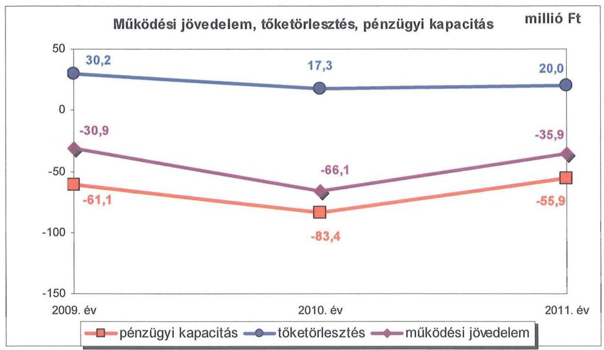
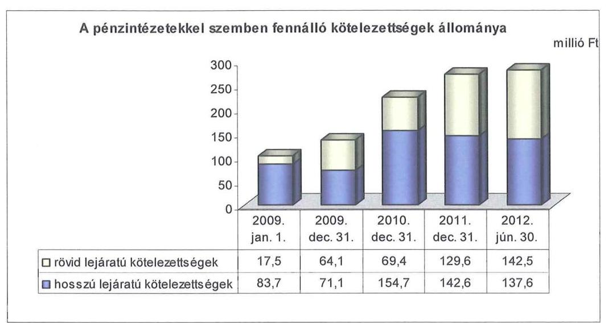
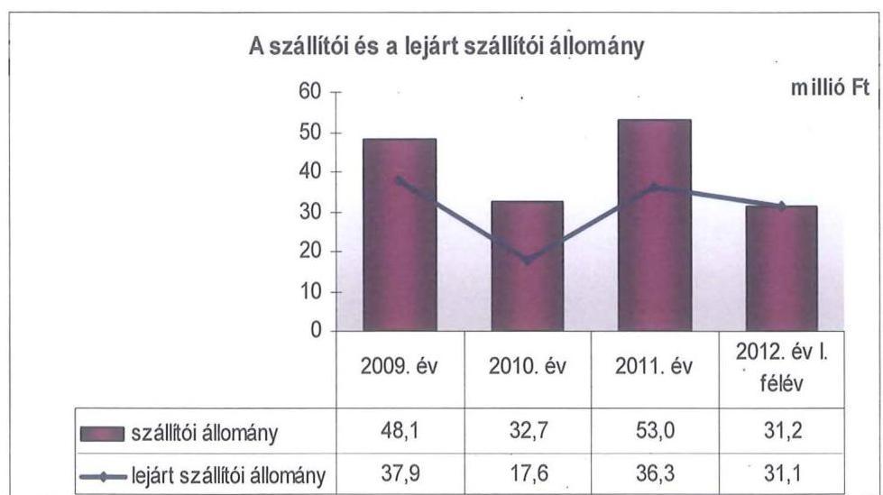
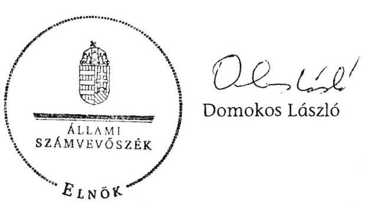
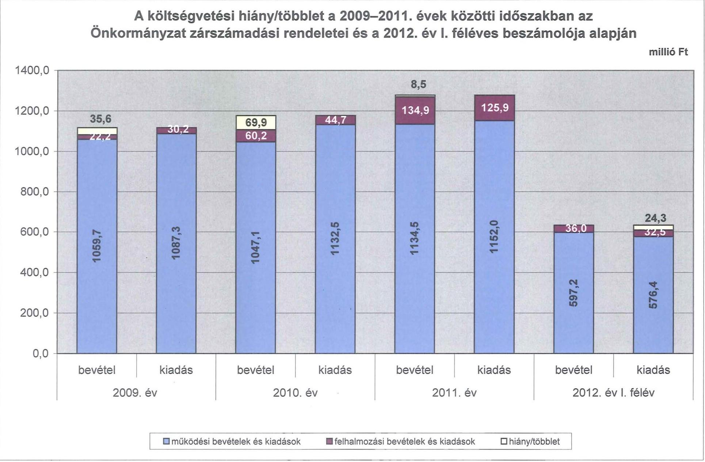
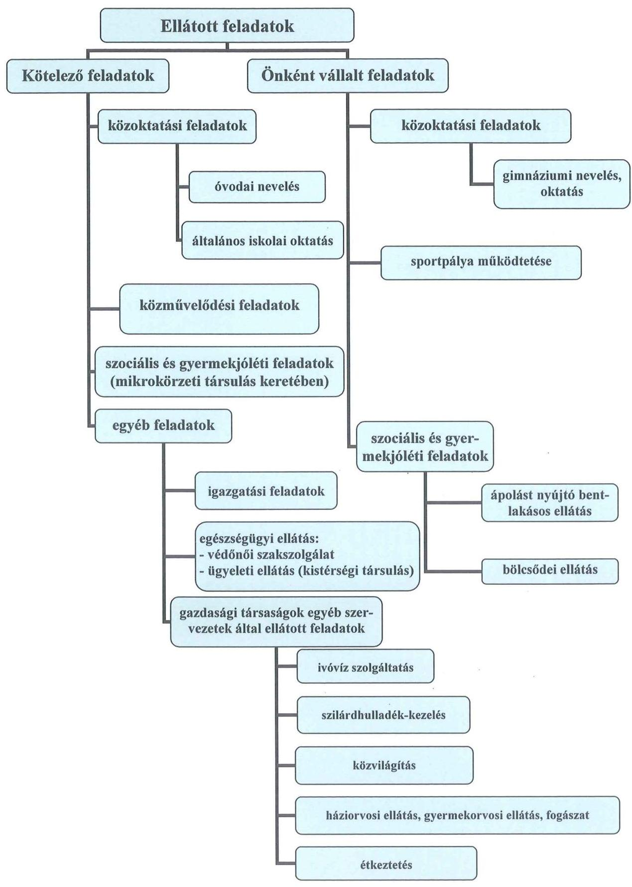

ÁLLAMI
SZÁMVEVŐSZÉK

# JELENTÉS 

Enying Város Önkormányzata pénzügyi gazdálkodási helyzetének, szabályosságának ellenőrzéséről

---

# Állami Számvevőszék 

Iktatószám: V-0030-258-015/2013.
Témaszám: 1069
Vizsgálat-azonosító szám: V059208

## Az ellenőrzést felügyelte:

## Renkó Zsuzsanna

felügyeleti vezető

## Az ellenőrzést vezette:

## Dér Lívia

ellenőrzésvezető

## Az ellenőrzést végezték:

| Bus András Péter | Krupánszki Dóra | Szeibel Gábor |
| :-- | :-- | :-- |
| számvevő | számvevő | számvevő |

---

# TARTALOMJEGYZÉK 

BEVEZETÉS ..... 3
I. ÖSSZEGZŐ MEGÁLLAPÍTÁSOK, KÖVETKEZTETÉSEK, JAVASLATOK ..... 6
II. RÉSZLETES MEGÁLLAPÍTÁSOK ..... 14

1. Az Önkormányzat kötelező és önként vállalt feladatai, a feladatellátás szervezeti keretei ..... 14
2. A pénzügyi egyensúlyt fenntartását veszélyeztető pénzügyi kockázatok és az ezek csökkentése érdekében tett intézkedések ..... 15
3. A pénzügyi gazdálkodási folyamatok szabályosságát, megfelelőségét biztosító belső kontrollok ..... 24
4. Az ÁSZ korábbi ellenőrzése során a pénzügyi, gazdálkodási helyzet javítására tett javaslatainak megvalósítása ..... 25

---

# MELLÉKLETEK 

1. számú A költségvetési hiány/többlet a 2009-2011. évek közötti időszakban az Önkormányzat zárszámadási rendeletei és a 2012. év I. féléves beszámolója alapján
2. számú Az Önkormányzat bevételei és kiadásai, valamint adósságszolgálata a 2009-2011. években (a CLF módszer szerint)
3/a. számú Az Önkormányzat által a 2009. év és a 2012. év I. félév között megvalósított (műszakilag befejezett) fejlesztések forrásösszetétele
3/b. számú Az Önkormányzat 2012. június 30 -án folyamatban lévő fejlesztési feladataihoz kapcsolódó kötelezettségeinek összegzése
3/c. számú Az Önkormányzat által beadott, elbírálás alatti pályázatok forrásaiból megvalósuló fejlesztésekhez kapcsolódó kötelezettségvállalások összegzése
3. számú Az önkormányzati feladatok ellátásában résztvevő gazdasági társaságok egyes kiemelt adatai
4. számú Az Önkormányzat 2012. június 30 -án fennálló, hosszú lejáratú adósságot keletkeztető kötelezettségvállalásai
5. számú Az Önkormányzat kötelezettségeinek 2011. december 31-ei és 2012. június 30 -ai állománya és a 2012. évben, valamint az azt követő években várható kötelezettségek miatti kiadások

## FÜGGELÉKEK

1. számú Rövidítések jegyzéke
2. számú Értelmező szótár
3. számú Az Önkormányzat által ellátott feladatok a 2012. év I. félév végén

---

# JELENTÉS 

## Enying Város Önkormányzata pénzügyi gazdálkodási helyzetének, szabályosságának ellenőrzéséről

## BEVEZETÉS

Az államháztartás helyi szintjén, az önkormányzati alrendszerben az utóbbi években megjelenő gazdálkodási nehézségek, a pénzforgalmi hiány növekedése, az eladósodás az ÁSZ figyelmét a helyi önkormányzatok pénzügyi helyzetére irányította.

Az ÁSZ a 2012. évi ellenőrzési tervben foglaltaknak megfelelően az önkormányzatok pénzügyi gazdálkodási helyzetének, szabályosságának ellenőrzésével az önkormányzatok 2011. évben megkezdett helyzetelemzését folytatta. Az ellenőrzés keretében értékeljük az önkormányzatok adósságkezelési és likviditási helyzetét, bemutatjuk a pénzügyi egyensúly alakulására hatással lévő folyamatokat. Feltárjuk az ezekre ható kockázatokat, a pénzügyi egyensúlyi helyzetet befolyásoló döntésmegalapozó, döntés-előkészítő eljárások szabályosságát. Minősítjük az ezekkel összefüggő belső kontrollok kialakítását, működését. Az ellenőrzés kiterjed az ellenőrzött időszakban végrehajtott ÁSZ ellenőrzés utóellenőrzésére is.

Az ellenőrzés eredményének várható hatásaként a megállapításokkal segítséget nyújthatunk az önkormányzatok számára a pénzügyi egyensúly helyreállítása érdekében szükségessé váló intézkedések megtételéhez.

Az ellenőrzés típusa: szabályszerűségi ellenőrzés.
Az ellenőrzés célja annak értékelése volt, hogy:

- az ellenőrzött időszakban a kötelező és önként vállalt feladatok ellátását biztosító szervezeti formák változása milyen hatást gyakorolt az Önkormányzat pénzügyi helyzetének alakulására;
- az Önkormányzat pénzügyi - ezen belül működési és felhalmozási - egyensúlya milyen irányban változott, a változást milyen okok idézték elő, továbbá milyen intézkedéseket tettek a pénzügyi egyensúly biztosítása, illetve javítása érdekében, az intézkedések hatására javult-e az Önkormányzat pénzügyi helyzete;
- a költségvetési kiadások finanszírozása érdekében vállalt pénzintézetekkel szembeni kötelezettségek hogyan alakultak, a kötelezettségek fennállása 

---

miként befolyásolja az Önkormányzat jövőbeli pénzügyi egyensúlyi helyzetét;

- az Önkormányzat beazonosította, felmérte, értékelte-e a pénzügyi egyensúlyt befolyásoló pénzügyi kockázatokat, a finanszírozási célú pénzügyi műveletekkel kapcsolatban írtak-e elő kockázatértékelési kötelezettséget;
- az Önkormányzat által kialakított belső kontrollok biztosítják-e a pénzügyi gazdálkodás folyamatainak szabályosságát és eredményességét;
- hasznosultak-e az ÁSZ korábbi ellenőrzése során a pénzügyi, gazdálkodási helyzet javítására tett szabályszerűségi és célszerűségi javaslatok.

Az ellenőrzés a 2009. január 1-jétől 2012. június 30-áig terjedő időszakot ölelte fel. A pénzintézetekkel szembeni kötelezettségek állományának vizsgálatakor a 2011. december 31-én fennálló kötelezettségek keletkezésének kezdő időpontját vettük figyelembe.

Az ellenőrzés szakmai módszertana az ÁSZ Ellenőrzési Kézikönyvében foglalt szakmai szabályokon alapult, amely a Legfelsőbb Ellenőrzési Intézmények Nemzetközi Szervezete (INTOSAI) által kiadott nemzetközi standardok (ISSAI) figyelembevételével készült.

Az ellenőrzés során használt rövidítések jegyzékét az 1. számú, az egyes fogalmak magyarázatát a 2. számú függelék tartalmazza.

A vizsgálat jogszabályi alapját az ÁSZ tv. 1. § (3) bekezdésének, 5. § (2)-(6) bekezdéseinek, valamint az Áht. 2 61. § (2) bekezdésének előírásai képezik.

A helyszíni ellenőrzést követően az Országgyűlés a helyi önkormányzatok adósságállományának részleges konszolidációjáról döntött. Az 5000 fő lakosságszámot meg nem haladó települési önkormányzatok számára nyújtott törlesztési célú támogatással $^{1}$ lehetővé tették a 2012. december 12-én fennálló tartozásállományuk és annak 2012. december 28-án fennálló járulékai teljes megfizetését. Az 5000 fő lakosságszám feletti települések esetében a 2013. évben az állam differenciált - a bevételi képességet figyelembe vevő, 40-70%-ig terjedő mértékben vállalja át$^{2}$ az önkormányzat 2012. december 31-i, az átvállalás időpontjában fennálló adósságállományát és annak járulékait. Az adósságkonszolidációs intézkedéssel egyidejűleg a Kormány elrendelte$^{3}$ az önkormányzatok adósságállománya újratermelődésének megakadályozása céljából a hitelengedélyezési és a likvid hitelekre vonatkozó szabályozás szigorítását.

Enying város lakosainak száma 2012. január 1-jén 7099 fő volt, ami 141 fős csökkenést jelent a 2009. év eleji (7240 fő) lakosságszámhoz képest. Az önkor-

[^0]
[^0]:    $^{1}$ Magyarország 2012. évi központi költségvetéséről szóló 2011. évi CLXXXVIII. törvény módosításáról szóló 2012. évi CLXXXVII. törvény alapján
    $^{2}$ Magyarország 2013. évi központi költségvetéséről szóló 2012. évi CCIV. törvény alapján
    $^{3}$ 1540/2012. (XII. 4.) Korm. határozat a helyi önkormányzatok adósságállományának részleges konszolidációjáról

---

mányzat a 2011. évben 1112,7 millió Ft folyó és 148,1 millió Ft felhalmozási bevételt ért el, 1148,6 millió Ft folyó és 129,1 millió Ft felhalmozási kiadást teljesített. A 2009. évi tényadatokhoz viszonyítva a folyó és felhalmozási bevételek 186,0 millió Ft-tal (17,3%-kal), a folyó és felhalmozási kiadások 160,2 millió Ft-tal (14,3%-kal) növekedtek. A 2011. december 31-i könyvviteli mérleg alapján az Önkormányzat 3283,5 millió Ft értékű vagyonnal rendelkezett, amely a 2009. év végi állományhoz (3288,6 millió Ft) viszonyítva 0,2%-kal (5,1 millió Ft-tal) csökkent. A 2012. évi költségvetési rendeletben a költségvetési bevételek összegét 3606,5 millió Ft-ban, a költségvetési kiadások összegét 3661,6 millió Ft-ban állapították meg. A költségvetés kiadási és bevételi összegének növekedése a csatorna beruházás következménye. Az Önkormányzat az ellenőrzött időszakban a 2009. év kivételével minden évben részesült a működőképességének megőrzését szolgáló támogatásban.

Az ÁSZ tv. 29. § (1) bekezdése szerint a jelentésterveztet megküldtük a polgármester részére, aki az ÁSZ tv. 29. § (2) bekezdésében foglalt észrevételezési jogával nem élt, a jelentéstervezetre észrevételt nem tett.

---

# I. ÖSSZEGZŐ MEGÁLLAPÍTÁSOK, KÖVETKEZTETÉSEK, JAVASLATOK 

Enying Város Önkormányzata pénzügyi egyensúlyi helyzetének rövid távú fenntartásában a negatív működési jövedelem, a jelentős szállítói állomány és a pénzintézetekkel szembeni kötelezettségek teljesíthetősége kockázatot jelent.

Az önként vállalt feladatok érdekében teljesített működési célú kiadások miatti kockázat nem állt fenn, mivel a működési kiadásokon belüli arányuk 2009-2011 között átlagosan 12,9% (144,9 millió Ft) volt. Nem jelentett felhalmozási kockázatot az önként vállalt feladatokhoz teljesített felhalmozási kiadás (az ellenőrzött időszak alatt 76,9 millió Ft), tekintettel arra, hogy ennek forrását 55,6 millió Ft összegben EU-s támogatás biztosította.

Az Önkormányzat 2009-2011 között összesen 3435,4 millió Ft költségvetési bevételt realizált, teljesített költségvetési kiadása 3572,1 millió Ft-ot tett ki. A forráshiány összesen 136,7 millió Ft-ot, a teljesített költségvetési kiadások 3,8%-át jelentette. Az ellátott feladatok alapvetően a közoktatáshoz, a szociális és gyermekjóléti, valamint az igazgatási feladatokhoz kapcsolódtak. Az ellenőrzött időszakban az önkormányzati feladatok köre nem változott, feladat átvételére, átadására nem került sor. A 2011. év II. félévében a Szolgáltató Intézmény megszűnésével, az ellátott feladatok változatlansága mellett az intézmények száma a korábbi hétről hatra csökkent. Az intézmény megszüntetése és az ellátott feladatok átrendezése miatt az Önkormányzat 46,5 millió Ft kiadásmegtakarítást ért el, amely kedvezően befolyásolta a pénzügyi egyensúlyt. A 2009-2011. évek között a Mikrokörzeti Társulás által ellátott szociális és gyermekjóléti feladatoknál nem állt fenn finanszírozási kockázat, mivel a kiadásokat megtérítette a Kistérségi Társulás. Az önkormányzati feladatellátásban részt vett kilenc gazdasági társaság is. Az Önkormányzat két gazdasági társaságban rendelkezett kisebbségi tulajdoni részesedéssel. Az ellenőrzött időszakban a feladatellátás szervezeti formáinak változása nem gyakorolt jelentős hatást a pénzügyi egyensúlyi helyzetre.

Az Önkormányzatnál a működési jövedelemtermelő képesség miatti kockázat fennállt, mivel működési jövedelme és pénzügyi kapacitása a 2009-2011. években folyamatosan negatív volt. A 2010. évben ezen kockázat erősödött a működési hiány előző évihez viszonyított növekedése miatt. A működési jövedelemtermelő képesség alacsony szintje kockázatot jelent a pénzügyi egyensúlyi helyzet fenntartása, ezzel a feladatellátás zavartalan biztosítása szempontjából. A 2009-2010 között kialakult felhalmozási forráshiányt hitelfelvétellel finanszírozta. Az Önkormányzat pénzügyi kapacitásának 2009-2011 közötti alakulását a - elsősorban a költségvetési források mérséklődése hatásaként kialakult - negatív működési jövedelem és a tőketörlesztés változásának együttes hatása eredményezte. A változást a következő ábra mutatja be.

---

Az Önkormányzatnál a pénzügyi kapacitás a 2010-2011. években kapott, működőképesség megőrzését szolgáló támogatások mellett is negatív volt. A bevételi kitettségre ugyanakkor kedvezően hatott, hogy a helyiadó-bevétel döntő része nagyszámú adóalanytól származott. A felhalmozási költségvetés egyenlege a 2009-2010. években hiányt, 2011-ben többletet mutatott. Az előre fel nem mért üzemeltetési kiadások a jövőre nézve működési, fenntartási kockázatokat hordozhatnak.

A bevételnövelő (eszközértékesítés) és kiadáscsökkentő intézkedések (feladatátszervezés, intézmény megszüntetés, létszámleépítés, civil szervezetek részére átadott pénzeszközök csökkentése, tiszteletdíjról való lemondás) hatására, az Önkormányzat adatszolgáltatása szerint 29,0 millió Ft bevételi többlet és 56,5 millió Ft kiadási megtakarítás keletkezett. Az Önkormányzat intézkedései nem biztosítottak a pénzügyi egyensúlyi helyzet hosszú távú fenntartására és a jövőbeli kötelezettségek fedezetére tartalékként elkülöníthető forrásokat.

Az Önkormányzat likviditási és rövid távú pénzügyi egyensúlyi helyzete kedvezőtlenül alakult. Pénzintézeti kötelezettségei a 2009. év elejétől a 2012. év I. félév végére közel háromszorosára, 101,2 millió Ft-ról 280,1 millió Ft-ra növekedtek. Az Önkormányzat számára banki kitettség miatti kockázatot jelent, hogy a folyamatosan fennálló folyószámlahitel mellett 2010-től munkabér-megelőlegezési hitelt és éven túli lejáratú működési célú hitelt is igénybe vett. A folyószámlahitel átlagos, napi állománya jelentősen, a 2009. évi 35,8 millió Ft-ról a 2012. év I. félévre 123,7 millió Ft-ra nőtt. Nemfizetési kockázatot jelent, hogy a 2011. év végére a lejárt szállítói tartozásállomány az előző évi kétszeresére növekedett (36,3 millió Ft volt), a 2011. évi dologi kiadások egy havi átlagának (26,9 millió Ft-nak) a 134,9%-át tette ki. A 2012. év I. félév végén fennálló szállítói tartozásállomány (31,2 millió Ft) teljes mértékben lejárt volt. Az ingatlanok jelzáloggal való terhelése az ellenőrzött időszakban 89,6%-kal, 118,3
 millió Ft-tal növekedett, amely az esetleges fedezetbevonások miatt kockázatot jelent.

---

Az Önkormányzatnál az éven túli futamidejű működési hitelre vonatkozó szerződés, továbbá a munkabér-megelőlegezési hitellel összefüggő, keret jellegű faktoring szolgáltatás igénybevételére vonatkozó megállapodás megkötését megelőzően, annak ellenére nem kezdeményeztek közbeszerzési eljárást, hogy az ügyletek összegei a szolgáltatásra vonatkozó Kbt.-ben foglalt értékhatárt meghaladták.

A helyszíni ellenőrzés során feltárt, a közbeszerzésekre vonatkozó jogszabályok megsértése miatt az ÁSZ jogorvoslati eljárást kezdeményezett, melyben a Közbeszerzési Döntőbizottság D.615/14/2012. számú határozatával megállapította, hogy az Önkormányzat a Kbt. mellőzésével megsértette a közbeszerzési törvényt.

A hosszú lejáratú pénzintézeti kötelezettségek a 2009. év elejétől a 2012. év I. félév végére 83,7 millió Ft-ról 137,6 millió Ft-ra, 64,4%-kal nőttek. A hosszú lejáratú kötelezettségek növekedését a működési, valamint a pályázati támogatással megvalósuló fejlesztések önerejének biztosításához és az ivóvízhálózat kiépítéséhez felvett hitelek okozták. A hitelek igénybevételéből származó forrásokat a céloknak megfelelően használták fel. A hosszú lejáratú működési kölcsön és a fejlesztési hitelek törlesztésére az ellenőrzött időszakban 77,4 millió Ft kifizetést (tőke, kamat, egyéb költség) teljesítettek.

Az Ötv. ${ }_{1}$-ben foglaltak ellenére három hitelszerződésben az Önkormányzat futamidő alatti költségvetéseiből származó bevételeit - ezáltal közvetve a normatív állami támogatást és az átengedett személyi jövedelemadó bevételt - a hitelt folyósító pénzintézetre engedményezték a szerződésben vállalt kötelezettségek teljesítése biztosítékául.

A 2012. év I. félév végén fennálló pénzintézeti kötelezettségek 2012-2014. éveket terhelő tőketörlesztése és kamatkiadása 252,8 millió Ft, a 2015. évet követő időszak adósságszolgálata összesen 55,3 millió Ft terhet jelent. A 2012-2014. évekre számba vehető 46,0 millió Ft követelésállomány a pénzintézeti kötelezettségek 18,2%-ára nyújt fedezetet. Kockázatot jelent, hogy a 2009-2011. évek jövedelemtermelő képessége alapján a várhatóan képződő működési jövedelem a jelenlegi feladatellátási, finanszírozási struktúrát és kiadási arányokat feltételezve részben nyújt fedezetet a pénzintézeti kötelezettségekre, továbbá az Önkormányzat szabad tartalékokkal nem rendelkezik.

Az Önkormányzat társulati hitel igénybevételéhez 526,4 millió Ft értékben kezességet vállalt, azonban nem vizsgálta meg a szerződésből eredő kockázatokat, nem kísérte figyelemmel a kezességvállalás pénzügyi helyzetre gyakorolt hatását. Az Önkormányzat pénzügyi helyzetére hatással lehet a vállalt kezesség miatti kockázat.

A döntések megalapozottsága érdekében az Önkormányzat értékelte a pénzintézeti kötelezettségállomány változását, kockázatait felmérte, vizsgálta és betartotta az Ötv. ${ }_{1}$ adósságot keletkeztető kötelezettségvállalás felső korlátjára vonatkozó előírást. Az adósságot keletkeztető kötelezettségvállalásokról szóló döntéseknél azonban nem határozták meg a visszafizetés lehetséges forrásait.

---

Az Önkormányzat a fizetőképességének biztosítására és eladósodásának kezelésére szolgáló stratégiai tervvel rendelkezett.

Nem mérték fel az elhasználódott eszközök felújítása és pótlása forrásigényét. Az ellenőrzött időszakban elszámolt 157,1 millió Ft értékcsökkenéssel szemben az eszközök pótlására 84,5 millió Ft-ot fordítottak. Az eszközök használhatósági foka a 2009. évi 81,9%-ról 2011-re 79,0%-ra csökkent.

Az Önkormányzatnál a kockázatkezelési rendszer kialakítása és működtetése teljes körűen nem felelt meg a 2009-2011. években az Áht. ${ }_{1}$, a 2012. év I. félévében az Áht. ${ }_{2}$ előírásainak. Az ellenőrzött időszakban fennállt működési jövedelemtermelő képesség miatti kockázat, a fejlesztések jövőbeni üzemeltetési kockázata, a növekvő szállítói állomány miatti nemfizetési kockázat, az állandósult folyószámlahitel miatti banki kitettségből adódó kockázat, az ingatlanok terhelésének növekedéséből adódó fedezetbevonások miatti kockázat, a társulati hitel igénybevételéhez kapcsolódó kezesség miatti kockázat, valamint a jövőbeli várható kötelezettségek teljesíthetőségének kockázata. A pénzügyi egyensúly fenntartására kiható kockázatok beazonosítása, felmérése és értékelése, ezáltal kezelése - a 2009. évben az Ámr. ${ }_{1}$-ben, a 2010-2011. években az Ámr. ${ }_{2}$-ben és a 2012. év I. félévében a Bkr.-ben foglalt előírások ellenére - elmaradt.

Az Önkormányzatnál a belső kontrolltevékenységek kialakítása és működtetése teljes körűen nem felelt meg a 2009-2011. években az Áht. ${ }_{1}$, a 2012. év I. félévben az Áht. ${ }_{2}$ előírásainak. A pénzügyi gazdálkodási folyamatok szabályosságát biztosító belső kontrollok gazdálkodási folyamatokba történő beépítése - a 2009. évben az Ámr. ${ }_{1}$-ben, a 2010-2011. években az Ámr. ${ }_{2}$-ben, a 2012. év I. félévében a Bkr.-ben foglalt előírások ellenére - nem volt megfelelő. A döntés-előkészítés során nem írták elő a fejlesztési döntések kockázatai, valamint a pénzintézeti kötelezettségvállalásokkal kapcsolatos döntések kockázatai feltárását, a futamidő egyes éveit terhelő kötelezettségek költségvetési egyensúlyra gyakorolt hatása vizsgálatát. Nem határozták meg a fizetőképesség és az eladósodás kezelésével, valamint a pénzügyi kötelezettségek teljesítésével, a szállítói tartozások és az egyéb kiadáselmaradások rendezésével összefüggő kontrolltevékenységeket.

Összességében a pénzügyi folyamatokba beépített belső kontrollok működése nem volt megfelelő, mivel nem tárták fel a fejlesztéseket megelőzően a döntés-előkészítési folyamatban az előkészítés, a lebonyolítás és a működtetés kockázatait. Előfordult, hogy a beruházások kivitelezőit a belső szabályozás ellenére és két esetben a pénzintézeti szolgáltatót a Kbt. előírása ellenére nem pályázat útján választották ki. Az Önkormányzatnál a belső ellenőrzés kialakítása, működtetése teljes körűen nem felelt meg a 2009-2011. években az Áht. ${ }_{1}$-ben, a 2012. év I. félévben az Áht. ${ }_{2}$-ben meghatározott előírásoknak. Az ellenőrzött időszak belső ellenőrzési terveinek készítését megelőzően - a 2009-2011. években a Ber.-ben, a 2012. év I. félévben a Bkr.-ben foglalt előírások ellenére - nem írták elő a pénzügyi egyensúlyi helyzetet befolyásoló döntések kockázati tényezőinek feltárását, a belső ellenőrzési tervek nem tartalmazták ezek ellenőrzését.

---

Az ÁSZ az Önkormányzat gazdálkodási rendszerét a 2009. évben ellenőrizte, ennek során 20 szabályszerűségi és hat célszerűségi javaslatot tett. A javaslatok hasznosítására a jegyző intézkedési tervet készített. Az ÁSZ által tett szabályszerűségi javaslatok 100,0%-ban hasznosultak. A célszerűségi javaslatok esetében a hasznosult javaslatok aránya 50,0% volt. Nem teljesült az informatikai rendszer katasztrófa-elhárítási tervének tesztelésére, a főkönyvi rendszerben tárolt hozzáférési jogosultságok ellenőrizhetőségére és a pénzügyszámviteli rendszerben elvégzett műveletek nyomon követhetőségére vonatkozó javaslat.

Összességében a működési jövedelemtermelő képesség további csökkenése a jövőben kockázatot jelent a pénzügyi egyensúlyi helyzet rövid távú fenntartása, ezzel a feladatellátás zavartalan biztosítása szempontjából. A feladatellátás jövőbeni finanszírozásához és a felvett hitelekből eredő kötelezettségek teljesítéséhez elkülönített tartalék nem állt rendelkezésre. A pénzintézeti kötelezettségek rövidtávon korlátozzák az Önkormányzat pénzügyi gazdálkodási pozícióit. A megvalósított beruházások a feladatellátás színvonalának javításához hozzájárultak, de nem teremtenek bevételnövelési lehetőséget.

Az ÁSZ tv. 33. § (1) bekezdésében foglaltak értelmében az ellenőrzött szervezet vezetője köteles a jelentésben foglalt megállapításokhoz kapcsolódó intézkedési tervet összeállítani, és azt a jelentés kézhezvételétől számított harminc napon belül az ÁSZ részére megküldeni. Amennyiben az intézkedési tervet határidőn belül nem küldi meg a szervezet, vagy az továbbra sem elfogadható, az ÁSZ elnöke a hivatkozott törvény 33. § (3) bekezdés a)-b) pontjaiban foglaltakat érvényesítheti.

# Az ellenőrzés intézkedést igénylő megállapításai és javaslatai: 

## a polgármesternek

1. Az Önkormányzat működési és nettó működési jövedelme 2009-2011 között negatív volt. A likviditás az ellenőrzött időszakban folyószámla-, munkabérmegelőlegezési hitel, illetve forgóeszközhitel igénybevételével volt biztosítható. A lejárt szállítói tartozás 2012. év I. félév végére 31,1 millió Ft-ra, a pénzintézeti kötelezettségek 280,1 millió Ft-ra növekedtek. A bevételnövelő és kiadáscsökkentő intézkedések nem biztosítottak elegendő forrást a pénzügyi egyensúly helyreállításához. Az adósságszolgálat teljesítéséhez felhasználható, elkülönített tartalékkal az Önkormányzat nem rendelkezik.

Javaslat:
A működési jövedelemtermelő képesség és a feladatellátás összhangja, valamint az Önkormányzat pénzügyi egyensúlyának helyreállítása, hosszú távú fenntarthatósága érdekében - a 2013. évi kormányzati adósságkonszolidációt, valamint a 2013. évtől változó feladat-ellátási kötelezettséget és feladatfinanszírozási rendszert figyelembe véve - felelősök és határidők megjelölésével kezdeményezzen intézkedéseket, melyek keretében:
a) a költségvetési rendelettervezet, valamint annak évközi módosítása előterjesztését megelőzően mérjék fel a bevételszerző, kiadáscsökkentő lehetőségeket, és

---

terjessze a Képviselő-testület elé a bevételek növelését, kiadások csökkentését célzó intézkedések bevezetéséhez szükséges - a Htv. 140. § (1) bekezdés a) pontja alapján a jegyző által elkészített - döntési javaslatát;
b) terjesszen a Képviselő-testület elé jóváhagyásra - a Htv. 140. § (1) bekezdés a) pontja alapján a jegyző által elkészített - az Önkormányzat gazdasági helyzetének elemzésén alapuló, a pénzügyi egyensúlyi helyzet gyors helyreállítását, hosszú távú fenntartását, valamint az adósságállomány újratermelődésének elkerülését biztosító intézkedéseket tartalmazó reorganizációs programot;
c) az adósságkonszolidációt követően fennmaradó kötelezettségek tekintetében terjesszen a Képviselő-testület elé olyan egyensúlyi (elkülönített) tartalék képzésére vonatkozó - a Htv. 140. § (1) bekezdés a) pontja alapján a jegyző által elkészített - döntési javaslatot, amelyben a Képviselő-testület meghatározza annak összegét, és kötelezettséget vállal arra, hogy a törlesztési időszak alatt ezt a tartalékot a költségvetési rendeleteiben minden évben betervezi az adósságszolgálat teljesítésére;
d) a szállítói kitettség és a helyi önkormányzatok adósságrendezési eljárásáról szóló 1996. évi XXV. törvény 4-9. §-aiban szabályozott adósságrendezési eljárás megindításának elkerülése érdekében meghatározott gyakorisággal számoljon be a Képviselő-testületnek az Önkormányzat lejárt szállítói állománya alakulásáról. Intézkedjen a szállítói számlák esedékesség szerinti kiegyenlítéséről vagy a lejárt tartozások átütemezéséről.
2. Az ellenőrzött időszak során - az Ötv ${ }_{1}$. 88. § (1) bekezdés b) pontjában foglalt előírást ${ }^{4}$ megsértve - három fejlesztési hitelszerződésben az Önkormányzat futamidő alatti költségvetéseiből származó bevételeit jelölték meg fedezetként, ezáltal közvetve a normatív állami támogatást és az átengedett személyi jövedelemadó bevételt is felajánlották a szerződésben vállalt kötelezettségek teljesítése biztosítékául.

Javaslat:
A pénzintézeti kötelezettségvállalásokkal kapcsolatos jogszerű biztosíték, illetve fedezet felajánlás érdekében:
a) intézkedjen, hogy jövőbeni hitelfelvétel, kötvénykibocsátás fedezeteként az Áht ${ }_{2}$ 84. § (4) bekezdésében ${ }^{5}$ előírtaknak megfelelően az Önkormányzat általános működésének és ágazati feladatainak támogatása és a költségvetési támogatás ne kerüljön megjelölésre;
b) a jogellenes állapot megszüntetése érdekében vizsgálja meg a jogszerű biztosíték cseréjének lehetőségét, és terjesszen javaslatot a Képviselő-testület elé a biztosíték cseréjéről.
3. Az Önkormányzat az egy éven túli lejáratú működési hitel és a munkabérmegelőlegezési hitellel összefüggő, keret jellegű faktoring szolgáltatás igénybevétele-

[^0]
[^0]:    ${ }^{4}$ Hatálytalan 2012. január 1-jétől
    ${ }^{5}$ Hatályos 2012. március 31-től

---

kor - a Kbt. 240. § (1) bekezdésében ${ }^{6}$ foglalt előírás ellenére - közbeszerzési eljárás lefolytatása nélkül kötött szerződést. A jogszabálysértés miatt az ÁSZ jogorvoslati eljárást kezdeményezett, melyben a Közbeszerzési Döntőbizottság megállapította, hogy az Önkormányzat a Kbt. mellőzésével megsértette a közbeszerzési törvényt.

Javaslat:
A közbeszerzési eljárásról szóló törvényben foglaltak maradéktalan betartása érdekében:
a) biztosítsa, hogy jövőbeni pénzügyi szolgáltatások igénybevétele esetén, amennyiben a közbeszerzésekről szóló 2011. évi CVIII. törvény 120. § k) pontjában foglalt kivétel nem áll fenn, a közbeszerzési eljárás lefolytatásának kötelezettségére a 119. §-ban foglalt előírást érvényesítsék;
b) intézkedjen az ÁSZ ellenőrzés során feltárt közbeszerzési szabálytalanság tekintetében a munkajogi felelősséggel kapcsolatos körülmények kivizsgálása iránt, és hozza meg a szükséges munkajogi intézkedéseket.

# a jegyzőnek 

1. Az Önkormányzatnál a kockázatkezelési rendszer kialakítása és működtetése teljes körűen nem felelt meg a 2009-2010. években az Áht. ${ }_{1}$ 120/B. § (2) bekezdés b) pontjában, a 2011. évben az Áht. ${ }_{1}$ 121. § (2) bekezdés b) pontjában, a 2012. év I. félévében az Áht. ${ }_{2}$ 69.
 § (2) bekezdésében meghatározott előírásoknak. Az ellenőrzött időszakban fennállt pénzügyi egyensúlyi helyzetre kiható kockázatok (a működési jövedelemtermelő képesség miatti kockázat, a fejlesztések jövőbeni üzemeltetési kockázata, a kezességvállalás és magas fedezetbevonás miatti kockázat, az állandósult folyószámlahitel miatti banki kitettség és a lejárt szállítói állomány miatti nemfizetési kockázat, a jövőbeli várható kötelezettségek teljesíthetőségének kockázata) feltárása, beazonosítása, értékelése, ezáltal a kockázatok kezelése - a 2009. évben az Ámr. ${ }_{1}$ 145/C. §-ában, a 2010-2011. években az Ámr. ${ }_{2}$ 157. §-ában és a 2012. év I. félévében a Bkr. 7. § (1)-(2) bekezdéseiben foglalt jogszabályi előírások ellenére elmaradt.

Javaslat:
Működtessen az Áht. ${ }_{2}$ 69. § (2) bekezdésében, továbbá a Bkr. 7. § (1)-(2) bekezdéseiben foglalt előírásoknak megfelelő, a pénzügyi egyensúlyt befolyásoló kockázatok kezelésére alkalmas kockázatkezelési rendszert.
2. Az Önkormányzatnál a belső kontrolltevékenységek kialakítása és működtetése teljes körűen nem felelt meg a 2009-2010. években az Áht. ${ }_{1}$ 120/B. § (2) bekezdés c) pontjában, a 2011. évben az Áht. ${ }_{1}$ 121. § (2) bekezdés c) pontjában és a 2012. év I. félévében az Áht. ${ }_{2}$ 69. § (2) bekezdésében meghatározott előírásoknak. A pénzügyi, gazdálkodási folyamatok szabályosságát biztosító belső kontrollok gazdálkodási folyamatokba történő beépítése - a 2009. évben az Ámr. ${ }_{1}$ 145/E. § (1)-(2) bekezdéseiben, a 2010-2011. években az Ámr. ${ }_{2}$ 158. § (1)-(2) bekezdéseiben, a 2012. év I. félévében a Bkr. 8. § (1)-(2) bekezdésében foglalt előírások ellenére - nem volt megfelelő. A döntés előkészítése során nem írták elő a fejlesztési döntések kockázatai, valamint a pénzintézeti kötelezettségvállalásokkal kapcsolatos döntések kockázatai feltárásának kötelezettségét, a futamidő egyes éveit terhelő kötelezettség költségvetési egyensúlyra gyakorolt hatása vizsgálatát. Nem határozták meg az Önkormányzat fizetőképességének és eladósodásának kezelésével, a pénzügyi kötelezettségek teljesítésének helyi szabályaival és a szállítói tartozások és egyéb kiadáselmaradások rendezésével összefüggő kontrolltevékenységeket.

Javaslat:
Alakítsa ki az Áht. ${ }_{2}$ 69. § (2) bekezdésében, továbbá a Bkr. 8. § (1)-(2) bekezdései alapján azokat a belső kontrolltevékenységeket, amelyek biztosítják a pénzügyigazdálkodási folyamatok szabályosságát, a pénzügyi egyensúlyi helyzet alakulását befolyásoló döntések kockázatainak kezelését. Ennek keretében:
a) határozza meg a fejlesztések döntés-előkészítés folyamatában a lebonyolítás és a működtetés kockázatai feltárásának és kezelésének kötelezettségét;
b) írja elő a pénzintézeti kötelezettségvállalások kockázatainak döntés-előkészítő szakaszban történő feltárását, a futamidő egyes éveit terhelő kötelezettségek költségvetési egyensúlyra gyakorolt hatásának vizsgálatát;
c) készítsen szabályzatot az Önkormányzat fizetőképességének és eladósodásának kezelésére, valamint a pénzügyi kötelezettségek teljesítésének, a szállítói tartozások és az egyéb kiadás elmaradások rendezésének helyi szabályaira.
3. Az Önkormányzatnál a belső ellenőrzés kialakítása, működtetése teljes körűen nem felelt meg a 2009-2010. években az Áht. ${ }_{1}$ 121/A. § (3) bekezdésében, a 2011. évben az Áht. ${ }_{1}$ 121/B. § (4) bekezdésében, a 2012. év I. félévében az Áht. ${ }_{2}$ 70. § (1) bekezdésében meghatározott előírásoknak. Az ellenőrzött időszak belső ellenőrzési terveinek készítését megelőzően - a 2009-2011. években a Ber. 18. §-ában, a 21. § (2) bekezdésben és (3) bekezdés a) pontjában, 2012. január 1-jétől a Bkr. 29. § (1) bekezdésében, a 31. § (2) bekezdésében, továbbá a (4) bekezdés a) pontjában foglaltak ellenére - nem írták elő a pénzügyi egyensúlyi helyzetet befolyásoló döntések kockázati tényezőinek feltárását és a belső ellenőrzési tervek nem tartalmazták ezen kockázati tényezők ellenőrzését.

Javaslat:
Tegyen intézkedést, hogy az Áht. ${ }_{2}$ 70. § (1). bekezdésében, továbbá a Bkr. 29. § (1) bekezdésében, a 31. § (2) bekezdésében és a (4) bekezdés a) pontjában foglalt előírások szerint az éves belső ellenőrzési tervek tartalmazzák a pénzügyi egyensúlyi helyzetet befolyásoló döntésekkel kapcsolatos feltárt kockázati tényezők ellenőrzését és biztosítsa az ellenőrzési tervek végrehajtását.

---

# II. RÉSZLETES MEGÁLLAPÍTÁSOK 

## 1. Az ÖNKORMÁNYZAT KÖTELEZŐ ÉS ÖNKÉNT VÁLLALT FELADATAI, A FELADATELLÁTÁS SZERVEZETI KERETEI

Az Önkormányzat önként vállalt feladatait az SZMSZ-ében rögzítette. Az önként vállalt feladatok közé sorolták a sportfeladatok ellátását (a sportpálya működtetése), a szociális és gyermekjóléti feladatok közül a városi bölcsőde és az ápolást nyújtó bentlakásos intézmény fenntartását, valamint a közoktatási feladatokból a gimnáziumi nevelést, oktatást ${ }^{7}$.

A működési kiadásokon belül az önként vállalt feladatokra fordított kiadások aránya a 2009. évben 12,3% (133,4 millió Ft), a 2010. évben 12,4% (139,8 millió Ft), a 2011. évben 14,1% (161,4 millió Ft) volt. Az önként vállalt feladatokra fordított működési kiadások a 2009. évihez képest 2011-re 28,0 millió Ft-tal, 21,0%-kal növekedtek (a bölcsődei és a bentlakásos gondozottak létszámának növekedése miatt). A 2012. évi működési kiadásokat a 2009. évi teljesített működési kiadásoknál 37,8 millió Ft-tal (3,5%) magasabbra tervezték. Az ellenőrzött időszakban az önként vállalt feladatok érdekében teljesített kiadások miatti működési kockázat nem állt fent, tekintettel azok nagyságrendjére. A felhalmozási kiadásokon belül az önként vállalt feladatok kiadása 76,9 millió Ft (35,6%) volt, amelynek a forrását 55,6 millió Ft összegben EU-s támogatás biztosította, ezért az önként vállalt feladatokhoz kapcsolódóan teljesített felhalmozási kiadások nem jelentettek felhalmozási kockázatot.

A 2009-2011. évek között a működési feladatok finanszírozási forrásösszetétele a pénzügyi egyensúlyi helyzet szempontjából kedvezőtlenül alakult. A működési kiadásokat finanszírozó költségvetési támogatások részaránya 47,3%-ról 43,5%-ra csökkent, a saját bevételek aránya 8,0%-ról 9,3%-ra, az önkormányzati egyéb források részaránya 44,7%-ról 47,2%-ra emelkedett.

A 2009. év és a 2012. év I. féléve közötti időszakban feladatátvétel és átadás nem történt. A 2011. év II. félévében a Szolgáltató Intézmény megszűnésével az intézmények száma a korábbi hétről hatra csökkent, a szolgáltatási feladatokat a Polgármesteri Hivatal vette át. Két ingatlan bérbeadásának megszüntetése után a telephelyek száma 13-ról 15-re nőtt. A Szolgáltató Intézmény megszüntetése és az általa ellátott feladatok átrendezése miatti kiadásmegtakarítás összesen 46,5 millió Ft-tal járult hozzá a pénzügyi egyensúlyi helyzet javításához.

A Kistérségi Társulás keretein belül, a szociális és gyermekjóléti Mikrokörzeti Társulás látja el (nyolc önkormányzattal társulva) a szociális étkeztetést, a házi segítségnyújtást, a jelzőrendszeres házi segítségnyújtást, a családsegítést és a

[^0]
[^0]:    ${ }^{7}$ Az önként vállalt feladatokra fordított működési célú kiadásokat és bevételeket a főkönyvi nyilvántartásból kigyűjtéssel mutatták ki.

---

gyermekjóléti feladatokat. A 2009-2011. évek között a Mikrokörzeti Társulás által ellátott szociális és gyermekjóléti feladatoknál nem állt fenn finanszírozási kockázat, mivel a kiadásokat megtérítette a Kistérségi Társulás. Az önkormányzati feladatellátásban kilenc gazdasági társaság vett részt. Az Önkormányzat gazdasági társaságban minősített többségi részesedéssel nem rendelkezett. Két társaságban kisebbségi (0,03%-os és 0,003%-os) részesedése volt. Az ellenőrzött időszakban a feladatellátás szervezeti formáinak változása nem gyakorolt jelentős hatást a pénzügyi egyensúlyi helyzetre.

# 2. A PÉNZÜGYI EGYENSÚLY FENNTARTÁSÁT VESZÉLYEZTETŐ PÉNZÜGYI KOCKÁZATOK ÉS AZ EZEK CSÖKKENTÉSE ÉRDEKÉBEN TETT INTÉZKEDÉSEK 

Az Önkormányzat költségvetésének elemzését CLF módszerrel hajtottuk végre. A CLF módszer szerinti 2009-2011 közötti részletes adatokat ${ }^{8}$ a 2. számú melléklet, a főbb önkormányzati adatokat az alábbi tábla mutatja be:

|  |  |  | millió Ft |
| :-- | --: | --: | --: |
| Megnevezés | 2009. év | 2010. év | 2011. év |
| Folyó bevételek | 1052,6 | 1064,5 | 1112,7 |
| Folyó kiadások | 1083,5 | 1130,6 | 1148,6 |
| Működési jövedelem | $\mathbf{- 30,9}$ | $\mathbf{- 66,1}$ | $\mathbf{- 35,9}$ |
| Felhalmozási bevételek | 22,2 | 35,3 | 148,1 |
| Felhalmozási kiadások | 34,0 | 46,3 | 129,1 |
| Felhalmozási költségvetés egyenlege | $\mathbf{- 11,8}$ | $\mathbf{- 11,0}$ | $\mathbf{19,0}$ |
| Folyó és felhalmozási bevételek összesen | 1074,8 | 1099,8 | 1260,8 |
| Folyó és felhalmozási kiadások összesen | 1117,5 | 1176,9 | 1277,7 |
| Finanszírozási műveletek nélküli | $\mathbf{- 42,7}$ | $\mathbf{- 77,1}$ | $\mathbf{- 16,9}$ |
| pozíció |  |  |  |
| Finanszírozási műveletek egyenlege | 24,7 | 77,1 | 33,9 |
| Tárgyévi pénzügyi pozíció | $\mathbf{- 18,0}$ | $\mathbf{0,0}$ | $\mathbf{17,0}$ |
| Hiteltörlesztés, értékpapír beváltás | 30,2 | 17,3 | 20,0 |
| Nettó működési jövedelem | $\mathbf{- 61,1}$ | $\mathbf{- 83,4}$ | $\mathbf{- 55,9}$ |

Az Önkormányzat 2009-2011 között összesen 3435,4 millió Ft költségvetési bevételhez jutott, teljesített költségvetési kiadása 3572,1 millió Ft-ot tett ki. Az Önkormányzat folyó költségvetési egyenlege (működési jövedelme) a 2009-2011. években negatív volt. A működési hiány a 2010. évre 35,2 millió Ft-tal (113,9%-kal) nőtt, a 2011. évre 30,2 millió Ft-tal (45,7%-kal) csökkent az előző évhez képest. A működési hiány 2010. évi emelkedésének oka, hogy a folyó kiadások növekedése meghaladta a folyó bevételek emelkedését. 2011-ben a folyó bevételek nagyobb arányban nőttek a folyó kiadásokhoz viszonyítva, ami a hiány mérséklődését eredményezte. A folyó bevételek emelkedésében a működőképességet megőrző támogatások 50,4 millió Ft-os és

[^0]
[^0]:    ${ }^{8}$ Az ÁSZ az ellenőrzéshez felhasznált, a CLF táblában szereplő adatokat a 2010-2011. évi költségvetési beszámolókban feltárt hibák (kamatkiadások téves könyvelése) miatt módosította.

---

az államháztartáson belülről kapott támogatások 44,1 millió Ft-os növekedése játszotta a legjelentősebb szerepet, miközben a költségvetési támogatások összege 51,8 millió Ft-tal csökkent. Az Önkormányzat 2010-ben 3,0 millió Ft, a működésképtelen helyi önkormányzatoknak juttatott, 2011-ben 53,4 millió Ft ÖNHIKI támogatásban részesült, amelyek nélkül a működési jövedelem a 2010. évben 69,1 millió Ft, a 2011. évben 89,3 millió Ft hiányt mutatott volna. Az Önkormányzat a 2012. év I. félévében 17,7 millió Ft ÖNHIKI támogatást kapott. A működési jövedelemtermelő képesség miatti kockázat 2009-2011 között fennállt, mivel a működési költségvetés egyenlege negatív volt, a 2010. évben ezen kockázat erősödött a működési hiány előző évihez viszonyított növekedése miatt. A működési jövedelemtermelő képesség alacsony szintje kockázatot jelent a pénzügyi egyensúlyi helyzet fenntartása, ezzel a feladatellátás zavartalan biztosítása szempontjából.

A nettó működési jövedelem a 2009-2011. években negatív volt. A 2009-ről 2010-re történt 22,3 millió Ft-os csökkenését a működési jövedelem 35,2 millió Ft összegű, a tőketörlesztés 12,9 millió Ft-os mérséklődése ellenére történő csökkenése okozta. 2011-ben a nettó működési jövedelem 27,5 millió Ft-os növekedését a működési jövedelem hiányának 30,2 millió Ft-os mérséklődése mellett a 2,7 millió Ft-tal megnövekedett hiteltörlesztés okozta.

A felhalmozási költségvetés egyenlege a 2009-2010. években
 hiányt, 2011-ben többletet mutatott. A 2011. évben a felhalmozási bevételek 112,8 millió Ft-tal növekedtek az előző évihez képest. A felhalmozási kiadások 82,8 millió Ft-os növekedéséből 79,8 millió Ft-ot képviseltek a beruházási kiadások, amelyek elsősorban a Bölcsőde bővítéséhez és a szennyvízcsatornahálózat kiépítéséhez kapcsolódtak.

Az Önkormányzat teljes finanszírozási igénye (a nettó működési jövedelem és a felhalmozási költségvetés egyenlege) 2009-ben 72,9 millió Ft, 2010-ben 94,4 millió Ft, 2011-ben 36,9 millió Ft volt. A finanszírozási műveletek egyenlege a 2009-2011. években pozitív volt, döntően a hiteltörlesztéseket meghaladó, a pénzügyi hiányt finanszírozó hitelfelvételek következtében. Az Önkormányzat zárszámadási rendeleteiben és a 2012. év I. félévi beszámolójában a költségvetési bevételek és kiadások különbözeteként ${ }^{9}$ a 2009-2011. években pénzügyi hiány, a 2012. év I. félév végén pénzügyi többlet keletkezett, amelyet az 1. számú melléklet tartalmaz.

A folyó bevételek a 2009. évi 1052,6 millió Ft-ról a 2010. évre 1064,5 millió Ft-ra (1,1 %-kal), a 2011. évre 1112,7 millió Ft-ra (4,5 %-kal) növekedtek az előző évihez képest. 2009-2011 között a költségvetési támogatások összege 12,8 millió Ft-tal (2,5 %-kal) csökkent annak ellenére, hogy az Önkormányzat a működőképessége megőrzését szolgáló támogatásokban részesült, amelyek aránya a folyó bevételeken belül 2010-ben 0,3 %, 2011-ben 4,8 % volt. A működési célú állami támogatások és az szja együttes összege 2009-ről 2010-re 4,8 millió Ft-tal (0,6 %-kal), 2011-re 16,3 millió Ft-tal (2,2 %-kal) csökkent az előző évihez képest.

[^0]
[^0]:    ${ }^{9}$ A CLF módszerhez képest a pénzmaradvány felhasználást és a követelés elengedést is tartalmazza.

---

Az egyéb átengedett bevételek 42,4 millió Ft, a helyi adóbevételek 147,8 millió Ft, az egyéb saját bevételek 132,4 millió Ft összegben teljesültek átlagosan 2009-2011 között.

A helyi adókból származó bevétel a 2009-2011. években a folyó bevételeknek átlagosan a 13,7 %-át jelentette. A helyiadó-bevételek mindkét adónem (iparűzési, kommunális adó) esetén számos adóalanytól származtak.

A magánszemélyek kommunális adójának mértéke 2009-2011 között elérte, 2012-ben nem érte el a kivethető maximumot ${ }^{10}$, így az Önkormányzat kimutatása alapján 11,8 millió Ft lehetséges többletforráshoz nem jutott hozzá. Az iparűzési adó mértéke az állandó jelleggel végzett tevékenység esetében a maximális adómértékkel azonos volt az ellenőrzött időszakban. Az ideiglenes jelleggel végzett iparűzési tevékenységre megállapítható adót 2010-ben vezették be a jogszabály szerinti maximum alkalmazásával.

A felhalmozási bevételek a 2009. évi 22,2 millió Ft-ról 2010-re 35,3 millió Ft-ra (59,0 %-kal), 2011-re 148,1 millió Ft-ra (319,5 %-kal) nőttek az előző évihez képest. A 2011. évi növekedésüket elsősorban az államháztartáson belülről kapott támogatások (72,8 millió Ft a Bölcsőde bővítés és a szennyvíz-csatorna-hálózat építés pályázatából) és az államháztartáson kívülről kapott bevételek (36,4 millió Ft az Enyingi Szennyvízcsatorna-építő Víziközmű Társulattól) okozták.

A folyó kiadások a 2009. évi 1083,5 millió Ft-ról a 2011. évre 1148,6 millió Ft-ra (6,0 %-kal) nőttek. A személyi juttatások és a munkaadót terhelő járulékok - létszámleépítés és járulékmérték csökkenés miatt - mérséklődtek, a dologi és az egyéb folyó kiadások emelkedtek (a bölcsődei és szociális gondozottak létszámának növekedése miatt).

A 2009-2011. évek között a felhalmozási kiadások aránya a fejlesztések miatt 3,0 %-ról 10,1 %-ra növekedett a költségvetési kiadások között. Beruházásokra és felújításokra 2009-ben 27,9 millió Ft-ot, 2010-ben 40,2 millió Ft-ot, 2011-ben 120,2 millió Ft-ot fordítottak.

Az Önkormányzat a 2009. évben és a 2012. év I. félévében 215,8 millió Ft kiadást teljesített fejlesztésekre, amelyekből a műszakilag befejezettekre 143,4 millió Ft-ot, a folyamatban lévő szennyvízcsatorna-hálózat beruházásra 72,4 millió Ft-ot számolt el. Benyújtott, elbírálás alatti pályázati forrásból 63,2 millió Ft összegben három beruházás megvalósítását tervezik, amelyek forrását 4,0 millió Ft saját bevétel és 59,2 millió Ft egyéb központi támogatás képezi. A műszakilag befejezett fejlesztések forrása 33,2 %-ban saját bevétel (47,6 millió Ft), 20,0 %-ban hitel (28,7 millió Ft), 38,8 %-ban EU-s támogatás (55,6 millió Ft), valamint 8,0 %-ban (11,5 millió Ft) egyéb központi támogatás volt. A folyamatban lévő beruházás teljesített kiadásainak forrásaiból 62,1 millió Ft (85,8 %) saját bevétel, 10,3 millió Ft (14,2 %) EU-s támogatás volt.

[^0]
[^0]:    ${ }^{10}$ A magánszemélyek kommunális adóját az Önkormányzat 35/2000. (XII. 14.) számú és az 1/2011. (I. 31.) számú rendeletei alapján a 2009. év és a 2012. év I. félév időszakában 12000 Ft-ban határozta meg. A helyi adókról szóló 1990. évi C. törvény a maximálisan kivethető mértékét 2011. november 30-ától 17000 Ft-ban állapította meg.

---

A beruházás tervezett teljes bekerülési költsége 2949,7 millió Ft. A 2012. év I. félév végén fennálló 2877,3 millió Ft kötelezettség teljesítését 16,1 %-ban saját bevételből ${ }^{11}$ (464,3 millió Ft) és 83,9 %-ban EU-s támogatásból (2413,0 millió Ft) tervezik finanszírozni ${ }^{12}$.

A fejlesztések során létrehozott létesítmények közül a Bölcsőde esetében végeztek számítást a férőhelybővítés miatti bevétel növekedésről, és jelezték, de nem számszerűsítették a kiadások arányos növekedését is. A szennyvízcsatorna beruházáshoz kapcsolódóan kimutatták a várható működési kiadásokat. A többi fejlesztéssel kapcsolatban többletköltséget, megtakarítást nem mutattak ki. A műfüves pálya jövőbeni üzemeltetésének kockázatát nem mérték fel, nem számszerűsítették a várható működési kiadásokat. Az előre fel nem mért üzemeltetési kiadások a jövőre nézve működési, fenntartási kockázatokat hordozhatnak. A fejlesztések finanszírozásának kockázatát csökkentette, hogy a folyamatban lévő beruházás önerejének biztosításához rendelkezésre állt a szükséges forrás. A benyújtott pályázatokkal összefüggő fejlesztések esetén rendelkezésre álltak a saját erőhöz szükséges források és a megkötött hitelszerződések. Az elbírálás alatti fejlesztési pályázatok közül a saját bevételt igénylő piac-kialakításhoz ingatlanértékesítési bevételből biztosították a szükséges saját forrást, a könyvtári beruházások kizárólagos forrása támogatás. A 2012. év I. félévéig a folyamatban lévő szennyvízcsatorna-hálózat beruházáshoz 6,9 millió Ft összegben éltek a szállítói finanszírozás lehetőségével.

Az Önkormányzat pénzintézeti kötelezettségeinek állománya 2009. január 1-jétől 2011. december 31-éig 169,0 %-kal, 101,2 millió Ft-ról 272,2 millió Ft-ra növekedett. A 2012. év I. félév végén a pénzintézeti kötelezettségállomány 280,1 millió Ft, amely közel háromszorosa volt a 2009. év elején fennállónak. Az Önkormányzat pénzintézetekkel szemben a 2009-2011. években, illetve 2012. június 30-án fennálló kötelezettségeit a következő ábra mutatja be ${ }^{13}$.

[^0]
[^0]:    ${ }^{11}$ A saját bevétel része a Víziközmű Társulattól átvett lakossági hozzájárulás összege is.
    ${ }^{12}$ A 2009-2012. év I. félév közötti és a beadott, elbírálás alatti pályázati forrásból megvalósuló fejlesztési feladatokat és azok forrásösszetételét a 3/a-c. számú mellékletek mutatják be.
    ${ }^{13}$ Az ábrában a hosszú lejáratú hitelek és kölcsönök következő évet terhelő törlesztő részletei a hosszú lejáratú kötelezettségek között szerepelnek.

---

Az Önkormányzat 2012. június 30-án forintban fennálló, hosszú lejáratú adósságot keletkeztető kötelezettségvállalásait az 5. számú melléklet mutatja be.

A forgóeszközhitel, a hosszú lejáratú működési és a fejlesztési hitelek törlesztésére az ellenőrzött időszakban az Önkormányzat összesen 130,1 millió Ft tőke-, 21,8 millió Ft kamat- és 0,5 millió Ft egyéb kiadást teljesített. A fejlesztési hitelek kamata az induló kamatfeltételekhez viszonyítva kedvezően változott, a lehíváskori kamatokhoz képest 2,1 millió Ft-tal kevesebb fizetési kötelezettség keletkezett.

A pénzintézeti kötelezettségvállalásokra a Képviselő-testület döntése alapján került sor, azonban nem szabályozták a kötelezettségvállalások kockázatai (változó kamat, visszafizetés) feltárásának kötelezettségét a döntés-előkészítés során. Az adósságot keletkeztető kötelezettségvállalások költségvetési előterjesztésekben meghatározott felső határát betartották. Az Ötv. 88. § (1) bekezdése b) pontjában ${ }^{14}$ foglalt előírás ellenére az Önkormányzat - a Szociális Intézmény kialakítása, a Madarász Viktor utcai vízvezeték-hálózat kiépítése és a Bölcsőde bővítése - hitelszerződésekben vállalt kötelezettségei teljesítésének biztosítékául a hitelt folyósító pénzintézetre engedményezte a futamidő alatti költségvetéseiből származó bevételeit, ezáltal közvetve a normatív állami támogatást és az átengedett személyi jövedelemadó bevételét is.

A Kbt. 240. § (1) bekezdésében foglaltak (és a jegyző 3310/2010. számú belső szabályzata) ellenére az Önkormányzatnál az éven túli futamidejű, működési célú hitel szerződésének megkötését megelőzően nem kezdeményeztek közbeszerzési eljárást.

Az Önkormányzat átmeneti forráshiányának fedezete céljából 2010. szeptember 14-én 75,0 millió Ft összegű, éven belüli futamidejű kölcsönszerződést kötött számlavezető pénzintézetével, hátralékos adóbevételeinek előfinanszírozására. Az Önkormányzat 2010. december 23-án a szerződést módosította, összegét 70,3 millió Ft-ra csökkentette és éven túli futamidejűvé alakította át. A működési

[^0]
[^0]:    ${ }^{14}$ 2012. március 31-től az Áht. ${ }_{2}$ 84. § (4) bekezdése

---

célú hitel lejárata 2013. december 31. A szerződés megkötését megelőzően nem vették figyelembe a Kbt. 38. § (1) bekezdése a) pontjának rendelkezéseit, amelyek szerint határozott időre, négy évre vagy annál rövidebb időre kötött szerződés esetén a szerződés időtartama alatti ellenszolgáltatást - banki és egyéb pénzügyi szolgáltatás esetében a díjat, a jutalékot, a kamatot és egyéb ellenszolgáltatásokat - együttesen kell figyelembe venni a közbeszerzési eljárás alapjául szolgáló szolgáltatás becsült értéke tekintetében. A szolgáltatás becsült értéke meghaladta a Magyar Köztársaság 2010. évi költségvetéséről szóló 2009. évi CXXX. törvény 87. § (1) bekezdés d) pontjában a nemzeti eljárásrendben irányadó, szolgáltatás megrendelésére vonatkozó 8,0 millió Ft-os értékhatárt.

A Képviselő-testületet évenként tájékoztatták a hosszú lejáratú kötelezettségvállalásokból adódó fizetési kötelezettségekről, azonban nem mutatták be a visszafizetés forrásait. Az adósságot keletkeztető kötelezettségvállalásokról szóló döntések dokumentumai nem tartalmazták a visszafizetés lehetséges forrásait, illetve a már meglévő kötelezettségek jövőbeni terheinek forrásszükségletét. A törlesztések fedezetének biztosítására nem képeztek elkülönített tartalékot.

Az Önkormányzat rendszeresen értékelte a likviditási helyzetét és annak változását. Az Önkormányzat a 2009. év és 2012. év I. félév közötti időszakban működésének egyensúlyát folyószámlahitel, munkabér-megelőlegezési hitel és éven túli futamidejű működési célú hitel igénybevételével tudta biztosítani. A folyószámla- és a munkabér-megelőlegezési hitelek igénybevételét a 2009-2011. években és a 2012. év I. félévében az alábbi tábla mutatja be:

| Megnevezés | 2009. év | 2010. év | 2011. év | 2012. év   1. félév |
| :-- | --: | --: | --: | --: |
| Folyószámlahitel |  |  |  |  |
| Keretösszeg január 1-jén (millió Ft) | 75,0 | 100,0 | 100,0 | 127,1 |
| Átlagos, napi állomány (millió Ft) | 35,8 | 81,8 | 118,4 | 123,7 |
| Hitellel zárt napok száma (nap) | 364 | 365 | 365 | 181 |
| Egyenleg állomány az időszak végén (millió Ft) | 64,1 | 69,5 | 111,7 | 124,1 |
| Teljesített kamat és egyéb költség (millió Ft) | 6,3 | 7,1 | 11,4 | 6,4 |
| Munkabér-megelőlegezési hitel |  |  |  |  |
| Keretösszeg január 1-jén (millió Ft) | 0,0 | 0,0 | 20,0 | 20,0 |
|

 Atlagos, napi állomány (millió Ft) | 0,0 | 20,0 | 19,8 | 18,7 |
| Hítellel zárt napok száma (nap) | 0 | 155 | 365 | 181 |
| Egyenleg állomány az időszak végén (millió Ft) | 0,0 | 0,0 | 17,9 | 18,4 |
| Teljesített kamat és egyéb költség (millió Ft) | 0,0 | 2,4 | 5,7 | 2,3 |

Az Önkormányzat folyószámlahitel-kerete az ellenőrzött időszakban folyamatosan emelkedett. Azt a 2009. január 1-jei 75,0 millió Ft-ról a 2012. év I. félév végére 66,7%-kal, 50,0 millió Ft-tal, 125,0 millió Ft-ra emelték. Az emelést a negatív működési jövedelem és a szállítói tartozások növekedése indokolta. A folyószámlahitel átlagos, napi állománya a 2009. évi 35,8 millió Ft-ról a 2012. év I. félév végére háromszorosára, 123,7 millió Ft-ra nőtt, igénybevételére az ellenőrzött időszak alatt folyamatosan szükség volt. A hitel záró állománya 2009. december 31-étől a 2012. év I. félév végére 93,6%-kal (60,0 millió Ft-tal) emelkedett. Az állandósult folyószámlahitel miatti banki kitettség kockázatot jelent.

Az Önkormányzat a keret jellegű faktoring szolgáltatás igénybevételéről szóló szerződés alapján munkabér-megelőlegezési hitelkeretet nyitott, amelynek összege 20,0 millió Ft volt. A hitel igénybevétele folyamatos volt. A hitellel zárt napok száma jelentős (210 napos, 135,5%-os) növekedést mutatott a 2011. évben. A Kbt. 240. § (1) bekezdésében foglaltak (és a jegyző 3310/2010. számú belső szabályzata) ellenére az Önkormányzatnál a keret jellegű faktoring szolgáltatás igénybevételére vonatkozóan nem kezdeményeztek közbeszerzési eljárást.

A 2010. augusztus 2-án kötött megállapodás szerint a faktoring szolgáltatást nyújtó az Önkormányzatot megillető normatív állami támogatás terhére folyamatosan finanszírozza az önkormányzati dolgozók munkabérfizetését. A megállapodás megkötését megelőzően nem vették figyelembe a Kbt. 38. § (1) bekezdés b) pontja rendelkezéseit, amelyek szerint a határozatlan időre kötött szerződés vagy négy évnél hosszabb időre kötött szerződés esetén a havi ellenszolgáltatás negyvennyolcszorosa a szolgáltatás becsült értéke. A szolgáltatás Kbt. szerint kiszámított becsült értéke meghaladta a Magyar Köztársaság 2010. évi költségvetéséről szóló 2009. évi CXXX. törvény 87. § (1) bekezdés d) pontjában a nemzeti eljárásrendben irányadó, szolgáltatás megrendelésére vonatkozó 8,0 millió Ft-os értékhatárt.

A munkabér-megelőlegezési hiteleket 5,75% kamatfelár mellett 0,9% faktordíj és áfa fizetési kötelezettség is terhelte, amely a hitel igénybevételétől a 2012. év I. félév végéig 4,2 millió Ft kamat-, 6,1 millió Ft faktordíj és áfa fizetési kötelezettséget jelentett az Önkormányzat számára.

A 2009. évben az Önkormányzat könyvviteli mérleg szerinti - egyéb passzív pénzügyi elszámolások nélküli - kötelezettségeinek 23,6%-át (48,1 millió Ft-ot), 2011-ben 15,1%-át (53,0 millió Ft-ot) a szállítókkal szembeni kötelezettségek tették ki. A 2009. év és a 2012. év I. félév közötti szállítói és lejárt szállítói állományt az alábbi ábra mutatja be:

Az ellenőrzött időszakban szállítói finanszírozásból eredő lejárt tartozás nem volt. A 2011. év végére a lejárt szállítói tartozásállomány az előző évihez viszonyítva jelentősen növekedett, a 2011. évi dologi kiadások (322,5 millió Ft) egy havi átlagának (26,9 millió Ft-nak) a 134,9%-át tette ki. A 2012. június 30-án fennálló szállítói tartozásállomány 99,7%-a (31,1 millió Ft) lejárt állomány volt, amelynek 8,7%-a, (2,7 millió Ft) 61 és 90 nap közötti volt. 90 napon túli lejárt szállítói tartozásállomány nem volt. A szállítói tartozásállomány a 2012. év I. félévi dologi kiadások havi átlagának (28,3 millió Ft) 1,1-szeresét tette ki.

A lejárt szállítói tartozásállomány csökkentése érdekében az Önkormányzat a 2012. évre vonatkozóan megállapodást kötött, amelynek eredményeként 10,0 millió Ft összértékű lejárt szállítói tartozás havi részletekben történő teljesítésére, átütemezésére került sor, valamint egy vállalkozás közüzemi és bérleti díj tartozását kompenzálták 0,8 millió Ft összegben az Önkormányzat közétkeztetési számla tartozásaival szemben.

Az Önkormányzat a Víziközmű Társulat szennyvíztisztító és szennyvízhálózat kiépítéséhez igénybevett hiteléhez 526,4 millió Ft értékben kezességet vállalt, azonban nem vizsgálta meg a szerződésből eredő kockázatokat, nem kísérte figyelemmel a kezességvállalás pénzügyi helyzetre gyakorolt hatását. Az Önkormányzat pénzügyi helyzetére kihathat a kezesség vállalásából adódó kockázat, mivel a kölcsön futamideje alatt a kölcsön adott évre eső adósságszolgálatát a költségvetésben terveznie, a Víziközmű Társulat tagjai által meg nem fizetett érdekeltségi hozzájárulás esetében a hiányzó forrást pótolnia kell, valamint a Víziközmű Társulat megszűnése esetén az Önkormányzat feladata a kötelezettség teljesítése.

A szennyvíztisztító és a szennyvízcsatorna-hálózat fejlesztéséhez a beruházás költségeinek finanszírozásához a Viziközmű Társulat 2011. június 20-án 526,4 millió Ft összegű kölcsönszerződést kötött, amelyből 428,4 millió Ft kamattámogatásos, 98,0 millió Ft piaci kamatozású kölcsönrész volt. A kölcsönszerződés szerint a tőketörlesztés a futamidő végén egyösszegben esedékes, míg a kamatokat negyedévente kell megfizetni. Az Önkormányzat készfizető kezességet vállalt a felvett kölcsön és járulékai teljes összegére. A kölcsön biztosítékaként az érdekeltségi egységek lakás-előtakarékossági szerződés alapján befolyó bevételeit határozták meg. A szerződések megkötésekor nem vették figyelembe a várható kötelezettség növekedést, azt, hogy a szerződéskötést követő 5 év elteltével a kamattámogatásos kölcsönrész után a kamattámogatás mértéke 35 százalékponttal csökken, továbbá, hogy az óvadékként zárolt betét kamata öt százalékponttal kevesebb a kölcsön kamatánál.

Az Önkormányzat 35 forgalomképes ingatlanát terhelte jelzálog 2012. június 30-án. A terhelt ingatlanok értéke 250,3 millió Ft, ami az összes forgalomképes ingatlan értékének 82,8%-a. Az ingatlanok jelzáloggal való terhelése az ellenőrzött időszakban 89,6%-kal, 118,3 millió Ft-tal nőtt, amely az esetleges fedezetbevonások miatt kockázatot jelent.

A szennyvíz beruházáshoz a Székesfehérvári Városkörnyéki Pénzügyi Alapból 2010. július 28-án 7,0 millió Ft kamatmentes, visszatérítendő kölcsönt vett fel az Önkormányzat 3 éves futamidőre. A 2012. év 1. félév végén a kölcsön záró állománya 3,0 millió Ft volt. Az Önkormányzatnak 2012. június 30-án egy jogerős határozattal le nem zárt peres eljárása volt, amelyben 2012. október 17-én jogerős ítélet született, ebből 14,6 millió Ft fizetési kötelezettsége keletkezett.

[^0]
[^0]:    Az Önkormányzat tulajdonában álló forgalomképes ingatlanok nettó értéke 2011. december 31-én 302,2 millió Ft volt.

A 2012. év I. félév végén az Önkormányzat pénzintézetekkel szemben fennálló kötelezettsége 280,1 millió Ft. A 2012-2014. éveket terhelő tőketörlesztés és kamatkiadás a legutóbbi kamatfizetés feltételei alapján 252,8 millió Ft. Az Önkormányzatnak a 2012. év I. félév végén szállítói tartozások, lízing, kölcsön és jogerős végzéssel lezárt, de ki nem fizetett kötelezettségek címén összesen 49,9 millió Ft fizetési kötelezettsége állt fenn. A 2015. évtől várható, jelenleg ismert pénzintézeti kötelezettség 55,3 millió Ft. Az Önkormányzat jövőbeli várható kötelezettségei teljesíthetősége kockázatát jelenti, hogy a jövőben képződő működési jövedelme a - jelenlegi feladatellátási struktúrát és kiadási arányokat feltételezve - várhatóan részben nyújt fedezetet a pénzintézeti kötelezettségek teljesítésére és szabad tartalékkal nem rendelkezik.

A 2012-2014. évek kötelezettségeinek teljesítésére figyelembe vehető a 46,0 millió Ft mérleg szerinti követelésállomány, amely a teljes kötelezettségállományra nem nyújt fedezetet. Az Önkormányzat tájékoztatása szerint a 2015. évtől várható kötelezettségek teljesítésére figyelembe vehető forrás az 51,9 millió Ft könyv szerinti nettó értékű, jelzáloggal és egyéb kötelezettséggel nem terhelt forgalomképes ingatlanvagyon értékesítéséből befolyó bevétel.

Az Önkormányzat fizetőképességének biztosítására és eladósodásának kezelésére szolgáló stratégiai tervvel rendelkezett. Meghatározták a pénzügyi egyensúly biztosítása, a fizetőképesség megőrzése érdekében elérni kívánt célokat.

A szabályozás hiánya ellenére a döntés-előkészítés szakaszában vizsgálták a pénzintézeti kötelezettségvállalások kockázatait, valamint a futamidő egyes éveit terhelő kötelezettség költségvetési egyensúlyra gyakorolt hatását.

A pénzügyi egyensúlyi helyzet javítása érdekében bevételnövelő és kiadáscsökkentő intézkedéseket is végrehajtottak. Az Önkormányzatnak - kimutatása szerint - az eszközök hasznosítására tett, bevételnövelő intézkedések eredményeként 29,0 millió Ft többletbevétele keletkezett. A megvalósított kiadáscsökkentő intézkedések (feladatátszervezés, a Szolgáltató Intézmény 2011. évi megszüntetése, pedagógus létszámleépítés, civil szervezetek részére átadott pénzeszközök csökkentése, tiszteletdíjról való lemondás) az Önkormányzat adatszolgáltatása alapján 56,5 millió Ft-tal, az intézkedések együttes hatásaként 85,8 millió Ft-tal javították a pénzügyi egyensúlyi helyzetet. Az Önkormányzatnál az engedélyezett álláshelyek száma a 2009. január 1-jei 213-ról 2011. december 31-ére 198-ra, a foglalkoztatottak létszáma 202-ről 198-ra csökkent. Az Önkormányzat intézkedései nem biztosítottak a pénzügyi egyensúlyi helyzet hosszú távú fenntartásához a jövőbeli kötelezettségek fedezeteként felhasználható többletforrásokat.

[^0]
[^0]: Az Önkormányzat kötelezettségeinek 2011. december 31-ei és 2012. június 30-ai állományát és a 2012. évben, valamint az azt követő években várható kötelezettségeket a 6. számú melléklet mutatja be.
Az Önkormányzat működési és fejlesztési hiteleire vonatkozó stratégiai tervét 2012. június 29-én készítették el.

Nem mérték fel az elhasználódott eszközök felújítása, pótlása forrásigényét, és felújításra szolgáló alapot nem különítettek el. Az ellenőrzött időszakban elszámolt 157,1 millió Ft értékcsökkenéssel szemben az eszközök pótlására 84,5 millió Ft-ot fordítottak. Az eszközök használhatósági foka a 2009. évi 81,9%-ról 2011-re 79,0%-ra csökkent.

Az Önkormányzatnál a kockázatkezelési rendszer kialakítása és működtetése teljes körűen nem felelt meg a 2009-2010. években az Áht. 120/B. § (2) bekezdés b) pontjában, a 2011. évben az Áht. 121. § (2) bekezdés b) pontjában és a 2012. év I. félévében az Áht. 69. § (2) bekezdéseiben meghatározott előírásoknak. Az ellenőrzött időszakban fennállt a működési jövedelemtermelő képesség miatti kockázat, a fejlesztések jövőbeni üzemeltetési kockázata, az állandósult folyószámlahitel miatti banki kitettségből adódó kockázat, a növekvő szállítói állomány miatti nemfizetési kockázat, az ingatlanok terhelésének növekedéséből adódó fedezetbevonások miatt kockázat, a társulati hitel igénybevételéhez kapcsolódó kezesség miatti kockázat, valamint a jövőbeli várható kötelezettségek teljesíthetőségének kockázata. A pénzügyi egyensúly fenntartására kiható kockázatok beazonosítása, felmérése és értékelése, ezáltal kezelése - a 2009. évben az Ámr. 145/C. §-ában, a 2010-2011. években az Ámr. 157. §-ában, a 2012. év I. félévében a Bkr. 7. § (1)-(2) bekezdéseiben foglalt előírások ellenére elmaradt.

# 3. A PÉNZÜGYI GAZDÁLKODÁSI FOLYAMATOK SZABÁLYOSSÁGÁT, MEGFELELŐSÉGÉT BIZTOSÍTÓ BELSŐ KONTROLLOK 

Az Önkormányzatnál a belső kontrolltevékenységek kialakítása és működtetése teljes körűen nem felelt meg a 2009-2010. években az Áht. 120/B. § (2) bekezdés c) pontjában, a 2011. évben az Áht. 121. § (2) bekezdés c) pontjában és a 2012. év I. félévében az Áht. 69. § (2) bekezdéseiben meghatározott előírásoknak. A pénzügyi gazdálkodási folyamatok szabályosságát biztosító belső kontrollok gazdálkodási folyamatokba történő beépítése - 2009. évben az Ámr. 145/E. § (1) bekezdésében, a 2010-2011. években az Ámr. 158. § (1) bekezdésében és a 2012. év I. félévében a Bkr. 8. § (1)-(2) bekezdéseiben foglalt előírások ellenére - nem volt megfelelő.

Az Önkormányzat a pénzügyi egyensúlyi helyzet alakulását befolyásoló belső kontrollokat a gazdálkodási folyamatokba részben építette be. Rendelkeztek a közpénzek felhasználásának szabályosságát, a költségvetés tervezésének és a zárszámadás készítésének folyamatát, az önkormányzati
 fejlesztések pályáztatási kötelezettségét, a fejlesztésekhez kapcsolódó külső források, támogatások figyelési rendszerét és a pályázatkészítés feltételeit biztosító belső szabályozással. Nem írták elő azonban a fejlesztési döntések kockázatainak döntéselőkészítés folyamatában történő feltárása és kezelése kötelezettségét. Nem határozták meg az Önkormányzat által nyújtott működési és felhalmozási célú pénzeszközátadások feltételrendszerével kapcsolatos kontrolltevékenységeket.

A pénzügyi gazdasági döntések megalapozását szolgáló döntéselőkészítő, valamint a pénzintézeti kötelezettségvállalások szabályosságát,

---

megfelelőségét biztosító kontrollokat az Önkormányzat a gazdálkodási folyamatokban nem építette be.

Nem szabályozták az Önkormányzat fizetőképességének és eladósodásának kezelésével, valamint a pénzügyi kötelezettségek teljesítésének helyi szabályaival, a szállítói tartozások és az egyéb kiadáselmaradások rendezésével összefüggő kontrolltevékenységeket. A döntés előkészítése során nem írták elő a pénzintézeti kötelezettségvállalásokkal kapcsolatos döntések kockázatai feltárásának, a futamidő egyes éveit terhelő fizetési kötelezettség költségvetési egyensúlyra gyakorolt hatása vizsgálatának kötelezettségét. Az Önkormányzatnál a belső ellenőrzés kialakítása és működtetése teljes körűen nem felelt meg a 2009-2010. években az Áht. ${ }_{1} 121 /$ A. § (3) bekezdésében, a 2011. évben az Áht. ${ }_{1} 121 /$ B. § (4) bekezdésében és a 2012. év I. félévében az Áht. ${ }_{2} 70 . \S$ (1) bekezdésében meghatározott előírásoknak. Az ellenőrzött időszak belső ellenőrzési terveinek készítését megelőzően - a 2009-2011. években a Ber. 18. §-ában, a 21. § (2) bekezdésében és (3) bekezdés a) pontjában, 2012. január 1-jétől a Bkr. 29. § (1) bekezdésében, a 31. § (2) bekezdésében és a (4) bekezdés a) pontjában foglalt előírások ellenére - nem írták elő a pénzügyi egyensúlyi helyzetet befolyásoló döntések kockázati tényezőinek feltárását és ezen kockázati tényezők belső ellenőrzés keretében történő ellenőrzését.

A gazdálkodási folyamatokba beépített belső kontrollok működése nem volt megfelelő, mivel nem tárták fel a fejlesztéseket megelőzően az előkészítés, a lebonyolítás és a működtetés kockázatait. A belső szabályozás ellenére előfordult, hogy a beruházások kivitelezőit nem pályáztatás útján választották ki (közbeszerzési értékhatárt el nem érő esetekben). A pénzintézeti szolgáltatót a munkabér faktorálása, valamint a likvid hitel átstrukturálása alkalmával nem pályázat útján választották ki (a közbeszerzési eljárás lefolytatása nem történt meg). Az ellenőrzött időszak belső ellenőrzési terveinek készítése során nem tárták fel a pénzügyi egyensúlyi helyzetet befolyásoló döntések kockázati tényezőit, és ezen kockázati tényezőket a belső ellenőrzés keretében nem ellenőrizték.

# 4. Az ÁSZ KORÁBBI ELLENŐRZÉSE SORÁN A PÉNZÜGYI, GAZDÁLKODÁSI HELYZET JAVÍTÁSÁRA TETT JAVASLATAINAK MEGVALÓSÍTÁSA 

Az ÁSZ az Önkormányzat gazdálkodási rendszerét a 2009. évben ellenőrizte ${ }^{18}$, amely során 20 szabályszerűségi és hat célszerűségi javaslatot tett. A javaslatok hasznosítása érdekében határidő és felelősök megjelölésével a jegyző intézkedési tervet készített. A szabályszerűségi javaslatok hasznosulása az Önkormányzat adatszolgáltatása alapján 100,0%-ban megtörtént. A célszerűségi javaslatok esetében a hasznosult javaslatok aránya 50,0% volt.

Az Önkormányzat nyilatkozata alapján három célszerűségi javaslat nem teljesült, mivel az informatikai rendszer biztonságosabb működése érdekében a katasztrófa-elhárítási terv tesztelése nem történt meg. A jegyző nem biztosította

[^0]
[^0]:    ${ }^{18}$ Az ellenőrzött időszakban az ÁSZ más témában nem végzett ellenőrzést az Önkormányzatnál.

---

a főkönyvi rendszerben tárolt hozzáférési jogosultságok ellenőrizhetőségét, nem gondoskodott arról, hogy a pénzügyi-számviteli rendszerből ellenőrzési lista lekérésével nyomon követhető legyen, hogy melyik azonosítóval, mikor és milyen tartalmú műveletet végeztek el.

A jelentés javaslataiból a pénzügyi egyensúlyi helyzethez három szabályszerűségi javaslat kapcsolódott, amelyeket hasznosítottak. A költségvetési rendeletek elkészítése során a finanszírozási célú pénzügyi műveleteket, a hitelfelvételt és a hiteltörlesztést nem számították be költségvetési hiányt módosító tételként. A költségvetési rendeletekben eredeti előirányzatként tervezték az előző évi pénzmaradványt, valamint a felújítási előirányzatokat. A képviselő-testületi felülvizsgálat megalapozása érdekében a zárszámadás-készítés folyamatában a jegyző ellenőriztette, hogy az intézmények betartották-e az előirányzatokat.

Budapest, 2013. ő hó 30 nap

Melléklet: $\quad 8 \mathrm{db}$
Függelék: $\quad 3 \mathrm{db}$

---

# A költségvetési hiány/többlet a 2009–2011. évek közötti időszakban az Önkormányzat zárszámadási rendeletei és a 2012. év I. féléves beszámolója alapján

|  I. féléves beszámolója | 2009. év | 2010. év | 2011. év | 2012. év I. féléves  |
| --- | --- | --- | --- | --- |
|  működési bevételek és kiadások | 85,6 | 69,9 | 44,7 | 1132,5  |
|  felhalmozás bevételek és kiadások | 8,5 | 134,0 | 1152,0 | 1134,5  |
|  működési bevételek és kiadások | 8,5 | 1152,0 | 576,4 | 576,4  |
|  felhalmozás bevételek és kiadások | 8,5 | 125,9 | 24,3 | 24,3  |
|  működési bevételek és kiadások | 8,5 | 125,9 | 24,3 | 24,3  |
|  működési bevételek és kiadások | 8,5 | 125,9 | 24,3 | 24,3  |
|  működési bevételek és kiadások | 8,5 | 125,9 | 24,3 | 24,3  |
|  működési bevételek és kiadások | 8,5 | 125,9 | 24,3 | 24,3  |
|  működési bevételek és kiadások | 8,5 | 125,9 | 24,3 | 24,3  |
|  működési bevételek és kiadások | 8,5 | 125,9 | 24,3 | 24,3  |
|  működési bevételek és kiadások | 8,5 | 125,9 | 24,3 | 24,3  |
|  működési bevételek és kiadások | 8,5 | 125,9 | 24,3 | 24,3  |
|  működési bevételek és kiadások | 8,5 | 125,9 | 24,3 | 24,3  |
|  működési bevételek és kiadások | 8,5 | 125,9 | 24,3 | 24,3  |
|  működési bevételek és kiadások | 8,5 | 125,9 | 24,3 | 24,3  |
|  működési bevételek és kiadások | 8,5 | 125,9 | 24,3 | 24,3  |
|  működési bevételek és kiadások | 8,5 | 125,9 | 24,3 | 24,3  |
|  működési bevételek és kiadások | 8,5 | 125,9 | 24,3 | 24,3  |
|  működési bevételek és kiadások | 8,5 | 125,9 | 24,3 | 24,3  |
|  működési bevételek és kiadások | 8,5 | 125,9 | 24,3 | 24,3  |
|  működési bevételek és kiadások | 8,5 | 125,9 | 24,3 | 24,3  |
|  működési bevételek és kiadások | 8,5 | 125,9 | 24,3 | 24,3  |
|  működési bevételek és kiadások | 8,5 | 125,9 | 24,3 | 24,3  |
|  működési bevételek és kiadások | 8,5 | 125,9 | 24,3 | 24,3  |
|  működési bevételek és kiadások | 8,5 | 125,9 | 24,3 | 24,3  |
|  működési bevételek és kiadások | 8,5 | 125,9 | 24,3 | 24,3  |
|  működési bevételek és kiadások | 8,5 | 125,9 | 24,3 | 24,3  |
|  működési bevételek és kiadások | 8,5 | 125,9 | 24,3 | 24,3  |
|  működési bevételek és kiadások | 8,5 | 125,9 | 24,3 | 24,3  |
|  működési bevételek és kiadások | 8,5 | 125,9 | 24,3 | 24,3  |
|  működési bevételek és kiadások | 8,5 | 125,9 | 24,3 | 24,3  |
|  működési bevételek és kiadások | 8,5 | 125,9 | 24,3 | 24,3  |
|  működési bevételek és kiadások | 8,5 | 125,9 | 24,3 | 24,3  |

---

Az Önkormányzat bevételei és kiadásai, valamint adósságszolgálata a 2009–2011. években (a CLF módszer szerint)

|  1. FOLYÓ KÖLTSÉGVETÉS* | 2009. év | 2010. év | 2011. év  |
| --- | --- | --- | --- |
|  1.1.1. Saját működési bevételek | 333,2 | 236,9 | 244,5  |
|  1.1.2. Költségvetési támogatások ÖNHIKI támogatások nélkül** | 512,5 | 498,1 | 446,3  |
|  1.1.3.Átsszabító bevételek | 262,6 | 278,1 | 269,3  |
|  1.1.4. Áltamháztartáson belülről kapott támogatások | 44,2 | 53,6 | 57,7  |
|  1.1.5. EU-tól és külföldről kapott bevételek | 0,6 | 0,6 | 0,6  |
|  1.1.6. Áltamháztartáson kívülről kapott bevételek | 0,6 | 0,6 | 1,1  |
|  1.1.7. Hozam- és kamathovételek** | 0,1 | 0,1 | 0,4  |
|  1.1.8. Kötvésnők részesztválása, igénybevétele | 0,0 | 0,0 | 0,0  |
|  1.1.9. Etiszi évi pénemeredvány átvétel | 0,0 | 0,0 | 0,0  |
|  1.1.10. ÖNHIKI támogatások | 0,6 | 3,0 | 53,4  |
|  1.1. Folyó bevételek =1.1.1.+1.1.2.+1.1.3.+1.1.4.+1.1.5.+1.1.6.+1.1.7.+1.1.8.+1.1.9.+1.1.10. | 1 052,6 | 1 064,5 | 1 111,7  |
|  1.2.1. Működési kiadások kamatkiadások nélkül | 915,2 | 959,2 | 936,1  |
|  1.2.2. Áltamháztartáson belülre átadott pénzesekkelik | 32,4 | 16,6 | 39,5  |
|  1.2.2.1. vállalkozásolcsak | 0,2 | 0,5 | 0,6  |
|  1.2.2.2. EU-nak, illetve külföldre | 0,0 | 0,0 | 0,0  |
|  1.2.2.3. megámoztathatások | 134,5 | 144,0 | 152,3  |
|  1.2.2.4. non-profit szervezetelezik | 5,2 | 2,0 | 2,4  |
|  1.2.3. Trazszékkizadások (=1.2.3.1+1.2.3.2+1.2.3.3+1.2.3.4.) | 119,5 | 130,5 | 154,7  |
|  1.2.4. Kamatkiadások** | 6,0 | 8,3 | 18,3  |
|  1.2.5. Kötvésnők nyújtása, távlezetése | 0,0 | 0,0 | 0,0  |
|  1.2.6. Etiszi évi pénemeredvány átadás | 0,0 | 0,0 | 0,0  |
|  1.2. Folyó kiadások = 1.2.1.+1.2.2.+1.2.3.+1.2.4.+1.2.5.+1.2.6. | 1 083,5 | 1 130,6 | 1 148,6  |
|  1.3. Folyó költségvetés egyenlege, működési jövedelem (1.1.–1.2.) | -30,9 | -66,1 | -35,9  |
|  2. FELHALMOZÁSI KÖLTSÉGVETÉS*** |  |  |   |
|  2.1.1. Saját többsvételek | 7,2 | 24,7 | 35,5  |
|  2.1.2. Költségvetési támogatások | 10,0 | 2,0 | 2,9  |
|  2.1.3. Áltamháztartáson belülről kapott támogatások | 4,0 | 0,3 | 72,8  |
|  2.1.4. EU-tól és külföldről kapott támogatások | 0,0 | 0,0 | 0,0  |
|  2.1.5. Áltamháztartáson kívülről kapott bevételek | 0,0 | 0,1 | 36,4  |
|  2.1.6. Hozam- és kamathovételek | 0,5 | 0,1 | 0,2  |
|  2.1.7. Kötvésnők részesztválása, igénybevétele | 0,5 | 7,1 | 9,3  |
|  2.1.8. Etiszi évi pénemeredvány átvétel | 0,0 | 0,0 | 0,0  |
  2.1. Felhalmozási bevételek =2.1.1.+2.1.2+2.1.3+2.1.4.+2.1.5.+2.1.6.+2.1.7.+2.1.8. | 22,2 | 35,3 | 148,1  |
|  2.2.1. Saját bevakózási kiadás állvaí | 16,0 | 40,2 | 120,0  |
|  2.2.2.Saját felújítási kiadás állvaí | 11,5 | 0,0 | 0,2  |
|  2.2.3. Államháztartáson belülre átadott pénzeszközök | 0,2 | 0,0 | 2,0  |
|  2.2.4. EU-nak és külföldnek adott pénzeszközök | 0,0 | 0,0 | 0,0  |
|  2.2.5. Államháztartáson kívülre adott pénzeszközök | 2,0 | 1,8 | 0,8  |
|  2.2.6. Befektetési célú részesedések vásárlása | 0,0 | 0,0 | 0,0  |
|  2.2.7. Kamatkiadások | 3,0 | 3,5 | 3,6  |
|  2.2.8. Kötvénnyelők nyújtása, távlátása | 0,0 | 0,0 | 3,5  |
|  2.2.9. Etiszi évi pénzmaradvány átadás | 0,0 | 0,0 | 0,0  |
|  2.2.10. AFX befizetések | 0,0 | 0,8 | 0,0  |
|  2.2. Felhalmozási kiadások =2.2.1.+2.2.2.+2.2.3.+2.2.4.+2.2.5.+2.2.6.+2.2.7.+2.2.8.+2.2.9.+2.2.10. | 34,0 | 46,3 | 129,1  |
|  2.3. Felhalmozási költségvetés egyenlege (2.1.–2.2.) | -11,8 | -11,0 | 19,0  |
|  3. FINANSZÍROZÁSI MŰVELETEK NÉLKÜLI (GFS) POZÍCIÓ(1.3.+2.3.) | -42,7 | -77,1 | -16,9  |
|  4. FINANSZÍROZÁSI MŰVELETEK |  |  |   |
|  4.1. Hitelvétel | 64,2 | 106,2 | 68,0  |
|  4.2. Hitelteljesítés | 30,2 | 17,3 | 20,0  |
|  4.3. Forgatási és befektetési célú értékpapírok kibocsátása | 0,0 | 0,0 | 0,0  |
|  4.4. Forgatási és befektetési célú értékpapírok beválása | 0,0 | 0,0 | 0,0  |
|  4.5. Forgatási és befektetési célú értékpapírok értékesítése | 0,0 | 0,0 | 0,0  |
|  4.6. Forgatási és befektetési célú értékpapírok vásárlása | 0,0 | 0,0 | 0,0  |
|  4.7. Egyéb finanszírozási bevételek (függő, átfizet, kiszponlító) | -0,6 | -56,7 | 3,9  |
|  4.8. Egyéb finanszírozási kiadások (függő, átfizet, kiszponlító) | 8,6 | -44,8 | 18,0  |
|  4.9. Finanszírozási műveletek egyenlege (4.1.-4.2.+4.3.-4.4.+4.5.-4.6.+4.7.-4.8.) | 24,7 | 77,1 | 53,9  |
|  5. TÁRGYÉVI PÉNZÜGYI POZÍCIÓ (1.3.+ 2.3.+4.9.) | -18,0 | 0,0 | 17,0  |
|  6. NETTÓ MŰKÖDÉSI JÖVEDELEM=működési jövedelem (1.3.) - tőketörlesztés (4.2+4.4) | -61,1 | -83,4 | -55,9  |
|  TÁJÉKOZTATÓ ADATOK |  |  |   |
|  Összes kötelezettség | 203,4 | 277,4 | 350,7  |
|  ebből rövid lejáratú | 145,0 | 133,0 | 216,8  |
|  Összes szállítói kötelezettség | 48,1 | 32,7 | 53,0  |
|  ebből lejárt (tanszíváncból) | 37,5 | 17,6 | 36,3  |
|  Pénz és pénzpiaci kötelezettség (adásvételi) | 135,3 | 234,1 | 273,3  |
|  ebből rövid lejáratú | 70,7 | 86,3 | 145,1  |
|  ebből hosszú lejáratú kötelezettségek következő évet terhelő törlesztőrészletei | 12,7 | 16,9 | 13,4  |
|  PPP szerződéses állomány jelentésében (tanszíváncból) | 0,0 | 0,0 | 0,0  |
|  ebből lejárt szolgáltatási áll. mértékű kötelezettség | 0,0 | 0,0 | 0,0  |
|  Folyószámla-, fizetési- és munkabérletei segéd átlagos állománya (tanszíváncból) | 35,8 | 139,6 | 138,2  |
|  Kezesség és garanciavállalások (tanszíváncból) | 0,0 | 0,0 | 526,4  |
|  Jogerős kivételi feltetekből adódó kötelezettségek (tanszíváncból) | 0,0 | 0,0 | 14,6  |
|  Finanszírozásba bevont eszközök: | 0,2 | 0,2 | 17,2  |
|  Tartós kötvényszerződést megismerési értékpapírok | 0,0 | 0,0 | 0,0  |
|  Hosszú lejáratú hitelteljesítés | 0,0 | 0,0 | 0,0  |
|  Térképpapírok | 0,0 | 0,0 | 0,0  |
|  Pénzeszközök (idegen nélkül) | 0,2 | 0,2 | 17,2  |

- A költségvetési szervezésről a számviteli szabályoknak megfelelően a bevételekben nem tétel, a kiadásukban nem jelenik meg az amortizáció, a vagyoni helyzetet az egyenlege befolyásolja. A CLF tájékoztatásnak az Encong Mikozéészeti Szerződés és Gyeremelyfelső Tárcadás adatait is: a bevételek között 2009-ben 50,5 millió Ft-ot, 2010-ben 63,6 millió Ft-ot, 2011-ben 58,5 millió Ft-ot; a kiadásuk között 2009-ben 50,5 millió Ft-ot, 2010-ben 63,6 millió Ft-ot (ebből felhalmozási 0,4 millió Ft), 2011-ben 69,7 millió Ft-ot.

* A költségvetési támogatásból, a 2009. évben a hozam- és kamathovételekből, a kamatkiadásokból a felhalmozási célú részt az Önkormányzat adatszolgáltatása szerinti mértékben vették figyelembe a 2.1.2, a 2.1.6, illetve a 2.2.7 sorban. Az Önkormányzat költségvetési beszámolójában téves könyvelés miatt a 2010. évben a működési célú kamatkiadások között mutatott ki 0,8 millió Ft összegű fejlesztési célú kamatot, a 2011. évben pedig a fejlesztési célú kamatkiadások között mutatott ki 0,6 millió Ft összegű működési célú kamatot, amelyek korrigálásra kerültek a CLF táblában.

*** Bevételekben vagyon megőrzésre és bővítésre fordítható források.

---

### **Az Önkormányzat által a 2009. év és a 2012. év I. félév között megvalósított (műszakilag befejezett) fejlesztések forrásösszetétele**

|   |  |  |  |  |  |  |  |  |  |  |  |  |  |  |  |  |  |  |  |  |  |  |  |  |  |  |  |  |  |  |  |  |  |  |  |  |  |  |  |  |  |  |  |  |  |  |  |  |   |
| --- | --- | --- | --- | --- | --- | --- | --- | --- | --- | --- | --- | --- | --- | --- | --- | --- | --- | --- | --- | --- | --- | --- | --- | --- | --- | --- | --- | --- | --- | --- | --- | --- | --- | --- | --- | --- | --- | --- | --- | --- | --- | --- | --- | --- | --- | --- | --- | --- | --- |   |
|   |  |  |  |  |  |  |  |  |  |  |  |  |  |  |  |  |  |  |  |  |  |  |  |  |  |  |  |  |  |  |  |  |  |  |  |  |  |  |  |  |  |  |  |  |  |  |  |  |  |   |
|   |  |  |  |  |  |  |  |  |  |  |  |  |  |  |  |  |  |  |  |  |  |  |  |  |  |  |  |  |  |  |  |  |  |  |  |  |  |  |  |  |  |  |  |  |  |  |  |  |  |   |
|   |  |  |  |  |  |  |  |  |  |  |  |  |  |  |  |  |  |  |  |  |  |  |  |  |  |  |  |  |  |  |  |  |  |  |  |  |  |  |  |  |  |  |  |  |  |  |  |  |  |   |
|   |  |  |  |  |  |  |  |  |  |  |  |  |  |  |  |  |  |  |  |  |  |  |  |  |  |  |  |  |  |  |  |  |  |  |  |  |  |  |  |  |  |  |  |  |  |  |  |  |   |
|   |  |  |  |  |  |  |  |  |  |  |  |  |  |  |  |  |  |  |  |  |  |  |  |  |  |  |  |  |  |  |  |  |  |  |  |  |  |  |  |  |  |  |  |  |  |  |  |  |   |

 |  |   |
|   |  |  |  |  |  |  |  |  |  |  |  |  |  |  |  |  |  |  |  |  |  |  |  |  |  |  |  |  |  |  |  |  |  |  |  |  |  |  |  |  |  |  |  |  |  |  |  |  |  |   |
|   |  |  |  |  |  |  |  |  |  |  |  |  |  |  |  |  |  |  |  |  |  |  |  |  |  |  |  |  |  |  |  |  |  |  |  |  |  |  |  |  |  |  |  |  |  |  |  |  |  |   |
|   |  |  |  |  |  |  |  |  |  |  |  |  |  |  |  |  |  |  |  |  |  |  |  |  |  |  |  |  |  |  |  |  |  |  |  |  |  |  |  |  |  |  |  |  |  |  |  |  |  |   |
|   |  |  |  |  |  |  |  |  |  |  |  |  |  |  |  |  |  |  |  |  |  |  |  |  |  |  |  |  |  |  |  |  |  |  |  |  |  |  |  |  |  |  |  |  |  |  |  |  |  |   |
|   |  |  |  |  |  |  |  |  |  |  |  |  |  |  |  |  |  |  |  |  |  |  |  |  |  |  |  |  |  |  |  |  |  |  |  |  |  |  |  |  |  |  |  |  |  |  |  |  |  |   |
|   |  |  |  |  |  |  |  |  |  |  |  |  |  |  |  |  |  |  |  |  |  |  |  |  |  |  |  |  |  |  |  |  |  |  |  |  |  |  |  |  |  |  |  |  |  |  |  |  |  |   |
|   |  |  |  |  |  |  |  |  |  |  |  |  |  |  |  |  |  |  |  |  |  |  |  |  |  |  |  |  |  |  |  |  |  |  |  |  |  |  |  |  |  |  |  |  |  |  |  |  |  |   |
|   |  |  |  |  |  |  |  |  |  |  |  |  |  |  |  |  |  |  |  |  |  |  |  |  |  |  |  |  |  |  |  |  |  |  |  |  |  |  |  |  |  |  |  |  |  |  |  |  |  |   |
|   |  |  |  |  |  |  |  |  |  |  |  |  |  |  |  |  |  |  |  |  |  |  |  |  |  |  |  |  |  |  |  |  |  |  |  |  |  |  |  |  |  |  |  |  |  |  |  |  |  |   |
|   |  |  |  |  |  |  |  |  |  |  |  |  |  |  |  |  |  |  |  |  |  |  |  |  |  |  |  |  |  |  |  |  |  |  |  |  |  |  |  |  |  |  |  |  |  |  |  |  |  |   |
|   |  |  |  |  |  |  |  |  |  |  |  |  |  |  |  |  |  |  |  |  |  |  |  |  |  |  |  |  |  |  |  |  |  |  |  |  |  |  |  |  |  |  |  |  |  |  |  |  |  |   |
|   |  |  |  |  |  |  |  |  |  |  |  |  |  |  |  |  |  |  |  |  |  |  |  |  |  |  |  |  |  |  |  |  |  |  |  |  |  |  |  |  |  |  |  |  |  |  |  |  |  |   |
|   |  |  |  |  |  |  |  |  |  |  |  |  |  |  |  |  |  |  |  |  |  |  |  |  |  |  |  |  |  |  |  |  |  |  |  |  |  |  |  |  |  |  |  |  |  |  |  |  |  |   |
|   |  |  |  |  |  |  |  |  |  |  |  |  |  |  |  |  |  |  |  |  |  |  |  |  |  |  |  |  |  |  |  |  |  |  |  |  |  |  |  |  |  |  |  |  |  |  |  |  |  |   |
|   |  |  |  |  |  |  |  |  |  |  |  |  |  |  |  |  |  |  |  |  |  |  |  |  |  |  |  |  |  |  |  |  |  |  |  |  |  |  |  |  |  |  |  |  |  |  |  |  |  |   |
|   |  |  |  |  |  |  |  |  |  |  |  |  |  |  |  |  |  |  |  |  |  |  |  |  |  |  |  |  |  |  |  |  |  |  |  |  |  |  |  |  |  |  |  |  |  |  |  |  |  |   |

 |  |  |  |  |  |  |  |  |  |  |  |  |  |  |  |  |  |  |  |  |  |  |  |  |  |  |  |  |  |  |  |  |  |   |
|   |  |  |  |  |  |  |  |  |  |  |  |  |  |  |  |  |  |  |  |  |  |  |  |  |  |  |  |  |  |  |  |  |  |  |  |  |  |  |  |  |  |  |  |  |  |  |  |  |  |   |
|   |  |  |  |  |  |  |  |  |  |  |  |  |  |  |  |  |  |  |  |  |  |  |  |  |  |  |  |  |  |  |  |  |  |  |  |  |  |  |  |  |  |  |  |  |  |  |  |  |  |   |
|   |  |  |  |  |  |  |  |  |  |  |  |  |  |  |  |  |  |  |  |  |  |  |  |  |  |  |  |  |  |  |  |  |  |  |  |  |  |  |  |  |  |  |  |  |  |  |  |  |  |   |
|   |  |  |  |  |  |  |  |  |  |  |  |  |  |  |  |  |  |  |  |  |  |  |  |  |  |  |  |  |  |  |  |  |  |  |  |  |  |  |  |  |  |  |  |  |  |  |  |  |  |   |
|   |  |  |  |  |  |  |  |  |  |  |  |  |  |  |  |  |  |  |  |  |  |  |  |  |  |  |  |  |  |  |  |  |  |  |  |  |  |  |  |  |  |  |  |  |  |  |  |  |  |   |
|   |  |  |  |  |  |  |  |  |  |  |  |  |  |  |  |  |  |  |  |  |  |  |  |  |  |  |  |  |  |  |  |  |  |  |  |  |  |  |  |  |  |  |  |  |  |  |  |  |  |   |
|   |  |  |  |  |  |  |  |  |  |  |  |  |  |  |  |  |  |  |  |  |  |  |  |  |  |  |  |  |  |  |  |  |  |  |  |  |  |  |  |  |  |  |  |  |  |  |  |  |  |   |
|   |  |  |  |  |  |  |  |  |  |  |  |  |  |  |  |  |  |  |  |  |  |  |  |  |  |  |  |  |  |  |  |  |  |  |  |  |  |  |  |  |  |  |  |  |  |  |  |  |  |   |
|   |  |  |  |  |  |  |  |  |  |  |  |  |  |  |  |  |  |  |  |  |  |  |  |  |  |  |  |  |  |  |  |  |  |  |  |  |  |  |  |  |  |  |  |  |  |  |  |  |  |   |
|   |  |  |  |  |  |  |  |  |  |  |  |  |  |  |  |  |  |  |  |  |  |  |  |  |  |  |  |  |  |  |  |  |  |  |  |  |  |  |  |  |  |  |  |  |  |  |  |  |  |   |
|   |  |  |  |  |  |  |  |  |  |  |  |  |  |  |  |  |  |  |  |  |  |  |  |  |  |  |  |  |  |  |  |  |  |  |  |  |  |  |  |  |  |  |  |  |  |  |  |  |  |   |
|   |  |  |  |  |  |  |  |  |  |  |  |  |  |  |  |  |  |  |  |  |  |  |  |  |  |  |  |  |  |  |  |  |  |  |  |  |  |  |  |  |  |  |  |  |  |  |  |  |  |   |
|   |  |  |  |  |  |  |  |  |  |  |  |  |  |  |  |  |  |  |  |  |  |  |  |  |  |  |  |  |  |  |  |  |  |  |  |  |  |  |  |  |  |  |  |  |  |  |  |  |  |   |
|   |  |  |  |  |  |  |  |  |  |  |  |  |  |  |  |  |  |  |  |  |  |  |  |  |  |  |  |  |  |  |  |  |  |  |  |  |  |  |  |  |  |  |  |  |  |  |  |  |  |   |
|   |  |  |  |  |  |  |  |  |  |  |  |  |  |  |  |  |  |  |  |  |  |  |  |  | 

 |  |  |  |  |  |  |  |  |  |  |  |  |  |  |  |  |  |  |  |  |  |  |  |  |  |   |
|   |  |  |  |  |  |  |  |  |  |  |  |  |  |  |  |  |  |  |  |  |  |  |  |  |  |  |  |  |  |  |  |  |  |  |  |  |  |  |  |  |  |  |  |  |  |  |  |  |  |  |   |
|   |  |  |  |  |  |  |  |  |  |  |  |  |  |  |  |  |  |  |  |  |  |  |  |  |  |  |  |  |  |  |  |  |  |  |  |  |  |  |  |  |  |  |  |  |  |  |  |  |  |  |   |
|   |  |  |  |  |  |  |  |  |  |  |  |  |  |  |  |  |  |  |  |  |  |  |  |  |  |  |  |  |  |  |  |  |  |  |  |  |  |  |  |  |  |  |  |  |  |  |  |  |  |  |   |
|   |  |  |  |  |  |  |  |  |  |  |  |  |  |  |  |  |  |  |  |  |  |  |  |  |  |  |  |  |  |  |  |  |  |  |  |  |  |  |  |  |  |  |  |  |  |  |  |  |  |  |   |
|   |  |  |  |  |  |  |  |  |  |  |  |  |  |  |  |  |  |  |  |  |  |  |  |  |  |  |  |  |  |  |  |  |  |  |  |  |  |  |  |  |  |  |  |  |  |  |  |  |  |  |   |
|   |  |  |  |  |  |  |  |  |  |  |  |  |  |  |  |  |  |  |  |  |  |  |  |  |  |  |  |  |  |  |  |  |  |  |  |  |  |  |  |  |  |  |  |  |  |  |  |  |  |  |   |
|   |  |  |  |  |  |  |  |  |  |  |  |  |  |  |  |  |  |  |  |  |  |  |  |  |  |  |  |  |  |  |  |  |  |  |  |  |  |  |  |  |  |  |  |  |  |  |  |  |  |  |   |
|   |  |  |  |  |  |  |  |  |  |  |  |  |  |  |  |  |  |  |  |  |  |  |  |  |  |  |  |  |  |  |  |  |  |  |  |  |  |  |  |  |  |  |  |  |  |  |  |  |  |  |   |
|   |  |  |  |  |  |  |  |  |  |  |  |  |  |  |  |  |  |  |  |  |  |  |  |  |  |  |  |  |  |  |  |  |  |  |  |  |  |  |  |  |  |  |  |  |  |  |  |  |  |  |   |
|   |  |  |  |  |  |  |  |  |  |  |  |  |  |  |  |  |  |  |  |  |  |  |  |  |  |  |  |  |  |  |  |  |  |  |  |  |  |  |  |  |  |  |  |  |  |  |  |  |  |  |   |
|   |  |  |  |  |  |  |  |  |  |  |  |  |  |  |  |  |  |  |  |  |  |  |  |  |  |  |  |  |  |  |  |  |  |  |  |  |  |  |  |  |  |  |  |  |  |  |  |  |  |  |  |   |
|   |  |  |  |  |  |  |  |  |  |  |  |  |  |  |  |  |  |  |  |  |  |  |  |  |  |  |  |  |  |  |  |  |  |  |  |  |  |  |  |  |  |  |  |  |  |  |  |  |  |  |  |   |
|   |  |  |  |  |  |  |  |  |  |  |  |  |  |  |  |  |  |  |  |  |  |  |  |  |  |  |  |  |  |  |  |  |  |  |  |  |  |  |  |  |  |  |  |  |  |  |  |  |  |  |  |   |
|   |  |  |  |  |  |  |  |  |  |  |  |  |  |  |  |  |  |  |  |  |  |  |  |  |  |  |  |  |  |  |  |  |  |  |  |  |  |  |  |  |  |  |  |  |  |  |  |  |  |  |  |   |
|   |  |  |  |  |  |  |  |  |  |  |  |  |  |  |  |  |  |  |  |  |  |  |  |  |  | 

 |  |  |  |  |  |  |  |  |  |  |  |  |  |  |  |  |  |  |  |  |  |  |  |  |  |   |
|   |  |  |  |  |  |  |  |  |  |  |  |  |  |  |  |  |  |  |  |  |  |  |  |  |  |  |  |  |  |  |  |  |  |  |  |  |  |  |  |  |  |  |  |  |  |  |  |  |  |  |  |   |
|   |  |  |  |  |  |  |  |  |  |  |  |  |  |  |  |  |  |  |  |  |  |  |  |  |  |  |  |  |  |  |  |  |  |  |  |  |  |  |  |  |  |  |  |  |  |  |  |  |  |  |  |   |
|   |  |  |  |  |  |  |  |  |  |  |  |  |  |  |  |  |  |  |  |  |  |  |  |  |  |  |  |  |  |  |  |  |  |  |  |  |  |  |  |  |  |  |  |  |  |  |  |  |  |  |  |   |
|   |  |  |  |  |  |  |  |  |  |  |  |  |  |  |  |  |  |  |  |  |  |  |  |  |  |  |  |  |  |  |  |  |  |  |  |  |  |  |  |  |  |  |  |  |  |  |  |  |  |  |  |   |
|   |  |  |  |  |  |  |  |  |  |  |  |  |  |  |  |  |  |  |  |  |  |  |  |  |  |  |  |  |  |  |  |  |  |  |  |  |  |  |  |  |  |  |  |  |  |  |  |  |  |  |  |   |
|   |  |  |  |  |  |  |  |  |  |  |  |  |  |  |  |  |  |  |  |  |  |  |  |  |  |  |  |  |  |  |  |  |  |  |  |  |  |  |  |  |  |  |  |  |  |  |  |  |  |  |  |  |   |
|   |  |  |  |  |  |  |  |  |  |  |  |  |  |  |  |  |  |  |  |  |  |  |  |  |  |  |  |  |  |  |  |  |  |  |  |  |  |  |  |  |  |  |  |  |  |  |  |  |  |  |  |  |   |
|   |  |  |  |  |  |  |  |  |  |  |  |  |  |  |  |  |  |  |  |  |  |  |  |  |  |  |  |  |  |  |  |  |  |  |  |  |  |  |  |  |  |  |  |  |  |  |  |  |  |  |  |  |   |
|   |  |  |  |  |  |  |  |  |  |  |  |  |  |  |  |  |  |  |  |  |  |  |  |  |  |  |  |  |  |  |  |  |  |  |  |  |  |  |  |  |  |  |  |  |  |  |  |  |  |  |  |  |   |
|   |  |  |  |  |  |  |  |  |  |  |  |  |  |  |  |  |  |  |  |  |  |  |  |  |  |  |  |  |  |  |  |  |  |  |  |  |  |  |  |  |  |  |  |  |  |  |  |  |  |  |  |  |   |
|   |  |  |  |  |  |  |  |  |  |  |  |  |  |  |  |  |  |  |  |  |  |  |  |  |  |  |  |  |  |  |  |  |  |  |  |  |  |  |  |  |  |  |  |  |  |  |  |  |  |  |  |  |   |
|   |  |  |  |  |  |  |  |  |  |  |  |  |  |  |  |  |  |  |  |  |  |  |  |  |  |  |  |  |  |  |  |  |  |  |  |  |  |  |  |  |  |  |  |  |  |  |  |  |  |  |  |  |   |
|   |  |  |  |  |  |  |  |  |  |  |  |  |  |  |  |  |  |  |  |  |  |  |  |  |  |  |  |  |  |  |  |  |  |  |  |  |  |  |  |  |  |  |  |  |  |  |  |  |  |  |  |  |   |
|   |  |  |  |  |  |  |  |  |  |  |  |  |  |  |  |  |  |  |  |  |  |  |  |  |  |  |  |  |  |  |  |  |  |  |  |  |  |  |  |  |  |  |  |  |  |  |  |  |  |  |  |  |   |

 |  |  |  |  |  |  |   |
|   |  |  |  |  |  |  |  |  |  |  |  |  |  |  |  |  |  |  |  |  |  |  |  |  |  |  |  |  |  |  |  |  |  |  |  |  |  |  |  |  |  |  |  |  |  |  |  |  |  |  |  |  |  |  |  |  |  |   |
|   |  |  |  |  |  |  |  |  |  |  |  |  |  |  |  |  |  |  |  |  |  |  |  |  |  |  |  |  |  |  |  |  |  |  |  |  |  |  |  |  |  |  |  |  |  |  |  |  |  |  |  |  |  |  |  |  |  |  |   |
|   |  |  |  |  |  |  |  |  |  |  |  |  |  |  |  |  |  |  |  |  |  |  |  |  |  |  |  |  |  |  |  |  |  |  |  |  |  |  |  |  |  |  |  |  |  |  |  |  |  |  |  |  |  |  |  |  |  |  |  |   |
|   |  |  |  |  |  |  |  |  |  |  |  |  |  |  |  |  |  |  |  |  |  |  |  |  |  |  |  |  |  |  |  |  |  |  |  |  |  |  |  |  |  |  |  |  |  |  |  |  |  |  |  |  |  |  |  |  |  |  |  |   |
|   |  |  |  |  |  |  |  |  |  |  |  |  |  |  |  |  |  |  |  |  |  |  |  |  |  |  |  |  |  |  |  |  |  |  |  |  |  |  |  |  |  |  |  |  |  |  |  |  |  |  |  |  |  |  |  |  |  |  |  |   |
|   |  |  |  |  |  |  |  |  |  |  |  |  |  |  |  |  |  |  |  |  |  |  |  |  |  |  |  |  |  |  |  |  |  |  |  |  |  |  |  |  |  |  |  |  |  |  |  |  |  |  |  |  |  |  |  |  |  |  |  |   |
|   |  |  |  |  |  |  |  |  |  |  |  |  |  |  |  |  |  |  |  |  |  |  |  |  |  |  |  |  |  |  |  |  |  |  |  |  |  |  |  |  |  |  |  |  |  |  |  |  |  |  |  |  |  |  |  |  |  |  |  |   |
|   |  |  |  |  |  |  |  |  |  |  |  |  |  |  |  |  |  |  |  |  |  |  |  |  |  |  |  |  |  |  |  |  |  |  |  |  |  |  |  |  |  |  |  |  |  |  |  |  |  |  |  |  |  |  |  |  |  |  |  |   |
|   |  |  |  |  |  |  |  |  |  |  |  |  |  |  |  |  |  |  |  |  |  |  |  |  |  |  |  |  |  |  |  |  |  |  |  |  |  |  |  |  |  |  |  |  |  |  |  |  |  |  |  |  |  |  |  |  |  |  |  |   |
|   |  |  |  |  |  |  |  |  |  |  |  |  |  |  |  |  |  |  |  |  |  |  |  |  |  |  |  |  |  |  |  |  |  |  |  |  |  |  |  |  |  |  |  |  |  |  |  |  |  |  |  |  |  |  |  |  |  |  |  |   |
|   |  |  |  |  |  |  |  |  |  |  |  |  |  |  |  |  |  |  |  |  |  |  |  |  |  |  |  |  |  |  |  |  |  |  |  |  |  |  |  |  |  |  |  |  |  |  |  |  |  |  |  |  |  |  |  |  |  |  |  |   |
|   |  |  |  |  |  |  |  |  |  |  |  |  |  |  |  |  |  |  |  |  |  |  |  |  |  |  |  |  |  |  |  |  |  |  |  |  |  |  |  |  |  |  |  |  |  |  |  |  |  |  |  |  |  |  |  |  |  |  |  |   |
|   |  |  |  |  |  |  |  |  |  |  |  |  |  |  |  |  |  |  |  |  |  |  |  |  |  |  |  |  |  |  |  |  |  |  |  |  |  |  |  |  |  |  |  |  |  |  |  |  |  |  |  |  |  |  |  |  |  |  |  |   |

 |  |  |  |  |  |  |  |  |  |  |  |  |  |  |  |  |  |  |  |  |  |  |  |  |  |  |  |  |  |  |  |  |  |  |  |  |  |  |  |  |  |  |  |  |  |  |  |  |  |  |  |  |  |  |  |  |  |  |  |  |  |  |  |  |  |  |  |  |  |  |  |  |  |  |  |  |  |  |  |  |  |  |  |  |  |  |  |  |  |  |  | 

---

## Az Önkormányzat 2012. június 30-án folyamatban lévő fejlesztési feladataihoz kapcsolódó kötelezettségeinek összegzése

|   |  |  |  |  |  |  |  |  |  |  |  |  |  |  |  |  |  |  |  |  |  |  |  |  |  |  |  |  |  |  |  |  |  |  |  |  |  |  |  |  |  |   |
| --- | --- | --- | --- | --- | --- | --- | --- | --- | --- | --- | --- | --- | --- | --- | --- | --- | --- | --- | --- | --- | --- | --- | --- | --- | --- | --- | --- | --- | --- | --- | --- | --- | --- | --- | --- | --- | --- | --- | --- | --- | --- | --- |
|   |  |  |  |  |  |  |  |  |  |  |  |  |  |  |  |  |  |  |  |  |  |  |  |  |  |  |  |  |  |  |  |  |  |  |  |  |  |  |  |  |  |   |
|   |  |  |  |  |  |  |  |  |  |  |  |  |  |  |  |  |  |  |  |  |  |  |  |  |  |  |  |  |  |  |  |  |  |  |  |  |  |  |  |  |  |   |
|   |  |  |  |  |  |  |  |  |  |  |  |  |  |  |  |  |  |  |  |  |  |  |  |  |  |  |  |  |  |  |  |  |  |  |  |  |  |  |  |  |  |   |
|   |  |  |  |  |  |  |  |  |  |  |  |  |  |  |  |  |  |  |  |  |  |  |  |  |  |  |  |  |  |  |  |  |  |  |  |  |  |  |  |  |  |   |
|   |  |  |  |  |  |  |  |  |  |  |  |  |  |  |  |  |  |  |  |  |  |  |  |  |  |  |  |  |  |  |  |  |  |  |  |  |  |  |  |  |  |   |
|   |  |  |  |  |  |  |  |  |  |  |  |  |  |  |  |  |  |  |  |  |  |  |  |  |  |  |  |  |  |  |  |  |  |  |  |  |  |  |  |  |  |   |
|   |  |  |  |  |  |  |  |  |  |  |  |  |  |  |  |  |  |  |  |  |  |  |  |  |  |  |  |  |  |  |  |  |  |  |  |  |  |  |  |  |  |   |
|   |  |  |  |  |  |  |  |  |  |  |  |  |  |  |  |  |  |  |  |  |  |  |  |  |  |  |  |  |  |  |  |  |  |  |  |  |  |  |  |  |  |   |
|   |  |  |  |  |  |  |  |  |  |  |  |  |  |  |  |  |  |  |  |  |  |  |  |  |  |  |  |  |  |  |  |  |  |  |  |  |  |  |  |  |  |   |
|   |  |  |  |  |  |  |  |  |  |  |  |  |  |  |  |  |  |  |  |  |  |  |  |  |  |  |  |  |  |  |  |  |  |  |  |  |  |  |  |  |  |   |
|   |  |  |  |  |  |  |  |  |  |  |  |  |  |  |  |  |  |  |  |  |  |  |  |  |  |  |  |  |  |  |  |  |  |  |  |  |  |  |  |  |  |   |
|   |  |  |  |  |  |  |  |  |  |  |  |  |  |  |  |  |  |  |  |  |  |  |  |  |  |  |  |  |  |  |  |  |  |  |  |  |  |  |  |  |  |   |
|   |  |  |  |  |  |  |  |  |  |  |  |  |  |  |  |  |  |  |  |  |  |  |  |  |  |  |  |  |  |  |  |  |  |  |  |  |  |  |  |  |  |   |
|   |  |  |  |  |  |  |  |  |  |  |  |  |  |  |  |  |  |  |  |  |  |  |  |  |  |  |  |  |  |  |  |  |  |  |  |  |  |  |  |  |  |   |
|

   |  |  |  |  |  |  |  |  |  |  |  |  |  |  |  |  |  |  |  |  |  |  |  |  |  |  |  |  |  |  |  |  |  |  |  |  |  |  |  |  |  |   |
|   |  |  |  |  |  |  |  |  |  |  |  |  |  |  |  |  |  |  |  |  |  |  |  |  |  |  |  |  |  |  |  |  |  |  |  |  |  |  |  |  |  |   |
|   |  |  |  |  |  |  |  |  |  |  |  |  |  |  |  |  |  |  |  |  |  |  |  |  |  |  |  |  |  |  |  |  |  |  |  |  |  |  |  |  |  |   |
|   |  |  |  |  |  |  |  |  |  |  |  |  |  |  |  |  |  |  |  |  |  |  |  |  |  |  |  |  |  |  |  |  |  |  |  |  |  |  |  |  |  |   |
|   |  |  |  |  |  |  |  |  |  |  |  |  |  |  |  |  |  |  |  |  |  |  |  |  |  |  |  |  |  |  |  |  |  |  |  |  |  |  |  |  |  |   |
|   |  |  |  |  |  |  |  |  |  |  |  |  |  |  |  |  |  |  |  |  |  |  |  |  |  |  |  |  |  |  |  |  |  |  |  |  |  |  |  |  |  |   |
|   |  |  |  |  |  |  |  |  |  |  |  |  |  |  |  |  |  |  |  |  |  |  |  |  |  |  |  |  |  |  |  |  |  |  |  |  |  |  |  |  |  |   |
|   |  |  |  |  |  |  |  |  |  |  |  |  |  |  |  |  |  |  |  |  |  |  |  |  |  |  |  |  |  |  |  |  |  |  |  |  |  |  |  |  |  |   |
|   |  |  |  |  |  |  |  |  |  |  |  |  |  |  |  |  |  |  |  |  |  |  |  |  |  |  |  |  |  |  |  |  |  |  |  |  |  |  |  |  |  |   |
|   |  |  |  |  |  |  |  |  |  |  |  |  |  |  |  |  |  |  |  |  |  |  |  |  |  |  |  |  |  |  |  |  |  |  |  |  |  |  |  |  |  |   |
|   |  |  |  |  |  |  |  |  |  |  |  |  |  |  |  |  |  |  |  |  |  |  |  |  |  |  |  |  |  |  |  |  |  |  |  |  |  |  |  |  |  |   |
|   |  |  |  |  |  |  |  |  |  |  |  |  |  |  |  |  |  |  |  |  |  |  |  |  |  |  |  |  |  |  |  |  |  |  |  |  |  |  |  |  |  |   |
|   |  |  |  |  |  |  |  |  |  |  |  |  |  |  |  |  |  |  |  |  |  |  |  |  |  |  |  |  |  |  |  |  |  |  |  |  |  |  |  |  |  |   |
|   |  |  |  |  |  |  |  |  |  |  |  |  |  |  |  |  |  |  |  |  |  |  |  |  |  |  |  |  |  |  |  |  |  |  |  |  |  |  |  |  |  |   |
|   |  |  |  |  |  |  |  |  |  |  |  |  |  |  |  |  |  |  |  |  |  |  |  |  |  |  |  |  |  |  |  |  |  |  |  |  |  |  |  |  |  |   |
|   |  |  |  |  |  |  |  |  |  |  |  |  |  |  |  |  |  |  |  |  |  |  |  |  |  |  |  |  |  |  |  |  |  |  |  |  |  |  |  |  |  |   |
|   |  |  |  |  |  |  |  |  |  |  |  |  |  |  |  |  |  |  |  |  |  |  |  |  |  |  |  |  |  |  |  |  |  |  |  |  |  |  |  |  |  |   |

---

### Az Önkormányzat által beadott, elbírálás alatti pályázatok forrásaiból megvalósuló fejlesztésekhez kapcsolódó kötelezettségvállalások összegzése

|  Fejlesztési feladat (beruházás, felújítás) |  | Beruházás, felújítás |  |  |  |  |  |  |  |  |  |  |  |  |  |  |  |  |  |  |  |  |  |  |  |  |  |  |  |  |  |  |  |  |  |  |  |  |  |  |  |  |
  |  |  |  |  |  |  |   |
|---|---|---|---|---|---|---|
|   |  |  |  |  |  |  |  |  |  |  |  |  |  |  |  |  |  |  |  |  |  |  |  |  |  |  |  |  |  |  |  |  |  |  |  |  |  |  |  |  |  |  |  |  |  |  |  |  |  |  |  |   |
|   |  |  |  |  |  |  |  |  |  |  |  |  |  |  |  |  |  |  |  |  |  |  |  |  |  |  |  |  |  |  |  |  |  |  |  |  |  |  |  |  |  |  |  |  |  |  |  |  |  |  |  |   |
|   |  |  |  |  |  |  |  |  |  |  |  |  |  |  |  |  |  |  |  |  |  |  |  |  |  |  |  |  |  |  |  |  |  |  |  |  |  |  |  |  |  |  |  |  |  |  |  |  |  |  |  |   |
|   |  |  |  |  |  |  |  |  |  |  |  |  |  |  |  |  |  |  |  |  |  |  |  |  |  |  |  |  |  |  |  |  |  |  |  |  |  |  |  |  |  |  |  |  |  |  |  |  |  |  |  |   |
|   |  |  |  |  |  |  |  |  |  |  |  |  |  |  |  |  |  |  |  |  |  |  |  |  |  |  |  |  |  |  |  |  |  |  |  |  |  |  |  |  |  |  |  |  |  |  |  |  |  |  |  |   |
|   |  |  |  |  |  |  |  |  |  |  |  |  |  |  |  |  |  |  |  |  |  |  |  |  |  |  |  |  |  |  |  |  |  |  |  |  |  |  |  |  |  |  |  |  |  |  |  |  |  |  |  |   |
|   |  |  |  |  |  |  |  |  |  |  |  |  |  |  |  |  |  |  |  |  |  |  |  |  |  |  |  |  |  |  |  |  |  |  |  |  |  |  |  |  |  |  |  |  |  |  |  |  |  |  |  |   |
|   |  |  |  |  |  |  |  |  |  |  |  |  |  |  |  |  |  |  |  |  |  |  |  |  |  |  |  |  |  |  |  |  |  |  |  |  |  |  |  |  |  |  |  |  |  |  |  |  |  |  |  |   |
|   |  |  |  |  |  |  |  |  |  |  |  |  |  |  |  |  |  |  |  |  |  |  |  |  |  |  |  |  |  |  |  |  |  |  |  |  |  |  |  |  |  |  |  |  |  |  |  |  |  |  |  |   |
|   |  |  |  |  |  |  |  |  |  |  |  |  |  |  |  |  |  |  |  |  |  |  |  |  |  |  |  |  |  |  |  |  |  |  |  |  |  |  |  |  |  |  |  |  |  |  |  |  |  |  |  |  |   |
|   |  |  |  |  |  |  |  |  |  |  |  |  |  |  |  |  |  |  |  |  |  |  |  |  |  |  |  |  |  |  |  |  |  |  |  |  |  |  |  |  |  |  |  |  |  |  |  |  |  |  |  |  |   |
|   |  |  |  |  |  |  |  |  |  |  |  |  |  |  |  |  |  |  |  |  |  |  |  |  |  |  |  |  |  |  |  |  |  |  |  |  |  |  |  |  |  |  |  |  |  |  |  |  |  |  |  |  |   |
|   |  |  |  |  |  |  |  |  |  |  |  |  |  |  |  |  |  |  |  |  |  |  |  |  |  |  |  |  |  |  |  |  |  |  |  |  |  |  |  |  |  |  |  |  |  |  |  |  |  |  |  |  |   |
|   |  |  |  |  |  |  |  |  |  |  |  |  |  |  |  |  |  |  |  |  |  |  |  |  |  |  |  |  |  |  |  |  |  |  |  |  |  |  |  |  |  |  |  |  |  |  |  |  |  |  |  |  |   |
|   |  |  |  |  |  |  |  |  |  |  |  |  |  |  |  |  |  |  |  |  |  |  |  |  |  |  |  |  |  |  |  |  |  |  |  |  |  |  |  |  |  |  |  |  |  |  |  |  |  |  |  |  |   |

  |  |  |  |  |  |  |  |  |  |  |  |  |  |  |  |  |  |  |  |  |  |  |  |  |  |   |
|   |  |  |  |  |  |  |  |  |  |  |  |  |  |  |  |  |  |  |  |  |  |  |  |  |  |  |  |  |  |  |  |  |  |  |  |  |  |  |  |  |  |  |  |  |  |  |  |  |  |  |  |  |   |
|   |  |  |  |  |  |  |  |  |  |  |  |  |  |  |  |  |  |  |  |  |  |  |  |  |  |  |  |  |  |  |  |  |  |  |  |  |  |  |  |  |  |  |  |  |  |  |  |  |  |  |  |  |   |
|   |  |  |  |  |  |  |  |  |  |  |  |  |  |  |  |  |  |  |  |  |  |  |  |  |  |  |  |  |  |  |  |  |  |  |  |  |  |  |  |  |  |  |  |  |  |  |  |  |  |  |  |  |   |
|   |  |  |  |  |  |  |  |  |  |  |  |  |  |  |  |  |  |  |  |  |  |  |  |  |  |  |  |  |  |  |  |  |  |  |  |  |  |  |  |  |  |  |  |  |  |  |  |  |  |  |  |  |   |
|   |  |  |  |  |  |  |  |  |  |  |  |  |  |  |  |  |  |  |  |  |  |  |  |  |  |  |  |  |  |  |  |  |  |  |  |  |  |  |  |  |  |  |  |  |  |  |  |  |  |  |  |  |   |
|   |  |  |  |  |  |  |  |  |  |  |  |  |  |  |  |  |  |  |  |  |  |  |  |  |  |  |  |  |  |  |  |  |  |  |  |  |  |  |  |  |  |  |  |  |  |  |  |  |  |  |  |  |   |
|   |  |  |  |  |  |  |  |  |  |  |  |  |  |  |  |  |  |  |  |  |  |  |  |  |  |  |  |  |  |  |  |  |  |  |  |  |  |  |  |  |  |  |  |  |  |  |  |  |  |  |  |  |   |
|   |  |  |  |  |  |  |  |  |  |  |  |  |  |  |  |  |  |  |  |  |  |  |  |  |  |  |  |  |  |  |  |  |  |  |  |  |  |  |  |  |  |  |  |  |  |  |  |  |  |  |  |  |   |
|   |  |  |  |  |  |  |  |  |  |  |  |  |  |  |  |  |  |  |  |  |  |  |  |  |  |  |  |  |  |  |  |  |  |  |  |  |  |  |  |  |  |  |  |  |  |  |  |  |  |  |  |  |   |
|   |  |  |  |  |  |  |  |  |  |  |  |  |  |  |  |  |  |  |  |  |  |  |  |  |  |  |  |  |  |  |  |  |  |  |  |  |  |  |  |  |  |  |  |  |  |  |  |  |  |  |  |  |   |
|   |  |  |  |  |  |  |  |  |  |  |  |  |  |  |  |  |  |  |  |  |  |  |  |  |  |  |  |  |  |  |  |  |  |  |  |  |  |  |  |  |  |  |  |  |  |  |  |  |  |  |  |  |   |
|   |  |  |  |  |  |  |  |  |  |  |  |  |  |  |  |  |  |  |  |  |  |  |  |  |  |  |  |  |  |  |  |  |  |  |  |  |  |  |  |  |  |  |  |  |  |  |  |  |  |  |  |  |   |
|   |  |  |  |  |  |  |  |  |  |  |  |  |  |  |  |  |  |  |  |  |  |  |  |  |  |  |  |  |  |  |  |  |  |  |  |  |  |  |  |  |  |  |  |  |  |  |  |  |  |  |  |  |   |
|   |  |  |  |  |  |  |  |  |  |  |  |  |  |  |  |  |  |  |  |  |  |  |  |  |  |  |  |  |  |  |  |  |  |  |  |  |  |  |  |  |  |  |  |  |  |  |  |  |  |  |  |  |   |
|   |  |

  |  |  |  |  |  |  |  |  |  |  |  |  |  |  |  |  |  |  |  |  |  |  |  |  |  |  |  |  |  |  |  |  |  |  |  |  |  |  |  |  |  |  |  |  |  |  |  |  |  |  |  |  |  |  |  |  |  |  |  |  |  |  |  |  |  |  |  |  |  |  |  |  |  |  |  |  |  |  |  |  |  |  |  |  |  |  |  |  |  |  |  |  |  |  |  |  |  |  |  |  | 

---

.

---

## 4. számú melléklet a V-0030-258-015/2013. számú jelentéshez

## Az önkormányzati feladatok ellátásában résztvevő gazdasági társaságok egyes kiemelt adatai

|  Gazdasági társaság
megnevezése |  |  |  |  |  |  |  |  |  |  |  |  |  |  |  |  |  |  |  |  |  |  |  |  |  |  |  |  |  |  |  |  |  |  |  |  |  |  |  |  |  |  |  |  |  |  |  |  |  |  |  |  |  |  |  |  |  |  |  |  |  |  |  |  |  |  |  |  |  |  |  |  |  |  |  |  |  |  |  |  |  |  |  |  |  |  |  |  |  |  |  |  |  |  |  |  |  |  |  |  |

---

Az Önkormányzat 2012. június 30-án fennálló, hosszú lejáratú adósságot keletkeztető kötelezettségvállalásai

|  Megnevezés | Szerződéskötés/
kibocsátás
időpontja | Összeg
millió Ft-ban | Kamat (referencia kamat+
kamatfelár) | Felhasználás célja:  |
| --- | --- | --- | --- | --- |
|  Éven túli futamidejű kölcsön -
Rendelőintézet tervpályázat | 2006.07.13 | 11,0 | 1 havi BUBOR +0,6 % | Rendelőintézet tervpályázat kölcsön  |
|  ÖKIF hitel - Bentlakásos szociális
intézmény kialakítására | 2006.11.24 | 60,0 | 3 havi EURIBOR +1,695 % | Bentlakásos intézmény kialakítása  |
|  ÖKIF hitel - Madarász Viktor utcai
ivóvízhálózat | 2010.01.16 | 6,2 | 3 havi EURIBOR +2,4 % | Madarász Viktor utcai ivóvízhálózat
kiépítése  |
|  ÖKIF hitel - műfüves pálya | 2010.02.09 | 25,8 | 3 havi EURIBOR +1,58 % | Műfüves pálya építése  |
|  Éven túli futamidejű kölcsön - Városi
Bölcsőde bővítése | 2010.08.02 | 8,6 | 3 havi BUBOR +3,5 % | Városi Bölcsőde bővítése  |
|  Éven túli futamidejű működési kölcsön | 2010.12.23 | 70,3 | 1 havi BUBOR +3,0 % |  |

 \%$ | Rövid lejáratú működési hitel törlesztésre  |

---

Az Önkormányzat kötelezettségeinek 2011. december 31-ei és 2012. június 30-ai állománya és a 2012. évben, valamint az azt követő években várható kötelezettségek miatti kiadások millió Ft-ban

|  Megnevezés | Állomány 2011. december 31-én | Állomány 2012. év I. félév végén | A 2012. év I. félév végén fennálló kötelezettség alapján várható kiadások a 2012-2014. években | A 2012. év I. félév végén fennálló kötelezettség alapján várható kiadások a 2015. évtől  |
| --- | --- | --- | --- | --- |
|  Folyószámlahitel | 111,7 | 124,1 | 124,1 |   |
|  Munkabér-megelőlegezési hitel | 17,9 | 18,4 | 18,4 |   |
|  Éven túli futamidejű kölcsön - Rendelőintézet tervpályázathoz | 5,2 | 4,6 | 4,1 | 1,9  |
|  ÖKIF hitel - Bentlakásos szociális intézmény kialakítására | 42,8 | 40,6 | 15,6 | 31,9  |
|  ÖKIF hitel - Madarász Viktor utcai ivóvizhálózat | 4,6 | 3,8 | 4,8 | 0,0  |
|  ÖKIF hitel - Műfüves pálya | 21,6 | 20,8 | 5,9 | 18,9  |
|  Éven túli futamidejű kölcsön - Városi Bölcsőde bővítése | 4,7 | 4,3 | 3,7 | 2,3  |
|  Éven túli futamidejű működési hitel | 63,5 | 63,5 | 76,2 | 0,3  |
|  Pénzintézeti kötelezettségek összesen | 272,0 | 280,1 | 252,8 | 55,3  |
|  Kezesség | 526,4 | 526,4 |  |   |
|  Biztosítékok összesen: | 526,4 | 526,4 |  |   |
|  Lizing kötelezettségek | 1,6 | 1,1 | 1,1 |   |
|  Szállítói tartozás | 53,0 | 31,2 | 31,2 |   |
|  Igénybevett kölcsönök | 7,0 | 3,0 | 3,0 |   |
|  Jogerős végzéssel lezárt de ki nem fizetett kötelezettségek | 14,6 | 14,6 | 14,6 |   |

---

$\cdot$
$\cdot$

---

# RÖVIDÍTÉSEK JEGYZÉKE 

## Törvények

Áht. 1
Áht. 2
ÁSZ tv.
Htv.

Kbt.
Ötv. 1
Ötv. 2

## Rendeletek

Ámr. 1

Ámr. 2

Ber.

Bkr.

SZMSZ
2012. évi költségvetési rendelet

## Szórövidítések

áfa
ÁSZ
Bölcsőde
EU
Gimnázium és Általános Iskola
jegyző
Képviselő-testület
Kistérségi Társulás
az államháztartásról szóló 1992. évi XXXVIII. törvény (hatálytalan 2012. január 1-jétől)
az államháztartásról szóló 2011. évi CXCV. törvény
az Állami Számvevőszékről szóló 2011. évi LXVI. törvény
a helyi önkormányzatok és szerveik, a köztársasági megbízottak, valamint egyes centrális alárendeltségű szervek feladat- és hatásköreiről szóló 1991. évi XX. törvény
a közbeszerzésekről szóló 2003. évi XXXIX. törvény (hatálytalan 2012. január 1-jétől)
a helyi önkormányzatokról szóló 1990. évi LXV. törvény
Magyarország helyi önkormányzatairól szóló 2011. évi CLXXXIX. törvény
az államháztartás működési rendjéről szóló 217/1998. (XII. 30.) Korm. rendelet (hatálytalan 2010. január 1-jétől)
az államháztartás működési rendjéről szóló 292/2009. (XII. 19.) Korm. rendelet (hatálytalan 2012. január 1-jétől)
a költségvetési szervek belső ellenőrzéséről szóló 193/2003. (XI. 26.) Korm. rendelet (hatálytalan 2012. január 1-jétől)
a költségvetési szervek belső kontrollrendszeréről és a belső ellenőrzésről szóló 370/2011. (XII. 31.) számú Korm. rendelet (hatályos 2012. január 1-jétől)
Enying Város Önkormányzatának 11/2007. (III. 30.) számú rendelete Enying Város Önkormányzatának Szervezeti és Működési Szabályzatáról
Enying Város Önkormányzatának 4/2012. (III. 1.) számú rendelete az Önkormányzat 2012. évi költségvetéséről
általános forgalmi adó
Állami Számvevőszék
Enying Város Önkormányzatának Városi Bölcsődéje
Európai Unió
Enying Város Önkormányzatának Herceg Batthyány Fülöp Gimnáziuma és Általános Iskolája
Enying Város Önkormányzatának jegyzője
Enying Város Képviselő-testülete
Mezőföldi Többcélú Kistérségi Társulás

---

| Mikrokörzeti Társulás | Enying Mikrokörzeti Szociális és Gyermekjóléti Intézményi Társulás |
| :--: | :--: |
| Művelődési Ház és | Enying Város Önkormányzatának Vas Gereben Művelő- |
| Könyvtár | dési Háza és Könyvtára |
| Óvoda | Enying Város Önkormányzatának Szirombontogató Óvodája |
| ÖNHIKI | önhibáján kívül hátrányos helyzetben lévő önkormányzatok támogatása |
| Önkormányzat polgármester | Enying Város Önkormányzata   Enying Város Önkormányzatának polgármestere |
| Polgármesteri Hivatal | Enying Város Önkormányzatának Polgármesteri Hivatala |
| szja | személyi jövedelemadó |
| Szociális Intézmény | Enying Város Önkormányzatának Egyesített Szociális Intézménye |
| Szolgáltató Intézmény | Enying Város Önkormányzatának Szolgáltató Intézménye |
| Víziközmű Társulat | Enyingi Szennyvízcsatorna-építő Víziközmű Társulat |

---

# ÉRTELMEZŐ SZÓTÁR 

adósságszolgálat
bevételi kitettség

CLF módszer

Az adósság tőkerészének törlesztése, és az esedékes kamat együttes összege.
Az önkormányzat pénzügyi helyzete olyan külső körülmények hatására is módosulhat, amelyekre az önkormányzatnak nincs hatása, emiatt bevételi kitettsége keletkezik. Pl.: az önkormányzat bevételeinek alakulása függhet néhány nagy adózó gazdasági helyzetének, tevékenységének alakulásától, illetve székhelyének, telephelyének változásától.
Az önkormányzatok költségvetése elemzésének eszköze. A módszer következetesen elkülöníti a folyó és a felhalmozási költségvetés bevételeit és kiadásait, azok költségvetési egyenlegeit. Bizonyos mértékig a vállalati gazdálkodás logikai elemeit érvényesíti az önkormányzatok pénzügyi, jövedelmi helyzetének vizsgálata során.
A folyó költségvetés egyenlege, a működési jövedelem megmutatja, hogy az Önkormányzat éves folyó bevétele fedezetet biztosít-e a kötelező és önként vállalt feladatellátáshoz kapcsolódó éves folyó kiadására. A működési jövedelem negatív értéke pénzügyileg fenntarthatatlan helyzetet jelez. A mutató pozitív értéke megtakarítást mutat, amely forrásul szolgálhat az Önkormányzat fennálló kötelezettségei megfizetéséhez, valamint fejlesztéseihez.
A felhalmozási költségvetés pozitív értéke felhalmozási többletet mutat, amely a jövőbeni fejlesztések forrását biztosíthatja. Amennyiben a folyó költségvetési hiány finanszírozása a felhalmozási többletből történik, ez szűkebb értelemben vagyonfelélésnek tekinthető. Amennyiben a felhalmozási költségvetés megtakarítása fejlesztési célú hitelek, kötvények adósságszolgálatát finanszírozza, az változatlan vagyontömeg mellett, a korábban megelőlegezett tőkebevételek valós realizációjának tekinthető. A felhalmozási deficit által generált finanszírozási igény önmagában nem jár pénzügyi kockázattal, a pénzügyileg fenntartható beruházásokhoz kapcsolódó kötelezettségvállalás (adósságszolgálat) átlátható és szabályozott költségvetési gazdálkodással teljesíthető.
A módszer a pénzügyi kapacitás fogalmát helyezi a középpontba. Az adós hitelfelvételi képessége, hosszú távú fizetőképessége vagy bonitása a pénzügyi kapacitással, ezen belül is a nettó működési jövedelemmel jellemezhető. A nettó működési jövedelmet a tőketörlesztés levonásával a folyó költségvetés egyenlegéből származtatjuk. A nettó működési jövedelem negatív értéke az egyes költségvetési években jelentkező adósságszolgálat túlzott mértékére utal, kivéve, ha annak finanszírozására a kö-

---

felhalmozási kockázat
felhalmozási bevétel
folyó bevétel
folyó kiadás
használhatósági fok
kamatkockázat
kezességvállalás
vevő években képzett tartalékok fedezetet nyújtanak. A nettó működési jövedelem negatív értékének felhalmozási többletből, vagy további hitelből történő finanszírozása pénzügyileg nem fenntartható gazdálkodást vetít előre. A pozitív értéket mutató nettó működési jövedelem fejlesztési kiadások fedezetét biztosíthatja, illetve a folyamatosan, évenként képződő pozitív nettó működési jövedelemből meghatározható a jövőben vállalható, teljesíthető éves adósságszolgálat, ily módon az a hitelösszeg, amely - a többi tényezőt, feltételt adottnak tekintve - visszafizetési kockázat nélkül felvehető.
Az a kockázat, amely a folyamatban lévő felhalmozási feladatok finanszírozási forrásának hiányára utal.

- a folyamatban lévő beruházások kockázata (előfinanszírozni kell a projektet, az önerőhöz a források nem állnak rendelkezésre, az önkormányzat finanszírozási terve, ismert forrásösszetétele és annak nagysága nem támasztja alá az ütemezett fizetést);
- a benyújtott pályázatok finanszírozhatósága (a saját erőhöz szükséges források nem állnak rendelkezésre, a pénzügyi szabályozási és a külső finanszírozási környezet bizonytalan);
- az uniós támogatásokhoz való hozzájutás kiszámíthatóságának feltételei romlottak.
Az önkormányzatok tárgyévi felhalmozási célú költségvetési bevételei.
Az önkormányzatok tárgyévi működési célú költségvetési bevételei.
Az önkormányzatok tárgyévi működési célú költségvetési kiadásai.
Az eszközgazdálkodás vizsgálatának elemzése során használt mutató. Számításakor a befektetett eszközök (kivéve befektetett pénzügyi eszközök) könyv szerinti (nettó) értékét viszonyítjuk ezen eszközök könyv szerinti bruttó értékéhez. A %-ban kifejezett mutató csökkenése az eszköz állagának romlására, avulására utal, ami maga után vonja az üzemeltetési és fenntartási költségek növekedését is. (A mutató számítása során az eszközök könyv szerint bruttó és nettó értékét a nettósított önkormányzati beszámoló 38. űrlap vonatkozó soraiból és oszlopából számítjuk. A számítás során figyelmen kívül hagyjuk a nem aktivált beruházásokat.)
A változó kamatozású forint- vagy devizahitelek futamideje alatt a kamat emelkedése miatt fennálló kamatkockázat, melynek növekedése miatt nő a hitel törlesztő részlete.
Szerződésben vállalt olyan kötelezettség, amely alapján a kötelezett nem teljesítése esetén a kezes maga fog a jogosultnak teljesíteni. A kezesség járulékos kötelezettségvállalás, amely lehet egyszerű vagy készfizető, és

---

nemfizetési kockázatot jelentő tényezők
mindig feltételezi a főkötelezettet. Az egyszerű kezességvállalás esetén a kezes mindaddig megtagadhatja a teljesítést, míg mindazoktól behajtható, akik őt megelőzően vállaltak kötelezettséget. A készfizető kezes nem illeti meg a sortartás kifogása. A fentiek következtében mind a garancia-, mind a kezességvállalás esetében az önkormányzatnak a futamidő teljes időtartama alatt azzal kell számolnia, hogy ha a főkötelezett elmulasztja teljesíteni a fizetést, a vállalt kötelezettséget vele szemben érvényesítik az adott időpontban fennálló összeg erejéig. Nemfizetési kockázat az a kockázat, amely akkor keletkezik, ha a fennálló kötelezettségek teljesítésére nem áll rendelkezésre fedezet és nem is kerül sor a kifizetésre. Egyes elemei:

- szállítói kockázat (egyre növekvő szállítói állomány, növekvő arányú közüzemi tartozások, a mérlegben kimutatott adatok tartalmaznak vitatott, vagy szállítói finanszírozáshoz kapcsolódó kötelezettségeket, a lejárt szállítói állomány összetétele kedvezőtlen irányba tolódott el, sikertelen szállítói átütemezések);
- pénzintézeti kockázat (növekedési tendencia jelentős, árfolyamveszteség vagy a fizetendő kamat mértéke/kezelési költsége nőtt, kezességvállalás nagysága emelkedett, a fedezetbevonás egyre több forgalomképes ingatlant érint, az önkormányzat adósságát újabb kötelezettségvállalással teljesíti, így adósságspirálba kerül, s kiszolgáltatottá válik, az önkormányzat pénzügyi döntési hatáskörét korlátozza a pénzintézet, a pénzintézet informálisan vagy formálisan fokozatosan átveszi a rendelkezési lehetőséget az önkormányzati bevétel felhasználási módjára vonatkozóan, ennek során saját érdekeit érvényesíti);
- egyéb visszterhes kötelezettségek kockázata (lízing, visszafizetési kötelezettséggel átvett pénzeszközök értéke nőtt, jogerős peres eljárások miatti kötelezettség vagy adótartozás áll fenn);
- jövőbeni kötelezettségek kifizethetőségének kockázata (nem rendelkezik az önkormányzat szabad tartalékkal, nettó működési jövedelemmel, nem tettek bevételnövelő, kiadáscsökkentő intézkedéseket, a követelésállományból a kétes kintlévőségek nagysága számottevő, a fedezetként felhasználható ingatlanállomány forgalmi értéke csökkent, értékesítésének lehetősége piaci oldalról korlátozott).
ÖNHIKI támogatás
önkormányzat többségi tulajdonában lévő gazdasági társaságok

Az önkormányzatok működőképességét szolgáló, önhibájukon kívül hátrányos helyzetben levő települési önkormányzatok támogatása.
Az önkormányzat a gazdasági társaságban a szavazatok több mint ötven százalékával vagy a Ptk. 685/B. § (2)-(3) bekezdéseiben rögzített meghatározó befolyással rendelkezik. A befolyással rendelkező akkor rendelkezik egy

---

jogi személyben meghatározó befolyással, ha annak tagja, illetve részvényese és jogosult e jogi személy vezető tisztségviselői vagy felügyelőbizottsága tagjainak többségének megválasztására, illetve visszahívására, vagy a jogi személy más tagjaival, illetve részvényeseivel kötött megállapodás alapján egyedül rendelkezik a szavazatok több mint ötven százalékával (Ptk. 685/B. § (2) bek.).
A meghatározó befolyás akkor is fennáll, ha a befolyással rendelkező számára e jogosultságok közvetett módon (köztes vállalkozásain keresztül, a Ptk. 685/B. § (3), (4) bek. szerint) biztosítottak.
A helyi önkormányzat és az önkormányzat irányítása alá tartozó költségvetési szerv többségi tulajdonában, illetve többségi befolyása alatt álló gazdálkodó szervezet esetében hitelfelvétel, kölcsönfelvétel, garancia- vagy kezességvállalás, tartozásátvállalás, tartozás-elengedés, értékpapír kibocsátás, vásárlás, pénzügyi lízing, tartós bérleti szerződés, ingyenes vagyonjuttatás (így különösen: ajándékozás, ingyenes engedményezés), vagy követelésvásárlás, követelésengedményezés végrehajtására vonatkozóan az Áht$_{1}$

 100/M. § (4) bekezdése alapján az önkormányzat rendelkezik döntési jogosultsággal.
pénzügyi kapacitás
pénzügyi kockázat

A pénzügyi kapacitás (financial capacity) a jövedelemtermelő képességet méri. A működési bevételekből a működési kiadások és a hitelek tőketörlesztésének kifizetése után fennmaradó jövedelem.
Megmutatkozhat a költségvetés nagyságrendjének, szerkezetének nem megalapozott módosításaiban, a bevételi és a kiadási előirányzatoktól lényegesen eltérő teljesítésekben, a nem megfelelő belső kontrollrendszer működésében, a tudatos károkozásokban, a biztosítások elmaradásában, a hibás fejlesztési döntésekben, a nem a terveknek megfelelő forrásfelhasználásokban. Jelentkezhet a bevételek és kiadások ütemkülönbsége miatt felvett folyószámla- és likvidhitelek költségvetési év végén fennálló egyenlege miatt, amely az önkormányzat költségvetésébe - akár tartósan - beépülő forráshiányt jelzi. A pénzügyi kockázatok forráshiány, likviditáshiány, bonitáshiány formájában, esetleg látens csődben jelentkezhetnek.
További működési kockázatok, pl.:

- bevételi kitettség miatti kockázat (az önkormányzat ÖNHIKI támogatással működött, a helyi adóbevétel jelentős része egy-két nagy adóalanytól származik, nincs az önkormányzatnak további helyi adó bevezetési lehetősége, az önkormányzat bevételeinek növekedése egyszeri támogatásból, pénzeszköz átvételből származik);
- működési jövedelemtermelő képesség miatti kockázat (a működési jövedelem csökkenő tendenciájú vagy a vizsgált időszak több évében negatív volt);

---

- adósságszolgálat miatti kockázat (hitelt csak újabb hitel felvételével tudtak kifizetni, a finanszírozási szerkezet kedvezőbb irányú átstrukturálása nem lehetséges, a felhalmozási hiányra nem nyújt fedezetet a nettó működési jövedelem illetve a kapott uniós és hazai támogatás);
- önként vállalt feladatok miatti kockázat (az önként vállalt feladatok aránya magas vagy nőtt az áttekintett időszakban);
- a fejlesztések során kialakított létesítmények jövőbeni üzemeltetése miatti kockázat (nem számszerűsítették a várható működési kiadásokat, a fejlesztés fenntartási kötelezettségével nem számoltak, a fejlesztés nem teremt bevételnövelési lehetőséget).
szállítói finanszírozás
visszafizetési kockázat

Olyan támogatás-finanszírozási forma, amelyben a számla támogatásra eső részét közvetlenül a szállítónak - illetve engedményezés esetén az engedményesnek fizetik ki az önerő kifizetésének igazolása után, a benyújtást követő 30 napon belül. (Forrás: Nemzeti Fejlesztési Ügynökség által kiadott Pénzügyi elszámolás részletes szabályai dokumentum.)
Annak a kockázata, hogy a hitelt felvevőnél rendelkezésre állnak-e a visszafizetéshez, a hitel törlesztéséhez szükséges pénzügyi források. Egy adott kötelezettség keletkezését megelőzően, illetve azt követően olyan pénzügyi helyzet állhat fenn, amely a kötelezettség visszafizetését korlátozhatja, meggátolhatja, ellehetetleníti. Visszafizetési kockázatot okozhat, ha pl.:

- a hitelfelvételből, kötvénykibocsátásból származó bevétel visszafizetéséhez szükséges forrást a bevétel felhasználási területe nem biztosítja, (pl. a megvalósított beruházás működése, üzemeltetése során nem a tervezett eredményességet biztosította, vagy a tervezettnél magasabb a fenntartási költsége, a tervezett kiadási megtakarítást nem biztosítja, a betétbehelyezés alacsonyabb kamatbevételt biztosított, mint amennyi a kötvény kamata);
- a visszafizetésre tervezett forrás elérésének, teljesítésének bizonytalansága (pl. a visszafizetéshez tervezett tartalékolás elmaradt, a tervezettnél alacsonyabb a saját bevétel, a helyi adóból származó bevétel az adóalanyok, adóalapok csökkenése miatt nem teljesül);
- a kötelezettségvállaláskor a visszafizetési forrás megjelölésének, tervezésének elmaradása, vagy megalapozatlan figyelembevétele;
- a hosszú lejáratú hitel helyett a kötvénykibocsátás gyakorlata egyben az önkormányzatok adósságot keletkeztető kötelezettségvállalása esetében az átlagos visszafizetési futamidő meghosszabbodásával járt

---

együtt. Az önkormányzatok a hosszú lejáratú hiteleket általában legfeljebb 10-15 éves futamidőre vették fel, ettől eltérően a kötvények jellemző futamideje 20-25 év. A hitel-, és kötvény visszafizetés hosszú futamidejének és a jellemzően 3-5 évvel késleltetett tőketörlesztésnek a tényleges teherbírást elleplező kockázata van, kiszámíthatatlanabbá teszi a visszafizetés tényleges fedezetét.

---

# AZ ÖNKORMÁNYZAT ÁLTAL ELLÁTOTT FELADATOK A 2012. ÉV I. FÉLÉV VÉGÉN 

---

$\cdot$
$\cdot$
