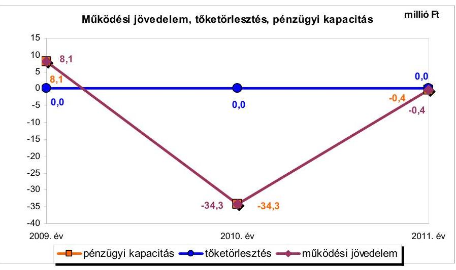
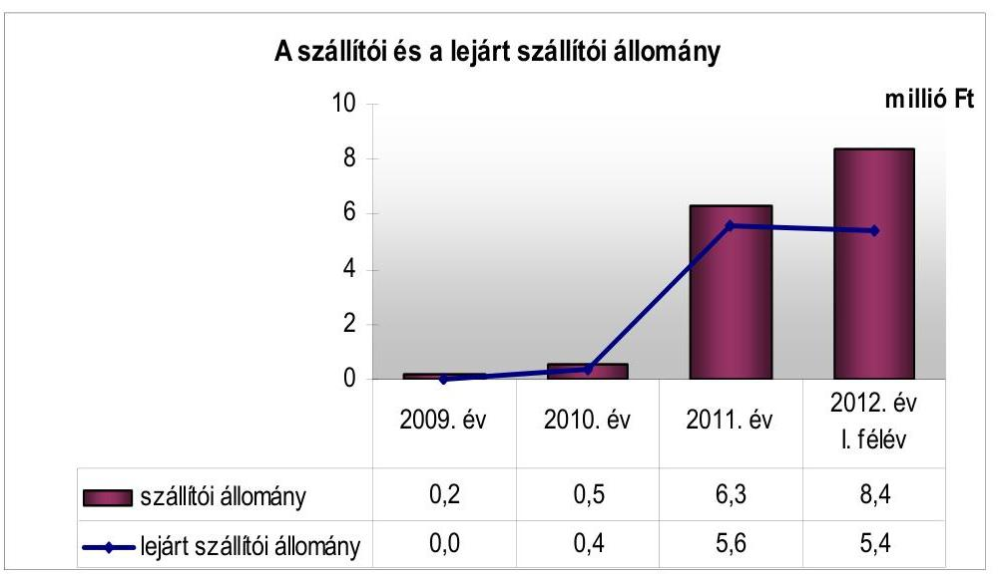
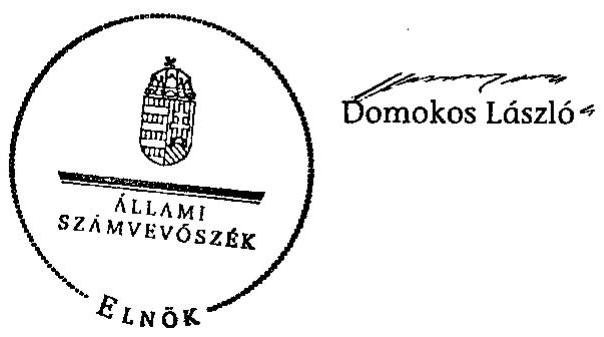
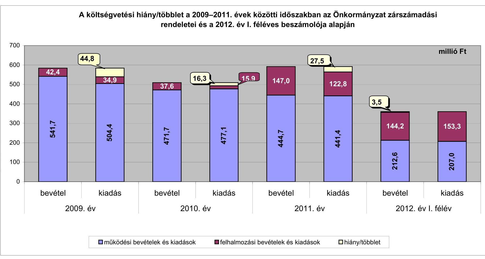
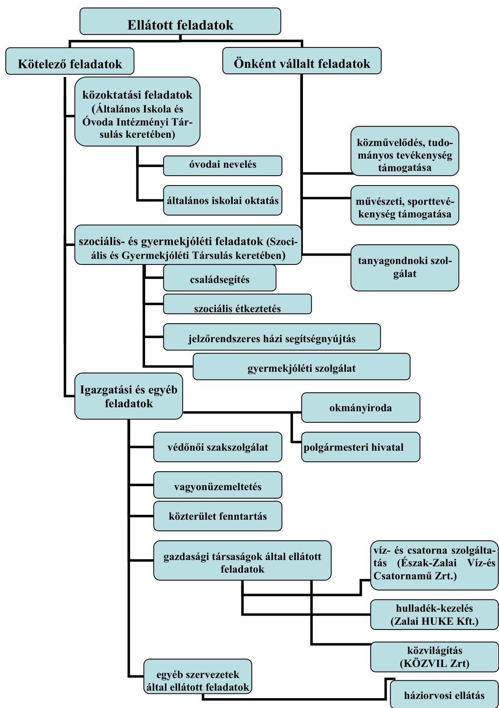

# JELENTÉS 

Pacsa Város Önkormányzata pénzügyi gazdálkodási helyzetének, szabályosságának ellenőrzéséről

---

# Állami Számvevőszék 

Iktatószám: V-0030-257-014/2013.
Témaszám: 1069
Vizsgálat-azonosító szám: V059210

## Az ellenőrzést felügyelte:

## Renkó Zsuzsanna

felügyeleti vezető

## Az ellenőrzést vezette:

## Dér Lívia

ellenőrzésvezető

## Az ellenőrzést végezték:

| Pálfiné Pusztai Magdolna | Iszakné Dóczé Katalin | Csényi István |
| :-- | :-- | :-- |
| számvevő tanácsos | számvevő tanácsos | számvevő tanácsos |

---

# TARTALOMJEGYZÉK 

BEVEZETÉS ..... 3
I. ÖSSZEGZŐ MEGÁLLAPÍTÁSOK, KÖVETKEZTETÉSEK, JAVASLATOK ..... 6
II. RÉSZLETES MEGÁLLAPÍTÁSOK ..... 12

1. Az Önkormányzat kötelező és önként vállalt feladatai, a feladatellátás szervezeti keretei ..... 12
2. A pénzügyi egyensúly fenntartását veszélyeztető pénzügyi kockázatok és az ezek csökkentése érdekében tett intézkedések ..... 13
3. A pénzügyi gazdálkodási folyamatok szabályosságát, megfelelőségét biztosító belső kontrollok ..... 18
4. Az ÁSZ korábbi ellenőrzése során a pénzügyi, gazdálkodási helyzet javítására tett javaslatainak megvalósítása ..... 19

---

# MELLÉKLETEK 

1. számú A költségvetési hiány/többlet a 2009-2011. évek közötti időszakban az Önkormányzat zárszámadási rendeletei és a 2012. év I. féléves beszámolója alapján
2. számú Az Önkormányzat bevételei és kiadásai, valamint adósságszolgálata a 2009-2011. években (a CLF módszer szerint)
3. számú Az Önkormányzat által 2009-2012. év I. félév között megvalósított (műszakilag befejezett) fejlesztések forrásösszetétele
4. számú Az önkormányzati feladatok ellátásában résztvevő gazdasági társaságok egyes kiemelt adatai

## FÜGGELÉKEK

1. számú Rövidítések jegyzéke
2. számú Értelmező szótár
3. számú Az Önkormányzat által ellátott feladatok a 2012. év I. félév végén

---

# JELENTÉS 

## Pacsa Város Önkormányzata pénzügyi gazdálkodási helyzetének, szabályosságának ellenőrzéséről

## BEVEZETÉS

Az államháztartás helyi szintjén, az önkormányzati alrendszerben az utóbbi években megjelenő gazdálkodási nehézségek, a pénzforgalmi hiány növekedése, az eladósodás az ÁSZ figyelmét a helyi önkormányzatok pénzügyi helyzetére irányította. Az ÁSZ a 2012. évi ellenőrzési tervben foglaltaknak megfelelően az önkormányzatok pénzügyi gazdálkodási helyzetének, szabályosságának ellenőrzésével az önkormányzatok 2011. évben megkezdett helyzetelemzését folytatta. Az ellenőrzés keretében értékeljük az önkormányzatok adósságkezelési és likviditási helyzetét, bemutatjuk a pénzügyi egyensúly alakulására hatással lévő folyamatokat. Feltárjuk az ezekre ható kockázatokat, a pénzügyi egyensúlyi helyzetet befolyásoló döntésmegalapozó, döntés-előkészítő eljárások szabályosságát, és minősítjük az ezekkel összefüggő belső kontrollok kialakítását, múködését. Az ellenőrzés kiterjed az ellenőrzött időszakban végrehajtott ÁSZ ellenőrzés utóellenőrzésére is.

Az ellenőrzés eredményének várható hatásaként megállapításaival segítséget nyújthat a pénzügyi helyzet értékeléséhez, a pénzügyi egyensúly helyreállítása érdekében szükségessé váló önkormányzati intézkedések megtételéhez.

Az ellenőrzés típusa: szabályszerűségi ellenőrzés.

## Az ellenőrzés célja annak értékelése volt, hogy:

- az ellenőrzött időszakban a kötelező és az önként vállalt feladatok ellátását biztosító szervezeti formák változása milyen hatást gyakorolt az Önkormányzat pénzügyi helyzetének alakulására;
- az Önkormányzat pénzügyi - ezen belül múködési és felhalmozási - egyensúlya milyen irányban változott, a változást milyen okok idézték elő, továbbá milyen intézkedéseket tettek a pénzügyi egyensúly biztosítása, illetve javítása érdekében, az intézkedések hatására javult-e az Önkormányzat pénzügyi helyzete;
- a költségvetési kiadások finanszírozása érdekében vállalt, pénzintézetekkel szembeni kötelezettségek hogyan alakultak, a kötelezettségek fennállása miként befolyásolja az Önkormányzat jövőbeli pénzügyi egyensúlyi helyzetét;

---

- az Önkormányzat beazonosította, felmérte, értékelte-e a pénzügyi egyensúlyt befolyásoló pénzügyi kockázatokat, a finanszírozási célú pénzügyi műveletekkel kapcsolatban írtak-e elő kockázatértékelési kötelezettséget;
- az Önkormányzat által kialakított belső kontrollok biztosítják-e a pénzügyi gazdálkodás folyamatainak szabályosságát és eredményességét;
- hasznosultak-e az ÁSZ korábbi ellenőrzése során a pénzügyi, gazdálkodási helyzet javítására tett szabályszerűségi és célszerűségi javaslatok.

Az ellenőrzés a 2009. január 1-jétől 2012. június 30 -áig terjedő időszakot ölelte fel. A pénzintézetekkel szembeni kötelezettségek állományának vizsgálatakor a 2011. december 31-én fennálló kötelezettségek keletkezésének kezdő időpontját vettük figyelembe.

Az ellenőrzés szakmai módszertana az ÁSZ Ellenőrzési Kézikönyvében foglalt szakmai szabályokon alapult, amely a Legfelsőbb Ellenőrző Intézmények Nemzetközi Szervezete (INTOSAI) által kiadott nemzetközi standardok (ISSAI) figyelembevételével készült.

Az ellenőrzés során használt rövidítéseket az 1. számú, az egyes fogalmak magyarázatát a 2. számú függelék tartalmazza.

A vizsgálat jogszabályi alapját az ÁSZ tv. 1. § (3) bekezdésének, 5. § (2)-(6) bekezdéseinek, valamint az Áht. 61 . § (2) bekezdésének előírásai képezik.

A helyszíni ellenőrzést követően az Országgyűlés a helyi önkormányzatok adósságállományának részleges konszolidációjáról döntött. Az 5000 fő lakosságszámot meg nem haladó települési önkormányzatok számára nyújtott törlesztési célú támogatással ${ }^{1}$ lehetővé tették a 2012. december 12-én fennálló tartozásállományuk és annak 2012. december 28-án fennálló járulékai teljes megfizetését. Az 5000 fő lakosságszám feletti települések esetében a 2013. évben az állam differenciált - a bevételi képességet figyelembe vevő, 40-70\%-ig terjedő mértékben vállalja át ${ }^{2}$ az önkormányzat 2012. december 31-i, az átvállalás időpontjában fennálló adósságállományát és annak járulékait. Az adósságkonszolidációs intézkedéssel egyidejűleg a Kormány elrendelte ${ }^{3}$ az önkormányzatok adósságállománya újratermelődésének megakadályozása céljából a hitelengedélyezési és a likvid hitelekre vonatkozó szabályozás szigorítását.

Pacsa város állandó lakosainak száma 2012. január 1-jén 1780 fő volt, amely 60 fővel kevesebb a 2009. január 1-jei (1840 fő) lakosságszámhoz képest. Az Önkormányzat a 2011. évben 591,7 millió Ft költségvetési bevételt ért el, és 564,2 millió Ft költségvetési kiadást teljesített a zárszámadási rendelete szerint.

[^0]
[^0]:    ${ }^{1}$ Magyarország 2012. évi központi költségvetéséről szóló 2011. évi CLXXXVIII. törvény módosításáról szóló 2012. évi CLXXXVII. törvény alapján
    ${ }^{2}$ Magyarország 2013. évi központi költségvetéséről szóló 2012. évi CCIV. törvény alapján
    ${ }^{3}$ 1540/2012. (XII. 4.) Korm. határozat a helyi önkormányzatok adósságállományának részleges konszolidációjáról

---

Az ellenőrzött időszakban pénzintézettekkel szemben kötelezettsége nem állt fenn. A 2011. december 31-ei könyvviteli mérlege szerint az eszközök értéke 1269,4 millió Ft, ami 20,4 millió Ft-tal (1,6\%-kal) nőtt a 2009. év végi (1249,0 millió Ft) állományhoz viszonyítva. Az eszközérték emelkedésében - a 2009-2011. években végrehajtott fejlesztések eredményeként - a tárgyi eszközök állománynövekedése volt a meghatározó. A 2009. év és a 2012. év I. félév közötti jelentősebb fejlesztés útfelújítás, valamint az Általános Iskola és Óvoda intézmény korszerűsítése és felújítása voltak. A források között a saját tőke állományának 50,9 millió Ft-os növekedése adta az állományváltozás döntő hányadát. Az Önkormányzat a 2012. évi költségvetési rendeletében a költségvetés bevételi és kiadási főösszegét 627,3 millió Ft-ban állapította meg.

Az ÁSZ tv. 29. § (1) bekezdése szerint a jelentéstervezetet megküldtük a polgármester részére, aki az ÁSZ tv. 29. § (2) bekezdésében foglalt észrevételezési jogával nem élt, a jelentéstervezetre észrevételt nem tett.

---

# I. ÖSSZEGZŐ MEGÁLLAPÍTÁSOK, KÖVETKEZTETÉSEK, JAVASLATOK 

Pacsa Város Önkormányzatának pénzügyi egyensúlyi helyzete középtávon nem biztosított. A 2010. évtől az alacsony múködési jövedelemtermelő képessége kockázatot jelent a múködés finanszírozása és a szállítói kötelezettségek teljesítése szempontjából. Az Önkormányzat az ellenőrzött időszakban pénzintézeti kötelezettségállománnyal nem rendelkezett.

Az Önkormányzat számára az önként vállalt feladatok ellátása nem jelentett kockázatot. Az e feladatokra fordított kiadások összege és összes múködési kiadáson belüli aránya évről évre csökkent, az ellátott feladatok köre - a kollégiumi ellátás megszüntetésével - szűkült. Az önként vállalt feladatok kiadása 2009-ben 35,3 millió Ft (7,0\%), 2011-ben 27,5 millió Ft (6,3\%) volt. Az ellenőrzött időszakban az Önkormányzatnál feladatátvétel, -átadás nem történt, a feladatokat ellátó költségvetési szervek száma változatlan volt, a feladatellátás szervezeti formája jelentősen nem változott, a pénzügyi egyensúlyi helyzetre nem gyakorolt meghatározó hatást.

Az Önkormányzat 2009-2011 között összesen 1588,0 millió Ft költségvetési bevételt ért el, és 1595,9 millió Ft költségvetési kiadást teljesített. Az ebből ellátott feladatok alapvetően a közoktatáshoz, a szociális és gyermekjóléti ellátáshoz, a közművelődési és az igazgatási feladatokhoz kapcsolódtak.

A múködési jövedelem 2009-ben pozitív, a 2010-2011. években negatív volt, a felhalmozási költségvetés egyenlege a 2009-2010. években forráshiányt, 2011ben többletet mutatott. Együttes egyenlegük összesen 7,9 millió Ft forráshiányt jelentett, amely a teljesített költségvetési kiadások 0,5\%-a.

Az Önkormányzat pénzügyi kapacitásának 2009-2011 közötti alakulását tőketörlesztési kötelezettség hiányában - kizárólag a múködési jövedelem változása határozta meg, amelyet a következő ábra mutat be:

---

A 2010. évi múködési forráshiányt a költségvetési támogatás és az államháztartáson belülről kapott támogatások - 2009. évihez viszonyított - csökkenése okozta. A pénzügyi egyensúlyi helyzetet 2011-ben kedvezően befolyásolta az 5,4 millió Ft összegben kapott ÖNHIKI támogatás, mely nélkül a múködési jövedelem 5,8 millió Ft hiányt mutatott volna. A múködési költségvetés hiánya 2010-2011 között csökkent, a múködési jövedelemtermelő képesség miatti kockázat mérséklődött.

Az Önkormányzatnál nem állt fenn bevételi kitettség miatti kockázat, mivel az adóbevételek nagyszámú adóalanytól származtak és van lehetőség további adónemek bevezetésére és az adómérték növelésére.

A felhalmozási költségvetés hiányát 2009-ben ( $-2,7$ millió Ft) a múködési jövedelem, 2010-ben ( $-1,3$ millió Ft) a költségvetési tartalék fedezte. A felújított közoktatási intézmény jövőbeni üzemeltetése kockázatot jelenthet a gyermeklétszám csökkenése esetén. Ezen kockázatot mérsékelheti - a korszerűsítés eredményeként - a fenntartási költségek csökkenése és a bérbeadásból származó bevétel növelési lehetőség.

Az ellenőrzött időszakban tett bevételt növelő és kiadási megtakarítást eredményező intézkedések hatására - az Önkormányzat adatszolgáltatása szerint - összesen 34,7 millió Ft-tal javult a pénzügyi egyensúlyi helyzet. A 2009-2011 közötti intézkedések hatására összesen 16 fő létszámcsökkentés valósult meg.

Az Önkormányzatnak pénzintézettel szemben nem állt fenn kötelezettsége az ellenőrzött időszakban.

A szállítói állomány a 2011. év végi 6,3 millió Ft-ról a 2012. év I. félév végére 8,4 millió Ft-ra nőtt. A lejárt szállítói tartozás 2011. évi 5,6 millió Ft-os és 2012. év I. félév végi 5,4 millió Ft-os összege meghaladta a dologi kiadások egy havi átlagának a felét. A 2012. év I. félév végén, a 60 napon túli tartozás 0,3 millió Ft volt. Az Önkormányzatnál nem vizsgálták a szállítói kötelezettségek állományának változását, azok okait és hatását a pénzügyi egyensúlyi helyzetre. A 2011. év és a 2012. év I. féléve közötti időszakban a szállítói állomány emelkedése szállítói kitettséget és nemfizetési kockázatot jelentett.

Az Önkormányzat 2011. évi könyvviteli mérlege az Áhsz.-ben foglaltak ellenére nem tartalmazta a közoktatási intézmény 5,6 millió Ft összegű lejárt szállítói tartozásait, megsértve ezzel a Számv. tv.-ben előírt teljesség és valódiság számviteli alapelveket is.

Az ellenőrzött időszakban az Önkormányzatnál nem mérték fel az elhasználódott eszközök felújításának és pótlásának forrásigényét, nem értékelték az eszközök használhatósági fokának alakulását. A használhatósági fok a 2009. évről a 2011. évre 77,3\%-ról 73,0\%-ra csökkent.

Az Önkormányzatnál a kockázatkezelési rendszer kialakítása és múködtetése teljes körűen nem felelt meg a 2009-2011. években az Áht. ${ }_{1}$, a 2012. év I. félévében az Áht. ${ }_{2}$ előírásainak. Az ellenőrzött időszakban fennállt, pénzügyi egyen-

---

súly fenntartására kiható kockázatok - a múködési jövedelemtermelő képesség alacsony szintje miatti kockázat, egy fejlesztés jövőbeni üzemeltetési kockázata, és a szállítói állomány emelkedése miatti nemfizetési kockázat - beazonosítása, felmérése, értékelése, ezáltal kezelése a 2009. évben az Ámr. ${ }_{1}$, a 2010-2011. években az Ámr. ${ }_{2}$ és a 2012. év I. félévében a Bkr. előírásai ellenére elmaradt.

Az Önkormányzatnál a belső kontrolltevékenységek kialakítása és múködtetése teljes körűen nem felelt meg a 2009-2011. években az Áht. ${ }_{1}$, a 2012. év I. félévben az Áht. ${ }_{2}$ előírásainak. A pénzügyi-gazdálkodási folyamatok szabályosságát biztosító belső kontrollok gazdálkodási folyamatokba történő beépítése - a 2009. évben az Ámr. ${ }_{1}$, a 2010-2011. években az Ámr. ${ }_{2}$ és a 2012. év I. félévében a Bkr. előírásai ellenére - részben volt megfelelő. Nem szabályozták a feladatellátási szerződések minimum tartalmi követelményeinek meghatározásával, és a feladatellátási döntések pénzügyi egyensúlyi helyzetre gyakorolt hatásának értékelésével összefüggő kontrolltevékenységeket. A döntés-előkészítés szakaszában nem írták elő a jövőbeni pénzintézeti kötelezettségvállalásokkal kapcsolatos döntések kockázatainak a feltárását és a futamidő egyes éveit terhelő kötelezettségek költségvetési egyensúlyra gyakorolt hatásának a vizsgálatát. Az Önkormányzatnál a belső ellenőrzés kialakítása, múködtetése teljes körűen nem felelt meg a 2009-2011. években az Áht. ${ }_{1}$-ben, a 2012. év I. félévben az Áht. ${ }_{2}$-ben meghatározott előírásoknak. A belső ellenőrzési tervek készítését megelőzően - a 2009-2011. években a Ber.-ben és 2012. január 1-jétől a Bkr.-ben foglalt előírások ellenére - nem írták elő a pénzügyi egyensúlyi helyzetet befolyásoló döntések kockázati tényezőinek feltárását, a belső ellenőrzési tervek nem tartalmazták ezen kockázati tényezők ellenőrzését.

A gazdálkodási folyamatokba beépített belső kontrollok múködése részben volt megfelelő, mivel nem tárták fel a fejlesztéseket megelőző döntés-előkészítési folyamatban az előkészítés, a lebonyolítás és a múködtetés kockázatait. A lejárt szállítói tartozások és az egyéb kiadás-elmaradások kezelése nem volt megfelelő, a 60 napon túli kötelezettségek miatt, az Adósságrendezési tv.-ben foglaltak ellenére nem történt intézkedés. A belső ellenőrzési tervek készítése során nem tárták fel az Önkormányzat pénzügyi egyensúlyi helyzetét befolyásoló döntések kockázati tényezőit, és ezen kockázati tényezőket a belső ellenőrzés keretében nem ellenőrizték.

Az ellenőrzött időszakban az ÁSZ az Önkormányzatnál egy ellenőrzést végzett. Az ez alapján tett, hat szabályszerűségi javaslat 83,3\%-a (öt) és három célszerűségi javaslat 66,7\%-a (kettő) hasznosult. Nem készítették el - a Kvtv.-ben foglaltak ellenére - a környezetvédelmi programot, valamint a zöldterületgazdálkodás keretében ellátandó feladatok részletező kimutatásait.

Összességében az alacsony múködési jövedelemtermelő képesség miatti kockázat 2010-től fennállt az Önkormányzatnál. A képződő bevételek a feladatok ellátásához szükséges kiadásokat csak részben fedezték. A szállítói tartozások növekvő állománya tovább nehezítette az Önkormányzat pénzügyi gazdálkodási pozícióit, múködését középtávon kedvezőtlenül befolyásolja. A döntően támogatásból (EU-s forrás) megvalósuló fejlesztések a feladatellátás színvonalának javításához hozzájárultak, de nem teremtettek számottevő bevétel növelési lehetőséget.

---

Az ÁSZ tv. 33. § (1) bekezdésében foglaltak értelmében az ellenőrzött szervezet vezetője köteles a jelentésben tett megállapításokhoz kapcsolódó intézkedési tervet összeállítani, és azt a jelentés kézhezvételétől számított harminc napon belül az ÁSZ részére megküldeni. Amennyiben az intézkedési tervet határidőn belül nem küldi meg a szervezet, vagy az továbbra sem elfogadható, az ÁSZ elnöke a hivatkozott törvény 33. § (3) bekezdés a)-b) pontjaiban foglaltakat érvényesítheti.

# Az ellenőrzés intézkedést igénylő megállapításai és javaslatai: 

## a polgármesternek

1. Az Önkormányzat működési jövedelme 2011-ben a 2009. évihez viszonyítva csökkent, a 2010-2011. években negatív volt. A nettó működési jövedelem a 2010. évben nem nyújtott fedezetet a felhalmozási költségvetés hiányára, a működési és felhalmozási forráshiányt az előző években képződött tartalékok fedezték. Az Önkormányzatnak az ellenőrzött időszakban pénzintézettel szembeni kötelezettsége nem állt fenn. A szállítói állomány folyamatosan nőtt, a 2012. év I. félév végén 8,4 millió Ft, ebből a lejárt tartozás 5,4 millió Ft volt.

Javaslat:
A működési jövedelemtermelő képesség és a feladatellátás összhangjának, valamint az Önkormányzat pénzügyi egyensúlya hosszú távú fenntarthatóságának érdekében - a 2013. évtől változó feladat-ellátási kötelezettséget és feladatfinanszírozási rendszert figyelembe véve - felelősök és határidők megjelölésével kezdeményezzen intézkedéseket, melyek keretében:
a) vizsgáltassa meg és terjessze a Képviselő-testület elé a további bevételszerző, kiadáscsökkentő intézkedések bevezetésének lehetőségét, és a döntés függvényében járjon el a bevezetésre kerülő bevételnövelő, kiadáscsökkentő intézkedések végrehajtása érdekében;
b) terjesszen a Képviselő-testület elé jóváhagyásra - az 1991. évi XX. törvény 140. § (1) bekezdés a) pontja alapján a jegyző által elkészített - az Önkormányzat gazdasági helyzetének elemzésén alapuló, a pénzügyi egyensúlyi helyzet hosszú távú megőrzését biztosító intézkedéseket tartalmazó stabilizációs programot;
c) a szállítói kitettség és az Adósságrendezési tv. 4-9. §-aiban szabályozott adósságrendezési eljárás megindítása elkerülésének érdekében intézkedjen, hogy a szállítói számlák esedékesség szerinti kiegyenlítése szabad pénzmaradvány rendelkezésre állása esetén történjen meg. Meghatározott gyakorisággal számoljon be a Képviselő-testületnek az Önkormányzat lejárt szállítói állománya alakulásáról és a lejárt tartozások átütemezése érdekében tett intézkedésekről.
2. Az Önkormányzat tulajdonában lévő zöldterületek fejlesztésének és fenntartásának 2009. évi ÁSZ ellenőrzése során tett szabályszerűségi javaslatok közül egy nem hasznosult. A Kvtv. 46. § (1) bekezdés b) pontjában foglalt előírás ellenére elmaradt a környezetvédelmi program elkészítése és jóváhagyása.

---

Javaslat:
A zöldterületek fejlesztésére és fenntartására irányuló 2009. évi ÁSZ ellenőrzés által megállapított szabálytalanság megszüntetése érdekében kezdeményezze a környezetvédelmi program elkészítését, és terjessze a Képviselő-testület elé jóváhagyásra a Kvtv. 46. § (1) bekezdés b) pontjában foglalt előírásnak megfelelően.

# a jegyzőnek 

1. Az Önkormányzat a 2011. évi könyvviteli mérlegében - a Számv. tv. 15. § (2)-(3) bekezdéseiben, valamint az Áhsz. 26. § (5) bekezdés c) pontjában foglalt előírásokat megsértve - a rövid lejáratú kötelezettségek összege nem tartalmazta a közoktatási intézmény 5,6 millió Ft összegben fennálló szállítói tartozását.

Javaslat:
Intézkedjen, hogy az Önkormányzat könyvviteli nyilvántartásában a rövid lejáratú kötelezettségek bemutatása teljes körűen, a Számv. tv. 15. § (2)-(3) bekezdéseiben, valamint az Áhsz. 26. § (5) bekezdés c) pontjában foglalt előírásoknak megfelelően történjen.
2. Az Önkormányzatnál a kockázatkezelési rendszer kialakítása és múködtetése teljes körűen nem felelt meg a 2009-2010. években az Áht. 120/B. § (2) bekezdés b) pontjában, a 2011. évben az Áht. 1 121. § (2) bekezdés b) pontjában, a 2012. év I. félévében az Áht. 2 69. § (2) bekezdésében meghatározott előírásoknak. Az ellenőrzött időszakban fennállt pénzügyi egyensúlyi helyzetre kiható kockázatok (a müködési jövedelemtermelő képesség alacsony szintje miatti kockázat, az egy fejlesztés jövőbeni üzemeltetése miatti kockázat, a szállítói állomány emelkedése miatti nemfizetési kockázat) feltárása, beazonosítása, értékelése, ezáltal a kockázatok kezelése - a 2009. évben az Ámr. 1 145/C. §-ában, a 2010-2011. években az Ámr. 2 157. §-ában és a 2012. év I. félévében a Bkr. 7. § (1)-(2) bekezdéseiben foglalt előírások ellenére - elmaradt.

Javaslat:
Működtessen az Áht. 2 69. § (2) bekezdésében, továbbá a Bkr. 7. § (1)-(2) bekezdéseiben foglalt előírásoknak megfelelő, a pénzügyi egyensúlyt befolyásoló kockázatok kezelésére alkalmas kockázatkezelési rendszert.
3. Az Önkormányzatnál a belső kontrolltevékenységek kialakítása és múködtetése teljes körűen nem felelt meg a 2009-2010. években az Áht. 120/B. § (2) bekezdés c) pontjában, a 2011. évben az Áht. 1 121. § (2) bekezdés c) pontjában és a 2012. év I. félévében az Áht. 2 69. § (2) bekezdésében meghatározott előírásoknak. A pénzügyi gazdálkodási folyamatok szabályosságát biztosító belső kontrollok gazdálkodási folyamatokba történő beépítése - a 2009. évben az Ámr. 1 145/E. § (1) bekezdésében, a 2010-2011. években az Ámr. 2 158. § (1) bekezdésében és a 2012. év I. félévében a Bkr. 8. § (1)-(2) bekezdéseiben foglalt előírások ellenére - nem volt megfelelő. Nem szabályozták a feladatellátáshoz kapcsolódó döntések pénzügyi egyensúlyi helyzetre gyakorolt hatásának vizsgálatával, a feladatellátási szerződések minimum tartalmi követelményeinek meghatározásával összefüggő kontrolltevékenységeket. Nem írták elő a jövőbeni pénzintézeti kötelezettségvállalásokkal kapcsolatos dönté-

---

sek kockázatainak döntés-előkészítő szakaszban történő feltárását, valamint a futamidő egyes éveit terhelő kötelezettségek költségvetési egyensúlyra gyakorolt hatásának vizsgálatát.

Javaslat:
Alakítsa ki az Áht. 2 69. § (2) bekezdésében, továbbá a Bkr. 8. § (1)-(2) bekezdése alapján azokat a belső kontrolltevékenységeket, amelyek biztosítják a pénzügyigazdálkodási folyamatok szabályosságát, a pénzügyi egyensúlyi helyzet alakulását befolyásoló döntések kockázatainak kezelését. Ennek keretében:
a) készítsen szabályzatot a feladatellátáshoz kapcsolódó döntések pénzügyi egyensúlyi helyzetre gyakorolt hatásának értékelésére, valamint a feladatellátási szerződések minimum tartalmi követelményeinek meghatározása helyi szabályaira;
b) írja elő a jövőbeni pénzintézeti kötelezettségvállalások kockázatainak döntéselőkészítő szakaszban történő feltárását, és a futamidő egyes éveit terhelő kötelezettségek költségvetési egyensúlyra gyakorolt hatásának vizsgálatát.
4. Az Önkormányzatnál a belső ellenőrzés kialakítása, működtetése teljes körűen nem felelt meg a 2009-2010. években az Áht. 1 121/A. § (3) bekezdésében, a 2011. évben az Áht. 1 121/B. § (4) bekezdésében, a 2012. év I. félévében az Áht. 2 70. § (1) bekezdésében meghatározott előírásoknak. Az ellenőrzött időszak belső ellenőrzési terveinek készítését megelőzően - a 2009-2011. években a Ber. 18. § és a 21. § (2) bekezdés és (3) bekezdés a) pontjában, 2012. január 1-jétől a Bkr. 29. § (1) bekezdésében, a 31. § (2) bekezdésében és a (4) bekezdés a) pontjában foglalt előírások ellenére - nem írták elő a pénzügyi egyensúlyi helyzetet befolyásoló döntések kockázati tényezőinek feltárását, és a belső ellenőrzési tervek nem tartalmazták ezen kockázati tényezők ellenőrzését.

Javaslat:
Intézkedjen, hogy az Áht. 2 70. § (1) bekezdésében, továbbá a Bkr. 29. § (1) bekezdésében és a 31. § (2) bekezdése és a (4) bekezdés a) pontjában foglalt előírások szerint az éves belső ellenőrzési tervek tartalmazzák a pénzügyi egyensúlyi helyzetet befolyásoló döntésekkel kapcsolatos feltárt kockázati tényezők ellenőrzését, és biztosítsa az ellenőrzési tervek végrehajtását.

---

# II. RÉSZLETES MEGÁLLAPÍTÁSOK 

## 1. Az ÖNKORMÁNYZAT KÖTELEZŐ ÉS ÖNKÉNT VÁLlALT FELADATAI, A FELADATELLÁTÁS SZERVEZETI KERETEI

A kötelező és az önként vállalt feladatokat az Önkormányzat belső szabályzatban nem határozta meg ${ }^{4}$. Az Önkormányzat kötelező feladatai a közoktatási, a szociális- és gyermekjóléti, az igazgatási és egyéb feladatok voltak. Az önként vállalt feladatok körét, ezen kiadások mértékét a Képviselőtestület az éves költségvetési rendeletekben határozta meg. Az Önkormányzat önként vállalt feladatnak tekintette a közművelődési, a tudományos, művészeti tevékenységek és a sport támogatását, a kollégiumi ellátást ${ }^{5}$, és a tanyagondnoki szolgálat biztosítását.

A múködési kiadásokra 2009-2011 között folyamatosan csökkenő összeget, 2009-ben 504,1 millió Ft-ot, 2011-ben 436,6 millió Ft-ot fordítottak. Az önként vállalt feladatok múködési kiadása a 2009. évi 35,3 millió Ft-ról 2011-re 27,5 millió Ft-ra, az összes múködési kiadáson belüli részaránya 7,0\%-ról 6,3\%ra csökkent. A változást meghatározóan a kollégiumi ellátáshoz kapcsolódó kiadások mérséklődése, majd - 2011 júliusától - a feladat megszűnése okozta. Az önként vállalt feladatok ellátására fordított múködési kiadások évenkénti összege és aránya nem jelentett kockázatot, nem gyakorolt jelentős hatást az Önkormányzat pénzügyi helyzetére.

Az ellenőrzött időszakban - az Önkormányzat adatszolgáltatása szerint - a fejlesztési célú kiadások (307,9 millió Ft) 100\%-a a kötelező feladatok ellátásához kapcsolódott.

Az Önkormányzat a 2011. évtől a Polgármesteri Hivatal (azt megelőzően Körjegyzőség) és intézményfenntartó társulásai ${ }^{6}$, vállalkozási szerződéssel foglalkoztatott háziorvos, valamint - feladat-ellátási szerződés alapján - három gazdasági társaság ${ }^{7}$ útján látta el feladatait. A feladatellátás részletezését a 3. számú függelék tartalmazza.

A feladatellátásban résztvevő gazdasági társaságok közül az Észak-Zalai Víz- és Csatornamú Zrt.-ben 1,58\%-os, a KÖZVIL Zrt.-ben 0,22\%-os tulajdoni részesedéssel rendelkezett az Önkormányzat.

A feladatellátás szervezeti formája jelentősen nem változott az ellenőrzött időszakban. A feladatokat ellátó költségvetési szervek száma (három) és

[^0]
[^0]:    ${ }^{4}$ Az ellátott feladatok belső szabályzatban történő meghatározására nincs jogszabályi előírás.
    ${ }^{5}$ A kollégium 2011. június 30 -ai hatállyal megszűnt.
    ${ }^{6}$ Általános Iskola és Óvoda és Közép-Zalai Szociális és Gyermekjóléti Társulás
    ${ }^{7}$ Észak-Zalai Víz- és Csatornamú Zrt., Zalai HUKE Kft., KÖZVIL Zrt.

---

gazdasági társaságok száma (három) 2009. január 1-je és 2012. június 30-a között változatlan volt, a telephelyek száma (ötről négyre) csökkent. A közoktatási feladatokat az Általános Iskola és Óvoda látta el, 2009. január 1-jén három, 2012. június 30 -án kettő telephelyen. A telephelyek számának csökkenése a kollégium 2011. június 30 -i hatállyal történt megszüntetésének következménye volt.

A település várossá nyilvánítása (2009. július 1.) miatt, az addigi Körjegyzőség megszüntetését követően 2011. január 1-jétől Polgármesteri Hivatalt alapítottak.

A kötelező és az önként vállalt feladatok szervezeti kereteinek változása az Önkormányzat pénzügyi helyzetére nem gyakorolt jelentős hatást az ellenőrzött időszakban (a kollégium megszüntetése összességében 3 millió Ft-os megtakarítást eredményezett). Az Önkormányzatnál feladat átadás-átvétel nem történt.

# 2. A PÉNZÜGYI EGYENSÚLY FENNTARTÁSÁT VESZÉLYEZTETŐ PÉNZÜGYI KOCKÁZATOK ÉS AZ EZEK CSÖKKENTÉSE ÉRDEKÉBEN TETT INTÉZKEDÉSEK 

Az Önkormányzat költségvetésének elemzését CLF módszerrel hajtottuk végre. A CLF módszer szerinti 2009-2011 közötti részletes adatokat a 2. számú melléklet, a főbb önkormányzati adatokat a következő tábla mutatja be:

|  |  |  | millió Ft |
| :-- | --: | --: | --: |
| Megnevezés | 2009. év | 2010. év | 2011. év |
| Folyó bevételek | 512,2 | 447,3 | 436,2 |
| Folyó kiadások | 504,1 | 481,6 | 436,6 |
| Müködési jövedelem | $\mathbf{8 , 1}$ | $\mathbf{- 3 4 , 3}$ | $\mathbf{- 0 , 4}$ |
| Felhalmozási bevételek | 32,4 | 14,5 | 145,4 |
| Felhalmozási kiadások | 35,1 | 15,8 | 122,7 |
| Felhalmozási költségvetés egyenlege | $\mathbf{- 2 , 7}$ | $\mathbf{- 1 , 3}$ | $\mathbf{2 2 , 7}$ |
| Folyó és felhalmozási bevételek összesen | 544,6 | 461,8 | 581,6 |
| Folyó és felhalmozási kiadások összesen | 539,2 | 497,4 | 559,3 |
| Finanszírozási múveletek nélküli |  |  |  |
| pozíció | $\mathbf{5 , 4}$ | $\mathbf{- 3 5 , 6}$ | $\mathbf{2 2 , 3}$ |
| Finanszírozási múveletek egyenlege | -1,9 | 5,5 | $-4,9$ |
| Tárgyévi pénzügyi pozíció | $\mathbf{3 , 5}$ | $\mathbf{- 3 0 , 1}$ | $\mathbf{1 7 , 4}$ |
| Hiteltörlesztés, értékpapír beváltás | 0,0 | 0,0 | 0,0 |
| Nettó müködési jövedelem | $\mathbf{8 , 1}$ | $\mathbf{- 3 4 , 3}$ | $\mathbf{- 0 , 4}$ |

Az Önkormányzat a 2009-2011. évek között összesen 1588,0 millió Ft költségvetési bevételt ért el, és 1595,9 millió Ft költségvetési kiadást teljesített. A múködési és felhalmozási költségvetés együttes egyenlege 2009-ben és 2011-ben pozitív, 2010-ben negatív volt, az összesen 7,9 millió Ft forráshiány a teljesített költségvetési kiadások $0,5 \%$-át jelentette.

---

Az Önkormányzat folyó költségvetési egyenlege, múködési jövedelme 2009-ben pozitív, 2010-ben és 2011-ben negatív volt. A 2010. évi múködési forráshiányt a költségvetési támogatás ( 48,4 millió Ft-os) és az államháztartáson belülről kapott támogatások ( 31,8 millió Ft-os) - 2009. évihez viszonyított csökkenése okozta. Ezen bevételek csökkenését a folyó kiadások 22,5 millió Ftos mérséklődése részben kompenzálta. A múködési jövedelem 2010-2011 közötti javulását döntően a múködési kiadások 39,7 millió Ft-os ( $9,5 \%$-os) - ezen belül a 16 fős létszámcsökkenés miatti személyi juttatások és járulékaik 15,4 millió Ft-os, valamint a dologi kiadások 21,6 millió Ft-os - csökkenése eredményezte. Az ÖNHIKI támogatás (5,4 millió Ft) nélkül a 2011. évi múködési jövedelem 5,8 millió Ft hiányt mutatott volna. A pénzügyi kapacitás, nettó múködési jövedelem a 2009-2011. években megegyezett a folyó költségvetés egyenlegével, mivel adósságszolgálat nem terhelte.

Az Önkormányzat felhalmozási költségvetése 2009-2010-ben forráshiányt, 2011-ben forrástöbbletet mutatott. A felhalmozási forráshiányt 2009-ben (2,7 millió Ft) a múködési jövedelem, 2010-ben (1,3 millió Ft) - a jelentős múködési hiány miatt - a pénzforgalom nélküli bevétel (tartalék) fedezte. Az ellenőrzött időszakon belül a 2011. évben volt a legmagasabb összegű a felhalmozási kiadás ( 122,7 millió Ft), amelyet a közoktatási intézmény EU-s támogatással megvalósított felújításának kiadása eredményezett.

Az Önkormányzat teljes finanszírozási igénye (a múködési jövedelem és a felhalmozási költségvetés együttes negatív egyenlege) 2010-ben 35,6 millió Ft volt, melyet értékpapír-értékesítésből és előző évek pénzmaradványából fedezett.

Az Önkormányzatnál a múködési jövedelemtermelő képesség miatti kockázat 2010-ről 2011-re mérséklődött.

Az Önkormányzat zárszámadási rendeletei és 2012. év I. félévi beszámolója szerint a költségvetési kiadások és bevételek különbözeteként a 2009-2011. években többlet, a 2012. év I. félévében hiány keletkezett, melyet az 1. számú melléklet mutat be. Ezen bevételek - a CLF modelltől eltérően - tartalmazták a pénzforgalom nélküli bevételeket és kiadásokat is.

A folyó bevételek a 2009. évi 512,2 millió Ft-ról, 2010-re 447,3 millió Ft-ra, 2011-re 436,2 millió Ft-ra csökkentek, a költségvetési támogatások és az szja bevételek, illetve az egyéb saját bevételek csökkenése miatt.

A költségvetési támogatás és az szja együttes összege a 2009. évi 342,3 millió Ft-ról 2010-re 11,5\%-kal (39,3 millió Ft-tal), 2011-ben további 7,0\%-kal (21,2 millió Ft-tal) csökkent az ellátottak létszámához kapcsolódó normatív hozzájárulás és a központosított előirányzatok mérséklődése miatt. Az egyéb saját bevételek 2009-ről, 116,1 millió Ft-ról 2010-re 25,1 millió Fttal ( $21,6 \%$-kal) csökkentek. Ennek oka a támogatásértékű bevételek csökkenése volt, a Körjegyzőség megszűnése és a társulási formában ellátott közoktatási feladat szűkülése miatt.

A helyi adók (helyi iparűzési adó, magánszemélyek kommunális adója) és pótlékok múködési bevételeken belüli részaránya 2009-ben 5,9\%

---

(30,3 millió Ft), 2010-ben 6,2\%, (27,7 millió Ft), 2011-ben 7,9\% (34,6 millió Ft) volt. A 2010-2011 közötti kedvező változást a hatékonyabb adóztatási és behajtási tevékenység eredményezte. A helyi adóbevételek nagyszámú adóalanytól származtak, továbbá az Önkormányzatnak van lehetősége új adónemek bevezetésére és a magánszemélyek kommunális adója mértékének emelésére.

A helyi iparűzési adó mértéke a 2009-2011. években a törvényi maximummal azonos (2\%) volt. A magánszemélyek kommunális adójának mértéke (4000 Ft/adótárgy) nem érte el a törvényi felső határt.

Az Önkormányzatnál nem állt fenn bevételi kitettség miatti kockázat, mivel az adóbevételek nagyszámú adóalanytól származtak, és van lehetőség további adónemek bevezetésére és az adómérték növelésére.

A 2009-2011. évek összes felhalmozási bevételének 19,0\%-a, 36,6 millió Ft az önkormányzati ingatlanok, termőföldek bérbeadásából keletkezett. A 2011évben a közoktatási intézmény felújításához elnyert 125,2 millió Ft EU-s támogatás adta a felhalmozási bevételek $86,1 \%$-át.

A folyó kiadások a 2009. évi 504,1 millió Ft-ról 2010-re 4,5\%-kal (22,5 millió Ft-tal) csökkentek a személyi juttatások és a munkaadókat terhelő járulékok, valamint az államháztartáson belülre átadott pénzeszközök mérséklődése miatt. A 2010-2011 közötti 9,3\%-os (45,0 millió Ft-os) csökkenésben a dologi és egyéb folyó kiadások mellett a személyi juttatások és járulékaik mérséklődése volt a meghatározó.

A személyi juttatások és a munkaadókat terhelő járulékok kiadásai a létszámcsökkentések, valamint a 13. havi illetmény megszüntetése és a cafetéria juttatások keretösszegének mérséklése miatt évről évre csökkentek. A 2009. évi 279,8 millió Ft-nál 2010-re 12,0 millió Ft-tal (4,3\%-kal), 2011-re további 15,4 millió Ft-tal ( $5,8 \%$-kal) kevesebb kiadást teljesítettek ezeken a jogcímeken. A dologi és egyéb folyó kiadások az ingatlan-fenntartási kiadások mérséklődése következtében folyamatosan csökkentek. Ezen kiadásokra 2009-ben 156,8 millió Ftot, 2010-ben 151,8 millió Ft-ot, 2011-ben127,5 millió Ft-ot fordítottak.

A folyó és felhalmozási kiadások együttes összegén belül a felhalmozási kiadások aránya a 2012. év I. félévben kiemelkedően magas, 42,5\% (153,3 millió Ft) volt. Ez az arány az NYDOP által támogatott közoktatási intézményfejlesztés és felújítás kiadásainak eredményeként alakult ki. A felhalmozási kiadásokból beruházásra és felújításra 2009-ben 21,3 millió Ft-ot, 2010ben 10,5 millió Ft-ot, 2011-ben 122,7 millió Ft-ot használtak fel.

Az Önkormányzat 2012. június 30 -áig beruházásokra és felújításokra 307,9 millió Ft-ot fordított, melynek forrása 251,4 millió Ft (81,6\%) EU-s támogatás, 46,8 millió Ft ( $15,2 \%$ ) saját bevétel és 9,7 millió Ft (3,2\%) egyéb központi támogatás volt.

A fejlesztések finanszírozásának kockázatát csökkentette a közoktatási intézményfejlesztési projekt esetében igénybe vett 6,2 millió Ft állam által biztosított elöleg. A műszakilag átadott, de pénzügyileg - a támogatások végelszámolásának hiánya miatt - be nem fejezett felújítás az Önkormányzat pénzügyi helyzetét kedvezően befolyásolja, mivel visszakapja a saját forrásból

---

2012. június 30 -áig megelőlegezett 3,1 millió Ft-ot. A projekt pénzügyi lezárásával a forrásösszetétel változik.

Az ellenőrzött időszak fejlesztései közül a felújított létesítmények - út, illetve közoktatási intézmények - jövőbeni fenntarthatósága, üzemeltetése a közoktatási intézménynél jelenthet kockázatot, amennyiben a gyermeklétszám tovább csökken. Az üzemeltetés kockázatát mérsékelheti az ingatlankorszerűsítésből adódó fenntartási költségcsökkenés és a bérbeadásból származó - nem számottevő - bevétel növelési lehetőség.

Az Önkormányzatnak az ellenőrzött időszakban pénzintézettel szemben kötelezettsége nem állt fenn.

Az Önkormányzat nem vállalt garanciát és kezességet, nem nyújtott és nem vett igénybe kölcsönt, nem volt lizingszerződésből eredő fizetési kötelezettsége, továbbá minősített többségi befolyása alatt gazdasági társaság nem állt.

A Önkormányzat könyvviteli mérleg szerinti kötelezettségeinek 2009. december 31-én a 0,9\%-a ( 0,2 millió Ft), 2012. június 30 -án a $100 \%$-a ( 8,4 millió Ft) szállítókkal szembeni kötelezettség volt. A 2009. év és 2012. június 30. közötti szállítói és lejárt szállítói tartozás ${ }^{8}$ alakulását az alábbi ábra mutatja be:

A szállítói kötelezettségek és ezen belül a lejárt tartozások 2010-2011 között jelentős mértékben - 5,2 millió Ft-tal - emelkedtek a források szűkülése miatt. A lejárt szállítói állomány 2011-ben a dologi kiadások egy havi átlagának (10,1 millió Ft-nak) az 55,4\%-át, 2012. június 30 -án ( 10,5 millió Ft-nak) az $51,4 \%$-át tette ki. A 2012. év I. félév végi lejárt szállítói állomány 5,6\%-a ( 0,3 millió Ft) volt 60 napon túli tartozás.

[^0]
[^0]:    ${ }^{8}$ A 2011. évi szállítói állomány nem egyezik a könyvviteli mérleg adatával, a táblázat a valós adatot tartalmazza.

---

A lejárt szállítói tartozások a közoktatási intézménynél keletkeztek a fenntartói és a normatív támogatások csökkenése miatt. A 2011. évben és a 2012. év I. félévben a lejárt szállítói állomány jelentős részben közszolgáltatók, élelmiszerbeszállítók felé fennálló kötelezettségekből tevődött össze.

Az Önkormányzat 2011. évi könyvviteli mérlege - az Áhsz. 26. § (5) bekezdés c) pontjában foglaltak ellenére - nem tartalmazta a közoktatási intézmény 5,6 millió Ft összegű lejárt szállítói tartozásait, ezzel nem tett eleget a Számv. tv. 15. § (2) bekezdése szerinti teljességre és a 15. § (3) bekezdésében foglalt valódiságra vonatkozó számviteli alapelvekben megfogalmazott elvárásoknak.

Az Önkormányzatnál nem vizsgálták a szállítói kötelezettségek állományának változását, annak okait és hatását a pénzügyi egyensúlyi helyzetre, és nem intézkedtek a lejárt szállítói állomány esedékesség szerinti kiegyenlítéséről és a tartozások átütemezéséről. A közoktatási intézménynél a 60 napot meghaladó, szállítók felé fennálló kötelezettségekről - az Adósságrendezési tv. 5. § (1) bekezdésében foglaltak ellenére - a polgármester nem tájékoztatta a Pénzügyi bizottságot és a Képviselő-testületet. A 2011. év és a 2012. év I. féléve közötti időszakban a szállítói állomány emelkedése szállítói kitettséget és nemfizetési kockázatot jelentett.

A bevétel-visszafizetési kötelezettség állománya a 2012. év I. félév végén 1,2 millió Ft volt, melyből 1,1 millió Ft jogosulatlanul igénybevett TEUT pályázathoz kapcsolódó támogatás volt, amely nagyságrendje miatt nem befolyásolta az Önkormányzat pénzügyi egyensúlyi helyzetét.

Az Önkormányzat a 2009. év és a 2012. év I. félév közötti időszakban kiadáscsökkentő intézkedések (feladatmegszüntetés, létszám és támogatások csökkentése) hatásaként 18,3 millió Ft megtakarítást mutatott ki, amelyből 14,7 millió Ft az önként vállalt feladatokkal kapcsolatos megtakarítás volt. A létszámcsökkentési intézkedések következtében 2009-2011 között az álláshelyek száma 14 -gyel ( $12,3 \%$-kal), a foglalkoztatottak létszáma 16 fővel ( $14,0 \%$ kal) csökkent. A bevételnövelő intézkedések 16,4 millió Ft forrástöbbletet eredményeztek az ellenőrzött időszakban. Az eszközök bérbeadásával 12,9 millió Ft (78,7\%), a felesleges eszközök hasznosításával 3,5 millió Ft $(21,3 \%)$ bevételt értek el. A megtett intézkedések hatására - az Önkormányzat kimutatása szerint - összesen 34,7 millió Ft-tal javult az Önkormányzat pénzügyi egyensúlyi helyzete.

Az ellenőrzött időszakban az Önkormányzatnál nem mérték fel az elhasználódott eszközök felújításának és pótlásának forrásigényét, nem értékelték az eszközök használhatósági fokának alakulását. Az elszámolt értékcsökkenés összegéhez igazodóan nem képeztek alapot az eszközök pótlására. A 2009-2011. években 124,7 millió Ft értékcsökkenést számoltak el, beruházási kiadásokra 8,5 millió Ft-ot, felújításra 137,4 millió Ft-ot fordítottak, ami az elszámolt értékcsökkenés 1,2 szeresét jelentette. Az eszközök használhatósági foka a 2009. évről a 2011. évre 77,3\%-ról 73,0\%-ra csökkent, az időszak végéig még nem aktivált beruházások miatt. Az Önkormányzat adatszolgáltatása szerint az eszközök pótlására 5,6 millió Ft-ot használtak fel, ami a felhalmozási kiadások $1,8 \%$-a volt.

---

Az Önkormányzatnál a kockázatkezelési rendszer kialakítása és múködtetése teljes körűen nem felelt meg a 2009-2010. években az Áht. ${ }_{1}$ 120/B. § (2) bekezdés b) pontjában, a 2011. évben az Áht. ${ }_{1} 121 . \S$ (2) bekezdés b) pontjában és a 2012. év I. félévében az Áht. ${ }_{2} 69$. § (2) bekezdéseiben meghatározott előírásoknak. Az ellenőrzött időszakban fennállt, pénzügyi egyensúly fenntartására kiható kockázatok - a múködési jövedelemtermelő képesség alacsony szintje miatti kockázat, egy fejlesztés jövőbeni üzemeltetési kockázata, a szállítói állomány emelkedése miatti nemfizetési kockázat - beazonosítása, felmérése és értékelése, ezáltal a kockázatok kezelése a 2009. évben az Ámr. ${ }_{1}$ 145/C. §-ában, a 2010-2011. években az Ámr. ${ }_{2}$ 157. §-ában, a 2012. év I. félévében a Bkr. 7. §-(1)-(2) bekezdéseiben foglaltak előírások ellenére elmaradt.

# 3. A PÉNZÜGYI GAZDÁLKODÁSI FOLYAMATOK SZABÁLYOSSÁGÁT, MEGFELELŐSÉGÉT BIZTOSÍTÓ BELSŐ KONTROLLOK 

Az Önkormányzatnál a belső kontrolltevékenységek kialakítása és működtetése teljes körűen nem felelt meg a 2009-2010. években az Áht. ${ }_{1}$ 120/B. § (2) bekezdés c) pontjában, a 2011. évben az Áht. ${ }_{1} 121$. § (2) bekezdés c) pontjában és a 2012. év I. félévében az Áht. ${ }_{2} 69$. § (2) bekezdéseiben meghatározott előírásoknak.

A feladatellátás szabályosságát biztosító belső kontrollokat a 2009. évben az Ámr. ${ }_{1}$ 145/E. § (1) bekezdésében, a 2010-2011. években az Ámr. ${ }_{2} 158$. § (1) bekezdésében, a 2012. év I. félévében a Bkr. 8. § (1)-(2) bekezdéseiben foglaltak ellenére nem építették be a gazdálkodási folyamatokba. Nem szabályozták a feladatellátásra vonatkozó döntéseknek a kötelező és önként vállalt feladatokra fordított kiadások változására és a pénzügyi egyensúlyi helyzetre gyakorolt hatásának értékelésével, valamint. a feladat-ellátási szerződések minimum tartalmi követelményeinek meghatározásával összefüggő kontrolltevékenységeket.

A pénzügyi egyensúlyi helyzet alakulását befolyásoló kontrollokat a gazdálkodási folyamatokba beépítették. Rendelkeztek kockázatkezelési szabályzattal, ellenőrzési nyomvonallal, valamint a szabálytalanságok kezelésének eljárásrendjével, valamint szabályozták a költségvetés- és a zárszámadáskészítés folyamatát. Előírták az önkormányzati fejlesztések esetében a döntéselőkészítés folyamatában az előkészítés, a lebonyolítás és a működtetés kockázatai feltárásának és kezelésének kötelezettségét, továbbá a pályáztatási kötelezettséget. Kialakították a fejlesztésekhez kapcsolódó külső források, támogatások figyelési rendszerét, a pályázatkészítés feltételeit és szervezeti kereteit. Meghatározták az Önkormányzat által nyújtott múködési és felhalmozási célú pénzeszközátadások feltételrendszerét.

A pénzügyi gazdasági döntések megalapozását szolgáló döntés-előkészítő folyamatok, valamint - jövőbeni igénybevétel esetén - a pénzintézeti kötelezettségvállalások ${ }^{9}$ szabályosságát, megfelelőségét biztosító kontrollok gaz-

[^0]
[^0]:    ${ }^{9}$ Az Önkormányzat az ellenőrzött időszakban adósságot keletkeztető pénzintézeti kötelezettséget nem vállalt.

---

dálkodási folyamatokba történő beépítése - a 2009. évben az Ámr. ${ }_{1}$ 145/E. § (1) bekezdésében, a 2010-2011. években az Ámr. ${ }_{2}$ 158. § (1) bekezdésében, és a 2012. év I. félévében a Bkr. 8. § (1)-(2) bekezdéseiben foglalt előírások ellenére részben volt megfelelő. Meghatározták a pénzügyi kötelezettségek teljesítésére vonatkozó helyi szabályokat, valamint a szállítói (kiemelten a lejárt) tartozások kezelésével kapcsolatos feladatokat. Előírták a pénzintézeti szolgáltatások igénybevétele esetén a pályáztatási, illetve több ajánlatkérési kötelezettséget. Nem írták elő azonban a döntés-előkészítés során a jövőbeni pénzintézeti kötelezettségvállalásokkal kapcsolatos döntések kockázatai feltárásának kötelezettségét, és a futamidő egyes éveit terhelő kötelezettség költségvetési egyensúlyra gyakorolt hatásának vizsgálatát.

Az Önkormányzatnál a belső ellenőrzés kialakítása és múködtetése teljes körűen nem felelt meg a 2009-2010. években az Áht. ${ }_{1}$ 121/A. § (3) bekezdésében, a 2011. évben az Áht. ${ }_{1}$ 121/B. § (4) bekezdésében és a 2012. év I. félévében az Áht. ${ }_{2}$ 70. § (1) bekezdésében meghatározott előírásoknak. Az ellenőrzött időszak belső ellenőrzési terveinek készítését megelőzően - a 2009-2011. években a Ber. 18. § és a 21. § (2) bekezdés és (3) bekezdés a) pontjában, 2012. január 1-jétől a Bkr. 29. § (1) bekezdésében, a 31. § (2) bekezdésében és a (4) bekezdés a) pontjában foglalt előírások ellenére - nem írták elő a pénzügyi egyensúlyi helyzetet befolyásoló döntések kockázati tényezőinek feltárását, a belső ellenőrzési tervek nem tartalmazták ezen kockázati tényezők ellenőrzését.

A gazdálkodási folyamatokba beépített belső kontrollok múködése részben volt megfelelő, mert a feladatellátási szerződésekben - szabályozás hiányában is - rögzítették a szolgáltató feladatait, a feladat mutatóit, a nem szerződésszerű feladatellátás szankcióit és a feladatellátás teljesítéséről történő beszámolási kötelezettséget. A beruházások kivitelezőit pályázat alapján választották ki, de nem tárták fel a fejlesztéseket megelőző döntés-előkészítési folyamatban az előkészítés, a lebonyolítás és a múködtetés kockázatait. A lejárt szállítói tartozások és az egyéb kiadáselmaradások kezelése nem volt megfelelő, továbbá belső ellenőrzési tervek készítése során nem tárták fel és nem ellenőrizték az Önkormányzat pénzügyi egyensúlyi helyzetét befolyásoló döntések kockázati tényezőit.

# 4. Az ÁSZ KORÁBBI ELLENŐRZÉSE SORÁN A PÉNZÜGYI, GAZDÁLKODÁSI HELYZET JAVÍTÁSÁRA TETT JAVASLATAINAK MEGVALÓSÍTÁSA 

Az ellenőrzött időszakban az ÁSZ az Önkormányzatnál egy ellenőrzést ${ }^{10}$ végzett, melynek során hat szabályszerűségi és három célszerűségi javaslatot tett. A javaslatok hasznosítása érdekében határidő és felelősök megjelölésével intézkedési tervet készítettek.

Az Önkormányzat adatszolgáltatása alapján a szabályszerűségi javaslatokat 83,3\%-ban (öt), a célszerűségi javaslatokat 66,7\%-ban (kettő) hasznosították. Nem készítették el - a Kvtv. 46. § (1) bekezdés b) pontjában foglaltak ellenére -

[^0]
[^0]:    ${ }^{10}$ az Önkormányzat tulajdonában lévő zöldterületek fejlesztésének és fenntartásának ellenőrzése

---

a környezetvédelmi programot, valamint a zöldterület-gazdálkodás keretében ellátandó feladatok részletező kimutatásait - a feladatok elvégzésénél alkalmazandó technológia, idő-, anyag-, humán erőforrás, gépóra szükséglet - a költségvetési előirányzatok megalapozott tervezéséhez, az elvégzett feladatok értékeléséhez.

Budapest, 2013. 06 hó 15 nap

Melléklet: 4 db
Függelék: $\quad 3 \mathrm{db}$

---

# A költségvetési hiány/többlet a 2009–2011. évek közötti időszakban az Önkormányzat zárszámadási rendeletei és a 2012. év I. féléves beszámolója alapján

|  I. féléves | 2009. év | 2010. év | 2011. év | 2012. év I. féléves  |
| --- | --- | --- | --- | --- |
|  Bevétel | 44.8 | 44.8 | 44.8 | 44.8  |
|  Kiadás | 34.9 | 34.9 | 34.9 | 34.9  |
|  Bevétel | 16.3 | 16.3 | 16.3 | 16.3  |
|  Kiadás | 14.7 | 14.7 | 14.7 | 14.7  |
|  Bevétel | 16.3 | 16.3 | 16.3 | 16.3  |
|  Kiadás | 14.7 | 14.7 | 14.7 | 14.7  |
|  Bevétel | 16.3 | 16.3 | 16.3 | 16.3  |
|  Kiadás | 14.7 | 14.7 | 14.7 | 14.7  |
|  Bevétel | 16.3 | 16.3 | 16.3 | 16.3  |
|  Kiadás | 14.7 | 14.7 | 14.7 | 14.7  |
|  Bevétel | 16.3 | 16.3 | 16.3 | 16.3  |
|  Kiadás | 14.7 | 14.7 | 14.7 | 14.7  |
|  Bevétel | 16.3 | 16.3 | 16.3 | 16.3  |
|  Kiadás | 14.7 | 14.7 | 14.7 | 14.7  |
|  Bevétel | 16.3 | 16.3 | 16.3 | 16.3  |
|  Kiadás | 14.7 | 14.7 | 14.7 | 14.7  |
|  Bevétel | 16.3 | 16.3 | 16.3 | 16.3  |
|  Kiadás | 14.7 | 14.7 | 14.7 | 14.7  |
|  Bevétel | 16.3 | 16.3 | 16.3 | 16.3  |
|  Kiadás | 14.7 | 14.7 | 14.7 | 14.7  |
|  Bevétel | 16.3 | 16.3 | 16.3 | 16.3  |
|  Kiadás | 14.7 | 14.7 | 14.7 | 14.7  |
|  Bevétel | 16.3 | 16.3 | 16.3 | 16.3  |
|  Kiadás | 14.7 | 14.7 | 14.7 | 14.7  |
|  Bevétel | 16.3 | 16.3 | 16.3 | 16.3  |
|  Kiadás | 14.7 | 14.7 | 14.7 | 14.7  |
|  Bevétel | 16.3 | 16.3 | 16.3 | 16.3  |
|  Kiadás | 14.7 | 14.7 | 14.7 | 14.7  |
|  Bevétel | 16.3 | 16.3 | 16.3 | 16.3  |
|  Kiadás | 14.7 | 14.7 | 14.7 | 14.7  |
|  Bevétel | 16.3 | 16.3 | 16.3 | 16.3  |
|  Kiadás | 14.7 | 14.7 | 14.7 | 14.7  |
|  Bevétel | 16.3 | 16.3 | 16.3 | 16.3  |
|  Kiadás | 14.7 | 14.7 | 14.7 | 14.7  |
|  Bevétel | 16.3 | 16.3 | 16.3 | 16.3  |
|  Kiadás | 14.7 | 14.7 | 14.7 | 14.7  |
|  Bevétel | 16.3 | 16.3 | 16.3 | 16.3  |
|  Kiadás | 14.7 | 14.7 | 14.7 | 14.7  |
|  Bevétel | 16.3 | 16.3 | 16.3 | 16.3  |
|  Kiadás | 14.7 | 14.7 | 14.7 | 14.7  |
|  Bevétel | 16.3 | 16.3 | 16.3 | 16.3  |
|  Kiadás | 14.7 | 14.7 | 14.7 | 14.7  |
|  Bevétel | 16.3 | 16.3 | 16.3 | 16.3  |
|  Kiadás | 14.7 | 14.7 | 14.7 | 14.7  |
|  Bevétel | 16.3 | 16.3 | 16.3 | 16.3  |
|  Kiadás | 14.7 | 14.7 | 14.7 | 14.7  |
|  Bevétel | 16.3 | 16.3 | 16.3 | 16.3  |
|  Kiadás | 14.7 | 14.7 | 14.7 | 14.7  |
|  Bevétel | 16.3 | 16.3 | 16.3 | 16.3  |
|  Kiadás | 14.7 | 14.7 | 14.7 | 14.7  |
|  Bevétel | 16.3 | 16.3 | 16.3 | 16.3  |
|  Kiadás | 14.7 | 14.7 | 14.7 | 14.7  |
|  Bevétel | 16.3 | 16.3 | 16.3 | 16.3  |
|  Kiadás | 14.7 | 14.7 | 14.7 | 14.7  |
|  Bevétel | 16.3 | 16.3 | 16.3 | 16.3  |
|  Kiadás | 14.7 | 14.7 | 14.7 | 14.7  |
|  Bevétel | 16.3 | 16.3 | 16.3 | 16.3  |
|  Kiadás | 14.7 | 14.7 | 14.7 | 14.7  |
|  Bevétel | 16.3 | 16.3 | 16.3 | 16.3  |
|  Kiadás | 14.7 | 14.7 | 14.7 | 14.7  |
|  Bevétel | 16.3 | 16.3 | 16.3 | 16.3  |
|  Kiadás | 14.7 | 14.7 | 14.7 | 14.7  |
|  Bevétel | 16.3 | 16.3 | 16.3 | 16.3  |
|  Kiadás | 14.7 | 14.7 | 14.7 | 14.7  |
|  Bevétel | 16.3 | 16.3 | 16.3 | 16.3  |
|  Kiadás | 14.7 | 14.7 | 14.7 | 14.7  |
|  Bevétel | 16.3 | 16.3 | 16.3 | 16.3  |
|  Kiadás | 14.7 | 14.7 | 14.7 | 14.7  |
|  Bevétel | 16.3 | 16.3 | 16.3 | 16.3  |
|  Kiadás | 14.7 | 14.7 | 14.7 | 14.7  |
|  Bevétel | 16.3 | 16.3 | 16.3 | 16.3  |
|  Kiadás | 14.7 | 14.7 | 14.7 | 14.7  |
|  Bevétel | 16.3 | 16.3 | 16.3 | 16.3  |
|  Kiadás | 14.7 | 14.7 | 14.7 | 14.7  |
|  Bevétel | 16.3 | 16.3 | 16.3 | 16.3  |
|  Kiadás | 14.7 | 14.7 | 14.7 | 14.7  |
|  Bevétel | 16.3 | 16.3 | 16.3 | 16.3  |
|  Kiadás | 14.7 | 14.7 | 14.7 | 14.7  |
|  Bevétel | 16.3 | 16.3 | 16.3 | 16.3  |
|  Kiadás | 14.7 | 14.7 | 14.7 | 14.7  |
|  Bevétel | 16.3 | 16.3 | 16.3 | 16.3  |
|  Kiadás | 14.7 | 14.7 | 14.7 | 14.7  |
|  Bevétel | 16.3 | 16.3 | 16.3 | 16.3  |
|  Kiadás | 14.7 | 14.7 | 14.7 | 14.7  |
|  Bevétel | 16.3 | 16.3 | 16.3 | 16.3  |
|  Kiadás | 14.7 | 14.7 | 14.7 | 14.7  |
|  Bevétel | 16.3 | 16.3 | 16.3 | 16.3  |
|  Kiadás | 14.7 | 14.7 | 14.7 | 14.7  |
|  Bevétel | 16.3 | 16.3 | 16.3 | 16.3  |
|  Kiadás | 14.7 | 14.7 | 14.7 | 14.7  |
|  Bevétel | 16.3 | 16.3 | 16.3 | 16.3  |
|  Kiadás | 14.7 | 14.7 | 14.7 | 14.7  |
|  Bevétel | 16.3 | 16.3 | 16.3 | 16.3  |
|  Kiadás | 14.7 | 14.7 | 14.7 | 14.7  |
|  Bevétel | 16.3 | 16.3 | 16.3 | 16.3  |
|  Kiadás | 14.7 | 14.7 | 14.7 | 14.7  |
|  Bevétel | 16.3 | 16.3 | 16.3 | 16.3  |
|  Kiadás | 14.7 | 14.7 | 14.7 | 14.7  |
|  Bevétel | 16.3 | 16.3 | 16.3 | 16.3  |
|  Kiadás | 14.7 | 14.7 | 14.7 | 14.7  |
|  Bevétel | 16.3 | 16.3 | 16.3 | 16.3  |
|  Kiadás | 14.7 | 14.7 | 14.7 | 14.7  |
|  Bevétel | 16.3 | 16.3 | 16.3 | 16.3  |
|  Kiadás | 14.7 | 14.7 | 14.7 | 14.7  |
|  Bevétel | 16.3 | 16.3 | 16.3 | 16.3  |
|  Kiadás | 14.7 | 14.7 | 14.7 | 14.7  |
|  Bevétel | 16.3 | 16.3 | 16.3 | 16.3  |
|  Kiadás | 14.7 | 14.7 | 14.7 | 14.7  |
|  Bevétel | 16.3 | 16.3 | 16.3 | 16.3  |
|  Kiadás | 14.7 | 14.7 | 14.7 | 14.7  |
|  Bevétel | 16.3 | 16.3 | 16.3 | 16.3  |
|  Kiadás | 14.7 | 14.7 | 14.7 | 14.7  |
|  Bevétel | 16.3 | 16.3 | 16.3 | 16.3  |
|  Kiadás | 14.7 | 14.7 | 14.7 | 14.7  |
|  Bevétel | 16.3 | 16.3 | 16.3 | 16.3  |
|  Kiadás | 14.7 | 14.7 | 14.7 | 14.7  |
|  Bevétel | 16.3 | 16.3 | 16.3 | 16.3  |
|  Kiadás | 14.7 | 14.7 | 14.7 | 14.7  |
|  Bevétel | 16.3 | 16.3 | 16.3 | 16.3  |
|  Kiadás | 14.7 | 14.7 | 14.7 | 14.7  |
|  Bevétel | 16.3 | 16.3 | 16.3 | 16.3  |
|  Kiadás | 14.7 | 14.7 | 14.7 | 14.7  |
|  Bevétel | 16.3 | 16.3 | 16.3 | 16.3  |
|  Kiadás | 14.7 | 14.7 | 14.7 | 14.7  |
|  Bevétel | 16.3 | 16.3 | 16.3 | 16.3  |
|  Kiadás | 14.7 | 14.7 | 14.7 | 14.7  |
|  Bevétel | 16.3 | 16.3 | 16.3 | 16.3  |
|  Kiadás | 14.7 | 14.7 | 14.7 | 14.7  |
|  Bevétel | 16.3 | 16.3 | 16.3 | 16.3  |
|  Kiadás | 14.7 | 14.7 | 14.7 | 14.7  |
|  Bevétel | 16.3 | 16.3 | 16.3 | 16.3  |
|  Kiadás | 14.7 | 14.7 | 14.7 | 14.7  |
|  Bevétel | 16.3 | 16.3 | 16.3 | 16.3  |
|  Kiadás | 14.7 | 14.7 | 14.7 | 14.7  |
|  Bevétel | 16.3 | 16.3 | 16.3 | 16.3  |
|  Kiadás | 14.7 | 14.7 | 14.7 | 14.7  |
|  Bevétel | 16.3 | 16.3 | 16.3 | 16.3  |
|  Kiadás | 14.7 | 14.7 | 14.7 | 14.7  |
|  Bevétel | 16.3 | 16.3 | 16.3 | 16.3  |
|  Kiadás | 14.7 | 14.7 | 14.7 | 14.7  |
|  Bevétel | 16.3 | 16.3 | 16.3 | 16.3  |
|  Kiadás | 14.7 | 14.7 | 14.7 | 14.7  |
|  Bevétel | 16.3 | 16.3 | 16.3 | 16.3  |
|  Kiadás | 14.7 | 14.7 | 14.7 | 14.7  |
|  Bevétel | 16.3 | 16.3 | 16.3 | 16.3  |
|  Kiadás | 14.7 | 14.7 | 14.7 | 14.7  |
|  Bevétel | 16.3 | 16.3 | 16.3 | 16.3  |
|  Kiadás | 14.7 | 14.7 | 14.7 | 14.7  |
|  Bevétel | 16.3 | 16.3 | 16.3 | 16.3  |
|  Kiadás | 14.7 | 14.7 | 14.7 | 14.7  |
|  Bevétel | 16.3 | 16.3 | 16.3 | 16.3  |
|  Kiadás | 14.7 | 14.7 | 14.7 | 14.7  |
|  Bevétel | 16.3 | 16.3 | 16.3 | 16.3  |
|  Kiadás | 14.7 | 14.7 | 14.7 | 14.7  |
|  Bevétel | 16.3 | 16.3 | 16.3 | 16.3  |
|  Kiadás | 14.7 | 14.7 | 14.7 | 14.7  |
|  Bevétel | 16.3 | 16.3 | 16.3 | 16.3  |
|  Kiadás | 14.7 | 14.7 | 14.7 | 14.7  |
|  Bevétel | 16.3 | 16.3 | 16.3 | 16.3  |
|  Kiadás | 14.7 | 14.7 | 14.7 | 14.7  |
|  Bevétel | 16.3 | 16.3 | 16.3 | 16.3  |
|  Kiadás | 14.7 | 14.7 | 14.7 | 14.7  |
|  Bevétel | 16.3 | 16.3 | 16.3 | 16.3  |
|  Kiadás | 14.7 | 14.7 | 14.7 | 14.7  |
|  Bevétel | 16.3 | 16.3 | 16.3 | 16.3  |
|  Kiadás | 14.7 | 14.7 | 14.7 | 14.7  |
|  Bevétel | 16.3 | 16.3 | 16.3 | 16.3  |
|  Kiadás | 14.7 | 14.7 | 14.7 | 14.7  |
|  Bevétel | 16.3 | 16.3 | 16.3 | 16.3  |
|  Kiadás | 14.7 | 14.7 | 14.7 | 14.7  |
|  Bevétel | 16.3 | 16.3 | 16.3 | 16.3  |
|  Kiadás | 14.7 | 14.7 | 14.7 | 14.7  |
|  Bevétel | 16.3 | 16.3 | 16.3 | 16.3  |
|  Kiadás | 14.7 | 14.7 | 14.7 | 14.7  |
|  Bevétel | 16.3 | 16.3 | 16.3 | 16.3  |
|  Kiadás | 14.7 | 14.7 | 14.7 | 14.7  |
|  Bevétel | 16.3 | 16.3 | 16.3 | 16.3  |
|  Kiadás | 14.7 | 14.7 | 14.7 | 14.7  |
|  Bevétel | 16.3 | 16.3 | 16.3 | 16.3  |
|  Kiadás | 14.7 | 14.7 | 14.7 | 14.7  |
|  Bevétel | 16.3 | 16.3 | 16.3 | 16.3  |
|  Kiadás | 14.7 | 14.7 | 14.7 | 14.7  |
|  Bevétel | 16.3 | 16.3 | 16.3 | 16.3  |
|  Kiadás | 14.7 | 14.7 | 14.7 | 14.7  |
|  Bevétel | 16.3 | 16.3 | 16.3 | 16.3  |
|  Kiadás | 14.7 | 14.7 | 14.7 | 14.7  |
|  Bevétel | 16.3 | 16.3 | 16.3 | 16.3  |
|  Kiadás | 14.7 | 14.7 | 14.7 | 14.7  |
|  Bevétel | 16.3 | 16.3 | 16.3 | 16.3  |
|  Kiadás | 14.7 | 14.7 | 14.7 | 14.7  |
|  Bevétel | 16.3 | 16.3 | 16.3 | 16.3  |
|  Kiadás | 14.7 | 14.7 | 14.7 | 14.7  |
|  Bevétel | 16.3 | 16.3 | 16.3 | 16.3  |
|  Kiadás | 14.7 | 14.7 | 14.7 | 14.7  |
|  Bevétel | 16.3 | 16.3 | 16.3 | 16.3  |
|  Kiadás | 14.7 | 14.7 | 14.7 | 14.7  |
|  Bevétel | 16.3 | 16.3 | 16.3 | 16.3  |
|  Kiadás | 14.7 | 14.7 | 14.7 | 14.7  |
|  Bevétel | 16.3 | 16.3 | 16.3 | 16.3  |
|  Kiadás | 14.7 | 14.7 | 14.7 | 14.7  |
|  Bevétel | 16.3 | 16.3 | 16.3 | 16.3  |
|  Kiadás | 14.7 | 14.7 | 14.7 | 14.7  |
|  Bevétel | 16.3 | 16.3 | 16.3 | 16.3  |
|  Kiadás | 14.7 | 14.7 | 14.7 | 14.7  |
|  Bevétel | 16.3 | 16.3 | 16.3 | 16.3  |
|  Kiadás | 14.7 | 14.7 | 14.7 | 14.7  |
|  Bevétel | 16.3 | 16.3 | 16.3 | 16.3  |
|  Kiadás | 14.7 | 14.7 | 14.7 | 14.7  |
|  Bevétel | 16.3 | 16.3 | 16.3 | 16.3  |
|  Kiadás | 14.7 | 14.7 | 14.7 | 14.7  |
|  Bevétel | 16.3 | 16.3 | 16.3 | 16.3  |
|  Kiadás | 14.7 | 14.7 | 14.7 | 14.7  |
|  Bevétel | 16.3 | 16.3 | 16.3 | 16.3  |
|  Kiadás | 14.7 | 14.7 | 14.7 | 14.7  |
|  Bevétel | 16.3 | 16.3 | 16.3 | 16.3  |
|  Kiadás | 14.7 | 14.7 | 14.7 | 14.7  |
|  Bevétel | 16.3 | 16.3 | 16.3 | 16.3  |
|  Kiadás | 14.7 | 14.7 | 14.7 | 14.7  |
|  Bevétel | 16.3 | 16.3 | 16.3 | 16.3  |
|  Kiadás | 14.7 | 14.7 | 14.7 | 14.7  |
|  Bevétel | 16.3 | 16.3 | 16.3 | 16.3  |
|  Kiadás | 14.7 | 14.7 | 14.7 | 14.7  |
|  Bevétel | 16.3 | 16.3 | 16.3 | 16.3  |
|  Kiadás | 14.7 | 14.7 | 14.7 | 14.7  |
|  Bevétel | 16.3 | 16.3 | 16.3 | 16.3  |
|  Kiadás | 14.7 | 14.7 | 14.7 | 14.7  |
|  Bevétel | 16.3 | 16.3 | 16.3 | 16.3  |
|  Kiadás | 14.7 | 14.7 | 14.7 | 14.7  |
|  Bevétel | 16.3 | 16.3 | 16.3 | 16.3  |
|  Kiadás | 14.7 | 14.7 | 14.7 | 14.7  |
|  Bevétel | 16.3 | 16.3 | 16.3 | 16.3  |
|  Kiadás | 14.7 | 14.7 | 14.7 | 14.7  |
|  Bevétel | 16.3 | 16.3 | 16.3 | 16.3  |
|  Kiadás | 14.7 | 14.7 | 14.7 | 14.7  |
|  Bevétel | 16.3 | 16.3 | 16.3 | 16.3  |
|  Kiadás | 14.7 | 14.7 | 14.7 | 14.7  |
|  Bevétel | 16.3 | 16.3 | 16.3 | 16.3  |
|  Kiadás | 14.7 | 14.7 | 14.7 | 14.7  |
|  Bevétel | 16.3 | 16.3 | 16.3 | 16.3  |
|  Kiadás | 14.7 | 14.7 | 14.7 | 14.7  |
|  Bevétel | 16.3 | 16.3 | 16.3 | 16.3  |
|  Kiadás | 14.7 | 14.7 | 14.7 | 14.7  |
|  Bevétel | 16.3 | 16.3 | 16.3 | 16.3  |
|  Kiadás | 14.7 | 14.7 | 14.7 | 14.7  |
|  Bevétel | 16.3 | 16.3 | 16.3 | 16.3  |
|  Kiadás | 14.7 | 14.7 | 14.7 | 14.7  |
|  Bevétel | 16.3 | 16.3 | 16.3 | 16.3  |
|  Kiadás | 14.7 | 14.7 | 14.7 | 14.7  |
|  Bevétel | 16.3 | 16.3 | 16.3 | 16.3  |
|  Kiadás | 14.7 | 14.7 | 14.7 | 14.7  |
|  Bevétel | 16.3 | 16.3 | 16.3 | 16.3  |
|  Kiadás | 14.7 | 14.7 | 14.7 | 14.7  |
|  Bevétel | 16.3 | 16.3 | 16.3 | 16.3  |
|  Kiadás | 14.7 | 14.7 | 14.7 | 14.7  |
|  Bevétel | 16.3 | 16.3 | 16.3 | 16.3  |
|  Kiadás | 14.7 | 14.7 | 14.7 | 14.7  |
|  Bevétel | 16.3 | 16.3 | 16.3 | 16.3  |
|  Kiadás | 14.7 | 14.7 | 14.7 | 14.7  |
|  Bevétel | 16.3 | 16.3 | 16.3 | 16.3  |
|  Kiadás | 14.7 | 14.7 | 14.7 | 14.7  |
|  Bevétel | 16.3 | 16.3 | 16.3 | 16.3  |
|  Kiadás | 14.7 | 14.7 | 14.7 | 14.7  |
|  Bevétel | 16.3 | 16.3 | 16.3 | 16.3  |
|  Kiadás | 14.7 | 14.7 | 14.7 | 14.7  |
|  Bevétel | 16.3 | 16.3 | 16.3 | 16.3  |
|  Kiadás | 14.7 | 14.7 | 14.7 | 14.7  |
|  Bevétel | 16.3 | 16.3 | 16.3 | 16.3  |
|  Kiadás | 14.7 | 14.7 | 14.7 | 14.7  |
|  Bevétel | 16.3 | 16.3 | 16.3 | 16.3  |
|  Kiadás | 14.7 | 14.7 | 14.7 | 14.7  |
|  Bevétel | 16.3 | 16.3 | 16.3 | 16.3  |
|  Kiadás | 14.7 | 14.7 | 14.7 | 14.7  |
|  Bevétel | 16.3 | 16.3 | 16.3 | 16.3  |
|  Kiadás | 14.7 | 14.7 | 14.7 | 14.7  |
|  Bevétel | 16.3 | 16.3 | 16.3 | 16.3  |
|  Kiadás | 14.7 | 14.7 | 14.7 | 14.7  |
|  Bevétel | 16.3 | 16.3 | 16.3 | 16.3  |
|  Kiadás | 14.7 | 14.7 | 14.7 | 14.7  |
|  Bevétel | 16.3 | 16.3 | 16.3 | 16.3  |
|  Kiadás | 14.7 | 14.7 | 14.7 | 14.7  |
|  Bevétel | 16.3 | 16.3 | 16.3 | 16.3  |
|  Kiadás | 14.7 | 14.7 | 14.7 | 14.7  |
|  Bevétel | 16.3 | 16.3 | 16.3 | 16.3  |
|  Kiadás | 14.7 | 14.7 | 14.7 | 14.7  |
|  Bevétel | 16.3 | 16.3 | 16.3 | 16.3  |
|  Kiadás | 14.7 | 14.7 | 14.7 | 14.7  |
|  Bevétel | 16.3 | 16.3 | 16.3 | 16.3  |
|  Kiadás | 14.7 | 14.7 | 14.7 | 14.7  |
|  Bevétel | 16.3 | 16.3 | 16.3 | 16.3  |
|  Kiadás | 14.7 | 14.7 | 14.7 | 14.7  |
|  Bevétel | 16.3 | 16.3 | 16.3 | 16.3  |
|  Kiadás | 14.7 | 14.7 | 14.7 | 14.7  |
|  Bevétel | 16.3 | 16.3 | 16.3 | 16.3  |
|  Kiadás | 14.7 | 14.7 | 14.7 | 14.7  |
|  Bevétel | 16.3 | 16.3 | 16.3 | 16.3  |
|  Kiadás | 14.7 | 14.7 | 14.7 | 14.7  |
|  Bevétel | 16.3 | 16.3 | 16.3 | 16.3  |
|  Kiadás | 14.7 | 14.7 | 14.7 | 14.7  |
|  Bevétel | 16.3 | 16.3 | 16.3 | 16.3  |
|  Kiadás | 14.7 | 14.7 | 14.7 | 14.7  |
|  Bevétel | 16.3 | 16.3 | 16.3 | 16.3  |
|  Kiadás | 14.7 | 14.7 | 14.7 | 14.7  |
|  Bevétel | 16.3 | 16.3 | 16.3 | 16.3  |
|  Kiadás | 14.7 | 14.7 | 14.7 | 14.7  |
|  Bevétel | 16.3 | 16.3 | 16.3 | 16.3  |
|  Kiadás | 14.7 | 14.7 | 14.7 | 14.7  |
|  Bevétel | 16.3 | 16.3 | 16.3 | 16.3  |
|  Kiadás | 14.7 | 14.7 | 14.7 | 14.7  |
|  Bevétel | 16.3 | 16.3 | 16.3 | 16.3  |
|  Kiadás | 14.7 | 14.7 | 14.7 | 14.7  |
|  Bevétel | 16.3 | 16.3 | 16.3 | 16.3  |
|  Kiadás | 14.7 | 14.7 | 14.7 | 14.7  |
|  Bevétel | 16.3 | 16.3 | 16.3 | 16.3  |
|  Kiadás | 14.7 | 14.7 | 14.7 | 14.7  |
|  Bevétel | 16.3 | 16.3 | 16.3 | 16.3  |
|  Kiadás | 14.7 | 14.7 | 14.7 | 14.7  |
|  Bevétel | 16.3 | 16.3 | 16.3 | 16.3  |
|  Kiadás | 14.7 | 14.7 | 14.7 | 14.7  |
|  Bevétel | 16.3 | 16.3 | 16.3 | 16.3  |
|  Bevétel | 16.3 | 16.3 | 16.3 | 16.3  |
|  Bevétel | 16.3 | 16.3 | 16.3 | 16.3  |
|  Kiadás | 14.7 | 14.7 | 14.7 | 14.7  |
|  Bevétel | 16.3 | 16.3 | 16.3 | 16.3  |
|  Bevétel | 16.3 | 16.3 | 16.3 | 16.3 | 16.3  |
|  Bevétel | 16.3 | 16.3 | 16.3 | 16.3 | 16.3  |
|  Bevétel | 16.3 | 16.3 | 16.3 | 16.3 | 16.3 | 16.3  |
|  Bevétel | 16.3 | 16.3 | 16.3 | 16.3 | 16.3 | 16.3 | 16.3  |
|  Bevétel | 16.3 | 16.3 | 16.3 | 16.3 | 16.3 | 16.3  |
|  Bevétel | 16.3 | 16.3 | 16.3 | 16.3 | 16.3 | 16.3 | 16.3  |
|  Bevétel | 16.3 | 16.3 | 16.3 | 16.3 | 16.3 | 16.3 | 16.3 | 16.3  |
|  Bevétel | 16.3 | 16.3 | 16.3 | 16.3 | 16.3 | 16.3 | 16.3 | 16.3 | 16.3 | 16.3  |
|  Bevétel | 16.3 | 16.3 | 16.3 | 16.3 | 16.3 | 16.3 | 16.3 | 16.3 | 16.3 | 16.3 | 16.3 | 16.3 | 16.3 | 16.3 | 16.3 | 16.3 | 16.3 | 16.3 | 16.3 | 16.3 | 16.3 | 16.3 | 16.3 | 16.3 | 16.3 | 16.3 | 16.3 | 16.3 | 16.3 | 16.3 | 16.3 | 16.3 | 16.3 | 16.3 | 16.3 | 16.3 | 16.3 | 16.3 | 16.3 | 16.3 | 16.3 | 16.3 | 16.3 | 16.3 | 16.3 | 16.3 | 16.3 | 16.3 | 16.3 | 16.3 | 16.3 | 16.3 | 16.3 | 16.3 | 16.3 | 16.3 | 16.3 | 16.3 | 16.3 | 16.3 | 16.3 | 16.3 | 16.3 | 16.3 | 16.3 | 16.3 | 16.3 | 16.3 | 16.3 | 16.3 | 16.3 | 16.3 | 16.3 | 16.3 | 16.3 | 16.3 | 16.3 | 16.3 | 16.3 | 16.3 | 16.3 | 16.3 | 16.3 | 16.3 | 16.3 | 16.3 | 16.3 | 16.3 | 16.3 | 16.3 | 16.3 | 16.3 | 16.3 | 16.3 | 16.3 | 16.3 | 16.3 | 16.3 | 16.3 | 16.3 | 16.3 | 16.3 | 16.3 | 16.3 | 16.3 | 16.3 | 16.3 | 16.3 | 16.3 | 16.3 | 16.3 | 16.3 | 16.3 | 16.3 | 16.3 | 16.3 | 16.3 | 16.3 | 16.3 | 16.3 | 16.3 | 16.3 | 16.3 | 16.3 | 16.3 | 16.3 | 16.3 | 16.3 | 16.3 | 16.3 | 16.3 | 16.3 | 16.3 | 16.3 | 16.3 | 16.3 | 16.3 | 16.3 | 16.3 | 16.3 | 16.3 | 16.3 | 16.3 | 16.3 | 16.3 | 16.3 | 16.3 | 16.3 | 16.3 | 16.3 | 16.3 | 16.3 | 16.3 | 16.3 | 16.3 | 16.3 | 16.3 | 16.3 | 16.3 | 16.3 | 16.3 | 16.3 | 16.3 | 16.3 | 16.3 | 16.3 | 16.3 | 16.3 | 16.3 | 16.3 | 16.3 | 16.3 | 16.3 | 16.3 | 16.3 | 16.3 | 16.3 | 16.3 | 16.3 | 16.3 | 16.3 | 16.3 | 16.3 | 16.3 | 16.3 | 16.3 | 16.3 | 16.3 | 16.3 | 16.3 | 16.3 | 16.3 | 16.3 | 16.3 | 16.3 | 16.3 | 16.3 | 16.3 | 16.3 | 16.3 | 16.3 | 16.3 | 16.3 | 16.3 | 16.3 | 16.3 | 16.3 | 16.3 | 16.3 | 16.3 | 16.3 | 16.3 | 16.3 | 16.3 | 16.3 | 16.3 | 16.3 | 16.3 | 16.3 | 16.3 | 16.3 | 16.3 | 16.3 | 16.3 | 16.3 | 16.3 | 16.3 | 16.3 | 16.3 | 16.3 | 16.3 | 16.3 | 16.3 | 16.3 | 16.3 | 16.3 | 16.3 | 16.3 | 16.3 | 16.3 | 16.3 | 16.3 | 16.3 | 16.3 | 16.3 | 16.3 | 16.3 | 16.3 | 16.3 | 16.3 | 16.3 | 16.3 | 16.3 | 16.3 | 16.3 | 16.3 | 16.3 | 16.3 | 16.3 | 16.3 | 16.3 | 16.3 | 16.3 | 16.3 | 16.3 | 16.3 | 16.3 | 16.3 | 16.3 | 16.3 | 16.3 | 16.3 | 16.3 | 16.3 | 16.3 | 16.3 | 16.3 | 16.3 | 16.3 | 16.3 | 16.3 | 16.3 | 16.3 | 16.3 | 16.3 | 16.3 | 16.3 | 16.3 | 16.3 | 16.3 | 16.3 | 16.3 | 16.3 | 16.3 | 16.3 | 16.3 | 16.3 | 16.3 | 16.3 | 16.3 | 16.3 | 16.3 | 16.3 | 16.3 | 16.3 | 16.3 | 16.3 | 16.3 | 16.3 | 16.3 | 16.3 | 16.3 | 16.3 | 16.3 | 16.3 | 16.3 | 16.3 | 16.3 | 16.3 | 16.3 | 16.3 | 16.3 | 16.3 | 16.3 | 16.3 | 16.3 | 16.3 | 16.3 | 16.3 | 16.3 | 16.3 | 16.3 | 16.3 | 16.3 | 16.3 | 16.3 | 16.3 | 16.3 | 16.3 | 16.3 | 16.3 | 16.3 | 16.3 | 16.3 | 16.3 | 16.3 | 16.3 | 16.3 | 16.3 | 16.3 | 16.3 | 16.3 | 16.3 | 16.3 | 16.3 | 16.3 | 16.3 | 16.3 | 16.3 | 16.3 | 16.3 | 16.3 | 16.3 | 16.3 | 16.3 | 16.3 | 16.3 | 16.3 | 16.3 | 16.3 | 16.3 | 16.3 | 16.3 | 16.3 | 16.3 | 16.3 | 16.3 | 16.3 | 16.3 | 16.3 | 16.3 | 16.3 | 16.3 | 16.3 | 16.3 | 16.3 | 16.3 | 16.3 | 16.3 | 16.3 | 16.3 | 16.3 | 16.3 | 16.3 | 16.3 | 16.3 | 16.3 | 16.3 | 16.3 | 16.3 | 16.3 | 16.3 | 16.3 | 16.3 | 16.3 | 16.3 | 16.3 | 16.3 | 16.3 | 16.3 | 16.3 | 16.3 | 16.3 | 16.3 | 16.3 | 16.3 | 16.3 | 16.3 | 16.3 | 16.3 | 16.3 | 16.3 | 16.3 | 16.3 | 16.3 | 16.3 | 16.3 | 16.3 | 16.3 | 16.3 | 16.3 | 16.3 | 16.3 | 16.3 | 16.3 | 16.3 | 16.3 | 16.3 | 16.3 | 16.3 | 16.3 | 16.3 | 16.3 | 16.3 | 16.3 | 16.3 | 16.3 | 16.3 | 16.3 | 16.3 | 16.3 | 16.3 | 16.3 | 16.3 | 16.3 | 16.3 | 16.3 | 16.3 | 16.3 | 16.3 | 16.3 | 16.3 | 16.3 | 16.3 | 16.3 | 16.3 | 16.3 | 16.3 | 16.3 | 16.3 | 16.3 | 16.3 | 16.3 | 16.3 | 16.3 | 16.3 | 16.3 | 16.3 | 16.3 | 16.3 | 16.3 | 16.3 | 16.3 | 16.3 | 16.3 | 16.3 | 16.3 | 16.3 | 16.3 | 16.3 | 16.3 | 16.3 | 16.3 | 16.3 | 16.3 | 16.3 | 16.3 | 16.3 | 16.3 | 16.3 | 16.3 | 16.

---

Az Önkormányzat bevételei és kiadásai, valamint adósságszolgálata a 2009-2011. években (a CLF módszer szerint)

|  1. FOLYÓ KÖLTSÉGYETÉS* | 2009. év | 2010. év | 2011. év  |
| --- | --- | --- | --- |
|  1.1.1. Saját müködési bevételek | 80,6 | 88,4 | 91,7  |
|  1.1.2. Költségvetési támogatások ÖNHIKI támogatások nélkül** | 290,1 | 241,7 | 220,1  |
|  1.1.3. Alengedett bevételek | 64,7 | 73,5 | 70,7  |
|  1.1.4. Allamháztartáson belülről kapott támogatások | 75,0 | 43,5 | 47,1  |
|  1.1.5. EL-tilt és külföldről kapott bevételek | 0,0 | 0,0 | 0,0  |
|  1.1.6. Allamháztartáson kívülről kapott bevételek | 0,2 | 0,2 | 1,0  |
|  1.1.7. Hozam- és kamatbevételek** | 1,5 | 0,3 | 0,2  |
|  1.1.8. Kölevőnök visszatérülése, igénybevétele | 0,1 | 0,0 | 0,0  |
|  1.1.9. Előző évi pénzmaradvány átvétel | 0,0 | 0,0 | 0,0  |
|  1.1.10. ÖNHIKI támogatások | 0,0 | 0,0 | 5,4  |
|  1.1. Folyó bevételek =1.1.1.+1.1.2.+1.1.3.+1.1.4.+1.1.5.+1.1.6.+1.1.7.+1.1.8.+1.1.9.+1.1.10. | 512,2 | 447,3 | 436,2  |
|  1.2.1. Müködési kiadások kamatkiadások nélkül | 436,6 | 419,6 | 379,9  |
|  1.2.2. Allamháztartáson belülre átadott pénzeszközök | 13,0 | 2,7 | 0,9  |
|  1.2.3.1. vállalkozásoknak | 0,1 | 0,1 | 0,2  |
|  1.2.3.2. EU-nak, illetve külföldre | 0,0 | 0,0 | 0,0  |
|  1.2.3.3. megjegyzéshelyeknek | 48,7 | 52,6 | 51,6  |
|  1.2.3.4. non-profit szervezeteknek | 2,6 | 6,2 | 3,9  |
|  1.2.3. Transferkiadások (=1.2.3.1+1.2.3.2+1.2.3.3.+1.2.3.4.) | 54,8 | 59,2 | 55,7  |
|  1.2.4. Kamatkiadások** | 0,0 | 0,1 | 0,0  |
|  1.2.5. Kölevőnök nyújtása, törlesztése | 0,1 | 0,0 | 0,1  |
|  1.2.6. Előző évi pénzmaradvány átadás | 0,0 | 0,0 | 0,0  |
|  1.2. Folyó kiadások = 1.2.1.+1.2.2.+1.2.3.+1.2.4.+1.2.5.+1.2.6. | 504,1 | 481,6 | 436,6  |
|  1.3. Folyó költségvetés egyenlege, müködési jövedelem (1.1. - 1.2.) | 8,1 | $-34,3$ | $-0,4$  |
|  2. FELHALMOZÁSI KÖLTSÉGYETÉS*** |  |  |   |
|  2.1.1. Saját tökébevételek | 9,1 | 13,3 | 14,9  |
|  2.1.2. Költségvetési támogatások | 6,6 | 0,5 | 0,0  |
|  2.1.3. Allamháztartáson belülről kapott támogatások | 15,0 | 0,0 | 150,2  |
|  2.1.4. EL-tilt és külföldről kapott támogatások | 0,0 | 0,0 | 0,0  |
|  2.1.5. Allamháztartáson kívülről kapott bevételek | 0,2 | 0,0 | 0,1  |
|  2.1.6. Hozam- és kamatbevételek | 1,9 | 0,9 | 0,1  |
|  2.1.7. Kölevőnök visszatérülése, igénybevétele | 0,1 | 0,2 | 0,1  |
|  2.1.8. Előző évi pénzmaradvány átvétel | 0,0 | 0,0 | 0,0  |
|  2.1. Felhalmozású bevételek =2.1.1.+2.1.2+2.1.3+2.1.4.+2.1.5.+2.1.6.+2.1.7.+2.1.8. | 32,4 | 14,5 | 145,4  |
|  2.2.1. Saját beruházási kiadás áfával | 2,1 | 3,1 | 2,2  |
|  2.2.2. Saját felújítási kiadás áfával | 19,2 | 7,4 | 117,5  |
|  2.2.3. Allamháztartáson belülre átadott pénzeszközök | 12,5 | 5,0 | 0,0  |
|  2.2.4. EU-nak és külföldnek adott pénzeszközök | 0,0 | 0,0 | 0,0  |
|  2.2.5. Allamháztartáson kívülre adott pénzeszközök | 0,6 | 0,0 | 0,0  |
|  2.2.6. Befektetési célú részesedések vásárlása | 0,3 | 0,0 | 0,0  |
|  2.2.7. Kamatkiadások | 0,0 | 0,0 | 0,0  |
|  2.2.8. Kölevőnök nyújtása, törlesztése | 0,2 | 0,3 | 0,0  |
|  2.2.9. Előző évi pénzmaradvány átadás | 0,0 | 0,0 | 0,0  |
|  2.2.10. AFA befizetések | 0,0 | 0,0 | 0,0  |
|  2.2. Felhalmozású kiadások =2.2.1.+2.2.2.+2.2.3.+2.2.4.+2.2.5.+2.2.6.+2.2.7.+2.2.8.+2.2.9.+2.2.10. | 35,1 | 15,8 | 122,7  |
|  2.3. Felhalmozási költségvetés egyenlege (2.1. - 2.2.) | $-2,7$ | $-1,3$ | 22,7  |
|  3. FINANSZÍROZÁSI MÜVELETEK NÉLKÜLI (GFS) POZÍCIÓ(1.3.+2.3.) | 5,4 | $-35,6$ | 22,3  |
|  4. FINANSZÍROZÁSI MÜVELETEK |  |  |   |
|  4.1. Hitelfelvétel | 0,0 | 0,0 | 0,0  |
|  4.2. Hiteltörlesztés | 0,0 | 0,0 | 0,0  |
|  4.3. Forgatási és befektetési célú értékpapírok kibocsátása | 0,0 | 0,0 | 0,0  |
|  4.4. Forgatási és befektetési célú értékpapírok beváltása | 0,0 | 0,0 | 0,0  |
|  4.5. Forgatási és befektetési célú értékpapírok értékesítése | 0,0 | 16,4 | 0,0  |
|  4.6. Forgatási és befektetési célú értékpapírok vásárlása | 1,7 | 0,0 | 0,0  |
|  4.7. Egyéb finanszírozási bevételek (függő, átfutó, kiegyenlítő) | $-1,6$ | $-15,4$ | 0,0  |
|  4.8. Egyéb finanszírozási kiadások (függő, átfutó, kiegyenlítő) | $-1,0$ | $-4,5$ | 4,9  |
|  4.9. Finanszírozási műveletek egyenlege (4.1.-4.2.+4.3.-4.4.+4.5.-4.6.+4.7.-4.8.) | $-1,9$ | 5,5 | $-4,9$  |
|  5. TÁRGYÉVI PÉNZÜGYI POZÍCIÓ (1.3.+ 2.3.+4.9.) | 3,5 | $-30,1$ | 17,4  |
|  6. NETTÓ MÜKÖDÉSI JÖVEDELEM=müködési jövedelem (1.3.) - töketörlesztés (4.2+4.4) | 8,1 | $-34,3$ | $-0,4$  |
|  TÁJÉKOZTATÓ ADATOK |  |  |   |
|  Összes kötelezettség**** | 4,9 | 3,2 | 9,7  |
|  ebből rövid lejáratú**** | 4,9 | 3,2 | 9,7  |
|  Összes szállítói kötelezettség**** | 0,2 | 0,3 | 6,2  |
|  ebből lejárt (tanúsítványból)**** | 0,0 | 0,0 | 5,6  |
|  Pénz és tőkepínci kötelezettség (adósság) | 0,0 | 0,0 | 0,0  |
|  ebből rövid lejáratú | 0,0 | 0,0 | 0,0  |
|  PPP szerződéses állomány jelenértéken (tanúsítványból) | 0,0 | 0,0 | 0,0  |
|  ebből lejárt szolgáltatási díj miatti kötelezettség | 0,0 | 0,0 | 0,0  |
|  Folyószámla-, fikció- és munkabérkítet napi átlagos állománya (tanúsítványból) | 0,0 | 0,0 | 0,0  |
|  Kezesség és garanciavállalások (tanúsítványból) | 0,0 | 0,0 | 0,0  |
|  Jogerős bírósági ítéletekből adódó kötelezettségek (tanúsítványból) | 0,0 | 0,0 | 0,0  |
|  Finanszírozásba bevonható eszközök: | 56,0 | 9,5 | 26,9  |
|  Tartós hitelviszonyt megtestesítő értékpapírok | 0,0 | 0,0 | 0,0  |
|  Hosszú lejáratú bankhetétek | 0,0 | 0,0 | 0,0  |
|  Értékpapírok | 16,4 | 0,0 | 0,0  |
|  Pénzeszközök (idegen nélkül) | 39,6 | 9,5 | 26,9  |

- A költségvetési szerveknél a számviteli szabályoknak megfelelően a bevételekben nem térül, a kiadásokban nem jelenik meg az amortizáció, a vagyoni helyzetet az egyenleg befolyásolja. ** A költségvetési támogatásból, a 2009. évben a hozam- és kamatbevételekből, a kamatkiadásokból a felhalmozási célú részt az Önkormányzat adatszolgáltatása szerinti mértékben vettük figyelembe a 2.1.2, a 2.1.6, illetve a 2.2.7 sorokon. *** Bevételekben vagyon megőrzésre és bővítésre fordítható források **** Az Önkormányzat mérlege ettől eltérő adatokat tartalmaz, mivel közoktatási intézménye mérlegében nem szerepeltette a lejárt szállítói kötelezettség állományi

---

### Az Önkormányzat által 2009–2012. év I. félév között megvalósított (műszakilag befejezett) fejlesztések forrásösszetétele

|  Fejlesztési feladat (beruházás, felújítás) | Beruházás, felújítás | Teljes bekerülési költség | 2008. dec. 21-ig teljesített kiadás | 2009-2012. év I. félév között teljesített kiadás | 2012. június 30-ig megvalósított fejlesztések forrásösszetétele | 2012. június 30-ig megvalósított fejlesztések forrásösszetétele | Á tényleges bekerülési költségből (6.oszlopból) eszközpótlásra fordított összeg  |
| --- | --- | --- | --- | --- | --- | --- | --- |
|  Megnevezése | Fejlesztés | Terv | Tény (6+9+10) | Ebből kötelező feladatra fordított összeg | Eltérés (+; -); (6+9;-0) | 2008. dec. 21-ig teljesített kiadás | 2009-2012. év I. félév között teljesített kiadás  |
|  1 | 2 | 3 | 4 | 5 | 6 | 7 | 8  |
|  1.1. Felújítások |  |  |  |  |  |  |   |
|  1.1.1. |  |  |  |  |  |  |   |
|  1.2. |  |  |  |  |  |  |   |
|  1.3. |  |  |  |  |  |  |   |
|  1.4. |  |  |  |  |  |  |   |
|  1.5. |  |  |  |  |  |  |   |
|  1.6. |  |  |  |  |  |  |   |
|  1.7. |  |  |  |  |  |  |   |
|  1.8. |  |  |  |  |  |  |   |
|  2.1. |  |  |  |  |  |  |   |
|  2.2. |  |  |  |  |  |  |   |
|  2.3. |  |  |  |  |  |  |   |
|  2.4. |  |  |  |  |  |  |   |
|  3.1. |  |  |  |  |  |  |   |
|  3.2. |  |  |  |  |  |  |   |
|  3.3. |  |  |  |  |  |  |   |
|  3.4. |  |  |  |  |  |  |   |
|  4.1. |  |  |  |  |  |  |   |
|  4.2. |  |  |  |  |  |  |   |
|  4.3. |  |  |  |  |  |  |   |
|  4.4. |  |  |  |  |  |  |   |
|  5.1. |  |  |  |  |  |  |   |
|  5.2. |  |  |  |  |  |  |   |
|  5.3. |  |  |  |  |  |  |   |
|  6.1. |  |  |  |  |  |  |   |
|  6.2. |  |  |  |  |  |  |   |
|  6.3. |  |  |  |  |  |  |   |
|  6.4. |  |  |  |  |  |  |   |
|  6.5. |  |  |  |  |  |  |   |
|  7.1. |  |  |  |  |  |  |   |
|  7.2. |  |  |  |  |  |  |   |
|  7.3. |  |  |  |  |  |  |   |
|  7.4. |  |  |  |  |  |  |   |
|  8.1. |  |  |  |  |  |  |   |
|  8.2. |  |  |  |  |  |  |   |
|  8.3. |  |  |  |  |  |  |   |
|  9.1. |  |  |  |  |  |  |   |
|  9.2. |  |  |  |  |  |  |   |
|  9.3. |  |  |  |  |  |  |   |
|  10. |  |  |  |  |  |  |   |
|  10.1. |  |  |  |  |  |  |   |
|  10.2. |  |  |  |  |  |  |   |
|  10.3. |  |  |  |  |  |  |   |
|  10.4. |  |  |  |  |  |  |   |
|  10.5. |  |  |  |  |  |  |   |
|  10.6. |  |  |  |  |  |  |   |
|  10.7. |  |  |  |  |  |  |   |
|  10.8. |  |  |  |  |  |  |   |
|  10.9. |  |  |  |  |  |  |   |
|  10.10. |  |  |  |  |  |  |   |
|  10.11. |  |  |  |  |  |  |   |
|  10.12. |  |  |  |  |  |  |   |
|  10.13. |  |  |  |  |  |  |   |
|  10.14. |  |  |  |  |  |  |   |
|  10.15. |  |  |  |  |  |  |   |
|  10.16. |  |  |  |  |  |  |   |
|  10.17. |  |  |  |  |  |  |   |
|  10.18. |  |  |  |  |  |  |   |
|  10.19. |  |  |  |  |  |  |   |
|  10.20. |  |  |  |  |  |  |   |
|  10.21. |  |  |  |  |  |  |   |
|  10.22. |  |  |  |  |  |  |   |
|  10.23. |  |  |  |  |  |  |   |
|  10.24. |  |  |  |  |  |  |   |
|  10.25. |  |  |  |  |  |  |   |
|  10.26. |  |  |  |  |  |  |   |
|  10.27. |  |  |  |  |  |  |   |
|  10.28. |  |  |  |  |  |  |   |
|  10.29. |  |  |  |  |  |  |   |
|  10.30. |  |  |  |  |  |  |   |
|  10.31. |  |  |  |  |  |  |   |
|  10.32. |  |  |  |  |  |  |   |
|  10.33. |  |  |  |  |  |  |   |
|  10.34. |  |  |  |  |  |  |   |
|  10.35. |  |  |  |  |  |  |   |
|  10.36. |  |  |  |  |  |  |   |
|  10.37. |  |  |  |  |  |  |   |
|  10.38. |  |  |  |  |  |  |   |
|  10.39. |  |  |  |  |  |  |   |
|  10.40. |  |  |  |  |  |  |   |
|  10.41. |  |  |  |  |  |  |   |
|  10.42. |  |  |  |  |  |  |   |
|  10.43. |  |  |  |  |  |  |   |
|  10.44. |  |  |  |  |  |  |   |
|  10.45. |  |  |  |  |  |  |   |
|  10.46. |  |  |  |  |  |  |   |
|  10.47. |  |  |  |  |  |  |   |
|  10.48. |  |  |  |  |  |  |   |
|  10.49. |  |  |  |  |  |  |   |
|  10.50. |  |  |  |  |  |  |   |
|  10.51. |  |  |  |  |  |  |   |
|  10.52. |  |  |  |  |  |  |   |
|  10.53. |  |  |  |  |  |  |   |
|  10.54. |  |  |  |  |  |  |   |
|  10.55. |  |  |  |  |  |  |   |
|  10.56. |  |  |  |  |  |  |   |
|  10.57. |  |  |  |  |  |  |   |
|  10.58. |  |  |  |  |  |  |   |
|  10.59. |  |  |  |  |  |  |   |
|  10.60. |  |  |  |  |  |  |   |
|  10.61. |  |  |  |  |  |  |   |
|  10.62. |  |  |  |  |  |  |   |
|  10.63. |  |  |  |  |  |  |   |
|  10.64. |  |  |  |  |  |  |   |
|  10.65. |  |  |  |  |  |  |   |
|  10.66. |  |  |  |  |  |  |   |
|  10.67. |  |  |  |  |  |  |   |
|  10.68. |  |  |  |  |  |  |   |
|  10.69. |  |  |  |  |  |  |   |
|  10.70. |  |  |  |  |  |  |   |
|  10.71. |  |  |  |  |  |  |   |
|  10.72. |  |  |  |  |  |  |   |
|  10.73. |  |  |  |  |  |  |   |
|  10.74. |  |  |  |  |  |  |   |
|  10.75. |  |  |  |  |  |  |   |
|  10.76. |  |  |  |  |  |  |   |
|  10.77. |  |  |  |  |  |  |   |
|  10.78. |  |  |  |  |  |  |   |
|  10.79. |  |  |  |  |  |  |   |
|  10.80. |  |  |  |  |  |  |   |
|  10.81. |  |  |  |  |  |  |   |
|  10.82. |  |  |  |  |  |  |   |
|  10.83. |  |  |  |  |  |  |   |
|  10.84. |  |  |  |  |  |  |   |
|  10.85. |  |  |  |  |  |  |   |
|  10.86. |  |  |  |  |  |  |   |
|  10.87. |  |  |  |  |  |  |   |
|  10.88. |  |  |  |  |  |  |   |
|  10.89. |  |  |  |  |  |  |   |
|  10.90. |  |  |  |  |  |  |   |
|  10.91. |  |  |  |  |  |  |   |
|  10.92. |  |  |  |  |  |  |   |
|  10.93. |  |  |  |  |  |  |   |
|  10.94. |  |  |  |  |  |  |   |
|  10.95. |  |  |  |  |  |  |   |
|  10.96. |  |  |  |  |  |  |   |
|  10.97. |  |  |  |  |  |  |   |
|  10.98. |  |  |  |  |  |  |   |
|  10.99. |  |  |  |  |  |  |   |
|  10.10. |  |  |  |  |  |  |   |
|  10.11. |  |  |  |  |  |  |   |
|  10.12. |  |  |  |  |  |  |   |
|  10.13. |  |  |  |  |  |  |   |
|  10.14. |  |  |  |  |  |  |   |
|  10.15. |  |  |  |  |  |  |   |
|  10.16. |  |  |  |  |  |  |   |
|  10.17. |  |  |  |  |  |  |   |
|  10.18. |  |  |  |  |  |  |   |
|  10.19. |  |  |  |  |  |  |   |
|  10.20. |  |  |  |  |  |  |   |
|  10.21. |  |  |  |  |  |  |   |
|  10.22. |  |  |  |  |  |  |   |
|  10.23. |  |  |  |  |  |  |   |
|  10.24. |  |  |  |  |  |  |   |
|  10.25. |  |  |  |  |  |  |   |
|  10.26. |  |  |  |  |  |  |   |
|  10.27. |  |  |  |  |  |  |   |
|  10.28. |  |  |  |  |  |  |   |
|  10.29. |  |  |  |  |  |  |   |
|  10.30. |  |  |  |  |  |  |   |
|  10.31. |  |  |  |  |  |  |   |
|  10.32. |  |  |  |  |  |  |   |
|  10.33. |  |  |  |  |  |  |   |
|  10.34. |  |  |  |  |  |  |   |
|  10.35. |  |  |  |  |  |  |   |
|  10.36. |  |  |  |  |  |  |   |
|  10.37. |  |  |  |  |  |  |   |
|  10.38. |  |  |  |  |  |  |   |
|  10.39. |  |  |  |  |  |  |   |
|  10.40. |  |  |  |  |  |  |   |
|  10.41. |  |  |  |  |  |  |   |
|  10.42. |  |  |  |  |  |  |   |
|  10.43. |  |  |  |  |  |  |   |
|  10.44. |  |  |  |  |  |  |   |
|  10.45. |  |  |  |  |  |  |   |
|  10.46. |  |  |  |  |  |  |   |
|  10.47. |  |  |  |  |  |  |   |
|  10.48. |  |  |  |  |  |  |   |
|  10.49. |  |  |  |  |  |  |   |
|  10.50. |  |  |  |  |  |  |   |
|  10.51. |  |  |  |  |  |  |   |
|  10.52. |  |  |  |  |  |  |   |
|  10.53. |  |  |  |  |  |  |   |
|  10.54. |  |  |  |  |  |  |   |
|  10.55. |  |  |  |  |  |  |   |
|  10.56. |  |  |  |  |  |  |   |
|  10.57. |  |  |  |  |  |  |   |
|  10.58. |  |  |  |  |  |  |   |
|  10.59. |  |  |  |  |  |  |   |
|  10.60. |  |  |  |  |  |  |   |
|  10.61. |  |  |  |  |  |  |   |
|  10.62. |  |  |  |  |  |  |   |
|  10.63. |  |  |  |  |  |  |   |
|  10.64. |  |  |  |  |  |  |   |
|  10.65. |  |  |  |  |  |  |   |
|  10.66. |  |  |  |  |  |  |   |
|  10.67. |  |  |  |  |  |  |   |
|  10.68. |  |  |  |  |  |  |   |
|  10.69. |  |  |  |  |  |  |   |
|  10.70. |  |  |  |  |  |  |   |
|  10.71. |  |  |  |  |  |  |   |
|  10.72. |  |  |  |  |  |  |   |
|  10.73. |  |  |  |  |  |  |   |
|  10.74. |  |  |  |  |  |  |   |
|  10.75. |  |  |  |  |  |  |   |
|  10.76. |  |  |  |  |  |  |   |
|  10.77. |  |  |  |  |  |  |   |
|  10.78. |  |  |  |  |  |  |   |
|  10.79. |  |  |  |  |  |  |   |
|  10.80. |  |  |  |  |  |  |   |
|  10.81. |  |  |  |  |  |  |   |
|  10.82. |  |  |  |  |  |  |   |
|  10.83. |  |  |  |  |  |  |   |
|  10.84. |  |  |  |  |  |  |   |
|  10.85. |  |  |  |  |  |  |   |
|  10.86. |  |  |  |  |  |  |   |
|  10.87. |  |  |  |  |  |  |   |
|  10.88. |  |  |  |  |  |  |   |
|  10.89. |  |  |  |  |  |  |   |
|  10.90. |  |  |  |  |  |  |   |
|  10.91. |  |  |  |  |  |  |   |
|  10.92. |  |  |  |  |  |  |   |
|  10.93. |  |  |  |  |  |  |   |
|  10.94. |  |  |  |  |  |  |   |
|  10.95. |  |  |  |  |  |  |   |
|  10.96. |  |  |  |  |  |  |   |
|  10.97. |  |  |  |  |  |  |   |
|  10.98. |  |  |  |  |  |  |   |
|  10.99. |  |  |  |  |  |  |   |
|  10.10. |  |  |  |  |  |  |   |
|  10.11. |  |  |  |  |  |  |   |
|  10.12. |  |  |  |  |  |  |   |
|  10.13. |  |  |  |  |  |  |   |
|  10.14. |  |  |  |  |  |  |   |
|  10.15. |  |  |  |  |  |  |   |
|  10.16. |  |  |  |  |  |  |   |
|  10.17. |  |  |  |  |  |  |   |
|  10.18. |  |  |  |  |  |  |   |
|  10.19. |  |  |  |  |  |  |   |
|  10.20. |  |  |  |  |  |  |   |
|  10.21. |  |  |  |  |  |  |   |
|  10.22. |  |  |  |  |  |  |   |
|  10.23. |  |  |  |  |  |  |   |
|  10.24. |  |  |  |  |  |  |   |
|  10.25. |  |  |  |  |  |  |   |
|  10.26. |  |  |  |  |  |  |   |
|  10.27. |  |  |  |  |  |  |   |
|  10.28. |  |  |  |  |  |  |   |
|  10.29. |  |  |  |  |  |  |   |
|  10.30. |  |  |  |  |  |  |   |
|  10.31. |  |  |  |  |  |  |   |
|  10.32. |  |  |  |  |  |  |   |
|  10.33. |  |  |  |  |  |  |   |
|  10.34. |  |  |  |  |  |  |   |
|  10.35. |  |  |  |  |  |  |   |
|  10.36. |  |  |  |  |  |  |   |
|  10.37. |  |  |  |  |  |  |   |
|  10.38. |  |  |  |  |  |  |   |
|  10.39. |  |  |  |  |  |  |   |
|  10.40. |  |  |  |  |  |  |   |
|  10.41. |  |  |  |  |  |  |   |
|  10.42. |  |  |  |  |  |  |   |
|  10.43. |  |  |  |  |  |  |   |
|  10.44. |  |  |  |  |  |  |   |
|  10.45. |  |  |  |  |  |  |   |
|  10.46. |  |  |  |  |  |  |   |
|  10.47. |  |  |  |  |  |  |   |
|  10.48. |  |  |  |  |  |  |   |
|  10.49. |  |  |  |  |  |  |   |
|  10.50. |  |  |  |  |  |  |   |
|  10.51. |  |  |  |  |  |  |   |
|  10.52. |  |  |  |  |  |  |   |
|  10.53. |  |  |  |  |  |  |   |
|  10.54. |  |  |  |  |  |  |   |
|  10.55. |  |  |  |  |  |  |   |
|  10.56. |  |  |  |  |  |  |   |
|  10.57. |  |  |  |  |  |  |   |
|  10.58. |  |  |  |  |  |  |   |
|  10.59. |  |  |  |  |  |  |   |
|  10.60. |  |  |  |  |  |  |   |
|  10.61. |  |  |  |  |  |  |   |
|  10.62. |  |  |  |  |  |  |   |
|  10.63. |  |  |  |  |  |  |   |
|  10.64. |  |  |  |  |  |  |   |
|  10.65. |  |  |  |  |  |  |   |
|  10.66. |  |  |  |  |  |  |   |
|  10.67. |  |  |  |  |  |  |   |
|  10.68. |  |  |  |  |  |  |   |
|  10.69. |  |  |  |  |  |  |   |
|  10.70. |  |  |  |  |  |  |   |
|  10.71. |  |  |  |  |  |  |   |
|  10.72. |  |  |  |  |  |  |   |
|  10.73. |  |  |  |  |  |  |   |
|  10.74. |  |  |  |  |  |  |   |
|  10.75. |  |  |  |  |  |  |   |
|  10.76. |  |  |  |  |  |  |   |
|  10.77. |  |  |  |  |  |  |   |
|  10.78. |  |  |  |  |  |  |   |
|  10.79. |  |  |  |  |  |  |   |
|  10.80. |  |  |  |  |  |  |   |
|  10.81. |  |  |  |  |  |  |   |
|  10.82. |  |  |  |  |  |  |   |
|  10.83. |  |  |  |  |  |  |   |
|  10.84. |  |  |  |  |  |  |   |
|  10.85. |  |  |  |  |  |  |   |
|  10.86. |  |  |  |  |  |  |   |
|  10.87. |  |  |  |  |  |  |   |
|  10.88. |  |  |  |  |  |  |   |
|  10.89. |  |  |  |  |  |  |   |
|  10.90. |  |  |  |  |  |  |   |
|  10.91. |  |  |  |  |  |  |   |
|  10.92. |  |  |  |  |  |  |   |
|  10.93. |  |  |  |  |  |  |   |
|  10.94. |  |  |  |  |  |  |   |
|  10.95. |  |  |  |  |  |  |   |
|  10.96. |  |  |  |  |  |  |   |
|  10.97. |  |  |  |  |  |  |   |
|  10.98. |  |  |  |  |  |  |   |
|  10.99. |  |  |  |  |  |  |   |
|  10.10. |  |  |  |  |  |  |   |
|  10.11. |  |  |  |  |  |  |   |
|  10.12. |  |  |  |  |  |  |   |
|  10.13. |  |  |  |  |  |  |   |
|  10.14. |  |  |  |  |  |  |   |
|  10.15. |  |  |  |  |  |  |   |
|  10.16. |  |  |  |  |  |  |   |
|  10.16. |  |  |  |  |  |  |   |
|  10.17. |  |  |  |  |  |  |   |
|  10.18. |  |  |  |  |  |  |   |
|  10.18. |  |  |  |  |  |  |   |
|  10.19. |  |  |  |  |  |  |   |
|  10.110. |  |  |  |  |  |  |   |
|  10.111. |  |  |  |  |  |  |   |
|  10.112. |  |  |  |  |  |  |   |
|  10.113. |  |  |  |  |  |  |   |
|  10.113. |  |  |  |  |  |  |   |
|  10.114. |  |  |  |  |  |  |   |
|  10.115. |  |  |  |  |  |  |   |
|  10.116. |  |  |  |  |  |  |   |
|  10.117. |  |  |  |  |  |  |   |
|  10.118. |  |  |  |  |  |  |   |
|  10.119. |  |  |  |  |  |  |   |
|  10.120. |  |  |  |  |  |  |   |
|  10.121. |  |  |  |  |  |  |   |
|  10.122. |  |  |  |  |  |  |   |
|  10.123. |  |  |  |  |  |  |   |
|  10.123. |  |  |  |  |  |  |   |
|  10.124. |  |  |  |  |  |  |   |
|  10.124. |  |  |  |  |  |  |   |
|  10.125. |  |  |  |  |  |  |   |
|  10.125. |  |  |  |  |  |  |   |
|  10.126. |  |  |  |  |  |  |   |
|  10.126. |  |  |  |  |  |  |   |
|  10.127. |  |  |  |  |  |   |
|  10.127. |  |  |  |  |  |  |   |
|  10.128. |  |  |  |  |  |   |
|  10.128. |  |  |  |  |  |   |
|  10.129. |  |  |  |  |  |   |
|  10.129. |  |  |  |  |  |   |
|  10.129. |  |  |  |  |  |   |
|  10.130. |  |  |  |  |  |   |
|  10.131. |  |  |  |  |  |   |
|  10.132. |  |  |  |  |  |   |
|  10.132. |  |  |  |  |  |   |
|  10.133. |  |  |  |  |  |   |
|  10.133. |  |  |  |  |   |
|  10.133. |  |  |  |  |   |
|  10.133. |  |  |  |  |   |
|  10.133. |  |  |  |  |   |
|  10.133. |  |  |  |  |   |
|  10.133. |  |  |  |  |   |
|  10.134. |  |  |  |  |   |
|  10.134. |  |  |  |  |   |
|  10.134. |  |  |  |  |   |
|  10.134. |  |  |  |  |   |
|  10.134. |  |  |  |  |   |
|  10.134. |  |  |  |  |   |
|  10.134. |  |  |  |  |   |
|  10.134. |  |  |  |  |   |
|  10.134. |  |  |  |  |   |
|  10.134. |  |  |  |  |   |
|  10.134. |  |  |  |  |   |
|  10.134. |  |  |  |  |   |
|  10.134. |  |  |  |  |   |
|  10.134. |  |  |  |  |   |
|  10.134. |  |  |  |  |   |
|  10.134. |  |  |  |  |   |
|  10.134. |  |  |  |  |   |
|  10.134. |  |  |  |  |   |
|  10.134. |  |  |  |  |   |
|  10.134. |  |  |  |  |   |
|  10.134. |  |  |  |  |   |
|  10.134. |  |  |  |  |   |
|  10.134. |  |  |  |  |   |
|  10.134. |  |  |  |  |   |
|  10.134. |  |  |  |  |   |
|  10.134. |  |  |  |  |   |
|  10.134. |  |  |  |  |   |
|  10.134. |  |  |  |  |   |
|  10.134. |  |  |  |  |   |
|  10.134. |  |  |  |  |   |
|  10.134. |  |  |  |  |   |

---

## Az önkormányzati feladatok ellátásában résztvevő gazdasági társaságok egyes kiemelt adatai

|  Gazdasági társaság megnevezése | 2011. december 31-én | a gazdasági társaságnak szerződéses kötelezettségre, feladat ellátási szerződésre alapozottan az önkormányzat költségvetéséből nyújtott  |
| --- | --- | --- |
|   | önkormányzat | önkormányzat az alábbis  |
|   |  | az alábbis  |
|   |  | 2009. év  |
|   |  | 2010. év  |
|   |  | 2011. év  |
|   |  | 2012. év  |
|   |  | 2013. év  |
|   |  | 2014. év  |
|   |  | 2015. év  |
|   |  | 2016. év  |
|   |  | 2017. év  |
|   |  | 2018. év  |
|   |  | 2019. év  |
|   |  | 2020. év  |
|   |  | 2021. év  |
|   |  | 2022. év  |
|   |  | 2023. év  |
|   |  | 2024. év  |
|   |  | 2025. év  |
|   |  | 2026. év  |
|   |  | 2027. év  |
|   |  | 2028. év  |
|   |  | 2029. év  |
|   |  | 2030. év  |
|   |  | 2031. év  |
|   |  | 2032. év  |
|   |  | 2033. év  |
|   |  | 2034. év  |
|   |  | 2035. év  |
|   |  | 2036. év  |
|   |  | 2037. év  |
|   |  | 2038. év  |
|   |  | 2039. év  |
|   |  | 2040. év  |
|   |  | 2041. év  |
|   |  | 2042. év  |
|   |  | 2043. év  |
|   |  | 2044. év  |
|   |  | 2045. év  |
|   |  | 2046. év  |
|   |  | 2047. év  |
|   |  | 2048. év  |
|   |  | 2049. év  |
|   |  | 2050. év  |
|   |  | 2051. év  |
|   |  | 2052. év  |
|   |  | 2053. év  |
|   |  | 2054. év  |
|   |  | 2055. év  |
|   |  | 2056. év  |
|   |  | 2057. év  |
|   |  | 2058. év  |
|   |  | 2059. év  |
|   |  | 2060. év  |
|   |  | 2061. év  |
|   |  | 2062. év  |
|   |  | 2063. év  |
|   |  | 2064. év  |
|   |  | 2065. év  |
|   |  | 2066. év  |
|   |  | 2067. év  |
|   |  | 2068. év  |
|   |  | 2069. év  |
|   |  | 2070. év  |
|   |  | 2071. év  |
|   |  | 2072. év  |
|   |  | 2073. év  |
|   |  | 2074. év  |
|   |  | 2075. év  |
|   |  | 2076. év  |
|   |  | 2077. év  |
|   |  | 2078. év  |
|   |  | 2079. év  |
|   |  | 2080. év  |
|   |  | 2081. év  |
|   |  | 2082. év  |
|   |  | 2083. év  |
|   |  | 2084. év  |
|   |  | 2085. év  |
|   |  | 2086. év  |
|   |  | 2087. év  |
|   |  | 2088. év  |
|   |  | 2089. év  |
|   |  | 2090. év  |
|   |  | 2091. év  |
|   |  | 2092. év  |
|   |  | 2093. év  |
|   |  | 2094. év  |
|   |  | 2095. év  |
|   |  | 2096. év  |
|   |  | 2097. év  |
|   |  | 2098. év  |
|   |  | 2099. év  |
|   |  | 20910. év  |
|   |  | 20920. év  |
|   |  | 20931. év  |
|   |  | 2094. év  |
|   |  | 2095. év  |
|   |  | 2096. év  |
|   |  | 2097. év  |
|   |  | 2098. év  |
|   |  | 2099. év  |
|   |  | 20911. év  |
|   |  | 20921. év  |
|   |  | 20932. év  |
|   |  | 2094. év  |
|   |  | 2095. év  |
|   |  | 2096. év  |
|   |  | 2097. év  |
|   |  | 2098. év  |
|   |  | 2099. év  |
|   |  | 20912. év  |
|   |  | 20933. év  |
|   |  | 20943. év  |
|   |  | 2095. év  |
|   |  | 2096. év  |
|   |  | 2097. év  |
|   |  | 2098. év  |
|   |  | 2099. év  |
|   |  | 20913. év  |
|   |  | 20944. év  |
|   |  | 2095. év  |
|   |  | 2096. év  |
|   |  | 2097. év  |
|   |  | 2098. év  |
|   |  | 2099. év  |
|   |  | 20914. év  |
|   |  | 20915. év  |
|   |  | 20916. év  |
|   |  | 20917. év  |
|   |  | 20918. év  |
|   |  | 20919. év  |
|   |  | 20920. év  |
|   |  | 20921. év  |
|   |  | 20922. év  |
|   |  | 20923. év  |
|   |  | 20924. év  |
|   |  | 20925. év  |
|   |  | 20926. év  |
|   |  | 20927. év  |
|   |  | 20928. év  |
|   |  | 20929. év  |
|   |  | 20930. év  |
|   |  | 20931. év  |
|   |  | 20932. év  |
|   |  | 20933. év  |
|   |  | 20934. év  |
|   |  | 20935. év  |
|   |  | 20936. év  |
|   |  | 20937. év  |
|   |  | 20938. év  |
|   |  | 20939. év  |
|   |  | 20940. év  |
|   |  | 20941. év  |
|   |  | 20942. év  |
|   |  | 20943. év  |
|   |  | 20944. év  |
|   |  | 20945. év  |
|   |  | 20946. év  |
|   |  | 20947. év  |
|   |  | 20948. év  |
|   |  | 20949. év  |
|   |  | 20950. év  |
|   |  | 20951. év  |
|   |  | 20952. év  |
|   |  | 20953. év  |
|   |  | 20954. év  |
|   |  | 20955. év  |
|   |  | 20956. év  |
|   |  | 20957. év  |
|   |  | 20958. év  |
|   |  | 20959. év  |
|   |  | 20960. év  |
|   |  | 20961. év  |
|   |  | 20962. év  |
|   |  | 20963. év  |
|   |  | 20964. év  |
|   |  | 20965. év  |
|   |  | 20966. év  |
|   |  | 20967. év  |
|   |  | 20968. év  |
|   |  | 20969. év  |
|   |  | 20970. év  |
|   |  | 20971. év  |
|   |  | 20972. év  |
|   |  | 20973. év  |
|   |  | 20974. év  |
|   |  | 20975. év  |
|   |  | 20976. év  |
|   |  | 20977. év  |
|   |  | 20978. év  |
|   |  | 20979. év  |
|   |  | 20980. év  |
|   |  | 20981. év  |
|   |  | 20982. év  |
|   |  | 20983. év  |
|   |  | 20984. év  |
|   |  | 20985. év  |
|   |  | 20986. év  |
|   |  | 20987. év  |
|   |  | 20988. év  |
|   |  | 20989. év  |
|   |  | 209810. év  |
|   |  | 209811. év  |
|   |  | 209812. év  |
|   |  | 209813. év  |
|   |  | 209814. év  |
|   |  | 209815. év  |
|   |  | 209816. év  |
|   |  | 209817. év  |
|   |  | 209818. év  |
|   |  | 209819. év  |
|   |  | 209820. év  |
|   |  | 209821. év  |
|   |  | 209822. év  |
|   |  | 209823. év  |
|   |  | 209824. év  |
|   |  | 209825. év  |
|   |  | 209826. év  |
|   |  | 209827. év  |
|   |  | 209828. év  |
|   |  | 209829. év  |
|   |  | 209830. év  |
|   |  | 209831. év  |
|   |  | 209832. év  |
|   |  | 209833. év  |
|   |  | 209834. év  |
|   |  | 209835. év  |
|   |  | 209836. év  |
|   |  | 209837. év  |
|   |  | 209838. év  |
|   |  | 209839. év  |
|   |  | 209840. év  |
|   |  | 209841. év  |
|   |  | 209842. év  |
|   |  | 209843. év  |
|   |  | 209844. év  |
|   |  | 209845. év  |
|   |  | 209846. év  |
|   |  | 209847. év  |
|   |  | 209848. év  |
|   |  | 209849. év  |
|   |  | 209850. év  |
|   |  | 209851. év  |
|   |  | 209852. év  |
|   |  | 209853. év  |
|   |  | 209854. év  |
|   |  | 209855. év  |
|   |  | 209856. év  |
|   |  | 209857. év  |
|   |  | 209858. év  |
|   |  | 209859. év  |
|   |  | 209860. év  |
|   |  | 209861. év  |
|   |  | 209862. év  |
|   |  | 209863. év  |
|   |  | 209864. év  |
|   |  | 209865. év  |
|   |  | 209866. év  |
|   |  | 209867. év  |
|   |  | 209868. év  |
|   |  | 209869. év  |
|   |  | 209870. év  |
|   |  | 209871. év  |
|   |  | 209872. év  |
|   |  | 209873. év  |
|   |  | 209874. év  |
|   |  | 209875. év  |
|   |  | 209876. év  |
|   |  | 209877. év  |
|   |  | 209878. év  |
|   |  | 209879. év  |
|   |  | 209880. év  |
|   |  | 209881. év  |
|   |  | 209882. év  |
|   |  | 209883. év  |
|   |  | 209884. év  |
|   |  | 209885. év  |
|   |  | 209886. év  |
|   |  | 209887. év  |
|   |  | 209888. év  |
|   |  | 209889. év  |
|   |  | 209880. év  |
|   |  | 209881. év  |
|   |  | 209882. év  |
|   |  | 209883. év  |
|   |  | 209884. év  |
|   |  | 209885. év  |
|   |  | 209886. év  |
|   |  | 209887. év  |
|   |  | 209888. év  |
|   |  | 209889. év  |
|   |  | 209880. év  |
|   |  | 209881. év  |
|   |  | 209882. év  |
|   |  | 209883. év  |
|   |  | 209884. év  |
|   |  | 209885. év  |
|   |  | 209886. év  |
|   |  | 209887. év  |
|   |  | 209888. év  |
|   |  | 209889. év  |
|   |  | 209880. év  |
|   |  | 209881. év  |
|   |  | 209882. év  |
|   |  | 209883. év  |
|   |  | 209884. év  |
|   |  | 209885. év  |
|   |  | 209886. év  |
|   |  | 209887. év  |
|   |  | 209888. év  |
|   |  | 209889. év  |
|   |  | 209880. év  |
|   |  | 209881. év  |
|   |  | 209882. év  |
|   |  | 209883. év  |
|   |  | 209884. év  |
|   |  | 209885. év  |
|   |  | 209886. év  |
|   |  | 209887. év  |
|   |  | 209888. év  |
|   |  | 209889. év  |
|   |  | 209880. év  |
|   |  | 209881. év  |
|   |  | 209882. év  |
|   |  | 209883. év  |
|   |  | 209884. év  |
|   |  | 209885. év  |
|   |  | 209886. év  |
|   |  | 209887. év  |
|   |  | 209888. év  |
|   |  | 209889. év  |
|   |  | 209881. év  |
|   |  | 209882. év  |
|   |  | 209883. év  |
|   |  | 209884. év  |
|   |  | 209885. év  |
|   |  | 209886. év  |
|   |  | 209887. év  |
|   |  | 209888. év  |
|   |  | 209889. év  |
|   |  | 209880. év  |
|   |  | 209881. év  |
|   |  | 209882. év  |
|   |  | 209883. év  |
|   |  | 209884. év  |
|   |  | 209885. év  |
|   |  | 209886. év  |
|   |  | 209887. év  |
|   |  | 209888. év  |
|   |  | 209889. év  |
|   |  | 209881. év  |
|   |  | 209882. év  |
|   |  | 209883. év  |
|   |  | 209884. év  |
|   |  | 209885. év  |
|   |  | 209886. év  |
|   |  | 209887. év  |
|   |  | 209888. év  |
|   |  | 209889. év  |
|   |  | 209881. év  |
|   |  | 209882. év  |
|   |  | 209883. év  |
|   |  | 209884. év  |
|   |  | 209885. év  |
|   |  | 209886. év  |
|   |  | 209887. év  |
|   |  | 209888. év  |
|   |  | 209889. év  |
|   |  | 209881. év  |
|   |  | 209882. év  |
|   |  | 209883. év  |
|   |  | 209884. év  |
|   |  | 209885. év  |
|   |  | 209886. év  |
|   |  | 209887. év  |
|   |  | 209888. év  |
|   |  | 209889. év  |
|   |  | 209881. év  |
|   |  | 209882. év  |
|   |  | 209883. év  |
|   |  | 209884. év  |
|   |  | 209885. év  |
|   |  | 209886. év  |
|   |  | 209887. év  |
|   |  | 209888. év  |
|   |  | 209889. év  |
|   |  | 209881. év  |
|   |  | 209882. év  |
|   |  | 209883. év  |
|   |  | 209884. év  |
|   |  | 209885. év  |
|   |  | 209886. év  |
|   |  | 209887. év  |
|   |  | 209888. év  |
|   |  | 209889. év  |
|   |  | 209881. év  |
|   |  | 209882. év  |
|   |  | 209883. év  |
|   |  | 209884. év  |
|   |  | 209885. év  |
|   |  | 209886. év  |
|   |  | 209887. év  |
|   |  | 209888. év  |
|   |  | 209889. év  |
|   |  | 209881. év  |
|   |  | 209882. év  |
|   |  | 209883. év  |
|   |  | 209884. év  |
|   |  | 209885. év  |
|   |  | 209886. év  |
|   |  | 209887. év  |
|   |  | 209888. év  |
|   |  | 209889. év  |
|   |  | 209881. év  |
|   |  | 209882. év  |
|   |  | 209883. év  |
|   |  | 209884. év  |
|   |  | 209885. év  |
|   |  | 209886. év  |
|   |  | 209887. év  |
|   |  | 209888. év  |
|   |  | 209889. év  |
|   |  | 209881. év  |
|   |  | 209882. év  |
|   |  | 209883. év  |
|   |  | 209884. év  |
|   |  | 209885. év  |
|   |  | 209886. év  |
|   |  | 209887. év  |
|   |  | 209888. év  |
|   |  | 209889. év  |
|   |  | 209881. év  |
|   |  | 209882. év  |
|   |  | 209883. év  |
|   |  | 209884. év  |
|   |  | 209885. év  |
|   |  | 209886. év  |
|   |  | 209887. év  |
|   |  | 209888. év  |
|   |  | 209889. év  |
|   |  | 209881. év  |
|   |  | 209882. év  |
|   |  | 209883. év  |
|   |  | 209884. év  |
|   |  | 209885. év  |
|   |  | 209886. év  |
|   |  | 209887. év  |
|   |  | 209888. év  |
|   |  | 209889. év  |
|   |  | 209881. év  |
|   |  | 209882. év  |
|   |  | 209883. év  |
|   |  | 209884. év  |
|   |  | 209885. év  |
|   |  | 209886. év  |
|   |  | 209887. év  |
|   |  | 209888. év  |
|   |  | 209889. év  |
|   |  | 209881. év  |
|   |  | 209882. év  |
|   |  | 209883. év  |
|   |  | 209884. év  |
|   |  | 209885. év  |
|   |  | 209886. év  |
|   |  | 209887. év  |
|   |  | 209888. év  |
|   |  | 209889. év  |
|   |  | 209881. év  |
|   |  | 209882. év  |
|   |  | 209883. év  |
|   |  | 209884. év  |
|   |  | 209885. év  |
|   |  | 209886. év  |
|   |  | 209887. év  |
|   |  | 209888. év  |
|   |  | 209889. év  |
|   |  | 209881. év  |
|   |  | 209882. év  |
|   |  | 209883. év  |
|   |  | 209884. év  |
|   |  | 209885. év  |
|   |  | 209886. év  |
|   |  | 209887. év  |
|   |  | 209888. év  |
|   |  | 209889. év  |
|   |  | 209881. év  |
|   |  | 209882. év  |
|   |  | 209883. év  |
|   |  | 209884. év  |
|   |  | 209885. év  |
|   |  | 209886. év  |
|   |  | 209887. év  |
|   |  | 209888. év  |
|   |  | 209889. év  |
|   |  | 209881. év  |
|   |  | 209882. év  |
|   |  | 209883. év  |
|   |  | 209884. év  |
|   |  | 209885. év  |
|   |  | 209886. év  |
|   |  | 209887. év  |
|   |  | 209888. év  |
|   |  | 209889. év  |
|   |  | 209881. év  |
|   |  | 209882. év  |
|   |  | 209883. év  |
|   |  | 209884. év  |
|   |  | 209885. év  |
|   |  | 209886. év  |
|   |  | 209887. év  |
|   |  | 209888. év  |
|   |  | 209889. év  |
|   |  | 209881. év  |
|   |  | 209882. év  |
|   |  | 209883. év  |
|   |  | 209884. év  |
|   |  | 209885. év  |
|   |  | 209886. év  |
|   |  | 209887. év  |
|   |  | 209888. év  |
|   |  | 209889. év  |
|   |  | 209881. év  |
|   |  | 209882. év  |
|   |  | 209883. év  |
|   |  | 209884. év  |
|   |  | 209885. év  |
|   |  | 209886. év  |
|   |  | 209887. év  |
|   |  | 209888. év  |
|   |  | 209889. év  |
|   |  | 209881. év  |
|   |  | 209882. év  |
|   |  | 209883. év  |
|   |  | 209884. év  |
|   |  | 209885. év  |
|   |  | 209886. év  |
|   |  | 209887. év  |
|   |  | 209888. év  |
|   |  | 209889. év  |
|   |  | 209881. év  |
|   |  | 209888. év  |
|   |  | 209881. év  |
|   |  | 209882. év  |
|   |  | 209883. év  |
|   |  | 209884. év  |
|   |  | 209885. év  |
|   |  | 209886. év  |
|   |  | 209887. év  |
|   |  | 209888. év  |
|   |  | 209888. év  |
|   |  | 209889. év  |
|   |  | 209881. év  |
|   |  | 209888. év  |
|   |  | 209888. év  |
|   |  | 209889. év  |
|   |  | 209881. év  |
|   |  | 209881. év  |
|   |  | 209889. év  |
|   |  | 209881. év  |
|   |  | 209881. év  |
|   |  | 209881. év  |
|   |  | 209881. év  |
|   |  | 209881. év  |
|   |  | 209881. év  |
|   |  | 209881. év  |
|   |  | 209881. év  |
|   |  | 209881. év  |
|   |  | 209881. év  |
|   |  | 209881. év  |
|   |  | 209881. év  |
|   |  | 209881. év  |
|   |  | 209881. év  |
|   |  | 209881. év  |
|   |  | 209881. év  |
|   |  | 209881. év  |
|   |  | 209881. év  |
|   |  | 209881. év  |
|   |  | 209881. év  |
|   |  | 209881. év  |
|   |  | 209881. év  |
|   |  | 209881. év  |
|   |  | 209881. év  |
|   |  | 209881. év  |
|   |  | 209881. év  |
|   |  | 209881. év  |
|   |  | 209881. év  |
|   |  | 209881. év  |
|   |  | 209881. év  |
|   |  | 209881. év  |

---

# RÖVIDÍTÉSEK JEGYZÉKE 

## Törvények

Adósságrendezési tv.
Áht. 1
Áht. 2
ÁSZ tv.

Kvtv.

Számv. tv.

## Rendeletek

Áhsz.

Ámr. $_{1}$

Ámr. $_{2}$

Ber.

Bkr.

## Szórövidítések

Általános Iskola és Óvoda

ÁSZ
EU
jegyző
Képviselő-testület
Körjegyzőség

KÖZVIL Zrt.
NYDOP
Önkormányzat
ÖNHIKI támogatás
polgármester
a helyi önkormányzatok adósságrendezési eljárásáról szóló 1996. évi XXV. törvény
az államháztartásról szóló 1992. évi XXXVIII. törvény (hatálytalan 2012. január 1-jétől)
az államháztartásról szóló 2011. évi CXCV. törvény
Az Állami Számvevőszékről szóló 2011. évi LXVI. törvény
a környezet védelmének általános szabályairól szóló 1995. évi LIII. törvény
a számvitelről szóló 2000. évi C. törvény
az államháztartás szervezetei beszámolási és könyvvezetési kötelezettségének sajátosságairól szóló 249/2000. (XII. 24.) Korm. rendelet
az államháztartás múködési rendjéről szóló 217/1998. (XII. 30.) Korm. rendelet (hatálytalan 2010. január 1jétől)
az államháztartás múködési rendjéről szóló 292/2009. (XII. 19.) Korm. rendelet (hatálytalan 2012. január 1jétől)
a költségvetési szervek belső ellenőrzéséről szóló 193/2003. (XI. 26.) Korm. rendelet (hatálytalan 2012. január 1-jétől)
a költségvetési szervek belső kontrollrendszeréről és belső ellenőrzéséről szóló 370/2011. (XII. 31.) Korm. rendelet (hatályos 2012. január 1-jétől)

Általános Iskola, Óvoda és Kollégium Pacsa (2011. június 30-ig)
Általános Iskola és Óvoda Pacsa (2011. július 1-jétől)
Állami Számvevőszék
Európai Unió
Pacsa Város Önkormányzatának jegyzője
Pacsa Város Önkormányzatának Képviselő-testülete
Pacsa Város, Nemesrádó és Zalaigrice Községek Önkormányzatainak Képviselő-testületei által alapított Körjegyzőség Pacsa
Első Magyar Közvilágítási Zártkörű Részvénytársaság
Nyugat-Dunántúli Operatív Program
Pacsa Város Önkormányzata
Az önkormányzatok múködőképességét szolgáló, önhibájukon kívül hátrányos helyzetben levő települési önkormányzatok támogatása.
Pacsa Város Önkormányzatának polgármestere

---

| Polgármesteri Hivatal | Pacsa Város Önkormányzatának Polgármesteri Hiva-   tala |
| :-- | :-- |
| szja | személyi jövedelemadó |
| TEUT | Települési önkormányzati belterületi közutak felújítá-   sának, korszerűsítésének támogatása |
| Zalai HUKE Kft | Zalai HUKE Hulladékkezelési Kft |

---

# ÉRTELMEZŐ SZÓTÁR 

adósságszolgálat
bevételi kitettség

CLF módszer

Az adósság tőkerészének törlesztése, és az esedékes kamat együttes összege.
Az önkormányzat pénzügyi helyzete olyan külső körülmények hatására is módosulhat, amelyekre az önkormányzatnak nincs hatása, emiatt bevételi kitettsége keletkezik. Pl.: az önkormányzat bevételeinek alakulása függhet néhány nagy adózó gazdasági helyzetének, tevékenységének alakulásától, illetve székhelyének, telephelyének változásától.
Az önkormányzatok költségvetése elemzésének eszköze. A módszer következetesen elkülöníti a folyó és a felhalmozási költségvetés bevételeit és kiadásait, azok költségvetési egyenlegeit. Bizonyos mértékig a vállalati gazdálkodás logikai elemeit érvényesíti az önkormányzatok pénzügyi, jövedelmi helyzetének vizsgálata során.
A folyó költségvetés egyenlege, a múködési jövedelem megmutatja, hogy az Önkormányzat éves folyó bevétele fedezetet biztosít-e a kötelező és önként vállalt feladatellátáshoz kapcsolódó éves folyó kiadására. A múködési jövedelem negatív értéke pénzügyileg fenntarthatatlan helyzetet jelez. A mutató pozitív értéke megtakarítást mutat, amely forrásul szolgálhat az Önkormányzat fennálló kötelezettségei megfizetéséhez, valamint fejlesztéseihez.
A felhalmozási költségvetés pozitív értéke felhalmozási többletet mutat, amely a jövőbeni fejlesztések forrását biztosíthatja. Amennyiben a folyó költségvetési hiány finanszírozása a felhalmozási többletből történik, ez szűkebb értelemben vagyonfelélésnek tekinthető. Amennyiben a felhalmozási költségvetés megtakarítása fejlesztési célú hitelek, kötvények adósságszolgálatát finanszírozza, az változatlan vagyontömeg mellett, a korábban megelőlegezett tőkebevételek valós realizációjának tekinthető. A felhalmozási deficit által generált finanszírozási igény önmagában nem jár pénzügyi kockázattal, a pénzügyileg fenntartható beruházásokhoz kapcsolódó kötelezettségvállalás (adósságszolgálat) átlátható és szabályozott költségvetési gazdálkodással teljesíthető.
A módszer a pénzügyi kapacitás fogalmát helyezi a középpontba. Az adós hitelfelvételi képessége, hosszú távú fizetőképessége vagy bonitása a pénzügyi kapacitással, ezen belül is a nettó múködési jövedelemmel jellemezhető. A nettó múködési jövedelmet a tőketörlesztés levonásával a folyó költségvetés egyenlegéből származtatjuk. A nettó múködési jövedelem negatív értéke az egyes költségvetési években jelentkező adósságszolgálat túlzott mértékére utal, kivéve, ha annak finanszírozására a korábbi években képzett tartalékok fedezetet nyújtanak. A nettó múködési jövedelem negatív értékének felhalmozási többletből, vagy

---

felhalmozási bevétel
folyó bevétel
folyó kiadás
használhatósági fok
pénzügyi kapacitás
pénzügyi kockázat
további hitelből történő finanszírozása pénzügyileg nem fenntartható gazdálkodást vetít előre. A pozitív értéket mutató nettó múködési jövedelem fejlesztési kiadások fedezetét biztosíthatja, illetve a folyamatosan, évenként képződő pozitív nettó múködési jövedelemből meghatározható a jövőben vállalható, teljesíthető éves adósságszolgálat, ily módon az a hitelösszeg, amely - a többi tényezőt, feltételt adottnak tekintve - visszafizetési kockázat nélkül felvehető.
Az önkormányzatok tárgyévi felhalmozási célú költségvetési bevételei.
Az önkormányzatok tárgyévi múködési célú költségvetési bevételei.
Az önkormányzatok tárgyévi múködési célú költségvetési kiadásai.
Az eszközgazdálkodás vizsgálatának elemzése során használt mutató. Számításakor a befektetett eszközök (kivéve befektetett pénzügyi eszközök) könyv szerinti nettó értékét viszonyítjuk ezen eszközök könyv szerinti bruttó értékéhez. A \%-ban kifejezett mutató csökkenése az eszköz állagának romlására, avulására utal, ami maga után vonja az üzemeltetési és fenntartási költségek növekedését is. (A mutató számítása során az eszközök könyv szerinti bruttó és nettó értékét a nettósított önkormányzati beszámoló 38. űrlap vonatkozó soraiból és oszlopából számítjuk. A számítás során figyelmen kívül hagyjuk a nem aktivált beruházásokat.)
A pénzügyi kapacitás (financial capacity) a jövedelemtermelő képességet méri. A múködési bevételekből a múködési kiadások és a hitelek tőketörlesztésének kifizetése után fennmaradó jövedelem.
Megmutatkozhat a költségvetés nagyságrendjének, szerkezetének nem megalapozott módosításaiban, a bevételi és a kiadási előirányzatoktól lényegesen eltérő teljesítésekben, a nem megfelelő belső kontrollrendszer múködésében, a tudatos károkozásokban, a biztosítások elmaradásában, a hibás fejlesztési döntésekben, a nem a terveknek megfelelő forrásfelhasználásokban. Jelentkezhet továbbá a bevételek és kiadások ütemkülönbsége miatt felvett folyószámla- és likvidhitelek költségvetési év végén fennálló egyenlege miatt, amely az önkormányzat költségvetésébe - akár tartósan - beépülő forráshiányt jelzi. A pénzügyi kockázatok forráshiány, likviditáshiány, bonitáshiány formájában, esetleg látens csődben jelentkezhetnek.
További múködési kockázatok, pl.:

- bevételi kitettség miatti kockázat (az önkormányzat ÖNHIKI támogatással múködött, a helyi adóbevétel jelentős része egy-két nagy adóalanytól származik, nincs az önkormányzatnak további helyi adó bevezetési lehetősége, az önkormányzat bevételeinek növekedése

---

egyszeri támogatásból, pénzeszköz átvételből származik);

- múködési jövedelemtermelő képesség miatti kockázat (a múködési jövedelem csökkenő tendenciájú vagy a vizsgált időszak több évében negatív volt);
- adósságszolgálat miatti kockázat (hitelt csak újabb hitel felvételével tudtak kifizetni, a finanszírozási szerkezet kedvezőbb irányú átstrukturálása nem lehetséges, a felhalmozási hiányra nem nyújt fedezetet a nettó múködési jövedelem illetve a kapott uniós és hazai támogatás);
- önként vállalt feladatok miatti kockázat (az önként vállalt feladatok aránya magas vagy nőtt az áttekintett időszakban);
- a fejlesztések során kialakított létesítmények jövőbeni üzemeltetése miatti kockázat (nem számszerúsítették a várható múködési kiadásokat, a fejlesztés fenntartási kötelezettségével nem számoltak, a fejlesztés nem teremt bevétel növelési lehetőséget).
szállítói kitettség Az önkormányzat pénzügyi helyzete olyan külső körülmények hatására is módosulhat, amelyekre az önkormányzatnak nincs hatása, emiatt szállítói kitettsége keletkezik. Pl.: a lejárt szállítói tartozások rendezése függhet attól, hogy a szállító milyen intézkedéseket foganatosít az önkormányzattal szemben.

---

# AZ ÖNKORMÁNYZAT ÁLTAL ELLÁTOTT FELADATOK A 2012. ÉV I. FÉLÉV VÉGÉN 

