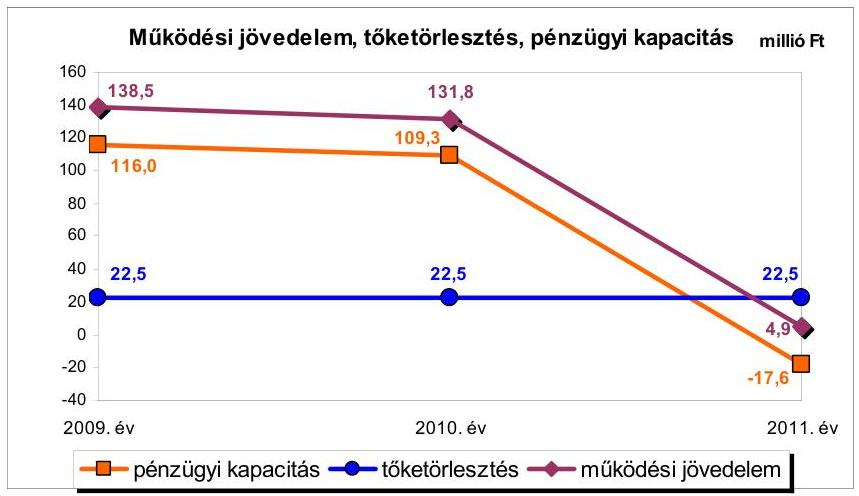
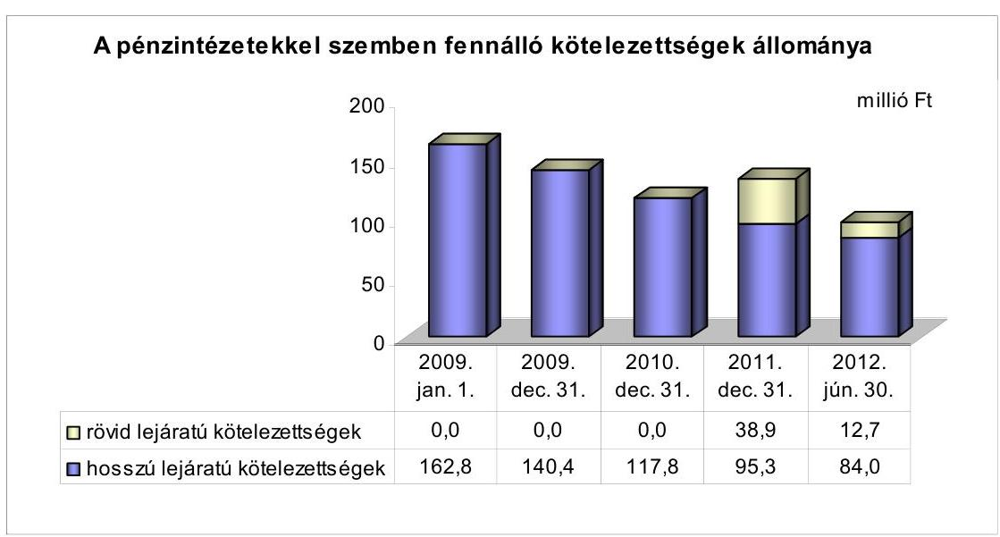
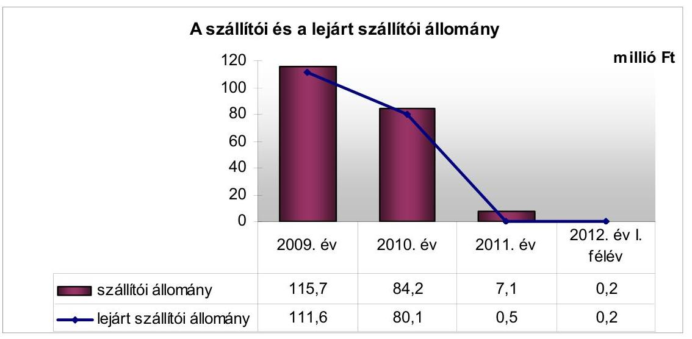
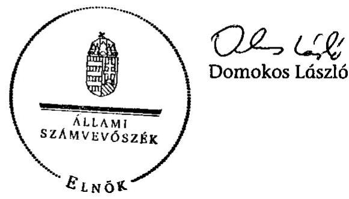
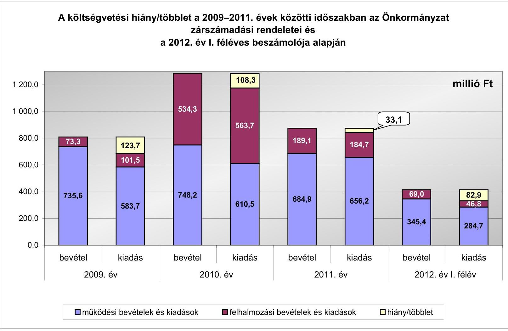
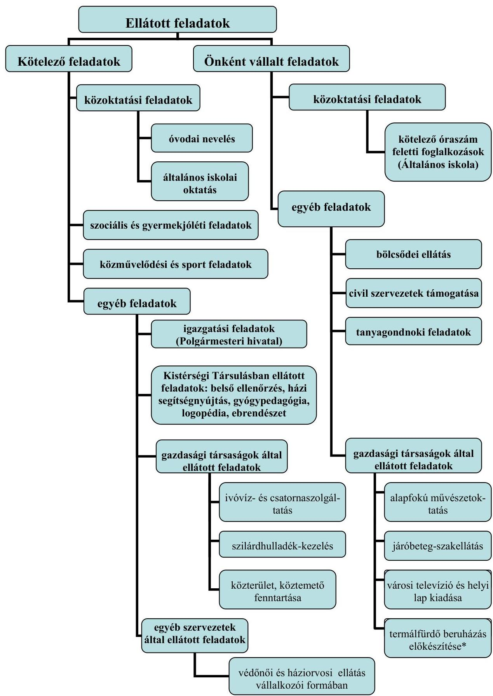

# JELENTÉS 

Bábolna Város Önkormányzata pénzügyi gazdálkodási helyzetének, szabályosságának ellenőrzéséről

---

# Állami Számvevőszék 

Iktatószám: V-0030-252-014/2013.
Témaszám: 1069
Vizsgálat-azonosító szám: V-059206

## Az ellenőrzést felügyelte:

## Renkó Zsuzsanna

felügyeleti vezető

## Az ellenőrzést vezette:

## Dér Lívia

ellenőrzésvezető

## Az ellenőrzést végezték:

| Baksa Anikó | Dr. Lajos Béla | Szilágyi Nándorné |
| :-- | :-- | :-- |
| számvevő | számvevő főtanácsos | számvevő |

---

# TARTALOMJEGYZÉK 

BEVEZETÉS ..... 3
I. ÖSSZEGZŐ MEGÁLLAPÍTÁSOK, KÖVETKEZTETÉSEK, JAVASLATOK ..... 6
II. RÉSZLETES MEGÁLLAPÍTÁSOK ..... 14

1. Az Önkormányzat kötelező és önként vállalt feladatai, a feladatellátás szervezeti keretei ..... 14
2. A pénzügyi egyensúly fenntartását veszélyeztető pénzügyi kockázatok, és az ezek csökkentése érdekében tett intézkedések ..... 15
3. A pénzügyi gazdálkodási folyamatok szabályosságát, megfelelőségét biztosító belső kontrollok ..... 23
4. Az ÁSZ korábbi ellenőrzése során a pénzügyi, gazdálkodási helyzet javítására tett javaslatainak megvalósítása ..... 24

---

# MELLÉKLETEK 

1. számú A költségvetési hiány/többlet a 2009-2011. évek közötti időszakban az Önkormányzat zárszámadási rendeletei és a 2012. év I. féléves beszámolója alapján
2. számú Az Önkormányzat bevételei és kiadásai, valamint adósságszolgálata a 2009-2011. években (a CLF módszer szerint)
3/a. számú Az Önkormányzat által a 2009. év és a 2012. év I. félév között megvalósított (műszakilag befejezett) fejlesztések forrásösszetétele
3/b. számú Az Önkormányzat által beadott, elbírálás alatti pályázatok forrásaiból megvalósuló fejlesztésekhez kapcsolódó kötelezettségvállalások összegzése
3. számú Az önkormányzati feladatok ellátásában résztvevő gazdasági társaságok egyes kiemelt adatai
4. számú Az Önkormányzat 2012. június 30-án fennálló, hosszú lejáratú adósságot keletkeztető kötelezettségvállalásai
5. számú Az Önkormányzat kötelezettségeinek 2011. december 31-ei és 2012. június 30-ai állománya és a 2012. évben, valamint az azt követő években várható kötelezettségek miatti kiadások

## FÜGGELÉKEK

1. számú Rövidítések jegyzéke
2. számú Értelmező szótár
3. számú Az Önkormányzat által ellátott feladatok a 2012. év I. félév végén

---

# JELENTÉS 

## Bábolna Város Önkormányzata pénzügyi gazdálkodási helyzetének, szabályosságának ellenőrzéséről

## BEVEZETÉS

Az államháztartás helyi szintjén, az önkormányzati alrendszerben az utóbbi években megjelenő gazdálkodási nehézségek, a pénzforgalmi hiány növekedése, az eladósodás az ÁSZ figyelmét a helyi önkormányzatok pénzügyi helyzetére irányította. Az ÁSZ a 2012. évi ellenőrzési tervben foglaltaknak megfelelően az önkormányzatok pénzügyi gazdálkodási helyzetének, szabályosságának ellenőrzésével az önkormányzatok 2011. évben megkezdett helyzetelemzését folytatta. Az ellenőrzés keretében értékeljük az önkormányzatok adósságkezelési és likviditási helyzetét, bemutatjuk a pénzügyi egyensúly alakulására hatással lévő folyamatokat. Feltárjuk az ezekre ható kockázatokat, a pénzügyi egyensúlyi helyzetet befolyásoló döntésmegalapozó, döntés-előkészítő eljárások szabályosságát. Minősítjük az ezekkel összefüggő belső kontrollok kialakítását, működését, az ellenőrzött időszakban végrehajtott ÁSZ ellenőrzés megállapításainak hasznosulását.

Az ellenőrzés eredményének várható hatásaként a megállapításokkal segítséget nyújthatunk az önkormányzatok számára a pénzügyi egyensúly helyreállítása, javítása és fenntartása érdekében szükségessé váló intézkedések megtételéhez.

Az ellenőrzés típusa: szabályszerűségi ellenőrzés.

## Az ellenőrzés célja annak értékelése volt, hogy:

- a vizsgált időszakban a kötelező és önként vállalt feladatok ellátását biztosító szervezeti formák változása milyen hatást gyakorolt az Önkormányzat pénzügyi helyzetének alakulására;
- az Önkormányzat pénzügyi - ezen belül működési és felhalmozási - egyensúlya milyen irányban változott, a változást milyen okok idézték elő, továbbá milyen intézkedéseket tettek a pénzügyi egyensúly biztosítása, illetve javítása érdekében, az intézkedések hatására javult-e az Önkormányzat pénzügyi helyzete;
- a költségvetési kiadások finanszírozása érdekében vállalt pénzintézetekkel szembeni kötelezettségek hogyan alakultak, a kötelezettségek fennállása miként befolyásolja az Önkormányzat jövőbeli pénzügyi egyensúlyi helyzetét;

---

- az Önkormányzat beazonosította, felmérte, értékelte-e a pénzügyi egyensúlyt befolyásoló pénzügyi kockázatokat, a finanszírozási célú pénzügyi műveletekkel kapcsolatban írtak-e elő kockázatértékelési kötelezettséget;
- az Önkormányzat által kialakított belső kontrollok biztosítják-e a pénzügyi gazdálkodás folyamatainak szabályosságát és eredményességét;
- hasznosultak-e az ÁSZ korábbi ellenőrzése során a pénzügyi, gazdálkodási helyzet javítására tett szabályszerűségi és célszerűségi javaslatok.

Az ellenőrzés a 2009. január 1-jétől 2012. június 30-áig terjedő időszakot ölelte fel. A pénzintézetekkel szembeni kötelezettségek állományának ellenőrzésekor a 2011. december 31-én fennálló kötelezettségek keletkezésének kezdő időpontját vettük figyelembe.

Az ellenőrzés szakmai módszertana az ÁSZ Ellenőrzési Kézikönyvében foglalt szakmai szabályokon alapult, amely a Legfőbb Ellenőrző Intézmények Nemzetközi Szervezete (INTOSAI) által kiadott nemzetközi standardok (ISSAI) figyelembevételével készült.

Az ellenőrzés során használt rövidítéseket az 1. számú, az egyes fogalmak magyarázatát a 2. számú függelék tartalmazza.

Az ellenőrzés jogszabályi alapját az ÁSZ tv. 1. § (3) bekezdésének, 5. § (2)-(6) bekezdéseinek, valamint az Áht. 2 61. § (2) bekezdésének előírásai képezik.

A helyszíni ellenőrzést követően az Országgyűlés a helyi önkormányzatok adósságállományának részleges konszolidációjáról döntött. Az 5000 fő lakosságszámot meg nem haladó települési önkormányzatok számára nyújtott törlesztési célú támogatással ${ }^{1}$ lehetővé tették a 2012. december 12-én fennálló tartozásállományuk és annak 2012. december 28-án fennálló járulékai teljes megfizetését. Az 5000 fő lakosságszám feletti települések esetében a 2013. évben az állam differenciált - a bevételi képességet figyelembe vevő, 40-70\%-ig terjedő mértékben vállalja át² az önkormányzat 2012. december 31-i, az átvállalás időpontjában fennálló adósságállományát és annak járulékait. Az adósságkonszolidációs intézkedéssel egyidejűleg a Kormány elrendelte ${ }^{3}$ az önkormányzatok adósságállománya újratermelődésének megakadályozása céljából a hitelengedélyezési és a likvid hitelekre vonatkozó szabályozás szigorítását.

Bábolna Város Önkormányzata lakónépességére tekintettel a 2012. évi adósságkonszolidációban volt érintett. Az ÁSZ jelen ellenőrzése során a pénzügyi

[^0]
[^0]:    ${ }^{1}$ Magyarország 2012. évi központi költségvetéséről szóló 2011. évi CLXXXVIII. törvény módosításáról szóló 2012. évi CLXXXVII. törvény alapján
    ${ }^{2}$ Magyarország 2013. évi központi költségvetéséről szóló 2012. évi CCIV. törvény alapján
    ${ }^{3}$ 1540/2012. (XII. 4.) Korm. határozat a helyi önkormányzatok adósságállományának részleges konszolidációjáról

---

egyensúly jövőbeni alakulását befolyásoló kockázatokra tett megállapításai az adósságkonszolidációt követően is időszerűek és helytállóak.

Bábolna város állandó lakosainak száma 2012. január 1-jén 3657 fő volt, amely 84 fővel kevesebb a 2009. január 1-jei lakosságszámhoz képest. A településen kisebbségi önkormányzat nem működött. Az Önkormányzat a 2011. évben 788,3 millió Ft költségvetési bevételt realizált, és 840,9 millió Ft költségvetési kiadást teljesített. A 2009. évihez képest a költségvetési bevételek 3,5 millió Ft-tal, 0,4%-kal csökkentek, a költségvetési kiadások 155,7 millió Ft-tal, 22,7%-kal emelkedtek. A 2011. december 31-i könyvviteli mérleg szerint az eszközök értéke 3449,2 millió Ft volt, amely a 2009. év végi állományhoz viszonyítva 11,8%-kal (365,0 millió Ft-tal) növekedett. A végrehajtott fejlesztések eredményeként 2009-2011 között az ingatlanok 27,3%-os, 391,3 millió Ft összegű állománynövekedése volt a meghatározó. A három legnagyobb bekerülési költségű fejlesztés az Általános Iskola és az Egészségügyi Központ épület felújítása, parkoló és közösségi tér kialakítása volt. A mérlegadatok alapján a források összetétele kedvezően változott. A saját források (a saját tőke és a tartalék összege) 17,7%-os, 486,1 millió Ft-os mérleg szerinti értékének növekedése mellett a kötelezettségek állománya 33,7%-kal, 107,1 millió Ft-tal csökkent. Az Önkormányzat a 2012. évi költségvetési rendeletét 640,3 millió Ft költségvetési bevétellel és 613,6 millió Ft költségvetési kiadással fogadta el.

Az ÁSZ tv. 29. § (1) bekezdése szerint a jelentéstervezetet megküldtük a polgármester részére, aki az ÁSZ tv. 29. § (2) bekezdésében foglalt észrevételezési jogával nem élt, a jelentéstervezetre észrevételt nem tett.

---

# I. ÖSSZEGZŐ MEGÁLLAPÍTÁSOK, KÖVETKEZTETÉSEK, JAVASLATOK 

Bábolna Város Önkormányzatának pénzügyi egyensúlyi helyzete az ellenőrzött időszakban középtávon részben volt biztosított. Az állam által nyújtott törlesztési célú támogatásból az Önkormányzat kiegyenlítette a 2012. december 12-én fennálló adósságállományát és annak 2012. december 28-án fennálló járulékait. Az adósságkonszolidáció eredményeként az Önkormányzat pénzügyi egyensúlyi helyzete javul, azonban a működési jövedelemtermelő képesség további csökkenő tendenciája kockázatot jelent a kötelezettségek jövőbeli teljesíthetősége szempontjából. A pénzügyi egyensúly fenntartásához elkülönített tartalék nem áll rendelkezésre.

2009-2011 között az önként vállalt feladatok működési kiadásainak aránya az összes működési kiadáson belül 13,3%-ról 17,3%-ra nőtt. Az önként vállalt feladatok ellátása miatt - tekintettel azok arányára, nagyságrendjére - működési kockázat nem állt fenn. Az ellenőrzött időszakban elszámolt 897,9 millió Ft felhalmozási kiadás 4,4%-a (39,4 millió Ft) kapcsolódott az önként vállalt feladatokhoz, amely felhalmozási kockázatot nem jelentett.

Az Önkormányzat 2009-2011 között összesen 2761,5 millió Ft költségvetési bevételt realizált, és 2700,5 millió Ft költségvetési kiadást teljesített. Az Önkormányzat a 2009-2011. évi zárszámadási rendeleteiben a költségvetési bevételek és költségvetési kiadások főösszegét, az Áht. -ben előírtak ellenére, a finanszírozási műveletekkel együtt határozta meg. Az ellátott feladatok alapvetően a közoktatáshoz, a szociális és gyermekjóléti ellátáshoz, közművelődési, sport és igazgatási feladatokhoz kapcsolódtak. Az ellenőrzött időszak során a feladatellátás szervezeti struktúrája nem változott, feladatátvétel és átadás nem történt, amely a pénzügyi egyensúlyi helyzet alakulására nem volt hatással.

A működési és a felhalmozási költségvetés összevont egyenlege 2009-2010 között pozitív, 2011-ben negatív volt. Összességében a 61,0 millió Ft többlet a költségvetési kiadások 2,3%-át jelentette. A költségvetési támogatás és az átengedett szja visszaesése, valamint a dologi kiadások növekedése hatására a működési jövedelem 2011-ben az adósságszolgálat kiadásaira már nem nyújtott fedezetet. A pénzügyi kapacitás 2009-ről 2011-re történt visszaesését a tőketörlesztés változatlan összege miatt a működési jövedelem csökkenő tendenciája határozta meg. A pénzügyi kapacitás 2009-2011 közötti változását a következő ábra mutatja be.

---

A bevételi kitettség nem jelentett kockázatot, mivel a működés finanszírozásához az Önkormányzat ÖNHIKI támogatásban nem részesült, a helyiadóbevétel döntő része nagyszámú adóalanytól származott. A megvalósított fejlesztések következtében az eladósodottság nem növekedett, felhalmozási kockázat sem állt fenn. A fejlesztések révén létrejött eszközök fenntartása üzemeltetési kockázatot nem jelent. A 2012. június 30-át követő időszak fejlesztési célú kötelezettségvállalásai saját és pályázati forrásból finanszírozhatók.

A 2011. év és a 2012. év I. félév során megvalósított bevételnövelő intézkedések hatására az Önkormányzat adatszolgáltatása szerint összesen 35,0 millió Ft többlet keletkezett. A helyi adókhoz kapcsolódó - a továbbiakban folyamatosan képződő - többletbevétel aránya 61,1% (21,4 millió Ft), az ingatlanok értékesítéséből befolyt 13,6 millió Ft bevétel aránya 38,9% volt. Az ellenőrzött időszakban kiadáscsökkentő intézkedést nem hajtottak végre. A foglalkoztatottak átlagos statisztikai állományi létszáma nem változott, az engedélyezett 109 álláshelyből nem volt betöltetlen státuszú. Az Önkormányzat intézkedései az ellenőrzött időszak pénzügyi egyensúlyi helyzetének alakulására nem gyakoroltak jelentős hatást. Az intézkedések révén realizált többletbevételből nem képeztek a jövőbeli kötelezettségek teljesítésére felhasználható, elkülönített tartalékot.

A pénzintézetekkel szembeni kötelezettségek állománya a 2009. január 1-jei 162,8 millió Ft-ról a 2012. év I. félév végére 96,7 millió Ft-ra csökkent. A 2012. június 30-án fennálló hosszú lejáratú hiteleket az Önkormányzat 2005-2007 között vette igénybe fejlesztési kiadásai finanszírozásához. Az ellenőrzött időszakban a hosszú lejáratú hitelek törlesztésére összesen 106,2 millió Ft tőke, kamat és egyéb kiadást teljesítettek. A csökkenő kötelezettségállomány és a kamatfeltételek kedvező alakulása törlesztési kockázatot nem jelentett. A fizetőképesség fenntartásához igénybe vett likvid hitelek nem váltak tartós és meghatározó nagyságrendű finanszírozási forrássá. A beruházási és fejlesztési, valamint a rövid lejáratú hitelek mérleg szerinti értéke az Áhsz.-ben előírtak ellenére gazdálkodó szervezettel szemben fennálló kötelezettséget is tartalmazott. A Számv. tv. és az Áhsz. előírásait megsértve, a 2012. év I. félévi mérlegjelentésben a munkabér-megelőlegezési hitelt nem mutatták ki. A fejlesztési hitelszerződésekben fedezetként a futamidő éveinek költségvetéséből származó bevételeket, ennek részeként az - Ötv.-ben foglalt előírást megsértve - a normatív

---

állami támogatást, az átengedett szja-t, valamint az államháztartáson belülről működési célra átvett pénzeszközt határozták meg.

Az Önkormányzat 2012. június 30-án fennálló kötelezettségeinek állománya a 2012. július 3-án megszűnt kezességvállalás nélkül - 131,8 millió Ft. A vállalt hosszú és rövid lejáratú kötelezettségek jövőbeni teljesítésére 48,6 millió Ft szabad pénzmaradvány és 19,8 millió Ft követelésállomány vehető figyelembe. A működési jövedelem 2011-ben nem fedezte a tárgyévi tőketörlesztést. A működési jövedelem ellenőrzött időszakot követő további csökkenő tendenciája kockázatot jelent a jövőbeli várható kötelezettségek teljesíthetősége szempontjából. Az Önkormányzatnál az adósságszolgálat teljesítéséhez nem különítettek el tartalékot.

Az Önkormányzatnál a kockázatkezelési rendszer kialakítása és működtetése teljes körűen nem felelt meg a 2009-2011. években az Áht. ${ }_{1}$, a 2012. év I. félévében az Áht. ${ }_{2}$ előírásainak. A működési jövedelemtermelő képesség csökkenéséből adódó, pénzügyi egyensúlyi helyzetre kiható működési kockázat feltárása, beazonosítása, értékelése, ezáltal kezelése - a 2009. évben az Ámr. ${ }_{1}$-ben, a 2010-2011. években az Ámr. ${ }_{2}$-ben és a 2012. év I. félévében a Bkr.-ben foglalt előírások ellenére - elmaradt.

Az Önkormányzat kizárólagos tulajdonában lévő gazdasági társaságok 2012. június 30-án éven túli lejáratú kötelezettséggel nem rendelkeztek. A 2012-2013 között esedékes 14,0 millió Ft rövid lejáratú kötelezettségükből az Önkormányzattal szemben fennálló tartozáson felüli 6,1 millió Ft kötelezettség nem jelentős a mérlegen kívüli kockázat szempontjából. Az Önkormányzat által a Gyógyfürdő Kft. hitelfelvételéhez 2008-ban vállalt készfizető kezesség 2012. július 3-án - a fennálló 8,8 millió Ft tőketartozás átvállalásával - megszűnt. Az Önkormányzat a 2010. év és 2012. év I. féléve között 7,9 millió Ft kiadást teljesített a kezességbeváltás miatt, amelynek megtérítéséről nem intézkedtek. Az ellenőrzött időszakban a kizárólagos tulajdonban lévő gazdasági társaságok közül csupán a Városi Televízió részesült 47,7 millió Ft működési és felhalmozási célú pénzeszköz átadásban.

A Képviselő-testület 2010-ben egy községi önkormányzattal szemben fennálló, 0,9 millió Ft összegű követelés elengedéséről döntött. A vagyongazdálkodási rendelet 15. § (1) bekezdés a) pontja és a 15. § (3) bekezdése rendelkezést tartalmaz az önkormányzati vagyon tulajdonjogának ingyenes átruházásához kapcsolódóan, azonban a szabályozás nem teljeskörű, az Áht. ${ }_{1}$-ben foglalt előírás ellenére, nem tér ki a követelés lemondás lehetséges eseteinek és módjának szabályozására.

Az Önkormányzat az adósságot keletkeztető kötelezettségvállalás felső határát nem lépte túl. A Képviselő-testület tájékoztatása során a törlesztés visszafizetését biztosító forrásokat nem határozták meg. Nem részletezték, hogy az adósságszolgálati terheket milyen feltételek mellett tudják teljesíteni, nem tárták fel a pénzintézeti kötelezettségvállalásokkal kapcsolatos kockázatokat, nem alakítottak ki e kockázatok kezelésére vonatkozó eljárásokat, módszereket. Nem határozták meg a pénzügyi egyensúly biztosítása, a fizetőképesség megőrzése érdekében hosszú távon elérni kívánt célokat.

---

Nem mérték fel az elhasználódott eszközök felújítása és pótlása forrásigényét. Az ellenőrzött időszakban elszámolt 156,8 millió Ft értékcsökkenéssel szemben az eszközök pótlására 731,7 millió Ft-ot fordítottak. Az eszközök használhatósági foka a 2009. évi 73,7\%-ról 2011-re 75,4\%-ra nőtt.

Az Önkormányzatnál a belső kontrolltevékenységek kialakítása és működtetése teljes körűen nem felelt meg a 2009-2011. években az Áht. ${ }_{1}$, a 2012. év I. félévében az Áht. ${ }_{2}$ előírásainak. A pénzügyi-gazdálkodási folyamatok szabályosságát biztosító belső kontrollok gazdálkodási folyamatokba való beépítése a 2009. évben az Ámr. ${ }_{1}$-ben, a 2010-2011. években az Ámr. ${ }_{2}$-ben, a 2012. év I. félévében a Bkr.-ben foglalt előírások ellenére, nem volt megfelelő, mert nem biztosította a pénzügyi gazdálkodás folyamatainak szabályosságát. Elmaradt a közbeszerzési értékhatár alatti esetekben a pályáztatással, valamint a működési és felhalmozási célú pénzeszköz-átadások feltételrendszerével összefüggő kontrolltevékenységek szabályozása. Nem határozták meg a döntés-előkészítés folyamatában a fejlesztési döntések és a pénzintézeti kötelezettségvállalásokkal kapcsolatos döntések kockázatai feltárásának és kezelésének kötelezettségét. Belső szabályzatban nem írták elő a kizárólagos önkormányzati tulajdonban lévő gazdasági társaságok működésével, pénzügyi helyzetével kapcsolatos képviselő-testületi döntések kockázatainak feltárása és kezelése kötelezettségét.

A gazdálkodási folyamatokba beépített belső kontrollok működése nem volt megfelelő, mert a hiányos szabályozás miatt a feladatellátási szerződések nem tartalmazták teljes körűen a feladatmutatókat és a nem szerződésszerű teljesítés szankcióit. A zárszámadás készítésekor a pénzmaradvány intézményenkénti kimutatása nem történt meg. A fejlesztések döntés-előkészítése során nem tárták fel a lebonyolítás és a működtetés kockázatait. A pénzeszközátadásokról szóló megállapodások nem tartalmazták a szabálytalan felhasználás szankcióit. A döntés-előkészítés során nem vizsgálták a pénzintézeti kötelezettségvállalások kockázatait, és a futamidő egyes éveit terhelő kötelezettség költségvetési egyensúlyra gyakorolt hatását.

A gazdálkodási rendszer 2008. évi ellenőrzése során az ÁSZ a pénzügyi, gazdálkodási helyzet javítására négy szabályszerűségi és két célszerűségi javaslatot tett. Az Önkormányzat két szabályszerűségi javaslatot nem hasznosított. A felhalmozási feladatok eredeti előirányzataként továbbra is a pályázati önrészből, illetve saját forrásból finanszírozott kiadásokat vették figyelembe, továbbá az intézmények pénzmaradványának megállapítása nem történt meg. Két célszerűségi javaslat nem hasznosult. A gazdasági program nem nevesítette a tervezett fejlesztési feladatok megvalósíthatóságát jelentő forrásokat, valamint a belső ellenőrzés nem vizsgálta a feladatellátásban közreműködő egyéb szervezeteknél a támogatás felhasználását.

Összességében az adósságkonszolidáció pénzügyi egyensúlyi helyzetre gyakorolt kedvező hatása ellenére az Önkormányzat számára a továbbiakban elsődleges fontosságú a működési költségvetés egyensúlyának javítása, fenntartása. A megvalósított beruházások a feladatellátás színvonalának javításához hozzájárultak, de nem teremtenek közvetlen bevétel növelési lehetőséget.

Az ÁSZ tv. 33. § (1) bekezdésében foglaltak értelmében az ellenőrzött szervezet vezetője köteles a jelentésben foglalt megállapításokhoz kapcsolódó intézkedési

---

tervet összeállítani, és azt a jelentés kézhezvételétől számított harminc napon belül az ÁSZ részére megküldeni. Amennyiben az intézkedési tervet határidőn belül nem küldi meg a szervezet, vagy az továbbra sem elfogadható, az ÁSZ elnöke a hivatkozott törvény 33. § (3) bekezdés a-b) pontjaiban foglaltakat érvényesítheti.

# Az ellenőrzés intézkedést igénylő megállapításai és javaslatai: 

## a polgármesternek

1.  Az Önkormányzat működési jövedelme a 2011. évre jelentős mértékben csökkent, és nem nyújtott fedezetet a tárgyévi tőketörlesztésre. A működési jövedelemtermelő képesség további csökkenése esetén a pénzügyi egyensúlyi helyzet fenntartása nem biztosított.

Javaslat:
A működési jövedelemtermelő képesség és a feladatellátás összhangja, valamint az Önkormányzat pénzügyi egyensúlyának hosszú távú fenntarthatósága érdekében - a 2012. évi kormányzati adósságkonszolidációt, valamint a 2013. évtől változó feladat-ellátási kötelezettséget, feladatfinanszírozási rendszert figyelembe véve - felelősök és határidők megjelölésével kezdeményezzen intézkedéseket, melyek keretében:
a) a költségvetési rendelettervezet, valamint annak évközi módosítása előterjesztését megelőzően mérjék fel a bevételszerző, kiadáscsökkentő lehetőségeket, és terjessze a Képviselő-testület elé a bevételek növelését, a kiadások csökkentését célzó intézkedések bevezetéséhez szükséges - a Htv. 140. § (1) bekezdés a) pontja alapján a jegyző által elkészített - döntési javaslatát;
b) terjesszen a Képviselő-testület elé jóváhagyásra - a Htv. 140. § (1) bekezdés a) pontja alapján a jegyző által elkészített - az Önkormányzat gazdasági helyzetének elemzésén alapuló, a pénzügyi egyensúlyi helyzet hosszú távú megőrzését és az adósságállomány újratermelődésének elkerülését biztosító intézkedéseket tartalmazó stabilizációs programot.
2.  A fejlesztési hitelszerződésekben, az Ötv. 88. § (1) bekezdés b) pontjában ${ }^{4}$ foglalt előírást megsértve, az Önkormányzat futamidő alatti költségvetéseiből származó bevételeit, ezáltal közvetve a normatív állami támogatást és az átengedett személyi jövedelemadó bevételt határozták meg a szerződésben vállalt kötelezettségek teljesítése biztosítékaként.

Javaslat:
Intézkedjen, hogy a jövőben hitelfelvétel és kötvénykibocsátás fedezeteként, az Áht ${ }_{2}$ 84. § (4) bekezdésében előírtak szerint, az Önkormányzat általános működésének és ágazati feladatainak támogatását és a költségvetési támogatást ne használják fel.

[^0]
[^0]:    ${ }^{4}$ Hatályát vesztette 2011. december 31-én. A 2012. március 31-től hatályos jogszabályi előírás: Áht ${ }_{2}$ 84. § (4) bekezdése.

---

3.  A vagyongazdálkodási rendelet - az Áht. 108. § (2) bekezdésének előírása ${ }^{5}$ ellenére - az önkormányzati vagyon tulajdonjogának ingyenes átruházásához kapcsolódóan nem tért ki teljes körűen a követelés lemondás lehetséges eseteinek és módjának szabályozására.

Javaslat:
Terjessze a Képviselő-testület elé a vagyongazdálkodási rendelettervezet - a Htv. 140. § (1) bekezdés a) pontja alapján - a jegyző által elkészített módosítását, amely megfelel az Áht. 2 97. § (2) bekezdésében foglalt előírásoknak.

# a jegyzőnek 

1.  Az Önkormányzat 2009-2011. évi zárszámadási rendeleteiben - az Áht. ${ }_{1}$ 8/A. § (7) bekezdésében foglalt előírással ${ }^{6}$ ellentétben - a költségvetési bevételek és a költségvetési kiadások főösszege a finanszírozási műveleteket is tartalmazta.

Javaslat:
Intézkedjen, hogy a zárszámadási rendelettervezet készítése során a költségvetési bevételeket és kiadásokat az Áht. 2 5. § (1)-(2) bekezdéseiben foglalt előírások szerint határozzák meg.
2.  A 2011. évi könyvviteli mérlegben - az Áhsz. 26. § (3) bekezdés d) pontjában és a 26. § (5) bekezdés b) pontjában előírtak ellenére - a beruházási és fejlesztési, valamint a rövid lejáratú hitelek összege gazdálkodó szervezettel szemben fennálló kötelezettséget is tartalmazott. A 2012. év I. félévi mérlegjelentésben - a Számv. tv. 15. § (2) bekezdésében és az Áhsz. 26. § (5) bekezdés b) pontjában foglaltak ellenére - nem mutatták ki a munkabér-megelőlegezési hitelt.

Javaslat:
Intézkedjen, hogy a könyvviteli mérlegben a kötelezettségek kimutatása a Számv. tv. 15. § (2) bekezdésében, az Áhsz. 26. § (3) bekezdés d) pontjában és a 26. § (5) bekezdés b) pontjában foglalt előírásoknak megfelelően történjen.
3.  Az Önkormányzatnál a kockázatkezelési rendszer kialakítása és működése teljes körűen nem felelt meg a 2009-2011. években az Áht. ${ }_{1}$ 120/B. § (2) bekezdés b) pontjában, a 2011. évben az Áht. 1 121. § (2) bekezdés b) pontjában és a 2012. év I. félévében az Áht. 2 69. § (2) bekezdésében meghatározott előírásoknak. A működési jövedelemtermelő képesség csökkenéséből adódó, a pénzügyi egyensúlyi helyzetre kiható működési kockázat feltárása, beazonosítása, értékelése, és ezáltal kezelése - a 2009. évben az Ámr. 1 145/C. §-ában, a 2010-2011. években az Ámr. 2 157. §-ában, a 2012. év I. félévében a Bkr. 7. § (1)-(2) bekezdéseiben foglalt előírások - ellenére elmaradt.

[^0]
[^0]:    ${ }^{5}$ Hatályát vesztette 2011. december 31-én. A 2012. január 1-jétől hatályos jogszabályi előírás: Áht. 2 97. § (2) bekezdése.
    ${ }^{6}$ Hatályát vesztette 2011. december 31-én. A 2012. január 1-jétől hatályos jogszabályi előírások: Áht. 2 5. § (1)-(2) bekezdései.

---

Javaslat:
Működtessen az Áht. ${ }_{2}$ 69. § (2) bekezdésében, továbbá a Bkr. 7. § (1)-(2) bekezdéseiben foglalt előírásoknak megfelelő, a pénzügyi egyensúlyt befolyásoló kockázatok kezelésére alkalmas kockázatkezelési rendszert.
4.  Az Önkormányzatnál a belső kontrolltevékenységek kialakítása és működtetése teljes körűen nem felelt meg a 2009-2011. években az Áht. 1 120/B. § (2) bekezdés c) pontjában, a 2011. évben az Áht. 1 121. § (2) bekezdés c) pontjában és a 2012. év I. félévében az Áht. 2 69. § (2) bekezdésében meghatározott előírásoknak. A pénzügyi, gazdálkodási folyamatok szabályosságát biztosító belső kontrollok gazdálkodási folyamatokba történő beépítése - a 2009. évben az Ámr. 1 145/E. § (1) bekezdésében, a 2010-2011. években az Ámr. 2 158. § (1) bekezdésében, a 2012. év I. félévében a Bkr. 8. § (1)-(2) bekezdésében foglalt előírások ellenére - nem volt megfelelő. Elmaradt a közbeszerzési értékhatár alatti esetekben a pályáztatási kötelezettséggel, valamint a működési és felhalmozási pénzeszközátadások feltételrendszerével kapcsolatos kontrolltevékenységek szabályozása. Belső szabályzatban nem írták elő a kizárólagos tulajdonban lévő gazdasági társaságok működésével, pénzügyi helyzetével kapcsolatos képviselő-testületi döntések kockázatainak feltárását és kezelését. A döntés-előkészítés során nem írták elő a fejlesztési döntések és a pénzintézeti kötelezettségvállalásokkal kapcsolatos döntések kockázatai feltárásának kötelezettségét, és a kötelezettségvállalásokkal kapcsolatos döntések költségvetési egyensúlyra gyakorolt hatásának vizsgálatát.

Javaslat:
Alakítsa ki az Áht. 2 69. § (2) bekezdésében, továbbá a Bkr. 8. § (1)-(2) bekezdései alapján azokat a belső kontrolltevékenységeket, amelyek biztosítják a pénzügyi, gazdálkodási folyamatok szabályosságát, a pénzügyi egyensúlyi helyzet alakulását befolyásoló döntések kockázatainak kezelését. Ennek keretében:
a) határozza meg a közbeszerzési értékhatár alatti esetekben a pályáztatási kötelezettséggel kapcsolatos kontrolltevékenységeket;
b) szabályozza a működési és felhalmozási célú pénzeszközátadások feltételrendszerével összefüggő kontrolltevékenységeket;
c) írja elő a kizárólagos tulajdonban lévő gazdasági társaságok működésével, pénzügyi helyzetével kapcsolatos képviselő-testületi döntések kockázatainak feltárását és kezelését;
d) határozza meg a fejlesztések döntés-előkészítés folyamatában a lebonyolítás és a működtetés kockázatai feltárásának, kezelésének kötelezettségét;
e) írja elő a pénzintézeti kötelezettségvállalások kockázatainak döntés-előkészítő szakaszban történő feltárását, a futamidő egyes éveit terhelő kötelezettségek költségvetési egyensúlyra gyakorolt hatásának vizsgálatát.
5. Az Önkormányzat gazdálkodási rendszerét érintő, 2008. évi ÁSZ ellenőrzés során a pénzügyi egyensúly javítására tett két szabályszerűségi javaslat nem hasznosult. A felhalmozási kiadások eredeti előirányzataként - az Ámr. 29. § (1) bekezdés c-d) pontjaiban (2010. január 1-jétől az Ámr. 2 36. § (1) bekezdés c-d) pontjaiban,

---

2012. január 1-jétől az Ávr. 24. § (1) bekezdés ba) pontjában) foglaltak ellenére nem a fejlesztések teljes bekerülési költségét vették figyelembe. A zárszámadás készítésekor - az Ámr. 66. § (4) bekezdésében (2010. január 1-jétől az Ámr. 213. § (3) bekezdésében) előírtak ellenére - az intézmények pénzmaradványát nem állapították meg.

Javaslat:
Az Önkormányzat gazdálkodási rendszerét érintő, 2008. évi ÁSZ ellenőrzés által megállapított szabálytalanságok megszüntetése érdekében intézkedjen a nem teljesült szabályszerűségi javaslatok végrehajtásáról:
a) biztosítsa, hogy a felhalmozási kiadások eredeti előirányzatának megállapítása az Ávr. 24. § (1) bekezdés ba) pontjában foglalt előírásnak megfelelően történjen;
b) intézkedjen, hogy az intézmények pénzmaradványát az Ávr. 155. § (1)-(2) bekezdéseiben előírtak szerint állapítsák meg.

---

# II. RÉSZLETES MEGÁLLAPÍTÁSOK 

## 1. AZ ÖNKORMÁNYZAT KÖTELEZŐ ÉS ÖNKÉNT VÁLLALT FELADATAI, A FELADATELLÁTÁS SZERVEZETI KERETEI

Az Önkormányzat a kötelező és az önként vállalt feladatait belső szabályzatban nem rögzítette. Az ellátott önként vállalt feladatok a bölcsődei ellátás, a kötelező óraszámot meghaladó iskolai foglalkozások, az alapfokú művészetoktatás, a járóbeteg-szakellátás, a tanyagondnoki szolgálat, a városi televízió működtetése, a helyi lap kiadása, valamint a civil szervezetek támogatása voltak.

Az Önkormányzat működési célú kiadásai 2009-2011 között összesen 72,4 millió Ft-tal, (12,4%-kal) nőttek, ugyanakkor az önként vállalt feladatok kiadásai ${ }^{7} 77,5$ millió Ft-ról 113,7 millió Ft-ra (46,7%-kal) emelkedtek. Az önként vállalt feladatok működési kiadásainak aránya az összes működési kiadáson belül 2009-ben 13,3%, míg 2011-ben 17,3% volt.

Az ellenőrzött időszakban az önként vállalt feladatok ellátása miatt - tekintettel azok nagyságrendjére, működési kiadásokon belüli arányára - működési kockázat nem állt fenn. A működési jövedelem csökkenő tendenciája mellett az önként vállalt feladatok arányának további növekedése a jövőben működési kockázatot jelent. Az ellenőrzött időszakban teljesített 897,9 millió Ft felhalmozási kiadáson belül az önként vállalt feladatokhoz kapcsolódó beruházási kiadás és pénzeszközátadás mindössze 4,4%-ot (39,4 millió Ft) tett ki, amely a felhalmozási kockázat szempontjából nem jelentős. Az Önkormányzat nem értékelte a kötelező és önként vállalt feladatok pénzügyi egyensúlyi helyzetre gyakorolt hatását.

Az ellenőrzött időszak során a feladatellátás szervezeti struktúrája nem változott, feladatátvétel és -átadás nem történt, így az a pénzügyi egyensúlyi helyzet alakulására nem volt hatással. A Polgármesteri Hivatallal együtt 2012. év I. félév végén öt költségvetési szerv és hat gazdasági társaság vett részt a kötelező és önként vállalt feladatok ellátásában. A költségvetési szervek közoktatási, szociális és gyermekjóléti, közművelődési, sport és igazgatási feladatokat láttak el. A Kistérségi Társulás végezte a jelzőrendszeres házi segítségnyújtást, a gyógypedagógiai, a logopédiai, az ebrendészeti feladatokat és a belső ellenőrzést. A feladatellátás részletezését a 3. számú függelék tartalmazza.

Az Önkormányzat az ivóvíz-szolgáltatást, a szilárd hulladékkezelési közszolgáltatást, az egészségügyi alap- és járóbeteg-szakellátást és az alapfokú művészeti

[^0]
[^0]:    ${ }^{7}$ a közoktatási feladatoknál a kötelező óraszám feletti foglalkozások óraszám növekedése, továbbá a járóbeteg-ellátás finanszírozásának változásához kapcsolódó támogatás növekedés miatt

---

oktatást végző gazdasági társaságokban nem rendelkezett tulajdoni hányaddal. A három, kizárólagos önkormányzati tulajdonban lévő gazdasági társaság a csatornaszolgáltatást, a településtisztasági feladatokat, a temető fenntartását, a városi televízió működtetését és a helyi lap kiadását, valamint a termálfürdő beruházás előkészítésével kapcsolatos feladatokat látta el.

A Gyógyfürdő Kft. a termálfürdő beruházás megvalósítására 2004-ben jött létre. A Kft. alapításához a Bábolnai Mezőgazdasági Kombinát ingatlanapporttal, az Önkormányzat 0,1 millió Ft-tal járult hozzá. Az apportnak megfelelő 99,9%-os részesedés 1192,6 millió Ft könyv szerinti értéken a 2034/2006. (III. 7.) Korm. határozat alapján térítésmentesen került az Önkormányzat tulajdonába. A beruházás finanszírozási okokból eddig nem valósult meg. A Gyógyfürdő Kft. a tulajdonában lévő földterületek bérbeadásán kívül egyéb tevékenységet nem végzett. Az előző évek veszteségei miatt 2008-ban a jegyzett tőkét 30,0 millió Ft-tal leszállították. A Gyógyfürdő Kft. 2012. július 10-től végelszámolás alatt áll.

# 2. A PÉNZÜGYI EGYENSÚLY FENNTARTÁSÁT VESZÉLYEZTETŐ PÉNZÜGYI KOCKÁZATOK, ÉS AZ EZEK CSÖKKENTÉSE ÉRDEKÉBEN TETT INTÉZKEDÉSEK 

Az Önkormányzat költségvetésének elemzését CLF módszerrel hajtottuk végre. Az ÁSZ az ellenőrzéshez felhasznált, CLF táblában szereplő adatokat a 2009-2011. évi költségvetési beszámolókban feltárt hibák miatt módosította ${ }^{8}$. A CLF módszer szerinti, 2009-2011 közötti részletes adatokat a 2. számú melléklet, a főbb önkormányzati adatokat az alábbi tábla mutatja be:

|  |  |  | millió Ft |
| :-- | --: | --: | --: |
| Megnevezés | 2009. év | 2010. év | 2011. év |
| Folyó bevételek | 722,7 | 741,6 | 661,5 |
| Folyó kiadások | 584,2 | 609,8 | 656,6 |
| Működési jövedelem | $\mathbf{1 3 8 , 5}$ | $\mathbf{1 3 1 , 8}$ | $\mathbf{4 , 9}$ |
| Felhalmozási bevételek | 69,1 | 439,8 | 126,8 |
| Felhalmozási kiadások | 101,0 | 564,6 | 184,3 |
| Felhalmozási költségvetés egyenlege | $\mathbf{- 3 1 , 9}$ | $\mathbf{- 1 2 4 , 8}$ | $\mathbf{- 5 7 , 5}$ |
| Folyó és felhalmozási bevételek összesen | 791,8 | 1181,4 | 788,3 |
| Folyó és felhalmozási kiadások összesen | 685,2 | 1174,4 | 840,9 |
| Finanszírozási műveletek nélküli | $\mathbf{1 0 6 , 6}$ | $\mathbf{7 , 0}$ | $\mathbf{- 5 2 , 6}$ |
| pozíció |  |  |  |
| Finanszírozási műveletek egyenlege | $-75,3$ | $-52,0$ | 51,9 |
| Tárgyévi pénzügyi pozíció | $\mathbf{3 1 , 3}$ | $\mathbf{- 4 5 , 0}$ | $\mathbf{- 0 , 7}$ |
| Hiteltörlesztés, értékpapír beváltás | 22,5 | 22,5 | 22,5 |
| Nettó működési jövedelem | $\mathbf{1 1 6 , 0}$ | $\mathbf{1 0 9 , 3}$ | $\mathbf{- 1 7 , 6}$ |

Az Önkormányzat folyó bevételei minden évben fedezetet biztosítottak a folyó kiadásokra, 2009-2011 között összesen 275,2 millió Ft működési forrástöbblet képződött. Az egyes évek működési jövedelme pozitív volt, de csökkenő ten-

[^0]
[^0]:    ${ }^{8}$ A 2. számú melléklet adatait az alábbiak szerint módosítottuk: a hitelállomány gazdálkodó szervezettel szembeni tartozást tartalmazott, a likvid hitel felvétel és törlesztés nem nettó módon került kimutatásra. A kamatkiadás egyéb banki költséget is tartalmazott. A költségvetési támogatás és a kamatok működési és felhalmozási célú elkülönítését pontosítottuk.

---

dencia jellemezte. A működési forrástöbblet folyó kiadásokhoz viszonyított aránya a 2009. évi 23,7%-ról a 2011. évre 0,7%-ra csökkent, amely döntően a költségvetési támogatás és az átengedett központi bevételek 44,0 millió Ft-os visszaeséséből, valamint a dologi kiadások (üzemeltetési költségek, áfa és projektfeladatok kiadásai) 32,5 millió Ft-os növekedéséből adódott. A működési jövedelem csökkenő tendenciája határozta meg a pénzügyi kapacitás visszaesését. A tőketörlesztés évenkénti összege 2009-2011 között nem változott (22,5 millió Ft). A nettó működési jövedelem a 2009-2010. évi 112,7 millió Ft-os átlagához képest 2011-ben - a mindössze 4,9 millió Ft működési jövedelem miatt - már negatív előjelű volt.

A felhalmozási költségvetés egyenlege minden évben negatív volt, a 2009-2011. években összesen 214,2 millió Ft felhalmozási forráshiányt mutatott. A 2010. évi kiugró mértékű felhalmozási kiadást az EU-s támogatással megvalósított fejlesztések eredményezték. A felhalmozási deficitet a 2009-2010. években a tárgyévi nettó működési jövedelemből, a 2011. évben pedig támogatásmegelőlegezési-, illetve folyószámla-hitelből finanszírozták.

Az Önkormányzat évenkénti teljes finanszírozási igénye ${ }^{9}$ a CLF módszer szerint 2010-ben 15,5 millió Ft, 2011-ben 75,1 millió Ft volt. A 2009. évben 84,1 millió Ft finanszírozási többlet keletkezett.

Az Önkormányzat zárszámadási rendeleteiben és a 2012. év I. félévi beszámolójában a költségvetési kiadások és bevételek különbözeteként pénzügyi többletet mutattak ki, amelyet az 1. számú melléklet tartalmaz. A 2009-2011. évi zárszámadási rendeletekben a költségvetési bevételek és a kiadások főösszegét, az Áht. 1 8/A. § (7) bekezdésében ${ }^{10}$ előírtak ellenére, finanszírozási műveletekkel együtt határozták meg.

A folyó bevételek összege a 2009. évi 722,7 millió Ft-ról a 2010. évre 741,6 millió Ft-ra növekedett, 2011-re 661,5 millió Ft-ra mérséklődött. A 2011. évi teljesítést döntően a költségvetési támogatás, valamint a helyi adó- és pótlékbevétel 74,9 millió Ft-os (13,4%) csökkenése okozta. A működési célú költségvetési támogatás és az szja együttes összege 2009-ről 2010-re 221,0 millió Ft-ról 192,1 millió Ft-ra, 2011-re 172,5 millió Ft-ra csökkent a normatív hozzájárulás és a központosított előirányzatok mérséklődése miatt.

A helyiadó-bevételek (iparűzési adó, építményadó, kommunális adó) folyó bevételeken belüli aránya jelentős, 2009-ben 47,6%, (344,1 millió Ft), 2010-ben 54,7% (405,8 millió Ft), 2011-ben 52,1% (344,5 millió Ft) volt.

A vállalkozók kommunális adójának mértéke 2009-2010 között 2000 Ft/fő/év volt. Az építményadó mértéke az ellenőrzött időszakban 750 Ft/m² és 900 Ft/m² között változott. A 2012. évtől bevezették a magánszemélyek kommunális adóját (lakásbérleti jog után 5000 Ft/ év), valamint a telekadót $100 \mathrm{Ft} / \mathrm{m}^{2}$ összegben. A megállapított adómértékek az iparűzési adó kivételével nem érték el a törvényi maximumot.

[^0]
[^0]:    ${ }^{9}$ a nettó működési jövedelem és a felhalmozási költségvetés együttes negatív egyenlege ${ }^{10}$ 2012. január 1-jétől az Áht ${ }_{2}$ 5. § (1)-(2) bekezdései

---

Az Önkormányzat esetében a bevételi kitettség nem jelentett kockázatot, mivel ÖNHIKI támogatásban nem részesült, és a helyiadó-bevétel döntő része nagyszámú adóalanytól származott. A működési bevételeknek 2009-ben 5,4\%-a (38,7 millió Ft), 2010-ben 4,0\%-a (29,6 millió Ft), 2011-ben 6,2\%-a (41,0 millió Ft) származott egyszeri támogatásokból, átvett pénzeszközökből.

A 2009-2011 közötti felhalmozási bevételek döntően az EU-s támogatású projektekre államháztartáson belülről kapott és saját felhalmozási bevételekből realizálódtak. A 2010. évi kiugró teljesítésben meghatározó volt az Általános Iskola és az Egészségügyi Központ felújításához elnyert 323,3 millió Ft pályázati forrás.

A folyó kiadások az előző évihez viszonyítva 2010. évben 4,4\%-kal (25,6 millió Ft-tal), 2011. évben 7,7\%-kal (46,8 millió Ft-tal) növekedtek. A többletkiadást döntőrészt az önként vállalt feladatok dologi kiadásai és átadott pénzeszközei, az üzemeltetési költségek és a pályázati projektfeladatok dologi kiadásainak emelkedése okozták. A személyi juttatások és járulékok 2009-2011 közötti 320,0 millió Ft-os átlaga a folyó kiadásokon belül 51,9\%-os részarányt képviselt. Növekedésük (24,9 millió Ft, 8,0\%) döntően a központosított bevételből megvalósult bérpolitikai intézkedésekből adódott.

A folyó és felhalmozási kiadás együttes összegén belül a felhalmozási kiadások aránya jelentős mértékben ingadozott. A 2009. évi 14,7\%-hoz (101,0 millió Ft-hoz) képest 2010-ben az EU-s projektek kifizetései miatt 48,1\% (564,6 millió Ft), 2011-ben 21,9\% (184,3 millió Ft) volt.

A 2009. év és a 2012. év I. félév között megvalósított (műszakilag befejezett) 842,6 millió Ft bekerülési értékű fejlesztések finanszírozási forrásait 526,1 millió Ft (62,4\%) EU támogatás, 31,0 millió Ft (3,7\%) CÉDE támogatás és 285,5 millió Ft (33,9\%) saját bevétel képezte. A 2012. június 30-át követő időszakra vonatkozó fejlesztési célú kötelezettségvállalás két, elbírálás alatti pályázatból keletkezett. A tervezett projektek várható bekerülési költsége 29,1 millió Ft, melynek finanszírozási forrásai: 14,0 millió Ft saját bevétel és 15,1 millió Ft pályázati támogatás. A 2009. év és a 2012. év I. félév közötti fejlesztési feladatokat és azok forrásösszetételét a 3/a. és 3/b. számú mellékletek mutatják be.

Az Önkormányzatnál a fejlesztések révén létrejött eszközök várható működtetési kiadásait nem számszerűsítették. A megvalósított fejlesztésekből többletbevétel nem várható, ugyanakkor az ingatlanrekonstrukciók a jövőbeni üzemeltetési kockázat alakulása szempontjából jelentős többletkiadással sem járnak. A fejlesztések finanszírozásának kockázatát csökkentette, hogy az előfinanszírozású projektek esetében igénybe vették az állam által biztosított előleget ${ }^{11}$ és a szállítói finanszírozási módot. A megvalósított fejlesztések finanszírozásához, a saját és a pályázati forrásokon túl, kizárólag az átmeneti forráshiány miatt volt szükség folyószámlahitel igénybevételére. A tervezett projektek saját forrása rendelkezésre áll, így felhalmozási kockázat sem áll fenn.

[^0]
[^0]:    ${ }^{11}$ Két pályázat esetében a szállítói finanszírozási mód miatt előleg igénybevételére nem volt lehetőség.

---

Az Önkormányzat a 2009. év és a 2012. év I. féléve között összesen 119,2 millió Ft működési és felhalmozási célú pénzeszközt adott át gazdasági társaságoknak feladatellátási szerződésből eredő kötelezettségekre. Az átadott pénzeszközök költségvetési kiadásokon belüli aránya 2009-ben 3,9\% (27,0 millió Ft), 2010-ben 2,9\% (33,8 millió Ft), 2011-ben 4,3\% (36,0 millió Ft) volt. Az Önkormányzat kizárólagos tulajdonában lévő gazdasági társaságok közül csupán a Városi Televízió részesült rendszeres működési célú és fejlesztési célú pénzeszköz-átadásban. Az Önkormányzat feladatellátásában résztvevő gazdasági társaságok számára átadott pénzeszközöket a 4. számú melléklet mutatja be.

A pénzintézetekkel szembeni kötelezettségek állománya a 2009. január 1-jei 162,8 millió Ft-ról a 2011. év végére 134,2 millió Ft-ra (17,6\%-kal), a 2012. év I. félév végére 96,7 millió Ft-ra (27,9\%-kal) csökkent. Az Önkormányzat pénzintézetekkel szemben 2009-2011. években, illetve 2012. június 30-án fennálló kötelezettségeit az alábbi ábra mutatja be:

Az Önkormányzat 2012. június 30-án fennálló hosszú lejáratú adósságot keletkeztető kötelezettségvállalásait az 5. számú melléklet mutatja be.

A 2011. december 31-i könyvviteli mérlegben szereplő 155,1 millió Ft pénzintézeti kötelezettség összegében tévesen a GYŐRSZOL Zrt.-vel szemben fennálló 20,9 millió Ft kötelezettséget ${ }^{12}$ is szerepeltették, amely az Áhsz. 26. § (3) bekezdés d) pontjában foglalt előírás alapján egyéb hosszú lejáratú kötelezettségnek minősül. A 2012. év I. félévi mérlegjelentésben, a Számv. tv. 15. § (2) bekezdése és az Áhsz. 26. § (5) bekezdés b) pontjában foglalt előírást megsértve, a rövid lejáratú kötelezettségek között nem mutatták ki a fordulónapon fennálló 12,7 millió Ft munkabér-megelőlegezési hitel állományát.

[^0]
[^0]:    ${ }^{12}$ A Győr Nagytérségi Hulladékgazdálkodási Önkormányzati Társulás által megvalósított beruházás megelőlegezett önrészét 2012-2016 között évente egyenlő részletekben, 3 havi BUBOR+2,5\% kamattal növelve kell megfizetni.

---

A 2012. év I. félév végén fennálló, összesen 96,7 millió Ft pénzintézetekkel szembeni kötelezettségből 84,0 millió Ft (86,9\%) a hosszú lejáratú hitelek állománya. A 2005-2007. években 10 éves futamidőre felvett, négy fejlesztési célú hitel szerződés szerinti keretösszege 190,0 millió Ft volt. A hitelek lehívása és felhasználása 2005-2007 között a szerződések szerinti fejlesztési célokra megtörtént. A törlesztés valamennyi fejlesztési hitelnél a 2009. év előtt megkezdődött.

A hosszú lejáratú hitelei után az Önkormányzat a 2009. év és 2012. év I. féléve között 78,9 millió Ft tőketörlesztést és 26,9 millió Ft kamat-, valamint 0,4 millió Ft egyéb kiadást teljesített. Az alapkamat és a kamatfelár összességében kedvező alakulása a hitelállomány 84,2\%-át érintette. A lehíváskor érvényes kamatokkal számítva a futamidő kezdetétől 2012. június 30-áig terjedő időszakra 81,5 millió Ft kamatfizetési kötelezettség keletkezett volna, ezzel szemben a tényleges kamatkiadás 57,4 millió Ft volt.

A pénzintézeti kötelezettségvállalásokra minden esetben a Képviselő-testület döntése alapján került sor. Az adósságot keletkeztető kötelezettségvállalás felső határát nem lépték túl. A hitelt nyújtó pénzintézet kiválasztása közbeszerzési eljárás lefolytatásával, illetve az egy, értékhatár alatti esetben több banki ajánlat bekérésével történt. Az adósságot keletkeztető kötelezettségvállalások döntés-előkészítése során ${ }^{13}$ nem határozták meg a visszafizetés lehetséges forrásait. Nem tárták fel a pénzintézeti kötelezettségvállalásokkal kapcsolatos kockázatokat, nem alakították ki az e kockázatok kezelésére vonatkozó eljárásokat, módszereket. Nem határozták meg a pénzügyi egyensúly biztosítása, a fizetőképesség megőrzése érdekében hosszú távon elérni kívánt célokat. Az adósságszolgálat jövőbeni biztonságos teljesítése céljából tartalékképzésről nem döntöttek.

A pénzintézeti kötelezettségekből eredően az Önkormányzat tulajdonában lévő ingatlanokra jelzálogot nem jegyeztek be. A fejlesztési hitelszerződésekben fedezetként a futamidő éveinek költségvetéséből származó bevételek, mint jogi biztosíték szerepeltek. A költségvetés részeként így a normatív állami támogatást, az átengedett szja-t, valamint az államháztartáson belülről működési célra átvett pénzeszközt is biztosítékként határozták meg, amely ellentétes volt az Ötv. 88. § (1) bekezdés b) pontjában ${ }^{14}$ foglalt előírással.

A Képviselő-testület a hosszú lejáratú hitelek futamidő éveire kimutatott tőkeés kamatfizetési kötelezettségéről tájékoztatást kapott. Nem részletezték azonban, hogy a futamidő végéig a várható működési jövedelem az aktuális feltételek figyelembevételével biztosítja-e az adósságszolgálat finanszírozását.

Az Önkormányzat nem értékelte a likviditás fenntartása céljából igénybe vett rövid lejáratú hitelek és egyéb kötelezettségek pénzügyi egyensúlyi helyzetre gyakorolt hatását, a változások okait. A fizetőképesség fenntartását folyószámlahitel, 2010 júliusától munkabér-megelőlegezési, továbbá 2011-ben támogatás-megelőlegező hitel révén biztosították. A folyószámla- és a munkabér-

[^0]
[^0]:    ${ }^{13}$ a támogatás-megelőlegezési hitel kivételével
    ${ }^{14}$ 2012. március 31-től az Áht. 84. § (4) bekezdése

---

megelőlegezési hitelek igénybevételét a 2009-2011. években és a 2012. év I. félévében a következő tábla mutatja be.

| Megnevezés | 2009. év | 2010. év | 2011. év | 2012. év   I. félév |
| :-- | --: | --: | --: | --: |
| Folyószámlahitel |  |  |  |  |
| Keretösszeg január 1-jén (millió Ft-ban) | 30,0 | 0,0 | 30,0 | 50,0 |
| Átlagos, napi állomány (millió Ft-ban) | 1,4 | 0,0 | 11,9 | 7,0 |
| Hitellel zárt napok száma (nap) | 39 | 3 | 168 | 74 |
| Egyenleg állomány az időszak végén (millió Ft-ban) | - | - | 23,2 | - |
| Teljesített kamat és egyéb költség (millió Ft-ban) | 0,2 | 0,0 | 1,3 | 0,8 |
| Munkabér-megelőlegezési hitel |  |  |  |  |
| Keretösszeg január 1-jén (millió Ft-ban) | - | 19,7 | 21,0 | 19,8 |
| Átlagos, napi állomány (millió Ft-ban) | - | 3,5 | 3,8 | 2,9 |
| Hitellel zárt napok száma (nap) | - | 100 | 111 | 84 |
| Egyenleg állomány az időszak végén (millió Ft-ban) | - | - | - | 12,7 |
| Teljesített kamat és egyéb költség (millió Ft-ban) | - | 0,3 | 0,3 | 0,3 |

A folyószámlahitel-keret a fejlesztési feladatok következtében megnövekedett finanszírozási igény miatt 2011 augusztusától 2012 márciusáig a korábbi 30,0 millió Ft-ról 50,0 millió Ft-ra nőtt. A 2011. évi 11,9 millió Ft-os átlagos napi állomány az adott évi folyó kiadások 1,8\%-át tette ki. A folyószámla-hitellel zárt napok száma a 2011. évben 3-ról 168 napra növekedett, ennek ellenére a folyószámlahitel nem vált tartós és meghatározó finanszírozási forrássá. A 2012. június 30-án fennálló 12,7 millió Ft munkabér-megelőlegezési hitel a 19,8 millió Ft-os hitelkeret 64,1\%-át jelentette. Az ellenőrzött időszakban egy alkalommal, 2011-ben 15,7 millió Ft támogatás-megelőlegezési hitel ${ }^{15}$ felvételére került sor, amelyet 2012. március 20-án egy összegben visszafizettek.

Az Önkormányzat könyvviteli mérleg szerinti kötelezettségeinek 2009-ben 36,5\%-a (115,7 millió Ft), 2012. június 30-án 0,2\%-a (0,2 millió Ft) szállítókkal szembeni kötelezettség volt. A 2009. év és a 2012. június 30. közötti szállítói és lejárt szállítói tartozás alakulását az alábbi ábra mutatja be:

A szállítói és egyben a lejárt szállítói állományból a 2009. évben 111,1 millió Ft, a 2010. évben 80,0 millió Ft volt szállítói finanszírozással

[^0]
[^0]:    ${ }^{15}$ KDOP-5.2.1/B-2008-009. sz. Bábolnai Egészségügyi Központ fejlesztési projekt utófinanszírozása miatt

---

érintett. A szállítói finanszírozás nélküli kötelezettség állomány a 2009. évi 4,6 millió Ft-ról a 2012. év I. félév végére 0,2 millió Ft-ra (95,6%-kal), míg a lejárt szállítói tartozás 0,5 millió Ft-ról 0,2 millió Ft-ra, 60,0%-kal csökkent. Az összes szállítói és a lejárt állomány 2011. évi emelkedését a fejlesztési feladatok miatt fellépő forráshiány okozta. A 2012. június 30-án fennálló kötelezettségállomány teljes egészében 30 nap alatti lejárt tartozás volt, amely a 2012. év I. félévében teljesített 16,5 millió Ft dologi kiadás egy havi átlagának 1,2\%-át jelentette.

Az Önkormányzat kezességvállalásból származó kötelezettsége - a Képviselő-testület döntése alapján - a Gyógyfürdő Kft. 2008-ban ötéves futamidőre felvett 20,0 millió Ft hitelével kapcsolatban keletkezett. Az Önkormányzat a 2010. év és 2012. év I. félév között összesen 7,9 millió Ft-ot utalt át a társaság számlájára az adósságszolgálat teljesítése céljából ${ }^{16}$, melynek megtérítéséről nem intézkedtek. A kezességvállalás 2012. július 3-án megszűnt, miután az Önkormányzat a fennálló 8,8 millió Ft tőketartozást a Gyógyfürdő Kft. végelszámolási eljárására tekintettel átvállalta.

A Képviselő-testület döntése alapján került sor 2010-ben egy községi önkormányzattal szemben fennálló 0,9 millió Ft-os követelés elengedésére. Az 1997 óta fennálló tartozás megfizetésére több esetben felszólították az adóst, a követelés behajtására jogi lépéseket nem tettek. A vagyongazdálkodási rendelet 15. § (1) bekezdés a) pontja szerint az önkormányzati vagyon tulajdonjoga meghatározott céllal ingyenesen átruházható más önkormányzat számára. A 15. § (3) bekezdés alapján az Önkormányzat követeléséről a Pénzügyi Bizottság javaslata alapján a Képviselő-testület mondhat le. A döntést megalapozó előterjesztésben kizárólag az adós szűkös anyagi helyzetére való hivatkozás szerepelt. Az Áht. 108. § (2) bekezdésében ${ }^{17}$ foglalt előírás szerint az Önkormányzatnak rendeletben kell döntenie a követelés elengedésének módjáról és eseteiről, a kérdéses szabályozást az Önkormányzat a vagyongazdálkodási rendelete nem teljes körűen tartalmazta.

Az Önkormányzat kötelezettségeinek 2011. december 31-ei és 2012. június 30-ai állományát, valamint a 2012. évben és az azt követő években várható fizetési kötelezettségét a 6. számú melléklet ${ }^{18}$ mutatja be. Az utolsó kamatfizetési feltételek alapján a 2012-2014. éveket terhelő tőketörlesztés és kamatkiadás 132,8 millió Ft, a 2015. évet követő időszak adósságszolgálata 43,1 millió Ft. A 2012-2014. évek kötelezettségeinek teljesítésére 48,6 millió Ft szabad pénzmaradvány és 19,8 millió Ft mérleg szerinti követelésállomány vehető figyelembe. Az adósságszolgálat teljesítéséhez elkülönített tartalék nem áll rendelkezésre. A működési jövedelem a 2011. évi negatív irányú változása miatt a tárgyévi adósságszolgálatot nem fedezte. A működési jövedelemtermelő képesség további csökkenő tendenciája kockázatot jelent a jövőbeli várható kötelezettségek teljesíthetősége szempontjából.

[^0]
[^0]:    ${ }^{16}$ A kezességvállalásról szóló szerződés szerinti felhatalmazó levél alapján a bank az esedékességet követően jogosult volt a lejárt tartozás beszedésére.
    ${ }^{17}$ 2012. január 1-jétől az Áht. 97. § (2) bekezdése
    ${ }^{18}$ A melléklet a pénzintézeti kötelezettségek esetében a kormányzati adósságkonszolidációt megelőző állapot szerint tartalmazza a várható kötelezettségek adatait.

---

Az Önkormányzat nem rendelkezett a fizetőképesség megőrzését szolgáló stratégiával, nem határozták meg a pénzügyi egyensúly biztosítása érdekében hosszú távon elérni kívánt célokat. Az Önkormányzatnál a kockázatkezelési rendszer kialakítása és működtetése teljes körűen nem felelt meg a 2009-2010. években az Áht. 120/B. § (2) bekezdés b) pontjában, a 2011. évben az Áht. 121. § (2) bekezdés b) pontjában és a 2012. év I. félévében az Áht. 69. § (2) bekezdésében meghatározott előírásoknak. A működési jövedelem termelő képesség csökkenéséből adódó, a pénzügyi egyensúlyi helyzetre kiható működési kockázat feltárása, beazonosítása, értékelése, és ezáltal kezelése - a 2009. évben az Ámr. 145/C. §-ában, a 2010-2011. években az Ámr. 157. §-ában és a 2012. év I. félévében a Bkr. 7. § (1)-(2) bekezdésében foglalt előírások ellenére elmaradt.

Az Önkormányzat kizárólagos tulajdonában lévő gazdasági társaságok 2012. június 30-án éven túli lejáratú kötelezettséggel nem rendelkeztek. A 2012-2013 között esedékes 14,0 millió Ft rövid lejáratú kötelezettségből az Önkormányzattal szemben fennálló tartozáson ${ }^{19}$ felüli 6,1 millió Ft kötelezettség nem jelentős a mérlegen kívüli kockázat alakulása szempontjából.

Az Önkormányzat kimutatása szerint a 2011. év és a 2012. év I. félév során megvalósított bevételnövelő intézkedésekből 35,0 millió Ft többletbevétel származott. Az építményadó mértékének emeléséből, a telekadó és a magánszemélyek kommunális adójának bevezetéséből realizált - a továbbiakban folyamatosan képződő - 21,4 millió Ft többletbevétel aránya 61,1 %, a két lakás értékesítéséből befolyt 13,6 millió Ft bevétel aránya 38,9 % volt. A vizsgált időszak során kiadáscsökkentő intézkedés nem történt. Az engedélyezett álláshelyek száma 2009. január 1-jén 109 volt, amely 2011. év végére nem változott. Betöltetlen álláshely nem volt. Az Önkormányzat intézkedései az ellenőrzött időszak pénzügyi egyensúlyi helyzetének alakulására jelentős hatást nem gyakoroltak. Az intézkedések révén realizált többletbevételből a jövőbeli kötelezettségek teljesítésére felhasználható, elkülönített tartalékot nem képeztek.

Az Önkormányzatnál nem mérték fel az elhasználódott eszközök felújítása, pótlása forrásigényét, nem mutatták be az eszközök használhatósági fokának alakulását. Nem különítettek el az eszközök pótlására, felújítására szolgáló pénzeszközöket ${ }^{20}$. Az ellenőrzött időszakban elszámolt 156,8 millió Ft értékcsökkenéssel szemben az eszközök pótlására 731,7 millió Ft-ot fordítottak. Az ingatlanfejlesztések következtében az eszközök használhatósági foka 2009-2011 között 73,7 %-ról 75,4 %-ra nőtt.

[^0]
[^0]:    ${ }^{19}$ Annak ellenére, hogy az Önkormányzat kezességvállalása megszűnt, a Gyógyfürdő Kft. az Önkormányzattal szembeni rövid lejáratú kötelezettségként tartja nyilván a kezességbeváltás címén, nevében megfizetett 7,9 millió Ft hiteltörlesztés összegét.
    ${ }^{20}$ A hatályos jogszabályok az eszközpótlásra szolgáló alap képzésére nem írnak elő kötelezettséget.

---

# 3. A PÉNZÜGYI GAZDÁLKODÁSI FOLYAMATOK SZABÁLYOSSÁGÁT, MEGFELELŐSÉGÉT BIZTOSÍTÓ BELSŐ KONTROLLOK

Az Önkormányzatnál a belső kontrolltevékenységek kialakítása és működtetése teljes körűen nem felelt meg a 2009-2010. években az Áht. 120/B. § (2) bekezdés c) pontjában, a 2011. évben az Áht. 121. § (2) bekezdés c) pontjában és a 2012. év I. félévében az Áht. 69. § (2) bekezdésében meghatározott előírásoknak. A pénzügyi egyensúlyi helyzet alakulását befolyásoló belső kontrollok gazdálkodási folyamatokba való beépítése - a 2009. évben az Ámr. 145/E. § (1) bekezdésében, a 2010-2011. években az Ámr. 158. § (1) bekezdésében, a 2012. év I. félévében a Bkr. 8. § (1)-(2) bekezdésében foglalt előírások ellenére részben volt megfelelő. A belső kontrollrendszer keretében a költségvetés és a zárszámadás készítés folyamatát az ellenőrzési nyomvonalban nem megfelelően (a határidők, a felelősök és a feladatok konkrét, ellenőrizhető módon való meghatározása nélkül) szabályozták. Nem határozták meg a közbeszerzési értékhatár alatti fejlesztések pályáztatási kötelezettségével és az Önkormányzat által nyújtott működési és felhalmozási célú pénzeszközátadások feltételrendszerével összefüggő kontrolltevékenységeket. A döntés-előkészítés során nem írták elő a fejlesztési döntések lebonyolítási és működtetési kockázatai feltárásának és kezelésének kötelezettségét.

A szabályozásbeli hiányosságok ellenére az Önkormányzat rendelkezett kockázatkezelési szabályzattal, ellenőrzési nyomvonallal, a szabálytalanságok kezelési rendjével és közbeszerzési szabályzattal. Meghatározták a fejlesztésekhez kapcsolódó külső források, támogatások figyelési rendszerét, és a pályázatkészítés feltételeit és szervezeti kereteit.

A pénzügyi-gazdasági döntések megalapozását, a pénzintézeti kötelezettségvállalások szabályosságát, megfelelőségét biztosító belső kontrollok gazdálkodási folyamatokba való beépítése - a 2009. évben az Ámr. 145/E. § (1) bekezdésében, a 2010-2011. években az Ámr. 158. § (1) bekezdésében, a 2012. év I. félévében a Bkr. 8. § (1)-(2) bekezdéseiben foglalt előírások ellenére - hiányos volt. A belső kontrollrendszer keretében nem írták elő a döntés-előkészítés során a pénzintézeti kötelezettségvállalásokkal kapcsolatos döntések kockázatainak a feltárását, a futamidő éveit terhelő kötelezettség költségvetési egyensúlyra gyakorolt hatásának a vizsgálatát. Nem írták elő az Önkormányzat kizárólagos tulajdonában lévő gazdasági társaságok működésével, pénzügyi helyzetével kapcsolatos képviselő-testületi döntések kockázatainak a feltárását és kezelését. Nem szabályozták a közbeszerzési értékhatár alatti esetekben a pénzintézeti szolgáltatások igénybevételének pályáztatási kötelezettségével összefüggő kontrolltevékenységeket.

A vagyongazdálkodási rendeletben meghatározták a kizárólagos tulajdonú gazdasági társaságok beszámolási kötelezettségét. Előírták a pénzintézeti kötelezettségvállalásokat érintően a polgármester beszámolási kötelezettségét az átruházott hatáskörök gyakorlásáról. A pénzügyi egyensúlyi helyzetet befolyásoló döntésekkel kapcsolatosan a kizárólagos tulajdonú gazdasági társaságok feladatellátásával, valamint támogatásával kapcsolatos kockázati tényezőket a belső ellenőrzés keretében vizsgálták.

Összességében a kontrollok működése nem volt megfelelő, mert a hiányos szabályozás miatt a feladatellátási szerződések nem tartalmazták teljes

---

körűen a feladatmutatókat és a nem szerződésszerű teljesítés szankcióit. A zárszámadás keretében a pénzmaradvány intézményenkénti kimutatása elmaradt. A pénzeszközátadásról szóló megállapodások nem tartalmazták a szabálytalan felhasználás esetén alkalmazható szankciókat. A döntés-előkészítés során nem tárták fel a fejlesztések lebonyolítási és működtetési kockázatait, nem vizsgálták a pénzintézeti kötelezettségvállalások kockázatait, a futamidő egyes éveit terhelő kötelezettség költségvetési egyensúlyra gyakorolt hatását.

# 4. Az ÁSZ KORÁBBI ELLENŐRZÉSE SORÁN A PÉNZÜGYI, GAZDÁLKODÁSI HELYZET JAVÍTÁSÁRA TETT JAVASLATAINAK MEGVALÓSÍTÁSA

Az ÁSZ az Önkormányzat gazdálkodási rendszerét 2008-ban ellenőrizte, amely során 18 szabályszerűségi és 13 célszerűségi javaslatot tett ${ }^{21}$. A Képviselőtestület a jelentésben szereplő valamennyi javaslat megvalósítására határidőt és felelőst is tartalmazó intézkedési tervet fogadott el.

Az Önkormányzat adatszolgáltatása alapján az ÁSZ által tett szabályszerűségi javaslatokból 16 javaslat (88,9 %), a célszerűségi javaslatok 100,0 %-ának megvalósításáról gondoskodtak. Az Önkormányzat nyilatkozata szerint kettő szabályszerűségi javaslat nem teljesült. Nem történt meg a zárszámadás keretében az intézmények pénzmaradványának megállapítása. Nem vizsgálták és értékelték a pénzügyi, irányítási és ellenőrzési rendszerek működésének gazdaságosságát, hatékonyságát és eredményességét, valamint az intézményeknél az erőforrásokkal történő gazdálkodást, a vagyon megóvását.

Az előző ÁSZ ellenőrzés javaslataiból a pénzügyi, gazdálkodási helyzet javítására négy szabályszerűségi és kettő célszerűségi javaslat irányult. A szabályszerűségi javaslatok az alapítványi támogatások képviselőtestületi döntést követő kifizetésére, a támogatási szerződésekben a beszámolási kötelezettség előírására, a felhalmozási feladatok eredeti előirányzatának tervezésére, és az intézmények pénzmaradványának megállapítására vonatkoztak.

A négy szabályszerűségi javaslatból jelen ellenőrzés megállapításai alapján kettő nem teljesült. A felhalmozási kiadások eredeti előirányzataként, az Ámr. 29. § (1) bekezdés c-d) pontjaiban és az Ámr. 36. § (1) bekezdés c-d) pontjaiban ${ }^{22}$ foglalt előírásokkal ellentétben, a teljes bekerülési költség helyett továbbra is a pályázati önrészből, illetve saját forrásból finanszírozott kiadásokat vették figyelembe. A fejlesztési előirányzatok módosításáról a támogatási forrás jóváírását követően döntöttek. Az Ámr. 66. § (4) bekezdésében és az Ámr. 213. § (3) bekezdésében ${ }^{23}$ foglalt előírás ellenére a zárszámadás keretében az intézmények pénzmaradványának megállapítása nem történt meg. A pénzügyi egyensúlyi helyzethez kapcsolódó, kettő célszerűségi javaslatot nem hasznosították. A 2010. évben elfogadott gazdasági program nem nevesítette a tervezett

[^0]
[^0]:    ${ }^{21}$ Az egyedi javaslatok - a témakör szerint csoportosítás miatt - 13 sorszámozott szabályszerűségi és 11 sorszámozott célszerűségi javaslatként szerepeltek a jelentésben.
    ${ }^{22}$ 2012. január 1-jétől az Ávr. 24. § (1) bekezdés ba) pontjai
    ${ }^{23}$ 2012. január 1-jétől az Ávr. 155. § (1)-(2) bekezdései

---

fejlesztési feladatok megvalósíthatóságát alátámasztó lehetséges forrásokat. A belső ellenőrzés nem vizsgálta a feladatellátásban közreműködő szervezeteknél a támogatás felhasználását.

Budapest, 2013. év 05 hó 1 nap

Melléklet: 7 db
Függelék: 3 db

---

# A költségvetési hiány/többlet a 2009–2011. évek közötti időszakban az Önkormányzat zárszámadási rendeletei és a
 2012. év I. féléves beszámolója alapján

| I. féléves | 2009. év | 2010. év | 2011. év | 2012. év I. féléves |
| --- | --- | --- | --- | --- |
| működési bevételek és kiadások | 733,7 | 123,7 | 583,7 | 188,3 |
| felhalmozás bevételek és kiadások | 101,5 | 610,5 | 684,9 | 656,2 |
| bevétel | 583,7 | 748,2 | 610,5 | 684,9 |
| kiadás | 748,2 | 610,5 | 684,9 | 656,2 |
| bevétel | 2010. év | 2011. év | 2012. év I. féléves | 2012. év I. féléves |
| működési bevételek és kiadások | 735,6 | 123,7 | 583,7 | 181,5 |
| felhalmozás bevételek és kiadások | 101,5 | 610,5 | 684,9 | 656,2 |
| bevétel | 583,7 | 748,2 | 610,5 | 684,9 |
| kiadás | 748,2 | 610,5 | 684,9 | 656,2 |
| bevétel | 2009. év | 2010. év | 2011. év | 2012. év I. féléves |
| működési bevételek és kiadások | 735,6 | 123,7 | 583,7 | 181,5 |
| felhalmozás bevételek és kiadások | 101,5 | 610,5 | 684,9 | 656,2 |
| bevétel | 583,7 | 748,2 | 610,5 | 684,9 |
| kiadás | 748,2 | 610,5 | 684,9 | 656,2 |
| bevétel | 2010. év | 2011. év | 2012. év I. féléves | 2012. év I. féléves |
| működési bevételek és kiadások | 735,6 | 123,7 | 583,7 | 181,5 |
| felhalmozás bevételek és kiadások | 101,5 | 610,5 | 684,9 | 656,2 |
| bevétel | 583,7 | 748,2 | 610,5 | 684,9 |
| kiadás | 748,2 | 610,5 | 684,9 | 656,2 |
| bevétel | 2009. év | 2010. év | 2011. év | 2012. év I. féléves |
| működési bevételek és kiadások | 735,6 | 123,7 | 583,7 | 181,5 |
| felhalmozás bevételek és kiadások | 101,5 | 610,5 | 684,9 | 656,2 |
| bevétel | 583,7 | 748,2 | 610,5 | 684,9 |
| kiadás | 748,2 | 610,5 | 684,9 | 656,2 |
| bevétel | 2010. év | 2011. év | 2012. év I. féléves | 2012. év I. féléves |
| működési bevételek és kiadások | 735,6 | 123,7 | 583,7 | 181,5 |
| felhalmozás bevételek és kiadások | 101,5 | 610,5 | 684,9 | 656,2 |
| bevétel | 583,7 | 748,2 | 610,5 | 684,9 |
| kiadás | 748,2 | 610,5 | 684,9 | 656,2 |
| bevétel | 2009. év | 2010. év | 2011. év | 2012. év I. féléves |
| működési bevételek és kiadások | 735,6 | 123,7 | 583,7 | 181,5 |
| felhalmozás bevételek és kiadások | 101,5 | 610,5 | 684,9 | 656,2 |
| bevétel | 583,7 | 748,2 | 610,5 | 684,9 |
| kiadás | 748,2 | 610,5 | 684,9 | 656,2 |
| bevétel | 2009. év | 2010. év | 2011. év | 2012. év I. féléves |
| működési bevételek és kiadások | 735,6 | 123,7 | 583,7 | 181,5 |
| felhalmozás bevételek és kiadások | 101,5 | 610,5 | 684,9 | 656,2 |
| bevétel | 583,7 | 748,2 | 610,5 | 684,9 |
| kiadás | 748,2 | 610,5 | 684,9 | 656,2 |
| bevétel | 2010. év | 2011. év | 2012. év I. féléves | 2012. év I. féléves |
| működési bevételek és kiadások | 735,6 | 123,7 | 583,7 | 181,5 |
| felhalmozás bevételek és kiadások | 101,5 | 610,5 | 684,9 | 656,2 |
| bevétel | 583,7 | 748,2 | 610,5 | 684,9 |
| kiadás | 748,2 | 610,5 | 684,9 | 656,2 |
| bevétel | 2009. év | 2010. év | 2011. év | 2012. év I. féléves |
| működési bevételek és kiadások | 735,6 | 123,7 | 583,7 | 181,5 |
| felhalmozás bevételek és kiadások | 101,5 | 610,5 | 684,9 | 656,2 |
| bevétel | 583,7 | 748,2 | 610,5 | 684,9 |
| kiadás | 748,2 | 610,5 | 684,9 | 656,2 |
| bevétel | 2010. év | 2011. év | 2012. év I. féléves | 2012. év I. féléves |
| működési bevételek és kiadások | 735,6 | 123,7 | 583,7 | 181,5 |
| felhalmozás bevételek és kiadások | 101,5 | 610,5 | 684,9 | 656,2 |
| bevétel | 583,7 | 748,2 | 610,5 | 684,9 |
| kiadás | 748,2 | 610,5 | 684,9 | 656,2 |
| bevétel | 2010. év | 2011. év | 2012. év I. féléves | 2012. év I. féléves |
| működési bevételek és kiadások | 735,6 | 123,7 | 583,7 | 181,5 |
| felhalmozás bevételek és kiadások | 101,5 | 610,5 | 684,9 | 656,2 |
| bevétel | 2010. év | 2011. év | 2012. év I. féléves | 2012. év I. féléves |
| működési bevételek és kiadások | 735,6 | 123,7 | 583,7 | 181,5 |
| felhalmozás bevételek és kiadások | 101,5 | 610,5 | 684,9 | 656,2 |
| bevétel | 2010. év | 2011. év | 2012. év I. féléves | 2012. év I. féléves |
| működési bevételek és kiadások | 735,6 | 123,7 | 583,7 | 181,5 |
| felhalmozás bevételek és kiadások | 101,5 | 610,5 | 684,9 | 656,2 |
| bevétel | 2010. év | 2011. év | 2012. év I. féléves | 2012. év I. féléves |
| működési bevételek és kiadások | 735,6 | 123,7 | 583,7 | 181,5 |
| felhalmozás bevételek és kiadások | 101,5 | 610,5 | 684,9 | 656,2 |
| bevétel | 2010. év | 2011. év | 2012. év I. féléves | 2012. év I. féléves |
| működési bevételek és kiadások | 735,6 | 123,7 | 583,7 | 181,5 |
| felhalmozás bevételek és kiadások | 101,5 | 610,5 | 684,9 | 656,2 |
| bevétel | 2010. év | 2011. év | 2012. év I. féléves | 2012. év I. féléves |
| működési bevételek és kiadások | 735,6 | 123,7 | 583,7 | 181,5 |
| felhalmozás bevételek és kiadások | 101,5 | 610,5 | 684,9 | 656,2 |
| bevétel | 2010. év | 2011. év | 2012. év I. féléves | 2012. év I. féléves |
| működési bevételek és kiadások | 735,6 | 123,7 | 583,7 | 181,5 |
| felhalmozás bevételek és kiadások | 101,5 | 610,5 | 684,9 | 656,2 |
| bevétel | 2010. év | 2011. év | 2012. év I. féléves | 2012. év I. féléves |
| működési bevételek és kiadások | 735,6 | 123,7 | 583,7 | 181,5 |
| felhalmozás bevételek és kiadások | 101,5 | 610,5 | 684,9 | 656,2 |
| bevétel | 2010. év | 2011. év | 2012. év I. féléves | 2012. év I. féléves |
| működési bevételek és kiadások | 735,6 | 123,7 | 583,7 | 181,5 |
| felhalmozás bevételek és kiadások | 101,5 | 610,5 | 684,9 | 656,2 |
| bevétel | 2010. év | 2011. év | 2012. év I. féléves | 2012. év I. féléves |
| működési bevételek és kiadások | 735,6 | 123,7 | 583,7 | 181,5 |
| felhalmozás bevételek és kiadások | 101,5 | 610,5 | 684,9 | 656,2 |
| bevétel | 2010. év | 2011. év | 2012. év I. féléves | 2012. év I. féléves |
| működési bevételek és kiadások | 735,6 | 123,7 | 583,7 | 181,5 |
 | felhalmozás bevételek és kiadások | 101,5 | 610,5 | 684,9 | 656,2 |
| bevétel | 2010. év | 2011. év | 2012. év I. féléves | 2012. év I. féléves |
| működési bevételek és kiadások | 735,6 | 123,7 | 583,7 | 181,5 |
| felhalmozás bevételek és kiadások | 101,5 | 610,5 | 684,9 | 656,2 |
| bevétel | 2010. év | 2011. év | 2012. év I. féléves | 2012. év I. féléves |
| működési bevételek és kiadások | 735,6 | 123,7 | 583,7 | 181,5 |
| felhalmozás bevételek és kiadások | 101,5 | 610,5 | 684,9 | 656,2 |
| bevétel | 2010. év | 2011. év | 2012. év I. féléves | 2012. év I. féléves |
| működési bevételek és kiadások | 735,6 | 123,7 | 583,7 | 181,5 |
| felhalmozás bevételek és kiadások | 101,5 | 610,5 | 684,9 | 656,2 |
| bevétel | 2010. év | 2011. év | 2012. év I. féléves | 2012. év I. féléves |
| működési bevételek és kiadások | 735,6 | 123,7 | 583,7 | 181,5 |
| felhalmozás bevételek és kiadások | 101,5 | 610,5 | 684,9 | 656,2 |
| bevétel | 2010. év | 2011. év | 2012. év I. féléves | 2012. év I. féléves |
| működési bevételek és kiadások | 735,6 | 123,7 | 583,7 | 181,5 |
| felhalmozás bevételek és kiadások | 101,5 | 610,5 | 684,9 | 656,2 |
| bevétel | 2010. év | 2011. év | 2012. év I. féléves | 2012. év I. féléves |
| működési bevételek és kiadások | 735,6 | 123,7 | 583,7 | 181,5 |
| felhalmozás bevételek és kiadások | 101,5 | 610,5 | 684,9 | 656,2 |
| bevétel | 2010. év | 2011. év | 2012. év I. féléves | 2012. év I. féléves |
| működési bevételek és kiadások | 735,6 | 123,7 | 583,7 | 181,5 |
| felhalmozás bevételek és kiadások | 101,5 | 610,5 | 684,9 | 656,2 |
| bevétel | 2010. év | 2011. év | 2012. év I. féléves | 2012. év I. féléves |
| működési bevételek és kiadások | 735,6 | 123,7 | 583,7 | 181,5 |
| felhalmozás bevételek és kiadások | 101,5 | 610,5 | 684,9 | 656,2 |
| bevétel | 2010. év | 2011. év | 2012. év I. féléves | 2012. év I. féléves |
| működési bevételek és kiadások | 735,6 | 123,7 | 583,7 | 181,5 |
| felhalmozás bevételek és kiadások | 101,5 | 610,5 | 684,9 | 656,2 |
| bevétel | 2010. év | 2011. év | 2012. év I. féléves | 2012. év I. féléves |
| működési bevételek és kiadások | 735,6 | 123,7 | 583,7 | 181,5 |
| felhalmozás bevételek és kiadások | 101,5 | 610,5 | 684,9 | 656,2 |
| bevétel | 2010. év | 2011. év | 2012. év I. féléves | 2012. év I. féléves |
| működési bevételek és kiadások | 735,6 | 123,7 | 583,7 | 181,5 |
| felhalmozás bevételek és kiadások | 101,5 | 610,5 | 684,9 | 656,2 |
| bevétel | 2010. év | 2011. év | 2012. év I. féléves | 2012. év I. féléves |
| működési bevételek és kiadások | 735,6 | 123,7 | 583,7 | 181,5 |
| felhalmozás bevételek és kiadások | 101,5 | 610,5 | 684,9 | 656,2 |
| bevétel | 2010. év | 2011. év | 2012. év I. féléves | 2012. év I. féléves |
| működési bevételek és kiadások | 735,6 | 123,7 | 583,7 | 181,5 |
| felhalmozás bevételek és kiadások | 101,5 | 610,5 | 684,9 | 656,2 |
| bevétel | 2010. év | 2011. év | 2012. év I. féléves | 2012. év I. féléves |
| működési bevételek és kiadások | 735,6 | 123,7 | 583,7 | 181,5 |
| felhalmozás bevételek és kiadások | 735,6 | 123,7 | 583,7 | 181,5 |
| felhalmozás bevételek és kiadások | 735,6 | 123,7 | 583,7 | 181,5 |
| felhalmozás bevételek és kiadások | 735,6 | 123,7 | 583,7 | 181,5 |
| felhalmozás bevételek és kiadások | 735,6 | 123,7 | 583,7 | 181,5 |
| felhalmozás bevételek és kiadások | 735,6 | 123,7 | 583,7 | 181,5 |
| felhalmozás bevételek és kiadások | 735,6 | 123,7 | 583,7 | 181,5 |
| felhalmozás bevételek és kiadások | 735,6 | 123,7 | 583,7 | 181,5 |
| felhalmozás bevételek és kiadások | 735,6 | 123,7 | 583,7 | 181,5 |
| felhalmozás bevételek és kiadások | 735,6 | 123,7 | 583,7 | 181,5 |
| felhalmozás bevételek és kiadások | 735,6 | 123,7 | 583,7 | 181,5 |
| felhalmozás bevételek és kiadások | 735,6 | 123,7 | 583,7 | 181,5 |
| felhalmozás bevételek és kiadások | 735,6 | 123,7 | 583,7 | 181,5 |
| felhalmozás bevételek és kiadások | 735,6 | 123,7 | 583,7 | 181,5 |
| felhalmozás bevételek és kiadások | 735,6 | 123,7 | 583,7 | 181,5 |
| felhalmozás bevételek és kiadások | 735,6 | 123,7 | 583,7 | 181,5 |
| felhalmozás bevételek és kiadások | 735,6 | 123,7 | 583,7 | 181,5 |
| felhalmozás bevételek és kiadások | 735,6 | 123,7 | 583,7 | 181,5 |
| felhalmozás bevételek és kiadások | 735,6 | 123,7 | 583,7 | 181,5 |
| felhalmozás bevételek és kiadások | 735,6 | 123,7 | 583,7 | 181,5 |
| felhalmozás bevételek és kiadások | 735,6 | 123,7 | 583,7 | 181,5 |
| felhalmozás bevételek és kiadások | 735,6 | 123,7 | 583,7 | 181,5 |
| felhalmozás bevételek és kiadások | 735,6 | 123,7 | 583,7 | 181,5 |
| felhalmozás bevételek és kiadások | 735,6 | 123,7 | 583,7 | 181,5 |
| felhalmozás bevételek és kiadások | 735,6 | 123,7 | 583,7 | 181,5 |
| felhalmozás bevételek és kiadások | 735,6 | 123,7 | 583,7 | 181,5 |
| felhalmozás bevételek és kiadások | 735,6 | 123,7 | 583,7 | 181,5 |
| felhalmozás bevételek és kiadások | 735,6 | 123,7 | 583,7 | 181,5 |
| felhalmozás bevételek és kiadások | 735,6 | 123,7 | 583,7 | 181,5 |
| felhalmozás bevételek és kiadások | 735,6 | 123,7 | 583,7 | 181,5 |
| felhalmozás bevételek és kiadások | 735,6 | 123,7 | 583,7 | 181,5 |

---

Az Önkormányzat bevételei és kiadásai, valamint adósságszolgálata a 2009-2011. években (a CLF módszer szerint) millió Ft

| 1. FOLYÓ KÖLTSÉGVETÉS* | 2009. év | 2010. év | 2011. év |
| --- | --- | --- | --- |
| 1.1.1. Saját működési bevételek | 410,7 | 466,2 | 393,4 |
| 1.1.2. Költségvetési támogatások ÖNHIKI támogatások nélkül** | 169,7 | 153,0 | 139,4 |
| 1.1.3. Átengedett bevételek | 101,3 | 92,2 | 97,6 |
| 1.1.4. Államháztartáson belülről kapott támogatások | 37,3 | 29,5 | 26,2 |
| 1.1.5. EU-tól és külföldről kapott bevételek | 0,0 | 0,0 | 0,0 |
| 1.1.6. Államháztartáson kívülről kapott bevételek | 1,4 | 0,1 | 14,8 |
| 1.1.7. Hozam- és kamatbevételek** | 2,3 | 0,6 | 0,1 |
| 1.1.8.
 Kölcsönök visszatérülése, igénybevétele | 0,0 | 0,0 | 0,0  |
|  1.1.9. Előző évi pénzmaradvány átvétel | 0,0 | 0,0 | 0,0  |
|  1.1.10. ÖNHIKI támogatások | 0,0 | 0,0 | 0,0  |
|  1.1. Folyó bevételek =1.1.1.+1.1.2.+1.1.3.+1.1.4.+1.1.5.+1.1.6.+1.1.7.+1.1.8.+1.1.9.+1.1.10. | 722,7 | 741,6 | 661,5  |
|  1.2.1. Működési kiadások kamatkiadások nélkül | 518,3 | 537,4 | 574,4  |
|  1.2.2. Államháztartáson belülre átadott pénzeszközök | 5,0 | 5,5 | 5,5  |
|  1.2.3.1. vállalkozásoknak | 12,8 | 31,8 | 35,4  |
|  1.2.3.2. EU-nak, illetve külföldre | 0,0 | 0,0 | 0,0  |
|  1.2.3.3. magánszemélyeknek | 22,1 | 22,9 | 26,9  |
|  1.2.3.4. non-profit szervezeteknek | 25,8 | 12,0 | 12,8  |
|  1.2.3. Transzferkiadások (=1.2.3.1+1.2.3.2+1.2.3.3.+1.2.3.4.) | 60,7 | 66,6 | 75,1  |
|  1.2.4. Kamatkiadások** | 0,2 | 0,3 | 1,6  |
|  1.2.5. Kölcsönök nyújtása, törlesztése | 0,0 | 0,0 | 0,0  |
|  1.2.6. Előző évi pénzmaradvány átadás | 0,0 | 0,0 | 0,0  |
|  1.2. Folyó kiadások = 1.2.1.+1.2.2.+1.2.3.+1.2.4.+1.2.5.+1.2.6. | 594,2 | 609,8 | 656,6  |
|  1.3. Folyó költségvetés egyenlege, működési jövedelem (1.1. - 1.2.) | 136,5 | 131,8 | 4,9  |
|  2. FELHALMOZÁSI KÖLTSÉGVETÉS*** |  |  |   |
|  2.1.1. Saját tőkebevételek | 28,4 | 38,2 | 27,5  |
|  2.1.2. Költségvetési támogatások** | 23,6 | 15,4 | 7,3  |
|  2.1.3. Államháztartáson belülről kapott támogatások | 16,9 | 386,2 | 92,0  |
|  2.1.4. EU-tól és külföldről kapott támogatások | 0,0 | 0,0 | 0,0  |
|  2.1.5. Államháztartáson kívülről kapott bevételek | 0,0 | 0,0 | 0,0  |
|  2.1.6. Hozam- és kamatbevételek | 0,0 | 0,0 | 0,0  |
|  2.1.7. Kölcsönök visszatérülése, igénybevétele | 0,2 | 0,0 | 0,0  |
|  2.1.8. Előző évi pénzmaradvány átvétel | 0,0 | 0,0 | 0,0  |
|  2.1. Felhalmozási bevételek =2.1.1.+2.1.2+2.1.3+2.1.4.+2.1.5.+2.1.6.+2.1.7.+2.1.8. | 69,1 | 439,8 | 126,8  |
|  2.2.1. Saját beruházási kiadás átával | 13,4 | 60,0 | 41,0  |
|  2.2.2.Saját felújítási kiadás átával | 74,3 | 489,7 | 124,1  |
|  2.2.3. Államháztartáson belülre átadott pénzeszközök | 0,0 | 1,2 | 1,6  |
|  2.2.4. EU-nak és külföldnek adott pénzeszközök | 0,0 | 0,0 | 0,0  |
|  2.2.5. Államháztartáson kívülre adott pénzeszközök | 2,3 | 7,0 | 10,2  |
|  2.2.6. Befektetési célú részesedések vásárlása | 0,0 | 0,0 | 0,0  |
|  2.2.7. Kamatkiadások** | 11,0 | 8,7 | 7,4  |
|  2.2.8. Kölcsönök nyújtása, törlesztése | 0,0 | 0,0 | 0,0  |
|  2.2.9. Előző évi pénzmaradvány átadás | 0,0 | 0,0 | 0,0  |
|  2.2.10. ÁFA befizetések | 0,0 | 0,0 | 0,0  |
|  2.2. Felhalmozási kiadások =2.2.1.+2.2.2.+2.2.3.+2.2.4.+2.2.5.+2.2.6.+2.2.7.+2.2.8.+2.2.9.+2.2.10. | 101,9 | 564,6 | 184,3  |
|  2.3. Felhalmozási költségvetés egyenlege (2.1. - 2.2.) | $-31,9$ | $-124,8$ | $-57,5$  |
|  3. FINANSZÍROZÁSI MŰVELETEK NÉLKÜLI (GFS) POZÍCIÓ (1.3.+2.3.) | 106,6 | 7,0 | $-52,6$  |
|  4. FINANSZÍROZÁSI MŰVELETEK |  |  |   |
|  4.1. Hitelfelvétel | 0,0 | 0,0 | 38,9  |
|  4.2. Hiteltörlesztés | 22,5 | 22,5 | 22,5  |
|  4.3. Forgatási és befektetési célú értékpapírok kibocsátása | 0,0 | 0,0 | 0,0  |
|  4.4. Forgatási és befektetési célú értékpapírok beváltása | 0,0 | 0,0 | 0,0  |
|  4.5. Forgatási és befektetési célú értékpapírok értékesítése | 0,0 | 0,0 | 0,0  |
|  4.6. Forgatási és befektetési célú értékpapírok vásárlása | 0,0 | 0,0 | 0,0  |
|  4.7. Egyéb finanszírozási bevételek (függő, átfutó, kiegyenülő) | 2,7 | $-12,8$ | $-1,7$  |
|  4.8. Egyéb finanszírozási kiadások (függő, átfutó, kiegyenülő) | 55,5 | 16,7 | $-37,2$  |
|  4.9.Finanszírozási műveletek egyenlege (4.1.-4.2.+4.3.-4.4.+4.5.-4.6.+4.7.-4.8.) | $-76,3$ | $-52,0$ | $-51,9$  |
|  5. TÁRGYÉVI PÉNZÜGYI POZÍCIÓ (1.3.+ 2.3.+4.9.) | 31,3 | $-45,0$ | $-0,7$  |
|  6. NETTÓ MŰKÖDÉSI JÖVEDELEM=működési jövedelem (1.3.) - tüketörlesztés (4.2+4.4) | 116,0 | 109,3 | $-17,6$  |
|  7. TÁJÉKOZTATÓ ADÁTOR |  |  |   |
|  Összes kötelezettség | 317,3 | 237,1 | 210,2  |
|  ebből rövid lejáratú | 199,5 | 141,8 | 120,7  |
|  Összes szállítói kötelezettség | 115,7 | 84,2 | 7,1  |
|  ebből lejárt tartozás | 111,8 | 80,1 | 0,5  |
|  Pénz és tőkepiaci kötelezettség (adósság)**** | 140,4 | 117,8 | 134,2  |
|  ebből rövid lejáratú | 22,5 | 22,5 | 81,4  |
|  ebből hosszú lejáratú kötelezettségek közvetkező évet terhelő törlesztő részlet | 22,5 | 22,5 | 22,5  |
|  PPP szerződéses állomány jelenértéken | 0,0 | 0,0 | 0,0  |
|  ebből lejárt szolgáltatási díj miatti kötelezettség | 0,0 | 0,0 | 0,0  |
|  Folyószámla-, likvid- és munkabérhitel napi átlagos állománya | 1,4 | 3,5 | 29,2  |
|  Kezesség és garanciavállalások | 20,0 | 20,0 | 20,0  |
|  Jogerős bírósági tételekből adódó kötelezettségek | 0,0 | 0,0 | 0,0  |
|  Finanszírozásba bevonható eszközök | 46,8 | 1,8 | 1,1  |
|  Tartós hitelviszonyt megtestesítő értékpapírok | 0,0 | 0,0 | 0,0  |
|  Hosszú lejáratú bankbetétek | 0,0 | 0,0 | 0,0  |
|  Értékpapírok | 0,0 | 0,0 | 0,0  |
|  Pénzeszközök (idegen nélkül) | 46,8 | 1,8 | 1,1  |

- A költségvetési szerveknél a számviteli szabályoknak megfelelően a bevételekben nem térül, a kiadásokban nem jelenik meg az amortizáció, a vagyoni helyzetet az egyenleg befolyásolja. ** A 2009. és a 2011. évben a költségvetési támogatásokból, a 2009-2011 között a kamatkiadásokból a felhalmozási célú részt az Önkormányzat adatszolgáltatása szerinti mértékben vettük figyelembe a 2.1.2 és a 2.2.7 sorokon. *** Bevételekben vagyon megőrzésre és bővítésre fordítható források. ****A pénzintézetekkel szembeni kötelezettség 2011. évi adatát a beszámolóban feltárt hiba miatt módosítottuk

---

### **Az Önkormányzat által a 2009. év és a 2012. év I. félév között megvalósított (műszakilag befejezett) fejlesztések forrásösszetétele**

|   | Fejlesztési feladat (beruházás, felújítás) | Beruházás, felújítás |  |  |  |  |  |  |  |  |  |  |  |  |  |  |  |  |  |  |  |  |  |  |  |  |  |  |  |  |  |  |  |  |  |  |  |  |  |  |  |  |  |  |  |  |  |  |  |  |  |  |  |  |  |  |  |  |  |  |  |  |  |  |  |  |  |  |  |  |  |  |  |  |  |  |  |  |  |  |  |  |  |  |  |  |  |  |  |  |  |  |  |  |  |  |  |  |  |  |  |  | 

---

### **Az Önkormányzat által beadott, elbírálás alatti pályázatok forrásaiból megvalósuló fejlesztésekhez kapcsolódó kötelezettségvállalások összegzése**

|   | Fejlesztési feladat (beruházás, felújítás) | Beruházás, felújítás |  |  |  |  |  |  |  |  |  |  |  |  |  |  |  |  |  |  |  |  |  |  |  |  |  |  |  |  |   |
| --- | --- | --- | --- | --- | --- | --- | --- | --- | --- | --- | --- | --- | --- | --- | --- | --- | --- | --- | --- | --- | --- | --- | --- | --- | --- | --- | --- | --- | --- | --- | --- |
|   |  |  |  |  |  |  |  |  |  |  |  |  |  |  |  |  |  |  |  |  |  |  |  |  |  |  |  |  |  |  |   |
|   |  |  |  |  |  |  |  |  |  |  |  |  |  |  |  |  |  |  |  |  |  |  |  |  |  |  |  |  |  |  |   |
|   |  |  |  |  |  |  |  |  |  |  |  |  |  |  |  |  |  |  |  |  |  |  |  |  |  |  |  |  |  |  |   |
|   |  |  |  |  |  |  |  |  |  |  | | | | | | | | | | | | | | | | | | | | | |
| | | | | | | | | | | | | | | | | | | | | | | | | | | | | | | | |
| | | | | | | | | | | | | | | | | | | | | | | | | | | | | | | | |
| | | | | | | | | | | | | | | | | | | | | | | | | | | | | | | | |
| | | | | | | | | | | | | | | | | | | | | | | | | | | | | | | | |
| | | | | | | | | | | | | | | | | | | | | | | | | | | | | | | | |
| | | | | | | | | | | | | | | | | | | | | | | | | | | | | | | | |
| | | | | | | | | | | | | | | | | | | | | | | | | | | | | | | | |
| | | | | | | | | | | | | | | | | | | | | | | | | | | | | | | | |
| | | | | | | | | | | | | | | | | | | | | | | | | | | | | | | | |
| | | | | | | | | | | | | | | | | | | | | | | | | | | | | | | | |
| | | | | | | | | | | | | | | | | | | | | | | | | | | | | | | | |
| | | | | | | | | | | | | | | | | | | | | | | | | | | | | | | | |
| | | | | | | | | | | | | | | | | | | | | | | | | | | | | | | | |
| | | | | | | | | | | | | | | | | | | | | | | | | | | | | | | | |
| | | | | | | | | | | | | | | | | | | | | | | | | | | | | | | | |
| | | | | | | | | | | | | | | | | | | | | | | | | | | | | | | | |
| | | | | | | | | | | | | | | | | | | | | | | | | | | | | | | | |
| | | | | | | | | | | | | | | | | | | | | | | | | | | | | | | | |
| | | | | | | | | | | | | | | | | | | | | | | | | | | | | | | | |
| | | | | | | | | | | | | | | | | | | | | | | | | | | | | | | | |
| | | | | | | | | | | | | | | | | | | | | | | | | | | | | | | | |
| | | | | | | | | | | | | | | | | | | | | | | | | | | | | | | | | |  |  |  |  |  |  |  |  |  |  |  |  |   |
|   |  |  |  |  |  |  |  |  |  |  |  |  |  |  |  |  |  |  |  |  |  |  |  |  |  |  |  |  |  |  |   |
|   |  |  |  |  |  |  |  |  |  |  |  |  |  |  |  |  |  |  |  |  |  |  |  |  |  |  |  |  |  |  |   |
|   |  |  |  |  |  |  |  |  |  |  |  |  |  |  |  |  |  |  |  |  |  |  |  |  |  |  |  |  |  |  |   |

---

### 4. számú melléklet a V-0030-252-014/2013. számú jelentéshez

### **Az önkormányzati feladatok ellátásában résztvevő gazdasági társaságok egyes kiemelt adatai**

|  Gazdasági társaság megnevezése | 2011. december 31-én |  |  |  |  |  |  |  | a gazdasági társaságnak szerződéses kötelezettségre, feladat ellátási szerződésre alapozottan az önkormányzat költségvetéséből nyújtott |  |  |  |  |  |  |  |  |  |   |
| --- | --- | --- | --- | --- | --- | --- | --- | --- | --- | --- | --- | --- | --- | --- | --- | --- | --- | --- | --- |
|   | önkormányzat | önkormányzat gazdasági társaságának | saját tőke, jegyzett tőke | kötelező feladathoz | önként vállalt feladathoz | hosszú lejáratú hitelből, kötvényből | lízingból | lejáratú szállítási állományból | működési célú pénzeszköz átadás |  |  |  |  |  |  |  |  |  |   |
|   | tulajdoni hányada |  |  |  |  |  |  |  |  |  |  |  |  |  |  |  |  |  |   |
|   |  |  |  |  |  |  |  |  | 2009. év | 2010. év | 2011. év | 2012. év
1. tény | 2009. év | 2010. év | 2011. év | 2012. év
1. tény |  |  |   |
|  I. 100%-os tulajdoni hányadú gazdasági társaságok: |  |  |  |  |  |  |  |  |  |  |  |  |  |  |  |  |  |  |   |
|  Bábolnai Televízió Nonprofit Kft. | 100,0 |  | 1,1 | 0,0 | 0,0 | 0,0 | 0,0 | 2,3 | 12,8 | 12,8 | 13,0 | 6,4 | 0,0 | 0,0 | 1,8 | 0,0 |  |  |   |
|  Bábolnai Szennyvízkezelő és Szolgáltató Kft. | 100,0 |  | 11,6 | 134,2 | 0,0 | 0,0 | 0,0 | 5,7 | 0,0 | 0,0 | 0,0 | 0,0 | 0,0 | 0,0 | 0,0 | 0,0 |  |  |   |
|  Bábolna Gyógyfürdő Kft. | 100,0 |  | 1,0 | 0,0 | 0,0 | 12,7 | 0,0 | 0,0 | 0,0 | 0,0 | 0,0 | 0,0 | 0,0 | 0,0 | 0,0 | 0,0 |  |  |   |
|  100%-os tulajdoni hányadú gazdasági társaságok összesen | x | x | x | 134,2 | 0,0 | 12,7 | 0,0 | 0,0 | 12,8 | 12,8 | 13,0 | 6,4 | 0,0 | 0,0 | 1,8 | 0,0 |  |  |   |
|  II. 75-99%-os tulajdoni hányadú gazdasági társaságok: |  |  |  |  |  |  |  |  |  |  |  |  |  |  |  |  |  |  |   |
|  75-99%-os tulajdoni hányadú gazdasági társaságok összesen | x | x | x | 0,0 | 0,0 | 0,0 | 0,0 | 0,0 | 0,0 | 0,0 | 0,0 | 0,0 | 0,0 | 0,0 | 0,0 | 0,0 |  |  |   |
|  75% fölötti tulajdoni hányadú gazdasági társaságnak összesen | x | x | x | 134,2 | 0,0 | 12,7 | 0,0 | 0,0 | 12,8 | 12,8 | 13,0 | 6,4 | 0,0 | 0,0 | 1,8 | 0,0 |  |  |   |
|  III. 51-74%-os tulajdoni hányadú gazdasági társaságok: |  |  |  |  |  |  |  |  |  |  |  |  |  |  |  |  |  |  |   |
|  51-74%-os tulajdoni hányadú gazdasági társaságnak összesen | x | x | x | 0,0 | 0,0 | 0,0 | 0,0 | 0,0 | 0,0 | 0,0 | 0,0 | 0,0 | 0,0 | 0,0 | 0,0 | 0,0 |  |  |   |
|  IV. egyéb, közfeladatot ellátó gazdasági társaságok: |  |  |  |  |  |  |  |  |  |  |  |  |  |  |  |  |  |  |   |
|  Rítmus Oldaló Nonprofit Kft. | 0 | 0 | x | 0 | 0 | x | x | x | 2,2 | 2,0 | 2,2 | 1,4 | 0,0 | 0,0 | 0,0 | 0,0 |  |  |   |
|  Kardíres Egészségügyi Központ Bábolna Kft. | 0 | 0 | x | 0 | 147,1 | x | x | x | 12,0 | 19,0 | 19,0 | 9,5 | 0,0 | 0,0 | 0,0 | 0,0 |  |  |   |
|  Győri Közszolgáltató és Vagyongazdálkodó Zrt. | 0 | 0 | x | 0 | 0 | x | x | x | 0 | 0 | 0 | 0 | 0 | 0 | 0 | 4,2 |  |  |   |
|  egyéb, közfeladatot ellátó gazdasági társaságok összesen | x | x | x | 0,0 | 147,1 | 0,0 | 0,0 | 0,0 | 14,2 | 21,0 | 21,2 | 10,9 | 0,0 | 0,0 | 0,0 | 4,2 |  |  |   |
|  Összesen | x | x | x | 134,2 | 147,1 | 12,7 | 0,0 | 0,0 | 27,0 | 33,8 | 34,2 | 17,3 | 0,0 | 0,0 | 1,8 | 4,2 |  |  |   |

---

Az Önkormányzat 2012. június 30-án fennálló hosszú lejáratú adósságot keletkeztető kötelezettségvállalásai

|  Megnevezés | Szerződéskötés/
kibocsátás
időpontja | Összeg
millió Ft-ban | Kamat (referencia kamat+
kamatfelár) | Felhasználás célja:  |
| --- | --- | --- | --- | --- |
|  Önkormányzati Fejlesztési
Hitelprogram I. | 2005.07.22 | 70,5 | 3 havi EURIBOR + 1,5\% | közutak építése  |
|  Önkormányzati Fejlesztési
Hitelprogram II. | 2005.07.22 | 29,5 | 3 havi EURIBOR + 1,0\% | Víztorony, Akácfa és Hársfa utcák
csapadékvíz elvezetése  |
|  Fejlesztési célhitel III. | 2006.07.14 | 30,0 | 3 havi BUBOR + 0,5\% | közutak csomópontjának körforgalmú
átépítése  |
|  Fejlesztési célhitel IV. | 2007.05.15 | 60,0 | 3 havi BUBOR + 0,35\% | közutak csomópontjának körforgalmú
átépítése  |

---

Az Önkormányzat kötelezettségeinek 2011. december 31-ei és 2012. június 30-ai állománya és a 2012. évben, valamint az azt követő években várható kötelezettségek miatti kiadások

|  Megnevezés | Állomány 2011. december 31-én | Állomány 2012. év I. félév végén | A 2012. év I. félév végén fennálló kötelezettség alapján várható kiadások a 2012-2014. években | A 2012. év I. félév végén fennálló kötelezettség alapján várható kiadások a 2015. évtől  |
| --- | --- | --- | --- | --- |
|  Önkormányzati Fejlesztési Hitelprogram I. | 30,9 | 26,5 | 28,0 | 4,6  |
|  Önkormányzati Fejlesztési Hitelprogram I. | 12,8 | 10,9 | 11,7 | 1,7  |
|  Fejlesztési célhitel III. | 16,6 | 15,0 | 14,0 | 7,7  |
|  Fejlesztési célhitel IV. | 35,0 | 31,6 | 26,3 | 17,0  |
|  Gyógyfürdő Kft.-től 2012.07.03-án átvállalt hitel | - | - | 9,6 | -  |
|  Támogatás megelőlegezési hitel (KDOP) | 15,7 | - | - | -  |
|  Folyószámlahitel | 23,2 | - | - | -  |
|  Munkabér megelőlegezési hitel | - | 12,7 | 12,7 | -  |
|  Pénzintézeti kötelezettségek összesen: | 134,2 | 96,7 | 102,3 | 31,0  |
|  Kezesség | 20,0 | 20,0 | - | -  |
|  Biztosítékok összesen: | 20,0 | 20,0 | - | -  |
|  Lízing kötelezettségek | - | - | - | -  |
  Szállítói tartozás | 7,1 | 0,2 | 0,2 | -  |
|  Egyéb kötelezettségek | 68,9 | 34,9 | 30,3 | 12,1  |

---

# RÖVIDÍTÉSEK JEGYZÉKE 

| Törvények |  |
| :--: | :--: |
| Áht. 1 | az államháztartásról szóló 1992. évi XXXVIII. törvény (hatályos 2011. december 30-áig) |
| Áht. 2 | az államháztartásról szóló 2011. évi CXCV. törvény (hatályos 2011. december 31-étől) |
| ÁSZ tv. | az Állami Számvevőszékről szóló 2011. évi LXVI. törvény |
| Htv. | a helyi önkormányzatok és szerveik, a köztársasági megbízottak, valamint egyes centrális alárendeltségű szervek feladat- és hatásköreiről szóló 1991. évi XX. törvény |
| Ötv. | a helyi önkormányzatokról szóló 1990. évi LXV. törvény |
| Számv. tv. | a számvitelről szóló 2000. évi C. törvény |
| Rendeletek |  |
| Áhsz. | az államháztartás szervezetei beszámolási és könyvvezetési kötelezettségének sajátosságairól szóló 249/2000.   (XII. 24.) Korm. rendelet |
| Ámr. $_{1}$ | az államháztartás működési rendjéről szóló 217/1998. (XII. 30.) Korm. rendelet (hatálytalan 2010. január 1-jétől) |
| Ámr. 2 | az államháztartás működési rendjéről szóló 292/2009. (XII. 19.) Korm. rendelet (hatálytalan 2012. január 1-jétől) |
| Ávr. | az államháztartásról szóló törvény végrehajtásáról szóló 368/2011. (XII. 31.) Korm. rendelet (hatályos 2012. január 1-jétől) |
| Bkr. | a költségvetési szervek belső kontrollrendszeréről és a belső ellenőrzésről szóló 370/2011. (XII. 31.) számú Korm. rendelet (hatályos 2012. január 1-jétől) |
| 2009. évi költségvetési rendelet | Bábolna Város Önkormányzatának 1/2009. (II. 12.) számú rendelete az Önkormányzat 2009. évi költségvetéséről |
| 2010. évi költségvetési rendelet | Bábolna Város Önkormányzatának 2/2010. (II. 11.) számú rendelete az Önkormányzat 2010. évi költségvetéséről |
| 2011. évi költségvetési rendelet | Bábolna Város Önkormányzatának 3/2011. (II. 10.) számú rendelete az Önkormányzat 2011. évi költségvetéséről |
| 2012. évi költségvetési rendelet | Bábolna Város Önkormányzatának 1/2012. (II. 9.) számú rendelete az Önkormányzat 2012. évi költségvetéséről |
| 2009. évi zárszámadási rendelet | Bábolna Város Önkormányzatának 5/2010. (IV. 29.) számú rendelete az Önkormányzat 2009. évi zárszámadásáról |

---

2010. évi zárszámadási rendelet
2011. évi zárszámadási rendelet
vagyongazdálkodási rendelet

## Szórövidítések

áfa
Általános Iskola
ÁSZ
CÉDE
Egészségügyi Központ
EU
gazdasági program
Gyógyfürdő Kft.
GYŐRSZOL Zrt.
jegyző
Képviselő-testület
Kft.
Kistérségi Társulás
ÖNHIKI támogatás
Önkormányzat
polgármester
Polgármesteri Hivatal
szja
Városi Televízió

Bábolna Város Önkormányzatának 7/2011. (IV. 28.) számú rendelete az Önkormányzat 2010. évi zárszámadásáról
Bábolna Város Önkormányzatának 13/2012. (IV. 26.) számú rendelete az Önkormányzat 2011. évi zárszámadásáról
Bábolna Város Önkormányzatának 12/2008.(V. 29.) számú rendelete az Önkormányzat vagyonáról, a vagyongazdálkodás szabályairól
általános forgalmi adó
Általános Iskola Bábolna
Állami Számvevőszék
Céljellegű decentralizált támogatás
Bábolnai Egészségügyi Központ
Európai Unió
Bábolna Város Önkormányzatának Gazdasági Programja 2010-2014. évekre
Bábolna Gyógyfürdő Ingatlanfejlesztő, Beruházó Kft.
Győri Közszolgáltató és Vagyongazdálkodó Zrt.
Bábolna Város Önkormányzatának jegyzője
Bábolna Város Önkormányzatának Képviselő-testülete
Korlátolt felelősségű társaság
Komárom-Bábolna Többcélú Kistérségi Társulás
önhibájukon kívül hátrányos helyzetben lévő önkormányzatok támogatása
Bábolna Város Önkormányzata
Bábolna Város Önkormányzatának polgármestere
Bábolna Város Önkormányzatának Polgármesteri Hivatala
személyi jövedelemadó
Bábolnai Televízió Nonprofit Kft.

---

# ÉRTELMEZŐ SZÓTÁR 

adósságszolgálat
bevételi kitettség

BUBOR

CLF módszer

Az adósság tőkerészének törlesztése és az esedékes kamat együttes összege.
Az önkormányzat pénzügyi helyzete olyan külső körülmények hatására is módosulhat, amelyekre az önkormányzatnak nincs hatása, emiatt bevételi kitettsége keletkezik. Pl.: az önkormányzat bevételeinek alakulása függhet néhány nagy adózó gazdasági helyzetének, tevékenységének alakulásától, illetve székhelyének, telephelyének változásától.
Budapesti Bankközi Forint Hitelkamatláb. Irányadó, referencia jellegű kamatláb. Mértékét az MNB naponta állapítja meg a banki kamatok figyelembevételével. Közzététele naponta történik.
Az önkormányzatok költségvetése elemzésének eszköze. A módszer következetesen elkülöníti a folyó és a felhalmozási költségvetés bevételeit és kiadásait, azok költségvetési egyenlegeit. Bizonyos mértékig a vállalati gazdálkodás logikai elemeit érvényesíti az önkormányzatok pénzügyi, jövedelmi helyzetének vizsgálata során.
A folyó költségvetés egyenlege, a működési jövedelem megmutatja, hogy az Önkormányzat éves folyó bevétele fedezetet biztosít-e a kötelező és önként vállalt feladatellátáshoz kapcsolódó éves folyó kiadására. A működési jövedelem negatív értéke pénzügyileg fenntarthatatlan helyzetet jelez. A mutató pozitív értéke megtakarítást mutat, amely forrásul szolgálhat az Önkormányzat fennálló kötelezettségei megfizetéséhez, valamint fejlesztéseihez.

A felhalmozási költségvetés pozitív értéke felhalmozási többletet mutat, amely a jövőbeni fejlesztések forrását biztosíthatja. Amennyiben a folyó költségvetési hiány finanszírozása a felhalmozási többletből történik, ez szűkebb értelemben vagyonfelélésnek tekinthető. Amennyiben a felhalmozási költségvetés megtakarítása fejlesztési célú hitelek, kötvények adósságszolgálatát finanszírozza, az változatlan vagyontömeg mellett, a korábban megelőlegezett tőkebevételek valós realizációjának tekinthető. A felhalmozási deficit által generált finanszírozási igény önmagában nem jár pénzügyi kockázattal, a pénzügyileg fenntartható beruházásokhoz kapcsolódó kötelezettségvállalás (adósságszolgálat) átlátható és szabályozott költségvetési gazdálkodással teljesíthető.

A módszer a pénzügyi kapacitás fogalmát helyezi a középpontba. Az adós hitelfelvételi képessége, hosszú távú fizetőképessége vagy bonitása a pénzügyi kapacitással, ezen belül is a nettó működési jövedelemmel jellemezhe-

---

felhalmozási bevétel
felhalmozási kockázat
folyó bevétel
folyó kiadás
gazdasági társaságok miatti kockázatot jelentő tényezők
tő. A nettó működési jövedelmet a tőketörlesztés levonásával a folyó költségvetés egyenlegéből származtatjuk. A nettó működési jövedelem negatív értéke az egyes költségvetési években jelentkező adósságszolgálat túlzott mértékére utal, kivéve, ha annak finanszírozására a korábbi években képzett tartalékok fedezetet nyújtanak. A nettó működési jövedelem negatív értékének felhalmozási többletből, vagy további hitelből történő finanszírozása pénzügyileg nem fenntartható gazdálkodást vetít előre. A pozitív értéket mutató nettó működési jövedelem fejlesztési kiadások fedezetét biztosíthatja, illetve a folyamatosan, évenként képződő pozitív nettó működési jövedelemből meghatározható a jövőben vállalható, teljesíthető éves adósságszolgálat, ily módon az a hitelösszeg, amely - a többi tényezőt, feltételt adottnak tekintve - visszafizetési kockázat nélkül felvehető.
Az önkormányzatok tárgyévi felhalmozási célú költségvetési bevételei.
Az a kockázat, amely a folyamatban lévő felhalmozási feladatok finanszírozási forrásának hiányára utal.

- a folyamatban lévő beruházások kockázata (előfinanszírozni kell a projektet, az önerőhöz a források nem állnak rendelkezésre, az önkormányzat finanszírozási terve, ismert forrásösszetétele és annak nagysága nem támasztja alá az ütemezett fizetést);
- a benyújtott pályázatok finanszírozhatósága (a saját erőhöz szükséges források nem állnak rendelkezésre, a pénzügyi szabályozási és a külső finanszírozási környezet bizonytalan);
- az uniós támogatásokhoz való hozzájutás kiszámíthatóságának feltételei romlottak.
Az önkormányzatok tárgyévi működési célú költségvetési bevételei.
Az önkormányzatok tárgyévi működési célú költségvetési kiadásai.
Az a kockázat, amely a gazdasági társaságok kedvezőtlen pénzügyi döntései következtében az önkormányzat pénzügyi egyensúlyi helyzetét veszélyeztetik.
- az önkormányzat az önként vállalt és/vagy a kötelező feladatot ellátó társaságának a tevékenység ellátásához pénzeszközt ad át;
- az önkormányzat nem vizsgálja a feladatellátás választott szervezeti megoldásának hatékonyságát;
- a kötelező feladat ellátást biztosító gazdasági társaság tevékenységének ágazati szabályozása változik (vízi közművagyon üzemeltetése);
- a kizárólagos vagy többségi tulajdonú társaságok pénzügyi helyzete nem stabil, amely az alapítóra kötelezettségeket háríthat;

---

használhatósági fok
kamatkockázat
kezességvállalás
kötelező közszolgáltatás (önkormányzati feladatokat érintően)
mérlegen kívüli kockázat

- az önkormányzat a társaságok tevékenységét nem kísérte figyelemmel, nem élt az alapítói (irányítói) jogok gyakorlásával, a társaságok gazdálkodásának önkormányzati szintű konszolidálása nem biztosított;
- az önkormányzat garanciát, vagy kezességet vállal a gazdasági társaság kötelezettségeire;
- a társaságoknak átadott pénzeszköz uniós elvárásoknak megfelelő kezelése.
Az eszközgazdálkodás vizsgálatának elemzése során használt mutató. Számításakor a befektetett eszközök (kivéve befektetett pénzügyi eszközök) könyv szerinti (nettó) értékét viszonyítjuk ezen eszközök könyv szerinti bruttó értékéhez. A \%-ban kifejezett mutató csökkenése az eszköz állagának romlására, avulására utal, ami maga után vonja az üzemeltetési és fenntartási költségek növekedését is. (A mutató számítása során az eszközök könyv szerint bruttó és nettó értékét a nettósított önkormányzati beszámoló 38. űrlap vonatkozó soraiból és oszlopából számítjuk. A számítás során figyelmen kívül hagyjuk a nem aktivált beruházásokat.)
A változó kamatozású forint-, vagy a devizahitelek futamideje alatt a kamat emelkedése miatt fennálló kamatkockázat, melynek növekedése miatt nő a hitel törlesztő részlete.
A kezesség járulékos kötelezettségvállalás, amely lehet egyszerű vagy kézfizető, és mindig feltételezi a főkötelezettet. Az egyszerű kezességvállalás esetén a kezes mindaddig megtagadhatja a teljesítést, míg mindazoktól behajtható, akik őt megelőzően vállaltak kötelezettséget. A kézfizető kezest nem illeti meg a sortartás kifogása. A fentiek következtében mind a garancia-, mind a kezességvállalás esetében az önkormányzatnak a futamidő teljes időtartama alatt azzal kell számolnia, hogy ha a főkötelezett elmulasztja teljesíteni a fizetést, a vállalt kötelezettséget vele szemben érvényesítik az adott időpontban fennálló összeg erejéig. (Ptk. 272-276. §-ai alapján).
A helyi önkormányzati feladatkörbe tartozó, a köztisztasággal és a településtisztasággal, valamint az élet- és vagyonbiztonsággal összefüggő egyes - közszolgáltatás útján megvalósuló - közfeladatok ellátása, amelynek kötelező igénybevételét külön jogszabály (törvény, helyi önkormányzati rendelet) határozza meg.
Az önkormányzatok által alapított gazdasági társaságok kötelezettségvállalásai során az önkormányzatok által adott garancia- és kezességvállalások, PPP szerződésekből eredő kötelezettségvállalások. A garancia- és kezességvállalások esetén annak beváltása esetén lép fel a kockázat. PPP konstrukció esetében a kockázat abban áll, hogy képes-e az önkormányzat teljesíteni a rendelkezés-

---

nemfizetési kockázatot jelentő tényezők
re állási díjat, a megvalósítás során létrejött beruházás jelent-e többletbevételt az önkormányzatnak, javult-e az ellátás színvonala.
Nemfizetési kockázat az a kockázat, amely akkor áll fenn, ha a fennálló kötelezettségek teljesítésére nem áll rendelkezésre fedezet és nem is kerül sor a kifizetésre. Egyes elemei:

- szállítói kockázat (egyre növekvő szállítói állomány, növekvő arányú közüzemi tartozások, a mérlegben kimutatott adatok tartalmaznak vitatott, vagy szállítói finanszírozáshoz kapcsolódó kötelezettségeket, a lejárt szállítói állomány összetétele kedvezőtlen irányba tolódott el, sikertelen szállítói átütemezések);
- pénzintézeti kockázat (növekedési tendencia jelentős, árfolyamveszteség vagy a fizetendő kamat mértéke/kezelési költsége nőtt, kezességvállalás nagysága emelkedett, a fedezetbevonás egyre több forgalomképes ingatlant érint, az önkormányzat adósságát újabb kötelezettségvállalással teljesíti, így adósság-spirálba kerül, s kiszolgáltatottá válik, az önkormányzat pénzügyi döntési hatáskörét korlátozza a pénzintézet, a pénzintézet informálisan vagy formálisan fokozatosan átveszi a rendelkezési lehetőséget az önkormányzati bevétel felhasználási módjára vonatkozóan, ennek során saját érdekeit érvényesíti);
- egyéb visszterhes kötelezettségek (lízing, visszafizetési kötelezettséggel átvett pénzeszközök értéke nőtt, jogerős peres eljárások miatti kötelezettség vagy adótartozás áll fenn);
- jövőbeni kötelezettségek kifizethetőségének kockázata (nem rendelkezik az önkormányzat szabad tartalékkal, nettó működési jövedelemmel, nem tettek bevételnövelő, kiadáscsökkentő intézkedéseket, a követelésállományból a kétes kintlévőségek nagysága számottevő, a fedezetként felhasználható ingatlanállomány forgalmi értéke csökkent, értékesítésének lehetősége piaci oldalról korlátozott).
ÖNHIKI támogatás
önkormányzat többségi tulajdonában lévő gazdasági társaságok

Az önkormányzatok működőképességét szolgáló, önhibájukon kívül hátrányos helyzetben lévő települési önkormányzatok támogatása
Az önkormányzat a gazdasági társaságban a szavazatok több mint ötven százalékával vagy a Ptk. 685/B. § (2)-(3) bekezdéseiben rögzített meghatározó befolyással rendelkezik. A befolyással rendelkező akkor rendelkezik egy jogi személyben meghatározó befolyással, ha annak tagja, illetve részvényese és jogosult e jogi személy vezető tisztségviselői vagy felügyelőbizottsága tagjai többségének megválasztására, illetve visszahívására, vagy a jogi személy más tagjaival, illetve részvényeseivel kötött

---

megállapodás alapján egyedül rendelkezik a szavazatok több mint ötven százalékával (Ptk. 685/B. § (2) bek.). A meghatározó befolyás akkor is fennáll, ha a befolyással rendelkező számára e jogosultságok közvetett módon (köztes vállalkozásain keresztül, a Ptk. 685/B. § (3),(4) bek. szerint) biztosítottak.
A helyi önkormányzat és az önkormányzat irányítása alá tartozó költségvetési szerv többségi tulajdonában, illetve többségi befolyása alatt álló gazdálkodó
 szervezet esetében hitelfelvétel, kölcsönfelvétel, garancia- vagy kezességvállalás, tartozásátvállalás, tartozáselengedés, értékpapír kibocsátás, vásárlás, pénzügyi lízing, tartós bérleti szerződés, ingyenes vagyonjuttatás (így különösen: ajándékozás, ingyenes engedményezés), vagy követelésvásárlás, követelésengedményezés végrehajtására vonatkozóan az Áht. 1100/M. § (4) bekezdése alapján az önkormányzat rendelkezik döntési jogosultsággal.
pénzügyi kapacitás
pénzügyi kockázat

A pénzügyi kapacitás (financial capacity) a jövedelemtermelő képességet méri. A működési bevételekből a működési kiadások és a hitelek tőketörlesztésének kifizetése után fennmaradó jövedelem.
A működési kockázat egyik eleme. Megmutatkozhat a költségvetés nagyságrendjének, szerkezetének nem megalapozott módosításaiban, a bevételi és a kiadási előirányzatoktól lényegesen eltérő teljesítésekben, a nem megfelelő belső kontrollrendszer működésében, a tudatos károkozásokban, a biztosítások elmaradásában, a hibás fejlesztési döntésekben, a nem a terveknek megfelelő forrásfelhasználásokban. Jelentkezhet továbbá a bevételek és kiadások ütemkülönbsége miatt felvett folyószámla- és likvidhitelek költségvetési év végén fennálló egyenlege miatt, amely az önkormányzat költségvetésébe - akár tartósan - beépülő forráshiányt jelzi. Működési kockázatok:

- bevételi kitettség miatti kockázat (az önkormányzat ÖNHIKI támogatással működött, a helyi adóbevétel jelentős része egy-két nagy adóalanytól származik, nincs az önkormányzatnak további helyi adó bevezetési lehetősége, az önkormányzat bevételeinek növekedése egyszeri támogatásból, pénzeszköz átvételből származik);
- működési jövedelemtermelő képesség miatti kockázat (a működési jövedelem csökkenő tendenciájú vagy a vizsgált időszak több évében negatív volt);
- adósságszolgálat miatti kockázat (hitelt csak újabb hitel felvételével tudtak kifizetni, a finanszírozási szerkezet kedvezőbb irányú átstrukturálása nem lehetséges, a felhalmozási hiányra nem nyújt fedezetet a nettó működési jövedelem illetve a kapott uniós és hazai támogatás);

---

törlesztési kockázat
visszafizetési kockázat

- önként vállalt feladatok miatti kockázat (az önként vállalt feladatok aránya magas vagy nőtt az áttekintett időszakban);
- a fejlesztések során kialakított létesítmények jövőbeni üzemeltetése miatti kockázat (nem számszerűsítették a várható működési kiadásokat, a fejlesztés fenntartási kötelezettségével nem számoltak, a fejlesztés nem teremt bevétel növelési lehetőséget).
Annak a kockázata, hogy a megfelelő időben és mértékben a hitelt felvevőnél rendelkezésre állnak-e a pénzintézetek és egyéb szervek felé fennálló kötelezettségek visszafizetéséhez, a hitelek és kölcsönök törlesztéséhez szükséges pénzügyi források.
A törlesztési kockázatot növeli a kamat- és árfolyam növekedése, mivel ezekben az esetekben az adósságszolgálat nőhet. Törlesztési kockázatot okozhat a visszafizetésre tervezett forrás elérésének, teljesítésének bizonytalansága (pl. a visszafizetéshez tervezett tartalékolás elmaradt, a tervezettnél alacsonyabb a saját bevétel, a helyi adóból származó bevétel az adóalanyok, adóalapok csökkenése miatt nem teljesül).
Annak a kockázata, hogy a hitelt felvevőnél rendelkezésre állnak-e a visszafizetéshez, a hitel törlesztéséhez szükséges pénzügyi források. Egy adott kötelezettség keletkezését megelőzően, illetve azt követően olyan pénzügyi helyzet állhat fenn, amely a kötelezettség visszafizetését korlátozhatja, meggátolhatja, ellehetetleníti. Visszafizetési kockázatot okozhat, ha:
- a hitelfelvételből, kötvénykibocsátásból származó bevétel visszafizetéséhez szükséges forrást a bevétel felhasználási területe nem biztosítja, (pl. a megvalósított beruházás működése, üzemeltetése során nem a tervezett eredményességet biztosította, vagy a tervezettnél magasabb a fenntartási költsége, a tervezett kiadási megtakarítást nem biztosítja, a betétbehelyezés alacsonyabb kamatbevételt biztosított, mint amennyi a kötvény kamata);
- a visszafizetésre tervezett forrás elérésének, teljesítésének bizonytalansága (pl. a visszafizetéshez tervezett tartalékolás elmaradt, a tervezettnél alacsonyabb a saját bevétel, a helyi adóból származó bevétel az adóalanyok, adóalapok csökkenése miatt nem teljesül);
- a kötelezettségvállaláskor a visszafizetési forrás megjelölésének, tervezésének elmaradása, vagy megalapozatlan figyelembevétele;
- a hosszú lejáratú hitel helyett a kötvénykibocsátás gyakorlata egyben az önkormányzatok adósságot keletkeztető kötelezettségvállalása esetében az átlagos visszafizetési futamidő meghosszabbodásával

---

járt együtt. Az önkormányzatok a hosszú lejáratú hiteleket általában legfeljebb 10-15 éves futamidőre vették fel, ettől eltérően a kötvények jellemző futamideje 20-25 év. A hitel-, és kötvény visszafizetés hosszú futamidejének és a jellemzően 3-5 évvel késleltetett tőketörlesztésnek a tényleges teherbírást elleplező kockázata van, kiszámíthatatlanabbá teszi a visszafizetés tényleges fedezetét.

---

# AZ ÖNKORMÁNYZAT ÁLTAL ELLÁTOTT FELADATOK 

A 2012. ÉV I. FÉLÉV VÉGÉN
