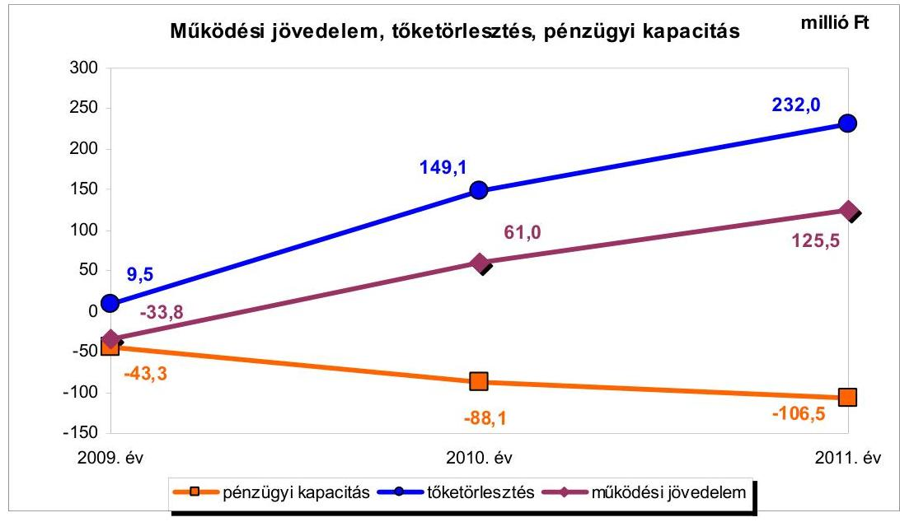
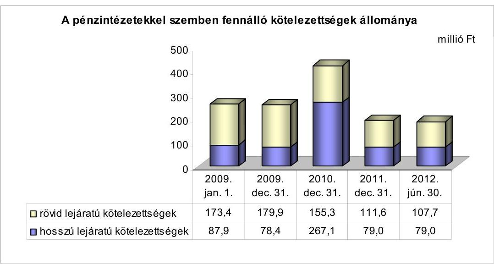
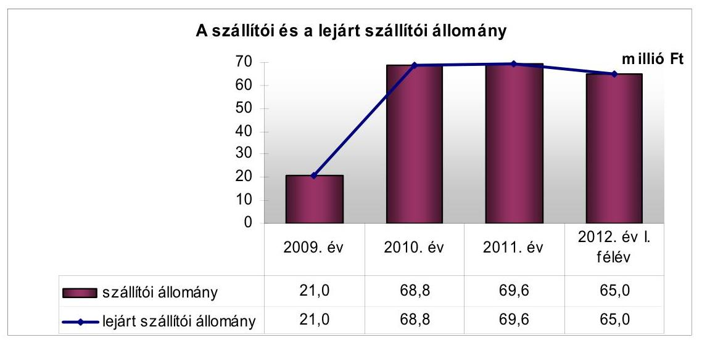
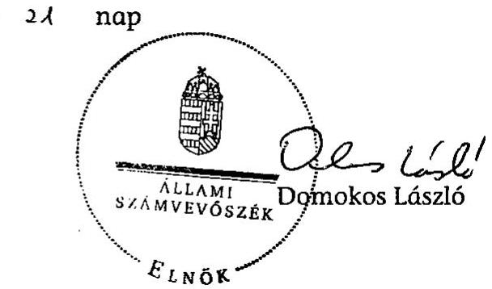
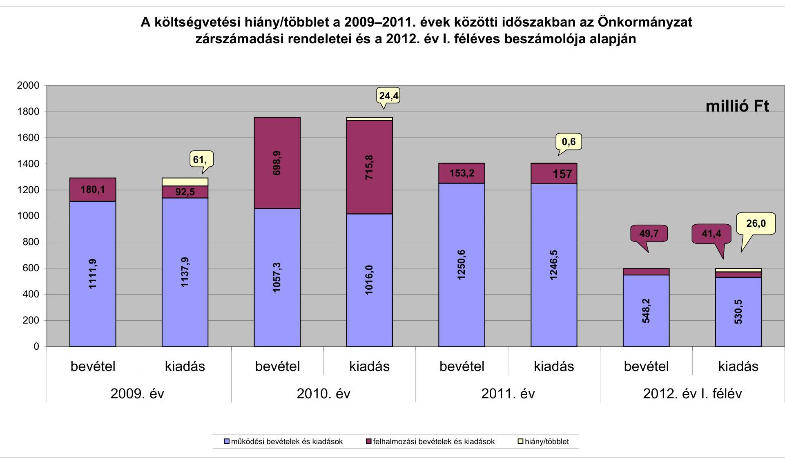
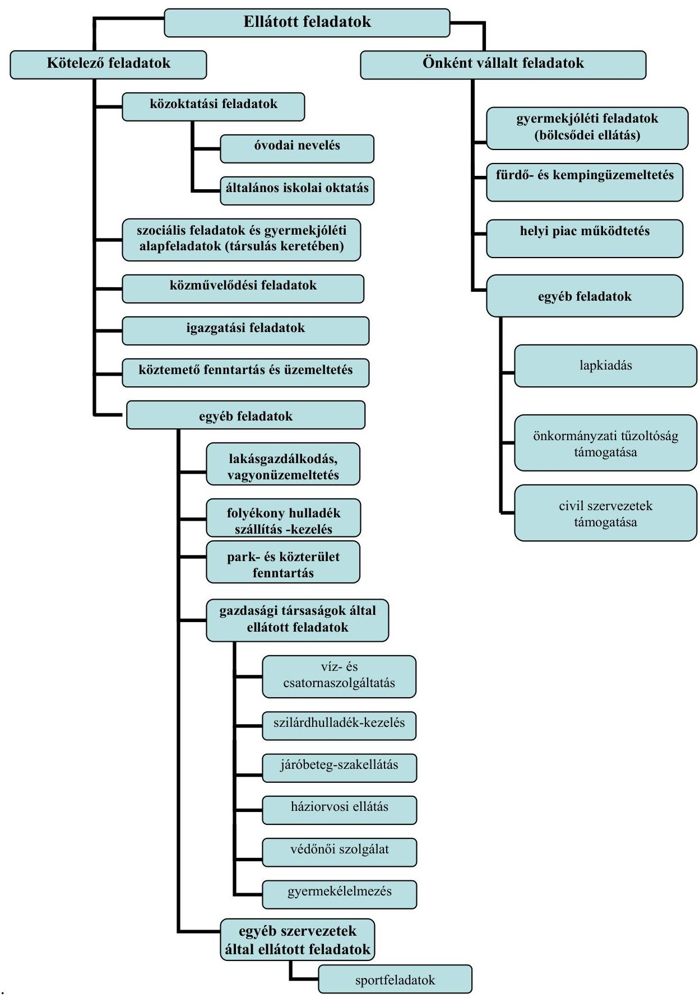

# JELENTÉS 

Tiszacsege Város Önkormányzata pénzügyi gazdálkodási helyzetének, szabályosságának ellenőrzéséről

---

# Állami Számvevőszék 

Iktatószám: V-0030-255-014/2013.
Témaszám: 1069
Vizsgálat-azonosító szám: V059212

## Az ellenőrzést felügyelte:

## Renkó Zsuzsanna

felügyeleti vezető

## Az ellenőrzést vezette:

## Dér Lívia

ellenőrzésvezető

## Az ellenőrzést végezték:

| Szihalminé Kovács | Luhály Matild | Puskás Balázs |
| :-- | :-- | :-- |
| Zsuzsanna | számvevő | számvevő |
| számvevő tanácsos |  |  |

---

# TARTALOMJEGYZÉK 

BEVEZETÉS ..... 3
I. ÖSSZEGZŐ MEGÁLLAPÍTÁSOK, KÖVETKEZTETÉSEK, JAVASLATOK ..... 6
II. RÉSZLETES MEGÁLLAPÍTÁSOK ..... 15

1. Az Önkormányzat kötelező és az önként vállalt feladatai, a feladatellátás szervezeti keretei ..... 15
2. A pénzügyi egyensúlyt fenntartását veszélyeztető pénzügyi kockázatok, és az ezek csökkentése érdekében tett intézkedések ..... 16
3. A pénzügyi gazdálkodási folyamatok szabályosságát, megfelelőségét biztosító belső kontrollok ..... 25
4. Az ÁSZ korábbi ellenőrzése során a pénzügyi, gazdálkodási helyzet javítására tett javaslatainak megvalósítása ..... 26

---

# MELLÉKLETEK 

1. számú A költségvetési hiány/többlet a 2009-2011. évek közötti időszakban az Önkormányzat zárszámadási rendeletei és a 2012. év I. féléves beszámolója alapján
2. számú Az Önkormányzat bevételei és kiadásai, valamint adósságszolgálata a 2009-2011. években (a CLF módszer szerint)
3/a. számú Az Önkormányzat által a 2009. év és a 2012. év I. félév között megvalósított (műszakilag befejezett) fejlesztések forrásösszetétele
3/b. számú Az Önkormányzat által beadott, elbírálás alatti pályázatok forrásaiból megvalósuló fejlesztésekhez kapcsolódó kötelezettségvállalások összegzése
3. számú Az önkormányzati feladatok ellátásában résztvevő gazdasági társaságok egyes kiemelt adatai
4. számú Az Önkormányzat 2012. június 30-án fennálló, hosszú lejáratú adósságot keletkeztető kötelezettségvállalásai
5. számú Az Önkormányzat kötelezettségeinek 2011. december 31-ei és 2012. június 30-ai állománya és a 2012. évben, valamint az azt követő években várható kötelezettségek miatti kiadások

## FÜGGELÉKEK

1. számú Rövidítések jegyzéke
2. számú Értelmező szótár
3. számú Az Önkormányzat által ellátott feladatok a 2012. év I. félév végén

---

# JELENTÉS 

## Tiszacsege Város Önkormányzata pénzügyi gazdálkodási helyzetének, szabályosságának ellenőrzéséről

## BEVEZETÉS

Az államháztartás helyi szintjén, az önkormányzati alrendszerben az utóbbi években megjelenő gazdálkodási nehézségek, a pénzforgalmi hiány növekedése, az eladósodás az ÁSZ figyelmét a helyi önkormányzatok pénzügyi helyzetére irányította.

Az ÁSZ a 2012. évi ellenőrzési tervben foglaltaknak megfelelően az önkormányzatok pénzügyi gazdálkodási helyzetének, szabályosságának ellenőrzésével az önkormányzatok 2011. évben megkezdett helyzetelemzését folytatta. Az ellenőrzés keretében értékeljük az Önkormányzatok adósságkezelési és likviditási helyzetét, bemutatjuk a pénzügyi egyensúly alakulására hatással lévő folyamatokat. Feltárjuk az ezekre ható kockázatokat, a pénzügyi egyensúlyi helyzetet befolyásoló döntésmegalapozó, döntés-előkészítő eljárások szabályosságát. Minősítjük az ezekkel összefüggő belső kontrollok kialakítását, működését. Az ellenőrzés kiterjed az ellenőrzött időszakban végrehajtott ÁSZ ellenőrzés utóellenőrzésére is.

Az ellenőrzés eredményének várható hatásaként a megállapításokkal segítséget nyújthatunk az önkormányzatok számára a pénzügyi egyensúly helyreállítása, javítása és fenntartása érdekében szükségessé váló intézkedések megtételéhez.

Az ellenőrzés típusa: szabályszerűségi ellenőrzés.

## Az ellenőrzés célja annak értékelése volt, hogy:

- az ellenőrzött időszakban a kötelező- és az önként vállalt feladatok ellátását biztosító szervezeti formák változása milyen hatást gyakorolt az Önkormányzat pénzügyi helyzetének alakulására;
- az Önkormányzat pénzügyi - ezen belül működési és felhalmozási - egyensúlya milyen irányban változott, a változást milyen okok idézték elő, továbbá milyen intézkedéseket tettek a pénzügyi egyensúly biztosítása, illetve javítása érdekében, az intézkedések hatására javult-e az Önkormányzat pénzügyi helyzete;
- a költségvetési kiadások finanszírozása érdekében vállalt pénzintézetekkel szembeni kötelezettségek hogyan alakultak, a kötelezettségek fennállása

---

miként befolyásolja az Önkormányzat jövőbeli pénzügyi egyensúlyi helyzetét;

- az Önkormányzat beazonosította, felmérte, értékelte-e a pénzügyi egyensúlyt befolyásoló pénzügyi kockázatokat, a finanszírozási célú pénzügyi műveletekkel kapcsolatban írtak-e elő kockázatértékelési kötelezettséget;
- az Önkormányzat által kialakított belső kontrollok biztosítják-e a pénzügyi gazdálkodás folyamatainak szabályosságát és eredményességét;
- hasznosultak-e az ÁSZ korábbi ellenőrzése során a pénzügyi, gazdálkodási helyzet javítására tett szabályszerűségi és célszerűségi javaslatok.

Az ellenőrzés a 2009. január 1-jétől 2012. június 30-áig terjedő időszakot ölelte fel. A pénzintézetekkel szembeni kötelezettségek állományának vizsgálatakor a 2011. december 31-én fennálló kötelezettségek keletkezésének kezdő időpontját vettük figyelembe.

Az ellenőrzés szakmai módszertana az ÁSZ Ellenőrzési Kézikönyvében foglalt szakmai szabályokon alapult, amely a Legfőbb Ellenőrző Intézmények Nemzetközi Szervezete (INTOSAI) által kiadott nemzetközi standardok (ISSAI) figyelembevételével készült.

Az ellenőrzés során használt rövidítések jegyzékét az 1. számú, az egyes fogalmak magyarázatát a 2. számú függelék tartalmazza.

A vizsgálat jogszabályi alapját az ÁSZ tv. 1. § (3) bekezdésének, 5. § (2)-(6) bekezdéseinek, valamint az Áht. 2 61. § (2) bekezdésének előírásai képezik.

A helyszíni ellenőrzést követően az Országgyűlés a helyi önkormányzatok adósságállományának részleges konszolidációjáról döntött. Az 5000 fő lakosságszámot meg nem haladó települési önkormányzatok számára nyújtott törlesztési célú támogatással $^{1}$ lehetővé tették a 2012. december 12-én fennálló tartozásállományuk és annak 2012. december 28-án fennálló járulékai teljes megfizetését. Az 5000 fő lakosságszám feletti települések esetében a 2013. évben az állam differenciált - a bevételi képességet figyelembe vevő, 40-70%-ig terjedő mértékben vállalja át$^{2}$ az önkormányzat 2012. december 31-i, az átvállalás időpontjában fennálló adósságállományát és annak járulékait. Az adósságkonszolidációs intézkedéssel egyidejűleg a Kormány elrendelte$^{3}$ az önkormányzatok adósságállománya újratermelődésének megakadályozása céljából a hitelengedélyezési és a likvid hitelekre vonatkozó szabályozás szigorítását.

Tiszacsege város lakosainak száma 2012. január 1-jén 4793 fő volt. Az Önkormányzat a 2011. évben 1289,9 millió Ft költségvetési bevételt ért el és

[^0]
[^0]:    $^{1}$ Magyarország 2012. évi központi költségvetéséről szóló 2011. évi CLXXXVIII. törvény módosításáról szóló 2012. évi CLXXXVII. törvény alapján
    $^{2}$ Magyarország 2013. évi központi költségvetéséről szóló 2012. évi CCIV. törvény alapján
    $^{3}$ 1540/2012. (XII. 4.) Korm. határozat a helyi önkormányzatok adósságállományának részleges konszolidációjáról

---

1035,7 millió Ft költségvetési kiadást teljesített. A 2011. december 31-i könyvviteli mérleg szerint 4371,0 millió Ft értékű vagyonnal rendelkezett, amely a 2009. év végi állományhoz viszonyítva 3,8%-kal (158,8 millió Ft-tal) növekedett. Az eszközérték növekedésben 248,9 millió Ft-tal a tárgyi eszközök állománynövekedése volt meghatározó, a Városi Óvoda és Bölcsőde infrastrukturális fejlesztése keretében végrehajtott ingatlan beruházás és gép, berendezés beszerzés eredményeként. A források között a saját tőke állományának 35,5 millió Ft-os, a tartalékok állományának 121,5 millió Ft-os, a rövid lejáratú kötelezettségek 49,4 millió Ft-os növekedése mellett a hosszú lejáratú kötelezettségek 20,7 millió Ft-os csökkenése tette ki az állományváltozás jelentős hányadát. Az Önkormányzat a 2012. évi költségvetési rendeletében a költségvetési bevételek összegét 1159,3 millió Ft-ban, a költségvetési kiadások összegét 1276,1 millió Ft-ban állapította meg.

Az ÁSZ tv. 29. § (1) bekezdése szerint a jelentéstervezetet megküldtük a polgármester részére, aki az ÁSZ tv. 29. § (2) bekezdésében foglalt észrevételezési jogával nem élt, a jelentéstervezetre észrevételt nem tett.

---

# I. ÖSSZEGZŐ MEGÁLLAPÍTÁSOK, KÖVETKEZTETÉSEK, JAVASLATOK 

Tiszacsege Város Önkormányzatának pénzügyi egyensúlyi helyzete rövid távon nem biztosított. Az állam által nyújtott törlesztési támogatásból az Önkormányzat kiegyenlítette a 2012. december 12-én fennálló adósságállományát és annak 2012. december 28-án fennálló járulékait. Az adósságkonszolidáció eredményeként az Önkormányzat pénzügyi egyensúlyi helyzete javul, azonban az alacsony működési jövedelemtermelő képesség miatt a jelentős szállítói állomány és az adósságkonszolidációt követően fennmaradó kötelezettségek teljesíthetősége kockázatos.

Az Önkormányzat által ellátott önként vállalt feladatok - bölcsődei ellátás, a fürdő és kemping üzemeltetése, piacműködtetés, lapkiadási feladatok, a civil szervezetek és a tűzoltóság támogatása - működési kiadásainak az összes működési kiadáson belüli aránya 3,1%-5,1% volt 2009-2011 között. Az önként vállalt feladatok működési bevételei összességében fedezetet nyújtottak a működési kiadásokra, így az önként vállalt feladatok ellátása nem jelentett működési kockázatot az Önkormányzat számára. Az ellenőrzött időszakban a felhalmozási kiadások 83,8%-át (511,4 millió Ft-ot) fordították kötelező és 16,2%-át (99,0 millió Ft-ot) önként vállalt feladatokhoz kapcsolódó fejlesztésekre, ami nagyságrendje miatt nem jelentett felhalmozási kockázatot. Az Önkormányzat kötelezően ellátott feladatai alapvetően a közoktatáshoz, a szociális és gyermekjóléti ellátáshoz, a közművelődési és az igazgatási feladatokhoz kapcsolódtak. A költségvetési szervek száma a vizsgált időszakban négy volt, nem változott, azonban a telephelyek száma 15-ről 13-ra csökkent. Az ellenőrzött időszakban megvalósított - feladatátrendezésre irányuló - intézkedések hatásaként, az Önkormányzat adatszolgáltatása alapján, a kiadások 22,5 millió Ft-tal, a bevételek 1,3 millió Ft-tal csökkentek. A feladatellátást biztosító szervezeti formák változása összesen 21,2 millió Ft megtakarítást eredményezett, amely az Önkormányzat pénzügyi egyensúlyi helyzetét érdemben nem javította.

Az Önkormányzat 2009-2011 között összesen 3331,1 millió Ft költségvetési bevételt realizált. Ugyanebben az időszakban a teljesített költségvetési kiadása 3178,4 millió Ft-ot tett ki. A működési és felhalmozási költségvetés összevont egyenlege 2009-ben és 2011-ben pozitív, 2010-ben negatív volt. A három év alatt összességében 55,9 millió Ft többlet keletkezett, ami a teljesített költségvetési kiadások 1,8%-a volt. A nettó működési jövedelem - alapvetően a növekvő tőketörlesztés eredményeként - folyamatosan gyengült, összege minden ellenőrzött évben negatív volt, így 2010-ben nem nyújtott fedezetet a felhalmozási forráshiányra.

---

Az Önkormányzat pénzügyi kapacitásának 2009-2011 közötti romlását eredményezte, hogy a tőketörlesztés nagyobb mértékben nőtt, mint a működési jövedelem. A változást a következő ábra mutatja be:

A működési jövedelem alakulásában meghatározó szerepet játszott, hogy a működési bevételek növekedése mellett a feladatellátás átszervezése, valamint a végrehajtott létszámcsökkentések eredményeként a működési kiadások csökkentek 2009-2011 között.

A Városi Óvoda és Bölcsőde - ellenőrzött időszakban végrehajtott - infrastrukturális fejlesztése EU-s forrásból, utófinanszírozással történt. A kivitelezés során eltértek a tervdokumentációban foglaltaktól. Ennek következtében a kivitelezés kiadása 29,3 millió Ft-tal nőtt, az igénybevett támogatás 20,8 millió Ft-tal csökkent. Az utófinanszírozás, valamint a tervtől eltérő kivitelezés felhalmozási kockázatot jelentett.

A pénzügyi egyensúlyi helyzetre kedvező hatással volt, ugyanakkor bevételi kitettséget jelent, a 2009. évi 14,8 millió Ft, a 2010. évi 13,0 millió Ft és a 2011. évi 163,3 millió Ft ÖNHIKI támogatás, mely nélkül a működési jövedelem 2009-ben és 2011-ben negatív értéket mutatott volna. A működési jövedelemtermelő képesség miatti kockázatot jelzi, hogy az ÖNHIKI támogatás nélküli bevételek csak a 2010. évben fedezték a feladatellátás kiadásait.

Az ellenőrzött időszakban az Önkormányzat bevételt növelő (helyi adó mértékek, szolgáltatási díjak, illetve bérleti díjak emelése) és kiadási megtakarítást (feladatkiszervezés, összesen 20 álláshely megszüntetéséhez kapcsolódó egyéb létszámcsökkentés, és a méltányossági ápolási díj megszüntetése) eredményező intézkedéseket hozott. Ezek hatására - az Önkormányzat adatszolgáltatása alapján - összesen 72,5 millió Ft bevételi többlet, illetve 202,9 millió Ft kiadási megtakarítás keletkezett.

---

Az Önkormányzat hosszú lejáratú pénzintézeti kötelezettsége a 2009. év elejétől a 2012. év I. félév végére 87,9 millió Ft-ról 79,0 millió Ft-ra csökkent. A változást, a vizsgált időszak elején fennálló hiteltartozás törlesztése mellett, egy támogatás-megelőlegezési hitel, valamint egy hosszú lejáratú működési hitel felvétele eredményezte. A rövid lejáratú hitelek mérleg szerinti értéke - az Áhsz.-ben előírtak ellenére - három gazdasági társaságtól, egy magánszemélytől, illetve egy alapítványtól származó kölcsön igénybevételéből fennálló kötelezettséget is tartalmazott. A hitelek igénybevételéből származó forrásokat a céloknak megfelelően használták
 fel. A hosszú lejáratú hitelek után az ellenőrzött időszakban összesen 309,9 millió Ft kifizetést (tőke, kamat, egyéb díjak) teljesítettek. A hitelek változó kamata kamatkockázatot jelentett, mivel a támogatás-megelőlegezési hitel és a likviditási hitel kamata nőtt az induló kamatfeltételekhez viszonyítva.

Az Önkormányzatnak a vizsgált időszak minden napján volt folyószámlahitel-tartozása, amely a banki kitettség szempontjából kockázatot jelent. A folyószámlahitel átlagos napi állománya a 2009. évi 95,5 millió Ft-ról a 2012. év I. félévére 65,7 millió Ft-ra csökkent. A munkabér-megelőlegezési hitel átlagos napi állománya 2009-2011 között 1,3 millió Ft-ról 1,1 millió Ft-ra csökkent. A 2012. év I. félévében nem vettek igénybe munkabér-megelőlegezési hitelt.

Az Önkormányzat likviditási és rövid távú pénzügyi egyensúlyi helyzetére kedvezően hatott, hogy a 2010-ben felvett rövid lejáratú likviditási hitel visszafizetésének határidejét - hitelszerződés-módosítás keretében - 2012. december 21-re módosították. A visszafizetés-átütemezést az tette szükségessé, hogy likviditási nehézségek miatt a hitelt nem tudták az eredeti ütemezés szerint visszafizetni.

A nemfizetési kockázat növekedését jelzi, hogy a szállítói és ezzel azonos összegben a lejárt szállítói kötelezettségekből adódó tartozás a 2009. év és a 2012. év I. féléve között jelentős mértékben - 21,0 millió Ft-ról 65,0 millió Ft-ra - nőtt, a 2012. év I. félév végén az ezen időszak alatti dologi kiadások egy havi átlagának (4,7 millió Ft) a 2,8-szeresét tette ki. Az igénybevett kölcsönökből fennálló tartozás 30,5 millió Ft volt 2012. június 30-án. Az Önkormányzat 20 forgalomképes ingatlanát terhelte jelzálog a 2012. év I. félév végén. A terhelt ingatlanok értéke 745,7 millió Ft volt, ami az összes forgalomképes ingatlan értékének (956,8 millió Ft-nak) a 77,9%-a. Az ingatlanok jelzáloggal való terhelése az ellenőrzött időszakban nőtt, ami az esetleges fedezetbevonások miatt kockázatot jelent.

Az Önkormányzat kötelezettségeinek állománya 2012. június 30-án 294,7 millió Ft volt. A vállalt hosszú és rövid lejáratú kötelezettségek teljesítésére 47,3 millió Ft követelésállomány vehető figyelembe, az Önkormányzat szabad tartalékokkal nem rendelkezik. Kockázatot jelent, hogy a jövedelemtermelő képesség alapján képződő működési jövedelem várhatóan nem nyújt fedezetet a jövőbeni kötelezettségekre.

Az adósságot keletkeztető kötelezettségvállalásokról szóló döntéseknél nem határozták meg a visszafizetés lehetséges forrásait, folyamatosan nem kísérték figyelemmel a források meglétét. A döntések előkészítése során az adósságot keletkeztető kötelezettségvállalás felső határát nem vizsgálták. Ennek következtében a tárgyévet terhelő rövid lejáratú pénzintézeti kötelezettségek a 2010-2011.

---

években meghaladták az Ötv.-ben felső korlátként előírt, korrigált saját bevétel összegét. A támogatás-megelőlegezési hitelszerződésben az Önkormányzat - az Ötv. előírásai ellenére - a pénzintézetre engedményezte a központi költségvetésből származó bevételeit. A támogatás-megelőlegezési hitel igénybevételekor megsértették a Kbt. előírásait, mivel közbeszerzési eljárás lefolytatása nélkül kötöttek hitelszerződést. Az ÁSZ jogorvoslati eljárást nem kezdeményezett, mivel a jogsértés elkövetésétől számított, a Kbt. alapján jogorvoslat indítására nyitva álló egyéves határidő eltelt.

Az ellenőrzött időszakban nem mérték fel, a zárszámadási rendeletekben nem mutatták be az elszámolt értékcsökkenés és az eszközpótlásra fordított források arányának, és ezzel összefüggésben az eszközök használhatósági fokának alakulását.

Az Önkormányzatnál a kockázatkezelési rendszer kialakítása és működtetése teljes körűen nem felelt meg a 2009-2011. években az Áht.${ }_{1}$, a 2012. év I. félévében az Áht.${ }_{2}$ előírásainak. Az ellenőrzött időszakban fennállt az alacsony működési jövedelemtermelő képesség miatti kockázat, az ÖNHIKI támogatás miatti bevételi kitettség kockázata, egy fejlesztés utófinanszírozása miatt a felhalmozási kockázat, a hitelek változó kamata miatti kamatkockázat, a folyószámlahitel állandósulása miatti banki kitettség kockázata, a magas szállítói állomány miatti nemfizetési kockázat, az ingatlanok jelzáloggal terheltségének növekedése következtében a fedezetbevonások miatti kockázat, valamint a működési jövedelemtermelő képesség gyenge szintje miatt a jövőbeni várható kötelezettségek teljesíthetőségének a kockázata. Ennek ellenére a pénzügyi egyensúlyra kiható kockázatok beazonosítása, felmérése, értékelése, ezáltal a kockázatok kezelése - a 2009. évben az Ámr.${ }_{1}$-ben, a 2010-2011. években az Ámr.${ }_{2}$-ben, a 2012. év I. félévében a Bkr.-ben foglalt előírások ellenére - elmaradt.

Az Önkormányzatnál a belső kontrolltevékenységek kialakítása és működtetése teljes körűen nem felelt meg a 2009-2011. években az Áht.${ }_{1}$, a 2012. év I. félévében az Áht.${ }_{2}$ előírásainak. A pénzügyi gazdálkodási folyamatok szabályosságát biztosító kontrollok gazdálkodási folyamatokba való beépítése a 2009. évben az Ámr.${ }_{1}$-ben, a 2010-2011. években az Ámr.${ }_{2}$-ben, a 2012. év I. félévében a Bkr.-ben foglalt előírásoknak nem felelt meg. A döntés-előkészítés szakaszában nem írták elő a fejlesztési döntések kockázatai feltárásának és kezelésének a kötelezettségét, a pénzintézeti kötelezettségvállalásokkal kapcsolatos döntések kockázatainak feltárását, és a futamidő egyes éveit terhelő kötelezettségek költségvetési egyensúlyra gyakorolt hatása vizsgálatát. Nem határozták meg az Önkormányzat fizetőképességének és eladósodásának kezelésével, a pénzügyi kötelezettségek teljesítésének helyi szabályaival, a szállítói tartozások és egyéb kiadáselmaradások rendezésével összefüggő kontrolltevékenységeket. Az Önkormányzatnál a belső ellenőrzés kialakítása, működtetése teljes körűen nem felelt meg a 2009-2011. években az Áht.${ }_{1}$-ben, a 2012. év I. félévében az Áht.${ }_{2}$-ben meghatározott előírásoknak. A belső ellenőrzési tervek készítését megelőzően - a 2009-2011. években a Ber.-ben, 2012. január 1-jétől a Bkr.-ben foglaltak ellenére - nem írták elő a pénzügyi egyensúlyi helyzetet befolyásoló döntések kockázati tényezőinek feltárását, a belső ellenőrzési tervek nem tartalmazták ezen kockázati tényezők ellenőrzését.

---

A gazdálkodási folyamatokba beépített kontrollok működése nem volt megfelelő, mivel nem számszerűsítették a kamat és a tőke visszafizetését szolgáló források változásának pénzügyi egyensúlyi helyzetre gyakorolt hatását. A belső ellenőrzési tervek készítése során nem tárták fel a pénzügyi egyensúlyi helyzetet befolyásoló döntések kockázati tényezőit, és a belső ellenőrzés keretében ezen kockázati tényezőket nem ellenőrizték.

Az Önkormányzat gazdálkodási rendszerének 2008. évi ÁSZ ellenőrzése során tett javaslatok közül két - a pénzügyi, gazdálkodási helyzet értékeléséhez kapcsolódó - szabályszerűségi, valamint három célszerűségi javaslat nem hasznosult, emiatt az akkor megállapított hiányosságok továbbra is részben fennállnak. A jegyző nem írta elő annak ellenőrzését, hogy az intézmények, hivatali szervezeti egységek által benyújtott költségvetési igények indokoltak és teljesíthetőek-e, a saját bevételek előirányzatai és a költségvetés megalapozását szolgáló helyi rendeletek összhangja biztosított-e, illetve nem gondoskodott az intézményi pénzmaradvány-megállapítás szabályszerűségének ellenőrzéséről. A célszerűségi javaslatok közül elmaradt az EU-s forrásból támogatott fejlesztések kockázatelemzésen alapuló belső ellenőrzése, a pályázatkezelés személyi és szervezeti kereteinek a kiépítése. Az informatikai stratégiát nem egészítették ki az Önkormányzat közép- és hosszú távú célkitűzéseivel, valamint annak meghatározásával, hogy az e-közigazgatási feladatok szintjeit milyen ütemben tervezik elérni.

Összességében az Önkormányzat jövedelemtermelő képessége alapján képződő bevételei a feladatai ellátásához szükséges kiadásokat csak részben fedezik. Az adósságkonszolidációt követően fennmaradó kötelezettségei tovább nehezítik pénzügyi gazdálkodási pozícióit, működését rövid távon korlátozzák. A hitelekből és pályázati forrásokból megvalósuló beruházások a feladatellátás színvonalának javításához hozzájárultak, de nem teremtenek bevételnövelési lehetőséget.

Az ÁSZ tv. 33. § (1) bekezdésében foglaltak értelmében az ellenőrzött szervezet vezetője köteles a jelentésben foglalt megállapításokhoz kapcsolódó intézkedési tervet összeállítani, és azt a jelentés kézhezvételétől számított harminc napon belül az ÁSZ részére megküldeni. Amennyiben az intézkedési tervet határidőben nem küldi meg a szervezet, vagy az továbbra sem elfogadható, az ÁSZ elnöke a hivatkozott törvény 33. § (3) bekezdés a)-b) pontjaiban foglaltakat érvényesítheti.

# Az ellenőrzés intézkedést igénylő megállapításai és javaslatai: 

## a polgármesternek

1. Az Önkormányzat működési jövedelme a 2009-2011. években az ÖNHIKI támogatások nélkül 38,4 millió Ft hiányt mutatott volna. A nettó működési jövedelem minden ellenőrzött évben negatív volt, így nem biztosított fedezetet a 2010. évi felhalmozási forráshiányra. A likviditás folyószámlahitel, munkabér- és támogatásmegelőlegezési hitel, valamint egyéb likvidhitel igénybevételével volt biztosítható. A lejárt szállítói tartozás az ellenőrzött időszak végére 65,0 millió Ft-ra nőtt. A 2012. év I. félév végén a lejárt tartozás 66,8%-a (43,4 millió Ft) 60 napon túl lejárt tartozás

---

volt. A bevételnövelő és a kiadáscsökkentő intézkedések nem biztosítottak elegendő forrást a pénzügyi egyensúly helyreállításához.

Javaslat:
A működési jövedelemtermelő képesség és a feladatellátás összhangja, valamint az Önkormányzat pénzügyi egyensúlya helyreállításának, hosszú távú fenntarthatóságának érdekében - a 2012. évi kormányzati adósságkonszolidációt, valamint a 2013. évtől változó feladat-ellátási kötelezettséget, feladatfinanszírozási rendszert figyelembe véve - felelősök és határidők megjelölésével kezdeményezzen intézkedéseket, melyek keretében:
a) vizsgáltassa meg, és terjessze a Képviselő-testület elé a további bevételszerző, kiadáscsökkentő intézkedések bevezetésének lehetőségét, és a döntés függvényében járjon el a bevezetésre kerülő bevételnövelő, kiadáscsökkentő intézkedések végrehajtása érdekében;
b) terjesszen a Képviselő-testület elé jóváhagyásra - az 1991. évi XX. törvény 140. § (1) bekezdés a) pontja alapján a jegyző által elkészített - az Önkormányzat gazdasági helyzetének elemzésén alapuló, a pénzügyi egyensúlyi helyzet gyors helyreállítását, hosszú távú fenntartását, valamint az adósságállomány újratermelődése elkerülését biztosító intézkedéseket tartalmazó reorganizációs programot;
c) a szállítói kitettség és a helyi önkormányzatok adósságrendezési eljárásáról szóló 1996. évi XXV. törvény 4-9. §-aiban szabályozott adósságrendezési eljárás megindítása elkerülésének érdekében meghatározott gyakorisággal számoljon be a Képviselő-testületnek az Önkormányzat lejárt szállítói állománya alakulásáról. Intézkedjen a szállítói számlák esedékesség szerinti kiegyenlítéséről, vagy a lejárt tartozások átütemezéséről.
2. Az Önkormányzat tárgyévet terhelő rövid lejáratú kötelezettségei a 2010-2011. években meghaladták az adósságot keletkeztető kötelezettségvállalás Ötv. 88. § (2) bekezdésében ${ }^{4}$ előírt korrigált saját bevétel éves összegének megfelelő felső határát.

Javaslat:
Biztosítsa, hogy az adósságot keletkeztető kötelezettségvállalások során tartsák be a Magyarország gazdasági stabilitásáról szóló 2011. évi CXCIV. törvény 10. § (3) bekezdésében előírt tárgyévi saját bevétel 50%-ának megfelelő felső határt.
3. Az Önkormányzat - az Ötv. 88. § (1) bekezdés b) pontjában ${ }^{5}$ foglalt előírás ellenére - az éven túli lejáratú támogatás-megelőlegezési hitel igénybevétele során a hitelt folyósító pénzintézetre engedményezte a központi költségvetésből származó bevételeit, a szerződésben vállalt kötelezettségei teljesítésének biztosítékául.

[^0]
[^0]:    ${ }^{4}$ Hatályát vesztette 2011. december 31-én. A 2012. január 1-jétől hatályos jogszabályi előírás: a Magyarország gazdasági stabilitásáról szóló 2011. évi CXCIV. törvény 10. § (3) bekezdése.
    ${ }^{5}$ Hatályát vesztette 2011. december 31-én. A 2012. március 31-től hatályos jogszabályi előírás: az Áht. 84. § (4) bekezdése.

---

Javaslat:
Intézkedjen, hogy jövőbeni hitelfelvétel és kötvénykibocsátás fedezeteként az Áht. 84. § (4) bekezdésében előírtak szerint az Önkormányzat általános működésének és ágazati feladatainak támogatása, továbbá a költségvetési támogatás ne kerüljön megjelölésre.
4. A támogatás-megelőlegezési hitel igénybevételekor - a Kbt. 240. § (1) bekezdésében ${ }^{6}$ foglalt előírás ellenére - az Önkormányzat közbeszerzési eljárás lefolytatása nélkül kötött hitelszerződést a számlavezető pénzintézettel.

Javaslat:
A közbeszerzési eljárásról szóló törvényben foglaltak maradéktalan betartása érdekében:
a) biztosítsa, hogy jövőbeni pénzügyi szolgáltatás igénybevétele esetén - amennyiben a közbeszerzésekről szóló 2011. évi CVIII. törvény 120. § k) pontjában foglalt kivétel nem áll fenn - a közbeszerzési eljárás lefolytatásának kötelezettségére a 119. §-ban foglalt

 előírást érvényesítsék;
b) intézkedjen az ÁSZ ellenőrzés során feltárt közbeszerzési szabálytalanság tekintetében a munkajogi felelősséggel kapcsolatos körülmények kivizsgálásáról, és hozza meg a szükséges munkajogi intézkedéseket.

# a jegyzőnek

1. A 2010. és a 2011. évi könyvviteli mérlegben a kölcsön igénybevételből fennálló kötelezettséget - az Áhsz. 26. § (3) bekezdés d) pontjában és a 26. § (5) bekezdés a) pontjában foglalt előírás ellenére - a rövid lejáratú hitelek között mutatták ki.

Javaslat:
Intézkedjen, hogy a könyvviteli mérlegben a kötelezettségek kimutatása az Áhsz. 26. § (3) bekezdés d) pontjában és a 26. § (5) bekezdés a) pontjában foglalt előírásoknak megfelelően történjen.
2. Az Önkormányzatnál a kockázatkezelési rendszer kialakítása és működtetése teljes körűen nem felelt meg a 2009-2010. években az Áht. 1 120/B. § (2) bekezdés b) pontjában, a 2011. évben az Áht. 1 121. § (2) bekezdés b) pontjában, a 2012. év I. félévében az Áht. 2 69. § (2) bekezdésében meghatározott előírásoknak. Az ellenőrzött időszakban fennállt, pénzügyi egyensúlyi helyzetre kiható kockázatok (az alacsony működési jövedelemtermelő képesség miatti kockázat, az ÖNHIKI támogatás miatti bevételi kitettség kockázata, egy fejlesztés utófinanszírozása miatti felhalmozási kockázat, a változó kamatozású hitelek miatti kamatkockázat, a folyószámlahitel állandósulása miatti banki kitettség kockázata, a magas szállítói állomány miatti nemfizetési kockázat, a növekvő fedezetbevonások miatti kockázat, valamint a működési

[^0]
[^0]:    ${ }^{6}$ Hatályát vesztette 2011. december 31-én. A 2012. január 1-jétől hatályos jogszabályi előírás a közbeszerzésekről szóló 2011. évi CVIII. törvény 120. § k) pontja.

---

jövedelemtermelő képesség gyenge szintje miatt a jövőbeli várható kötelezettségek teljesíthetőségének kockázata) feltárása, beazonosítása, értékelése, ezáltal a kockázatok kezelése - a 2009. évben az Ámr. ${ }_{1}$ 145/C. §-ában, a 2010-2011. években az Ámr. ${ }_{2}$ 157. §-ában, a 2012. év I. félévében a Bkr. 7. § (1)-(2) bekezdéseiben foglalt előírások ellenére - elmaradt.

Javaslat:
Működtessen az Áht ${ }_{2}$ 69. § (2) bekezdésében, továbbá a Bkr. 7. § (1)-(2) bekezdéseiben foglalt előírásoknak megfelelő, a pénzügyi egyensúlyt befolyásoló kockázatok kezelésére alkalmas kockázatkezelési rendszert.
3. Az Önkormányzatnál a belső kontrolltevékenységek kialakítása és működtetése teljes körűen nem felelt meg a 2009-2010. években az Áht. ${ }_{1}$ 120/B. § (2) bekezdés c) pontjában, a 2011. évben az Áht. ${ }_{1}$ 121. § (2) bekezdés c) pontjában és a 2012. év I. félévében az Áht. ${ }_{2}$ 69. § (2) bekezdésében meghatározott előírásoknak. A pénzügyi gazdálkodási folyamatok szabályosságát biztosító belső kontrollok gazdálkodási folyamatokba történő beépítése a 2009. évben az Ámr. ${ }_{1}$ 145/E. § (1) bekezdésében, a 2010-2011. években az Ámr. ${ }_{2}$ 158. § (1) bekezdésében, a 2012. év I. félévében a Bkr. 8. § (1)-(2) bekezdéseiben foglalt előírásoknak nem felelt meg. Nem írták elő a döntés-előkészítés során a fejlesztési döntések kockázatai feltárásának és kezelésének a kötelezettségét, a pénzintézeti kötelezettségvállalásokkal kapcsolatos döntések kockázatainak a feltárását, a futamidő egyes éveit terhelő kötelezettség költségvetési egyensúlyra gyakorolt hatásának a vizsgálatát. Nem határozták meg az Önkormányzat fizetőképességének és eladósodásának kezelésével, a pénzügyi kötelezettségek teljesítésének helyi szabályaival, a szállítói tartozások és egyéb kiadáselmaradások rendezésével összefüggő kontrolltevékenységeket.

Javaslat:
Alakítsa ki az Áht ${ }_{2}$ 69. § (2) bekezdésében, továbbá a Bkr. 8. § (1)-(2) bekezdései alapján azokat a belső kontrolltevékenységeket, amelyek biztosítják a pénzügyigazdálkodási folyamatok szabályosságát, a pénzügyi egyensúly helyzet alakulását befolyásoló döntések kockázatainak kezelését. Ennek keretében:
a) határozza meg a fejlesztések döntés-előkészítés folyamatában a lebonyolítás és a működtetés kockázatai feltárásának és kezelésének a kötelezettségét;
b) írja elő a pénzintézeti kötelezettségvállalások kockázatainak döntés-előkészítő szakaszban történő feltárását, a futamidő egyes éveit terhelő kötelezettségek költségvetési egyensúlyra gyakorolt hatásának a vizsgálatát;
c) készítsen szabályzatot az Önkormányzat fizetőképességének és eladósodásának kezelésére, valamint a pénzügyi kötelezettségek teljesítésének, a szállítói tartozások, és az egyéb kiadáselmaradások rendezésének helyi szabályaira.
4. Az Önkormányzatnál a belső ellenőrzés kialakítása, működtetése teljes körűen nem felelt meg a 2009-2010. években az Áht. ${ }_{1}$ 121/A. § (3) bekezdésében, a 2011. évben az Áht. ${ }_{1}$ 121/B. § (4) bekezdésében, a 2012. év I. félévében az Áht. ${ }_{2}$ 70. § (1) bekezdésében meghatározott előírásoknak. Az ellenőrzött időszak során a belső ellenőrzési tervek készítését megelőzően - a 2009-2011. években a Ber. 18. §-ában,

---

a 21. § (2) bekezdésében és (3) bekezdés a) pontjában, 2012. január 1-jétől a Bkr. 29. § (1) bekezdésében, a 31. § (2) bekezdésében és a (4) bekezdés a) pontjában foglaltak ellenére - nem írták elő a pénzügyi, egyensúlyi helyzetet befolyásoló döntések kockázati tényezőinek feltárását, a belső ellenőrzési tervek nem tartalmazták ezen kockázati tényezők ellenőrzését.

Javaslat:
Intézkedjen, hogy az Áht. 2 70. § (1) bekezdésében, továbbá a Bkr. 29. § (1) bekezdésében, a 31. § (2) bekezdésében és a (4) bekezdés a) pontjában foglaltak szerint az éves belső ellenőrzési tervek tartalmazzák a pénzügyi egyensúlyi helyzetet befolyásoló döntésekkel kapcsolatos feltárt kockázati tényezők ellenőrzését, biztosítsa az ellenőrzési tervek végrehajtását.
5. Az Önkormányzat gazdálkodási rendszerének 2008. évi ÁSZ ellenőrzése során a pénzügyi egyensúly javítására tett javaslatok közül két szabályszerűségi javaslat nem hasznosult. Az Ámr. 1 145/A. § (1)-(2) bekezdéseiben és a 145/B. § (1) bekezdésében foglalt előírásokkal ${ }^{7}$ ellentétben, nem írták elő annak ellenőrzését, hogy az intézmények és hivatali szervezeti egységek által benyújtott költségvetési igények indokoltak, teljesíthetőek-e, a saját bevételek előirányzatai és a költségvetés megalapozását szolgáló helyi rendeletek összhangja biztosított-e. Az Ámr. 1 145/A. § (1) bekezdésében foglalt előírás ellenére, nem gondoskodtak az intézményi pénzmaradványmegállapítás szabályszerűségének ellenőrzéséről.

Javaslat:
Az Önkormányzat gazdálkodási rendszerét érintő 2008. évi ÁSZ ellenőrzés által megállapított szabálytalanságok megszüntetése érdekében:
a) intézkedjen a költségvetés tervezés folyamatában a Bkr. 8. § (2) bekezdés a) pontjában előírtak szerint a költségvetési igények indokoltságának, teljesíthetőségének, a saját bevételek és a költségvetés megalapozását szolgáló helyi rendeletek közötti összhang meglétének ellenőrzéséről;
b) biztosítsa, hogy a beszámoló kontrollja során a Bkr. 8. § (2) bekezdés d) pontjában foglalt előírásnak megfelelően ellenőrizzék az intézményi pénzmaradvány megállapításának helyességét.

[^0]
[^0]:    ${ }^{7}$ Hatályukat veszítették 2009. december 31-én. A 2012. január 1-jétől hatályos jogszabályi előírás: a Bkr. 8. § (2) bekezdés a) és d) pontjai.

---

# II. RÉSZLETES MEGÁLLAPÍTÁSOK

## 1. Az ÖNKORMÁNYZAT KÖTELEZŐ ÉS AZ ÖNKÉNT VÁLLALT FELADA-

TAI, A FELADATELLÁTÁS SZERVEZETI KERETEI

Az Önkormányzat kötelező és önként vállalt feladatait a Képviselőtestület $\mathrm{SzMSz}_{1,2}$-ének mellékletében rögzítették. Az önként vállalt feladatok közé sorolták a bölcsődei ellátást, a fürdő és a kemping üzemeltetését, a helyi piac működtetését, a civil szervezetek működési támogatását, az önkormányzati lap kiadását, valamint az önkormányzati tűzoltóság támogatását. Az önként vállalt feladatok köre nem változott a vizsgált időszakban.

Az önként vállalt feladatok nem jelentettek működési kockázatot ${ }^{8}$ az Önkormányzat számára az ellenőrzött időszakban. A működési kiadásokon belül az önként vállalt feladatok kiadásainak részaránya 2009-ben 4,5%, 2010-ben 3,1%, 2011-ben 5,1% és a 2012. év I. félévében 3,9% volt. A 2009. év és a 2012. év I. féléve között az önként vállalt feladatokhoz kapcsolódó működési célú költségvetési támogatás és a saját bevételek együttes összege (162,4 millió Ft) meghaladta a működési kiadásokat (155,4 millió Ft). Az ellenőrzött időszakban a felhalmozási kiadások 83,8%-át (511,4 millió Ft-ot) fordították kötelező, 16,2%-át (99,0 millió Ft-ot) önként vállalt feladatokhoz kapcsolódó fejlesztésekre, ami nagyságrendje miatt nem jelentett felhalmozási kockázatot.

A kötelezően ellátott feladatok alapvetően a közoktatáshoz, a szociális és gyermekjóléti ellátáshoz, a közművelődési és az igazgatási feladatokhoz kapcsolódtak ${ }^{9}$. Az Önkormányzat a feladatait 2012. június 30-án (a Polgármesteri Hivatallal együtt) négy költségvetési szervvel látta el. Az alapfokú nevelési és az oktatási feladatok ellátását az ÁMK és a Városi Óvoda és Bölcsőde biztosította. A közművelődési feladatot az ÁMK látta el. A szociális feladatokat és a gyermekjóléti alapfeladatokat - társulási megállapodás alapján - a Balmazújvárosi Többcélú Kistérségi Társulás végezte. A Városi Óvoda és Bölcsőde önként vállalt feladata volt a bölcsődei ellátás biztosítása. A Kommunális Szolgáltató feladatát képezte a piacüzemeltetés, a fürdő- és kempingműködtetés, illetve a köztemető fenntartásával kapcsolatos feladatok ellátása.

[^0]
[^0]:    ${ }^{8}$ Kockázatként kezeljük, amennyiben az önként vállalt feladatok részaránya az összes működési kiadásokon belül a 25%-ot eléri vagy meghaladja.
    ${ }^{9}$ További kötelező feladat volt a köztemető fenntartás, az egyéb feladatok közé sorolt lakásgazdálkodás, a vagyonüzemeltetés, a folyékony hulladék szállítás-kezelés, a park- és közterület fenntartás, a gazdasági társaságok által ellátott víz-és csatornaszolgáltatás, a szilárdhulladék-kezelés, a járóbeteg-szakellátás, a háziorvosi ellátás, a védőnői szolgálat, a gyermekélelmezés, valamint az egyéb szervezettel elláttatott sportfeladatok.

---

A költségvetési szervek száma az ellenőrzött időszakban nem változott, azonban a telephelyek száma a víz- és csatornaszolgáltatás feladatának gazdasági társaság részére történő átadásával, illetve az óvodai nevelés és a bölcsődei ellátás egy épületbe történő költözésével 15-ről 13-ra csökkent.

Az Önkormányzat az ellenőrzött időszakban nem rendelkezett többségi részesedéssel gazdasági társaságban. Az Önkormányzat megbízásából a 2009. év és a 2012. év I. féléve között szerződések alapján hat gazdasági társaság látott el önkormányzati feladatokat (víz- és csatornaszolgáltatás, hulladékszállítás, járóbeteg-szakellátás, háziorvosi ellátás, védőnői szolgálat, gyermekélelmezés). A feladatellátás részletezését az 3. számú függelék tartalmazza. Az Önkormányzat a gazdasági társaságok részére támogatást nem nyújtott. A feladatellátásban résztvevő gazdasági társaságok egyes kiemelt adatait a 4. számú melléklet tartalmazza.

A 2009. év és a 2012. év I. félév közötti időszakban megvalósított - feladatátrendezésre irányuló - intézkedések hatásaként, az Önkormányzat adatszolgáltatása alapján, a kiadások 22,5 millió Ft-tal, a bevételek 1,3 millió Ft-tal csökkentek. A feladatellátást biztosító szervezeti formák változása összesen 21,2 millió Ft megtakarítást eredményezett, amely az Önkormányzat pénzügyi egyensúlyi helyzetét érdemben nem javította.

# 2. A PÉNZÜGYI EGYENSÚLY FENNTARTÁSÁT VESZÉLYEZTETŐ PÉNZÜGYI KOCKÁZATOK, ÉS AZ EZEK CSÖKKENTÉSE ÉRDEKÉBEN TETT INTÉZKEDÉSEK

Az Önkormányzat költségvetésének elemzését CLF módszerrel hajtottuk végre. Az ÁSZ az ellenőrzéshez felhasznált, CLF táblában szereplő adatokat a 2010-2011. évi költségvetési beszámolókban feltárt hibák miatt módosította ${ }^{10}$. A CLF módszer szerinti 2009-2011 közötti részletes adatokat a 2. sz. melléklet, a főbb önkormányzati adatokat a következő tábla mutatja be.

[^0]
[^0]:    ${ }^{10}$ A 2. számú melléklet adatait az alábbiak szerint módosítottuk: a hitelállomány magánszeméllyel, illetve gazdálkodó szervezetekkel szembeni kölcsöntartozást tartalmazott, a likvid hitel felvétel és törlesztés nem nettó módon került kimutatásra. A költségvetési támogatás és a kamatok működési és felhalmozási célú elkülönítését pontosítottuk.

---

| Megnevezés |  |  | millió Ft |
| :-- | --: | --: | --: |
|  | 2009. év | 2010. év | 2011. év |
| Folyó bevételek | 1082,9
 | 1101,4 | 1146,8 |
| Folyó kiadások | 1116,7 | 1040,4 | 1021,3 |
| Működési jövedelem | $\mathbf{- 3 3 , 8}$ | $\mathbf{6 1 , 0}$ | $\mathbf{1 2 5 , 5}$ |
| Felhalmozási bevételek | 204,4 | 255,3 | 143,1 |
| Felhalmozási kiadások | 83,0 | 602,2 | 14,4 |
| Felhalmozási költségvetés egyenlege | $\mathbf{1 2 1 , 4}$ | $\mathbf{- 3 4 6 , 9}$ | $\mathbf{1 2 8 , 7}$ |
| Folyó és felhalmozási bevételek összesen | 1287,3 | 1356,7 | 1289,9 |
| Folyó és felhalmozási kiadások összesen | 1199,7 | 1642,6 | 1035,7 |
| Finanszírozási műveletek nélküli | $\mathbf{8 7 , 6}$ | $\mathbf{- 2 8 5 , 9}$ | $\mathbf{2 5 4 , 2}$ |
| pozíció |  |  |  |
| Finanszírozási műveletek egyenlege | -26,0 | 162,3 | -233,6 |
| Tárgyévi pénzügyi pozíció | $\mathbf{6 1 , 6}$ | $\mathbf{- 1 2 3 , 6}$ | $\mathbf{2 0 , 6}$ |
| Hiteltörlesztés, értékpapír beváltás | 9,5 | 149,1 | 232,0 |
| Nettó működési jövedelem | $\mathbf{- 4 3 , 3}$ | $\mathbf{- 8 8 , 1}$ | $\mathbf{- 1 0 6 , 5}$ |

A folyó költségvetés egyenlege, a működési jövedelem folyamatosan növekedett, a 2009. évben negatív, a 2010-2011. években pozitív volt. Az Önkormányzat a 2009-2011. években ${ }^{11}$ működőképességének biztosítására összesen 191,1 millió Ft ÖNHIKI támogatásban részesült. E nélkül az Önkormányzat működési jövedelme 2009-ben 48,6 millió Ft és 2011-ben 37,8 millió Ft hiányt, 2010-ben 48,0 millió Ft többletet mutatott volna. A működési jövedelemtermelő képesség miatti kockázatot jelzi, hogy az ÖNHIKI támogatás nélküli bevételek csak a 2010. évben fedezték a feladatellátás kiadásait. Az Önkormányzat pénzügyi kapacitása a 2009-2011. években romlott. A működési jövedelem egyik évben sem nyújtott fedezetet a növekvő összegű tőketörlesztésre.

Az Önkormányzat felhalmozási költségvetésének egyenlege 2009-ben és 2011-ben többletet, 2010-ben pedig hiányt mutatott. A 2010. évi magas felhalmozási kiadást az EU-s támogatással megvalósított Városi Óvoda és Bölcsőde infrastrukturális fejlesztése okozta. A felhalmozási deficitet hitelfelvételből, kölcsön igénybevételből és az előző évi pénzeszközökből finanszírozta az Önkormányzat. A nettó működési jövedelem - alapvetően a növekvő tőketörlesztés következményeként - folyamatosan gyengült, összege minden évben negatív volt, ezáltal a 2010. évben keletkezett felhalmozási forráshiányra nem tudott fedezetet nyújtani.

Az Önkormányzat teljes finanszírozási igénye (a nettó működési jövedelem és a felhalmozási költségvetés együttes negatív egyenlege) 2010-ben 435,0 millió Ft volt. 2009-ben 78,1 millió Ft, 2012-ben 22,2 millió Ft finanszírozási többlet keletkezett. Az Önkormányzat 2009-2011. évi zárszámadási rendeleteiben és a 2012. év I. félévi beszámolójában ${ }^{12}$ a költségvetési hiányt és több-

[^0]
[^0]:    ${ }^{11}$ 2009. évben 14,8 millió Ft, 2010. évben 13,0 millió Ft, 2011. évben 163,3 millió Ft
    ${ }^{12}$ A CLF modellel ellentétben tartalmazzák az előző évi pénzmaradvány felhasználásából származó pénzforgalom nélküli bevételeket is.

---

letet a hagyományos költségvetési szerkezet alapján mutatta be ${ }^{13}$, amelyet az 1. számú melléklet tartalmaz.

Az Önkormányzat összes folyó bevétele a 2009-2011. években folyamatosan nőtt. A növekedést a költségvetési - ezen belül az ÖNHIKI - támogatások és az egyéb saját bevételek összegének növekedése eredményezte. Az egyéb saját bevételek összegét a 2011-ben beindított közmunka programra kapott támogatások növelték. Az Önkormányzat számára folyósított ÖNHIKI támogatás összege 2011-ben volt a legnagyobb, 163,3 millió Ft. A 2009. és 2010. években kapott támogatás összege 14,8 millió Ft, illetve 13,0 millió Ft, a 2012. év I. félévében pedig 21,9 millió Ft volt.

A helyi adók, pótlékok nem képeztek meghatározó részarányt a folyó bevételek között. Ez az arány a 2009. évben 7,4\% (79,8 millió Ft), a 2010. évben 6,5\% (71,7 millió Ft), a 2011. évben 6,7\% (77,4 millió Ft) volt. A bevezetett helyi adók mértéke - az iparűzési és az idegenforgalmi adó kivételével - nem érte el a törvényi maximumot. Az Önkormányzat számítása szerint ez összesen mintegy 110,0 millió Ft-os bevételkiesést jelentett az ellenőrzött időszakban, amely a beszedett összes helyiadó-bevétel összegének 44,1\%-át jelenti.

A felhalmozási bevételeken belül a legnagyobb arányt az államháztartáson belülről kapott támogatás összege jelentette, melynek a 89,8\%-át (412,3 millió Ft) a Városi Óvoda és Bölcsőde infrastrukturális fejlesztéséhez kapott pályázati támogatás adta.

Az Önkormányzatnál a pénzügyi egyensúlyi helyzet tekintetében kockázatot jelentett a bevételi kitettség, mivel gazdálkodásához folyamatos ÖNHIKI támogatást vett igénybe. Az ÖNHIKI támogatások nélkül a működési jövedelem összesen 38,4 millió Ft hiányt mutatott volna. A bevételi kitettség miatti kockázatot mérsékli, hogy a helyi adóbevételek több adóalanytól származtak.

A személyi juttatások és a munkaadót terhelő járulékok összege az ellenőrzött időszak alatt - a közfoglalkoztatás bővülésének ellenére - a végrehajtott létszámcsökkentési intézkedések következtében folyamatosan csökkent.

A dologi kiadások összege a 2010. évben 18,6\%-os (52,7 millió Ft) csökkenést mutatott. Az év végén kimutatott 68,8 millió Ft-os lejárt szállítói tartozást figyelembe véve, ez nem megtakarítást jelentő csökkenés. 2011-ben az előző évi szállítói tartozásnak mintegy felét rendezték, de év végére újból 69,6 millió Ft lett a lejárt szállítói állomány. A 2011. évben a dologi kiadások növekedését okozta a közfoglalkoztatáshoz kapcsolódó eszközbeszerzés elszámolása.

Az Önkormányzat 2012. június 30-ig megvalósított (műszakilag befejezett) beruházásokra és felújításokra fordított kiadása összesen 610,4 millió Ft volt. A 2012. június 30-ig műszakilag befejezett fejlesztések forrását 96,9 millió Ft (15,9\%) önkormányzati saját bevétel, 432,5 millió Ft (70,9\%) EU-s támogatás, valamint 81,0 millió Ft (13,2\%) egyéb központi támogatás képezte. Az Önkormányzatnak 2012. június 30-án folyamatban levő felújítása és beruházása

[^0]
[^0]:    ${ }^{13}$ Nincs kötelező előírás a működési és fejlesztési hiány megállapításának módjára.

---

nem volt. A 2009-2012. év I. félév közötti fejlesztési feladatokat és azok forrásösszetételét a 3. a) melléklet mutatja be.

Az ellenőrzött időszakban az Önkormányzat jelentős beruházása a Városi Óvoda és Bölcsőde infrastrukturális fejlesztése volt.

A beruházást EU-s forrásból támogatták. A projekt tervezett összköltsége 455,9 millió Ft volt, megvalósítása utófinanszírozással történt. A kivitelezés elkezdéséhez támogatási előleget vettek igénybe. A beruházás tényleges bekerülési költsége 485,2 millió Ft lett. A Támogató szabálytalansági eljárást indított az Önkormányzat ellen, mivel a kivitelezés során eltértek az elfogadott tervdokumentációban foglaltaktól. A Támogató részben elutasította az Önkormányzat pótmunkákra vonatkozó finanszírozási igényét, mert a kivitelezés módosulása a műszaki tartalom csökkenésével és költségcsökkenéssel is járt. Az Önkormányzat a támogatási szerződés szerinti támogatási összeget nem hívhatta le. Az igénybe vett támogatás 20,8 millió Ft-tal (4,8\%-kal) kevesebb, a kivitelezés költsége viszont a tervezettől 29,3 millió Ft-tal (6,4\%-kal) több lett. Az Önkormányzatnak az egyéb saját bevételéből a tervezettnél 50,1 millió Ft-tal (80,1\%-kal) többet kellett felhasználni a projekt megvalósításához.

Az ellenőrzött időszakban az Önkormányzatnál az utófinanszírozás, a tervtől eltérő kivitelezés felhalmozási kockázatot jelentett.

Az Önkormányzat által beadott fejlesztési pályázatok segítségével egy felújítást és kettő beruházást kívánnak megvalósítani összesen 58,0 millió Ft tervezett bekerülési költségen. A megvalósításhoz 1,1 millió Ft saját bevételt terveztek felhasználni, ami - az Önkormányzat adatszolgáltatása alapján - rendelkezésre áll. Egyéb központi forrásból összesen 48,2 millió Ft támogatási összegre pályáztak, és önerő híján 8,7 millió Ft fejlesztési hitel igénybevételét tervezték. A beadott, elbírálás alatti pályázatok forrásaiból megvalósuló fejlesztésekhez kapcsolódó kötelezettségvállalások összegzését a 3. b) melléklet mutatja be.

Az Önkormányzat pénzintézeti kötelezettségeinek állománya 2009. január 1-jétől 2011. december 31-éig 27,1\%-kal, 261,3 millió Ft-ról 190,6 millió Ft-ra csökkent. A 2012. év I. félév végén a pénzintézeti kötelezettség állomány 186,7 millió Ft volt, amely a 2011. évihez viszonyítva 2,0\%-kal, 3,9 millió Ft-tal csökkent. Az Önkormányzat pénzintézetekkel szemben - a 2009-2011. években, illetve 2012. június 30-án - fennálló kötelezettségeit a következő ábra mutatja be.

---

Az Önkormányzat 2012. június 30-án fennálló, hosszúlejáratú adósságot keletkeztető kötelezettségvállalásait az 5. számú melléklet mutatja be.

A 2010. és 2011. évi beszámolók mérlegében az Áhsz. 26. § (3) bekezdés d) és (5) bekezdés a) pontjában foglaltak ellenére, a rövid lejáratú hitelek között mutatták ki három gazdasági társaságtól, egy alapítványtól és egy magánszemélytől kapott kölcsön összegét. Az egy éven túli lejáratra kapott 46,4 millió Ft és a rövid lejáratú 14,6 millió Ft kölcsöntartozás záró állománya 2010. december 31-én 61,0 millió Ft, 2011. december 31-én 41,0 millió Ft volt. Az egy éven túli lejáratra kapott kölcsönt - az Áhsz. 26. § (3) bekezdés d) pontjában foglaltak alapján - egyéb hosszú lejáratú kötelezettségnek, a rövid lejáratú kölcsönt pedig - az Áhsz. 26. § (5) bekezdés a) pontjában előírtak alapján - egy évet meg nem haladó lejáratra kapott kölcsönnek kellett volna minősíteni és nyilvántartásba venni.

Az Önkormányzat az ellenőrzött időszakban egy fejlesztés kivitelezéséhez kapott támogatás megelőlegezésére, valamint a likviditás megőrzése miatt vett igénybe hitelt, összesen 271,9 millió Ft összegben. Ezen túl két - a vizsgált időszakot megelőzően - igénybevett, fejlesztési hitelhez kapcsolódóan állt fenn pénzintézeti kötelezettsége 2012. június 30-án. Az Önkormányzatnak az ellenőrzött időszakban nem volt devizában fennálló, pénzintézetekkel szembeni kötelezettsége, és kötvényt sem bocsátott ki.

A hosszú lejáratú hitelek után az Önkormányzat a 2009. év és a 2012. év I. féléve között 254,5 millió Ft tőketörlesztést, 49,2 millió Ft kamat-, valamint 6,2 millió Ft egyéb kiadást teljesített. A hitelek változó kamata az Önkormányzat számára kamatkockázatot jelentett, mivel a támogatásmegelőlegezési hitel és a likviditási hitel kamata nőtt az induló kamatfeltételekhez viszonyítva.

A pénzintézeti kötelezettségvállalásokra a Képviselő-testület döntése alapján került sor. Nem szabályozták a kötelezettségvállalások kockázatai feltárásának a kötelezettségét a döntés-előkészítés során. A támogatás-megelőlegezési hitel igénybevételekor megsértették a Kbt. 240. § (1) bekezdésének a közbeszerzési eljárás lefolytatásának kötelezettségére vonatkozó előírását, mivel közbeszerzé-

---

si eljárás lefolytatása nélkül kötöttek hitelszerződést. A beszerzett pénzügyi szolgáltatás értéke - a Kbt. 38. § (2) bekezdésében előírtakat figyelembe véve - összesen 24,8 millió Ft volt. Az ÁSZ jogorvoslati eljárást nem kezdeményezett, mivel a jogsértés 2010 májusában történt. Az ezen időszakban hatályos Kbt. alapján jogorvoslat indítására egy éven belül volt lehetőség, amelynek határideje 2011 májusában lejárt.

Az adósságot keletkeztető kötelezettségvállalás felső határát - az Ötv. 88. § (2) bekezdésében előírtakat megsértve - a 2010. és a 2011. évben túllépte az Önkormányzat. A tárgyévet terhelő rövid lejáratú kötelezettségei 2010-ben 16,3 millió Ft-tal, 2011-ben 33,6 millió Ft-tal meghaladták a korrigált saját bevétel ${ }^{14}$ éves összegét. Az Ötv. 88. § (1) bekezdése b) pontjában ${ }^{15}$ foglaltak ellenére, az Önkormányzat a támogatás-megelőlegezési hitel hitelszerződésében - vállalt kötelezettségteljesítésének részbeni biztosítékául - a hitelt folyósító pénzintézetre engedményezte
 a központi költségvetésből származó bevételeit. A támogatás-megelőlegezési hitelszerződésben jogi biztosíték volt az Önkormányzat „költségvetési bevétele”, így a központi költségvetésből származó forrás is.

A Képviselő-testületet évenként tájékoztatták a hosszú lejáratú kötelezettségvállalásokból adódó fizetési kötelezettségekről, azonban nem mutatták be a visszafizetés forrásait. Az adósságot keletkeztető kötelezettségvállalásokról szóló döntések dokumentumai nem tartalmazták a visszafizetés lehetséges forrásait, illetve a már meglévő kötelezettségek jövőbeni terheinek forrásszükségletét. A törlesztések fedezetének biztosítására nem képeztek elkülönített tartalékot. Az Önkormányzat nem rendelkezett a fizetőképességének és eladósodottságának kezelését szolgáló stratégiával, koncepcióval, programmal. Az adósságszolgálat alakulását és a felmerülő kockázatokat, valamint a jövedelemtermelő képesség és az adósságszolgálat összefüggéseit nem értékelték.

Az Önkormányzat folyamatosan figyelemmel kísérte és értékelte likviditási helyzetét. Ennek keretében a támogatás-megelőlegezési hitel visszafizetésének határidejét későbbi időpontra módosították ${ }^{16}$, illetve a rövid lejáratú likviditási hitelt hosszú lejáratú működési hitellel váltották ki. A folyószámla- és munkabér-megelőlegezési hitelek igénybevételét a 2009-2011. években és a 2012. év I. félévében a következő tábla mutatja be.

[^0]
[^0]:    ${ }^{14}$ 2012. január 1-jétől a Magyarország gazdasági stabilitásáról szóló 2011. évi CXCIV. törvény 10. § (3) bekezdése szerint az adósságot keletkeztető kötelezettségvállalás felső határa a tárgy évi saját bevétel 50%-a.
    ${ }^{15}$ Új jogszabályhely: az Áht. 84. § (4) bekezdése, hatályos 2012. március 31-től.
    ${ }^{16}$ Az igénybevett 226,9 millió Ft támogatás-megelőlegezési hitel visszafizetésének határidejét 2011. április 30-ról, többszöri módosítást követően, 2012. szeptember 30-ra változtatták.

---

| Megnevezés | 2009. év | 2010. év | 2011. év | 2012. év I.   félév |
| :-- | --: | --: | --: | --: |
| Folyószámlahitel |  |  |  |  |
| Keretösszeg január 1-jén (millió Ft-ban) | 185,0 | 135,0 | 135,0 | 135,0 |
| Átlagos, napi állomány (millió Ft-ban) | 95,5 | 89,5 | 89,4 | 65,7 |
| Hitellel zárt napok száma (nap) | 365 | 365 | 365 | 182 |
| Egyenleg állomány az időszak végén | 134,8 | 139,2 | 69,6 | 81,4 |
| Teljesített kamat és egyéb költség | 15,8 | 10,2 | 12,9 | 5,4 |
| Munkabér-megelőlegezési hitel |  |  |  |  |
| Keretösszeg január 1-jén (millió Ft-ban) | 32,0 | 32,0 | 37,1 | 32,6 |
| Átlagos, napi állomány (millió Ft-ban) | 1,3 | 1,2 | 1,1 | 0,0 |
| Hitellel zárt napok száma (nap) | 292 | 352 | 350 | 0 |
| Egyenleg állomány az időszak végén | 0,0 | 37,0 | 0,0 | 0,0 |
| Teljesített kamat és egyéb költség | 4,2 | 5,3 | 3,8 | 0,0 |

Az Önkormányzat rendelkezésére álló folyószámlahitel keret összege a 2009. évi 50,0 millió Ft-os csökkenést követően a vizsgált időszakban nem módosult, 135,0 millió Ft volt. A folyószámlahitel átlagos, napi állománya a vizsgált időszakban folyamatosan csökkent. A hitel december 31-ei záró állománya a 2010. évi minimális (4,4 millió Ft-os) növekedést követően a 2011. év végére a felére (69,6 millió Ft-ra) csökkent. Az Önkormányzatnak az ellenőrzött időszak minden napján állt fenn folyószámlahitel tartozása, amely a banki kitettség szempontjából kockázatot jelent.

Munkabér-megelőlegezési hitel igénybevételére kötött keretszerződéssel az ellenőrzött időszak egészére vonatkozóan rendelkezett az Önkormányzat. A január 1-jei keret összege a 2011. évi növekedést követően a 2012. év I. félévében közel a 2009. január 1-jei szintre csökkent. A 2012. év I. félévében nem vett igénybe munkabér-megelőlegezési hitelt az Önkormányzat.

A fizetőképesség fenntartása érdekében az Önkormányzat 2009-ben 45,0 millió Ft likviditási hitelt vett igénybe, melynek visszafizetése a hitelszerződésben rögzítetteknek megfelelően egy éven belül megtörtént. 2010. április 30-án újabb 45,0 millió Ft éven belüli lejáratú hitel igénybevételéről döntött a Képviselő-testület. A likviditási nehézségek miatt a hitel tervezett ütemezés szerinti törlesztése nem történt meg. A hitelszerződés többszöri módosításával a hitel visszafizetésének határideje 2011. április 30-ról 2012. december 21-re módosult.

Az Önkormányzat könyvviteli mérleg szerinti kötelezettségeinek 2009. év végén 7,3%-át (21,0 millió Ft-ot), 2012. június 30-án 22,1%-át (65,0 millió Ft-ot) a szállítókkal szembeni kötelezettségek tették ki. Az Önkormányzat 2009. év és 2012. június 30. közötti szállítói és lejárt szállítói állományát a következő ábra mutatja be.

---

A mérleg szerint valamennyi szállítói tartozása lejárt tartozás volt. A szállítói tartozásállomány kiugró emelkedését 2009-ről 2010-re a likviditási nehézségek okozták. A 2011. december 31-i tartozásállomány az előző évihez képest 0,8 millió Ft-tal nőtt, majd a 2012. év I. félév végére 4,6 millió Ft-tal csökkent.

A 2012. június 30-ai, lejárt szállítói tartozásállomány a 2012. év I. félévi dologi kiadások egy havi átlagának (4,7 millió Ft) a 2,8-szeresét teszi ki, ami a fizetőképesség romlását mutatja. A lejárt szállítói tartozásállományon belül a 60 napon túli tartozás 43,4 millió Ft (66,8%) volt. A 2009. év és 2012. év I. félév közötti időszakban a lejárt szállítói tartozásállomány növekedése az Önkormányzat fizetőképességének csökkenését, a nemfizetési kockázat növekedését jelzi.

Az Önkormányzatnak nem volt a 2012. év I. félév végén lízingszerződésekből eredő kötelezettsége.

Az Önkormányzat, mint résztulajdonos a kistérségi járóbeteg-szakellátó központ kialakításához igénybevett kölcsönhöz kapcsolódóan vállalt készfizető kezességet, 11,9 millió Ft összegben. Az Önkormányzatnak a kezességvállalás beváltása miatti fizetési kötelezettsége a 2012. év I. félév végéig nem keletkezett. A kezességvállalásból adódó kötelezettség a pénzügyi egyensúlyi helyzetre kiható kockázatot nem jelentett.

A Képviselő-testület döntése alapján az Önkormányzat felhalmozási kiadásainak részbeni finanszírozására 2010-ben három gazdasági társaságtól, egy alapítványtól és egy magánszemélytől vett fel - 53,6 millió Ft, 6,4 millió Ft, és 1,0 millió Ft, összesen - 61,0 millió Ft kölcsönt. A felvett kölcsön összegéből 30,5 millió Ft visszafizetése megtörtént. A magánszemélytől felvett 1,0 millió Ft-ot az Önkormányzat a kölcsönt nyújtó felé fennálló (1,0 millió Ft-ot meghaladó) bérleti díj követelésre hivatkozva nem fizette vissza. A kölcsönt nyújtó magánszemély az Önkormányzattal szemben peres eljárást kezdeményezett, az ellenőrzés időszakában a bírósági tárgyalás folyamatban volt. A Városi Óvoda és Bölcsőde infrastrukturális fejlesztés EU támogatással nem fedezett áfa növekményének, illetve a pótmunkák finanszírozására 2010-ben vettek igénybe 40,0 millió Ft kölcsönt a beruházást végző cégcsoportba tartozó vállalkozástól.

---

A kölcsön lejáratának időpontja 2013. június 30., a 2012. év I. félév végén fennálló tartozás 29,5 millió Ft volt.

A pénzintézeti kötelezettségekhez kapcsolódóan az Önkormányzatnak 20 forgalomképes ingatlana volt jelzáloggal terhelt a 2012. év I. félév végén. A terhelt ingatlanok 2011. december 31-ei, könyvszerinti, együttes nettó értéke 745,7 millió Ft volt, ami az összes forgalomképes ingatlan nettó értékének 77,9%-a. Az egyes hitelszerződések megkötésére vonatkozó döntések előkészítésénél minden esetben tételesen meghatározták a biztosítékként felajánlott ingatlanokat. Az ingatlanok jelzáloggal való terhelése és a terhelt ingatlanok száma is nőtt az ellenőrzött időszakban, ami az esetleges fedezetbevonások miatt kockázatot jelent.

Az Önkormányzat kötelezettségeinek 2011. december 31-ei és 2012. június 30-ai állományát és a 2012. évben, valamint az azt követő években várható kötelezettségeket a 6. számú melléklet mutatja be. A 2012. év I. félév végén fennálló 294,7 millió Ft összes kötelezettségből a pénzintézetekkel szembeni kötelezettség 186,7 millió Ft volt. Ezek várható kötelezettsége (tőke, kamat és egyéb díjak) a legutóbbi kamatfizetés feltételei alapján a 2012-2014. években 186,5 millió Ft. Az Önkormányzatnak a 2012. év I. félév végén igénybevett kölcsönök, szállítói tartozások, és egyéb kötelezettségek címén 108,0 millió Ft kötelezettsége állt fenn. A 2015. évtől várható jelenleg ismert pénzintézeti kötelezettség 33,5 millió Ft. A jövőbeli várható kötelezettségek kifizethetőségének kockázatát jelenti, hogy a jövőben képződő működési jövedelem várhatóan részben nyújt fedezetet a kötelezettségek teljesítésére, szabad tartalékkal nem rendelkeznek. Az Önkormányzat pénzügyi egyensúlyi helyzete rövidtávon nem biztosított.

A 2012-2014. évek várható pénzintézeti kötelezettségeinek teljesítésére 47,3 millió Ft mérleg szerinti követelésállomány vehető figyelembe, amely a teljes kötelezettségállományra nem nyújt fedezetet. A várható kötelezettségek teljesítésének 2012-2014 közötti és az azt követő időszakra is további forrásaként jelölték meg a kiadáscsökkentő, bevételnövelő intézkedések eredményeként képződő működési jövedelmet, valamint a forgalomképes ingatlanok egy részének értékesítéséből származó felhalmozási bevételt.

Az Önkormányzat a 2009. év és a 2012. év I. féléve közötti időszakban helyi adó mértékek, szolgáltatási díjak, illetve bérleti díjak emeléséről döntött. Az érvényesített bevételnövelő intézkedések eredményeként összesen 72,5 millió Ft-ot mutattak ki. Az időszakban végrehajtott kiadáscsökkentő intézkedések számszerűsített hatása a kimutatásuk szerint 202,9 millió Ft volt. Ennek 25,2%-a feladatkiszervezéshez, 31,9%-a egyéb létszámcsökkentéshez és 42,9%-a a méltányossági ápolási díj megszüntetéséhez kapcsolódott. Az ellenőrzött időszakban 20 álláshelyet szüntettek meg, ebből 15-öt tartósan leépítettek, üres álláshely nem volt.

Az ellenőrzött időszakban az Önkormányzatnál nem mérték fel az eszközök műszaki állapotát, és nem készítettek felmérést a szükséges pótlási, felújítási munkák forrásigényére vonatkozóan sem. A 2009-2011. években az eszközök használhatósági foka a felújításokra, és felhalmozási kiadásokra elszámolt értékcsökkenést meghaladó ráfordítás ellenére 2,7 százalékponttal, 79,6%-ról 76,9%-ra csökkent. A használhatósági fok minimális mértékű csökkenését az

---

eszközállomány szerkezetváltozása okozta, mivel nagyobb arányban nőtt az eszközök körében a magasabb amortizációs kulccsal rendelkező eszközcsoport (immateriális javak, gépek, berendezések, járművek) állományának értéke.

A 2009-2011. években a befektetett eszközök után a főkönyvi könyvelésben összesen 388,6 millió Ft összegű értékcsökkenést számoltak el. Az elszámolt értékcsökkenésekből az eszközök pótlására külön alapot nem képeztek. Az ellenőrzött években fejlesztési feladatokra az elszámolt értékcsökkenés több mint másfélszeresét (157,1%), 610,4 millió Ft-ot költötték, amelyből az eszközpótlásra fordított összeg adatszolgáltatásuk szerint 30,2 millió Ft volt.

Az Önkormányzatnál a kockázatkezelési rendszer kialakítása és működtetése teljes körűen nem felelt meg a 2009-2010. években az Áht. 120/B. § (2) bekezdés b) pontjában, a 2011. évben az Áht. 121. § (2) bekezdés b) pontjában és a 2012. év I. félévében az Áht. 69. § (2) bekezdésében meghatározott előírásoknak. Az ellenőrzött időszakban fennállt az alacsony működési jövedelemtermelő képesség miatti kockázat, az ÖNHIKI támogatás miatti bevételi kitettség kockázata, egy fejlesztés utófinanszírozása miatti felhalmozási kockázat, a hitelek változó kamata miatti kamatkockázat, a folyószámlahitel állandósulása miatti banki kitettség kockázata, a magas szállítói állomány miatti nemfizetési kockázat, az ingatlanok jelzáloggal terheltségének növekedése következtében a fedezetbevonások miatti kockázat, valamint a működési jövedelemtermelő képesség gyenge szintje miatt a jövőbeli várható kötelezettségek teljesíthetőségének kockázata. Ennek ellenére a kockázatok beazonosítása, felmérése, értékelése elmaradt. A pénzügyi egyensúly fenntartására kiható kockázatok kezelése nem felelt meg a 2009. évben az Ámr. 145/C. §-ában, a 2010-2011. években az Ámr. 157. §-ában, a 2012. év I. félévében a Bkr. 7. § (1)-(2) bekezdéseiben foglaltaknak, amelyek a kockázati tényezők
 figyelembevételével végzett kockázatelemzést és kockázatkezelési rendszer működtetését írták elő.

# 3. A PÉNZÜGYI GAZDÁLKODÁSI FOLYAMATOK SZABÁLYOSSÁGÁT, MEGFELELŐSÉGÉT BIZTOSÍTÓ BELSŐ KONTROLLOK 

Az Önkormányzatnál a belső kontrolltevékenységek kialakítása és működtetése teljes körűen nem felelt meg a 2009-2010. években az Áht. ${ }_{1}$ 120/B. § (2) bekezdés c) pontjában, a 2011. évben az Áht. ${ }_{1}$ 121. § (2) bekezdés c) pontjában és a 2012. év I. félévében az Áht. ${ }_{2}$ 69. § (2) bekezdésében meghatározott előírásoknak. A pénzügyi egyensúlyi helyzet alakulását befolyásoló belső kontrollok gazdálkodási folyamatokba történő beépítése - a 2009. évben az Ámr. 145/E. § (1) bekezdésében, a 2010-2011. években az Ámr. ${ }_{2}$ 158. § (1) bekezdésében, és a 2012. év I. félévében a Bkr. 8. § (1)-(2) bekezdéseiben foglalt előírások ellenére - nem volt megfelelő. A kockázatkezelés szabályait, a Polgármesteri Hivatal ellenőrzési nyomvonalát és a szabálytalanságok kezelésének rendjét kialakították. A költségvetés- és zárszámadás-készítés folyamatát meghatározták. Az Önkormányzat által nyújtott, nem normatív, céljellegű, működési és felhalmozási célú pénzeszközök átadásának feltételrendszerét meghatározták. Nem írták elő azonban a döntés-előkészítés során a fejlesztési döntések kockázatai feltárásának és kezelésének a kötelezettségét. Nem határozták meg a fejlesztésekhez kapcsolódó külső források, támogatások figyelési rendszerét, a pályázat készítés feltételeit és nem alakítottak ki eljárásrendet.

---

A pénzügyi-gazdasági döntések megalapozását szolgáló döntéselőkészítő, valamint a pénzintézeti kötelezettségvállalások szabályosságának megfelelőségét biztosító kontrollokat nem alakították ki. Nem határozták meg az Önkormányzat fizetőképességének és eladósodásának kezelésével, a pénzügyi kötelezettségek teljesítése helyi szabályaival, a szállítói tartozások és egyéb kiadáselmaradások rendezésével összefüggő kontrolltevékenységeket. Nem írták elő - a döntéselőkészítés szakaszában - a pénzintézeti kötelezettségvállalásokkal kapcsolatos döntések kockázatai feltárásának és a futamidő egyes éveit terhelő kötelezettségek költségvetési egyensúlyra gyakorolt hatása vizsgálatának a kötelezettségét. Az Önkormányzatnál a belső ellenőrzés kialakítása és működtetése teljes körűen nem felelt meg a 2009-2010. években az Áht. ${ }_{1}$ 121/A. § (3) bekezdésében, a 2011. évben az Áht. ${ }_{1}$ 121/B. § (4) bekezdésében és a 2012. év I. félévében az Áht. ${ }_{2}$ 70. § (1) bekezdésében meghatározott előírásoknak. A belső ellenőrzési tervek készítését megelőzően - a 2009-2011. években a Ber. 18. §-ában, a 21. § (2) bekezdésében és (3) bekezdés a) pontjában, 2012. január 1-jétől a Bkr. 29. § (1) bekezdésében, a 31. § (2) bekezdésében és a (4) bekezdés a) pontjában foglaltak ellenére - nem írták elő az Önkormányzat pénzügyi, egyensúlyi helyzetét befolyásoló döntések kockázati tényezőinek a feltárását, a belső ellenőrzési tervek nem tartalmazták ezen kockázati tényezők ellenőrzését.

A gazdálkodási folyamatokba beépített belső kontrollok működése nem volt megfelelő, mert a döntés-előkészítés szakaszában nem tárták fel a pénzintézeti kötelezettségvállalások kockázatait. Nem számszerűsítették a kamat és a tőke visszafizetését szolgáló források változásának a pénzügyi egyensúlyi helyzetre gyakorolt hatását. A belső ellenőrzési tervek készítése során nem tárták fel a pénzügyi egyensúlyi helyzetet befolyásoló döntések kockázati tényezőit, és a belső ellenőrzés keretében ezen kockázati tényezőket nem ellenőrizték.

# 4. Az ÁSZ KORÁBBI ELLENŐRZÉSE SORÁN A PÉNZÜGYI, GAZDÁLKO. DÁSI HELYZET JAVÍTÁSÁRA TETT JAVASLATAINAK MEGVALÓSÍTÁSA 

Az ÁSZ az Önkormányzat gazdálkodási rendszerét a 2008. évben ellenőrizte, amely során 30 szabályszerűségi és 12 célszerűségi javaslatot tett. A javaslatok hasznosítása érdekében határidő és felelősök megjelölésével a jegyző intézkedési tervet készített. Az Önkormányzat adatszolgáltatása alapján az ÁSZ által tett szabályszerűségi javaslatokat 90,0%-ban (27 javaslat), a célszerűségi javaslatokat 75%-ban (kilenc javaslat) hasznosították.

Az intézkedési tervben meghatározott határidőre három szabályszerűségi javaslat nem teljesült, amelyből egy javaslatot a helyszíni ellenőrzés megkezdéséig hasznosítottak. A kérdéses nem hasznosult szabályszerűségi javaslatok mindegyike a pénzügyi, gazdálkodási helyzet értékeléséhez kapcsolódott. A célszerűségi javaslatok közül három - nem a pénzügyi helyzet értékelésére vonatkozó - javaslat hasznosítása maradt el. Nem intézkedtek, hogy a belső ellenőrzés kockázatelemzést követően vizsgálja az európai uniós forrásból támogatott fejlesztéseket. Nem jelölték ki a pályázatfigyelési, pályázatkoordinálási és pályázatnyilvántartás-vezetési feladatok személyi és szervezeti kereteit. Nem gondoskodtak arról, hogy az informatikai stratégia tartalmazza az Önkormányzat közép- és hosszú távú célkitűzéseit és azt, hogy az e-közigazgatási feladatok melyik szintjét mikorra kívánják elérni.

---

Az Önkormányzat pénzügyi helyzetének értékeléséhez összesen négy szabályszerűségi javaslat kapcsolódott, melyből egy javaslat határidőre, egy határidőn túl teljesült. Két szabályszerűségi javaslat hasznosítására nem került sor. Az érvényesítési feladatok ellátására irányuló javaslat hasznosítása megtörtént. Az intézkedési tervben megjelölt határidő ellenére a 2009. évi költségvetési rendeletben nem mutatták be az Ámr. ${ }_{1}$ 29. § (1) bekezdés k) pontja alapján elkülönítetten az európai uniós támogatással megvalósuló projektek bevételeit, kiadási előirányzatait, és a több évet érintő fejlesztési feladatokat éves bontásban. (A 2010. évi költségvetési rendelet már tartalmazta a vonatkozó adatokat.) A jegyző - az Ámr. ${ }_{1}$ 145/A. § (1)-(2) bekezdésekben és a 145/B. § (1) bekezdésben ${ }^{17}$ rögzítettekkel ellentétben - nem írta elő annak ellenőrzését, hogy az intézmények, és hivatali szervezeti egységek által benyújtott költségvetési igények indokoltak, teljesíthetőek-e, illetve a saját bevételek előirányzatai és a költségvetés megalapozását szolgáló helyi rendeletek összhangja biztosított-e. A jegyző - az Ámr. ${ }_{1}$ 145/A. § (1) bekezdésében ${ }^{18}$ foglaltak ellenére - nem gondoskodott az intézményi pénzmaradvány-megállapítás szabályszerűségének ellenőrzéséről.

Budapest, 2013. 05

Melléklet: $\quad 7 \mathrm{db}$
Függelék: $\quad 3 \mathrm{db}$

[^0]
[^0]:    ${ }^{17}$ 2012. január 1-jétől a Bkr. 8. § (2) bekezdés a) pontja
    ${ }^{18}$ 2012. január 1-jétől a Bkr. 8. § (2) bekezdés d) pontja

---

# A költségvetési hiány/többlet a 2009–2011. évek közötti időszakban az Önkormányzat zárszámadási rendeletei és a 2012. év I. féléves beszámolója alapján

|  év | 2009. év | 2010. év | 2011. év | 2012. év I. féléve  |
| --- | --- | --- | --- | --- |
|  1800 | 180.1 | 92.5 | 1057.3 | 1111.9  |
|  1900 | 190.1 | 92.5 | 1057.3 | 1137.9  |
|  2000 | 200.1 | 92.5 | 1057.3 | 1137.9  |
|  2009. év | 2009. év | 92.5 | 1057.3 | 1137.9  |

**működési bevételek és kiadások**

**felhalmozási bevételek és kiadások**

**hiány/többlet**

---

Az Önkormányzat bevételei és kiadásai, valamint adósságszolgálata a 2009-2011. években (a CLF módszer szerint)

|  1. FOLYÓ KÖLTSEGYETÉS* | 2009. év | 2010. év | 2011. év  |
| --- | --- | --- | --- |
|  1.1.1. Saját működési bevételek | 246.7 | 239.0 | 253.3  |
|  1.1.2. Költségvetési támogatások ÖNHIKI támogatások nélkül** | 372.7 | 399.4 | 452.5  |
|  1.1.3. Szegény bevételek | 180.7 | 192.7 | 191.8  |
|  1.1.4. Államkasszán belülről kapott támogatások | 66.8 | 90.0 | 95.9  |
|  1.1.5. EL-nő és külföldről kapott bevételek | 0.0 | 0.0 | 0.0  |
|  1.1.6. Államkasszán kívülről kapott bevételek | 0.8 | 0.8 | 0.1  |
|  1.1.7. Hozam- és kamatbevételek** | 0.3 | 0.7 | 0.1  |
|  1.1.8. Követelések visszatérülése, igénybevétele | 0.0 | 0.0 | 0.0  |
|  1.1.9. Előző év pénzmaradvány átvétel | 0.0 | 0.0 | 0.0  |
|  1.1.10. ÖNHIKI támogatások | 14.8 | 13.0 | 163.3  |
|  1.1. Folyó bevételek =1.1.1.+1.1.2.+1.1.3.+1.1.4.+1.1.5.+1.1.6.+1.1.7.+1.1.8.+1.1.9.+1.1.10. | 882.0 | 1 101.4 | 1 146.8  |
|  1.2.1. Működési kiadások kamatkiadások nélkül | 851.8 | 793.0 | 696.4  |
|  1.2.2. Államkasszán belülre átadott pénzeszközök | 8.1 | 0.0 | 23.2  |
|  1.2.3.1. vállalkozásoknak | 0.0 | 0.0 | 0.0  |
|  1.2.3.2. EL-nek, illetve külföldre | 0.0 | 0.0 | 0.0  |
|  1.2.3.3. magánszemélyeknek | 220.8 | 223.5 | 267.8  |
|  1.2.3.4. non-profit szervezeteknek | 7.1 | 3.7 | 3.2  |
|  1.2.4. Transferkiadások(-1.2.3.1+1.2.3.2+1.2.3.3.+1.2.3.4.) | 227.0 | 227.2 | 270.6  |
|  1.2.5. Kamatkiadások** | 28.8 | 30.2 | 30.9  |
|  1.2.6. Követelések nyújtása, törlesztése | 0.0 | 0.0 | 0.0  |
|  1.2.7. Előző év pénzmaradvány átvétel | 0.0 | 0.0 | 0.0  |
|  1.2. Folyó kiadások = 1.2.1.+1.2.2.+1.2.3.+1.2.4.+1.2.5.+1.2.6. | 1 116.7 | 1 040.4 | 1 021.3  |
|  1.3. Folyó költségvetés egyenlege, működési jövedelem (1.1. - 1.2.) | -33.8 | 61.0 | 125.5  |
|  2. FELHALMOZÁSI KÖLTSEGYETÉS*** |  |  |   |
|  2.1.1. Saját tökebevételek | 18.7 | 93.8 | 18.4  |
|  2.1.2. Költségvetési támogatások | 27.5 | 2.3 | 3.7  |
|  2.1.3. Államkasszán belülről kapott támogatások | 157.9 | 159.3 | 121.0  |
|  2.1.4. EL-nő és külföldről kapott támogatások | 0.0 | 0.0 | 0.0  |
|  2.1.5. Államkasszán kívülről kapott bevételek | 0.2 | 0.1 | 0.0  |
|  2.1.6. Hozam- és kamatbevételek | 0.0 | 0.0 | 0.0  |
|  2.1.7. Követelések visszatérülése, igénybevétele | 0.1 | 0.0 | 0.0  |
|  2.1.8. Előző év pénzmaradvány átvétel | 0.0 | 0.0 | 0.0  |
|  2.1. Felhalmozási bevételek =2.1.1.+2.1.2+2.1.3+2.1.4.+2.1.5.+2.1.6.+2.1.7.+2.1.8. | 204.4 | 255.3 | 144.3  |
|  2.2.1. Saját beruházási kiadások állomány | 69.0 | 486.3 | 2.2  |
|  2.2.2.Saját felújítási kiadások állomány | 1.7 | 24.9 | 3.8  |
|  2.2.3. Államkasszán belülre átadott pénzeszközök | 0.0 | 0.0 | 0.0  |
|  2.2.4. EL-nek és külföldnek adott pénzeszközök | 0.0 | 0.0 | 0.0  |
|  2.2.5. Államkasszán kívülre adott pénzeszközök | 1.7 | 1.1 | 0.1  |
|  2.2.6. Befektetési célú részesedések vásárlása | 0.0 | 0.0 | 0.0  |
|  2.2.7. Kamatkiadások | 3.7 | 5.5 | 6.2  |
|  2.2.8. Követelések nyújtása, törlesztése | 0.0 | 0.0 | 0.0  |
|  2.2.9. Előző év pénzmaradvány átadás | 0.0 | 0.0 | 0.0  |
|  2.2.10. 3.FA befizetések | 0.5 | 64.8 | 3.3  |
|  2.2. Felhalmozási kiadások =2.2.1.+2.2.2.+2.2.3.+2.2.4.+2.2.5.+2.2.6.+2.2.7.+2.2.8.+2.2.9.+2.2.10. | 76.6 | 572.6 | 12.4  |
|  2.3. Felhalmozási költségvetés egyenlege (2.1. - 2.2.) | 127.8 | -317.3 | 131.9  |
|  3. FINANSZÍROZÁSI MŰVELETEK NÉLKÜLI (GFS) POZÍCIÓ(1.3.+2.3.) | 94.0 | -256.3 | 257.4  |
|  4. FINANSZÍROZÁSI MŰVELETEK |  |  |   |
|  4.1.

 Hitelbővétel | 6.3 | 213.3 | 0.0  |
|  4.2. Hitelbővétel | 9.5 | 149.1 | 232.0  |
|  4.3. Forgatási és befektetési célú értékpapírok kibocsátása | 0.0 | 0.0 | 0.0  |
|  4.4. Forgatási és befektetési célú értékpapírok beváltása | 0.0 | 0.0 | 0.0  |
|  4.5. Forgatási és befektetési célú értékpapírok értékesítése | 0.0 | 0.0 | 0.0  |
|  4.6. Forgatási és befektetési célú értékpapírok vásárlása | 0.0 | 0.0 | 0.0  |
|  4.7. Egyéb finanszírozási bevételek (függő, átfizető, kiegyenlítő) | -1.8 | -26.3 | -0.6  |
|  4.8. Egyéb finanszírozási kiadások (függő, átfizető, kiegyenlítő) | 21.2 | -24.4 | 1.0  |
|  4.9. Finanszírozási műveletek egyenlege (4.1.-4.2.+4.3.-4.4.+4.5.-4.6.+4.7.-4.8.) | -26.0 | 162.3 | -233.6  |
|  5. TÁRGYÉVI PÉNZÜGYI POZÍCIÓ (1.3.+ 2.3.+4.9.) | 61.6 | -123.6 | 20.8  |
|  6. NETTÓ MÜKÖDÉSI JÖVEDELEM=működési jövedelem (1.3.) - tőketörlesztés (4.2+4.4) | -43.3 | -48.1 | 106.5  |
|  TAJÉKOZTATÓ ADATOK |  |  |   |
|  Összes kötelezettség | 268.6 | 580.3 | 217.3  |
|  ebből rövid lejáratú | 221.2 | 525.1 | 275.8  |
|  Összes szállítói kötelezettség | 21.0 | 68.8 | 69.6  |
|  ebből lejárt (tamisítványból) | 21.0 | 68.8 | 69.6  |
|  Pénz és tőkepiaci kötelezettség (adósság)**** | 258.3 | 422.4 | 190.6  |
|  ebből rövid lejáratú | 191.0 | 201.4 | 144.0  |
|  ebből hosszú lejáratú kötelezettségek következő évet terhelő törlesztő részlete (analitikából) | 11.6 | 146.1 | 32.4  |
|  PPP szerződéses állomány jelenérték (tamisítványból) | 0.0 | 0.0 | 0.0  |
|  ebből lejárt szolgáltatási díj miatti kötelezettség |  |  |   |
|  Folyószámba-, likvid- és munkabérkifizetés napi átlagos állománya (tamisítványból) | 128.6 | 90.7 | 91.3  |
|  Kereset és garanciavállalások (tamisítványból) | 0.0 | 0.0 | 0.0  |
|  Jogelős bírósági ítéletből adódó kötelezettségek (tamisítványból) | 0.0 | 0.0 | 0.0  |
|  Finanszírozásba bevonható eszközök | 62.6 | 0.2 | 0.8  |
|  Tartós kötelezettséget megtestesítő értékpapírok | 0.1 | 0.2 | 0.2  |
|  Hosszú lejáratú bankbetétek | 0.0 | 0.0 | 0.0  |
|  Értékpapírok | 0.0 | 0.0 | 0.0  |
|  Pénzeszközök (idegen nélkül) | 62.7 | 0.1 | 0.6  |

- A költségvetési szerveknél a számviteli szabályoknak megfelelően a bevételekben nem térül, a kiadásokban nem jelenik meg az amortizáció, a vagyoni helyzetet az egyenleg befolyásolja. ** A költségvetési támogatásból, a 2009. évben a hozam- és kamathovételekből, a kamatkiadásokból a felhalmozási célú részét az Önkormányzat adatszolgáltatása szerinti mértékben vettük figyelembe a 2.1.2, a 2.1.6. illetve a 2.2.7 pontban. ** Bevételként vagyon megfizetése és tételes kifizetésre fordítható források. ****A 2010, 2011. évi beszámolók mérlegében pénz és tőkepiaci kötelezettségként mutatták ki a gazdasági társaságtól, illetve magánszemélytől kapott kölcsönöket, melynek záró értéke 2010-ben 61,0 millió Ft, 2011-ben 41,0 millió Ft volt.

---

### **Az Önkormányzat által a 2009. év és a 2012. év I. félév között megvalósított (műszakilag befejezett) fejlesztések forrásösszetétele**

|   |  |  |  |  |  |  |  |  |  |  |  |  |  |  |  |  |  |  |  |  |  |  |  |  |  |  |  |  |  |  |  |  |  |  |  |  |  |  |  |  |  |  |  |  |  |  |  |  |  |   |
| --- | --- | --- | --- | --- | --- | --- | --- | --- | --- | --- | --- | --- | --- | --- | --- | --- | --- | --- | --- | --- | --- | --- | --- | --- | --- | --- | --- | --- | --- | --- | --- | --- | --- | --- | --- | --- | --- | --- | --- | --- | --- | --- | --- | --- | --- | --- | --- | --- | --- | --- |   |
|   |  |  |  |  |  |  |  |  |  |  |  |  |  |  |  |  |  |  |  |  |  |  |  |  |  |  |  |  |  |  |  |  |  |  |  |  |  |  |  |  |  |  |  |  |  |  |  |  |  |   |
|   |  | Fejlesztési feladat (beruházás, felújítás) |  |  |  |  |  |  |  |  |  |  |  |  |  |  |  |  |  |  |  |  |  |  |  |  |  |  |  |  |  |  |  |  |  |  |  |  |  |  |  |  |  |  |  |  |  |  |   |
|   |  |  |  |  |  |  |  |  |  |  |  |  |  |  |  |  |  |  |  |  |  |  |  |  |  |  |  |  |  |  |  |  |  |  |  |  |  |  |  |  |  |  |  |  |  |  |  |  |   |
|   |  |  |  |  |  |  |  |  |  |  |  |  |  |  |  |  |  |  |  |  |  |  |  |  |  |  |  |  |  |  |  |  |  |  |  |  |  |  |  |  |  |  |  |  |  |  |  |  |   |
|   |  |  |  |  |  |  |  |  |  |  |  |  |  |  |  |  |  |  |  |  |  |  |  |  |  |  |  |  |  |  |  |  |  |  |  |  |  |  |  |  |  |  |  |  |  |  |  |  |   |
|   |  |  |  |  |  |  |  |  |  |  |  |  |  |  |  |  |  |  |  |  |  |  |  |  |  |  |  |  |  |  |  |  |  |  |  |  |  |  |  |  |  |  |  |  |  |  |  |  |   |
|   |  |  |  |  |  |  |  |  |  |  |  |  |  |  |  |  |  |  |  |  |  |  |  |  |  |  |  |  |  |  |  |  |  |  |  |  |  |  |  |  |  |  |  |  |  |  |  |  |   |
|   |  |  |  |  |  |  |  |  |  |  |  |  |  |  |  |  |  |  |  |  |  |  |  |  |  |  |  |  |  |  |  |  |  |  |  |  |  |  |  |  |  |  |  |  |  |  |  |  |   |
|   |  |  |  |  |  |  |  |  |  |  |  |  |  |  |  |  |  |  |  |  |  |  |  |  |  |  |  |  |  |  |  |  |  |  |  |  |  |  |  |  |  |  |  |  |  |  |  |  |   |

 |  |  |  |  |  |  |  |  |  |  |  |  |  |  |  |  |  |  |  |  |  |  |  |  |  |  |  |   |
|   |  |  |  |  |  |  |  |  |  |  |  |  |  |  |  |  |  |  |  |  |  |  |  |  |  |  |  |  |  |  |  |  |  |  |  |  |  |  |  |  |  |  |  |  |  |  |  |  |  |   |
|   |  |  |  |  |  |  |  |  |  |  |  |  |  |  |  |  |  |  |  |  |  |  |  |  |  |  |  |  |  |  |  |  |  |  |  |  |  |  |  |  |  |  |  |  |  |  |  |  |  |   |
|   |  |  |  |  |  |  |  |  |  |  |  |  |  |  |  |  |  |  |  |  |  |  |  |  |  |  |  |  |  |  |  |  |  |  |  |  |  |  |  |  |  |  |  |  |  |  |  |  |  |   |
|   |  |  |  |  |  |  |  |  |  |  |  |  |  |  |  |  |  |  |  |  |  |  |  |  |  |  |  |  |  |  |  |  |  |  |  |  |  |  |  |  |  |  |  |  |  |  |  |  |  |   |
|   |  |  |  |  |  |  |  |  |  |  |  |  |  |  |  |  |  |  |  |  |  |  |  |  |  |  |  |  |  |  |  |  |  |  |  |  |  |  |  |  |  |  |  |  |  |  |  |  |  |   |
|   |  |  |  |  |  |  |  |  |  |  |  |  |  |  |  |  |  |  |  |  |  |  |  |  |  |  |  |  |  |  |  |  |  |  |  |  |  |  |  |  |  |  |  |  |  |  |  |  |  |   |
|   |  |  |  |  |  |  |  |  |  |  |  |  |  |  |  |  |  |  |  |  |  |  |  |  |  |  |  |  |  |  |  |  |  |  |  |  |  |  |  |  |  |  |  |  |  |  |  |  |  |   |
|   |  |  |  |  |  |  |  |  |  |  |  |  |  |  |  |  |  |  |  |  |  |  |  |  |  |  |  |  |  |  |  |  |  |  |  |  |  |  |  |  |  |  |  |  |  |  |  |  |  |   |
|   |  |  |  |  |  |  |  |  |  |  |  |  |  |  |  |  |  |  |  |  |  |  |  |  |  |  |  |  |  |  |  |  |  |  |  |  |  |  |  |  |  |  |  |  |  |  |  |  |  |   |
|   |  |  |  |  |  |  |  |  |  |  |  |  |  |  |  |  |  |  |  |  |  |  |  |  |  |  |  |  |  |  |  |  |  |  |  |  |  |  |  |  |  |  |  |  |  |  |  |  |  |   |
|   |  |  |  |  |  |  |  |  |  |  |  |  |  |  |  |  |  |  |  |  |  |  |  |  |  |  |  |  |  |  |  |  |  |  |  |  |  |  |  |  |  |  |  |  |  |  |  |  |  |   |
|   |  |  |  |  |  |  |  |  |  |  |  |  |  |  |  |  |  |  |  |  |  |  |  |  |  |  |  |  |  |  |  |  |  |  |  |  |  |  |  |  |  |  |  |  |  |  |  |  |  |   |
|   |  |  |  |  |  |  |  |  |  |  |  |  |  |  |  |  |  |  |  |  |  |  |  |  |  |  |  |  |  |  |  |  |  |  |  |  |  |  |  |  |  |  |  |  |  |  |  |  |  |   |
|   |  |  |  |  |  |  |  |  |  |  |  |  |  |  |  |  |  |  |  |  |  |  |  |  |  |  |  |  |  |  |  |  |  |  |  |  |  |  |  |  |  |  |  |  |  |  |  |  |  |   |
|   |  |  |  |  |  |  |  |  |  |  |  |  |  |  |  |  |  |  |  |  |  |  |  |  |  |  |  |  |  |  |  |  |  |  |  |  |  |  |  |  |  |  |  |  |  |  |  |  |  |   |

 |  |  |  |  |  |  |   |
|   |  |  |  |  |  |  |  |  |  |  |  |  |  |  |  |  |  |  |  |  |  |  |  |  |  |  |  |  |  |  |  |  |  |  |  |  |  |  |  |  |  |  |  |  |  |  |  |  |  |  |   |
|   |  |  |  |  |  |  |  |  |  |  |  |  |  |  |  |  |  |  |  |  |  |  |  |  |  |  |  |  |  |  |  |  |  |  |  |  |  |  |  |  |  |  |  |  |  |  |  |  |  |  |   |
|   |  |  |  |  |  |  |  |  |  |  |  |  |  |  |  |  |  |  |  |  |  |  |  |  |  |  |  |  |  |  |  |  |  |  |  |  |  |  |  |  |  |  |  |  |  |  |  |  |  |  |   |
|   |  |  |  |  |  |  |  |  |  |  |  |  |  |  |  |  |  |  |  |  |  |  |  |  |  |  |  |  |  |  |  |  |  |  |  |  |  |  |  |  |  |  |  |  |  |  |  |  |  |  |   |
|   |  |  |  |  |  |  |  |  |  |  |  |  |  |  |  |  |  |  |  |  |  |  |  |  |  |  |  |  |  |  |  |  |  |  |  |  |  |  |  |  |  |  |  |  |  |  |  |  |  |  |   |
|   |  |  |  |  |  |  |  |  |  |  |  |  |  |  |  |  |  |  |  |  |  |  |  |  |  |  |  |  |  |  |  |  |  |  |  |  |  |  |  |  |  |  |  |  |  |  |  |  |  |  |   |
|   |  |  |  |  |  |  |  |  |  |  |  |  |  |  |  |  |  |  |  |  |  |  |  |  |  |  |  |  |  |  |  |  |  |  |  |  |  |  |  |  |  |  |  |  |  |  |  |  |  |  |   |
|   |  |  |  |  |  |  |  |  |  |  |  |  |  |  |  |  |  |  |  |  |  |  |  |  |  |  |  |  |  |  |  |  |  |  |  |  |  |  |  |  |  |  |  |  |  |  |  |  |  |  |   |
|   |  |  |  |  |  |  |  |  |  |  |  |  |  |  |  |  |  |  |  |  |  |  |  |  |  |  |  |  |  |  |  |  |  |  |  |  |  |  |  |  |  |  |  |  |  |  |  |  |  |  |   |
|   |  |  |  |  |  |  |  |  |  |  |  |  |  |  |  |  |  |  |  |  |  |  |  |  |  |  |  |  |  |  |  |  |  |  |  |  |  |  |  |  |  |  |  |  |  |  |  |  |  |  |   |
|   |  |  |  |  |  |  |  |  |  |  |  |  |  |  |  |  |  |  |  |  |  |  |  |  |  |  |  |  |  |  |  |  |  |  |  |  |  |  |  |  |  |  |  |  |  |  |  |  |  |  |   |
|   |  |  |  |  |  |  |  |  |  |  |  |  |  |  |  |  |  |  |  |  |  |  |  |  |  |  |  |  |  |  |  |  |  |  |  |  |  |  |  |  |  |  |  |  |  |  |  |  |  |  |   |
|   |  |  |  |  |  |  |  |  |  |  |  |  |  |  |  |  |  |  |  |  |  |  |  |  |  |  |  |  |  |  |  |  |  |  |  |  |  |  |  |  |  |  |  |  |  |  |  |  |  |  |   |
|   |  |  |  |  |  |  |  |  |  |  |  |  |  |  |  |  |  |  |  |  |  |  |  |  |  |  |  |  |  |  |  |  |  |  |  |  |  |  |  |  |  |  |  |  |  |  |  |  |  |  |   |
|   |  |  |  |  |  |  |  |  |  |  |  |  |  |  |  |  |  |  |  |  |  |  |  |  |  |  |  |  |  |  |  |  |  |  |  |  |  |  |  |  |  |  |  |  |  |  |  |  |  |  |   |

 |  |   |
|   |  |  |  |  |  |  |  |  |  |  |  |  |  |  |  |  |  |  |  |  |  |  |  |  |  |  |  |  |  |  |  |  |  |  |  |  |  |  |  |  |  |  |  |  |  |  |  |  |  |  |   |
|   |  |  |  |  |  |  |  |  |  |  |  |  |  |  |  |  |  |  |  |  |  |  |  |  |  |  |  |  |  |  |  |  |  |  |  |  |  |  |  |  |  |  |  |  |  |  |  |  |  |  |   |
|   |  |  |  |  |  |  |  |  |  |  |  |  |  |  |  |  |  |  |  |  |  |  |  |  |  |  |  |  |  |  |  |  |  |  |  |  |  |  |  |  |  |  |  |  |  |  |  |  |  |  |   |
|   |  |  |  |  |  |  |  |  |  |  |  |  |  |  |  |  |  |  |  |  |  |  |  |  |  |  |  |  |  |  |  |  |  |  |  |  |  |  |  |  |  |  |  |  |  |  |  |  |  |  |   |
|   |  |  |  |  |  |  |  |  |  |  |  |  |  |  |  |  |  |  |  |  |  |  |  |  |  |  |  |  |  |  |  |  |  |  |  |  |  |  |  |  |  |  |  |  |  |  |  |  |  |  |   |
|   |  |  |  |  |  |  |  |  |  |  |  |  |  |  |  |  |  |  |  |  |  |  |  |  |  |  |  |  |  |  |  |  |  |  |  |  |  |  |  |  |  |  |  |  |  |  |  |  |  |  |   |
|   |  |  |  |  |  |  |  |  |  |  |  |  |  |  |  |  |  |  |  |  |  |  |  |  |  |  |  |  |  |  |  |  |  |  |  |  |  |  |  |  |  |  |  |  |  |  |  |  |  |  |   |
|   |  |  |  |  |  |  |  |  |  |  |  |  |  |  |  |  |  |  |  |  |  |  |  |  |  |  |  |  |  |  |  |  |  |  |  |  |  |  |  |  |  |  |  |  |  |  |  |  |  |  |   |
|   |  |  |  |  |  |  |  |  |  |  |  |  |  |  |  |  |  |  |  |  |  |  |  |  |  |  |  |  |  |  |  |  |  |  |  |  |  |  |  |  |  |  |  |  |  |  |  |  |  |  |  |   |
|   |  |  |  |  |  |  |  |  |  |  |  |  |  |  |  |  |  |  |  |  |  |  |  |  |  |  |  |  |  |  |  |  |  |  |  |  |  |  |  |  |  |  |  |  |  |  |  |  |  |  |  |   |
|   |  |  |  |  |  |  |  |  |  |  |  |  |  |  |  |  |  |  |  |  |  |  |  |  |  |  |  |  |  |  |  |  |  |  |  |  |  |  |  |  |  |  |  |  |  |  |  |  |  |  |   |
|   |  |  |  |  |  |  |  |  |  |  |  |  |  |  |  |  |  |  |  |  |  |  |  |  |  |  |  |  |  |  |  |  |  |  |  |  |  |  |  |  |  |  |  |  |  |  |  |  |  |  |   |
|   |  |  |  |  |  |  |  |  |  |  |  |  |  |  |  |  |  |  |  |  |  |  |  |  |  |  |  |  |  |  |  |  |  |  |  |  |  |  |  |  |  |  |  |  |  |  |  |  |  |  |   |
|   |  |  |  |  |  |  |  |  |  |  |  |  |  |  |  |  |  |  |  |  |  |  |  |  |  |  |  |  |  |  |  |  |  |  |  |  |  |  |  |  |  |  |  |  |  |  |  |  |  |  |   |
|   |  |  |  |  |  |  |  |  |  |  |  |  |  |  |  |  |  |  |  |  |  |  |  |  |  |  |  |  |  |  |  |  |  |  |  |  |  |

 |  |  |  |  |  |  |  |  |  |  |  |  |  |  |   |
|   |  |  |  |  |  |  |  |  |  |  |  |  |  |  |  |  |  |  |  |  |  |  |  |  |  |  |  |  |  |  |  |  |  |  |  |  |  |  |  |  |  |  |  |  |  |  |  |  |  |  |  |  |   |
|   |  |  |  |  |  |  |  |  |  |  |  |  |  |  |  |  |  |  |  |  |  |  |  |  |  |  |  |  |  |  |  |  |  |  |  |  |  |  |  |  |  |  |  |  |  |  |  |  |  |  |  |  |   |
|   |  |  |  |  |  |  |  |  |  |  |  |  |  |  |  |  |  |  |  |  |  |  |  |  |  |  |  |  |  |  |  |  |  |  |  |  |  |  |  |  |  |  |  |  |  |  |  |  |  |  |  |  |   |
|   |  |  |  |  |  |  |  |  |  |  |  |  |  |  |  |  |  |  |  |  |  |  |  |  |  |  |  |  |  |  |  |  |  |  |  |  |  |  |  |  |  |  |  |  |  |  |  |  |  |  |  |  |   |
|   |  |  |  |  |  |  |  |  |  |  |  |  |  |  |  |  |  |  |  |  |  |  |  |  |  |  |  |  |  |  |  |  |  |  |  |  |  |  |  |  |  |  |  |  |  |  |  |  |  |  |  |  |   |
|   |  |  |  |  |  |  |  |  |  |  |  |  |  |  |  |  |  |  |  |  |  |  |  |  |  |  |  |  |  |  |  |  |  |  |  |  |  |  |  |  |  |  |  |  |  |  |  |  |  |  |  |  |   |
|   |  |  |  |  |  |  |  |  |  |  |  |  |  |  |  |  |  |  |  |  |  |  |  |  |  |  |  |  |  |  |  |  |  |  |  |  |  |  |  |  |  |  |  |  |  |  |  |  |  |  |  |  |   |
|   |  |  |  |  |  |  |  |  |  |  |  |  |  |  |  |  |  |  |  |  |  |  |  |  |  |  |  |  |  |  |  |  |  |  |  |  |  |  |  |  |  |  |  |  |  |  |  |  |  |  |  |  |   |
|   |  |  |  |  |  |  |  |  |  |  |  |  |  |  |  |  |  |  |  |  |  |  |  |  |  |  |  |  |  |  |  |  |  |  |  |  |  |  |  |  |  |  |  |  |  |  |  |  |  |  |  |  |   |
|   |  |  |  |  |  |  |  |  |  |  |  |  |  |  |  |  |  |  |  |  |  |  |  |  |  |  |  |  |  |  |  |  |  |  |  |  |  |  |  |  |  |  |  |  |  |  |  |  |  |  |  |  |  |   |
|   |  |  |  |  |  |  |  |  |  |  |  |  |  |  |  |  |  |  |  |  |  |  |  |  |  |  |  |  |  |  |  |  |  |  |  |  |  |  |  |  |  |  |  |  |  |  |  |  |  |  |  |  |  |  |   |
|   |  |  |  |  |  |  |  |  |  |  |  |  |  |  |  |  |  |  |  |  |  |  |  |  |  |  |  |  |  |  |  |  |  |  |  |  |  |  |  |  |  |  |  |  |  |  |  |  |  |  |  |  |  |  |  |  |   |
|   |  |  |  |  |  |  |  |  |  |  |  |  |  |  |  |  |  |  |  |  |  |  |  |  |  |  |  |  |  |  |  |  |  |  |  |  |  |  |  |  |  |  |  |  |  |  |  |  |  |  |  |  |  |  |  |  |   |
|   |  |  |  |  |  |  |  |  |  |  |  |  |  |  |  |  |  |  |  |  |  |  |  |  |  |  |  |  |  |  |  |  |  |  |  |  |  |  |  |  |  |  |  |  |  |  |  |  |  | 

 |  |  |  |  |  |  |  |   |
|---|---|---|---|---|---|---|---|---|---|---|---|---|---|---|---|---|---|---|---|---|---|---|---|---|---|---|---|---|---|---|---|---|---|---|---|---|---|---|---|---|---|---|---|---|---|---|---|---|---|---|---|---|---|---|---|---|---|---|---|---|---|---|---|---|---|---|---|---|---|---|---|---|---|---|---|---|---|---|---|---|---|---|---|---|---|---|---|---|---|---|---|---|---|---|---|
|   |  |  |  |  |  |  |  |  |  |  |  |  |  |  |  |  |  |  |  |  |  |  |  |  |  |  |  |  |  |  |  |  |  |  |  |  |  |  |  |  |  |  |  |  |  |  |  |  |  |  |  |  |  |  |  |  |  |  |  |  |  |  |   |
|   |  |  |  |  |  |  |  |  |  |  |  |  |  |  |  |  |  |  |  |  |  |  |  |  |  |  |  |  |  |  |  |  |  |  |  |  |  |  |  |  |  |  |  |  |  |  |  |  |  |  |  |  |  |  |  |  |  |  |  |  |  |  |   |
|   |  |  |  |  |  |  |  |  |  |  |  |  |  |  |  |  |  |  |  |  |  |  |  |  |  |  |  |  |  |  |  |  |  |  |  |  |  |  |  |  |  |  |  |  |  |  |  |  |  |  |  |  |  |  |  |  |  |  |  |  |  |  |  |  |  |   |
|   |  |  |  |  |  |  |  |  |  |  |  |  |  |  |  |  |  |  |  |  |  |  |  |  |  |  |  |  |  |  |  |  |  |  |  |  |  |  |  |  |  |  |  |  |  |  |  |  |  |  |  |  |  |  |  |  |  |  |  |  |  |  |  |  |  |  |  |   |
|   |  |  |  |  |  |  |  |  |  |  |  |  |  |  |  |  |  |  |  |  |  |  |  |  |  |  |  |  |  |  |  |  |  |  |  |  |  |  |  |  |  |  |  |  |  |  |  |  |  |  |  |  |  |  |  |  |  |  |  |  |  |  |  |  |  |  |  |  |  |   |
|   |  |  |  |  |  |  |  |  |  |  |  |  |  |  |  |  |  |  |  |  |  |  |  |  |  |  |  |  |  |  |  |  |  |  |  |  |  |  |  |  |  |  |  |  |  |  |  |  |  |  |  |  |  |  |  |  |  |  |  |  |  |  |  |  |  |  |  |  |  |  |   |
|   |  |  |  |  |  |  |  |  |  |  |  |  |  |  |  |  |  |  |  |  |  |  |  |  |  |  |  |  |  |  |  |  |  |  |  |  |  |  |  |  |  |  |  |  |  |  |  |  |  |  |  |  |  |  |  |  |  |  |  |  |  |  |  |  |  |  |  |  |  |  |   |
|   |  |  |  |  |  |  |  |  |  |  |  |  |  |  |  |  |  |  |  |  |  |  |  |  |  |  |  |  |  |  |  |  |  |  |  |  |  |  |  |  |  |  |  |  |  |  |  |  |  |  |  |  |  |  |  |  |  |  |  |  |  |  |  |  |  |  |  |  |  |  |   |
|   |  |  |  |  |  |  |  |  |  |  |  |  |  |  |  |  |  |  |  |  |  |  |  |  |  |  |  |  |  |  |  |  |  |  |  |  |  |  |  |  |  |  |  |  |  |  |  |  |  |  |  |  |  |  |  |  |  |  |  |  |  |  |  |  |  |  |  |  |  |  |   |
|   |  |  |  |  |  |  |  |  |  |  |  |  |  |  |  |  |  |  |  |  |  |  |  |  |  |  |  |  |  |  |  |  |  |  |  |  |  |  |  |  |  |  |  |  |  |  |  |  |  |  |  |  |  |  |  |  |  |  |  |  |  |  |  |  |  |  |  |  |  |  |   |
|   |  |  |  |  |  |  |  |  |  |  |  |  |  |  |  |  |  |  |  |  |  |  |  |  |  |  |  |  |  |  |  |  |  |  |  |  |  |  |  |  |  |  |  |  |  |  |  |  |  |  |  |  |  |  |  |  |  |  |  |  |  |  |  |  |  |  |  |  |  |  |  |  |  |  |  |  |  |  |  |  |  |  |  |  |  |  |  |  |  |   |

 |  |  |  |  |  |  |  |  |  |  |  |  |  |  |  |  |  |  |  |  |  |  |  |  |  |  |  |  |  |  |  |  |  |  |  |  |  |  |  |  |  |   |
|   |  |  |  |  |  |  |  |  |  |  |  |  |  |  |  |  |  |  |  |  |  |  |  |  |  |  |  |  |  |  |  |  |  |  |  |  |  |  |  |  |  |  |  |  |  |  |  |  |  |  |  |  |  |  |  |  |  |  |  |  |  |  |  |  |  |  |  |  |  |  |  |  |  |  |  |  |  |  |  |  |  |  |  |  |  |  |  |  |  |  |  |  |  |  |  |  |  |  |  |  |  |  |  |  |  |  |  |  |  |  |  |  |  |  |  |  |  |  |  |  |  |  |  |  |  |  |  |  |  |  |  |  |  |  |  |  |  |  |  |  |  |  |  |  |  |  |  |  |  |  |  |  |  |  |  |  |  |  |  |  |  |  |  |  |  |  |  |  |  |  |  |  |  |  |  |  |  |  |  |  |  |  |  |  |  |  |  |  |  |  |  |  |  |  |  |  |

---

## Az Önkormányzat által beadott, elbírálás alatti pályázatok forrásaiból megvalósuló fejlesztésekhez kapcsolódó kötelezettségvállalások összegzése

|  Fejlesztési feladat (beruházás, felújítás) | Beruházás, felújítás | Teljes bekerülési költség (terv) | Ebből kötelező feladatra fordítandó összeg | A teljes bekerülési költségből eszközpótlásra tervezett összeg | 2012. június 30-ig felmerült fejlesztési kiadás | 2012. év I. félév utánra váltott kötelezettség (9=10+12+14+ 16+18) | 2012. június 30-a utáni kötelezettségvállalások forrásösszetétele |  |  |  |  |  |  |  |  |  |  |  |  |  |  |  |  |  |  |  |  |  |  |  |  |  |  |  |  |  |  |  |  |  |  |  |  |  |  |  |  |  |  |  |  |  |  |  |  |  |  |  |  |  |  |  |  |  |  |  |  |  |  |  |  |  |  |  |  |  |  |  |  |  |  |  |  |  |  |  |  |  |  |  |  |  |  |  |  |  |  |  |  |  |  |  |  |  |  |  |  |  |  |  |  |

---

## **Az önkormányzati feladatok ellátásában résztvevő gazdasági társaságok egyes kiemelt adatai**

|  Gazdasági társaság megnevezése |  |  |  |  |  |  |  |  |  |  |  |  |  |  |  |  |  |  |  |  |  |  |  |  |  |  |  |  |  |  |  |  |  |  |  |  |  |  |  |  |  |  |  |  |  |  |  |  |  |  |  |  |  |  |  |  |  |  |  |  |  |  |  |  |  |  |  |  |  |  |  |  |  |  |  |  |  |  |  |  |  |  |  |  |  |  |  |  |  |  |  |  |  |  |  |  |  |  |  |

---

Az Önkormányzat 2012. június 30-án fennálló, hosszú lejáratú adósságot keletkeztető kötelezettségvállalásai

|  Megnevezés | Szerződéskötés/ kibocsátás időpontja | Összeg millió Ft-ban | Kamat (referencia kamat+ kamatfelár) | Felhasználás célja:  |
| --- | --- | --- | --- | --- |
|  Ö-3800-2003-002400 szerződésszámú hitelszerződés | 2003. 08. 21 | 56,0 | 5% | 15 db költségalapú bérlakás építése  |
|  1-2-08-3800-1002-5 Infrastruktúrafejl.Hitelpr. | 2008. 06. 25 | 35,9 | 3 havi EURIBOR + 3,4% | gyógyfürdő két termálmedencéjének korszerúsítése  |
|  1-2-10-3800-0294-4 szerződésszámú hitelszerződés | 2010. 05. 10 | 45,0 | 3 havi BUBOR + 3,25% | átmeneti likviditási problémák kezelése  |
|  1-2-10-3800-0296-6 szerződésszámú hitelszerződés | 2010. 05. 10 | 226,9 | 3 havi BUBOR + 3,25% | támogatást megelőlegező hitel  |

---

Az Önkormányzat kötelezettségeinek 2011. december 31-ei és 2012. június 30-ai állománya és a 2012. évben, valamint az azt követő években várható kötelezettségek miatti kiadások

|  Megnevezés | Állomány 2011. december 31-én | Állomány 2012. év I. félév végén | Összes kötelezettség a 2012-2014. években | Várható kötelezettség a 2015. évtől  |
| --- | --- | --- | --- | --- |
|   | (millió Ft-ban) |  |  |   |
|  Hosszú lejáratú fejlesztési hitelek | 55,2 | 52,9 | 33,8 | 33,5  |
|  Hosszú lejáratú támogatás-megelőlegezési hitel | 23,8 | 10,4 | 25,0 | 0,0  |
|  Éven túli likviditási hitel | 42,0 | 42,0 | 46,3 | 0,0  |
|  Folyószámlahitel | 69,6 | 81,4 | 81,4 | 0,0  |
|  Munkabér-megelőlegezési hitel | 0,0 | 0,0 | 0,0 | 0,0  |
|  Pénzintézeti kötelezettségek összesen | 190,6 | 186,7 | 186,5 | 33,5  |
|  Igénybevett kölcsönök | 41,0 | 30,5 | 30,5 | ---  |
|  Szállítói tartozás | 69,6 | 65,0 | 65,0 | ---  |
|  Egyéb kötelezettségek | 16,1 | 12,5 | 12,5 | ---  |

---

# RÖVIDÍTÉSEK JEGYZÉKE 

## Törvények

Áht.
ÁSZ tv.
Kbt.
Ötv.

## Rendeletek

Áhsz.

Ámr. 1

Ámr. 2

Ber.
Bkr.

SzMSz $_{1}$

SzMSz $_{2}$

2009. évi költségvetési rendelet

2010. évi költségvetési rendelet

2011. évi költségvetési rendelet

2012. évi költségvetési rendelet

2009. évi zárszámadási rendelet
az államháztartásról szóló 2011. évi CXCV. törvény az Állami Számvevőszékről szóló 2011. évi LXVI. törvény a közbeszerzésekről szóló 2003. évi CXXIX. törvény (hatálytalan 2012. január 1-jétől)
a helyi önkormányzatokról szóló 1990. évi LXV. törvény
az államháztartás szervezetei beszámolási és könyvvezetési kötelezettségének sajátosságairól szóló 249/2000. (XII. 24.) Korm. rendelet
az államháztartás működési rendjéről szóló 217/1998. (XII. 30.) Korm. rendelet (hatálytalan 2010. január 1-jétől)
az államháztartás működési rendjéről szóló 292/2009. (XII. 19.) Korm. rendelet (hatálytalan 2012. január 1-jétől)
a költségvetési szervek belső ellenőrzéséről szóló 193/2003. (XI. 26.) Korm. rendelet (hatálytalan 2012. január 1-jétől)
a költségvetési szervek belső kontrollrendszeréről és a belső ellenőrzésről szóló 370/2011. (XII. 31.) számú Korm. rendelet (hatályos 2012. január 1-jétől)
Tiszacsege Város Önkormányzatának 5/2007. (III. 29.) számú rendelete a szervezeti és működési szabályzatáról (hatályos 2007. március 29-étől 2010. november 24-ig)
Tiszacsege Város Önkormányzatának 10/2010. (XI. 25.) számú rendelete a szervezeti és működési szabályzatáról (hatályos 2010. november 25-étől)
Tiszacsege Város Önkormányzatának 1/2009. (II. 12.) számú rendelete az Önkormányzat 2009. évi költségvetéséről
Tiszacsege Város Önkormányzatának 1/2010. (II. 11.) számú rendelete az Önkormányzat 2010. évi költségvetéséről
Tiszacsege Város Önkormányzatának 1/2011. (III. 04.) számú rendelete az Önkormányzat 2011. évi költségvetéséről
Tiszacsege Város Önkormányzatának 7/2012. (II. 13.) számú rendelete az Önkormányzat 2012. évi költségvetéséről
Tiszacsege Város Önkormányzatának 5/2010. (IV. 09.) számú rendelete az Önkormányzat 2009. évi zárszámadásáról

---

2010. évi zárszámadási rendelet

2011. évi zárszámadási rendelet

## Szórövidítések

ÁMK
ÁSZ
EU
jegyző
Képviselő-testület
Kommunális Szolgáltató
Önkormányzat
polgármester
Polgármesteri Hivatal
Támogató
Városi Óvoda és Bölcsőde

Tiszacsege Város Önkormányzatának 5/2011. (IV. 14.) számú rendelete az Önkormányzat 2010. évi zárszámadásáról
Tiszacsege Város Önkormányzatának 14/2012. (V. 03.) számú rendelete az Önkormányzat 2011. évi zárszámadásáról

Tiszacsegei Általános Művelődési Központ
Állami Számvevőszék
Európai Unió
Tiszacsege Város Önkormányzatának jegyzője
Tiszacsege Város Képviselő-testülete
Tiszacsege Kommunális Szolgáltató Szervezet
Tiszacsege Város Önkormányzata
Tiszacsege Város Önkormányzatának polgármestere
Tiszacsege Város Önkormányzatának Polgármesteri Hivatala
Nemzeti Fejlesztési Ügynökség
Tiszacsege Városi Óvoda és Bölcsőde

---

# ÉRTELMEZŐ SZÓTÁR 

bevételi kitettség

CLF módszer

Az önkormányzat pénzügyi helyzete olyan külső körülmények hatására is módosulhat, amelyekre az önkormányzatnak nincs hatása, emiatt bevételi kitettsége keletkezik. Pl.: az önkormányzat bevételeinek alakulása függhet néhány nagy adózó gazdasági helyzetének, tevékenységének alakulásától, illetve székhelyének, telephelyének változásától.
Az önkormányzatok költségvetése elemzésének eszköze. A módszer következetesen elkülöníti a folyó és a felhalmozási költségvetés bevételeit és kiadásait, azok költségvetési egyenlegeit. Bizonyos mértékig a vállalati gazdálkodás logikai elemeit érvényesíti az önkormányzatok pénzügyi, jövedelmi helyzetének vizsgálata során.
A folyó költségvetés egyenlege, a működési jövedelem megmutatja, hogy az Önkormányzat éves folyó bevétele fedezetet biztosít-e a kötelező és önként vállalt feladatellátáshoz kapcsolódó éves folyó kiadásaira. A működési jövedelem negatív értéke pénzügyileg fenntarthatatlan helyzetet jelez. A mutató pozitív értéke megtakarítást mutat, amely forrásul szolgálhat az Önkormányzat fennálló kötelezettségei megfizetéséhez, valamint fejlesztéseihez.
A felhalmozási költségvetés pozitív értéke felhalmozási többletet mutat, amely a jövőbeni fejlesztések forrását biztosíthatja. Amennyiben a folyó költségvetési hiány finanszírozása a felhalmozási többletből történik, ez szűkebb értelemben vagyonfelélésnek tekinthető. Amennyiben a felhalmozási költségvetés megtakarítása fejlesztési célú hitelek, kötvények adósságszolgálatát finanszírozza, az változatlan vagyontömeg mellett, a korábban megelőlegezett tőkebevételek valós realizációjának tekinthető. A felhalmozási deficit által generált finanszírozási igény önmagában nem jár pénzügyi kockázattal, a pénzügyileg fenntartható beruházásokhoz kapcsolódó kötelezettségvállalás (adósságszolgálat) átlátható és szabályozott költségvetési gazdálkodással teljesíthető.
A módszer a pénzügyi kapacitás fogalmát helyezi a középpontba. Az adós hitelfelvételi képessége, hosszú távú fizetőképessége vagy bonitása a pénzügyi kapacitással, ezen belül is a nettó működési jövedelemmel jellemezhető. A nettó működési jövedelmet a tőketörlesztés levonásával a folyó költségvetés egyenlegéből származtatjuk. A nettó működési jövedelem negatív értéke az egyes költségvetési években jelentkező adósságszolgálat túlzott mértékére utal,

 kivéve, ha annak finanszírozására a korábbi években képzett tartalékok fedezetet nyújtanak. A nettó működési jövedelem negatív értékének felhalmozási többletből, vagy

---

felhalmozási kockázat
felhalmozási bevétel
folyó bevétel
folyó kiadás
használhatósági fok
kamatkockázat
kezességvállalás
további hitelből történő finanszírozása pénzügyileg nem fenntartható gazdálkodást vetít előre. A pozitív értéket mutató nettó működési jövedelem fejlesztési kiadások fedezetét biztosíthatja, illetve a folyamatosan, évenként képződő pozitív nettó működési jövedelemből meghatározható a jövőben vállalható, teljesíthető éves adósságszolgálat, ily módon az a hitelösszeg, amely - a többi tényezőt, feltételt adottnak tekintve - visszafizetési kockázat nélkül felvehető.
Az a kockázat, amely a folyamatban lévő felhalmozási feladatok finanszírozási forrásának hiányára utal.

- a folyamatban lévő beruházások kockázata (előfinanszírozni kell a projektet, az önerőhöz a források nem állnak rendelkezésre, az önkormányzat finanszírozási terve, ismert forrásösszetétele és annak nagysága nem támasztja alá az ütemezett fizetést);
- a benyújtott pályázatok finanszírozhatósága (a saját erőhöz szükséges források nem állnak rendelkezésre, a pénzügyi szabályozási és a külső finanszírozási környezet bizonytalan);
- az uniós támogatásokhoz való hozzájutás kiszámíthatóságának feltételei romlottak.
Az önkormányzatok tárgyévi felhalmozási célú költségvetési bevételei.
Az önkormányzatok tárgyévi működési célú költségvetési bevételei.
Az önkormányzatok tárgyévi működési célú költségvetési kiadásai.
Az eszközgazdálkodás vizsgálatának elemzése során használt mutató. Számításakor a befektetett eszközök (kivéve befektetett pénzügyi eszközök) könyv szerinti (nettó) értékét viszonyítjuk ezen eszközök könyv szerinti bruttó értékéhez. A %-ban kifejezett mutató csökkenése az eszköz állagának romlására, avulására utal, ami maga után vonja az üzemeltetési és fenntartási költségek növekedését is. (A mutató számítása során az eszközök könyv szerint bruttó és nettó értékét a nettósított önkormányzati beszámoló 38. űrlap vonatkozó soraiból és oszlopából számítjuk. A számítás során figyelmen kívül hagyjuk a nem aktivált beruházásokat.)
A változó kamatozású forint, vagy a devizahitelek futamideje alatt a kamat emelkedése miatt fennálló kamatkockázat, melynek növekedése miatt nő a hitel törlesztő részlete.
A kezesség járulékos kötelezettségvállalás, amely lehet egyszerű vagy készfizető, és mindig feltételezi a főkötelezettet. Az egyszerű kezességvállalás esetén a kezes mindaddig megtagadhatja a teljesítést, míg mindazoktól behajtható, akik őt megelőzően vállaltak kötelezettséget. A készfizető kezes nem illeti meg a sortartás kifogása. A fentiek követ-

---

kötelező közszolgáltatás (önkormányzati feladatokat érintően)
megtérülési kockázat
nemfizetési kockázatot jelentő tényezők
keztében mind a garancia-, mind a kezességvállalás esetében az önkormányzatnak a futamidő teljes időtartama alatt azzal kell számolnia, hogy ha a főkötelezett elmulasztja teljesíteni a fizetést, a vállalt kötelezettséget vele szemben érvényesítik az adott időpontban fennálló összeg erejéig.
A helyi önkormányzati feladatkörbe tartozó, a köztisztasággal és a településtisztasággal, valamint az élet- és vagyonbiztonsággal összefüggő egyes - közszolgáltatás útján megvalósuló - közfeladatok ellátása, amelynek kötelező igénybevételét külön jogszabály (törvény, helyi önkormányzati rendelet) határozza meg.
Az a kockázat, amely akkor áll fenn, ha a hitelfelvétellel megvalósuló fejlesztés tervezett bevételei, illetve kiadás megtakarításai pénzügyi hasznot, eredményt nem biztosítanak, illetve társadalmi hasznot nem eredményeznek.
Nemfizetési kockázat az a kockázat, amely akkor keletkezik, ha a fennálló kötelezettségek teljesítésére nem áll rendelkezésre fedezet és nem is kerül sor a kifizetésre. Egyes elemei:

- szállítói kockázat (egyre növekvő szállítói állomány, növekvő arányú közüzemi tartozások, a mérlegben kimutatott adatok tartalmaznak vitatott, vagy szállítói finanszírozáshoz kapcsolódó kötelezettségeket, a lejárt szállítói állomány összetétele kedvezőtlen irányba tolódott el, sikertelen szállítói átütemezések);
- pénzintézeti kockázat (növekedési tendencia jelentős, árfolyamveszteség vagy a fizetendő kamat mértéke/kezelési költsége nőtt, kezességvállalás nagysága emelkedett, a fedezetbevonás egyre több forgalomképes ingatlant érint, az önkormányzat adósságát újabb kötelezettségvállalással teljesíti, így adósságspirálba kerül, s kiszolgáltatottá válik, az önkormányzat pénzügyi döntési hatáskörét korlátozza a pénzintézet, a pénzintézet informálisan vagy formálisan fokozatosan átveszi a rendelkezési lehetőséget az önkormányzati bevétel felhasználási módjára vonatkozóan, ennek során saját érdekeit érvényesíti);
- egyéb visszterhes kötelezettségek kockázata (lízing, visszafizetési kötelezettséggel átvett pénzeszközök értéke nőtt, jogerős peres eljárások miatti kötelezettség vagy adótartozás áll fenn);
jövőbeni kötelezettségek kifizethetőségének kockázata (nem rendelkezik az önkormányzat szabad tartalékkal, nettó működési jövedelemmel, nem tettek bevételnövelő, kiadáscsökkentő intézkedéseket, a követelésállományból a kétes kintlévőségek nagysága számottevő, a fedezetként felhasználható ingatlanállomány forgalmi értéke csökkent, értékesítésének lehetősége piaci oldalról korlátozott).

---

ÖNHIKI támogatás
pénzügyi kapacitás
pénzügyi kockázat

Az önkormányzatok működőképességét szolgáló, önhibájukon kívül hátrányos helyzetben levő települési önkormányzatok támogatása.
A pénzügyi kapacitás (financial capacity) az adósok hitelfelvételi képességének azon mértéke, ahol még anélkül tudják növelni az adósságot, hogy csökkenteniük kellene akár a jelenbeli, akár a jövőben esedékes kiadásaikat a fizetésképtelenség elkerülése érdekében. (Forrás: Az önkormányzati rendszer pénzügyi helyzete, ÁSZKUT tanulmány 2010.)
A működési kockázat egyik eleme. Megmutatkozhat a költségvetés nagyságrendjének, szerkezetének nem megalapozott módosításaiban, a bevételi és a kiadási előirányzatoktól lényegesen eltérő teljesítésekben, a nem megfelelő belső kontrollrendszer működésében, a tudatos károkozásokban, a biztosítások elmaradásában, a hibás fejlesztési döntésekben, a nem a terveknek megfelelő forrásfelhasználásokban. Jelentkezhet továbbá a bevételek és kiadások ütemkülönbsége miatt felvett folyószámla- és likvidhitelek költségvetési év végén fennálló egyenlege miatt, amely az önkormányzat költségvetésébe - akár tartósan - beépülő forráshiányt jelzi. A pénzügyi kockázatok forráshiány, likviditáshiány, bonitáshiány formájában, esetleg látens csődben jelentkezhetnek.
További működési kockázatok, pl.:

- bevételi kitettség miatti kockázat (az önkormányzat ÖNHIKI támogatással működött, a helyi adóbevétel jelentős része egy-két nagy adóalanytól származik, nincs az önkormányzatnak további helyi adó bevezetési lehetősége, az önkormányzat bevételeinek növekedése egyszeri támogatásból, pénzeszköz átvételből származik);
- működési jövedelemtermelő képesség miatti kockázat (a működési jövedelem csökkenő tendenciájú vagy a vizsgált időszak több évében negatív volt);
- adósságszolgálat miatti kockázat (hitelt csak újabb hitel felvételével tudtak kifizetni, a finanszírozási szerkezet kedvezőbb irányú átstrukturálása nem lehetséges, a felhalmozási hiányra nem nyújt fedezetet a nettó működési jövedelem illetve a kapott uniós és hazai támogatás);
- önként vállalt feladatok miatti kockázat (az önként vállalt feladatok aránya magas vagy nőtt az áttekintett időszakban);
- a fejlesztések során kialakított létesítmények jövőbeni üzemeltetése miatti kockázat (nem számszerúsítették a várható működési kiadásokat, a fejlesztés fenntartási kötelezettségével nem számoltak, a fejlesztés nem teremt bevétel növelési lehetőséget).

---

szállítói kitettség
törlesztési kockázat
visszafizetési kockázat

Az önkormányzat pénzügyi helyzete olyan külső körülmények hatására is módosulhat, amelyekre az önkormányzatnak nincs hatása, emiatt szállítói kitettsége keletkezik. Pl.: a lejárt szállítói tartozások rendezése függhet attól, hogy a szállító milyen intézkedéseket foganatosít az önkormányzattal szemben.
Annak a kockázata, hogy a megfelelő időben és mértékben a hitelt felvevőnél rendelkezésre állnak-e a pénzintézetek és egyéb szervek felé fennálló kötelezettségek visszafizetéséhez, a hitelek és kölcsönök törlesztéséhez szükséges pénzügyi források.
A törlesztési kockázatot növeli a kamat- és árfolyam növekedése, mivel ezekben az esetekben az adósságszolgálat nőhet. Törlesztési kockázatot okozhat a visszafizetésre tervezett forrás elérésének, teljesítésének bizonytalansága (pl. a visszafizetéshez tervezett tartalékolás elmaradt, a tervezettnél alacsonyabb a saját bevétel, a helyi adóból származó bevétel az adóalanyok, adóalapok csökkenése miatt nem teljesül).
Annak a kockázata, hogy a hitelt felvevőnél rendelkezésre állnak-e a visszafizetéshez, a hitel törlesztéséhez szükséges pénzügyi források. Egy adott kötelezettség keletkezését megelőzően, illetve azt követően olyan pénzügyi helyzet állhat fenn, amely a kötelezettség visszafizetését korlátozhatja, meggátolhatja, ellehetetleníti. Visszafizetési kockázatot okozhat, ha pl.:

- a hitelfelvételből, kötvénykibocsátásból származó bevétel visszafizetéséhez szükséges forrást a bevétel felhasználási területe nem biztosítja, (pl. a megvalósított beruházás működése, üzemeltetése során nem a tervezett eredményességet biztosította, vagy a tervezettnél magasabb a fenntartási költsége, a tervezett kiadási megtakarítást nem biztosítja, a betétbehelyezés alacsonyabb kamatbevételt biztosított, mint amennyi a kötvény kamata);
- a visszafizetésre tervezett forrás elérésének, teljesítésének bizonytalansága (pl. a visszafizetéshez tervezett tartalékolás elmaradt, a tervezettnél alacsonyabb a saját bevétel, a helyi adóból származó bevétel az adóalanyok, adóalapok csökkenése miatt nem teljesül);
- a kötelezettségvállaláskor a visszafizetési forrás megjelölésének, tervezésének elmaradása, vagy megalapozatlan figyelembevétele;
- a hosszú lejáratú hitel helyett a kötvénykibocsátás gyakorlata egyben az önkormányzatok adósságot keletkeztető kötelezettségvállalása esetében az átlagos visszafizetési futamidő meghosszabbodásával járt együtt. Az önkormányzatok a hosszú lejáratú hiteleket általában legfeljebb 10-15 éves futamidőre vették

---

fel, ettől eltérően a kötvények jellemző futamideje 20-25 év. A hitel-, és kötvény visszafizetés hosszú futamidejének és a jellemzően 3-5 évvel késleltetett tőketörlesztésnek a tényleges teherbírást elleplező kockázata van, kiszámíthatatlanabbá teszi a visszafizetés tényleges fedezetét.

---

# AZ ÖNKORMÁNYZAT ÁLTAL ELLÁTOTT FELADATOK A 2012. ÉV I. FÉLÉV VÉGÉN 

