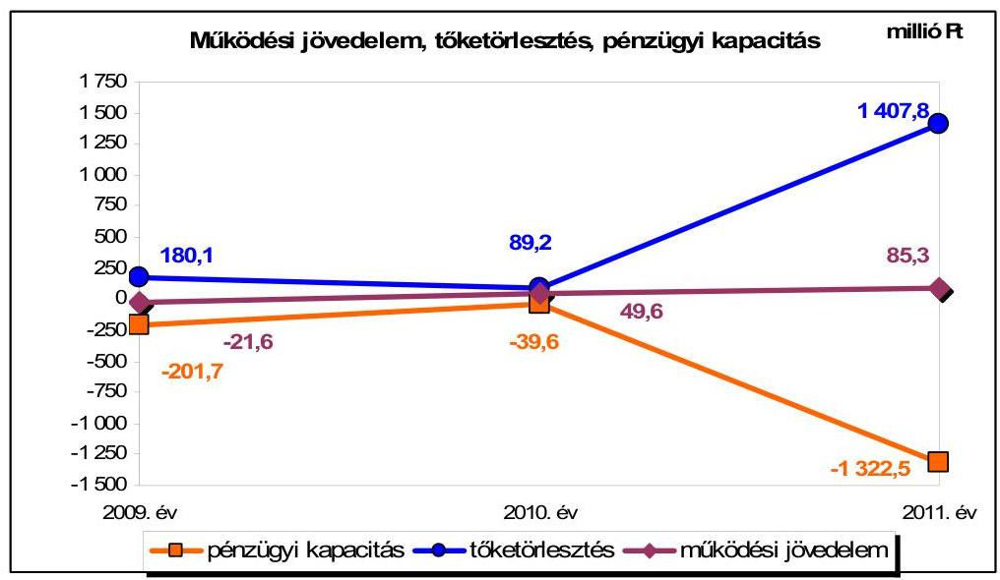
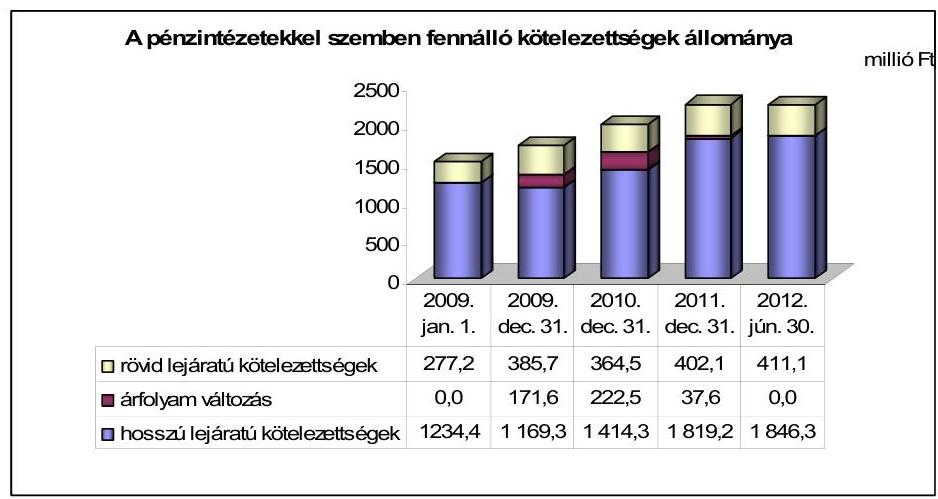
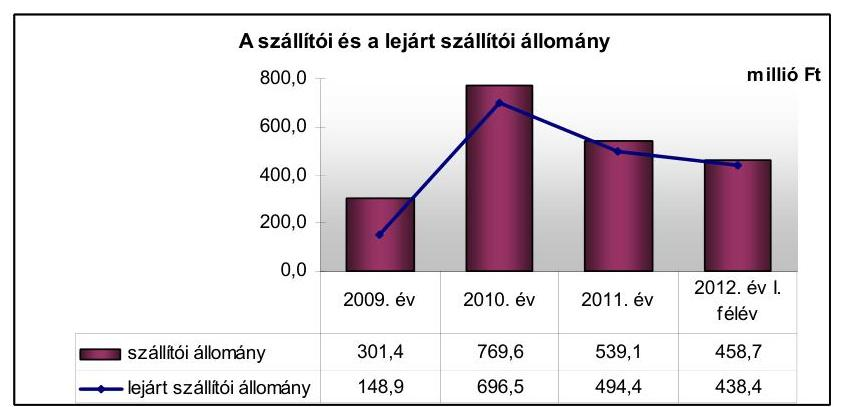
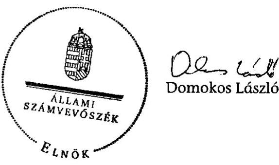
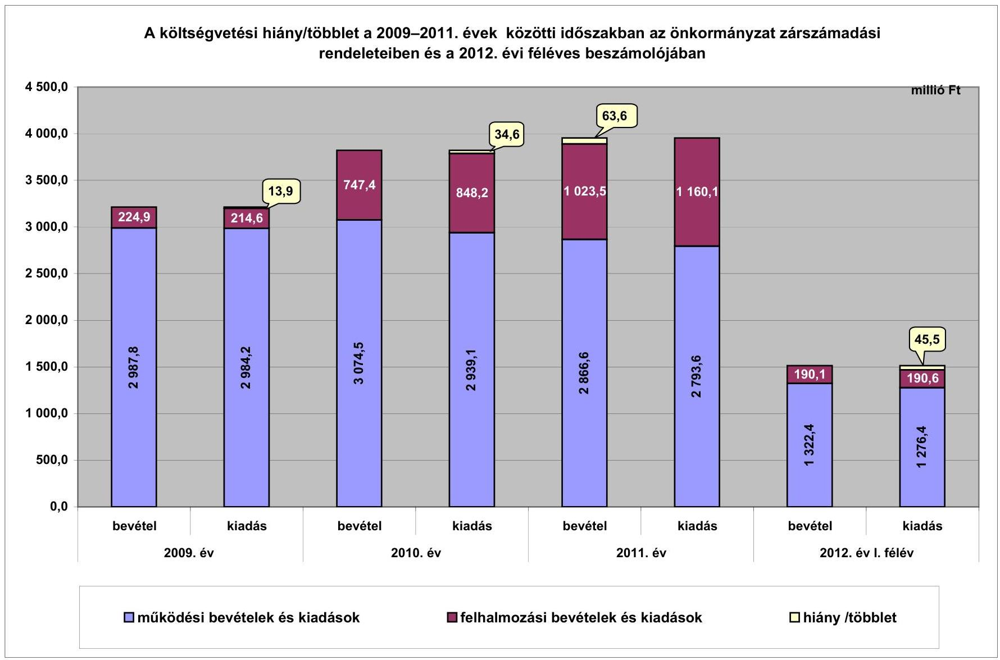
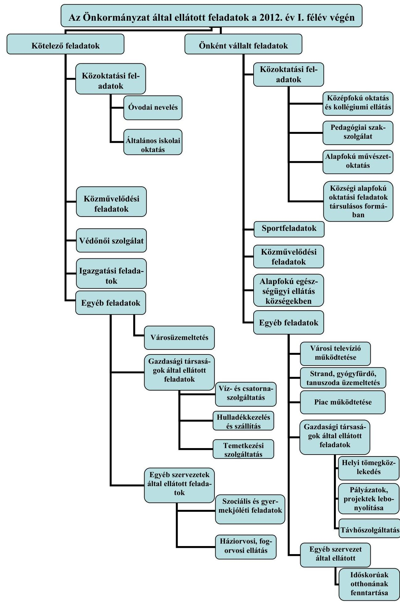

# JELENTÉS 

Nagyatád Város Önkormányzata pénzügyi gazdálkodási helyzetének, szabályosságának ellenőrzéséről

---

# Állami Számvevőszék 

Iktatószám: V-0030-259-014/2013.
Témaszám: 1069
Vizsgálat-azonosító szám: V059204

## Az ellenőrzést felügyelte:

## Renkó Zsuzsanna

felügyeleti vezető

## Az ellenőrzést vezette:

## Dér Lívia

ellenőrzésvezető

## Az ellenőrzést végezték:

| Bíró Zsolt | Gelencsér Zoltán | Péntek László |
| :-- | :-- | :-- |
| számvevő tanácsos | számvevő tanácsos | számvevő tanácsos |

---

# TARTALOMJEGYZÉK 

BEVEZETÉS ..... 3
I. ÖSSZEGZŐ MEGÁLLAPÍTÁSOK, KÖVETKEZTETÉSEK, JAVASLATOK ..... 6
II. RÉSZLETES MEGÁLLAPÍTÁSOK ..... 14

1. Az Önkormányzat kötelező és önként vállalt feladatai, a feladatellátás szervezeti keretei ..... 14
2. A pénzügyi egyensúly fenntartását veszélyeztető pénzügyi kockázatok és az ezek csökkentése érdekében tett intézkedések ..... 15
3. A pénzügyi gazdálkodási folyamatok szabályosságát, megfelelőségét biztosító belső kontrollok ..... 23
4. Az ÁSZ korábbi ellenőrzése során a pénzügyi, gazdálkodási helyzet javítására tett javaslatainak megvalósítása ..... 25

---

# MELLÉKLETEK 

1. számú A költségvetési hiány/többlet a 2009-2011. évek közötti időszakban az Önkormányzat zárszámadási rendeleteiben és a 2012. évi féléves beszámolójában
2. számú Az Önkormányzat bevételei és kiadásai, valamint adósságszolgálata 2009-2011. években (a CLF módszer szerint)
3/a. számú Az Önkormányzat által 2009. és a 2012. év I. félév között megvalósított (műszakilag befejezett) fejlesztések forrásösszetétele
3/b. számú Az Önkormányzat 2012. június 30 -án folyamatban lévő fejlesztési feladataihoz kapcsolódó kötelezettségeinek összegzése
3/c. számú Az Önkormányzat által beadott, elbírálás alatti pályázatok forrásaiból megvalósuló fejlesztésekhez kapcsolódó kötelezettségvállalások összegzése
3. számú Az önkormányzati feladatok ellátásában résztvevő gazdasági társaságok egyes kiemelt adatai
4. számú Az Önkormányzat 2012. június 30 -án fennálló, hosszú lejáratú adósságot keletkeztető kötelezettségvállalásai
5. számú Az Önkormányzat kötelezettségeinek 2011. december 31-ei és 2012. június 30 -ai állománya és a 2012. évben, valamint az azt követő években várható kötelezettségek miatti kiadások

## FÜGGELÉKEK

1. számú Rövidítések jegyzéke
2. számú Értelmező szótár
3. számú Az Önkormányzat által ellátott feladatok a 2012. év I. félév végén

---

# JELENTÉS 

## Nagyatád Város Önkormányzata pénzügyi gazdálkodási helyzetének, szabályosságának ellenőrzéséről

## BEVEZETÉS

Az államháztartás helyi szintjén, az önkormányzati alrendszerben az utóbbi években megjelenő gazdálkodási nehézségek, a pénzforgalmi hiány növekedése, az eladósodás az ÁSZ figyelmét a helyi önkormányzatok pénzügyi helyzetére irányította.

Az ÁSZ a 2012. évi ellenőrzési tervben foglaltaknak megfelelően az önkormányzatok pénzügyi gazdálkodási helyzetének, szabályosságának ellenőrzésével az önkormányzatok 2011. évben megkezdett helyzetelemzését folytatta. Az ellenőrzés keretében értékeljük az önkormányzatok adósságkezelési és likviditási helyzetét, bemutatjuk a pénzügyi egyensúly alakulására hatással lévő folyamatokat. Feltárjuk az ezekre ható kockázatokat, a pénzügyi egyensúlyi helyzetet befolyásoló döntésmegalapozó, döntéselőkészítő eljárások szabályosságát. Minősítjük az ezekkel összefüggő belső kontrollok kialakítását, működését. Az ellenőrzés kiterjed az ellenőrzött időszakban végrehajtott ÁSZ ellenőrzés utóellenőrzésére is.

Az ellenőrzés eredményének várható hatásaként a megállapításokkal segítséget nyújthatunk az önkormányzatok számára a pénzügyi egyensúly helyreállítása, javítása és fenntartása érdekében szükségessé váló intézkedések megtételéhez.

Az ellenőrzés típusa: szabályszerűségi ellenőrzés.

## Az ellenőrzés célja annak értékelése volt, hogy:

- az ellenőrzött időszakban a kötelező és önként vállalt feladatok ellátását biztosító szervezeti formák változása milyen hatást gyakorolt az Önkormányzat pénzügyi helyzetének alakulására;
- az Önkormányzat pénzügyi - ezen belül múködési és felhalmozási - egyensúlya milyen irányban változott, a változást milyen okok idézték elő, továbbá milyen intézkedéseket tettek a pénzügyi egyensúly biztosítása, illetve javítása érdekében, az intézkedések hatására javult-e az Önkormányzat pénzügyi helyzete;
- a költségvetési kiadások finanszírozása érdekében vállalt, pénzintézetekkel szembeni kötelezettségek hogyan alakultak, a kötelezettségek fennállása

---

miként befolyásolja az Önkormányzat jövőbeli pénzügyi egyensúlyi helyzetét;

- az Önkormányzat beazonosította, felmérte, értékelte-e a pénzügyi egyensúlyt befolyásoló pénzügyi kockázatokat, a finanszírozási célú pénzügyi műveletekkel kapcsolatban írtak-e elő kockázatértékelési kötelezettséget;
- az Önkormányzat által kialakított belső kontrollok biztosítják-e a pénzügyi gazdálkodás folyamatainak szabályosságát és eredményességét;
- hasznosultak-e az ÁSZ korábbi ellenőrzése során a pénzügyi, gazdálkodási helyzet javítására tett szabályszerűségi és célszerűségi javaslatok.

Az ellenőrzés a 2009. január 1-jétől 2012. június 30 -áig terjedő időszakot ölelte fel. A pénzintézetekkel szembeni kötelezettségek állományának vizsgálatakor a 2011. december 31-én fennálló kötelezettségek keletkezésének kezdő időpontját vettük figyelembe.

Az ellenőrzés szakmai módszertana az ÁSZ Ellenőrzési Kézikönyvében foglalt szakmai szabályokon alapult, amely a Legfőbb Ellenőrző Intézmények Nemzetközi Szervezete (INTOSAI) által kiadott nemzetközi standardok (ISSAI) figyelembevételével készült.

Az ellenőrzés során használt rövidítések jegyzékét az 1. számú, az egyes fogalmak magyarázatát a 2. számú függelék tartalmazza.

A vizsgálat jogszabályi alapját az ÁSZ tv. 1. § (3) bekezdésének, 5. § (2)-(6) bekezdéseinek, valamint az Áht. 61 . § (2) bekezdésének előírásai képezik.

A helyszíni ellenőrzést követően az Országgyűlés a helyi önkormányzatok adósságállományának részleges konszolidációjáról döntött. Az 5000 fő lakosságszámot meg nem haladó települési önkormányzatok számára nyújtott törlesztési célú támogatással ${ }^{1}$ lehetővé tették a 2012. december 12-én fennálló tartozásállományuk és annak 2012. december 28-án fennálló járulékai teljes megfizetését. Az 5000 fő lakosságszám feletti települések esetében a 2013. évben az állam differenciált - a bevételi képességet figyelembe vevő, 40-70\%-ig terjedő mértékben vállalja át ${ }^{2}$ az önkormányzat 2012. december 31-i, az átvállalás időpontjában fennálló adósságállományát és annak járulékait. Az adósságkonszolidációs intézkedéssel egyidejűleg a Kormány elrendelte ${ }^{3}$ az önkormányzatok adósságállománya újratermelődésének megakadályozása céljából a hitelengedélyezési és a likvid hitelekre vonatkozó szabályozás szigorítását.

Nagyatád város lakosainak száma 2012. január 1-jén 11342 fő volt, ami 370 fős csökkenést jelentett a 2009. év eleji lakosságszámhoz képest. Az Ön-

[^0]
[^0]:    ${ }^{1}$ Magyarország 2012. évi központi költségvetéséről szóló 2011. évi CLXXXVIII. törvény módosításáról szóló 2012. évi CLXXXVII. törvény alapján
    ${ }^{2}$ Magyarország 2013. évi központi költségvetéséről szóló 2012. évi CCIV. törvény alapján
    ${ }^{3}$ 1540/2012. (XII. 4.) Korm. határozat a helyi önkormányzatok adósságállományának részleges konszolidációjáról

---

kormányzat a 2011. évben 3871,3 millió Ft költségvetési bevételt és 3953,7 millió Ft költségvetési kiadást teljesített. 2011. december 31-én a könyvviteli mérleg szerint 15179,8 millió Ft értékű vagyonnal rendelkeztek. Az Önkormányzat vagyona a fejlesztések következtében 989,6 millió Ft-tal (7,0\%-kal) nőtt a 2009. év végi ( 14190,2 millió Ft) állományhoz viszonyítva. A 2011. évben az eszközök közül a tárgyi eszközök állománya 13710,4 millió Ft, a forgóeszközök állománya 257,3 millió Ft volt. Az Önkormányzat a kötelező és az önként vállalt feladatainak ellátására 2012. június 30 -án hét költségvetési szervet múködtetett. Az Önkormányzat által fenntartott költségvetési szervek alapfokú nevelési, oktatási, művészetoktatási, pedagógiai szakszolgálati, középfokú oktatási, közművelődési, sport, igazgatási és egyéb feladatokat láttak el. A szociális és a gyermekjóléti feladatok ellátását a Kistérségi Társulás által fenntartott intézmény útján biztosították. A háziorvosi és a fogorvosi feladatok ellátására vállalkozási szerződéseket kötöttek, a védőnői szolgálatot az Önkormányzat múködtette. Az Önkormányzat kizárólagos tulajdonában van a 2009. évben létrehozott Nagyatádi Városfejlesztő Kft., a Somogy Megyei Temetkezési Kft.-ben az Önkormányzat 9,1\%-os tulajdonrésszel rendelkezik. Az önkormányzati kötelező és önként vállalt feladatok ellátásában - szerződések alapján négy olyan gazdasági társaság vesz részt, amelyben az Önkormányzat tulajdonrésszel nem rendelkezik. A 2009-2012. év I. félév közötti, műszakilag befejezett, jelentősebb fejlesztései a Bárdos iskola és a Központi temető rekonstrukciója, valamint a körforgalom kialakítása voltak. Az Önkormányzat az ellenőrzött időszak minden évében ÖNHIKI támogatásban részesült.

Az ÁSZ tv. 29. § (1) bekezdése szerint a jelentéstervezetet megküldtük a polgármester részére, aki az ÁSZ tv. 29. § (2) bekezdésében foglalt észrevételezési jogával nem élt, a jelentéstervezetre észrevételt nem tett.

---

# I. ÖSSZEGZŐ MEGÁLLAPÍTÁSOK, KÖVETKEZTETÉSEK, JAVASLATOK 

Nagyatád Város Önkormányzatának pénzügyi egyensúlya rövid távon nem biztosított. Az alacsony működési jövedelemtermelő képesség miatt a jelentős szállítói állomány és a - kormányzati adósságrendezést követően fennmaradó - pénzintézetekkel szembeni kötelezettségek teljesíthetősége kockázatos.

Az Önkormányzat számára az önként vállalt feladatokra fordított múködési kiadások magas aránya az ellenőrzött időszakban múködési kockázatot jelentett. Az önként vállalt feladatok kiadásainak összes múködési kiadáson belüli aránya a 2009. évi 33,5\%-ról a 2011. évben 32,0\%-ra módosult az e célra teljesített kiadás 1000,1 millió Ft-ról 893,6 millió Ft-ra történt csökkenése mellett. Az Önkormányzat által a 2009-2010. években átvett feladatok (városi televízió, községi óvoda, általános iskola, pedagógiai szakszolgálat) finanszírozása - az igénybe vett önkormányzati saját források miatt - összesen 20,4 millió Ft-tal rontotta a pénzügyi egyensúlyi helyzetet. Az Oktatási Társulás fenntartásában résztvevő községi önkormányzatok a 2011. évi fizetési kötelezettségükből 3,0 millió Ft-ot nem teljesítettek, a társulási feladatellátásból adódó gesztori feladatok azonban nem jelentettek kockázatot az Önkormányzat számára. A feladatellátás szervezeti struktúrája az ellenőrzött időszakban jelentősen nem változott, így az a pénzügyi helyzet alakulását nem befolyásolta.

Az Önkormányzat 2009-2011 között összesen 10 739,4 millió Ft költségvetési bevételhez jutott. Ugyanebben az időszakban a teljesített költségvetési kiadása 10 938,3 millió Ft-ot tett ki. Az ebből ellátott feladatok alapvetően a közoktatáshoz, a közművelődési és sportfeladatokhoz, a városüzemeltetéshez, valamint az igazgatási feladatokhoz kapcsolódtak. Az Önkormányzat együttes működési és felhalmozási költségvetési egyenlege 2009-2011 között folyamatosan negatív volt, összesen 198,9 millió Ft-ot, a teljesített költségvetési kiadások 1,8\%-át jelentette. A működőképességének megőrzésére juttatott költségvetési támogatások nélkül az Önkormányzat múködési jövedelme 2009-ben és 2011-ben hiányt mutatott volna. A múködési jövedelemtermelő képesség kedvezőtlen tendenciája és az ÖNHIKI támogatás miatti bevételi kitettség kockázatot jelent az Önkormányzat számára. A nettó múködési jövedelem a 2010-2011. években nem nyújtott fedezetet a felhalmozási forráshiányra.

Az Önkormányzat pénzügyi kapacitásának 2009-2011 közötti csökkenését a múködési jövedelem változása és a tőketörlesztés növekedés 2009. évihez viszonyított együttes hatása okozta. A változást a következő ábra mutatja be.

---

Az Önkormányzatnál a pénzügyi kapacitás ÖNHIKI támogatás mellett is folyamatosan negatív volt. A bevételi kitettségre kedvezően hatott, hogy a helyi adóbevétel döntő része nagyszámú adóalanytól származott.

Az Önkormányzat felhalmozási költségvetésének egyenlege a 2009. évben pozitív, a 2010-2011 közötti években negatív volt, összesen 312,2 millió Ft felhalmozási forráshiányt mutatott. Az Önkormányzatnál a megvalósított Bárdos iskola rekonstrukciója - fejlesztés utófinanszírozása pénzügyi kockázatot jelentett, a felvett hitelek utáni kamat- és egyéb fizetési kötelezettségek miatt, továbbá jövőbeni üzemeltetési kockázatot jelent, mivel nem számszerűsítették a várható kiadásokat, és a fejlesztés nem teremt bevétel növelési lehetőséget. A folyamatban lévő fejlesztések esetében a saját forrás biztosítása és az egyéb központi támogatás (EU Önerő Alap) megelőlegezése, a benyújtott pályázatok esetében a saját erő biztosítása - az Önkormányzat likviditásának kedvezőtlen irányú változása és a jelenlegi nettó múködési jövedelem képződés miatt - felhalmozási kockázatot jelent.

Az ellenőrzött időszakban az Önkormányzat bevételt növelő (magánszemélyek kommunális adója mértékének emelése, építményadó bevezetése) és kiadási megtakarítást (egyéb létszámcsökkentési döntésekkel a 2010-2011. években 32 álláshely és egyben létszámcsökkentés, többletjuttatások csökkentése) eredményező intézkedéseket hozott. Ezek hatására - az Önkormányzat adatszolgáltatása alapján - összesen 32,8 millió Ft bevételi többlet, illetve 116,8 millió Ft kiadási megtakarítás keletkezett, amely nem volt elégséges a pénzügyi egyensúlyi helyzet. helyreállításához, hosszú távú fenntartásához.

Az Önkormányzat hosszú lejáratú pénzintézeti kötelezettsége a 2009. év elejétől a 2012. év I. félév végére 1234,4 millió Ft-ról 1846,3 millió Ft-ra, 49,6\%-kal nőtt. A kötelezettségek növekedését az ellenőrzött időszakban a pályázati támogatással megvalósuló fejlesztések finanszírozásához, valamint támogatás megelőlegezésre felvett hitelek, az Atád2 kötvény kibocsátásából származó kötelezettség, valamint az elszámolt árfolyam-veszteségek eredményezték. A kötvénykibocsátásból és a hitelek igénybevételéből származó forrásokat a céloknak megfelelően használták fel. A kötvény kibocsátásából szár-

---

mazó pénzintézeti kötelezettségre az Önkormányzat az ellenőrzött időszakban 429974 CHF ( 78,1 millió Ft) tőke, 486166 CHF ( 89,1 millió Ft) kamat és 1,3 millió Ft egyéb költség kifizetést teljesített. (Ebből az Atád kötvény törlesztésére 429974 CHF ( 78,1 millió Ft) tőke és 431537 CHF ( 75,4 millió Ft) kamat kiadást fordítottak.) A fejlesztési hitelek törlesztésére az ellenőrzött időszakban 117,7 millió Ft tőke és 70,4 millió Ft kamattörlesztést teljesítettek. Az Atád2 kötvény 2011. évi kibocsátásából származó bevétel és az Atád kötvény visszavásárlására fordított kiadás pénzforgalmi szemléletű elszámolása, a Számv. tv.-ben foglalt teljesség és bruttó elszámolás elvét megsértve, nem történt meg, a kötvény visszavásárlással és -kibocsátással kapcsolatos kiadás és bevétel nem jelent meg a fókönyvi könyvelésben. Az ellenőrzött időszakban törlesztési kockázatot jelentett, hogy a 2007. évben kibocsátott Atád kötvény 2010. és 2011. évi tőketörlesztésének fedezete nem volt biztosított. Az Önkormányzat az ellenőrzött időszakban az Atád2 kötvénykibocsátásból származó bevételének - a korábbi kötvénye visszavásárlására történt - felhasználásával tudta biztosítani fizetőképessége megőrzését. Az Atád kötvény visszavásárlását és az Atád2 kötvény kibocsátását követően az Önkormányzat kötvényből eredő tőkefizetési kötelezettsége változatlan devizaösszegben állt fenn.

Az Önkormányzat likviditási és rövid távú pénzügyi egyensúlyi helyzete kedvezőtlenül alakult. A folyamatosan fennálló folyószámlahitel mellett a 2011. évtől több esetben vettek igénybe egyéb likvid hiteleket, amelyek igénybevételi napjainak száma, valamint a folyószámlahitel napi átlagos állománya folyamatosan emelkedett. A folyószámlahitel napi átlagos állománya 2009-ről a 2012. év I. félévre 252,1 millió Ft-ról 392,0 millió Ft-ra, 55,5\%-kal nőtt.

Az Önkormányzat lejárt szállítói kötelezettségből eredő tartozása a 20092011. években jelentős mértékben ( 148,9 millió Ft-ról 494,4 millió Ft-ra) emelkedett, amely nemfizetési kockázatot jelent. A lejárt szállítói tartozásokon belül az átütemezett szállítói tartozások összege a 2011. évtől a 2012. év I. félév végéig terjedő időszakban összesen 93,5 millió Ft volt. A lejárt szállítói tartozásokból a 60 napon túli tartozások aránya a 2012. év I. félév végén 83,0\%-ot ( 363,9 millió Ft-ot) tett ki. Az Adósságrendezési tv.-ben foglaltak ellenére a polgármester a lejárt tartozással kapcsolatos tájékoztatási kötelezettségét nem teljesítette. A tanuszoda PPP konstrukció keretében történő megvalósításából 2012. június 30 -án fennálló kötelezettség 1012,9 millió Ft volt. Ez a 2012-2014. években 229,3 millió Ft, az azt követő időszakban 783,6 millió Ft fizetési terhet jelent. Az Önkormányzat 85 forgalomképes ingatlanát terhelte 2012. június 30 -án jelzálog. A terhelt ingatlanok könyv szerinti nettó értéke 2150,4 millió Ft, ami az összes forgalomképes ingatlan könyv szerinti nettó értékének 63,5\%-a volt. Az ingatlanok jelzáloggal való terhelése az ellenőrzött időszakban nőtt, amely az esetleges fedezetbevonások miatt kockázatot jelent.

Az ellenőrzött időszak végén a pénzintézetekkel szemben fennálló kötelezettség várható kiadása (tőke, kamat, egyéb költség) a 2014. év végéig 667,2 millió Ft és 599,4 ezer CHF. Az Önkormányzatnak a 2012. év I. félév végén szállítói tartozásokból és a tanuszoda PPP szerződéséből eredően további 1471,6 millió Ft fizetési kötelezettsége állt fenn. Kockázatot jelent, hogy a 2009-2011. évek jö-

---

vedelemtermelő képessége alapján a várhatóan képződő múködési jövedelem, a jelenlegi feladatellátási struktúrát és kiadási arányokat feltételezve, nem nyújt fedezetet a pénzintézeti és egyéb kötelezettségek teljesítésére. Az adósságszolgálat teljesítéséhez felhasználható elkülönített tartalékkal az Önkormányzat - a nem terhelt ingatlanvagyonon kívül - nem rendelkezik.

Az Önkormányzatnál teljes körűen nem mérték fel a pénzügyi egyensúlyra ható kockázatokat, mert a döntés-előkészítés szakaszában nem történt meg a pénzintézeti kötelezettségvállalások kockázatainak beazonosítása, feltárása és a költségvetési helyzetre gyakorolt hatásának vizsgálata. Nem történt meg a kamatkiadás és a törlesztés alapjául szolgáló források pénzügyi egyensúlyra gyakorolt hatásának számszerú bemutatása. Az Önkormányzatnál nem alakították ki a kockázatok kezelésére vonatkozó eljárásokat, módszereket.

Az Önkormányzatnál a kockázatkezelési rendszer kialakítása és múködtetése teljes körűen nem felelt meg a 2009-2011. években az Áht. ${ }_{1}$, a 2012. év I. félévében az Áht. ${ }_{2}$ előírásainak. Az ellenőrzött időszakban fennállt a működési jövedelemtermelő képesség kedvezőtlen alakulása miatti kockázat, az önként vállalt feladatok működési kockázata, a bevételi kitettség kockázata, egy fejlesztés utófinanszírozása miatt a pénzügyi kockázat, a fejlesztés jövőbeni üzemeltetési kockázata, a folyamatban lévő fejlesztések és a benyújtott pályázatok felhalmozási kockázata, az Atád kötvény tőketörlesztésének törlesztési kockázata, a magas szállítói állomány miatti nemfizetési kockázat, a fedezetbevonás miatti kockázat, valamint a jövőbeli várható kötelezettségek teljesíthetőségének kockázata. Azonban a pénzügyi egyensúly fenntartására kiható kockázatok beazonosítása, felmérése, értékelése, ezáltal a kockázatok kezelése - a 2009. évben az Ámr. ${ }_{1}$-ben, a 2010-2011. években az Ámr. ${ }_{2}$-ben, a 2012. év I. félévében a Bkr.-ben foglalt előírások ellenére - elmaradt.

Az Önkormányzatnál a belső kontrolltevékenységek kialakítása és múködtetése teljes körűen nem felelt meg a 2009-2011. években az Áht. ${ }_{1}$, a 2012. év I. félévben az Áht. ${ }_{2}$ előírásainak. A pénzügyi gazdálkodási folyamatok szabályosságát biztosító belső kontrollok gazdálkodási folyamatokba történő beépítése - a 2009. évben az Ámr. ${ }_{1}$-ben, a 2010-2011. években az Ámr. ${ }_{2}$-ben, a 2012. év I. félévében a Bkr.-ben foglalt előírások ellenére - nem volt megfelelő. Nem írták elő a fejlesztési döntések kockázatainak, valamint a pénzintézeti kötelezettségvállalásokkal kapcsolatos döntések kockázatainak döntés-előkészítő szakaszban történő feltárását. Nem határozták meg az Önkormányzat fizetőképességének és eladósodásának kezelésével, a pénzügyi kötelezettségek teljesítése helyi szabályaival, továbbá a szállítói tartozások és egyéb kiadáselmaradások rendezésével összefüggő kontrolltevékenységeket. Az Önkormányzatnál a belső ellenőrzés kialakítása, működtetése teljes körűen nem felelt meg a 2009-2011. években az Áht. ${ }_{1}$-ben, a 2012. év I. félévben az Áht. ${ }_{2}$-ben meghatározott előírásoknak. Az ellenőrzött időszak belső ellenőrzési terveinek készítését megelőzően nem írták elő a pénzügyi egyensúlyi helyzetet befolyásoló döntések kockázati tényezőinek feltárását, a kockázati tényezők belső ellenőrzés keretében történő ellenőrzését a 2009-2011. években a Ber.-ben, 2012-től a Bkr.-ben foglalt előírások ellenére.

---

A kontrollok működése sem volt megfelelő, mivel a feladat átadás-átvételre vonatkozó döntés-előkészítéskor nem értékelték a döntésnek a kötelező és az önként vállalt feladatok arányára gyakorolt hatását. A fejlesztéseket megelőző döntés-előkészítési folyamatban nem tárták fel az előkészítés, a lebonyolítás és a múködtetés kockázatait. Nem vizsgálták a döntés-előkészítés szakaszában a pénzintézeti kötelezettségvállalások kockázatait, valamint a hitelfelvétellel, kötvénykibocsátással kapcsolatosan a futamidő egyes éveit terhelő kötelezettség költségvetési egyensúlyra gyakorolt hatását. A 2011. évet megelőzően nem kezelték a lejárt szállítói tartozásokat és az egyéb kiadáselmaradásokat. Az Önkormányzat kizárólagos tulajdonában lévő gazdasági társaságot a 2011. év kivételével nem számoltatták be a pénzügyi helyzete alakulásáról.

Az Önkormányzat gazdálkodási rendszerének 2008. évi ÁSZ ellenőrzése a pénzügyi és gazdálkodási helyzet javítására egy szabályszerűségi és kettő célszerűségi javaslatot tartalmazott. Az ÁSZ ellenőrzés javaslatait az Önkormányzat hasznosította.

Összességében az Önkormányzat jövedelemtermelő képessége alapján képződő bevételei a feladatai ellátásához szükséges kiadásokat csak részben fedezik. A folyamatban lévő és a benyújtott pályázatok fejlesztései felhalmozási kockázatot jelentenek. A felvett hitelekből, a kötvénykibocsátásból és a PPP szerződésből eredő kötelezettségei tovább nehezítik pénzügyi gazdálkodási pozícióit, múködését már rövid távon is korlátozzák. A hitelekből megvalósuló beruházások a feladatellátás színvonalának javításához hozzájárultak, de nem teremtenek bevétel növelési lehetőséget.

Az ÁSZ tv. 33. § (1) bekezdésében foglaltak értelmében az ellenőrzött szervezet vezetője köteles a jelentésben foglalt megállapításokhoz kapcsolódó intézkedési tervet összeállítani, és azt a jelentés kézhezvételétől számított harminc napon belül az ÁSZ részére megküldeni. Amennyiben az intézkedési tervet határidőn belül nem küldi meg a szervezet, vagy az továbbra sem elfogadható, az ÁSZ elnöke a hivatkozott törvény 33. § (3) bekezdés a)-b) pontjaiban foglaltakat érvényesítheti.

# Az ellenőrzés intézkedést igénylő megállapításai és javaslatai: 

## a polgármesternek

1. A működési jövedelem 2009-ben negatív volt, és a működőképesség megőrzésére juttatott költségvetési támogatások nélkül 2011-ben is hiányt mutatott volna. Az önként vállalt feladatokra fordított folyó kiadások 2011. évi 32,0\%-os részaránya múködési kockázatot jelentett. A nettó múködési jövedelem a 2010-2011. években nem nyújtott fedezetet a felhalmozási forráshiányra. A folyamatban lévő fejlesztések megvalósításához szükséges saját forrás biztosítása a jelenlegi nettó múködési jövedelem képződés mellett felhalmozási kockázatot jelent. A folyamatosan fennálló folyószámlahitel mellett a likviditás biztosításához a 2011. évtől több esetben vettek igénybe egyéb likvid hiteleket. A hosszú távú fizetőképesség biztosítására 2011-ben újabb kötvényt bocsátottak ki, amelyből visszavásárolták a 2007-ben kibocsátott kötvényt. Az ellenőrzött időszak végére a pénzintézeti kötelezettségek 2257,4 millió Ft-ra növekedtek, a PPP szerződésben vállalt kötelezettség

---

1012,9 millió Ft volt. A 2012. év I. félév végén lejárt esedékességű 438,4 millió Ft szállítói kötelezettségből a 60 napon túli tartozások aránya 83,0\%-ot (363,9 millió Ft-ot) tett ki. A bevételnövelő és kiadáscsökkentő intézkedések nem biztosították a pénzügyi egyensúlyi helyzet helyreállításához, hosszú távú fenntarthatóságához szükséges forrásokat. A nem terhelt ingatlanvagyonon kívül az adósságszolgálat teljesítéséhez felhasználható, elkülönített tartalékkal nem rendelkeztek.

Javaslat:
A múködési jövedelemtermelő képesség és a feladatellátás összhangja, valamint az Önkormányzat pénzügyi egyensúlyának helyreállítása, hosszú távú fenntarthatósága érdekében - a 2013. évi kormányzati adósságkonszolidációt, valamint a 2013. évtől változó feladat-ellátási kötelezettséget, feladatfinanszírozási rendszert figyelembe véve - felelősök és határidők megjelölésével kezdeményezzen intézkedéseket, melyek keretében:
a) a költségvetési rendelettervezet, valamint annak évközi módosítása előterjesztését megelőzően mérjék fel a bevételszerző, kiadáscsökkentő lehetőségeket, és terjessze a Képviselő-testület elé a bevételek növelését, a kiadások csökkentését célzó intézkedések bevezetéséhez szükséges - a Htv. 140. § (1) bekezdés a) pontja alapján a jegyző által elkészített - döntési javaslatát;
b) terjesszen a Képviselő-testület elé jóváhagyásra - a Htv. 140. § (1) bekezdés a) pontja alapján a jegyző által elkészített - az Önkormányzat gazdasági helyzetének elemzésén alapuló, a pénzügyi egyensúlyi helyzet gyors helyreállítását, hosszú távú fenntartását, valamint az adósságállomány újratermelődésének elkerülését biztosító intézkedéseket tartalmazó reorganizációs programot;
c) az adósságkonszolidációt követően fennmaradó kötelezettségei tekintetében terjesszen a Képviselő-testület elé olyan egyensúlyi (elkülönített) tartalék képzésére vonatkozó - a Htv. 140. § (1) bekezdés a) pontja alapján a jegyző által elkészített - döntési javaslatot, amelyben a Képviselő-testület meghatározza annak összegét, és kötelezettséget vállal arra, hogy a törlesztési időszak alatt ezt a tartalékot a költségvetési rendeleteiben minden évben betervezi az adósságszolgálat teljesítésére;
d) vizsgálja felül az önként vállalt feladatok finanszírozhatóságát a kötelező feladatellátás elsődlegességének biztosítása érdekében, és ennek függvényében tegyen javaslatot a Képviselő-testületnek a feladatellátás racionalizálására;
e) a szállítói kitettség és az Adósságrendezési tv. 4-9. §-aiban szabályozott adósságrendezési eljárás megindítása elkerülésének érdekében meghatározott gyakorisággal számoljon be a Képviselő-testületnek az Önkormányzat lejárt szállítói állománya alakulásáról. Intézkedjen a szállítói számlák esedékesség szerinti kiegyenlítéséről vagy a lejárt tartozások átütemezéséről;
f) vizsgálja felül teljes körűen a folyamatban lévő beruházásokat a megvalósításhoz szükséges saját források rendelkezésre állása tekintetében, ennek eredményeként terjesszen javaslatot a Képviselő-testület elé a beruházások befejezéséhez szükséges saját források biztosításához szükséges intézkedésekről.

---

# a jegyzönek 

1. Az Önkormányzat a 2011. évben a 2007. évben kibocsátott Atád kötvény visszavásárlására bocsátotta ki az Atád2 kötvényt 5452000 CHF (1 357,6 millió Ft) összegben. A 2011. évi kötvény kibocsátásából származó bevétel és az Atád kötvény visszavásárlására fordított kiadás számviteli nyilvántartásokban történő elszámolása - a Számv. tv. 15. § (2) bekezdésében foglalt teljesség elve és a 15. § (9) bekezdésében foglalt bruttó elszámolás számviteli alapelvek ellenére - nem történt meg.

Javaslat:
Biztosítsa a könyvviteli elszámolások során, hogy az Önkormányzatnál alkalmazzák a Számv. tv. 15. § (2) bekezdésében foglalt teljesség és a 15. § (9) bekezdésében foglalt bruttó elszámolás elvét, az adott költségvetés év valamennyi gazdasági eseményét számolják el, amelyek eszközökre, forrásokra és a pénzmaradvány alakulására gyakorolt hatását a beszámolóban be kell mutatni, továbbá a könyvviteli nyilvántartásokban a bevételek és kiadások egymással szembeni elszámolására ne kerüljön sor.
2. Az Önkormányzatnál a kockázatkezelési rendszer kialakítása és múködtetése teljes körűen nem felelt meg a 2009-2010. években az Áht. ${ }_{1}$ 120/B. § (2) bekezdés b) pontjában, a 2011. évben az Áht. ${ }_{1}$ 121. § (2) bekezdés b) pontjában, a 2012. év I. félévében az Áht. ${ }_{2}$ 69. § (2) bekezdésében meghatározott előírásoknak. Az ellenőrzött időszakban fennállt, a pénzügyi egyensúlyi helyzetre kiható kockázatok (a múködési jövedelemtermelő képesség kedvezőtlen alakulása miatti kockázat, az önként vállalt feladatok múködési kockázata, a bevételi kitettség kockázata, egy fejlesztés utófinanszírozása miatt a pénzügyi kockázat, a fejlesztés jövőbeni üzemeltetési kockázata, a folyamatban lévő fejlesztések és a benyújtott pályázatok felhalmozási kockázata, a fedezetbevonás miatti kockázat, az Atád kötvény tőketörlesztésének törlesztési kockázata, a magas szállítói állomány miatti nemfizetési kockázat, valamint a jövőbeli várható kötelezettségek teljesíthetőségének kockázata) feltárása, beazonosítása, értékelése, ezáltal a kockázatok kezelése a 2009. évben az Ámr. ${ }_{1}$ 145/C. §-ában, a 2010-2011. években az Ámr. ${ }_{2}$ 157. §-ában, a 2012. év I. félévében a Bkr. 7. § (1)-(2) bekezdéseiben foglalt jogszabályi előírások ellenére elmaradt.

Javaslat:
Múködtessen az Áht ${ }_{2}$ 69. § (2) bekezdésében, továbbá a Bkr. 7. § (1)-(2) bekezdéseiben foglalt előírásoknak megfelelő, a pénzügyi egyensúlyt befolyásoló kockázatok kezelésére alkalmas kockázatkezelési rendszert.
3. Az Önkormányzatnál a belső kontrolltevékenységek kialakítása és múködtetése teljes körűen nem felelt meg a 2009-2010. években az Áht. ${ }_{1}$ 120/B. § (2) bekezdés c) pontjában, a 2011. évben az Áht. ${ }_{1}$ 121. § (2) bekezdés c) pontjában és a 2012. év I. félévében az Áht. ${ }_{2}$ 69. § (2) bekezdésében meghatározott előírásoknak. A pénzügyi gazdálkodási folyamatok szabályosságát biztosító belső kontrollok gazdálkodási folyamatokba történő beépítése a 2009. évben az Ámr. ${ }_{1}$ 145/E. § (1) bekezdésében, a 2010-2011. években az Ámr. ${ }_{2}$ 158. § (1) bekezdésében, a 2012. év I. félévében a Bkr. 8. § (1)-(2) bekezdéseiben foglalt előírásoknak nem volt megfelelő. A döntéselőkészítés szakaszában nem írták elő a fejlesztési döntések kockázatainak és a pénzintézeti kötelezettségvállalásokkal kapcsolatos döntések kockázatainak feltárását. Nem szabályozták az Önkormányzat fizetőképességének és eladósodásának kezelé-

---

sével, a pénzügyi kötelezettségek teljesítésének helyi szabályaival és a szállítói tartozások és egyéb kiadáselmaradások rendezésével összefüggő kontrolltevékenységeket.

Javaslat:
Alakítsa ki az Áht ${ }_{2}$ 69. § (2) bekezdésében, továbbá a Bkr. 8. § (1)-(2) bekezdése alapján azokat a belső kontrolltevékenységeket, amelyek biztosítják a pénzügyigazdálkodási folyamatok szabályosságát, a pénzügyi egyensúlyi helyzet alakulását befolyásoló döntések kockázatainak kezelését. Ennek keretében:
a) határozza meg a fejlesztések döntés-előkészítés folyamatában a lebonyolítás és a múködtetés kockázatai feltárásának és kezelésének kötelezettségét;
b) írja elő a pénzintézeti kötelezettségvállalások kockázatainak döntés-előkészítő szakaszban történő feltárását, a futamidő egyes éveit terhelő kötelezettségek költségvetési egyensúlyra gyakorolt hatásának vizsgálatát;
c) készítsen szabályzatot az Önkormányzat fizetőképességének és eladósodásának kezelésére, valamint a pénzügyi kötelezettségek teljesítése, a szállítói tartozások és az egyéb kiadáselmaradások rendezésének helyi szabályaira.
4. Az Önkormányzatnál a belső ellenőrzés kialakítása, működtetése teljes körűen nem felelt meg a 2009-2010. években az Áht. 121/A. § (3) bekezdésében, a 2011. évben az Áht. 121/B. § (4) bekezdésében, a 2012. év I. félévében az Áht. 70. § (1) bekezdésében meghatározott előírásoknak. Az ellenőrzött időszak belső ellenőrzési terveinek készítését megelőzően - a 2009-2011. években a Ber. 18. §-ában, a 21. § (2) bekezdésében és (3) bekezdés a) pontjában, 2012. január 1-jétől a Bkr. 29. § (1) bekezdésében, a 31. § (2) bekezdésében és a (4) bekezdés a) pontjában foglaltak ellenére - nem írták elő a pénzügyi egyensúlyi helyzetet befolyásoló döntések kockázati tényezőinek feltárását, a belső ellenőrzési tervek nem tartalmazták ezen kockázati tényezők ellenőrzését.

Javaslat:
Tegyen intézkedést, hogy az Áht ${ }_{2}$ 70. § (1) bekezdésében, továbbá a Bkr. 29. § (1) bekezdésében és a 31. § (2) bekezdésében és a (4) bekezdés a) pontjában foglalt előírások szerint az éves belső ellenőrzési tervek tartalmazzák a pénzügyi egyensúlyi helyzetet befolyásoló döntésekkel kapcsolatos feltárt kockázati tényezők ellenőrzését, és biztosítsa az ellenőrzési tervek végrehajtását.

---

# II. RÉSZLETES MEGÁLLAPÍTÁSOK 

## 1. Az ÖNKORMÁNYZAT KÖTELEZŐ ÉS ÖNKÉNT VÁLlALT FELADATAI, A FELADATELLÁTÁS SZERVEZETI KERETEI

Az Önkormányzat a kötelező és az önként vállalt feladatainak körét az SZMSZ ${ }_{1,2}$-ben, azok mértékét az éves költségvetési rendeletekben határozta meg. Az önként vállalt feladatok közé sorolták a középfokú oktatást és kollégiumi ellátást, a pedagógiai szolgálat múködtetését, az alapfokú művészeti oktatást és a községi alapfokú oktatási feladatok társulásos formában történő ellátását. További önként vállalt feladatként határozták meg a sport támogatását, a közművelődési feladatok közül a helyi közgyűjtemény és a szoborpark fenntartását, az alapfokú egészségügyi ellátás biztosítását öt községben, a városi televízió működtetését, a strand, a gyógyfürdő és a tanuszoda üzemeltetését, a piac működtetését, a helyi tömegközlekedés támogatását, pályázatok, projektek lebonyolítását, a távhőszolgáltatást és az időskorúak otthonának fenntartását.

A 2011. évi összes múködési célú kiadás a 2009. évi 2988,3 millió Ft-hoz viszonyítva 6,5\%-kal (194,0 millió Ft-tal) csökkent. Az önként vállalt feladatokra teljesített múködési célú kiadás a 2009. évi 1000,1 millió Ft-ról a 2011. évben 893,6 millió Ft-ra, 10,6\%-kal (106,5 millió Ft-tal) csökkent. Az összes múködési kiadáson belüli részaránya a 2009. évi 33,5\%-ról a 2011. évre 32,0\%-ra módosult, az intézmények alulfinanszírozása miatt nem teljesített kiadások, valamint a kiadáscsökkentő intézkedések hatásaként. Az önként vállalt feladatokra fordított kiadások magas aránya az ellenőrzött időszakban múködési kockázatot jelentett.

A feladatellátás szervezeti struktúrája, valamint a feladatokat ellátó költségvetési szervek száma az ellenőrzött időszakban jelentősen nem változott, így a pénzügyi helyzet alakulását nem befolyásolta. A kötelező és az önként vállalt feladatok ellátásában 2009. január 1-jén négy önállóan gazdálkodó és négy részben önállóan gazdálkodó - saját fenntartású - költségvetési szerv vett részt, amelyek összesen 31 telephelyen múködtek. Az Önkormányzat 2012. június 30 -án hét költségvetési szervet tartott fenn. A kettő önállóan múködő és gazdálkodó, valamint az öt önállóan múködő költségvetési szerv összesen 32 telephellyel rendelkezett. A feladatellátás részletezését a 3. számú függelék tartalmazza.

Az ellenőrzött időszakban az Önkormányzat költségvetési szervei által ellátott feladatok községi nevelési-oktatási feladatokat ellátó intézmények, pedagógiai szakszolgálati feladatok, valamint televíziós műsorszolgáltatási feladatok átvételével növekedtek. Az alapfokú nevelési és oktatási feladatok ellátását az Önkormányzat gesztorságával múködő - az Oktatási Társulás által fenntartott Nagyatádi Közoktatási Intézményben biztosították. Az intézmény fenntartásában résztvevő községi önkormányzatok a 2011. évi fizetési kötelezettségükből 3,0 millió Ft-ot nem teljesítettek, a társulási feladatellátásból adódó gesztori feladatok kockázatot nem jelentettek az Önkormányzat számára. Az átvett

---

feladatok finanszírozása - az igénybe vett önkormányzati saját források miatt - összesen 20,4 millió Ft-tal rontotta a pénzügyi egyensúlyi helyzetet.

Az Önkormányzat kizárólagos tulajdonában egy - önként vállalt feladatokat ellátó - gazdasági társaság, a 2009. évben létrehozott Nagyatádi Városfejlesztő Kft. múködött. A kizárólagos tulajdonú kft.-n kívül a 2009. január 1. és 2012. április 30. közötti időszakban az Önkormányzat megbízásából hat gazdasági társaság, azt követően öt gazdasági társaság látott el kötelező és önként vállalt önkormányzati feladatokat. A feladatellátásban résztvevő gazdasági társaságok számának változását az okozta, hogy a kórház múködtetése 2012. május 1-jétől állami feladat lett. Az Önkormányzat a gazdasági társaságok közül szerződés alapján, elszámolási kötelezettséggel - a KAPOS VOLÁN Zrt.-nek 9,1 millió Ft, a NagyatádMed Nonprofit Kft.-nek 46,6 millió Ft pénzeszközt adott át múködési célra. A kórház üzemeltetőjének átadott pénzeszköz forrása költségvetési támogatás volt, mely a prémium évek programhoz kapcsolódott.

# 2. A PÉNZÜGYI EGYENSÚLY FENNTARTÁSÁT VESZÉLYEZTETŐ PÉNZÜGYI KOCKÁZATOK ÉS AZ EZEK CSÖKKENTÉSE ÉRDEKÉBEN TETT INTÉZKEDÉSEK 

Az Önkormányzat költségvetésének elemzését CLF módszerrel hajtottuk végre. Az ÁSZ az ellenőrzéshez felhasznált, CLF táblában szereplő adatokat a 20092010. években (a hiteltörlesztés és egyéb finanszírozás nem megfelelő könyveléséből eredő) és a 2011. évben (a hiteltörlesztés és hitelfelvétel, valamint a forgatási és befektetési célú értékpapírok kibocsátása és beváltása nem megfelelő könyveléséből eredő) hibák miatt módosította. A CLF módszer szerinti 20092011 közötti részletes adatokat a 2. számú melléklet, a főbb önkormányzati adatokat a következő tábla mutatja be:

|  |  |  | millió Ft |
| :-- | --: | --: | --: |
| Megnevezés | 2009. év | 2010. év | 2011. év |
| Folyó bevételek | 2966,7 | 2986,7 | 2879,6 |
| Folyó kiadások | 2988,3 | 2937,1 | 2794,3 |
| Müködési jövedelem | $\mathbf{- 2 1 , 6}$ | $\mathbf{4 9 , 6}$ | $\mathbf{8 5 , 3}$ |
| Felhalmozási bevételek | 214,2 | 700,5 | 991,7 |
| Felhalmozási kiadások | 210,1 | 849,1 | 1159,4 |
| Felhalmozási költségvetés egyenlege | $\mathbf{4 , 1}$ | $\mathbf{- 1 4 8 , 6}$ | $\mathbf{- 1 6 7 , 7}$ |
| Folyó és felhalmozási bevételek összesen | 3180,9 | 3687,2 | 3871,3 |
| Folyó és felhalmozási kiadások összesen | 3198,4 | 3786,2 | 3953,7 |
| Finanszírozási múveletek nélküli | $\mathbf{- 1 7 , 5}$ | $\mathbf{- 9 9 , 0}$ | $\mathbf{- 8 2 , 4}$ |
| pozíció |  |  |  |
| Finanszírozási múveletek egyenlege | 103,5 | 4,7 | 78,3 |
| Tárgyévi pénzügyi pozíció | $\mathbf{8 6 , 0}$ | $\mathbf{- 9 4 , 3}$ | $\mathbf{- 4 , 1}$ |
| Hiteltörlesztés, értékpapír beváltás | 180,1 | 89,2 | 1407,8 |
| Nettó múködési jövedelem | $\mathbf{- 2 0 1 , 7}$ | $\mathbf{- 3 9 , 6}$ | $\mathbf{- 1 3 2 2 , 5}$ |

Az Önkormányzat folyó költségvetési egyenlege, múködési jövedelme a 2009. évben negatív, a 2010. és a 2011. évben pozitív volt. Az ellenőrzött időszak egészét tekintve a múködési jövedelem összességében 113,3 millió Ft többletet mutatott. A 2010. évben kialakult forrástöbbletet elsősorban a költségvetési támogatások 29,8 millió Ft-os (2,3\%-os) növekedése okozta. A 2011. évben a

---

múködési forrástöbblet tovább nőtt, mivel a folyó bevételek csökkenését meghaladó mértékben estek vissza a folyó kiadások. Az Önkormányzat 2009-2011 között múködőképességének megőrzésére összesen 264,3 millió Ft vissza nem térítendő ÖNHIKI támogatásban részesült ${ }^{4}$. A múködőképességének megőrzésére juttatott költségvetési támogatások nélkül az Önkormányzat múködési jövedelme 2009-ben 51,6 millió Ft, 2011-ben 134,0 millió Ft hiányt, 2010-ben 34,6 millió Ft többletet mutatott volna, amely a bevételi kitettségen túl a múködési jövedelemtermelő képesség kedvezőtlen tendenciája miatti kockázatot jelzi. A 2009-2011. években a múködési jövedelem nem nyújtott fedezetet a tőketörlesztésekre. A 2011. évi nettó múködési jövedelem kiugró mértékű csökkenését az 1357,7 millió Ft összegű Atád kötvény refinanszírozása okozta.

Az Önkormányzat felhalmozási költségvetésének egyenlege a 2009. évben pozitív, 2010-2011 között negatív volt, összesen 312,2 millió Ft felhalmozási forráshiányt mutatott. A 2010. és 2011. évi magas felhalmozási kiadást az EU-s támogatással megvalósított Bárdos iskola rekonstrukciójára fordított felhalmozási kiadás okozta. A 2010. és a 2011. években a felhalmozási deficitet hitelfelvételből finanszírozta az Önkormányzat.

Az Önkormányzat évenkénti teljes finanszírozási igénye (a nettó múködési jövedelem és a felhalmozási költségvetés egyenlege) 2009-ben 197,6 millió Ft, 2010-ben 188,2 millió Ft, 2011-ben 1490,2 millió Ft volt. A finanszírozási múveletek (hitelfelvételek, hiteltörlesztések és egyéb finanszírozási bevételek, kiadások) egyenlege 2009-2011 között pozitív volt, döntően a hiteltörlesztéseket meghaladó, a pénzügyi hiányt finanszírozó hitelfelvételek következtében. Az Önkormányzat zárszámadási rendeleteiben és 2012. év I. félévi beszámolójában a költségvetési kiadások és bevételek különbözeteként 2009-ben, 2010-ben és a 2012. év I. félév végén pénzügyi többletet, 2011-ben pénzügyi hiányt mutattak ki, amelyet az 1. számú melléklet tartalmaz. A CLF modelltől eltérően ezen költségvetési bevételek tartalmazták az előző évi pénzmaradvány felhasználásából származó, pénzforgalom nélküli bevételeket is.

A folyó bevételek a 2009. évi 2966,7 millió Ft-ról, a 2010. évre 2986,7 millió Ft-ra nőttek, a 2011. évre 2879,6 millió Ft-ra csökkentek az előző évihez viszonyítva. A 2011. évi változást alapvetően a költségvetési támogatások változása okozta, a normatív kötött felhasználású támogatások 184,7 millió Ft-tal, a központosított előirányzatok 92,1 millió Ft-tal csökkentek, amelyet az ÖNHIKI támogatás 204,3 millió Ft-os növekedése nem tudott ellensúlyozni. A pénzügyi egyensúlyi helyzet tekintetében kockázatot jelentett a bevételi kitettség, mivel a gazdálkodásához az Önkormányzat 2009-ben 30,0 millió Ft, 2010-ben 15,0 millió Ft, 2011-ben 219,3 millió Ft, a 2012. év I. félévében 75,5 millió Ft ÖNHIKI támogatásban részesült.

Az Önkormányzatnál a helyi adók, pótlékok részaránya a folyó bevételeken belül a 2009. évben 13,4\% (398,3 millió Ft), a 2010. évben 14,6\% (436,3 millió Ft), a 2011. évben 12,7\% (365,0 millió Ft) volt. A bevételi kitettség

[^0]
[^0]:    ${ }^{4}$ A támogatás mértéke a 2009. évben 30,0 millió Ft, a 2010. évben 15,0 millió Ft, a 2011. évben 219,3 millió Ft volt.

---

miatti kockázatot mérsékelte, hogy a helyi adóbevétel több adóalanytól származott.

Az Önkormányzat az iparúzési adó esetében 2009. január 1-jén már a maximális 2\%-os adómértéket alkalmazta. A magánszemélyek kommunális adójának éves mértéke adótárgyanként eltérő volt. Az adó mértékét 2012. január 1-jétől megemelték, de így sem érte el a törvényben meghatározott maximumot. Az idegenforgalmi adó esetében az adó mértéke elmaradt a törvényi felső határtól. Az építményadót az üzleti célt szolgáló épületek után 2012-től differenciáltan vezették be, mértéke nem érte el a törvényi maximumot.

Az egyéb saját bevételek folyó bevételeken belüli részaránya jelentősen nem változott, a 2009-2011. években átlagosan 26,3\%-ot ( 775,8 millió Ft-ot) képviselt. A 2010. évi csökkenést jellemzően az intézményi saját bevételek 28,6 millió Ft-os és az átvett pénzeszköz 15,4 millió Ft-os csökkenése eredményezte. A 2011. évi növekedést alapvetően a tűzoltók elmaradt túlóra kifizetéséhez kapcsolódó 33,2 millió Ft, valamint a közhasznú és a közcélú foglalkoztatáshoz kapott 43,7 millió Ft támogatás emelkedése okozta.

A felhalmozási bevételek 2009. évi 214,2 millió Ft összege, döntően a Bárdos iskola rekonstrukciójához kapcsolódóan a 2010. évben 700,5 millió Ft-ra, majd a 2011. évben 991,7 millió Ft-ra nőtt. A felhalmozási bevételek növekedését az EU-s támogatású projektekre államháztartáson belülről kapott támogatások és a saját felhalmozási bevételek változása okozta.

A folyó kiadások a 2009. évi 2988,3 millió Ft-ról a 2011. évre 2749,3 millió Ftra, 8,0\%-kal csökkentek. A változás több mint felét a személyi juttatások és a munkaadót terhelő járulékok csökkenése eredményezte. A személyi juttatások és a munkaadót terhelő járulékok együttes összege 2009-ről 2010-re 82,2 millió Ft-tal nőtt a feladatátvételekhez kapcsolódó létszámnövekedés miatt. A 2011. évben bekövetkezett 211,1 millió Ft összegű csökkenést jellemzően a 29 fős létszámcsökkentés és a közfoglalkoztatottak számának 124 fős csökkenése eredményezte.

A dologi kiadások a 2010. évben 10,4\%-kal (87,7 millió Ft-tal) csökkentek, a 2011. évben 13,6\%-kal (103,4 millió Ft-tal) nőttek az előző évihez viszonyítva. A 2010. évi csökkenés a szállítói állomány növekedése terhére történt, a pénzügyi fedezethiány miatt ki nem egyenlített számlákból adódott. A dologi kiadások 2011. évi növekedését az okozta, hogy az év végén kapott ÖNHIKI támogatásból szállítói számlákat egyenlítettek ki.

A 2009-2011. évek között a folyó és felhalmozási kiadások együttes összegén belül a felhalmozási kiadások aránya - nagyrészt az EU-s támogatásból végrehajtott fejlesztések miatt - növekedett. A felhalmozási kiadásokból beruházásokra és felújításokra 2009-ben 177,5 millió Ft-ot, 2010-ben 824,9 millió Ft-ot, 2011-ben 1103,1 millió Ft-ot fordítottak.

Az Önkormányzatnál a 2012. június 30-ig megvalósított, műszakilag befejezett beruházásokra és felújításokra fordított kiadás 1948,6 millió Ft volt. A fejlesztésekhez 321,9 millió Ft (16,5\%) önkormányzati saját bevételt, 176,8 millió Ft ( $9,1 \%$ ) hitelt, 1173,4 millió Ft ( $60,2 \%$ ) EU-s támogatást, valamint 276,5 millió Ft ( $14,2 \%$ ) egyéb központi támogatást vettek igénybe. Egy

---

műszakilag befejezett, utófinanszírozott fejlesztés miatt - a Bárdos iskola rekonstrukciója EU Önerő Alap finanszírozásához - az Önkormányzatnak összesen 56,2 millió Ft összegű támogatás-megelőlegezési hitelt kellett felvennie. Az utófinanszírozás az Önkormányzatnak pénzügyi kockázatot jelentett, a felvett hitelek utáni kamat- és egyéb kiadás fizetési kötelezettségei miatt. A 2012. június 30 -án folyamatban levő felújítások és beruházások várható teljes bekerülési költsége 703,1 millió Ft. A 2012. június 30 -áig teljesített kiadás 280,0 millió Ft volt. A 2012. június 30 -a utáni kötelezettségvállalásainak összege 423,1 millió Ft, ennek forrásmegoszlása 193,0 millió Ft (45,6\%) saját bevétel, 224,3 millió Ft (53,0\%) EU-s támogatás, 5,8 millió Ft (1,4\%) egyéb központi támogatás. Az Önkormányzat beadott, elbírálás alatti pályázati forrásból öt projektet tervezett megvalósítani. A 2012. június 30 -a után felmerülő fejlesztési költség 478,1 millió Ft, amelynek forrása 7,2 millió Ft (1,5\%) saját bevétel, 456,1 millió Ft ( $95,4 \%$ ) EU-s támogatás, valamint 14,8 millió Ft (3,1\%) egyéb központi támogatás. A 2009. év és a 2012. év I. félév közötti fejlesztési feladatokat és azok forrásösszetételét a 3. a), b) és c) mellékletek mutatják be.

Az Önkormányzat az ellenőrzött időszakban megvalósított és folyamatban lévő fejlesztései közül a Városközpont rehabilitáció fejlesztés esetében - a pályázati előírás miatt - bemutatta a jövőbeni üzemeltetés várható kiadásait és bevételeit. A többi fejlesztés esetében ilyen számítás nem készült. Az Önkormányzatnál a megvalósított Bárdos iskola rekonstrukciója fejlesztés jövőbeni üzemeltetési kockázatot jelenthet, mivel nem számszerúsítették a várható kiadásokat és a fejlesztések nem teremtenek a bevételek növelésére lehetőséget.

Az Önkormányzatnál a folyamatban lévő Városközpont rehabilitáció fejlesztésnél a 2012. június 30 -a utáni kötelezettségvállalás 408,5 millió Ft, ennek forrásai közül az EU-s forrásra támogatási szerződéssel rendelkeznek, amelyben szállítói finanszírozást és előleget kértek az utófinanszírozott projekt elemekre, valamint a fordított áfa finanszírozására. A folyamatban lévő fejlesztések saját forrásának biztosítása és az egyéb központi támogatás (EU Önerő Alap) megelőlegezése, a benyújtott pályázatok esetében a saját erő biztosítása az Önkormányzat likviditásának kedvezőtlen irányú változása és a jelenlegi nettó működési jövedelem képződése mellett felhalmozási kockázatot jelent.

Az Önkormányzat pénzintézeti kötelezettségeinek állománya 2009. január 1-jétől 2011. december 31-éig 49,4\%-kal, 1511,6 millió Ft-ról 2258,9 millió Ft-ra növekedett. A 2012. év I. félév végén a pénzintézeti kötelezettség állománya 2257,4 millió Ft volt, amely a 2011. évihez viszonyítva $0,1 \%$-kal, 1,5 millió Ft-tal csökkent.

Az Önkormányzat pénzintézetekkel szemben a 2009-2011. években, illetve 2012. június 30 -án fennálló kötelezettségeit a következő ábra mutatja be.

---

Az Önkormányzat 2012. június 30 -án devizában és forintban fennálló, hosszú lejáratú adósságot keletkeztető kötelezettségvállalásait az 5. számú melléklet mutatja be. Az Önkormányzat a 2011. évben bocsátotta ki az Atád2 kötvényt 5452000 CHF (1 357,7 millió Ft) értékben, amely zártkörű kibocsátású, 25 éves futamidejű, változó kamatozású volt. A tőketörlesztés megkezdésére három év türelmi idő leteltét követően, a 2014. évben kerül sor. A 2007. évben kibocsátott Atád kötvényt az Önkormányzat a 2011. évben kibocsátott Atád2 kötvény bevételéből visszavásárolta. A 2011. évi kötvénykibocsátásból származó bevétel és az Atád kötvény visszavásárlására fordított kiadás pénzforgalmi szemléletű elszámolása - a Számv. tv. 15. § (2) bekezdésében foglalt teljesség és a 15. § (9) bekezdésében foglalt bruttó elszámolás elvét megsértve - nem történt meg, a kötvény visszavásárlással és -kibocsátással kapcsolatos kiadás és bevétel nem jelent meg a főkönyvi könyvelésben.

Az Önkormányzat az ellenőrzött időszakban kettő fejlesztési hitel és egy támogatás megelőlegezési hitel felvételéről döntött, összesen 319,0 millió Ft összegben. A 2005. és a 2007. évben megkötött négy, hosszú lejáratú hitelszerződéssel 319,4 millió Ft - az ellenőrzött időszakban is fennálló - pénzintézeti kötelezettséget vállaltak.

A kötvény kibocsátásából származó pénzintézeti kötelezettségre az Önkormányzat az ellenőrzött időszakban 429974 CHF ( 78,1 millió Ft) tőke, 486166 CHF ( 89,1 millió Ft) kamat és 1,3 millió Ft egyéb költség kifizetést teljesített. (Ebből az Atád kötvény törlesztésére 429974 CHF ( 78,1 millió Ft) tőke és 431537 CHF ( 75,4 millió Ft) kamat kiadást fordítottak.) A fejlesztési hitelek törlesztésére az ellenőrzött időszakban 117,7 millió Ft-ot, kamataira 70,4 millió Ft-ot teljesítettek.

A hosszú lejáratú fejlesztési hitelek kamata az induló kamatfeltételekhez viszonyítva összességében kedvezően változott. Az Atád2 kötvény kamata az induló kamatfeltételekhez viszonyítva $0,8 \%$-kal emelkedett.

Az Önkormányzat likvidítási helyzetét az ellenőrzött időszakban a működési finanszírozási problémák (a lejárt határidejű szállítói tartozások jelentős mértékű, folyamatos növekedése, a gazdálkodás jelentős és egyre fokozódó folyószámla- és likvid hitel igénye) és a növekvő felhalmozási forrásigény jellemezte.

---

A 2007. évben kibocsátott Atád kötvény tőketörlesztésének fedezete nem volt biztosított. Az Önkormányzat a 2011. évben az Atád2 kötvénykibocsátásból származó teljes, 5452000 CHF (1357,7 millió Ft) összegű bevételének - az Atád kötvény visszavásárlására történt felhasználásával biztosította fizetőképessége megőrzését. A kötvények év végi értékelése megtörtént, azt a számviteli nyilvántartásokban elszámolták. Az Atád kötvény visszavásárlását és az Atád2 kötvény kibocsátását követően az Önkormányzat kötvényből eredő tőkefizetési kötelezettsége változatlan devizaösszegben állt fenn.

Az Önkormányzat az Atád kötvény tőketörlesztését 2009. október hónapban kezdte meg, és ezen kívül további egy részlettörlesztést teljesített 2010. április hónapban. A további esedékes törlesztéseket - a 2010. évi második részletet és a 2011. évi törlesztéseket - fedezet hiányában nem tudta teljesíteni. A kötvényt kibocsátó bank képviselőivel folytatott tárgyalásokon kezdeményezték a törlesztés futamidejének meghosszabbítását, amely nem járt eredménnyel. Lehetséges megoldásként csak az új kötvény kibocsátásából származó forrásbevonás és ennek a terhére történő kötvény-visszavásárlás merült fel. Az új kötvény kibocsátásról 2011. október hónapban döntött a Képviselő-testület, amelynek feltételeként többek között a 25 éves törlesztési futamidőt és a törlesztés 3 éves türelmi idejét határozták meg.

A Képviselő-testületet évenként tájékoztatást kapott az adósságot keletkeztető fizetési kötelezettségek alakulásáról, azonban a tájékoztatás nem terjedt ki arra, hogy a fizetési kötelezettségeket milyen feltételek mellett tudták teljesíteni, továbbá nem tartalmazta a visszafizetés forrásait, a visszafizetés kockázatát. A törlesztések fedezetének biztosítására nem képeztek elkülönített tartalékot.

A kötelezettségállomány alakulására ható döntések előkészítése során nem készítettek elemzéseket, értékeléseket a futamidő egyes éveit terhelő kötelezettségvállalásoknak a pénzügyi egyensúlyra gyakorolt hatására vonatkozóan.

Az ellenőrzött időszakban az Önkormányzat figyelemmel kísérte a likviditási helyzetének változását. A múködésének egyensúlyát folyószámlahitel és egyéb likvid hitel igénybevételével tudta biztosítani. A folyószámlahitel igénybevételét a 2009-2011. években és a 2012. év I. félévében a következő táblázat tartalmazza:

| Megnevezés | 2009. év | 2010. év | 2011. év | 2012. év I. félév |
| :-- | --: | --: | --: | --: |
| Folyószámlahitel |  |  |  |  |
| Keretösszeg január 1-jén (millió Ft-ban) | 300,0 | 390,0 | 300,0 | 400,0 |
| Átlagos napi állomány (millió Ft-ban) | 252,1 | 373,7 | 361,9 | 392,0 |
| Hítelet zárt napok száma (nap) | 365 | 365 | 365 | 182 |
| Egyesség állomány az időszak végén | 383,7 | 364,6 | 338,7 | 397,8 |
| Töljesített kamut és egyéb költség (millió Ft-ban) | 25,4 | 27,0 | 52,4 | 18,1 |

Az Önkormányzat folyószámlahitel-kerete a 2009-2011 közötti időszakban 300,0 millió Ft volt, kivéve a 2009. december 3. és 2010. október 31. közötti időszakot, amikor a hitelkeretet átmenetileg 390,0 millió Ft-ra emelték. A hitelkeret emelését a pályázati forrásból megvalósuló fejlesztések fordított áfa fizetési kötelezettségének finanszírozása indokolta. A 2011. augusztus 1-jétől bekövet-

---

kezett 100,0 millió Ft-os hitelkeret-emelés oka a likviditási helyzet kedvezőtlen változása. A folyószámlahitel átlagos napi állománya 2009-ről 2012. év I. félévére 252,1 millió Ft-ról 392,0 millió Ft-ra, 55,5\%-kal növekedett. Az Önkormányzat az ellenőrzött időszak minden napján rendelkezett folyószámlahitel állománnyal.

Az Önkormányzat három alkalommal vett igénybe éven belüli futamidejú likvid hitelt. A 2008. évben a kórház múködtetésbe adása miatt felmerült, átmeneti hiány biztosítására 130,0 millió Ft-ot vett igénybe, amelynek ellenőrzött időszakra vonatkozó fizetési kötelezettsége 115,0 millió Ft volt. A 2011. évben a támogatási források előfinanszírozására 25,8 millió Ft, illetve a 2012. évben a likviditás folyamatos fenntartása céljából 50,0 millió Ft hitelt vettek fel.

Az ellenőrzött időszakban az Önkormányzat likviditása és rövid távú pénzügyi egyensúlya kedvezőtlen irányban változott. A folyamatosan fennálló folyószámlahitel mellett a 2011. évtől több esetben vett igénybe egyéb likvid hiteleket. A hitelek igénybevételi napjainak száma, valamint a folyószámlahitel napi átlagos állománya is folyamatosan emelkedett.

A könyvviteli mérleg szerinti kötelezettségek 2009-ben 14,0\%-át (301,4 millió Ft-ot), 2012. június 30 -án $16,5 \%$-át ( 458,7 millió Ft-ot) a szállítókkal szembeni kötelezettségek tették ki. A 2009-2011. évek december 31-én, valamint 2012. június 30 -án fennálló szállítói állományok és lejárt szállítói állományok adatait a következő ábra mutatja:

Az ellenőrzött időszakban a lejárt szállítói tartozásállomány aránya jelentősen növekedett, amely nemfizetési kockázatot jelent. Az EU-s támogatások szállítói finanszírozását ( 68,0 millió Ft-ot) nem tartalmazó, 2012. év I. félév végi 370,4 millió Ft összegű lejárt szállítói állomány a 2012. év I. félévi dologi kiadások (398,2 millió Ft) havi összegének ( 66,4 millió Ft) 5,6-szeresét teszi ki. A 2012. június 30 -án fennálló szállítói állomány $95,6 \%$-a lejárt volt. A lejárt szállítói tartozások összetétele tekintetében a 60 napon túli tartozások aránya a 2012. év I. félév végén 83,0\% (363,9 millió Ft) volt. Az Adósságrendezési tv. 5. § (1)-(2) bekezdéseiben foglaltak ellenére a polgármester a lejárt tartozással kapcsolatos tájékoztatási kötelezettségét nem teljesítette.

Az Önkormányzat a lejárt tartozások állományának csökkentése érdekében 2011-től átütemezési megállapodásokat kötött egyes közszolgáltatókkal és más beszállítókkal, a 2011. évben 69,2 millió Ft, a 2012. év. I. félév végéig 24,3 millió Ft összegben.

---

A tanuszoda PPP konstrukció keretében történő megvalósításából az Önkormányzat 2012. június 30 -án fennálló kötelezettsége 1012,9 millió Ft volt. Az ellenőrzött időszakban az Önkormányzat összesen 161,1 millió Ft összegben fizetett ki szolgáltatási díjat a tanuszodát üzemeltető gazdasági társaságnak. A PPP szerződésből eredő fizetési kötelezettség teljesítése pénzügyi nehézséget okozott az Önkormányzat számára, több alkalommal is késedelembe estek a szolgáltatási díj megfizetésével. A PPP szerződésből fennálló kötelezettség teljesítése a 2012-2014. években 229,3 millió Ft, az azt követő időszakban 783,6 millió Ft fizetési terhet jelent.

Az Önkormányzat 85 forgalomképes ingatlanát terhelte 2012. június 30 -án jelzálog. A terhelt ingatlanok könyv szerinti nettó értéke 2150,4 millió Ft, ami az összes forgalomképes ingatlan könyv szerinti nettó értékének 63,5\%-a. Az ingatlanok jelzáloggal való terhelése az ellenőrzött időszakban több mint 2,5szeresére ( 1669,1 millió Ft-ról 4496,7 millió Ft-ra) nőtt, ezáltal nőtt a fedezetbevonás miatti kockázat.

Az Önkormányzat kötelezettségeinek 2011. december 31-ei és 2012. június 30ai állományát és a 2012. évben, valamint az azt követő években várható kötelezettségeket a 6. számú melléklet mutatja be. Az Önkormányzatnak a pénzintézetekkel szemben fennálló kötelezettsége a 2012. év I. félév végén 911,7 millió Ft és 5452 ezer CHF volt. A hatályos hitelszerződések és a legutóbbi kamatfizetés feltételei alapján várható adósságszolgálat (tőke, kamat és egyéb költség) a 2012-2014. években 667,2 millió Ft és 599,4 ezer CHF. Az Önkormányzatnak a 2012. év I. félév végén szállítói tartozásokból és a tanuszoda PPP szerződéséből 1471,6 millió Ft fizetési kötelezettsége állt fenn. A 2015. évtől ismert pénzintézeti kötelezettség 575,3 millió Ft és 7244,6 ezer CHF, a PPP kötelezettség összege 783,6 millió Ft. Az Önkormányzatnak jövőbeli várható kötelezettségei teljesíthetőségének kockázatát jelenti, hogy a jövőben képződő múködési jövedelme - a jelenlegi feladatellátási struktúrát és kiadási arányokat feltételezve - várhatóan nem nyújt fedezetet a pénzintézeti és egyéb kötelezettségek teljesítésére, és a nem terhelt ingatlanvagyonon kívül az adósságszolgálat teljesítéséhez felhasználható elkülönített tartalékkal nem rendelkeznek.

A 2012-2014. években és a 2015. évtől várható kötelezettségek teljesítésére, az Önkormányzat tájékoztatása szerint, a tulajdonát képező, jelzáloggal és egyéb kötelezettséggel nem terhelt forgalomképes ingatlanvagyon értékesítéséből befolyó bevétel vehető figyelembe.

Az Önkormányzat a 2009-2012. év I. félév közötti időszakban kiadáscsökkentő intézkedések (létszámcsökkentés, a többletjuttatások csökkentése, a helyi közlekedés átszervezése) hatásaként 116,8 millió Ft megtakarítást mutatott ki, amelyből 79,7 millió Ft volt az önként vállalt feladatokkal kapcsolatos megtakarítás. A 2009. és a 2010. években engedélyezett, összesen 6,4\%-os (36 fős) létszám- és álláshely növekedést követően, a 2010. évtől kezdve hoztak létszámcsökkentési intézkedéseket. Ezek következtében az ellenőrzött időszak végére az álláshelyek száma és a létszám 32 fővel (5,3\%-kal) csökkent. A bevételnövelő intézkedések összesen 32,8 millió Ft bevételi többletet eredményeztek a 2009. év és a 2012. év I. félév közötti időszakban. Ennek 97,9\%-a a helyi adókkal (magánszemélyek kommunális adója mértékének emelése, épít-

---

ményadó bevezetése), 2,1\%-a az eszközök hasznosításával kapcsolatosan megtett intézkedések eredményeképpen keletkezett. Az intézkedések döntő része nem egyszeri jelleggel, hanem folyamatosan biztosítja az elért bevételi többletet, és kiadási megtakarítást. Az Önkormányzat kimutatása szerint a megtett intézkedések hatására összességében 149,6 millió Ft-tal javult a pénzügyi egyensúlyi helyzet, azonban annak helyreállításához, hosszú távú fenntartásához szükséges forrásokat az intézkedések nem biztosították.

Az ellenőrzött időszakban az Önkormányzatnál - az üzemeltetésre átadott eszközök kivételével - nem mérték fel azt, hogy az elhasználódott eszközök felújítása, pótlása fedezetének biztosítása mekkora forrásokat igényel. A 2009-2011. években a befektetett eszközök után a főkönyvi könyvelésben összesen 1087,2 millió Ft összegű értékcsökkenést számoltak el. Az elszámolt értékcsökkenés összegéhez igazodóan az eszközök pótlására külön alapot - a szociális bérlakások felújítása kivételével - nem képeztek. Az ellenőrzött években fejlesztési feladatokra 1677,3 millió Ft-ot költöttek, amelyből forrást adatszolgáltatásuk szerint - eszközpótlásra nem fordítottak. Az eszközök használhatósági foka a folyamatos fejlesztések mellett is a 2009. évi 80,8\%-ról a 2011. évre $78,5 \%$-ra csökkent.

A szociális bérlakások felújítására szolgáló alap képzése 2003 óta külön e célra létrehozott bankszámla segítségével történt (a 2003-2011. évek alatt összesen 4,3 millió Ft összegben). Az alapból a 2009-2011 közötti időszakban 0,3 millió Ftot használtak fel karbantartási célra.

Az Önkormányzatnál a kockázatkezelési rendszer kialakítása és múködtetése teljes körűen nem felelt meg a 2009-2010. években az Áht. ${ }_{1}$ 120/B. § (2) bekezdés b) pontjában, a 2011. évben az Áht. ${ }_{1} 121 . \S$ (2) bekezdés b) pontjában és a 2012. év I. félévében az Áht. ${ }_{2} 69 . \S$ (2) bekezdéseiben meghatározott előírásoknak. Az ellenőrzött időszakban fennállt, a pénzügyi egyensúlyi helyzetre kiható kockázatok - a működési jövedelemtermelő képesség kedvezőtlen alakulása miatti kockázat, az önként vállalt feladatok múködési kockázata, a bevételi kitettség kockázata, egy fejlesztés utófinanszírozása miatt a pénzügyi kockázat, a fejlesztés jövőbeni üzemeltetési kockázata, a folyamatban lévő fejlesztések és a benyújtott pályázatok felhalmozási kockázata, az Atád kötvény tőketörlesztésének törlesztési kockázata, a magas szállítói állomány miatti nemfizetési kockázat, a fedezetbevonás miatti kockázat, valamint a jövőbeli várható kötelezettségek teljesíthetőségének kockázata - beazonosítása, felmérése és értékelése elmaradt. A kockázatok kezelése nem felelt meg a 2009. évben az Ámr. ${ }_{1}$ 145/C. §-ában, a 2010-2011. években az Ámr. ${ }_{2}$ 157. §-ában, a 2012. év I. félévében a Bkr. 7. § (1)-(2) bekezdéseiben foglalt előírásoknak, amelyek a kockázati tényezők figyelembevételével végzett kockázatelemzést és kockázatkezelési rendszer múködtetését írták elő.

# 3. A PÉNZÜGYI GAZDÁLKODÁSI FOLYAMATOK SZABÁLYOSSÁGÁT, MEGFELELŐSÉGÉT BIZTOSÍTÓ BELSŐ KONTROLLOK 

Az Önkormányzatnál a belső kontrolltevékenységek kialakítása és múködtetése teljes körűen nem felelt meg a 2009-2010. években az Áht. ${ }_{1}$ 120/B. § (2) bekezdés c) pontjában, a 2011. évben az Áht. ${ }_{1} 121 . \S$ (2) bekezdés c) pontjában és a 2012. év I. félévében az Áht. ${ }_{2} 69$. § (2) bekezdésében meghatározott előírások-

---

nak. A pénzügyi egyensúlyi helyzet alakulását befolyásoló kontrollok gazdálkodási folyamatokba történő beépítése a 2009. évben az Ámr. ${ }_{1}$ 145/E. § (1) bekezdésében, a 2010-2011. években az Ámr. ${ }_{2}$ 158. § (1) bekezdésében és a 2012. év I. félévében a Bkr. 8. § (1)-(2) bekezdéseiben foglalt előírásoknak csak részben felelt meg. A szabályozás keretében nem írták elő a döntés-előkészítés során a fejlesztési döntések kockázatai feltárásának és kezelésének kötelezettségét. A kialakított belső kontrollok a lehetséges hibák többsége ellen védelmet nyújtottak, mivel rendelkeztek kockázatkezelési szabályzattal, ellenőrzési nyomvonallal és a szabálytalanságok kezelésének eljárásrendjével. Az ellenőrzési nyomvonalban és az ügyrendben részletesen meghatározták a költségvetés és a zárszámadás készítés folyamatát. Az éves költségvetési rendeletekben az önkormányzati fejlesztésekre vonatkozóan előírták a pályáztatási kötelezettséget. A pályázati szabályzatban meghatározták a fejlesztésekhez kapcsolódó külső források, támogatások figyelési rendszerét, a pályázatkészítés feltételeit és szervezeti kereteit. Az éves költségvetési rendeletekben rögzítették a múködési és felhalmozási célú pénzeszközátadások feltételrendszerét.

Az Önkormányzat a közbeszerzési szabályzatban előírta a pénzintézeti szolgáltatások igénybevételének ajánlatkérési kötelezettségét. A pénzügyi gazdasági döntések megalapozását szolgáló döntés-előkészítő, valamint a pénzintézeti kötelezettségvállalások szabályosságát, megfelelőségét biztosító kontrollokat a gazdálkodási folyamatokba - a 2009. évben az Ámr. ${ }_{1}$ 145/E. § (1) bekezdésében, a 2010-2011. években az Ámr. ${ }_{2}$ 158. § (1) bekezdésében, a 2012. év I. félévében a Bkr. 8. § (1)-(2) bekezdéseiben foglalt előírások ellenére - nem építették be. Nem írták elő a döntés-előkészítés szakaszában a pénzintézeti kötelezettségvállalásokkal kapcsolatos döntések kockázatai feltárásának kötelezettségét, a futamidő egyes éveit terhelő kötelezettség költségvetési egyensúlyra gyakorolt hatásának vizsgálatát. Nem határozták meg a fizetőképesség és eladósodás kezelésével, a pénzügyi kötelezettségek teljesítésének helyi szabályaival, a szállítói tartozások (kiemelten a lejárt szállítói tartozások) és az egyéb kiadáselmaradások rendezésével összefüggő kontrolltevékenységeket. Az Önkormányzatnál a belső ellenőrzés kialakítása és múködtetése teljes körűen nem felelt meg a 2009-2010. években az Áht. ${ }_{1}$ 121/A. § (3) bekezdésében, a 2011. évben az Áht. ${ }_{1}$ 121/B. § (4) bekezdésében és a 2012. év I. félévében az Áht. ${ }_{2}$ 70. § (1) bekezdésében meghatározott előírásoknak. Az ellenőrzött időszak belső ellenőrzési terveinek készítését megelőzően - a 20092011. években a Ber. 18. §-ában, 21. § (2) bekezdésében és (3) bekezdés a) pontjában, 2012. január 1-jétől a Bkr. 29. § (1) bekezdésében, 31. § (2) bekezdésében és (4) bekezdés a) pontjában foglaltak ellenére - nem írták elő az Önkormányzat pénzügyi egyensúlyi helyzetét befolyásoló döntések kockázati tényezőinek feltárását, a kockázati tényezők belső ellenőrzés keretében történő ellenőrzését.

Összességében a belső kontrollok múködése nem volt megfelelő a 2009-2011. években, mert a feladat átadás-átvételre vonatkozó döntéselőkészítés során nem értékelték a döntésnek a kötelező és az önként vállalt feladatok arányára gyakorolt hatását. A fejlesztéseket megelőző döntéselőkészítési folyamatban nem tárták fel az előkészítés, a lebonyolítás és a múködtetés kockázatait. Nem vizsgálták a döntés-előkészítés szakaszában a pénzintézeti kötelezettségvállalások kockázatait, valamint a hitelfelvétellel, kötvénykibocsátással kapcsolatosan a futamidő egyes éveit terhelő kötelezettség költségvetési egyensúlyra gyakorolt hatását. A 2011. évet megelőzően nem ke-

---

zelték a lejárt szállítói tartozásokat és az egyéb kiadáselmaradásokat. A belső ellenőrzés keretében nem tárták fel és nem ellenőrizték az Önkormányzat pénzügyi egyensúlyi helyzetét befolyásoló döntések kockázati tényezőit.

# 4. Az ÁSZ KorÁbbi EllenŐrzÉse során a PÉnzÜGYI, GAZDÁlKO. DÁSI HELYZET JAVÍTÁSÁRA TETT JAVASLATAINAK MEGVALÓSÍTÁSA 

Az ÁSZ az Önkormányzat gazdálkodási rendszerét a 2008. évben ellenőrizte ${ }^{5}$, amely során 16 szabályszerűségi és kilenc célszerűségi javaslatot tett. A javaslatok hasznosítása érdekében határidő és felelősök megjelölésével a jegyző intézkedési tervet készített, amelyet a Képviselő-testület a 290/2008. (X. 30.) számú határozatával jóváhagyott. Az intézkedési terv az ÁSZ jelentésében megfogalmazott valamennyi javaslat hasznosítására kiterjedt. Az Önkormányzat adatszolgáltatása alapján a szabályszerűségi és a célszerűségi javaslatok hasznosítása megtörtént.

Az Önkormányzat gazdálkodási rendszerének 2008. évi ÁSZ ellenőrzése a pénzügyi és gazdálkodási helyzet javítására egy szabályszerűségi és kettő célszerűségi javaslatot tartalmazott. A szabályszerűségi javaslat azt célozta, hogy az Önkormányzat a költségvetési bevételek és kiadások összegében finanszírozási célú pénzügyi műveleteket ne vegyen figyelembe. A célszerűségi javaslatok a működési és a felhalmozási célú bevételek és kiadások előirányzatainak megalapozását, az intézmények költségvetési igényeinek felülvizsgálatát, valamint a saját bevételek előirányzatai és a költségvetés megalapozását szolgáló önkormányzati rendeletek összhangjának megteremtését célozták. Az ÁSZ ellenőrzés javaslatait az Önkormányzat hasznosította.

Budapest, 2013. ๑̊ hó ơ nap

Melléklet: 8 db
Függelék: 3 db

[^0]
[^0]:    ${ }^{5}$ Az ellenőrzött időszakban az ÁSZ más témában ellenőrzést nem végzett az Önkormányzatnál.

---

# A költségvetési hiány/többlet a 2009–2011. évek közötti időszakban az önkormányzat zárszámadási rendeleteiben és a 2012. évi féléves beszámolójában

|  I. számú melléklet | II. számú felhÉlk | III. számú felhÉlk  |
| --- | --- | --- |
|  4 500,0 | 4 000,0 | 3 500,0  |
|  3 500,0 | 3 000,0 | 2 500,0  |
|  2 500,0 | 2 000,0 | 1 500,0  |
|  1 500,0 | 1 000,0 | 0,0  |
|  0,0 | 0,0 | 0,0  |

|  I. számú felelősség | II. számú felhÉlk | III. számú felhÉlk  |
| --- | --- | --- |
|  4 500,0 | 4 000,0 | 3 500,0  |
|  3 500,0 | 2 500,0 | 1 500,0  |
|  2 500,0 | 1 000,0 | 0,0  |
|  0,0 | 0,0 | 0,0  |

|  I. számú felelősség | II. számú felhÉlk | III. számú felhÉlk  |
| --- | --- | --- |
|  4 500,0 | 4 000,0 | 3 500,0  |
|  3 500,0 | 2 500,0 | 1 500,0  |
|  2 500,0 | 1 000,0 | 0,0  |
|  0,0 | 0,0 | 0,0  |

|  I. számú felelősség | II. számú felhÉlk | III. számú felhÉlk  |
| --- | --- | --- |
|  4 500,0 | 4 000,0 | 3 500,0  |
|  3 500,0 | 2 500,0 | 1 500,0  |
|  2 500,0 | 1 000,0 | 0,0  |
|  0,0 | 0,0 | 0,0  |

|  I. számú felelősség | II. számú felhÉlk | III. számú felhÉlk  |
| --- | --- | --- |
|  4 500,0 | 4 000,0 | 3 500,0  |
|  3 500,0 | 2 500,0 | 1 500,0  |
|  2 500,0 | 1 000,0 | 0,0  |
|  0,0 | 0,0 | 0,0  |

|  I. számú felelősség | II. számú felhÉlk | III. számú felhÉlk  |
| --- | --- | --- |
|  4 500,0 | 4 000,0 | 3 500,0  |
|  3 500,0 | 2 500,0 | 1 500,0  |
|  2 500,0 | 1 000,0 | 0,0  |
|  0,0 | 0,0 | 0,0  |

|  I. számú felelősség | II. számú felhÉlk | III. számú felhÉlk  |
| --- | --- | --- |
|  4 500,0 | 4 000,0 | 3 500,0  |
|  3 500,0 | 2 500,0 | 1 500,0  |
|  2 500,0 | 1 000,0 | 0,0  |
|  0,0 | 0,0 | 0,0  |

|  I. számú felelősség | II. számú felhÉlk | III. számú felhÉlk  |
| --- | --- | --- |
|  4 500,0 | 4 000,0 | 3 500,0  |
|  3 500,0 | 2 500,0 | 1 500,0  |
|  2 500,0 | 1 000,0 | 0,0  |
|  0,0 | 0,0 | 0,0  |

|  I. számú felelősség | II. számú felhÉlk | III. számú felhÉlk  |
| --- | --- | --- |
|  4 500,0 | 4 000,0 | 3 500,0  |
|  3 500,0 | 2 500,0 | 1 500,0  |
|  2 500,0 | 1 000,0 | 0,0  |
|  0,0 | 0,0 | 0,0  |

|  I. számú felelősség | II. számú felhÉlk | III. számú felhÉlk  |
| --- | --- | --- |
|  4 500,0 | 4 000,0 | 3 500,0  |
|  3 500,0 | 2 500,0 | 1 500,0  |
|  2 500,0 | 1 000,0 | 0,0  |
|  0,0 | 0,0 | 0,0  |

|  I. számú felelősség | II. számú felhÉlk | III. számú felhÉlk  |
| --- | --- | --- |
|  4 500,0 | 4 000,0 | 3 500,0  |
|  3 500,0 | 2 500,0 | 1 500,0  |
|  2 500,0 | 1 000,0 | 0,0  |
|  0,0 | 0,0 | 0,0  |

|  I. számú felelősség | II. számú felhÉlk | III. számú felhÉlk  |
| --- | --- | --- |
|  4 500,0 | 4 000,0 | 3 500,0  |
|  3 500,0 | 2 500,0 | 1 500,0  |
|  2 500,0 | 1 000,0 | 0,0  |
|  0,0 | 0,0 | 0,0  |

|  I. számú felelősség | II. számú felhÉlk | III. számú felhÉlk  |
| --- | --- | --- |
|  4 500,0 | 4 000,0 | 3 500,0  |
|  3 500,0 | 2 500,0 | 1 500,0  |
|  2 500,0 | 1 000,0 | 0,0  |
|  0,0 | 0,0 | 0,0  |

|  I. számú felelősség | II. számú felhÉlk | III. számú felhÉlk  |
| --- | --- | --- |
|  4 500,0 | 4 000,0 | 3 500,0  |
|  3 500,0 | 2 500,0 | 1 500,0  |
|  2 500,0 | 1 000,0 | 0,0  |
|  0,0 | 0,0 | 0,0  |

|  I. számú felelősség | II. számú felhÉlk | III. számú felhÉlk  |
| --- | --- | --- |
|  4 500,0 | 4 000,0 | 3 500,0  |
|  3 500,0 | 2 500,0 | 1 500,0  |
|  2 500,0 | 1 000,0 | 0,0  |
|  0,0 | 0,0 | 0,0  |

|  I. számú felelősség | II. számú felhÉlk | III. számú felhÉlk  |
| --- | --- | --- |
|  4 500,0 | 4 000,0 | 3 500,0  |
|  3 500,0 | 2 500,0 | 1 500,0  |
|  2 500,0 | 1 000,0 | 0,0  |
|  0,0 | 0,0 | 0,0  |

|  I. számú felelősség | II. számú felhÉlk | III. számú felhÉlk  |
| --- | --- | --- |
|  4 500,0 | 4 000,0 | 3 500,0  |
|  3 500,0 | 2 500,0 | 1 500,0  |
|  2 500,0 | 1 000,0 | 0,0  |
|  0,0 | 0,0 | 0,0  |

|  I. számú felelősség | II. számú felhÉlk | III. számú felhÉlk  |
| --- | --- | --- |
|  4 500,0 | 4 000,0 | 3 500,0  |
|  3 500,0 | 2 500,0 | 1 500,0  |
|  2 500,0 | 1 000,0 | 0,0  |
|  0,0 | 0,0 | 0,0  |

|  I. számú felelősség | II. számú felhÉlk | III. számú felhÉlk  |
| --- | --- | --- |
|  4 500,0 | 4 000,0 | 3 500,0  |
|  3 500,0 | 2 500,0 | 1 500,0  |
|  2 500,0 | 1 000,0 | 0,0  |
|  0,0 | 0,0 | 0,0  |

|  I. számú felelősség | II. számú felhÉlk | III. számú felhÉlk  |
| --- | --- | --- |
|  4 500,0 | 4 000,0 | 3 500,0  |
|  3 500,0 | 2 500,0 | 1 500,0  |
|  2 500,0 | 1 000,0 | 0,0  |
|  0,0 | 0,0 | 0,0  |

|  I. számú felelősség | II. számú felhÉlk | III. számú felhÉlk  |
| --- | --- | --- |
|  4 500,0 | 4 000,0 | 3 500,0  |
|  3 500,0 | 2 500,0 | 1 500,0  |
|  2 500,0 | 1 000,0 | 0,0  |
|  0,0 | 0,0 | 0,0  |

|  I. számú felelősség | II. számú felhÉlk | III. számú felhÉlk  |
| --- | --- | --- |
|  4 500,0 | 4 000,0 | 3 500,0  |
|  3 500,0 | 2 500,0 | 1 500,0  |
|  2 500,0 | 1 000,0 | 0,0  |
|  0,0 | 0,0 | 0,0  |

|  I. számú felelősség | II. számú felhÉlk | III. számú felhÉlk  |
| --- | --- | --- |
|  4 500,0 | 4 000,0 | 3 500,0  |
|  3 500,0 | 2 500,0 | 1 500,0  |
|  2 500,0 | 1 000,0 | 0,0  |
|  0,0 | 0,0 | 0,0  |

|  I. számú felelősség | II. számú felhÉlk | III. számú felhÉlk  |
| --- | --- | --- |
|  4 500,0 | 4 000,0 | 3 500,0  |
|  3 500,0 | 2 500,0 | 1 500,0  |
|  2 500,0 | 1 000,0 | 0,0  |
|  0,0 | 0,0 | 0,0  |

|  I. számú felelősség | II. számú felhÉlk | III. számú felhÉlk  |
| --- | --- | --- |
|  4 500,0 | 4 000,0 | 3 500,0  |
|  3 500,0 | 2 500,0 | 1 500,0  |
|  2 500,0 | 1 000,0 | 0,0  |
|  0,0 | 0,0 | 0,0  |

|  I. számú felelősség | II. számú felhÉlk | III. számú felhÉlk  |
| --- | --- | --- |
|  4 500,0 | 4 000,0 | 3 500,0  |
|  3 500,0 | 2 500,0 | 1 500,0  |
|  2 500,0 | 1 000,0 | 0,0  |
|  0,0 | 0,0 | 0,0  |

|  I. számú felelősség | II. számú felhÉlk | III. számú felhÉlk  |
| --- | --- | --- |
|  4 500,0 | 4 000,0 | 3 500,0  |
|  3 500,0 | 2 500,0 | 1 500,0  |
|  2 500,0 | 1 000,0 | 0,0  |
|  0,0 | 0,0 | 0,0  |

|  I. számú felelősség | II. számú felhÉlk | III. számú felhÉlk  |
| --- | --- | --- |
|  4 500,0 | 4 000,0 | 3 500,0  |
|  3 500,0 | 2 500,0 | 1 500,0  |
|  2 500,0 | 1 000,0 | 0,0  |
|  0,0 | 0,0 | 0,0  |

|  I. számú felelősség | II. számú felhÉlk | III. számú felhÉlk  |
| --- | --- | --- |
|  4 500,0 | 4 000,0 | 3 500,0  |
|  3 500,0 | 2 500,0 | 1 500,0  |
|  2 500,0 | 1 000,0 | 0,0  |
|  0,0 | 0,0 | 0,0  |

|  I. számú felelősség | II. számú felhÉlk | III. számú felhÉlk  |
| --- | --- | --- |
|  4 500,0 | 4 000,0 | 3 500,0  |
|  3 500,0 | 2 500,0 | 1 500,0  |
|  2 500,0 | 1 000,0 | 0,0  |
|  0,0 | 0,0 | 0,0  |

|  I. számú felelősség | II. számú felhÉlk | III. számú felhÉlk  |
| --- | --- | --- |
|  4 500,0 | 4 000,0 | 3 500,0  |
|  3 500,0 | 2 500,0 | 1 500,0  |
|  2 500,0 | 1 000,0 | 0,0  |
|  0,0 | 0,0 | 0,0  |

|  I. számú felelősség | II. számú felhÉlk | III. számú felhÉlk  |
| --- | --- | --- |
|  4 500,0 | 4 000,0 | 3 500,0  |
|  3 500,0 | 2 500,0 | 1 500,0  |
|  2 500,0 | 1 000,0 | 0,0  |
|  0,0 | 0,0 | 0,0  |

|  I. számú felelősség | II. számú felhÉlk | III. számú felhÉlk  |
| --- | --- | --- |
|  4 500,0 | 4 000,0 | 3 500,0  |
|  3 500,0 | 2 500,0 | 1 500,0  |
|  2 500,0 | 1 000,0 | 0,0  |
|  0,0 | 0,0 | 0,0  |

|  I. számú felelősség | II. számú felhÉlk | III. számú felhÉlk  |
| --- | --- | --- |
|  4 500,0 | 4 000,0 | 3 500,0  |
|  3 500,0 | 2 500,0 | 1 500,0  |
|  2 500,0 | 1 000,0 | 0,0  |
|  0,0 | 0,0 | 0,0  |

|  I. számú felelősség | II. számú felhÉlk | III. számú felhÉlk  |
| --- | --- | --- |
|  4 500,0 | 4 000,0 | 3 500,0  |
|  3 500,0 | 2 500,0 | 1 500,0  |
|  2 500,0 | 1 000,0 | 0,0  |
|  0,0 | 0,0 | 0,0  |

|  I. számú felelősség | II. számú felhÉlk | III. számú felhÉlk  |
| --- | --- | --- |
|  4 500,0 | 4 000,0 | 3 500,0  |
|  3 500,0 | 2 500,0 | 1 500,0  |
|  2 500,0 | 1 000,0 | 0,0  |
|  0,0 | 0,0 | 0,0  |

|  I. számú felelősség | II. számú felhÉlk | III. számú felhÉlk  |
| --- | --- | --- |
|  4 500,0 | 4 000,0 | 3 500,0  |
|  3 500,0 | 2 500,0 | 1 500,0  |
|  2 500,0 | 1 000,0 | 0,0  |
|  0,0 | 0,0 | 0,0  |

|  I. számú felelősség | II. számú felhÉlk | III. számú felhÉlk  |
| --- | --- | --- |
|  4 500,0 | 4 000,0 | 3 500,0  |
|  3 500,0 | 2 500,0 | 1 500,0  |
|  2 500,0 | 1 000,0 | 0,0  |
|  0,0 | 0,0 | 0,0  |

|  I. számú felelősség | II. számú felhÉlk | III. számú felhÉlk  |
| --- | --- | --- |
|  4 500,0 | 4 000,0 | 3 500,0  |
|  3 500,0 | 2 500,0 | 1 500,0  |
|  2 500,0 | 1 000,0 | 0,0  |
|  0,0 | 0,0 | 0,0  |

|  I. számú felelősség | II. számú felhÉlk | III. számú felhÉlk  |
| --- | --- | --- |
|  4 500,0 | 4 000,0 | 3 500,0  |
|  3 500,0 | 2 500,0 | 1 500,0  |
|  2 500,0 | 1 000,0 | 0,0  |
|  0,0 | 0,0 | 0,0  |

|  I. számú felelősség | II. számú felhÉlk | III. számú felhÉlk  |
| --- | --- | --- |
|  4 500,0 | 4 000,0 | 3 500,0  |
|  3 500,0 | 2 500,0 | 1 500,0  |
|  2 500,0 | 1 000,0 | 0,0  |
|  0,0 | 0,0 | 0,0  |

|  I. számú felelősség | II. számú felhÉlk | III. számú felhÉlk  |
| --- | --- | --- |
|  4 500,0 | 4 000,0 | 3 500,0  |
|  3 500,0 | 2 500,0 | 1 500,0  |
|  2 500,0 | 1 000,0 | 0,0  |
|  0,0 | 0,0 | 0,0  |

|  I. számú felelősség | II. számú felhÉlk | III. számú felhÉlk  |
| --- | --- | --- |
|  4 500,0 | 4 000,0 | 3 500,0  |
|  3 500,0 | 2 500,0 | 1 500,0  |
|  2 500,0 | 1 000,0 | 0,0  |
|  0,0 | 0,0 | 0,0  |

|  I. számú felelősség | II. számú felhÉlk | III. számú felhÉlk  |
| --- | --- | --- |
|  4 500,0 | 4 000,0 | 3 500,0  |
|  3 500,0 | 2 500,0 | 1 500,0  |
|  2 500,0 | 1 000,0 | 0,0  |
|  0,0 | 0,0 | 0,0  |

|  I. számú felelősség | II. számú felhÉlk | III. számú felhÉlk  |
| --- | --- | --- |
|  4 500,0 | 4 000,0 | 3 500,0  |
|  3 500,0 | 2 500,0 | 1 500,0  |
|  2 500,0 | 1 000,0 | 0,0  |
|  0,0 | 0,0 | 0,0  |

|  I. számú felelősség | II. számú felhÉlk | III. számú felhÉlk  |
| --- | --- | --- |
|  4 500,0 | 4 000,0 | 3 500,0  |
|  3 500,0 | 2 500,0 | 1 500,0  |
|  2 500,0 | 1 000,0 | 0,0  |
|  0,0 | 0,0 | 0,0  |

|  I. számú felelősség | II. számú felhÉlk | III. számú felhÉlk  |
| --- | --- | --- |
|  4 500,0 | 4 000,0 | 3 500,0  |
|  3 500,0 | 2 500,0 | 1 500,0  |
|  2 500,0 | 1 000,0 | 0,0  |
|  0,0 | 0,0 | 0,0  |

|  I. számú felelősség | II. számú felhÉlk | III. számú felhÉlk  |
| --- | --- | --- |
|  4 500,0 | 4 000,0 | 3 500,0  |
|  3 500,0 | 2 500,0 | 1 500,0  |
|  2 500,0 | 1 000,0 | 0,0  |
|  0,0 | 0,0 | 0,0  |

|  I. számú felelősség | II. számú felhÉlk | III. számú felhÉlk  |
| --- | --- | --- |
|  4 500,0 | 4 000,0 | 3 500,0  |
|  3 500,0 | 2 500,0 | 1 500,0  |
|  2 500,0 | 1 000,0 | 0,0  |
|  0,0 | 0,0 | 0,0  |

|  I. számú felelősség | II. számú felhÉlk | III. számú felhÉlk  |
| --- | --- | --- |
|  4 500,0 | 4 000,0 | 3 500,0  |
|  3 500,0 | 2 500,0 | 1 500,0  |
|  2 500,0 | 1 000,0 | 0,0  |
|  0,0 | 0,0 | 0,0  |

|  I. számú felelősség | II. számú felhÉlk | III. számú felhÉlk  |
| --- | --- | --- |
|  4 500,0 | 4 000,0 | 3 500,0  |
|  3 500,0 | 2 500,0 | 1 500,0  |
|  2 500,0 | 1 000,0 | 0,0  |
|  0,0 | 0,0 | 0,0  |

|  I. számú felelősség | II. számú felhÉlk | III. számú felhÉlk  |
| --- | --- | --- |
|  4 500,0 | 4 000,0 | 3 500,0  |
|  3 500,0 | 2 500,0 | 1 500,0  |
|  2 500,0 | 1 000,0 | 0,0  |
|  0,0 | 0,0 | 0,0  |

|  I. számú felelősség | II. számú felhÉlk | III. számú felhÉlk  |
| --- | --- | --- |
|  4 500,0 | 4 000,0 | 3 500,0  |
|  3 500,0 | 2 500,0 | 1 500,0  |
|  2 500,0 | 1 000,0 | 0,0  |
|  0,0 | 0,0 | 0,0  |

|  I. számú felelősség | II. számú felhÉlk | III. számú felhÉlk  |
| --- | --- | --- |
|  4 500,0 | 4 000,0 | 3 500,0  |
|  3 500,0 | 2 500,0 | 1 500,0  |
|  2 500,0 | 1 000,0 | 0,0  |
|  0,0 | 0,0 | 0,0  |

|  I. számú felelősség | II. számú felhÉlk | III. számú felhÉlk  |
| --- | --- | --- |
|  4 500,0 | 4 000,0 | 3 500,0  |
|  3 500,0 | 2 500,0 | 1 500,0  |
|  2 500,0 | 1 000,0 | 0,0  |
|  0,0 | 0,0 | 0,0  |

|  I. számú felelősség | II. számú felhÉlk | III. számú felhÉlk  |
| --- | --- | --- |
|  4 500,0 | 4 000,0 | 3 500,0  |
|  3 500,0 | 2 500,0 | 1 500,0  |
|  2 500,0 | 1 000,0 | 0,0  |
|  0,0 | 0,0 | 0,0  |

|  I. számú felelősség | II. számú felhÉlk | III. számú felhÉlk  |
| --- | --- | --- |
|  4 500,0 | 4 000,0 | 3 500,0  |
|  3 500,0 | 2 500,0 | 1 500,0  |
|  2 500,0 | 1 000,0 | 0,0  |
|  0,0 | 0,0 | 0,0  |

|  I. számú felelősség | II. számú felhÉlk | III. számú felhÉlk  |
| --- | --- | --- |
|  4 500,0 | 4 000,0 | 3 500,0  |
|  3 500,0 | 2 500,0 | 1 500,0  |
|  2 500,0 | 1 000,0 | 0,0  |
|  0,0 | 0,0 | 0,0  |

|  I. számú felelősség | II. számú felhÉlk | III. számú felhÉlk  |
| --- | --- | --- |
|  4 500,0 | 4 000,0 | 3 500,0  |
|  3 500,0 | 2 500,0 | 1 500,0  |
|  2 500,0 | 1 000,0 | 0,0  |
|  0,0 | 0,0 | 0,0  |

|  I. számú felelősség | II. számú felhÉlk | III. számú felhÉlk  |
| --- | --- | --- |
|  4 500,0 | 4 000,0 | 3 500,0  |
|  3 500,0 | 2 500,0 | 1 500,0  |
|  2 500,0 | 1 000,0 | 0,0  |
|  0,0 | 0,0 | 0,0  |

|  I. számú felelősség | II. számú felhÉlk | III. számú felhÉlk  |
| --- | --- | --- |
|  4 500,0 | 4 000,0 | 3 500,0  |
|  3 500,0 | 2 500,0 | 1 500,0  |
|  2 500,0 | 1 000,0 | 0,0  |
|  0,0 | 0,0 | 0,0  |

|  I. számú felelősség | II. számú felhÉlk | III. számú felhÉlk  |
| --- | --- | --- |
|  4 500,0 | 4 000,0 | 3 500,0  |
|  3 500,0 | 2 500,0 | 1 50,0  |
|  2 50,0 | 1 00,0 | 0,0  |
|  0,0 | 0,0 | 0,0  |

|  I. számú felelősség | II. számú felhÉlk | III. számú felhÉlk  |
| --- | --- | --- |
|  4 500,0 | 4 000,0 | 3 500,0  |
|  3 50,0 | 2 50,0 | 1 50,0  |
|  2 50,0 | 1 00,0 | 0,0  |
|  0,0 | 0,0 | 0,0  |

|  I. számú felelősség | II. számú felhÉlk | III. számú felhÉlk  |
| --- | --- | --- |
|  4 500,0 | 4 000,0 | 3 500,0  |
|  3 50,0 | 2 50,0 | 1 50,0  |
|  2 50,0 | 1 50,0 | 0,0  |
|  0,0 | 0,0 | 0,0  |

| 1. számú felelősség | II. számú felhÉlk | III. számú felhÉlk  |
| --- | --- | --- |
|  4 500,0 | 4 00,0 | 3 50,0  |
|  3 50,0 | 2 50,0 | 1 50,0  |
|  2 50,0 | 1 50,0 | 0,0  |
|  0,0 | 0,0 | 0,0  |

| 1. számú felelősség | II. számú felhÉlk | III. számú felhÉlk  |
| --- | --- | --- |
|  4 50,0 | 4 00,0 | 3 50,0  |
|  3 50,0 | 2 50,0 | 1 50,0  |
|  2 50,0 | 1 50,0 | 0,0  |
|  0,0 | 0,0 | 0,0  |

| 1. számú felelősség | II. számú felhÉlk | III. számú felhÉlk  |
| --- | --- | --- |
|  4 50,0 | 4 0,0 | 3 50,0  |
|  3 50,0 | 2 50,0 | 1 50,0  |
|  2 50,0 | 1 50,0 | 0,0  |
|  0,0 | 0,0 | 0,0  |

| 1. számú felelősség | II. számú felhÉlk | III. számú felhÉlk  |
| --- | --- | --- |
|  4 50,0 | 4 0,0 | 3 50,0  |
|  3 50,0 | 2 50,0 | 1 50,0  |
|  2 50,0 | 1 50,0 | 0,0  |
|  0,0 | 0,0 | 0,0  |

| 1. számú felelősség | II. számú felhÉlk | III. számú felhÉlk  |
| --- | --- | --- |
|  4 50,0 | 4 0,0 | 3 50,0  |
|  2 50,0 | 1 50,0 | 0,0  |
|  0,0 | 0,0 | 0,0  |

| 1. számú felelősség | II. számú felhÉlk | III. számú felhÉlk  |
| --- | --- | --- |
|  4 50,0 | 4 0,0 | 3 50,0  |
|  2 50,0 | 1 50,0 | 0,0  |
|  0,0 | 0,0 | 0,0  |

| 1. számú felelősség | II. számú felhÉlk | III. számú felhÉlk  |
| --- | --- | --- |
|  4 50,0 | 4 0,0 | 3 50,0  |
|  2 50,0 | 1 50,0 | 0,0  |
|  0,0 | 0,0 | 0,0  |

| 1. számú felelősség | II. számú felhÉlk | III. számú felhÉlk  |
| --- | --- | --- |
|  4 50,0 | 4 0,0 | 3 50,0  |
|  2 50,0 | 1 50,0 | 0,0  |
| 0,0 | 0,0 | 0,0  |

| 1. számú felelősség | II. számú felhÉlk | III. számú felhÉlk  |
| --- | --- | --- |
|  4 50,0 | 4 0,0 | 3 50,0 | 0,0  |
| 0,0 | 0,0 | 0,0  |

| 1. számú felelősség | II. számú felhÉlk | III. számú felhÉlk  |
| --- | --- | --- |
|  4 50,0 | 4 0,0 | 3 50,0 | 0,0  |
| 0,0 | 0,0 | 0,0  |

| 1. számú felelősség | II. számú felhÉlk | III. számú felhÉlk  |
| --- | --- | --- |
|  4 50,0 | 4 0,0 | 3 50,0 | 0,0  |
| 0,0 | 0,0 | 0,0  |

| 1. számú felelősség | II.ksamú felhÉlk | III. számú felhÉlk  |
| --- | --- | --- |
| 0,0 | 0,0 | 0,0  |

| 1. számú felelősség | II.ksamú felhÉlk | III. számú felhÉlk  |
| --- | --- | --- |
| 0,0 | 0,0 | 0,0  |

| 0,0 | 0,0 | 0,0  |

| 0,0 | 0,0 | 0,0  |

| 0,0 | 0,0 | 0,0  |

| 0,0 | 0,0 | 0,0  |

| 0,0 | 0,0 | 0,0  |

| 0,0 | 0,0 | 0,0  |

| 0,0 | 0,0 | 0,0  |

| 0,0 | 0,0 | 0,0  |

| 0,0 | 0,0 | 0,0  | 0,0  |

| 0,0 | 0,0 | 0,0  |

| 0,0 | 0,0 | 0,0  | 0,0  |

| 0,0 | 0,0 | 0,0  | 0,0  | 0,0  |

| 0,0 | 0,0 | 0,0  | 0,0  | 0,0  | 0,0  |

| 0,0 | 0,0 | 0,0  | 0,0  | 0,0  | 0,0  | 0,0  | 0,0  | 0,0  | 0,0  |

| 0,0 | 0,0 | 0,0  | 0,0  | 0,0  | 0,0  | 0,0  | 0,0  | 0,0  | 0,0  | 0,0  | 0,0  | 0,0  | 0,0  | 0,0  | 0,0  | 0,0  | 0,0  | 0,0  | 0,0  | 0,0  | 0,0  | 0,0  | 0,0  | 0,0  | 0,0  | 0,0  | 0,0  | 0,0  | 0,0  | 0,0  | 0,0  | 0,0  | 0,0  | 0,0  | 0,0  | 0,0  | 0,0  | 0,0  | 0,0  | 0,0  | 0,0  | 0,0  | 0,0  | 0,0  | 0,0  | 0,0  | 0,0  | 0,0  | 0,0  | 0,0  | 0,0  | 0,0  | 0,0  | 0,0  | 0,0  | 0,0  | 0,0  | 0,0  | 0,0  | 0,0  | 0,0  | 0,0  | 0,0  | 0,0  | 0,0  | 0,0  | 0,0  | 0,0  | 0,0  | 0,0  | 0,0  | 0,0  | 0,0  | 0,0  | 0,0  | 0,0  | 0,0  | 0,0  | 0,0  | 0,0  | 0,0  | 0,0  | 0,0  | 0,0  | 0,0  | 0,0  | 0,0  | 0,0  | 0,0  | 0,0  | 0,0  | 0,0  | 0,0  | 0,0  | 0,0  | 0,0  | 0,0  | 0,0  | 0,0  | 0,0  | 0,0  | 0,0  | 0,0  | 0,0  | 0,0  | 0,0  | 0,0  | 0,0  | 0,0  | 0,0  | 0,0  | 0,0  | 0,0  | 0,0  | 0,0  | 0,0  | 0,0  | 0,0  | 0,0  | 0,0  | 0,0  | 0,0  | 0,0  | 0,0  | 0,0  | 0,0  | 0,0  | 0,0  | 0,0  | 0,0  | 0,0  | 0,0  | 0,0  | 0,0  | 0,0  | 0,0  | 0,0  | 0,0  | 0,0  | 0,0  | 0,0  | 0,0  | 0,0  | 0,0  | 0,0  | 0,0  | 0,0  | 0,0  | 0,0  | 0,0  | 0,0  | 0,0  | 0,0  | 0,0  | 0,0  | 0,0  | 0,0  | 0,0  | 0,0  | 0,0  | 0,0  | 0,0  | 0,0  | 0,0  | 0,0  | 0,0  | 0,0  | 0,0  | 0,0  | 0,0  | 0,0  | 0,0  | 0,0  | 0,0  | 0,0  | 0,0  | 0,0  | 0,0  | 0,0  | 0,0  | 0,0  | 0,0  | 0,0  | 0,0  | 0,0  | 0,0  | 0,0  | 0,0  | 0,0  | 0,0  | 0,0  | 0,0  | 0,0  | 0,0  | 0,0  | 0,0  | 0,0  | 0,0  | 0,0  | 0,0  | 0,0  | 0,0  | 0,0  | 0,0  | 0,0  | 0,0  | 0,0  | 0,0  | 0,0  | 0,0  | 0,0  | 0,0  | 0,0  | 0,0  | 0,0  | 0,0  | 0,0  | 0,0  | 0,0  | 0,0  | 0,0  | 0,0  | 0,0  | 0,0  | 0,0  | 0,0  | 0,0  | 0,0  | 0,0  | 0,0  | 0,0  | 0,0  | 0,0  | 0,0  | 0,0  | 0,0  | 0,0  | 0,0  | 0,0  | 0,0  | 0,0  | 0,0  | 0,0  | 0,0  | 0,0  | 0,0  | 0,0  | 0,0  | 0,0  | 0,0  | 0,0  | 0,0  | 0,0  | 0,0  | 0,0  | 0,0  | 0,0  | 0,0  | 0,0  | 0,0  | 0,0  | 0,0  | 0,0  | 0,0  | 0,0  | 0,0  | 0,0  | 0,0  | 0,0  | 0,0  | 0,0  | 0,0  | 0,0  | 0,0  | 0,0  | 0,0  | 0,0  | 0,0  | 0,0  | 0,0  | 0,0  | 0,0  | 0,0  | 0,0  | 0,0  | 0,0  | 0,0  | 0,0  | 0,0  | 0,0  | 0,0  | 0,0  | 0,0  | 0,0  | 0,0  | 0,0  | 0,0  | 0,0  | 0,0  | 0,0  | 0,0  | 0,0  | 0,0  | 0,0  | 0,0  | 0,0  | 0,0  | 0,0  | 0,0  | 0,0  | 0,0  | 0,0  | 0,0  | 0,0  | 0,0  | 0,0  | 0,0  | 0,0  | 0,0  | 0,0  | 0,0  | 0,0  | 0,0  | 0,0  | 0,0  | 0,0  | 0,0  | 0,0  | 0,0  | 0,0  | 0,0  | 0,0  | 0,0  | 0,0  | 0,0  | 0,0  | 0,0  | 0,0  | 0,0  | 0,0  | 0,0  | 0,0  | 0,0  | 0,0  | 0,0  | 0,0  | 0,0  | 0,0  | 0,0  | 0,0  | 0,0  | 0,0  | 0,0  | 0,0  | 0,0  | 0,0  | 0,0  | 0,0  | 0,0  | 0,0  | 0,0  | 0,0  | 0,0  | 0,0  | 0,0  | 0,0  | 0,0  | 0,0  | 0,0  | 0,0  | 0,0  | 0,0  | 0,0  | 0,0  | 0,0  | 0,0  | 0,0  | 0,0  | 0,0  | 0,0  | 0,0  | 0,0  | 0,0  | 0,0  | 0,0  | 0,0  | 0,0  | 0,0  | 0,0  | 0,0  | 0,0  | 0,0  | 0,0  | 0,0  | 0,0  | 0,0  | 0,0  | 0,0  | 0,0  | 0,0  | 0,0  | 0,0  | 0,0  | 0,0  | 0,0  | 0,0  | 0,0  | 0,0  | 0,0  | 0,0  | 0,0  | 0,0  | 0,0  | 0,0  | 0,0  | 0,0  | 0,0  | 0,0  | 0,0  | 0,0  | 0,0  | 0,0  | 0,0  | 0,0  | 0,0  | 

---

#### Az Önkormányzat bevételei és kiadásai, valamint adósságszolgálata a 2009–2011. években (a CLF módszer szerint)

|  1. FOLYÓ KÖLTSÉGVETÉS* | 2009. év | 2010. év | 2011. év  |
| --- | --- | --- | --- |
|  1.1.1. Saját működési bevételek | 926,8 | 928,2 | 873,1  |
|  1.1.2. Költségvetési támogatások ÖNHIKI támogatások nélkül** | 1 265,6 | 1 295,4 | 1 033,3  |
|  1.1.3. Állangedelt bevételek | 406,3 | 412,3 | 389,4  |
|  1.1.4. Államháztartáson belülről kapott támogatások | 296,6 | 273,2 | 350,8  |
|  1.1.5. EU-tól és külföldről kapott bevételek | 0,0 | 0,0 | 0,0  |
|  1.1.6. Államháztartáson kívülről kapott bevételek | 6,4 | 5,5 | 6,5  |
|  1.1.7. Hozam- és kamatbevételek** | 3,3 | 0,3 | 0,5  |
|  1.1.8. Kölcsönök visszatérődése, igénybevétele | 0,0 | 0,0 | 0,0  |
|  1.1.9. Előző évi pénzmaradvány átvétel | 31,7 | 56,8 | 6,7  |
|  1.1.10. ÖNHIKI támogatások | 30,0 | 15,0 | 219,3  |
|  1.1. Folyó bevételek =1.1.1.+1.1.2.+1.1.3.+1.1.4.+1.1.5.+1.1.6.+1.1.7.+1.1.8.+1.1.9.+1.1.10. | 2 966,7 | 2 986,7 | 2 879,6  |
|  1.2.1. Működési kiadások kamatkiadások nélkül | 2 693,0 | 2 680,7 | 2 568,3  |
|  1.2.2. Államháztartáson belülre átadott pénzeszközök | 28,6 | 28,3 | 18,0  |
|  1.2.3.1. vállalkozásoknak | 23,6 | 16,8 | 6,8  |
|  1.2.3.2. EU-nak, illetve külföldre | 0,0 | 1,1 | 0,0  |
|  1.2.3.3. magánszemélyeknek | 130,8 | 127,6 | 139,3  |
|  1.2.3.4. non-profit szervezeteknek | 42,9 | 20,3 | 14,8  |
|  1.2.3. Transzferkiadások (=1.2.3.1+1.2.3.2+1.2.3.3.+1.2.3.4.) | 197,3 | 165,8 | 160,9  |
|  1.2.4. Kamatkiadások** | 37,8 | 30,8 | 40,4  |
|  1.2.5. Kölcsönök nyújtása, törlesztése | 0,0 | 0,0 | 0,0  |
|  1.2.6. Előző évi pénzmaradvány átadás | 31,7 | 21,2 | 5,7  |
|  1.2. Folyó kiadások = 1.2.1.+1.2.2.+1.2.3.+1.2.4.+1.2.5.+1.2.6. | 2 988,3 | 2 937,1 | 2 794,3  |
|  1.3. Folyó költségvetés egyenlege, működési jövedelem (1.1. - 1.2.) | -21,6 | 49,6 | 85,3  |
|  2. FELHALMOZÁSI KÖLTSÉGVETÉS*** |  |  |   |
|  2.1.1. Saját tökebevételek | 164,9 | 54,7 | 74,0  |
|  2.1.2. Költségvetési támogatások | 17,5 | 88,8 | 62,3  |
|  2.1.3. Államháztartáson belülről kapott támogatások | 22,7 | 574,4 | 847,2  |
|  2.1.4. EU-tól és külföldről kapott támogatások | 0,0 | 0,0 | 0,0  |
|  2.1.5. Államháztartáson kívülről kapott bevételek | 8,1 | 4,0 | 7,8  |
|  2.1.6. Hozam- és kamatbevételek |  | 0,0 | 0,0  |
|  2.1.7. Kölcsönök visszatérődése, igénybevétele | 1,0 | 0,6 | 0,4  |
|  2.1.8. Előző évi pénzmaradvány átvétel | 0,0 | 0,0 | 0,0  |
|  2.1. Felhalmozási bevételek =2.1.1.+2.1.2+2.1.3+2.1.4.+2.1.5.+2.1.6.+2.1.7.+2.1.8. | 214,2 | 700,5 | 991,7  |
|  2.2.1. Saját beruházási kiadás átával | 153,7 | 795,4 | 1 093,0  |
|  2.2.2. Saját felújítási kiadás átával | 23,8 | 39,5 | 10,1  |
|  2.2.3. Államháztartáson belülre átadott pénzeszközök | 0,0 | 1,2 | 21,8  |
|  2.2.4. EU-nak és külföldnek adott pénzeszközök | 0,0 | 0,0 | 0,0  |
|  2.2.5. Államháztartáson kívülre adott pénzeszközök | 1,0 | 4,4 | 0,6  |
|  2.2.6. Befektetési célú részesedések vásárlása | 0,0 | 0,0 | 0,0  |
|  2.2.7. Kamatkiadások | 31,0 | 17,7 | 33,0  |
|  2.2.8. Kölcsönök nyújtása, törlesztése | 0,0 | 0,0 | 0,0  |
|  2.2.9. Előző évi pénzmaradvány átadás | 0,0 | 0,0 | 0,0  |
|  2.2.10. ÁFA befizetések | 0,1 | 0,9 | 0,9  |
|  2.2. Felhalmozási kiadások =2.2.1.+2.2.2.+2.2.3.+2.2.4.+2.2.5.+2.2.6.+2.2.7.+2.2.8.+2.2.9.+2.2.10. | 210,1 | 849,1 | 1 159,4  |
|  2.3. Felhalmozási költségvetés egyenlege (2.1. – 2.2.) | 4,1 | -148,6 | -167,7  |
|  3. FINANSZÍROZÁSI MŰVELETEK MELKÜLÜGFÉS PÓZÍCÍÓ (1.3.+2.3.) | -17,5 | -99,0 | -82,4  |
|  4. FINANSZÍROZÁSI MŰVELETEK |  |  |   |
|  4.1. Hitelfelvétel | 223,6 | 141,5 | 126,5  |
|  4.2. Hitelförlesztés | 141,8 | 47,5 | 50,1  |
|  4.3. Forgatási és befektetési célú értékpapírok kibocsátása | 0,0 | 0,0 | 1 357,7  |
|  4.4. Forgatási és befektetési célú értékpapírok beváltása | 36,3 | 41,7 | 1 357,7  |
|  4.5. Forgatási és befektetési célú értékpapírok értékesítése | 0,0 | 0,0 | 0,0  |
|  4.6. Forgatási és befektetési célú értékpapírok vásárlása | 0,0 | 0,0 | 0,0  |
|  4.7. Egyéb finanszírozási bevételek (függő, átfutó, kiegyenlítő) | 5,3 | -47,6 | 0,3  |
|  4.8. Egyéb finanszírozási kiadások (függő, átfutó, kiegyenlítő) | -54,7 | 0,0 | -1,6  |
|  4.9. Finanszírozási műveletek egyenlege (4.1.-4.2.+4.3.-4.4.+4.5.-4.6.+4.7.-4.8.) | 103,5 | 4,7 | 78,3  |
|  5. TÁRGYÉSI PÉNZÜGYI PÓZÍCÍÓ (1.3.+ 2.3.+4.9.) | 86,0 | -94,3 | -4,1  |
|  6. NETTÓ MŰKÖDÉSI JÖVEDELEM=müködési jövedelem (1.3.) - töketörlesztés (4.2+4.4) | 201,7 | -39,6 | -1 322,5  |
|  TAJÉKOZTATÓ ADATOK |  |  |   |
|  Összes kötelezettség | 2105,1 | 2791,6 | 2874,1  |
|  ebből rövid lejáratú | 922,3 | 1221,5 | 1039,6  |
|  Összes szállítói kötelezettség | 301,4 | 769,6 | 539,1  |
|  ebből lejárt (tanúsítványból) | 148,9 | 696,7 | 494,4  |
|  Pénz és tőkeplaci kötelezettség (adósság) | 1726,6 | 2001,3 | 2258,9  |
|  ebből rövid lejáratú | 493,9 | 431,2 | 424,3  |
|  ebből hosszú lejáratú kötelezettségek következő évet terhelő törlesztő részletei (analitikából) | 108,2 | 66,7 | 22,2  |
|  PPP szerződéses állomány jelenértéken (tanúsítványból) | 1130,8 | 1095,5 | 1039,1  |
|  ebből lejárt szolgáltatási díj miatti kötelezettség | 12,3 | 44,4 | 16,2  |
|  Folyószámla-, likvid- és munkabérhibd napi átlagos állománya (tanúsítványból) | 289,9 | 373,7 | 386,2  |
|  Kezesség és garancíavállalások (tanúsítványból) | 0,0 | 0,0 | 0,0  |
|  Joggerős bírósági felletekből adódó kötelezettségek (tanúsítványból) | 0,0 | 0,0 | 0,0  |
|  Finanszírozásba bevonható eszközök | 115,7 | 21,4 | 17,2  |
|  Tartós hibárizsonyt megtestesítő értékpapírok | 0,0 | 0,0 | 0,0  |
|  Hosszú lejáratú bankbetétek | 0,0 | 0,0 | 0,0  |
|  Értékpapírok | 0,0 | 0,0 | 0,0  |
|  Pénzeszközök (idegen nélkül) | 115,7 | 21,4 | 17,2  |

- A költsésveleti szervekréi a számviteli szabályoknak megfelelően a bevételekben nem térül, a kiadásokban nem jelenik meg az amortizáció, a vasivont helyzetet az **. A költségvetési támogatásból, a 2009. évben a hozam- és kamatbevételekből, a kamatkiadásokból a felhalmozási célú részt az Önkormányzat adatszolgáltatása szerinti mértékben vettük figyelembe a 2.1.2. a 2.1.6. illetve a 2.2.7 sorokon.

*** Bevételekben vagyon megőrzésre és bővítésre fordítható források.

---

### Az Önkormányzat által a 2009. év és a 2012. év I. félév között megvalósított (műszakilag befejezett) fejlesztések forrásösszetétel

|   | Fejlesztési feladat (beruházás, felújítás) | Beruházás, felújítás |  |  |  |  |  |  |  |  |  |  |  |  |  |  |  |  |  |  |  |  |  |  |  |  |  |  |  |  |  |  |  |  |  |  |  |  |  |  |  |  |  |  |  |  |  |  |  |  |  |  |  |  |  |  |  |  |  |  |  |  |  |  |  |  |  |  |  |  |  |  |  |  |  |  |  |  |  |  |  |  |  |  |  |  |  |  |  |  |  |  |  |  |  |  |  |  |  |  |  | 

---

### **Az Önkormányzat 2012. június 30-án folyamatban lévő fejlesztési feladataihoz kapcsolódó kötelezettségeinek összegzése**

|  |   |   |   |   |   |   |   |   |   |   |   |   |   |   |   |   |   |   |   |   |   |   |   |   |   |   |
| --- | --- | --- | --- | --- | --- | --- | --- | --- | --- | --- | --- | --- | --- | --- | --- | --- | --- | --- | --- | --- | --- | --- | --- | --- | --- | --- |
|   |  |  |  |  |  |  |  |  |  |  |  |  |  |  |  |  |  |  |  |  |  |  |  |  |  |   |
|   | Fejlesztési feladat (beruházás,
felújítás) |  |  |  |  |  |  |  |  |  |  |  |  |  |  |  |  |  |  |  |  |  |  |  |  |   |
|   |  |  |  |  |  |  |  |  |  |  |  |  |  |  |  |  |  |  |  |  |  |  |  |  |  |   |
|   |  |  |  |  |  |  |  |  |  |  |  |  |  |  |  |  |  |  |  |  |  |  |  |  |  |   |
|   |  |  |  |  |  |  |  |  |  |  |  |  |  |  |  |  |  |  |  |  |  |  |  |  |  |   |
|   |  |  |  |  |  |  |  |  |  |  |  |  |  |  |  |  |  |  |  |  |  |  |  |  |  |   |
|   |  |  |  |  |  |  |  |  |  |  |  |  |  |  |  |  |  |  |  |  |  |  |  |  |  |   |
|   |  |  |  |  |  |  |  |  |  |  |  |  |  |  |  |  |  |  |  |  |  |  |  |  |  |   |
|   |  |  |  |  |  |  |  |  |  |  |  |  |  |  |  |  |  |  |  |  |  |  |  |  |  |   |
|   |  |  |  |  |  |  |  |  |  |  |  |  |  |  |  |  |  |  |  |  |  |  |  |  |  |   |
|   |  |  |  |  |  |  |  |  |  |  |  |  |  |  |  |  |  |  |  |  |  |  |  |  |  |   |
|   |  |  |  |  |  |  |  |  |  |  |  |  |  |  |  |  |  |  |  |  |  |  |  |  |  |   |
|   |  |  |  |  |  |  |  |  |  |  |  |  |  |  |  |  |  |  |  |  |  |  |  |  |  |   |
|   |  |  |  |  |  |  |  |  |  |  |  |  |  |  |  |  |  |  |  |  |  |  |  |  |  |   |
|   |  |  |  |  |  |  |  |  |  |  |  |  |  |  |  |  |  |  |  |  |  |  |  |  |  |   |
|   |  |  |  |  |  |  |  |  |  |  |  |  |  |  |  |  |  |  |  |  |  |  |  |  |  |   |
|   |  |  |  |  |  |  |  |  |  |  |  |  |  |  |  |  |  |  |  |  |  |  |  |  |  |   |
|   |  |  |  |  |  |  |  |  |  |  |  |  |  |  |  |  |  |  |  |  |  |  |  |  |  |   |
|   |  |  |  |  |  |  |  |  |  |  |  |  |  |  |  |  |  |  |  |  |  |  |  |  |  |   |
|   |  |  |  |  |  |  |  |  |  |  |  |  |  |  |  |  |  |  |  |  |  |  |  |  |  |   |
|   |  |  |  |  |  |  |  |  |  |  |  |  |  |  |  |  |  |  |  |  |  |  |  |  |  |   |
|   |  |  |  |  |  |  |  |  |  |  |  |  |  |  |  |  |  |  |  |  |  |  |  |  |  |   |
|   |  |  |  |  |  |  |  |  |  |  |  |  |  |  |  |  |  |  |  |  |  |  |  |  |  |   |
|   |  |  |  |  |  |  |  |  |  |  |  |  |  |  |  |  |  |  |  |  |  |  |  |  |  |   |
|   |  |  |  |  |  |  |  |  |  |  |  |  |  |  |  |  |  |  |  |  |  |  |  |  |  |   |
|   |  |  |  |  |  |  |  |  |  |  |  |  |  |  |  |  |  |  |  |  |  |  |  |  |  |   |
|   |  |  |  |  |  |  |  |  |  |  |  |  |  |  |  |  |  |  |  |  |  |  |  |  |  |   |
|   |  |  |  |  |  |  |  |  |  |  |  |  |  |  |  |  |  |  |  |  |  |  |  |  |  |   |
|   |  |  |  |  |  |  |  |  |  |  |  |  |  |  |  |  |  |  |  |  |  |  |  |  |  |   |
|   |  |  |  |  |  |  |  |  |  |  |  |  |  |  |  |  |  |  |  |  |  |  |  |  |  |   |
|   |  |  |  |  |  |  |  |  |  |  |  |  |  |  |  |  |  |  |  |  |  |  |  |  |  |   |
|   |  |  |  |  |  |  |  |  |  |  |  |  |  |  |  |  |  |  |  |  |  |  |  |  |  |   |
|   |  |  |  |  |  |  |  |  |  |  |  |  |  |  |  |  |  |  |  |  |  |  |  |  |  |   |
|   |

---

### Az Önkormányzat által beadott, elbírálás alatti pályázatok forrásaiból megvalósuló fejlesztésekhez kapcsolódó kötelezettségvállalások összegzés

|  |   |   |   |   |   |   |   |   |   |   |   |   |   |   |   |   |   |   |   |   |   |   |   |   |
| --- | --- | --- | --- | --- | --- | --- | --- | --- | --- | --- | --- | --- | --- | --- | --- | --- | --- | --- | --- | --- | --- | --- | --- | --- |
|   | Fejlesztési feladat (beruházás, felújítás) |  | Beruházás, felújítás |  |  |  |  |  |  |  |  |  |  |  |  |  |  |  |  |  |  |  |  |   |
|   |  |  |  |  |  |  |  |  |  |  |  |  |  |  |  |  |  |  |  |  |  |  |  |   |
|   |  |  |  |  |  |  |  |  |  |  |  |  |  |  |  |  |  |  |  |  |  |  |  |   |
|   |  |  |  |  |  |  |  |  |  |  |  |  |  |  |  |  |  |  |  |  |  |  |  |   |
|   |  |  |  |  |  |  |  |  |  |  |  |  |  |  |  |  |  |  |  |  |  |  |  |   |
|   |  | Megnevezése |  |  |  |  |  |  |  |  |  |  |  |  |  |  |  |  |  |  |  |  |  |   |
|  1 |  | 2 |  | 3 | 4 | 5 | 6 | 7 | 8 | 9 | 10 | 11 | 12 | 13 | 14 | 15 | 16 | 17 | 18 | 19 |  |  |  |   |
|  1. | Felújítások |  |  |  |  |  |  |  |  |  |  |  |  |  |  |  |  |  |  |  |  |  |  |   |
|  1.2 |  | 10 millió Ft alatti felújítások |  | 0,0 |  | 0,0 | 0,0 | 0,0 | 0,0 | 0,0 | 0,0 | 0,0 | 0,0 | 0,0 | 0,0 | 0,0 | 0,0 | 0,0 | 0,0 | 0,0 | 0,0 |  |  |   |
|   |  | Felújítások összesen |  | 0,0 |  | 0,0 | 0,0 | 0,0 | 0,0 | 0,0 | 0,0 | 0,0 | 0,0 | 0,0 | 0,0 | 0,0 | 0,0 | 0,0 | 0,0 | 0,0 | 0,0 |  |  |   |
|  2 |  | Beruházások |  |  |  |  |  |  |  |  |  |  |  |  |  |  |  |  |  |  |  |  |  |   |
|   |  | TAMOP-1.1.11-12/2-2012-0513 - A Nagyatádi Közoktatási |  |  |  |  |  |  |  |  |  |  |  |  |  |  |  |  |  |  |  |  |  |   |
|   |  | Inátomány óvodának fejlesztése |  | 2012 | 2014 | 14,3 | 14,3 | 0,0 | 0,0 | 14,3 | 0,0 | 0,0 | 0,0 | 0,0 | 0,0 | 14,3 | 0,0 | 0,0 | 0,0 | 0,0 | 0,0 |  |  |   |
|   |  | 2020F-2.1.1/A.B-12 Tuhlu 深度 2020-2021.10.10-12.11.12 |  |  |  |  |  |  |  |  |  |  |  |  |  |  |  |  |  |  |  |  |  |   |
|   |  | Magyarmozdg-Horváthrozdg IPA Határon Alnyolc Egy |  |  |  |  |  |  |  |  |  |  |  |  |  |  |  |  |  |  |  |  |  |   |
|   |  | Egyötmüködési Program |  | 2012 | 2014 | 141,0 | 141,0 | 0,0 | 0,0 | 141,0 | 7,2 | 0,0 | 0,0 | 0,0 | 0,0 | 119,0 | 0,0 | 0,0 | 14,8 | 0,0 | 0,0 |  |  |   |
|   |  | 10 millió Ft alatti fejlesztések (2 db) |  |  |  | 1,6 | 1,6 | 0,0 | 0,0 | 1,6 | 0,0 | 0,0 | 0,0 | 0,0 | 0,0 | 1,6 | 0,0 | 0,0 | 0,0 | 0,0 | 0,0 |  |  |   |
|   |  | Beruházások összesen: |  |  |  | 478,1 | 478,1 | 0,0 | 0,0 | 478,1 | 7,2 | 0,0 | 0,0 | 0,0 | 456,1 | 0,0 | 0,0 | 14,8 | 0,0 | 0,0 |  |  |  |   |
|  3 |  | Összesen |  |  |  | 478,1 | 478,1 | 0,0 | 0,0 | 478,1 | 7,2 | 0,0 | 0,0 | 0,0 | 456,1 | 0,0 | 0,0 | 14,8 | 0,0 | 0,0 |  |  |  |   |
|   |  |  |  |  |  |  |  |  |  |  |  |  |  |  |  |  |  |  |  |  |  |  |  |   |
|   |  |  |  |  |  |  |  |  |  |  |  |  |  |  |  |  |  |  |  |  |  |  |  |   |
|   |  |  |  |  |  |  |  |  |  |  |  |  |  |  |  |  |  |  |  |  |  |  |  |   |
|   |  |  |  |  |  |  |  |  |  |  |  |  |  |  |  |  |  |  |  |  |  |  |  |   |
|   |  |  |  |  |  |  |  |  |  |  |  |  |  |  |  |  |  |  |  |  |  |  |  |   |
|   |  |  |  |  |  |  |  |  |  |  |  |  |  |  |  |  |  |  |  |  |  |  |  |   |
|   |  |  |  |  |  |  |  |  |  |  |  |  |  |  |  |  |  |  |  |  |  |  |  |   |
|   |  |  |  |  |  |  |  |  |  |  |  |  |  |  |  |  |  |  |  |  |  |  |  |   |
|   |  |  |  |  |  |  |  |  |  |  |  |  |  |  |  |  |  |  |  |  |  |  |  |   |
|   |  |  |  |  |  |  |  |  |  |  |  |  |  |  |  |  |  |  |  |  |  |  |  |   |
|   |  |  |  |  |  |  |  |  |  |  |  |  |  |  |  |  |  |  |  |  |  |  |  |   |
|   |  |  |  |  |  |  |  |  |  |  |  |  |  |  |  |  |  |  |  |  |  |  |  |   |
|   |  |  |  |  |  |  |  |  |  |  |  |  |  |  |  |  |  |  |  |  |  |  |  |   |
|   |  |  |  |  |  |  |  |  |  |  |  |  |  |  |  |  |  |  |  |  |  |  |  |   |
|   |  |  |  |  |  |  |  |  |  |  |  |  |  |  |  |  |  |  |  |  |  |  |  |   |
|   |  |  |  |  |  |  |  |  |  |  |  |  |  |  |  |  |  |  |  |  |  |  |  |   |
|   |  |  |  |  |  |  |  |  |  |  |  |  |  |  |  |  |  |  |  |  |  |  |  |   |
|   |  |  |  |  |  |  |  |  |  |  |  |  |  |  |  |  |  |  |  |  |  |  |  |   |
|   |  |  |  |  |  |  |  |  |  |  |  |  |  |  |  |  |  |  |  |  |  |  |  |   |
|   |  |  |  |  |  |  |  |  |  |  |  |  |  |  |  |  |  |  |  |  |  |  |  |   |
|   |  |  |  |  |  |  |  |  |  |  |  |  |  |  |  |  |  |  |  |  |  |  |  |   |
|   |  |  |  |  |  |  |  |  |  |  |  |  |  |  |  |  |  |  |  |  |  |  |  |   |
|   |  |  |  |  |  |  |  |  |  |  |  |  |  |  |  |  |  |  |  |  |  |  |  |   |
|   |  |  |  |  |  |  |  |  |  |  |  |  |  |  |  |  |  |  |  |  |  |  |  |   |
|   |  |  |  |  |  |  |  |  |  |  |  |  |  |  |  |  |  |  |  |  |  |  |  |   |
|   |  |  |  |  |  |  |  |  |  |  |  |  |  |  |  |  |  |  |  |  |  |  |  |   |
|   |  |  |  |  |  |  |  |  |  |  |  |  |  |  |  |  |  |  |  |  |  |  |  |   |
|   |  |  |  |  |  |  |  |  |  |  |  |  |  |  |  |  |  |  |  |  |  |  |  |   |
|   |  |  |  |  |  |  |  |  |  |  |  |  |  |  |  |  |  |  |  |  |  |  |  |   |
|   |  |  |  |  |  |  |  |  |  |  |  |  |  |  |  |  |  |  |  |  |  |  |  |   |
|   |  |  |  |  |  |  |  |  |  |  |  |  |  |  |  |  |  |  |  |  |  |  |  |   |
|   |

---

## **Az önkormányzati feladatok ellátásában résztvevő gazdasági társaságok egyes kiemelt adatai**

|  Gazdasági társaság
megnevezése | 2011. december 31-én | a gazdasági társaságnak szerződéses kötelezettségre, feladat ellátási szerződésre alapozottan
az önkormányzat költségvetéséből nyújtott  |
| --- | --- | --- |
|   | önkormányzat
gazdasági
társaságának
túlajdon
hányada
% | saját tőke,
jegyzett tőke
aránya  |
|  1. 100%-os tulajdoni hányado gazdasági társaságok: |  |   |
|  Nagyatádi Városfejlesztő Kft. | 100,0 | 0,0  |
|  100%-os tulajdoni hányado gazdasági társaságok
összesen | x | x  |
|  II. 73-99%-os tulajdoni hányado gazdasági társaságok: |  |   |
|  75-99%-os tulajdoni
hányado gazdasági
társaságok összesen | x | x  |
|  75% feletti tulajdoni
hányado gazdasági
társasások összesen | x | x  |
|  III. 51-74%-os tulajdoni hányado gazdasági társaságok: |  |   |
|  51-74%-os tulajdoni
hányado gazdasági
társasások összesen | x | x  |
|  IV. egyéb, közfeladatot ellátó gazdasági társaságok: |  |   |
|  Somogy Megyei Temetkezési
Kft. | 9,1 | 0,0  |
|  Dalkia Energia Zrt. | 0,0 | 0,0  |
|  Kapos Volán Zrt. | 0,0 | 0,0  |
|  Dunántúli Regionális Vízmű
Zrt. | 0,0 | 0,0  |
|  Saubermacher-Pannonia Kft. | 0,0 | 0,0  |
|  Nagyatádifed Nonprofit Kft. | 0,0 | 0,0  |
|  egyéb, közfeladatot ellátó
gazdasági társaságok
összesen | x | x  |
|  Összesen | x | x  |

---

Az Önkormányzat 2012. június 30-án fennálló, hosszú lejáratú adósságot keletkeztető kötelezettségvállalásai

|  Megnevezés | Szerződéskötés időpontja | Összeg millió Ft-ban | Kamat (referencia kamat+ kamatfelár) | Felhasználás célja:  |
| --- | --- | --- | --- | --- |
|  Atád2 kötvény
(5 452000 CHF) | 2011.12.19 | 1357,7 | 3 havi LIBOR + 3,0\% | Atád kötvény visszavásárlása  |
|  fejlesztési hitel I. | 2005.01.03 | 93,0 | 3 havi BUBOR + 0,3\% | Ingatlan vásárlás, korábbi hitelkötelezettségek refinanszírozása  |
|  fejlesztési hitel II. | 2005.12.14 | 72,0 | 3 havi EURIBOR + 1,55\% | út-és járdaburkolatok felújítása  |
|  fejlesztési hitel III. | 2005.12.14.
módosítva:
2007.06.27 | 47,9 | 3 havi EURIBOR + 1,55\% | Széchenyi park és építészeti emlékeinek rehabilitációja  |
|  fejlesztési hitel IV. | 2007.06.29.
módosítva:
2009.02.27. | 106,5 | 3 havi EURIBOR + 2,5\% | Gimnázium és szakközépiskola, valamint a kollégium épületének rekonstrukciója  |
|  fejlesztési hitel V. | 2009.12.07 | 92,0 | 3 havi EURIBOR + 2,25\% | általános iskola rekonstrukciója  |
|  fejlesztési hitel VI. | 2010.07.15,
módosítva:
2011.02.07. | 166,7 | 3 havi BUBOR + 3,25\% | Városközpont rehabilitáció, út és járdaépítés  |
|  támogatás-megelőlegező hitel 1. | 2011.01.25 | 60,3 | jegybanki alapkamat+3,0\% | Pályázati támogatások megelőlegezése  |

---

Az Önkormányzat kötelezettségeinek 2011. december 31-ei és 2012. június 30-ai állománya és a 2012. évben, valamint az azt követő években várható kötelezettségek miatti kiadások

|  Megnevezés | Állomány 2011. december 31én |  |  | Állomány 2012. év I. félév végén |  |  | A 2012. év I. félév végén fennálló kötelezettség alapján várható kiadások a 2012-2014. években |  | A 2012. év I. félév végén fennálló kötelezettség alapján várható kiadások a 2015. évtől |   |
| --- | --- | --- | --- | --- | --- | --- | --- | --- | --- | --- |
|   | Ft-ban (millió Ftban) | Devizában (összege, ezer CHFben) | Devizakem | Ft-ban (millió Ft-ban) | Devizában (összege, ezer CHFben) | Devizakem | Ft-ban (millió Ftban) | Devizában (összege, ezer CHFben) | Ft-ban (millió Ftban) | Devizában (összege, ezer CHFben)  |
|  Atád2 kötvény |  | 5452,0 |  |  | 5452,0 |  |  | 599,4 |  | 7244,6  |
|  Fejlesztési hitel I. | 69,2 |  |  | 66,8 |  |  | 32,1 |  | 89,5 |   |
|  Fejlesztési hitel II. | 58,2 |  |  | 56,1 |  |  | 16,3 |  | 51,5 |   |
|  Fejlesztési hitel III. | 38,8 |  |  | 37,4 |  |  | 10,5 |  | 34,3 |   |
|  Fejlesztési hitel IV. | 90,8 |  |  | 86,3 |  |  | 34,7 |  | 72,1 |   |
|  Fejlesztési hitel V. | 91,8 |  |  | 91,8 |  |  | 19,9 |  | 98,6 |   |
|  Fejlesztési hitel VI. | 112,8 |  |  | 112,8 |  |  | 43,5 |  | 229,3 |   |
|  Támogatás-megelőlegező hitel 1. | 37,7 |  |  | 37,7 |  |  | 38,7 |  |  |   |
|  Támogatás-megelőlegező hitel 2. | 25,8 |  |  | - |  |  | 28,3 |  | - |   |
|  Áthidaló 2 hitel | - |  |  | 25,0 |  |  | 27,3 |  | - |   |
|  Folyószámlahitel | 338,7 |  |  | 397,8 |  |  | 415,9 |  | - |   |
|  Pénzintézeti kötelezettségek összesen (Ft-ban): | 863,8 |  |  | 911,7 |  |  | 667,2 |  | 575,3 |   |
|  Pénzintézeti kötelezettségek összesen (CHF-ben): |  | 5452,0 | CHF |  | 5452,0 | CHF |  | 599,4 |  | 7244,6  |
|  Szállítói tartozás | 539,1 |  |  | 458,7 |  |  | 458,7 |  | - |   |
|  PPP szerződés | 1039,0 |  |  | 1012,9 |  |  | 229,3 |  | 783,6 |   |

---

# RÖVIDÍTÉSEK JEGYZÉKE 

## Törvények

Adósságrendezési tv.
Áht. 1
Áht. 2
ÁSZ tv.
Htv.

Számv. tv.

## Rendeletek

Ámr. $_{1}$

Ámr. $_{2}$

Ber.

Bkr.

SZMSZ $_{1}$

SZMSZ $_{2}$

2009. évi költségvetési rendelet

2010. évi költségvetési rendelet

2011. évi költségvetési rendelet

2012. évi költségvetési rendelet
a helyi önkormányzatok adósságrendezési eljárásáról szóló 1996. évi XXV. törvény
az államháztartásról szóló 1992. évi XXXVIII. törvény (hatálytalan 2012. január 1-jétől)
az államháztartásról szóló 2011. évi CXCV. törvény
az Állami Számvevőszékről szóló 2011. évi LXVI. törvény
a helyi önkormányzatok és szerveik, a köztársasági megbízottak, valamint egyes centrális alárendeltségű szervek feladat- és hatásköreiről szóló 1991. évi XX. törvény
a számvitelről szóló 2000. évi C. törvény
az államháztartás múködési rendjéről szóló 217/1998. (XII. 30.) Korm. rendelet (hatálytalan 2010. január 1jétől)
az államháztartás múködési rendjéről szóló 292/2009. (XII. 19.) Korm. rendelet (hatálytalan 2012. január 1jétől)
a költségvetési szervek belső ellenőrzéséről szóló 193/2003. (XI. 26.) Korm. rendelet (hatálytalan 2012. január 1-jétől)
a költségvetési szervek belső kontrollrendszeréről és belső ellenőrzéséről szóló 370/2011. (XII. 31.) Korm. rendelet (hatályos 2012. január 1-jétől)
Nagyatád Város Önkormányzatának 10/2007. (III. 30.) számú rendelete a szervezeti és múködési szabályzatáról (hatályos 2007. április 1-jétől 2011. szeptember 4-ig)
Nagyatád Város Önkormányzatának 17/2011. (IX. 2.) számú rendelete a szervezeti és múködési szabályzatáról (hatályos 2011. szeptember 5-től)
Nagyatád Város Önkormányzatának 2/2009. (II. 13.) számú rendelete az Önkormányzat 2009. évi költségvetéséről
Nagyatád Város Önkormányzatának 4/2010. (II. 12.) számú rendelete az Önkormányzat 2010. évi költségvetéséről
Nagyatád Város Önkormányzatának 1/2011. (II. 18.) számú rendelete az Önkormányzat 2011. évi költségvetéséről
Nagyatád Város Önkormányzatának 3/2012. (II. 17.) számú rendelete az Önkormányzat 2011. évi költségvetéséről

---

| 2009. évi zárszámadási | Nagyatád Város Önkormányzatának 7/2010. (III. 26.) |
| :--: | :--: |
| rendelet | számú rendelete az Önkormányzat 2009. évi zárszáma |
| 2010. évi zárszámadási | Nagyatád Város Önkormányzatának 6/2011. (IV. 1.) |
| rendelet | számú rendelete az Önkormányzat 2010. évi zárszáma |
| 2011. évi zárszámadási | Nagyatád Város Önkormányzatának 8/2012. (III. 30.) |
| rendelet | számú rendelete az Önkormányzat 2011. évi zárszáma |

# Szórövidítések 

ÁSZ
Állami Számvevőszék
Bárdos iskola
Nagyatád Város Önkormányzata Bárdos Lajos Általános Iskola
CHF
svájci frank
EU
Európai Unió
jegyző
Nagyatád Város Önkormányzatának jegyzője
Képviselő-testület Nagyatád Város Önkormányzatának Képviselő-testülete
Kistérségi Társulás Rinyamenti Kistérségi Többcélú Önkormányzati Társulás
közbeszerzési szabály- Közbeszerzési Szabályzat, kiadta a polgármester és a zat
jegyző, hatályos 2005. február 18-tól
Nagyatádi Közoktatási Nagyatádi Óvoda, Általános Iskola, Sportiskola és Alap- Intézmény fokú Művészetoktatási Intézmény, Egységes Pedagógiai Szakszolgálat
Oktatási Társulás
Nagyatádi Központú Nevelési és Oktatási Intézmény- fenntartó Társulás, tagjai: Nagyatád Város Önkoń mányzata, valamint Bakháza, Bolhás, Háromfa és Ötvöskónyi községek önkormányzatai
ÖNHIKI önhibáján kívül hátrányos helyzetben lévő önkor- mányzatok támogatása
Önkormányzat Nagyatád Város Önkormányzata
pályázati szabályzat
Nagyatád Város Polgármesteri Hivatala pályázati szo-
bályzata, kiadta a polgármester és a jegyző, hatályos
2007. január 2-től
polgármester
Nagyatád Város Önkormányzatának polgármestere
PPP konstrukció Public Private Partnership (Partnerségi együttmúködés közfeladatok ellátására a magánszektor bevonásával)
ügyrend
Nagyatád Város Polgármesteri Hivatala gazdasági szervezetének ügyrendje, kiadta a jegyző, hatályos 2011. január 1-jétől

---

# ÉRTELMEZŐ SZÓTÁR 

adósságszolgálat
bevételi kitettség

CLF módszer

Az adósság tőkerészének törlesztése, és az esedékes kamat együttes összege.
Az önkormányzat pénzügyi helyzete olyan külső körülmények hatására is módosulhat, amelyekre az önkormányzatnak nincs hatása, emiatt bevételi kitettsége keletkezik. Pl.: az önkormányzat bevételeinek alakulása függhet néhány nagy adózó gazdasági helyzetének, tevékenységének alakulásától, illetve székhelyének, telephelyének változásától.
Az önkormányzatok költségvetése elemzésének eszköze. A módszer következetesen elkülöníti a folyó és a felhalmozási költségvetés bevételeit és kiadásait, azok költségvetési egyenlegeit. Bizonyos mértékig a vállalati gazdálkodás logikai elemeit érvényesíti az önkormányzatok pénzügyi, jövedelmi helyzetének vizsgálata során. A folyó költségvetés egyenlege, a múködési jövedelem megmutatja, hogy az Önkormányzat éves folyó bevétele fedezetet biztosít-e a kötelező és önként vállalt feladatellátáshoz kapcsolódó éves folyó kiadására. A múködési jövedelem negatív értéke pénzügyileg fenntarthatatlan helyzetet jelez. A mutató pozitív értéke megtakarítást mutat, amely forrásul szolgálhat az Önkormányzat fennálló kötelezettségei megfizetéséhez, valamint fejlesztéseihez.
A felhalmozási költségvetés pozitív értéke felhalmozási többletet mutat, amely a jövőbeni fejlesztések forrását biztosíthatja. Amennyiben a folyó költségvetési hiány finanszírozása a felhalmozási többletből történik, ez szúkebb értelemben vagyonfelélésnek tekinthető. Amennyiben a felhalmozási költségvetés megtakarítása fejlesztési célú hitelek, kötvények adósságszolgálatát finanszírozza, az változatlan vagyontömeg mellett, a korábban megelőlegezett tőkebevételek valós realizációjának tekinthető. A felhalmozási deficit által generált finanszírozási igény önmagában nem jár pénzügyi kockázattal, a pénzügyileg fenntartható beruházásokhoz kapcsolódó kötelezettségvállalás (adósságszolgálat) átlátható és szabályozott költségvetési gazdálkodással teljesíthető.
A módszer a pénzügyi kapacitás fogalmát helyezi a középpontba. Az adós hitelfelvételi képessége, hosszú távú fizetőképessége vagy bonitása a pénzügyi kapacitással, ezen belül is a nettó múködési jövedelemmel jellemezhető. A nettó múködési jövedelmet a tőketörlesztés levonásával a folyó költségvetés egyenlegéből származtatjuk. A nettó múködési jövedelem negatív értéke az egyes költségvetési években jelentkező adósságszolgálat túlzott mértékére utal, kivéve, ha annak finanszírozására

---

a korábbi években képzett tartalékok fedezetet nyújtanak. A nettó múködési jövedelem negatív értékének felhalmozási többletből, vagy további hitelből történő finanszírozása pénzügyileg nem fenntartható gazdálkodást vetít előre. A pozitív értéket mutató nettó múködési jövedelem fejlesztési kiadások fedezetét biztosíthatja, illetve a folyamatosan, évenként képződő pozitív nettó múködési jövedelemből meghatározható a jövőben vállalható, teljesíthető éves adósságszolgálat, ily módon az a hitelösszeg, amely - a többi tényezőt, feltételt adottnak tekintve - visszafizetési kockázat nélkül felvehető.
felhalmozási kockázat Az a kockázat, amely a folyamatban lévő felhalmozási feladatok finanszírozási forrásának hiányára utal.

- a folyamatban lévő beruházások kockázata (előfinanszírozni kell a projektet, az önerőhöz a források nem állnak rendelkezésre, az önkormányzat finanszírozási terve, ismert forrásösszetétele és annak nagysága nem támasztja alá az ütemezett fizetést);
- a benyújtott pályázatok finanszírozhatósága (a saját erőhöz szükséges források nem állnak rendelkezésre, a pénzügyi szabályozási és a külső finanszírozási környezet bizonytalan);
- az uniós támogatásokhoz való hozzájutás kiszámíthatóságának feltételei romlottak.
felhalmozási bevétel Az önkormányzatok tárgyévi felhalmozási célú költségvetési bevételei.
folyó bevétel Az önkormányzatok tárgyévi múködési célú költségvetési bevételei.
folyó kiadás Az önkormányzatok tárgyévi múködési célú költségvetési kiadásai.
fordított áfa Az általános forgalmi adóról szóló 2007. évi CXXVII. törvény 142. §-ban meghatározott termékekre és szolgáltatásokra alkalmazott adózási rend, melynek keretében az adót a termék beszerzője, szolgáltatás igénybevevője fizeti.
gesztor A társulási megállapodásban meghatározott képviselőtestület, illetve annak szerve, amely az intézmény közös fenntartásával illetve a közös foglalkoztatással kapcsolatos feladat- és hatásköröket gyakorolja. (Forrás: 1997. évi CXXXV. törvény a helyi önkormányzatok társulásairól és együttmúködéséről)
használhatósági fok Az eszközgazdálkodás vizsgálatának elemzése során használt mutató. Számításakor a befektetett eszközök (kivéve befektetett pénzügyi eszközök) könyv szerinti nettó értékét viszonyítjuk ezen eszközök könyv szerinti bruttó értékéhez. A \%-ban kifejezett mutató csökkenése az eszköz állagának romlására, avulására utal, ami maga után vonja az üzemeltetési és fenntartási költségek növekedését is. (A mutató számítása során az esz-

---

nemfizetési kockázatot jelentő tényezők
közök könyv szerint bruttó és nettó értékét a nettósított önkormányzati beszámoló 38. űrlap vonatkozó soraiból és oszlopából számítjuk. A számítás során figyelmen kívül hagyjuk a nem aktivált beruházásokat.).
Nemfizetési kockázat az a kockázat, amely akkor keletkezik, ha a fennálló kötelezettségek teljesítésére nem áll rendelkezésre fedezet és nem is kerül sor a kifizetésre. Egyes elemei:

- szállítói kockázat (egyre növekvő szállítói állomány, növekvő arányú közüzemi tartozások, a mérlegben kimutatott adatok tartalmaznak vitatott, vagy szállítói finanszírozáshoz kapcsolódó kötelezettségeket, a lejárt szállítói állomány összetétele kedvezőtlen irányba tolódott el, sikertelen szállítói átütemezések);
- pénzintézeti kockázat (növekedési tendencia jelentős, árfolyamveszteség vagy a fizetendő kamat mértéke/kezelési költsége nőtt, kezességvállalás nagysága emelkedett, a fedezetbevonás egyre több forgalomképes ingatlant érint, az önkormányzat adósságát újabb kötelezettségvállalással teljesíti, így adósság-spirálba kerül, s kiszolgáltatottá válik, az önkormányzat pénzügyi döntési hatáskörét korlátozza a pénzintézet, a pénzintézet informálisan vagy formálisan fokozatosan átveszi a rendelkezési lehetőséget az önkormányzati bevétel felhasználási módjára vonatkozóan, ennek során saját érdekeit érvényesíti);
- egyéb visszterhes kötelezettségek kockázata (lízing, visszafizetési kötelezettséggel átvett pénzeszközök értéke nőtt, jogerős peres eljárások miatti kötelezettség vagy adótartozás áll fenn);
- jövőbeni kötelezettségek kifizethetőségének kockázata (nem rendelkezik az önkormányzat szabad tartalékkal, nettó múködési jövedelemmel, nem tettek bevételnövelő, kiadáscsökkentő intézkedéseket, a követelésállományból a kétes kintlévőségek nagysága számottevő, a fedezetként felhasználható ingatlanállomány forgalmi értéke csökkent, értékesítésének lehetősége piaci oldalról korlátozott).
pénzügyi kapacitás A pénzügyi kapacitás (financial capacity) az adósok hitelfelvételi képességének azon mértéke, ahol még anélkül tudják növelni az adósságot, hogy csökkenteniük kellene akár a jelenbeli, akár a jövőben esedékes kiadásaikat a fizetésképtelenség elkerülése érdekében. (Forrás: Az önkormányzati rendszer pénzügyi helyzete, ÁSZKUT tanulmány 2010.)
pénzügyi kockázat Megmutatkozhat a költségvetés nagyságrendjének, szerkezetének nem megalapozott módosításaiban, a bevételi és a kiadási előirányzatoktól lényegesen eltérő teljesítésekben, a nem megfelelő belső kontrollrendszer

---

működésében, a tudatos károkozásokban, a biztosítások elmaradásában, a hibás fejlesztési döntésekben, a nem a terveknek megfelelő forrásfelhasználásokban. Jelentkezhet továbbá a bevételek és kiadások ütemkülönbsége miatt felvett folyószámla- és likvidhitelek költségvetési év végén fennálló egyenlege miatt, amely az önkormányzat költségvetésébe - akár tartósan - beépülő forráshiányt jelzi. A pénzügyi kockázatok forráshiány, likviditáshiány, bonitáshiány formájában, esetleg látens csődben jelentkezhetnek.
További múködési kockázatok, pl.:

- bevételi kitettség miatti kockázat (az önkormányzat ÖNHIKI támogatással múködött, a helyi adóbevétel jelentős része egy-két nagy adóalanytól származik, nincs az önkormányzatnak további helyi adó bevezetési lehetősége, az önkormányzat bevételeinek növekedése egyszeri támogatásból, pénzeszköz átvételből származik);
- múködési jövedelemtermelő képesség miatti kockázat (a múködési jövedelem csökkenő tendenciájú vagy a vizsgált időszak több évében negatív volt);
- adósságszolgálat miatti kockázat (hitelt csak újabb hitel felvételével tudtak kifizetni, a finanszírozási szerkezet kedvezőbb irányú átstrukturálása nem lehetséges, a felhalmozási hiányra nem nyújt fedezetet a nettó múködési jövedelem illetve a kapott uniós és hazai támogatás);
- önként vállalt feladatok miatti kockázat (az önként vállalt feladatok aránya magas vagy nőtt az áttekintett időszakban);
- a fejlesztések során kialakított létesítmények jövőbeni üzemeltetése miatti kockázat (nem számszerúsítették a várható múködési kiadásokat, a fejlesztés fenntartási kötelezettségével nem számoltak, a fejlesztés nem teremt bevétel növelési lehetőséget).
PPP A köz- és a magánszféra együttmúködésén alapuló fejlesztési konstrukció. Az állami és a magánszféra együttműködésének egyik formáját jelöli a PPP. A rövidítés a „köz- és magánszféra partnersége" angol nyelvű megfelelője. A PPP keretében a közcél a magánszféra jelentős mértékű közremúködésével valósul meg. Az állam (önkormányzat) a közszolgáltatások létrehozását a tradicionálisnál komplexebb módon bízza a magánszférára. Az együttmúködés keretében megvalósuló közszolgáltatás hosszú távra szól. A magán partner felelőssége az infrastruktúra tervezésére, megépítésére, múködtetésére és legalább részben a projekt finanszírozására terjed ki. Az állam (önkormányzat) és/vagy a szolgáltatások igénybe vevője szolgáltatási díjat fizet. A közszfé-

---

zállítói finanszírozás
szállítói kitettség
törlesztési kockázat
üzemeltetésre átadott eszközök
rabeli szerződő fél feladata a projekt definiálása, a szolgáltatás elvárt minőségének, mennyiségének és az igénybevétel idejének meghatározása, valamint az árazási politika kialakítása, az ellenőrzési, monitoring feladatok ellátása.
Olyan támogatás-finanszírozási forma, amelyben a számla támogatásra eső részét közvetlenül a szállítónak - illetve engedményezés esetén az engedményesnek fizetik ki az önerő kifizetésének igazolása után, a benyújtást követő 30 napon belül. (Forrás: Nemzeti Fejlesztési Ügynökség által kiadott Pénzügyi elszámolás részletes szabályai dokumentum.)
Az önkormányzat pénzügyi helyzete olyan külső körülmények hatására is módosulhat, amelyekre az önkormányzatnak nincs hatása, emiatt szállítói kitettsége keletkezik. Pl.: a lejárt szállítói tartozások rendezése függhet attól, hogy a szállító milyen intézkedéseket foganatosít az önkormányzattal szemben.
Annak a kockázata, hogy a megfelelő időben és mértékben a hitelt felvevőnél rendelkezésre állnak-e a pénzintézetek és egyéb szervek felé fennálló kötelezettségek visszafizetéséhez, a hitelek és kölcsönök törlesztéséhez szükséges pénzügyi források.
A törlesztési kockázatot növeli a kamat- és árfolyam növekedése, mivel ezekben az esetekben az adósságszolgálat nőhet. Törlesztési kockázatot okozhat a visszafizetésre tervezett forrás elérésének, teljesítésének bizonytalansága (pl. a visszafizetéshez tervezett tartalékolás elmaradt, a tervezettnél alacsonyabb a saját bevétel, a helyi adóból származó bevétel az adóalanyok, adóalapok csökkenése miatt nem teljesül).
Az önkormányzatok tulajdonában lévő azon eszközök, amelyeket nem saját maguk, vagy felügyeletük alatt álló költségvetési szerveik üzemeltetnek, hanem az üzemeltetését, múködtetését más szervekre bízták. Az önkormányzat számviteli nyilvántartásában elkülönítetten kell nyilvántartani ezen eszközök bruttó értékét és értékcsökkenését.

---

# 3. számú függelék 

a V-0030-259-014/2013. számú jelentéshez