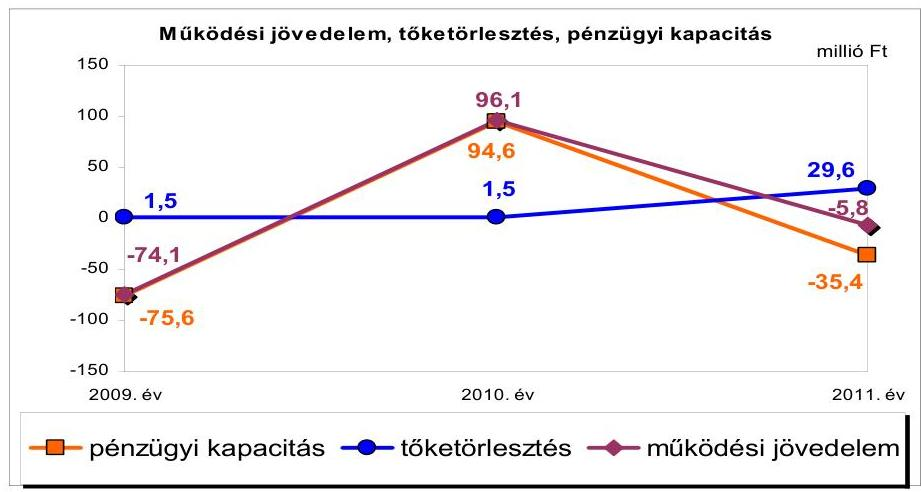
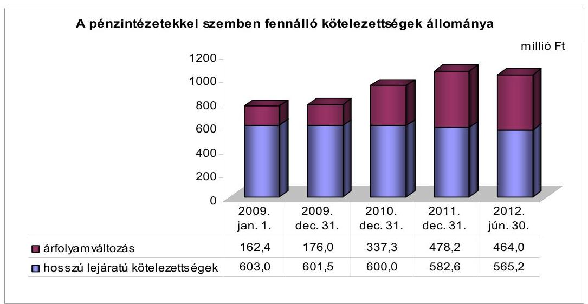
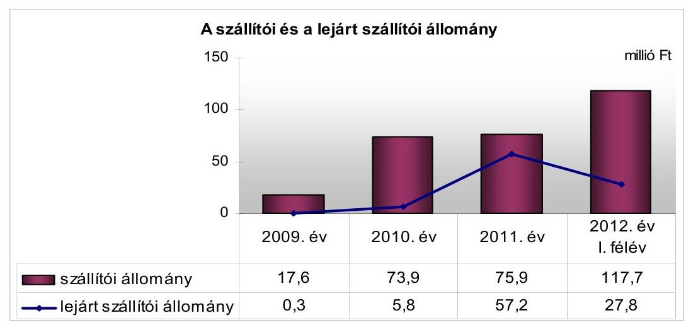
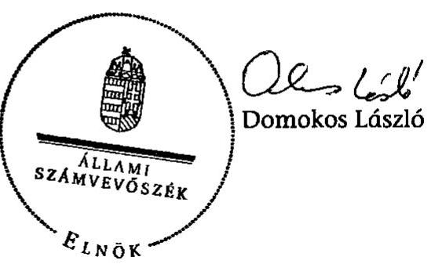
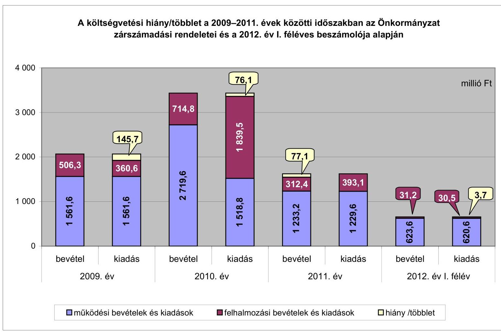
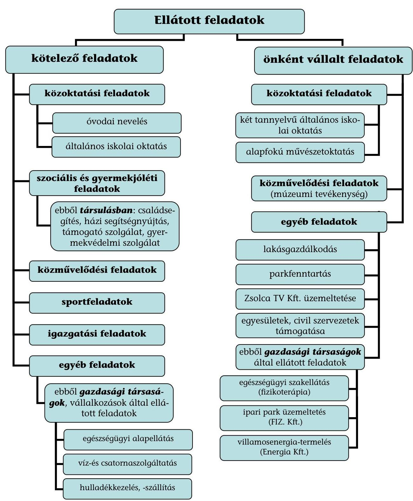

# JELENTÉS 

Felsőzsolca Város Önkormányzata pénzügyi gazdálkodási helyzetének, szabályosságának ellenőrzéséről

---

# Állami Számvevőszék 

Iktatószám: V-0030-253-014/2013.
Témaszám: 1069
Vizsgálat-azonosító szám: V059205

## Az ellenőrzést felügyelte:

## Renkó Zsuzsanna

felügyeleti vezető

## Az ellenőrzést vezette:

## Dér Lívia

ellenőrzésvezető

## Az ellenőrzést végezték:

| Batkiné Vas Anna | Fórián Erika | Nyikon Zsigmondné |
| :-- | :-- | :-- |
| számvevő tanácsos | számvevő tanácsos | számvevő tanácsos |

---

# TARTALOMJEGYZÉK 

BEVEZETÉS ..... 3
I. ÖSSZEGZŐ MEGÁLLAPÍTÁSOK, KÖVETKEZTETÉSEK, JAVASLATOK ..... 6
II. RÉSZLETES MEGÁLLAPÍTÁSOK ..... 13

1. Az Önkormányzat kötelező és önként vállalt feladatai, a feladatellátás szervezeti keretei ..... 13
2. A pénzügyi egyensúly fenntartását veszélyeztető pénzügyi kockázatok, és az ezek csökkentése érdekében tett intézkedések ..... 14
3. A pénzügyi gazdálkodási folyamatok szabályosságát, megfelelőségét biztosító belső kontrollok ..... 24
4. Az ÁSZ korábbi ellenőrzései során a pénzügyi, gazdálkodási helyzet javítására tett javaslatainak megvalósítása ..... 25

---

# MELLÉKLETEK 

1. számú A költségvetési hiány/többlet a 2009-2011. évek közötti időszakban az Önkormányzat zárszámadási rendeletei és a 2012. év I. féléves beszámolója alapján
2. számú Az Önkormányzat bevételei és kiadásai, valamint adósságszolgálata a 2009-2011. években (a CLF módszer szerint)
3/a. számú Az Önkormányzat által a 2009. év és a 2012. év I. félév között megvalósított (műszakilag befejezett) fejlesztések forrásösszetétele
3/b. számú Az Önkormányzat 2012. június 30 -án folyamatban lévő fejlesztési feladataihoz kapcsolódó kötelezettségeinek összegzése
3/c. számú Az Önkormányzat által beadott, elbírálás alatti pályázatok forrásaiból megvalósuló fejlesztésekhez kapcsolódó kötelezettségvállalások összegzése
3. számú Az önkormányzati feladatok ellátásában résztvevő gazdasági társaságok egyes kiemelt adatai
4. számú Az Önkormányzat 2012. június 30 -án fennálló, hosszú lejáratú adósságot keletkeztető kötelezettségvállalásai
5. számú Az Önkormányzat kötelezettségeinek 2011. december 31-ei és 2012. június 30 -ai állománya és a 2012. évben, valamint az azt követő években várható kötelezettségek miatti kiadások

## FÜGGELÉKEK

1. számú Rövidítések jegyzéke
2. számú Értelmező szótár
3. számú Az Önkormányzat által ellátott feladatok a 2012. év I. félév végén

---

# JELENTÉS 

## Felsőzsolca Város Önkormányzata pénzügyi gazdálkodási helyzetének, szabályosságának ellenőrzéséről

## BEVEZETÉS

Az államháztartás helyi szintjén, az önkormányzati alrendszerben az utóbbi években megjelenő gazdálkodási nehézségek, a pénzforgalmi hiány növekedése, az eladósodás az ÁSZ figyelmét a helyi önkormányzatok pénzügyi helyzetére irányította.

Az ÁSZ a 2012. évi ellenőrzési tervben foglaltaknak megfelelően az önkormányzatok pénzügyi gazdálkodási helyzetének, szabályosságának ellenőrzésével az önkormányzatok 2011. évben megkezdett helyzetelemzését folytatta. Az ellenőrzés keretében értékeljük az önkormányzatok adósságkezelési és likviditási helyzetét, bemutatjuk a pénzügyi egyensúly alakulására hatással lévő folyamatokat. Feltárjuk az ezekre ható kockázatokat, a pénzügyi egyensúlyi helyzetet befolyásoló döntésmegalapozó, döntés-előkészítő eljárások szabályosságát. Minősítjük az ezekkel összefüggő belső kontrollok kialakítását, működését, az ellenőrzött időszakban végrehajtott ÁSZ ellenőrzések megállapításainak hasznosulását.

Az ellenőrzés, eredményének várható hatásaként, megállapításaival segítséget nyújthat a pénzügyi helyzet értékeléséhez, a pénzügyi egyensúly helyreállítása érdekében szükségessé váló önkormányzati intézkedések megtételéhez.

Az ellenőrzés típusa: szabályszerűségi ellenőrzés.

## Az ellenőrzés célja annak értékelése volt, hogy

- az ellenőrzött időszakban a kötelező és önként vállalt feladatok ellátását biztosító szervezeti formák változása milyen hatást gyakorolt az Önkormányzat pénzügyi helyzetének alakulására;
- az Önkormányzat pénzügyi - ezen belül működési és felhalmozási - egyensúlya milyen irányban változott, a változást milyen okok idézték elő, továbbá milyen intézkedéseket tettek a pénzügyi egyensúly biztosítása, illetve javítása érdekében, az intézkedések hatására javult-e az Önkormányzat pénzügyi helyzete;
- a költségvetési kiadások finanszírozása érdekében vállalt, pénzintézetekkel szembeni kötelezettségek hogyan alakultak, a kötelezettségek fennállása

---

miként befolyásolja az Önkormányzat jövőbeli pénzügyi egyensúlyi helyzetét;

- az Önkormányzat beazonosította, felmérte, értékelte-e a pénzügyi egyensúlyt befolyásoló pénzügyi kockázatokat, a finanszírozási célú pénzügyi műveletekkel kapcsolatban írtak-e elő kockázatértékelési kötelezettséget;
- az Önkormányzat által kialakított belső kontrollok biztosítják-e a pénzügyi gazdálkodás folyamatainak szabályosságát és eredményességét;
- hasznosultak-e az ÁSZ korábbi ellenőrzései során a pénzügyi, gazdálkodási helyzet javítására tett szabályszerűségi és célszerűségi javaslatok.

Az ellenőrzés a 2009. január 1-jétől 2012. június 30 -áig terjedő időszakot ölelte fel. A pénzintézetekkel szembeni kötelezettségek állományának ellenőrzésekor a 2011. december 31-én fennálló kötelezettségek keletkezésének kezdő időpontját vettük figyelembe.

Az ellenőrzés szakmai módszertana az ÁSZ Ellenőrzési Kézikönyvében foglalt szakmai szabályokon alapult, amely a Legfőbb Ellenőrző Intézmények Nemzetközi Szervezete (INTOSAI) által kiadott nemzetközi standardok (ISSAI) figyelembevételével készült.

Az ellenőrzés során használt rövidítéseket az 1. számú, az egyes fogalmak magyarázatát a 2. számú függelék tartalmazza.

Az ellenőrzés jogszabályi alapját az ÁSZ tv. 1. § (3) bekezdésének, 5. § (2)-(6) bekezdéseinek, valamint az Áht. 2 61. § (2) bekezdésének előírásai képezik.

A helyszíni ellenőrzést követően az Országgyűlés a helyi önkormányzatok adósságállományának részleges konszolidációjáról döntött. Az 5000 fő lakosságszámot meg nem haladó települési önkormányzatok számára nyújtott törlesztési célú támogatással ${ }^{1}$ lehetővé tették a 2012. december 12-én fennálló tartozásállományuk és annak 2012. december 28-án fennálló járulékai teljes megfizetését. Az 5000 fő lakosságszám feletti települések esetében a 2013. évben az állam differenciált - a bevételi képességet figyelembe vevő, 40-70\%-ig terjedő mértékben vállalja át ${ }^{2}$ az önkormányzat 2012. december 31-i, az átvállalás időpontjában fennálló adósságállományát és annak járulékait. Az adósságkonszolidációs intézkedéssel egyidejűleg a Kormány elrendelte ${ }^{3}$ az önkormányzatok adósságállománya újratermelődésének megakadályozása céljából a hitelengedélyezési és a likvid hitelekre vonatkozó szabályozás szigorítását.

[^0]
[^0]:    ${ }^{1}$ Magyarország 2012. évi központi költségvetéséről szóló 2011. évi CLXXXVIII. törvény módosításáról szóló 2012. évi CLXXXVII. törvény alapján
    ${ }^{2}$ Magyarország 2013. évi központi költségvetéséről szóló 2012. évi CCIV. törvény alapján
    ${ }^{3}$ 1540/2012. (XII. 4.) Korm. határozat a helyi önkormányzatok adósságállományának részleges konszolidációjáról

---

Felsőzsolca város lakosainak száma 2011. december 31-én 7038 fő volt. Az Önkormányzat a 2011. évben 1548,8 millió Ft költségvetési bevételt ért el és 1623,0 millió Ft költségvetési kiadást teljesített. 2011. december 31-én a könyvviteli mérleg szerint 3008,0 millió Ft értékű vagyonnal rendelkezett, amely a 2009. év végi állományhoz (2550,1 millió Ft-hoz) viszonyítva 18,0\%-kal (457,9 millió Ft-tal) növekedett. Az eszközérték 2009-2011 közötti növekedésében az ingatlanok állománynövekedése volt meghatározó, az intézmények felújítása, az egészségház fejlesztése és ingatlanvásárlások eredményeként. A források között a saját tőke állományának 354,6 millió Ft-os és a kötelezettségek állományának 303,2 millió Ft-os növekedése adta az állományváltozás döntő hányadát. A CHF-alapú kötvény árfolyamváltozása 2009-2011 között 302,2 millió Ft-tal növelte a hosszú lejáratú kötelezettségek állományát. Az Önkormányzat a 2012. évi költségvetési rendeletében a költségvetési bevételeket 1254,4 millió Ft-ban, a költségvetési kiadásokat 1434,1 millió Ft-ban, a tervezett költségvetési hiány összegét 179,7 millió Ft-ban állapította meg. A költségvetési hiányt, valamint 63,0 millió Ft kötvénytörlesztést 28,7 millió Ft előző évi pénzmaradványból és - 183,3 millió Ft működési célú, 30,7 millió Ft felhalmozási célú, összesen - 214,0 millió Ft hitelből tervezik finanszírozni.

Az ÁSZ tv. 29. § (1) bekezdése szerint a jelentéstervezetet megküldtük a polgármester részére, aki az ÁSZ tv. 29. § (2) bekezdésében foglalt észrevételezési jogával nem élt, a jelentéstervezetre észrevételt nem tett.

---

# I. ÖSSZEGZŐ MEGÁLLAPÍTÁSOK, KÖVETKEZTETÉSEK, JAVASLATOK 

Felsőzsolca Város Önkormányzatának pénzügyi egyensúlya rövid távon nem biztosított. Az alacsony múködési jövedelemtermelő képesség miatt a jelentős szállítói állomány és a - kormányzati adósságrendezést követően fennmaradó - pénzintézetekkel szembeni, valamint a PPP szerződésből eredő kötelezettségek fedezete nem biztosított, teljesíthetősége kockázatot hordoz.

Az önként vállalt feladatok ellátása - az e feladatokra fordított kiadások múködési és felhalmozási kiadásokon belüli aránya alapján - nem jelentett kockázatot. Az Önkormányzatnál feladatátvétel, illetve átadás nem történt. A feladatellátás szervezeti formája, valamint a feladatokat ellátó költségvetési szervek száma az ellenőrzött időszakban jelentősen nem változott, a pénzügyi egyensúlyi helyzetre kimutatható hatása nem volt.

Az Önkormányzat 2009-2011 között összesen 6464,6 millió Ft költségvetési bevételhez jutott, teljesített költségvetési kiadása 6903,5 millió Ft-ot tett ki. Az Önkormányzatnál 2009-2011 között a múködési és felhalmozási forráshiány együttes összege 438,9 millió Ft volt, mely a teljesített költségvetési kiadások 6,4\%-át jelentette. Az Önkormányzat múködési jövedelme 2009-ben és 2011-ben negatív, 2010-ben - főként az egyszeri jellegű, saját működési bevételek és támogatások hatására - pozitív volt. A múködési jövedelemtermelő képesség miatti kockázat 2010-2011 között erősödött. 2011-ben a folyó költségvetés ÖNHIKI támogatás ( 78,3 millió Ft) nélkül számított forráshiánya 84,1 millió Ft lett volna. A nettó múködési jövedelem a 2009. és a 2011. években negatív, míg 2010-ben pozitív volt. A pénzügyi kapacitást 2009-ben és 2010-ben 1,5 millió Ft hitel-, 2011-ben 29,6 millió Ft kötvénytörlesztés terhelte, amelyeket a következő ábra mutat be:

A felhalmozási kiadások 2009-2011 között minden évben meghaladták a felhalmozási bevételeket, egyes fejlesztések kötvénybevételből történt finanszírozása, valamint a felmerült kiadások és a pályázati támogatások ütemkülönbsége miatt. Az Önkormányzatnál a döntést előkészítő megvalósítá-

---

si és fenntarthatósági tervekben nem mutatták be a tervezett projektek megvalósításának kockázatait, a várható múködési kiadásokat, ami jövőbeni üzemeltetési kockázatot jelenthet. A pénzügyi egyensúly megteremtése és a működőképesség megőrzése céljából az éves költségvetési koncepciókban bevéteInövelő, kiadáscsökkentő intézkedéseket határoztak meg, amelyek eredménye ( 19,7 millió Ft) számottevően nem javította az Önkormányzat pénzügyi egyensúlyi helyzetét az ellenőrzött időszakban.

Az Önkormányzat pénzintézetekkel szembeni kötelezettségeinek állománya a 2009. január 1-jei 765,4 millió Ft-ról a 2011. év végére 1060,8 millió Ft-ra növekedett, a 2012. év I. féléve végén 1029,2 millió Ft volt. Ezen kötelezettség 600,0 millió Ft ( 4213 ezer CHF) értékű, 2008. évben kibocsátott fejlesztési célú kötvényből származott. A pénzintézeti kötelezettségállomány a CHF árfolyam-emelkedése miatt nőtt, amely jelentősen rontotta az Önkormányzat pénzügyi helyzetét. A kötvény kamatának csökkenése kedvezően hatott a pénzügyi helyzetre. A kötvényhez kapcsolódó biztosítékok (bevételek pénzintézetre engedményezése, beszedési megbízás engedélyezése) nemfizetési kockázatot hordoznak. A kötvény visszafizetését biztosító feltételeket nem vizsgálták. A likviditás biztosítására folyószámlahitelt vettek igénybe, amely 2010ben - az árvízi védekezés rendkívüli kiadásai miatt - volt a legjelentősebb mind az átlagos, napi állomány mind a hitellel zárt napok száma alapján.

A szállítókkal szembeni kötelezettségek a rövid és hosszú lejáratú kötelezettségeknek 10,1\%-át (117,7 millió Ft) képezték 2012. június 30-án. A 2012. év I. félév végi, 117,7 millió Ft szállítói tartozásállomány, azon belül a 27,8 millió Ft lejárt szállítói tartozásállomány nemfizetési kockázatot jelent. Ennek mérséklésére a 2012. év I. félévben 77,2 millió Ft összegű lejárt szállítói tartozásállományt ütemeztek át a II. félévre. Az Önkormányzatnak PPP szerződésből eredő szolgáltatási díffizetési kötelezettsége áll fenn 2008-2023 között. A kötelezettség 2012. június 30 -ai állománya 1238,0 millió Ft, amely jelentős terhet ró az Önkormányzatra, és nehezíti pénzügyi egyensúlyának megtartását. A 2012-2014. években 284,9 millió Ft - ebből a szállítói kötelezettségek között szerepel 56,8 millió Ft -, a 2015. évtől a szerződés lejártáig 953,1 millió Ft a várható kiadás. A 2012. év I. félév végi szállítói állományban szereplő összegből 50,0 millió Ft-ot - fizetési nehézségek miatt - a II. félévre átütemeztek. Az NFM, az MNV Zrt., a Magánbefektető és az Önkormányzat között tárgyalások kezdődtek a PPP szerződés megszüntetése érdekében. Az ingatlanok jelzáloggal való terhelése (különböző ügyletek miatti fedezetbe vonása) az ellenőrzött időszakban nőtt, ezáltal a kötelezettségek teljesítéséhez szükséges fedezet biztosításához az ingatlan értékesítésből származó forrásbevonás lehetősége szűkült, illetve a jövőbeni hitelfelvételeknél a biztosítékként felajánlható ingatlanok száma, forgalmi értéke csökkent. A 2011. év végén az ingatlanok 13,4\%-a (325,8 millió Ft) megterhelt volt. A 2012. év I. féléve végén a pénzintézeti kötelezettségekhez kapcsolódóan hat, forgalomképes önkormányzati ingatlant terhelt jelzálog, egyéb kötelezettségekhez kapcsolódóan négy ingatlant érintett jelzálogteher, illetve elidegenítési tilalom.

Az Önkormányzat kötelezettségeinek állománya 2012. június 30-án 1315,2 millió Ft és 3969 ezer CHF volt. Ebből a PPP szerződésből eredő kötelezettségvállalás ezen időpontban - figyelemmel a szállítói kötelezettségekben már szereplő tételekre - 1181,2 millió Ft volt. A vállalt hosszú és rövid lejáratú

---

kötelezettségek jövőbeni teljesítésére a múködési jövedelem várhatóan nem nyújt fedezetet. Az Önkormányzat rövid távú pénzügyi egyensúlyi helyzetének fenntartását a 2012. év I. félév végén fennálló kötvényállományból és PPP szerződésből eredő, a 2012. évet követő években teljesítendő kötelezettségek nehezítik. A várható kötelezettségek teljesítésére szabad pénzmaradvány hiányában 51,4 millió Ft mérleg szerinti követelésállomány vehető figyelembe, amely a teljes kötelezettségállományra nem nyújt fedezetet. Az adósságszolgálat teljesítéséhez felhasználható elkülönített tartalékkal nem rendelkeztek. A várható kötelezettségek teljesítésének forrásaként a 2012-2014 közötti és az azt követő időszakra is a múködési jövedelmet jelölték meg, amely várhatóan nem fedezi a teljesítendő kiadásokat.

A pénzintézeti kötelezettségvállalásokról szóló döntést nem alapozták meg a kötelezettségállomány alakulásának elemzésével, értékelésével, és nem határozták meg a visszafizetés lehetséges forrásait. A Képviselő-testületet a kötvény árfolyam-emelkedésből adódó fizetési kötelezettségének növekedéséről az éves zárszámadási rendeletek előterjesztésekor tájékoztatták, azonban a visszafizetést biztosító feltételeket a 2009-2011 közötti időszakban nem mutatták be. Az Önkormányzat nem azonosította be, mérte fel, értékelte a pénzügyi egyensúlyt befolyásoló pénzügyi kockázatokat, nem írták elő a finanszírozási célú pénzügyi műveletek kockázatértékelési kötelezettségét.

Az Önkormányzatnál a kockázatkezelési rendszer kialakítása és múködtetése teljes körűen nem felelt meg a 2009-2011. években az Áht. ${ }_{1}$, a 2012. év I. félévében az Áht. 2 előírásainak. Az ellenőrzött időszakban fennállt a múködési jövedelemtermelő képesség miatti kockázat, a fejlesztések jövőbeni üzemeltetési kockázata, a kötvényhez kapcsolódó biztosítékok, valamint a magas szállítói állomány miatti nemfizetési kockázat. Elmaradt azonban a pénzügyi egyensúlyt befolyásoló pénzügyi kockázatok beazonosítása, felmérése és értékelése. A pénzügyi gazdálkodási egyensúlyra kockázatot jelentő tevékenységekkel, illetve a pénzügyi egyensúly fenntartásának kockázatait megelőző tevékenységek elmulasztásával az Önkormányzatnál figyelmen kívül hagyták 2009-ben az Ámr. ${ }_{1}$-ben, 2010-2011-ben az Ámr. ${ }_{2}$-ben, a 2012. év I. félévében a Bkr.-ben foglalt előírásokat, melyek a kockázati tényezők figyelembevételével végzett kockázatelemzést és kockázatkezelési rendszer múködtetését írták elő.

Az Önkormányzat 2010. és 2011. évi könyvviteli mérlegében, az Áhsz.-ben foglaltak ellenére, a felhalmozási célú kötvénykibocsátásból származó kötelezettség következő évet terhelő törlesztő részleteit a rövid lejáratú kötelezettségek között nem szerepeltette. A 2009. évi könyvviteli mérlegben nem mutattak ki egy 2007-ben igénybe vett és 2010-ben visszafizetett fejlesztési hitelből az adott évben még fennállt kötelezettséget, a Számv. tv.-ben és az Áhsz.-ben foglaltak ellenére. A költségvetési és zárszámadási rendeletekben a többéves kihatással járó kötelezettségvállalások között, az Áht. ${ }_{1}$-ben foglaltak ellenére, a PPP szerződésből eredő kötelezettséget nem mutatták be.

Az Önkormányzatnál a belső kontrolltevékenységek kialakítása és múködtetése teljes körűen nem felelt meg a 2009-2011. években az Áht. ${ }_{1}$, a 2012. év I. félévben az Áht. ${ }_{2}$ előírásainak. A pénzügyi gazdálkodási folyamatok szabályosságát biztosító belső kontrollok gazdálkodási folyamatokba történő beépítése a 2009. évben az Ámr. ${ }_{1}$-ben, a 2010-2011. években az Ámr. ${ }_{2}$-ben, a

---

2012. év I. félévében a Bkr.-ben foglalt előírásoknak nem megfelelt meg. A döntés-előkészítés során elmaradt a fejlesztési döntések kockázatai feltárása és kezelése kötelezettségének meghatározása. Nem írták elő a döntés-előkészítés szakaszában a pénzintézeti kötelezettségvállalásokkal kapcsolatos döntések kockázatai feltárásának és a futamidő egyes éveit terhelő kötelezettségek költségvetési egyensúlyra gyakorolt hatása vizsgálatának kötelezettségét. Nem határozták meg az Önkormányzat fizetőképességének és eladósodásának kezelésével és a pénzügyi kötelezettségek teljesítésével összefüggő kontrolltevékenységeket. A gazdálkodási folyamatokba beépített belső kontrollok működése nem volt megfelelő, mivel nem tárták fel a fejlesztéseket megelőző döntési folyamatban az előkészítés, a lebonyolítás és a működtetés kockázatait, nem vizsgálták a kötvénykibocsátásról szóló döntéselőkészítő folyamatban a futamidő egyes éveit terhelő kötelezettség költségvetési egyensúlyra gyakorolt hatását.

Az ÁSZ az ellenőrzött időszakban az Önkormányzatnál négy témában végzett ellenőrzést. A megtett 18 szabályszerűségi javaslat 94,4\%-a (17) és 19 célszerűségi javaslat $73,7 \%$-a (14) hasznosult. Ebből az Önkormányzat pénzügyi helyzetének értékeléséhez hat javaslat kapcsolódott. Az öt szabályszerűségi javaslatból egy részben teljesült, négy teljesült, az egy célszerűségi javaslatot nem hasznosították. Egy szabályszerűségi javaslatot részben teljesítettek, mert az Áhsz. előírása ellenére az EU-s támogatási programokkal kapcsolatban felhasznált saját költségvetési források alakulását nem mutatták be az éves beszámolók szöveges indokolásában. Egy célszerűségi javaslat nem hasznosult, mert a jegyző nem végzett évente számításokat, és nem tájékoztatta a Képvise-lő-testületet arról, hogy a hosszú lejáratú adósságot keletkeztető kötelezettségvállalásokból adódó tőke- és kamatfizetést az Önkormányzat milyen feltételek mellett tudja teljesíteni.

Összességében az Önkormányzat működési jövedelemtermelő képessége gyenge, forrásai az ellátott feladatokra nem nyújtottak fedezetet. Felhalmozási kiadásai teljesítése érdekében kibocsátott kötvénytörlesztési és a PPP szerződésből eredő, valamint szállítói kötelezettségei tovább nehezítik pénzügyi gazdálkodási pozícióit, múködését már rövid távon is korlátozzák.

Az ÁSZ tv. 33. § (1) bekezdésében foglaltak értelmében az ellenőrzött szervezet vezetője köteles a jelentésben foglalt megállapításokhoz kapcsolódó intézkedési tervet összeállítani, és azt a jelentés kézhezvételétől számított harminc napon belül az ÁSZ részére megküldeni. Amennyiben az intézkedési tervet határidőn belül nem küldi meg a szervezet, vagy az továbbra sem elfogadható, az ÁSZ elnöke a hivatkozott törvény 33. § (3) bekezdés a)-b) pontjaiban foglaltakat érvényesítheti.

# Az ellenőrzés intézkedést igénylő megállapításai és javaslatai: 

## a polgármesternek

1. Az Önkormányzat nettó múködési jövedelme 2009-ben és 2011-ben negatív volt. A likviditást folyószámlahitellel biztosították. A szállítói állomány a 2012. év I. félév végén 117,7 millió Ft volt, melynek közel negyede lejárt, a 65,6\%-a (77,2 millió Ft) a II. félévre átütemezett tartozás volt. Az ellenőrzött időszak végére a pénzintézeti

---

kötelezettségek 1029,2 millió Ft-ra növekedtek. A PPP szerződésben vállalt kötelezettség - a szállítói állományban szereplő számlázott tételek nélkül - 1181,2 millió Ft volt. A bevételnövelő, kiadáscsökkentő intézkedések számottevően nem javították a pénzügyi egyensúlyi helyzetet. Az adósságszolgálat teljesítéséhez felhasználható elkülönített tartalékkal nem rendelkeztek.

Javaslat:
A múködési jövedelemtermelő képesség és a feladatellátás összhangja, valamint az Önkormányzat pénzügyi egyensúlyának helyreállítása, hosszú távú fenntarthatósága érdekében -a 2013. évi kormányzati adósságkonszolidációt, valamint a 2013. évtől változó feladat-ellátási kötelezettséget, feladatfinanszírozási rendszert figyelembe véve - felelősök és határidők megjelölésével kezdeményezzen intézkedéseket, melyek keretében:
a) a költségvetési rendelettervezet, valamint annak évközi módosítása előterjesztését megelőzően mérje fel a bevételszerző, kiadáscsökkentő lehetőségeket. Terjessze a Képviselő-testület elé a bevételek növelését, a kiadások csökkentését célzó intézkedések bevezetéséhez szükséges - a Htv. 140. § (1) bekezdés a) pontja alapján a jegyző által elkészített - döntési javaslatát;
b) terjesszen a Képviselő-testület elé jóváhagyásra - a Htv. 140. § (1) bekezdés a) pontja alapján a jegyző által elkészített - az Önkormányzat gazdasági helyzetének elemzésén alapuló, a pénzügyi egyensúlyi helyzet gyors helyreállítását, hoszszú távú fenntartását, valamint az adósságállomány újratermelődésének elkerülését biztosító intézkedéseket tartalmazó reorganizációs programot;
c) a szállítói kitettség és a helyi önkormányzatok adósságrendezési eljárásáról szóló, 1996. évi XXV. törvény 4-9. §-aiban szabályozott adósságrendezési eljárás megindításának elkerülése érdekében, meghatározott gyakorisággal számoljon be a Képviselő-testületnek az Önkormányzat lejárt szállítói állománya alakulásáról. Intézkedjen a szállítói számlák esedékesség szerinti kiegyenlítéséről vagy a lejárt tartozások átütemezéséről;
d) az adósságkonszolidációt követően fennmaradó kötelezettségei tekintetében terjesszen a Képviselő-testület elé olyan egyensúlyi (elkülönített) tartalék képzésére vonatkozó - a Htv. 140. § (1) bekezdés a) pontja alapján a jegyző által elkészített - döntési javaslatot, amelyben a Képviselő-testület meghatározza annak összegét, és kötelezettséget vállal arra, hogy a törlesztési időszak alatt ezt a tartalékot a költségvetési rendeleteiben minden évben betervezi az adósságszolgálat teljesítésére.

# a jegyzőnek 

1. A költségvetési és zárszámadási rendeletekben a többéves kihatással járó kötelezettségvállalások között a PPP szerződésből eredő kötelezettségvállalást, az Áht, 118. §

---

(1) bekezdés 2. b) és (2) bekezdés 2. d) pontjaiban ${ }^{4}$ foglaltak ellenére, nem mutatták be.

Javaslat:
Intézkedjen, hogy a költségvetési és zárszámadási rendelettervezetek készítése során, az Áht ${ }_{2} 24 . \S$ (4) bekezdés b) és 91. § (2) bekezdés a) pontjaiban előírtak szerint, teljes körűen mutassák be a többéves kihatással járó kötelezettségvállalásokat.
2. Az Önkormányzatnál a 2010. és a 2011. évi könyvviteli mérlegben, az Áhsz. 26. § (5) bekezdés b) pontjában és a 26. § (6) bekezdésben foglalt előírás ellenére, a rövid lejáratú kötelezettségek között nem mutatták ki a felhalmozási célú kötvénykibocsátásból származó kötelezettség következő évet terhelő törlesztő részleteit. A 2009. évi könyvviteli mérlegben - a Számv. tv. 15. § (2) bekezdésében és az Áhsz. 23. §-ában, a 26. § (5) bekezdés b) pontjában és a 26. § (6) bekezdésében foglalt előírások ellenére - nem mutatták ki egy 2010. évben lejárt, hosszú lejáratú fejlesztési hitelből a fordulónapon még fennálló kötelezettség állományát.

Javaslat:
A könyvvezetési és a beszámoló készítési kötelezettség szabályszerű teljesítése érdekében:
a) biztosítsa, hogy a mérleg készítése során, a Számv. tv. 15. § (2) bekezdésében és az Áhsz. 23. §-ában foglalt előírás alapján, az Önkormányzat kötelezettségeit teljes körűen mutassák ki;
b) intézkedjen, hogy a könyvviteli mérlegben a fennálló hosszú lejáratú kötelezettségekből a fordulónapot követő év törlesztő részleteit, az Áhsz. 26. § (5) bekezdés b) pontjában és a 26. § (6) bekezdésében foglalt előírások szerint, a rövid lejáratú kötelezettségek között szerepeltessék.
3. Az Önkormányzatnál a kockázatkezelési rendszer kialakítása és múködtetése teljes körűen nem felelt meg a 2009-2010. években az Áht. ${ }_{1}$ 120/B. § (2) bekezdés b) pontjában, a 2011. évben az Áht. ${ }_{1}$ 121. § (2) bekezdés b) pontjában, a 2012. év I. félévében az Áht. ${ }_{2}$ 69. § (2) bekezdésében meghatározott előírásoknak. Az ellenőrzött időszakban fennállt a működési jövedelemtermelő képesség miatti kockázat, a fejlesztések jövőbeni üzemeltetési kockázata, a kötvényhez kapcsolódó biztosítékok, a magas szállítói állomány miatti nemfizetési kockázat. A pénzügyi egyensúlyt befolyásoló kockázatok feltárása, beazonosítása, értékelése, ezáltal kezelése, a 2009. évben az Ámr. ${ }_{1}$ 145/C. §-ában, a 2010-2011. években az Ámr. ${ }_{2}$ 157. §-ában, a 2012. év I. félévében a Bkr. 7. § (1)-(2) bekezdéseiben foglalt előírások ellenére - elmaradt.

Javaslat:
Működtessen az Áht. ${ }_{2}$ 69. § (2) bekezdésében, továbbá a Bkr. 7. § (1)-(2) bekezdéseiben foglalt előírásoknak megfelelő, a pénzügyi egyensúlyt befolyásoló kockázatok kezelésére alkalmas kockázatkezelési rendszert.

[^0]
[^0]:    ${ }^{4}$ Hatályát vesztette 2011. december 31-én. A 2012. január 1-jétől hatályos jogszabályi előírás: Áht ${ }_{2} 24$. § (4) bekezdés b) pontja és a 91. § (2) bekezdés a) pontja.

---

4. Az Önkormányzatnál a belső kontrolltevékenységek kialakítása és működtetése teljes körűen nem felelt meg a 2009-2010. években az Áht. ${ }_{1}$ 120/B. § (2) bekezdés c) pontjában, a 2011. évben az Áht. ${ }_{1}$ 121. § (2) bekezdés c) pontjában és a 2012. év I. félévében az Áht. ${ }_{2}$ 69. § (2) bekezdésében meghatározott előírásoknak. A pénzügyi gazdálkodási folyamatok szabályosságát biztosító belső kontrollok gazdálkodási folyamatokba történő beépítése - a 2009. évben az Ámr. ${ }_{1}$ 145/E. § (1) bekezdésében, a 2010-2011. években az Ámr. ${ }_{2}$ 158. § (1) bekezdésében, a 2012. év I. félévében a Bkr. 8. § (1)-(2) bekezdéseiben foglalt előírások ellenére - nem volt megfelelő. Nem írták elő a döntés-előkészítés során a fejlesztési döntések kockázatai feltárása és kezelése kötelezettségét, a pénzintézeti kötelezettségvállalásokkal kapcsolatos döntések kockázatai feltárását, a futamidő egyes éveit terhelő kötelezettségek költségvetési egyensúlyra gyakorolt hatásának vizsgálatát. Nem határozták meg a pénzügyi kötelezettségek teljesítésével, az Önkormányzat fizetőképességének és eladósodásának kezelésével összefüggő kontrolltevékenységet.

Javaslat:
Alakítsa ki az Áht. ${ }_{2}$ 69. § (2) bekezdésében, továbbá a Bkr. 8. § (1)-(2) bekezdései alapján azokat a belső kontrolltevékenységeket, amelyek biztosítják a pénzügyigazdálkodási folyamatok szabályosságát, a pénzügyi egyensúlyi helyzet alakulását befolyásoló döntések kockázatainak kezelését. Ennek keretében:
a) határozza meg a fejlesztések döntés-előkészítés folyamatában a lebonyolítás és a működtetés kockázatai feltárásának, kezelésének kötelezettségét;
b) írja elő a pénzintézeti kötelezettségvállalások kockázatainak döntés-előkészítő szakaszban történő feltárását, a futamidő egyes éveit terhelő kötelezettségek költségvetési egyensúlyra gyakorolt hatásának vizsgálatát;
c) határozza meg az Önkormányzat fizetőképességének és eladósodásának kezelésére, valamint a pénzügyi kötelezettségek teljesítésére vonatkozó helyi szabályokat.
5. Az Önkormányzat gazdálkodási rendszerének 2010. évi ÁSZ ellenőrzése során a pénzügyi egyensúly javítására tett javaslatok közül egy szabályszerűségi javaslat részben hasznosult. Az éves beszámolók szöveges indokolása, az Áhsz. 40. § (7) bekezdésének előírása ellenére, nem tartalmazta az EU-s támogatási programokkal kapcsolatban felhasznált saját költségvetési források alakulását.

Javaslat:
Az Önkormányzat gazdálkodási rendszerét érintő 2010. évi ÁSZ ellenőrzés által megállapított szabálytalanság megszüntetése érdekében biztosítsa, az Áhsz. 40. § (7) bekezdése előírásának megfelelően, az EU-s támogatási programokkal kapcsolatban felhasznált saját költségvetési források alakulásának az éves beszámolók szöveges indokolásában történő bemutatását.

---

# II. RÉSZLETES MEGÁLLAPÍTÁSOK 

## 1. Az ÖNKORMÁNYZAT KÖTELEZŐ ÉS ÖNKÉNT VÁLlALT FELADATAI, A FELADATELLÁTÁS SZERVEZETI KERETEI

Az Önkormányzat kötelező feladatait az Ötv. és az ágazati törvények által meghatározottnak tekintette, önként vállalt feladatait az SzMSz-ben határozta meg. A Képviselő-testület az éves költségvetési rendeletekben a kötelező feladatok elsődlegességét figyelembe véve döntött az önként vállalt feladatok ellátásának mértékéről. Az önként vállalt feladatok közé sorolták a kéttannyelvű és az alapfokú művészeti oktatást, a múzeumi tevékenységet, a parkfenntartást, a lakásgazdálkodást, az egészségügyi szakellátást, a helyi önkéntes tűzoltó egyesület és polgárőrség támogatását, a helyi civil szervezetek támogatását, a villamosenergia-termelést, az ipari park és a ZSOLCA TV Kft. üzemeltetését.

Az Önkormányzat adatszolgáltatása szerint a múködési kiadásokra 2009-2011 között folyamatosan csökkenő összeget, 2011-ben 1212,6 millió Ft-ot fordítottak. Az önként vállalt feladatokra 2009-2011 között összesen 618,6 millió Ft-ot ${ }^{5}$, a teljesített múködési kiadások 14,6\%-át használták fel. A múködési kiadásokból a kötelező feladatok kiadásainak aránya a 2009. évi 86,6\%-ról (1338,3 millió Ft-ról) 2010-re 86,5\%-ra (1270, millió Ft-ra), 2011-re 82,4\%-ra (999,6 millió Ft-ra) csökkent. A részarány jelentősebb, 2010-2011 közötti csökkenését a 2010. évi kiadásokban megjelenő, de a 2011. évi kiadásokban nem szereplő árvízvédelmi kiadások okozták. Az ellenőrzött időszakban a működési kiadásokat az önkormányzati források átlagosan 48,1\%-ban (2329,4 millió Ft) finanszírozták. A 2009. év és a 2012. év I. féléve időszakában a beruházási, felújítási kiadások 95,3\%-át (1140,8 millió Ft-ot) kötelező, 4,7\%-át (56,8 millió Ft-ot) önként vállalt feladatokhoz kapcsolódó fejlesztésekre használták fel. Az önként vállalt feladatok ellátása - az ezen feladatokra fordított kiadások múködési és felhalmozási kiadásokon belüli aránya alapján - nem jelentett kockázatot az Önkormányzat számára.

A feladatellátás szervezeti formája, valamint a feladatokat ellátó költségvetési szervek száma az ellenőrzött időszakban jelentősen nem változott. Az Önkormányzat feladatait a 2009. év elején négy költségvetési szervvel, 14 telephelyen, 2012. június 30 -án öt költségvetési szervvel 11 telephelyen látta el.

A Képviselő-testület 2011-ben az ÁMK-t megszüntette, és jogutódként két önállóan múködő intézményt hozott létre. Ezzel a telephelyek száma a közművelődési ágazatban kettővel, a közoktatási ágazatban (művészetoktatás) eggyel csökkent.

[^0]
[^0]:    ${ }^{5}$ Az Önkormányzat adatszolgáltatásában az önként vállalt feladatok 2009. évi múködési kiadásai (422,6 millió Ft) tartalmazták a kötelező önkormányzati feladatot ellátó MIVÍZ Kft.-nek (átadott pénzeszközként) továbbutalt 215,6 millió Ft-ot. Ezt az ellenőrzés, a feladat jellegére tekintettel, a kötelező feladatok kiadásaiban vette figyelembe.

---

Egyes szociális és gyermekjóléti feladatokat intézményfenntartó társulás gesztoraként, illetve tagjaként biztosították. Az ellenőrzött időszakban összesen nyolc gazdasági társaság vett részt a feladatellátásban. 2012-től a folyékony hulladék szállítását a víz- és csatornaszolgáltatást végző gazdasági társaság vette át, a többi szervezet tevékenysége, feladatellátásban betöltött szerepe nem változott.

Az Önkormányzat két gazdasági társaságban (ZSOLCA TV Kft., Energia Kft.) 100\%, egy gazdasági társaságban (FIZ Kft.) 72,7\% tulajdoni hányaddal rendelkezett. Ezen gazdasági társaságok önkormányzati önként vállalt feladatot végeztek.

A feladatellátás szervezetében, számában bekövetkezett változásnak a pénzügyi egyensúlyi helyzetre kimutatható hatása nem volt. Az Önkormányzatnál az ellenőrzött időszakban feladatátvétel, illetve átadás nem történt. (A feladatellátás részletezését a 3. számú függelék tartalmazza.)

# 2. A PÉNZÜGYI EGYENSÚLY FENNTARTÁSÁT VESZÉLYEZTETŐ PÉNZÜGYI KOCKÁZATOK, ÉS AZ EZEK CSÖKKENTÉSE ÉRDEKÉBEN TETT INTÉZKEDÉSEK 

Az Önkormányzat költségvetésének elemzését CLF módszerrel hajtottuk végre. A CLF módszer szerinti 2009-2011 közötti részletes adatokat a 2. számú melléklet, a főbb önkormányzati adatokat a következő tábla mutatja be:

|  |  |  | millió Ft |
| :-- | --: | --: | --: |
| Megnevezés | 2009. év | 2010. év | 2011. év |
| Folyó bevételek | 1469,7 | 1563,2 | 1206,8 |
| Folyó kiadások | 1545,3 | 1468,6 | 1212,6 |
| Múködési jövedelem | $\mathbf{- 7 5 , 6}$ | $\mathbf{9 4 , 6}$ | $\mathbf{- 5 , 8}$ |
| Felhalmozási bevételek | 188,3 | 1694,6 | 342,0 |
| Felhalmozási kiadások | 376,9 | 1889,7 | 410,4 |
| Felhalmozási költségvetés egyenlege | $\mathbf{- 1 8 8 , 6}$ | $\mathbf{- 1 9 5 , 1}$ | $\mathbf{- 6 8 , 4}$ |
| Folyó és felhalmozási bevételek összesen | 1658,0 | 3257,8 | 1548,8 |
| Folyó és felhalmozási kiadások összesen | 1922,2 | 3358,3 | 1623,0 |
| Finanszírozási múveletek nélküli pozíció | $\mathbf{- 2 6 4 , 2}$ | $\mathbf{- 1 0 0 , 5}$ | $\mathbf{- 7 4 , 2}$ |
| Finanszírozási műveletek egyenlege | -7,7 | -26,7 | -21,7 |
| Tárgyévi pénzügyi pozíció | $\mathbf{- 2 7 1 , 9}$ | $\mathbf{- 1 2 7 , 2}$ | $\mathbf{- 9 5 , 9}$ |
| Hiteltörlesztés, értékpapír beváltás | 1,5 | 1,5 | 29,6 |
| Nettó múködési jövedelem | $\mathbf{- 7 7 , 1}$ | $\mathbf{9 3 , 1}$ | $\mathbf{- 3 5 , 4}$ |

Az Önkormányzat 2009-2011 között összesen 6464,6 millió Ft költségvetési bevételhez jutott és 6903,5 millió Ft költségvetési kiadást teljesített. Ezen időszakban a működési és felhalmozási forráshiány együttes összege 438,9 millió Ft volt, mely a teljesített költségvetési kiadások 6,4\%-át jelentette.

Az Önkormányzat folyó költségvetési egyenlege, múködési jövedelme 2009-ben és 2011-ben negatív, 2010-ben pozitív volt. A múködési jövedelem 2009-2010 közötti növekedése a saját múködési bevételek és átvett pénzeszközök - árvízkárokra kapott kártérítés, adomány, támogatásértékű bevétel miatti - emelkedésének és az egyszeri jellegű, államháztartáson kívülre átadott pénzeszközök csökkenésének együttes eredménye. A folyó költségvetés egyenlegének 2010-2011 közötti csökkenését főként az egyszeri jellegű, saját múködési bevételek és támogatások megszűnése, visszaesése okozta. Az Önkormányzat

---

múködési jövedelemtermelő képesség miatti kockázata 2010-2011 között erősödött. A folyó költségvetés ÖNHIKI támogatás (78,3 millió Ft) nélkül számított forráshiánya 2011-ben 84,1 millió Ft lett volna.

A nettó múködési jövedelem a 2009. és a 2011. években negatív, míg 2010-ben pozitív volt. A pénzügyi kapacitást 2009-ben és 2010-ben 1,5-1,5 millió Ft hiteltörlesztés, 2011-ben 29,6 millió Ft kötvénytörlesztés terhelte.

A felhalmozási kiadások 2009-2011 között minden évben meghaladták a felhalmozási bevételeket. Ennek oka egyes fejlesztéseknek, illetve egyes projektek kiadásai önrészének előző évek pénzmaradványából (kötvénybevételből) történt finanszírozása, valamint a felmerült kiadások és a pályázati támogatások ütemkülönbsége. A 2010. évi, jelentős összegű (1889,7 millió Ft) felhalmozási kiadásban az árvízben megrongálódott lakóingatlanok helyreállítására, államháztartáson kívülre átadott 1368,5 millió Ft volt a meghatározó.

Az Önkormányzat teljes finanszírozási igénye ${ }^{6} 2009$-ben 265,7 millió Ft, 2010-ben 102,0 millió Ft, 2011-ben 103,8 millió Ft volt. A finanszírozási műveletek 2009-2011 között minden évben negatív egyenleget mutattak az egyéb finanszírozási kiadások és bevétel-visszatérítés miatt, amit 2011-ben a kötvénytörlesztés is növelt.

A költségvetési hiány, illetve többlet alakulását az Önkormányzat 2009-2011. évi zárszámadási rendeletei, valamint a 2012. év I. féléves beszámolója alapján az 1. számú melléklet mutatja be. A zárszámadási rendeletek, illetve a féléves beszámoló szerint 2009-ben, 2010-ben és a 2012. év I. félévében pénzügyi többlet, 2011-ben pénzügyi hiány keletkezett. Ezen bevételek tartalmazták - a CLF modellel ellentétben - az előző évi pénzmaradvány felhasználásából származó pénzforgalom nélküli és befektetési értékpapírok értékesítéséből elért bevételeket is.

Az Önkormányzat 2009. év és 2012. év I. félév közötti folyó bevételeit főbb bevételi jogcímek szerint a következő tábla mutatja be:

|  |  |  |  | millió Ft |
| :-- | --: | --: | --: | --: |
| Megnevezés | $\mathbf{2 0 0 9 .}$ év | $\mathbf{2 0 1 0 .}$ év | $\mathbf{2 0 1 1 .}$ év | $\mathbf{2 0 1 2 .}$ év   I. félév |
| Költségvetési támogatás | 693,1 | 594,6 | 442,8 | 245,2 |
| Személyi jövedelemadó bevétel | 103,2 | 138,6 | 123,1 | 57,8 |
| Egyéb átengedett bevételek | 81,5 | 76,7 | 79,8 | 38,4 |
| Áfa bevételek, visszatérülések | 70,9 | 77,5 | 41,5 | 10,8 |
| Helyi adók, pótlékok | 326,8 | 282,9 | 260,7 | 148,4 |
| Egyéb saját bevételek | 194,2 | 392,9 | 258,9 | 123,0 |
| Összes folyó bevétel | $\mathbf{1 4 6 9 , 7}$ | $\mathbf{1 5 6 3 , 2}$ | $\mathbf{1 2 0 6 , 8}$ | $\mathbf{6 2 3 , 6}$ |

${ }^{6}$ Az Önkormányzat müködőképességének megőrzését szolgáló kiogészitő támogatások együttesen
A folyó bevételek 2009-2010 közötti 93,5 millió Ft-os növekedését és 2010-2011 közötti 356,4 millió Ft-os csökkenését döntően a költségvetési támo-

[^0]
[^0]:    ${ }^{6}$ teljes finanszírozási igény: a nettó múködési jövedelemnek és a felhalmozási költségvetés egyenlegének együttes, negatív eredménye

---

gatás és az egyéb saját bevételek változása határozta meg. A költségvetési támogatás és az szja együttes összege 2009-ről 2010-re 796,3 millió Ft-ről 733,2 millió Ft-ra, 2011-re 565,9 millió Ft-ra csökkent. Az egyszeri támogatások figyelmen kívül hagyásával a költségvetési támogatás és az szja 2009-2011 között számottevően nem változott.

A 2009. évi támogatásban 215,6 millió Ft egyszeri támogatás szerepelt, amely nélkül a költségvetési támogatás és az szja 580,7 millió Ft volt. A 2010. évi támogatás az árvíz-védekezéshez juttatott, 145,9 millió Ft egyszeri (vis maior) támogatást tartalmazott, mely nélkül a költségvetési támogatás és az szja együtt 587,3 millió Ft-ot tett ki. A költségvetési támogatáson belül az ÖNHIKI támogatás 2010-ben 10,0 millió Ft, 2011-ben 78,3 millió Ft, a 2012. év I. félévében 28,3 millió Ft volt.

A helyi adókból (iparúzési adó, magánszemélyek és vállalkozók kommunális adója, építményadó) és pótlékokból származó bevételek folyó bevételeken belüli aránya 2009-ben 22,2\%, (326,8 millió Ft), 2010-ben 18,1\% (282,9 millió Ft), 2011-ben $21,6 \%$ ( 260,7 millió Ft) volt. A helyi adóbevétel nem jelentett bevételi kitettség miatti kockázatot az Önkormányzat számára, mivel annak döntő része nagyszámú adóalanytól származott.

A helyi iparúzési adó mértékét a 2009. évben a törvényi maximumra (2,0\%) emelték, 2010-től 1,9\%-ra csökkentették. Az iparúzési adóbevétel folyamatosan a 2009. évi 239,8 millió Ft-ról 2011-re 176,8 millió Ft-ra - csökkent az adómérték, a fizetési készség, képesség csökkenése miatt. A vállalkozók kommunális adója 2011-től megszűnt. Az Önkormányzat megítélése szerint új helyi adó bevezetésére nincs reális lehetősége.

Az egyéb saját bevételek 2009-ről 2010-re 102,3\%-kal (198,7 millió Ft-tal) nőttek a szolgáltatási és az egyéb kártérítési bevételek emelkedése eredményeként, míg 2010-ről 2011-re 34,1\%-kal (134,0 millió Ft-tal) mérséklődtek az egyszeri bevételek megszűnése és az egyéb sajátos bevételek csökkenése miatt.

A felhalmozási bevételek 2009-2010 között kilencszeresre (188,3 millió Ft-ról 1694,6 millió Ft-ra) emelkedtek főként az árvízi védekezéssel és helyreállítással kapcsolatos, egyszeri költségvetési támogatás és államháztartáson kívülről átvett bevételek miatt. A költségvetési támogatás (1107,4 millió Ft-os) növekedésében a lakóingatlanok helyreállítását szolgáló 1113,3 millió Ft volt a meghatározó. A 2010-2011 közötti, 1352,6 millió Ft-os csökkenést nagyrészt ugyanezen bevételek megszűnése okozta. Az árvízkárok helyreállítására kapott vis maior támogatás 2011-ben 116,1 millió Ft volt.

Az Önkormányzat 2009. év és 2012. év I. félév közötti folyó kiadásait főbb jogcímek szerint a következő ábra mutatja be.

---

| Megnevezés | 2009. év | 2010. év | 2011. év | $\begin{gathered} \text { millió Ft } \\ 2012 . \text { év } \\ \text { I. félév } \end{gathered}$ |
| :--: | :--: | :--: | :--: | :--: |
| Folyó kiadások | 1543,3 | 1468,6 | 1212,6 | 612,4 |
| Működési kiadások (kamurkiadás nélkül) | 1143,9 | 1281,3 | 1054,5 | 538,4 |
| ebbéli személyi juttatások és munkaadót terhelő járulékok | 719,5 | 709,3 | 687,4 | 341,9 |
| dologi kiadások | 417,8 | 544,1 | 355,3 | 189,5 |
| egyéb folyó kiadások | 6,6 | 27,9 | 11,8 | 7,0 |
| Államháztartáson belülre átadott pénzeszközök | 2,2 | 1,3 | 5,0 | 2,6 |
| Transzferkiadások* | 398,3 | 182,1 | 150,7 | 70,2 |
| Kamurkiadások | 0,8 | 3,8 | 2,4 | 1,2 |
| Kólysítsók nyújtása, törlesztése | 0,1 | 0,1 | 0,0 | 0,0 |

* Transzferkiadás = Közvetlen ellenszolgáltatás nélküli jövedelemáramlás az állami költségvetésből a gazdasági/magán szféra felé.

A folyó kiadások 2009-2010 közötti, 76,7 millió Ft-os (5,0\%-os) csökkenését a transzferkiadásokon belüli, vállalkozásnak történt pénzeszközátadás (215,6 millió Ft) csökkenése eredményezte, a dologi kiadások - főként az árvíz elleni védekezés rendkívüli kiadásai miatti - emelkedése mellett. A 2011. évben a 2010. évihez képest 256,0 millió Ft-tal (17,4\%-kal) csökkentek a folyó kiadások az előző évi, egyszeri jellegű, rendkívüli kiadások megszűnése miatt.

A személyi juttatások és járulékaik kiadásai 2009-2011 között jelentősen nem változtak, ezen időszaki átlaguk 705,4 millió Ft volt. A dologi kiadások 2009-2010 között 126,3 millió Ft-tal nőttek, 2010-2011 között 188,8 millió Ft-tal csökkentek. A változások az árvíz elleni védekezés rendkívüli kiadásai, majd azok megszűnése miatt következtek be. A transzferkiadások 2009-2010 közötti csökkenését az államháztartáson kívülre vállalkozásnak átadott pénzeszköz csökkenése, a 2010-2011 közötti további mérséklődését a háztartásoknak átadott pénzeszközök, valamint a szociálpolitikai és egyéb juttatások csökkenése okozta. Az Önkormányzat - társadalom- szociálpolitikai és egyéb juttatás nélkül - 2009-ben 20,0 millió Ft, 2010-ben 34,4 millió Ft, 2011-ben 20,3 millió Ft pénzeszközt adott át múködési célra gazdasági társaságoknak, non-profit szervezeteknek és háztartásoknak. Az átadott pénzeszközök nem gyakoroltak jelentős hatást a pénzügyi egyensúlyi helyzetre. Az önkormányzati feladatellátásban résztvevő gazdasági társaságok számára átadott pénzeszközök részletezését a 4. számú melléklet tartalmazza.

A folyó és felhalmozási kiadások együttes összegén belül a felhalmozási kiadások aránya 2010-ben - az árvízkárok helyreállításához államháztartáson kívülre átadott pénzeszközök (1370,8 millió Ft), valamint az áfa befizetések (41,2 millió Ft) miatt - kiemelkedően magas, 56,3\% (1889,7 millió Ft) volt, ezt követően csökkent. A felhalmozási kiadásokból beruházásokra és felújításokra 2009-ben 357,7 millió Ft-ot, 2010-ben 450,6 millió Ft-ot, 2011-ben 348,3 millió Ft-ot fordítottak.

A 2009. és a 2012. év I. féléve között megvalósított és műszakilag befejezett fejlesztésekre 1244,4 millió Ft-ot teljesítettek. Ezen kiadásokhoz 595,5 millió Ft (47,9\%) kötvénybevételt, 420,1 millió Ft (33,8\%) EU-s, valamint 151,2 millió Ft (12,1\%) egyéb központi támogatást és 77,6 millió Ft (6,2\%) saját bevételt használtak fel. A 2012. június 30 -án folyamatban lévő beruházások és felújítások várható kiadásából 2012. év I. féléve végéig 11,1 millió Ft-ot teljesítettek, saját bevétel fedezettel. Ezen fejlesztési feladatoknak a 2012. év I. félévet követő időszakra ütemezett 151,6 millió Ft kiadását, 100,9 millió Ft (66,5\%) EU-s és 46,2 millió Ft (30,5\%) egyéb központi támogatás, valamint 4,5 millió Ft (3,0\%) saját forrás fedezi. A 2012. év I. félév végén elbírálás alatt lévő, 230,6 millió Ft

---

bekerülési költségű, öt fejlesztési feladat tervezett forrása teljes egészében EU-s támogatás ${ }^{7}$.

Az Önkormányzatnál a döntést előkészítő megvalósítási és fenntarthatósági tervekben nem mutatták be a tervezett projektek megvalósításának kockázatait, a várható működési kiadásokat, ami jövőbeni üzemeltetési kockázatot jelenthet. A 2009. év és a 2012. év I. félév közötti időszakban befejezett, illetve 2012. június 30 -án folyamatban lévő fejlesztések finanszírozásához a források rendelkezésre álltak. A fejlesztések finanszírozásának kockázatát csökkentette, hogy az előfinanszírozású projektek esetében igénybe vették az állam által biztosított előleget. A folyamatban lévő fejlesztések az Önkormányzat pénzügyi helyzetét nem befolyásolják, mert azok forrásában a saját bevétel összege alacsony ( 4,5 millió Ft). A folyamatban lévő fejlesztésekhez támogatási szerződéssel rendelkeznek.

Az Önkormányzat pénzintézetekkel szembeni kötelezettségeinek állománya a 2009. január 1-jei 765,4 millió Ft-ról a 2011. év végére 1060,8 millió Ft-ra növekedett, a 2012. év I. féléve végén 1029,2 millió Ft volt. Az Önkormányzat pénzintézetekkel szemben a 2009-2011. években, illetve 2012. június 30 -án fennálló kötelezettségeit a következő ábra mutatja be ${ }^{8}$ :

A pénzintézetekkel szembeni, 2009. év eleji kötelezettség 600,0 millió Ft (4213,0 ezer CHF) értékű, fejlesztési célú kötvény kibocsátásából és 3,0 millió Ft (19,7 ezer CHF) fejlesztési célú hitelből származott. A pénzintézeti kötelezettségállomány a 2009. év és a 2012. év I. féléve között 263,8 millió Ft-tal (34,5\%-kal)

[^0]
[^0]:    ${ }^{7}$ A 2009. év és a 2012. év I. féléve között megvalósított, 2012. június 30-ig műszakilag befejezett fejlesztések forrásösszetételét a 3/a. számú melléklet tartalmazza. Az Önkormányzat 2012. június 30 -án folyamatban lévő fejlesztési feladataihoz kapcsolódó kötelezettségeinek összegzését a 3/b. számú melléklet mutatja be. Az Önkormányzat által beadott, elbírálás alatti, pályázati forrásból megvalósítandó fejlesztések adatait a 3/c. számú melléklet foglalja magában.
    ${ }^{8}$ Az ábrában a hosszú lejáratú kötvény és hitel következő évet terhelő törlesztő részletei a hosszú lejáratú kötelezettségek között szerepelnek.

---

növekedett. A kötelezettségállomány változásában a CHF árfolyamemelkedése 301,6 millió Ft-ot tett ki, amely jelentősen rontotta az Önkormányzat pénzügyi helyzetét. A hitel 2009-2010-ben teljesített visszafizetése 3,0 millió Ft-tal (19,7 ezer CHF), a kötvény 2011. évi és 2012. év I. félévi törlesztése - kibocsátáskori árfolyamon - 34,8 millió Ft-tal (244,0 ezer CHF) mérsékelte a kötelezettségállományt.

#### Abstract

Az Önkormányzat 2008-ban „Felsőzsolca Fejlődéséért" elnevezésű kötvényt bocsátott ki 20 éves futamidőre. A változó kamat fizetése negyedévenként, azonnal kezdődött. A tőkét - három év türelmi idő után - 2011-től negyedévenként, azonos összegben ( 61,0 ezer CHF) törlesztik. A kötvényforrást a 2012. év I. féléve végéig teljes egészében, a célnak megfelelően, intézmények felújítására, fejlesztésére, akadálymentesítésére, útfelújításra és ingatlanvásárlásra használták fel. A 2009. év és a 2012. év I. féléve között - visszafizetéskori árfolyamon 59,1 millió Ft-ot fordítottak (244,0 ezer CHF) kötvénytörlesztésre, valamint 57,6 millió Ft (271,1 ezer CHF) kamat- és 10,3 millió Ft egyéb kiadást (összesen 127,0 millió Ft-ot) teljesítettek. A kötvénykibocsátástól a 2012. év I. féléve végéig megfizetett kamat 72,1 millió Ft ( 358,7 ezer CHF), az egyéb kiadás 10,3 millió Ft volt.

Az Önkormányzat 2010. és 2011. évi könyvviteli mérlegében, az Áhsz. 26. § (5) bekezdés b) pontjában és a 26. § (6) bekezdésében foglaltak ellenére, a felhalmozási célú kötvénykibocsátásból származó kötelezettség következő évet terhelő törlesztő részleteit a rövid lejáratú kötelezettségek között nem szerepeltették. A 2009. évi könyvviteli mérlegben nem mutatták ki egy 2007-2010 között fennállt hosszú lejáratú, fejlesztési hitelből a fordulónapon még fennálló kötelezettség összegét, a Számv. tv. 15. § (2) bekezdésében és az Áhsz. 23. §-ában, a 26. § (5) bekezdés b) pontjában és a 26. § (6) bekezdésében foglaltak ellenére.

A 2007. évben gépjármú-vásárlásra 4,2 millió Ft (27,9 ezer CHF) hitelt vettek igénybe, amelynek 2009. év eleji állománya 3,0 millió Ft (19,7 ezer CHF) volt. A tőkét és az összesen 1,5 millió Ft ( 2,5 ezer CHF) kamatot a 2010. év végéig megfizették ${ }^{9}$. A hitel futamideje alatt teljesített kamatkiadás összesen 2,1 millió Ft (5,4 ezer CHF) volt.

A hosszú lejáratú fejlesztési célú kötvény és hitel után a 2009. év és a 2012. év I. féléve között 62,1 millió Ft (263,7 ezer CHF) tőketörlesztést, 59,1 millió Ft (273,6 ezer CHF) kamat-, valamint 10,3 millió Ft egyéb kiadást teljesített az Önkormányzat. A kötvény kamata a kibocsátáskori 6,0\%-ról a 2012. év I. félévére $1,71 \%$-ra mérséklődött - a kamatkiadás csaknem folyamatosan csökkent -, ez kedvezően hatott az Önkormányzat pénzügyi helyzetére.

A kötvényforrás hasznosítása révén - a kibocsátástól kezdődően 82,4 millió Ft - az ellenőrzött időszakban 46,8 millió Ft kamatbevételt értek el, amelyet a kötvény kamat- és egyéb kiadásaira fordítottak. A kötvényforrást szabadon hasznosíthatta az Önkormányzat. A kötvényhez kapcsolódó biztosítékok nemfizetési kockázatot hordoznak, azonban az ellenőrzött

[^0]
[^0]:    ${ }^{9}$ A 2012. június 30 -án fennálló, hosszú lejáratú adósságot keletkeztető kötelezettségvállalásokat az 5. számú melléklet tartalmazza.

---

időszakban a pénzügyi helyzetet nem befolyásolták, mivel az adósságszolgálat teljesítése megtörtént.

Az Önkormányzat biztosítékként a kötvényt forgalmazó pénzintézet számára a nála vezetett számlái ellen beszedési, a más pénzintézetnél vezetett számlái ellen azonnali beszedési megbízás benyújtását engedélyezte, továbbá a kötvényt forgalmazó pénzintézetre engedményezte a saját bevételeit az adósságszolgálat erejéig.

A pénzintézeti kötelezettségvállalásokra - kötvénykibocsátás, folyószámlahitelek - a Képviselő-testület döntése alapján került sor. A kötvénykibocsátáshoz a pénzintézetet három ajánlat alapján választották ki. A kötvénykibocsátás alkalmával vizsgálták és betartották az adósságot keletkeztető kötelezettségvállalás felső határát. A pénzintézeti kötelezettségvállalásokról szóló döntést nem alapozták meg a kötelezettségállomány alakulásának elemzésével, értékelésével, nem határozták meg a visszafizetés lehetséges forrásait, és tartalékot nem képeztek. A Képviselő-testületet a kötvény árfolyam-emelkedésből adódó fizetési kötelezettségének növekedéséről az éves zárszámadási rendeletek előterjesztésekor tájékoztatták, azonban a visszafizetést biztosító feltételeket nem mutatták be. A 2012. évi költségvetési rendelet a visszafizetés forrásait (döntően a helyi adóbevételeket) is magában foglalta.

Az Önkormányzat figyelemmel kísérte és értékelte likviditási helyzetét. A fizetőképesség biztosítása érdekében folyószámlahitelt vettek igénybe, amelynek 2009-2011. évekbeli és a 2012. év I. félévi adatait az alábbi tábla mutatja be:

| Megnevezés | 2009. év | 2010. év | 2011. év | 2012. év   I. félév |
| :-- | --: | --: | --: | --: |
| Folyószámlahitel |  |  |  |  |
| Keretösszeg január 1-jén (millió Ft) | 100,0 | 100,0 | 100,0 | 100,0 |
| Átlagos, napi állomány (millió Ft) | 0,7 | 27,9 | 6,6 | 2,6 |
| Hitellel zárt napok száma (nap) | 34 | 220 | 100 | 29 |
| Egyenleg állomány az időszak végén (millió Ft) | 0,0 | 0,0 | 0,0 | 0,0 |
| Teljesített kamat és egyéb költség (millió Ft) | 0,1 | 2,8 | 2,5 | 1,1 |

A folyószámlahitelt a 2009-2011. években és a 2012. év I. félévében csak időszakosan vették igénybe, amely 2010-ben - az árvízi védekezés rendkívüli kiadásai miatt - volt a legjelentősebb mind az átlagos, napi állomány (27,9 millió Ft), mind a hitellel zárt napok száma (220 nap) alapján. A folyó-számla-hitelkeret kihasználatlansága mellett 2011-ben a lejárt szállítói állomány, a 2012. év I. félévében a szállítói, azon belül az átütemezett szállítói állomány jelentősen növekedett az előző évihez képest. A Képvise-lő-testület a fizetőképesség megőrzése érdekében a folyószámlahitel keretének 100,0 millió Ft-ról 140,0 millió Ft-ra emeléséről döntött ${ }^{10} 2012$ májusában, ezzel szemben a számlavezető pénzintézet 95,0 millió Ft-os hitelkeretet biztosított. A folyószámlahitel igénybevétele 6,5 millió Ft többletkiadást jelentett az ellenőrzött időszakban.

[^0]
[^0]:    ${ }^{10}$ a Képviselő-testület 81/2012. (V. 25.) számú határozata

---

Az Önkormányzat rövid és hosszú lejáratú kötelezettségeinek 2009-ben 2,1\%-át (17,6 millió Ft), 2012. június 30 -án ${ }^{11} 10,1 \%$-át ( 117,7 millió Ft ) képezték a szállítókkal szembeni kötelezettségek. Az Önkormányzat 2009. év és 2012. június 30. közötti szállítói és lejárt szállítói állományát a következő ábra mutatja be:

Az Önkormányzat szállítói kitettsége 2011-ről a 2012. év I. féléve végére a lejárt szállítói állomány - átütemezés miatti - csökkenése révén mérséklődött. A lejárt szállítói állomány a szállítói kötelezettségeknek átlagosan 37,8\%-át tette ki 2009-2011 között. A szállítói állomány kiugró emelkedését 2009-ről 2010-re egy szolgáltatási díjtartozás egyeztetésének elhúzódása okozta. A lejárt szállítói állomány 2010-2011 közötti növekedése a források szükülésének következménye. A 2012. év I. félév végi, 117,7 millió Ft szállítói állomány és a 27,8 millió Ft lejárt szállítói állomány nemfizetési kockázatot jelent. A 2012. június 30 -ai, lejárt szállítói állomány a 2012. év I. félévében teljesített dologi kiadások egy havi átlagának (31,6 millió Ft-nak) a 88,0\%-át tette ki. A lejárt szállítói állományon belül a 60 napon túli tartozás 10,1 millió Ft $(36,3 \%)$ volt.

Az Önkormányzat 2012-től figyelemmel kísérte a szállítói kötelezettségek állományát, annak változását, okait és hatását. A PPP konstrukcióban megvalósult létesítmény magánbefektetőjének, és az energia- és hulladékszállítási szolgáltatóknak a megkeresésével a tartozások négy-hat havi átütemezését, részletekben történő megfizetését érték el. A szállítók hozzájárultak a 2012. év I. félévében 77,2 millió Ft összegű számla II. félévre halasztott kifizetéséhez.

Az Önkormányzatnak PPP szerződésből eredő - tornacsarnok igénybevétele miatti - szolgáltatási díffizetési kötelezettsége áll fenn 2008-2023 között. A 2012. év I. félév végi, 1238,0 millió Ft kötelezettségállomány jelentős terhet ró az Önkormányzatra, és nehezíti pénzügyi egyensúlyának megtartását.

[^0]
[^0]:    ${ }^{11}$ A 2012. június 30 -ai fordulónappal készült mérlegjelentés kötelezettségei között nem szerepelt 52,9 millió Ft szállítói állomány és 31,6 millió Ft kötvénytörlesztés. Ezen tételekkel - melyeket az ellenőrzés figyelembe vett - a szállítói állomány 117,7 millió Ft, az összes kötelezettség 1163,2 millió Ft volt.

---

Az NFM, az MNV Zrt., a Magánbefektető és az Önkormányzat között tárgyalások kezdődtek a PPP tornaterem projekt megszüntetése érdekében.

A PPP szerződésből eredő kötelezettség 2012. június 30 -ai állományából a szállítói kötelezettségek között szerepel 56,8 millió Ft (ebből átütemezett 50,0 millió Ft). A 2012-2014. években - a szállítói állományban szereplő összeget figyelembe véve - 228,1 millió Ft, a 2015-2023. években 953,1 millió Ft fizetési kötelezettség terheli az Önkormányzatot.

Az Önkormányzat - nyilatkozata szerint - nem tudott az ellenőrzés rendelkezésére bocsátani a PPP kötelezettségvállalás kockázatainak, a visszafizetés, és az adósságszolgálat teljesítése forrásának meghatározására vonatkozó dokumentumot. A költségvetési és zárszámadási rendeletekben a többéves kihatással járó kötelezettségvállalások között, az Áht. ${ }_{1}$ 118. § (1) bekezdés 2. b) és (2) bekezdés 2. d) pontjában ${ }^{12}$ foglaltak ellenére, a PPP szerződésből eredő kötelezettséget nem mutatták be.

Az ingatlanok jelzáloggal való terhelése (különböző ügyletek miatti fedezetbe vonása) az ellenőrzött időszakban nőtt, ezáltal a kötelezettségek teljesítéséhez szükséges fedezet biztosításához az ingatlan értékesítésből származó forrásbevonás lehetősége szűkült, illetve a jövőbeni hitelfelvételek biztosítékaként felhasználható ingatlanok száma, forgalmi értéke csökkent. A pénzintézeti kötelezettségekhez kapcsolódóan hat, forgalomképes önkormányzati ingatlant terhelt jelzálog, egyéb kötelezettségekhez kapcsolódóan négy (ebből kettő korlátozottan forgalomképes) ingatlant érintett jelzálogteher, illetve elidegenítési tilalom a 2012. év I. féléve végén. A megterhelt ingatlanok 2011. december 31-ei könyv szerinti nettó értéke 325,8 millió Ft, amely az ingatlanok könyv szerinti nettó értékének 13,4\%-a volt.

Egy korlátozottan forgalomképes ingatlant vissza nem térítendő támogatás igénybevétele során terheltek jelzáloggal. Egy korlátozottan forgalomképes ingatlanra elidegenítési tilalom vonatkozott a Magyar Államtól az Önkormányzatra átruházott tulajdonjog miatt.

Az Önkormányzat kötelezettségeinek állománya 2011. december 31-én 1320,1 millió Ft és 4091 ezer CHF, 2012. június 30 -án 1315,2 millió Ft és 3969 ezer CHF volt, melyekből a PPP szerződésből eredő kötelezettségvállalás ezen időpontokban - a szállítói kötelezettségekben már szereplő tételeket figyelembe véve - 1227,5 millió Ft és 1181,2 millió Ft volt. A vállalt hosszú és rövid lejáratú kötelezettségek jövőbeni teljesítésére a múködési jövedelem várhatóan nem nyújt fedezetet. Az Önkormányzat pénzügyi egyensúlyának fenntartása már rövid távon sem biztosított, a 2012. év I. félév végén fennálló - kötvénytartozásból és PPP szerződésből eredő -, a 2012. évet

[^0]
[^0]:    ${ }^{12}$ Hatályon kívül helyezte az Áht. 114. § (2) bekezdése, hatálytalan 2012. január 1-jétől. Új jogszabályhely: Áht. 2 24. § (4) bekezdés b) pontja és 91. § (2) bekezdés a) pontja.

---

követő években esedékes kötelezettségek teljesítéséhez szükséges fedezet hiányában ${ }^{13}$.

Az Önkormányzat elemezte és értékelte a vállalt hosszú lejáratú, pénzintézeti, valamint az egyéb kötelezettségek jövőbeni teljesítésének lehetőségeit. A 2012. éves költségvetés tartalmazta a kötvénytörlesztés teljes futamidejére a várható fedezet megjelölését, valamint a költségvetési kiadások előirányzatai között a PPP szerződésből eredő tárgyévi és előző évről áthúzódó kötelezettségeket, továbbá 20,0 millió Ft általános tartalékot. A 2012-2014. évek várható kötelezettségeinek teljesítésére, szabad pénzmaradvány hiányában, 51,4 millió Ft mérleg szerinti követelésállomány vehető figyelembe, amely a teljes kötelezettségállományra nem nyújt fedezetet. A várható kötelezettségek teljesítésének forrásaként a 2012-2014 közötti és az azt követő időszakra is a működési jövedelmet jelölték meg, amely - az Önkormányzat által is elismerten - nem fedezi a várhatóan teljesítendő kiadásokat.

Az Önkormányzat a fizetőképessége biztosításának és eladósodásának kezelését szolgáló, hosszú távú stratégiával nem rendelkezett. Nem azonosították be, nem mérték fel, nem értékelték a pénzügyi egyensúlyt befolyásoló pénzügyi kockázatokat, nem írták elő a finanszírozási célú pénzügyi műveletek kockázatértékelési kötelezettségét. Nem alakították ki a kockázatok kezelésére vonatkozó eljárásokat, módszereket, és nem határozták meg a pénzügyi egyensúly biztosítása, illetve helyreállítása, és a fizetőképesség megőrzése érdekében hosszú távon elérni kívánt célokat. A pénzügyi egyensúly rövid távú megteremtése és a működőképesség megőrzése céljából az éves költségvetési koncepciókban bevételnövelő, kiadáscsökkentő intézkedéseket határoztak meg, amelyek eredménye számottevően nem javította az Önkormányzat pénzügyi egyensúlyi helyzetét az ellenőrzött időszakban.

A bevételnövelő intézkedések keretében - az Önkormányzat kimutatása szerint -2009-ben az iparűzési adó mértékének növelésével, továbbá az intézményi térítési díjak emelésével összesen 7,6 millió Ft bevételi többletet értek el. Az ellenőrzött időszak kiadáscsökkentő intézkedései (képviselői létszám és tiszteletdíj, valamint civil szervezetek részére átadott pénzeszközök csökkentése) az Önkormányzat adatszolgáltatása alapján 12,1 millió Ft kiadási megtakarítást jelentettek. A kiadáscsökkentő intézkedések keretében létszámcsökkentést nem hajtottak végre.

Az ellenőrzött időszakban nem mérték fel az elszámolt értékcsökkenés és az eszközpótlásra fordított források arányának, az eszközök használhatósági fokának alakulását. Az elszámolt értékcsökkenés összegéhez igazodóan nem különítettek el eszközök pótlására, felújítására szolgáló pénzeszközöket. Az Önkormányzat adatszolgáltatása alapján az eszközpótlásra fordított 687,7 millió Ft kiadás eredményeként a tárgyi eszközök használhatósági foka 2010-ről 2011-re 4,1 százalékponttal (84,2\%-ra) javult.

Az Önkormányzatnál a kockázatkezelési rendszer kialakítása és múködtetése teljes körűen nem felelt meg a 2009-2010. években az Áht. ${ }_{1}$ 120/B. § (2) bekez-

[^0]
[^0]:    ${ }^{13}$ Az Önkormányzat kötelezettségeinek 2011. december 31-ei és 2012. június 30 -ai állományát, valamint a 2012. évben és az azt követő években várható kötelezettségek miatti kiadásokat a 6 . számú melléklet mutatja be.

---

dés b) pontjában, a 2011. évben az Áht.1 121. § (2) bekezdés b) pontjában és a 2012. év I. félévében az Áht. 2 69. § (2) bekezdéseiben meghatározott előírásoknak. Az ellenőrzött időszakban fennállt a működési jövedelemtermelő képesség miatti kockázat, a fejlesztések jövőbeni üzemeltetési kockázata, a kötvényhez kapcsolódó biztosítékok, valamint a magas szállítói állomány miatti nemfizetési kockázat. Ugyanakkor elmaradt a pénzügyi egyensúlyt befolyásoló pénzügyi kockázatok beazonosítása, felmérése, és értékelése. A pénzügyi gazdálkodási egyensúlyra kockázatot jelentő tevékenységekkel, illetve a pénzügyi egyensúly fenntartásának kockázatait megelőző tevékenységek elmulasztásával az Önkormányzatnál figyelmen kívül hagyták a 2009. évben az Ámr. 1 145/C. §ában, a 2010-2011. években az Ámr. 2 157. §-ában, a 2012. év I. félévében a Bkr. 7 § (1)-(2) bekezdéseiben foglaltakat, melyek a kockázati tényezők figyelembevételével végzett kockázatelemzést és kockázatkezelési rendszer múködtetését írták elő.

# 3. A PÉNZÜGYI GAZDÁLKODÁSI FOLYAMATOK SZABÁLYOSSÁGÁT, MEGFELELŐSÉGÉT BIZTOSÍTÓ BELSŐ KONTROLLOK 

Az Önkormányzatnál a belső kontrolltevékenységek kialakítása és működtetése teljes körűen nem felelt meg a 2009-2010. években az Áht. ${ }_{1}$ 120/B. § (2) bekezdés c) pontjában, a 2011. évben az Áht. 1 121. § (2) bekezdés c) pontjában és a 2012. év I. félévében az Áht. 2 69. § (2) bekezdéseiben meghatározott előírásoknak. A pénzügyi egyensúlyi helyzet alakulását befolyásoló belső kontrollok gazdálkodási folyamatokba történő beépítése, a jogszabályi előírások ${ }^{14}$ ellenére, nem volt megfelelő. A kockázatkezelés szabályait, a Polgármesteri Hivatal ellenőrzési nyomvonalát, a szabálytalanságok kezelésének rendjét, a költségvetés- és zárszámadás-készítés folyamatát meghatározták. A fejlesztések pályáztatási kötelezettségét előírták, a pályázatkészítés feltételeit és szervezeti kereteit szabályozták. Az Önkormányzat által nyújtott, nem normatív, céljellegú, múködési és felhalmozási célú pénzeszközök átadásának feltételrendszerét meghatározták. A döntés előkészítés során nem írták elő azonban a fejlesztési döntések kockázatai feltárásának és kezelésének kötelezettségét.

A pénzügyi-gazdasági döntések megalapozását szolgáló döntés-előkészítő, valamint a pénzintézeti kötelezettségvállalások szabályosságának megfelelősségét biztosító kontrollokat részben alakították ki. Az Önkormányzat többségi befolyása alatt álló gazdasági társaságok beszámoltatását a Képvise-lő-testület éves munkatervébe beépítették. A pénzügyi egyensúlyi helyzetet befolyásoló döntések belső ellenőrzés keretében történő ellenőrzését a 2009-2012. évi belső ellenőrzési tervekben megtervezték és az ellenőrzés során javaslatokat fogalmaztak meg. Nem határozták meg azonban az Önkormányzat fizetőképességének és eladósodásának kezelésével, valamint a pénzügyi kötelezettségek teljesítésével összefüggő kontrolltevékenységeket. Nem írták elő a döntés-előkészítés szakaszában a pénzintézeti kötelezettségvállalásokkal kapcsolatos döntések kockázatai feltárásának és a futamidő egyes éveit terhelő kötelezettségek költségvetési egyensúlyra gyakorolt hatása vizsgálatának kötele-

[^0]
[^0]:    ${ }^{14}$ a 2009. évben az Ámr. ${ }_{1}$ 145/E. § (1) bekezdése, a 2010-2011. években az Ámr. ${ }_{2}$ 158. § (1) bekezdése, a 2012. év I. félévében a Bkr. 8. § (1)-(2) bekezdései

---

zettségét. Nem rendelkeztek a szállítói tartozások és egyéb kiadáselmaradások kezeléséről, azonban a lejárt szállítói állomány csökkentése érdekében eredményesen kezdeményeztek fizetési átütemezéseket.

A gazdálkodási folyamatokba beépített belső kontrollok múködése nem volt megfelelő, mert nem tárták fel a fejlesztéseket megelőző döntési folyamatban az előkészítés, a lebonyolítás és a működtetés kockázatait, nem vizsgálták a kötvénykibocsátásról szóló döntés-előkészítő folyamatban a futamidő egyes éveit terhelő kötelezettség költségvetési egyensúlyra gyakorolt hatását, és a szállítói tartozások alakulását folyamatosan nem kísérték figyelemmel.

# 4. Az ÁSZ KORÁBBI ELLENŐRZÉSEI SORÁN A PÉNZÜGYI, GAZDÁLKO. DÁSI HELYZET JAVÍTÁSÁRA TETT JAVASLATAINAK MEGVALÓSÍTÁSA 

Az ÁSZ az ellenőrzött időszakban az Önkormányzatnál négy ${ }^{15}$ témában végzett ellenőrzést, melyek során 18 szabályszerűségi és 19 célszerűségi javaslatot tett. A javaslatok hasznosítása érdekében, a felelősök, és a határidők megjelölésével intézkedési tervet készítettek. Az Önkormányzat adatszolgáltatása szerint a szabályszerűségi javaslatok 94,4\%-a (17), a célszerűségi javaslatok 73,7\%-a (14) hasznosult. Egy szabályszerűségi javaslatot részben, öt célszerűségi javaslatot nem hasznosítottak.

Az Önkormányzat pénzügyi helyzetének értékeléséhez összesen hat javaslat kapcsolódott. Az öt szabályszerűségi javaslatból négy teljesült, egy részben teljesült, az egy célszerűségi javaslatot nem hasznosították.

Egy szabályszerűségi javaslatot részben teljesítettek, mert a költségvetési beszámoló szöveges indokolásában szerepeltették azon gazdasági társaságok nevét, a részesedések arányát, amelyekben az Önkormányzat részesedéssel rendelkezik, azonban az Áhsz. 40. § (7) bekezdésének előírása ellenére az EU-s támogatási programokkal kapcsolatban felhasznált saját költségvetési források alakulását nem mutatták be az éves beszámolók szöveges indokolásában.

A pénzügyi helyzet értékeléséhez kapcsolódó célszerűségi javaslat nem teljesült, mivel a jegyző nem végzett évente számításokat, és nem tájékoztatta a Képvise-lő-testületet arról, hogy a hosszú lejáratú adósságot keletkeztető kötelezettségvállalásokból adódó tőke- és kamatfizetést az Önkormányzat milyen feltételek mellett tudja teljesíteni.

A további négy, nem teljesült célszerűségi javaslat az energiagazdálkodással kapcsolatos feladatok szabályozására, a vízjárta területek felülvizsgálatára, ezzel együtt a településrendezési eszköz módosítása, illetve sajátos jogintézmény alkalmazása szükségességének vizsgálatára, valamint a katasztrófaveszély vizsgálatának eredményéről az érintett tulajdonosok tájékoztatására és a veszé-

[^0]
[^0]:    ${ }^{15}$ a gazdálkodási rendszer ellenőrzése; az energiagazdálkodást célzó támogatások hatásának ellenőrzése; a természeti katasztrófák megelőzésére, elhárítására, következményeinek felszámolására kialakított rendszerek ellenőrzése; a szilárdhulladék gazdálkodásra nyújtott támogatások hasznosulásának, a szilárdhulladék gazdálkodással összefüggő közszolgáltatási feladatok ellátásának ellenőrzése

---

lyeztetett területek településrendezési tervben történő feltüntetésére, továbbá a bel- és árvízkárok megelőzése érdekében szükséges eszközök és készletek GAMESZ számára történő előírására vonatkozott.

Budapest, 2013. év 05 hó 49 nap

Melléklet: $\quad 8 \mathrm{db}$
Függelék: $\quad 3 \mathrm{db}$

---

# Felsőzsolca Város Önkormányzata

## 1. számú melléklet

### a V-0030-253-014/2013. számú jelentéshez

|  Fejlesztési idő | Fejlesztési idő | Szám | Személy | Hozás  |
| --- | --- | --- | --- | --- |
|  1. számú melléklet | 1. számú felhősítés | 1. számú felhősítés | 1. számú felhősítés | 1. számú felhősítés  |
|  2. számú felhősítés | 2. számú felhősítés | 2. számú felhősítés | 2. számú felhősítés | 2. számú felhősítés  |
|  3. számú felhősítés | 3. számú felhősítés | 3. számú felhősítés | 3. számú felhősítés | 3. számú felhősítés  |
|  4. számú felhősítés | 4. számú felhősítés | 4. számú felhősítés | 4. számú felhősítés | 4. számú felhősítés  |
|  5. számú felhősítés | 5. számú felhősítés | 5. számú felhősítés | 5. számú felhősítés | 5. számú felhősítés  |
|  6. számú felhősítés | 6. számú felhősítés | 6. számú felhősítés | 6. számú felhősítés | 6. számú felhősítés  |
|  7. számú felhősítés | 7. számú felhősítés | 7. számú felhősítés | 7. számú felhősítés | 7. számú felhősítés  |
|  8. számú felhősítés | 8. számú felhősítés | 8. számú felhősítés | 8. számú felhősítés | 8. számú felhősítés  |
|  9. számú felhősítés | 9. számú felhősítés | 9. számú felhősítés | 9. számú felhősítés | 9. számú felhősítés  |
|  10. számú felhősítés | 10. számú felhősítés | 10. számú felhősítés | 10. számú felhősítés | 10. számú felhősítés  |
|  11. számú felhősítés | 11. számú felhősítés | 11. számú felhősítés | 11. számú felhősítés | 11. számú felhősítés  |
|  12. számú felhősítés | 12. számú felhősítés | 12. számú felhősítés | 12. számú felhősítés | 12. számú felhősítés  |
|  13. számú felhősítés | 13. számú felhősítés | 13. számú felhősítés | 13. számú felhősítés | 13. számú felhősítés  |
|  14. számú felhősítés | 14. számú felhősítés | 14. számú felhősítés | 14. számú felhősítés | 14. számú felhősítés  |
|  15. számú felhősítés | 15. számú felhősítés | 15. számú felhősítés | 15. számú felhősítés | 15. számú felhősítés  |
|  16. számú felhősítés | 16. számú felhősítés | 16. számú felhősítés | 16. számú felhősítés | 16. számú felhősítés  |
|  17. számú felhősítés | 17. számú felhősítés | 17. számú felhősítés | 17. számú felhősítés | 17. számú felhősítés  |
|  18. számú felhősítés | 18. számú felhősítés | 18. számú felhősítés | 18. számú felhősítés | 18. számú felhősítés  |
|  19. számú felhősítés | 19. számú felhősítés | 19. számú felhősítés | 19. számú felhősítés | 19. számú felhősítés  |
|  20. számú felhősítés | 20. számú felhősítés | 20. számú felhősítés | 20. számú felhősítés | 20. számú felhősítés  |
|  21. számú felhősítés | 21. számú felhősítés | 21. számú felhősítés | 21. számú felhősítés | 21. számú felhősítés  |
|  22. számú felhősítés | 22. számú felhősítés | 22. számú felhősítés | 22. számú felhősítés | 22. számú felhősítés  |
|  23. számú felhősítés | 23. számú felhősítés | 23. számú felhősítés | 23. számú felhősítés | 23. számú felhősítés  |
|  24. számú felhősítés | 24. számú felhősítés | 24. számú felhősítés | 24. számú felhősítés | 24. számú felhősítés  |
|  25. számú felhősítés | 25. számú felhősítés | 25. számú felhősítés | 25. számú felhősítés | 25. számú felhősítés  |
|  26. számú felhősítés | 26. számú felhősítés | 26. számú felhősítés | 26. számú felhősítés | 26. számú felhősítés  |
|  27. számú felhősítés | 27. számú felhősítés | 27. számú felhősítés | 27. számú felhősítés | 27. számú felhősítés  |
|  28. számú felhősítés | 28. számú felhősítés | 28. számú felhősítés | 28. számú felhősítés | 28. számú felhősítés  |
|  29. számú felhősítés | 29. számú felhősítés | 29. számú felhősítés | 29. számú felhősítés | 29. számú felhősítés  |
|  30. számú felhősítés | 30. számú felhősítés | 30. számú felhősítés | 30. számú felhősítés | 30. számú felhősítés  |
|  31. számú felhősítés | 31. számú felhősítés | 31. számú felhősítés | 31. számú felhősítés | 31. számú felhősítés  |
|  32. számú felhősítés | 32. számú felhősítés | 32. számú felhősítés | 32. számú felhősítés | 32. számú felhősítés  |
|  33. számú felhősítés | 33. számú felhősítés | 33. számú felhősítés | 33. számú felhősítés | 33. számú felhősítés  |
|  34. számú felhősítés | 34. számú felhősítés | 34. számú felhősítés | 34. számú felhősítés | 34. számú felhősítés  |
|  35. számú felhősítés | 35. számú felhősítés | 35. számú felhősítés | 35. számú felhősítés | 35. számú felhősítés  |
|  36. számú felhősítés | 36. számú felhősítés | 36. számú felhősítés | 36. számú felhősítés | 36. számú felhősítés  |
|  37. számú felhősítés | 37. számú felhősítés | 37. számú felhősítés | 37. számú felhősítés | 37. számú felhősítés  |
|  38. számú felhősítés | 38. számú felhősítés | 38. számú felhősítés | 38. számú felhősítés | 38. számú felhősítés  |
|  39. számú felhősítés | 39. számú felhősítés | 39. számú felhősítés | 39. számú felhősítés | 39. számú felhősítés  |
|  40. számú felhősítés | 40. számú felhősítés | 40. számú felhősítés | 40. számú felhősítés | 40. számú felhősítés  |
|  41. számú felhősítés | 41. számú felhősítés | 41. számú felhősítés | 41. számú felhősítés | 41. számú felhősítés  |
|  42. számú felhősítés | 42. számú felhősítés | 42. számú felhősítés | 42. számú felhősítés | 42. számú felhősítés  |
|  43. számú felhősítés | 43. számú felhősítés | 43. számú felhősítés | 43. számú felhősítés | 43. számú felhősítés  |
|  44. számú felhősítés | 44. számú felhősítés | 44. számú felhősítés | 44. számú felhősítés | 44. számú felhősítés  |
|  45. számú felhősítés | 45. számú felhősítés | 45. számú felhősítés | 45. számú felhősítés | 45. számú felhősítés  |
|  46. számú felhősítés | 46. számú felhősítés | 46. számú felhősítés | 46. számú felhősítés | 46. számú felhősítés  |
|  47. számú felhősítés | 47. számú felhősítés | 47. számú felhősítés | 47. számú felhősítés | 47. számú felhősítés  |
|  48. számú felhősítés | 48. számú felhősítés | 48. számú felhősítés | 48. számú felhősítés | 48. számú felhősítés  |
|  49. számú felhősítés | 49. számú felhősítés | 49. számú felhősítés | 49. számú felhősítés | 49. számú felhősítés  |
|  50. számú felhősítés | 50. számú felhősítés | 50. számú felhősítés | 50. számú felhősítés | 50. számú felhősítés  |
|  51. számú felhősítés | 51. számú felhősítés | 51. számú felhősítés | 51. számú felhősítés | 51. számú felhősítés  |
|  52. számú felhősítés | 52. számú felhősítés | 52. számú felhősítés | 52. számú felhősítés | 52. számú felhősítés  |
|  53. számú felhősítés | 53. számú felhősítés | 53. számú felhősítés | 53. számú felhősítés | 53. számú felhősítés  |
|  54. számú felhősítés | 54. számú felhősítés | 54. számú felhősítés | 54. számú felhősítés | 54. számú felhősítés  |
|  55. számú felhősítés | 55. számú felhősítés | 55. számú felhősítés | 55. számú felhősítés | 55. számú felhősítés  |
|  56. számú felhősítés | 56. számú felhősítés | 56. számú felhősítés | 56. számú felhősítés | 56. számú felhősítés  |
|  57. számú felhősítés | 57. számú felhősítés | 57. számú felhősítés | 57. számú felhősítés | 57. számú felhősítés  |
|  58. számú felhősítés | 58. számú felhősítés | 58. számú felhősítés | 58. számú felhősítés | 58. számú felhősítés  |
|  59. számú felhősítés | 59. számú felhősítés | 59. számú felhősítés | 59. számú felhősítés | 59. számú felhősítés  |
|  60. számú felhősítés | 60. számú felhősítés | 60. számú felhősítés | 60. számú felhősítés | 60. számú felhősítés  |
|  61. számú felhősítés | 61. számú felhősítés | 61. számú felhősítés | 61. számú felhősítés | 61. számú felhősítés  |
|  62. számú felhősítés | 62. számú felhősítés | 62. számú felhősítés | 62. számú felhősítés | 62. számú felhősítés  |
|  63. számú felhősítés | 63. számú felhősítés | 63. számú felhősítés | 63. számú felhősítés | 63. számú felhősítés  |
|  64. számú felhősítés | 64. számú felhősítés | 64. számú felhősítés | 64. számú felhősítés | 64. számú felhősítés  |
|  65. számú felhősítés | 65. számú felhősítés | 65. számú felhősítés | 65. számú felhősítés | 65. számú felhősítés  |
|  66. számú felhősítés | 66. számú felhősítés | 66. számú felhősítés | 66. számú felhősítés | 66. számú felhősítés  |
|  67. számú felhősítés | 67. számú felhősítés | 67. számú felhősítés | 67. számú felhősítés | 67. számú felhősítés  |
|  68. számú felhősítés | 68. számú felhősítés | 68. számú felhősítés | 68. számú felhősítés | 68. számú felhősítés  |
|  69. számú felhősítés | 69. számú felhősítés | 69. számú felhősítés | 69. számú felhősítés | 69. számú felhősítés  |
|  70. számú felhősítés | 70. számú felhősítés | 70. számú felhősítés | 70. számú felhősítés | 70. számú felhősítés  |
|  71. számú felhősítés | 71. számú felhősítés | 71. számú felhősítés | 71. számú felhősítés | 71. számú felhősítés  |
|  72. számú felhősítés | 72. számú felhősítés | 72. számú felhősítés | 72. számú felhősítés | 72. számú felhősítés  |
|  73. számú felhősítés | 73. számú felhősítés | 73. számú felhősítés | 73. számú felhősítés | 73. számú felhősítés  |
|  74. számú felhősítés | 74. számú felhősítés | 74. számú felhősítés | 74. számú felhősítés | 74. számú felhősítés  |
|  75. számú felhősítés | 75. számú felhősítés | 75. számú felhősítés | 75. számú felhősítés | 75. számú felhősítés  |
|  76. számú felhősítés | 76. számú felhősítés | 76. számú felhősítés | 76. számú felhősítés | 76. számú felhősítés  |
|  77. számú felhősítés | 77. számú felhősítés | 77. számú felhősítés | 77. számú felhősítés | 77. számú felhősítés  |
|  78. számú felhősítés | 78. számú felhősítés | 78. számú felhősítés | 78. számú felhősítés | 78. számú felhősítés  |
|  79. számú felhősítés | 79. számú felhősítés | 79. számú felhősítés | 79. számú felhősítés | 79. számú felhősítés  |
|  80. számú felhősítés | 80. számú felhősítés | 80. számú felhősítés | 80. számú felhősítés | 80. számú felhősítés  |
|  81. számú felhősítés | 81. számú felhősítés | 81. számú felhősítés | 81. számú felhősítés | 81. számú felhősítés  |
|  82. számú felhősítés | 82. számú felhősítés | 82. számú felhősítés | 82. számú felhősítés | 82. számú felhősítés  |
|  83. számú felhősítés | 83. számú felhősítés | 83. számú felhősítés | 83. számú felhősítés | 83. számú felhősítés  |
|  84. számú felhősítés | 84. számú felhősítés | 84. számú felhősítés | 84. számú felhősítés | 84. számú felhősítés  |
|  85. számú felhősítés | 85. számú felhősítés | 85. számú felhősítés | 85. számú felhősítés | 85. számú felhősítés  |
|  86. számú felhősítés | 86. számú felhősítés | 86. számú felhősítés | 86. számú felhősítés | 86. számú felhősítés  |
|  87. számú felhősítés | 87. számú felhősítés | 87. számú felhősítés | 87. számú felhősítés | 87. számú felhősítés  |
|  88. számú felhősítés | 88. számú felhősítés | 88. számú felhősítés | 88. számú felhősítés | 88. számú felhősítés  |
|  89. számú felhősítés | 89. számú felhősítés | 89. számú felhősítés | 89. számú felhősítés | 89. számú felhősítés  |
|  90. számú felhősítés | 90. számú felhősítés | 90. számú felhősítés | 90. számú felhősítés | 90. számú felhősítés  |
|  91. számú felhősítés | 91. számú felhősítés | 91. számú felhősítés | 91. számú felhősítés | 91. számú felhősítés  |
|  92. számú felhősítés | 92. számú felhősítés | 92. számú felhősítés | 92. számú felhősítés | 92. számú felhősítés  |
|  93. számú felhősítés | 93. számú felhősítés | 93. számú felhősítés | 93. számú felhősítés | 93. számú felhősítés  |
|  94. számú felhősítés | 94. számú felhősítés | 94. számú felhősítés | 94. számú felhősítés | 94. számú felhősítés  |
|  95. számú felhősítés | 95. számú felhősítés | 95. számú felhősítés | 95. számú felhősítés | 95. számú felhősítés  |
|  96. számú felhősítés | 96. számú felhősítés | 96. számú felhősítés | 96. számú felhősítés | 96. számú felhősítés  |
|  97. számú felhősítés | 97. számú felhősítés | 97. számú felhősítés | 97. számú felhősítés | 97. számú felhősítés  |
|  98. számú felhősítés | 98. számú felhősítés | 98. számú felhősítés | 98. számú felhősítés | 98. számú felhősítés  |
|  99. számú felhősítés | 99. számú felhősítés | 99. számú felhősítés | 99. számú felhősítés | 99. számú felhősítés  |
|  100. számú felhősítés | 100. számú felhősítés | 100. számú felhősítés | 100. számú felhősítés | 100. számú felhősítés  |
|  101. számú felhősítés | 101. számú felhősítés | 101. számú felhősítés | 101. számú felhősítés | 101. számú felhősítés  |
|  102. számú felhősítés | 102. számú felhősítés | 102. számú felhősítés | 102. számú felhősítés | 102. számú felhősítés  |
|  103. számú felhősítés | 103. számú felhősítés | 103. számú felhősítés | 103. számú felhősítés | 103. számú felhősítés  |
|  104. számú felhősítés | 104. számú felhősítés | 104. számú felhősítés | 104. számú felhősítés | 104. számú felhősítés  |
|  105. számú felhősítés | 105. számú felhősítés | 105. számú felhősítés | 105. számú felhősítés | 105. számú felhősítés  |
|  106. számú felhősítés | 106. számú felhősítés | 106. számú felhősítés | 106. számú felhősítés | 106. számú felhősítés  |
|  107. számú felhősítés | 107. számú felhősítés | 107. számú felhősítés | 107. számú felhősítés | 107. számú felhősítés  |
|  108. számú felhősítés | 108. számú felhősítés | 108. számú felhősítés | 108. számú felhősítés | 108. számú felhősítés  |
|  109. számú felhősítés | 109. számú felhősítés | 109. számú felhősítés | 109. számú felhősítés | 109. számú felhősítés  |
|  110. számú felhősítés | 110. számú felhősítés | 110. számú felhősítés | 110. számú felhősítés | 110. számú felhősítés  |
|  111. számú felhősítés | 111. számú felhősítés | 111. számú felhősítés | 111. számú felhősítés | 111. számú felhősítés  |
|  112. számú felhősítés | 112. számú felhősítés | 112. számú felhősítés | 112. számú felhősítés | 112. számú felhősítés  |
|  113. számú felhősítés | 113. számú felhősítés | 113. számú felhősítés | 113. számú felhősítés | 113. számú felhősítés  |
|  114. számú felhősítés | 114. számú felhősítés | 114. számú felhősítés | 114. számú felhősítés | 114. számú felhősítés  |
|  115. számú felhősítés | 115. számú felhősítés | 115. számú felhősítés | 115. számú felhősítés | 115. számú felhősítés  |
|  116. számú felhősítés | 116. számú felhősítés | 116. számú felhősítés | 116. számú felhősítés | 116. számú felhősítés  |
|  117. számú felhősítés | 117. számú felhősítés | 117. számú felhősítés | 117. számú felhősítés | 117. számú felhősítés  |
|  118. számú felhősítés | 118. számú felhősítés | 118. számú felhősítés | 118. számú felhősítés | 118. számú felhősítés  |
|  119. számú felhősítés | 119. számú felhősítés | 119. számú felhősítés | 119. számú felhősítés | 119. számú felhősítés  |
|  120. számú felhősítés | 120. számú felhősítés | 120. számú felhősítés | 120. számú felhősítés | 120. számú felhősítés  |
|  121. számú felhősítés | 121. számú felhősítés | 121. számú felhősítés | 121. számú felhősítés | 121. számú felhősítés  |
|  122. számú felhősítés | 122. számú felhősítés | 122. számú felhősítés | 122. számú felhősítés | 122. számú felhősítés  |
|  123. számú felhősítés | 123. számú felhősítés | 123. számú felhősítés | 123. számú felhősítés | 123. számú felhősítés  |
|  124. számú felhősítés | 124. számú felhősítés | 124. számú felhősítés | 124. számú felhősítés | 124. számú felhősítés  |
|  125. számú felhősítés | 125. számú felhősítés | 125. számú felhősítés | 125. számú felhősítés | 125. számú felhősítés  |
|  126. számú felhősítés | 126. számú felhősítés | 126. számú felhősítés | 126. számú felhősítés | 126. számú felhősítés  |
|  127. számú felhősítés | 127. számú felhősítés | 127. számú felhősítés | 127. számú felhősítés | 127. számú felhősítés  |
|  128. számú felhősítés | 128. számú felhősítés | 128. számú felhősítés | 128. számú felhősítés | 128. számú felhősítés  |
|  129. számú felhősítés | 129. számú felhősítés | 129. számú felhősítés | 129. számú felhősítés | 129. számú felhősítés  |
|  130. számú felhősítés | 130. számú felhősítés | 130. számú felhősítés | 130. számú felhősítés | 130. számú felhősítés  |
|  131. számú felhősítés | 131. számú felhősítés | 131. számú felhősítés | 131. számú felhősítés | 131. számú felhősítés  |
|  132. számú felhősítés | 132. számú felhősítés | 132. számú felhősítés | 132. számú felhősítés | 132. számú felhősítés  |
|  133. számú felhősítés | 133. számú felhősítés | 133. számú felhősítés | 133. számú felhősítés | 133. számú felhősítés  |
|  134. számú felhősítés | 134. számú felhősítés | 134. számú felhősítés | 134. számú felhősítés | 134. számú felhősítés  |
|  135. számú felhősítés | 135. számú felhősítés | 135. számú felhősítés | 135. számú felhősítés | 135. számú felhősítés | 135. számú felhősítés  |
|  136. számú felhősítés | 136. számú felhősítés | 136. számú felhősítés | 136. számú felhősítés | 136. számú felhősítés | 136. számú felhősítés | 136. számú felhősítés  |
|  137. számú felhősítés | 137. számú felhősítés | 137. számú felhősítés | 137. számú felhősítés | 137. számú felhősítés | 137. számú felhősítés | 137. számú felhősítés  |
|  138. számú felhősítés | 138. számú felhősítés | 138. számú felhősítés | 138. számú felhősítés | 138. számú felhősítés | 138. számú felhősítés | 138. számú felhősítés | 138. számú felhősítés  |
|  139. számú felhősítés | 139. számú felhősítés | 139. számú felhősítés | 139. számú felhősítés | 139. számú felhősítés | 139. számú felhősítés | 139. számú felhősítés | 139. számú felhősítés  |
|  140. számú felhősítés | 140. számú felhősítés | 140. számú felhősítés | 140. számú felhősítés | 140. számú felhősítés | 140. számú felhősítés | 140. számú felhősítés | 140. számú felhősítés  |
|  141. számú felhősítés | 141. számú felhősítés | 141. számú felhősítés | 141. számú felhősítés | 141. számú felhősítés | 141. számú felhősítés | 141. számú felhősítés | 141. számú felhősítés  |
|  142. számú felhősítés | 142. számú felhősítés | 142. számú felhősítés | 142. számú felhősítés | 142. számú felhősítés | 142. számú felhősítés | 142. számú felhősítés | 142. számú felhősítés | 142. számú felhősítés  |
|  143. számú felhősítés | 143. számú felhősítés | 143. számú felhősítés | 143. számú felhősítés | 143. számú felhősítés | 143. számú felhősítés | 143. számú felhősítés | 143. számú felhősítés | 143. számú felhősítés | 143. számú felhősítés | 143. számú felhősítés  |
|  144. számú felhősítés | 144. számú felhősítés | 144. számú felhősítés | 144. számú felhősítés | 144. számú felhősítés | 144. számú felhősítés | 144. számú felhősítés | 144. számú felhősítés | 144. számú felhősítés | 144. számú felhősítés | 144. számú felhősítés | 144. számú felhősítés | 144. számú felhősítés | 144. számú felhősítés | 144. számú felhősítés | 144. számú felhősítés | 144. számú felhősítés | 144. számú felhősítés | 144. számú felhősítés | 144. számú felhősítés | 144. számú felhősítés | 144. számú felhősítés | 144. számú felhősítés | 144. számú felhősítés | 144. számú felhősítés | 144. számú felhősítés | 144. számú felhősítés | 144. számú felhősítés | 144. számú felhősítés | 144. számú felhősítés | 144. számú felhősítés | 144. számú felhősítés | 144. számú felhősítés | 144. számú felhősítés | 144. számú felhősítés | 144. számú felhősítés | 144. számú felhősítés | 144. számú felhősítés | 144. számú felhősítés | 144. számú felhősítés | 144. számú felhősítés | 144. számú felhősítés | 144. számú felhősítés | 144. számú felhősítés | 144. számú felhősítés | 144. számú felhősítés | 144. számú felhősítés | 144. számú felhősítés | 144. számú felhősítés | 144. számú felhősítés | 144. számú felhősítés | 144. számú felhősítés | 144. számú felhősítés | 144. számú felhősítés | 144. számú felhősítés | 144. számú felhősítés | 144. számú felhősítés | 144. számú felhősítés | 144. számú felhősítés | 144. számú felhősítés | 144. számú felhősítés | 144. számú felhősítés | 144. számú felhősítés | 144. számú felhősítés | 144. számú felhősítés | 144. számú felhősítés | 144. számú felhősítés | 144. számú felhősítés | 144. számú felhősítés | 144. számú felhősítés | 144. számú felhősítés | 144. számú felhősítés | 144. számú felhősítés | 144. számú felhősítés | 144. számú felhősítés | 144. számú felhősítés | 144. számú felhősítés | 144. számú felhősítés | 144. számú felhősítés | 144. számú felhősítés | 144. számú felhősítés | 144. számú felhősítés | 144. számú felhősítés | 144. számú felhősítés | 144. számú felhősítés | 144. számú felhősítés | 144. számú felhősítés | 144. számú felhősítés | 144. számú felhősítés | 144. számú felhősítés | 144. számú felhősítés | 144. számú felhősítés | 144. számú felhősítés | 144. számú felhősítés | 144. számú felhősítés | 144. számú felhősítés | 144. számú felhősítés | 144. számú felhősítés | 144. számú felhősítés | 144. számú felhősítés | 144. számú felhősítés | 144. számú felhősítés | 144. számú felhősítés | 144. számú felhősítés | 144. számú felhősítés | 144. számú felhősítés | 144. számú felhősítés | 144. számú felhősítés | 144. számú felhősítés | 144. számú felhősítés | 144. számú felhősítés | 144. számú felhősítés | 144. számú felhősítés | 144. számú felhősítés | 144. számú felhősítés | 144. számú felhősítés | 144. számú felhősítés | 144. számú felhősítés | 144. számú felhősítés | 144. számú felhősítés | 144. számú felhősítés | 144. számú felhősítés | 144. számú felhősítés | 144. számú felhősítés | 144. számú felhősítés | 144. számú felhősítés | 144. számú felhősítés | 144. számú felhősítés | 144. számú felhősítés | 144. számú felhősítés | 144. számú felhősítés | 144. számú felhősítés | 144. számú felhősítés | 144. számú felhősítés | 144. számú felhősítés | 144. számú felhősítés | 144. számú felhősítés | 144. számú felhősítés | 144. számú felhősítés | 144. számú felhősítés | 144. számú felhősítés | 144. számú felhősítés | 144. számú felhősítés | 144. számú felhősítés | 144. számú felhősítés | 144. számú felhősítés | 144. számú felhősítés | 144. számú felhősítés | 144. számú felhősítés | 144. számú felhősítés | 144. számú felhősítés | 144. számú felhősítés | 144. számú felhősítés | 144. számú felhősítés | 144. számú felhősítés | 144. számú felhősítés | 144. számú felhősítés | 144. számú felhősítés | 144. számú felhősítés | 144. számú felhősítés | 144. számú felhősítés | 144. számú felhősítés | 144. számú felhősítés | 144. számú felhősítés | 144. számú felhősítés | 144. számú felhősítés | 144. számú felhősítés | 144. számú felhősítés | 144. számú felhősítés | 144. számú felhősítés | 144. számú felhősítés | 144. számú felhősítés | 144. számú felhősítés | 144. számú felhősítés | 144. számú felhősítés | 144. számú felhősítés | 144. számú felhősítés | 144. számú felhősítés | 144. számú felhősítés | 144. számú felhősítés | 144. számú felhősítés | 144. számú felhősítés | 144. számú felhősítés | 144. vast | 144. számú felhősítés | 144. vast | 144. vast | 144. vast | 144. vast | 144. vast | 144. vast | 144. vast | 144. vast | 144. vast | 144. vast | 144. vast | 144. vast | 144. vast | 144. vast | 144. vast | 144. vast | 144. vast | 144. vast | 144. vast | 144. vast | 144. vast | 144. vast | 144. vast | 144. vast | 144. vast | 144. vast | 144. vast | 144. vast | 144. vast | 144. vast | 144. vast | 144. vast | 144. vast | 144. vast | 144. vast | 144. vast | 144. vast | 144. vast | 144. vast | 144. vast | 144. vast | 144. vast | 144. vast | 144. vast | 144. vast | 144. vast | 144. vast | 144. vast | 144. vast | 144. vast | 144. vast | 144. vast | 144. vast | 144. vast | 144. vast | 144. vast | 144. vast | 144. vast | 144. vast | 144. vast | 144. vast | 144. vast | 144. vast | 144. vast | 144. vast | 144. vast | 144. vast | 144. vast | 144. vast | 144. vast | 144. vast | 144. vast | 144. vast | 144. vast | 144. vast | 144. vast | 144. vast | 144. vast | 144. vast | 144. vast | 144. vast | 144. vast | 144. vast | 144. vast | 144. vast | 144. vast | 144. vast | 144. vast | 144. vast | 144. vast | 144. vast | 144. vast | 144. vast | 144. vast | 144. vast | 144. vast | 144. vast | 144. vast | 144. vast | 144. vast | 144. vast | 144. vast | 144. vast | 144. vast | 144. vast | 144. vast | 144. vast | 144. vast | 144. vast | 144. vast | 144. vast | 144. vast | 144. vast | 144. vast | 144. vast | 144. vast | 144. vast | 144. vast | 144. vast | 144. vast | 144. vast | 144. vast | 144. vast | 144. vast | 144. vast | 144. vast | 144. vast | 144. vast | 144. vast | 144. vast | 144. vast | 144. vast | 144. vast | 144. vast | 144. vast | 144. vast | 144. vast | 144. vast | 144. vast | 144. vast | 144. vast | 144. vast | 144. vast | 144. vast | 144. vast | 144. vast | 144. vast | 144. vast | 144. vast | 144. vast | 144. vast | 144. vast | 144. vast | 144. vast | 144. vast | 144. vast | 144. vast | 144. vast | 144. vast | 144. vast | 144. vast | 144. vast | 144. vast | 144. vast | 144. vast | 144. vast | 144. vast | 144. vast | 144. vast | 144. vast | 144. vast | 144. vast | 144. vast | 144. vast | 144. vast | 144. vast | 144. vast | 144. vast | 144. vast | 144. vast | 144. vast | 144. vast | 144. vast | 144. vast | 144. vast | 144. vast | 144. vast | 144. vast | 144. vast | 144. vast | 144. vast | 144. vast | 144. vast | 144. vast | 144. vast | 144. vast | 144. vast | 144. vast | 144. vast | 144. vast | 144. vast | 144. vast | 144. vast | 144. vast | 144. vast | 144. vast | 144. vast | 144. vast | 144. vast | 144. vast | 144. vast | 144. vast | 144. vast | 144. vast | 144. vast | 144. vast | 144. vast | 144. vast | 144. vast | 144. vast | 144. vast | 144. vast | 144. vast | 144. vast | 144. vast | 144. vast | 144. vast | 144. vast | 144. vast | 144. vast | 144. vast | 144. vast | 144. vast | 144. vast | 144. vast | 144. vast | 144. vast | 144. vast | 144. vast | 144. vast | 144. vast | 144. vast | 144. vast | 144. vast | 144. vast | 144. vast | 144. vast | 144. vast | 144. vast | 144. vast | 144. vast | 144. vast | 144. vast | 144. vast | 144. vast | 144. vast | 144. vast | 144. vast | 144. vast | 144. vast | 144. vast | 144. vast | 144. vast | 144. vast | 144. vast | 144. vast | 14. vast | 14. vast | 144. vast | 144. vast | 144. vast | 144. vast | 14. vast | 14. vast | 14. vast | 14. vast | 14. vast | 14. vast | 14. vast | 14. vast | 14. vast | 14. vast | 14. vast | 14. vast | 14. vast | 14. vast | 14. vast | 14. vast | 14. vast | 14. vast | 14. vast | 14. vast | 14. vast | 14. vast | 14. vast | 14. vast | 14. vast | 14. vast | 14. vast | 14. vast | 14. vast | 14. vast | 14. vast | 14. vast | 14. vast | 14. vast | 14. vast | 14. vast | 14. vast | 14. vast | 14. vast | 14. vast | 14. vast | 14. vast | 14. vast | 14. vast | 14. vast | 14. vast | 14. vast | 14. vast | 14. vast | 14. vast | 14. vast | 14. vast | 14. vast | 14. vast | 14. vast | 14. vast | 14. vast | 14. vast | 14. vast | 14. vast | 14. vast | 

---

Az Önkormányzat bevételei és kiadásai, valamint adósságszolgálata a 2009-2011. években (a CLF módszer szerint)

|  1. FOLYÓ KÖLTSÉGVETÉS* | 2009. év | 2010. év | 2011. év  |
| --- | --- | --- | --- |
|  1.1.1. Saját müködési bevételek | 481,0 | 601,8 | 363,3  |
|  1.1.2. Költségvetési támogatások ÖNHIKI támogatások nélkül* | 693,1 | 584,6 | 364,5  |
|  1.1.3. Alategedett bevételek | 184,7 | 215,3 | 202,9  |
|  1.1.4. Államháztartáson belülről kapott támogatások | 106,5 | 143,2 | 183,1  |
|  1.1.5. EU-tól és külföldről kapott bevételek | 0,0 | 0,0 | 0,0  |
|  1.1.6. Államháztartáson kívülről kapott bevételek | 0,1 | 1,0 | 12,1  |
|  1.1.7. Hozam- és kamatbevételek** | 4,1 | 7,1 | 2,4  |
|  1.1.8. Kölcsönök visszatérülése, igénybevétele | 0,2 | 0,1 | 0,0  |
|  1.1.9. Előző évi pénzmaradvány átvéte | 0,0 | 0,0 | 0,0  |
|  1.1.10. ÖNHIKI támogatások | 0,0 | 10,0 | 78,1  |
|  1.1. Folyó bevételek =1.1.1.+1.1.2.+1.1.3.+1.1.4.+1.1.5.+1.1.6.+1.1.7.+1.1.8.+1.1.9.+1.1.10 | 1469,7 | 1563,2 | 1206,9  |
|  1.2.1. Müködési kiadások kamatkiadások nélkül | 1143,9 | 1281,3 | 1054,5  |
|  1.2.2. Államháztartáson belülre átadott pénzeszközök | 2,2 | 1,3 | 5,0  |
|  1.2.2.1. vállalkozásoknak | 215,8 | 0,0 | 0,0  |
|  1.2.2.2. EU-nak, illetve külföldre | 0,0 | 0,0 | 0,0  |
|  1.2.2.3. magánszemelyeknek | 182,8 | 182,2 | 135,4  |
|  1.2.2.4. non-profit szervezeteknek | 18,8 | 18,8 | 15,1  |
|  1.2.3. Transzferkiadások (=1.2.3.1.+1.2.3.2.+1.2.3.3.+1.2.3.4.) | 398,3 | 182,1 | 150,7  |
|  1.2.4. Kamatkiadások** | 0,8 | 3,8 | 2,4  |
|  1.2.5. Kölcsönök nyújtása, törlesztése | 0,1 | 0,1 | 0,0  |
|  1.2.6. Előző évi pénzmaradvány átadás | 0,0 | 0,0 | 0,0  |
|  1.2. Folyó kiadások = 1.2.1.+1.2.2.+1.2.3.+1.2.4.+1.2.5.+1.2.6 | 1545,3 | 1468,6 | 1212,8  |
|  1.3. Folyó költségvetés egyenlege, müködési jövedelem (1.1.-1.2.) | $-75,6$ | 94,6 | $-5,8$  |
|  2. FELHALMOZASI KÖLTSÉGVETÉS*** |  |  |   |
|  2.1.1. Saját tökebevételek | 42,2 | 69,7 | 33,8  |
|  2.1.2. Költségvetési támogatások | 5,9 | 113,3 | 125,1  |
|  2.1.3. Államháztartáson belülről kapott támogatások | 93,3 | 188,4 | 151,7  |
|  2.1.4. EU-tól és külföldről kapott támogatások | 0,0 | 0,0 | 0,0  |
|  2.1.5. Államháztartáson kívülről kapott bevételek | 0,0 | 317,1 | 28,0  |
|  2.1.6. Hozam- és kamatbevételek | 40,8 | 5,9 | 0,3  |
|  2.1.7. Kölcsönök visszatérülése, igénybevétele | 5,6 | 4,2 | 3,1  |
|  2.1.8. Előző évi pénzmaradvány átvéte | 0,0 | 0,0 | 0,0  |
|  2.1. Felhalmozási bevételek =2.1.1.+2.1.2.+2.1.3.+2.1.4.+2.1.5.+2.1.6.+2.1.7.+2.1.8 | 166,3 | 1594,8 | 342,9  |
|  2.2.1. Saját beruházási kiadás átlévé | 324,6 | 364,0 | 169,1  |
|  2.2.2. Saját felújítási kiadás átlévé | 33,1 | 86,6 | 179,2  |
|  2.2.3. Államháztartáson belülre átadott pénzeszközök | 0,0 | 0,0 | 0,0  |
|  2.2.4. EU-nak és külföldnek adott pénzeszközök | 0,0 | 0,0 | 0,0  |
|  2.2.5. Államháztartáson kívülre adott pénzeszközök | 0,0 | 1370,8 | 44,4  |
|  2.2.6. Befektetési célú részesedések vásárlása | 0,0 | 0,0 | 0,0  |
|  2.2.7. Kamatkiadások | 16,3 | 26,9 | 17,0  |
|  2.2.8. Kölcsönök nyújtása, törlesztése | 2,9 | 0,2 | 0,3  |
|  2.2.9. Előző évi pénzmaradvány átadás | 0,0 | 0,0 | 0,0  |
|  2.2.10. ÁFA befizetések | 0,0 | 41,2 | 0,0  |
|  2.2. Felhalmozási kiadások = 2.2.1.+2.2.2.+2.2.3.+2.2.4.+2.2.5.+2.2.6.+2.2.7.+2.2.8.+2.2.9.+2.2.10 | 376,9 | 1889,7 | 410,4  |
|  2.3. Felhalmozási költségvetés egyenlege (2.1.-2.2. | 168,6 | 195,1 | 49,4  |
|  3. FINANSZÍROZASI MÜVELETEK NÉLKÜLI (GFS) POZÍCÍÓ(1.3.+2.3.) | 264,2 | $-100,5$ | $-74,2$  |
|  4. FINANSZÍROZASI MÜVELETEK |  |  |   |
|  4.1. Hitelbivétel | 0,0 | 0,0 | 0,0  |
|  4.2. Hitelbírlesztés | 1,5 | 1,5 | 29,6  |
|  4.3. Forgatási és befektetési célú értékpapírok kibocsátása | 0,0 | 0,0 | 0,0  |
|  4.4. Forgatási és befektetési célú értékpapírok beváltási | 0,0 | 0,0 | 0,0  |
|  4.5. Forgatási és befektetési célú értékpapírok értékesítési | 4,4 | 4,4 | 0,0  |
|  4.6. Forgatási és befektetési célú értékpapírok vásárlása | 0,0 | 0,0 | 0,0  |
|  4.7. Egyéb finanszírozási bevételek (függő, átfutó, kiegyenülő | $-7,9$ | $-7,9$ | 1,0  |
|  4.8. Egyéb finanszírozási kiadások (függő, átfutó, kiegyenülő) | 2,7 | 21,7 | $-6,9$  |
|  4.9. Finanszírozási műveletek egyenlege (4.1.-4.2.+4.3.-4.4.+4.5.-4.6.+4.7.-4.8. | $-7,7$ | $-26,7$ | $-21,7$  |
|  5. TÁRGYÉVI PÉNZÜGVI POZÍCÍÓ (1.3.+ 2.3.+4.9.) | $-271,9$ | $-127,2$ | $-95,9$  |
|  6. NETTÓ MÜKÖDÉSI JÖVÉDELEM + müködési jövedelem (1.3.) - tüketörlesztés (4.2.+4.4.) | $-77,1$ | 93,1 | $-35,4$  |
|  TÁJÉKOZTATÓ ADATOK |  |  |   |
|  Összes kötelezettség | 844,8 | 1053,5 | 1153,8  |
|  ebből rövid lejáratú | 68,8 | 143,3 | 155,9  |
|  Összes szállítói kötelezettség | 17,6 | 73,9 | 75,9  |
|  ebből lejárt (terüstványból) | 0,0 | 5,6 | 23,0  |
|  Pénz- és tőkepiaci kötelezettség (adósság) | 777,5 | 937,3 | 1060,8  |
|  ebből rövid lejáratú | 1,5 | 27,1 | 63,0  |
|  ebből hosszú lejáratú kötelezettségek következő évet terhelő törlesztő részletek(avallilásból) | 1,5 | 27,1 | 63,3  |
|  PPP szerződéses állomány jelenértéken (terüstványból) | 1349,8 | 1303,6 | 1277,4  |
|  ebből lejárt szolgáltatási áll. miatti kötelezettség | 0,0 | 0,0 | 44,1  |
|  Folyószámla-, likvid- és munkabár-megelőlegezési hitel napi átlagos állományi (terüstványból) | 0,7 | 27,9 | 6,6  |
|  Kezesség és garanciavállalások (terüstványból) | 171,0 | 171,0 | 171,0  |
|  Jogerős bírósági ítéletebből adódó kötelezettségek (terüstványból) | 0,0 | 0,0 | 0,0  |
|  Finanszírozásba bevonható eszközök | 266,5 | 136,6 | 40,8  |
|  Tartós hőerviszonyt megbízásoló értékpapírok | 4,2 | 0,0 | 0,0  |
|  Hosszú lejáratú bankbetétek | 0,0 | 0,0 | 0,0  |
|  Értékpapírok | 0,0 | 0,0 | 0,0  |
|  Pénzeszközök (idegen nélkül) | 262,3 | 136,6 | 40,8  |

- A költségvetési szerveknéi a számviteli szabályoknak megfelelően a bevételekben nem térül, a kiadásokban nem jelenik meg az amortizáció, a vagyoni helyzetet az egyenleg befolyásolja. ** A költségvetési támogatásból, a 2009. évben a hozam- és kamatbevételekből, a kamatkiadásokból a felhalmozási célú részt az Önkormányzat adatszolgáltatása szerinti mértékben vettük figyelembe a 2.1.2., a 2.1.6., illetve a 2.2.7. sorokon. *** Bevételekben vagyonmegőrzésre és -bővítésre fordítható források. Megjegyzés: a "4.2. Hitelbírlesztés" sor adata megnövelve 2009-ben és 2010-ben 1,5-1,5 millió Ft gépjármű hitel-visszafizetéssel; az "Összes kötelezettség" sor adata megnövelve 2009-ben 1,5 millió Ft gépjármű hitelállománnyal; az "ebből rövid lejáratú" sor adata megnövelve 2009-ben 1,5 millió Ft gépjármű hitelállománnyal; a "ebből rövid lejáratú" sor adata megnövelve 2009-ben 1,5 millió Ft gépjármű hitelállománnyal; a "ebből rövid lejáratú" sor adata megnövelve 2009-ben 1,5 millió Ft gépjármű hitelállománnyal; a "ebből rövid lejáratú" sor adata megnövelve 2009-ben 1,5 millió Ft gépjármű hitelállománnyal; a "ebből rövid lejáratú" sor adata megnövelve 2009-ben 1,5 millió Ft gépjármű hitelállománnyal; a "ebből rövid lejáratú" sor adata megnövelve 2009-ben 1,5 millió Ft gépjármű hitelállománnyal; a "ebből rövid lejáratú" sor adata megnövelve 2009-ben 1,5 millió Ft gépjármű hitelállománnyal; a "ebből rövid lejáratú" sor adata megnövelve 2009-ben 1,5 millió Ft gépjármű hitelállománnyal; a "ebből rövid lejáratú" sor adata megnövelve 2009-ben 1,5 millió Ft gépjármű hitelállománnyal; a "ebből rövid lejáratú" sor adata megnövelve 2009-ben 1,5 millió Ft gépjármű hitelállománnyal; a "ebből rövid lejáratú" sor adata megnövelve 2009-ben 1,5 millió Ft gépjármű hitelállománnyal; a "ebből rövid lejáratú" sor adata megnövelve 2009-ben 1,5 millió Ft gépjármű hitelállománnyal; a "ebből rövid lejáratú" sor adata megnövelve 2009-ben 1,5 millió Ft gépjármű hitelállománnyal; a "ebből rövid lejáratú" sor adata megnövelve 2009-ben 1,5 millió Ft gépjármű hitelállománnyal; a "ebből rövid lejáratú" sor adata megnövelve 2009-ben 1,5 millió Ft gépjármű hitelállománnyal; a "ebből rövid lejáratú" sor adata megnövelve 2009-ben 1,5 millió Ft gépjármű hitelállománnyal; a "ebből rövid lejáratú" sor adata megnövelve 2009-ben 1,5 millió Ft gépjármű hitelállománnyal; a "ebből rövid lejáratú" sor adata megnövelve 2009-ben 1,5 millió Ft gépjármű hitelállománnyal; a "ebből rövid lejáratú" sor adata megnövelve 2009-ben 1,5 millió Ft gépjármű hitelállománnyal; a "ebből rövid lejáratú" sor adata megnövelve 2009-ben 1,5 millió Ft gépjármű hitelállománnyal; a "ebből rövid lejáratú" sor adata megnövelve 2009-ben 1,5 millió Ft gépjármű hitelállománnyal; a "ebből rövid lejáratú" sor adata megnövelve 2009-ben 1,5 millió Ft gépjármű hitelállománnyal; a "ebből rövid lejáratú" sor adata megnövelve 2009-ben 1,5 millió Ft gépjármű hitelállománnyal; a "ebből rövid lejáratú" sor adata megnövelve 2009-ben 1,5 millió Ft gépjármű hitelállománnyal; a "ebből rövid lejáratú" sor adata megnövelve 2009-ben 1,5 millió Ft gépjármű hitelállománnyal; a "ebből rövid lejáratú" sor adata megnövelve 2009-ben 1,5 millió Ft gépjármű hitelállománnyal; a "ebből rövid lejáratú" sor adata megnövelve 2009-ben 1,5 millió Ft gépjármű hitelállománnyal; a "ebből rövid lejáratú" sor adata megnövelve 2009-ben 1,5 millió Ft gépjármű hitelállománnyal; a "ebből rövid lejáratú" sor adata megnövelve 2009-ben 1,5 millió Ft gépjármű hitelállománnyal; a "ebből rövid lejáratú" sor adata megnövelve 2009-ben 1,5 millió Ft gépjármű hitelállománnyal; a "ebből rövid lejáratú" sor adata megnövelve 2009-ben 1,5 millió Ft gépjármű hitelállománnyal; a "ebből rövid lejáratú" sor adata megnövelve 2009-ben 1,5 millió Ft gépjármű hitelállománnyal; a "ebből rövid lejáratú" sor adata megnövelve 2009-ben 1,5 millió Ft gépjármű hitelállománnyal; a "ebből rövid lejáratú" sor adata megnövelve 2009-ben 1,5 millió Ft gépjármű hitelállománnyal; a "ebből rövid lejáratú" sor adata megnövelve 2009-ben 1,5 millió Ft gépjármű hitelállománnyal; a "ebből rövid lejáratú" sor adata megnövelve 2009-ben 1,5 millió Ft gépjármű hitelállománnyal; a "ebből rövid lejáratú" sor adata megnövelve 2009-ben 1,5 millió Ft gépjármű hitelállománnyal; a "ebből rövid lejáratú" sor adata megnövelve 2009-ben 1,5 millió Ft gépjármű hitelállománnyal; a "ebből rövid lejáratú" sor adata megnövelve 2009-ben 1,5 millió Ft gépjármű hitelállománnyal; a "ebből rövid lejáratú" sor adata megnövelve 2009-ben 1,5 millió Ft gépjármű hitelállománnyal; a "ebből rövid lejáratú" sor adata megnövelve 2009-ben 1,5 millió Ft gépjármű hitelállománnyal; a "ebből rövid lejáratú" sor adata megnövelve 2009-ben 1,5 millió Ft gépjármű hitelállománnyal; a "ebből rövid lejáratú" sor adata megnövelve 2009-ben 1,5 millió Ft gépjármű hitelállománnyal; a "ebből rövid lejáratú" sor adata megnövelve 2009-ben 1,5 millió Ft gépjármű hitelállománnyal; a "ebből rövid lejáratú" sor adata megnövelve 2009-ben 1,5 millió Ft gépjármű hitelállománnyal; a "ebből rövid lejáratú" sor adata megnövelve 2009-ben 1,5 millió Ft gépjármű hitelállománnyal; a "ebből rövid lejáratú" sor adata megnövelve 2009-ben 1,5 millió Ft gépjármű hitelállománnyal; a "ebből rövid lejáratú" sor adata megnövelve 2009-ben 1,5 millió Ft gépjármű hitelállománnyal; a "ebből rövid lejáratú" sor adata megnövelve 2009-ben 1,5 millió Ft gépjármű hitelállománnyal; a "ebből rövid lejáratú" sor adata megnövelve 2009-ben 1,5 millió Ft gépjármű hitelállománnyal; a "ebből rövid lejáratú" sor adata megnövelve 2009-ben 1,5 millió Ft gépjármű hitelállománnyal; a "ebből rövid lejáratú" sor adata megnövelve 2009-ben 1,5 millió Ft gépjármű hitelállománnyal; a "ebből rövid lejáratú" sor adata megnövelve 2009-ben 1,5 millió Ft gépjármű hitelállománnyal; a "ebből rövid lejáratú" sor adata megnövelve 2009-ben 1,5 millió Ft gépjármű hitelállománnyal; a "ebből rövid lejáratú" sor adata megnövelve 2009-ben 1,5 millió Ft gépjármű hitelállománnyal; a "ebből rövid lejáratú" sor adata megnövelve 2009-ben 1,5 millió Ft gépjármű hitelállománnyal; a "ebből rövid lejáratú" sor adata megnövelve 2009-ben 1,5 millió Ft gépjármű hitelállománnyal; a "ebből rövid lejáratú" sor adata megnövelve 2009-ben 1,5 millió Ft gépjármű hitelállománnyal; a "ebből rövid lejáratú" sor adata megnövelve 2009-ben 1,5 millió Ft gépjármű hitelállománnyal; a "ebből rövid lejáratú" sor adata megnövelve 2009-ben 1,5 millió Ft gépjármű hitelállománnyal; a "ebből rövid lejáratú" sor adata megnövelve 2009-ben 1,5 millió Ft gépjármű hitelállománnyal; a "ebből rövid lejáratú" sor adata megnövelve 2009-ben 1,5 millió Ft gépjármű hitelállománnyal; a "ebből rövid lejáratú" sor adata megnövelve 2009-ben 1,5 millió Ft gépjármű hitelállománnyal; a "ebből rövid lejáratú" sor adata megnövelve 2009-ben 1,5 millió Ft gépjármű hitelállománnyal; a "ebből rövid lejáratú" sor adata megnövelve 2009-ben 1,5 millió Ft gépjármű hitelállománnyal; a "ebből rövid lejáratú" sor adata megnövelve 2009-ben 1,5 millió Ft gépjármű hitelállománnyal; a "ebből rövid lejáratú" sor adata megnövelve 2009-ben 1,5 millió Ft gépjármű hitelállománnyal; a "ebből rövid lejáratú" sor adata megnövelve 2009-ben 1,5 millió Ft gépjármű hitelállománnyal; a "ebből rövid lejáratú" sor adata megnövelve 2009-ben 1,5 millió Ft gépjármű hitelállománnyal; a "ebből rövid lejáratú" sor adata megnövelve 2009-ben 1,5 millió Ft gépjármű hitelállománnyal; a "ebből rövid lejáratú" sor adata megnövelve 2009-ben 1,5 millió Ft gépjármű hitelállománnyal; a "ebből rövid lejáratú" sor adata megnövelve 2009-ben 1,5 millió Ft gépjármű hitelállománnyal; a "ebből rövid lejáratú" sor adata megnövelve 2009-ben 1,5 millió Ft gépjármű hitelállománnyal; a "ebből rövid lejáratú" sor adata megnövelve 2009-ben 1,5 millió Ft gépjármű hitelállománnyal; a "ebből rövid lejáratú" sor adata megnövelve 2009-ben 1,5 millió Ft gépjármű hitelállománnyal; a "ebből rövid lejáratú" sor adata megnövelve 2009-ben 1,5 millió Ft gépjármű hitelállománnyal; a "ebből rövid lejáratú" sor adata megnövelve 2009-ben 1,5 millió Ft gépjármű hitelállománnyal; a "ebből rövid lejáratú" sor adata megnövelve 2009-ben 1,5 millió Ft gépjármű hitelállománnyal; a "ebből rövid lejáratú" sor adata megnövelve 2009-ben 1,5 millió Ft gépjármű hitelállománnyal; a "ebből rövid lejáratú" sor adata megnövelve 2009-ben 1,5 millió Ft gépjármű hitelállománnyal; a "ebből rövid lejáratú" sor adata megnövelve 2009-ben 1,5 millió Ft gépjármű hitelállománnyal; a "ebből rövid lejáratú" sor adata megnövelve 2009-ben 1,5 millió Ft gépjármű hitelállománnyal; a "ebből rövid lejáratú" sor adata megnövelve 2009-ben 1,5 millió Ft gépjármű hitelállománnyal; a "ebből rövid lejáratú" sor adata megnövelve 2009-ben 1,5 millió Ft gépjármű hitelállománnyal; a "ebből rövid lejáratú" sor adata megnövelve 2009-ben 1,5 millió Ft gépjármű hitelállománnyal; a "ebből rövid lejáratú" sor adata megnövelve 2009-ben 1,5 millió Ft gépjármű hitelállománnyal; a "ebből rövid lejáratú" sor adata megnövelve 2009-ben 1,5 millió Ft gépjármű hitelállománnyal; a "ebből rövid lejáratú" sor adata megnövelve 2009-ben 1,5 millió Ft gépjármű hitelállománnyal; a "ebből rövid lejáratú" sor adata megnövelve 2009-ben 1,5 millió Ft gépjármű hitelállománnyal; a "ebből rövid lejáratú" sor adata megnövelve 2009-ben 1,5 millió Ft gépjármű hitelállománnyal; a "ebből rövid lejáratú" sor adata megnövelve 2009-ben 1,5 millió Ft gépjármű hitelállománnyal; a "ebből rövid lejáratú" sor adata megnövelve 2009-ben 1,5 millió Ft gépjármű hitelállománnyal; a "ebből rövid lejáratú" sor adata megnövelve 2009-ben 1,5 millió Ft gépjármű hitelállománnyal; a "ebből rövid lejáratú" sor adata megnövelve 2009-ben 1,5 millió Ft gépjármű hitelállománnyal; a "ebből rövid lejáratú" sor adata megnövelve 2009-ben 1,5 millió Ft gépjármű hitelállománnyal; a "ebből rövid lejáratú" sor adata megnövelve 2009-ben 1,5 millió Ft gépjármű hitelállománnyal; a "ebből rövid lejáratú" sor adata megnövelve 2009-ben 1,5 millió Ft gépjármű hitelállománnyal; a "ebből rövid lejáratú" sor adata megnövelve 2009-ben 1,5 millió Ft gépjármű hitelállománnyal; a "ebből rövid lejáratú" sor adata megnövelve 2009-ben 1,5 millió Ft gépjármű hitelállománnyal; a "ebből rövid lejáratú" sor adata megnövelve 2009-ben 1,5 millió Ft gépjármű hitelállománnyal; a "ebből rövid lejáratú" sor adata megnövelve 2009-ben 1,5 millió Ft gépjármű hitelállománnyal; a "ebből rövid lejáratú" sor adata megnövelve 2009-ben 1,5 millió Ft gépjármű hitelállománnyal; a "ebből rövid lejáratú" sor adata megnövelve 2009-ben 1,5 millió Ft gépjármű hitelállománnyal; a "ebből rövid lejáratú" sor adata megnövelve 2009-ben 1,5 millió Ft gépjármű hitelállománnyal; a "ebből rövid lejáratú" sor adata megnövelve 2009-ben 1,5 millió Ft gépjármű hitelállománnyal; a "ebből rövid lejáratú" sor adata megnövelve 2009-ben 1,5 millió Ft gépjármű hitelállománnyal; a "ebből rövid lejáratú" sor adata megnövelve 2009-ben 1,5 millió Ft gépjármű hitelállománnyal; a "ebből rövid lejáratú" sor adata megnövelve 2009-ben 1,5 millió Ft gépjármű hitelállománnyal; a "ebből rövid lejáratú" sor adata megnövelve 2009-ben 1,5 millió Ft gépjármű hitelállománnyal; a "ebből rövid lejáratú" sor adata megnövelve 2009-ben 1,5 millió Ft gépjármű hitelállománnyal; a "ebből rövid lejáratú" sor adata megnövelve 2009-ben 1,5 millió Ft gépjármű hitelállománnyal; a "ebből rövid lejáratú" sor adata megnövelve 2009-ben 1,5 millió Ft gépjármű hitelállománnyal; a "ebből rövid lejáratú" sor adata megnövelve 2009-ben 1,5 millió Ft gépjármű hitelállománnyal; a "ebből rövid lejáratú" sor adata megnövelve 2009-ben 1,5 millió Ft gépjármű hitelállománnyal; a "ebből rövid lejáratú" sor adata megnövelve 2009-ben 1,5 millió Ft gépjármű hitelállománnyal; a "ebből rövid lejáratú" sor adata megnövelve 2009-ben 1,5 millió Ft gépjármű hitelállománnyal; a "ebből rövid lejáratú" sor adata megnövelve 2009-ben 1,5 millió Ft gépjármű hitelállománnyal; a "ebből rövid lejáratú" sor adata megnövelve 2009-ben 1,5 millió Ft gépjármű hitelállománnyal; a "ebből rövid lejáratú" sor adata megnövelve 2009-ben 1,5 millió Ft gépjármű hitelállománnyal; a "ebből rövid lejáratú" sor adata megnövelve 2009-ben 1,5 millió Ft gépjármű hitelállománnyal; a "ebből rövid lejáratú" sor adata megnövelve 2009-ben 1,5 millió Ft gépjármű hitelállománnyal; a "ebből rövid lejáratú" sor adata megnövelve 2009-ben 1,5 millió Ft gépjármű hitelállománnyal; a "ebből rövid lejáratú" sor adata megnövelve 2009-ben 1,5 millió Ft gépjármű hitelállománnyal; a "ebből rövid lejáratú" sor adata megnövelve 2009-ben 1,5 millió Ft gépjármű hitelállománnyal; a "ebből rövid lejáratú" sor adata megnövelve 2009-ben 1,5 millió Ft gépjármű hitelállománnyal; a "ebből rövid lejáratú" sor adata megnövelve 2009-ben 1,5 millió Ft gépjármű hitelállománnyal; a "ebből rövid lejáratú" sor adata megnövelve 2009-ben 1,5 millió Ft gépjármű hitelállománnyal; a "ebből rövid lejáratú" sor adata megnövelve 2009-ben 1,5 millió Ft gépjármű hitelállománnyal; a "ebből rövid lejáratú" sor adata megnövelve 2009-ben 1,5 millió Ft gépjármű hitelállománnyal; a "ebből rövid lejáratú" sor adata megnövelve 2009-ben 1,5 millió Ft gépjármű hitelállománnyal; a "ebből rövid lejáratú" sor adata megnövelve 2009-ben 1,5 millió Ft gépjármű hitelállománnyal; a "ebből rövid lejáratú" sor adata megnövelve 2009-ben 1,5 millió Ft gépjármű hitelállománnyal; a "ebből rövid lejáratú" sor adata megnövelve 2009-ben 1,5 millió Ft gépjármű hitelállománnyal; a "ebből rövid lejáratú" sor adata megnövelve 2009-ben 1,5 millió Ft gépjármű hitelállománnyal; a "ebből rövid lejáratú" sor adata megnövelve 2009-ben 1,5 millió Ft gépjármű hitelállománnyal; a "ebből rövid lejáratú" sor adata megnövelve 2009-ben 1,5 millió Ft gépjármű hitelállománnyal; a "ebből rövid lejáratú" sor adata megnövelve 2009-ben 1,5 millió Ft gépjármű hitelállománnyal; a "ebből rövid lejáratú" sor adata megnövelve 2009-ben 1,5 millió Ft gépjármű hitelállománnyal; a "ebből rövid lejáratú" sor adata megnövelve 2009-ben 1,5 millió Ft gépjármű hitelállománnyal; a "ebből rövid lejáratú" sor adata megnövelve 2009-ben 1,5 millió Ft gépjármű hitelállománnyal; a "ebből rövid lejáratú" sor adata megnövelve 2009-ben 1,5 millió Ft gépjármű hitelállománnyal; a "ebből rövid lejáratú" sor adata megnövelve 2009-ben 1,5 millió Ft gépjármű hitelállománnyal; a "ebből rövid lejáratú" sor adata megnövelve 2009-ben 1,5 millió Ft gépjármű hitelállománnyal; a "ebből rövid lejáratú" sor adata megnövelve 2009-ben 1,5 millió Ft gépjármű hitelállománnyal; a "ebből rövid lejáratú" sor adata megnövelve 2009-ben 1,5 millió Ft gépjármű hitelállománnyal; a "ebből rövid lejáratú" sor adata megnövelve 2009-ben 1,5 millió Ft gépjármű hitelállománnyal; a "ebből rövid lejáratú" sor adata megnövelve 2009-ben 1,5 millió Ft gépjármű hitelállománnyal; a "ebből rövid lejáratú" sor adata megnövelve 2009-ben 1,5 millió Ft gépjénye |  |  |  |  |  |  |  |  |  |  |  |  |  |  |  |  |  |  |  |  |  |  |  |  |  |  |  |  |  |  |  |  |  |  |  |  |  |  |  |  |  |  |  |  |  |  |  |  |  |  |  |  |  |  |  |  |  |  |  |  |  |  |  |  |  |  |  |  |  |  |  |  |  |  |  |  |  |  |  |  |  |  |  |  |  |  |  |  |  |  |  |  |  |  |  |  |  |  |  | 

---

## Az Önkormányzat által 2009-2012. év I. félév között megvalósított (műszakilag befejezett) fejlesztések forrásösszetétele

|  Fejlesztési feladat (beruházás, felújítás) |  | Beruházás, felújítás |  |  |  |  |  |  |  |  |  |  |  |  |  |  |  |  |  |  |  |  |  |  |  |  |  |  |  |  |  |  |  |  |  |  |  |  |  |  |  |  |  |  |  |  |  |  |  |  |  |  |  |  |  |  |  |  |  |  |  |  |  |  |  |  |  |  |  |  |  |  |  |  |  |  |  |  |  |  |  |  |  |  |  |  |  |  |  |  |  |  |  |  |  |  |  |  |  |  |  | 

---

## Az Önkormányzat 2012. június 30-án folyamatban lévő fejlesztési feladataihoz kapcsolódó kötelezettségeinek összegzése

|   |  |  |  |  |  |  |  |  |  |  |  |  |  |  |  |  |  |  |  |  |  |  |  |  |  |  |  |  |  |  |  |  |  |   |
| --- | --- | --- | --- | --- | --- | --- | --- | --- | --- | --- | --- | --- | --- | --- | --- | --- | --- | --- | --- | --- | --- | --- | --- | --- | --- | --- | --- | --- | --- | --- | --- | --- | --- |
|   |  |  |  |  |  |  |  |  |  |  |  |  |  |  |  |  |  |  |  |  |  |  |  |  |  |  |  |  |  |  |  |  |  |   |
|   |  |  |  |  |  |  |  |  |  |  |  |  |  |  |  |  |  |  |  |  |  |  |  |  |  |  |  |  |  |  |  |  |  |   |
|   |  |  |  |  |  |  |  |  |  |  |  |  |  |  |  |  |  |  |  |  |  |  |  |  |  |  |  |  |  |  |  |  |  |   |
|   |  |  |  |  |  |  |  |  |  |  |  |  |  |  |  |  |  |  |  |  |  |  |  |  |  |  |  |  |  |  |  |  |  |   |
|   |  |  |  |  |  |  |  |  |  |  |  |  |  |  |  |  |  |  |  |  |  |  |  |  |  |  |  |  |  |  |  |  |  |   |
|   |  |  |  |  |  |  |  |  |  |  |  |  |  |  |  |  |  |  |  |  |  |  |  |  |  |  |  |  |  |  |  |  |  |   |
|   |  |  |  |  |  |  |  |  |  |  |  |  |  |  |  |  |  |  |  |  |  |  |  |  |  |  |  |  |  |  |  |  |  |   |
|   |  |  |  |  |  |  |  |  |  |  |  |  |  |  |  |  |  |  |  |  |  |  |  |  |  |  |  |  |  |  |  |  |  |   |
|   |  |  |  |  |  |  |  |  |  |  |  |  |  |  |  |  |  |  |  |  |  |  |  |  |  |  |  |  |  |  |  |  |  |   |
|   |  |  |  |  |  |  |  |  |  |  |  |  |  |  |  |  |  |  |  |  |  |  |  |  |  |  |  |  |  |  |  |  |  |   |
|   |  |  |  |  |  |  |  |  |  |  |  |  |  |  |  |  |  |  |  |  |  |  |  |  |  |  |  |  |  |  |  |  |  |   |
|   |  |  |  |  |  |  |  |  |  |  |  |  |  |  |  |  |  |  |  |  |  |  |  |  |  |  |  |  |  |  |  |  |  |   |
|   |  |  |  |  |  |  |  |  |  |  |  |  |  |  |  |  |  |  |  |  |  |  |  |  |  |  |  |  |  |  |  |  |  |   |
|   |  |  |  |  |  |  |  |  |  |  |  |  |  |  |  |  |  |  |  |  |  |  |  |  |  |  |  |  |  |  |  |  |  |   |
|   |  |  |  |  |  |  |  |  |  |  |  |  |  |  |  |  |  |  |  |  |  |  |  |  |  |  |  |  |  |  |  |  |  |   |
|   |  |  |  |  |  |  |  |  |  |  |  |  |  |  |  |  |  |  |  |  |  |  |  |  |  |  |  |  |  |  |  |  |  |   |
|   |  |  |  |  |  |  |  |  |  |  |  |  |  |  |  |  |  |  |  |  |  |  |  |  |  |  |  |  |  |  |  |  |  |   |
|   |  |  |  |  |  |  |  |  |  |  |  |  |  |  |  |  |  |  |  |  |  |  |  |  |  |  |  |  |  |  |  |  |  |   |
|   |  |  |  |  |  |  |  |  |  |  |  |  |  |  |  |  |  |  |  |  |  |  |  |  |  |  |  |  |  |  |  |  |  |   |
|   |  |  |  |  |  |  |  |  |  |  |  |  |  |  |  |  |  |  |  |  |  |  |  |  |  |  |  |  |  |  |  |  |  |   |
|   |  |  |  |  |  |  |  |  |  |  |  |  |  |  |  |  |  |  |  |  |  |  |  |  |  |  |  |  |  |  |  |  |  |   |
|   |  |  |  |  |  |  |  |  |  |  |  |  |  |  |  |  |  |  |  |  |  |  |  |  |  |  |  |  |  |  |  |  |  |   |
|   |  |  |  |  |  |  |  |  |  |  |  |  |  |  |  |  |  |  |  |  |  |  |  |  |  |  |  |  |  |  |  |  |  |   |
|   |  |  |  |  |  |  |  |  |  |  |  |  |  |  |  |  |  |  |  |  |  |  |  |  |  |  |  |  |  |  |  |  |  |   |
|   |  |  |  |  |  |  |  |  |  |  |  |  |  |  |  |  |  |  |  |  |  |  |  |  |  |  |  |  |  |  |  |  |  |   |
|   |  |  |  |  |  |  |  |  |  |  |  |  |  |  |  |  |  |  |  |  |  |  |  |  |  |  |  |  |  |  |  |  |  |   |
|   |  |  |  |  |  |  |  |  |  |  |  |  |  |  |  |  |  |  |  |  |  |  |  |  |  |  |  |  |  |  |  |  |  |   |
|   |  |  |  |  |  |  |  |  |  |  |  |  |  |  |  |  |  |  |  |  |  |  |  |  |  |  |  |  |  |  |  |  |  |   |
|   |  |  |  |  |  |  |  |  |  |  |  |  |  |  |  |  |  |  |  |  |  |  |  |  |  |  |  |  |  |  |  |  |  |   |
|   |  |  |  |  |  |  |  |  |  |  |  |  |  |  |  |  |  |  |  |  |  |  |  |  |  |  |  |  |  |  |  |  |  |   |
|   |  |  |  |  |  |  |  |  |  |  |  |  |  |  |  |  |  |  |  |  |  |  |  |  |  |  |  |  |  |  |  |  |  |   |
|   |

---

### Az Önkormányzat által beadott, elbírálás alatti pályázatok forrásaiból megvalósuló fejlesztésekhez kapcsolódó kötelezettségvállalások összegzése

|   | Fejlesztési feladat (beruházás, felújítás) |  | Beruházás,
felújítás |  |  |  |  |  |  |  |  |  |  |  |  |  |  |  |  |  |  |  |  |  |  |  |  |  |  |  |  |  |  |  |  |  |  |  |  |  |   |
| --- | --- | --- | --- | --- | --- | --- | --- | --- | --- | --- | --- | --- | --- | --- | --- | --- | --- | --- | --- | --- | --- | --- | --- | --- | --- | --- | --- | --- | --- | --- | --- | --- | --- | --- | --- | --- | --- | --- | --- | --- | --- | --- |
|   |  |  |  |  |  |  |  |  |  |  |  |  |  |  |  |  |  |  |  |  |  |  |  |  |  |  |  |  |  |  |  |  |  |  |  |  |  |  |  |  |   |
|   |  |  |  |  |  |  |  |  |  |  |  |  |  |  |  |  |  |  |  |  |  |  |  |  |  |  |  |  |  |  |  |  |  |  |  |  |  |  |  |  |   |
|   |  |  |  |  |  |  |  |  |  |  |  |  |  |  |  |  |  |  |  |  |  |  |  |  |  |  |  |  |  |  |  |  |  |  |  |  |  |  |  |  |   |
|   |  |  |  |  |  |  |  |  |  |  |  |  |  |  |  |  |  |  |  |  |  |  |  |  |  |  |  |  |  |  |  |  |  |  |  |  |  |  |  |  |   |
|   |  |  |  |  |  |  |  |  |  |  |  |  |  |  |  |  |  |  |  |  |  |  |  |  |  |  |  |  |  |  |  |  |  |  |  |  |  |  |  |  |   |
|   |  |  |  |  |  |  |  |  |  |  |  |  |  |  |  |  |  |  |  |  |  |  |  |  |  |  |  |  |  |  |  |  |  |  |  |  |  |  |  |  |   |
|   |  |  |  |  |  |  |  |  |  |  |  |  |  |  |  |  |  |  |  |  |  |  |  |  |  |  |  |  |  |  |  |  |  |  |  |  |  |  |  |  |   |
|   |  |  |  |  |  |  |  |  |  |  |  |  |  |  |  |  |  |  |  |  |  |  |  |  |  |  |  |  |  |  |  |  |  |  |  |  |  |  |  |  |   |
|   |  |  |  |  |  |  |  |  |  |  |  |  |  |  |  |  |  |  |  |  |  |  |  |  |  |  |  |  |  |  |  |  |  |  |  |  |  |  |  |  |   |
|   |  |  |  |  |  |  |  |  |  |  |  |  |  |  |  |  |  |  |  |  |  |  |  |  |  |  |  |  |  |  |  |  |  |  |  |  |  |  |  |  |   |
|   |  |  |  |  |  |  |  |  |  |  |  |  |  |  |  |  |  |  |  |  |  |  |  |  |  |  |  |  |  |  |  |  |  |  |  |  |  |  |  |  |   |
|   |  |  |  |  |  |  |  |  |  |  |  |  |  |  |  |  |  |  |  |  |  |  |  |  |  |  |  |  |  |  |  |  |  |  |  |  |  |  |  |  |   |
|   |  |  |  |  |  |  |  |  |  |  |  |  |  |  |  |  |  |  |  |  |  |  |  |  |  |  |  |  |  |  |  |  |  |  |  |  |  |  |  |  |   |
|   |  |  |  |  |  |  |  |  |  |  |  |  |  |  |  |  |  |  |  |  |  |  |  |  |  |  |  |  |  |  |  |  |  |  |  |  |  |  |  |  |   |
|   |  |  |  |  |  |  |  |  |  |  |  |  |  |  |  |  |  |  |  |  |  |  |  |  |  |  |  |  |  |  |  |  |  |  |  |  |  |  |  |  |   |
|   |  |  |  |  |  |  |  |  |  |  |  |  |  |  |  |  |  |  |  |  |  |  |  |  |  |  |  |  |  |  |  |  |  |  |  |  |  |  |  |  |   |
|   |  |  |  |  |  |  |  |  |  |  |  |  |  |  |  |  |  |  |  |  |  |  |  |  |  |  |  |  |  |  |  |  |  |  |  |  |  |  |  |  |   |
|   |  |  |  |  |  |  |  |  |  |  |  |  |  |  |  |  |  |  |  |  |  |  |  |  |  |  |  |  |  |  |  |  |  |  |  |  |  |  |  |  |   |
|   |  |  |  |  |  |  |  |  |  |  |  |  |  |  |  |  |  |  |  |  |  |  |  |  |  |  |  |  |  |  |  |  |  |  |  |  |  |  |  |  |   |
|   |  |  |  |  |  |  |  |  |  |  |  |  |  |  |  |  |  |  |  |  |  |  |  |  |  |  |  |  |  |  |  |  |  |  |  |  |  |  |  |  |   |
|   |  |  |  |  |  |  |  |  |  |  |  |  |  |  |  |  |  |  |  |  |  |  |  |  |  |  |  |  |  |  |  |  |  |  |  |  |  |  |  |  |   |
|   |  |  |  |  |  |  |  |  |  |  |  |  |  |  |  |  |  |  |  |  |  |  |  |  |  |  |  |  |  |  |  |  |  |  |  |  |  |  |  |  |   |
|   |  |  |  |  |  |  |  |  |  |  |  |  |  |  |  |  |  |  |  |  |  |  |  |  |  |  |  |  |  |  |  |  |  |  |  |  |  |  |  |  |   |
|   |  |  |  |  |  |  |  |  |  |  |  |  |  |  |  |  |  |  |  |  |  |  |  |  |  |  |  |  |  |  |  |  |  |  |  |  |  |  |  |  |   |
|   |  |  |  |  |  |  |  |  |  |  |  |  |  |  |  |  |  |  |  |  |  |  |  |  |  |  |  |  |  |  |  |  |  |  |  |  |  |  |  |  |   |
|   |  |  |  |  |  |  |  |  |  |  |  |  |  |  |  |  |  |  |  |  |  |  |  |  |  |  |  |  |  |  |  |  |  |  |  |  |  |  |  |  |   |
|   |  |  |  |  |  |  |  |  |  |  |  |  |  |  |  |  |  |  |  |  |  |  |  |  |  |  |  |  |  |  |  |  |  |  |  |  |  |  |  |  |   |
|   |  |  |  |  |  |  |  |  |  |  |  |  |  |  |  |  |  |  |  |  |  |  |  |  |  |  |  |  |  |  |  |  |  |  |  |  |  |  |  |  |   |
|   |  |  |  |  |  |  |  |  |  |  |  |  |  |  |  |  |  |  |  |  |  |  |  |  |  |  |  |  |  |  |  |  |  |  |  |  |  |  |  |  |   |
|   |  |  |  |  |  |  |  |  |  |  |  |  |  |  |  |  |  |  |  |  |  |  |  |  |  |  |  |  |  |  |  |  |  |  |  |  |  |  |  |  |   |
|   |  |  |  |  |  |  |  |  |  |  |  |  |  |  |  |  |  |  |  |  |  |  |  |  |  |  |  |  |  |  |  |  |  |  |  |  |  |  |  |  |   |
|   |

---

|  Gazdasági társaság |  |  |  |  |  |  |  |  |  |  |  |  |  |  |  |   |
| --- | --- | --- | --- | --- | --- | --- | --- | --- | --- | --- | --- | --- | --- | --- | --- | --- |
|  megnevezése | önkormányzat |  | saját tőke, | kötelező | önként vállalt | hosszú lejáratú |  |  |  |  |  |  |  |  |  |   |
|   |  |  |  |  | feladathoz | feladathoz |  |  |  |  |  |  |  |  |  |   |
|   |  |  |  |  |  |  |  |  |  |  |  |  |  |  |  |   |
|   |  |  |  |  |  |  |  |  |  |  |  |  |  |  |  |   |
|   |  |  |  |  |  |  |  |  |  |  |  |  |  |  |  |   |
|   |  |  |  |  |  |  |  |  |  |  |  |  |  |  |  |   |
|   |  |  |  |  |  |  |  |  |  |  |  |  |  |  |  |   |
|   |  |  |  |  |  |  |  |  |  |  |  |  |  |  |  |   |
|   |  |  |  |  |  |  |  |  |  |  |  |  |  |  |  |   |
|   |  |  |  |  |  |  |  |  |  |  |  |  |  |  |  |   |
|   |  |  |  |  |  |  |  |  |  |  |  |  |  |  |  |   |
|   |  |  |  |  |  |  |  |  |  |  |  |  |  |  |  |   |
|   |  |  |  |  |  |  |  |  |  |  |  |  |  |  |  |   |
|   |  |  |  |  |  |  |  |  |  |  |  |  |  |  |  |   |
|   |  |  |  |  |  |  |  |  |  |  |  |  |  |  |  |   |
|   |  |  |  |  |  |  |  |  |  |  |  |  |  |  |  |   |
|   |  |  |  |  |  |  |  |  |  |  |  |  |  |  |  |   |
|   |  |  |  |  |  |  |  |  |  |  |  |  |  |  |  |   |
|   |  |  |  |  |  |  |  |  |  |  |  |  |  |  |  |   |
|   |  |  |  |  |  |  |  |  |  |  |  |  |  |  |  |   |
|   |  |  |  |  |  |  |  |  |  |  |  |  |  |  |  |   |
|   |  |  |  |  |  |  |  |  |  |  |  |  |  |  |  |   |
|   |  |  |  |  |  |  |  |  |  |  |  |  |  |  |  |   |
|   |  |  |  |  |  |  |  |  |  |  |  |  |  |  |  |   |
|   |  |  |  |  |  |  |  |  |  |  |  |  |  |  |  |   |
|   |  |  |  |  |  |  |  |  |  |  |  |  |  |  |  |   |
|   |  |  |  |  |  |  |  |  |  |  |  |  |  |  |  |   |
|   |  |  |  |  |  |  |  |  |  |  |  |  |  |  |  |   |
|   |  |  |  |  |  |  |  |  |  |  |  |  |  |  |  |   |
|   |  |  |  |  |  |  |  |  |  |  |  |  |  |  |  |   |
|   |  |  |  |  |  |  |  |  |  |  |  |  |  |  |  |   |
|   |  |  |  |  |  |  |  |  |  |  |  |  |  |  |  |   |
|   |  |  |  |  |  |  |  |  |  |  |  |  |  |  |  |   |
|   |

---

Az Önkormányzat 2012. június 30-án fennálló, hosszú lejáratú adósságot keletkeztető kötelezettségvállalásai

|  Megnevezés | Szerződéskötés/
Kibocsátás időpontja | Összeg
millió Ft-ban | Kamat
(referencia kamat+ kamatfelár) | Felhasználás célja  |
| --- | --- | --- | --- | --- |
|  "Felsőzsolca Fejlődéséért"
fejlesztési célú kötvény | 2008.07 .15 | 600,0 | 3 havi LIBOR CHF (4,4\%) + 1,6\% | "beruházásokra, felújításokra,
fejlesztésre, ... pályázati önrészre"  |
|  PPP Szolgáltatási szerződés | 2007.06 .13 | 1450,2 | - | tornacsarnok igénybevétel szolgáltatási
díja  |

---

Az Önkormányzat kötelezettségeinek 2011. december 31-ei és 2012. június 30-ai állománya és a 2012. évben, valamint az azt követő években várható kötelezettségek miatti kiadások

|  Megnevezés | Állomány 2011. december 31-én |  |  | Állomány 2012. év I. félév végén |  |  | A 2012. év I. félév végén fennálló kötelezettség alapján várható kiadások a 2012-2014. években |  |  | A 2012. év I. félév végén fennálló kötelezettség alapján várható kiadások a 2015. évtől |   |
| --- | --- | --- | --- | --- | --- | --- | --- | --- | --- | --- | --- |
|   | Ft-ban (millió Ft-ban) | Devizában (összege, ezer CHFben) | Devizawem | Ft-ban (millió Ft-ban) | Devizában (összege, ezer CHFben) | Devizawem | Ft-ban (millió Ftban) | Devizában (összege, ezer CHFben) | Ft-ban (millió Ftban) | Devizában (összege, ezer CHFben) |   |
|  "Felsőzsolca Fejlődéséért" fejlesztési célú kötvény | - | 4091,0 | CHF | - | 3969,0 | CHF | - | 926,7 | - | 3789,4 |   |
|  Pénzintézeti kötelezettségek összesen CHF-ben | - | 4091,0 | CHF | - | 3969,0 | CHF | - | 926,7 | - | 3789,4 |   |
|  Szállítói tartozás | 75,9 | - | - | 117,7 | - | - | 117,7 | - | 0,0 | - |   |
|  Egyéb kiadáselmaradás | 2,0 | - | - | 0,0 | - | - | 0,0 | - | 0,0 | - |   |
|  Egyéb kötelezettségek | 1242,2 | - | - | 1197,5 | - | - | 244,4 | - | 953,1 | - |   |

---

# RÖVIDÍTÉSEK JEGYZÉKE 

## Törvények

Áht. 1

Áht. 2
ÁSZ tv.
Htv.

Ötv.
Számv. tv.

## Rendeletek

Áhsz.

Ámr. 1

Ámr. 2
Ber.
Bkr.

SZMSZ

## Szórövidítések

áfa
ÁMK
ÁSZ
CHF
Energia Kft.
EU
éves költségvetési koncepciók

FIZ Kft.
jegyző
az államháztartásról szóló 1992. évi XXXVIII. törvény (hatálytalan 2012. I. 1-jétől)
az államháztartásról szóló 2011. évi CXCV. törvény
az Állami Számvevőszékről szóló 2011. évi LXVI. törvény
a helyi önkormányzatok és szerveik, a köztársasági megbízottak, valamint egyes centrális alárendeltségű szervek feladat- és hatásköreiről szóló 1991. évi XX. törvény
a helyi önkormányzatokról szóló 1990. évi LXV. törvény
a számvitelről szóló 2000. évi C. törvény
az államháztartás szervezetei beszámolási és könyvvezetési kötelezettségének sajátosságairól szóló 249/2000. (XII. 24.) Korm. rendelet
az államháztartás múködési rendjéről szóló 217/1998. (XII. 30.) Korm. rendelet (hatálytalan 2010. január 1jétől)
az államháztartás múködési rendjéről szóló 292/2009. (XII. 19.) Korm. rend. (hatálytalan 2012. január 1-jétől)
a költségvetési szervek belső ellenőrzéséről szóló 193/2003. (XI. 26.) Korm. rendelet (hatálytalan 2012. január 1-jétől)
a költségvetési szervek belső kontrollrendszeréről és belső ellenőrzéséről szóló 370/2011. (XII. 31.) Korm. rendelet (hatályos 2012. január 1-jétől)
az Önkormányzat Képviselő-testületének Szervezeti és Múködési Szabályzatáról szóló 10/2011. (III. 25.) számú önkormányzati rendelet
általános forgalmi adó
Felsőzsolca Általános Művelődési Központ
Állami Számvevőszék
svájci frank
Sajóvölgye Energia Nonprofit Kft.
Európai Unió
a Képviselő-testület 156/2011. (XI. 29.) számú határozata a 2012. évi költségvetési koncepcióról, 140/2010. (XII. 15.) számú határozata a 2011. évi költségvetési koncepcióról, 112/2009. (XI. 24.) számú határozata a 2010. évi költségvetési koncepcióról és 107/2008. (XI. 25.) számú határozata a 2009. évi költségvetési koncepcióról
Felsőzsolcai Ipari Zóna Befektetési, Ingatlanforgalmazási és Szolgáltató Kft.
Felsőzsolca Város Önkormányzatának jegyzője

---

| Képviselő-testület | Felsőzsolca Város Önkormányzatának Képviselő-testülete |
| :-- | :-- |
| Magánbefektető | a PPP konstrukcióban végzett beruházás magánbefektető- |
|  | je |
| MNV Zrt. | Magyar Nemzeti Vagyonkezelő Zrt. |
| NFM | Nemzeti Fejlesztési Minisztérium |
| ÖNHIKI támogatás | önhibájukon kívül hátrányos helyzetben lévő települési |
|  | önkormányzatok támogatása |
| Önkormányzat | Felsőzsolca Város Önkormányzata |
| polgármester | Felsőzsolca Város Önkormányzatának polgármestere |
| Polgármesteri Hivatal | Felsőzsolca Város Önkormányzatának Polgármesteri Hi- |
|  | vatala |
| PPP | Public Private Partnership (Partnerségi együttmüködés |
|  | közfeladatok ellátására a magánszektor bevonásával) |
| szja | személyi jövedelemadó |
| ZSOLCA TV Kft. | Zsolca TV Nonprofit Közhasznú Kft. |

---

# ÉRTELMEZŐ SZÓTÁR 

adósságszolgálat
árfolyamkockázat
bevételi kitettség

CLF módszer

Az adósság tőkerészének törlesztése, és az esedékes kamat együttes összege.
Az a kockázat, amely a külföldi devizában fennálló pénzügyi eszközök tulajdonosainál abból ered, hogy az árfolyam elmozdulásával a tulajdonukban lévő eszköz hazai fizetőeszközben kifejezett értéke megváltozik.
Az önkormányzat pénzügyi helyzete olyan külső körülmények hatására is módosulhat, amelyekre az önkormányzatnak nincs hatása, emiatt bevételi kitettsége keletkezik. Pl.: az önkormányzat bevételeinek alakulása függhet néhány nagy adózó gazdasági helyzetének, tevékenységének alakulásától, illetve székhelyének, telephelyének változásától.
Az önkormányzatok költségvetése elemzésének eszköze. A módszer következetesen elkülöníti a folyó és a felhalmozási költségvetés bevételeit és kiadásait, azok költségvetési egyenlegeit. Bizonyos mértékig a vállalati gazdálkodás logikai elemeit érvényesíti az önkormányzatok pénzügyi, jövedelmi helyzetének vizsgálata során.

A folyó költségvetés egyenlege, a múködési jövedelem megmutatja, hogy az Önkormányzat éves folyó bevétele fedezetet biztosít-e a kötelező és önként vállalt feladatellátáshoz kapcsolódó éves folyó kiadására. A múködési jövedelem negatív értéke pénzügyileg fenntarthatatlan helyzetet jelez. A mutató pozitív értéke megtakarítást mutat, amely forrásul szolgálhat az Önkormányzat fennálló kötelezettségei megfizetéséhez, valamint fejlesztéseihez.

A felhalmozási költségvetés pozitív értéke felhalmozási többletet mutat, amely a jövőbeni fejlesztések forrását biztosíthatja. Amennyiben a folyó költségvetési hiány finanszírozása a felhalmozási többletből történik, ez szűkebb értelemben vagyonfelélésnek tekinthető. Amennyiben a felhalmozási költségvetés megtakarítása fejlesztési célú hitelek, kötvények adósságszolgálatát finanszírozza, az változatlan vagyontömeg mellett, a korábban megelőlegezett tőkebevételek valós realizációjának tekinthető. A felhalmozási deficit által generált finanszírozási igény önmagában nem jár pénzügyi kockázattal, a pénzügyileg fenntartható beruházásokhoz kapcsolódó kötelezettségvállalás (adósságszolgálat) átlátható és szabályozott költségvetési gazdálkodással teljesíthető.

A módszer a pénzügyi kapacitás fogalmát helyezi a középpontba. Az adós hitelfelvételi képessége, hosszú távú fizetőképessége vagy bonitása a pénzügyi kapacitással,

---

# ezen belül is a nettó múködési jövedelemmel jellemez- 

hetó.

A nettó múködési jövedelmet a tőketörlesztés levonásával a folyó költségvetés egyenlegéből származtatjuk. A nettó múködési jövedelem negatív értéke az egyes költségvetési években jelentkező adósságszolgálat túlzott mértékére utal, kivéve, ha annak finanszírozására a korábbi években képzett tartalékok fedezetet nyújtanak. A nettó múködési jövedelem negatív értékének felhalmozási többletből, vagy további hitelből történő finanszírozása pénzügyileg nem fenntartható gazdálkodást vetít előre. A pozitív értéket mutató nettó múködési jövedelem fejlesztési kiadások fedezetét biztosíthatja, illetve a folyamatosan, évenként képződő pozitív nettó múködési jövedelemből meghatározható a jövőben vállalható, teljesíthető éves adósságszolgálat, ily módon az a hitelösszeg, amely - a többi tényezőt, feltételt adottnak tekintve - visszafizetési kockázat nélkül felvehető.
felhalmozási bevétel
folyó bevétel
folyó kiadás
garanciavállalás
gesztor
használhatósági fok

Az önkormányzatok tárgyévi felhalmozási célú költségvetési bevételei.
Az önkormányzatok tárgyévi múködési célú költségvetési kiadásai.
Valamilyen esemény jövőbeni bekövetkezéséhez kapcsolódó kötelezettségvállalás. A garanciavállalás az önkormányzat kötelezettségvállalása arra vonatkozóan, hogy a szerződésben meghatározott feltételek beálltakor a garancia kedvezményezettje számára, határozott öszszegig, határozott időpontig, felszólításra azonnal fizet. Ez a kötelezettség az önkormányzat számára azzal a bizonytalansággal jár, hogy nem tudja, hogy ezt a kötelezettségvállalását igénybe veszik-e vagy nem, és ha igen, mikor.
A társulási megállapodásban meghatározott képviselőtestület, illetve annak szerve, amely az intézmény közös fenntartásával illetve a közös foglalkoztatással kapcsolatos feladat- és hatásköröket gyakorolja. (Forrás: 1997. évi CXXXV. törvény a helyi önkormányzatok társulásairól és együttmúködéséről)
Az eszközgazdálkodás vizsgálatának elemzése során használt mutató. Számításakor a befektetett eszközök (kivéve befektetett pénzügyi eszközök) könyv szerinti nettó értékét viszonyítjuk ezen eszközök könyv szerinti bruttó értékéhez. A \%-ban kifejezett mutató csökkenése az eszköz állagának romlására, avulására utal, ami maga után vonja az üzemeltetési és fenntartási költségek növekedését is. (A mutató számítása során az eszközök könyv szerint bruttó és nettó értékét a nettósított önkormányzati beszámoló 38. úrlap vonatkozó soraiból

---

kamatkockázat
kötelező közszolgáltatás (önkormányzati feladatokat érintően)
kötvény
nemfizetési kockázatot jelentő tényezők
és oszlopából számítjuk. A számítás során figyelmen kívül hagyjuk a nem aktivált beruházásokat.)
A változó kamatozású forint- vagy devizahitelek futamideje alatt a kamat emelkedése miatt fennálló kamatkockázat, melynek növekedése miatt nő a hitel törlesztő részlete.
A helyi önkormányzati feladatkörbe tartozó, a köztisztasággal és a településtisztasággal, valamint az élet- és vagyonbiztonsággal összefüggő egyes - közszolgáltatás útján megvalósuló - közfeladatok ellátása, amelynek kötelező igénybevételét külön jogszabály (törvény, helyi önkormányzati rendelet) határozza meg.
Hosszabb lejáratra szóló, hitelviszonyt megtestesítő kamatozó értékpapír. A kötvényben a kibocsátó arra kötelezi magát, hogy a kötvényben megjelölt pénzösszegnek az előre meghatározott kamatát vagy egyéb jutalékait, továbbá az adott pénzösszeget a kötvény mindenkori tulajdonosának, illetve jogosultjának a megjelölt időben és módon megfizeti. A kötvények csoportosítása és fajtái igen sokfélék. Lehetnek névre, vagy bemutatóra szóló; fix vagy változó kamatozású; állami, közintézményi, jegybanki vagy kereskedelmi banki, illetve vállalati kibocsátású; visszahívható, amely lehetőséget ad a kibocsátó számára, hogy a kötvényt valamilyen előre meghatározott árfolyamon bármikor visszavásárolja. A kötvény lehet átváltható, amely lehetőséget ad a birtokosa részére a kötvények meghatározott időpontban meghatározott számú részvényre történő kicserélésére. A devizakötvényt devizában bocsátják ki.
Nemfizetési kockázat az a kockázat, amely akkor keletkezik, ha a fennálló kötelezettségek teljesítésére nem áll rendelkezésre fedezet és nem is kerül sor a kifizetésre. Egyes elemei:

- szállítói kockázat (egyre növekvő szállítói állomány, növekvő arányú közüzemi tartozások, a mérlegben kimutatott adatok tartalmaznak vitatott, vagy szállítói finanszírozáshoz kapcsolódó kötelezettségeket, a lejárt szállítói állomány összetétele kedvezőtlen irányba tolódott el, sikertelen szállítói átütemezések);
- pénzintézeti kockázat (növekedési tendencia jelentős, árfolyamveszteség vagy a fizetendő kamat mértéke/kezelési költsége nőtt, kezességvállalás nagysága emelkedett, a fedezetbevonás egyre több forgalomképes ingatlant érint, az önkormányzat adósságát újabb kötelezettségvállalással teljesíti, így adósság-spirálba kerül, s kiszolgáltatottá válik, az önkormányzat pénzügyi döntési hatáskörét korlátozza a pénzintézet, a pénzintézet informálisan vagy formálisan fokozatosan átveszi a rendelkezési lehetőséget az önkormányzati bevétel felhasználási

---

ÓNHIKI támogatás
önkormányzat többségi tulajdonában lévő gazdasági társaságok
pénzügyi kapacitás
pénzügyi kockázat
módjára vonatkozóan, ennek során saját érdekeit érvényesíti);

- egyéb visszterhes kötelezettségek kockázata (lízing, visszafizetési kötelezettséggel átvett pénzeszközök értéke nőtt, jogerős peres eljárások miatti kötelezettség vagy adótartozás áll fenn);
- jövőbeni kötelezettségek kifizethetőségének kockázata (nem rendelkezik az önkormányzat szabad tartalékkal, nettó múködési jövedelemmel, nem tettek bevételnövelő, kiadáscsökkentő intézkedéseket, a követelésállományból a kétes kintlévőségek nagysága számottevő, a fedezetként felhasználható ingatlanállomány forgalmi értéke csökkent, értékesítésének lehetősége piaci oldalról korlátozott).
Az önkormányzatok múködőképességét szolgáló, önhibájukon kívül hátrányos helyzetben levő települési önkormányzatok támogatása.
Az önkormányzat a gazdasági társaságban a szavazatok több mint ötven százalékával vagy a Ptk. 685/B. § (2)-(3) bekezdéseiben rögzített meghatározó befolyással rendelkezik. A befolyással rendelkező akkor rendelkezik egy jogi személyben meghatározó befolyással, ha annak tagja, illetve részvényese és jogosult e jogi személy vezető tisztségviselői vagy felügyelőbizottsága tagjai többségének megválasztására, illetve visszahívására, vagy a jogi személy más tagjaival, illetve részvényeseivel kötött megállapodás alapján egyedül rendelkezik a szavazatok több mint ötven százalékával (Ptk. 685/B. § (2) bek.).

A meghatározó befolyás akkor is fennáll, ha a befolyással rendelkező számára e jogosultságok közvetett módon (köztes vállalkozásain keresztül, a Ptk. 685/B. § (3), (4) bek. szerint) biztosítottak.

A helyi önkormányzat és az önkormányzat irányítása alá tartozó költségvetési szerv többségi tulajdonában, illetve többségi befolyása alatt álló gazdálkodó szervezet esetében hitelfelvétel, kölcsönfelvétel, garancia- vagy kezességvállalás, tartozásátvállalás, tartozás-elengedés, értékpapír kibocsátás, vásárlás, pénzügyi lízing, tartós bérleti szerződés, ingyenes vagyonjuttatás (így különösen: ajándékozás, ingyenes engedményezés), vagy követelésvásárlás, követelésengedményezés végrehajtására vonatkozóan az Áht: 100/M. § (4) bekezdése alapján az önkormányzat rendelkezik döntési jogosultsággal.
A pénzügyi kapacitás (financial capacity) a jövedelemtermelő képességet méri. A múködési bevételekből a múködési kiadások és a hitelek tőketörlesztésének kifizetése után fennmaradó jövedelem.
A költségvetési szerv múködésének, tevékenységének, rövidtávon ható velejáróinak része a tevékenységi, és emberi erőforrás kockázatokkal együtt része a belső

---

működési kockázatoknak. Megmutatkozhat a költségvetés nagyságrendjének, szerkezetének nem megalapozott módosításaiban, a bevételi és a kiadási előirányzatoktól lényegesen eltérő teljesítésekben, a nem megfelelő belső kontrollrendszer múködésében, a tudatos károkozásokban, a biztosítások elmaradásában, a hibás fejlesztési döntésekben, a nem a terveknek megfelelő forrásfelhasználásokban. Jelentkezhet a bevételek és kiadások ütemkülönbsége miatt felvett folyószámla- és likvidhitelek költségvetési év végén fennálló egyenlege miatt, amely az önkormányzat költségvetésébe - akár tartósan - beépülő forráshiányt jelzi. A pénzügyi kockázatok forráshiány, likviditáshiány, bonitáshiány formájában, esetleg látens csődben jelentkezhetnek.
További múködési kockázatok, pl.:

- bevételi kitettség miatti kockázat (az önkormányzat ÖNHIKI támogatással múködött, a helyi adóbevétel jelentős része egy-két nagy adóalanytól származik, nincs az önkormányzatnak további helyi adó bevezetési lehetősége, az önkormányzat bevételeinek növekedése egyszeri támogatásból, pénzeszköz átvételből származik);
- múködési jövedelemtermelő képesség miatti kockázat (a múködési jövedelem csökkenő tendenciájú vagy a vizsgált időszak több évében negatív volt);
- adósságszolgálat miatti kockázat (hitelt csak újabb hitel felvételével tudtak kifizetni, a finanszírozási szerkezet kedvezőbb irányú átstrukturálása nem lehetséges, a felhalmozási hiányra nem nyújt fedezetet a nettó múködési jövedelem illetve a kapott uniós és hazai támogatás);
- önként vállalt feladatok miatti kockázat (az önként vállalt feladatok aránya magas vagy nőtt az áttekintett időszakban);
- a fejlesztések során kialakított létesítmények jövőbeni üzemeltetése miatti kockázat (nem számszerúsítették a várható múködési kiadásokat, a fejlesztés fenntartási kötelezettségével nem számoltak, a fejlesztés nem teremt bevétel növelési lehetőséget).
PPP A köz- és a magánszféra együttmúködésén alapuló fejlesztési konstrukció. Az állami és a magánszféra együttműködésének egyik formáját jelöli a PPP. A rövidítés a „köz- és magánszféra partnersége" angol nyelvű megfelelője. A PPP keretében a közcél a magánszféra jelentős mértékű közremúködésével valósul meg. Az állam (önkormányzat) a közszolgáltatások létrehozását a tradicionálisnál komplexebb módon bízza a magánszférára. Az együttmúködés keretében megvalósuló közszolgáltatás hosszú távra szól. A magánpartner felelős-

---

szállítói kitettség
törlesztési kockázat
visszafizetési kockázat
sége az infrastruktúra tervezésére, megépítésére, múködtetésére és legalább részben a projekt finanszírozására terjed ki. Az állam (önkormányzat) és/vagy a szolgáltatások igénybe vevője szolgáltatási díjat fizet. A közszférabeli szerződő fél feladata a projekt definiálása, a szolgáltatás elvárt minőségének, mennyiségének és az igénybevétel idejének meghatározása, valamint az árazási politika kialakítása, az ellenőrzési, monitoring feladatok ellátása.
Az önkormányzat pénzügyi helyzete olyan külső körülmények hatására is módosulhat, amelyekre az önkormányzatnak nincs hatása, emiatt szállítói kitettsége keletkezik. Pl.: a lejárt szállítói tartozások rendezése függhet attól, hogy a szállító milyen intézkedéseket foganatosít az önkormányzattal szemben.
Annak a kockázata, hogy a megfelelő időben és mértékben a hitelt felvevőnél rendelkezésre állnak-e a pénzintézetek és egyéb szervek felé fennálló kötelezettségek visszafizetéséhez, a hitelek és kölcsönök törlesztéséhez szükséges pénzügyi források.
A törlesztési kockázatot növeli a kamat- és árfolyam növekedése, mivel ezekben az esetekben az adósságszolgálat nőhet. Törlesztési kockázatot okozhat a visszafizetésre tervezett forrás elérésének, teljesítésének bizonytalansága (pl. a visszafizetéshez tervezett tartalékolás elmaradt, a tervezettnél alacsonyabb a saját bevétel, a helyi adóból származó bevétel az adóalanyok, adóalapok csökkenése miatt nem teljesül).
Annak a kockázata, hogy a hitelt felvevőnél rendelkezésre állnak-e a visszafizetéshez, a hitel törlesztéséhez szükséges pénzügyi források. Egy adott kötelezettség keletkezését megelőzően, illetve azt követően olyan pénzügyi helyzet állhat fenn, amely a kötelezettség viszszafizetését korlátozhatja, meggátolhatja, ellehetetleníti. Visszafizetési kockázatot okozhat, ha pl.:

- a hitelfelvételből, kötvénykibocsátásból származó bevétel visszafizetéséhez szükséges forrást a bevétel felhasználási területe nem biztosítja, (pl. a megvalósított beruházás múködése, üzemeltetése során nem a tervezett eredményességet biztosította, vagy a tervezettnél magasabb a fenntartási költsége, a tervezett kiadási megtakarítást nem biztosítja, a betétbehelyezés alacsonyabb kamatbevételt biztosított, mint amennyi a kötvény kamata);
- a visszafizetésre tervezett forrás elérésének, teljesítésének bizonytalansága (pl. a visszafizetéshez tervezett tartalékolás elmaradt, a tervezettnél alacsonyabb a saját bevétel, a helyi adóból származó bevétel az adóalanyok, adóalapok csökkenése miatt nem teljesül);

---

- a kötelezettségvállaláskor a visszafizetési forrás megjelölésének, tervezésének elmaradása, vagy megalapozatlan figyelembevétele;
- a hosszú lejáratú hitel helyett a kötvénykibocsátás gyakorlata egyben az önkormányzatok adósságot keletkeztető kötelezettségvállalása esetében az átlagos visszafizetési futamidő meghosszabbodásával járt együtt. Az önkormányzatok a hosszú lejáratú hiteleket általában legfeljebb 10-15 éves futamidőre vették fel, ettől eltérően a kötvények jellemző futamideje 20-25 év. A hitel-, és kötvény visszafizetés hosszú futamidejének és a jellemzően 3-5 évvel késleltetett tőketörlesztésnek a tényleges teherbírást elleplező kockázata van, kiszámíthatatlanabbá teszi a visszafizetés tényleges fedezetét.

---

# AZ ÖNKORMÁNYZAT ÁLTAL ELLÁTOTT FELADATOK A 2012. ÉV I. FÉLÉV VÉGÉN 

