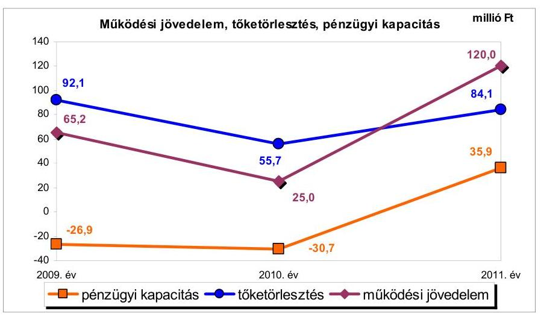
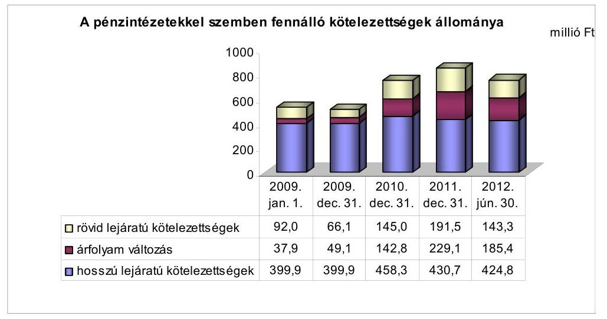
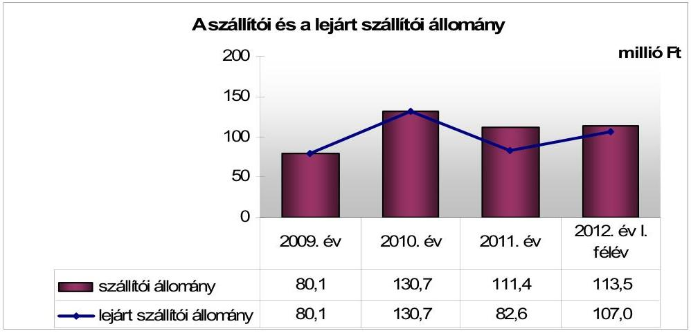
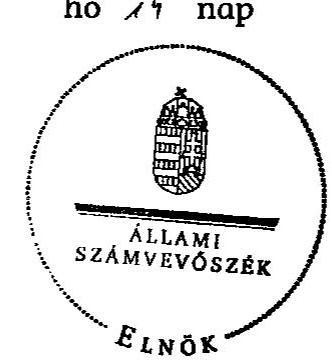
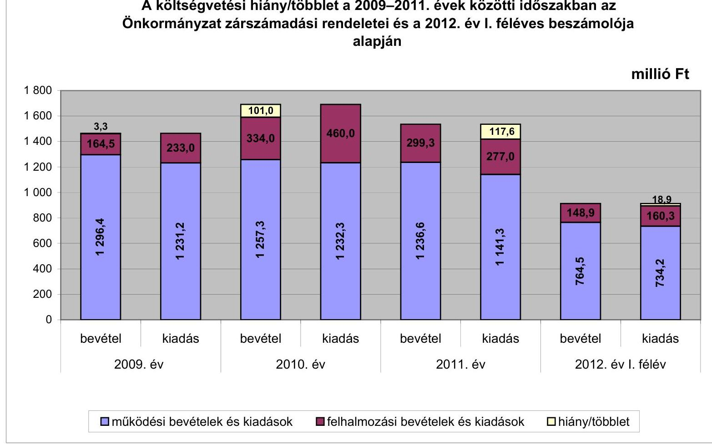
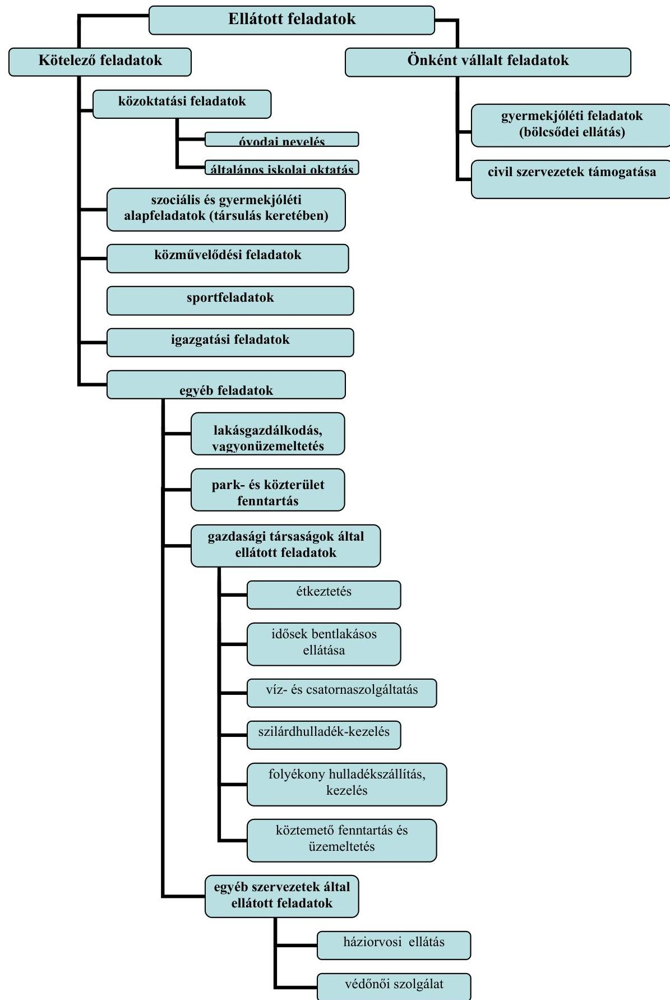

# ÁLLAMI   SZÁMVEVŐSZÉK 

## JELENTÉS

## Komádi Város Önkormányzata pénzügyi gazdálkodási helyzetének, szabályosságának ellenőrzéséről

---

# Állami Számvevőszék 

Iktatószám: V-0030-254-014/2013.
Témaszám: 1069
Vizsgálat-azonosító szám: V059207

## Az ellenőrzést felügyelte:

## Renkó Zsuzsanna

felügyeleti vezető

## Az ellenőrzést vezette:

## Dér Lívia

ellenőrzésvezető

## Az ellenőrzést végezték:

| Lingné Rajz Borbála | Gál Magdolna | Molnár Antal Lászlóné |
| :-- | :-- | :-- |
| számvevő tanácsos | számvevő | számvevő |

---

# TARTALOMJEGYZÉK 

BEVEZETÉS ..... 3
I. ÖSSZEGZŐ MEGÁLLAPÍTÁSOK, KÖVETKEZTETÉSEK, JAVASLATOK ..... 6
II. RÉSZLETES MEGÁLLAPÍTÁSOK ..... 15

1. Az Önkormányzat kötelező és önként vállalt feladatai, a feladatellátás szervezeti keretei ..... 15
2. A pénzügyi egyensúlyt fenntartását veszélyeztető pénzügyi kockázatok és az ezek csökkentése érdekében tett intézkedések ..... 16
3. A pénzügyi gazdálkodási folyamatok szabályosságát, megfelelőségét biztosító belső kontrollok ..... 24
4. Az ÁSZ korábbi ellenőrzése során a pénzügyi, gazdálkodási helyzet javítására tett javaslatainak megvalósítása ..... 25

---

# MELLÉKLETEK 

1. számú A költségvetési hiány/többlet a 2009-2011. évek közötti időszakban az Önkormányzat zárszámadási rendeletei és a 2012. év I. féléves beszámolója alapján
2. számú Az Önkormányzat bevételei és kiadásai, valamint adósságszolgálata a 2009-2011. években (a CLF módszer szerint)
3/a. számú Az Önkormányzat által a 2009. év és a 2012. év I. félév között megvalósított (műszakilag befejezett) fejlesztések forrásösszetétele
3/b. számú Az Önkormányzat 2012. június 30-án folyamatban lévő fejlesztési feladataihoz kapcsolódó kötelezettségeinek összegzése
3. számú Az önkormányzati feladatok ellátásában résztvevő gazdasági társaságok egyes kiemelt adatai
4. számú Az Önkormányzat 2012. június 30-án devizában és forintban fennálló, hosszú lejáratú adósságot keletkeztető kötelezettségvállalásai
5. számú Az Önkormányzat kötelezettségeinek 2011. december 31-ei és 2012. június 30-ai állománya és a 2012. évben, valamint az azt követő években várható kötelezettségek miatti kiadások
6. számú Az Önkormányzat gazdasági társaságai kötelezettségeinek 2011. december 31-ei és 2012. június 30-ai állománya és a 2012. évben, valamint az azt követő években várható kötelezettségek miatti kiadások

## FÜGGELÉKEK

1. számú Rövidítések jegyzéke
2. számú Értelmező szótár
3. számú Az Önkormányzat által ellátott feladatok a 2012. év I. félév végén

---

# JELENTÉS 

## Komádi Város Önkormányzata pénzügyi gazdálkodási helyzetének, szabályosságának ellenőrzéséről

## BEVEZETÉS

Az államháztartás helyi szintjén, az önkormányzati alrendszerben az utóbbi években megjelenő gazdálkodási nehézségek, a pénzforgalmi hiány növekedése, az eladósodás az ÁSZ figyelmét a helyi önkormányzatok pénzügyi helyzetére irányította.

Az ÁSZ a 2012. évi ellenőrzési tervben foglaltaknak megfelelően az önkormányzatok pénzügyi gazdálkodási helyzetének, szabályosságának ellenőrzésével az önkormányzatok 2011. évben megkezdett helyzetelemzését folytatta. Az ellenőrzés keretében értékeljük az önkormányzatok adósságkezelési és likviditási helyzetét, bemutatjuk a pénzügyi egyensúly alakulására hatással lévő folyamatokat. Feltárjuk az ezekre ható kockázatokat, a pénzügyi egyensúlyi helyzetet befolyásoló döntésmegalapozó, döntés-előkészítő eljárások szabályosságát. Minősítjük az ezekkel összefüggő belső kontrollok kialakítását, működését, az ellenőrzött időszakban végrehajtott ÁSZ ellenőrzések megállapításainak hasznosulását.

Az ellenőrzés eredményének várható hatásaként a megállapításokkal segítséget nyújthatunk az önkormányzatok számára a pénzügyi egyensúly helyreállítása, javítása és fenntartása érdekében szükségessé váló intézkedések megtételéhez.

Az ellenőrzés típusa: szabályszerűségi ellenőrzés.
Az ellenőrzés célja annak értékelése volt, hogy:

- az ellenőrzött időszakban a kötelező és önként vállalt feladatok ellátását biztosító szervezeti formák változása milyen hatást gyakorolt az Önkormányzat pénzügyi helyzetének alakulására;
- az Önkormányzat pénzügyi - ezen belül működési és felhalmozási - egyensúlya milyen irányban változott, a változást milyen okok idézték elő, továbbá milyen intézkedéseket tettek a pénzügyi egyensúly biztosítása, illetve javítása érdekében, az intézkedések hatására javult-e az Önkormányzat pénzügyi helyzete;
- a költségvetési kiadások finanszírozása érdekében vállalt, pénzintézetekkel szembeni kötelezettségek hogyan alakultak, a kötelezettségek fennállása 

---

miként befolyásolja az Önkormányzat jövőbeli pénzügyi egyensúlyi helyzetét;

- az Önkormányzat beazonosította, felmérte, értékelte-e a pénzügyi egyensúlyt befolyásoló pénzügyi kockázatokat, a finanszírozási célú pénzügyi műveletekkel kapcsolatban írtak-e elő kockázatértékelési kötelezettséget;
- az Önkormányzat által kialakított belső kontrollok biztosítják-e a pénzügyi gazdálkodás folyamatainak szabályosságát és eredményességét;
- hasznosultak-e az ÁSZ korábbi ellenőrzése során a pénzügyi, gazdálkodási helyzet javítására tett szabályszerűségi és célszerűségi javaslatok.

Az ellenőrzés a 2009. január 1-jétől 2012. június 30-áig terjedő időszakot ölelte fel. A pénzintézetekkel szembeni kötelezettségek állományának ellenőrzésekor a 2011. december 31-én fennálló kötelezettségek keletkezésének kezdő időpontját vettük figyelembe.

Az ellenőrzés szakmai módszertana az ÁSZ Ellenőrzési Kézikönyvében foglalt szakmai szabályokon alapult, amely a Legfőbb Ellenőrző Intézmények Nemzetközi Szervezete (INTOSAI) által kiadott nemzetközi standardok (ISSAI) figyelembevételével készült.

Az ellenőrzés során használt rövidítéseket az 1. számú, az egyes fogalmak magyarázatát a 2. számú függelék tartalmazza.

Az ellenőrzés jogszabályi alapját az ÁSZ tv. 1. § (3) bekezdésének, 5. § (2)-(6) bekezdéseinek, valamint az Áht. 2 61. § (2) bekezdésének előírásai képezik.

A helyszíni ellenőrzést követően az Országgyűlés a helyi önkormányzatok adósságállományának részleges konszolidációjáról döntött. Az 5000 fő lakosságszámot meg nem haladó települési önkormányzatok számára nyújtott törlesztési célú támogatással $^{1}$ lehetővé tették a 2012. december 12-én fennálló tartozásállományuk és annak 2012. december 28-án fennálló járulékai teljes megfizetését. Az 5000 fő lakosságszám feletti települések esetében a 2013. évben az állam differenciált - a bevételi képességet figyelembe vevő, 40-70%-ig terjedő mértékben vállalja át $^{2}$ az önkormányzat 2012. december 31-i, az átvállalás időpontjában fennálló adósságállományát és annak járulékait. Az adósságkonszolidációs intézkedéssel egyidejűleg a Kormány elrendelte $^{3}$ az önkormányzatok adósságállománya újratermelődésének megakadályozása céljából a hitelengedélyezési és a likvid hitelekre vonatkozó szabályozás szigorítását.

[^0]
[^0]:    $^{1}$ Magyarország 2012. évi központi költségvetéséről szóló 2011. évi CLXXXVIII. törvény módosításáról szóló 2012. évi CLXXXVII. törvény alapján
    $^{2}$ Magyarország 2013. évi központi költségvetéséről szóló 2012. évi CCIV. törvény alapján
    $^{3}$ 1540/2012. (XII. 4.) Korm. határozat a helyi önkormányzatok adósságállományának részleges konszolidációjáról

---

Komádi Város Önkormányzata lakónépességére tekintettel a 2013. évi adósságkonszolidációban érintett. Az ÁSZ jelen ellenőrzése során a pénzügyi egyensúly jövőbeni alakulását befolyásoló kockázatokra tett megállapításai az adósságkonszolidációt követően is időszerűek és helytállóak.

Komádi város lakosainak száma 2012. január 1-jén 6000 fő volt. Az Önkormányzat a 2011. évben 1535,9 millió Ft költségvetési bevételt ért el, és 1418,3 millió Ft költségvetési kiadást teljesített, 2011. december 31-én a könyvviteli mérleg szerint 3966,3 millió Ft értékű vagyonnal rendelkezett, amely a 2009. év végi állományhoz viszonyítva 11,4%-kal (406,9 millió Ft-tal) növekedett. Az eszközérték növekedésében 254,0 millió Ft-tal az ingatlanok állománynövekedése volt meghatározó, a végrehajtott beruházások és intézményrekonstrukciók eredményeként. A források között a saját tőke állományának 98,2 millió Ft-os és a kötelezettségek állományának 335,2 millió Ft-os növekedése adta az állományváltozás döntő hányadát. Az Önkormányzat a 2012. évi költségvetési rendeletében a költségvetési bevételek összegét 1970,1 millió Ft-ban, a költségvetési kiadások összegét 2112,2 millió Ft-ban, a hiányt 142,1 millió Ft-ban állapította meg.

Az ÁSZ tv. 29. § (1) bekezdése szerint a jelentéstervezetet megküldtük a polgármester részére, aki az ÁSZ tv. 29. § (2) bekezdésében foglalt észrevételezési jogával nem élt, a jelentéstervezetre észrevételt nem tett.

---

# I. ÖSSZEGZŐ MEGÁLLAPÍTÁSOK, KÖVETKEZTETÉSEK, JAVASLATOK 

Komádi Város Önkormányzatának pénzügyi egyensúlyi helyzete rövid távon veszélyeztetett. Az Önkormányzat működési jövedelemtermelő képessége alapján képződő bevételei a feladatellátás kiadásain túl a jelentős szállítói tartozás és az adósságkonszolidációt követően fennmaradó pénzintézetekkel szembeni kötelezettségek fedezetét nem biztosítják.

Az önként vállalt feladatok érdekében teljesített kiadások miatti kockázat nem állt fent, tekintettel azok nagyságrendjére. Az önként vállalt feladatokra fordított működési kiadások folyó kiadásokon belüli aránya 2009-ben 1,3%, 2011-ben 2,2% volt, az összegük a 2009. évi 16,4 millió Ft-ról a 2011. évre 24,4 millió Ft-ra emelkedett, a 2011. évtől biztosított bölcsődei ellátás következtében. A felhalmozási kiadásokra teljesített 1155,0 millió Ft-ból önként vállalt feladatokra 93,8 millió Ft-ot (8,1%) fordítottak, amely nem jelentett felhalmozási kockázatot.

Az Önkormányzat 2009-2011 között összesen 4588,1 millió Ft költségvetési bevételhez jutott. Ugyanebben az időszakban a teljesített költségvetési kiadása 4574,8 millió Ft-ot tett ki. Az ebből ellátott feladatok alapvetően a közoktatáshoz, a szociális és gyermekjóléti ellátáshoz, a közművelődési és az igazgatási feladatokhoz kapcsolódtak. A működési költségvetés egyenlege a 2009-2011. években pozitív, a felhalmozási költségvetés egyenlege negatív volt, összevont egyenlegük 13,3 millió Ft-ot, a teljesített költségvetési kiadások 0,3%-át jelentette. A nettó működési jövedelem a 2009-2010. években nem nyújtott fedezetet a felhalmozási forráshiányra.

Az Önkormányzat pénzügyi kapacitásának 2009-2011 közötti alakulását a működési jövedelem és a tőketörlesztés változásának 2009. évihez viszonyított együttes hatása eredményezte. A változást a következő ábra mutatja be.

---

A működési jövedelem 2010. évi visszaesésében meghatározó szerepet játszott a feladatellátással összefüggő egyéb saját bevételek és az államháztartáson belülről kapott támogatások csökkenése. A 2011. évben a működési költségvetés egyenlegének kedvező alakulására elsődlegesen - a közcélú foglalkoztatásban résztvevők és az egyéb létszám csökkentéséből adódóan - a személyi jellegű kiadások és a munkaadót terhelő járulékok csökkenése volt hatással. A pénzügyi egyensúlyi helyzetet kedvezően befolyásolta az ÖNHIKI támogatás, azonban a működési jövedelem enélkül is pozitív lett volna a 2009-2011. években. Az Önkormányzat az ellenőrzött időszakban az évek sorrendjében 23,0 millió Ft, 12,0 millió Ft és 70,9 millió Ft ÖNHIKI támogatásban részesült. Az Önkormányzat az ellenőrzött időszakban megvalósított (műszakilag befejezett) beruházásokra és felújításokra 786,2 millió Ft-ot fordított. A 2012. július 30-a utáni kötelezettségvállalás összege 582,1 millió Ft, amelynek teljesítéséhez a forrás biztosított. A döntések előkészítésénél nem mérték fel a fejlesztések jövőbeni üzemeltetési kockázatait, a várható működési kiadásokat és kiadási megtakarításokat és a bevétel növelési lehetőségeket. A pályázati források utófinanszírozása a támogatáshoz való hozzájutás időbeli elhúzódása miatt pénzügyi kockázatot hordoz.

A 2009. év és a 2012. év I. féléve között hozott bevételt növelő és kiadási megtakarítást eredményező intézkedések hozzájárultak az Önkormányzat pénzügyi helyzetének javításához. Az Önkormányzat kimutatása szerint összesen 61,8 millió Ft bevételi többlet és 88,4 millió Ft tartós kiadási megtakarítás keletkezett. A bevételi többletből 33,2 millió Ft (53,7%) a helyi adókhoz és 28,6 millió Ft (46,3%) az eszközök hasznosításához kapcsolódott. A kiadási megtakarításokat feladatátadásokkal, egyéb létszámcsökkentésekkel, a többletjuttatások, képviselői tiszteletdíjak és költségtérítések csökkentésével, valamint a prémiumév programhoz kapcsolódó döntésekkel érték el. A 2009-2011. években kimutatott kiadási megtakarítás 66,5%-a (58,8 millió Ft) létszámcsökkentési döntések eredménye volt. Az intézkedések 2009-2011 között összesen 46 fő létszámcsökkentést jelentettek. Az Önkormányzat adatszolgáltatása alapján az ellenőrzött időszakban a kötelező feladatok ellátását biztosító szervezeti formák változása 28,6 millió Ft megtakarítást eredményezett, amely a pénzügyi egyensúlyt javította.

Az Önkormányzat likviditási és rövid távú pénzügyi egyensúlyi helyzete kedvezőtlenül alakult, a folyamatosan fennálló folyószámlahitel mellett 2011-től munkabér-megelőlegezési hitelt is igénybe vettek. A folyószámlahitel napi átlagos állománya jelentősen, a 2009. évi 20,0 millió Ft-ról a 2012. év I. félévre közel négyszeresére, 76,0 millió Ft-ra nőtt. A folyószámlahitellel zárt napok száma emelkedett.

Kedvezőtlen tendencia, hogy a lejárt szállítói kötelezettségek a 2009. év és a 2012. év I. félév között jelentős mértékben, 33,6%-kal 80,1 millió Ft-ról 107,0 millió
 Ft-ra – nőttek, amely a nemfizetési kockázat növekedését jelzi. Az Önkormányzat szállítói kitettsége 2011-ről a 2012. év I. félév végére erősödött. A 2011. évben 28,8 millió Ft, a 2012. év I. félévben 6,5 millió Ft kifizetését ütemezték át a szállítói tartozásból. Az Önkormányzat 16 forgalomképes ingatlanát terhelte jelzálog, vagy elidegenítési és terhelési tilalom 2012. június 30-án. A terhelt ingatlanok értéke 115,3 millió Ft volt, ami az összes forgalomképes ingatlan nettó értékének

---

(136,0 millió Ft-nak) a 84,8%-át jelentette. Az ingatlanok jelzáloggal való terhelése az ellenőrzött időszakban nőtt, amely a fedezetbevonások miatt kockázatot jelent.

Az Önkormányzat hosszú lejáratú pénzintézeti kötelezettsége a 2009. év elejétől a 2012. év I. félév végére 437,8 millió Ft-ról 610,2 millió Ft-ra, 39,4%-kal nőtt. A 2009. év elején fennállt kötelezettség a 2008-ban felvett 399,9 millió Ft összegű, CHF-alapú fejlesztési hitelből és az elszámolt árfolyamváltozásból tevődött össze. A kötelezettségek növekedését a – pályázati támogatással megvalósuló fejlesztések önerejének biztosításához – 2010-ben felvett hitel és a közel ötszörösére emelkedett, elszámolt árfolyamváltozás okozta. Az utófinanszírozott fejlesztések finanszírozásához három szerződés alapján támogatás-megelőlegezési hitelt is igénybe vettek. Az Ötv.-ben foglaltak ellenére az Önkormányzat a 2010-ben felvett fejlesztési hitel visszafizetésének biztosítékául a hitelt folyósító pénzintézetre engedményezte a központi költségvetésből származó bevételeit. A hitelek igénybevételéből származó forrásokat a céloknak megfelelően használták fel. A fejlesztési hitelek miatt az ellenőrzött időszakban 266,3 millió Ft kifizetést (tőke, kamat, egyéb költség) teljesítettek, a realizált árfolyamveszteség összege 5,8 millió Ft volt. A tőketörlesztés teljesítésekor realizált árfolyamveszteség összegét – az Áhsz.-ben foglalt előírás ellenére – a folyó kiadások között elkülönítve nem számolták el.

Az Önkormányzat 2012. év I. félév végén fennálló kötelezettségeinek állománya 303,4 millió Ft és 2386,1 ezer CHF volt. A vállalt hosszú és rövid lejáratú kötelezettségek jövőbeli teljesítésére a működési jövedelem várhatóan nem nyújt elegendő forrást. A fedezet megteremtésére kiadáscsökkentő, bevételnövelő intézkedéseket hajtottak végre, azonban ezek eredménye csak részben biztosítja a szükséges forrást a kötelezettségekre. A várható kötelezettségek teljesítésére számításba vehető 4,9 millió Ft szabad pénzmaradvány és a követelések 2011. év végi állományának – 30,8 millió Ft – behajtásából származó bevétel. Az adósságszolgálat teljesítéséhez elkülönített tartalékkal nem rendelkeztek.

Az Önkormányzat kizárólagos tulajdonában lévő gazdasági társaságok 2012. év I. félév végén fennálló kötelezettségállományával kapcsolatos tőke-, kamat- és egyéb kiadások várható összege a 2012-2014. években 52,0 millió Ft és 8,5 ezer CHF, a 2015. évet követő időszakban összesen 77,4 millió Ft. Az ellenőrzött időszak során a gazdasági társaságok tárgyévi adózott eredménye folyamatosan negatív volt, az évek során felhalmozott veszteség miatt a mérleg szerinti eredménytartalékuk minden évben negatív előjelű volt. A kizárólagos tulajdonnal összefüggő korlátlan felelősség miatt a gazdasági társaságok kötelezettségeinek az Önkormányzat pénzügyi helyzetére gyakorolt hatása mérlegen kívüli kockázatot jelent, mivel saját kötelezettségeik visszafizetésére a gazdasági társaságok a jelenlegi feltételek mellett nem képesek.

Az Önkormányzatnál a döntések megalapozottsága érdekében az éves költségvetések és beszámolók elkészítésénél, valamint a hitelfelvételeket megelőzően nem értékelték a pénzintézeti kötelezettségállomány változását, és annak okait. Az Ötv.-ben foglaltak ellenére az adósságot keletkeztető kötelezettségvállalás felső határát nem vizsgálták, azonban azt a 2009-2011. években nem lépték

---

túl. Az adósságot keletkeztető kötelezettségvállalásokról szóló döntéseknél nem határozták meg a visszafizetés lehetséges forrásait, folyamatosan nem kísérték figyelemmel a források meglétét. A változó kamatozású és devizaalapú, adósságot keletkeztető kötelezettségvállalások döntés-előkészítő és egyéb dokumentumaiban nem vizsgálták a kamat- és árfolyamkockázatot.

Az Önkormányzatnál a kockázatkezelési rendszer kialakítása és működtetése teljes körűen nem felelt meg a 2009-2011. években az Áht.${ }_{1}$, a 2012. év I. félévében az Áht.${ }_{2}$ előírásainak. Az ellenőrzött időszakban fennállt a fejlesztések jövőbeni üzemeltetési kockázata, a fejlesztési támogatások utófinanszírozása miatti pénzügyi kockázat, a magas szállítói állomány miatti nemfizetési kockázat, a fedezetbevonások miatti kockázat, a gazdasági társaságok kötelezettségei miatti mérlegen kívüli kockázat, valamint a jövőbeli kötelezettségek teljesíthetősége miatti kockázat. Ennek ellenére a pénzügyi egyensúlyi helyzetre kiható kockázatok beazonosítása, felmérése, értékelése, ezáltal kezelése – a 2009. évben az Ámr.${ }_{1}$-ben, a 2010-2011. években az Ámr.${ }_{2}$-ben, a 2012. év I. félévében a Bkr.-ben foglalt előírások ellenére – elmaradt.

Az ellenőrzött időszakban nem mérték fel, a zárszámadási rendeletekben nem mutatták be az elszámolt értékcsökkenés és az eszközpótlásra fordított források arányának és ezzel összefüggésben az eszközök használhatósági fokának alakulását.

Az Önkormányzatnál a belső kontrolltevékenységek kialakítása és működtetése teljes körűen nem felelt meg a 2009-2011. években az Áht.${ }_{1}$, a 2012. év I. félévben az Áht.${ }_{2}$ előírásainak. A pénzügyi gazdálkodási folyamatok szabályosságát biztosító belső kontrollok gazdálkodási folyamatokba való beépítése – a 2009. évben az Ámr.${ }_{1}$-ben, a 2010-2011. években az Ámr.${ }_{2}$-ben, a 2012. év I. félévében a Bkr.-ben foglalt előírások ellenére – nem volt megfelelő. Elmaradt az Önkormányzat által nyújtott működési és felhalmozási célú pénzeszközátadások feltételrendszerével, a közbeszerzési értékhatár alatti esetekben a pályáztatási kötelezettséggel összefüggő kontrolltevékenységek szabályozása. Nem írták elő a döntés-előkészítés szakaszában a fejlesztési döntések kockázatai, valamint a pénzintézeti kötelezettségvállalásokkal kapcsolatos döntések kockázatai feltárása, és a futamidő egyes éveit terhelő kötelezettség költségvetési egyensúlyra gyakorolt hatása vizsgálatának kötelezettségét. Belső szabályzatban nem határozták meg az Önkormányzat fizetőképességének és eladósodásának kezelésével, a pénzügyi kötelezettségek teljesítésének helyi szabályaival, valamint a szállítói tartozások kezelésével összefüggő kontrolltevékenységeket. Az Önkormányzatnál a belső ellenőrzés kialakítása, működtetése teljes körűen nem felelt meg a 2009-2011. években az Áht.${ }_{1}$-ben, a 2012. év I. félévben az Áht.${ }_{2}$-ben meghatározott előírásoknak. Az ellenőrzött időszak belső ellenőrzési tervei készítését megelőzően – a 2009-2011. években a Ber.-ben, 2012. január 1-jétől a Bkr.-ben foglalt előírások ellenére – nem írták elő az Önkormányzat pénzügyi egyensúlyi helyzetét befolyásoló döntések kockázati tényezőinek feltárását, a belső ellenőrzési tervek nem tartalmazták ezen kockázati tényezők ellenőrzését.

Az Önkormányzatnál a gazdálkodási folyamatokba beépített belső kontrollok működése nem volt megfelelő, mert nem értékelték a feladat átadás-átvételre vonatkozó döntés pénzügyi egyensúlyi helyzetre gyakorolt hatását. A fejleszté-

---

seket megelőző döntés során nem tárták fel az előkészítés, a lebonyolítás és a működtetés kockázatait, nem vizsgálták a hitelfelvételnél a futamidő egyes éveit terhelő kötelezettség költségvetési egyensúlyra gyakorolt hatását. Az ellenőrzött időszak belső ellenőrzési terveinek készítése során nem tárták fel a pénzügyi egyensúlyi helyzetet befolyásoló döntések kockázati tényezőit, ezen kockázati tényezőket a belső ellenőrzés keretében nem ellenőrizték.

Az ÁSZ az Önkormányzat gazdálkodási rendszerét a 2010. évben ellenőrizte átfogó jelleggel, a jelentésében 34 db szabályszerűségi és 18 db célszerűségi javaslatot tett, egy szabályszerűségi javaslatra a számvevői jelentés elkészülése előtt intézkedés történt. A szabályszerűségi javaslatok 52,9%-át, a célszerűségi javaslatok 72,2%-át hasznosították. Az Önkormányzat nyilatkozata alapján 16 szabályszerűségi és öt célszerűségi javaslat nem teljesült. Az ÁSZ ellenőrzés által a pénzügyi egyensúlyi helyzet javítására tett, hat szabályszerűségi és egy célszerűségi javaslat nem hasznosult. A szabályszerűségi javaslatok közül nem intézkedtek a költségvetés tervezés folyamatában annak ellenőrzéséről, hogy a Polgármesteri Hivatal a költségvetési javaslatát az előírásoknak megfelelően dolgozta-e ki, javasolt előirányzatai megalapozottak-e, az ismert kötelezettségeket megtervezték-e, a hivatali szervezeti egységek által benyújtott költségvetési igények indokoltak-e, az intézményeknél a mutatószám felmérés adatai megalapozottak-e, a saját bevételek előirányzatai és a helyi rendeletek összhangja biztosított-e. A zárszámadás készítés folyamatában nem intézkedtek annak ellenőrzéséről, hogy az intézmények által az állami támogatásokkal, hozzájárulásokkal történő elszámoláshoz közölt mutatószámok megfelelőek-e, az intézmények pénzmaradványának megállapítása szabályszerű-e. Nem intézkedtek teljes körűen a támogatott szervezetek esetében a számadási kötelezettség előírásáról. A jegyzői utasítás ellenére a költségvetés tervezésekor nem vették figyelembe az előző évi pénzmaradvány összegét. A célszerűségi javaslat ellenére a gazdasági program összeállításánál nem határozták meg a fejlesztési célkitűzések megvalósíthatóságát bemutató lehetséges forrásokat.

Összességében az Önkormányzat az ÖNHIKI támogatás nélkül számított folyó költségvetési többletét jelentősen meghaladó szállítói tartozásállományt halmozott fel. A jövedelemtermelő képesség nem megfelelő színvonala következtében a kötelezettségek jövőbeni teljesíthetősége kockázatot jelent. A szállítói állomány és az adókonszolidációt követően fennmaradó pénzintézeti kötelezettségek az Önkormányzat pénzügyi gazdálkodási pozícióit, működését rövid távon korlátozzák. A megvalósult beruházások a feladatellátás színvonalának javításához hozzájárultak, de nem teremtenek bevételnövelési lehetőséget.

Az ÁSZ tv. 33. § (1) bekezdésében foglaltak értelmében az ellenőrzött szervezet vezetője köteles a jelentésben foglalt megállapításokhoz kapcsolódó intézkedési tervet összeállítani, és azt a jelentés kézhezvételétől számított harminc napon belül az ÁSZ részére megküldeni. Amennyiben az intézkedési tervet határidőben nem küldi meg a szervezet vezetője, vagy az továbbra sem elfogadható, az ÁSZ elnöke a hivatkozott törvény 33. § (3) bekezdés a)-b) pontjaiban foglaltakat érvényesítheti.

---

# Az ellenőrzés intézkedést igénylő megállapításai és javaslatai: 

## a polgármesternek

1. Az Önkormányzat működési jövedelme a 2009. és a 2010. években nem nyújtott fedezetet az adósságszolgálatra. A likviditás az ellenőrzött időszakban folyószámlahitel, munkabér- és támogatás-megelőlegezési hitel igénybevételével volt biztosítható. A folyószámlahitel állandósult, napi átlagos állománya folyamatosan emelkedett. Az ellenőrzött időszak végére a pénzintézeti kötelezettség 753,5 millió Ft-ra, a lejárt szállítói tartozás 107,0 millió Ft-ra nőtt. A kizárólagos önkormányzati tulajdonú gazdasági társaságok 2012. év I. félév végén fennálló 129,4 millió Ft és 8,5 ezer CHF kötelezettsége mérlegen kívüli kockázatot jelent, az Önkormányzat kizárólagos tulajdoni részesedéséből adódó korlátlan felelősség miatt. A kiadáscsökkentő és bevételnövelő intézkedések nem biztosítottak elegendő forrást a pénzügyi egyensúly helyreállításához. Az adósságszolgálat teljesítéséhez elkülönített tartalékkal nem rendelkeztek.

Javaslat:
A működési jövedelemtermelő képesség és a feladatellátás összhangja, valamint az Önkormányzat pénzügyi egyensúlyának helyreállítása, hosszú távú fenntarthatósága érdekében – a 2013. évi kormányzati adósságkonszolidációt, valamint a 2013. évtől változó feladat-ellátási kötelezettséget, feladatfinanszírozási rendszert figyelembe véve – felelősök és határidők megjelölésével kezdeményezzen intézkedéseket, melyek keretében:
a) vizsgáltassa meg és terjessze a Képviselő-testület elé a további bevételszerző, kiadáscsökkentő intézkedések bevezetésének lehetőségét, és a döntés függvényében járjon el a bevezetésre kerülő bevételnövelő, kiadáscsökkentő intézkedések végrehajtása érdekében;
b) terjesszen a Képviselő-testület elé jóváhagyásra – a Htv. 140. § (1) bekezdés a) pontja alapján a jegyző által elkészített – az Önkormányzat gazdasági helyzetének elemzésén alapuló, a pénzügyi egyensúlyi helyzet gyors helyreállítását, hosszú távú fenntartását, valamint az adósságállomány újratermelődése elkerülését biztosító intézkedéseket tartalmazó reorganizációs programot;
c) az adósságkonszolidációt követően fennmaradó kötelezettségei tekintetében terjesszen a Képviselő-testület elé olyan egyensúlyi (elkülönített) tartalék képzésére vonatkozó – a Htv. 140. § (1) bekezdés a) pontja alapján a jegyző által elkészített – döntési javaslatot, amelyben a Képviselő-testület meghatározza annak összegét és kötelezettséget vállal arra, hogy a törlesztési időszak alatt ezt a tartalékot a költségvetési rendeleteiben minden évben betervezi az adósságszolgálat teljesítésére;
d) a szállítói kitettség és a helyi önkormányzatok adósságrendezési eljárásáról szóló 1996. évi XXV. törvény 4-9. §-aiban szabályozott adósságrendezési eljárás megindítását
 elkerülésének érdekében meghatározott gyakorisággal számoljon be a Képviselő-testületnek az Önkormányzat lejárt szállítói állománya alakulásáról. Intézkedjen a szállítói számlák esedékesség szerinti kiegyenlítéséről, vagy a lejárt tartozások átütemezéséről;

---

e) terjesszen a jegyző közreműködésével elkészített intézkedési tervet a Képviselőtestület elé jóváhagyásra, a kizárólagos tulajdonú gazdasági társaságok pénzügyi helyzetének stabilizálása érdekében;
f) írja elő az Önkormányzat kizárólagos tulajdonában lévő gazdasági társaságok beszámolási kötelezettségét pénzügyi helyzetük alakulásáról.
2. A hosszú lejáratú fejlesztési hitel igénybevételéről szóló hitelszerződésben az Önkormányzat - az Ötv. 88. § (1) bekezdés b) pontjában ${ }^{4}$ foglalt előírást megsértve - a hitelt folyósító pénzintézetre engedményezte a központi költségvetésből származó bevételeit a szerződésben vállalt kötelezettségei teljesítésének biztosítékául.

Javaslat:
A pénzintézeti kötelezettségvállalásokkal kapcsolatos jogszerű biztosíték, illetve fedezet felajánlása érdekében:
a) intézkedjen, hogy jövőbeni hitelfelvétel és kötvénykibocsátás fedezeteként az Áht ${ }_{2}$ 84. § (4) bekezdésében előírtak szerint az Önkormányzat általános működésének és ágazati feladatainak támogatása, továbbá a költségvetési támogatás ne kerüljön felhasználásra;
b) a jogellenes állapot megszüntetése érdekében vizsgálja meg a jogszerű biztosíték cseréjének lehetőségét, és terjesszen javaslatot a Képviselő-testület elé a biztosíték cseréjéről.

# a jegyzőnek 

1. Az Önkormányzatnál a devizában fennálló hiteltartozás törlesztő részletei után pénzügyileg realizált árfolyamveszteség összegét a főkönyvi könyvelésben - az Áhsz. 9. számú melléklet számlaosztályok tartalmára vonatkozó előírásai 4. dl) pontjában és a 9. c) pontjában foglalt előírással ellentétben - a folyó kiadások között elkülönítetten nem mutatták ki.

Javaslat:
Intézkedjen, hogy a devizában fennálló hitelállomány törlesztése során a pénzügyileg realizált árfolyam-különbözet elszámolása árfolyamveszteség esetén az Áhsz. 9. számú melléklet számlaosztályok tartalmára vonatkozó előírásai 4. dl) és a 9. c) pontjában foglalt előírásoknak, illetve árfolyamnyereség esetén a 14. a) pontjában foglalt előírásnak megfelelően történjen.
2. Az Önkormányzatnál a kockázatkezelési rendszer kialakítása és működtetése teljes körűen nem felelt meg a 2009-2010. években az Áht. 1 120/B. § (2) bekezdés b) pontjában, a 2011. évben az Áht. 1 121. § (2) bekezdés b) pontjában, a 2012. év I. félévében az Áht. 2 69. § (2) bekezdésében meghatározott előírásoknak. Az ellenőrzött időszakban fennállt a fejlesztések jövőbeni üzemeltetési kockázata, a fejlesztési

[^0]
[^0]:    ${ }^{4}$ Hatályát vesztette 2011. december 31-én. A 2012. március 31-től hatályos jogszabályi előírás: az Áht ${ }_{2}$ 84. § (4) bekezdése.

---

támogatások utófinanszírozása miatti pénzügyi kockázat, a magas szállítói állomány miatti nemfizetési kockázat, a fedezetbevonások miatti kockázat, a gazdasági társaságok kötelezettsége miatti mérlegen kívüli kockázat és a jövőbeli kötelezettségek teljesíthetősége miatti kockázat. A pénzügyi egyensúlyi helyzetre kiható kockázatok beazonosítása, felmérése, értékelése, ezáltal kezelése a 2009. évben az Ámr. ${ }_{1}$ 145/C. §-ában, a 2010-2011. években az Ámr. ${ }_{2}$ 157. §-ában, a 2012. év I. félévében a Bkr. 7. § (1)-(2) bekezdéseiben foglalt előírások ellenére elmaradt.

Javaslat:
Működtessen az Áht. ${ }_{2}$ 69. § (2) bekezdésében, továbbá a Bkr. 7. § (1)-(2) bekezdéseiben foglalt előírásoknak megfelelő, a pénzügyi egyensúlyt befolyásoló kockázatok kezelésére alkalmas kockázatkezelési rendszert.
3. Az Önkormányzatnál a belső kontrolltevékenységek kialakítása és működtetése teljes körűen nem felelt meg a 2009-2010. években az Áht. ${ }_{1}$ 120/B. § (2) bekezdés c) pontjában, a 2011. évben az Áht. ${ }_{1}$ 121. § (2) bekezdés c) pontjában és a 2012. év I. félévében az Áht. ${ }_{2}$ 69. § (2) bekezdésében meghatározott előírásoknak. A pénzügyi, gazdálkodási folyamatok szabályosságát biztosító belső kontrollok gazdálkodási folyamatokba történő beépítése - a 2009. évben az Ámr. ${ }_{1}$ 145/E. § (1) bekezdésében, a 2010-2011. években az Ámr. ${ }_{2}$ 158. § (1) bekezdésében, a 2012. év I. félévében a Bkr. 8. § (1)-(2) bekezdéseiben foglalt előírások ellenére - nem volt megfelelő. Nem szabályozták az Önkormányzat által nyújtott működési és felhalmozási célú pénzeszközátadások feltételrendszerével, valamint a közbeszerzési értékhatár alatti esetekben a pályáztatás kötelezettséggel összefüggő kontrolltevékenységeket. Belső szabályzatban nem határozták meg a fizetőképesség és az eladósodás kezelésével, a pénzügyi kötelezettségek teljesítésének helyi szabályaival, a szállítói tartozások kezelésével összefüggő kontrolltevékenységeket. Nem írták elő a döntés-előkészítéskor a fejlesztési döntések kockázatai, valamint a pénzintézeti kötelezettségvállalásokkal kapcsolatos döntések kockázatai feltárásának kötelezettségét és a kötelezettségvállalások költségvetési egyensúlyra gyakorolt hatásának vizsgálatát.

Javaslat:
Alakítsa ki az Áht. ${ }_{2}$ 69. § (2) bekezdésében, továbbá a Bkr. 8. § (1)-(2) bekezdései alapján azokat a belső kontrolltevékenységeket, amelyek biztosítják a pénzügyi gazdálkodási folyamatok szabályosságát, a pénzügyi egyensúlyi helyzet alakulását befolyásoló döntések kockázatainak kezelését. Ennek keretében:
a) szabályozza a működési és felhalmozási célú pénzeszközátadások feltételrendszerével összefüggő kontrolltevékenységeket;
b) határozza meg a közbeszerzési értékhatár alatti esetekben a pályáztatási kötelezettséggel kapcsolatos kontrolltevékenységeket;
c) készítsen szabályzatot az Önkormányzat fizetőképességének és eladósodásának kezelésére, valamint a pénzügyi kötelezettségek teljesítésének, a szállítói tartozások rendezésének helyi szabályaira;
d) határozza meg a fejlesztések döntés-előkészítés folyamatában a lebonyolítás és a működtetés kockázatai feltárásának, kezelésének kötelezettségét;

---

e) írja elő a pénzintézeti kötelezettségvállalások kockázatainak döntés-előkészítő szakaszban történő feltárását, a futamidő egyes éveit terhelő kötelezettségek költségvetési egyensúlyra gyakorolt hatásának vizsgálatát.
4. Az Önkormányzatnál a belső ellenőrzés kialakítása, működtetése teljes körűen nem felelt meg a 2009-2010. években az Áht. 1 121/A. § (3) bekezdésében, a 2011. évben az Áht. 1 121/B. § (4) bekezdésében, a 2012. év I. félévében az Áht. 2 70. § (1) bekezdésében meghatározott előírásoknak. A belső ellenőrzési tervek készítését megelőzően - a 2009-2011. években a Ber. 18. §-ában, a 21. § (2) bekezdésében, a (3) bekezdés a) pontjában, 2012. január 1-jétől a Bkr. 29. § (1) bekezdésében, a 31. § (2) bekezdésében és a (4) bekezdés a) pontjában foglalt előírások ellenére nem írták elő a pénzügyi egyensúlyi helyzetet befolyásoló döntések kockázati tényezőinek feltárását, a belső ellenőrzési tervek nem tartalmazták ezen kockázati tényezők ellenőrzését.

Javaslat:
Intézkedjen a belső ellenőrzés vezetője felé, hogy az Áht. 2 70. § (1) bekezdésében, továbbá a Bkr. 29. § (1) bekezdésében, a 31. § (2) bekezdésében és a (4) bekezdés a) pontjában foglalt előírások szerint az éves belső ellenőrzési tervek tartalmazzák a pénzügyi egyensúlyi helyzetet befolyásoló döntésekkel kapcsolatos feltárt kockázati tényezők ellenőrzését, és biztosítsa az ellenőrzési tervek végrehajtását.
5. Az Önkormányzat gazdálkodási rendszerének 2010. évi ÁSZ ellenőrzése során a pénzügyi egyensúlyi helyzet javítására tett hat szabályszerűségi javaslat nem hasznosult. Nem ellenőrizték - az Ámr 1 155-156. §-ai (2012. január 1-jétől a Bkr. 8. § (1)-(2) bekezdései) előírása ellenére - a költségvetés tervezésekor a Polgármesteri Hivatal költségvetési javaslatának megalapozottságát, az ismert kötelezettségek megtervezését, a hivatali szervezeti egységek költségvetési igényeinek indokoltságát, az intézmények mutatószámainak megalapozottságát, a saját bevételek előirányzatai és a költségvetés megalapozását szolgáló helyi rendeletek összhangját. Nem ellenőrizték a zárszámadás készítésekor az állami támogatások, hozzájárulások elszámolásához közölt intézményi mutatószámokat, az intézményi pénzmaradvány megállapításának szabályszerűségét. Nem intézkedtek teljes körűen - az Áht ${ }_{1}$ 13/A. § (2) bekezdésében (2012. január 1-jétől a Bkr. 8. § (2) bekezdés a) pontjában) rögzítettek ellenére - a támogatott szervezetek számadási kötelezettségének előírásáról és elszámoltatásáról. A 2011-2012. években az Áht ${ }_{1}$ 8/C. § (3)-(4) bekezdéseinek (2012. január 1-jétől az Áht ${ }_{2}$ 23. § (2) bekezdés d) pontjának) előírása ellenére az előző évi pénzmaradványt nem tervezték eredeti költségvetési előirányzatként. További tíz - a közérdekű adatok közzétételéről, a gazdasági szervezet ügyrendjének kiegészítéséről, az önköltségszámítási szabályzat készítéséről és a belső ellenőrzés működtetéséről szóló - szabályszerűségi javaslat hasznosításáról nem gondoskodtak.

Javaslat:
Az Önkormányzat gazdálkodási rendszerét érintő 2010. évi ÁSZ ellenőrzés által megállapított szabálytalanságok megszüntetése érdekében intézkedjen a nem teljesült szabályszerűségi javaslatok megvalósításáról.

---

# II. RÉSZLETES MEGÁLLAPÍTÁSOK 

## 1. Az ÖNKORMÁNYZAT KÖTELEZŐ ÉS ÖNKÉNT VÁLLALT FELADATAI, A FELADATELLÁTÁS SZERVEZETI KERETEI

Az Önkormányzat a kötelező és az önként vállalt feladatait nem határozta meg, az egyes tevékenységek besorolása a helyszíni ellenőrzés során történt meg, a 3. számú függelékben meghatározottak szerint. Az önként vállalt feladatok közé sorolták a bölcsődei ellátást és a civil szervezetek támogatását.

A teljesített kiadások a közoktatáshoz, a szociális és gyermekjóléti ellátáshoz, a közművelődési és az igazgatási feladatokhoz kapcsolódtak. A 2011. évi összes működési kiadás a 2009. évi 1231,2 millió Ft-hoz viszonyítva 9,3%-kal (114,6 millió Ft-tal) csökkent. Az önként vállalt feladatokra teljesített működési kiadás a 2009. évi 16,4 millió Ft-ról a 2011. évre 24,4 millió Ft-ra nőtt. A növekedést az önként vállalt feladatok bővülése, a 2011-től új feladatként jelentkező bölcsődei ellátás eredményezte, emiatt a részarány a 2009. évi 1,3%-ról a 2011. évre 2,2%-ra nőtt. A részarány növekedése ellenére az önként vállalt feladatok ellátása érdekében teljesített kiadások miatti kockázat nem állt fent, tekintettel azok nagyságrendjére. Az ellenőrzött időszakban a felhalmozási kiadásokra teljesített 1155,0 millió Ft-ból önként vállalt feladatokra 93,8 millió Ft-ot (8,1%-ot) fordítottak, amely a bölcsődei szolgáltatás kialakításához kapcsolódott.

Az Önkormányzat a feladatait 2012. június 30-án (a Polgármesteri Hivatallal együtt) öt költségvetési szervvel és két gazdasági társasággal látta el. Az intézményszervezeti átalakítások következtében a költségvetési szervek száma a 2008. december 31-én fenntartott hatról a 2012. év I. félév végére ötre, a telephelyek száma 26-ról 12-re csökkent.

A szociális és gyermekjóléti alapfeladatokat 2010. január 1-jétől a Bihari Társulás által fenntartott intézményben látják el. A feladatátadás következtében az intézmények száma egy önállóan működő intézménnyel, a telephelyek száma 11-gyel csökkent.

Az Önkormányzat által a 2009. év és a 2012. év I. félév közötti időszakban megvalósított - a szociális intézményi, valamint a szociális és gyermekjóléti alapfeladatok Bihari Társulásnak történt átadására és feladatátrendezésre irányuló - intézkedések hatásaként a kiadások 298,6 millió Ft-tal, a bevételek 270,0 millió Ft-tal csökkentek. Az Önkormányzat adatszolgáltatása alapján a megtett intézkedések összesen 28,6 millió Ft megtakarítást eredményeztek, amely a pénzügyi egyensúlyt javította.

Az Önkormányzat kizárólagos tulajdonát képező gazdasági társaságok közül a Komádi-94 Kft. a folyékony hulladékszállítást és -kezelést, a víz- és csatornaszolgáltatást és a köztemető fenntartását, üzemeltetését, a Komotthon Kft. az étkeztetést és az idősek bentlakásos ellátását látta el.

---

# 2. A PÉNZÜGYI EGYENSÚLY FENNTARTÁSÁT VESZÉLYEZTETŐ PÉNZÜGYI KOCKÁZATOK ÉS AZ EZEK CSÖKKENTÉSE ÉRDEKÉBEN TETT INTÉZKEDÉSEK 

Az Önkormányzat költségvetésének elemzését CLF módszerrel hajtottuk végre. Az ÁSZ az ellenőrzéshez felhasznált, CLF táblában szereplő adatokat a 2011. évi költségvetési beszámolóban feltárt hibák miatt módosította.

A CLF módszer szerinti 2009-2011 közötti részletes adatokat a 2. számú melléklet, a főbb önkormányzati adatokat ${ }^{5}$ a következő tábla mutatja be:

| Megnevezés | 2009. év | 2010. év | 2011. év |
| :-- | --: | --: | --: |
| Folyó bevételek | 1296,4 | 1257,3 | 1236,6 |
| Folyó kiadások | 1231,2 | 1232,3 | 1116,6 |
| Működési jövedelem | $\mathbf{65,2}$ | $\mathbf{25,0}$ |
 | $\mathbf{120,0}$ |
| Felhalmozási bevételek | 164,5 | 334,0 | 299,3 |
| Felhalmozási kiadások | 233,0 | 460,0 | 301,7 |
| Felhalmozási költségvetés egyenlege | $\mathbf{-68,5}$ | $\mathbf{-126,0}$ | $\mathbf{-2,4}$ |
| Folyó és felhalmozási bevételek összesen | 1460,9 | 1591,3 | 1535,9 |
| Folyó és felhalmozási kiadások összesen | 1464,2 | 1692,3 | 1418,3 |
| Finanszírozási műveletek nélküli | $\mathbf{-3,3}$ | $\mathbf{-101,0}$ | $\mathbf{117,6}$ |
| pozíció | 9,5 | 99,6 | $-20,1$ |
| Finanszírozási műveletek egyenlege | $\mathbf{6,2}$ | $\mathbf{-1,4}$ | $\mathbf{97,5}$ |
| Tárgyévi pénzügyi pozíció | 92,1 | 55,7 | 84,1 |
| Hiteltörlesztés, értékpapír beváltás | $\mathbf{-26,9}$ | $\mathbf{-30,7}$ | $\mathbf{35,9}$ |
| Nettó működési jövedelem |  |  |  |

Az Önkormányzat folyó költségvetési egyenlege, működési jövedelme a 2009-2011. években pozitív volt. Ezen időszak egészét tekintve a működési jövedelem összességében 210,2 millió Ft többletet mutatott. A 2010. évre bekövetkezett 40,2 millió Ft-os működési jövedelem csökkenést elsősorban a feladatátadással összefüggő egyéb saját bevételek és az államháztartáson belülről kapott támogatások csökkenése okozta. A 2011. évben nőtt a működési forrástöbblet, amelyet döntően - a közcélú foglalkoztatásban résztvevők és az egyéb létszámcsökkentéssel összefüggően - a folyó kiadásokon belül a személyi juttatások és a munkaadót terhelő járulékok csökkenése eredményezett. Az Önkormányzat 2009-2011-ben működőképességének megőrzésére összesen 105,9 millió Ft vissza nem térítendő ÖNHIKI támogatásban részesült. Az ÖNHIKI támogatások nélkül az Önkormányzat működési jövedelme 2009-ben 42,2 millió Ft, 2010-ben 13,0 millió Ft, 2011-ben 49,1 millió Ft többletet mutatott volna.

Az ÖNHIKI támogatás - amelynek számításához minden évben útmutató készült - alapját képező elvárható bevétel és elismerhető kiadás nem azonos a CLF táblában szereplő teljesített folyó bevételek és folyó kiadások összegével. A támogatásra való jogosultságot a 2009-2010. években a kötelező feladatok országos átlaghoz viszonyított alacsony szintű ellátási képessége határozta meg. A 2011. évi

[^0]
[^0]:    ${ }^{5}$ A 2. számú mellékletben a finanszírozási bevételek és kiadások összegét módosítottuk, mivel a beszámolóban a likvid hitel felvétele és törlesztése halmozott adatokat tartalmazott.

---

ÖNHIKI támogatás elbírálása során az alapvető szempont a 60 napon túli közüzemi díjtartozás és a kötelező közoktatási feladatellátás keretében az alapfokú nevelési, oktatási intézmények fenntartásához kapcsolódó forráshiány megléte volt.

A 2009. és a 2010. években a működési jövedelem nem nyújtott fedezetet az adósságszolgálatra, a nettó működési jövedelem negatív volt. A 2011. évben a nettó működési jövedelem összege 35,9 millió Ft volt, a növekvő összegű tőketörlesztést is finanszírozta a működési jövedelem.

Az Önkormányzat felhalmozási költségvetésének egyenlege a 2009-2011. években negatív volt. Ezen időszakban összesen 196,9 millió Ft felhalmozási forráshiány keletkezett. Ennek oka, hogy egyes fejlesztéseknek, illetve egyes projektek finanszírozási forrásaiból az önrész biztosítása hitelből történt, valamint a kiadások keletkezésének és a pályázati támogatások jóváírásának üteme eltérő volt.

Az Önkormányzat évenkénti teljes finanszírozási igénye ${ }^{6}$ a CLF módszer szerint 2009-ben 95,4 millió Ft, 2010-ben 156,7 millió Ft volt. A 2011. évben 33,5 millió Ft finanszírozási többlet keletkezett. A költségvetési hiány/többlet alakulását az Önkormányzat 2009-2011. évi zárszámadási rendeletei, valamint a 2012. év I. féléves beszámolója alapján az 1. számú melléklet tartalmazza. A zárszámadási rendeletek szerint a költségvetési bevételek és költségvetési kiadások különbözeteként 2009-2010-ben pénzügyi hiány, 2011-ben és a 2012. év I. félév végén pénzügyi többlet keletkezett. Ezen bevételek tartalmazták - a CLF modellel ellentétben - az előző évi pénzmaradvány felhasználásából származó pénzforgalom nélküli bevételeket is.

A folyó bevételek összege a 2009. évi 1296,4 millió Ft-ról 2010-re 1257,3 millió Ft-ra, 3,0%-kal (39,1 millió Ft-tal), 2011-re 1236,6 millió Ft-ra, 1,6%-kal (20,7 millió Ft-tal) mérséklődött. A költségvetési támogatás és az szja együttes összege 2009-ről 2010-re 1017,0 millió Ft-ról 1046,0 millió Ft-ra, 2,9%-kal (29,0 millió Ft-tal) nőtt, 2011-re 866,8 millió Ft-ra 17,1%-kal (179,2 millió Ft-tal) csökkent. Az Önkormányzat kötelező feladatait a normatív hozzájárulások csökkenő mértékben finanszírozták. Az előző évihez viszonyítva 2010-ben 19,8%-kal, 2011-ben 6,0%-kal csökkent a normatív hozzájárulás összege.

A helyi adók, pótlékok az Önkormányzatnál nem képeztek meghatározó forrást a folyó bevételek között. A folyó bevételeken belüli részarányuk a 2009. évben 6,0% (78,0 millió Ft), a 2010. évben 5,1% (64,2 millió Ft), a 2011. évben 7,1% (87,6 millió Ft) volt.

Az Önkormányzatnak az ellenőrzött időszakban kettő helyi adóból keletkezett bevétele. Az iparűzési adónál a maximális adómértéket alkalmazták. A magánszemélyek kommunális adóját a 2009. évtől kezdődően vezette be az Önkormányzat. Ennek mértéke az ellenőrzött időszakban nem változott, adótárgyanként 4000 Ft volt, az adómaximumot nem érte el.

A felhalmozási bevételek 2009-2010 közötti, 169,5 millió Ft-os növekedését és 2010-2011 közötti, 34,7 millió Ft-os csökkenését döntően a saját felhalmozá-

[^0]
[^0]:    ${ }^{6}$ a nettó működési jövedelem és a felhalmozási költségvetés együttes negatív egyenlege

---

si bevételek, az államháztartáson kívülről kapott és az EU-s támogatások változása okozta.

A folyó kiadások 2009-2011 között 114,6 millió Ft-tal (9,3%-kal) csökkentek. A változást a körjegyzőségi feladat megszűnése, a szociális és gyermekjóléti alapfeladatok átadása, a bölcsődei ellátás beindítása, valamint a közcélú foglalkoztatás mértékének változása együttesen okozta.

A személyi juttatásokra és a munkaadókat terhelő járulékokra teljesített kiadás 2009-ről 2010-re 43,2 millió Ft-tal nőtt. Az emelkedés a közcélú foglalkoztatás növekedése, valamint a Képviselő-testület létszámának és tiszteletdíjának csökkentése, a béren kívüli juttatások megszüntetése együttes hatásának az eredménye. A személyi juttatások és a munkaadókat terhelő járulékok a 2011. évben 212,7 millió Ft-tal (27,1%-kal) csökkentek az előző évihez képest, mely a közcélú foglalkoztatás szűkülésének hatására változott. A közcélú foglalkoztatásban résztvevők éves átlagos statisztikai állományi létszáma 2009-ről 2010-re 254 főről 325 főre emelkedett, majd 2011-re 145 főre csökkent. A dologi kiadások 2009-2010 között a szociális és gyermekjóléti alapfeladatok átadása következtében 83,9 millió Ft-tal csökkentek. A 2010-ről 2011-re bekövetkezett 25,9 millió Ft-os emelkedést - egyéb kiadási tételek növekedése mellett - a közcélú foglalkoztatással kapcsolatosan 2011-ben elszámolt dologi kiadások okozták. A transzferkiadások 2009-2010 között 37,5 millió Ft-tal, 2010-ről 2011-re 60,9 millió Ft-tal nőttek az ellátások összegének és az ellátásra jogosultak számának emelkedése miatt.

Az Önkormányzat által a 2009. év és a 2012. év I. félév közötti időszakban megvalósított (műszakilag befejezett) beruházásokra és felújításokra fordított kiadás 786,2 millió Ft volt. Ezen fejlesztések forrásait 111,4 millió Ft (14,1%) saját bevétel, 60,4 millió Ft (7,7%) hitel, 340,2 millió Ft (43,3%) EU-s támogatás, 274,2 millió Ft (34,9%) egyéb központi támogatás képezte. A 2012. június 30-án folyamatban levő fejlesztési feladatokra 239,8 millió Ft-ot fizetett ki az Önkormányzat. A 2012. június 30-a utáni kötelezettség összege 582,1 millió Ft, amely teljesítéséhez a forrás biztosított, az EU-s támogatás 508,6 millió Ft (87,4%), saját forrás 42,0 millió Ft (7,2%) és az egyéb központi támogatás 31,5 millió Ft (5,4%). A 2009. év és a 2012. év I. félév közötti fejlesztési feladatokat és azok forrásösszetételét a 3/a. és 3/b. számú mellékletek mutatják be.

Az Önkormányzatnál a döntések előkészítésénél nem mérték fel a fejlesztés megvalósításának kockázatait, a fenntarthatósággal kapcsolatos üzemeltetési kockázatot, a várható működési kiadásokat és kiadási megtakarításokat, a bevételnövelési lehetőségeket. A fejlesztés megvalósíthatósági tervéhez kapcsolódóan, az ütemezett kifizetés érdekében finanszírozási tervet készítettek. A fejlesztések finanszírozásának kockázatát csökkentette, hogy az előfinanszírozású projektek esetében igénybe vették az állam által biztosított előleget és a szállítói finanszírozási módot.

Az Önkormányzat pénzintézetekkel szembeni kötelezettségeinek állománya a 2009. január 1-jei 529,8 millió Ft-ról 2011 végére 851,3 millió Ft-ra növekedett, a 2012. év I. féléve végére 753,5 millió Ft-ra csökkent. Az Önkormányzat pénzintézettel szemben - a 2009-2011. években, illetve 2012. június 30-án - fennálló kötelezettségeit a következő ábra mutatja be.

---

Az Önkormányzat 2012. június 30-án CHF-ban és forintban fennálló, hosszú lejáratú adósságot keletkeztető kötelezettségvállalásait az 5. számú melléklet mutatja be. A pénzintézetekkel szemben fennálló hosszú lejáratú kötelezettségek állománya az ellenőrzött időszakban egy 2008-ban felvett CHF-alapú és egy 2010-ben felvett forintalapú fejlesztési célú hitelből, valamint a devizában felvett hitellel összefüggésben elszámolt árfolyam-különbözet összegéből állt.

A forintban fennálló, hosszú lejáratú hitelek után az Önkormányzat a 2009. év és a 2012. év I. féléve között mindösszesen 125,4 millió Ft tőketörlesztést és 14,5 millió Ft kamat-, valamint 0,4 millió Ft egyéb kiadást teljesített. A CHF-alapú kötelezettségek teljesítésére 107,5 millió Ft kamatot és a 2011-ben kezdődött tőketörlesztésre 18,5 millió Ft-ot fizettek ki. A CHF-ban fennálló, hosszú lejáratú kötelezettség törlesztése során az ellenőrzött időszakban az árfolyamváltozásból adódóan 5,8 millió Ft veszteséget realizáltak.

A számviteli előírások alapján, év végén értékelték a devizában fennálló kötelezettségeket és a számviteli nyilvántartásokban kimutatták az árfolyamváltozás hatását. A tőketörlesztés során realizált árfolyam-veszteséget - az Áhsz. 9. számú melléklet számlaosztályok tartalmára vonatkozó előírásai 4. dl) és a 9. c) pontjában foglaltak ellenére - a főkönyvi könyvelésben a folyó kiadások között elkülönítetten nem mutatták ki.

Két szerződés alapján, 2009-ben 66,1 millió Ft, 2010-ben 29,8 millió Ft és 2011-ben 65,8 millió Ft hitelt vett fel az Önkormányzat a támogatások megelőlegezése céljából. A visszafizetésre a szerződésben foglaltakkal ellentétben éven túl - 2011-ben és 2012-ben - került sor.

A pénzintézeti kötelezettségvállalásokra minden esetben a Képviselőtestület döntése alapján került sor. A változó kamatozású és devizaalapú, adósságot keletkeztető kötelezettségvállalások döntés-előkészítő és egyéb dokumentumai nem tartalmazták, hogy a kötelezettségvállalások terhei a jövő-

---

ben jelentősen változhatnak. Az Ötv. 88. § (2) bekezdésében ${ }^{7}$ foglaltakat megsértve az adósságot keletkeztető kötelezettségvállalás felső határát nem vizsgálták, ennek bemutatása az éves költségvetési rendeletekben elmaradt. A beszámolók alapján ezen felső határt a 2009-2011. években nem lépték túl. Az Ötv. 88. § (1) bekezdése b) pontjában ${ }^{8}$ foglaltak ellenére az Önkormányzat a 2010-ben felvett fejlesztési hitel visszafizetésének biztosítékául a hitelt folyósító pénzintézetre engedményezte a központi költségvetésből származó bevételeit.

A Képviselő-testület a hosszú lejáratú, adósságot keletkeztető kötelezettségvállalásokból adódó fizetési kötelezettségekről az ellenőrzött időszak költségvetési és zárszámadási rendeleteinek mellékletét képező kimutatások szerint tájékoztatást kapott. A kötelezettségek bemutatása nem tartalmazta a teljesítés feltételeit és a visszafizetés forrásait. A tájékoztatás a CHF-alapú hitelállomány növekedésének tényét tartalmazta, azonban az árfolyamváltozás pénzügyi egyensúlyi helyzetre gyakorolt hatásának számszerű bemutatása nem történt meg. A gördülő tervezés keretében a 2009-2010. években megtervezték az egyes éveket terhelő törlesztő részletek kiadásait. Az adósságszolgálat teljesítése céljából tartalékképzésről nem döntöttek.

Az Önkormányzat a 2009. év és a
 2012. év I. félév közötti időszakban működésének egyensúlyát folyószámlahitel, munkabér-megelőlegezési hitel és támogatás-megelőlegező hitelek igénybevételével tudta biztosítani. A folyószámla- és a munkabér-megelőlegezési hitelek igénybevételét a 2009-2011. években és a 2012. év I. félévében a következő tábla mutatja be:

| Megnevezés | 2009. év | 2010. év | 2011. év | 2012. év   1. félév |
| :-- | --: | --: | --: | --: |
| Folyószámlahitel |  |  |  |  |
| Keretösszeg január 1-jén (millió Ft-ban) | 40,0 | 60,0 | 60,0 | 86,0 |
| Átlagos, napi állomány (millió Ft-ban) | 20,0 | 49,0 | 74,0 | 76,0 |
| Hítellel zárt napok száma (nap) | 326 | 346 | 365 | 182 |
| Egyenleg állomány az időszak végén | - | 59,5 | 81,8 | 74,3 |
| Teljesített kamat és egyéb költség (millió Ft) | 2,9 | 2,9 | 7,9 | 4,7 |
| Munkabér-megelőlegezési hitel |  |  |  |  |
| Keretösszeg január 1-jén (millió Ft-ban) |  |  |  | 37,0 |
| Átlagos, napi állomány (millió Ft-ban) | 1,1 | 1,3 | 4,3 | 1,1 |
| Hítellel zárt napok száma (nap) | 344 | 308 | 364 | 189 |
| Egyenleg állomány az időszak végén | - | 43,0 | 37,0 | 32,0 |
| Teljesített kamat és egyéb költség | 1,3 | 5,7 | 6,2 | 2,7 |

Az Önkormányzat rendelkezésére álló folyószámlahitel kerete, a folyószámlahitel átlagos, napi állománya az ellenőrzött időszakban évről évre emelkedett, közel négyszeres növekedést mutatott. A hitellel zárt napok száma 2009-2010 között folyamatosan nőtt, 2011-től a hitel az időszak minden napján fennállt. A személyi juttatások kifizetéséhez az ellenőrzött időszakban az Önkormányzat munkabér-megelőlegezési hitelt vett igénybe, 2011. augusztus 18-ig a folyószámla-hitelkeret terhére, ezt követően önálló hitelszerződés keretében. A hitel a 2009-2010. években 344, illetve 308 napon, 2011-ben és a 2012. év I. félévében minden nap fennállt. A napi, átlagos állomány a 2009.

[^0]
[^0]:    ${ }^{7}$ 2012. január 1-jétől hatályos jogszabályi előírás a Magyarország gazdasági stabilitásáról szóló 2011. évi CXCIV. törvény 10. § (3) bekezdése.
    ${ }^{8}$ Új jogszabályhely: az Áht. 2 84. § (4) bekezdése, hatályos 2012. március 31-től.

---

évi 1,1 millió Ft-ról 2011-re 4,3 millió Ft-ra emelkedett, a 2012. év I. félévében 1,1 millió Ft-ra csökkent. Az Önkormányzat az ellenőrzött időszakban a folyószámla- és a munkabér-megelőlegezési hitelek kamat- és egyéb kiadásaira összesen 34,3 millió Ft-ot teljesített. A folyószámla- és a munkabér-megelőlegezési hitel 2009-2011 közötti tartós és növekvő mértékű bevonása a kiadások fedezetének biztosításába az Önkormányzat pénzügyi helyzetének kedvezőtlen változását jelezte.

Az Önkormányzat támogatás-megelőlegező hitelt három szerződés alapján vett fel az ellenőrzött időszakban az EU-s támogatások és az EU önerő alapból nyert hazai támogatások megelőlegezésére. A pályázati források utófinanszírozása a támogatáshoz való hozzájutás időbeli elhúzódása miatt pénzügyi kockázatot hordoz. Az ellenőrzött időszakban az Önkormányzat pénzügyi egyensúlyi helyzetét összességében 12,9 millió Ft-tal rontotta a támogatás-megelőlegezési hitel igénybevétele.

Az Önkormányzat könyvviteli mérleg szerinti kötelezettségeinek 2009-ben 13,2%-át (80,1 millió Ft-ot), 2012. június 30-án 13,3%-át (113,5 millió Ft-ot) képezték a szállítókkal szembeni kötelezettségek. Az Önkormányzat 2009. év és 2012. június 30. közötti szállítói és lejárt szállítói állományát a következő ábra mutatja be:

A 2009-2010. évek év végi teljes szállítói állománya lejárt tartozás volt. A szállítói tartozásállomány 2009-ről 2010-re 50,6 millió Ft-tal (63,2%-kal) nőtt, melyet a képződő források szűkülése okozott. 2011-ben a folyószámlahitel állandósulása és a hitelkeret növekedése mellett a szállítói állomány 19,3 millió Ft-tal (14,8%-kal) csökkenése következett be.

A 2012. június 30-ai, lejárt szállítói állomány meghaladta a 2012. év I. félévében teljesített dologi kiadások egy havi átlagának (19,0 millió Ft-nak) az ötszörösét, ami a fizetőképesség romlását mutatja. A lejárt szállítói állományon belül a 60 napon túli tartozás 62,8 millió Ft (58,7%) volt. A 2012. év I. félév végi, 107,0 millió Ft lejárt szállítói állomány nemfizetési kockázatot jelent. Az Önkormányzat szállítói kitettsége - a lejárt szállítói állomány növekedése miatt - 2011-ről a 2012. év I. félév végére erősödött. Az Önkormányzat 2011-ben és a 2012. év I. félévében figyelemmel

---

kísérte a szállítói kötelezettségek állományát, annak változását, okait és hatását.

Az energiaszolgáltatók megkeresésével a tartozások három, illetve hat havi átütemezését, részletekben történő megfizetését érték el. A 2011. évben 28,8 millió Ft, a 2012. év I. félévében 6,5 millió Ft összegű számla halasztott kifizetéséhez járultak hozzá a partnerek.

A pénzintézeti kötelezettségekhez kapcsolódóan az Önkormányzatnak 16 ingatlana volt jelzáloggal terhelt a 2012. év I. féléve végén. A döntések előkészítésénél nem mutatták be az ingatlanok terhelhetőségét és a megterhelések pénzügyi helyzetre gyakorolt hatását. Az ingatlanok jelzáloggal való terhelése az ellenőrzött időszakban nőtt, amely a fedezetbevonások miatt kockázatot jelent. A terhelt ingatlanok értéke 115,3 millió Ft volt, ami az összes forgalomképes ingatlan nettó értékének (136,0 millió Ft-nak) a 84,8%-a.

Az Önkormányzat kötelezettségeinek 2011. december 31-ei és 2012. június 30-ai állományát és a 2012. évben, valamint az azt követő években várható kötelezettségeket a 6. számú melléklet mutatja be. Az Önkormányzat kötelezettségeinek állománya 2011. december 31-én 349,2 millió Ft és 2416,9 ezer CHF, 2012. június 30-án 303,4 millió Ft és 2386,1 ezer CHF volt. Az adósságot keletkeztető kötelezettségvállalások 2012-2014. években esedékes tőke és kamat terhei 269,5 millió Ft és 530,7 ezer CHF összeget képviselnek. A 2015. évtől várható kötelezettségek összege 35,0 millió Ft és 3216,2 ezer CHF. A vállalt hosszú és rövid lejáratú kötelezettségek jövőbeli teljesítésére a működési jövedelem várhatóan csak részben nyújt fedezetet. Az adósságszolgálat teljesítéséhez elkülönített tartalékkal nem rendelkeztek.

A fedezet megteremtésére kiadáscsökkentő, bevételnövelő intézkedéseket hajtottak végre, az ezek eredményeként keletkező összeg azonban nem biztosít elegendő forrást a kötelezettségekre. Az Önkormányzat 2011. évi pénzmaradványa 172,0 millió Ft, melyből a szabad maradvány 4,9 millió Ft volt. A várható kötelezettségek teljesítésének további forrásaként vehető számításba a követelések 2011. év végi állománya 30,8 millió Ft - behajtásából származó bevétel és a forgalomképes ingatlanvagyon.

Az adósságot keletkeztető kötelezettségvállalásokról szóló dokumentumokban, illetve a döntés-előkészítés során nem határozták meg a visszafizetés lehetséges forrásait, és a döntéseknél nem vették figyelembe a kötelezettségvállalásokkal már lekötött jövőbeni forrásokat. Nem mutatták be, hogy a működési jövedelem milyen feltételek mellett biztosítja a futamidő egyes éveiben az adósságszolgálat finanszírozását. Az Önkormányzat nem rendelkezett a fizetőképességének és eladósodottságának kezelését szolgáló stratégiával, koncepcióval, programmal. Az adósságszolgálat alakulását és a felmerülő kockázatokat, valamint a jövedelemtermelő képesség és az adósságszolgálat összefüggéseit nem értékelték. Az Önkormányzat a vállalt hosszú és rövid lejáratú, valamint az egyéb kötelezettségek jövőbeni teljesítésének lehetőségeit nem elemezte.

---

Az Önkormányzat kizárólagos tulajdonában lévő gazdasági társaságok kötelezettségeinek 2011. december 31-ei és 2012. június 30-ai állományát és a 2012-2014., valamint az azt követő években várható kötelezettségeket a 7. számú melléklet mutatja be. A pénzintézettel szemben folyószámlahitel miatt fennálló kötelezettség a 2012. év I. félév végén 6,4 millió Ft volt. Járműbeszerzéssel összefüggő lizingszerződésből 8,5 ezer CHF kötelezettség állt fenn, amelynek teljesítése a 2012-2014. években várható. A gazdasági társaságoknak a 2012. év I. félév végén szállítói tartozások címén 44,5 millió Ft fizetési kötelezettsége állt fenn. A Komádi-94 Kft. részére az Önkormányzat a 2008-ban kötött szerződés alapján 25 éves lejáratra 79,3 millió Ft kamatmentes kölcsönt nyújtott, amelyből az ellenőrzött időszak végén fennálló kötelezettség 78,5 millió Ft volt. A kölcsönszerződésből származó 2012-2014. években várható kötelezettség 1,1 millió Ft, 2015-től 77,4 millió Ft.

A Képviselő-testület a gazdasági társaságok pénzügyi helyzetét, annak az Önkormányzat pénzügyi egyensúlyi helyzetére gyakorolt hatását nem értékelte. Az ellenőrzött időszak során a gazdasági társaságok tárgyévi adózott eredménye folyamatosan negatív volt, az évek során felhalmozott veszteség miatt a mérleg szerinti eredménytartalékuk ${ }^{9}$ minden évben negatív előjelű volt. A kizárólagos tulajdonnal összefüggő korlátlan felelősség miatt a gazdasági társaságok kötelezettségeinek az Önkormányzat pénzügyi helyzetére gyakorolt hatása mérlegen kívüli kockázatot jelent, mivel saját kötelezettségeik visszafizetésére a gazdasági társaságok a jelenlegi feltételek mellett nem képesek.

Az Önkormányzat a 2009-2012. években a pénzügyi egyensúlyi helyzet javítása érdekében bevételnövelő és kiadáscsökkentő intézkedésekről döntött. A 2009. év és a 2012. év I. féléve között hozott bevételnövelő intézkedések a magánszemélyek kommunális adójának bevezetéséhez és az eszközök hasznosításához kapcsolódtak. Az intézkedések 61,8 millió Ft-tal javították pénzügyi egyensúlyi helyzetét, amelynek 53,7%-a (33,2 millió Ft) tartós jellegű intézkedések hatása. Az Önkormányzat a 2009. év és 2012. év I. féléve között megvalósult kiadáscsökkentő intézkedések (feladatátadás, létszámcsökkentés, többletjuttatások, tiszteletdíjak csökkentése, a prémiumév programhoz kapcsolódó döntések) hatásaként 88,4 millió Ft tartós megtakarítást mutatott ki. Az Önkormányzatnál és költségvetési szerveinél engedélyezett álláshelyek, valamint foglalkoztatottak száma - a létszámcsökkentések, a munkaszervezési eljárások, továbbá a munkakör összevonások, átrendezések következtében - a 2009. január 1-jei 185-főről 2011. év végére 46 fővel, 139 főre csökkent. A bevételnövelő és a kiadáscsökkentő intézkedések a 2009. év és a 2012. év I. féléve közötti időszakban - az Önkormányzat adatszolgáltatása alapján - együttesen 150,2 millió Ft-tal javították a pénzügyi egyensúlyi helyzetet.

Az ellenőrzött időszakban nem mérték fel és a zárszámadási rendeletekben nem mutatták be az elhasználódott eszközök felújításának, pótlásának forrásigényét, az eszközök használhatósági fokának alakulását. Az elszámolt értékcsökkenés összegéhez igazodóan nem különítették el a pótlásra, felújításra

[^0]
[^0]:    ${ }^{9}$ A 2011. december 31-i mérleg adatok alapján a gazdaságok eredménytartalékainak összege: -129,0 millió Ft,

---

szolgáló pénzeszközöket. A 2009-2011-ben elszámolt 355,0 millió Ft értékcsökkenés összegét lényegesen meghaladó 805,9 millió Ft eszközpótlási kiadás az eszközök átlagos műszaki állapotát kedvezően befolyásolta, a beruházások aktiválásának elhúzódása miatt azonban, a számviteli szabályok szerint megállapított használhatósági fok mutató nem javult.

Az Önkormányzatnál a kockázatkezelési rendszer kialakítása és működtetése teljes körűen nem felelt meg a 2009-2010. években az Áht. 120/B. § (2) bekezdés b) pontjában, a 2011. évben az Áht. 121. § (2) bekezdés b) pontjában és a 2012. év I. félévében az Áht. 69. § (2) bekezdésében meghatározott előírásoknak. Az ellenőrzött időszakban fennállt a fejlesztések jövőbeni üzemeltetési kockázata, a fejlesztési támogatások utófinanszírozása miatti pénzügyi kockázat, a magas szállítói állomány miatti nemfizetési kockázat, a fedezetbevonások miatti kockázat, a gazdasági társaságok kötelezettségei miatti mérlegen kívüli kockázat, valamint a jövőbeli kötelezettségek teljesíthetősége miatti kockázat. A pénzügyi egyensúlyi helyzetre kiható kockázatok beazonosítása, felmérése és értékelése, ezáltal kezelése - a 2009. évben az Ámr. 145/C. §-ában, a
 2010-2011. években az Ámr. 2. § 157. §-ában, a 2012. év I. félévében a Bkr. 7. § (1)-(2) bekezdéseiben foglalt előírások ellenére – elmaradt.

# 3. A PÉNZÜGYI GAZDÁLKODÁSI FOLYAMATOK SZABÁLYOSSÁGÁT, MEGFELELŐSÉGÉT BIZTOSÍTÓ BELSŐ KONTROLLOK 

Az Önkormányzatnál a belső kontrolltevékenységek kialakítása és működtetése teljes körűen nem felelt meg a 2009-2010. években az Áht. ${ }_{1}$ 120/B. § (2) bekezdés c) pontjában, a 2011. évben az Áht. 121. § (2) bekezdés c) pontjában és a 2012. év I. félévében az Áht. ${ }_{2}$ 69. § (2) bekezdésében meghatározott előírásoknak. A pénzügyi egyensúlyi helyzet alakulását befolyásoló belső kontrollok gazdálkodási folyamatokba való beépítése – a 2009. évben az Ámr. ${ }_{1}$ 145/E. § (1) bekezdésében, a 2010-2011. években az Ámr. ${ }_{2}$ 158. § (1) bekezdésében, a 2012. év I. félévében a Bkr. 8. § (1)-(2) bekezdésében foglalt előírások ellenére – nem volt megfelelő. Nem határozták meg a közbeszerzési kötelezettség alá nem tartozó fejlesztésekre vonatkozó pályáztatással, valamint az Önkormányzat által nyújtott működési és felhalmozási célú pénzeszközátadások feltételrendszerével (döntés, elszámolási kötelezettség, cél szerinti felhasználás, szabálytalan felhasználás szankciói) összefüggő kontrolltevékenységeket. A döntés-előkészítés folyamatában nem írták elő a fejlesztési döntések kockázatai feltárásának és kezelésének kötelezettségét.

A kialakított belső kontrollok – végrehajtásuk esetén – a lehetséges hibák többsége ellen védelmet nyújtottak. Rendelkeztek a közpénzek felhasználásának szabályosságát biztosító kockázatkezelési szabályzattal, ellenőrzési nyomvonallal és a szabálytalanságok kezelésének eljárási rendjével. A költségvetési tervezési és beszámolási szabályzatban részletesen meghatározták a költségvetés és a zárszámadás készítéssel kapcsolatos feladatokat. Meghatározták a fejlesztésekhez kapcsolódó külső források, támogatások figyelési rendszerét, a pályázatkészítés feltételeit és szervezeti kereteit.

A pénzügyi gazdasági döntések megalapozását szolgáló döntéselőkészítő, valamint a pénzintézeti kötelezettségvállalások szabály-

---

osságát, megfelelőségét biztosító kontrollokat az Önkormányzat a gazdálkodási folyamatokba – az Ámr. ${ }_{1}$ 145/E. § (1) bekezdésében, a 2010-2011. években az Ámr. ${ }_{2}$ 158. § (1) bekezdésében, a 2012. év I. félévében a Bkr. 8. § (1)-(2) bekezdésében foglalt előírások ellenére – nem építette be. A döntéselőkészítés során nem írták elő a pénzintézeti kötelezettségvállalásokkal kapcsolatos döntések kockázatai feltárásának kötelezettségét, a futamidő egyes éveit terhelő kötelezettség költségvetési egyensúlyra gyakorolt hatása vizsgálatát. Belső szabályzatban nem határozták meg az Önkormányzat fizetőképességének és eladósodásának kezelésével, a pénzügyi kötelezettségek teljesítésének helyi szabályaival, a szállítói tartozások kezelésével összefüggő kontrolltevékenységeket. Nem határozták meg a pénzintézeti szolgáltatások igénybevételének pályáztatási vagy több ajánlatkérési kötelezettségével összefüggő kontrolltevékenységeket. Nem írták elő az Önkormányzat kizárólagos tulajdonában álló gazdasági társaságok részére a beszámolási kötelezettséget a pénzügyi helyzetük alakulásáról. Az Önkormányzatnál a belső ellenőrzés kialakítása és működtetése teljes körűen nem felelt meg a 2009-2010. években az Áht. ${ }_{1}$ 121/A. § (3) bekezdésében, a 2011. évben az Áht. ${ }_{1}$ 121/B. § (4) bekezdésében és a 2012. év I. félévében az Áht. ${ }_{2}$ 70. § (1) bekezdésében meghatározott előírásoknak. Az ellenőrzött időszak belső ellenőrzési terveinek készítését megelőzően – a 2009-2011. években a Ber. 18. §-ában, a 21. § (2) bekezdésében és a (3) bekezdés a) pontjában, 2012. január 1-jétől a Bkr. 29. § (1) bekezdésében, a 31. § (2) bekezdésében és a (4) bekezdés a) pontjában foglalt előírások ellenére – nem írták elő a pénzügyi egyensúlyi helyzetet befolyásoló döntések kockázati tényezőinek feltárását, és a belső ellenőrzési tervek nem tartalmazták ezen kockázati tényezők ellenőrzését.

Összességében belső kontrollok működése nem volt megfelelő, a feladat átadás-átvételre vonatkozó döntés-előkészítés folyamatában nem értékelték, hogy a döntés milyen hatással bír a kötelező és az önként vállalt feladatokra fordított kiadások arányára, ezzel együtt az Önkormányzat pénzügyi egyensúlyi helyzetére. A fejlesztéseket megelőző döntés-előkészítési folyamatban nem tárták fel az előkészítés, a lebonyolítás és a működtetés kockázatait, és nem vizsgálták a hitelfelvételnél a futamidő egyes éveit terhelő kötelezettség költségvetési egyensúlyra gyakorolt hatását. A hiányos szabályozás ellenére az Önkormányzat kezelte a lejárt szállítói tartozásokat, a Komotthon Kft. és a Komádi-94 Kft. rendszeresen beszámolt pénzügyi helyzete alakulásáról. Az ellenőrzött időszak belső ellenőrzési terveinek készítése során nem tárták fel a pénzügyi egyensúlyi helyzetet befolyásoló döntések kockázati tényezőit, és ezen kockázati tényezőket a belső ellenőrzés keretében nem ellenőrizték.

# 4. Az ÁSZ KORÁBBI ELLENŐRZÉSE SORÁN A PÉNZÜGYI, GAZDÁLKODÁSI HELYZET JAVÍTÁSÁRA TETT JAVASLATAINAK MEGVALÓSÍTÁSA 

Az ÁSZ az Önkormányzat gazdálkodási rendszerét a 2010. évben ellenőrizte, és jelentésében 34 db szabályszerűségi és 18 db célszerűségi javaslatot tett. A jelentést a Képviselő-testület megtárgyalta, és elfogadta a feltárt hiányosságok megszüntetéséről az intézkedési tervet.

Az Önkormányzat a szabályszerűségi javaslatok 52,9%-át, a célszerűségi javaslatok 72,2%-át hasznosította. Az Önkormányzat nyilatkozata alapján 16 szabályszerűségi és öt célszerűségi javaslat nem teljesült. A szabályszerűségi javaslatok közül nem tettek intézkedéseket – az Eisz. tv. 21. § (3) bekezdés előírása ellenére – a nonprofit szervezetek részére nyújtott céljellegű működési támogatások és a nettó ötmillió Ft-ot elérő, vagy azt meghaladó összegű szerződések adatainak teljes körű, folyamatos közzétételére. A gazdasági szervezet ügyrendjét nem egészítették ki a pénzügyi-gazdasági feladatokat ellátó vezetők és alkalmazottak hatáskörének, felelősségi körének, a helyettesítés rendjének, illetve a belső és külső kapcsolattartás módjának szabályozásával. Az önköltségszámítás rendjére vonatkozó belső szabályzatot nem készítették el. Nem írták elő a jegyző bevonásának követelményét a stratégiai belső ellenőrzési terv összeállításába, a kockázatértékelés kizárólag a ténylegesen ellenőrzött területekre vonatkozott, az éves ellenőrzési tervekben nem képeztek kapacitást a soron kívüli ellenőrzési feladatokra. Nem működtették a belső ellenőrzés nyilvántartási rendszerét, így a javaslatok végrehajtása nem volt nyomon követhető.

A célszerűségi javaslatok ellenére nem alakították ki az e-közszolgáltatási feladatokat ellátó informatikai rendszer ügyfelek általi igénybevételének figyelési rendszerét, az értékelési szabályzatot nem egészítették ki az ellenőrzésért felelős munkakörökkel. Nem kezdeményezték, hogy a belső ellenőrzéshez kapcsolódó kockázatelemzés terjedjen ki az európai uniós forrásból megvalósított feladatok végrehajtására, és az Önkormányzat kizárólagos befolyása alatt működő gazdasági társaságokra.

A pénzügyi egyensúlyi helyzethez hat szabályszerűségi és egy célszerűségi javaslat kapcsolódott. A pénzügyi egyensúly javítására tett javaslataink egyike sem hasznosult.

Az Önkormányzat nem intézkedett az Ámr. ${ }_{2}$ 155-156. §-ai ${ }^{10}$ alapján a költségvetés tervezés folyamatában annak ellenőrzéséről, hogy a Polgármesteri Hivatal a költségvetési javaslatát az Ámr. ${ }_{2}$ 28-30. §-ai előírásainak megfelelően dolgozta-e ki, javasolt előirányzatai megalapozottak-e, az ismert kötelezettségeket megtervezték-e, a hivatali szervezeti egységek által benyújtott költségvetési igények indokoltak-e, az intézményeknél a mutatószám felmérés adatai megalapozottak-e, a saját bevételek előirányzatai és a helyi rendeletek összhangja biztosított-e. A zárszámadás készítés folyamatában – az Ámr. ${ }_{2}$ 155-156. §-ainak ${ }^{11}$ előírásai ellenére – nem intézkedtek annak ellenőrzéséről, hogy az intézmények által az állami támogatásokkal, hozzájárulásokkal történő elszámoláshoz közölt mutatószámok megfelelőek-e, az intézmények pénzmaradványának megállapítása szabályszerű-e. Nem intézkedtek teljes körűen az Áht. ${ }_{1}$ 13/A. § (2) bekezdésében ${ }^{12}$ előírt számadási kötelezettség előírásáról az Önkormányzat által támogatott szervezetek esetében. A jegyzői utasítás ellenére a 2011. évi és a 2012. évi költségvetés tervezésekor – az Áht. ${ }_{1}$ 8/C. § (3)-(4) bekezdéseiben foglaltak előírását megsértve – nem vették figyelembe az előző évi pénzmaradvány összegét.

[^0]
[^0]:    ${ }^{10}$ 2012. január 1-jétől a Bkr. 8. § (1)-(2) bekezdései
    ${ }^{11}$ 2012. január 1-jétől a Bkr. 8. § (1)-(2) bekezdései
    ${ }^{12}$ 2012. január 1-jétől a Bkr. 8. § (2) bekezdés a) pontja

---

A célszerűségi javaslat nem hasznosult, mivel az Önkormányzat a 2011-2014. évekre szóló gazdasági programjában nem határozta meg az európai uniós forrásból finanszírozott fejlesztési célkitűzések megvalósításához a szükséges önerő forrását és biztosításának módját.

Budapest, 2013. ๑ 5
hó 14 nap

Melléklet: $\quad 8 \mathrm{db}$
Függelék: $\quad 3 \mathrm{db}$

Domokos László

---

Komádi Város Önkormányzata

1. számú melléklet a V-0030-254-014/2013. számú jelentéshez

A költségvetési hiány/többlet a 2009–2011. évek közötti időszakban az Önkormányzat zárszámadási rendeletei és a 2012. év I. féléves beszámolója alapján

---

# Az Önkormányzat bevételei és kiadásai, valamint adósságszolgálata a 2009–2011. években (a CLF módszer szerint)

|  1. FOLYÓ KÖLTSÉGVETÉS* | 2009. év | 2010. év | 2011. év  |
| --- | --- | --- | --- |
|  1.1.1. Saját működési bevételek | 164.2 | 129.6 | 159.5  |
|  1.1.2. Költségvetési támogatások ÖNHIKI támogatások nélkül** | 798.2 | 827.8 | 599.2  |
|  1.1.3. Szegedett bevételek | 223.7 | 236.5 | 230.5  |
|  1.1.4. Állámháztartáson belülről kapott támogatások | 82.7 | 84.6 | 169.7  |
|  1.1.5. EU-túl és külföldről kapott bevételek | 0.5 | 0.5 | 0.0  |
|  1.1.6. Állámháztartáson kívülről kapott bevételek | 0.7 | 3.6 | 5.2  |
|  1.1.7. Hozam- és kamatbevételek** | 0.1 | 0.2 | 0.4  |
|  1.1.8. Követelések visszatérülése, igénybevétele | 1.3 | 2.4 | 1.1  |
|  1.1.9. Előző évi pénzmaradvány átvétel | 0.0 | 0.0 | 0.0  |
|  1.1.10. ÖNHIKI támogatások | 23.8 | 12.6 | 79.7  |
|  1.1. Folyó bevételek =1.1.1.+1.1.2.+1.1.3.+1.1.4.+1.1.5.+1.1.6.+1.1.7.+1.1.8.+1.1.9.+1.1.10. | 1 298.4 | 1 257.3 | 1 238.8  |
|  1.2.1. Működési kiadások kamatkiadások nélkül **** | 986.0 | 950.9 | 764.1  |
|  1.2.2. Állámháztartáson belülre átadott pénzeszközök | 0.5 | 0.1 | 3.6  |
|  1.2.3.1. vállalkozásoknak | 6.0 | 41.6 | 35.3  |
|  1.2.3.2. EU-nak, illetve külföldre | 0.0 | 0.0 | 0.0  |
|  1.2.3.3. magáncélúaknak | 212.2 | 216.0 | 261.2  |
|  1.2.3.4. non-profit szervezeteknek | 16.4 | 14.5 | 12.0  |
|  1.2.3. Transferkiadások (=1.2.3.1+1.2.3.2+1.2.3.3.+1.2.3.4.) | 234.6 | 272.1 | 312.0  |
|  1.2.4. Kamatkiadások** | 8.7 | 8.0 | 14.3  |
|  1.2.5. Követelések nyújtása, törlesztése | 1.4 | 1.2 | 1.4  |
|  1.2.6. Előző évi pénzmaradvány átadás | 0.0 | 0.0 | 0.0  |
|  1.2. Folyó kiadások = 1.2.1.+1.2.2.+1.2.3.+1.2.4.+1.2.5.+1.2.6. | 1 231.2 | 1 232.3 | 1 116.8  |
|  1.3. Folyó költségvetés egyenlege, működési jövedelem (1.1.–1.2.) | 65.2 | 25.5 | 120.5  |
|  2. FELHALMOZÁSI KÖLTSÉGVETÉS*** |  |  |   |
|  2.1.1. Saját tökebevételek | 14.6 | 70.2 | 51.2  |
|  2.1.2. Költségvetési támogatások | 97.0 | 140.1 | 18.0  |
|  2.1.3. Állámháztartáson belülről kapott támogatások | 0.0 | 0.0 | 0.0  |
|  2.1.4. EU-túl és külföldről kapott támogatások | 33.6 | 123.4 | 227.8  |
|  2.1.5. Állámháztartáson kívülről kapott bevételek | 19.3

 | 0.3 | 0.4  |
|  2.1.6. Hozam- és kamatbevételek | 0.0 | 0.0 | 0.0  |
|  2.1.7. Követelések visszatérülése, igénybevétele | 0.0 | 0.0 | 0.0  |
|  2.1.8. Előző évi pénzmaradvány átvétele | 0.0 | 0.0 | 0.0  |
|  2.1. Feltalmozási bevételek =2.1.1.+2.1.2+2.1.3+2.1.4.+2.1.5.+2.1.6.+2.1.7.+2.1.8. | 164.4 | 234.5 | 298.6  |
|  2.2.1. Saját beruházási kiadás áfával | 117.9 | 326.8 | 186.1  |
|  2.2.2. Saját felújítási kiadás áfával | 82.2 | 49.8 | 45.9  |
|  2.2.3. Állami háztartáson belülre átadott pénzeszközök | 0.0 | 0.0 | 0.0  |
|  2.2.4. EU-nak és külföldnek adott pénzeszközök | 0.0 | 0.0 | 0.0  |
|  2.2.5. Állami háztartáson kívülre adott pénzeszközök | 4.3 | 0.2 | 0.0  |
|  2.2.6. Befektetési célú részesedések vásárlása | 0.0 | 0.2 | 0.0  |
|  2.2.7. Kamatkiadások | 28.4 | 31.2 | 44.8  |
|  2.2.8. Követelések nyújtása, törlesztése | 0.0 | 0.0 | 0.0  |
|  2.2.9. Előző évi pénzmaradvány átadása | 0.0 | 0.0 | 0.0  |
|  2.2.10. ÁFA befizetések | 0.0 | 51.8 | 24.7  |
|  2.3. Feltalmozási kiadások =2.2.1.+2.2.2.+2.2.3.+2.2.4.+2.2.5.+2.2.6.+2.2.7.+2.2.8.+2.2.9.+2.2.10. | 235.0 | 480.5 | 307.3  |
|  2.3. Feltalmozási költségvetés egyenlege (2.1.–2.2.) | -68.5 | -126.5 | -2.4  |
|  3. FINANSZÍROZÁSI MŰVELETEK NÉLKÜLI (GFS) POZÍCIÓ (1.3.+2.3.) | -3.3 | -101.5 | 117.6  |
|  4. FINANSZÍROZÁSI MŰVELETEK |  |  |   |
|  4.1. Hitelfelvétel | 66.1 | 187.4 | 105.9  |
|  4.2. Hiteltörlesztés | 92.1 | 55.7 | 84.1  |
|  4.3. Forgatási és befektetési célú értékpapírok kibocsátása | 0.0 | 0.0 | 0.0  |
|  4.4. Forgatási és befektetési célú értékpapírok beváltása | 0.0 | 0.0 | 0.0  |
|  4.5. Forgatási és befektetési célú értékpapírok értékesítése | 0.0 | 0.0 | 0.0  |
|  4.6. Forgatási és befektetési célú értékpapírok vásárlása | 0.0 | 0.0 | 0.0  |
|  4.7. Egyéb finanszírozási bevételek (függő, átfutó, kiegyenülő) | -1.7 | -35.6 | -1.1  |
|  4.8. Egyéb finanszírozási kiadások (függő, átfutó, kiegyenülő) | -37.0 | -3.5 | 49.1  |
|  4.9. Finanszírozási műveletek egyenlege (4.1.-4.2.+4.3.-4.4.+4.5.-4.6.+4.7.-4.8.) | 9.5 | 99.6 | -20.1  |
|  5. TÁRGYÉVI PÉNZÉGYI POZÍCIÓ (1.3.+2.3.+4.9.) | 6.2 | -1.4 | 87.5  |
|  6. NETTÓ MŰKÖDÉSI JÖVEDELEM=működési jövedelem (1.3.) - tőketörlesztés (4.2+4.4) | -26.9 | -30.7 | 35.9  |
|  TÁJÉKOZTATÓ ADATOK |  |  |   |
|  Összes kötelezettség | 606.4 | 887.9 | 969.7  |
|  ebből rövid lejáratú | 157.4 | 320.1 | 329.1  |
|  Összes szállítói kötelezettség | 80.1 | 130.7 | 111.4  |
|  ebből lejárt (tanúsítványból) | 80.1 | 130.7 | 82.6  |
|  Pénz és tőkepiaci kötelezettség (adósság) | 515.1 | 746.1 | 851.3  |
|  ebből rövid lejáratú | 66.1 | 176.3 | 210.6  |
|  ebből hosszú lejáratú kötelezettségek következő évet terhelő törlesztő részletei (analitikából) | 0.0 | 33.3 | 35.1  |
|  PPP szerződéses állomány jelenértéken (tanúsítványból) | 0.0 | 0.0 | 0.0  |
|  ebből lejárt szolgáltatási díj miatti kötelezettség | 0.0 | 0.0 | 0.0  |
|  Feltvászámla-, likvid- és munkabérfelet saját átlagos állománya (tanúsítványból) | 18.9 | 47.5 | 78.3  |
|  Kezesség és garanciavállalások (tanúsítványból) | 6.9 | 6.9 | 6.9  |
|  Jogerős bírósági ítéletekből adódó kötelezettségek (tanúsítványból) | 0.0 | 0.0 | 0.0  |
|  Finanszírozásba bevonható eszközök: | 7.2 | 5.8 | 103.3  |
|  Tartós hitelviszonyt megtestesítő értékpapírok | 0.0 | 0.0 | 0.0  |
|  Hosszú lejáratú bankbetétek | 0.0 | 0.0 | 0.0  |
|  Értékpapírok | 0.0 | 0.0 | 0.0  |
|  Pénzeszközök (idegen nélkül) | 7.2 | 5.8 | 103.3  |

- A költségvetési szerveknél a számviteli szabályoknak megfelelően a bevételekben nem térül, a kiadásokban nem jelenik meg az amortizáció, a vagyoni helyzetet az egyenleg befolyásolja.

* A költségvetési támogatásból, a 2009. évben a hozam- és kamatbevételekből, a kamatkiadásokból a felhalmozási célú részt az Önkormányzat adatszolgáltatása szerinti mértékben vettük figyelembe a 2.1.2. a 2.1.6. illetve a 2.2.7 sorokon.

*** Bevételekben vagyon megőrzésre és bővítésre fordítható források.

****A: Önkormányzat 2011. évi beszámolója a likvid hitel felvétel és törlesztés adatait halmozottan tartalmazta, ezért a 4.1. és 4.2. sorok adatát 793,7 millió Ft-tal csökkentettük.

****A 2011. évi ÁFA befizetések között 24,7 millió Ft összegű, a felhalmozási kiadások közé tartozó fordított áfa szerepelt.

---

## **Az Önkormányzat által a 2009. év és a 2012. év I. félév között megvalósított (műszakilag befejezett) fejlesztések forrásösszetétele**

|   |  |  |  |  |  |  |  |  |  |  |  |  |  |  |  |  |  |  |  |  |  |  |  |  |  |  |  |  |  |  |  |  |  |  |  |  |  |  |  |  |  |  |  |  |  |  |  |  |  |  |  |  |  |  |  |  |  |  |  |  |  |  |  |  |  |  |  |  |  |  |  |  |  |  |  |  |  |  |  |  |  |  |  |  |  |  |  |  |  |  |  |  |  |  |  |  |  |  |  |  |  |  |  |  |  |  |

---

Komádi Város Önkormányzata

Az Önkormányzat 2012. június 30-án folyamatban lévő fejlesztési feladataihoz kapcsolódó kötelezettségeinek összegzése

millió Ft-ban

|   |  |  |  |  |  |  |  |  |  |  |  |  |  |  |  |  |  |  |  |  |  |  |  |  |  |  |  |  |  |  |  |  |  |   |
| --- | --- | --- | --- | --- | --- | --- | --- | --- | --- | --- | --- | --- | --- | --- | --- | --- | --- | --- | --- | --- | --- | --- | --- | --- | --- | --- | --- | --- | --- | --- | --- | --- | --- |   |
|   |  |  |  |  |  |  |  |  |  |  |  |  |  |  |  |  |  |  |  |  |  |  |  |  |  |  |  |  |  |  |  |  |  |   |
|   | Fejlesztési feladat (beruházás,
felújítás) |  | Beruházás,
felújítás |  |  |  |  |  |  |  |  |  |  |  |  |  |  |  |  |  |  |  |  |  |  |  |  |  |  |  |  |  |  |   |
|   |  |  |  |  |  |  |  |  |  |  |  |  |  |  |  |  |  |  |  |  |  |  |  |  |  |  |  |  |  |  |  |  |  |   |
|   |  |  |  |  |  |  |  |  |  |  |  |  |  |  |  |  |  |  |  |  |  |  |  |  |  |  |  |  |  |  |  |  |  |   |
|   |  |  |  |  |  |  |  |  |  |  |  |  |  |  |  |  |  |  |  |  |  |  |  |  |  |  |  |  |  |  |  |  |  |   |
|   |  |  |  |  |  |  |  |  |  |  |  |  |  |  |  |  |  |  |  |  |  |  |  |  |  |  |  |  |  |  |  |  |  |   |
|   |  |  |  |  |  |  |  |  |  |  |  |  |  |  |  |  |  |  |  |  |  |  |  |  |  |  |  |  |  |  |  |  |  |   |

  |  |  |  |  |  |  |  |  |  |  |  |  |  |  |  |  |   |
|   |  |  |  |  |  |  |  |  |  |  |  |  |  |  |  |  |  |  |  |  |  |  |  |  |  |  |  |  |  |  |  |  |  |   |
|   |  |  |  |  |  |  |  |  |  |  |  |  |  |  |  |  |  |  |  |  |  |  |  |  |  |  |  |  |  |  |  |  |  |   |
|   |  |  |  |  |  |  |  |  |  |  |  |  |  |  |  |  |  |  |  |  |  |  |  |  |  |  |  |  |  |  |  |  |  |   |
|   |  |  |  |  |  |  |  |  |  |  |  |  |  |  |  |  |  |  |  |  |  |  |  |  |  |  |  |  |  |  |  |  |  |   |
|   |  |  |  |  |  |  |  |  |  |  |  |  |  |  |  |  |  |  |  |  |  |  |  |  |  |  |  |  |  |  |  |  |  |   |
|   |  |  |  |  |  |  |  |  |  |  |  |  |  |  |  |  |  |  |  |  |  |  |  |  |  |  |  |  |  |  |  |  |  |   |
|   |  |  |  |  |  |  |  |  |  |  |  |  |  |  |  |  |  |  |  |  |  |  |  |  |  |  |  |  |  |  |  |  |  |   |
|   |  |  |  |  |  |  |  |  |  |  |  |  |  |  |  |  |  |  |  |  |  |  |  |  |  |  |  |  |  |  |  |  |  |   |
|   |  |  |  |  |  |  |  |  |  |  |  |  |  |  |  |  |  |  |  |  |  |  |  |  |  |  |  |  |  |  |  |  |  |   |
|   |  |  |  |  |  |  |  |  |  |  |  |  |  |  |  |  |  |  |  |  |  |  |  |  |  |  |  |  |  |  |  |  |  |   |
|   |  |  |  |  |  |  |  |  |  |  |  |  |  |  |  |  |  |  |  |  |  |  |  |  |  |  |  |  |  |  |  |  |  |   |
|   |  |  |  |  |  |  |  |  |  |  |  |  |  |  |  |  |  |  |  |  |  |  |  |  |  |  |  |  |  |  |  |  |  |   |
|   |  |  |  |  |  |  |  |  |  |  |  |  |  |  |  |  |  |  |  |  |  |  |  |  |  |  |  |  |  |  |  |  |  |   |
|   |  |  |  |  |  |  |  |  |  |  |  |  |  |  |  |  |  |  |  |  |  |  |  |  |  |  |  |  |  |  |  |  |  |   |
|   |  |  |  |  |  |  |  |  |  |  |  |  |  |  |  |  |  |  |  |  |  |  |  |  |  |  |  |  |  |  |  |  |  |   |
|   |  |  |  |  |  |  |  |  |  |  |  |  |  |  |  |  |  |  |  |  |  |  |  |  |  |  |  |  |  |  |  |  |  |   |
|   |  |  |  |  |  |  |  |  |  |  |  |  |  |  |  |  |  |  |  |  |  |  |  |  |  |  |  |  |  |  |  |  |  |   |
|   |  |  |  |  |  |  |  |  |  |  |  |  |  |  |  |  |  |  |  |  |  |  |  |  |  |  |  |  |  |  |  |  |  |   |
|   |  |  |  |  |  |  |  |  |  |  |  |  |  |  |  |  |  |  |  |  |  |  |  |  |  |  |  |  |  |  |  |  |  |   |
|   |  |  |  |  |  |  |  |  |  |  |  |  |  |  |  |  |  |  |  |  |  |  |  |  |  |  |  |  |  |  |  |  |  |   |
|   |  |  |  |  |  |  |  |  |  |  |  |  |  |  |  |  |  |  |  |  |  |  |  |  |  |  |  |  |  |  |  |  |  |   |
|   |  |  |  |  |  |  |  |  |  |  |  |  |  |  |  |  |  |  |  |  |  |  |  |  |  |  |  |  |  |  |  |  |  |   |

  |  |  |  |  |  |  |  |  |   |
|   |  |  |  |  |  |  |  |  |  |  |  |  |  |  |  |  |  |  |  |  |  |  |  |  |  |  |  |  |  |  |  |  |  |   |
|   |  |  |  |  |  |  |  |  |  |  |  |  |  |  |  |  |  |  |  |  |  |  |  |  |  |  |  |  |  |  |  |  |  |   |
|   |  |  |  |  |  |  |  |  |  |  |  |  |  |  |  |  |  |  |  |  |  |  |  |  |  |  |  |  |  |  |  |  |  |   |
|   |  |  |  |  |  |  |  |  |  |  |  |  |  |  |  |  |  |  |  |  |  |  |  |  |  |  |  |  |  |  |  |  |  |   |
|   |

---

Komádi Város Önkormányzata 4. számú melléklet a V-0030-254-014/2013. számú jelentéshez

Az önkormányzati feladatok ellátásában résztvevő gazdasági társaságok egyes kiemelt adatai

|  Gazdasági társaság megnevezése |  |  |  |  |  |  |  |  |  |  |  |  |  |  |  |  |  |  |  |  |  |   |
| --- | --- | --- | --- | --- | --- | --- | --- | --- | --- | --- | --- | --- | --- | --- | --- | --- | --- | --- | --- | --- | --- | --- |
|   |  |  |  |  |  |  |  |  |  |  |  | a gazdasági társaságnak szerződéses kötelezettségre, feladatellátási szerződésre alapozottan az önkormányzat költségvetéséből nyújtott |  |  |  |  |  |  |  |  |  |   |
|  Gazdasági társaság megnevezése | önkormányzat gazdasági társaságának tulajdoni hányada % |  | saját tőke, egyzett tőke aránya | kötelező feladathoz | önként vállalt feladathoz | hosszú lejáratú hitelből, kötvényből |  |  |  |  |  |  | működési célú pénzeszköz átadás |  |  |  |  |  |  |  |  | felhalmozási célú pénzeszköz átadás  |
|   |  |  |  |  |  |  |  |  |  |  |  |  |  |  |  |  |  |  |  |  |  |   |
|  I. 100%-os tulajdoni hányadú gazdasági társaságok: |  |  |  |  |  |  |  |  |  |  |  |  |  |  |  |  |  |  |  |  |  |   |
|  Komotthon Nonprofit Közhasznú Kft | 100,0 |  | -452,3% | 12,3 | 0,0 | 5,9 |  | 0,0 |  | 19,3 |  | 6,0 | 0,0 | 0,0 | 0,0 | 0,0 | 0,0 | 0,0 | 0,0 | 0,0 | 0,0 |   |
|  Komádi'94 Kft | 100,0 |  | 1234,5% | 50,0 | 1196,0 | 78,5 |  | 3,9 |  | 24,9 |  | 0,0 | 0,0 | 0,0 | 0,0 | 0,0 | 0,0 | 0,0 | 0,0 | 0,0 | 0,0 |   |
|  100%-os tulajdoni hányadú gazdasági társaságok összesen | x | x | x | 62,3 | 1 196,0 | 84,4 |  | 3,9 |  | 44,2 |  | 6,0 | 0,0 | 0,0 | 0,0 | 0,0 | 0,0 | 0,0 | 0,0 | 0,0 | 0,0 |   |
|  II. 75-99%-os tulajdoni hányadú gazdasági társaságok: |  |  |  |  |  |  |  |  |  |  |  |  |  |  |  |  |  |  |  |  |  |  |   |
|  75-99%-os tulajdoni hányadú gazdasági társaságok összesen | x | x | x | 0,0 | 0,0 | 0,0 |  | 0,0 |  | 0,0 |  | 0,0 | 0,0 | 0,0 | 0,0 | 0,0 | 0,0 | 0,0 | 0,0 | 0,0 | 0,0 |   |
|  75% feletti tulajdoni hányadú gazdasági társaságok összesen | x | x | x | 62,3 | 1 196,0 | 84,4 |  | 3,9 |  | 44,2 |  | 6,0 | 0,0 | 0,0 | 0,0 | 0,0 | 0,0 | 0,0 | 0,0 | 0,0 | 0,0 |   |
|  III. 51-74%-os tulajdoni hányadú gazdasági társaságok: |  |  |  |  |  |  |  |  |  |  |  |  |  |  |  |  |  |  |  |  |  |  |   |
|  51-74%-os tulajdoni hányadú gazdasági társaságok összesen | x | x | x | 0,0 | 0,0 | 0,0 |  | 0,0 |  | 0,0 |  | 0,0 | 0,0 | 0,0 | 0,0 | 0,0 | 0,0 | 0,0 | 0,0 | 0,0 | 0,0 |   |
|  IV. egyéb, közfeladatot ellátó gazdasági társaságok: |  |  |  |  |  |  |  |  |  |  |  |  |  |  |  |  |  |  |  |  |  |  |   |
|  egyéb, közfeladatot ellátó gazdasági társaságok összesen | x | x | x | 0,0 | 0,0 | 0,0 |  | 0,0 |  | 0,0 |  | 0,0 | 0,0 | 0,0 | 0,0 | 0,0 | 0,0 | 0,0 | 0,0 | 0,0 | 0,0 |   |
|  Összesen | x | x | x | 62,3 | 1 196,0 | 84,4 |  | 3,9 |  | 44,2 |  | 6,0 | 0,0 | 0,0 | 0,0 | 0,0 | 0,0 | 0,0 | 0,0 | 0,0 | 0,0 |   |

---

Az Önkormányzat 2012. június 30-án devizában és forintban fennálló, hosszú lejáratú adósságot keletkeztető kötelezettségvállalásai

|  Megnevezés | Szerződéskötés/ kibocsátás időpontja | Összeg ezer CHF-ben | Összeg millió Ft-ban | Kamat (referencia kamat+ kamatfelár) | Felhasználás célja:  |
| --- | --- | --- | --- | --- | --- |
|  Devizahitel | 2008.02.06 | 2466,2 |  | 3 havi CHF LIBOR + 1,00% | MNB-től felvett hitel kiváltása, szennyvízberuházás befejezése, tagi kölcsön nyújtása  |
|  Önkormányzati infrastruktúra fejlesztési hitel | 2010.10.18 |  | 36,1 | 3 havi EURIBOR + MNB ref. kamat + 1,5% | Pályázati projektek önerejének biztosítása  |

---

Az Önkormányzat kötelezettségeinek 2011. december 31-ei és 2012. június 30-ai állománya és a 2012. évben, valamint az azt követő években várható kötelezettségek miatti kiadások

|  Megnevezés | Állomány 2011. december 31-én |  | Állomány 2012. év I. félév végén |  | A 2012. év I. félév végén fennálló kötelezettség alapján várható kiadások a 2012-2014. években |  | A 2012. év I. félév végén fennálló kötelezettség alapján várható kiadások a 2015. évtől |   |
| --- | --- | --- | --- | --- | --- | --- | --- | --- |
|   | Ft-ban (millió Ftban) | Devizában (összege, ezer CHFben) | Ft-ban (millió Ftban) | Devizában (összege, ezer CHFben) | Ft-ban (millió Ftban) | Devizában (összege, ezer CHFben) | Ft-ban (millió Ftban) | Devizában (összege, ezer CHFben)  |
|  Devizahitel |  | 2416,9 |  | 2386,1 |  | 530,7 |  | 3216,2  |
|  Önkormányzati infrastruktúra fejlesztési hitel | 35,7 |  | 35,0 |  | 8,0 |  | 35,0 |   |
|  Támogatás megelőlegezési hitel | 72,7 |  | 37,0 |  | 37,0 |  | - |   |
|  Folyószámlahitel | 81,8 |  | 74,3 |  | 74,3 |  | - |   |
|  Munkabér megelőlegezési hitel | 37,0 |  | 32,0 |  | 32,0 |  | - |   |
|  Pénzintézeti kötelezettségek összesen Ft-ban: | 227,2 |  | 178,3 |  | 151,3 |  | 35,0 |   |
|  Pénzintézeti kötelezettségek összesen devizában: |  | 2416,9 |

  | 2386,1 |  | 530,7 |  | 3216,2  |
|  Kezesség | 6,9 |  | 6,9 |  | - |  | - |   |
|  Szállítói tartozás | 111,4 |  | 113,5 |  | 113,5 |  |  | -  |
|  Igénybevett kölcsönök | 0,7 |  | 0,7 |  | 0,7 |  | - |   |
|  Egyéb kötelezettségek | 3,0 |  | 4,0 |  | 4,0 |  | - |   |

---

Az Önkormányzat gazdasági társaságai kötelezettségeinek 2011. december 31-ei és 2012. június 30-ai állománya és a 2012. évben, valamint az azt követő években várható kötelezettségek miatti kiadások

|  Megnevezés | Állomány 2011. december 31-én |  | Állomány 2012. év I. félév végén |  | A 2012. év I. félév végén fennálló kötelezettség alapján várható kiadások a 2012-2014. években |  | A 2012. év I. félév végén fennálló kötelezettség alapján várható kiadások a 2015. évtől |   |
| --- | --- | --- | --- | --- | --- | --- | --- | --- |
|   | Ft-ban (millió Ftban) | Devizában (összege, ezer CHFben) | Ft-ban (millió Ftban) | Devizában (összege, ezer CHFben) | Ft-ban (millió Ftban) | Devizában (összege, ezer CHFben) | Ft-ban (millió Ftban) | Devizában (összege, ezer CHFben)  |
|  Folyószámlahitel | 5,9 |  | 6,4 |  | 6,4 |  | - |   |
|  Pénzintézeti kötelezettségek összesen Ft-ban: | 5,9 |  | 6,4 |  | 6,4 |  | - |   |
|  Lízing kötelezettség |  | 14,8 |  | 8,5 |  | 8,5 |  |   |
|  Szállítói tartozás | 46,2 |  | 44,5 |  | 44,5 |  | - |   |
|  Igénybevett kölcsönök | 78,5 |  | 78,5 |  | 1,1 |  | 77,4 |   |

---

# RÖVIDÍTÉSEK JEGYZÉKE 

| Törvények |  |
| :--: | :--: |
| Áht. 1 | az államháztartásról szóló 1992. évi XXXVIII. törvény (hatálytalan 2012. január 1-jétől) |
| Áht. 2 | az államháztartásról szóló 2011. évi CXCV. törvény (hatályos 2012. január 1-jétől) |
| ÁSZ tv. | Az Állami Számvevőszékről szóló 2011. évi LXVI. törvény |
| Htv. | a helyi önkormányzatok és szerveik, a köztársasági megbízottak, valamint egyes centrális alárendeltségű szervek feladat- és hatásköreiről szóló 1991. évi XX. törvény |
| Eisz. tv. | az elektronikus információszabadságról szóló 2005. évi XC. törvény (hatálytalan 2012.I.1-től.) |
| Ötv. | a helyi önkormányzatokról szóló 1990. évi LXV. törvény |
| Rendeletek |  |
| Ámr. 1 | az államháztartás működési rendjéről szóló 217/1998. (XII. 30.) Korm. rendelet (hatálytalan 2010. január 1-jétől) |
| Ámr. 2 | az államháztartás működési rendjéről szóló 292/2009. (XII. 19.) Korm. rendelet (hatálytalan 2012. január 1-jétől) |
| Áhsz. | az államháztartás szervezetei beszámolási és könyvvezetési kötelezettségének sajátosságairól szóló 249/2000. (XII. 24.) Korm. rendelet |
| Ávr. | az államháztartásról szóló törvény végrehajtásáról szóló 368/2011. (XII. 31.) Korm. rendelet (hatályos 2012. január 1-jétől) |
| Ber. | a költségvetési szervek belső ellenőrzéséről szóló 193/2003. (XI. 26.) Korm. rendelet (hatálytalan 2012.I.1-től) |
| Bkr. | a költségvetési szervek belső kontrollrendszeréről és a belső ellenőrzésről szóló 370/2011. (XII. 31.) számú Korm. rendelet (hatályos 2012. január 1-jétől) |
| IHM rendelet | a közzétételi listákon szereplő adatok közzétételéhez szükséges közzétételi mintákról szóló 18/2005. (XII. 27.) IHM rendelet |
| 2009. évi költségvetési rendelet | Komádi Város Önkormányzatának 1/2009. (II. 18.) számú rendelete az Önkormányzat 2009. évi költségvetéséről |
| 2010. évi költségvetési rendelet | Komádi Város Önkormányzatának 1/2010. (II. 12.) számú rendelete az Önkormányzat 2010. évi költségvetéséről |
| 2011. évi költségvetési rendelet | Komádi Város Önkormányzatának 4/2011. (II. 17.) számú rendelete az Önkormányzat 2011. évi költségvetéséről |

---

2012. évi költségvetési rendelet

2009. évi zárszámadási rendelet

2010. évi zárszámadási rendelet

2011. évi zárszámadási rendelet

## Szórövidítések

áfa
ÁSZ
Bihari Társulás
CHF
EU
jegyző
Képviselő-testület
Komotthon Kft.
ÖNHIKI támogatás
Önkormányzat
polgármester
Polgármesteri Hivatal
szja

Komádi Város Önkormányzatának 2/2012. (II. 14.) számú rendelete az Önkormányzat 2012. évi költségvetéséről
Komádi Város Önkormányzatának 4/2010. (IV. 23.) számú rendelete az Önkormányzat 2009. évi zárszámadásáról
Komádi Város Önkormányzatának 11/2011. (IV. 7.) számú rendelete az Önkormányzat 2010. évi zárszámadásáról
Komádi Város Önkormányzatának 18/2012. (IV. 27.) számú rendelete az Önkormányzat 2011. évi zárszámadásáról
általános forgalmi adó
Állami Számvevőszék
Bihari Önkormányzatok Többcélú Kistérségi Társulása
svájci frank
Európai Unió
Komádi Város Önkormányzatának jegyzője
Komádi Város Önkormányzatának Képviselő-testülete
Komotthon Nonprofit Közhasznú Kft.
önhibájukon kívül hátrányos helyzetben lévő önkormányzatok támogatása
Komádi Város Önkormányzata
Komádi Város Önkormányzatának polgármestere
Komádi Város Önkormányzatának Polgármesteri Hivatala
személyi jövedelemadó

---

# ÉRTELMEZŐ SZÓTÁR 

adósságszolgálat
árfolyamkockázat
bevételi kitettség

CLF módszer

Az adósság tőkerészének törlesztése, és az esedékes kamat együttes összege.
Az a kockázat, amely a külföldi devizában fennálló pénzügyi eszközök tulajdonosainál abból ered, hogy az árfolyam elmozdulásával a tulajdonukban lévő eszköz hazai fizetőeszközben kifejezett értéke megváltozik.
Az önkormányzat pénzügyi helyzete olyan külső körülmények hatására is módosulhat, amelyekre az önkormányzatnak nincs hatása, emiatt bevételi kitettsége keletkezik. Pl.: az önkormányzat bevételeinek alakulása függhet néhány nagy adózó gazdasági helyzetének, tevékenységének alakulásától, illetve székhelyének, telephelyének változásától.
Az önkormányzatok költségvetése elemzésének eszköze. A módszer következetesen elkülöníti a folyó és a felhalmozási költségvetés bevételeit és kiadásait, azok költségvetési egyenlegeit. Bizonyos mértékig a vállalati gazdálkodás logikai elemeit érvényesíti az önkormányzatok pénzügyi, jövedelmi helyzetének vizsgálata során. A folyó költségvetés egyenlege, a működési jövedelem megmutatja, hogy az Önkormányzat éves folyó bevétele fedezetet biztosít-e a kötelező és önként vállalt feladatellátáshoz kapcsolódó éves folyó kiadásaira. A működési jövedelem negatív értéke pénzügyileg fenntarthatatlan helyzetet jelez. A mutató pozitív értéke megtakarítást mutat, amely forrásul szolgálhat az Önkormányzat fennálló kötelezettségei megfizetéséhez, valamint fejlesztéseihez.
A felhalmozási költségvetés pozitív értéke felhalmozási többletet mutat, amely a jövőbeni fejlesztések forrását biztosíthatja. Amennyiben a folyó költségvetési hiány finanszírozása a felhalmozási többletből történik, ez szűkebb értelemben vagyonfelélésnek tekinthető. Amennyiben a felhalmozási költségvetés megtakarítása fejlesztési célú hitelek, kötvények adósságszolgálatát finanszírozza, az változatlan vagyontömeg mellett, a korábban megelőlegezett tőkebevételek valós realizációjának tekinthető. A felhalmozási deficit által generált finanszírozási igény önmagában nem jár pénzügyi kockázattal, a pénzügyileg fenntartható beruházásokhoz kapcsolódó kötelezettségvállalás (adósságszolgálat) átlátható és szabályozott költségvetési gazdálkodással teljesíthető.
A módszer a pénzügyi kapacitás fogalmát helyezi a középpontba. Az adós hitelfelvételi képessége, hosszú távú fizetőképessége vagy bonitása a pénzügyi kapacitással, ezen belül is a nettó működési jövedelemmel jellemezhető. A nettó működési jövedelmet a tőketörlesztés le-

---

vonásával a folyó költségvetés egyenlegéből származtatjuk. A nettó működési jövedelem negatív értéke az egyes költségvetési években jelentkező adósságszolgálat túlzott mértékére utal, kivéve, ha annak finanszírozására a korábbi években képzett tartalékok fedezetet nyújtanak. A nettó működési jövedelem negatív értékének felhalmozási többletből, vagy további hitelből történő finanszírozása pénzügyileg nem fenntartható gazdálkodást vetít előre. A pozitív értéket mutató nettó működési jövedelem fejlesztési kiadások fedezetét biztosíthatja, illetve a folyamatosan, évenként képződő pozitív nettó működési jövedelemből meghatározható a jövőben vállalható, teljesíthető éves adósságszolgálat, ily módon az a hitelösszeg, amely - a többi tényezőt, feltételt adottnak tekintve - visszafizetési kockázat nélkül felvehető.
felhalmozási bevétel Az önkormányzatok tárgyévi felhalmozási célú költségvetési bevételei.
felhalmozási kockázat Az a kockázat, amely a folyamatban lévő felhalmozási feladatok finanszírozási forrásának hiányára utal.
a folyamatban lévő beruházások kockázata (előfinanszírozni kell a projektet, az önerőhöz a források nem állnak rendelkezésre, az önkormányzat finanszírozási terve, ismert forrásösszetétele és annak nagysága nem támasztja alá az ütemezett fizetést);
a benyújtott pályázatok finanszírozhatósága (a saját erőhöz szükséges források nem állnak rendelkezésre, a pénzügyi szabályozási és a külső finanszírozási környezet bizonytalan);
az uniós támogatásokhoz való hozzájutás kiszámíthatóságának feltételei romlottak.
folyó bevétel Az önkormányzatok tárgyévi működési célú költségvetési bevételei.
folyó kiadás Az önkormányzatok tárgyévi működési célú költségvetési kiadásai.
fordított áfa Az általános forgalmi adóról szóló 2007. évi CXXVII. törvény 142. §-ban meghatározott termékekre és szolgáltatásokra alkalmazott adózási rend, melynek keretében az adót a termék beszerzője, szolgáltatás igénybevevője fizeti.
használhatósági fok Az eszközgazdálkodás vizsgálatának elemzése során használt mutató. Számításakor a befektetett eszközök (kivéve befektetett pénzügyi eszközök) könyv szerinti (nettó) értékét viszonyítjuk ezen eszközök könyv szerinti bruttó értékéhez. A %-ban kifejezett mutató csökkenése az eszköz állagának romlására, avulására utal, ami maga után vonja az üzemeltetési és fenntartási költségek növekedését is. (A mutató számítása során az eszközök könyv szerint bruttó és nettó értékét a nettósított önkormányzati beszámoló 38. űrlap vonatkozó soraiból

---

kamatkockázat
kötelező közszolgáltatás (önkormányzati feladatokat érintően)
közfeladat
nemfizetési kockázatot jelentő tényezők
és oszlopából számítjuk. A számítás során figyelmen kívül hagyjuk a nem aktivált beruházásokat.)
A változó kamatozású forint- vagy devizahitelek futamideje alatt a kamat emelkedése miatt fennálló kamatkockázat, melynek növekedése miatt nő a hitel törlesztő részlete.
A helyi önkormányzati feladatkörbe tartozó, a köztisztasággal és a településtisztasággal, valamint az élet- és vagyonbiztonsággal összefüggő egyes - közszolgáltatás útján megvalósuló - közfeladatok ellátása, amelynek kötelező igénybevételét külön jogszabály (törvény, helyi önkormányzati rendelet) határozza meg.
Állami, helyi, illetve kisebbségi önkormányzati feladat, amelynek ellátásáról az államnak, illetve az önkormányzatoknak kell gondoskodni. A hatályos szabályozás szerint közfeladatot törvény és önkormányzati rendelet állapíthat meg. Az önkormányzatok által ellátandó feladatok keretszerű meghatározását az Ötv. tartalmazza.
Nemfizetési kockázat az a kockázat, amely akkor keletkezik, ha a fennálló kötelezettségek teljesítésére nem áll rendelkezésre fedezet és nem is kerül sor a kifizetésre. Egyes elemei:

- szállítói kockázat (egyre növekvő szállítói állomány, növekvő arányú közüzemi tartozások, a mérlegben kimutatott adatok tartalmaznak vitatott, vagy szállítói finanszírozáshoz kapcsolódó kötelezettségeket, a lejárt szállítói állomány összetétele kedvezőtlen irányba tolódott el, sikertelen szállítói átütemezések);
- pénzintézeti kockázat (növekedési tendencia jelentős, árfolyamveszteség vagy a fizetendő kamat mértéke/kezelési költsége nőtt, kezességvállalás nagysága emelkedett, a fedezetbevonás egyre több forgalomképes ingatlant érint, az önkormányzat adósságát újabb kötelezettségvállalással teljesíti, így adósság-spirálba kerül, s kiszolgáltatottá válik, az önkormányzat pénzügyi döntési hatáskörét korlátozza a pénzintézet, a pénzintézet informálisan vagy formálisan fokozatosan átveszi a rendelkezési lehetőséget az önkormányzati bevétel felhasználási módjára vonatkozóan, ennek során saját érdekeit érvényesíti);
- egyéb visszterhes kötelezettségek kockázata (lízing, visszafizetési kötelezettséggel átvett pénzeszközök értéke nőtt, jogerős peres eljárások miatti kötelezettség vagy adótartozás áll fenn);
- jövőbeni kötelezettségek kifizethetőségének kockázata (nem rendelkezik az önkormányzat szabad tartalékkal, nettó működési jövedelemmel, nem tettek

---

## ÖNHIKI támogatás

önkormányzat többségi tulajdonában lévő gazdasági társaságok
pénzügyi kapacitás
pénzügyi kockázat
bevételnövelő, kiadáscsökkentő intézkedéseket, a követelésállományból a kétes kintlévőségek nagysága számottevő, a fedezetként felhasználható ingatlanállomány forgalmi értéke csökkent, értékesítésének lehetősége piaci oldalról korlátozott).
Az önkormányzatok működőképességét szolgáló, önhibájukon kívül hátrányos helyzetben levő települési önkormányzatok támogatása.
Az önkormányzat a gazdasági társaságban a

 szavazatok több mint ötven százalékával vagy a Ptk. 685/B. § (2)–(3) bekezdéseiben rögzített meghatározó befolyással rendelkezik. A befolyással rendelkező akkor rendelkezik egy jogi személyben meghatározó befolyással, ha annak tagja, illetve részvényese és jogosult e jogi személy vezető tisztségviselői vagy felügyelőbizottsága tagjainak többségének megválasztására, illetve visszahívására, vagy a jogi személy más tagjaival, illetve részvényeseivel kötött megállapodás alapján egyedül rendelkezik a szavazatok több mint ötven százalékával (Ptk. 685/B. § (2) bek.).

A meghatározó befolyás akkor is fennáll, ha a befolyással rendelkező számára e jogosultságok közvetett módon (köztes vállalkozásain keresztül, a Ptk. 685/B. § (3), (4) bek. szerint) biztosítottak.

A helyi önkormányzat és az önkormányzat irányítása alá tartozó költségvetési szerv többségi tulajdonában, illetve többségi befolyása alatt álló gazdálkodó szervezet esetében hitelfelvétel, kölcsönfelvétel, garancia- vagy kezességvállalás, tartozásátvállalás, tartozás-elengedés, értékpapír-kibocsátás, vásárlás, pénzügyi lízing, tartós bérleti szerződés, ingyenes vagyonjuttatás (így különösen: ajándékozás, ingyenes engedményezés), vagy követelésvásárlás, követelésengedményezés végrehajtására vonatkozóan az Áht¹ 100/M. § (4) bekezdése alapján az önkormányzat rendelkezik döntési jogosultsággal.
A pénzügyi kapacitás (financial capacity) az adósok hitelfelvételi képességének azon mértéke, ahol még anélkül tudják növelni az adósságot, hogy csökkenteniük kellene akár a jelenbeli, akár a jövőben esedékes kiadásaikat a fizetésképtelenség elkerülése érdekében. (Forrás: Az önkormányzati rendszer pénzügyi helyzete, ÁSZKUT tanulmány 2010.)
Megmutatkozhat a költségvetés nagyságrendjének, szerkezetének nem megalapozott módosításaiban, a bevételi és a kiadási előirányzatoktól lényegesen eltérő teljesítésekben, a nem megfelelő belső kontrollrendszer működésében, a tudatos károkozásokban, a biztosítások elmaradásában, a hibás fejlesztési döntésekben, a nem a terveknek megfelelő forrásfelhasználásokban. Jelentkezhet továbbá a bevételek és kiadások ütemkülönbsége miatt felvett folyószámla- és likvidhitelek költségvetési

---

év végén fennálló egyenlege miatt, amely az önkormányzat költségvetésébe – akár tartósan – beépülő forráshiányt jelzi.
További működési kockázatok, pl.:

- bevételi kitettség miatti kockázat (az önkormányzat ÖNHIKI támogatással működött, a helyi adóbevétel jelentős része egy-két nagy adóalanytól származik, nincs az önkormányzatnak további helyi adó bevezetési lehetősége, az önkormányzat bevételeinek növekedése egyszeri támogatásból, pénzeszköz átvételből származik);
- működési jövedelemtermelő képesség miatti kockázat (a működési jövedelem csökkenő tendenciájú vagy a vizsgált időszak több évében negatív volt);
- adósságszolgálat miatti kockázat (hitelt csak újabb hitel felvételével tudtak kifizetni, a finanszírozási szerkezet kedvezőbb irányú átstrukturálása nem lehetséges, a felhalmozási hiányra nem nyújt fedezetet a nettó működési jövedelem illetve a kapott uniós és hazai támogatás);
- önként vállalt feladatok miatti kockázat (az önként vállalt feladatok aránya magas vagy nőtt az áttekintett időszakban);
- a fejlesztések során kialakított létesítmények jövőbeni üzemeltetése miatti kockázat (nem számszerűsítették a várható működési kiadásokat, a fejlesztés fenntartási kötelezettségével nem számoltak, a fejlesztés nem teremt bevételnövelési lehetőséget).
szállítói finanszírozás
szállítói kitettség

Olyan támogatás-finanszírozási forma, amelyben a számla támogatásra eső része közvetlenül a szállítónak – illetve engedményezés esetén az engedményesnek – kerül kifizetésre az önerő kifizetésének igazolása után, a benyújtást követő 30 napon belül. (Forrás: Nemzeti Fejlesztési Ügynökség által kiadott Pénzügyi elszámolás részletes szabályai dokumentum.)
Az önkormányzat pénzügyi helyzete olyan külső körülmények hatására is módosulhat, amelyekre az önkormányzatnak nincs hatása, emiatt szállítói kitettsége keletkezik. Pl.: a lejárt szállítói tartozások rendezése függhet attól, hogy a szállító milyen intézkedéseket foganatosít az önkormányzattal szemben.

---

# AZ ÖNKORMÁNYZAT ÁLTAL ELLÁTOTT FELADATOK 

A 2012. ÉV I. FÉLÉV VÉGÉN

