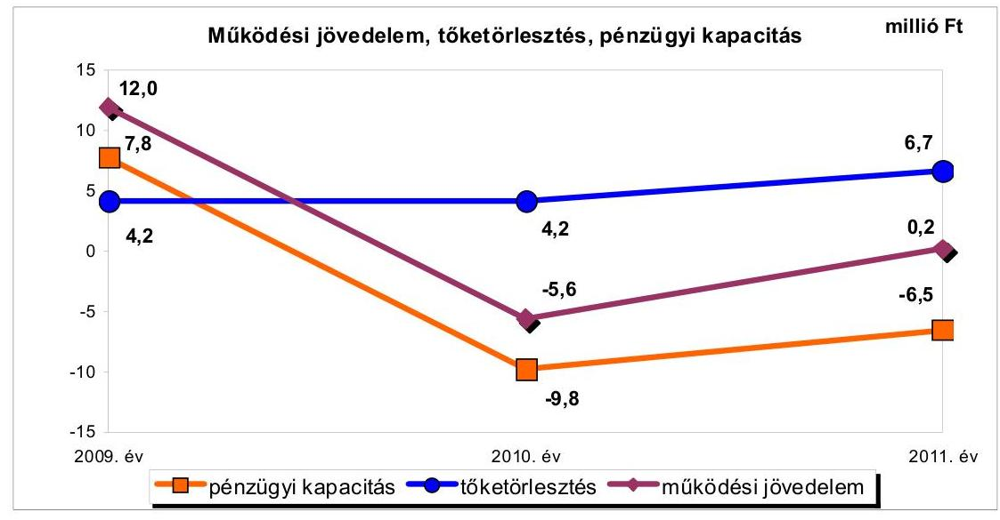
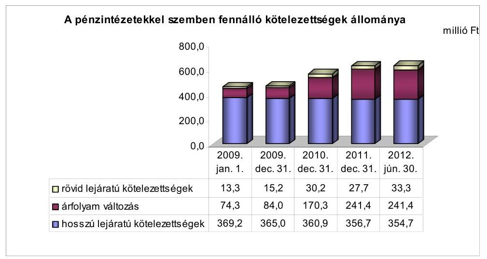
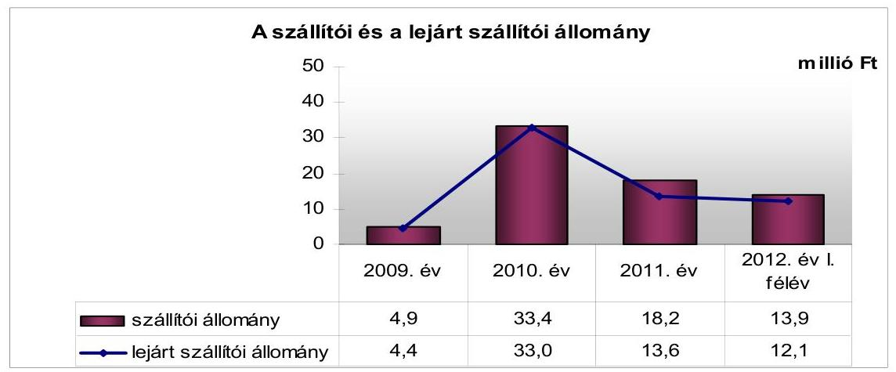
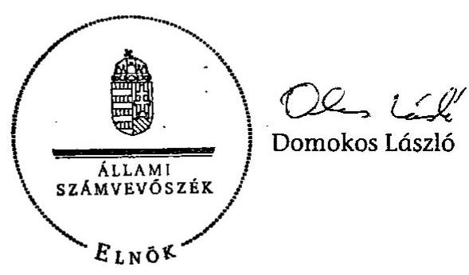
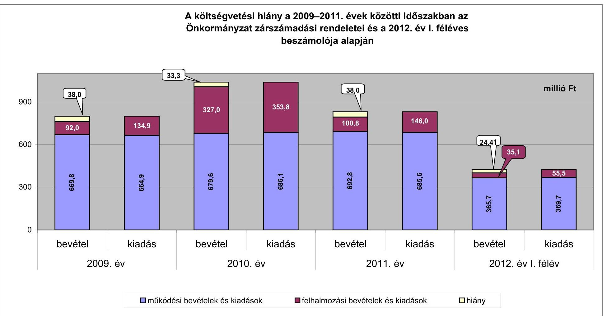
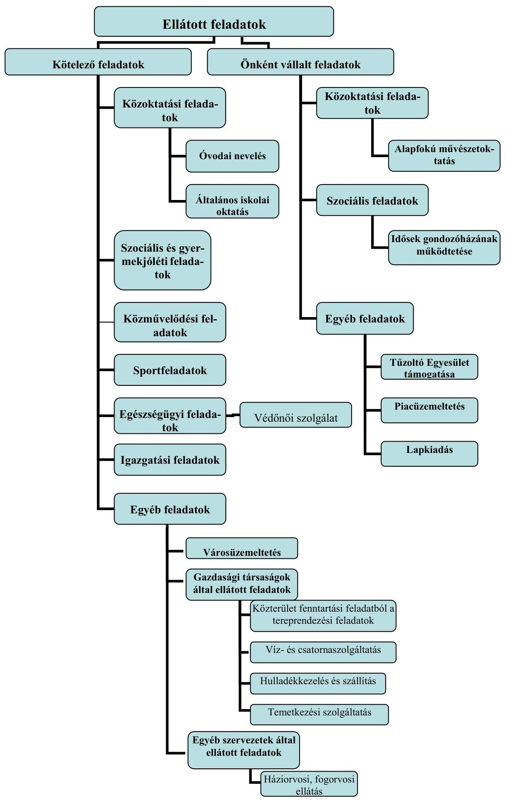

# ÁLLAMI   SZÁMVEVŐSZÉK 

## JELENTÉS

## Gávavencsellő Nagyközség Önkormányzata pénzügyi gazdálkodási helyzetének, szabályosságának ellenőrzéséről

---

# Állami Számvevőszék 

Iktatószám: V-0030-274-016/2013.
Témaszám: 1069
Vizsgálat-azonosító szám: V059213

## Az ellenőrzést felügyelte:

## Renkó Zsuzsanna

felügyeleti vezető

## Az ellenőrzést vezette:

## Dér Lívia

ellenőrzésvezető

## Az ellenőrzést végezték:

| Beke Andrea | Domonkosné Kurilla Edit | Velkei András Albert |
| :-- | :-- | :-- |
| számvevő | számvevő tanácsos | számvevő |

---

# TARTALOMJEGYZÉK 

BEVEZETÉS ..... 3
I. ÖSSZEGZŐ MEGÁLLAPÍTÁSOK, KÖVETKEZTETÉSEK, JAVASLATOK ..... 6
II. RÉSZLETES MEGÁLLAPÍTÁSOK ..... 13

1. Az Önkormányzat kötelező és önként vállalt feladatai, a feladatellátás szervezeti keretei ..... 13
2. A pénzügyi egyensúly fenntartását veszélyeztető pénzügyi kockázatok és az ezek csökkentése érdekében tett intézkedések ..... 14
3. A pénzügyi gazdálkodási folyamatok szabályosságát, megfelelőségét biztosító belső kontrollok ..... 24

---

# MELLÉKLETEK 

1. számú A költségvetési hiány a 2009-2011. évek közötti időszakban az Önkormányzat zárszámadási rendeletei és a 2012. év I. féléves beszámolója alapján
2. számú Az Önkormányzat bevételei és kiadásai, valamint adósságszolgálata a 2009-2011. években (a CLF módszer szerint)
3/a. számú Az Önkormányzat által a 2009. év és a 2012. év I. félév között megvalósított (műszakilag befejezett) fejlesztések forrásösszetétele
3/b. számú Az Önkormányzat 2012. június 30-án folyamatban lévő fejlesztési feladataihoz kapcsolódó kötelezettségeinek összegzése
3/c. számú Az Önkormányzat által beadott, elbírálás alatti pályázatok forrásaiból megvalósuló fejlesztésekhez kapcsolódó kötelezettségvállalások összegzése
3. számú Az önkormányzati feladatok ellátásában résztvevő gazdasági társaságok egyes kiemelt adatai
4. számú Az Önkormányzat 2012. június 30-án fennálló, hosszú lejáratú adósságot keletkeztető kötelezettségvállalásai
5. számú Az Önkormányzat kötelezettségeinek 2011. december 31-ei és 2012. június 30-ai állománya és a 2012. évben, valamint az azt követő években várható kötelezettségek miatti kiadások

## FÜGGELÉKEK

1. számú Rövidítések jegyzéke
2. számú Értelmező szótár
3. számú Az Önkormányzat által ellátott feladatok a 2012. év I. félév végén

---

# JELENTÉS 

## Gávavencsellő Nagyközség Önkormányzata pénzügyi gazdálkodási helyzetének, szabályosságának ellenőrzéséről

## BEVEZETÉS

Az államháztartás helyi szintjén, az önkormányzati alrendszerben az utóbbi években megjelenő gazdálkodási nehézségek, a pénzforgalmi hiány növekedése, az eladósodás az ÁSZ figyelmét a helyi önkormányzatok pénzügyi helyzetére irányította.

Az ÁSZ a 2012. évi ellenőrzési tervben foglaltaknak megfelelően az önkormányzatok pénzügyi gazdálkodási helyzetének, szabályosságának ellenőrzésével az önkormányzatok 2011. évben megkezdett helyzetelemzését folytatta. Az ellenőrzés keretében értékeljük az önkormányzatok adósságkezelési és likviditási helyzetét. Bemutatjuk a pénzügyi egyensúly alakulására hatással lévő folyamatokat, feltárjuk az ezekre ható kockázatokat, a pénzügyi egyensúlyi helyzetet befolyásoló döntésmegalapozó, döntés-előkészítő eljárások szabályosságát, és minősítjük az ezekkel összefüggő belső kontrollok kialakítását, működését.

Az ellenőrzés eredményének várható hatásaként a megállapításokkal segítséget nyújthatunk az önkormányzatok számára a pénzügyi egyensúly helyreállítása, javítása és fenntartása érdekében szükségessé váló intézkedések megtételéhez.

Az ellenőrzés típusa: szabályszerűségi ellenőrzés.
Az ellenőrzés célja annak értékelése volt, hogy:

- az ellenőrzött időszakban a kötelező és önként vállalt feladatok ellátását biztosító szervezeti formák változása milyen hatást gyakorolt az Önkormányzat pénzügyi helyzetének alakulására;
- az Önkormányzat pénzügyi - ezen belül működési és felhalmozási - egyensúlya milyen irányban változott, a változást milyen okok idézték elő, továbbá milyen intézkedéseket tettek a pénzügyi egyensúly biztosítása, illetve javítása érdekében, és az intézkedések hatására javult-e az Önkormányzat pénzügyi helyzete;
- a költségvetési kiadások finanszírozása érdekében vállalt pénzintézetekkel szembeni kötelezettségek hogyan alakultak, a kötelezettségek fennállása

---

miként befolyásolja az Önkormányzat jövőbeli pénzügyi egyensúlyi helyzetét;

- az Önkormányzat beazonosította, felmérte, értékelte-e a pénzügyi egyensúlyt befolyásoló pénzügyi kockázatokat, és a finanszírozási célú pénzügyi műveletekkel kapcsolatban írtak-e elő kockázatértékelési kötelezettséget;
- az Önkormányzat által kialakított belső kontrollok biztosítják-e a pénzügyi gazdálkodás folyamatainak szabályosságát és eredményességét.

Utóellenőrzésre nem került sor, mivel az ÁSZ a 2009. év és a 2012. év I. félév között ellenőrzést nem végzett az Önkormányzatnál.

Az ellenőrzés a 2009. január 1-jétől 2012. június 30-áig terjedő időszakot ölelte fel. A pénzintézetekkel szembeni kötelezettségek állományának vizsgálatakor a 2011. december 31-én fennálló kötelezettségek keletkezésének kezdő időpontját vettük figyelembe.

Az ellenőrzés szakmai módszertana az ÁSZ Ellenőrzési Elvek és Standardokban foglalt szakmai szabályokon alapult, amely a Legfőbb Ellenőrző Intézmények Nemzetközi Szervezete (INTOSAI) által kiadott nemzetközi standardok (ISSAI) figyelembevételével készült.

Az ellenőrzés során használt rövidítéseket az 1. számú, az egyes fogalmak magyarázatát a 2. számú függelék tartalmazza.

A vizsgálat jogszabályi alapját az ÁSZ tv. 1. § (3) bekezdésének, 5. § (2)-(6) bekezdéseinek, valamint az Áht. 61. § (2) bekezdésének előírásai képezik.

A helyszíni ellenőrzést követően az Országgyűlés a helyi önkormányzatok adósságállományának részleges konszolidációjáról döntött. Az 5000 fő lakosságszámot meg nem haladó települési önkormányzatok számára nyújtott törlesztési célú támogatással ${ }^{1}$ lehetővé tették a 2012. december 12-én fennálló tartozásállományuk és annak 2012. december 28-án fennálló járulékai teljes megfizetését. Az 5000 fő lakosságszám feletti települések esetében a 2013. évben az állam differenciált - a bevételi képességet figyelembe vevő, 40-70\%-ig terjedő mértékben vállalja át ${ }^{2}$ az önkormányzatok 2012. december 31-i, az átvállalás időpontjában fennálló adósságállományát és annak járulékait. Az adósságkonszolidációs intézkedéssel egyidejűleg a Kormány elrendelte ${ }^{3}$ az önkormányzatok adósságállománya újratermelődésének megakadályozása céljából a hitelengedélyezési és a likvid hitelekre vonatkozó szabályozás szigorítását.

[^0]
[^0]:    ${ }^{1}$ Magyarország 2012. évi központi költségvetéséről szóló 2011. évi CLXXXVIII. törvény módosításáról szóló 2012. évi CLXXXVII. törvény alapján
    ${ }^{2}$ Magyarország 2013. évi központi költségvetéséről szóló 2012. évi CCIV. törvény alapján
    ${ }^{3}$ 1540/2012. (XII. 4.) Korm. határozat a helyi önkormányzatok adósságállományának részleges konszolidációjáról

---

Gávavencsellő Nagyközség Önkormányzata lakónépességére tekintettel a 2012. évi adósságkonszolidációban volt érintett. Az ÁSZ jelen ellenőrzése során a pénzügyi egyensúly jövőbeni alakulását befolyásoló kockázatokra tett megállapításai az adósságkonszolidációt követően is időszerűek és helytállóak.

Gávavencsellő nagyközség lakosainak száma 2012. január 1-jén 3714 fő volt, ami 122 fős csökkenést jelent a 2009. év eleji (3836 fő) lakosságszámhoz képest. Az Önkormányzat a 2011. évben 806,3 millió Ft költségvetési bevételt és 844,8 millió Ft költségvetési kiadást teljesített. A 2011. december 31-i könyvviteli mérleg alapján az Önkormányzat 2213,7 millió Ft értékű vagyonnal rendelkezett, amely a 2009. év végi állományhoz (1863,5 millió Ft) viszonyítva 18,8\%-kal (350,2 millió Ft-tal) növekedett a fejlesztések következtében. A 2011. évben az eszközök közül a tárgyi eszközök állománya 1467,0 millió Ft, a forgóeszközök állománya 497,5 millió Ft volt. A három legjelentősebb fejlesztés a Rakovszky Sámuel Általános és Művészeti Iskola felújítása és bővítése, az IKSZT ház kialakítása, valamint a Báthory út kiépítése volt. Az Önkormányzat az ellenőrzött időszak minden évében ÖNHIKI támogatásban részesült.

Az ÁSZ tv. 29. § (1) bekezdése szerint a jelentéstervezetet megküldtük a polgármester részére, aki az ÁSZ tv. 29. § (2) bekezdésében foglalt észrevételezési jogával nem élt, a jelentéstervezetre észrevételt nem tett.

---

# I. ÖSSZEGZŐ MEGÁLLAPÍTÁSOK, KÖVETKEZTETÉSEK, JAVASLATOK 

Gávavencsellő Nagyközség Önkormányzatának pénzügyi egyensúlya az ellenőrzött időszakban rövid távon nem volt biztosított. Az állam által nyújtott törlesztési támogatásból az Önkormányzat kiegyenlítette a 2012. december 12-én fennálló adósságállományát és annak 2012. december 28-án fennálló járulékait. Az adósságkonszolidáció eredményeként az Önkormányzat pénzügyi egyensúlyi helyzete javul, azonban a jövedelemtermelő képesség alapján várhatóan képződő bevételek a feladatok ellátásához szükséges kiadásokat nem fedezik, a működést rövid távon korlátozzák.

Az Önkormányzat költségvetésének elemzését a CLF módszer alapján számított mutatók alapján végeztük. A pénzügyi kapacitás 2009-2011 közötti változását a következő ábra mutatja be:

Az Önkormányzat 2009-2011 között összesen 2574,7 millió Ft költségvetési bevételhez jutott, a teljesített költségvetési kiadása 2684,5 millió Ft-ot tett ki. A működési költségvetésben 2009-2011 között összesen 6,6 millió Ft többlet képződött. Az Önkormányzat működési költségvetésének egyensúlya 2009-ben és 2011-ben a működőképesség fenntartását szolgáló (ÖNHIKI) támogatással volt biztosított. A 2010. évben a folyó kiadások, elsősorban a közfoglalkoztatásban résztvevők létszámváltozásának hatására növekedtek, aminek következtében a működési költségvetés egyenlege - az ÖNHIKI támogatás igénybe vétele mellett is - negatív lett. A 2011. évben a helyi adó bevételek, az államháztartáson belülről származó működési célú támogatások, valamint a szociális feladatok visszavételéből adódóan az egyéb saját bevételek növekedése is hozzájárult, hogy a működési jövedelem ismét pozitív lett. Alacsony működési jövedelemtermelő képességet jelez, hogy a 2009-2011 között igénybevett 40,9 millió Ft ÖNHIKI támogatás nélkül a működési jövedelem az ellenőrzött időszak

---

minden évében hiányt mutatott volna (2009-ben -6,9 millió Ft, 2010-ben -16,7 millió Ft, 2011-ben -10,7 millió Ft). Az, hogy a működési egyensúly 2009-ben és 2011-ben csak ÖNHIKI támogatással volt fenntartható, illetve 2010-ben még e támogatás mellett is negatív értéket mutatott, bevételi kitettség miatti kockázatot jelez.

A felhalmozási költségvetés egyensúlya az ellenőrzött időszak egyik évében sem állt fent. A 2009. évben 50,0 millió Ft hiány keletkezett, amely hiány a 2010. évre 27,7 millió Ft-ra mérséklődött, majd a 2011. évben 38,7 millió Ft-ra nőtt. A forráshiány az ellenőrzött időszakban összesen 116,4 millió Ft-ot tett ki A felhalmozási hiány összegének változását a felmerült kiadások és a pályázati támogatások ütemkülönbsége okozta. A fejlesztések önerejét a kötvénykibocsátásból származó bevételből finanszírozták.

Az Önkormányzatnál a 2009. év és a 2012. év I. félév között a szociális és gyermekjóléti feladatok átvétele, valamint az óvodai feladatok átadása összesen 3,6 millió Ft megtakarítást eredményezett. A kötelező és önként vállalt feladatok ellátását biztosító szervezeti formák ellenőrzött időszakban bekövetkezett változása nem gyakorolt jelentős hatást a pénzügyi egyensúlyi helyzetre. A feladatellátás szervezeti formáinak változtatásán kívül az Önkormányzat bevételnövelő és kiadáscsökkentő intézkedéseket hozott (készletek, eszközök értékesítése, hasznosítása, az étkezési hozzájárulás megszüntetése, tiszteletdíjról, költségtérítésről való lemondás). Ezek eredményeként - az ellenőrzött adatszolgáltatása szerint - keletkezett 11,2 millió Ft megtakarítás a pénzügyi egyensúlyi helyzetet jelentősen nem javította.

Az alacsony jövedelemtermelő képesség miatt az Önkormányzatnál még fennállt:

- az önként vállalt feladatok miatti kockázat. Az ellenőrzött időszak alatt növekedett az önként vállalt feladatokra fordított működési kiadás összege (2009-ben 36,7 millió Ft, 2011-ben 61,3 millió Ft) és a működési kiadásokon belüli aránya (2009-ben 5,5\%, 2011-ben 8,8\%), ennek ellenére nem értékelték, hogy ez a növekedés milyen hatással van a pénzügyi egyensúlyi helyzetre;
- a magas lejárt szállítói állomány miatti nemfizetési kockázat. A szállítói állomány a 2009. év végi 4,9 millió Ft-ról a 2012. év I. félév végére 13,9 millió Ft-ra, a lejárt szállítói állomány 4,4 millió Ft-ról 12,1 millió Ft-ra nőtt. A lejárt szállítói állomány az ellenőrzött időszak végén a dologi kiadások átlagos havi összegének 67,2\%-át tette ki;
- a fejlesztések során létrejött létesítmények jövőbeni üzemeltetésének kockázata. A fejlesztésekről szóló döntések előkészítésekor a várható működési kiadásokat és a működtetés forrásait nem számszerűsítették.

A pénzintézetekkel szembeni kötelezettségek állománya az ellenőrzött időszak alatt 456,8 millió Ft-ról 629,4 millió Ft-ra, 37,8\%-kal növekedett. A változás a 2008. évben kibocsátott felhalmozási célú kötvény után a számvitelben elszámolt, de nem realizált árfolyamveszteségből, valamint a folyószámlahitel állomány növekedése miatt következett be.
 A 2012. év I. félév végén a pénzintézetekkel szembeni kötelezettség 81,8 millió Ft és 2,1 millió CHF, a szállítói

---

állomány 13,9 millió Ft, peres eljárásból fennálló tartozás 3,9 millió Ft, és lízingszerződésből eredő 13,1 ezer CHF és 0,6 millió Ft fizetési kötelezettség állt fenn. Az Önkormányzat az ellenőrzött időszakban működésének egyensúlyát folyószámlahitel igénybevételével tudta biztosítani. Az adósságkonszolidációt követően a banki kitettség kockázata, a kötvényhez kapcsolódó biztosíték miatti kockázat, illetve a pénzintézeti kötelezettségek miatti nemfizetési kockázat már nem áll fent. A pénzintézettel szembeni kötelezettségek állományának megszűnése az Önkormányzat jövőbeni pénzügyi egyensúlyi helyzetét kedvezően befolyásolja. Azonban a megmaradt kötelezettségek, kiemelten a lejárt esedékességű szállítói tartozások a továbbiakban is nemfizetési kockázatot jelentenek. Az Önkormányzat a jövőbeni kötelezettségei teljesítéséhez felhasználható elkülönített tartalékkal nem rendelkezik, ezért a működési egyensúly megteremtése nélkül a likvid hitel állomány újratermelődésének kockázata fennáll.

Az Önkormányzatnál a 2009-2011. években az Áht. ${ }_{1}$, a 2012. év I. félévében a Bkr. előírásai alapján kialakították és működtették a kockázatkezelési rendszert. Azonban a pénzügyi egyensúlyra kiható kockázatok beazonosítása, felmérése, értékelése, ezáltal kezelése a 2009. évben az Ámr. ${ }_{1}$-ben, a 2010-2011. években az Ámr. ${ }_{2}$-ben, és a 2012. év I. félévében a Bkr.-ben foglalt előírások ellenére elmaradt. Annak ellenére maradt el a kockázatok kezelése, hogy az ellenőrzött időszakban fennállt az alacsony működési jövedelemtermelő képesség miatti kockázat, az önként vállalt feladatok miatti kockázat, az ÖNHIKI támogatás miatti bevételi kitettség, a fejlesztések során létrejött létesítmények jövőbeni üzemeltetési kockázata, a folyószámlahitel állandósulása miatt a banki kitettség kockázata, a kötvényhez kapcsolódó biztosíték miatti kockázat, a magas, lejárt szállítói állomány miatti nemfizetési kockázat, valamint a kötelezettségek teljesíthetősége miatti kockázat. Az Önkormányzatnál a finanszírozási célú pénzügyi műveletekkel kapcsolatban nem írták elő a kockázatértékelési kötelezettséget.

Az Önkormányzatnál a 2009-2011. években az Áht. ${ }_{1}$-ben, a 2012. év I. félévében az Áht. ${ }_{2}$-ben foglalt előírások alapján létrehozták és működtették a belső kontrollrendszert. Azonban a pénzügyi gazdálkodási folyamatok kockázatainak kezelését biztosító belső kontrolltevékenységek kialakítása - a 2009. évben az Ámr. ${ }_{1}$, a 2010-2011. években az Ámr. ${ }_{2}$, és a 2012. év I. félévében a Bkr. előírásai ellenére - nem volt megfelelő, mert nem írták elő a pénzintézeti kötelezettségvállalások döntési kockázatainak feltárását, ezen kötelezettségek teljesítésének költségvetési egyensúlyra gyakorolt hatása előzetes vizsgálatát. Nem határozták meg továbbá a pénzintézeti szolgáltatások pályáztatási kötelezettségével, és a pénzügyi kötelezettségek teljesítésével kapcsolatos kontrolltevékenységeket. Az Önkormányzatnál a 2009-2011. években az Áht. ${ }_{1}$-ben, a 2012. év I. félévében az Áht. ${ }_{2}$-ben foglalt előírások alapján kialakították és működtették a belső ellenőrzést, azonban a 2009-2012. évi belső ellenőrzési tervekben - a 2009-2011. években a Ber., a 2012. év I. félévében a Bkr. előírásai ellenére - nem írták elő a pénzügyi egyensúlyi helyzetét befolyásoló döntések kockázati tényezőinek feltárását, és ezen kockázati tényezők ellenőrzését.

A belső kontrollok működése jó volt, mert az Önkormányzat pénzügyi egyensúlyi helyzetét befolyásoló kockázatok belső ellenőrzés keretében történő feltárása, illetve ellenőrzésének elmaradása ellenére a kialakított belső kontrol-

---

lok összességében biztosították a pénzügyi gazdálkodási folyamatok eredményességét.

Az ellenőrzés során a gazdálkodási feladatok ellátásával, illetve a beszámoló készítési és könyvvezetési kötelezettség teljesítésével kapcsolatosan az alábbi szabályszerűségi hibákat tártuk fel:

- a 2011. évben az Áht. 1 előírásai ellenére költségvetési előirányzat nélkül vállaltak kötelezettséget és adtak át 8,7 millió Ft-ot - felhalmozási célra - a kizárólagos önkormányzati tulajdonban lévő gazdasági társaság és további 0,4 millió Ft-ot egyéb államháztartáson kívüli szervezetek részére;
- a rövid lejáratú pénzintézeti kötelezettségekhez kapcsolódóan az Önkormányzat megsértette az Ötv. előírását, mivel a törzsvagyon részét képező, öt, korlátozottan forgalomképes ingatlanán jelzálogjogot alapított. A jelzálogszerződésben szereplő ingatlanok 2011. december 31-ei könyv szerinti értékéből (11,3 millió Ft) a forgalomképes ingatlanok értéke 2,6 millió Ft volt, az összes forgalomképes ingatlan értékének (38,3 millió Ft) 6,8\%-a;
- az Önkormányzat a lízingszerződéséből származó, hosszú lejáratú kötelezettség esetében a Számv. tv. előírását megsértve, az Áhsz-ben foglaltak ellenére nem végezte el a devizában fennálló kötelezettség év végi értékelését a 2009-2011. években.

Az ÁSZ tv. 33. § (1) bekezdésében foglaltak értelmében az ellenőrzött szervezet vezetője köteles a jelentésben foglalt megállapításokhoz kapcsolódó intézkedési tervet összeállítani, és azt a jelentés kézhezvételétől számított harminc napon belül az ÁSZ részére megküldeni. Amennyiben az intézkedési tervet határidőn belül nem küldi meg a szervezet vezetője, vagy az továbbra sem elfogadható, az ÁSZ elnöke a hivatkozott törvény 33. § (3) bekezdés a-b) pontjaiban foglaltakat érvényesítheti.

# Az ellenőrzés intézkedést igénylő megállapításai és javaslatai:

## a polgármesternek

1.  Az Önkormányzat 2009-2011 között 40,9 millió Ft ÖNHIKI támogatásban részesült, amely nélkül a működési jövedelme minden évben hiányt mutatott volna. A nettó működési jövedelme 2010-ben és 2011-ben, a felhalmozási költségvetés a 2009-2011. években negatív volt. A likviditás az állandósult folyószámlahitel igénybevételével volt biztosítható. A 2012. év I. félév végén fennálló 13,9 millió Ft szállítói állomány 87,1\%-a (12,1 millió Ft) lejárt tartozás volt. A lejárt szállítói tartozások a dologi kiadások havi átlagos összegének 67,2\%-át jelentették. A bevételnövelő, kiadáscsökkentő intézkedések eredménye számottevően nem javította a pénzügyi egyensúlyi helyzetet. A működés finanszírozására és a vállalt kötelezettségek jövőbeni teljesítésének fedezetére a képződő működési jövedelem várhatóan nem nyújt fedezetet.

Javaslat:
A működési jövedelemtermelő képesség és a feladatellátás összhangja, valamint az Önkormányzat pénzügyi egyensúlyának helyreállítása, hosszú távú fenntarthatósága

---

érdekében - a 2012. évi kormányzati adósságkonszolidációt, valamint a 2013. évtől változó feladat-ellátási kötelezettséget, feladatfinanszírozási rendszert figyelembe véve - felelősök és határidők megjelölésével kezdeményezzen intézkedéseket, melyek keretében:
a) a költségvetési rendelettervezet, valamint annak évközi módosítása előterjesztését megelőzően mérjék fel a bevételszerző, kiadáscsökkentő lehetőségeket, és terjessze a Képviselő-testület elé a bevételek növelését, a kiadások csökkentését célzó intézkedések bevezetéséhez szükséges - a Htv. 140. § (1) bekezdés a) pontja alapján a jegyző által elkészített - döntési javaslatát;
b) terjesszen a Képviselő-testület elé jóváhagyásra - a Htv. 140. § (1) bekezdés a) pontja alapján a jegyző által elkészített - az Önkormányzat gazdasági helyzetének elemzésén alapuló, a pénzügyi egyensúlyi helyzet gyors helyreállítását, hosszú távú fenntartását, valamint az adósságállomány újratermelődésének elkerülését biztosító intézkedéseket tartalmazó reorganizációs programot;
c) a szállítói kitettség és a helyi önkormányzatok adósságrendezési eljárásáról szóló 1996. évi XXV. törvény 4-9. §-aiban szabályozott adósságrendezési eljárás megindításának elkerülése érdekében meghatározott gyakorisággal számoljon be a Képviselő-testületnek az Önkormányzat lejárt szállítói állománya alakulásáról. Intézkedjen a szállítói számlák esedékesség szerinti kiegyenlítéséről, vagy a lejárt tartozások átütemezéséről.
2.  A folyószámlahitel szerződésben a hitel visszafizetésének biztosítékaként - az Ötv. 88. § (1) bekezdés b) pontjában ${ }^{4}$ foglalt előírást megsértve - öt korlátozottan forgalomképes ingatlanon jelzálogjogot alapított az Önkormányzat.

Javaslat:
Intézkedjen, hogy jövőbeni hitelfelvétel és kötvénykibocsátás fedezeteként, az Áht ${ }_{2}$ 84. § (4) bekezdésében előírtak szerint, az Önkormányzat törzsvagyonába tartozó ingatlan ne kerüljön felhasználásra.
3.  Az Önkormányzat a 2011. évben 8,7 millió Ft felhalmozási célú pénzeszközt adott át a kizárólagos tulajdonában lévő gazdasági társaság részére. A gazdasági társaság gépbeszerzéséhez a Képviselő-testület 8,5 millió Ft pénzeszközátadásáról határozatban döntött, azonban a pénzeszköz átadásához kapcsolódó kiadási előirányzat módosítására nem került sor. Az Önkormányzat 2011-ben egyéb államháztartáson kívüli szervezetek részére további 0,4 millió Ft felhalmozási célú pénzeszközátadást teljesített, az erre a célra szolgáló előirányzat hiányában. A pénzeszközátadásokkal kapcsolatos kötelezettségvállalásra - az Áht. 12/A. § (1) bekezdésében foglalt előírás ${ }^{5}$ ellenére - jóváhagyott szabad kiadási előirányzat hiányában került sor.

[^0]
[^0]:    ${ }^{4}$ Hatálytalan 2012. január 1-jétől, a 2012. március 31-től hatályos jogszabályi előírás: az Áht. 2 84. § (4) bekezdése.
    ${ }^{5}$ Hatálytalan 2012. január 1-jétől, a 2012.január 1-től hatályos jogszabályi előírás: az Áht. 2 36. § (1) bekezdése

---

Javaslat:
a) biztosítsa, hogy a költségvetési év kiadási előirányzatai terhére kötelezettségvállalásra az Áht. 36. § (1) bekezdésében foglalt előírás alapján kizárólag a kiadási előirányzatot terhelő korábbi kötelezettségvállalásokkal és más fizetési kötelezettségekkel csökkentett összegű eredeti, vagy módosított kiadási előirányzat (szabad előirányzat) mértékéig kerüljön sor;
b) intézkedjen a számvevőszéki ellenőrzés során feltárt hiányosság tekintetében a mulasztás okainak feltárásáról és szükség esetén a felelősségre vonás kezdeményezéséről.

# a jegyzőnek

1.  Az Önkormányzat - a Számv. tv. 60. § (2) bekezdésében, valamint az Áhsz. 33. § (1) bekezdésében és a (2) bekezdés c) pontjában foglalt előírások ellenére - az ellenőrzött időszakban nem végezte el a devizában fennálló lízingszerződés alapján fennálló kötelezettség év végi értékelését.

Javaslat:
Intézkedjen, hogy a Számv. tv. 60. § (2) bekezdésében, valamint az Áhsz. 33. § (1) bekezdésében és a (2) bekezdés c) pontjában foglalt előírásoknak megfelelően végezzék el a devizában fennálló kötelezettségek év végi értékelését és az árfolyamkülönbözet elszámolását.
2.  Az Önkormányzatnál a 2009-2010. években az Áht. 1 120/B. § (2) bekezdés b) pontjában, a 2011. évben az Áht. 1 121. § (2) bekezdés b) pontjában, a 2012. év I. félévében a Bkr. 3. § b) pontjában meghatározott előírások alapján kialakították és működtették a kockázatkezelési rendszert. Azonban az ellenőrzött időszakban fennállt pénzügyi egyensúlyi helyzetre kiható kockázatok (az alacsony működési jövedelemtermelő képesség miatti kockázat, az önként vállalt feladatok miatti kockázat, az ÖNHIKI támogatás miatt a bevételi kitettség kockázata, a fejlesztések jövőbeni üzemeltetése miatti kockázat, a folyószámlahitel állandósulása miatti banki kitettség kockázata, a kötvényhez kapcsolódó biztosíték miatti kockázat, a magas, lejárt szállítói állomány miatti nemfizetési kockázat, valamint a jövőbeli várható kötelezettségek teljesíthetőségének kockázata) feltárása, beazonosítása, értékelése és kezelése - a 2009. évben az Ámr. 145/C. §-ában, a 2010-2011. években az Ámr. 2 157. §-ában, és a 2012. év I. félévében a Bkr. 7. § (1)-(2) bekezdéseiben foglalt előírások ellenére - elmaradt.

Javaslat:
Működtessen a Bkr. 7. § (1)-(2) bekezdéseiben foglalt előírásoknak megfelelő, a pénzügyi egyensúlyt befolyásoló kockázatok kezelésére alkalmas kockázatkezelési rendszert.
3.  Az Önkormányzatnál a 2009-2010. években az Áht. 1 120/B. § (2) bekezdés c) pontjában, a 2011. évben az Áht. 1 121. § (2) bekezdés c) pontjában, a 2012. év I. félévében az Áht. 2 69. § (2) bekezdésében meghatározott előírások szerint létrehozták és működtették a belső kontrollrendszert. A pénzügyi gazdálkodási folyama-

---

tok szabályossága, megfelelősége vonatkozásában azonban a kockázatok kezelését biztosító belső kontrolltevékenységek kialakítása - a 2009. évben az Ámr. 145/E. § (1) bekezdésében, a 2010-2011. években az Ámr. 158. § (1) bekezdésében, és a 2012. év I. félévében a Bkr. 8. § (1)-(2) bekezdéseiben foglalt előírások ellenére nem volt megfelelő. A döntés-előkészítés során nem írták elő a pénzintézeti kötelezettségvállalásokkal kapcsolatos döntések kockázatainak feltárását és a futamidő egyes éveit terhelő
 kötelezettségek költségvetési egyensúlyra gyakorolt hatásának vizsgálatát. Nem határozták meg a pénzintézeti szolgáltatások igénybevétele esetén a pályáztatási, ajánlatkérési kötelezettséggel és a pénzügyi kötelezettségek teljesítésével összefüggő kontrolltevékenységeket.

Javaslat:
Alakítsa ki a Bkr. 8. § (1)-(2) bekezdései alapján azokat a belső kontrolltevékenységeket, amelyek biztosítják a pénzügyi-gazdálkodási folyamatok szabályosságát, a pénzügyi egyensúlyi helyzet alakulását befolyásoló döntések kockázatainak kezelését. Ennek keretében:
a) írja elő a pénzintézeti kötelezettségvállalások kockázatainak döntés-előkészítő szakaszban történő feltárását és a futamidő egyes éveit terhelő kötelezettség költségvetési egyensúlyra gyakorolt hatásának vizsgálatát;
b) határozza meg a pénzintézeti szolgáltatások igénybevétele esetén a pályáztatási, ajánlatkérési kötelezettségre, valamint a pénzügyi kötelezettségek teljesítésére vonatkozó helyi szabályokat.
4. Az Önkormányzatnál a 2009-2010. években az Áht. 121/A. § (3) bekezdésében, a 2011. évben az Áht. 121/B. § (4) bekezdésében, a 2012. év I. félévében az Áht. 270. § (1) bekezdésében meghatározott előírásoknak megfelelően kialakították és működtették a belső ellenőrzést. A belső ellenőrzési tervek készítését megelőzően azonban - a 2009-2011. években a Ber. 18. § és a 21. § (2) bekezdés és (3) bekezdés a) pontjában és 2012. január 1-jétől a Bkr. 29. § (1) bekezdésében és a 31. § (2) bekezdésében és a (4) bekezdés a) pontjában foglalt előírások ellenére nem írták elő a pénzügyi, egyensúlyi helyzetet befolyásoló döntések kockázati tényezőinek feltárását, a belső ellenőrzési tervek nem tartalmazták ezen kockázati tényezők ellenőrzését.

Javaslat:
Intézkedjen, hogy a Bkr. 29. § (1) bekezdésében, a 31. § (2) bekezdésében és a (4) bekezdés a) pontjában foglalt előírások szerint az éves belső ellenőrzési tervek tartalmazzák a pénzügyi egyensúlyi helyzetet befolyásoló döntésekkel kapcsolatos feltárt kockázati tényezők ellenőrzését, biztosítsa az ellenőrzési tervek végrehajtását.

---

# II. RÉSZLETES MEGÁLLAPÍTÁSOK 

## 1. AZ ÖNKORMÁNYZAT KÖTELEZŐ ÉS ÖNKÉNT VÁLLALT FELADATAI, A FELADATELLÁTÁS SZERVEZETI KERETEI

Az Önkormányzat kötelező és önként vállalt feladatait az Ötv. és a kapcsolódó ágazati törvények alapján rendeleteiben, 2011-től az SZMSZ ${ }_{2}$-ben részben határozta meg. Az önként vállalt feladatok a közoktatási feladatok közül az alapfokú művészeti oktatáshoz, a szociális feladatok köréből az idősek bentlakásos ellátását nyújtó gondozóház működtetéséhez és egyéb feladatok ellátásához kapcsolódtak. Önként vállalt egyéb feladatként látták el - az SZMSZ ${ }_{1,2}$-ben történő besorolás nélkül - a helyi lapkiadást, a piac működtetését, valamint a helyi tűzoltóság támogatását.

A kötelező és az önként vállalt feladatokra fordított kiadások arányának, mértékének és azok változásának a pénzügyi egyensúlyi helyzetre gyakorolt hatását az Önkormányzat nem értékelte, azonban a kötelező és az önként vállalt feladatellátás szervezeti formáinak racionalizálását célzó előterjesztéseket a 2011. évben és a 2012. év I. félévében rendszeresen tárgyalta a Képviselő-testület.

Az Önkormányzatnál 2009-ben az összes működési célú költségvetési kiadás 94,5\%-át (628,2 millió Ft-ot), 2010-ben 95,3\%-át (653,2 millió Ft-ot), 2011-ben 91,2\%-át (637,5 millió Ft-ot) a kötelező feladatokra fordított kiadások tették ki. Az önként vállalt feladatokra a működési kiadásoknak 2009-ben az 5,5\%-át (36,7 millió Ft-ot), 2010-ben a 4,7\%-át (32,3 millió Ft-ot), 2011-ben a 8,8\%-át (61,3 millió Ft-ot) használták fel. Az ellenőrzött időszakban önként vállalt feladatokra a felhalmozási kiadások 0,2\%-át (1,1 millió Ft-ot) fordították, ami nem jelentett felhalmozási kockázatot. Az önként vállalt feladatok ellátása kockázatot jelentett, mivel az ellenőrzött időszak alatt az e feladatra fordított működési kiadások összege és a működési kiadáson belüli aránya emelkedett, továbbá az Önkormányzat nem értékelte, hogy változásuk milyen hatással van a pénzügyi egyensúlyi helyzetre.

Az Önkormányzat kötelező feladatai 2009. január 1-jén az óvodai ellátás, az általános iskolai oktatás, a szociális alapszolgáltatási feladatok, a közművelődési, a sport, az egészségügyi és az igazgatási feladatok voltak. Az Önkormányzat által ellátott feladatok körében a 2009. év és a 2012. év I. félév között a szociális és gyermekjóléti feladatok átvétele, valamint az óvodai feladatok átadása a feladatellátás szervezeti formáját módosították. (A feladatellátás részletezését a 3. számú függelék tartalmazza.)

Az Önkormányzat 2012. június 30-án öt költségvetési szervet tartott fenn, az egy önállóan működő és gazdálkodó, valamint a négy önállóan működő költségvetési szerv összesen kilenc telephellyel rendelkezett. A gazdasági társaságok által ellátott feladatok körében változás nem volt. Gazdasági társaság biztosította a víz- és csatornaszolgáltatást, a hulladékkezelést és szállítást, a temetke-

---

zési szolgáltatást, valamint az Önkormányzat közterület fenntartási feladatai közül a tereprendezés kötelező önkormányzati feladatait.

A költségvetési szervek száma a 2009. év és a 2012. év I. félév között nőtt, az önállóan működő óvoda 2010. szeptember 1-jétől intézményfenntartó társulásba szervezése, valamint a szociális és gyermekjóléti feladatok kistérségi társulásos ellátásból önkormányzati ellátásba való visszavétele eredményeként. Az Önkormányzat kizárólagos tulajdonában a 2006-ban létrehozott Gáva-Vencsellő-Invest Kft. volt, mellyel a 2011. évtől a kötelező park- és közterületfenntartás keretében a tereprendezési feladatokat kívánták ellátni, azonban konkrét, a gazdasági társaság általi feladatellátásra az ellenőrzött időszak végéig nem került sor.

Az Önkormányzat által a 2009. év és a 2012. év I. félév között átvett (szociális és gyermekjóléti feladatok), valamint átadott feladatok (óvoda) finanszírozásánál mindösszesen 3,6 millió Ft megtakarítást keletkezett. Az ellenőrzött időszakban a kötelező és önként vállalt feladatok ellátását biztosító szervezeti formák változása kedvező, de nem jelentős hatást gyakorolt az Önkormányzat pénzügyi egyensúlyi helyzetének alakulására.

# 2. A PÉNZÜGYI EGYENSÚLY FENNTARTÁSÁT VESZÉLYEZTETŐ PÉNZÜGYI KOCKÁZATOK ÉS AZ EZEK CSÖKKENTÉSE ÉRDEKÉBEN TETT INTÉZKEDÉSEK 

Az Önkormányzat költségvetésének elemzését CLF módszerrel hajtottuk végre. A CLF módszer szerinti 2009-2011 közötti részletes adatokat a 2. számú melléklet, a főbb önkormányzati adatokat a következő tábla mutatja be:

|  |  |  | millió Ft |
| :-- | --: | --: | --: |
| Megnevezés | 2009. év | 2010. év | 2011. év |
| Folyó bevételek | 676,9 | 679,9 | 699,0 |
| Folyó kiadások | 664,9 | 685,5 | 698,8 |
| Működési jövedelem | $\mathbf{1 2 , 0}$ | $\mathbf{- 5 , 6}$ | $\mathbf{0 , 2}$ |
| Felhalmozási bevételek | 84,9 | 326,7 | 107,3 |
| Felhalmozási kiadások | 134,9 | 354,4 | 146,0 |
| Felhalmozási költségvetés egyenlege | $\mathbf{- 50 , 0}$ | $\mathbf{- 2 7 , 7}$ | $\mathbf{- 3 8 , 7}$ |
| Folyó és felhalmozási bevételek összesen | 761,8 | 1006,6 | 806,3 |
| Folyó és felhalmozási kiadások összesen | 799,8 | 1039,9 | 844,8 |
| Finanszírozási műveletek nélküli |  |  |  |
| pozíció | $\mathbf{- 3 8 , 0}$ | $\mathbf{- 3 3 , 3}$ | $\mathbf{- 3 8 , 5}$ |
| Finanszírozási műveletek egyenlege | $-10,7$ | $-9,0$ | $-7,9$ |
| Tárgyévi pénzügyi pozíció | $\mathbf{- 4 8 , 7}$ | $\mathbf{- 4 2 , 3}$ | $\mathbf{- 4 6 , 4}$ |
| Hiteltörlesztés, értékpapír beváltás | 4,2 | 4,2 | 6,7 |
| Nettó működési jövedelem | $\mathbf{7 , 8}$ | $\mathbf{- 9 , 8}$ | $\mathbf{- 6 , 5}$ |

Az Önkormányzat 2009-2011 között összesen 2574,7 millió Ft költségvetési bevételt ért el és 2684,5 millió Ft költségvetési kiadást teljesített. Az Önkormányzat folyó költségvetési egyenlege, működési jövedelme a 2009. és a 2011. években pozitív, a 2010. évben negatív volt. Az időszak egészét tekintve a működési jövedelem összességében 6,6 millió Ft többletet mutatott. A működési jö-

---

vedelem alakulását a folyó kiadások növekedése befolyásolta, amit elsősorban a közfoglalkoztatásban résztvevők létszámváltozása okozott.

Az Önkormányzat - 2009-ben 18,9 millió Ft, 2010-ben 11,1 millió Ft, 2011-ben 10,9 millió Ft - összesen 40,9 millió Ft működőképességének megőrzését szolgáló (ÖNHIKI) támogatásban részesült. ÖNHIKI támogatások nélkül számítva a működési jövedelem minden évben negatív összeget - 2009-ben 6,9 millió Ft, 2010-ben 16,7 millió Ft, 10,7 millió Ft hiányt - mutatott volna, ami a bevételi kitettség kockázatát jelzi. A működési jövedelemtermelő képesség alacsony szintje kockázatot hordoz, mivel a pénzügyi egyensúly csak a működőképesség fenntartását szolgáló támogatásokkal volt biztosítható.

A nettó működési jövedelem a 2009. évi 7,8 millió Ft-os többletet követően a 2010. és a 2011. évben hiányt mutatott. A pénzügyi kapacitás módosulását döntően a működési jövedelem, illetve 2011-ben a hiteltörlesztés összegének változása is befolyásolta.

A felhalmozási költségvetés egyenlege 2009-2011 között minden évben negatív volt. Ezen időszakban összesen 116,4 millió Ft felhalmozási forráshiány keletkezett. A 2009. évben 50,0 millió Ft hiányt mutatott, amely hiány a 2010. évre 27,7 millió Ft-ra mérséklődött, majd a 2011. évben 38,7 millió Ft-ra nőtt. A felhalmozási forráshiányra a nettó működési jövedelem nem nyújtott fedezetet. A felhalmozási hiány összegének változását a felmerült kiadások és a pályázati támogatások ütemkülönbsége alakította. A felhalmozási forráshiányt és a fejlesztések önerejét az erre a célra kibocsátott kötvénybevételből finanszírozták.

Az Önkormányzat évenkénti teljes finanszírozási igénye ${ }^{6}$ a CLF módszer szerint a 2009. évben 42,2 millió Ft, a 2010. évben 37,5 millió Ft, a 2011. évben 45,2 millió Ft volt. A költségvetési hiány alakulását az Önkormányzat 2009-2011. évi zárszámadási rendeletei, valamint a 2012. év I. féléves beszámolója alapján az 1. számú melléklet tartalmazza ${ }^{7}$.

A folyó bevételek a 2009. évi 676,9 millió Ft-ról, a 2010. évre 679,9 millió Ft-ra (0,4\%-kal), a 2011. évre 699,0 millió Ft-ra (az előző évihez képest 2,8\%-kal) növekedtek, a 2012. év I. félévben 365,7 millió Ft összegben teljesültek. A megítélt, működőképesség megőrzését szolgáló támogatások ellenére 2009-ről 2011-re a költségvetési támogatások összege 56,8 millió Ft-tal, a működési célú állami támogatások és az szja együttes összege 63,1 millió Ft-tal csökkent. Az egyéb átengedett bevételek az ellenőrzött időszakban 16,3 millió Ft összegben teljesültek átlagosan.

A helyi adók közül csak az iparűzési adót vezették be, annak mértéke az ellenőrzött időszakban 1,8\% volt, ami az adómaximumhoz viszonyítva 13,6 millió Ft bevételkiesést jelentett. A helyi adóbevétel a 2009. évi

[^0]
[^0]:    ${ }^{6}$ a nettó működési jövedelem és a felhalmozási költségvetés együttes negatív egyenlege
    ${ }^{7}$ Az Önkormányzat 2011. évi zárszámadási rendelete nem tartalmazta az év közben történt intézményátvétel hatását, ezért a hiány összege 0,5 millió Ft-tal kevesebb a költségvetési beszámoló adataiból számított és a CLF táblában kimutatott értéknél.

---

35,5 millió Ft-ról a 2011. évre 30,7\%-kal (46,4 millió Ft-ra) emelkedett. Ezen bevétel folyó bevételeken belüli aránya 5,2\%-ról 6,6\%-ra nőtt, egyrészt a vállalkozások eredményességének, másrészt az Önkormányzat adóbehajtási tevékenysége javulásának következtében.

Az egyéb saját bevételek 2009-ről 2011-re 74,5\%-kal (73,2 millió Ft-tal) növekedtek az államháztartáson belülről kapott működési célú támogatások növekedése és az év során a szociális feladatok önkormányzati ellátásba való visszavétele miatt.

A felhalmozási bevételek a 2009. évi 84,9 millió Ft-ról 2010-re 326,7 millió Ft-ra (284,8\%-kal) nőttek, 2011-re 107,3 millió Ft-ra (67,2\%-kal), a 2012. év I. félévre 35,1 millió Ft-ra csökkentek, döntően a fejlesztési feladatokra kapott támogatásértékű bevételek változása miatt. A felhalmozási bevételekből az EU-s támogatások összege a 2009-2011. években összesen 392,3 millió Ft, a felhalmozási bevételek $75,6 \%$-a volt. A felhalmozási bevételek $11,0 \%$-át (57,0 millió Ft-ot) a saját bevétel, $13,4 \%$-át (69,6 millió Ft-ot) a költségvetési támogatás képezte.

A folyó kiadások a 2009-2011. években a költségvetési kiadásoknak átlagosan a $76,3 \%$-át tették ki. A folyó kiadások 2009-2011 között nem jelentősen, 33,9 millió Ft-tal ( $5,1 \%$-kal) nőttek. A működési kiadásokon belül a személyi juttatások és a munkaadót terhelő járulékok összege 2009-ről 2011-re 29,5 millió Ft-tal emelkedett, elsősorban a szociális és gyermekjóléti feladatátvételhez kapcsolódó foglalkoztatottak, valamint a közfoglalkoztatásban résztvevők létszámának növekedése miatt. A dologi kiadások lényegében nem változtak az ellenőrzött időszak során. Az államháztartáson belülre átadott pénzeszközök összege 2009-ről 2011-re 13,5 millió Ft-tal (73,0\%-kal) csökkent, amely döntő mértékben az Idősek Gondozóházának, Kistérségi Társulástól történt, 2011. évi átvételéhez kapcsolódott. A transzferkiadások 2009-ről 2011-re 17,1 millió Ft-tal nőttek, elsősorban a társadalom-, szociálpolitikai és egyéb juttatások, támogatások változásával összefüggésben.

A felhalmozási célú államháztartáson kívülre átadott pénzeszközök összege 2009-ben 1,4 millió Ft, 2010-ben 0,6 millió Ft, 2011-ben 9,1 millió Ft volt. A 2011. évben 8,7 millió Ft-ot adtak át a kizárólagos önkormányzati tulajdonban lévő gazdasági társaság részére ${ }^{8}$, mely a pénzeszköz célszerinti felhasználásáról elszámolt. Az Önkormányzat 2011-ben további 0,4 millió Ft felhalmozási célú pénzeszközátadást teljesített egyéb államháztartáson kívüli szervezetek részére, az erre célra szolgáló előirányzat hiányában. Az Áht. 12/A. §-a (1) bekezdésében ${ }^{9}$ előírtak ellenére, a kötelezettségvállalásra és a 9,1 millió Ft átadására az előirányzat rendelkezésre állása nélkül került sor. Az önkormányzati feladatellátásban résztvevő gazdasági társaságok egyes kiemelt adatait a 4. számú melléklet tartalmazza.

[^0]
[^0]:    ${ }^{8}$ A Képviselő-testület a 205/2011. (VI. 16.) számú határozatában döntött 8,5 millió Ft gépbeszerzéshez biztosított pénzeszközátadásról.
    ${ }^{9}$ hatályon kívül 2012. január 1-jétől, új jogszabályhely: Áht. 36. § (1) bekezdés

---

Az Önkormányzat az ellenőrzött időszakban 642,5 millió Ft kiadást teljesített fejlesztésekre, amelyből a műszakilag befejezettekre 585,8 millió Ft-ot, a folyamatban lévőkre 56,7 millió Ft-ot számolt el. A műszakilag befejezett fejlesztések teljes bekerülési költségének ${ }^{10}$ forrása 0,4%-ban saját bevétel (2,2 millió Ft), 23,3%-ban kötvényből származó bevétel (137,2 millió Ft), 64,1%-ban EU-s támogatás (376,5 millió Ft), 12,2%-ban (71,6 millió Ft) egyéb központi támogatás volt. A folyamatban lévő fejlesztések teljes bekerülési költségének ${ }^{11}$ forrásául 10,3 millió Ft ( $17,8 \%$ ) saját bevétel, 7,0 millió Ft ( $12,1 \%$ ) kötvényből származó bevétel, 37,0 millió Ft (64,0\%) EU-s és 3,5 millió Ft ( $6,1 \%$ ) egyéb központi támogatás szolgált. A benyújtott, elbírálás alatti pályázatok forrásaiból 1459,7 millió Ft összegben egy felújítás és hat beruházás megvalósítását tervezik. Ezek tervezett forrása 2,3 millió Ft saját bevétel, 102,7 millió Ft kötvénybevétel, 1310,0 millió Ft EU-s támogatás és 44,7 millió Ft egyéb központi támogatás. A 2009. év és a 2012. év I. félév között megvalósult, a folyamatban lévő és az elbírálás alatti pályázatok fejlesztési feladatait és azok forrásösszetételét a 3/a., a 3/b. és a 3/c. számú mellékletek mutatják be.

A fejlesztések megvalósításával kapcsolatosan számítások minden esetben készültek, azonban a döntések előkészítésekor a fejlesztések várható működési kiadásait, a működtetés forrásait nem számszerűsítették, továbbá a létesítmények jövőbeni üzemeltetésének kockázatát nem mérték fel.

Az Önkormányzat EU-s támogatási előleget három fejlesztéshez kapcsolódóan, 23,2 millió Ft összegben kapott. A pályáztatás alatti fejlesztések finanszírozásához szükséges támogatási források - egy 12,5 millió Ft-os központi támogatásról szóló döntés kivételével - még nem álltak rendelkezésre. A szükséges saját forrásokat - tekintettel a kötvénybevétel 2012. év I. félév végi maradványára - várhatóan biztosítani tudják. A 2009-2011. években megvalósított fejlesztések 100,0\%-a, a 2012. év I. félév végén folyamatban lévő fejlesztések 98,1\%-a, a pályáztatás alatti fejlesztéseknek pedig 93,7\%-a kötelező önkormányzati feladathoz kapcsolódott. A fejlesztések finanszírozásának kockázatát csökkentette, hogy az e célból kibocsátott kötvényből az önerő minden esetben rendelkezésre állt.

Az Önkormányzat pénzintézetekkel szembeni kötelezettségeinek állománya a 2009. január 1-jei 456,8 millió Ft-ról a 2011. év végére 625,8 millió Ft-ra növekedett, a 2012. év I. félév végén 629,4 millió Ft volt. Az Önkormányzat pénzintézetekkel szemben a 2009-2011. években, illetve 2012. június 30-án fennálló kötelezettségeit a következő ábra mutatja be.

[^0]
[^0]:    ${ }^{10}$ A műszakilag befejezett fejlesztések teljes bekerülési költsége 587,5 millió Ft volt.
    ${ }^{11}$ A folyamatban lévő fejlesztések teljes bekerülési költsége 57,8 millió Ft volt.

---

A pénzintézetekkel szembeni kötelezettségek 2009. január 1-jei állománya a 2005. évben felvett két, összesen 63,0 millió Ft fejlesztési hitelből, a 2008. évben 2139,8 ezer CHF (306,2 millió Ft) értékben kibocsátott, felhalmozási célú kötvényből, valamint 13,3 millió Ft folyószámla-hitelből származott. A pénzintézeti kötelezettségállomány a 2009. év és 2012. év I. féléve között 172,6 millió Ft-tal ( $37,8 \%$-kal) növekedett. A változás a 2008. évben kibocsátott felhalmozási célú kötvény után a számvitelben elszámolt, de nem realizált árfolyamveszteségből, valamint a folyószámlahitel állomány növekedése miatt következett be. A kötelezettségállomány változásában a CHF árfolyamának emelkedése 167,1 millió Ft-ot tett ki. A fejlesztési hitelek tőketörlesztése 2012. június 30-ára 14,6 millió Ft-tal csökkentette, a folyószámlahitel záró állományának növekedése 20,0 millió Ft-tal növelte a kötelezettségállományt.

Az Önkormányzat 2008. július 24-én a meglévő fejlesztési hitelek kiváltására és pályázati önerő biztosítására bocsátotta ki a „Gávavencsellő Önkormányzat Kötvény 2033" elnevezésű, zártkörű, változó kamatozású kötvényét 143,08 HUF/CHF árfolyamon 2139,8 ezer CHF (306,2 millió Ft) értékben. A kötvényből származó bevételt devizaszámlán tartották. A devizaszámlán CHF-ben rendelkezésre álló összeget 2008. október 13-án váltották át 162,3 HUF/CHF árfolyamon forintra, melynek eredményeként az Önkormányzat 41,1 millió Ft árfolyamnyereséget realizált. A továbbiakban a kötvényforrás lekötése forintban történt, de a kötelezettség CHF-ben állt fenn. A kötvény futamideje 25 év, az 5 év türelmi idő lejárta után, 2013. június 30-ától esedékes negyedévente a tőke törlesztése, melynek kezdő összege 26,3 ezer CHF.

Az Önkormányzat a 2005. évben az elnyert támogatások segítségével megvalósuló beruházások saját erejének biztosítása érdekében 17,5 millió Ft és 50,0 millió Ft fejlesztési hitelt vett fel a Magyar Fejlesztési Bank által meghirdetett önkormányzati hitelprogramok keretében. A változó kamatozású, forintalapú fejlesztési hitelek futamideje 15 és 20 év volt. A hiteleket - a szerződésekben meghatározott céloknak megfelelően - közutak, valamint a piaccsarnok építésére vették igénybe.

A kötvénybevételből az Önkormányzat - kimutatásai alapján - 138,7 millió Ft-ot fejlesztési célokra, 6,6 millió Ft-ot működési célra, 7,0 millió Ft-ot a meglévő

---

fejlesztési hitelek tőketörlesztésére, továbbá 9,9 millió Ft-ot kamatkiadásokra fordított.

A fejlesztési kiadásokból 47,1 millió Ft (34,0\%) közoktatási, 17,8 millió Ft (12,8\%) szociális és gyermekjóléti, 9,6 millió Ft (6,9\%) egészségügyi területet érintett, a további 64,2 millió Ft-ot ( $46,3 \%$-ot) a közutak és a Polgármesteri Hivatal felújítására, szennyvízberuházásokra, a temető felújítására és egyéb beruházásokra fordították. A működés finanszírozására a 2011. évben 9,4 millió Ft-ot használtak fel, melyből 2,8 millió Ft-ot a 2012. évben visszapótoltak.

A meglévő fejlesztési hitelek kiváltására nem került sor, mivel a kötvény lekötéséből származó kamat az eltelt időszakban fedezte a fejlesztési hitelek után fizetendő kamatokat. A fel nem használt összeg 2012. június 30-án 185,1 millió Ft volt. Az Önkormányzatnak a 2012. év I. félév végéig a kötvénybevétel befektetéséből - a kibocsátástól kezdődően 58,5 millió Ft - az ellenőrzött időszakban 56,2 millió Ft többletbevétele származott. Ezen többletbevételből 12,6 millió Ft-ot fejlesztésekre, 12,1 millió Ft-ot a meglévő hitelek tőketörlesztésére, 33,8 millió Ft-ot kamatkiadásokra fordítottak.

A CHF-alapú kötvény kibocsátásából származó hosszú lejáratú kötelezettségek Számv. tv. szerinti értékelése minden évben megtörtént.

Az ellenőrzött időszakban a hiteltörlesztéseket, a kamatok és egyéb díjak megfizetését a szerződésekben foglaltak szerint teljesítették. A CHF-alapú kötvény után az Önkormányzatot 135,2 ezer CHF (27,7 millió Ft) kamatkiadás ${ }^{12}$ terhelte. A forintalapú, hosszú lejáratú fejlesztési hitelek esetében a tőketörlesztés összege 14,5 millió Ft volt, a kamatokra 7,6 millió Ft-ot fordítottak.

A hosszú lejáratú kötelezettségek kamata a kibocsátás, lehívás időpontjától 2012. június 30-áig terjedő időszakban az induló kamatfeltételekhez viszonyítva csökkent, ami kedvezően hatott az Önkormányzat pénzügyi helyzetére. A kötvény utolsó fizetéskori kamata 2,67 százalékponttal ( $64,6 \%$-kal), a fejlesztési hitelek kamata 1,71 százalékponttal ( $28,5 \%$-kal, illetve $42,3 \%$-kal) jelentős mértékben csökkent az induló kamatmértékhez képest.

A hosszú lejáratú pénzintézeti kötelezettségekből eredően az Önkormányzat tulajdonában lévő ingatlanokra jelzálogot, elidegenítési vagy terhelési tilalmat nem jegyeztek be. A hitelszerződésekben a hitelek fedezetéül az Önkormányzat saját bevételeit jelölték meg. A kötvényhez kapcsolódó biztosítékként szintén az önkormányzati saját bevételek szolgálnak, mely nemfizetési kockázatot hordoz.

Az Önkormányzatnál az ellenőrzött időszakban hosszú lejáratú kötelezettségvállalásra nem került sor. A meglévő pénzintézeti kötelezettségek állományának változását a 2009-2012. évi költségvetési és a 2009-2011. évi zárszámadási rendeletekben, valamint az éves költségvetési beszámolókban bemutatták, azonban nem értékelték a változásokat és azok okait sem.

A 2005. és 2008. évi pénzintézeti kötelezettségvállalásokra minden esetben a Képviselő-testület döntése alapján került sor. A fejlesztési hiteleket

[^0]
[^0]:    ${ }^{12}$ A 2012. év II. negyedévet terhelő kamatok kifizetésére 2012. július 7-én került sor.

---

folyósító pénzintézeteket mindkét esetben közbeszerzési eljárás alapján választották ki.

A kötvénykibocsátást megelőzően több pénzintézettől kértek ajánlatot, majd egy szakértő gazdasági társaság bevonásával került sor az ajánlatok értékelésére és a döntés meghozatalára.

Az Önkormányzat számlavezető pénzintézete az ellenőrzött időszakban nem változott.

Az Önkormányzat pénzügyi egyensúlyának fenntartása a 2012. június 30-án fennálló adósságterhek miatt nem volt biztosított. A gördülő tervezés keretében megtervezték ugyan az egyes éveket terhelő törlesztő részletek kiadásait, de a fedezetül szolgáló forrásokat éves bontásban nem mutatták be. A forrásként megjelölt saját bevételekből - az adósságszolgálat teljesítésére - tartalékot nem képeztek.

Az Önkormányzat a 2009. év és a 2012. év I. félév közötti időszakban működésének egyensúlyát folyószámlahitel igénybevételével tudta fenntartani. A folyószámlahitelek igénybevételét a 2009-2011. években és a 2012. év I. félév során a következő tábla mutatja be:

| Megnevezés | 2009. év | 2010. év | 2011. év | 2012. év I.   félév |
| :-- | --: | --: | --: | --: |
| Folyószámlahitel |  |  |  |  |
| Keretösszeg január 1-jén (millió Ft-ban) | 35,0 | 35,0 | 35,0 | 35,0 |
| Átlagos, napi állomány (millió Ft-ban) | 23,3 | 21,8 | 29,8 | 32,3 |
| Hitellel zárt napok száma (nap) |
 360 | 352 | 365 | 182 |
|---|---|---|---|
| Egyenleg állomány az időszak végén (millió Ft-ban) | 15,2 | 30,2 | 27,7 | 33,3 |
| Teljesített kamat és egyéb költség (millió Ft-ban) | 2,3 | 1,5 | 1,7 | 1,4 |

Az Önkormányzat rendelkezésére álló folyószámlahitel keretösszege az ellenőrzött időszakban 35,0 millió Ft volt. A folyószámlahitel átlagos, napi állománya a 2009. évi 23,3 millió Ft-ról a 2011. évre 29,8 millió Ft-ra (27,8\%-kal), a 2012. év I. félévre 32,3 millió Ft-ra ( $38,6 \%$-kal) nőtt. A 2011. évben és a 2012. év I. féléve során minden nap fennállt a folyószámlahitel. A folyószámlahitel év végi állománya a 2009. évi 15,2 millió Ft-ról a 2011. évre 27,7 millió Ft-ra ( $82,2 \%$-kal), a 2012. év I. félév végére 33,3 millió Ft-ra (több mint kétszeresére) nőtt. Az Önkormányzat likviditásának és rövid távú pénzügyi egyensúlyának kedvezőtlen irányú változását és a banki kitettség miatti kockázatot jelzi a folyószámlahitel tartóssá válása, valamint 2011-ben és a 2012. év I. félévében napi átlagos állományának az előző időszakihoz képest bekövetkezett növekedése.

A szállítókkal szembeni kötelezettségek az Önkormányzat könyvviteli mérleg szerinti kötelezettségeinek 2009-ben az 1,0\%-át (4,9 millió Ft-ot), 2012. június 30-án a $2,1 \%$-át (13,9 millió Ft-ot) tették ki. Az Önkormányzat 2009. év vége és 2012. június 30. közötti szállítói és lejárt szállítói állományát a következő ábra mutatja be.

---

A szállítói tartozások összege a 2009. év végi 4,9 millió Ft-ról a 2012. év I. félév végére közel háromszorosára (13,9 millió Ft-ra), a lejárt szállítói tartozások állománya szintén közel háromszorosára (4,4 millió Ft-ról 12,1 millió Ft-ra) nőtt. A lejárt szállítói állomány a szállítói állománynak átlagosan 89,6\%-a volt az ellenőrzött időszakban. Az Önkormányzatnak a 2009-2011. években csak 30 nap alatti lejárt tartozása volt, a 2012. év I. félév végén a lejárt tartozások 62,0\%-a (7,5 millió Ft) 30 nap alatti, $38,0 \%$-a (4,6 millió Ft) 31 és 60 nap közötti tartozás volt. A lejárt szállítói állomány 2010. év és 2012. év I. féléve közötti folyamatos csökkenése a folyószámlahitel igénybevételének növekedésével járt. A 2012. év I. félévi 12,1 millió Ft lejárt szállítói állomány azonban a dologi kiadások átlagos, havi összegének $67,2 \%$-a volt, mely nemfizetési kockázatot jelez. A szállítói kötelezettségek állományának alakulását figyelemmel kísérték, de nem értékelték a változását és annak okait.

A lízingszerződésekből eredő, mérleg szerinti, hosszú lejáratú kötelezettségek ${ }^{13}$ állománya nem tartalmazta az árfolyamváltozások hatását. Az Önkormányzat az egyéb hosszú lejáratú kötelezettségek esetében - a Számv. tv. 60. § (2) bekezdésében foglalt előírást megsértve és az Áhsz. 33. § (1) bekezdésében foglaltak ellenére - nem végezte el a devizában fennálló kötelezettség ${ }^{14}$ év végi értékelését a 2009-2011. években. Az Önkormányzatnak 2012. június 30-án két, jogerős határozattal lezárt peres eljárása volt, amelyből 3,9 millió Ft fizetési kötelezettsége keletkezett.
2012. június 30-án az Önkormányzatnak tíz forgalomképes és öt korlátozottan forgalomképes ingatlana volt jelzáloggal, elidegenítési és terhelési tilalommal terhelve. Az Önkormányzat a folyószámlahitel szerződésében a hitel visszafizetésének biztosítékaként 15 db ingatlan bevonásával 35,0 millió Ft összegben keretbiztosítéki jelzálogjogot alapított, melyről külön keretbiztosítéki jelzálogszerződést kötöttek. Az Önkormányzat megsértette az Ötv. 88. § (1) bekezdés

[^0]
[^0]:    ${ }^{13}$ Egyéb hosszú lejáratú kötelezettségként egy autóvásárlás és egy nyomtató lízingszerződéséből eredő fizetési kötelezettséget mutattak ki.
    ${ }^{14}$ A személygépkocsira vonatkozó lízingszerződésből származó kötelezettség 2011. december 31-ei értéke 14,4 ezer CHF (1,8 millió Ft) volt.

---

b) pontjában ${ }^{15}$ foglalt előírásokat, melyek szerint az önkormányzati törzsvagyon hitel fedezetéül nem használható fel. A jelzálogszerződésben szereplő ingatlanok 2011. december 31-ei könyv szerinti értékéből (11,3 millió Ft) a forgalomképes ingatlanok értéke 2,6 millió Ft volt, az összes forgalomképes ingatlan értékének (38,3 millió Ft) 6,8\%-a. Az Önkormányzatnál az ellenőrzött időszakban a jelzáloggal terhelt ingatlanok állománya nem változott, az Önkormányzat pénzügyi egyensúlyi helyzetére gyakorolt hatása alacsony volt.

Az Önkormányzatnak a 2012. év I. félév végén a pénzintézetekkel szemben 81,8 millió Ft és 2139,8 ezer CHF, a szállítói állománya miatt 13,9 millió Ft, peres eljárás következtében 3,9 millió Ft, és lízingszerződésből eredően 13,1 ezer CHF és 0,6 millió Ft fizetési kötelezettsége állt fenn. Kockázatot jelentett, hogy a vállalt hosszú és rövid lejáratú kötelezettségek jövőbeni teljesítésére - a jövedelemtermelő képesség alapján - a működési jövedelem várhatóan nem nyújt fedezetet ${ }^{16}$.

Az állam által biztosított törlesztési támogatásból az Önkormányzat 2012. december 12-én pénzintézetekkel szemben fennálló adósságállományát és annak 2012. december 28-án fennálló járulékaikat kiegyenlítette. A működési költségvetés egyensúlya ÖNHIKI támogatás nélkül nem volt biztosított, és emellett a szállítói állomány a dologi kiadások közel kétharmadát tette ki. A kedvezőtlen jövedelemtermelő képesség következtében a várhatóan képződő bevételek a feladatok ellátásához szükséges kiadásokat nem fedezik, ez a működést korlátozza. A pénzintézettel szembeni kötelezettségek állományának megszűnése az Önkormányzat jövőbeni pénzügyi egyensúlyi helyzetét kedvezően befolyásolja. Azonban a megmaradt kötelezettségek, kiemelten a lejárt esedékességű szállítói tartozások a továbbiakban is nemfizetési kockázatot jelentenek. Az Önkormányzat a kötvénykibocsátásból származó, fel nem használt pénzeszközein túl a jövőbeni kötelezettségei teljesítéséhez felhasználható elkülönített tartalékkal nem rendelkezik, ezért a működési egyensúly megteremtése nélkül a likvid hitel állomány újratermelődésének kockázata fennáll.

A Képviselő-testületet évente tájékoztatták a hosszú lejáratú, adósságot keletkeztető kötelezettségvállalásokból adódó fizetési kötelezettségekről. Az adósságot keletkeztető pénzintézeti kötelezettségvállalások kockázatainak csökkentésére az ellenőrzött időszakban nem intézkedtek. Nem elemezték és nem értékelték a vállalt hosszú és rövid lejáratú, valamint az egyéb kötelezettségek jövőbeni teljesítésének lehetőségeit. Az adósságot keletkeztető kötelezettségvállalások döntés-előkészítési dokumentumai nem tartalmazták a jövőbeni teljesítés várható forrásait, valamint a fedezet megteremtése érdekében a kötelezettségek átstrukturálásáról nem döntöttek. A 2012-2014. évek kötelezettségeinek teljesítésére figyelembe vehető a mérleg szerinti követelésállomány behajtható hányada, valamint a kötvénybevétel fel nem használt, köte-

[^0]
[^0]:    ${ }^{15}$ hatálytalan 2012. január 1-jétől, új jogszabályhely: az Áht. 84. § (4) bekezdése, hatályos 2012. március 31-étől
    ${ }^{16}$ Az Önkormányzat kötelezettségeinek 2011. december 31-ei és 2012. június 30-ai állományát, valamint a 2012. évben és az azt követő években várható - a pénzintézeti kötelezettségek esetén a kormányzati adósságkonszolidációt megelőzően kimutatott kötelezettségek miatti kiadásokat a 6. számú melléklet mutatja be.

---

lezettségvállalással nem terhelt összege, ezek azonban a teljes kötelezettségállományra nem nyújtanak fedezetet. Az Önkormányzat tájékoztatása szerint a jövőbeni kötelezettségek teljesítésére figyelembe vehető forrás a helyi adókból származó bevétel. A helyi adóbevételek emeléséről, tekintettel arra, hogy a lakosság nem terhelhető nem intézkedtek.

Az ellenőrzött időszakban - az Önkormányzat adatszolgáltatása szerint - a pénzügyi egyensúlyi helyzet javítása érdekében tett bevételnövelő intézkedésekből 5,0 millió Ft többletbevételük származott (felesleges készletek, eszközök értékesítéséből 2,3 millió Ft, lakások és üzlethelyiségek bérleti díjának emeléséből 2,7 millió Ft). A kiadáscsökkentő intézkedések 6,2 millió Ft-tal javították a pénzügyi egyensúlyi helyzetet, ebből 2,4 millió Ft a cafeteria keretében adott étkezési hozzájárulás 2012. évi megszüntetéséhez, 3,5 millió Ft tiszteletdíjról, 0,3 millió Ft pedig költségtérítésről való lemondáshoz kapcsolódott. Az Önkormányzat által hozott bevételnövelő és kiadáscsökkentő intézkedések eredménye 11,2 millió Ft többlet volt, amely a pénzügyi egyensúlyi helyzetet jelentősen nem javította. A tartós jellegű (a bérleti díj emeléséből származó többletbevétel és a kiadási megtakarítások) intézkedések hatására 8,9 millió Ft többlet keletkezett.

A költségvetési beszámolók adatai alapján az Önkormányzatnál és költségvetési szerveinél engedélyezett álláshelyek száma 2009. január 1-jén 113 fő volt, amely 2011. december 31-re 160-ra növekedett. A foglalkoztatottak létszáma ebben az időszakban 110-ről 166-ra emelkedett. A létszámnövekedésből 21 fő a szociális gondoskodás területét érintette és az Idősek Gondozóházának - Kistérségi Társulástól történt 2011. évi - átvételéhez kapcsolódott. A foglalkoztatottak létszáma a közoktatási ágazatban eggyel, a polgármesteri hivatali feladatokat ellátó és az egyéb létszám 2-2 fővel nőtt. A közfoglalkoztatottak létszámának változása miatt további 30 fős növekedést mutattak ki. Az Önkormányzat a 2010-2011. évi költségvetési rendeleteiben az alkalmazottak és a közfoglalkoztatottak létszámát - az Ámr. 36. § (1) bekezdés f) és g) pontjaiban előírtak ellenére - nem elkülönítetten, hanem együttesen mutatta ki, mind az engedélyezett álláshelyek, mind a létszám vonatkozásában. A 2012. évi költségvetési rendeletben az előírásoknak megfelelően elkülönítették az alkalmazottak és a közfoglalkoztatottak álláshelyeit és a létszámokat. Feladatátszervezéssel összefüggő létszámcsökkentést az ellenőrzött időszakban nem hajtottak végre, nem igényeltek helyi szervezési intézkedésekhez központosított támogatást.

Az Önkormányzatnál a 2009-2010. években az Áht. 120/B. § (2) bekezdés b) pontjában, a 2011. évben az Áht. 121. § (2) bekezdés b) pontjában, a 2012. év I. félévében a Bkr. 3. § b) pontjában meghatározott előírások alapján kialakították és működtették a kockázatkezelési rendszert. Azonban a pénzügyi egyensúlyra kiható kockázatok beazonosítása, felmérése, értékelése, ezáltal kezelése a 2009. évben az Ámr. 145/C. §-ában, a 2010-2011. években az Ámr. 157. §-ában és a 2012. év I. félévében a Bkr. 7. § (1)-(2) bekezdéseiben foglalt jogszabályi előírások ellenére elmaradt. Az ellenőrzött időszakban fennállt az alacsony működési jövedelemtermelő képesség miatti kockázat, az önként vállalt feladatok miatti kockázat, az ÖNHIKI támogatás miatt a bevételi kitettség kockázata, a fejlesztések során létrejött létesítmények jövőbeni üzemeltetése, a folyószámlahitel állandósulása miatt a banki kitettség kockázata,

---

a kötvényhez kapcsolódó biztosíték miatti kockázat, a magas, lejárt szállítói állomány miatti nemfizetési kockázat, valamint a kötelezettségek teljesíthetősége miatti kockázat. Az Önkormányzatnál a finanszírozási célú pénzügyi műveletekkel kapcsolatban nem írtak elő kockázatértékelési kötelezettséget.

Az ellenőrzött időszakban nem készítettek felmérést az elszámolt értékcsökkenés és az eszközpótlásra fordított kiadások arányának és ezzel összefüggésben az eszközök használhatósági fokának alakulásáról. Eszközök pótlására, felújítására szolgáló alapot nem különítettek el. Az ellenőrzött időszakban elszámolt 161,1 millió Ft értékcsökkenés összegét lényegesen meghaladó, 481,3 millió Ft értékű eszközpótlás az eszközök használhatóságát javította. Az Önkormányzat eszközeinek használhatósági foka a 2009. évi 79,0\%-ról a 2010. évben 80,0\%-ra nőtt, a 2011. évben a megelőző évivel azonos szinten maradt.

# 3. A PÉNZÜGYI GAZDÁLKODÁSI FOLYAMATOK SZABÁLYOSSÁGÁT, MEGFELELŐSÉGÉT BIZTOSÍTÓ BELSŐ KONTROLLOK

Az Önkormányzatnál a 2009-2010. években az Áht. 120/B. § (2) bekezdés c) pontjában, a 2011. évben az Áht. 121. § (2) bekezdés c) pontjában és a 2012. év I. félévében az Áht. 69. § (2) bekezdéseiben meghatározott előírásoknak megfelelően létrehozták és működtették a belső kontrollrendszert.

A belső kontrollrendszer keretében a feladatellátás szabályosságát és a pénzügyi egyensúlyi helyzet alakulását befolyásoló kontrolltevékenységeket kialakították. Rendelkeztek kockázatkezelési szabályzattal, ellenőrzési nyomvonallal
 és a szabálytalanságok kezelésének eljárási rendjével. A költségvetés- és zárszámadás-készítés folyamatát meghatározták. A kockázatkezelési szabályzatban előírták a fejlesztések esetében az előkészítés, a lebonyolítás és a működtetés kockázatai feltárásának és kezelésének, valamint a beruházások pályáztatási kötelezettségét. Meghatározták a fejlesztésekhez kapcsolódó külső források, támogatások figyelési rendszerét, a pályázatkészítés feltételeit és szervezeti kereteit. Szabályozták az Önkormányzat által nyújtott, nem normatív, céljellegű, működési és felhalmozási célú pénzeszközök átadásának feltételrendszerét.

A pénzügyi gazdasági döntések megalapozását szolgáló döntéselőkészítő, valamint a pénzintézeti kötelezettségvállalások szabályosságát, megfelelőségét, a kockázatok kezelését biztosító belső kontrolltevékenységek kialakítása azonban - a 2009. évben az Ámr 145/E. § (1)-(2) bekezdésében, a 2010-2011. években az Ámr 158. § (1)-(2) bekezdésében, a 2012. év I. félévében a Bkr. 8. § (1)-(2) bekezdésében foglalt előírások ellenére - nem volt megfelelő, mivel nem írták elő a pénzintézeti kötelezettségvállalásokkal kapcsolatos döntések kockázatainak feltárását, valamint a futamidő egyes éveit terhelő kötelezettségei költségvetési egyensúlyra gyakorolt hatásának döntéselőkészítés során történő vizsgálatát. Nem szabályozták a pénzintézeti szolgáltatások igénybevételének pályáztatási vagy több ajánlatkérési kötelezettségével, valamint a pénzügyi kötelezettségek teljesítésével összefüggő kontrolltevékenységeket.

---

Az Önkormányzatnál a 2009-2010. években az Áht. 121/A. § (3) bekezdésében, a 2011. évben az Áht. 121/B. § (4) bekezdésében és a 2012. év I. félévében az Áht. 70. § (1) bekezdésében meghatározott előírásoknak megfelelően kialakították és működtették a belső ellenőrzést. A belső ellenőrzési tervek készítését megelőzően azonban - a 2009-2011. években a Ber. 18. §-ában, 21. § (2) bekezdésében és (3) bekezdés a) pontjában, 2012. január 1-jétől a Bkr. 29. § (1) bekezdésében, 31. § (2) bekezdésében és (4) bekezdés a) pontjában foglaltak ellenére - nem írták elő a pénzügyi egyensúlyi helyzetet befolyásoló döntések kockázati tényezőinek feltárását és a feltárt kockázati tényezők belső ellenőrzés keretében történő ellenőrzését.

Az Önkormányzatnál a feladatellátás szabályosságát és a pénzügyi egyensúlyi helyzet alakulását befolyásoló belső kontrollok működése kiváló volt. A pénzügyi, gazdasági döntések megalapozását szolgáló döntés-előkészítő, valamint a pénzintézeti kötelezettségvállalások szabályosságát biztosító belső kontrollok működése jó volt. Az előírásoknak megfelelően végezték a költségvetés és a zárszámadás készítést, a belső szabályozásnak megfelelően működtették az Önkormányzat által nyújtott működési és felhalmozási célú pénzeszköz átadásokat. Összességében a feltárt hiányosság - az Önkormányzat pénzügyi egyensúlyi helyzetét befolyásoló kockázatok belső ellenőrzés keretében történő feltárása, illetve ellenőrzésének elmaradása - ellenére a kialakított belső kontrollok biztosították a pénzügyi gazdálkodási folyamatok eredményességét.

Budapest, 2013. 05 hó ${ }^{1}$/2 nap

Melléklet: 8 db
Függelék: 3 db

---

# A költségvetési hiány a 2009–2011. évek közötti időszakban az Önkormányzat zárszámadási rendeletei és a 2012. év I. féléves beszámolója alapján

|  I. féléves | 2009. év | 2010. év | 2011. év | 2012. év I. féléve  |
| --- | --- | --- | --- | --- |
|  bevétel | 38,0 | 33,3 | 35,8 | 38,0  |
|  kiadás | 92,0 | 134,0 | 100,8 | 100,8  |
|  bevétel | 664,0 | 678,6 | 686,1 | 682,8  |
|  kiadás | 2010. év | 2010. év | 24,41 | 24,1  |
|  működési bevételek és kiadások |  |  |  |   |
|  felhalmozási bevételek és kiadások |  |  |  |   |
|  hiány |  |  |  |   |

---

Az Önkormányzat bevételei és kiadásai, valamint adósságszolgálata a 2009-2011. években (a CLF módszer szerint)

|  1. FOLYÓ KÖLTSÉGVETÉS* | 2009. év | 2010. év | 2011. év  |
| --- | --- | --- | --- |
|  1.1.1. Saját működési bevételek | 89,7 | 89,9 | 103,3  |
|  1.1.2. Költségvetési támogatások ÖNHIKI támogatások nélkül** | 375,7 | 354,7 | 326,9  |
|  1.1.3. Átengedett bevételek | 159,7 | 147,2 | 138,2  |
|  1.1.4. Államháztartáson belülről kapott támogatások | 52,3 | 57,7 | 109,8  |
|  1.1.5. EU-tól és külföldről kapott bevételek | 0,0 | 7,3 | 0,0  |
|  1.1.6. Államháztartáson kívülről kapott bevételek | 0,5 | 1,0 | 1,2  |
|  1.1.7. Hozam- és kamatbevételek** | 0,1 | 0,1 | 0,0  |
|  1.1.8. Kölcsönök visszatérülése, igénybevétele | 0,0 | 0,0 | 0,0  |
|  1.1.9. Előző évi pénzmaradvány átvétel | 0,0 | 3,9 | 8,7  |
|  1.1.10. ÖNHIKI támogatások | 18,9 | 11,1 | 10,9  |
|  1.1. Folyó bevételek =1.1.1.+1.1.2.+1.1.3.+1.1.4.+1.1.5.+1.1.6.+1.1.7.+1.1.8.+1.1.9.+1.1.10. | 676,9 | 679,9 | 699,0  |
|  1.2.1. Működési kiadások kamatkiadások nélkül | 533,3 | 553,3 | 555,0  |
|  1.2.2. Államháztartáson belülre átadott pénzeszközök | 18,5 | 14,8 | 5,0  |
|  1.2.3.1. vállalkozásoknak | 0,0 | 0,0 | 0,0  |
|  1.2.3.2. EU-nak, illetve külföldre | 0,0 | 0,0 | 0,0  |
|  1.2.3.3. magáncizenélyeknek | 106,8 | 107,9 | 120,4  |
|  1.2.3.4. non-profit szervezeteknek | 3,8 | 8,8 | 7,3  |
|  1.2.3. Transferkiadások ( =1.2.3.1+1.2.3.2+1.2.3.3.+1.2.3.4. ) | 110,6 | 114,7 | 127,7  |
|  1.2.4. Kamatkiadások** | 2,5 | 1,7 | 2,4  |
|  1.2.5. Kölcsönök nyújtása, törlesztése | 0,0 | 0,0 | 0,0  |
|  1.2.6. Előző évi pénzmaradvány átadás | 0,0 | 1,0 | 8,7  |
|  1.2. Folyó kiadások = 1.2.1.+1.2.2.+1.2.3.+1.2.4.+1.2.5.+1.2.6. | 664,9 | 685,5 | 698,8  |
|  1.3. Folyó költségvetés egyenlege, működési jövedelem (1.1.-1.2.) | 12,0 | -5,6 | 0,2  |
|  2. FELHALMOZÁSI KÖLTSÉGVETÉS*** |  |  |   |
|  2.1.1. Saját tőkebevételek | 0,0 | 6,3 | 0,5  |
|  2.1.2. Költségvetési támogatások | 1,7 | 61,5 | 6,4  |
|  2.1.3. Államháztartáson belülről kapott támogatások | 51,4 | 247,1 | 93,8  |
|  2.1.4. EU-tól és külföldről kapott támogatások | 0,0 | 0,0 | 0,0  |
|  2.1.5. Államháztartáson kívülről kapott bevételek | 0,0 | 0,0 | 0,0  |
|  2.1.6. Hozam- és kamatbevételek | 31,8 | 11,8 | 6,6  |
|  2.1.7. Kölcsönök visszatérülése, igénybevétele | 0,0 | 0,0 | 0,0  |
|  2.1.8. Előző évi pénzmaradvány átvétel | 0,0 | 0,0 | 0,0  |
|  2.1. Felhalmozási bevételek =2.1.1.+2.1.2+2.1.3+2.1.4.+2.1.5.+2.1.6.+2.1.7.+2.1.8. | 84,9 | 326,7 | 107,3  |
|  2.2.1. Saját beruházási kiadás áfával | 13,3 | 71,1 | 57,6  |
|  2.2.2.Saját felújítási kiadás áfával | 105,9 | 273,2 | 70,3  |
|  2.2.3. Államháztartáson belülre átadott pénzeszközök | 0,0 | 0,0 | 0,0  |
|  2.2.4. EU-nak és külföldnek adott pénzeszközök | 0,0 | 0,0 | 0,0  |
|  2.2.5. Államháztartáson kívülre adott pénzeszközök | 1,4 | 0,6 | 9,1  |
|  2.2.6. Befektetési célú részesedések vásárlása | 0,0 | 0,0 | 1,5  |
|  2.2.7. Kamatkiadások | 14,3 | 9,0 | 7,5  |
|  2.2.8. Kölcsönök nyújtása, törlesztése | 0,0 | 0,0 | 0,0  |
|  2.2.9. Előző évi pénzmaradvány átadás | 0,0 | 0,0 | 0,0  |
|  2.2.10. ÁFA befizetések | 0,0 | 0,5 | 0,0  |
|  2.2. Felhalmozási kiadások =2.2.1.+2.2.2.+2.2.3.+2.2.4.+2.2.5.+2.2.6.+2.2.7.+2.2.8.+2.2.9.+2.2.10. | 134,9 | 354,4 | 146,0  |
|  2.3. Felhalmozási költségvetés egyenlege (2.1. - 2.2.) | -50,0 | -27,7 | -38,7  |
|  3. FINANSZÍROZÁSI MŰVELETEK NÉLKÜLI (GFS) POZÍCIÓ(1.3.+2.3.) | -38,0 | -33,3 | -38,5  |
|  4. FINANSZÍROZÁSI MŰVELETEK |  |  |   |
|  4.1. Hitelfelvétel | 1,9 | 15,0 | 0,0  |
|  4.2. Hiteltörlesztés | 4,2 | 4,2 | 6,7  |
|  4.3. Forgatási és befektetési célú értékpapírok kibocsátása | 0,0 | 0,0 | 0,0  |
|  4.4. Forgatási és befektetési célú értékpapírok beváltása | 0,0 | 0,0 | 0,0  |
|  4.5. Forgatási és befektetési célú értékpapírok értékesítése | 0,0 | 0,0 | 0,0  |
|  4.6. Forgatási és befektetési célú értékpapírok vásárlása | 0,0 | 0,0 | 0,0  |
|  4.7. Egyéb finanszírozási bevételek (függő, átfutó, kiegyenlítő) | -2,0 | -26,5 | 0,5  |
|  4.8. Egyéb finanszírozási kiadások (függő, átfutó, kiegyenlítő) | 6,4 | -6,7 | 1,7  |
|  4.9.Finanszírozási műveletek egyenlege (4.1.-4.2.+4.3.-4.4.+4.5.-4.6.+4.7.-4.8.) | 10,7 | -9,0 | -7,9  |
|  5. TÁRGYÉVI PÉNZÜGYI POZÍCIÓ (1.3.+ 2.3.+4.9.) | -48,7 | -42,3 | -46,4  |
|  6. NETTÓ MŰKÖDÉSI JÖVEDELEM-működési jövedelem (1.3.) - tőketörlesztés (4.2+4.4) | 7,6 | -9,8 | -6,5  |
|  TÁJÉKOZTATÓ ADATOK |  |  |   |
|  Összes kötelezettség | 476,2 | 599,7 | 650,8  |
|  ebből rövid lejáratú | 28,8 | 69,7 | 55,0  |
|  Összes szállítói kötelezettség | 4,9 | 33,4 | 18,2  |
|  ebből lejárt (tanúsítványból) | 4,4 | 33,0 | 13,6  |
|  Pénz és tőkepízei kötelezettség (adósság) | 464,2 | 561,4 | 625,8  |
|  ebből rövid lejáratú | 19,4 | 34,4 | 31,8  |
|  ebből hosszú lejáratú kötelezettségek következő évet terhelő törlesztő részletei (analitikából) | 4,2 | 4,2 | 4,2  |
|  PPP szerződéses állomány jelenértéken (tanúsítványból) | 0,0 | 0,0 | 0,0  |
|  ebből lejárt szolgáltatási díj miatti kötelezettség | 0,0 | 0,0 | 0,0  |
|  Folyószámla-, likvid- és munkabérhitel napi átlagos állománya (tanúsítványból) | 23,3 | 21,8 | 29,8  |
|  Kezesség és garanciavállalások (tanúsítványból) | 0,0 | 0,0 | 0,0  |
|  Jogerős bírósági ítéletekből adódó kötelezettségek (tanúsítványból) | 0,0 | 0,0 | 3,9  |
|  Finanszírozásba bevonható eszközök: | 297,4 | 255,1 | 208,7  |
|  Tartós hitelviszonyt megtestesítő értékpapírok | 0,0 | 0,0 | 0,0  |
|  Hosszú lejáratú bankbetétek | 0,0 | 0,0 | 0,0  |
|  Értékpapírok | 0,0 | 0,0 | 0,0  |
|  Pénzeszközök (idegen nélkül) | 297,4 | 255,1 | 208,7  |

[^0] [^0]: * A költségvetési szerveknél a számviteli szabályoknak megfelelően a bevételekben nem térül, a kiadásokban nem jelenik meg az amortizáció, a vagyoni helyzetet az egyenleg befolyásolja. **A költségvetési támogatásból, a 2009. évben a hozam- és kamatbevételekből, a kamatkiadásokból a felhalmozási célú részt az Önkormányzat adatszolgáltatása szerinti mértékben vettük figyelembe a 2.1.2, a 2.1.6, illetve a 2.2.7 sorokon.** * Bevételekben vagyon megőrzésre és bővítése fordítható források.

---

### **Az Önkormányzat által a 2009. év és a 2012. év I. félév között megvalósított (műszakilag befejezett) fejlesztések forrásösszetétele**

| Sorszám | Fejlesztési feladat (beruházás, felújítás) | Beruházás, felújítás | | | | | | | | | | | | | | | | | | | | | | | | | | | | | | | | | | | | | | | | | | | | | | | | | | | | | | | | | | | | | | | | | | | | | | | | | | | | | | | | | | | | | | | | | | | | | | | | | | | | | | |

---

| 2012. június 30-ig megvalósított fejlesztések | | | | | | | | | | | | | | | | | |
| --- | --- | --- | --- | --- | --- | --- | --- | --- | --- | --- | --- | --- | --- | --- | --- | --- | --- |
| | Fejlesztési feladat (beruházás, felújítás) | Beruházás, felújítás | | | | | | | | | | | | | | | |
| | | | | | | | | | | | Saját forrás | | | Támogatás | | | A tényleges |
| | | | | | | | | | | | | | | | | | bekerülési |
| | | | | | | | | | | | | | | | | | költségből |
| | Megnevezése | | | | | | | | | | | | | | | | | (6.oszlopból) |
| | | | | | | | | | | | | | | | | | eszközpót- |
| | | | | | | | | | | | | | | | | | lásra fordított |
| | | | | | | | | | | | | | | | | | összeg |
| 2. | Beruházások | | | | | | | 0,0 | | | | | | | | | | |
| 2.1. | pénzügyileg bejezett | | | | | | | 0,0 | | | | | | | | | | |
| 2.1.1 | A gávavencsellő Báthory út építése | 2008 | 2010 | 53,2 | 41,9 | 41,9 | -11,3 | 0,5 | 41,4 | 0,0 | 0,0 | 6,8 | 0,0 | N | N | 35,1 | 0,0 |
| 2.1.2 | TIOP-1.1.1-09/1-2010-0156 | 2010 | 2011 | 11,1 | 11,1 | 11,1 | 0,0 | 0,0 | 11,1 | 0,0 | 0,0 | 0,0 | 11,1 | N | N | 0,0 | 0,0 |
| | Oktatásfejlesztés Gávavencsellőn | | | | | | | | | | | | | | | | | |
| 2.1.3 | TIOP-1.1.1-07/1-2008-0355 Korszerű | 2010 | 2012 | 12,8 | 12,8 | 12,8 | 0,0 | 0,0 | 12,8 | 0,0 | 0,0 | 0,0 | 12,8 | N | N | 0,0 | 0,0 |
| | informatikai eszközök a | | | | | | | | | | | | | | | | | |
| | versenyképes, kompetencia alapú | | | | | | | | | | | | | | | | | |
| | tudás megszerzésének szolgá-latában | | | | | | | | | | | | | | | | | |
| 2.1.4 | Nappali ellátó kialakítása | 2011 | 2011 | 22,0 | 22,0 | 22,0 | 0,0 | 0,0 | 22,0 | 0,0 | 0,0 | 22,0 | 0,0 | N | N | 0,0 | 0,0 |
| | Gávavencsellőn | | | | | | | | | | | | | | | | | |
| 2.2. | pénzügyileg nem befejezett | | | | | | 0,0 | | | | | | | | | | |
| 2.3. | 10 millió Ft alatti fejlesztések | 32 | | 18,4 | 18,4 | 18,4 | 0,0 | 0,0 | 18,4 | 1,6 | 0,0 | 9,2 | 6,3 | I | N | 1,3 | 0,0 |
| | Beruházások összesen: | 36 | | 117,5 | 106,2 | 106,2 | -11,3 | 0,5 | 105,7 | 1,6 | 0,0 | 38,0 | 30,2 | | | 36,4 | 0,0 |
| 3. | Mindösszesen: | 55 | | 616,6 | 587,5 | 587,5 | -29,1 | 1,7 | 585,8 | 2,2 | 0,0 | 137,2 | 376,5 | | | 71,6 | 0,0 |
| 4. | A pénzügyileg be nem fejezett felújítások várható forrása: | | | | | | | | | | | | | | | | | |
| 4.1. | A forrás rendelkezésre állása | | | | | A, B, C | | | A | | | 13,4 | | | | | |
| 4.2. | A forrás rendelkezésre állása | | | | | A, B, C | | | B | | | | 15,7 | | | | |
| 4.3. | A forrás rendelkezésre állása | | | | | A, B, C | | | C | | | | | | | | |
| 5. | A pénzügyileg be nem fejezett beruházások várható forrása | | | | | | | | | | | | | | | | | |
| 5.1. | A forrás rendelkezésre állása | | | | | A, B, C | | | A | | | | | | | | |
| 5.2. | A forrás rendelkezésre állása | | | | | A, B, C | | | B | | | | | | | | |
| 5.3. | A forrás rendelkezésre állása | | | | | A, B, C | | | C | | | |
 |  |  |  |  |  |  |   |
|  6. | EU finanszírozás esetén az igénybevett előleg összege: |  |  |  |  | 23,2 |  |  |  |  |  |  |  |  |  |  |   |
|  7. | EU finanszírozás esetén az előfinanszírozás összege: |  |  |  |  |  |  |  |  |  |  |  |  |  |  |  |   |

A= ha a forrás már rendelkezésre áll, a kifizetés, pénzügyi teljesítés, azonban egyéb okból (pl. hibás teljesítés miatti számlavisszatartás, vitatott számla) nem történt meg. B= ha a forráshoz a hitelszerződés megkötése folyamatban van, C= ha a forrás nem áll rendelkezésre.

---

## Az Önkormányzat 2012. június 30-án folyamatban lévő fejlesztési feladataihoz kapcsolódó kötelezettségeinek összegzése

|   | Fejlesztési feladat (beruházás, felújítás) | Beruházás, felújítás | Teljes bekerülési költség | 2008. dec. 31-ig teljesített kiadás | 2009-2012 év I. félév között teljesített kiadás | 2009-2012. év I. félév között teljesített kiadás | 2008. dec. 31-ig teljesített kiadás | 2009-2012. év I. félév között teljesített kiadás | 2008. dec. 31-ig teljesített kiadás | 2009-2012. év I. félév között teljesített kiadás | 2008. dec. 31-ig teljesített kiadás | 2009-2012. év I. félév között teljesített kiadás | 2008. dec. 31-ig teljesített kiadás | 2009-2012. év I. félév között teljesített kiadás | 2008. dec. 31-ig teljesített kiadás | 2009-2012. év I. félév között teljesített kiadás | 2008. dec. 31-ig teljesített kiadás | 2009-2012. év I. félév között teljesített kiadás | 2008. dec. 31-ig teljesített kiadás | 2009-2012. év I. félév között teljesített kiadás | 2008. dec. 31-ig teljesített kiadás | 2009-2012. év I. félév között teljesített kiadás | 2008. dec. 31-ig teljesített kiadás | 2009-2012. év I. félév között teljesített kiadás | 2008. dec. 31-ig teljesített kiadás | 2009-2012. év I. félév között teljesített kiadás | 2008. dec. 31-ig teljesített kiadás | 2009-2012. év I. félév között teljesített kiadás | 2008. dec. 31-ig teljesített kiadás | 2009-2012. év I. félév között teljesített kiadás | 2008. dec. 31-ig teljesített kiadás | 2009-2012. év I. félév között teljesített kiadás | 2008. dec. 31-ig teljesített kiadás | 2009-2012. év I. félév között teljesített kiadás | 2008. dec. 31-ig teljesített kiadás | 2009-2012. év I. félév között teljesített kiadás | 2008. dec. 31-ig teljesített kiadás | 2009-2012. év I. félév között teljesített kiadás | 2008. dec. 31-ig teljesített kiadás | 2009-2012. év I. félév között teljesített kiadás | 2008. dec. 31-ig teljesített kiadás | 2009-2012. év I. félév között teljesített kiadás | 2008. dec. 31-ig teljesített kiadás | 2009-2012. év I. félév között teljesített kiadás | 2008. dec. 31-ig teljesített kiadás | 2009-2012. év I. félév között teljesített kiadás | 2008. dec. 31-ig teljesített kiadás | 2009-2012. év I. félév között teljesített kiadás | 2008. dec. 31-ig teljesített kiadás | 2009-2012. év I. félév között teljesített kiadás | 2008. dec. 31-ig teljesített kiadás | 2009-2012. év I. félév között teljesített kiadás | 2008. dec. 31-ig teljesített kiadás | 2009-2012. év I. félév között teljesített kiadás | 2008. dec. 31-ig pénzügyileg teljesített kifizetések forrásösszetétele | 2008. dec. 31-ig pénzügyileg teljesített kifizetések forrásösszetétele | 2008. dec. 31-ig pénzügyileg teljesített kifizetések forrásösszetétele | 2008. dec. 31-ig pénzügyileg teljesített kifizetések forrásösszetétele | 2008. dec. 31-ig pénzügyileg teljesített kifizetések forrásösszetétele | 2008. dec. 31-ig pénzügyileg teljesített kifizetések forrásösszetétele | 2008. dec. 31-ig pénzügyileg teljesített kifizetések forrásösszetétele | 2008. dec. 31-ig pénzügyileg teljesített kifizetések forrásösszetétele | 2008. dec. 31-ig pénzügyileg teljesített kifizetések forrásösszetétele | 2008. dec. 31-ig pénzügyileg teljesített kifizetések forrásösszetétele | 2008. dec. 31-ig pénzügyileg teljesített kifizetések forrásösszetétele | 2008. dec. 31-ig pénzügyileg teljesített kifizetések forrásösszetétele | 2008. dec. 31-ig pénzügyileg teljesített kifizetések forrásösszetétele | 2008. dec. 31-ig pénzügyileg teljesített kifizetések forrásösszetétele | 2008. dec. 31-ig pénzügyileg teljesített kifizetések forrásösszetétele | 2008. dec. 31-ig pénzügyileg teljesített kifizetések forrásösszetétele | 2008. dec. 31-ig pénzügyileg teljesített kifizetések forrásösszetétele | 2008. dec. 31-ig pénzügyileg teljesített kifizetések forrásösszetétele | 2008. dec. 31-ig pénzügyileg teljesített kifizetések forrásösszetétele | 2008. dec. 31-ig pénzügyileg teljesített kifizetések forrásösszetétele | 2008. dec. 31-ig pénzügyileg teljesített kifizetések forrásösszetétele | 2008. dec. 31-ig pénzügyileg teljesített kifizetések forrásösszetétele | 2008. dec. 31-ig pénzügyileg teljesített kifizetések forrásösszetétele | 2008. dec. 31-ig pénzügyileg teljesített kifizetések forrásösszetétele | 2008. dec. 31-ig pénzügyileg teljesített kifizetések forrásösszetétele | 2008. dec. 31-ig pénzügyileg teljesített kifizetések forrásösszetétele | 2008. dec. 31-ig pénzügyileg teljesített kifizetések forrásösszetétele | 2008. dec. 31-ig pénzügyileg teljesített kifizetések forrásösszetétele | 2008. dec. 31-ig pénzügyileg teljesített kifizetések forrásösszetétele | 2008. dec. 31-ig pénzügyileg teljesített kifizetések forrásösszetétele | 2008. dec. 31-ig pénzügyileg teljesített kifizetések forrásösszetétele | 2008. dec. 31-ig pénzügyileg teljesített kifizetések forrásösszetétele | 2008. dec. 31-ig
 pénzügyileg teljesített kifizetések forrásösszetétele | 2008. dec. 31-ig pénzügyileg teljesített kifizetések forrásösszetétele | 2008. dec. 31-ig pénzügyileg teljesített kifizetések forrásösszetétele | 2008. dec. 31-ig pénzügyileg teljesített kifizetések forrásösszetétele | 2008. dec. 31-ig pénzügyileg teljesített kifizetések forrásösszetétele | 2008. dec. 31-ig pénzügyileg teljesített kifizetések forrásösszetétele | 2008. dec. 31-ig pénzügyileg teljesített kifizetések forrásösszetétele | 2008. dec. 31-ig pénzügyileg teljesített kifizetések forrásösszetétele | 2008. dec. 31-ig pénzügyileg teljesített kifizetések forrásösszetétele | 2008. dec. 31-ig pénzügyileg teljesített kifizetések forrásösszetétele | 2008. dec. 31-ig pénzügyileg teljesített kifizetések forrásösszetétele | 2008. dec. 31-ig pénzügyileg teljesített kifizetések forrásösszetétele | 2008. dec. 31-ig pénzügyileg teljesített kifizetések forrásösszetétele | 2008. dec. 31-ig pénzügyileg teljesített kifizetések forrásösszetétele | 2008. dec. 31-ig pénzügyileg teljesített kifizetések forrásösszetétele | 2008. dec. 31-ig pénzügyileg teljesített kifizetések forrásösszetétele | 2008. dec. 31-ig pénzügyileg teljesített kifizetések forrásösszetétele | 2008. dec. 31-ig pénzügyileg teljesített kifizetések forrásösszetétele | 2008. dec. 31-ig pénzügyileg teljesített kifizetések forrásösszetétele | 2008. dec. 31-ig pénzügyileg teljesített kifizetések forrásösszetétele | 2008. dec. 31-ig pénzügyileg teljesített kifizetések forrásösszetétele | 2008. dec. 31-ig pénzügyileg teljesített kifizetések forrásösszetétele | 2008. dec. 31-ig pénzügyileg teljesített kifizetések forrásösszetétele | 2008. dec. 31-ig pénzügyileg teljesített kifizetések forrásösszetétele | 2008. dec. 31-ig pénzügyileg teljesített kifizetések forrásösszetétele | 2008. dec. 31-ig pénzügyileg teljesített kifizetések forrásösszetétele | 2008. dec. 31-ig pénzügyileg teljesített kifizetések forrásösszetétele | 2008. dec. 31-ig pénzügyileg teljesített kifizetések forrásösszetétele | 2008. dec. 31-ig pénzügyileg teljesített kifizetések forrásösszetétele | 2008. dec. 31-ig pénzügyileg teljesített kifizetések forrásösszetétele | 2008. dec. 31-ig pénzügyileg teljesített kifizetések forrásösszetétele | 2008. dec. 31-ig pénzügyileg teljesített kifizetések forrásösszetétele | 2008. dec. 31-ig pénzügyileg teljesített kifizetések forrásösszetétele | 2008. dec. 31-ig pénzügyileg teljesített kifizetések forrásösszetétele | 2008. dec. 31-ig pénzügyileg teljesített kifizetések forrásösszetétele | 2008. dec. 31-ig pénzügyileg teljesített kifizetések forrásösszetétele | 2008. dec. 31-ig pénzügyileg teljesített kifizetések forrásösszetétele | 2008. dec. 31-ig pénzügyileg teljesített kifizetések forrásösszetétele | 2008. dec. 31-ig pénzügyileg teljesített kifizetések forrásösszetétele | 2008. dec. 31-ig pénzügyileg teljesített kifizetések forrásösszetétele | 2008. dec. 31-ig pénzügyileg teljesített kifizetések forrásösszetétele | 2008. dec. 31-ig pénzügyileg teljesített kifizetések forrásösszetétele | 2008. dec. 31-ig pénzügyileg teljesített kifizetések forrásösszetétele | 2008. dec. 31-ig pénzügyileg teljesített kifizetések forrásösszetétele | 2008. dec. 31-ig pénzügyileg teljesített kifizetések forrásösszetétele | 2008. dec. 31-ig pénzügyileg teljesített kifizetések forrásösszetétele | 2008. dec. 31-ig pénzügyileg teljesített kifizetések forrásösszetétele | 2008. dec. 31-ig pénzügyileg teljesített kifizetések forrásösszetétele | 2008. dec. 31-ig
 pénzügyileg teljesített kifizetések forrásösszetétele | 2008. dec. 31-ig pénzügyileg teljesített kifizetések forrásösszetétele | 2008. dec. 31-ig pénzügyileg teljesített kifizetések rendszeres kifizetések forrásösszetétele | 2008. dec. 31-ig pénzügyileg teljesített kifizetések forrásösszetétele | 2008. dec. 31-ig pénzügyileg teljesített kifizetések forrásösszetétele | 2008. dec. 31-ig pénzügyileg teljesített kifizetések forrásösszetétele | 2008. dec. 31-ig pénzügyileg teljesített kifizetések forrásösszetétele | 2008. dec. 31-ig pénzügyileg teljesített kifizetések forrásösszetétele | 2008. dec. 31-ig pénzügyileg teljesített kifizetések forrásösszetétele | 2008. dec. 31-ig pénzügyileg teljesített kifizetések forrásösszetétele | 2008. dec. 31-ig pénzügyileg teljesített kifizetések forrásösszetétele | 2008. dec. 31-ig pénzügyileg teljesített kifizetések forrásösszetétele | 2008. dec. 31-ig pénzügyileg teljesített kifizetések forrásösszetétele | 2008. dec. 31-ig pénzügyileg teljesített kifizetések forrásösszetétele | 2008. dec. 31-ig pénzügyileg teljesített kifizetések forrásösszetétele | 2008. dec. 31-ig pénzügyileg teljesített kifizetések forrásösszetétele | 2008. dec. 31-ig pénzügyileg teljesített kifizetések rendszeres kifizetések forrásösszetétele | 2008. dec. 31-ig pénzügyileg teljesített kifizetések forrásösszetétele | 2008. dec. 31-ig pénzügyileg teljesített kifizetések forrásösszetétele | 2008. dec. 31-ig pénzügyileg teljesített kifizetések forrásösszetétele | 2008. dec. 31-ig pénzügyileg teljesített kifizetések forrásösszetétele | 2008. dec. 31-ig pénzügyileg teljesített kifizetések forrásösszetétele | 2008. dec. 31-ig pénzügyileg teljesített kifizetések forrásösszetétele | 2008. dec. 31-ig pénzügyileg teljesített kifizetések forrásösszetétele | 2008. dec. 31-ig pénzügyileg teljesített kifizetések forrásösszetétele | 2008. dec. 31-ig pénzügyileg teljesített kifizetések forrásösszetétele | 2008. dec. 31-ig pénzügyileg teljesített kifizetések forrásösszetétele | 2008. dec. 31-ig pénzügyileg teljesített kifizetések forrásösszetétele | 2008. dec. 31-ig pénzügyileg teljesített kifizetések forrásösszetétele | 2008. dec. 31-ig pénzügyileg teljesített kifizetések forrásösszetétele | 2008. dec. 31-ig pénzügyileg teljesített kifizetések forrásösszetétele | 2008. dec. 31-ig pénzügyileg teljesített kifizetések forrásösszetétele | 2008. dec. 31-ig pénzügyileg teljesített kifizetések forrásösszetétele | 2008. dec. 31-ig pénzügyileg teljesített kifizetések forrásösszetétele | 2008. dec. 31-ig pénzügyileg teljesített kifizetések forrásösszetétele | 2008. dec. 31-ig pénzügyileg teljesített kifizetések forrásösszetétele | 2008. dec. 31-ig pénzügyileg teljesített kifizetések forrásösszetétele | 2008. dec. 31-ig pénzügyileg teljesített kifizetések forrásösszetétele | 2008. dec. 31-ig pénzügyileg teljesített kifizetések forrásösszetétele | 2008. dec. 31-ig pénzügyileg teljesített kifizetések forrásösszetétele | 2008. dec. 31-ig pénzügyileg teljesített kifizetések forrásösszetétele | 2008. dec. 31-ig pénzügyileg teljesített kifizetések forrásösszetétele | 2008. dec. 31-ig pénzügyileg teljesített kifizetések forrásösszetétele | 2008. dec. 31-ig pénzügyileg teljesített kifizetések forrásösszetétele | 2008. dec. 31-ig pénzügyileg teljesített kifizetések forrásösszetétele | 2008. dec. 31-ig pénzügyileg teljesített kifizetések forrásösszetétele | 2008. dec. 31-ig pénzügyileg teljesített kifizetések forrásösszetétele | 2008. dec. 31-ig pénzügyileg teljesített kifizetések forrásösszetétele | 2008. dec. 31-ig pénzügyileg teljesített kifizetések forrásösszetétele | 2008. dec. 31-ig pénzügyileg teljesített kifizetések forrásösszetétele | 2008. dec. 31-ig pénzügyileg teljesített kifizetések forrásösszetétele | 2008. dec. 31-ig pénzügyileg teljesített kifizetések forrásösszetétele | 2008. dec. 31-ig pénzügyileg teljesített kifizetések forrásösszetétele | 2008. dec. 31-ig pénzügyileg teljesített kifizetések forrásösszetétele | 2008. dec. 31-ig pénzügyileg teljesített kifizetések forrásösszetétele | 2008. dec. 31-ig pénzügyileg teljesített kifizetések forrásösszetétele | 2008. dec. 31-ig pénzügyileg teljesített kifizetések forrásösszetétele | 2008. dec. 31-ig pénzügyileg teljesített kifizetések forrásösszetétele | 2008. dec. 31-ig pénzügyileg teljesített kifizetések forrásösszetétele | 2008. dec. 31-ig pénzügyileg teljesített kifizetések rendszeres kifizetések forrásösszetétele | 2008. dec. 31-ig pénzügyileg teljesített kifizetések forrásösszetétele | 2008. dec. 31-ig pénzügyileg teljesített kifizetések forrásösszetétele | 2008. dec. 31-ig pénzügyileg teljesített kifizetések forrásösszetétele | 2008. dec. 31-ig pénzügyileg teljesített kifizetések forrásösszetétele | 2008. dec. 31-ig pénzügyileg teljesített kifizetések forrásösszetétele | 2008. dec. 31-ig pénzügyileg teljesített kifizetések forrásösszetétele | 2008. dec. 31-ig pénzügyileg teljesített kifizetések forrásösszetétele | 2008. dec. 31-ig pénzügyileg teljesített kifizetések forrásösszetétele | 2008. dec. 31-ig pénzügyileg teljesített kifizetések forrásösszetétele | 2008. dec. 31-ig pénzügyileg teljesített kifizetések forrásösszetétele | 2008. dec. 31-ig pénzügyileg teljesített kifizetések forrásösszetétele | 2008. dec. 31-ig pénzügyileg teljesített kifizetések forrásösszetétele | 2008. dec. 31-ig pénzügyileg teljesített kifizetések forrásösszetétele | 2008. dec. 31-ig pénzügyileg teljesített kifizetések forrásösszetétele | 2008. dec. 31-ig pénzügyileg teljesített kifizetések forrásösszetétele | 2008. dec. 31-ig pénzügyileg teljesített kifizetések forrásösszetétele | 2008. dec. 31-ig pénzügyileg teljesített kifizetések forrásösszetétele | 2008. dec. 31-ig pénzügyileg teljesített kifizetések forrásösszetétele | 2008. dec. 31-ig pénzügyileg teljesített kifizetések forrásösszetétele | 2008. dec. 31-ig pénzügyileg teljesített kifizetések forrásösszetétele | 2008. dec. 31-ig pénzügyileg teljesített kifizetések forrásösszetétele | 2008. dec. 31-ig pénzügyileg teljesített kifizetések forrásösszetétele | 2008. dec. 31-ig pénzügyileg teljesített kifizetések forrásösszetétele | 2008. dec. 31-ig pénzügyileg teljesített kifizetések forrásösszetétele | 2008. dec. 31-ig pénzügyileg teljesített kifizetések forrásösszetétele | 2008. dec. 31-ig pénzügyileg teljesített kifizetések forrásösszetétele | 2008. dec. 31-ig pénzügyileg teljesített kifizetések forrásösszetétele | 2008. dec. 31-ig pénzügyileg teljesített kifizetések forrásösszetétele | 2008. dec. 31-ig pénzügyileg teljesített kifizetések forrásösszetétele | 2008. dec. 31-ig pénzügyileg teljesített kifizetések forrásösszetétele | 2008. dec. 31-ig pénzügyileg teljesített kifizetések forrásösszetétele | 2008. dec. 31-ig pénzügyileg teljesített kifizetések forrásösszetétele | 2008. dec. 31-ig pénzügyileg teljesített kifizetések forrásösszetétele | 2008. dec. 31-ig pénzügyileg teljesített kifizetések forrásösszetétele | 2008. dec. 31-ig pénzügyileg teljesített kifizetések forrásösszetétele | 2008. dec. 31-ig pénzügyileg teljesített kifizetések forrásösszetétele | 2008. dec. 31-ig pénzügyileg teljesített kifizetések forrásösszetétele | 2008. dec. 31-ig pénzügyileg teljesített kifizetések forrásösszetétele | 2008. dec. 31-ig pénzügyileg teljesített kifizetések forrásösszetétele | 2008. dec. 31-ig pénzügyileg teljesített kifizetések forrásösszetétele | 2008. dec. 31-ig pénzügyileg teljesített kifizetések forrásösszetétele | 2008. dec. 31-ig pénzügyileg teljesített kifizetések forrásösszetétele | 2008. dec. 31-ig
 kifizetések férésztétele | 2008. dec. 31-ig pénzügyileg teljesített kifizetések férésztétele | 2008. dec. 31-ig pénzügyileg teljesített kifizetések férésztétele | 2008. dec. 31-ig pénzügyileg teljesített kifizetések férésztétele | 2008. dec. 31-ig pénzügyileg teljesített kifizetések férésztétele | 2008. dec. 31-ig pénzügyileg teljesített kifizetések férésztétele | 2008. dec. 31-ig pénzügyileg teljesített kifizetések férésztétele | 2008. dec. 31-ig pénzügyileg teljesített kifizetések férésztétele | 2008. dec. 31-ig pénzügyileg teljesített kifizetések férésztétele | 2008. dec. 31-ig pénzügyileg teljesített kifizetések férésztétele | 2008. dec. 31-ig pénzügyileg teljesített kifizetések férésztétele | 2008. dec. 31-ig pénzügyileg teljesített kifizetések férésztétele | 2008. dec. 31-ig pénzügyileg teljesített kifizetések férésztétele | 2008. dec. 31-ig pénzügyileg teljesített kifizetések férésztétele | 2008. dec. 31-ig pénzügyileg teljesített kifizetések férésztétele | 2008. dec. 31-ig pénzügyileg teljesített kifizetések férésztétele | 2008. dec. 31-ig pénzügyileg teljesített kifizetések férésztétele | 2008. dec. 31-ig pénzügyileg teljesített kifizetések férésztétele | 2008. dec. 31-ig pénzügyileg teljesített kifizetések férésztétele | 2008. dec. 31-ig pénzügyileg teljesített kifizetések férésztétele | 2008. dec. 31-ig pénzügyileg teljesített kifizetések férésztétele | 2008. dec. 31-ig pénzügyileg teljesített kifizetések férésztétele | 2008. dec. 31-ig pénzügyileg teljesített kifizetések férésztétele | 2008. dec. 31-ig pénzügyileg teljesített kifizetések férésztétele | 2008. dec. 31-ig pénzügyileg teljesített kifizetések férésztétele | 2008. dec. 31-ig pénzügyileg teljesített kifizetések férésztétele | 2008. dec. 31-ig pénzügyileg teljesített kifizetések férésztétele | 2008. dec. 31-ig pénzügyileg teljesített kifizetések férésztétele | 2008. dec. 31-ig pénzügyileg teljesített kifizetések férésztétele | 2008. dec. 31-ig pénzügyileg teljesített kifizetések férésztétele | 2008. dec. 31-ig pénzügyileg teljesített kifizetések férésztétele | 2008. dec. 31-ig pénzügyileg teljesített kifizetések férésztétele | 2008. dec. 31-ig pénzügyileg teljesített kifizetések férésztétele | 2008. dec. 31-ig pénzügyileg teljesített kifizetések férésztétele | 2008. dec. 31-ig pénzügyileg teljesített kifizetések férésztétele | 2008. dec. 31-ig pénzügyileg teljesített kifizetések férésztétele | 2008. dec. 31-ig pénzügyileg teljesített kifizetések férésztétele | 2008. dec. 31-ig pénzügyileg teljesített kifizetések férésztétele | 2008. dec. 31-ig pénzügyileg teljesített kifizetések férésztétele | 2008. dec. 31-ig pénzügyileg teljesített kifizetések férésztétele | 2008. dec. 31-ig pénzügyileg teljesített kifizetések férésztétele | 2008. dec. 31-ig pénzügyileg teljesített kifizetések férésztétele | 2008. dec. 31-ig pénzügyileg teljesített kifizetések férésztétele | 2008. dec. 31-ig pénzügyileg teljesített kifizetések férésztétele | 2008. dec. 31-ig pénzügyileg teljesített kifizetések férésztétele | 2008. dec. 31-ig pénzügyileg teljesített kifizetések férésztétele | 2008. dec. 31-ig pénzügyileg teljesített kifizetések férésztétele | 2008. dec. 31-ig pénzügyileg teljesített kifizetések férésztétele | 2008. dec. 31-ig pénzügyileg teljesített kifizetések férésztétele | 2008. dec. 31-ig pénzügyileg teljesített kifizetések férésztétele | 2008. dec. 31-ig pénzügyileg teljesített kifizetések férésztétele | 2008. dec. 31-ig pénzügyileg teljesített kifizetések férésztétele | 2008. dec. 31-ig pénzügyileg teljesített kifizetések férésztétele | 2008. dec. 31-ig pénzügyileg teljesített kifizetések férésztétele | 2008. dec. 31-ig pénzügyileg teljesített kifizetések férésztétele | 2008. dec. 31-ig pénzügyileg teljesített kifizetések férésztétele | 2008. dec. 31-ig pénzügyileg teljesített kifizetések férésztétele | 2008. dec. 31-ig pénzügyileg teljesített kifizetések férésztétele | 2008. dec. 31-ig pénzügyileg teljesített kifizetések férésztétele | 2008. dec. 31-ig pénzügyileg teljesített kifizetések férésztétele | 2008. dec. 31-ig pénzügyileg teljesített kifizetések férésztétele | 2008. dec. 31-ig pénzügyileg teljesített kifizetések férésztétele | 2008. dec. 31-ig pénzügyileg teljesített kifizetések férésztétele | 2008. dec. 31-ig pénzügyileg teljesített kifizetések férésztétele | 2008. dec. 31-ig pénzügyileg teljesített kifizetések férésztétele | 2008. dec. 31-ig pénzügyileg teljesített kifizetések férésztétele | 2008. dec. 31-ig pénzügyileg teljesített kifizetések férésztétele | 2008. dec. 31-ig pénzügyileg teljesített kifizetések férésztétele | 2008. dec. 31-ig pénzügyileg teljesített kifizetések férésztétele | 2008. dec. 31-ig pénzügyileg teljesített kifizetések férésztétele | 2008. dec. 31-ig pénzügyileg teljesített kifizetések férésztétele | 2008. dec. 31-ig pénzügyileg teljesített kifizetések férésztétele | 2008. dec. 31-ig pénzügyileg teljesített kifizetések férésztétele | 2008. dec. 31-ig pénzügyileg teljesített kifizetések férésztétele | 2008. dec. 31-ig pénzügyileg teljesített kifizetések férésztétele | 2008. dec. 31-ig pénzügyileg teljesített kifizetések férésztétele | 2008. dec. 31-ig pénzügyileg teljesített kifizetések férésztétele | 2008. dec. 31-ig pénzügyileg teljesített kifizetések férésztétele | 2008. dec. 31-ig pénzügyileg teljesített kifizetések férésztétele | 2008. dec. 31-ig pénzügyileg teljesített kifizetések férésztétele | 2008. dec. 31-ig pénzügyileg teljesített kifizetések férésztétele | 2008. dec. 31-ig pénzügyileg teljesített kifizetések férésztétele | 2008. dec. 31-ig pénzügyileg teljesített kifizetések férésztétele | 2008. dec. 31-ig pénzügyileg teljesített kifizetések férésztétele | 2008. dec. 31-ig pénzügyileg teljesített kifizetések férésztétele | 2008. dec. 31-ig pénzügyileg teljesített kifizetések férésztétele | 2008. dec. 31-ig pénzügyileg teljesített kifizetések férésztétele | 2008. dec. 31-ig pénzügyileg teljesített kifizetések férésztétele | 2008. dec. 31-ig pénzügyileg teljesített kifizetések férésztétele | 2008. dec. 31-ig pénzügyileg teljesített kifizetések teljesítése | 2008. dec. 31-ig pénzügyileg teljesítése | 2008. dec. 31-ig pénzügyileg teljesítése | 2008. dec. 31-ig pénzügyileg teljesítése | 2008. dec. 31-ig pénzügyileg teljesítése | 2008. dec. 31-ig pénzügyileg teljesítése | 2008. dec. 31-ig pénzügyileg teljesítése | 2008. dec. 31-ig pénzügyileg teljesítése | 2008. dec. 31-ig pénzügyileg teljesítése | 2008. dec. 31-ig pénzügyileg teljesítése | 2008. dec. 31-ig pénzügyileg teljesítése | 2008. dec. 31-ig pénzügyileg teljesítése | 2008. dec. 31-ig pénzügyileg teljesítése | 2008. dec. 31-ig pénzügyileg teljesítése | 2008. dec. 31-ig pénzügyileg teljesítése | 2008. dec. 31-ig pénzügyileg teljesítése | 2008. dec. 31-ig pénzügyileg teljesítése | 2008. dec. 31-ig pénzügyileg teljesítése | 2008. dec. 31-ig pénzügyileg teljesítése | 2008. dec. 31-ig pénzügyileg teljesítése | 2008. dec. 31-ig pénzügyileg teljesítése | 2008. dec. 31-ig pénzügyileg teljesítése | 2008. dec. 31-ig pénzügyileg teljesítése | 2008. dec. 31-ig pénzügyileg teljesítése | 2008. dec. 31-ig pénzügyileg teljesítése | 2008. dec. 31-ig pénzügyileg teljesítése | 2008. dec. 31-ig pénzügyileg teljesítése | 2008. dec. 31-ig pénzügyileg teljesítése | 2008. dec. 31-ig pénzügyileg teljesítése | 2008. dec. 31-ig pénzügyileg teljesítése | 2008. dec. 31-ig pénzügyileg teljesítése | 2008. dec. 31-ig pénzügyileg teljesítése | 2008. dec. 31-ig pénzügyileg teljesítése | 2008. dec. 31-ig pénzügyileg teljesítése | 2008. dec. 31-ig pénzügyileg teljesítése | 2008. dec. 31-ig pénzügyileg teljesítése | 2008. dec. 31-ig pénzügyileg teljesítése | 2008. dec. 31-ig pénzügyileg teljesítése | 2008. dec. 31-ig pénzügyileg teljesítése | 2008. dec. 31-ig pénzügyileg teljesítése | 2008. dec. 31-ig pénzügyileg teljesítése | 2008. dec. 31-ig pénzügyileg teljesítése | 2008. dec. 31-ig pénzügyileg teljesítése | 2008. dec. 31-ig pénzügyileg teljesítése | 2008. dec. 31-ig pénzügyileg teljesítése | 2008. dec. 31-ig pénzügyileg teljesítése | 2008. dec. 31-ig pénzügyileg teljesítése | 2008. dec. 31-ig pénzügyileg teljesítése | 2008. dec. 31-ig pénzügyileg teljesítése | 2008. dec. 31-ig pénzügyileg teljesítése | 2008. dec. 31-ig pénzügyileg teljesítése | 2008. dec. 31-ig pénzügyileg teljesítése | 2008. dec. 31-ig pénzügyileg teljesítése | 2008. dec. 31-ig pénzügyileg teljesítése | 2008. dec. 31-ig pénzügyileg teljesítése | 2008. dec. 31-ig pénzügyileg teljesítése | 2008. dec. 31-ig pénzügyileg teljesítése | 2008. dec. 31-ig pénzügyileg teljesítése | 2008. dec. 31-ig pénzügyileg teljesítése | 2008. dec. 31-ig pénzügyileg teljesítése | 2008. dec. 31-ig pénzügyileg teljesítése | 2008. dec. 31-ig pénzügyileg teljesítése | 2008. dec. 31-ig pénzügyileg teljesítése | 2008. dec. 31-ig pénzügyileg teljesítése | 2008. dec. 31-ig pénzügyileg teljesítése | 2008. dec. 31-ig pénzügyileg teljesítése | 2008. dec. 31-ig pénzügyileg teljesítése | 2008. dec. 31-ig pénzügyileg teljesítése | 2008. dec. 31-ig pénzügyileg teljesítése | 2008. dec. 31-ig pénzügyileg teljesítése | 2008. dec. 31-ig pénzügyileg teljesítése | 2008. dec. 31-ig pénzügyileg teljesítése | 2008. dec. 31-ig pénzügyileg teljesítése | 2008. dec. 31-ig pénzügyileg teljesítése | 2008. dec. 31-ig pénzügyileg teljesítése | 2008. dec. 31-ig pénzügyileg teljesítése | 2008. dec. 31-ig pénzügyileg teljesítése | 2008. dec. 31-ig pénzügyileg teljesítése | 2008. dec. 31-ig pénzügyileg teljesítése | 2008. dec. 31-ig része | 2008. dec. 31-ig része | 2008. dec. 31-ig része | 2008. dec. 31-ig része | 2008. dec. 31-ig része | 2008. dec. 31-ig része | 2008. dec. 31-ig része | 2008. dec. 31-ig része | 2008. dec. 31-ig része | 2008. dec. 31-ig része | 2008. dec. 31-ig része | 2008. dec. 31-ig része | 2008. dec. 31-ig része | 2008. dec. 31-ig pénzügyige | 2008. dec. 31-ig pénzügyige | 2008. dec. 31-ig pénzügyige | 2008. dec. 31-ig pénzügyige | 2008. dec. 31-ig pénzügyige | 2008. dec. 31-ig pénzügyige | 2008. dec. 31-ig pénzügyige | 2008. dec. 31-ig pénzügyige | 2008. dec. 31-ig pénzügyige | 2008. dec. 31-ig pénzügyige | 2008. dec. 31-ig pénzügyige | 2008. dec. 31-ig pénzügyige | 2008. dec. 31-ig pénzügyige | 2008. dec. 31-ig pénzügyige | 2008. dec. 31-ig pénzügyige | 2008. dec. 31-ig pénzügyige | 2008. dec. 31-ig pénzügyige | 2008. dec. 31-ig pénzügyige | 2008. dec. 31-ig pénzügyige | 2008. dec. 31-ig pénzügyige | 2008. dec. 31-ig pénzügyige | 2008. dec. 31-ig pénzügyige | 2008. dec. 31-ig pénzügyige | 2008. dec. 31-ig pénzügyige | 2008. dec. 31-ig pénzügyige | 2008. dec. 31-ig pénzügyige | 2008. dec. 31-ig pénzügyige | 2008. dec. 31-ig pénzügyige | 2008. dec. 31-ig pénzügyige | 2008. dec. 31-ig pénzügyige | 2008. dec. 31-ig pénzügyige | 2008. dec. 31-ig pénzügyige | 2008. dec. 31-ig pénzügyige | 2008. dec. 31-ig pénzügyige | 2008. dec. 31-ig pénzügyige | 2008. dec. 31-ig pénzügyige | 2008. dec. 31-ig pénzügyige | 2008. dec. 31-ig pénzügyige | 2008. dec. 31-ig pénzügyige | 2008. dec. 31-ig pénzügyige | 2008. dec. 31-ig pénzügyige | 2008. dec. 31-ig pénzügyige | 2008. dec. 31-ig pénzügyige | 2008. dec. 31-ig pénzügyige | 2008. dec. 31-ig pénzügyige | 208. 31-ig pénzügyige | 208. dec. 31-ig pénzügyige | 208. dec. 31-ig pénzügyige | 208. 31-ig pénzügyige | 208. 31-ig pénzügyige | 208. 31-ig pénzügyige | 208. 31-ig pénzügyige | 208. dec. 31-ig pénzügyige | 208. 31-ig pénzügyige | 208. 31-ig pénzügyige | 208. 31-ig pénzügyige | 208. 31-ig pénzügyige | 208. 31-ig pénzügyige | 208. 31-ig pénzügyige | 208. 31-ig pénzügyige | 208. 31-ig pénzügyige | 208. 31-ig pénzügyige | 208. 31-ig pénzügyige | 208. 31-ig pénzügyige | 208. 31-ig pénzügyige | 208. 31-ig pénzügyige | 208. 31-ig pénzügyige | 208. 31-ig pénzügyige | 208. 31-ig pénzügyige | 208. 31-ig pénzügyige | 208. 31-ig pénzügyige | 208. 31-ig pénzügyige | 208. 31-ig pénzügyige | 208. 31-ig pénzügyige | 208. 31-ig pénzügyige | 208. 31-igЮ. 31-ig önzügyige | 208. 31-ig önzügyige | 208. 31-ig önzügyige | 208. 31-ig önzügyige | 208. 31-ig önzügyige | 208. 31-ig önzügyige | 208. 31-ig önzügyige | 208. 31-ig önzügyige | 208. 31-ig önzügyige | 208. 31-ig önzügyige | 208. 31-ig önzügyige | 208. 31-ig önzügyige | 208. 31-ig önzügyige | 208. 31 ig önzügyige | 208. 31 ig önzügyige | 208. 31 ig önzügyige | 208. 31 ig önzügyige | 208. 31 ig önzügyige | 208. 31 ig önzügyige | 208. 31 ig önzügyige | 208. 31 ig önzügyige | 208. 31 ig önzügyige | 208. 31 ig önzügyige | 208. 31 ig önzügyige | 208. 31 ig önzügyige | 208. 31 ig önzügyige | 208. 31 ig önzügyige | 208. 31 ig önzügyige | 208. 31 ig önzügyige | 208. 31 ig önzügyige | 208. 31 ig önzügyige | 208. 31 ig önzügyige | 208. 31 ig önzügyige | 208. 31 ig önzügyige | 208. 31 ig önzügyige | 208. 31 ig önzügyige | 208. 31 ig önzügyige | 208. 31 ig önzügyige | 208. 31 ig önzügyige | 208. 31 ig önzügyige | 208. 31 ig önzügyige | 208. 31 ig önzügyige | 208. 31 ig önzügyige | 208. 31 ig önzügyige | 208. 31 ig önzügyige | 208. 31 ig önzügyige | 208. 31 ig önzügyige | 208. 31 ig önzügyige | 208. 31 ig önzügyige | 208. 31 ig önzügyige | 208. 31 ig önzügyige | 208. 31 ig önzügyige | 208. 31 ig önzügyige | 208. 31 ig önzügyige | 208. 31 ig önzügyige | 208. 31 ig önzügyige | 208. 31 ig önzügyige | 208. 31 ig önzügyige | 208. 31 ig önzügyige | 208. 31 ig önzügyige | 208. 31 ig önzügyige | 208. 31 ig önzügyige | 208. 31 ig önzügyige | 208. 31 ig önzügyige | 208. 31 ig önzügyige | 208. 31 ig önzü

---

## Az Önkormányzat által beadott, elbírálás alatti pályázatok forrásaiból megvalósuló fejlesztésekhez kapcsolódó kötelezettségvállalások összegzése

|  Sorszám | Fejlesztési feladat (beruházás, felújítás) | Beruházás, felújítás | Teljes bekerülési költség (terv) | Ebből kötelező feladatra fordítandó összeg | A teljes bekerülési költségből eszközpótlásra tervezett összeg | 2012. június 30-ig teljesített kiadás | 2012. évi I. félév utánra vállalt kötelezettség (9×10+12+14+ 16+18) | 2012. június 30-a utáni kötelezettségvállalások forrásösszetétele | Saját bevétel | Támogatás | Bérétel mindazásozása | EU-s támogatás | Egyéb központi támogatás | Bérétel mindazásozása | Egyéb központi támogatás  |
| --- | --- | --- | --- | --- | --- | --- | --- | --- | --- | --- | --- | --- | --- | --- | --- |
|   |  |  |  |  |  |  |  |  |  |  |  |  |  |  |   |
|  1 | 2 | 3 | 4 | 5 | 6 | 7 | 8 | 9 | 10 | 11 | 12 | 13 | 14 | 15 | 16  |
|  1. | Felújítások |  |  |  |  |  |  |  |  |  |  |  |  |  |   |
|  1.1 | 4/2012 BM rendelet, Balsa Meseház tagóvoda felújítása |  |  | 22,5 | 22,5 | 22,5 | 0,0 | 22,5 | 2,3 | 0,0 | 0,0 | 0,0 | 0,0 | 0,0 | 20,2  |
|  1.2 | Felújítások összesen |  |  | 22,5 | 22,5 | 22,5 | 0,0 | 22,5 | 2,3 | 0,0 | 0,0 | 0,0 | 0,0 | 0,0 | 20,2  |
|  1.3 | Beruházások |  |  |  |  |  |  |  |  |  |  |  |  |  |   |
|  1.4 | Támop 5.3.6-11/1-0034 Komplex telepprogram | 2012 | 2015 | 92,6 | 0,0 | 0,0 | 0,0 | 92,6 | 0,0 | 0,0 | 0,0 | 0,0 | 92,6 | 0,0 | 0,0  |
|  1.5 | Bentlakásos intézmények korszerűsítése TIOP-3.4.2/11/1-2012 |  |  | 143,4 | 143,4 | 0,0 | 0,0 | 143,4 | 0,0 | 0,0 | 2,0 | a | 141,4 | 0,0 | 0,0  |
|  1.6 | Gávavencsellő szennyvízcsatornázása II. ütem KEOP-1.2.0/09-11 |  |  | 1 176,7 | 1 176,7 | 0,0 | 0,0 | 1 176,7 | 0,0 | 0,0 | 100,7 | a | 1 076,0 | 0,0 | 0,0  |
|  1.7 | 2012 évi Bio és megújuló energiafelhasználási Startmunka mintaprogram | 2012 | 2013 | 12,5 | 12,5 | 0,0 | 0,0 | 12,5 | 0,0 | 0,0 | 0,0 | 0,0 | 0,0 | 12,5 | a  |
|  1.8 | 2013 évi Bio és megújuló energiafelhasználási Startmunka mintaprogram | 2013 | 2014 | 12,0 | 12,0 | 0,0 | 0,0 | 12,0 | 0,0 | 0,0 | 0,0 | 0,0 | 0,0 | 0,0 | 12,0 | a  |
|  1.9 | TÁMOP-5.6.1.B-12/2 A társadalmi megújulás operatív program |  |  | 39,3 | 0,0 | 0,0 | 0,0 | 39,3 | 0,0 | 0,0 | 0,0 | 39,3 | 0,0 | 0,0 | 0,0  |
|  2.1 | Beruházások összesen: |  |  | 1 437,2 | 1 344,6 | 0,0 | 0,0 | 1 437,2 | 0,0 | 0,0 | 102,7 | 1 310,0 | 24,5 |  |   |
|  2.2 | Összesen |  |  | 1 459,7 | 1 367,1 | 22,5 | 0,0 | 1 459,7 | 2,3 | 0,0 | 102,7 | 1 310,0 | 44,7 |  |   |

---

## **Az önkormányzati feladatok ellátásában résztvevő gazdasági társaságok egyes kiemelt adatai**

|  Gazdasági társaság
megnevezése |  |  |  |  |  |  |  |  |  |  | a gazdasági társaságnak szerződéses kötelezettségre, feladat ellátási szerződésre alapozottan
az önkormányzat költségvetéséből nyújtott |  |  |  |  |  |  |  |  |  |  |  |  |  |  |  |  |  |  |  |  |  |  |   |
| --- | --- | --- | --- | --- | --- | --- | --- | --- | --- | --- | --- | --- | --- | --- | --- | --- | --- | --- | --- | --- | --- | --- | --- | --- | --- | --- | --- | --- | --- | --- | --- | --- | --- |
|   |  |  |  |  |  |  |  |  |  |  |  |  |  |  |  |  |  |  |  |  |  |  |  |  |  |  |  |  |  |  |  |  |   |
|   |  | önkormányzat
gazdasági
társaságának
tulajdon
hányada |  |  |  |  |  |  |  |  |  |  |  |  |  |  |  |  |  |  |  |  |  |  |  |  |  |  |  |  |  |  |   |
|   |  |  |  |  |  |  |  |  |  |  |  |  |  |  |  |  |  |  |  |  |  |  |  |  |  |  |  |  |  |  |  |  |   |
|   |  |  |  |  |  |  |  |  |  |  |  |  |  |  |  |  |  |  |  |  |  |  |  |  |  |  |  |  |  |  |  |  |   |
|   |  |  |  |  |  |  |  |  |  |  |  |  |  |  |  |  |  |  |  |  |  |  |  |  |  |  |  |  |  |  |  |  |   |
|   |  |  |  |  |  |  |  |  |  |  |  |  |  |  |  |  |  |  |  |  |  |  |  |  |  |  |  |  |  |  |  |  |   |
|   |  |  |  |  |  |  |  |  |  |  |  |  |  |  |  |  |  |  |  |  |  |  |  |  |  |  |  |  |  |  |  |  |   |
|   |  |  |  |  |  |  |  |  |  |  |  |  |  |  |  |  |  |  |  |  |  |  |  |  |  |  |  |  |  |  |  |  |   |
|   |  |  |  |  |  |  |  |  |  |  |  |  |  |  |  |  |  |  |  |  |  |  |  |  |  |  |  |  |  |  |  |  |   |
|   |  |  |  |  |  |  |  |  |  |  |  |  |  |  |  |  |  |  |  |  |  |  |  |  |  |  |  |  |  |  |  |  |   |
|   |  |  |  |  |  |  |  |  |  |  |  |  |  |  |  |  |  |  |  |  |  |  |  |  |  |  |  |  |  |  |  |  |   |
|   |  |  |  |  |  |  |  |  |  |  |  |  |  |  |  |  |  |  |  |  |  |  |  |  |  |  |  |  |  |  |  |  |   |
|   |  |  |  |  |  |  |  |  |  |  |  |  |  |  |  |  |  |  |  |  |  |  |  |  |  |  |  |  |  |  |  |  |   |
|   |  |  |  |  |  |  |  |  |  |  |  |  |  |  |  |  |  |  |  |  |  |  |  |  |  |  |  |  |  |  |  |  |   |
|   |  |  |  |  |  |  |  |  |  |  |  |  |  |  |  |  |  |  |  |  |  |  |  |  |  |  |  |  |  |  |  |  |   |
|   |  |  |  |  |  |  |  |  |  |  |  |  |  |  |  |  |  |  |  |  |  |  |  |  |  |  |  |  |  |  |  |  |   |
|   |  |  |  |  |  |  |  |  |  |  |  |  |  |  |  |  |  |  |  |  |  |  |  |  |  |  |  |  |  |  |  |  |   |
|   |  |  |  |  |  |  |  |  |  |  |  |  |  |  |  |  |  |  |  |  |  |  |  |  |  |  |  |  |  |  |  |  |   |
|   |  |  |  |  |  |  |  |  |  |  |  |  |  |  |  |  |  |  |  |  |  |  |  |  |  |  |  |  |  |  |  |  |   |
|   |  |  |  |  |  |  |  |  |  |  |  |  |  |  |  |  |  |  |  |  |  |  |  |  |  |  |  |  |  |  |  |  |   |
|   |  |  |  |  |  |  |  |  |  |  |  |  |  |  |  |  |  |  |  |  |  |  |  |  |  |  |  |  |  |  |  |  |   |
|   |  |  |  |  |  |  |  |  |  |  |  |  |  |  |  |  |  |  |  |  |  |  |  |  |  |  |  |  |  |  |  |  |   |
|   |  |  |  |  |  |  |  |  |  |  |  |  |  |  |  |  |  |  |  |  |  |  |  |  |  |  |  |  |  |  |  |  |   |
|   |  |  |  |  |  |  |  |  |  |  |  |  |  |  |  |  |  |  |  |  |  |  |  |  |  |  |  |  |  |  |  |  |   |
|   |  |  |  |  |  |  |  |  |  |  |  |  |  |  |  |  |  |  |  |  |  |  |  |  |  |  |  |  |  |  |  |  |   |
|   |  |  |  |  |  |  |  |  |  |  |  |  |  |  |  |  |  |  |  |  |  |  |  |  |  |  |  |  |  |  |  |  |   |
|   |  |  |  |  |  |  |  |  |  |  |  |  |  |  |  |  |  |  |  |  |  |  |  |  |  |  |  |  |  |  |  |  |   |
|   |  |  |  |  |  |  |  |  |  |  |  |  |  |  |  |  |  |  |  |  |  |  |  |  |  |  |  |  |  |  |  |  |   |
|   |  |  |  |  |  |  |  |  |  |  |  |  |  |  |  |  |  |  |  |  |  |  |  |  |  |  |  |  |  |  |  |  |   |
|   |  |  |  |  |  |  |  |  |  |  |  |  |  |  |  |  |  |  |  |  |  |  |  |  |  |  |  |  |  |  |  |  |   |
|   |  |  |  |  |  |  |  |  |  |  |  |  |  |  |  |  |  |  |  |  |  |  |  |  |  |  |  |  |  |  |  |  |   |
|   |

---

Az Önkormányzat 2012. június 30-án fennálló, hosszú lejáratú adósságot keletkeztető kötelezettségvállalásai

|  Megnevezés | Szerződéskötés/
kibocsátás időpontja | Összeg
(millió Ft-
ban) | Összeg
devizában
(ezer CHF-
ben) | Kamat (referencia kamat+
kamatfelár) | Felhasználás célja  |
| --- | --- | --- | --- | --- | --- |
|  Gávavencsellő Önkormányzati Kötvény 2033 | 2008. június 3. |  | 2139,8 | 3 havi CHF-LIBOR + 1,35 | A meglévő hitelek kiváltása és pályázati önerő
biztosítása az Önkormányzat fejlesztési céljainak
megvalósításához.  |
|  HU-2005-01/IFH Fejlesztési hitel | 2005. szeptember 7. | 17,5 |  | 3 havi EURIBOR + 3,5\% | Magyar Fejlesztési Bank Rt. Önkormányzati
Infrastruktúra Fejlesztési Hitelprogram "B"
hitelcélja  |
|  Ö 44002005011000 Ökormányzati
Infrastruktúra Fejlesztési Hitel | 2005. november 30. | 50,0 |  | 3 havi EURIBOR + 1,55\% | Az Önkormányzati Infrastruktúra Fejlesztési
Hitelprogram 2. hitelcél: Közutak építése:
mezőgazdasági feltáró-összekötő külterületi
útépítés, útfelújítás. Önkormányzati tulajdonú
létesítmények építése: helyi piac létesítése  |

---

Az Önkormányzat kötelezettségeinek 2011. december 31-ei és 2012. június 30-ai állománya és a 2012. évben, valamint az azt követő években várható kötelezettségek miatti kiadások*

|  Megnevezés | Állomány 2011. december 31-én |  |  | Állomány 2012. év I. félév végén |  |  | A 2012. év I. félév végén fennálló kötelezettség alapján várható kiadások a 2012-2014. években |  | A 2012. év I. félév végén fennálló kötelezettség alapján várható kiadások a 2015. évtől |   |
| --- | --- | --- | --- | --- | --- | --- | --- | --- | --- | --- |
|   | Ft-ban (millió Ft-ban) | Devizában (összege, ezer CHF-ben) | Devizanem | Ft-ban (millió Ft-ban) | Devizában (összege, ezer CHF-ben) | Devizanem | Ft-ban (millió Ft-ban) | Devizában (összege, ezer CHF-ben) | Ft-ban (millió Ft-ban) | Devizában (összege, ezer CHF-ben)  |
|  Gávavencsellő Önkormányzati Kötvény 2033 |  | 2139,8 | CHF |  | 2139,8 | CHF |  | 262,1 |  | 2237,2  |
|  HU-2005-01/IFH Fejlesztési hitel | 11,8 |  |  | 11,2 |  |  | 4,4 |  | 8,8 |   |
|  Ö 44002005011000 Ökormányzati Infrastruktúra Fejlesztési Hitel | 38,7 |  |  | 37,3 |  |  | 9,0 |  | 34,5 |   |
|  Folyószámlahitel | 27,7 |  |  | 33,3 |  |  | 33,3 |  |  |   |
|  Pénzintézeti kötelezettségek összesen Ft-ban: | 78,2 |  |  | 81,8 |  |  | 46,7 |  | 43,3 |   |
|  Pénzintézeti kötelezettségek összesen CHF-ban: |  | 2139,8 |  |  | 2139,8 |  |  | 262,1 |  | 2237,2  |
|  Lizing kötelezettségek | 0,7 | 14,4 | CHF | 0,6 | 13,1 | CHF | 0,6 | 6,9 |  | 6,1  |
|  Szállítói tartozás | 18,2 |  |  | 13,9 |  |  | 13,9 |  |  |   |
|  Jogerős végzéssel lezárt de ki nem fizetett kötelezettségek |  |  |  | 3,9 |  |  | 3,9 |  |  |   |

*: A táblázat a pénzintézeti kötelezettségek esetében a kormányzati adósságkonszolidációt megelőzően kimutatott kötelezettségekre vonatkozó adatokat tartalmazza.

---

# RÖVIDÍTÉSEK JEGYZÉKE 

| Törvények |  |
| :--: | :--: |
| Áht. 1 | az államháztartásról szóló 1992. évi XXXVIII. törvény |
| Áht. 2 | az államháztartásról szóló 2011. évi CXCV. törvény |
| ÁSZ tv. | az Állami Számvevőszékről szóló 2011. évi LXVI. törvény |
| Ötv. | a helyi önkormányzatokról szóló 1990. évi LXV. törvény
| Számv. tv. | a számvitelről szóló 2000. évi C. törvény |
| Htv. | a helyi önkormányzatok és szerveik, a köztársasági megbízottak, valamint egyes centrális alárendeltségű szervek feladat- és hatásköreiről szóló 1991. évi XX. törvény |
| Rendeletek | |
| Áhsz. | az államháztartás szervezetei beszámolási és könyvvezetési kötelezettségének sajátosságairól szóló 249/2000. (XII. 24.) Korm. rendelet |
| Ámr. $_{1}$ | az államháztartás működési rendjéről szóló 217/1998. (XII. 30.) Korm. rendelet (hatálytalan 2011. január 1-jétől) |
| Ámr. $_{2}$ | az államháztartás működési rendjéről szóló 292/2009. (XII. 19.) Korm. rendelet (hatálytalan 2012. január 1-jétől) |
| Ávr. | az államháztartásról szóló törvény végrehajtásáról szóló 368/2011. (XII. 31.) Korm. rendelet |
| Ber. | a költségvetési szervek belső ellenőrzéséről szóló 193/2003. (XI. 26.) Korm. rendelet (hatálytalan 2012. január 1-jétől) |
| Bkr. | a költségvetési szervek belső kontrollrendszeréről és belső ellenőrzéséről szóló 370/2011. (XII. 31.) Korm. rendelet (hatályos 2012. január 1-jétől) |
| $\mathrm{SzMSz}_{1}$ | Gávavencsellő Nagyközség Önkormányzata Képviselőtestületének 10/2002. (XII. 13.) számú önkormányzati rendelete a szervezeti és működési szabályzatáról (hatálytalan 2011. május 1-jétől) |
| $\mathrm{SzMSz}_{2}$ | Gávavencsellő Nagyközség Önkormányzata Képviselőtestületének 6/2011. (IV. 29.) számú rendelete a szervezeti és működési szabályzatáról (hatályos 2011. május 1-jétől) |
| 2009. évi költségvetési rendelet | Gávavencsellő Nagyközség Önkormányzat Képviselőtestületének 1/2009. (II. 28.) számú rendelete az Önkormányzat 2009. évi költségvetéséről |
| 2010. évi költségvetési rendelet | Gávavencsellő Nagyközség Önkormányzat Képviselőtestületének 1/2010. (III. 1.) számú rendelete az Önkormányzat 2010. évi költségvetéséről |
| 2011. évi költségvetési rendelet | Gávavencsellő Nagyközség Önkormányzat Képviselőtestületének 2/2011. (II. 25.) számú rendelete az Önkormányzat 2011. évi költségvetéséről |

---

2012. évi költségvetési rendelet

Gávavencsellő Nagyközség Önkormányzata Képviselőtestületének 5/2012. (II. 22.) számú rendelete az Önkormányzat 2012. évi költségvetéséről

# Szórövidítések

ÁSZ
CHF
EU
IKSZT
jegyző
Képviselő-testület
Kistérségi Társulás
Óvodafenntartó Társulás

Önkormányzat
polgármester
Polgármesteri Hivatal
szja
Szociális Központ

Állami Számvevőszék
svájci frank
Európai Unió
Integrált Közösségi Szolgáltató Tér
Gávavencsellő Nagyközség Önkormányzatának jegyzője
Gávavencsellő Nagyközség Önkormányzatának Képviselő-testülete
Közép-Szabolcsi Többcélú Kistérségi Társulás, Ibrány
Balsa Község és Gávavencsellő Nagyközség Önkormányzatainak Óvodafenntartó Társulása, Gávavencsellő
Gávavencsellő Nagyközség Önkormányzata
Gávavencsellő Nagyközség Önkormányzatának polgármestere
Gávavencsellő Nagyközség Önkormányzatának Polgármesteri Hivatala
személyi jövedelemadó
Szociális Szolgáltató Központ, Gávavencsellő

---

# ÉRTELMEZŐ SZÓTÁR

adósságszolgálat
árfolyamkockázat
banki kitettség
bevételi kitettség

CLF módszer

Az adósság tőkerészének törlesztése, és az esedékes kamat együttes összege.
Az a kockázat, amely a külföldi devizában fennálló pénzügyi eszközök tulajdonosainál abból ered, hogy az árfolyam elmozdulásával a tulajdonukban lévő eszköz hazai fizetőeszközben kifejezett értéke megváltozik.
Az önkormányzat pénzügyi helyzete olyan külső körülmények hatására is módosulhat, amelyekre az önkormányzatnak nincs hatása, emiatt banki kitettsége keletkezik. Pl.: rövid távú kötelezettségek fennállása esetén kizárólag a bank egyoldalú döntésén múlik, hogy továbbra is biztosít-e hitelt az önkormányzatnak, valamint azt milyen feltételekkel bocsátja az önkormányzat rendelkezésére.
Az önkormányzat pénzügyi helyzete olyan külső körülmények hatására is módosulhat, amelyekre az önkormányzatnak nincs hatása, emiatt bevételi kitettsége keletkezik. Pl.: az önkormányzat bevételeinek alakulása függhet néhány nagy adózó gazdasági helyzetének, tevékenységének alakulásától, illetve székhelyének, telephelyének változásától.
Az önkormányzatok költségvetése elemzésének eszköze. A módszer következetesen elkülöníti a folyó és a felhalmozási költségvetés bevételeit és kiadásait, azok költségvetési egyenlegeit. Bizonyos mértékig a vállalati gazdálkodás logikai elemeit érvényesíti az önkormányzatok pénzügyi, jövedelmi helyzetének vizsgálata során. A folyó költségvetés egyenlege, a működési jövedelem megmutatja, hogy az Önkormányzat éves folyó bevétele fedezetet biztosít-e a kötelező és önként vállalt feladatellátáshoz kapcsolódó éves folyó kiadására. A működési jövedelem negatív értéke pénzügyileg fenntarthatatlan helyzetet jelez. A mutató pozitív értéke megtakarítást mutat, amely forrásul szolgálhat az Önkormányzat fennálló kötelezettségei megfizetéséhez, valamint fejlesztéseihez.
A felhalmozási költségvetés pozitív értéke felhalmozási többletet mutat, amely a jövőbeni fejlesztések forrását biztosíthatja. Amennyiben a folyó költségvetési hiány finanszírozása a felhalmozási többletből történik, ez szűkebb értelemben vagyonfelélésnek tekinthető. Amennyiben a felhalmozási költségvetés megtakarítása fejlesztési célú hitelek, kötvények adósságszolgálatát finanszírozza, az változatlan vagyontömeg mellett, a korábban megelőlegezett tőkebevételek valós realizációjának tekinthető. A felhalmozási deficit által generált finanszírozási igény önmagában nem jár pénzügyi kockázattal, a pénzügyileg fenntartható beruházásokhoz

---

kapcsolódó kötelezettségvállalás (adósságszolgálat) átlátható és szabályozott költségvetési gazdálkodással teljesíthető.
A módszer a pénzügyi kapacitás fogalmát helyezi a középpontba. Az adós hitelfelvételi képessége, hosszú távú fizetőképessége vagy bonitása a pénzügyi kapacitással, ezen belül is a nettó működési jövedelemmel jellemezhető. A nettó működési jövedelmet a tőketörlesztés levonásával a folyó költségvetés egyenlegéből származtatjuk. A nettó működési jövedelem negatív értéke az egyes költségvetési években jelentkező adósságszolgálat túlzott mértékére utal, kivéve, ha annak finanszírozására a korábbi években képzett tartalékok fedezetet nyújtanak. A nettó működési jövedelem negatív értékének felhalmozási többletből, vagy további hitelből történő finanszírozása pénzügyileg nem fenntartható gazdálkodást vetít előre. A pozitív értéket mutató nettó működési jövedelem fejlesztési kiadások fedezetét biztosíthatja, illetve a folyamatosan, évenként képződő pozitív nettó működési jövedelemből meghatározható a jövőben vállalható, teljesíthető éves adósságszolgálat, ily módon az a hitelösszeg, amely - a többi tényezőt, feltételt adottnak tekintve - visszafizetési kockázat nélkül felvehető.
felhalmozási bevétel Az önkormányzatok tárgyévi felhalmozási célú költségvetési bevételei.
felhalmozási kockázat Az a kockázat, amely a folyamatban lévő felhalmozási feladatok finanszírozási forrásának hiányára utal.

- a folyamatban lévő beruházások kockázata (előfinanszírozni kell a projektet, az önerőhöz a források nem állnak rendelkezésre, az önkormányzat finanszírozási terve, ismert forrásösszetétele és annak nagysága nem támasztja alá az ütemezett fizetést);
- a benyújtott pályázatok finanszírozhatósága (a saját erőhöz szükséges források nem állnak rendelkezésre, a pénzügyi szabályozási és a külső finanszírozási környezet bizonytalan);
- az uniós támogatásokhoz való hozzájutás kiszámíthatóságának feltételei romlottak.
folyó bevétel Az önkormányzatok tárgyévi működési célú költségvetési bevételei.
folyó kiadás Az önkormányzatok tárgyévi működési célú költségvetési kiadásai.
használhatósági fok Az eszközgazdálkodás vizsgálatának elemzése során használt mutató. Számításakor a befektetett eszközök (kivéve befektetett pénzügyi eszközök) könyv szerinti (nettó) értékét viszonyítjuk ezen eszközök könyv szerinti bruttó értékéhez. A %-ban kifejezett mutató csökkenése az eszköz állagának romlására, avulására utal, ami maga után vonja az üzemeltetési és fenntartási költsé-

---

kamatkockázat
nemfizetési kockázatot jelentő tényezők
gek növekedését is. (A mutató számítása során az eszközök könyv szerint bruttó és nettó értékét a nettósított önkormányzati beszámoló 38. űrlap vonatkozó soraiból és oszlopából számítjuk. A számítás során figyelmen kívül hagyjuk a nem aktivált beruházásokat.).
A változó kamatozású forint- vagy devizahitelek futamideje alatt a kamat emelkedése miatt fennálló kamatkockázat, melynek növekedése miatt nő a hitel törlesztő részlete.
Nemfizetési kockázat az a kockázat, amely akkor keletkezik, ha a fennálló kötelezettségek teljesítésére nem áll rendelkezésre fedezet és nem is kerül sor a kifizetésre. Egyes elemei:

- szállítói kockázat (egyre növekvő szállítói állomány, növekvő arányú közüzemi tartozások, a mérlegben kimutatott adatok tartalmaznak vitatott, vagy szállítói finanszírozáshoz kapcsolódó kötelezettségeket, a lejárt szállítói állomány összetétele kedvezőtlen irányba tolódott el, sikertelen szállítói átütemezések);
- pénzintézeti kockázat (növekedési tendencia jelentős, árfolyamveszteség vagy a fizetendő kamat mértéke/kezelési költsége nőtt, kezességvállalás nagysága emelkedett, a fedezetbevonás egyre több forgalomképes ingatlant érint, az önkormányzat adósságát újabb kötelezettségvállalással teljesíti, így adósság-spirálba kerül, s kiszolgáltatottá válik, az önkormányzat pénzügyi döntési hatáskörét korlátozza a pénzintézet, a pénzintézet informálisan vagy formálisan fokozatosan átveszi a rendelkezési lehetőséget az önkormányzati bevétel felhasználási módjára vonatkozóan, ennek során saját érdekeit érvényesíti);
- egyéb visszterhes kötelezettségek kockázata (lízing, visszafizetési kötelezettséggel átvett pénzeszközök értéke nőtt, jogerős peres eljárások miatti kötelezettség vagy adótartozás áll fenn);
- jövőbeni kötelezettségek kifizethetőségének kockázata (nem rendelkezik az önkormányzat szabad tartalékkal, nettó működési jövedelemmel, nem tettek bevételnövelő, kiadáscsökkentő intézkedéseket, a követelésállományból a kétes kintlévőségek nagysága számottevő, a fedezetként felhasználható ingatlanállomány forgalmi értéke csökkent, értékesítésének lehetősége piaci oldalról korlátozott).
ÖNHIKI támogatás Az önkormányzatok működőképességét szolgáló, önhibájukon kívül hátrányos helyzetben levő települési önkormányzatok támogatása.
önkormányzat többségi tulajdonában lévő
Az önkormányzat a gazdasági társaságban a szavazatok több mint ötven százalékával vagy a Ptk. 685/B. §

---

gazdasági társaságok
pénzügyi kapacitás
pénzügyi kockázat
(2)-(3) bekezdéseiben rögzített meghatározó befolyással rendelkezik. A befolyással rendelkező akkor rendelkezik egy jogi személyben meghatározó befolyással, ha annak tagja, illetve részvényese és jogosult e jogi személy vezető tisztségviselői vagy felügyelőbizottsága tagjai többségének megválasztására, illetve visszahívására, vagy a jogi személy más tagjaival, illetve részvényeseivel kötött megállapodás alapján egyedül rendelkezik a szavazatok több mint ötven százalékával (Ptk. 685/B. § (2) bek.). A meghatározó befolyás akkor is fennáll, ha a befolyással rendelkező számára e jogosultságok közvetett módon (köztes vállalkozásain keresztül, a Ptk. 685/B. § (3), (4) bek. szerint) biztosítottak.
A helyi önkormányzat és az önkormányzat irányítása alá tartozó költségvetési szerv többségi tulajdonában, illetve többségi befolyása alatt álló gazdálkodó szervezet esetében hitelfelvétel, kölcsönfelvétel, garancia- vagy kezességvállalás, tartozásátvállalás, tartozás-elengedés, értékpapír kibocsátás, vásárlás, pénzügyi lízing, tartós bérleti szerződés, ingyenes vagyonjuttatás (így különösen: ajándékozás, ingyenes engedményezés), vagy követelésvásárlás, követelésengedményezés végrehajtására vonatkozóan az Áht ${ }_{1}$ 100/M. § (4) bekezdése alapján az önkormányzat rendelkezik döntési jogosultsággal.
A pénzügyi kapacitás (financial capacity) a jövedelemtermelő képességet méri. A működési bevételekből a működési kiadások és a hitelek tőketörlesztésének kifizetése után fennmaradó jövedelem.
Megmutatkozhat a költségvetés nagyságrendjének, szerkezetének nem megalapozott módosításaiban, a bevételi és a kiadási előirányzatoktól lényegesen eltérő teljesítésekben, a nem megfelelő belső kontrollrendszer működésében, a tudatos károkozásokban, a biztosítások elmaradásában, a hibás fejlesztési döntésekben, a nem a terveknek megfelelő forrásfelhasználásokban. Jelentkezhet továbbá a bevételek és kiadások ütemkülönbsége miatt felvett folyószámla- és likvidhitelek költségvetési év végén fennálló egyenlege miatt, amely az önkormányzat költségvetésébe - akár tartósan - beépülő forráshiányt jelzi. A pénzügyi kockázatok forráshiány, likviditáshiány, bonitáshiány formájában, esetleg látens csődben jelentkezhetnek.
További működési kockázatok, pl.:

- bevételi kitettség miatti kockázat (az önkormányzat ÖNHIKI támogatással működött, a helyi adóbevétel jelentős része egy-két nagy adóalanytól származik, nincs az önkormányzatnak további helyi adó bevezetési lehetősége, az önkormányzat bevételeinek növekedése egyszeri támogatásból, pénzeszköz átvételből származik);

---

- működési jövedelemtermelő képesség miatti kockázat (a működési jövedelem csökkenő tendenciájú vagy a vizsgált időszak több évében negatív volt);
- adósságszolgálat miatti kockázat (hitelt csak újabb hitel felvételével tudtak kifizetni, a finanszírozási szerkezet kedvezőbb irányú átstrukturálása nem lehetséges, a felhalmozási hiányra nem nyújt fedezetet a nettó működési jövedelem illetve a kapott uniós és hazai támogatás);
- önként vállalt feladatok miatti kockázat (az önként vállalt feladatok aránya magas vagy nőtt az áttekintett időszakban);
- a fejlesztések során kialakított létesítmények jövőbeni üzemeltetése miatti kockázat (nem számszerűsítették a várható működési kiadásokat, a fejlesztés fenntartási kötelezettségével nem számoltak, a fejlesztés nem teremt bevétel növelési lehetőséget).
szállítói finanszírozás Olyan támogatás-finanszírozási forma, amelyben a számla támogatásra eső részét közvetlenül a szállítónak - illetve engedményezés esetén az engedményesnek fizetik ki az önerő kifizetésének igazolása után, a benyújtást követő 30 napon belül. (Forrás: Nemzeti Fejlesztési Ügynökség által kiadott Pénzügyi elszámolás részletes szabályai dokumentum.)
szállítói kitettség Az önkormányzat pénzügyi helyzete olyan külső körülmények hatására is módosulhat, amelyekre az önkormányzatnak nincs hatása, emiatt szállítói kitettsége keletkezik. Pl.: a lejárt szállítói tartozások rendezése függhet attól, hogy a szállító milyen intézkedéseket foganatosít az önkormányzattal szemben.
törlesztési kockázat Annak a kockázata, hogy a megfelelő időben és mértékben a hitelt felvevőnél rendelkezésre állnak-e a pénzintézetek és egyéb szervek felé fennálló kötelezettségek visszafizetéséhez, a hitelek és kölcsönök törlesztéséhez szükséges pénzügyi források.
A törlesztési kockázatot növeli a kamat- és árfolyam növekedése, mivel ezekben az esetekben az adósságszolgálat nőhet. Törlesztési kockázatot okozhat a visszafizetésre tervezett forrás elérésének, teljesítésének bizonytalansága (pl. a visszafizetéshez tervezett tartalékolás elmaradt, a tervezettnél alacsonyabb a saját bevétel, a helyi adóból származó bevétel az adóalanyok, adóalapok csökkenése miatt nem teljesül).
transzferkiadás Közvetlen ellenszolgáltatás nélküli jövedelemáramlás az állami költségvetésből a gazdasági szféra felé. Negatív adónak is tekinthetjük. Növelik a rendelkezésre álló jövedelmet, a fogyasztást megemelik.

---

visszafizetési kockázat

Annak a kockázata, hogy a hitelt felvevőnél rendelkezésre állnak-e a visszafizetéshez, a hitel törlesztéséhez szükséges pénzügyi források. Egy adott kötelezettség keletkezését megelőzően, illetve azt követően olyan pénzügyi helyzet állhat fenn, amely a kötelezettség visszafizetését korlátozhatja, meggátolhatja, ellehetetleníti. Visszafizetési kockázatot okozhat, ha pl.:

- a hitelfelvételből, kötvénykibocsátásból származó bevétel visszafizetéséhez szükséges forrást a bevétel felhasználási területe nem biztosítja, (pl. a megvalósított beruházás működése, üzemeltetése során nem a tervezett eredményességet biztosította, vagy a tervezettnél magasabb a fenntartási költsége, a tervezett kiadási megtakarítást nem biztosítja, a betétbehelyezés alacsonyabb kamatbevételt biztosított, mint amennyi a kötvény kamata);
- a visszafizetésre tervezett forrás elérésének, teljesítésének bizonytalansága (pl. a visszafizetéshez tervezett tartalékolás elmaradt, a tervezettnél alacsonyabb a saját bevétel, a helyi adóból származó bevétel az adóalanyok, adóalapok csökkenése miatt nem teljesül);
- a kötelezettségvállaláskor a visszafizetési forrás megjelölésének, tervezésének elmaradása, vagy megalapozatlan figyelembevétele;
- a hosszú lejáratú hitel helyett a kötvénykibocsátás gyakorlata egyben az önkormányzatok adósságot keletkeztető kötelezettségvállalása esetében az átlagos visszafizetési futamidő meghosszabbodásával járt együtt. Az önkormányzatok a hosszú lejáratú hiteleket általában legfeljebb 10-15 éves futamidőre vették fel, ettől eltérően a kötvények jellemző futamideje 20-25 év. A hitel-, és kötvény visszafizetés hosszú futamidejének és a jellemzően 3-5 évvel késleltetett tőketörlesztésnek a tényleges teherbírást elleplező kockázata van, kiszámíthatatlanabbá teszi a visszafizetés tényleges fedezetét.

---

# AZ ÖNKORMÁNYZAT ÁLTAL ELLÁTOTT FELADATOK A 2012. ÉV I. FÉLÉV VÉGÉN 

