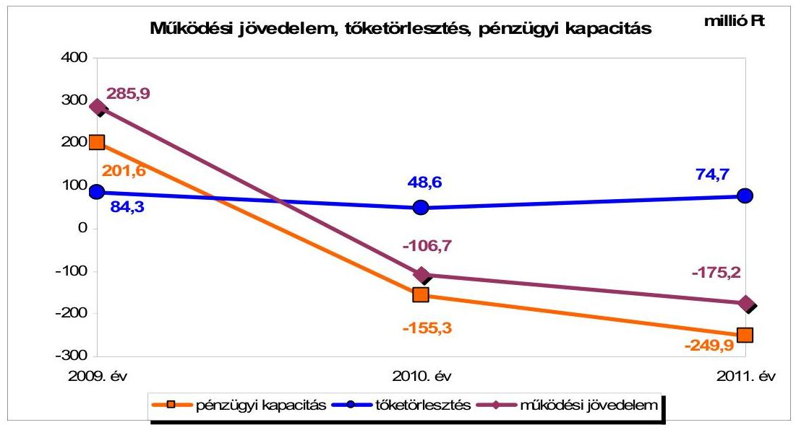
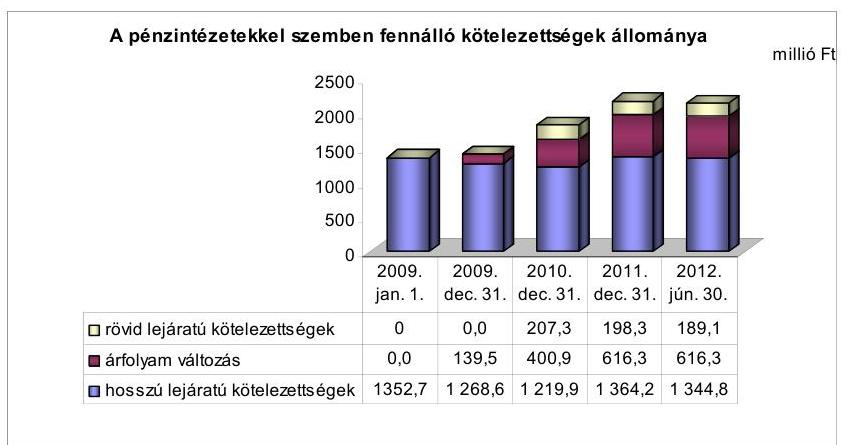
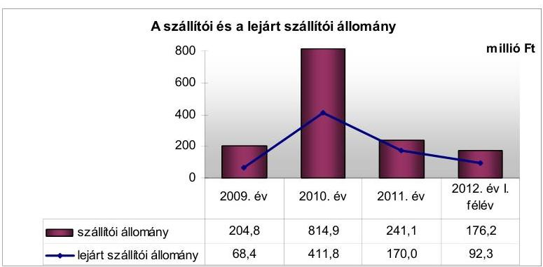
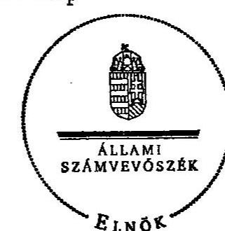
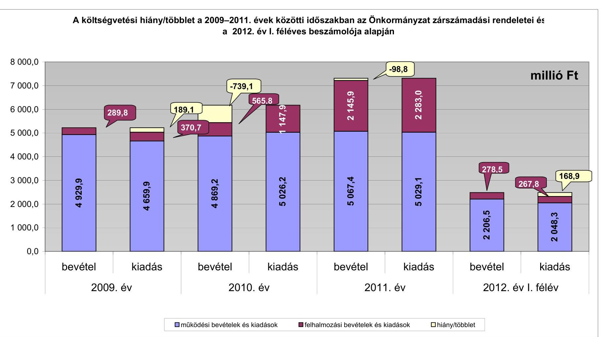
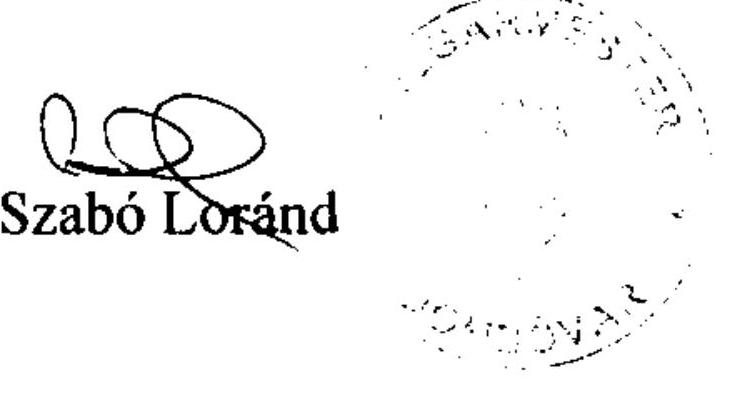
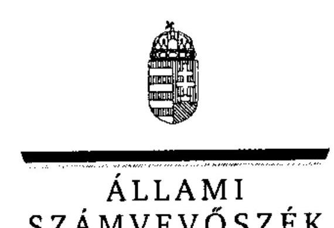
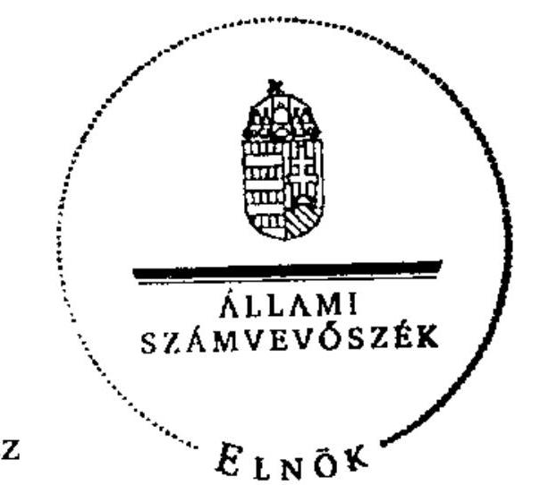
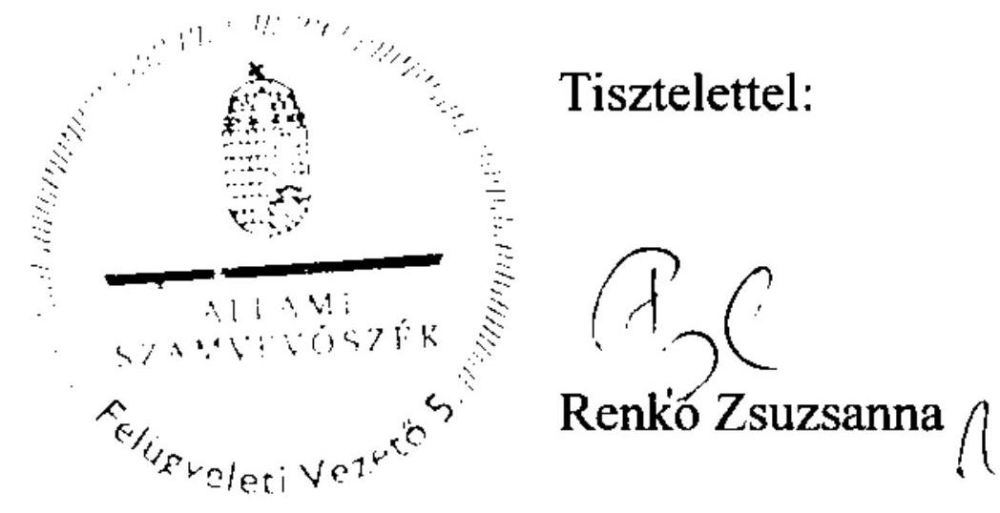
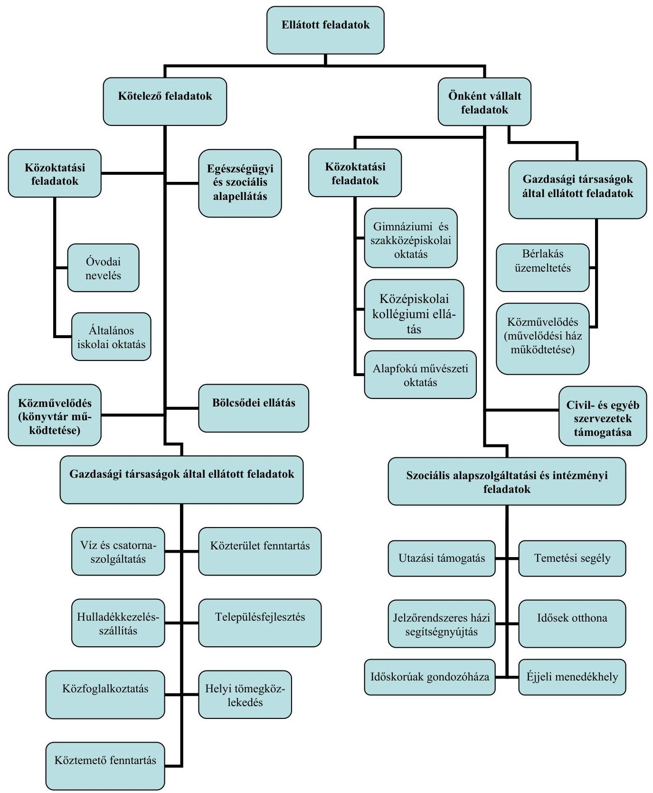

# JELENTÉS 

Dombóvár Város Önkormányzata pénzügyi gazdálkodási helyzetének, szabályosságának ellenőrzéséről

---

# Állami Számvevőszék 

Iktatószám: V-0030-256-020/2013.
Témaszám: 1069
Vizsgálat-azonosító szám: V059209

## Az ellenőrzést felügyelte:

## Renkó Zsuzsanna

felügyeleti vezető

## Az ellenőrzést vezette:

## Dér Lívia

ellenőrzésvezető

## Az ellenőrzést végezték:

| Preller Zsuzsanna | dr. Hegedüs György | Csepreginé Tancsik Erzsébet |
| :-- | :-- | :-- |
| számvevő tanácsos | számvevő tanácsos | számvevő tanácsos |

---

# TARTALOMJEGYZÉK 

BEVEZETÉS ..... 3
I. ÖSSZEGZŐ MEGÁLLAPÍTÁSOK, KÖVETKEZTETÉSEK, JAVASLATOK ..... 6
II. RÉSZLETES MEGÁLLAPÍTÁSOK ..... 13

1. Az Önkormányzat kötelező és önként vállalt feladatai, a feladatellátás szervezeti keretei ..... 13
2. A pénzügyi egyensúly fenntartását veszélyeztető pénzügyi kockázatok és az ezek csökkentése érdekében tett intézkedések ..... 14
3. A pénzügyi gazdálkodási folyamatok szabályosságát, megfelelőségét biztosító belső kontrollok ..... 25
4. Az ÁSZ korábbi ellenőrzése során a pénzügyi, gazdálkodási helyzet javítására tett javaslatainak megvalósítása ..... 26

---

# MELLÉKLETEK 

1. számú A költségvetési hiány/többlet a 2009-2011. évek közötti időszakban az Önkormányzat zárszámadási rendeletei és a 2012. év I. féléves beszámolója alapján
2. számú Az Önkormányzat bevételei és kiadásai, valamint adósságszolgálata a 2009-2011. években (a CLF módszer szerint)
3/a. számú Az Önkormányzat által a 2009. év és a 2012. év I. félév között megvalósított (műszakilag befejezett) fejlesztések forrásösszetétele
3/b. számú Az Önkormányzat 2012. június 30 -án folyamatban lévő fejlesztési feladataihoz kapcsolódó kötelezettségeinek összegzése
3/c. számú Az Önkormányzat által beadott, elbírálás alatti pályázatok forrásaiból megvalósuló fejlesztésekhez kapcsolódó kötelezettségvállalások összegzése
3. számú Az önkormányzati feladatok ellátásában résztvevő gazdasági társaságok egyes kiemelt adatai
4. számú Az Önkormányzat 2012. június 30 -án fennálló, hosszú lejáratú adósságot keletkeztető kötelezettségvállalásai
5. számú Az Önkormányzat kötelezettségeinek 2011. december 31-ei és 2012. június 30 -ai állománya és a 2012. évben, valamint az azt követő években várható kötelezettségek miatti kiadások
6. számú Az Önkormányzat többségi tulajdonában lévő gazdasági társaságok kötelezettségeinek 2011. december 31-ei és 2012. június 30 -ai állománya és a 2012. évben, valamint az azt követő években várható kötelezettségek miatti kiadások
8/a. számú Dombóvár Város Önkormányzata Polgármesterének a jelentéstervezethez tett észrevétele
8/b. számú Az ÁSZ válasza Dombóvár Város Önkormányzata Polgármesterének a jelentéstervezethez tett észrevételére

## FÜGGELÉKEK

1. számú Rövidítések jegyzéke
2. számú Értelmező szótár
3. számú Az Önkormányzat által ellátott feladatok a 2012. év I. félév végén

---

# JELENTÉS 

## Dombóvár Város Önkormányzata pénzügyi gazdálkodási helyzetének, szabályosságának ellenőrzéséről

## BEVEZETÉS

Az államháztartás helyi szintjén, az önkormányzati alrendszerben az utóbbi években megjelenő gazdálkodási nehézségek, a pénzforgalmi hiány növekedése, az eladósodás az ÁSZ figyelmét a helyi önkormányzatok pénzügyi helyzetére irányította.

Az ÁSZ a 2012. évi ellenőrzési tervben foglaltaknak megfelelően az önkormányzatok pénzügyi gazdálkodási helyzetének, szabályosságának ellenőrzésével az önkormányzatok 2011. évben megkezdett helyzetelemzését folytatta. Az ellenőrzés keretében értékeljük az önkormányzatok adósságkezelési és likviditási helyzetét, bemutatjuk a pénzügyi egyensúly alakulására hatással lévő folyamatokat. Feltárjuk az ezekre ható kockázatokat, a pénzügyi egyensúlyi helyzetet befolyásoló döntésmegalapozó, döntés-előkészítő eljárások szabályosságát, és minősítjük az ezekkel összefüggő belső kontrollok kialakítását, múködését. Az ellenőrzés kiterjed az ellenőrzött időszakban végrehajtott ÁSZ ellenőrzés utóellenőrzésére is.

Az ellenőrzés eredményének várható hatásaként a megállapításokkal segítséget nyújthatunk az önkormányzatok számára a pénzügyi egyensúly helyreállítása, javítása és fenntartása érdekében szükségessé váló intézkedések megtételéhez.

Az ellenőrzés típusa: szabályszerűségi ellenőrzés.

## Az ellenőrzés célja annak értékelése volt, hogy:

- a vizsgált időszakban a kötelező- és az önként vállalt feladatok ellátását biztosító szervezeti formák változása milyen hatást gyakorolt az Önkormányzat pénzügyi helyzetének alakulására;
- az Önkormányzat pénzügyi - ezen belül múködési és felhalmozási - egyensúlya milyen irányban változott, a változást milyen okok idézték elő, továbbá milyen intézkedéseket tettek a pénzügyi egyensúly biztosítása, illetve javítása érdekében, az intézkedések hatására javult-e az Önkormányzat pénzügyi helyzete;
- a költségvetési kiadások finanszírozása érdekében vállalt pénzintézetekkel szembeni kötelezettségek hogyan alakultak, a kötelezettségek fennállása

---

miként befolyásolja az Önkormányzat jövőbeli pénzügyi egyensúlyi helyzetét;

- az Önkormányzat beazonosította, felmérte, értékelte-e a pénzügyi egyensúlyt befolyásoló pénzügyi kockázatokat, a finanszírozási célú pénzügyi műveletekkel kapcsolatban írtak-e elő kockázatértékelési kötelezettséget;
- az Önkormányzat által kialakított belső kontrollok biztosítják-e a pénzügyi gazdálkodás folyamatainak szabályosságát és eredményességét;
- hasznosultak-e az ÁSZ korábbi ellenőrzése során a pénzügyi, gazdálkodási helyzet javítására tett szabályszerűségi és célszerűségi javaslatok.

Az ellenőrzés a 2009. január 1-jétől 2012. június 30 -áig terjedő időszakot ölelte fel. A pénzintézetekkel szembeni kötelezettségek állományának vizsgálatakor a 2011. december 31-én fennálló kötelezettségek keletkezésének kezdő időpontját vettük figyelembe.

Az ellenőrzés szakmai módszertana az ÁSZ Ellenőrzési Kézikönyvében foglalt szakmai szabályokon alapult, amely a Legfőbb Ellenőrző Intézmények Nemzetközi Szervezete (INTOSAI) által kiadott nemzetközi standardok (ISSAI) figyelembevételével készült.

Az ellenőrzés során használt rövidítéseket az 1. számú, az egyes fogalmak magyarázatát a 2. számú függelék tartalmazza.

A vizsgálat jogszabályi alapját az ÁSZ tv. 1. § (3) bekezdésének, 5. § (2)-(6) bekezdéseinek, valamint az Áht. 61 . § (2) bekezdésének előírásai képezik.

A helyszíni ellenőrzést követően az Országgyűlés a helyi önkormányzatok adósságállományának részleges konszolidációjáról döntött. Az 5000 fő lakosságszámot meg nem haladó települési önkormányzatok számára nyújtott törlesztési célú támogatással ${ }^{1}$ lehetővé tették a 2012. december 12-én fennálló tartozásállományuk és annak 2012. december 28-án fennálló járulékai teljes megfizetését. Az 5000 fő lakosságszám feletti települések esetében a 2013. évben az állam differenciált - a bevételi képességet figyelembe vevő, 40-70\%-ig terjedő mértékben vállalja át ${ }^{2}$ az önkormányzat 2012. december 31-i, az átvállalás időpontjában fennálló adósságállományát és annak járulékait. Az adósságkonszolidációs intézkedéssel egyidejűleg a Kormány elrendelte ${ }^{3}$ az önkormányzatok adósságállománya újratermelődésének megakadályozása céljából a hitelengedélyezési és a likvid hitelekre vonatkozó szabályozás szigorítását.

Dombóvár Város Önkormányzata lakónépességére tekintettel a 2013. évi adósságkonszolidációban érintett. Az ÁSZ jelen ellenőrzése során a pénzügyi egyen-

[^0]
[^0]:    ${ }^{1}$ Magyarország 2012. évi központi költségvetéséről szóló 2011. évi CLXXXVIII. törvény módosításáról szóló 2012. évi CLXXXVII. törvény alapján
    ${ }^{2}$ Magyarország 2013. évi központi költségvetéséről szóló 2012. évi CCIV. törvény alapján
    ${ }^{3}$ 1540/2012. (XII. 4.) Korm. határozat a helyi önkormányzatok adósságállományának részleges konszolidációjáról

---

súly jövőbeni alakulását befolyásoló kockázatokra tett megállapításai az adósságkonszolidációt követően is időszerűek és helytállóak.

Dombóvár város lakosainak száma 2012. január 1-jén 19621 fő volt, 456 fővel, 2,3\%-kal kevesebb a 2009. január 1-jei lakosságszámnál. Az Önkormányzat a 2011. évben 7213,3 millió Ft költségvetési bevételt ért el és 7312,1 millió Ft költségvetési kiadást teljesített. 2011. december 31-én a könyvviteli mérleg szerint 15 989,0 millió Ft értékű vagyonnal rendelkezett, amely a 2009. év végi állományhoz viszonyítva 10,1\%-kal (1469,1 millió Ft-tal) növekedett. Az eszközérték növekedésében 1652,3 millió Ft-tal a beruházások állománynövekedése volt meghatározó, a folyamatban lévő intézményrekonstrukciók eredményeként. A források között a saját tőke állományának 1352,7 millió Ft-os és a kötelezettségek állományának 827,1 millió Ft-os növekedése képezte az állományváltozás döntő hányadát. A kötelezettségek állományváltozásán belül 74,5\%-ot képviselt a devizában kibocsátott kötvény 616,3 millió Ft összegű nem realizált árfolyamveszteségének elszámolása. Az Önkormányzat a 2012. évi költségvetési rendeletében a - finanszírozási múveletek nélküli - költségvetési bevétel összegét 4753,9 millió Ft-ban, a költségvetési kiadás összegét 4817,4 millió Ft-ban állapította meg.

Az ÁSZ tv. 29. § (1) bekezdése szerint a jelentéstervezetet megküldtük a polgármester részére, aki az ÁSZ tv. 29. § (2) bekezdésében foglalt észrevételezési jogával élt, a jelentéstervezetre észrevételt tett.

---

# I. ÖSSZEGZŐ MEGÁLLAPÍTÁSOK, KÖVETKEZTETÉSEK, JAVASLATOK 

Dombóvár Város Önkormányzatának pénzügyi egyensúlyi helyzete rövid távon nem biztosított. Az alacsony múködési jövedelemtermelő képesség miatt a jelentős pénzintézetekkel és szállítókkal szembeni kötelezettségek teljesíthetősége kockázatos.

Az önként vállalt feladatokra fordított kiadások magas és növekvő aránya 2009-ben 45,1\% (2115,9 millió ), 2010-ben 47,3\%, (2264,3 millió Ft) 2011-ben 46,0\% (2220,2 millió Ft) múködési kockázatot jelent. A 2009. év és a 2012. év I. félév között elszámolt felhalmozási kiadások 59,0\%-a, 2336,1 millió Ft kapcsolódott az önként vállalt feladatokhoz, amely felhalmozási kockázatot jelent az Önkormányzat szempontjából.

Az Önkormányzat 2009-2011 között összesen 17 867,9 millió Ft költségvetési bevételt realizált, és 18516,9 millió Ft költségvetési kiadást teljesített. Az ellátott feladatok alapvetően a közoktatáshoz, az egészségügyi és szociális alapellátáshoz, a bölcsődei ellátáshoz, a közművelődéshez, a bérlakás üzemeltetéshez, illetve a civil és egyéb szervezetek támogatásához kapcsolódtak. Az ellenőrzött időszakban bekövetkezett szervezeti változások - a közoktatási feladatátvétel és a tűzoltóság átadása - a pénzügyi egyensúlyi helyzet alakulására jelentős hatást nem gyakoroltak.

A múködési költségvetés egyenlege a 2009. évben pozitív, a 2010-2011. években negatív, a felhalmozási költségvetés egyenlege a 2009-2010. években negatív, 2011-ben pozitív volt. 2009-2011 között összesen 4,0 millió Ft működési forrástöbblet és 653,0 millió Ft felhalmozási forráshiány keletkezett. A 2010-2011. években az Önkormányzat pénzügyi egyensúlyi helyzete jelentősen romlott, mert az oktatási központ létrehozása miatt növekvő folyó kiadásokat egyre csökkenő mértékben finanszírozták a költségvetési támogatások, az szja és a helyi adóbevételek. A felhalmozási költségvetés egyensúlyi helyzetét a 2010-2011. években EU-s támogatás igénybevételével megvalósított két projekt befolyásolta. A múködési és felhalmozási költségvetés összességében 649,0 millió Ft-os negatív egyenlege a három év költségvetési kiadásának $3,5 \%$-át tette ki.

A nettó múködési jövedelem a 2010. évben nem nyújtott fedezetet a felhalmozási forráshiányra, 2009-2011 között a múködési jövedelem csökkenésének és a tőketörlesztés növekedésének hatására jelentősen csökkent. A pénzügyi kapacitás változását a következő ábra mutatja be.

---

Az Önkormányzat a 2011. évben részesült ÖNHIKI támogatásban, amely nélkül a múködési forráshiány 34,7 millió Ft-tal magasabb értéket mutatott volna. A folyó költségvetés egyenlegének kedvezőtlen tendenciája a múködési jövedelemtermelő képesség kockázatát jelzi.

Az Önkormányzatnál a 2012. június 30-ig múszakilag befejezett beruházásokra és felújításokra 3985,3 millió Ft kiadást teljesítettek. A megvalósított fejlesztések jövőbeni üzemeltetési kockázatot jelenthetnek, mivel nem számszerúsítették a várható üzemeltetési kiadásokat, és a fejlesztések nem teremtenek bevételnövelési lehetőséget.

Az ellenőrzött időszakban tett bevételnövelő és kiadáscsökkentő intézkedések hatására, az Önkormányzat adatszolgáltatása szerint, 313,6 millió Ft bevételi többlet - melynek 35,2\%-a tekinthető tartós jellegű, folyamatos bevételnek - illetve 155,5 millió Ft kiadási megtakarítás keletkezett, amely nem biztosított elegendő forrást a pénzügyi egyensúly helyreállításához.

Az Önkormányzat pénzintézeti kötelezettségei a 2009. év elejétől a 2012. év I. félév végére 59,0\%-kal, 1352,7 millió Ft-ról 2150,2 millió Ft-ra növekedtek. A növekedés a hosszú lejáratú fejlesztési hitelek 2011. évi felvétele, azok törlesztése, a folyószámlahitel állományának növekedése, valamint a kötvény év végi értékeléséből származó árfolyamveszteség együttes hatására következett be. Az Önkormányzat 6480,0 ezer CHF összegű, 1042,0 millió Ft névértékű kötvényt bocsátott ki a 2008. évben. A fejlesztési célú hiteleket és kötvénybevételt a célnak megfelelően felhasználták. Az ellenőrzött időszakban a fejlesztési források biztosítása 175,5 millió Ft kamat és 2,0 millió Ft egyéb kiadásfizetési kötelezettséggel járt. A referencia kamatok csökkenésének eredményeként a fejlesztési hitelek után 44,0 millió Ft-tal, a kötvény után 72,9 millió Ft-tal kevesebb kamatfizetési kötelezettség keletkezett. A pénzintézeti kötelezettségvállalások során bemutatták ezek jövőbeni terheinek forrásszükségletét, de a visszafizetések lehetséges forrásait nem részletezték.

Az Önkormányzat likviditása és rövidtávú pénzügyi egyensúlyi helyzete kedvezőtlenül alakult. A folyamatosan fennálló folyószámlahitel mellett a

---

2010. évtől munkabér-megelőlegezési hitelt is igénybe vett, a hitelek napi átlagos állománya és a hitellel zárt napok száma folyamatosan emelkedett. A fo-lyószámlahitel-keretet 2011. február hónapban 200 millió Ft-ra, 2012. augusztus hónapban 256 millió Ft-ra emelték. A likviditás biztosítására felvett hitelek után az Önkormányzat kamat és egyéb kiadás jogcímen összesen 33,0 millió Ft kifizetést teljesített. A pénzintézeti kötelezettségek növekedése az Önkormányzat eladósodásának növekedését jelzi, amely miatt banki kitettség és viszszafizetési kockázat mutatkozik. Az Önkormányzat az éves beszámolók keretében rendszeresen értékelte likviditási helyzetét, annak változását és a pénzügyi egyensúlyi helyzetre gyakorolt hatását.

A vitatott és átütemezett szállítói számlák nélküli, 90,5 millió Ft összegű, lejárt szállítói állomány 2012. június 30 -án elérte a dologi kiadások havi átlagának $86,6 \%$-át, emiatt jelentős a nemfizetési kockázat.

A kezességvállalás állománya az ellenőrzött időszakban a 2009. évi 35,2 millió Ft-ról közel nyolcszorosára, 278,5 millió Ft-ra emelkedett. A Kapos ITK Kht. részére nyújtott 35,2 millió Ft összegű kezességvállaláshoz kapcsolódóan az NFM 2011-ben 46,5 millió Ft ( 35,2 millió Ft támogatás és járulékai) kezességbeváltási igénnyel élt. Az Önkormányzat kezdeményezte ennek a jogi úton történő visszakövetelését. A kezességvállalás döntés-előkészítési folyamatában nem mutatták be a szerződésből eredő kötelezettség kockázatait, az Önkormányzat pénzügyi egyensúlyi helyzetére gyakorolt hatását. Az adott kölcsönök állománya 2012. június 30 -án 142,1 millió Ft volt, a kölcsönszerződésekben biztosítékokat nem rögzítettek. A kölcsönök megtérülésének bizonytalansága pénzügyi kockázatot jelent.

Az Önkormányzat ellenőrzött időszak végén fennálló, pénzintézetekkel szembeni forint és devizaalapú kötelezettsége összesen 2150,2 millió Ft, a szállítói tartozásállománya 176,2 millió Ft volt. A vállalt hosszú és rövid lejáratú kötelezettségek teljesítésére a mérlegben kimutatott 167,9 millió Ft követelésállomány vehető figyelembe, amely a teljes kötelezettségállományra nem nyújt fedezetet. Kockázatot jelent továbbá, hogy a múködési jövedelemtermelő képesség nem megfelelő színvonalából adódóan, a folyó költségvetésben képződő bevételek a feladatellátás kiadásain túl várhatóan nem nyújtanak fedezetet az adósságkonszolidációt követően sem a jövőben esedékessé váló pénzintézetekkel szembeni és egyéb kötelezettségekre. Az Önkormányzat az adósságszolgálat teljesítésére elkülönített tartalékokkal nem rendelkezik.

Az Önkormányzat minősített többségi tulajdonában lévő gazdasági társaságainak kötelezettségállománya a mérlegen kívüli kockázat alakulása szempontjából nem volt jelentős. A Képviselő-testület rendszeresen tájékoztatást kapott a gazdasági társaságok pénzügyi helyzetéről, elfogadta a társaságok éves beszámolóját és üzleti tervét, azonban a gazdasági társaságok kötelezettségei alakulásának az Önkormányzat pénzügyi egyensúlyi helyzetére gyakorolt hatását nem értékelték.

Az ellenőrzött időszakban nem mérték fel, hogy az elhasználódott eszközök felújítása, pótlása mekkora forrásokat igényel. Az eszközök használhatósági fok mutatója $80,7 \%$-ról $78,6 \%$-ra csökkent.

---

Az Önkormányzatnál a kockázatkezelési rendszer kialakítása és múködtetése teljes körűen nem felelt meg a 2009-2011. években az Áht.,, a 2012. év I. félévében az Áht. 2 előírásainak. Az ellenőrzött időszakban fennálltak az önként vállalt feladatok, az alacsony múködési jövedelemtermelő képesség, a fejlesztések jövőbeni üzemeltetésének, a banki kitettség és a pénzintézeti kötelezettségek visszafizetésének, a szállítói állomány miatti nemfizetésnek, a jövőbeli várható kötelezettségek teljesíthetőségének, valamint a nyújtott kölcsönök megtérülésének kockázatai. A pénzügyi egyensúlyra kiható kockázatok beazonosítása, felmérése, értékelése, ezáltal kezelése a 2009. évben az Ámr.,, a 20102011. években az Ámr.,, és a 2012. év I. félévében a Bkr. előírásai ellenére elmaradt.

Az Önkormányzatnál a belső kontrolltevékenységek kialakítása és múködtetése teljes körűen nem felelt meg a 2009-2011. években az Áht.,, a 2012. év I. félévben az Áht. ${ }_{2}$ előírásainak. A pénzügyi gazdálkodási folyamatok szabályosságát biztosító belső kontrollok köréből a pénzügyi gazdasági döntések megalapozását szolgáló, valamint a pénzintézeti kötelezettségvállalások szabályosságát biztosító kontrollok gazdálkodási folyamatokba történő beépítése - a 2009. évben az Ámr.,, a 2010-2011. években az Ámr.,, a 2012. év I. félévében a Bkr. előírásai ellenére - nem volt megfelelő, mivel nem határozták meg az Önkormányzat fizetőképességének és eladósodásának kezelésével összefüggő kontrolltevékenységeket. A feladatellátás szabályosságát biztosító és a pénzügyi egyensúlyi helyzet alakulását befolyásoló belső kontrollok kialakítását megfelelőnek értékeltük. A beépített kontrollok múködése megfelelő volt, biztosították az Önkormányzat pénzügyi gazdálkodási folyamatainak szabályszerű végrehajtását.

A gazdálkodási rendszer 2009. évi ÁSZ ellenőrzése során tett 17 szabályszerűségi javaslatot megvalósították, a 21 célszerűségi javaslatból négy hasznosítása nem történt meg. A pénzügyi és gazdálkodási helyzet javítására tett három szabályszerűségi és három célszerűségi javaslat hasznosult. A szabályszerűségi javaslatok a szabálytalanságok kezelése eljárásrendjének kialakítására, a szakmai teljesítésigazolás és a kötelezettségvállalás teljes körű szabályozására és alkalmazására, valamint a magas kockázatúnak értékelt területek belső ellenőrzésére vonatkoztak. A célszerűségi javaslatok az intézkedési terv készítésére, a fejlesztési feladatok bonyolításával kapcsolatos eljárásrend kialakítására és alkalmazására és a céljelleggel nyújtott támogatások rendeltetés szerinti felhasználásának ellenőrzésére terjedtek ki.

Összességében az Önkormányzat múködési jövedelemtermelő képessége gyenge volt, forrásai az ellátott feladatokra nem nyújtottak fedezetet. A nagyrészt az önként vállalt feladatokhoz kapcsolódó felhalmozási kiadások teljesítéséhez felvett fejlesztési célú hitelek, valamint a deviza alapú kötvénykibocsátásból eredő kötelezettségek teljesíthetősége kockázatot jelent. A hitelekből megvalósult beruházások a feladatellátás színvonalának javításához hozzájárultak, de nem teremtettek bevételnövelési lehetőséget. A pénzintézettel szembeni és a szállítói kötelezettségeken túl, a kezességbeváltás, valamint az adott kölcsönök bizonytalan megtérülése az Önkormányzat pénzügyi gazdálkodási pozícióit és múködését rövid távon korlátozzák.

---

Az ÁSZ tv. 33. § (1) bekezdésében foglaltak értelmében az ellenőrzött szervezet vezetője köteles a jelentésben foglalt megállapításokhoz kapcsolódó intézkedési tervet összeállítani, és azt a jelentés kézhezvételétől számított harminc napon belül az ÁSZ részére megküldeni. Amennyiben az intézkedési tervet határidőben nem küldi meg a szervezet, vagy az továbbra sem elfogadható, az ÁSZ elnöke a hivatkozott törvény 33. § (3) bekezdés a)-b) pontjaiban foglaltakat érvényesítheti.

# Az ellenőrzés intézkedést igénylő megállapításai és javaslatai: 

## a polgármesternek

1. Az Önkormányzat nettó működési jövedelme 2010-2011 között negatív volt. Az önként vállalt feladatokra fordított folyó kiadások 2011. évi 46,0\%-os részaránya működési kockázatot jelentett. Az ellenőrzött időszakban teljesített felhalmozási kiadások 59,0\%-a kapcsolódott az önként vállalt feladatokhoz. A likviditás folyószám-la- és munkabér-megelőlegezési hitel igénybevételével volt biztosítható. A 2012. év I. félév végére a pénzintézeti kötelezettségek 2150,2 millió Ft-ra növekedtek, a vitatott és átütemezett tételek nélküli 90,5 millió Ft lejárt szállító tartozásállomány elérte a dologi kiadások havi átlagának 86,6\%-át. Az Önkormányzat által nyújtott kölcsönök állománya 2012. június 30-án 142,1 millió Ft volt, amely megtérülésének bizonytalansága pénzügyi kockázatot jelentett. A bevételnövelő és kiadáscsökkentő intézkedések nem biztosítottak elegendő forrást a pénzügyi egyensúly helyreállításához. Az adósságszolgálat teljesítéséhez felhasználható elkülönített tartalékkal nem rendelkeztek.

Javaslat:
A működési jövedelemtermelő képesség és a feladatellátás összhangjának, valamint az Önkormányzat pénzügyi egyensúlya helyreállításának, hosszú távú fenntarthatóságának érdekében - a 2013. évi kormányzati adósságkonszolidációt, valamint a 2013. évtől változó feladat-ellátási kötelezettséget és feladatfinanszírozási rendszert figyelembe véve - felelősök és határidők megjelölésével kezdeményezzen intézkedéseket, melyek keretében:
a) a költségvetési rendelettervezet, valamint annak évközi módosítása előterjesztését megelőzően mérje fel a bevételszerző, kiadáscsökkentő lehetőségeket, és terjessze a Képviselő-testület elé a bevételek növelését, kiadások csökkentését célzó intézkedések bevezetéséhez szükséges - a Htv. 140. § (1) bekezdés a) pontja alapján a jegyző által elkészített - döntési javaslatát;
b) terjesszen a Képviselő-testület elé jóváhagyásra - a Htv. 140. § (1) bekezdés a) pontja alapján a jegyző által elkészített - az Önkormányzat gazdasági helyzetének elemzésén alapuló, a pénzügyi egyensúlyi helyzet gyors helyreállítását, hoszszú távú fenntartását, valamint az adósságállomány újratermelődésének elkerülését biztosító intézkedéseket tartalmazó reorganizációs programot;
c) az adósságkonszolidációt követően fennmaradó kötelezettségek tekintetében terjesszen a Képviselő-testület elé olyan egyensúlyi (elkülönített) tartalék képzésére vonatkozó - a Htv. 140. § (1) bekezdés a) pontja alapján a jegyző által elkészített - döntési javaslatot, amelyben a Képviselő-testület meghatározza annak

---

összegét, és kötelezettséget vállal arra, hogy a törlesztési időszak alatt ezt a tartalékot a költségvetési rendeleteiben minden évben betervezi az adósságszolgálat teljesítésére;
d) vizsgáltassa felül az önként vállalt feladatok finanszírozhatóságát a kötelező feladatellátás elsődlegességének biztosítása érdekében, és ennek függvényében tegyen javaslatot a Képviselő-testületnek a feladatellátás racionalizálására;
e) intézkedjen, hogy a gazdálkodó szervezetek részére nyújtott kölcsönök esetében a kölcsönszerződésben a kamat felszámításán túl a követelés biztosítására fedezet, illetve egyéb jogi biztosíték kikötéséről rendelkezzenek;
f) a szállítói kitettség és a helyi önkormányzatok adósságrendezési eljárásáról szóló 1996. évi XXV. törvény 4-9. §-aiban szabályozott adósságrendezési eljárás megindítása elkerülésének érdekében meghatározott gyakorisággal számoljon be a Képviselő-testületnek az Önkormányzat lejárt szállítói állománya alakulásáról. Intézkedjen a szállítói számlák esedékesség szerinti kiegyenlítéséről vagy a lejárt tartozások átütemezéséről.

# a jegyzönek 

1. Az Önkormányzatnál a kockázatkezelési rendszer kialakítása és múködtetése teljes körűen nem felelt meg a 2009-2010. években az Áht1 120/B. § (2) bekezdés b) pontjában, a 2011. évben az Áht1 121. § (2) bekezdés b) pontjában, a 2012. év I. félévében az Áht2 69. § (2) bekezdésében meghatározott előírásoknak. Az ellenőrzött időszakban fennállt pénzügyi egyensúlyi helyzetre kiható kockázatok (az önként vállalt feladatok múködési és felhalmozási kockázata, a múködési jövedelemtermelő képesség miatti kockázat, a fejlesztések jövőbeni üzemeltetési és megtérülési kockázata, a pénzintézeti kötelezettségek növekedése miatt a banki kitettség, valamint a visszafizetési kockázat, az adott kölcsönök megtérülésének bizonytalansága miatti pénzügyi kockázat, a lejárt szállítói állomány miatti nemfizetési kockázat, valamint a jövőbeli várható kötelezettségek teljesíthetőségének kockázata) feltárása, beazonosítása, értékelése, ezáltal a kockázatok kezelése - a 2009. évben az Ámr. 1 145/C. §-ában, a 2010-2011. években az Ámr. 2 157. §-ában, a 2012. év I. félévében a Bkr. 7. § (1)-(2) bekezdéseiben foglalt jogszabályi előírások ellenére - elmaradt.

Javaslat:
Működtessen az Áht ${ }_{2}$ 69. § (2) bekezdésében, továbbá a Bkr. 7. § (1)-(2) bekezdéseiben foglalt előírásoknak megfelelő, a pénzügyi egyensúlyt befolyásoló kockázatok kezelésére alkalmas kockázatkezelési rendszert.
2. Az Önkormányzatnál a belső kontrolltevékenységek kialakítása és múködtetése teljes körűen nem felelt meg a 2009-2010. években az Áht, 120/B. § (2) bekezdés c) pontjában, a 2011. évben az Áht, 121. § (2) bekezdés c) pontjában és a 2012. év I. félévében az Áht ${ }_{2}$ 69. § (2) bekezdésében meghatározott előírásoknak. A pénzügyi, gazdálkodási folyamatok szabályosságát biztosító belső kontrollok körében a pénzügyi gazdasági döntések megalapozását szolgáló, valamint a pénzintézeti kötelezettségvállalások szabályosságát biztosító kontrollok gazdálkodási folyamatokba történő beépítése - a 2009. évben az Ámr. 145/E. § (1) bekezdésében, a 2010-2011. évek-

---

ben az Ámr. 158. § (1) bekezdésében és a 2012. év I. félévében a Bkr. 8. § (1)-(2) bekezdéseiben foglalt előírások ellenére - nem volt megfelelő, mivel nem határozták meg a fizetőképesség és az eladósodás kezelésével összefüggő kontrolltevékenységeket.

Javaslat:
Alakítsa ki az Áht ${ }_{2}$ 69. § (2) bekezdésében, továbbá a Bkr. 8. § (1)-(2) bekezdései alapján azokat a belső kontrolltevékenységeket, amelyek biztosítják a pénzügyigazdálkodási folyamatok szabályosságát és a pénzügyi egyensúlyi helyzet alakulását befolyásoló döntések kockázatainak kezelését. Ennek keretében készítsen szabályzatot az Önkormányzat fizetőképességének és eladósodásának kezelésére.

---

# II. RÉSZLETES MEGÁLLAPÍTÁSOK 

## 1. Az ÖNKORMÁNYZAT KÖTELEZŐ ÉS ÖNKÉNT VÁLlALT FELADATAI, A FELADATELLÁTÁS SZERVEZETI KERETEI

Az Önkormányzat kötelező és önként vállalt feladatait a Képviselőtestület SZMSZ-ében rögzítették. A kötelező és önként vállalt feladatok szerkezete az ellenőrzött időszakban nem változott.

A 2012. június 30 -án hatályos SZMSZ szerint az önként vállalt feladatok közé sorolták a közoktatási feladatok közül az alapfokú művészeti oktatást, a gimnáziumi és szakközépiskolai oktatást, a középiskolai kollégiumi ellátást, a szociális alapszolgáltatási és intézményi feladatok közül a temetési segély és az utazási támogatás nyújtását, a jelzőrendszeres házi segítségnyújtást, az idősek otthona, az időskorúak gondozóháza és az éjjeli menedékhely fenntartását, valamint a civil és egyéb szervezetek támogatását, a bérlakás üzemeltetést és a művelődési ház múködtetését. Kötelező feladatként az óvodai nevelést, az általános iskolai oktatást, az egészségügyi és szociális alapellátást, a bölcsődei ellátást, valamint a közművelődési és könyvtári, a víz- és csatornaszolgáltatási, a közterület-fenntartási, a hulladékkezelési és -szállítási, a településfejlesztési, a közfoglalkoztatási, a helyi tömegközlekedési és a köztemető fenntartási feladatokat látták el.

Az Önkormányzatnál múködési kockázatot jelentett, hogy az ellenőrzött időszakban a múködési kiadásokon belül magas volt az önként vállalt feladatokra fordított kiadások aránya. Az önként vállalt feladatokra fordított kiadások az Önkormányzat adatszolgáltatása szerint növekvő tendenciát, arányt mutattak, 2009-ben 2115,9 millió Ft-ot (45,1\%), 2010-ben 2264,3 millió Ft-ot ( $47,3 \%$ ), 2011-ben 2220,2 millió Ft-ot ( $46,0 \%$ ) tettek ki. A csökkenő források következtében az önként vállalt feladatok finanszírozása - a kötelező feladatok ellátására is kiható - fokozódó likviditási gondokat eredményezhet. A 2009. év és a 2012. év I. félév között a felhalmozási kiadások összegének 59,0\%-át, 2336,1 millió Ft-ot fordítottak önként vállalt feladatokhoz kapcsolódó fejlesztésekre, amely felhalmozási kockázatot jelent. A kiadások közel $50 \%$-a a művelődési ház rekonstrukciójával függött össze.

Az Önkormányzat észrevétele szerint az önként vállalt feladatok nem jelentettek múködési kockázatot, mert nem kellett egyéb önkormányzati forrást bevonni. Az észrevételt nem fogadtuk el, mert a jelentéstervezet nem tartalmazta, és így nem is kifogásolta azt, hogy az önként vállalt feladatok múködtetéséhez az ellenőrzött időszakban egyéb önkormányzati forrást kellett bevonni. Az önként vállalt feladatok nagyságrendjével kapcsolatban a jelentéstervezetben bemutatott adatokat az Önkormányzat szolgáltatta. Mivel az Önkormányzat múködési költségvetése 2010-től forráshiányos, így az önként vállalt feladatokra fordított kiadások múködési kiadásokon belüli magas részaránya, évek közötti növekedése az észrevételben is leírt szűkülő források miatt kockázatot jelentett. A 2013. évtől az önként vállalt feladatok ellátása a pénzügyi egyensúlyi helyzet jövőbeni alakulásá-

---

ra kiható kockázatként kezelendő, hiszen a megváltozott feladatfinanszírozási rendszer a kötelező feladatokra biztosít központi forrásokat.

Az Önkormányzat feladatait 2012. június 30 -án a Polgármesteri Hivatallal együtt tíz költségvetési szerv látta el. A négy önállóan múködő és gazdálkodó, valamint a hat önállóan múködő költségvetési szerv 41 telephelyen biztosította a feladatok ellátását. Az új intézmények létesítése, valamint az intézmény átadások és átszervezések következtében 2009. január 1-jéről 2012. június 30 -ára a költségvetési szervek száma 13 -ról 10 -re, a feladatellátás telephelyeinek száma 40 -ről 41 -re változott. A legnagyobb és jelentős költségvetési hatással járó változás a feladatellátásban az APOK feladatkörében valósult meg. A 2009. szeptemberi feladatátvételek következtében az új tagintézményekkel való bővüléssel az óvodai és az általános iskolai ellátottak, valamint a közalkalmazottak száma nőtt.

A 2009-2011. évek között 14 gazdasági társaság vett részt az önkormányzati feladatellátásban. A kötelezö feladatokat (hulladékkezelés és szállítás, vízés csatornaszolgáltatás, közterület fenntartás, helyi tömegközlekedés, közfoglalkoztatás, köztemető fenntartás és településfejlesztés) ellátó 12 gazdasági társaságból kettőnek kizárólagos, kettőnek minősített többségi, egynek többségi, valamint hatnak nem tulajdonosa az Önkormányzat. A gazdasági társaságok közül kettő önként vállalt feladatot (művelődési ház működtetés, bérlakás üzemeltetés) is ellátott. Az önkormányzati feladatokat ellátó társaságok száma a 2012. év I. félévi változásokat követően, 2012. június 30 -ára 11 -re csökkent.

A fekvőbeteg ellátás állami fenntartásba került, az ivóvízellátást biztosító két társaság összeolvadt, a közfoglalkoztatást ellátó Borostyán Nkft. megszűnt, feladatát a Lakásgazdálkodási Nkft. vette át.

Az Önkormányzatnál az ellenőrzött időszakban egy közoktatási feladat átvételére és a túzoltóság átadására került sor. Az Önkormányzat az APOK átszervezése kapcsán Kaposszekcső és Csikóstőttős települések óvodai és általános iskolai feladatait 2009. szeptember 1-jétől átvette. Az Önkormányzat kimutatása szerint az átvett feladatok 430,2 millió Ft kiadásnövekedést eredményeztek, azok bevételi hatása 420,5 millió Ft többletbevétel volt. A 9,7 millió Ft bevételhiány a társult önkormányzatok szerződéses teljesítésének elmaradása miatt keletkezett. Az Önkormányzat a tűzoltóságot állami fenntartásba adta, amely 142,9 millió Ft kiadás és bevétel csökkenést eredményezett. A feladatok átadása-átvétele a pénzügyi egyensúlyi helyzet alakulására érdemi hatást nem gyakorolt.

# 2. A PÉNZÜGYI EGYENSÚLY FENNTARTÁSÁT VESZÉLYEZTETŐ PÉNZÜGYI KOCKÁZATOK ÉS AZ EZEK CSÖKKENTÉSE ÉrDEKÉBEN TETT INTÉZKEDÉSEK 

Az Önkormányzat az ellenőrzött időszak minden évében, a költségvetés és a zárszámadás készítésekor, bemutatta és elemezte pénzügyi helyzetét. A költségvetési bevételeket forrásonként, a költségvetési kiadásokat kiemelt előirányzatonként részletezték, és elkészítették a bevételek és kiadások múködési és felhalmozási mérlegeit. Az Önkormányzat az adósságszolgálat alakulását és a

---

felmerülő kockázatokat, valamint a jövedelemtermelő képesség és az adósságszolgálat összefüggéseit nem értékelte.

Az Önkormányzat költségvetésének elemzését CLF módszerrel hajtottuk végre. A CLF módszer szerinti 2009-2011 közötti adatokat a 2. számú melléklet ${ }^{4}$, a főbb önkormányzati adatokat a következő tábla mutatja be.

|  |  |  | millió Ft |
| :-- | --: | --: | --: |
| Megnevezés | 2009. év | 2010. év | 2011. év |
| Folyó bevételek | 4 979,3 | 4 682,7 | 4 648,1 |
| Folyó kiadások | 4 693,4 | 4 789,4 | 4 823,3 |
| Működési jövedelem | $\mathbf{2 8 5 , 9}$ | $\mathbf{- 1 0 6 , 7}$ | $\mathbf{- 1 7 5 , 2}$ |
| Felhalmozási bevételek | 240,3 | 752,3 | 2 565,2 |
| Felhalmozási kiadások | 337,2 | 1 384,7 | 2 488,9 |
| Felhalmozási költségvetés egyenlege | $\mathbf{- 9 6 , 9}$ | $\mathbf{- 6 3 2 , 4}$ | $\mathbf{7 6 , 3}$ |
| Folyó és felhalmozási bevételek összesen | 5 219,6 | 5 435,0 | 7 213,3 |
| Folyó és felhalmozási kiadások összesen | 5 030,6 | 6 174,1 | 7 312,2 |
| Finanszírozási műveletek nélküli | $\mathbf{1 8 9 , 0}$ | $\mathbf{- 7 3 9 , 1}$ | $\mathbf{- 9 8 , 9}$ |
| pozíció |  |  |  |
| Finanszírozási műveletek egyenlege | -109,3 | 381,7 | 119,3 |
| Tárgyévi pénzügyi pozíció | $\mathbf{7 9 , 7}$ | $\mathbf{- 3 5 7 , 4}$ | $\mathbf{2 0 , 4}$ |
| Hiteltörlesztés, értékpapír beváltás | 84,3 | 48,6 | 74,7 |
| Nettó müködési jövedelem | $\mathbf{2 0 1 , 6}$ | $\mathbf{- 1 5 5 , 3}$ | $\mathbf{- 2 4 9 , 9}$ |

Az Önkormányzat folyó költségvetési egyenlege, múködési jövedelme 2009-ben pozitív, a 2010-2011. években negatív értéket mutatott. A 2009. évben a 285,9 millió Ft működési többlet fedezetet nyújtott a felhalmozási forráshiányra és a hiteltörlesztésre. 2010-ben az Önkormányzat pénzügyi egyensúlyi helyzete jelentősen romlott, a folyó bevételek 296,6 millió Ft-os (6,0\%-os) csökkenése és a folyó kiadások 96,0 millió Ft-os ( $2,0 \%$-os) növekedése együttesen 106,7 millió Ft-os múködési forráshiányt okozott. 2011-ben a múködési forráshiány összege tovább növekedett 175,2 millió Ft-ra, annak ellenére, hogy ebben az évben 34,7 millió Ft összegű ÖNHIKI támogatásban is részesült az Önkormányzat, mely nélkül a múködési forráshiány magasabb lett volna. A folyó költségvetés egyenlegének kedvezőtlen tendenciája a múködési jövedelemtermelő képesség kockázatát jelzi.

A nettó múködési jövedelem - növekvő pénzügyi kapacitás hiányt jelezve a 2010-2011. években negatív volt. A 2011. évben a nettó múködési jövedelem alakulását tovább rontotta, hogy a növekvő múködési hiány mellett a hosszú lejáratú felhalmozási hitelek miatt 65,8 millió Ft, a folyószámla és munkabérmegelőlegezési hitelek miatt 8,9 millió Ft adósságszolgálatot kellett teljesítenie

[^0]
[^0]:    ${ }^{4}$ Az Önkormányzat költségvetési beszámolóiban szereplő adatokat a 2. számú mellékletben és a főbb adatokat tartalmazó táblázatban módosítottuk. A módosításra azért volt szükség, mert helytelenül 2010-ben a beruházásokhoz kapcsolódó fordított áfa kiadást felhalmozási kiadás helyett folyó kiadásként számolták el, 2011-ben a szennyvízcsatorna érdekeltségi hozzájárulást felhalmozási bevétel helyett folyó bevételként mutatták ki, továbbá a finanszírozási célú bevételek és kiadások a folyószámlahitel felvétele és törlesztése összegét halmozott módon tartalmazták.

---

az Önkormányzatnak. Így a 2010. évi 155,3 millió Ft negatív nettó működési jövedelem összege 249,9 millió Ft-ra növekedett.

Az Önkormányzat felhalmozási költségvetésének egyenlege a 2009-2010. években negatív volt, az időszakban összesen 729,3 millió Ft felhalmozási forráshiány keletkezett. A deficitet 2009-ben a nettó működési jövedelemből, 2010-ben a kötvénybevétel maradványából finanszírozták. A 2011. évben 76,3 millió Ft felhalmozási többlet alakult ki. A 2010. és 2011. évi felhalmozási kiadásnövekedést az EU-s támogatással megvalósult „Hagyomány és megújulás" Művelődési Ház rekonstrukció és az „Együtt Egymásért, Gyermekeinkért, a Jövőért" Új Kapos-menti Oktatási Rendszer kialakítása projektek eredményezték ${ }^{5}$.

Az Önkormányzat évenkénti teljes finanszírozási igénye ${ }^{6}$ a CLF módszer szerint 2010-ben 787,7 millió Ft, 2011-ben 173,6 millió Ft volt, 2009-ben 104,7 millió Ft finanszírozási többlet keletkezett. A változást a működési és felhalmozási költségvetés egyenlegének alakulása és a hiteltörlesztések összegének növekedése befolyásolta. Az ellenőrzött időszakban a teljes finanszírozási igény évenként átlagosan 320,4 millió Ft volt, melynek fedezetét felhalmozási célú, folyószámla- és munkabér-megelőlegezési hitelekkel, valamint a kötvénykibocsátásból származó forrásból biztosították. Az Önkormányzat zárszámadási rendeleteiben a költségvetési hiány és többlet összegét a CLF módszerrel azonosan állapították meg, ${ }^{7}$ amelyről az 1. számú melléklet ad tájékoztatást. A 2009. évi zárszámadási rendeletben 189,1 millió Ft, a 2012. év I. féléves beszámolóban 168,9 millió Ft összegű bevételi többletet, a 2010. évi zárszámadási rendeletben 739,1 millió Ft, a 2011 évi zárszámadási rendeletben 98,8 millió Ft forráshiányt mutattak ki.

A folyó bevételek a 2009. évi 4979,3 millió Ft-ról a 2010-re 4682,7 millió Ftra (6,0\%kal), 2011-re 4648,1 millió Ft-ra ( $0,7 \%$-kal) csökkentek a költségvetési támogatások, az szja és a helyi adóbevételek csökkenése miatt, amit részben ellensúlyozott az egyéb saját bevételek 2011. évi növekedése. A kötelező feladatok ellátását a normatív állami hozzájárulások, a támogatások és az szja csökkenő mértékben finanszírozta. A költségvetési támogatás és az szja együttes összege 2009-ről 2010-re 3174,4 millió Ft-ról 3061,3 millió Ft-ra (3,6\%kal), 2011-re 2851,3 millió Ft-ra (6,9\%-kal) csökkent. A normatív támogatások az igénylés alapját képező mutatószámok, valamint a normatívák fajlagos összegének csökkenése miatt, az szja bevételek a helyben maradó szja, valamint a jövedelemkülönbség mérséklésére biztosított szja összegének csökkenése miatt mérséklődtek.

A helyi adókból (iparúzési adó, kommunális adó, építményadó és idegenforgalmi adó) és pótlékokból származó bevételek összege és a folyó bevételeken belüli aránya évről-évre csökkent. 2009-ben 13,4\% (686,8 millió Ft), 2010-ben 12,6\% (590,1 millió Ft), 2011-ben 12,0\% (557,8 millió Ft) volt. Csökkenését az

[^0]
[^0]:    ${ }^{5}$ A „Hagyomány és megújulás" Művelődési Ház rekonstrukció 1069,0 millió Ft és az „Együtt, Egymásért, Gyermekeinkért, a Jövőért" Új Kapos-menti Oktatási Rendszer kialakítása projekt 1356,5 millió Ft teljesített kiadással valósult meg.
    ${ }^{6}$ A nettó múködési jövedelem és a felhalmozási költségvetés együttes negatív egyenlege
    ${ }^{7}$ Nincs kötelező előírás a működési és fejlesztési hiány megállapításának módjára.

---

iparűzési adóbevétel mérséklődése okozta. A Képviselő-testület a helyi adók mértékét - az iparűzési adó kivételével - a törvényben meghatározott maximális mértéknél kisebb összegben határozta meg, melynek következtében - az Önkormányzat számítása szerint - az ellenőrzött időszakban 298,1 millió Ft bevételtől estek el. A helyi adóbevételek esetében a bevételi kitettség miatti kockázat nem jelentős, mert az iparűzési adó esetében az adóbevétel döntő része több adózótól származott. Az Önkormányzatnak az adómértékek növelésével, a kedvezmények csökkentésével van lehetősége további bevételnövelésre, melyre vonatkozóan az ellenőrzés időszakában előterjesztés készült.

Az Önkormányzat észrevétele szerint a helyi adó bevételek mérséklődésére az önkormányzatnak ráhatása nincs. Az észrevételt nem fogadtuk el, mert a jelentéstervezetben az Önkormányzat adatszolgáltatása alapján szerepeltettük azt a helyiadó-bevételből származó lehetséges többletforrást, amelyhez nem jutott hozzá az Önkormányzat az ellenőrzött időszakban amiatt, hogy az adómérték a jogszabályi felső határtól elmaradt.

A felhalmozási bevételek 2009-2011 közötti 2324,9 millió Ft-os növekedését az EU-s és hazai támogatás igénybevételével 2010-2012. június 30. között megvalósult két nagy fejlesztési projekthez - a Művelődési Ház rekonstrukcióhoz és az Új Kapos-menti Oktatási Rendszer kialakításhoz - kapott támogatások eredményezték. Az ellenőrzött időszakon belül 2009-2010 között a felhalmozási bevételeken belül meghatározó volt a saját felhalmozási bevételek aránya ( $37,3 \%$ és $49,9 \%$ ), amely az ingatlan és tárgyi eszköz értékesítésekből, a hozam és kamatbevételekből, valamint 2010-ben a beruházásokhoz kapcsolódó fordított áfa bevételekből (207,4 millió Ft) tevődött össze.

A folyó kiadások 2009-2011 között 129,9 millió Ft-tal (2,8\%-kal) emelkedtek, a 2009 szeptemberében csatlakozó tagintézmények többletkiadásai és az Önkormányzat kiadáscsökkentő intézkedései - cafeteria juttatások csökkentése, beszállítói szerződések felülvizsgálata, központi beszerzés - együttes hatására.

A költségvetési kiadásokon belül a felhalmozási kiadások aránya folyamatosan növekedett, a két EU-s támogatással megvalósuló felújítási projektre teljesített kiadások miatt. Az Önkormányzatnál a 2012. június 30-ig műszakilag befejezett beruházásokra és felújításokra 3985,3 millió Ft kiadást teljesítettek. A befejezett fejlesztések forrását 678,5 millió Ft (17,0\%) saját bevétel, 210,0 millió Ft (5,3\%) hitel, 608,7 millió Ft (15,3\%) kötvénybevétel, 2183,3 millió Ft (54,8\%) EU-s támogatás és 304,8 millió Ft (7,6\%) egyéb hazai támogatás biztosította. A fejlesztések finanszírozásának kockázatát csökkentette, hogy az EU-s támogatásból megvalósuló projektek finanszírozásához az EU-s támogatás terhére elóleget vettek igénybe, illetve a támogatás folyósítása szállítói finanszírozással történt. A 2012. június 30-án folyamatban levő felújítások és beruházások várható teljes bekerülési költsége 155,5 millió Ft, amit 100\%-ban EU-s támogatásból terveznek finanszírozni. A 2012. június 30 -ig teljesített kiadás 12,3 millió Ft, melyet a saját bevételek terhére előlegeztek meg. Az Önkormányzatnak egy elbírálás alatt levő pályázati forrásból megvalósuló fejlesztése volt, melynek teljes bekerülési költsége 293,0 millió Ft, forrása szintén 100\%-ban EU-s támogatás, erre vonatkozóan a támogatási szerződést megkötötték. A befejezett, folyamatban lévő és elbírálás

---

alatti fejlesztési feladatokat és azok forrásösszetételét a 3. a)-c) mellékletek mutatják be.

Az ellenőrzött időszakban megvalósított fejlesztések jövőbeni üzemeltetésének várható kiadásait nem számszerúsítették, a fejlesztések nem teremtettek bevétel növelési lehetőséget, ezért jövőbeni üzemeltetési kockázatot jelenthetnek.

Az Önkormányzat pénzintézeti kötelezettségeinek állománya 2009. január 1-jétől 2011. december 31-ig 61,1\%-kal, 1352,7 millió Ft-ról 2178,8 millió Ft-ra emelkedett. A 2012. év 1. félév végén a pénzintézeti kötelezettségek állománya 2150,2 millió Ft volt, amely a 2011. évihez viszonyítva 1,3\%-kal, 28,6 millió Ft-tal csökkent. Az Önkormányzat pénzintézetekkel szemben a 2009-2011. években, illetve 2012. június 30 -án fennálló kötelezettségeit a következő ábra mutatja be.

A pénzintézeti kötelezettségek 797,5 millió Ft-os növekedését a hosszúlejáratú fejlesztési hitelek 2011. évi felvétele és törlesztése, a folyószámlahitel állománynövekedése, továbbá a devizában kibocsátott kötvény után az év végi értékelés során elszámolt, nem realizált árfolyamveszteség együttes hatása okozta. Az Önkormányzat 2012. június 30 -án fennálló, hosszú lejáratú adósságot keletkeztető kötelezettségvállalásait az 5 . számú melléklet mutatja be.

Az Önkormányzat 2008-ban négy éves türelmi idővel 6480,0 ezer CHF összegű (1042,0 millió Ft névértékű) kötvényt bocsátott ki. A 2027. évben lejáró kötvény törlesztése 2012 szeptemberében kezdődött, 405,0 ezer CHF/év összegben. A kötvény bevételéből 680,8 millió Ft-ot fejlesztési feladatai finanszírozására, 361,2 millió Ft-ot rövid és hosszúlejáratú hiteleinek törlesztésére fordította. Felhasználásához nem kellett a pénzintézetek jóváhagyása. A bevétel befektetéséből realizált, 106,0 millió Ft hozamból a fejlesztési hitelek esedékes törlesztő részleteit és a kötvény után fizetendő kamatot finanszírozták. A 2011. évben, 10 éves futamidőre felvett 210,0 millió Ft-os hosszúlejáratú hitel törlesztése 2012. március hónapban kezdődött, 5,7 millió Ft összegben.

A kibocsátott kötvény után 70,2 millió Ft kamatfizetési kötelezettséget, a fejlesztési célú pénzintézeti kötelezettségekre 2012. június 30 -ig 224,4 millió Ft összegű tőkét, 105,3 millió Ft kamatot és 2,0 millió Ft egyéb kiadás kifizetést teljesítettek.

---

A víziközmú társulatoktól átvett hitelek után 96,2 millió Ft tőkét, 6,7 millió Ft kamatot és 0,8 millió Ft egyéb kiadást fizettek ki, melyet a lakossági közmúfejlesztési hozzájárulásokból teljesítettek. A felhalmozási forráshiány finanszírozása - a felvett hitelek tőketörlesztésén ( 128,2 millió Ft) kívül - az ellenőrzött időszakban 99,8 millió Ft ( 98,6 millió Ft kamat és 1,2 millió Ft egyéb költség) fizetési kötelezettséget jelentett.

A fejlesztési hitelek és a kötvény kamata az induló kamatfeltételekhez viszonyítva kedvezően változott. A lehíváskor érvényes kamatokhoz képest a hoszszúlejáratú hitelek esetében 44,4 millió Ft-tal, a kötvény után 72,9 millió Ft-tal kevesebb kamatot kellett fizetni.

Az Önkormányzat a devizában kibocsátott kötvény Számv. tv. 60. § (2) bekezdése szerinti év végi értékelését a 2009. évtől kezdődően elvégezte, az árfolyamváltozás hatását a számviteli nyilvántartásokban rögzítette. A 2011. évi mérlegében 616,3 millió Ft nem realizált árfolyamveszteséget mutatott ki.

# A pénzintézeti kötelezettségvállalások minden esetben a Képviselőtestület döntése alapján történtek. A fejlesztési hiteleket folyósító, összességében legkedvezőbb ajánlatot tevő pénzintézeteket közbeszerzési eljárás során választották ki. Az adósságot keletkeztető kötelezettségvállalások döntéselőkészítésének dokumentumai tartalmazták az ajánlatok bemutatása mellett, azok összehasonlító értékelését is. A változó kamatozású, illetve a devizában fennálló adósságot keletkeztető kötelezettségvállalások döntés-előkészítő dokumentumai tartalmazták, hogy a változó kamatozású kötelezettségvállalások terhei, valamint az árfolyamok a jövőben változhatnak. A hosszúlejáratú hitel 2011. évi felvétele során bemutatták a már meglévő kötelezettségvállalások jövőbeni terheinek forrásszükségletét, de a visszafizetés lehetséges forrásait nem részletezték, a Képviselő-testület az adósságszolgálat teljesítése céljából elkülönített tartalék képzéséről nem döntött. Az adósságot keletkeztető kötelezettségvállalásokra vonatkozó korlátot betartották. 

Az Önkormányzat észrevétele szerint a kötelezettségvállalások visszafizetési forrásainak biztosítását az adósságot keletkeztető kötelezettségvállalásokra vonatkozó felső korlát betartásával teljesítették. Az észrevételt nem fogadtuk el, mert bár a hosszúlejáratú hitel 2011. évi felvétele során bemutatták a már meglévő kötelezettségvállalások jövőbeni terheinek forrásszükségletét, de a visszafizetés lehetséges forrásait nem részletezték, a Képviselő-testület az adósságszolgálat teljesítése céljából elkülönített tartalék képzéséről nem döntött. Az adósságot keletkeztető kötelezettségvállalás felső határának vizsgálata során a jogszabályban meghatározott jogcímú tárgyévi bevételeket a korábbi évekről fennálló és az adott évben keletkezett kötelezettségekből a tárgyévben esedékessé váló törlesztéssel és kamatfizetési kötelezettséggel kellett szembe állítani, így a kifogásolt megállapítást a korlát vizsgálatának elvégzése nem befolyásolja.

Az Önkormányzat észrevétele szerint a visszafizetés forrásait a költségvetési rendeletekben biztosították. Az észrevételt nem fogadtuk el, mert a költségvetési rendeletben a tárgyévben esedékes törlesztések finanszírozási kiadásként való szerepeltetése még nem jelenti azt, hogy az esedékesség napján a törlesztéshez szükséges fedezet rendelkezésre áll. Az Önkormányzat múködési költségvetésében a 2010. év óta nem képződött fedezet az adósságszolgálat kiadásaira, a nettó múködési jövedelem negatív volt.

---

Az Önkormányzat észrevétele szerint a hosszú távú tervezés, az információk hiánya miatt nem lehetséges. Az észrevételt nem fogadtuk el, mert hosszú távú tervezéssel lehet a pénzügyi egyensúlyt megteremteni. A hosszú távú tervezés jogszabályi elvárás, a Magyarország gazdasági stabilitásáról szóló 2011. évi CXCIV. törvény - a korábbi hitelfelvételi korlát számítás hiányosságai, és a teljesítés forrásainak bizonytalansága miatt - már a hosszú távú tervezést teszi kötelezővé.

Az Önkormányzat az éves beszámolók keretében rendszeresen értékelte likviditási helyzetét, annak változását és a pénzügyi egyensúlyi helyzetre gyakorolt hatását.

Az Önkormányzat az ellenőrzött időszakban működésének egyensúlyát folyószámlahitellel és munkabér-megelőlegezési hitellel tudta biztosítani. A folyó-számla- és a munkabér-megelőlegezési hitelek igénybevételét a 2009-2011. években és a 2012. év I. félévében a következő tábla mutatja be:

| Megnevezés | 2009. év | 2010. év | 2011. év | 2012. év I.   félév |
| :-- | --: | --: | --: | --: |
| Folyószámlahitel |  |  |  |  |
| Keretösszeq január 1-jén (millió Ft-ban)* | 100,0 | 100,0 | 100,0 | 200,0 |
| Atlagos, napi állomány (millió Ft-ban) | 2,0 | 29,0 | 114,6 | 112,2 |
| Hitellel zárt napok száma (nap) | 28 | 171 | 349 | 181 |
| Egyenleg állomány az időszak végén | 0,0 | 97,3 | 198,3 | 189,1 |
| Teljesített kamat és egyéb költség (ezer Ft) | 462,0 | 2032,0 | 11063,0 | 6185,0 |
| Munkabér-megelőlegezési hitel |  |  |  |  |
| Keretösszeg január 1-jén (millió Ft-ban) | 150,0 | 150,0 | 150,0 | 150,0 |
| Atlagos, napi állomány (millió Ft-ban) | 0,0 | 29,6 | 67,2 | 90,0 |
| Hitellel zárt napok száma (nap) | 0 | 105 | 246 | 158 |
| Egyenleg állomány az időszak végén | - | 110,0 | - | - |
| Teljesített kamat és egyéb költség (ezer Ft) | 0,0 | 1823,3 | 6805,8 | 4636,6 |

* A keretösszeg 2011. február 21-étől 200,0 millió Ft-ra emelkedett

Az ellenőrzött időszakban az Önkormányzat likviditása és rövid távú pénzügyi egyensúlya kedvezőtlen irányba változott, mert a folyamatosan fennálló folyószámla hitele mellett a 2010. évtől munkabér-megelőlegezési hitelt is igénybe vett, a hitelek napi átlagos állománya és az igénybevételi napok száma folyamatosan emelkedett. A 2009. évben a kötvénybevétel kedvező hatása következtében mindössze 28 napon vettek igénybe folyószámlahitelt. A 2011. évi 114,6 millió Ft-os átlagos, napi hitelállomány a 4823,3 millió Ft folyó kiadás 2,4\%-át tette ki.

Az Önkormányzat rendelkezésére álló folyószámlahitel keretet 2011. február 21-től a duplájára, 200,0 millió Ft-ra, majd 2012. augusztus 30 -ával további 56,0 millió Ft-tal ( $28,0 \%$-kal) emelték. A likvid hitelek miatti kötelezettségekből eredő finanszírozási hiány pótlására, a nemfizetési kockázat, illetve a banki kitettség csökkentésére tett intézkedések nem voltak eredményesek. A hitelkeret 2012. évi emelését egyrészt a múködési forráshiány indokolta, másrészt az, hogy az Önkormányzat nem tudott múködési célú hitelt felvenni.

Az Önkormányzat a 2012. évben a 200,0 millió Ft múködési hitel felvételére közbeszerzési eljáráson kívüli ajánlatkérési eljárást folytatott le. Ennek során a megkeresett 10 lehetséges ajánlattevőből hat jelezte, hogy nem kíván ajánlatot adni, hivatkozva az önkormányzatok finanszírozási rendszerének 2013. évtől várható változására.

Az ellenőrzött időszakban, a pénzintézetekkel szembeni kötelezettségállomány növekedésével egyidejúleg, növekedtek az Önkormányzat kamatfizetési kötele-

---

zettségei. A folyószámlahitel igénybevétele 18,2 millió Ft kamat és 1,5 millió egyéb kiadásfizetési kötelezettséget jelentett. A munkabérek forrásának biztosítása 13,3 millió Ft kamatfizetési kötelezettséget jelentett, egyéb kiadások nem terhelték az Önkormányzatot.

A pénzintézeti kötelezettségek növekedése, ezen belül a folyószámla- és a munkabér-megelőlegezési hitel 2011. és 2012. évi tartóssá válása és növekvő állománya az Önkormányzat pénzügyi helyzetének kedvezőtlen változását, eladósodásának növekedését jelzi, amely miatt banki kitettség és visszafizetési kockázat keletkezett.

Az Önkormányzat könyvviteli mérleg szerinti kötelezettségeinek a 2009. évben 12,2\%-át (204,8 millió Ft-ot), 2012. június 30-án 7,2\%-át (176,2 millió Ft-ot) a szállítókkal szembeni kötelezettségek tették ki. Az Önkormányzat 2009. és 2012. június 30. közötti szállítói és lejárt szállítói állományát az alábbi ábra mutatja be:

A lejárt szállítói tartozásállomány az ellenőrzött időszakban a szállítói kötelezettségeknek átlagosan az 51,2\%-át tette ki. A szállítói tartozásállomány kiugró emelkedését 2009-ről 2010-re a szállítói finanszírozású beruházási számlák 658,2 millió Ft-os állománya, valamint a források szűkülése, főként a központi támogatások és a helyi adóbevételek csökkenése okozta. A szállítói tartozásállomány, ezen belül a lejárt szállítói tartozásállomány 2010-2011 közötti mérséklődését egyrészt az eredményezte, hogy a szállítói finanszírozású számlákból fennálló tartozás csökkent, másrészt az egyéb szállítói tartozásokat az előző évekhez képest a folyószámla hitelkeret nagyobb mértékű kihasználásával egyenlítették ki.

A Képviselő-testület rendszeresen figyelemmel kísérte és értékelte a szállítói kötelezettségek állományát, azok változását. Elemezte a szállítói kötelezettség változásának okait és hatását a pénzügyi egyensúlyi helyzetre. A nemfizetési kockázat mérséklése érdekében előirányzatot biztosított az intézmények számára a lejárt határidejű számlák rendezéséhez.

A vitatott és az átütemezett szállítói számlák nélküli lejárt szállítói állomány 2012. június 30-án 90,5 millió Ft volt, amely a dologi kiadások átlagos havi összegének 86,6\%-át tette ki. A lejárt szállítói tartozások nagyságrendje nemfizetési kockázatot jelent. A tartozás állomány 68,6\%-a az intézmények által ki nem fizetett energia, távhőszolgáltatás, valamint élelmiszer számlákból keletkezett. 2012. június 30-án 14,0 millió Ft összegű, 60 napon túli

---

lejárt szállítói kötelezettséggel rendelkezett az Önkormányzat, melyből 1,5 millió Ft vitatott, 0,3 millió Ft átütemezett tartozás volt.

Az Önkormányzat kezességvállalásainak állománya az ellenőrzött időszakban a 2009. évi 35,2 millió Ft-ról 278,5 millió Ft-ra, közel nyolcszorosára emelkedett, elsősorban a Dombóvár és Környéke Víziközmű-társulat által felvett 260,0 millió Ft összegű beruházási hitelhez adott kezességvállalás következtében.

A kezességvállalás döntés-előkészítési folyamatában nem mutatták be a szerződésből eredő kötelezettség kockázatait és az Önkormányzat pénzügyi egyensúlyi helyzetére gyakorolt hatását. Az éves beszámoló keretében évenként bemutatták a kezességvállalás állományát, a kezességbeváltás összegét. A Kapos ITK Kht. részére nyújtott 35,2 millió Ft összegű kezességvállaláshoz kapcsolódóan az NFM 2011-ben a 35,2 millió Ft támogatás és járulékai - összesen 46,3 millió Ft - után kezességbeváltási igénnyel élt. Az Önkormányzat kezdeményezte ennek a jogi úton történő visszakövetelését.

Az Önkormányzat a 2006. évben készfizető kezességet vállalt a Kapos ITK Kht. részére az „Inkubátorház és szociális épület funkcióbővítése" projekt megvalósításához igényelt 35,2 millió Ft állami támogatás biztosítékaként. A támogatott szervezet a 2009. június 30 -ai határidőt elmulasztva nem alakult át nonprofit gazdasági társasággá, amelynek következtében először kényszer végelszámolás, majd felszámolási eljárás alá került. A Dél-Dunántúli Regionális Fejlesztési Tanács a megítélt támogatást visszavonta, s az Önkormányzattal szemben - késedelmi kamattal együtt - 46,3 millió Ft kezességbeváltási igénnyel élt. Az Önkormányzat 2011. augusztus 2 -án 36 havi részletfizetésben állapodott meg az NFM-mel, melynek eredményeként 2012. június 30 -ig 16,8 millió Ft kezességbeváltás történt.

Az Önkormányzat által nyújtott kölcsönök állománya 2012. június 30 -án 142,1 millió Ft volt. A kölcsönnyújtás döntés-előkészítésének folyamatában nem mutatták be a szerződésből eredő kockázatokat, azok hatását az Önkormányzat pénzügyi egyensúlyának alakulására. A kölcsönök nyújtásának feltételeit miden esetben szerződésbe foglalták, melyben meghatározták a visszafizetés határidejét, de a kölcsönszerződésekben biztosítékokat nem rögzítettek. A kölcsönvevők kérésére a visszafizetés határidejét többször meghoszszabbították, azonban az adósok a későbbi határidőkre sem tettek eleget fizetési kötelezettségüknek. A Képviselő-testületnek minden évben beszámoltak a nyújtott kölcsönökről, a lejárt követelések visszafizettetése érdekében azonban eredményes intézkedéseket nem tettek. Az adott kölcsönök megtérülésének bizonytalansága pénzügyi kockázatot jelent.

Az adott kölcsönökből 2012. június 30 -án fennálló 142,1 millió Ft követelés 54,9\%-a, 78,0 millió Ft a Gunaras Zrt.-nek adott kölcsön. A társaság a követelés jogosságát elévülésre hivatkozva vitatja, mivel az Önkormányzat a 2004-ben nyújtott hitelek visszafizetését elévülési időn belül nem kérte. Az Önkormányzat keresettel fordult a Szekszárdi Törvényszékhez az adott kölcsön és járulékai, öszszesen 143,0 millió Ft megfizetésének követelése céljából. A Hamulyák Közalapítvány részére 2008-ban nyújtott 5,5 millió Ft és a 2009-ben nyújtott 1,6 millió Ft kölcsön lejáratát évente meghosszabbították. A kölcsönszerződésben előírtak ellenére késedelmi kamatot nem szedtek be. A Dombó Pál Lakásépítő és Fenntartó Szövetkezet részére 2006-ban 15,0 millió Ft kölcsönt adott az Önkormányzat,

---

aminek visszafizetésére a helyszíni ellenőrzés befejezéséig nem került sor. A Projektmenedzsment Nkft. részére 2009-ben nyújtott 12,0 millió Ft tagi kölcsönt az Önkormányzat, amelynek többször módosított visszafizetési határideje 2012. december 31-e volt, a vállalkozás azonban 2012-ben végelszámolás alá került. Az Egészségügyi Nkft. részére 2006. december 31-ei lejáratra 2005-ben 30,0 millió Ft kamatmentes kölcsönt nyújtott az Önkormányzat. A kölcsön visszafizetése a helyszíni ellenőrzés befejezéséig nem történt meg, időközben az Egészségügyi Nkft állami fenntartásba került, így a megtérülés szintén bizonytalan.

Az Önkormányzat észrevétele szerint a tulajdonosi jogok gyakorlásán keresztül a nyújtott kölcsönök megtérülésének fedezete biztosítva van. Az észrevételt nem fogadtuk el, mert a gazdasági társaságban lévő tulajdoni részesedés nem garancia arra, hogy a kölcsön visszafizetéséhez szükséges fedezet a gazdasági társaságnál rendelkezésre áll. Továbbá a kizárólagos tulajdonban lévő gazdasági társaságon kívül más szervezetek is kaptak kölcsönöket, melyeknél általános gyakorlat volt a visszafizetési határidejének meghosszabbítása, jellemző volt a teljesítés elmaradása. A költségvetési forrásokat elsődlegesen a kötelező feladatellátás biztonságos finanszírozására kell fordítani, és a kölcsönként kihelyezett pénzeszközök visszatérülési kockázatának csökkentése érdekében intézkedéseket kell tenni.

Az Önkormányzat pénzintézeti kötelezettsége a 2012. év I. félév végén 491,9 millió Ft és 6480,0 ezer CHF volt. Ezek várható kötelezettsége (tőke, kamat és egyéb kiadás) a 2012-2014. években 380,1 millió Ft és 1336,6 ezer CHF. Az Önkormányzatnak a 2012. év I. félév végén szállítói tartozás és kezességvállalás címén 489,9 millió Ft kötelezettsége állt fenn. A 2015. évtől várható, jelenleg ismert pénzintézeti kötelezettség 185,8 millió Ft és 5518,5 ezer CHF. Az Önkormányzat jövőbeli várható kötelezettségei teljesíthetőségének kockázatát jelenti, hogy a működési jövedelemtermelő képesség nem megfelelő színvonalából adódóan a folyó költségvetésben képződő bevételei várhatóan nem nyújtanak fedezetet a feladatellátás kiadásain túl az adósságkonszolidációt követően sem a jövőben esedékessé váló pénzintézeti és egyéb kötelezettségek teljesítésére, és szabad tartalékkal nem rendelkezik. Az Önkormányzat kötelezettségeinek 2011. december 31-ei állományát, valamint a 2012. évben és az azt követő években várható fizetési kötelezettségét a 6 . számú melléklet ${ }^{8}$ mutatja be.

A 2012-2014. évek kötelezettségeinek teljesítésére a mérlegben kimutatott 167,9 millió Ft követelésállomány ${ }^{9}$ vehető figyelembe, amely a teljes kötelezettségállományra nem nyújt fedezetet. A várható kötelezettségek további forrásaként jelölte meg az Önkormányzat a helyi adók 2013. évi emelése, valamint az adókedvezmények tervezett megszűntetése miatt a kötelezettségek fedezetét meghaladóan képződő működési jövedelmet, továbbá a Gunaras Zrt.-ben lévő részesedés, valamint a forgalomképes ingatlanok értékesítését.

Az Önkormányzat minősített többségi tulajdonában lévő gazdasági társaságok kötelezettség állománya - a 7. számú melléklet alapján - a mérlegen

[^0]
[^0]:    ${ }^{8}$ A melléklet a pénzintézeti kötelezettségek esetében a kormányzati adósságkonszolidációt megelőző állapot szerint tartalmazza a várható kötelezettségek adatait.
    ${ }^{9}$ A követelésállomány nem tartalmazza a Gunaras Zrt.-nek nyújtott kölcsönt, mivel a bizonytalan megtérülés következtében, az óvatosság elve alapján értékvesztést számoltak el utána.

---

kívüli kockázat alakulása szempontjából nem jelentős. Három társaság 2011. évi mérleg szerinti eredménye negatív lett. A minősített többségi tulajdonban lévő Művelődési Ház Nkft. 2011. évi 14,0 millió Ft-os vesztesége, valamint negatív saját tőke értéke kockázatot jelenthet az Önkormányzat számára.

Az Önkormányzat egy társaságát 2,0 millió Ft tőkejuttatásban részesítette, egy társaság végelszámolását rendelte el. Egy társaság saját tőke értéke a 2011. évi veszteség hatására negatív lett, megszüntetésével kapcsolatos intézkedés nem történt.

A Képviselő-testület rendszeresen tájékoztatást kapott a gazdasági társaságok pénzügyi helyzetéről, elfogadta a társaságok éves beszámolóját és üzleti tervét, azonban a gazdasági társaságok kötelezettségei alakulásának az Önkormányzat pénzügyi egyensúlyi helyzetére gyakorolt hatását nem értékelték.

Az ellenőrzött időszakban az Önkormányzat a feladatellátásban résztvevő gazdasági társaságok részére 211,7 millió Ft pénzeszközt adott át, melynek részaránya a költségvetési kiadásokon belül 4,1\% volt. A pénzeszközátadásokból 197,4 millió Ft-ot múködésre, 14,3 millió Ft-ot fejlesztési feladatok ellátásához biztosított, felhasználásukat ellenőrizte. A feladatellátásában résztvevő gazdasági társaságok számára átadott pénzeszközöket a 4. sz. melléklet mutatja be.

A 2009. év és a 2012. év I. féléve között megvalósított bevételnövelő intézkedések az intézményi térítési díjak emeléséhez és az eszközök hasznosításához (bérbeadás, felesleges vagyontárgyak értékesítése) kapcsolódtak. Az intézkedések, az Önkormányzat adatszolgáltatása alapján, 313,6 millió Ft-tal javították a költségvetési egyensúlyt, mely összeg 35,2\%-a - az intézményi térítési díjak emeléséből származó bevétel - tekinthető tartós jellegű intézkedés következményének. A kiadáscsökkentő intézkedések a feladat átszervezésre, a többlet juttatások csökkentésére, a beszerzési szerződések felülvizsgálatára, illetve a központosított beszerzésekre irányultak és 115,5 millió Ft-tal járultak hozzá a pénzügyi egyensúlyi helyzet javításához. Az összes kiadáscsökkentésből 24,2 millió Ft (20,9\%) az önként vállalt feladatokhoz kapcsolódó megtakarítás volt. A bevételnövelő és kiadáscsökkentő intézkedések 429,1 millió Ft-os egyenlegjavító hatása ellenére nem biztosítottak elegendő forrást a pénzügyi egyensúly helyreállításához.

Az Önkormányzatnál nem végeztek felmérést az eszközök műszaki állapotára és a szükséges pótlási, felújítási munkák forrásigényére vonatkozóan. Nem elemezték, hogy az elszámolt értékcsökkenés mekkora hányadát fordították eszközpótlásra, nem értékelték az eszközök használhatósági fokának alakulását. Az elszámolt értékcsökkenés összegéhez igazodóan - egy kivétellel ${ }^{10}$ - nem különítettek el pótlásra, felújításra szolgáló pénzeszközöket. A 2009-2011 között elszámolt 983,4 millió Ft értékcsökkenés összegét lényegesen meghaladó 2592,9 millió Ft eszközpótlási kiadás az eszközök átlagos múszaki állapotát javította, a beruházások aktiválásának elhúzódása miatt azonban, a számviteli

[^0]
[^0]:    ${ }^{10}$ a KIOP 1.1.1. pályázat keretében megvalósított Dombóvári Ivóvízminőség-javító program létesítményeinek és technológiai berendezéseinek elszámolt értékcsökkenéséből 78,3 millió Ft-ot különítettek el.

---

szabályok szerint megállapított használhatósági fok mutató 80,7\%-ról $78,6 \%$-ra csökkent.

Az Önkormányzat észrevétele szerint az értékcsökkenésnek megfelelő összeget eszközpótlásra nem tudja fordítani. Az Önkormányzat észrevételét nem fogadtuk el, mert ilyen javaslatot nem tettünk. A megállapítás szerint rejtett adósságot jelent az eszközök elhasználódásából adódó jövőbeni felújítási kötelezettség. Erre az Önkormányzatnak lehetőségei szerint, időben fel kell készülnie, de ezzel kapcsolatos javaslatot nem fogalmaztunk meg.

Az Önkormányzatnál a kockázatkezelési rendszer kialakítása és múködtetése teljes körűen nem felelt meg a 2009-2010. években az Áht ${ }_{1}$ 120/B. § (2) bekezdés b) pontjában, a 2011. évben az Áht ${ }_{1} 121 . \S$ (2) bekezdés b) pontjában és a 2012. év I. félévében az Áht ${ }_{2} 69 . \S$ (2) bekezdésében meghatározott előírásoknak. Az ellenőrzött időszakban fennálltak az önként vállalt feladatok, az alacsony működési jövedelemtermelő képesség, a fejlesztések jövőbeni üzemeltetésének, a banki kitettség és a pénzintézeti kötelezettségek visszafizetésének, a szállítói állomány miatti nemfizetésnek, a jövőbeli várható kötelezettségek teljesíthetőségének, valamint a nyújtott kölcsönök megtérülésének kockázatai. A pénzügyi egyensúly fenntartására kiható kockázatok beazonosítása, felmérése, értékelése, ezáltal kezelése - a 2009. évben az Ámr. ${ }_{1}$ 145/C. §-ában, a 20102011. években az Ámr. ${ }_{2}$ 157. §-ában és a 2012. év I. félévében a Bkr. 7. § (1)-(2) bekezdéseiben foglalt előírások ellenére - elmaradt.

# 3. A PÉNZÜGYI GAZDÁLKODÁSI FOLYAMATOK SZABÁLYOSSÁGÁT, MEGFELELŐSÉGÉT BIZTOSÍTÓ BELSŐ KONTROLLOK 

Az Önkormányzatnál a belső kontrolltevékenységek kialakítása és múködtetése teljes körűen nem felelt meg a 2009-2010. években az Áht ${ }_{1}$ 120/B. § (2) bekezdés c) pontjában, a 2011. évben az Áht ${ }_{1} 121$. § (2) bekezdés c) pontjában és a 2012. év I. félévében az Áht ${ }_{2} 69$. § (2) bekezdésében meghatározott előírásoknak. A pénzügyi gazdálkodási folyamatok szabályosságát biztosító belső kontrollok köréből a pénzügyi gazdasági döntések megalapozását szolgáló, valamint a pénzintézeti kötelezettségvállalások szabályosságát biztosító kontrollok gazdálkodási folyamatokba történő beépítése - a 2009. évben az Ámr. ${ }_{1}$ 145/E. § (1) bekezdésében, a 2010-2011. években az Ámr. ${ }_{2}$ 158. § (1) bekezdésében és a 2012. év I. félévében a Bkr. 8. § (1)-(2) bekezdéseiben foglalt előírások ellenére - nem volt megfelelő, mivel nem határozták meg az Önkormányzat fizetőképességének és eladósodásának kezelésével összefüggő kontrolltevékenységeket. A feladatellátás szabályosságát biztosító és a pénzügyi egyensúlyi helyzet alakulását befolyásoló belső kontrollok gazdálkodási folyamatokba való beépítését megfelelőnek értékeltük.

A gazdálkodási folyamatokba beépített kontrollok múködése megfelelő volt, biztosították az Önkormányzat pénzügyi gazdálkodási folyamatainak szabályszerű végrehajtását. Az előírásoknak megfelelően készítették el a költségvetést és a zárszámadást, a beruházások kivitelezőit pályázat alapján választották ki. A múködési és felhalmozási célú pénzeszköz átadások cél szerinti felhasználását elszámoltatással ellenőrizték. Vizsgálták a pénzintézeti kötelezettségvállalások kockázatait, a futamidő egyes éveit terhelő kötelezettségek költségvetési egyensúlyra gyakorolt hatását, kezelték a lejárt szállítói tartozá-

---

sokat és beszámoltatták a polgármestert az átruházott hatáskörében felvett fo-lyószámla- és munkabér-megelőlegezési hitelről. A belső ellenőrzési tervek készítése során feltárták az Önkormányzat pénzügyi egyensúlyi helyzetét befolyásoló döntések kockázati tényezőit, a kockázati tényezők ellenőrzését követően javaslatokat fogalmaztak meg.

# 4. Az ÁSZ KORÁBBI ELLENŐRZÉSE SORÁN A PÉNZÜGYI, GAZDÁLKO. DÁSI HELYZET JAVÍTÁSÁRA TETT JAVASLATAINAK MEGVALÓSÍTÁSA 

Az ÁSZ az Önkormányzat gazdálkodási rendszerét a 2009. évben ellenőrizte, amely során 17 szabályszerűségi és 21 célszerűségi javaslatot tett. A javaslatok hasznosítása érdekében határidő és felelősök megjelölésével a jegyző intézkedési tervet készített, amelyet a Képviselő-testület elfogadott. Az intézkedési tervben az összes javaslat megvalósításáról rendelkeztek. Az ÁSZ által tett javaslatok hasznosítása az Önkormányzat adatszolgáltatása alapján megtörtént. A szabályszerűségi javaslatok 100\%-a, a célszerűségi javaslatok 81\%-a megvalósításáról gondoskodtak.

Az Önkormányzat nyilatkozata alapján négy célszerűségi javaslat nem teljesült. Nem készítették el a Polgármesteri Hivatal informatikai stratégiáját, valamint a katasztrófa-elhárítási tervet. Nem írták elő az informatikai hozzáférési jogosultságok nyilvántartásának vezetését, és nem gondoskodtak a hatályos informatikai szabályozások dolgozókkal való megismertetéséről.

A pénzügyi, gazdálkodási helyzet javításához kapcsolódó három szabályszerűségi és három célszerűségi javaslat hasznosítása megtörtént. A szabályszerűségi javaslatok a szabálytalanságok kezelése eljárásrendjének kialakítására, a szakmai teljesítésigazolás és a kötelezettségvállalás teljes körű szabályozására és alkalmazására, valamint a magas kockázatúnak értékelt területek belső ellenőrzésére vonatkoztak. A célszerűségi javaslatok az intézkedési terv készítésére, a fejlesztési feladatok bonyolításával kapcsolatos eljárásrend kialakítására és alkalmazására és a céljelleggel nyújtott támogatások rendeltetés szerinti felhasználásának ellenőrzésére terjedtek ki.

Budapest, 2013. 05 hó 17 nap

Melléklet: $\quad 11 \mathrm{db}$
Függelék: $\quad 3 \mathrm{db}$

Domokos László

---

# A költségvetési hiány/többlet a 2009–2011. évek közötti időszakban az Önkormányzat zárszámadási rendeletei és a 2012. év I. féléves beszámolója alapján

|  I. féléves beszámolója | 2009. év | 2010. év | 2011. év | 2012. év I. féléves  |
| --- | --- | --- | --- | --- |
|  8 000,00 | 7 000,00 | 6 000,00 | 5 000,00 | 4 929,9  |
|  7 000,00 | 6 000,00 | 5 000,00 | 4 659,9 | 4 659,9  |
|  6 000,00 | 4 929,9 | 3 000,00 | 2 000,00 | 2 000,00  |
|  5 000,00 | 2 000,00 | 1 000,00 | 0,00 | 0,00  |
|  4 929,9 | 1 000,00 | 0,00 | 0,00 | 0,00  |
|  4 659,9 | 1 000,00 | 0,00 | 0,00 | 0,00  |
|  4 659,9 | 1 000,00 | 0,00 | 0,00 | 0,00  |
|  4 659,9 | 1 000,00 | 0,00 | 0,00 | 0,00  |
|  4 659,9 | 1 000,00 | 0,00 | 0,00 | 0,00  |
|  4 659,9 | 1 000,00 | 0,00 | 0,00 | 0,00  |
|  4 659,9 | 1 000,00 | 0,00 | 0,00 | 0,00  |
|  4 659,9 | 1 000,00 | 0,00 | 0,00 | 0,00  |
|  4 659,9 | 1 000,00 | 0,00 | 0,00 | 0,00  |
|  4 659,9 | 1 000,00 | 0,00 | 0,00 | 0,00  |
|  4 659,9 | 1 000,00 | 0,00 | 0,00 | 0,00  |
|  4 659,9 | 1 000,00 | 0,00 | 0,00 | 0,00  |
|  4 659,9 | 1 000,00 | 0,00 | 0,00 | 0,00  |
|  4 659,9 | 1 000,00 | 0,00 | 0,00 | 0,00  |
|  4 659,9 | 1 000,00 | 0,00 | 0,00 | 0,00  |
|  4 659,9 | 1 000,00 | 0,00 | 0,00 | 0,00  |
|  4 659,9 | 1 000,00 | 0,00 | 0,00 | 0,00  |
|  4 659,9 | 1 000,00 | 0,00 | 0,00 | 0,00  |
|  4 659,9 | 1 000,00 | 0,00 | 0,00 | 0,00  |
|  4 659,9 | 1 000,00 | 0,00 | 0,00 | 0,00  |
|  4 659,9 | 1 000,00 | 0,00 | 0,00 | 0,00  |
|  4 659,9 | 1 000,00 | 0,00 | 0,00 | 0,00  |
|  4 659,9 | 1 000,00 | 0,00 | 0,00 | 0,00  |
|  4 659,9 | 1 000,00 | 0,00 | 0,00 | 0,00  |
|  4 659,9 | 1 000,00 | 0,00 | 0,00 | 0,00  |
|  4 659,9 | 1 000,00 | 0,00 | 0,00 | 0,00  |
|  4 659,9 | 1 000,00 | 0,00 | 0,00 | 0,00  |
|  4 659,9 | 1 000,00 | 0,00 | 0,00 | 0,00  |
|  4 659,9 | 1 000,00 | 0,00 | 0,00 | 0,00  |
|  4 659,9 | 1 000,00 | 0,00 | 0,00 | 0,00  |
|  4 659,9 | 1 000,00 | 0,00 | 0,00 | 0,00  |
|  4 659,9 | 1 000,00 | 0,00 | 0,00 | 0,00  |
|  

---

### Az Önkormányzat bevételei és kiadásai, valamint adósságszolgálata a 2009–2011. években (a CLF módszer szerint)

|  1. FOLYÓ KÖLTSÉGVETÉS* | 2009. év | 2010. év | 2011. év  |
| --- | --- | --- | --- |
|  1.1.1. Saját működési bevételek**** | 1 205,1 | 1 076,4 | 1 110,0  |
|  1.1.2. Költségvetési támogatások ÖNHIKI támogatások nélkül** | 2 492,4 | 2 375,5 | 2 172,3  |
|  1.1.3. Alangedelt bevételek | 766,3 | 799,7 | 762,3  |
|  1.1.4. Államháztartáson belülről kapott támogatások | 444,3 | 397,3 | 524,7  |
|  1.1.5. EU-tól és külföldről kapott bevételek | 0,0 | 0,0 | 0,0  |
|  1.1.6. Államháztartáson kívülről kapott bevételek | 6,9 | 7,9 | 4,0  |
|  1.1.7. Hozam- és kamatbevételek** | 1,9 | 5,1 | 6,2  |
|  1.1.8. Kölcsönök visszatérülése, igénybevétele | 4,8 | 0,0 | 12,0  |
|  1.1.9. Előző évi pénzmaradvány átvétel | 35,6 | 20,8 | 21,5  |
|  1.1.10. ÖNHIKI támogatások | 0,0 | 0,0 | 34,7  |
|  1.1. Folyó bevételek =1.1.1.+1.1.2.+1.1.3.+1.1.4.+1.1.5.+1.1.6.+1.1.7.+1.1.8.+1.1.9.+1.1.10 | 4 979,3 | 4 682,7 | 4 648,1  |
|  1.2.1. Működési kiadások kamatikiadások nélkül***** | 4 063,4 | 4 184,9 | 4 256,2  |
|  1.2.2. Államháztartáson belülre átadott pénzeszközök | 22,7 | 20,4 | 31,1  |
|  1.2.3.1. vállalkozásoknak | 85,0 | 57,8 | 45,3  |
|  1.2.3.2. EU-nak, illetve külföldre | 0,0 | 0,0 | 0,0  |
|  1.2.3.3. magánszemélyeknek | 376,7 | 428,0 | 378,4  |
|  1.2.3.4. non-profit szervezeteknek | 73,1 | 72,0 | 63,5  |
|  1.2.3.1. Transzferkiadások (=1.2.3.1+1.2.3.2+1.2.3.3.+1.2.3.4.) | 534,8 | 558,3 | 487,2  |
|  1.2.4. Kamatikiadások** | 18,5 | 5,0 | 17,4  |
|  1.2.5. Kölcsönök nyújtása, törlesztése | 18,4 | 0,0 | 10,0  |
|  1.2.6. Előző évi pénzmaradvány átadás | 33,6 | 20,8 | 21,5  |
|  1.2. Folyó kiadások = 1.2.1.+1.2.2.+1.2.3.+1.2.4.+1.2.5.+1.2.6. | 4 693,4 | 4 789,4 | 4 823,3  |
|  1.3. Folyó költségvetés egyenlege, működési jövedelem (1.1. – 1.2.) | 285,9 | -106,7 | -175,2  |
|  2. FELHALMOZÁSI KÖLTSÉGVETÉS*** |  |  |   |
|  2.1.1. Saját tökebevételek | 38,8 | 324,1 | 418,7  |
|  2.1.2. Költségvetési támogatások | 19,1 | 40,1 | 144,0  |
|  2.1.3. Államháztartáson belülről kapott támogatások**** | 76,9 | 260,3 | 1 961,9  |
|  2.1.4. EU-tól és külföldről kapott támogatások | 0,0 | 0,0 | 0,0  |
|  2.1.5. Államháztartáson kívülről kapott bevételek | 54,7 | 76,5 | 37,0  |
|  2.1.6. Hozam- és kamatbevételek | 45,4 | 46,6 | 0,0  |
|  2.1.7. Kölcsönök visszatérülése, igénybevétele | 5,4 | 4,7 | 3,6  |
|  2.1.8. Előző évi pénzmaradvány átvétel | 0,0 | 0,0 | 0,0  |
|  2.1. Felhalmozási bevételek =2.1.1.+2.1.2+2.1.3+2.1.4.+2.1.5.+2.1.6.+2.1.7.+2.1.8. | 240,3 | 752,3 | 2 565,2  |
|  2.2.1. Saját beruházási kiadás átával | 140,2 | 252,4 | 898,5  |
|  2.2.2. Saját felújítási kiadás átával | 154,1 | 811,9 | 1 337,9  |
|  2.2.3. Államháztartáson belülre átadott pénzeszközök | 0,0 | 0,0 | 11,0  |
|  2.2.4. EU-nak és külföldnek adott pénzeszközök | 0,0 | 0,0 | 0,0  |
|  2.2.5. Államháztartáson kívülre adott pénzeszközök | 9,0 | 27,0 | 10,7  |
|  2.2.6. Befektetési célú részesedések vásárlása | 3,6 | 13,2 | 12,9  |
|  2.2.7. Kamatikiadások | 28,2 | 20,6 | 24,9  |
|  2.2.8. Kölcsönök nyújtása, törlesztése | 2,1 | 0,8 | 1,1  |
|  2.2.9. Előző évi pénzmaradvány átadás | 0,0 | 0,0 | 0,0  |
|  2.2.10. ÁFA befizetések***** | 0,0 | 258,6 | 203,9  |
|  2.2. Felhalmozási kiadások =2.2.1.+2.2.2.+2.2.3.+2.2.4.+2.2.5.+2.2.6.+2.2.7.+2.2.8.+2.2.9.+2.2.10. | 337,2 | 1 384,7 | 2 488,9  |
|  2.3. Felhalmozási költségvetés egyenlege (2.1. – 2.2.) | -96,9 | -632,4 | 76,3  |
|  3. FINANSZÍROZÁSI MŰVELETEK NÉLKÜLI (GFS) POZÍCÍÓ(1.3.+2.3.) | 189,0 | -739,1 | -98,9  |
|  4. FINANSZÍROZÁSI MŰVELETEK |  |  |   |
|  4.1. Hitelfelvétel****** | 0,0 | 207,3 | 210,0  |
|  4.2. Hiteltörlesztés****** | 84,3 | 48,6 | 74,7  |
|  4.3. Forgatási és befektetési célú értékpapírok kibocsátása | 0,0 | 0,0 | 0,0  |
|  4.4. Forgatási és befektetési célú értékpapírok beváltása | 0,0 | 0,0 | 0,0  |
|  4.5. Forgatási és befektetési célú értékpapírok értékesítése | 0,0 | 300,0 | 0,0  |
|  4.6. Forgatási és befektetési célú értékpapírok vásárlása | 0,0 | 0,0 | 0,0  |
|  4.7. Egyéb finanszírozási bevételek (függő, átfutó, kiegyenítői) | -13,2 | -165,8 | -2,3  |
|  4.8. Egyéb finanszírozási kiadások (függő, átfutó, kiegyenítői) | 11,8 | -88,8 | 12,7  |
|  4.9. Finanszírozási műveletek egyenlege (4.1.-4.2.+4.3.-4.4.+4.5.-4.6.+4.7.-4.8.) | -109,3 | 381,7 | 119,3  |
|  5. TÁRGYÉSI PÉNZÜGYI POZÍCÍÓ (1.3.+ 2.3.+4.9.) | 79,7 | -357,4 | 20,4  |
|  6. NETTŐ MŰKÖDÉSI JÖVEDELEM=működési jövedelem (1.3.) - tüketörlesztés (4.2+4.4) | 201,6 | -155,3 | -249,9  |
|  TÁJÉKOZTATÓ ADATOK |  |  |   |
|  Összes kötelezettség | 1 681,1 | 2 680,1 | 2 508,2  |
|  ebből rövid lejáratú | 906,1 | 1 125,0 | 685,3  |
|  Összes szállítás kötelezettség | 254,8 | 814,9 | 241,1  |
|  ebből lejárt (tanúsítványból) | 68,4 | 411,8 | 170,0  |
|  Pénz és tőkepiaci kötelezettség (adósság) | 1 408,1 | 1 828,1 | 2 178,8  |
|  ebből rövid lejáratú | 33,6 | 273,0 | 317,4  |
|  ebből hosszú lejáratú kötelezettségek következő évet terhelő törlesztő részletei (analitikából) | 33,6 | 65,7 | 119,1  |
|  PFP szerződéses állomány jelenértéken (tanúsítványból) | 0,0 | 0,0 | 0,0  |
|  ebből lejárt szolgáltatási díj miatti kötelezettség | 0,0 | 0,0 | 0,0  |
|  Folyószámla-, likvid- és munkabérítési napi átlagos állománya (tanúsítványból) | 2,0 | 58,6 | 181,8  |
|  Átazosság és garanc诊avállalások (tanúsítványból) | 35,2 | 35,2 | 312,4  |
|  Jogerős bírósági ítéletekből adódó kötelezettségek (tanúsítványból) | 0,0 | 0,0 | 0,0  |
|  Finanszírozásba bevonható eszközök: | 771,9 | 113,9 | 134,3  |
|  Tartós hitelviszonyt megtestesítő értékpapírok | 0,0 | 0,0 | 0,0  |
|  Hosszú lejáratú bankbetétek | 0,0 | 0,0 | 0,0  |
|  Értékpapírok | 300,0 | 0,0 | 0,0  |
|  Pénzeszközök (idegen nélkül) | 471,3 | 113,9 | 134,3  |

- A költségvetési szerveknéi a számviteli szabályoknak megfelelően a bevételekben nem térül, a kiadásokban nem jelenik meg az amortizáció, a vagyoni helyzetet az egyenleg befolyásolja.

* A költségvetési támogatásból, a 2009. évben a hozam- és kamatbevételekből, a kamatikiadásokból a felhalmozási célú részt az Önkormányzat adatszolgáltatása szerinti mértékben vettük figyelembe a 2.1.2, a 2.1.6, illetve a 2.2.7 sorokon.

*** Bevételekben vagyon megőrzésre és bővítésre fordítható források.

**** A saját működési bevételek 2011. évi összegét csökkentettük 96,0 millió Ft-tal, a felhalmozási bevételeken belül az államháztartáson belülről kapott támogatások összegét növeltük 96,0 millió Ft-tal a társult önkormányzatok által a cstorna beruházáshoz fizetett közműfejlesztési hozzájárulások téves könyvelése miatt.

*****A működési kiadások 2010. évi összegét csökkentettük 258,0 millió Ft-tal, a felhalmozási kiadások Áfa befizetések összegét növeltük 258,0 millió Ft-tal a fordított Áfa téves könyvelése miatt.

***** A 2011. évi hitelfelvétel és hiteltörlesztés összegét csökkentettük 198,3 millió Ft-tal a halmozódások miatt.

---

### **Az Önkormányzat által a 2009. év és a 2012. év I. félév között megvalósított (műszakilag befejezett) fejlesztések forrásösszetétele**

|   |  |  |  |  |  |  |  |  |  |  |  |  |  |  |  |  |  |  |  |  |  |  |  |  |  |  |  |  |  |  |  |  |   |
| --- | --- | --- | --- | --- | --- | --- | --- | --- | --- | --- | --- | --- | --- | --- | --- | --- | --- | --- | --- | --- | --- | --- | --- | --- | --- | --- | --- | --- | --- | --- | --- | --- | --- |
|   | Fejlesztési feladat (beruházás, felújítás) |  | Beruházás,
felújítás |  |  |  |  |  |  |  |  |  |  |  |  |  |  |  |  |  |  |  |  |  |  |  |  |  |  |  |  |  |   |
|   |  |  |  |  |  |  |  |  |  |  |  |  |  |  |  |  |  |  |  |  |  |  |  |  |  |  |  |  |  |  |  |  |   |
|   |  |  |  |  |  |  |  |  |  |  |  |  |  |  |  |  |  |  |  |  |  |  |  |  |  |  |  |  |  |  |  |  |   |
|   |  |  |  |  |  |  |  |  |  |  |  |  |  |  |  |  |  |  |  |  |  |  |  |  |  |  |  |  |  |  |  |  |   |
|   |  |  |  |  |  |  |  |  |  |  |  |  |  |  |  |  |  |  |  |  |  |  |  |  |  |  |  |  |  |  |  |  |   |
|   |  |  |  |  |  |  |  |  |  |  |  |  |  |  |  |  |  |  |  |  |  |  |  |  |  |  |  |  |  |  |  |  |   |
|   |  |  |  |  |  |  |  |  |  |  |  |  |  |  |  |  |  |  |  |  |  |  |  |  |  |  |  |  |  |  |  |  |   |
|   |  |  |  |  |  |  |  |  |  |  |  |  |  |  |  |  |  |  |  |  |  |  |  |  |  |  |  |  |  |  |  |  |   |
|   |  |  |  |  |  |  |  |  |  |  |  |  |  |  |  |  |  |  |  |  |  |  |  |  |  |  |  |  |  |  |  |  |   |
|   |  |  |  |  |  |  |  |  |  |  |  |  |  |  |  |  |  |  |  |  |  |  |  |  |  |  |  |  |  |  |  |  |   |
|   |  |  |  |  |  |  |  |  |  |  |  |  |  |  |  |  |  |  |  |  |  |  |  |  |  |  |  |  |  |  |  |  |   |
|   |  |  |  |  |  |  |  |  |  |  |  |  |  |  |  |  |  |  |  |  |  |  |  |  |  |  |  |  |  |  |  |  |   |
|   |  |  |  |  |  |  |  |  |  |  |  |  |  |  |  |  |  |  |  |  |  |  |  |  |  |  |  |  |  |  |  |  |   |
|   |  |  |  |  |  |  |  |  |  |  |  |  |  |  |  |  |  |  |  |  |  |  |  |  |  |  |  |  |  |  |  |  |   |
|   |  |  |  |  |  |  |  |  |  |  |  |  |  |  |  |  |  |  |  |  |  |  |  |  |  |  |  |  |  |  |  |  |   |
|   |  |  |  |  |  |  |  |  |  |  |  |  |  |  |  |  |  |  |  |  |  |  |  |  |  |  |  |  |  |  |  |  |   |
|   |  |  |  |  |  |  |  |  |  |  |  |  |  |  |  |  |  |  |  |  |  |  |  |  |  |  |  |  |  |  |  |  |   |
|   |  |  |  |  |  |  |  |  |  |  |  |  |  |  |  |  |  |  |  |  |  |  |  |  |  |  |  |  |  |  |  |  |   |
|   |  |  |  |  |  |  |  |  |  |  |  |  |  |  |  |  |  |  |  |  |  |  |  |  |  |  |  |  |  |  |  |  |   |
|   |  |  |  |  |  |  |  |  |  |  |  |  |  |  |  |  |  |  |  |  |  |  |  |  |  |  |  |  |  |  |  |  |   |
|   |  |  |  |  |  |  |  |  |  |  |  |  |  |  |  |  |  |  |  |  |  |  |  |  |  |  |  |  |  |  |  |  |   |
|   |  |  |  |  |  |  |  |  |  |  |  |  |  |  |  |  |  |  |  |  |  |  |  |  |  |  |  |  |  |  |  |  |   |
|   |  |  |  |  |  |  |  |  |  |  |  |  |  |  |  |  |  |  |  |  |  |  |  |  |  |  |  |  |  |  |  |  |   |
|   |  |  |  |  |  |  |  |  |  |  |  |  |  |  |  |  |  |  |  |  |  |  |  |  |  |  |  |  |  |  |  |  |   |
|   |  |  |  |  |  |  |  |  |  |  |  |  |  |  |  |  |  |  |  |  |  |  |  |  |  |  |  |  |  |  |  |  |   |
|   |  |  |  |  |  |  |  |  |  |  |  |  |  |  |  |  |  |  |  |  |  |  |  |  |  |  |  |  |  |  |  |  |   |
|   |  |  |  |  |  |  |  |  |  |  |  |  |  |  |  |  |  |  |  |  |  |  |  |  |  |  |  |  |  |  |  |  |   |
|   |  |  |  |  |  |  |  |  |  |  |  |  |  |  |  |  |  |  |  |  |  |  |  |  |  |  |  |  |  |  |  |  |   |
|   |  |  |  |  |  |  |  |  |  |  |  |  |  |  |  |  |  |  |  |  |  |  |  |  |  |  |  |  |  |  |  |  |   |
|   |  |  |  |  |  |  |  |  |  |  |  |  |  |  |  |  |  |  |  |  |  |  |  |  |  |  |  |  |  |  |  |  |   |
|   |  |  |  |  |  |  |  |  |  |  |  |  |  |  |  |  |  |  |  |  |  |  |  |  |  |  |  |  |  |  |  |  |   |
|   |  |  |  |  |  |  |  |  |  |  |  |  |  |  |  |  |  |  |  |  |  |  |  |  |  |  |  |  |  |  |  |  |   |
|   |

---

### **Az Önkormányzat által a 2009. év és a 2012. év I. félév között megvalósított (műszakilag befejezett) fejlesztések forrásösszetétele**

|   |  |  |  |  |  |  |  |  |  |  | 2012. június 30-ig megvalósított fejlesztések forrásösszetétele |  |  |  |  |  |  |  |  |   |
| --- | --- | --- | --- | --- | --- | --- | --- | --- | --- | --- | --- | --- | --- | --- | --- | --- | --- | --- | --- | --- |
|   | Fejlesztési feladat (beruházás, felújítás) |  | Beruházás,
felújítás |  |  | Teljes bekerülési költség |  |  |  |  |  | Saját forrás |  |  |  | Támogatás |  |  |  | A tényleges
bekerülési
költségből
(6.oszlopból)
eszközpót-
lásra fordított
összeg  |
|   |  |  |  |  |  |  |  |  | 2008. dec.
31-ig
teljesített
kiadás | 2009-2012.
év I. félév
között
teljesített
kiadás |  | Kaját
bevétel | Hitel | Kötvény | EU-s támogatás |  |  | Egyéb
központi
támogatás |   |
|   | Megnevezése |  |  |  |  |  |  |  |  |  |  | Tény | Tény | Tény | Tény |  |  |  |  |   |
|   |  |  |  |  |  |  | Tény
(6+9+10) ex
(8+(11+12+13+1
6+17) | Ebből
kötelező
feladatra
fordított
összeg | Elitérés
(+; -)
(1+6-6) |  |  |  |  |  |  |  |  |  |  |   |
|  1 |  | 2 | 3 | 4 | 5 | 6 | 7 | 8 | 9 | 10 | 11 | 12 | 13 | 14 | 15 | 16 | 17 | 18 |  |   |
|  4.1 | A forrás rendelkezésre állása |  |  |  |  |  |  |  |  | A | 0,0 | 0,0 | 0,0 | 0,0 |  |  | 0,0 |  |  |   |
|  4.2 | A forrás rendelkezésre állása |  |  |  |  |  |  |  |  | B | 0,0 | 0,0 | 0,0 | 59,0 |  |  | 0,0 |  |  |   |
|  4.3 | A forrás rendelkezésre állása |  |  |  |  |  |  |  |  | C | 0,0 | 0,0 | 0,0 | 0,0 |  |  | 0,0 |  |  |   |
|  5. | A pénzügyileg be nem fejezett beruházások várható forrása |  |  |  |  |  |  |  |  |  |  |  |  |  |  |  |  |  |  |   |
|  5.1 | A forrás rendelkezésre állása |  |  |  |  |  |  |  |  | A | 0,0 | 0,0 | 0,0 | 0,0 |  |  | 0,0 |  |  |   |
|  5.2 | A forrás rendelkezésre állása |  |  |  |  |  |  |  |  | B | 0,0 | 0,0 | 0,0 | 0,0 |  |  |  |  |  |   |
|  5.3 | A forrás rendelkezésre állása |  |  |  |  |  |  |  |  | C | 0,0 | 0,0 | 0,0 | 0,0 |  |  | 0,0 |  |  |   |
|  6. | EU finanszírozás esetén az igénybevett előleg összege: |  |  |  |  |  |  | 115,3 |  |  |  |  |  |  |  |  |  |  |  |   |
|  7. | EU finanszírozás esetén az előfinanszírozás összege: |  |  |  |  |  |  | 0,0 |  |  |  |  |  |  |  |  |  |  |  |   |

A= ha a forrás már rendelkezésre áll, a kifizetés, pénzügyi teljesítés, azonban egyéb okból (pl. hibás teljesítés miatti számlavisszatartás, vitatott számla) nem történt meg.

B= ha a forráshoz a hitelszerződés megkötése folyamatban van,

C= ha a forrás nem áll rendelkezésre.

---

## Az Önkormányzat 2012. június 30-án folyamatban lévő fejlesztési feladataihoz kapcsolódó kötelezettségeinek összegzése

|  |   |   |   |   |   |   |   |   |   |   |   |   |   |   |   |   |   |   |   |   |   |   |   |   |   |   |
| --- | --- | --- | --- | --- | --- | --- | --- | --- | --- | --- | --- | --- | --- | --- | --- | --- | --- | --- | --- | --- | --- | --- | --- | --- | --- | --- |
|   |  |  |  |  |  |  |  |  |  |  |  |  |  |  |  |  |  |  |  |  |  |  |  |  |  |   |
|   | Fejlesztési feladat
(beruházás, felújítás) |  |  |  |  |  |  |  |  |  |  |  |  |  |  |  |  |  |  |  |  |  |  |  |  |   |
|   |  |  |  |  |  |  |  |  |  |  |  |  |  |  |  |  |  |  |  |  |  |  |  |  |  |   |
|   |  |  |  |  |  |  |  |  |  |  |  |  |  |  |  |  |  |  |  |  |  |  |  |  |  |   |
|  |   |   |   |   |   |   |   |   |   |   |   |   |   |   |   |   |   |   |   |   |   |   |   |   |   |   |
|   |  |  |  |  |  |  |  |  |  |  |  |  |  |  |  |  |  |  |  |  |  |  |  |  |  |   |
|  |   |   |   |   |   |   |   |   |   |   |   |   |   |   |   |   |   |   |   |   |   |   |   |   |   |   |
|  |   |   |   |   |   |   |   |   |   |   |   |   |   |   |   |   |   |   |   |   |   |   |   |   |   |   |
|  |   |   |   |   |   |   |   |   |   |   |   |   |   |   |   |   |   |   |   |   |   |   |   |   |   |   |
|  |   |   |   |   |   |   |   |   |   |   |   |   |   |   |   |   |   |   |   |   |   |   |   |   |   |   |
|  1 | 2 | 3 | 4 | 5 | 6 | 7 | 8 | 9 | 10 | 11 | 12 | 13 | 14 | 15 | 16 | 17 | 18 | 19 | 20 | 21 | 22 | 23 | 24 | 25 | 26 | 27  |
|  1. | Felújítások |  |  |  |  |  |  |  |  |  |  |  |  |  |  |  |  |  |  |  |  |  |  |  |  |   |
|   | Előhely-helyreállítás a Kis-
Korota patak völgye
természetvédelmi területen a
negóniális jelentőségű
(ibológiai folyosó zavartalan
működése érdekében | 2011 | 2013 | 57,7 | 9,9 | 0,0 | 47,8 | 0,0 | 9,9 | 0,0 | 0,0 | 0,0 | 0,0 | 9,9 N | N | 0,0 | 0,0 | 0,0 | 0,0 | 47,8 | N | 0,0 |  |  |  |  |   |
|  1.2 | 10 mölői FI alatti felújítások |  |  |  |  |  |  |  |  |  |  |  |  |  |  |  |  |  |  |  |  |  |  |  |  |   |
|   | Fajújítások összesen | 1 |  | 57,7 | 9,9 | 0,0 | 47,8 | 0,0 | 9,9 | 0,0 | 0,0 | 0,0 | 0,0 | 9,9 |  | 0,0 | 0,0 | 0,0 | 0,0 | 47,8 |  |  |  |  |  |   |
|  2. | Beruházások |  |  |  |  |  |  |  |  |  |  |  |  |  |  |  |  |  |  |  |  |  |  |  |  |   |
|   | Komjász informatikai
fejlesztés a dombóvári
közoktatási intézményekben | 2011 | 2012 | 97,8 | 2,4 | 0,0 | 95,4 | 0,0 | 2,4 | 0,0 | 0,0 | 0,0 | 0,0 | 2,4 N | N | 0,0 | 0,0 | 0,0 | 0,0 | 95,4 | N | 0,0 |  |  |  |   |
|  2.2 | 10 mölői FI alatti fejlesztések |  |  |  |  |  |  |  |  |  |  |  |  |  |  |  |  |  |  |  |  |  |  |  |  |   |
|   | Beruházások összesen: | 1 |  | 97,8 | 2,4 | 0,0 | 95,4 | 0,0 | 2,4 | 0,0 | 0,0 | 0,0 | 0,0 | 2,4 |  | 0,0 | 0,0 | 0,0 | 0,0 | 95,4 |  |  |  |  |  |   |
|  3. | Mindösszesen | 2 |  | 150,0 | 12,3 | 0,0 | 143,2 | 0,0 | 12,3 | 0,0 | 0,0 | 0,0 | 0,0 | 12,3 |  | 0,0 | 0,0 | 0,0 | 0,0 | 143,2 |  |  |  |  |  |   |
|  4. | EU finanszírozás esetén az igénybevett előleg összege: |  |  |  |  |  |  |  |  |  |  |  |  |  |  |  |  |  |  |  |  |  |  |  |  |   |
|  5. | EU finanszírozás esetén az előfinanszírozás összege: |  |  |  |  |  |  |  |  |  |  |  |  |  |  |  |  |  |  |  |  |  |  |  |  |   |
|   | * Bevétel rendelkezésre állása: A= ha a forrás már rendelkezésre áll, a támogatási szerződést, hitel szerződést megkötötte, a képviselő-testületi határozat rendelkezésre áll a saját forrásról. B= ha a forrás közbeszerzési eljárása folyamatban van; támogatások (EU-s, hazai) lehívása esetében ha a lehívás megtörtént, de a forrás még nem áll rendelkezésre, a kutatása folyamatban van. C= ha a forrás közbeszerzési eljárása még nem indult el, a forrás nem áll rendelkezésre. |  |  |  |  |  |  |  |  |  |  |  |  |  |  |  |  |  |  |  |  |  |  |  |  |  |   |

---

### **Az Önkormányzat által beadott, elbírálás alatti pályázatok forrásaiból megvalósuló fejlesztésekhez kapcsolódó kötelezettségvállalások összegzése**

|   |  |  |  |  |  |  |  |  |  |  |  |  |  |  |  |  |  |  |  |  |  |  |  |  |  |  |  |  |  |  |  |  |  |  |  |  |  |  |  |  |  |  |  |  |  |  |  |  |  |  |  |  |  |  |  |  |  |  |  |  |  |  |  |  |  |  |  |  |  |  |  |  |  |  |  |  |  |  |  |  |  |  |  |  |  |  |  |  |  |  |  |  |  |  |  |  |  |  |  |  | 

---

## Az önkormányzati feladatok ellátásában résztvevő gazdasági társaságok egyes kiemelt adatai

|  Gazdasági társaság megnevezése |  |  |  |  |  |  |  |  |  |  |  |  |  |  |  |  |  |  |   |
| --- | --- | --- | --- | --- | --- | --- | --- | --- | --- | --- | --- | --- | --- | --- | --- | --- | --- | --- | --- |
|   |  |  |  |  |  |  |  |  |  |  |  | a gazdasági társaságnak szerződéses kötelezettségre, feladat ellátási szerződésre alapozottan az önkormányzat költségvetéséből nyújtott |  |  |  |  |  |  |   |
|  Gazdasági társaság megnevezése | önkormányzat
gazdasági
társaságának
tutajdon
hányada
% |  | saját tőke,
jegyzett tőke
aránya |  | kötelező
feladathoz | önként vállalt
feladathoz |  | hosszú lejáratú
híteiből,
kövényből |  | lizingból | lejárt szállító
állományból |  | működési célú pénzeszköz átadás |  |  |  |  |  | felhalmozási célú pénzeszköz átadás |   |
|   |  |  |  |  |  |  |  |  |  |  |  |  |  |  |  |  |  |  |   |
|   |  |  |  |  |  |  |  | rendelt nettó vagyon |  | fennálló kötelezettség |  | 2009. év | 2010. év | 2011. év | 2012. év
1. félév | 2009. év | 2010. év | 2011. év | 2012. év
1. félév |   |
|  1. 100%-os tulajdoni hányadó gazdasági társaságok: |  |  |  |  |  |  |  |  |  |  |  |  |  |  |  |  |  |  |  |   |
|  Dombóvári Város- és Lakásgazdálkodás Nett. | 100% |  |  | 13,70 |  |  |  | 6,4 | 0,0 | 23,4 |  |  | 3,8 | 0,7 |  |  |  | 1,0 |   |
|  Dombóvári Szent Lukács Egészségügyi Nett. | 100% |  |  | 55,95 | 1296,8 |  |  | 34,8 | 0,0 | 0,0 |  |  | 0,0 |  |  |  | 13,0 |  |   |
|  Dombóvári Projektmanagement Nett. | 100% |  |  | 24,20 |  |  |  | 12,0 | 0,0 | 0,0 |  |  |  |  |  | 0,3 |  |  |   |
|  100%-os tulajdoni hányadó gazdasági társaságok | x |  | x | x | 1 296,8 | 0,0 |  | 53,2 | 0,0 | 23,4 | 0,0 | 0,0 | 3,8 | 0,7 | 0,3 | 13,0 | 1,0 | 0,0 |   |
|  Hozzesen |  |  |  |  |  |  |  |  |  |  |  |  |  |  |  |  |  |  |  |   |
|  1. 75-89%-os tulajdoni hányadó gazdasági társaságok: |  |  |  |  |  |  |  |  |  |  |  |  |  |  |  |  |  |  |  |   |
|  Dombóvári és Környéke Víz és Csatornánú Kft. | 80,51% |  |  | 1,33 | 1166,9 |  |  | 31,3 | 17,6 | 27,7 |  |  |  |  |  |  |  |  |  |   |
|  75-89%-os tulajdoni hányadó gazdasági társaságok | x |  | x | x | 1 166,9 | 0,0 |  | 31,3 | 17,6 | 27,7 | 0,0 | 0,0 | 0,0 | 0,0 | 0,0 | 0,0 | 0,0 | 0,0 | 0,0  |
|  Távzásások összesen: |  |  |  |  |  |  |  |  |  |  |  |  |  |  |  |  |  |  |  |   |
|  75%-felelő tulajdoni hányadó gazdasági társaságnak összesen | x |  | x | x | 2 463,7 | 0,0 |  | 84,5 | 17,6 | 51,1 | 0,0 | 0,0 | 3,8 | 0,7 | 0,3 | 13,0 | 1,0 | 0,0 |   |
|  81. 51-74%-os tulajdoni hányadó gazdasági társaságnak: |  |  |  |  |  |  |  |  |  |  |  |  |  |  |  |  |  |  |  |   |
|  Öko-Dombó Kft. | 60% |  |  | 0,76 |  |  |  | 2,1 | 13,5 | 16,4 | 24,4 |  |  |  |  |  |  |  |  |   |
|  Dombóvári Művelődési Ház Kett. | 70% |  |  | 4,71 | 1085,0 |  |  | 0,0 | 0,0 | 0,0 | 40,7 | 43,8 | 45,5 | 21,8 |  |  |  |  |  |   |
|  51-74%-os tulajdoni hányadó gazdasági társaságnak összesen | x |  | x | x | 1 065,0 | 0,0 |  | 2,1 | 13,5 | 16,4 | 65,1 | 43,8 | 45,5 | 21,8 | 0,0 | 0,0 | 0,0 | 0,0 | 0,0 |   |
|  V. egyéb, közfeladatot ellátó gazdasági társaságok: |  |  |  |  |  |  |  |  |  |  |  |  |  |  |  |  |  |  |  |   |
|  ATEV Zrt. |  |  |  | 4,15 |  |  |  | 962,0 | 214,6 | 397,3 |  |  |  |  |  |  |  |  |  |   |
|  Kaposvári Városgazdálkodási Zrt. |  |  |  | 0,72 |  |  |  | 132,1 | 499,1 | 156,6 |  |  |  |  |  |  |  |  |  |   |
|  Emergency Service Kft. |  |  |  | 9,22 |  |  |  | 56,6 | 0,0 | 0,0 |  |  |  |  |  |  |  |  |  |   |
|  GEMENC VOLÁN Zrt. |  |  |  | 1,44 |  |  |  | 933,7 | 647,3 | 0,0 | 9,3 | 7,4 |  |  |  |  |  |  |  |   |
|  Bognár 98 Kft. |  |  |  | 0,37 |  |  |  | 4,0 | 0,0 | 0,0 |  |  |  |  |  |  |  |  |  |   |
|  TAGE Kft. |  |  |  | 13,31 |  |  |  | 3 327,0 | 0,0 | 350,0 |  |  |  |  |  |  |  |  |  |   |
|  egyéb, közfeladatot ellátó gazdasági társaságok összesen | x |  | x | x | 0,0 | 0,0 |  | 5 415,4 | 1 361,0 | 903,9 | 9,3 | 7,4 | 0,0 | 0,0 | 0,0 | 0,0 | 0,0 | 0,0 | 0,0 |   |
|  Összesen | x |  | x | x | 3 528,7 | 0,0 |  | 5 502,0 | 1 392,1 | 971,4 | 74,4 | 51,2 | 49,3 | 22,5 | 0,3 | 13,0 | 1,0 | 0,0 |  |   |

---

Az Önkormányzat 2012. június 30-án fennálló, hosszú lejáratú adósságot keletkeztető kötelezettségvállalásai

|  Megnevezés | Szerződéskötés/ kibocsátás időpontja | Összege |  | Kamat (referencia kamat+ kamatfelár) | Felhasználás célja:  |
| --- | --- | --- | --- | --- | --- |
|   |  | millió Ft | ezer CHF |  |   |
|  "Beruházás a XXI. századi iskolába" | 2003. november 18. | 153,0 | - | 6 havi BUBOR $+1,0 \%$ | Zrínyi Ilona Általános Iskola felújítása  |
|  Iparosított technológiával épült lakóépületek energiatakarékos korszerűsítése, felújítása | 2006. augusztus 31. | 38,0 | - | 3 havi EURIBOR $+0,95 \%$ | Teleki u. 10-12. 6-8.
Népköztársaság u. 20-22-24., 26-28 30. számú épületek felújítása  |
|  "Panel Plusz" Hitelprogram | 2007. szeptember 5. | 60,0 | - | 3 havi EURIBOR $+0,94 \%$ | Népköztársaság u.14-18., 31-37
Ady u. 1-7.
Dombó Pál u. 9-17.
számú épületek felújítása  |
|  Dombóvár Önkormányzati Kötvény* | 2008. április 2. | - | 6480,0 | 6 hónapos CHF-LIBOR + $0,5 \%$ | Önkormányzati fejlesztések finanszírozása  |
|  "Sikeres Magyarországért"
Önkormányzati infrastruktúra fejlesztési hitelprogram | 2011. március 10. | 210,0 | - | 3 havi EURIBOR $+2,74 \%$ (RKO1+0,74\%) | Művelődési Ház felújítása  |

[^0] [^0]: * Kibocsátási árfolyam 160,8 Ft/CHF

---

Az Önkormányzat kötelezettségeinek 2011. december 31-ei és 2012. június 30-ai állománya és a 2012. évben, valamint az azt követő években várható kötelezettségek miatti kiadások *

|  Megnevezés | Állomány 2011. december 31-én |  | Állomány 2012. év I. félév végén |  | A 2012. év I. félév végén fennálló kötelezettség alapján várható kiadások a 2012-2014. években |  | A 2012. év I. félév végén fennálló kötelezettség alapján várható kiadások a 2015. évtől |   |
| --- | --- | --- | --- | --- | --- | --- | --- | --- |
|   | Ft-ban (millió Ftban) | Devizában (összege, ezer CHF-ben) | Ft-ban (millió Ftban) | Devizában (összege, ezer CHF-ben) | Ft-ban (millió Ftban) | Devizában (összege, ezer CHF-ben) | Ft-ban (millió Ftban) | Devizában (összege, ezer CHF-ben)  |
|  "Beruházás a XXI. századi iskolába" | 61,1 |  | 61,1 |  | 57,4 |  | 16,6 |   |
|  Iparosított technológiával épült lakóépületek energiatakarékos korszerűsítése, felújítása | 15,0 |  | 11,9 |  | 15,4 |  | 0,0 |   |
|  "Panel Plusz" Hitelprogram | 36,0 |  | 31,2 |  | 30,3 |  | 7,4 |   |
|  Dombóvár Önkormányzati Kötvény |  | 6480,0 |  | 6480,0 |  | 1336,6 |  | 5518,5  |
|  "Sikeres Magyarországért" Önkormányzati infrstruktúra fejlesztési hitelprogram | 210,0 |  | 198,6 |  | 87,9 |  | 161,8 |   |
|  Folyószámlahitel | 198,3 |  | 189,1 |  | 189,1 |  |  |   |
|  Pénzintézeti kötelezettségek összesen Ft-ban: | 520,4 |  | 491,9 |  | 380,1 |  | 185,8 |   |
|  Pénzintézeti kötelezettségek összesen ezer CHF-ben: |  | 6480,0 |  | 6480,0 |  | 1336,6 |  | 5518,5  |
|  Kezesség | 312,4 |  | 313,7 |  |  |  |  |   |
|  Biztosítékok összesen: | 312,4 |  | 313,7 |  |  |  |  |   |
|  Szállítói tartozás | 241,1 |  | 176,2 |  | 176,2 |  |  |   |

- A táblázat a pénzintézeti kötelezettségek esetében a kormányzati adósságkonszolidációt megelőzően kimutatott kötelezettségekre vonatkozó adatokat tartalmazza.

---

Az Önkormányzat többségi tulajdonában lévő gazdasági társaságok kötelezettségeinek 2011. december 31-ei és 2012. június 30-ai állománya és a 2012. évben, valamint az azt követő években várható kötelezettségek miatti kiadások

|  Megnevezés | Állomány 2011. december 31-én |  |  | Állomány 2012. év I. félév végén |  |  | A 2012. év I. félév végén fennálló kötelezettség alapján várható kiadások a 2012-2014. években |   |
| --- | --- | --- | --- | --- | --- | --- | --- | --- |
|   | Ft-ban (millió Ftban) | Devizában (összege, ezer EURO-ban, CHFben) | Devizawem | Ft-ban (millió Ftban) | Devizában (összege, ezer EURO-ban, CHFben) | Devizawem | Ft-ban (millió Ftban) | Devizában (összege, ezer EURO-ban, CHFben)  |
|  Pénzintézeti kötelezettségek összesen Ft-ban: | 41,0 |  | HUF | 16,6 |  | HUF | 16,6 |   |
|  Lízing kötelezettségekösszesen Ft-ban | 4,0 |  | HUF | 0,7 |  | HUF |  |   |
|  Lízing kötelezettségek összesen ezer EURO-ban |  | 45,2 | EURO |  | 39,1 | EURO |  | 39,1  |
|  Lízing kötelezettségek összesen ezer CHF-ben |  | 55,4 | CHF |  | 40,0 | CHF |  | 40,0  |
|  Szállítói tartozás | 302,3 |  | HUF | 350,5 |  | HUF | 350,5 |   |
|  Igénybevett kölcsönök | 30,0 |  | HUF | 30,0 |  | HUF | 30,0 |   |

---

Szám: VIII.260/2013.

Tárgy: Észrevétel ellenőrzési jelentés-tervezetre

2013 APR 15
$2664 / 139^{2}$
$V-0030-256-016 / 2013$

# Tisztelt Elnök Úr! 

Dombóvár Város Önkormányzata pénzügyi gazdálkodási helyzetének, szabályosságának ellenőrzéséről készült jelentéstervezettel kapcsolatban az alábbi észrevételeket teszem.

A jelentés megállapításai szerint az önkormányzat pénzügyi egyensúlyi helyzete rövidtávon nem biztosított. A pénzügyi helyzet javítása érdekében javasolt intézkedéseket az ellenőrzés lefolytatása után az elmúlt év végén, valamint a költségvetés tárgyalásakor is a képviseiő-testület elé terjesztettem. Az általam javasolt több intézkedést a Képviselő-testület nem fogadta el.

Az ellenőrzés is megállapította, hogy az önkormányzat müködési jövedelemszerző képessége gyenge, a feladatellátás a központi támogatások nagyságától erőteljesen függ. Dombóvár sem tudja magát függetleníteni az Országban tapasztalható negatív gazdasági folyamatoktól. A helyi vállalkozások többnyire kicsik és kisebb gazdasági erőt képviselnek, mint a hasonló nagyságrendủ környékbeli városokban. Így az önkormányzat jövedelemszerző képességét rajtunk kívül álló okok is befolyásolják.

Az önkormányzat feladatellátása során a vizsgálat szerint magas az önként vállalt feladatokra fordított kiadások aránya. Az önként vállalt feladatok között nagy arányt képvisel a közoktatás és a bentlakásos szociális intézményi ellátás. A fenti feladatok végzéséről született önkormányzati döntés időpontjában ezen célokra rendelkezésre álló források fedezték a kiadásokat. Megjegyzem, hogy a vonatkozó jogszabályok nem részletezik az önkormányzat kötelező feladatellátásának mértékét és nagyságát. Nem világos sok esetben, hogy hol van a kötelező és az önként vállalt feladatok határa. Az sem világos sok esetben, hogy mi a kötelező feladat ellátás minimális szintje.

---

# DOMBÓVÁR 

## 300

## DOMBÓVÁR VÁROS POLGÁRMESTERE

Az állami normatív támogatás, a többcélú társulás hozzájárulása, a személyi jövedelemadóból a jövedelem-differenciálódás mérséklésére meghatározott keretből a tanulónkénti, ellátottankénti fajlagos összeg, valamint az intézményi saját bevételek lehetővé tették, hogy az önként vállalt feladatok müködtetése önkormányzati forrás nélkül történjen.

Az intézményi térítési díjakat folyamatosan emelte az önkormányzat, az állami normatív támogatás csökkenése azonban a vizsgált időszakban rontotta az önként vállalt feladatok finanszírozási helyzetét.

A vizsgálati anyag is jelzi, hogy a költségvetési támogatás és az SZJA együttes összege az időszak során folyamatosan csökkent, a tényleges elmaradás 2009. évről 2010. évre az anyagban jelzett mértéknél is jelentősebb az önkormányzat számára, mivel a 2009. évi bázisadatokban az APOK 2009. szeptemberi megalakulásával az új községi iskolai és óvodai tagintézmények létszámára jutó normatív támogatás nem szerepel.

Az önkormányzat saját bevételek esetében a helyi iparüzési adó bevétel mérséklődésére az önkormányzatnak hatása nincs, az adó mértéke a maximumon van, a magánszemélyektől beszedhető hulyi adó esetében figyelemmel kell lenni a lakosság teherbíró-képességére, melyet jelez az egy före jutó személyi jövedelemadó elmaradása az országos átlagtól, valamint a magas munkanélküliségi ráta.
Az önkormányzati vagyon jogszabályoknak megfelelő működtetése érdekében szükség volt a beruházások, felújítások végzésére. A felhalmozási kiadások nagy részét pályázati forrás biztosította, az önkormányzati saját forrásra pénzintézeti hitelt vett igénybe, kötvényt bocsátott ki az önkormányzat.

A hitelek felvételekor, illetve a kötvénykibocsátáskor a hitelfelvételi korlátot vizsgáltuk. A hitelfelvételi korlát számítási metodikája tartalmazza a számításba vehető bevételeket évekre lebontva, amely a visszafizetés forrásait is jelenti, emiatt még külön a visszafizetés forrásait nem részleteztük.

Az adósságszolgálat teljesítését a költségvetési rendeletben a finanszírozási műveletek között hiteltörlesztésre elkülönített összeg szolgálta, ezen felül még külön tartalék elkülönítésére az önkormányzatnak forrás nem áll rendelkezésre.

Az önkormányzat valamennyi hitel- és kamatfizetési kötelezettségének határidőben eleget tett.

---

# DOMBÓVÁR VÁROS POLGÁRMESTERE 

A hosszú távú tervezést az önkormányzaton kívüli tényezők, az állam által végrehajtott feladatátcsoportosítás és finanszírozás változása nem teszi lehetővé. A hitelek felvételekor kiszámítható szabályozást és finanszírozást vettünk figyelembe, a képviselő-testület ennek figyelembevételével hozta meg döntéseit.

A vizsgálat időpontjában még jelentős lejárt szállítói állományt az év végére az önkormányzat rendezte.

Az önkormányzat hitel nyújtása és kezességvállalása elsősorban a többségi tulajdonú társaságaihoz valamint munkahelyteremtéshez kapcsolódott. A tulajdonosi jogok gyakorlásán keresztül a kölcsön fedezete biztosítva van. A gazdálkodói szférában a tagi kölcsönök biztosítása esetén sem szükséges fedezetet nyújtani. A fedezet biztosítása a saját tulajdonú cégek esetében megdrágítaná a kölcsönt, mely újabb terheket jelentene az önkormányzat gazdálkodásában.

A gazdasági társaságok esetében a megfelelő biztosíték nem áll rendelkezésre, az önkormányzat, mint tulajdonos tudja felügyelni működésüket. Sajnos a társaságok esetén is jelentősen romlanak a működési feltételek, a költségeik emelkednek (hulladéklerakási járulék, közművezeték adó), illetve árbevételük csökken (rezsicsökkentés).

Az önkormányzat az elszámolt értékcsökkentésnek megfelelő összeget eszközpótlásra nem tudja ráfordítani, mivel nem rendelkezik ekkora mértékủ felhalmozási bevétellel. Ezen előirás betartása esetén nem tudnánk a jelenlegi jogszabályoknak megfelelő költségvetést összeállítani.

Az ellenőrzés intézkedést igénylő javaslataival kapcsolatban a fentiek alapján az alábbi észrevételeim vannak:

- a bevételnövelésre, kiadáscsökkentésre javaslatot tettem, azonban az önkormányzat lehetőségei korlátozottak, továbbá egyes javaslataimat a testület nem fogadta el,
- tekintettel arra, hogy az önkormányzatok gazdálkodására vonatkozó jogszabályi környezet az utóbbi hónapokban jelentősen megváltozott, illetve az önkormányzat felelősen és takarékosan gazdálkodik a reorganizációs terv elkészítésének előírását feleslegesnek ítéljük,
- az önként vállalt feladatok finanszírozhatóságát folyamatosan monitorozzuk, így ennek előirása szükségtelen,
- a törvényi változások (tüzoltóság átadása, egészségügyi ellátás államosítása, köznevelési intézmények átadása) a feladatellátás és a rendelkezésre álló

DOMBÓVÁR VÁROS ÖNKORMÁNYZATA
7200 DOMBÓVÁR, SZENT ISTVÁN TÉR 1.
Telefon: 74/564-564; Fax: 74/564-511
e-mail: polgarmester@dombovar.hu; web: www.dombovar.hu

---

# DOMBÓVÁR VÁROS POLGÁRMESTERE 

források esetében is jelentősen módosították a pozíciókat. Az átadott közoktatási intézmények esetében a felülvizsgálat keretében azt állapította meg a bizottság, hogy az önkormányzat képes hozzájárulást fizetni az átadott intézmények működtetésére, illetve az adósságátvállalás esetében sem változtatták meg az önkormányzat pénzügyi helyzetére tekintettel a számított arányt, tehát az önkormányzat pénzügyi helyzetét megfelelőnek ítélték meg,

- a képviselő-testület a hitelek felvételekor kiadott nyilatkozata alapján valamennyi évben a költségvetési rendeletében megtervezte a finanszírozási kiadások között a hiteltörlesztés összegét,
- a köznevelési intézmények átadásával az önként vállalt feladatok nagy részét is átadta az önkormányzat, sajnos az SZJA helyben maradó részének és a jövedelem-differenciálódás mérséklésére meghatározott összeg megszüntetése, a gépjárműadó $40 \%$-ban történő megosztása miatt az elvont összeg jelentősen, számításaink szerint 262 millió Ft-tal meghaladja az önkormányzat által a feladatokhoz eddig felhasznált saját forrás összegét, így az önkormányzat pénzügyi helyzete tovább romlik,
- a gazdasági szervezetek részére nyújtott kölcsönök esetében a megfelelő vagyon hiányzik, így fedezet kikötésére kevés a lehetőség,
- az önkormányzat lejárt számlával 2012. év végén nem rendelkezett, 2013. év során keletkezése esetén a képviselő-testület felé jelzem összegét a 2012. évhez hasonlóan.
- a kockázatkezelési rendszer és a belső kontrolltevékenység javítására az intézkedéseket megtesszük.

Dombóvár, 2013. április 5.

Tisztelettel:

DOMBÓVÁR VÁROS ÖNKORMÁNYZATA
7200 DOMBÓVÁR, SZENT ISTVÁN TÉR 1.
Telefon: 74/564-564; Fax: 74/564-511
e-mail: polgarmester@dombovar.hu; web: www.dombovar.hu

---

# Szabó Loránd úr 

polgármester

Dombóvár Város Önkormányzata

## Dombóvár

## Tisztelt Polgármester Úr!

Köszönettel megkaptam Dombóvár Város Önkormányzata pénzügyi gazdálkodási helyzetének, szabályosságának ellenőrzéséről szóló jelentéstervezetre tett észrevételét.

Az észrevétel keretében a saját hatáskörben tett intézkedéséről, a helyszíni ellenőrzést követő eseményekről adott tájékoztatását köszönettel vettük. A jelentéstervezet megállapításaira vonatkozó észrevételével kapcsolatosan az Állami Számvevőszék álláspontját a mellékletként csatolt, a felügyeleti vezető által készített indokolás tartalmazza.

Tájékoztatom Polgármester urat, hogy az Állami Számvevőszékről szóló 2011. évi LXVI. törvény 29. § (3) bekezdése alapján a számvevőszéki jelentésben az el nem fogadott észrevételeket az elutasítás indokolásával szerepeltetjük.

Budapest, 2013. 05 hó $0^{4}$ nap

Tisztelettel:
Dombos László

---

# Szabó Loránd úr 

polgármester

Dombóvár Város Önkormányzata

## Dombóvár

## Tisztelt Polgármester Úr!

Dombóvár Város Önkormányzata pénzügyi gazdálkodási helyzetének, szabályosságának ellenőrzéséről szóló jelentéstervezetre tett észrevételét az Állami Számvevőszékről szóló 2011. évi LXVI. törvény 29. § (2) bekezdésében meghatározott tizenöt napos határidőn belül küldte meg.

Köszönettel vettem tájékoztatását a pénzügyi egyensúlyi helyzetet javító intézkedések kezdeményezéséről (1. oldal 2-3. bekezdések), és a lejárt szállítói állomány ellenőrzött időszakot követő rendezéséről (3. oldal 2. bekezdés).

A költségvetési támogatás, és az átengedett SZJA bevétel összegének csökkenésével (2. oldal 3. bekezdés), valamint az önkormányzati fejlesztések indokaival, a finanszírozási források megoszlásával (2. oldal 5. bekezdés) kapcsolatos észrevételek a jelentéstervezet megállapításaival egyezőek, azokat támasztják alá.

A jelentéstervezet megállapításaival kapcsolatos alábbi észrevételeket nem fogadom el:

- az önként vállalt feladatok nagyságrendjével kapcsolatban a jelentéstervezetben bemutatott adatokat az Önkormányzat szolgáltatta, azt Önök észrevételükben (1. oldal 4. bekezdése, 2. oldal 1-2. bekezdései) nem kifogásolták. A jelentéstervezet nem tartalmazta, és így nem is kifogásolta azt, hogy az önként vállalt feladatok müködtetéséhez az ellenőrzött időszakban egyéb önkormányzati forrást kellett bevonni. Az önként vállalt feladatok nagyságrendje miatti müködési kockázatot azonban továbbra is fenntartjuk, mivel az Önkormányzat müködési költségvetése 2010-től forráshiányos. Müködési forráshiány esetén az önként vállalt feladatokra fordított kiadások müködési kiadásokon belüli magas részaránya, évek közötti

---

növekedése az észrevételben is leírt szükülő források miatt kockázatot jelentett. A 2013. évtől az önként vállalt feladatok ellátása a pénzügyi egyensúlyi helyzet jövőbeni alakulására kiható kockázatként kezelendő, hiszen a megváltozott feladatfinanszírozási rendszer a kötelező feladatokra biztosít központi forrásokat;

- a jelentéstervezetben az Önkormányzat adatszolgáltatása alapján szerepeltettük azt a helyiadó-bevételből származó lehetséges többletforrást, amelyhez nem jutott hozzá az Önkormányzat az ellenőrzött időszakban amiatt, hogy az adómérték a jogszabályi felső határtól elmaradt. Az adatokat Önök nem kifogásolták (2. oldal 4. bekezdés). A jelentéstervezet a lakosság teherbíró-képességével kapcsolatos megállapítást, adóemeléssel kapcsolatos javaslatot nem tett;
- A jelentéstervezet tartalmazta, hogy a hosszúlejáratú hitel 2011. évi felvétele során bemutatták a már meglévő kötelezettségvállalások jövőbeni terheinek forrásszükségletét, de a visszafizetés lehetséges forrásait nem részletezték, a Képviselő-testület az adósságszolgálat teljesítése céljából elkülönített tartalék képzéséről nem döntött. A megállapítás arra irányult, hogy a hitelfelvételt megelőző döntés során megvizsgálták-e a teljes futamidő vonatkozásában, hogy a feladatellátás finanszírozásán túl az adósságszolgálat jövőbeni teljesítése, annak pénzügyi forrása biztosított-e. Észrevételük szerint (2. oldal 6. bekezdés) a források biztosítását az adósságot keletkeztető kötelezettségvállalásokra vonatkozó felső korlát betartásával teljesítették. 2012. január 1-je előtt az adósságot keletkeztető kötelezettségvállalás felső határának vizsgálata során a jogszabályban meghatározott jogcímủ tárgyévi bevételeket a korábbi évekről fennálló és az adott évben keletkezett kötelezettségekből a tárgyévben esedékessé váló törlesztéssel és kamatfizetési kötelezettséggel kellett szembe állítani, így az általunk tett megállapítást a korlát vizsgálatának elvégzése nem befolyásolja. A jelentéstervezet egyébként tartalmazza, hogy az adósságot keletkeztető kötelezettségvállalásokra vonatkozó korlátot betartották.

Észrevételük szerint a forrásokat a költségvetési rendeletekben biztosították (2. oldal 7. bekezdés). A költségvetési rendeletben a tárgyévben esedékes törlesztések finanszírozási kiadásként való szerepeltetése azonban még nem jelenti azt, hogy az esedékesség napján a törlesztéshez szükséges fedezet rendelkezésre áll. Ezt az is bizonyítja, hogy az Önkormányzat müködési költségvetésében a 2010. év óta nem képződött fedezet az adósságszolgálat kiadásaira, tehát a nettó müködési jövedelem negatív volt. A jelentéstervezet nem vitatta, hogy az Önkormányzat fizetési kötelezettségeinek eleget tett, és - az Önök észrevételével összhangban - tényként állapítottuk meg, hogy erre a célra elkülönített tartalékkal az Önkormányzat nem rendelkezik (2. oldal 8. bekezdés).

Észrevételük szerint a hosszú távú tervezés, az információk hiánya miatt nem lehetséges (3. oldal 1. bekezdése). Azonban pont a bizonytalan gazdasági környezet miatt a hosszú távú tervezés az egyetlen megoldás a pénzügyi egyensúly megteremtésére. A hosszú távú tervezés jogszabályi elvárás, a Magyarország gazdasági stabilitásáról szóló 2011. évi CXCIV. törvény - pont a korábbi hitelfelvételi korlát számítás hiányosságai, és a teljesítés forrásainak bizonytalansága miatt - már a hosszú távú tervezést teszi kötelezővé;

---

- A jelentéstervezet az Önkormányzat által nyújtott kölcsönökkel kapcsolatban a garancia kikötését hiányolja. Észrevételük szerint a tulajdonosi jogok gyakorlásán keresztül a fedezet biztosítva van (3. oldal 3-4. bekezdései). A gazdasági társaságban lévő tulajdoni részesedés azonban nem garancia arra, hogy a kölcsön visszafizetéséhez szükséges fedezet a gazdasági társaságnál rendelkezésre áll. Ráadásul a kizárólagos tulajdonban lévő gazdasági társaságon kívül más szervezetek is kaptak kölcsönöket, melyeknél általános gyakorlat volt a visszafizetési határidejének meghosszabbítása, jellemző volt a teljesítés elmaradása. A költségvetési forrásokat elsődlegesen a kötelező feladatellátás biztonságos finanszírozására kell fordítani, és a kölcsönként kihelyezett pénzeszközök visszatérülési kockázatának csökkentése érdekében intézkedéseket kell tenni;
- az értékcsökkenéshez kapcsolódó észrevételében a megállapításban szereplő adatokat nem vitatta (3. oldal 5. bekezdés). A megállapítás szerint rejtett adósságot jelent az eszközök elhasználódásából adódó jövőbeni felújítási kötelezettség. Erre az Önkormányzatnak lehetőségei szerint, időben fel kell készülnie, de ezzel kapcsolatos javaslatot nem fogalmaztunk meg.

Felhívom szíves figyelmét, hogy a számvevőszéki jelentésben szereplő javaslatokkal kapcsolatosan Polgármester úrnak a jogszabályi előírások mérlegelési jogkört nem biztosítanak, azokhoz kapcsolódóan az Állami Számvevőszékről szóló 2011. évi LXVI. törvény 33. § (1) bekezdése szerint intézkedési terv készítési kötelezettsége van. Az észrevételben foglaltak a javaslatok megalapozottságát jelentő megállapításokat nem módosítják, ezért javaslatainkat továbbra is fenntartjuk.

Tájékoztatom, hogy a számvevőszéki jelentés mellékleteként szerepeltetjük a jelentéstervezetre tett észrevételét, valamint az arra adott válaszlevelünket.

Budapest, 2013. 25 hó 27 nap.

---

# RÖVIDÍTÉSEK JEGYZÉKE 

| Törvények |  |
| :--: | :--: |
| Áht. 1 | az államháztartásról szóló 1992. évi XXXVIII. törvény (hatálytalan 2012. január 1-jétől) |
| Áht. 2 | az államháztartásról szóló 2011. évi CXCV. törvény |
| ÁSZ tv. | az Állami Számvevőszékről szóló 2011. évi LXVI. törvény |
| Htv. | a helyi önkormányzatok és szerveik, a köztársasági megbízottak, valamint egyes centrális alárendeltségú szervek feladat- és hatásköreiről szóló 1991. évi XX. törvény |
| Számv. tv. | a számvitelről szóló 2000 . évi C. törvény |
| Rendeletek |  |
| SzMSz | Dombóvár Város Önkormányzata Képviselőtestületének szervezeti és múködési szabályzatáról szóló 11/2011. (III. 4.) számú önkormányzati rendelet |
| Ámr. $_{1}$ | az államháztartás múködési rendjéről szóló 217/1998. (XII. 30.) Korm. rendelet (hatálytalan 2010. január 1jétől) |
| Ámr. $_{2}$ | az államháztartás múködési rendjéről szóló 292/2009. (XII. 19.) Korm. rendelet (hatálytalan 2012. január 1jétől) |
| Bkr. | a költségvetési szervek belső kontrollrendszeréről és a belső ellenőrzésről szóló 370/2011. (XII. 31.) számú Korm. rendelet (hatályos 2012. január 1-jétől) |
| Szórövidítések |  |
| APOK | Apáczai Csere János Bölcsőde, Óvoda, Általános és Középiskola, Alapfokú Múvészetoktatási Intézmény és Kollégium |
| áfa | általános forgalmi adó |
| ÁSZ | Állami Számvevőszék |
| EU | Európai Unió |
| Egészségügyi Nkft. | Dombóvári Szent Lukács Egészségügyi Nonprofit Kft. |
| Gunaras Zrt. | Gunaras Gyógyfürdő és Idegenforgalmi Zrt. |
| jegyző | Dombóvár Város Önkormányzatának jegyzője |
| Kapos ITK Kht. | Kapos Innovációs és Transzfer Központ Kht. (felszámolás alatt) |
| Képviselő-testület | Dombóvár Város Önkormányzatának Képviselőtestülete |
| Múvelődési Ház Nkft. | Dombóvári Múvelődési Ház Nonprofit Kft. |
| NFM | Nemzeti Fejlesztési Minisztérium |
| ÖKO-Dombó Kft. | ÖKO-Dombó Dombóvári Környezet- és hulladékgazdálkodási Kft. |
| ÖNHIKI | önhibáján kívül hátrányos helyzetben lévő önkormányzatok támogatása |
| Önkormányzat | Dombóvár Város Önkormányzata |

---

| polgármester | Dombóvár Város Önkormányzatának polgármestere |
| :-- | :-- |
| Polgármesteri Hivatal | Dombóvár Város Önkormányzatának Polgármesteri |
|  | Hivatala |
| Projektmenedzsment | Dombóvári Projektmenedzsment Nonprofit Kft. |
| Nkft. |  |
| szja | személyi jövedelemadó |

---

# ÉRTELMEZŐ SZÓTÁR 

adósságszolgálat
árfolyamkockázat
banki kitettség
bevételi kitettség

BUBOR

CLF módszer

Az adósság tőkerészének törlesztése, és az esedékes kamat együttes összege.
Az a kockázat, amely a külföldi devizában fennálló pénzügyi eszközök tulajdonosainál abból ered, hogy az árfolyam elmozdulásával a tulajdonukban lévő eszköz hazai fizetőeszközben kifejezett értéke megváltozik.
Az önkormányzat pénzügyi helyzete olyan külső körülmények hatására is módosulhat, amelyekre az önkormányzatnak nincs hatása, emiatt banki kitettsége keletkezik. Pl.: rövid távú kötelezettségek fennállása esetén kizárólag a bank egyoldalú döntésén múlik, hogy továbbra is biztosít-e hitelt az önkormányzatnak, valamint azt milyen feltételekkel bocsátja az önkormányzat rendelkezésére.
Az önkormányzat pénzügyi helyzete, olyan külső körülmények hatására is módosulhat, amelyekre az önkormányzatnak nincs hatása, emiatt bevételi kitettsége keletkezik. Pl.: az önkormányzat bevételeinek alakulása függhet néhány nagy adózó gazdasági helyzetének, tevékenységének alakulásától, illetve székhelyének, telephelyének változásától.
Budapesti Bankközi Forint Hitelkamatláb. Irányadó, referencia jellegű kamatláb. Mértékét az MNB naponta állapítja meg a banki kamatok figyelembevételével. Közzététele naponta történik.
Az önkormányzatok költségvetése elemzésének eszköze. A módszer következetesen elkülöníti a folyó és a felhalmozási költségvetés bevételeit és kiadásait, azok költségvetési egyenlegeit. Bizonyos mértékig a vállalati gazdálkodás logikai elemeit érvényesíti az önkormányzatok pénzügyi, jövedelmi helyzetének vizsgálata során.

A folyó költségvetés egyenlege, a múködési jövedelem megmutatja, hogy az Önkormányzat éves folyó bevétele fedezetet biztosít-e a kötelező és önként vállalt feladatellátáshoz kapcsolódó éves folyó kiadására. A múködési jövedelem negatív értéke pénzügyileg fenntarthatatlan helyzetet jelez. A mutató pozitív értéke megtakarítást mutat, amely forrásul szolgálhat az Önkormányzat fennálló kötelezettségei megfizetéséhez, valamint fejlesztéseihez.

A felhalmozási költségvetés pozitív értéke felhalmozási többletet mutat, amely a jövőbeni fejlesztések forrását biztosíthatja. Amennyiben a folyó költségvetési hiány finanszírozása a felhalmozási többletből történik, ez szúkebb értelemben vagyonfelélésnek tekinthető. Amennyiben a felhalmozási költségvetés megtakarítása

---

fejlesztési célú hitelek, kötvények adósságszolgálatát finanszírozza, az változatlan vagyontömeg mellett, a korábban megelőlegezett tőkebevételek valós realizációjának tekinthető. A felhalmozási deficit által generált finanszírozási igény önmagában nem jár pénzügyi kockázattal, a pénzügyileg fenntartható beruházásokhoz kapcsolódó kötelezettségvállalás (adósságszolgálat) átlátható és szabályozott költségvetési gazdálkodással teljesíthető.
A módszer a pénzügyi kapacitás fogalmát helyezi a középpontba. Az adós hitelfelvételi képessége, hosszú távú fizetőképessége vagy bonitása a pénzügyi kapacitással, ezen belül is a nettó múködési jövedelemmel jellemezhető. A nettó múködési jövedelmet a tőketörlesztés levonásával a folyó költségvetés egyenlegéből származtatjuk. A nettó múködési jövedelem negatív értéke az egyes költségvetési években jelentkező adósságszolgálat túlzott mértékére utal, kivéve, ha annak finanszírozására a korábbi években képzett tartalékok fedezetet nyújtanak. A nettó múködési jövedelem negatív értékének felhalmozási többletből, vagy további hitelből történő finanszírozása pénzügyileg nem fenntartható gazdálkodást vetít előre. A pozitív értéket mutató nettó múködési jövedelem fejlesztési kiadások fedezetét biztosíthatja, illetve a folyamatosan, évenként képződő pozitív nettó múködési jövedelemből meghatározható a jövőben vállalható, teljesíthető éves adósságszolgálat, ily módon az a hitelösszeg, amely - a többi tényezőt, feltételt adottnak tekintve - visszafizetési kockázat nélkül felvehető.

EURIBOR
A frankfurti bankközi piacon jegyzett, az Európai Központi Bank szabályainak megfelelően megállapított kínálati kamatláb. Az EURIBOR értékét a legfontosabb európai bankok hitelkínálatának kamatlábai alapján a Reuters ügynökség számolja ki és teszi közzé naponta. A magyar pénzintézetek is ezt használják viszonyítási alapnak EUR hitelek esetén.
felhalmozási kockázat Az a kockázat, amely a folyamatban lévő felhalmozási feladatok finanszírozási forrásának hiányára utal.

- a folyamatban lévő beruházások kockázata (előfinanszírozni kell a projektet, az önerőhöz a források nem állnak rendelkezésre, az önkormányzat finanszírozási terve, ismert forrásösszetétele és annak nagysága nem támasztja alá az ütemezett fizetést);
- a benyújtott pályázatok finanszírozhatósága (a saját erőhöz szükséges források nem állnak rendelkezésre, a pénzügyi szabályozási és a külső finanszírozási környezet bizonytalan);
- az uniós támogatásokhoz való hozzájutás

---

folyó bevétel
folyó kiadás
fordított áfa
gazdasági társaságok miatti kockázatot jelentő tényezők
kiszámíthatóságának feltételei romlottak.
Az önkormányzatok tárgyévi múködési célú költségvetési bevételei.
Az önkormányzatok tárgyévi múködési célú költségvetési kiadásai
Az általános forgalmi adóról szóló 2007. évi CXXVII. törvény 142. §-ban meghatározott termékekre és szolgáltatásokra alkalmazott adózási rend, melynek keretében az adót a termék beszerzője, szolgáltatás igénybevevője fizeti.
Az a kockázat, amely a gazdasági társaságok kedvezőtlen pénzügyi döntései következtében az önkormányzat pénzügyi egyensúlyi helyzetét veszélyeztetik.

- az önkormányzat az önként vállalt és/vagy a kötelező feladatot ellátó társaságának a tevékenység ellátásához pénzeszközt ad át;
- az önkormányzat nem vizsgálja a feladatellátás választott szervezeti megoldásának hatékonyságát;
- a kötelező feladat ellátást biztosító gazdasági társaság tevékenységének ágazati szabályozása változik (vízi közmúvagyon üzemeltetése);
- a kizárólagos vagy többségi tulajdonú társaságok pénzügyi helyzete nem stabil, amely az alapítóra kötelezettségeket háríthat;
- az önkormányzat a társaságok tevékenységét nem kísérte figyelemmel, nem élt az alapítói (irányítói) jogok gyakorlásával, a társaságok gazdálkodásának önkormányzati szintű konszolidálása nem biztosított;
- az önkormányzat garanciát, vagy kezességet vállal a gazdasági társaság kötelezettségeire;
- a társaságoknak átadott pénzeszköz uniós elvárásoknak megfelelő kezelése.
Az eszközgazdálkodás vizsgálatának elemzése során használt mutató. Számításakor a befektetett eszközök (kivéve befektetett pénzügyi eszközök) könyv szerinti (nettó) értékét viszonyítjuk ezen eszközök könyv szerinti bruttó értékéhez. A \%-ban kifejezett mutató csökkenése az eszköz állagának romlására, avulására utal, ami maga után vonja az üzemeltetési és fenntartási költségek növekedését is. (A mutató számítása során az eszközök könyv szerint bruttó és nettó értékét a nettósított önkormányzati beszámoló 38. úrlap vonatkozó soraiból és oszlopából számítjuk. A számítás során figyelmen kívül hagyjuk a nem aktivált beruházásokat.)
kamatkockázat A változó kamatozású forint, vagy a devizahitelek futamideje alatt a kamat emelkedése miatt fennálló kamatkockázat, melynek növekedése miatt nő a hitel törlesztő részlete.

---

kezességvállalás
kezességvállalás
kockázata
kötvény
közfeladat

LIBOR

A kezesség járulékos kötelezettségvállalás, amely lehet egyszerű vagy készfizető, és mindig feltételezi a főkötelezettet. Az egyszerű kezességvállalás esetén a kezes mindaddig megtagadhatja a teljesítést, míg mindazoktól behajtható, akik őt megelőzően vállaltak kötelezettséget. A készfizető kezest nem illeti meg a sortartás kifogása. A fentiek következtében mind a garancia-, mind a kezességvállalás esetében az önkormányzatnak a futamidő teljes időtartama alatt azzal kell számolnia, hogy ha a főkötelezett elmulasztja teljesíteni a fizetést, a vállalt kötelezettséget vele szemben érvényesítik az adott időpontban fennálló összeg erejéig. (Ptk. 272-276. §-ai alapján).
A kezesség egy szerződést biztosító járulékos mellékkötelezettség, amely egy másik kötelezettség teljesítését biztosítja. A kockázat abban van, hogy a kezes helytállási kötelezettsége ahhoz a kötelezettséghez igazodik, amelyért ő kezességet vállalt, kötelezettsége azonban nem lehet súlyosabb, mint az adós által vállaltak, de kiterjedhet a kezesség elvállalása utáni mellékszolgáltatásokra is, ha a kezes ezek kikötéséről tudott (Ptk. 272-276. §-ai alapján).
Hosszabb lejáratra szóló, hitelviszonyt megtestesítő kamatozó értékpapír. A kötvényben a kibocsátó arra kötelezi magát, hogy a kötvényben megjelölt pénzösszegnek az előre meghatározott kamatát vagy egyéb jutalékait, továbbá az adott pénzösszeget a kötvény mindenkori tulajdonosának, illetve jogosultjának a megjelölt időben és módon megfizeti. A kötvények csoportosítása és fajtái igen sokfélék. Lehetnek névre, vagy bemutatóra szóló; fix vagy változó kamatozású; állami, közintézményi, jegybanki vagy kereskedelmi banki, illetve vállalati kibocsátású; visszahívható, amely lehetőséget ad a kibocsátó számára, hogy a kötvényt valamilyen előre meghatározott árfolyamon bármikor visszavásárolja. A kötvény lehet átváltható, amely lehetőséget ad a birtokosa részére a kötvények meghatározott időpontban meghatározott számú részvényre történő kicserélésére. A devizakötvényt devizában bocsátják ki.
Állami, helyi, illetve kisebbségi önkormányzati feladat, amelynek ellátásáról az államnak, illetve az önkormányzatoknak kell gondoskodni. A hatályos szabályozás szerint közfeladatot törvény és önkormányzati rendelet állapíthat meg. Az önkormányzatok által ellátandó feladatok keretszerű meghatározását az Ötv. tartalmazza.
Angol kifejezés, a London Interbank Offered Rate rövidítése. Jelentése: Londoni bankközi, referencia jellegű kínálati (hitel) kamatláb.

---

likviditási kockázat
mérlegen kívüli kockázat
nemfizetési kockázatot jelentő tényezők

Az a kockázat, amelyet elsősorban az okoz, hogy a jellemzően felhasználási kötöttség nélkül kibocsátott kötvényből származó bevételből a felhalmozási célú felhasználást megelőzően, átmeneti jelleggel végrehajtott betételhelyezés, költségvetési elszámolási számlán történő elhelyezés év végén a pénzmaradvány részét képezi, és így mint tartalék átmenetileg javítja az önkormányzat likviditási mutatóit, múködési kiadásokra igénybe vehető szabad forrást jelez, realizált haszonból pótlólagos múködést finanszíroznak, az átmeneti forrás megszűnte után pénzügyi hiány keletkezik.
Az a kockázat, amely akkor áll fenn, ha a hitelfelvétellel megvalósuló fejlesztés tervezett bevételei, illetve kiadás megtakarításai pénzügyi hasznot, eredményt nem biztosítanak, illetve társadalmi hasznot nem eredményeznek.
Az önkormányzatok által alapított gazdasági társaságok kötelezettségvállalásai során az önkormányzatok által adott garancia-és kezességvállalások, PPP szerződésekből eredő kötelezettségvállalások. A garancia- és kezességvállalások esetén annak beváltása esetén lép fel a kockázat. PPP konstrukció esetében a kockázat abban áll, hogy képes-e az önkormányzat teljesíteni a rendelkezésre állási díjat, a megvalósítás során létrejött beruházás jelent-e többletbevételt az önkormányzatnak, javult-e az ellátás színvonala.
Nemfizetési kockázat az a kockázat, amely akkor keletkezik, ha a fennálló kötelezettségek teljesítésére nem áll rendelkezésre fedezet és nem is kerül sor a kifizetésre. Egyes elemei:

- szállítói kockázat (egyre növekvő szállítói állomány, növekvő arányú közüzemi tartozások, a mérlegben kimutatott adatok tartalmaznak vitatott, vagy szállítói finanszírozáshoz kapcsolódó kötelezettségeket, a lejárt szállítói állomány összetétele kedvezőtlen irányba tolódott el, sikertelen szállítói átütemezések);
- pénzintézeti kockázat (növekedési tendencia jelentős, árfolyamveszteség vagy a fizetendő kamat mértéke/kezelési költsége nőtt, kezességvállalás nagysága emelkedett, a fedezetbevonás egyre több forgalomképes ingatlant érint, az önkormányzat adósságát újabb kötelezettségvállalással teljesíti, így adósság-spirálba kerül, s kiszolgáltatottá válik, az önkormányzat pénzügyi döntési hatáskörét korlátozza a pénzintézet, a pénzintézet informálisan vagy formálisan fokozatosan átveszi a rendelkezési lehetőséget az önkormányzati bevétel felhasználási módjára vonatkozóan, ennek során saját érdekeit érvényesíti);

---

ÖNHIKI támogatás
önkormányzat
korlátlan
felelősségének
értelmezése
önkormányzat többségi tulajdonában lévő gazdasági társaságok

- egyéb visszterhes kötelezettségek kockázata (lízing, visszafizetési kötelezettséggel átvett pénzeszközök értéke nőtt, jogerős peres eljárások miatti kötelezettség vagy adótartozás áll fenn);
- jövőbeni kötelezettségek kifizethetőségének kockázata (nem rendelkezik az önkormányzat szabad tartalékkal, nettó múködési jövedelemmel, nem tettek bevételnövelő, kiadáscsökkentő intézkedéseket, a követelésállományból a kétes kintlévőségek nagysága számottevő, a fedezetként felhasználható ingatlanállomány forgalmi értéke csökkent, értékesítésének lehetősége piaci oldalról korlátozott).
Az önkormányzatok múködőképességét szolgáló, önhibájukon kívül hátrányos helyzetben levő települési önkormányzatok támogatása.
Az önkormányzat korlátlan felelősséggel tartozik felszámolás esetén a Gt. 54. § (2) bekezdése alapján a minősített többségi befolyással rendelkező, illetve a Csődtv. 63. § (2) bekezdése alapján a kizárólagos önkormányzati tulajdonú gazdasági társaság minden olyan kötelezettségéért, amelynek kielégítését a felszámolási eljárás során az adós vagyona nem fedez, ha a hitelezőinek a felszámolási eljárás során benyújtott keresete alapján a bíróság - az adós társaság felé érvényesített tartósan hátrányos üzletpolitikájára figyelemmel - megállapítja az önkormányzat korlátlan és teljes felelősségét a társaság tartozásaiért.
A Csődtv. 63. § (2) bekezdése 2012. március 10.-i hatállyal az alábbiak szerint változott:
A minősített többséget biztosító befolyás alatt álló, valamint egyszemélyes gazdaság, továbbá az egyéni cég felszámolása esetében a befolyással rendelkező, illetve az egyedüli tag (részvényes) korlátlan felelősséggel tartozik a társaság minden olyan kötelezettségéért, amelynek kielégítését a felszámolási eljárás során az adós vagyona nem fedezi, ha a hitelezőnek a felszámolási eljárás során, vagy annak lezárását követő 90 napos jogvesztő határidőn belül benyújtott keresete alapján a bíróság megállapítja e tagnak (részvényesnek) - az adós társaság felé érvényesített tartósan hátrányos üzletpolitikájára figyelemmel - korlátlan és teljes felelősségét a társaság tartozásaiért. A felszámoló a keresetindítást megalapozó körülményekről és információkról köteles a hitelezői választmányt, a hitelezői képviselőt vagy a hozzá forduló hitelezőket tájékoztatni.
Az önkormányzat a gazdasági társaságban a szavazatok több mint ötven százalékával vagy a Ptk. 685/B. § (2)-(3) bekezdéseiben rögzített meghatározó befolyással rendelkezik. A befolyással rendelkező akkor rendelkezik egy jogi személyben meghatározó befolyással, ha annak

---

önkormányzat tulajdonosi joga, az önkormányzati tulajdonosi jog gyakorlása
pénzügyi kapacitás
pénzügyi kockázat
tagja, illetve részvényese és jogosult e jogi személy vezető tisztségviselői vagy felügyelőbizottsága tagjai többségének megválasztására, illetve visszahívására, vagy a jogi személy más tagjaival, illetve részvényeseivel kötött megállapodás alapján egyedül rendelkezik a szavazatok több mint ötven százalékával (Ptk. 685/B. § (2) bek.). A meghatározó befolyás akkor is fennáll, ha a befolyással rendelkező számára e jogosultságok közvetett módon (köztes vállalkozásain keresztül, a Ptk. 685/B. § (3), (4) bek. szerint) biztosítottak.

A helyi önkormányzat és az önkormányzat irányítása alá tartozó költségvetési szerv többségi tulajdonában, illetve többségi befolyása alatt álló gazdálkodó szervezet esetében hitelfelvétel, kölcsönfelvétel, garancia- vagy kezességvállalás, tartozásátvállalás, tartozás-elengedés, értékpapír kibocsátás, vásárlás, pénzügyi lízing, tartós bérleti szerződés, ingyenes vagyonjuttatás (így különösen: ajándékozás, ingyenes engedményezés), vagy követelésvásárlás, követelésengedményezés végrehajtására vonatkozóan az Áht ${ }_{1} 100 /$ M. § (4) bekezdése alapján az önkormányzat rendelkezik döntési jogosultsággal.
A helyi önkormányzatot - az Ötv-ben meghatározott eltérésekkel - megilletik mindazok a jogok és terhelik mindazok a kötelezettségek, amelyek a tulajdonost megilletik, illetőleg terhelik.
Az önkormányzati tulajdon tekintetében a képviselőtestület gyakorolja a tulajdonost megillető jogokat. A képviselő-testületet a polgármester képviseli. A képviselőtestület egyes hatásköreit a polgármesterre, a bizottságaira, a részönkormányzat testületére, a kisebbségi önkormányzat testületére, törvényben meghatározottak társulásaira ruházhatja. A gazdasági vállalkozás céljára a képviselő-testület gazdasági társaságot alapíthat.
A pénzügyi kapacitás (financial capacity) a jövedelemtermelő képességet méri. A múködési bevételekből a múködési kiadások és a hitelek tőketörlesztésének kifizetése után fennmaradó jövedelem. Megmutatkozhat a költségvetés nagyságrendjének, szerkezetének nem megalapozott módosításaiban, a bevételi és a kiadási előirányzatoktól lényegesen eltérő teljesítésekben, a nem megfelelő belső kontrollrendszer múködésében, a tudatos károkozásokban, a biztosítások elmaradásában, a hibás fejlesztési döntésekben, a nem a terveknek megfelelő forrásfelhasználásokban. Jelentkezhet továbbá a bevételek és kiadások ütemkülönbsége miatt felvett folyószámla- és likvidhitelek költségvetési év végén fennálló egyenlege miatt, amely az önkormányzat költségvetésébe - akár tartósan - beépülő forráshiányt jelzi. A pénzügyi

---

kockázatok forráshiány, likviditáshiány, bonitáshiány formájában, esetleg látens csődben jelentkezhetnek.
További múködési kockázatok, pl.:

- bevételi kitettség miatti kockázat (az önkormányzat ÖNHIKI támogatással múködött, a helyi adóbevétel jelentős része egy-két nagy adóalanytól származik, nincs az önkormányzatnak további helyi adó bevezetési lehetősége, az önkormányzat bevételeinek növekedése egyszeri támogatásból, pénzeszköz átvételből származik);
- múködési jövedelemtermelő képesség miatti kockázat (a múködési jövedelem csökkenő tendenciájú vagy a vizsgált időszak több évében negatív volt);
- adósságszolgálat miatti kockázat (hitelt csak újabb hitel felvételével tudtak kifizetni, a finanszírozási szerkezet kedvezőbb irányú átstrukturálása nem lehetséges, a felhalmozási hiányra nem nyújt fedezetet a nettó múködési jövedelem illetve a kapott uniós és hazai támogatás);
- önként vállalt feladatok miatti kockázat (az önként vállalt feladatok aránya magas vagy nőtt az áttekintett időszakban);
- a fejlesztések során kialakított létesítmények jövőbeni üzemeltetése miatti kockázat (nem számszerúsítették a várható múködési kiadásokat, a fejlesztés fenntartási kötelezettségével nem számoltak, a fejlesztés nem teremt bevétel növelési lehetőséget).
RKO1
szállítói finanszírozás
törlesztési kockázat

Az RKO1 az MFB refinanszírozási kamatfelára, amelynek mértéke évente változó a 2010. március 1. után benyújtott refinanszírozási kölcsönkérelmek (és keretelőjegyzési kérelmek) vonatkozásában. Az RKO1 2\%/év 2011. január 1-től. A következő évekre a tárgyévet megelőző év november 30-ig hozza nyilvánosságra az MFB Zrt. a kamatfelárak mértéket. A 2010. március 1. előtt benyújtott refinanszírozási kölcsönkérelmek (és keret-előjegyzési kérelmek) vonatkozásában az RKO1 fix évi $1 \%$ a teljes futamidőre.
Olyan támogatás-finanszírozási forma, amelyben a számla támogatásra eső részét közvetlenül a szállítónak - illetve engedményezés esetén az engedményesnek fizetik ki az önerő kifizetésének igazolása után, a benyújtást követő 30 napon belül. (Forrás: Nemzeti Fejlesztési Ügynökség által kiadott Pénzügyi elszámolás részletes szabályai dokumentum.)
Annak a kockázata, hogy a megfelelő időben és mértékben a hitelt felvevőnél rendelkezésre állnak-e a pénzintézetek és egyéb szervek felé fennálló kötelezettségek visszafizetéséhez, a hitelek és kölcsönök törlesztéséhez szükséges pénzügyi források.

---

A törlesztési kockázatot növeli a kamat- és árfolyam növekedése, mivel ezekben az esetekben az adósságszolgálat nőhet. Törlesztési kockázatot okozhat a visszafizetésre tervezett forrás elérésének, teljesítésének bizonytalansága (pl.: a visszafizetéshez tervezett tartalékolás elmaradt, a tervezettnél alacsonyabb a saját bevétel, a helyi adóból származó bevétel az adóalanyok, adóalapok csökkenése miatt nem teljesül).
visszafizetési kockázat

Annak a kockázata, hogy a hitelt felvevőnél rendelkezésre állnak-e a visszafizetéshez, a hitel törlesztéséhez szükséges pénzügyi források. Egy adott kötelezettség keletkezését megelőzően, illetve azt követően olyan pénzügyi helyzet állhat fenn, amely a kötelezettség visszafizetését korlátozhatja, meggátolhatja, ellehetetleníti. Visszafizetési kockázatot okozhat, ha pl.:

- a hitelfelvételből, kötvénykibocsátásból származó bevétel visszafizetéséhez szükséges forrást a bevétel felhasználási területe nem biztosítja, (pl. a megvalósított beruházás múködése, üzemeltetése során nem a tervezett eredményességet biztosította, vagy a tervezettnél magasabb a fenntartási költsége, a tervezett kiadási megtakarítást nem biztosítja, a betétbehelyezés alacsonyabb kamatbevételt biztosított, mint amennyi a kötvény kamata);
- a visszafizetésre tervezett forrás elérésének, teljesítésének bizonytalansága (pl.: a visszafizetéshez tervezett tartalékolás elmaradt, a tervezettnél alacsonyabb a saját bevétel, a helyi adóból származó bevétel az adóalanyok, adóalapok csökkenése miatt nem teljesül);
- a kötelezettségvállaláskor a visszafizetési forrás megjelölésének, tervezésének elmaradása, vagy megalapozatlan figyelembevétele;
- a hosszú lejáratú hitel helyett a kötvénykibocsátás gyakorlata egyben az önkormányzatok adósságot keletkeztető kötelezettségvállalása esetében az átlagos visszafizetési futamidő meghosszabbodásával járt együtt. Az önkormányzatok a hosszú lejáratú hiteleket általában legfeljebb 10-15 éves futamidőre vették fel, ettől eltérően a kötvények jellemző futamideje 20-25 év. A hitel-, és kötvény visszafizetés hosszú futamidejének és a jellemzően 3-5 évvel késleltetett tőketörlesztésnek a tényleges teherbírást elleplező kockázata van, kiszámíthatatlanabbá teszi a visszafizetés tényleges fedezetét.

---

# AZ ÖNKORMÁNYZAT ÁLTAL ELLÁTOTT FELADATOK 

A 2012. ÉV I. FÉLÉV VÉGÉN
