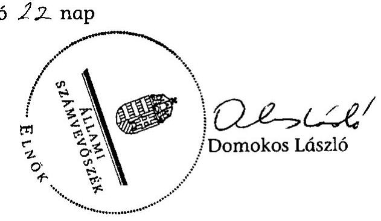

# JELENTÉS 

Hernádkak Község Önkormányzata belső kontrollrendszerének kialakítása, valamint egyes kontrolltevékenységek és a belső ellenőrzés múködése ellenőrzéséről

---

# Állami Számvevőszék 

Iktatószám: V-0012-058-016-021/2013.
Témaszám: 1051
Vizsgálat-azonosító szám: V059115

## Az ellenőrzést felügyelte:

Dr. Benedek Mária
felügyeleti vezető
2012. december 16. napjától

Gyüre Lajosné
felügyeleti vezető
2012. december 15. napjáig

## Az ellenőrzést vezette:

## Szakmányné Bilik Mária

ellenőrzésvezető
A számvevőszéki jelentés összeállításában közremüködtek:
Groholy Andrásné Hangyál Márta
számvevő tanácsos
Renner Andrea
számvevő
Az ellenőrzést végezték:
Hadházy Sándor Szabóné László Mária
számvevő tanácsos számvevő

---

# TARTALOMJEGYZÉK 

BEVEZETÉS ..... 5
I. ÖSSZEGZŐ MEGÁLLAPÍTÁSOK, KÖVETKEZTETÉSEK, JAVASLATOK ..... 8
II. RÉSZLETES MEGÁLLAPÍTÁSOK ..... 15

1. Az Önkormányzat belső kontrollrendszere kialakításának megfelelősége ..... 15
1.1. A kontrollkörnyezet kialakítása ..... 15
1.2. A kockázatkezelési rendszer szabályozása ..... 16
1.3. A kontrolltevékenységek kialakítása ..... 16
1.4. Az információs és kommunikációs rendszer szabályozása ..... 17
1.5. A monitoring rendszer szabályozása ..... 17
2. A pénzügyi folyamatokban kulcsszerepet betöltő belső kontrollok (szakmai teljesítésigazolás és utalvány ellenjegyzés) múködése ..... 18
3. A belső ellenőrzés szervezeti keretei és múködése ..... 20

## FÜGGELÉKEK

1. számú Értelmező szótár
2. számú A belső kontrollrendszer kialakítása, a pénzügyi folyamatokban kulcsszerepet betöltő szakmai teljesítésigazolás és utalvány ellenjegyzés kontrollok múködése, valamint a belső ellenőrzés múködése értékelésénél alkalmazott minősítési szempontok

---

.

---

# RÖVIDÍTÉSEK JEGYZÉKE 

## Törvények

ÁSZ tv.
Avtv.

Info tv.

Kjt.
Ktv.
Kttv.
Mötv.
Ötv.
régi Áht.

Számv. tv.
új Áht.

## Rendeletek

Áhsz.

Ámr.
Ávr.

Ber.
Bkr.
önkormányzati SZMSZ

## Szórövidítések

adatvédelmi szabályzat

2011. évi LXVI. törvény az Állami Számvevőszékről
1992. évi LXIII. törvény a személyes adatok védelméről és a közérdekú adatok nyilvánosságáról (hatálytalan 2012. január 1-jétől)
2011. évi CXII. törvény az információs önrendelkezési jogról és az információszabadságról (hatályos 2012. január 1-jétől)
1992. évi XXXIII. tv. a közalkalmazottak jogállásáról
1992. évi XXIII. törvény a köztisztviselők jogállásáról (hatálytalan 2012. március 1-jétől)
2011. évi CXCIX. törvény a közszolgálati tisztviselőkről (hatályos 2012. március 1-jétől)
2011. évi CLXXXIX. törvény Magyarország helyi önkormányzatairól (hatályos 2012. január 1-jétől)
1990. évi LXV. törvény a helyi önkormányzatokról
1992. évi XXXVIII. törvény az államháztartásról (hatálytalan 2012. január 1-jétől)
2000. évi C. törvény a számvitelről
2011. évi CXCV. törvény az államháztartásról (hatályos
2012. január 1-jétől)

249/2000. (XII. 24.) Korm. rendelet az államháztartás szervezetei beszámolási és könyvvezetési kötelezettségének sajátosságairól
292/2009. (XII. 19.) Korm. rendelet az államháztartás múködési rendjéről (hatálytalan 2012. január 1-jétől)
368/2011. (XII. 31.) Korm. rendelet az államháztartásról szóló törvény végrehajtásáról (hatályos 2012. január 1jétől)
193/2003. (XI. 26.) Korm. rendelet a költségvetési szervek belső ellenőrzéséről (hatálytalan 2012. január 1-jétől)
370/2011. (XII. 31.) Korm. rendelet a költségvetési szervek belső kontrollrendszeréről és belső ellenőrzéséről (hatályos 2012. január 1-jétől)

Hernádkak Község Önkormányzata Képviselő-testületének 13/2011. (VIII. 16.) számú rendelete az Önkormányzat Képviselő-testületének Szervezeti és Müködési Szabályzatáról

Hernádkak Község Önkormányzat Polgármesteri Hivatalának Adatvédelmi Szabályzata (hatályos: 2003. január 1-től)

---

ÁSZ
Belső ellenőrzési kézikönyv

Belső Kontroll Kézikönyv
bizonylati rend
gazdálkodási jogkörök szabályzata
gazdasági program
helyi önkormányzati társulás
hivatali SZMSZ
informatikai biztonsági szabályzat
jegyzó
Képviselő-testület
kockázatkezelési szabályzat
leltározási szabályzat
óvoda
Önkormányzat
pénzkezelési szabályzat
polgármester
Polgármesteri Hivatal
szabálytalanságkezelési rend

Állami Számvevőszék
Miskolc Kistérség Többcélú Helyi Önkormányzati Társulás Belső Ellenőrzési Kézikönyve (hatályos: 2010. június 7étől)
Az Ámr. 155. § (1) bekezdése, valamint az államháztartási belső kontroll standardokról szóló 1/2009. (IX. 11.) PM irányelv egységes értelmezése érdekében az államháztartásért felelős miniszter által 2010. évben kiadott Belső Kontroll Kézikönyv
Hernádkak Község Önkormányzat Polgármesteri Hivatalának 9/2002. iktatási számon kiadott Bizonylati rendje
Hernádkak Község Önkormányzat Polgármesteri Hivatalának 5/2009. iktatási számon kiadott Kötelezettségvállalási és utalványozási rendje
Hernádkak Község Önkormányzatának 36/2011. (VI. 30.) számú képviselő-testületi határozatával jóváhagyott Stratégiai és gazdasági programja
Miskolci Kistérség Többcélú Helyi Önkormányzati Társulás
Hernádkak Község Önkormányzat Polgármesteri Hivatalának Szervezeti és Müködési Szabályzata, jóváhagyta a Képviselő-testület 69/2011. (XII. 21.) számú határozata
Hernádkak Község Önkormányzat Polgármesteri Hivatalának 9/2003. iktatási számú Informatikai Biztonsági Szabályzata
Hernádkak Község Önkormányzatának jegyzője
Hernádkak Község Önkormányzatának Képviselőtestülete
Hernádkak Község Önkormányzat Polgármesteri Hivatalának 1/2008. iktatási számú Kockázatkezelési szabályzata
Hernádkak Község Önkormányzat Polgármesteri Hivatalának 3/2006. iktatási számú Leltározási szabályzata
Napraforgó Napköziotthonos Óvoda
Hernádkak Község Önkormányzata
Hernádkak Község Önkormányzat Polgármesteri Hivatalának 4/2009. iktatási számú Pénzkezelési szabályzata
Hernádkak Község Önkormányzatának polgármestere
Hernádkak Község Önkormányzatának Polgármesteri Hivatala
Hernádkak Község Önkormányzat Képviselő-testülete Szervezeti és Müködési Szabályzatának 4. számú melléklete, a szabálytalanságok kezelésének rendjéről

---

# JELENTÉS 

## Hernádkak Község Önkormányzata belső kontrollrendszerének kialakítása, valamint egyes kontrolltevékenységek és a belső ellenőrzés múködése ellenőrzéséről

## BEVEZETÉS

A belső kontrollrendszer kialakítását, múködtetését és fejlesztését a régi Áht. és az új Áht. is előírja. Ennek megvalósításáért a költségvetési szerv vezetője felel. A belső kontrollrendszer azt a célt szolgálja, hogy a költségvetési szervek múködésük és gazdálkodásuk során a tevékenységeket szabályszerűen, gazdaságosan, hatékonyan, eredményesen hajtsák végre, teljesítsék elszámolási kötelezettségeiket és megvédjék az erőforrásokat a veszteségektől, a károktól és a nem rendeltetésszerú használattól. A belső kontrollrendszer magában foglalja mindazon szabályokat, eljárásokat, gyakorlati módszereket és szervezeti struktúrákat, kockázatkezelési technikákat, kontrolltevékenységeket, amelyek segítséget nyújtanak a szervezetnek céljai eléréséhez.

Az ÁSZ a 2011-2015. évekre szóló stratégiájában hangsúlyos szerepet szánt annak, hogy szilárd szakmai alapon álló, értékteremtő ellenőrzéseivel előmozdítsa a közpénzügyek átláthatóságát, rendezettségét. A számvevőszéki ellenőrzés nemzetközi alapelvei is rögzítik, hogy a megfelelő belső kontrollrendszer minimálisra csökkenti a hibák és szabálytalanságok kockázatát.

Az ellenőrzés célja annak értékelése volt, hogy az Önkormányzat a jogszabályi előírásoknak megfelelően alakította-e ki a belső kontrollrendszert; a gazdálkodás folyamatában kulcsszerepet betöltő szakmai teljesítésigazolás és az utalvány ellenjegyzés kontrolltevékenységeit megfelelően múködtette-e; biztosí-totta-e a belső ellenőrzés szabályos és eredményes múködését.

Az ÁSZ ezen ellenőrzési céljait pilot (próba) jelleggel községi/nagyközségi önkormányzatoknál végzett ellenőrzések során érvényesítette.

Az ellenőrzés típusa: szabályszerűségi ellenőrzés
Az ellenőrzés jogszabályi alapja: az ÁSZ tv. 5. § (2) és (6) bekezdései
Az ellenőrzött szervezet: az Önkormányzat
Az ellenőrzött időszak: a belső kontrollrendszer kialakításának megfelelőségét a 2011. évre vonatkozóan értékeltük. A kontrolltevékenységek múködésének megfelelőségét a 2011. január 1-je és december 31-e, míg a belső ellenőrzés múködésének szabályosságát és eredményességét a 2009. január 1-je és 2011. december 31-e közötti időszakot figyelembe véve értékeltük. A helyszíni ellenőrzés lezárásáig a helyi szabályozás változásait nyomon követtük.

---

Az ellenőrzés szakmai módszertana az ÁSZ hivatalos honlapján (www.asz.hu) közzétett szakmai szabályokon alapult, amely a Legfőbb Ellenőrző Intézmények Nemzetközi Szervezete (INTOSAI) által kiadott nemzetközi standardok (ISSAI) figyelembevételével készült.

A belső kontrollrendszer kialakításának ellenőrzése során értékeltük a kontrollkörnyezet, a kockázatkezelési rendszer, a kontrolltevékenységek, az információs és kommunikációs rendszer, valamint a monitoring rendszer szabályozottságának megfelelőségét.

Értékeltük a pénzügyi folyamatokban kulcsszerepet betöltő szakmai teljesítésigazolás és utalvány ellenjegyzés kontrollok működésének megfelelőségét az államháztartáson kívülre teljesített múködési és felhalmozási célú pénzeszköz átadásoknál, az állományba nem tartozók megbízási díjainál, továbbá a külső szolgáltatók által végzett karbantartási, kisjavítási munkákkal kapcsolatos kifizetéseknél. Az egyszerű véletlen mintavétellel kiválasztott tételek ellenőrzését többlépcsős megfelelőségi tesztek útján addig végeztük, amíg elegendő és megfelelő bizonyítékot szereztünk a vizsgált folyamatok kulcskontrolljai múködésének megfelelő vagy nem megfelelő voltáról. Értékeltük az Önkormányzatnál a belső ellenőrzés múködésének szabályosságát és eredményességét. Az ÁSZ a 2007-2010. években az Önkormányzatnál ellenőrzést nem végzett.

A fogalmak magyarázatát az 1. számú függelék, az ellenőrzés egyes területeinek értékelésénél alkalmazott egységes minősítési szempontokat a 2. számú függelék tartalmazza.

Az ellenőrzés lefolytatásához az Önkormányzat a munkalapok és a tanúsítvány elektronikus kitöltésével, valamint a megjelölt dokumentumok elektronikus megküldésével szolgáltatott adatokat. A munkalapokon szerepeltetett adatok, információk ellenőrzése és szükség szerinti javítása a helyszíni ellenőrzés keretében történt.

Az ÁSZ az ellenőrzés megállapításait az ellenőrzött időszakban hatályos, az intézkedést igénylő megállapításokra tett javaslatokat a jelenleg hatályos jogszabályok alapján fogalmazta meg.

Az Ász tv. 29. § (1) bekezdése szerint a jelentéstervezetet megküldtük a polgármester részére, aki az ÁSZ tv. 29. § (2) bekezdésében foglalt észrevételezési jogával nem élt, a jelentéstervezetre észrevételt nem tett.

Hernádkak község állandó lakosainak száma 2011. január 1-jén 1754 fő volt. Az Önkormányzat héttagú Képviselő-testületének munkáját három állandó bizottság segítette. Az Önkormányzat az önállóan működő és gazdálkodó Polgármesteri Hivatalon felül két önállóan működő intézménnyel látta el feladatait. Az Önkormányzat többségi tulajdoni hányadú gazdasági társasággal nem rendelkezett. A 2006. évi választásokat követően a polgármester személye nem változott. A jegyző 1990. december 1-jétől tölti be a tisztségét. A Polgármesteri Hivatal szervezeti egységekre nem tagolódott, a foglalkoztatott köztisztviselők száma 2011. január 1-jén hét fő volt. Az Önkormányzat a 2011. évi költségvetési beszámolója szerint 396431 ezer Ft költségvetési bevételt ért el, valamint 387852 ezer Ft költségvetési kiadást teljesített. A 2011. december 31-i könyvvi-

---

teli mérleg szerint 856535 ezer Ft értékű eszközvagyonnal rendelkezett, 134637 ezer Ft hosszú lejáratú és 91631 ezer Ft rövid lejáratú kötelezettsége volt.

---

# I. ÖSSZEGZŐ MEGÁLLAPÍTÁSOK, KÖVETKEZTETÉSEK, JAVASLATOK 

A belső kontrollrendszer kialakítása a Polgármesteri Hivatalban 2011-ben a kontrollkörnyezet, a kockázatkezelési rendszer, a kontrolltevékenységek, az információs és kommunikációs rendszer, valamint a monitoring rendszer szabályozásának, illetve kialakításának értékelése alapján összességében nem felelt meg a jogszabályi előírásoknak.

A kontrollkörnyezet kialakítása nem felelt meg a jogszabályi követelményeknek, mert a leltározási szabályzatban - az Áhsz. rendelkezése ellenére - a mérlegben kimutatott eszközök kétévenkénti leltározási kötelezettségét a Képvi-selő-testület felhatalmazása nélkül írták elő; a Számv. tv.-ben és az Áhsz.-ben előírt számlarendet a jegyző nem készítette el, és - a Ktv.-ben ${ }^{1}$ foglaltak ellenére - a jegyző nem alakította ki a köztisztviselőkre vonatkozó teljesítményértékelési rendszert, ami korlátozza a feladatellátás számon kérhetőségét.

A kockázatkezelési rendszer szabályozása nem felelt meg a jogszabályi előírásoknak. Az Ámr. ${ }^{2}$ előírásai ellenére a jegyző nem állapította meg az Önkormányzat tevékenységében rejlő kockázatokat, nem határozta meg az egyes kockázatokkal kapcsolatos intézkedéseket és megtételük módját.

A kontrolltevékenységek kialakítása a jogszabályi előírásoknak megfelel. A jegyző szabályozta a gazdálkodási jogkörök, a beszerzési feladatok, a vagyonhasznosítási tevékenység, az iratkezelés és a szabálytalanságkezelés tekintetében a folyamatba épített, előzetes, utólagos és vezetői ellenőrzést. Meghatározta az érvényesítés rendjét, kialakította a szakmai teljesítésigazolás módját és kijelölte az érvényesítésre és a szakmai teljesítésigazolásra jogosultakat. Az Ámr. rendelkezése ellenére azonban nem szabályozta a Polgármesteri Hivatal tevékenységeire vonatkozó beszámolási eljárásokat.

Az információs és kommunikációs rendszer szabályozása a jogszabályi előírásoknak nem felelt meg. Az Avtv. ${ }^{3}$ rendelkezései ellenére a jegyző nem szabályozta a pénzügyi-számviteli szoftverváltozások ellenőrzésére vonatkozó eljárásokat, a feldolgozott adatok mentési eljárásait és nem jelölte ki a mentések felelőseit.

A monitoring rendszer szabályozása a jogszabályi követelményeknek nem felelt meg. A jegyző - az Ámr.-ben foglaltak ellenére - az operatív tevékenységek keretében megvalósuló folyamatos és eseti nyomon követésből álló, a Polgármesteri Hivatal tevékenységének, a célok megvalósításának nyomon követését biztosító rendszert nem alakította ki.

[^0]
[^0]:    ${ }^{1}$ 2012. március 1-jétől Kttv.
    ${ }^{2}$ 2012. január 1-jétől Ávr.
    ${ }^{3}$ 2012. január 1-jétől Info tv.

---

A belső kontrollrendszer nem megfelelő kialakítása kockázatot jelent az Önkormányzat tevékenységeinek szabályszerű, gazdaságos, hatékony és eredményes végrehajtása során.

A Polgármesteri Hivatalban a 2011. évben az államháztartáson kívülre történő működési és felhalmozási célú pénzeszközátadásokkal, az állományba nem tartozók megbízási díjaival, valamint a külső szolgáltatók által végzett karbantartási, kisjavítási munkákkal kapcsolatos kifizetések során - az ellenőrzött területek teljesített költségvetési súlyának figyelembevételével, összefoglalóan értékelve - a pénzügyi folyamatokban kulcsszerepet betöltő szakmai teljesítés igazolás és utalvány ellenjegyzés belső kontrollok múködésének megfelelősége gyenge volt.

A szakmai teljesítés igazolására a jegyző által kijelölt személyek - az Ámr. előírása ellenére - az államháztartáson kívülre teljesített múködési célú pénzeszközátadás kifizetését megelőzően nem végezték el a kifizetések jogosságának, összegszerűségének ellenőrzését. Az utalványok ellenjegyzője az Ámr. előírásait figyelmen kívül hagyva az államháztartáson kívülre teljesített múködési célú pénzeszközátadások esetében annak ellenére ellenjegyezte a kifizetéseket, hogy a jegyző által a szakmai teljesítésigazolásra kijelölt személyek ellenőrzési és igazolási kötelezettségüknek nem tettek eleget. Az utalványok ellenjegyzője az államháztartáson kívülre teljesített múködési célú pénzeszközátadás és az állományba nem tartozók megbízási díjainak kifizetése során nem megfelelően győződött meg a gazdálkodásra vonatkozó szabályok betartásáról, mert nem észrevételezte a kötelezettségvállalás ellenjegyzésének hiányát.

A számvevőszéki ellenőrzés az ellenőrzött kifizetésekkel összefüggésben a rendelkezésre bocsátott dokumentumok alapján jogosulatlan kifizetést nem tárt fel, azonban a gazdálkodásban kulcsszerepet betöltő kontrollok múködésében feltárt hiányosságok miatt fennáll a hibák bekövetkezésének kockázata. A nem megfelelően múködtetett belső kontrollok, valamint azok szabályozásának hiánya korrupciós kockázatot hordoznak.

Az Önkormányzat a belső ellenőrzési feladatokat helyi önkormányzati társulás útján látta el. A belső ellenőrzés szabályozása és múködése az ellenőrzött időszak egészét tekintve a jogszabályi előírásoknak megfelelt, azonban - a Ber. ${ }^{4}$ rendelkezése ellenére - a hivatali SZMSZ-ben a belső ellenőrzést végző személy, szervezet jogállását és feladatait nem rögzítették. Az Önkormányzatra vonatkozó éves ellenőrzési tervet az Ötv. ${ }^{5}$-ben foglaltaknak megfelelően minden évben elkészítették, azonban a Képviselő-testület az éves belső ellenőrzési terveket mindhárom évben az Ötv.-ben előírt határidőn túl hagyta jóvá. Az éves ellenőrzési tervek összeállítása a Ber.-ben rögzítetteknek megfelelően a jegyző írásos véleményének figyelembevételével történt, azonban az összeállításukat megelőzően a Ber. előírásai szerint elvégzett kockázatelemzés nem terjedt ki a céljelleggel juttatott támogatások felhasználásával kapcsolatosan a kedvezményezett szervezetekre, az EU-s támogatással megvalósuló feladatokra, a közbeszerzési eljárásokra, valamint a belső kontrollrendszer kialakítására és múködteté-

[^0]
[^0]:    ${ }^{4}$ 2012. január 1-jétől Bkr.
    ${ }^{5}$ 2013. január 1-jétől Mötv.

---

sére. Az éves ellenőrzési tervben foglalt ellenőrzéseket végrehajtották. A belső ellenőrzésekről készült jelentésekben feltárt hiányosságok felszámolására a jegyző a 2010. évben - a Ber.-ben előírtak ellenére - intézkedési tervet nem készített, a 2009. és a 2011. évi intézkedési tervek nem feleltek meg a jogszabályi előírásnak, mert a szükséges intézkedések végrehajtásáért felelős személyeket nem jelölték meg. Az ellenőrzött időszakban a belső ellenőrzés - a Ber.-ben foglaltak ellenére - a feltárt hiányosságok megszüntetéséről egy eset kivételével nem győződött meg.

Az Önkormányzatnál a 2009-2011. években a belső ellenőrzés múködése a 2. számú függelék minősítési szempontjai alapján - nem volt eredményes annak ellenére, hogy a belső ellenőrzés szabályozása és működése az összegző értékelés alapján az ellenőrzött időszak egészét tekintve a jogszabályi előírásoknak megfelelt. Ellenőrizték a jogszabályok alapján kötelezően elkészítendő szabályzatok meglétét, a gazdálkodási jogkörök gyakorlásához kapcsolódóan a belső kontrollok múködését, a készpénzkezelés szabályszerű múködését. Azonban a belső ellenőrzés javaslatai csak részben hasznosultak, mert a 2010. évi ellenőrzés által feltárt hibák kijavításáról a jegyző nem intézkedett, a 2009. és a 2011. évi belső ellenőrzési jelentések javaslatainak hasznosítására készített intézkedési tervekben pedig az intézkedések végrehajtásáért felelős személyeket nem jelölte meg. Mindezek hozzájárultak a számvevőszéki ellenőrzés során is feltárt szabályozási hiányosságok, hibák ismétlődéséhez.

Az ÁSZ tv. 33. § (1) bekezdésében foglaltak értelmében az ellenőrzött szervezet vezetője köteles a jelentésben foglalt megállapításokhoz kapcsolódó intézkedési tervet összeállítani, és azt a jelentés kézhezvételétől számított 30 napon belül az ÁSZ részére megküldeni. Amennyiben az intézkedési tervet határidőre nem küldi meg a szervezet, vagy az - az ÁSZ tv. 33. § (2) bekezdésében foglalt póthatáridő eltelte ellenére - továbbra sem elfogadható, az ÁSZ elnöke a hivatkozott törvény 33. § (3) bekezdés a-b) pontjaiban foglaltakat érvényesítheti.

Az ellenőrzés intézkedést igénylő megállapításai és javaslatai:

# a polgármesternek 

1. Az államháztartáson kívülre teljesített múködési célú pénzeszközátadás keretében az iskola-egészségügyi feladatellátásra kötött megállapodás, valamint az állományba nem tartozók megbízási szerződéseinek ellenjegyzése - a régi Áht. 100/C. § (3) bekezdésében és az Ámr. 74. § (1) bekezdésében foglaltak ellenére - elmaradt.

Javaslat:
Intézkedjen arról, hogy az Önkormányzat nevében történő kötelezettségvállalásra az új Áht. 37. § (1) bekezdésében foglaltaknak megfelelően - minden esetben pénzügyi ellenjegyzés után kerüljön sor.
2. A Képviselő-testület az Önkormányzatra vonatkozó éves ellenőrzési tervet mindhárom évben az Ötv. 92. § (6) bekezdésében előírt határidőn túl hagyta jóvá.

---

Javaslat:
Intézkedjen arról, hogy a Képviselő-testület az előterjesztett éves ellenőrzési terveket a Mötv. 119. § (5) bekezdésében rögzített határidőn belül jóváhagyja.
3. A szakmai teljesítés igazolására a jegyző által kijelölt személyek, az államháztartáson kívülre teljesített múködési célú pénzeszközátadás kifizetését megelőzően - a régi Áht 100/C. § (6) bekezdésének és az Ámr. 76. § (1) bekezdésének előírása ellenére nem végezték el a kifizetések jogosságának, összegszerűségének ellenőrzését. Az utalványok ellenjegyzője - az Ámr. 79. § (2) bekezdésében foglaltak ellenére - államháztartáson kívülre teljesített múködési célú pénzeszközátadások esetében nem ellenőrizte a szakmai teljesítésigazolás megtörténtét.

Javaslat:
Intézkedjen a szakmai teljesítésigazolás és az utalvány ellenjegyzés kontrollokkal öszszefüggő, a jelen számvevőszéki jelentésben rögzített hiányosságok és szabálytalanságok tekintetében az esetleges munkajogi felelősséggel kapcsolatos körülmények kivizsgálásáról.

# a jegyzőnek 

1. a kontrollkörnyezettel kapcsolatban:

A leltározási szabályzatban - az Áhsz 37. § (7) bekezdésében foglaltak ellenére - a mérlegben kimutatott tárgyi eszközök és a dolgozóknál lévő eszközök kétévenkénti leltározási kötelezettségét a Képviselő-testület önkormányzati rendeletbe (határozatba) foglalt felhatalmazása nélkül írták elő.

A jegyző a Számv. tv. 161. § (1) bekezdésében és az Áhsz. 49. § (1) bekezdésében előírt számlarendet nem készítette el.

A Ktv. 34. § (5) bekezdésében foglaltak ellenére a jegyző nem határozta meg a köztisztviselőkre vonatkozó teljesítménykövetelményeket.

Javaslat:
a) Biztosítsa a leltározási szabályzat és az Áhsz. 37. § (1) bekezdése előírásának összhangját. Amennyiben az Áhsz. 37. § (7) bekezdésében foglalt lehetőséggel élve kétévenkénti leltározást ír elő, készítsen előterjesztést, és kezdeményezze a polgármesternél a Képviselő-testület elé terjesztését annak érdekében, hogy az rendeletben (határozatban) állapítsa meg a leltározási kötelezettség szabályait.
b) Készítse el a Polgármesteri Hivatal számlarendjét a Számv. tv. 161. § (1) bekezdésének és az Áhsz. 49. § (1) bekezdésének előírását figyelembe véve.
c) Intézkedjen a Polgármesteri Hivatal köztisztviselőire vonatkozóan - a Kttv. 130. § (1)-(6) bekezdéseiben előírtak alapján - a teljesítményértékelés szabályainak kialakításáról és alkalmazásáról.

---

2. a kockázatkezelési rendszerrel kapcsolatban:

A jegyző - az Ámr. 157. § (1)-(3) bekezdésének előírása ellenére - nem állapította meg a Polgármesteri Hivatal tevékenységében rejlő kockázatokat, nem határozta meg az egyes kockázatokkal kapcsolatos intézkedéseket és megtételük módját.

Javaslat:
Intézkedjen - a Bkr. 7. §-a alapján - a Polgármesteri Hivatal tevékenységében, gazdálkodásában rejlő kockázatok felméréséről és megállapításáról, valamint az egyes kockázatokkal kapcsolatban szükséges intézkedések meghatározásáról.
3. a kontrolltevékenységekkel kapcsolatban:

Az Ámr. 158. § (2) bekezdés d) pontja ellenére a jegyző nem alakította ki a Polgármesteri Hivatal tevékenységeire vonatkozó beszámolási eljárásokat.

Javaslat:
Szabályozza - a Bkr. 8. § (4) bekezdésének c) pontja alapján - a Polgármesteri Hivatal tevékenységeire vonatkozó beszámolási eljárásokat.
4. az információs és kommunikációs rendszerrel kapcsolatban:

A jegyző - az Avtv. 10. § előírásai ellenére - elmulasztotta az adatbiztonság érvényre juttatásához szükséges intézkedések megtételét. Nem szabályozta a pénzügyiszámviteli szoftverváltozások ellenőrzésére vonatkozó eljárásokat, a pénzügyiszámviteli rendszerben feldolgozott adatok mentési eljárásait, és nem jelölte ki a mentések felelőseit.

Javaslat:
Biztosítsa az Info tv. 7. § (2)-(3) bekezdéseinek megfelelően az adatbiztonság érvényesülését; szabályozza a pénzügyi-számviteli szoftverváltozások ellenőrzésére vonatkozó eljárásokat, a pénzügyi-számviteli rendszerben feldolgozott adatok mentési eljárásait, és jelölje ki a mentések felelőseit.
5. a monitoring rendszerrel kapcsolatban:

A jegyző - az Ámr. 160. §-ában foglaltak ellenére - nem alakított ki és múködtetett olyan monitoring rendszert, amely lehetővé teszi a Polgármesteri Hivatal tevékenységének, a célok megvalósításának nyomon követését, és része az operatív tevékenységek keretében megvalósuló folyamatos és eseti nyomon követés is.

Javaslat:
Alakítsa ki a Bkr. 10. §-ában előírtak alapján a Polgármesteri Hivatal tevékenységének, a célok megvalósításának nyomon követését biztosító rendszerét, amelynek része az operatív tevékenységek keretében megvalósuló folyamatos és eseti nyomon követés is.

---

6. a pénzügyi folyamatokban kulcsszerepet betöltő kontrollokkal kapcsolatban:

A szakmai teljesítés igazolására a jegyző által kijelölt személyek - az Áht. 100/C. § (6) bekezdésének és az Ámr. 76. § (1) bekezdésének előírása ellenére - az államháztartáson kívülre teljesített múködési célú pénzeszközátadás kifizetését megelőzően nem végezték el a kifizetések jogosságának, összegszerűségének ellenőrzését.
Az utalványok ellenjegyzője az Ámr. 79. § (2) bekezdésében foglalt ellenőrzési feladatait nem a jogszabályi előírásoknak megfelelően végezte, mert annak ellenére aláírásával ellenjegyezte a kiadásokat, hogy az államháztartáson kívülre teljesített múködési célú pénzeszközátadások kifizetéseit megelőzően a szakmai teljesítésigazolás nem történt meg, továbbá az államháztartáson kívülre teljesített múködési célú pénzeszközátadáshoz és az állományba nem tartozók megbízási díjaihoz kapcsolódó kötelezettségvállalásokra - a régi Áht 100/C. § (3) bekezdésében és az Ámr. 74. § (1) bekezdésében foglaltakat megsértve - ellenjegyzés nélkül került sor.

Javaslat:
Gondoskodjon - a szakmai teljesítésigazolással, az érvényesítéssel és az utalvány ellenjegyzéssel kapcsolatban feltárt hiányosságok megszüntetése, illetve az operatív gazdálkodás során a múködésbeli hibák megelőzése, feltárása és kijavítása érdekében - arról, hogy
a) a teljesítés igazolására kijelölt személyek az Ávr. 57. § (1) bekezdésében előírtaknak megfelelően a teljesítésigazolás során ellenőrizhető okmányok alapján ellenőrizzék és igazolják a kiadások teljesítésének jogosságát, összegszerűségét, az ellenszolgáltatást is magában foglaló kötelezettségvállalás esetében - ha a kifizetés vagy annak egy része az ellenszolgáltatás teljesítését követően esedékes - annak teljesítését;
b) a kifizetéseket megelőzően - az Ávr. 58. § (1) bekezdése szerint - a teljesítésigazolás alapján - az Ávr. 57. § (3) bekezdése szerinti esetben annak hiányában is az összegszerűségnek, a fedezet meglétének és a megelőző ügymenetben az új Áht., az Áhsz., az Ávr. előírásai és a belső szabályzatokban foglaltak betartásának az ellenőrzése megtörténjen;
c) az új Áht. 37. § (1) bekezdésében foglaltaknak megfelelően, kötelezettségvállalásra - az Ávr.-ben meghatározott kivételekkel - pénzügyi ellenjegyzés után kerüljön sor, valamint a pénzügyi ellenjegyző ellenőrizze a kötelezettségvállalásokra vonatkozó gazdálkodási szabályok betartását.
7. a belső ellenőrzés múködésével kapcsolatban:

A Ber. 4. § (2) bekezdés rendelkezése ellenére a hivatali SZMSZ-ben a belső ellenőrzést végző személy vagy szervezet jogállását és feladatait nem rögzítették.

A jegyző - a Ber. 29. § (1) bekezdés rendelkezése ellenére - a 2010. évben nem készített intézkedési tervet, a 2009. és a 2011. évben készített intézkedési tervek nem feleltek meg a jogszabályi előírásnak, mert a szükséges intézkedések végrehajtásáért felelős személyeket nem jelölték meg. A feltárt hiányosságok megszüntetéséről - a Ber. 8. § f) bekezdésében foglaltak ellenére - egy eset kivételével nem győződtek meg.

---

Javaslat:
a) Módosítsa a hivatali SZMSZ-t, és kezdeményezze a polgármesternél a módosítás Képviselő-testület elé terjesztését annak érdekében, hogy a Bkr. 15. § (2) bekezdésének megfelelően tartalmazza a belső ellenőrzést végző személy vagy szervezet jogállását és feladatait.
b) Intézkedjen a belső ellenőrzésekről készült jelentésekben rögzített hiányosságok felszámolására vonatkozó intézkedési terv Bkr. 45. § szerinti elkészítéséről.
c) Intézkedjen arról, hogy a belső ellenőrzés a Bkr. 21. § (2) bekezdés d) pontjában foglaltak szerint kövesse nyomon a belső ellenőrzési jelentések alapján megtett intézkedéseket.

---

# II. RÉSZLETES MEGÁLLAPÍTÁSOK 

## 1. Az ÖNKORMÁNYZAT BELSŐ KONTROLLRENDSZERE KIALAKÍTÁSÁNAK MEGFELELŐSÉGE

### 1.1. A kontrollkörnyezet kialakítása

A kontrollkörnyezet kialakítása a 2. számú függelék kritériumrendszerében meghatározott szempontok szerinti értékelés alapján a Polgármesteri Hivatalban nem volt megfelelő, mert a jegyző a jogszabályi előírásokat maradéktalanul nem érvényesítette.

A jegyző, mint a költségvetési szerv vezetője:

- a Számv. tv. 161. § (1) bekezdésében és az Áhsz. 49. § (1) bekezdésében előírt számlarendet nem készítette el;
- az Áhsz 37. § (7) bekezdésében foglaltak ellenére a leltározási szabályzatban a mérlegben kimutatott eszközök kétévenkénti leltározási kötelezettséget írta elő a Képviselő-testület önkormányzati rendeletbe (határozatba) foglalt felhatalmazása nélkül;
- a Ktv. 34. § (5) bekezdésében ${ }^{6}$ foglaltak ellenére nem alakította ki a teljesítményértékelési rendszert, nem határozta meg a köztisztviselőkre vonatkozó teljesítménykövetelményeket;
- a Htv. 140. § (1) bekezdés a) pontjában foglalt előírást figyelmen kívül hagyva a jegyző nem készítette el határidőn belül a gazdasági programtervezetet, így a 2010 októberében megválasztott Képviselő-testület a gazdasági programot ${ }^{7}$ az Ötv. 91. § (7) bekezdésében ${ }^{8}$ foglalt határidőt túllépve vizsgálta felül.

A kontrollkörnyezet kialakítása keretében a jegyző az Ámr. 155. § (3) bekezdésének előírását figyelmen kívül hagyva az államháztartásért felelős miniszter által kiadott Belső Kontroll Kézikönyv ajánlásait nem hasznosította teljes körűen.

[^0]
[^0]:    ${ }^{6}$ 2012. július 1-jétől a Kttv. 130. § (1) bekezdése
    ${ }^{7}$ A 14/2007. (III. 29.) számú önkormányzati határozat Hernándezk Község Önkormányzatának 10 évre szóló Stratégiai és Gazdasági Programjáról (felülvizsgálva a 36/2011. (VI. 30.) számú önkormányzati határozattal). Az újonnan választott Képviselő-testület az alakuló ülését 2010. október 29-én tartotta.
    ${ }^{8}$ 2013. január 1-jétől a Mötv. 116. § (1) bekezdése

---

A kontrollkörnyezet kialakítása során a jegyző:

- a Belső Kontroll Kézikönyv ${ }^{9}$ 1.5.2. pontjában foglalt ajánlást nem érvényesítette, mert nem dolgozta ki a Polgármesteri Hivatalban ellátott köztisztviselői munkakörök betöltésére vonatkozó elvárt tudást és képességeket;
- a Belső Kontroll Kézikönyv 1.6.1. pontjában foglalt ajánlás ellenére nem határozta meg - a szervezeti célokkal összhangban álló - a köztisztviselőkkel szemben támasztott etikus magatartással és integritással kapcsolatos elvárásokat, a Polgármesteri Hivatal etikai kódex-szel nem rendelkezett.

# 1.2. A kockázatkezelési rendszer szabályozása 

A kockázatkezelési rendszer szabályozottsága a 2. számú függelék kritériumrendszerében meghatározott szempontok szerinti értékelés alapján a Polgármesteri Hivatalban nem volt megfelelő. A jegyző kockázatkezelési szabályzatot készített, azonban - az Ámr. 157. § (1)-(3) bekezdéseinek ${ }^{10}$ előírása ellenére - nem állapította meg a Polgármesteri Hivatal tevékenységében rejlő kockázatokat, nem határozta meg az egyes kockázatokkal kapcsolatos intézkedéseket és megtételük módját.

A kockázatkezelési rendszer szabályozása keretében a jegyző az Ámr. 155. § (3) bekezdésének előírását figyelmen kívül hagyva az államháztartásért felelős miniszter által kiadott Belső Kontroll Kézikönyv ajánlásait nem hasznosította teljes körűen.

A kockázatkezelési rendszer szabályozása során a jegyző:

- a Belső Kontroll Kézikönyv 2.1.3. pontjában foglalt ajánlást figyelmen kívül hagyva nem alakította ki a kockázat-nyilvántartási rendszert;
- a Belső Kontroll Kézikönyv 2.1.4. pontjában foglalt ajánlást nem érvényesítette, mert az azonosított kockázati tényezőkről nem tájékoztatta a kockázati tényezőkkel érintett munkafolyamatok felelőseit;
- a Belső Kontroll Kézikönyv 2.3. pontjában foglalt ajánlás ellenére a jegyző nem jelölte ki a válaszlépések végrehajtásáért felelős személyeket, és nem szabályozta az intézkedések nyomon követésének módját;
- a Belső Kontroll Kézikönyv 2.4.1. pontjában foglalt ajánlás ellenére a jegyző nem végezte el a beazonosított kockázatok legalább évenkénti felülvizsgálatát;
- nem érvényesítette a Belső Kontroll Kézikönyv 2.5.1. pontjában foglalt ajánlást, mert nem gondoskodott a csalás és a korrupció, mint kiemelt kockázatok értékeléséről és kezeléséről.

### 1.3. A kontrolltevékenységek kialakítása

A kontrolltevékenységek kialakítása a 2. számú függelék kritériumrendszerében meghatározott szempontok szerinti értékelés alapján a Polgármesteri

[^0]
[^0]:    ${ }^{9}$ A 2011. évben az Ámr. 155. § (1) bekezdése, 2012. január 1-jétől a Bkr. 5. § (1) bekezdése
    ${ }^{10}$ 2012. január 1-jétől a Bkr. 7. §-a

---

Hivatalban megfelelő volt. A jegyző a kontrollstratégiák és módszerek keretében szabályozta a gazdálkodási jogkörök, a beszerzési feladatok, a vagyonhasznosítási tevékenység, az iratkezelés és a szabálytalanság kezelése tekintetében a folyamatba épített, előzetes, utólagos és vezetői ellenőrzést. Meghatározta a szakmai teljesítésigazolás módját, az érvényesítés rendjét, illetve kijelölte a szakmai teljesítésigazolásra és az érvényesítésre jogosultakat. A kontrolltevékenységek kialakítása során azonban a jegyző - az Ámr. 158. § (2) bekezdés d) pontja ${ }^{11}$ ellenére - nem alakította ki a Polgármesteri Hivatal tevékenységeire vonatkozó beszámolási eljárásokat.

# 1.4. Az információs és kommunikációs rendszer szabályozása 

Az információs és kommunikációs rendszer szabályozottsága a 2. számú függelék kritériumrendszerében meghatározott szempontok szerinti értékelés alapján a Polgármesteri Hivatalban nem volt megfelelő. A jegyző az informatikai rendszer környezetének szabályozása során - az Avtv. 10. § (1)-(2) bekezdéseiben ${ }^{12}$ foglalt előírások ellenére - nem gondoskodott az adatok biztonságáról, nem alakított ki olyan eljárási szabályokat, amelyek az adatvédelmi szabályok érvényre juttatásához szükségesek. Nem szabályozta a pénz-ügyi-számviteli szoftverváltozások ellenőrzésére vonatkozó eljárásokat, a feldolgozott adatok mentési eljárásait és nem jelölte ki a mentések felelőseit.

Az információs és kommunikációs rendszer szabályozása keretében a jegyző az Ámr. 155. § (3) bekezdésének előírását figyelmen kívül hagyva az államháztartásért felelős miniszter által kiadott Belső Kontroll Kézikönyv ajánlásait nem hasznosította teljes körűen.

Az információs és kommunikációs rendszer szabályozása során a jegyző:

- a Belső Kontroll Kézikönyv 4.1.1. pontjában foglaltakat figyelmen kívül hagyva nem szabályozta az Önkormányzattal kapcsolatos információk áramoltatásának rendjét és a szervezeten belüli információ átadás formáit;
- az iktatási, iratkezelési rendszer kialakítása során a Belső Kontroll Kézikönyv 4.2.4. pontjában foglalt ajánlást nem érvényesítette, mert nem írta elő a Polgármesteri Hivatalban az ügyintézési határidők nyomon követésének dokumentálását, nem szabályozta a késedelmes ügyintézés jelzéséért való felelősség rendjét;
- a szabálytalanságkezelési szabályzatban a Belső Kontroll Kézikönyv 4.3.3. pontjában foglaltakat figyelmen kívül hagyva nem rögzítette a szabálytalanságot bejelentő védelmére vonatkozó előírásokat és kötelezettségeket.

### 1.5. A monitoring rendszer szabályozása

A monitoring rendszer szabályozottsága a 2. számú függelék kritériumrendszerében meghatározott szempontok szerinti értékelés alapján a Polgármesteri Hivatalban nem volt megfelelő. A jegyző - az Ámr. 160. §-ában ${ }^{13}$

[^0]
[^0]:    ${ }^{11}$ 2012. január 1-jétől az Bkr. 8. § (4) bekezdés c) pontja
    ${ }^{12}$ 2012. január 1-jétől az Info tv. 7. § (2)-(3) bekezdései
    ${ }^{13}$ 2012. január 1-jétől a Bkr. 3. § e) pontja és a Bkr. 10. §-a

---

foglaltak ellenére - az operatív tevékenységek keretében megvalósuló folyamatos és eseti nyomon követésből álló, a Polgármesteri Hivatal tevékenységének, a célok megvalósításának nyomon követését biztosító rendszert nem alakította ki.

A monitoring rendszer szabályozása keretében a jegyző az Ámr. 155. § (3) bekezdésének előírását figyelmen kívül hagyva az államháztartásért felelős miniszter által kiadott Belső Kontroll Kézikönyv ajánlásait nem hasznosította teljes körűen.

A monitoring rendszer szabályozása keretében a jegyző:

- a Belső Kontroll Kézikönyv 1.2.2. pontjában foglaltakat figyelmen kívül hagyva a szervezeti célok megvalósításának nyomon követése érdekében a lakosság, illetve a szolgáltatásokat igénybe vevők körében az önkormányzati feladatellátásra irányulóan elégedettségi felméréseket a 2009-2011. években nem végeztetett;
- a Belső Kontroll Kézikönyv 5.1.2. pontjában foglaltak figyelmen kívül hagyásával a közszolgáltatások körében ${ }^{14}$ a teljesítménymutatók rendszerét és alkalmazásának rendjét nem alakította ki;
- a Belső Kontroll Kézikönyv 5.2.1. pontjában foglaltakat figyelmen kívül hagyva a jegyző a belső kontrollok monitoring rendszerét nem alakította ki.

A belső kontrollrendszer kialakítása a Polgármesteri Hivatalban 2011-ben a kontrollkörnyezet, a kockázatkezelési rendszer, a kontrolltevékenységek, az információs és kommunikációs rendszer, valamint a monitoring rendszer szabályozásának, illetve kialakításának értékelése alapján összességében nem felelt meg a jogszabályi előírásoknak.

# 2. A PÉNZÜGYI FOLYAMATOKBAN KULCSSZEREPET BETÖLTŐ BELSŐ KONTROLLOK (SZAKMAI TELJESÍTÉSIGAZOLÁS ÉS UTALVÁNY ELLENJEGYZÉS) MŰKÖDÉSE 

A Polgármesteri Hivatalban a 2011. évben az államháztartáson kívülre teljesített múködési és felhalmozási célú pénzeszközátadás során a szakmai teljesítésigazolás és utalvány ellenjegyzés kulcskontrollok múködésének megfelelősége gyenge volt, mert

- a szakmai teljesítés igazolására a jegyző által kijelölt személy - az Ámr. 76. § (1) bekezdésében ${ }^{15}$ foglaltak ellenére - az iskola-egészségügyi feladatok ellátásának 2011. III. negyedévi kifizetését megelőzően a kiadás jogosságát, összegszerűségét aláírásával nem igazolta;

A kiadások teljesítésigazolása a negyedév végén, a kifizetést követően, utólag történt meg.

[^0]
[^0]:    ${ }^{14}$ A pénzbeli szociális ellátásokra, a szociális alapszolgáltatásokra, az óvodai ellátásra, valamint a jegyzői hatáskörbe tartozó elsőfokú hatósági tevékenységre (ügyintézés) vonatkozóan.
    ${ }^{15}$ 2012. január 1-jétől az Ávr. 57. § (1) bekezdése

---

- az utalványok ellenjegyző́je az Ámr. 79. § (2) bekezdésében ${ }^{16}$ foglalt ellenőrzési feladatait nem a jogszabályi előírásoknak megfelelően végezte, mert annak ellenére aláírásával ellenjegyezte az iskola-egészségügyi feladatellátás 2011. III. negyedévi kiadását, hogy a szakmai teljesítésigazolás elmaradt;
- az utalványok ellenjegyző́je aláírásával ellenjegyezte az utalványt annak ellenére, hogy az iskola-egészségügyi feladatellátáshoz nyújtott támogatások esetében a háziorvossal kötött megállapodást az Ámr. 74. § (1) bekezdésében ${ }^{17}$ foglaltakat megsértve nem ellenjegyezték.

A Polgármesteri Hivatalban a 2011. évben az állományba nem tartozók megbízási díjainak kifizetése során a szakmai teljesítés igazolás és az utalvány ellenjegyzés kulcskontrollok múködésének megfelelősége gyenge volt, mert

- az utalványok ellenjegyzóje az Ámr. 79. § (2) bekezdésében foglalt ellenőrzési feladatait nem a jogszabályi előírásoknak megfelelően végezte, mert annak ellenére aláírásával ellenjegyezte a kiadásokat, hogy az állományba nem tartozók megbízási díjaihoz kapcsolódó szerződéseket - az Ámr. 74. § (1) bekezdésében foglaltak ellenére - nem ellenjegyezték.

A szakmai teljesítésigazolásra a jegyző által kijelölt személyek a megbízási szerződésekben meghatározott feladatok teljesítésének igazolását, a kiadások jogosságának, összegszerűségének, a szerződésben, megrendelésben foglaltak teljesítésének ellenőrzését elvégezték.

A Polgármesteri Hivatalban a 2011. évben a külső szolgáltatók által végzett karbantartási, kisjavítási szolgáltatások között elszámolt kifizetések során a szakmai teljesítésigazolás és az utalvány ellenjegyzés kulcskontrollok múködésének megfelelősége kiváló volt, mert a kiadások jogosságának, összegszerűségének, a szerződésben, megrendelésben foglaltak teljesítésének ellenőrzését a szakmai teljesítésigazolásra a jegyző által kijelölt személyek a gazdálkodási jogkörök szabályzatában előírt módon elvégezték. Az utalványok ellenjegyzóje a gazdálkodásra vonatkozó szabályok érvényesüléséről, továbbá a szakmai teljesítésigazolás és az érvényesítés elvégzéséről meggyőződött.

Az Áhsz. 9. § (11) bekezdésében foglaltaktól és a 9. számú mellékletének a számlaosztályok tartalmára vonatkozó előírások alcím alatt található 9. c) pontjában előírtaktól eltérően a külső szolgáltatók által végzett karbantartási, kisjavítási kiadások között számoltak el anyagbeszerzéseket.

A Polgármesteri Hivatalban a 2011. évben az államháztartáson kívülre történő működési és felhalmozási célú pénzeszközátadásokkal, az állományba nem tartozók megbízási díjaival, valamint a külső szolgáltatók által végzett karban-

[^0]
[^0]:    ${ }^{16}$ 2012. január 1-jétől bővültek az érvényesítő feladatai, valamint új értelmezést kapott a pénzügyi ellenjegyzés. Az érvényesítő feladatait az Ávr. 58. § (1) bekezdése tartalmazza, míg a pénzügyi ellenjegyzés előírásait az új Áht. 37. § (1) bekezdése, valamint az Ávr. 55. § (1) bekezdése és a (2) bekezdés f) pontja rögzíti.
    ${ }^{17}$ 2012. január 1-jétől az új Áht. 37. § (1) bekezdése

---

tartási, kisjavítási munkákkal kapcsolatos kifizetések során - az ellenőrzött területek teljesített költségvetési súlyának figyelembevételével ezeket összefoglalóan értékelve - a pénzügyi folyamatokban kulcsszerepet betöltő szakmai teljesítésigazolás és utalvány ellenjegyzés belső kontrollok múködésének megfelelősége gyenge volt. Az Önkormányzatnál a 2011. évben a pénzügyi folyamatokban kulcsszerepet betöltő belső kontrollok múködésében feltárt hiányosságokkal összefüggésben az ellenőrzés az ellenőrzött tételek vonatkozásában a rendelkezésre bocsátott dokumentumok alapján kár bekövetkeztére utaló adatot, tényt nem állapított meg, azonban a feltárt hiányosságok miatt fennáll a hibák bekövetkezésének kockázata.

# 3. A BELSŐ ELLENŐRZÉS SZERVEZETI KERETEI ÉS MŰKÖDÉSE 

Az Önkormányzat a 2009. és a 2011. évek között a belső ellenőrzési feladatait helyi önkormányzati társulás keretében látta el. A belső ellenőrzési feladatok ellátási módja megfelelt az Ötv. 92. § (8) bekezdésében foglaltaknak, azonban a Ber. 4. § (2) bekezdésében ${ }^{18}$ foglalt előírás ellenére a belső ellenőrzést végző személy vagy szervezet jogállását, feladatait a hivatali SZMSZ-ben nem határozták meg. A helyi önkormányzati társulás munkaszervezetének vezetője által jóváhagyott Belső ellenőrzési kézikönyv a Ber.-ben előírtaknak megfelelően tartalmazta a belső ellenőrzési feladatokat, a szakmai etikai kódexet, a kockázatelemzési módszertant, valamint a belső ellenőrzési tevékenység minőségét biztosító szabályokat.

A 2009-2011. években az Önkormányzatnál a belső ellenőrzés múködése a jogszabályi előírásoknak megfelelt. Az Önkormányzatra vonatkozó éves ellenőrzési tervet minden évben elkészítették, azonban a Képviselő-testület az éves ellenőrzési terveket mindhárom évben az Ötv. 92. § (6) bekezdésében ${ }^{19}$ előírt határidőn túl hagyta jóvá.

A 2009. évi ellenőrzési tervet 2008. november 27-én, a 2010. évit 2009. november 26-án, a 2011. évit 2010. november 25-én hagyták jóvá a jogszabályban előírt a tárgyévet megelőző november 15-i - határidő helyett.

Az éves ellenőrzési tervek összeállítása a Ber.-ben rögzítetteknek megfelelően a jegyző írásos véleményének figyelembevételével történt. Az összeállításukat megelőzően elvégzett kockázatelemzés azonban nem terjedt ki a céljelleggel juttatott támogatások felhasználásával kapcsolatosan a kedvezményezett szervezetekre, az EU-s támogatással megvalósuló feladatokra, a közbeszerzési eljárásokra, valamint a belső kontrollrendszer kialakítására és múködtetésére. A kockázatelemzés alapján a belső ellenőrzés mindhárom évben magas kockázatú területnek értékelte a szabályozás összetettségét, a változást/átszervezést, az informatikai támogatottságot, valamint a munkatársak tapasztalatát és képzettségét, a 2009. évben a pénzügyi szabálytalanságok bekövetkeztének valószínűségét. A kockázatelemzés alapján magas kockázatúnak értékelt területek ellenőrzését az éves ellenőrzési tervekben megtervezték. Az Önkormányzatra vonatkozó éves ellenőrzési terveket a jóváhagyásukat követően nem módosítot-

[^0]
[^0]:    ${ }^{18}$ 2012. január 1-jétől a Bkr. 15. § (2) bekezdése
    ${ }^{19}$ 2013. január 1-jétől a Mötv. 119. § (5) bekezdése

---

ták, soron kívüli ellenőrzésre nem került sor. Az éves ellenőrzési tervekben foglalt ellenőrzéseket végrehajtották. Az ellenőrzéseket a Ber.-ben előírt tartalmú, a belső ellenőrzési vezető által jóváhagyott ellenőrzési program alapján végezték el. Az ellenőrzésekről a Ber. előírásai alapján, a jogszabályban rögzített tartalommal ellenőrzési jelentést készítettek.

A belső ellenőrzés a gazdálkodási jogköröket érintően a 2009. évben ellenőrizte és értékelte a belső kontrollok szabályozása, valamint a készpénzkezelés megfelelőségét. Az ellenőrzés a pénzkezelési és a gazdálkodási jogkörök szabályzatának jogszabályi megfelelőségére irányult. Az ellenőrzésről készült jelentés javaslatai a gazdálkodási jogkörök, valamint a pénzkezelési szabályzat módosítására, kiegészítésére vonatkoztak. A szabályzatokat a javaslat szerint a szakmai teljesítésigazolás módjával, valamint a záró készpénzállomány és az ellátmány kezelés rendjével javasolták kiegészíteni.

A 2010. évben az óvoda és az általános iskola munkaügyi ellenőrzését végezték el. Az ellenőrzés eredményeként javasolták, hogy a Kjt. szerint az előírtnál magasabb összegű illetmény megállapítása során végezzék el a közalkalmazottak minősítését. Javaslatként fogalmazták meg, hogy a jubileumi jutalomra való jogosultság megállapításakor kizárólag a Kjt. által nevesített közalkalmazotti jogviszonyt vegyék figyelembe.

A 2011. évben a Polgármesteri Hivatal pénzügyi-gazdasági tevékenységét ellenőrizték átfogó jelleggel. Az ellenőrzést követően a belső ellenőrzési jelentés 13 javaslatot tartalmazott. Ezek a mérlegkészítés időpontjának módosítására, a szociális ellátásokkal kapcsolatos kötelezettségvállalás és utalványozás rendjének rögzítésére, a szakmai teljesítés igazolására vonatkozó előírások rögzítésére és alkalmazására, a kerekítés szabályainak pénzkezelési szabályzatban történő rögzítésére, a közérdekú adatok közzétételének módjára, a választásokkal kapcsolatban felhasználható pénzeszközökkel kapcsolatos kötelezettségvállalásokra vonatkoztak.

A 2009-2011. évi ellenőrzések során büntető-, szabálysértési, kártérítési, vagy fegyelmi eljárás megindítására okot adó cselekményt nem tártak fel. Az intézményvezetők a 2010. évben a belső ellenőrzésekről készült jelentésekben feltárt hibák kijavítására - a Ber. 29. § (1) bekezdés ${ }^{20}$ rendelkezése ellenére - intézkedési tervet nem készítettek. A 2009. és a 2011. évi intézkedési tervek nem feleltek meg a Ber. 29. § (1) bekezdés előírásának, mert a jegyző a szükséges intézkedések végrehajtásáért felelős személyeket nem jelölte meg. Az ellenőrzött időszakban a belső ellenőrzés - a Ber. 8. § f) bekezdésében ${ }^{21}$ foglaltak ellenére - a feltárt hiányosságok megszüntetéséről egy eset kivételével nem győződött meg. A gazdálkodási jogkörök szabályzatát a jegyző 2009 decemberében a szakmai teljesítésigazolásra vonatkozóan nem a jogszabályi előírásoknak megfelelően egészítette ki. A 2011. évi belső ellenőrzés alkalmával ismételt javaslatot fogalmaztak meg a jogszabálynak megfelelő szabályozásra és ennek alkalmazására. A szabályzatot a 2011. évben ismételten módosította a jegyző, azonban a szakmai teljesítésigazolás és utalvány ellenjegyzés kontrollok - a feltárt, a jelen fejezet 2. pontjában részletezett szabálytalanságok miatt - továbbra is gyengén múködtek.

[^0]
[^0]:    ${ }^{20}$ 2012. január 1-jétől a Bkr. 45. §
    ${ }^{21}$ 2012. január 1-jétől a Bkr. 21. § (2) bekezdés d) pontja

---

Az Önkormányzatnál a 2009-2011. években a belső ellenőrzés múködése a 2. számú függelék minősítési szempontjai alapján - nem volt eredményes annak ellenére, hogy a belső ellenőrzés szabályozása és múködése az összegző értékelés alapján az ellenőrzött időszak egészét tekintve a jogszabályi előírásoknak megfelelt. Ellenőrizték a jogszabályok alapján kötelezően elkészítendő szabályzatok meglétét, a gazdálkodási jogkörök gyakorlásához kapcsolódóan a belső kontrollok múködését és a készpénzkezelés szabályszerű múködését. Azonban a belső ellenőrzés javaslatai csak részben hasznosultak, mert a 2010. évben elvégzett belső ellenőrzés által feltárt hibák kijavítására az intézményvezetők nem készítettek intézkedési tervet, továbbá a 2009. és a 2011. évi belső ellenőrzési jelentések javaslatainak hasznosítására készített intézkedési tervekben a jegyző az intézkedések végrehajtásáért felelős személyeket nem jelölte meg. A belső ellenőrzés a feltárt hiányosságok megszüntetéséről - a gazdálkodási jogkörök szabályzatára vonatkozó, az előző bekezdésben részletezett kivétellel nem győződött meg. Mindezek hozzájárultak a számvevőszéki ellenőrzés során is feltárt szabályozási hiányosságok, hibák ismétlődéséhez.

Budapest, 2013. 05

Függelék: 2 db

---

# ÉRTELMEZŐ SZÓTÁR 

belső ellenőrzés
belső kontrollrendszer
belső kontrollrendszer területei
integritás
kockázat
kockázatkezelési rendszer
kontrollkörnyezet

Független, tárgyilagos bizonyosságot adó és tanácsadó tevékenység, amelynek célja, hogy az ellenőrzött szervezet múködését fejlessze és eredményességét növelje, az ellenőrzött szervezet céljai elérése érdekében rendszerszemléletű megközelítéssel és módszeresen értékeli, illetve fejleszti az ellenőrzött szervezet irányítási és belső kontrollrendszerének hatékonyságát. (A régi Áht. 121/B. § (1) bekezdés és a Bkr. 2. § b) pontjából levezetett meghatározás.)
A belső kontrollrendszer a kockázatok kezelése és tárgyilagos bizonyosság megszerzése érdekében kialakított folyamatrendszer, amely azt a célt szolgálja, hogy a múködés és gazdálkodás során a tevékenységeket szabályszerűen, gazdaságosan, hatékonyan, eredményesen hajtsák végre, az elszámolási kötelezettségeket teljesítsék, megvédjék az erőforrásokat a veszteségektől, károktól és nem rendeltetésszerű használattól. (A régi Áht. 121. § (1) és az új Áht. 69. § (1) bekezdéséből levezetett fogalom.)
A kontrollkörnyezet, a kockázatkezelési rendszer, a kontrolltevékenységek, az információ és kommunikáció, valamint a nyomon követés (monitoring). (A régi Áht. 121. § (2) bekezdéséből és a Bkr. 3. §-ából levezetett fogalom.)
Az integritás elvek, értékek, cselekvések, módszerek, intézkedések, konzisztenciáját jelenti: olyan magatartásmódot, amely meghatározott értékeknek felel meg. Az integritás a közszféra esetében a társadalom által elvárt nyilvánossági, átláthatósági, illetve jogi/etikai normáknak történő megfelelést jelenti. (A http://integritas.asz.hu honlapon között „Integritás jelentés 2011" című dokumentum 5. oldal 1. bekezdés.)
Az a lehetőség, hogy egy olyan esemény történik meg, amely negatívan hat a célok elérésére. (ÁSZ Ellenőrzési kézikönyv 6/139-140.oldal)
Olyan irányítási eszközök és módszerek összessége, melynek elemei a szervezeti célok elérését veszélyeztető tényezők (kockázatok) azonosítása, elemzése, csoportosítása, nyomon követése, valamint szükség esetén a kockázati kitettség mérséklése. (2012. január 1-jétől a Bkr. 2. § m) pontjában meghatározott fogalom)
A kontrollkörnyezet alakítja ki a szervezet belső kontrollrendszerhez való viszonyát, hozzáállását, befolyásolja az alkalmazottak belső kontrollal kapcsolatos tudatosságát, magatartását. Elemei a személyes és szakmai elkötelezettség és a vezetés, valamint az alkalmazottak által vallott erkölcsi értékek; a szakmai hozzáértés iránti elkötelezettség; a felső vezetés hozzáállása - a vezetés filozófiája és tevékenységének stílusa; a szervezeti struktúra; a humánerőforrás-politika és gazdálkodási gyakorlat. (ÁSZ Ellenőrzési kézikönyv 6/107. oldal)

---

kontrolltevékenységek
kommunikáció
korrupció
kulcskontrollok
lényegesség
monitoring
utóellenőrzés
véletlen minta

A kontrolltevékenységek azok a politikák és eljárások, amelyeket a kockázatok megoldására hoznak létre a szervezet céljainak teljesítése érdekében. (ÁSZ Ellenőrzési kézikönyv 6/108-109. oldal)
Az a tevékenység, melynek során információ továbbítása valósul meg. A kommunikációs folyamat résztvevői között tájékoztatás történik, mely során tényeket, ezek magyarázatát közlik. „A szervezetben eredményes kommunikációnak kell áramlania lefelé, horizontálisan és felfelé, a szervezet egészében és annak valamennyi elemében." (ÁSZ Ellenőrzési kézikönyv 6/112. oldal)
A közhatalmi pozíció bármilyen erkölcstelen felhasználása személyes, vagy magáncélú előnyök megszerzése érdekében. (ÁSZ Ellenőrzési kézikönyv 6/84. oldal)
Az önkormányzatok kontrollrendszere kialakításának ellenőrzése során a pénzügyi folyamatokban kulcsszerepet betöltő belső kontrollok a szakmai teljesítésigazolás és utalvány ellenjegyzés. (ÁSZ Módszertani útmutató az átfogó ellenőrzéshez 2.2. pontja alapján meghatározott fogalom.)

Egy információ akkor lényeges, ha hiánya vagy téves állítása befolyásolhatja ezen információkat felhasználók döntéseit, véleményét. Az ellenőrzés során a lényegesség három szempontból értelmezhető: érték, jelleg és összefüggés szerint. (ÁSZ Ellenőrzési kézikönyv 6/122-123. oldal)
A monitoring a különböző szintű szervezeti célok megvalósításának folyamatát kíséri figyelemmel, melynek során a releváns eseményekről és tevékenységekről (együtt: folyamatokról) rendszeres jelleggel, strukturált, döntéstámogató információkhoz jutnak a szervezet vezetői. (NGM útmutató a költségvetési szervek monitoring rendszeréhez 3. oldal, 2011. november, 2012. január 1-jétől a Bkr. 3. § e) pontja nyomon követési rendszerként azonosítja.)
Az intézkedések nyomon követése érdekében elrendelt ellenőrzés, amelynek célja, hogy a belső ellenőrzés bizonyosságot szerezzen az elfogadott intézkedések végrehajtásáról, vagy arról a tényről, hogy ha az ellenőrzött szerv, illetve az ellenőrzött szervezeti egység vezetője nem, vagy nem az elfogadott intézkedésnek megfelelően hajtja végre a feladatokat, továbbá meggyőződni arról, hogy a végrehajtott intézkedésekkel a megállapított kockázat ténylegesen megszűnt, vagy a kockázati túréshatár alá csökkent. (2012. január 1-jétől a Bkr. 2. § s) pontjában meghatározott fogalom.)
Az alapsokaságot képviselő (reprezentáló) véletlenszerűen kiválasztott részsokaság. (ÁSZ Ellenőrzési kézikönyv 6/71. oldal)

---

# A belsó kontrollrendszer kialakítása, a pénzügyi folyamatokban kulcsszerepet betöltő szakmai teljesítésigazolás és utalvány ellenjegyzés kontrollok múködése, valamint a belső ellenőrzés múködése értékelésénél alkalmazott minősítési szempontok 

## 1. A BELSŐ KONTROLLRENDSZER MINŐSÍTÉSE

Az ellenőrzés során először a belső kontrollrendszer területeinek (kontrollkörnyezet, kockázatkezelés, kontrolltevékenységek, információs és kommunikációs rendszer, monitoring rendszer) minősítését külön-külön elvégeztük. A megfelelőség minősítése a belső kontrollrendszer kialakítására vonatkozó kérdéseket tartalmazó munkalapokon, az elérhető és az elért pontokból kimunkált képlet alapján, számítógépes program segítségével történt.

A belső kontrollrendszer egyes területei kialakítása megfelelőségének értékelésére - az elért és elérhető pontok figyelembevételével - sávos rendszer alapján „nem megfelelő", „részben megfelelő" és „megfelelő" minősítést alkalmaztunk.

A vizsgált önkormányzat belső kontrollrendszerének egy-egy területe - az elért pontszámtól függetlenül - „nem megfelelő" értékelést kapott, ha nem teljesítette az alábbi kritériumok bármelyikét.

1. Kontrollkörnyezet kialakítása:

- Az Önkormányzat Képviselő-testülete az Ötv. 91. § (1) bekezdésében előírtaknak megfelelően megalkotta hosszabb időszakra szóló gazdasági programját.
- A Polgármesteri Hivatal ${ }^{1}$ rendelkezik a régi Áht. 88. § (2) bekezdésében előírt alapító okirattal, és az tartalmazza a régi Áht. 90. § (1) bekezdésében előírtakat, kiemelten a d) pont szerinti alaptevékenységeit.
- A Polgármesteri Hivatal rendelkezik a régi Áht. 91. § (2) bekezdésben előírt SZMSZ-szel.
- A Polgármesteri Hivatal rendelkezik az Áhsz. 8. § (3) bekezdésben előírt számviteli politikával.
- A Polgármesteri Hivatal rendelkezik az Áhsz. 8. § (4) bekezdés a) pontjában előírt eszközök és források leltározási és leltárkészítési szabályzatával.
- A Polgármesteri Hivatal rendelkezik az Áhsz. 8. § (4) bekezdés b) pontjában előírt eszközök és források értékelési szabályzatával.

[^0]
[^0]:    ${ }^{1}$ A körjegyzőségben múködő önkormányzatoknál a polgármesteri hivatal feladatait a körjegyzőség látta el.

---

- A Polgármesteri Hivatal rendelkezik az Áhsz. 8. § (4) bekezdés d) pontjában előírt pénzkezelési szabályzattal.
- A Polgármesteri Hivatal rendelkezik az Áhsz. 49. § (1) bekezdésben előírt számlarenddel.
- A Polgármesteri Hivatal rendelkezik a Számv. tv. 161. § (2) bekezdés d) pontjában előírt bizonylati renddel.
- A Polgármesteri Hivatal rendelkezik a munkavédelemről szóló 1993. évi XCIII. törvény 2. § (3) bekezdés és 72. § (4) bekezdés előírásaiban foglalt, az egészséget nem veszélyeztető és biztonságos munkavégzés követelményei megvalósításának módját meghatározó szabályozással.
- A Polgármesteri Hivatal rendelkezik a tűz elleni védekezésről, a műszaki mentésről és a tűzoltóságról szóló 1996. évi XXXI. törvény 19. § (1) bekezdésben előírt tűzvédelmi szabályzattal.
- A Polgármesteri Hivatal rendelkezik az Ámr. 15. § (6) bekezdésben hivatkozott gazdasági szervezet ügyrendjével. Amennyiben a gazdasági feladatokat a Polgármesteri Hivatalon belül több szervezeti egység látja el, és azoknak önálló ügyrendjük van, az is elfogadható.
- A Polgármesteri Hivatal tevékenységeire vonatkozóan az Ámr. 156. § (2) bekezdésben előírtaknak megfelelve elkészült az ellenőrzési nyomvonal, folyamatleírás.

2. Kockázatkezelési tevékenység szabályozása és kialakítása:

- A költségvetési szerv (Polgármesteri Hivatal) vezetője az Ámr. 157. § (1) bekezdése alapján kockázatkezelési rendszert múködtet, melynek keretében elkészítették a kockázatkezelési szabályzatot a Belső Kontroll Kézikönyv 2.1 pontjában meghatározott tartalommal.

3. Információs és kommunikációs rendszer szabályozása és kialakítása:

- A Polgármesteri Hivatal rendelkezik iratkezelési szabályzattal.
- Az 1992. évi LXIII. tv. 31/A. § (3) bekezdésben előírtaknak megfelelve az Önkormányzat jegyzője elkészítette az adatvédelmi és adatbiztonsági szabályzatot.
- Az Ámr. 156. § (3) bekezdésében előírtaknak megfelelve a jegyző szabályozta a szabálytalanságok kezelésének eljárásrendjét.

4. A monitoring rendszer szabályozottsága:

- Az Önkormányzat rendelkezik a Ber. 5. § (1) bekezdése alapján a jegyző, társult feladatellátás esetén a Ber. 32/B. § (8) bekezdésében előírtaknak megfelelve a társulás munkaszervezeti feladatát ellátó (vagy közös feladatellátás esetén a feladatellátást végző, intézményi társulás esetén az irányítási feladatot ellátó önkormányzat által kijelölt) költségvetési szerv vezetője által jóváhagyott belső ellenőrzési kézikönyvvel.

---

A belső kontrollrendszer öt fő területének egyedi értékelését követően került sor az összegző értékelésre, a minősítés itt is „megfelelő", „részben megfelelő", illetve „nem megfelelő" lehetett:

- Megfelelő a belső kontrollrendszer kialakítása, amennyiben mind az öt fő terület megfelelő értékelést kapott.
- Nem megfelelő a belső kontrollrendszer kialakítása, amennyiben bármelyik fő terület nem megfelelő értékelést kapott.
- Részben megfelelő a kontrollrendszer kialakítása, amennyiben bármelyik fő terület, részben megfelelő értékelést kapott, és egyik fő terület sem kapott nem megfelelő értékelést.

# 2. A KÉT KULCSKONTROLL (SZAKMAI TELJESÍTÉSIGAZOLÁS ÉS AZ UTALVÁNY ELLENJEGYZÉSE) MINŐSÍTÉSE 

A két kulcskontroll (szakmai teljesítésigazolás és az utalvány ellenjegyzése) működése megfelelőségének vizsgálatát többlépcsős megfelelőségi tesztek útján, megismételt eljárással, a könyvviteli tételekből vett véletlen mintavételi eljárással kiválasztott minta alapján végeztük.

Az ellenőrzés során alkalmazott módszer (megfelelőségi teszt) lényege, hogy a kiválasztott minta ellenőrzését csak addig végeztük, amíg elegendő és megfelelő bizonyítékot nem szereztünk a vizsgált kulcskontroll (szakmai teljesítésigazolás, utalvány ellenjegyzés) múködésének megfelelő, vagy nem megfelelő voltáról. A megismételt eljárás alkalmazása a szándékolt hatáshoz (törvényes múködés, kitűzött célok, teljesítmények elérése, veszteséget okozó kockázatok megelőzése, mérséklése, feltárása) viszonyítva lehetővé tette a kontrolltevékenységek tényleges hatásának vizsgálatát, ez alapján a működésük megfelelősége értékelését. Ennek keretében a számvevő bizonyosságot szerzett arról, hogy a rendelkezésre álló szabályozás és dokumentumok alapján a szakmai teljesítésigazoláshoz és utalvány ellenjegyzéshez szükséges ellenőrzési lépéseket végrehaj-tották-e.

A tesztek kiértékelése két szinten történt. Először az egyes tevékenységi területre meghatározott kulcskontrollokat értékeltük, majd általános következtetéseket vontunk le a két kulcskontroll együttes megfelelősége tekintetében. Az ellenőrzésre kijelölt területek kifizetéseinél a két kulcskontroll múködése „kiváló", „jó" vagy „gyenge" minősítést kaphatott.

A szakmai teljesítésigazolás és az utalvány ellenjegyzés múködését:

- kiválónak értékeltük abban az esetben, ha azok múködése megfelel a hibák megelőzésére és kijavítására meghatározott jogszabályi és helyi szintű szabályozásnak;
- jónak minősítettük, ha a megállapított kisebb (tolerálható mértékű) hiányosságok nem veszélyeztetik az ellenőrzött területek hibáinak megelőzését és kijavítását;

---

- gyengének értékeltük, amennyiben a kontrollok múködésében előforduló hiányosságok miatt nem biztosított a hibák megelőzése, feltárása, kijavítása.

# 3. A BELSŐ ELLENŐRZÉS MEGFELELŐ ÉS EREDMÉNYES MŰKÖDÉSÉNEK ÉRTÉKELÉSE 

A belső ellenőrzés megfelelő és eredményes múködésének ellenőrzése során értékeltük, hogy az ellenőrzött időszakban a belső ellenőrzés kockázatelemzésen alapuló ellenőrzési terv alapján ellenőrizte-e az Önkormányzat irányítási, belső kontroll eljárásainak hatékonyságát, valamint a jogszabályoknak és belső szabályzatoknak való megfelelését, továbbá a gazdaságosság, hatékonyság és eredményesség követelményeit vizsgálva a belső ellenőrzés fo-galmazott-e meg megállapításokat és ajánlásokat a polgármester és a jegyző részére, és azok hasznosultak-e.

A belső ellenőrzés múködését három év (2009-2011) tapasztalatai, valamint a munkalapok kérdéseire adott válaszok alapján évenként értékeltük, ami az elérhető és az elért pontokból kimunkált képlettel, számítógépes program segítségével történt. A belső ellenőrzés múködése megfelelőségének értékelése során - az elért és elérhető pontok figyelembevételével - a belső kontrollrendszer egyes területeinek minősítésével azonos sávos rendszer alapján „nem felelt meg", „megfelelt" és „jól megfelelt" minősítést alkalmaztunk.

A belső ellenőrzés eredményességének megállapításához a 2009-2011. évek egyedi értékelésén túlmenően az összesített pontszámok alapján is el kellett végezni a „jól megfelelt", „megfelelt" és „nem felelt meg" kategóriák szerinti minősítést.

Eredményesnek akkor tekintettük a belső ellenőrzés múködését, ha az összesített értékelés alapján az önkormányzat legalább „megfelelt" minősítést kapott, és legalább kettő terület ellenőrzésére sor került a 2009-2011. években az alábbiak közül:

- a belső kontrollrendszer kialakításának szabályozottsága;
- a beazonosított tűréshatár feletti kockázatok kezelése érdekében tett intézkedések;
- a gazdálkodási jogkörök gyakorlásához kapcsolódó belső kontrollok múködése;
- a készpénzkezeléssel kapcsolatos belső kontrollok múködése;
- az önkormányzati vagyon hasznosítása területén a vagyongazdálkodási szabályok betartása;
- a vagyonvédelem területén a leltározási és a selejtezési szabályzatban foglaltak betartása;
- kockázatelemzésen alapuló és az előzőekbe nem tartozó ellenőrzés.

---

A belső ellenőrzés eredményessé minősítésének feltétele volt továbbá, hogy az Önkormányzat jegyzője intézkedett a felsorolt és elvégzett ellenőrzések javaslatainak hasznosításáról. Ha a minősítés az összegző értékelés alapján „nem felelt meg", akkor a belső ellenőrzés múködése nem volt eredményes. Amennyiben az összegző értékelés alapján a minősítés „megfelelt", de az előbb felsorolt területek közül legalább kettő ellenőrzésére a 2009-2011. években nem került sor, vagy a javaslatok hasznosulása érdekében az Önkormányzat jegyzője nem intézkedett, úgy a belső ellenőrzés múködése szintén nem volt eredményes.