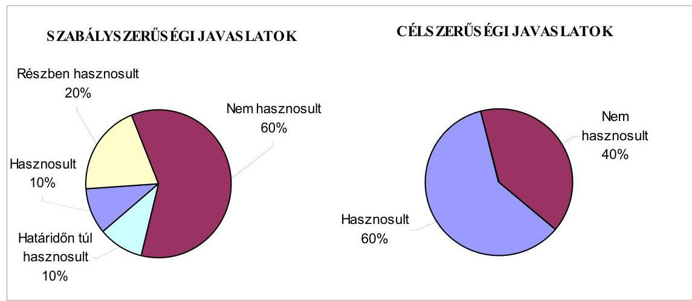
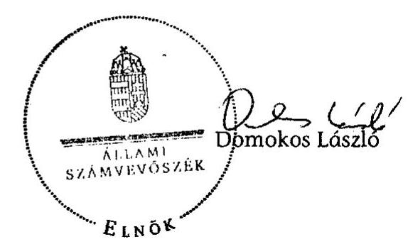

# ÁLLAMI   SZÁMVEVŐSZÉK 

## JELENTÉS

Szakály Község Önkormányzata belső kontrollrendszerének kialakítása, valamint egyes kontrolltevékenységek és a belső ellenőrzés múködése ellenőrzéséről

---

# Állami Számvevőszék 

Iktatószám: V-0012-058-017-024/2013.
Témaszám: 1051
Vizsgálat-azonosító szám: V059116

## Az ellenőrzést felügyelte:

Dr. Benedek Mária
felügyeleti vezető
2012. december 16. napjától

Gyüre Lajosné
felügyeleti vezető
2012. december 15. napjáig

## Az ellenőrzést vezette:

## Szakmányné Bilik Mária ellenőrzésvezető

A számvevőszéki jelentés összeállításában közremüködtek:
Moder Beatrix
számvevő
Renner Andrea
számvevő
Az ellenőrzést végezték:
Bencsik Árpád
saálné Berente Mónika
számvevő

---

# TARTALOMJEGYZÉK 

BEVEZETÉS ..... 5
I. ÖSSZEGZŐ MEGÁLLAPÍTÁSOK, KÖVETKEZTETÉSEK, JAVASLATOK ..... 8
II. RÉSZLETES MEGÁLLAPÍTÁSOK ..... 18

1. Az Önkormányzat belső kontrollrendszere kialakításának megfelelősége ..... 18
1.1. A kontrollkörnyezet kialakítása ..... 18
1.2. A kockázatkezelési rendszer szabályozása ..... 19
1.3. A kontrolltevékenységek kialakítása ..... 20
1.4. Az információs és kommunikációs rendszer szabályozása ..... 21
1.5. A monitoring rendszer szabályozása ..... 22
2. A pénzügyi folyamatokban kulcsszerepet betöltő belső kontrollok (szakmai teljesítésigazolás és utalvány ellenjegyzés) múködése ..... 23
3. A belső ellenőrzés szervezeti keretei és múködése ..... 25
4. Az ÁSZ 2007-2010. években végzett átfogó ellenőrzései során megfogalmazott javaslatok végrehajtására tett intézkedések ..... 27

## FÜGGELÉKEK

1. számú Értelmező szótár
2. számú A belső kontrollrendszer kialakítása, a pénzügyi folyamatokban kulcsszerepet betöltő szakmai teljesítésigazolás és utalvány ellenjegyzés kontrollok múködése, valamint a belső ellenőrzés múködése értékelésénél alkalmazott minősítési szempontok

---

.

---

# RÖVIDÍTÉSEK JEGYZÉKE 

## Törvények

Ász. tv.
Avtv.

Info tv.

Htv.

Kttv.

Ktv.

Mötv.

Ötv.
régi Áht.

Számv. tv.
új Áht.

## Rendeletek

Áhsz.

Ámr.
Ávr.

Ber.
Bkr.
önkormányzati SZMSZ
vagyongazdálkodási rendelet
2011. évi LXVI. törvény az Állami Számvevőszékről
1992. évi LXIII. törvény a személyes adatok védelméről és a közérdekú adatok nyilvánosságáról (hatálytalan 2012. január 1-jétől)
2011. évi CXII. törvény az információs önrendelkezési jogról és az információszabadságról (hatályos 2012. január 1-jétől
1991. évi XX. törvény a helyi önkormányzatok és szerveik, a köztársasági megbízottak, valamint egyes centrális alárendeltségú szervek feladat- és hatásköreiről
2011. évi CXCIX. törvény a közszolgálati tisztviselőkről (hatályos 2012. március 1-jétől)
1992. évi XXIII. törvény a köztisztviselők jogállásáról (hatálytalan 2012. március 1-jétől)
2011. évi CLXXXIX. törvény Magyarország helyi önkormányzatairól (hatályos 2012. január 1-jétől)
1990. évi LXV. törvény a helyi önkormányzatokról
1992. évi XXXVIII. törvény az államháztartásról (hatálytalan 2012. január 1-jétől)
2000. évi C. törvény a számvitelről
2011. évi CXCV. törvény az államháztartásról (hatályos 2012. január 1-jétől)

249/2000. (XII. 24.) Korm. rendelet az államháztartás szervezetei beszámolási és könyvvezetési kötelezettségének sajátosságairól
292/2009. (XII. 19.) Korm. rendelet az államháztartás múködési rendjéről (hatálytalan 2012. január 1-jétől)
368/2011. (XII. 31.) Korm. rendelet az államháztartásról szóló törvény végrehajtásáról (hatályos 2012. január 1jétől)
193/2003. (XI. 26.) Korm. rendelet a költségvetési szervek belső ellenőrzéséről (hatálytalan 2012. január 1-jétől)
370/2011. (XII. 31.) Korm. rendelet a költségvetési szervek belső kontrollrendszeréről és belső ellenőrzéséről (hatályos 2012. január 1-jétől)
Szakály Község Önkormányzata Képviselő-testületének 7/2010. (XI. 2.) számú rendelete az Önkormányzat Szervezeti és Müködési Szabályzatáról
Szakály Község Önkormányzata Képviselő-testületének 19/2004. (XII. 31.) számú rendelete az Önkormányzat vagyonáról és a vagyongazdálkodás szabályairól

---

# Szórövidítések 

ÁSZ
Belső ellenőrzési kézikönyv
Belső Kontroll Kézikönyv
gazdálkodási szabályzat
informatikai biztonsági szabályzat
iratkezelési szabályzat
jegyző
Képviselő-testület
kockázatkezelési szabályzat
körjegyző
Körjegyzőség
körjegyzőségi SZMSZ
leltározási szabályzat
Önkormányzat
Önkormányzati Hivatal
polgármester
Társulás

Állami Számvevőszék
Tamási-Simontornyai Többcélú Kistérségi Társulás Belső ellenőrzési kézikönyve (hatályos 2010. február 27-étől)
az Ámr. 155. § (1) bekezdése, valamint az államháztartási belső kontroll standardokról szóló 1/2009. (IX. 11.) PM irányelv egységes értelmezése érdekében az államháztartásért felelős miniszter által a 2010. évben kiadott Belső Kontroll Kézikönyv
Szakály Község Önkormányzatának Gazdálkodási szabályzata (hatályos 2010. október 1-jétől)
Szakály-Dúzs-Mucsi Községek Körjegyzőségének Informatikai biztonsági szabályzata (hatályos 2009. január 1jétől)
Szakály Község Önkormányzatának, valamint Szakály-Dúzs-Mucsi Községek Körjegyzőségének Egyedi iratkezelési szabályzata (hatályos 2007. január 1-jétől)
Szakályi Közös Önkormányzati Hivatal jegyzője 2013. január 1-jétől
Szakály Község Önkormányzatának Képviselő-testülete
Szakály Község Önkormányzatának Kockázatkezelési szabályzata (hatályos 2007.április 1-jétől)
Szakály-Dúzs-Mucsi Községek Önkormányzatainak körjegyzője
Szakály-Dúzs-Mucsi Községek Önkormányzatainak Körjegyzősége
Szakály-Dúzs-Mucsi Községek Körjegyzőségének Szervezeti és Múködési Szabályzata (hatályos 2007. augusztus 1jétől)
Szakály Község Önkormányzatának Leltározási és leltárkészítési szabályzata (hatályos 2010. október 1-jétől)
Szakály Község Önkormányzata
Szakályi Közös Önkormányzati Hivatal (a Körjegyzőség jogutódjaként megalakult 2013. január 1-jén)
Szakály Község Önkormányzatának polgármestere
Tamási-Simontornyai Többcélú Kistérségi Társulás

---

# JELENTÉS 

## Szakály Község Önkormányzata belső kontrollrendszerének kialakítása, valamint egyes kontrolltevékenységek és a belső ellenőrzés múködése ellenőrzéséről

## BEVEZETÉS

A belső kontrollrendszer kialakítását, múködtetését és fejlesztését a régi Áht. és az új Áht. is előírja. Ennek megvalósításáért a költségvetési szerv vezetője felel. A belső kontrollrendszer azt a célt szolgálja, hogy a költségvetési szervek múködésük és gazdálkodásuk során a tevékenységeket szabályszerűen, gazdaságosan, hatékonyan, eredményesen hajtsák végre, teljesítsék elszámolási kötelezettségeiket és megvédjék az erőforrásokat a veszteségektől, a károktól és a nem rendeltetésszerú használattól. A belső kontrollrendszer magában foglalja mindazon szabályokat, eljárásokat, gyakorlati módszereket és szervezeti struktúrákat, kockázatkezelési technikákat, kontrolltevékenységeket, amelyek segítséget nyújtanak a szervezetnek céljai eléréséhez.

Az ÁSZ a 2011-2015. évekre szóló stratégiájában hangsúlyos szerepet szánt annak, hogy szilárd szakmai alapon álló, értékteremtő ellenőrzéseivel előmozdítsa a közpénzügyek átláthatóságát, rendezettségét. A számvevőszéki ellenőrzés nemzetközi alapelvei is rögzítik, hogy a megfelelő belső kontrollrendszer minimálisra csökkenti a hibák és szabálytalanságok kockázatát.

Az ellenőrzés célja annak értékelése volt, hogy az Önkormányzat a jogszabályi előírásoknak megfelelően alakította-e ki a belső kontrollrendszert; a gazdálkodás folyamatában kulcsszerepet betöltő szakmai teljesítésigazolás és az utalvány ellenjegyzés kontrolltevékenységeit megfelelően múködtette-e; biztosí-totta-e a belső ellenőrzés szabályos és eredményes múködését; intézkedett-e az ÁSZ által a 2007-2010. évek között végzett átfogó ellenőrzések javaslatainak végrehajtásáról.

Az ÁSZ ezen ellenőrzési céljait pilot (próba) jelleggel községi/nagyközségi önkormányzatoknál végzett ellenőrzések során érvényesítette.

Az ellenőrzés típusa: szabályszerűségi ellenőrzés
Az ellenőrzés jogszabályi alapja: az ÁSZ tv. 5. § (2) és (6) bekezdései
Az ellenőrzött szervezet: az Önkormányzat
Az ellenőrzött időszak: a belső kontrollrendszer kialakításának megfelelőségét a 2011. évre vonatkozóan értékeltük. A kontrolltevékenységek múködésé-

---

nek megfelelőségét a 2011. január 1-je és december 31-e, míg a belső ellenőrzés működésének szabályosságát és eredményességét a 2009. január 1-je és 2011. december 31-e közötti időszakot figyelembe véve értékeltük. A helyszíni ellenőrzés lezárásáig a helyi szabályozás változásait nyomon követtük.

Az ellenőrzés szakmai módszertana az ÁSZ hivatalos honlapján (www.asz.hu) közzétett szakmai szabályokon alapult, amely a Legfőbb Ellenőrző Intézmények Nemzetközi Szervezete (INTOSAI) által kiadott nemzetközi standardok (ISSAI) figyelembevételével készült.

A belső kontrollrendszer kialakításának ellenőrzése során értékeltük a kontrollkörnyezet, a kockázatkezelési rendszer, a kontrolltevékenységek, az információs és kommunikációs rendszer, valamint a monitoring rendszer szabályozottságának megfelelőségét.

Értékeltük a pénzügyi folyamatokban kulcsszerepet betöltő szakmai teljesítésigazolás és az utalvány ellenjegyzés kontrollok múködésének megfelelőségét az államháztartáson kívülre teljesített múködési és felhalmozási célú pénzeszközátadásoknál, a külső szolgáltatók által végzett karbantartási, kisjavítási munkákkal, továbbá az egyéb üzemeltetési, fenntartási, szolgáltatási kiadásokkal kapcsolatos kifizetéseknél. Az egyszerú véletlen mintavétellel kiválasztott tételek ellenőrzését többlépcsős megfelelőségi tesztek útján addig végeztük, amíg elegendő és megfelelő bizonyítékot szereztünk a vizsgált folyamatok kulcskontrolljai múködésének megfelelő vagy nem megfelelő voltáról. Értékeltük az Önkormányzatnál a belső ellenőrzés múködésének szabályosságát és eredményességét. Az Önkormányzat gazdálkodási rendszerének vonatkozásában átfogó jellegű számvevőszéki ellenőrzésre a 2007. évben került sor.

A fogalmak magyarázatát az 1. számú függelék, az ellenőrzés egyes területeinek értékelésénél alkalmazott egységes minősítési szempontokat a 2. számú függelék tartalmazza.

Az ellenőrzés lefolytatásához az Önkormányzat a munkalapok és a tanúsítvány elektronikus kitöltésével, valamint a megjelölt dokumentumok elektronikus megküldésével szolgáltatott adatokat. A munkalapokon szerepeltetett adatok, információk ellenőrzése és szükség szerinti javítása a helyszíni ellenőrzés keretében történt.

Az ÁSZ az ellenőrzés megállapításait az ellenőrzött időszakban hatályos, az intézkedést igénylő megállapításokra tett javaslatokat a jelenleg hatályos jogszabályok alapján fogalmazta meg.

Az Ász tv. 29. § (1) bekezdése szerint a jelentéstervezetet megküldtük a polgármester részére, aki az ÁSZ tv. 29. § (2) bekezdésében foglalt észrevételezési jogával élt, a tett észrevétel szakmai tartalmánál fogva a jelentéstervezet egyes megállapításait nem érintette.

Szakály község állandó lakosainak száma 2011. január 1-jén 1418 fő volt. Az Önkormányzat hattagú Képviselő-testületének munkáját kettő állandó bizottság segítette. Az Önkormányzat az önállóan múködő és gazdálkodó Körjegyzőségen kívül intézményt nem múködtetett, többségi tulajdoni hányadú gazdasági társasággal nem rendelkezett. A polgármester a 2010. évi önkormányzati

---

választások óta tölti be tisztségét. A körjegyző 2004. augusztus 16-ától látja el feladatait. A Körjegyzőség szervezeti egységekre nem tagolódik, elkülönített gazdasági szervezete nincs, a foglalkoztatott köztisztviselők száma 2011. január 1-jén 12 fő volt. Az Önkormányzat a 2011. évi költségvetési beszámolója szerint 208720 ezer Ft költségvetési bevételt ért el, valamint 204005 ezer Ft költségvetési kiadást teljesített. A 2011. december 31-i könyvviteli mérleg szerint 1398654 ezer Ft értékű eszközvagyonnal rendelkezett, a rövid lejáratú kötelezettségállománya 31154 ezer Ft volt, hosszú lejáratú kötelezettsége nem volt.
2013. január 1-jén a Szakály-Dúzs-Mucsi Községek Önkormányzatainak Körjegyzősége jogutódjaként megalakult a Szakályi Közös Önkormányzati Hivatal, amelynek jegyzői feladatának ellátására a Körjegyzőség volt vezetője kapott megbízást.

---

# I. ÖSSZEGZŐ MEGÁLLAPÍTÁSOK, KÖVETKEZTETÉSEK, JAVASLATOK 

A belső kontrollrendszer kialakítása a Körjegyzőségnél 2011-ben a kontrollkörnyezet, a kockázatkezelési rendszer, a kontrolltevékenységek, az információs és kommunikációs rendszer, valamint a monitoring rendszer szabályozásának, illetve kialakításának értékelése alapján összességében nem felelt meg a jogszabályi előírásoknak.

A kontrollkörnyezet kialakítása nem felelt meg a jogszabályi követelményeknek. A körjegyző - a Htv. előírása ellenére - nem készítette el a gazdasági programtervezetet, ezért a Képviselő-testület nem határozta meg az Önkormányzat gazdasági programját. A körjegyző - az Ámr.-ben ${ }^{1}$ foglaltak ellenére a körjegyzőségi SZMSZ-ben nem rögzítette a szakfeladatrend szerint besorolt alaptevékenységeket, az alaptevékenységeket szabályozó jogszabályokat, a szervezeti ábrát, valamint a munkakörökhöz tartozó hatásköröket, azok gyakorlásának módját, a helyettesítés rendjét és a kapcsolódó felelősségi szabályokat. A körjegyzőségi SZMSZ-ben - a Ber. ${ }^{2}$ előírása és az előző ÁSZ ellenőrzés javaslata ellenére - nem írta elő a belső ellenőrzést végzők jogállását, feladatait. A Ktv.-ben ${ }^{3}$ foglaltak ellenére a körjegyző nem határozta meg a köztisztviselők munkateljesítményének értékeléséhez szükséges teljesítménykövetelményeket, és nem végzett teljesítményértékelést. A polgármester nem készítette el a körjegyző munkaköri leírását. Ezek a hiányosságok korlátozzák a feladatellátás számon kérhetőségét, folyamatosságának biztosítását. A körjegyző az ellenőrzési nyomvonalban - az Ámr. előírása ellenére - nem rögzítette a felelősségi és információs szinteket és kapcsolatokat, a folyamatgazdákat nem jelölte ki, gátolva ezzel a folyamatok nyomon követését és utólagos ellenőrzését. A körjegyzö - az Áhsz., valamint a vagyongazdálkodási rendelet évenkénti leltározásra vonatkozó szabályozása ellenére - a mérlegben kimutatott eszközök kétévenkénti leltározási kötelezettségét határozta meg a leltározási szabályzatban.

A kockázatkezelési rendszer szabályozása nem felelt meg a jogszabályi előírásoknak. A körjegyző - az Ámr.-ben foglaltak ellenére - nem határozta meg az egyes kockázatokkal kapcsolatos intézkedéseket és megtételük módját, valamint nem jelölte ki a kockázatkezelőket.

A kontrolltevékenységek kialakítása a jogszabályi előírásoknak nem felelt meg, mert a körjegyzö - a régi Áht. ${ }^{4}$ előírása ellenére - nem határozta meg a folyamatba épített, előzetes, utólagos és vezetői ellenőrzés feladatait a gazdálkodási jogkörök, valamint a beszerzési és a vagyonhasznosítási tevékenység folyamataiban. A körjegyző - az Ámr. előírása ellenére - nem alakította ki a Kör-

[^0]
[^0]:    ${ }^{1}$ 2012. január 1-jétől Ávr.
    ${ }^{2}$ 2012. január 1-jétől Bkr.
    ${ }^{3}$ 2012. március 1-jétől Kttv.
    ${ }^{4}$ 2012. január 1-jétől új Áht.

---

jegyzőség tevékenységeire vonatkozó beszámolási eljárásokat, és nem jelölte ki a szakmai teljesítésigazolásra jogosultakat. A szabálytalanságok megszüntetésére az előző ÁSZ ellenőrzés is javaslatot fogalmazott meg. A kontrolltevékenységek hiányos kialakítása kockázatot jelent a feladatok szabályszerű végrehajtása során.

Az információs és kommunikációs rendszer szabályozása a jogszabályi előírásoknak nem felelt meg. A körjegyző - az Avtv. ${ }^{5}$ előírása ellenére - nem készítette el az adatvédelmi és adatbiztonsági szabályzatot, nem határozta meg a közérdekű adatok közzétételi eljárásrendjét és a közérdekű adatok megismerésére irányuló igények teljesítésének rendjét. Az Avtv. rendelkezése ellenére a körjegyző nem szabályozta a pénzügyi-számviteli szoftverváltozások ellenőrzésére vonatkozó eljárásokat, a feldolgozott adatok mentési eljárásait és nem jelölte ki a mentések felelőseit.

A monitoring rendszer szabályozása a jogszabályi követelményeknek nem felelt meg, mert a körjegyzö - az Ámr.-ben foglaltak ellenére - nem alakította ki az operatív tevékenységek keretében megvalósuló folyamatos és eseti nyomon követésből álló, az Önkormányzat tevékenységének, a célok megvalósításának nyomon követését biztosító rendszert.

A belső kontrollrendszer nem megfelelő kialakítása kockázatot jelent az Önkormányzat tevékenységeinek szabályszerű, gazdaságos, hatékony és eredményes végrehajtásában.

A Körjegyzőségen az Önkormányzat vonatkozásában a 2011. évben az államháztartáson kívülre történő múködési és felhalmozási célú pénzeszközátadásokkal, a külső szolgáltatók által végzett karbantartással, kisjavítással, valamint az egyéb üzemeltetési, fenntartási, szolgáltatási kiadásokkal kapcsolatos kifizetések során összefoglalóan értékelve a kulcskontrollok múködésének megfelelősége gyenge volt.

A kiadások teljesítését megelőzően - az Ámr. előírása és a gazdálkodási szabályzatban előírtak ellenére - a kifizetések jogosságának, összegszerűségének ellenőrzése, az ellenszolgáltatást is magukban foglaló kifizetések esetében a szerződések szakmai teljesítésének igazolása a szakmai teljesítésigazoló kijelölésének hiányában elmaradt.

Az utalványok ellenjegyzője a kiadások teljesítését megelőzően az Ámr.-ben foglalt ellenőrzési feladatait nem a jogszabályi előírásoknak megfelelően végezte. Annak ellenére aláírásával ellenjegyezte a kifizetéseket, hogy a szakmai teljesítésigazolás kötelezettségének nem tettek eleget, így az érvényesítés nem szakmai teljesítésigazoláson alapult. A gazdálkodásra - közöttük a kötelezettségvállalások nyilvántartására és az utalványrendeleten a kötelezettségvállalás nyilvántartási számának feltüntetésére, a jogosult általi ellenjegyzést követő kötelezettségvállalásra - vonatkozó szabályok betartásának hiánya ellenére az utalványokat az utalványozó aláírásával ellenjegyezte.

[^0]
[^0]:    ${ }^{5}$ 2012. január 1-jétől Info tv.

---

A könyvviteli elszámolásra utaló főkönyvi számlát - a Számv. tv. és az Áhsz. előírásaitól eltérően - nem a gazdasági esemény tényleges tartalmának megfelelően jelölték ki, mert hibásan a múködési célú pénzeszközátadások között számoltak el egyéb folyó kiadást. A nem megfelelő elszámolás miatt a könyvvezetés során nem tartották be a Számv. tv.-ben előírt, a „tartalom elsődlegessége a formával szemben" számviteli alapelvet.

A számvevőszéki ellenőrzés az ellenőrzött kifizetésekkel összefüggésben jogosulatlan kifizetést nem állapított meg, azonban a gazdálkodásban kulcsszerepet betöltő kontrollok múködésében feltárt - az előző ÁSZ ellenőrzés javaslatai hasznosításának elmaradása következtében továbbra is fennálló - hiányosságok miatt magas a hibák bekövetkezésének lehetősége. A nem megfelelően múködtetett belső kontrollok, valamint azok szabályozásának hiánya korrupciós kockázatot hordoznak.

A korábbi ÁSZ ellenőrzés során - a szakmai teljesítésigazolás és az utalvány ellenjegyzés kulcskontrollok múködtetésére, valamint a kötelezettségvállalások nyilvántartására és ellenjegyzésére - tett javaslatokat nem hasznosították, ami a hibák ismétlődéséhez vezetett.

Az Önkormányzat a belső ellenőrzési feladatokat a Társulás útján látta el. Az Önkormányzatnál a 2009-2011. években a belső ellenőrzés szabályozása és múködése összességében nem felelt meg a jogszabályi előírásoknak. A Képvi-selő-testület az éves ellenőrzési terveket - az Ötv. ${ }^{6}$ előírása és az előző ÁSZ ellenőrzés javaslata ellenére - nem hagyta jóvá, mert a körjegyző a döntés meghozatalához nem készített írásos előterjesztést. A 2010. és 2011. években a belső ellenőrzési vezető az ellenőrzési programokat - a Ber. előírása ellenére - nem hagyta jóvá, az ellenőrzésekről készült jelentéseket az ellenőrzést végző belső ellenőr nem írta alá. A körjegyző a javaslatok hasznosítására intézkedési tervet nem készített. A belső ellenőrzési vezető nem alakította ki az intézkedések nyilvántartását, a belső ellenőrzés az intézkedések nyomon követését elmulasztotta.

Az Önkormányzatnál a 2009-2011. években a belső ellenőrzés múködése a 2. számú függelék minősítési szempontjai alapján - nem volt eredményes, mert a belső ellenőrzés szabályozása és működése az összegző értékelés alapján az ellenőrzött időszak egészét tekintve a jogszabályi előírásoknak nem felelt meg. Továbbá nem végeztek belső ellenőrzést a következőkben felsoroltak közül legalább kettő területen: a belső kontrollrendszer kialakításának szabályozottsága, a beazonosított túréshatár feletti kockázatok kezelése érdekében tett intézkedések, a gazdálkodási jogkörök gyakorlása, a készpénzkezeléssel kapcsolatos belső kontrollok múködése, valamint az önkormányzati vagyonhasznosítás vonatkozásában a vagyongazdálkodási szabályok betartása. Ezen túl a belső ellenőrzésekről készített jelentésekben megfogalmazott javaslatok hasznosításáról a körjegyző nem intézkedett. Mindezek hozzájárultak a számvevőszéki ellenőrzés során is feltárt szabályozási hiányosságok, a hibák ismétlődéséhez.

[^0]
[^0]:    ${ }^{6}$ 2013. január 1-jétől Mötv.

---

Az ÁSZ tv. 33. § (1) bekezdésében foglaltak értelmében az ellenőrzött szervezet vezetője köteles a jelentésben foglalt megállapításokhoz kapcsolódó intézkedési tervet összeállítani, és azt a jelentés kézhezvételétől számított 30 napon belül az ÁSZ részére megküldeni. Amennyiben az intézkedési tervet határidőre nem küldi meg a szervezet, vagy az az ÁSZ tv. 33. § (2) bekezdésében foglalt póthatáridő eltelte ellenére továbbra sem elfogadható, az ÁSZ elnöke a hivatkozott törvény 33. § (3) bekezdés a)-b) pontjaiban foglaltakat érvényesítheti.

Az ellenőrzés intézkedést igénylő megállapításai és javaslatai:

# a polgármesternek 

1. A Képviselő-testület - az Ötv. 91. § (7) bekezdésben foglaltak ellenére - nem fogadta el az Ötv. 91. § (1) és (6) bekezdése szerinti gazdasági programtervezetet.

Javaslat:
Terjessze a Képviselő-testület elé a gazdasági program jegyző által elkészített tervezetét a Mötv. 116. § (1) és (5) bekezdései alapján a (3)-(4) bekezdéseiben foglalt tartalommal.
2. A Ktv. 11. § (1) és (6) bekezdéseiben foglaltak ellenére nem készítette el a körjegyző munkaköri leírását.

Javaslat:
Intézkedjen - a Kttv. 43. § (4) bekezdésében foglaltaknak megfelelően - a jegyző munkaköri leírásának elkészítéséről.
3. A kötelezettségvállalás dokumentumait - a régi Áht 100/C. § (3) bekezdésében és az Ámr. 74. § (1) bekezdésében foglaltak ellenére - a kötelezettségvállalás előtt nem minden esetben ellenjegyezték.

Javaslat:
Biztosítsa, hogy az új Áht. 37. § (1) bekezdésében foglaltaknak megfelelően kötelezettségvállalásra - az Ávr. 53. §-ában meghatározott kivételeket figyelembe véve minden esetben a pénzügyi ellenjegyzés után, a pénzügyi teljesítés esedékességét megelőzően, írásban kerüljön sor.
4. A körjegyző - az Ámr. 155. § (4) bekezdését figyelmen kívül hagyva - nem hasznosította a szabályozásbeli hiányosságok megszüntetésére, az Önkormányzat szabályszerű gazdálkodására, a belső ellenőrzés szabályszerű működésére vonatkozó korábbi ÁSZ ellenőrzés javaslatait. A kiadások teljesítését megelőzően a szakmai teljesítésigazolására jogosult személyek kijelölése nem történt meg, továbbá - az Ámr. előírása és a gazdálkodási szabályzatban előírtak ellenére - a kifizetések jogosságának, öszszegszerűségének ellenőrzése, az ellenszolgáltatást is magukban foglaló kifizetések esetében a szerződések szakmai teljesítésének igazolása elmaradt. Az utalványok ellenjegyzője a kiadások teljesítését megelőzően - a régi Áht. 100/C. § (6) bekezdése ellenére - az Ámr. 78-79. §-ban foglalt ellenőrzési feladatait nem végezte el.

---

Javaslat:
Intézkedjen a jelen számvevőszéki jelentés megállapításai alapján a belső kontrollrendszerre és a belső ellenőrzés múködésére vonatkozó jogszabályi rendelkezések be nem tartása, valamint a szakmai teljesítésigazolás, illetve az utalvány ellenjegyzés kontrollokkal összefüggésben feltárt hiányosságok, szabálytalanságok tekintetében az esetleges munkajogi felelősséggel kapcsolatos körülmények kivizsgálásáról, majd a vizsgálat eredményének függvényében tegye meg a szükséges munkajogi intézkedéseket.

# a jegyzőnek Szakály Község Önkormányzata vonatkozásában 

1. a kontrollkörnyezettel kapcsolatban:

A körjegyző a Htv. 140. § (1) bekezdés a) pontjában foglalt előírást figyelmen kívül hagyva nem készítette el az Ötv. 91. § (1) és (6) bekezdése szerinti gazdasági programtervezetet.

Az Ámr. 20. § (2) bekezdés c), i) és h) pontjaiban foglaltak ellenére a körjegyzőségi SZMSZ-ben nem rögzítette az ellátandó, és a szakfeladatrend szerint besorolt alaptevékenységeket, az alaptevékenységeket szabályozó jogszabályok megnevezését és a szervezeti ábrát. A körjegyző nem határozta meg a körjegyzőségi SZMSZ-ben nevesített munkakörökhöz tartozó hatásköröket, a hatáskörök gyakorlásának módját, a helyettesítés rendjét, az ezekhez kapcsolódó felelősségi szabályokat, továbbá - a Ber. 4. § (2) bekezdés előírása ellenére - a körjegyzőségi SZMSZ-ben nem írta elő a belső ellenőrzést végzők jogállását és feladatait.

A körjegyző az ellenőrzési nyomvonalban - az Ámr. 156. § (2) bekezdésében előírtak ellenére - nem jelölte ki a folyamatgazdákat, nem határozta meg a felelősségi és információs szinteket és kapcsolatokat.

A körjegyző - az Áhsz. 37. § (1) bekezdésében, valamint a vagyongazdálkodási rendelet 5. § (2) bekezdésében foglaltak ellenére - a leltározási szabályzatban a mérlegben kimutatott eszközök kétévenkénti leltározási kötelezettségét írta elő.

A Ktv. 34. § (5) bekezdésében foglaltak ellenére a köztisztviselők munkateljesítményének értékeléséhez szükséges teljesítménykövetelményeket nem határozta meg, és nem végzett teljesítményértékelést.

Javaslat:
a) Készítse elő a Htv. 140. § (1) bekezdés a) pontjában foglaltak alapján a gazdasági program tervezetét a Mötv. 116. § (3)-(4) bekezdésében foglalt tartalommal, és kezdeményezze a polgármesternél a Képviselő-testület elé terjesztését.
b) Intézkedjen arról, hogy a hatályos SZMSZ az Ávr. 13. § (1) bekezdés c), e) és g) pontjaiban foglaltaknak megfelelően tartalmazza az ellátandó, és a szakfeladatrend szerint besorolt alaptevékenységeket, az alaptevékenységeket szabályozó jogszabályok megjelölését és a szervezeti ábrát, valamint az Önkormányzati Hivatal SZMSZ-ében nevesített munkakörökhöz kapcsolódó hatáskörö-

---

ket, a hatáskörök gyakorlásának módját, a helyettesítés rendjét, az ezekhez kapcsolódó felelősségi szabályokat, továbbá a Bkr. 15. § (2) bekezdésében foglaltak szerint a hivatali SZMSZ-ben írják elő a belső ellenőrzést végzők jogállását és feladatait.
c) Intézkedjen a Bkr. 6. § (3) bekezdésében előírtak érvényre juttatása érdekében az ellenőrzési nyomvonalban a folyamatgazdák kijelöléséről, valamint a felelősségi és információs szintek és kapcsolatok meghatározásáról.
d) Írja elő a leltározási szabályzatban a mérlegben kimutatott eszközök és források leltározási kötelezettségét az Áhsz. 37. § (1) bekezdésében és a vagyongazdálkodási rendelet 5. § (2) bekezdésében foglaltaknak megfelelően.
e) Intézkedjen a Polgármesteri Hivatal köztisztviselőire vonatkozó, teljesítményértékeléssel kapcsolatos szabályok kialakításáról és alkalmazásáról a Kttv. 130. § (1)(6) bekezdéseiben előírtak szerint.
2. a kockázatkezelési rendszerrel kapcsolatban:

Az Ámr. 157. § (3) bekezdésében foglaltak ellenére a körjegyző nem határozta meg az egyes kockázatokkal kapcsolatos intézkedéseket és megtételük módját.

Javaslat:
A Bkr. 7. §-a alapján határozza meg a feltárt kockázatokkal kapcsolatban szükséges intézkedéseket, valamint azok teljesítésének folyamatos nyomon követésének módját.
3. a kontrolltevékenységekkel kapcsolatban:

A körjegyző - a régi Áht. 121/A. § (4) bekezdésében foglaltak ellenére - a gazdálkodási jogkörök, valamint a beszerzési és a vagyonhasznosítási tevékenység folyamatai tekintetében nem határozta meg a folyamatba épített, előzetes, utólagos és vezetői ellenőrzés feladatait.

Az Ámr. 158. § (2) bekezdés d) pontjában előírtak ellenére nem alakította ki a Körjegyzőség tevékenységeire vonatkozó beszámolási eljárásokat.

A körjegyző - az Ámr. 76. § (5) bekezdésének előírása ellenére - nem jelölte ki a szakmai teljesítésigazolásra jogosultakat.

Javaslat:
a) Biztosítsa - a Bkr. 8. § (2) bekezdése alapján - a gazdálkodási, a beszerzési és a vagyonhasznosítási tevékenység folyamatba épített, előzetes, utólagos és vezetői ellenőrzését.
b) Alakítsa ki a Bkr. 8. § (4) bekezdés c) pontjában foglaltaknak megfelelően az Önkormányzati Hivatal tevékenységeire vonatkozó beszámolási eljárásokat.
c) Az Ávr. 57. § (4) bekezdésében foglalt előírásnak megfelelően jelölje ki a teljesítés igazolására jogosult személyeket.

---

4. az információs és kommunikációs rendszerrel kapcsolatban:

A körjegyző az Avtv. 31/A. § (3) bekezdése ellenére nem készítette el a Körjegyzőség adatvédelmi és adatbiztonsági szabályzatát.

Az Ámr. 20. § (3) bekezdés i) pontjában foglaltak ellenére nem határozta meg a közérdekú adatok közzétételi eljárásának, nyilvánosságra hozatalának rendjét, nem jelölte ki az adatfelelőst és az adatközlő személyt. Az Avtv. 20. § (8) bekezdésének előírása ellenére nem szabályozta a közérdekú adatok megismerésére irányuló igények teljesítésének rendjét.

Az informatikai rendszer környezetének szabályozása során - az Avtv. 10. § előírása ellenére - a körjegyző nem határozta meg a hozzáférési jogosultságok betartásának ellenőrzésére vonatkozó előírásokat, nem gondoskodott a hozzáférési jogosultság nyilvántartás vezetéséről, továbbá nem szabályozta a pénzügyi-számviteli szoftverváltozások ellenőrzésére vonatkozó eljárásokat.

Javaslat:
a) Készítse el az Önkormányzati Hivatal adatvédelmi és adatbiztonsági szabályzatát az Info tv. 24. § (3) bekezdésének megfelelően.
b) Alakítsa ki az Info tv. 35. § (3) bekezdésének eleget téve a közérdekú adatok közzétételi eljárásának, nyilvánosságra hozatalának eljárásrendjét, jelölje ki az adatfelelőst és az adatközlő személyt az Ávr. 13. § (2) bekezdés h) pontjában foglaltaknak megfelelően, valamint az Info tv. 30. § (6) bekezdése szerint szabályozza a közérdekú adatok megismerésére irányuló igények teljesítésének rendjét.
c) Biztosítsa az Info tv. 7. § (2)-(3) bekezdéseinek megfelelően az adatbiztonság érvényesülését, az informatikai környezet szabályozása keretében rendelkezzen a hozzáférési jogosultságok betartásának ellenőrzéséről és gondoskodjon a hozzáférési jogosultság nyilvántartás vezetéséről, valamint szabályozza a pénzügyiszámviteli szoftverváltozások ellenőrzésére vonatkozó eljárásokat.
5. a monitoring rendszerrel kapcsolatban:

A körjegyző - az Ámr. 160. §-ában foglaltak ellenére - nem alakított ki és müködtetett olyan monitoring rendszert, amely lehetővé teszi a Polgármesteri Hivatal tevékenységének, a célok megvalósításának nyomon követését, és része az operatív tevékenységek keretében megvalósuló folyamatos és eseti nyomon követés is.

Javaslat:
Alakítsa ki a Bkr. 10. §-ában előírtak alapján a Polgármesteri Hivatal tevékenységének, a célok megvalósításának nyomon követését biztosító rendszerét, amelynek része az operatív tevékenységek keretében megvalósuló folyamatos és eseti nyomon követés is.

---

6. a pénzügyi folyamatokban kulcsszerepet betöltő kontrollok müködésével kapcsolatban:

A 2011. évben az államháztartáson kívülre történő működési és felhalmozási célú pénzeszközátadásokkal, a külső szolgáltatók által végzett karbantartással, kisjavítással, valamint az egyéb üzemeltetési, fenntartási és szolgáltatási kiadásokkal kapcsolatos kiadások teljesítését megelőzően a kifizetések jogosságának, összegszerűségének ellenőrzését, valamint az ellenszolgáltatást is magukban foglaló kifizetések esetében a szerződések, megrendelések szakmai teljesítését - régi Áht. 100/C. § (6) bekezdésében és az Ámr. 76. § (1) és (3) bekezdésében foglaltak ellenére - nem igazolták.

A 2011. évben az államháztartáson kívülre történő működési és felhalmozási célú pénzeszközátadásokkal, a külső szolgáltatók által végzett karbantartással, kisjavítással, valamint az egyéb üzemeltetési, fenntartási és szolgáltatási kiadásokkal kapcsolatos kiadások teljesítését megelőzően az utalványok ellenjegyzője az Ámr. 79. § (2) bekezdésében foglalt ellenőrzési feladatait nem a jogszabályi előírásoknak megfelelően végezte, mert annak ellenére aláírásával ellenjegyezte a kiadásokat, hogy a szakmai teljesítésigazolás elmaradt. Az érvényesítés - az Ámr. 77. § (1) bekezdésében foglaltak ellenére - szakmai teljesítésigazolás hiányában történt. Az Ámr. 78. § (2) bekezdés g) pontjában foglaltak ellenére az utalványrendeleten a kötelezettségvállalás nyilvántartási számát nem tüntették fel, mert az Ámr. 75. § (1) bekezdésében előírt kötelezettségvállalás nyilvántartást nem vezették.

A külső szolgáltatók által végzett karbantartással, kisjavítással és az egyéb üzemeltetési, fenntartási szolgáltatással kapcsolatos kiadások teljesítését megelőzően az utalványok ellenjegyzője aláírásával ellenjegyezte az utalványt annak ellenére, hogy a kötelezettségvállalásokra - a régi Áht. 100/C. § (3) bekezdésében és az Ámr. 74. § (1) bekezdésében foglaltakat megsértve - ellenjegyzés nélkül került sor, valamint az egyéb üzemeltetési, fenntartási szolgáltatással kapcsolatos pénzügyi teljesítéseket megelőzően - a régi Áht. 100/C. § (1) bekezdése ellenére - nem a polgármester által felhatalmazott személy vállalt kötelezettséget.

A Számv. tv. 16. § (3) bekezdésében, az Áhsz. 9. § (11) bekezdésében és 9. számú mellékletének a számlaosztályok tartalmára vonatkozó előírások alcím alatt található 9. d) pont előírása ellenére - egyéb folyó kiadás helyett - a müködési célú pénzeszközátadások között számoltak el számla alapján fizetett tagdíjat.

Javaslat:
Intézkedjen - a szakmai teljesítés igazolása, az érvényesítés és az utalvány ellenjegyzése vonatkozásában feltárt hiányosságok megszüntetése, illetve az operatív gazdálkodás során a működésbeli hibák megelőzése, feltárása és kijavítása érdekében - arról, hogy:
a) a teljesítésigazolásra - az Ávr. 57. § (4) bekezdésében foglalt előírásnak megfelelően - kijelölt személyek az Ávr. 57. § (1) bekezdésében foglaltaknak megfelelően ellenőrizhető okmányok alapján ellenőrizzék a kiadások teljesítésének jogosságát, összegszerűségét, ellenszolgáltatást is magában foglaló kötelezettségvállalás esetében a szerződés, megrendelés teljesítését, és azt az Ávr. 57. §

---

(3) bekezdésében foglalt módon, dátummal, a teljesítés tényére történő utalással és aláírásukkal igazolják;
b) a kifizetéseket megelőzően - az Ávr. 58. § (1) bekezdése szerint - a teljesítésigazolás alapján - az Ávr. 57. § (3) bekezdése szerinti esetben annak hiányában is az összegszerűségnek, a fedezet meglétének és a megelőző ügymenetben az új Áht., az Áhsz., az Ávr. előírásai és a belső szabályzatokban foglaltak betartásának az ellenőrzése megtörténjen;
c) az Ávr. 56. § (1) bekezdésében foglalt kötelezettségvállalási nyilvántartást naprakészen vezessék, és az utalványrendeleteken az Ávr. 59. § (3) bekezdés f) pontjában foglaltaknak megfelelően tüntessék fel a kötelezettségvállalás nyilvántartási számát;
d) a gazdasági eseményeket tényleges tartalmuknak megfelelően könyveljék a Számv. tv. 16. § (3) bekezdésében és az Áhsz. 9. § (11) bekezdésében, valamint a 9. számú melléklet 9. d) pontjában foglaltak betartatásával.
7. a belső ellenőrzés múködésével kapcsolatban:

A Képviselő-testület az Önkormányzatra vonatkozó éves ellenőrzési terveket - az Ötv. 92. § (6) bekezdésében foglalt előírás ellenére - nem hagyta jóvá, mert a döntés meghozatalához a körjegyző nem készített írásos előterjesztést.

A belső ellenőrzési vezető a 2010. és 2011. évi ellenőrzési programokat - a Ber. 23. § (3) bekezdésének előírása ellenére - nem hagyta jóvá. Az elvégzett ellenőrzésekről készített 2010. és 2011. évi jelentéseket az ellenőrzést végző belső ellenőr nem írta alá a Ber. 27. § (2) bekezdés I) pontjában foglaltak ellenére.

A körjegyző - a Ber. 29. § (1) bekezdése ellenére - nem készített intézkedési tervet a jelentésekben megfogalmazott javaslatok hasznosítására.

A belső ellenőrzés - a Ber. 8. § f) pontjában foglaltak ellenére - az intézkedések nyomon követését elmulasztotta, a belső ellenőrzési vezető nem alakította ki a Ber. 12. § n) pontjában előírt nyilvántartást az ellenőrzési javaslatok alapján megtett intézkedések végrehajtásának nyomon követéséről.

Javaslat:
a) Intézkedjen az éves ellenőrzési terv Képviselő-testület elé terjesztéséről annak érdekében, hogy azt a Képviselő-testület az Mötv. 119. § (5) bekezdésében és a Bkr. 32. § (4) bekezdésében előírt határidőn belül hagyja jóvá.
b) Intézkedjen arról, hogy a Bkr. 33. § (2) bekezdésében foglaltaknak megfelelően előkészített, a belső ellenőrzési vezető által jóváhagyott ellenőrzési programok alapján az ellenőrzéseket hajtsák végre, továbbá arról, hogy a jelentések a Bkr. 39. § (3) bekezdés m) pontjában foglaltak szerint tartalmazzák az ellenőrzésben közremúködött ellenőrök nevét és aláírását.

---

c) Készítsen intézkedési tervet a belső ellenőrzési jelentésekben megfogalmazott javaslatok végrehajtására a Bkr. 45. § (2)-(3) bekezdéseiben foglaltaknak megfelelő tartalommal és határidőn belül.
d) Intézkedjen arról, hogy a belső ellenőrzés a Bkr. 21. § (2) bekezdés d) pontja alapján vezesse - a Bkr. 47. § szerinti - nyilvántartást, és kövesse nyomon a belső ellenőrzési jelentések alapján megtett intézkedéseket.

---

# II. RÉSZLETES MEGÁLLAPÍTÁSOK 

## 1. Az ÖNKORMÁNYZAT BELSŐ KONTROLLRENDSZERE KIALAKÍTÁSÁNAK MEGFELELŐSÉGE

### 1.1. A kontrollkörnyezet kialakítása

A kontrollkörnyezet kialakítása a 2. számú függelék kritériumrendszerében meghatározott szempontok szerinti értékelés alapján a Körjegyzőségen nem volt megfelelő, mert a körjegyző a jogszabályi előírásokat teljes mértékben nem érvényesítette.

A körjegyző, mint a költségvetési szerv vezetője:

- a Htv. 140. § (1) bekezdés a) pontjában foglalt előírást figyelmen kívül hagyva nem készítette el az Ötv. 91. § (1) és (6) bekezdés szerinti gazdasági programtervezetet, és a Képviselő-testület az Ötv. 91. § (7) bekezdéseiben ${ }^{7}$ foglaltakat megsértve nem határozta meg az Önkormányzat a 2010-2014. évekre szóló gazdasági programját, ezért az önkormányzati célok kitűzése elmaradt;
- az Ámr 20. § (2) bekezdés c), i) és h) pontjaiban ${ }^{8}$ foglaltak ellenére a körjegyzőségi SZMSZ-ben nem rögzítette az ellátandó, és a szakfeladatrend szerint besorolt alaptevékenységeket, az alaptevékenységeket szabályozó jogszabályok megnevezését, a szervezeti ábrát, továbbá a körjegyzőségi SZMSZ-ben nevesített munkakörökhöz tartozó hatásköröket, a hatáskörök gyakorlásának módját, a helyettesítés rendjét és a kapcsolódó felelősségi szabályokat;
- a Ber. 4. § (2) bekezdés ${ }^{9}$ előírása, valamint az előző ÁSZ ellenőrzés javaslata ellenére a körjegyzőségi SZMSZ-ben nem írta elő a belső ellenőrzést végzők jogállását és feladatait;
- a Ktv. 34. § (5) bekezdésében ${ }^{10}$ foglaltak ellenére nem határozta meg a köztisztviselők munkateljesítményének értékeléséhez szükséges teljesítménykövetelményeket, és nem végzett teljesítményértékelést;
- az ellenőrzési nyomvonalban - az Ámr. 156. § (2) bekezdésének ${ }^{11}$ előírása ellenére - nem rögzítette a felelősségi és információs szinteket és kapcsolatokat, a folyamatgazdákat nem jelölte ki;

[^0]
[^0]:    ${ }^{7}$ 2013. január 1-jétől a Mötv. 116. §
    ${ }^{8}$ 2012. január 1-jétől az Ávr. 13. § (1) bekezdés c), e) és g) pontja
    ${ }^{9}$ 2012. január 1-jétől a Bkr. 15. § (2) bekezdése
    ${ }^{10}$ 2012. július 1-jétől a Kttv. 130. § (1)-(6) bekezdései
    ${ }^{11}$ 2012. január 1-jétől a Bkr. 6. § (3) bekezdése

---

- a leltározási szabályzatban az Áhsz 37. § (1) bekezdésében, valamint a vagyongazdálkodási rendelet 5. § (2) bekezdésében előírt évenkénti leltározási kötelezettség helyett a mérlegben kimutatott eszközök kétévenkénti leltározási kötelezettségét határozta meg.

A polgármester - egyéb munkáltatói jogkörében eljárva - nem készítette el a körjegyző munkaköri leírását a Ktv. 11. § (1) és (6) bekezdéseinek ${ }^{12}$ előírása ellenére.

Az önkormányzati SZMSZ 32. § (1) bekezdés c) pontjában, valamint a körjegyzőségi SZMSZ III. fejezet 5. pontjában foglaltak értelmében a körjegyző felett - a kinevezés, a felmentés, az összeférhetetlenség megállapítása és a fegyelmi felelősségre vonás kivételével - az egyéb munkáltatói jogokat a polgármester gyakorolja.

A kontrollkörnyezet kialakítása során a körjegyző az Ámr. 155. § (3) bekezdésének előírását figyelmen kívül hagyva az államháztartásért felelős miniszter által kiadott Belső Kontroll Kézikönyv ajánlásait nem hasznosította teljes körűen.

A kontrollkörnyezet kialakítása során a körjegyzö́:

- a Belső Kontroll Kézikönyv 1.2.7. pontjában foglalt ajánlást nem érvényesítette, nem írta elő a Körjegyzőségen dolgozók számára a körjegyzőségi SZMSZ megismerésének kötelezettségét, és annak dolgozók általi dokumentált megismerése nem történt meg;
- a köztisztviselők munkaköri leírásaiban - a Belső Kontroll Kézikönyv 1.3.3. pontjának ajánlását figyelmen kívül hagyva - a munkakörökhöz tartozó jogokat és a felelősségi szabályokat nem határozta meg;
- a Belső Kontroll Kézikönyv 1.5.2. pontjában foglalt ajánlást nem érvényesítette, mert nem dolgozta ki a Körjegyzőségen ellátott köztisztviselői munkakörök betöltésére vonatkozó elvárt tudást és képességeket;
- a Belső Kontroll Kézikönyv 1.6. pontjának ajánlását figyelmen kívül hagyta, nem intézkedett a szervezeti célokkal összhangban álló etikai értékek kiemelt kezeléséről, nem határozta meg a köztisztviselőkkel szembeni etikai elvárásokat.

# 1.2. A kockázatkezelési rendszer szabályozása 

A kockázatkezelési rendszer szabályozottsága a 2. számú függelék kritériumrendszerében meghatározott szempontok szerinti értékelés alapján a Körjegyzőségen nem volt megfelelő, mert a körjegyző - az Ámr. 157. § (3) bekezdésében ${ }^{13}$ foglaltak ellenére - nem határozta meg az egyes kockázatokkal kapcsolatos intézkedéseket, nem jelölte ki a válaszlépések végrehajtásáért felelős személyeket (kockázatkezelőket).

[^0]
[^0]:    ${ }^{12}$ 2012. március 1-jétől a Kttv. 226. § (1) bekezdésében és a 246. § (1) bekezdésében foglaltakat is figyelembe véve, a 43. § (4) bekezdése írja elő, hogy a kinevezési okmányhoz csatolni kell a munkaköri leírást a (kör)jegyzö esetében is.
    ${ }^{13}$ 2012. január 1-jétől a Bkr. 7. § (2) bekezdése

---

A kockázatkezelési rendszer szabályozása során a körjegyző az Ámr. 155. § (3) bekezdésének előírását figyelmen kívül hagyva az államháztartásért felelős miniszter által kiadott Belső Kontroll Kézikönyv ajánlásait nem hasznosította teljes körúen.

A kockázatkezelési rendszer szabályozása során a körjegyző:

- a Belső Kontroll Kézikönyv 2.2.1. pontjában foglalt ajánlást figyelmen kívül hagyva, nem dokumentálta a beazonosított kockázatok rangsorát, az Önkormányzat tevékenységeit kockázati kitettség alapján nem rangsorolta;
- a kockázatkezelés során a Belső Kontroll Kézikönyv 2.4.1. pontjában foglalt ajánlást nem érvényesítette, mert nem végezte el a beazonosított kockázatok legalább évenkénti felülvizsgálatát;
- a Belső Kontroll Kézikönyv 2.5.1. pontjának ajánlását nem érvényesítette, mert nem gondoskodott a csalás és a korrupció, mint kiemelt kockázatok értékeléséről és kezeléséről.

# 1.3. A kontrolltevékenységek kialakítása 

A kontrolltevékenységek kialakítása a 2. számú függelék kritériumrendszerében meghatározott szempontok szerinti értékelés alapján a Körjegyzőségen nem volt megfelelő, mert a körjegyző a jogszabályi előírásokat nem tartotta be.

A körjegyző, mint a költségvetési szerv vezetője:

- a gazdálkodási jogkörök, a beszerzési és a vagyonhasznosítási tevékenység folyamataiban - a régi Áht. 121/A. § (4) bekezdésében ${ }^{14}$ foglaltak ellenére a folyamatba épített, előzetes, utólagos és vezetői ellenőrzés feladatait nem határozta meg;
- az Ámr. 158. § (2) bekezdésének d) pontjában ${ }^{15}$ előírtak ellenére nem alakította ki a Körjegyzőség tevékenységeire vonatkozó beszámolási eljárásokat;
- az Ámr. 76. § (5) bekezdésének ${ }^{16}$ előírása, valamint az előző ÁSZ ellenőrzés javaslata ellenére a körjegyző nem jelölte ki a szakmai teljesítésigazolásra jogosultakat.

A kontrolltevékenységek kialakítása keretében a körjegyző az Ámr. 155. § (3) bekezdésének előírását figyelmen kívül hagyva az államháztartásért felelős miniszter által kiadott Belső Kontroll Kézikönyv ajánlásait nem hasznosította teljes körúen.

A kontrolltevékenységek kialakítása keretében a körjegyző:

- a dolgozók végrehajtási, ellenőrzési és pénzügyi teljesítési feladatainak meghatározása során - a Belső Kontroll Kézikönyv 3.2.1 pontjában foglalt aján-

[^0]
[^0]:    ${ }^{14}$ 2012. január 1-jétől a Bkr. 8. § (2) bekezdése
    ${ }^{15}$ 2012. január 1-jétől a Bkr. 8. § (4) bekezdés c) pontja
    ${ }^{16}$ 2012. január 1-jétől az Ávr. 57. § (4) bekezdése

---

lást figyelmen kívül hagyva, valamint az előző ÁSZ ellenőrzés javaslata ellenére - a feladatkörök szétválasztásáról nem gondoskodott ${ }^{17}$;

- a Belső Kontroll Kézikönyv 3.2.3. pontjában foglaltakat figyelmen kívül hagyva nem mérte fel a kis létszámból adódó kockázatokat az összeférhetetlenség kiküszöbölése érdekében.

# 1.4. Az információs és kommunikációs rendszer szabályozása 

Az információs és kommunikációs rendszer szabályozottsága a 2. számú függelék kritériumrendszerében meghatározott szempontok szerinti értékelés alapján a Körjegyzőségen nem volt megfelelő, mert a körjegyző a jogszabályi követelményeket nem érvényesítette.

A körjegyző, mint a költségvetési szerv vezetője:

- az Avtv. 31/A. § (3) bekezdésében ${ }^{18}$ foglaltak ellenére nem készítette el a Körjegyzőség adatvédelmi és adatbiztonsági szabályzatát;
- az Ámr. 20. § (3) bekezdés i) pontjában ${ }^{19}$ foglaltak ellenére nem határozta meg a közérdekű adatok közzétételi eljárásának, nyilvánosságra hozatalának rendjét, valamint nem jelölte ki a közérdekű adatok közzétételének adatfelelősét és az adatközlő személyt; az Avtv. 20. § (8) bekezdésének ${ }^{20}$ előírása ellenére a közérdekű adatok megismerésére irányuló igények teljesítésének rendjét rögzítő szabályzatot nem készítette el;
- az informatikai rendszer környezetének szabályozása során - az Avtv. 10. § (1)-(2) bekezdéseiben ${ }^{21}$ foglalt előírások ellenére - elmulasztotta az adatbiztonság érvényre juttatásához szükséges intézkedések megtételét. Nem határozta meg a hozzáférési jogosultságok ellenőrzésére vonatkozó eljárásrendet, és nem szabályozta a pénzügyi-számviteli szoftverváltozások ellenőrzésére vonatkozó eljárásokat.

Az információs és kommunikációs rendszer szabályozása során a körjegyző az Ámr. 155. § (3) bekezdésének előírását figyelmen kívül hagyva az államháztartásért felelős miniszter által kiadott Belső Kontroll Kézikönyv ajánlásait nem hasznosította teljes körűen.

Az információs és kommunikációs rendszer szabályozása során a körjegyző:

- a Belső Kontroll Kézikönyv 4.1.2. pontjában foglalt ajánlást figyelmen kívül hagyva nem szabályozta az Önkormányzattal kapcsolatos információáramlás dokumentálási kötelezettségét;

[^0]
[^0]:    ${ }^{17}$ Pl.: A pénzügyi előadó gondoskodik a helyi adókötelezettség megállapításáról, annak közléséről, nyilvántartásáról, beszedéséről, kezeléséről, elszámolásáról és ellenőrzéséről.
    ${ }^{18}$ 2012. január 1-jétől az Info tv. 24. § (3) bekezdése
    ${ }^{19}$ 2012. január 1-jétől az Ávr. 13. § (2) bekezdés h) pontja
    ${ }^{20}$ 2012. január 1-jétől az Ávr. 13. § (2) bekezdés h) pontja és az Info tv. 35. § (3) bekezdése
    ${ }^{21}$ 2012. január 1-jétől az Info tv. 7. § (2)-(3) bekezdése

---

- az iktatási, iratkezelési rendszer kialakítása keretében - a Belső Kontroll Kézikönyv 4.2.4. pontjának ajánlását figyelmen kívül hagyva - nem szabályozta az ügyintézési határidők nyomon követésének dokumentálását, a késedelmes ügyintézés jelzéséért való felelősség rendjét;
- a szabálytalanságkezelés keretében, a Belső Kontroll Kézikönyv 4.3.3. pontjában foglaltakat figyelmen kívül hagyva, nem rögzítette a szabálytalanságot bejelentő védelmére vonatkozó előírásokat és kötelezettségeket.

# 1.5. A monitoring rendszer szabályozása 

A monitoring rendszer szabályozottsága a Körjegyzőségen nem volt megfelelő, mert a körjegyző - az Ámr. 160. §-ában ${ }^{22}$ foglaltak ellenére - az operatív tevékenységek keretében megvalósuló folyamatos és eseti nyomon követésből álló, az Önkormányzat tevékenységének, a célok megvalósításának nyomon követését biztosító rendszert nem alakította ki.

A monitoring rendszer szabályozása keretében a körjegyző az Ámr. 155. § (3) bekezdésének előírását figyelmen kívül hagyva az államháztartásért felelős miniszter által kiadott Belső Kontroll Kézikönyv ajánlásait nem hasznosította teljes körűen.

A monitoring rendszer szabályozása keretében a körjegyzó:

- a Belső Kontroll Kézikönyv 1.2.2. pontjának ajánlását nem érvényesítette, a szervezeti célok megvalósításának nyomon követése érdekében a lakosság, illetve a szolgáltatásokat igénybe vevők körében az önkormányzati feladatellátásra irányuló elégedettségi felméréseket nem végeztetett;
- a Belső Kontroll Kézikönyv 5.1.2. pontjában foglalt ajánlást figyelmen kívül hagyva nem alakította ki a kiemelt közszolgáltatások ${ }^{23}$ indikátorainak rendszerét és alkalmazásuk rendjét, valamint nem írta elő alakulásuk nyomon követését és értékelését;
- a belső kontrollrendszer évenkénti felülvizsgálatát és értékelését - a Belső Kontroll Kézikönyv 5.2.1. pontjának ajánlását figyelmen kívül hagyva - nem végezte el.

A belső kontrollrendszer kialakítása a Körjegyzőségen 2011-ben a kontrollkörnyezet és a kontrolltevékenységek kialakításának, illetve a kockázatkezelési rendszer, az információs és kommunikációs rendszer, valamint a monitoring rendszer szabályozásának értékelése alapján összességében nem felelt meg a jogszabályi előírásoknak.

[^0]
[^0]:    ${ }^{22}$ 2012. január 1-jétől a Bkr. 10. §-a
    ${ }^{23}$ Az ellenőrzés során kiemelt közszolgáltatásnak tekintettük a pénzbeli szociális ellátásokat, a szociális alapszolgáltatásokat, az óvodai ellátást, valamint a jegyzői hatáskörbe tartozó elsőfokú hatósági tevékenységet.

---

# 2. A PÉNZÜGYI FOLYAMATOKBAN KULCSSZEREPET BETÖLTŐ BELSŐ KONTROLLOK (SZAKMAI TELJESÍTÉSIGAZOLÁS ÉS UTALVÁNY ELLENJEGYZÉS) MŰKÖDÉSE 

A Körjegyzőségen az Önkormányzat vonatkozásában a 2011. évben az államháztartáson kívülre teljesített múködési és felhalmozási célú pénzeszközátadások között elszámolt kiadások teljesítése során a szakmai teljesítésigazolás és az utalvány ellenjegyzés kulcskontrollok múködésének megfelelősége gyenge volt, mert a Hőgyész Tv, a Medicopter Alapítvány, a Tamási Önkéntes Tűzoltóság támogatása és a Sióvölgyi Hulladékkonzorciumi hozzájárulás kifizetéseit megelőzően

- a szakmai teljesítésigazolást - az Ámr. 76. § (1) és (3) bekezdésében ${ }^{24}$ foglaltak ellenére - nem végezték el, a kiadások jogosságának és összegszerűségének ellenőrzésére vonatkozó feladatoknak és igazolási kötelezettségnek nem tettek eleget;
- az érvényesítésre jogosult személy az érvényesítést - az Ámr. 77. § (1) bekezdésében ${ }^{25}$ foglaltak ellenére - szakmai teljesítésigazolás hiányában végezte;
- az utalványok ellenjegyzője az Ámr. 79. § (2) bekezdésében ${ }^{26}$ foglalt ellenőrzési feladatait nem a jogszabályi előírásoknak megfelelően végezte, mert annak ellenére aláírásával ellenjegyezte a kiadásokat, hogy a szakmai teljesítésigazolás elmaradt;
- az utalványok ellenjegyzője aláírásával ellenjegyezte az utalványt annak ellenére, hogy az nem tartalmazta az Ámr. 78. § (2) bekezdés g) pontjában ${ }^{27}$ előírt kötelezettségvállalás nyilvántartási számot, mert az Ámr. 75. § (1) bekezdésében ${ }^{28}$ előírt kötelezettségvállalás nyilvántartást nem vezették.

Az Áhsz. 9. § (11) bekezdésében és 9. számú mellékletének a számlaosztályok tartalmára vonatkozó előírások alcím alatt található 9. d) pont előírása ellenére - egyéb folyó kiadás helyett - a működési célú pénzeszközátadások között számolták el a Sióvölgyi Konzorciumi hozzájárulás címén, számla alapján fizetett tagdíjat. A könyvvezetésben a nem megfelelő számlakijelölés és elszámolás miatt nem tartották be a Számv. tv. 16. § (3) bekezdésében előírt, a „tartalom elsődlegessége a formával szemben" számviteli alapelvet.

A Körjegyzőségen az Önkormányzat vonatkozásában a 2011. évben a külső szolgáltatók által végzett karbantartási, kisjavítási szolgáltatások kiadásai során a szakmai teljesítésigazolás és az utalvány ellenjegyzés

[^0]
[^0]:    ${ }^{24}$ 2012. január 1-jétől Ávr. 57. § (1) és (3) bekezdés
    ${ }^{25}$ 2012. január 1-jétől az Ávr. 58. § (1) bekezdése
    ${ }^{26}$ 2012. január 1-jétől bővültek az érvényesítő feladatai, valamint új értelmezést kapott a pénzügyi ellenjegyzés. Az érvényesítő feladatait az Ávr. 58. § (1) bekezdése tartalmazza, míg a pénzügyi ellenjegyzés előírásait az új Áht. 37. § (1) bekezdése, valamint az Ávr. 55. § (1) bekezdése és a (2) bekezdés f) pontja rögzíti.
    ${ }^{27}$ 2012. január 1-jétől az Ávr. 59. § (3) bekezdése
    ${ }^{28}$ 2012. január 1-jétől az Ávr. 56. § (1) bekezdése

---

kulcskontrollok múködésének megfelelősége gyenge volt, mert a köz-pontifűtés-szerelés, a bádogos munka és a fogászati kezelőegység javítás ellenértékének kifizetéseit megelőzően

- a szakmai teljesítésigazolást - az Ámr. 76. § (1) és (3) bekezdésében foglaltak ellenére - nem végezték el, a kiadások jogosságának és összegszerűségének, a szerződésben, megrendelésben foglaltak teljesítésének ellenőrzésére vonatkozó feladatoknak és igazolási kötelezettségnek nem tettek eleget;
- az érvényesítésre jogosult személy az érvényesítést - az Ámr. 77. § (1) bekezdésében foglaltak ellenére - szakmai teljesítésigazolás hiányában végezte;
- az utalványok ellenjegyző́je az Ámr. 79. § (2) bekezdésében foglalt ellenőrzési feladatait nem a jogszabályi előírásoknak megfelelően végezte, mert annak ellenére aláírásával ellenjegyezte a kiadásokat, hogy a szakmai teljesítésigazolás nem történt meg;
- az utalványok ellenjegyzóje aláírásával ellenjegyezte az utalványt annak ellenére, hogy a kötelezettségvállalásokra az Ámr. 74. § (1) bekezdésében foglaltakat megsértve ellenjegyzés nélkül került sor, továbbá az utalvány nem tartalmazta az Ámr. 78. § (2) bekezdés g) pontban ${ }^{29}$ előírt kötelezettségvállalás nyilvántartási számot, mert az Ámr. 75. § (1) bekezdésében ${ }^{30}$ előírt kötelezettségvállalás nyilvántartást nem vezették.

A Körjegyzőségen az Önkormányzat vonatkozásában a 2011. évben az egyéb üzemeltetési, fenntartási és szolgáltatási kiadások teljesítése során a szakmai teljesítésigazolás és az utalvány ellenjegyzés kulcskontrollok múködésének megfelelősége gyenge volt, mert

- a bélyegvásárlás, utalványvásárlás, térképmásolat készítés és az iskolai áramfogyasztás leválasztása kifizetéseit megelőzően, a szakmai teljesítésigazolást - az Ámr. 76. § (1) és (3) bekezdésében foglaltak ellenére - nem végezték el, a kiadások jogosságának és összegszerűségének, a szerződésben, megrendelésben foglaltak teljesítésének ellenőrzésére vonatkozó feladatoknak és igazolási kötelezettségnek nem tettek eleget;
- az érvényesítésre jogosult személy az érvényesítést - az Ámr. 77. § (1) bekezdésében foglaltak ellenére - szakmai teljesítésigazolás hiányában végezte;
- az utalványok ellenjegyzője a bélyegvásárlás, az utalványvásárlás és az iskolai áramfogyasztás leválasztás kifizetéseit megelőzően az Ámr. 79. § (2) bekezdésében foglalt ellenőrzési feladatait nem a jogszabályi előírásoknak megfelelően végezte, mert annak ellenére aláírásával ellenjegyezte a kiadásokat, hogy a szakmai teljesítésigazolás elmaradt; a térképmásolat-készítés kifizetését megelőzően - az Ámr. 79. § (1)-(2) bekezdéseiben foglaltak ellenére - az utalványrendelet ellenjegyzése elmaradt;

[^0]
[^0]:    ${ }^{29}$ 2012. január 1-jétől az Ávr. 59. § (3) bekezdése
    ${ }^{30}$ 2012. január 1-jétől az Ávr. 56. § (1) bekezdése

---

- az utalványok ellenjegyző́je aláírásával ellenjegyezte az utalványt annak ellenére, hogy az nem tartalmazta az Ámr. 78. § (2) bekezdés g) pontban ${ }^{31}$ foglalt kötelezettségvállalás nyilvántartási számot, mert az Ámr. 75. § (1) bekezdésében ${ }^{32}$ előírt kötelezettségvállalás nyilvántartást nem vezették; a 2011. március 1-jei utalványvásárlás esetében nem a polgármester által felhatalmazott személy vállalt kötelezettséget, valamint az iskolai áramfogyasztás leválasztása és a 2011. június 22 -ei utalványvásárlás esetében a kötelezettségvállalásra - az Ámr. 74. § (1) bekezdésében foglaltak ellenére - ellenjegyzés nélkül került sor, amit az utalvány ellenjegyzóje nem kifogásolt.

Az ÁSZ által a 2007. évben végzett ellenőrzésről készített jelentés a szakmai teljesítésigazolás és utalvány ellenjegyzés kulcskontrollok múködtetésére, a kötelezettségvállalások nyilvántartására és ellenjegyzésére vonatkozó javaslatokat fogalmazott meg, azonban azokat nem hasznosították, ezért a hibák ismétlődtek.

A Körjegyzőségen az Önkormányzat vonatkozásában a 2011. évben a pénzügyi folyamatokban kulcsszerepet betöltő belső kontrollok múködésében feltárt hiányosságokkal összefüggésben az ellenőrzés - az ellenőrzött tételek vonatkozásában a rendelkezésre bocsátott dokumentumok alapján - kár bekövetkeztére utaló adatot, tényt nem állapított meg.

# 3. A BELSŐ ELLENŐRZÉS SZERVEZETI KERETEI ÉS MŰKÖDÉSE 

Az Önkormányzat a 2009-2011. évek között a belső ellenőrzési feladatokat - képviselő-testületi döntés alapján - a Társuláshoz történt csatlakozással látta el. A belső ellenőrzés meghatározásának és ellátásának módja megfelelt az Ötv. 92. § (8) bekezdés c) pontjában ${ }^{33}$ előírtaknak. Az Önkormányzat rendelkezett a Társulás munkaszervezetének vezetője által jóváhagyott - a Ber.-nek megfelelő tartalmú - Belső ellenőrzési kézikönyvvel. A belső ellenőrzési vezetőt kijelölték.

Az Önkormányzatnál a 2009-2011. években a belső ellenőrzés múködése a jogszabályi előírásoknak nem felelt meg. A Képviselő-testület - az Ötv. 92. § (6) bekezdésében ${ }^{34}$ foglalt előírás, valamint a korábbi ÁSZ ellenőrzés javaslata ellenére - egyik évben sem hagyott jóvá az Önkormányzatra vonatkozó éves ellenőrzési tervet, mert a döntés meghozatalához a körjegyző nem készített írásos előterjesztést.

A 2009. és a 2010. években - a Ber. 21. § (2) bekezdésének ${ }^{35}$ előírása ellenére az éves ellenőrzési terv összeállítását megelőzően kockázatelemzést nem készítettek. Az éves ellenőrzési terv összeállítása - a Ber. 32/B. § (2) bekezdés előírá-

[^0]
[^0]:    ${ }^{31}$ 2012. január 1-jétől az Ávr. 59. § (3) bekezdése
    ${ }^{32}$ 2012. január 1-jétől az Ávr. 56. § (1) bekezdése
    ${ }^{33}$ 2013. január 1-jétől az Mötv. 42. § 5. pontja és a Bkr. 15. § (7) bekezdés b) pontja.
    ${ }^{34}$ 2013. január 1-jétől a Mötv. 119. § (5) bekezdése
    ${ }^{35}$ 2012. január 1-jétől a Bkr. 31. § (2) bekezdése

---

sa ${ }^{36}$ ellenére - nem a körjegyző írásos véleményének figyelembevételével történt, mert a körjegyzó véleményt, javaslatot nem fogalmazott meg. Ezeket a hiányosságokat a 2011. évben megszüntették.

A Társulás által elfogadott ellenőrzési tervekben a 2009. és a 2011. években egy-egy, a 2010. évben két ellenőrzés végrehajtását tervezték.

A 2009. évi tervben a 2008. évi élelmezési tevékenység teljesítmény vizsgálata szerepelt. A 2010. évre az Önkormányzat, valamint külön ellenőrzés keretében a Körjegyzőség 2009. évi leltározási tevékenységének szabályszerűségi és megbízhatósági ellenőrzését tervezték. A 2011. évben a különböző nyilvántartások vezetésének, szabályozásának, elszámolásának, felhasználásának ellenőrzését tervezték.

A 2009. és a 2011. évi ellenőrzési tervek módosítására nem került sor, a Társulás által elfogadott 2010. évi ellenőrzési tervet a körjegyző kezdeményezésére módosították.

A módosítással a Körjegyzőség leltározási tevékenységének szabályszerűségi és megbízhatósági ellenőrzése helyett az Önkormányzatnál a 2009. évi közhasznú, közcélú foglalkoztatás, munkakörök, tevékenységek ellenőrzését tervezték.

A tervezett ellenőrzéseket végrehajtották, soron kívüli ellenőrzést nem végeztek. Az ellenőrzések során büntető-, szabálysértési, kártérítési, vagy fegyelmi eljárás megindítására okot adó cselekményt nem tártak fel.

A belső ellenőrzési vezető a 2010. és 2011. évi ellenőrzési programokat - a Ber. 23. § (3) bekezdésében ${ }^{37}$ foglaltak ellenére - nem hagyta jóvá. Az elvégzett ellenőrzésekről készített 2009. évi jelentés nem tartalmazta a dátumot, a 2010. és 2011. évi jelentéseket - a Ber. 27. § (2) bekezdése I) pontjában ${ }^{38}$ előírtak ellenére - az ellenőrzést végző belső ellenőr nem írta alá. A körjegyző a jelentésekben megfogalmazott javaslatok hasznosítására - a Ber. 29. § (1) bekezdésében ${ }^{39}$ foglaltak ellenére - a 2009-2010. években intézkedési tervet nem készített.

A belső ellenőrzésekről vezetett nyilvántartás bejegyzése alapján a körjegyzö többszöri felhívás ellenére sem tett eleget az intézkedési terv megküldési kötelezettségének.

Az elvégzett belső ellenőrzésekről vezetett nyilvántartás a 2009. és a 2010. években - a Ber. 32. § (2) bekezdés c) pontjában ${ }^{40}$ foglaltak ellenére - nem tartalmazta az ellenőrzések kezdetének és lezárásának időpontját. A hiányosságot a 2011. évben megszüntették. A Ber. 32. § (2) bekezdés e) pontjában ${ }^{41}$ előírtak ellenére nem tartalmazta továbbá - az ellenőrzött évek egyikében sem - a je-

[^0]
[^0]:    ${ }^{36}$ 2012. január 1-jétől a Bkr. 56. § (2) bekezdése
    ${ }^{37}$ 2012. január 1-jétől a Bkr. 33. § (2) bekezdése
    ${ }^{38}$ 2012. január 1-jétől a Bkr. 39. § (3) bekezdés m) pontja
    ${ }^{39}$ 2012. január 1-jétől a Bkr. 45. § (2)-(3) bekezdései
    ${ }^{40}$ 2012. január 1-jétől a Bkr. 50. § (2) bekezdés d) pontja
    ${ }^{41}$ A 2012-től hatályos szabályozás az ellenőrzésekről vezetett nyilvántartás kötelező tartalmi elemei között nem írja elő a jelentősebb megállapítások, javaslatok rögzítését.

---

lentések jelentősebb megállapításait és javaslatait. A Ber. 12. § n) pontjában foglalt ${ }^{42}$ előírás ellenére a belső ellenőrzési vezető nem alakította ki az intézkedések nyilvántartását, valamint a belső ellenőrzés - a Ber. 8. § f) pontjában ${ }^{43}$ foglalt előírás ellenére - a megtett intézkedések nyomon követését elmulasztotta. A polgármester a 2011. évi összefoglaló ellenőrzési jelentést - az Ötv. 92. § (10) bekezdésében előírtak és a korábbi ÁSZ ellenőrzés javaslata ellenére - a zárszámadási rendelettervezettel egyidejúleg nem terjesztette a Képviselőtestület elé ${ }^{44}$.

Az Önkormányzatnál a 2009-2011. években a belső ellenőrzés működése - a 2. számú függelék minősítési szempontjai alapján - nem volt eredményes, mert a belső ellenőrzés szabályozása és múködése az összegző értékelés alapján az ellenőrzött időszak egészét tekintve a jogszabályi előírásoknak nem felelt meg. Továbbá nem végeztek belső ellenőrzést a következőkben felsoroltak közül legalább kettő területen: a belső kontrollrendszer kialakításának szabályozottsága, a beazonosított túréshatár feletti kockázatok kezelése érdekében tett intézkedések, a gazdálkodási jogkörök gyakorlása, a készpénzkezeléssel kapcsolatos belső kontrollok múködése, valamint az önkormányzati vagyonhasznosítás vonatkozásában a vagyongazdálkodási szabályok betartása. Ezen túl a belső ellenőrzésekről készített jelentésekben megfogalmazott javaslatok alapján szükséges feladatok végrehajtásáról a körjegyző nem intézkedett.

# 4. Az ÁSZ 2007-2010. ÉVEKBEN VÉGZETT ÁtFOGÓ ELLENŐRZÉSEI SORÁN MEGFOGALMAZOTT JAVASLATOK VÉGREHAJTÁSÁRA TETT INTÉZKEDÉSEK 

Az ÁSZ az Önkormányzat gazdálkodási rendszerét a 2007. évben ellenőrizte átfogó jelleggel, és az ellenőrzést követően tíz szabályszerűségi és öt célszerűségi javaslatot fogalmazott meg. A javaslatok realizálása érdekében a körjegyző - a felelősöket és határidőket tartalmazó - intézkedési tervet készített, azonban a szabályszerűségi javaslatokból egy az intézkedési tervben foglalt határidőre, további egy határidőn túl realizálódott, kettő részben, hat nem hasznosult. Az öt célszerűségi javaslatból három valósult meg.

[^0]
[^0]:    ${ }^{42}$ 2012. január 1-jétől a Bkr. 47. § (1)-(2) bekezdése
    ${ }^{43}$ 2012. január 1-jétől a Bkr. 21. § (2) bekezdés d) pontja
    ${ }^{44}$ A 2013. január 1-jétől hatályos szabályozás nem írja elő az éves összefoglaló ellenőrzési jelentés Képviselő-testület elé terjesztésének kötelezettségét.

---

A javaslatok hasznosulásának megoszlását a következő ábra szemlélteti:

A nem realizálódott szabályszerűségi javaslatokat és az intézkedések elmaradásának következményeit a részletes megállapítások 1.1, 1.3., 2. és 3. pontjai tartalmazzák. A részletes megállapítások 1.3. alpontjában említett, nem realizált célszerűségi javaslaton felül nem hasznosították az eszközök és források értékelési szabályzatának kiegészítésére vonatkozó javaslatot.

Budapest, 2013. 05 hó 21 nap

Függelék: $\quad 2 \mathrm{db}$

---

# ÉRTELMEZŐ SZÓTÁR 

belső ellenőrzés
belső kontrollrendszer
belső kontrollrendszer területei
integritás
kockázat
kockázatkezelési rendszer
kontrollkörnyezet

Független, tárgyilagos bizonyosságot adó és tanácsadó tevékenység, amelynek célja, hogy az ellenőrzött szervezet múködését fejlessze és eredményességét növelje, az ellenőrzött szervezet céljai elérése érdekében rendszerszemléletű megközelítéssel és módszeresen értékeli, illetve fejleszti az ellenőrzött szervezet irányítási és belső kontrollrendszerének hatékonyságát. (A régi Áht. 121/B. § (1) bekezdés és a Bkr. 2. § b) pontjából levezetett meghatározás.)
A belső kontrollrendszer a kockázatok kezelése és tárgyilagos bizonyosság megszerzése érdekében kialakított folyamatrendszer, amely azt a célt szolgálja, hogy a múködés és gazdálkodás során a tevékenységeket szabályszerűen, gazdaságosan, hatékonyan, eredményesen hajtsák végre, az elszámolási kötelezettségeket teljesítsék, megvédjék az erőforrásokat a veszteségektől, károktól és nem rendeltetésszerű használattól. (A régi Áht. 121. § (1) és az új Áht. 69. § (1) bekezdéséből levezetett fogalom.)
A kontrollkörnyezet, a kockázatkezelési rendszer, a kontrolltevékenységek, az információ és kommunikáció, valamint a nyomon követés (monitoring). (A régi Áht. 121. § (2) bekezdéséből és a Bkr. 3. §-ából levezetett fogalom.)
Az integritás elvek, értékek, cselekvések, módszerek, intézkedések, konzisztenciáját jelenti: olyan magatartásmódot, amely meghatározott értékeknek felel meg. Az integritás a közszféra esetében a társadalom által elvárt nyilvánossági, átláthatósági, illetve jogi/etikai normáknak történő megfelelést jelenti. (A http://integritas.asz.hu honlapon között „Integritás jelentés 2011" című dokumentum 5. oldal 1. bekezdés.)
Az a lehetőség, hogy egy olyan esemény történik meg, amely negatívan hat a célok elérésére. (ÁSZ Ellenőrzési kézikönyv 6/139-140.oldal)
Olyan irányítási eszközök és módszerek összessége, melynek elemei a szervezeti célok elérését veszélyeztető tényezők (kockázatok) azonosítása, elemzése, csoportosítása, nyomon követése, valamint szükség esetén a kockázati kitettség mérséklése. (2012. január 1-jétől a Bkr. 2. § m) pontjában meghatározott fogalom)
A kontrollkörnyezet alakítja ki a szervezet belső kontrollrendszerhez való viszonyát, hozzáállását, befolyásolja az alkalmazottak belső kontrollal kapcsolatos tudatosságát, magatartását. Elemei a személyes és szakmai elkötelezettség és a vezetés, valamint az alkalmazottak által vallott erkölcsi értékek; a szakmai hozzáértés iránti elkötelezettség; a felső vezetés hozzáállása - a vezetés filozófiája és tevékenységének stílusa; a szervezeti struktúra; a humánerőforrás-politika és gazdálkodási gyakorlat. (ÁSZ Ellenőrzési kézikönyv 6/107. oldal)

---

kontrolltevékenységek
kommunikáció
korrupció
kulcskontrollok
lényegesség
monitoring
utóellenőrzés
véletlen minta

A kontrolltevékenységek azok a politikák és eljárások, amelyeket a kockázatok megoldására hoznak létre a szervezet céljainak teljesítése érdekében. (ÁSZ Ellenőrzési kézikönyv 6/108-109. oldal)
Az a tevékenység, melynek során információ továbbítása valósul meg. A kommunikációs folyamat résztvevői között tájékoztatás történik, mely során tényeket, ezek magyarázatát közlik. „A szervezetben eredményes kommunikációnak kell áramlania lefelé, horizontálisan és felfelé, a szervezet egészében és annak valamennyi elemében." (ÁSZ Ellenőrzési kézikönyv 6/112. oldal)
A közhatalmi pozíció bármilyen erkölcstelen felhasználása személyes, vagy magáncélú előnyök megszerzése érdekében. (ÁSZ Ellenőrzési kézikönyv 6/84. oldal)
Az önkormányzatok kontrollrendszere kialakításának ellenőrzése során a pénzügyi folyamatokban kulcsszerepet betöltő belső kontrollok a szakmai teljesítésigazolás és utalvány ellenjegyzés. (ÁSZ Módszertani útmutató az átfogó ellenőrzéshez 2.2. pontja alapján meghatározott fogalom.)

Egy információ akkor lényeges, ha hiánya vagy téves állítása befolyásolhatja ezen információkat felhasználók döntéseit, véleményét. Az ellenőrzés során a lényegesség három szempontból értelmezhető: érték, jelleg és összefüggés szerint. (ÁSZ Ellenőrzési kézikönyv 6/122-123. oldal)
A monitoring a különböző szintű szervezeti célok megvalósításának folyamatát kíséri figyelemmel, melynek során a releváns eseményekről és tevékenységekről (együtt: folyamatokról) rendszeres jelleggel, strukturált, döntéstámogató információkhoz jutnak a szervezet vezetői. (NGM útmutató a költségvetési szervek monitoring rendszeréhez 3. oldal, 2011. november, 2012. január 1-jétől a Bkr. 3. § e) pontja nyomon követési rendszerként azonosítja.)
Az intézkedések nyomon követése érdekében elrendelt ellenőrzés, amelynek célja, hogy a belső ellenőrzés bizonyosságot szerezzen az elfogadott intézkedések végrehajtásáról, vagy arról a tényről, hogy ha az ellenőrzött szerv, illetve az ellenőrzött szervezeti egység vezetője nem, vagy nem az elfogadott intézkedésnek megfelelően hajtja végre a feladatokat, továbbá meggyőződni arról, hogy a végrehajtott intézkedésekkel a megállapított kockázat ténylegesen megszűnt, vagy a kockázati túréshatár alá csökkent. (2012. január 1-jétől a Bkr. 2. § s) pontjában meghatározott fogalom.)
Az alapsokaságot képviselő (reprezentáló) véletlenszerűen kiválasztott részsokaság. (ÁSZ Ellenőrzési kézikönyv 6/71. oldal)

---

# A belső kontrollrendszer kialakítása, a pénzügyi folyamatokban kulcsszerepet betöltő szakmai teljesítésigazolás és utalvány ellenjegyzés kontrollok múködése, valamint a belső ellenőrzés múködése értékelésénél alkalmazott minősítési szempontok 

## 1. A BELSŐ KONTROLLRENDSZER MINŐSÍTÉSE

Az ellenőrzés során először a belső kontrollrendszer területeinek (kontrollkörnyezet, kockázatkezelés, kontrolltevékenységek, információs és kommunikációs rendszer, monitoring rendszer) minősítését külön-külön elvégeztük. A megfelelőség minősítése a belső kontrollrendszer kialakítására vonatkozó kérdéseket tartalmazó munkalapokon, az elérhető és az elért pontokból kimunkált képlet alapján, számítógépes program segítségével történt.

A belső kontrollrendszer egyes területei kialakítása megfelelőségének értékelésére - az elért és elérhető pontok figyelembevételével - sávos rendszer alapján „nem megfelelő", „részben megfelelő" és „megfelelő" minősítést alkalmaztunk.

A vizsgált önkormányzat belső kontrollrendszerének egy-egy területe - az elért pontszámtól függetlenül - „nem megfelelő" értékelést kapott, ha nem teljesítette az alábbi kritériumok bármelyikét.

1. Kontrollkörnyezet kialakítása:

- Az Önkormányzat Képviselő-testülete az Ötv. 91. § (1) bekezdésében előírtaknak megfelelően megalkotta hosszabb időszakra szóló gazdasági programját.
- A Polgármesteri Hivatal ${ }^{1}$ rendelkezik a régi Áht. 88. § (2) bekezdésében előírt alapító okirattal, és az tartalmazza a régi Áht. 90. § (1) bekezdésében előírtakat, kiemelten a d) pont szerinti alaptevékenységeit.
- A Polgármesteri Hivatal rendelkezik a régi Áht. 91. § (2) bekezdésben előírt SZMSZ-szel.
- A Polgármesteri Hivatal rendelkezik az Áhsz. 8. § (3) bekezdésben előírt számviteli politikával.
- A Polgármesteri Hivatal rendelkezik az Áhsz. 8. § (4) bekezdés a) pontjában előírt eszközök és források leltározási és leltárkészítési szabályzatával.
- A Polgármesteri Hivatal rendelkezik az Áhsz. 8. § (4) bekezdés b) pontjában előírt eszközök és források értékelési szabályzatával.

[^0]
[^0]:    ${ }^{1}$ A körjegyzőségben működő önkormányzatoknál a polgármesteri hivatal feladatait a körjegyzőség látta el.

---

- A Polgármesteri Hivatal rendelkezik az Áhsz. 8. § (4) bekezdés d) pontjában előírt pénzkezelési szabályzattal.
- A Polgármesteri Hivatal rendelkezik az Áhsz. 49. § (1) bekezdésben előírt számlarenddel.
- A Polgármesteri Hivatal rendelkezik a Számv. tv. 161. § (2) bekezdés d) pontjában előírt bizonylati renddel.
- A Polgármesteri Hivatal rendelkezik a munkavédelemről szóló 1993. évi XCIII. törvény 2. § (3) bekezdés és 72. § (4) bekezdés előírásaiban foglalt, az egészséget nem veszélyeztető és biztonságos munkavégzés követelményei megvalósításának módját meghatározó szabályozással.
- A Polgármesteri Hivatal rendelkezik a tűz elleni védekezésről, a műszaki mentésről és a tűzoltóságról szóló 1996. évi XXXI. törvény 19. § (1) bekezdésben előírt tűzvédelmi szabályzattal.
- A Polgármesteri Hivatal rendelkezik az Ámr. 15. § (6) bekezdésben hivatkozott gazdasági szervezet ügyrendjével. Amennyiben a gazdasági feladatokat a Polgármesteri Hivatalon belül több szervezeti egység látja el, és azoknak önálló ügyrendjük van, az is elfogadható.
- A Polgármesteri Hivatal tevékenységeire vonatkozóan az Ámr. 156. § (2) bekezdésben előírtaknak megfelelve elkészült az ellenőrzési nyomvonal, folyamatleírás.

2. Kockázatkezelési tevékenység szabályozása és kialakítása:

- A költségvetési szerv (Polgármesteri Hivatal) vezetője az Ámr. 157. § (1) bekezdése alapján kockázatkezelési rendszert múködtet, melynek keretében elkészítették a kockázatkezelési szabályzatot a Belső Kontroll Kézikönyv 2.1 pontjában meghatározott tartalommal.

3. Információs és kommunikációs rendszer szabályozása és kialakítása:

- A Polgármesteri Hivatal rendelkezik iratkezelési szabályzattal.
- Az 1992. évi LXIII. tv. 31/A. § (3) bekezdésben előírtaknak megfelelve az Önkormányzat jegyzője elkészítette az adatvédelmi és adatbiztonsági szabályzatot.
- Az Ámr. 156. § (3) bekezdésében előírtaknak megfelelve a jegyző szabályozta a szabálytalanságok kezelésének eljárásrendjét.

4. A monitoring rendszer szabályozottsága:

- Az Önkormányzat rendelkezik a Ber. 5. § (1) bekezdése alapján a jegyző, társult feladatellátás esetén a Ber. 32/B. § (8) bekezdésében előírtaknak megfelelve a társulás munkaszervezeti feladatát ellátó (vagy közös feladatellátás esetén a feladatellátást végző, intézményi társulás esetén az irányítási feladatot ellátó önkormányzat által kijelölt) költségvetési szerv vezetője által jóváhagyott belső ellenőrzési kézikönyvvel.

---

A belső kontrollrendszer öt fő területének egyedi értékelését követően került sor az összegző értékelésre, a minősítés itt is „megfelelő", „részben megfelelő", illetve „nem megfelelő" lehetett:

- Megfelelő a belső kontrollrendszer kialakítása, amennyiben mind az öt fő terület megfelelő értékelést kapott.
- Nem megfelelő a belső kontrollrendszer kialakítása, amennyiben bármelyik fő terület nem megfelelő értékelést kapott.
- Részben megfelelő a kontrollrendszer kialakítása, amennyiben bármelyik fő terület, részben megfelelő értékelést kapott, és egyik fő terület sem kapott nem megfelelő értékelést.

# 2. A KÉT KULCSKONTROLL (SZAKMAI TELJESÍTÉSIGAZOLÁS ÉS AZ UTALVÁNY ELLENJEGYZÉSE) MINŐSÍTÉSE 

A két kulcskontroll (szakmai teljesítésigazolás és az utalvány ellenjegyzése) működése megfelelőségének vizsgálatát többlépcsős megfelelőségi tesztek útján, megismételt eljárással, a könyvviteli tételekből vett egyszerű véletlen mintavételi eljárással kiválasztott minta alapján végeztük.

Az ellenőrzés során alkalmazott módszer (megfelelőségi teszt) lényege, hogy a kiválasztott minta ellenőrzését csak addig végeztük, amíg elegendő és megfelelő bizonyítékot nem szereztünk a vizsgált kulcskontroll (szakmai teljesítésigazolás, utalvány ellenjegyzés) múködésének megfelelő, vagy nem megfelelő voltáról. A megismételt eljárás alkalmazása a szándékolt hatáshoz (törvényes múködés, kitűzött célok, teljesítmények elérése, veszteséget okozó kockázatok megelőzése, mérséklése, feltárása) viszonyítva lehetővé tette a kontrolltevékenységek tényleges hatásának vizsgálatát, ez alapján a működésük megfelelősége értékelését. Ennek keretében a számvevő bizonyosságot szerzett arról, hogy a rendelkezésre álló szabályozás és dokumentumok alapján a szakmai teljesítésigazoláshoz és utalvány ellenjegyzéshez szükséges ellenőrzési lépéseket végrehaj-tották-e.

A tesztek kiértékelése két szinten történt. Először az egyes tevékenységi területre meghatározott kulcskontrollokat értékeltük, majd általános következtetéseket vontunk le a két kulcskontroll együttes megfelelősége tekintetében. Az ellenőrzésre kijelölt területek kifizetéseinél a két kulcskontroll múködése „kiváló", „jó" vagy „gyenge" minősítést kaphatott.

A szakmai teljesítésigazolás és az utalvány ellenjegyzés múködését:

- kiválónak értékeltük abban az esetben, ha azok múködése megfelel a hibák megelőzésére és kijavítására meghatározott jogszabályi és helyi szintű szabályozásnak;
- jónak minősítettük, ha a megállapított kisebb (tolerálható mértékű) hiányosságok nem veszélyeztetik az ellenőrzött területek hibáinak megelőzését és kijavítását;

---

- gyengének értékeltük, amennyiben a kontrollok múködésében előforduló hiányosságok miatt nem biztosított a hibák megelőzése, feltárása, kijavítása.

# 3. A BELSŐ ELLENŐRZÉS MEGFELELŐ ÉS EREDMÉNYES MŰKÖDÉSÉNEK ÉRTÉKELÉSE 

A belső ellenőrzés megfelelő és eredményes múködésének ellenőrzése során értékeltük, hogy az ellenőrzött időszakban a belső ellenőrzés kockázatelemzésen alapuló ellenőrzési terv alapján ellenőrizte-e az Önkormányzat irányítási, belső kontroll eljárásainak hatékonyságát, valamint a jogszabályoknak és belső szabályzatoknak való megfelelését, továbbá a gazdaságosság, hatékonyság és eredményesség követelményeit vizsgálva a belső ellenőrzés fo-galmazott-e meg megállapításokat és ajánlásokat a polgármester és a jegyző részére, és azok hasznosultak-e.

A belső ellenőrzés múködését három év (2009-2011) tapasztalatai, valamint a munkalapok kérdéseire adott válaszok alapján évenként értékeltük, ami az elérhető és az elért pontokból kimunkált képlettel, számítógépes program segítségével történt. A belső ellenőrzés múködése megfelelőségének értékelése során - az elért és elérhető pontok figyelembevételével - a belső kontrollrendszer egyes területeinek minősítésével azonos sávos rendszer alapján „nem felelt meg", „megfelelt" és „jól megfelelt" minősítést alkalmaztunk.

A belső ellenőrzés eredményességének megállapításához a 2009-2011. évek egyedi értékelésén túlmenően az összesített pontszámok alapján is el kellett végezni a „jól megfelelt", „megfelelt" és „nem felelt meg" kategóriák szerinti minősítést.

Eredményesnek akkor tekintettük a belső ellenőrzés múködését, ha az összesített értékelés alapján az önkormányzat legalább „megfelelt" minősítést kapott, és legalább kettő terület ellenőrzésére sor került a 2009-2011. években az alábbiak közül:

- a belső kontrollrendszer kialakításának szabályozottsága;
- a beazonosított tűréshatár feletti kockázatok kezelése érdekében tett intézkedések;
- a gazdálkodási jogkörök gyakorlásához kapcsolódó belső kontrollok múködése;
- a készpénzkezeléssel kapcsolatos belső kontrollok múködése;
- az önkormányzati vagyon hasznosítása területén a vagyongazdálkodási szabályok betartása;
- a vagyonvédelem területén a leltározási és a selejtezési szabályzatban foglaltak betartása;
- kockázatelemzésen alapuló és az előzőekbe nem tartozó ellenőrzés.

---

A belső ellenőrzés eredményessé minősítésének feltétele volt továbbá, hogy az Önkormányzat jegyzője intézkedett a felsorolt és elvégzett ellenőrzések javaslatainak hasznosításáról. Ha a minősítés az összegző értékelés alapján „nem felelt meg", akkor a belső ellenőrzés múködése nem volt eredményes. Amennyiben az összegző értékelés alapján a minősítés „megfelelt", de az előbb felsorolt területek közül legalább kettő ellenőrzésére a 2009-2011. években nem került sor, vagy a javaslatok hasznosulása érdekében az Önkormányzat jegyzője nem intézkedett, úgy a belső ellenőrzés múködése szintén nem volt eredményes.